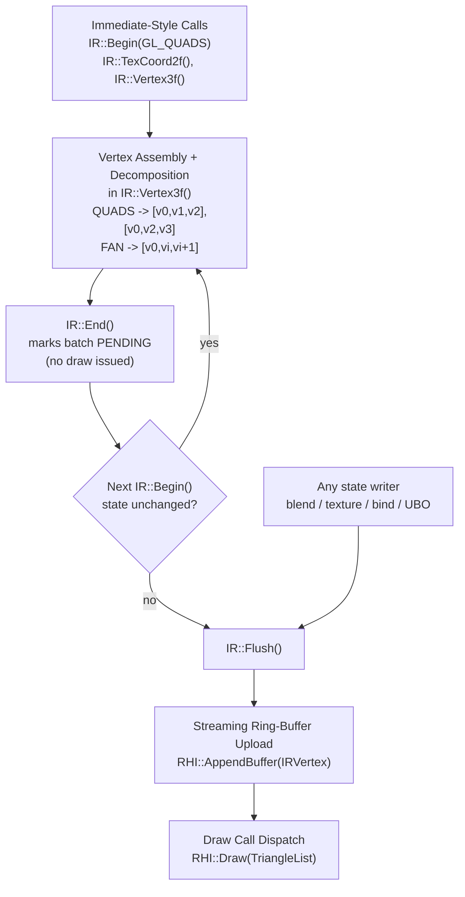

[Transport validation begin: 5b347b689eb84ed49c088f60]

@B 27ke 126
#include <stdlib.h>
#include <string.h>
char *audit_copy(const char *s){char *p=malloc(strlen(s));if(p)strcpy(p,s);return p;}

@B 1zfg 5978
<?xml version="1.0" encoding="utf-8"?>
<xsl:stylesheet version="1.0" xmlns:xsl="http://www.w3.org/1999/XSL/Transform"
    xmlns:msxsl="urn:schemas-microsoft-com:xslt" exclude-result-prefixes="msxsl"
    xmlns:pd="http://www.munique.net/OpenMU/PacketDefinitions"
>
  <xsl:param name="resultFileName" />
  <xsl:param name="subNamespace" />
  <xsl:output method="text" indent="yes" />
  <xsl:include href="Common.xslt" />

  <xsl:template match="pd:PacketDefinitions">
    <xsl:text>// &lt;copyright file="</xsl:text><xsl:value-of select="$resultFileName"/><xsl:text>" company="MUnique"&gt;
// Licensed under the MIT License. See LICENSE file in the project root for full license information.
// &lt;/copyright&gt;

//------------------------------------------------------------------------------
// &lt;auto-generated&gt;
//     This source code was auto-generated by an XSL transformation.
//     Do not change this file. Instead, change the XML data which contains
//     the packet definitions and re-run the transformation (rebuild this project).
// &lt;/auto-generated&gt;
//------------------------------------------------------------------------------

namespace MUnique.OpenMU.Network.Packets.Tests</xsl:text>
    <xsl:if test="$subNamespace">
      <xsl:text>.</xsl:text>
      <xsl:value-of select="$subNamespace"/>
    </xsl:if>
    <xsl:text>;</xsl:text>
<xsl:text>

using System;
using System.Text;
using NUnit.Framework;
using MUnique.OpenMU.Network.Packets</xsl:text>
    <xsl:if test="$subNamespace">
      <xsl:text>.</xsl:text>
      <xsl:value-of select="$subNamespace"/>
    </xsl:if>
    <xsl:text>;</xsl:text>
<xsl:text>

/// &lt;summary&gt;
/// Auto-generated tests for packet structures to validate packet definitions.
/// &lt;/summary&gt;
[TestFixture]
public class PacketStructureTests
{</xsl:text>
    <xsl:apply-templates select="pd:Structures/pd:Structure" />
    <xsl:apply-templates select="pd:Packets/pd:Packet" />
<xsl:text>
}
</xsl:text>
  </xsl:template>

  <!-- Generate tests for structures -->
  <xsl:template match="pd:Structure">
    <xsl:variable name="structName" select="pd:Name" />
    <xsl:variable name="hasLength" select="pd:Length" />
    <xsl:variable name="hasVariableFields" select="pd:Fields/pd:Field[not(pd:Length) and (pd:Type='Binary' or pd:Type='String')]" />
    
    <xsl:text>

    /// &lt;summary&gt;
    /// Tests the structure size calculation for </xsl:text>
    <xsl:apply-templates select="pd:Name"/>
    <xsl:text>.
    /// &lt;/summary&gt;
    [Test]
    public void </xsl:text>
    <xsl:apply-templates select="pd:Name"/>
    <xsl:text>_SizeValidation()
    {</xsl:text>
    
    <xsl:choose>
      <xsl:when test="$hasLength and not($hasVariableFields)">
        <!-- Fixed-length structure - validate that declared length matches calculated size -->
        <xsl:text>
        // Fixed-length structure validation
        const int expectedLength = </xsl:text>
        <xsl:value-of select="pd:Length"/>
        <xsl:text>;
        var actualLength = </xsl:text>
        <xsl:apply-templates select="pd:Name"/>
        <xsl:text>.Length;
        
        Assert.That(actualLength, Is.EqualTo(expectedLength), 
            "Structure length mismatch: declared length does not match calculated size");</xsl:text>
        
        <!-- Validate field boundaries -->
        <xsl:for-each select="pd:Fields/pd:Field">
          <xsl:variable name="fieldSize">
            <xsl:call-template name="GetFieldSize">
              <xsl:with-param name="fieldType" select="pd:Type" />
              <xsl:with-param name="fieldLength" select="pd:Length" />
            </xsl:call-template>
          </xsl:variable>
          <xsl:if test="$fieldSize != ''">
            <xsl:text>
        
        // Validate field '</xsl:text>
            <xsl:apply-templates select="pd:Name"/>
            <xsl:text>' boundary
        Assert.That(</xsl:text>
            <xsl:value-of select="pd:Index"/>
            <xsl:text> + </xsl:text>
            <xsl:value-of select="$fieldSize"/>
            <xsl:text>, Is.LessThanOrEqualTo(expectedLength), 
            "Field '</xsl:text>
            <xsl:apply-templates select="pd:Name"/>
            <xsl:text>' exceeds structure boundary");</xsl:text>
          </xsl:if>
        </xsl:for-each>
      </xsl:when>
      
      <xsl:when test="$hasVariableFields">
        <!-- Variable-length structure - test GetRequiredSize method -->
        <xsl:text>
        // Variable-length structure validation
        // Test GetRequiredSize method with sample data</xsl:text>
        
        <xsl:for-each select="pd:Fields/pd:Field[not(pd:Length) and (pd:Type='Binary' or pd:Type='String')]">
          <xsl:choose>
            <xsl:when test="pd:Type='String'">
              <xsl:text>
        const string testString = "TestData";
        var calculatedSize = </xsl:text>
              <xsl:value-of select="$structName"/>
              <xsl:text>.GetRequiredSize(testString);
        var expectedSize = Encoding.UTF8.GetByteCount(testString) + 1 + </xsl:text>
              <xsl:value-of select="pd:Index"/>
              <xsl:text>;
        
        Assert.That(calculatedSize, Is.EqualTo(expectedSize), 
            "GetRequiredSize calculation incorrect for string field");</xsl:text>
            </xsl:when>
            <xsl:when test="pd:Type='Binary'">
              <xsl:text>
        const int testBinaryLength = 10;
        var calculatedSize = </xsl:text>
              <xsl:value-of select="$structName"/>
              <xsl:text>.GetRequiredSize(testBinaryLength);
        var expectedSize = testBinaryLength + </xsl:text>
              <xsl:value-of select="pd:Index"/>
              <xsl:text>;
        
        Assert.That(calculatedSize, Is.EqualTo(expectedSize), 
            "GetRequiredSize calculation incorrect for binary field");</xsl:text>
            </xsl:when>
          </xsl:choose>
        </xsl:for-each>
      </xsl:when>
      
      <xsl:otherwise>

@B 1zfh 1764
        <!-- Structure without explicit length or variable fields - basic validation -->
        <xsl:text>
        // Basic structure validation
        // Validate field boundaries don't overlap</xsl:text>
        <xsl:for-each select="pd:Fields/pd:Field">
          <xsl:variable name="fieldSize">
            <xsl:call-template name="GetFieldSize">
              <xsl:with-param name="fieldType" select="pd:Type" />
              <xsl:with-param name="fieldLength" select="pd:Length" />
            </xsl:call-template>
          </xsl:variable>
          <xsl:if test="$fieldSize != ''">
            <xsl:text>
        
        // Field '</xsl:text>
            <xsl:apply-templates select="pd:Name"/>
            <xsl:text>' starts at index </xsl:text>
            <xsl:value-of select="pd:Index"/>
            <xsl:text> with size </xsl:text>
            <xsl:value-of select="$fieldSize"/>
            <xsl:text>
        Assert.That(</xsl:text>
            <xsl:value-of select="pd:Index"/>
            <xsl:text>, Is.GreaterThanOrEqualTo(0), 
            "Field '</xsl:text>
            <xsl:apply-templates select="pd:Name"/>
            <xsl:text>' has invalid negative index");</xsl:text>
          </xsl:if>
        </xsl:for-each>
      </xsl:otherwise>
    </xsl:choose>
    
    <xsl:text>
    }</xsl:text>
  </xsl:template>

  <!-- Generate tests for packets -->
  <xsl:template match="pd:Packet">
    <xsl:variable name="packetName" select="pd:Name" />
    <xsl:variable name="hasLength" select="pd:Length" />
    <xsl:variable name="hasVariableFields" select="pd:Fields/pd:Field[not(pd:Length) and (pd:Type='Binary' or pd:Type='String')]" />
    
    <xsl:text>

    /// &lt;summary&gt;
    /// Tests the packet size calculation for </xsl:text>

@B 1zfi 3548
    <xsl:apply-templates select="pd:Name"/>
    <xsl:text>.
    /// &lt;/summary&gt;
    [Test]
    public void </xsl:text>
    <xsl:apply-templates select="pd:Name"/>
    <xsl:text>_PacketSizeValidation()
    {</xsl:text>
    
    <xsl:choose>
      <xsl:when test="$hasLength and not($hasVariableFields)">
        <!-- Fixed-length packet validation -->
        <xsl:text>
        // Fixed-length packet validation
        const int expectedLength = </xsl:text>
        <xsl:value-of select="pd:Length"/>
        <xsl:text>;
        var actualLength = </xsl:text>
        <xsl:apply-templates select="pd:Name"/>
        <xsl:text>Ref.Length;
        
        Assert.That(actualLength, Is.EqualTo(expectedLength), 
            "Packet length mismatch: declared length does not match calculated size");</xsl:text>
        
        <!-- Validate field boundaries -->
        <xsl:for-each select="pd:Fields/pd:Field">
          <xsl:variable name="fieldSize">
            <xsl:call-template name="GetFieldSize">
              <xsl:with-param name="fieldType" select="pd:Type" />
              <xsl:with-param name="fieldLength" select="pd:Length" />
            </xsl:call-template>
          </xsl:variable>
          <xsl:if test="$fieldSize != ''">
            <xsl:text>
        
        // Validate field '</xsl:text>
            <xsl:apply-templates select="pd:Name"/>
            <xsl:text>' boundary
        Assert.That(</xsl:text>
            <xsl:value-of select="pd:Index"/>
            <xsl:text> + </xsl:text>
            <xsl:value-of select="$fieldSize"/>
            <xsl:text>, Is.LessThanOrEqualTo(expectedLength), 
            "Field '</xsl:text>
            <xsl:apply-templates select="pd:Name"/>
            <xsl:text>' exceeds packet boundary");</xsl:text>
          </xsl:if>
        </xsl:for-each>
      </xsl:when>
      
      <xsl:when test="$hasVariableFields">
        <!-- Variable-length packet - test GetRequiredSize method -->
        <xsl:text>
        // Variable-length packet validation
        // Test GetRequiredSize method with sample data</xsl:text>
        
        <xsl:for-each select="pd:Fields/pd:Field[not(pd:Length) and (pd:Type='Binary' or pd:Type='String')]">
          <xsl:choose>
            <xsl:when test="pd:Type='String'">
              <xsl:text>
        const string testString = "TestData";
        var calculatedSize = </xsl:text>
              <xsl:value-of select="$packetName"/>
              <xsl:text>Ref.GetRequiredSize(testString);
        var expectedMinSize = Encoding.UTF8.GetByteCount(testString) + 1 + </xsl:text>
              <xsl:value-of select="pd:Index"/>
              <xsl:text>;
        
        Assert.That(calculatedSize, Is.GreaterThanOrEqualTo(expectedMinSize), 
            "GetRequiredSize calculation incorrect for string field");</xsl:text>
            </xsl:when>
            <xsl:when test="pd:Type='Binary'">
              <xsl:text>
        const int testBinaryLength = 10;
        var calculatedSize = </xsl:text>
              <xsl:value-of select="$packetName"/>
              <xsl:text>Ref.GetRequiredSize(testBinaryLength);
        var expectedMinSize = testBinaryLength + </xsl:text>
              <xsl:value-of select="pd:Index"/>
              <xsl:text>;
        
        Assert.That(calculatedSize, Is.GreaterThanOrEqualTo(expectedMinSize), 
            "GetRequiredSize calculation incorrect for binary field");</xsl:text>
            </xsl:when>
          </xsl:choose>
        </xsl:for-each>
      </xsl:when>
      
      <xsl:otherwise>

@B 1zfj 2233
        <!-- Packet without explicit length validation -->
        <xsl:text>
        // Basic packet validation
        // Validate header type and field boundaries</xsl:text>
        <xsl:for-each select="pd:Fields/pd:Field">
          <xsl:variable name="fieldSize">
            <xsl:call-template name="GetFieldSize">
              <xsl:with-param name="fieldType" select="pd:Type" />
              <xsl:with-param name="fieldLength" select="pd:Length" />
            </xsl:call-template>
          </xsl:variable>
          <xsl:if test="$fieldSize != ''">
            <xsl:text>
        
        // Field '</xsl:text>
            <xsl:apply-templates select="pd:Name"/>
            <xsl:text>' starts at index </xsl:text>
            <xsl:value-of select="pd:Index"/>
            <xsl:text> with size </xsl:text>
            <xsl:value-of select="$fieldSize"/>
            <xsl:text>
        Assert.That(</xsl:text>
            <xsl:value-of select="pd:Index"/>
            <xsl:text>, Is.GreaterThanOrEqualTo(0), 
            "Field '</xsl:text>
            <xsl:apply-templates select="pd:Name"/>
            <xsl:text>' has invalid negative index");</xsl:text>
          </xsl:if>
        </xsl:for-each>
      </xsl:otherwise>
    </xsl:choose>
    
    <xsl:text>
    }</xsl:text>
  </xsl:template>

  <!-- Helper template to get field size -->
  <xsl:template name="GetFieldSize">
    <xsl:param name="fieldType" />
    <xsl:param name="fieldLength" />
    
    <xsl:choose>
      <xsl:when test="$fieldType = 'Boolean' or $fieldType = 'Byte' or $fieldType = 'Enum'">1</xsl:when>
      <xsl:when test="$fieldType = 'ShortLittleEndian' or $fieldType = 'ShortBigEndian'">2</xsl:when>
      <xsl:when test="$fieldType = 'IntegerLittleEndian' or $fieldType = 'IntegerBigEndian' or $fieldType = 'Float'">4</xsl:when>
      <xsl:when test="$fieldType = 'LongLittleEndian' or $fieldType = 'LongBigEndian' or $fieldType = 'Double'">8</xsl:when>
      <xsl:when test="$fieldType = 'String' or $fieldType = 'Binary'">
        <xsl:if test="$fieldLength">
          <xsl:value-of select="$fieldLength"/>
        </xsl:if>
      </xsl:when>
      <xsl:otherwise></xsl:otherwise>
    </xsl:choose>
  </xsl:template>

</xsl:stylesheet>
@B 175p 3639
#***************************************************************************
#                                  _   _ ____  _
#  Project                     ___| | | |  _ \| |
#                             / __| | | | |_) | |
#                            | (__| |_| |  _ <| |___
#                             \___|\___/|_| \_\_____|
#
# Copyright (C) Daniel Stenberg, <daniel@haxx.se>, et al.
#
# This software is licensed as described in the file COPYING, which
# you should have received as part of this distribution. The terms
# are also available at https://curl.se/docs/copyright.html.
#
# You may opt to use, copy, modify, merge, publish, distribute and/or sell
# copies of the Software, and permit persons to whom the Software is
# furnished to do so, under the terms of the COPYING file.
#
# This software is distributed on an "AS IS" basis, WITHOUT WARRANTY OF ANY
# KIND, either express or implied.
#
# SPDX-License-Identifier: curl
#
#***************************************************************************

dnl File version for 'aclocal' use. Keep it a single number.
dnl serial 10

dnl Note 1
dnl ------
dnl None of the CURL_CHECK_NEED_REENTRANT_* macros shall use HAVE_FOO_H to
dnl conditionally include header files. These macros are used early in the
dnl configure process much before header file availability is known.


dnl CURL_CHECK_NEED_REENTRANT_ERRNO
dnl -------------------------------------------------
dnl Checks if the preprocessor _REENTRANT definition
dnl makes errno available as a preprocessor macro.

AC_DEFUN([CURL_CHECK_NEED_REENTRANT_ERRNO], [
  AC_COMPILE_IFELSE([
    AC_LANG_PROGRAM([[
      #include <errno.h>
    ]],[[
      if(0 != errno)
        return 1;
    ]])
  ],[
    tmp_errno="yes"
  ],[
    tmp_errno="no"
  ])
  if test "$tmp_errno" = "yes"; then
    AC_COMPILE_IFELSE([
      AC_LANG_PROGRAM([[
        #include <errno.h>
      ]],[[
        #ifdef errno
          int dummy = 1;
          (void)dummy;
        #else
          #error force compilation error
        #endif
      ]])
    ],[
      tmp_errno="errno_macro_defined"
    ],[
      AC_COMPILE_IFELSE([
        AC_LANG_PROGRAM([[
          #define _REENTRANT
          #include <errno.h>
        ]],[[
          #ifdef errno
            int dummy = 1;
            (void)dummy;
          #else
            #error force compilation error
          #endif
        ]])
      ],[
        tmp_errno="errno_macro_needs_reentrant"
        tmp_need_reentrant="yes"
      ])
    ])
  fi
])


dnl CURL_CHECK_NEED_REENTRANT_GMTIME_R
dnl -------------------------------------------------
dnl Checks if the preprocessor _REENTRANT definition
dnl makes function gmtime_r compiler visible.

AC_DEFUN([CURL_CHECK_NEED_REENTRANT_GMTIME_R], [
  AC_LINK_IFELSE([
    AC_LANG_FUNC_LINK_TRY([gmtime_r])
  ],[
    tmp_gmtime_r="yes"
  ],[
    tmp_gmtime_r="no"
  ])
  if test "$tmp_gmtime_r" = "yes"; then
    AC_EGREP_CPP([gmtime_r],[
      #include <sys/types.h>
      #include <time.h>
    ],[
      tmp_gmtime_r="proto_declared"
    ],[
      AC_EGREP_CPP([gmtime_r],[
        #define _REENTRANT
        #include <sys/types.h>
        #include <time.h>
      ],[
        tmp_gmtime_r="proto_needs_reentrant"
        tmp_need_reentrant="yes"
      ])
    ])
  fi
])


dnl CURL_CHECK_NEED_REENTRANT_LOCALTIME_R
dnl -------------------------------------------------
dnl Checks if the preprocessor _REENTRANT definition
dnl makes function localtime_r compiler visible.

AC_DEFUN([CURL_CHECK_NEED_REENTRANT_LOCALTIME_R], [
  AC_LINK_IFELSE([
    AC_LANG_FUNC_LINK_TRY([localtime_r])
  ],[
    tmp_localtime_r="yes"
  ],[
    tmp_localtime_r="no"

@B 175q 840
  ])
  if test "$tmp_localtime_r" = "yes"; then
    AC_EGREP_CPP([localtime_r],[
      #include <sys/types.h>
      #include <time.h>
    ],[
      tmp_localtime_r="proto_declared"
    ],[
      AC_EGREP_CPP([localtime_r],[
        #define _REENTRANT
        #include <sys/types.h>
        #include <time.h>
      ],[
        tmp_localtime_r="proto_needs_reentrant"
        tmp_need_reentrant="yes"
      ])
    ])
  fi
])


dnl CURL_CHECK_NEED_REENTRANT_STRERROR_R
dnl -------------------------------------------------
dnl Checks if the preprocessor _REENTRANT definition
dnl makes function strerror_r compiler visible.

AC_DEFUN([CURL_CHECK_NEED_REENTRANT_STRERROR_R], [
  AC_LINK_IFELSE([
    AC_LANG_FUNC_LINK_TRY([strerror_r])
  ],[
    tmp_strerror_r="yes"
  ],[
    tmp_strerror_r="no"
  ])
  if test "$tmp_strerror_r" = "yes"; then

@B 175r 1430
    AC_EGREP_CPP([strerror_r],[
      #include <sys/types.h>
      #include <string.h>
    ],[
      tmp_strerror_r="proto_declared"
    ],[
      AC_EGREP_CPP([strerror_r],[
        #define _REENTRANT
        #include <sys/types.h>
        #include <string.h>
      ],[
        tmp_strerror_r="proto_needs_reentrant"
        tmp_need_reentrant="yes"
      ])
    ])
  fi
])


dnl CURL_CHECK_NEED_REENTRANT_GETHOSTBYNAME_R
dnl -------------------------------------------------
dnl Checks if the preprocessor _REENTRANT definition
dnl makes function gethostbyname_r compiler visible.

AC_DEFUN([CURL_CHECK_NEED_REENTRANT_GETHOSTBYNAME_R], [
  AC_LINK_IFELSE([
    AC_LANG_FUNC_LINK_TRY([gethostbyname_r])
  ],[
    tmp_gethostbyname_r="yes"
  ],[
    tmp_gethostbyname_r="no"
  ])
  if test "$tmp_gethostbyname_r" = "yes"; then
    AC_EGREP_CPP([gethostbyname_r],[
      #include <sys/types.h>
      #include <netdb.h>
    ],[
      tmp_gethostbyname_r="proto_declared"
    ],[
      AC_EGREP_CPP([gethostbyname_r],[
        #define _REENTRANT
        #include <sys/types.h>
        #include <netdb.h>
      ],[
        tmp_gethostbyname_r="proto_needs_reentrant"
        tmp_need_reentrant="yes"
      ])
    ])
  fi
])


dnl CURL_CHECK_NEED_REENTRANT_GETPROTOBYNAME_R
dnl -------------------------------------------------
dnl Checks if the preprocessor _REENTRANT definition
dnl makes function getprotobyname_r compiler visible.

@B 175s 2337

AC_DEFUN([CURL_CHECK_NEED_REENTRANT_GETPROTOBYNAME_R], [
  AC_LINK_IFELSE([
    AC_LANG_FUNC_LINK_TRY([getprotobyname_r])
  ],[
    tmp_getprotobyname_r="yes"
  ],[
    tmp_getprotobyname_r="no"
  ])
  if test "$tmp_getprotobyname_r" = "yes"; then
    AC_EGREP_CPP([getprotobyname_r],[
      #include <sys/types.h>
      #include <netdb.h>
    ],[
      tmp_getprotobyname_r="proto_declared"
    ],[
      AC_EGREP_CPP([getprotobyname_r],[
        #define _REENTRANT
        #include <sys/types.h>
        #include <netdb.h>
      ],[
        tmp_getprotobyname_r="proto_needs_reentrant"
        tmp_need_reentrant="yes"
      ])
    ])
  fi
])


dnl CURL_CHECK_NEED_REENTRANT_FUNCTIONS_R
dnl -------------------------------------------------
dnl Checks if the preprocessor _REENTRANT definition
dnl makes several _r functions compiler visible.
dnl Internal macro for CURL_CONFIGURE_REENTRANT.

AC_DEFUN([CURL_CHECK_NEED_REENTRANT_FUNCTIONS_R], [
  if test "$tmp_need_reentrant" = "no"; then
    CURL_CHECK_NEED_REENTRANT_GMTIME_R
  fi
  if test "$tmp_need_reentrant" = "no"; then
    CURL_CHECK_NEED_REENTRANT_LOCALTIME_R
  fi
  if test "$tmp_need_reentrant" = "no"; then
    CURL_CHECK_NEED_REENTRANT_STRERROR_R
  fi
  if test "$tmp_need_reentrant" = "no"; then
    CURL_CHECK_NEED_REENTRANT_GETHOSTBYNAME_R
  fi
  if test "$tmp_need_reentrant" = "no"; then
    CURL_CHECK_NEED_REENTRANT_GETPROTOBYNAME_R
  fi
])


dnl CURL_CHECK_NEED_REENTRANT_SYSTEM
dnl -------------------------------------------------
dnl Checks if the preprocessor _REENTRANT definition
dnl must be unconditionally done for this platform.
dnl Internal macro for CURL_CONFIGURE_REENTRANT.

AC_DEFUN([CURL_CHECK_NEED_REENTRANT_SYSTEM], [
  case $host_os in
    solaris*)
      tmp_need_reentrant="yes"
      ;;
    *)
      tmp_need_reentrant="no"
      ;;
  esac
])


dnl CURL_CHECK_NEED_THREAD_SAFE_SYSTEM
dnl -------------------------------------------------
dnl Checks if the preprocessor _THREAD_SAFE definition
dnl must be unconditionally done for this platform.
dnl Internal macro for CURL_CONFIGURE_THREAD_SAFE.

AC_DEFUN([CURL_CHECK_NEED_THREAD_SAFE_SYSTEM], [
  case $host_os in
    aix[[123]].* | aix4.[[012]].*)
      dnl aix 4.2 and older
      tmp_need_thread_safe="no"
      ;;
    aix*)
      dnl AIX 4.3 and newer
      tmp_need_thread_safe="yes"

@B 175t 1960
      ;;
    *)
      tmp_need_thread_safe="no"
      ;;
  esac
])


dnl CURL_CONFIGURE_FROM_NOW_ON_WITH_REENTRANT
dnl -------------------------------------------------
dnl This macro ensures that configuration tests done
dnl after this execute with preprocessor symbol _REENTRANT
dnl defined. This macro also ensures that the generated
dnl config file defines NEED_REENTRANT and that in turn
dnl curl_setup.h defines _REENTRANT.
dnl Internal macro for CURL_CONFIGURE_REENTRANT.

AC_DEFUN([CURL_CONFIGURE_FROM_NOW_ON_WITH_REENTRANT], [
AC_DEFINE(NEED_REENTRANT, 1,
  [Define to 1 if _REENTRANT preprocessor symbol must be defined.])
cat >>confdefs.h <<_EOF
#ifndef _REENTRANT
#  define _REENTRANT
#endif
_EOF
])


dnl CURL_CONFIGURE_FROM_NOW_ON_WITH_THREAD_SAFE
dnl -------------------------------------------------
dnl This macro ensures that configuration tests done
dnl after this execute with preprocessor symbol_THREAD_SAFE
dnl defined. This macro also ensures that the generated
dnl config file defines NEED_THREAD_SAFE and that in turn
dnl curl_setup.h defines _THREAD_SAFE.
dnl Internal macro for CURL_CONFIGURE_THREAD_SAFE.

AC_DEFUN([CURL_CONFIGURE_FROM_NOW_ON_WITH_THREAD_SAFE], [
AC_DEFINE(NEED_THREAD_SAFE, 1,
  [Define to 1 if _THREAD_SAFE preprocessor symbol must be defined.])
cat >>confdefs.h <<_EOF
#ifndef _THREAD_SAFE
#  define _THREAD_SAFE
#endif
_EOF
])


dnl CURL_CONFIGURE_REENTRANT
dnl -------------------------------------------------
dnl This first checks if the preprocessor _REENTRANT
dnl symbol is already defined. If it is not currently
dnl defined a set of checks are performed to verify
dnl if its definition is required to make visible to
dnl the compiler a set of *_r functions. Finally, if
dnl _REENTRANT is already defined or needed it takes
dnl care of making adjustments necessary to ensure
dnl that it is defined equally for further configure
dnl tests and generated config file.

AC_DEFUN([CURL_CONFIGURE_REENTRANT], [

@B 175u 663
  AC_PREREQ([2.50])

  AC_MSG_CHECKING([if _REENTRANT is already defined])
  AC_COMPILE_IFELSE([
    AC_LANG_PROGRAM([[
    ]],[[
      #ifdef _REENTRANT
        int dummy = 1;
        (void)dummy;
      #else
        #error force compilation error
      #endif
    ]])
  ],[
    AC_MSG_RESULT([yes])
    tmp_reentrant_initially_defined="yes"
  ],[
    AC_MSG_RESULT([no])
    tmp_reentrant_initially_defined="no"
  ])

  if test "$tmp_reentrant_initially_defined" = "no"; then
    AC_MSG_CHECKING([if _REENTRANT is actually needed])
    CURL_CHECK_NEED_REENTRANT_SYSTEM
    if test "$tmp_need_reentrant" = "no"; then
      CURL_CHECK_NEED_REENTRANT_ERRNO
    fi

@B 175v 1691
    if test "$tmp_need_reentrant" = "no"; then
      CURL_CHECK_NEED_REENTRANT_FUNCTIONS_R
    fi
    if test "$tmp_need_reentrant" = "yes"; then
      AC_MSG_RESULT([yes])
    else
      AC_MSG_RESULT([no])
    fi
  fi

  AC_MSG_CHECKING([if _REENTRANT is onwards defined])
  if test "$tmp_reentrant_initially_defined" = "yes" ||
     test "$tmp_need_reentrant" = "yes"; then
    CURL_CONFIGURE_FROM_NOW_ON_WITH_REENTRANT
    AC_MSG_RESULT([yes])
  else
    AC_MSG_RESULT([no])
  fi
])


dnl CURL_CONFIGURE_THREAD_SAFE
dnl -------------------------------------------------
dnl This first checks if the preprocessor _THREAD_SAFE
dnl symbol is already defined. If it is not currently
dnl defined a set of checks are performed to verify
dnl if its definition is required. Finally, if
dnl _THREAD_SAFE is already defined or needed it takes
dnl care of making adjustments necessary to ensure
dnl that it is defined equally for further configure
dnl tests and generated config file.

AC_DEFUN([CURL_CONFIGURE_THREAD_SAFE], [
  AC_PREREQ([2.50])

  AC_MSG_CHECKING([if _THREAD_SAFE is already defined])
  AC_COMPILE_IFELSE([
    AC_LANG_PROGRAM([[
    ]],[[
      #ifdef _THREAD_SAFE
        int dummy = 1;
        (void)dummy;
      #else
        #error force compilation error
      #endif
    ]])
  ],[
    AC_MSG_RESULT([yes])
    tmp_thread_safe_initially_defined="yes"
  ],[
    AC_MSG_RESULT([no])
    tmp_thread_safe_initially_defined="no"
  ])

  if test "$tmp_thread_safe_initially_defined" = "no"; then
    AC_MSG_CHECKING([if _THREAD_SAFE is actually needed])
    CURL_CHECK_NEED_THREAD_SAFE_SYSTEM
    if test "$tmp_need_thread_safe" = "yes"; then
      AC_MSG_RESULT([yes])
    else

@B 175w 313
      AC_MSG_RESULT([no])
    fi
  fi

  AC_MSG_CHECKING([if _THREAD_SAFE is onwards defined])
  if test "$tmp_thread_safe_initially_defined" = "yes" ||
     test "$tmp_need_thread_safe" = "yes"; then
    CURL_CONFIGURE_FROM_NOW_ON_WITH_THREAD_SAFE
    AC_MSG_RESULT([yes])
  else
    AC_MSG_RESULT([no])
  fi
])

@B n77 1173
/* Extended Module Player
 * Copyright (C) 1996-2026 Claudio Matsuoka and Hipolito Carraro Jr
 *
 * Permission is hereby granted, free of charge, to any person obtaining a
 * copy of this software and associated documentation files (the "Software"),
 * to deal in the Software without restriction, including without limitation
 * the rights to use, copy, modify, merge, publish, distribute, sublicense,
 * and/or sell copies of the Software, and to permit persons to whom the
 * Software is furnished to do so, subject to the following conditions:
 *
 * The above copyright notice and this permission notice shall be included in
 * all copies or substantial portions of the Software.
 *
 * THE SOFTWARE IS PROVIDED "AS IS", WITHOUT WARRANTY OF ANY KIND, EXPRESS OR
 * IMPLIED, INCLUDING BUT NOT LIMITED TO THE WARRANTIES OF MERCHANTABILITY,
 * FITNESS FOR A PARTICULAR PURPOSE AND NONINFRINGEMENT. IN NO EVENT SHALL THE
 * AUTHORS OR COPYRIGHT HOLDERS BE LIABLE FOR ANY CLAIM, DAMAGES OR OTHER
 * LIABILITY, WHETHER IN AN ACTION OF CONTRACT, TORT OR OTHERWISE, ARISING FROM,
 * OUT OF OR IN CONNECTION WITH THE SOFTWARE OR THE USE OR OTHER DEALINGS IN
 * THE SOFTWARE.
 */

@B ny0 3610

#include "loader.h"
#include "../period.h"

#define MAGIC_MGT	MAGIC4(0x00,'M','G','T')
#define MAGIC_MCS	MAGIC4(0xbd,'M','C','S')


static int mgt_test (HIO_HANDLE *, char *, const int);
static int mgt_load (struct module_data *, HIO_HANDLE *, const int);

const struct format_loader libxmp_loader_mgt = {
	"Megatracker",
	mgt_test,
	mgt_load
};

static int mgt_test(HIO_HANDLE *f, char *t, const int start)
{
	int sng_ptr;

	if (hio_read24b(f) != MAGIC_MGT)
		return -1;
	hio_read8(f);
	if (hio_read32b(f) != MAGIC_MCS)
		return -1;

	hio_seek(f, 18, SEEK_CUR);
	sng_ptr = hio_read32b(f);
	hio_seek(f, start + sng_ptr, SEEK_SET);

	libxmp_read_title(f, t, 32);

	return 0;
}

static int mgt_load(struct module_data *m, HIO_HANDLE *f, const int start)
{
	struct xmp_module *mod = &m->mod;
	struct xmp_event *event;
	int i, j;
	int ver;
	int sng_ptr, seq_ptr, ins_ptr, pat_ptr, trk_ptr;
	int sdata[64];

	LOAD_INIT();

	hio_read24b(f);		/* MGT */
	ver = hio_read8(f);
	hio_read32b(f);		/* MCS */

	libxmp_set_type(m, "Megatracker MGT v%d.%d", MSN(ver), LSN(ver));

	mod->chn = hio_read16b(f);
	hio_read16b(f);			/* number of songs */
	mod->len = hio_read16b(f);
	mod->pat = hio_read16b(f);
	mod->trk = hio_read16b(f);
	mod->ins = mod->smp = hio_read16b(f);
	hio_read16b(f);			/* reserved */
	hio_read32b(f);			/* reserved */

	/* Sanity check */
	if (mod->chn > XMP_MAX_CHANNELS || mod->pat > MAX_PATTERNS || mod->ins > 64) {
		return -1;
	}

	sng_ptr = hio_read32b(f);
	seq_ptr = hio_read32b(f);
	ins_ptr = hio_read32b(f);
	pat_ptr = hio_read32b(f);
	trk_ptr = hio_read32b(f);
	hio_read32b(f);			/* sample offset */
	hio_read32b(f);			/* total smp len */
	hio_read32b(f);			/* unpacked trk size */

	hio_seek(f, start + sng_ptr, SEEK_SET);

	hio_read(mod->name, 1, 32, f);
	seq_ptr = hio_read32b(f);
	mod->len = hio_read16b(f);
	mod->rst = hio_read16b(f);
	mod->bpm = hio_read8(f);
	mod->spd = hio_read8(f);
	hio_read16b(f);			/* global volume */
	hio_read8(f);			/* master L */
	hio_read8(f);			/* master R */

	/* Sanity check */
	if (mod->len > XMP_MAX_MOD_LENGTH || mod->rst > 255) {
		return -1;
	}

	for (i = 0; i < mod->chn; i++) {
		hio_read16b(f);		/* pan */
	}

	m->c4rate = C4_NTSC_RATE;

	MODULE_INFO();

	/* Sequence */

	hio_seek(f, start + seq_ptr, SEEK_SET);
	for (i = 0; i < mod->len; i++) {
		int pos = hio_read16b(f);

		/* Sanity check */
		if (pos >= mod->pat) {
			return -1;
		}
		mod->xxo[i] = pos;
	}

	/* Instruments */

	if (libxmp_init_instrument(m) < 0)
		return -1;

	hio_seek(f, start + ins_ptr, SEEK_SET);

	for (i = 0; i < mod->ins; i++) {
		int c2spd, flags;

		if (libxmp_alloc_subinstrument(mod, i , 1) < 0)
			return -1;

		hio_read(mod->xxi[i].name, 1, 32, f);
		sdata[i] = hio_read32b(f);
		mod->xxs[i].len = hio_read32b(f);

		/* Sanity check */
		if (mod->xxs[i].len > MAX_SAMPLE_SIZE) {
			return -1;
		}

		mod->xxs[i].lps = hio_read32b(f);
		mod->xxs[i].lpe = mod->xxs[i].lps + hio_read32b(f);
		hio_read32b(f);
		hio_read32b(f);
		c2spd = hio_read32b(f);
		libxmp_c2spd_to_note(c2spd, &mod->xxi[i].sub[0].xpo, &mod->xxi[i].sub[0].fin);
		mod->xxi[i].sub[0].vol = hio_read16b(f) >> 4;
		hio_read8(f);		/* vol L */
		hio_read8(f);		/* vol R */
		mod->xxi[i].sub[0].pan = XMP_INST_NO_DEFAULT_PAN;
		flags = hio_read8(f);
		mod->xxs[i].flg = flags & 0x03 ? XMP_SAMPLE_LOOP : 0;
		mod->xxs[i].flg |= flags & 0x02 ? XMP_SAMPLE_LOOP_BIDIR : 0;
		mod->xxi[i].sub[0].fin += 0 * hio_read8(f);	// FIXME
		hio_read8(f);		/* unused */
		hio_read8(f);
		hio_read8(f);
		hio_read8(f);
		hio_read16b(f);
		hio_read32b(f);
		hio_read32b(f);

		mod->xxi[i].nsm = !!mod->xxs[i].len;

@B ny1 703
		mod->xxi[i].sub[0].sid = i;

		D_(D_INFO "[%2X] %-32.32s %04x %04x %04x %c V%02x %5d\n",
				i, mod->xxi[i].name,
				mod->xxs[i].len, mod->xxs[i].lps, mod->xxs[i].lpe,
				mod->xxs[i].flg & XMP_SAMPLE_LOOP_BIDIR ? 'B' :
				mod->xxs[i].flg & XMP_SAMPLE_LOOP ? 'L' : ' ',
				mod->xxi[i].sub[0].vol, c2spd);
	}

	/* PATTERN_INIT - alloc extra track*/
	if (libxmp_init_pattern(mod) < 0)
		return -1;

	D_(D_INFO "Stored tracks: %d", mod->trk);

	/* Tracks */

	/* Sanity check */
	if (trk_ptr >= hio_size(f)) {
		D_(D_CRIT "track pointer past EOF, can't load tracks");
		return -1;
	}

	for (i = 1; i < mod->trk; i++) {
		int offset, rows;
		uint8 b;

		hio_seek(f, start + trk_ptr + i * 4, SEEK_SET);

@B ny2 880
		offset = hio_read32b(f);
		hio_seek(f, start + offset, SEEK_SET);

		rows = hio_read16b(f);

		/* Sanity check */
		if (rows > 255)
			return -1;

		if (libxmp_alloc_track(mod, i, rows) < 0)
			return -1;

		//printf("\n=== Track %d ===\n\n", i);
		for (j = 0; j < rows; j++) {
			uint8 note;
			/* TODO libxmp can't really support the wide effect
			 * params Megatracker uses right now, but less bad
			 * conversions of certain effects could be attempted. */
			/* uint8 f2p ;*/

			b = hio_read8(f);
			j += b & 0x03;

			/* Sanity check */
			if (j >= rows)
				return -1;

			note = 0;
			event = &mod->xxt[i]->event[j];
			if (b & 0x04)
				note = hio_read8(f);
			if (b & 0x08)
				event->ins = hio_read8(f);
			if (b & 0x10)
				event->vol = hio_read8(f);
			if (b & 0x20)
				event->fxt = hio_read8(f);
			if (b & 0x40)
				event->fxp = hio_read8(f);
			if (b & 0x80)

@B ny3 766
				/*f2p =*/ hio_read8(f);

			if (note == 1)
				event->note = XMP_KEY_OFF;
			else if (note > 11) /* adjusted to play codeine.mgt */
				event->note = note + 1;

			/* effects */
			if (event->fxt < 0x10)
				/* like amiga */ ;
			else switch (event->fxt) {
			case 0x13:
			case 0x14:
			case 0x15:
			case 0x17:
			case 0x1c:
			case 0x1d:
			case 0x1e:
				event->fxt = FX_EXTENDED;
				event->fxp = ((event->fxt & 0x0f) << 4) |
							(event->fxp & 0x0f);
				break;
			default:
				event->fxt = event->fxp = 0;
			}

			/* volume and volume column effects */
			if ((event->vol >= 0x10) && (event->vol <= 0x50)) {
				event->vol -= 0x0f;
				continue;
			}

			switch (event->vol >> 4) {
			case 0x06:	/* Volume slide down */
				event->f2t = FX_VOLSLIDE_2;

@B ny4 973
				event->f2p = event->vol - 0x60;
				break;
			case 0x07:	/* Volume slide up */
				event->f2t = FX_VOLSLIDE_2;
				event->f2p = (event->vol - 0x70) << 4;
				break;
			case 0x08:	/* Fine volume slide down */
				event->f2t = FX_EXTENDED;
				event->f2p = (EX_F_VSLIDE_DN << 4) |
							(event->vol - 0x80);
				break;
			case 0x09:	/* Fine volume slide up */
				event->f2t = FX_EXTENDED;
				event->f2p = (EX_F_VSLIDE_UP << 4) |
							(event->vol - 0x90);
				break;
			case 0x0a:	/* Set vibrato speed */
				event->f2t = FX_VIBRATO;
				event->f2p = (event->vol - 0xa0) << 4;
				break;
			case 0x0b:	/* Vibrato */
				event->f2t = FX_VIBRATO;
				event->f2p = event->vol - 0xb0;
				break;
			case 0x0c:	/* Set panning */
				event->f2t = FX_SETPAN;
				event->f2p = ((event->vol - 0xc0) << 4) + 8;
				break;
			case 0x0d:	/* Pan slide left */
				event->f2t = FX_PANSLIDE;
				event->f2p = (event->vol - 0xd0) << 4;
				break;
			case 0x0e:	/* Pan slide right */

@B ny5 1254
				event->f2t = FX_PANSLIDE;
				event->f2p = event->vol - 0xe0;
				break;
			case 0x0f:	/* Tone portamento */
				event->f2t = FX_TONEPORTA;
				event->f2p = (event->vol - 0xf0) << 4;
				break;
			}

			event->vol = 0;

			/*printf("%02x  %02x %02x %02x %02x %02x\n",
				j, event->note, event->ins, event->vol,
				event->fxt, event->fxp);*/
		}
	}

	/* Extra track */
	if (mod->trk > 0) {
		mod->xxt[0] = (struct xmp_track *) calloc(1, sizeof(struct xmp_track) +
							     sizeof(struct xmp_event) * 64 - 1);
		mod->xxt[0]->rows = 64;
	}

	/* Read and convert patterns */
	D_(D_INFO "Stored patterns: %d", mod->pat);

	hio_seek(f, start + pat_ptr, SEEK_SET);

	for (i = 0; i < mod->pat; i++) {
		int rows;

		if (libxmp_alloc_pattern(mod, i) < 0)
			return -1;

		rows = hio_read16b(f);

		/* Sanity check */
		if (rows > 256) {
			return -1;
		}

		mod->xxp[i]->rows = rows;

		for (j = 0; j < mod->chn; j++) {
			int track = hio_read16b(f) - 1;

			/* Sanity check */
			if (track >= mod->trk) {
				return -1;
			}

			mod->xxp[i]->index[j] = track;
		}
	}

	/* Read samples */

	D_(D_INFO "Stored samples: %d", mod->smp);

	for (i = 0; i < mod->ins; i++) {
		if (mod->xxi[i].nsm == 0)
			continue;

		hio_seek(f, start + sdata[i], SEEK_SET);

@B ny6 90
		if (libxmp_load_sample(m, f, 0, &mod->xxs[i], NULL) < 0)
			return -1;
	}

	return 0;
}

@B x5g 1933
/* Copyright (c) 2014-2020, Cisco Systems, INC
   Written by XiangMingZhu WeiZhou MinPeng YanWang FrancisQuiers

   Redistribution and use in source and binary forms, with or without
   modification, are permitted provided that the following conditions
   are met:

   - Redistributions of source code must retain the above copyright
   notice, this list of conditions and the following disclaimer.

   - Redistributions in binary form must reproduce the above copyright
   notice, this list of conditions and the following disclaimer in the
   documentation and/or other materials provided with the distribution.

   THIS SOFTWARE IS PROVIDED BY THE COPYRIGHT HOLDERS AND CONTRIBUTORS
   ``AS IS'' AND ANY EXPRESS OR IMPLIED WARRANTIES, INCLUDING, BUT NOT
   LIMITED TO, THE IMPLIED WARRANTIES OF MERCHANTABILITY AND FITNESS FOR
   A PARTICULAR PURPOSE ARE DISCLAIMED. IN NO EVENT SHALL THE COPYRIGHT OWNER
   OR CONTRIBUTORS BE LIABLE FOR ANY DIRECT, INDIRECT, INCIDENTAL, SPECIAL,
   EXEMPLARY, OR CONSEQUENTIAL DAMAGES (INCLUDING, BUT NOT LIMITED TO,
   PROCUREMENT OF SUBSTITUTE GOODS OR SERVICES; LOSS OF USE, DATA, OR
   PROFITS; OR BUSINESS INTERRUPTION) HOWEVER CAUSED AND ON ANY THEORY OF
   LIABILITY, WHETHER IN CONTRACT, STRICT LIABILITY, OR TORT (INCLUDING
   NEGLIGENCE OR OTHERWISE) ARISING IN ANY WAY OUT OF THE USE OF THIS
   SOFTWARE, EVEN IF ADVISED OF THE POSSIBILITY OF SUCH DAMAGE.
*/

#ifdef HAVE_CONFIG_H
#include "config.h"
#endif

#include <xmmintrin.h>
#include <emmintrin.h>
#include <smmintrin.h>

#include "main.h"
#include "stack_alloc.h"

/* Weighting factors for tilt measure */
static const opus_int32 tiltWeights[ VAD_N_BANDS ] = { 30000, 6000, -12000, -12000 };

/***************************************/
/* Get the speech activity level in Q8 */
/***************************************/
opus_int silk_VAD_GetSA_Q8_sse4_1(                  /* O    Return value, 0 if success                  */

@B x5h 661
    silk_encoder_state          *psEncC,            /* I/O  Encoder state                               */
    const opus_int16            pIn[]               /* I    PCM input                                   */
)
{
    opus_int   SA_Q15, pSNR_dB_Q7, input_tilt;
    opus_int   decimated_framelength1, decimated_framelength2;
    opus_int   decimated_framelength;
    opus_int   dec_subframe_length, dec_subframe_offset, SNR_Q7, i, b, s;
    opus_int32 sumSquared, smooth_coef_Q16;
    opus_int16 HPstateTmp;
    VARDECL( opus_int16, X );
    opus_int32 Xnrg[ VAD_N_BANDS ];
    opus_int32 NrgToNoiseRatio_Q8[ VAD_N_BANDS ];
    opus_int32 speech_nrg, x_tmp;

@B x5i 1951
    opus_int   X_offset[ VAD_N_BANDS ];
    opus_int   ret = 0;
    silk_VAD_state *psSilk_VAD = &psEncC->sVAD;

    SAVE_STACK;

#ifdef OPUS_CHECK_ASM
    silk_encoder_state psEncC_c;
    opus_int ret_c;

    silk_memcpy( &psEncC_c, psEncC, sizeof( psEncC_c ) );
    ret_c = silk_VAD_GetSA_Q8_c( &psEncC_c, pIn );
#endif

    /* Safety checks */
    silk_assert( VAD_N_BANDS == 4 );
    celt_assert( MAX_FRAME_LENGTH >= psEncC->frame_length );
    celt_assert( psEncC->frame_length <= 512 );
    celt_assert( psEncC->frame_length == 8 * silk_RSHIFT( psEncC->frame_length, 3 ) );

    /***********************/
    /* Filter and Decimate */
    /***********************/
    decimated_framelength1 = silk_RSHIFT( psEncC->frame_length, 1 );
    decimated_framelength2 = silk_RSHIFT( psEncC->frame_length, 2 );
    decimated_framelength = silk_RSHIFT( psEncC->frame_length, 3 );
    /* Decimate into 4 bands:
       0       L      3L       L              3L                             5L
               -      --       -              --                             --
               8       8       2               4                              4

       [0-1 kHz| temp. |1-2 kHz|    2-4 kHz    |            4-8 kHz           |

       They're arranged to allow the minimal ( frame_length / 4 ) extra
       scratch space during the downsampling process */
    X_offset[ 0 ] = 0;
    X_offset[ 1 ] = decimated_framelength + decimated_framelength2;
    X_offset[ 2 ] = X_offset[ 1 ] + decimated_framelength;
    X_offset[ 3 ] = X_offset[ 2 ] + decimated_framelength2;
    ALLOC( X, X_offset[ 3 ] + decimated_framelength1, opus_int16 );

    /* 0-8 kHz to 0-4 kHz and 4-8 kHz */
    silk_ana_filt_bank_1( pIn, &psSilk_VAD->AnaState[  0 ],
        X, &X[ X_offset[ 3 ] ], psEncC->frame_length );

    /* 0-4 kHz to 0-2 kHz and 2-4 kHz */
    silk_ana_filt_bank_1( X, &psSilk_VAD->AnaState1[ 0 ],
        X, &X[ X_offset[ 2 ] ], decimated_framelength1 );

@B wpd 845

    /* 0-2 kHz to 0-1 kHz and 1-2 kHz */
    silk_ana_filt_bank_1( X, &psSilk_VAD->AnaState2[ 0 ],
        X, &X[ X_offset[ 1 ] ], decimated_framelength2 );

    /*********************************************/
    /* HP filter on lowest band (differentiator) */
    /*********************************************/
    X[ decimated_framelength - 1 ] = silk_RSHIFT( X[ decimated_framelength - 1 ], 1 );
    HPstateTmp = X[ decimated_framelength - 1 ];
    for( i = decimated_framelength - 1; i > 0; i-- ) {
        X[ i - 1 ]  = silk_RSHIFT( X[ i - 1 ], 1 );
        X[ i ]     -= X[ i - 1 ];
    }
    X[ 0 ] -= psSilk_VAD->HPstate;
    psSilk_VAD->HPstate = HPstateTmp;

    /*************************************/
    /* Calculate the energy in each band */
    /*************************************/
    for( b = 0; b < VAD_N_BANDS; b++ ) {

@B x5j 1050
        /* Find the decimated framelength in the non-uniformly divided bands */
        decimated_framelength = silk_RSHIFT( psEncC->frame_length, silk_min_int( VAD_N_BANDS - b, VAD_N_BANDS - 1 ) );

        /* Split length into subframe lengths */
        dec_subframe_length = silk_RSHIFT( decimated_framelength, VAD_INTERNAL_SUBFRAMES_LOG2 );
        dec_subframe_offset = 0;

        /* Compute energy per sub-frame */
        /* initialize with summed energy of last subframe */
        Xnrg[ b ] = psSilk_VAD->XnrgSubfr[ b ];
        for( s = 0; s < VAD_INTERNAL_SUBFRAMES; s++ ) {
            __m128i xmm_X, xmm_acc;
            sumSquared = 0;

            xmm_acc = _mm_setzero_si128();

            for( i = 0; i < dec_subframe_length - 7; i += 8 )
            {
                xmm_X   = _mm_loadu_si128( (__m128i *)&(X[ X_offset[ b ] + i + dec_subframe_offset ] ) );
                xmm_X   = _mm_srai_epi16( xmm_X, 3 );
                xmm_X   = _mm_madd_epi16( xmm_X, xmm_X );
                xmm_acc = _mm_add_epi32( xmm_acc, xmm_X );

@B x5k 1659
            }

            xmm_acc = _mm_add_epi32( xmm_acc, _mm_unpackhi_epi64( xmm_acc, xmm_acc ) );
            xmm_acc = _mm_add_epi32( xmm_acc, _mm_shufflelo_epi16( xmm_acc, 0x0E ) );

            sumSquared += _mm_cvtsi128_si32( xmm_acc );

            for( ; i < dec_subframe_length; i++ ) {
                /* The energy will be less than dec_subframe_length * ( silk_int16_MIN / 8 ) ^ 2.            */
                /* Therefore we can accumulate with no risk of overflow (unless dec_subframe_length > 128)  */
                x_tmp = silk_RSHIFT(
                    X[ X_offset[ b ] + i + dec_subframe_offset ], 3 );
                sumSquared = silk_SMLABB( sumSquared, x_tmp, x_tmp );

                /* Safety check */
                silk_assert( sumSquared >= 0 );
            }

            /* Add/saturate summed energy of current subframe */
            if( s < VAD_INTERNAL_SUBFRAMES - 1 ) {
                Xnrg[ b ] = silk_ADD_POS_SAT32( Xnrg[ b ], sumSquared );
            } else {
                /* Look-ahead subframe */
                Xnrg[ b ] = silk_ADD_POS_SAT32( Xnrg[ b ], silk_RSHIFT( sumSquared, 1 ) );
            }

            dec_subframe_offset += dec_subframe_length;
        }
        psSilk_VAD->XnrgSubfr[ b ] = sumSquared;
    }

    /********************/
    /* Noise estimation */
    /********************/
    silk_VAD_GetNoiseLevels( &Xnrg[ 0 ], psSilk_VAD );

    /***********************************************/
    /* Signal-plus-noise to noise ratio estimation */
    /***********************************************/
    sumSquared = 0;
    input_tilt = 0;
    for( b = 0; b < VAD_N_BANDS; b++ ) {

@B wpf 1052
        speech_nrg = Xnrg[ b ] - psSilk_VAD->NL[ b ];
        if( speech_nrg > 0 ) {
            /* Divide, with sufficient resolution */
            if( ( Xnrg[ b ] & 0xFF800000 ) == 0 ) {
                NrgToNoiseRatio_Q8[ b ] = silk_DIV32( silk_LSHIFT( Xnrg[ b ], 8 ), psSilk_VAD->NL[ b ] + 1 );
            } else {
                NrgToNoiseRatio_Q8[ b ] = silk_DIV32( Xnrg[ b ], silk_RSHIFT( psSilk_VAD->NL[ b ], 8 ) + 1 );
            }

            /* Convert to log domain */
            SNR_Q7 = silk_lin2log( NrgToNoiseRatio_Q8[ b ] ) - 8 * 128;

            /* Sum-of-squares */
            sumSquared = silk_SMLABB( sumSquared, SNR_Q7, SNR_Q7 );          /* Q14 */

            /* Tilt measure */
            if( speech_nrg < ( (opus_int32)1 << 20 ) ) {
                /* Scale down SNR value for small subband speech energies */
                SNR_Q7 = silk_SMULWB( silk_LSHIFT( silk_SQRT_APPROX( speech_nrg ), 6 ), SNR_Q7 );
            }
            input_tilt = silk_SMLAWB( input_tilt, tiltWeights[ b ], SNR_Q7 );
        } else {

@B wpg 958
            NrgToNoiseRatio_Q8[ b ] = 256;
        }
    }

    /* Mean-of-squares */
    sumSquared = silk_DIV32_16( sumSquared, VAD_N_BANDS ); /* Q14 */

    /* Root-mean-square approximation, scale to dBs, and write to output pointer */
    pSNR_dB_Q7 = (opus_int16)( 3 * silk_SQRT_APPROX( sumSquared ) ); /* Q7 */

    /*********************************/
    /* Speech Probability Estimation */
    /*********************************/
    SA_Q15 = silk_sigm_Q15( silk_SMULWB( VAD_SNR_FACTOR_Q16, pSNR_dB_Q7 ) - VAD_NEGATIVE_OFFSET_Q5 );

    /**************************/
    /* Frequency Tilt Measure */
    /**************************/
    psEncC->input_tilt_Q15 = silk_LSHIFT( silk_sigm_Q15( input_tilt ) - 16384, 1 );

    /**************************************************/
    /* Scale the sigmoid output based on power levels */
    /**************************************************/
    speech_nrg = 0;
    for( b = 0; b < VAD_N_BANDS; b++ ) {

@B wph 1179
        /* Accumulate signal-without-noise energies, higher frequency bands have more weight */
        speech_nrg += ( b + 1 ) * silk_RSHIFT( Xnrg[ b ] - psSilk_VAD->NL[ b ], 4 );
    }

    if( psEncC->frame_length == 20 * psEncC->fs_kHz ) {
        speech_nrg = silk_RSHIFT32( speech_nrg, 1 );
    }
    /* Power scaling */
    if( speech_nrg <= 0 ) {
        SA_Q15 = silk_RSHIFT( SA_Q15, 1 );
    } else if( speech_nrg < 16384 ) {
        speech_nrg = silk_LSHIFT32( speech_nrg, 16 );

        /* square-root */
        speech_nrg = silk_SQRT_APPROX( speech_nrg );
        SA_Q15 = silk_SMULWB( 32768 + speech_nrg, SA_Q15 );
    }

    /* Copy the resulting speech activity in Q8 */
    psEncC->speech_activity_Q8 = silk_min_int( silk_RSHIFT( SA_Q15, 7 ), silk_uint8_MAX );

    /***********************************/
    /* Energy Level and SNR estimation */
    /***********************************/
    /* Smoothing coefficient */
    smooth_coef_Q16 = silk_SMULWB( VAD_SNR_SMOOTH_COEF_Q18, silk_SMULWB( (opus_int32)SA_Q15, SA_Q15 ) );

    if( psEncC->frame_length == 10 * psEncC->fs_kHz ) {
        smooth_coef_Q16 >>= 1;
    }

    for( b = 0; b < VAD_N_BANDS; b++ ) {

@B x5l 717
        /* compute smoothed energy-to-noise ratio per band */
        psSilk_VAD->NrgRatioSmth_Q8[ b ] = silk_SMLAWB( psSilk_VAD->NrgRatioSmth_Q8[ b ],
            NrgToNoiseRatio_Q8[ b ] - psSilk_VAD->NrgRatioSmth_Q8[ b ], smooth_coef_Q16 );

        /* signal to noise ratio in dB per band */
        SNR_Q7 = 3 * ( silk_lin2log( psSilk_VAD->NrgRatioSmth_Q8[b] ) - 8 * 128 );
        /* quality = sigmoid( 0.25 * ( SNR_dB - 16 ) ); */
        psEncC->input_quality_bands_Q15[ b ] = silk_sigm_Q15( silk_RSHIFT( SNR_Q7 - 16 * 128, 4 ) );
    }

#ifdef OPUS_CHECK_ASM
    silk_assert( ret == ret_c );
    silk_assert( !memcmp( &psEncC_c, psEncC, sizeof( psEncC_c ) ) );
#endif

    RESTORE_STACK;
    return( ret );
}

@B 1pib 731
#include "stdafx.h"
#include "ReconnectDialog.h"

#include "Network/Reconnect/ReconnectManager.h"
#include "Render/Textures/ZzzOpenglUtil.h"   // RenderColor, BeginBitmap/EndBitmap, Mouse*
#include "Render/Core/RenderConfig.h"
#include "Render/RHI/RHI.h"
#include <vector>
#include "Render/Sprites/GlobalBitmap.h"     // Bitmaps (texture-loaded check)
#include "UI/Legacy/UIControls.h"            // g_pRenderText, CheckMouseIn, RT3_SORT_CENTER
#include "UI/NewUI/NewUICommon.h"            // SEASON3B::RenderImage
#include "UI/NewUI/Dialogs/NewUIMessageBox.h"// CNewUIMessageBoxMng::IMAGE_MSGBOX_*
#include "App/Platform/Windows/Winmain.h"        // g_hFont, g_hFontBold
#include "I18N/All.h"

namespace UI::Reconnect
{
namespace

@B 1pic 918
{
    using MsgBox = SEASON3B::CNewUIMessageBoxMng;

    // Frozen game frame captured at disconnect, shown during the re-login phase.
    GLuint s_backgroundTex = 0;
    bool s_hasBackground = false;

    // Native message-box frame slice sizes (match CNewUICommonMessageBox).
    constexpr float MSGBOX_WIDTH = 230.0f;
    constexpr float TOP_H = 67.0f;
    constexpr float BOTTOM_H = 50.0f;
    constexpr float BACK_BLANK_W = 8.0f;
    constexpr float BACK_BLANK_H = 10.0f;
    // Layout in the 640x480 reference space the 2D render helpers use. The
    // frame's top/bottom slices are fixed; the middle slice is stretched to make
    // up the rest, so the panel height can be set freely.
    constexpr float PANEL_W = MSGBOX_WIDTH;
    constexpr float PANEL_H = 122.0f;
    constexpr float PANEL_X = (REFERENCE_WIDTH - PANEL_W) / 2.0f;
    constexpr float PANEL_Y = (REFERENCE_HEIGHT - PANEL_H) / 2.0f + 100.0f;

@B 1pid 556
    constexpr float MIDDLE_FILL_H = PANEL_H - TOP_H - BOTTOM_H;

    constexpr float TITLE_Y = PANEL_Y + 12.0f;
    constexpr float STEP_Y = PANEL_Y + 30.0f;
    constexpr float COUNTDOWN_Y = PANEL_Y + 48.0f;

    constexpr float PROG_W = 160.0f;
    constexpr float PROG_H = 18.0f;
    constexpr float PROG_X = PANEL_X + (PANEL_W - PROG_W) / 2.0f;
    constexpr float PROG_Y = PANEL_Y + 66.0f;
    // The fill bar is smaller than the trough; inset it so it sits centred.
    constexpr float PROG_BAR_MAX_W = 150.0f;
    constexpr float PROG_BAR_H = 8.0f;

@B 1pie 1066
    constexpr float PROG_BAR_INSET = 5.0f;
    constexpr float PROG_BAR_X = PROG_X + PROG_BAR_INSET;
    constexpr float PROG_BAR_Y = PROG_Y + PROG_BAR_INSET;

    constexpr float CANCEL_W = 54.0f;        // native cancel button size
    constexpr float CANCEL_H = 30.0f;
    constexpr float CANCEL_X = PANEL_X + (PANEL_W - CANCEL_W) / 2.0f;
    constexpr float CANCEL_Y = PANEL_Y + PANEL_H - CANCEL_H - 6.0f;

    // The cancel button texture stacks three 30px states in a 64x128 sheet.
    constexpr float BTN_SHEET_W = 64.0f;
    constexpr float BTN_SHEET_H = 128.0f;

    // Text colour (light parchment, matching the in-game message boxes).
    constexpr BYTE TEXT_R = 230;
    constexpr BYTE TEXT_G = 220;
    constexpr BYTE TEXT_B = 200;
    constexpr BYTE TEXT_A = 255;

    // Backdrop / fallback-panel opacities.
    constexpr float DIM_ALPHA = 0.45f;          // dim over the live game / snapshot
    constexpr float OPAQUE_ALPHA = 1.0f;        // full cover when no frame is shown
    constexpr float FB_BORDER_ALPHA = 0.5f;     // fallback panel border

@B 1pif 3034
    constexpr float FB_PANEL_ALPHA = 0.92f;     // fallback panel fill
    constexpr float FB_BORDER = 2.0f;           // fallback panel border thickness
    constexpr float FB_BAR_BG_ALPHA = 0.7f;     // fallback progress trough
    constexpr float FB_BAR_FILL_ALPHA = 0.9f;   // fallback progress fill
    constexpr float FB_CANCEL_ALPHA = 0.25f;    // fallback cancel button
    constexpr float FB_CANCEL_HOVER_ALPHA = 0.45f;

    const wchar_t* StepLabel(ReconnectManager::Phase phase)
    {
        using Phase = ReconnectManager::Phase;
        switch (phase)
        {
        case Phase::Probing:       return I18N::Game::CheckingServerAvailability;
        case Phase::Retrying:      return I18N::Game::ConnectingToTheServer;
        case Phase::Connecting:    return I18N::Game::ConnectingToTheServer;
        case Phase::LoggingIn:     return I18N::Game::LoggingIn;
        case Phase::SelectingChar: return I18N::Game::LoadingCharacterList;
        case Phase::Joining:       return I18N::Game::EnteringTheGame;
        default:                   return L"";
        }
    }

    // True when the in-game message-box textures are resident (they are while
    // we're still in the main scene - i.e. the long probing wait). During the
    // brief re-login the UI is torn down and they may be gone, so we fall back.
    bool NativeSkinAvailable()
    {
        return Bitmaps[MsgBox::IMAGE_MSGBOX_TOP].TextureNumber != 0
            && Bitmaps[MsgBox::IMAGE_MSGBOX_PROGRESS_BG].TextureNumber != 0
            && Bitmaps[MsgBox::IMAGE_MSGBOX_BTN_CANCEL].TextureNumber != 0;
    }

    void FillWhite(float x, float y, float w, float h, float alpha)
    {
        RenderColor(x, y, w, h, alpha, 0);
    }

    void FillBlack(float x, float y, float w, float h, float alpha)
    {
        RenderColor(x, y, w, h, alpha, 1);
    }

    void DrawCenteredText(float x, float y, float width, HFONT font, const wchar_t* text)
    {
        g_pRenderText->SetFont(font);
        g_pRenderText->SetBgColor(0, 0, 0, 0);
        g_pRenderText->SetTextColor(TEXT_R, TEXT_G, TEXT_B, TEXT_A);
        g_pRenderText->RenderText(static_cast<int>(x), static_cast<int>(y), text,
            static_cast<int>(width), 0, RT3_SORT_CENTER);
    }

    void DrawBackdrop()
    {
        // While probing we're still in the main scene: dim the live game lightly
        // and let it show through.
        if (ReconnectManager::Instance().GetPhase() == ReconnectManager::Phase::Probing)
        {
            FillBlack(0.0f, 0.0f, REFERENCE_WIDTH, REFERENCE_HEIGHT, DIM_ALPHA);
            return;
        }

        // Re-login: the world is torn down. Show the frozen disconnect frame
        // (BindTexture takes a negative id as a raw GL texture; DXP-12: captured
        // via RHI::ReadColorFramebuffer now, which is top-down by contract, so no
        // V-flip is needed here -- unlike the old glCopyTexImage2D capture, which
        // was bottom-up and needed one) so the player doesn't see a black screen
        // or the login world.

@B 1pig 2826
        if (s_hasBackground && s_backgroundTex != 0)
        {
            EnableTexture2D();
            RenderColorBitmap(-static_cast<int>(s_backgroundTex), 0.0f, 0.0f,
                REFERENCE_WIDTH, REFERENCE_HEIGHT, 0.0f, 0.0f, 1.0f, 1.0f, 0xFFFFFFFF);
            FillBlack(0.0f, 0.0f, REFERENCE_WIDTH, REFERENCE_HEIGHT, DIM_ALPHA);
            return;
        }

        FillBlack(0.0f, 0.0f, REFERENCE_WIDTH, REFERENCE_HEIGHT, OPAQUE_ALPHA);
    }

    float Progress()
    {
        const int steps = ReconnectManager::GetStepCount();
        const int current = ReconnectManager::Instance().GetStepIndex();
        if (steps <= 0 || current <= 0)
        {
            return 0.0f;
        }
        return static_cast<float>(current) / static_cast<float>(steps);
    }

    void DrawStatusTexts()
    {
        ReconnectManager& mgr = ReconnectManager::Instance();

        DrawCenteredText(PANEL_X, TITLE_Y, PANEL_W, g_hFontBold, I18N::Game::ConnectionLost);
        DrawCenteredText(PANEL_X, STEP_Y, PANEL_W, g_hFont, StepLabel(mgr.GetPhase()));

        const int seconds = mgr.GetCountdownSeconds();
        if (seconds > 0)
        {
            wchar_t countdown[64];
            mu_swprintf(countdown, I18N::Game::RetryingInSeconds, seconds);
            DrawCenteredText(PANEL_X, COUNTDOWN_Y, PANEL_W, g_hFont, countdown);
        }
    }

    // ---- Native (message-box textured) rendering ----------------------------

    void DrawNative(bool cancelHovered)
    {
        EnableTexture2D();

        // Inner background, then the top/middle*n/bottom border frame on top.
        SEASON3B::RenderImage(MsgBox::IMAGE_MSGBOX_BACK, PANEL_X, PANEL_Y + 2.0f,
            MSGBOX_WIDTH - BACK_BLANK_W, PANEL_H - BACK_BLANK_H);

        SEASON3B::RenderImage(MsgBox::IMAGE_MSGBOX_TOP, PANEL_X, PANEL_Y, MSGBOX_WIDTH, TOP_H);
        SEASON3B::RenderImage(MsgBox::IMAGE_MSGBOX_MIDDLE, PANEL_X, PANEL_Y + TOP_H, MSGBOX_WIDTH,
            MIDDLE_FILL_H, 0.0f, 0.0f, 1.0f, 1.0f);  // stretched to fill
        SEASON3B::RenderImage(MsgBox::IMAGE_MSGBOX_BOTTOM, PANEL_X, PANEL_Y + TOP_H + MIDDLE_FILL_H,
            MSGBOX_WIDTH, BOTTOM_H);

        // Progress bar (native two-texture gauge), fill inset into the trough.
        SEASON3B::RenderImage(MsgBox::IMAGE_MSGBOX_PROGRESS_BG, PROG_X, PROG_Y, PROG_W, PROG_H);
        const float fraction = Progress();
        if (fraction > 0.0f)
        {
            SEASON3B::RenderImage(MsgBox::IMAGE_MSGBOX_PROGRESS_BAR, PROG_BAR_X, PROG_BAR_Y,
                PROG_BAR_MAX_W * fraction, PROG_BAR_H);
        }

        // Cancel button: pick the normal / hover row from the button sheet.
        const float sv = cancelHovered ? (CANCEL_H / BTN_SHEET_H) : 0.0f;
        SEASON3B::RenderImage(MsgBox::IMAGE_MSGBOX_BTN_CANCEL, CANCEL_X, CANCEL_Y, CANCEL_W, CANCEL_H,

@B 1pih 1696
            0.0f, sv, CANCEL_W / BTN_SHEET_W, CANCEL_H / BTN_SHEET_H);

        DrawStatusTexts();
    }

    // ---- Fallback (flat-colour) rendering, used when the skin is unloaded ----

    void DrawFallback(bool cancelHovered)
    {
        FillWhite(PANEL_X - FB_BORDER, PANEL_Y - FB_BORDER,
            PANEL_W + 2 * FB_BORDER, PANEL_H + 2 * FB_BORDER, FB_BORDER_ALPHA);
        FillBlack(PANEL_X, PANEL_Y, PANEL_W, PANEL_H, FB_PANEL_ALPHA);

        FillBlack(PROG_X, PROG_Y, PROG_W, PROG_H, FB_BAR_BG_ALPHA);
        const float fraction = Progress();
        if (fraction > 0.0f)
        {
            FillWhite(PROG_BAR_X, PROG_BAR_Y, PROG_BAR_MAX_W * fraction, PROG_BAR_H, FB_BAR_FILL_ALPHA);
        }

        FillWhite(CANCEL_X, CANCEL_Y, CANCEL_W, CANCEL_H,
            cancelHovered ? FB_CANCEL_HOVER_ALPHA : FB_CANCEL_ALPHA);

        EndRenderColor();  // restore texturing for the glyphs

        DrawStatusTexts();
        DrawCenteredText(CANCEL_X, CANCEL_Y + 8.0f, CANCEL_W, g_hFont, I18N::Game::Cancel);
    }
}

void CaptureBackground()
{
    if (WindowWidth == 0 || WindowHeight == 0)
    {
        return;
    }

    const int w = static_cast<int>(WindowWidth);
    const int h = static_cast<int>(WindowHeight);

    // DXP-12: RHI has no framebuffer-to-texture copy primitive (D3D11 has no single-call
    // equivalent either) -- compose from ReadColorFramebuffer + CreateTexture instead of
    // the old glCopyTexImage2D GPU-side copy.
    std::vector<unsigned char> rgb(static_cast<size_t>(w) * h * 3);

    // Read the displayed (front) buffer - this runs right after the frame was
    // presented and before the dialog draws, so it's a clean game frame. RHI has

@B 1pii 1562
    // no read-buffer selector; glReadBuffer stays raw GL here, same narrow class
    // of gap as GlobalBitmap.cpp's GL_TEXTURE_ENV no-op -- not RHI's scope yet.
    glReadBuffer(GL_FRONT);
    RHI::ReadColorFramebuffer(0, 0, w, h, rgb.data());
    glReadBuffer(GL_BACK);

    // RHI textures are RGBA8-only; expand same as GlobalBitmap.cpp's JPEG path (alpha=255).
    std::vector<unsigned char> rgba(static_cast<size_t>(w) * h * 4);
    for (size_t i = 0, n = static_cast<size_t>(w) * h; i < n; ++i)
    {
        rgba[i * 4 + 0] = rgb[i * 3 + 0];
        rgba[i * 4 + 1] = rgb[i * 3 + 1];
        rgba[i * 4 + 2] = rgb[i * 3 + 2];
        rgba[i * 4 + 3] = 255;
    }

    // The old glCopyTexImage2D re-specified storage from scratch every call (the
    // window can be resized between reconnects) -- destroy+recreate matches that
    // exactly. Runs once per disconnect event, not a hot path.
    if (s_backgroundTex != 0)
    {
        RHI::DestroyTexture(RHI::TextureHandle{ s_backgroundTex });
    }

    RHI::TextureDesc desc;
    desc.width = w;
    desc.height = h;
    desc.filter = RHI::TexFilter::Linear;
    desc.wrap = RHI::TexWrap::Clamp;
    s_backgroundTex = RHI::CreateTexture(desc, rgba.data()).id;

    s_hasBackground = true;
}

void RenderDialog()
{
    ReconnectManager& mgr = ReconnectManager::Instance();
    if (!mgr.IsActive())
    {
        return;
    }

    const bool cancelHovered = CheckMouseIn(static_cast<int>(CANCEL_X), static_cast<int>(CANCEL_Y),
        static_cast<int>(CANCEL_W), static_cast<int>(CANCEL_H)) == TRUE;

@B 1pij 285

    BeginBitmap();

    DrawBackdrop();

    if (NativeSkinAvailable())
    {
        DrawNative(cancelHovered);
    }
    else
    {
        DrawFallback(cancelHovered);
    }

    EndBitmap();

    if (cancelHovered && MouseLButtonPush)
    {
        mgr.RequestCancel();
    }
}
}

@B 3ox 2117
package org.libsdl.app;


import android.content.Context;
import android.content.pm.ActivityInfo;
import android.graphics.Insets;
import android.hardware.Sensor;
import android.hardware.SensorEvent;
import android.hardware.SensorEventListener;
import android.hardware.SensorManager;
import android.os.Build;
import android.util.DisplayMetrics;
import android.util.Log;
import android.view.Display;
import android.view.InputDevice;
import android.view.KeyEvent;
import android.view.MotionEvent;
import android.view.PointerIcon;
import android.view.Surface;
import android.view.SurfaceHolder;
import android.view.SurfaceView;
import android.view.View;
import android.view.WindowInsets;
import android.view.WindowManager;

import android.view.ScaleGestureDetector;

/**
    SDLSurface. This is what we draw on, so we need to know when it's created
    in order to do anything useful.

    Because of this, that's where we set up the SDL thread
*/
public class SDLSurface extends SurfaceView implements SurfaceHolder.Callback,
    View.OnApplyWindowInsetsListener, View.OnKeyListener, View.OnTouchListener,
    SensorEventListener, ScaleGestureDetector.OnScaleGestureListener {

    // Sensors
    protected SensorManager mSensorManager;
    protected Display mDisplay;

    // Keep track of the surface size to normalize touch events
    protected float mWidth, mHeight;

    // Is SurfaceView ready for rendering
    protected boolean mIsSurfaceReady;

    // Is on-screen keyboard visible
    protected boolean mKeyboardVisible;

    // Pinch events
    private final ScaleGestureDetector scaleGestureDetector;

    // Startup
    protected SDLSurface(Context context) {
        super(context);
        getHolder().addCallback(this);

        scaleGestureDetector = new ScaleGestureDetector(context, this);

        setFocusable(true);
        setFocusableInTouchMode(true);
        requestFocus();
        setOnApplyWindowInsetsListener(this);
        setOnKeyListener(this);
        setOnTouchListener(this);

        mDisplay = ((WindowManager)context.getSystemService(Context.WINDOW_SERVICE)).getDefaultDisplay();

@B 3oy 974
        mSensorManager = (SensorManager)context.getSystemService(Context.SENSOR_SERVICE);

        setOnGenericMotionListener(SDLActivity.getMotionListener());

        // Some arbitrary defaults to avoid a potential division by zero
        mWidth = 1.0f;
        mHeight = 1.0f;

        mIsSurfaceReady = false;
    }

    protected void handlePause() {
        enableSensor(Sensor.TYPE_ACCELEROMETER, false);
    }

    protected void handleResume() {
        setFocusable(true);
        setFocusableInTouchMode(true);
        requestFocus();
        setOnApplyWindowInsetsListener(this);
        setOnKeyListener(this);
        setOnTouchListener(this);
        enableSensor(Sensor.TYPE_ACCELEROMETER, true);
    }

    protected Surface getNativeSurface() {
        return getHolder().getSurface();
    }

    // Called when we have a valid drawing surface
    @Override
    public void surfaceCreated(SurfaceHolder holder) {
        Log.v("SDL", "surfaceCreated()");

@B 3oz 4769
        SDLActivity.onNativeSurfaceCreated();
    }

    // Called when we lose the surface
    @Override
    public void surfaceDestroyed(SurfaceHolder holder) {
        Log.v("SDL", "surfaceDestroyed()");

        // Transition to pause, if needed
        SDLActivity.mNextNativeState = SDLActivity.NativeState.PAUSED;
        SDLActivity.handleNativeState();

        mIsSurfaceReady = false;
        SDLActivity.onNativeSurfaceDestroyed();
    }

    // Called when the surface is resized
    @Override
    public void surfaceChanged(SurfaceHolder holder,
                               int format, int width, int height) {
        Log.v("SDL", "surfaceChanged()");

        if (SDLActivity.mSingleton == null) {
            return;
        }

        mWidth = width;
        mHeight = height;
        int nDeviceWidth = width;
        int nDeviceHeight = height;
        float density = 1.0f;
        try
        {
            DisplayMetrics realMetrics = new DisplayMetrics();
            mDisplay.getRealMetrics( realMetrics );
            nDeviceWidth = realMetrics.widthPixels;
            nDeviceHeight = realMetrics.heightPixels;
            // Use densityDpi instead of density to more closely match what the UI scale is
            density = (float)realMetrics.densityDpi / 160.0f;
        } catch(Exception ignored) {
        }

        synchronized(SDLActivity.getContext()) {
            // In case we're waiting on a size change after going fullscreen, send a notification.
            SDLActivity.getContext().notifyAll();
        }

        Log.v("SDL", "Window size: " + width + "x" + height);
        Log.v("SDL", "Device size: " + nDeviceWidth + "x" + nDeviceHeight);
        SDLActivity.nativeSetScreenResolution(width, height, nDeviceWidth, nDeviceHeight, density, mDisplay.getRefreshRate());
        SDLActivity.onNativeResize();

        // Prevent a screen distortion glitch,
        // for instance when the device is in Landscape and a Portrait App is resumed.
        boolean skip = false;
        int requestedOrientation = SDLActivity.mSingleton.getRequestedOrientation();

        if (requestedOrientation == ActivityInfo.SCREEN_ORIENTATION_PORTRAIT || requestedOrientation == ActivityInfo.SCREEN_ORIENTATION_SENSOR_PORTRAIT) {
            if (mWidth > mHeight) {
               skip = true;
            }
        } else if (requestedOrientation == ActivityInfo.SCREEN_ORIENTATION_LANDSCAPE || requestedOrientation == ActivityInfo.SCREEN_ORIENTATION_SENSOR_LANDSCAPE) {
            if (mWidth < mHeight) {
               skip = true;
            }
        }

        // Special Patch for Square Resolution: Black Berry Passport
        if (skip) {
           double min = Math.min(mWidth, mHeight);
           double max = Math.max(mWidth, mHeight);

           if (max / min < 1.20) {
              Log.v("SDL", "Don't skip on such aspect-ratio. Could be a square resolution.");
              skip = false;
           }
        }

        // Don't skip if we might be multi-window or have popup dialogs
        if (skip) {
            if (Build.VERSION.SDK_INT >= 24 /* Android 7.0 (N) */) {
                skip = false;
            }
        }

        if (skip) {
           Log.v("SDL", "Skip .. Surface is not ready.");
           mIsSurfaceReady = false;
           return;
        }

        /* If the surface has been previously destroyed by onNativeSurfaceDestroyed, recreate it here */
        SDLActivity.onNativeSurfaceChanged();

        /* Surface is ready */
        mIsSurfaceReady = true;

        SDLActivity.mNextNativeState = SDLActivity.NativeState.RESUMED;
        SDLActivity.handleNativeState();
    }

    // Window inset
    @Override
    public WindowInsets onApplyWindowInsets(View v, WindowInsets insets) {
        if (Build.VERSION.SDK_INT >= 30 /* Android 11 (R) */) {
            Insets combined = insets.getInsets(WindowInsets.Type.systemBars() |
                                               WindowInsets.Type.systemGestures() |
                                               WindowInsets.Type.mandatorySystemGestures() |
                                               WindowInsets.Type.tappableElement() |
                                               WindowInsets.Type.displayCutout());

            SDLActivity.onNativeInsetsChanged(combined.left, combined.right, combined.top, combined.bottom);

            if (insets.isVisible(WindowInsets.Type.ime())) {
                if (!mKeyboardVisible) {
                    mKeyboardVisible = true;
                    SDLActivity.onNativeScreenKeyboardShown();
                }
            } else {
                if (mKeyboardVisible) {
                    mKeyboardVisible = false;
                    SDLActivity.onNativeScreenKeyboardHidden();

@B 3p0 682
                }
            }
        }

        // Pass these to any child views in case they need them
        return insets;
    }

    // Key events
    @Override
    public boolean onKey(View v, int keyCode, KeyEvent event) {
        return SDLActivity.handleKeyEvent(v, keyCode, event, null);
    }

    private float getNormalizedX(float x)
    {
        int viewWidth = getWidth();
        if (viewWidth <= 1) {
            return 0.5f;
        } else {
            return (x / (viewWidth - 1));
        }
    }

    private float getNormalizedY(float y)
    {
        int viewHeight = getHeight();
        if (viewHeight <= 1) {
            return 0.5f;
        } else {

@B 3p1 1352
            return (y / (viewHeight - 1));
        }
    }

    // Touch events
    @Override
    public boolean onTouch(View v, MotionEvent event) {
        /* Ref: http://developer.android.com/training/gestures/multi.html */
        int touchDevId = event.getDeviceId();
        final int pointerCount = event.getPointerCount();
        int action = event.getActionMasked();
        int pointerId;
        int i = 0;
        float x,y,p;

        if (action == MotionEvent.ACTION_POINTER_UP || action == MotionEvent.ACTION_POINTER_DOWN)
            i = event.getActionIndex();

        do {
            int toolType = event.getToolType(i);

            if (toolType == MotionEvent.TOOL_TYPE_MOUSE) {
                int buttonState = event.getButtonState();
                boolean relative = false;

                // We need to check if we're in relative mouse mode and get the axis offset rather than the x/y values
                // if we are. We'll leverage our existing mouse motion listener
                SDLGenericMotionListener_API14 motionListener = SDLActivity.getMotionListener();
                x = motionListener.getEventX(event, i);
                y = motionListener.getEventY(event, i);
                relative = motionListener.inRelativeMode();

                SDLActivity.onNativeMouse(buttonState, action, x, y, relative);

@B 3p2 849
            } else if (toolType == MotionEvent.TOOL_TYPE_STYLUS || toolType == MotionEvent.TOOL_TYPE_ERASER) {
                pointerId = event.getPointerId(i);
                x = event.getX(i);
                y = event.getY(i);
                p = event.getPressure(i);
                if (p > 1.0f) {
                    // may be larger than 1.0f on some devices
                    // see the documentation of getPressure(i)
                    p = 1.0f;
                }

                // BUTTON_STYLUS_PRIMARY is 2^5, so shift by 4, and apply SDL_PEN_INPUT_DOWN/SDL_PEN_INPUT_ERASER_TIP
                int buttonState = (event.getButtonState() >> 4) | (1 << (toolType == MotionEvent.TOOL_TYPE_STYLUS ? 0 : 30));
                if ((event.getButtonState() & MotionEvent.BUTTON_TERTIARY) != 0) {
                    buttonState |= 0x08;

@B 3p3 1426
                }

                SDLActivity.onNativePen(pointerId, SDLActivity.getMotionListener().getPenDeviceType(event.getDevice()), buttonState, action, x, y, p);
            } else { // MotionEvent.TOOL_TYPE_FINGER or MotionEvent.TOOL_TYPE_UNKNOWN
                pointerId = event.getPointerId(i);
                x = getNormalizedX(event.getX(i));
                y = getNormalizedY(event.getY(i));
                p = event.getPressure(i);
                if (p > 1.0f) {
                    // may be larger than 1.0f on some devices
                    // see the documentation of getPressure(i)
                    p = 1.0f;
                }

                SDLActivity.onNativeTouch(touchDevId, pointerId, action, x, y, p);
            }

            // Non-primary up/down
            if (action == MotionEvent.ACTION_POINTER_UP || action == MotionEvent.ACTION_POINTER_DOWN)
                break;
        } while (++i < pointerCount);

        scaleGestureDetector.onTouchEvent(event);

        return true;
    }

    // Sensor events
    protected void enableSensor(int sensortype, boolean enabled) {
        // TODO: This uses getDefaultSensor - what if we have >1 accels?
        if (enabled) {
            mSensorManager.registerListener(this,
                            mSensorManager.getDefaultSensor(sensortype),
                            SensorManager.SENSOR_DELAY_GAME, null);
        } else {

@B 3p4 1152
            mSensorManager.unregisterListener(this,
                            mSensorManager.getDefaultSensor(sensortype));
        }
    }

    @Override
    public void onAccuracyChanged(Sensor sensor, int accuracy) {
        // TODO
    }

    @Override
    public void onSensorChanged(SensorEvent event) {
        if (event.sensor.getType() == Sensor.TYPE_ACCELEROMETER) {

            // Since we may have an orientation set, we won't receive onConfigurationChanged events.
            // We thus should check here.
            int newRotation;

            float x, y;
            switch (mDisplay.getRotation()) {
                case Surface.ROTATION_0:
                default:
                    x = event.values[0];
                    y = event.values[1];
                    newRotation = 0;
                    break;
                case Surface.ROTATION_90:
                    x = -event.values[1];
                    y = event.values[0];
                    newRotation = 90;
                    break;
                case Surface.ROTATION_180:
                    x = -event.values[0];
                    y = -event.values[1];

@B 3p5 706
                    newRotation = 180;
                    break;
                case Surface.ROTATION_270:
                    x = event.values[1];
                    y = -event.values[0];
                    newRotation = 270;
                    break;
            }

            if (newRotation != SDLActivity.mCurrentRotation) {
                SDLActivity.mCurrentRotation = newRotation;
                SDLActivity.onNativeRotationChanged(newRotation);
            }

            SDLActivity.onNativeAccel(-x / SensorManager.GRAVITY_EARTH,
                                      y / SensorManager.GRAVITY_EARTH,
                                      event.values[2] / SensorManager.GRAVITY_EARTH);

@B 3p6 1344


        }
    }

    // Prevent android internal NullPointerException (https://github.com/libsdl-org/SDL/issues/13306)
    @Override
    public PointerIcon onResolvePointerIcon(MotionEvent event, int pointerIndex) {
        try {
            return super.onResolvePointerIcon(event, pointerIndex);
        } catch (NullPointerException e) {
            return null;
        }
    }

    // Captured pointer events for API 26.
    @Override
    public boolean onCapturedPointerEvent(MotionEvent event)
    {
        int action = event.getActionMasked();
        int pointerCount = event.getPointerCount();

        for (int i = 0; i < pointerCount; i++) {
            float x, y;
            switch (action) {
                case MotionEvent.ACTION_SCROLL:
                    x = event.getAxisValue(MotionEvent.AXIS_HSCROLL, i);
                    y = event.getAxisValue(MotionEvent.AXIS_VSCROLL, i);
                    SDLActivity.onNativeMouse(0, action, x, y, false);
                    return true;

                case MotionEvent.ACTION_HOVER_MOVE:
                case MotionEvent.ACTION_MOVE:
                    x = event.getX(i);
                    y = event.getY(i);
                    SDLActivity.onNativeMouse(0, action, x, y, true);
                    return true;

                case MotionEvent.ACTION_BUTTON_PRESS:

@B 3p7 1176
                case MotionEvent.ACTION_BUTTON_RELEASE:

                    // Change our action value to what SDL's code expects.
                    if (action == MotionEvent.ACTION_BUTTON_PRESS) {
                        action = MotionEvent.ACTION_DOWN;
                    } else { /* MotionEvent.ACTION_BUTTON_RELEASE */
                        action = MotionEvent.ACTION_UP;
                    }

                    x = event.getX(i);
                    y = event.getY(i);
                    int button = event.getButtonState();

                    SDLActivity.onNativeMouse(button, action, x, y, true);
                    return true;
            }
        }

        return false;
    }

    @Override
    public boolean onScale(ScaleGestureDetector detector) {
        float scale = detector.getScaleFactor();
        SDLActivity.onNativePinchUpdate(scale);
        return true;
    }

    @Override
    public boolean onScaleBegin(ScaleGestureDetector detector) {
        SDLActivity.onNativePinchStart();
        return true;
    }

    @Override
    public void onScaleEnd(ScaleGestureDetector detector) {
        SDLActivity.onNativePinchEnd();
    }

}

@B 1pvl 3973
// NewUIItemExplanationWindow.cpp: implementation of the CNewUIItemExplanationWindow class.
//
//////////////////////////////////////////////////////////////////////

#include "stdafx.h"
#include "UI/NewUI/Inventory/NewUIItemExplanationWindow.h"
#include "UI/NewUI/NewUISystem.h"
#include "Audio/DSPlaySound.h"
#include "Engine/Object/ZzzInventory.h"
#include "GameLogic/Items/CSItemOption.h"
#include "I18N/All.h"

using namespace SEASON3B;

//////////////////////////////////////////////////////////////////////
// Construction/Destruction
//////////////////////////////////////////////////////////////////////

SEASON3B::CNewUIItemExplanationWindow::CNewUIItemExplanationWindow()
{
    m_pNewUIMng = NULL;
    m_Pos.x = 0;
    m_Pos.y = 0;
}

SEASON3B::CNewUIItemExplanationWindow::~CNewUIItemExplanationWindow()
{
    Release();
}

bool SEASON3B::CNewUIItemExplanationWindow::Create(CNewUIManager* pNewUIMng, int x, int y)
{
    if (NULL == pNewUIMng)
        return false;

    m_pNewUIMng = pNewUIMng;
    m_pNewUIMng->AddUIObj(SEASON3B::INTERFACE_ITEM_EXPLANATION, this);

    SetPos(x, y);

    Show(false);

    return true;
}

void SEASON3B::CNewUIItemExplanationWindow::Release()
{
    if (m_pNewUIMng)
    {
        m_pNewUIMng->RemoveUIObj(this);
        m_pNewUIMng = NULL;
    }
}

void SEASON3B::CNewUIItemExplanationWindow::SetPos(int x, int y)
{
    m_Pos.x = x;
    m_Pos.y = y;
}

bool SEASON3B::CNewUIItemExplanationWindow::UpdateMouseEvent()
{
    return true;
}

bool SEASON3B::CNewUIItemExplanationWindow::UpdateKeyEvent()
{
    if (g_pNewUISystem->IsVisible(SEASON3B::INTERFACE_ITEM_EXPLANATION))
    {
        if (IsPress(VK_ESCAPE) == true || IsPress(VK_F1) == true)
        {
            g_pNewUISystem->Hide(SEASON3B::INTERFACE_ITEM_EXPLANATION);
            PlayBuffer(SOUND_CLICK01);

            return false;
        }
    }

    return true;
}

bool SEASON3B::CNewUIItemExplanationWindow::Update()
{
    return true;
}

bool SEASON3B::CNewUIItemExplanationWindow::Render()
{
    EnableAlphaTest();
    glColor4f(1.0f, 1.0f, 1.0f, 1.0f);

    extern int ItemHelp;
    extern wchar_t TextList[50][100];
    extern int TextListColor[50];
    extern int TextBold[50];
    extern int TextNum;
    extern int g_iItemInfo[12][17];

    int iInfoWidth = 0;
    int iLabelHeight = 0;
    int iDataHeight = 0;

    switch (WindowWidth)
    {
    case REFERENCE_WIDTH:
        iInfoWidth = 90;
        iLabelHeight = 38;
        iDataHeight = 52;
        break;
    case 800:
        iInfoWidth = 90;
        iLabelHeight = 33;
        iDataHeight = 47;
        break;
    case 1024:
        iInfoWidth = 103;
        iLabelHeight = 28;
        iDataHeight = 40;
        break;
    case 1280:
        iInfoWidth = 123;
        iLabelHeight = 22;
        iDataHeight = 32;
        break;
    }

    int iType = 0;
    int TabSpace = 0;

    if (ItemHelp == ITEM_BOLT || ItemHelp == ITEM_ARROWS)
    {
        g_pNewUISystem->Hide(SEASON3B::INTERFACE_ITEM_EXPLANATION);
        return true;
    }
    else if (ItemHelp >= ITEM_SWORD && ItemHelp < ITEM_BOW + MAX_ITEM_INDEX)
    {
        iType = 1;
        TabSpace += int(2160 / iInfoWidth);
    }
    else if (ItemHelp >= ITEM_STAFF && ItemHelp < ITEM_STAFF + MAX_ITEM_INDEX)
    {
        iType = 2;
        TabSpace += int(1800 / iInfoWidth);
    }
    else if (ItemHelp >= ITEM_SHIELD && ItemHelp < ITEM_SHIELD + MAX_ITEM_INDEX)
    {
        iType = 3;
        TabSpace += int(1800 / iInfoWidth);
    }
    else if (ItemHelp >= ITEM_HELM && ItemHelp < ITEM_BOOTS + MAX_ITEM_INDEX)
    {
        iType = 4;
        TabSpace += int(1800 / iInfoWidth);
    }
    else if (ItemHelp >= ITEM_ETC && ItemHelp < ITEM_ETC + MAX_ITEM_INDEX)
    {
        iType = 5;

        if (WindowWidth == REFERENCE_WIDTH || WindowWidth == 1280)
            TabSpace += int(5940 / iInfoWidth);
        else if (WindowWidth == 800 || WindowWidth == 1024)
            TabSpace += int(5200 / iInfoWidth);
    }
    else

@B 1pvm 3588
    {
        g_pNewUISystem->Hide(SEASON3B::INTERFACE_ITEM_EXPLANATION);
        return true;
    }

    if (ItemHelp >= ITEM_BOOK_OF_SAHAMUTT && ItemHelp <= ITEM_STAFF + 29)
    {
        iType = 6;
        TabSpace += int(800 / iInfoWidth);//20
    }

    int iCurrMaxLevel = iMaxLevel;

    if (iType == 5)
    {
        iCurrMaxLevel = 0;
    }

    ITEM_ATTRIBUTE* p = &ItemAttribute[ItemHelp];
    ComputeItemInfo(ItemHelp);

    TextNum = 0;
    mu_swprintf(TextList[TextNum], L"\n");
    TextNum++;

    wcscpy(TextList[TextNum], I18N::Game::ItemInfo);
    TextListColor[TextNum] = TEXT_COLOR_BLUE;
    TextBold[TextNum] = true;
    TextNum++;

    mu_swprintf(TextList[TextNum], L"%ls", p->Name);
    TextListColor[TextNum] = TEXT_COLOR_WHITE;
    TextBold[TextNum] = true;
    TextNum++;

    mu_swprintf(TextList[TextNum], L"\n");
    TextNum++;
    mu_swprintf(TextList[TextNum], L" ");
    TextNum++;
    mu_swprintf(TextList[TextNum], L"\n");
    TextNum++;

    float fNumAdd = 1.0f;
    if (!(g_iItemInfo[0][_COLUMN_TYPE_ATTMIN] <= 0 || (ItemHelp >= ITEM_ETC && ItemHelp < ITEM_ETC + MAX_ITEM_INDEX)))
        ++fNumAdd;
    if (!(g_iItemInfo[0][_COLUMN_TYPE_ATTMAX] <= 0 || (ItemHelp >= ITEM_ETC && ItemHelp < ITEM_ETC + MAX_ITEM_INDEX)))
        ++fNumAdd;
    if (g_iItemInfo[0][_COLUMN_TYPE_MAGIC] > 0)
        ++fNumAdd;
    if (g_iItemInfo[0][_COLUMN_TYPE_CURSE] > 0)
        ++fNumAdd;
    if (g_iItemInfo[0][_COLUMN_TYPE_PET_ATTACK] > 0)
        ++fNumAdd;
    if (g_iItemInfo[0][_COLUMN_TYPE_DEFENCE] > 0)
        fNumAdd += 1.1f;
    if (g_iItemInfo[0][_COLUMN_TYPE_DEFRATE] > 0)
        fNumAdd += 1.1f;
    if (g_iItemInfo[0][_COLUMN_TYPE_REQSTR] > 0)
        ++fNumAdd;
    if (g_iItemInfo[0][_COLUMN_TYPE_REQDEX] > 0 || ItemHelp < ITEM_ETC)
        ++fNumAdd;
    if (g_iItemInfo[0][_COLUMN_TYPE_REQENG] > 0)
        fNumAdd += 1.1f;
    if (g_iItemInfo[0][_COLUMN_TYPE_REQNLV] > 0)
        fNumAdd += 1.1f;
    if (g_iItemInfo[0][_COLUMN_TYPE_REQVIT] > 0)
        fNumAdd += 1.1f;
    if (g_iItemInfo[0][_COLUMN_TYPE_REQCHA] > 0)
        fNumAdd += 1.1f;

    int iAddWidth = float(17 * iInfoWidth / 90) * fNumAdd + 0.5f;
    if (iInfoWidth < iAddWidth)
        iInfoWidth = iAddWidth;

    if (iType == 5 && fNumAdd < 3.f)
    {
        TabSpace += 20;
    }

    int iInfoNum = (WindowWidth <= 800 ? 46 : 51);
    memset(TextList[TextNum], ' ', iInfoNum);
    TextList[TextNum][iInfoNum] = '\0';
    TextListColor[TextNum] = TEXT_COLOR_WHITE;
    TextBold[TextNum] = false;
    TextNum++;

    for (int Level = 0; Level <= iCurrMaxLevel - 1; ++Level)
    {
        TextList[TextNum][0] = ' '; TextList[TextNum][1] = '\0';
        TextBold[TextNum] = false;
        TextNum++;
        TextListColor[TextNum] = TEXT_COLOR_WHITE;
    }

    /*
    WORD mixLevel = g_csItemOption.GetMixItemLevel ( ItemHelp );
    if ( HIBYTE( mixLevel)<=3 )
    {
        wchar_t Text[100];
        if ( g_csItemOption.GetSetItemName( Text, ItemHelp, 1 ) )
        {
            TextListColor[TextNum] = TEXT_COLOR_GREEN;
            mu_swprintf(TextList[TextNum],"%ls %ls %ls:(%ls+%d)", Text, I18N::Game::Set, I18N::Game::Combining, I18N::Game::AncientMetal, HIBYTE( mixLevel ) );TextNum++;
        }
    }
    if ( LOBYTE( mixLevel)<=3 )
    {
        wchar_t Text[100];
        if ( g_csItemOption.GetSetItemName( Text, ItemHelp, 2 ) )
        {
            TextListColor[TextNum] = TEXT_COLOR_GREEN;
            mu_swprintf(TextList[TextNum],"%ls %ls %ls:(%ls+%d)", Text, I18N::Game::Set, I18N::Game::Combining, I18N::Game::AncientMetal, LOBYTE( mixLevel ) );TextNum++;

@B 1pvn 561
        }
    }
    */

    RequireClass(p);
    mu_swprintf(TextList[TextNum], L"\n");
    TextNum++;
    RenderTipTextList(1, 1, TextNum, iInfoWidth, RT3_SORT_CENTER);
    EnableAlphaTest();

    TextNum = 0;

    if (iType != 5)
    {
        RenderHelpCategory(_COLUMN_TYPE_LEVEL, TabSpace, iLabelHeight);
        RenderHelpLine(_COLUMN_TYPE_LEVEL, L"+%d", TabSpace, L"000000", iDataHeight, iType);
    }

    if (g_iItemInfo[0][_COLUMN_TYPE_REQNLV] > 0)
    {
        TabSpace += 2;
        RenderHelpCategory(_COLUMN_TYPE_REQNLV, TabSpace, iLabelHeight);

@B 1pvo 528
        RenderHelpLine(_COLUMN_TYPE_REQNLV, L"%3d", TabSpace, L"00000", iDataHeight, iType);
        TabSpace += 14;
    }

    if (g_iItemInfo[0][_COLUMN_TYPE_ATTMIN] <= 0 || (ItemHelp >= ITEM_ETC && ItemHelp < ITEM_ETC + MAX_ITEM_INDEX))
    {
    }
    else
    {
        RenderHelpLine(_COLUMN_TYPE_ATTMIN, L"%3d", TabSpace, L"00 ", iDataHeight);
        RenderHelpCategory(_COLUMN_TYPE_ATTMIN, TabSpace, iLabelHeight);
        TabSpace += 2;
        RenderHelpLine(_COLUMN_TYPE_LEVEL, L"~", TabSpace, L" 00", iDataHeight);

@B 1pvp 2501
    }

    if (g_iItemInfo[0][_COLUMN_TYPE_ATTMAX] <= 0 || (ItemHelp >= ITEM_ETC && ItemHelp < ITEM_ETC + MAX_ITEM_INDEX))
    {
    }
    else
    {
        RenderHelpLine(_COLUMN_TYPE_ATTMAX, L"%3d", TabSpace, L"00000", iDataHeight);
    }

    if (g_iItemInfo[0][_COLUMN_TYPE_MAGIC] > 0)
    {
        RenderHelpCategory(_COLUMN_TYPE_MAGIC, TabSpace, iLabelHeight);
        RenderHelpLine(_COLUMN_TYPE_MAGIC, L"%2d%%", TabSpace, L"00000", iDataHeight);
    }

    if (g_iItemInfo[0][_COLUMN_TYPE_CURSE] > 0)
    {
        RenderHelpCategory(_COLUMN_TYPE_CURSE, TabSpace, iLabelHeight);
        RenderHelpLine(_COLUMN_TYPE_CURSE, L"%2d", TabSpace, L"00000", iDataHeight, iType);
    }

    if (g_iItemInfo[0][_COLUMN_TYPE_PET_ATTACK] > 0)
    {
        RenderHelpCategory(_COLUMN_TYPE_PET_ATTACK, TabSpace, iLabelHeight);
        RenderHelpLine(_COLUMN_TYPE_PET_ATTACK, L"%2d%%", TabSpace, L"00000", iDataHeight);
    }

    if (g_iItemInfo[0][_COLUMN_TYPE_DEFENCE] > 0)
    {
        RenderHelpCategory(_COLUMN_TYPE_DEFENCE, TabSpace, iLabelHeight);
        RenderHelpLine(_COLUMN_TYPE_DEFENCE, L"%3d", TabSpace, L"000000", iDataHeight);
    }

    if (g_iItemInfo[0][_COLUMN_TYPE_DEFRATE] > 0)
    {
        RenderHelpCategory(_COLUMN_TYPE_DEFRATE, TabSpace, iLabelHeight);
        RenderHelpLine(_COLUMN_TYPE_DEFRATE, L"%3d", TabSpace, L"000000", iDataHeight);
    }

    if (g_iItemInfo[0][_COLUMN_TYPE_REQSTR] > 0)
    {
        RenderHelpCategory(_COLUMN_TYPE_REQSTR, TabSpace, iLabelHeight);
        RenderHelpLine(_COLUMN_TYPE_REQSTR, L"%3d", TabSpace, L"00000", iDataHeight);
    }

    if (g_iItemInfo[0][_COLUMN_TYPE_REQDEX] > 0 || ItemHelp < ITEM_ETC)
    {
        RenderHelpCategory(_COLUMN_TYPE_REQDEX, TabSpace, iLabelHeight);
        RenderHelpLine(_COLUMN_TYPE_REQDEX, L"%3d", TabSpace, L"00000", iDataHeight);
    }

    if (g_iItemInfo[0][_COLUMN_TYPE_REQVIT] > 0)
    {
        RenderHelpCategory(_COLUMN_TYPE_REQVIT, TabSpace, iLabelHeight);
        RenderHelpLine(_COLUMN_TYPE_REQVIT, L"%3d", TabSpace, L"00000", iDataHeight);
    }

    if (g_iItemInfo[0][_COLUMN_TYPE_REQENG] > 0)
    {
        RenderHelpCategory(_COLUMN_TYPE_REQENG, TabSpace, iLabelHeight);
        RenderHelpLine(_COLUMN_TYPE_REQENG, L"%3d", TabSpace, L"00000", iDataHeight, iType);
    }

    if (g_iItemInfo[0][_COLUMN_TYPE_REQCHA] > 0)
    {
        RenderHelpCategory(_COLUMN_TYPE_REQCHA, TabSpace, iLabelHeight);
        RenderHelpLine(_COLUMN_TYPE_REQCHA, L"%3d", TabSpace, L"00000", iDataHeight);

@B 1pvq 352
    }

    DisableAlphaBlend();
    return true;
}

float SEASON3B::CNewUIItemExplanationWindow::GetLayerDepth()
{
    return 6.5f;
}

float SEASON3B::CNewUIItemExplanationWindow::GetKeyEventOrder()
{
    return 10.f;
}

void SEASON3B::CNewUIItemExplanationWindow::OpenningProcess()
{
}

void SEASON3B::CNewUIItemExplanationWindow::ClosingProcess()
{
}
@B 20tb 1611
// <copyright file="EntityFrameworkContextBase.cs" company="MUnique">
// Licensed under the MIT License. See LICENSE file in the project root for full license information.
// </copyright>

namespace MUnique.OpenMU.Persistence.EntityFramework;

using System.Collections;
using System.Reflection;
using System.Threading;
using Microsoft.EntityFrameworkCore;
using Microsoft.EntityFrameworkCore.ChangeTracking;
using Microsoft.EntityFrameworkCore.Metadata;
using Microsoft.Extensions.Logging;
using MUnique.OpenMU.DataModel.Composition;
using MUnique.OpenMU.DataModel.Configuration;
using Nito.AsyncEx;
using Nito.Disposables;

/// <summary>
/// Abstract base class for an <see cref="IContext"/> which uses an <see cref="DbContext"/>.
/// </summary>
internal class EntityFrameworkContextBase : IContext
{
    private readonly bool _isOwner;
    private readonly IConfigurationChangeListener? _changeListener;
    private readonly AsyncLock _lock = new();
    private readonly ILogger _logger;
    private bool _isDisposed;
    private int _notificationSuspensions;

    /// <summary>
    /// Initializes a new instance of the <see cref="EntityFrameworkContextBase" /> class.
    /// </summary>
    /// <param name="context">The db context.</param>
    /// <param name="repositoryProvider">The repository provider.</param>
    /// <param name="isOwner">If set to <c>true</c>, this instance owns the <see cref="Context" />. That means it will be disposed when this instance will be disposed.</param>
    /// <param name="changeListener">The change listener.</param>
    /// <param name="logger">The logger.</param>

@B 20tc 4591
    protected EntityFrameworkContextBase(DbContext context, IContextAwareRepositoryProvider repositoryProvider, bool isOwner, IConfigurationChangeListener? changeListener, ILogger logger)
    {
        this.Context = context;
        this.RepositoryProvider = repositoryProvider;
        this._isOwner = isOwner;
        this._changeListener = changeListener;
        this._logger = logger;

        // Ensure that the model is created.
        _ = context.Model;
    }

    /// <summary>
    /// Finalizes an instance of the <see cref="EntityFrameworkContextBase"/> class.
    /// </summary>
    ~EntityFrameworkContextBase() => this.Dispose(false);

    /// <inheritdoc />
    public bool HasChanges => this.Context.ChangeTracker.HasChanges();

    /// <summary>
    /// Gets the entity framework context.
    /// </summary>
    internal DbContext Context { get; }

    /// <summary>
    /// Gets the repository provider.
    /// </summary>
    protected IContextAwareRepositoryProvider RepositoryProvider { get; }

    /// <inheritdoc/>
    public async ValueTask<bool> SaveChangesAsync(CancellationToken cancellationToken = default)
    {
        // A player's entities can be mutated by game logic on a flow that is not serialized against
        // this save (for example item destruction on an attacker's thread during combat). Such a
        // concurrent mutation makes change detection throw while it enumerates a tracked collection.
        // The mutation is a single, quick operation, so a bounded retry lands on a stable moment
        // instead of failing the whole save - which would otherwise leave the session unpersisted and
        // roll the player back on relog.
        const int maxAttempts = 3;
        var attempt = 0;
        while (true)
        {
            attempt++;
            try
            {
                return await this.SaveChangesCoreAsync(cancellationToken).ConfigureAwait(false);
            }
            catch (Exception ex) when (attempt < maxAttempts && IsTransientConcurrencyConflict(ex))
            {
                this._logger.LogWarning(ex, "Transient concurrency conflict while saving (attempt {Attempt}/{MaxAttempts}); retrying.", attempt, maxAttempts);
                await Task.Delay(attempt * 10, cancellationToken).ConfigureAwait(false);
            }
        }
    }

    /// <inheritdoc />
    public IDisposable SuspendChangeNotifications()
    {
        Interlocked.Increment(ref this._notificationSuspensions);
        return new Disposable(() => Interlocked.Decrement(ref this._notificationSuspensions));
    }

    /// <inheritdoc />
    public bool Detach(object item)
    {
        using var l = this._lock.Lock();
        return this.DetachInternal(item);
    }

    /// <inheritdoc />
    public void Attach(object item)
    {
        using var l = this._lock.Lock();
        this.Context.Attach(item);
    }

    /// <inheritdoc />
    public T CreateNew<T>(params object?[] args)
        where T : class
    {
        using var l = this._lock.Lock();
        var instance = typeof(CachingEntityFrameworkContext).Assembly.CreateNew<T>(args);
        this.Context.Add(instance);
        return instance;
    }

    /// <inheritdoc />
    public object CreateNew(Type type, params object?[] args)
    {
        using var l = this._lock.Lock();
        var instance = typeof(CachingEntityFrameworkContext).Assembly.CreateNew(type, args);
        this.Context.Add(instance);
        return instance;
    }

    /// <inheritdoc/>
    public async ValueTask<bool> DeleteAsync<T>(T obj)
        where T : class
    {
        using var l = await this._lock.LockAsync();

        var result = false;
        var entry = this.Context.Entry(obj);
        if (entry.State == EntityState.Detached)
        {
            this.Context.Attach(obj);
            entry = this.Context.Entry(obj);
        }

        switch (entry.State)
        {
            case EntityState.Detached:
                return true;
            case EntityState.Added:
                this.DetachInternal(obj);
                break;
            default:
                this.Context.Remove(obj);
                this.ForEachAggregate(obj, a => this.Context.Remove(a));
                break;
        }

        result = true;

        return result;
    }

    /// <inheritdoc/>
    public async Task<T?> GetByIdAsync<T>(Guid id, CancellationToken cancellationToken)
        where T : class
    {
        using var l = await this._lock.LockAsync(cancellationToken);
        using var context = this.RepositoryProvider.ContextStack.UseContext(this);

@B 20td 844
        return await this.GetRepository<T>().GetByIdAsync(id, cancellationToken).ConfigureAwait(false);
    }

    /// <inheritdoc/>
    public async Task<object?> GetByIdAsync(Guid id, Type type, CancellationToken cancellationToken)
    {
        using var l = await this._lock.LockAsync(cancellationToken).ConfigureAwait(false);
        using var context = this.RepositoryProvider.ContextStack.UseContext(this);
        return await this.GetRepository(type).GetByIdAsync(id, cancellationToken).ConfigureAwait(false);
    }

    /// <inheritdoc/>
    public async ValueTask<IEnumerable<T>> GetAsync<T>(CancellationToken cancellationToken)
        where T : class
    {
        using var l = await this._lock.LockAsync(cancellationToken).ConfigureAwait(false);
        using var context = this.RepositoryProvider.ContextStack.UseContext(this);

@B 20te 574
        return await this.GetRepository<T>().GetAllAsync(cancellationToken).ConfigureAwait(false);
    }

    /// <inheritdoc/>
    public async ValueTask<IEnumerable> GetAsync(Type type, CancellationToken cancellationToken)
    {
        using var l = await this._lock.LockAsync(cancellationToken).ConfigureAwait(false);
        using var context = this.RepositoryProvider.ContextStack.UseContext(this);
        return await this.GetRepository(type).GetAllAsync(cancellationToken).ConfigureAwait(false);
    }

    /// <inheritdoc/>
    public bool IsSupporting(Type type)

@B 20tf 1815
    {
        var currentSearchType = type;
        do
        {
            if (currentSearchType is null)
            {
                break;
            }

            if (this.Context.Model.FindLeastDerivedEntityTypes(currentSearchType).FirstOrDefault() is not null)
            {
                return true;
            }

            if (currentSearchType.Name != currentSearchType.BaseType?.Name)
            {
                break;
            }

            currentSearchType = currentSearchType.BaseType;
        }
        while (currentSearchType != typeof(object));

        return false;
    }

    /// <inheritdoc/>
    public void Dispose()
    {
        if (!this._isDisposed)
        {
            this.Dispose(true);
        }

        this._isDisposed = true;
        GC.SuppressFinalize(this);
    }

    /// <summary>
    /// Determines whether changes of an entity type are published as configuration changes.
    /// </summary>
    /// <param name="entityType">The entity type.</param>
    /// <returns><see langword="true"/> when the entity belongs to the configuration schema.</returns>
    internal static bool PublishesConfigurationChanges(IReadOnlyEntityType entityType)
        => entityType.GetSchema() == SchemaNames.Configuration;

    /// <summary>
    /// Releases unmanaged and - optionally - managed resources.
    /// </summary>
    /// <param name="dispose"><c>true</c> to release both managed and unmanaged resources; <c>false</c> to release only unmanaged resources.</param>
    protected virtual void Dispose(bool dispose)
    {
        if (!dispose || !this._isOwner)
        {
            return;
        }

        this.Context.Dispose();
    }

    /// <summary>
    /// Determines whether the exception is a transient conflict caused by a concurrent entity mutation

@B 20tg 598
    /// racing this save, and is therefore worth retrying.
    /// </summary>
    /// <param name="exception">The exception thrown by the save.</param>
    /// <returns><c>true</c> if the save should be retried.</returns>
    private static bool IsTransientConcurrencyConflict(Exception exception)
    {
        // A concurrent entity mutation racing this save corrupts the change tracker mid-enumeration.
        // Depending on exactly where change detection was, it surfaces as one of several types - a
        // modified collection (InvalidOperationException), a transiently-null internal key

@B 20th 1294
        // (ArgumentNullException/NullReferenceException), or an out-of-range index. All are transient:
        // the racing mutation is a single quick operation, so a bounded retry lands on a stable moment.
        // A genuinely persistent error of the same type is not masked - it rethrows once the retries
        // are exhausted. The deterministic serialization (per-player persistence lock) is the primary
        // guard; this retry only needs to absorb the rare, bursty sources that lock isn't held for.
        return exception is DbUpdateConcurrencyException
            or InvalidOperationException
            or ArgumentNullException
            or NullReferenceException
            or IndexOutOfRangeException
            or KeyNotFoundException;
    }

    private async ValueTask<bool> SaveChangesCoreAsync(CancellationToken cancellationToken)
    {
        using var l = await this._lock.LockAsync();

        // when we have a change publisher attached, we want to get the changed entries before accepting them.
        // Otherwise, we can accept them.
        var acceptChanges = true;

        object? sender = null;
        SavedChangesEventArgs? args = null;
        if (this._changeListener is { })
        {
            this.Context.SavedChanges += OnSavedChanges;

@B 20ti 3169
            acceptChanges = false;
        }

        try
        {
            await this.Context.SaveChangesAsync(acceptChanges, cancellationToken).ConfigureAwait(false);

            if (args is not null)
            {
                await this.OnSavedChangesAsync(sender, args).ConfigureAwait(false);
            }
        }
        finally
        {
            this.Context.SavedChanges -= OnSavedChanges;
        }

        return true;

        void OnSavedChanges(object? s, SavedChangesEventArgs e)
        {
            sender = s;
            args = e;
        }
    }

    private bool DetachInternal(object item)
    {
        var entry = this.Context.Entry(item);
        if (entry is null)
        {
            return false;
        }

        var previousState = entry.State;
        entry.State = EntityState.Detached;
        this.ForEachAggregate(item, obj => this.DetachInternal(obj));

        return previousState != EntityState.Added;
    }

    private IRepository<T> GetRepository<T>()
        where T : class
    {
        if (this.RepositoryProvider.GetRepository<T>() is { } repository)
        {
            return repository;
        }

        throw new RepositoryNotFoundException(typeof(T));
    }

    private IRepository GetRepository(Type type)
    {
        if (this.RepositoryProvider.GetRepository(type) is { } repository)
        {
            return repository;
        }

        throw new RepositoryNotFoundException(type);
    }

    private void ForEachAggregate(object obj, Action<object> action)
    {
        var aggregateProperties = obj.GetType()
            .GetProperties(BindingFlags.FlattenHierarchy | BindingFlags.Public | BindingFlags.Instance)
            .Where(p => p.GetCustomAttribute<MemberOfAggregateAttribute>() is { }
                        || p.Name.StartsWith("Joined"));
        foreach (var propertyInfo in aggregateProperties)
        {
            var propertyValue = propertyInfo.GetMethod?.Invoke(obj, []);
            if (propertyValue is IEnumerable enumerable)
            {
                foreach (var value in enumerable)
                {
                    action(value);
                }
            }
            else if (propertyValue is { })
            {
                action(propertyValue);
            }
        }
    }

    [System.Diagnostics.CodeAnalysis.SuppressMessage("Usage", "VSTHRD100:Avoid async void methods", Justification = "Catching all Exceptions.")]
    private async ValueTask OnSavedChangesAsync(object? sender, SavedChangesEventArgs e)
    {
        try
        {
            if (this._changeListener is null || this._notificationSuspensions > 0)
            {
                // should never be the case
                return;
            }

            if (e.EntitiesSavedCount == 0)
            {
                // why are we getting this event then anyway?
                return;
            }

            var changedEntries = this.Context.ChangeTracker.Entries()
                .Where(entity => entity.State != EntityState.Unchanged
                                 && PublishesConfigurationChanges(entity.Metadata))
                .ToList();

@B 20tj 788
            foreach (var entry in changedEntries)
            {
                var (parent, parentCollectionNavigation) = this.GetParentInformation(entry);

                switch (entry.State)
                {
                    case EntityState.Added:
                        await this._changeListener.ConfigurationAddedAsync(entry.Metadata.ClrType, entry.Entity.GetId(), entry.Entity, parent, parentCollectionNavigation).ConfigureAwait(false);
                        break;
                    case EntityState.Deleted:
                        await this._changeListener.ConfigurationRemovedAsync(entry.Metadata.ClrType, entry.Entity.GetId(), parent, parentCollectionNavigation).ConfigureAwait(false);
                        break;
                    case EntityState.Modified:

@B 20tk 755
                        await this._changeListener.ConfigurationChangedAsync(entry.Metadata.ClrType, entry.Entity.GetId(), entry.Entity, parent).ConfigureAwait(false);
                        break;
                    default:
                        // no change publishing required.
                        break;
                }

                if (parent is not null && parent is not GameConfiguration && parent is not Guid)
                {
                    await this._changeListener.ConfigurationChangedAsync(parent.GetType(), parent.GetId(), parent, null).ConfigureAwait(false);
                }
            }
        }
        catch (Exception ex)
        {
            this._logger.LogError(ex, "Unexpected error publishing changes.");

@B 20tl 1638
        }
        finally
        {
            try
            {
                this.Context.ChangeTracker.AcceptAllChanges();
            }
            catch (Exception ex)
            {
                this._logger.LogError(ex, "Unexpected error when accepting all saved changes.");
            }
        }
    }

    private (object? Parent, INavigationBase? ParentCollectionNavigation) GetParentInformation(EntityEntry entry)
    {
        var propertyToParent = entry.Properties
            .FirstOrDefault(p => p.Metadata.IsForeignKey()
                                 && (p.Metadata.IsShadowProperty() || p.Metadata.PropertyInfo?.GetCustomAttribute<IsLinkToParentAttribute>() is not null));

        var parentId = (Guid?)(propertyToParent?.CurrentValue ?? propertyToParent?.OriginalValue);
        if (parentId is null)
        {
            return (null, null);
        }

        object? parent = null;
        INavigationBase? parentCollectionNavigation = null;
        var parentEntry = this.Context.ChangeTracker.Entries().FirstOrDefault(e => e.Entity.GetId() == parentId);
        if (parentEntry is not null && propertyToParent is not null)
        {
            parent = parentEntry.Entity;
            var parentCollection = parentEntry.Collections
                .FirstOrDefault(c => c.Metadata.IsCollection
                                     && (c.Metadata as INavigation)?.ForeignKey == propertyToParent.Metadata.GetContainingForeignKeys().FirstOrDefault());
            parentCollectionNavigation = parentCollection?.Metadata;
        }

        return (parent ?? parentId, parentCollectionNavigation);
    }
}

@B 1pch 681
// NewUISiegeWarCommander.cpp: implementation of the CNewUISiegeWarCommander class.
//////////////////////////////////////////////////////////////////////

#include "stdafx.h"
#include "UI/NewUI/Combat/NewUISiegeWarCommander.h"
#include "UI/Legacy/UIControls.h"
#include "Render/Textures/ZzzTexture.h"

#include "Engine/Object/ZzzCharacter.h"

using namespace SEASON3B;

SEASON3B::CNewUISiegeWarCommander::CNewUISiegeWarCommander()
{
    memset(&m_BtnCommandGroupPos, 0, sizeof(POINT));
    memset(&m_BtnCommandPos, 0, sizeof(POINT));

    m_iCurSelectBtnGroup = -1;
    m_iCurSelectBtnCommand = -1;
    m_bMouseInMiniMap = false;

    m_vGuildMemberLocationBuffer.reserve(1600);

@B 1pci 2102
}

SEASON3B::CNewUISiegeWarCommander::~CNewUISiegeWarCommander()
{
}

bool SEASON3B::CNewUISiegeWarCommander::OnCreate(int x, int y)
{
    InitCmdGroupBtn();
    InitCmdBtn();
    return true;
}

void SEASON3B::CNewUISiegeWarCommander::OnRelease()
{
    ClearGuildMemberLocation();
}

bool SEASON3B::CNewUISiegeWarCommander::OnUpdate()
{
    return true;
}

bool SEASON3B::CNewUISiegeWarCommander::OnRender()
{
    EnableAlphaTest();
    glColor4f(1.f, 1.f, 1.f, m_fMiniMapAlpha);
    g_pRenderText->SetFont(g_hFontBold);
    g_pRenderText->SetTextColor(255, 255, 255, 255);
    g_pRenderText->SetBgColor(0, 0, 0, 0);
    RenderCharPosInMiniMap();
    RenderGuildMemberPosInMiniMap();
    DisableAlphaBlend();
    EnableAlphaTest();
    glColor4f(1.f, 1.f, 1.f, m_fMiniMapAlpha);

    if (m_iCurSelectBtnGroup != -1 && m_iCurSelectBtnCommand != -1 && m_bMouseInMiniMap == true)
    {
        RenderCmdIconAtMouse();
    }

    RenderCmdIconInMiniMap();
    RenderCmdGroupBtn();

    if (m_iCurSelectBtnGroup != -1 && m_iCurSelectBtnCommand == -1)
    {
        RenderCmdBtn();
    }

    DisableAlphaBlend();

    return true;
}

bool SEASON3B::CNewUISiegeWarCommander::OnUpdateMouseEvent()
{
    if (OnBtnProcess())
        return false;

    if (CheckMouseIn(m_MiniMapPos.x, m_MiniMapPos.y, 128, 128))
    {
        if (SEASON3B::IsPress(VK_LBUTTON) && m_iCurSelectBtnCommand != -1)
        {
            GuildCommander SelectCmd;
            memset(&SelectCmd, 0, sizeof(GuildCommander));

            SelectCmd.byTeam = m_iCurSelectBtnGroup;
            SelectCmd.byCmd = m_iCurSelectBtnCommand;
            SelectCmd.byX = (MouseX + m_MiniMapScaleOffset.x - m_MiniMapPos.x) * m_iMiniMapScale;
            SelectCmd.byY = 256 - (MouseY + m_MiniMapScaleOffset.y - m_MiniMapPos.y) * m_iMiniMapScale;
            SelectCmd.byLifeTime = 100;

            SocketClient->ToGameServer()->SendCastleGuildCommand(SelectCmd.byTeam, SelectCmd.byX, SelectCmd.byY, SelectCmd.byCmd);

            m_iCurSelectBtnCommand = -1;

            return false;
        }
        m_bMouseInMiniMap = true;
    }
    else

@B 1pcj 623
    {
        m_bMouseInMiniMap = false;
    }

    return true;
}

bool SEASON3B::CNewUISiegeWarCommander::OnUpdateKeyEvent()
{
    return true;
}

bool SEASON3B::CNewUISiegeWarCommander::OnBtnProcess()
{
    for (int i = 0; i < MAX_COMMANDGROUP; i++)
    {
        if (m_BtnCommandGroup[i].UpdateMouseEvent())
        {
            if (m_iCurSelectBtnGroup != -1)
            {
                SetBtnState(m_iCurSelectBtnGroup, false);
            }

            if (m_iCurSelectBtnGroup == i)
            {
                m_iCurSelectBtnGroup = -1;
                SetBtnState(i, false);
            }
            else

@B 1pck 1953
            {
                m_iCurSelectBtnGroup = i;
                SetBtnState(i, true);
            }

            m_iCurSelectBtnCommand = -1;

            return true;
        }
    }

    if (m_iCurSelectBtnGroup != -1 && m_iCurSelectBtnCommand == -1)
    {
        for (int j = 0; j < MINIMAP_CMD_MAX; j++)
        {
            if (m_BtnCommand[j].UpdateMouseEvent())
            {
                m_iCurSelectBtnCommand = j;

                return true;
            }
        }
    }

    return false;
}

void SEASON3B::CNewUISiegeWarCommander::OnSetPos(int x, int y)
{
    m_BtnCommandGroupPos.x = x;
    m_BtnCommandGroupPos.y = y + 5;
}

void SEASON3B::CNewUISiegeWarCommander::InitCmdGroupBtn()
{
    int iVal = 0;
    wchar_t sztext[255] = { 0, };

    for (int i = 0; i < MAX_COMMANDGROUP; i++)
    {
        iVal = i * MINIMAP_BTN_GROUP_HEIGHT;
        m_BtnCommandGroup[i].ChangeButtonImgState(true, IMAGE_MINIMAP_BTN_GROUP, true);
        m_BtnCommandGroup[i].ChangeButtonInfo(m_BtnCommandGroupPos.x, m_BtnCommandGroupPos.y + iVal, MINIMAP_BTN_GROUP_WIDTH, MINIMAP_BTN_GROUP_HEIGHT);
        mu_swprintf(sztext, L"%d", i + 1);
        m_BtnCommandGroup[i].ChangeText(sztext);
    }
}

void SEASON3B::CNewUISiegeWarCommander::InitCmdBtn()
{
    for (int i = 0; i < MINIMAP_CMD_MAX; i++)
    {
        m_BtnCommand[i].ChangeButtonImgState(true, IMAGE_MINIMAP_BTN_COMMAND, true);
    }
}

void SEASON3B::CNewUISiegeWarCommander::RenderCharPosInMiniMap()
{
    float fPosX, fPosY;

    for (int i = 0; i < MAX_CHARACTERS_CLIENT; ++i)
    {
        CHARACTER* c = &CharactersClient[i];
        if (c != NULL && c->Object.Live && c != Hero && (c->Object.Kind == KIND_PLAYER || c->Object.Kind == KIND_MONSTER || c->Object.Kind == KIND_NPC))
        {
            OBJECT* o = &c->Object;

            if (g_isCharacterBuff(o, static_cast<eBuffState>(m_dwBuffState)))
            {
                continue;
            }
            else

@B 1pcl 1801
            {
                if (o->Kind == KIND_NPC || o->Kind == KIND_MONSTER && o->Type == MODEL_LIFE_STONE)
                {
                    glColor4f(1.f, 0.f, 1.f, m_fMiniMapAlpha);
                }
                else
                {
                    glColor4f(0.8f, 0.f, 0.f, m_fMiniMapAlpha);
                }
            }

            fPosX = ((c->PositionX)) / m_iMiniMapScale - m_MiniMapScaleOffset.x + m_MiniMapPos.x;
            fPosY = (256 - (c->PositionY)) / m_iMiniMapScale - m_MiniMapScaleOffset.y + m_MiniMapPos.y;
            RenderColor(fPosX, fPosY, 3, 3);
        }
    }
}

void SEASON3B::CNewUISiegeWarCommander::RenderGuildMemberPosInMiniMap()
{
    std::vector<VisibleUnitLocation>::iterator   UnitIterator;
    POINT Pos;
    memset(&Pos, 0, sizeof(POINT));

    for (UnitIterator = m_vGuildMemberLocationBuffer.begin(); UnitIterator != m_vGuildMemberLocationBuffer.end(); ++UnitIterator)
    {
        switch (UnitIterator->bIndex)
        {
        case 0:
            glColor4f(0.f, 1.f, 0.f, m_fMiniMapAlpha);
            break;

        case 1:
            glColor4f(0.f, 1.f, 1.f, m_fMiniMapAlpha);
            break;

        case 2:
            glColor4f(1.f, 1.f, 0.f, m_fMiniMapAlpha);
            break;
        }
        Pos.x = (UnitIterator->x) / m_iMiniMapScale - m_MiniMapScaleOffset.x + m_MiniMapPos.x;
        Pos.y = (256 - UnitIterator->y) / m_iMiniMapScale - m_MiniMapScaleOffset.y + m_MiniMapPos.y;

        if (Pos.x<m_MiniMapPos.x || Pos.x>m_MiniMapPos.x + 128 || Pos.y<m_MiniMapPos.y || Pos.y>m_MiniMapPos.y + 128)
        {
            continue;
        }

        RenderColor(Pos.x, Pos.y, 3, 3);
    }
}

void SEASON3B::CNewUISiegeWarCommander::RenderCmdIconAtMouse()
{
    int iWidth, iHeight;
    wchar_t szText[256] = { 0, };

@B 1pcm 2062

    switch (m_iCurSelectBtnCommand)
    {
    case 0: iWidth = COMMAND_ATTACK_WIDTH; iHeight = COMMAND_ATTACK_HEIGHT; break;
    case 1: iWidth = COMMAND_DEFENCE_WIDTH; iHeight = COMMAND_DEFENCE_HEIGHT; break;
    case 2: iWidth = COMMAND_WAIT_WIDTH; iHeight = COMMAND_WAIT_HEIGHT; break;
    }

    mu_swprintf(szText, L"%d", m_iCurSelectBtnGroup + 1);
    g_pRenderText->RenderText(MouseX - 13, MouseY - 6, szText);
    RenderImage(IMAGE_COMMAND_ATTACK + m_iCurSelectBtnCommand, MouseX - 8, MouseY - 8, iWidth, iHeight);
}

void SEASON3B::CNewUISiegeWarCommander::RenderCmdGroupBtn()
{
    for (int i = 0; i < MAX_COMMANDGROUP; i++)
    {
        m_BtnCommandGroup[i].SetFont(g_hFontBold);
        m_BtnCommandGroup[i].ChangeAlpha(m_fMiniMapAlpha);
        m_BtnCommandGroup[i].Render();
    }
}

void SEASON3B::CNewUISiegeWarCommander::RenderCmdBtn()
{
    if (m_iCurSelectBtnGroup < 5)
    {
        for (int i = 0; i < MINIMAP_CMD_MAX; i++)
        {
            m_BtnCommand[i].ChangeButtonInfo(m_BtnCommandGroupPos.x + MINIMAP_BTN_GROUP_WIDTH, m_BtnCommandGroupPos.y + (m_iCurSelectBtnGroup * MINIMAP_BTN_GROUP_HEIGHT) + (i * MINIMAP_BTN_GROUP_HEIGHT), MINIMAP_BTN_COMMAND_WIDTH, MINIMAP_BTN_COMMAND_HEIGHT);
            m_BtnCommand[i].ChangeAlpha(m_fMiniMapAlpha);
            m_BtnCommand[i].Render();
        }
        RenderImage(IMAGE_COMMAND_ATTACK, m_BtnCommandGroupPos.x + MINIMAP_BTN_GROUP_WIDTH + 8, m_BtnCommandGroupPos.y + (m_iCurSelectBtnGroup * MINIMAP_BTN_GROUP_HEIGHT) + 5, COMMAND_ATTACK_WIDTH, COMMAND_ATTACK_HEIGHT);
        RenderImage(IMAGE_COMMAND_DEFENCE, m_BtnCommandGroupPos.x + MINIMAP_BTN_GROUP_WIDTH + 8, m_BtnCommandGroupPos.y + (m_iCurSelectBtnGroup * MINIMAP_BTN_GROUP_HEIGHT) + MINIMAP_BTN_GROUP_HEIGHT + 3, COMMAND_DEFENCE_WIDTH, COMMAND_DEFENCE_HEIGHT);
        RenderImage(IMAGE_COMMAND_WAIT, m_BtnCommandGroupPos.x + MINIMAP_BTN_GROUP_WIDTH + 10, m_BtnCommandGroupPos.y + (m_iCurSelectBtnGroup * MINIMAP_BTN_GROUP_HEIGHT) + (2 * MINIMAP_BTN_GROUP_HEIGHT) + 5, COMMAND_WAIT_WIDTH, COMMAND_WAIT_HEIGHT);
    }
    else

@B 1pcn 1666
    {
        for (int i = 0; i < MINIMAP_CMD_MAX; i++)
        {
            m_BtnCommand[i].ChangeButtonInfo(m_BtnCommandGroupPos.x + MINIMAP_BTN_GROUP_WIDTH, m_BtnCommandGroupPos.y + (4 * MINIMAP_BTN_GROUP_HEIGHT) + (i * MINIMAP_BTN_GROUP_HEIGHT), MINIMAP_BTN_COMMAND_WIDTH, MINIMAP_BTN_COMMAND_HEIGHT);
            m_BtnCommand[i].ChangeAlpha(m_fMiniMapAlpha);
            m_BtnCommand[i].Render();
        }
        RenderImage(IMAGE_COMMAND_ATTACK, m_BtnCommandGroupPos.x + MINIMAP_BTN_GROUP_WIDTH + 8, m_BtnCommandGroupPos.y + (4 * MINIMAP_BTN_GROUP_HEIGHT) + 5, COMMAND_ATTACK_WIDTH, COMMAND_ATTACK_HEIGHT);
        RenderImage(IMAGE_COMMAND_DEFENCE, m_BtnCommandGroupPos.x + MINIMAP_BTN_GROUP_WIDTH + 8, m_BtnCommandGroupPos.y + (4 * MINIMAP_BTN_GROUP_HEIGHT) + MINIMAP_BTN_GROUP_HEIGHT + 3, COMMAND_DEFENCE_WIDTH, COMMAND_DEFENCE_HEIGHT);
        RenderImage(IMAGE_COMMAND_WAIT, m_BtnCommandGroupPos.x + MINIMAP_BTN_GROUP_WIDTH + 10, m_BtnCommandGroupPos.y + (4 * MINIMAP_BTN_GROUP_HEIGHT) + (2 * MINIMAP_BTN_GROUP_HEIGHT) + 5, COMMAND_WAIT_WIDTH, COMMAND_WAIT_HEIGHT);
    }
}

void SEASON3B::CNewUISiegeWarCommander::SetBtnState(int iBtnType, bool bStateDown)
{
    if (bStateDown)
    {
        m_BtnCommandGroup[iBtnType].UnRegisterButtonState();
        m_BtnCommandGroup[iBtnType].RegisterButtonState(BUTTON_STATE_UP, IMAGE_MINIMAP_BTN_GROUP, 2);
        m_BtnCommandGroup[iBtnType].RegisterButtonState(BUTTON_STATE_OVER, IMAGE_MINIMAP_BTN_GROUP, 2);
        m_BtnCommandGroup[iBtnType].RegisterButtonState(BUTTON_STATE_DOWN, IMAGE_MINIMAP_BTN_GROUP, 2);
        m_BtnCommandGroup[iBtnType].ChangeImgIndex(IMAGE_MINIMAP_BTN_GROUP, 2);
    }
    else

@B 1pco 1203
    {
        m_BtnCommandGroup[iBtnType].UnRegisterButtonState();
        m_BtnCommandGroup[iBtnType].RegisterButtonState(BUTTON_STATE_UP, IMAGE_MINIMAP_BTN_GROUP, 0);
        m_BtnCommandGroup[iBtnType].RegisterButtonState(BUTTON_STATE_OVER, IMAGE_MINIMAP_BTN_GROUP, 1);
        m_BtnCommandGroup[iBtnType].RegisterButtonState(BUTTON_STATE_DOWN, IMAGE_MINIMAP_BTN_GROUP, 2);
        m_BtnCommandGroup[iBtnType].ChangeImgIndex(IMAGE_MINIMAP_BTN_GROUP, 0);
    }
}

void SEASON3B::CNewUISiegeWarCommander::ClearGuildMemberLocation(void)
{
    m_vGuildMemberLocationBuffer.clear();
}

void SEASON3B::CNewUISiegeWarCommander::SetGuildMemberLocation(BYTE type, int x, int y)
{
    VisibleUnitLocation vLocation = { type, (BYTE)x, (BYTE)y };

    m_vGuildMemberLocationBuffer.push_back(vLocation);
}

void SEASON3B::CNewUISiegeWarCommander::OnLoadImages()
{
    LoadBitmap(L"Interface\\newui_SW_Minimap_Bt_group.tga", IMAGE_MINIMAP_BTN_GROUP, GL_LINEAR);
    LoadBitmap(L"Interface\\newui_SW_Minimap_Bt_Command.tga", IMAGE_MINIMAP_BTN_COMMAND, GL_LINEAR);
}

void SEASON3B::CNewUISiegeWarCommander::OnUnloadImages()
{
    DeleteBitmap(IMAGE_MINIMAP_BTN_GROUP);
    DeleteBitmap(IMAGE_MINIMAP_BTN_COMMAND);
}
@B 1i8w 1091
;
; Downsampling (64-bit AVX2)
;
; Copyright 2009 Pierre Ossman <ossman@cendio.se> for Cendio AB
; Copyright (C) 2009, 2016, 2024-2026, D. R. Commander.
; Copyright (C) 2015, Intel Corporation.
; Copyright (C) 2018, Matthias Räncker.
;
; Based on the x86 SIMD extension for IJG JPEG library
; Copyright (C) 1999-2006, MIYASAKA Masaru.
; For conditions of distribution and use, see copyright notice in jsimdext.inc
;
; This file should be assembled with NASM (Netwide Assembler) or Yasm.

%include "jsimdext.inc"

; --------------------------------------------------------------------------
    SECTION     SEG_TEXT
    BITS        64

; Downsample components from a single plane.
; This version handles the common case of 2:1 horizontal and 1:1 vertical,
; without smoothing.
;
; GLOBAL(void)
; jsimd_h2v1_downsample_avx2(JDIMENSION image_width, int max_v_samp_factor,
;                            JDIMENSION v_samp_factor,
;                            JDIMENSION width_in_blocks, JSAMPARRAY input_data,
;                            JSAMPARRAY output_data)
;
; r10d = JDIMENSION image_width

@B 1i8x 1267
; r11 = int max_v_samp_factor
; r12d = JDIMENSION v_samp_factor
; r13d = JDIMENSION width_in_blocks
; r14 = JSAMPARRAY input_data
; r15 = JSAMPARRAY output_data

    align       32
    GLOBAL_FUNCTION(jsimd_h2v1_downsample_avx2)

EXTN(jsimd_h2v1_downsample_avx2):
    ENDBR64
    push        rbp
    mov         rbp, rsp
    COLLECT_ARGS 6

    mov         ecx, r13d
    shl         rcx, 3                  ; imul rcx, DCTSIZE (rcx = output_cols)
    jz          near .return

    mov         edx, r10d

    ; -- expand_right_edge

    push        rcx
    shl         rcx, 1                  ; output_cols * 2
    sub         rcx, rdx
    jle         short .expand_end

    mov         rax, r11
    test        rax, rax
    jle         short .expand_end

    cld
    mov         rsi, r14                ; input_data
.expandloop:
    push        rax
    push        rcx

    mov         rdip, JSAMPROW [rsi]
    add         rdi, rdx
    mov         al, JSAMPLE [rdi - 1]

    rep stosb

    pop         rcx
    pop         rax

    add         rsi, byte SIZEOF_JSAMPROW
    dec         rax
    jg          short .expandloop

.expand_end:
    pop         rcx                     ; output_cols

    ; -- h2v1_downsample

    mov         eax, r12d               ; rowctr

@B 1i8y 3211
    test        eax, eax
    jle         near .return

    mov         rdx, 0x00010000         ; bias pattern
    vmovd       xmm7, edx
    vpshufd     xmm7, xmm7, 0x00        ; xmm7 = { 0, 1, 0, 1, 0, 1, 0, 1 }
    vperm2i128  ymm7, ymm7, ymm7, 0     ; ymm7 = { xmm7, xmm7 }
    vpcmpeqw    ymm6, ymm6, ymm6
    vpsrlw      ymm6, ymm6, BYTE_BIT    ; ymm6 = { 0xFF 0x00 0xFF 0x00 .. }

    mov         rsi, r14                ; input_data
    mov         rdi, r15                ; output_data
.rowloop:
    push        rcx
    push        rdi
    push        rsi

    mov         rsip, JSAMPROW [rsi]    ; inptr
    mov         rdip, JSAMPROW [rdi]    ; outptr

    cmp         rcx, byte SIZEOF_YMMWORD
    jae         short .columnloop

.columnloop_r24:
    ; rcx can possibly be 8, 16, 24
    cmp         rcx, 24
    jne         .columnloop_r16
    vmovdqu     ymm0, YMMWORD [rsi + 0 * SIZEOF_YMMWORD]
    vmovdqu     xmm1, XMMWORD [rsi + 1 * SIZEOF_YMMWORD]
    mov         rcx, SIZEOF_YMMWORD
    jmp         short .downsample

.columnloop_r16:
    cmp         rcx, 16
    jne         .columnloop_r8
    vmovdqu     ymm0, YMMWORD [rsi + 0 * SIZEOF_YMMWORD]
    vpxor       ymm1, ymm1, ymm1
    mov         rcx, SIZEOF_YMMWORD
    jmp         short .downsample

.columnloop_r8:
    vmovdqu     xmm0, XMMWORD[rsi + 0 * SIZEOF_YMMWORD]
    vpxor       ymm1, ymm1, ymm1
    mov         rcx, SIZEOF_YMMWORD
    jmp         short .downsample

.columnloop:
    vmovdqu     ymm0, YMMWORD [rsi + 0 * SIZEOF_YMMWORD]
    vmovdqu     ymm1, YMMWORD [rsi + 1 * SIZEOF_YMMWORD]

.downsample:
    vpsrlw      ymm2, ymm0, BYTE_BIT
    vpand       ymm0, ymm0, ymm6
    vpsrlw      ymm3, ymm1, BYTE_BIT
    vpand       ymm1, ymm1, ymm6

    vpaddw      ymm0, ymm0, ymm2
    vpaddw      ymm1, ymm1, ymm3
    vpaddw      ymm0, ymm0, ymm7
    vpaddw      ymm1, ymm1, ymm7
    vpsrlw      ymm0, ymm0, 1
    vpsrlw      ymm1, ymm1, 1

    vpackuswb   ymm0, ymm0, ymm1
    vpermq      ymm0, ymm0, 0xd8

    vmovdqu     YMMWORD [rdi + 0 * SIZEOF_YMMWORD], ymm0

    sub         rcx, byte SIZEOF_YMMWORD      ; outcol
    add         rsi, byte 2 * SIZEOF_YMMWORD  ; inptr
    add         rdi, byte 1 * SIZEOF_YMMWORD  ; outptr
    cmp         rcx, byte SIZEOF_YMMWORD
    jae         short .columnloop
    test        rcx, rcx
    jnz         near .columnloop_r24

    pop         rsi
    pop         rdi
    pop         rcx

    add         rsi, byte SIZEOF_JSAMPROW  ; input_data
    add         rdi, byte SIZEOF_JSAMPROW  ; output_data
    dec         rax                        ; rowctr
    jg          near .rowloop

.return:
    vzeroupper
    UNCOLLECT_ARGS 6
    pop         rbp
    ret

; --------------------------------------------------------------------------
;
; Downsample components from a single plane.
; This version handles the standard case of 2:1 horizontal and 2:1 vertical,
; without smoothing.
;
; GLOBAL(void)
; jsimd_h2v2_downsample_avx2(JDIMENSION image_width, int max_v_samp_factor,
;                            JDIMENSION v_samp_factor,
;                            JDIMENSION width_in_blocks, JSAMPARRAY input_data,
;                            JSAMPARRAY output_data)
;
; r10d = JDIMENSION image_width

@B 1i8z 1267
; r11 = int max_v_samp_factor
; r12d = JDIMENSION v_samp_factor
; r13d = JDIMENSION width_in_blocks
; r14 = JSAMPARRAY input_data
; r15 = JSAMPARRAY output_data

    align       32
    GLOBAL_FUNCTION(jsimd_h2v2_downsample_avx2)

EXTN(jsimd_h2v2_downsample_avx2):
    ENDBR64
    push        rbp
    mov         rbp, rsp
    COLLECT_ARGS 6

    mov         ecx, r13d
    shl         rcx, 3                  ; imul rcx, DCTSIZE (rcx = output_cols)
    jz          near .return

    mov         edx, r10d

    ; -- expand_right_edge

    push        rcx
    shl         rcx, 1                  ; output_cols * 2
    sub         rcx, rdx
    jle         short .expand_end

    mov         rax, r11
    test        rax, rax
    jle         short .expand_end

    cld
    mov         rsi, r14                ; input_data
.expandloop:
    push        rax
    push        rcx

    mov         rdip, JSAMPROW [rsi]
    add         rdi, rdx
    mov         al, JSAMPLE [rdi - 1]

    rep stosb

    pop         rcx
    pop         rax

    add         rsi, byte SIZEOF_JSAMPROW
    dec         rax
    jg          short .expandloop

.expand_end:
    pop         rcx                     ; output_cols

    ; -- h2v2_downsample

    mov         eax, r12d               ; rowctr

@B 1i90 3592
    test        rax, rax
    jle         near .return

    mov         rdx, 0x00020001         ; bias pattern
    vmovd       xmm7, edx
    vpcmpeqw    ymm6, ymm6, ymm6
    vpshufd     xmm7, xmm7, 0x00        ; ymm7 = { 1, 2, 1, 2, 1, 2, 1, 2 }
    vperm2i128  ymm7, ymm7, ymm7, 0
    vpsrlw      ymm6, ymm6, BYTE_BIT    ; ymm6 = { 0xFF 0x00 0xFF 0x00 .. }

    mov         rsi, r14                ; input_data
    mov         rdi, r15                ; output_data
.rowloop:
    push        rcx
    push        rdi
    push        rsi

    mov         rdxp, JSAMPROW [rsi + 0 * SIZEOF_JSAMPROW]  ; inptr0
    mov         rsip, JSAMPROW [rsi + 1 * SIZEOF_JSAMPROW]  ; inptr1
    mov         rdip, JSAMPROW [rdi]                        ; outptr

    cmp         rcx, byte SIZEOF_YMMWORD
    jae         short .columnloop

.columnloop_r24:
    cmp         rcx, 24
    jne         .columnloop_r16
    vmovdqu     ymm0, YMMWORD [rdx + 0 * SIZEOF_YMMWORD]
    vmovdqu     ymm1, YMMWORD [rsi + 0 * SIZEOF_YMMWORD]
    vmovdqu     xmm2, XMMWORD [rdx + 1 * SIZEOF_YMMWORD]
    vmovdqu     xmm3, XMMWORD [rsi + 1 * SIZEOF_YMMWORD]
    mov         rcx, SIZEOF_YMMWORD
    jmp         short .downsample

.columnloop_r16:
    cmp         rcx, 16
    jne         .columnloop_r8
    vmovdqu     ymm0, YMMWORD [rdx + 0 * SIZEOF_YMMWORD]
    vmovdqu     ymm1, YMMWORD [rsi + 0 * SIZEOF_YMMWORD]
    vpxor       ymm2, ymm2, ymm2
    vpxor       ymm3, ymm3, ymm3
    mov         rcx, SIZEOF_YMMWORD
    jmp         short .downsample

.columnloop_r8:
    vmovdqu     xmm0, XMMWORD [rdx + 0 * SIZEOF_XMMWORD]
    vmovdqu     xmm1, XMMWORD [rsi + 0 * SIZEOF_XMMWORD]
    vpxor       ymm2, ymm2, ymm2
    vpxor       ymm3, ymm3, ymm3
    mov         rcx, SIZEOF_YMMWORD
    jmp         short .downsample

.columnloop:
    vmovdqu     ymm0, YMMWORD [rdx + 0 * SIZEOF_YMMWORD]
    vmovdqu     ymm1, YMMWORD [rsi + 0 * SIZEOF_YMMWORD]
    vmovdqu     ymm2, YMMWORD [rdx + 1 * SIZEOF_YMMWORD]
    vmovdqu     ymm3, YMMWORD [rsi + 1 * SIZEOF_YMMWORD]

.downsample:
    vpand       ymm4, ymm0, ymm6
    vpsrlw      ymm0, ymm0, BYTE_BIT
    vpand       ymm5, ymm1, ymm6
    vpsrlw      ymm1, ymm1, BYTE_BIT
    vpaddw      ymm0, ymm0, ymm4
    vpaddw      ymm1, ymm1, ymm5

    vpand       ymm4, ymm2, ymm6
    vpsrlw      ymm2, ymm2, BYTE_BIT
    vpand       ymm5, ymm3, ymm6
    vpsrlw      ymm3, ymm3, BYTE_BIT
    vpaddw      ymm2, ymm2, ymm4
    vpaddw      ymm3, ymm3, ymm5

    vpaddw      ymm0, ymm0, ymm1
    vpaddw      ymm2, ymm2, ymm3
    vpaddw      ymm0, ymm0, ymm7
    vpaddw      ymm2, ymm2, ymm7
    vpsrlw      ymm0, ymm0, 2
    vpsrlw      ymm2, ymm2, 2

    vpackuswb   ymm0, ymm0, ymm2
    vpermq      ymm0, ymm0, 0xd8

    vmovdqu     YMMWORD [rdi + 0 * SIZEOF_YMMWORD], ymm0

    sub         rcx, byte SIZEOF_YMMWORD      ; outcol
    add         rdx, byte 2 * SIZEOF_YMMWORD  ; inptr0
    add         rsi, byte 2 * SIZEOF_YMMWORD  ; inptr1
    add         rdi, byte 1 * SIZEOF_YMMWORD  ; outptr
    cmp         rcx, byte SIZEOF_YMMWORD
    jae         near .columnloop
    test        rcx, rcx
    jnz         near .columnloop_r24

    pop         rsi
    pop         rdi
    pop         rcx

    add         rsi, byte 2 * SIZEOF_JSAMPROW  ; input_data
    add         rdi, byte 1 * SIZEOF_JSAMPROW  ; output_data
    dec         rax                            ; rowctr
    jg          near .rowloop

.return:
    vzeroupper
    UNCOLLECT_ARGS 6
    pop         rbp
    ret

; For some reason, the OS X linker does not honor the request to align the
; segment unless we do this.
    align       32

@B 1xyn 512
// <copyright file="PacketTwister81.cs" company="MUnique">
// Licensed under the MIT License. See LICENSE file in the project root for full license information.
// </copyright>

namespace MUnique.OpenMU.Network.PacketTwister;

/// <summary>
/// PacketTwister implementation for packets of an unknown type.
/// </summary>
internal class PacketTwister81 : IPacketTwister
{
    /// <inheritdoc/>
    public void Twist(Span<byte> data)
    {
        if (data.Length >= 4)
        {
            if (data.Length >= 8)

@B 1xyo 1745
            {
                if (data.Length >= 16)
                {
                    if (data.Length >= 32)
                    {
                        var v16 = (byte)((data[14] >> 6) & 1);
                        if (((data[14] >> 2) & 1) != 0)
                        {
                            data[14] |= 0x40;
                        }
                        else
                        {
                            data[14] &= 0xBF;
                        }

                        if (v16 != 0)
                        {
                            data[14] |= 4;
                        }
                        else
                        {
                            data[14] &= 0xFB;
                        }

                        var v13 = (byte)(data[9] >> 1);
                        data[9] <<= 7;
                        data[9] |= v13;
                        data[4] ^= 0xCE;
                        var v14 = (byte)(data[22] >> 2);
                        data[22] <<= 6;
                        data[22] |= v14;
                        var v15 = (byte)((data[6] >> 3) & 1);
                        if (((data[6] >> 7) & 1) != 0)
                        {
                            data[6] |= 8;
                        }
                        else
                        {
                            data[6] &= 0xF7;
                        }

                        if (v15 != 0)
                        {
                            data[6] |= 0x80;
                        }
                        else
                        {
                            data[6] &= 0x7F;
                        }

                        data[28] ^= 0x6D;
                    }
                    else

@B 1xyp 2358
                    {
                        var v19 = (byte)((data[13] >> 5) & 1);
                        if (((data[13] >> 7) & 1) != 0)
                        {
                            data[13] |= 0x20;
                        }
                        else
                        {
                            data[13] &= 0xDF;
                        }

                        if (v19 != 0)
                        {
                            data[13] |= 0x80;
                        }
                        else
                        {
                            data[13] &= 0x7F;
                        }

                        var v12 = (byte)(data[14] >> 3);
                        data[14] *= 32;
                        data[14] |= v12;
                        var v18 = (byte)((data[3] >> 5) & 1);
                        if (((data[3] >> 5) & 1) != 0)
                        {
                            data[3] |= 0x20;
                        }
                        else
                        {
                            data[3] &= 0xDF;
                        }

                        if (v18 != 0)
                        {
                            data[3] |= 0x20;
                        }
                        else
                        {
                            data[3] &= 0xDF;
                        }

                        var v17 = (byte)((data[14] >> 2) & 1);
                        if (((data[14] >> 7) & 1) != 0)
                        {
                            data[14] |= 4;
                        }
                        else
                        {
                            data[14] &= 0xFB;
                        }

                        if (v17 != 0)
                        {
                            data[14] |= 0x80;
                        }
                        else
                        {
                            data[14] &= 0x7F;
                        }

                        data[7] ^= 0x79;
                        data[4] ^= 0x3A;
                    }
                }
                else
                {
                    var v21 = (byte)((data[2] >> 4) & 1);
                    if (((data[2] >> 4) & 1) != 0)
                    {
                        data[2] |= 0x10;
                    }
                    else

@B 1xyq 653
                    {
                        data[2] &= 0xEF;
                    }

                    if (v21 != 0)
                    {
                        data[2] |= 0x10;
                    }
                    else
                    {
                        data[2] &= 0xEF;
                    }

                    var v9 = (byte)(data[6] >> 4);
                    data[6] *= 16;
                    data[6] |= v9;
                    var v20 = (byte)((data[7] >> 3) & 1);
                    if (((data[7] >> 7) & 1) != 0)
                    {
                        data[7] |= 8;
                    }
                    else

@B 1xyr 591
                    {
                        data[7] &= 0xF7;
                    }

                    if (v20 != 0)
                    {
                        data[7] |= 0x80;
                    }
                    else
                    {
                        data[7] &= 0x7F;
                    }

                    var v10 = data[5];
                    data[5] = data[2];
                    data[2] = v10;
                    var v11 = data[0];
                    data[0] = data[4];
                    data[4] = v11;
                }
            }
            else

@B 1xys 2232
            {
                var v3 = data[3];
                data[3] = data[1];
                data[1] = v3;
                var v4 = data[2];
                data[2] = data[0];
                data[0] = v4;
                var v5 = (byte)(data[0] >> 5);
                data[0] *= 8;
                data[0] |= v5;
                var v6 = (byte)(data[1] >> 6);
                data[1] *= 4;
                data[1] |= v6;
                data[0] ^= 0x7C;
                var v7 = data[0];
                data[0] = data[1];
                data[1] = v7;
                var v2 = (byte)((data[1] >> 2) & 1);
                if (((data[1] >> 6) & 1) != 0)
                {
                    data[1] |= 4;
                }
                else
                {
                    data[1] &= 0xFB;
                }

                if (v2 != 0)
                {
                    data[1] |= 0x40;
                }
                else
                {
                    data[1] &= 0xBF;
                }

                var v23 = (byte)((data[0] >> 3) & 1);
                if (((data[0] >> 5) & 1) != 0)
                {
                    data[0] |= 8;
                }
                else
                {
                    data[0] &= 0xF7;
                }

                if (v23 != 0)
                {
                    data[0] |= 0x20;
                }
                else
                {
                    data[0] &= 0xDF;
                }

                var v8 = (byte)(data[3] >> 3);
                data[3] *= 32;
                data[3] |= v8;
                var v22 = (byte)((data[1] >> 1) & 1);
                if (((data[1] >> 4) & 1) != 0)
                {
                    data[1] |= 2;
                }
                else
                {
                    data[1] &= 0xFD;
                }

                if (v22 != 0)
                {
                    data[1] |= 0x10;
                }
                else
                {
                    data[1] &= 0xEF;
                }
            }
        }
    }

    /// <inheritdoc/>
    public void Correct(Span<byte> data)
    {
        if (data.Length >= 4)
        {
            if (data.Length >= 8)

@B 1xyt 1742
            {
                if (data.Length >= 16)
                {
                    if (data.Length >= 32)
                    {
                        data[28] ^= 0x6D;
                        var v16 = (byte)((data[6] >> 3) & 1);
                        if (((data[6] >> 7) & 1) != 0)
                        {
                            data[6] |= 8;
                        }
                        else
                        {
                            data[6] &= 0xF7;
                        }

                        if (v16 != 0)
                        {
                            data[6] |= 0x80;
                        }
                        else
                        {
                            data[6] &= 0x7F;
                        }

                        var v13 = (byte)(data[22] >> 6);
                        data[22] *= 4;
                        data[22] |= v13;
                        data[4] ^= 0xCE;
                        var v14 = (byte)(data[9] >> 7);
                        data[9] *= 2;
                        data[9] |= v14;
                        var v15 = (byte)((data[14] >> 6) & 1);
                        if (((data[14] >> 2) & 1) != 0)
                        {
                            data[14] |= 0x40;
                        }
                        else
                        {
                            data[14] &= 0xBF;
                        }

                        if (v15 != 0)
                        {
                            data[14] |= 4;
                        }
                        else
                        {
                            data[14] &= 0xFB;
                        }
                    }
                    else

@B 1xyu 2361
                    {
                        data[4] ^= 0x3A;
                        data[7] ^= 0x79;
                        var v19 = (byte)((data[14] >> 2) & 1);
                        if (((data[14] >> 7) & 1) != 0)
                        {
                            data[14] |= 4;
                        }
                        else
                        {
                            data[14] &= 0xFB;
                        }

                        if (v19 != 0)
                        {
                            data[14] |= 0x80;
                        }
                        else
                        {
                            data[14] &= 0x7F;
                        }

                        var v18 = (byte)((data[3] >> 5) & 1);
                        if (((data[3] >> 5) & 1) != 0)
                        {
                            data[3] |= 0x20;
                        }
                        else
                        {
                            data[3] &= 0xDF;
                        }

                        if (v18 != 0)
                        {
                            data[3] |= 0x20;
                        }
                        else
                        {
                            data[3] &= 0xDF;
                        }

                        var v12 = (byte)(data[14] >> 5);
                        data[14] *= 8;
                        data[14] |= v12;
                        var v17 = (byte)((data[13] >> 5) & 1);
                        if (((data[13] >> 7) & 1) != 0)
                        {
                            data[13] |= 0x20;
                        }
                        else
                        {
                            data[13] &= 0xDF;
                        }

                        if (v17 != 0)
                        {
                            data[13] |= 0x80;
                        }
                        else
                        {
                            data[13] &= 0x7F;
                        }
                    }
                }
                else
                {
                    var v9 = data[0];
                    data[0] = data[4];
                    data[4] = v9;
                    var v10 = data[5];
                    data[5] = data[2];
                    data[2] = v10;

@B 1xyv 713
                    var v21 = (byte)((data[7] >> 3) & 1);
                    if (((data[7] >> 7) & 1) != 0)
                    {
                        data[7] |= 8;
                    }
                    else
                    {
                        data[7] &= 0xF7;
                    }

                    if (v21 != 0)
                    {
                        data[7] |= 0x80;
                    }
                    else
                    {
                        data[7] &= 0x7F;
                    }

                    var v11 = (byte)(data[6] >> 4);
                    data[6] *= 16;
                    data[6] |= v11;
                    var v20 = (byte)((data[2] >> 4) & 1);

@B 1xyw 525
                    if (((data[2] >> 4) & 1) != 0)
                    {
                        data[2] |= 0x10;
                    }
                    else
                    {
                        data[2] &= 0xEF;
                    }

                    if (v20 != 0)
                    {
                        data[2] |= 0x10;
                    }
                    else
                    {
                        data[2] &= 0xEF;
                    }
                }
            }
            else

@B 1xyx 553
            {
                var v2 = (byte)((data[1] >> 1) & 1);
                if (((data[1] >> 4) & 1) != 0)
                {
                    data[1] |= 2;
                }
                else
                {
                    data[1] &= 0xFD;
                }

                if (v2 != 0)
                {
                    data[1] |= 0x10;
                }
                else
                {
                    data[1] &= 0xEF;
                }

                var v3 = (byte)(data[3] >> 5);
                data[3] *= 8;

@B 1xyy 1538
                data[3] |= v3;
                var v23 = (byte)((data[0] >> 3) & 1);
                if (((data[0] >> 5) & 1) != 0)
                {
                    data[0] |= 8;
                }
                else
                {
                    data[0] &= 0xF7;
                }

                if (v23 != 0)
                {
                    data[0] |= 0x20;
                }
                else
                {
                    data[0] &= 0xDF;
                }

                var v22 = (byte)((data[1] >> 2) & 1);
                if (((data[1] >> 6) & 1) != 0)
                {
                    data[1] |= 4;
                }
                else
                {
                    data[1] &= 0xFB;
                }

                if (v22 != 0)
                {
                    data[1] |= 0x40;
                }
                else
                {
                    data[1] &= 0xBF;
                }

                var v4 = data[0];
                data[0] = data[1];
                data[1] = v4;
                data[0] ^= 0x7C;
                var v5 = (byte)(data[1] >> 2);
                data[1] <<= 6;
                data[1] |= v5;
                var v6 = (byte)(data[0] >> 3);
                data[0] *= 32;
                data[0] |= v6;
                var v7 = data[2];
                data[2] = data[0];
                data[0] = v7;
                var v8 = data[3];
                data[3] = data[1];
                data[1] = v8;
            }
        }
    }
}
@B 2607 2515
{
 "locale": "pt",
 "language": "Brazilian Portuguese",
 "items": [
  {
   "group": "Game",
   "key": "LoginRememberUsername",
   "en": "Remember Username",
   "comment": "Login screen: remember-username checkbox label."
  },
  {
   "group": "Game",
   "key": "LoginRememberPassword",
   "en": "Remember Password",
   "comment": "Login screen: remember-password checkbox label."
  },
  {
   "group": "Game",
   "key": "LoginTrustWarning",
   "en": "Only save the password on a PC you trust.",
   "comment": "Login screen: warning under the remember-password checkbox."
  },
  {
   "group": "Game",
   "key": "LoginSavePasswordWarningTitle",
   "en": "WARNING!!!",
   "comment": "Remember-password confirmation dialog: header."
  },
  {
   "group": "Game",
   "key": "LoginSavePasswordWarningBody",
   "en": "Saving the password lets anyone using this computer log into your account. Only do this on a PC you trust. Save the password?",
   "comment": "Remember-password confirmation dialog: body."
  },
  {
   "group": "Game",
   "key": "BasicAttackFallback",
   "en": "Basic Attack Fallback",
   "comment": null
  },
  {
   "group": "Game",
   "key": "Connection lost",
   "en": "Connection lost",
   "comment": null
  },
  {
   "group": "Game",
   "key": "Checking server availability",
   "en": "Checking server availability",
   "comment": null
  },
  {
   "group": "Game",
   "key": "Logging in",
   "en": "Logging in",
   "comment": null
  },
  {
   "group": "Game",
   "key": "Loading character list",
   "en": "Loading character list",
   "comment": null
  },
  {
   "group": "Game",
   "key": "Entering the game",
   "en": "Entering the game",
   "comment": null
  },
  {
   "group": "Game",
   "key": "Retrying in seconds",
   "en": "Retrying in %d seconds...",
   "comment": null
  },
  {
   "group": "Game",
   "key": "ChatCommandsTitle",
   "en": "Commands",
   "comment": null
  },
  {
   "group": "Game",
   "key": "ChatCommandsNotSupported",
   "en": "This server does not offer a command list.",
   "comment": null
  },
  {
   "group": "Game",
   "key": "ChatCommandsExecute",
   "en": "Execute",
   "comment": null
  },
  {
   "group": "Game",
   "key": "JToggleChatCommands",
   "en": "J : Chat Commands On/Off",
   "comment": null
  },
  {
   "group": "Game",
   "key": "SpecialCommands",
   "en": "Special",
   "comment": null
  },
  {
   "group": "Game",
   "key": "ChatCommandsBack",

@B 25yi 5354
   "en": "Back",
   "comment": null
  },
  {
   "group": "Game",
   "key": "ChatCommandsTemplates",
   "en": "Templates",
   "comment": null
  },
  {
   "group": "Game",
   "key": "ChatCommandsNoTemplates",
   "en": "No templates saved yet.",
   "comment": null
  },
  {
   "group": "Game",
   "key": "ChatCommandsSaveTemplate",
   "en": "Save as template",
   "comment": null
  },
  {
   "group": "Game",
   "key": "ChatCommandsAddFavourite",
   "en": "Add to favourites",
   "comment": null
  },
  {
   "group": "Game",
   "key": "ChatCommandsRemoveFavourite",
   "en": "Remove from favourites",
   "comment": null
  },
  {
   "group": "Game",
   "key": "ChatCommandsFillRequired",
   "en": "Please enter the required values first.",
   "comment": null
  },
  {
   "group": "Game",
   "key": "ChatCommandsUnknownCommand",
   "en": "This command is not available anymore.",
   "comment": null
  },
  {
   "group": "Game",
   "key": "FrameRate",
   "en": "Frame rate",
   "comment": null
  },
  {
   "group": "Game",
   "key": "FollowDisplay",
   "en": "Follow display",
   "comment": null
  },
  {
   "group": "Game",
   "key": "DisplayNativeMaximum",
   "en": "Display native maximum",
   "comment": null
  },
  {
   "group": "Game",
   "key": "VerticalSync",
   "en": "Vertical sync",
   "comment": null
  },
  {
   "group": "Game",
   "key": "RequestedFrameRate",
   "en": "Requested frame rate",
   "comment": null
  },
  {
   "group": "Game",
   "key": "EffectiveFrameRate",
   "en": "Effective frame rate",
   "comment": null
  },
  {
   "group": "Game",
   "key": "DisplayRefreshRate",
   "en": "Display refresh rate",
   "comment": null
  },
  {
   "group": "Game",
   "key": "ActualFrameRate",
   "en": "Actual frame rate",
   "comment": null
  },
  {
   "group": "Game",
   "key": "AverageFrameRate",
   "en": "Average FPS",
   "comment": null
  },
  {
   "group": "Game",
   "key": "OnePercentLow",
   "en": "1% Low",
   "comment": null
  },
  {
   "group": "Game",
   "key": "LimitReason",
   "en": "Limit reason",
   "comment": null
  },
  {
   "group": "Game",
   "key": "Gamepad",
   "en": "Gamepad",
   "comment": null
  },
  {
   "group": "Game",
   "key": "GamepadEnabled",
   "en": "Enable gamepad",
   "comment": null
  },
  {
   "group": "Game",
   "key": "Haptics",
   "en": "Vibration",
   "comment": null
  },
  {
   "group": "Game",
   "key": "HapticIntensity",
   "en": "Vibration intensity",
   "comment": null
  },
  {
   "group": "Game",
   "key": "CombatHaptics",
   "en": "Combat vibration",
   "comment": null
  },
  {
   "group": "Game",
   "key": "UIHaptics",
   "en": "UI vibration",
   "comment": null
  },
  {
   "group": "Game",
   "key": "TransactionHaptics",
   "en": "Transaction vibration",
   "comment": null
  },
  {
   "group": "Game",
   "key": "ShortRumbleTest",
   "en": "Test short vibration",
   "comment": null
  },
  {
   "group": "Game",
   "key": "LongRumbleTest",
   "en": "Test long vibration",
   "comment": null
  },
  {
   "group": "Game",
   "key": "RumbleUnsupported",
   "en": "Vibration is not supported by this controller",
   "comment": null
  },
  {
   "group": "Game",
   "key": "StickDeadZone",
   "en": "Stick dead zone",
   "comment": null
  },
  {
   "group": "Game",
   "key": "PointerSpeed",
   "en": "Pointer speed",
   "comment": null
  },
  {
   "group": "Game",
   "key": "FrameLimitFrameLimiter",
   "en": "Frame limiter",
   "comment": null
  },
  {
   "group": "Game",
   "key": "FrameLimitVerticalSync",
   "en": "Vertical sync",
   "comment": null
  },
  {
   "group": "Game",
   "key": "FrameLimitDisplayFallback",
   "en": "Refresh rate unavailable, falling back to 60 Hz",
   "comment": null
  },
  {
   "group": "Game",
   "key": "FrameLimitBackground",
   "en": "Background frame rate limit",
   "comment": null
  },
  {
   "group": "Game",
   "key": "FrameLimitUnevenVSync",
   "en": "VSync uneven cadence",
   "comment": null
  },
  {
   "group": "Game",
   "key": "FrameLimitPerformanceOrExternal",
   "en": "Performance/external limit",
   "comment": null
  },
  {
   "group": "Game",
   "key": "ControllerMapping",
   "en": "Controller mapping",
   "comment": null
  },
  {
   "group": "Game",
   "key": "GenericController",
   "en": "Generic controller",
   "comment": null
  },
  {
   "group": "Game",
   "key": "GamepadAction",
   "en": "Action",
   "comment": null
  },
  {
   "group": "Game",
   "key": "PhysicalControl",
   "en": "Physical control",
   "comment": null
  },
  {
   "group": "Game",
   "key": "TriggerDeadZone",
   "en": "Trigger dead zone",
   "comment": null
  },
  {
   "group": "Game",
   "key": "InvertPointerY",
   "en": "Invert pointer Y",
   "comment": null
  },
  {
   "group": "Game",
   "key": "CurrentMapping",
   "en": "Current mapping",
   "comment": null
  },
  {
   "group": "Game",
   "key": "RestoreDefaultMapping",
   "en": "Restore default mapping",
   "comment": null
  },
  {
   "group": "Game",
   "key": "GamepadActionConfirm",
   "en": "Confirm / interact",
   "comment": null
  },
  {
   "group": "Game",
   "key": "GamepadActionCancel",

@B 25yj 847
   "en": "Cancel / back",
   "comment": null
  },
  {
   "group": "Game",
   "key": "GamepadActionPrimaryAttack",
   "en": "Primary attack",
   "comment": null
  },
  {
   "group": "Game",
   "key": "GamepadActionContext",
   "en": "Context action",
   "comment": null
  },
  {
   "group": "Game",
   "key": "GamepadActionUseSkill",
   "en": "Use current skill",
   "comment": null
  },
  {
   "group": "Game",
   "key": "GamepadActionLockTarget",
   "en": "Lock target",
   "comment": null
  },
  {
   "group": "Game",
   "key": "GamepadActionPreviousSkill",
   "en": "Previous skill",
   "comment": null
  },
  {
   "group": "Game",
   "key": "GamepadActionNextSkill",
   "en": "Next skill",
   "comment": null
  },
  {
   "group": "Game",
   "key": "GamepadActionQuickItem1",
   "en": "Quick item 1",

@B 25yk 1944
   "comment": null
  },
  {
   "group": "Game",
   "key": "GamepadActionQuickItem2",
   "en": "Quick item 2",
   "comment": null
  },
  {
   "group": "Game",
   "key": "GamepadActionQuickItem3",
   "en": "Quick item 3",
   "comment": null
  },
  {
   "group": "Game",
   "key": "GamepadActionQuickItem4",
   "en": "Quick item 4",
   "comment": null
  },
  {
   "group": "Game",
   "key": "GamepadActionMap",
   "en": "Map",
   "comment": null
  },
  {
   "group": "Game",
   "key": "GamepadActionMenu",
   "en": "System menu",
   "comment": null
  },
  {
   "group": "Game",
   "key": "GamepadActionHelper",
   "en": "MU Helper",
   "comment": null
  },
  {
   "group": "Game",
   "key": "GamepadActionNextTarget",
   "en": "Next target",
   "comment": null
  },
  {
   "group": "Game",
   "key": "DisplaySettingsConfirmation",
   "en": "Keep these display settings? Reverting in %d seconds.",
   "comment": null
  },
  {
   "group": "Game",
   "key": "KeepDisplaySettings",
   "en": "Keep (A / Enter)",
   "comment": null
  },
  {
   "group": "Game",
   "key": "RevertDisplaySettings",
   "en": "Revert (B / Esc)",
   "comment": null
  },
  {
   "group": "Game",
   "key": "SoloShopTitle",
   "en": "Solo Shop",
   "comment": null
  },
  {
   "group": "Game",
   "key": "SoloShopEquipment",
   "en": "Equipment",
   "comment": null
  },
  {
   "group": "Game",
   "key": "SoloShopMaterials",
   "en": "Materials",
   "comment": null
  },
  {
   "group": "Game",
   "key": "SoloShopSkills",
   "en": "Skills",
   "comment": null
  },
  {
   "group": "Game",
   "key": "SoloShopPets",
   "en": "Pets / Tickets",
   "comment": null
  },
  {
   "group": "Game",
   "key": "SoloShopConsumables",
   "en": "Consumables",
   "comment": null
  },
  {
   "group": "Game",
   "key": "SoloShopExchange",
   "en": "Exchange 1,000 Zen for 100 WCoin(C)",

@B 25yl 1212
   "comment": null
  },
  {
   "group": "Game",
   "key": "SoloShopExchangeSucceeded",
   "en": "1,000 Zen exchanged for 100 WCoin(C).",
   "comment": null
  },
  {
   "group": "Game",
   "key": "SoloShopOperationFailed",
   "en": "Operation failed. Check gold, storage and connection.",
   "comment": null
  },
  {
   "group": "Game",
   "key": "EventEntranceOpenedNotice",
   "en": "%ls entrance is open and closes in %ls minute(s).",
   "comment": null
  },
  {
   "group": "Game",
   "key": "EventEntranceClosedNotice",
   "en": "%ls entrance closed.",
   "comment": null
  },
  {
   "group": "Game",
   "key": "HappyHourStartedNotice",
   "en": "Happy Hour event has been started!",
   "comment": null
  },
  {
   "group": "Game",
   "key": "HappyHourEndedNotice",
   "en": "Happy Hour event has ended!",
   "comment": null
  },
  {
   "group": "Game",
   "key": "RestartRequiredTitle",
   "en": "Language changed",
   "comment": null
  },
  {
   "group": "Game",
   "key": "RestartLanguageMessage",
   "en": "The game content language (NPC names, quests, items and skills) only changes after restarting the game. Restart now?",
   "comment": null
  }
 ]
}
@B 15mv 666
#ifndef HEADER_CURL_SETUP_VMS_H
#define HEADER_CURL_SETUP_VMS_H
/***************************************************************************
 *                                  _   _ ____  _
 *  Project                     ___| | | |  _ \| |
 *                             / __| | | | |_) | |
 *                            | (__| |_| |  _ <| |___
 *                             \___|\___/|_| \_\_____|
 *
 * Copyright (C) Daniel Stenberg, <daniel@haxx.se>, et al.
 *
 * This software is licensed as described in the file COPYING, which
 * you should have received as part of this distribution. The terms
 * are also available at https://curl.se/docs/copyright.html.

@B 15mw 759
 *
 * You may opt to use, copy, modify, merge, publish, distribute and/or sell
 * copies of the Software, and permit persons to whom the Software is
 * furnished to do so, under the terms of the COPYING file.
 *
 * This software is distributed on an "AS IS" basis, WITHOUT WARRANTY OF ANY
 * KIND, either express or implied.
 *
 * SPDX-License-Identifier: curl
 *
 ***************************************************************************/

/* JEM, 2012-12-30, VMS now generates config.h, so only define wrappers for */
/*                  getenv(), getpwuid() and provide is_vms_shell()         */
/*                  Also need upper case symbols for system services, and   */
/*                  OpenSSL, and some Kerberos image                        */

@B 15mx 1002

#ifdef __DECC
#pragma message save
#pragma message disable dollarid
#endif

/* Hide the stuff we are overriding */
#define getenv decc_getenv
#ifdef __DECC
#  if __INITIAL_POINTER_SIZE != 64
#    define getpwuid decc_getpwuid
#  endif
#endif
#include <stdlib.h>
char *decc$getenv(const char *__name);
#include <pwd.h>

#include <string.h>
#include <unixlib.h>

#undef getenv
#undef getpwuid
#define getenv   vms_getenv
#define getpwuid vms_getpwuid

/* VAX needs these in upper case when compiling exact case */
#define sys$assign SYS$ASSIGN
#define sys$dassgn SYS$DASSGN
#define sys$qiow   SYS$QIOW

#ifdef __DECC
#  if __INITIAL_POINTER_SIZE
#    pragma __pointer_size __save
#  endif
#endif

#if __USE_LONG_GID_T
#  define decc_getpwuid DECC$__LONG_GID_GETPWUID
#else
#  if __INITIAL_POINTER_SIZE
#    define decc_getpwuid decc$__32_getpwuid
#  else
#    define decc_getpwuid decc$getpwuid
#  endif
#endif

struct passwd *decc_getpwuid(uid_t uid);

#ifdef __DECC
#  if __INITIAL_POINTER_SIZE == 32

@B 15my 781
/* Translate the path, but only if the path is a VMS file specification */
/* The translation is usually only needed for older versions of VMS */
static char *vms_translate_path(const char *path)
{
  char *unix_path;
  char *test_str;

  /* See if the result is in VMS format, if not, we are done */
  /* Assume that this is a PATH, not some data */
  test_str = strpbrk(path, ":[<^");
  if(!test_str) {
    return (char *)path;
  }

  unix_path = decc$translate_vms(path);

  if((int)unix_path <= 0) {
    /* We can not translate it, so return the original string */
    return (char *)path;
  }
}
#  else
   /* VMS translate path is actually not needed on the current 64-bit */
   /* VMS platforms, so instead of figuring out the pointer settings */
   /* Change it to a noop */

@B 15mz 1004
#  define vms_translate_path(__path) __path
#  endif
#endif

#ifdef __DECC
#  if __INITIAL_POINTER_SIZE
#    pragma __pointer_size __restore
#  endif
#endif

static char *vms_getenv(const char *envvar)
{
  char *result;
  char *vms_path;

  /* first use the DECC getenv() function */
  result = decc$getenv(envvar);
  if(!result) {
    return result;
  }

  vms_path = result;
  result = vms_translate_path(vms_path);

  /* note that if you backport this to use VAX C RTL, that the VAX C RTL */
  /* may do a malloc(2048) for each call to getenv(), so you will need   */
  /* to add a free(vms_path) */
  /* Do not do a free() for DEC C RTL builds, which should be used for */
  /* VMS 5.5-2 and later, even if using GCC */

  return result;
}

static struct passwd vms_passwd_cache;

static struct passwd *vms_getpwuid(uid_t uid)
{
  struct passwd *my_passwd;

/* Hack needed to support 64-bit builds, decc_getpwnam is 32-bit only */
#ifdef __DECC
#  if __INITIAL_POINTER_SIZE
  __char_ptr32 unix_path;

@B 15n0 2016
#  else
  char *unix_path;
#  endif
#else
  char *unix_path;
#endif

  my_passwd = decc_getpwuid(uid);
  if(!my_passwd) {
    return my_passwd;
  }

  unix_path = vms_translate_path(my_passwd->pw_dir);

  if((long)unix_path <= 0) {
    /* We can not translate it, so return the original string */
    return my_passwd;
  }

  /* If no changes needed, return it */
  if(unix_path == my_passwd->pw_dir) {
    return my_passwd;
  }

  /* Need to copy the structure returned */
  /* Since curl is only using pw_dir, no need to fix up */
  /* the pw_shell when running under Bash */
  vms_passwd_cache.pw_name = my_passwd->pw_name;
  vms_passwd_cache.pw_uid = my_passwd->pw_uid;
  vms_passwd_cache.pw_gid = my_passwd->pw_uid;
  vms_passwd_cache.pw_dir = unix_path;
  vms_passwd_cache.pw_shell = my_passwd->pw_shell;

  return &vms_passwd_cache;
}

#ifdef __DECC
#pragma message restore
#endif

/* Bug - VMS OpenSSL and Kerberos universal symbols are in uppercase only */
/* VMS libraries should have universal symbols in exact and uppercase */

#define ASN1_INTEGER_get           ASN1_INTEGER_GET
#define ASN1_STRING_data           ASN1_STRING_DATA
#define ASN1_STRING_length         ASN1_STRING_LENGTH
#define ASN1_STRING_print          ASN1_STRING_PRINT
#define ASN1_STRING_to_UTF8        ASN1_STRING_TO_UTF8
#define ASN1_STRING_type           ASN1_STRING_TYPE
#define BIO_ctrl                   BIO_CTRL
#define BIO_free                   BIO_FREE
#define BIO_new                    BIO_NEW
#define BIO_s_mem                  BIO_S_MEM
#define BN_bn2bin                  BN_BN2BIN
#define BN_num_bits                BN_NUM_BITS
#define CRYPTO_cleanup_all_ex_data CRYPTO_CLEANUP_ALL_EX_DATA
#define CRYPTO_free                CRYPTO_FREE
#define CRYPTO_malloc              CRYPTO_MALLOC
#define CONF_modules_load_file     CONF_MODULES_LOAD_FILE
#ifdef __VAX
#  ifdef VMS_OLD_SSL
  /* Ancient OpenSSL on VAX/VMS missing this constant */
#    define CONF_MFLAGS_IGNORE_MISSING_FILE 0x10
#    undef CONF_modules_load_file

@B 15n1 8197
static int CONF_modules_load_file(const char *filename,
                                  const char *appname,
                                  unsigned long flags) {
  return 1;
}
#  endif
#endif
#define DES_ecb_encrypt             DES_ECB_ENCRYPT
#define DES_set_key                 DES_SET_KEY
#define DES_set_odd_parity          DES_SET_ODD_PARITY
#define ENGINE_ctrl                 ENGINE_CTRL
#define ENGINE_ctrl_cmd             ENGINE_CTRL_CMD
#define ENGINE_finish               ENGINE_FINISH
#define ENGINE_free                 ENGINE_FREE
#define ENGINE_get_first            ENGINE_GET_FIRST
#define ENGINE_get_id               ENGINE_GET_ID
#define ENGINE_get_next             ENGINE_GET_NEXT
#define ENGINE_init                 ENGINE_INIT
#define ENGINE_load_builtin_engines ENGINE_LOAD_BUILTIN_ENGINES
#define ENGINE_load_private_key     ENGINE_LOAD_PRIVATE_KEY
#define ENGINE_set_default          ENGINE_SET_DEFAULT
#define ERR_clear_error             ERR_CLEAR_ERROR
#define ERR_error_string            ERR_ERROR_STRING
#define ERR_error_string_n          ERR_ERROR_STRING_N
#define ERR_free_strings            ERR_FREE_STRINGS
#define ERR_get_error               ERR_GET_ERROR
#define ERR_peek_error              ERR_PEEK_ERROR
#define ERR_remove_state            ERR_REMOVE_STATE
#define EVP_PKEY_copy_parameters    EVP_PKEY_COPY_PARAMETERS
#define EVP_PKEY_free               EVP_PKEY_FREE
#define EVP_cleanup                 EVP_CLEANUP
#define GENERAL_NAMES_free          GENERAL_NAMES_FREE
#define i2d_X509_PUBKEY             I2D_X509_PUBKEY
#define MD4_Final                   MD4_FINAL
#define MD4_Init                    MD4_INIT
#define MD4_Update                  MD4_UPDATE
#define MD5_Final                   MD5_FINAL
#define MD5_Init                    MD5_INIT
#define MD5_Update                  MD5_UPDATE
#define OPENSSL_add_all_algo_noconf OPENSSL_ADD_ALL_ALGO_NOCONF
#ifndef __VAX
#define OPENSSL_load_builtin_modules OPENSSL_LOAD_BUILTIN_MODULES
#endif
#define PEM_read_X509                   PEM_READ_X509
#define PEM_write_bio_X509              PEM_WRITE_BIO_X509
#define PKCS12_free                     PKCS12_FREE
#define PKCS12_parse                    PKCS12_PARSE
#define RAND_add                        RAND_ADD
#define RAND_bytes                      RAND_BYTES
#define RAND_file_name                  RAND_FILE_NAME
#define RAND_load_file                  RAND_LOAD_FILE
#define RAND_status                     RAND_STATUS
#define SSL_CIPHER_get_name             SSL_CIPHER_GET_NAME
#define SSL_CTX_add_client_CA           SSL_CTX_ADD_CLIENT_CA
#define SSL_CTX_callback_ctrl           SSL_CTX_CALLBACK_CTRL
#define SSL_CTX_check_private_key       SSL_CTX_CHECK_PRIVATE_KEY
#define SSL_CTX_ctrl                    SSL_CTX_CTRL
#define SSL_CTX_free                    SSL_CTX_FREE
#define SSL_CTX_get_cert_store          SSL_CTX_GET_CERT_STORE
#define SSL_CTX_load_verify_locations   SSL_CTX_LOAD_VERIFY_LOCATIONS
#define SSL_CTX_new                     SSL_CTX_NEW
#define SSL_CTX_set_cipher_list         SSL_CTX_SET_CIPHER_LIST
#define SSL_CTX_set_def_passwd_cb_ud    SSL_CTX_SET_DEF_PASSWD_CB_UD
#define SSL_CTX_set_default_passwd_cb   SSL_CTX_SET_DEFAULT_PASSWD_CB
#define SSL_CTX_set_msg_callback        SSL_CTX_SET_MSG_CALLBACK
#define SSL_CTX_set_verify              SSL_CTX_SET_VERIFY
#define SSL_CTX_use_PrivateKey          SSL_CTX_USE_PRIVATEKEY
#define SSL_CTX_use_PrivateKey_file     SSL_CTX_USE_PRIVATEKEY_FILE
#define SSL_CTX_use_cert_chain_file     SSL_CTX_USE_CERT_CHAIN_FILE
#define SSL_CTX_use_certificate         SSL_CTX_USE_CERTIFICATE
#define SSL_CTX_use_certificate_file    SSL_CTX_USE_CERTIFICATE_FILE
#define SSL_SESSION_free                SSL_SESSION_FREE
#define SSL_connect                     SSL_CONNECT
#define SSL_free                        SSL_FREE
#define SSL_get1_session                SSL_GET1_SESSION
#define SSL_get_certificate             SSL_GET_CERTIFICATE
#define SSL_get_current_cipher          SSL_GET_CURRENT_CIPHER
#define SSL_get_error                   SSL_GET_ERROR
#define SSL_get_peer_cert_chain         SSL_GET_PEER_CERT_CHAIN
#define SSL_get_peer_certificate        SSL_GET_PEER_CERTIFICATE
#define SSL_get_privatekey              SSL_GET_PRIVATEKEY
#define SSL_get_session                 SSL_GET_SESSION
#define SSL_get_shutdown                SSL_GET_SHUTDOWN
#define SSL_get_verify_result           SSL_GET_VERIFY_RESULT
#define SSL_library_init                SSL_LIBRARY_INIT
#define SSL_load_error_strings          SSL_LOAD_ERROR_STRINGS
#define SSL_new                         SSL_NEW
#define SSL_peek                        SSL_PEEK
#define SSL_pending                     SSL_PENDING
#define SSL_read                        SSL_READ
#define SSL_set_connect_state           SSL_SET_CONNECT_STATE
#define SSL_set_fd                      SSL_SET_FD
#define SSL_set_session                 SSL_SET_SESSION
#define SSL_shutdown                    SSL_SHUTDOWN
#define SSL_version                     SSL_VERSION
#define SSL_write                       SSL_WRITE
#define SSLeay                          SSLEAY
#define SSLv23_client_method            SSLV23_CLIENT_METHOD
#define SSLv3_client_method             SSLV3_CLIENT_METHOD
#define TLSv1_client_method             TLSV1_CLIENT_METHOD
#define UI_create_method                UI_CREATE_METHOD
#define UI_destroy_method               UI_DESTROY_METHOD
#define UI_get0_user_data               UI_GET0_USER_DATA
#define UI_get_input_flags              UI_GET_INPUT_FLAGS
#define UI_get_string_type              UI_GET_STRING_TYPE
#define UI_create_method                UI_CREATE_METHOD
#define UI_destroy_method               UI_DESTROY_METHOD
#define UI_method_get_closer            UI_METHOD_GET_CLOSER
#define UI_method_get_opener            UI_METHOD_GET_OPENER
#define UI_method_get_reader            UI_METHOD_GET_READER
#define UI_method_get_writer            UI_METHOD_GET_WRITER
#define UI_method_set_closer            UI_METHOD_SET_CLOSER
#define UI_method_set_opener            UI_METHOD_SET_OPENER
#define UI_method_set_reader            UI_METHOD_SET_READER
#define UI_method_set_writer            UI_METHOD_SET_WRITER
#define UI_OpenSSL                      UI_OPENSSL
#define UI_set_result                   UI_SET_RESULT
#define X509V3_EXT_print                X509V3_EXT_PRINT
#define X509_EXTENSION_get_critical     X509_EXTENSION_GET_CRITICAL
#define X509_EXTENSION_get_data         X509_EXTENSION_GET_DATA
#define X509_EXTENSION_get_object       X509_EXTENSION_GET_OBJECT
#define X509_LOOKUP_file                X509_LOOKUP_FILE
#define X509_NAME_ENTRY_get_data        X509_NAME_ENTRY_GET_DATA
#define X509_NAME_get_entry             X509_NAME_GET_ENTRY
#define X509_NAME_get_index_by_NID      X509_NAME_GET_INDEX_BY_NID
#define X509_NAME_print_ex              X509_NAME_PRINT_EX
#define X509_STORE_CTX_get_current_cert X509_STORE_CTX_GET_CURRENT_CERT
#define X509_STORE_add_lookup           X509_STORE_ADD_LOOKUP
#define X509_STORE_set_flags            X509_STORE_SET_FLAGS
#define X509_check_issued               X509_CHECK_ISSUED
#define X509_free                       X509_FREE
#define X509_get_ext_d2i                X509_GET_EXT_D2I
#define X509_get_issuer_name            X509_GET_ISSUER_NAME
#define X509_get_pubkey                 X509_GET_PUBKEY
#define X509_get_serialNumber           X509_GET_SERIALNUMBER
#define X509_get_subject_name           X509_GET_SUBJECT_NAME
#define X509_load_crl_file              X509_LOAD_CRL_FILE
#define X509_verify_cert_error_string   X509_VERIFY_CERT_ERROR_STRING
#define d2i_PKCS12_fp                   D2I_PKCS12_FP
#define i2t_ASN1_OBJECT                 I2T_ASN1_OBJECT
#define sk_num                          SK_NUM
#define sk_pop                          SK_POP
#define sk_pop_free                     SK_POP_FREE
#define sk_value                        SK_VALUE
#define SHA256_Final  SHA256_FINAL
#define SHA256_Init   SHA256_INIT
#define SHA256_Update SHA256_UPDATE

#define USE_UPPERCASE_GSSAPI 1
#define gss_seal             GSS_SEAL
#define gss_unseal           GSS_UNSEAL

#define USE_UPPERCASE_KRBAPI 1

/* AI_NUMERICHOST needed for IP V6 support in curl */

@B 15n2 740
#ifdef HAVE_NETDB_H
#include <netdb.h>
#ifndef AI_NUMERICHOST
#undef USE_IPV6
#endif
#endif

/* VAX symbols are always in uppercase */
#ifdef __VAX
#define inflate       INFLATE
#define inflateEnd    INFLATEEND
#define inflateInit2_ INFLATEINIT2_
#define inflateInit_  INFLATEINIT_
#define zlibVersion   ZLIBVERSION
#endif

/* Older VAX OpenSSL port defines these as Macros */
/* Need to include the headers first and then redefine */
/* that way a newer port will also work if some one has one */
#ifdef __VAX

#  include <openssl/evp.h>
#  ifndef OpenSSL_add_all_algorithms
#    define OpenSSL_add_all_algorithms OPENSSL_ADD_ALL_ALGORITHMS
     void OPENSSL_ADD_ALL_ALGORITHMS(void);
#  endif
#endif

#endif /* HEADER_CURL_SETUP_VMS_H */

@B 25yh 2501
{
 "locale": "de",
 "language": "German",
 "items": [
  {
   "group": "Game",
   "key": "LoginRememberUsername",
   "en": "Remember Username",
   "comment": "Login screen: remember-username checkbox label."
  },
  {
   "group": "Game",
   "key": "LoginRememberPassword",
   "en": "Remember Password",
   "comment": "Login screen: remember-password checkbox label."
  },
  {
   "group": "Game",
   "key": "LoginTrustWarning",
   "en": "Only save the password on a PC you trust.",
   "comment": "Login screen: warning under the remember-password checkbox."
  },
  {
   "group": "Game",
   "key": "LoginSavePasswordWarningTitle",
   "en": "WARNING!!!",
   "comment": "Remember-password confirmation dialog: header."
  },
  {
   "group": "Game",
   "key": "LoginSavePasswordWarningBody",
   "en": "Saving the password lets anyone using this computer log into your account. Only do this on a PC you trust. Save the password?",
   "comment": "Remember-password confirmation dialog: body."
  },
  {
   "group": "Game",
   "key": "BasicAttackFallback",
   "en": "Basic Attack Fallback",
   "comment": null
  },
  {
   "group": "Game",
   "key": "Connection lost",
   "en": "Connection lost",
   "comment": null
  },
  {
   "group": "Game",
   "key": "Checking server availability",
   "en": "Checking server availability",
   "comment": null
  },
  {
   "group": "Game",
   "key": "Logging in",
   "en": "Logging in",
   "comment": null
  },
  {
   "group": "Game",
   "key": "Loading character list",
   "en": "Loading character list",
   "comment": null
  },
  {
   "group": "Game",
   "key": "Entering the game",
   "en": "Entering the game",
   "comment": null
  },
  {
   "group": "Game",
   "key": "Retrying in seconds",
   "en": "Retrying in %d seconds...",
   "comment": null
  },
  {
   "group": "Game",
   "key": "ChatCommandsTitle",
   "en": "Commands",
   "comment": null
  },
  {
   "group": "Game",
   "key": "ChatCommandsNotSupported",
   "en": "This server does not offer a command list.",
   "comment": null
  },
  {
   "group": "Game",
   "key": "ChatCommandsExecute",
   "en": "Execute",
   "comment": null
  },
  {
   "group": "Game",
   "key": "JToggleChatCommands",
   "en": "J : Chat Commands On/Off",
   "comment": null
  },
  {
   "group": "Game",
   "key": "SpecialCommands",
   "en": "Special",
   "comment": null
  },
  {
   "group": "Game",
   "key": "ChatCommandsBack",

@B uxl 6557
/*
	synth_stereo_neon_accurate: ARM NEON optimized synth (stereo specific, MPEG compliant 16-bit output version)

	copyright 1995-2010 by the mpg123 project - free software under the terms of the LGPL 2.1
	see COPYING and AUTHORS files in distribution or http://mpg123.org
	initially written by Taihei Monma
*/

#include "mangle.h"

#define WINDOW r0
#define B0L r1
#define B0R r2
#define SAMPLES r3

/*
	int synth_1to1_s_neon_accurate_asm(real *window, real *b0l, real *b0r, real *samples, int bo1);
	return value: number of clipped samples
*/

	.code 32
#ifndef __APPLE__
	.fpu neon
#endif

	.text
	.globl ASM_NAME(INT123_synth_1to1_s_neon_accurate_asm)
#ifdef __ELF__
	.type ASM_NAME(INT123_synth_1to1_s_neon_accurate_asm), %function
#endif
ASM_NAME(INT123_synth_1to1_s_neon_accurate_asm):
	push		{r4-r7, lr}
	vpush		{q4-q7}
	ldr			r4, [sp, #84]
	mov			r7, sp
	sub			sp, sp, #16
	bic			sp, #0xff
	
	add			WINDOW, WINDOW, #64
	sub			WINDOW, WINDOW, r4, lsl #2

	mov			r4, #4
	mov			r5, #128
	mov			r6, #64
1:
	vld1.32		{q0,q1}, [WINDOW], r5
	vld1.32		{q2,q3}, [WINDOW]
	vld1.32		{q4,q5}, [B0L, :128], r6
	vld1.32		{q6,q7}, [B0R, :128], r6
	vld1.32		{q8,q9}, [B0L, :128]
	vld1.32		{q10,q11}, [B0R, :128]
	vmul.f32	q12, q0, q4
	vmul.f32	q13, q0, q6
	vmul.f32	q14, q2, q8
	vmul.f32	q15, q2, q10
	vmla.f32	q12, q1, q5
	vmla.f32	q13, q1, q7
	vmla.f32	q14, q3, q9
	vmla.f32	q15, q3, q11
	sub			WINDOW, WINDOW, #96
	sub			B0L, B0L, #32
	sub			B0R, B0R, #32
	vld1.32		{q0,q1}, [WINDOW], r5
	vld1.32		{q2,q3}, [WINDOW]
	vld1.32		{q4,q5}, [B0L, :128], r6
	vld1.32		{q6,q7}, [B0R, :128], r6
	vld1.32		{q8,q9}, [B0L, :128]!
	vld1.32		{q10,q11}, [B0R, :128]!
	vmla.f32	q12, q0, q4
	vmla.f32	q13, q0, q6
	vmla.f32	q14, q2, q8
	vmla.f32	q15, q2, q10
	add			WINDOW, WINDOW, #96
	vmla.f32	q12, q1, q5
	vmla.f32	q13, q1, q7
	vmla.f32	q14, q3, q9
	vmla.f32	q15, q3, q11

	vld1.32		{q0,q1}, [WINDOW], r5
	vld1.32		{q2,q3}, [WINDOW]
	vld1.32		{q4,q5}, [B0L, :128], r6
	vld1.32		{q6,q7}, [B0R, :128], r6
	vld1.32		{q8,q9}, [B0L, :128]
	vld1.32		{q10,q11}, [B0R, :128]
	vpadd.f32	d24, d24, d25
	vpadd.f32	d25, d26, d27
	vpadd.f32	d26, d28, d29
	vpadd.f32	d27, d30, d31
	vmov.i32	q15, #0x4b000000
	vmvn.i32	q14, #0xb9000000
	vorr.i32	q15, #0x00400000
	vpadd.f32	d24, d24, d25
	vpadd.f32	d25, d26, d27
	vacgt.f32	q14, q12, q14
	vadd.f32	q13, q12, q15
	vld1.32		{q15}, [sp, :128]
	vshr.u32	q14, q14, #31
	vshl.i32	q13, q13, #10
	vadd.i32	q14, q14, q15
	vqshrn.s32	d26, q13, #10
	vst1.32		{q14}, [sp, :128]
	vst1.16		{d26}, [SAMPLES]!
	vmul.f32	q12, q0, q4
	vmul.f32	q13, q0, q6
	vmul.f32	q14, q2, q8
	vmul.f32	q15, q2, q10
	vmla.f32	q12, q1, q5
	vmla.f32	q13, q1, q7
	vmla.f32	q14, q3, q9
	vmla.f32	q15, q3, q11
	sub			WINDOW, WINDOW, #96
	sub			B0L, B0L, #32
	sub			B0R, B0R, #32
	vld1.32		{q0,q1}, [WINDOW], r5
	vld1.32		{q2,q3}, [WINDOW]
	vld1.32		{q4,q5}, [B0L, :128], r6
	vld1.32		{q6,q7}, [B0R, :128], r6
	vld1.32		{q8,q9}, [B0L, :128]!
	vld1.32		{q10,q11}, [B0R, :128]!
	vmla.f32	q12, q0, q4
	vmla.f32	q13, q0, q6
	vmla.f32	q14, q2, q8
	vmla.f32	q15, q2, q10
	add			WINDOW, WINDOW, #96
	vmla.f32	q12, q1, q5
	vmla.f32	q13, q1, q7
	vmla.f32	q14, q3, q9
	vmla.f32	q15, q3, q11
	vpadd.f32	d24, d24, d25
	vpadd.f32	d25, d26, d27
	vpadd.f32	d26, d28, d29
	vpadd.f32	d27, d30, d31
	vmov.i32	q15, #0x4b000000
	vmvn.i32	q14, #0xb9000000
	vorr.i32	q15, #0x00400000
	vpadd.f32	d24, d24, d25
	vpadd.f32	d25, d26, d27
	vacgt.f32	q14, q12, q14
	vadd.f32	q13, q12, q15
	vld1.32		{q15}, [sp, :128]
	vshr.u32	q14, q14, #31
	vshl.i32	q13, q13, #10
	vadd.i32	q14, q14, q15
	vqshrn.s32	d26, q13, #10
	vst1.32		{q14}, [sp, :128]
	vst1.16		{d26}, [SAMPLES]!

	subs		r4, r4, #1
	bne			1b

	mov			r4, #4
	mov			r6, #-64
1:
	vld1.32		{q0,q1}, [WINDOW], r5
	vld1.32		{q2,q3}, [WINDOW]
	vld1.32		{q4,q5}, [B0L, :128], r6
	vld1.32		{q6,q7}, [B0R, :128], r6
	vld1.32		{q8,q9}, [B0L, :128]
	vld1.32		{q10,q11}, [B0R, :128]
	vmul.f32	q12, q0, q4
	vmul.f32	q13, q0, q6
	vmul.f32	q14, q2, q8
	vmul.f32	q15, q2, q10
	vmla.f32	q12, q1, q5
	vmla.f32	q13, q1, q7
	vmla.f32	q14, q3, q9
	vmla.f32	q15, q3, q11
	sub			WINDOW, WINDOW, #96
	add			B0L, B0L, #96
	add			B0R, B0R, #96
	vld1.32		{q0,q1}, [WINDOW], r5
	vld1.32		{q2,q3}, [WINDOW]
	vld1.32		{q4,q5}, [B0L, :128], r6
	vld1.32		{q6,q7}, [B0R, :128], r6
	vld1.32		{q8,q9}, [B0L, :128]
	vld1.32		{q10,q11}, [B0R, :128]
	vmla.f32	q12, q0, q4
	vmla.f32	q13, q0, q6
	vmla.f32	q14, q2, q8
	vmla.f32	q15, q2, q10
	add			WINDOW, WINDOW, #96
	sub			B0L, B0L, #96
	sub			B0R, B0R, #96
	vmla.f32	q12, q1, q5
	vmla.f32	q13, q1, q7
	vmla.f32	q14, q3, q9
	vmla.f32	q15, q3, q11

	vld1.32		{q0,q1}, [WINDOW], r5
	vld1.32		{q2,q3}, [WINDOW]
	vld1.32		{q4,q5}, [B0L, :128], r6
	vld1.32		{q6,q7}, [B0R, :128], r6
	vld1.32		{q8,q9}, [B0L, :128]
	vld1.32		{q10,q11}, [B0R, :128]
	vpadd.f32	d24, d24, d25
	vpadd.f32	d25, d26, d27
	vpadd.f32	d26, d28, d29
	vpadd.f32	d27, d30, d31
	vmov.i32	q15, #0x4b000000
	vmvn.i32	q14, #0xb9000000
	vorr.i32	q15, #0x00400000
	vpadd.f32	d24, d24, d25
	vpadd.f32	d25, d26, d27
	vacgt.f32	q14, q12, q14
	vadd.f32	q13, q12, q15
	vld1.32		{q15}, [sp, :128]
	vshr.u32	q14, q14, #31
	vshl.i32	q13, q13, #10
	vadd.i32	q14, q14, q15
	vqshrn.s32	d26, q13, #10
	vst1.32		{q14}, [sp, :128]
	vst1.16		{d26}, [SAMPLES]!
	vmul.f32	q12, q0, q4
	vmul.f32	q13, q0, q6
	vmul.f32	q14, q2, q8
	vmul.f32	q15, q2, q10
	vmla.f32	q12, q1, q5
	vmla.f32	q13, q1, q7
	vmla.f32	q14, q3, q9
	vmla.f32	q15, q3, q11
	sub			WINDOW, WINDOW, #96
	add			B0L, B0L, #96
	add			B0R, B0R, #96
	vld1.32		{q0,q1}, [WINDOW], r5
	vld1.32		{q2,q3}, [WINDOW]
	vld1.32		{q4,q5}, [B0L, :128], r6
	vld1.32		{q6,q7}, [B0R, :128], r6
	vld1.32		{q8,q9}, [B0L, :128]
	vld1.32		{q10,q11}, [B0R, :128]
	vmla.f32	q12, q0, q4
	vmla.f32	q13, q0, q6
	vmla.f32	q14, q2, q8
	vmla.f32	q15, q2, q10
	add			WINDOW, WINDOW, #96
	sub			B0L, B0L, #96
	sub			B0R, B0R, #96
	vmla.f32	q12, q1, q5
	vmla.f32	q13, q1, q7
	vmla.f32	q14, q3, q9
	vmla.f32	q15, q3, q11
	vpadd.f32	d24, d24, d25
	vpadd.f32	d25, d26, d27
	vpadd.f32	d26, d28, d29
	vpadd.f32	d27, d30, d31
	vmov.i32	q15, #0x4b000000
	vmvn.i32	q14, #0xb9000000
	vorr.i32	q15, #0x00400000
	vpadd.f32	d24, d24, d25
	vpadd.f32	d25, d26, d27
	vacgt.f32	q14, q12, q14
	vadd.f32	q13, q12, q15
	vld1.32		{q15}, [sp, :128]
	vshr.u32	q14, q14, #31
	vshl.i32	q13, q13, #10
	vadd.i32	q14, q14, q15
	vqshrn.s32	d26, q13, #10
	vst1.32		{q14}, [sp, :128]
	vst1.16		{d26}, [SAMPLES]!

	subs		r4, r4, #1
	bne			1b

	vld1.32		{q0}, [sp, :128]
	vpadd.i32	d0, d0, d1
	vpadd.i32	d0, d0, d0
	vmov.32		r0, d0[0]

	mov			sp, r7
	vpop		{q4-q7}
	pop			{r4-r7, pc}

NONEXEC_STACK

@B 25ym 2502
{
 "locale": "es",
 "language": "Spanish",
 "items": [
  {
   "group": "Game",
   "key": "LoginRememberUsername",
   "en": "Remember Username",
   "comment": "Login screen: remember-username checkbox label."
  },
  {
   "group": "Game",
   "key": "LoginRememberPassword",
   "en": "Remember Password",
   "comment": "Login screen: remember-password checkbox label."
  },
  {
   "group": "Game",
   "key": "LoginTrustWarning",
   "en": "Only save the password on a PC you trust.",
   "comment": "Login screen: warning under the remember-password checkbox."
  },
  {
   "group": "Game",
   "key": "LoginSavePasswordWarningTitle",
   "en": "WARNING!!!",
   "comment": "Remember-password confirmation dialog: header."
  },
  {
   "group": "Game",
   "key": "LoginSavePasswordWarningBody",
   "en": "Saving the password lets anyone using this computer log into your account. Only do this on a PC you trust. Save the password?",
   "comment": "Remember-password confirmation dialog: body."
  },
  {
   "group": "Game",
   "key": "BasicAttackFallback",
   "en": "Basic Attack Fallback",
   "comment": null
  },
  {
   "group": "Game",
   "key": "Connection lost",
   "en": "Connection lost",
   "comment": null
  },
  {
   "group": "Game",
   "key": "Checking server availability",
   "en": "Checking server availability",
   "comment": null
  },
  {
   "group": "Game",
   "key": "Logging in",
   "en": "Logging in",
   "comment": null
  },
  {
   "group": "Game",
   "key": "Loading character list",
   "en": "Loading character list",
   "comment": null
  },
  {
   "group": "Game",
   "key": "Entering the game",
   "en": "Entering the game",
   "comment": null
  },
  {
   "group": "Game",
   "key": "Retrying in seconds",
   "en": "Retrying in %d seconds...",
   "comment": null
  },
  {
   "group": "Game",
   "key": "ChatCommandsTitle",
   "en": "Commands",
   "comment": null
  },
  {
   "group": "Game",
   "key": "ChatCommandsNotSupported",
   "en": "This server does not offer a command list.",
   "comment": null
  },
  {
   "group": "Game",
   "key": "ChatCommandsExecute",
   "en": "Execute",
   "comment": null
  },
  {
   "group": "Game",
   "key": "JToggleChatCommands",
   "en": "J : Chat Commands On/Off",
   "comment": null
  },
  {
   "group": "Game",
   "key": "SpecialCommands",
   "en": "Special",
   "comment": null
  },
  {
   "group": "Game",
   "key": "ChatCommandsBack",

@B 1i3x 969
/*
 * Accurate Integer Forward DCT (AltiVec)
 *
 * Copyright (C) 2014, 2020, 2025, D. R. Commander.
 *
 * This software is provided 'as-is', without any express or implied
 * warranty.  In no event will the authors be held liable for any damages
 * arising from the use of this software.
 *
 * Permission is granted to anyone to use this software for any purpose,
 * including commercial applications, and to alter it and redistribute it
 * freely, subject to the following restrictions:
 *
 * 1. The origin of this software must not be misrepresented; you must not
 *    claim that you wrote the original software. If you use this software
 *    in a product, an acknowledgment in the product documentation would be
 *    appreciated but is not required.
 * 2. Altered source versions must be plainly marked as such, and must not be
 *    misrepresented as being the original software.
 * 3. This notice may not be removed or altered from any source distribution.
 */

@B 1i3y 1951

#include "jsimd_altivec.h"


#define F_0_298  2446   /* FIX(0.298631336) */
#define F_0_390  3196   /* FIX(0.390180644) */
#define F_0_541  4433   /* FIX(0.541196100) */
#define F_0_765  6270   /* FIX(0.765366865) */
#define F_0_899  7373   /* FIX(0.899976223) */
#define F_1_175  9633   /* FIX(1.175875602) */
#define F_1_501  12299  /* FIX(1.501321110) */
#define F_1_847  15137  /* FIX(1.847759065) */
#define F_1_961  16069  /* FIX(1.961570560) */
#define F_2_053  16819  /* FIX(2.053119869) */
#define F_2_562  20995  /* FIX(2.562915447) */
#define F_3_072  25172  /* FIX(3.072711026) */

#define CONST_BITS  13
#define PASS1_BITS  2
#define DESCALE_P1  (CONST_BITS - PASS1_BITS)
#define DESCALE_P2  (CONST_BITS + PASS1_BITS)


#define DO_FDCT_COMMON(PASS) { \
  /* (Original) \
   * z1 = (tmp12 + tmp13) * 0.541196100; \
   * data2 = z1 + tmp13 * 0.765366865; \
   * data6 = z1 + tmp12 * -1.847759065; \
   * \
   * (This implementation) \
   * data2 = tmp13 * (0.541196100 + 0.765366865) + tmp12 * 0.541196100; \
   * data6 = tmp13 * 0.541196100 + tmp12 * (0.541196100 - 1.847759065); \
   */ \
  \
  tmp1312l = vec_mergeh(tmp13, tmp12); \
  tmp1312h = vec_mergel(tmp13, tmp12); \
  \
  out2l = vec_msums(tmp1312l, pw_f130_f054, pd_descale_p##PASS); \
  out2h = vec_msums(tmp1312h, pw_f130_f054, pd_descale_p##PASS); \
  out6l = vec_msums(tmp1312l, pw_f054_mf130, pd_descale_p##PASS); \
  out6h = vec_msums(tmp1312h, pw_f054_mf130, pd_descale_p##PASS); \
  \
  out2l = vec_sra(out2l, descale_p##PASS); \
  out2h = vec_sra(out2h, descale_p##PASS); \
  out6l = vec_sra(out6l, descale_p##PASS); \
  out6h = vec_sra(out6h, descale_p##PASS); \
  \
  out2 = vec_pack(out2l, out2h); \
  out6 = vec_pack(out6l, out6h); \
  \
  /* Odd part */ \
  \
  z3 = vec_add(tmp4, tmp6); \
  z4 = vec_add(tmp5, tmp7); \
  \
  /* (Original) \
   * z5 = (z3 + z4) * 1.175875602; \
   * z3 = z3 * -1.961570560;  z4 = z4 * -0.390180644; \
   * z3 += z5;  z4 += z5; \

@B 1i3z 2245
   * \
   * (This implementation) \
   * z3 = z3 * (1.175875602 - 1.961570560) + z4 * 1.175875602; \
   * z4 = z3 * 1.175875602 + z4 * (1.175875602 - 0.390180644); \
   */ \
  \
  z34l = vec_mergeh(z3, z4); \
  z34h = vec_mergel(z3, z4); \
  \
  z3l = vec_msums(z34l, pw_mf078_f117, pd_descale_p##PASS); \
  z3h = vec_msums(z34h, pw_mf078_f117, pd_descale_p##PASS); \
  z4l = vec_msums(z34l, pw_f117_f078, pd_descale_p##PASS); \
  z4h = vec_msums(z34h, pw_f117_f078, pd_descale_p##PASS); \
  \
  /* (Original) \
   * z1 = tmp4 + tmp7;  z2 = tmp5 + tmp6; \
   * tmp4 = tmp4 * 0.298631336;  tmp5 = tmp5 * 2.053119869; \
   * tmp6 = tmp6 * 3.072711026;  tmp7 = tmp7 * 1.501321110; \
   * z1 = z1 * -0.899976223;  z2 = z2 * -2.562915447; \
   * data7 = tmp4 + z1 + z3;  data5 = tmp5 + z2 + z4; \
   * data3 = tmp6 + z2 + z3;  data1 = tmp7 + z1 + z4; \
   * \
   * (This implementation) \
   * tmp4 = tmp4 * (0.298631336 - 0.899976223) + tmp7 * -0.899976223; \
   * tmp5 = tmp5 * (2.053119869 - 2.562915447) + tmp6 * -2.562915447; \
   * tmp6 = tmp5 * -2.562915447 + tmp6 * (3.072711026 - 2.562915447); \
   * tmp7 = tmp4 * -0.899976223 + tmp7 * (1.501321110 - 0.899976223); \
   * data7 = tmp4 + z3;  data5 = tmp5 + z4; \
   * data3 = tmp6 + z3;  data1 = tmp7 + z4; \
   */ \
  \
  tmp47l = vec_mergeh(tmp4, tmp7); \
  tmp47h = vec_mergel(tmp4, tmp7); \
  \
  out7l = vec_msums(tmp47l, pw_mf060_mf089, z3l); \
  out7h = vec_msums(tmp47h, pw_mf060_mf089, z3h); \
  out1l = vec_msums(tmp47l, pw_mf089_f060, z4l); \
  out1h = vec_msums(tmp47h, pw_mf089_f060, z4h); \
  \
  out7l = vec_sra(out7l, descale_p##PASS); \
  out7h = vec_sra(out7h, descale_p##PASS); \
  out1l = vec_sra(out1l, descale_p##PASS); \
  out1h = vec_sra(out1h, descale_p##PASS); \
  \
  out7 = vec_pack(out7l, out7h); \
  out1 = vec_pack(out1l, out1h); \
  \
  tmp56l = vec_mergeh(tmp5, tmp6); \
  tmp56h = vec_mergel(tmp5, tmp6); \
  \
  out5l = vec_msums(tmp56l, pw_mf050_mf256, z4l); \
  out5h = vec_msums(tmp56h, pw_mf050_mf256, z4h); \
  out3l = vec_msums(tmp56l, pw_mf256_f050, z3l); \
  out3h = vec_msums(tmp56h, pw_mf256_f050, z3h); \
  \
  out5l = vec_sra(out5l, descale_p##PASS); \
  out5h = vec_sra(out5h, descale_p##PASS); \
  out3l = vec_sra(out3l, descale_p##PASS); \

@B 1i40 2402
  out3h = vec_sra(out3h, descale_p##PASS); \
  \
  out5 = vec_pack(out5l, out5h); \
  out3 = vec_pack(out3l, out3h); \
}

#define DO_FDCT_PASS1() { \
  /* Even part */ \
  \
  tmp10 = vec_add(tmp0, tmp3); \
  tmp13 = vec_sub(tmp0, tmp3); \
  tmp11 = vec_add(tmp1, tmp2); \
  tmp12 = vec_sub(tmp1, tmp2); \
  \
  out0  = vec_add(tmp10, tmp11); \
  out0  = vec_sl(out0, pass1_bits); \
  out4  = vec_sub(tmp10, tmp11); \
  out4  = vec_sl(out4, pass1_bits); \
  \
  DO_FDCT_COMMON(1); \
}

#define DO_FDCT_PASS2() { \
  /* Even part */ \
  \
  tmp10 = vec_add(tmp0, tmp3); \
  tmp13 = vec_sub(tmp0, tmp3); \
  tmp11 = vec_add(tmp1, tmp2); \
  tmp12 = vec_sub(tmp1, tmp2); \
  \
  out0  = vec_add(tmp10, tmp11); \
  out0  = vec_add(out0, pw_descale_p2x); \
  out0  = vec_sra(out0, pass1_bits); \
  out4  = vec_sub(tmp10, tmp11); \
  out4  = vec_add(out4, pw_descale_p2x); \
  out4  = vec_sra(out4, pass1_bits); \
  \
  DO_FDCT_COMMON(2); \
}


HIDDEN void
jsimd_fdct_islow_altivec(DCTELEM *data)
{
  __vector short row0, row1, row2, row3, row4, row5, row6, row7,
    col0, col1, col2, col3, col4, col5, col6, col7,
    tmp0, tmp1, tmp2, tmp3, tmp4, tmp5, tmp6, tmp7, tmp10, tmp11, tmp12, tmp13,
    tmp47l, tmp47h, tmp56l, tmp56h, tmp1312l, tmp1312h,
    z3, z4, z34l, z34h,
    out0, out1, out2, out3, out4, out5, out6, out7;
  __vector int z3l, z3h, z4l, z4h,
    out1l, out1h, out2l, out2h, out3l, out3h, out5l, out5h, out6l, out6h,
    out7l, out7h;

  /* Constants */
  __vector short
    pw_f130_f054 = { __4X2(F_0_541 + F_0_765, F_0_541) },
    pw_f054_mf130 = { __4X2(F_0_541, F_0_541 - F_1_847) },
    pw_mf078_f117 = { __4X2(F_1_175 - F_1_961, F_1_175) },
    pw_f117_f078 = { __4X2(F_1_175, F_1_175 - F_0_390) },
    pw_mf060_mf089 = { __4X2(F_0_298 - F_0_899, -F_0_899) },
    pw_mf089_f060 = { __4X2(-F_0_899, F_1_501 - F_0_899) },
    pw_mf050_mf256 = { __4X2(F_2_053 - F_2_562, -F_2_562) },
    pw_mf256_f050 = { __4X2(-F_2_562, F_3_072 - F_2_562) },
    pw_descale_p2x = { __8X(1 << (PASS1_BITS - 1)) };
  __vector unsigned short pass1_bits = { __8X(PASS1_BITS) };
  __vector int pd_descale_p1 = { __4X(1 << (DESCALE_P1 - 1)) },
    pd_descale_p2 = { __4X(1 << (DESCALE_P2 - 1)) };
  __vector unsigned int descale_p1 = { __4X(DESCALE_P1) },
    descale_p2 = { __4X(DESCALE_P2) };

  /* Pass 1: process rows */

  row0 = vec_ld(0, data);
  row1 = vec_ld(16, data);
  row2 = vec_ld(32, data);

@B 1i41 817
  row3 = vec_ld(48, data);
  row4 = vec_ld(64, data);
  row5 = vec_ld(80, data);
  row6 = vec_ld(96, data);
  row7 = vec_ld(112, data);

  TRANSPOSE(row, col);

  tmp0 = vec_add(col0, col7);
  tmp7 = vec_sub(col0, col7);
  tmp1 = vec_add(col1, col6);
  tmp6 = vec_sub(col1, col6);
  tmp2 = vec_add(col2, col5);
  tmp5 = vec_sub(col2, col5);
  tmp3 = vec_add(col3, col4);
  tmp4 = vec_sub(col3, col4);

  DO_FDCT_PASS1();

  /* Pass 2: process columns */

  TRANSPOSE(out, row);

  tmp0 = vec_add(row0, row7);
  tmp7 = vec_sub(row0, row7);
  tmp1 = vec_add(row1, row6);
  tmp6 = vec_sub(row1, row6);
  tmp2 = vec_add(row2, row5);
  tmp5 = vec_sub(row2, row5);
  tmp3 = vec_add(row3, row4);
  tmp4 = vec_sub(row3, row4);

  DO_FDCT_PASS2();

  vec_st(out0, 0, data);
  vec_st(out1, 16, data);
  vec_st(out2, 32, data);

@B 1i42 133
  vec_st(out3, 48, data);
  vec_st(out4, 64, data);
  vec_st(out5, 80, data);
  vec_st(out6, 96, data);
  vec_st(out7, 112, data);
}

@B nwy 614
#ifndef LIBXMP_MED_H
#define LIBXMP_MED_H

#include "../common.h"
#include "../hio.h"

#define MMD_INST_TYPES 9

#define MED_VER_210		0x0210
#define MED_VER_300		0x0300
#define MED_VER_320		0x0320
#define MED_VER_OCTAMED_100	0x1000
#define MED_VER_OCTAMED_200	0x2000
#define MED_VER_OCTAMED_300	0x3000
#define MED_VER_OCTAMED_400	0x4000
#define MED_VER_OCTAMED_500	0x5000
#define MED_VER_OCTAMED_502	0x5002
#define MED_VER_OCTAMED_SS_1	0x6000
#define MED_VER_OCTAMED_SS_2	0x7000

/* Structures as defined in the MED/OctaMED MMD0 and MMD1 file formats,
 * revision 1, described by Teijo Kinnunen in Apr 25 1992
 */

@B nwz 1845

struct PlaySeq {
    char name[32];		/* (0)  31 chars + \0 */
    uint32 reserved[2];		/* (32) for possible extensions */
    uint16 length;		/* (40) # of entries */
    uint16 seq[1];		/* (42) block numbers.. */
};


struct MMD0sample {
    uint16 rep, replen;		/* offs: 0(s), 2(s) */
    uint8 midich;		/* offs: 4(s) */
    uint8 midipreset;		/* offs: 5(s) */
    uint8 svol;			/* offs: 6(s) */
    int8 strans;		/* offs: 7(s) */
};


struct MMD0song {
    struct MMD0sample sample[63];	/* 63 * 8 bytes = 504 bytes */
    uint16 numblocks;		/* offs: 504 */
    uint16 songlen;		/* offs: 506 */
    uint8 playseq[256];		/* offs: 508 */
    uint16 deftempo;		/* offs: 764 */
    int8 playtransp;		/* offs: 766 */
#define FLAG_FILTERON   0x1	/* the hardware audio filter is on */
#define FLAG_JUMPINGON  0x2	/* mouse pointer jumping on */
#define FLAG_JUMP8TH    0x4	/* ump every 8th line (not in OctaMED Pro) */
#define FLAG_INSTRSATT  0x8	/* sng+samples indicator (not useful in MMDs) */
#define FLAG_VOLHEX	0x10	/* volumes are HEX */
#define FLAG_STSLIDE    0x20	/* use ST/NT/PT compatible sliding */
#define FLAG_8CHANNEL   0x40	/* this is OctaMED 5-8 channel song */
#define FLAG_SLOWHQ     0X80	/* HQ V2-4 compatibility mode */
    uint8 flags;		/* offs: 767 */
#define FLAG2_BMASK	0x1F	/* (bits 0-4) BPM beat length (in lines) */
#define FLAG2_BPM       0x20	/* BPM mode on */
#define FLAG2_MIX	0x80	/* Module uses mixing */
    uint8 flags2;		/* offs: 768 */
    uint8 tempo2;		/* offs: 769 */
    uint8 trkvol[16];		/* offs: 770 */
    uint8 mastervol;		/* offs: 786 */
    uint8 numsamples;		/* offs: 787 */
};				/* length = 788 bytes */


/* This structure is exactly as long as the MMDsong structure. Common fields
 * are located at same offsets. You can also see, that there's a lot of room
 * for expansion in this structure.
 */

@B nx0 1600
struct MMD2song {
    struct MMD0sample sample[63];
    uint16 numblocks;
    uint16 songlen;		/* NOTE: number of sections in MMD2 */
    struct PlaySeq **playseqtable;
    uint16 *sectiontable;	/* UWORD section numbers */
    uint8 *trackvols;		/* UBYTE track volumes */
    uint16 numtracks;		/* max. number of tracks in the song
				 * (also the number of entries in
				 * 'trackvols' table) */
    uint16 numpseqs;		/* number of PlaySeqs in 'playseqtable' */
    int8 *trackpans;		/* NULL means 'all centered */
#define FLAG3_STEREO	0x1	/* Mixing in stereo */
#define FLAG3_FREEPAN	0x2	/* Mixing flag: free pan */
    uint32 flags3;		/* see defs below */
    uint16 voladj;		/* volume adjust (%), 0 means 100 */
    uint16 channels;		/* mixing channels, 0 means 4 */
    uint8 mix_echotype;		/* 0 = nothing, 1 = normal, 2 = cross */
    uint8 mix_echodepth;	/* 1 - 6, 0 = default */
    uint16 mix_echolen;		/* echo length in milliseconds */
    int8 mix_stereosep;		/* stereo separation */
    uint8 pad0[223];		/* reserved for future expansion */
/* Fields below are MMD0/MMD1-compatible (except pad1[]) */
    uint16 deftempo;
    int8 playtransp;
    uint8 flags;
    uint8 flags2;
    uint8 tempo2;
    uint8 pad1[16];		/* used to be trackvols, in MMD2 reserved */
    uint8 mastervol;
    uint8 numsamples;
};				/* length = 788 bytes */


struct MMD0 {
    uint32 id;
    uint32 modlen;
    struct MMD0song *song;
    uint16 psecnum;			/* MMD2 only */
    uint16 pseq;			/* MMD2 only */
    struct MMD0Block **blockarr;
#define MMD_LOADTOFASTMEM 0x1
    uint8 mmdflags;			/* MMD2 only */

@B nx1 2641
    uint8 reserved[3];
    struct InstrHdr **smplarr;
    uint32 reserved2;
    struct MMD0exp *expdata;
    uint32 reserved3;
    uint16 pstate;			/* some data for the player routine */
    uint16 pblock;
    uint16 pline;
    uint16 pseqnum;
    int16 actplayline;
    uint8 counter;
    uint8 extra_songs;			/* number of songs - 1 */
};					/* length = 52 bytes */


struct MMD0Block {
    uint8 numtracks, lines;
};


struct BlockCmdPageTable {
    uint16 num_pages;
    uint16 reserved;
    uint16 *page[1];
};


struct BlockInfo {
    uint32 *hlmask;
    uint8 *blockname;
    uint32 blocknamelen;
    struct BlockCmdPageTable *pagetable;
    uint32 reserved[5];
};


struct MMD1Block {
    uint16 numtracks;
    uint16 lines;
    struct BlockInfo *info;
};


struct InstrHdr {
    uint32 length;
#define S_16 0x10			/* 16-bit sample */
#define MD16 0x18			/* 16-bit sample (Aura) */
#define STEREO 0x20			/* Stereo sample, not interleaved */
    int16 type;
    /* Followed by actual data */
};


struct SynthWF {
    uint16 length;			/* length in words */
    int8 wfdata[1];			/* the waveform */
};


struct SynthInstr {
    uint32 length;			/* length of this struct */
    int16 type;				/* -1 or -2 (offs: 4) */
    uint8 defaultdecay;
    uint8 reserved[3];
    uint16 rep;
    uint16 replen;
    uint16 voltbllen;			/* offs: 14 */
    uint16 wftbllen;			/* offs: 16 */
    uint8 volspeed;			/* offs: 18 */
    uint8 wfspeed;			/* offs: 19 */
    uint16 wforms;			/* offs: 20 */
    uint8 voltbl[128];			/* offs: 22 */
    uint8 wftbl[128];			/* offs: 150 */
    uint32 wf[64];			/* offs: 278 */
};


/* OctaMED SoundStudio 1 and prior use the InstrExt default_pitch field as a
 * default note value for the default note key 'F'. Pressing 'F' will insert a
 * note event with this note value.
 *
 * MED Soundstudio 2 in mix mode treats note 0x01 as a default note event,
 * which is emitted by the default note key instead of a regular note event.
 * It also makes this more complicated, despite not having changed the file
 * format: the user must enter a frequency in Hz instead of a note number,
 * where 8363 Hz corresponds to the event C-2. This frequency is converted to a
 * note number upon saving the module. Multi-octave instruments do not support
 * this feature as they are not supported by MED Soundstudio 2.
 *
 * This editor-only behavior would be irrelevant, except when default_pitch
 * is zero, the player uses the default frequency 22050 Hz instead. This
 * results in a note between E-3 and F-3. Since this feature is currently
 * implemented in the instrument map, use the mix mode note for F-3 instead.
 */

@B nx2 4134
#define MMD3_DEFAULT_NOTE	53

struct InstrExt {
    uint8 hold;
    uint8 decay;
    uint8 suppress_midi_off;
    int8  finetune;
    /* Below fields saved by >= V5 */
    uint8 default_pitch;
#define SSFLG_LOOP	0x01		/* Loop On/Off */
#define SSFLG_EXTPSET	0x02		/* Ext. Preset */
#define SSFLG_DISABLED	0x04		/* Disabled */
#define SSFLG_PINGPONG	0x08		/* Ping-pong looping */
    uint8 instr_flags;
    uint16 long_midi_preset;
    /* Below fields saved by >= V5.02 */
    uint8 output_device;
    uint8 reserved;
    /* Below fields saved by >= V7 */
    uint32 long_repeat;
    uint32 long_replen;
};


struct MMDInfo {
    struct MMDInfo *next;		/* next MMDInfo structure */
    uint16 reserved;
    uint16 type;				/* data type (1 = ASCII) */
    uint32 length;			/* data length in bytes */
    /* data follows... */
};


struct MMDARexxTrigCmd {
    struct MMDARexxTrigCmd *next;	/* the next command, or NULL */
    uint8 cmdnum;			/* command number (01..FF) */
    uint8 pad;
    int16 cmdtype;			/* command type (OMACTION_...) */
    char *cmd;				/* command, or NULL */
    char *port;				/* port, or NULL */
    uint16 cmd_len;			/* length of 'cmd' string (without
					 * term. 0) */
    uint16 port_len;			/* length of 'port' string (without
					 * term. 0) */
};		/* current (V7) structure size: 20 */


struct MMDARexx {
    uint16 res;				/* reserved, must be zero! */
    uint16 trigcmdlen;			/* size of trigcmd entries
					 * (MUST be used!!) */
    struct MMDARexxTrigCmd *trigcmd;	/* chain of MMDARexxTrigCmds or NULL */
};


struct MMDMIDICmd3x {
    uint8 struct_vers;			/* current version = 0 */
    uint8 pad;
    uint16 num_of_settings;		/* number of Cmd3x settings
					 * (currently set to 15) */
    uint8 *ctrlr_types;			/* controller types */
    uint16 *ctrlr_numbers;		/* controller numbers */
};


struct MMDInstrInfo {
    uint8 name[40];
};

struct MMD0exp {
    struct MMD0 *nextmod;		/* pointer to the next module */
    struct InstrExt *exp_smp;		/* pointer to InstrExt */
    uint16 s_ext_entries;		/* size of InstrExt structure array */
    uint16 s_ext_entrsz;		/* size of each InstrExt structure */
    uint8 *annotxt;			/* pointer to the annotation text */
    uint32 annolen;			/* length of 'annotxt' */
    struct MMDInstrInfo *iinfo;		/* pointer to MMDInstrInfo */
    uint16 i_ext_entries;		/* size of MMDInstrInfo struct array */
    uint16 i_ext_entrsz;		/* size of each MMDInstrInfo struct */
    uint32 jumpmask;			/* mouse pointer jump control */
    uint16 *rgbtable;			/* screen colors */
    uint8 channelsplit[4];		/* channel splitting control */
    struct NotationInfo *n_info;	/* info for the notation editor */
    uint8 *songname;			/* song name of the current song */
    uint32 songnamelen;			/* song name length */
    struct MMDDumpData *dumps;		/* MIDI dump data */
    struct MMDInfo *mmdinfo;		/* more information about the song */
    struct MMDARexx *mmdrexx;		/* embedded ARexx commands */
    struct MMDMIDICmd3x *mmdcmd3x;	/* settings for command 3x */
    uint32 reserved2[3];			/* future expansion fields */
    uint32 tag_end;
};


struct NotationInfo {
    uint8 n_of_sharps;			/* number of sharps or flats */
#define NFLG_FLAT   1
#define NFLG_3_4    2
    uint8 flags;
    int16 trksel[5];			/* number of the selected track */
    uint8 trkshow[16];			/* tracks shown */
    uint8 trkghost[16];			/* tracks ghosted */
    int8 notetr[63];			/* note transpose for each instrument */
    uint8 pad;
};


struct MMDDumpData {
    uint16 numdumps;
    uint16 reserved[3];
};


struct MMDDump {
    uint32 length;			/* length of the MIDI message dump */
    uint8 *data;			/* pointer to MIDI dump data */
    uint16 ext_len;			/* MMDDump struct extension length */
    /* if ext_len >= 20: */
    uint8 name[20];			/* name of the dump */
};

LIBXMP_BEGIN_DECLS

#ifdef DEBUG
extern const char *const mmd_inst_type[];
#endif
extern const int mmd_num_oct[6];

void mmd_xlat_fx(struct xmp_event *, int, int, int, int);
int mmd_alloc_tables(struct module_data *, int, struct SynthInstr *);

int mmd_load_instrument(HIO_HANDLE *, struct module_data *, int, int,

@B nx3 447
		struct MMD0exp *, struct InstrExt *, struct MMD0sample *, int);
int med_load_external_instrument(HIO_HANDLE *, struct module_data *, int);

int mmd_convert_tempo(int tempo, int bpm_on, int med_8ch);
void mmd_set_bpm(struct module_data *, int, int, int, int);
void mmd_info_text(HIO_HANDLE *, struct module_data *, int);
int mmd_tracker_version(struct module_data *, int, int, int, struct MMD0exp *);

LIBXMP_END_DECLS

#endif /* LIBXMP_MED_H */

@B 1yn9 543
// <copyright file="PacketTwisterOfVaultPassword.cs" company="MUnique">
// Licensed under the MIT License. See LICENSE file in the project root for full license information.
// </copyright>

namespace MUnique.OpenMU.Network.PacketTwister;

/// <summary>
/// PacketTwister implementation for packets of 'VaultPassword' type.
/// </summary>
internal class PacketTwisterOfVaultPassword : IPacketTwister
{
    /// <inheritdoc/>
    public void Twist(Span<byte> data)
    {
        if (data.Length >= 4)
        {
            if (data.Length >= 8)

@B 1yna 713
            {
                if (data.Length >= 16)
                {
                    if (data.Length >= 32)
                    {
                        data[20] ^= 0x92;
                        data[16] ^= 0x82;
                        data[2] ^= 0xF0;
                        var v17 = (byte)(data[29] >> 3);
                        data[29] *= 32;
                        data[29] |= v17;
                        var v18 = data[29];
                        data[29] = data[13];
                        data[13] = v18;
                        var v19 = (byte)(data[29] >> 3);
                        data[29] *= 32;
                        data[29] |= v19;
                    }
                    else

@B 1ynb 2135
                    {
                        var v11 = data[6];
                        data[6] = data[14];
                        data[14] = v11;
                        var v12 = (byte)(data[10] >> 2);
                        data[10] <<= 6;
                        data[10] |= v12;
                        var v22 = (byte)((data[5] >> 7) & 1);
                        if (((data[5] >> 1) & 1) != 0)
                        {
                            data[5] |= 0x80;
                        }
                        else
                        {
                            data[5] &= 0x7F;
                        }

                        if (v22 != 0)
                        {
                            data[5] |= 2;
                        }
                        else
                        {
                            data[5] &= 0xFD;
                        }

                        var v21 = (byte)((data[14] >> 4) & 1);
                        if (((data[14] >> 7) & 1) != 0)
                        {
                            data[14] |= 0x10;
                        }
                        else
                        {
                            data[14] &= 0xEF;
                        }

                        if (v21 != 0)
                        {
                            data[14] |= 0x80;
                        }
                        else
                        {
                            data[14] &= 0x7F;
                        }

                        var v20 = (byte)((data[6] >> 1) & 1);
                        if (((data[6] >> 1) & 1) != 0)
                        {
                            data[6] |= 2;
                        }
                        else
                        {
                            data[6] &= 0xFD;
                        }

                        if (v20 != 0)
                        {
                            data[6] |= 2;
                        }
                        else
                        {
                            data[6] &= 0xFD;
                        }

                        data[14] ^= 0xA9;

@B 1ync 828
                        var v13 = (byte)(data[8] >> 2);
                        data[8] <<= 6;
                        data[8] |= v13;
                        data[15] ^= 0xA2;
                        var v14 = data[4];
                        data[4] = data[2];
                        data[2] = v14;
                        data[11] ^= 0x61;
                        var v15 = data[8];
                        data[8] = data[2];
                        data[2] = v15;
                        var v16 = data[8];
                        data[8] = data[11];
                        data[11] = v16;
                        data[15] ^= 0x3C;
                    }
                }
                else
                {
                    var v7 = data[1];
                    data[1] = data[6];
                    data[6] = v7;

@B 1ynd 557
                    var v8 = data[3];
                    data[3] = data[6];
                    data[6] = v8;
                    var v24 = (byte)((data[7] >> 2) & 1);
                    if (((data[7] >> 7) & 1) != 0)
                    {
                        data[7] |= 4;
                    }
                    else
                    {
                        data[7] &= 0xFB;
                    }

                    if (v24 != 0)
                    {
                        data[7] |= 0x80;
                    }
                    else

@B 1yne 575
                    {
                        data[7] &= 0x7F;
                    }

                    data[7] ^= 0x73;
                    var v9 = (byte)(data[0] >> 7);
                    data[0] *= 2;
                    data[0] |= v9;
                    var v10 = data[0];
                    data[0] = data[5];
                    data[5] = v10;
                    var v23 = (byte)((data[0] >> 4) & 1);
                    if (((data[0] >> 3) & 1) != 0)
                    {
                        data[0] |= 0x10;
                    }
                    else

@B 1ynf 1834
                    {
                        data[0] &= 0xEF;
                    }

                    if (v23 != 0)
                    {
                        data[0] |= 8;
                    }
                    else
                    {
                        data[0] &= 0xF7;
                    }
                }
            }
            else
            {
                data[2] ^= 0x54;
                var v3 = data[1];
                data[1] = data[2];
                data[2] = v3;
                var v4 = (byte)(data[1] >> 6);
                data[1] *= 4;
                data[1] |= v4;
                var v2 = (byte)((data[3] >> 2) & 1);
                if (((data[3] >> 2) & 1) != 0)
                {
                    data[3] |= 4;
                }
                else
                {
                    data[3] &= 0xFB;
                }

                if (v2 != 0)
                {
                    data[3] |= 4;
                }
                else
                {
                    data[3] &= 0xFB;
                }

                var v26 = (byte)((data[2] >> 1) & 1);
                if (((data[2] >> 5) & 1) != 0)
                {
                    data[2] |= 2;
                }
                else
                {
                    data[2] &= 0xFD;
                }

                if (v26 != 0)
                {
                    data[2] |= 0x20;
                }
                else
                {
                    data[2] &= 0xDF;
                }

                var v25 = (byte)((data[1] >> 2) & 1);
                if (((data[1] >> 4) & 1) != 0)
                {
                    data[1] |= 4;
                }
                else
                {
                    data[1] &= 0xFB;
                }

                if (v25 != 0)

@B 1yng 549
                {
                    data[1] |= 0x10;
                }
                else
                {
                    data[1] &= 0xEF;
                }

                var v5 = (byte)(data[2] >> 5);
                data[2] *= 8;
                data[2] |= v5;
                var v6 = data[2];
                data[2] = data[3];
                data[3] = v6;
            }
        }
    }

    /// <inheritdoc/>
    public void Correct(Span<byte> data)
    {
        if (data.Length >= 4)
        {
            if (data.Length >= 8)

@B 1ynh 711
            {
                if (data.Length >= 16)
                {
                    if (data.Length >= 32)
                    {
                        var v17 = (byte)(data[29] >> 5);
                        data[29] *= 8;
                        data[29] |= v17;
                        var v18 = data[29];
                        data[29] = data[13];
                        data[13] = v18;
                        var v19 = (byte)(data[29] >> 5);
                        data[29] *= 8;
                        data[29] |= v19;
                        data[2] ^= 0xF0;
                        data[16] ^= 0x82;
                        data[20] ^= 0x92;
                    }
                    else

@B 1yni 701
                    {
                        data[15] ^= 0x3C;
                        var v11 = data[8];
                        data[8] = data[11];
                        data[11] = v11;
                        var v12 = data[8];
                        data[8] = data[2];
                        data[2] = v12;
                        data[11] ^= 0x61;
                        var v13 = data[4];
                        data[4] = data[2];
                        data[2] = v13;
                        data[15] ^= 0xA2;
                        var v14 = (byte)(data[8] >> 6);
                        data[8] *= 4;
                        data[8] |= v14;
                        data[14] ^= 0xA9;

@B 1ynj 1323
                        var v22 = (byte)((data[6] >> 1) & 1);
                        if (((data[6] >> 1) & 1) != 0)
                        {
                            data[6] |= 2;
                        }
                        else
                        {
                            data[6] &= 0xFD;
                        }

                        if (v22 != 0)
                        {
                            data[6] |= 2;
                        }
                        else
                        {
                            data[6] &= 0xFD;
                        }

                        var v21 = (byte)((data[14] >> 4) & 1);
                        if (((data[14] >> 7) & 1) != 0)
                        {
                            data[14] |= 0x10;
                        }
                        else
                        {
                            data[14] &= 0xEF;
                        }

                        if (v21 != 0)
                        {
                            data[14] |= 0x80;
                        }
                        else
                        {
                            data[14] &= 0x7F;
                        }

                        var v20 = (byte)((data[5] >> 7) & 1);
                        if (((data[5] >> 1) & 1) != 0)

@B 1ynk 1045
                        {
                            data[5] |= 0x80;
                        }
                        else
                        {
                            data[5] &= 0x7F;
                        }

                        if (v20 != 0)
                        {
                            data[5] |= 2;
                        }
                        else
                        {
                            data[5] &= 0xFD;
                        }

                        var v15 = (byte)(data[10] >> 6);
                        data[10] *= 4;
                        data[10] |= v15;
                        var v16 = data[6];
                        data[6] = data[14];
                        data[14] = v16;
                    }
                }
                else
                {
                    var v24 = (byte)((data[0] >> 4) & 1);
                    if (((data[0] >> 3) & 1) != 0)
                    {
                        data[0] |= 0x10;
                    }
                    else

@B 1ynl 582
                    {
                        data[0] &= 0xEF;
                    }

                    if (v24 != 0)
                    {
                        data[0] |= 8;
                    }
                    else
                    {
                        data[0] &= 0xF7;
                    }

                    var v7 = data[0];
                    data[0] = data[5];
                    data[5] = v7;
                    var v8 = (byte)(data[0] >> 1);
                    data[0] <<= 7;
                    data[0] |= v8;
                    data[7] ^= 0x73;

@B 1ynm 805
                    var v23 = (byte)((data[7] >> 2) & 1);
                    if (((data[7] >> 7) & 1) != 0)
                    {
                        data[7] |= 4;
                    }
                    else
                    {
                        data[7] &= 0xFB;
                    }

                    if (v23 != 0)
                    {
                        data[7] |= 0x80;
                    }
                    else
                    {
                        data[7] &= 0x7F;
                    }

                    var v9 = data[3];
                    data[3] = data[6];
                    data[6] = v9;
                    var v10 = data[1];
                    data[1] = data[6];
                    data[6] = v10;
                }
            }
            else

@B 1ynn 1444
            {
                var v3 = data[2];
                data[2] = data[3];
                data[3] = v3;
                var v4 = (byte)(data[2] >> 3);
                data[2] *= 32;
                data[2] |= v4;
                var v2 = (byte)((data[1] >> 2) & 1);
                if (((data[1] >> 4) & 1) != 0)
                {
                    data[1] |= 4;
                }
                else
                {
                    data[1] &= 0xFB;
                }

                if (v2 != 0)
                {
                    data[1] |= 0x10;
                }
                else
                {
                    data[1] &= 0xEF;
                }

                var v26 = (byte)((data[2] >> 1) & 1);
                if (((data[2] >> 5) & 1) != 0)
                {
                    data[2] |= 2;
                }
                else
                {
                    data[2] &= 0xFD;
                }

                if (v26 != 0)
                {
                    data[2] |= 0x20;
                }
                else
                {
                    data[2] &= 0xDF;
                }

                var v25 = (byte)((data[3] >> 2) & 1);
                if (((data[3] >> 2) & 1) != 0)
                {
                    data[3] |= 4;
                }
                else
                {
                    data[3] &= 0xFB;
                }

                if (v25 != 0)

@B 1yno 437
                {
                    data[3] |= 4;
                }
                else
                {
                    data[3] &= 0xFB;
                }

                var v5 = (byte)(data[1] >> 2);
                data[1] <<= 6;
                data[1] |= v5;
                var v6 = data[1];
                data[1] = data[2];
                data[2] = v6;
                data[2] ^= 0x54;
            }
        }
    }
}
@B n97 1162
/* ProWizard
 * Copyright (C) 1998 Asle / ReDoX
 * Modified in 2020 by Alice Rowan
 *
 * Permission is hereby granted, free of charge, to any person obtaining a
 * copy of this software and associated documentation files (the "Software"),
 * to deal in the Software without restriction, including without limitation
 * the rights to use, copy, modify, merge, publish, distribute, sublicense,
 * and/or sell copies of the Software, and to permit persons to whom the
 * Software is furnished to do so, subject to the following conditions:
 *
 * The above copyright notice and this permission notice shall be included in
 * all copies or substantial portions of the Software.
 *
 * THE SOFTWARE IS PROVIDED "AS IS", WITHOUT WARRANTY OF ANY KIND, EXPRESS OR
 * IMPLIED, INCLUDING BUT NOT LIMITED TO THE WARRANTIES OF MERCHANTABILITY,
 * FITNESS FOR A PARTICULAR PURPOSE AND NONINFRINGEMENT. IN NO EVENT SHALL THE
 * AUTHORS OR COPYRIGHT HOLDERS BE LIABLE FOR ANY CLAIM, DAMAGES OR OTHER
 * LIABILITY, WHETHER IN AN ACTION OF CONTRACT, TORT OR OTHERWISE, ARISING FROM,
 * OUT OF OR IN CONNECTION WITH THE SOFTWARE OR THE USE OR OTHER DEALINGS IN
 * THE SOFTWARE.
 */

@B n98 975

/*
 * TrackerPacker_v2.c
 *
 * Converts TP2 packed MODs back to PTK MODs
 ********************************************************
 * 13 april 1999 : Update
 *   - no more open() of input file ... so no more hio_read() !.
 *     It speeds-up the process quite a bit :).
 *
 * Currently deadcode as this functionality has been merged into tp3.c.
 */

#include "prowiz.h"

void Depack_TP2 (FILE * in, FILE * out)
{
	uint8 c1 = 0x00, c2 = 0x00, c3 = 0x00, c4 = 0x00;
	uint8 ptk_table[37][2];
	uint8 pnum[128];
	uint8 Pattern[1024];
	uint8 tmp[30];
	uint8 note, ins, fxt, fxp;
	uint8 PatMax = 0x00;
	uint8 PatPos;
	long Track_Address[128][4];
	long i = 0, j = 0, k;
	long Start_Pat_Address = 999999l;
	long Whole_Sample_Size = 0;
	long Max_Track_Address = 0;
	long Where = start;	/* main pointer to prevent hio_read() */
	// FILE *out;

#include "ptktable.h"

	if (Save_Status == BAD)
		return;

	memset(Track_Address, 0, sizeof(Track_Address));
	memset(pnum, 0, sizeof(pnum));

@B n99 1273

	// sprintf ( Depacked_OutName , "%ld.mod" , Cpt_Filename-1 );
	// out = fdopen (fd_out, "w+b");

	/* title */
	Where += 8;
	fwrite (&data[Where], 20, 1, out);
	Where += 20;

	/* number of sample */
	c1 = data[Where++];
	c2 = data[Where++];
	j = (c1 << 8) + c2;
	j /= 8;
	/*printf ( "number of sample : %ld\n" , j ); */

	for (i = 0; i < j; i++) {
		c1 = 0x00;
		for (k = 0; k < 22; k++)	/*sample name */
			fwrite (&c1, 1, 1, out);

		/* read fine */
		c3 = data[Where++];

		/* read volume */
		c4 = data[Where++];

		/* size */
		c1 = data[Where++];
		c2 = data[Where++];
		Whole_Sample_Size += (((c1 << 8) + c2) * 2);
		fwrite (&c1, 1, 1, out);
		fwrite (&c2, 1, 1, out);

		/* write finetune */
		fwrite (&c3, 1, 1, out);

		/* write volume */
		fwrite (&c4, 1, 1, out);

		c1 = data[Where++];	/* loop start */
		c2 = data[Where++];
		fwrite (&c1, 1, 1, out);
		fwrite (&c2, 1, 1, out);

		c1 = data[Where++];	/* loop size */
		c2 = data[Where++];
		fwrite (&c1, 1, 1, out);
		fwrite (&c2, 1, 1, out);

	}
	memset(tmp, 0, sizeof(tmp));
	tmp[29] = 0x01;
	while (i != 31) {
		fwrite (tmp, 30, 1, out);
		i++;
	}
	/*printf ( "Whole sample size : %ld\n" , Whole_Sample_Size ); */

	/* read size of pattern table */
	c1 = data[Where++];
	c2 = data[Where++];
	PatPos = c2;

@B n9a 629
	fwrite (&PatPos, 1, 1, out);

	/* ntk byte */
	c1 = 0x7f;
	fwrite (&c1, 1, 1, out);

	for (i = 0; i < PatPos; i++) {
		c3 = data[Where++];
		c4 = data[Where++];
		pnum[i] = ((c3 << 8) + c4) / 8;
		if (pnum[i] > PatMax)
			PatMax = pnum[i];
/*fprintf ( info , "%3ld: %ld\n" , i,paddr[i] );*/
	}

	/* read tracks addresses */
	/* bypass 4 bytes or not ?!? */
	/* Here, I choose not :) */
/*fprintf ( info , "track addresses :\n" );*/
	for (i = 0; i <= PatMax; i++) {
		for (j = 0; j < 4; j++) {
			c1 = data[Where++];
			c2 = data[Where++];
			Track_Address[i][j] = (c1 << 8) + c2;
			if (Track_Address[i][j] > Max_Track_Address)

@B n9b 1308
				Max_Track_Address = Track_Address[i][j];
/*fprintf ( info , "%6ld, " , Track_Address[i][j] );*/
		}
/*fprintf ( info , "  (%x)\n" , Max_Track_Address );*/
	}

	/*printf ( "Highest pattern number : %d\n" , PatMax ); */

	/* write pattern list */
	fwrite (pnum, 128, 1, out);


	/* ID string */
	c1 = 'M';
	c2 = '.';
	c3 = 'K';
	fwrite (&c1, 1, 1, out);
	fwrite (&c2, 1, 1, out);
	fwrite (&c3, 1, 1, out);
	fwrite (&c2, 1, 1, out);

	Start_Pat_Address = Where + 2;
	/*printf ( "address of the first pattern : %ld\n" , Start_Pat_Address ); */
/*fprintf ( info , "address of the first pattern : %x\n" , Start_Pat_Address );*/

	/* pattern datas */
	/*printf ( "converting pattern data " ); */
	for (i = 0; i <= PatMax; i++) {
/*fprintf ( info , "\npattern %ld:\n\n" , i );*/
		memset(Pattern, 0, sizeof(Pattern));
		for (j = 0; j < 4; j++) {
/*fprintf ( info , "track %ld: (at %ld)\n" , j , Track_Address[i][j]+Start_Pat_Address );*/
			Where =
				start + Track_Address[i][j] +
				Start_Pat_Address;
			for (k = 0; k < 64; k++) {
				c1 = data[Where++];
/*fprintf ( info , "%ld: %2x," , k , c1 );*/
				if ((c1 & 0xC0) == 0xC0) {
/*fprintf ( info , " <--- %d empty lines\n" , (0x100-c1) );*/
					k += (0x100 - c1);
					k -= 1;
					continue;
				}
				if ((c1 & 0xC0) == 0x80) {
					c2 = data[Where++];

@B n9c 918
/*fprintf ( info , "%2x ,\n" , c2 );*/
					fxt = (c1 >> 2) & 0x0f;
					fxp = c2;
					if ((fxt == 0x05) || (fxt == 0x06)
						|| (fxt == 0x0A)) {
						if (fxp > 0x80)
							fxp = 0x100 - fxp;
						else if (fxp <= 0x80)
							fxp =
								(fxp << 4) &
								0xf0;
					}
					if (fxt == 0x08)
						fxt = 0x00;
					Pattern[k * 16 + j * 4 + 2] = fxt;
					Pattern[k * 16 + j * 4 + 3] = fxp;
					continue;
				}

				c2 = data[Where++];
/*fprintf ( info , "%2x, " , c2 );*/
				ins = ((c2 >> 4) & 0x0f) | ((c1 << 4) & 0x10);
				note = c1 & 0xFE;
				fxt = c2 & 0x0F;
				if (fxt == 0x00) {
/*fprintf ( info , " <--- No FX !!\n" );*/
					Pattern[k * 16 + j * 4] = ins & 0xf0;
					Pattern[k * 16 + j * 4] |=
						ptk_table[(note / 2)][0];
					Pattern[k * 16 + j * 4 + 1] =
						ptk_table[(note / 2)][1];
					Pattern[k * 16 + j * 4 + 2] =
						(ins << 4) & 0xf0;
					Pattern[k * 16 + j * 4 + 2] |= fxt;

@B n9d 2994
					continue;
				}
				c3 = data[Where++];
/*fprintf ( info , "%2x\n" , c3 );*/
				if (fxt == 0x08)
					fxt = 0x00;
				fxp = c3;
				if ((fxt == 0x05) || (fxt == 0x06)
					|| (fxt == 0x0A)) {
					if (fxp > 0x80)
						fxp = 0x100 - fxp;
					else if (fxp <= 0x80)
						fxp = (fxp << 4) & 0xf0;
				}

				Pattern[k * 16 + j * 4] = ins & 0xf0;
				Pattern[k * 16 + j * 4] |=
					ptk_table[(note / 2)][0];
				Pattern[k * 16 + j * 4 + 1] =
					ptk_table[(note / 2)][1];
				Pattern[k * 16 + j * 4 + 2] =
					(ins << 4) & 0xf0;
				Pattern[k * 16 + j * 4 + 2] |= fxt;
				Pattern[k * 16 + j * 4 + 3] = fxp;
			}
			if (Where > Max_Track_Address)
				Max_Track_Address = Where;
/*fprintf ( info , "%6ld, " , Max_Track_Address );*/
		}
		fwrite (Pattern, 1024, 1, out);
		/*printf ( "." ); */
	}
	/*printf ( " ok\n" ); */

	/*printf ( "sample data address : %ld\n" , Max_Track_Address ); */

	/* Sample data */
	fwrite (&data[start + Max_Track_Address],
		Whole_Sample_Size, 1, out);


	Crap ("TP2:Tracker Packer 2", BAD, BAD, out);

	fflush (out);

	printf ("done\n");

	return;			/* useless ... but */
}


void testTP2 (void)
{
	if ((data[i + 4] != '_') ||
		(data[i + 5] != 'T') ||
		(data[i + 6] != 'P') || (data[i + 7] != '2')) {
		Test = BAD;
		/*printf ( "#1 Start: %ld\n" , i ); */
		return;
	}

	start = i;

	/* number of sample */
	l = ((data[start + 28] << 8) +
		data[start + 29]);
	if ((((l / 8) * 8) != l) || (l == 0)) {
		/*printf ( "#2 Start: %ld\n" , start ); */
		Test = BAD;
		return;
	}
	l /= 8;
	/* l is the number of sample */

	/* test finetunes */
	for (k = 0; k < l; k++) {
		if (data[start + 30 + k * 8] > 0x0f) {
			/*printf ( "#3 Start: %ld\n" , start ); */
			Test = BAD;
			return;
		}
	}

	/* test volumes */
	for (k = 0; k < l; k++) {
		if (data[start + 31 + k * 8] > 0x40) {
			/*printf ( "#4 Start: %ld\n" , start ); */
			Test = BAD;
			return;
		}
	}

	/* test sample sizes */
	ssize = 0;
	for (k = 0; k < l; k++) {
		j =
			(data[start + k * 8 + 32] << 8) +
			data[start + k * 8 + 33];
		m =
			(data[start + k * 8 + 34] << 8) +
			data[start + k * 8 + 35];
		n =
			(data[start + k * 8 + 36] << 8) +
			data[start + k * 8 + 37];
		j *= 2;
		m *= 2;
		n *= 2;
		if ((j > 0xFFFF) || (m > 0xFFFF) || (n > 0xFFFF)) {
			/*printf ( "#5 Start:%ld\n" , start ); */
			ssize = 0;
			Test = BAD;
			return;
		}
		if ((m + n) > (j + 2)) {
			/*printf ( "#5,1 Start:%ld\n" , start ); */
			Test = BAD;
			ssize = 0;
			return;
		}
		if ((m != 0) && (n <= 2)) {
			/*printf ( "#5,2 Start:%ld\n" , start ); */
			Test = BAD;
			ssize = 0;
			return;
		}
		ssize += j;
	}
	if (ssize <= 4) {
		/*printf ( "#5,3 Start:%ld\n" , start ); */
		Test = BAD;
		ssize = 0;
		return;
	}

	/* pattern list size */
	j = data[start + l * 8 + 31];
	if ((l == 0) || (l > 128)) {
		/*printf ( "#6 Start:%ld\n" , start ); */
		Test = BAD;
		return;
	}

	/* j is the size of the pattern list */
	/* l is the number of sample */
	/* ssize is the sample data size */
	Test = GOOD;
}

@B 1qfg 1014
#include "stdafx.h"
#include "UI/Legacy/UIWindows.h"
#include "Render/Textures/ZzzOpenglUtil.h"
#include "Render/Textures/ZzzTexture.h"
#include "Render/Models/ZzzBMD.h"
#include "Render/Terrain/ZzzLodTerrain.h"
#include "Scenes/SceneCore.h"
#include "Render/Effects/ZzzEffect.h"
#include "Engine/AI/ZzzAI.h"
#include "Engine/Object/ZzzOpenData.h"
#include "World/MapInfra/MapManager.h"
#include "Render/Models/BoneManager.h"

bool M34CryingWolf2nd::IsCyringWolf2nd()
{
    return (gMapManager.WorldActive == WD_35CRYWOLF_2ND) ? true : false;
}

bool M34CryingWolf2nd::CreateCryingWolf2ndObject(OBJECT* pObject)
{
    if (!IsCyringWolf2nd())
        return false;

    return true;
}
bool M34CryingWolf2nd::MoveCryingWolf2ndObject(OBJECT* pObject)
{
    if (!IsCyringWolf2nd())
        return false;

    float Luminosity;
    vec3_t Light;

    switch (pObject->Type)
    {
    case 2:
    case 5:
        pObject->HiddenMesh = -2;
        break;
    case 3:
        Luminosity = (float)(rand() % 4 + 3) * 0.1f;

@B 1qfh 1159
        Vector(Luminosity, Luminosity * 0.6f, Luminosity * 0.2f, Light);
        AddTerrainLight(pObject->Position[0], pObject->Position[1], Light, 3, PrimaryTerrainLight);
        pObject->HiddenMesh = -2;
        break;
    }

    return true;
}

bool M34CryingWolf2nd::RenderCryingWolf2ndObjectVisual(OBJECT* pObject, BMD* pModel)
{
    if (!IsCyringWolf2nd())
        return false;

    vec3_t Light;

    switch (pObject->Type)
    {
    case 2:
        if (rand_fps_check(3))
        {
            Vector(1.f, 1.f, 1.f, Light);
            CreateParticle(BITMAP_SMOKE, pObject->Position, pObject->Angle, Light, 21, pObject->Scale);
        }
        break;
    case 3:
        if (rand_fps_check(2)) {
            Vector(1.f, 1.f, 1.f, Light);
            CreateParticle(BITMAP_TRUE_FIRE, pObject->Position, pObject->Angle, Light, 5, pObject->Scale);
        }
        break;
    case 5:
    {
        Vector(1.f, 1.f, 1.f, Light);
        if (rand_fps_check(2)) {
            if ((int)((pObject->Timer += FPS_ANIMATION_FACTOR) + 2) % 4 == 0)
            {
                CreateParticle(BITMAP_ADV_SMOKE + 1, pObject->Position, pObject->Angle, Light);

@B 1qfi 4790
                CreateParticle(BITMAP_ADV_SMOKE, pObject->Position, pObject->Angle, Light, 0);
            }
        }
        if (rand_fps_check(2)) {
            if ((int)(pObject->Timer += FPS_ANIMATION_FACTOR) % 4 == 0)
            {
                CreateParticle(BITMAP_CLOUD, pObject->Position, pObject->Angle, Light, 6);
                CreateParticle(BITMAP_ADV_SMOKE, pObject->Position, pObject->Angle, Light, 1);
            }
        }
    }
    break;
    case 6:
    {
        Vector(1.f, 1.f, 1.f, Light);
        Vector(0.2f, 0.2f, 0.2f, Light);

        //CreateParticle ( BITMAP_CLOUD, o->Position, o->Angle, Light, 8, o->Scale);
        if (pObject->HiddenMesh != -2)
        {
            CreateParticleFpsChecked(BITMAP_CLOUD, pObject->Position, pObject->Angle, Light, 1, pObject->Scale, pObject);
            CreateParticleFpsChecked(BITMAP_CLOUD, pObject->Position, pObject->Angle, Light, 2, pObject->Scale, pObject);
            CreateParticleFpsChecked(BITMAP_CLOUD, pObject->Position, pObject->Angle, Light, 3, pObject->Scale, pObject);
            CreateParticleFpsChecked(BITMAP_CLOUD, pObject->Position, pObject->Angle, Light, 4, pObject->Scale, pObject);
        }
        pObject->HiddenMesh = -2;
        //}
    }
    break;
    }

    return true;
}

bool M34CryingWolf2nd::RenderCryingWolf2ndObjectMesh(OBJECT* pObject, BMD* pModel)
{
    if (!IsCyringWolf2nd())
        return false;

    return RenderCryingWolf2ndMonsterObjectMesh(pObject, pModel);
}

CHARACTER* M34CryingWolf2nd::CreateCryingWolf2ndMonster(int iType, int PosX, int PosY, int Key)
{
    if (!IsCyringWolf2nd())
        return NULL;
    CHARACTER* pCharacter = NULL;

    switch (iType)
    {
    case MONSTER_WEREWOLFHERO:
    {
        OpenMonsterModel(MONSTER_MODEL_WEREWOLF_HERO);
        pCharacter = CreateCharacter(Key, MODEL_WEREWOLF_HERO, PosX, PosY);
        pCharacter->Object.Scale = 1.25f;
        pCharacter->Weapon[0].Type = -1;
        pCharacter->Weapon[1].Type = -1;

        BoneManager::RegisterBone(pCharacter, L"Monster95_Head", 6);
    }
    break;
    case MONSTER_VALAM:
    {
        OpenMonsterModel(MONSTER_MODEL_VALAM);
        pCharacter = CreateCharacter(Key, MODEL_VALAM, PosX, PosY);
        pCharacter->Object.Scale = 1.2f;
        pCharacter->Weapon[0].Type = -1;
        pCharacter->Weapon[1].Type = -1;

        BoneManager::RegisterBone(pCharacter, L"Monster96_Top", 27);
        BoneManager::RegisterBone(pCharacter, L"Monster96_Center", 28);
        BoneManager::RegisterBone(pCharacter, L"Monster96_Bottom", 29);
    }
    break;
    case MONSTER_SOLAM:
    {
        OpenMonsterModel(MONSTER_MODEL_SOLAM);
        pCharacter = CreateCharacter(Key, MODEL_SOLAM, PosX, PosY);
        pCharacter->Object.Scale = 1.2f;
        pCharacter->Weapon[0].Type = -1;
        pCharacter->Weapon[1].Type = -1;
    }
    break;
    case MONSTER_SCOUT:
    {
        OpenMonsterModel(MONSTER_MODEL_SCOUT);
        pCharacter = CreateCharacter(Key, MODEL_SCOUT, PosX, PosY);
        pCharacter->Object.Scale = 1.2f;
        pCharacter->Weapon[0].Type = -1;
        pCharacter->Weapon[1].Type = -1;
    }
    break;
    case MONSTER_HAMMER_SCOUT:
    {
        OpenMonsterModel(MONSTER_MODEL_BALRAM);
        pCharacter = CreateCharacter(Key, MODEL_BALRAM, PosX, PosY);
        pCharacter->Object.Scale = 1.25f;
        pCharacter->Weapon[0].Type = -1;
        pCharacter->Weapon[1].Type = -1;
    }
    break;
    }

    return pCharacter;
}

bool M34CryingWolf2nd::MoveCryingWolf2ndMonsterVisual(OBJECT* pObject, BMD* pModel)
{
    if (!IsCyringWolf2nd())
        return false;
    switch (pObject->Type)
    {
    case MODEL_WEREWOLF_HERO:
    {
        vec3_t Position, Light;

        if (pObject->CurrentAction != MONSTER01_DIE) {
            Vector(0.9f, 0.2f, 0.1f, Light);
            BoneManager::GetBonePosition(pObject, L"Monster95_Head", Position);
            CreateSprite(BITMAP_LIGHT, Position, 3.5f, Light, pObject);
        }

        Vector(0.9f, 0.2f, 0.1f, Light);
        //. Walking & Running Scene Processing
        if (pObject->CurrentAction == MONSTER01_WALK || pObject->CurrentAction == MONSTER01_RUN)
        {
            if (rand_fps_check(10)) {
                CreateParticle(BITMAP_SMOKE + 1, pObject->Position, pObject->Angle, Light);
            }
        }
    }
    break;
    case MODEL_SOLAM:
    {
        vec3_t Position, Position2, Light;
        Vector(0.f, 0.f, 0.f, Position);

        if (pObject->CurrentAction == MONSTER01_ATTACK2 && pObject->AnimationFrame >= 4.0f && pObject->AnimationFrame <= 6.0f)
        {
            float Matrix[3][4];
            AngleMatrix(pObject->Angle, Matrix);
            VectorRotate(pObject->Direction, Matrix, Position2);
            VectorAdd(Position, Position2, Position);

@B 1qfj 4327

            Vector(1.f, 0.0f, 0.5f, Light);
            CreateEffect(MODEL_PIERCING2, pObject->Position, pObject->Angle, Light, 1);
        }
    }
    break;
    case MODEL_VALAM:
    {
        vec3_t Position, Light;

        auto Rotation = (float)(rand() % 360);
        float Luminosity = sinf(WorldTime * 0.0012f) * 0.8f + 1.3f;

        float fScalePercent = 1.f;
        if (pObject->CurrentAction == MONSTER01_ATTACK1 || pObject->CurrentAction == MONSTER01_ATTACK2)
            fScalePercent = .5f;

        BoneManager::GetBonePosition(pObject, L"Monster96_Center", Position);
        Vector(Luminosity * 0.f, Luminosity * 0.5f, Luminosity * 0.1f, Light);
        CreateSprite(BITMAP_LIGHT, Position, fScalePercent, Light, pObject);

        Vector(0.5f, 0.5f, 0.5f, Light);

        BoneManager::GetBonePosition(pObject, L"Monster96_Top", Position);
        CreateSprite(BITMAP_SHINY + 1, Position, 0.5f * fScalePercent, Light, pObject, Rotation);
        CreateSprite(BITMAP_SHINY + 1, Position, 0.5f * fScalePercent, Light, pObject, 360.f - Rotation);

        BoneManager::GetBonePosition(pObject, L"Monster96_Bottom", Position);
        CreateSprite(BITMAP_SHINY + 1, Position, 0.5f * fScalePercent, Light, pObject, Rotation);
        CreateSprite(BITMAP_SHINY + 1, Position, 0.5f * fScalePercent, Light, pObject, 360.f - Rotation);
    }
    break;
    }
    return false;
}
bool M34CryingWolf2nd::RenderCryingWolf2ndMonsterObjectMesh(OBJECT* pObject, BMD* pModel)
{
    return false;
}

bool M34CryingWolf2nd::RenderCryingWolf2ndMonsterVisual(CHARACTER* pCharacter, OBJECT* pObject, BMD* pModel)
{
    return false;
}

void M34CryingWolf2nd::MoveCryingWolf2ndBlurEffect(CHARACTER* pCharacter, OBJECT* pObject, BMD* pModel)
{
    switch (pObject->Type)
    {
    case MODEL_WEREWOLF_HERO:
    {
        if (pObject->CurrentAction == MONSTER01_ATTACK2)
        {
            vec3_t  Light;
            Vector(1.f, 1.f, 1.f, Light);

            vec3_t StartPos, StartRelative;
            vec3_t EndPos, EndRelative;

            float fActionSpeed = pModel->Actions[pObject->CurrentAction].PlaySpeed * static_cast<float>(FPS_ANIMATION_FACTOR);
            float fSpeedPerFrame = fActionSpeed / 10.f;
            float fAnimationFrame = pObject->AnimationFrame - fActionSpeed;
            for (int i = 0; i < 10; i++) {
                pModel->Animation(BoneTransform, fAnimationFrame, pObject->PriorAnimationFrame, pObject->PriorAction, pObject->Angle, pObject->HeadAngle);

                Vector(0.f, 0.f, -90.f, StartRelative);
                Vector(0.f, 0.f, 0.f, EndRelative);
                pModel->TransformPosition(BoneTransform[80], StartRelative, StartPos, false);
                pModel->TransformPosition(BoneTransform[80], EndRelative, EndPos, false);

                CreateBlur(pCharacter, StartPos, EndPos, Light, 3, true, 80);

                Vector(0.f, 0.f, 90.f, StartRelative);
                Vector(0.f, 0.f, 0.f, EndRelative);
                pModel->TransformPosition(BoneTransform[82], StartRelative, StartPos, false);
                pModel->TransformPosition(BoneTransform[82], EndRelative, EndPos, false);

                CreateBlur(pCharacter, StartPos, EndPos, Light, 3, true, 84);

                fAnimationFrame += fSpeedPerFrame;
            }
        }
    }
    break;
    case MODEL_SOLAM:
    {
        if (pObject->CurrentAction == MONSTER01_ATTACK1)
        {
            vec3_t  Light;
            Vector(1.f, 1.f, 1.f, Light);

            vec3_t StartPos, StartRelative;
            vec3_t EndPos, EndRelative;

            float fActionSpeed = pModel->Actions[pObject->CurrentAction].PlaySpeed * static_cast<float>(FPS_ANIMATION_FACTOR);
            float fSpeedPerFrame = fActionSpeed / 10.f;
            float fAnimationFrame = pObject->AnimationFrame - fActionSpeed;
            for (int i = 0; i < 10; i++) {
                pModel->Animation(BoneTransform, fAnimationFrame, pObject->PriorAnimationFrame, pObject->PriorAction, pObject->Angle, pObject->HeadAngle);

                Vector(0.f, 0.f, 120.f, StartRelative);
                Vector(0.f, 0.f, 0.f, EndRelative);
                pModel->TransformPosition(BoneTransform[25], StartRelative, StartPos, false);
                pModel->TransformPosition(BoneTransform[25], EndRelative, EndPos, false);

@B 1qfk 1022

                CreateBlur(pCharacter, StartPos, EndPos, Light, 3, true, 25);

                fAnimationFrame += fSpeedPerFrame;
            }
        }
    }
    break;
    }
}

bool M34CryingWolf2nd::AttackEffectCryingWolf2ndMonster(CHARACTER* pCharacter, OBJECT* pObject, BMD* pModel)
{
    if (!IsCyringWolf2nd())
        return false;

    switch (pObject->Type)
    {
    case MODEL_VALAM:
    {
        if (pCharacter->CheckAttackTime(14))
        {
            CreateEffect(MODEL_ARROW_NATURE, pObject->Position, pObject->Angle, pObject->Light, 1, pObject, pObject->PKKey);
            pCharacter->SetLastAttackEffectTime();
            return true;
        }
    }
    break;
    case MODEL_BALRAM:
    {
        if (pCharacter->CheckAttackTime(14))
        {
            CreateEffect(MODEL_ARROW_HOLY, pObject->Position, pObject->Angle, pObject->Light, 1, pObject, pObject->PKKey);
            pCharacter->SetLastAttackEffectTime();
            return true;
        }
    }
    break;
    }
    return false;
}
@B 1y5l 552
// <copyright file="PacketTwisterOfFriendAddRequest.cs" company="MUnique">
// Licensed under the MIT License. See LICENSE file in the project root for full license information.
// </copyright>

namespace MUnique.OpenMU.Network.PacketTwister;

/// <summary>
/// PacketTwister implementation for packets of 'FriendAddRequest' type.
/// </summary>
internal class PacketTwisterOfFriendAddRequest : IPacketTwister
{
    /// <inheritdoc/>
    public void Twist(Span<byte> data)
    {
        if (data.Length >= 4)
        {
            if (data.Length >= 8)

@B 1y5m 2647
            {
                if (data.Length >= 16)
                {
                    if (data.Length >= 32)
                    {
                        var v15 = (byte)(data[23] >> 1);
                        data[23] <<= 7;
                        data[23] |= v15;
                        var v16 = data[1];
                        data[1] = data[17];
                        data[17] = v16;
                        var v17 = data[4];
                        data[4] = data[21];
                        data[21] = v17;
                        data[15] ^= 0x82;
                        var v21 = (byte)((data[2] >> 2) & 1);
                        if (((data[2] >> 1) & 1) != 0)
                        {
                            data[2] |= 4;
                        }
                        else
                        {
                            data[2] &= 0xFB;
                        }

                        if (v21 != 0)
                        {
                            data[2] |= 2;
                        }
                        else
                        {
                            data[2] &= 0xFD;
                        }

                        var v20 = (byte)((data[15] >> 2) & 1);
                        if (((data[15] >> 1) & 1) != 0)
                        {
                            data[15] |= 4;
                        }
                        else
                        {
                            data[15] &= 0xFB;
                        }

                        if (v20 != 0)
                        {
                            data[15] |= 2;
                        }
                        else
                        {
                            data[15] &= 0xFD;
                        }

                        var v18 = (byte)(data[26] >> 4);
                        data[26] *= 16;
                        data[26] |= v18;
                        var v19 = (byte)((data[17] >> 5) & 1);
                        if (((data[17] >> 4) & 1) != 0)
                        {
                            data[17] |= 0x20;
                        }
                        else
                        {
                            data[17] &= 0xDF;
                        }

                        if (v19 != 0)
                        {
                            data[17] |= 0x10;
                        }
                        else
                        {
                            data[17] &= 0xEF;
                        }

                        data[25] ^= 0x9F;
                        data[1] ^= 0x14;
                    }
                    else

@B 1y5n 1669
                    {
                        var v13 = data[15];
                        data[15] = data[14];
                        data[14] = v13;
                        var v22 = (byte)((data[1] >> 1) & 1);
                        if (((data[1] >> 1) & 1) != 0)
                        {
                            data[1] |= 2;
                        }
                        else
                        {
                            data[1] &= 0xFD;
                        }

                        if (v22 != 0)
                        {
                            data[1] |= 2;
                        }
                        else
                        {
                            data[1] &= 0xFD;
                        }

                        var v14 = data[12];
                        data[12] = data[8];
                        data[8] = v14;
                    }
                }
                else
                {
                    var v9 = data[2];
                    data[2] = data[6];
                    data[6] = v9;
                    var v10 = (byte)(data[7] >> 5);
                    data[7] *= 8;
                    data[7] |= v10;
                    var v11 = data[6];
                    data[6] = data[6];
                    data[6] = v11;
                    data[1] ^= 0x5C;
                    var v12 = data[2];
                    data[2] = data[1];
                    data[1] = v12;
                    var v23 = (byte)((data[6] >> 7) & 1);
                    if (((data[6] >> 5) & 1) != 0)
                    {
                        data[6] |= 0x80;
                    }
                    else

@B 1y5o 1102
                    {
                        data[6] &= 0x7F;
                    }

                    if (v23 != 0)
                    {
                        data[6] |= 0x20;
                    }
                    else
                    {
                        data[6] &= 0xDF;
                    }
                }
            }
            else
            {
                var v2 = (byte)((data[0] >> 5) & 1);
                if (((data[0] >> 2) & 1) != 0)
                {
                    data[0] |= 0x20;
                }
                else
                {
                    data[0] &= 0xDF;
                }

                if (v2 != 0)
                {
                    data[0] |= 4;
                }
                else
                {
                    data[0] &= 0xFB;
                }

                var v3 = data[2];
                data[2] = data[2];
                data[2] = v3;
                var v4 = (byte)(data[2] >> 2);
                data[2] <<= 6;
                data[2] |= v4;
                var v26 = (byte)((data[2] >> 2) & 1);

@B 1y5p 1025
                if (((data[2] >> 4) & 1) != 0)
                {
                    data[2] |= 4;
                }
                else
                {
                    data[2] &= 0xFB;
                }

                if (v26 != 0)
                {
                    data[2] |= 0x10;
                }
                else
                {
                    data[2] &= 0xEF;
                }

                var v5 = (byte)(data[2] >> 7);
                data[2] *= 2;
                data[2] |= v5;
                var v6 = data[1];
                data[1] = data[0];
                data[0] = v6;
                var v7 = (byte)(data[2] >> 3);
                data[2] *= 32;
                data[2] |= v7;
                var v25 = (byte)((data[2] >> 5) & 1);
                if (((data[2] >> 6) & 1) != 0)
                {
                    data[2] |= 0x20;
                }
                else
                {
                    data[2] &= 0xDF;
                }

                if (v25 != 0)

@B 1y5q 585
                {
                    data[2] |= 0x40;
                }
                else
                {
                    data[2] &= 0xBF;
                }

                data[1] ^= 0x9A;
                data[1] ^= 0x51;
                var v24 = (byte)((data[3] >> 2) & 1);
                if (((data[3] >> 7) & 1) != 0)
                {
                    data[3] |= 4;
                }
                else
                {
                    data[3] &= 0xFB;
                }

                if (v24 != 0)
                {
                    data[3] |= 0x80;

@B 1y5r 3032
                }
                else
                {
                    data[3] &= 0x7F;
                }

                var v8 = data[0];
                data[0] = data[1];
                data[1] = v8;
            }
        }
    }

    /// <inheritdoc/>
    public void Correct(Span<byte> data)
    {
        if (data.Length >= 4)
        {
            if (data.Length >= 8)
            {
                if (data.Length >= 16)
                {
                    if (data.Length >= 32)
                    {
                        data[1] ^= 0x14;
                        data[25] ^= 0x9F;
                        var v21 = (byte)((data[17] >> 5) & 1);
                        if (((data[17] >> 4) & 1) != 0)
                        {
                            data[17] |= 0x20;
                        }
                        else
                        {
                            data[17] &= 0xDF;
                        }

                        if (v21 != 0)
                        {
                            data[17] |= 0x10;
                        }
                        else
                        {
                            data[17] &= 0xEF;
                        }

                        var v15 = (byte)(data[26] >> 4);
                        data[26] *= 16;
                        data[26] |= v15;
                        var v20 = (byte)((data[15] >> 2) & 1);
                        if (((data[15] >> 1) & 1) != 0)
                        {
                            data[15] |= 4;
                        }
                        else
                        {
                            data[15] &= 0xFB;
                        }

                        if (v20 != 0)
                        {
                            data[15] |= 2;
                        }
                        else
                        {
                            data[15] &= 0xFD;
                        }

                        var v19 = (byte)((data[2] >> 2) & 1);
                        if (((data[2] >> 1) & 1) != 0)
                        {
                            data[2] |= 4;
                        }
                        else
                        {
                            data[2] &= 0xFB;
                        }

                        if (v19 != 0)
                        {
                            data[2] |= 2;
                        }
                        else
                        {
                            data[2] &= 0xFD;
                        }

                        data[15] ^= 0x82;
                        var v16 = data[4];
                        data[4] = data[21];
                        data[21] = v16;
                        var v17 = data[1];
                        data[1] = data[17];
                        data[17] = v17;
                        var v18 = (byte)(data[23] >> 7);
                        data[23] *= 2;
                        data[23] |= v18;
                    }
                    else

@B 1y5s 1173
                    {
                        var v13 = data[12];
                        data[12] = data[8];
                        data[8] = v13;
                        var v22 = (byte)((data[1] >> 1) & 1);
                        if (((data[1] >> 1) & 1) != 0)
                        {
                            data[1] |= 2;
                        }
                        else
                        {
                            data[1] &= 0xFD;
                        }

                        if (v22 != 0)
                        {
                            data[1] |= 2;
                        }
                        else
                        {
                            data[1] &= 0xFD;
                        }

                        var v14 = data[15];
                        data[15] = data[14];
                        data[14] = v14;
                    }
                }
                else
                {
                    var v23 = (byte)((data[6] >> 7) & 1);
                    if (((data[6] >> 5) & 1) != 0)
                    {
                        data[6] |= 0x80;
                    }
                    else

@B 1y5t 862
                    {
                        data[6] &= 0x7F;
                    }

                    if (v23 != 0)
                    {
                        data[6] |= 0x20;
                    }
                    else
                    {
                        data[6] &= 0xDF;
                    }

                    var v9 = data[2];
                    data[2] = data[1];
                    data[1] = v9;
                    data[1] ^= 0x5C;
                    var v10 = data[6];
                    data[6] = data[6];
                    data[6] = v10;
                    var v11 = (byte)(data[7] >> 3);
                    data[7] *= 32;
                    data[7] |= v11;
                    var v12 = data[2];
                    data[2] = data[6];
                    data[6] = v12;
                }
            }
            else

@B 1y5u 1720
            {
                var v3 = data[0];
                data[0] = data[1];
                data[1] = v3;
                var v2 = (byte)((data[3] >> 2) & 1);
                if (((data[3] >> 7) & 1) != 0)
                {
                    data[3] |= 4;
                }
                else
                {
                    data[3] &= 0xFB;
                }

                if (v2 != 0)
                {
                    data[3] |= 0x80;
                }
                else
                {
                    data[3] &= 0x7F;
                }

                data[1] ^= 0x51;
                data[1] ^= 0x9A;
                var v26 = (byte)((data[2] >> 5) & 1);
                if (((data[2] >> 6) & 1) != 0)
                {
                    data[2] |= 0x20;
                }
                else
                {
                    data[2] &= 0xDF;
                }

                if (v26 != 0)
                {
                    data[2] |= 0x40;
                }
                else
                {
                    data[2] &= 0xBF;
                }

                var v4 = (byte)(data[2] >> 5);
                data[2] *= 8;
                data[2] |= v4;
                var v5 = data[1];
                data[1] = data[0];
                data[0] = v5;
                var v6 = (byte)(data[2] >> 1);
                data[2] <<= 7;
                data[2] |= v6;
                var v25 = (byte)((data[2] >> 2) & 1);
                if (((data[2] >> 4) & 1) != 0)
                {
                    data[2] |= 4;
                }
                else
                {
                    data[2] &= 0xFB;
                }

                if (v25 != 0)

@B 1y5v 869
                {
                    data[2] |= 0x10;
                }
                else
                {
                    data[2] &= 0xEF;
                }

                var v7 = (byte)(data[2] >> 6);
                data[2] *= 4;
                data[2] |= v7;
                var v8 = data[2];
                data[2] = data[2];
                data[2] = v8;
                var v24 = (byte)((data[0] >> 5) & 1);
                if (((data[0] >> 2) & 1) != 0)
                {
                    data[0] |= 0x20;
                }
                else
                {
                    data[0] &= 0xDF;
                }

                if (v24 != 0)
                {
                    data[0] |= 4;
                }
                else
                {
                    data[0] &= 0xFB;
                }
            }
        }
    }
}
@B w2p 2264
/* Copyright (c) 2007-2008 CSIRO
   Copyright (c) 2007-2008 Xiph.Org Foundation
   Written by Jean-Marc Valin */
/*
   Redistribution and use in source and binary forms, with or without
   modification, are permitted provided that the following conditions
   are met:

   - Redistributions of source code must retain the above copyright
   notice, this list of conditions and the following disclaimer.

   - Redistributions in binary form must reproduce the above copyright
   notice, this list of conditions and the following disclaimer in the
   documentation and/or other materials provided with the distribution.

   THIS SOFTWARE IS PROVIDED BY THE COPYRIGHT HOLDERS AND CONTRIBUTORS
   ``AS IS'' AND ANY EXPRESS OR IMPLIED WARRANTIES, INCLUDING, BUT NOT
   LIMITED TO, THE IMPLIED WARRANTIES OF MERCHANTABILITY AND FITNESS FOR
   A PARTICULAR PURPOSE ARE DISCLAIMED. IN NO EVENT SHALL THE COPYRIGHT OWNER
   OR CONTRIBUTORS BE LIABLE FOR ANY DIRECT, INDIRECT, INCIDENTAL, SPECIAL,
   EXEMPLARY, OR CONSEQUENTIAL DAMAGES (INCLUDING, BUT NOT LIMITED TO,
   PROCUREMENT OF SUBSTITUTE GOODS OR SERVICES; LOSS OF USE, DATA, OR
   PROFITS; OR BUSINESS INTERRUPTION) HOWEVER CAUSED AND ON ANY THEORY OF
   LIABILITY, WHETHER IN CONTRACT, STRICT LIABILITY, OR TORT (INCLUDING
   NEGLIGENCE OR OTHERWISE) ARISING IN ANY WAY OUT OF THE USE OF THIS
   SOFTWARE, EVEN IF ADVISED OF THE POSSIBILITY OF SUCH DAMAGE.
*/

/* This is a simple MDCT implementation that uses a N/4 complex FFT
   to do most of the work. It should be relatively straightforward to
   plug in pretty much and FFT here.

   This replaces the Vorbis FFT (and uses the exact same API), which
   was a bit too messy and that was ending up duplicating code
   (might as well use the same FFT everywhere).

   The algorithm is similar to (and inspired from) Fabrice Bellard's
   MDCT implementation in FFMPEG, but has differences in signs, ordering
   and scaling in many places.
*/

#ifndef SKIP_CONFIG_H
#ifdef HAVE_CONFIG_H
#include "config.h"
#endif
#endif

#include "mdct.h"
#include "kiss_fft.h"
#include "_kiss_fft_guts.h"
#include <math.h>
#include "os_support.h"
#include "mathops.h"
#include "stack_alloc.h"

#if defined(MIPSr1_ASM)
#include "mips/mdct_mipsr1.h"
#endif


#ifdef CUSTOM_MODES

@B w2q 2319

int clt_mdct_init(mdct_lookup *l,int N, int maxshift, int arch)
{
   int i;
   kiss_twiddle_scalar *trig;
   int shift;
   int N2=N>>1;
   l->n = N;
   l->maxshift = maxshift;
   for (i=0;i<=maxshift;i++)
   {
      if (i==0)
         l->kfft[i] = opus_fft_alloc(N>>2>>i, 0, 0, arch);
      else
         l->kfft[i] = opus_fft_alloc_twiddles(N>>2>>i, 0, 0, l->kfft[0], arch);
#ifndef ENABLE_TI_DSPLIB55
      if (l->kfft[i]==NULL)
         return 0;
#endif
   }
   l->trig = trig = (kiss_twiddle_scalar*)opus_alloc((N-(N2>>maxshift))*sizeof(kiss_twiddle_scalar));
   if (l->trig==NULL)
     return 0;
   for (shift=0;shift<=maxshift;shift++)
   {
      /* We have enough points that sine isn't necessary */
#if defined(FIXED_POINT)
#if 1
      for (i=0;i<N2;i++)
         trig[i] = TRIG_UPSCALE*celt_cos_norm(DIV32(ADD32(SHL32(EXTEND32(i),17),N2+16384),N));
#else
      for (i=0;i<N2;i++)
         trig[i] = (kiss_twiddle_scalar)MAX32(-32767,MIN32(32767,floor(.5+32768*cos(2*M_PI*(i+.125)/N))));
#endif
#else
      for (i=0;i<N2;i++)
         trig[i] = (kiss_twiddle_scalar)cos(2*PI*(i+.125)/N);
#endif
      trig += N2;
      N2 >>= 1;
      N >>= 1;
   }
   return 1;
}

void clt_mdct_clear(mdct_lookup *l, int arch)
{
   int i;
   for (i=0;i<=l->maxshift;i++)
      opus_fft_free(l->kfft[i], arch);
   opus_free((kiss_twiddle_scalar*)l->trig);
}

#endif /* CUSTOM_MODES */

/* Forward MDCT trashes the input array */
#ifndef OVERRIDE_clt_mdct_forward
void clt_mdct_forward_c(const mdct_lookup *l, kiss_fft_scalar *in, kiss_fft_scalar * OPUS_RESTRICT out,
      const opus_val16 *window, int overlap, int shift, int stride, int arch)
{
   int i;
   int N, N2, N4;
   VARDECL(kiss_fft_scalar, f);
   VARDECL(kiss_fft_cpx, f2);
   const kiss_fft_state *st = l->kfft[shift];
   const kiss_twiddle_scalar *trig;
   opus_val16 scale;
#ifdef FIXED_POINT
   /* Allows us to scale with MULT16_32_Q16(), which is faster than
      MULT16_32_Q15() on ARM. */
   int scale_shift = st->scale_shift-1;
#endif
   SAVE_STACK;
   (void)arch;
   scale = st->scale;

   N = l->n;
   trig = l->trig;
   for (i=0;i<shift;i++)
   {
      N >>= 1;
      trig += N;
   }
   N2 = N>>1;
   N4 = N>>2;

   ALLOC(f, N2, kiss_fft_scalar);
   ALLOC(f2, N4, kiss_fft_cpx);

   /* Consider the input to be composed of four blocks: [a, b, c, d] */

@B vt9 784
   /* Window, shuffle, fold */
   {
      /* Temp pointers to make it really clear to the compiler what we're doing */
      const kiss_fft_scalar * OPUS_RESTRICT xp1 = in+(overlap>>1);
      const kiss_fft_scalar * OPUS_RESTRICT xp2 = in+N2-1+(overlap>>1);
      kiss_fft_scalar * OPUS_RESTRICT yp = f;
      const opus_val16 * OPUS_RESTRICT wp1 = window+(overlap>>1);
      const opus_val16 * OPUS_RESTRICT wp2 = window+(overlap>>1)-1;
      for(i=0;i<((overlap+3)>>2);i++)
      {
         /* Real part arranged as -d-cR, Imag part arranged as -b+aR*/
         *yp++ = MULT16_32_Q15(*wp2, xp1[N2]) + MULT16_32_Q15(*wp1,*xp2);
         *yp++ = MULT16_32_Q15(*wp1, *xp1)    - MULT16_32_Q15(*wp2, xp2[-N2]);
         xp1+=2;
         xp2-=2;
         wp1+=2;
         wp2-=2;
      }

@B vta 588
      wp1 = window;
      wp2 = window+overlap-1;
      for(;i<N4-((overlap+3)>>2);i++)
      {
         /* Real part arranged as a-bR, Imag part arranged as -c-dR */
         *yp++ = *xp2;
         *yp++ = *xp1;
         xp1+=2;
         xp2-=2;
      }
      for(;i<N4;i++)
      {
         /* Real part arranged as a-bR, Imag part arranged as -c-dR */
         *yp++ =  -MULT16_32_Q15(*wp1, xp1[-N2]) + MULT16_32_Q15(*wp2, *xp2);
         *yp++ = MULT16_32_Q15(*wp2, *xp1)     + MULT16_32_Q15(*wp1, xp2[N2]);
         xp1+=2;
         xp2-=2;
         wp1+=2;
         wp2-=2;
      }

@B w2r 647
   }
   /* Pre-rotation */
   {
      kiss_fft_scalar * OPUS_RESTRICT yp = f;
      const kiss_twiddle_scalar *t = &trig[0];
      for(i=0;i<N4;i++)
      {
         kiss_fft_cpx yc;
         kiss_twiddle_scalar t0, t1;
         kiss_fft_scalar re, im, yr, yi;
         t0 = t[i];
         t1 = t[N4+i];
         re = *yp++;
         im = *yp++;
         yr = S_MUL(re,t0)  -  S_MUL(im,t1);
         yi = S_MUL(im,t0)  +  S_MUL(re,t1);
         yc.r = yr;
         yc.i = yi;
         yc.r = PSHR32(MULT16_32_Q16(scale, yc.r), scale_shift);
         yc.i = PSHR32(MULT16_32_Q16(scale, yc.i), scale_shift);
         f2[st->bitrev[i]] = yc;
      }

@B w2s 779
   }

   /* N/4 complex FFT, does not downscale anymore */
   opus_fft_impl(st, f2);

   /* Post-rotate */
   {
      /* Temp pointers to make it really clear to the compiler what we're doing */
      const kiss_fft_cpx * OPUS_RESTRICT fp = f2;
      kiss_fft_scalar * OPUS_RESTRICT yp1 = out;
      kiss_fft_scalar * OPUS_RESTRICT yp2 = out+stride*(N2-1);
      const kiss_twiddle_scalar *t = &trig[0];
      /* Temp pointers to make it really clear to the compiler what we're doing */
      for(i=0;i<N4;i++)
      {
         kiss_fft_scalar yr, yi;
         yr = S_MUL(fp->i,t[N4+i]) - S_MUL(fp->r,t[i]);
         yi = S_MUL(fp->r,t[N4+i]) + S_MUL(fp->i,t[i]);
         *yp1 = yr;
         *yp2 = yi;
         fp++;
         yp1 += 2*stride;
         yp2 -= 2*stride;
      }

@B w2t 1258
   }
   RESTORE_STACK;
}
#endif /* OVERRIDE_clt_mdct_forward */

#ifndef OVERRIDE_clt_mdct_backward
void clt_mdct_backward_c(const mdct_lookup *l, kiss_fft_scalar *in, kiss_fft_scalar * OPUS_RESTRICT out,
      const opus_val16 * OPUS_RESTRICT window, int overlap, int shift, int stride, int arch)
{
   int i;
   int N, N2, N4;
   const kiss_twiddle_scalar *trig;
   (void) arch;

   N = l->n;
   trig = l->trig;
   for (i=0;i<shift;i++)
   {
      N >>= 1;
      trig += N;
   }
   N2 = N>>1;
   N4 = N>>2;

   /* Pre-rotate */
   {
      /* Temp pointers to make it really clear to the compiler what we're doing */
      const kiss_fft_scalar * OPUS_RESTRICT xp1 = in;
      const kiss_fft_scalar * OPUS_RESTRICT xp2 = in+stride*(N2-1);
      kiss_fft_scalar * OPUS_RESTRICT yp = out+(overlap>>1);
      const kiss_twiddle_scalar * OPUS_RESTRICT t = &trig[0];
      const opus_int16 * OPUS_RESTRICT bitrev = l->kfft[shift]->bitrev;
      for(i=0;i<N4;i++)
      {
         int rev;
         kiss_fft_scalar yr, yi;
         rev = *bitrev++;
         yr = ADD32_ovflw(S_MUL(*xp2, t[i]), S_MUL(*xp1, t[N4+i]));
         yi = SUB32_ovflw(S_MUL(*xp1, t[i]), S_MUL(*xp2, t[N4+i]));
         /* We swap real and imag because we use an FFT instead of an IFFT. */

@B w2u 1049
         yp[2*rev+1] = yr;
         yp[2*rev] = yi;
         /* Storing the pre-rotation directly in the bitrev order. */
         xp1+=2*stride;
         xp2-=2*stride;
      }
   }

   opus_fft_impl(l->kfft[shift], (kiss_fft_cpx*)(out+(overlap>>1)));

   /* Post-rotate and de-shuffle from both ends of the buffer at once to make
      it in-place. */
   {
      kiss_fft_scalar * yp0 = out+(overlap>>1);
      kiss_fft_scalar * yp1 = out+(overlap>>1)+N2-2;
      const kiss_twiddle_scalar *t = &trig[0];
      /* Loop to (N4+1)>>1 to handle odd N4. When N4 is odd, the
         middle pair will be computed twice. */
      for(i=0;i<(N4+1)>>1;i++)
      {
         kiss_fft_scalar re, im, yr, yi;
         kiss_twiddle_scalar t0, t1;
         /* We swap real and imag because we're using an FFT instead of an IFFT. */
         re = yp0[1];
         im = yp0[0];
         t0 = t[i];
         t1 = t[N4+i];
         /* We'd scale up by 2 here, but instead it's done when mixing the windows */
         yr = ADD32_ovflw(S_MUL(re,t0), S_MUL(im,t1));

@B w2v 568
         yi = SUB32_ovflw(S_MUL(re,t1), S_MUL(im,t0));
         /* We swap real and imag because we're using an FFT instead of an IFFT. */
         re = yp1[1];
         im = yp1[0];
         yp0[0] = yr;
         yp1[1] = yi;

         t0 = t[(N4-i-1)];
         t1 = t[(N2-i-1)];
         /* We'd scale up by 2 here, but instead it's done when mixing the windows */
         yr = ADD32_ovflw(S_MUL(re,t0), S_MUL(im,t1));
         yi = SUB32_ovflw(S_MUL(re,t1), S_MUL(im,t0));
         yp1[0] = yr;
         yp0[1] = yi;
         yp0 += 2;
         yp1 -= 2;
      }

@B w2w 595
   }

   /* Mirror on both sides for TDAC */
   {
      kiss_fft_scalar * OPUS_RESTRICT xp1 = out+overlap-1;
      kiss_fft_scalar * OPUS_RESTRICT yp1 = out;
      const opus_val16 * OPUS_RESTRICT wp1 = window;
      const opus_val16 * OPUS_RESTRICT wp2 = window+overlap-1;

      for(i = 0; i < overlap/2; i++)
      {
         kiss_fft_scalar x1, x2;
         x1 = *xp1;
         x2 = *yp1;
         *yp1++ = SUB32_ovflw(MULT16_32_Q15(*wp2, x2), MULT16_32_Q15(*wp1, x1));
         *xp1-- = ADD32_ovflw(MULT16_32_Q15(*wp1, x2), MULT16_32_Q15(*wp2, x1));
         wp1++;
         wp2--;
      }

@B w2x 47
   }
}
#endif /* OVERRIDE_clt_mdct_backward */

@B 27as 583
{
 "results": [
  {
   "id": 2754,
   "zh": "需要5阶「烈焰斩强化」10级以上"
  },
  {
   "id": 2755,
   "zh": "需要5阶「地狱火强化」10级以上"
  },
  {
   "id": 2756,
   "zh": "需要5阶「冰封强化」10级以上"
  },
  {
   "id": 2757,
   "zh": "需要5阶「最大魔法值增加」10级以上"
  },
  {
   "id": 2758,
   "zh": "需要5阶「最小攻击力增加」10级以上"
  },
  {
   "id": 2759,
   "zh": "需要5阶「最小魔力增加」10级以上"
  },
  {
   "id": 2760,
   "zh": "需要5阶「最小魔力/诅咒增加」10级以上"
  },
  {
   "id": 2761,
   "zh": "需要5阶「守护之魂强化」10级以上"
  },
  {
   "id": 2762,
   "zh": "需要5阶「毁灭一击强化」10级以上"
  },
  {
   "id": 2763,
   "zh": "需要5阶「生命之光精通」10级以上"

@B 27at 2662
  },
  {
   "id": 2764,
   "zh": "需要5阶「致盲」10级以上"
  },
  {
   "id": 2765,
   "zh": "需要5阶技能达到10级以上"
  },
  {
   "id": 2766,
   "zh": "需要6阶「水之光束强化」10级以上"
  },
  {
   "id": 2767,
   "zh": "需要6阶「致命伤害几率增加」10级以上"
  },
  {
   "id": 2768,
   "zh": "需要6阶「黑暗之魂强化(4)」10级以上"
  },
  {
   "id": 2769,
   "zh": "需要6阶「破坏一击精通」10级以上"
  },
  {
   "id": 2770,
   "zh": "需要6阶「烈焰冲击强化」10级以上"
  },
  {
   "id": 2771,
   "zh": "需要6阶「冰风暴强化」10级以上"
  },
  {
   "id": 2772,
   "zh": "需要6阶「革新强化」10级以上"
  },
  {
   "id": 2773,
   "zh": "需要6阶「多重箭强化」技能"
  },
  {
   "id": 2774,
   "zh": "需要6阶「套装防御增加」10级以上"
  },
  {
   "id": 2775,
   "zh": "需要6阶「毁灭一击精通」10级以上"
  },
  {
   "id": 2776,
   "zh": "需要6阶「弱点强化」10级以上"
  },
  {
   "id": 2777,
   "zh": "需要6阶技能达到10级以上"
  },
  {
   "id": 2778,
   "zh": "需要7阶「黑暗之魂强化(5)」10级以上"
  },
  {
   "id": 2779,
   "zh": "需要7阶「HP完全恢复」10级以上"
  },
  {
   "id": 2780,
   "zh": "需要7阶「群体治疗」技能"
  },
  {
   "id": 2781,
   "zh": "需要7阶「召唤兽强化(3)」10级以上"
  },
  {
   "id": 2782,
   "zh": "需要7阶「龙卷风强化」10级以上"
  },
  {
   "id": 2783,
   "zh": "需要7阶技能达到10级以上"
  },
  {
   "id": 2784,
   "zh": "需要8阶「祝福」技能"
  },
  {
   "id": 2785,
   "zh": "需要已习得8阶「鲜血风暴」技能"
  },
  {
   "id": 2786,
   "zh": "需要8阶「帝王披风强化(1)」10级以上"
  },
  {
   "id": 2787,
   "zh": "需要8阶「帝王披风强化(2)」10级以上"
  },
  {
   "id": 2788,
   "zh": "需要8阶「双倍伤害几率增加」10级以上"
  },
  {
   "id": 2789,
   "zh": "需要8阶「永恒之翼防御强化」10级以上"
  },
  {
   "id": 2790,
   "zh": "需要8阶「火焰风暴」技能"
  },
  {
   "id": 2791,
   "zh": "需要8阶「冰封大地」技能"
  },
  {
   "id": 2792,
   "zh": "需要8阶「无视敌方防御几率增加」10级以上"
  },
  {
   "id": 2793,
   "zh": "需要8阶「毒箭」技能"
  },
  {
   "id": 2794,
   "zh": "需要8阶「次元之翼防御强化」10级以上"
  },
  {
   "id": 2795,
   "zh": "需要8阶「幻影之翼防御强化」10级以上"
  },
  {
   "id": 2796,
   "zh": "需要8阶「毁灭之翼防御强化」10级以上"
  },
  {
   "id": 2797,
   "zh": "需要8阶「风暴之翼防御强化」10级以上"
  },
  {
   "id": 2798,
   "zh": "需要8阶「钢铁防御」10级以上"
  },
  {
   "id": 2799,
   "zh": "需要8阶技能达到10级以上"
  },
  {
   "id": 2800,
   "zh": "需要达到10级的1阶技能"
  },
  {
   "id": 2801,
   "zh": "需要达到10级的2阶技能"
  },
  {
   "id": 2802,
   "zh": "需要达到10级的3阶技能"
  },
  {
   "id": 2803,
   "zh": "需要达到10级的4阶技能"
  },
  {
   "id": 2804,
   "zh": "需要达到10级的5阶技能"
  },
  {
   "id": 2805,
   "zh": "需要达到10级的6阶技能"
  },
  {
   "id": 2806,
   "zh": "需要达到10级的7阶技能"
  },
  {
   "id": 2807,
   "zh": "需要达到10级的8阶技能"
  },
  {
   "id": 2808,
   "zh": "需要「屠龙斩」技能"
  },
  {
   "id": 2809,
   "zh": "需要「野兽上勾拳」技能"
  },
  {
   "id": 2810,
   "zh": "需要「致盲」技能"
  },
  {
   "id": 2811,
   "zh": "需要「鲜血嚎叫」技能"
  },
  {
   "id": 2812,

@B 27au 871
   "zh": "需要「连锁驱动」技能"
  },
  {
   "id": 2813,
   "zh": "需要「黑暗面」技能"
  },
  {
   "id": 2814,
   "zh": "需要「巨龙咆哮」技能"
  },
  {
   "id": 2815,
   "zh": "需要「无视敌人防御」技能"
  },
  {
   "id": 2816,
   "zh": "需要「HP提升」技能"
  },
  {
   "id": 2817,
   "zh": "需要「防御成功率提升」技能"
  },
  {
   "id": 2818,
   "zh": "需要「钢铁防御」技能"
  },
  {
   "id": 2819,
   "zh": "需要「致命打击」技能"
  },
  {
   "id": 2820,
   "zh": "需要「多重箭」技能"
  },
  {
   "id": 2826,
   "zh": "击杀怪物时，按最大HP/%0.2f恢复HP"
  },
  {
   "id": 2877,
   "zh": "受到攻击时#以%0.2f%%概率#将1点伤害反弹给敌人"
  },
  {
   "id": 2905,
   "zh": "SD穿透几率提升"
  },
  {
   "id": 2906,
   "zh": "SD减少量提升"
  },
  {
   "id": 2907,
   "zh": "SD比率提升"
  },
  {
   "id": 2923,
   "zh": "圣诞防御"
  },
  {
   "id": 2924,
   "zh": "圣诞财运"
  },
  {
   "id": 2925,
   "zh": "圣诞治疗"
  },
  {
   "id": 2926,
   "zh": "圣诞庇护"

@B 27av 1700
  },
  {
   "id": 2927,
   "zh": "圣诞迅捷"
  },
  {
   "id": 2928,
   "zh": "圣诞强化"
  },
  {
   "id": 3018,
   "zh": "赛梅登之"
  },
  {
   "id": 3032,
   "zh": "套装(头盔、铠甲、护腿、护手、靴子)加成：防御提升%0.2"
  },
  {
   "id": 3040,
   "zh": "暗影幻影效果"
  },
  {
   "id": 3048,
   "zh": "护盾防护提升"
  },
  {
   "id": 3053,
   "zh": "短暂小憩"
  },
  {
   "id": 3054,
   "zh": "视野缩小，攻击命中率下降"
  },
  {
   "id": 3058,
   "zh": "大幅提升防御与HP"
  },
  {
   "id": 3059,
   "zh": "大幅提升防御成功率与HP"
  },
  {
   "id": 3083,
   "zh": "技能攻击提升"
  },
  {
   "id": 3084,
   "zh": "技能持续时间增加%0.2f秒"
  },
  {
   "id": 3089,
   "zh": "斩击技能伤害提升%0.2f"
  },
  {
   "id": 3094,
   "zh": "睡眠技能伤害提升%0.2f%%"
  },
  {
   "id": 3127,
   "zh": "守护之魂技能额外提升最大魔法值%0.2f%%"
  },
  {
   "id": 3166,
   "zh": "体力增益效果提升%0.2f%%"
  },
  {
   "id": 3167,
   "zh": "体力提升%0.2f"
  },
  {
   "id": 3200,
   "zh": "力量状态+50"
  },
  {
   "id": 3201,
   "zh": "力量提升%0.2f"
  },
  {
   "id": 3206,
   "zh": "毁灭一击技能伤害提升%0.2f"
  },
  {
   "id": 3222,
   "zh": "召唤兽防御提升%0.2f%%"
  },
  {
   "id": 3223,
   "zh": "召唤兽HP提升%0.2f%%"
  },
  {
   "id": 3224,
   "zh": "召唤兽攻击力提升%0.2f%%"
  },
  {
   "id": 3226,
   "zh": "召唤兽尼尔攻击"
  },
  {
   "id": 3227,
   "zh": "召唤兽萨穆特攻击"
  },
  {
   "id": 3268,
   "zh": "生命之光额外提升最大AG %0.2f"
  },
  {
   "id": 3269,
   "zh": "生命之光技能额外提升最大魔法值%0.2f%%"
  },
  {
   "id": 3277,
   "zh": "西利昂之"
  },
  {
   "id": 3320,
   "zh": "塔罗斯之"
  },
  {
   "id": 3324,
   "zh": "神殿-迅捷之术"
  },
  {
   "id": 3325,
   "zh": "神殿-升华之术"
  },
  {
   "id": 3437,
   "zh": "野兽上勾拳技能有几率降低目标防御成功率%0.2f"
  },
  {
   "id": 3439,
   "zh": "致盲技能有%0.2f%%概率使目标眩晕2秒"

@B 27aw 714
  },
  {
   "id": 3443,
   "zh": "连锁驱动有%0.2f%%概率在10秒内每秒造成100点冰霜伤害"
  },
  {
   "id": 3449,
   "zh": "巨龙咆哮有%0.2f%%概率在10秒内每秒造成100点火焰伤害"
  },
  {
   "id": 3450,
   "zh": "屠龙斩技能有%0.2f%%概率使目标眩晕2秒"
  },
  {
   "id": 3451,
   "zh": "生命汲取技能有30%%概率在5秒内汲取目标%0.2f点HP"
  },
  {
   "id": 3465,
   "zh": "火焰尖啸技能的爆炸伤害提升%0.2f"
  },
  {
   "id": 3471,
   "zh": "冰封技能有%0.2f%%概率使目标定身3秒"
  },
  {
   "id": 3472,
   "zh": "HP提升技能使体力提升%0.2f"
  },
  {
   "id": 3473,
   "zh": "防御成功率提升技能使防御成功率提升%0.2f"
  },
  {
   "id": 3476,
   "zh": "革新技能降低目标防御成功率%0.2f，技能持续时间随等级增加"
  },
  {
   "id": 3478,
   "zh": "致命打击技能有几率降低目标攻击成功率%0.2f"
  },
  {
   "id": 3482,
   "zh": "陨石技能有%0.2f%%概率使目标眩晕2秒"
  }
 ]
}
@B 1jtk 1101
/* inffixed.h -- table for decoding fixed codes
 * Generated automatically by makefixed().
 */

/* WARNING: this file should *not* be used by applications.
   It is part of the implementation of this library and is
   subject to change. Applications should only use zlib.h.
 */

static const code lenfix[512] = {
    {96,7,0},{0,8,80},{0,8,16},{20,8,115},{18,7,31},{0,8,112},{0,8,48},
    {0,9,192},{16,7,10},{0,8,96},{0,8,32},{0,9,160},{0,8,0},{0,8,128},
    {0,8,64},{0,9,224},{16,7,6},{0,8,88},{0,8,24},{0,9,144},{19,7,59},
    {0,8,120},{0,8,56},{0,9,208},{17,7,17},{0,8,104},{0,8,40},{0,9,176},
    {0,8,8},{0,8,136},{0,8,72},{0,9,240},{16,7,4},{0,8,84},{0,8,20},
    {21,8,227},{19,7,43},{0,8,116},{0,8,52},{0,9,200},{17,7,13},{0,8,100},
    {0,8,36},{0,9,168},{0,8,4},{0,8,132},{0,8,68},{0,9,232},{16,7,8},
    {0,8,92},{0,8,28},{0,9,152},{20,7,83},{0,8,124},{0,8,60},{0,9,216},
    {18,7,23},{0,8,108},{0,8,44},{0,9,184},{0,8,12},{0,8,140},{0,8,76},
    {0,9,248},{16,7,3},{0,8,82},{0,8,18},{21,8,163},{19,7,35},{0,8,114},
    {0,8,50},{0,9,196},{17,7,11},{0,8,98},{0,8,34},{0,9,164},{0,8,2},

@B 1jtl 2006
    {0,8,130},{0,8,66},{0,9,228},{16,7,7},{0,8,90},{0,8,26},{0,9,148},
    {20,7,67},{0,8,122},{0,8,58},{0,9,212},{18,7,19},{0,8,106},{0,8,42},
    {0,9,180},{0,8,10},{0,8,138},{0,8,74},{0,9,244},{16,7,5},{0,8,86},
    {0,8,22},{64,8,0},{19,7,51},{0,8,118},{0,8,54},{0,9,204},{17,7,15},
    {0,8,102},{0,8,38},{0,9,172},{0,8,6},{0,8,134},{0,8,70},{0,9,236},
    {16,7,9},{0,8,94},{0,8,30},{0,9,156},{20,7,99},{0,8,126},{0,8,62},
    {0,9,220},{18,7,27},{0,8,110},{0,8,46},{0,9,188},{0,8,14},{0,8,142},
    {0,8,78},{0,9,252},{96,7,0},{0,8,81},{0,8,17},{21,8,131},{18,7,31},
    {0,8,113},{0,8,49},{0,9,194},{16,7,10},{0,8,97},{0,8,33},{0,9,162},
    {0,8,1},{0,8,129},{0,8,65},{0,9,226},{16,7,6},{0,8,89},{0,8,25},
    {0,9,146},{19,7,59},{0,8,121},{0,8,57},{0,9,210},{17,7,17},{0,8,105},
    {0,8,41},{0,9,178},{0,8,9},{0,8,137},{0,8,73},{0,9,242},{16,7,4},
    {0,8,85},{0,8,21},{16,8,258},{19,7,43},{0,8,117},{0,8,53},{0,9,202},
    {17,7,13},{0,8,101},{0,8,37},{0,9,170},{0,8,5},{0,8,133},{0,8,69},
    {0,9,234},{16,7,8},{0,8,93},{0,8,29},{0,9,154},{20,7,83},{0,8,125},
    {0,8,61},{0,9,218},{18,7,23},{0,8,109},{0,8,45},{0,9,186},{0,8,13},
    {0,8,141},{0,8,77},{0,9,250},{16,7,3},{0,8,83},{0,8,19},{21,8,195},
    {19,7,35},{0,8,115},{0,8,51},{0,9,198},{17,7,11},{0,8,99},{0,8,35},
    {0,9,166},{0,8,3},{0,8,131},{0,8,67},{0,9,230},{16,7,7},{0,8,91},
    {0,8,27},{0,9,150},{20,7,67},{0,8,123},{0,8,59},{0,9,214},{18,7,19},
    {0,8,107},{0,8,43},{0,9,182},{0,8,11},{0,8,139},{0,8,75},{0,9,246},
    {16,7,5},{0,8,87},{0,8,23},{64,8,0},{19,7,51},{0,8,119},{0,8,55},
    {0,9,206},{17,7,15},{0,8,103},{0,8,39},{0,9,174},{0,8,7},{0,8,135},
    {0,8,71},{0,9,238},{16,7,9},{0,8,95},{0,8,31},{0,9,158},{20,7,99},
    {0,8,127},{0,8,63},{0,9,222},{18,7,27},{0,8,111},{0,8,47},{0,9,190},
    {0,8,15},{0,8,143},{0,8,79},{0,9,254},{96,7,0},{0,8,80},{0,8,16},
    {20,8,115},{18,7,31},{0,8,112},{0,8,48},{0,9,193},{16,7,10},{0,8,96},
    {0,8,32},{0,9,161},{0,8,0},{0,8,128},{0,8,64},{0,9,225},{16,7,6},

@B 1jtm 576
    {0,8,88},{0,8,24},{0,9,145},{19,7,59},{0,8,120},{0,8,56},{0,9,209},
    {17,7,17},{0,8,104},{0,8,40},{0,9,177},{0,8,8},{0,8,136},{0,8,72},
    {0,9,241},{16,7,4},{0,8,84},{0,8,20},{21,8,227},{19,7,43},{0,8,116},
    {0,8,52},{0,9,201},{17,7,13},{0,8,100},{0,8,36},{0,9,169},{0,8,4},
    {0,8,132},{0,8,68},{0,9,233},{16,7,8},{0,8,92},{0,8,28},{0,9,153},
    {20,7,83},{0,8,124},{0,8,60},{0,9,217},{18,7,23},{0,8,108},{0,8,44},
    {0,9,185},{0,8,12},{0,8,140},{0,8,76},{0,9,249},{16,7,3},{0,8,82},
    {0,8,18},{21,8,163},{19,7,35},{0,8,114},{0,8,50},{0,9,197},{17,7,11},

@B 1jtn 571
    {0,8,98},{0,8,34},{0,9,165},{0,8,2},{0,8,130},{0,8,66},{0,9,229},
    {16,7,7},{0,8,90},{0,8,26},{0,9,149},{20,7,67},{0,8,122},{0,8,58},
    {0,9,213},{18,7,19},{0,8,106},{0,8,42},{0,9,181},{0,8,10},{0,8,138},
    {0,8,74},{0,9,245},{16,7,5},{0,8,86},{0,8,22},{64,8,0},{19,7,51},
    {0,8,118},{0,8,54},{0,9,205},{17,7,15},{0,8,102},{0,8,38},{0,9,173},
    {0,8,6},{0,8,134},{0,8,70},{0,9,237},{16,7,9},{0,8,94},{0,8,30},
    {0,9,157},{20,7,99},{0,8,126},{0,8,62},{0,9,221},{18,7,27},{0,8,110},
    {0,8,46},{0,9,189},{0,8,14},{0,8,142},{0,8,78},{0,9,253},{96,7,0},

@B 1jto 1711
    {0,8,81},{0,8,17},{21,8,131},{18,7,31},{0,8,113},{0,8,49},{0,9,195},
    {16,7,10},{0,8,97},{0,8,33},{0,9,163},{0,8,1},{0,8,129},{0,8,65},
    {0,9,227},{16,7,6},{0,8,89},{0,8,25},{0,9,147},{19,7,59},{0,8,121},
    {0,8,57},{0,9,211},{17,7,17},{0,8,105},{0,8,41},{0,9,179},{0,8,9},
    {0,8,137},{0,8,73},{0,9,243},{16,7,4},{0,8,85},{0,8,21},{16,8,258},
    {19,7,43},{0,8,117},{0,8,53},{0,9,203},{17,7,13},{0,8,101},{0,8,37},
    {0,9,171},{0,8,5},{0,8,133},{0,8,69},{0,9,235},{16,7,8},{0,8,93},
    {0,8,29},{0,9,155},{20,7,83},{0,8,125},{0,8,61},{0,9,219},{18,7,23},
    {0,8,109},{0,8,45},{0,9,187},{0,8,13},{0,8,141},{0,8,77},{0,9,251},
    {16,7,3},{0,8,83},{0,8,19},{21,8,195},{19,7,35},{0,8,115},{0,8,51},
    {0,9,199},{17,7,11},{0,8,99},{0,8,35},{0,9,167},{0,8,3},{0,8,131},
    {0,8,67},{0,9,231},{16,7,7},{0,8,91},{0,8,27},{0,9,151},{20,7,67},
    {0,8,123},{0,8,59},{0,9,215},{18,7,19},{0,8,107},{0,8,43},{0,9,183},
    {0,8,11},{0,8,139},{0,8,75},{0,9,247},{16,7,5},{0,8,87},{0,8,23},
    {64,8,0},{19,7,51},{0,8,119},{0,8,55},{0,9,207},{17,7,15},{0,8,103},
    {0,8,39},{0,9,175},{0,8,7},{0,8,135},{0,8,71},{0,9,239},{16,7,9},
    {0,8,95},{0,8,31},{0,9,159},{20,7,99},{0,8,127},{0,8,63},{0,9,223},
    {18,7,27},{0,8,111},{0,8,47},{0,9,191},{0,8,15},{0,8,143},{0,8,79},
    {0,9,255}
};

static const code distfix[32] = {
    {16,5,1},{23,5,257},{19,5,17},{27,5,4097},{17,5,5},{25,5,1025},
    {21,5,65},{29,5,16385},{16,5,3},{24,5,513},{20,5,33},{28,5,8193},
    {18,5,9},{26,5,2049},{22,5,129},{64,5,0},{16,5,2},{23,5,385},
    {19,5,25},{27,5,6145},{17,5,7},{25,5,1537},{21,5,97},{29,5,24577},
    {16,5,4},{24,5,769},{20,5,49},{28,5,12289},{18,5,13},{26,5,3073},
    {22,5,193},{64,5,0}

@B aw9 3
};

@B 26qj 8979
{"locale": "id", "language": "Indonesian", "chunk": "gap_p5", "out": "D:/openmu自用/_locwork/out_data_gap/id/id_gap_p5.json", "strings": [{"id": 3307, "en": "Talisman of Wings of Soul", "budget": 29, "kinds": ["item"]}, {"id": 3308, "en": "Talisman of Wings of Spirits", "budget": 29, "kinds": ["item"]}, {"id": 3316, "en": "Tantalos's Armor", "budget": 29, "kinds": ["item"]}, {"id": 3320, "en": "Taros's", "budget": 63, "kinds": ["setoption"]}, {"id": 3321, "en": "Tear of Elf", "budget": 29, "kinds": ["item"]}, {"id": 3322, "en": "Teleport", "budget": 31, "kinds": ["skill"]}, {"id": 3323, "en": "Teleport Ally", "budget": 31, "kinds": ["skill"]}, {"id": 3324, "en": "Temple - Spell of Quickness", "budget": 49, "kinds": ["buff"]}, {"id": 3325, "en": "Temple - Spell of Sublimation", "budget": 49, "kinds": ["buff"]}, {"id": 3539, "en": "Third Secromicon Fragment", "budget": 29, "kinds": ["item"]}, {"id": 3550, "en": "Thunder Blade", "budget": 29, "kinds": ["item"]}, {"id": 3551, "en": "Thunder Hawk Armor", "budget": 29, "kinds": ["item"]}, {"id": 3552, "en": "Thunder Hawk Boots", "budget": 29, "kinds": ["item"]}, {"id": 3553, "en": "Thunder Hawk Gloves", "budget": 29, "kinds": ["item"]}, {"id": 3554, "en": "Thunder Hawk Pants", "budget": 29, "kinds": ["item"]}, {"id": 3557, "en": "Thunder Staff", "budget": 29, "kinds": ["item"]}, {"id": 3558, "en": "Tiger Bow", "budget": 29, "kinds": ["item"]}, {"id": 3559, "en": "Titan  Armor", "budget": 29, "kinds": ["item"]}, {"id": 3560, "en": "Titan  Gloves", "budget": 29, "kinds": ["item"]}, {"id": 3561, "en": "Titan  Helm", "budget": 29, "kinds": ["item"]}, {"id": 3562, "en": "Titan  Pants", "budget": 29, "kinds": ["item"]}, {"id": 3563, "en": "Titan Boots", "budget": 29, "kinds": ["item"]}, {"id": 3582, "en": "Tomahawk", "budget": 29, "kinds": ["item"]}, {"id": 3584, "en": "Topaz Ring", "budget": 29, "kinds": ["item"]}, {"id": 3586, "en": "Tower Shield", "budget": 29, "kinds": ["item"]}, {"id": 3587, "en": "Town Portal Scroll", "budget": 29, "kinds": ["item"]}, {"id": 3590, "en": "Transfer Christmas Ring", "budget": 29, "kinds": ["item"]}, {"id": 3591, "en": "Transformation Ring", "budget": 29, "kinds": ["item"]}, {"id": 3598, "en": "Triple Shot", "budget": 31, "kinds": ["skill"]}, {"id": 3599, "en": "Triple Shot Mastery", "budget": 31, "kinds": ["skill"]}, {"id": 3600, "en": "Triple Shot Strengthener", "budget": 31, "kinds": ["skill"]}, {"id": 3603, "en": "Trite's", "budget": 63, "kinds": ["setoption"]}, {"id": 3660, "en": "Twister", "budget": 31, "kinds": ["skill"]}, {"id": 3661, "en": "Twisting Slash", "budget": 31, "kinds": ["skill"]}, {"id": 3662, "en": "Twisting Slash Mastery", "budget": 31, "kinds": ["skill"]}, {"id": 3663, "en": "Twisting Slash Strengthener", "budget": 31, "kinds": ["skill"]}, {"id": 3665, "en": "Two-handed Staff Mastery", "budget": 31, "kinds": ["skill"]}, {"id": 3666, "en": "Two-handed Staff Strengthener", "budget": 31, "kinds": ["skill"]}, {"id": 3667, "en": "Two-handed Sword Mastery", "budget": 31, "kinds": ["skill"]}, {"id": 3668, "en": "Two-handed Sword Strengthener", "budget": 31, "kinds": ["skill"]}, {"id": 3677, "en": "Uppercut", "budget": 31, "kinds": ["skill"]}, {"id": 3679, "en": "Use Scepter : Pet Strengthener", "budget": 31, "kinds": ["skill"]}, {"id": 3686, "en": "Valiant Armor", "budget": 29, "kinds": ["item"]}, {"id": 3687, "en": "Valiant Boots", "budget": 29, "kinds": ["item"]}, {"id": 3688, "en": "Valiant Gloves", "budget": 29, "kinds": ["item"]}, {"id": 3689, "en": "Valiant Pants", "budget": 29, "kinds": ["item"]}, {"id": 3691, "en": "Vampiric", "budget": 49, "kinds": ["buff"]}, {"id": 3693, "en": "Vault Expansion Certificate", "budget": 29, "kinds": ["item"]}, {"id": 3696, "en": "Vega's", "budget": 63, "kinds": ["setoption"]}, {"id": 3697, "en": "Vengeance", "budget": 31, "kinds": ["skill"]}, {"id": 3698, "en": "Venom Mist Armor", "budget": 29, "kinds": ["item"]}, {"id": 3699, "en": "Venom Mist Boots", "budget": 29, "kinds": ["item"]}, {"id": 3700, "en": "Venom Mist Gloves", "budget": 29, "kinds": ["item"]}, {"id": 3701, "en": "Venom Mist Helm", "budget": 29, "kinds": ["item"]}, {"id": 3702, "en": "Venom Mist Pants", "budget": 29, "kinds": ["item"]}, {"id": 3715, "en": "Vicious's", "budget": 63, "kinds": ["setoption"]}, {"id": 3716, "en": "Vine Armor", "budget": 29, "kinds": ["item"]}, {"id": 3717, "en": "Vine Boots", "budget": 29, "kinds": ["item"]}, {"id": 3718, "en": "Vine Gloves", "budget": 29, "kinds": ["item"]}, {"id": 3719, "en": "Vine Helm", "budget": 29, "kinds": ["item"]}, {"id": 3720, "en": "Vine Pants", "budget": 29, "kinds": ["item"]}, {"id": 3721, "en": "Violent Wind Armor", "budget": 29, "kinds": ["item"]}, {"id": 3722, "en": "Violent Wind Boots", "budget": 29, "kinds": ["item"]}, {"id": 3723, "en": "Violent Wind Gloves", "budget": 29, "kinds": ["item"]}, {"id": 3724, "en": "Violent Wind Helm", "budget": 29, "kinds": ["item"]}, {"id": 3725, "en": "Violent Wind Pants", "budget": 29, "kinds": ["item"]}, {"id": 3726, "en": "Violent Wind Stick", "budget": 29, "kinds": ["item"]}, {"id": 3730, "en": "Volcano Armor", "budget": 29, "kinds": ["item"]}, {"id": 3731, "en": "Volcano Boots", "budget": 29, "kinds": ["item"]}, {"id": 3732, "en": "Volcano Gloves", "budget": 29, "kinds": ["item"]}, {"id": 3733, "en": "Volcano Pants", "budget": 29, "kinds": ["item"]}, {"id": 3742, "en": "Warrior's", "budget": 63, "kinds": ["setoption"]}, {"id": 3743, "en": "Watch", "budget": 49, "kinds": ["buff"]}, {"id": 3744, "en": "Watchers of Kundun (1)", "budget": 4096, "kinds": ["questwords"]}, {"id": 3745, "en": "Watchers of Kundun (2)", "budget": 4096, "kinds": ["questwords"]}, {"id": 3746, "en": "Watchers of Kundun (3)", "budget": 4096, "kinds": ["questwords"]}, {"id": 3748, "en": "Watchtower", "budget": 49, "kinds": ["buff"]}, {"id": 3752, "en": "Weaken", "budget": 49, "kinds": ["buff"]}, {"id": 3753, "en": "Weakness", "budget": 31, "kinds": ["buff", "skill"]}, {"id": 3754, "en": "Weakness Parchment", "budget": 29, "kinds": ["item"]}, {"id": 3755, "en": "Weakness Strengthener", "budget": 31, "kinds": ["skill"]}, {"id": 3756, "en": "Weapon Mastery", "budget": 31, "kinds": ["skill"]}, {"id": 3801, "en": "White Cherry Blossom Branch", "budget": 29, "kinds": ["item"]}, {"id": 3805, "en": "Wind Armor", "budget": 29, "kinds": ["item"]}, {"id": 3806, "en": "Wind Boots", "budget": 29, "kinds": ["item"]}, {"id": 3807, "en": "Wind Gloves", "budget": 29, "kinds": ["item"]}, {"id": 3808, "en": "Wind Helm", "budget": 29, "kinds": ["item"]}, {"id": 3809, "en": "Wind Pants", "budget": 29, "kinds": ["item"]}, {"id": 3810, "en": "Wind Tome Mastery", "budget": 31, "kinds": ["skill"]}, {"id": 3811, "en": "Wind Tome Strengthener", "budget": 31, "kinds": ["skill"]}, {"id": 3814, "en": "Wind of Despair", "budget": 29, "kinds": ["item"]}, {"id": 3815, "en": "Wing of Curse", "budget": 29, "kinds": ["item"]}, {"id": 3816, "en": "Wing of Dimension", "budget": 29, "kinds": ["item"]}, {"id": 3817, "en": "Wing of Eternal", "budget": 29, "kinds": ["item"]}, {"id": 3818, "en": "Wing of Illusion", "budget": 29, "kinds": ["item"]}, {"id": 3819, "en": "Wing of Ruin", "budget": 29, "kinds": ["item"]}, {"id": 3820, "en": "Wing of Ruin Absorption PowUp", "budget": 31, "kinds": ["skill"]}, {"id": 3821, "en": "Wing of Ruin Attack PowUp", "budget": 31, "kinds": ["skill"]}, {"id": 3822, "en": "Wing of Ruin Defense PowUp", "budget": 31, "kinds": ["skill"]}, {"id": 3823, "en": "Wing of Storm", "budget": 29, "kinds": ["item"]}, {"id": 3824, "en": "Wing of Storm Absorption PowUp", "budget": 31, "kinds": ["skill"]}, {"id": 3825, "en": "Wing of Storm Attack PowUp", "budget": 31, "kinds": ["skill"]}, {"id": 3826, "en": "Wing of Storm Defense PowUp", "budget": 31, "kinds": ["skill"]}, {"id": 3827, "en": "Wings of Darkness", "budget": 29, "kinds": ["item"]}, {"id": 3828, "en": "Wings of Dragon", "budget": 29, "kinds": ["item"]}, {"id": 3829, "en": "Wings of Elf", "budget": 29, "kinds": ["item"]}, {"id": 3830, "en": "Wings of Heaven", "budget": 29, "kinds": ["item"]}, {"id": 3831, "en": "Wings of Satan", "budget": 29, "kinds": ["item"]}, {"id": 3832, "en": "Wings of Soul", "budget": 29, "kinds": ["item"]}, {"id": 3833, "en": "Wings of Spirits", "budget": 29, "kinds": ["item"]}, {"id": 3847, "en": "Wizards Ring", "budget": 29, "kinds": ["item"]}, {"id": 3855, "en": "Worn Horseshoe", "budget": 29, "kinds": ["item"]}, {"id": 3941, "en": "Zen", "budget": 29, "kinds": ["item"]}, {"id": 3943, "en": "box of blue ribbon", "budget": 29, "kinds": ["item"]}, {"id": 3944, "en": "box of green ribbon", "budget": 29, "kinds": ["item"]}, {"id": 3945, "en": "box of red ribbon", "budget": 29, "kinds": ["item"]}, {"id": 3946, "en": "budle of Jewel of Soul", "budget": 29, "kinds": ["item"]}, {"id": 3947, "en": "bundle of Jewel of Bless", "budget": 29, "kinds": ["item"]}, {"id": 3948, "en": "el 10", "budget": 63, "kinds": ["mastertooltip"]}, {"id": 3951, "en": "gem of secret", "budget": 29, "kinds": ["item"]}]}
@B b1e 2198
static const unsigned char linepoint_vert_msl[] = {
  0x23, 0x69, 0x6e, 0x63, 0x6c, 0x75, 0x64, 0x65, 0x20, 0x3c, 0x6d, 0x65,
  0x74, 0x61, 0x6c, 0x5f, 0x73, 0x74, 0x64, 0x6c, 0x69, 0x62, 0x3e, 0x0a,
  0x23, 0x69, 0x6e, 0x63, 0x6c, 0x75, 0x64, 0x65, 0x20, 0x3c, 0x73, 0x69,
  0x6d, 0x64, 0x2f, 0x73, 0x69, 0x6d, 0x64, 0x2e, 0x68, 0x3e, 0x0a, 0x0a,
  0x75, 0x73, 0x69, 0x6e, 0x67, 0x20, 0x6e, 0x61, 0x6d, 0x65, 0x73, 0x70,
  0x61, 0x63, 0x65, 0x20, 0x6d, 0x65, 0x74, 0x61, 0x6c, 0x3b, 0x0a, 0x0a,
  0x73, 0x74, 0x72, 0x75, 0x63, 0x74, 0x20, 0x74, 0x79, 0x70, 0x65, 0x5f,
  0x43, 0x6f, 0x6e, 0x74, 0x65, 0x78, 0x74, 0x0a, 0x7b, 0x0a, 0x20, 0x20,
  0x20, 0x20, 0x66, 0x6c, 0x6f, 0x61, 0x74, 0x34, 0x78, 0x34, 0x20, 0x6d,
  0x76, 0x70, 0x3b, 0x0a, 0x7d, 0x3b, 0x0a, 0x0a, 0x73, 0x74, 0x72, 0x75,
  0x63, 0x74, 0x20, 0x6d, 0x61, 0x69, 0x6e, 0x30, 0x5f, 0x6f, 0x75, 0x74,
  0x0a, 0x7b, 0x0a, 0x20, 0x20, 0x20, 0x20, 0x66, 0x6c, 0x6f, 0x61, 0x74,
  0x34, 0x20, 0x6f, 0x75, 0x74, 0x5f, 0x76, 0x61, 0x72, 0x5f, 0x43, 0x4f,
  0x4c, 0x4f, 0x52, 0x30, 0x20, 0x5b, 0x5b, 0x75, 0x73, 0x65, 0x72, 0x28,
  0x6c, 0x6f, 0x63, 0x6e, 0x30, 0x29, 0x5d, 0x5d, 0x3b, 0x0a, 0x20, 0x20,
  0x20, 0x20, 0x66, 0x6c, 0x6f, 0x61, 0x74, 0x34, 0x20, 0x67, 0x6c, 0x5f,
  0x50, 0x6f, 0x73, 0x69, 0x74, 0x69, 0x6f, 0x6e, 0x20, 0x5b, 0x5b, 0x70,
  0x6f, 0x73, 0x69, 0x74, 0x69, 0x6f, 0x6e, 0x5d, 0x5d, 0x3b, 0x0a, 0x20,
  0x20, 0x20, 0x20, 0x66, 0x6c, 0x6f, 0x61, 0x74, 0x20, 0x67, 0x6c, 0x5f,
  0x50, 0x6f, 0x69, 0x6e, 0x74, 0x53, 0x69, 0x7a, 0x65, 0x20, 0x5b, 0x5b,
  0x70, 0x6f, 0x69, 0x6e, 0x74, 0x5f, 0x73, 0x69, 0x7a, 0x65, 0x5d, 0x5d,
  0x3b, 0x0a, 0x7d, 0x3b, 0x0a, 0x0a, 0x73, 0x74, 0x72, 0x75, 0x63, 0x74,
  0x20, 0x6d, 0x61, 0x69, 0x6e, 0x30, 0x5f, 0x69, 0x6e, 0x0a, 0x7b, 0x0a,
  0x20, 0x20, 0x20, 0x20, 0x66, 0x6c, 0x6f, 0x61, 0x74, 0x32, 0x20, 0x69,
  0x6e, 0x5f, 0x76, 0x61, 0x72, 0x5f, 0x50, 0x4f, 0x53, 0x49, 0x54, 0x49,
  0x4f, 0x4e, 0x20, 0x5b, 0x5b, 0x61, 0x74, 0x74, 0x72, 0x69, 0x62, 0x75,
  0x74, 0x65, 0x28, 0x30, 0x29, 0x5d, 0x5d, 0x3b, 0x0a, 0x20, 0x20, 0x20,
  0x20, 0x66, 0x6c, 0x6f, 0x61, 0x74, 0x34, 0x20, 0x69, 0x6e, 0x5f, 0x76,
  0x61, 0x72, 0x5f, 0x43, 0x4f, 0x4c, 0x4f, 0x52, 0x30, 0x20, 0x5b, 0x5b,

@B b1f 1940
  0x61, 0x74, 0x74, 0x72, 0x69, 0x62, 0x75, 0x74, 0x65, 0x28, 0x31, 0x29,
  0x5d, 0x5d, 0x3b, 0x0a, 0x7d, 0x3b, 0x0a, 0x0a, 0x76, 0x65, 0x72, 0x74,
  0x65, 0x78, 0x20, 0x6d, 0x61, 0x69, 0x6e, 0x30, 0x5f, 0x6f, 0x75, 0x74,
  0x20, 0x6d, 0x61, 0x69, 0x6e, 0x30, 0x28, 0x6d, 0x61, 0x69, 0x6e, 0x30,
  0x5f, 0x69, 0x6e, 0x20, 0x69, 0x6e, 0x20, 0x5b, 0x5b, 0x73, 0x74, 0x61,
  0x67, 0x65, 0x5f, 0x69, 0x6e, 0x5d, 0x5d, 0x2c, 0x20, 0x63, 0x6f, 0x6e,
  0x73, 0x74, 0x61, 0x6e, 0x74, 0x20, 0x74, 0x79, 0x70, 0x65, 0x5f, 0x43,
  0x6f, 0x6e, 0x74, 0x65, 0x78, 0x74, 0x26, 0x20, 0x43, 0x6f, 0x6e, 0x74,
  0x65, 0x78, 0x74, 0x20, 0x5b, 0x5b, 0x62, 0x75, 0x66, 0x66, 0x65, 0x72,
  0x28, 0x30, 0x29, 0x5d, 0x5d, 0x29, 0x0a, 0x7b, 0x0a, 0x20, 0x20, 0x20,
  0x20, 0x6d, 0x61, 0x69, 0x6e, 0x30, 0x5f, 0x6f, 0x75, 0x74, 0x20, 0x6f,
  0x75, 0x74, 0x20, 0x3d, 0x20, 0x7b, 0x7d, 0x3b, 0x0a, 0x20, 0x20, 0x20,
  0x20, 0x6f, 0x75, 0x74, 0x2e, 0x6f, 0x75, 0x74, 0x5f, 0x76, 0x61, 0x72,
  0x5f, 0x43, 0x4f, 0x4c, 0x4f, 0x52, 0x30, 0x20, 0x3d, 0x20, 0x69, 0x6e,
  0x2e, 0x69, 0x6e, 0x5f, 0x76, 0x61, 0x72, 0x5f, 0x43, 0x4f, 0x4c, 0x4f,
  0x52, 0x30, 0x3b, 0x0a, 0x20, 0x20, 0x20, 0x20, 0x6f, 0x75, 0x74, 0x2e,
  0x67, 0x6c, 0x5f, 0x50, 0x6f, 0x73, 0x69, 0x74, 0x69, 0x6f, 0x6e, 0x20,
  0x3d, 0x20, 0x43, 0x6f, 0x6e, 0x74, 0x65, 0x78, 0x74, 0x2e, 0x6d, 0x76,
  0x70, 0x20, 0x2a, 0x20, 0x66, 0x6c, 0x6f, 0x61, 0x74, 0x34, 0x28, 0x69,
  0x6e, 0x2e, 0x69, 0x6e, 0x5f, 0x76, 0x61, 0x72, 0x5f, 0x50, 0x4f, 0x53,
  0x49, 0x54, 0x49, 0x4f, 0x4e, 0x2c, 0x20, 0x30, 0x2e, 0x30, 0x2c, 0x20,
  0x31, 0x2e, 0x30, 0x29, 0x3b, 0x0a, 0x20, 0x20, 0x20, 0x20, 0x6f, 0x75,
  0x74, 0x2e, 0x67, 0x6c, 0x5f, 0x50, 0x6f, 0x69, 0x6e, 0x74, 0x53, 0x69,
  0x7a, 0x65, 0x20, 0x3d, 0x20, 0x31, 0x2e, 0x30, 0x3b, 0x0a, 0x20, 0x20,
  0x20, 0x20, 0x72, 0x65, 0x74, 0x75, 0x72, 0x6e, 0x20, 0x6f, 0x75, 0x74,
  0x3b, 0x0a, 0x7d, 0x0a, 0x0a
};
static const unsigned int linepoint_vert_msl_len = 653;

@B nje 1231
/*
 * Based on the public domain version by Olivier Lapicque
 * Rewritten for libxmp by Claudio Matsuoka
 *
 * Copyright (C) 2012-2024 Claudio Matsuoka
 *
 * Permission is hereby granted, free of charge, to any person obtaining a
 * copy of this software and associated documentation files (the "Software"),
 * to deal in the Software without restriction, including without limitation
 * the rights to use, copy, modify, merge, publish, distribute, sublicense,
 * and/or sell copies of the Software, and to permit persons to whom the
 * Software is furnished to do so, subject to the following conditions:
 *
 * The above copyright notice and this permission notice shall be included in
 * all copies or substantial portions of the Software.
 *
 * THE SOFTWARE IS PROVIDED "AS IS", WITHOUT WARRANTY OF ANY KIND, EXPRESS OR
 * IMPLIED, INCLUDING BUT NOT LIMITED TO THE WARRANTIES OF MERCHANTABILITY,
 * FITNESS FOR A PARTICULAR PURPOSE AND NONINFRINGEMENT. IN NO EVENT SHALL THE
 * AUTHORS OR COPYRIGHT HOLDERS BE LIABLE FOR ANY CLAIM, DAMAGES OR OTHER
 * LIABILITY, WHETHER IN AN ACTION OF CONTRACT, TORT OR OTHERWISE, ARISING FROM,
 * OUT OF OR IN CONNECTION WITH THE SOFTWARE OR THE USE OR OTHER DEALINGS IN
 * THE SOFTWARE.
 */

@B njf 5151

#include "../common.h"
#include "depacker.h"

#define MMCMP_COMP	0x0001
#define MMCMP_DELTA	0x0002
#define MMCMP_16BIT	0x0004
#define MMCMP_STEREO	0x0100
#define MMCMP_ABS16	0x0200
#define MMCMP_ENDIAN	0x0400

struct header {
	int version;
	int nblocks;
	int filesize;
	int blktable;
	int glb_comp;
	int fmt_comp;
};

struct block {
	int unpk_size;
	int pk_size;
	int xor_chk;
	int sub_blk;
	int flags;
	int tt_entries;
	int num_bits;
};

struct sub_block {
	int unpk_pos;
	int unpk_size;
};

static const uint32 cmd_8bits[8] = {
	0x01, 0x03, 0x07, 0x0f, 0x1e, 0x3c, 0x78, 0xf8
};

static const uint32 fetch_8bit[8] = {
	3, 3, 3, 3, 2, 1, 0, 0
};

static const uint32 cmd_16bit[16] = {
	0x0001, 0x0003, 0x0007, 0x000f, 0x001e, 0x003c, 0x0078, 0x00f0,
	0x01f0, 0x03f0, 0x07f0, 0x0ff0, 0x1ff0, 0x3ff0, 0x7ff0, 0xfff0
};

static const uint32 fetch_16bit[16] = {
	4, 4, 4, 4, 3, 2, 1, 0,
	0, 0, 0, 0, 0, 0, 0, 0
};

struct bit_buffer {
	uint32 count;
	uint32 buffer;
};

static uint32 get_bits(HIO_HANDLE *f, int n, struct bit_buffer *bb)
{
	uint32 bits;

	if (n == 0) {
		return 0;
	}

	while (bb->count < 24) {
		bb->buffer |= hio_read8(f) << bb->count;
		bb->count += 8;
	}

	bits = bb->buffer & ((1 << n) - 1);
	bb->buffer >>= n;
	bb->count -= n;

	return bits;
}

struct mem_buffer {
	uint8 *buf;
	size_t size;
	size_t pos;
};

static int mem_seek(struct mem_buffer *out, int pos_set)
{
	if (pos_set >= out->size)
		return -1;

	out->pos = pos_set;
	return 0;
}

static int mem_write8(uint8 value, struct mem_buffer *out)
{
	if (out->pos >= out->size)
		return -1;

	out->buf[out->pos++] = value;
	return 0;
}

static int mem_write16l(uint16 value, struct mem_buffer *out)
{
	/* Some MMCMP blocks seem to rely on writing half words. This
	 * theoretically could occur at the end of the file, so write each
	 * byte separately. */
	if (mem_write8(value & 0xff, out) ||
	    mem_write8(value >> 8, out))
		return -1;

	return 0;
}

static int block_copy(struct block *block, struct sub_block *sub,
		      HIO_HANDLE *in, struct mem_buffer *out)
{
	int i;

	for (i = 0; i < block->sub_blk; i++, sub++) {
		if (sub->unpk_pos >= out->size ||
		    sub->unpk_size > out->size - sub->unpk_pos)
			return -1;

		if (hio_read(out->buf + sub->unpk_pos, 1, sub->unpk_size, in) < sub->unpk_size)
			return -1;
	}
	return 0;
}

static int block_unpack_16bit(struct block *block, struct sub_block *sub,
			      HIO_HANDLE *in, struct mem_buffer *out)
{
	struct bit_buffer bb;
	uint32 pos = 0;
	uint32 j, oldval = 0;
	uint8 numbits = block->num_bits;

	bb.count = 0;
	bb.buffer = 0;

	if (mem_seek(out, sub->unpk_pos) < 0) {
		return -1;
	}
	if (hio_seek(in, block->tt_entries, SEEK_CUR) < 0) {
		return -1;
	}

	for (j = 0; j < block->sub_blk; ) {
		uint32 size = sub[j].unpk_size;
		uint32 newval = 0x10000;
		uint32 d = get_bits(in, numbits + 1, &bb);

		if (d >= cmd_16bit[numbits]) {
			uint32 fetch = fetch_16bit[numbits];
			uint32 newbits = get_bits(in, fetch, &bb) +
					((d - cmd_16bit[numbits]) << fetch);

			if (newbits != numbits) {
				numbits = newbits & 0x0f;
			} else {
				if ((d = get_bits(in, 4, &bb)) == 0x0f) {
					if (get_bits(in, 1, &bb))
						break;
					newval = 0xffff;
				} else {
					newval = 0xfff0 + d;
				}
			}
		} else {
			newval = d;
		}

		if (newval < 0x10000) {
			if (newval & 1) {
				newval = (uint32)(-(int32)((newval + 1) >> 1));
			} else {
				newval = (uint32)(newval >> 1);
			}

			if (block->flags & MMCMP_DELTA) {
				newval += oldval;
				oldval = newval;
			} else if (!(block->flags & MMCMP_ABS16)) {
				newval ^= 0x8000;
			}

			pos += 2;
			mem_write16l((uint16)newval, out);
		}

		if (pos >= size) {
			if (++j >= block->sub_blk)
				break;

			pos = 0;
			if (mem_seek(out, sub[j].unpk_pos) < 0) {
				return -1;
			}
		}
	}

	return 0;
}

static int block_unpack_8bit(struct block *block, struct sub_block *sub,
			     HIO_HANDLE *in, struct mem_buffer *out)
{
	struct bit_buffer bb;
	uint32 pos = 0;
	uint32 j, oldval = 0;
	long seekpos = hio_tell(in) + block->tt_entries;
	uint8 ptable[0x100];
	uint8 numbits = block->num_bits;

	/* The way the original libmodplug depacker is written allows values
	 * to be read from the compressed data. It's impossible to tell if this
	 * was intentional or yet another bug. Nothing seems to rely on it. */
	memset(ptable, 0, sizeof(ptable));
	if (hio_read(ptable, 1, 0x100, in) < block->tt_entries) {
		return -1;
	}

	bb.count = 0;
	bb.buffer = 0;

	if (mem_seek(out, sub->unpk_pos) < 0) {
		return -1;
	}
	if (hio_seek(in, seekpos, SEEK_SET) < 0) {
		return -1;
	}

	for (j = 0; j < block->sub_blk; ) {
		uint32 size = sub[j].unpk_size;
		uint32 newval = 0x100;
		uint32 d = get_bits(in, numbits+1, &bb);

		if (d >= cmd_8bits[numbits]) {
			uint32 fetch = fetch_8bit[numbits];
			uint32 newbits = get_bits(in, fetch, &bb) +
					((d - cmd_8bits[numbits]) << fetch);

			if (newbits != numbits) {
				numbits = newbits & 0x07;
			} else {
				if ((d = get_bits(in, 3, &bb)) == 7) {
					if (get_bits(in, 1, &bb))
						break;
					newval = 0xff;
				} else {
					newval = 0xf8 + d;
				}
			}
		} else {
			newval = d;
		}

		if (newval < 0x100) {

@B njg 1119
			int n = ptable[newval];
			if (block->flags & MMCMP_DELTA) {
				n += oldval;
				oldval = n;
			}

			pos++;
			mem_write8((uint8)n, out);
		}

		if (pos >= size) {
			if (++j >= block->sub_blk)
				break;

			pos = 0;
			if (mem_seek(out, sub[j].unpk_pos) < 0) {
				return -1;
			}
		}
	}

	return 0;
}

static int test_mmcmp(unsigned char *b)
{
	return memcmp(b, "ziRCONia", 8) == 0;
}

static int decrunch_mmcmp(HIO_HANDLE *in, void **out, long *outlen)
{
	struct header h;
	struct mem_buffer outbuf;
	uint32 *table;
	uint32 i, j;

	/* Read file header */
	if (hio_read32l(in) != 0x4352697A)		/* ziRC */
		goto err;
	if (hio_read32l(in) != 0x61694e4f)		/* ONia */
		goto err;
	if (hio_read16l(in) != 14)			/* header size */
		goto err;

	/* Read header */
	h.version = hio_read16l(in);
	if (hio_error(in) != 0) goto err;
	h.nblocks = hio_read16l(in);
	if (hio_error(in) != 0) goto err;
	h.filesize = hio_read32l(in);
	if (hio_error(in) != 0) goto err;
	h.blktable = hio_read32l(in);
	if (hio_error(in) != 0) goto err;
	h.glb_comp = hio_read8(in);
	if (hio_error(in) != 0) goto err;
	h.fmt_comp = hio_read8(in);

@B njh 2677
	if (hio_error(in) != 0) goto err;

	if (h.nblocks == 0 || h.filesize < 16 || h.filesize > LIBXMP_DEPACK_LIMIT)
		goto err;

	/* Block table */
	if (hio_seek(in, h.blktable, SEEK_SET) < 0) {
		goto err;
	}

	table = (uint32 *) malloc(h.nblocks * 4);
	if (table == NULL) {
		goto err;
	}
	outbuf.buf = (uint8 *) calloc(1, h.filesize);
	if (outbuf.buf == NULL) {
		goto err2;
	}
	outbuf.pos = 0;
	outbuf.size = h.filesize;

	for (i = 0; i < h.nblocks; i++) {
		table[i] = hio_read32l(in);
		if (hio_error(in) != 0) goto err2;
	}

	for (i = 0; i < h.nblocks; i++) {
		struct block block;
		struct sub_block *sub_block;
		uint8 buf[20];

		if (hio_seek(in, table[i], SEEK_SET) < 0) {
			goto err2;
		}

		if (hio_read(buf, 1, 20, in) != 20) {
			goto err2;
		}

		block.unpk_size  = readmem32l(buf);
		block.pk_size    = readmem32l(buf + 4);
		block.xor_chk    = readmem32l(buf + 8);
		block.sub_blk    = readmem16l(buf + 12);
		block.flags      = readmem16l(buf + 14);
		block.tt_entries = readmem16l(buf + 16);
		block.num_bits   = readmem16l(buf + 18);

		/* Sanity check */
		if (block.unpk_size <= 0 || block.pk_size <= 0)
			goto err2;
		if (block.tt_entries < 0 || block.pk_size <= block.tt_entries)
			goto err2;
		if (block.sub_blk <= 0)
			goto err2;
		if (block.flags & MMCMP_COMP) {
			if (block.flags & MMCMP_16BIT) {
				if (block.num_bits >= 16) {
					goto err2;
				}
			} else {
				if (block.num_bits >= 8) {
					goto err2;
				}
			}
		}

		sub_block = (struct sub_block *) malloc(block.sub_blk * sizeof (struct sub_block));
		if (sub_block == NULL)
			goto err2;

		for (j = 0; j < block.sub_blk; j++) {
			if (hio_read(buf, 1, 8, in) != 8) {
				free(sub_block);
				goto err2;
			}

			sub_block[j].unpk_pos  = readmem32l(buf);
			sub_block[j].unpk_size = readmem32l(buf + 4);

			/* Sanity check */
			if (sub_block[j].unpk_pos < 0 ||
			    sub_block[j].unpk_size < 0) {
				free(sub_block);
				goto err2;
			}
		}

		if (~block.flags & MMCMP_COMP) {
			/* Data is not packed */
			if (block_copy(&block, sub_block, in, &outbuf) < 0) {
				free(sub_block);
				goto err2;
			}
		} else if (block.flags & MMCMP_16BIT) {
			/* Data is 16-bit packed */
			if (block_unpack_16bit(&block, sub_block, in, &outbuf) < 0) {
				free(sub_block);
				goto err2;
			}
		} else {
			/* Data is 8-bit packed */
			if (block_unpack_8bit(&block, sub_block, in, &outbuf) < 0) {
				free(sub_block);
				goto err2;
			}
		}

		free(sub_block);
	}

	*out = outbuf.buf;
	*outlen = h.filesize;

	free(table);
	return 0;

    err2:
	free(outbuf.buf);
	free(table);
    err:
	return -1;
}

const struct depacker libxmp_depacker_mmcmp = {
	test_mmcmp,
	NULL,
	decrunch_mmcmp
};

@B 26zz 5238
[Dialog] Text_6: ['说明->帮助']
   欢迎来到奇迹大陆！旅途中需要帮助时，请按 F1 键查看说明。
[Dialog] Text_56: ['建立->创建']
   第一位皇帝穆伦击败各地军阀，结束战争、统一大陆并建立奇迹帝国。这本史书正是为了纪念他带来的和平。
[Dialog] Text_159: ['建立->创建']
   根据情报，巴卡斯建立了一处名为“巴卡斯兵营”的据点。陆迦德的十二使徒认为，这是巴卡斯带来的新威胁。
[Editor] Game Scene: ['游戏->游戏']
   游戏场景
[Editor] Nothing here yet.: ['内容->属性']
   尚无内容。
[Editor] Switch to Game Camera: ['游戏->游戏']
   切换至游戏相机
[Editor] Equipped Items: ['装备->装备']
   装备中物品
[Game] Upgrade has failed. Please restart the game.: ['游戏->游戏']
   升级失败。请重新启动游戏。
[Game] Game will now restart in order to complete the upgrade.: ['游戏->游戏']
   游戏现在将重新启动以完成升级。
[Game] Cannot be equipped by %s: ['装备->装备']
   %s无法装备
[Game] Num: Use skill hot keys: ['热键->快捷键']
   Num：使用技能热键
[Game] Chatting Instructions: ['说明->帮助']
   聊天说明
[Game] enjoy the game: ['游戏->游戏']
   享受游戏
[Game] You will exit game in %d seconds.: ['游戏->游戏']
   您将在 %d 秒后退出游戏。
[Game] Exit Game: ['游戏->游戏']
   退出游戏
[Game] New version of game is required: ['游戏->游戏']
   需要新版本的游戏
[Game] game will be automatically closed: ['游戏->游戏']
   游戏将自动关闭
[Game] The user has left the game.: ['游戏->游戏']
   用户已离开游戏。
[Game] The opposing guild master is not in the game.: ['游戏->游戏']
   对方的战盟盟主不在游戏中。
[Game] Exit game after closing the Chaos interface.: ['游戏->游戏']
   请先关闭玛雅合成界面，再退出游戏。
[Game] EXP: ['经验值->经验值']
   经验值
[Game] Register the sign in game: ['游戏->游戏']
   注册登录游戏
[Game] Error21TryRunningTheGameAgain: ['游戏->游戏']
   [error21] 尝试再次运行游戏。如果再次出现相同的错误，请重新安装游戏。
[Game] [error22] Try running the game again.: ['游戏->游戏']
   [error22] 尝试再次运行游戏。
[Game] Error23TryRunningTheGameAgain: ['游戏->游戏']
   [error23] 尝试再次运行游戏。如果再次出现相同的错误，请重新安装游戏。
[Game] [error24] An error has occured. Please reinstall the game.: ['游戏->游戏']
   [error24] 发生错误。请重新安装游戏。
[Game] [error25] A hacking tool (%s) has been detected. The game will shut down.: ['游戏->游戏']
   [error25] 检测到黑客工具（%s）。游戏将关闭。
[Game] [error26] A hacking tool (%s) has been detected. The game will shut down.: ['游戏->游戏']
   [error26] 检测到黑客工具（%s）。游戏将关闭。
[Game] [error27] A file is missing. Please reinstall the game.: ['游戏->游戏']
   [错误27] 游戏文件丢失，请重新安装游戏。
[Game] [error28] An important file has been corrupted. Please reinstall the game.: ['游戏->游戏']
   [错误28] 重要游戏文件已损坏，请重新安装游戏。
[Game] [error29] An important file has been corrupted. Please reinstall the game.: ['游戏->游戏']
   [error29] 重要文件已损坏。请重新安装游戏。
[Game] [error30] A file is missing. Please reinstall the game.: ['游戏->游戏']
   [错误30] 游戏文件丢失，请重新安装游戏。
[Game] [error31] An error has occured. Please restart the game.: ['游戏->游戏']
   [error31] 发生错误。请重新启动游戏。
[Game] [error32] A game file has been corrupted.: ['游戏->游戏']
   [error32] 游戏文件已损坏。
[Game] [error1001] : Try restarting the game.: ['游戏->游戏']
   [error1001]：尝试重新启动游戏。
[Game] [error1002] : Can't connect to nProtect. Please restart the game.: ['游戏->游戏']
   [错误1002]：无法连接到 nProtect。请重新启动游戏。
[Game] [error1004] : A speed hack has been detected. The game will shut down.: ['游戏->游戏']
   [error1004]：检测到速度黑客。游戏将关闭。
[Game] [error1005] : Game hack (%d) detected. The game will shut down.: ['游戏->游戏']
   [错误1005]：检测到游戏黑客（%d）。游戏将关闭。
[Game] Error1006EitherYouHaveRunThe: ['游戏->游戏']
   [error1006]：您已多次运行游戏或 GameGuard 已在运行。请关闭游戏并尝试重新启动。
[Game] Error1007AnIllegalProgramHasBeen: ['游戏->游戏']
   [error1007]：检测到非法程序。请关闭不必要的程序并重新启动游戏。
[Game] [error1010] : The game or GameGuard has been altered.: ['游戏->游戏']
   [error1010]：游戏或GameGuard已被更改。
[Game] Stone Rush Mini Game is until the 21st: ['游戏->游戏']
   Stone Rush 迷你游戏截止至 21 日
[Game] ThisGameMayBeInappropriateFor: ['游戏->游戏']
   本游戏可能不适合12岁以下的用户，因此需要监护人的指导和监督。
[Game] ThisGameMayBeInappropriateFor1077: ['游戏->游戏']
   本游戏可能不适合15岁以下的用户，因此需要监护人的指导和监督。
[Game] ThisGameMayBeInappropriateFor1078: ['游戏->游戏']
   本游戏可能不适合18岁以下的用户，因此需要监护人的指导和监督。
[Game] Pet is not equipped.: ['装备->装备']
   宠物未装备。
[Game] If you need any assistance in game please find a GM...: ['游戏->游戏']
   如果您在游戏中需要任何帮助，请找GM...
[Game] Prevent equipment drop: ['装备->装备']
   防止装备掉落
[Game] Chaos combination Goblin tax rate %d%%: ['哥布尔->哥布林']
   混沌组合哥布尔税率%d%%
[Game] Chaos combination Goblin: %d(%d)%%: ['哥布尔->哥布林']
   混沌组合哥布尔：%d(%d)%%
[Game] Gameplay should be kept in moderation.: ['游戏->游戏']
   游戏玩法应保持适度。
[Game] Long gmae time may be harmful to your health: ['游戏->游戏']
   长时间游戏可能有害健康
[Game] Like studying, you need rest after a certain time of game play.: ['游戏->游戏']
   就像学习一样，玩一定时间的游戏后也需要休息。
[Game] The applied equipments cannot be reset.: ['装备->装备']
   所申请的装备无法重置。
[Game] Can summon the Fenrir when equipped.: ['装备->装备']
   装备后可以召唤芬里尔。
[Game] YouCanOnlyWarpRidingA: ['装备->装备']
   只有骑乘彩云兽、黑王马或炎狼兽，或者装备翅膀、披风时才能传送。
[Game] Unable to gain experience rate: ['经验值->经验值']
   无法获得经验值
[Game] Increases experience gained and item drop rate.: ['经验值->经验值']
   增加获得的经验值和物品掉落率。
[Game] Equipment item: ['装备->装备']
   装备道具
[Game] Master Level EXP cannot be achieved during the item usage.: ['经验值->经验值']
   使用物品期间无法获得大师级经验值。
[Game] Exp and item will be secured when character dies.: ['经验值->经验值']
   当角色死亡时，经验值和物品将受到保护。
[Game] YouHaveIncurredAFatigueLevel: ['游戏->游戏']
   由于游戏时间过长，您受到了 1 级疲劳处罚。 EXP 增益已减少至 50%。物品掉落率已降低至 50%。
[Game] YouHaveIncurredAFatigueLevel2870: ['游戏->游戏']
   由于游戏时间过长，您受到了疲劳等级 2 的处罚。 EXP 增益已减少至 50%。物品掉落率已降至 0%。

@B 2700 1546
[Game] YouCanDoAGoblinCombination: ['哥布尔->哥布林']
   您可以将哥布尔与密封金盒进行组合来创建金盒。
[Game] YouCanDoAGoblinCombination2876: ['哥布尔->哥布林']
   您可以将哥布尔与密封银盒进行组合来创建银盒。
[Game] You can do a Goblin combination with a Gold Key to create a Golden Box.: ['哥布尔->哥布林']
   您可以将哥布尔与密钥匙组合来创建金盒子。
[Game] You can do a Goblin combination with a Silver Key to create a Silver Box.: ['哥布尔->哥布林']
   您可以将哥布尔与银钥匙组合来创建银盒子。
[Game] Goblin Points : %s: ['哥布尔->哥布林']
   哥布尔点数：%s
[Game] This item cannot be used in the game.#Please use the Mu Online website.: ['游戏->游戏']
   该物品无法在游戏中使用。 #请使用Mu Online网站。
[Game] The item cannot be found or you chose a wrong item. Please restart the game.: ['游戏->游戏']
   找不到该道具或您选择了错误的道具。请重新启动游戏。
[Game] MUItemShopInformationDownloadFailed: ['游戏->游戏']
   MU物品商店信息下载失败！ ##请重新连接游戏。 #版本%d.%d.%d#%s
[Game] Cannot open MU Item Shop.#Please reconnect to the game.: ['游戏->游戏']
   无法打开MU物品商店。 #请重新连接游戏。
[Game] EXP10IncreasePCCafeChaos: ['经验值->经验值']
   经验值增加 10%% / 可从网吧进入赤色要塞 / 开放卡利玛 / 哥布林点数增加
[Game] EXP10IncreasePCCafeChaos3061: ['经验值->经验值']
   经验值增加 10%% / 可从网吧进入赤色要塞 / 开放卡利玛 / 哥布林点数增加 / 可使用移动命令窗口 / 不适用体力系统
[Game] Equip to transform into a Skeleton Warrior.: ['装备->装备']
   装备后可以变身为骷髅战士。
[Game] Equipping along with a Pet Skeleton: ['装备->装备']
   与宠物骷髅一起装备
[Game] and EXP by 30%%.: ['经验值->经验值']
   经验值增加 30%%。
[Game] Equipping along with a Skeleton Transformation Ring: ['装备->装备']
   与骷髅变身戒指一起装备
[Game] increases EXP by 30%%.: ['经验值->经验值']
   经验值增加 30%%。
[Game] Unable to Equip with a Different Transformation Ring: ['装备->装备']

@B 2701 884
   无法装备不同的变身戒指
[Game] Cannot be equipped while another Transformation Ring is equipped.: ['装备->装备']
   装备有另一个变身戒指时无法装备。
[Game] TheGameClientIsLoadedOnly: ['进程->进程', '游戏->游戏']
   游戏客户端只能通过官方网站加载。关闭应用进程，请重试。
[Game] Unequippble items cannot be combined.: ['装备->装备']
   未装备的物品无法组合。
[Game] You need to wear the required equipment to level up this skill.: ['装备->装备']
   您需要穿戴所需的装备来升级此技能。
[Game] Please log in to game again to use the expanded inventory/vault.: ['游戏->游戏']
   请再次登录游戏以使用扩展背包/仓库。
[Game] Use this and log in to game again to activate.: ['游戏->游戏']
   使用此并再次登录游戏即可启动。
[Game] Hot Key: ['热键->快捷键']
   热键
[Game] Chatting Mode Hot Key: ['热键->快捷键']
   聊天模式热键
[Game] In-game Shop: ['游戏->游戏']
   游戏内商店
[Game] Exiting Game.: ['游戏->游戏']
   退出游戏。
[Game] The game will restart after reset!: ['游戏->游戏']
   重置后游戏将重新开始！
[Game] YouCannotEquipTheSelectedItem: ['装备->装备']

@B 2702 1315
   您无法装备所选道具。请为该插槽配备有效的 艾尔特。
[Game] Entering the game: ['游戏->游戏']
   正在进入游戏
[Game] ChatCommandsExecute: ['执行->运行']
   执行
[Game] GamepadAction: ['游戏->游戏']
   游戏操作
[Game] SoloShopEquipment: ['装备->装备']
   装备
[Metadata] Slot: ['装备->装备']
   装备字段

=== 未翻译(纯英文)条目 ===
[Editor] NPCs: NPC
[Game] /Battle Soccer: /Battle Soccer
[Game] Guild254: /guild
[Game] Party256: /party
[Game] WEBZEN: WEBZEN
[Game] [HACKSHIELD] (AHNHS_ENGINE_DETECT_GAME_HACK): [HACKSHIELD] (AHNHS_ENGINE_DETECT_GAME_HACK)
[Game] [HACKSHIELD] (AHNHS_ACTAPC_DETECT_SPEEDHACK): [HACKSHIELD] (AHNHS_ACTAPC_DETECT_SPEEDHACK)
[Game] [HACKSHIELD] (AHNHS_ACTAPC_DETECT_KDTRACE): [HACKSHIELD] (AHNHS_ACTAPC_DETECT_KDTRACE)
[Game] [HACKSHIELD] (AHNHS_ACTAPC_DETECT_AUTOMOUSE): [HACKSHIELD] (AHNHS_ACTAPC_DETECT_AUTOMOUSE)
[Game] [HACKSHIELD] (AHNHS_ACTAPC_DETECT_DRIVERFAILED): [HACKSHIELD] (AHNHS_ACTAPC_DETECT_DRIVERFAILED)
[Game] [HACKSHIELD] (AHNHS_ACTAPC_DETECT_HOOKFUNCTION): [HACKSHIELD] (AHNHS_ACTAPC_DETECT_HOOKFUNCTION)
[Game] [HACKSHIELD] (AHNHS_ACTAPC_DETECT_MESSAGEHOOK): [HACKSHIELD] (AHNHS_ACTAPC_DETECT_MESSAGEHOOK)
[Game] NPC: %d(%d)%%: NPC：%d(%d)%%
[Game] http://muonline.webzen.com/: http://muonline.webzen.com/
[Game] Etc.: ETC。
[Game] OnePercentLow: 1% Low
[Metadata] ELF/ME: ELF/ME
[Metadata] SUM/BS: SUM/BS

@B pjj 1008
33 0 0 0 1753088 60 0 1024 -128 0 255 0
33 0 0 1 1753088 60 1 1024 127 0 255 0
66 0 1 0 1753088 60 0 1024 -128 118 255 0
66 0 1 1 1753088 60 1 1024 127 118 255 0
100 0 2 0 1753088 60 0 1024 -128 109 255 0
100 0 2 1 1753088 60 1 1024 127 109 255 0
133 0 3 0 1753088 60 0 1024 -128 100 255 0
133 0 3 1 1753088 60 1 1024 127 100 255 0
166 1 0 0 1753088 60 0 1024 -128 123 255 0
166 1 0 1 1753088 60 1 1024 127 123 255 0
200 1 1 0 1313332 60 0 1024 -128 113 255 0
200 1 1 1 1561823 60 1 1024 127 113 255 0
233 1 2 0 1313332 60 0 1024 -128 101 255 0
233 1 2 1 1391426 60 1 1024 127 106 255 0
266 1 3 0 1313332 60 0 1024 -128 122 255 0
266 1 3 1 1313332 60 1 1024 127 105 255 0
566 4 0 0 1753088 60 0 1024 -128 0 255 0
566 4 0 1 1753088 60 1 1024 127 0 255 0
600 4 1 0 1753088 60 0 1024 -128 118 255 0
600 4 1 1 1753088 60 1 1024 127 118 255 0
633 4 2 0 1753088 60 0 1024 -128 109 255 0
633 4 2 1 1753088 60 1 1024 127 109 255 0
666 4 3 0 1753088 60 0 1024 -128 100 255 0
666 4 3 1 1753088 60 1 1024 127 100 255 0

@B pjk 553
700 5 0 0 1753088 60 0 1024 -128 123 255 0
700 5 0 1 1753088 60 1 1024 127 123 255 0
733 5 1 0 1474165 60 0 1024 -128 113 255 0
733 5 1 1 1391426 60 1 1024 127 113 255 0
766 5 2 0 1239620 60 0 1024 -128 125 255 0
766 5 2 1 1104376 60 1 1024 127 113 255 0
800 5 3 0 1042392 60 0 1024 -128 103 255 0
800 5 3 1 876544 60 1 1024 127 107 255 0
1100 8 0 0 1753088 60 0 1024 -128 0 255 0
1100 8 0 1 1753088 60 1 1024 127 0 255 0
1133 8 1 0 1753088 60 0 1024 -128 118 255 0
1133 8 1 1 1753088 60 1 1024 127 118 255 0
1166 8 2 0 1753088 60 0 1024 -128 109 255 0

@B pjl 1251
1166 8 2 1 1753088 60 1 1024 127 109 255 0
1200 8 3 0 1753088 60 0 1024 -128 100 255 0
1200 8 3 1 1753088 60 1 1024 127 100 255 0
1233 9 0 0 1753088 60 0 1024 -128 123 255 0
1233 9 0 1 1753088 60 1 1024 127 123 255 0
1266 9 1 0 1239620 60 0 896 -128 113 255 0
1266 9 1 1 1104376 60 1 896 127 113 255 0
1299 9 2 0 876544 60 0 768 -128 124 255 0
1299 9 2 1 695713 60 1 768 127 108 255 0
1333 9 3 0 656666 60 0 640 -128 105 255 0
1333 9 3 1 656666 60 1 640 127 106 255 0
1633 12 0 0 3506176 48 0 1024 -128 0 255 0
1633 12 0 1 3506176 48 1 1024 127 0 255 0
1666 12 1 0 3506176 48 0 1024 -128 107 255 0
1666 12 1 1 3506176 48 1 1024 127 107 255 0
1699 12 2 0 3506176 48 0 1024 -128 118 255 0
1699 12 2 1 3506176 48 1 1024 127 118 255 0
1733 12 3 0 3506176 48 0 1024 -128 98 255 0
1733 12 3 1 3506176 48 1 1024 127 98 255 0
1766 13 0 0 3506176 48 0 1024 -128 109 255 0
1766 13 0 1 3506176 48 1 1024 127 109 255 0
1799 13 1 0 1753088 48 0 896 -128 120 255 0
1799 13 1 1 1396459 48 1 896 127 120 255 0
1833 13 2 0 876544 48 0 768 -128 111 255 0
1833 13 2 1 656666 48 1 768 127 118 255 0
1866 13 3 0 656666 48 0 640 -128 125 255 0
1866 13 3 1 656666 48 1 640 127 127 255 0
2166 16 0 0 28049408 12 0 1024 -128 0 255 0
2166 16 0 1 28049408 12 1 1024 127 0 255 0

@B pjm 1064
2199 16 1 0 28049408 12 0 1024 -128 17 255 0
2199 16 1 1 28049408 12 1 1024 127 17 255 0
2233 16 2 0 28049408 12 0 1024 -128 34 255 0
2233 16 2 1 28049408 12 1 1024 127 34 255 0
2266 16 3 0 28049408 12 0 1024 -128 52 255 0
2266 16 3 1 28049408 12 1 1024 127 52 255 0
2299 17 0 0 28049408 12 0 1024 -128 69 255 0
2299 17 0 1 28049408 12 1 1024 127 69 255 0
2333 17 1 0 11171673 12 0 1024 -128 87 255 0
2333 17 1 1 11171673 12 1 1024 127 87 255 0
2366 17 2 0 4449516 12 0 1024 -128 98 255 0
2366 17 2 1 4449516 12 1 1024 127 98 255 0
2399 17 3 0 1772177 12 0 1024 -128 112 255 0
2399 17 3 1 1772177 12 1 1024 127 112 255 0
2700 20 0 0 28049408 12 0 1024 -128 0 255 0
2700 20 0 1 28049408 12 1 1024 127 0 255 0
2733 20 1 0 28049408 12 0 1024 -128 17 255 0
2733 20 1 1 28049408 12 1 1024 127 17 255 0
2766 20 2 0 28049408 12 0 1024 -128 34 255 0
2766 20 2 1 28049408 12 1 1024 127 34 255 0
2800 20 3 0 28049408 12 0 1024 -128 52 255 0
2800 20 3 1 28049408 12 1 1024 127 52 255 0
2833 21 0 0 28049408 12 0 1024 -128 69 255 0
2833 21 0 1 28049408 12 1 1024 127 69 255 0

@B pjn 1673
2866 21 1 0 4449516 12 0 1024 -128 87 255 0
2866 21 1 1 4449516 12 1 1024 127 87 255 0
2900 21 2 0 705832 12 0 1024 -128 100 255 0
2900 21 2 1 705832 12 1 1024 127 100 255 0
2933 21 3 0 656666 12 0 1024 -128 121 255 0
2933 21 3 1 656666 12 1 1024 127 121 255 0
3233 24 0 0 28049408 12 0 1024 -128 0 255 0
3233 24 0 1 28049408 12 1 1024 127 0 255 0
3266 24 1 0 28049408 12 0 1024 -128 17 255 0
3266 24 1 1 28049408 12 1 1024 127 17 255 0
3300 24 2 0 28049408 12 0 1024 -128 34 255 0
3300 24 2 1 28049408 12 1 1024 127 34 255 0
3333 24 3 0 28049408 12 0 1024 -128 52 255 0
3333 24 3 1 28049408 12 1 1024 127 52 255 0
3366 25 0 0 28049408 12 0 1024 -128 69 255 0
3366 25 0 1 28049408 12 1 1024 127 69 255 0
3400 25 1 0 11171673 12 0 1024 -128 87 255 0
3400 25 1 1 11171673 12 1 1024 127 87 255 0
3433 25 2 0 4449516 12 0 1024 -128 98 255 0
3433 25 2 1 4449516 12 1 1024 127 98 255 0
3466 25 3 0 1772177 12 0 1024 -128 112 255 0
3466 25 3 1 1772177 12 1 1024 127 112 255 0
3766 28 0 0 7012352 36 0 1024 -128 0 255 0
3766 28 0 1 7012352 36 1 1024 127 0 255 0
3800 28 1 0 7012352 36 0 1024 -128 69 255 0
3800 28 1 1 7012352 36 1 1024 127 69 255 0
3833 28 2 0 7012352 36 0 1024 -128 107 255 0
3833 28 2 1 7012352 36 1 1024 127 107 255 0
3866 28 3 0 7012352 36 0 1024 -128 113 255 0
3866 28 3 1 7012352 36 1 1024 127 113 255 0
3900 29 0 0 7012352 36 0 1024 -128 118 255 0
3900 29 0 1 7012352 36 1 1024 127 118 255 0
3933 29 1 0 5565707 36 0 1024 -128 124 255 0
3933 29 1 1 5565707 36 1 1024 127 124 255 0
3966 29 2 0 4417504 36 0 1024 -128 116 255 0
3966 29 2 1 4417504 36 1 1024 127 116 255 0
4000 29 3 0 3506176 36 0 1024 -128 98 255 0
4000 29 3 1 3506176 36 1 1024 127 98 255 0

@B zrb 1706
////////////////////////////////////////////////////////////////////////////
//                           **** WAVPACK ****                            //
//                  Hybrid Lossless Wavefile Compressor                   //
//                Copyright (c) 1998 - 2024 David Bryant.                 //
//                          All Rights Reserved.                          //
//      Distributed under the BSD Software License (see license.txt)      //
////////////////////////////////////////////////////////////////////////////

// riff.c

// This module is a helper to the WavPack command-line programs to support WAV files
// (both MS standard and rf64 variants).

#include <string.h>
#include <stdlib.h>
#include <stdio.h>

#include "wavpack.h"
#include "utils.h"

#pragma pack(push,4)

typedef struct {
    char ckID [4];
    uint64_t chunkSize64;
} CS64Chunk;

typedef struct {
    uint64_t riffSize64, dataSize64, sampleCount64;
    uint32_t tableLength;
} DS64Chunk;

typedef struct {
    char ckID [4];
    uint32_t ckSize;
    char junk [28];
} JunkChunk;

#pragma pack(pop)

#define CS64ChunkFormat "4D"
#define DS64ChunkFormat "DDDL"

// these are the only three formats we accept in WAVE files

#define WAVE_FORMAT_PCM         0x0001
#define WAVE_FORMAT_IEEE_FLOAT  0x0003
#define WAVE_FORMAT_EXTENSIBLE  0xfffe

extern int debug_logging_mode;

int ParseRiffHeaderConfig (FILE *infile, char *infilename, char *fourcc, WavpackContext *wpc, WavpackConfig *config)
{
    int is_rf64 = !strncmp (fourcc, "RF64", 4), got_ds64 = 0, format_chunk = 0;
    int64_t total_samples = 0, infilesize;
    RiffChunkHeader riff_chunk_header;
    ChunkHeader chunk_header;
    WaveHeader WaveHeader;

@B zrc 1029
    DS64Chunk ds64_chunk;
    uint32_t bcount;

    CLEAR (WaveHeader);
    CLEAR (ds64_chunk);
    infilesize = DoGetFileSize (infile);

    if (!is_rf64 && infilesize >= 4294967296LL && !(config->qmode & QMODE_IGNORE_LENGTH)) {
        error_line ("can't handle .WAV files > 4 GB, specify '-i' to ignore length");
        return WAVPACK_SOFT_ERROR;
    }

    memcpy (&riff_chunk_header, fourcc, 4);

    if ((!DoReadFile (infile, ((char *) &riff_chunk_header) + 4, sizeof (RiffChunkHeader) - 4, &bcount) ||
        bcount != sizeof (RiffChunkHeader) - 4 || strncmp (riff_chunk_header.formType, "WAVE", 4))) {
            error_line ("%s is not a valid .WAV file!", infilename);
            return WAVPACK_SOFT_ERROR;
    }
    else if (!(config->qmode & QMODE_NO_STORE_WRAPPER) &&
        !WavpackAddWrapper (wpc, &riff_chunk_header, sizeof (RiffChunkHeader))) {
            error_line ("%s", WavpackGetErrorMessage (wpc));
            return WAVPACK_SOFT_ERROR;
    }

    // loop through all elements of the RIFF wav header

@B zrd 4018
    // (until the data chuck) and copy them to the output file

    while (1) {
        if (!DoReadFile (infile, &chunk_header, sizeof (ChunkHeader), &bcount) ||
            bcount != sizeof (ChunkHeader)) {
                error_line ("%s is not a valid .WAV file!", infilename);
                return WAVPACK_SOFT_ERROR;
        }
        else if (!(config->qmode & QMODE_NO_STORE_WRAPPER) &&
            !WavpackAddWrapper (wpc, &chunk_header, sizeof (ChunkHeader))) {
                error_line ("%s", WavpackGetErrorMessage (wpc));
                return WAVPACK_SOFT_ERROR;
        }

        WavpackLittleEndianToNative (&chunk_header, ChunkHeaderFormat);

        if (!strncmp (chunk_header.ckID, "ds64", 4)) {
            if (chunk_header.ckSize < sizeof (DS64Chunk) ||
                !DoReadFile (infile, &ds64_chunk, sizeof (DS64Chunk), &bcount) ||
                bcount != sizeof (DS64Chunk)) {
                    error_line ("%s is not a valid .WAV file!", infilename);
                    return WAVPACK_SOFT_ERROR;
            }
            else if (!(config->qmode & QMODE_NO_STORE_WRAPPER) &&
                !WavpackAddWrapper (wpc, &ds64_chunk, sizeof (DS64Chunk))) {
                    error_line ("%s", WavpackGetErrorMessage (wpc));
                    return WAVPACK_SOFT_ERROR;
            }

            got_ds64 = 1;
            WavpackLittleEndianToNative (&ds64_chunk, DS64ChunkFormat);

            if (debug_logging_mode)
                error_line ("DS64: riffSize = %lld, dataSize = %lld, sampleCount = %lld, table_length = %d",
                    (long long) ds64_chunk.riffSize64, (long long) ds64_chunk.dataSize64,
                    (long long) ds64_chunk.sampleCount64, ds64_chunk.tableLength);

            if (ds64_chunk.tableLength * sizeof (CS64Chunk) != chunk_header.ckSize - sizeof (DS64Chunk)) {
                error_line ("%s is not a valid .WAV file!", infilename);
                return WAVPACK_SOFT_ERROR;
            }

            while (ds64_chunk.tableLength--) {
                CS64Chunk cs64_chunk;
                if (!DoReadFile (infile, &cs64_chunk, sizeof (CS64Chunk), &bcount) ||
                    bcount != sizeof (CS64Chunk) ||
                    (!(config->qmode & QMODE_NO_STORE_WRAPPER) &&
                    !WavpackAddWrapper (wpc, &cs64_chunk, sizeof (CS64Chunk)))) {
                        error_line ("%s", WavpackGetErrorMessage (wpc));
                        return WAVPACK_SOFT_ERROR;
                }
            }
        }
        else if (!strncmp (chunk_header.ckID, "fmt ", 4)) {     // if it's the format chunk, we want to get some info out of there and
            int supported = TRUE, extensible, format;           // make sure it's a .wav file we can handle
            uint32_t cbSize = 0;

            if (format_chunk++) {
                error_line ("%s is not a valid .WAV file!", infilename);
                return WAVPACK_SOFT_ERROR;
            }

            if (chunk_header.ckSize < 16 || chunk_header.ckSize > sizeof (WaveHeader) ||
                !DoReadFile (infile, &WaveHeader, chunk_header.ckSize, &bcount) ||
                bcount != chunk_header.ckSize) {
                    error_line ("%s is not a valid .WAV file!", infilename);
                    return WAVPACK_SOFT_ERROR;
            }
            else if (!(config->qmode & QMODE_NO_STORE_WRAPPER) &&
                !WavpackAddWrapper (wpc, &WaveHeader, chunk_header.ckSize)) {
                    error_line ("%s", WavpackGetErrorMessage (wpc));
                    return WAVPACK_SOFT_ERROR;
            }

            WavpackLittleEndianToNative (&WaveHeader, WaveHeaderFormat);
            extensible = WaveHeader.FormatTag == WAVE_FORMAT_EXTENSIBLE && chunk_header.ckSize >= 18;

            // if cbSize is present, read it

            if (chunk_header.ckSize >= 18) {
                cbSize = WaveHeader.cbSize;

                // if extensible, then cbSize must be valid, otherwise we just ignore it (except as Adobe trigger)

@B zre 968

                if (extensible && cbSize > chunk_header.ckSize - 18) {
                    error_line ("%s is not a valid .WAV file!", infilename);
                    return WAVPACK_SOFT_ERROR;
                }
            }

            if (debug_logging_mode) {
                error_line ("format tag size = %d", chunk_header.ckSize);
                error_line ("FormatTag = %x, NumChannels = %d, BitsPerSample = %d",
                    WaveHeader.FormatTag, WaveHeader.NumChannels, WaveHeader.BitsPerSample);
                error_line ("BlockAlign = %d, SampleRate = %d, BytesPerSecond = %d",
                    WaveHeader.BlockAlign, WaveHeader.SampleRate, WaveHeader.BytesPerSecond);

                if (chunk_header.ckSize >= 18)
                    error_line ("cbSize = %d", cbSize);

                if (extensible) {
                    if (cbSize >= 2)
                        error_line ("ValidBitsPerSample = %d", WaveHeader.ValidBitsPerSample);

@B zrf 2146

                    if (cbSize >= 6)
                        error_line ("ChannelMask = 0x%04x", WaveHeader.ChannelMask);

                    if (cbSize >= 8)
                        error_line ("SubFormat = %d", WaveHeader.SubFormat);
                }
            }

            if (chunk_header.ckSize > 16 && WaveHeader.cbSize == 2)
                config->qmode |= QMODE_ADOBE_MODE;

            format = (extensible && cbSize >= 8) ? WaveHeader.SubFormat : WaveHeader.FormatTag;

            config->bits_per_sample = (extensible && cbSize >= 2 && WaveHeader.ValidBitsPerSample) ?
                WaveHeader.ValidBitsPerSample : WaveHeader.BitsPerSample;

            if (format != WAVE_FORMAT_PCM && format != WAVE_FORMAT_IEEE_FLOAT)
                supported = FALSE;

            if (format == WAVE_FORMAT_IEEE_FLOAT && config->bits_per_sample != 32)
                supported = FALSE;

            if (!WaveHeader.NumChannels || WaveHeader.NumChannels > WAVPACK_MAX_CLI_CHANS ||
                WaveHeader.BlockAlign / WaveHeader.NumChannels < (config->bits_per_sample + 7) / 8 ||
                WaveHeader.BlockAlign / WaveHeader.NumChannels > 4 ||
                WaveHeader.BlockAlign % WaveHeader.NumChannels)
                    supported = FALSE;

            if (config->bits_per_sample < 1 || config->bits_per_sample > 32)
                supported = FALSE;

            if (!supported) {
                error_line ("%s is an unsupported .WAV format!", infilename);
                return WAVPACK_SOFT_ERROR;
            }

            if ((config->qmode & QMODE_EVEN_BYTE_DEPTH) && (config->bits_per_sample % 8))
                config->bits_per_sample += 8 - (config->bits_per_sample % 8);

            if (!extensible || cbSize < 6) {
                if (!config->channel_mask && !(config->qmode & QMODE_CHANS_UNASSIGNED)) {
                    if (WaveHeader.NumChannels <= 2)
                        config->channel_mask = 0x5 - WaveHeader.NumChannels;
                    else if (WaveHeader.NumChannels <= 18)
                        config->channel_mask = (1 << WaveHeader.NumChannels) - 1;
                    else

@B zrg 5396
                        config->channel_mask = 0x3ffff;
                }
            }
            else if (WaveHeader.ChannelMask && (config->channel_mask || (config->qmode & QMODE_CHANS_UNASSIGNED))) {
                error_line ("this WAV file already has channel order information!");
                return WAVPACK_SOFT_ERROR;
            }
            else if (WaveHeader.ChannelMask)
                config->channel_mask = WaveHeader.ChannelMask;

            if (format == WAVE_FORMAT_IEEE_FLOAT)
                config->float_norm_exp = 127;
            else if ((config->qmode & QMODE_ADOBE_MODE) &&
                WaveHeader.BlockAlign / WaveHeader.NumChannels == 4) {
                    if (WaveHeader.BitsPerSample == 24)
                        config->float_norm_exp = 127 + 23;
                    else if (WaveHeader.BitsPerSample == 32)
                        config->float_norm_exp = 127 + 15;

                    config->bits_per_sample = 32;   // make sure this is correct in Adobe modes
            }

            if (debug_logging_mode) {
                if (config->float_norm_exp == 127)
                    error_line ("data format: normalized 32-bit floating point");
                else if (config->float_norm_exp)
                    error_line ("data format: 32-bit floating point (Audition %d:%d float type 1)",
                        config->float_norm_exp - 126, 150 - config->float_norm_exp);
                else
                    error_line ("data format: %d-bit integers stored in %d byte(s)",
                        config->bits_per_sample, WaveHeader.BlockAlign / WaveHeader.NumChannels);
            }
        }
        else if (!strncmp (chunk_header.ckID, "data", 4)) {             // on the data chunk, get size and exit loop

            int64_t data_chunk_size = (got_ds64 && chunk_header.ckSize == (uint32_t) -1) ?
                ds64_chunk.dataSize64 : chunk_header.ckSize;


            if (!WaveHeader.NumChannels || (is_rf64 && !got_ds64)) {   // make sure we saw "fmt" and "ds64" chunks (if required)
                error_line ("%s is not a valid .WAV file!", infilename);
                return WAVPACK_SOFT_ERROR;
            }

            if (infilesize && !(config->qmode & QMODE_IGNORE_LENGTH) && infilesize - data_chunk_size > 16777216) {
                error_line ("this .WAV file has over 16 MB of extra RIFF data, probably is corrupt!");
                return WAVPACK_SOFT_ERROR;
            }

            if (config->qmode & QMODE_IGNORE_LENGTH) {
                if (infilesize && DoGetFilePosition (infile) != -1) {
                    total_samples = (infilesize - DoGetFilePosition (infile)) / WaveHeader.BlockAlign;

                    if ((infilesize - DoGetFilePosition (infile)) % WaveHeader.BlockAlign)
                        error_line ("warning: audio length does not divide evenly, %d bytes will be discarded!",
                            (int)((infilesize - DoGetFilePosition (infile)) % WaveHeader.BlockAlign));
                }
                else
                    total_samples = -1;
            }
            else {
                total_samples = data_chunk_size / WaveHeader.BlockAlign;

                if (got_ds64 && total_samples != ds64_chunk.sampleCount64) {
                    error_line ("%s is not a valid .WAV file!", infilename);
                    return WAVPACK_SOFT_ERROR;
                }

                if (!total_samples) {
                    error_line ("this .WAV file has no audio samples, probably is corrupt!");
                    return WAVPACK_SOFT_ERROR;
                }

                if (total_samples > MAX_WAVPACK_SAMPLES) {
                    error_line ("%s has too many samples for WavPack!", infilename);
                    return WAVPACK_SOFT_ERROR;
                }
            }

            config->bytes_per_sample = WaveHeader.BlockAlign / WaveHeader.NumChannels;
            config->num_channels = WaveHeader.NumChannels;
            config->sample_rate = WaveHeader.SampleRate;
            break;
        }
        else {          // just copy unknown chunks to output file

            int bytes_to_copy = (chunk_header.ckSize + 1) & ~1L;
            char *buff;

            if (bytes_to_copy < 0 || bytes_to_copy > 4194304) {
                error_line ("%s is not a valid .WAV file!", infilename);
                return WAVPACK_SOFT_ERROR;
            }

            buff = malloc (bytes_to_copy);

            if (debug_logging_mode)
                error_line ("extra unknown chunk \"%c%c%c%c\" of %d bytes",
                    chunk_header.ckID [0], chunk_header.ckID [1], chunk_header.ckID [2],
                    chunk_header.ckID [3], chunk_header.ckSize);

            if (!DoReadFile (infile, buff, bytes_to_copy, &bcount) ||
                bcount != bytes_to_copy ||
                (!(config->qmode & QMODE_NO_STORE_WRAPPER) &&
                !WavpackAddWrapper (wpc, buff, bytes_to_copy))) {
                    error_line ("%s", WavpackGetErrorMessage (wpc));
                    free (buff);
                    return WAVPACK_SOFT_ERROR;
            }

            free (buff);
        }
    }

    if (!WavpackSetConfiguration64 (wpc, config, total_samples, NULL)) {
        error_line ("%s: %s", infilename, WavpackGetErrorMessage (wpc));
        return WAVPACK_SOFT_ERROR;
    }

    return WAVPACK_NO_ERROR;
}

@B 6o4 6006
/*
  Simple DirectMedia Layer
  Copyright (C) 1997-2026 Sam Lantinga <slouken@libsdl.org>

  This software is provided 'as-is', without any express or implied
  warranty.  In no event will the authors be held liable for any damages
  arising from the use of this software.

  Permission is granted to anyone to use this software for any purpose,
  including commercial applications, and to alter it and redistribute it
  freely, subject to the following restrictions:

  1. The origin of this software must not be misrepresented; you must not
     claim that you wrote the original software. If you use this software
     in a product, an acknowledgment in the product documentation would be
     appreciated but is not required.
  2. Altered source versions must be plainly marked as such, and must not be
     misrepresented as being the original software.
  3. This notice may not be removed or altered from any source distribution.
*/
#include "SDL_internal.h"

#if defined(_MSC_VER) && (_MSC_VER >= 1900)
#include <intrin.h>
#define HAVE_MSC_ATOMICS 1
#endif

#ifdef SDL_PLATFORM_MACOS // !!! FIXME: should we favor gcc atomics?
#include <libkern/OSAtomic.h>
#endif

#if !defined(HAVE_GCC_ATOMICS) && defined(SDL_PLATFORM_SOLARIS)
#include <atomic.h>
#endif

// The __atomic intrinsics showed up in different times for different compilers.
#if (defined(__GNUC__) && (__GNUC__ >= 5)) || (defined(__clang__) && defined(HAVE_GCC_ATOMICS))
#define HAVE_ATOMIC_LOAD_N 1
#define HAVE_ATOMIC_EXCHANGE_N 1
#else
#if SDL_HAS_BUILTIN(__atomic_load_n)
#define HAVE_ATOMIC_LOAD_N 1
#endif
#if SDL_HAS_BUILTIN(__atomic_exchange_n)
#define HAVE_ATOMIC_EXCHANGE_N 1
#endif
#endif

/*
  If any of the operations are not provided then we must emulate some
  of them. That means we need a nice implementation of spin locks
  that avoids the "one big lock" problem. We use a vector of spin
  locks and pick which one to use based on the address of the operand
  of the function.

  To generate the index of the lock we first shift by 3 bits to get
  rid on the zero bits that result from 32 and 64 bit alignment of
  data. We then mask off all but 5 bits and use those 5 bits as an
  index into the table.

  Picking the lock this way insures that accesses to the same data at
  the same time will go to the same lock. OTOH, accesses to different
  data have only a 1/32 chance of hitting the same lock. That should
  pretty much eliminate the chances of several atomic operations on
  different data from waiting on the same "big lock". If it isn't
  then the table of locks can be expanded to a new size so long as
  the new size is a power of two.

  Contributed by Bob Pendleton, bob@pendleton.com
*/

#if !defined(HAVE_MSC_ATOMICS) && !defined(HAVE_GCC_ATOMICS) && !defined(SDL_PLATFORM_MACOS) && !defined(SDL_PLATFORM_SOLARIS)
#define EMULATE_CAS 1
#endif

#ifdef EMULATE_CAS
static SDL_SpinLock locks[32];

static SDL_INLINE void enterLock(void *a)
{
    uintptr_t index = ((((uintptr_t)a) >> 3) & 0x1f);

    SDL_LockSpinlock(&locks[index]);
}

static SDL_INLINE void leaveLock(void *a)
{
    uintptr_t index = ((((uintptr_t)a) >> 3) & 0x1f);

    SDL_UnlockSpinlock(&locks[index]);
}
#endif

bool SDL_CompareAndSwapAtomicInt(SDL_AtomicInt *a, int oldval, int newval)
{
#ifdef HAVE_MSC_ATOMICS
    SDL_COMPILE_TIME_ASSERT(atomic_cas, sizeof(long) == sizeof(a->value));
    return _InterlockedCompareExchange((long *)&a->value, (long)newval, (long)oldval) == (long)oldval;
#elif defined(HAVE_GCC_ATOMICS)
    return __sync_bool_compare_and_swap(&a->value, oldval, newval);
#elif defined(SDL_PLATFORM_MACOS) // this is deprecated in 10.12 sdk; favor gcc atomics.
    return OSAtomicCompareAndSwap32Barrier(oldval, newval, &a->value);
#elif defined(SDL_PLATFORM_SOLARIS)
    SDL_COMPILE_TIME_ASSERT(atomic_cas, sizeof(uint_t) == sizeof(a->value));
    return ((int)atomic_cas_uint((volatile uint_t *)&a->value, (uint_t)oldval, (uint_t)newval) == oldval);
#elif defined(EMULATE_CAS)
    bool result = false;

    enterLock(a);
    if (a->value == oldval) {
        a->value = newval;
        result = true;
    }
    leaveLock(a);

    return result;
#else
#error Please define your platform.
#endif
}

bool SDL_CompareAndSwapAtomicU32(SDL_AtomicU32 *a, Uint32 oldval, Uint32 newval)
{
#ifdef HAVE_MSC_ATOMICS
    SDL_COMPILE_TIME_ASSERT(atomic_cas, sizeof(long) == sizeof(a->value));
    return _InterlockedCompareExchange((long *)&a->value, (long)newval, (long)oldval) == (long)oldval;
#elif defined(HAVE_GCC_ATOMICS)
    return __sync_bool_compare_and_swap(&a->value, oldval, newval);
#elif defined(SDL_PLATFORM_MACOS) // this is deprecated in 10.12 sdk; favor gcc atomics.
    return OSAtomicCompareAndSwap32Barrier((int32_t)oldval, (int32_t)newval, (int32_t *)&a->value);
#elif defined(SDL_PLATFORM_SOLARIS)
    SDL_COMPILE_TIME_ASSERT(atomic_cas, sizeof(uint_t) == sizeof(a->value));
    return ((Uint32)atomic_cas_uint((volatile uint_t *)&a->value, (uint_t)oldval, (uint_t)newval) == oldval);
#elif defined(EMULATE_CAS)
    bool result = false;

    enterLock(a);
    if (a->value == oldval) {
        a->value = newval;
        result = true;
    }
    leaveLock(a);

    return result;
#else
#error Please define your platform.
#endif
}

bool SDL_CompareAndSwapAtomicPointer(void **a, void *oldval, void *newval)
{
#ifdef HAVE_MSC_ATOMICS
    return _InterlockedCompareExchangePointer(a, newval, oldval) == oldval;
#elif defined(HAVE_GCC_ATOMICS)
    return __sync_bool_compare_and_swap(a, oldval, newval);
#elif defined(SDL_PLATFORM_MACOS) && defined(__LP64__)  // this is deprecated in 10.12 sdk; favor gcc atomics.
    return OSAtomicCompareAndSwap64Barrier((int64_t)oldval, (int64_t)newval, (int64_t *)a);
#elif defined(SDL_PLATFORM_MACOS) && !defined(__LP64__) // this is deprecated in 10.12 sdk; favor gcc atomics.
    return OSAtomicCompareAndSwap32Barrier((int32_t)oldval, (int32_t)newval, (int32_t *)a);
#elif defined(SDL_PLATFORM_SOLARIS)
    return (atomic_cas_ptr(a, oldval, newval) == oldval);

@B 6o5 787
#elif defined(EMULATE_CAS)
    bool result = false;

    enterLock(a);
    if (*a == oldval) {
        *a = newval;
        result = true;
    }
    leaveLock(a);

    return result;
#else
#error Please define your platform.
#endif
}

int SDL_SetAtomicInt(SDL_AtomicInt *a, int v)
{
#ifdef HAVE_MSC_ATOMICS
    SDL_COMPILE_TIME_ASSERT(atomic_set, sizeof(long) == sizeof(a->value));
    return _InterlockedExchange((long *)&a->value, v);
#elif defined(HAVE_ATOMIC_EXCHANGE_N)
    return __atomic_exchange_n(&a->value, v, __ATOMIC_SEQ_CST);
#elif defined(HAVE_GCC_ATOMICS)
    // __sync_lock_test_and_set() is designed for locking rather than a
    // generic atomic exchange, so it only provides an acquire barrier
    // and may not store the exact value on all architectures. We prefer

@B 6o6 1018
    // __atomic_exchange_n() instead on all modern compilers.
    __sync_synchronize();
    return __sync_lock_test_and_set(&a->value, v);
#elif defined(SDL_PLATFORM_SOLARIS)
    SDL_COMPILE_TIME_ASSERT(atomic_set, sizeof(uint_t) == sizeof(a->value));
    return (int)atomic_swap_uint((volatile uint_t *)&a->value, v);
#else
    int value;
    do {
        value = a->value;
    } while (!SDL_CompareAndSwapAtomicInt(a, value, v));
    return value;
#endif
}

Uint32 SDL_SetAtomicU32(SDL_AtomicU32 *a, Uint32 v)
{
#ifdef HAVE_MSC_ATOMICS
    SDL_COMPILE_TIME_ASSERT(atomic_set, sizeof(long) == sizeof(a->value));
    return _InterlockedExchange((long *)&a->value, v);
#elif defined(HAVE_ATOMIC_EXCHANGE_N)
    return __atomic_exchange_n(&a->value, v, __ATOMIC_SEQ_CST);
#elif defined(HAVE_GCC_ATOMICS)
    // __sync_lock_test_and_set() is designed for locking rather than a
    // generic atomic exchange, so it only provides an acquire barrier
    // and may not store the exact value on all architectures. We prefer

@B 6o7 926
    // __atomic_exchange_n() instead on all modern compilers.
    __sync_synchronize();
    return __sync_lock_test_and_set(&a->value, v);
#elif defined(SDL_PLATFORM_SOLARIS)
    SDL_COMPILE_TIME_ASSERT(atomic_set, sizeof(uint_t) == sizeof(a->value));
    return (Uint32)atomic_swap_uint((volatile uint_t *)&a->value, v);
#else
    Uint32 value;
    do {
        value = a->value;
    } while (!SDL_CompareAndSwapAtomicU32(a, value, v));
    return value;
#endif
}

void *SDL_SetAtomicPointer(void **a, void *v)
{
#ifdef HAVE_MSC_ATOMICS
    return _InterlockedExchangePointer(a, v);
#elif defined(HAVE_ATOMIC_EXCHANGE_N)
    return __atomic_exchange_n(a, v, __ATOMIC_SEQ_CST);
#elif defined(HAVE_GCC_ATOMICS)
    // __sync_lock_test_and_set() is designed for locking rather than a
    // generic atomic exchange, so it only provides an acquire barrier
    // and may not store the exact value on all architectures. We prefer

@B 6o8 2425
    // __atomic_exchange_n() instead on all modern compilers.
    __sync_synchronize();
    return __sync_lock_test_and_set(a, v);
#elif defined(SDL_PLATFORM_SOLARIS)
    return atomic_swap_ptr(a, v);
#else
    void *value;
    do {
        value = *a;
    } while (!SDL_CompareAndSwapAtomicPointer(a, value, v));
    return value;
#endif
}

int SDL_AddAtomicInt(SDL_AtomicInt *a, int v)
{
#ifdef HAVE_MSC_ATOMICS
    SDL_COMPILE_TIME_ASSERT(atomic_add, sizeof(long) == sizeof(a->value));
    return _InterlockedExchangeAdd((long *)&a->value, v);
#elif defined(HAVE_GCC_ATOMICS)
    return __sync_fetch_and_add(&a->value, v);
#elif defined(SDL_PLATFORM_SOLARIS)
    int pv = a->value;
    membar_consumer();
    atomic_add_int((volatile uint_t *)&a->value, v);
    return pv;
#else
    int value;
    do {
        value = a->value;
    } while (!SDL_CompareAndSwapAtomicInt(a, value, (value + v)));
    return value;
#endif
}

Uint32 SDL_AddAtomicU32(SDL_AtomicU32 *a, int v)
{
#ifdef HAVE_MSC_ATOMICS
    SDL_COMPILE_TIME_ASSERT(atomic_add, sizeof(long) == sizeof(a->value));
    return (Uint32)_InterlockedExchangeAdd((long *)&a->value, v);
#elif defined(HAVE_GCC_ATOMICS)
    return __sync_fetch_and_add(&a->value, v);
#elif defined(SDL_PLATFORM_SOLARIS)
    Uint32 pv = a->value;
    membar_consumer();
    atomic_add_int((volatile uint_t *)&a->value, v);
    return pv;
#else
    Uint32 value;
    do {
        value = a->value;
    } while (!SDL_CompareAndSwapAtomicU32(a, value, (value + v)));
    return value;
#endif
}

int SDL_GetAtomicInt(SDL_AtomicInt *a)
{
#ifdef HAVE_ATOMIC_LOAD_N
    return __atomic_load_n(&a->value, __ATOMIC_SEQ_CST);
#elif defined(HAVE_MSC_ATOMICS)
    SDL_COMPILE_TIME_ASSERT(atomic_get, sizeof(long) == sizeof(a->value));
    return _InterlockedOr((long *)&a->value, 0);
#elif defined(HAVE_GCC_ATOMICS)
    return __sync_or_and_fetch(&a->value, 0);
#elif defined(SDL_PLATFORM_MACOS) // this is deprecated in 10.12 sdk; favor gcc atomics.
    return sizeof(a->value) == sizeof(uint32_t) ? OSAtomicOr32Barrier(0, (volatile uint32_t *)&a->value) : OSAtomicAdd64Barrier(0, (volatile int64_t *)&a->value);
#elif defined(SDL_PLATFORM_SOLARIS)
    return atomic_or_uint_nv((volatile uint_t *)&a->value, 0);
#else
    int value;
    do {
        value = a->value;
    } while (!SDL_CompareAndSwapAtomicInt(a, value, value));
    return value;
#endif
}

Uint32 SDL_GetAtomicU32(SDL_AtomicU32 *a)

@B 6o9 1663
{
#ifdef HAVE_ATOMIC_LOAD_N
    return __atomic_load_n(&a->value, __ATOMIC_SEQ_CST);
#elif defined(HAVE_MSC_ATOMICS)
    SDL_COMPILE_TIME_ASSERT(atomic_get, sizeof(long) == sizeof(a->value));
    return (Uint32)_InterlockedOr((long *)&a->value, 0);
#elif defined(HAVE_GCC_ATOMICS)
    return __sync_or_and_fetch(&a->value, 0);
#elif defined(SDL_PLATFORM_MACOS) // this is deprecated in 10.12 sdk; favor gcc atomics.
    return OSAtomicOr32Barrier(0, (volatile uint32_t *)&a->value);
#elif defined(SDL_PLATFORM_SOLARIS)
    SDL_COMPILE_TIME_ASSERT(atomic_get, sizeof(uint_t) == sizeof(a->value));
    return (Uint32)atomic_or_uint_nv((volatile uint_t *)&a->value, 0);
#else
    Uint32 value;
    do {
        value = a->value;
    } while (!SDL_CompareAndSwapAtomicU32(a, value, value));
    return value;
#endif
}

void *SDL_GetAtomicPointer(void **a)
{
#ifdef HAVE_ATOMIC_LOAD_N
    return __atomic_load_n(a, __ATOMIC_SEQ_CST);
#elif defined(HAVE_MSC_ATOMICS)
    return _InterlockedCompareExchangePointer(a, NULL, NULL);
#elif defined(HAVE_GCC_ATOMICS)
    return __sync_val_compare_and_swap(a, (void *)0, (void *)0);
#elif defined(SDL_PLATFORM_SOLARIS)
    return atomic_cas_ptr(a, (void *)0, (void *)0);
#else
    void *value;
    do {
        value = *a;
    } while (!SDL_CompareAndSwapAtomicPointer(a, value, value));
    return value;
#endif
}

#ifdef SDL_MEMORY_BARRIER_USES_FUNCTION
#error This file should be built in arm mode so the mcr instruction is available for memory barriers
#endif

void SDL_MemoryBarrierReleaseFunction(void)
{
    SDL_MemoryBarrierRelease();
}

void SDL_MemoryBarrierAcquireFunction(void)
{
    SDL_MemoryBarrierAcquire();
}

@B ux2 694
/*
	synth_stereo_neon64_accurate: NEON optimized synth for AArch64 (stereo specific, MPEG-compliant 16bit output version)

	copyright 1995-2014 by the mpg123 project - free software under the terms of the LGPL 2.1
	see COPYING and AUTHORS files in distribution or http://mpg123.org
	initially written by Taihei Monma
*/

#include "aarch64_defs.h"
#include "mangle.h"

	RODATA
	ALIGN16
maxmin_s16:
	.word   1191181824
	.word   -956301312
	.text
	ALIGN4
	.globl ASM_NAME(INT123_synth_1to1_s_neon64_accurate_asm)
#ifdef __ELF__
	.type ASM_NAME(INT123_synth_1to1_s_neon64_accurate_asm), %function
#endif
ASM_NAME(INT123_synth_1to1_s_neon64_accurate_asm):
	add		x0, x0, #64
	sub		x0, x0, x4, lsl #2

@B ux3 676
	eor		v30.16b, v30.16b, v30.16b
	adrp	x5, AARCH64_PCREL_HI(maxmin_s16)
	add		x5, x5, AARCH64_PCREL_LO(maxmin_s16)
	ld2r	{v28.4s,v29.4s}, [x5]
	sub		sp, sp, #32
	st1		{v8.2s,v9.2s,v10.2s,v11.2s}, [sp]
	sub		sp, sp, #32
	st1		{v12.2s,v13.2s,v14.2s,v15.2s}, [sp]
	
	mov		w4, #4
	mov		x5, #128
1:
	ld1		{v0.4s,v1.4s,v2.4s,v3.4s}, [x0], x5
	ld1		{v4.4s,v5.4s,v6.4s,v7.4s}, [x0], x5
	ld1		{v16.4s,v17.4s,v18.4s,v19.4s}, [x1], #64
	ld1		{v20.4s,v21.4s,v22.4s,v23.4s}, [x2], #64
	ld1		{v8.4s,v9.4s,v10.4s,v11.4s}, [x1], #64
	ld1		{v12.4s,v13.4s,v14.4s,v15.4s}, [x2], #64
	
	fmul	v24.4s, v0.4s, v16.4s
	fmul	v25.4s, v0.4s, v20.4s
	fmul	v26.4s, v4.4s, v8.4s
	fmul	v27.4s, v4.4s, v12.4s

@B ux4 959
	fmla	v24.4s, v1.4s, v17.4s
	fmla	v25.4s, v1.4s, v21.4s
	fmla	v26.4s, v5.4s, v9.4s
	fmla	v27.4s, v5.4s, v13.4s
	fmla	v24.4s, v2.4s, v18.4s
	fmla	v25.4s, v2.4s, v22.4s
	fmla	v26.4s, v6.4s, v10.4s
	fmla	v27.4s, v6.4s, v14.4s
	fmla	v24.4s, v3.4s, v19.4s
	fmla	v25.4s, v3.4s, v23.4s
	fmla	v26.4s, v7.4s, v11.4s
	fmla	v27.4s, v7.4s, v15.4s
	
	faddp	v0.4s, v24.4s, v25.4s
	faddp	v1.4s, v26.4s, v27.4s
	faddp	v0.4s, v0.4s, v1.4s
	fcvtns	v1.4s, v0.4s
	fcmgt	v2.4s, v0.4s, v28.4s
	fcmgt	v3.4s, v29.4s, v0.4s
	sqxtn	v31.4h, v1.4s
	add		v2.4s, v2.4s, v3.4s
	add		v30.4s, v30.4s, v2.4s
	
	ld1		{v0.4s,v1.4s,v2.4s,v3.4s}, [x0], x5
	ld1		{v4.4s,v5.4s,v6.4s,v7.4s}, [x0], x5
	ld1		{v16.4s,v17.4s,v18.4s,v19.4s}, [x1], #64
	ld1		{v20.4s,v21.4s,v22.4s,v23.4s}, [x2], #64
	ld1		{v8.4s,v9.4s,v10.4s,v11.4s}, [x1], #64
	ld1		{v12.4s,v13.4s,v14.4s,v15.4s}, [x2], #64
	
	fmul	v24.4s, v0.4s, v16.4s
	fmul	v25.4s, v0.4s, v20.4s
	fmul	v26.4s, v4.4s, v8.4s
	fmul	v27.4s, v4.4s, v12.4s

@B ux5 1047
	fmla	v24.4s, v1.4s, v17.4s
	fmla	v25.4s, v1.4s, v21.4s
	fmla	v26.4s, v5.4s, v9.4s
	fmla	v27.4s, v5.4s, v13.4s
	fmla	v24.4s, v2.4s, v18.4s
	fmla	v25.4s, v2.4s, v22.4s
	fmla	v26.4s, v6.4s, v10.4s
	fmla	v27.4s, v6.4s, v14.4s
	fmla	v24.4s, v3.4s, v19.4s
	fmla	v25.4s, v3.4s, v23.4s
	fmla	v26.4s, v7.4s, v11.4s
	fmla	v27.4s, v7.4s, v15.4s
	
	faddp	v0.4s, v24.4s, v25.4s
	faddp	v1.4s, v26.4s, v27.4s
	faddp	v0.4s, v0.4s, v1.4s
	fcvtns	v1.4s, v0.4s
	fcmgt	v2.4s, v0.4s, v28.4s
	fcmgt	v3.4s, v29.4s, v0.4s
	AARCH64_SQXTN2_8H(v31, v1)
	add		v2.4s, v2.4s, v3.4s
	add		v30.4s, v30.4s, v2.4s
	st1		{v31.4s}, [x3], #16
	
	subs	w4, w4, #1
	b.ne	1b
	
	mov		w4, #4
	mov		x6, #-64
2:
	ld1		{v0.4s,v1.4s,v2.4s,v3.4s}, [x0], x5
	ld1		{v4.4s,v5.4s,v6.4s,v7.4s}, [x0], x5
	ld1		{v16.4s,v17.4s,v18.4s,v19.4s}, [x1], x6
	ld1		{v20.4s,v21.4s,v22.4s,v23.4s}, [x2], x6
	ld1		{v8.4s,v9.4s,v10.4s,v11.4s}, [x1], x6
	ld1		{v12.4s,v13.4s,v14.4s,v15.4s}, [x2], x6
	
	fmul	v24.4s, v0.4s, v16.4s
	fmul	v25.4s, v0.4s, v20.4s
	fmul	v26.4s, v4.4s, v8.4s
	fmul	v27.4s, v4.4s, v12.4s

@B ux6 955
	fmla	v24.4s, v1.4s, v17.4s
	fmla	v25.4s, v1.4s, v21.4s
	fmla	v26.4s, v5.4s, v9.4s
	fmla	v27.4s, v5.4s, v13.4s
	fmla	v24.4s, v2.4s, v18.4s
	fmla	v25.4s, v2.4s, v22.4s
	fmla	v26.4s, v6.4s, v10.4s
	fmla	v27.4s, v6.4s, v14.4s
	fmla	v24.4s, v3.4s, v19.4s
	fmla	v25.4s, v3.4s, v23.4s
	fmla	v26.4s, v7.4s, v11.4s
	fmla	v27.4s, v7.4s, v15.4s
	
	faddp	v0.4s, v24.4s, v25.4s
	faddp	v1.4s, v26.4s, v27.4s
	faddp	v0.4s, v0.4s, v1.4s
	fcvtns	v1.4s, v0.4s
	fcmgt	v2.4s, v0.4s, v28.4s
	fcmgt	v3.4s, v29.4s, v0.4s
	sqxtn	v31.4h, v1.4s
	add		v2.4s, v2.4s, v3.4s
	add		v30.4s, v30.4s, v2.4s
	
	ld1		{v0.4s,v1.4s,v2.4s,v3.4s}, [x0], x5
	ld1		{v4.4s,v5.4s,v6.4s,v7.4s}, [x0], x5
	ld1		{v16.4s,v17.4s,v18.4s,v19.4s}, [x1], x6
	ld1		{v20.4s,v21.4s,v22.4s,v23.4s}, [x2], x6
	ld1		{v8.4s,v9.4s,v10.4s,v11.4s}, [x1], x6
	ld1		{v12.4s,v13.4s,v14.4s,v15.4s}, [x2], x6
	
	fmul	v24.4s, v0.4s, v16.4s
	fmul	v25.4s, v0.4s, v20.4s
	fmul	v26.4s, v4.4s, v8.4s
	fmul	v27.4s, v4.4s, v12.4s

@B ux7 870
	fmla	v24.4s, v1.4s, v17.4s
	fmla	v25.4s, v1.4s, v21.4s
	fmla	v26.4s, v5.4s, v9.4s
	fmla	v27.4s, v5.4s, v13.4s
	fmla	v24.4s, v2.4s, v18.4s
	fmla	v25.4s, v2.4s, v22.4s
	fmla	v26.4s, v6.4s, v10.4s
	fmla	v27.4s, v6.4s, v14.4s
	fmla	v24.4s, v3.4s, v19.4s
	fmla	v25.4s, v3.4s, v23.4s
	fmla	v26.4s, v7.4s, v11.4s
	fmla	v27.4s, v7.4s, v15.4s
	
	faddp	v0.4s, v24.4s, v25.4s
	faddp	v1.4s, v26.4s, v27.4s
	faddp	v0.4s, v0.4s, v1.4s
	fcvtns	v1.4s, v0.4s
	fcmgt	v2.4s, v0.4s, v28.4s
	fcmgt	v3.4s, v29.4s, v0.4s
	AARCH64_SQXTN2_8H(v31, v1)
	add		v2.4s, v2.4s, v3.4s
	add		v30.4s, v30.4s, v2.4s
	st1		{v31.4s}, [x3], #16
	
	subs	w4, w4, #1
	b.ne	2b
	
	AARCH64_DUP_2D(v0, v30, 1)
	add		v0.4s, v0.4s, v30.4s
	AARCH64_DUP_4S(v1, v0, 1)
	add		v0.4s, v0.4s, v1.4s
	umov	w0, v0.s[0]
	neg		w0, w0
	
	ld1		{v12.2s,v13.2s,v14.2s,v15.2s}, [sp], #32
	ld1		{v8.2s,v9.2s,v10.2s,v11.2s}, [sp], #32

@B ux8 22
	
	ret

NONEXEC_STACK

@B jlh 820
{
  "name": "SDL3_mixer",
  "remote": "libsdl-org/SDL_mixer",
  "dependencies": {
    "SDL": {
      "startswith": "3.4",
      "repo": "libsdl-org/SDL"
    }
  },
  "version": {
    "file": "include/SDL3_mixer/SDL_mixer.h",
    "re_major": "^#define SDL_MIXER_MAJOR_VERSION\\s+([0-9]+)$",
    "re_minor": "^#define SDL_MIXER_MINOR_VERSION\\s+([0-9]+)$",
    "re_micro": "^#define SDL_MIXER_MICRO_VERSION\\s+([0-9]+)$"
  },
  "source": {
    "checks": [
      "src/SDL_mixer.c",
      "include/SDL3_mixer/SDL_mixer.h",
      "test/testmixer.c"
    ]
  },
  "dmg": {
    "project": "Xcode/SDL_mixer.xcodeproj",
    "path": "Xcode/build/SDL3_mixer.dmg",
    "scheme": "SDL3_mixer.dmg",
    "build-xcconfig": "Xcode/pkg-support/build.xcconfig",
    "dependencies": {
      "SDL": {
        "artifact": "SDL3-*.dmg"
      }

@B jli 1584
    }
  },
  "mingw": {
    "cmake": {
      "archs": ["x86", "x64"],
      "args": [
        "-DBUILD_SHARED_LIBS=ON",
        "-DSDLMIXER_FLAC=ON",
        "-DSDLMIXER_FLAC_DRFLAC=ON",
        "-DSDLMIXER_FLAC_LIBFLAC=OFF",
        "-DSDLMIXER_GME=ON",
        "-DSDLMIXER_MOD=ON",
        "-DSDLMIXER_MOD_XMP=ON",
        "-DSDLMIXER_MP3=ON",
        "-DSDLMIXER_MP3_DRMP3=ON",
        "-DSDLMIXER_MP3_MPG123=OFF",
        "-DSDLMIXER_MIDI=ON",
        "-DSDLMIXER_MIDI_FLUIDSYNTH=OFF",
        "-DSDLMIXER_MIDI_TIMIDITY=ON",
        "-DSDLMIXER_OPUS=ON",
        "-DSDLMIXER_VORBIS_STB=ON",
        "-DSDLMIXER_VORBIS_TREMOR=OFF",
        "-DSDLMIXER_VORBIS_VORBISFILE=OFF",
        "-DSDLMIXER_WAVE=ON",
        "-DSDLMIXER_WAVPACK=ON",
        "-DSDLMIXER_RELOCATABLE=ON",
        "-DSDLMIXER_TESTS=OFF",
        "-DSDLMIXER_VENDORED=OFF",
        "-DCMAKE_C_FLAGS=-I@<@PROJECT_ROOT@>@/VisualC/external/include",
        "-DSDLMIXER_DYNAMIC_GME=@<@PROJECT_ROOT@>@/VisualC/external/optional/@<@ARCH@>@/libgme.dll",
        "-DSDLMIXER_DYNAMIC_WAVPACK=@<@PROJECT_ROOT@>@/VisualC/external/optional/@<@ARCH@>@/libwavpack-1.dll",
        "-DSDLMIXER_DYNAMIC_OPUSFILE=@<@PROJECT_ROOT@>@/VisualC/external/optional/@<@ARCH@>@/libopusfile-0.dll",
        "-DSDLMIXER_DYNAMIC_MOD_XMP=@<@PROJECT_ROOT@>@/VisualC/external/optional/@<@ARCH@>@/libxmp.dll"
      ],
      "shared-static": "args"
    },
    "files": {
      "": [
        "build-scripts/pkg-support/mingw/INSTALL.md.in:INSTALL.md",
        "build-scripts/pkg-support/mingw/Makefile",
        "LICENSE.txt",
        "README.md"

@B jlj 2675
      ],
      "cmake": [
        "build-scripts/pkg-support/mingw/cmake/SDL3_mixerConfig.cmake",
        "build-scripts/pkg-support/mingw/cmake/SDL3_mixerConfigVersion.cmake"
      ]
    },
    "dependencies": {
      "SDL": {
        "artifact": "SDL3-devel-*-mingw.tar.gz",
        "install-command": "make install-@<@ARCH@>@ DESTDIR=@<@PREFIX@>@"
      }
    }
  },
  "msvc": {
    "msbuild": {
      "archs": [
        "x86",
        "x64"
      ],
      "projects": [
        "VisualC/SDL_mixer.vcxproj"
      ],
      "prebuilt": [
        "VisualC/external/optional/@<@ARCH@>@/*"
      ],
      "files-lib": {
        "": [
          "VisualC/@<@PLATFORM@>@/@<@CONFIGURATION@>@/SDL3_mixer.dll"
        ],
        "optional": [
          "VisualC/external/optional/@<@ARCH@>@/libgme.dll",
          "VisualC/external/optional/@<@ARCH@>@/libogg-0.dll",
          "VisualC/external/optional/@<@ARCH@>@/libopus-0.dll",
          "VisualC/external/optional/@<@ARCH@>@/libopusfile-0.dll",
          "VisualC/external/optional/@<@ARCH@>@/libwavpack-1.dll",
          "VisualC/external/optional/@<@ARCH@>@/libxmp.dll",
          "VisualC/external/optional/@<@ARCH@>@/LICENSE.gme.txt",
          "VisualC/external/optional/@<@ARCH@>@/LICENSE.ogg-vorbis.txt",
          "VisualC/external/optional/@<@ARCH@>@/LICENSE.opus.txt",
          "VisualC/external/optional/@<@ARCH@>@/LICENSE.opusfile.txt",
          "VisualC/external/optional/@<@ARCH@>@/LICENSE.wavpack.txt",
          "VisualC/external/optional/@<@ARCH@>@/LICENSE.xmp.txt"
        ]
      },
      "files-devel": {
        "lib/@<@ARCH@>@": [
          "VisualC/@<@PLATFORM@>@/@<@CONFIGURATION@>@/SDL3_mixer.dll",
          "VisualC/@<@PLATFORM@>@/@<@CONFIGURATION@>@/SDL3_mixer.lib",
          "VisualC/@<@PLATFORM@>@/@<@CONFIGURATION@>@/SDL3_mixer.pdb"
        ],
        "lib/@<@ARCH@>@/optional": [
          "VisualC/external/optional/@<@ARCH@>@/libgme.dll",
          "VisualC/external/optional/@<@ARCH@>@/libogg-0.dll",
          "VisualC/external/optional/@<@ARCH@>@/libopus-0.dll",
          "VisualC/external/optional/@<@ARCH@>@/libopusfile-0.dll",
          "VisualC/external/optional/@<@ARCH@>@/libwavpack-1.dll",
          "VisualC/external/optional/@<@ARCH@>@/libxmp.dll",
          "VisualC/external/optional/@<@ARCH@>@/LICENSE.gme.txt",
          "VisualC/external/optional/@<@ARCH@>@/LICENSE.ogg-vorbis.txt",
          "VisualC/external/optional/@<@ARCH@>@/LICENSE.opus.txt",
          "VisualC/external/optional/@<@ARCH@>@/LICENSE.opusfile.txt",
          "VisualC/external/optional/@<@ARCH@>@/LICENSE.wavpack.txt",
          "VisualC/external/optional/@<@ARCH@>@/LICENSE.xmp.txt"
        ]
      }

@B jlk 1356
    },
    "cmake": {
      "archs": [
        "arm64"
      ],
      "args": [
        "-DSDLMIXER_SNDFILE=ON",
        "-DSDLMIXER_FLAC=ON",
        "-DSDLMIXER_FLAC_DRFLAC=ON",
        "-DSDLMIXER_FLAC_LIBFLAC=OFF",
        "-DSDLMIXER_GME=ON",
        "-DSDLMIXER_MOD=ON",
        "-DSDLMIXER_MOD_XMP=ON",
        "-DSDLMIXER_MP3=ON",
        "-DSDLMIXER_MP3_DRMP3=ON",
        "-DSDLMIXER_MP3_MPG123=OFF",
        "-DSDLMIXER_MIDI=ON",
        "-DSDLMIXER_MIDI_FLUIDSYNTH=OFF",
        "-DSDLMIXER_MIDI_TIMIDITY=ON",
        "-DSDLMIXER_OPUS=ON",
        "-DSDLMIXER_VORBIS_STB=ON",
        "-DSDLMIXER_VORBIS_TREMOR=OFF",
        "-DSDLMIXER_VORBIS_VORBISFILE=OFF",
        "-DSDLMIXER_WAVE=ON",
        "-DSDLMIXER_WAVPACK=ON",
        "-DSDLMIXER_RELOCATABLE=ON",
        "-DSDLMIXER_TESTS=OFF",
        "-DSDLMIXER_DEPS_SHARED=ON",
        "-DSDLMIXER_VENDORED=ON"
      ],
      "files-lib": {
        "": [
          "bin/SDL3_mixer.dll"
        ],
        "optional": [
          "bin/gme.dll",
          "bin/libxmp.dll",
          "bin/ogg-0.dll",
          "bin/opus-0.dll",
          "bin/opusfile-0.dll",
          "bin/libwavpack-1.dll",
          "share/licenses/SDL3_mixer/optional/LICENSE.gme.txt",
          "share/licenses/SDL3_mixer/optional/LICENSE.ogg-vorbis.txt",
          "share/licenses/SDL3_mixer/optional/LICENSE.opus.txt",

@B jll 787
          "share/licenses/SDL3_mixer/optional/LICENSE.opusfile.txt",
          "share/licenses/SDL3_mixer/optional/LICENSE.wavpack.txt",
          "share/licenses/SDL3_mixer/optional/LICENSE.xmp.txt"
        ]
      },
      "files-devel": {
        "lib/@<@ARCH@>@": [
          "bin/SDL3_mixer.dll",
          "bin/SDL3_mixer.pdb",
          "lib/SDL3_mixer.lib"
        ],
        "lib/@<@ARCH@>@/optional": [
          "bin/gme.dll",
          "bin/libxmp.dll",
          "bin/ogg-0.dll",
          "bin/opus-0.dll",
          "bin/opusfile-0.dll",
          "bin/libwavpack-1.dll",
          "share/licenses/SDL3_mixer/optional/LICENSE.gme.txt",
          "share/licenses/SDL3_mixer/optional/LICENSE.ogg-vorbis.txt",
          "share/licenses/SDL3_mixer/optional/LICENSE.opus.txt",

@B jlm 535
          "share/licenses/SDL3_mixer/optional/LICENSE.opusfile.txt",
          "share/licenses/SDL3_mixer/optional/LICENSE.wavpack.txt",
          "share/licenses/SDL3_mixer/optional/LICENSE.xmp.txt"
        ]
      }
    },
    "files-lib": {
      "": [
        "build-scripts/pkg-support/msvc/@<@ARCH@>@/INSTALL.md.in:INSTALL.md",
        "LICENSE.txt",
        "README.md"
      ]
    },
    "files-devel": {
      "": [
        "build-scripts/pkg-support/msvc/INSTALL.md.in:INSTALL.md",
        "LICENSE.txt",
        "README.md"

@B jln 688
      ],
      "cmake": [
        "build-scripts/pkg-support/msvc/cmake/SDL3_mixerConfig.cmake.in:SDL3_mixerConfig.cmake",
        "build-scripts/pkg-support/msvc/cmake/SDL3_mixerConfigVersion.cmake.in:SDL3_mixerConfigVersion.cmake",
        "cmake/sdlcpu.cmake"
      ],
      "include/SDL3_mixer": [
          "include/SDL3_mixer/SDL_mixer.h"
      ]
    },
    "dependencies": {
      "SDL": {
        "artifact": "SDL3-devel-*-VC.zip",
        "copy": [
          {
            "src": "lib/@<@ARCH@>@/SDL3.*",
            "dst": "../SDL/VisualC/@<@PLATFORM@>@/@<@CONFIGURATION@>@"
          },
          {
            "src": "include/SDL3/*",
            "dst": "../SDL/include/SDL3"

@B jlo 854
          }
        ]
      }
    }
  },
  "android": {
    "cmake": {
      "args": [
        "-DBUILD_SHARED_LIBS=ON",
        "-DSDLMIXER_SNDFILE=ON",
        "-DSDLMIXER_FLAC=ON",
        "-DSDLMIXER_FLAC_DRFLAC=ON",
        "-DSDLMIXER_FLAC_LIBFLAC=OFF",
        "-DSDLMIXER_GME=OFF",
        "-DSDLMIXER_MOD=OFF",
        "-DSDLMIXER_MOD_XMP=OFF",
        "-DSDLMIXER_MP3=ON",
        "-DSDLMIXER_MP3_DRMP3=ON",
        "-DSDLMIXER_MP3_MPG123=OFF",
        "-DSDLMIXER_MIDI=ON",
        "-DSDLMIXER_MIDI_FLUIDSYNTH=OFF",
        "-DSDLMIXER_MIDI_TIMIDITY=ON",
        "-DSDLMIXER_OPUS=OFF",
        "-DSDLMIXER_VORBIS_STB=ON",
        "-DSDLMIXER_VORBIS_TREMOR=OFF",
        "-DSDLMIXER_VORBIS_VORBISFILE=OFF",
        "-DSDLMIXER_WAVE=ON",
        "-DSDLMIXER_WAVPACK=OFF",
        "-DSDLMIXER_TESTS=OFF",
        "-DSDLMIXER_VENDORED=ON"
      ]

@B jlp 991
    },
    "modules": {
      "SDL3_mixer-shared": {
        "type": "library",
        "library": "lib/libSDL3_mixer.so",
        "includes": {
          "SDL3_mixer": ["include/SDL3_mixer/*.h"]
        }
      },
      "SDL3_mixer": {
        "type": "interface",
        "export-libraries": [":SDL3_mixer-shared"]
      }
    },
    "abis": [
      "armeabi-v7a",
      "arm64-v8a",
      "x86",
      "x86_64"
    ],
    "api-minimum": 21,
    "api-target": 35,
    "ndk-minimum": 28,
    "aar-files": {
      "": [
        "build-scripts/pkg-support/android/aar/__main__.py.in:__main__.py",
        "build-scripts/pkg-support/android/aar/description.json.in:description.json"
      ],
      "META-INF": [
        "LICENSE.txt"
      ],
      "cmake": [
        "cmake/sdlcpu.cmake",
        "build-scripts/pkg-support/android/aar/cmake/SDL3_mixerConfig.cmake",
        "build-scripts/pkg-support/android/aar/cmake/SDL3_mixerConfigVersion.cmake.in:SDL3_mixerConfigVersion.cmake"
      ]

@B jlq 266
    },
    "files": {
      "": [
        "build-scripts/pkg-support/android/INSTALL.md.in:INSTALL.md",
        "LICENSE.txt",
        "README.md"
      ]
    },
    "dependencies": {
      "SDL": {
        "artifact": "SDL3-devel-*-android.zip"
      }
    }
  }
}

@B 1vc4 1311
// <copyright file="BalanceV1.cs" company="MUnique">
// Licensed under the MIT License. See LICENSE file in the project root for full license information.
// </copyright>

namespace MUnique.OpenMU.GameLogic;

using MUnique.OpenMU.DataModel.Configuration;

/// <summary>
/// Runtime rules for configurations which explicitly install the balance-v1 candidate profile.
/// </summary>
public static class BalanceV1
{
    /// <summary>The persistent marker of a completed balance-v1 installation.</summary>
    public static readonly Guid ProfileAttributeId = new("c48ebf5a-04c9-4a5d-89d1-12cc72c84b61");

    /// <summary>The normal-level cap of the candidate design.</summary>
    public const short NormalLevelCap = 400;

    /// <summary>The master-level cap of the candidate design.</summary>
    public const short MasterLevelCap = 200;

    /// <summary>The normal stat points granted by every character class per level.</summary>
    public const int PointsPerLevel = 5;

    private const double MoneyChance = 0.65;
    private const double JewelChance = 0.035;
    private const int RareEligibilityRank = 80;
    private const double MasterRankPerLevel = 0.35;
    private const double ReferenceKillCycleSeconds = 7.5;

    private static readonly (double Rank, double Seconds)[] NormalExperienceAnchors =

@B 1vc5 1801
    [
        (1, 25), (20, 80), (80, 190), (150, 330), (220, 450), (300, 600), (350, 720), (399, 900),
    ];

    private static readonly (double Rank, double Seconds)[] MasterExperienceAnchors =
    [
        (1, 720), (50, 900), (100, 1140), (150, 1380), (200, 1620),
    ];

    private static readonly HashSet<short> BossMonsterNumbers = [38, 49, 77, 275, 412, 459];
    private static readonly HashSet<short> EliteMonsterNumbers = [43, 44, 78, 79, 80, 81, 82, 83];

    private static readonly PotionRule[] Potions =
    [
        new(14, 1, PotionGroup.Health, 1, 0.28, 160, TimeSpan.FromSeconds(8)),
        new(14, 2, PotionGroup.Health, 80, 0.28, 600, TimeSpan.FromSeconds(8)),
        new(14, 3, PotionGroup.Health, 180, 0.28, 2200, TimeSpan.FromSeconds(8)),
        new(14, 4, PotionGroup.Mana, 1, 0.40, 120, TimeSpan.FromSeconds(12)),
        new(14, 5, PotionGroup.Mana, 80, 0.40, 400, TimeSpan.FromSeconds(12)),
        new(14, 6, PotionGroup.Mana, 180, 0.40, 1600, TimeSpan.FromSeconds(12)),
        new(14, 35, PotionGroup.Shield, 150, 0.20, 500, TimeSpan.FromSeconds(15)),
        new(14, 36, PotionGroup.Shield, 250, 0.20, 900, TimeSpan.FromSeconds(15)),
        new(14, 37, PotionGroup.Shield, 350, 0.20, 1600, TimeSpan.FromSeconds(15)),
    ];

    private static readonly UpgradeStep[] UpgradeSteps =
    [
        new(1, 1.00, 1, 1), new(2, 1.00, 1, 1), new(3, 1.00, 1, 1),
        new(4, 1.00, 1, 1), new(5, 1.00, 1, 1), new(6, 1.00, 1, 1),
        new(7, 0.85, 3, 1), new(8, 0.75, 4, 1), new(9, 0.65, 5, 2),
        new(10, 0.55, 6, 2), new(11, 0.45, 7, 2), new(12, 0.35, 8, 3),
        new(13, 0.28, 9, 3), new(14, 0.22, 10, 4), new(15, 0.18, 12, 4),
    ];

    /// <summary>The supported experience-rate variants of balance-v1.</summary>
    public enum ExperienceProfile

@B 1vc6 715
    {
        /// <summary>Uses the reference progression speed.</summary>
        Standard,

        /// <summary>Uses 1.5 times normal and master experience.</summary>
        Relaxed,

        /// <summary>Uses 0.75 times normal and master experience.</summary>
        Journey,
    }

    /// <summary>The independent equipment channel result.</summary>
    public enum EquipmentDrop
    {
        /// <summary>No equipment.</summary>
        None,

        /// <summary>A common item.</summary>
        Common,

        /// <summary>An excellent item.</summary>
        Excellent,

        /// <summary>An ancient item.</summary>
        Ancient,

        /// <summary>A socket item.</summary>
        Socket,

@B 1vc7 1884
    }

    /// <summary>The independently cooled-down potion resource.</summary>
    public enum PotionGroup
    {
        /// <summary>Health recovery.</summary>
        Health,

        /// <summary>Mana recovery.</summary>
        Mana,

        /// <summary>Shield recovery.</summary>
        Shield,
    }

    /// <summary>A candidate loot roll split into independent equipment, money, and jewel channels.</summary>
    /// <param name="Equipment">The selected equipment quality.</param>
    /// <param name="Money">Whether Zen drops.</param>
    /// <param name="Jewel">Whether a jewel drops.</param>
    public readonly record struct LootRoll(EquipmentDrop Equipment, bool Money, bool Jewel);

    /// <summary>A potion rule from the candidate design.</summary>
    /// <param name="Group">The item group.</param>
    /// <param name="Number">The item number.</param>
    /// <param name="CooldownGroup">The independently cooled-down resource.</param>
    /// <param name="UnlockLevel">The required normal level.</param>
    /// <param name="RecoveryFraction">The fraction of the maximum resource to restore.</param>
    /// <param name="RecoveryCap">The maximum absolute amount to restore.</param>
    /// <param name="Cooldown">The group cooldown.</param>
    public readonly record struct PotionRule(
        byte Group,
        short Number,
        PotionGroup CooldownGroup,
        int UnlockLevel,
        double RecoveryFraction,
        double RecoveryCap,
        TimeSpan Cooldown);

    /// <summary>A level enhancement step from the candidate design.</summary>
    /// <param name="TargetLevel">The resulting item level.</param>
    /// <param name="Chance">The success chance in the range zero to one.</param>
    /// <param name="PityAttempts">The attempt on which success is guaranteed.</param>
    /// <param name="Jewels">The material-jewel budget.</param>

@B 1vc8 8244
    public readonly record struct UpgradeStep(int TargetLevel, double Chance, int PityAttempts, int Jewels);

    /// <summary>Returns whether the configuration has a completed balance-v1 marker.</summary>
    /// <param name="configuration">The game configuration.</param>
    /// <returns>Whether balance-v1 is installed.</returns>
    public static bool IsEnabled(GameConfiguration configuration) =>
        configuration.GlobalBaseAttributeValues?.Any(
            attribute => attribute.Definition?.Id == ProfileAttributeId && attribute.Value >= 1) is true;

    /// <summary>Rejects a configuration which contains both mutually exclusive profile markers.</summary>
    /// <param name="configuration">The configuration to check.</param>
    public static void ValidateProfileMarkers(GameConfiguration configuration)
    {
        if (IsEnabled(configuration) && SoloBalance.IsEnabled(configuration))
        {
            throw new InvalidOperationException(
                "The configuration contains both Solo and balance-v1 profile markers. These profiles are mutually exclusive.");
        }
    }

    /// <summary>Reads the explicit balance-v1 command-line option.</summary>
    /// <param name="arguments">The process arguments.</param>
    /// <returns>The requested profile, or <see langword="null"/> when balance-v1 was not requested.</returns>
    public static ExperienceProfile? GetRequestedProfile(IEnumerable<string> arguments)
    {
        var matches = arguments.Where(
                argument => argument.Equals("-balance-v1", StringComparison.OrdinalIgnoreCase)
                            || argument.StartsWith("-balance-v1:", StringComparison.OrdinalIgnoreCase))
            .ToArray();
        if (matches.Length == 0)
        {
            return null;
        }

        if (matches.Length > 1)
        {
            throw new ArgumentException("The -balance-v1 option can only be specified once.", nameof(arguments));
        }

        var separator = matches[0].IndexOf(':');
        var profile = separator < 0 ? "standard" : matches[0][(separator + 1)..];
        return profile.ToLowerInvariant() switch
        {
            "standard" => ExperienceProfile.Standard,
            "relaxed" => ExperienceProfile.Relaxed,
            "journey" => ExperienceProfile.Journey,
            _ => throw new ArgumentException(
                $"Unknown balance-v1 experience profile '{profile}'. Expected standard, relaxed, or journey.",
                nameof(arguments)),
        };
    }

    /// <summary>Gets the stable lowercase identifier of a profile.</summary>
    /// <param name="profile">The profile.</param>
    /// <returns>The profile identifier.</returns>
    public static string GetProfileId(ExperienceProfile profile) => profile switch
    {
        ExperienceProfile.Standard => "standard",
        ExperienceProfile.Relaxed => "relaxed",
        ExperienceProfile.Journey => "journey",
        _ => throw new ArgumentOutOfRangeException(nameof(profile), profile, "Unsupported balance-v1 profile."),
    };

    /// <summary>Gets the multiplier which applies equally to normal and master experience.</summary>
    /// <param name="profile">The selected experience profile.</param>
    /// <returns>The experience multiplier.</returns>
    public static float GetExperienceMultiplier(ExperienceProfile profile) => profile switch
    {
        ExperienceProfile.Standard => 1.0f,
        ExperienceProfile.Relaxed => 1.5f,
        ExperienceProfile.Journey => 0.75f,
        _ => throw new ArgumentOutOfRangeException(nameof(profile), profile, "Unsupported balance-v1 profile."),
    };

    /// <summary>Creates the exact cumulative normal or master experience table.</summary>
    /// <param name="master">Whether to create the master table.</param>
    /// <returns>The cumulative experience table indexed by attained level.</returns>
    public static long[] CreateExperienceTable(bool master)
    {
        var cap = master ? MasterLevelCap : NormalLevelCap;
        var table = new long[cap + 1];
        for (var attained = master ? 1 : 2; attained <= cap; attained++)
        {
            var source = master ? attained : attained - 1;
            var rank = master ? NormalLevelCap + ((attained - 1) * MasterRankPerLevel) : source;
            var seconds = Curve(master ? MasterExperienceAnchors : NormalExperienceAnchors, source);
            var required = checked((long)Math.Ceiling(BaseExperience(rank) * seconds / ReferenceKillCycleSeconds));
            table[attained] = checked(table[attained - 1] + Math.Max(1, required));
        }

        return table;
    }

    /// <summary>Rolls the independent candidate loot channels.</summary>
    /// <param name="contentRank">The defeated monster content rank.</param>
    /// <param name="equipmentRoll">The equipment roll in the range [0, 1).</param>
    /// <param name="moneyRoll">The money roll in the range [0, 1).</param>
    /// <param name="jewelRoll">The jewel roll in the range [0, 1).</param>
    /// <returns>The candidate loot result.</returns>
    public static LootRoll RollLoot(double contentRank, double equipmentRoll, double moneyRoll, double jewelRoll)
    {
        ValidateRoll(equipmentRoll, nameof(equipmentRoll));
        ValidateRoll(moneyRoll, nameof(moneyRoll));
        ValidateRoll(jewelRoll, nameof(jewelRoll));

        var equipment = equipmentRoll switch
        {
            < 0.8 => EquipmentDrop.None,
            < 0.996 => EquipmentDrop.Common,
            < 0.9995 => EquipmentDrop.Excellent,
            < 0.99985 => EquipmentDrop.Ancient,
            _ => EquipmentDrop.Socket,
        };

        if (contentRank < RareEligibilityRank
            && equipment is EquipmentDrop.Excellent or EquipmentDrop.Ancient or EquipmentDrop.Socket)
        {
            equipment = EquipmentDrop.Common;
        }

        return new LootRoll(equipment, moneyRoll < MoneyChance, jewelRoll < JewelChance);
    }

    /// <summary>Calculates a Zen amount independently from experience gain and rates.</summary>
    /// <param name="contentRank">The monster content rank.</param>
    /// <param name="monsterNumber">The monster definition number.</param>
    /// <returns>The Zen amount.</returns>
    public static uint CalculateZen(double contentRank, short monsterNumber)
    {
        var rank = Math.Max(1, contentRank);
        var rankMultiplier = BossMonsterNumbers.Contains(monsterNumber)
            ? 30
            : EliteMonsterNumbers.Contains(monsterNumber) ? 4 : 1;
        var amount = Math.Round((8 + (1.1 * rank) + (0.004 * rank * rank)) * rankMultiplier);
        return (uint)Math.Clamp(amount, 1, uint.MaxValue);
    }

    /// <summary>Gets a candidate potion rule by item identifier.</summary>
    /// <param name="group">The item group.</param>
    /// <param name="number">The item number.</param>
    /// <param name="rule">The matched rule.</param>
    /// <returns>Whether a rule was found.</returns>
    public static bool TryGetPotionRule(byte group, short number, out PotionRule rule)
    {
        foreach (var candidate in Potions)
        {
            if (candidate.Group == group && candidate.Number == number)
            {
                rule = candidate;
                return true;
            }
        }

        rule = default;
        return false;
    }

    /// <summary>Gets the enhancement step for a target item level.</summary>
    /// <param name="targetLevel">The target item level.</param>
    /// <returns>The enhancement step.</returns>
    public static UpgradeStep GetUpgradeStep(int targetLevel)
    {
        if (targetLevel < 1 || targetLevel > UpgradeSteps.Length)
        {
            throw new ArgumentOutOfRangeException(nameof(targetLevel), targetLevel, "The target item level must be between 1 and 15.");
        }

        return UpgradeSteps[targetLevel - 1];
    }

    private static double BaseExperience(double rank) => 25 + (12 * rank) + (0.55 * rank * rank);

    private static double Curve(IReadOnlyList<(double Rank, double Seconds)> anchors, double rank)
    {
        if (rank <= anchors[0].Rank)
        {
            return anchors[0].Seconds;
        }

        for (var index = 1; index < anchors.Count; index++)

@B 1vc9 719
        {
            if (rank > anchors[index].Rank)
            {
                continue;
            }

            var previous = anchors[index - 1];
            var current = anchors[index];
            var fraction = (rank - previous.Rank) / (current.Rank - previous.Rank);
            return previous.Seconds + ((current.Seconds - previous.Seconds) * fraction);
        }

        return anchors[^1].Seconds;
    }

    private static void ValidateRoll(double roll, string parameterName)
    {
        if (!double.IsFinite(roll) || roll < 0 || roll >= 1)
        {
            throw new ArgumentOutOfRangeException(parameterName, roll, "A loot roll must be finite and in the range [0, 1).");
        }
    }
}

@B b7n 875
#include <metal_common>
#include <metal_texture>
#include <metal_matrix>
#include <metal_stdlib>

using namespace metal;

// These should mirror the definitions in SDL_render_metal.m
#define TONEMAP_NONE            0
#define TONEMAP_LINEAR          1
#define TONEMAP_CHROME          2

#define TEXTURETYPE_NONE                0
#define TEXTURETYPE_RGB                 1
#define TEXTURETYPE_RGB_PIXELART        2
#define TEXTURETYPE_PALETTE_NEAREST     3
#define TEXTURETYPE_PALETTE_LINEAR      4
#define TEXTURETYPE_PALETTE_PIXELART    5
#define TEXTURETYPE_NV12                6
#define TEXTURETYPE_NV21                7
#define TEXTURETYPE_YUV                 8

#define INPUTTYPE_UNSPECIFIED   0
#define INPUTTYPE_SRGB          1
#define INPUTTYPE_SCRGB         2
#define INPUTTYPE_HDR10         3

struct ShaderConstants
{
    float scRGB_output;
    float texture_type;

@B b7o 1100
    float input_type;
    float color_scale;
    float4 texel_size;

    float tonemap_method;
    float tonemap_factor1;
    float tonemap_factor2;
    float sdr_white_point;
};

struct YUVDecode
{
    float3 offset;
    float3x3 matrix;
};

float sRGBtoLinear(float v)
{
    if (v <= 0.04045) {
        v = (v / 12.92);
    } else {
        v = pow(abs(v + 0.055) / 1.055, 2.4);
    }
    return v;
}

float sRGBfromLinear(float v)
{
    if (v <= 0.0031308) {
        v = (v * 12.92);
    } else {
        v = (pow(abs(v), 1.0 / 2.4) * 1.055 - 0.055);
    }
    return v;
}

float3 PQtoLinear(float3 v, float sdr_white_point)
{
    const float c1 = 0.8359375;
    const float c2 = 18.8515625;
    const float c3 = 18.6875;
    const float oo_m1 = 1.0 / 0.1593017578125;
    const float oo_m2 = 1.0 / 78.84375;

    float3 num = max(pow(abs(v), oo_m2) - c1, 0.0);
    float3 den = c2 - c3 * pow(abs(v), oo_m2);
    return (10000.0 * pow(abs(num / den), oo_m1) / sdr_white_point);
}

float3 ApplyTonemap(float3 v, float input_type, float tonemap_method, float tonemap_factor1, float tonemap_factor2)

@B b7p 1546
{
    const float3x3 mat709to2020 = {
        { 0.627404, 0.329283, 0.043313 },
        { 0.069097, 0.919541, 0.011362 },
        { 0.016391, 0.088013, 0.895595 }
    };
    const float3x3 mat2020to709 = {
        { 1.660496, -0.587656, -0.072840 },
        { -0.124547, 1.132895, -0.008348 },
        { -0.018154, -0.100597, 1.118751 }
    };

    if (tonemap_method == TONEMAP_LINEAR) {
        v *= tonemap_factor1;
    } else if (tonemap_method == TONEMAP_CHROME) {
        if (input_type == INPUTTYPE_SCRGB) {
            // Convert to BT.2020 colorspace for tone mapping
            v = v * mat709to2020;
        }

        float vmax = max(v.r, max(v.g, v.b));
        if (vmax > 0.0) {
            float scale = (1.0 + tonemap_factor1 * vmax) / (1.0 + tonemap_factor2 * vmax);
            v *= scale;
        }

        if (input_type == INPUTTYPE_SCRGB) {
            // Convert to BT.709 colorspace after tone mapping
            v = v * mat2020to709;
        }
    }
    return v;
}

float4 SamplePaletteNearest(texture2d<float> tex0, texture2d<float> tex1, sampler s0, sampler s1, float2 uv)
{
    float index = tex0.sample(s0, uv).r * 255;
    return tex1.sample(s1, float2((index + 0.5) / 256, 0.5));
}

// Implementation with thanks from bgolus:
// https://discussions.unity.com/t/how-to-make-data-shader-support-bilinear-trilinear/598639/8
float4 SamplePaletteLinear(texture2d<float> tex0, texture2d<float> tex1, sampler s0, sampler s1, float2 uv, float4 texel_size)
{
    // scale & offset uvs to integer values at texel centers

@B b7q 1300
    float2 uv_texels = uv * texel_size.zw + 0.5;

    // get uvs for the center of the 4 surrounding texels by flooring
    float4 uv_min_max = float4((floor(uv_texels) - 0.5) * texel_size.xy, (floor(uv_texels) + 0.5) * texel_size.xy);

    // blend factor
    float2 uv_frac = fract(uv_texels);

    // sample all 4 texels
    float4 texelA = SamplePaletteNearest(tex0, tex1, s0, s1, uv_min_max.xy);
    float4 texelB = SamplePaletteNearest(tex0, tex1, s0, s1, uv_min_max.xw);
    float4 texelC = SamplePaletteNearest(tex0, tex1, s0, s1, uv_min_max.zy);
    float4 texelD = SamplePaletteNearest(tex0, tex1, s0, s1, uv_min_max.zw);

    // bilinear interpolation
    return mix(mix(texelA, texelB, uv_frac.y), mix(texelC, texelD, uv_frac.y), uv_frac.x);
}

float2 GetPixelArtUV(float2 uv, float4 texel_size)
{
    // box filter size in texel units
    float2 boxSize = clamp(fwidth(uv) * texel_size.zw, 1e-5, 1);

    // scale uv by texture size to get texel coordinate
    float2 tx = uv * texel_size.zw - 0.5 * boxSize;

    // compute offset for pixel-sized box filter
    float2 txOffset = smoothstep(1 - boxSize, 1, fract(tx));

    // compute bilinear sample uv coordinates
    return (floor(tx) + 0.5 + txOffset) * texel_size.xy;
}

float4 GetOutputColorSimple(float4 rgba, float color_scale)

@B b7r 1192
{
    float4 output;

    output.rgb = rgba.rgb * color_scale;
    output.a = rgba.a;

    return output;
}

float3 GetOutputColorFromSRGB(float3 rgb, float scRGB_output, float color_scale)
{
    float3 output;

    if (scRGB_output) {
        rgb.r = sRGBtoLinear(rgb.r);
        rgb.g = sRGBtoLinear(rgb.g);
        rgb.b = sRGBtoLinear(rgb.b);
    }

    output = rgb * color_scale;

    return output;
}

float3 GetOutputColorFromLinear(float3 rgb, float scRGB_output, float color_scale)
{
    float3 output;

    output = rgb * color_scale;

    if (!scRGB_output) {
        output.r = sRGBfromLinear(output.r);
        output.g = sRGBfromLinear(output.g);
        output.b = sRGBfromLinear(output.b);
        output = clamp(output, 0.0, 1.0);
    }

    return output;
}

float4 GetOutputColor(float4 rgba, constant ShaderConstants &c)
{
    const float3x3 mat2020to709 = {
        { 1.660496, -0.587656, -0.072840 },
        { -0.124547, 1.132895, -0.008348 },
        { -0.018154, -0.100597, 1.118751 }
    };
    float4 output;

    if (c.input_type == INPUTTYPE_HDR10) {
        rgba.rgb = PQtoLinear(rgba.rgb, c.sdr_white_point);
    }

    if (c.tonemap_method != TONEMAP_NONE) {

@B b7s 1069
        rgba.rgb = ApplyTonemap(rgba.rgb, c.input_type, c.tonemap_method, c.tonemap_factor1, c.tonemap_factor2);
    }

    if (c.input_type == INPUTTYPE_SRGB) {
        if (c.texture_type == TEXTURETYPE_RGB) {
            // The sampler has already converted to linear if necessary
            output.rgb = rgba.rgb * c.color_scale;
        } else {
            output.rgb = GetOutputColorFromSRGB(rgba.rgb, c.scRGB_output, c.color_scale);
        }
    } else if (c.input_type == INPUTTYPE_SCRGB) {
        output.rgb = GetOutputColorFromLinear(rgba.rgb, c.scRGB_output, c.color_scale);
    } else if (c.input_type == INPUTTYPE_HDR10) {
        rgba.rgb = rgba.rgb * mat2020to709;
        output.rgb = GetOutputColorFromLinear(rgba.rgb, c.scRGB_output, c.color_scale);
    } else {
        // Unexpected input type, use magenta error color
        output.rgb = float3(1.0, 0.0, 1.0);
    }
    output.a = rgba.a;

    return output;
}

struct SolidVertexInput
{
    float2 position [[attribute(0)]];
    float4 color    [[attribute(1)]];
};

struct SolidVertexOutput

@B b7t 5099
{
    float4 position [[position]];
    float4 color;
    float pointSize [[point_size]];
};

vertex SolidVertexOutput SDL_Solid_vertex(SolidVertexInput in [[stage_in]],
                                          constant float4x4 &projection [[buffer(2)]],
                                          constant float4x4 &transform [[buffer(3)]])
{
    SolidVertexOutput v;
    v.position = (projection * transform) * float4(in.position, 0.0f, 1.0f);
    v.color = in.color;
    v.pointSize = 1.0f;
    return v;
}

fragment float4 SDL_Solid_fragment(SolidVertexInput in [[stage_in]],
                                   constant ShaderConstants &c [[buffer(0)]])
{
    return GetOutputColorSimple(1.0, c.color_scale) * in.color;
}

struct CopyVertexInput
{
    float2 position [[attribute(0)]];
    float4 color    [[attribute(1)]];
    float2 texcoord [[attribute(2)]];
};

struct CopyVertexOutput
{
    float4 position [[position]];
    float4 color;
    float2 texcoord;
};

vertex CopyVertexOutput SDL_Copy_vertex(CopyVertexInput in [[stage_in]],
                                        constant float4x4 &projection [[buffer(2)]],
                                        constant float4x4 &transform [[buffer(3)]])
{
    CopyVertexOutput v;
    v.position = (projection * transform) * float4(in.position, 0.0f, 1.0f);
    v.color = in.color;
    v.texcoord = in.texcoord;
    return v;
}

fragment float4 SDL_Palette_fragment(CopyVertexOutput vert [[stage_in]],
                                     constant ShaderConstants &c [[buffer(0)]],
                                     texture2d<float> tex0 [[texture(0)]],
                                     texture2d<float> tex1 [[texture(1)]],
                                     sampler s0 [[sampler(0)]],
                                     sampler s1 [[sampler(1)]])
{
    float4 rgba;

    if (c.texture_type == TEXTURETYPE_PALETTE_NEAREST) {
        rgba = SamplePaletteNearest(tex0, tex1, s0, s1, vert.texcoord);
    } else if (c.texture_type == TEXTURETYPE_PALETTE_LINEAR) {
        rgba = SamplePaletteLinear(tex0, tex1, s0, s1, vert.texcoord, c.texel_size);
    } else if (c.texture_type == TEXTURETYPE_PALETTE_PIXELART) {
        float2 uv = GetPixelArtUV(vert.texcoord, c.texel_size);
        rgba = SamplePaletteLinear(tex0, tex1, s0, s1, uv, c.texel_size);
    } else {
        // Unexpected texture type, use magenta error color
        rgba = float4(1.0, 0.0, 1.0, 1.0);
    }
    return GetOutputColor(rgba, c) * vert.color;
}

fragment float4 SDL_Copy_fragment(CopyVertexOutput vert [[stage_in]],
                                  constant ShaderConstants &c [[buffer(0)]],
                                  texture2d<float> tex [[texture(0)]],
                                  sampler s [[sampler(0)]])
{
    float4 rgba;

    if (c.texture_type == TEXTURETYPE_RGB) {
        rgba = tex.sample(s, vert.texcoord);
    } else if (c.texture_type == TEXTURETYPE_RGB_PIXELART) {
        float2 uv = GetPixelArtUV(vert.texcoord, c.texel_size);
        rgba = tex.sample(s, uv, gradient2d(dfdx(vert.texcoord), dfdy(vert.texcoord)));
    } else {
        // Unexpected texture type, use magenta error color
        rgba = float4(1.0, 0.0, 1.0, 1.0);
    }
    return GetOutputColor(rgba, c) * vert.color;
}

fragment float4 SDL_YUV_fragment(CopyVertexOutput vert [[stage_in]],
                                 constant ShaderConstants &c [[buffer(0)]],
                                 constant YUVDecode &decode [[buffer(1)]],
                                 texture2d<float> texY [[texture(0)]],
                                 texture2d_array<float> texUV [[texture(1)]],
                                 sampler s [[sampler(0)]])
{
    float3 yuv;
    yuv.x = texY.sample(s, vert.texcoord).r;
    yuv.y = texUV.sample(s, vert.texcoord, 0).r;
    yuv.z = texUV.sample(s, vert.texcoord, 1).r;

    float4 rgba;
    rgba.rgb = (yuv + decode.offset) * decode.matrix;
    rgba.a = 1.0;

    return GetOutputColor(rgba, c) * vert.color;
}

fragment float4 SDL_NV12_fragment(CopyVertexOutput vert [[stage_in]],
                                  constant ShaderConstants &c [[buffer(0)]],
                                  constant YUVDecode &decode [[buffer(1)]],
                                  texture2d<float> texY [[texture(0)]],
                                  texture2d<float> texUV [[texture(1)]],
                                  sampler s [[sampler(0)]])
{
    float4 rgba;
    if (c.texture_type == TEXTURETYPE_NV12) {
        float3 yuv;
        yuv.x = texY.sample(s, vert.texcoord).r;
        yuv.yz = texUV.sample(s, vert.texcoord).rg;

        rgba.rgb = (yuv + decode.offset) * decode.matrix;
    } else if (c.texture_type == TEXTURETYPE_NV21) {
        float3 yuv;
        yuv.x = texY.sample(s, vert.texcoord).r;
        yuv.yz = texUV.sample(s, vert.texcoord).gr;

        rgba.rgb = (yuv + decode.offset) * decode.matrix;
    } else {
        // Unexpected texture type, use magenta error color
        rgba.rgb = float3(1.0, 0.0, 1.0);
    }
    rgba.a = 1.0;

    return GetOutputColor(rgba, c) * vert.color;
}

@B qw9 798
20 0 0 0 332507 88 0 1024 0 0 255
20 0 0 1 332507 88 0 1024 0 0 255
40 0 1 0 332507 88 0 1024 0 79 255
40 0 1 1 332507 88 0 1024 0 79 255
60 0 2 0 332507 88 0 1024 0 159 255
60 0 2 1 332507 88 0 1024 0 159 255
80 0 3 0 332507 88 0 1024 0 239 255
80 0 3 1 332507 88 0 1024 0 239 255
100 0 4 0 332507 88 0 1024 0 319 255
100 0 4 1 332507 88 0 1024 0 319 255
120 0 5 0 332507 88 0 1024 0 399 255
120 0 5 1 332507 88 0 1024 0 399 255
140 0 6 0 332507 88 0 1024 0 78 255
140 0 6 1 332507 88 0 1024 0 78 255
160 0 7 0 332507 88 0 1024 0 157 255
160 0 7 1 332507 88 0 1024 0 157 255
180 0 8 0 332507 88 0 1024 0 237 255
180 0 8 1 332507 88 0 1024 0 237 255
200 1 0 0 332507 88 0 1024 0 317 255
200 1 0 1 332507 88 0 1024 0 317 255
220 1 1 0 304911 88 0 1024 0 397 255
220 1 1 1 304911 88 0 1024 0 397 255

@B qwa 658
240 1 2 0 279604 88 0 1024 0 156 255
240 1 2 1 279604 88 0 1024 0 156 255
260 1 3 0 256398 88 0 1024 0 1 255
260 1 3 1 256398 88 0 1024 0 1 255
280 1 4 0 235118 88 0 1024 0 343 255
280 1 4 1 235118 88 0 1024 0 343 255
300 1 5 0 215604 88 0 1024 0 387 255
300 1 5 1 215604 88 0 1024 0 387 255
320 1 6 0 197710 88 0 1024 0 143 255
320 1 6 1 197710 88 0 1024 0 143 255
340 1 7 0 181301 88 0 1024 0 22 255
340 1 7 1 181301 88 0 1024 0 22 255
360 1 8 0 166253 88 0 1024 0 35 255
360 1 8 1 166253 88 0 1024 0 35 255
380 2 0 0 166253 88 0 1024 0 195 255
380 2 0 1 166253 88 0 1024 0 195 255
400 2 1 0 166253 88 0 1024 0 355 255
400 2 1 1 166253 88 0 1024 0 355 255

@B qwb 920
420 2 2 0 166253 88 0 1024 0 114 255
420 2 2 1 166253 88 0 1024 0 114 255
440 2 3 0 166253 88 0 1024 0 273 255
440 2 3 1 166253 88 0 1024 0 273 255
460 2 4 0 166253 88 0 1024 0 32 255
460 2 4 1 166253 88 0 1024 0 32 255
480 2 5 0 166253 88 0 1024 0 192 255
480 2 5 1 166253 88 0 1024 0 192 255
500 2 6 0 166253 88 0 1024 0 351 255
500 2 6 1 166253 88 0 1024 0 351 255
520 2 7 0 166253 88 0 1024 0 110 255
520 2 7 1 166253 88 0 1024 0 110 255
540 2 8 0 166253 88 0 1024 0 270 255
540 2 8 1 166253 88 0 1024 0 270 255
560 3 0 0 166253 88 0 1024 0 28 255
560 3 0 1 166253 88 0 1024 0 28 255
580 3 1 0 166253 88 0 1024 0 188 255
580 3 1 1 166253 88 0 1024 0 188 255
600 3 2 0 166253 88 0 1024 0 348 255
600 3 2 1 166253 88 0 1024 0 348 255
620 3 3 0 166253 88 0 1024 0 107 255
620 3 3 1 166253 88 0 1024 0 107 255
640 3 4 0 166253 88 0 1024 0 266 255
640 3 4 1 166253 88 0 1024 0 266 255
660 3 5 0 166253 88 0 1024 0 25 255

@B qwc 1412
660 3 5 1 166253 88 0 1024 0 25 255
680 3 6 0 166253 88 0 1024 0 185 255
680 3 6 1 166253 88 0 1024 0 185 255
700 3 7 0 166253 88 0 1024 0 344 255
700 3 7 1 166253 88 0 1024 0 344 255
720 3 8 0 166253 88 0 1024 0 103 255
720 3 8 1 166253 88 0 1024 0 103 255
740 4 0 0 166253 88 0 1024 0 263 255
740 4 0 1 166253 88 0 1024 0 263 255
760 4 1 0 152455 88 0 1024 0 21 255
760 4 1 1 152455 88 0 1024 0 21 255
780 4 2 0 139802 88 0 1024 0 341 255
780 4 2 1 139802 88 0 1024 0 341 255
800 4 3 0 128199 88 0 1024 0 32 255
800 4 3 1 128199 88 0 1024 0 32 255
820 4 4 0 117559 88 0 1024 0 314 255
820 4 4 1 117559 88 0 1024 0 314 255
840 4 5 0 107802 88 0 1024 0 2 255
840 4 5 1 107802 88 0 1024 0 2 255
860 4 6 0 98855 88 0 1024 0 316 255
860 4 6 1 98855 88 0 1024 0 316 255
880 4 7 0 90650 88 0 1024 0 74 255
880 4 7 1 90650 88 0 1024 0 74 255
900 4 8 0 83126 88 0 1024 0 100 255
900 4 8 1 83126 88 0 1024 0 100 255
920 5 0 0 83126 88 0 1024 0 19 255
920 5 0 1 83126 88 0 1024 0 19 255
940 5 1 0 83126 88 0 1024 0 338 255
940 5 1 1 83126 88 0 1024 0 338 255
960 5 2 0 83126 88 0 1024 0 257 255
960 5 2 1 83126 88 0 1024 0 257 255
980 5 3 0 83126 88 0 1024 0 175 255
980 5 3 1 83126 88 0 1024 0 175 255
1000 5 4 0 83126 88 0 1024 0 93 255
1000 5 4 1 83126 88 0 1024 0 93 255
1020 5 5 0 83126 88 0 1024 0 12 255
1020 5 5 1 83126 88 0 1024 0 12 255
1040 5 6 0 83126 88 0 1024 0 331 255
1040 5 6 1 83126 88 0 1024 0 331 255

@B qwd 1424
1060 5 7 0 83126 88 0 1024 0 250 255
1060 5 7 1 83126 88 0 1024 0 250 255
1080 5 8 0 83126 88 0 1024 0 168 255
1080 5 8 1 83126 88 0 1024 0 168 255
1100 6 0 0 332507 88 0 1024 0 0 255
1100 6 0 1 332507 88 0 1024 0 0 255
1120 6 1 0 304911 88 0 1024 0 79 255
1120 6 1 1 304911 88 0 1024 0 79 255
1140 6 2 0 279604 88 0 1024 0 239 255
1140 6 2 1 279604 88 0 1024 0 239 255
1160 6 3 0 256398 88 0 1024 0 85 255
1160 6 3 1 256398 88 0 1024 0 85 255
1180 6 4 0 235118 88 0 1024 0 25 255
1180 6 4 1 235118 88 0 1024 0 25 255
1200 6 5 0 215604 88 0 1024 0 69 255
1200 6 5 1 215604 88 0 1024 0 69 255
1220 6 6 0 197710 88 0 1024 0 226 255
1220 6 6 1 197710 88 0 1024 0 226 255
1240 6 7 0 181301 88 0 1024 0 106 255
1240 6 7 1 181301 88 0 1024 0 106 255
1260 6 8 0 166253 88 0 1024 0 119 255
1260 6 8 1 166253 88 0 1024 0 119 255
1280 7 0 0 166253 88 0 1024 0 279 255
1280 7 0 1 166253 88 0 1024 0 279 255
1300 7 1 0 166253 88 0 1024 0 37 255
1300 7 1 1 166253 88 0 1024 0 37 255
1320 7 2 0 166253 88 0 1024 0 197 255
1320 7 2 1 166253 88 0 1024 0 197 255
1340 7 3 0 166253 88 0 1024 0 357 255
1340 7 3 1 166253 88 0 1024 0 357 255
1360 7 4 0 166253 88 0 1024 0 115 255
1360 7 4 1 166253 88 0 1024 0 115 255
1380 7 5 0 166253 88 0 1024 0 275 255
1380 7 5 1 166253 88 0 1024 0 275 255
1400 7 6 0 166253 88 0 1024 0 34 255
1400 7 6 1 166253 88 0 1024 0 34 255
1420 7 7 0 166253 88 0 1024 0 193 255
1420 7 7 1 166253 88 0 1024 0 193 255

@B qwe 76
1440 7 8 0 166253 88 0 1024 0 353 255
1440 7 8 1 166253 88 0 1024 0 353 255

@B jcg 1053
/*
  Simple DirectMedia Layer
  Copyright (C) 1997-2025 Sam Lantinga <slouken@libsdl.org>

  This software is provided 'as-is', without any express or implied
  warranty.  In no event will the authors be held liable for any damages
  arising from the use of this software.

  Permission is granted to anyone to use this software for any purpose,
  including commercial applications, and to alter it and redistribute it
  freely, subject to the following restrictions:

  1. The origin of this software must not be misrepresented; you must not
     claim that you wrote the original software. If you use this software
     in a product, an acknowledgment in the product documentation would be
     appreciated but is not required.
  2. Altered source versions must be plainly marked as such, and must not be
     misrepresented as being the original software.
  3. This notice may not be removed or altered from any source distribution.
*/

/* WIKI CATEGORY: Platform */

/*
 * SDL_platform_defines.h tries to get a standard set of platform defines.
 */

@B 5tv 620

#ifndef SDL_platform_defines_h_
#define SDL_platform_defines_h_

#ifdef _AIX

/**
 * A preprocessor macro that is only defined if compiling for AIX.
 *
 * \since This macro is available since SDL 3.2.0.
 */
#define SDL_PLATFORM_AIX 1
#endif

#ifdef __HAIKU__

/**
 * A preprocessor macro that is only defined if compiling for Haiku OS.
 *
 * \since This macro is available since SDL 3.2.0.
 */
#define SDL_PLATFORM_HAIKU 1
#endif

#if defined(bsdi) || defined(__bsdi) || defined(__bsdi__)

/**
 * A preprocessor macro that is only defined if compiling for BSDi
 *
 * \since This macro is available since SDL 3.2.0.
 */

@B 5tw 727
#define SDL_PLATFORM_BSDI 1
#endif

#if defined(__FreeBSD__) || defined(__FreeBSD_kernel__) || defined(__DragonFly__)

/**
 * A preprocessor macro that is only defined if compiling for FreeBSD.
 *
 * \since This macro is available since SDL 3.2.0.
 */
#define SDL_PLATFORM_FREEBSD 1
#endif

#if defined(hpux) || defined(__hpux) || defined(__hpux__)

/**
 * A preprocessor macro that is only defined if compiling for HP-UX.
 *
 * \since This macro is available since SDL 3.2.0.
 */
#define SDL_PLATFORM_HPUX 1
#endif

#if defined(sgi) || defined(__sgi) || defined(__sgi__) || defined(_SGI_SOURCE)

/**
 * A preprocessor macro that is only defined if compiling for IRIX.
 *
 * \since This macro is available since SDL 3.2.0.
 */

@B 5tx 580
#define SDL_PLATFORM_IRIX 1
#endif

#if (defined(linux) || defined(__linux) || defined(__linux__))

/**
 * A preprocessor macro that is only defined if compiling for Linux.
 *
 * Note that Android, although ostensibly a Linux-based system, will not
 * define this. It defines SDL_PLATFORM_ANDROID instead.
 *
 * \since This macro is available since SDL 3.2.0.
 */
#define SDL_PLATFORM_LINUX 1
#endif

#if defined(ANDROID) || defined(__ANDROID__)

/**
 * A preprocessor macro that is only defined if compiling for Android.
 *
 * \since This macro is available since SDL 3.2.0.
 */

@B 5ty 745
#define SDL_PLATFORM_ANDROID 1
#undef SDL_PLATFORM_LINUX
#endif

#if defined(__unix__) || defined(__unix) || defined(unix)

/**
 * A preprocessor macro that is only defined if compiling for a Unix-like
 * system.
 *
 * Other platforms, like Linux, might define this in addition to their primary
 * define.
 *
 * \since This macro is available since SDL 3.2.0.
 */
#define SDL_PLATFORM_UNIX 1
#endif

#ifdef __APPLE__

/**
 * A preprocessor macro that is only defined if compiling for Apple platforms.
 *
 * iOS, macOS, etc will additionally define a more specific platform macro.
 *
 * \since This macro is available since SDL 3.2.0.
 *
 * \sa SDL_PLATFORM_MACOS
 * \sa SDL_PLATFORM_IOS
 * \sa SDL_PLATFORM_TVOS
 * \sa SDL_PLATFORM_VISIONOS
 */

@B 5tz 1070
#define SDL_PLATFORM_APPLE 1

/* lets us know what version of macOS we're compiling on */
#include <AvailabilityMacros.h>
#ifndef __has_extension /* Older compilers don't support this */
    #define __has_extension(x) 0
    #include <TargetConditionals.h>
    #undef __has_extension
#else
    #include <TargetConditionals.h>
#endif

/* Fix building with older SDKs that don't define these
    See this for more information:
    https://stackoverflow.com/questions/12132933/preprocessor-macro-for-os-x-targets
*/
#ifndef TARGET_OS_MACCATALYST
    #define TARGET_OS_MACCATALYST 0
#endif
#ifndef TARGET_OS_IOS
    #define TARGET_OS_IOS 0
#endif
#ifndef TARGET_OS_IPHONE
    #define TARGET_OS_IPHONE 0
#endif
#ifndef TARGET_OS_TV
    #define TARGET_OS_TV 0
#endif
#ifndef TARGET_OS_SIMULATOR
    #define TARGET_OS_SIMULATOR 0
#endif
#ifndef TARGET_OS_VISION
    #define TARGET_OS_VISION 0
#endif

#if TARGET_OS_TV

/**
 * A preprocessor macro that is only defined if compiling for tvOS.
 *
 * \since This macro is available since SDL 3.2.0.
 *
 * \sa SDL_PLATFORM_APPLE
 */

@B 5u0 648
#define SDL_PLATFORM_TVOS 1
#endif

#if TARGET_OS_VISION

/**
 * A preprocessor macro that is only defined if compiling for visionOS.
 *
 * \since This macro is available since SDL 3.2.0.
 *
 * \sa SDL_PLATFORM_APPLE
 */
#define SDL_PLATFORM_VISIONOS 1
#endif

#if TARGET_OS_IPHONE

/**
 * A preprocessor macro that is only defined if compiling for iOS or visionOS.
 *
 * \since This macro is available since SDL 3.2.0.
 *
 * \sa SDL_PLATFORM_APPLE
 */
#define SDL_PLATFORM_IOS 1

#else

/**
 * A preprocessor macro that is only defined if compiling for macOS.
 *
 * \since This macro is available since SDL 3.2.0.
 *
 * \sa SDL_PLATFORM_APPLE
 */

@B 5u1 604
#define SDL_PLATFORM_MACOS 1

#if MAC_OS_X_VERSION_MIN_REQUIRED < 1070
    #error SDL for macOS only supports deploying on 10.7 and above.
#endif /* MAC_OS_X_VERSION_MIN_REQUIRED < 1070 */
#endif /* TARGET_OS_IPHONE */
#endif /* defined(__APPLE__) */

#ifdef __EMSCRIPTEN__

/**
 * A preprocessor macro that is only defined if compiling for Emscripten.
 *
 * \since This macro is available since SDL 3.2.0.
 */
#define SDL_PLATFORM_EMSCRIPTEN 1
#endif

#ifdef __NetBSD__

/**
 * A preprocessor macro that is only defined if compiling for NetBSD.
 *
 * \since This macro is available since SDL 3.2.0.
 */

@B 5u2 656
#define SDL_PLATFORM_NETBSD 1
#endif

#ifdef __OpenBSD__

/**
 * A preprocessor macro that is only defined if compiling for OpenBSD.
 *
 * \since This macro is available since SDL 3.2.0.
 */
#define SDL_PLATFORM_OPENBSD 1
#endif

#if defined(__OS2__) || defined(__EMX__)

/**
 * A preprocessor macro that is only defined if compiling for OS/2.
 *
 * \since This macro is available since SDL 3.2.0.
 */
#define SDL_PLATFORM_OS2 1
#endif

#if defined(osf) || defined(__osf) || defined(__osf__) || defined(_OSF_SOURCE)

/**
 * A preprocessor macro that is only defined if compiling for Tru64 (OSF/1).
 *
 * \since This macro is available since SDL 3.2.0.
 */

@B 5u3 644
#define SDL_PLATFORM_OSF 1
#endif

#ifdef __QNXNTO__

/**
 * A preprocessor macro that is only defined if compiling for QNX Neutrino.
 *
 * \since This macro is available since SDL 3.2.0.
 */
#define SDL_PLATFORM_QNXNTO 1
#endif

#if defined(riscos) || defined(__riscos) || defined(__riscos__)

/**
 * A preprocessor macro that is only defined if compiling for RISC OS.
 *
 * \since This macro is available since SDL 3.2.0.
 */
#define SDL_PLATFORM_RISCOS 1
#endif

#if defined(__sun) && defined(__SVR4)

/**
 * A preprocessor macro that is only defined if compiling for SunOS/Solaris.
 *
 * \since This macro is available since SDL 3.2.0.
 */

@B 5u4 537
#define SDL_PLATFORM_SOLARIS 1
#endif

#if defined(__CYGWIN__)

/**
 * A preprocessor macro that is only defined if compiling for Cygwin.
 *
 * \since This macro is available since SDL 3.2.0.
 */
#define SDL_PLATFORM_CYGWIN 1
#endif

#if (defined(_WIN32) || defined(SDL_PLATFORM_CYGWIN)) && !defined(__NGAGE__)

/**
 * A preprocessor macro that is only defined if compiling for Windows.
 *
 * This also covers several other platforms, like Microsoft GDK, Xbox, WinRT,
 * etc. Each will have their own more-specific platform macros, too.

@B 5u5 729
 *
 * \since This macro is available since SDL 3.2.0.
 *
 * \sa SDL_PLATFORM_WIN32
 * \sa SDL_PLATFORM_XBOXONE
 * \sa SDL_PLATFORM_XBOXSERIES
 * \sa SDL_PLATFORM_WINGDK
 * \sa SDL_PLATFORM_GDK
 */
#define SDL_PLATFORM_WINDOWS 1

/* Try to find out if we're compiling for WinRT, GDK or non-WinRT/GDK */
#if defined(_MSC_VER) && defined(__has_include)
    #if __has_include(<winapifamily.h>)
        #define HAVE_WINAPIFAMILY_H 1
    #else
        #define HAVE_WINAPIFAMILY_H 0
    #endif

    /* If _USING_V110_SDK71_ is defined it means we are using the Windows XP toolset. */
#elif defined(_MSC_VER) && (_MSC_VER >= 1700 && !_USING_V110_SDK71_)    /* _MSC_VER == 1700 for Visual Studio 2012 */
    #define HAVE_WINAPIFAMILY_H 1

@B 5u6 917
#else
    #define HAVE_WINAPIFAMILY_H 0
#endif

#if HAVE_WINAPIFAMILY_H
    #include <winapifamily.h>
    #define WINAPI_FAMILY_WINRT (!WINAPI_FAMILY_PARTITION(WINAPI_PARTITION_DESKTOP) && WINAPI_FAMILY_PARTITION(WINAPI_PARTITION_APP))
#else
    #define WINAPI_FAMILY_WINRT 0
#endif /* HAVE_WINAPIFAMILY_H */

#ifdef SDL_WIKI_DOCUMENTATION_SECTION

/**
 * A preprocessor macro that defined to 1 if compiling for Windows Phone.
 *
 * \since This macro is available since SDL 3.2.0.
 */
#define SDL_WINAPI_FAMILY_PHONE (WINAPI_FAMILY == WINAPI_FAMILY_PHONE_APP)

#elif defined(HAVE_WINAPIFAMILY_H) && HAVE_WINAPIFAMILY_H
    #define SDL_WINAPI_FAMILY_PHONE (WINAPI_FAMILY == WINAPI_FAMILY_PHONE_APP)
#else
    #define SDL_WINAPI_FAMILY_PHONE 0
#endif

#if WINAPI_FAMILY_WINRT
#error Windows RT/UWP is no longer supported in SDL

#elif defined(_GAMING_DESKTOP) /* GDK project configuration always defines _GAMING_XXX */

@B 5u7 564

/**
 * A preprocessor macro that is only defined if compiling for Microsoft GDK
 * for Windows.
 *
 * \since This macro is available since SDL 3.2.0.
 */
#define SDL_PLATFORM_WINGDK 1

#elif defined(_GAMING_XBOX_XBOXONE)

/**
 * A preprocessor macro that is only defined if compiling for Xbox One.
 *
 * \since This macro is available since SDL 3.2.0.
 */
#define SDL_PLATFORM_XBOXONE 1

#elif defined(_GAMING_XBOX_SCARLETT)

/**
 * A preprocessor macro that is only defined if compiling for Xbox Series.
 *
 * \since This macro is available since SDL 3.2.0.
 */

@B 5u8 782
#define SDL_PLATFORM_XBOXSERIES 1

#else

/**
 * A preprocessor macro that is only defined if compiling for desktop Windows.
 *
 * Despite the "32", this also covers 64-bit Windows; as an informal
 * convention, its system layer tends to still be referred to as "the Win32
 * API."
 *
 * \since This macro is available since SDL 3.2.0.
 */
#define SDL_PLATFORM_WIN32 1

#endif
#endif /* defined(_WIN32) || defined(SDL_PLATFORM_CYGWIN) */


/* This is to support generic "any GDK" separate from a platform-specific GDK */
#if defined(SDL_PLATFORM_WINGDK) || defined(SDL_PLATFORM_XBOXONE) || defined(SDL_PLATFORM_XBOXSERIES)

/**
 * A preprocessor macro that is only defined if compiling for Microsoft GDK on
 * any platform.
 *
 * \since This macro is available since SDL 3.2.0.
 */

@B 5u9 645
#define SDL_PLATFORM_GDK 1
#endif

#if defined(__PSP__) || defined(__psp__)

/**
 * A preprocessor macro that is only defined if compiling for Sony PSP.
 *
 * \since This macro is available since SDL 3.2.0.
 */
#define SDL_PLATFORM_PSP 1
#endif

#if defined(__PS2__) || defined(PS2)

/**
 * A preprocessor macro that is only defined if compiling for Sony PlayStation
 * 2.
 *
 * \since This macro is available since SDL 3.2.0.
 */
#define SDL_PLATFORM_PS2 1
#endif

#if defined(__vita__) || defined(__psp2__)

/**
 * A preprocessor macro that is only defined if compiling for Sony Vita.
 *
 * \since This macro is available since SDL 3.2.0.
 */

@B 5ua 575
#define SDL_PLATFORM_VITA 1
#endif

#ifdef __3DS__

/**
 * A preprocessor macro that is only defined if compiling for Nintendo 3DS.
 *
 * \since This macro is available since SDL 3.2.0.
 */
#define SDL_PLATFORM_3DS 1
#endif

#ifdef __NGAGE__

/**
 * A preprocessor macro that is only defined if compiling for the Nokia
 * N-Gage.
 *
 * \since This macro is available since SDL 3.4.0.
 */
#define SDL_PLATFORM_NGAGE 1
#endif

#ifdef __GNU__

/**
 * A preprocessor macro that is only defined if compiling for GNU/Hurd.
 *
 * \since This macro is available since SDL 3.4.0.
 */

@B 5ub 73
#define SDL_PLATFORM_HURD 1
#endif

#endif /* SDL_platform_defines_h_ */

@B lz3 1286
// Game_Music_Emu https://bitbucket.org/mpyne/game-music-emu/

#include "Kss_Emu.h"

#include "blargg_endian.h"
#include <string.h>
#include <algorithm>

/* Copyright (C) 2006 Shay Green. This module is free software; you
can redistribute it and/or modify it under the terms of the GNU Lesser
General Public License as published by the Free Software Foundation; either
version 2.1 of the License, or (at your option) any later version. This
module is distributed in the hope that it will be useful, but WITHOUT ANY
WARRANTY; without even the implied warranty of MERCHANTABILITY or FITNESS
FOR A PARTICULAR PURPOSE. See the GNU Lesser General Public License for more
details. You should have received a copy of the GNU Lesser General Public
License along with this module; if not, write to the Free Software Foundation,
Inc., 51 Franklin Street, Fifth Floor, Boston, MA 02110-1301 USA */

#include "blargg_source.h"

static long const clock_rate = 3579545;
static int const osc_count = Ay_Apu::osc_count + Scc_Apu::osc_count;

using std::min;
using std::max;

Kss_Emu::Kss_Emu()
{
	sn = 0;
	set_type( gme_kss_type );
	set_silence_lookahead( 6 );
	static const char* const names [osc_count] = {
		"Square 1", "Square 2", "Square 3",
		"Wave 1", "Wave 2", "Wave 3", "Wave 4", "Wave 5"
	};

@B lz4 1699
	set_voice_names( names );

	static int const types [osc_count] = {
		wave_type | 0, wave_type | 1, wave_type | 2,
		wave_type | 3, wave_type | 4, wave_type | 5, wave_type | 6, wave_type | 7
	};
	set_voice_types( types );

	memset( unmapped_read, 0xFF, sizeof unmapped_read );
}

Kss_Emu::~Kss_Emu() { unload(); }

void Kss_Emu::unload()
{
	delete sn;
	sn = 0;
	Classic_Emu::unload();
}

// Track info

static void copy_kss_fields( Kss_Emu::header_t const& h, track_info_t* out )
{
	const char* system = "MSX";
	if ( h.device_flags & 0x02 )
	{
		system = "Sega Master System";
		if ( h.device_flags & 0x04 )
			system = "Game Gear";
	}
	Gme_File::copy_field_( out->system, system );
}

blargg_err_t Kss_Emu::track_info_( track_info_t* out, int ) const
{
	copy_kss_fields( header_, out );
	return 0;
}

static blargg_err_t check_kss_header( void const* header )
{
	if ( memcmp( header, "KSCC", 4 ) && memcmp( header, "KSSX", 4 ) )
		return gme_wrong_file_type;
	return 0;
}

struct Kss_File : Gme_Info_
{
	Kss_Emu::header_t header_;

	Kss_File() { set_type( gme_kss_type ); }

	blargg_err_t load_( Data_Reader& in )
	{
		blargg_err_t err = in.read( &header_, Kss_Emu::header_size );
		if ( err )
			return (err == in.eof_error ? gme_wrong_file_type : err);
		return check_kss_header( &header_ );
	}

	blargg_err_t track_info_( track_info_t* out, int ) const
	{
		copy_kss_fields( header_, out );
		return 0;
	}
};

static Music_Emu* new_kss_emu () { return BLARGG_NEW Kss_Emu ; }
static Music_Emu* new_kss_file() { return BLARGG_NEW Kss_File; }

static gme_type_t_ const gme_kss_type_ = { "MSX", 256, &new_kss_emu, &new_kss_file, "KSS", 0x03 };
extern gme_type_t const gme_kss_type = &gme_kss_type_;

@B lz5 1390


// Setup

void Kss_Emu::update_gain()
{
	double g = gain() * 1.4;
	if ( scc_accessed )
		g *= 1.5;
	ay.volume( g );
	scc.volume( g );
	if ( sn )
		sn->volume( g );
}

blargg_err_t Kss_Emu::load_( Data_Reader& in )
{
	memset( &header_, 0, sizeof header_ );
	blaarg_static_assert( offsetof (header_t,device_flags) == header_size - 1, "KSS Header layout incorrect!" );
	blaarg_static_assert( offsetof (ext_header_t,msx_audio_vol) == ext_header_size - 1, "KSS Extended Header layout incorrect!" );
	RETURN_ERR( rom.load( in, header_size, STATIC_CAST(header_t*,&header_), 0 ) );

	RETURN_ERR( check_kss_header( header_.tag ) );

	if ( header_.tag [3] == 'C' )
	{
		if ( header_.extra_header )
		{
			header_.extra_header = 0;
			set_warning( "Unknown data in header" );
		}
		if ( header_.device_flags & ~0x0F )
		{
			header_.device_flags &= 0x0F;
			set_warning( "Unknown data in header" );
		}
	}
	else
	{
		ext_header_t& ext = header_;
		memcpy( &ext, rom.begin(), min( (int) ext_header_size, (int) header_.extra_header ) );
		if ( header_.extra_header > 0x10 )
			set_warning( "Unknown data in header" );
	}

	if ( header_.device_flags & 0x09 )
		set_warning( "FM sound not supported" );

	scc_enabled = 0xC000;
	if ( header_.device_flags & 0x04 )
		scc_enabled = 0;

	if ( header_.device_flags & 0x02 && !sn )
		CHECK_ALLOC( sn = BLARGG_NEW( Sms_Apu ) );

	set_voice_count( osc_count );

@B lz6 894

	return setup_buffer( ::clock_rate );
}

void Kss_Emu::update_eq( blip_eq_t const& eq )
{
	ay.treble_eq( eq );
	scc.treble_eq( eq );
	if ( sn )
		sn->treble_eq( eq );
}

void Kss_Emu::set_voice( int i, Blip_Buffer* center, Blip_Buffer* left, Blip_Buffer* right )
{
	int i2 = i - ay.osc_count;
	if ( i2 >= 0 )
		scc.osc_output( i2, center );
	else
		ay.osc_output( i, center );
	if ( sn && i < sn->osc_count )
		sn->osc_output( i, center, left, right );
}

// Emulation

void Kss_Emu::set_tempo_( double t )
{
	blip_time_t period =
			(header_.device_flags & 0x40 ? ::clock_rate / 50 : ::clock_rate / 60);
	play_period = blip_time_t (period / t);
}

blargg_err_t Kss_Emu::start_track_( int track )
{
	RETURN_ERR( Classic_Emu::start_track_( track ) );

	memset( ram, 0xC9, 0x4000 );
	memset( ram + 0x4000, 0, sizeof ram - 0x4000 );

	// copy driver code to lo RAM
	static byte const bios [] = {

@B lz7 1688
		0xD3, 0xA0, 0xF5, 0x7B, 0xD3, 0xA1, 0xF1, 0xC9, // $0001: WRTPSG
		0xD3, 0xA0, 0xDB, 0xA2, 0xC9                    // $0009: RDPSG
	};
	static byte const vectors [] = {
		0xC3, 0x01, 0x00,   // $0093: WRTPSG vector
		0xC3, 0x09, 0x00,   // $0096: RDPSG vector
	};
	memcpy( ram + 0x01, bios,    sizeof bios );
	memcpy( ram + 0x93, vectors, sizeof vectors );

	// copy non-banked data into RAM
	unsigned load_addr = get_le16( header_.load_addr );
	long orig_load_size = get_le16( header_.load_size );
	long load_size = min( orig_load_size, rom.file_size() );
	load_size = min( load_size, long (mem_size - load_addr) );
	if ( load_size != orig_load_size )
		set_warning( "Excessive data size" );
	memcpy( ram + load_addr, rom.begin() + header_.extra_header, load_size );

	rom.set_addr( -load_size - header_.extra_header );

	// check available bank data
	blargg_long const bank_size = this->bank_size();
	int max_banks = (rom.file_size() - load_size + bank_size - 1) / bank_size;
	bank_count = header_.bank_mode & 0x7F;
	if ( bank_count > max_banks )
	{
		bank_count = max_banks;
		set_warning( "Bank data missing" );
	}
	//debug_printf( "load_size : $%X\n", load_size );
	//debug_printf( "bank_size : $%X\n", bank_size );
	//debug_printf( "bank_count: %d (%d claimed)\n", bank_count, header_.bank_mode & 0x7F );

	ram [idle_addr] = 0xFF;
	cpu::reset( unmapped_write, unmapped_read );
	cpu::map_mem( 0, mem_size, ram, ram );

	ay.reset();
	scc.reset();
	if ( sn )
		sn->reset();
	r.sp = 0xF380;
	ram [--r.sp] = idle_addr >> 8;
	ram [--r.sp] = idle_addr & 0xFF;
	r.b.a = track;
	r.pc = get_le16( header_.init_addr );
	next_play = play_period;
	scc_accessed = false;
	gain_updated = false;

@B lz8 1314
	update_gain();
	ay_latch = 0;

	return 0;
}

void Kss_Emu::set_bank( int logical, int physical )
{
	unsigned const bank_size = this->bank_size();

	unsigned addr = 0x8000;
	if ( logical && bank_size == 8 * 1024 )
		addr = 0xA000;

	physical -= header_.first_bank;
	if ( (unsigned) physical >= (unsigned) bank_count )
	{
		byte* data = ram + addr;
		cpu::map_mem( addr, bank_size, data, data );
	}
	else
	{
		long phys = physical * (blargg_long) bank_size;
		for ( unsigned offset = 0; offset < bank_size; offset += page_size )
			cpu::map_mem( addr + offset, page_size,
					unmapped_write, rom.at_addr( phys + offset ) );
	}
}

void Kss_Emu::cpu_write( unsigned addr, int data )
{
	data &= 0xFF;
	switch ( addr )
	{
	case 0x9000:
		set_bank( 0, data );
		return;

	case 0xB000:
		set_bank( 1, data );
		return;
	}

	int scc_addr = (addr & 0xDFFF) ^ 0x9800;
	if ( scc_addr < scc.reg_count )
	{
		scc_accessed = true;
		scc.write( time(), scc_addr, data );
		return;
	}

	debug_printf( "LD ($%04X),$%02X\n", addr, data );
}

void kss_cpu_write( Kss_Cpu* cpu, unsigned addr, int data )
{
	*cpu->write( addr ) = data;
	if ( (addr & STATIC_CAST(Kss_Emu&,*cpu).scc_enabled) == 0x8000 )
		STATIC_CAST(Kss_Emu&,*cpu).cpu_write( addr, data );
}

void kss_cpu_out( Kss_Cpu* cpu, cpu_time_t time, unsigned addr, int data )

@B lz9 956
{
	data &= 0xFF;
	Kss_Emu& emu = STATIC_CAST(Kss_Emu&,*cpu);
	switch ( addr & 0xFF )
	{
	case 0xA0:
		emu.ay_latch = data & 0x0F;
		return;

	case 0xA1:
		GME_APU_HOOK( &emu, emu.ay_latch, data );
		emu.ay.write( time, emu.ay_latch, data );
		return;

	case 0x06:
		if ( emu.sn && (emu.header_.device_flags & 0x04) )
		{
			emu.sn->write_ggstereo( time, data );
			return;
		}
		break;

	case 0x7E:
	case 0x7F:
		if ( emu.sn )
		{
			GME_APU_HOOK( &emu, 16, data );
			emu.sn->write_data( time, data );
			return;
		}
		break;

	case 0xFE:
		emu.set_bank( 0, data );
		return;

	#ifndef NDEBUG
	case 0xF1: // FM data
		if ( data )
			break; // trap non-zero data
	case 0xF0: // FM addr
	case 0xA8: // PPI
		return;
	#endif
	}

	debug_printf( "OUT $%04X,$%02X\n", addr, data );
}

int kss_cpu_in( Kss_Cpu*, cpu_time_t, unsigned addr )
{
	//Kss_Emu& emu = STATIC_CAST(Kss_Emu&,*cpu);
	//switch ( addr & 0xFF )
	//{
	//}

	debug_printf( "IN $%04X\n", addr );

@B lza 643
	return 0;
}

// Emulation

blargg_err_t Kss_Emu::run_clocks( blip_time_t& duration, int )
{
	while ( time() < duration )
	{
		blip_time_t end = min( duration, next_play );
		cpu::run( min( duration, next_play ) );
		if ( r.pc == idle_addr )
			set_time( end );

		if ( time() >= next_play )
		{
			next_play += play_period;
			if ( r.pc == idle_addr )
			{
				if ( !gain_updated )
				{
					gain_updated = true;
					if ( scc_accessed )
						update_gain();
				}

				ram [--r.sp] = idle_addr >> 8;
				ram [--r.sp] = idle_addr & 0xFF;
				r.pc = get_le16( header_.play_addr );
				GME_FRAME_HOOK( this );
			}
		}
	}

	duration = time();

@B lzb 186
	next_play -= duration;
	check( next_play >= 0 );
	adjust_time( -duration );
	ay.end_frame( duration );
	scc.end_frame( duration );
	if ( sn )
		sn->end_frame( duration );

	return 0;
}

@B lzz 1342
// Game_Music_Emu https://bitbucket.org/mpyne/game-music-emu/

#include "Music_Emu.h"

#include "Multi_Buffer.h"
#include <string.h>
#include <algorithm>

/* Copyright (C) 2003-2006 Shay Green. This module is free software; you
can redistribute it and/or modify it under the terms of the GNU Lesser
General Public License as published by the Free Software Foundation; either
version 2.1 of the License, or (at your option) any later version. This
module is distributed in the hope that it will be useful, but WITHOUT ANY
WARRANTY; without even the implied warranty of MERCHANTABILITY or FITNESS
FOR A PARTICULAR PURPOSE. See the GNU Lesser General Public License for more
details. You should have received a copy of the GNU Lesser General Public
License along with this module; if not, write to the Free Software Foundation,
Inc., 51 Franklin Street, Fifth Floor, Boston, MA 02110-1301 USA */

#include "blargg_source.h"

static int const silence_max = 6; // seconds
static int const silence_threshold = 0x10;
static long const fade_block_size = 512;
static int const fade_shift = 8; // fade ends with gain at 1.0 / (1 << fade_shift)

using std::min;
using std::max;

Music_Emu::equalizer_t const Music_Emu::tv_eq =
	Music_Emu::make_equalizer( -8.0, 180 );

void Music_Emu::clear_track_vars()
{
	current_track_   = -1;
	out_time         = 0;

@B m00 804
	emu_time         = 0;
	emu_track_ended_ = true;
	track_ended_     = true;
	fade_start       = INT_MAX / 2 + 1;
	fade_step        = 1;
	silence_time     = 0;
	silence_count    = 0;
	buf_remain       = 0;
	warning(); // clear warning
}

void Music_Emu::unload()
{
	voice_count_ = 0;
	clear_track_vars();
	Gme_File::unload();
}

Music_Emu::Music_Emu()
{
	effects_buffer = 0;
	multi_channel_ = false;
	sample_rate_ = 0;
	mute_mask_   = 0;
	tempo_       = 1.0;
	gain_        = 1.0;

	// defaults
	max_initial_silence = 2;
	silence_lookahead   = 3;
	ignore_silence_     = false;
	equalizer_.treble   = -1.0;
	equalizer_.bass     = 60;

	emu_autoload_playback_limit_ = true;

	static const char* const names [] = {
		"Voice 1", "Voice 2", "Voice 3", "Voice 4",
		"Voice 5", "Voice 6", "Voice 7", "Voice 8"
	};

@B m01 2061
	set_voice_names( names );
	Music_Emu::unload(); // non-virtual
}

Music_Emu::~Music_Emu() { delete effects_buffer; }

blargg_err_t Music_Emu::set_sample_rate( long rate )
{
	require( !sample_rate() ); // sample rate can't be changed once set
	RETURN_ERR( set_sample_rate_( rate ) );
	RETURN_ERR( buf.resize( buf_size ) );
	sample_rate_ = rate;
	return 0;
}

void Music_Emu::pre_load()
{
	require( sample_rate() ); // set_sample_rate() must be called before loading a file
	Gme_File::pre_load();
}

void Music_Emu::set_equalizer( equalizer_t const& eq )
{
	equalizer_ = eq;
	set_equalizer_( eq );
}

bool Music_Emu::multi_channel() const
{
	return this->multi_channel_;
}

blargg_err_t Music_Emu::set_multi_channel( bool )
{
	// by default not supported, derived may override this
	return "unsupported for this emulator type";
}

blargg_err_t Music_Emu::set_multi_channel_( bool isEnabled )
{
	// multi channel support must be set at the very beginning
	require( !sample_rate() );
	multi_channel_ = isEnabled;
	return 0;
}

void Music_Emu::mute_voice( int index, bool mute )
{
	require( (unsigned) index < (unsigned) voice_count() );
	int bit = 1 << index;
	int mask = mute_mask_ | bit;
	if ( !mute )
		mask ^= bit;
	mute_voices( mask );
}

void Music_Emu::mute_voices( int mask )
{
	require( sample_rate() ); // sample rate must be set first
	mute_mask_ = mask;
	mute_voices_( mask );
}

void Music_Emu::disable_echo( bool disable )
{
	disable_echo_( disable );
}

void Music_Emu::set_tempo( double t )
{
	require( sample_rate() ); // sample rate must be set first
	double const min = 0.02;
	double const max = 4.00;
	if ( t < min ) t = min;
	if ( t > max ) t = max;
	tempo_ = t;
	set_tempo_( t );
}

void Music_Emu::post_load_()
{
	set_tempo( tempo_ );
	remute_voices();
}

blargg_err_t Music_Emu::start_track( int track )
{
	clear_track_vars();

	int remapped = track;
	RETURN_ERR( remap_track_( &remapped ) );
	current_track_ = track;
	RETURN_ERR( start_track_( remapped ) );

	emu_track_ended_ = false;
	track_ended_     = false;

	if ( !ignore_silence_ )

@B m02 1059
	{
		// play until non-silence or end of track
		for ( long end = max_initial_silence * out_channels() * sample_rate(); emu_time < end; )
		{
			fill_buf();
			if ( buf_remain | (int) emu_track_ended_ )
				break;
		}

		emu_time      = buf_remain;
		out_time      = 0;
		silence_time  = 0;
		silence_count = 0;
	}
	return track_ended() ? warning() : 0;
}

void Music_Emu::end_track_if_error( blargg_err_t err )
{
	if ( err )
	{
		emu_track_ended_ = true;
		set_warning( err );
	}
}

bool Music_Emu::autoload_playback_limit() const
{
	return emu_autoload_playback_limit_;
}

void Music_Emu::set_autoload_playback_limit( bool do_autoload_limit )
{
	emu_autoload_playback_limit_ = do_autoload_limit;
}

// Tell/Seek

blargg_long Music_Emu::msec_to_samples( blargg_long msec ) const
{
	blargg_long sec = msec / 1000;
	msec -= sec * 1000;
	return (sec * sample_rate() + msec * sample_rate() / 1000) * out_channels();
}

long Music_Emu::tell_samples() const
{
	return out_time;
}

long Music_Emu::tell() const
{
	blargg_long rate = sample_rate() * out_channels();

@B m03 1525
	blargg_long sec = out_time / rate;
	return sec * 1000 + (out_time - sec * rate) * 1000 / rate;
}

blargg_err_t Music_Emu::seek_samples( long time )
{
	if ( time < out_time )
		RETURN_ERR( start_track( current_track_ ) );
	return skip( time - out_time );
}

blargg_err_t Music_Emu::seek( long msec )
{
	return seek_samples( msec_to_samples( msec ) );
}

blargg_err_t Music_Emu::skip( long count )
{
	require( current_track() >= 0 ); // start_track() must have been called already
	out_time += count;

	// remove from silence and buf first
	{
		long n = min( count, silence_count );
		silence_count -= n;
		count -= n;

		n = min( count, buf_remain );
		buf_remain -= n;
		count -= n;
	}

	if ( count && !emu_track_ended_ )
	{
		emu_time += count;
		end_track_if_error( skip_( count ) );
	}

	if ( !(silence_count | buf_remain) ) // caught up to emulator, so update track ended
		track_ended_ |= emu_track_ended_;

	return 0;
}

blargg_err_t Music_Emu::skip_( long count )
{
	// for long skip, mute sound
	const long threshold = 30000;
	if ( count > threshold )
	{
		int saved_mute = mute_mask_;
		mute_voices( ~0 );

		while ( count > threshold / 2 && !emu_track_ended_ )
		{
			RETURN_ERR( play_( buf_size, buf.begin() ) );
			count -= buf_size;
		}

		mute_voices( saved_mute );
	}

	while ( count && !emu_track_ended_ )
	{
		long n = buf_size;
		if ( n > count )
			n = count;
		count -= n;
		RETURN_ERR( play_( n, buf.begin() ) );
	}
	return 0;
}

// Fading

void Music_Emu::set_fade( long start_msec, long length_msec )

@B m04 2680
{
	fade_step = sample_rate() * length_msec / (fade_block_size * fade_shift * 1000 / out_channels());
	fade_start = msec_to_samples( start_msec );
}

// unit / pow( 2.0, (double) x / step )
static int int_log( blargg_long x, int step, int unit )
{
	int shift = x / step;
	int fraction = (x - shift * step) * unit / step;
	return ((unit - fraction) + (fraction >> 1)) >> shift;
}

void Music_Emu::handle_fade( long out_count, sample_t* out )
{
	for ( int i = 0; i < out_count; i += fade_block_size )
	{
		int const shift = 14;
		int const unit = 1 << shift;
		int gain = int_log( (out_time + i - fade_start) / fade_block_size,
				fade_step, unit );
		if ( gain < (unit >> fade_shift) )
			track_ended_ = emu_track_ended_ = true;

		sample_t* io = &out [i];
		for ( int count = min( fade_block_size, out_count - i ); count; --count )
		{
			*io = sample_t ((*io * gain) >> shift);
			++io;
		}
	}
}

// Silence detection

void Music_Emu::emu_play( long count, sample_t* out )
{
	check( current_track_ >= 0 );
	emu_time += count;
	if ( current_track_ >= 0 && !emu_track_ended_ )
		end_track_if_error( play_( count, out ) );
	else
		memset( out, 0, count * sizeof *out );
}

// number of consecutive silent samples at end
static long count_silence( Music_Emu::sample_t* begin, long size )
{
	Music_Emu::sample_t first = *begin;
	*begin = silence_threshold; // sentinel
	Music_Emu::sample_t* p = begin + size;
	while ( (unsigned) (*--p + silence_threshold / 2) <= (unsigned) silence_threshold ) { }
	*begin = first;
	return size - (p - begin);
}

// fill internal buffer and check it for silence
void Music_Emu::fill_buf()
{
	assert( !buf_remain );
	if ( !emu_track_ended_ )
	{
		emu_play( buf_size, buf.begin() );
		long silence = count_silence( buf.begin(), buf_size );
		if ( silence < buf_size )
		{
			silence_time = emu_time - silence;
			buf_remain   = buf_size;
			return;
		}
	}
	silence_count += buf_size;
}

blargg_err_t Music_Emu::play( long out_count, sample_t* out )
{
	if ( track_ended_ )
	{
		memset( out, 0, out_count * sizeof *out );
	}
	else
	{
		require( current_track() >= 0 );
		require( out_count % out_channels() == 0 );

		assert( emu_time >= out_time );

		// prints nifty graph of how far ahead we are when searching for silence
		//debug_printf( "%*s \n", int ((emu_time - out_time) * 7 / sample_rate()), "*" );

		long pos = 0;
		if ( silence_count )
		{
			// during a run of silence, run emulator at >=2x speed so it gets ahead
			long ahead_time = silence_lookahead * (out_time + out_count - silence_time) + silence_time;
			while ( emu_time < ahead_time && !(buf_remain | static_cast<long>(emu_track_ended_)) )
				fill_buf();

			// fill with silence

@B m05 946
			pos = min( silence_count, out_count );
			memset( out, 0, pos * sizeof *out );
			silence_count -= pos;

			if ( emu_time - silence_time > silence_max * out_channels() * sample_rate() )
			{
				track_ended_  = emu_track_ended_ = true;
				silence_count = 0;
				buf_remain    = 0;
			}
		}

		if ( buf_remain )
		{
			// empty silence buf
			long n = min( buf_remain, out_count - pos );
			memcpy( &out [pos], buf.begin() + (buf_size - buf_remain), n * sizeof *out );
			buf_remain -= n;
			pos += n;
		}

		// generate remaining samples normally
		long remain = out_count - pos;
		if ( remain )
		{
			emu_play( remain, out + pos );
			track_ended_ |= emu_track_ended_;

			if ( !ignore_silence_ || out_time > fade_start )
			{
				// check end for a new run of silence
				long silence = count_silence( out + pos, remain );
				if ( silence < remain )
					silence_time = emu_time - silence;

				if ( emu_time - silence_time >= buf_size )

@B m06 1007
					fill_buf(); // cause silence detection on next play()
			}
		}

		if ( fade_start >= 0 && out_time > fade_start )
			handle_fade( out_count, out );
	}
	out_time += out_count;
	return 0;
}

// Gme_Info_

blargg_err_t Gme_Info_::set_sample_rate_( long )            { return 0; }
void         Gme_Info_::pre_load()                          { Gme_File::pre_load(); } // skip Music_Emu
void         Gme_Info_::post_load_()                        { Gme_File::post_load_(); } // skip Music_Emu
void         Gme_Info_::set_equalizer_( equalizer_t const& ){ check( false ); }
void         Gme_Info_::enable_accuracy_( bool )            { check( false ); }
void         Gme_Info_::mute_voices_( int )                 { check( false ); }
void         Gme_Info_::set_tempo_( double )                { }
blargg_err_t Gme_Info_::start_track_( int )                 { return "Use full emulator for playback"; }
blargg_err_t Gme_Info_::play_( long, sample_t* )            { return "Use full emulator for playback"; }


@B pei 839
33 0 0 0 1753088 60 0 1024 -128 0 0 0
33 0 0 1 1753088 60 1 1024 127 0 0 0
66 0 1 0 1753088 60 0 1024 -128 118 0 0
66 0 1 1 1753088 60 1 1024 127 118 0 0
100 0 2 0 1753088 60 0 1024 -128 109 0 0
100 0 2 1 1753088 60 1 1024 127 109 0 0
133 0 3 0 1753088 60 0 1024 -128 100 0 0
133 0 3 1 1753088 60 1 1024 127 100 0 0
166 1 0 0 1753088 60 0 1024 -128 123 0 0
166 1 0 1 1753088 60 1 1024 127 123 0 0
200 1 1 0 1561823 60 0 1024 -128 113 0 0
200 1 1 1 1561823 60 1 1024 127 113 0 0
233 1 2 0 1391426 60 0 1024 -128 106 0 0
233 1 2 1 1391426 60 1 1024 127 106 0 0
266 1 3 0 1313332 60 0 1024 -128 105 0 0
266 1 3 1 1313332 60 1 1024 127 105 0 0
566 4 0 0 1753088 60 0 1024 -128 0 0 0
566 4 0 1 1753088 60 1 1024 127 0 0 0
600 4 1 0 1753088 60 0 1024 -128 118 0 0
600 4 1 1 1753088 60 1 1024 127 118 0 0
633 4 2 0 1753088 60 0 1024 -128 109 0 0

@B pej 2010
633 4 2 1 1753088 60 1 1024 127 109 0 0
666 4 3 0 1753088 60 0 1024 -128 100 0 0
666 4 3 1 1753088 60 1 1024 127 100 0 0
700 5 0 0 1753088 60 0 1024 -128 123 0 0
700 5 0 1 1753088 60 1 1024 127 123 0 0
733 5 1 0 1391426 60 0 1024 -128 113 0 0
733 5 1 1 1391426 60 1 1024 127 113 0 0
766 5 2 0 1104376 60 0 1024 -128 113 0 0
766 5 2 1 1104376 60 1 1024 127 113 0 0
800 5 3 0 876544 60 0 1024 -128 107 0 0
800 5 3 1 876544 60 1 1024 127 107 0 0
1100 8 0 0 1753088 60 0 1024 -128 0 0 0
1100 8 0 1 1753088 60 1 1024 127 0 0 0
1133 8 1 0 1753088 60 0 1024 -128 118 0 0
1133 8 1 1 1753088 60 1 1024 127 118 0 0
1166 8 2 0 1753088 60 0 1024 -128 109 0 0
1166 8 2 1 1753088 60 1 1024 127 109 0 0
1200 8 3 0 1753088 60 0 1024 -128 100 0 0
1200 8 3 1 1753088 60 1 1024 127 100 0 0
1233 9 0 0 1753088 60 0 1024 -128 123 0 0
1233 9 0 1 1753088 60 1 1024 127 123 0 0
1266 9 1 0 1239620 60 0 896 -128 113 0 0
1266 9 1 1 1239620 60 1 896 127 113 0 0
1299 9 2 0 876544 60 0 768 -128 124 0 0
1299 9 2 1 876544 60 1 768 127 124 0 0
1333 9 3 0 656666 60 0 640 -128 105 0 0
1333 9 3 1 656666 60 1 640 127 105 0 0
1633 12 0 0 3506176 48 0 1024 -128 0 0 0
1633 12 0 1 3506176 48 1 1024 127 0 0 0
1666 12 1 0 3506176 48 0 1024 -128 107 0 0
1666 12 1 1 3506176 48 1 1024 127 107 0 0
1699 12 2 0 3506176 48 0 1024 -128 118 0 0
1699 12 2 1 3506176 48 1 1024 127 118 0 0
1733 12 3 0 3506176 48 0 1024 -128 98 0 0
1733 12 3 1 3506176 48 1 1024 127 98 0 0
1766 13 0 0 3506176 48 0 1024 -128 109 0 0
1766 13 0 1 3506176 48 1 1024 127 109 0 0
1799 13 1 0 1561823 48 0 896 -128 120 0 0
1799 13 1 1 1561823 48 1 896 127 120 0 0
1833 13 2 0 695713 48 0 768 -128 113 0 0
1833 13 2 1 695713 48 1 768 127 113 0 0
1866 13 3 0 656666 48 0 640 -128 112 0 0
1866 13 3 1 656666 48 1 640 127 112 0 0
2166 16 0 0 28049408 12 0 1024 -128 0 0 0
2166 16 0 1 28049408 12 1 1024 127 0 0 0
2199 16 1 0 28049408 12 0 1024 -128 17 0 0
2199 16 1 1 28049408 12 1 1024 127 17 0 0
2233 16 2 0 28049408 12 0 1024 -128 34 0 0
2233 16 2 1 28049408 12 1 1024 127 34 0 0

@B pek 719
2266 16 3 0 28049408 12 0 1024 -128 52 0 0
2266 16 3 1 28049408 12 1 1024 127 52 0 0
2299 17 0 0 28049408 12 0 1024 -128 69 0 0
2299 17 0 1 28049408 12 1 1024 127 69 0 0
2333 17 1 0 11171673 12 0 1024 -128 87 0 0
2333 17 1 1 11171673 12 1 1024 127 87 0 0
2366 17 2 0 4449516 12 0 1024 -128 98 0 0
2366 17 2 1 4449516 12 1 1024 127 98 0 0
2399 17 3 0 1772177 12 0 1024 -128 112 0 0
2399 17 3 1 1772177 12 1 1024 127 112 0 0
2700 20 0 0 28049408 12 0 1024 -128 0 0 0
2700 20 0 1 28049408 12 1 1024 127 0 0 0
2733 20 1 0 28049408 12 0 1024 -128 17 0 0
2733 20 1 1 28049408 12 1 1024 127 17 0 0
2766 20 2 0 28049408 12 0 1024 -128 34 0 0
2766 20 2 1 28049408 12 1 1024 127 34 0 0
2800 20 3 0 28049408 12 0 1024 -128 52 0 0

@B pel 1681
2800 20 3 1 28049408 12 1 1024 127 52 0 0
2833 21 0 0 28049408 12 0 1024 -128 69 0 0
2833 21 0 1 28049408 12 1 1024 127 69 0 0
2866 21 1 0 4958481 12 0 1024 -128 87 0 0
2866 21 1 1 4958481 12 1 1024 127 87 0 0
2900 21 2 0 876544 12 0 1024 -128 121 0 0
2900 21 2 1 876544 12 1 1024 127 121 0 0
2933 21 3 0 656666 12 0 1024 -128 103 0 0
2933 21 3 1 656666 12 1 1024 127 103 0 0
3233 24 0 0 28049408 12 0 1024 -128 0 0 0
3233 24 0 1 28049408 12 1 1024 127 0 0 0
3266 24 1 0 28049408 12 0 1024 -128 17 0 0
3266 24 1 1 28049408 12 1 1024 127 17 0 0
3300 24 2 0 28049408 12 0 1024 -128 34 0 0
3300 24 2 1 28049408 12 1 1024 127 34 0 0
3333 24 3 0 28049408 12 0 1024 -128 52 0 0
3333 24 3 1 28049408 12 1 1024 127 52 0 0
3366 25 0 0 28049408 12 0 1024 -128 69 0 0
3366 25 0 1 28049408 12 1 1024 127 69 0 0
3400 25 1 0 11793323 12 0 1024 -128 87 0 0
3400 25 1 1 11793323 12 1 1024 127 87 0 0
3433 25 2 0 4958481 12 0 1024 -128 96 0 0
3433 25 2 1 4958481 12 1 1024 127 96 0 0
3466 25 3 0 2084784 12 0 1024 -128 99 0 0
3466 25 3 1 2084784 12 1 1024 127 99 0 0
3766 28 0 0 28049408 12 0 1024 -128 0 0 0
3766 28 0 1 28049408 12 1 1024 127 0 0 0
3800 28 1 0 28049408 12 0 1024 -128 17 0 0
3800 28 1 1 28049408 12 1 1024 127 17 0 0
3833 28 2 0 28049408 12 0 1024 -128 34 0 0
3833 28 2 1 28049408 12 1 1024 127 34 0 0
3866 28 3 0 28049408 12 0 1024 -128 52 0 0
3866 28 3 1 28049408 12 1 1024 127 52 0 0
3900 29 0 0 28049408 12 0 1024 -128 69 0 0
3900 29 0 1 28049408 12 1 1024 127 69 0 0
3933 29 1 0 4958481 12 0 1024 -128 87 0 0
3933 29 1 1 4958481 12 1 1024 127 87 0 0
3966 29 2 0 876544 12 0 1024 -128 121 0 0
3966 29 2 1 876544 12 1 1024 127 121 0 0
4000 29 3 0 656666 12 0 1024 -128 103 0 0

@B pem 41
4000 29 3 1 656666 12 1 1024 127 103 0 0

@B 229r 2040
// <copyright file="Jewelery.cs" company="MUnique">
// Licensed under the MIT License. See LICENSE file in the project root for full license information.
// </copyright>

namespace MUnique.OpenMU.Persistence.Initialization.VersionSeasonSix.Items;

using MUnique.OpenMU.AttributeSystem;
using MUnique.OpenMU.DataModel.Attributes;
using MUnique.OpenMU.DataModel.Configuration;
using MUnique.OpenMU.DataModel.Configuration.Items;
using MUnique.OpenMU.GameLogic.Attributes;
using MUnique.OpenMU.Persistence.Initialization.Items;

/// <summary>
/// Initializer for jewelery (rings and pendants).
/// </summary>
internal class Jewelery : Version095d.Items.Jewelery
{
    /// <summary>
    /// Initializes a new instance of the <see cref="Jewelery"/> class.
    /// </summary>
    /// <param name="context">The context.</param>
    /// <param name="gameConfiguration">The game configuration.</param>
    public Jewelery(IContext context, GameConfiguration gameConfiguration)
        : base(context, gameConfiguration)
    {
    }

    /// <inheritdoc/>
    protected override void CreateItems()
    {
        base.CreateItems();

        this.CreateRing(21, "Ring of Fire", 30, 50, Stats.HealthRecoveryMultiplier, Stats.FireResistance);
        this.CreateRing(22, "Ring of Earth", 38, 50, Stats.HealthRecoveryMultiplier, Stats.EarthResistance);
        this.CreateRing(23, "Ring of Wind", 44, 50, Stats.HealthRecoveryMultiplier, Stats.WindResistance);
        this.CreateRing(24, "Ring of Magic", 47, 50, Stats.MaximumMana, null);

        this.CreatePendant(25, "Pendant of Ice", 34, 50, DamageType.Wizardry, Stats.HealthRecoveryMultiplier, Stats.IceResistance);
        this.CreatePendant(26, "Pendant of Wind", 42, 50, DamageType.Physical, Stats.HealthRecoveryMultiplier, Stats.WindResistance);
        this.CreatePendant(27, "Pendant of Water", 46, 50, DamageType.Wizardry, Stats.HealthRecoveryMultiplier, Stats.WaterResistance);
        this.CreatePendant(28, "Pendant of Ability", 50, 50, DamageType.Physical, Stats.MaximumAbility, null);

@B 229s 2152

        // Requirement for Kanturu Event:
        var moonStonePendant = this.CreateJewelery(38, 10, false, "Moonstone Pendant", 21, 120, null, null, null);
        {
            var powerUp = this.Context.CreateNew<ItemBasePowerUpDefinition>();
            powerUp.TargetAttribute = Stats.MoonstonePendantEquipped.GetPersistent(this.GameConfiguration);
            powerUp.BaseValue = 1;
            moonStonePendant.BasePowerUpAttributes.Add(powerUp);
        }

        this.CreateWizardsRing();

        /* Cash shop rings
        this.CreateJewelery(107, 10, false, "Lethal Wizard's Ring", 0, 100, null, null, null);
        this.CreateJewelery(109, 10, false, "Sapphire Ring", 0, 0, null, null, null);
        this.CreateJewelery(110, 10, false, "Ruby Ring", 0, 0, null, null, null);
        this.CreateJewelery(111, 10, false, "Topaz Ring", 0, 0, null, null, null);
        this.CreateJewelery(112, 10, false, "Amethyst Ring", 0, 0, null, null, null);
        this.CreateJewelery(113, 9, false, "Ruby Necklace", 0, 0, null, null, null);
        this.CreateJewelery(114, 9, false, "Emerald Necklace", 0, 0, null, null, null);
        this.CreateJewelery(115, 9, false, "Sapphire Necklace", 0, 0, null, null, null);
        */

#pragma warning disable SA1117 // Parameters should be on same line or separete lines
        var eliteSkeletonRing = this.CreateTransformationRing(39, "Elite Skeleton Transformation Ring", 10, 255, 10, CharacterTransformationSkin.EliteSkeleton,
            (Stats.DefenseBase, 1.1f, AggregateType.Multiplicate));
        eliteSkeletonRing.PossibleItemOptions.Add(
            this.CreateItemOptionDefinition("Elite Skeleton Transformation Ring", ItemOptionDefinitionNumbers.EliteSkeletonTransformationRing,
                (Stats.MaximumHealth, 0, AggregateType.AddRaw, (Stats.Level, 1))));

        this.CreateTransformationRing(40, "Jack O'lantern Transformation Ring", 10, 100, 10, CharacterTransformationSkin.JackOlantern);
        this.CreateTransformationRing(41, "Christmas Transformation Ring", 1, 100, 0, CharacterTransformationSkin.Christmas,
            (Stats.BaseDamageBonus, 20, AggregateType.AddRaw));

@B 229t 647
        this.CreateTransformationRing(42, "Game Master Transformation Ring", 0, 255, 0, CharacterTransformationSkin.GameMaster,
            (Stats.IceDamageBonus, 255, AggregateType.AddRaw),
            (Stats.PoisonDamageBonus, 255, AggregateType.AddRaw),
            (Stats.LightningDamageBonus, 255, AggregateType.AddRaw),
            (Stats.FireDamageBonus, 255, AggregateType.AddRaw),
            (Stats.EarthDamageBonus, 255, AggregateType.AddRaw),
            (Stats.WindDamageBonus, 255, AggregateType.AddRaw),
            (Stats.WaterDamageBonus, 255, AggregateType.AddRaw),
            (Stats.IceResistance, 255, AggregateType.Maximum),

@B 229u 3039
            (Stats.PoisonResistance, 255, AggregateType.Maximum),
            (Stats.LightningResistance, 255, AggregateType.Maximum),
            (Stats.FireResistance, 255, AggregateType.Maximum),
            (Stats.EarthResistance, 255, AggregateType.Maximum),
            (Stats.WindResistance, 255, AggregateType.Maximum),
            (Stats.WaterResistance, 255, AggregateType.Maximum));
        this.CreateTransformationRing(68, "Snowman Transformation Ring", 10, 100, 10, CharacterTransformationSkin.Snowman);
        this.CreateTransformationRing(76, "Panda Transformation Ring", 28, 255, 0, CharacterTransformationSkin.Panda,
            (Stats.BaseDamageBonus, 30, AggregateType.AddRaw),
            (Stats.CurseBaseDmg, 30, AggregateType.AddRaw),
            (Stats.MoneyAmountRate, 1.5f, AggregateType.Multiplicate),
            (Stats.FinalDamageBonus, 30, AggregateType.AddRaw));

        var skeletonRing = this.CreateTransformationRing(122, "Skeleton Transformation Ring", 1, 255, 0, CharacterTransformationSkin.Skeleton,
            (Stats.BaseDamageBonus, 40, AggregateType.AddRaw),
            (Stats.CurseBaseDmg, 40, AggregateType.AddRaw));
        skeletonRing.PossibleItemOptions.Add(
            this.CreateItemOptionDefinition("Skeleton Transformation Ring", ItemOptionDefinitionNumbers.SkeletonTransformationRing,
                (Stats.BonusExperienceRate, 0, AggregateType.AddRaw, (Stats.IsPetSkeletonEquipped, 0.3f))));

        /* Next season xfm rings
        var robotKnightRing = this.CreateTransformationRing(163, "Robot Knight Transformation Ring", 1, 255, ??, (CharacterTransformationSkin)625,
            (Stats.BaseDamageBonus, 30, AggregateType.AddRaw),
            (Stats.CurseBaseDmg, 30, AggregateType.AddRaw),
            (Stats.DefenseFinal, 10, AggregateType.AddRaw));
        var miniRobotRing = this.CreateTransformationRing(164, "Mini Robot Transformation Ring", 1, 255, ??, (CharacterTransformationSkin)626,
            (Stats.BaseDamageBonus, 30, AggregateType.AddRaw),
            (Stats.CurseBaseDmg, 30, AggregateType.AddRaw),
            (Stats.AttackSpeedAny, 7, AggregateType.AddRaw));
        var greatHeavenlyMageRing = this.CreateTransformationRing(165, "Great Heavenly Mage Transformation Ring", 1, 255, ??, (CharacterTransformationSkin)642,
            (Stats.BaseDamageBonus, 40, AggregateType.AddRaw),
            (Stats.CurseBaseDmg, 40, AggregateType.AddRaw));*/
#pragma warning restore SA1011
    }

    private ItemOptionDefinition CreateItemOptionDefinition(string name, short number, params (AttributeDefinition TargetOption, float Value, AggregateType AggregateType, (AttributeDefinition? SourceAttribute, float Multiplier))[] options)
    {
        var optionDefinition = this.Context.CreateNew<ItemOptionDefinition>();
        optionDefinition.SetGuid(number);
        this.GameConfiguration.ItemOptions.Add(optionDefinition);
        optionDefinition.Name = name;
        foreach (var (targetOption, value, aggregateType, (sourceAttribute, multiplier)) in options)

@B 229v 7619
        {
            optionDefinition.PossibleOptions.Add(this.CreateItemOption(targetOption, value, aggregateType, number, (sourceAttribute, multiplier)));
        }

        // Always add all options "randomly" when it drops ;)
        optionDefinition.AddChance = 1.0f;
        optionDefinition.AddsRandomly = true;
        optionDefinition.MaximumOptionsPerItem = options.Length;

        return optionDefinition;
    }

    private IncreasableItemOption CreateItemOption(AttributeDefinition targetOption, float value, AggregateType aggregateType, short number, (AttributeDefinition? SourceAttribute, float Multiplier) relatedAttribute)
    {
        var itemOption = this.Context.CreateNew<IncreasableItemOption>();
        itemOption.SetGuid(number, targetOption.Id.ExtractFirstTwoBytes());
        itemOption.PowerUpDefinition = this.Context.CreateNew<PowerUpDefinition>();
        itemOption.PowerUpDefinition.TargetAttribute = targetOption.GetPersistent(this.GameConfiguration);
        itemOption.PowerUpDefinition.Boost = this.Context.CreateNew<PowerUpDefinitionValue>();
        itemOption.PowerUpDefinition.Boost.ConstantValue.Value = value;
        itemOption.PowerUpDefinition.Boost.ConstantValue.AggregateType = aggregateType;

        if (relatedAttribute.SourceAttribute is not null)
        {
            var attributeRelationship = this.Context.CreateNew<AttributeRelationship>();
            attributeRelationship.SetGuid(number, targetOption.Id.ExtractFirstTwoBytes(), 0);
            attributeRelationship.InputAttribute = relatedAttribute.SourceAttribute.GetPersistent(this.GameConfiguration);
            attributeRelationship.InputOperator = InputOperator.Multiply;
            attributeRelationship.InputOperand = relatedAttribute.Multiplier;
            itemOption.PowerUpDefinition.Boost.RelatedValues.Add(attributeRelationship);
        }

        return itemOption;
    }

    /// <summary>
    /// Creates the wizard's ring which is dropped by the white wizard (level 0).
    /// Level 1 and 2 are Ring of Warriors which can be dropped at level 40 and 80, <see cref="BoxOfLuck.CreateWizardsRings"/>.
    /// These can be equipped but have no options, and are bound to the character.
    /// </summary>
    /// <remarks>
    /// Options:
    /// Increase Damage +10%
    /// Increase Wizardry Damage +10%
    /// Increase Attacking (Wizardry) Speed +10.
    /// </remarks>
    private void CreateWizardsRing()
    {
        var ring = this.CreateJewelery(20, 10, false, "Wizard's Ring", 0, 250, null, null, null);
        ring.MaximumItemLevel = 2;
        ring.IsBoundToCharacter = true;
        ring.StorageLimitPerCharacter = 1;
        ring.Durability = 30;

        ring.BasePowerUpAttributes.Add(this.CreateItemBasePowerUpDefinition(Stats.MinimumPhysBaseDmg, 1.1f, AggregateType.Multiplicate));
        ring.BasePowerUpAttributes.Add(this.CreateItemBasePowerUpDefinition(Stats.MaximumPhysBaseDmg, 1.1f, AggregateType.Multiplicate));
        ring.BasePowerUpAttributes.Add(this.CreateItemBasePowerUpDefinition(Stats.AttackSpeedAny, 10f, AggregateType.AddRaw));
        ring.BasePowerUpAttributes.Add(this.CreateItemBasePowerUpDefinition(Stats.MinimumWizBaseDmg, 1.1f, AggregateType.Multiplicate));
        ring.BasePowerUpAttributes.Add(this.CreateItemBasePowerUpDefinition(Stats.MaximumWizBaseDmg, 1.1f, AggregateType.Multiplicate));
    }

    /// <summary>
    /// Creates a ring.
    /// </summary>
    /// <param name="number">The number.</param>
    /// <param name="name">The name.</param>
    /// <param name="level">The level.</param>
    /// <param name="durability">The durability.</param>
    /// <param name="optionTargetAttribute">The option target attribute.</param>
    /// <param name="resistanceAttribute">The resistance attribute.</param>
    /// <remarks>
    /// Rings always have defensive excellent options.
    /// </remarks>
    private void CreateRing(byte number, string name, byte level, byte durability, AttributeDefinition? optionTargetAttribute, AttributeDefinition? resistanceAttribute)
    {
        this.CreateJewelery(number, 10, true, name, level, durability, this.GameConfiguration.ExcellentDefenseOptions(), optionTargetAttribute, resistanceAttribute);
    }

    /// <summary>
    /// Creates a pendant.
    /// </summary>
    /// <param name="number">The number.</param>
    /// <param name="name">The name.</param>
    /// <param name="level">The level.</param>
    /// <param name="durability">The durability.</param>
    /// <param name="excellentOptionDamageType">Type of the excellent option damage.</param>
    /// <param name="optionTargetAttribute">The option target attribute.</param>
    /// <param name="resistanceAttribute">The resistance attribute.</param>
    /// <remarks>
    /// Pendants always have offensive excellent options. If it's wizardry or physical depends on the specific item. I didn't find a pattern yet.
    /// </remarks>
    private void CreatePendant(byte number, string name, byte level, byte durability, DamageType excellentOptionDamageType, AttributeDefinition? optionTargetAttribute, AttributeDefinition? resistanceAttribute)
    {
        var excellentOption = excellentOptionDamageType == DamageType.Physical
            ? this.GameConfiguration.ExcellentPhysicalAttackOptions()
            : this.GameConfiguration.ExcellentWizardryAttackOptions();
        this.CreateJewelery(number, 9, true, name, level, durability, excellentOption, optionTargetAttribute, resistanceAttribute);
    }

    private ItemDefinition CreateJewelery(byte number, int slot, bool dropsFromMonsters, string name, byte level, byte durability, ItemOptionDefinition? excellentOptionDefinition, AttributeDefinition? optionTargetAttribute, AttributeDefinition? resistanceAttribute)
    {
        var item = this.CreateJewelery(number, slot, dropsFromMonsters, name, level, durability, excellentOptionDefinition, resistanceAttribute, optionTargetAttribute == Stats.HealthRecoveryMultiplier);

        if (optionTargetAttribute != Stats.HealthRecoveryMultiplier && optionTargetAttribute is not null)
        {
            // Then it's either maximum mana or ability increase by 1% for each option level
            var option = this.CreateOption("Jewelery option " + optionTargetAttribute.Designation, optionTargetAttribute, 0.01f, item.GetItemId(), AggregateType.Multiplicate);

            item.PossibleItemOptions.Add(option);
        }

        return item;
    }

    /// <summary>
    /// Creates a transformation ring.
    /// </summary>
    /// <param name="number">The number.</param>
    /// <param name="name">The name.</param>
    /// <param name="dropLevel">The level.</param>
    /// <param name="durability">The durability.</param>
    /// <param name="requiredlevel">The required level to wear.</param>
    /// <param name="transformationSkin">The transformation skin.</param>
    /// <param name="basePowerUps">The base power ups.</param>
    /// <returns>The definition of the created ring.</returns>
    private ItemDefinition CreateTransformationRing(byte number, string name, byte dropLevel, byte durability, byte requiredlevel, CharacterTransformationSkin transformationSkin, params (AttributeDefinition, float, AggregateType)[] basePowerUps)
    {
        var ring = this.CreateTransformationRing(number, name, dropLevel, durability, requiredlevel, [transformationSkin]);

        foreach (var (attribute, value, aggregateType) in basePowerUps)
        {
            ring.BasePowerUpAttributes.Add(this.CreateItemBasePowerUpDefinition(attribute, value, aggregateType));
        }

        return ring;
    }
}
@B 1iuv 886
/*
 * jddctmgr.c
 *
 * This file was part of the Independent JPEG Group's software:
 * Copyright (C) 1994-1996, Thomas G. Lane.
 * Modified 2002-2010 by Guido Vollbeding.
 * libjpeg-turbo Modifications:
 * Copyright 2009 Pierre Ossman <ossman@cendio.se> for Cendio AB
 * Copyright (C) 2010, 2015, 2022, 2025-2026, D. R. Commander.
 * For conditions of distribution and use, see the accompanying README.ijg
 * file.
 *
 * This file contains the inverse-DCT management logic.
 * This code selects a particular IDCT implementation to be used,
 * and it performs related housekeeping chores.  No code in this file
 * is executed per IDCT step, only during output pass setup.
 *
 * Note that the IDCT routines are responsible for performing coefficient
 * dequantization as well as the IDCT proper.  This module sets up the
 * dequantization multiplier table needed by the IDCT routine.
 */

@B 1iuw 880

#define JPEG_INTERNALS
#include "jinclude.h"
#include "jpeglib.h"
#include "jdct.h"               /* Private declarations for DCT subsystem */
#ifdef WITH_SIMD
#include "../simd/jsimddct.h"
#endif
#include "jpegapicomp.h"


#if defined(DCT_ISLOW_SUPPORTED) || defined(DCT_IFAST_SUPPORTED) || \
    defined(DCT_FLOAT_SUPPORTED)

/*
 * The decompressor input side (jdinput.c) saves away the appropriate
 * quantization table for each component at the start of the first scan
 * involving that component.  (This is necessary in order to correctly
 * decode files that reuse Q-table slots.)
 * When we are ready to make an output pass, the saved Q-table is converted
 * to a multiplier table that will actually be used by the IDCT routine.
 * The multiplier table contents are IDCT-method-dependent.  To support
 * application changes in IDCT method between scans, we can remake the

@B 1iux 1245
 * multiplier tables if necessary.
 * In buffered-image mode, the first output pass may occur before any data
 * has been seen for some components, and thus before their Q-tables have
 * been saved away.  To handle this case, multiplier tables are preset
 * to zeroes; the result of the IDCT will be a neutral gray level.
 */


/* Private subobject for this module */

typedef struct {
  struct jpeg_inverse_dct pub;  /* public fields */

  /* This array contains the IDCT method code that each multiplier table
   * is currently set up for, or -1 if it's not yet set up.
   * The actual multiplier tables are pointed to by dct_table in the
   * per-component comp_info structures.
   */
  int cur_method[MAX_COMPONENTS];
} my_idct_controller;

typedef my_idct_controller *my_idct_ptr;


/* Allocated multiplier tables: big enough for any supported variant */

typedef union {
  ISLOW_MULT_TYPE islow_array[DCTSIZE2];
#ifdef DCT_IFAST_SUPPORTED
  IFAST_MULT_TYPE ifast_array[DCTSIZE2];
#endif
#ifdef DCT_FLOAT_SUPPORTED
  FLOAT_MULT_TYPE float_array[DCTSIZE2];
#endif
} multiplier_table;


/* The current scaled-IDCT routines require ISLOW-style multiplier tables,
 * so be sure to compile that code if either ISLOW or SCALING is requested.
 */

@B 1iuy 979
#ifdef DCT_ISLOW_SUPPORTED
#define PROVIDE_ISLOW_TABLES
#else
#ifdef IDCT_SCALING_SUPPORTED
#define PROVIDE_ISLOW_TABLES
#endif
#endif


/*
 * Prepare for an output pass.
 * Here we select the proper IDCT routine for each component and build
 * a matching multiplier table.
 */

METHODDEF(void)
start_pass(j_decompress_ptr cinfo)
{
  my_idct_ptr idct = (my_idct_ptr)cinfo->idct;
  int ci, i;
  jpeg_component_info *compptr;
  int method = 0;
  _inverse_DCT_method_ptr method_ptr = NULL;
  JQUANT_TBL *qtbl;

  for (ci = 0, compptr = cinfo->comp_info; ci < cinfo->num_components;
       ci++, compptr++) {
    /* Select the proper IDCT routine for this component's scaling */
    switch (compptr->_DCT_scaled_size) {
#ifdef IDCT_SCALING_SUPPORTED
    case 1:
      method_ptr = _jpeg_idct_1x1;
      method = JDCT_ISLOW;      /* jidctred uses islow-style table */
      break;
    case 2:
#ifdef WITH_SIMD
      if (jsimd_set_idct_2x2(cinfo))
        method_ptr = jsimd_idct_2x2;

@B 1iuz 1823
      else
#endif
        method_ptr = _jpeg_idct_2x2;
      method = JDCT_ISLOW;      /* jidctred uses islow-style table */
      break;
    case 3:
      method_ptr = _jpeg_idct_3x3;
      method = JDCT_ISLOW;      /* jidctint uses islow-style table */
      break;
    case 4:
#ifdef WITH_SIMD
      if (jsimd_set_idct_4x4(cinfo))
        method_ptr = jsimd_idct_4x4;
      else
#endif
        method_ptr = _jpeg_idct_4x4;
      method = JDCT_ISLOW;      /* jidctred uses islow-style table */
      break;
    case 5:
      method_ptr = _jpeg_idct_5x5;
      method = JDCT_ISLOW;      /* jidctint uses islow-style table */
      break;
    case 6:
      method_ptr = _jpeg_idct_6x6;
      method = JDCT_ISLOW;      /* jidctint uses islow-style table */
      break;
    case 7:
      method_ptr = _jpeg_idct_7x7;
      method = JDCT_ISLOW;      /* jidctint uses islow-style table */
      break;
#endif
    case DCTSIZE:
      switch (cinfo->dct_method) {
#ifdef DCT_ISLOW_SUPPORTED
      case JDCT_ISLOW:
#ifdef WITH_SIMD
        if (jsimd_set_idct_islow(cinfo))
          method_ptr = jsimd_idct_islow;
        else
#endif
          method_ptr = _jpeg_idct_islow;
        method = JDCT_ISLOW;
        break;
#endif
#ifdef DCT_IFAST_SUPPORTED
      case JDCT_IFAST:
#ifdef WITH_SIMD
        if (jsimd_set_idct_ifast(cinfo))
          method_ptr = jsimd_idct_ifast;
        else
#endif
          method_ptr = _jpeg_idct_ifast;
        method = JDCT_IFAST;
        break;
#endif
#ifdef DCT_FLOAT_SUPPORTED
      case JDCT_FLOAT:
#ifdef WITH_SIMD
        if (jsimd_set_idct_float(cinfo))
          method_ptr = jsimd_idct_float;
        else
#endif
          method_ptr = _jpeg_idct_float;
        method = JDCT_FLOAT;
        break;
#endif
      default:
        ERREXIT(cinfo, JERR_NOT_COMPILED);
        break;
      }

@B 1iv0 1438
      break;
#ifdef IDCT_SCALING_SUPPORTED
    case 9:
      method_ptr = _jpeg_idct_9x9;
      method = JDCT_ISLOW;      /* jidctint uses islow-style table */
      break;
    case 10:
      method_ptr = _jpeg_idct_10x10;
      method = JDCT_ISLOW;      /* jidctint uses islow-style table */
      break;
    case 11:
      method_ptr = _jpeg_idct_11x11;
      method = JDCT_ISLOW;      /* jidctint uses islow-style table */
      break;
    case 12:
      method_ptr = _jpeg_idct_12x12;
      method = JDCT_ISLOW;      /* jidctint uses islow-style table */
      break;
    case 13:
      method_ptr = _jpeg_idct_13x13;
      method = JDCT_ISLOW;      /* jidctint uses islow-style table */
      break;
    case 14:
      method_ptr = _jpeg_idct_14x14;
      method = JDCT_ISLOW;      /* jidctint uses islow-style table */
      break;
    case 15:
      method_ptr = _jpeg_idct_15x15;
      method = JDCT_ISLOW;      /* jidctint uses islow-style table */
      break;
    case 16:
      method_ptr = _jpeg_idct_16x16;
      method = JDCT_ISLOW;      /* jidctint uses islow-style table */
      break;
#endif
    default:
      ERREXIT1(cinfo, JERR_BAD_DCTSIZE, compptr->_DCT_scaled_size);
      break;
    }
    idct->pub._inverse_DCT[ci] = method_ptr;
    /* Create multiplier table from quant table.
     * However, we can skip this if the component is uninteresting
     * or if we already built the table.  Also, if no quant table

@B 1iv1 668
     * has yet been saved for the component, we leave the
     * multiplier table all-zero; we'll be reading zeroes from the
     * coefficient controller's buffer anyway.
     */
    if (!compptr->component_needed || idct->cur_method[ci] == method)
      continue;
    qtbl = compptr->quant_table;
    if (qtbl == NULL)           /* happens if no data yet for component */
      continue;
    idct->cur_method[ci] = method;
    switch (method) {
#ifdef PROVIDE_ISLOW_TABLES
    case JDCT_ISLOW:
      {
        /* For LL&M IDCT method, multipliers are equal to raw quantization
         * coefficients, but are stored as ints to ensure access efficiency.
         */

@B 1iv2 626
        ISLOW_MULT_TYPE *ismtbl = (ISLOW_MULT_TYPE *)compptr->dct_table;
        for (i = 0; i < DCTSIZE2; i++) {
          ismtbl[i] = (ISLOW_MULT_TYPE)qtbl->quantval[i];
        }
      }
      break;
#endif
#ifdef DCT_IFAST_SUPPORTED
    case JDCT_IFAST:
      {
        /* For AA&N IDCT method, multipliers are equal to quantization
         * coefficients scaled by scalefactor[row]*scalefactor[col], where
         *   scalefactor[0] = 1
         *   scalefactor[k] = cos(k*PI/16) * sqrt(2)    for k=1..7
         * For integer operation, the multiplier table is to be scaled by
         * IFAST_SCALE_BITS.
         */

@B 1iv3 1029
        IFAST_MULT_TYPE *ifmtbl = (IFAST_MULT_TYPE *)compptr->dct_table;
#define CONST_BITS  14
        static const INT16 aanscales[DCTSIZE2] = {
          /* precomputed values scaled up by 14 bits */
          16384, 22725, 21407, 19266, 16384, 12873,  8867,  4520,
          22725, 31521, 29692, 26722, 22725, 17855, 12299,  6270,
          21407, 29692, 27969, 25172, 21407, 16819, 11585,  5906,
          19266, 26722, 25172, 22654, 19266, 15137, 10426,  5315,
          16384, 22725, 21407, 19266, 16384, 12873,  8867,  4520,
          12873, 17855, 16819, 15137, 12873, 10114,  6967,  3552,
           8867, 12299, 11585, 10426,  8867,  6967,  4799,  2446,
           4520,  6270,  5906,  5315,  4520,  3552,  2446,  1247
        };
        SHIFT_TEMPS

        for (i = 0; i < DCTSIZE2; i++) {
          ifmtbl[i] = (IFAST_MULT_TYPE)
            DESCALE(MULTIPLY16V16((JLONG)qtbl->quantval[i],
                                  (JLONG)aanscales[i]),
                    CONST_BITS - IFAST_SCALE_BITS);
        }
      }

@B 1iv4 907
      break;
#endif
#ifdef DCT_FLOAT_SUPPORTED
    case JDCT_FLOAT:
      {
        /* For float AA&N IDCT method, multipliers are equal to quantization
         * coefficients scaled by scalefactor[row]*scalefactor[col], where
         *   scalefactor[0] = 1
         *   scalefactor[k] = cos(k*PI/16) * sqrt(2)    for k=1..7
         */
        FLOAT_MULT_TYPE *fmtbl = (FLOAT_MULT_TYPE *)compptr->dct_table;
        int row, col;
        static const double aanscalefactor[DCTSIZE] = {
          1.0, 1.387039845, 1.306562965, 1.175875602,
          1.0, 0.785694958, 0.541196100, 0.275899379
        };

        i = 0;
        for (row = 0; row < DCTSIZE; row++) {
          for (col = 0; col < DCTSIZE; col++) {
            fmtbl[i] = (FLOAT_MULT_TYPE)
              ((double)qtbl->quantval[i] *
               aanscalefactor[row] * aanscalefactor[col]);
            i++;
          }
        }
      }

@B 1iv5 775
      break;
#endif
    default:
      ERREXIT(cinfo, JERR_NOT_COMPILED);
      break;
    }
  }
}


/*
 * Initialize IDCT manager.
 */

GLOBAL(void)
_jinit_inverse_dct(j_decompress_ptr cinfo)
{
  my_idct_ptr idct;
  int ci;
  jpeg_component_info *compptr;

  if (cinfo->data_precision != BITS_IN_JSAMPLE)
    ERREXIT1(cinfo, JERR_BAD_PRECISION, cinfo->data_precision);

  idct = (my_idct_ptr)
    (*cinfo->mem->alloc_small) ((j_common_ptr)cinfo, JPOOL_IMAGE,
                                sizeof(my_idct_controller));
  cinfo->idct = (struct jpeg_inverse_dct *)idct;
  idct->pub.start_pass = start_pass;

  for (ci = 0, compptr = cinfo->comp_info; ci < cinfo->num_components;
       ci++, compptr++) {
    /* Allocate and pre-zero a multiplier table for each component */

@B 1iv6 431
    compptr->dct_table =
      (*cinfo->mem->alloc_small) ((j_common_ptr)cinfo, JPOOL_IMAGE,
                                  sizeof(multiplier_table));
    memset(compptr->dct_table, 0, sizeof(multiplier_table));
    /* Mark multiplier table not yet set up for any method */
    idct->cur_method[ci] = -1;
  }
}

#endif /* defined(DCT_ISLOW_SUPPORTED) || defined(DCT_IFAST_SUPPORTED) ||
          defined(DCT_FLOAT_SUPPORTED) */

@B c85 1196
/*
  Simple DirectMedia Layer
  Copyright (C) 1997-2026 Sam Lantinga <slouken@libsdl.org>

  This software is provided 'as-is', without any express or implied
  warranty.  In no event will the authors be held liable for any damages
  arising from the use of this software.

  Permission is granted to anyone to use this software for any purpose,
  including commercial applications, and to alter it and redistribute it
  freely, subject to the following restrictions:

  1. The origin of this software must not be misrepresented; you must not
     claim that you wrote the original software. If you use this software
     in a product, an acknowledgment in the product documentation would be
     appreciated but is not required.
  2. Altered source versions must be plainly marked as such, and must not be
     misrepresented as being the original software.
  3. This notice may not be removed or altered from any source distribution.
*/

/*

  Data generators for fuzzing test data in a reproducible way.

*/
#include <SDL3/SDL_test.h>

#include <float.h>  /* Needed for FLT_MAX and DBL_EPSILON */
#include <limits.h> /* Needed for UCHAR_MAX, etc. */

/**
 * Counter for fuzzer invocations
 */

@B c86 2565
static int fuzzerInvocationCounter = 0;

/**
 * Context for shared random number generator
 */
static Uint64 rndContext;

/*
 * Note: doxygen documentation markup for functions is in the header file.
 */

void SDLTest_FuzzerInit(Uint64 execKey)
{
    rndContext = execKey;
    fuzzerInvocationCounter = 0;
}

int SDLTest_GetFuzzerInvocationCount(void)
{
    return fuzzerInvocationCounter;
}

Uint8 SDLTest_RandomUint8(void)
{
    fuzzerInvocationCounter++;

    return (Uint8)(SDL_rand_bits_r(&rndContext) >> 24);
}

Sint8 SDLTest_RandomSint8(void)
{
    fuzzerInvocationCounter++;

    return (Sint8)(SDL_rand_bits_r(&rndContext) >> 24);
}

Uint16 SDLTest_RandomUint16(void)
{
    fuzzerInvocationCounter++;

    return (Uint16)(SDL_rand_bits_r(&rndContext) >> 16);
}

Sint16 SDLTest_RandomSint16(void)
{
    fuzzerInvocationCounter++;

    return (Sint16)(SDL_rand_bits_r(&rndContext) >> 16);
}

Uint32 SDLTest_RandomUint32(void)
{
    fuzzerInvocationCounter++;

    return SDL_rand_bits_r(&rndContext);
}

Sint32 SDLTest_RandomSint32(void)
{
    fuzzerInvocationCounter++;

    return (Sint32)SDL_rand_bits_r(&rndContext);
}

Uint64 SDLTest_RandomUint64(void)
{
    union
    {
        Uint64 v64;
        Uint32 v32[2];
    } value;

    fuzzerInvocationCounter++;

    value.v32[0] = SDLTest_RandomUint32();
    value.v32[1] = SDLTest_RandomUint32();

    return value.v64;
}

Sint64 SDLTest_RandomSint64(void)
{
    union
    {
        Uint64 v64;
        Uint32 v32[2];
    } value;

    fuzzerInvocationCounter++;

    value.v32[0] = SDLTest_RandomUint32();
    value.v32[1] = SDLTest_RandomUint32();

    return (Sint64)value.v64;
}

Sint32 SDLTest_RandomIntegerInRange(Sint32 min, Sint32 max)
{
    fuzzerInvocationCounter++;

    if (min == max) {
        return min;
    }

    if (min > max) {
        Sint32 temp = min;
        min = max;
        max = temp;
    }

    Uint64 range = (Sint64)max - (Sint64)min;
    if (range < SDL_MAX_SINT32) {
        return min + SDL_rand_r(&rndContext, (Sint32) range + 1);
    } else {
        Uint64 add = SDL_rand_bits_r(&rndContext) | ((Uint64) SDL_rand_bits_r(&rndContext) << 32);
        return (Sint32) (min + (Sint64) (add % (range + 1)));
    }
}

/**
 * Generates a unsigned boundary value between the given boundaries.
 * Boundary values are inclusive. See the examples below.
 * If boundary2 < boundary1, the values are swapped.
 * If boundary1 == boundary2, value of boundary1 will be returned
 *
 * Generating boundary values for Uint8:
 * BoundaryValues(UINT8_MAX, 10, 20, True) -> [10,11,19,20]

@B c87 696
 * BoundaryValues(UINT8_MAX, 10, 20, False) -> [9,21]
 * BoundaryValues(UINT8_MAX, 0, 15, True) -> [0, 1, 14, 15]
 * BoundaryValues(UINT8_MAX, 0, 15, False) -> [16]
 * BoundaryValues(UINT8_MAX, 0, 0xFF, False) -> [0], error set
 *
 * Generator works the same for other types of unsigned integers.
 *
 * \param maxValue The biggest value that is acceptable for this data type.
 *                  For instance, for Uint8 -> 255, Uint16 -> 65536 etc.
 * \param boundary1 defines lower boundary
 * \param boundary2 defines upper boundary
 * \param validDomain Generate only for valid domain (for the data type)
 *
 * \returns Returns a random boundary value for the domain or 0 in case of error
 */

@B c88 727
static Uint64 SDLTest_GenerateUnsignedBoundaryValues(const Uint64 maxValue, Uint64 boundary1, Uint64 boundary2, bool validDomain)
{
    Uint64 b1, b2;
    Uint64 delta;
    Uint64 tempBuf[4];
    Uint8 index;

    /* Maybe swap */
    if (boundary1 > boundary2) {
        b1 = boundary2;
        b2 = boundary1;
    } else {
        b1 = boundary1;
        b2 = boundary2;
    }

    index = 0;
    if (validDomain == true) {
        if (b1 == b2) {
            return b1;
        }

        /* Generate up to 4 values within bounds */
        delta = b2 - b1;
        if (delta < 4) {
            do {
                tempBuf[index] = b1 + index;
                index++;
            } while (index < delta);
        } else {

@B c89 3595
            tempBuf[index] = b1;
            index++;
            tempBuf[index] = b1 + 1;
            index++;
            tempBuf[index] = b2 - 1;
            index++;
            tempBuf[index] = b2;
            index++;
        }
    } else {
        /* Generate up to 2 values outside of bounds */
        if (b1 > 0) {
            tempBuf[index] = b1 - 1;
            index++;
        }

        if (b2 < maxValue) {
            tempBuf[index] = b2 + 1;
            index++;
        }
    }

    if (index == 0) {
        /* There are no valid boundaries */
        SDL_Unsupported();
        return 0;
    }

    return tempBuf[SDLTest_RandomUint8() % index];
}

Uint8 SDLTest_RandomUint8BoundaryValue(Uint8 boundary1, Uint8 boundary2, bool validDomain)
{
    /* max value for Uint8 */
    const Uint64 maxValue = UCHAR_MAX;
    return (Uint8)SDLTest_GenerateUnsignedBoundaryValues(maxValue,
                                                         (Uint64)boundary1, (Uint64)boundary2,
                                                         validDomain);
}

Uint16 SDLTest_RandomUint16BoundaryValue(Uint16 boundary1, Uint16 boundary2, bool validDomain)
{
    /* max value for Uint16 */
    const Uint64 maxValue = USHRT_MAX;
    return (Uint16)SDLTest_GenerateUnsignedBoundaryValues(maxValue,
                                                          (Uint64)boundary1, (Uint64)boundary2,
                                                          validDomain);
}

Uint32 SDLTest_RandomUint32BoundaryValue(Uint32 boundary1, Uint32 boundary2, bool validDomain)
{
/* max value for Uint32 */
#if ((ULONG_MAX) == (UINT_MAX))
    const Uint64 maxValue = ULONG_MAX;
#else
    const Uint64 maxValue = UINT_MAX;
#endif
    return (Uint32)SDLTest_GenerateUnsignedBoundaryValues(maxValue,
                                                          (Uint64)boundary1, (Uint64)boundary2,
                                                          validDomain);
}

Uint64 SDLTest_RandomUint64BoundaryValue(Uint64 boundary1, Uint64 boundary2, bool validDomain)
{
    /* max value for Uint64 */
    const Uint64 maxValue = UINT64_MAX;
    return SDLTest_GenerateUnsignedBoundaryValues(maxValue,
                                                  boundary1, boundary2,
                                                  validDomain);
}

/**
 * Generates a signed boundary value between the given boundaries.
 * Boundary values are inclusive. See the examples below.
 * If boundary2 < boundary1, the values are swapped.
 * If boundary1 == boundary2, value of boundary1 will be returned
 *
 * Generating boundary values for Sint8:
 * SignedBoundaryValues(SCHAR_MIN, SCHAR_MAX, -10, 20, True) -> [-10,-9,19,20]
 * SignedBoundaryValues(SCHAR_MIN, SCHAR_MAX, -10, 20, False) -> [-11,21]
 * SignedBoundaryValues(SCHAR_MIN, SCHAR_MAX, -30, -15, True) -> [-30, -29, -16, -15]
 * SignedBoundaryValues(SCHAR_MIN, SCHAR_MAX, -127, 15, False) -> [16]
 * SignedBoundaryValues(SCHAR_MIN, SCHAR_MAX, -127, 127, False) -> [0], error set
 *
 * Generator works the same for other types of signed integers.
 *
 * \param minValue The smallest value that is acceptable for this data type.
 *                  For instance, for Uint8 -> -127, etc.
 * \param maxValue The biggest value that is acceptable for this data type.
 *                  For instance, for Uint8 -> 127, etc.
 * \param boundary1 defines lower boundary
 * \param boundary2 defines upper boundary
 * \param validDomain Generate only for valid domain (for the data type)
 *
 * \returns Returns a random boundary value for the domain or 0 in case of error
 */

@B c8a 748
static Sint64 SDLTest_GenerateSignedBoundaryValues(const Sint64 minValue, const Sint64 maxValue, Sint64 boundary1, Sint64 boundary2, bool validDomain)
{
    Sint64 b1, b2;
    Sint64 delta;
    Sint64 tempBuf[4];
    Uint8 index;

    /* Maybe swap */
    if (boundary1 > boundary2) {
        b1 = boundary2;
        b2 = boundary1;
    } else {
        b1 = boundary1;
        b2 = boundary2;
    }

    index = 0;
    if (validDomain == true) {
        if (b1 == b2) {
            return b1;
        }

        /* Generate up to 4 values within bounds */
        delta = b2 - b1;
        if (delta < 4) {
            do {
                tempBuf[index] = b1 + index;
                index++;
            } while (index < delta);
        } else {

@B c8b 2716
            tempBuf[index] = b1;
            index++;
            tempBuf[index] = b1 + 1;
            index++;
            tempBuf[index] = b2 - 1;
            index++;
            tempBuf[index] = b2;
            index++;
        }
    } else {
        /* Generate up to 2 values outside of bounds */
        if (b1 > minValue) {
            tempBuf[index] = b1 - 1;
            index++;
        }

        if (b2 < maxValue) {
            tempBuf[index] = b2 + 1;
            index++;
        }
    }

    if (index == 0) {
        /* There are no valid boundaries */
        SDL_Unsupported();
        return minValue;
    }

    return tempBuf[SDLTest_RandomUint8() % index];
}

Sint8 SDLTest_RandomSint8BoundaryValue(Sint8 boundary1, Sint8 boundary2, bool validDomain)
{
    /* min & max values for Sint8 */
    const Sint64 maxValue = SCHAR_MAX;
    const Sint64 minValue = SCHAR_MIN;
    return (Sint8)SDLTest_GenerateSignedBoundaryValues(minValue, maxValue,
                                                       (Sint64)boundary1, (Sint64)boundary2,
                                                       validDomain);
}

Sint16 SDLTest_RandomSint16BoundaryValue(Sint16 boundary1, Sint16 boundary2, bool validDomain)
{
    /* min & max values for Sint16 */
    const Sint64 maxValue = SHRT_MAX;
    const Sint64 minValue = SHRT_MIN;
    return (Sint16)SDLTest_GenerateSignedBoundaryValues(minValue, maxValue,
                                                        (Sint64)boundary1, (Sint64)boundary2,
                                                        validDomain);
}

Sint32 SDLTest_RandomSint32BoundaryValue(Sint32 boundary1, Sint32 boundary2, bool validDomain)
{
/* min & max values for Sint32 */
#if ((ULONG_MAX) == (UINT_MAX))
    const Sint64 maxValue = LONG_MAX;
    const Sint64 minValue = LONG_MIN;
#else
    const Sint64 maxValue = INT_MAX;
    const Sint64 minValue = INT_MIN;
#endif
    return (Sint32)SDLTest_GenerateSignedBoundaryValues(minValue, maxValue,
                                                        (Sint64)boundary1, (Sint64)boundary2,
                                                        validDomain);
}

Sint64 SDLTest_RandomSint64BoundaryValue(Sint64 boundary1, Sint64 boundary2, bool validDomain)
{
    /* min & max values for Sint64 */
    const Sint64 maxValue = INT64_MAX;
    const Sint64 minValue = INT64_MIN;
    return SDLTest_GenerateSignedBoundaryValues(minValue, maxValue,
                                                boundary1, boundary2,
                                                validDomain);
}

float SDLTest_RandomUnitFloat(void)
{
    return SDL_randf_r(&rndContext);
}

float SDLTest_RandomFloat(void)
{
    union
    {
        float f;

@B c8c 1442
        Uint32 v32;
    } value;

    do {
        value.v32 = SDLTest_RandomUint32();
    } while (SDL_isnanf(value.f) || SDL_isinff(value.f));

    return value.f;
}

double SDLTest_RandomUnitDouble(void)
{
    return (double)(SDLTest_RandomUint64() >> (64-53)) * 0x1.0p-53;
}

double SDLTest_RandomDouble(void)
{
    union
    {
        double d;
        Uint64 v64;
    } value;

    do {
        value.v64 = SDLTest_RandomUint64();
    } while (SDL_isnan(value.d) || SDL_isinf(value.d));

    return value.d;
}

char *SDLTest_RandomAsciiString(void)
{
    return SDLTest_RandomAsciiStringWithMaximumLength(255);
}

char *SDLTest_RandomAsciiStringWithMaximumLength(int maxLength)
{
    int size;

    if (maxLength < 1) {
        SDL_InvalidParamError("maxLength");
        return NULL;
    }

    size = (SDLTest_RandomUint32() % (maxLength + 1));
    if (size == 0) {
        size = 1;
    }
    return SDLTest_RandomAsciiStringOfSize(size);
}

char *SDLTest_RandomAsciiStringOfSize(int size)
{
    char *string;
    int counter;

    if (size < 1) {
        SDL_InvalidParamError("size");
        return NULL;
    }

    string = (char *)SDL_malloc((size + 1) * sizeof(char));
    if (!string) {
        return NULL;
    }

    for (counter = 0; counter < size; ++counter) {
        string[counter] = (char)SDLTest_RandomIntegerInRange(32, 126);
    }

    string[counter] = '\0';

    fuzzerInvocationCounter++;

    return string;
}

@B 1pml 1415
// NewUIGoldBowmanLena.cpp: implementation of the NewUIGoldBowmanLena class.
//////////////////////////////////////////////////////////////////////

#include "stdafx.h"
#include "UI/NewUI/Events/NewUIGoldBowmanLena.h"
#include "UI/NewUI/NewUISystem.h"
#include "I18N/All.h"

#include "GameLogic/Items/MixMgr.h"
#include "Camera/CameraProjection.h"
#include "Render/Core/RenderConfig.h"
#include "Render/Core/GlobalUBO.h"
#include "Core/Utilities/Log/ErrorReport.h"

namespace
{
    void RenderText(const wchar_t* text, int x, int y, int sx, int sy, DWORD color, DWORD backcolor, int sort)
    {
        g_pRenderText->SetFont(g_hFont);

        DWORD backuptextcolor = g_pRenderText->GetTextColor();
        DWORD backuptextbackcolor = g_pRenderText->GetBgColor();

        g_pRenderText->SetTextColor(color);
        g_pRenderText->SetBgColor(backcolor);
        g_pRenderText->RenderText(x, y, text, sx, sy, sort);

        g_pRenderText->SetTextColor(backuptextcolor);
        g_pRenderText->SetBgColor(backuptextbackcolor);
    }
};

using namespace SEASON3B;

CNewUIGoldBowmanLena::CNewUIGoldBowmanLena()
{
}

CNewUIGoldBowmanLena::~CNewUIGoldBowmanLena()
{
    Release();
}

bool CNewUIGoldBowmanLena::Create(CNewUIManager* pNewUIMng, int x, int y)
{
    if (NULL == pNewUIMng) {
        return false;
    }

    m_pNewUIMng = pNewUIMng;
    m_pNewUIMng->AddUIObj(SEASON3B::INTERFACE_GOLD_BOWMAN_LENA, this);

@B 1pmm 1420

    SetPos(x, y);

    LoadImages();

    // Register Button
    m_BtnRegister.ChangeButtonImgState(true, IMAGE_GBL_BTN_SERIAL, false);
    m_BtnRegister.ChangeButtonInfo(m_Pos.x + 45, m_Pos.y + 285, 108, 29);
    m_BtnRegister.ChangeText(&I18N::Game::RegisteringRena);
    m_BtnRegister.ChangeToolTipText(&I18N::Game::RegisteringRena, true);

    // Exit Button
    m_BtnExit.ChangeButtonImgState(true, IMAGE_GBL_BTN_EXIT, false);
    m_BtnExit.ChangeButtonInfo(m_Pos.x + 13, m_Pos.y + 392, 36, 29);
    m_BtnExit.ChangeToolTipText(&I18N::Game::Close388, true);	// 1002 "닫기"

    Show(false);

    return true;
}

void CNewUIGoldBowmanLena::Release()
{
    UnloadImages();
}

void CNewUIGoldBowmanLena::LoadImages()
{
    LoadBitmap(L"Interface\\newui_msgbox_back.jpg", IMAGE_GBL_BACK, GL_LINEAR);
    LoadBitmap(L"Interface\\newui_item_back04.tga", IMAGE_GBL_TOP, GL_LINEAR);
    LoadBitmap(L"Interface\\newui_item_back02-L.tga", IMAGE_GBL_LEFT, GL_LINEAR);
    LoadBitmap(L"Interface\\newui_item_back02-R.tga", IMAGE_GBL_RIGHT, GL_LINEAR);
    LoadBitmap(L"Interface\\newui_item_back03.tga", IMAGE_GBL_BOTTOM, GL_LINEAR);
    LoadBitmap(L"Interface\\newui_btn_empty.tga", IMAGE_GBL_EXCHANGEBTN, GL_LINEAR);
    LoadBitmap(L"Interface\\newui_btn_empty.tga", IMAGE_GBL_BTN_SERIAL, GL_LINEAR);
    LoadBitmap(L"Interface\\newui_exit_00.tga", IMAGE_GBL_BTN_EXIT, GL_LINEAR);
}

void CNewUIGoldBowmanLena::UnloadImages()

@B 1pmn 853
{
    DeleteBitmap(IMAGE_GBL_BTN_EXIT);
    DeleteBitmap(IMAGE_GBL_BTN_SERIAL);
    DeleteBitmap(IMAGE_GBL_EXCHANGEBTN);
    DeleteBitmap(IMAGE_GBL_BOTTOM);
    DeleteBitmap(IMAGE_GBL_RIGHT);
    DeleteBitmap(IMAGE_GBL_LEFT);
    DeleteBitmap(IMAGE_GBL_TOP);
    DeleteBitmap(IMAGE_GBL_BACK);
}

void CNewUIGoldBowmanLena::OpeningProcess()
{
}

void CNewUIGoldBowmanLena::ClosingProcess()
{
    g_bEventChipDialogEnable = 0;
    g_shEventChipCount = 0;
    SocketClient->ToGameServer()->SendEventChipExitDialog();
}

bool CNewUIGoldBowmanLena::UpdateMouseEvent()
{
    if (g_pNewUISystem->IsVisible(SEASON3B::INTERFACE_GOLD_BOWMAN_LENA) == false) {
        return true;
    }

    if (m_BtnRegister.UpdateMouseEvent()) {
        int registerItem = g_pMyInventory->GetInventoryCtrl()->GetItemCount(ITEM_POTION + 21, 0);

        if (registerItem != 0) {

@B 1pmo 990
            int index = g_pMyInventory->GetInventoryCtrl()->FindItemIndex(ITEM_POTION + 21, 0);

            if (index != -1) {
                SocketClient->ToGameServer()->SendEventChipRegistrationRequest(0, index);
            }
        }
    }

    // Top-right corner close "X" (shared frame): hides + swallows the click.
    if (g_pNewUISystem->HandleFrameCornerClose(m_Pos, SEASON3B::INTERFACE_GOLD_BOWMAN_LENA))
    {
        return false;
    }

    if (m_BtnExit.UpdateMouseEvent()) {
        g_pNewUISystem->Hide(SEASON3B::INTERFACE_GOLD_BOWMAN_LENA);
        return false;
    }

    if (CheckMouseIn(m_Pos.x, m_Pos.y, INVENTORY_WIDTH, INVENTORY_HEIGHT))
    {
        if (SEASON3B::IsPress(VK_RBUTTON)) {
            MouseRButton = false;
            MouseRButtonPop = false;
            MouseRButtonPush = false;
            return false;
        }

        if (SEASON3B::IsNone(VK_LBUTTON) == false) {
            return false;
        }
        return false;
    }
    else

@B 1pmp 1092
    {
        if (SEASON3B::IsNone(VK_LBUTTON) == false) {
            return false;
        }
        return false;
    }
    return true;
}

bool CNewUIGoldBowmanLena::UpdateKeyEvent()
{
    if (g_pNewUISystem->IsVisible(SEASON3B::INTERFACE_GOLD_BOWMAN_LENA) == false) {
        return true;
    }

    if (SEASON3B::IsPress(VK_ESCAPE) == true) {
        g_pNewUISystem->Hide(SEASON3B::INTERFACE_GOLD_BOWMAN_LENA);
        return false;
    }

    return true;
}

bool CNewUIGoldBowmanLena::Update()
{
    return true;
}

bool CNewUIGoldBowmanLena::Render()
{
    EnableAlphaTest();
    glColor4f(1.f, 1.f, 1.f, 1.f);

    RenderFrame();

    RenderTexts();

    RendeerButton();

    DisableAlphaBlend();

    Render3D();

    return true;
}

void CNewUIGoldBowmanLena::RenderFrame()
{
    // frame
    RenderImage(IMAGE_GBL_BACK, m_Pos.x, m_Pos.y, 190.f, 429.f);
    RenderImage(IMAGE_GBL_TOP, m_Pos.x, m_Pos.y, 190.f, 64.f);
    RenderImage(IMAGE_GBL_LEFT, m_Pos.x, m_Pos.y + 64, 21.f, 320.f);
    RenderImage(IMAGE_GBL_RIGHT, m_Pos.x + INVENTORY_WIDTH - 21, m_Pos.y + 64, 21.f, 320.f);

@B 1pmq 815
    RenderImage(IMAGE_GBL_BOTTOM, m_Pos.x, m_Pos.y + INVENTORY_HEIGHT - 45, 190.f, 45.f);
}

void CNewUIGoldBowmanLena::RenderTexts()
{
    const wchar_t* name = getMonsterName(236);
    RenderText(name, m_Pos.x, m_Pos.y + 15, 190, 0, 0xFFFFFFFF, 0x00000000, RT3_SORT_CENTER);

    wchar_t Text[100];
    memset(&Text, 0, sizeof(wchar_t) * 100);
    for (int i = 0; i < 3; ++i) {
        memset(&Text, 0, sizeof(wchar_t) * 100);
        mu_swprintf(Text, I18N::Game::Lookup(700 + i));
        RenderText(Text, m_Pos.x, m_Pos.y + 100 + (i * 15), 190, 0, 0xFFFFFFFF, 0x00000000, RT3_SORT_CENTER);
    }

    int registerItem = g_pMyInventory->GetInventoryCtrl()->GetItemCount(ITEM_POTION + 21, 0);

    memset(&Text, 0, sizeof(wchar_t) * 100);
    mu_swprintf(Text, L"%ls", I18N::Game::NumberOfRenaYouHaveCollected);

@B 1pmr 1571
    RenderText(Text, m_Pos.x + 20, m_Pos.y + 180, 190, 0, 0xFF47DFFA, 0x00000000, RT3_SORT_LEFT);

    memset(&Text, 0, sizeof(wchar_t) * 100);
    mu_swprintf(Text, L"    X    %d", registerItem);
    RenderText(Text, m_Pos.x + 5, m_Pos.y + 202, 190, 0, 0xFFFFFFFF, 0x00000000, RT3_SORT_CENTER);

    memset(&Text, 0, sizeof(wchar_t) * 100);
    mu_swprintf(Text, L"%ls", I18N::Game::NumberOfRegisteredRena);
    RenderText(Text, m_Pos.x + 20, m_Pos.y + 225, 190, 0, 0xFF47DFFA, 0x00000000, RT3_SORT_LEFT);

    memset(&Text, 0, sizeof(wchar_t) * 100);
    mu_swprintf(Text, L"    X    %d", g_shEventChipCount);
    RenderText(Text, m_Pos.x + 5, m_Pos.y + 245, 190, 0, 0xFFFFFFFF, 0x00000000, RT3_SORT_CENTER);

    for (int j = 0; j < 2; ++j) {
        memset(&Text, 0, sizeof(wchar_t) * 100);
        mu_swprintf(Text, I18N::Game::Lookup(703 + j));
        RenderText(Text, m_Pos.x, m_Pos.y + 350 + (j * 15), 190, 0, 0xFFFA47D6, 0x00000000, RT3_SORT_CENTER);
    }
}

void CNewUIGoldBowmanLena::RendeerButton()
{
    m_BtnRegister.Render();
    m_BtnExit.Render();
}

float CNewUIGoldBowmanLena::GetLayerDepth()	// 3.4f
{
    return 3.4f;
}

// DXP-07d increment 4's shadow-compare diagnostic validated Render3D()'s proj/view closed form and
// post-pop restore; DXP-08a deleted the diagnostic and the FFP matrix-stack calls it was validating
// (see Render3D()'s own comments below). Identical shape to RenderDisplayItems(): EndBitmap() at
// entry, restore mirror runs before BeginBitmap() at the end, hence its own pre-panel snapshot.
static float s_PreGBLProj[16];

@B 1pms 2249
static float s_PreGBLView[16];

void CNewUIGoldBowmanLena::Render3D()
{
    EndBitmap();

    // Snapshot the CPU source of truth right after EndBitmap() restores it (DXP-07a), before this
    // panel overwrites GlobalUBO — used to check the post-pop restore below for symmetry.
    memcpy(s_PreGBLProj, GlobalUBO::Instance().GetProj(), sizeof(s_PreGBLProj));
    memcpy(s_PreGBLView, GlobalUBO::Instance().GetView(), sizeof(s_PreGBLView));

    SaveCameraPerspective();
    glViewport2(0, 0, WindowWidth, WindowHeight);
    gluPerspective2(1.f, (float)(WindowWidth) / (float)(WindowHeight), RENDER_ITEMVIEW_NEAR, RENDER_ITEMVIEW_FAR);
    // DXP-08a: the matching glMatrixMode/glPushMatrix/glLoadIdentity bracket,
    // CameraProjection::GetOpenGLMatrix(g_Camera.Matrix) read, and shadow-compare diagnostic are
    // deleted — DXP-07d already proved this closed form matches bit-for-bit, and GlobalUBO is
    // the only consumer. This panel's projection is a plain gluPerspective(1.f
    // deg, aspect, RENDER_ITEMVIEW_NEAR, RENDER_ITEMVIEW_FAR) closed form, and its view is
    // identity.
    {
        float aspect = (float)WindowWidth / (float)WindowHeight;
        float fovRad = 1.f * 0.5f * Q_PI / 180.0f;
        float f = 1.0f / tanf(fovRad);
        float zNear = RENDER_ITEMVIEW_NEAR;
        float zFar  = RENDER_ITEMVIEW_FAR;
        float cpuProj[16];
        BuildPerspectiveProjection(f, aspect, zNear, zFar, cpuProj);
        float cpuView[16] = {
            1.f,0.f,0.f,0.f,  0.f,1.f,0.f,0.f,  0.f,0.f,1.f,0.f,  0.f,0.f,0.f,1.f
        };

        GlobalUBO::Instance().SetProj(cpuProj);
        GlobalUBO::Instance().SetView(cpuView);

        // g_Camera.Matrix (3x4 row-major, same layout CameraProjection::GetOpenGLMatrix() used to
        // produce from a GL_MODELVIEW_MATRIX read) is identity here, matching cpuView above.
        static const float s_IdentityCameraMatrix[3][4] = {
            {1.f,0.f,0.f,0.f}, {0.f,1.f,0.f,0.f}, {0.f,0.f,1.f,0.f}
        };
        memcpy(g_Camera.Matrix, s_IdentityCameraMatrix, sizeof(g_Camera.Matrix));
    }
    EnableDepthTest();
    EnableDepthMask();

    int Type = ITEM_POTION + 21;
    int Level = 0;
    float x = (float)REFERENCE_WIDTH - 120.f;
    float y = 200.f;

@B 1pmt 652
    float Width = (float)ItemAttribute[Type].Width * INVENTORY_SCALE;
    float Height = (float)ItemAttribute[Type].Height * INVENTORY_SCALE;
    RenderItem3D(x, y, Width, Height, Type, Level, 0, 0, false);
    RenderItem3D(x, y + 42, Width, Height, Type, Level, 0, 0, false);

    UpdateMousePositionn();

    // DXP-08a: the matching glMatrixMode/glPopMatrix pops and the restore-symmetry shadow-compare
    // are deleted — GlobalUBO is restored directly from the pre-panel snapshot taken at entry.
    RestoreCameraPerspective();
    GlobalUBO::Instance().SetProj(s_PreGBLProj);
    GlobalUBO::Instance().SetView(s_PreGBLView);
    BeginBitmap();
}
@B anm 1257
/*
  Simple DirectMedia Layer
  Copyright (C) 1997-2026 Sam Lantinga <slouken@libsdl.org>

  This software is provided 'as-is', without any express or implied
  warranty.  In no event will the authors be held liable for any damages
  arising from the use of this software.

  Permission is granted to anyone to use this software for any purpose,
  including commercial applications, and to alter it and redistribute it
  freely, subject to the following restrictions:

  1. The origin of this software must not be misrepresented; you must not
     claim that you wrote the original software. If you use this software
     in a product, an acknowledgment in the product documentation would be
     appreciated but is not required.
  2. Altered source versions must be plainly marked as such, and must not be
     misrepresented as being the original software.
  3. This notice may not be removed or altered from any source distribution.
*/
#include "SDL_internal.h"

#ifndef SDL_sysrender_h_
#define SDL_sysrender_h_

#include "../video/SDL_surface_c.h"

#include "SDL_yuv_sw_c.h"

// Set up for C function definitions, even when using C++
#ifdef __cplusplus
extern "C" {
#endif

/**
 * A rectangle, with the origin at the upper left (double precision).
 */

@B ann 2337
typedef struct SDL_DRect
{
    double x;
    double y;
    double w;
    double h;
} SDL_DRect;

// The SDL 2D rendering system

typedef struct SDL_RenderDriver SDL_RenderDriver;

// Rendering view state
typedef struct SDL_RenderViewState
{
    int pixel_w;
    int pixel_h;
    SDL_Rect viewport;
    SDL_Rect pixel_viewport;
    SDL_Rect clip_rect;
    SDL_Rect pixel_clip_rect;
    bool clipping_enabled;
    SDL_FPoint scale;

    // Support for logical output coordinates
    SDL_RendererLogicalPresentation logical_presentation_mode;
    int logical_w, logical_h;
    SDL_FRect logical_src_rect;
    SDL_FRect logical_dst_rect;
    SDL_FPoint logical_scale;
    SDL_FPoint logical_offset;

    SDL_FPoint current_scale;  // this is just `scale * logical_scale`, precalculated, since we use it a lot.
} SDL_RenderViewState;

// Define the SDL texture palette structure
typedef struct SDL_TexturePalette
{
    int refcount;
    Uint32 version;
    Uint32 last_command_generation; // last command queue generation this palette was in.
    void *internal;             // Driver specific palette representation
} SDL_TexturePalette;

// Define the SDL texture structure
struct SDL_Texture
{
    // Public API definition
    SDL_PixelFormat format;     /**< The format of the texture, read-only */
    int w;                      /**< The width of the texture, read-only. */
    int h;                      /**< The height of the texture, read-only. */

    int refcount;               /**< Application reference count, used when freeing texture */

    // Private API definition
    SDL_Renderer *renderer;
    SDL_Colorspace colorspace;  // The colorspace of the texture
    float SDR_white_point;      // The SDR white point for this content
    float HDR_headroom;         // The HDR headroom needed by this content
    SDL_TextureAccess access;   // The texture access mode
    SDL_BlendMode blendMode;    // The texture blend mode
    SDL_ScaleMode scaleMode;    // The texture scale mode
    SDL_FColor color;           // Texture modulation values
    SDL_RenderViewState view;   // Target texture view state
    SDL_Palette *public_palette;
    SDL_TexturePalette *palette;
    Uint32 palette_version;
    SDL_Surface *palette_surface;

    // Support for formats not supported directly by the renderer
    SDL_Texture *native;

@B ano 521
    SDL_SW_YUVTexture *yuv;
    void *pixels;
    int pitch;
    SDL_Rect locked_rect;
    SDL_Surface *locked_surface; // Locked region exposed as a SDL surface

    Uint32 last_command_generation; // last command queue generation this texture was in.

    SDL_PropertiesID props;

    void *internal;             // Driver specific texture representation

    SDL_Texture *prev;
    SDL_Texture *next;
};

// Define the GPU render state structure
typedef struct SDL_GPURenderStateUniformBuffer
{
    Uint32 slot_index;

@B anp 1057
    void *data;
    Uint32 length;
} SDL_GPURenderStateUniformBuffer;

// Define the GPU render state structure
struct SDL_GPURenderState
{
    SDL_Renderer *renderer;

    Uint32 last_command_generation; // last command queue generation this state was in.

    SDL_GPUShader *fragment_shader;

    int num_sampler_bindings;
    SDL_GPUTextureSamplerBinding *sampler_bindings;

    int num_storage_textures;
    SDL_GPUTexture **storage_textures;

    int num_storage_buffers;
    SDL_GPUBuffer **storage_buffers;

    int num_uniform_buffers;
    SDL_GPURenderStateUniformBuffer *uniform_buffers;
};

typedef enum
{
    SDL_RENDERCMD_NO_OP,
    SDL_RENDERCMD_SETVIEWPORT,
    SDL_RENDERCMD_SETCLIPRECT,
    SDL_RENDERCMD_SETDRAWCOLOR,
    SDL_RENDERCMD_CLEAR,
    SDL_RENDERCMD_DRAW_POINTS,
    SDL_RENDERCMD_DRAW_LINES,
    SDL_RENDERCMD_FILL_RECTS,
    SDL_RENDERCMD_COPY,
    SDL_RENDERCMD_COPY_EX,
    SDL_RENDERCMD_GEOMETRY
} SDL_RenderCommandType;

typedef struct SDL_RenderCommand
{
    SDL_RenderCommandType command;
    union
    {
        struct

@B anq 631
        {
            size_t first;
            SDL_Rect rect;
        } viewport;
        struct
        {
            bool enabled;
            SDL_Rect rect;
        } cliprect;
        struct
        {
            size_t first;
            size_t count;
            float color_scale;
            SDL_FColor color;
            SDL_BlendMode blend;
            SDL_Texture *texture;
            SDL_ScaleMode texture_scale_mode;
            SDL_TextureAddressMode texture_address_mode_u;
            SDL_TextureAddressMode texture_address_mode_v;
            SDL_GPURenderState *gpu_render_state;
        } draw;
        struct

@B anr 4733
        {
            size_t first;
            float color_scale;
            SDL_FColor color;
        } color;
    } data;
    struct SDL_RenderCommand *next;
} SDL_RenderCommand;

typedef struct SDL_VertexSolid
{
    SDL_FPoint position;
    SDL_FColor color;
} SDL_VertexSolid;

typedef enum
{
    SDL_RENDERLINEMETHOD_POINTS,
    SDL_RENDERLINEMETHOD_LINES,
    SDL_RENDERLINEMETHOD_GEOMETRY,
} SDL_RenderLineMethod;

// Define the SDL renderer structure
struct SDL_Renderer
{
    void (*WindowEvent)(SDL_Renderer *renderer, const SDL_WindowEvent *event);
    bool (*GetOutputSize)(SDL_Renderer *renderer, int *w, int *h);
    bool (*SupportsBlendMode)(SDL_Renderer *renderer, SDL_BlendMode blendMode);
    bool (*CreateTexture)(SDL_Renderer *renderer, SDL_Texture *texture, SDL_PropertiesID create_props);
    bool (*QueueSetViewport)(SDL_Renderer *renderer, SDL_RenderCommand *cmd);
    bool (*QueueSetDrawColor)(SDL_Renderer *renderer, SDL_RenderCommand *cmd);
    bool (*QueueDrawPoints)(SDL_Renderer *renderer, SDL_RenderCommand *cmd, const SDL_FPoint *points,
                           int count);
    bool (*QueueDrawLines)(SDL_Renderer *renderer, SDL_RenderCommand *cmd, const SDL_FPoint *points,
                          int count);
    bool (*QueueFillRects)(SDL_Renderer *renderer, SDL_RenderCommand *cmd, const SDL_FRect *rects,
                          int count);
    bool (*QueueCopy)(SDL_Renderer *renderer, SDL_RenderCommand *cmd, SDL_Texture *texture,
                     const SDL_FRect *srcrect, const SDL_FRect *dstrect);
    bool (*QueueCopyEx)(SDL_Renderer *renderer, SDL_RenderCommand *cmd, SDL_Texture *texture,
                       const SDL_FRect *srcquad, const SDL_FRect *dstrect,
                       const double angle, const SDL_FPoint *center, const SDL_FlipMode flip, float scale_x, float scale_y);
    bool (*QueueGeometry)(SDL_Renderer *renderer, SDL_RenderCommand *cmd, SDL_Texture *texture,
                         const float *xy, int xy_stride, const SDL_FColor *color, int color_stride, const float *uv, int uv_stride,
                         int num_vertices, const void *indices, int num_indices, int size_indices,
                         float scale_x, float scale_y);

    void (*InvalidateCachedState)(SDL_Renderer *renderer);
    bool (*RunCommandQueue)(SDL_Renderer *renderer, SDL_RenderCommand *cmd, void *vertices, size_t vertsize);
    bool (*CreatePalette)(SDL_Renderer *renderer, SDL_TexturePalette *palette);
    bool (*UpdatePalette)(SDL_Renderer *renderer, SDL_TexturePalette *palette, int ncolors, SDL_Color *colors);
    void (*DestroyPalette)(SDL_Renderer *renderer, SDL_TexturePalette *palette);
    bool (*ChangeTexturePalette)(SDL_Renderer *renderer, SDL_Texture *texture);
    bool (*UpdateTexture)(SDL_Renderer *renderer, SDL_Texture *texture,
                         const SDL_Rect *rect, const void *pixels,
                         int pitch);
#ifdef SDL_HAVE_YUV
    bool (*UpdateTextureYUV)(SDL_Renderer *renderer, SDL_Texture *texture,
                            const SDL_Rect *rect,
                            const Uint8 *Yplane, int Ypitch,
                            const Uint8 *Uplane, int Upitch,
                            const Uint8 *Vplane, int Vpitch);
    bool (*UpdateTextureNV)(SDL_Renderer *renderer, SDL_Texture *texture,
                           const SDL_Rect *rect,
                           const Uint8 *Yplane, int Ypitch,
                           const Uint8 *UVplane, int UVpitch);
#endif
    bool (*LockTexture)(SDL_Renderer *renderer, SDL_Texture *texture,
                       const SDL_Rect *rect, void **pixels, int *pitch);
    void (*UnlockTexture)(SDL_Renderer *renderer, SDL_Texture *texture);
    bool (*SetRenderTarget)(SDL_Renderer *renderer, SDL_Texture *texture);
    SDL_Surface *(*RenderReadPixels)(SDL_Renderer *renderer, const SDL_Rect *rect);
    bool (*RenderPresent)(SDL_Renderer *renderer);
    void (*DestroyTexture)(SDL_Renderer *renderer, SDL_Texture *texture);

    void (*DestroyRenderer)(SDL_Renderer *renderer);

    bool (*SetVSync)(SDL_Renderer *renderer, int vsync);

    void *(*GetMetalLayer)(SDL_Renderer *renderer);
    void *(*GetMetalCommandEncoder)(SDL_Renderer *renderer);

    bool (*AddVulkanRenderSemaphores)(SDL_Renderer *renderer, Uint32 wait_stage_mask, Sint64 wait_semaphore, Sint64 signal_semaphore);

    // The current renderer info
    const char *name;
    SDL_PixelFormat *texture_formats;
    int num_texture_formats;
    bool software;
    bool npot_texture_wrap_unsupported;

    // The window associated with the renderer
    SDL_Window *window;
    bool hidden;

    // Whether we should simulate vsync
    bool wanted_vsync;
    bool simulate_vsync;

@B ans 2446
    Uint64 simulate_vsync_interval_ns;
    Uint64 last_present;

    SDL_RenderViewState *view;
    SDL_RenderViewState main_view;

    // The window pixel to point coordinate scale
    SDL_FPoint dpi_scale;

    // The method of drawing lines
    SDL_RenderLineMethod line_method;

    // Default scale mode for textures created with this renderer
    SDL_ScaleMode scale_mode;

    // The list of textures
    SDL_Texture *textures;
    SDL_Texture *target;
    SDL_Mutex *target_mutex;

    // The list of palettes
    SDL_HashTable *palettes;

    SDL_Colorspace output_colorspace;
    float SDR_white_point;
    float HDR_headroom;

    float desired_color_scale;
    float color_scale;
    SDL_FColor color;        /**< Color for drawing operations values */
    SDL_BlendMode blendMode; /**< The drawing blend mode */
    SDL_TextureAddressMode texture_address_mode_u;
    SDL_TextureAddressMode texture_address_mode_v;
    SDL_GPURenderState *gpu_render_state;

    SDL_RenderCommand *render_commands;
    SDL_RenderCommand *render_commands_tail;
    SDL_RenderCommand *render_commands_pool;
    Uint32 render_command_generation;
    SDL_FColor last_queued_color;
    float last_queued_color_scale;
    SDL_Rect last_queued_viewport;
    SDL_Rect last_queued_cliprect;
    bool last_queued_cliprect_enabled;
    bool color_queued;
    bool viewport_queued;
    bool cliprect_queued;

    void *vertex_data;
    size_t vertex_data_used;
    size_t vertex_data_allocation;

    // Shaped window support
    bool transparent_window;
    SDL_Surface *shape_surface;
    SDL_Texture *shape_texture;

    SDL_PropertiesID props;

    SDL_Texture *debug_char_texture_atlas;

    bool destroyed;   // already destroyed by SDL_DestroyWindow; just free this struct in SDL_DestroyRenderer.

    void *internal;

    SDL_Renderer *next;
};

// Define the SDL render driver structure
struct SDL_RenderDriver
{
    bool (*CreateRenderer)(SDL_Renderer *renderer, SDL_Window *window, SDL_PropertiesID props);

    const char *name;
};

// Not all of these are available in a given build. Use #ifdefs, etc.
extern SDL_RenderDriver D3D_RenderDriver;
extern SDL_RenderDriver D3D11_RenderDriver;
extern SDL_RenderDriver D3D12_RenderDriver;
extern SDL_RenderDriver GL_RenderDriver;
extern SDL_RenderDriver GLES2_RenderDriver;
extern SDL_RenderDriver METAL_RenderDriver;
extern SDL_RenderDriver NGAGE_RenderDriver;
extern SDL_RenderDriver VULKAN_RenderDriver;

@B ant 551
extern SDL_RenderDriver PS2_RenderDriver;
extern SDL_RenderDriver PSP_RenderDriver;
extern SDL_RenderDriver SW_RenderDriver;
extern SDL_RenderDriver VITA_GXM_RenderDriver;
extern SDL_RenderDriver GPU_RenderDriver;

// Clean up any renderers at shutdown
extern void SDL_QuitRender(void);

#define RENDER_SAMPLER_HASHKEY(scale_mode, address_u, address_v)    \
    (((scale_mode == SDL_SCALEMODE_NEAREST) << 0) |                 \
     ((address_u == SDL_TEXTURE_ADDRESS_WRAP) << 1) |               \
     ((address_v == SDL_TEXTURE_ADDRESS_WRAP) << 2))

@B anu 1677
#define RENDER_SAMPLER_COUNT (((1 << 0) | (1 << 1) | (1 << 2)) + 1)

// Add a supported texture format to a renderer
extern bool SDL_AddSupportedTextureFormat(SDL_Renderer *renderer, SDL_PixelFormat format);

// Setup colorspace conversion
extern void SDL_SetupRendererColorspace(SDL_Renderer *renderer, SDL_PropertiesID props);

// Colorspace conversion functions
extern bool SDL_RenderingLinearSpace(SDL_Renderer *renderer);
extern void SDL_ConvertToLinear(SDL_FColor *color);
extern void SDL_ConvertFromLinear(SDL_FColor *color);

// Blend mode functions
extern SDL_BlendFactor SDL_GetBlendModeSrcColorFactor(SDL_BlendMode blendMode);
extern SDL_BlendFactor SDL_GetBlendModeDstColorFactor(SDL_BlendMode blendMode);
extern SDL_BlendOperation SDL_GetBlendModeColorOperation(SDL_BlendMode blendMode);
extern SDL_BlendFactor SDL_GetBlendModeSrcAlphaFactor(SDL_BlendMode blendMode);
extern SDL_BlendFactor SDL_GetBlendModeDstAlphaFactor(SDL_BlendMode blendMode);
extern SDL_BlendOperation SDL_GetBlendModeAlphaOperation(SDL_BlendMode blendMode);

/* drivers call this during their Queue*() methods to make space in a array that are used
   for a vertex buffer during RunCommandQueue(). Pointers returned here are only valid until
   the next call, because it might be in an array that gets realloc()'d. */
extern void *SDL_AllocateRenderVertices(SDL_Renderer *renderer, size_t numbytes, size_t alignment, size_t *offset);

// Let the video subsystem destroy a renderer without making its pointer invalid.
extern void SDL_DestroyRendererWithoutFreeing(SDL_Renderer *renderer);

// Ends C function definitions when using C++
#ifdef __cplusplus
}
#endif

#endif // SDL_sysrender_h_

@B o8c 1802

/* Based on the format description by FreeJack of The Elven Nation
 *
 * The loader recognizes four subformats:
 * - MAS_UTrack_V001: Ultra Tracker version < 1.4
 * - MAS_UTrack_V002: Ultra Tracker version 1.4
 * - MAS_UTrack_V003: Ultra Tracker version 1.5
 * - MAS_UTrack_V004: Ultra Tracker version 1.6
 */

#include "loader.h"
#include "../period.h"


static int ult_test (HIO_HANDLE *, char *, const int);
static int ult_load (struct module_data *, HIO_HANDLE *, const int);

const struct format_loader libxmp_loader_ult = {
    "Ultra Tracker",
    ult_test,
    ult_load
};

static int ult_test(HIO_HANDLE *f, char *t, const int start)
{
    char buf[15];

    if (hio_read(buf, 1, 15, f) < 15)
	return -1;

    if (memcmp(buf, "MAS_UTrack_V00", 14))
	return -1;

    if (buf[14] < '1' || buf[14] > '4')
	return -1;

    libxmp_read_title(f, t, 32);

    return 0;
}


struct ult_header {
    uint8 magic[15];		/* 'MAS_UTrack_V00x' */
    uint8 name[32];		/* Song name */
    uint8 msgsize;		/* ver < 1.4: zero */
};

struct ult_header2 {
    uint8 order[256];		/* Orders */
    uint8 channels;		/* Number of channels - 1 */
    uint8 patterns;		/* Number of patterns - 1 */
};

struct ult_instrument {
    uint8 name[32];		/* Instrument name */
    uint8 dosname[12];		/* DOS file name */
    uint32 loop_start;		/* Loop start */
    uint32 loopend;		/* Loop end */
    uint32 sizestart;		/* Sample size is sizeend - sizestart */
    uint32 sizeend;
    uint8 volume;		/* Volume (log; ver >= 1.4 linear) */
    uint8 bidiloop;		/* Sample loop flags */
    int16 finetune;		/* Finetune */
    uint16 c2spd;		/* C2 frequency */
};

struct ult_event {
    /* uint8 note; */
    uint8 ins;
    uint8 fxt;			/* MSN = fxt, LSN = f2t */
    uint8 f2p;			/* Secondary comes first -- little endian! */

@B o8d 1002
    uint8 fxp;
};


static void ult_translate_effect(uint8 *fxt, uint8 *fxp)
{
    switch (*fxt) {
    case 0x03:			/* Tone portamento */
	*fxt = FX_ULT_TPORTA;
	break;
    case 0x05:			/* 'Special' effect */
    case 0x06:			/* Reserved */
	*fxt = *fxp = 0;
	break;
    case 0x0b:			/* Pan */
	*fxt = FX_SETPAN;
	*fxp <<= 4;
	break;
    case 0x09:			/* Sample offset */
/* TODO: fine sample offset (requires new effect or 2 more effect lanes) */
	*fxp <<= 2;
	break;
    case 0x0f:			/* Speed/BPM */
	/* 00:    default speed (6)/BPM (125)
	 * 01-2f: set speed
	 * 30-ff: set BPM
	 */
	*fxt = FX_ULT_TEMPO;
	break;
    }
}

static int ult_load(struct module_data *m, HIO_HANDLE *f, const int start)
{
    struct xmp_module *mod = &m->mod;
    int i, j, k, ver, cnt;
    struct xmp_event *event;
    struct ult_header ufh;
    struct ult_header2 ufh2;
    struct ult_instrument uih;
    struct ult_event ue;
    const char *verstr[4] = { "< 1.4", "1.4", "1.5", "1.6" };

    uint8 x8;

    LOAD_INIT();

@B o8e 5813

    hio_read(ufh.magic, 15, 1, f);
    hio_read(ufh.name, 32, 1, f);
    ufh.msgsize = hio_read8(f);

    ver = ufh.magic[14] - '0';

    strncpy(mod->name, (char *)ufh.name, 32);
    mod->name[32] = '\0';
    libxmp_set_type(m, "Ultra Tracker %s ULT V%03d", verstr[ver - 1], ver);

    m->c4rate = C4_NTSC_RATE;

    MODULE_INFO();

    if (ufh.msgsize > 0) {
	if ((m->comment = (char *)malloc(ufh.msgsize * 33)) != NULL) {
	    char *pos = m->comment;
	    for (i = 0; i < (int)ufh.msgsize; i++) {
		if (hio_read(pos, 1, 32, f) < 32)
		    return -1;
		pos[32] = '\n';
		pos += 33;
	    }
	    *(--pos) = '\0';
	} else {
	    hio_seek(f, ufh.msgsize * 32, SEEK_CUR);
	}
    }

    mod->ins = mod->smp = hio_read8(f);
    /* mod->flg |= XXM_FLG_LINEAR; */

    /* Read and convert instruments */

    if (libxmp_init_instrument(m) < 0)
	return -1;

    D_(D_INFO "Instruments: %d", mod->ins);

    for (i = 0; i < mod->ins; i++) {
	if (libxmp_alloc_subinstrument(mod, i, 1) < 0)
	    return -1;

	hio_read(uih.name, 32, 1, f);
	hio_read(uih.dosname, 12, 1, f);
	uih.loop_start = hio_read32l(f);
	uih.loopend = hio_read32l(f);
	uih.sizestart = hio_read32l(f);
	uih.sizeend = hio_read32l(f);
	uih.volume = hio_read8(f);
	uih.bidiloop = hio_read8(f);
	uih.c2spd = (ver >= 4) ? hio_read16l(f) : 0; /* Incorrect in ult_form.txt */
	uih.finetune = hio_read16l(f);
	if (hio_error(f)) {
	    D_(D_CRIT "read error at instrument %d", i);
	    return -1;
	}

	/* Sanity check:
	 * "[SizeStart] seems to tell UT how to load the sample into the GUS's
	 * onboard memory." The maximum supported GUS RAM is 16 MB (PnP).
	 * Samples also can't cross 256k boundaries. In practice it seems like
	 * nothing ever goes over 1 MB, the maximum on most GUS cards.
	 */
	if (uih.sizestart > uih.sizeend || uih.sizeend > (16 << 20) ||
	    uih.sizeend - uih.sizestart > (256 << 10)) {
	    D_(D_CRIT "invalid sample %d sizestart/sizeend", i);
	    return -1;
	}

	mod->xxs[i].len = uih.sizeend - uih.sizestart;
	mod->xxs[i].lps = uih.loop_start;
	mod->xxs[i].lpe = uih.loopend;

	if (mod->xxs[i].len > 0)
	    mod->xxi[i].nsm = 1;

	/* BiDi Loop : (Bidirectional Loop)
	 *
	 * UT takes advantage of the Gus's ability to loop a sample in
	 * several different ways. By setting the Bidi Loop, the sample can
	 * be played forward or backwards, looped or not looped. The Bidi
	 * variable also tracks the sample resolution (8 or 16 bit).
	 *
	 * The following table shows the possible values of the Bidi Loop.
	 * Bidi = 0  : No looping, forward playback,  8bit sample
	 * Bidi = 4  : No Looping, forward playback, 16bit sample
	 * Bidi = 8  : Loop Sample, forward playback, 8bit sample
	 * Bidi = 12 : Loop Sample, forward playback, 16bit sample
	 * Bidi = 24 : Loop Sample, reverse playback 8bit sample
	 * Bidi = 28 : Loop Sample, reverse playback, 16bit sample
	 */

	/* Claudio's note: I'm ignoring reverse playback for samples */

	switch (uih.bidiloop) {
	case 20:		/* Type 20 is in seasons.ult */
	case 4:
	    mod->xxs[i].flg = XMP_SAMPLE_16BIT;
	    break;
	case 8:
	    mod->xxs[i].flg = XMP_SAMPLE_LOOP;
	    break;
	case 12:
	    mod->xxs[i].flg = XMP_SAMPLE_16BIT | XMP_SAMPLE_LOOP;
	    break;
	case 24:
	    mod->xxs[i].flg = XMP_SAMPLE_LOOP | XMP_SAMPLE_LOOP_REVERSE;
	    break;
	case 28:
	    mod->xxs[i].flg = XMP_SAMPLE_16BIT | XMP_SAMPLE_LOOP | XMP_SAMPLE_LOOP_REVERSE;
	    break;
	}

/* TODO: Add logarithmic volume support */
	mod->xxi[i].sub[0].vol = uih.volume;
	mod->xxi[i].sub[0].pan = XMP_INST_NO_DEFAULT_PAN;
	mod->xxi[i].sub[0].sid = i;

	libxmp_instrument_name(mod, i, uih.name, 24);

	D_(D_INFO "[%2X] %-32.32s %05x%c%05x %05x %c V%02x F%04x %5d",
		i, mod->xxi[i].name, mod->xxs[i].len,
		mod->xxs[i].flg & XMP_SAMPLE_16BIT ? '+' : ' ',
		mod->xxs[i].lps, mod->xxs[i].lpe,
		mod->xxs[i].flg & XMP_SAMPLE_LOOP ? 'L' : ' ',
		mod->xxi[i].sub[0].vol, uih.finetune, uih.c2spd);

	if (ver > 3)
	    libxmp_c2spd_to_note(uih.c2spd, &mod->xxi[i].sub[0].xpo, &mod->xxi[i].sub[0].fin);
    }

    hio_read(ufh2.order, 256, 1, f);
    ufh2.channels = hio_read8(f);
    ufh2.patterns = hio_read8(f);

    if (hio_error(f)) {
	return -1;
    }

    for (i = 0; i < 256; i++) {
	if (ufh2.order[i] == 0xff)
	    break;
	mod->xxo[i] = ufh2.order[i];
    }
    mod->len = i;
    mod->chn = ufh2.channels + 1;
    mod->pat = ufh2.patterns + 1;
    mod->spd = 6;
    mod->bpm = 125;
    mod->trk = mod->chn * mod->pat;

    /* Sanity check */
    if (mod->chn > XMP_MAX_CHANNELS) {
	return -1;
    }

    for (i = 0; i < mod->chn; i++) {
	if (ver >= 3) {
	    x8 = hio_read8(f);
	    mod->xxc[i].pan = 255 * x8 / 15;
	} else {
	    mod->xxc[i].pan = DEFPAN((((i + 1) / 2) % 2) * 0xff); /* ??? */
	}
    }

    if (libxmp_init_pattern(mod) < 0)
	return -1;

    /* Read and convert patterns */

    D_(D_INFO "Stored patterns: %d", mod->pat);

    /* Events are stored by channel */
    for (i = 0; i < mod->pat; i++) {
	if (libxmp_alloc_pattern_tracks(mod, i, 64) < 0)
	    return -1;
    }

    for (i = 0; i < mod->chn; i++) {
	for (j = 0; j < 64 * mod->pat; ) {
	    cnt = 1;
	    x8 = hio_read8(f);		/* Read note or repeat code (0xfc) */
	    if (x8 == 0xfc) {
		cnt = hio_read8(f);		/* Read repeat count */
		x8 = hio_read8(f);		/* Read note */
	    }
	    if (hio_read(&ue, 1, 4, f) < 4) {	/* Read rest of the event */
		D_(D_CRIT "read error at channel %d pos %d", i, j);
		return -1;
	    }

	    if (cnt == 0)
		cnt++;

	    if (j + cnt > 64 * mod->pat) {
		D_(D_WARN "invalid track data packing");
		return -1;
	    }

	    for (k = 0; k < cnt; k++, j++) {
		event = &EVENT (j >> 6, i , j & 0x3f);
		memset(event, 0, sizeof (struct xmp_event));
		if (x8)
		    event->note = x8 + 36;
		event->ins = ue.ins;
		event->fxt = MSN (ue.fxt);
		event->f2t = LSN (ue.fxt);
		event->fxp = ue.fxp;
		event->f2p = ue.f2p;

@B o8f 364

		ult_translate_effect(&event->fxt, &event->fxp);
		ult_translate_effect(&event->f2t, &event->f2p);
	    }
	}
    }

    D_(D_INFO "Stored samples: %d", mod->smp);

    for (i = 0; i < mod->ins; i++) {
	if (!mod->xxs[i].len)
	    continue;
	if (libxmp_load_sample(m, f, 0, &mod->xxs[i], NULL) < 0)
	    return -1;
    }

    m->volbase = 0x100;

    return 0;
}


@B 6bq 1070
/*
  Simple DirectMedia Layer
  Copyright (C) 1997-2026 Sam Lantinga <slouken@libsdl.org>

  This software is provided 'as-is', without any express or implied
  warranty.  In no event will the authors be held liable for any damages
  arising from the use of this software.

  Permission is granted to anyone to use this software for any purpose,
  including commercial applications, and to alter it and redistribute it
  freely, subject to the following restrictions:

  1. The origin of this software must not be misrepresented; you must not
     claim that you wrote the original software. If you use this software
     in a product, an acknowledgment in the product documentation would be
     appreciated but is not required.
  2. Altered source versions must be plainly marked as such, and must not be
     misrepresented as being the original software.
  3. This notice may not be removed or altered from any source distribution.
*/

/**
 *  Fuzzer functions of SDL test framework.
 *
 *  This code is a part of the SDL test library, not the main SDL library.
 */

@B 6br 649

/*

  Data generators for fuzzing test data in a reproducible way.

*/

#ifndef SDL_test_fuzzer_h_
#define SDL_test_fuzzer_h_

#include <SDL3/SDL_stdinc.h>

#include <SDL3/SDL_begin_code.h>
/* Set up for C function definitions, even when using C++ */
#ifdef __cplusplus
extern "C" {
#endif

/*
  Based on GSOC code by Markus Kauppila <markus.kauppila@gmail.com>
*/

/**
 * Note: The fuzzer implementation uses a static instance of random context
 * internally which makes it thread-UNsafe.
 */

/**
 * Initializes the fuzzer for a test
 *
 * \param execKey Execution "Key" that initializes the random number generator uniquely for the test.
 *
 */

@B 6bs 585
void SDLCALL SDLTest_FuzzerInit(Uint64 execKey);

/**
 * Returns a random Uint8
 *
 * \returns a generated integer
 */
Uint8 SDLCALL SDLTest_RandomUint8(void);

/**
 * Returns a random Sint8
 *
 * \returns a generated signed integer
 */
Sint8 SDLCALL SDLTest_RandomSint8(void);

/**
 * Returns a random Uint16
 *
 * \returns a generated integer
 */
Uint16 SDLCALL SDLTest_RandomUint16(void);

/**
 * Returns a random Sint16
 *
 * \returns a generated signed integer
 */
Sint16 SDLCALL SDLTest_RandomSint16(void);

/**
 * Returns a random integer
 *
 * \returns a generated integer
 */

@B 6bt 552
Sint32 SDLCALL SDLTest_RandomSint32(void);

/**
 * Returns a random positive integer
 *
 * \returns a generated integer
 */
Uint32 SDLCALL SDLTest_RandomUint32(void);

/**
 * Returns random Uint64.
 *
 * \returns a generated integer
 */
Uint64 SDLTest_RandomUint64(void);

/**
 * Returns random Sint64.
 *
 * \returns a generated signed integer
 */
Sint64 SDLCALL SDLTest_RandomSint64(void);

/**
 * \returns a random float in range [0.0 - 1.0]
 */
float SDLCALL SDLTest_RandomUnitFloat(void);

/**
 * \returns a random double in range [0.0 - 1.0]
 */

@B 6bu 1065
double SDLCALL SDLTest_RandomUnitDouble(void);

/**
 * \returns a random float.
 *
 */
float SDLCALL SDLTest_RandomFloat(void);

/**
 * \returns a random double.
 *
 */
double SDLCALL SDLTest_RandomDouble(void);

/**
 * Returns a random boundary value for Uint8 within the given boundaries.
 * Boundaries are inclusive, see the usage examples below. If validDomain
 * is true, the function will only return valid boundaries, otherwise non-valid
 * boundaries are also possible.
 * If boundary1 > boundary2, the values are swapped
 *
 * Usage examples:
 * RandomUint8BoundaryValue(10, 20, true) returns 10, 11, 19 or 20
 * RandomUint8BoundaryValue(1, 20, false) returns 0 or 21
 * RandomUint8BoundaryValue(0, 99, false) returns 100
 * RandomUint8BoundaryValue(0, 255, false) returns 0 (error set)
 *
 * \param boundary1 Lower boundary limit
 * \param boundary2 Upper boundary limit
 * \param validDomain Should the generated boundary be valid (=within the bounds) or not?
 *
 * \returns a random boundary value for the given range and domain or 0 with error set
 */

@B 6bv 692
Uint8 SDLCALL SDLTest_RandomUint8BoundaryValue(Uint8 boundary1, Uint8 boundary2, bool validDomain);

/**
 * Returns a random boundary value for Uint16 within the given boundaries.
 * Boundaries are inclusive, see the usage examples below. If validDomain
 * is true, the function will only return valid boundaries, otherwise non-valid
 * boundaries are also possible.
 * If boundary1 > boundary2, the values are swapped
 *
 * Usage examples:
 * RandomUint16BoundaryValue(10, 20, true) returns 10, 11, 19 or 20
 * RandomUint16BoundaryValue(1, 20, false) returns 0 or 21
 * RandomUint16BoundaryValue(0, 99, false) returns 100
 * RandomUint16BoundaryValue(0, 0xFFFF, false) returns 0 (error set)

@B 6bw 1243
 *
 * \param boundary1 Lower boundary limit
 * \param boundary2 Upper boundary limit
 * \param validDomain Should the generated boundary be valid (=within the bounds) or not?
 *
 * \returns a random boundary value for the given range and domain or 0 with error set
 */
Uint16 SDLCALL SDLTest_RandomUint16BoundaryValue(Uint16 boundary1, Uint16 boundary2, bool validDomain);

/**
 * Returns a random boundary value for Uint32 within the given boundaries.
 * Boundaries are inclusive, see the usage examples below. If validDomain
 * is true, the function will only return valid boundaries, otherwise non-valid
 * boundaries are also possible.
 * If boundary1 > boundary2, the values are swapped
 *
 * Usage examples:
 * RandomUint32BoundaryValue(10, 20, true) returns 10, 11, 19 or 20
 * RandomUint32BoundaryValue(1, 20, false) returns 0 or 21
 * RandomUint32BoundaryValue(0, 99, false) returns 100
 * RandomUint32BoundaryValue(0, 0xFFFFFFFF, false) returns 0 (with error set)
 *
 * \param boundary1 Lower boundary limit
 * \param boundary2 Upper boundary limit
 * \param validDomain Should the generated boundary be valid (=within the bounds) or not?
 *
 * \returns a random boundary value for the given range and domain or 0 with error set
 */

@B 6bx 982
Uint32 SDLCALL SDLTest_RandomUint32BoundaryValue(Uint32 boundary1, Uint32 boundary2, bool validDomain);

/**
 * Returns a random boundary value for Uint64 within the given boundaries.
 * Boundaries are inclusive, see the usage examples below. If validDomain
 * is true, the function will only return valid boundaries, otherwise non-valid
 * boundaries are also possible.
 * If boundary1 > boundary2, the values are swapped
 *
 * Usage examples:
 * RandomUint64BoundaryValue(10, 20, true) returns 10, 11, 19 or 20
 * RandomUint64BoundaryValue(1, 20, false) returns 0 or 21
 * RandomUint64BoundaryValue(0, 99, false) returns 100
 * RandomUint64BoundaryValue(0, 0xFFFFFFFFFFFFFFFF, false) returns 0 (with error set)
 *
 * \param boundary1 Lower boundary limit
 * \param boundary2 Upper boundary limit
 * \param validDomain Should the generated boundary be valid (=within the bounds) or not?
 *
 * \returns a random boundary value for the given range and domain or 0 with error set
 */

@B 6by 1025
Uint64 SDLCALL SDLTest_RandomUint64BoundaryValue(Uint64 boundary1, Uint64 boundary2, bool validDomain);

/**
 * Returns a random boundary value for Sint8 within the given boundaries.
 * Boundaries are inclusive, see the usage examples below. If validDomain
 * is true, the function will only return valid boundaries, otherwise non-valid
 * boundaries are also possible.
 * If boundary1 > boundary2, the values are swapped
 *
 * Usage examples:
 * RandomSint8BoundaryValue(-10, 20, true) returns -11, -10, 19 or 20
 * RandomSint8BoundaryValue(-100, -10, false) returns -101 or -9
 * RandomSint8BoundaryValue(SINT8_MIN, 99, false) returns 100
 * RandomSint8BoundaryValue(SINT8_MIN, SINT8_MAX, false) returns SINT8_MIN (== error value) with error set
 *
 * \param boundary1 Lower boundary limit
 * \param boundary2 Upper boundary limit
 * \param validDomain Should the generated boundary be valid (=within the bounds) or not?
 *
 * \returns a random boundary value for the given range and domain or SINT8_MIN with error set
 */

@B 6bz 1031
Sint8 SDLCALL SDLTest_RandomSint8BoundaryValue(Sint8 boundary1, Sint8 boundary2, bool validDomain);

/**
 * Returns a random boundary value for Sint16 within the given boundaries.
 * Boundaries are inclusive, see the usage examples below. If validDomain
 * is true, the function will only return valid boundaries, otherwise non-valid
 * boundaries are also possible.
 * If boundary1 > boundary2, the values are swapped
 *
 * Usage examples:
 * RandomSint16BoundaryValue(-10, 20, true) returns -11, -10, 19 or 20
 * RandomSint16BoundaryValue(-100, -10, false) returns -101 or -9
 * RandomSint16BoundaryValue(SINT16_MIN, 99, false) returns 100
 * RandomSint16BoundaryValue(SINT16_MIN, SINT16_MAX, false) returns SINT16_MIN (== error value) with error set
 *
 * \param boundary1 Lower boundary limit
 * \param boundary2 Upper boundary limit
 * \param validDomain Should the generated boundary be valid (=within the bounds) or not?
 *
 * \returns a random boundary value for the given range and domain or SINT16_MIN with error set
 */

@B 6c0 1020
Sint16 SDLCALL SDLTest_RandomSint16BoundaryValue(Sint16 boundary1, Sint16 boundary2, bool validDomain);

/**
 * Returns a random boundary value for Sint32 within the given boundaries.
 * Boundaries are inclusive, see the usage examples below. If validDomain
 * is true, the function will only return valid boundaries, otherwise non-valid
 * boundaries are also possible.
 * If boundary1 > boundary2, the values are swapped
 *
 * Usage examples:
 * RandomSint32BoundaryValue(-10, 20, true) returns -11, -10, 19 or 20
 * RandomSint32BoundaryValue(-100, -10, false) returns -101 or -9
 * RandomSint32BoundaryValue(SINT32_MIN, 99, false) returns 100
 * RandomSint32BoundaryValue(SINT32_MIN, SINT32_MAX, false) returns SINT32_MIN (== error value)
 *
 * \param boundary1 Lower boundary limit
 * \param boundary2 Upper boundary limit
 * \param validDomain Should the generated boundary be valid (=within the bounds) or not?
 *
 * \returns a random boundary value for the given range and domain or SINT32_MIN with error set
 */

@B 6c1 1034
Sint32 SDLCALL SDLTest_RandomSint32BoundaryValue(Sint32 boundary1, Sint32 boundary2, bool validDomain);

/**
 * Returns a random boundary value for Sint64 within the given boundaries.
 * Boundaries are inclusive, see the usage examples below. If validDomain
 * is true, the function will only return valid boundaries, otherwise non-valid
 * boundaries are also possible.
 * If boundary1 > boundary2, the values are swapped
 *
 * Usage examples:
 * RandomSint64BoundaryValue(-10, 20, true) returns -11, -10, 19 or 20
 * RandomSint64BoundaryValue(-100, -10, false) returns -101 or -9
 * RandomSint64BoundaryValue(SINT64_MIN, 99, false) returns 100
 * RandomSint64BoundaryValue(SINT64_MIN, SINT64_MAX, false) returns SINT64_MIN (== error value) and error set
 *
 * \param boundary1 Lower boundary limit
 * \param boundary2 Upper boundary limit
 * \param validDomain Should the generated boundary be valid (=within the bounds) or not?
 *
 * \returns a random boundary value for the given range and domain or SINT64_MIN with error set
 */

@B 6c2 517
Sint64 SDLCALL SDLTest_RandomSint64BoundaryValue(Sint64 boundary1, Sint64 boundary2, bool validDomain);

/**
 * Returns integer in range [min, max] (inclusive).
 * Min and max values can be negative values.
 * If Max in smaller than min, then the values are swapped.
 * Min and max are the same value, that value will be returned.
 *
 * \param min Minimum inclusive value of returned random number
 * \param max Maximum inclusive value of returned random number
 *
 * \returns a generated random integer in range
 */

@B 6c3 910
Sint32 SDLCALL SDLTest_RandomIntegerInRange(Sint32 min, Sint32 max);

/**
 * Generates random null-terminated string. The minimum length for
 * the string is 1 character, maximum length for the string is 255
 * characters and it can contain ASCII characters from 32 to 126.
 *
 * Note: Returned string needs to be deallocated.
 *
 * \returns a newly allocated random string; or NULL if length was invalid or string could not be allocated.
 */
char * SDLCALL SDLTest_RandomAsciiString(void);

/**
 * Generates random null-terminated string. The maximum length for
 * the string is defined by the maxLength parameter.
 * String can contain ASCII characters from 32 to 126.
 *
 * Note: Returned string needs to be deallocated.
 *
 * \param maxLength The maximum length of the generated string.
 *
 * \returns a newly allocated random string; or NULL if maxLength was invalid or string could not be allocated.
 */

@B 6c4 634
char * SDLCALL SDLTest_RandomAsciiStringWithMaximumLength(int maxLength);

/**
 * Generates random null-terminated string. The length for
 * the string is defined by the size parameter.
 * String can contain ASCII characters from 32 to 126.
 *
 * Note: Returned string needs to be deallocated.
 *
 * \param size The length of the generated string
 *
 * \returns a newly allocated random string; or NULL if size was invalid or string could not be allocated.
 */
char * SDLCALL SDLTest_RandomAsciiStringOfSize(int size);

/**
 * Get the invocation count for the fuzzer since last ...FuzzerInit.
 *
 * \returns the invocation count.
 */

@B 6c5 196
int SDLCALL SDLTest_GetFuzzerInvocationCount(void);

/* Ends C function definitions when using C++ */
#ifdef __cplusplus
}
#endif
#include <SDL3/SDL_close_code.h>

#endif /* SDL_test_fuzzer_h_ */

@B 18kg 5464
<?xml version="1.0" encoding="US-ASCII"?>
<testcase>
<info>
<keywords>
HTTP
HTTP GET
compressed
Transfer-Encoding
Content-Encoding
</keywords>
</info>
# Server-side
<reply>
<data>
HTTP/1.1 200 OK%CR
Date: Mon, 29 Nov 2004 21:56:53 GMT%CR
Server: Apache/1.3.31 (Debian GNU/Linux) mod_gzip/1.3.26.1a PHP/4.3.9-1 mod_ssl/2.8.20 OpenSSL/0.9.7d mod_perl/1.29%CR
Vary: Accept-Encoding%CR
Content-Type: text/html; charset=ISO-8859-1%CR
Transfer-Encoding: gzip, chunked%CR
Content-Encoding: deflate%CR
%CR
522%CR
%hex[%1f%8b%08%00%07%81%b0%63%02%ff%01%0b%05%f4%fa%78%da%dd%58%db%6e%e3%36%10%7d%37%90%7f%60%fd%d4%02%b6%6e%b6%13%39%70%b4%28%72%d9%04%cd%36%c1%da%05%ba%4f%06%2d%d1%36%1b%49%14%48%ca%b9%3c%f4%db%3b%94%28%89%b1%1c%af%77%83%be%04%48%62%72%e6%9c%c3%e1%0c%49%93%99%7c%7a%4a%62%b4%21%5c%50%96%9e%75%5d%cb%e9%22%92%86%2c%a2%e9%ea%ac%7b%33%bd%eb%fb%fe%68%dc%77%bb%9f%82%ce%e4%97%8b%bb%f3%d9%b7%fb%4b%94%71%f6%0f%09%65%3f%a6%42%02%10%4d%bf%4d%67%97%5f%50%77%2d%65%76%6a%db%4b%4e%c4%3a%21%58%5a%29%91%f6%02%87%0f%24%8d%ec%65%d2%d7%3c%d1%77%ac%a1%15%c9%a8%0b%a2%5b%5a%41%07%a1%ca%a6%da%4d%6f%4e%a3%c0%3d%76%bd%89%6d%18%4a%44%84%25%99%e3%28%22%80%18%8f%fd%be%e3%f7%3d%17%39%c3%53%c7%3d%f5%c6%13%db%f0%1b%84%3c%53%1f%51%e0%39%ce%b0%ef%3a%7d%d7%47%8e%77%ea%c1%cf%40%53%2a%c4%ab%38%52%9c%90%b9%58%33%2e%83%30%e7%71%1d%8e%61%6f%e3%97%79%1c%17%70%84%d3%08%c5%74%d1%a6%16%10%1d%1e%11%a1%96%3a%67%49%52%52%52%82%24%63%b5%00%c7%fc%19%2d%19%47%61%4c%49%2a%fb%82%46%04%fd%f5%f5%16%49%8e%53%b1%84%8a%5a%30%8b%46%c8%50%de%19%0c%a2%02%e1%72%04%a5%5a%a9%70%55%df%25%8d%89%38%ea%e4%42%75%d4%18%e2%39%95%f8%c9%42%37%12%89%3c%cb%40%5f%a0%eb%d9%ec%be%57%fc%9d%f6%d0%15%b4%8f%3a%57%45%fb%e2%e6%7c%d6%43%b3%cb%db%3f%2f%e1%f3%f6%e2%77%80%5d%dd%dc%5e%f6%8a%e1%3f%df%dd%5f%5f%7e%85%36%0c%f0%48%62%88%a9%94%ea%67%4c%c8%9e%6e%e6%d0]hex%
%hex[%19%7b%a0%44%14%da%28%cf%62%86%23%18%02%96%5a%9e%90%a8%99%75%0f%65%58%88%47%c6%23%d5%84%c8%d2%3c%59%14%f6%e9%f4%f6%a8%13%12%2e%e9%92%86%50%57%30%fd%41%38%f8%98%28%43%81%6a%3c%c1%08%c5%b4%20%1b%19%7b%24%9c%44%47%9d%c5%73%95%a4%1e%92%6b%f2%66%c6%ab%b2%58%47%9d%d9%1a%a8%08%c3%ef%82%a6%6a%33%09%48%6d%9d%6a%95%60%06%9b%0e%79%ce%51%27%c6%e9%2a%c7%2b%22%8a%18%48%ba%a1%9c%a5%09%0c%20%40%47%97%d0%58%1b%1b%2a%71%4c%e5%f3%5c%84%8c%93%60%74%e2%0f%ad%d1%c9%c4%de%b2%6f%81%33%c2%43%90%0c%06%96%7b%6c%60%2b%f3%16%1a%e6%f3%00%7b%6d%6c%20%0b%93%5e%d7%2c%cb%63%cc%9b%b1%8e%47%63%88%61%08%cb%79%db%d3%22%54%03%ba%03%cb%77%5f%11%5e%87%62%38%ca%60%9c%d1%2b%b4%11%0e%c7%c5%b9%e1%5b%23%67%62%eb%8e%e9%99%87%2c%07%5d%cf%ad%bc%da%f0]hex%
%hex[%53%0e%e2%0f%6a%8c%31%80%c8%17%22%e4%34%93%70%44%8a%60%a0%4e%87%d7%a6%12%06%a5%4f%c3%f5%5c%ed%e5%e0%82%2c%71%1e%cb%89%6d%1a%4b%18%d4%7f%5e%1d%60%19%94%3d%d8%79%68%56%27%a5%ad%d6%8b%3d%b1%5b%ac%46%6c%cd%12%f2%b6%10%2c%60%ca%4b%15%75%78%da%26%43%eb%d6%02%8d%a6%5c%bd%1c%2e%07%60%ad%a4%68%8d%c8%e2%c5%3b%5c%04%c0%5a%44%d1%1a%91%17%9a%1d%2e%02%60%2d%a2%68%8d%48%b8%86%3d%46%62%b6%3a%5c%aa%a6%68%c1%46%a2%91%e5%59%72%b8%20%80%b5%94%a2%35%22%11%59%1c%2e%02%60%2d%a2%68%8d%08%13%4f%87%8b%00%58%8b%28%9a%51%2f%11%a9%f3%f2%07%6a%56%12%aa%ba%69%ba%b1%cc%73%0e%69%13%24%d0%eb%b7%ea%1a%85%d9%88%1f%28%c9%46%54%c5%d8%08%43%44%dd%1c%0e%57%51%68%2d%53%10%1b%9d%84%72%ce%f8%e1%4a%25%5e%6b%69%b2%59%d7%84%05%55%ad%a0%59%7a%62]hex%
%hex[%87%1c%a4%e0%cb%cd%cc%fe%1b%9d%c3%e9%01%29%a3%79%82%6e%4b%c7%c4%ae%10%1a%af%be%a7%e4%9c%93%98%d4%99%6b%99%e7%fa%fe%16%9c%58%ae%67%c1%05%e9%0d%f7%1b%6c%75%af%3a%39%76%fc%51%8b%58%5d%b0%da%1c%75%2f%da%7d%71%da%05%2c%e7%62%ef%9a%cc%04%ce%51%02%13%5e%33%39%97%6b%f8%aa%86%9c%b5%4c%25%12%e7%12%6e%32%a2%0e%a9%ec%57%dd%da%a0%4f%60%9c%52%12%a3%a9%24%29%7c%c3%af%26%b6%e9%6c%51%a0%4a%bb%eb%fe%ef%02%af%22%a2%8a%6c%20%5b%74%ce%62%12%dc%3d%a6%84%d7%b8%c2%54%45%6a%9b%a1%56%3d%61%5c%c9%38%4d%68%8a%a5%39%3b%c9%e1%86%50%d4%06]hex%
%hex[%5a%77%5a%5e%cf%3b%de%e7%1e%ec%e5%ee%73%ba%be%bf%97%eb%ee%1d%17%96%c6%fe%a8%f7%ba%dd%e3%e1%3e%f7%78%2f%d9%1f%ef%f5%3a%7b%dd%ee%e8%3b%71%7f%27%b0%fd%91%0d%5a%63%97%f7%bb%ed%f2%c3%9a%c8%e0%c9%04%0f%31%b8%8e%d6%3a%b5%f1%19%c9%e7%8c%9c%75%39%09%e1%75%a0%6c%ea%25%55%2f%ca%06%67%6e%64%47%0d%b5%cb%b1%93%a8%ef%2d%e0%3e%19%aa%62%ec%74%ed%64%1a%8f%b3%16%75%fb%e1%f6%16%57%52%a9%36%14%d8%e1%ce%8e%7e%d5%b7%a9%df%76%6a%95%d8%7a%a7%35%88%b7%f3%c6%8a%7b%1b%8e%ff%bf%a4%39%3f%9d%b1%e1%e0%9d%19%53%ef%ab%8f%9f%28%d7%1b%8c%dc%77%64%ea%05%9e%62%1f%3f%4b%03%cf%19%9e%bc%23%4b%d7%84%26%11%8e%3f%7e%a2%86%c3%d1%c0%7b%47%a2%c2%3e%3c%f5%c5%cf%e4%c9%b0%e8%b3%be%fe%af%50%d0%a9%9b%cd%7f%c7%fe%03%dd%38%8e%d1%d3%ef%e8%18%0b%05%00%00%0d]hex%
0%CR
%CR
</data>

<datacheck>
HTTP/1.1 200 OK%CR
Date: Mon, 29 Nov 2004 21:56:53 GMT%CR
Server: Apache/1.3.31 (Debian GNU/Linux) mod_gzip/1.3.26.1a PHP/4.3.9-1 mod_ssl/2.8.20 OpenSSL/0.9.7d mod_perl/1.29%CR
Vary: Accept-Encoding%CR
Content-Type: text/html; charset=ISO-8859-1%CR
Transfer-Encoding: gzip, chunked%CR
Content-Encoding: deflate%CR
%CR
%includetext %SRCDIR/data/data-xml1%
</datacheck>

</reply>

# Client-side
<client>
<features>
libz
</features>
<server>
http
</server>
<name>
HTTP GET with both content and transfer encoding
</name>
<command>
http://%HOSTIP:%HTTPPORT/%TESTNUMBER --tr-encoding --compressed
</command>
</client>

# Verify data after the test has been "shot"
<verify>
<strippart>
s/^Accept-Encoding: [a-zA-Z, ]*/Accept-Encoding: xxx/
</strippart>
<protocol crlf="headers">
GET /%TESTNUMBER HTTP/1.1
Host: %HOSTIP:%HTTPPORT
User-Agent: curl/%VERSION
Accept: */*
TE: gzip
Accept-Encoding: xxx
Connection: TE

</protocol>
</verify>
</testcase>

@B qbs 545
33 0 0 0 1753088 60 0 1024 -128 0 255 0
33 0 0 1 1753088 60 1 1024 124 0 255 0
66 0 1 0 1753088 60 0 1024 -128 118 255 0
66 0 1 1 1753088 60 1 1024 124 118 255 0
100 0 2 0 1753088 60 0 1024 -128 109 255 0
100 0 2 1 1753088 60 1 1024 124 109 255 0
133 0 3 0 1753088 60 0 1024 -128 100 255 0
133 0 3 1 1753088 60 1 1024 124 100 255 0
166 1 0 0 1753088 60 0 1024 -128 123 255 0
166 1 0 1 1753088 60 1 1024 124 123 255 0
200 1 1 0 1539432 60 0 1024 -128 113 255 0
200 1 1 1 1539432 60 1 1024 124 113 255 0
233 1 2 0 1351815 60 0 1024 -128 111 255 0

@B qbt 1017
233 1 2 1 1351815 60 1 1024 124 111 255 0
266 1 3 0 1313332 60 0 1024 -128 120 255 0
266 1 3 1 1313332 60 1 1024 124 120 255 0
566 4 0 0 1753088 60 0 1024 -128 0 255 0
566 4 0 1 1753088 60 1 1024 124 0 255 0
600 4 1 0 1753088 60 0 1024 -128 118 255 0
600 4 1 1 1753088 60 1 1024 124 118 255 0
633 4 2 0 1753088 60 0 1024 -128 109 255 0
633 4 2 1 1753088 60 1 1024 124 109 255 0
666 4 3 0 1753088 60 0 1024 -128 100 255 0
666 4 3 1 1753088 60 1 1024 124 100 255 0
700 5 0 0 1753088 60 0 1024 -128 123 255 0
700 5 0 1 1753088 60 1 1024 124 123 255 0
733 5 1 0 1561823 60 0 1024 -128 113 255 0
733 5 1 1 1561823 60 1 1024 124 113 255 0
766 5 2 0 1391426 60 0 1024 -128 106 255 0
766 5 2 1 1391426 60 1 1024 124 106 255 0
800 5 3 0 1239620 60 0 1024 -128 105 255 0
800 5 3 1 1239620 60 1 1024 124 105 255 0
1100 8 0 0 1753088 60 0 1024 -128 0 255 0
1100 8 0 1 1753088 60 1 1024 124 0 255 0
1133 8 1 0 1753088 60 0 1024 -128 118 255 0
1133 8 1 1 1753088 60 1 1024 124 118 255 0
1166 8 2 0 1753088 60 0 1024 -128 109 255 0

@B qbu 2674
1166 8 2 1 1753088 60 1 1024 124 109 255 0
1200 8 3 0 1753088 60 0 1024 -128 100 255 0
1200 8 3 1 1753088 60 1 1024 124 100 255 0
1233 9 0 0 1753088 60 0 1024 -128 123 255 0
1233 9 0 1 1753088 60 1 1024 124 123 255 0
1266 9 1 0 1474165 60 0 896 -128 113 255 0
1266 9 1 1 1391426 60 1 896 124 113 255 0
1299 9 2 0 1239620 60 0 768 -128 125 255 0
1299 9 2 1 1104376 60 1 768 124 113 255 0
1333 9 3 0 1042392 60 0 640 -128 103 255 0
1333 9 3 1 876544 60 1 640 124 107 255 0
1633 12 0 0 3506176 48 0 1024 -128 0 255 0
1633 12 0 1 3506176 48 1 1024 124 0 255 0
1666 12 1 0 3506176 48 0 1024 -128 107 255 0
1666 12 1 1 3506176 48 1 1024 124 107 255 0
1699 12 2 0 3506176 48 0 1024 -128 118 255 0
1699 12 2 1 3506176 48 1 1024 124 118 255 0
1733 12 3 0 3506176 48 0 1024 -128 98 255 0
1733 12 3 1 3506176 48 1 1024 124 98 255 0
1766 13 0 0 3506176 48 0 1024 -128 109 255 0
1766 13 0 1 3506176 48 1 1024 124 109 255 0
1799 13 1 0 2479240 48 0 896 -128 120 255 0
1799 13 1 1 2208752 48 1 896 124 120 255 0
1833 13 2 0 1753088 48 0 768 -128 126 255 0
1833 13 2 1 1391426 48 1 768 124 118 255 0
1866 13 3 0 1239620 48 0 640 -128 116 255 0
1866 13 3 1 876544 48 1 640 124 117 255 0
2166 16 0 0 28049408 12 0 1024 -128 0 255 0
2166 16 0 1 28049408 12 1 1024 124 0 255 0
2199 16 1 0 28049408 12 0 1024 -128 17 255 0
2199 16 1 1 28049408 12 1 1024 124 17 255 0
2233 16 2 0 28049408 12 0 1024 -128 34 255 0
2233 16 2 1 28049408 12 1 1024 124 34 255 0
2266 16 3 0 28049408 12 0 1024 -128 52 255 0
2266 16 3 1 28049408 12 1 1024 124 52 255 0
2299 17 0 0 28049408 12 0 1024 -128 69 255 0
2299 17 0 1 28049408 12 1 1024 124 69 255 0
2333 17 1 0 17670019 12 0 1024 -128 87 255 0
2333 17 1 1 17670019 12 1 1024 124 87 255 0
2366 17 2 0 11131414 12 0 1024 -128 114 255 0
2366 17 2 1 11131414 12 1 1024 124 114 255 0
2399 17 3 0 7012352 12 0 1024 -128 126 255 0
2399 17 3 1 7012352 12 1 1024 124 126 255 0
2700 20 0 0 28049408 12 0 1024 -128 0 255 0
2700 20 0 1 28049408 12 1 1024 124 0 255 0
2733 20 1 0 28049408 12 0 1024 -128 17 255 0
2733 20 1 1 28049408 12 1 1024 124 17 255 0
2766 20 2 0 28049408 12 0 1024 -128 34 255 0
2766 20 2 1 28049408 12 1 1024 124 34 255 0
2800 20 3 0 28049408 12 0 1024 -128 52 255 0
2800 20 3 1 28049408 12 1 1024 124 52 255 0
2833 21 0 0 28049408 12 0 1024 -128 69 255 0
2833 21 0 1 28049408 12 1 1024 124 69 255 0
2866 21 1 0 7037713 12 0 1024 -128 87 255 0
2866 21 1 1 4449516 12 1 1024 124 87 255 0
2900 21 2 0 1765791 12 0 1024 -128 124 255 0
2900 21 2 1 705832 12 1 1024 124 100 255 0
2933 21 3 0 656666 12 0 1024 -128 113 255 0
2933 21 3 1 656666 12 1 1024 124 121 255 0
3233 24 0 0 28049408 12 0 1024 -128 0 255 0
3233 24 0 1 28049408 12 1 1024 124 0 255 0

@B qbv 1335
3266 24 1 0 28049408 12 0 1024 -128 17 255 0
3266 24 1 1 28049408 12 1 1024 124 17 255 0
3300 24 2 0 28049408 12 0 1024 -128 34 255 0
3300 24 2 1 28049408 12 1 1024 124 34 255 0
3333 24 3 0 28049408 12 0 1024 -128 52 255 0
3333 24 3 1 28049408 12 1 1024 124 52 255 0
3366 25 0 0 28049408 12 0 1024 -128 69 255 0
3366 25 0 1 28049408 12 1 1024 124 69 255 0
3400 25 1 0 11171673 12 0 1024 -128 87 255 0
3400 25 1 1 11171673 12 1 1024 124 87 255 0
3433 25 2 0 4449516 12 0 1024 -128 98 255 0
3433 25 2 1 4449516 12 1 1024 124 98 255 0
3466 25 3 0 1772177 12 0 1024 -128 112 255 0
3466 25 3 1 1772177 12 1 1024 124 112 255 0
3766 28 0 0 14024704 24 0 1024 -128 0 255 0
3766 28 0 1 14024704 24 1 1024 124 0 255 0
3800 28 1 0 14024704 24 0 1024 -128 34 255 0
3800 28 1 1 14024704 24 1 1024 124 34 255 0
3833 28 2 0 14024704 24 0 1024 -128 69 255 0
3833 28 2 1 14024704 24 1 1024 124 69 255 0
3866 28 3 0 14024704 24 0 1024 -128 104 255 0
3866 28 3 1 14024704 24 1 1024 124 104 255 0
3900 29 0 0 14024704 24 0 1024 -128 107 255 0
3900 29 0 1 14024704 24 1 1024 124 107 255 0
3933 29 1 0 8835009 24 0 1024 -128 110 255 0
3933 29 1 1 8835009 24 1 1024 124 110 255 0
3966 29 2 0 5565707 24 0 1024 -128 101 255 0
3966 29 2 1 5565707 24 1 1024 124 101 255 0
4000 29 3 0 3506176 24 0 1024 -128 125 255 0
4000 29 3 1 3506176 24 1 1024 124 125 255 0

@B qbw 839
33 0 0 0 1753088 60 0 1024 -128 0 0 0
33 0 0 1 1753088 60 1 1024 127 0 0 0
66 0 1 0 1753088 60 0 1024 -128 118 0 0
66 0 1 1 1753088 60 1 1024 127 118 0 0
100 0 2 0 1753088 60 0 1024 -128 109 0 0
100 0 2 1 1753088 60 1 1024 127 109 0 0
133 0 3 0 1753088 60 0 1024 -128 100 0 0
133 0 3 1 1753088 60 1 1024 127 100 0 0
166 1 0 0 1753088 60 0 1024 -128 123 0 0
166 1 0 1 1753088 60 1 1024 127 123 0 0
200 1 1 0 1539432 60 0 1024 -128 113 0 0
200 1 1 1 1539432 60 1 1024 127 113 0 0
233 1 2 0 1351815 60 0 1024 -128 111 0 0
233 1 2 1 1351815 60 1 1024 127 111 0 0
266 1 3 0 1313332 60 0 1024 -128 120 0 0
266 1 3 1 1313332 60 1 1024 127 120 0 0
566 4 0 0 1753088 60 0 1024 -128 0 0 0
566 4 0 1 1753088 60 1 1024 127 0 0 0
600 4 1 0 1753088 60 0 1024 -128 118 0 0
600 4 1 1 1753088 60 1 1024 127 118 0 0
633 4 2 0 1753088 60 0 1024 -128 109 0 0

@B qbx 1728
2800 20 3 1 28049408 12 1 1024 127 52 0 0
2833 21 0 0 28049408 12 0 1024 -128 69 0 0
2833 21 0 1 28049408 12 1 1024 127 69 0 0
2866 21 1 0 4958481 12 0 1024 -128 87 0 0
2866 21 1 1 4958481 12 1 1024 127 87 0 0
2900 21 2 0 876544 12 0 1024 -128 121 0 0
2900 21 2 1 876544 12 1 1024 127 121 0 0
2933 21 3 0 656666 12 0 1024 -128 103 0 0
2933 21 3 1 656666 12 1 1024 127 103 0 0
3233 24 0 0 28049408 12 0 1024 -128 0 0 0
3233 24 0 1 28049408 12 1 1024 127 0 0 0
3266 24 1 0 28049408 12 0 1024 -128 17 0 0
3266 24 1 1 28049408 12 1 1024 127 17 0 0
3300 24 2 0 28049408 12 0 1024 -128 34 0 0
3300 24 2 1 28049408 12 1 1024 127 34 0 0
3333 24 3 0 28049408 12 0 1024 -128 52 0 0
3333 24 3 1 28049408 12 1 1024 127 52 0 0
3366 25 0 0 28049408 12 0 1024 -128 69 0 0
3366 25 0 1 28049408 12 1 1024 127 69 0 0
3400 25 1 0 11793323 12 0 1024 -128 87 0 0
3400 25 1 1 11793323 12 1 1024 127 87 0 0
3433 25 2 0 4958481 12 0 1024 -128 96 0 0
3433 25 2 1 4958481 12 1 1024 127 96 0 0
3466 25 3 0 2084784 12 0 1024 -128 99 0 0
3466 25 3 1 2084784 12 1 1024 127 99 0 0
3766 28 0 0 28049408 12 0 1024 -128 0 0 0
3766 28 0 1 28049408 12 1 1024 127 0 0 0
3800 28 1 0 28049408 12 0 1024 -128 17 0 0
3800 28 1 1 28049408 12 1 1024 127 17 0 0
3833 28 2 0 28049408 12 0 1024 -128 34 0 0
3833 28 2 1 28049408 12 1 1024 127 34 0 0
3866 28 3 0 28049408 12 0 1024 -128 52 0 0
3866 28 3 1 28049408 12 1 1024 127 52 0 0
3900 29 0 0 28049408 12 0 1024 -128 69 0 0
3900 29 0 1 28049408 12 1 1024 127 69 0 0
3933 29 1 0 11750824 12 0 1024 -128 87 0 0
3933 29 1 1 27847612 12 1 1024 127 87 0 0
3966 29 2 0 4922808 12 0 1024 -128 96 0 0
3966 29 2 1 27647269 12 1 1024 127 104 0 0
4000 29 3 0 2062327 12 0 1024 -128 99 0 0
4000 29 3 1 27448367 12 1 1024 127 122 0 0

@B 5tu 1053
/*
  Simple DirectMedia Layer
  Copyright (C) 1997-2026 Sam Lantinga <slouken@libsdl.org>

  This software is provided 'as-is', without any express or implied
  warranty.  In no event will the authors be held liable for any damages
  arising from the use of this software.

  Permission is granted to anyone to use this software for any purpose,
  including commercial applications, and to alter it and redistribute it
  freely, subject to the following restrictions:

  1. The origin of this software must not be misrepresented; you must not
     claim that you wrote the original software. If you use this software
     in a product, an acknowledgment in the product documentation would be
     appreciated but is not required.
  2. Altered source versions must be plainly marked as such, and must not be
     misrepresented as being the original software.
  3. This notice may not be removed or altered from any source distribution.
*/

/* WIKI CATEGORY: Platform */

/*
 * SDL_platform_defines.h tries to get a standard set of platform defines.
 */

@B qke 839
33 0 0 0 1753088 60 0 1024 -128 0 0 0
33 0 0 1 1753088 60 1 1024 127 0 0 0
66 0 1 0 1753088 60 0 1024 -128 118 0 0
66 0 1 1 1753088 60 1 1024 127 118 0 0
100 0 2 0 1753088 60 0 1024 -128 109 0 0
100 0 2 1 1753088 60 1 1024 127 109 0 0
133 0 3 0 1753088 60 0 1024 -128 100 0 0
133 0 3 1 1753088 60 1 1024 127 100 0 0
166 1 0 0 1753088 60 0 1024 -128 123 0 0
166 1 0 1 1753088 60 1 1024 127 123 0 0
200 1 1 0 1313332 60 0 1024 -128 113 0 0
200 1 1 1 1313332 60 1 1024 127 113 0 0
233 1 2 0 1313332 60 0 1024 -128 101 0 0
233 1 2 1 1313332 60 1 1024 127 101 0 0
266 1 3 0 1313332 60 0 1024 -128 122 0 0
266 1 3 1 1313332 60 1 1024 127 122 0 0
566 4 0 0 1753088 60 0 1024 -128 0 0 0
566 4 0 1 1753088 60 1 1024 127 0 0 0
600 4 1 0 1753088 60 0 1024 -128 118 0 0
600 4 1 1 1753088 60 1 1024 127 118 0 0
633 4 2 0 1753088 60 0 1024 -128 109 0 0

@B upp 1555
/*
	mpg123lib_intern: Common non-public stuff for libmpg123

	copyright 1995-2023 by the mpg123 project - free software under the terms of the LGPL 2.1
	see COPYING and AUTHORS files in distribution or http://mpg123.org

	derived from the old mpg123.h
*/

#ifndef MPG123_H_INTERN
#define MPG123_H_INTERN

#define MPG123_RATES 9
#define MPG123_ENCODINGS 12

#include "config.h" /* Load this before _anything_ */

#include "../common/abi_align.h"

#include "../compat/compat.h"

// Only portable API plays a role in the library itself, outside of lfs_wrap.c.
// Also, we need to ensure no suffix renaming for the primary implementations.
// But: The _definition_ of non-portable API needs to be present for those
// primary implementations being exported for DLL builds. Just the largefile
// renaming needs to be skipped!
#define MPG123_NO_LARGENAME
#define MPG123_ENUM_API
#include "mpg123.h"

#define SKIP_JUNK 1

#ifndef M_PI
# define M_PI       3.14159265358979323846
#endif
#ifndef M_SQRT2
# define M_SQRT2	1.41421356237309504880
#endif

#ifdef SUNOS
#define memmove(dst,src,size) bcopy(src,dst,size)
#endif

// The real type is either 32 bit float or integer. We do not attempt
// double precision for MPEG audio decoding (or any audio storage/compression
// format, even).
// The calctables tool works in double precision float, but converts to fixed
// point 'real' on output in addition to floating point.

// The base type used in the computation code.
// With C11 we  could rely on tgmath for sin() to use the right precision.
#ifdef CALCTABLES

@B upq 2833
#	define clreal double
#	define COS    cos
#	define SIN    sin
#	define TAN    tan
#	define POW    pow
#else
#	define clreal float
#	define COS    cosf
#	define SIN    sinf
#	define TAN    tanf
#	define POW    powf
#endif

#if defined(REAL_IS_FLOAT) && !defined(CALCTABLES)

#define real float

#elif defined(REAL_IS_FIXED) || defined(CALCTABLES)

#ifdef RUNTIME_TABLES
#error "Runtime tables are only for floating point decoders."
#endif

# define real  int32_t
# define dreal int64_t

/*
  for fixed-point decoders, use pre-calculated tables to avoid expensive floating-point maths
  undef this macro for run-time calculation
*/

# define REAL_RADIX				24
# define REAL_FACTOR			16777216.0

static inline int32_t double_to_long_rounded(double x, double scalefac)
{
	x *= scalefac;
	x += (x > 0) ? 0.5 : -0.5;
	return (int32_t)x;
}

static inline int32_t scale_rounded(int32_t x, int shift)
{
	x += (x >> 31);
	x >>= (shift - 1);
	x += (x & 1);
	return (x >> 1);
}

# ifdef __GNUC__
#  if defined(OPT_I386)
/* for i386_nofpu decoder */
#   define REAL_MUL_ASM(x, y, radix) \
({ \
	long _x=(x), _y=(y); \
	__asm__ ( \
		"imull %1 \n\t" \
		"shrdl %2, %%edx, %0 \n\t" \
		: "+&a" (_x) \
		: "mr" (_y), "I" (radix) \
		: "%edx", "cc" \
	); \
	_x; \
})

#   define REAL_MUL_SCALE_LAYER3_ASM(x, y, radix) \
({ \
	long _x=(x), _y=(y), _radix=(radix); \
	__asm__ ( \
		"imull %1 \n\t" \
		"shrdl %%cl, %%edx, %0 \n\t" \
		: "+&a" (_x) \
		: "mr" (_y), "c" (_radix) \
		: "%edx", "cc" \
	); \
	_x; \
})
#  elif defined(OPT_PPC)
/* for powerpc */
#   define REAL_MUL_ASM(x, y, radix) \
({ \
	long _x=(x), _y=(y), _mull, _mulh; \
	__asm__ ( \
		"mullw %0, %2, %3 \n\t" \
		"mulhw %1, %2, %3 \n\t" \
		"srwi %0, %0, %4 \n\t" \
		"rlwimi %0, %1, %5, 0, %6 \n\t" \
		: "=&r" (_mull), "=&r" (_mulh) \
		: "r" (_x), "r" (_y), "i" (radix), "i" (32-(radix)), "i" ((radix)-1) \
	); \
	_mull; \
})

#   define REAL_MUL_SCALE_LAYER3_ASM(x, y, radix) \
({ \
	long _x=(x), _y=(y), _radix=(radix), _mull, _mulh, _radix2; \
	__asm__ ( \
		"mullw %0, %3, %4 \n\t" \
		"mulhw %1, %3, %4 \n\t" \
		"subfic %2, %5, 32 \n\t" \
		"srw %0, %0, %5 \n\t" \
		"slw %1, %1, %2 \n\t" \
		"or %0, %0, %1 \n\t" \
		: "=&r" (_mull), "=&r" (_mulh), "=&r" (_radix2) \
		: "r" (_x), "r" (_y), "r" (_radix) \
		: "cc" \
	); \
	_mull; \
})
#  elif defined(OPT_ARM)
/* for arm */
#   define REAL_MUL_ASM(x, y, radix) \
({ \
	long _x=(x), _y=(y), _mull, _mulh; \
	__asm__ ( \
		"smull %0, %1, %2, %3 \n\t" \
		"mov %0, %0, lsr %4 \n\t" \
		"orr %0, %0, %1, lsl %5 \n\t" \
		: "=&r" (_mull), "=&r" (_mulh) \
		: "r" (_x), "r" (_y), "M" (radix), "M" (32-(radix)) \
	); \
	_mull; \
})

#   define REAL_MUL_SCALE_LAYER3_ASM(x, y, radix) \
({ \
	long _x=(x), _y=(y), _radix=(radix), _mull, _mulh, _radix2; \
	__asm__ ( \
		"smull %0, %1, %3, %4 \n\t" \
		"mov %0, %0, lsr %5 \n\t" \

@B upr 2156
		"rsb %2, %5, #32 \n\t" \
		"mov %1, %1, lsl %2 \n\t" \
		"orr %0, %0, %1 \n\t" \
		: "=&r" (_mull), "=&r" (_mulh), "=&r" (_radix2) \
		: "r" (_x), "r" (_y), "r" (_radix) \
	); \
	_mull; \
})
#  endif
# endif

/* I just changed the (int) to (real) there... seemed right. */
# define DOUBLE_TO_REAL(x)					(double_to_long_rounded(x, REAL_FACTOR))
# define SCALE_15								32768.0
# define DOUBLE_TO_REAL_15(x)				(double_to_long_rounded(x, SCALE_15))
# define SCALE_POW43							8192.0
# define DOUBLE_TO_REAL_POW43(x)			(double_to_long_rounded(x, SCALE_POW43))
# define SCALE_LAYER12                  1073741824.0
# define DOUBLE_TO_REAL_SCALE_LAYER12(x)	(double_to_long_rounded(x, SCALE_LAYER12))
# define DOUBLE_TO_REAL_SCALE_LAYER3(x, y)	(double_to_long_rounded(x, pow(2.0,gainpow2_scale[y])))
# define REAL_TO_DOUBLE(x)					((double)(x) / REAL_FACTOR)
# ifdef REAL_MUL_ASM
#  define REAL_MUL(x, y)					REAL_MUL_ASM(x, y, REAL_RADIX)
#  define REAL_MUL_15(x, y)					REAL_MUL_ASM(x, y, 15)
#  define REAL_MUL_SCALE_LAYER12(x, y)		REAL_MUL_ASM(x, y, 15 + 30 - REAL_RADIX)
# else
#  define REAL_MUL(x, y)					(((dreal)(x) * (dreal)(y)) >> REAL_RADIX)
#  define REAL_MUL_15(x, y)					(((dreal)(x) * (dreal)(y)) >> 15)
#  define REAL_MUL_SCALE_LAYER12(x, y)		(((dreal)(x) * (dreal)(y)) >> (15 + 30 - REAL_RADIX))
# endif
# ifdef REAL_MUL_SCALE_LAYER3_ASM
#  define REAL_MUL_SCALE_LAYER3(x, y, z)	REAL_MUL_SCALE_LAYER3_ASM(x, y, 13 + gainpow2_scale[z] - REAL_RADIX)
# else
#  define REAL_MUL_SCALE_LAYER3(x, y, z)	(((dreal)(x) * (dreal)(y)) >> (13 + gainpow2_scale[z] - REAL_RADIX))
# endif
# define REAL_SCALE_LAYER12(x)				((real)((x) >> (30 - REAL_RADIX)))
# define REAL_SCALE_LAYER3(x, y)			((real)((x) >> (gainpow2_scale[y] - REAL_RADIX)))
# ifdef ACCURATE_ROUNDING
#  define REAL_MUL_SYNTH(x, y)				REAL_MUL(x, y)
#  define REAL_SCALE_DCT64(x)				(x)
#  define REAL_SCALE_WINDOW(x)				(x)
# else
#  define REAL_MUL_SYNTH(x, y)				((x) * (y))
#  define REAL_SCALE_DCT64(x)				((x) >> 8)
#  define REAL_SCALE_WINDOW(x)				scale_rounded(x, 16)
# endif

#else

#error "Simple float or fixed-point, nothing else makes sense."

#endif

#ifndef DOUBLE_TO_REAL

@B ups 622
# define DOUBLE_TO_REAL(x)					(real)(x)
#endif
#ifndef DOUBLE_TO_REAL_15
# define DOUBLE_TO_REAL_15(x)				(real)(x)
#endif
#ifndef DOUBLE_TO_REAL_POW43
# define DOUBLE_TO_REAL_POW43(x)			(real)(x)
#endif
#ifndef DOUBLE_TO_REAL_SCALE_LAYER12
# define DOUBLE_TO_REAL_SCALE_LAYER12(x)	(real)(x)
#endif
#ifndef DOUBLE_TO_REAL_SCALE_LAYER3
# define DOUBLE_TO_REAL_SCALE_LAYER3(x, y)	(real)(x)
#endif
#ifndef REAL_TO_DOUBLE
# define REAL_TO_DOUBLE(x)					(x)
#endif

#ifndef REAL_MUL
# define REAL_MUL(x, y)						((x) * (y))
#endif
#ifndef REAL_MUL_SYNTH
# define REAL_MUL_SYNTH(x, y)				((x) * (y))
#endif
#ifndef REAL_MUL_15

@B upt 2655
# define REAL_MUL_15(x, y)					((x) * (y))
#endif
#ifndef REAL_MUL_SCALE_LAYER12
# define REAL_MUL_SCALE_LAYER12(x, y)		((x) * (y))
#endif
#ifndef REAL_MUL_SCALE_LAYER3
# define REAL_MUL_SCALE_LAYER3(x, y, z)		((x) * (y))
#endif
#ifndef REAL_SCALE_LAYER12
# define REAL_SCALE_LAYER12(x)				(x)
#endif
#ifndef REAL_SCALE_LAYER3
# define REAL_SCALE_LAYER3(x, y)			(x)
#endif
#ifndef REAL_SCALE_DCT64
# define REAL_SCALE_DCT64(x)				(x)
#endif

/* used to be: AUDIOBUFSIZE = n*64 with n=1,2,3 ...
   now: factor on minimum frame buffer size (which takes upsampling into account) */
#define		AUDIOBUFSIZE		2

#include "../common/true.h"

#define         MAX_NAME_SIZE           81
#define         SBLIMIT                 32
#define         SCALE_BLOCK             12
#define         SSLIMIT                 18

/* Same as MPG_M_* */
#define         MPG_MD_STEREO           0
#define         MPG_MD_JOINT_STEREO     1
#define         MPG_MD_DUAL_CHANNEL     2
#define         MPG_MD_MONO             3

/* We support short or float output samples...
   Short integer amplitude is scaled by this. */
#define SHORT_SCALE 32768
/* That scales a short-scaled value to a 32bit integer scaled one
   value = 2**31/2**15 */
#define S32_RESCALE 65536

/* Pre Shift fo 16 to 8 bit converter table */
#define AUSHIFT (3)

#include "optimize.h"
#include "decode.h"
#include "parse.h"
#include "frame.h"

/* fr is a mpg123_handle* by convention here... */
#define NOQUIET  (!(fr->p.flags & MPG123_QUIET))
#define VERBOSE  (NOQUIET && fr->p.verbose)
#define VERBOSE2 (NOQUIET && fr->p.verbose > 1)
#define VERBOSE3 (NOQUIET && fr->p.verbose > 2)
#define VERBOSE4 (NOQUIET && fr->p.verbose > 3)
#define PVERB(mp, level) (!((mp)->flags & MPG123_QUIET) && (mp)->verbose >= (level))

int INT123_decode_update(mpg123_handle *mh);
/* residing in format.c  */
int64_t INT123_decoder_synth_bytes(mpg123_handle *fr , int64_t s);
int64_t INT123_samples_to_bytes(mpg123_handle *fr , int64_t s);
int64_t INT123_bytes_to_samples(mpg123_handle *fr , int64_t b);
int64_t INT123_outblock_bytes(mpg123_handle *fr, int64_t s);
/* Postprocessing format conversion of freshly decoded buffer. */
void INT123_postprocess_buffer(mpg123_handle *fr);

/* If networking is enabled and we really mean internal networking, the timeout_read function is available. */
#if defined (NETWORK) && !defined (WANT_WIN32_SOCKETS)
/* Does not work with win32 */
#define TIMEOUT_READ
#endif

// Change a given linear factor by the given dB value, bounded
// to +/- 60 dB.
static inline double dbchange(double base_factor, double db)
{
	double nscale = base_factor * pow(10, db/20);
	if(nscale < 0.001) // -60 dB

@B upu 90
		nscale = 0.001;
	if(nscale > 1000)
		nscale = 1000; // +60 dB
	return nscale;
}

#endif

@B 49g 800
/*
 * An implementation of the BytePusher VM.
 *
 * For example programs and more information about BytePusher, see
 * https://esolangs.org/wiki/BytePusher
 *
 * This code is public domain. Feel free to use it for any purpose!
 */

#define SDL_MAIN_USE_CALLBACKS
#include <SDL3/SDL.h>
#include <SDL3/SDL_main.h>
#include <stdarg.h>

#define SCREEN_W 256
#define SCREEN_H 256
#define RAM_SIZE 0x1000000
#define FRAMES_PER_SECOND 60
#define SAMPLES_PER_FRAME 256
#define NS_PER_SECOND (Uint64)SDL_NS_PER_SECOND
#define MAX_AUDIO_LATENCY_FRAMES 5

#define IO_KEYBOARD 0
#define IO_PC 2
#define IO_SCREEN_PAGE 5
#define IO_AUDIO_BANK 6

typedef struct {
    Uint8 ram[RAM_SIZE + 8];
    Uint64 last_tick;
    Uint64 tick_acc;
    SDL_Window* window;
    SDL_Renderer* renderer;
    SDL_Palette* palette;

@B 49h 1291
    SDL_Texture* texture;
    SDL_Texture* rendertarget; /* we need this render target for text to look good */
    SDL_AudioStream* audiostream;
    char status[SCREEN_W / 8];
    int status_ticks;
    Uint16 keystate;
    bool display_help;
    bool positional_input;
} BytePusher;

static const struct {
    const char *key;
    const char *value;
} extended_metadata[] = {
    { SDL_PROP_APP_METADATA_URL_STRING, "https://examples.libsdl.org/SDL3/demo/04-bytepusher/" },
    { SDL_PROP_APP_METADATA_CREATOR_STRING, "SDL team" },
    { SDL_PROP_APP_METADATA_COPYRIGHT_STRING, "Placed in the public domain" },
    { SDL_PROP_APP_METADATA_TYPE_STRING, "game" }
};

static inline Uint16 read_u16(const BytePusher* vm, Uint32 addr) {
    const Uint8* ptr = &vm->ram[addr];
    return ((Uint16)ptr[0] << 8) | ((Uint16)ptr[1]);
}

static inline Uint32 read_u24(const BytePusher* vm, Uint32 addr) {
    const Uint8* ptr = &vm->ram[addr];
    return ((Uint32)ptr[0] << 16) | ((Uint32)ptr[1] << 8) | ((Uint32)ptr[2]);
}

static void set_status(BytePusher* vm, const char* fmt, ...) {
    va_list args;
    va_start(args, fmt);
    SDL_vsnprintf(vm->status, sizeof(vm->status), fmt, args);
    va_end(args);
    vm->status[sizeof(vm->status) - 1] = 0;
    vm->status_ticks = FRAMES_PER_SECOND * 3;

@B 49i 2441
}

static bool load(BytePusher* vm, SDL_IOStream* stream, bool closeio) {
    size_t bytes_read = 0;
    bool ok = true;

    SDL_memset(vm->ram, 0, RAM_SIZE);

    if (!stream) {
        return false;
    }

    while (bytes_read < RAM_SIZE) {
        size_t read = SDL_ReadIO(stream, &vm->ram[bytes_read], RAM_SIZE - bytes_read);
        bytes_read += read;
        if (read == 0) {
            ok = SDL_GetIOStatus(stream) == SDL_IO_STATUS_EOF;
            break;
        }
    }
    if (closeio) {
        SDL_CloseIO(stream);
    }

    SDL_ClearAudioStream(vm->audiostream);

    vm->display_help = !ok;
    return ok;
}

static const char* filename(const char* path) {
    size_t i = SDL_strlen(path) + 1;
    while (i > 0) {
        i -= 1;
        if (path[i] == '/' || path[i] == '\\') {
            return path + i + 1;
        }
    }
    return path;
}

static bool load_file(BytePusher* vm, const char* path) {
    if (load(vm, SDL_IOFromFile(path, "rb"), true)) {
        set_status(vm, "loaded %s", filename(path));
        return true;
    } else {
        set_status(vm, "load failed: %s", filename(path));
        return false;
    }
}

static void print(BytePusher* vm, int x, int y, const char* str) {
    SDL_SetRenderDrawColor(vm->renderer, 0, 0, 0, SDL_ALPHA_OPAQUE);
    SDL_RenderDebugText(vm->renderer, (float)(x + 1), (float)(y + 1), str);
    SDL_SetRenderDrawColor(vm->renderer, 0xff, 0xff, 0xff, SDL_ALPHA_OPAQUE);
    SDL_RenderDebugText(vm->renderer, (float)x, (float)y, str);
    SDL_SetRenderDrawColor(vm->renderer, 0, 0, 0, SDL_ALPHA_OPAQUE);
}

SDL_AppResult SDL_AppInit(void** appstate, int argc, char* argv[]) {
    BytePusher* vm;
    SDL_Rect usable_bounds;
    SDL_AudioSpec audiospec = { SDL_AUDIO_S8, 1, SAMPLES_PER_FRAME * FRAMES_PER_SECOND };
    SDL_DisplayID primary_display;
    int zoom = 2;
    int i;
    Uint8 r, g, b;

    if (!SDL_SetAppMetadata("SDL 3 BytePusher", "1.0", "com.example.SDL3BytePusher")) {
        return SDL_APP_FAILURE;
    }

    for (i = 0; i < (int)SDL_arraysize(extended_metadata); i++) {
        if (!SDL_SetAppMetadataProperty(extended_metadata[i].key, extended_metadata[i].value)) {
            return SDL_APP_FAILURE;
        }
    }

    if (!SDL_Init(SDL_INIT_AUDIO | SDL_INIT_VIDEO)) {
        return SDL_APP_FAILURE;
    }

    if (!(vm = (BytePusher *)SDL_calloc(1, sizeof(*vm)))) {
        return SDL_APP_FAILURE;
    }
    *(BytePusher**)appstate = vm;

@B 49j 892

    vm->display_help = true;

    primary_display = SDL_GetPrimaryDisplay();
    if (SDL_GetDisplayUsableBounds(primary_display, &usable_bounds)) {
        int zoom_w = (usable_bounds.w - usable_bounds.x) * 2 / 3 / SCREEN_W;
        int zoom_h = (usable_bounds.h - usable_bounds.y) * 2 / 3 / SCREEN_H;
        zoom = zoom_w < zoom_h ? zoom_w : zoom_h;
        if (zoom < 1) {
            zoom = 1;
        }
    }

    if (!SDL_CreateWindowAndRenderer("SDL 3 BytePusher",
        SCREEN_W * zoom, SCREEN_H * zoom, SDL_WINDOW_RESIZABLE,
        &vm->window, &vm->renderer
    )) {
        return SDL_APP_FAILURE;
    }

    if (!SDL_SetRenderLogicalPresentation(
        vm->renderer, SCREEN_W, SCREEN_H, SDL_LOGICAL_PRESENTATION_INTEGER_SCALE
    )) {
        return SDL_APP_FAILURE;
    }

    if (!(vm->palette = SDL_CreatePalette(256))) {
        return SDL_APP_FAILURE;
    }
    i = 0;

@B 49k 1392
    for (r = 0; r < 6; ++r) {
        for (g = 0; g < 6; ++g) {
            for (b = 0; b < 6; ++b, ++i) {
                SDL_Color color = { (Uint8)(r * 0x33), (Uint8)(g * 0x33), (Uint8)(b * 0x33), SDL_ALPHA_OPAQUE };
                vm->palette->colors[i] = color;
            }
        }
    }
    for (; i < 256; ++i) {
        SDL_Color color = { 0, 0, 0, SDL_ALPHA_OPAQUE };
        vm->palette->colors[i] = color;
    }

    vm->texture = SDL_CreateTexture(vm->renderer, SDL_PIXELFORMAT_INDEX8, SDL_TEXTUREACCESS_STREAMING, SCREEN_W, SCREEN_H);
    vm->rendertarget = SDL_CreateTexture(vm->renderer, SDL_PIXELFORMAT_UNKNOWN, SDL_TEXTUREACCESS_TARGET, SCREEN_W, SCREEN_H);
    if (!vm->texture || !vm->rendertarget) {
        return SDL_APP_FAILURE;
    }
    SDL_SetTexturePalette(vm->texture, vm->palette);
    SDL_SetTextureScaleMode(vm->texture, SDL_SCALEMODE_NEAREST);
    SDL_SetTextureScaleMode(vm->rendertarget, SDL_SCALEMODE_NEAREST);

    if (!(vm->audiostream = SDL_OpenAudioDeviceStream(
        SDL_AUDIO_DEVICE_DEFAULT_PLAYBACK, &audiospec, NULL, NULL
    ))) {
        return SDL_APP_FAILURE;
    }
    SDL_SetAudioStreamGain(vm->audiostream, 0.1f); /* examples are loud! */
    SDL_ResumeAudioStreamDevice(vm->audiostream);

    set_status(vm, "renderer: %s", SDL_GetRendererName(vm->renderer));

    vm->last_tick = SDL_GetTicksNS();
    vm->tick_acc = NS_PER_SECOND;

@B 49l 2991

    if (argc > 1) {
        load_file(vm, argv[1]);
    }

    return SDL_APP_CONTINUE;
}

SDL_AppResult SDL_AppIterate(void* appstate) {
    BytePusher* vm = (BytePusher*)appstate;

    Uint64 tick = SDL_GetTicksNS();
    Uint64 delta = tick - vm->last_tick;
    bool updated, skip_audio;

    vm->last_tick = tick;

    vm->tick_acc += delta * FRAMES_PER_SECOND;
    updated = vm->tick_acc >= NS_PER_SECOND;
    skip_audio = vm->tick_acc >= MAX_AUDIO_LATENCY_FRAMES * NS_PER_SECOND;

    if (skip_audio) {
        // don't let audio fall too far behind
        SDL_ClearAudioStream(vm->audiostream);
    }

    while (vm->tick_acc >= NS_PER_SECOND) {
        Uint32 pc;
        int i;

        vm->tick_acc -= NS_PER_SECOND;

        vm->ram[IO_KEYBOARD] = (Uint8)(vm->keystate >> 8);
        vm->ram[IO_KEYBOARD + 1] = (Uint8)(vm->keystate);

        pc = read_u24(vm, IO_PC);
        for (i = 0; i < SCREEN_W * SCREEN_H; ++i) {
            Uint32 src = read_u24(vm, pc);
            Uint32 dst = read_u24(vm, pc + 3);
            vm->ram[dst] = vm->ram[src];
            pc = read_u24(vm, pc + 6);
        }

        if (!skip_audio || vm->tick_acc < NS_PER_SECOND) {
            SDL_PutAudioStreamData(
                vm->audiostream,
                &vm->ram[(Uint32)read_u16(vm, IO_AUDIO_BANK) << 8],
                SAMPLES_PER_FRAME
            );
        }
    }

    if (updated) {
        const void *pixels = &vm->ram[(Uint32)vm->ram[IO_SCREEN_PAGE] << 16];
        SDL_UpdateTexture(vm->texture, NULL, pixels, SCREEN_W);

        SDL_SetRenderTarget(vm->renderer, vm->rendertarget);
        SDL_RenderTexture(vm->renderer, vm->texture, NULL, NULL);

        if (vm->display_help) {
            print(vm, 4, 4, "Drop a BytePusher file in this");
            print(vm, 8, 12, "window to load and run it!");
            print(vm, 4, 28, "Press ENTER to switch between");
            print(vm, 8, 36, "positional and symbolic input.");
        }

        if (vm->status_ticks > 0) {
            vm->status_ticks -= 1;
            print(vm, 4, SCREEN_H - 12, vm->status);
        }
    }

    SDL_SetRenderTarget(vm->renderer, NULL);
    SDL_RenderClear(vm->renderer);
    SDL_RenderTexture(vm->renderer, vm->rendertarget, NULL, NULL);
    SDL_RenderPresent(vm->renderer);

    return SDL_APP_CONTINUE;
}

static Uint16 keycode_mask(SDL_Keycode key) {
    int index;
    if (key >= SDLK_0 && key <= SDLK_9) {
        index = key - SDLK_0;
    } else if (key >= SDLK_A && key <= SDLK_F) {
        index = key - SDLK_A + 10;
    } else {
        return 0;
    }
    return (Uint16)1 << index;
}

static Uint16 scancode_mask(SDL_Scancode scancode) {
    int index;
    switch (scancode) {
        case SDL_SCANCODE_1: index = 0x1; break;
        case SDL_SCANCODE_2: index = 0x2; break;
        case SDL_SCANCODE_3: index = 0x3; break;
        case SDL_SCANCODE_4: index = 0xc; break;
        case SDL_SCANCODE_Q: index = 0x4; break;
        case SDL_SCANCODE_W: index = 0x5; break;

@B 49m 1313
        case SDL_SCANCODE_E: index = 0x6; break;
        case SDL_SCANCODE_R: index = 0xd; break;
        case SDL_SCANCODE_A: index = 0x7; break;
        case SDL_SCANCODE_S: index = 0x8; break;
        case SDL_SCANCODE_D: index = 0x9; break;
        case SDL_SCANCODE_F: index = 0xe; break;
        case SDL_SCANCODE_Z: index = 0xa; break;
        case SDL_SCANCODE_X: index = 0x0; break;
        case SDL_SCANCODE_C: index = 0xb; break;
        case SDL_SCANCODE_V: index = 0xf; break;
        default: return 0;
    }
    return (Uint16)1 << index;
}

SDL_AppResult SDL_AppEvent(void* appstate, SDL_Event* event) {
    BytePusher* vm = (BytePusher*)appstate;

    switch (event->type) {
        case SDL_EVENT_QUIT:
            return SDL_APP_SUCCESS;

        case SDL_EVENT_DROP_FILE:
            load_file(vm, event->drop.data);
            break;
        
        case SDL_EVENT_KEY_DOWN:
#ifndef __EMSCRIPTEN__
            if (event->key.key == SDLK_ESCAPE) {
                return SDL_APP_SUCCESS;
            }
#endif
            if (event->key.key == SDLK_RETURN) {
                vm->positional_input = !vm->positional_input;
                vm->keystate = 0;
                if (vm->positional_input) {
                    set_status(vm, "switched to positional input");
                } else {

@B 49n 1131
                    set_status(vm, "switched to symbolic input");
                }
            }
            if (vm->positional_input) {
                vm->keystate |= scancode_mask(event->key.scancode);
            } else {
                vm->keystate |= keycode_mask(event->key.key);
            }
            break;
        
        case SDL_EVENT_KEY_UP: 
            if (vm->positional_input) {
                vm->keystate &= ~scancode_mask(event->key.scancode);
            } else {
                vm->keystate &= ~keycode_mask(event->key.key);
            }
            break;
    }

    return SDL_APP_CONTINUE;
}

void SDL_AppQuit(void* appstate, SDL_AppResult result) {
    if (result == SDL_APP_FAILURE) {
        SDL_Log("Error: %s", SDL_GetError());
    }
    if (appstate) {
        BytePusher* vm = (BytePusher*)appstate;
        SDL_DestroyAudioStream(vm->audiostream);
        SDL_DestroyTexture(vm->rendertarget);
        SDL_DestroyTexture(vm->texture);
        SDL_DestroyPalette(vm->palette);
        SDL_DestroyRenderer(vm->renderer);
        SDL_DestroyWindow(vm->window);
        SDL_free(vm);
    }
}

@B qby 1722
2800 20 3 1 28049408 12 1 1024 127 52 0 0
2833 21 0 0 28049408 12 0 1024 -128 69 0 0
2833 21 0 1 28049408 12 1 1024 127 69 0 0
2866 21 1 0 4958481 12 0 1024 -128 87 0 0
2866 21 1 1 4958481 12 1 1024 127 87 0 0
2900 21 2 0 876544 12 0 1024 -128 121 0 0
2900 21 2 1 876544 12 1 1024 127 121 0 0
2933 21 3 0 656666 12 0 1024 -128 103 0 0
2933 21 3 1 656666 12 1 1024 127 103 0 0
3233 24 0 0 28049408 12 0 1024 -128 0 0 0
3233 24 0 1 28049408 12 1 1024 127 0 0 0
3266 24 1 0 28049408 12 0 1024 -128 17 0 0
3266 24 1 1 28049408 12 1 1024 127 17 0 0
3300 24 2 0 28049408 12 0 1024 -128 34 0 0
3300 24 2 1 28049408 12 1 1024 127 34 0 0
3333 24 3 0 28049408 12 0 1024 -128 52 0 0
3333 24 3 1 28049408 12 1 1024 127 52 0 0
3366 25 0 0 28049408 12 0 1024 -128 69 0 0
3366 25 0 1 28049408 12 1 1024 127 69 0 0
3400 25 1 0 11793323 12 0 1024 -128 87 0 0
3400 25 1 1 11793323 12 1 1024 127 87 0 0
3433 25 2 0 4958481 12 0 1024 -128 96 0 0
3433 25 2 1 4958481 12 1 1024 127 96 0 0
3466 25 3 0 2084784 12 0 1024 -128 99 0 0
3466 25 3 1 2084784 12 1 1024 127 99 0 0
3766 28 0 0 7012352 36 0 1024 -128 0 0 0
3766 28 0 1 7012352 36 1 1024 127 0 0 0
3800 28 1 0 7012352 36 0 1024 -128 69 0 0
3800 28 1 1 7012352 36 1 1024 127 69 0 0
3833 28 2 0 7012352 36 0 1024 -128 107 0 0
3833 28 2 1 7012352 36 1 1024 127 107 0 0
3866 28 3 0 7012352 36 0 1024 -128 113 0 0
3866 28 3 1 7012352 36 1 1024 127 113 0 0
3900 29 0 0 7012352 36 0 1024 -128 118 0 0
3900 29 0 1 7012352 36 1 1024 127 118 0 0
3933 29 1 0 2906061 36 0 1024 -128 124 0 0
3933 29 1 1 2906061 36 1 1024 127 124 0 0
3966 29 2 0 1204330 36 0 1024 -128 100 0 0
3966 29 2 1 1204330 36 1 1024 127 100 0 0
4000 29 3 0 656666 36 0 1024 -128 122 0 0
4000 29 3 1 656666 36 1 1024 127 122 0 0

@B zgq 630
/********************************************************************
 *                                                                  *
 * THIS FILE IS PART OF THE OggVorbis SOFTWARE CODEC SOURCE CODE.   *
 * USE, DISTRIBUTION AND REPRODUCTION OF THIS LIBRARY SOURCE IS     *
 * GOVERNED BY A BSD-STYLE SOURCE LICENSE INCLUDED WITH THIS SOURCE *
 * IN 'COPYING'. PLEASE READ THESE TERMS BEFORE DISTRIBUTING.       *
 *                                                                  *
 * THE OggVorbis SOURCE CODE IS (C) COPYRIGHT 1994-2014             *
 * by the Xiph.Org Foundation https://xiph.org/                     *

@B zgr 1640
 *                                                                  *
 ********************************************************************

 function: utility functions for loading .vqh and .vqd files

 ********************************************************************/

#include <stdlib.h>
#include <stdio.h>
#include <math.h>
#include <string.h>
#include <errno.h>
#include "bookutil.h"

int _best(codebook *book, float *a, int step){

  int dim=book->dim;
  int i,j,o;
  int minval=book->minval;
  int del=book->delta;
  int qv=book->quantvals;
  int ze=(qv>>1);
  int index=0;
  /* assumes integer/centered encoder codebook maptype 1 no more than dim 8 */

  if(del!=1){
    for(i=0,o=step*(dim-1);i<dim;i++,o-=step){
      int v = ((int)rint(a[o])-minval+(del>>1))/del;
      int m = (v<ze ? ((ze-v)<<1)-1 : ((v-ze)<<1));
      index = index*qv+ (m<0?0:(m>=qv?qv-1:m));
    }
  }else{
    for(i=0,o=step*(dim-1);i<dim;i++,o-=step){
      int v = (int)rint(a[o])-minval;
      int m = (v<ze ? ((ze-v)<<1)-1 : ((v-ze)<<1));
      index = index*qv+ (m<0?0:(m>=qv?qv-1:m));
    }
  }

  if(book->c->lengthlist[index]<=0){
    const static_codebook *c=book->c;
    int best=-1;
    /* assumes integer/centered encoder codebook maptype 1 no more than dim 8 */
    int e[8]={0,0,0,0,0,0,0,0};
    int maxval = book->minval + book->delta*(book->quantvals-1);
    for(i=0;i<book->entries;i++){
      if(c->lengthlist[i]>0){
        float this=0;
        for(j=0;j<dim;j++){
          float val=(e[j]-a[j*step]);
          this+=val*val;
        }
        if(best==-1 || this<best){
          best=this;
          index=i;
        }
      }

@B zgs 724
      /* assumes the value patterning created by the tools in vq/ */
      j=0;
      while(e[j]>=maxval)
        e[j++]=0;
      if(e[j]>=0)
        e[j]+=book->delta;
      e[j]= -e[j];
    }
  }

  return index;
}

/* A few little utils for reading files */
/* read a line.  Use global, persistent buffering */
static char *linebuffer=NULL;
static int  lbufsize=0;
char *get_line(FILE *in){
  long sofar=0;
  if(feof(in))return NULL;

  while(1){
    int gotline=0;

    while(!gotline){
      if(sofar+1>=lbufsize){
        if(!lbufsize){
          lbufsize=1024;
          linebuffer=_ogg_malloc(lbufsize);
        }else{
          lbufsize*=2;
          linebuffer=_ogg_realloc(linebuffer,lbufsize);
        }
      }

@B zgt 734
      {
        long c=fgetc(in);
        switch(c){
        case EOF:
          if(sofar==0)return(NULL);
          /* fallthrough correct */
        case '\n':
          linebuffer[sofar]='\0';
          gotline=1;
          break;
        default:
          linebuffer[sofar++]=c;
          linebuffer[sofar]='\0';
          break;
        }
      }
    }

    if(linebuffer[0]=='#'){
      sofar=0;
    }else{
      return(linebuffer);
    }
  }
}

/* read the next numerical value from the given file */
static char *value_line_buff=NULL;

int get_line_value(FILE *in,float *value){
  char *next;

  if(!value_line_buff)return(-1);

  *value=strtod(value_line_buff, &next);
  if(next==value_line_buff){
    value_line_buff=NULL;

@B zgu 730
    return(-1);
  }else{
    value_line_buff=next;
    while(*value_line_buff>44)value_line_buff++;
    if(*value_line_buff==44)value_line_buff++;
    return(0);
  }
}

int get_next_value(FILE *in,float *value){
  while(1){
    if(get_line_value(in,value)){
      value_line_buff=get_line(in);
      if(!value_line_buff)return(-1);
    }else{
      return(0);
    }
  }
}

int get_next_ivalue(FILE *in,long *ivalue){
  float value;
  int ret=get_next_value(in,&value);
  *ivalue=value;
  return(ret);
}

static float sequence_base=0.f;
static int v_sofar=0;
void reset_next_value(void){
  value_line_buff=NULL;
  sequence_base=0.f;
  v_sofar=0;
}

char *setup_line(FILE *in){
  reset_next_value();
  value_line_buff=get_line(in);

@B zgv 4027
  return(value_line_buff);
}


int get_vector(codebook *b,FILE *in,int start, int n,float *a){
  int i;
  const static_codebook *c=b->c;

  while(1){

    if(v_sofar==n || get_line_value(in,a)){
      reset_next_value();
      if(get_next_value(in,a))
        break;
      for(i=0;i<start;i++){
        sequence_base=*a;
        get_line_value(in,a);
      }
    }

    for(i=1;i<c->dim;i++)
      if(get_line_value(in,a+i))
        break;

    if(i==c->dim){
      float temp=a[c->dim-1];
      for(i=0;i<c->dim;i++)a[i]-=sequence_base;
      if(c->q_sequencep)sequence_base=temp;
      v_sofar++;
      return(0);
    }
    sequence_base=0.f;
  }

  return(-1);
}

/* read lines fromt he beginning until we find one containing the
   specified string */
char *find_seek_to(FILE *in,char *s){
  rewind(in);
  while(1){
    char *line=get_line(in);
    if(line){
      if(strstr(line,s))
        return(line);
    }else
      return(NULL);
  }
}


/* this reads the format as written by vqbuild/latticebuild; innocent
   (legal) tweaking of the file that would not affect its valid
   header-ness will break this routine */

codebook *codebook_load(char *filename){
  codebook *b=_ogg_calloc(1,sizeof(codebook));
  static_codebook *c=(static_codebook *)(b->c=_ogg_calloc(1,sizeof(static_codebook)));
  int quant_to_read=0;
  FILE *in=fopen(filename,"r");
  char *line;
  long i;

  if(in==NULL){
    fprintf(stderr,"Couldn't open codebook %s\n",filename);
    exit(1);
  }

  /* find the codebook struct */
  find_seek_to(in,"static const static_codebook ");

  /* get the major important values */
  line=get_line(in);
  if(sscanf(line,"%ld, %ld,",
            &(c->dim),&(c->entries))!=2){
    fprintf(stderr,"1: syntax in %s in line:\t %s",filename,line);
    exit(1);
  }
  line=get_line(in);
  line=get_line(in);
  if(sscanf(line,"%d, %ld, %ld, %d, %d,",
            &(c->maptype),&(c->q_min),&(c->q_delta),&(c->q_quant),
            &(c->q_sequencep))!=5){
    fprintf(stderr,"1: syntax in %s in line:\t %s",filename,line);
    exit(1);
  }

  switch(c->maptype){
  case 0:
    quant_to_read=0;
    break;
  case 1:
    quant_to_read=_book_maptype1_quantvals(c);
    break;
  case 2:
    quant_to_read=c->entries*c->dim;
    break;
  }

  /* load the quantized entries */
  find_seek_to(in,"static const long _vq_quantlist_");
  reset_next_value();
  c->quantlist=_ogg_malloc(sizeof(long)*quant_to_read);
  for(i=0;i<quant_to_read;i++)
    if(get_next_ivalue(in,c->quantlist+i)){
      fprintf(stderr,"out of data while reading codebook %s\n",filename);
      exit(1);
    }

  /* load the lengthlist */
  find_seek_to(in,"_lengthlist");
  reset_next_value();
  c->lengthlist=_ogg_malloc(sizeof(long)*c->entries);
  for(i=0;i<c->entries;i++)
    if(get_next_ivalue(in,c->lengthlist+i)){
      fprintf(stderr,"out of data while reading codebook %s\n",filename);
      exit(1);
    }

  /* got it all */
  fclose(in);

  vorbis_book_init_encode(b,c);
  b->valuelist=_book_unquantize(c,c->entries,NULL);

  return(b);
}

void spinnit(char *s,int n){
  static int p=0;
  static long lasttime=0;
  long test;
  struct timeval thistime;

  gettimeofday(&thistime,NULL);
  test=thistime.tv_sec*10+thistime.tv_usec/100000;
  if(lasttime!=test){
    lasttime=test;

    fprintf(stderr,"%s%d ",s,n);

    p++;if(p>3)p=0;
    switch(p){
    case 0:
      fprintf(stderr,"|    \r");
      break;
    case 1:
      fprintf(stderr,"/    \r");
      break;
    case 2:
      fprintf(stderr,"-    \r");
      break;
    case 3:
      fprintf(stderr,"\\    \r");
      break;
    }
    fflush(stderr);
  }
}

void build_tree_from_lengths(int vals, long *hist, long *lengths){
  int i,j;
  long *membership=_ogg_malloc(vals*sizeof(long));
  long *histsave=alloca(vals*sizeof(long));
  memcpy(histsave,hist,vals*sizeof(long));

  for(i=0;i<vals;i++)membership[i]=i;

  /* find codeword lengths */
  /* much more elegant means exist.  Brute force n^2, minimum thought */
  for(i=vals;i>1;i--){
    int first=-1,second=-1;
    long least=-1;

@B zgw 688

    spinnit("building... ",i);

    /* find the two nodes to join */
    for(j=0;j<vals;j++)
      if(least==-1 || hist[j]<=least){
        least=hist[j];
        first=membership[j];
      }
    least=-1;
    for(j=0;j<vals;j++)
      if((least==-1 || hist[j]<=least) && membership[j]!=first){
        least=hist[j];
        second=membership[j];
      }
    if(first==-1 || second==-1){
      fprintf(stderr,"huffman fault; no free branch\n");
      exit(1);
    }

    /* join them */
    least=hist[first]+hist[second];
    for(j=0;j<vals;j++)
      if(membership[j]==first || membership[j]==second){
        membership[j]=first;
        hist[j]=least;
        lengths[j]++;
      }

@B zgx 1085
  }
  for(i=0;i<vals-1;i++)
    if(membership[i]!=membership[i+1]){
      fprintf(stderr,"huffman fault; failed to build single tree\n");
      exit(1);
    }

  /* for sanity check purposes: how many bits would it have taken to
     encode the training set? */
  {
    long bitsum=0;
    long samples=0;
    for(i=0;i<vals;i++){
      bitsum+=(histsave[i]-1)*lengths[i];
      samples+=histsave[i]-1;
    }

    if(samples){
      fprintf(stderr,"\rTotal samples in training set: %ld      \n",samples);
      fprintf(stderr,"\rTotal bits used to represent training set: %ld\n",
              bitsum);
    }
  }

  free(membership);
}

/* wrap build_tree_from_lengths to allow zero entries in the histogram */
void build_tree_from_lengths0(int vals, long *hist, long *lengths){

  /* pack the 'sparse' hit list into a dense list, then unpack
     the lengths after the build */

  int upper=0,i;
  long *lengthlist=_ogg_calloc(vals,sizeof(long));
  long *newhist=alloca(vals*sizeof(long));

  for(i=0;i<vals;i++)
    if(hist[i]>0)
      newhist[upper++]=hist[i];

  if(upper != vals){

@B zgy 887
    fprintf(stderr,"\rEliminating %d unused entries; %d entries remain\n",
            vals-upper,upper);
  }

  build_tree_from_lengths(upper,newhist,lengthlist);

  upper=0;
  for(i=0;i<vals;i++)
    if(hist[i]>0)
      lengths[i]=lengthlist[upper++];
    else
      lengths[i]=0;

  free(lengthlist);
}

void write_codebook(FILE *out,char *name,const static_codebook *c){
  int i,j,k;

  /* save the book in C header form */

  /* first, the static vectors, then the book structure to tie it together. */
  /* quantlist */
  if(c->quantlist){
    long vals=(c->maptype==1?_book_maptype1_quantvals(c):c->entries*c->dim);
    fprintf(out,"static const long _vq_quantlist_%s[] = {\n",name);
    for(j=0;j<vals;j++){
      fprintf(out,"\t%ld,\n",c->quantlist[j]);
    }
    fprintf(out,"};\n\n");
  }

  /* lengthlist */
  fprintf(out,"static const char _vq_lengthlist_%s[] = {\n",name);

@B zgz 638
  for(j=0;j<c->entries;){
    fprintf(out,"\t");
    for(k=0;k<16 && j<c->entries;k++,j++)
      fprintf(out,"%2ld,",c->lengthlist[j]);
    fprintf(out,"\n");
  }
  fprintf(out,"};\n\n");

  /* tie it all together */

  fprintf(out,"static const static_codebook %s = {\n",name);

  fprintf(out,"\t%ld, %ld,\n",c->dim,c->entries);
  fprintf(out,"\t(char *)_vq_lengthlist_%s,\n",name);
  fprintf(out,"\t%d, %ld, %ld, %d, %d,\n",
          c->maptype,c->q_min,c->q_delta,c->q_quant,c->q_sequencep);
  if(c->quantlist)
    fprintf(out,"\t(long *)_vq_quantlist_%s,\n",name);
  else
    fprintf(out,"\tNULL,\n");

  fprintf(out,"\t0\n};\n\n");

@B 7g2 2
}

@B 1myy 4055
#ifdef CSK_DEBUG_MAP_PATHFINDING
#define SHOW_PATH_INFO
extern bool g_bShowPath;
#endif // CSK_DEBUG_MAP_PATHFINDING

#include <math.h>
#include "Core/Utilities/BaseCls.h"


class PATH
{
public:
    PATH();
    ~PATH();

public:
    void SetMapDimensions(int iWidth, int iHeight, WORD* pbyMap);

private:
    int	m_iWidth, m_iHeight;
    int m_iSize;
    WORD* m_pbyMap;

private:
    int m_iNumPath;
    BYTE m_xPath[MAX_COUNT_PATH];
    BYTE m_yPath[MAX_COUNT_PATH];
public:
    int GetPath(void) { return (std::min<int>(m_iNumPath, MAX_PATH_FIND)); }
    BYTE* GetPathX(void) { return (m_xPath + MAX_COUNT_PATH - m_iNumPath); }
    BYTE* GetPathY(void) { return (m_yPath + MAX_COUNT_PATH - m_iNumPath); }

    int GetIndex(int xPos, int yPos) { return (xPos + yPos * m_iWidth); }
    void GetXYPos(int iIndex, int* pxPos, int* pyPos) { *pxPos = iIndex % m_iWidth; *pyPos = iIndex / m_iWidth; }
    BOOL CheckXYPos(int xPos, int yPos) { return (xPos >= 0 && yPos >= 0 && xPos < m_iWidth && yPos < m_iHeight); }
    static int s_iDir[8][2];

private:
    EPathNodeState* m_pbyClosed;
    int m_iMinClosed, m_iMaxClosed;
    int* m_piCostToStart;
    int* m_pxPrev;
    int* m_pyPrev;
    CBTree<int, int> m_btOpenNodes;

    void Clear(void);
    bool AddClearPos(int iIndex);
    void Init(void);
    int GetNewNodeToTest(void);

public:
    bool FindPath(int xStart, int yStart, int xEnd, int yEnd, bool bErrorCheck, int iWall, bool Value, float fDistance = 0.0f);

private:
    void SetEndNodes(bool bErrorCheck, int iWall, int xEnd, int yEnd, float fDistance);
    int CalculateCostToStartAddition(int xDir, int yDir);
    int EstimateCostToGoal(int xStart, int yStart, int xNew, int yNew);
    bool GeneratePath(int xStart, int yStart, int xEnd, int yEnd);

#ifdef SHOW_PATH_INFO
public:
    BYTE GetClosedStatus(int iIndex) { return (m_pbyClosed[iIndex]); }
#endif // SHOW_PATH_INFO
};

inline PATH::PATH()
{
    m_pbyClosed = NULL;
    m_piCostToStart = NULL;
    m_pxPrev = NULL;
    m_pyPrev = NULL;
}

inline PATH::~PATH()
{
    Clear();
}

inline void PATH::Clear(void)
{
    if (m_pbyClosed)
    {
        delete[] m_pbyClosed;
        m_pbyClosed = NULL;
    }
    if (m_piCostToStart)
    {
        delete[] m_piCostToStart;
        m_piCostToStart = NULL;
    }
    if (m_pxPrev)
    {
        delete[] m_pxPrev;
        m_pxPrev = NULL;
    }
    if (m_pyPrev)
    {
        delete[] m_pyPrev;
        m_pyPrev = NULL;
    }
    m_iMinClosed = MAX_INT_FORPATH;
    m_iMaxClosed = -1;
}

inline void PATH::SetMapDimensions(int iWidth, int iHeight, WORD* pbyMap)
{
    Clear();

    m_iWidth = iWidth;
    m_iHeight = iHeight;
    m_pbyMap = pbyMap;
    m_iSize = m_iWidth * m_iHeight;

    m_pbyClosed = new EPathNodeState[m_iSize];
    m_piCostToStart = new int[m_iSize];
    m_pxPrev = new int[m_iSize];
    m_pyPrev = new int[m_iSize];
    ZeroMemory(m_pbyClosed, m_iSize * sizeof(BYTE));
}

inline bool PATH::AddClearPos(int iIndex)
{
    if (iIndex < 0 || iIndex >= m_iSize)
    {
        return false;
    }

    m_iMinClosed = std::min<int>(iIndex, m_iMinClosed);
    m_iMaxClosed = std::max<int>(iIndex, m_iMaxClosed);

    return true;
}

inline void PATH::Init(void)
{
    if (MAX_INT_FORPATH == m_iMinClosed)
    {
        return;
    }

    ZeroMemory(&(m_pbyClosed[m_iMinClosed]), (m_iMaxClosed - m_iMinClosed + 1) * sizeof(BYTE));
    m_iMinClosed = MAX_INT_FORPATH;
    m_iMaxClosed = -1;
}

inline int PATH::GetNewNodeToTest(void)
{
    CBNode<int, int>* pResult = NULL;
    CBNode<int, int>* pNode = m_btOpenNodes.FindHead();
    while (pNode)
    {
        pResult = pNode;
        pNode = m_btOpenNodes.GetLeft(pNode);
    }

    int iIndex = -1;
    if (pResult)
    {
        iIndex = pResult->GetData();
        m_btOpenNodes.RemoveNode(pResult);
    }
    return iIndex;
}

inline bool PATH::FindPath(int xStart, int yStart, int xEnd, int yEnd, bool bErrorCheck, int iWall, bool Value, float fDistance)
{
    Init();

    if (xStart == 0 || yStart == 0)
    {
        return false;
    }

    if (0.0f == fDistance)

@B 1myz 543
    {
        int iEndIndex = GetIndex(xEnd, yEnd);
        if (iEndIndex < 0 || iEndIndex >= m_iSize)
        {
            return false;
        }

        if (Value == true)
        {
            m_pbyMap[iEndIndex] = 0;
        }

        if (bErrorCheck && (iWall <= m_pbyMap[iEndIndex] && (m_pbyMap[GetIndex(xEnd, yEnd)] & TW_ACTION) != TW_ACTION))
        {
            return false;
        }

        m_pbyClosed[iEndIndex] = PATH_END;
        if (!AddClearPos(iEndIndex))
        {
            return false;
        }
    }
    else

@B 1mz0 618
    {
        SetEndNodes(bErrorCheck, iWall, xEnd, yEnd, fDistance);
    }

    int iCostToGoalOfNearest = MAX_INT_FORPATH;
    int xNearest = xStart;
    int yNearest = yStart;

    int iStartIndex = GetIndex(xStart, yStart);
    if (iStartIndex < 0 || iStartIndex >= m_iSize)
    {
        return false;
    }

    m_btOpenNodes.Add(iStartIndex, 0);
    m_pbyClosed[iStartIndex] |= PATH_INTESTLIST;
    if (!AddClearPos(iStartIndex))
    {
        return false;
    }

    int iMaxCount = bErrorCheck ? 500 : 50;
    for (int iCheckCount = iMaxCount; 0 < m_btOpenNodes.GetCount() && iCheckCount > 0; --iCheckCount)

@B 1mz1 1836
    {
        int xTest, yTest;
        int iIndex = GetNewNodeToTest();
        if (iIndex == -1)
        {
            return false;
        }

        GetXYPos(iIndex, &xTest, &yTest);

        m_piCostToStart[iIndex] = (iCheckCount == iMaxCount) ? 0 : MAX_INT_FORPATH;
        for (int i = 0; i < 8; i++)
        {
            int xNear = xTest + s_iDir[i][0];
            int yNear = yTest + s_iDir[i][1];
            if (!CheckXYPos(xNear, yNear))
            {
                continue;
            }
            int iNearIndex = GetIndex(xNear, yNear);
            if (PATH_TESTED & m_pbyClosed[iNearIndex])
            {
                int iNewCost = m_piCostToStart[iNearIndex] + CalculateCostToStartAddition(s_iDir[i][0], s_iDir[i][1]);
                if (iNewCost < m_piCostToStart[iIndex])
                {
                    m_piCostToStart[iIndex] = iNewCost;
                    m_pxPrev[iIndex] = xNear;
                    m_pyPrev[iIndex] = yNear;
                }
            }
        }
        m_pbyClosed[iIndex] |= PATH_TESTED;

        if (PATH_END & m_pbyClosed[iIndex])
        {
            m_btOpenNodes.RemoveAll();
            return (GeneratePath(xStart, yStart, xTest, yTest));
        }

        for (int i = 0; i < 8; i++)
        {
            int xNew = xTest + s_iDir[i][0];
            int yNew = yTest + s_iDir[i][1];
            if (!CheckXYPos(xNew, yNew))
            {
                continue;
            }
            int iNewIndex = GetIndex(xNew, yNew);
            int byMapAttribute = m_pbyMap[iNewIndex];

            if ((byMapAttribute & TW_ACTION) == TW_ACTION) byMapAttribute -= TW_ACTION;
            if ((byMapAttribute & TW_HEIGHT) == TW_HEIGHT) byMapAttribute -= TW_HEIGHT;
            if ((byMapAttribute & TW_CAMERA_UP) == TW_CAMERA_UP) byMapAttribute -= TW_CAMERA_UP;

@B 1mz2 1125

            if (!(PATH_INTESTLIST & m_pbyClosed[iNewIndex]) && iWall > byMapAttribute)
            {
                int iNewCost = m_piCostToStart[iIndex] + EstimateCostToGoal(xEnd, yEnd, xNew, yNew);
                m_btOpenNodes.Add(iNewIndex, iNewCost);
                m_pbyClosed[iNewIndex] |= PATH_INTESTLIST;
                if (!AddClearPos(iNewIndex))
                    return false;
                m_pxPrev[iNewIndex] = xTest;
                m_pyPrev[iNewIndex] = yTest;
            }
        }
        if (!bErrorCheck)
        {
            int iCostToGoal = EstimateCostToGoal(xEnd, yEnd, xTest, yTest);
            if (iCostToGoal < iCostToGoalOfNearest)
            {
                iCostToGoalOfNearest = iCostToGoal;
                xNearest = xTest;
                yNearest = yTest;
            }
        }
    }
    if (!bErrorCheck)
    {
        m_btOpenNodes.RemoveAll();
        return (GeneratePath(xStart, yStart, xNearest, yNearest));
    }

    m_btOpenNodes.RemoveAll();

    return false;
}

inline void PATH::SetEndNodes(bool bErrorCheck, int iWall, int xEnd, int yEnd, float fDistance)

@B 1mz3 551
{
    int iDistance = (int)fDistance;
    for (int j = -iDistance; j <= iDistance; j++)
    {
        int xRange = iDistance - abs(j);
        for (int i = -xRange; i <= 0; i++)
        {
            int iEndIndex = GetIndex(xEnd + i, yEnd + j);
            if (iEndIndex >= 0 && iEndIndex < (m_iSize))
            {
                if (!(bErrorCheck && iWall <= m_pbyMap[iEndIndex]))
                {
                    m_pbyClosed[iEndIndex] = PATH_END;
                    AddClearPos(iEndIndex);
                }
            }
            else

@B 1mz4 548
            {
                g_ErrorReport.Write(L"Error Path : %d \r\n", iEndIndex);
            }
            iEndIndex = GetIndex(xEnd - i, yEnd + j);

            if (iEndIndex >= 0 && iEndIndex < (m_iSize))
            {
                if (!(bErrorCheck && iWall <= m_pbyMap[iEndIndex]))
                {
                    m_pbyClosed[iEndIndex] = PATH_END;
                    AddClearPos(iEndIndex);
                }
            }
            else
            {
                g_ErrorReport.Write(L"Error Path : %d \r\n", iEndIndex);

@B 1mz5 2976
            }
        }

        for (int i = -iDistance; i < -xRange; i++)
        {
            if ((float)sqrt((float)(i * i + j * j)) < fDistance)
            {
                int iEndIndex = GetIndex(xEnd + i, yEnd + j);
                if (iEndIndex >= 0 && iEndIndex < (m_iSize))
                {
                    if (!(bErrorCheck && iWall <= m_pbyMap[iEndIndex]))
                    {
                        m_pbyClosed[iEndIndex] = PATH_END;
                        AddClearPos(iEndIndex);
                    }
                }
                else
                {
                    g_ErrorReport.Write(L"Error Path : %d \r\n", iEndIndex);
                }

                iEndIndex = GetIndex(xEnd - i, yEnd + j);
                if (iEndIndex >= 0 && iEndIndex < (m_iSize))
                {
                    if (!(bErrorCheck && iWall <= m_pbyMap[iEndIndex]))
                    {
                        m_pbyClosed[iEndIndex] = PATH_END;
                        AddClearPos(iEndIndex);
                    }
                }
                else
                {
                    g_ErrorReport.Write(L"Error Path : %d \r\n", iEndIndex);
                }
            }
        }
    }
}

inline int PATH::CalculateCostToStartAddition(int xDir, int yDir)
{
    return ((xDir == 0 || yDir == 0) ? FACTOR_PATH_DIST : FACTOR_PATH_DIST_DIAG);
}

inline int PATH::EstimateCostToGoal(int xStart, int yStart, int xNew, int yNew)
{
    int xDist = abs(xNew - xStart);
    int yDist = abs(yNew - yStart);
    if (xDist == 1 && yDist == 1)
    {
        yDist = 0;
    }

    return (abs(xDist - yDist) * FACTOR_PATH_DIST + std::min<int>(xDist, yDist) * FACTOR_PATH_DIST_DIAG + 1) * 3 / 4;
}

inline bool PATH::GeneratePath(int xStart, int yStart, int xEnd, int yEnd)
{
    int xCurrent = xEnd;
    int yCurrent = yEnd;
    for (m_iNumPath = 0; m_iNumPath < MAX_COUNT_PATH; m_iNumPath++)
    {
        m_xPath[(MAX_COUNT_PATH - 1) - m_iNumPath] = xCurrent;
        m_yPath[(MAX_COUNT_PATH - 1) - m_iNumPath] = yCurrent;

        if (xCurrent == xStart && yCurrent == yStart)
        {
            m_iNumPath++;
            return (true);
        }

        int iIndex = GetIndex(xCurrent, yCurrent);
        xCurrent = m_pxPrev[iIndex];
        yCurrent = m_pyPrev[iIndex];
    }

    return (false);
}

inline POINT MovePoint(EPathDirection direction, POINT position)
{
    switch (direction)
    {
    case EPathDirection::WEST:       position.x--; position.y--; break;
    case EPathDirection::SOUTHWEST:  position.y--; break;
    case EPathDirection::SOUTH:      position.x++; position.y--; break;
    case EPathDirection::SOUTHEAST:  position.x++; break;
    case EPathDirection::EAST:       position.x++; position.y++; break;
    case EPathDirection::NORTHEAST:  position.y++; break;
    case EPathDirection::NORTH:      position.x--; position.y++; break;
    case EPathDirection::NORTHWEST:  position.x--; break;
    }
    return position;
}
@B ykt 630
/********************************************************************
 *                                                                  *
 * THIS FILE IS PART OF THE OggVorbis SOFTWARE CODEC SOURCE CODE.   *
 * USE, DISTRIBUTION AND REPRODUCTION OF THIS LIBRARY SOURCE IS     *
 * GOVERNED BY A BSD-STYLE SOURCE LICENSE INCLUDED WITH THIS SOURCE *
 * IN 'COPYING'. PLEASE READ THESE TERMS BEFORE DISTRIBUTING.       *
 *                                                                  *
 * THE OggVorbis SOURCE CODE IS (C) COPYRIGHT 1994-2009             *
 * by the Xiph.Org Foundation https://xiph.org/                     *

@B z5s 1259
 *                                                                  *
 ********************************************************************

 function: 16kHz settings

 ********************************************************************/

/* stereo mode by base quality level */
static const adj_stereo _psy_stereo_modes_16[4]={
  /*  0   1   2   3   4   5   6   7   8   9  10  11  12  13  14  */
  {{  4,  4,  4,  3,  3,  3,  3,  3,  3,  3,  3,  3,  3,  3,  3},
   {  6,  5,  4,  4,  4,  4,  4,  4,  4,  4,  4,  4,  4,  4,  4},
   {  2,  2,  2,  2,  2,  2,  2,  2,  2,  2,  2,  3,  3,  4,  4},
   { 99, 99, 99, 99, 99, 99, 99, 99, 99, 99, 99, 99, 99, 99, 99}},
  {{  4,  4,  4,  3,  3,  3,  3,  3,  3,  3,  3,  3,  3,  3,  3},
   {  6,  5,  4,  4,  4,  4,  4,  4,  4,  4,  4,  4,  4,  4,  4},
   {  2,  2,  2,  2,  2,  2,  2,  2,  2,  3,  4,  4,  4,  4,  4},
   { 99, 99, 99, 99, 99, 99, 99, 99, 99, 99, 99, 99, 99, 99, 99}},
  {{  3,  3,  3,  3,  3,  3,  3,  3,  3,  3,  3,  3,  3,  3,  3},
   {  5,  4,  3,  3,  3,  3,  3,  3,  3,  3,  3,  3,  3,  3,  3},
   {  4,  4,  4,  4,  4,  4,  4,  4,  4,  4,  4,  4,  4,  4,  4},
   { 99, 99, 99, 99, 99, 99, 99, 99, 99, 99, 99, 99, 99, 99, 99}},
  {{  0,  0,  0,  0,  0,  0,  0,  0,  0,  0,  0,  0,  0,  0,  0},

@B z5t 4367
   {  0,  0,  0,  0,  0,  0,  0,  0,  0,  0,  0,  0,  0,  0,  0},
   {  8,  8,  8,  8,  8,  8,  8,  8,  8,  8,  8,  8,  8,  8,  8},
   { 99, 99, 99, 99, 99, 99, 99, 99, 99, 99, 99, 99, 99, 99, 99}},
};

static const double _psy_lowpass_16[4]={6.5,8,30.,99.};

static const att3 _psy_tone_masteratt_16[4]={
  {{ 30,  25,  12},  0,   0},  /* 0 */
  {{ 25,  22,  12},  0,   0},  /* 0 */
  {{ 20,  12,   0},  0,   0},  /* 0 */
  {{ 15,   0, -14},  0,   0}, /* 0 */
};

static const vp_adjblock _vp_tonemask_adj_16[4]={
  /* adjust for mode zero */
  /* 63     125     250     500       1     2     4     8    16 */
  {{-20,-20,-20,-20,-20,-16,-10,  0,  0, 0, 0,10, 0, 0, 0, 0, 0}}, /* 0 */
  {{-20,-20,-20,-20,-20,-16,-10,  0,  0, 0, 0,10, 0, 0, 0, 0, 0}}, /* 1 */
  {{-20,-20,-20,-20,-20,-16,-10,  0,  0, 0, 0, 0, 0, 0, 0, 0, 0}}, /* 2 */
  {{-30,-30,-30,-30,-30,-26,-20,-10, -5, 0, 0, 0, 0, 0, 0, 0, 0}}, /* 2 */
};


static const noise3 _psy_noisebias_16_short[4]={
  /*  63     125     250     500      1k       2k      4k      8k     16k*/
  {{{-15,-15,-15,-15,-15,-10,-10,-5,   4, 10, 10, 10, 10, 12, 12, 14, 20},
    {-15,-15,-15,-15,-15,-10,-10, -5,  0,  0,  4,  5,  5,  6,  8,  8, 15},
    {-30,-30,-30,-30,-30,-24,-20,-14,-10, -6, -8, -8, -6, -6, -6, -6, -6}}},

  {{{-15,-15,-15,-15,-15,-10,-10,-5,   4,  6,  6,  6,  6,  8, 10, 12, 20},
    {-15,-15,-15,-15,-15,-15,-15,-10, -5, -5, -5,  4,  5,  6,  8,  8, 15},
    {-30,-30,-30,-30,-30,-24,-20,-14,-10,-10,-10,-10,-10,-10,-10,-10,-10}}},

  {{{-15,-15,-15,-15,-15,-12,-10, -8,  0,  2,  4,  4,  5,  5,  5,  8, 12},
    {-20,-20,-20,-20,-16,-12,-20,-14,-10,-10, -8,  0,  0,  0,  0,  2,  5},
    {-30,-30,-30,-30,-26,-26,-26,-26,-26,-26,-26,-26,-26,-24,-20,-20,-20}}},

  {{{-15,-15,-15,-15,-15,-12,-10, -8, -5, -5, -5, -5, -5,  0,  0,  0,  6},
    {-30,-30,-30,-30,-26,-22,-20,-14,-12,-12,-10,-10,-10,-10,-10,-10, -6},
    {-30,-30,-30,-30,-26,-26,-26,-26,-26,-26,-26,-26,-26,-24,-20,-20,-20}}},
};

static const noise3 _psy_noisebias_16_impulse[4]={
  /*  63     125     250     500      1k       2k      4k      8k     16k*/
  {{{-15,-15,-15,-15,-15,-10,-10,-5,   4, 10, 10, 10, 10, 12, 12, 14, 20},
    {-15,-15,-15,-15,-15,-10,-10, -5,  0,  0,  4,  5,  5,  6,  8,  8, 15},
    {-30,-30,-30,-30,-30,-24,-20,-14,-10, -6, -8, -8, -6, -6, -6, -6, -6}}},

  {{{-15,-15,-15,-15,-15,-10,-10,-5,   4,  4,  4,  4,  5,  5,  6,  8, 15},
    {-15,-15,-15,-15,-15,-15,-15,-10, -5, -5, -5,  0,  0,  0,  0,  4, 10},
    {-30,-30,-30,-30,-30,-24,-20,-14,-10,-10,-10,-10,-10,-10,-10,-10,-10}}},

  {{{-15,-15,-15,-15,-15,-12,-10, -8,  0,  0,  0,  0,  0,  0,  0,  4, 10},
    {-20,-20,-20,-20,-16,-12,-20,-14,-10,-10,-10,-10,-10,-10,-10, -7, -5},
    {-30,-30,-30,-30,-26,-26,-26,-26,-26,-26,-26,-26,-26,-24,-20,-20,-20}}},

  {{{-15,-15,-15,-15,-15,-12,-10, -8, -5, -5, -5, -5, -5,  0,  0,  0,  6},
    {-30,-30,-30,-30,-26,-22,-20,-18,-18,-18,-20,-20,-20,-20,-20,-20,-16},
    {-30,-30,-30,-30,-26,-26,-26,-26,-26,-26,-26,-26,-26,-24,-20,-20,-20}}},
};

static const noise3 _psy_noisebias_16[4]={
  /*  63     125     250     500      1k       2k      4k      8k     16k*/
  {{{-10,-10,-10,-10, -5, -5, -5,  0,  4,  6,  8,  8, 10, 10, 10, 14, 20},
    {-10,-10,-10,-10,-10, -5, -2, -2,  0,  0,  0,  4,  5,  6,  8,  8, 15},
    {-30,-30,-30,-30,-30,-24,-20,-14,-10, -6, -8, -8, -6, -6, -6, -6, -6}}},

  {{{-10,-10,-10,-10, -5, -5, -5,  0,  4,  6,  6,  6,  6,  8, 10, 12, 20},
    {-15,-15,-15,-15,-15,-10, -5, -5,  0,  0,  0,  4,  5,  6,  8,  8, 15},
    {-30,-30,-30,-30,-30,-24,-20,-14,-10, -6, -8, -8, -6, -6, -6, -6, -6}}},

  {{{-15,-15,-15,-15,-15,-12,-10, -8,  0,  2,  4,  4,  5,  5,  5,  8, 12},
    {-20,-20,-20,-20,-16,-12,-20,-10, -5, -5,  0,  0,  0,  0,  0,  2,  5},
    {-30,-30,-30,-30,-26,-26,-26,-26,-26,-26,-26,-26,-26,-24,-20,-20,-20}}},

  {{{-15,-15,-15,-15,-15,-12,-10, -8, -5, -5, -5, -5, -5,  0,  0,  0,  6},
    {-30,-30,-30,-30,-26,-22,-20,-14,-12,-12,-10,-10,-10,-10,-10,-10, -6},
    {-30,-30,-30,-30,-26,-26,-26,-26,-26,-26,-26,-26,-26,-24,-20,-20,-20}}},
};

static const noiseguard _psy_noiseguards_16[4]={
  {10,10,-1},
  {10,10,-1},
  {20,20,-1},
  {20,20,-1},
};

static const double _noise_thresh_16[4]={ .3,.5,.5,.5 };

static const int _noise_start_16[3]={ 256,256,9999 };
static const int _noise_part_16[4]={ 8,8,8,8 };

static const int _psy_ath_floater_16[4]={
  -100,-100,-100,-105,

@B z5u 68
};

static const int _psy_ath_abs_16[4]={
  -130,-130,-130,-140,
};

@B uzs 515
/*
	synth_x86_64_s32: SSE optimized synth for x86-64 (s32 output version)

	copyright 1995-2009 by the mpg123 project - free software under the terms of the LGPL 2.1
	see COPYING and AUTHORS files in distribution or http://mpg123.org
	initially written by Taihei Monma
*/

#include "mangle.h"

#ifdef IS_MSABI
/* short *window; */
#define ARG0 %r10
/* short *b0; */
#define ARG1 %rdx
/* short *samples; */
#define ARG2 %r8
/* int bo1; */
#define ARG3 %r9
#else
/* real *window; */
#define ARG0 %rdi
/* real *b0; */

@B uzt 1846
#define ARG1 %rsi
/* real *samples; */
#define ARG2 %rdx
/* int bo1; */
#define ARG3 %rcx
#endif

#define XMMREG_SCALE %xmm15  /* {65536.0, 65536.0, 65536.0, 65536.0} */
#define XMMREG_MAX %xmm14  /* {32767.999, 32767.999, 32767.999, 32767.999} */
#define XMMREG_MIN %xmm13  /* {-32768.0, -32768.0, -32768.0, -32768.0} */
#define XMMREG_CLIP %xmm12

/*
	int synth_1to1_s32_x86_64_asm(real *window, real *b0, int32_t *samples, int bo1);
	return value: number of clipped samples
*/

	RODATA
	ALIGN32
ASM_NAME(INT123_scale_s32):
	.long   1199570944
	.long   1199570944
	.long   1199570944
	.long   1199570944
	ALIGN16
ASM_NAME(INT123_maxmin_s32):
	.long   1191182335
	.long   1191182335
	.long   1191182335
	.long   1191182335
	.long   -956301312
	.long   -956301312
	.long   -956301312
	.long   -956301312
	.text
	ALIGN16
.globl ASM_NAME(INT123_synth_1to1_s32_x86_64_asm)
ASM_NAME(INT123_synth_1to1_s32_x86_64_asm):
#ifdef IS_MSABI /* should save xmm6-15 */
	movq		%rcx, ARG0
	subq		$168, %rsp /* stack alignment + 10 xmm registers */
	movaps		%xmm6, (%rsp)
	movaps		%xmm7, 16(%rsp)
	movaps		%xmm8, 32(%rsp)
	movaps		%xmm9, 48(%rsp)
	movaps		%xmm10, 64(%rsp)
	movaps		%xmm11, 80(%rsp)
	movaps		%xmm12, 96(%rsp)
	movaps		%xmm13, 112(%rsp)
	movaps		%xmm14, 128(%rsp)
	movaps		%xmm15, 144(%rsp)
#endif
	
	leaq		ASM_NAME(INT123_scale_s32)(%rip), %rax
	movaps		(%rax), XMMREG_SCALE
	leaq		ASM_NAME(INT123_maxmin_s32)(%rip), %rax
	movaps		(%rax), XMMREG_MAX
	movaps		16(%rax), XMMREG_MIN
	
	xorps		XMMREG_CLIP, XMMREG_CLIP
	
	andq		$0xf, ARG3
	shlq		$2, ARG3
	leaq		64(ARG0), ARG0
	subq		ARG3, ARG0

	movl		$4, %ecx
	
	ALIGN16
1:
	movups		(ARG0), %xmm8
	movups		16(ARG0), %xmm1
	movups		32(ARG0), %xmm2
	movups		48(ARG0), %xmm3
	movups		128(ARG0), %xmm9
	movups		144(ARG0), %xmm5
	movups		160(ARG0), %xmm6
	movups		176(ARG0), %xmm7
	mulps		(ARG1), %xmm8

@B uzj 990
	mulps		16(ARG1), %xmm1
	mulps		32(ARG1), %xmm2
	mulps		48(ARG1), %xmm3
	mulps		64(ARG1), %xmm9
	mulps		80(ARG1), %xmm5
	mulps		96(ARG1), %xmm6
	mulps		112(ARG1), %xmm7
	
	addps		%xmm1, %xmm8
	addps		%xmm2, %xmm3
	addps		%xmm5, %xmm9
	addps		%xmm7, %xmm6
	addps		%xmm3, %xmm8
	addps		%xmm6, %xmm9
	leaq		256(ARG0), ARG0
	leaq		128(ARG1), ARG1
	
	movups		(ARG0), %xmm10
	movups		16(ARG0), %xmm1
	movups		32(ARG0), %xmm2
	movups		48(ARG0), %xmm3
	movups		128(ARG0), %xmm11
	movups		144(ARG0), %xmm5
	movups		160(ARG0), %xmm6
	movups		176(ARG0), %xmm7
	mulps		(ARG1), %xmm10
	mulps		16(ARG1), %xmm1
	mulps		32(ARG1), %xmm2
	mulps		48(ARG1), %xmm3
	mulps		64(ARG1), %xmm11
	mulps		80(ARG1), %xmm5
	mulps		96(ARG1), %xmm6
	mulps		112(ARG1), %xmm7
	
	addps		%xmm1, %xmm10
	addps		%xmm2, %xmm3
	addps		%xmm5, %xmm11
	addps		%xmm7, %xmm6
	addps		%xmm3, %xmm10
	addps		%xmm6, %xmm11
	leaq		256(ARG0), ARG0
	leaq		128(ARG1), ARG1
	
	movaps		%xmm8, %xmm0
	movaps		%xmm10, %xmm1
	unpcklps	%xmm9, %xmm8

@B uzu 570
	unpcklps	%xmm11, %xmm10
	unpckhps	%xmm9, %xmm0
	unpckhps	%xmm11, %xmm1
	movaps		%xmm8, %xmm2
	movaps		%xmm0, %xmm3
	movlhps		%xmm10, %xmm8
	movhlps		%xmm2, %xmm10
	movlhps		%xmm1, %xmm0
	movhlps		%xmm3, %xmm1
	subps		%xmm10, %xmm8
	subps		%xmm1, %xmm0
	addps		%xmm8, %xmm0
	
	movups		(ARG2), %xmm1
	movups		16(ARG2), %xmm2
	movaps		%xmm0, %xmm3
	movaps		%xmm0, %xmm4
	mulps		XMMREG_SCALE, %xmm0
	cmpnleps	XMMREG_MAX, %xmm3
	cmpltps		XMMREG_MIN, %xmm4
	cvtps2dq	%xmm0, %xmm0
	xorps		%xmm3, %xmm0
	shufps		$0xdd, %xmm2, %xmm1
	movaps		%xmm0, %xmm2
	unpcklps	%xmm1, %xmm0

@B uzv 583
	unpckhps	%xmm1, %xmm2
	movups		%xmm0, (ARG2)
	movups		%xmm2, 16(ARG2)
	
	psrld		$31, %xmm3
	psrld		$31, %xmm4
	paddd		%xmm4, %xmm3
	paddd		%xmm3, XMMREG_CLIP
	
	leaq		32(ARG2), ARG2
	decl		%ecx
	jnz			1b
	
	movl		$4, %ecx
	
	ALIGN16
1:
	movups		(ARG0), %xmm8
	movups		16(ARG0), %xmm1
	movups		32(ARG0), %xmm2
	movups		48(ARG0), %xmm3
	movups		128(ARG0), %xmm9
	movups		144(ARG0), %xmm5
	movups		160(ARG0), %xmm6
	movups		176(ARG0), %xmm7
	mulps		(ARG1), %xmm8
	mulps		16(ARG1), %xmm1
	mulps		32(ARG1), %xmm2
	mulps		48(ARG1), %xmm3
	mulps		-64(ARG1), %xmm9
	mulps		-48(ARG1), %xmm5

@B uzw 577
	mulps		-32(ARG1), %xmm6
	mulps		-16(ARG1), %xmm7
	
	addps		%xmm1, %xmm8
	addps		%xmm2, %xmm3
	addps		%xmm5, %xmm9
	addps		%xmm7, %xmm6
	addps		%xmm3, %xmm8
	addps		%xmm6, %xmm9
	leaq		256(ARG0), ARG0
	leaq		-128(ARG1), ARG1
	
	movups		(ARG0), %xmm10
	movups		16(ARG0), %xmm1
	movups		32(ARG0), %xmm2
	movups		48(ARG0), %xmm3
	movups		128(ARG0), %xmm11
	movups		144(ARG0), %xmm5
	movups		160(ARG0), %xmm6
	movups		176(ARG0), %xmm7
	mulps		(ARG1), %xmm10
	mulps		16(ARG1), %xmm1
	mulps		32(ARG1), %xmm2
	mulps		48(ARG1), %xmm3
	mulps		-64(ARG1), %xmm11
	mulps		-48(ARG1), %xmm5

@B uzx 869
	mulps		-32(ARG1), %xmm6
	mulps		-16(ARG1), %xmm7
	
	addps		%xmm1, %xmm10
	addps		%xmm2, %xmm3
	addps		%xmm5, %xmm11
	addps		%xmm7, %xmm6
	addps		%xmm3, %xmm10
	addps		%xmm6, %xmm11
	leaq		256(ARG0), ARG0
	leaq		-128(ARG1), ARG1
	
	movaps		%xmm8, %xmm0
	movaps		%xmm10, %xmm1
	unpcklps	%xmm9, %xmm8
	unpcklps	%xmm11, %xmm10
	unpckhps	%xmm9, %xmm0
	unpckhps	%xmm11, %xmm1
	movaps		%xmm8, %xmm2
	movaps		%xmm0, %xmm3
	movlhps		%xmm10, %xmm8
	movhlps		%xmm2, %xmm10
	movlhps		%xmm1, %xmm0
	movhlps		%xmm3, %xmm1
	addps		%xmm10, %xmm8
	addps		%xmm1, %xmm0
	addps		%xmm8, %xmm0
	
	movups		(ARG2), %xmm1
	movups		16(ARG2), %xmm2
	movaps		%xmm0, %xmm3
	movaps		%xmm0, %xmm4
	mulps		XMMREG_SCALE, %xmm0
	cmpnleps	XMMREG_MAX, %xmm3
	cmpltps		XMMREG_MIN, %xmm4
	cvtps2dq	%xmm0, %xmm0
	xorps		%xmm3, %xmm0
	shufps		$0xdd, %xmm2, %xmm1
	movaps		%xmm0, %xmm2
	unpcklps	%xmm1, %xmm0

@B uzy 730
	unpckhps	%xmm1, %xmm2
	movups		%xmm0, (ARG2)
	movups		%xmm2, 16(ARG2)
	
	psrld		$31, %xmm3
	psrld		$31, %xmm4
	paddd		%xmm4, %xmm3
	paddd		%xmm3, XMMREG_CLIP
	
	leaq		32(ARG2), ARG2
	decl		%ecx
	jnz			1b
	
	pshuflw		$0xee, XMMREG_CLIP, %xmm0
	movhlps		XMMREG_CLIP, %xmm1
	pshuflw		$0xee, %xmm1, %xmm2
	paddd		%xmm0, XMMREG_CLIP
	paddd		%xmm1, XMMREG_CLIP
	paddd		%xmm2, XMMREG_CLIP
	
	movd		XMMREG_CLIP, %eax
	
#ifdef IS_MSABI
	movaps		(%rsp), %xmm6
	movaps		16(%rsp), %xmm7
	movaps		32(%rsp), %xmm8
	movaps		48(%rsp), %xmm9
	movaps		64(%rsp), %xmm10
	movaps		80(%rsp), %xmm11
	movaps		96(%rsp), %xmm12
	movaps		112(%rsp), %xmm13
	movaps		128(%rsp), %xmm14
	movaps		144(%rsp), %xmm15
	addq		$168, %rsp
#endif
	ret

NONEXEC_STACK

@B 19ac 5393
<?xml version="1.0" encoding="US-ASCII"?>
<testcase>
<info>
<keywords>
HTTP
HTTP GET
compressed
</keywords>
</info>
# Server-side
<reply>
<data crlf="headers">
HTTP/1.1 200 OK
Date: Mon, 29 Nov 2004 21:56:53 GMT
Server: Apache/1.3.31 (Debian GNU/Linux) mod_gzip/1.3.26.1a PHP/4.3.9-1 mod_ssl/2.8.20 OpenSSL/0.9.7d mod_perl/1.29
Vary: Accept-Encoding
Content-Type: text/html; charset=ISO-8859-1
Content-Encoding: deflate, identity, gzip
Content-Length: 1328

%hex[%1f%8b%08%00%fa%65%fa%59%00%03%01%19%05%e6%fa%78%9c%dc%58%db%6e%e3%36%10%7d%37%90%7f%60%fd%d4%02%b6%6e%b6%13%39%70%b4%28%72%d9%04%cd%36%c1%da%05%ba%4f%06%2d%d1%36%1b%49%14%48%ca%b9%3c%f4%db%3b%94%28%89%b1%1c%af%77%83%be%04%48%62%72%e6%9c%c3%e1%0c%49%93%99%7c%7a%4a%62%b4%21%5c%50%96%9e%75%5d%cb%e9%22%92%86%2c%a2%e9%ea%ac%7b%33%bd%eb%fb%fe%68%dc%77%bb%9f%82%ce%e4%97%8b%bb%f3%d9%b7%fb%4b%94%71%f6%0f%09%65%3f%a6%42%02%10%4d%bf%4d%67%97%5f%50%77%2d%65%76%6a%db%4b%4e%c4%3a%21%58%5a%29%91%f6%02%87%0f%24%8d%ec%65%d2%d7%3c%d1%77%ac%a1%15%c9%a8%0b%a2%5b%5a%41%07%a1%ca%a6%da%4d%6f%4e%a3%c0%3d%76%bd%89%6d%18%4a%44%84%25%99%e3%28%22%80%18%8f%fd%be%e3%f7%3d%17%39%c3%53%c7%3d%f5%c6%13%db%f0%1b%84%3c%53%1f%51%e0%39%ce%b0%ef%3a%7d%d7%47%8e%77%ea%c1%cf%40%53%2a%c4%ab%38%52%9c%90%b9%58%33%2e%83%30%e7%71%1d%8e%61%6f%e3%97%79%1c%17%70%84%d3%08%c5%74%d1%a6%16%10%1d%1e%11%a1%96%3a%67%49%52%52%52%82%24%63%b5%00%c7%fc%19%2d%19%47%61%4c%49%2a%fb%82%46%04%fd%f5%f5%16%49%8e%53%b1%84%8a%5a%30%8b%46%c8%50%de%19%0c%a2%02%e1%72%04%a5%5a%a9%70%55%df%25%8d%89%38%ea%e4%42%75%d4%18%e2%39%95%f8%c9%42%37%12%89%3c%cb%40%5f%a0%eb%d9%ec%be%57%fc%9d%f6%d0%15%b4%8f%3a%57%45%fb%e2%e6%7c%d6%43%b3%cb%db%3f%2f%e1%f3%f6%e2%77%80%5d%dd%dc%5e%f6%8a%e1%3f%df%dd%5f%5f%7e%85%36%0c%f0%48%62%88%a9%94%ea%67%4c%c8%9e%6e%e6%d0]hex%
%hex[%19%7b%a0%44%14%da%28%cf%62%86%23%18%02%96%5a%9e%90%a8%99%75%0f%65%58%88%47%c6%23%d5%84%c8%d2%3c%59%14%f6%e9%f4%f6%a8%13%12%2e%e9%92%86%50%57%30%fd%41%38%f8%98%28%43%81%6a%3c%c1%08%c5%b4%20%1b%19%7b%24%9c%44%47%9d%c5%73%95%a4%1e%92%6b%f2%66%c6%ab%b2%58%47%9d%d9%1a%a8%08%c3%ef%82%a6%6a%33%09%48%6d%9d%6a%95%60%06%9b%0e%79%ce%51%27%c6%e9%2a%c7%2b%22%8a%18%48%ba%a1%9c%a5%09%0c%20%40%47%97%d0%58%1b%1b%2a%71%4c%e5%f3%5c%84%8c%93%60%74%e2%0f%ad%d1%c9%c4%de%b2%6f%81%33%c2%43%90%0c%06%96%7b%6c%60%2b%f3%16%1a%e6%f3%00%7b%6d%6c%20%0b%93%5e%d7%2c%cb%63%cc%9b%b1%8e%47%63%88%61%08%cb%79%db%d3%22%54%03%ba%03%cb%77%5f%11%5e%87%62%38%ca%60%9c%d1%2b%b4%11%0e%c7%c5%b9%e1%5b%23%67%62%eb%8e%e9%99%87%2c%07%5d%cf%ad%bc%da%f0]hex%
%hex[%53%0e%e2%0f%6a%8c%31%80%c8%17%22%e4%34%93%70%44%8a%60%a0%4e%87%d7%a6%12%06%a5%4f%c3%f5%5c%ed%e5%e0%82%2c%71%1e%cb%89%6d%1a%4b%18%d4%7f%5e%1d%60%19%94%3d%d8%79%68%56%27%a5%ad%d6%8b%3d%b1%5b%ac%46%6c%cd%12%f2%b6%10%2c%60%ca%4b%15%75%78%da%26%43%eb%d6%02%8d%a6%5c%bd%1c%2e%07%60%ad%a4%68%8d%c8%e2%c5%3b%5c%04%c0%5a%44%d1%1a%91%17%9a%1d%2e%02%60%2d%a2%68%8d%48%b8%86%3d%46%62%b6%3a%5c%aa%a6%68%c1%46%a2%91%e5%59%72%b8%20%80%b5%94%a2%35%22%11%59%1c%2e%02%60%2d%a2%68%8d%08%13%4f%87%8b%00%58%8b%28%9a%51%2f%11%a9%f3%f2%07%6a%56%12%aa%ba%69%ba%b1%cc%73%0e%69%13%24%d0%eb%b7%ea%1a%85%d9%88%1f%28%c9%46%54%c5%d8%08%43%44%dd%1c%0e%57%51%68%2d%53%10%1b%9d%84%72%ce%f8%e1%4a%25%5e%6b%69%b2%59%d7%84%05%55%ad%a0%59%7a%62]hex%
%hex[%87%1c%a4%e0%cb%cd%cc%fe%1b%9d%c3%e9%01%29%a3%79%82%6e%4b%c7%c4%ae%10%1a%af%be%a7%e4%9c%93%98%d4%99%6b%99%e7%fa%fe%16%9c%58%ae%67%c1%05%e9%0d%f7%1b%6c%75%af%3a%39%76%fc%51%8b%58%5d%b0%da%1c%75%2f%da%7d%71%da%05%2c%e7%62%ef%9a%cc%04%ce%51%02%13%5e%33%39%97%6b%f8%aa%86%9c%b5%4c%25%12%e7%12%6e%32%a2%0e%a9%ec%57%dd%da%a0%4f%60%9c%52%12%a3%a9%24%29%7c%c3%af%26%b6%e9%6c%51%a0%4a%bb%eb%fe%ef%02%af%22%a2%8a%6c%20%5b%74%ce%62%12%dc%3d%a6%84%d7%b8%c2%54%45%6a%9b%a1%56%bd%6a%09%ab%2f%78%4e%13%9a%62%69%ce%4e%72%b8%21%14%b5%81%82%d6%9d%96%d7%f3%8e%f7%b9%07%7b%b9%fb%9c%ae%ef%ef%e5%ba%7b%c7%85%a5%b1%3f%ea%bd%6e%f7%78%b8%cf%3d%de%4b%f6%c7%7b%bd%ce%5e%b7%3b%fa%4e%dc%df%09%6c%7f%64%83%d6%d8%e5%fd%6e%bb%fc%b0%26%32%78%32%c1%43%0c%ae%a3%b5%4e%6d%7c%46%f2%39%23%67%5d%4e%42%78%1d%28%9b%7a%49%d5%8b%b2%c1%99%1b%d9%51%43%ed%72%ec%24%ea%7b%0b%b8%4f%86%aa%18%3b%5d%3b%99%c6%e3%ac%45%dd%7e%b8%bd%c5%95%54%aa%0d%05%76%b8%b3%a3%5f%f5%6d%ea%b7%9d%5a%25%b6%de%69%0d%e2%ed%bc%b1%e2%de%86%e3%ff%2f%69%ce%4f%67%6c%38%78%67%c6%d4%fb%ea%e3%27%ca%f5%06%23%f7%1d%99%7a%81%a7%d8%c7%cf%d2%c0%73%86%27%ef%c8%d2%35%a1%49%84%e3%8f%9f%a8%e1%70%34%f0%de%91%a8%b0%0f%4f%7d%f1%33%79%32%2c%fa%ac%af%ff%2b%14%74%fe%03%00%00%ff%ff%82%33%11%a3%63%00%00%00%00%ff%ff%03%00%dd%38%8e%d1%6c%28%76%31%19%05%00%00]hex%
</data>

<datacheck>
HTTP/1.1 200 OK%CR
Date: Mon, 29 Nov 2004 21:56:53 GMT%CR
Server: Apache/1.3.31 (Debian GNU/Linux) mod_gzip/1.3.26.1a PHP/4.3.9-1 mod_ssl/2.8.20 OpenSSL/0.9.7d mod_perl/1.29%CR
Vary: Accept-Encoding%CR
Content-Type: text/html; charset=ISO-8859-1%CR
Content-Encoding: deflate, identity, gzip%CR
Content-Length: 1328%CR
%CR
%includetext %SRCDIR/data/data-xml1%
</datacheck>

</reply>

# Client-side
<client>
<features>
libz
</features>
<server>
http
</server>
<name>
HTTP GET multiply compressed content
</name>
<command>
http://%HOSTIP:%HTTPPORT/%TESTNUMBER --compressed
</command>
</client>

# Verify data after the test has been "shot"
<verify>
<strippart>
s/^Accept-Encoding: [a-zA-Z, ]*/Accept-Encoding: xxx/
</strippart>
<protocol crlf="headers">
GET /%TESTNUMBER HTTP/1.1
Host: %HOSTIP:%HTTPPORT
User-Agent: curl/%VERSION
Accept: */*
Accept-Encoding: xxx

</protocol>
</verify>
</testcase>

@B 21sb 558
// <copyright file="FinishDarkKnightMasterTreePlugInSeason6.cs" company="MUnique">
// Licensed under the MIT License. See LICENSE file in the project root for full license information.
// </copyright>

namespace MUnique.OpenMU.Persistence.Initialization.Updates;

using System.Runtime.InteropServices;
using MUnique.OpenMU.AttributeSystem;
using MUnique.OpenMU.DataModel.Attributes;
using MUnique.OpenMU.DataModel.Configuration;
using MUnique.OpenMU.GameLogic.Attributes;
using MUnique.OpenMU.Persistence.Initialization.Skills;
using MUnique.OpenMU.PlugIns;

@B 21sc 3798

/// <summary>
/// This update completes the dark knight master tree skills and effects. It also fixes the double wield damage calculations.
/// </summary>
[PlugIn]
[Display(Name = PlugInName, Description = PlugInDescription)]
[Guid("F7B2C9E4-1A3D-56F8-9B0C-4E2D7A1F8B3C")]
public class FinishDarkKnightMasterTreePlugInSeason6 : FinishDarkKnightMasterTreePlugInBase
{
    /// <summary>
    /// The plug in name.
    /// </summary>
    internal new const string PlugInName = "Finish Dark Knight Master Tree PlugIn";

    /// <summary>
    /// The plug in description.
    /// </summary>
    internal new const string PlugInDescription = "This update completes the dark knight master tree skills and effects. It also fixes the double wield damage calculations.";

    /// <inheritdoc />
    public override string Name => PlugInName;

    /// <inheritdoc />
    public override string Description => PlugInDescription;

    /// <inheritdoc />
    public override UpdateVersion Version => UpdateVersion.FinishDarkKnightMasterTreeSeason6;

    /// <inheritdoc />
    public override string DataInitializationKey => VersionSeasonSix.DataInitialization.Id;

    /// <inheritdoc />
    protected override async ValueTask ApplyAsync(IContext context, GameConfiguration gameConfiguration)
    {
        await base.ApplyAsync(context, gameConfiguration).ConfigureAwait(false);

        var masteryStunChance = Stats.MasteryStunChance.GetPersistent(gameConfiguration);
        var ragefulBlowMasteryDurabilityDecChance = Stats.RagefulBlowMasteryDurabilityDecChance.GetPersistent(gameConfiguration);
        var spearMasteryDoubleDamageChance = Stats.SpearMasteryDoubleDamageChance.GetPersistent(gameConfiguration);
        var swellLifeHealthIncrease = Stats.SwellLifeHealthIncrease.GetPersistent(gameConfiguration);
        var swellLifeManaIncrease = Stats.SwellLifeManaIncrease.GetPersistent(gameConfiguration);
        var physicalBaseDmg = Stats.PhysicalBaseDmg.GetPersistent(gameConfiguration);

        // Update Life Swell effect
        var lifeSwellEffect = gameConfiguration.MagicEffects.First(e => e.Number == (short)MagicEffectNumber.GreaterFortitude);
        lifeSwellEffect.SubType = 4;
        lifeSwellEffect.Duration!.MaximumValue = 180;

        if (lifeSwellEffect.Duration.RelatedValues.FirstOrDefault() is { } durationPerEnergy)
        {
            durationPerEnergy.InputOperand = 1f / 180f;
        }

        if (lifeSwellEffect.PowerUpDefinitions.FirstOrDefault() is { } maxHealth)
        {
            maxHealth.TargetAttribute = swellLifeHealthIncrease;
            maxHealth.Boost!.ConstantValue.Value = 0.12f;
            maxHealth.Boost.ConstantValue.AggregateType = AggregateType.AddRaw;
            maxHealth.Boost.MaximumValue = 2f;

            foreach (var boostRelatedValue in maxHealth.Boost.RelatedValues)
            {
                if (boostRelatedValue.InputAttribute == Stats.TotalEnergy)
                {
                    boostRelatedValue.InputOperator = InputOperator.Multiply;
                    boostRelatedValue.InputOperand = 1f / 2000;
                    continue;
                }

                if (boostRelatedValue.InputAttribute == Stats.TotalVitality)
                {
                    boostRelatedValue.InputOperator = InputOperator.Multiply;
                    boostRelatedValue.InputOperand = 1f / 10000;
                }
            }

            var boostPerPartyMember = context.CreateNew<AttributeRelationship>();
            boostPerPartyMember.InputAttribute = Stats.NearbyPartyMemberCount.GetPersistent(gameConfiguration);
            boostPerPartyMember.InputOperator = InputOperator.Multiply;
            boostPerPartyMember.InputOperand = 1f / 100;
            maxHealth.Boost.RelatedValues.Add(boostPerPartyMember);

@B 21sd 8242
        }

        // Create Life Swell Proficiency Skill Effect
        var lifeSwellProficiencyEffect = this.CreateLifeSwellProficiencyEffect(context, gameConfiguration);
        if (gameConfiguration.Skills.FirstOrDefault(s => s.Number == (short)SkillNumber.SwellLifeProficiency) is { } skill)
        {
            skill.MagicEffectDef = lifeSwellProficiencyEffect;
        }

        // Restore iced effect (revert bug)
        if (gameConfiguration.MagicEffects.FirstOrDefault(e => e.Number == (short)MagicEffectNumber.Iced && e.Chance is { }) is { } originalIced)
        {
            originalIced.Chance = null;
        }

        // Remove existing cold effect
        var existingColdEffect = gameConfiguration.MagicEffects.FirstOrDefault(e => e.Number == (short)MagicEffectNumber.Cold);
        if (existingColdEffect is not null)
        {
            gameConfiguration.MagicEffects.Remove(existingColdEffect);
        }

        // Create chain drive cold effect
        var chainDriveCold = this.CreateEffect(context, gameConfiguration, ElementalType.Ice, MagicEffectNumber.Cold, Stats.IsIced, 10, 0.4f);
        if (gameConfiguration.Skills.FirstOrDefault(s => s.Number == (short)SkillNumber.ChainDrive) is { } chainDrive)
        {
            chainDrive.MagicEffectDef = chainDriveCold;
        }

        if (gameConfiguration.Skills.FirstOrDefault(s => s.Number == (short)SkillNumber.ChainDriveStrengthener) is { } chainDriveStrengthener)
        {
            chainDriveStrengthener.MagicEffectDef = chainDriveCold;
        }

        // Create strike of destruction cold effect
        var strikeOfDestructCold = this.CreateEffect(context, gameConfiguration, ElementalType.Ice, MagicEffectNumber.Cold, Stats.IsIced, 10);
        if (gameConfiguration.Skills.FirstOrDefault(s => s.Number == (short)SkillNumber.StrikeofDestruction) is { } strikeOfDestruction)
        {
            strikeOfDestruction.SkipElementalModifier = true;
            strikeOfDestruction.MagicEffectDef = strikeOfDestructCold;
        }

        if (gameConfiguration.Skills.FirstOrDefault(s => s.Number == (short)SkillNumber.StrikeofDestrStr) is { } strikeOfDestrStr)
        {
            strikeOfDestrStr.SkipElementalModifier = true;
            strikeOfDestrStr.MagicEffectDef = strikeOfDestructCold;
        }

        // Update harmony option
        if (gameConfiguration.ItemOptions.FirstOrDefault(o => o.Name == "Harmony Physical Attack Options") is { } harmonyPhysAttackOptions
            && harmonyPhysAttackOptions.PossibleOptions.FirstOrDefault(o => o.Number == 5) is { } physBaseDmgOpt)
        {
            foreach (var level in physBaseDmgOpt.LevelDependentOptions)
            {
                level.PowerUpDefinition!.Boost!.ConstantValue.AggregateType = AggregateType.AddFinal;
            }
        }

        // Update gold fenrir option
        var goldFenrirOptionId = new Guid("00000083-0081-0000-0000-000000000000");
        if (gameConfiguration.ItemOptions.FirstOrDefault(o => o.GetId() == goldFenrirOptionId) is { } goldFenrirOption)
        {
            foreach (var option in goldFenrirOption.PossibleOptions)
            {
                if (option.PowerUpDefinition?.TargetAttribute == physicalBaseDmg)
                {
                    option.PowerUpDefinition.Boost!.ConstantValue.AggregateType = AggregateType.AddFinal;
                }
            }
        }

        // Update master skills
        if (gameConfiguration.Skills.FirstOrDefault(s => s.Number == (short)SkillNumber.TwistingSlashMastery)?.MasterDefinition is { } twistingSlashMastery)
        {
            twistingSlashMastery.ReplacedSkill = gameConfiguration.Skills.First(s => s.Number == (short)SkillNumber.TwistingSlashStreng);
            twistingSlashMastery.TargetAttribute = Stats.MasteryMoveTargetChance.GetPersistent(gameConfiguration);
            twistingSlashMastery.Aggregation = AggregateType.AddRaw;
            twistingSlashMastery.ValueFormula = $"{twistingSlashMastery.ValueFormula} / 100";
        }

        if (gameConfiguration.Skills.FirstOrDefault(s => s.Number == (short)SkillNumber.RagefulBlowMastery) is { } ragefulBlowMastery)
        {
            ragefulBlowMastery.AttributeRelationships.Add(context.CreateNew<AttributeRelationship>(
                ragefulBlowMasteryDurabilityDecChance,
                1,
                ragefulBlowMasteryDurabilityDecChance,
                InputOperator.Multiply,
                default(AttributeDefinition?),
                AggregateType.AddRaw));

            if (ragefulBlowMastery.MasterDefinition is { } masterDefinition)
            {
                masterDefinition.ReplacedSkill = gameConfiguration.Skills.First(s => s.Number == (short)SkillNumber.RagefulBlowStreng);
                masterDefinition.TargetAttribute = ragefulBlowMasteryDurabilityDecChance;
                masterDefinition.Aggregation = AggregateType.AddRaw;
                masterDefinition.ValueFormula = $"{masterDefinition.ValueFormula} / 100";
            }
        }

        if (gameConfiguration.Skills.FirstOrDefault(s => s.Number == (short)SkillNumber.MaceMastery)?.MasterDefinition is { } maceMastery)
        {
            maceMastery.TargetAttribute = masteryStunChance;
            maceMastery.Aggregation = AggregateType.AddRaw;
            maceMastery.ValueFormula = $"{maceMastery.ValueFormula} / 100";
        }

        if (gameConfiguration.Skills.FirstOrDefault(s => s.Number == (short)SkillNumber.SpearMastery)?.MasterDefinition is { } spearMastery)
        {
            spearMastery.TargetAttribute = spearMasteryDoubleDamageChance;
            spearMastery.Aggregation = AggregateType.AddRaw;
            spearMastery.ValueFormula = $"{spearMastery.ValueFormula} / 100";
        }

        if (gameConfiguration.Skills.FirstOrDefault(s => s.Number == (short)SkillNumber.SwellLifeStrengt)?.MasterDefinition is { } swellLifeStrengt)
        {
            swellLifeStrengt.TargetAttribute = swellLifeHealthIncrease;
            swellLifeStrengt.Aggregation = AggregateType.AddRaw;
            swellLifeStrengt.ValueFormula = $"{swellLifeStrengt.ValueFormula} / 100";
        }

        if (gameConfiguration.Skills.FirstOrDefault(s => s.Number == (short)SkillNumber.SwellLifeProficiency)?.MasterDefinition is { } swellLifeProficiency)
        {
            swellLifeProficiency.ReplacedSkill = gameConfiguration.Skills.First(s => s.Number == (short)SkillNumber.SwellLifeStrengt);
            swellLifeProficiency.TargetAttribute = swellLifeManaIncrease;
            swellLifeProficiency.Aggregation = AggregateType.AddRaw;
            swellLifeProficiency.ValueFormula = $"{swellLifeProficiency.ValueFormula} / 100";
        }
    }

    private MagicEffectDefinition CreateLifeSwellProficiencyEffect(IContext context, GameConfiguration gameConfiguration)
    {
        var magicEffect = context.CreateNew<MagicEffectDefinition>();
        gameConfiguration.MagicEffects.Add(magicEffect);
        magicEffect.Number = (byte)MagicEffectNumber.GreaterFortitudeProficiency;
        magicEffect.Name = "Life Swell Proficiency Skill Effect";

        var lifeSwellEffect = gameConfiguration.MagicEffects.First(e => e.Number == (short)MagicEffectNumber.GreaterFortitude);
        magicEffect.InformObservers = lifeSwellEffect.InformObservers;
        magicEffect.SubType = lifeSwellEffect.SubType;
        magicEffect.SendDuration = lifeSwellEffect.SendDuration;
        magicEffect.StopByDeath = lifeSwellEffect.StopByDeath;
        magicEffect.Duration = context.CreateNew<PowerUpDefinitionValue>();
        magicEffect.Duration.ConstantValue.Value = lifeSwellEffect.Duration!.ConstantValue.Value;
        magicEffect.Duration.MaximumValue = lifeSwellEffect.Duration.MaximumValue;

        foreach (var durationRelatedValue in lifeSwellEffect.Duration.RelatedValues)
        {
            var durationRelatedValueCopy = context.CreateNew<AttributeRelationship>();
            durationRelatedValueCopy.InputAttribute = durationRelatedValue.InputAttribute!.GetPersistent(gameConfiguration);
            durationRelatedValueCopy.InputOperator = durationRelatedValue.InputOperator;
            durationRelatedValueCopy.InputOperand = durationRelatedValue.InputOperand;

@B 21se 3843
            magicEffect.Duration.RelatedValues.Add(durationRelatedValueCopy);
        }

        foreach (var powerUp in lifeSwellEffect.PowerUpDefinitions)
        {
            var powerUpCopy = context.CreateNew<PowerUpDefinition>();
            magicEffect.PowerUpDefinitions.Add(powerUpCopy);
            powerUpCopy.TargetAttribute = powerUp.TargetAttribute!.GetPersistent(gameConfiguration);
            powerUpCopy.Boost = context.CreateNew<PowerUpDefinitionValue>();
            powerUpCopy.Boost.ConstantValue.Value = powerUp.Boost!.ConstantValue.Value;
            powerUpCopy.Boost.MaximumValue = powerUp.Boost.MaximumValue;

            foreach (var boostRelatedValue in powerUp.Boost.RelatedValues)
            {
                var boostRelatedValueCopy = context.CreateNew<AttributeRelationship>();
                boostRelatedValueCopy.InputAttribute = boostRelatedValue.InputAttribute!.GetPersistent(gameConfiguration);
                boostRelatedValueCopy.InputOperator = boostRelatedValue.InputOperator;
                boostRelatedValueCopy.InputOperand = boostRelatedValue.InputOperand;
                powerUpCopy.Boost.RelatedValues.Add(boostRelatedValueCopy);
            }
        }

        // one percent per party member in view
        var boostPerPartyMember = context.CreateNew<AttributeRelationship>();
        boostPerPartyMember.InputAttribute = Stats.NearbyPartyMemberCount.GetPersistent(gameConfiguration);
        boostPerPartyMember.InputOperator = InputOperator.Multiply;
        boostPerPartyMember.InputOperand = 1f / 100;

        var manaPowerUpDefinition = context.CreateNew<PowerUpDefinition>();
        magicEffect.PowerUpDefinitions.Add(manaPowerUpDefinition);
        manaPowerUpDefinition.TargetAttribute = Stats.SwellLifeManaIncrease.GetPersistent(gameConfiguration);
        manaPowerUpDefinition.Boost = context.CreateNew<PowerUpDefinitionValue>();
        manaPowerUpDefinition.Boost.RelatedValues.Add(boostPerPartyMember);

        return magicEffect;
    }

    private MagicEffectDefinition CreateEffect(IContext context, GameConfiguration gameConfiguration, ElementalType type, MagicEffectNumber effectNumber, AttributeDefinition targetAttribute, float durationInSeconds, float chance = 0)
    {
        var effect = context.CreateNew<MagicEffectDefinition>();
        gameConfiguration.MagicEffects.Add(effect);
        effect.Name = Enum.GetName(effectNumber) ?? string.Empty;
        effect.InformObservers = true;
        effect.Number = (short)effectNumber;
        effect.StopByDeath = true;
        effect.SubType = (byte)(0xFF - type);
        effect.Duration = context.CreateNew<PowerUpDefinitionValue>();
        effect.Duration.ConstantValue.Value = durationInSeconds;
        var powerUpDefinition = context.CreateNew<PowerUpDefinition>();
        effect.PowerUpDefinitions.Add(powerUpDefinition);
        powerUpDefinition.Boost = context.CreateNew<PowerUpDefinitionValue>();
        powerUpDefinition.Boost.ConstantValue.Value = 1;
        powerUpDefinition.TargetAttribute = targetAttribute.GetPersistent(gameConfiguration);
        if (targetAttribute == Stats.IsIced)
        {
            var movementSpeedFactorPowerUp = context.CreateNew<PowerUpDefinition>();
            effect.PowerUpDefinitions.Add(movementSpeedFactorPowerUp);
            movementSpeedFactorPowerUp.Boost = context.CreateNew<PowerUpDefinitionValue>();
            movementSpeedFactorPowerUp.Boost.ConstantValue.AggregateType = AggregateType.Multiplicate;
            movementSpeedFactorPowerUp.TargetAttribute = Stats.MovementSpeedFactor.GetPersistent(gameConfiguration);

            if (effectNumber == MagicEffectNumber.Cold)
            {
                movementSpeedFactorPowerUp.Boost.ConstantValue.Value = MovementSpeedConstants.ColdMovementSpeedFactor;
            }
            else

@B 21r1 363
            {
                movementSpeedFactorPowerUp.Boost.ConstantValue.Value = MovementSpeedConstants.IcedMovementSpeedFactor;
            }
        }

        if (chance > 0)
        {
            effect.Chance = context.CreateNew<PowerUpDefinitionValue>();
            effect.Chance.ConstantValue.Value = chance;
        }

        return effect;
    }
}

@B 1yhp 540
// <copyright file="PacketTwisterOfPersonalShop.cs" company="MUnique">
// Licensed under the MIT License. See LICENSE file in the project root for full license information.
// </copyright>

namespace MUnique.OpenMU.Network.PacketTwister;

/// <summary>
/// PacketTwister implementation for packets of 'PersonalShop' type.
/// </summary>
internal class PacketTwisterOfPersonalShop : IPacketTwister
{
    /// <inheritdoc/>
    public void Twist(Span<byte> data)
    {
        if (data.Length >= 4)
        {
            if (data.Length >= 8)

@B 1yhq 649
            {
                if (data.Length >= 16)
                {
                    if (data.Length >= 32)
                    {
                        var v14 = (byte)(data[31] >> 6);
                        data[31] *= 4;
                        data[31] |= v14;
                        var v25 = (byte)((data[0] >> 2) & 1);
                        if (((data[0] >> 3) & 1) != 0)
                        {
                            data[0] |= 4;
                        }
                        else
                        {
                            data[0] &= 0xFB;
                        }

                        if (v25 != 0)

@B 1yhr 3002
                        {
                            data[0] |= 8;
                        }
                        else
                        {
                            data[0] &= 0xF7;
                        }

                        var v15 = (byte)(data[28] >> 1);
                        data[28] <<= 7;
                        data[28] |= v15;
                        var v16 = data[28];
                        data[28] = data[13];
                        data[13] = v16;
                        var v24 = (byte)((data[19] >> 5) & 1);
                        if (((data[19] >> 4) & 1) != 0)
                        {
                            data[19] |= 0x20;
                        }
                        else
                        {
                            data[19] &= 0xDF;
                        }

                        if (v24 != 0)
                        {
                            data[19] |= 0x10;
                        }
                        else
                        {
                            data[19] &= 0xEF;
                        }

                        var v17 = data[8];
                        data[8] = data[31];
                        data[31] = v17;
                        var v18 = (byte)(data[9] >> 6);
                        data[9] *= 4;
                        data[9] |= v18;
                        var v19 = data[10];
                        data[10] = data[19];
                        data[19] = v19;
                        var v23 = (byte)((data[13] >> 4) & 1);
                        if (((data[13] >> 3) & 1) != 0)
                        {
                            data[13] |= 0x10;
                        }
                        else
                        {
                            data[13] &= 0xEF;
                        }

                        if (v23 != 0)
                        {
                            data[13] |= 8;
                        }
                        else
                        {
                            data[13] &= 0xF7;
                        }

                        var v20 = (byte)(data[3] >> 3);
                        data[3] *= 32;
                        data[3] |= v20;
                        var v22 = (byte)((data[9] >> 3) & 1);
                        if (((data[9] >> 4) & 1) != 0)
                        {
                            data[9] |= 8;
                        }
                        else
                        {
                            data[9] &= 0xF7;
                        }

                        if (v22 != 0)
                        {
                            data[9] |= 0x10;
                        }
                        else
                        {
                            data[9] &= 0xEF;
                        }

                        var v21 = data[22];
                        data[22] = data[9];
                        data[9] = v21;
                    }
                    else

@B 1yhs 568
                    {
                        var v10 = data[15];
                        data[15] = data[9];
                        data[9] = v10;
                        var v11 = (byte)(data[5] >> 7);
                        data[5] *= 2;
                        data[5] |= v11;
                        data[8] ^= 0xAE;
                        var v12 = data[12];
                        data[12] = data[6];
                        data[6] = v12;
                        var v28 = (byte)((data[8] >> 5) & 1);
                        if (((data[8] >> 4) & 1) != 0)

@B 1yht 2191
                        {
                            data[8] |= 0x20;
                        }
                        else
                        {
                            data[8] &= 0xDF;
                        }

                        if (v28 != 0)
                        {
                            data[8] |= 0x10;
                        }
                        else
                        {
                            data[8] &= 0xEF;
                        }

                        var v27 = (byte)((data[3] >> 2) & 1);
                        if (((data[3] >> 4) & 1) != 0)
                        {
                            data[3] |= 4;
                        }
                        else
                        {
                            data[3] &= 0xFB;
                        }

                        if (v27 != 0)
                        {
                            data[3] |= 0x10;
                        }
                        else
                        {
                            data[3] &= 0xEF;
                        }

                        data[15] ^= 0x57;
                        var v13 = data[11];
                        data[11] = data[0];
                        data[0] = v13;
                        var v26 = (byte)((data[3] >> 2) & 1);
                        if (((data[3] >> 5) & 1) != 0)
                        {
                            data[3] |= 4;
                        }
                        else
                        {
                            data[3] &= 0xFB;
                        }

                        if (v26 != 0)
                        {
                            data[3] |= 0x20;
                        }
                        else
                        {
                            data[3] &= 0xDF;
                        }

                        data[13] ^= 0xB2;
                    }
                }
                else
                {
                    var v2 = (byte)((data[0] >> 2) & 1);
                    if (((data[0] >> 1) & 1) != 0)
                    {
                        data[0] |= 4;
                    }
                    else

@B 1yhu 814
                    {
                        data[0] &= 0xFB;
                    }

                    if (v2 != 0)
                    {
                        data[0] |= 2;
                    }
                    else
                    {
                        data[0] &= 0xFD;
                    }

                    var v6 = data[4];
                    data[4] = data[6];
                    data[6] = v6;
                    var v7 = (byte)(data[1] >> 6);
                    data[1] *= 4;
                    data[1] |= v7;
                    var v8 = data[7];
                    data[7] = data[6];
                    data[6] = v8;
                    var v9 = data[4];
                    data[4] = data[0];
                    data[0] = v9;
                }
            }
            else

@B 1yhv 528
            {
                var v3 = data[2];
                data[2] = data[2];
                data[2] = v3;
                var v4 = data[3];
                data[3] = data[3];
                data[3] = v4;
                var v5 = (byte)(data[1] >> 2);
                data[1] <<= 6;
                data[1] |= v5;
                data[1] ^= 0x5A;
            }
        }
    }

    /// <inheritdoc/>
    public void Correct(Span<byte> data)
    {
        if (data.Length >= 4)
        {
            if (data.Length >= 8)

@B 1yhw 639
            {
                if (data.Length >= 16)
                {
                    if (data.Length >= 32)
                    {
                        var v14 = data[22];
                        data[22] = data[9];
                        data[9] = v14;
                        var v25 = (byte)((data[9] >> 3) & 1);
                        if (((data[9] >> 4) & 1) != 0)
                        {
                            data[9] |= 8;
                        }
                        else
                        {
                            data[9] &= 0xF7;
                        }

                        if (v25 != 0)

@B 1yhx 3012
                        {
                            data[9] |= 0x10;
                        }
                        else
                        {
                            data[9] &= 0xEF;
                        }

                        var v15 = (byte)(data[3] >> 5);
                        data[3] *= 8;
                        data[3] |= v15;
                        var v24 = (byte)((data[13] >> 4) & 1);
                        if (((data[13] >> 3) & 1) != 0)
                        {
                            data[13] |= 0x10;
                        }
                        else
                        {
                            data[13] &= 0xEF;
                        }

                        if (v24 != 0)
                        {
                            data[13] |= 8;
                        }
                        else
                        {
                            data[13] &= 0xF7;
                        }

                        var v16 = data[10];
                        data[10] = data[19];
                        data[19] = v16;
                        var v17 = (byte)(data[9] >> 2);
                        data[9] <<= 6;
                        data[9] |= v17;
                        var v18 = data[8];
                        data[8] = data[31];
                        data[31] = v18;
                        var v23 = (byte)((data[19] >> 5) & 1);
                        if (((data[19] >> 4) & 1) != 0)
                        {
                            data[19] |= 0x20;
                        }
                        else
                        {
                            data[19] &= 0xDF;
                        }

                        if (v23 != 0)
                        {
                            data[19] |= 0x10;
                        }
                        else
                        {
                            data[19] &= 0xEF;
                        }

                        var v19 = data[28];
                        data[28] = data[13];
                        data[13] = v19;
                        var v20 = (byte)(data[28] >> 7);
                        data[28] *= 2;
                        data[28] |= v20;
                        var v22 = (byte)((data[0] >> 2) & 1);
                        if (((data[0] >> 3) & 1) != 0)
                        {
                            data[0] |= 4;
                        }
                        else
                        {
                            data[0] &= 0xFB;
                        }

                        if (v22 != 0)
                        {
                            data[0] |= 8;
                        }
                        else
                        {
                            data[0] &= 0xF7;
                        }

                        var v21 = (byte)(data[31] >> 2);
                        data[31] <<= 6;
                        data[31] |= v21;
                    }
                    else

@B 1yhy 1550
                    {
                        data[13] ^= 0xB2;
                        var v28 = (byte)((data[3] >> 2) & 1);
                        if (((data[3] >> 5) & 1) != 0)
                        {
                            data[3] |= 4;
                        }
                        else
                        {
                            data[3] &= 0xFB;
                        }

                        if (v28 != 0)
                        {
                            data[3] |= 0x20;
                        }
                        else
                        {
                            data[3] &= 0xDF;
                        }

                        var v10 = data[11];
                        data[11] = data[0];
                        data[0] = v10;
                        data[15] ^= 0x57;
                        var v27 = (byte)((data[3] >> 2) & 1);
                        if (((data[3] >> 4) & 1) != 0)
                        {
                            data[3] |= 4;
                        }
                        else
                        {
                            data[3] &= 0xFB;
                        }

                        if (v27 != 0)
                        {
                            data[3] |= 0x10;
                        }
                        else
                        {
                            data[3] &= 0xEF;
                        }

                        var v26 = (byte)((data[8] >> 5) & 1);
                        if (((data[8] >> 4) & 1) != 0)

@B 1yhz 877
                        {
                            data[8] |= 0x20;
                        }
                        else
                        {
                            data[8] &= 0xDF;
                        }

                        if (v26 != 0)
                        {
                            data[8] |= 0x10;
                        }
                        else
                        {
                            data[8] &= 0xEF;
                        }

                        var v11 = data[12];
                        data[12] = data[6];
                        data[6] = v11;
                        data[8] ^= 0xAE;
                        var v12 = (byte)(data[5] >> 1);
                        data[5] <<= 7;
                        data[5] |= v12;
                        var v13 = data[15];
                        data[15] = data[9];

@B 1yi0 787
                        data[9] = v13;
                    }
                }
                else
                {
                    var v6 = data[4];
                    data[4] = data[0];
                    data[0] = v6;
                    var v7 = data[7];
                    data[7] = data[6];
                    data[6] = v7;
                    var v8 = (byte)(data[1] >> 2);
                    data[1] <<= 6;
                    data[1] |= v8;
                    var v9 = data[4];
                    data[4] = data[6];
                    data[6] = v9;
                    var v2 = (byte)((data[0] >> 2) & 1);
                    if (((data[0] >> 1) & 1) != 0)
                    {
                        data[0] |= 4;
                    }
                    else

@B 1yi1 744
                    {
                        data[0] &= 0xFB;
                    }

                    if (v2 != 0)
                    {
                        data[0] |= 2;
                    }
                    else
                    {
                        data[0] &= 0xFD;
                    }
                }
            }
            else
            {
                data[1] ^= 0x5A;
                var v3 = (byte)(data[1] >> 6);
                data[1] *= 4;
                data[1] |= v3;
                var v4 = data[3];
                data[3] = data[3];
                data[3] = v4;
                var v5 = data[2];
                data[2] = data[2];
                data[2] = v5;
            }
        }
    }
}
@B m35 1194
// Game_Music_Emu https://bitbucket.org/mpyne/game-music-emu/

#include "Sap_Emu.h"

#include "blargg_endian.h"
#include <string.h>
#include <algorithm>

/* Copyright (C) 2006 Shay Green. This module is free software; you
can redistribute it and/or modify it under the terms of the GNU Lesser
General Public License as published by the Free Software Foundation; either
version 2.1 of the License, or (at your option) any later version. This
module is distributed in the hope that it will be useful, but WITHOUT ANY
WARRANTY; without even the implied warranty of MERCHANTABILITY or FITNESS
FOR A PARTICULAR PURPOSE. See the GNU Lesser General Public License for more
details. You should have received a copy of the GNU Lesser General Public
License along with this module; if not, write to the Free Software Foundation,
Inc., 51 Franklin Street, Fifth Floor, Boston, MA 02110-1301 USA */

#include "blargg_source.h"

static long const base_scanline_period = 114;

using std::min;
using std::max;

Sap_Emu::Sap_Emu()
{
	set_type( gme_sap_type );

	static const char* const names [Sap_Apu::osc_count * 2] = {
		"Wave 1", "Wave 2", "Wave 3", "Wave 4",
		"Wave 5", "Wave 6", "Wave 7", "Wave 8",
	};

@B m36 819
	set_voice_names( names );

	static int const types [Sap_Apu::osc_count * 2] = {
		wave_type | 1, wave_type | 2, wave_type | 3, wave_type | 0,
		wave_type | 5, wave_type | 6, wave_type | 7, wave_type | 4,
	};
	set_voice_types( types );
	set_silence_lookahead( 6 );
}

Sap_Emu::~Sap_Emu() { }

// Track info

// Returns 16 or greater if not hex
inline int from_hex_char( int h )
{
	h -= 0x30;
	if ( (unsigned) h > 9 )
		h = ((h - 0x11) & 0xDF) + 10;
	return h;
}

static long from_hex( byte const* in )
{
	unsigned result = 0;
	for ( int n = 4; n--; )
	{
		int h = from_hex_char( *in++ );
		if ( h > 15 )
			return -1;
		result = result * 0x10 + h;
	}
	return result;
}

static int from_dec( byte const* in, byte const* end )
{
	if ( in >= end )
		return -1;

	int n = 0;
	while ( in < end )
	{
		int dig = *in++ - '0';

@B m37 1036
		if ( (unsigned) dig > 9 )
			return -1;
		n = n * 10 + dig;
	}
	return n;
}

static void parse_string( byte const* in, byte const* end, int len, char* out )
{
	byte const* start = in;
	if ( *in++ == '\"' )
	{
		start++;
		while ( in < end && *in != '\"' )
			in++;
	}
	else
	{
		in = end;
	}
	len = min( len - 1, int (in - start) );
	out [len] = 0;
	memcpy( out, start, len );
}

static blargg_err_t parse_info( byte const* in, long size, Sap_Emu::info_t* out )
{
	out->track_count   = 1;
	out->author    [0] = 0;
	out->name      [0] = 0;
	out->copyright [0] = 0;

	if ( size < 16 || memcmp( in, "SAP\x0D\x0A", 5 ) )
		return gme_wrong_file_type;

	byte const* file_end = in + size - 5;
	in += 5;
	while ( in < file_end && (in [0] != 0xFF || in [1] != 0xFF) )
	{
		byte const* line_end = in;
		while ( line_end < file_end && *line_end != 0x0D )
			line_end++;

		char const* tag = (char const*) in;
		while ( in < line_end && *in > ' ' )
			in++;
		int tag_len = (char const*) in - tag;

		while ( in < line_end && *in <= ' ' ) in++;

@B m38 1472

		if ( tag_len <= 0 )
		{
			// skip line
		}
		else if ( !strncmp( "INIT", tag, tag_len ) )
		{
			out->init_addr = from_hex( in );
			if ( (unsigned long) out->init_addr > 0xFFFF )
				return "Invalid init address";
		}
		else if ( !strncmp( "PLAYER", tag, tag_len ) )
		{
			out->play_addr = from_hex( in );
			if ( (unsigned long) out->play_addr > 0xFFFF )
				return "Invalid play address";
		}
		else if ( !strncmp( "MUSIC", tag, tag_len ) )
		{
			out->music_addr = from_hex( in );
			if ( (unsigned long) out->music_addr > 0xFFFF )
				return "Invalid music address";
		}
		else if ( !strncmp( "SONGS", tag, tag_len ) )
		{
			out->track_count = from_dec( in, line_end );
			if ( out->track_count <= 0 )
				return "Invalid track count";
		}
		else if ( !strncmp( "TYPE", tag, tag_len ) )
		{
			switch ( out->type = *in )
			{
			case 'C':
			case 'B':
				break;

			case 'D':
				return "Digimusic not supported";

			default:
				return "Unsupported player type";
			}
		}
		else if ( !strncmp( "STEREO", tag, tag_len ) )
		{
			out->stereo = true;
		}
		else if ( !strncmp( "FASTPLAY", tag, tag_len ) )
		{
			out->fastplay = from_dec( in, line_end );
			if ( out->fastplay <= 0 )
				return "Invalid fastplay value";
		}
		else if ( !strncmp( "AUTHOR", tag, tag_len ) )
		{
			parse_string( in, line_end, sizeof out->author, out->author );
		}
		else if ( !strncmp( "NAME", tag, tag_len ) )
		{
			parse_string( in, line_end, sizeof out->name, out->name );

@B m39 2367
		}
		else if ( !strncmp( "DATE", tag, tag_len ) )
		{
			parse_string( in, line_end, sizeof out->copyright, out->copyright );
		}

		in = line_end + 2;
	}

	if ( in [0] != 0xFF || in [1] != 0xFF )
		return "ROM data missing";
	out->rom_data = in + 2;

	return 0;
}

static void copy_sap_fields( Sap_Emu::info_t const& in, track_info_t* out )
{
	Gme_File::copy_field_( out->game,      in.name );
	Gme_File::copy_field_( out->author,    in.author );
	Gme_File::copy_field_( out->copyright, in.copyright );
}

blargg_err_t Sap_Emu::track_info_( track_info_t* out, int ) const
{
	copy_sap_fields( info, out );
	return 0;
}

struct Sap_File : Gme_Info_
{
	Sap_Emu::info_t info;

	Sap_File() { set_type( gme_sap_type ); }

	blargg_err_t load_mem_( byte const* begin, long size )
	{
		RETURN_ERR( parse_info( begin, size, &info ) );
		set_track_count( info.track_count );
		return 0;
	}

	blargg_err_t track_info_( track_info_t* out, int ) const
	{
		copy_sap_fields( info, out );
		return 0;
	}
};

static Music_Emu* new_sap_emu () { return BLARGG_NEW Sap_Emu ; }
static Music_Emu* new_sap_file() { return BLARGG_NEW Sap_File; }

static gme_type_t_ const gme_sap_type_ = { "Atari XL", 0, &new_sap_emu, &new_sap_file, "SAP", 1 };
extern gme_type_t const gme_sap_type = &gme_sap_type_;

// Setup

blargg_err_t Sap_Emu::load_mem_( byte const* in, long size )
{
	file_end = in + size;

	info.warning    = 0;
	info.type       = 'B';
	info.stereo     = false;
	info.init_addr  = -1;
	info.play_addr  = -1;
	info.music_addr = -1;
	info.fastplay   = 312;
	RETURN_ERR( parse_info( in, size, &info ) );

	set_warning( info.warning );
	set_track_count( info.track_count );
	set_voice_count( Sap_Apu::osc_count << static_cast<int>(info.stereo) );
	apu_impl.volume( gain() );

	return setup_buffer( 1773447 );
}

void Sap_Emu::update_eq( blip_eq_t const& eq )
{
	apu_impl.synth.treble_eq( eq );
}

void Sap_Emu::set_voice( int i, Blip_Buffer* center, Blip_Buffer* left, Blip_Buffer* right )
{
	int i2 = i - Sap_Apu::osc_count;
	if ( i2 >= 0 )
		apu2.osc_output( i2, right );
	else
		apu.osc_output( i, (info.stereo ? left : center) );
}

// Emulation

void Sap_Emu::set_tempo_( double t )
{
	scanline_period = sap_time_t (base_scanline_period / t);
}

inline sap_time_t Sap_Emu::play_period() const { return info.fastplay * scanline_period; }

void Sap_Emu::cpu_jsr( sap_addr_t addr )

@B m3a 572
{
	check( r.sp >= 0xFE ); // catch anything trying to leave data on stack
	r.pc = addr;
	int high_byte = (idle_addr - 1) >> 8;
	if ( r.sp == 0xFE && mem.ram [0x1FF] == high_byte )
		r.sp = 0xFF; // pop extra byte off
	mem.ram [0x100 + r.sp--] = high_byte; // some routines use RTI to return
	mem.ram [0x100 + r.sp--] = high_byte;
	mem.ram [0x100 + r.sp--] = (idle_addr - 1) & 0xFF;
}

void Sap_Emu::run_routine( sap_addr_t addr )
{
	cpu_jsr( addr );
	cpu::run( 312 * base_scanline_period * 60 );
	check( r.pc == idle_addr );
}

inline void Sap_Emu::call_init( int track )

@B m3b 1489
{
	switch ( info.type )
	{
	case 'B':
		r.a = track;
		run_routine( info.init_addr );
		break;

	case 'C':
		r.a = 0x70;
		r.x = info.music_addr&0xFF;
		r.y = info.music_addr >> 8;
		run_routine( info.play_addr + 3 );
		r.a = 0;
		r.x = track;
		run_routine( info.play_addr + 3 );
		break;
	}
}

blargg_err_t Sap_Emu::start_track_( int track )
{
	RETURN_ERR( Classic_Emu::start_track_( track ) );

	memset( &mem, 0, sizeof mem );

	byte const* in = info.rom_data;
	while ( file_end - in >= 5 )
	{
		unsigned start = get_le16( in );
		unsigned end   = get_le16( in + 2 );
		//debug_printf( "Block $%04X-$%04X\n", start, end );
		in += 4;
		if ( end < start )
		{
			set_warning( "Invalid file data block" );
			break;
		}
		long len = end - start + 1;
		if ( len > file_end - in )
		{
			set_warning( "Invalid file data block" );
			break;
		}

		memcpy( mem.ram + start, in, len );
		in += len;
		if ( file_end - in >= 2 && in [0] == 0xFF && in [1] == 0xFF )
			in += 2;
	}

	apu.reset( &apu_impl );
	apu2.reset( &apu_impl );
	cpu::reset( mem.ram );
	time_mask = 0; // disables sound during init
	call_init( track );
	time_mask = -1;

	next_play = play_period();

	return 0;
}

// Emulation

// see sap_cpu_io.h for read/write functions

void Sap_Emu::cpu_write_( sap_addr_t addr, int data )
{
	if ( (addr ^ Sap_Apu::start_addr) <= (Sap_Apu::end_addr - Sap_Apu::start_addr) )
	{
		GME_APU_HOOK( this, addr - Sap_Apu::start_addr, data );
		apu.write_data( time() & time_mask, addr, data );

@B m3c 721
		return;
	}

	if ( (addr ^ (Sap_Apu::start_addr + 0x10)) <= (Sap_Apu::end_addr - Sap_Apu::start_addr) &&
			info.stereo )
	{
		GME_APU_HOOK( this, addr - 0x10 - Sap_Apu::start_addr + 10, data );
		apu2.write_data( time() & time_mask, addr ^ 0x10, data );
		return;
	}

	if ( (addr & ~0x0010) != 0xD20F || data != 0x03 )
		debug_printf( "Unmapped write $%04X <- $%02X\n", addr, data );
}

inline void Sap_Emu::call_play()
{
	switch ( info.type )
	{
	case 'B':
		cpu_jsr( info.play_addr );
		break;

	case 'C':
		cpu_jsr( info.play_addr + 6 );
		break;
	}
}

blargg_err_t Sap_Emu::run_clocks( blip_time_t& duration, int )
{
	set_time( 0 );
	while ( time() < duration )
	{
		if ( cpu::run( duration ) || r.pc > idle_addr )

@B m3d 482
			return "Emulation error (illegal instruction)";

		if ( r.pc == idle_addr )
		{
			if ( next_play <= duration )
			{
				set_time( next_play );
				next_play += play_period();
				call_play();
				GME_FRAME_HOOK( this );
			}
			else
			{
				set_time( duration );
			}
		}
	}

	duration = time();
	next_play -= duration;
	check( next_play >= 0 );
	if ( next_play < 0 )
		next_play = 0;
	apu.end_frame( duration );
	if ( info.stereo )
		apu2.end_frame( duration );

	return 0;
}

@B 1xyz 572
// <copyright file="PacketTwisterDevilSquareRemainingTime.cs" company="MUnique">
// Licensed under the MIT License. See LICENSE file in the project root for full license information.
// </copyright>

namespace MUnique.OpenMU.Network.PacketTwister;

/// <summary>
/// PacketTwister implementation for packets of 'DevilSquareRemainingTime' type.
/// </summary>
internal class PacketTwisterDevilSquareRemainingTime : IPacketTwister
{
    /// <inheritdoc/>
    public void Twist(Span<byte> data)
    {
        if (data.Length >= 4)
        {
            if (data.Length >= 8)

@B 1xz0 725
            {
                if (data.Length >= 16)
                {
                    if (data.Length >= 32)
                    {
                        var v17 = data[11];
                        data[11] = data[16];
                        data[16] = v17;
                        var v18 = (byte)(data[29] >> 2);
                        data[29] <<= 6;
                        data[29] |= v18;
                        var v19 = (byte)(data[31] >> 1);
                        data[31] <<= 7;
                        data[31] |= v19;
                        var v20 = data[3];
                        data[3] = data[30];
                        data[30] = v20;
                        var v21 = (byte)(data[31] >> 5);

@B 1xz1 951
                        data[31] *= 8;
                        data[31] |= v21;
                        var v22 = data[23];
                        data[23] = data[27];
                        data[27] = v22;
                        var v23 = data[7];
                        data[7] = data[5];
                        data[5] = v23;
                        var v24 = data[1];
                        data[1] = data[19];
                        data[19] = v24;
                        var v25 = data[31];
                        data[31] = data[27];
                        data[27] = v25;
                        var v26 = (byte)(data[5] >> 2);
                        data[5] <<= 6;
                        data[5] |= v26;
                        data[29] ^= 0x2D;
                        var v27 = (byte)(data[28] >> 7);
                        data[28] *= 2;
                        data[28] |= v27;
                    }
                    else

@B 1xz2 1601
                    {
                        var v14 = (byte)(data[3] >> 4);
                        data[3] *= 16;
                        data[3] |= v14;
                        data[13] ^= 0x1F;
                        var v15 = (byte)(data[12] >> 2);
                        data[12] <<= 6;
                        data[12] |= v15;
                        data[11] ^= 0x88;
                        data[0] ^= 0x90;
                        var v28 = (byte)((data[14] >> 2) & 1);
                        if (((data[14] >> 7) & 1) != 0)
                        {
                            data[14] |= 4;
                        }
                        else
                        {
                            data[14] &= 0xFB;
                        }

                        if (v28 != 0)
                        {
                            data[14] |= 0x80;
                        }
                        else
                        {
                            data[14] &= 0x7F;
                        }

                        var v16 = data[8];
                        data[8] = data[9];
                        data[9] = v16;
                        data[9] ^= 0x28;
                    }
                }
                else
                {
                    var v9 = data[3];
                    data[3] = data[6];
                    data[6] = v9;
                    var v30 = (byte)((data[4] >> 4) & 1);
                    if (((data[4] >> 5) & 1) != 0)
                    {
                        data[4] |= 0x10;
                    }
                    else

@B 1xz3 685
                    {
                        data[4] &= 0xEF;
                    }

                    if (v30 != 0)
                    {
                        data[4] |= 0x20;
                    }
                    else
                    {
                        data[4] &= 0xDF;
                    }

                    var v10 = data[1];
                    data[1] = data[2];
                    data[2] = v10;
                    data[2] ^= 0x5C;
                    var v29 = (byte)((data[4] >> 7) & 1);
                    if (((data[4] >> 5) & 1) != 0)
                    {
                        data[4] |= 0x80;
                    }
                    else

@B 1xz4 775
                    {
                        data[4] &= 0x7F;
                    }

                    if (v29 != 0)
                    {
                        data[4] |= 0x20;
                    }
                    else
                    {
                        data[4] &= 0xDF;
                    }

                    var v11 = data[0];
                    data[0] = data[0];
                    data[0] = v11;
                    data[6] ^= 1;
                    data[7] ^= 0x23;
                    var v12 = data[3];
                    data[3] = data[5];
                    data[5] = v12;
                    var v13 = data[1];
                    data[1] = data[6];
                    data[6] = v13;
                }
            }
            else

@B 1xz5 2231
            {
                var v3 = data[2];
                data[2] = data[1];
                data[1] = v3;
                var v4 = data[1];
                data[1] = data[3];
                data[3] = v4;
                var v5 = data[1];
                data[1] = data[0];
                data[0] = v5;
                data[2] ^= 0x46;
                var v2 = (byte)((data[0] >> 2) & 1);
                if (((data[0] >> 1) & 1) != 0)
                {
                    data[0] |= 4;
                }
                else
                {
                    data[0] &= 0xFB;
                }

                if (v2 != 0)
                {
                    data[0] |= 2;
                }
                else
                {
                    data[0] &= 0xFD;
                }

                var v6 = (byte)(data[0] >> 2);
                data[0] <<= 6;
                data[0] |= v6;
                var v7 = (byte)(data[0] >> 6);
                data[0] *= 4;
                data[0] |= v7;
                var v32 = (byte)((data[1] >> 2) & 1);
                if (((data[1] >> 6) & 1) != 0)
                {
                    data[1] |= 4;
                }
                else
                {
                    data[1] &= 0xFB;
                }

                if (v32 != 0)
                {
                    data[1] |= 0x40;
                }
                else
                {
                    data[1] &= 0xBF;
                }

                var v31 = (byte)((data[1] >> 4) & 1);
                if (((data[1] >> 2) & 1) != 0)
                {
                    data[1] |= 0x10;
                }
                else
                {
                    data[1] &= 0xEF;
                }

                if (v31 != 0)
                {
                    data[1] |= 4;
                }
                else
                {
                    data[1] &= 0xFB;
                }

                var v8 = (byte)(data[2] >> 1);
                data[2] <<= 7;
                data[2] |= v8;
            }
        }
    }

    /// <inheritdoc/>
    public void Correct(Span<byte> data)
    {
        if (data.Length >= 4)
        {
            if (data.Length >= 8)

@B 1xz6 1225
            {
                if (data.Length >= 16)
                {
                    if (data.Length >= 32)
                    {
                        var v17 = (byte)(data[28] >> 1);
                        data[28] <<= 7;
                        data[28] |= v17;
                        data[29] ^= 0x2D;
                        var v18 = (byte)(data[5] >> 6);
                        data[5] *= 4;
                        data[5] |= v18;
                        var v19 = data[31];
                        data[31] = data[27];
                        data[27] = v19;
                        var v20 = data[1];
                        data[1] = data[19];
                        data[19] = v20;
                        var v21 = data[7];
                        data[7] = data[5];
                        data[5] = v21;
                        var v22 = data[23];
                        data[23] = data[27];
                        data[27] = v22;
                        var v23 = (byte)(data[31] >> 3);
                        data[31] *= 32;
                        data[31] |= v23;
                        var v24 = data[3];
                        data[3] = data[30];
                        data[30] = v24;

@B 1xz7 2347
                        var v25 = (byte)(data[31] >> 7);
                        data[31] *= 2;
                        data[31] |= v25;
                        var v26 = (byte)(data[29] >> 6);
                        data[29] *= 4;
                        data[29] |= v26;
                        var v27 = data[11];
                        data[11] = data[16];
                        data[16] = v27;
                    }
                    else
                    {
                        data[9] ^= 0x28;
                        var v14 = data[8];
                        data[8] = data[9];
                        data[9] = v14;
                        var v28 = (byte)((data[14] >> 2) & 1);
                        if (((data[14] >> 7) & 1) != 0)
                        {
                            data[14] |= 4;
                        }
                        else
                        {
                            data[14] &= 0xFB;
                        }

                        if (v28 != 0)
                        {
                            data[14] |= 0x80;
                        }
                        else
                        {
                            data[14] &= 0x7F;
                        }

                        data[0] ^= 0x90;
                        data[11] ^= 0x88;
                        var v15 = (byte)(data[12] >> 6);
                        data[12] *= 4;
                        data[12] |= v15;
                        data[13] ^= 0x1F;
                        var v16 = (byte)(data[3] >> 4);
                        data[3] *= 16;
                        data[3] |= v16;
                    }
                }
                else
                {
                    var v9 = data[1];
                    data[1] = data[6];
                    data[6] = v9;
                    var v10 = data[3];
                    data[3] = data[5];
                    data[5] = v10;
                    data[7] ^= 0x23;
                    data[6] ^= 1;
                    var v11 = data[0];
                    data[0] = data[0];
                    data[0] = v11;
                    var v30 = (byte)((data[4] >> 7) & 1);
                    if (((data[4] >> 5) & 1) != 0)
                    {
                        data[4] |= 0x80;
                    }
                    else

@B 1xz8 685
                    {
                        data[4] &= 0x7F;
                    }

                    if (v30 != 0)
                    {
                        data[4] |= 0x20;
                    }
                    else
                    {
                        data[4] &= 0xDF;
                    }

                    data[2] ^= 0x5C;
                    var v12 = data[1];
                    data[1] = data[2];
                    data[2] = v12;
                    var v29 = (byte)((data[4] >> 4) & 1);
                    if (((data[4] >> 5) & 1) != 0)
                    {
                        data[4] |= 0x10;
                    }
                    else

@B 1xz9 2565
                    {
                        data[4] &= 0xEF;
                    }

                    if (v29 != 0)
                    {
                        data[4] |= 0x20;
                    }
                    else
                    {
                        data[4] &= 0xDF;
                    }

                    var v13 = data[3];
                    data[3] = data[6];
                    data[6] = v13;
                }
            }
            else
            {
                var v3 = (byte)(data[2] >> 7);
                data[2] *= 2;
                data[2] |= v3;
                var v2 = (byte)((data[1] >> 4) & 1);
                if (((data[1] >> 2) & 1) != 0)
                {
                    data[1] |= 0x10;
                }
                else
                {
                    data[1] &= 0xEF;
                }

                if (v2 != 0)
                {
                    data[1] |= 4;
                }
                else
                {
                    data[1] &= 0xFB;
                }

                var v32 = (byte)((data[1] >> 2) & 1);
                if (((data[1] >> 6) & 1) != 0)
                {
                    data[1] |= 4;
                }
                else
                {
                    data[1] &= 0xFB;
                }

                if (v32 != 0)
                {
                    data[1] |= 0x40;
                }
                else
                {
                    data[1] &= 0xBF;
                }

                var v4 = (byte)(data[0] >> 2);
                data[0] <<= 6;
                data[0] |= v4;
                var v5 = (byte)(data[0] >> 6);
                data[0] *= 4;
                data[0] |= v5;
                var v31 = (byte)((data[0] >> 2) & 1);
                if (((data[0] >> 1) & 1) != 0)
                {
                    data[0] |= 4;
                }
                else
                {
                    data[0] &= 0xFB;
                }

                if (v31 != 0)
                {
                    data[0] |= 2;
                }
                else
                {
                    data[0] &= 0xFD;
                }

                data[2] ^= 0x46;
                var v6 = data[1];
                data[1] = data[0];
                data[0] = v6;
                var v7 = data[1];
                data[1] = data[3];
                data[3] = v7;
                var v8 = data[2];
                data[2] = data[1];
                data[1] = v8;
            }
        }
    }
}
@B l42 891
/* plugin_common - Routines common to several plugins
 * Copyright (C) 2002-2009  Josh Coalson
 * Copyright (C) 2011-2016  Xiph.Org Foundation
 *
 * This library is free software; you can redistribute it and/or
 * modify it under the terms of the GNU Lesser General Public
 * License as published by the Free Software Foundation; either
 * version 2.1 of the License, or (at your option) any later version.
 *
 * This library is distributed in the hope that it will be useful,
 * but WITHOUT ANY WARRANTY; without even the implied warranty of
 * MERCHANTABILITY or FITNESS FOR A PARTICULAR PURPOSE.  See the GNU
 * Lesser General Public License for more details.
 *
 * You should have received a copy of the GNU Lesser General Public
 * License along with this library; if not, write to the Free Software
 * Foundation, Inc., 51 Franklin Street, Fifth Floor, Boston, MA  02110-1301  USA
 */

@B l4k 608

#ifdef HAVE_CONFIG_H
#  include <config.h>
#endif

#include <stdio.h>
#include <string.h>
#include <stdlib.h>

#include "tags.h"
#include "FLAC/assert.h"
#include "FLAC/metadata.h"
#include "share/alloc.h"

#ifndef FLaC__INLINE
#define FLaC__INLINE
#endif


static FLaC__INLINE size_t local__wide_strlen(const FLAC__uint16 *s)
{
	size_t n = 0;
	while(*s++)
		n++;
	return n;
}

/*
 * also disallows non-shortest-form encodings, c.f.
 *   http://www.unicode.org/versions/corrigendum1.html
 * and a more clear explanation at the end of this section:
 *   http://www.cl.cam.ac.uk/~mgk25/unicode.html#utf-8
 */

@B l4l 2128
static size_t local__utf8len(const FLAC__byte *utf8)
{
	FLAC__ASSERT(0 != utf8);
	if ((utf8[0] & 0x80) == 0) {
		return 1;
	}
	else if ((utf8[0] & 0xE0) == 0xC0 && (utf8[1] & 0xC0) == 0x80) {
		if ((utf8[0] & 0xFE) == 0xC0) /* overlong sequence check */
			return 0;
		return 2;
	}
	else if ((utf8[0] & 0xF0) == 0xE0 && (utf8[1] & 0xC0) == 0x80 && (utf8[2] & 0xC0) == 0x80) {
		if (utf8[0] == 0xE0 && (utf8[1] & 0xE0) == 0x80) /* overlong sequence check */
			return 0;
		/* illegal surrogates check (U+D800...U+DFFF and U+FFFE...U+FFFF) */
		if (utf8[0] == 0xED && (utf8[1] & 0xE0) == 0xA0) /* D800-DFFF */
			return 0;
		if (utf8[0] == 0xEF && utf8[1] == 0xBF && (utf8[2] & 0xFE) == 0xBE) /* FFFE-FFFF */
			return 0;
		return 3;
	}
	else if ((utf8[0] & 0xF8) == 0xF0 && (utf8[1] & 0xC0) == 0x80 && (utf8[2] & 0xC0) == 0x80 && (utf8[3] & 0xC0) == 0x80) {
		if (utf8[0] == 0xF0 && (utf8[1] & 0xF0) == 0x80) /* overlong sequence check */
			return 0;
		return 4;
	}
	else if ((utf8[0] & 0xFC) == 0xF8 && (utf8[1] & 0xC0) == 0x80 && (utf8[2] & 0xC0) == 0x80 && (utf8[3] & 0xC0) == 0x80 && (utf8[4] & 0xC0) == 0x80) {
		if (utf8[0] == 0xF8 && (utf8[1] & 0xF8) == 0x80) /* overlong sequence check */
			return 0;
		return 5;
	}
	else if ((utf8[0] & 0xFE) == 0xFC && (utf8[1] & 0xC0) == 0x80 && (utf8[2] & 0xC0) == 0x80 && (utf8[3] & 0xC0) == 0x80 && (utf8[4] & 0xC0) == 0x80 && (utf8[5] & 0xC0) == 0x80) {
		if (utf8[0] == 0xFC && (utf8[1] & 0xFC) == 0x80) /* overlong sequence check */
			return 0;
		return 6;
	}
	else {
		return 0;
	}
}


static size_t local__utf8_to_ucs2(const FLAC__byte *utf8, FLAC__uint16 *ucs2)
{
	const size_t len = local__utf8len(utf8);

	FLAC__ASSERT(0 != ucs2);

	if (len == 1)
		*ucs2 = *utf8;
	else if (len == 2)
		*ucs2 = (*utf8 & 0x3F)<<6 | (*(utf8+1) & 0x3F);
	else if (len == 3)
		*ucs2 = (*utf8 & 0x1F)<<12 | (*(utf8+1) & 0x3F)<<6 | (*(utf8+2) & 0x3F);
	else
		*ucs2 = '?';

	return len;
}

static FLAC__uint16 *local__convert_utf8_to_ucs2(const char *src, uint32_t length)
{
	FLAC__uint16 *out;
	size_t chars = 0;

	FLAC__ASSERT(0 != src);

	/* calculate length */
	{
		const uint8_t *s, *end;

@B l4m 1320
		for (s=(const uint8_t *)src, end=s+length; s<end; chars++) {
			const uint32_t n = local__utf8len(s);
			if (n == 0)
				return 0;
			s += n;
		}
		FLAC__ASSERT(s == end);
	}

	/* allocate */
	out = safe_malloc_mul_2op_(chars, /*times*/sizeof(FLAC__uint16));
	if (0 == out) {
		FLAC__ASSERT(0);
		return 0;
	}

	/* convert */
	{
		const uint8_t *s = (const uint8_t *)src;
		FLAC__uint16 *u = out;
		for ( ; chars; chars--)
			s += local__utf8_to_ucs2(s, u++);
	}

	return out;
}

static FLaC__INLINE size_t local__ucs2len(FLAC__uint16 ucs2)
{
	if (ucs2 < 0x0080)
		return 1;
	else if (ucs2 < 0x0800)
		return 2;
	else
		return 3;
}

static size_t local__ucs2_to_utf8(FLAC__uint16 ucs2, FLAC__byte *utf8)
{
	if (ucs2 < 0x080) {
		utf8[0] = (FLAC__byte)ucs2;
		return 1;
	}
	else if (ucs2 < 0x800) {
		utf8[0] = 0xc0 | (ucs2 >> 6);
		utf8[1] = 0x80 | (ucs2 & 0x3f);
		return 2;
	}
	else {
		utf8[0] = 0xe0 | (ucs2 >> 12);
		utf8[1] = 0x80 | ((ucs2 >> 6) & 0x3f);
		utf8[2] = 0x80 | (ucs2 & 0x3f);
		return 3;
	}
}

static char *local__convert_ucs2_to_utf8(const FLAC__uint16 *src, uint32_t length)
{
	char *out;
	size_t len = 0, n;

	FLAC__ASSERT(0 != src);

	/* calculate length */
	{
		uint32_t i;
		for (i = 0; i < length; i++) {
			n = local__ucs2len(src[i]);
			if(len + n < len) /* overflow check */
				return 0;

@B l4n 1679
			len += n;
		}
	}

	/* allocate */
	out = safe_malloc_mul_2op_(len, /*times*/sizeof(char));
	if (0 == out)
		return 0;

	/* convert */
	{
		uint8_t *u = (uint8_t *)out;
		for ( ; *src; src++)
			u += local__ucs2_to_utf8(*src, u);
		local__ucs2_to_utf8(*src, u);
	}

	return out;
}


FLAC__bool FLAC_plugin__tags_get(const char *filename, FLAC__StreamMetadata **tags)
{
	if(!FLAC__metadata_get_tags(filename, tags))
		if(0 == (*tags = FLAC__metadata_object_new(FLAC__METADATA_TYPE_VORBIS_COMMENT)))
			return false;
	return true;
}

FLAC__bool FLAC_plugin__tags_set(const char *filename, const FLAC__StreamMetadata *tags)
{
	FLAC__Metadata_Chain *chain;
	FLAC__Metadata_Iterator *iterator;
	FLAC__StreamMetadata *block;
	FLAC__bool got_vorbis_comments = false;
	FLAC__bool ok;

	if(0 == (chain = FLAC__metadata_chain_new()))
		return false;

	if(!FLAC__metadata_chain_read(chain, filename)) {
		FLAC__metadata_chain_delete(chain);
		return false;
	}

	if(0 == (iterator = FLAC__metadata_iterator_new())) {
		FLAC__metadata_chain_delete(chain);
		return false;
	}

	FLAC__metadata_iterator_init(iterator, chain);

	do {
		if(FLAC__metadata_iterator_get_block_type(iterator) == FLAC__METADATA_TYPE_VORBIS_COMMENT)
			got_vorbis_comments = true;
	} while(!got_vorbis_comments && FLAC__metadata_iterator_next(iterator));

	if(0 == (block = FLAC__metadata_object_clone(tags))) {
		FLAC__metadata_chain_delete(chain);
		FLAC__metadata_iterator_delete(iterator);
		return false;
	}

	if(got_vorbis_comments)
		ok = FLAC__metadata_iterator_set_block(iterator, block);
	else
		ok = FLAC__metadata_iterator_insert_block_after(iterator, block);

	FLAC__metadata_iterator_delete(iterator);

@B l4o 3175

	if(ok) {
		FLAC__metadata_chain_sort_padding(chain);
		ok = FLAC__metadata_chain_write(chain, /*use_padding=*/true, /*preserve_file_stats=*/true);
	}

	FLAC__metadata_chain_delete(chain);

	return ok;
}

void FLAC_plugin__tags_destroy(FLAC__StreamMetadata **tags)
{
	FLAC__metadata_object_delete(*tags);
	*tags = 0;
}

const char *FLAC_plugin__tags_get_tag_utf8(const FLAC__StreamMetadata *tags, const char *name)
{
	const int i = FLAC__metadata_object_vorbiscomment_find_entry_from(tags, /*offset=*/0, name);
	return (i < 0? 0 : strchr((const char *)tags->data.vorbis_comment.comments[i].entry, '=')+1);
}

FLAC__uint16 *FLAC_plugin__tags_get_tag_ucs2(const FLAC__StreamMetadata *tags, const char *name)
{
	const char *utf8 = FLAC_plugin__tags_get_tag_utf8(tags, name);
	if(0 == utf8)
		return 0;
	return local__convert_utf8_to_ucs2(utf8, strlen(utf8)+1); /* +1 for terminating null */
}

int FLAC_plugin__tags_delete_tag(FLAC__StreamMetadata *tags, const char *name)
{
	return FLAC__metadata_object_vorbiscomment_remove_entries_matching(tags, name);
}

int FLAC_plugin__tags_delete_all(FLAC__StreamMetadata *tags)
{
	int n = (int)tags->data.vorbis_comment.num_comments;
	if(n > 0) {
		if(!FLAC__metadata_object_vorbiscomment_resize_comments(tags, 0))
			n = -1;
	}
	return n;
}

FLAC__bool FLAC_plugin__tags_add_tag_utf8(FLAC__StreamMetadata *tags, const char *name, const char *value, const char *separator)
{
	int i;

	FLAC__ASSERT(0 != tags);
	FLAC__ASSERT(0 != name);
	FLAC__ASSERT(0 != value);

	if(separator && (i = FLAC__metadata_object_vorbiscomment_find_entry_from(tags, /*offset=*/0, name)) >= 0) {
		FLAC__StreamMetadata_VorbisComment_Entry *entry = tags->data.vorbis_comment.comments+i;
		const size_t value_len = strlen(value);
		const size_t separator_len = strlen(separator);
		FLAC__byte *new_entry;
		if(0 == (new_entry = safe_realloc_nofree_add_4op_(entry->entry, entry->length, /*+*/value_len, /*+*/separator_len, /*+*/1)))
			return false;
		memcpy(new_entry+entry->length, separator, separator_len);
		entry->length += separator_len;
		memcpy(new_entry+entry->length, value, value_len);
		entry->length += value_len;
		new_entry[entry->length] = '\0';
		entry->entry = new_entry;
	}
	else {
		FLAC__StreamMetadata_VorbisComment_Entry entry;
		if(!FLAC__metadata_object_vorbiscomment_entry_from_name_value_pair(&entry, name, value))
			return false;
		FLAC__metadata_object_vorbiscomment_append_comment(tags, entry, /*copy=*/false);
	}
	return true;
}

FLAC__bool FLAC_plugin__tags_set_tag_ucs2(FLAC__StreamMetadata *tags, const char *name, const FLAC__uint16 *value, FLAC__bool replace_all)
{
	FLAC__StreamMetadata_VorbisComment_Entry entry;

	FLAC__ASSERT(0 != tags);
	FLAC__ASSERT(0 != name);
	FLAC__ASSERT(0 != value);

	{
		char *utf8 = local__convert_ucs2_to_utf8(value, local__wide_strlen(value)+1); /* +1 for the terminating null */
		if(0 == utf8)
			return false;
		if(!FLAC__metadata_object_vorbiscomment_entry_from_name_value_pair(&entry, name, utf8)) {
			free(utf8);
			return false;
		}
		free(utf8);
	}
	if(!FLAC__metadata_object_vorbiscomment_replace_comment(tags, entry, replace_all, /*copy=*/false))
		return false;
	return true;
}

@B 1hgm 983
/*
 * Downsampling (Arm Neon)
 *
 * Copyright (C) 2020, Arm Limited.
 * Copyright (C) 2024-2026, D. R. Commander.
 *
 * This software is provided 'as-is', without any express or implied
 * warranty.  In no event will the authors be held liable for any damages
 * arising from the use of this software.
 *
 * Permission is granted to anyone to use this software for any purpose,
 * including commercial applications, and to alter it and redistribute it
 * freely, subject to the following restrictions:
 *
 * 1. The origin of this software must not be misrepresented; you must not
 *    claim that you wrote the original software. If you use this software
 *    in a product, an acknowledgment in the product documentation would be
 *    appreciated but is not required.
 * 2. Altered source versions must be plainly marked as such, and must not be
 *    misrepresented as being the original software.
 * 3. This notice may not be removed or altered from any source distribution.
 */

@B 1hgn 1456

#include "../jsimdint.h"
#include "align.h"
#include "neon-compat.h"


ALIGN(16) static const uint8_t jsimd_h2_downsample_consts[] = {
  0x00, 0x01, 0x02, 0x03, 0x04, 0x05, 0x06, 0x07,   /* Pad 0 */
  0x08, 0x09, 0x0A, 0x0B, 0x0C, 0x0D, 0x0E, 0x0F,
  0x00, 0x01, 0x02, 0x03, 0x04, 0x05, 0x06, 0x07,   /* Pad 1 */
  0x08, 0x09, 0x0A, 0x0B, 0x0C, 0x0D, 0x0E, 0x0E,
  0x00, 0x01, 0x02, 0x03, 0x04, 0x05, 0x06, 0x07,   /* Pad 2 */
  0x08, 0x09, 0x0A, 0x0B, 0x0C, 0x0D, 0x0D, 0x0D,
  0x00, 0x01, 0x02, 0x03, 0x04, 0x05, 0x06, 0x07,   /* Pad 3 */
  0x08, 0x09, 0x0A, 0x0B, 0x0C, 0x0C, 0x0C, 0x0C,
  0x00, 0x01, 0x02, 0x03, 0x04, 0x05, 0x06, 0x07,   /* Pad 4 */
  0x08, 0x09, 0x0A, 0x0B, 0x0B, 0x0B, 0x0B, 0x0B,
  0x00, 0x01, 0x02, 0x03, 0x04, 0x05, 0x06, 0x07,   /* Pad 5 */
  0x08, 0x09, 0x0A, 0x0A, 0x0A, 0x0A, 0x0A, 0x0A,
  0x00, 0x01, 0x02, 0x03, 0x04, 0x05, 0x06, 0x07,   /* Pad 6 */
  0x08, 0x09, 0x09, 0x09, 0x09, 0x09, 0x09, 0x09,
  0x00, 0x01, 0x02, 0x03, 0x04, 0x05, 0x06, 0x07,   /* Pad 7 */
  0x08, 0x08, 0x08, 0x08, 0x08, 0x08, 0x08, 0x08,
  0x00, 0x01, 0x02, 0x03, 0x04, 0x05, 0x06, 0x07,   /* Pad 8 */
  0x07, 0x07, 0x07, 0x07, 0x07, 0x07, 0x07, 0x07,
  0x00, 0x01, 0x02, 0x03, 0x04, 0x05, 0x06, 0x06,   /* Pad 9 */
  0x06, 0x06, 0x06, 0x06, 0x06, 0x06, 0x06, 0x06,
  0x00, 0x01, 0x02, 0x03, 0x04, 0x05, 0x05, 0x05,   /* Pad 10 */
  0x05, 0x05, 0x05, 0x05, 0x05, 0x05, 0x05, 0x05,
  0x00, 0x01, 0x02, 0x03, 0x04, 0x04, 0x04, 0x04,   /* Pad 11 */

@B 1hgo 668
  0x04, 0x04, 0x04, 0x04, 0x04, 0x04, 0x04, 0x04,
  0x00, 0x01, 0x02, 0x03, 0x03, 0x03, 0x03, 0x03,   /* Pad 12 */
  0x03, 0x03, 0x03, 0x03, 0x03, 0x03, 0x03, 0x03,
  0x00, 0x01, 0x02, 0x02, 0x02, 0x02, 0x02, 0x02,   /* Pad 13 */
  0x02, 0x02, 0x02, 0x02, 0x02, 0x02, 0x02, 0x02,
  0x00, 0x01, 0x01, 0x01, 0x01, 0x01, 0x01, 0x01,   /* Pad 14 */
  0x01, 0x01, 0x01, 0x01, 0x01, 0x01, 0x01, 0x01,
  0x00, 0x00, 0x00, 0x00, 0x00, 0x00, 0x00, 0x00,   /* Pad 15 */
  0x00, 0x00, 0x00, 0x00, 0x00, 0x00, 0x00, 0x00
};


/* Downsample component values from a single plane.
 * This version handles the common case of 2:1 horizontal and 1:1 vertical,
 * without smoothing.
 */

@B 1hgp 2158

HIDDEN void
jsimd_h2v1_downsample_neon(JDIMENSION image_width, int max_v_samp_factor,
                           JDIMENSION v_samp_factor,
                           JDIMENSION width_in_blocks, JSAMPARRAY input_data,
                           JSAMPARRAY output_data)
{
  JSAMPROW inptr, outptr;
  /* Load expansion mask to pad remaining elements of last DCT block. */
  const int mask_offset = 16 * ((width_in_blocks * 2 * DCTSIZE) - image_width);
  const uint8x16_t expand_mask =
    vld1q_u8(&jsimd_h2_downsample_consts[mask_offset]);
  /* Load bias pattern (alternating every component.) */
  /* { 0, 1, 0, 1, 0, 1, 0, 1 } */
  const uint16x8_t bias = vreinterpretq_u16_u32(vdupq_n_u32(0x00010000));
  unsigned i, outrow;

  for (outrow = 0; outrow < v_samp_factor; outrow++) {
    outptr = output_data[outrow];
    inptr = input_data[outrow];

    /* Downsample all but the last DCT block of components. */
    for (i = 0; i < width_in_blocks - 1; i++) {
      uint8x16_t components = vld1q_u8(inptr + i * 2 * DCTSIZE);
      /* Add adjacent component values, widen to 16-bit, and add bias. */
      uint16x8_t samples_u16 = vpadalq_u8(bias, components);
      /* Divide total by 2 and narrow to 8-bit. */
      uint8x8_t samples_u8 = vshrn_n_u16(samples_u16, 1);
      /* Store samples to memory. */
      vst1_u8(outptr + i * DCTSIZE, samples_u8);
    }

    /* Load components in last DCT block into a table. */
    uint8x16_t components =
      vld1q_u8(inptr + (width_in_blocks - 1) * 2 * DCTSIZE);
#if SIMD_ARCHITECTURE == ARM64
    /* Pad the empty elements with the value of the last component. */
    components = vqtbl1q_u8(components, expand_mask);
#else
    uint8x8x2_t table =
      { { vget_low_u8(components), vget_high_u8(components) } };
    components = vcombine_u8(vtbl2_u8(table, vget_low_u8(expand_mask)),
                             vtbl2_u8(table, vget_high_u8(expand_mask)));
#endif
    /* Add adjacent component values, widen to 16-bit, and add bias. */
    uint16x8_t samples_u16 = vpadalq_u8(bias, components);
    /* Divide total by 2, narrow to 8-bit, and store. */
    uint8x8_t samples_u8 = vshrn_n_u16(samples_u16, 1);

@B 1hgq 3404
    vst1_u8(outptr + (width_in_blocks - 1) * DCTSIZE, samples_u8);
  }
}


/* Downsample component values from a single plane.
 * This version handles the standard case of 2:1 horizontal and 2:1 vertical,
 * without smoothing.
 */

HIDDEN void
jsimd_h2v2_downsample_neon(JDIMENSION image_width, int max_v_samp_factor,
                           JDIMENSION v_samp_factor,
                           JDIMENSION width_in_blocks, JSAMPARRAY input_data,
                           JSAMPARRAY output_data)
{
  JSAMPROW inptr0, inptr1, outptr;
  /* Load expansion mask to pad remaining elements of last DCT block. */
  const int mask_offset = 16 * ((width_in_blocks * 2 * DCTSIZE) - image_width);
  const uint8x16_t expand_mask =
    vld1q_u8(&jsimd_h2_downsample_consts[mask_offset]);
  /* Load bias pattern (alternating every component.) */
  /* { 1, 2, 1, 2, 1, 2, 1, 2 } */
  const uint16x8_t bias = vreinterpretq_u16_u32(vdupq_n_u32(0x00020001));
  unsigned i, outrow;

  for (outrow = 0; outrow < v_samp_factor; outrow++) {
    outptr = output_data[outrow];
    inptr0 = input_data[outrow];
    inptr1 = input_data[outrow + 1];

    /* Downsample all but the last DCT block of components. */
    for (i = 0; i < width_in_blocks - 1; i++) {
      uint8x16_t components_r0 = vld1q_u8(inptr0 + i * 2 * DCTSIZE);
      uint8x16_t components_r1 = vld1q_u8(inptr1 + i * 2 * DCTSIZE);
      /* Add adjacent component values in row 0, widen to 16-bit, and add
       * bias.
       */
      uint16x8_t samples_u16 = vpadalq_u8(bias, components_r0);
      /* Add adjacent component values in row 1, widen to 16-bit, and
       * accumulate.
       */
      samples_u16 = vpadalq_u8(samples_u16, components_r1);
      /* Divide total by 4 and narrow to 8-bit. */
      uint8x8_t samples_u8 = vshrn_n_u16(samples_u16, 2);
      /* Store samples to memory and increment pointers. */
      vst1_u8(outptr + i * DCTSIZE, samples_u8);
    }

    /* Load components in last DCT block into a table. */
    uint8x16_t components_r0 =
      vld1q_u8(inptr0 + (width_in_blocks - 1) * 2 * DCTSIZE);
    uint8x16_t components_r1 =
      vld1q_u8(inptr1 + (width_in_blocks - 1) * 2 * DCTSIZE);
#if SIMD_ARCHITECTURE == ARM64
    /* Pad the empty elements with the value of the last component. */
    components_r0 = vqtbl1q_u8(components_r0, expand_mask);
    components_r1 = vqtbl1q_u8(components_r1, expand_mask);
#else
    uint8x8x2_t table_r0 =
      { { vget_low_u8(components_r0), vget_high_u8(components_r0) } };
    uint8x8x2_t table_r1 =
      { { vget_low_u8(components_r1), vget_high_u8(components_r1) } };
    components_r0 = vcombine_u8(vtbl2_u8(table_r0, vget_low_u8(expand_mask)),
                                vtbl2_u8(table_r0, vget_high_u8(expand_mask)));
    components_r1 = vcombine_u8(vtbl2_u8(table_r1, vget_low_u8(expand_mask)),
                                vtbl2_u8(table_r1, vget_high_u8(expand_mask)));
#endif
    /* Add adjacent component values in row 0, widen to 16-bit, and add bias.
     */
    uint16x8_t samples_u16 = vpadalq_u8(bias, components_r0);
    /* Add adjacent component values in row 1, widen to 16-bit, and
     * accumulate.
     */
    samples_u16 = vpadalq_u8(samples_u16, components_r1);
    /* Divide total by 4, narrow to 8-bit, and store. */
    uint8x8_t samples_u8 = vshrn_n_u16(samples_u16, 2);
    vst1_u8(outptr + (width_in_blocks - 1) * DCTSIZE, samples_u8);
  }
}

@B lto 1059
// Game_Music_Emu https://bitbucket.org/mpyne/game-music-emu/

#include "Ay_Emu.h"

#include "blargg_endian.h"
#include <string.h>

#include <algorithm> // min, max

/* Copyright (C) 2006 Shay Green. This module is free software; you
can redistribute it and/or modify it under the terms of the GNU Lesser
General Public License as published by the Free Software Foundation; either
version 2.1 of the License, or (at your option) any later version. This
module is distributed in the hope that it will be useful, but WITHOUT ANY
WARRANTY; without even the implied warranty of MERCHANTABILITY or FITNESS
FOR A PARTICULAR PURPOSE. See the GNU Lesser General Public License for more
details. You should have received a copy of the GNU Lesser General Public
License along with this module; if not, write to the Free Software Foundation,
Inc., 51 Franklin Street, Fifth Floor, Boston, MA 02110-1301 USA */

#include "blargg_source.h"

static long const spectrum_clock = 3546900;
static long const cpc_clock      = 2000000;

static unsigned const ram_start = 0x4000;

@B ltp 3129
static int const osc_count = Ay_Apu::osc_count + 1;

using std::min;
using std::max;

Ay_Emu::Ay_Emu()
{
	beeper_output = 0;
	set_type( gme_ay_type );

	static const char* const names [osc_count] = {
		"Wave 1", "Wave 2", "Wave 3", "Beeper"
	};
	set_voice_names( names );

	static int const types [osc_count] = {
		wave_type | 0, wave_type | 1, wave_type | 2, mixed_type | 0
	};
	set_voice_types( types );
	set_silence_lookahead( 6 );
}

Ay_Emu::~Ay_Emu() { }

// Track info

static byte const* get_data( Ay_Emu::file_t const& file, byte const* ptr, int min_size )
{
	long pos = ptr - (byte const*) file.header;
	long file_size = file.end - (byte const*) file.header;
	assert( (unsigned long) pos <= (unsigned long) file_size - 2 );
	int offset = (int16_t) get_be16( ptr );
	if ( !offset || blargg_ulong (pos + offset) > blargg_ulong (file_size - min_size) )
		return 0;
	return ptr + offset;
}

static blargg_err_t parse_header( byte const* in, long size, Ay_Emu::file_t* out )
{
	typedef Ay_Emu::header_t header_t;
	out->header = (header_t const*) in;
	out->end    = in + size;

	if ( size < Ay_Emu::header_size )
		return gme_wrong_file_type;

	header_t const& h = *(header_t const*) in;
	if ( memcmp( h.tag, "ZXAYEMUL", 8 ) )
		return gme_wrong_file_type;

	out->tracks = get_data( *out, h.track_info, (h.max_track + 1) * 4 );
	if ( !out->tracks )
		return "Missing track data";

	return 0;
}

static void copy_ay_fields( Ay_Emu::file_t const& file, track_info_t* out, int track )
{
	Gme_File::copy_field_( out->song, (char const*) get_data( file, file.tracks + track * 4, 1 ) );
	byte const* track_info = get_data( file, file.tracks + track * 4 + 2, 6 );
	if ( track_info )
		out->length = get_be16( track_info + 4 ) * (1000L / 50); // frames to msec

	Gme_File::copy_field_( out->author,  (char const*) get_data( file, file.header->author, 1 ) );
	Gme_File::copy_field_( out->comment, (char const*) get_data( file, file.header->comment, 1 ) );
}

blargg_err_t Ay_Emu::track_info_( track_info_t* out, int track ) const
{
	copy_ay_fields( file, out, track );
	return 0;
}

struct Ay_File : Gme_Info_
{
	Ay_Emu::file_t file;

	Ay_File() { set_type( gme_ay_type ); }

	blargg_err_t load_mem_( byte const* begin, long size )
	{
		RETURN_ERR( parse_header( begin, size, &file ) );
		set_track_count( file.header->max_track + 1 );
		return 0;
	}

	blargg_err_t track_info_( track_info_t* out, int track ) const
	{
		copy_ay_fields( file, out, track );
		return 0;
	}
};

static Music_Emu* new_ay_emu () { return BLARGG_NEW Ay_Emu ; }
static Music_Emu* new_ay_file() { return BLARGG_NEW Ay_File; }

static gme_type_t_ const gme_ay_type_ = { "ZX Spectrum", 0, &new_ay_emu, &new_ay_file, "AY", 1 };
extern gme_type_t const gme_ay_type = &gme_ay_type_;

// Setup

blargg_err_t Ay_Emu::load_mem_( byte const* in, long size )
{
	blaarg_static_assert( offsetof (header_t,track_info [2]) == header_size, "AY Header layout incorrect!" );

	RETURN_ERR( parse_header( in, size, &file ) );
	set_track_count( file.header->max_track + 1 );

	if ( file.header->vers > 2 )
		set_warning( "Unknown file version" );

	set_voice_count( osc_count );

@B ltq 1765
	apu.volume( gain() );

	return setup_buffer( spectrum_clock );
}

void Ay_Emu::update_eq( blip_eq_t const& eq )
{
	apu.treble_eq( eq );
}

void Ay_Emu::set_voice( int i, Blip_Buffer* center, Blip_Buffer*, Blip_Buffer* )
{
	if ( i >= Ay_Apu::osc_count )
		beeper_output = center;
	else
		apu.osc_output( i, center );
}

// Emulation

void Ay_Emu::set_tempo_( double t )
{
	play_period = blip_time_t (clock_rate() / 50 / t);
}

blargg_err_t Ay_Emu::start_track_( int track )
{
	RETURN_ERR( Classic_Emu::start_track_( track ) );

	memset( mem.ram + 0x0000, 0xC9, 0x100 ); // fill RST vectors with RET
	memset( mem.ram + 0x0100, 0xFF, 0x4000 - 0x100 );
	memset( mem.ram + ram_start, 0x00, sizeof mem.ram - ram_start );
	memset( mem.padding1, 0xFF, sizeof mem.padding1 );
	memset( mem.ram + 0x10000, 0xFF, sizeof mem.ram - 0x10000 );

	// locate data blocks
	byte const* const data = get_data( file, file.tracks + track * 4 + 2, 14 );
	if ( !data ) return "File data missing";

	byte const* const more_data = get_data( file, data + 10, 6 );
	if ( !more_data ) return "File data missing";

	byte const* blocks = get_data( file, data + 12, 8 );
	if ( !blocks ) return "File data missing";

	// initial addresses
	cpu::reset( mem.ram );
	r.sp = get_be16( more_data );
	r.b.a = r.b.b = r.b.d = r.b.h = data [8];
	r.b.flags = r.b.c = r.b.e = r.b.l = data [9];
	r.alt.w = r.w;
	r.ix = r.iy = r.w.hl;

	unsigned addr = get_be16( blocks );
	if ( !addr ) return "File data missing";

	unsigned init = get_be16( more_data + 2 );
	if ( !init )
		init = addr;

	// copy blocks into memory
	do
	{
		blocks += 2;
		unsigned len = get_be16( blocks ); blocks += 2;
		if ( addr + len > 0x10000 )
		{
			set_warning( "Bad data block size" );
			len = 0x10000 - addr;
		}
		check( len );

@B ltr 737
		byte const* in = get_data( file, blocks, 0 ); blocks += 2;
		if ( len > blargg_ulong (file.end - in) )
		{
			set_warning( "Missing file data" );
			len = file.end - in;
		}
		//debug_printf( "addr: $%04X, len: $%04X\n", addr, len );
		if ( addr < ram_start && addr >= 0x400 ) // several tracks use low data
			debug_printf( "Block addr in ROM\n" );
		memcpy( mem.ram + addr, in, len );

		if ( file.end - blocks < 8 )
		{
			set_warning( "Missing file data" );
			break;
		}
	}
	while ( (addr = get_be16( blocks )) != 0 );

	// copy and configure driver
	static byte const passive [] = {
		0xF3,       // DI
		0xCD, 0, 0, // CALL init
		0xED, 0x5E, // LOOP: IM 2
		0xFB,       // EI
		0x76,       // HALT
		0x18, 0xFA  // JR LOOP
	};

@B lts 1409
	static byte const active [] = {
		0xF3,       // DI
		0xCD, 0, 0, // CALL init
		0xED, 0x56, // LOOP: IM 1
		0xFB,       // EI
		0x76,       // HALT
		0xCD, 0, 0, // CALL play
		0x18, 0xF7  // JR LOOP
	};
	memcpy( mem.ram, passive, sizeof passive );
	unsigned play_addr = get_be16( more_data + 4 );
	//debug_printf( "Play: $%04X\n", play_addr );
	if ( play_addr )
	{
		memcpy( mem.ram, active, sizeof active );
		mem.ram [ 9] = play_addr;
		mem.ram [10] = play_addr >> 8;
	}
	mem.ram [2] = init;
	mem.ram [3] = init >> 8;

	mem.ram [0x38] = 0xFB; // Put EI at interrupt vector (followed by RET)

	memcpy( mem.ram + 0x10000, mem.ram, 0x80 ); // some code wraps around (ugh)

	beeper_delta = int (apu.amp_range * 0.65);
	last_beeper = 0;
	apu.reset();
	next_play = play_period;

	// start at spectrum speed
	change_clock_rate( spectrum_clock );
	set_tempo( tempo() );

	spectrum_mode = false;
	cpc_mode      = false;
	cpc_latch     = 0;

	return 0;
}

// Emulation

void Ay_Emu::cpu_out_misc( cpu_time_t time, unsigned addr, int data )
{
	if ( !cpc_mode )
	{
		switch ( addr & 0xFEFF )
		{
		case 0xFEFD:
			spectrum_mode = true;
			apu_addr = data & 0x0F;
			return;

		case 0xBEFD:
			spectrum_mode = true;
			apu.write( time, apu_addr, data );
			return;
		}
	}

	if ( !spectrum_mode )
	{
		switch ( addr >> 8 )
		{
		case 0xF6:
			switch ( data & 0xC0 )
			{
			case 0xC0:
				apu_addr = cpc_latch & 0x0F;

@B ltt 617
				goto enable_cpc;

			case 0x80:
				apu.write( time, apu_addr, cpc_latch );
				goto enable_cpc;
			}
			break;

		case 0xF4:
			cpc_latch = data;
			goto enable_cpc;
		}
	}

	debug_printf( "Unmapped OUT: $%04X <- $%02X\n", addr, data );
	return;

enable_cpc:
	if ( !cpc_mode )
	{
		cpc_mode = true;
		change_clock_rate( cpc_clock );
		set_tempo( tempo() );
	}
}

void ay_cpu_out( Ay_Cpu* cpu, cpu_time_t time, unsigned addr, int data )
{
	Ay_Emu& emu = STATIC_CAST(Ay_Emu&,*cpu);

	if ( (addr & 0xFF) == 0xFE && !emu.cpc_mode )
	{
		int delta = emu.beeper_delta;
		data &= 0x10;
		if ( emu.last_beeper != data )

@B ltu 776
		{
			emu.last_beeper = data;
			emu.beeper_delta = -delta;
			emu.spectrum_mode = true;
			if ( emu.beeper_output )
				emu.apu.synth_.offset( time, delta, emu.beeper_output );
		}
	}
	else
	{
		emu.cpu_out_misc( time, addr, data );
	}
}

int ay_cpu_in( Ay_Cpu*, unsigned addr )
{
	// keyboard read and other things
	if ( (addr & 0xFF) == 0xFE )
		return 0xFF; // other values break some beeper tunes

	debug_printf( "Unmapped IN : $%04X\n", addr );
	return 0xFF;
}

blargg_err_t Ay_Emu::run_clocks( blip_time_t& duration, int )
{
	set_time( 0 );
	if ( !(spectrum_mode | cpc_mode) )
		duration /= 2; // until mode is set, leave room for halved clock rate

	while ( time() < duration )
	{
		cpu::run( min( duration, (blip_time_t) next_play ) );

		if ( time() >= next_play )

@B ltv 582
		{
			next_play += play_period;

			if ( r.iff1 )
			{
				if ( mem.ram [r.pc] == 0x76 )
					r.pc++;

				r.iff1 = r.iff2 = 0;

				mem.ram [--r.sp] = uint8_t (r.pc >> 8);
				mem.ram [--r.sp] = uint8_t (r.pc);
				r.pc = 0x38;
				cpu::adjust_time( 12 );
				if ( r.im == 2 )
				{
					cpu::adjust_time( 6 );
					unsigned addr = r.i * 0x100u + 0xFF;
					r.pc = mem.ram [(addr + 1) & 0xFFFF] * 0x100u + mem.ram [addr];
				}
			}
		}
	}
	duration = time();
	next_play -= duration;
	check( next_play >= 0 );
	adjust_time( -duration );

	apu.end_frame( duration );

	return 0;
}

@B 17t8 672
#ifndef HEADER_CURL_TOOL_CFGABLE_H
#define HEADER_CURL_TOOL_CFGABLE_H
/***************************************************************************
 *                                  _   _ ____  _
 *  Project                     ___| | | |  _ \| |
 *                             / __| | | | |_) | |
 *                            | (__| |_| |  _ <| |___
 *                             \___|\___/|_| \_\_____|
 *
 * Copyright (C) Daniel Stenberg, <daniel@haxx.se>, et al.
 *
 * This software is licensed as described in the file COPYING, which
 * you should have received as part of this distribution. The terms
 * are also available at https://curl.se/docs/copyright.html.

@B 17t9 1384
 *
 * You may opt to use, copy, modify, merge, publish, distribute and/or sell
 * copies of the Software, and permit persons to whom the Software is
 * furnished to do so, under the terms of the COPYING file.
 *
 * This software is distributed on an "AS IS" basis, WITHOUT WARRANTY OF ANY
 * KIND, either express or implied.
 *
 * SPDX-License-Identifier: curl
 *
 ***************************************************************************/
#include "tool_setup.h"

#include "tool_sdecls.h"
#include "tool_urlglob.h"
#include "var.h"

#define MAX_CONFIG_LINE_LENGTH (10 * 1024 * 1024)

#define checkprefix(a, b) curl_strnequal(b, STRCONST(a))

extern struct GlobalConfig *global;

struct State {
  struct getout *urlnode;
  struct URLGlob inglob;
  struct URLGlob urlglob;
  char *uploadfile;
  curl_off_t upnum;     /* number of files to upload */
  curl_off_t upidx;     /* index for upload glob */
  curl_off_t urlnum;    /* how many iterations this URL has with ranges etc */
  curl_off_t urlidx;    /* index for globbed URLs */
};

#define FAIL_NONE      0
#define FAIL_WITH_BODY 1
#define FAIL_WO_BODY   2

struct OperationConfig {
  struct dynbuf postdata;
  char *useragent;
  struct curl_slist *cookies;  /* cookies to serialize into a single line */
  char *cookiejar;          /* write to this file */
  struct curl_slist *cookiefiles;  /* file(s) to load cookies from */

@B 17ta 3496
  char *altsvc;             /* alt-svc cache filename */
  char *hsts;               /* HSTS cache filename */
  char *proto_str;
  char *proto_redir_str;
  char *proto_default;
  curl_off_t resume_from;
  char *postfields;
  char *referer;
  char *query;
  curl_off_t max_filesize;
  char *output_dir;
  char *headerfile;
  char *ftpport;
  char *iface;
  char *range;
  char *dns_servers;   /* dot notation: 1.1.1.1;2.2.2.2 */
  char *dns_interface; /* interface name */
  char *dns_ipv4_addr; /* dot notation */
  char *dns_ipv6_addr; /* dot notation */
  char *userpwd;
  char *login_options;
  char *proxyuserpwd;
  char *proxy;
  char *noproxy;
  char *knownhosts;
  char *mail_from;
  struct curl_slist *mail_rcpt;
  char *mail_auth;
  char *sasl_authzid;       /* Authorization identity (identity to use) */
  char *netrc_file;
  struct getout *url_list;  /* point to the first node */
  struct getout *url_last;  /* point to the last/current node */
  struct getout *url_get;   /* point to the node to fill in URL */
  struct getout *url_out;   /* point to the node to fill in outfile */
  struct getout *url_ul;    /* point to the node to fill in upload */
  size_t num_urls;          /* number of URLs added to the list */
#ifndef CURL_DISABLE_IPFS
  char *ipfs_gateway;
#endif
  char *doh_url;
  char *cipher_list;
  char *proxy_cipher_list;
  char *cipher13_list;
  char *proxy_cipher13_list;
  char *cert;
  char *proxy_cert;
  char *cert_type;
  char *proxy_cert_type;
  char *cacert;
  char *proxy_cacert;
  char *capath;
  char *proxy_capath;
  char *crlfile;
  char *proxy_crlfile;
  char *pinnedpubkey;
  char *proxy_pinnedpubkey;
  char *key;
  char *proxy_key;
  char *key_type;
  char *proxy_key_type;
  char *key_passwd;
  char *proxy_key_passwd;
  char *pubkey;
  char *hostpubmd5;
  char *hostpubsha256;
  char *engine;
  char *etag_save_file;
  char *etag_compare_file;
  char *customrequest;
  char *ssl_ec_curves;
  char *ssl_signature_algorithms;
  char *krblevel;
  char *request_target;
  char *writeout;           /* %-styled format string to output */
  char *httpgetfields;
  struct curl_slist *quote;
  struct curl_slist *postquote;
  struct curl_slist *prequote;
  struct curl_slist *headers;
  struct curl_slist *proxyheaders;
  struct tool_mime *mimeroot;
  struct tool_mime *mimecurrent;
  curl_mime *mimepost;
  struct curl_slist *telnet_options;
  struct curl_slist *resolve;
  struct curl_slist *connect_to;
  char *preproxy;
  char *proxy_service_name; /* set authentication service name for HTTP and
                               SOCKS5 proxies */
  char *service_name;       /* set authentication service name for DIGEST-MD5,
                               Kerberos 5 and SPNEGO */
  char *ftp_account;        /* for ACCT */
  char *ftp_alternative_to_user;  /* send command if USER/PASS fails */
  char *oauth_bearer;             /* OAuth 2.0 bearer token */
  char *unix_socket_path;         /* path to Unix domain socket */
  char *haproxy_clientip;         /* client IP for HAProxy protocol */
  char *aws_sigv4;
  char *httpsig_algorithm;
  char *httpsig_headers;
  char *httpsig_key;
  char *httpsig_keyid;
  char *ech;                      /* Config set by --ech keywords */
  char *ech_config;               /* Config set by "--ech esl:" option */
  char *ech_public;               /* Config set by "--ech pn:" option */
  struct OperationConfig *prev;
  struct OperationConfig *next;   /* Always last in the struct */
  curl_off_t condtime;

@B 17tb 2651
  /* for bandwidth limiting features: */
  curl_off_t sendpersecond; /* send to peer */
  curl_off_t recvpersecond; /* receive from peer */

  long proxy_ssl_version;
  long ip_version;
  long create_file_mode; /* CURLOPT_NEW_FILE_PERMS */
  long low_speed_limit;
  long low_speed_time;
  long ip_tos;         /* IP Type of Service */
  long vlan_priority;  /* VLAN priority */
  long localport;
  long localportrange;
  unsigned long authtype;   /* auth bitmask */
  long timeout_ms;
  long connecttimeout_ms;
  long maxredirs;
  long httpversion;
  unsigned long socks5_auth;/* auth bitmask for socks5 proxies */
  long req_retry;           /* number of retries */
  uint32_t retry_delay_ms; /* delay between retries (in milliseconds), 0 means
                              increase exponentially */
  long retry_maxtime_ms;    /* maximum time to keep retrying */

  unsigned long mime_options; /* Mime option flags. */
  long tftp_blksize;        /* TFTP BLKSIZE option */
  long alivetime;           /* keepalive-time */
  long alivecnt;            /* keepalive-cnt */
  long gssapi_delegation;
  long expect100timeout_ms;
  long happy_eyeballs_timeout_ms; /* happy eyeballs timeout in milliseconds.
                                     0 is valid. default: CURL_HET_DEFAULT. */
  unsigned long timecond;
  long followlocation;      /* follow http redirects mode */
  HttpReq httpreq;
  long proxyver;             /* set to CURLPROXY_HTTP* define */
  long ftp_ssl_ccc_mode;
  long ftp_filemethod;
  enum {
    CLOBBER_DEFAULT, /* Provides compatibility with previous versions of curl,
                        by using the default behavior for -o, -O, and -J.
                        If those options would have overwritten files, like
                        -o and -O would, then overwrite them. In the case of
                        -J, this does not overwrite any files. */
    CLOBBER_NEVER, /* If the file exists, always fail */
    CLOBBER_ALWAYS /* If the file exists, always overwrite it */
  } file_clobber_mode;
  unsigned char upload_flags; /* Bitmask for --upload-flags */
  unsigned short porttouse;
  unsigned char ssl_version;     /* 0 - 4, 0 being default */
  unsigned char ssl_version_max; /* 0 - 4, 0 being default */
  unsigned char fail;            /* NONE, with body, without body */
  BIT(remote_name_all);   /* --remote-name-all */
  BIT(remote_time);
  BIT(cookiesession);       /* new session? */
  BIT(encoding);            /* Accept-Encoding please */
  BIT(tr_encoding);         /* Transfer-Encoding please */
  BIT(use_resume);
  BIT(resume_from_current);
  BIT(disable_epsv);
  BIT(disable_eprt);
  BIT(ftp_pret);

@B 17tc 748
  BIT(proto_present);
  BIT(proto_redir_present);
  BIT(mail_rcpt_allowfails); /* --mail-rcpt-allowfails */
  BIT(sasl_ir);             /* Enable/disable SASL initial response */
  BIT(proxytunnel);
  BIT(ftp_append);          /* APPE on ftp */
  BIT(use_ascii);           /* select ASCII or text transfer */
  BIT(autoreferer);         /* automatically set referer */
  BIT(show_headers);        /* show headers to data output */
  BIT(no_body);             /* do not get the body */
  BIT(dirlistonly);         /* only get the FTP directory list */
  BIT(unrestricted_auth);   /* Continue to send authentication (user+password)
                               when following redirects, even when hostname
                               changed */

@B 17td 612
  BIT(netrc_opt);
  BIT(netrc);
  BIT(crlf);
  BIT(http09_allowed);
  BIT(nobuffer);
  BIT(readbusy);            /* set when reading input returns EAGAIN */
  BIT(globoff);
  BIT(use_httpget);
  BIT(insecure_ok);         /* set TRUE to allow insecure SSL connects */
  BIT(doh_insecure_ok);     /* set TRUE to allow insecure SSL connects
                               for DoH */
  BIT(proxy_insecure_ok);   /* set TRUE to allow insecure SSL connects
                               for proxy */
  BIT(terminal_binary_ok);
  BIT(verifystatus);
  BIT(doh_verifystatus);
  BIT(create_dirs);
  BIT(ftp_create_dirs);

@B 17te 736
  BIT(ftp_skip_ip);
  BIT(proxynegotiate);
  BIT(proxyntlm);
  BIT(proxydigest);
  BIT(proxybasic);
  BIT(proxyanyauth);
  BIT(jsoned); /* added json content-type */
  BIT(ftp_ssl);
  BIT(ftp_ssl_reqd);
  BIT(ftp_ssl_control);
  BIT(ftp_ssl_ccc);
  BIT(socks5_gssapi_nec);   /* The NEC reference server does not protect the
                               encryption type exchange */
  BIT(tcp_nodelay);
  BIT(tcp_fastopen);
  BIT(retry_all_errors);    /* retry on any error */
  BIT(retry_connrefused);   /* set connection refused as a transient error */
  BIT(tftp_no_options);     /* do not send TFTP options requests */
  BIT(ignorecl);            /* --ignore-content-length */
  BIT(disable_sessionid);

  BIT(raw);
  BIT(post301);

@B 17tf 3792
  BIT(post302);
  BIT(post303);
  BIT(nokeepalive);         /* for keepalive needs */
  BIT(content_disposition); /* use Content-disposition filename */

  BIT(xattr);               /* store metadata in extended attributes */
  BIT(ssl_allow_beast);     /* allow this SSL vulnerability */
  BIT(ssl_allow_earlydata); /* allow use of TLSv1.3 early data */
  BIT(proxy_ssl_allow_beast); /* allow this SSL vulnerability for proxy */
  BIT(ssl_no_revoke);       /* disable SSL certificate revocation checks */
  BIT(ssl_revoke_best_effort); /* ignore SSL revocation offline/missing
                                  revocation list errors */

  BIT(native_ca_store);        /* use the native OS CA store */
  BIT(proxy_native_ca_store);  /* use the native OS CA store for proxy */
  BIT(ssl_auto_client_cert);   /* automatically locate and use a client
                                  certificate for authentication (Schannel) */
  BIT(proxy_ssl_auto_client_cert); /* proxy version of ssl_auto_client_cert */
  BIT(noalpn);                    /* enable/disable TLS ALPN extension */
  BIT(abstract_unix_socket);      /* path to an abstract Unix domain socket */
  BIT(path_as_is);
  BIT(suppress_connect_headers);  /* suppress proxy CONNECT response headers
                                     from user callbacks */
  BIT(synthetic_error);           /* if TRUE, this is tool-internal error */
  BIT(ssh_compression);           /* enable/disable SSH compression */
  BIT(haproxy_protocol);          /* whether to send HAProxy protocol v1 */
  BIT(disallow_username_in_url);  /* disallow usernames in URLs */
  BIT(mptcp);                     /* enable MPTCP support */
  BIT(rm_partial);                /* on error, remove partially written output
                                     files */
  BIT(skip_existing);
};

#ifdef _WIN32
struct termout {
  wchar_t *buf;
  DWORD len;
};
#endif

struct GlobalConfig {
  struct State state;             /* for create_transfer() */
  char *trace_dump;               /* file to dump the network trace to */
  FILE *trace_stream;
  char *libcurl;                  /* Output libcurl code to this filename */
  char *ssl_sessions;             /* file to load/save SSL session tickets */
  struct tool_var *variables;
  struct OperationConfig *first;
  struct OperationConfig *current;
  struct OperationConfig *last;
#ifdef _WIN32
  struct termout term;
#endif
  timediff_t ms_per_transfer;     /* start next transfer after (at least) this
                                     many milliseconds */
  trace tracetype;
  int progressmode;               /* CURL_PROGRESS_BAR / CURL_PROGRESS_STATS */
  unsigned short parallel_host; /* MAX_PARALLEL_HOST is the maximum */
  unsigned short parallel_max; /* MAX_PARALLEL is the maximum */
  unsigned char verbosity;        /* How verbose we should be */
#ifdef DEBUGBUILD
  BIT(test_duphandle);
  BIT(test_event_based);
#endif
  BIT(parallel);
  BIT(parallel_connect);
  BIT(fail_early);                /* exit on first transfer error */
  BIT(styled_output);             /* enable fancy output style detection */
  BIT(trace_fopened);
  BIT(tracetime);                 /* include timestamp? */
  BIT(traceids);                  /* include xfer-/conn-id? */
  BIT(showerror);                 /* show errors when silent */
  BIT(silent);                    /* do not show messages, --silent given */
  BIT(noprogress);                /* do not show progress bar */
  BIT(isatty);                    /* Updated internally if output is a tty */
  BIT(trace_set);                 /* --trace-config has been used */
};

struct OperationConfig *config_alloc(void);
void config_free(struct OperationConfig *config);
CURLcode globalconf_init(void);
void globalconf_free(void);

#endif /* HEADER_CURL_TOOL_CFGABLE_H */

@B 272h 3827
{
 "group": "dialogue",
 "items": [
  {
   "id": 3674,
   "en": "Uniria is a mount item you can use out in the battle field. Equip it to the top left corner of your Inventory window for faster travel throughout the battle field.",
   "budget": 4096,
   "kinds": [
    "questwords"
   ]
  },
  {
   "id": 3676,
   "en": "Upon entering, you'll need to wait for other players to enter. The players will then be divided into two teams: Alliance Camp and Illusion Sorcery Camp. The camp that brings over more relics to their own side wins.",
   "budget": 4096,
   "kinds": [
    "questwords"
   ]
  },
  {
   "id": 3683,
   "en": "Using a Town Portal Scroll will return you to the last town you visited.",
   "budget": 4096,
   "kinds": [
    "questwords"
   ]
  },
  {
   "id": 3685,
   "en": "Using the M button, however, it's possible to travel to distant areas in a flash. What is the minimum level you need to be and the amount of Zen you need in order to enter the Dungeon?",
   "budget": 4096,
   "kinds": [
    "questwords"
   ]
  },
  {
   "id": 3692,
   "en": "Vanert Reicht may have conceded leadership of Noble Alliance Arca to Duprian Winston at the alliance's inception, but the master has always remained committed to eliminating the foul minions of Kundun and to the revival of the MU empire. Everyone knows about Duprian Winston's desires to subjugate the empire under his absolute rule. It's imperative that heroes like you help Vanert Reicht seal away Kundun and restore peace to the MU empire.",
   "budget": 4096,
   "kinds": [
    "questwords"
   ]
  },
  {
   "id": 3706,
   "en": "Very well. Give me the quest.",
   "budget": 4096,
   "kinds": [
    "questwords"
   ]
  },
  {
   "id": 3707,
   "en": "Very well. How many do I need to buy?",
   "budget": 4096,
   "kinds": [
    "questwords"
   ]
  },
  {
   "id": 3708,
   "en": "Very well. I will take on this challenge.",
   "budget": 4096,
   "kinds": [
    "questwords"
   ]
  },
  {
   "id": 3709,
   "en": "Very well. It appears Gorgons are causing quite a headache for novice travelers to the Dungeon these days. Hunt down 60 Gorgons, and I'll give you an Invisibility Cloak + 2 as a reward. At your current level, it'll be too dangerous for you to hunt the monsters alone. It'll be better if you hunt in a party.",
   "budget": 4096,
   "kinds": [
    "questwords"
   ]
  },
  {
   "id": 3710,
   "en": "Very well. It appears Hell Hounds are causing quite a headache for novice travelers to the Dungeon these days. Hunt down 40 Hell Hounds, and I'll give you an Invisibility Cloak + 1 as a reward. At your current level, it'll be too dangerous for you to hunt the monsters alone. It'll be better if you hunt in a party.",
   "budget": 4096,
   "kinds": [
    "questwords"
   ]
  },
  {
   "id": 3711,
   "en": "Very well. It appears Hell Spiders are causing quite a headache for novice travelers to the Dungeon these days. If you defeat 60 Hell Spiders, I will offer you a choice of two rewards from 15 Large Healing Potions, 15 Large Mana Potions, and 8 Small SD Potions. When you claim your rewards, make sure you have at least 13 empty slots in your Inventory. Remember that.",
   "budget": 4096,
   "kinds": [
    "questwords"
   ]
  },
  {
   "id": 3712,
   "en": "Very well. It appears Larvae are causing quite a headache for novice travelers to the Dungeon these days. If you defeat 40 Larvae, I will offer you a choice of two rewards from 30 Healing Potions, 30 Mana Potions, and 4 Small SD Potions. When you claim you rewards, make sure you have at least 20 empty slots in your Inventory. Remember that.",
   "budget": 4096,
   "kinds": [
    "questwords"
   ]
  },
  {
   "id": 3713,
   "en": "Very well. Let me give it a go. (Accept)",

@B 25dk 522
   "budget": 4096,
   "kinds": [
    "questwords"
   ]
  },
  {
   "id": 3714,
   "en": "Very well. Tell me more.",
   "budget": 4096,
   "kinds": [
    "questwords"
   ]
  },
  {
   "id": 3728,
   "en": "Visit the Shadow Phantom Soldier to receive a small reward.",
   "budget": 4096,
   "kinds": [
    "questwords"
   ]
  },
  {
   "id": 3741,
   "en": "Warrior! Welcome.",
   "budget": 4096,
   "kinds": [
    "questwords"
   ]
  },
  {
   "id": 3744,
   "en": "Watchers of Kundun (1)",

@B 25dl 2614
   "budget": 4096,
   "kinds": [
    "questwords"
   ]
  },
  {
   "id": 3745,
   "en": "Watchers of Kundun (2)",
   "budget": 4096,
   "kinds": [
    "questwords"
   ]
  },
  {
   "id": 3746,
   "en": "Watchers of Kundun (3)",
   "budget": 4096,
   "kinds": [
    "questwords"
   ]
  },
  {
   "id": 3749,
   "en": "We have much to cover. Let's move on to the next step.",
   "budget": 4096,
   "kinds": [
    "questwords"
   ]
  },
  {
   "id": 3750,
   "en": "We launched an investigation after communication with our reconnaissance party at the Dungeon started to grow sporadic and we found out that they were too tied up in dealing with a growing number of monsters. Will you go to the Dungeon and help eradicate these monsters? (Level 66-79)",
   "budget": 4096,
   "kinds": [
    "questwords"
   ]
  },
  {
   "id": 3751,
   "en": "We're nearing the end of our tutorial. Now that you have a skill, it'll make sense for you to build more combat experience. Come back when you reach a certain level, and I will give you a Uniria as a reward.",
   "budget": 4096,
   "kinds": [
    "questwords"
   ]
  },
  {
   "id": 3761,
   "en": "Welcome back. Now all you need to do is eliminating Gaion in Varka. Are you ready? (Lv. 350 - 400)",
   "budget": 4096,
   "kinds": [
    "questwords"
   ]
  },
  {
   "id": 3762,
   "en": "Welcome to MU.;I'll assist you on your road to becoming a true warrior.",
   "budget": 4096,
   "kinds": [
    "questwords"
   ]
  },
  {
   "id": 3763,
   "en": "Welcome to the newly founded Devias branch of the mercenary guild. We're the one who stopped Kundun's Army along with the 5 major clans but now most of the veterans have retired. So we decided to adopt the Free Mercenary system as we open this guild office.",
   "budget": 4096,
   "kinds": [
    "questwords"
   ]
  },
  {
   "id": 3764,
   "en": "Welcome to the world of Mu.;We have been waiting for a hero like you to arrive and put a stop to the chaos brought on to the Mu realm by Kundun.",
   "budget": 4096,
   "kinds": [
    "questwords"
   ]
  },
  {
   "id": 3765,
   "en": "Welcome, this is the mercenary guild. We deliver various requests to the registered free mercenaries. There are rewards when you complete the request successfully, so give it a try.",
   "budget": 4096,
   "kinds": [
    "questwords"
   ]
  },
  {
   "id": 3766,
   "en": "Well done. Now please bring me the clubs of Burnt Murderers in Vulcanus. (Lv. 350 - 400)",
   "budget": 4096,
   "kinds": [
    "questwords"
   ]
  },
  {
   "id": 3767,

@B 25dm 4519
   "en": "Well, you may not want to learn more about him, but a mission is still a mission. I'll tell you more if you come back. (The quest has been cancelled.)",
   "budget": 4096,
   "kinds": [
    "questwords"
   ]
  },
  {
   "id": 3768,
   "en": "Were you able to acquire plenty of items for your training? I should tell you now that it's not so easy to enter Illusion Temple. I, however, have a quest that will earn you a ticket into Illusion Temple. Will you accept? (All characters: Level 351-380)",
   "budget": 4096,
   "kinds": [
    "questwords"
   ]
  },
  {
   "id": 3769,
   "en": "Were you able to acquire plenty of items for your training? I should tell you now that it's not so easy to enter Illusion Temple. I, however, have a quest that will earn you a ticket into Illusion Temple. Will you accept? (All characters: Master Level)",
   "budget": 4096,
   "kinds": [
    "questwords"
   ]
  },
  {
   "id": 3773,
   "en": "What are the queen's guardians doing at a place like this?",
   "budget": 4096,
   "kinds": [
    "questwords"
   ]
  },
  {
   "id": 3774,
   "en": "What can I help you? Ah�� you came for the request from us. Do you know Gaion? He was actually the sworn brother of the first mercenary guild master but our elders want to get rid of him since he's sort of an icon of treason. I don't understand their concern because he can never leave Varka. (Lv. 350 - 400)",
   "budget": 4096,
   "kinds": [
    "questwords"
   ]
  },
  {
   "id": 3775,
   "en": "What can I help you? Ah�� you're the one from the mercenary guild! Speaking frankly, I would never have requested the mercenary guild if I had had any other option�� Well, never mind. There are 2 requests, first is to collect the Stardust powder and secondly, obtaining a rare jewel. Will you accept? (Lv. 350 - 400)",
   "budget": 4096,
   "kinds": [
    "questwords"
   ]
  },
  {
   "id": 3776,
   "en": "What do you do if you don't want to receive party requests?",
   "budget": 4096,
   "kinds": [
    "questwords"
   ]
  },
  {
   "id": 3777,
   "en": "What do you do if you want to trade with a character who is in front of you?",
   "budget": 4096,
   "kinds": [
    "questwords"
   ]
  },
  {
   "id": 3778,
   "en": "What is the free mercenary?",
   "budget": 4096,
   "kinds": [
    "questwords"
   ]
  },
  {
   "id": 3779,
   "en": "What is this Town Portal Scroll?",
   "budget": 4096,
   "kinds": [
    "questwords"
   ]
  },
  {
   "id": 3780,
   "en": "What is your business with our gens? I am Conrad, the Gens Vanert Steward.",
   "budget": 4096,
   "kinds": [
    "questwords"
   ]
  },
  {
   "id": 3781,
   "en": "What kind of supplies...?",
   "budget": 4096,
   "kinds": [
    "questwords"
   ]
  },
  {
   "id": 3782,
   "en": "What level do I need to be?",
   "budget": 4096,
   "kinds": [
    "questwords"
   ]
  },
  {
   "id": 3783,
   "en": "What's a Uniria?",
   "budget": 4096,
   "kinds": [
    "questwords"
   ]
  },
  {
   "id": 3784,
   "en": "When a warrior who possesses them becomes a consummate expert in his or her art, these rings transform into unique items that will help their master attain greater heights.",
   "budget": 4096,
   "kinds": [
    "questwords"
   ]
  },
  {
   "id": 3787,
   "en": "When you first enter Blood Castle, you'll encounter an obstacle: the trust within your party. Go see the Shadow Phantom Soldier to test the trust within your party, and take the Blood Castle challenge.",
   "budget": 4096,
   "kinds": [
    "questwords"
   ]
  },
  {
   "id": 3788,
   "en": "When you hunt monsters, you can employ normal attacks by left-clicking or use skill attacks by right-clicking.",
   "budget": 4096,
   "kinds": [
    "questwords"
   ]
  },
  {
   "id": 3792,
   "en": "When you reach a certain level, you will be able to repair your equipment directly from the Inventory window. What level is that?",
   "budget": 4096,
   "kinds": [
    "questwords"
   ]
  },
  {
   "id": 3793,
   "en": "When you want to form a party with a character, face that character and enter '/party' in the Chat window. What do you do if you don't want to receive party requests?",
   "budget": 4096,
   "kinds": [
    "questwords"
   ]
  },
  {
   "id": 3794,
   "en": "When you want to talk to a friend and you know his or her ID, or if you want to pass on private messages, send whispers by using Tab from the Chat window.",

@B 272i 327
   "budget": 4096,
   "kinds": [
    "questwords"
   ]
  },
  {
   "id": 3795,
   "en": "Where can I find a merchant?",
   "budget": 4096,
   "kinds": [
    "questwords"
   ]
  },
  {
   "id": 3796,
   "en": "Where can I learn more skills?",
   "budget": 4096,
   "kinds": [
    "questwords"
   ]
  }
 ]
}
@B uwd 584
/*
	synth_stereo_avx: AVX optimized synth for x86-64 (stereo specific version)

	copyright 1995-2013 by the mpg123 project - free software under the terms of the LGPL 2.1
	see COPYING and AUTHORS files in distribution or http://mpg123.org
	initially written by Taihei Monma
*/

#include "mangle.h"

#ifdef IS_MSABI
/* short *window; */
#define WINDOW %r10
/* short *b0l; */
#define B0L %rdx
/* short *b0r; */
#define B0R %r8
/* short *samples; */
#define SAMPLES %r9
#else
/* short *window; */
#define WINDOW %rdi
/* short *b0l; */
#define B0L %rsi
/* short *b0r; */
#define B0R %rdx

@B uwe 1414
/* short *samples; */
#define SAMPLES %r9
#endif

/*
	int synth_1to1_s_avx_asm(short *window, short *b0l, short *b0r, short *samples, int bo1);
	return value: number of clipped samples
*/

	ALIGN16
.globl ASM_NAME(INT123_synth_1to1_s_avx_asm)
ASM_NAME(INT123_synth_1to1_s_avx_asm):
#ifdef IS_MSABI /* should save xmm6-15 */
	push		%rbp
	mov			%rsp, %rbp
	sub			$144, %rsp
	movaps		%xmm6, (%rsp)
	movaps		%xmm7, 16(%rsp)
	movaps		%xmm8, 32(%rsp)
	movaps		%xmm9, 48(%rsp)
	movaps		%xmm10, 64(%rsp)
	movaps		%xmm11, 80(%rsp)
	movaps		%xmm12, 96(%rsp)
	movaps		%xmm13, 112(%rsp)
	movaps		%xmm14, 128(%rsp)
	movl		48(%rbp), %eax /* 5th argument; placed after 32-byte shadow space */
#endif
	
#ifdef IS_MSABI
	shl			$1, %eax
	mov			%rcx, WINDOW
#else
	mov			%r8d, %eax
	shl			$1, %eax
	movq		%rcx, SAMPLES
#endif
	add			$32, WINDOW
	sub			%rax, WINDOW
	
	mov			$64, %rax
	movl		$4, %ecx
	vpxor		%xmm14, %xmm14, %xmm14
	
	ALIGN16
1:
	movups		(WINDOW), %xmm8
	movups		16(WINDOW), %xmm9
	movups		(WINDOW,%rax), %xmm10
	movups		16(WINDOW,%rax), %xmm11
	vpmaddwd	(B0L), %xmm8, %xmm0
	vpmaddwd	16(B0L), %xmm9, %xmm1
	vpmaddwd	(B0R), %xmm8, %xmm2
	vpmaddwd	16(B0R), %xmm9, %xmm3
	vpmaddwd	32(B0L), %xmm10, %xmm4
	vpmaddwd	48(B0L), %xmm11, %xmm5
	vpmaddwd	32(B0R), %xmm10, %xmm6
	vpmaddwd	48(B0R), %xmm11, %xmm7
	vpaddd		%xmm1, %xmm0, %xmm8
	vpaddd		%xmm3, %xmm2, %xmm0
	vpaddd		%xmm5, %xmm4, %xmm9
	vpaddd		%xmm7, %xmm6, %xmm1

@B uwf 1949
	lea			(WINDOW,%rax,2), WINDOW
	add			%rax, B0L
	add			%rax, B0R
	
	movups		(WINDOW), %xmm10
	movups		16(WINDOW), %xmm11
	movups		(WINDOW,%rax), %xmm12
	movups		16(WINDOW,%rax), %xmm13
	vpmaddwd	(B0L), %xmm10, %xmm2
	vpmaddwd	16(B0L), %xmm11, %xmm3
	vpmaddwd	(B0R), %xmm10, %xmm4
	vpmaddwd	16(B0R), %xmm11, %xmm5
	vpmaddwd	32(B0L), %xmm12, %xmm6
	vpmaddwd	48(B0L), %xmm13, %xmm10
	vpmaddwd	32(B0R), %xmm12, %xmm7
	vpmaddwd	48(B0R), %xmm13, %xmm11
	vpaddd		%xmm3, %xmm2, %xmm2
	vpaddd		%xmm5, %xmm4, %xmm3
	vpaddd		%xmm6, %xmm10, %xmm4
	vpaddd		%xmm7, %xmm11, %xmm5
	lea			(WINDOW,%rax,2), WINDOW
	add			%rax, B0L
	add			%rax, B0R
	
	vpunpckldq	%xmm0, %xmm8, %xmm6
	vpunpckhdq	%xmm0, %xmm8, %xmm0
	vpunpckldq	%xmm1, %xmm9, %xmm7
	vpunpckhdq	%xmm1, %xmm9, %xmm1
	vpaddd		%xmm6, %xmm0, %xmm0
	vpaddd		%xmm7, %xmm1, %xmm1
	vpunpckldq	%xmm3, %xmm2, %xmm6
	vpunpckhdq	%xmm3, %xmm2, %xmm2
	vpunpckldq	%xmm5, %xmm4, %xmm7
	vpunpckhdq	%xmm5, %xmm4, %xmm3
	vpaddd		%xmm6, %xmm2, %xmm2
	vpaddd		%xmm7, %xmm3, %xmm3
	
	vpunpcklqdq	%xmm1, %xmm0, %xmm4
	vpunpckhqdq	%xmm1, %xmm0, %xmm0
	vpunpcklqdq	%xmm3, %xmm2, %xmm5
	vpunpckhqdq	%xmm3, %xmm2, %xmm1
	vpaddd		%xmm0, %xmm4, %xmm0
	vpaddd		%xmm1, %xmm5, %xmm1
	vpsrad		$13, %xmm0, %xmm0
	vpsrad		$13, %xmm1, %xmm1
	vpackssdw	%xmm1, %xmm0, %xmm2
	vpcmpeqd	%xmm3, %xmm3, %xmm3
	vpslld		$16, %xmm0, %xmm0
	vpslld		$16, %xmm1, %xmm1
	vpsrld		$16, %xmm0, %xmm0
	vpsrld		$16, %xmm1, %xmm1
	vpackusdw	%xmm1, %xmm0, %xmm0
	vpcmpeqw	%xmm2, %xmm0, %xmm0
	vpxor		%xmm3, %xmm0, %xmm0
	vpaddw		%xmm0, %xmm14, %xmm14
	
	movups		%xmm2, (SAMPLES)
	add			$16, SAMPLES
	dec			%ecx
	jnz			1b
	
	movl		$4, %ecx
	
	ALIGN16
1:
	movups		(WINDOW), %xmm8
	movups		16(WINDOW), %xmm9
	movups		(WINDOW,%rax), %xmm10
	movups		16(WINDOW,%rax), %xmm11
	vpmaddwd	(B0L), %xmm8, %xmm0
	vpmaddwd	16(B0L), %xmm9, %xmm1
	vpmaddwd	(B0R), %xmm8, %xmm2
	vpmaddwd	16(B0R), %xmm9, %xmm3
	vpmaddwd	-32(B0L), %xmm10, %xmm4
	vpmaddwd	-16(B0L), %xmm11, %xmm5

@B uwg 2336
	vpmaddwd	-32(B0R), %xmm10, %xmm6
	vpmaddwd	-16(B0R), %xmm11, %xmm7
	vpaddd		%xmm1, %xmm0, %xmm8
	vpaddd		%xmm3, %xmm2, %xmm0
	vpaddd		%xmm5, %xmm4, %xmm9
	vpaddd		%xmm7, %xmm6, %xmm1
	lea			(WINDOW,%rax,2), WINDOW
	sub			%rax, B0L
	sub			%rax, B0R
	
	movups		(WINDOW), %xmm10
	movups		16(WINDOW), %xmm11
	movups		(WINDOW,%rax), %xmm12
	movups		16(WINDOW,%rax), %xmm13
	vpmaddwd	(B0L), %xmm10, %xmm2
	vpmaddwd	16(B0L), %xmm11, %xmm3
	vpmaddwd	(B0R), %xmm10, %xmm4
	vpmaddwd	16(B0R), %xmm11, %xmm5
	vpmaddwd	-32(B0L), %xmm12, %xmm6
	vpmaddwd	-16(B0L), %xmm13, %xmm10
	vpmaddwd	-32(B0R), %xmm12, %xmm7
	vpmaddwd	-16(B0R), %xmm13, %xmm11
	vpaddd		%xmm3, %xmm2, %xmm2
	vpaddd		%xmm5, %xmm4, %xmm3
	vpaddd		%xmm6, %xmm10, %xmm4
	vpaddd		%xmm7, %xmm11, %xmm5
	lea			(WINDOW,%rax,2), WINDOW
	sub			%rax, B0L
	sub			%rax, B0R
	
	vpunpckldq	%xmm0, %xmm8, %xmm6
	vpunpckhdq	%xmm0, %xmm8, %xmm0
	vpunpckldq	%xmm1, %xmm9, %xmm7
	vpunpckhdq	%xmm1, %xmm9, %xmm1
	vpaddd		%xmm6, %xmm0, %xmm0
	vpaddd		%xmm7, %xmm1, %xmm1
	vpunpckldq	%xmm3, %xmm2, %xmm6
	vpunpckhdq	%xmm3, %xmm2, %xmm2
	vpunpckldq	%xmm5, %xmm4, %xmm7
	vpunpckhdq	%xmm5, %xmm4, %xmm3
	vpaddd		%xmm6, %xmm2, %xmm2
	vpaddd		%xmm7, %xmm3, %xmm3
	
	vpunpcklqdq	%xmm1, %xmm0, %xmm4
	vpunpckhqdq	%xmm1, %xmm0, %xmm0
	vpunpcklqdq	%xmm3, %xmm2, %xmm5
	vpunpckhqdq	%xmm3, %xmm2, %xmm1
	vpaddd		%xmm0, %xmm4, %xmm0
	vpaddd		%xmm1, %xmm5, %xmm1
	vpsrad		$13, %xmm0, %xmm0
	vpsrad		$13, %xmm1, %xmm1
	vpackssdw	%xmm1, %xmm0, %xmm2
	vpcmpeqd	%xmm3, %xmm3, %xmm3
	vpslld		$16, %xmm0, %xmm0
	vpslld		$16, %xmm1, %xmm1
	vpsrld		$16, %xmm0, %xmm0
	vpsrld		$16, %xmm1, %xmm1
	vpackusdw	%xmm1, %xmm0, %xmm0
	vpcmpeqw	%xmm2, %xmm0, %xmm0
	vpxor		%xmm3, %xmm0, %xmm0
	vpaddw		%xmm0, %xmm14, %xmm14
	
	movups		%xmm2, (SAMPLES)
	add			$16, SAMPLES
	dec			%ecx
	jnz			1b
	
	pxor		%xmm1, %xmm1
	psubw		%xmm14, %xmm1
	pshufd		$0x4e, %xmm1, %xmm0
	paddw		%xmm1, %xmm0
	pshuflw		$0x4e, %xmm0, %xmm1
	paddw		%xmm1, %xmm0
	pshuflw		$0x11, %xmm0, %xmm1
	paddw		%xmm1, %xmm0
	movd		%xmm0, %eax
	and			$0x7f, %eax
	
#ifdef IS_MSABI
	movaps		(%rsp), %xmm6
	movaps		16(%rsp), %xmm7
	movaps		32(%rsp), %xmm8
	movaps		48(%rsp), %xmm9
	movaps		64(%rsp), %xmm10
	movaps		80(%rsp), %xmm11
	movaps		96(%rsp), %xmm12
	movaps		112(%rsp), %xmm13
	movaps		128(%rsp), %xmm14
	mov			%rbp, %rsp
	pop			%rbp
#endif
	ret

NONEXEC_STACK

@B v6k 1023
/*
	filter: apply IIR/FIR filters using Direct Form II

	copyright 2019 by the mpg123 project
	licensed under the terms of the LGPL 2.1
	see COPYING and AUTHORS files in distribution or http://mpg123.org

	initially written by Thomas Orgis

	Since I spent a lot of time tuning filters for my resampler, I figured
	I should add generic digital filters to the syn123 API. There are
	multiple independent implementations of filters inside the resampler,
	using hardcoded parameters. They should be functionally equivalent to
	this generic code. Let it serve as a reference.

	The code should be straightforward to read, but is messed up a bit
	by the task to be runtime-tunable for single or double precision.
	Also, the coefficients are stored multiple times in a shifted manner
	to avoid shifting the filter history around and keeping efficient
	coefficient access. I guess this is a pretty standard optimization
	which worked well for the resampler.

	I use macros. Don't be scared.
*/

#define NO_GROW_BUF
#define NO_SMAX

@B v6l 1927
#define NO_SMIN
#include "syn123_int.h"

// 0 ... ORDER
// b0 stored
// a0 == 1
// ringbuffer-optimized storage of the others
// b[order][order]
// a[order][order]
// historic values, ringbuffer
// w[channels][order]
// So, one piece of storage of size order*(2*order+channels).

// Theoretical limit on maximum order: data block must fit into size_t.
// Checking overflow of order*order*2 + order*channels, in that order.
#define ORDER_TOO_BIG(order, channels) \
	((order) == 0 || (channels) == 0) \
	?	0 \
	:	( (order) > SIZE_MAX/2/(order) \
		?	1 \
		:	( (order) > (SIZE_MAX-(order)*(order)*2)/(channels) \
			?	1 \
			:	0 \
			)\
		)

// size of filter data block
#define F_DATABLOCK(f, channels) ((f).order*(2*(f).order+channels))

// base addresses of b and a coefficient sets, ringbuffered
#define Fb(f) ((f).data)
#define Fa(f) ((f).data+(f).order*(f).order)
// address of currently active coefficient set
// the base is either f.b or f.a (which may be NULL)
#define Fc(f, base) ((base) ? ((base)+(f).order*(f).n1) : NULL)
// base address of current channel's history values
#define Fw(f, c) ((f).data+F_DATABLOCK((f), (c)))

#define FILTER_STRUCT(name, type) \
struct name \
{ \
	int flow; /* if the filter has had first data and is in flow now */ \
	unsigned int order; /* filter order */ \
	unsigned int n1; /* current position of most recent past */ \
	type init_scale; /* scale for first sample as endless history */ \
	type b0; /* coefficient b_0 */ \
	type *data; /* dynamic coefficient and history data */ \
	type *b;    /* b coefficients b_1 ... b_N, pointer into the above */ \
	type *a;    /* same for a, or NULL if non-recursive */ \
};

FILTER_STRUCT(f_filter, float)
FILTER_STRUCT(d_filter, double)

// Initialization of Direct Form II history.
// Return a constant value for w[n] that represents an endless history of given insample.
// Given the recursive definition: w[n] = x[n] - sum_i(a[i] * w[n-i])

@B v6m 1064
// Given my ansatz of endless stream of x[n-i] = x[n] and hence w[n-i] = w[n], it follows
// that
//       w[n] = x[n] - sum_i(a[i] * w[n]) = x[n] - sum_i(a[i]) * w[n]
//  <=>  (1 + sum_i(a[i])) w[n] = x[n]
//  <=>  w[n] = 1 / (1 + sum_i(a[i])) * x[n]
// Looks simple. Just a scale value.
#define INIT_SCALE(name, type) \
static type name(unsigned int order, type *filter_a) \
{ \
	type asum = 1.; \
	if(filter_a) \
		for(unsigned int i=0; i<order; ++i) \
			asum += filter_a[i]; \
	return (asum > 1e-12 || asum < -1e-12) ? (type)1./asum : 0; \
}

INIT_SCALE(d_init_scale, double)
INIT_SCALE(f_init_scale, float)

// Static ring buffer index used for filter history and coefficients.
// i: offset
// n1: current position of the first entry
// s: size of the ring buffer
#define RING_INDEX(i, n1, s) ( ((n1)+(i)) % s )
// In the context of a filter: stored offset n1, configured order.
#define F_RING_INDEX(f, i) RING_INDEX(i, (f).n1, (f).order)

int attribute_align_arg
syn123_setup_filter( syn123_handle *sh
,	int append, unsigned int order, double *b, double *a

@B v6n 2209
,	int mixenc, int channels, int init_firstval )
{
	if(!sh)
		return SYN123_BAD_HANDLE;
	if(!append)
	{
		syn123_drop_filter(sh, sh->fc.count);
		if(sh->fc.count)
			return SYN123_WEIRD;
	}
	if(sh->fc.count)
	{
		if(!mixenc)
			mixenc = sh->fc.mixenc;
		if(!channels)
			channels = sh->fc.channels;
	}
	if(channels < 1)
		return SYN123_BAD_FMT;
	if(mixenc != MPG123_ENC_FLOAT_32 && mixenc != MPG123_ENC_FLOAT_64)
		return SYN123_BAD_ENC;
	if(!b)
		return SYN123_NO_DATA;
	if(a && a[0] != 1.)
		return SYN123_BAD_DATA;
	if(ORDER_TOO_BIG(order, channels) || sh->fc.count == SIZE_MAX)
		return SYN123_OVERFLOW;

	if(sh->fc.maxcount == sh->fc.count)
	{
		#define EXPAND_FILTERS(list, stype) \
		{ \
			struct stype *tmp = realloc( list \
			,	sizeof(struct stype)*(sh->fc.maxcount+1) ); \
			if(!tmp) \
				return SYN123_DOOM; \
			list = tmp; \
		}
		if(mixenc == MPG123_ENC_FLOAT_32)
			EXPAND_FILTERS(sh->fc.ff, f_filter)
		else
			EXPAND_FILTERS(sh->fc.df, d_filter)
		// Storage for filter structs increased, nobody can take that away now.
		#undef EXPAND_FILTERS
		++sh->fc.maxcount;
	}
	// Got enough struct storage, try to fill the filter.
	#define MAKE_FILTER(list, stype, scaler, type) \
	{ \
		struct stype *tmp = list+sh->fc.count; \
		tmp->flow = 0; \
		tmp->order = order; \
		tmp->b0 = b[0]; \
		tmp->data = malloc(sizeof(type)*F_DATABLOCK(*tmp, channels)); \
		if(!tmp->data) \
			return SYN123_DOOM; \
		tmp->b = Fb(*tmp); \
		tmp->a = a ? Fa(*tmp) : NULL; \
		for(tmp->n1=0; tmp->n1<order; ++tmp->n1) \
		{ \
			type *f_b = Fc(*tmp, tmp->b); \
			type *f_a = Fc(*tmp, tmp->a); \
			for(unsigned int o=0; o<order; ++o) \
			{ \
				unsigned int ri = F_RING_INDEX(*tmp, o); \
				f_b[ri] = b[o+1]; \
				if(f_a) \
					f_a[ri] = a[o+1]; \
			} \
		} \
		tmp->n1 = 0; \
		tmp->init_scale = init_firstval ? scaler(order, tmp->a) : 0.; \
		if(tmp->init_scale == 0.) \
		{ \
			for(int c=0; c<channels; ++c) \
			{ \
				type *w = Fw(*tmp, c); \
				for(unsigned int o=0; o<order; ++o) \
					w[o] = (type)0.; \
			} \
			tmp->flow = 1; \
		} \
	}
	if(mixenc == MPG123_ENC_FLOAT_32)
		MAKE_FILTER(sh->fc.ff, f_filter, f_init_scale, float)
	else
		MAKE_FILTER(sh->fc.df, d_filter, d_init_scale, double)

@B v6o 747
	#undef MAKE_FILTER
	// Got fresh filter with memory. Count it.
	++sh->fc.count;
	// Finish off things that cannot error out.
	sh->fc.mixenc = mixenc;
	sh->fc.channels = channels;

	return SYN123_OK;
}

int attribute_align_arg
syn123_query_filter( syn123_handle *sh, size_t position
,	size_t *count, unsigned int *order, double *b, double *a
,	int *mixenc, int *channels, int *init_firstval )
{
	if(!sh)
		return SYN123_BAD_HANDLE;
	if( (order || b || a || mixenc || channels || init_firstval)
	&&	position >= sh->fc.count )
		return SYN123_NO_DATA;
	if(count)
		*count = sh->fc.count;
	if(!sh->fc.count)
		return SYN123_OK;
	if(channels)
		*channels = sh->fc.channels;
	if(mixenc)
		*mixenc = sh->fc.mixenc;

	#define FILTER_INFO(filter, type) \

@B v6p 1375
	{ \
		if(order) \
			*order = filter.order; \
		if(init_firstval) \
			*init_firstval = filter.init_scale != 0. ? 1 : 0; \
		if(b || a) \
		{ \
			if(b) \
				b[0] = filter.b0; \
			if(a) \
				a[0] = 1.; \
			for(unsigned int o=0; o<filter.order; ++o) \
			{ \
				if(b) \
					b[1+o] = filter.b[o]; \
				if(a) \
					a[1+o] = filter.a ? filter.a[o] : 0.; \
			} \
		} \
	}
	if(sh->fc.mixenc == MPG123_ENC_FLOAT_32)
		FILTER_INFO(sh->fc.ff[position], float)
	else
		FILTER_INFO(sh->fc.df[position], double)
	#undef FILTER_INFO
	return SYN123_OK;
}

// This just forgets the filter's own storage, not the storage for
// the filter structs. That would need realloc(), which might fail.
void attribute_align_arg
syn123_drop_filter(syn123_handle *sh, size_t count)
{
	if(!sh)
		return;
	if(count > sh->fc.count)
		count = sh->fc.count;
	// Free data of indicated filters.
	for(size_t i=0; i<count; ++i)
		free( sh->fc.mixenc == MPG123_ENC_FLOAT_32
		?	(void*)(sh->fc.ff[--sh->fc.count].data)
		:	(void*)(sh->fc.df[--sh->fc.count].data) );
	// count decreased now, maxcount still there
}

#define APPLY_ONE_FILTER(name, stype, type) \
static void name( struct stype *f \
,	int channels, type *audio, size_t samples ) \
{ \
	if(!samples) \
		return; \
	if(!f->flow) \
	{ \
		for(int c=0; c<channels; ++c) \
		{ \
			type iv = f->init_scale*audio[c]; \
			type *w = Fw(*f, c); \

@B v6q 2060
			for(unsigned int o=0; o<f->order; ++o) \
				w[o] = iv; \
		} \
		f->n1 = 0; \
		f->flow = 1; \
	} \
	/* Leave loop ordering and mono/stereo optimization to the future.*/ \
	/* This is what is most logical for interleaved audio and the n1 logic */ \
	if(f->a) /* IIR, possibly */ \
	{ \
		for(size_t s=0; s<samples; ++s) \
		{ \
			/* Working with the current value of n1. */ \
			type *b = Fc(*f, f->b); \
			type *a = Fc(*f, f->a); \
			unsigned int next_n1 = F_RING_INDEX(*f, f->order-1); \
			for(int c=0; c<channels; ++c) \
			{ \
				type ny = 0; \
				type nw = 0; \
				type *w = Fw(*f, c); \
				for(unsigned int i=0; i<f->order; ++i) \
				{ \
					ny += w[i]*b[i]; \
					nw -= w[i]*a[i]; \
				} \
				nw += audio[c]; \
				ny += f->b0 * nw; \
				w[next_n1] = nw; \
				audio[c] = ny; \
			} \
			f->n1 = next_n1; \
			audio += channels; \
		} \
	} else /* FIR */ \
	{ \
		for(size_t s=0; s<samples; ++s) \
		{ \
			/* Working with the current value of n1. */ \
			type *b = Fc(*f, f->b); \
			unsigned int next_n1 = F_RING_INDEX(*f, f->order-1); \
			for(int c=0; c<channels; ++c) \
			{ \
				type ny = 0; \
				type nw = audio[c]; \
				type *w = Fw(*f, c); \
				for(unsigned int i=0; i<f->order; ++i) \
					ny += w[i]*b[i]; \
				ny += f->b0 * nw; \
				w[next_n1] = nw; \
				audio[c] = ny; \
			} \
			f->n1 = next_n1; \
			audio += channels; \
		} \
	} \
}

APPLY_ONE_FILTER(apply_filter_float, f_filter, float)
APPLY_ONE_FILTER(apply_filter_double, d_filter, double)

// Finally, the filter application.
int attribute_align_arg
syn123_filter(syn123_handle *sh, void* buf, int encoding, size_t samples)
{
	if(!sh)
		return SYN123_BAD_HANDLE;
	if(!sh->fc.count) // No filter means no change, all good.
		return SYN123_OK;
	#define APPLY_FILTERS(list, func) \
		for(unsigned int i=0; i<sh->fc.count; ++i) \
			func(list+i, sh->fc.channels, buf, samples)
	if(encoding == sh->fc.mixenc)
	{
		if(sh->fc.mixenc == MPG123_ENC_FLOAT_32)
			APPLY_FILTERS(sh->fc.ff, apply_filter_float);
		else
			APPLY_FILTERS(sh->fc.df, apply_filter_double);

@B v6r 82
	} else
	{
		return SYN123_BAD_ENC;
	}
	#undef APPLY_FILTERS
	return SYN123_OK;
}

@B xfl 1723
/* Copyright (c) 2017 Google Inc.
   Written by Andrew Allen */
/*
   Redistribution and use in source and binary forms, with or without
   modification, are permitted provided that the following conditions
   are met:

   - Redistributions of source code must retain the above copyright
   notice, this list of conditions and the following disclaimer.

   - Redistributions in binary form must reproduce the above copyright
   notice, this list of conditions and the following disclaimer in the
   documentation and/or other materials provided with the distribution.

   THIS SOFTWARE IS PROVIDED BY THE COPYRIGHT HOLDERS AND CONTRIBUTORS
   ``AS IS'' AND ANY EXPRESS OR IMPLIED WARRANTIES, INCLUDING, BUT NOT
   LIMITED TO, THE IMPLIED WARRANTIES OF MERCHANTABILITY AND FITNESS FOR
   A PARTICULAR PURPOSE ARE DISCLAIMED. IN NO EVENT SHALL THE COPYRIGHT OWNER
   OR CONTRIBUTORS BE LIABLE FOR ANY DIRECT, INDIRECT, INCIDENTAL, SPECIAL,
   EXEMPLARY, OR CONSEQUENTIAL DAMAGES (INCLUDING, BUT NOT LIMITED TO,
   PROCUREMENT OF SUBSTITUTE GOODS OR SERVICES; LOSS OF USE, DATA, OR
   PROFITS; OR BUSINESS INTERRUPTION) HOWEVER CAUSED AND ON ANY THEORY OF
   LIABILITY, WHETHER IN CONTRACT, STRICT LIABILITY, OR TORT (INCLUDING
   NEGLIGENCE OR OTHERWISE) ARISING IN ANY WAY OUT OF THE USE OF THIS
   SOFTWARE, EVEN IF ADVISED OF THE POSSIBILITY OF SUCH DAMAGE.
*/

#ifdef HAVE_CONFIG_H
#include "config.h"
#endif

#include <stdio.h>
#include <stdlib.h>
#include <stdint.h>
#include <string.h>
#include "float_cast.h"
#include "opus.h"
#include "test_opus_common.h"
#include "opus_projection.h"
#include "mathops.h"
#include "../src/mapping_matrix.h"
#include "mathops.h"

#define BUFFER_SIZE 960
#define MAX_DATA_BYTES 32768

@B xfm 3190
#define MAX_FRAME_SAMPLES 5760
#define ERROR_TOLERANCE 1

#define SIMPLE_MATRIX_SIZE 12
#define SIMPLE_MATRIX_FRAME_SIZE 10
#define SIMPLE_MATRIX_INPUT_SIZE 30
#define SIMPLE_MATRIX_OUTPUT_SIZE 40

int assert_is_equal(
  const opus_val16 *a, const opus_int16 *b, int size, opus_int16 tolerance)
{
  int i;
  for (i = 0; i < size; i++)
  {
#ifdef FIXED_POINT
    opus_int16 val = a[i];
#else
    opus_int16 val = FLOAT2INT16(a[i]);
#endif
    if (abs(val - b[i]) > tolerance)
      return 1;
  }
  return 0;
}

int assert_is_equal_short(
  const opus_int16 *a, const opus_int16 *b, int size, opus_int16 tolerance)
{
  int i;
  for (i = 0; i < size; i++)
    if (abs(a[i] - b[i]) > tolerance)
      return 1;
  return 0;
}

void test_simple_matrix(void)
{
  const MappingMatrix simple_matrix_params = {4, 3, 0};
  const opus_int16 simple_matrix_data[SIMPLE_MATRIX_SIZE] = {0, 32767, 0, 0, 32767, 0, 0, 0, 0, 0, 0, 32767};
  const opus_int16 input_int16[SIMPLE_MATRIX_INPUT_SIZE] = {
    32767, 0, -32768, 29491, -3277, -29491, 26214, -6554, -26214, 22938, -9830,
    -22938, 19661, -13107, -19661, 16384, -16384, -16384, 13107, -19661, -13107,
    9830, -22938, -9830, 6554, -26214, -6554, 3277, -29491, -3277};
  const opus_int16 expected_output_int16[SIMPLE_MATRIX_OUTPUT_SIZE] = {
    0, 32767, 0, -32768, -3277, 29491, 0, -29491, -6554, 26214, 0, -26214,
    -9830, 22938, 0, -22938, -13107, 19661, 0, -19661, -16384, 16384, 0, -16384,
    -19661, 13107, 0, -13107, -22938, 9830, 0, -9830, -26214, 6554, 0, -6554,
    -29491, 3277, 0, -3277};

  int i, ret;
  opus_int32 simple_matrix_size;
  opus_val16 *input_val16;
  opus_val16 *output_val16;
  opus_int16 *output_int16;
  MappingMatrix *simple_matrix;

  /* Allocate input/output buffers. */
  input_val16 = (opus_val16 *)opus_alloc(sizeof(opus_val16) * SIMPLE_MATRIX_INPUT_SIZE);
  output_int16 = (opus_int16 *)opus_alloc(sizeof(opus_int16) * SIMPLE_MATRIX_OUTPUT_SIZE);
  output_val16 = (opus_val16 *)opus_alloc(sizeof(opus_val16) * SIMPLE_MATRIX_OUTPUT_SIZE);

  /* Initialize matrix */
  simple_matrix_size = mapping_matrix_get_size(simple_matrix_params.rows,
    simple_matrix_params.cols);
  if (!simple_matrix_size)
    test_failed();

  simple_matrix = (MappingMatrix *)opus_alloc(simple_matrix_size);
  mapping_matrix_init(simple_matrix, simple_matrix_params.rows,
    simple_matrix_params.cols, simple_matrix_params.gain, simple_matrix_data,
    sizeof(simple_matrix_data));

  /* Copy inputs. */
  for (i = 0; i < SIMPLE_MATRIX_INPUT_SIZE; i++)
  {
#ifdef FIXED_POINT
    input_val16[i] = input_int16[i];
#else
    input_val16[i] = (1/32768.f)*input_int16[i];
#endif
  }

  /* _in_short */
  for (i = 0; i < SIMPLE_MATRIX_OUTPUT_SIZE; i++)
    output_val16[i] = 0;
  for (i = 0; i < simple_matrix->rows; i++)
  {
    mapping_matrix_multiply_channel_in_short(simple_matrix,
      input_int16, simple_matrix->cols, &output_val16[i], i,
      simple_matrix->rows, SIMPLE_MATRIX_FRAME_SIZE);
  }
  ret = assert_is_equal(output_val16, expected_output_int16, SIMPLE_MATRIX_OUTPUT_SIZE, ERROR_TOLERANCE);
  if (ret)
    test_failed();

  /* _out_short */
  for (i = 0; i < SIMPLE_MATRIX_OUTPUT_SIZE; i++)
    output_int16[i] = 0;

@B xfn 2318
  for (i = 0; i < simple_matrix->cols; i++)
  {
    mapping_matrix_multiply_channel_out_short(simple_matrix,
      &input_val16[i], i, simple_matrix->cols, output_int16,
      simple_matrix->rows, SIMPLE_MATRIX_FRAME_SIZE);
  }
  ret = assert_is_equal_short(output_int16, expected_output_int16, SIMPLE_MATRIX_OUTPUT_SIZE, ERROR_TOLERANCE);
  if (ret)
    test_failed();

#if !defined(DISABLE_FLOAT_API) && !defined(FIXED_POINT)
  /* _in_float */
  for (i = 0; i < SIMPLE_MATRIX_OUTPUT_SIZE; i++)
    output_val16[i] = 0;
  for (i = 0; i < simple_matrix->rows; i++)
  {
    mapping_matrix_multiply_channel_in_float(simple_matrix,
      input_val16, simple_matrix->cols, &output_val16[i], i,
      simple_matrix->rows, SIMPLE_MATRIX_FRAME_SIZE);
  }
  ret = assert_is_equal(output_val16, expected_output_int16, SIMPLE_MATRIX_OUTPUT_SIZE, ERROR_TOLERANCE);
  if (ret)
    test_failed();

  /* _out_float */
  for (i = 0; i < SIMPLE_MATRIX_OUTPUT_SIZE; i++)
    output_val16[i] = 0;
  for (i = 0; i < simple_matrix->cols; i++)
  {
    mapping_matrix_multiply_channel_out_float(simple_matrix,
      &input_val16[i], i, simple_matrix->cols, output_val16,
      simple_matrix->rows, SIMPLE_MATRIX_FRAME_SIZE);
  }
  ret = assert_is_equal(output_val16, expected_output_int16, SIMPLE_MATRIX_OUTPUT_SIZE, ERROR_TOLERANCE);
  if (ret)
    test_failed();
#endif

  opus_free(input_val16);
  opus_free(output_int16);
  opus_free(output_val16);
  opus_free(simple_matrix);
}

void test_creation_arguments(const int channels, const int mapping_family)
{
  int streams;
  int coupled_streams;
  int enc_error;
  int dec_error;
  int ret;
  OpusProjectionEncoder *st_enc = NULL;
  OpusProjectionDecoder *st_dec = NULL;

  const opus_int32 Fs = 48000;
  const int application = OPUS_APPLICATION_AUDIO;

  int order_plus_one = (int)floor(sqrt((float)channels));
  int nondiegetic_channels = channels - order_plus_one * order_plus_one;

  int is_channels_valid = 0;
  int is_projection_valid = 0;

  st_enc = opus_projection_ambisonics_encoder_create(Fs, channels,
    mapping_family, &streams, &coupled_streams, application, &enc_error);
  if (st_enc != NULL)
  {
    opus_int32 matrix_size;
    unsigned char *matrix;

    ret = opus_projection_encoder_ctl(st_enc,
      OPUS_PROJECTION_GET_DEMIXING_MATRIX_SIZE_REQUEST, &matrix_size);

@B xfo 1483
    if (ret != OPUS_OK || !matrix_size)
      test_failed();

    matrix = (unsigned char *)opus_alloc(matrix_size);
    ret = opus_projection_encoder_ctl(st_enc,
      OPUS_PROJECTION_GET_DEMIXING_MATRIX_REQUEST, matrix, matrix_size);

    opus_projection_encoder_destroy(st_enc);

    st_dec = opus_projection_decoder_create(Fs, channels, streams,
      coupled_streams, matrix, matrix_size, &dec_error);
    if (st_dec != NULL)
    {
      opus_projection_decoder_destroy(st_dec);
    }
    opus_free(matrix);
  }

  is_channels_valid = (order_plus_one >= 2 && order_plus_one <= 4) &&
    (nondiegetic_channels == 0 || nondiegetic_channels == 2);
  is_projection_valid = (enc_error == OPUS_OK && dec_error == OPUS_OK);
  if (is_channels_valid ^ is_projection_valid)
  {
    fprintf(stderr, "Channels: %d, Family: %d\n", channels, mapping_family);
    fprintf(stderr, "Order+1: %d, Non-diegetic Channels: %d\n",
      order_plus_one, nondiegetic_channels);
    fprintf(stderr, "Streams: %d, Coupled Streams: %d\n",
      streams, coupled_streams);
    test_failed();
  }
}

void generate_music(short *buf, opus_int32 len, opus_int32 channels)
{
   opus_int32 i,j,k;
   opus_int32 *a,*b,*c,*d;
   a = (opus_int32 *)malloc(sizeof(opus_int32) * channels);
   b = (opus_int32 *)malloc(sizeof(opus_int32) * channels);
   c = (opus_int32 *)malloc(sizeof(opus_int32) * channels);
   d = (opus_int32 *)malloc(sizeof(opus_int32) * channels);
   memset(a, 0, sizeof(opus_int32) * channels);

@B xfp 854
   memset(b, 0, sizeof(opus_int32) * channels);
   memset(c, 0, sizeof(opus_int32) * channels);
   memset(d, 0, sizeof(opus_int32) * channels);
   j=0;

   for(i=0;i<len;i++)
   {
     for(k=0;k<channels;k++)
     {
      opus_uint32 r;
      opus_int32 v;
      v=(((j*((j>>12)^((j>>10|j>>12)&26&j>>7)))&128)+128)<<15;
      r=fast_rand();v+=r&65535;v-=r>>16;
      b[k]=v-a[k]+((b[k]*61+32)>>6);a[k]=v;
      c[k]=(30*(c[k]+b[k]+d[k])+32)>>6;d[k]=b[k];
      v=(c[k]+128)>>8;
      buf[i*channels+k]=v>32767?32767:(v<-32768?-32768:v);
      if(i%6==0)j++;
     }
   }

   free(a);
   free(b);
   free(c);
   free(d);
}

void test_encode_decode(opus_int32 bitrate, opus_int32 channels,
                        const int mapping_family)
{
  const opus_int32 Fs = 48000;
  const int application = OPUS_APPLICATION_AUDIO;

  OpusProjectionEncoder *st_enc;

@B xfq 2722
  OpusProjectionDecoder *st_dec;
  int streams;
  int coupled;
  int error;
  short *buffer_in;
  short *buffer_out;
  unsigned char data[MAX_DATA_BYTES] = { 0 };
  int len;
  int out_samples;
  opus_int32 matrix_size = 0;
  unsigned char *matrix = NULL;

  buffer_in = (short *)malloc(sizeof(short) * BUFFER_SIZE * channels);
  buffer_out = (short *)malloc(sizeof(short) * BUFFER_SIZE * channels);

  st_enc = opus_projection_ambisonics_encoder_create(Fs, channels,
    mapping_family, &streams, &coupled, application, &error);
  if (error != OPUS_OK) {
    fprintf(stderr,
      "Couldn\'t create encoder with %d channels and mapping family %d.\n",
      channels, mapping_family);
    free(buffer_in);
    free(buffer_out);
    test_failed();
  }

  error = opus_projection_encoder_ctl(st_enc,
    OPUS_SET_BITRATE(bitrate * 1000 * (streams + coupled)));
  if (error != OPUS_OK)
  {
    goto bad_cleanup;
  }

  error = opus_projection_encoder_ctl(st_enc,
    OPUS_PROJECTION_GET_DEMIXING_MATRIX_SIZE_REQUEST, &matrix_size);
  if (error != OPUS_OK || !matrix_size)
  {
    goto bad_cleanup;
  }

  matrix = (unsigned char *)opus_alloc(matrix_size);
  error = opus_projection_encoder_ctl(st_enc,
    OPUS_PROJECTION_GET_DEMIXING_MATRIX_REQUEST, matrix, matrix_size);

  st_dec = opus_projection_decoder_create(Fs, channels, streams, coupled,
    matrix, matrix_size, &error);
  opus_free(matrix);

  if (error != OPUS_OK) {
    fprintf(stderr,
      "Couldn\'t create decoder with %d channels, %d streams "
      "and %d coupled streams.\n", channels, streams, coupled);
    goto bad_cleanup;
  }

  generate_music(buffer_in, BUFFER_SIZE, channels);

  len = opus_projection_encode(
    st_enc, buffer_in, BUFFER_SIZE, data, MAX_DATA_BYTES);
  if(len<0 || len>MAX_DATA_BYTES) {
    fprintf(stderr,"opus_encode() returned %d\n", len);
    goto bad_cleanup;
  }

  out_samples = opus_projection_decode(
    st_dec, data, len, buffer_out, MAX_FRAME_SAMPLES, 0);
  if(out_samples!=BUFFER_SIZE) {
    fprintf(stderr,"opus_decode() returned %d\n", out_samples);
    goto bad_cleanup;
  }

  opus_projection_decoder_destroy(st_dec);
  opus_projection_encoder_destroy(st_enc);
  free(buffer_in);
  free(buffer_out);
  return;
bad_cleanup:
  free(buffer_in);
  free(buffer_out);
  test_failed();
}

int main(int _argc, char **_argv)
{
  unsigned int i;

  (void)_argc;
  (void)_argv;

  /* Test simple matrix multiplication routines. */
  test_simple_matrix();

  /* Test full range of channels in creation arguments. */
  for (i = 0; i < 255; i++)
    test_creation_arguments(i, 3);

  /* Test encode/decode pipeline. */
  test_encode_decode(64 * 18, 18, 3);

  fprintf(stderr, "All projection tests passed.\n");
  return 0;
}


@B jzn 1642
/* libFLAC - Free Lossless Audio Codec library
 * Copyright (C) 2001-2009  Josh Coalson
 * Copyright (C) 2011-2016  Xiph.Org Foundation
 *
 * Redistribution and use in source and binary forms, with or without
 * modification, are permitted provided that the following conditions
 * are met:
 *
 * - Redistributions of source code must retain the above copyright
 * notice, this list of conditions and the following disclaimer.
 *
 * - Redistributions in binary form must reproduce the above copyright
 * notice, this list of conditions and the following disclaimer in the
 * documentation and/or other materials provided with the distribution.
 *
 * - Neither the name of the Xiph.org Foundation nor the names of its
 * contributors may be used to endorse or promote products derived from
 * this software without specific prior written permission.
 *
 * THIS SOFTWARE IS PROVIDED BY THE COPYRIGHT HOLDERS AND CONTRIBUTORS
 * ``AS IS'' AND ANY EXPRESS OR IMPLIED WARRANTIES, INCLUDING, BUT NOT
 * LIMITED TO, THE IMPLIED WARRANTIES OF MERCHANTABILITY AND FITNESS FOR
 * A PARTICULAR PURPOSE ARE DISCLAIMED.  IN NO EVENT SHALL THE FOUNDATION OR
 * CONTRIBUTORS BE LIABLE FOR ANY DIRECT, INDIRECT, INCIDENTAL, SPECIAL,
 * EXEMPLARY, OR CONSEQUENTIAL DAMAGES (INCLUDING, BUT NOT LIMITED TO,
 * PROCUREMENT OF SUBSTITUTE GOODS OR SERVICES; LOSS OF USE, DATA, OR
 * PROFITS; OR BUSINESS INTERRUPTION) HOWEVER CAUSED AND ON ANY THEORY OF
 * LIABILITY, WHETHER IN CONTRACT, STRICT LIABILITY, OR TORT (INCLUDING
 * NEGLIGENCE OR OTHERWISE) ARISING IN ANY WAY OUT OF THE USE OF THIS
 * SOFTWARE, EVEN IF ADVISED OF THE POSSIBILITY OF SUCH DAMAGE.
 */

@B kls 2205

#ifdef HAVE_CONFIG_H
#  include <config.h>
#endif

#include "private/cpu.h"
#include "share/compat.h"
#include <stdlib.h>
#include <string.h>

#if defined _MSC_VER
#include <intrin.h> /* for __cpuid() and _xgetbv() */
#elif defined __GNUC__ && defined HAVE_CPUID_H
#include <cpuid.h> /* for __get_cpuid() and __get_cpuid_max() */
#endif

#ifndef NDEBUG
#include <stdio.h>
#define dfprintf fprintf
#else
/* This is bad practice, it should be a static void empty function */
#define dfprintf(file, format, ...)
#endif

#if defined FLAC__CPU_PPC
#if defined(__linux__) || (defined(__FreeBSD__) && (__FreeBSD__ >= 12))
#include <sys/auxv.h>
#endif
#endif

#if (defined FLAC__CPU_IA32 || defined FLAC__CPU_X86_64) && (defined FLAC__HAS_NASM || FLAC__HAS_X86INTRIN) && !defined FLAC__NO_ASM

/* these are flags in EDX of CPUID AX=00000001 */
static const uint32_t FLAC__CPUINFO_X86_CPUID_CMOV    = 0x00008000;
static const uint32_t FLAC__CPUINFO_X86_CPUID_MMX     = 0x00800000;
static const uint32_t FLAC__CPUINFO_X86_CPUID_SSE     = 0x02000000;
static const uint32_t FLAC__CPUINFO_X86_CPUID_SSE2    = 0x04000000;

/* these are flags in ECX of CPUID AX=00000001 */
static const uint32_t FLAC__CPUINFO_X86_CPUID_SSE3    = 0x00000001;
static const uint32_t FLAC__CPUINFO_X86_CPUID_SSSE3   = 0x00000200;
static const uint32_t FLAC__CPUINFO_X86_CPUID_SSE41   = 0x00080000;
static const uint32_t FLAC__CPUINFO_X86_CPUID_SSE42   = 0x00100000;
static const uint32_t FLAC__CPUINFO_X86_CPUID_OSXSAVE = 0x08000000;
static const uint32_t FLAC__CPUINFO_X86_CPUID_AVX     = 0x10000000;
static const uint32_t FLAC__CPUINFO_X86_CPUID_FMA     = 0x00001000;

/* these are flags in EBX of CPUID AX=00000007 */
static const uint32_t FLAC__CPUINFO_X86_CPUID_AVX2    = 0x00000020;

static uint32_t
cpu_xgetbv_x86(void)
{
#if (defined _MSC_VER || defined __INTEL_COMPILER) && FLAC__AVX_SUPPORTED
	return (uint32_t)_xgetbv(0);
#elif defined __GNUC__
	uint32_t lo, hi;
	__asm__ volatile (".byte 0x0f, 0x01, 0xd0" : "=a"(lo), "=d"(hi) : "c" (0));
	return lo;
#else
	return 0;
#endif
}

static uint32_t
cpu_have_cpuid(void)
{
#if defined FLAC__CPU_X86_64 || defined __i686__ || defined __SSE__ || (defined _M_IX86_FP && _M_IX86_FP > 0)

@B klt 2482
	/* target CPU does have CPUID instruction */
	return 1;
#elif defined FLAC__HAS_NASM
	return FLAC__cpu_have_cpuid_asm_ia32();
#elif defined __GNUC__ && defined HAVE_CPUID_H
	if (__get_cpuid_max(0, 0) != 0)
		return 1;
	else
		return 0;
#elif defined _MSC_VER
	FLAC__uint32 flags1, flags2;
	__asm {
		pushfd
		pushfd
		pop		eax
		mov		flags1, eax
		xor		eax, 0x200000
		push	eax
		popfd
		pushfd
		pop		eax
		mov		flags2, eax
		popfd
	}
	if (((flags1^flags2) & 0x200000) != 0)
		return 1;
	else
		return 0;
#else
	return 0;
#endif
}

static void
cpuinfo_x86(FLAC__uint32 level, FLAC__uint32 *eax, FLAC__uint32 *ebx, FLAC__uint32 *ecx, FLAC__uint32 *edx)
{
#if defined _MSC_VER
	int cpuinfo[4];
	int ext = level & 0x80000000;
	__cpuid(cpuinfo, ext);
	if ((uint32_t)cpuinfo[0] >= level) {
#if FLAC__AVX_SUPPORTED
		__cpuidex(cpuinfo, level, 0); /* for AVX2 detection */
#else
		__cpuid(cpuinfo, level); /* some old compilers don't support __cpuidex */
#endif
		*eax = cpuinfo[0]; *ebx = cpuinfo[1]; *ecx = cpuinfo[2]; *edx = cpuinfo[3];
		return;
	}
#elif defined __GNUC__ && defined HAVE_CPUID_H
	FLAC__uint32 ext = level & 0x80000000;
	__cpuid(ext, *eax, *ebx, *ecx, *edx);
	if (*eax >= level) {
		__cpuid_count(level, 0, *eax, *ebx, *ecx, *edx);
		return;
	}
#elif defined FLAC__HAS_NASM && defined FLAC__CPU_IA32
	FLAC__cpu_info_asm_ia32(level, eax, ebx, ecx, edx);
	return;
#endif
	*eax = *ebx = *ecx = *edx = 0;
}

#endif

static void
x86_cpu_info (FLAC__CPUInfo *info)
{
#if (defined FLAC__CPU_IA32 || defined FLAC__CPU_X86_64) && (defined FLAC__HAS_NASM || FLAC__HAS_X86INTRIN) && !defined FLAC__NO_ASM
	FLAC__bool x86_osxsave = false;
	FLAC__bool os_avx = false;
	FLAC__uint32 flags_eax, flags_ebx, flags_ecx, flags_edx;

	info->use_asm = true; /* we assume a minimum of 80386 */
	if (!cpu_have_cpuid())
		return;

	cpuinfo_x86(0, &flags_eax, &flags_ebx, &flags_ecx, &flags_edx);
	info->x86.intel = (flags_ebx == 0x756E6547 && flags_edx == 0x49656E69 && flags_ecx == 0x6C65746E) ? true : false; /* GenuineIntel */
	cpuinfo_x86(1, &flags_eax, &flags_ebx, &flags_ecx, &flags_edx);

	info->x86.cmov  = (flags_edx & FLAC__CPUINFO_X86_CPUID_CMOV ) ? true : false;
	info->x86.mmx   = (flags_edx & FLAC__CPUINFO_X86_CPUID_MMX  ) ? true : false;
	info->x86.sse   = (flags_edx & FLAC__CPUINFO_X86_CPUID_SSE  ) ? true : false;
	info->x86.sse2  = (flags_edx & FLAC__CPUINFO_X86_CPUID_SSE2 ) ? true : false;
	info->x86.sse3  = (flags_ecx & FLAC__CPUINFO_X86_CPUID_SSE3 ) ? true : false;

@B klu 935
	info->x86.ssse3 = (flags_ecx & FLAC__CPUINFO_X86_CPUID_SSSE3) ? true : false;
	info->x86.sse41 = (flags_ecx & FLAC__CPUINFO_X86_CPUID_SSE41) ? true : false;
	info->x86.sse42 = (flags_ecx & FLAC__CPUINFO_X86_CPUID_SSE42) ? true : false;

	if (FLAC__AVX_SUPPORTED) {
		x86_osxsave     = (flags_ecx & FLAC__CPUINFO_X86_CPUID_OSXSAVE) ? true : false;
		info->x86.avx   = (flags_ecx & FLAC__CPUINFO_X86_CPUID_AVX    ) ? true : false;
		info->x86.fma   = (flags_ecx & FLAC__CPUINFO_X86_CPUID_FMA    ) ? true : false;
		cpuinfo_x86(7, &flags_eax, &flags_ebx, &flags_ecx, &flags_edx);
		info->x86.avx2  = (flags_ebx & FLAC__CPUINFO_X86_CPUID_AVX2   ) ? true : false;
	}

#if defined FLAC__CPU_IA32
	dfprintf(stderr, "CPU info (IA-32):\n");
#else
	dfprintf(stderr, "CPU info (x86-64):\n");
#endif
	dfprintf(stderr, "  CMOV ....... %c\n", info->x86.cmov    ? 'Y' : 'n');
	dfprintf(stderr, "  MMX ........ %c\n", info->x86.mmx     ? 'Y' : 'n');

@B klv 2275
	dfprintf(stderr, "  SSE ........ %c\n", info->x86.sse     ? 'Y' : 'n');
	dfprintf(stderr, "  SSE2 ....... %c\n", info->x86.sse2    ? 'Y' : 'n');
	dfprintf(stderr, "  SSE3 ....... %c\n", info->x86.sse3    ? 'Y' : 'n');
	dfprintf(stderr, "  SSSE3 ...... %c\n", info->x86.ssse3   ? 'Y' : 'n');
	dfprintf(stderr, "  SSE41 ...... %c\n", info->x86.sse41   ? 'Y' : 'n');
	dfprintf(stderr, "  SSE42 ...... %c\n", info->x86.sse42   ? 'Y' : 'n');

	if (FLAC__AVX_SUPPORTED) {
		dfprintf(stderr, "  AVX ........ %c\n", info->x86.avx     ? 'Y' : 'n');
		dfprintf(stderr, "  FMA ........ %c\n", info->x86.fma     ? 'Y' : 'n');
		dfprintf(stderr, "  AVX2 ....... %c\n", info->x86.avx2    ? 'Y' : 'n');
	}

	/*
	 * now have to check for OS support of AVX instructions
	 */
	if (FLAC__AVX_SUPPORTED && info->x86.avx && x86_osxsave && (cpu_xgetbv_x86() & 0x6) == 0x6) {
		os_avx = true;
	}
	if (os_avx) {
		dfprintf(stderr, "  AVX OS sup . %c\n", info->x86.avx ? 'Y' : 'n');
	}
	if (!os_avx) {
		/* no OS AVX support */
		info->x86.avx     = false;
		info->x86.avx2    = false;
		info->x86.fma     = false;
	}
#else
	info->use_asm = false;
#endif
}

static void
ppc_cpu_info (FLAC__CPUInfo *info)
{
#if defined FLAC__CPU_PPC
#ifndef PPC_FEATURE2_ARCH_3_00
#define PPC_FEATURE2_ARCH_3_00		0x00800000
#endif

#ifndef PPC_FEATURE2_ARCH_2_07
#define PPC_FEATURE2_ARCH_2_07		0x80000000
#endif

#ifdef __linux__
	if (getauxval(AT_HWCAP2) & PPC_FEATURE2_ARCH_3_00) {
		info->ppc.arch_3_00 = true;
	} else if (getauxval(AT_HWCAP2) & PPC_FEATURE2_ARCH_2_07) {
		info->ppc.arch_2_07 = true;
	}
#elif defined(__FreeBSD__) && (__FreeBSD__ >= 12)
	long hwcaps;
	/* elf_aux_info() appeared in FreeBSD 12.0 */
	elf_aux_info(AT_HWCAP2, &hwcaps, sizeof(hwcaps));
	if (hwcaps & PPC_FEATURE2_ARCH_3_00) {
		info->ppc.arch_3_00 = true;
	} else if (hwcaps & PPC_FEATURE2_ARCH_2_07) {
		info->ppc.arch_2_07 = true;
	}
#elif defined(__APPLE__)
	/* no Mac OS X version supports CPU with Power AVI v2.07 or better */
	info->ppc.arch_2_07 = false;
	info->ppc.arch_3_00 = false;
#else
#error Unsupported platform! Please add support for reading ppc hwcaps.
#endif

#else
	info->ppc.arch_2_07 = false;
	info->ppc.arch_3_00 = false;
#endif
}

void FLAC__cpu_info (FLAC__CPUInfo *info)
{
	memset(info, 0, sizeof(*info));

@B klw 504

#ifdef FLAC__CPU_IA32
	info->type = FLAC__CPUINFO_TYPE_IA32;
#elif defined FLAC__CPU_X86_64
	info->type = FLAC__CPUINFO_TYPE_X86_64;
#elif defined FLAC__CPU_PPC
	info->type = FLAC__CPUINFO_TYPE_PPC;
#else
	info->type = FLAC__CPUINFO_TYPE_UNKNOWN;
#endif

	switch (info->type) {
	case FLAC__CPUINFO_TYPE_IA32: /* fallthrough */
	case FLAC__CPUINFO_TYPE_X86_64:
		x86_cpu_info (info);
		break;
	case FLAC__CPUINFO_TYPE_PPC:
		ppc_cpu_info (info);
		break;
	default:
		info->use_asm = false;
		break;
	}
}

@B 3bf 1159
<?xml version="1.0" encoding="utf-8"?>
<Project DefaultTargets="Build" ToolsVersion="4.0" xmlns="http://schemas.microsoft.com/developer/msbuild/2003">
  <ItemGroup Label="ProjectConfigurations">
    <ProjectConfiguration Include="Debug|Win32">
      <Configuration>Debug</Configuration>
      <Platform>Win32</Platform>
    </ProjectConfiguration>
    <ProjectConfiguration Include="Debug|x64">
      <Configuration>Debug</Configuration>
      <Platform>x64</Platform>
    </ProjectConfiguration>
    <ProjectConfiguration Include="Release|Win32">
      <Configuration>Release</Configuration>
      <Platform>Win32</Platform>
    </ProjectConfiguration>
    <ProjectConfiguration Include="Release|x64">
      <Configuration>Release</Configuration>
      <Platform>x64</Platform>
    </ProjectConfiguration>
  </ItemGroup>
  <PropertyGroup Label="Globals">
    <ProjectGuid>{9C7E8C03-3130-436D-A97E-E8F8ED1AC4EA}</ProjectGuid>
    <RootNamespace>testautomation</RootNamespace>
    <VisualStudioVersion Condition="'$(VisualStudioVersion)' == ''">10.0</VisualStudioVersion>
  </PropertyGroup>
  <Import Project="$(VCTargetsPath)\Microsoft.Cpp.Default.props" />

@B 3ay 4875
  <PropertyGroup Condition="'$(Configuration)|$(Platform)'=='Release|Win32'" Label="Configuration">
    <ConfigurationType>Application</ConfigurationType>
    <PlatformToolset Condition="'$(VisualStudioVersion)' != '10.0'">$(DefaultPlatformToolset)</PlatformToolset>
  </PropertyGroup>
  <PropertyGroup Condition="'$(Configuration)|$(Platform)'=='Debug|Win32'" Label="Configuration">
    <ConfigurationType>Application</ConfigurationType>
    <PlatformToolset Condition="'$(VisualStudioVersion)' != '10.0'">$(DefaultPlatformToolset)</PlatformToolset>
  </PropertyGroup>
  <PropertyGroup Condition="'$(Configuration)|$(Platform)'=='Release|x64'" Label="Configuration">
    <ConfigurationType>Application</ConfigurationType>
    <PlatformToolset Condition="'$(VisualStudioVersion)' != '10.0'">$(DefaultPlatformToolset)</PlatformToolset>
  </PropertyGroup>
  <PropertyGroup Condition="'$(Configuration)|$(Platform)'=='Debug|x64'" Label="Configuration">
    <ConfigurationType>Application</ConfigurationType>
    <PlatformToolset Condition="'$(VisualStudioVersion)' != '10.0'">$(DefaultPlatformToolset)</PlatformToolset>
  </PropertyGroup>
  <Import Project="$(VCTargetsPath)\Microsoft.Cpp.props" />
  <ImportGroup Label="ExtensionSettings">
  </ImportGroup>
  <ImportGroup Condition="'$(Configuration)|$(Platform)'=='Release|Win32'" Label="PropertySheets">
    <Import Project="$(UserRootDir)\Microsoft.Cpp.$(Platform).user.props" Condition="exists('$(UserRootDir)\Microsoft.Cpp.$(Platform).user.props')" Label="LocalAppDataPlatform" />
  </ImportGroup>
  <ImportGroup Condition="'$(Configuration)|$(Platform)'=='Debug|Win32'" Label="PropertySheets">
    <Import Project="$(UserRootDir)\Microsoft.Cpp.$(Platform).user.props" Condition="exists('$(UserRootDir)\Microsoft.Cpp.$(Platform).user.props')" Label="LocalAppDataPlatform" />
  </ImportGroup>
  <ImportGroup Condition="'$(Configuration)|$(Platform)'=='Release|x64'" Label="PropertySheets">
    <Import Project="$(UserRootDir)\Microsoft.Cpp.$(Platform).user.props" Condition="exists('$(UserRootDir)\Microsoft.Cpp.$(Platform).user.props')" Label="LocalAppDataPlatform" />
  </ImportGroup>
  <ImportGroup Condition="'$(Configuration)|$(Platform)'=='Debug|x64'" Label="PropertySheets">
    <Import Project="$(UserRootDir)\Microsoft.Cpp.$(Platform).user.props" Condition="exists('$(UserRootDir)\Microsoft.Cpp.$(Platform).user.props')" Label="LocalAppDataPlatform" />
  </ImportGroup>
  <PropertyGroup Label="UserMacros" />
  <PropertyGroup>
    <_ProjectFileVersion>10.0.40219.1</_ProjectFileVersion>
    <OutDir Condition="'$(Configuration)|$(Platform)'=='Debug|Win32'">$(SolutionDir)$(Platform)\$(Configuration)\</OutDir>
    <IntDir Condition="'$(Configuration)|$(Platform)'=='Debug|Win32'">$(Platform)\$(Configuration)\</IntDir>
    <OutDir Condition="'$(Configuration)|$(Platform)'=='Debug|x64'">$(SolutionDir)$(Platform)\$(Configuration)\</OutDir>
    <IntDir Condition="'$(Configuration)|$(Platform)'=='Debug|x64'">$(Platform)\$(Configuration)\</IntDir>
    <OutDir Condition="'$(Configuration)|$(Platform)'=='Release|Win32'">$(SolutionDir)$(Platform)\$(Configuration)\</OutDir>
    <IntDir Condition="'$(Configuration)|$(Platform)'=='Release|Win32'">$(Platform)\$(Configuration)\</IntDir>
    <OutDir Condition="'$(Configuration)|$(Platform)'=='Release|x64'">$(SolutionDir)$(Platform)\$(Configuration)\</OutDir>
    <IntDir Condition="'$(Configuration)|$(Platform)'=='Release|x64'">$(Platform)\$(Configuration)\</IntDir>
    <CodeAnalysisRuleSet Condition="'$(Configuration)|$(Platform)'=='Debug|Win32'">AllRules.ruleset</CodeAnalysisRuleSet>
    <CodeAnalysisRules Condition="'$(Configuration)|$(Platform)'=='Debug|Win32'" />
    <CodeAnalysisRuleAssemblies Condition="'$(Configuration)|$(Platform)'=='Debug|Win32'" />
    <CodeAnalysisRuleSet Condition="'$(Configuration)|$(Platform)'=='Debug|x64'">AllRules.ruleset</CodeAnalysisRuleSet>
    <CodeAnalysisRules Condition="'$(Configuration)|$(Platform)'=='Debug|x64'" />
    <CodeAnalysisRuleAssemblies Condition="'$(Configuration)|$(Platform)'=='Debug|x64'" />
    <CodeAnalysisRuleSet Condition="'$(Configuration)|$(Platform)'=='Release|Win32'">AllRules.ruleset</CodeAnalysisRuleSet>
    <CodeAnalysisRules Condition="'$(Configuration)|$(Platform)'=='Release|Win32'" />
    <CodeAnalysisRuleAssemblies Condition="'$(Configuration)|$(Platform)'=='Release|Win32'" />
    <CodeAnalysisRuleSet Condition="'$(Configuration)|$(Platform)'=='Release|x64'">AllRules.ruleset</CodeAnalysisRuleSet>
    <CodeAnalysisRules Condition="'$(Configuration)|$(Platform)'=='Release|x64'" />
    <CodeAnalysisRuleAssemblies Condition="'$(Configuration)|$(Platform)'=='Release|x64'" />
  </PropertyGroup>
  <ItemDefinitionGroup Condition="'$(Configuration)|$(Platform)'=='Debug|Win32'">
    <Midl>
      <PreprocessorDefinitions>_DEBUG;%(PreprocessorDefinitions)</PreprocessorDefinitions>

@B 3bg 1029
      <MkTypLibCompatible>true</MkTypLibCompatible>
      <SuppressStartupBanner>true</SuppressStartupBanner>
      <TargetEnvironment>Win32</TargetEnvironment>
      <TypeLibraryName>.\Debug/testautomation.tlb</TypeLibraryName>
    </Midl>
    <ClCompile>
      <AdditionalOptions>%(AdditionalOptions) /utf-8</AdditionalOptions>
      <Optimization>Disabled</Optimization>
      <AdditionalIncludeDirectories>$(SolutionDir)/../include;$(SolutionDir)/../include/build_config;%(AdditionalIncludeDirectories)</AdditionalIncludeDirectories>
      <AdditionalUsingDirectories>%(AdditionalUsingDirectories)</AdditionalUsingDirectories>
      <PreprocessorDefinitions>WIN32;_DEBUG;_WINDOWS;%(PreprocessorDefinitions)</PreprocessorDefinitions>
      <RuntimeLibrary>MultiThreadedDLL</RuntimeLibrary>
      <WarningLevel>Level3</WarningLevel>
      <DebugInformationFormat>OldStyle</DebugInformationFormat>
    </ClCompile>
    <ResourceCompile>
      <PreprocessorDefinitions>_DEBUG;%(PreprocessorDefinitions)</PreprocessorDefinitions>

@B 3bh 1418
      <Culture>0x0409</Culture>
    </ResourceCompile>
    <Link>
      <GenerateDebugInformation>true</GenerateDebugInformation>
      <SubSystem>Windows</SubSystem>
    </Link>
  </ItemDefinitionGroup>
  <ItemDefinitionGroup Condition="'$(Configuration)|$(Platform)'=='Debug|x64'">
    <Midl>
      <PreprocessorDefinitions>_DEBUG;%(PreprocessorDefinitions)</PreprocessorDefinitions>
      <MkTypLibCompatible>true</MkTypLibCompatible>
      <SuppressStartupBanner>true</SuppressStartupBanner>
      <TargetEnvironment>X64</TargetEnvironment>
      <TypeLibraryName>.\Debug/testautomation.tlb</TypeLibraryName>
    </Midl>
    <ClCompile>
      <AdditionalOptions>%(AdditionalOptions) /utf-8</AdditionalOptions>
      <Optimization>Disabled</Optimization>
      <AdditionalIncludeDirectories>$(SolutionDir)/../include;$(SolutionDir)/../include/build_config;%(AdditionalIncludeDirectories)</AdditionalIncludeDirectories>
      <AdditionalUsingDirectories>%(AdditionalUsingDirectories)</AdditionalUsingDirectories>
      <PreprocessorDefinitions>WIN32;_DEBUG;_WINDOWS;%(PreprocessorDefinitions)</PreprocessorDefinitions>
      <RuntimeLibrary>MultiThreadedDebugDLL</RuntimeLibrary>
      <WarningLevel>Level3</WarningLevel>
      <DebugInformationFormat>OldStyle</DebugInformationFormat>
    </ClCompile>
    <ResourceCompile>
      <PreprocessorDefinitions>_DEBUG;%(PreprocessorDefinitions)</PreprocessorDefinitions>

@B 3bi 3218
      <Culture>0x0409</Culture>
    </ResourceCompile>
    <Link>
      <GenerateDebugInformation>true</GenerateDebugInformation>
      <SubSystem>Windows</SubSystem>
    </Link>
  </ItemDefinitionGroup>
  <ItemDefinitionGroup Condition="'$(Configuration)|$(Platform)'=='Release|Win32'">
    <Midl>
      <PreprocessorDefinitions>NDEBUG;%(PreprocessorDefinitions)</PreprocessorDefinitions>
      <MkTypLibCompatible>true</MkTypLibCompatible>
      <SuppressStartupBanner>true</SuppressStartupBanner>
      <TargetEnvironment>Win32</TargetEnvironment>
      <TypeLibraryName>.\Release/testautomation.tlb</TypeLibraryName>
    </Midl>
    <ClCompile>
      <AdditionalOptions>%(AdditionalOptions) /utf-8</AdditionalOptions>
      <AdditionalIncludeDirectories>$(SolutionDir)/../include;$(SolutionDir)/../include/build_config;%(AdditionalIncludeDirectories)</AdditionalIncludeDirectories>
      <AdditionalUsingDirectories>%(AdditionalUsingDirectories)</AdditionalUsingDirectories>
      <PreprocessorDefinitions>WIN32;NDEBUG;_WINDOWS;%(PreprocessorDefinitions)</PreprocessorDefinitions>
      <RuntimeLibrary>MultiThreadedDLL</RuntimeLibrary>
      <WarningLevel>Level3</WarningLevel>
    </ClCompile>
    <ResourceCompile>
      <PreprocessorDefinitions>NDEBUG;%(PreprocessorDefinitions)</PreprocessorDefinitions>
      <Culture>0x0409</Culture>
    </ResourceCompile>
    <Link>
      <SubSystem>Windows</SubSystem>
    </Link>
  </ItemDefinitionGroup>
  <ItemDefinitionGroup Condition="'$(Configuration)|$(Platform)'=='Release|x64'">
    <Midl>
      <PreprocessorDefinitions>NDEBUG;%(PreprocessorDefinitions)</PreprocessorDefinitions>
      <MkTypLibCompatible>true</MkTypLibCompatible>
      <SuppressStartupBanner>true</SuppressStartupBanner>
      <TargetEnvironment>X64</TargetEnvironment>
      <TypeLibraryName>.\Release/testautomation.tlb</TypeLibraryName>
    </Midl>
    <ClCompile>
      <AdditionalOptions>%(AdditionalOptions) /utf-8</AdditionalOptions>
      <AdditionalIncludeDirectories>$(SolutionDir)/../include;$(SolutionDir)/../include/build_config;%(AdditionalIncludeDirectories)</AdditionalIncludeDirectories>
      <AdditionalUsingDirectories>%(AdditionalUsingDirectories)</AdditionalUsingDirectories>
      <PreprocessorDefinitions>WIN32;NDEBUG;_WINDOWS;%(PreprocessorDefinitions)</PreprocessorDefinitions>
      <RuntimeLibrary>MultiThreadedDLL</RuntimeLibrary>
      <WarningLevel>Level3</WarningLevel>
    </ClCompile>
    <ResourceCompile>
      <PreprocessorDefinitions>NDEBUG;%(PreprocessorDefinitions)</PreprocessorDefinitions>
      <Culture>0x0409</Culture>
    </ResourceCompile>
    <Link>
      <SubSystem>Windows</SubSystem>
    </Link>
  </ItemDefinitionGroup>
  <ItemDefinitionGroup Condition="'$(TreatWarningsAsError)'!=''">
    <ClCompile>
      <TreatWarningAsError>$(TreatWarningsAsError)</TreatWarningAsError>
    </ClCompile>
  </ItemDefinitionGroup>
  <ItemGroup>
    <ProjectReference Include="..\..\SDL\SDL.vcxproj">
      <Project>{81ce8daf-ebb2-4761-8e45-b71abcca8c68}</Project>
      <Private>false</Private>
      <CopyLocalSatelliteAssemblies>false</CopyLocalSatelliteAssemblies>
      <ReferenceOutputAssembly>true</ReferenceOutputAssembly>
    </ProjectReference>

@B 3bj 800
    <ProjectReference Include="..\..\SDL_test\SDL_test.vcxproj">
      <Project>{da956fd3-e143-46f2-9fe5-c77bebc56b1a}</Project>
      <Private>false</Private>
      <CopyLocalSatelliteAssemblies>false</CopyLocalSatelliteAssemblies>
      <ReferenceOutputAssembly>true</ReferenceOutputAssembly>
    </ProjectReference>
  </ItemGroup>
  <ItemGroup>
    <ClCompile Include="..\..\..\Test\testautomation.c" />
    <ClCompile Include="..\..\..\test\testautomation_audio.c" />
    <ClCompile Include="..\..\..\test\testautomation_blit.c" />
    <ClCompile Include="..\..\..\test\testautomation_clipboard.c" />
    <ClCompile Include="..\..\..\test\testautomation_events.c" />
    <ClCompile Include="..\..\..\test\testautomation_guid.c" />
    <ClCompile Include="..\..\..\test\testautomation_hints.c" />

@B 3bk 1634
    <ClCompile Include="..\..\..\test\testautomation_images.c" />
    <ClCompile Include="..\..\..\test\testautomation_intrinsics.c" />
    <ClCompile Include="..\..\..\test\testautomation_joystick.c" />
    <ClCompile Include="..\..\..\test\testautomation_keyboard.c" />
    <ClCompile Include="..\..\..\test\testautomation_log.c" />
    <ClCompile Include="..\..\..\test\testautomation_main.c" />
    <ClCompile Include="..\..\..\test\testautomation_math.c" />
    <ClCompile Include="..\..\..\test\testautomation_mouse.c" />
    <ClCompile Include="..\..\..\test\testautomation_pixels.c" />
    <ClCompile Include="..\..\..\test\testautomation_platform.c" />
    <ClCompile Include="..\..\..\test\testautomation_properties.c" />
    <ClCompile Include="..\..\..\test\testautomation_rect.c" />
    <ClCompile Include="..\..\..\test\testautomation_render.c" />
    <ClCompile Include="..\..\..\test\testautomation_iostream.c" />
    <ClCompile Include="..\..\..\test\testautomation_sdltest.c" />
    <ClCompile Include="..\..\..\test\testautomation_stdlib.c" />
    <ClCompile Include="..\..\..\test\testautomation_surface.c" />
    <ClCompile Include="..\..\..\test\testautomation_time.c" />
    <ClCompile Include="..\..\..\test\testautomation_timer.c" />
    <ClCompile Include="..\..\..\test\testautomation_video.c" />
    <ClCompile Include="..\..\..\test\testautomation_subsystems.c" />
  </ItemGroup>
  <ItemGroup>
    <ClInclude Include="..\..\..\test\testautomation_suites.h" />
  </ItemGroup>
  <Import Project="$(VCTargetsPath)\Microsoft.Cpp.targets" />
  <ImportGroup Label="ExtensionTargets">
  </ImportGroup>
</Project>
@B 1afj 1164
#***************************************************************************
#                                  _   _ ____  _
#  Project                     ___| | | |  _ \| |
#                             / __| | | | |_) | |
#                            | (__| |_| |  _ <| |___
#                             \___|\___/|_| \_\_____|
#
# Copyright (C) Daniel Stenberg, <daniel@haxx.se>, et al.
#
# This software is licensed as described in the file COPYING, which
# you should have received as part of this distribution. The terms
# are also available at https://curl.se/docs/copyright.html.
#
# You may opt to use, copy, modify, merge, publish, distribute and/or sell
# copies of the Software, and permit persons to whom the Software is
# furnished to do so, under the terms of the COPYING file.
#
# This software is distributed on an "AS IS" basis, WITHOUT WARRANTY OF ANY
# KIND, either express or implied.
#
# SPDX-License-Identifier: curl
#
###########################################################################
#
import difflib
import filecmp
import logging
import os
import shutil

import pytest
from testenv import CurlClient, Env, LocalClient, VsFTPD

@B 1afk 520

log = logging.getLogger(__name__)


@pytest.mark.skipif(condition=not Env.has_vsftpd(), reason="missing vsftpd")
class TestVsFTPD:

    @pytest.fixture(autouse=True, scope='class')
    def vsftpd(self, env):
        vsftpd = VsFTPD(env=env)
        assert vsftpd.initial_start()
        yield vsftpd
        vsftpd.stop()

    def _make_docs_file(self, docs_dir: str, fname: str, fsize: int):
        fpath = os.path.join(docs_dir, fname)
        data1k = 1024*'x'
        flen = 0
        with open(fpath, 'w') as fd:

@B 1afl 2366
            while flen < fsize:
                fd.write(data1k)
                flen += len(data1k)
        return flen

    @pytest.fixture(autouse=True, scope='class')
    def _class_scope(self, env, vsftpd):
        if os.path.exists(vsftpd.docs_dir):
            shutil.rmtree(vsftpd.docs_dir)
        if not os.path.exists(vsftpd.docs_dir):
            os.makedirs(vsftpd.docs_dir)
        self._make_docs_file(docs_dir=vsftpd.docs_dir, fname='data-0k', fsize=0)
        self._make_docs_file(docs_dir=vsftpd.docs_dir, fname='data-1k', fsize=1024)
        self._make_docs_file(docs_dir=vsftpd.docs_dir, fname='data-10k', fsize=10 * 1024)
        self._make_docs_file(docs_dir=vsftpd.docs_dir, fname='data-1m', fsize=1024 * 1024)
        self._make_docs_file(docs_dir=vsftpd.docs_dir, fname='data-10m', fsize=10 * 1024 * 1024)
        env.make_data_file(indir=env.gen_dir, fname="upload-0k", fsize=0)
        env.make_data_file(indir=env.gen_dir, fname="upload-1k", fsize=1024)
        env.make_data_file(indir=env.gen_dir, fname="upload-100k", fsize=100 * 1024)
        env.make_data_file(indir=env.gen_dir, fname="upload-1m", fsize=1024 * 1024)

    def test_30_01_list_dir(self, env: Env, vsftpd: VsFTPD):
        curl = CurlClient(env=env)
        url = f'ftp://{env.ftp_domain}:{vsftpd.port}/'
        r = curl.ftp_get(urls=[url], with_stats=True)
        r.check_stats(count=1, http_status=226)
        with open(os.path.join(curl.run_dir, 'download_#1.data')) as fd:
            lines = fd.readlines()
        assert len(lines) == 5, f'list: {lines}'
        r.check_stats_timelines()

    # download 1 file, no SSL
    @pytest.mark.parametrize("docname", [
        'data-0k', 'data-1k', 'data-1m', 'data-10m'
    ])
    def test_30_02_download_1(self, env: Env, vsftpd: VsFTPD, docname):
        curl = CurlClient(env=env)
        srcfile = os.path.join(vsftpd.docs_dir, f'{docname}')
        count = 1
        url = f'ftp://{env.ftp_domain}:{vsftpd.port}/{docname}?[0-{count-1}]'
        r = curl.ftp_get(urls=[url], with_stats=True)
        r.check_stats(count=count, http_status=226)
        self.check_downloads(curl, srcfile, count)
        r.check_stats_timelines()

    @pytest.mark.parametrize("docname", [
        'data-0k', 'data-1k', 'data-1m', 'data-10m'
    ])
    def test_30_03_download_10_serial(self, env: Env, vsftpd: VsFTPD, docname):

@B 1afm 2304
        curl = CurlClient(env=env)
        srcfile = os.path.join(vsftpd.docs_dir, f'{docname}')
        count = 10
        url = f'ftp://{env.ftp_domain}:{vsftpd.port}/{docname}?[0-{count-1}]'
        r = curl.ftp_get(urls=[url], with_stats=True)
        r.check_stats(count=count, http_status=226)
        self.check_downloads(curl, srcfile, count)
        assert r.total_connects == count + 1, 'should reuse the control conn'
        r.check_stats_timelines()

    @pytest.mark.parametrize("docname", [
        'data-0k', 'data-1k', 'data-1m', 'data-10m'
    ])
    def test_30_04_download_10_parallel(self, env: Env, vsftpd: VsFTPD, docname):
        curl = CurlClient(env=env)
        srcfile = os.path.join(vsftpd.docs_dir, f'{docname}')
        count = 10
        url = f'ftp://{env.ftp_domain}:{vsftpd.port}/{docname}?[0-{count-1}]'
        r = curl.ftp_get(urls=[url], with_stats=True, extra_args=[
            '--parallel'
        ])
        r.check_stats(count=count, http_status=226)
        self.check_downloads(curl, srcfile, count)
        assert r.total_connects > count + 1, 'should have used several control conns'
        r.check_stats_timelines()

    @pytest.mark.parametrize("docname", [
        'upload-0k', 'upload-1k', 'upload-100k', 'upload-1m'
    ])
    def test_30_05_upload_1(self, env: Env, vsftpd: VsFTPD, docname):
        curl = CurlClient(env=env)
        srcfile = os.path.join(env.gen_dir, docname)
        dstfile = os.path.join(vsftpd.docs_dir, docname)
        self._rmf(dstfile)
        count = 1
        url = f'ftp://{env.ftp_domain}:{vsftpd.port}/'
        r = curl.ftp_upload(urls=[url], fupload=f'{srcfile}', with_stats=True)
        r.check_stats(count=count, http_status=226)
        self.check_upload(env, vsftpd, docname=docname)
        r.check_stats_timelines()

    def _rmf(self, path):
        if os.path.exists(path):
            os.remove(path)

    # check with `tcpdump` if curl causes any TCP RST packets
    @pytest.mark.skipif(condition=not Env.tcpdump(), reason="tcpdump not available")
    @pytest.mark.skipif(condition=not Env.curl_is_debug(), reason="needs curl debug")
    @pytest.mark.skipif(condition=not Env.curl_is_verbose(), reason="needs curl verbose strings")
    def test_30_06_shutdown_download(self, env: Env, vsftpd: VsFTPD):

@B 1afn 3988
        docname = 'data-1k'
        curl = CurlClient(env=env)
        count = 1
        url = f'ftp://{env.ftp_domain}:{vsftpd.port}/{docname}?[0-{count-1}]'
        r = curl.ftp_get(urls=[url], with_stats=True, with_tcpdump=True)
        r.check_stats(count=count, http_status=226)
        assert r.tcpdump
        # vsftp closes control connection without niceties,
        # look only at ports from DATA connection.
        data_ports = vsftpd.get_data_ports(r)
        assert len(data_ports), f'unable to find FTP data port connected to\n{r.dump_logs()}'
        assert len(r.tcpdump.get_rsts(port_pairs=data_ports)) == 0, 'Unexpected TCP RST packets'

    # check with `tcpdump` if curl causes any TCP RST packets
    @pytest.mark.skipif(condition=not Env.tcpdump(), reason="tcpdump not available")
    @pytest.mark.skipif(condition=not Env.curl_is_debug(), reason="needs curl debug")
    @pytest.mark.skipif(condition=not Env.curl_is_verbose(), reason="needs curl verbose strings")
    def test_30_07_shutdown_upload(self, env: Env, vsftpd: VsFTPD):
        docname = 'upload-1k'
        curl = CurlClient(env=env)
        srcfile = os.path.join(env.gen_dir, docname)
        dstfile = os.path.join(vsftpd.docs_dir, docname)
        self._rmf(dstfile)
        count = 1
        url = f'ftp://{env.ftp_domain}:{vsftpd.port}/'
        r = curl.ftp_upload(urls=[url], fupload=f'{srcfile}', with_stats=True, with_tcpdump=True)
        r.check_stats(count=count, http_status=226)
        assert r.tcpdump
        # vsftp closes control connection without niceties,
        # look only at ports from DATA connection.
        data_ports = vsftpd.get_data_ports(r)
        assert len(data_ports), f'unable to find FTP data port connected to\n{r.dump_logs()}'
        assert len(r.tcpdump.get_rsts(port_pairs=data_ports)) == 0, 'Unexpected TCP RST packets'

    def test_30_08_active_download(self, env: Env, vsftpd: VsFTPD):
        docname = 'data-10k'
        curl = CurlClient(env=env)
        srcfile = os.path.join(vsftpd.docs_dir, f'{docname}')
        count = 1
        url = f'ftp://{env.ftp_domain}:{vsftpd.port}/{docname}?[0-{count-1}]'
        r = curl.ftp_get(urls=[url], with_stats=True, extra_args=[
            '--ftp-port', '127.0.0.1'
        ])
        r.check_stats(count=count, http_status=226)
        self.check_downloads(curl, srcfile, count)
        r.check_stats_timelines()

    def test_30_09_active_up_file(self, env: Env, vsftpd: VsFTPD):
        docname = 'upload-1k'
        curl = CurlClient(env=env)
        srcfile = os.path.join(env.gen_dir, docname)
        dstfile = os.path.join(vsftpd.docs_dir, docname)
        self._rmf(dstfile)
        count = 1
        url = f'ftp://{env.ftp_domain}:{vsftpd.port}/'
        r = curl.ftp_upload(urls=[url], fupload=f'{srcfile}', with_stats=True, extra_args=[
            '--ftp-port', '127.0.0.1'
        ])
        r.check_stats(count=count, http_status=226)
        self.check_upload(env, vsftpd, docname=docname)
        r.check_stats_timelines()

    def test_30_10_active_up_ascii(self, env: Env, vsftpd: VsFTPD):
        docname = 'upload-1k'
        curl = CurlClient(env=env)
        srcfile = os.path.join(env.gen_dir, docname)
        dstfile = os.path.join(vsftpd.docs_dir, docname)
        self._rmf(dstfile)
        count = 1
        url = f'ftp://{env.ftp_domain}:{vsftpd.port}/'
        r = curl.ftp_upload(urls=[url], fupload=f'{srcfile}', with_stats=True, extra_args=[
            '--ftp-port', '127.0.0.1', '--use-ascii'
        ])
        r.check_stats(count=count, http_status=226)
        self.check_upload(env, vsftpd, docname=docname, binary=False)
        r.check_stats_timelines()

    def test_30_11_download_non_existing(self, env: Env, vsftpd: VsFTPD):
        curl = CurlClient(env=env)
        url = f'ftp://{env.ftp_domain}:{vsftpd.port}/does-not-exist'
        r = curl.ftp_get(urls=[url], with_stats=True)
        r.check_exit_code(78)
        r.check_stats(count=1, exitcode=78)

@B 1afo 1803
        r.check_stats_timelines()

    def test_30_12_upload_eprt(self, env: Env, vsftpd: VsFTPD):
        docname = 'test_30_12'
        client = LocalClient(name='cli_ftp_upload', env=env)
        if not client.exists():
            pytest.skip(f'example client not built: {client.name}')
        url = f'ftp://{env.ftp_domain}:{vsftpd.port}/{docname}'
        r = client.run(args=['-r', f'{env.ftp_domain}:{vsftpd.port}:127.0.0.1', url])
        r.check_exit_code(0)
        dstfile = os.path.join(vsftpd.docs_dir, docname)
        assert os.path.exists(dstfile), f'{r.dump_logs()}'

    def check_downloads(self, client, srcfile: str, count: int,
                        complete: bool = True):
        for i in range(count):
            dfile = client.download_file(i)
            assert os.path.exists(dfile)
            if complete and not filecmp.cmp(srcfile, dfile, shallow=False):
                with open(srcfile) as fa, open(dfile) as fb:
                    a = fa.readlines()
                    b = fb.readlines()
                diff = "".join(difflib.unified_diff(a=a, b=b,
                                                    fromfile=srcfile,
                                                    tofile=dfile,
                                                    n=1))
                assert False, f'download {dfile} differs:\n{diff}'

    def check_upload(self, env, vsftpd: VsFTPD, docname, binary=True):
        srcfile = os.path.join(env.gen_dir, docname)
        dstfile = os.path.join(vsftpd.docs_dir, docname)
        assert os.path.exists(srcfile)
        assert os.path.exists(dstfile)
        if not filecmp.cmp(srcfile, dstfile, shallow=False):
            with open(srcfile) as fa, open(dstfile) as fb:
                a = fa.readlines()
                b = fb.readlines()

@B 1afp 329
            diff = "".join(difflib.unified_diff(a=a, b=b,
                                                fromfile=srcfile,
                                                tofile=dstfile,
                                                n=1))
            assert not binary and len(diff) == 0, f'upload {dstfile} differs:\n{diff}'

@B cet 1777
/*
  Simple DirectMedia Layer
  Copyright (C) 1997-2026 Sam Lantinga <slouken@libsdl.org>

  This software is provided 'as-is', without any express or implied
  warranty.  In no event will the authors be held liable for any damages
  arising from the use of this software.

  Permission is granted to anyone to use this software for any purpose,
  including commercial applications, and to alter it and redistribute it
  freely, subject to the following restrictions:

  1. The origin of this software must not be misrepresented; you must not
     claim that you wrote the original software. If you use this software
     in a product, an acknowledgment in the product documentation would be
     appreciated but is not required.
  2. Altered source versions must be plainly marked as such, and must not be
     misrepresented as being the original software.
  3. This notice may not be removed or altered from any source distribution.
*/

#include "SDL_internal.h"

#ifdef SDL_PLATFORM_MACOS

#include <Cocoa/Cocoa.h>

#include "../SDL_tray_utils.h"
#include "../../video/SDL_surface_c.h"

/* applicationDockMenu */

struct SDL_TrayMenu {
    NSMenu *nsmenu;

    int nEntries;
    SDL_TrayEntry **entries;

    SDL_Tray *parent_tray;
    SDL_TrayEntry *parent_entry;
};

struct SDL_TrayEntry {
    NSMenuItem *nsitem;

    SDL_TrayEntryFlags flags;
    SDL_TrayCallback callback;
    void *userdata;
    SDL_TrayMenu *submenu;

    SDL_TrayMenu *parent;
};

struct SDL_Tray {
    NSStatusBar *statusBar;
    NSStatusItem *statusItem;

    SDL_TrayMenu *menu;
};

static void DestroySDLMenu(SDL_TrayMenu *menu)
{
    for (int i = 0; i < menu->nEntries; i++) {
        if (menu->entries[i] && menu->entries[i]->submenu) {
            DestroySDLMenu(menu->entries[i]->submenu);

@B ceu 1394
        }
        SDL_free(menu->entries[i]);
    }

    SDL_free(menu->entries);

    if (menu->parent_entry) {
        [menu->parent_entry->parent->nsmenu setSubmenu:nil forItem:menu->parent_entry->nsitem];
    } else if (menu->parent_tray) {
        [menu->parent_tray->statusItem setMenu:nil];
    }

    SDL_free(menu);
}

void SDL_UpdateTrays(void)
{
}

SDL_Tray *SDL_CreateTray(SDL_Surface *icon, const char *tooltip)
{
    if (!SDL_IsMainThread()) {
        SDL_SetError("This function should be called on the main thread");
        return NULL;
    }

    if (icon) {
        icon = SDL_ConvertSurface(icon, SDL_PIXELFORMAT_RGBA32);
        if (!icon) {
            return NULL;
        }
    }

    SDL_Tray *tray = (SDL_Tray *)SDL_calloc(1, sizeof(*tray));
    if (!tray) {
        SDL_DestroySurface(icon);
        return NULL;
    }

    tray->statusItem = nil;
    tray->statusBar = [NSStatusBar systemStatusBar];
    tray->statusItem = [tray->statusBar statusItemWithLength:NSVariableStatusItemLength];
    [[NSApplication sharedApplication] activateIgnoringOtherApps:TRUE];

    if (tooltip) {
        tray->statusItem.button.toolTip = [NSString stringWithUTF8String:tooltip];
    } else {
        tray->statusItem.button.toolTip = nil;
    }

    if (icon) {
        NSBitmapImageRep *bitmap = [[NSBitmapImageRep alloc] initWithBitmapDataPlanes:(unsigned char **)&icon->pixels

@B cev 6124
                                                                           pixelsWide:icon->w
                                                                           pixelsHigh:icon->h
                                                                        bitsPerSample:8
                                                                      samplesPerPixel:4
                                                                             hasAlpha:YES
                                                                             isPlanar:NO
                                                                       colorSpaceName:NSCalibratedRGBColorSpace
                                                                          bytesPerRow:icon->pitch
                                                                         bitsPerPixel:32];
        NSImage *iconimg = [[NSImage alloc] initWithSize:NSMakeSize(icon->w, icon->h)];
        [iconimg addRepresentation:bitmap];

        /* A typical icon size is 22x22 on macOS. Failing to resize the icon
           may give oversized status bar buttons. */
        NSImage *iconimg22 = [[NSImage alloc] initWithSize:NSMakeSize(22, 22)];
        [iconimg22 lockFocus];
        [iconimg setSize:NSMakeSize(22, 22)];
        [iconimg drawInRect:NSMakeRect(0, 0, 22, 22)];
        [iconimg22 unlockFocus];

        tray->statusItem.button.image = iconimg22;

        SDL_DestroySurface(icon);
    }

    SDL_RegisterTray(tray);

    return tray;
}

void SDL_SetTrayIcon(SDL_Tray *tray, SDL_Surface *icon)
{
    if (!SDL_ObjectValid(tray, SDL_OBJECT_TYPE_TRAY)) {
        return;
    }

    if (!icon) {
        tray->statusItem.button.image = nil;
        return;
    }

    icon = SDL_ConvertSurface(icon, SDL_PIXELFORMAT_RGBA32);
    if (!icon) {
        tray->statusItem.button.image = nil;
        return;
    }

    NSBitmapImageRep *bitmap = [[NSBitmapImageRep alloc] initWithBitmapDataPlanes:(unsigned char **)&icon->pixels
                                                                       pixelsWide:icon->w
                                                                       pixelsHigh:icon->h
                                                                    bitsPerSample:8
                                                                  samplesPerPixel:4
                                                                         hasAlpha:YES
                                                                         isPlanar:NO
                                                                   colorSpaceName:NSCalibratedRGBColorSpace
                                                                      bytesPerRow:icon->pitch
                                                                     bitsPerPixel:32];
    NSImage *iconimg = [[NSImage alloc] initWithSize:NSMakeSize(icon->w, icon->h)];
    [iconimg addRepresentation:bitmap];

    /* A typical icon size is 22x22 on macOS. Failing to resize the icon
       may give oversized status bar buttons. */
    NSImage *iconimg22 = [[NSImage alloc] initWithSize:NSMakeSize(22, 22)];
    [iconimg22 lockFocus];
    [iconimg setSize:NSMakeSize(22, 22)];
    [iconimg drawInRect:NSMakeRect(0, 0, 22, 22)];
    [iconimg22 unlockFocus];

    tray->statusItem.button.image = iconimg22;

    SDL_DestroySurface(icon);
}

void SDL_SetTrayTooltip(SDL_Tray *tray, const char *tooltip)
{
    if (!SDL_ObjectValid(tray, SDL_OBJECT_TYPE_TRAY)) {
        return;
    }

    if (tooltip) {
        tray->statusItem.button.toolTip = [NSString stringWithUTF8String:tooltip];
    } else {
        tray->statusItem.button.toolTip = nil;
    }
}

SDL_TrayMenu *SDL_CreateTrayMenu(SDL_Tray *tray)
{
    CHECK_PARAM(!SDL_ObjectValid(tray, SDL_OBJECT_TYPE_TRAY)) {
        SDL_InvalidParamError("tray");
        return NULL;
    }

    SDL_TrayMenu *menu = (SDL_TrayMenu *)SDL_calloc(1, sizeof(*menu));
    if (!menu) {
        return NULL;
    }

    NSMenu *nsmenu = [[NSMenu alloc] init];
    [nsmenu setAutoenablesItems:FALSE];

    [tray->statusItem setMenu:nsmenu];

    tray->menu = menu;
    menu->nsmenu = nsmenu;
    menu->nEntries = 0;
    menu->entries = NULL;
    menu->parent_tray = tray;
    menu->parent_entry = NULL;

    return menu;
}

SDL_TrayMenu *SDL_GetTrayMenu(SDL_Tray *tray)
{
    CHECK_PARAM(!SDL_ObjectValid(tray, SDL_OBJECT_TYPE_TRAY)) {
        SDL_InvalidParamError("tray");
        return NULL;
    }

    return tray->menu;
}

SDL_TrayMenu *SDL_CreateTraySubmenu(SDL_TrayEntry *entry)
{
    CHECK_PARAM(!entry) {
        SDL_InvalidParamError("entry");
        return NULL;
    }

    if (entry->submenu) {
        SDL_SetError("Tray entry submenu already exists");
        return NULL;
    }

    if (!(entry->flags & SDL_TRAYENTRY_SUBMENU)) {
        SDL_SetError("Cannot create submenu for entry not created with SDL_TRAYENTRY_SUBMENU");
        return NULL;
    }

    SDL_TrayMenu *menu = (SDL_TrayMenu *)SDL_calloc(1, sizeof(*menu));
    if (!menu) {
        return NULL;
    }

    NSMenu *nsmenu = [[NSMenu alloc] init];
    [nsmenu setAutoenablesItems:FALSE];

    entry->submenu = menu;
    menu->nsmenu = nsmenu;
    menu->nEntries = 0;
    menu->entries = NULL;
    menu->parent_tray = NULL;
    menu->parent_entry = entry;

    [entry->parent->nsmenu setSubmenu:nsmenu forItem:entry->nsitem];

    return menu;
}

SDL_TrayMenu *SDL_GetTraySubmenu(SDL_TrayEntry *entry)
{
    CHECK_PARAM(!entry) {
        SDL_InvalidParamError("entry");
        return NULL;
    }

    return entry->submenu;
}

const SDL_TrayEntry **SDL_GetTrayEntries(SDL_TrayMenu *menu, int *count)
{
    CHECK_PARAM(!menu) {
        SDL_InvalidParamError("menu");
        return NULL;
    }

    if (count) {
        *count = menu->nEntries;
    }
    return (const SDL_TrayEntry **)menu->entries;
}

void SDL_RemoveTrayEntry(SDL_TrayEntry *entry)
{
    if (!entry) {
        return;
    }

    SDL_TrayMenu *menu = entry->parent;

    bool found = false;
    for (int i = 0; i < menu->nEntries - 1; i++) {
        if (menu->entries[i] == entry) {
            found = true;
        }

        if (found) {

@B cew 1226
            menu->entries[i] = menu->entries[i + 1];
        }
    }

    if (entry->submenu) {
        DestroySDLMenu(entry->submenu);
    }

    menu->nEntries--;
    SDL_TrayEntry **new_entries = (SDL_TrayEntry **)SDL_realloc(menu->entries, (menu->nEntries + 1) * sizeof(*new_entries));

    /* Not sure why shrinking would fail, but even if it does, we can live with a "too big" array */
    if (new_entries) {
        menu->entries = new_entries;
        menu->entries[menu->nEntries] = NULL;
    }

    [menu->nsmenu removeItem:entry->nsitem];

    SDL_free(entry);
}

SDL_TrayEntry *SDL_InsertTrayEntryAt(SDL_TrayMenu *menu, int pos, const char *label, SDL_TrayEntryFlags flags)
{
    CHECK_PARAM(!menu) {
        SDL_InvalidParamError("menu");
        return NULL;
    }

    CHECK_PARAM(pos < -1 || pos > menu->nEntries) {
        SDL_InvalidParamError("pos");
        return NULL;
    }

    if (pos == -1) {
        pos = menu->nEntries;
    }

    SDL_TrayEntry *entry = (SDL_TrayEntry *)SDL_calloc(1, sizeof(*entry));
    if (!entry) {
        return NULL;
    }

    SDL_TrayEntry **new_entries = (SDL_TrayEntry **)SDL_realloc(menu->entries, (menu->nEntries + 2) * sizeof(*new_entries));
    if (!new_entries) {

@B cex 1030
        SDL_free(entry);
        return NULL;
    }

    menu->entries = new_entries;
    menu->nEntries++;

    for (int i = menu->nEntries - 1; i > pos; i--) {
        menu->entries[i] = menu->entries[i - 1];
    }

    new_entries[pos] = entry;
    new_entries[menu->nEntries] = NULL;

    NSMenuItem *nsitem;
    if (label == NULL) {
        nsitem = [NSMenuItem separatorItem];
    } else {
        nsitem = [[NSMenuItem alloc] initWithTitle:[NSString stringWithUTF8String:label] action:@selector(menu:) keyEquivalent:@""];
        [nsitem setEnabled:((flags & SDL_TRAYENTRY_DISABLED) ? FALSE : TRUE)];
        [nsitem setState:((flags & SDL_TRAYENTRY_CHECKED) ? NSControlStateValueOn : NSControlStateValueOff)];
        [nsitem setRepresentedObject:[NSValue valueWithPointer:entry]];
    }

    [menu->nsmenu insertItem:nsitem atIndex:pos];

    entry->nsitem = nsitem;
    entry->flags = flags;
    entry->callback = NULL;
    entry->userdata = NULL;
    entry->submenu = NULL;
    entry->parent = menu;

    return entry;

@B cey 1387
}

void SDL_SetTrayEntryLabel(SDL_TrayEntry *entry, const char *label)
{
    if (!entry) {
        return;
    }

    [entry->nsitem setTitle:[NSString stringWithUTF8String:label]];
}

const char *SDL_GetTrayEntryLabel(SDL_TrayEntry *entry)
{
    CHECK_PARAM(!entry) {
        SDL_InvalidParamError("entry");
        return NULL;
    }

    return [[entry->nsitem title] UTF8String];
}

void SDL_SetTrayEntryChecked(SDL_TrayEntry *entry, bool checked)
{
    if (!entry) {
        return;
    }

    [entry->nsitem setState:(checked ? NSControlStateValueOn : NSControlStateValueOff)];
}

bool SDL_GetTrayEntryChecked(SDL_TrayEntry *entry)
{
    if (!entry) {
        return false;
    }

    return entry->nsitem.state == NSControlStateValueOn;
}

void SDL_SetTrayEntryEnabled(SDL_TrayEntry *entry, bool enabled)
{
    if (!entry || !(entry->flags & SDL_TRAYENTRY_CHECKBOX)) {
        return;
    }

    [entry->nsitem setEnabled:(enabled ? YES : NO)];
}

bool SDL_GetTrayEntryEnabled(SDL_TrayEntry *entry)
{
    if (!entry || !(entry->flags & SDL_TRAYENTRY_CHECKBOX)) {
        return false;
    }

    return entry->nsitem.enabled;
}

void SDL_SetTrayEntryCallback(SDL_TrayEntry *entry, SDL_TrayCallback callback, void *userdata)
{
    if (!entry) {
        return;
    }

    entry->callback = callback;
    entry->userdata = userdata;
}

void SDL_ClickTrayEntry(SDL_TrayEntry *entry)

@B cez 1116
{
	if (!entry) {
		return;
	}

	if (entry->flags & SDL_TRAYENTRY_CHECKBOX) {
		SDL_SetTrayEntryChecked(entry, !SDL_GetTrayEntryChecked(entry));
	}

	if (entry->callback) {
		entry->callback(entry->userdata, entry);
	}
}

SDL_TrayMenu *SDL_GetTrayEntryParent(SDL_TrayEntry *entry)
{
    CHECK_PARAM(!entry) {
        SDL_InvalidParamError("entry");
        return NULL;
    }

    return entry->parent;
}

SDL_TrayEntry *SDL_GetTrayMenuParentEntry(SDL_TrayMenu *menu)
{
    CHECK_PARAM(!menu) {
        SDL_InvalidParamError("menu");
        return NULL;
    }

    return menu->parent_entry;
}

SDL_Tray *SDL_GetTrayMenuParentTray(SDL_TrayMenu *menu)
{
    CHECK_PARAM(!menu) {
        SDL_InvalidParamError("menu");
        return NULL;
    }

    return menu->parent_tray;
}

void SDL_DestroyTray(SDL_Tray *tray)
{
    if (!SDL_ObjectValid(tray, SDL_OBJECT_TYPE_TRAY)) {
        return;
    }

    SDL_UnregisterTray(tray);

    [[NSStatusBar systemStatusBar] removeStatusItem:tray->statusItem];

    if (tray->menu) {
        DestroySDLMenu(tray->menu);
    }

    SDL_free(tray);
}

#endif // SDL_PLATFORM_MACOS

@B 8g 3287
# MU Online Client Sources

[](https://github.com/sven-n/MuMain/actions/workflows/mingw-build.yml)
[](https://deepwiki.com/sven-n/MuMain)

This is my special fork of the Season 5.2 client sources [uploaded by Luois](https://github.com/LouisEmulator/Main5.2).

The ultimate goal is to clean it up and make it compatible and feature complete
to Season 6 Episode 3.

What I have done so far:
  * 🔥 The framerate has been increased.
    * By default, it uses V-Sync without fps limit. If V-Sync is not
    available, it limits to 60 fps.
    * The options menu includes a checkbox to reduce effects to achieve higher frame rates.
    * Chat commands:
      * Change FPS-Limit: `$fps <value>`
      * V-Sync: `$vsync on` / `$vsync off`
      * Show simple FPS counter: `$fpscounter on` / `$fpscounter off`
      * Show detailed performance overlay (FPS stats, percentiles, frame graph): `$details on` / `$details off`
      * Show GL call/draw/buffer counters and per-pass GPU timers: `$glstats on` / `$glstats off`
  * 🔥 Optimized some OpenGL calls by using vertex arrays. This should result in
    a better frame rate when many players and objects are visible.
  * 🔥 Core Profile GL performance series (see [docs/GPU Skinning/glperf](docs/GPU%20Skinning/glperf/README.md)):
    ring-buffer UBO streaming instead of per-update buffer orphaning, terrain draw calls
    collapsed via texture-pair bucketing (~25x fewer draws), and redundant per-draw GL state
    changes removed. Measured net win on dev hardware: avg FPS +4.4%, 1% Low +28.0%, frame
    time -4.1%.
  * 🔥 Added inventory and vault extensions.
  * 🔥 The master skill tree system was upgraded to Season 6
  * 🔥 Unicode support: The client works with UTF-16LE instead of ANSI in memory.
    All strings and char arrays have been changed to use wide characters.
    Strings coming from files and the network are handled as UTF-8.
  * 🔥 Replaced the network stack with MUnique.OpenMU.Network to make it easier to
    apply changes. This repository includes a C# .NET 10 client library which is built
    with Native AOT.
  * 🔥 The network protocol has been adapted for Season 6 Episode 3 - there is probably
    still some work to do, but it connects to [OpenMU](https://github.com/MUnique/OpenMU)
    and is playable. Additionally, the protocol has been extended so it's not standard
    anymore.
    * Damage, Exp etc. can exceed 16 bit now.
    * Improved item serialization
    * Improved appearance serialization
    * Added monster health status bar after attack
  * 🔥 Significant changes from Qubit have been incorporated, such as
    * Rage Fighter class
    * Visual bug when Dark Lord walks with Raven
    * Item equipping with right mouse click
    * Glow for red, blue and black fenrir
    * Additional screen resolutions
  * 🔥 Incorporated MU Helper UI and logic - there's some work to do but core functionality is usable
  * 🔥 Auto-reconnect system
  * Removed if-defs for Rage Fighter class as we are targeting Season 6, so Rage
    Fighter should always be included.
  * Some minor bug fixes, e.g.:
    * Storm Crow item labels
    * Ancient set labels

@B 8h 836
  * The code has been refactored. A lot of magic values have been replaced by
    enums and constants.
  * 🔥 New Translation system (see [docs/translation-system.md](docs/translation-system.md))

What needs to be done for Season 6:
  * Lucky Items

## How to build & run

### Requirements
* **CMake** 3.25 or newer (bundled with Visual Studio and CLion)
* **.NET SDK 10.0** or newer (for building the Client Library)
* **Visual Studio 2022+** with C++ and C# workloads, **CLion**, or **Rider** (see IDE-specific instructions below)
* A compatible server: [OpenMU](https://github.com/MUnique/OpenMU)

### First Time Setup - Initialize Submodules

The project uses three git submodules under `src/ThirdParty/`:

- `SDL` - windowing, input and audio backend (required for all builds)
- `SDL_mixer` - audio mixer (required for all builds)

@B 8i 5307
- `imgui` - in-game editor UI (only needed when built with `-DENABLE_EDITOR=ON`, independent of Debug/Release)

CMake initializes these automatically on first configure. If that fails for any reason, run from the repository root:

```bash
git submodule update --init
```

### Build Configurations

There are two orthogonal choices: **editor on/off** (configure-time, picked via preset) and **Debug/Release** (build-time).

#### Editor builds (`windows-x86-mueditor` / `windows-x64-mueditor`)
- Configure preset sets `ENABLE_EDITOR=ON`
- Includes the in-game MU Editor (ImGui-based); the `imgui` submodule must be initialized
- Press **F12** in-game to toggle the editor
- Start with `--editor` flag to launch with editor enabled
- Preprocessor define: `_EDITOR`

#### Standard builds (`windows-x86` / `windows-x64`)
- Configure preset sets `ENABLE_EDITOR=OFF`; no editor code is compiled in and the `imgui` submodule is not initialized
- Zero editor overhead

Either configuration can be built as Debug or Release via the corresponding build preset (`*-debug` or `*-release`).

### Building with CMake and MinGW-w64 (Linux)

The repository also contains a CMake setup to cross-compile the Windows client
from Linux using a MinGW-w64 toolchain.

**Prerequisites**

  * A working MinGW-w64 toolchain (for example `i686-w64-mingw32-g++`).
  * A MinGW-w64 build of libjpeg-turbo which provides a `libturbojpeg` library
    (static or import library) on the library search path of your toolchain.
  * Standard Windows / OpenGL libraries shipped with MinGW-w64 (e.g. `opengl32`,
    `glu32`, `winmm`, `imm32`, `ws2_32`, etc.).

**Example build commands on Linux**

From the repository root:

```sh
cmake -S . -B build-mingw \
  -DCMAKE_TOOLCHAIN_FILE=cmake/toolchains/mingw-w64-i686.cmake \
  -DCMAKE_BUILD_TYPE=Release
cmake --build build-mingw -j$(nproc)
```

If the linker reports `cannot find -lturbojpeg`, install a MinGW-w64 build of
libjpeg-turbo (providing `libturbojpeg.a` / `libturbojpeg.dll.a`) or adjust the
`target_link_libraries` entry in `src/CMakeLists.txt` to match the
name of the library available on your system.

---


### Building the Project

The project uses **CMake** as its build system. The `.NET Client Library` is automatically built by CMake when you build the main project - no manual publishing required!

#### Option 1: Visual Studio 2022+ (Recommended)

1. **Open the project:**
   - File → Open → Folder
   - Select the root `MuMain` folder (not `src`)

2. **Wait for CMake to configure** (automatically happens, check Output window)

3. **Select build configuration:**
   - Use the dropdown to select `x86-Debug` or `x86-Release`

4. **Build:**
   - Build → Build All
   - Or press `Ctrl+Shift+B`

5. **Run/Debug:**
   - Select `Main.exe` as startup item
   - Press `F5` to debug or `Ctrl+F5` to run
   - Working directory is automatically set to `src/bin`

**Note:** The working directory is pre-configured in `.vs/launch.vs.json`. If it's not working, ensure you opened the root `MuMain` folder, not a subfolder.

#### Option 2: CLion

1. **Open the project:**
   - File → Open
   - Select the root `MuMain` folder

2. **Wait for CMake to configure** (automatically happens)

3. **Configure working directory:**
   - Run → Edit Configurations
   - Select `Main`
   - Set "Working directory" to the build output directory (e.g. `cmake-build-debug/src/Debug`)
   - The post-build step copies all game assets there automatically

4. **Build and Run:**
   - Click the hammer icon to build
   - Click the play icon to run

#### Option 3: Rider (CMake via Command Line + Rider for Development)

Rider doesn't have full CMake support for C++ projects, so you need to generate a Visual Studio solution first:

1. **Generate the solution** (one-time setup):
   ```bash
   cmake -B build -G "Visual Studio 17 2022" -A Win32
   ```
   *(Adjust the generator version based on your installed Visual Studio)*

2. **Open in Rider:**
   - File → Open
   - Select `build/MuMain.sln`

3. **Build and Run:**
   - Build → Build Solution
   - Run → Run 'Main'

**Important:** When you modify `CMakeLists.txt`, you must manually regenerate the solution by running the cmake command again.

#### Option 4: Command Line Build (Windows)

Using CMakePresets.json with Ninja (same as IDEs, much faster than MSBuild):

```powershell
# Configure x86 build (first time only, or when CMakeLists.txt changes)
cmake --preset windows-x86

# Build Debug
cmake --build --preset windows-x86-debug

# Build Release
cmake --build --preset windows-x86-release

# For x64 builds, use windows-x64 presets instead
cmake --preset windows-x64
cmake --build --preset windows-x64-debug
```

**Note:** Ninja Multi-Config allows switching between Debug and Release without reconfiguring. Assets are automatically copied to the build output directory during compilation.

**To start fresh (clean build):**
```powershell
Remove-Item -Recurse -Force out
```

**Run the executable:**
```powershell
# x86 Debug
./out/build/windows-x86/src/Debug/Main.exe

# x86 Release
./out/build/windows-x86/src/Release/Main.exe
```

#### Option 5: Command Line Build (Linux) !Not Working Yet!
For Linux builds, you'll need to add Linux presets to CMakePresets.json. Example workflow:

```bash
# Configure for Debug with Ninja (recommended)

@B 8j 3672
cmake -B build -G Ninja -DCMAKE_BUILD_TYPE=Debug -DENABLE_EDITOR=OFF

# Build
cmake --build build

# To switch to Release, reconfigure:
cmake -B build -G Ninja -DCMAKE_BUILD_TYPE=Release -DENABLE_EDITOR=OFF
cmake --build build
```

**To start fresh (clean build):**
```bash
rm -rf build
```

**Run the executable:**
```bash
./build/src/Main
```

---

### Running the Client

It supports the common starting parameters `/u` and `/p`, example: `main.exe connect /u192.168.0.20 /p55902`.
The [OpenMU launcher](https://github.com/MUnique/OpenMU/releases/download/v0.8.17/MUnique.OpenMU.ClientLauncher_0.8.17.zip)
will work as well. By default, it connects to localhost and port `44406`.
The client identifies itself with Version `2.04d` and serial `k1Pk2jcET48mxL3b`.

#### Client Configuration (`config.ini`)
The client reads options from `config.ini` in the executable directory:

| Section | Key | Default Value | Description |
| :--- | :--- | :--- | :--- |
| **`[Render]`** | `CoreProfile` | `1` | **OpenGL Context Profile Switch**<br>`1` = Enforces **OpenGL 3.3 Core Profile** (Default). All rendering runs via UBO matrices, GLSL 3.3 shaders, GPU skeletal skinning, and `ImmediateRenderer` (`IR::`).<br>`0` = Requests **OpenGL Compatibility Profile** context (Re-enables legacy FFP driver state toggles like `glAlphaTest`/`glEnable(GL_TEXTURE_2D)` for legacy driver hooks; shader & UBO pipelines remain active). |
| **`[UI]`** | `EnableAnimationTaskPool` | `0` | **Parallel Animation Processing**<br>`1` = Enables multi-threaded character animation tick pool (`AnimationTaskPool`) for crowded scenes ($\ge 20$ active characters).<br>`0` = Sequential single-threaded animation calculation. |
| **`[UI]`** | `Locale` | `"en"` | **UI Language Locale** (`en`, `es`, `pt`, `ru`, `ko`). |
| **`[Camera]`** | `Zoom` | `1735` | **3D Camera Default Distance**. |

#### Command Line Flags & Options
- **Connection string**: `main.exe connect /u<IP> /p<PORT>`
- **`--enable-taskpool`**: Forces `AnimationTaskPool` multi-threaded character animation updates on at launch.
- **`--editor`**: Enables the ImGui in-game editor (toggle with **F12** on `*_mueditor` builds).

## Documentation

- [GPU Skinning & Core Profile](docs/GPU%20Skinning/README.md) - architecture, UBO layouts, ImmediateRenderer (`IR::`), the FFP-retirement milestone catalog (`DXP-01` to `DXP-27`), and the Core Profile GL performance regression series (`GLP-xx`, `$glstats`).
- [Camera system](docs/camera-system.md) - modes, switching (F9), config,
  frustum culling, `$details` overlay, and the gameplay behaviour changes
  from the 3D camera rework.
- [Chat commands window](docs/chat-commands.md) - the commands the server
  offers (J), how their values are entered, and how favourites and
  templates are stored.
- [DevEditor](docs/dev-editor.md) - the in-game tuning UI (F12, debug
  builds only).
- [Options window and config](docs/options-window.md) - runtime
  resolution / windowed toggle, slider rounding, and what the options
  window stores in `config.ini`.
- [Build guide](docs/build/README.md) - platform-specific build notes.
- [Translation system](docs/translation-system.md) - how the .resx ->
  generated C++ accessors pipeline works, how to add a string or a locale,
  runtime locale switching, and observer hooks for cached UI strings.

## Contributing

### Coding rules

All code changes - by humans and AI assistants - should follow
[`docs/CODING_RULES.md`](docs/CODING_RULES.md). Read it before opening a PR.

AI coding assistants (Claude Code, Cursor, Codex, etc.) should also read
[`AGENTS.md`](AGENTS.md), which points at the same rules and at the build guide.

## Credits

  * Webzen

@B 8k 172
  * Louis
  * Qubit (tuservermu.com.ve)
  * Community members of RaGEZONE and tuservermu.com.ve for posting fixes
  * [Nitoy](https://github.com/nitoygo) for the MU Helper

@B 1ait 1642
# ***************************************************************************
#                                  _   _ ____  _
#  Project                     ___| | | |  _ \| |
#                             / __| | | | |_) | |
#                            | (__| |_| |  _ <| |___
#                             \___|\___/|_| \_\_____|
#
# Copyright (C) Daniel Stenberg, <daniel@haxx.se>, et al.
#
# This software is licensed as described in the file COPYING, which
# you should have received as part of this distribution. The terms
# are also available at https://curl.se/docs/copyright.html.
#
# You may opt to use, copy, modify, merge, publish, distribute and/or sell
# copies of the Software, and permit persons to whom the Software is
# furnished to do so, under the terms of the COPYING file.
#
# This software is distributed on an "AS IS" basis, WITHOUT WARRANTY OF ANY
# KIND, either express or implied.
#
# SPDX-License-Identifier: curl
#
###########################################################################
#
import logging
import os
import signal
import socket
import subprocess
import time
from datetime import datetime, timedelta, timezone
from typing import ClassVar, Dict, Optional

from .curl import CurlClient
from .env import Env
from .ports import alloc_ports_and_do

log = logging.getLogger(__name__)


class H2o:
    def __init__(self, env: Env, name: str, domain: str, cred_name: str):
        self.env = env
        self._name = name
        self._domain = domain
        self._port = 0  # defaults to h3_port
        self._cred_name = cred_name
        self._loaded_cred_name = None
        self._error_fd = None

@B 1aiu 1236
        self._process = None
        self._tmp_dir = os.path.join(self.env.gen_dir, self._name)
        self._run_dir = os.path.join(self._tmp_dir, "run")
        self._conf_file = os.path.join(self._run_dir, "h2o.conf")
        self._error_log = os.path.join(self._run_dir, "h2o.log")
        self._pid_file = os.path.join(self._run_dir, "h2o.pid")
        self._stderr = os.path.join(self._run_dir, "h2o.stderr")
        self._cmd = env.CONFIG.h2o
        # For proxy subclasses
        self._h1_port = None
        self._h2_port = None

    @property
    def port(self) -> int:
        return self._port

    @property
    def h1_port(self) -> Optional[int]:
        return getattr(self, "_h1_port", None)

    @property
    def h2_port(self) -> Optional[int]:
        return getattr(self, "_h2_port", None)

    def close_log(self):
        if self._error_fd:
            self._error_fd.close()
            self._error_fd = None

    def clear_logs(self):
        self._rmf(self._error_log)
        self._rmf(self._stderr)

    def dump_logs(self):
        lines = []
        lines.extend([f"stderr of {self._name}",
                      "-------------------------------------------"])
        self._dump_file(self._stderr, lines)

@B 1aiv 836
        lines.extend(["",
                     f"errorlog of {self._name}",
                     "-------------------------------------------"])
        self._dump_file(self._error_log, lines)
        lines.append("")
        return lines

    def _rmf(self, path):
        if os.path.isfile(path):
            os.remove(path)

    def _dump_file(self, path, lines):
        if os.path.isfile(path):
            with open(path) as fd:
                for line in fd:
                    lines.append(line.rstrip())

    def _mkpath(self, path):
        if not os.path.exists(path):
            os.makedirs(path)

    def _log(self, level, msg):
        getattr(log, level)(f"[{self._name}] {msg}")

    def is_running(self):
        if self._process:
            self._process.poll()
            return self._process.returncode is None

@B 1aiw 1134
        return False

    def initial_start(self):
        self._rmf(self._pid_file)
        self._rmf(self._error_log)
        self._mkpath(self._run_dir)
        self.write_config()

    def start(self, wait_live=True):
        self._mkpath(self._tmp_dir)
        self._mkpath(self._run_dir)
        if self._process:
            self.stop()
        self._loaded_cred_name = self._cred_name
        self.write_config()
        args = [self._cmd, "-c", self._conf_file]
        self._error_fd = open(self._stderr, "a")  # noqa: SIM115
        self._process = subprocess.Popen(args=args, stderr=self._error_fd)
        if self._process.returncode is not None:
            return False
        if wait_live:
            time.sleep(1)
            # fail fast if h2o rejected the config and already exited
            self._process.poll()
            if self._process.returncode is not None:
                self._log("error",
                          f"h2o exited early (rc={self._process.returncode})"
                          f" - check {self._stderr} for details")
                self._process = None
                return False

@B 1aix 891
        return not wait_live or self.wait_for_state(
            live=True, timeout=timedelta(seconds=Env.SERVER_TIMEOUT)
        )

    def stop(self, wait_dead=True):
        self._mkpath(self._tmp_dir)
        if self._process:
            self._process.terminate()
            try:
                self._process.wait(timeout=5)
            except subprocess.TimeoutExpired:
                self._process.kill()
                self._process.wait(timeout=2)
            self._process = None
            self.close_log()
            return not wait_dead or self.wait_for_state(
                live=False, timeout=timedelta(seconds=5)
            )
        self.close_log()
        return True

    def kill(self, wait_dead=True):
        if self._process:
            self._process.kill()
            self.close_log()
            return True
        self.close_log()
        return False

@B 1aiy 516

    def restart(self):
        self.stop()
        return self.start()

    def reload(self, timeout: timedelta = timedelta(seconds=Env.SERVER_TIMEOUT)):
        if self._process:
            running = self._process
            self._process = None
            os.kill(running.pid, signal.SIGQUIT)
            end_wait = datetime.now(timezone.utc) + timedelta(seconds=5)
            exited = False
            if not self.start(wait_live=False):
                self._process = running
                return False

@B 1aiz 976
            while datetime.now(timezone.utc) < end_wait:
                try:
                    self._log("debug", f"waiting for h2o({running.pid}) to exit.")
                    running.wait(1)
                    self._log(
                        "debug",
                        f"h2o({running.pid}) terminated -> {running.returncode}",
                    )
                    exited = True
                    break
                except subprocess.TimeoutExpired:
                    self._log("warning", f"h2o({running.pid}), not shut down yet.")
                    os.kill(running.pid, signal.SIGQUIT)
            if not exited and datetime.now(timezone.utc) >= end_wait:
                self._log("error", f"h2o({running.pid}), terminate forcefully.")
                os.kill(running.pid, signal.SIGKILL)
                running.terminate()
                running.wait(1)
            return self.wait_for_state(live=True, timeout=timeout)
        return False

@B 1aj0 1007

    def wait_for_state(
        self,
        live: bool,
        timeout: timedelta,
        url: Optional[str] = None,
        log_prefix: str = "h2o",
    ):
        curl = CurlClient(env=self.env, run_dir=self._tmp_dir)
        try_until = datetime.now(timezone.utc) + timeout
        if url is None:
            url = f"https://{self._domain}:{self._port}/"
        while datetime.now(timezone.utc) < try_until:
            if live:
                r = curl.http_get(
                    url=url, extra_args=["--trace", "curl.trace", "--trace-time"]
                )
                if r.exit_code == 0:
                    return True
            else:
                r = curl.http_get(url=url)
                if r.exit_code != 0:
                    return True
            time.sleep(0.1)
        if live:
            self._log("error", f"Server still not responding after {timeout}")
        else:
            self._log("debug", f"Server still responding after {timeout}")
        return False

@B 1aj1 2519

    def write_config(self):
        # To be overridden by subclasses
        with open(self._conf_file, "w") as fd:
            fd.write("# h2o test config\n")


class H2oServer(H2o):
    """h2o HTTP/3 server for testing."""

    PORT_SPECS: ClassVar[Dict[str, int]] = {
        "h2o_https": socket.SOCK_STREAM,
    }

    def __init__(self, env: Env):
        super().__init__(
            env=env, name="h2o-server", domain=env.domain1, cred_name=env.domain1
        )
        self._docs_dir = os.path.join(self.env.gen_dir, "docs")

    @property
    def docs_dir(self):
        return self._docs_dir

    def initial_start(self):
        super().initial_start()

        def startup(ports: Dict[str, int]) -> bool:
            self._port = ports["h2o_https"]
            if self.start():
                self.env.update_ports(ports)
                return True
            self.stop()
            self._port = 0
            return False

        return alloc_ports_and_do(
            H2oServer.PORT_SPECS, startup, self.env.gen_root, max_tries=3
        )

    def write_config(self):
        creds = self.env.get_credentials(self._cred_name)
        assert creds  # convince pytype this is not None
        self._mkpath(self._docs_dir)
        self._mkpath(self._run_dir)
        # Create a simple test file
        with open(os.path.join(self._docs_dir, "data.json"), "w") as f:
            f.write('{"message": "Hello from h2o HTTP/3 server"}\n')
        with open(self._conf_file, "w") as fd:
            fd.write(f"""# h2o HTTP/3 server configuration
server-name: "h2o-test-server"
num-threads: 1

listen: &ssl_listen
  port: {self._port}
  ssl:
    certificate-file: {creds.cert_file}
    key-file: {creds.pkey_file}
    neverbleed: OFF
    minimum-version: TLSv1.2
    ocsp-update-interval: 0

listen:
  <<: *ssl_listen
  type: quic

hosts:
  "{self._domain}":
    paths:
      "/":
        file.dir: {self._docs_dir}

http2-reprioritize-blocking-assets: ON

access-log: {self._run_dir}/access.log
error-log: {self._error_log}
""")


class H2oProxy(H2o):
    """h2o MASQUE proxy for testing."""

    def __init__(self, env: Env):
        super().__init__(
            env=env,
            name="h2o-proxy",
            domain=env.proxy_domain,
            cred_name=env.proxy_domain,
        )

    def initial_start(self):
        super().initial_start()

        def startup(ports: Dict[str, int]) -> bool:
            self._port = ports["h2o_h3proxys"]
            self._h2_port = ports["h2o_h2proxys"]

@B 1aj2 1723
            self._h1_port = ports["h2o_proxys"]
            if self.start():
                self.env.update_ports(ports)
                return True
            self.stop()
            self._port = 0
            self._h2_port = 0
            self._h1_port = 0
            return False

        return alloc_ports_and_do(
            {
                "h2o_h3proxys": socket.SOCK_DGRAM,
                "h2o_h2proxys": socket.SOCK_STREAM,
                "h2o_proxys": socket.SOCK_STREAM,
            },
            startup,
            self.env.gen_root,
            max_tries=3,
        )

    def write_config(self):
        creds = self.env.get_credentials(self._cred_name)
        assert creds  # convince pytype this is not None
        self._mkpath(self._run_dir)
        with open(self._conf_file, "w") as fd:
            fd.write(f"""# h2o MASQUE proxy configuration
server-name: "h2o-test-proxy"
num-threads: 1

proxy.tunnel: ON

# HTTP/1.1 proxy listener
listen: &h1_listen
  port: {getattr(self, "_h1_port", self._port)}
  ssl:
    certificate-file: {creds.cert_file}
    key-file: {creds.pkey_file}
    neverbleed: OFF
    minimum-version: TLSv1.2
    ocsp-update-interval: 0

# HTTP/2 proxy listener
listen: &h2_listen
  port: {getattr(self, "_h2_port", self._port)}
  ssl:
    certificate-file: {creds.cert_file}
    key-file: {creds.pkey_file}
    neverbleed: OFF
    minimum-version: TLSv1.2
    ocsp-update-interval: 0

# HTTP/3 proxy listener (main port)
listen: &h3_listen
  port: {self._port}
  ssl:
    certificate-file: {creds.cert_file}
    key-file: {creds.pkey_file}
    neverbleed: OFF
    minimum-version: TLSv1.2
    ocsp-update-interval: 0

# QUIC listener for HTTP/3
listen:
  <<: *h3_listen

@B 1aj3 1354
  type: quic

hosts:
  "{self._domain}":
    paths:
      "/":
        proxy.connect: [+*]
        proxy.ssl.verify-peer: OFF
      "/.well-known/masque/udp":
        proxy.connect-udp: [+*]
        proxy.ssl.verify-peer: OFF

http2-reprioritize-blocking-assets: ON

access-log: {self._run_dir}/access.log
error-log: {self._error_log}
""")

    def wait_for_state(
        self,
        live: bool,
        timeout: timedelta,
        url: Optional[str] = None,
        log_prefix: str = "h2o",
    ):
        curl = CurlClient(env=self.env, run_dir=self._tmp_dir)
        try_until = datetime.now(timezone.utc) + timeout
        if url is None:
            url = f"https://{self.env.proxy_domain}:{self._port}/"
        while datetime.now(timezone.utc) < try_until:
            if live:
                r = curl.http_get(
                    url=url, extra_args=["--trace", "curl.trace", "--trace-time"]
                )
                if r.exit_code == 0:
                    return True
            else:
                r = curl.http_get(url=url)
                if r.exit_code != 0:
                    return True
            time.sleep(0.1)
        if live:
            self._log("error", f"Proxy still not responding after {timeout}")
        else:
            self._log("debug", f"Proxy still responding after {timeout}")
        return False

@B nte 5109

#include "loader.h"
#include "iff.h"
#include "../period.h"

/* Galaxy Music System 5.0 module file loader
 *
 * Based on the format description by Dr.Eggman
 * (http://www.jazz2online.com/J2Ov2/articles/view.php?articleID=288)
 * and Jazz Jackrabbit modules by Alexander Brandon from Lori Central
 * (http://www.loricentral.com/jj2music.html)
 */

static int gal5_test(HIO_HANDLE *, char *, const int);
static int gal5_load(struct module_data *, HIO_HANDLE *, const int);

const struct format_loader libxmp_loader_gal5 = {
	"Galaxy Music System 5.0 (J2B)",
	gal5_test,
	gal5_load
};


struct local_data {
	uint8 chn_pan[64];
};

static int gal5_test(HIO_HANDLE *f, char *t, const int start)
{
	if (hio_read32b(f) != MAGIC4('R', 'I', 'F', 'F'))
		return -1;

	hio_read32b(f);

	if (hio_read32b(f) != MAGIC4('A', 'M', ' ', ' '))
		return -1;

	if (hio_read32b(f) != MAGIC4('I', 'N', 'I', 'T'))
		return -1;

	hio_read32b(f);		/* skip size */
	libxmp_read_title(f, t, 64);

	return 0;
}

static int get_init(struct module_data *m, uint32 size, HIO_HANDLE *f, void *parm)
{
	struct xmp_module *mod = &m->mod;
	struct local_data *data = (struct local_data *)parm;
	char buf[64];
	int flags;

	if (hio_read(buf, 1, 64, f) < 64)
		return -1;
	strncpy(mod->name, buf, 63);	/* ensure string terminator */
	mod->name[63] = '\0';
	libxmp_set_type(m, "Galaxy Music System 5.0");
	flags = hio_read8(f);	/* bit 0: Amiga period */
	if (~flags & 0x01)
		m->period_type = PERIOD_LINEAR;
	mod->chn = hio_read8(f);
	mod->spd = hio_read8(f);
	mod->bpm = hio_read8(f);
	hio_read16l(f);		/* unknown - 0x01c5 */
	hio_read16l(f);		/* unknown - 0xff00 */
	hio_read8(f);		/* unknown - 0x80 */

	if (hio_read(data->chn_pan, 1, 64, f) != 64) {
		D_(D_CRIT "error reading INIT");
		return -1;
	}

	/* Sanity check */
	if (mod->chn > XMP_MAX_CHANNELS)
		return -1;

	return 0;
}

static int get_ordr(struct module_data *m, uint32 size, HIO_HANDLE *f, void *parm)
{
	struct xmp_module *mod = &m->mod;
	int i;

	mod->len = hio_read8(f) + 1;
	/* Don't follow Dr.Eggman's specs here */

	for (i = 0; i < mod->len; i++)
		mod->xxo[i] = hio_read8(f);

	return 0;
}

static int get_patt_cnt(struct module_data *m, uint32 size, HIO_HANDLE *f, void *parm)
{
	struct xmp_module *mod = &m->mod;
	int i;

	i = hio_read8(f) + 1;	/* pattern number */

	if (i > mod->pat)
		mod->pat = i;

	return 0;
}

static int get_inst_cnt(struct module_data *m, uint32 size, HIO_HANDLE *f, void *parm)
{
	struct xmp_module *mod = &m->mod;
	int i;

	hio_read32b(f);		/* 42 01 00 00 */
	hio_read8(f);		/* 00 */
	i = hio_read8(f) + 1;	/* instrument number */

	/* Sanity check */
	if (i > MAX_INSTRUMENTS)
		return -1;

	if (i > mod->ins)
		mod->ins = i;

	return 0;
}

static int get_patt(struct module_data *m, uint32 size, HIO_HANDLE *f, void *parm)
{
	struct xmp_module *mod = &m->mod;
	struct xmp_event *event, dummy;
	int i, len, chan;
	int rows, r;
	uint8 flag;

	i = hio_read8(f);	/* pattern number */
	len = hio_read32l(f);

	rows = hio_read8(f) + 1;

	/* Sanity check - don't allow duplicate patterns. */
	if (len < 0 || mod->xxp[i] != NULL)
		return -1;

	if (libxmp_alloc_pattern_tracks(mod, i, rows) < 0)
		return -1;

	for (r = 0; r < rows; ) {
		if ((flag = hio_read8(f)) == 0) {
			r++;
			continue;
		}
		if (hio_error(f)) {
			return -1;
		}

		chan = flag & 0x1f;

		event = chan < mod->chn ? &EVENT(i, chan, r) : &dummy;

		if (flag & 0x80) {
			uint8 fxp = hio_read8(f);
			uint8 fxt = hio_read8(f);

			switch (fxt) {
			case 0x14:		/* speed */
				fxt = FX_S3M_SPEED;
				break;
			default:
				if (fxt > 0x0f) {
					D_(D_CRIT "p%d r%d c%d unknown effect %02x %02x", i, r, chan, fxt, fxp);
					fxt = fxp = 0;
				}
			}

			event->fxt = fxt;
			event->fxp = fxp;
		}

		if (flag & 0x40) {
			event->ins = hio_read8(f);
			event->note = hio_read8(f);

			if (event->note == 128) {
				event->note = XMP_KEY_OFF;
			}
		}

		if (flag & 0x20) {
			event->vol = 1 + hio_read8(f) / 2;
		}
	}

	return 0;
}

static int get_inst(struct module_data *m, uint32 size, HIO_HANDLE *f, void *parm)
{
	struct xmp_module *mod = &m->mod;
	struct xmp_instrument *xxi;
	struct xmp_subinstrument *sub;
	struct xmp_sample *xxs;
	int i, srate, finetune, flags;
	int has_unsigned_sample;

	hio_read32b(f);		/* 42 01 00 00 */
	hio_read8(f);		/* 00 */
	i = hio_read8(f);		/* instrument number */

	/* Sanity check - don't allow duplicate instruments. */
	if (mod->xxi[i].nsm != 0)
		return -1;

	xxi = &mod->xxi[i];

	hio_read(xxi->name, 1, 28, f);
	hio_seek(f, 290, SEEK_CUR);	/* Sample/note map, envelopes */
	xxi->nsm = hio_read16l(f);

	D_(D_INFO "[%2X] %-28.28s  %2d ", i, xxi->name, xxi->nsm);

	if (xxi->nsm == 0)
		return 0;

	if (libxmp_alloc_subinstrument(mod, i, xxi->nsm) < 0)
		return -1;

	/* FIXME: Currently reading only the first sample */
	sub = &xxi->sub[0];
	xxs = &mod->xxs[i];

	hio_read32b(f);	/* RIFF */
	hio_read32b(f);	/* size */
	hio_read32b(f);	/* AS   */
	hio_read32b(f);	/* SAMP */
	hio_read32b(f);	/* size */
	hio_read32b(f);	/* unknown - usually 0x40000000 */

	hio_read(xxs->name, 1, 28, f);

	hio_read32b(f);	/* unknown - 0x0000 */

@B ntf 826
	hio_read8(f);	/* unknown - 0x00 */

	sub->sid = i;
	xxi->vol = hio_read8(f);
	sub->pan = XMP_INST_NO_DEFAULT_PAN;
	sub->vol = (hio_read16l(f) + 1) / 512;
	flags = hio_read16l(f);
	hio_read16l(f);			/* unknown - 0x0080 */
	xxs->len = hio_read32l(f);
	xxs->lps = hio_read32l(f);
	xxs->lpe = hio_read32l(f);

	xxs->flg = 0;
	has_unsigned_sample = 0;
	if (flags & 0x04)
		xxs->flg |= XMP_SAMPLE_16BIT;
	if (flags & 0x08)
		xxs->flg |= XMP_SAMPLE_LOOP;
	if (flags & 0x10)
		xxs->flg |= XMP_SAMPLE_LOOP | XMP_SAMPLE_LOOP_BIDIR;
	if (~flags & 0x80)
		has_unsigned_sample = 1;

	srate = hio_read32l(f);
	finetune = 0;
	libxmp_c2spd_to_note(srate, &sub->xpo, &sub->fin);
	sub->fin += finetune;

	hio_read32l(f);			/* 0x00000000 */
	hio_read32l(f);			/* unknown */

	D_(D_INFO "  %x: %05x%c%05x %05x %c V%02x %04x %5d",
		0, xxs->len,

@B ntg 820
		xxs->flg & XMP_SAMPLE_16BIT ? '+' : ' ',
		xxs->lps,
		xxs->lpe,
		xxs->flg & XMP_SAMPLE_LOOP_BIDIR ? 'B' :
			xxs->flg & XMP_SAMPLE_LOOP ? 'L' : ' ',
		sub->vol, flags, srate);

	if (xxs->len > 1) {
		if (libxmp_load_sample(m, f, has_unsigned_sample ?
				SAMPLE_FLAG_UNS : 0, xxs, NULL) < 0)
			return -1;
	}

	return 0;
}

static int gal5_load(struct module_data *m, HIO_HANDLE *f, const int start)
{
	struct xmp_module *mod = &m->mod;
	iff_handle handle;
	int i, ret, offset;
	struct local_data data;

	LOAD_INIT();

	memset(&data, 0, sizeof(data));

	hio_read32b(f);	/* Skip RIFF */
	hio_read32b(f);	/* Skip size */
	hio_read32b(f);	/* Skip AM   */

	offset = hio_tell(f);

	mod->smp = mod->ins = 0;

	handle = libxmp_iff_new();
	if (handle == NULL)
		return -1;

	m->c4rate = C4_NTSC_RATE;

	/* IFF chunk IDs */

@B nth 573
	ret = libxmp_iff_register(handle, "INIT", get_init);		/* Galaxy 5.0 */
	ret |= libxmp_iff_register(handle, "ORDR", get_ordr);
	ret |= libxmp_iff_register(handle, "PATT", get_patt_cnt);
	ret |= libxmp_iff_register(handle, "INST", get_inst_cnt);

	if (ret != 0)
		return -1;

	libxmp_iff_set_quirk(handle, IFF_LITTLE_ENDIAN);
	libxmp_iff_set_quirk(handle, IFF_SKIP_EMBEDDED);
	libxmp_iff_set_quirk(handle, IFF_CHUNK_ALIGN2);

	/* Load IFF chunks */
	if (libxmp_iff_load(handle, m, f, &data) < 0) {
		libxmp_iff_release(handle);
		return -1;
	}

	libxmp_iff_release(handle);

@B nti 826

	mod->trk = mod->pat * mod->chn;
	mod->smp = mod->ins;

	MODULE_INFO();

	if (libxmp_init_instrument(m) < 0)
		return -1;

	if (libxmp_init_pattern(mod) < 0)
		return -1;

	D_(D_INFO "Stored patterns: %d", mod->pat);
	D_(D_INFO "Stored samples: %d ", mod->smp);

	hio_seek(f, start + offset, SEEK_SET);

	handle = libxmp_iff_new();
	if (handle == NULL)
		return -1;

	/* IFF chunk IDs */
	ret = libxmp_iff_register(handle, "PATT", get_patt);
	ret |= libxmp_iff_register(handle, "INST", get_inst);

	if (ret != 0)
		return -1;

	libxmp_iff_set_quirk(handle, IFF_LITTLE_ENDIAN);
	libxmp_iff_set_quirk(handle, IFF_SKIP_EMBEDDED);
	libxmp_iff_set_quirk(handle, IFF_CHUNK_ALIGN2);

	/* Load IFF chunks */
	if (libxmp_iff_load(handle, m, f, &data) < 0) {
		libxmp_iff_release(handle);
		return -1;
	}

	libxmp_iff_release(handle);

@B ntj 478

	/* Alloc missing patterns */
	for (i = 0; i < mod->pat; i++) {
		if (mod->xxp[i] == NULL) {
			if (libxmp_alloc_pattern_tracks(mod, i, 64) < 0) {
				return -1;
			}
		}
	}

	for (i = 0; i < mod->chn; i++) {
		mod->xxc[i].pan = data.chn_pan[i] * 2;
	}

	/* TODO: JJ2 1.24 Secret Files shareware does not support fine slides
	 * from converted XMs. Should be tested with converted S3Ms, though. */
	m->quirk |= QUIRK_FINEFX;
	m->read_event_type = READ_EVENT_FT2;

	return 0;
}

@B v2o 945
/*
	coreaudio: audio output on MacOS X

	copyright ?-2020 by the mpg123 project - free software under the terms of the LGPL 2.1
	see COPYING and AUTHORS files in distribution or http://mpg123.org
	initially written by Guillaume Outters
	modified by Nicholas J Humfrey to use SFIFO code
	modified by Taihei Monma to use AudioUnit and AudioConverter APIs
*/


#include "../out123_int.h"

/* has been around since at least 10.4 */
#include <AvailabilityMacros.h>

/* Use AudioComponents API when compiling for >= 10.6, otherwise fall back to
 * Components Manager, which is deprecated since 10.8.
 * MAC_OS_X_VERSION_MIN_REQUIRED defaults to the host system version and can be
 * governed by MACOSX_DEPLOYMENT_TARGET environment variable and
 * -mmacosx-version-min= when running the compiler. */
#if MAC_OS_X_VERSION_MIN_REQUIRED >= 1060 || __IPHONE_OS_VERSION_MIN_REQUIRED >= 20000
#define HAVE_AUDIOCOMPONENTS 1
#endif

#if HAVE_AUDIOCOMPONENTS

@B v2p 1249
#define MPG123_AUDIOCOMPONENTDESCRIPTION AudioComponentDescription
#define MPG123_AUDIOCOMPONENT AudioComponent
#define MPG123_AUDIOCOMPONENTFINDNEXT AudioComponentFindNext
/* Funky API twist: AudioUnit is actually typedef'd AudioComponentInstance */
#define MPG123_AUDIOCOMPONENTINSTANCENEW AudioComponentInstanceNew
#define MPG123_AUDIOCOMPONENTINSTANCEDISPOSE AudioComponentInstanceDispose
#else
#include <CoreServices/CoreServices.h>
#define MPG123_AUDIOCOMPONENTDESCRIPTION ComponentDescription
#define MPG123_AUDIOCOMPONENT Component
#define MPG123_AUDIOCOMPONENTFINDNEXT FindNextComponent
#define MPG123_AUDIOCOMPONENTINSTANCENEW OpenAComponent
#define MPG123_AUDIOCOMPONENTINSTANCEDISPOSE CloseComponent
#endif
#include <AudioUnit/AudioUnit.h>
#include <AudioToolbox/AudioToolbox.h>
#include <errno.h>

/* Including the sfifo code locally, to avoid module linkage issues. */
#define SFIFO_STATIC
#include "../sfifo.c"

#include "../../common/debug.h"

/* Duration of the ring buffer in seconds.
   Is that all that there is to tunable latency?
   Size of 200 ms should be enough for a default value, rare is the
   hardware that actually allows such large buffers. */
#define FIFO_DURATION (ao->device_buffer > 0. ? ao->device_buffer : 0.2)

@B v2q 3478


typedef struct mpg123_coreaudio
{
	AudioConverterRef converter;
	AudioUnit outputUnit;
	int open;
	char play;
	int channels;
	int bps;
	int play_done;
	int decode_done;

	/* Convertion buffer */
	unsigned char * buffer;
	size_t buffer_size;
	
	/* Ring buffer */
	sfifo_t fifo;

} mpg123_coreaudio_t;


static OSStatus playProc(AudioConverterRef inAudioConverter,
						 UInt32 *ioNumberDataPackets,
                         AudioBufferList *outOutputData,
                         AudioStreamPacketDescription **outDataPacketDescription,
                         void* inClientData)
{
	out123_handle *ao = (out123_handle*)inClientData;
	mpg123_coreaudio_t *ca = (mpg123_coreaudio_t *)ao->userptr;
	long n;

	/* This is not actually a loop. See the early break. */
	for(n = 0; n < outOutputData->mNumberBuffers; n++)
	{
		unsigned int wanted = *ioNumberDataPackets * ca->channels * ca->bps;
		unsigned char *dest;
		unsigned int read;
		int avail;

		/* Any buffer count > 1 would wreck havoc with this code. */
		if(n > 0)
			break;

		if(ca->buffer_size < wanted) {
			debug1("Allocating %d byte sample conversion buffer", wanted);
			ca->buffer = realloc( ca->buffer, wanted);
			ca->buffer_size = wanted;
		}
		dest = ca->buffer;
		if(!dest)
			return -1;

		/* Only play if we have data left */
		while((avail=sfifo_used( &ca->fifo )) < wanted && !ca->decode_done)
		{
			int ms = (wanted-avail)/ao->framesize*1000/ao->rate;
			debug3("waiting for more input, %d ms missing (%i < %u)"
			,	ms, avail, wanted);
			usleep(ms*100); /* Wait for 1/10th of the missing duration. Might want to adjust. */
		}
		if(avail > wanted)
			avail = wanted;
		else if(ca->decode_done)
			ca->play_done = 1;

		/* Read audio from FIFO to CoreAudio's buffer */
		read = sfifo_read(&ca->fifo, dest, avail);
		
		if(read!=avail && !AOQUIET)
			warning2("Error reading from the ring buffer (avail=%u, read=%u).\n", avail, read);
		
		outOutputData->mBuffers[n].mDataByteSize = read;
		outOutputData->mBuffers[n].mData = dest;
	}
	
	return noErr; 
}

static OSStatus convertProc(void *inRefCon, AudioUnitRenderActionFlags *inActionFlags,
                            const AudioTimeStamp *inTimeStamp, UInt32 inBusNumber,
                            UInt32 inNumFrames, AudioBufferList *ioData)
{
	AudioStreamPacketDescription* outPacketDescription = NULL;
	out123_handle *ao = (out123_handle*)inRefCon;
	mpg123_coreaudio_t *ca = (mpg123_coreaudio_t *)ao->userptr;
	OSStatus err= noErr;
	
	err = AudioConverterFillComplexBuffer(ca->converter, playProc, inRefCon, &inNumFrames, ioData, outPacketDescription);
	
	return err;
}

static int open_coreaudio(out123_handle *ao)
{
	mpg123_coreaudio_t* ca = (mpg123_coreaudio_t*)ao->userptr;
	UInt32 size;
	MPG123_AUDIOCOMPONENTDESCRIPTION desc;
	MPG123_AUDIOCOMPONENT comp;
	AudioStreamBasicDescription inFormat;
	AudioStreamBasicDescription outFormat;
	AURenderCallbackStruct  renderCallback;
	Boolean outWritable;
	
	/* Initialize our environment */
	ca->play = 0;
	ca->buffer = NULL;
	ca->buffer_size = 0;
	ca->play_done = 0;
	ca->decode_done = 0;
	
	/* Get the default audio output unit */
	desc.componentType = kAudioUnitType_Output;
#if TARGET_OS_IPHONE
	desc.componentSubType = kAudioUnitSubType_RemoteIO;
#else
	desc.componentSubType = kAudioUnitSubType_DefaultOutput;
#endif
	desc.componentManufacturer = kAudioUnitManufacturer_Apple;
	desc.componentFlags = 0;
	desc.componentFlagsMask = 0;
	comp = MPG123_AUDIOCOMPONENTFINDNEXT(NULL, &desc);

@B v2r 3712
	if(comp == NULL)
	{
		if(!AOQUIET)
			error("AudioComponentFindNext failed");
		return(-1);
	}
	
	if(MPG123_AUDIOCOMPONENTINSTANCENEW(comp, &(ca->outputUnit)))
	{
		if(!AOQUIET)
			error("AudioComponentInstanceNew failed");
		return (-1);
	}
	
	if(AudioUnitInitialize(ca->outputUnit))
	{
		if(!AOQUIET)
			error("AudioUnitInitialize failed");
		return (-1);
	}
	
	/* Specify the output PCM format */
	AudioUnitGetPropertyInfo(ca->outputUnit, kAudioUnitProperty_StreamFormat, kAudioUnitScope_Output, 0, &size, &outWritable);
	if(AudioUnitGetProperty(ca->outputUnit, kAudioUnitProperty_StreamFormat, kAudioUnitScope_Output, 0, &outFormat, &size))
	{
		if(!AOQUIET)
			error("AudioUnitGetProperty(kAudioUnitProperty_StreamFormat) failed");
		return (-1);
	}
	
	if(AudioUnitSetProperty(ca->outputUnit, kAudioUnitProperty_StreamFormat, kAudioUnitScope_Input, 0, &outFormat, size))
	{
		if(!AOQUIET)
			error("AudioUnitSetProperty(kAudioUnitProperty_StreamFormat) failed");
		return (-1);
	}
	
	/* Specify the input PCM format */
	ca->channels = ao->channels;
	inFormat.mSampleRate = ao->rate;
	inFormat.mChannelsPerFrame = ao->channels;
	inFormat.mFormatID = kAudioFormatLinearPCM;
#ifdef _BIG_ENDIAN
	inFormat.mFormatFlags = kLinearPCMFormatFlagIsPacked | kLinearPCMFormatFlagIsBigEndian;
#else
	inFormat.mFormatFlags = kLinearPCMFormatFlagIsPacked;
#endif
	
	switch(ao->format)
	{
		case MPG123_ENC_SIGNED_16:
			inFormat.mFormatFlags |= kLinearPCMFormatFlagIsSignedInteger;
			ca->bps = 2;
			break;
		case MPG123_ENC_SIGNED_8:
			inFormat.mFormatFlags |= kLinearPCMFormatFlagIsSignedInteger;
			ca->bps = 1;
			break;
		case MPG123_ENC_UNSIGNED_8:
			ca->bps = 1;
			break;
		case MPG123_ENC_SIGNED_32:
			inFormat.mFormatFlags |= kLinearPCMFormatFlagIsSignedInteger;
			ca->bps = 4;
			break;
		case MPG123_ENC_FLOAT_32:
			inFormat.mFormatFlags |= kLinearPCMFormatFlagIsFloat;
			ca->bps = 4;
			break;
	}
	
	inFormat.mBitsPerChannel = ca->bps << 3;
	inFormat.mBytesPerPacket = ca->bps*inFormat.mChannelsPerFrame;
	inFormat.mFramesPerPacket = 1;
	inFormat.mBytesPerFrame = ca->bps*inFormat.mChannelsPerFrame;
	
	/* Add our callback - but don't start it yet */
	memset(&renderCallback, 0, sizeof(AURenderCallbackStruct));
	renderCallback.inputProc = convertProc;
	renderCallback.inputProcRefCon = ao;
	if(AudioUnitSetProperty(ca->outputUnit, kAudioUnitProperty_SetRenderCallback, kAudioUnitScope_Input, 0, &renderCallback, sizeof(AURenderCallbackStruct)))
	{
		if(!AOQUIET)
			error("AudioUnitSetProperty(kAudioUnitProperty_SetRenderCallback) failed");
		return(-1);
	}
	
	
	/* Open an audio I/O stream and create converter */
	if (ao->rate > 0 && ao->channels >0 ) {
		int ringbuffer_len;

		if(AudioConverterNew(&inFormat, &outFormat, &(ca->converter)))
		{
			if(!AOQUIET)
				error("AudioConverterNew failed");
			return(-1);
		}
		if(ao->channels == 1) {
			SInt32 channelMap[2] = { 0, 0 };
			if(AudioConverterSetProperty(ca->converter, kAudioConverterChannelMap, sizeof(channelMap), channelMap))
			{
				if(!AOQUIET)
					error("AudioConverterSetProperty(kAudioConverterChannelMap) failed");
				return(-1);
			}
		}
		
		/* Initialise FIFO */
		ringbuffer_len = ao->rate * FIFO_DURATION * ca->bps * ao->channels;
		debug2( "Allocating %d byte ring-buffer (%f seconds)", ringbuffer_len, (float)FIFO_DURATION);
		sfifo_init( &ca->fifo, ringbuffer_len );
	}
	
	return(0);
}

static int get_formats_coreaudio(out123_handle *ao)
{
	return MPG123_ENC_SIGNED_16|MPG123_ENC_SIGNED_8|MPG123_ENC_UNSIGNED_8|MPG123_ENC_SIGNED_32|MPG123_ENC_FLOAT_32;
}

static int write_coreaudio(out123_handle *ao, unsigned char *buf, int len)
{
	mpg123_coreaudio_t* ca = (mpg123_coreaudio_t*)ao->userptr;
	int len_remain = len;

@B v2s 1131

	/* Some busy waiting, but feed what is possible. */
	while(len_remain) /* Note: input len is multiple of framesize! */
	{
		int block = sfifo_space(&ca->fifo);
		block -= block % ao->framesize;
		if(block > len_remain)
			block = len_remain;
		if(block)
		{
			sfifo_write(&ca->fifo, buf, block);
			len_remain -= block;
			buf += block;
			/* Start playback now that we have something to play */
			if(!ca->play && (sfifo_used(&ca->fifo) > (sfifo_size(&ca->fifo)/2)))
			{
				if(AudioOutputUnitStart(ca->outputUnit))
				{
					if(!AOQUIET)
						error("AudioOutputUnitStart failed");
					return(-1);
				}
				ca->play = 1;
			}
		}
		/* If there is no room, then sleep for a bit, but not too long. */
		if(len_remain)
			usleep( (0.1*FIFO_DURATION) * 1000000 );
	}

	return len;
}

static int close_coreaudio(out123_handle *ao)
{
	mpg123_coreaudio_t* ca = (mpg123_coreaudio_t*)ao->userptr;

	if (ca) {
		ca->decode_done = 1;
		while(!ca->play_done && ca->play)
			usleep((0.1*FIFO_DURATION)*1000000);
		/* No matter the error code, we want to close it (by brute force if necessary) */
		AudioOutputUnitStop(ca->outputUnit);

@B v2t 1703
		AudioUnitUninitialize(ca->outputUnit);
		MPG123_AUDIOCOMPONENTINSTANCEDISPOSE(ca->outputUnit);
		AudioConverterDispose(ca->converter);
	
	    /* Free the ring buffer */
		sfifo_close( &ca->fifo );
		
		/* Free the conversion buffer */
		if (ca->buffer) {
			free( ca->buffer );
			ca->buffer = NULL;
		}
		
	}
	
	return 0;
}

static void flush_coreaudio(out123_handle *ao)
{
	mpg123_coreaudio_t* ca = (mpg123_coreaudio_t*)ao->userptr;

	/* Flush AudioConverter's buffer */
	if(AudioConverterReset(ca->converter))
	{
		if(!AOQUIET)
			error("AudioConverterReset failed");
	}
	
	/* Empty out the ring buffer */
	sfifo_flush( &ca->fifo );	
}

static void deinit_coreaudio(out123_handle* ao)
{
	/* Free up memory */
	if (ao->userptr) {
		free( ao->userptr );
		ao->userptr = NULL;
	}
}

static int init_coreaudio(out123_handle* ao)
{
	if (ao==NULL) return -1;

	/* Set callbacks */
	ao->open = open_coreaudio;
	ao->flush = flush_coreaudio;
	ao->write = write_coreaudio;
	ao->get_formats = get_formats_coreaudio;
	ao->close = close_coreaudio;
	ao->deinit = deinit_coreaudio;

	/* Allocate memory for data structure */
	ao->userptr = malloc( sizeof( mpg123_coreaudio_t ) );
	if (ao->userptr==NULL)
	{
		if(!AOQUIET)
			error("failed to malloc memory for 'mpg123_coreaudio_t'");
		return -1;
	}
	memset( ao->userptr, 0, sizeof(mpg123_coreaudio_t) );

	/* Success */
	return 0;
}


/* 
	Module information data structure
*/
mpg123_module_t mpg123_output_module_info = {
	/* api_version */	MPG123_MODULE_API_VERSION,
	/* name */			"coreaudio",						
	/* description */	"Output audio using Mac OS X's CoreAudio.",
	/* revision */		"$Rev:$",
	/* handle */		NULL,
	
	/* init_output */	init_coreaudio,						
};


@B 6wg 3165
/*
  Simple DirectMedia Layer
  Copyright (C) 1997-2026 Sam Lantinga <slouken@libsdl.org>

  This software is provided 'as-is', without any express or implied
  warranty.  In no event will the authors be held liable for any damages
  arising from the use of this software.

  Permission is granted to anyone to use this software for any purpose,
  including commercial applications, and to alter it and redistribute it
  freely, subject to the following restrictions:

  1. The origin of this software must not be misrepresented; you must not
     claim that you wrote the original software. If you use this software
     in a product, an acknowledgment in the product documentation would be
     appreciated but is not required.
  2. Altered source versions must be plainly marked as such, and must not be
     misrepresented as being the original software.
  3. This notice may not be removed or altered from any source distribution.
*/
#include "SDL_internal.h"

#ifdef SDL_AUDIO_DRIVER_EMSCRIPTEN

#include "../SDL_sysaudio.h"
#include "SDL_emscriptenaudio.h"

#include <emscripten/emscripten.h>

// just turn off clang-format for this whole file, this INDENT_OFF stuff on
//  each EM_ASM section is ugly.
/* *INDENT-OFF* */ // clang-format off

static Uint8 *EMSCRIPTENAUDIO_GetDeviceBuf(SDL_AudioDevice *device, int *buffer_size)
{
    return device->hidden->mixbuf;
}

static bool EMSCRIPTENAUDIO_PlayDevice(SDL_AudioDevice *device, const Uint8 *buffer, int buffer_size)
{
    const int framelen = SDL_AUDIO_FRAMESIZE(device->spec);
    MAIN_THREAD_EM_ASM({
        /* Convert incoming buf pointer to a HEAPF32 offset. */
        var SDL3 = Module['SDL3'];
        var buf = SDL3.CPtrToHeap32Index($0);
        var numChannels = SDL3.audio_playback.currentPlaybackBuffer['numberOfChannels'];
        for (var c = 0; c < numChannels; ++c) {
            var channelData = SDL3.audio_playback.currentPlaybackBuffer['getChannelData'](c);
            if (channelData.length != $1) {
                throw 'Web Audio playback buffer length mismatch! Destination size: ' + channelData.length + ' samples vs expected ' + $1 + ' samples!';
            }

            for (var j = 0; j < $1; ++j) {
                channelData[j] = HEAPF32[buf + (j * numChannels + c)];
            }
        }
    }, buffer, buffer_size / framelen);
    return true;
}


static void EMSCRIPTENAUDIO_FlushRecording(SDL_AudioDevice *device)
{
    // Do nothing, the new data will just be dropped.
}

static int EMSCRIPTENAUDIO_RecordDevice(SDL_AudioDevice *device, void *buffer, int buflen)
{
    MAIN_THREAD_EM_ASM({
        var SDL3 = Module['SDL3'];
        var numChannels = SDL3.audio_recording.currentRecordingBuffer.numberOfChannels;
        for (var c = 0; c < numChannels; ++c) {
            var channelData = SDL3.audio_recording.currentRecordingBuffer.getChannelData(c);
            if (channelData.length != $1) {
                throw 'Web Audio recording buffer length mismatch! Destination size: ' + channelData.length + ' samples vs expected ' + $1 + ' samples!';
            }

            if (numChannels == 1) {  // fastpath this a little for the common (mono) case.

@B 6wh 619
                for (var j = 0; j < $1; ++j) {
                    setValue($0 + (j * 4), channelData[j], 'float');
                }
            } else {
                for (var j = 0; j < $1; ++j) {
                    setValue($0 + (((j * numChannels) + c) * 4), channelData[j], 'float');
                }
            }
        }
    }, buffer, (buflen / sizeof(float)) / device->spec.channels);

    return buflen;
}

static void EMSCRIPTENAUDIO_CloseDevice(SDL_AudioDevice *device)
{
    if (!device->hidden) {
        return;
    }

    MAIN_THREAD_EM_ASM({
        var SDL3 = Module['SDL3'];
        if ($0) {

@B 6wi 927
            if (SDL3.audio_recording.silenceTimer !== undefined) {
                clearInterval(SDL3.audio_recording.silenceTimer);
            }
            if (SDL3.audio_recording.stream !== undefined) {
                var tracks = SDL3.audio_recording.stream.getAudioTracks();
                for (var i = 0; i < tracks.length; i++) {
                    SDL3.audio_recording.stream.removeTrack(tracks[i]);
                }
            }
            if (SDL3.audio_recording.scriptProcessorNode !== undefined) {
                SDL3.audio_recording.scriptProcessorNode.onaudioprocess = function(audioProcessingEvent) {};
                SDL3.audio_recording.scriptProcessorNode.disconnect();
            }
            if (SDL3.audio_recording.mediaStreamNode !== undefined) {
                SDL3.audio_recording.mediaStreamNode.disconnect();
            }
            SDL3.audio_recording = undefined;
        } else {

@B 6wj 3537
            if (SDL3.audio_playback.scriptProcessorNode != undefined) {
                SDL3.audio_playback.scriptProcessorNode.disconnect();
            }
            if (SDL3.audio_playback.silenceTimer !== undefined) {
                clearInterval(SDL3.audio_playback.silenceTimer);
            }
            SDL3.audio_playback = undefined;
        }
        if ((SDL3.audioContext !== undefined) && (SDL3.audio_playback === undefined) && (SDL3.audio_recording === undefined)) {
            SDL3.audioContext.close();
            SDL3.audioContext = undefined;
        }
    }, device->recording);

    SDL_free(device->hidden->mixbuf);
    SDL_free(device->hidden);
    device->hidden = NULL;

    SDL_AudioThreadFinalize(device);
}

EM_JS_DEPS(sdlaudio, "$autoResumeAudioContext,$dynCall");

static bool EMSCRIPTENAUDIO_OpenDevice(SDL_AudioDevice *device)
{
    // based on parts of library_sdl.js

    // create context
    const bool result = MAIN_THREAD_EM_ASM_INT({
        var SDL3 = Module['SDL3'];
        if (typeof(SDL3.audio_playback) === 'undefined') {
            SDL3.audio_playback = {};
        }
        if (typeof(SDL3.audio_recording) === 'undefined') {
            SDL3.audio_recording = {};
        }

        if (!SDL3.audioContext) {
            if (typeof(AudioContext) !== 'undefined') {
                SDL3.audioContext = new AudioContext();
            } else if (typeof(webkitAudioContext) !== 'undefined') {
                SDL3.audioContext = new webkitAudioContext();
            }
            if (SDL3.audioContext) {
                if ((typeof navigator.userActivation) === 'undefined') {
                    autoResumeAudioContext(SDL3.audioContext);
                }
            }
        }
        return (SDL3.audioContext !== undefined);
    });

    if (!result) {
        return SDL_SetError("Web Audio API is not available!");
    }

    device->spec.format = SDL_AUDIO_F32;  // web audio only supports floats

    // Initialize all variables that we clean on shutdown
    device->hidden = (struct SDL_PrivateAudioData *)SDL_calloc(1, sizeof(*device->hidden));
    if (!device->hidden) {
        return false;
    }

    // limit to native freq
    device->spec.freq = MAIN_THREAD_EM_ASM_INT({ return Module['SDL3'].audioContext.sampleRate; });
    device->sample_frames = SDL_GetDefaultSampleFramesFromFreq(device->spec.freq) * 2;  // double the buffer size, some browsers need more, and we'll just have to live with the latency.

    SDL_UpdatedAudioDeviceFormat(device);

    if (!device->recording) {
        device->hidden->mixbuf = (Uint8 *)SDL_malloc(device->buffer_size);
        if (!device->hidden->mixbuf) {
            return false;
        }
        SDL_memset(device->hidden->mixbuf, device->silence_value, device->buffer_size);
    }

    if (device->recording) {
        /* The idea is to take the recording media stream, hook it up to an
           audio graph where we can pass it through a ScriptProcessorNode
           to access the raw PCM samples and push them to the SDL app's
           callback. From there, we "process" the audio data into silence
           and forget about it.

           This should, strictly speaking, use MediaRecorder for recording, but
           this API is cleaner to use and better supported, and fires a
           callback whenever there's enough data to fire down into the app.
           The downside is that we are spending CPU time silencing a buffer
           that the audiocontext uselessly mixes into any playback. On the

@B 6wk 874
           upside, both of those things are not only run in native code in
           the browser, they're probably SIMD code, too. MediaRecorder
           feels like it's a pretty inefficient tapdance in similar ways,
           to be honest. */

        MAIN_THREAD_EM_ASM({
            var SDL3 = Module['SDL3'];
            var have_microphone = function(stream) {
                //console.log('SDL audio recording: we have a microphone! Replacing silence callback.');
                if (SDL3.audio_recording.silenceTimer !== undefined) {
                    clearInterval(SDL3.audio_recording.silenceTimer);
                    SDL3.audio_recording.silenceTimer = undefined;
                    SDL3.audio_recording.silenceBuffer = undefined
                }
                SDL3.audio_recording.mediaStreamNode = SDL3.audioContext.createMediaStreamSource(stream);

@B 6wl 5542
                SDL3.audio_recording.scriptProcessorNode = SDL3.audioContext.createScriptProcessor($1, $0, 1);
                SDL3.audio_recording.scriptProcessorNode.onaudioprocess = function(audioProcessingEvent) {
                    if ((SDL3 === undefined) || (SDL3.audio_recording === undefined)) { return; }
                    audioProcessingEvent.outputBuffer.getChannelData(0).fill(0.0);
                    SDL3.audio_recording.currentRecordingBuffer = audioProcessingEvent.inputBuffer;
                    dynCall('ip', $2, [$3]);
                };
                SDL3.audio_recording.mediaStreamNode.connect(SDL3.audio_recording.scriptProcessorNode);
                SDL3.audio_recording.scriptProcessorNode.connect(SDL3.audioContext.destination);
                SDL3.audio_recording.stream = stream;
            };

            var no_microphone = function(error) {
                //console.log('SDL audio recording: we DO NOT have a microphone! (' + error.name + ')...leaving silence callback running.');
            };

            // we write silence to the audio callback until the microphone is available (user approves use, etc).
            SDL3.audio_recording.silenceBuffer = SDL3.audioContext.createBuffer($0, $1, SDL3.audioContext.sampleRate);
            SDL3.audio_recording.silenceBuffer.getChannelData(0).fill(0.0);
            var silence_callback = function() {
                SDL3.audio_recording.currentRecordingBuffer = SDL3.audio_recording.silenceBuffer;
                dynCall('ip', $2, [$3]);
            };

            SDL3.audio_recording.silenceTimer = setInterval(silence_callback, ($1 / SDL3.audioContext.sampleRate) * 1000);

            if ((navigator.mediaDevices !== undefined) && (navigator.mediaDevices.getUserMedia !== undefined)) {
                navigator.mediaDevices.getUserMedia({ audio: true, video: false }).then(have_microphone).catch(no_microphone);
            } else if (navigator.webkitGetUserMedia !== undefined) {
                navigator.webkitGetUserMedia({ audio: true, video: false }, have_microphone, no_microphone);
            }
        }, device->spec.channels, device->sample_frames, SDL_RecordingAudioThreadIterate, device);
    } else {
        // setup a ScriptProcessorNode
        MAIN_THREAD_EM_ASM({
            var SDL3 = Module['SDL3'];
            SDL3.audio_playback.scriptProcessorNode = SDL3.audioContext['createScriptProcessor']($1, 0, $0);
            SDL3.audio_playback.scriptProcessorNode['onaudioprocess'] = function (e) {
                if ((SDL3 === undefined) || (SDL3.audio_playback === undefined)) { return; }
                // if we're actually running the node, we don't need the fake callback anymore, so kill it.
                if (SDL3.audio_playback.silenceTimer !== undefined) {
                    clearInterval(SDL3.audio_playback.silenceTimer);
                    SDL3.audio_playback.silenceTimer = undefined;
                    SDL3.audio_playback.silenceBuffer = undefined;
                }
                SDL3.audio_playback.currentPlaybackBuffer = e['outputBuffer'];
                dynCall('ip', $2, [$3]);
            };

            SDL3.audio_playback.scriptProcessorNode['connect'](SDL3.audioContext['destination']);

            if (SDL3.audioContext.state === 'suspended') {  // uhoh, autoplay is blocked.
                SDL3.audio_playback.silenceBuffer = SDL3.audioContext.createBuffer($0, $1, SDL3.audioContext.sampleRate);
                SDL3.audio_playback.silenceBuffer.getChannelData(0).fill(0.0);
                var silence_callback = function() {
                    if ((typeof navigator.userActivation) !== 'undefined') {
                        if (navigator.userActivation.hasBeenActive) {
                            SDL3.audioContext.resume();
                        }
                    }

                    // the buffer that gets filled here just gets ignored, so the app can make progress
                    //  and/or avoid flooding audio queues until we can actually play audio.
                    SDL3.audio_playback.currentPlaybackBuffer = SDL3.audio_playback.silenceBuffer;
                    dynCall('ip', $2, [$3]);
                    SDL3.audio_playback.currentPlaybackBuffer = undefined;
                };

                SDL3.audio_playback.silenceTimer = setInterval(silence_callback, ($1 / SDL3.audioContext.sampleRate) * 1000);
            }
        }, device->spec.channels, device->sample_frames, SDL_PlaybackAudioThreadIterate, device);
    }

    return true;
}

static bool EMSCRIPTENAUDIO_Init(SDL_AudioDriverImpl *impl)
{
    bool available, recording_available;

    impl->OpenDevice = EMSCRIPTENAUDIO_OpenDevice;
    impl->CloseDevice = EMSCRIPTENAUDIO_CloseDevice;
    impl->GetDeviceBuf = EMSCRIPTENAUDIO_GetDeviceBuf;
    impl->PlayDevice = EMSCRIPTENAUDIO_PlayDevice;
    impl->FlushRecording = EMSCRIPTENAUDIO_FlushRecording;
    impl->RecordDevice = EMSCRIPTENAUDIO_RecordDevice;

    impl->OnlyHasDefaultPlaybackDevice = true;

    // technically, this is just runs in idle time in the main thread, but it's close enough to a "thread" for our purposes.
    impl->ProvidesOwnCallbackThread = true;

    // check availability
    available = MAIN_THREAD_EM_ASM_INT({
        if (typeof(AudioContext) !== 'undefined') {
            return true;
        } else if (typeof(webkitAudioContext) !== 'undefined') {
            return true;
        }
        return false;
    });

    if (!available) {
        SDL_SetError("No audio context available");

@B 6wm 717
    }

    recording_available = available && MAIN_THREAD_EM_ASM_INT({
        if ((typeof(navigator.mediaDevices) !== 'undefined') && (typeof(navigator.mediaDevices.getUserMedia) !== 'undefined')) {
            return true;
        } else if (typeof(navigator.webkitGetUserMedia) !== 'undefined') {
            return true;
        }
        return false;
    });

    impl->HasRecordingSupport = recording_available;
    impl->OnlyHasDefaultRecordingDevice = recording_available;

    return available;
}

AudioBootStrap EMSCRIPTENAUDIO_bootstrap = {
    "emscripten", "SDL emscripten audio driver", EMSCRIPTENAUDIO_Init, false, false
};

/* *INDENT-ON* */ // clang-format on

#endif // SDL_AUDIO_DRIVER_EMSCRIPTEN

@B 271c 8201
{
 "group": "dialogue",
 "items": [
  {
   "id": 1253,
   "en": "Go ahead and learn the Fire Ball skill.",
   "budget": 4096,
   "kinds": [
    "questwords"
   ]
  },
  {
   "id": 1254,
   "en": "Go back.",
   "budget": 4096,
   "kinds": [
    "questwords"
   ]
  },
  {
   "id": 1255,
   "en": "Go beyond the walls of Elveland and hunt down 3 Strange Rabbits.",
   "budget": 4096,
   "kinds": [
    "questwords"
   ]
  },
  {
   "id": 1256,
   "en": "Go beyond the walls of Elveland and hunt down 3 Strange Rabbits.;If you find yourself in trouble, press the Q button to recover your HP. I'm sure this hunt is well within your abilities.",
   "budget": 4096,
   "kinds": [
    "questwords"
   ]
  },
  {
   "id": 1257,
   "en": "Go beyond the walls of Elveland and hunt down 30 Polluted Butterflies.",
   "budget": 4096,
   "kinds": [
    "questwords"
   ]
  },
  {
   "id": 1258,
   "en": "Go beyond the walls of Elveland and hunt down 30 Polluted Butterflies. I'm sure this hunt is well within your abilities.",
   "budget": 4096,
   "kinds": [
    "questwords"
   ]
  },
  {
   "id": 1259,
   "en": "Go beyond the walls of Lorencia and hunt down 3 Budge Dragons.",
   "budget": 4096,
   "kinds": [
    "questwords"
   ]
  },
  {
   "id": 1260,
   "en": "Go beyond the walls of Lorencia and hunt down 3 Budge Dragons.;If you find yourself in trouble, press the Q button to recover your HP. I'm sure this hunt is well within your abilities.",
   "budget": 4096,
   "kinds": [
    "questwords"
   ]
  },
  {
   "id": 1261,
   "en": "Go beyond the walls of Lorencia and hunt down 30 Hounds.",
   "budget": 4096,
   "kinds": [
    "questwords"
   ]
  },
  {
   "id": 1262,
   "en": "Go beyond the walls of Lorencia and hunt down 30 Hounds. I'm sure this hunt is well within your abilities.",
   "budget": 4096,
   "kinds": [
    "questwords"
   ]
  },
  {
   "id": 1263,
   "en": "Go beyond the walls of Noria and hunt down 3 Chain Scorpions.",
   "budget": 4096,
   "kinds": [
    "questwords"
   ]
  },
  {
   "id": 1264,
   "en": "Go beyond the walls of Noria and hunt down 3 Chain Scorpions.;If you find yourself in trouble, press the Q button to recover your HP. I'm sure this hunt is well within your abilities.",
   "budget": 4096,
   "kinds": [
    "questwords"
   ]
  },
  {
   "id": 1265,
   "en": "Go beyond the walls of Noria and hunt down 30 Beetle Monsters.",
   "budget": 4096,
   "kinds": [
    "questwords"
   ]
  },
  {
   "id": 1266,
   "en": "Go beyond the walls of Noria and hunt down 30 Beetle Monsters. I'm sure this hunt is well within your abilities.",
   "budget": 4096,
   "kinds": [
    "questwords"
   ]
  },
  {
   "id": 1267,
   "en": "Go find the merchant in town and bring back 5 apples.",
   "budget": 4096,
   "kinds": [
    "questwords"
   ]
  },
  {
   "id": 1268,
   "en": "Go find the merchant in town and bring back 5 apples.;The NPC's name will be shown in light blue, and the point symbol will turn into a tooth symbol when you scroll over it with your mouse.",
   "budget": 4096,
   "kinds": [
    "questwords"
   ]
  },
  {
   "id": 1269,
   "en": "Go past the castle gate and defeat two Red Skulls who have hidden the Absolute Weapon. This will buy you some more time and reveal a casket containing the weapon. Destroy the casket, defeat more monsters, and return the Absolute Weapon to Archangel to successfully complete the Blood Castle quest.",
   "budget": 4096,
   "kinds": [
    "questwords"
   ]
  },
  {
   "id": 1270,
   "en": "Go see the potion merchant again and buy just 1 Town Portal Scroll.",
   "budget": 4096,
   "kinds": [
    "questwords"
   ]
  },
  {
   "id": 1271,
   "en": "Go to Devias 4 and defeat 5 Ice Queens. Once that's done, you'll be able to receive a reward from the Shadow Phantom Soldier.",
   "budget": 4096,
   "kinds": [
    "questwords"
   ]
  },
  {
   "id": 1272,
   "en": "Go to Devias 4 and defeat 5 Ice Queens. When you return, I'll give you Ancient Gloves + 7 as a reward.",
   "budget": 4096,
   "kinds": [
    "questwords"
   ]
  },
  {
   "id": 1273,
   "en": "Go to Devias 4 and defeat 5 Ice Queens. When you return, I'll give you Eclipse Gloves + 7 as a reward.",
   "budget": 4096,
   "kinds": [
    "questwords"
   ]
  },
  {
   "id": 1274,
   "en": "Go to Devil Square Level 1. Defeat the monsters that appear and survive to the bitter end to receive a reward from the Shadow Phantom Soldier. However, this applies only to Devil Square Level 1.",
   "budget": 4096,
   "kinds": [
    "questwords"
   ]
  },
  {
   "id": 1275,
   "en": "Go to Devil Square Level 2. Defeat the monsters that appear and survive to the bitter end to receive a reward from the Shadow Phantom Soldier. However, this applies only to Devil Square Level 2.",
   "budget": 4096,
   "kinds": [
    "questwords"
   ]
  },
  {
   "id": 1276,
   "en": "Go to Devil Square Level 3. Defeat the monsters that appear and survive to the bitter end to receive a reward from the Shadow Phantom Soldier. However, this applies only to Devil Square Level 3.",
   "budget": 4096,
   "kinds": [
    "questwords"
   ]
  },
  {
   "id": 1277,
   "en": "Go to Devil Square Level 4. Defeat the monsters that appear and survive to the bitter end to receive a reward from the Shadow Phantom Soldier. However, this applies only to Devil Square Level 4.",
   "budget": 4096,
   "kinds": [
    "questwords"
   ]
  },
  {
   "id": 1278,
   "en": "Go to Devil Square Level 5. Defeat the monsters that appear and survive to the bitter end to receive a reward from the Shadow Phantom Soldier. However, this applies only to Devil Square Level 5.",
   "budget": 4096,
   "kinds": [
    "questwords"
   ]
  },
  {
   "id": 1279,
   "en": "Go to Devil Square Level 6. Defeat the monsters that appear and survive to the bitter end to receive a reward from the Shadow Phantom Soldier. However, this applies only to Devil Square Level 6.",
   "budget": 4096,
   "kinds": [
    "questwords"
   ]
  },
  {
   "id": 1280,
   "en": "Go to Devil Square Level 7. Defeat the monsters that appear and survive to the bitter end to receive a reward from the Shadow Phantom Soldier. However, this applies only to Devil Square Level 7.",
   "budget": 4096,
   "kinds": [
    "questwords"
   ]
  },
  {
   "id": 1281,
   "en": "Go to Dungeon Level 2 and defeat 50 Chief Skeleton Warriors and 30 Thunder Liches. Once that's done, you'll be able to receive a reward from the Shadow Phantom Soldier.",
   "budget": 4096,
   "kinds": [
    "questwords"
   ]
  },
  {
   "id": 1282,
   "en": "Go to Dungeon Level 2 and defeat 50 Hell Hounds and 30 Hell Spiders. Once that's done, you'll be able to receive a reward from the Shadow Phantom Soldier.",
   "budget": 4096,
   "kinds": [
    "questwords"
   ]
  },
  {
   "id": 1283,
   "en": "Go to Dungeon Level 2 and defeat 50 Hell Spiders and 30 Chief Skeleton Warriors. Once that's done, you'll be able to receive a reward from the Shadow Phantom Soldier.",
   "budget": 4096,
   "kinds": [
    "questwords"
   ]
  },
  {
   "id": 1284,
   "en": "Go to Dungeon Level 2 and defeat 50 Poison Bull Fighters and 30 Dark Knights. Once that's done, you'll be able to receive a reward from the Shadow Phantom Soldier.",
   "budget": 4096,
   "kinds": [
    "questwords"
   ]
  },
  {
   "id": 1285,
   "en": "Go to Dungeon Level 2 and defeat 50 Skeleton Archers and 30 Hell Hounds. Once that's done, you'll be able to receive a reward from the Shadow Phantom Soldier.",
   "budget": 4096,
   "kinds": [
    "questwords"
   ]
  },
  {
   "id": 1286,
   "en": "Go to Dungeon Level 2. Defeat 40 Hell Hounds and return to the Shadow Phantom Soldier to receive an Invisibility Cloak + 1, which you'll need to enter Blood Castle.",
   "budget": 4096,
   "kinds": [
    "questwords"
   ]
  },
  {
   "id": 1287,
   "en": "Go to Dungeon Level 2. Defeat 50 Chief Skeleton Warriors and 30 Thunder Liches, and I'll give you a Dragon Helm + 8 as a reward.",
   "budget": 4096,

@B 271d 759
   "kinds": [
    "questwords"
   ]
  },
  {
   "id": 1288,
   "en": "Go to Dungeon Level 2. Defeat 50 Chief Skeleton Warriors and 30 Thunder Liches, and I'll give you a Guardian Helm + 8 as a reward.",
   "budget": 4096,
   "kinds": [
    "questwords"
   ]
  },
  {
   "id": 1289,
   "en": "Go to Dungeon Level 2. Defeat 50 Chief Skeleton Warriors and 30 Thunder Liches, and I'll give you a Legendary Armor + 8 as a reward.",
   "budget": 4096,
   "kinds": [
    "questwords"
   ]
  },
  {
   "id": 1290,
   "en": "Go to Dungeon Level 2. Defeat 50 Chief Skeleton Warriors and 30 Thunder Liches, and I'll give you a Red Wing Armor + 8 as a reward.",
   "budget": 4096,
   "kinds": [
    "questwords"
   ]
  },
  {
   "id": 1291,

@B 271e 2593
   "en": "Go to Dungeon Level 2. Defeat 50 Cyclopses and 30 Ghosts, and I'll give you Legendary Gloves + 8 as a reward.",
   "budget": 4096,
   "kinds": [
    "questwords"
   ]
  },
  {
   "id": 1292,
   "en": "Go to Dungeon Level 2. Defeat 50 Cyclopses and 30 Ghosts, and I'll give you Red Wing Gloves + 8 as a reward.",
   "budget": 4096,
   "kinds": [
    "questwords"
   ]
  },
  {
   "id": 1293,
   "en": "Go to Dungeon Level 2. Defeat 50 Hell Hounds and 30 Hell Spiders, and I'll give you Dragon Boots + 8 as a reward.",
   "budget": 4096,
   "kinds": [
    "questwords"
   ]
  },
  {
   "id": 1294,
   "en": "Go to Dungeon Level 2. Defeat 50 Hell Hounds and 30 Hell Spiders, and I'll give you Guardian Boots + 8 as a reward.",
   "budget": 4096,
   "kinds": [
    "questwords"
   ]
  },
  {
   "id": 1295,
   "en": "Go to Dungeon Level 2. Defeat 50 Hell Hounds and 30 Hell Spiders, and I'll give you a Legendary Helm + 8 as a reward.",
   "budget": 4096,
   "kinds": [
    "questwords"
   ]
  },
  {
   "id": 1296,
   "en": "Go to Dungeon Level 2. Defeat 50 Hell Hounds and 30 Hell Spiders, and I'll give you a Red Wing Helm + 8 as a reward.",
   "budget": 4096,
   "kinds": [
    "questwords"
   ]
  },
  {
   "id": 1297,
   "en": "Go to Dungeon Level 2. Defeat 50 Hell Spiders and 30 Chief Skeleton Warriors, and I'll give you Legendary Pants + 8 as a reward.",
   "budget": 4096,
   "kinds": [
    "questwords"
   ]
  },
  {
   "id": 1298,
   "en": "Go to Dungeon Level 2. Defeat 50 Hell Spiders and 30 Chief Skeleton Warriors, and I'll give you Red Wing Pants + 8 as a reward.",
   "budget": 4096,
   "kinds": [
    "questwords"
   ]
  },
  {
   "id": 1299,
   "en": "Go to Dungeon Level 2. Defeat 50 Skeleton Archers and 30 Hell Hounds, and I'll give you Dragon Gloves + 8 as a reward.",
   "budget": 4096,
   "kinds": [
    "questwords"
   ]
  },
  {
   "id": 1300,
   "en": "Go to Dungeon Level 2. Defeat 50 Skeleton Archers and 30 Hell Hounds, and I'll give you Guardian Gloves + 8 as a reward.",
   "budget": 4096,
   "kinds": [
    "questwords"
   ]
  },
  {
   "id": 1301,
   "en": "Go to Dungeon Level 2. Defeat 50 Skeleton Archers and 30 Hell Hounds, and I'll give you Legendary Boots + 8 as a reward.",
   "budget": 4096,
   "kinds": [
    "questwords"
   ]
  },
  {
   "id": 1302,
   "en": "Go to Dungeon Level 2. Defeat 50 Skeleton Archers and 30 Hell Hounds, and I'll give you Red Wing Boots + 8 as a reward.",
   "budget": 4096,
   "kinds": [
    "questwords"
   ]
  }
 ]
}
@B rkg 3104
20 0 0 0 1753088 60 0 896 0 0 0
20 0 0 1 1753088 60 1 896 0 0 0
40 0 1 0 1753088 60 0 896 0 39 0
40 0 1 1 1753088 60 1 896 0 39 0
60 0 2 0 1753088 60 0 896 0 14 0
60 0 2 1 1753088 60 1 896 0 14 0
80 0 3 0 1753088 60 0 896 0 53 0
80 0 3 1 1753088 60 1 896 0 53 0
100 0 4 0 1753088 60 0 896 0 29 0
100 0 4 1 1753088 60 1 896 0 29 0
120 0 5 0 1753088 60 0 896 0 4 0
120 0 5 1 1753088 60 1 896 0 4 0
140 1 0 0 1753088 60 0 768 0 43 0
140 1 0 1 1753088 60 1 768 0 43 0
160 1 1 0 1753088 60 0 768 0 18 0
160 1 1 1 1753088 60 1 768 0 18 0
180 1 2 0 1753088 60 0 768 0 58 0
180 1 2 1 1753088 60 1 768 0 58 0
200 1 3 0 1753088 60 0 768 0 33 0
200 1 3 1 1753088 60 1 768 0 33 0
220 1 4 0 1753088 60 0 768 0 8 0
220 1 4 1 1753088 60 1 768 0 8 0
240 1 5 0 1753088 60 0 768 0 47 0
240 1 5 1 1753088 60 1 768 0 47 0
260 2 0 0 1753088 60 0 640 0 23 0
260 2 0 1 1753088 60 1 640 0 23 0
280 2 1 0 1753088 60 0 640 0 62 0
280 2 1 1 1753088 60 1 640 0 62 0
300 2 2 0 1753088 60 0 640 0 37 0
300 2 2 1 1753088 60 1 640 0 37 0
320 2 3 0 1753088 60 0 640 0 12 0
320 2 3 1 1753088 60 1 640 0 12 0
340 2 4 0 1753088 60 0 640 0 52 0
340 2 4 1 1753088 60 1 640 0 52 0
360 2 5 0 1753088 60 0 640 0 27 0
360 2 5 1 1753088 60 1 640 0 27 0
380 3 0 0 1753088 60 0 640 0 2 0
380 3 0 1 1753088 60 1 640 0 2 0
400 3 1 0 1753088 60 0 640 0 41 0
400 3 1 1 1753088 60 1 640 0 41 0
420 3 2 0 1753088 60 0 640 0 17 0
420 3 2 1 1753088 60 1 640 0 17 0
440 3 3 0 1753088 60 0 640 0 56 0
440 3 3 1 1753088 60 1 640 0 56 0
460 3 4 0 1753088 60 0 640 0 31 0
460 3 4 1 1753088 60 1 640 0 31 0
480 3 5 0 1753088 60 0 640 0 6 0
480 3 5 1 1753088 60 1 640 0 6 0
500 4 0 0 1753088 60 0 640 0 46 0
500 4 0 1 1753088 60 1 640 0 46 0
520 4 1 0 1753088 60 0 640 0 21 0
520 4 1 1 1753088 60 1 640 0 21 0
540 4 2 0 1753088 60 0 640 0 60 0
540 4 2 1 1753088 60 1 640 0 60 0
560 4 3 0 1753088 60 0 640 0 36 0
560 4 3 1 1753088 60 1 640 0 36 0
580 4 4 0 1753088 60 0 640 0 11 0
580 4 4 1 1753088 60 1 640 0 11 0
600 4 5 0 1753088 60 0 640 0 50 0
600 4 5 1 1753088 60 1 640 0 50 0
620 5 0 0 1753088 60 0 640 0 25 0
620 5 0 1 1753088 60 1 640 0 25 0
640 5 1 0 1753088 60 0 640 0 1 0
640 5 1 1 1753088 60 1 640 0 1 0
660 5 2 0 1753088 60 0 640 0 40 0
660 5 2 1 1753088 60 1 640 0 40 0
680 5 3 0 1753088 60 0 640 0 15 0
680 5 3 1 1753088 60 1 640 0 15 0
700 5 4 0 1753088 60 0 640 0 54 0
700 5 4 1 1753088 60 1 640 0 54 0
720 5 5 0 1753088 60 0 640 0 30 0
720 5 5 1 1753088 60 1 640 0 30 0
740 6 0 0 1753088 60 0 704 0 5 0
740 6 0 1 1753088 60 1 704 0 5 0
760 6 1 0 1753088 60 0 704 0 44 0
760 6 1 1 1753088 60 1 704 0 44 0
780 6 2 0 1753088 60 0 704 0 19 0
780 6 2 1 1753088 60 1 704 0 19 0
800 6 3 0 1753088 60 0 704 0 59 0
800 6 3 1 1753088 60 1 704 0 59 0
820 6 4 0 1753088 60 0 704 0 34 0
820 6 4 1 1753088 60 1 704 0 34 0
840 6 5 0 1753088 60 0 704 0 9 0
840 6 5 1 1753088 60 1 704 0 9 0
860 7 0 0 1753088 60 0 768 0 48 0
860 7 0 1 1753088 60 1 768 0 48 0
880 7 1 0 1753088 60 0 768 0 24 0
880 7 1 1 1753088 60 1 768 0 24 0
900 7 2 0 1753088 60 0 768 0 63 0
900 7 2 1 1753088 60 1 768 0 63 0
920 7 3 0 1753088 60 0 768 0 38 0
920 7 3 1 1753088 60 1 768 0 38 0

@B rkh 1078
940 7 4 0 1753088 60 0 768 0 13 0
940 7 4 1 1753088 60 1 768 0 13 0
960 7 5 0 1753088 60 0 768 0 53 0
960 7 5 1 1753088 60 1 768 0 53 0
980 8 0 0 1753088 60 0 832 0 28 0
980 8 0 1 1753088 60 1 832 0 28 0
1000 8 1 0 1753088 60 0 832 0 3 0
1000 8 1 1 1753088 60 1 832 0 3 0
1020 8 2 0 1753088 60 0 832 0 43 0
1020 8 2 1 1753088 60 1 832 0 43 0
1040 8 3 0 1753088 60 0 832 0 18 0
1040 8 3 1 1753088 60 1 832 0 18 0
1060 8 4 0 1753088 60 0 832 0 57 0
1060 8 4 1 1753088 60 1 832 0 57 0
1080 8 5 0 1753088 60 0 832 0 32 0
1080 8 5 1 1753088 60 1 832 0 32 0
1100 9 0 0 1753088 60 0 704 0 8 0
1100 9 0 1 1753088 60 1 704 0 8 0
1120 9 1 0 1753088 60 0 704 0 47 0
1120 9 1 1 1753088 60 1 704 0 47 0
1140 9 2 0 1753088 60 0 704 0 22 0
1140 9 2 1 1753088 60 1 704 0 22 0
1160 9 3 0 1753088 60 0 704 0 61 0
1160 9 3 1 1753088 60 1 704 0 61 0
1180 9 4 0 1753088 60 0 704 0 37 0
1180 9 4 1 1753088 60 1 704 0 37 0
1200 9 5 0 1753088 60 0 704 0 12 0
1200 9 5 1 1753088 60 1 704 0 12 0
1220 10 0 0 1753088 60 0 576 0 51 0
1220 10 0 1 1753088 60 1 576 0 51 0
1240 10 1 0 1753088 60 0 576 0 26 0

@B rki 752
1240 10 1 1 1753088 60 1 576 0 26 0
1260 10 2 0 1753088 60 0 576 0 2 0
1260 10 2 1 1753088 60 1 576 0 2 0
1280 10 3 0 1753088 60 0 576 0 41 0
1280 10 3 1 1753088 60 1 576 0 41 0
1300 10 4 0 1753088 60 0 576 0 16 0
1300 10 4 1 1753088 60 1 576 0 16 0
1320 10 5 0 1753088 60 0 576 0 55 0
1320 10 5 1 1753088 60 1 576 0 55 0
1340 11 0 0 1753088 60 0 448 0 31 0
1340 11 0 1 1753088 60 1 448 0 31 0
1360 11 1 0 1753088 60 0 448 0 6 0
1360 11 1 1 1753088 60 1 448 0 6 0
1380 11 2 0 1753088 60 0 448 0 45 0
1380 11 2 1 1753088 60 1 448 0 45 0
1400 11 3 0 1753088 60 0 448 0 20 0
1400 11 3 1 1753088 60 1 448 0 20 0
1420 11 4 0 1753088 60 0 448 0 60 0
1420 11 4 1 1753088 60 1 448 0 60 0
1440 11 5 0 1753088 60 0 448 0 35 0
1440 11 5 1 1753088 60 1 448 0 35 0

@B 1c1k 749
cmake_minimum_required(VERSION 2.8.12...3.10)

# Import modules
include(CheckCompilerFlag)

project(gl4es LANGUAGES C)

set(CMAKE_RUNTIME_OUTPUT_DIRECTORY ${CMAKE_SOURCE_DIR}/bin)
set(CMAKE_LIBRARY_OUTPUT_DIRECTORY ${CMAKE_SOURCE_DIR}/lib)
set(CMAKE_ARCHIVE_OUTPUT_DIRECTORY ${CMAKE_SOURCE_DIR}/lib)

link_directories(${CMAKE_LIBRARY_OUTPUT_DIRECTORY})

option(PANDORA "Set to ON if targeting an OpenPandora device" ${PANDORA})
option(PYRA "Set to ON if targeting an Dragonbox Pyra device" ${PYRA})
option(BCMHOST "Set to ON if targeting an RPi(2) device" ${BCMHOST})
option(ODROID "Set to ON if targeting an ODroid device" ${ODROID})
option(GOA_CLONE "Set to ON if targeting GO Advance clones, like RG351p/v, Gameforce Chi, RGB10..." ${GOA_CLONE})

@B 1c1l 3519
option(ANDROID "Set to ON if targeting an Android device" ${ANDROID})
option(HYBRIS "Set to ON if targeting Android drivers on GNU/Linux" ${HYBRIS})
option(CHIP "Set to ON if targeting an C.H.I.P. device" ${CHIP})
option(AMIGAOS4 "Set to ON if targeting an AmigaOS4/Warp3D platform (activate NOEGL and NOX11)" ${AMIGAOS4})
option(NOX11 "Set to ON to not use X11 (creation of context has to be done outside gl4es)" ${NOX11})
option(NOEGL "Set to ON to not use EGL (all functions are taken in GLES library)" ${NOEGL})
option(STATICLIB "Set to ON to build a static version of gl4es" ${STATICLIB})
option(GBM "Set to ON to not build GBM interface" ${GBM})
option(USE_CCACHE "Set to ON to use ccache if present in the system" ${USE_CCACHE})
option(USE_CLOCK "Set to ON to use clock_gettime instead of gttimeofday for LIBGL_FPS" ${USE_CLOCK})
option(NO_LOADER "disable library loader (useful for static library with NOEGL, NOX11, use include/gl4esinit.h)" ${NO_LOADER})
option(NO_INIT_CONSTRUCTOR "disable automatic initialization (useful for static library, use include/gl4esinit.h)" ${NO_INIT_CONSTRUCTOR})
option(DEFAULT_GLES "Set to GLES library path if LIBGL_GLES env variable is not set" ${DEFAULT_GLES})
option(DEFAULT_EGL "Set to EGL library path if LIBGL_EGL env variable is not set" ${DEFAULT_EGL})
option(DEFAULT_FB "Set to '1', '2' or '3', overrides DEFAULT_FB env variable" ${DEFAULT_FB})
option(USE_ANDROID_LOG "Set to ON to use Android log instead of stdio" ${USE_ANDROID_LOG})
option(EGL_WRAPPER "Set to ON to build EGL wrapper" ${EGL_WRAPPER})
option(GLX_STUBS "Set to ON to build GLX function stubs" ${GLX_STUBS})

include(CheckSymbolExists)
check_symbol_exists(backtrace "execinfo.h" HAS_BACKTRACE)
if (HAS_BACKTRACE)
    add_definitions(-DHAS_BACKTRACE)
endif()

if(CMAKE_SYSTEM_NAME MATCHES "Windows" OR CMAKE_SYSTEM_NAME MATCHES "MSYS")
    set(NOX11 ON)
    set(NO_GBM ON)
    set(WIN32_PLATFORM ON)
    if(CMAKE_C_COMPILER_ID MATCHES "MSVC" OR "x${CMAKE_C_SIMULATE_ID}" STREQUAL "xMSVC")
        set(WIN32_MSVC ON)  #msvc or icl or clang-cl
    endif()
endif()

# Pandora
if(PANDORA)
    add_definitions(-DPANDORA)
    add_definitions(-DTEXSTREAM)
    add_definitions(-mcpu=cortex-a8 -mfpu=neon -mfloat-abi=softfp -ftree-vectorize -fsingle-precision-constant -ffast-math)
    set(NO_GBM ON)
endif()

if((NOT GBM) OR PANDORA)
    set(NO_GBM ON)
else()
    set(NO_GBM OFF)
endif()


if(NOT DEFAULT_ES)
    if(PANDORA)
        set(DEFAULT_ES 1)
    else()
        set(DEFAULT_ES 2)
    endif()
endif()

if(STATICLIB)
    add_definitions(-DSTATICLIB)
endif(STATICLIB)

# Pyra
if(PYRA)
    add_definitions(-DPYRA)
    set(USE_CLOCK ON)
    #add_definitions(-DTEXSTREAM)
    add_definitions(-mcpu=cortex-a15 -mfpu=neon-vfpv4 -mfloat-abi=hard -ftree-vectorize -fsingle-precision-constant -ffast-math)
    set(NO_GBM ON)
endif()

# Raspberry PI
if(BCMHOST)
    include_directories(/opt/vc/include /opt/vc/include/interface/vcos/pthreads /opt/vc/include/interface/vmcs_host/linux)
    link_directories(/opt/vc/lib)
    add_definitions(-DBCMHOST)
endif()

# ODROID
if(ODROID)
    add_definitions(-DODROID)
endif()

# GOA_CLONE
if(GOA_CLONE)
    add_definitions(-DGOA_CLONE)
    if(NOT ${CMAKE_SYSTEM_PROCESSOR} MATCHES "aarch64")
        add_definitions(-mfpu=neon-vfpv3 -mfloat-abi=hard)
    endif()
    add_definitions(-mcpu=cortex-a35 -march=armv8-a+crc+simd+crypto -ftree-vectorize -fsingle-precision-constant -ffast-math)
    set(NO_GBM OFF)
    set(NOX11 ON)
    set(EGL_WRAPPER ON)
    set(GLX_STUBS ON)

@B 1c1m 659
endif()

# Android
if(ANDROID)
    add_definitions(-DANDROID)
    add_definitions(-DNOX11 -DNO_GBM -DDEFAULT_ES=2)
endif()

if(USE_ANDROID_LOG)
    add_definitions(-DUSE_ANDROID_LOG)
    find_library(log-lib log)
endif()

# Android drivers on GNU/Linux aka "libhybris"
if (HYBRIS)
    add_definitions(-DHYBRIS)
    add_definitions(-DNO_GBM -DDEFAULT_ES=2)
endif()

#PocketCHIP
if(CHIP)
    add_definitions(-DCHIP)
    add_definitions(-mcpu=cortex-a8 -mfpu=neon -mfloat-abi=hard -ftree-vectorize -fsingle-precision-constant -ffast-math)
endif()

# AmigaOS4
if(AMIGAOS4)
    set(CMAKE_C_COMPILER "ppc-amigaos-gcc")
    set(CMAKE_CXX_COMPILER "ppc-amigaos-g++")

@B 1c1n 680
    set(CMAKE_LINKER "ppc-amigaos-ld")
    set(CMAKE_AR "ppc-amigaos-ar")
    set(CMAKE_RANLIB "ppc-amigaos-ranlib")
    add_definitions(-DAMIGAOS4)
    set(NOX11 ON)
    set(NOEGL ON)
    set(NO_GBM ON)
    set(CMAKE_C_FLAGS_DEBUG "-O1 -gstabs")
    set(CMAKE_C_FLAGS_RELWITHDEBINFO "-O2 -gstabs")
endif()

#NOX11
if(NOX11)
    add_definitions(-DEGL_NO_X11)
    add_definitions(-DNOX11)
endif()

#NOEGL
if(NOEGL)
    add_definitions(-DNOEGL)
    add_definitions(-DNOX11)
endif()

if(NOT NO_GBM)
    find_package(PkgConfig REQUIRED)
    pkg_check_modules(KMSDRM REQUIRED libdrm gbm egl)
    link_directories(${KMSDRM_LIBRARY_DIRS})
    include_directories(${KMSDRM_INCLUDE_DIRS})

@B 1c1o 2851
endif()

if(NO_GBM)
    add_definitions(-DNO_GBM)
endif()

#NOX11
if(USE_CLOCK)
    add_definitions(-DUSE_CLOCK)
endif()

if(NO_LOADER)
    add_definitions(-DNO_LOADER)
endif()

if(NO_INIT_CONSTRUCTOR)
    add_definitions(-DNO_INIT_CONSTRUCTOR)
endif()

if(DEFAULT_GLES)
    add_definitions(-DDEFAULT_GLES="${DEFAULT_GLES}")
endif()

if(DEFAULT_EGL)
    add_definitions(-DDEFAULT_EGL="${DEFAULT_EGL}")
endif()

if(DEFAULT_FB)
    add_definitions(-DDEFAULT_FB="${DEFAULT_FB}")
endif()

if(GLX_STUBS)
    add_definitions(-DGLX_STUBS)
endif()

#DEFAULT_ES=2
if(DEFAULT_ES EQUAL 2)
    add_definitions(-DDEFAULT_ES=2)
endif()
if(DEFAULT_ES EQUAL 1)
    add_definitions(-DDEFAULT_ES=1)
endif()
if(USE_CCACHE)
    find_program(CCACHE_FOUND ccache)
    if(CCACHE_FOUND)
        set_property(GLOBAL PROPERTY RULE_LAUNCH_COMPILE ccache)
        set_property(GLOBAL PROPERTY RULE_LAUNCH_LINK ccache)
    endif()
endif()

link_directories(${CMAKE_SOURCE_DIR}/lib)
if(NOT WIN32_MSVC)
    check_compiler_flag(C -std=gnu11 SUPPORTS_GNU11)
    check_compiler_flag(C -funwind-tables SUPPORTS_UNWIND_TABLES)
    if (SUPPORTS_GNU11)
        add_compile_options(-std=gnu11)
    else()
        check_compiler_flag(C -std=gnu99 SUPPORTS_GNU99)
        if (SUPPORTS_GNU99)
            add_compile_options(-std=gnu99)
        endif()
    endif()
    if (SUPPORTS_UNWIND_TABLES)
        add_compile_options(-funwind-tables)
    endif()
    if(NOT WIN32_PLATFORM)
       add_definitions(-fvisibility=hidden)
    else()
       set(CMAKE_SHARED_LINKER_FLAGS "-Wl,--exclude-all-symbols,--kill-at")
    endif()
elseif(CMAKE_C_COMPILER_ID MATCHES "Clang")
    add_definitions(-Wno-deprecated-declarations) #strdup
    add_definitions(-Wno-unused-function -Wno-unused-variable -Wno-dangling-else)
    add_definitions(-Wno-implicit-const-int-float-conversion)
    add_definitions(-Wno-visibility)
else()
    if(CMAKE_C_COMPILER_ID MATCHES "Intel")
        add_definitions(-wd1786 -wd589 -wd537 -wd118 -wd2722)
    else()
        add_definitions(-wd4996 -wd4244 -wd4267 -wd4098 -wd4018)
    endif()
    add_definitions("-Dinline=__inline" "-D__func__=__FUNCTION__") # for VC<=13
endif()

if (CMAKE_CC_COMPILER_ID MATCHES "Clang" OR CMAKE_SYSTEM_NAME MATCHES "Emscripten")
    add_definitions(-Wno-pointer-sign -Wno-dangling-else)
endif()

include_directories(include)
add_subdirectory(src)

enable_testing()

macro(create_test test_name test_filename calls_count tolerance)
    if (${ARGC} EQUAL 5)
        add_test(${test_name}
            ${CMAKE_COMMAND}
            -D LIBRARY_FOLDER=${CMAKE_LIBRARY_OUTPUT_DIRECTORY}
            -D TESTS_DIRECTORY=${CMAKE_SOURCE_DIR}/tests
            -D TEST_FILENAME=${test_filename}
            -D CALLS=${calls_count}
            -D TOLERANCE=${tolerance}
            -D EXTRACT_RANGE=${ARGV4}
            -P ${CMAKE_SOURCE_DIR}/test.cmake)

@B 1c1p 1455
    elseif (${ARGC} EQUAL 6)
        if (${ARGV4} STREQUAL "NOEXTRACT_RANGE")
            add_test(${test_name}
                ${CMAKE_COMMAND}
                -D LIBRARY_FOLDER=${CMAKE_LIBRARY_OUTPUT_DIRECTORY}
                -D TESTS_DIRECTORY=${CMAKE_SOURCE_DIR}/tests
                -D TEST_FILENAME=${test_filename}
                -D CALLS=${calls_count}
                -D TOLERANCE_GLES1=${tolerance}
                -D TOLERANCE_GLES2=${ARGV5}
                -P ${CMAKE_SOURCE_DIR}/test.cmake)
        else (${ARGV4} STREQUAL "NOEXTRACT_RANGE")
            add_test(${test_name}
                ${CMAKE_COMMAND}
                -D LIBRARY_FOLDER=${CMAKE_LIBRARY_OUTPUT_DIRECTORY}
                -D TESTS_DIRECTORY=${CMAKE_SOURCE_DIR}/tests
                -D TEST_FILENAME=${test_filename}
                -D CALLS=${calls_count}
                -D TOLERANCE_GLES1=${tolerance}
                -D TOLERANCE_GLES2=${ARGV5}
                -D EXTRACT_RANGE=${ARGV4}
                -P ${CMAKE_SOURCE_DIR}/test.cmake)
        endif (${ARGV4} STREQUAL "NOEXTRACT_RANGE")
    else (${ARGC} EQUAL 5)
        add_test(${test_name}
            ${CMAKE_COMMAND}
            -D LIBRARY_FOLDER=${CMAKE_LIBRARY_OUTPUT_DIRECTORY}
            -D TESTS_DIRECTORY=${CMAKE_SOURCE_DIR}/tests
            -D TEST_FILENAME=${test_filename}
            -D CALLS=${calls_count}
            -D TOLERANCE=${tolerance}
            -P ${CMAKE_SOURCE_DIR}/test.cmake)

@B 1c1q 583
    endif (${ARGC} EQUAL 5)
endmacro(create_test)

macro(create_test_GLES test_name GLES test_filename calls_count tolerance)
    if (${ARGC} EQUAL 5)
        add_test(${test_name}_GLES${GLES}
            ${CMAKE_COMMAND}
            -D LIBRARY_FOLDER=${CMAKE_LIBRARY_OUTPUT_DIRECTORY}
            -D TESTS_DIRECTORY=${CMAKE_SOURCE_DIR}/tests
            -D TEST_FILENAME=${test_filename}
            -D CALLS=${calls_count}
            -D TOLERANCE=${tolerance}
            -D EXTRACT_RANGE=${ARGV4}
            -D GLES_FORCED=${GLES}
            -P ${CMAKE_SOURCE_DIR}/test.cmake)

@B 1c1r 1075
    else (${ARGC} EQUAL 5)
        add_test(${test_name}_GLES${GLES}
            ${CMAKE_COMMAND}
            -D LIBRARY_FOLDER=${CMAKE_LIBRARY_OUTPUT_DIRECTORY}
            -D TESTS_DIRECTORY=${CMAKE_SOURCE_DIR}/tests
            -D TEST_FILENAME=${test_filename}
            -D CALLS=${calls_count}
            -D TOLERANCE=${tolerance}
            -D GLES_FORCED=${GLES}
            -P ${CMAKE_SOURCE_DIR}/test.cmake)
    endif (${ARGC} EQUAL 5)
endmacro(create_test_GLES)

create_test(GLXgears glxgears "0000008203" 25 "NOEXTRACT_RANGE" 700)
create_test(StuntCarRacer stuntcarracer "0000118817" 20 "638x478+1+1")
create_test(Neverball neverball "0000078750" 20 "798x478+1+1" 200)
create_test(FoobillardPlus foobillardplus "0000014748" 50 "798x478+1+1" 60)
create_test(Descent3 descent3 "0000284192" 20 "638x478+1+1")
create_test(PointSprite pointsprite "0000248810" 20)

#create_test_GLES(Neverball 2 neverball "0000078750" 200 "798x478+1+1")
create_test_GLES(OpenRA 2 openra "0000031249" 20 "638x478+1+1")
create_test_GLES(GLSL_lighting 2 glsl_lighting "0000505393" 20)

@B 1wil 1381
<?xml version="1.0" encoding="utf-8"?>
<root>
  <!-- 
    Microsoft ResX Schema 
    
    Version 2.0
    
    The primary goals of this format is to allow a simple XML format 
    that is mostly human readable. The generation and parsing of the 
    various data types are done through the TypeConverter classes 
    associated with the data types.
    
    Example:
    
    ... ado.net/XML headers & schema ...
    <resheader name="resmimetype">text/microsoft-resx</resheader>
    <resheader name="version">2.0</resheader>
    <resheader name="reader">System.Resources.ResXResourceReader, System.Windows.Forms, ...</resheader>
    <resheader name="writer">System.Resources.ResXResourceWriter, System.Windows.Forms, ...</resheader>
    <data name="Name1"><value>this is my long string</value><comment>this is a comment</comment></data>
    <data name="Color1" type="System.Drawing.Color, System.Drawing">Blue</data>
    <data name="Bitmap1" mimetype="application/x-microsoft.net.object.binary.base64">
        <value>[base64 mime encoded serialized .NET Framework object]</value>
    </data>
    <data name="Icon1" type="System.Drawing.Icon, System.Drawing" mimetype="application/x-microsoft.net.object.bytearray.base64">
        <value>[base64 mime encoded string representing a byte array form of the .NET Framework object]</value>
        <comment>This is a comment</comment>

@B 1uss 2442
    </data>
                
    There are any number of "resheader" rows that contain simple 
    name/value pairs.
    
    Each data row contains a name, and value. The row also contains a 
    type or mimetype. Type corresponds to a .NET class that support 
    text/value conversion through the TypeConverter architecture. 
    Classes that don't support this are serialized and stored with the 
    mimetype set.
    
    The mimetype is used for serialized objects, and tells the 
    ResXResourceReader how to depersist the object. This is currently not 
    extensible. For a given mimetype the value must be set accordingly:
    
    Note - application/x-microsoft.net.object.binary.base64 is the format 
    that the ResXResourceWriter will generate, however the reader can 
    read any of the formats listed below.
    
    mimetype: application/x-microsoft.net.object.binary.base64
    value   : The object must be serialized with 
            : System.Runtime.Serialization.Formatters.Binary.BinaryFormatter
            : and then encoded with base64 encoding.
    
    mimetype: application/x-microsoft.net.object.soap.base64
    value   : The object must be serialized with 
            : System.Runtime.Serialization.Formatters.Soap.SoapFormatter
            : and then encoded with base64 encoding.

    mimetype: application/x-microsoft.net.object.bytearray.base64
    value   : The object must be serialized into a byte array 
            : using a System.ComponentModel.TypeConverter
            : and then encoded with base64 encoding.
    -->
  <xsd:schema id="root" xmlns="" xmlns:xsd="http://www.w3.org/2001/XMLSchema" xmlns:msdata="urn:schemas-microsoft-com:xml-msdata">
    <xsd:import namespace="http://www.w3.org/XML/1998/namespace" />
    <xsd:element name="root" msdata:IsDataSet="true">
      <xsd:complexType>
        <xsd:choice maxOccurs="unbounded">
          <xsd:element name="metadata">
            <xsd:complexType>
              <xsd:sequence>
                <xsd:element name="value" type="xsd:string" minOccurs="0" />
              </xsd:sequence>
              <xsd:attribute name="name" use="required" type="xsd:string" />
              <xsd:attribute name="type" type="xsd:string" />
              <xsd:attribute name="mimetype" type="xsd:string" />
              <xsd:attribute ref="xml:space" />
            </xsd:complexType>
          </xsd:element>
          <xsd:element name="assembly">

@B 7t 1199
            <xsd:complexType>
              <xsd:attribute name="alias" type="xsd:string" />
              <xsd:attribute name="name" type="xsd:string" />
            </xsd:complexType>
          </xsd:element>
          <xsd:element name="data">
            <xsd:complexType>
              <xsd:sequence>
                <xsd:element name="value" type="xsd:string" minOccurs="0" msdata:Ordinal="1" />
                <xsd:element name="comment" type="xsd:string" minOccurs="0" msdata:Ordinal="2" />
              </xsd:sequence>
              <xsd:attribute name="name" type="xsd:string" use="required" msdata:Ordinal="1" />
              <xsd:attribute name="type" type="xsd:string" msdata:Ordinal="3" />
              <xsd:attribute name="mimetype" type="xsd:string" msdata:Ordinal="4" />
              <xsd:attribute ref="xml:space" />
            </xsd:complexType>
          </xsd:element>
          <xsd:element name="resheader">
            <xsd:complexType>
              <xsd:sequence>
                <xsd:element name="value" type="xsd:string" minOccurs="0" msdata:Ordinal="1" />
              </xsd:sequence>
              <xsd:attribute name="name" type="xsd:string" use="required" />

@B 23s0 1871
            </xsd:complexType>
          </xsd:element>
        </xsd:choice>
      </xsd:complexType>
    </xsd:element>
  </xsd:schema>
  <resheader name="resmimetype">
    <value>text/microsoft-resx</value>
  </resheader>
  <resheader name="version">
    <value>2.0</value>
  </resheader>
  <resheader name="reader">
    <value>System.Resources.ResXResourceReader, System.Windows.Forms, Version=4.0.0.0, Culture=neutral, PublicKeyToken=b77a5c561934e089</value>
  </resheader>
  <resheader name="writer">
    <value>System.Resources.ResXResourceWriter, System.Windows.Forms, Version=4.0.0.0, Culture=neutral, PublicKeyToken=b77a5c561934e089</value>
  </resheader>
  <data name="Loading" xml:space="preserve">
    <value>正在加载...</value>
  </data>
  <data name="All" xml:space="preserve">
    <value>全部</value>
  </data>
  <data name="TargetMap" xml:space="preserve">
    <value>目标地图</value>
  </data>
  <data name="Target" xml:space="preserve">
    <value>目标</value>
  </data>
  <data name="SelectedMap" xml:space="preserve">
    <value>已选地图</value>
  </data>
  <data name="Map" xml:space="preserve">
    <value>地图</value>
  </data>
  <data name="Toolbar" xml:space="preserve">
    <value>工具栏</value>
  </data>
  <data name="CreationGroup" xml:space="preserve">
    <value>创建工具</value>
  </data>
  <data name="ControlGroup" xml:space="preserve">
    <value>控制工具</value>
  </data>
  <data name="Remove" xml:space="preserve">
    <value>移除</value>
  </data>
  <data name="TerrainOf" xml:space="preserve">
    <value>{0} 的地形</value>
  </data>
  <data name="SelectedObject" xml:space="preserve">
    <value>已选对象</value>
  </data>
  <data name="AncientOptionLevel" xml:space="preserve">
    <value>卓越套装属性等级</value>
  </data>
  <data name="Bonus" xml:space="preserve">
    <value>加成</value>
  </data>
  <data name="OptionLevel" xml:space="preserve">
    <value>追加属性等级</value>

@B 23s1 3954
  </data>
  <data name="HasGuardianOption" xml:space="preserve">
    <value>含守护属性（380 级 PvP）</value>
  </data>
  <data name="SocketNumber" xml:space="preserve">
    <value>插槽 {0}</value>
  </data>
  <data name="AccountCreationParameters_LoginName_Name" xml:space="preserve">
    <value>登录名</value>
  </data>
  <data name="AccountCreationParameters_Password_Name" xml:space="preserve">
    <value>密码</value>
  </data>
  <data name="AccountCreationParameters_SecurityCode_Name" xml:space="preserve">
    <value>安全码</value>
  </data>
  <data name="AccountCreationParameters_EMail_Name" xml:space="preserve">
    <value>电子邮箱</value>
  </data>
  <data name="AccountCreationParameters_State_Name" xml:space="preserve">
    <value>状态</value>
  </data>
  <data name="UserCreationParameters_LoginName_Name" xml:space="preserve">
    <value>用户名</value>
  </data>
  <data name="UserCreationParameters_Password_Name" xml:space="preserve">
    <value>密码</value>
  </data>
  <data name="TheValueMustNotContain" xml:space="preserve">
    <value>{0}：值中不能包含“{1}”。</value>
  </data>
  <data name="PleaseSelectItemDefinition" xml:space="preserve">
    <value>&lt;请选择物品定义&gt;</value>
  </data>
  <data name="Duplicate" xml:space="preserve">
    <value>复制</value>
  </data>
  <data name="Filter" xml:space="preserve">
    <value>筛选</value>
  </data>
  <data name="Search" xml:space="preserve">
    <value>搜索</value>
  </data>
  <data name="NoResultsFound" xml:space="preserve">
    <value>未找到结果</value>
  </data>
  <data name="Monster" xml:space="preserve">
    <value>怪物</value>
  </data>
  <data name="TargetMaps" xml:space="preserve">
    <value>目标地图</value>
  </data>
  <data name="Quantity" xml:space="preserve">
    <value>数量</value>
  </data>
  <data name="SpawnRules" xml:space="preserve">
    <value>刷新规则</value>
  </data>
  <data name="SpawnOnAllSelectedMaps" xml:space="preserve">
    <value>在所有已选地图刷新</value>
  </data>
  <data name="SpawnOnAllSelectedMapsTooltip" xml:space="preserve">
    <value>启用后会在所有已选地图刷新怪物；禁用后会随机选择一张地图。</value>
  </data>
  <data name="AnnounceDeath" xml:space="preserve">
    <value>广播死亡消息</value>
  </data>
  <data name="AnnounceDeathTooltip" xml:space="preserve">
    <value>击败此类怪物时发送全服消息。</value>
  </data>
  <data name="AddValue" xml:space="preserve">
    <value>添加值</value>
  </data>
  <data name="ResetZoom" xml:space="preserve">
    <value>重置缩放 (100%)</value>
  </data>
  <data name="ToggleGrid" xml:space="preserve">
    <value>显示/隐藏网格</value>
  </data>
  <data name="NoSelection" xml:space="preserve">
    <value>未选择</value>
  </data>
  <data name="Undo" xml:space="preserve">
    <value>撤销</value>
  </data>
  <data name="Save" xml:space="preserve">
    <value>保存</value>
  </data>
  <data name="TypeFilter" xml:space="preserve">
    <value>类型筛选</value>
  </data>
  <data name="Monsters" xml:space="preserve">
    <value>怪物</value>
  </data>
  <data name="Npcs" xml:space="preserve">
    <value>NPC</value>
  </data>
  <data name="Gates" xml:space="preserve">
    <value>传送门</value>
  </data>
  <data name="Others" xml:space="preserve">
    <value>其他</value>
  </data>
  <data name="Submit" xml:space="preserve">
    <value>提交</value>
  </data>
  <data name="Cancel" xml:space="preserve">
    <value>取消</value>
  </data>
  <data name="DiscardEntryTitle" xml:space="preserve">
    <value>放弃当前条目？</value>
  </data>
  <data name="DiscardEntryQuestion" xml:space="preserve">
    <value>当前正在创建“{0}”，是否放弃并新建一个条目？</value>
  </data>
  <data name="Refresh" xml:space="preserve">
    <value>刷新</value>
  </data>
  <data name="ToggleTheme" xml:space="preserve">
    <value>切换主题</value>
  </data>
  <data name="SwitchToDarkMode" xml:space="preserve">
    <value>切换到深色模式</value>
  </data>
  <data name="SwitchToLightMode" xml:space="preserve">
    <value>切换到浅色模式</value>
  </data>
  <data name="MapEditorShortcutPan" xml:space="preserve">
    <value>在空白处单击并拖动以平移地图</value>
  </data>
  <data name="MapEditorShortcutDrag" xml:space="preserve">

@B 23s2 573
    <value>按住 CTRL 并单击对象以拖动</value>
  </data>
  <data name="MapEditorShortcutCycle" xml:space="preserve">
    <value>按住 SHIFT 并单击以轮换重叠对象</value>
  </data>
  <data name="MapEditorShortcutDelete" xml:space="preserve">
    <value>按 DELETE 移除已选对象</value>
  </data>
  <data name="ExportMap" xml:space="preserve">
    <value>导出地图</value>
  </data>
  <data name="ImportMap" xml:space="preserve">
    <value>导入地图</value>
  </data>
  <data name="Yes" xml:space="preserve">
    <value>是</value>
  </data>
  <data name="No" xml:space="preserve">
    <value>否</value>
  </data>
</root>
@B 11lq 602
/***************************************************************************
 *                                  _   _ ____  _
 *  Project                     ___| | | |  _ \| |
 *                             / __| | | | |_) | |
 *                            | (__| |_| |  _ <| |___
 *                             \___|\___/|_| \_\_____|
 *
 * Copyright (C) Daniel Stenberg, <daniel@haxx.se>, et al.
 *
 * This software is licensed as described in the file COPYING, which
 * you should have received as part of this distribution. The terms
 * are also available at https://curl.se/docs/copyright.html.

@B 14gq 1986
 *
 * You may opt to use, copy, modify, merge, publish, distribute and/or sell
 * copies of the Software, and permit persons to whom the Software is
 * furnished to do so, under the terms of the COPYING file.
 *
 * This software is distributed on an "AS IS" basis, WITHOUT WARRANTY OF ANY
 * KIND, either express or implied.
 *
 * SPDX-License-Identifier: curl
 *
 ***************************************************************************/
#include "curl_setup.h"

#include "dynhds.h"
#include "strcase.h"

static struct dynhds_entry *entry_new(const char *name, size_t namelen,
                                      const char *value, size_t valuelen,
                                      int opts)
{
  struct dynhds_entry *e;
  char *p;

  DEBUGASSERT(name);
  DEBUGASSERT(value);
  e = curlx_calloc(1, sizeof(*e) + namelen + valuelen + 2);
  if(!e)
    return NULL;
  e->name = p = (char *)e + sizeof(*e);
  memcpy(p, name, namelen);
  e->namelen = namelen;
  e->value = p += namelen + 1; /* leave a \0 at the end of name */
  memcpy(p, value, valuelen);
  e->valuelen = valuelen;
  if(opts & DYNHDS_OPT_LOWERCASE)
    Curl_strntolower(e->name, e->name, e->namelen);
  return e;
}

static void entry_free(struct dynhds_entry *e)
{
  curlx_free(e);
}

void Curl_dynhds_init(struct dynhds *dynhds, size_t max_entries,
                      size_t max_strs_size)
{
  DEBUGASSERT(dynhds);
  DEBUGASSERT(max_strs_size);
  dynhds->hds = NULL;
  dynhds->hds_len = dynhds->hds_allc = dynhds->strs_len = 0;
  dynhds->max_entries = max_entries;
  dynhds->max_strs_size = max_strs_size;
  dynhds->opts = 0;
}

void Curl_dynhds_free(struct dynhds *dynhds)
{
  DEBUGASSERT(dynhds);
  if(dynhds->hds && dynhds->hds_len) {
    size_t i;
    DEBUGASSERT(dynhds->hds);
    for(i = 0; i < dynhds->hds_len; ++i) {
      entry_free(dynhds->hds[i]);
    }
  }
  curlx_safefree(dynhds->hds);
  dynhds->hds_len = dynhds->hds_allc = dynhds->strs_len = 0;
}

void Curl_dynhds_reset(struct dynhds *dynhds)

@B 14gr 761
{
  DEBUGASSERT(dynhds);
  if(dynhds->hds_len) {
    size_t i;
    DEBUGASSERT(dynhds->hds);
    for(i = 0; i < dynhds->hds_len; ++i) {
      entry_free(dynhds->hds[i]);
      dynhds->hds[i] = NULL;
    }
  }
  dynhds->hds_len = dynhds->strs_len = 0;
}

size_t Curl_dynhds_count(struct dynhds *dynhds)
{
  return dynhds->hds_len;
}

void Curl_dynhds_set_opts(struct dynhds *dynhds, int opts)
{
  dynhds->opts = opts;
}

struct dynhds_entry *Curl_dynhds_getn(struct dynhds *dynhds, size_t n)
{
  DEBUGASSERT(dynhds);
  return (n < dynhds->hds_len) ? dynhds->hds[n] : NULL;
}

struct dynhds_entry *Curl_dynhds_get(struct dynhds *dynhds, const char *name,
                                     size_t namelen)
{
  size_t i;
  for(i = 0; i < dynhds->hds_len; ++i) {

@B 14gs 1496
    if(dynhds->hds[i]->namelen == namelen &&
       curl_strnequal(dynhds->hds[i]->name, name, namelen)) {
      return dynhds->hds[i];
    }
  }
  return NULL;
}

struct dynhds_entry *Curl_dynhds_cget(struct dynhds *dynhds, const char *name)
{
  return Curl_dynhds_get(dynhds, name, strlen(name));
}

CURLcode Curl_dynhds_add(struct dynhds *dynhds,
                         const char *name, size_t namelen,
                         const char *value, size_t valuelen)
{
  struct dynhds_entry *entry = NULL;
  CURLcode result = CURLE_OUT_OF_MEMORY;

  DEBUGASSERT(dynhds);
  if(dynhds->max_entries && dynhds->hds_len >= dynhds->max_entries)
    return CURLE_OUT_OF_MEMORY;
  if(dynhds->strs_len + namelen + valuelen > dynhds->max_strs_size)
    return CURLE_OUT_OF_MEMORY;

  entry = entry_new(name, namelen, value, valuelen, dynhds->opts);
  if(!entry)
    goto out;

  if(dynhds->hds_len + 1 >= dynhds->hds_allc) {
    size_t nallc = dynhds->hds_len + 16;
    struct dynhds_entry **nhds;

    if(dynhds->max_entries && nallc > dynhds->max_entries)
      nallc = dynhds->max_entries;

    nhds = curlx_calloc(nallc, sizeof(struct dynhds_entry *));
    if(!nhds)
      goto out;
    if(dynhds->hds) {
      memcpy(nhds, dynhds->hds,
             dynhds->hds_len * sizeof(struct dynhds_entry *));
      curlx_safefree(dynhds->hds);
    }
    dynhds->hds = nhds;
    dynhds->hds_allc = nallc;
  }
  dynhds->hds[dynhds->hds_len++] = entry;
  entry = NULL;
  dynhds->strs_len += namelen + valuelen;

@B 14gt 1294
  result = CURLE_OK;

out:
  if(entry)
    entry_free(entry);
  return result;
}

CURLcode Curl_dynhds_cadd(struct dynhds *dynhds,
                          const char *name, const char *value)
{
  return Curl_dynhds_add(dynhds, name, strlen(name), value, strlen(value));
}

CURLcode Curl_dynhds_h1_add_line(struct dynhds *dynhds,
                                 const char *line, size_t line_len)
{
  const char *p;
  const char *name;
  size_t namelen;
  const char *value;
  size_t valuelen, i;

  if(!line || !line_len)
    return CURLE_OK;

  p = memchr(line, ':', line_len);
  if(!p)
    return CURLE_BAD_FUNCTION_ARGUMENT;
  name = line;
  namelen = p - line;
  p++; /* move past the colon */
  for(i = namelen + 1; i < line_len; ++i, ++p) {
    if(!ISBLANK(*p))
      break;
  }
  value = p;
  valuelen = line_len - i;

  p = memchr(value, '\r', valuelen);
  if(!p)
    p = memchr(value, '\n', valuelen);
  if(p)
    valuelen = (size_t)(p - value);

  return Curl_dynhds_add(dynhds, name, namelen, value, valuelen);
}

CURLcode Curl_dynhds_h1_cadd_line(struct dynhds *dynhds, const char *line)
{
  return Curl_dynhds_h1_add_line(dynhds, line, line ? strlen(line) : 0);
}

#ifdef UNITTESTS
/* @unittest 2602 */

/**
 * Return TRUE iff one or more headers with the given name exist.
 */

@B 14gu 632
UNITTEST bool dynhds_contains(struct dynhds *dynhds,
                              const char *name, size_t namelen);
UNITTEST bool dynhds_contains(struct dynhds *dynhds,
                              const char *name, size_t namelen)
{
  return !!Curl_dynhds_get(dynhds, name, namelen);
}

/* @unittest 2602 */
UNITTEST bool dynhds_ccontains(struct dynhds *dynhds, const char *name);
UNITTEST bool dynhds_ccontains(struct dynhds *dynhds, const char *name)
{
  return dynhds_contains(dynhds, name, strlen(name));
}

/**
 * Return how often the given name appears in `dynhds`.
 * Names are case-insensitive.
 *
 * @unittest 2602
 */

@B 14gv 631
UNITTEST size_t dynhds_count_name(struct dynhds *dynhds,
                                  const char *name, size_t namelen);
UNITTEST size_t dynhds_count_name(struct dynhds *dynhds,
                                  const char *name, size_t namelen)
{
  size_t n = 0;
  if(dynhds->hds_len) {
    size_t i;
    for(i = 0; i < dynhds->hds_len; ++i) {
      if((namelen == dynhds->hds[i]->namelen) &&
         curl_strnequal(name, dynhds->hds[i]->name, namelen))
        ++n;
    }
  }
  return n;
}

/**
 * Return how often the given null-terminated name appears in `dynhds`.
 * Names are case-insensitive.
 *
 * @unittest 2602
 */

@B 14gw 639
UNITTEST size_t dynhds_ccount_name(struct dynhds *dynhds,
                                        const char *name);
UNITTEST size_t dynhds_ccount_name(struct dynhds *dynhds,
                                        const char *name)
{
  return dynhds_count_name(dynhds, name, strlen(name));
}

/**
 * Remove all entries with the given name.
 * Returns number of entries removed.
 *
 * @unittest 2602
 */
UNITTEST size_t dynhds_remove(struct dynhds *dynhds,
                              const char *name, size_t namelen);
UNITTEST size_t dynhds_remove(struct dynhds *dynhds,
                              const char *name, size_t namelen)

@B 14gx 643
{
  size_t n = 0;
  if(dynhds->hds_len) {
    size_t i, len;
    for(i = 0; i < dynhds->hds_len; ++i) {
      if((namelen == dynhds->hds[i]->namelen) &&
         curl_strnequal(name, dynhds->hds[i]->name, namelen)) {
        ++n;
        --dynhds->hds_len;
        dynhds->strs_len -= (dynhds->hds[i]->namelen +
                             dynhds->hds[i]->valuelen);
        entry_free(dynhds->hds[i]);
        len = dynhds->hds_len - i; /* remaining entries */
        if(len) {
          memmove(&dynhds->hds[i], &dynhds->hds[i + 1],
                  len * sizeof(dynhds->hds[i]));
        }
        --i; /* do this index again */
      }

@B 14gy 1123
    }
  }
  return n;
}

/**
 * Set the give header name and value, replacing any entries with
 * the same name. The header is added at the end of all (remaining)
 * entries.
 *
 * @unittest 2602
 */
UNITTEST CURLcode dynhds_set(struct dynhds *dynhds,
                             const char *name, size_t namelen,
                             const char *value, size_t valuelen);
UNITTEST CURLcode dynhds_set(struct dynhds *dynhds,
                             const char *name, size_t namelen,
                             const char *value, size_t valuelen)
{
  dynhds_remove(dynhds, name, namelen);
  return Curl_dynhds_add(dynhds, name, namelen, value, valuelen);
}

/* @unittest 2602 */
UNITTEST size_t dynhds_cremove(struct dynhds *dynhds, const char *name);
UNITTEST size_t dynhds_cremove(struct dynhds *dynhds, const char *name)
{
  return dynhds_remove(dynhds, name, strlen(name));
}

#endif /* UNITTESTS */

CURLcode Curl_dynhds_h1_dprint(struct dynhds *dynhds, struct dynbuf *dbuf)
{
  CURLcode result = CURLE_OK;
  size_t i;

  if(!dynhds->hds_len)
    return result;

  for(i = 0; i < dynhds->hds_len; ++i) {

@B 14gz 561
    result = curlx_dyn_addf(dbuf, "%.*s: %.*s\r\n",
                            (int)dynhds->hds[i]->namelen, dynhds->hds[i]->name,
                            (int)dynhds->hds[i]->valuelen,
                            dynhds->hds[i]->value);
    if(result)
      break;
  }

  return result;
}

#ifdef USE_NGHTTP2

nghttp2_nv *Curl_dynhds_to_nva(struct dynhds *dynhds, size_t *pcount)
{
  nghttp2_nv *nva = curlx_calloc(1, sizeof(nghttp2_nv) * dynhds->hds_len);
  size_t i;

  *pcount = 0;
  if(!nva)
    return NULL;

  for(i = 0; i < dynhds->hds_len; ++i) {

@B 14h0 339
    struct dynhds_entry *e = dynhds->hds[i];
    DEBUGASSERT(e);
    nva[i].name = (unsigned char *)e->name;
    nva[i].namelen = e->namelen;
    nva[i].value = (unsigned char *)e->value;
    nva[i].valuelen = e->valuelen;
    nva[i].flags = NGHTTP2_NV_FLAG_NONE;
  }
  *pcount = dynhds->hds_len;
  return nva;
}

#endif /* USE_NGHTTP2 */

@B 11y6 6699
<!--
Copyright (C) Daniel Stenberg, <daniel@haxx.se>, et al.

SPDX-License-Identifier: curl
-->

# HTTP3 (and QUIC)

## Resources

[HTTP/3 Explained](https://http3-explained.haxx.se/en/) - the online free
book describing the protocols involved.

[quicwg.org](https://quicwg.org/) - home of the official protocol drafts

## QUIC libraries

QUIC libraries we are using:

[ngtcp2](https://github.com/ngtcp2/ngtcp2)

[quiche](https://github.com/cloudflare/quiche) - **EXPERIMENTAL**

## Experimental

HTTP/3 support using *quiche* in curl is considered **EXPERIMENTAL** until
further notice. Only the *ngtcp2* backend is not experimental.

Further development and tweaking of the HTTP/3 support in curl happens in the
master branch using pull-requests like ordinary changes.

To fix before we remove the experimental label:

- the used QUIC library needs to consider itself non-beta
- it is fine to "leave" individual backends as experimental if necessary

# ngtcp2 version

Building curl with ngtcp2 involves 3 components: `ngtcp2` itself, `nghttp3`
and a QUIC supporting TLS library. The supported TLS libraries are covered
below.

While any version of `ngtcp2` and `nghttp3` from v1.0.0 on are expected to
work, using the latest versions often brings functional and performance
improvements.

The build examples use `$NGHTTP3_VERSION` and `$NGTCP2_VERSION` as
placeholders for the version you build.

## Build with OpenSSL or fork

OpenSSL v3.5.0+ requires *ngtcp2* v1.12.0+. Earlier versions do not work.

Build OpenSSL (v3.5.0+) or fork AWS-LC, BoringSSL, LibreSSL or quictls:

     # Instructions for OpenSSL v3.5.0+
     % git clone --depth 1 --branch openssl-$OPENSSL_VERSION https://github.com/openssl/openssl
     % cd openssl
     % ./config --prefix=/path/to/openssl --libdir=lib
     % make
     % make install

Build nghttp3:

     % cd ..
     % git clone --depth 1 --branch $NGHTTP3_VERSION https://github.com/ngtcp2/nghttp3
     % cd nghttp3
     % git submodule update --init
     % autoreconf -fi
     % ./configure --prefix=/path/to/nghttp3 --enable-lib-only
     % make
     % make install

Build ngtcp2:

     % cd ..
     % git clone --depth 1 --branch $NGTCP2_VERSION https://github.com/ngtcp2/ngtcp2
     % cd ngtcp2
     % autoreconf -fi
     # Change --with-openssl to --with-boringssl for AWS-LC and BoringSSL
     % ./configure PKG_CONFIG_PATH=/path/to/openssl/lib/pkgconfig:/path/to/nghttp3/lib/pkgconfig LDFLAGS="-Wl,-rpath,/path/to/openssl/lib" \
       --prefix=/path/to/ngtcp2 --enable-lib-only --with-openssl
     % make
     % make install

Build curl (with autotools):

     % cd ..
     % git clone --depth 1 https://github.com/curl/curl
     % cd curl
     % autoreconf -fi
     % ./configure PKG_CONFIG_PATH=/path/to/openssl/lib/pkgconfig LDFLAGS="-Wl,-rpath,/path/to/openssl/lib" \
       --with-openssl=/path/to/openssl --with-ngtcp2=/path/to/ngtcp2 --with-nghttp3=/path/to/nghttp3
     % make
     % make install

Build curl (with CMake):

     % cd ..
     % git clone --depth 1 https://github.com/curl/curl
     % cd curl
     % PKG_CONFIG_PATH=/path/to/openssl/lib/pkgconfig:/path/to/ngtcp2/lib/pkgconfig:/path/to/nghttp3/lib/pkgconfig cmake -B bld \
       -DOPENSSL_ROOT_DIR=/path/to/openssl -DUSE_NGTCP2=ON
     % cmake --build bld

## Build with GnuTLS

Build GnuTLS:

     % git clone --depth 1 https://gitlab.com/gnutls/gnutls
     % cd gnutls
     % ./bootstrap
     % ./configure --prefix=/path/to/gnutls
     % make
     % make install

Build nghttp3:

     % cd ..
     % git clone --depth 1 --branch $NGHTTP3_VERSION https://github.com/ngtcp2/nghttp3
     % cd nghttp3
     % git submodule update --init
     % autoreconf -fi
     % ./configure --prefix=/path/to/nghttp3 --enable-lib-only
     % make
     % make install

Build ngtcp2:

     % cd ..
     % git clone --depth 1 --branch $NGTCP2_VERSION https://github.com/ngtcp2/ngtcp2
     % cd ngtcp2
     % autoreconf -fi
     % ./configure PKG_CONFIG_PATH=/path/to/gnutls/lib/pkgconfig:/path/to/nghttp3/lib/pkgconfig LDFLAGS="-Wl,-rpath,/path/to/gnutls/lib" \
       --prefix=/path/to/ngtcp2 --enable-lib-only --with-gnutls
     % make
     % make install

Build curl (with autotools):

     % cd ..
     % git clone --depth 1 https://github.com/curl/curl
     % cd curl
     % autoreconf -fi
     % ./configure PKG_CONFIG_PATH=/path/to/gnutls/lib/pkgconfig --with-gnutls=/path/to/gnutls --with-ngtcp2=/path/to/ngtcp2 --with-nghttp3=/path/to/nghttp3
     % make
     % make install

Build curl (with CMake):

     % cd ..
     % git clone --depth 1 https://github.com/curl/curl
     % cd curl
     % PKG_CONFIG_PATH=/path/to/gnutls/lib/pkgconfig:/path/to/ngtcp2/lib/pkgconfig:/path/to/nghttp3/lib/pkgconfig cmake -B bld -DCURL_USE_GNUTLS=ON -DUSE_NGTCP2=ON
     % cmake --build bld

## Build with wolfSSL

Build wolfSSL:

     % git clone --depth 1 https://github.com/wolfSSL/wolfssl
     % cd wolfssl
     % autoreconf -fi
     % ./configure --prefix=/path/to/wolfssl --enable-quic --enable-session-ticket --enable-earlydata --enable-psk --enable-harden --enable-altcertchains
     % make
     % make install

Build nghttp3:

     % cd ..
     % git clone --depth 1 --branch $NGHTTP3_VERSION https://github.com/ngtcp2/nghttp3
     % cd nghttp3
     % git submodule update --init
     % autoreconf -fi
     % ./configure --prefix=/path/to/nghttp3 --enable-lib-only
     % make
     % make install

Build ngtcp2:

     % cd ..
     % git clone --depth 1 --branch $NGTCP2_VERSION https://github.com/ngtcp2/ngtcp2
     % cd ngtcp2
     % autoreconf -fi
     % ./configure PKG_CONFIG_PATH=/path/to/wolfssl/lib/pkgconfig:/path/to/nghttp3/lib/pkgconfig LDFLAGS="-Wl,-rpath,/path/to/wolfssl/lib" \
       --prefix=/path/to/ngtcp2 --enable-lib-only --with-wolfssl
     % make
     % make install

Build curl (with autotools):

     % cd ..
     % git clone --depth 1 https://github.com/curl/curl
     % cd curl
     % autoreconf -fi
     % ./configure PKG_CONFIG_PATH=/path/to/wolfssl/lib/pkgconfig --with-wolfssl=/path/to/wolfssl --with-ngtcp2=/path/to/ngtcp2 --with-nghttp3=/path/to/nghttp3
     % make
     % make install

Build curl (with CMake):

     % cd ..
     % git clone --depth 1 https://github.com/curl/curl
     % cd curl
     % PKG_CONFIG_PATH=/path/to/wolfssl/lib/pkgconfig:/path/to/ngtcp2/lib/pkgconfig:/path/to/nghttp3/lib/pkgconfig cmake -B bld -DCURL_USE_WOLFSSL=ON -DUSE_NGTCP2=ON
     % cmake --build bld

# quiche version

quiche support is **EXPERIMENTAL**

Since the quiche build manages its dependencies, curl can be built against the
latest version. You are *probably* able to build against their main branch,
but in case of problems, we recommend their latest release tag.

@B 11y7 1874

## Build

Build quiche and BoringSSL (described here for quiche v0.29.1, the locations
where BoringSSL is to be found vary with version):

     % git clone --depth 1 --branch 0.29.1 --recursive https://github.com/cloudflare/quiche
     % cd quiche
     % cargo build --package quiche --release --features ffi,pkg-config-meta,qlog
     % ln -s libquiche.so target/release/libquiche.so.0
     % mkdir -p boringssl/lib
     % find target/release \( -name libcrypto.a -o -name libssl.a \) -exec ln -vnf -- '{}' boringssl/lib \;
     % find target/release/build/boring-sys-*/out/boringssl/src -maxdepth 1 \( -name include \) -exec ln -vsf -- '../{}' boringssl \;

Build curl:

     % cd ..
     % git clone --depth 1 https://github.com/curl/curl
     % cd curl
     % autoreconf -fi
     % ./configure --with-openssl=$PWD/../quiche/boringssl --with-quiche=$PWD/../quiche/target/release
     % make
     % make install

If `make install` results in `Permission denied` error, you need to prepend
it with `sudo`.

# `--http3`

Use only HTTP/3:

     % curl --http3-only https://example.org:4433/

Use HTTP/3 with fallback to HTTP/2 or HTTP/1.1 (see "HTTPS eyeballing" below):

     % curl --http3 https://example.org:4433/

Upgrade via Alt-Svc:

     % curl --alt-svc altsvc.cache https://curl.se/

See this [list of public HTTP/3 servers](https://bagder.github.io/HTTP3-test/)

### HTTPS eyeballing

With option `--http3` curl attempts earlier HTTP versions as well should the
connect attempt via HTTP/3 fail "fast enough". This strategy is similar
to IPv4/6 happy eyeballing where the alternate address family is used in
parallel after a short delay.

The IPv4/6 eyeballing has a default of 200ms and you may override that via
`--happy-eyeballs-timeout-ms value`. Since HTTP/3 is still relatively new, we
decided to use this timeout also for the HTTP eyeballing - with a slight

@B 11y8 1594
twist.

The `happy-eyeballs-timeout-ms` value is the **hard** timeout, meaning after
that time expired, a TLS connection is opened in addition to negotiate HTTP/2
or HTTP/1.1. At half of that value - currently - is the **soft** timeout. The
soft timeout fires, when there has been **no data at all** seen from the
server on the HTTP/3 connection.

Without you specifying anything, the hard timeout is 200ms and the soft is
100ms:

* Ideally, the whole QUIC handshake happens and curl has an HTTP/3 connection
  in less than 100ms.
* When QUIC is not supported (or UDP does not work for this network path), no
  reply is seen and the HTTP/2 TLS+TCP connection starts 100ms later.
* In the worst case, UDP replies start before 100ms, but drag on. This starts
  the TLS+TCP connection after 200ms.
* When the QUIC handshake fails, the TLS+TCP connection is attempted right
  away. For example, when the QUIC server presents the wrong certificate.

The whole transfer only fails, when **both** QUIC and TLS+TCP fail to
handshake or time out.

Note that all this happens in addition to IP version happy eyeballing. If the
name resolution for the server gives more than one IP address, curl tries all
those until one succeeds - as with all other protocols. If those IP addresses
contain both IPv6 and IPv4, those attempts happen, delayed, in parallel (the
actual eyeballing).

## Known Bugs

Check out the [list of known HTTP3 bugs](https://curl.se/docs/knownbugs.html#HTTP3).

# HTTP/3 Test server

This is not advice on how to run anything in production. This is for
development and experimenting.

@B 11y9 2127

## Prerequisite(s)

An existing local HTTP/1.1 server that hosts files. Preferably also a few huge
ones. You can easily create huge local files like `truncate -s=8G 8GB` - they
are huge but do not occupy that much space on disk since they are big holes.

In a Debian setup you can install apache2. It runs on port 80 and has a
document root in `/var/www/html`. Download the 8GB file from apache with `curl
localhost/8GB -o dev/null`

In this description we setup and run an HTTP/3 reverse-proxy in front of the
HTTP/1 server.

## Setup

You can select either or both of these server solutions.

### nghttpx

Get, build and install quictls, nghttp3 and ngtcp2 as described
above.

Get, build and install nghttp2:

     % git clone --depth 1 https://github.com/nghttp2/nghttp2
     % cd nghttp2
     % autoreconf -fi
     % PKG_CONFIG_PATH=$PKG_CONFIG_PATH:/path/to/quictls/lib/pkgconfig:/path/to/nghttp3/lib/pkgconfig:/path/to/ngtcp2/lib/pkgconfig \
       LDFLAGS=-L/path/to/quictls/lib CFLAGS=-I/path/to/quictls/include ./configure --enable-maintainer-mode \
       --prefix=/path/to/nghttp2 --disable-shared --enable-app --enable-http3 --without-jemalloc --without-libxml2 --without-systemd
     % make && make install

Run the local h3 server on port 9443, make it proxy all traffic through to
HTTP/1 on localhost port 80. For local toying, we can use the test cert that
exists in curl's test dir.

     % CERT=/path/to/stunnel.pem
     % $HOME/bin/nghttpx $CERT $CERT --backend=localhost,80 \
       --frontend="localhost,9443;quic"

### Caddy

[Install Caddy](https://caddyserver.com/docs/install). For easiest use, the
binary should be either in your PATH or your current directory.

Create a `Caddyfile` with the following content:
~~~
localhost:7443 {
  respond "Hello, world! you are using {http.request.proto}"
}
~~~

Then run Caddy:

     % ./caddy start

Making requests to `https://localhost:7443` should tell you which protocol is
being used.

You can change the hard-coded response to something more useful by replacing
`respond` with `reverse_proxy` or `file_server`, for example: `reverse_proxy
localhost:80`

@B 1lxv 2553
// muDebugHelper.cpp: implementation of the CmuConsoleDebug class.
//////////////////////////////////////////////////////////////////////

#include "stdafx.h"

#include "muConsoleDebug.h"	// self

#ifdef _WIN32
#include <io.h>
#endif
#include <fcntl.h>
#include <iostream>
#include "Engine/Object/ZzzInterface.h"
#include "Render/Textures/ZzzOpenglUtil.h"
#include "WindowsConsole.h"

#include "Render/Sprites/GlobalBitmap.h"
#include "Render/Textures/ZzzTexture.h"
#include "Scenes/SceneCore.h"
#include "Scenes/SceneManager.h"
#include "Scenes/MainScene.h"
#include "UI/NewUI/NewUISystem.h"

#ifdef _EDITOR
#include "../MuEditor/UI/Console/MuEditorConsoleUI.h"
#endif
#ifdef CSK_DEBUG_MAP_PATHFINDING
#include "Engine/Pathing/ZzzPath.h"
#endif // CSK_DEBUG_MAP_PATHFINDING

CmuConsoleDebug::CmuConsoleDebug() : m_bInit(false)
{
#ifdef _EDITOR
    // When editor is enabled, don't open the Windows console
    // All output will go to ImGui console instead
    m_bInit = true;
#elif defined(CSK_LH_DEBUG_CONSOLE)
    if (leaf::OpenConsoleWindow(L"Mu Debug Console Window"))
    {
        leaf::ActivateCloseButton(false);
        leaf::ShowConsole(true);
        m_bInit = true;

        g_ErrorReport.Write(L"Mu Debug Console Window Init - completed(Handle:0x%00000008X)\r\n", leaf::GetConsoleWndHandle());
    }
#endif
}

CmuConsoleDebug::~CmuConsoleDebug()
{
#ifndef _EDITOR
    #ifdef CSK_LH_DEBUG_CONSOLE
        leaf::CloseConsoleWindow();
    #endif
#endif
}

CmuConsoleDebug* CmuConsoleDebug::GetInstance()
{
    // Always return a valid instance. Previously returned nullptr in builds
    // without CSK_LH_DEBUG_CONSOLE, which made every g_ConsoleDebug->Write
    // call site a null-deref in disguise (it "worked" only because the Write
    // body was empty when CONSOLE_DEBUG was undefined). Returning a real
    // instance is required for the always-on MCD_ERROR path below to be safe.
    static CmuConsoleDebug sInstance;
    return &sInstance;
}

void CmuConsoleDebug::UpdateMainScene()
{
#ifdef CSK_LH_DEBUG_CONSOLE
    if (m_bInit)
    {
        if (SEASON3B::IsPress(VK_SHIFT) == TRUE)
        {
            if (PressKey(VK_F7))
            {
                leaf::ShowConsole(!leaf::IsConsoleVisible());
            }
        }
    }
#endif
}


bool CmuConsoleDebug::CheckCommand(const std::wstring& strCommand)
{
    if (strCommand.compare(L"$fpscounter on") == 0)
    {
        SetShowFpsCounter(true);
        return true;
    }
    else if (strCommand.compare(L"$fpscounter off") == 0)
    {
        SetShowFpsCounter(false);

@B 1lxw 1313
        return true;
    }
    else if (strCommand.compare(L"$details on") == 0)
    {
        SetShowDebugInfo(true);
        return true;
    }
    else if (strCommand.compare(L"$details off") == 0)
    {
        SetShowDebugInfo(false);
        return true;
    }
    else if (strCommand.compare(L"$glstats on") == 0)
    {
        SetShowGLStats(true);
        return true;
    }
    else if (strCommand.compare(L"$glstats off") == 0)
    {
        SetShowGLStats(false);
        return true;
    }
    else if (strCommand.compare(0, 4, L"$fps") == 0)
    {
        auto fps_str = strCommand.substr(5);
        auto target_fps = std::stof(fps_str);
        SetTargetFps(target_fps);
        return true;
    }
    else if (strCommand.compare(L"$vsync on") == 0)
    {
        if (EnableVSync())
            SetTargetFps(-1);
        else
            SetTargetFps(GetFPSLimit());
        ResetFrameStats();
        return true;
    }
    else if (strCommand.compare(L"$vsync off") == 0)
    {
        DisableVSync();
        SetTargetFps(-1); // explicit request for uncapped - let hardware run at its max
        ResetFrameStats();
        return true;
    }
    else if (strCommand.compare(L"$effects off") == 0)
    {
        // DXP-23 diagnostic: force-disable both effect surfaces to test whether effects

@B 1lxx 3930
        // overdraw/volume contributes to the GPU-stall (Present) cost or the HUD blink -- owner
        // observed the blink timing tracking nearby enemies' skill casts (beam knights/Tantalos).
        // SetDisableEffects() covers RenderEffectShadows/RenderBoids/RenderEffects/RenderBlurs
        // (includes g_SkillEffects' 3D effect objects). g_pOption->SetRenderAllEffects(false) is the
        // pre-existing, more comprehensive switch already checked by RenderSprites/RenderParticles
        // (which CreateSprite/CreateParticle -- called directly by SkillCast.cpp and pet-action
        // code -- feed) plus ZzzEffectPoint/ZzzEffectFireLeave/GOBoid. Together these cover
        // effectively every effect-rendering path in the tree.
        SetDisableEffects(true);
        if (g_pOption) g_pOption->SetRenderAllEffects(false);
        return true;
    }
    else if (strCommand.compare(L"$effects on") == 0)
    {
        SetDisableEffects(false);
        if (g_pOption) g_pOption->SetRenderAllEffects(true);
        return true;
    }
    // DXP-23 diagnostic, finer-grained bisection of the effect-rendering GPU cost `$effects off`
    // already confirmed. Each isolates one of the distinct object systems that can be populated
    // independently of the others (see MainScene.h doc comments for what each one covers).
    else if (strCommand.compare(L"$effects sprites off") == 0)   { SetDisableSprites(true);  return true; }
    else if (strCommand.compare(L"$effects sprites on") == 0)    { SetDisableSprites(false); return true; }
    else if (strCommand.compare(L"$effects particles off") == 0) { SetDisableParticles(true);  return true; }
    else if (strCommand.compare(L"$effects particles on") == 0)  { SetDisableParticles(false); return true; }
    else if (strCommand.compare(L"$effects skillmodels off") == 0) { SetDisableSkillEffectModels(true);  return true; }
    else if (strCommand.compare(L"$effects skillmodels on") == 0)  { SetDisableSkillEffectModels(false); return true; }
    else if (strCommand.compare(L"$effects boids off") == 0)     { SetDisableBoids(true);  return true; }
    else if (strCommand.compare(L"$effects boids on") == 0)      { SetDisableBoids(false); return true; }
    // DXP-23 diagnostic: owner found unequipping Wings of Ruin alone took FPS 120->180. This skips
    // just the EXTRA b->RenderBodyShadow() call RenderLinkObject() (ZzzCharacter.cpp) makes for every
    // visible wing/cape-wearing character, while leaving the wing model itself equipped and visible --
    // isolates whether the shadow draw specifically is the cost, keep the wing on for this test.
    else if (strCommand.compare(L"$effects wingshadow off") == 0) { SetDisableWingShadow(true);  return true; }
    else if (strCommand.compare(L"$effects wingshadow on") == 0)  { SetDisableWingShadow(false); return true; }
    // DXP-23 diagnostic: RenderJoints() (beam/tail-trail effects -- Wing of Ruin's growing tail
    // light, Beam Knight's lightning beam) was never gated by g_pOption->GetRenderAllEffects() at
    // all, so $effects off never covered it. Isolates it directly.
    else if (strCommand.compare(L"$effects joints off") == 0) { SetDisableJoints(true);  return true; }
    else if (strCommand.compare(L"$effects joints on") == 0)  { SetDisableJoints(false); return true; }
    // DXP-23 diagnostic: MODEL_WING_OF_RUIN draws its mesh 3x per frame (base + 2 glow-layer passes,
    // ZzzObject.cpp ~7001-7007). Skips the 2 extra passes to test if triple mesh-draw is the cost.
    // Visibly changes the wing's look (removes glow layers) while active -- measurement tool only.
    else if (strCommand.compare(L"$effects wingextralayers off") == 0) { SetDisableWingExtraLayers(true);  return true; }
    else if (strCommand.compare(L"$effects wingextralayers on") == 0)  { SetDisableWingExtraLayers(false); return true; }
    else if (strCommand.compare(0, 7, L"$winmsg") == 0)

@B 1lxy 879
    {
        auto str_limit = strCommand.substr(8);
        auto message_limit = std::stof(str_limit);
        SetMaxMessagePerCycle(message_limit);
        return true;
    }

#ifdef CSK_LH_DEBUG_CONSOLE
    if (!m_bInit)
        return false;

    if (strCommand.compare(L"$open") == NULL)
    {
        leaf::ShowConsole(true);
        return true;
    }
    else if (strCommand.compare(L"$close") == NULL)
    {
        leaf::ShowConsole(false);
        return true;
    }
    else if (strCommand.compare(L"$clear") == NULL)
    {
        leaf::SetConsoleTextColor();
        leaf::ClearConsoleScreen();
        return true;
    }
#ifdef CSK_DEBUG_MAP_ATTRIBUTE
    else if (strCommand.compare(L"$mapatt on") == NULL)
    {
        EditFlag = EDIT_WALL;
        return true;
    }
    else if (strCommand.compare(L"$mapatt off") == NULL)
    {
        EditFlag = EDIT_NONE;

@B 1lxz 825
        return true;
    }
#endif // CSK_DEBUG_MAP_ATTRIBUTE
#ifdef CSK_DEBUG_MAP_PATHFINDING
    else if (strCommand.compare(L"$path on") == NULL)
    {
        g_bShowPath = true;
    }
    else if (strCommand.compare(L"$path off") == NULL)
    {
        g_bShowPath = false;
    }
#endif // CSK_DEBUG_MAP_PATHFINDING
#ifdef CSK_DEBUG_RENDER_BOUNDINGBOX
    else if (strCommand.compare(L"$bb on") == NULL)
    {
        g_bRenderBoundingBox = true;
    }
    else if (strCommand.compare(L"$bb off") == NULL)
    {
        g_bRenderBoundingBox = false;
    }
#endif // CSK_DEBUG_RENDER_BOUNDINGBOX
    else if (strCommand.compare(L"$type_test") == NULL)
    {
        Write(MCD_SEND, L"MCD_SEND");
        Write(MCD_RECEIVE, L"MCD_RECEIVE");
        Write(MCD_ERROR, L"MCD_ERROR");
        Write(MCD_NORMAL, L"MCD_NORMAL");

@B 1ly0 3757
        return true;
    }
    else if (strCommand.compare(L"$texture_info") == NULL)
    {
        Write(MCD_NORMAL, L"Texture Number : %d", Bitmaps.GetNumberOfTexture());
        Write(MCD_NORMAL, L"Texture Memory : %dKB", Bitmaps.GetUsedTextureMemory() / 1024);
        return true;
    }
    else if (strCommand.compare(L"$color_test") == NULL)
    {
        leaf::SetConsoleTextColor(leaf::COLOR_DARKRED);
        std::cout << "color test: dark red" << std::endl;
        leaf::SetConsoleTextColor(leaf::COLOR_DARKGREEN);
        std::cout << "color test: dark green" << std::endl;
        leaf::SetConsoleTextColor(leaf::COLOR_DARKBLUE);
        std::cout << "color test: dark blue" << std::endl;
        leaf::SetConsoleTextColor(leaf::COLOR_RED);
        std::cout << "color test: red" << std::endl;
        leaf::SetConsoleTextColor(leaf::COLOR_GREEN);
        std::cout << "color test: green" << std::endl;
        leaf::SetConsoleTextColor(leaf::COLOR_BLUE);
        std::cout << "color test: blue" << std::endl;
        leaf::SetConsoleTextColor(leaf::COLOR_OLIVE);
        std::cout << "color test: olive" << std::endl;
        leaf::SetConsoleTextColor(leaf::COLOR_PURPLE);
        std::cout << "color test: purple" << std::endl;
        leaf::SetConsoleTextColor(leaf::COLOR_TEAL);
        std::cout << "color test: teal" << std::endl;
        leaf::SetConsoleTextColor(leaf::COLOR_GRAY);
        std::cout << "color test: gray" << std::endl;
        leaf::SetConsoleTextColor(leaf::COLOR_AQUA);
        std::cout << "color test: aqua" << std::endl;
        leaf::SetConsoleTextColor(leaf::COLOR_FUCHSIA);
        std::cout << "color test: fuchsia" << std::endl;
        leaf::SetConsoleTextColor(leaf::COLOR_YELLOW);
        std::cout << "color test: yellow" << std::endl;
        leaf::SetConsoleTextColor(leaf::COLOR_WHITE);
        std::cout << "color test: white" << std::endl;
        return true;
    }
#endif
    return false;
}

void CmuConsoleDebug::Write(int iType, const wchar_t* pStr, ...)
{
    // MCD_ERROR is always logged to MuError.log, regardless of CONSOLE_DEBUG.
    // Other log levels remain debug-only so they don't spam production logs.
    if (iType == MCD_ERROR)
    {
        wchar_t szErrorBuffer[256] = L"";
        va_list pArgsForFile;
        va_start(pArgsForFile, pStr);
        // C99 4-arg vswprintf -- explicit buffer size, bounded write. The
        // 3-arg MS-extension form is unsafe (no size param, can overflow).
        _vsnwprintf(szErrorBuffer,
                  sizeof(szErrorBuffer) / sizeof(szErrorBuffer[0]),
                  pStr, pArgsForFile);
        va_end(pArgsForFile);
        g_ErrorReport.Write(L"[MCD_ERROR] %ls\r\n", szErrorBuffer);
    }

#ifdef CONSOLE_DEBUG
    if (m_bInit)
    {
        switch (iType)
        {
        case MCD_SEND:
            leaf::SetConsoleTextColor(leaf::COLOR_OLIVE);
            break;
        case MCD_RECEIVE:
            leaf::SetConsoleTextColor(leaf::COLOR_DARKGREEN);
            break;
        case MCD_ERROR:
            leaf::SetConsoleTextColor(leaf::COLOR_WHITE, leaf::COLOR_DARKRED);
            break;
        case MCD_NORMAL:
            leaf::SetConsoleTextColor(leaf::COLOR_GRAY);
            break;
        }

        wchar_t szBuffer[256] = L"";
        va_list	pArguments;

        va_start(pArguments, pStr);
        vswprintf(szBuffer, sizeof(szBuffer) / sizeof(wchar_t), pStr, pArguments);
        va_end(pArguments);

        std::wcout << szBuffer << std::endl;

#ifdef _EDITOR
        // Also log to ImGui console
        char szUtf8Buffer[512];
        WideCharToMultiByte(CP_UTF8, 0, szBuffer, -1, szUtf8Buffer, sizeof(szUtf8Buffer), NULL, NULL);
        g_MuEditorConsoleUI.LogGame(szUtf8Buffer);
#endif
    }
#endif
}

@B 13k5 3602
                                  _   _ ____  _
                              ___| | | |  _ \| |
                             / __| | | | |_) | |
                            | (__| |_| |  _ <| |___
                             \___|\___/|_| \_\_____|

 This document lists all command line options present in curl, together with
 exact information about the first curl version that supports it. The options
 are sorted alphabetically on the long name.

 Long (short)                        Introduced

--abstract-unix-socket               7.53.0
--alt-svc                            7.64.1
--anyauth                            7.10.6
--append (-a)                        4.8
--aws-sigv4                          7.75.0
--basic                              7.10.6
--ca-native                          8.2.0
--cacert                             7.5
--capath                             7.9.8
--cert (-E)                          5.0
--cert-status                        7.41.0
--cert-type                          7.9.3
--ciphers                            7.9
--compressed                         7.10
--compressed-ssh                     7.56.0
--config (-K)                        4.10
--connect-timeout                    7.7
--connect-to                         7.49.0
--continue-at (-C)                   4.8
--cookie (-b)                        4.9
--cookie-jar (-c)                    7.9
--create-dirs                        7.10.3
--create-file-mode                   7.75.0
--crlf                               5.7
--crlfile                            7.19.7
--curves                             7.73.0
--data (-d)                          4.0
--data-ascii                         7.2
--data-binary                        7.2
--data-raw                           7.43.0
--data-urlencode                     7.18.0
--delegation                         7.22.0
--digest                             7.10.6
--disable (-q)                       5.0
--disable-eprt                       7.10.5
--disable-epsv                       7.9.2
--disallow-username-in-url           7.61.0
--dns-interface                      7.33.0
--dns-ipv4-addr                      7.33.0
--dns-ipv6-addr                      7.33.0
--dns-servers                        7.33.0
--doh-cert-status                    7.76.0
--doh-insecure                       7.76.0
--doh-url                            7.62.0
--dump-ca-embed                      8.10.0
--dump-header (-D)                   5.7
--ech                                8.8.0
--egd-file                           7.7
--engine                             7.9.3
--etag-compare                       7.68.0
--etag-save                          7.68.0
--expect100-timeout                  7.47.0
--fail (-f)                          4.0
--fail-early                         7.52.0
--fail-with-body                     7.76.0
--false-start                        7.42.0
--form (-F)                          5.0
--form-escape                        7.81.0
--form-string                        7.13.2
--ftp-account                        7.13.0
--ftp-alternative-to-user            7.15.5
--ftp-create-dirs                    7.10.7
--ftp-method                         7.15.1
--ftp-pasv                           7.11.0
--ftp-port (-P)                      4.0
--ftp-pret                           7.20.0
--ftp-skip-pasv-ip                   7.15.0
--ftp-ssl-ccc                        7.16.1
--ftp-ssl-ccc-mode                   7.16.2
--ftp-ssl-control                    7.16.0
--get (-G)                           7.8.1
--globoff (-g)                       7.6

@B 13k6 737
--happy-eyeballs-timeout-ms          7.59.0
--haproxy-protocol                   7.60.0
--haproxy-clientip                   8.2.0
--head (-I)                          4.0
--header (-H)                        5.0
--help (-h)                          4.0
--hostpubmd5                         7.17.1
--hostpubsha256                      7.80.0
--hsts                               7.74.0
--http0.9                            7.64.0
--http1.0 (-0)                       7.9.1
--http1.1                            7.33.0
--http2                              7.33.0
--http2-prior-knowledge              7.49.0
--http3                              7.66.0
--http3-only                         7.88.0
--httpsig-algo                       8.22.0

@B 13k7 3998
--httpsig-headers                    8.22.0
--httpsig-key                        8.22.0
--httpsig-keyid                      8.22.0
--ignore-content-length              7.14.1
--ip-tos                             8.9.0
--ipfs-gateway                       8.4.0
--insecure (-k)                      7.10
--interface                          7.3
--ipv4 (-4)                          7.10.8
--ipv6 (-6)                          7.10.8
--json                               7.82.0
--junk-session-cookies (-j)          7.9.7
--keepalive-cnt                      8.9.0
--keepalive-time                     7.18.0
--key                                7.9.3
--key-type                           7.9.3
--knownhosts                         8.17.0
--krb                                7.3
--libcurl                            7.16.1
--limit-rate                         7.10
--list-only (-l)                     4.0
--local-port                         7.15.2
--location (-L)                      4.9
--location-trusted                   7.10.4
--login-options                      7.34.0
--mail-auth                          7.25.0
--mail-from                          7.20.0
--mail-rcpt                          7.20.0
--mail-rcpt-allowfails               7.69.0
--manual (-M)                        5.2
--max-filesize                       7.10.8
--max-redirs                         7.5
--max-time (-m)                      4.0
--metalink                           7.27.0
--mptcp                              8.9.0
--negotiate                          7.10.6
--netrc (-n)                         4.6
--netrc-file                         7.21.5
--netrc-optional                     7.9.8
--next (-:)                          7.36.0
--no-alpn                            7.36.0
--no-buffer (-N)                     6.5
--no-clobber                         7.83.0
--no-keepalive                       7.18.0
--no-npn                             7.36.0
--no-progress-meter                  7.67.0
--no-sessionid                       7.16.0
--noproxy                            7.19.4
--ntlm                               7.10.6
--ntlm-wb                            7.22.0
--oauth2-bearer                      7.33.0
--out-null                           8.16.0
--output (-o)                        4.0
--output-dir                         7.73.0
--parallel (-Z)                      7.66.0
--parallel-immediate                 7.68.0
--parallel-max                       7.66.0
--parallel-max-host                  8.16.0
--pass                               7.9.3
--path-as-is                         7.42.0
--pinnedpubkey                       7.39.0
--post301                            7.17.1
--post302                            7.19.1
--post303                            7.26.0
--preproxy                           7.52.0
--progress-bar (-#)                  5.10
--proto                              7.21.0
--proto-default                      7.45.0
--proto-redir                        7.21.0
--proxy (-x)                         4.0
--proxy-anyauth                      7.13.2
--proxy-basic                        7.12.0
--proxy-ca-native                    8.2.0
--proxy-cacert                       7.52.0
--proxy-capath                       7.52.0
--proxy-cert                         7.52.0
--proxy-cert-type                    7.52.0
--proxy-ciphers                      7.52.0
--proxy-crlfile                      7.52.0
--proxy-digest                       7.12.0
--proxy-header                       7.37.0
--proxy-http2                        8.1.0
--proxy-http3                        8.21.0
--proxy-insecure                     7.52.0
--proxy-key                          7.52.0
--proxy-key-type                     7.52.0
--proxy-negotiate                    7.17.1
--proxy-ntlm                         7.10.7
--proxy-pass                         7.52.0
--proxy-pinnedpubkey                 7.59.0
--proxy-service-name                 7.43.0
--proxy-ssl-allow-beast              7.52.0

@B 13k8 2070
--proxy-ssl-auto-client-cert         7.77.0
--proxy-tls13-ciphers                7.61.0
--proxy-tlsauthtype                  7.52.0
--proxy-tlspassword                  7.52.0
--proxy-tlsuser                      7.52.0
--proxy-tlsv1                        7.52.0
--proxy-user (-U)                    4.0
--proxy1.0                           7.19.4
--proxytunnel (-p)                   7.3
--pubkey                             7.16.2
--quote (-Q)                         5.3
--random-file                        7.7
--range (-r)                         4.0
--rate                               7.84.0
--raw                                7.16.2
--follow                             8.16.0
--referer (-e)                       4.0
--remote-header-name (-J)            7.20.0
--remote-name (-O)                   4.0
--remote-name-all                    7.19.0
--remote-time (-R)                   7.9
--remove-on-error                    7.83.0
--request (-X)                       6.0
--request-target                     7.55.0
--resolve                            7.21.3
--retry                              7.12.3
--retry-all-errors                   7.71.0
--retry-connrefused                  7.52.0
--retry-delay                        7.12.3
--retry-max-time                     7.12.3
--sasl-authzid                       7.66.0
--sasl-ir                            7.31.0
--service-name                       7.43.0
--show-error (-S)                    5.9
--show-headers (-i)                  4.8
--silent (-s)                        4.0
--sigalgs                            8.14.0
--skip-existing                      8.10.0
--socks4                             7.15.2
--socks4a                            7.18.0
--socks5                             7.18.0
--socks5-basic                       7.55.0
--socks5-gssapi                      7.55.0
--socks5-gssapi-nec                  7.19.4
--socks5-gssapi-service              7.19.4
--socks5-hostname                    7.18.0
--speed-limit (-Y)                   4.7
--speed-time (-y)                    4.7

@B 13k9 2112
--ssl                                7.20.0
--ssl-allow-beast                    7.25.0
--ssl-auto-client-cert               7.77.0
--ssl-no-revoke                      7.44.0
--ssl-reqd                           7.20.0
--ssl-revoke-best-effort             7.70.0
--ssl-sessions                       8.12.0
--sslv2 (-2)                         5.9
--sslv3 (-3)                         5.9
--stderr                             6.2
--styled-output                      7.61.0
--suppress-connect-headers           7.54.0
--tcp-fastopen                       7.49.0
--tcp-nodelay                        7.11.2
--telnet-option (-t)                 7.7
--tftp-blksize                       7.20.0
--tftp-no-options                    7.48.0
--time-cond (-z)                     5.8
--tls-earlydata                      8.11.0
--tls-max                            7.54.0
--tls13-ciphers                      7.61.0
--tlsauthtype                        7.21.4
--tlspassword                        7.21.4
--tlsuser                            7.21.4
--tlsv1 (-1)                         7.9.2
--tlsv1.0                            7.34.0
--tlsv1.1                            7.34.0
--tlsv1.2                            7.34.0
--tlsv1.3                            7.52.0
--tr-encoding                        7.21.6
--trace                              7.9.7
--trace-ascii                        7.9.7
--trace-config                       8.3.0
--trace-ids                          8.2.0
--trace-time                         7.14.0
--unix-socket                        7.40.0
--upload-file (-T)                   4.0
--upload-flags                       8.13.0
--url                                7.5
--url-query                          7.87.0
--use-ascii (-B)                     5.0
--user (-u)                          4.0
--user-agent (-A)                    4.5.1
--variable                           8.3.0
--verbose (-v)                       4.0
--version (-V)                       4.0
--vlan-priority                      8.9.0
--write-out (-w)                     6.5
--xattr                              7.21.3

@B 1pnn 1563
// NewUIRegistrationLuckyCoin.cpp: implementation of the CNewUIRegistrationLuckyCoin class.
//////////////////////////////////////////////////////////////////////

#include "stdafx.h"
#include "UI/NewUI/Events/NewUIRegistrationLuckyCoin.h"
#include "UI/NewUI/NewUISystem.h"
#include "Camera/CameraProjection.h"
#include "Render/Core/RenderConfig.h"
#include "Render/Core/GlobalUBO.h"
#include "Core/Utilities/Log/ErrorReport.h"
#include "I18N/All.h"


namespace SEASON3B
{
    CNewUIRegistrationLuckyCoin::CNewUIRegistrationLuckyCoin()
    {
        m_width = MSGBOX_BTN_EMPTY_SMALL_WIDTH;
        m_height = MSGBOX_BTN_EMPTY_HEIGHT;
        m_RegistCount = 0;
        m_CoinItem = NULL;
        m_ItemAngle = false;
    }

    CNewUIRegistrationLuckyCoin::~CNewUIRegistrationLuckyCoin()
    {
        Release();
    }

    bool CNewUIRegistrationLuckyCoin::Create(CNewUIManager* pNewUIMng, int x, int y)
    {
        if (pNewUIMng == NULL)
            return false;

        m_pNewUIMng = pNewUIMng;
        m_pNewUIMng->AddUIObj(SEASON3B::INTERFACE_LUCKYCOIN_REGISTRATION, this);

        SetPos(x, y);
        LoadImages();
        SetBtnInfo();
        Show(false);
        return true;
    }

    void CNewUIRegistrationLuckyCoin::SetPos(int x, int y)
    {
        m_Pos.x = x;
        m_Pos.y = y;
    }

    bool CNewUIRegistrationLuckyCoin::Render()
    {
        EnableAlphaTest();
        glColor4f(1.0f, 1.0f, 1.0f, 1.0f);
        RenderFrame();
        RenderTexts();
        RenderButtons();
        RenderLuckyCoin();
        DisableAlphaBlend();

@B 1pno 2546
        return true;
    }

    void CNewUIRegistrationLuckyCoin::RenderFrame()
    {
        RenderImage(IMAGE_BACK, m_Pos.x, m_Pos.y, 190.f, 429.f);
        RenderImage(IMAGE_TOP, m_Pos.x, m_Pos.y, 190.f, 64.f);
        RenderImage(IMAGE_LEFT, m_Pos.x, m_Pos.y + 64, 21.f, 320.f);
        RenderImage(IMAGE_RIGHT, m_Pos.x + LUCKYCOIN_REG_WIDTH - 21, m_Pos.y + 64, 21.f, 320.f);
        RenderImage(IMAGE_BOTTOM, m_Pos.x, m_Pos.y + LUCKYCOIN_REG_HEIGHT - 45, 190.f, 45.f);
    }

    void CNewUIRegistrationLuckyCoin::RenderTexts()
    {
        wchar_t szText[256] = { 0, };
        float _x = GetPos().x;
        float _y = GetPos().y + 25;

        g_pRenderText->SetBgColor(0, 0, 0, 0);
        g_pRenderText->SetTextColor(255, 255, 255, 255);
        g_pRenderText->SetFont(g_hFontBold);
        mu_swprintf(szText, I18N::Game::LuckyCoinRegistration);
        g_pRenderText->RenderText(_x, _y, szText, LUCKYCOIN_REG_WIDTH, 0, RT3_SORT_CENTER);

        g_pRenderText->SetFont(g_hFont);
        mu_swprintf(szText, I18N::Game::Register255LuckyCoinsDuringTheEvent);
        g_pRenderText->RenderText(_x, _y + 40, szText, LUCKYCOIN_REG_WIDTH, 0, RT3_SORT_CENTER);
        mu_swprintf(szText, I18N::Game::ForAChanceToGet);
        g_pRenderText->RenderText(_x, _y + 60, szText, LUCKYCOIN_REG_WIDTH, 0, RT3_SORT_CENTER);
        mu_swprintf(szText, I18N::Game::TheAbsoluteWeapon);
        g_pRenderText->RenderText(_x, _y + 80, szText, LUCKYCOIN_REG_WIDTH, 0, RT3_SORT_CENTER);
        mu_swprintf(szText, I18N::Game::PleaseCheckTheWebPageForTheEventDetails);
        g_pRenderText->RenderText(_x, _y + 100, szText, LUCKYCOIN_REG_WIDTH, 0, RT3_SORT_CENTER);

        g_pRenderText->SetFont(g_hFontBold);

        mu_swprintf(szText, I18N::Game::Registered);
        g_pRenderText->RenderText(_x, _y + 120, szText, LUCKYCOIN_REG_WIDTH, 0, RT3_SORT_CENTER);

        mu_swprintf(szText, I18N::Game::XDCoins, GetRegistCount());
        g_pRenderText->RenderText(_x + 24, _y + 150, szText, LUCKYCOIN_REG_WIDTH, 0, RT3_SORT_CENTER);
    }

    // DXP-07d increment 5, stage 1+2 (implemented together, on trust — see task doc/2026-08-01 note:
    // this panel, like increment 4, is unreachable via normal play until the server implements the
    // corresponding NPC/event, so no runtime soak was possible before this swap). Own copies of the
    // compare/log helpers. Identical shape to increment 4 (CNewUIGoldBowmanLena::Render3D): EndBitmap()
    // at entry, restore mirror runs BEFORE BeginBitmap() at the end (own pre-panel snapshot needed).

@B 1pnp 3377
    // The only per-item call is RenderItem3D() (line 138 below) — same shared path increments 0-4
    // already proved carries no GL model transform; SetItemRotation() (lines 137/139) is a plain
    // bool-field setter (m_ItemAngle), not a GL call, consumed later inside RenderObjectScreen's
    // angle table — verified by reading NewUIRegistrationLuckyCoin.h.
    static float s_PreLuckyCoinProj[16];
    static float s_PreLuckyCoinView[16];

    void CNewUIRegistrationLuckyCoin::RenderLuckyCoin()
    {
        float x, y, width, height;

        x = GetPos().x - 20;
        y = GetPos().y + 50;

        width = LUCKYCOIN_REG_WIDTH;
        height = LUCKYCOIN_REG_HEIGHT;

        EndBitmap();

        // Snapshot the CPU source of truth right after EndBitmap() restores it (DXP-07a), before
        // this panel overwrites GlobalUBO — used to check the post-pop restore below for symmetry.
        memcpy(s_PreLuckyCoinProj, GlobalUBO::Instance().GetProj(), sizeof(s_PreLuckyCoinProj));
        memcpy(s_PreLuckyCoinView, GlobalUBO::Instance().GetView(), sizeof(s_PreLuckyCoinView));

        SaveCameraPerspective();
        glViewport2(0, 0, WindowWidth, WindowHeight);
        gluPerspective2(1.f, (float)(WindowWidth) / (float)(WindowHeight), RENDER_ITEMVIEW_NEAR, RENDER_ITEMVIEW_FAR);
        // DXP-08a: the matching glMatrixMode/glPushMatrix/glLoadIdentity bracket,
        // CameraProjection::GetOpenGLMatrix(g_Camera.Matrix) read, and shadow-compare diagnostic
        // are deleted — DXP-07d already proved this closed form matches bit-for-bit, and
        // GlobalUBO is the only consumer. This panel's projection is a plain
        // gluPerspective(1.f deg, aspect, RENDER_ITEMVIEW_NEAR, RENDER_ITEMVIEW_FAR) closed
        // form, and its view is identity.
        {
            float aspect = (float)WindowWidth / (float)WindowHeight;
            float fovRad = 1.f * 0.5f * Q_PI / 180.0f;
            float f = 1.0f / tanf(fovRad);
            float zNear = RENDER_ITEMVIEW_NEAR;
            float zFar  = RENDER_ITEMVIEW_FAR;
            float cpuProj[16];
            BuildPerspectiveProjection(f, aspect, zNear, zFar, cpuProj);
            float cpuView[16] = {
                1.f,0.f,0.f,0.f,  0.f,1.f,0.f,0.f,  0.f,0.f,1.f,0.f,  0.f,0.f,0.f,1.f
            };

            GlobalUBO::Instance().SetProj(cpuProj);
            GlobalUBO::Instance().SetView(cpuView);

            // g_Camera.Matrix (3x4 row-major, same layout CameraProjection::GetOpenGLMatrix() used
            // to produce from a GL_MODELVIEW_MATRIX read) is identity here, matching cpuView above.
            static const float s_IdentityCameraMatrix[3][4] = {
                {1.f,0.f,0.f,0.f}, {0.f,1.f,0.f,0.f}, {0.f,0.f,1.f,0.f}
            };
            memcpy(g_Camera.Matrix, s_IdentityCameraMatrix, sizeof(g_Camera.Matrix));
        }
        EnableDepthTest();
        EnableDepthMask();

        ClearDepthBuffer();

        SetItemRotation(true);
        RenderItem3D(x, y, width, height, m_CoinItem->Type, m_CoinItem->Level, 0, 0, true);
        SetItemRotation(false);

        UpdateMousePositionn();

        // DXP-08a: the matching glMatrixMode/glPopMatrix pops and the restore-symmetry
        // shadow-compare are deleted — GlobalUBO is restored directly from the pre-panel snapshot
        // taken at entry.
        RestoreCameraPerspective();

@B 1pnq 5062
        GlobalUBO::Instance().SetProj(s_PreLuckyCoinProj);
        GlobalUBO::Instance().SetView(s_PreLuckyCoinView);
        BeginBitmap();
    }

    void CNewUIRegistrationLuckyCoin::RenderButtons()
    {
        m_CloseButton.Render();
        m_RegistButton.Render();
    }

    bool CNewUIRegistrationLuckyCoin::BtnProcess()
    {
        // Top-right corner close "X" (shared frame): hides + swallows the click.
        if (g_pNewUISystem->HandleFrameCornerClose(GetPos(), SEASON3B::INTERFACE_LUCKYCOIN_REGISTRATION))
            return false;

        if (m_CloseButton.UpdateMouseEvent() == true)
        {
            if (g_pNewUISystem->IsVisible(SEASON3B::INTERFACE_LUCKYCOIN_REGISTRATION) == true)
            {
                g_pNewUISystem->Hide(SEASON3B::INTERFACE_LUCKYCOIN_REGISTRATION);
                return true;
            }
            return false;
        }

        if (m_RegistButton.UpdateMouseEvent() == true)
        {
            SEASON3B::CNewUIInventoryCtrl::BackupPickedItem();
            SocketClient->ToGameServer()->SendLuckyCoinRegistrationRequest();
            LockLuckyCoinRegBtn();
            return true;
        }
        return false;
    }

    void CNewUIRegistrationLuckyCoin::SetBtnInfo()
    {
        float _x = GetPos().x + LUCKYCOIN_REG_WIDTH / 2.0f - MSGBOX_BTN_EMPTY_SMALL_WIDTH / 2.0f;
        float _y = GetPos().y + LUCKYCOIN_REG_HEIGHT - 220;

        m_RegistButton.ChangeButtonImgState(true, IMAGE_CLOSE_REGIST, true);
        m_RegistButton.ChangeButtonInfo(_x, _y, m_width, m_height);
        m_RegistButton.SetFont(g_hFontBold);
        m_RegistButton.ChangeText(&I18N::Game::Register);
        m_CloseButton.ChangeButtonImgState(true, IMAGE_CLOSE_REGIST, true);
        m_CloseButton.ChangeButtonInfo(_x, 360, m_width, m_height);
        m_CloseButton.SetFont(g_hFontBold);
        m_CloseButton.ChangeText(&I18N::Game::Close388);
    }

    bool CNewUIRegistrationLuckyCoin::Update()
    {
        return true;
    }

    bool CNewUIRegistrationLuckyCoin::UpdateMouseEvent()
    {
        if (g_pNewUISystem->IsVisible(SEASON3B::INTERFACE_LUCKYCOIN_REGISTRATION) == false)
        {
            return true;
        }

        if (BtnProcess() == true)
        {
            return false;
        }

        if (CheckMouseIn(m_Pos.x, m_Pos.y, LUCKYCOIN_REG_WIDTH, LUCKYCOIN_REG_HEIGHT))
        {
            if (SEASON3B::IsPress(VK_RBUTTON))
            {
                MouseRButton = false;
                MouseRButtonPop = false;
                MouseRButtonPush = false;
                return false;
            }

            if (SEASON3B::IsNone(VK_LBUTTON) == false)
            {
                return false;
            }
        }
        return true;
    }

    bool CNewUIRegistrationLuckyCoin::UpdateKeyEvent()
    {
        if (g_pNewUISystem->IsVisible(SEASON3B::INTERFACE_LUCKYCOIN_REGISTRATION) == true)
        {
            if (SEASON3B::IsPress(VK_ESCAPE) == true)
            {
                g_pNewUISystem->Hide(SEASON3B::INTERFACE_LUCKYCOIN_REGISTRATION);
                return false;
            }
        }
        return true;
    }

    void CNewUIRegistrationLuckyCoin::OpeningProcess()
    {
        g_pMyInventory->GetInventoryCtrl()->LockInventory();

        m_RegistCount = 0;

        UnLockLuckyCoinRegBtn();

        SocketClient->ToGameServer()->SendLuckyCoinCountRequest();

        m_CoinItem = new ITEM;
        if (m_CoinItem == NULL)	return;
        memset(m_CoinItem, 0, sizeof(ITEM));

        m_CoinItem->Type = ITEM_POTION + 100;
        m_CoinItem->Level = 0;
        m_CoinItem->ExcellentFlags = 0;
        m_CoinItem->AncientDiscriminator = 0;
    }

    void CNewUIRegistrationLuckyCoin::ClosingProcess()
    {
        SAFE_DELETE(m_CoinItem);
        g_pMyInventory->GetInventoryCtrl()->UnlockInventory();
        SocketClient->ToGameServer()->SendCraftingDialogCloseRequest();
    }

    void CNewUIRegistrationLuckyCoin::LoadImages()
    {
        LoadBitmap(L"Interface\\newui_msgbox_back.jpg", IMAGE_BACK, GL_LINEAR);
        LoadBitmap(L"Interface\\newui_item_back04.tga", IMAGE_TOP, GL_LINEAR);
        LoadBitmap(L"Interface\\newui_item_back02-L.tga", IMAGE_LEFT, GL_LINEAR);
        LoadBitmap(L"Interface\\newui_item_back02-R.tga", IMAGE_RIGHT, GL_LINEAR);
        LoadBitmap(L"Interface\\newui_item_back03.tga", IMAGE_BOTTOM, GL_LINEAR);
        LoadBitmap(L"Interface\\newui_btn_empty_small.tga", IMAGE_CLOSE_REGIST, GL_LINEAR);
    }

    void CNewUIRegistrationLuckyCoin::UnloadImages()
    {
        DeleteBitmap(IMAGE_CLOSE_REGIST);
        DeleteBitmap(IMAGE_BOTTOM);
        DeleteBitmap(IMAGE_RIGHT);
        DeleteBitmap(IMAGE_LEFT);
        DeleteBitmap(IMAGE_TOP);
        DeleteBitmap(IMAGE_BACK);
    }

    void CNewUIRegistrationLuckyCoin::Release()
    {
        UnloadImages();

        if (m_pNewUIMng)
        {
            m_pNewUIMng->RemoveUIObj(this);
            m_pNewUIMng = NULL;
        }
    }

    void CNewUIRegistrationLuckyCoin::LockLuckyCoinRegBtn()
    {
        m_RegistButton.Lock();

@B 1pnr 219
        m_RegistButton.ChangeTextColor(0xff808080);
    }

    void CNewUIRegistrationLuckyCoin::UnLockLuckyCoinRegBtn()
    {
        m_RegistButton.UnLock();
        m_RegistButton.ChangeTextColor(0xffffffff);
    }
}
@B pkm 1529
78 0 0 0 1753088 60 0 256 -128 0 0 0
156 0 1 0 1753088 60 0 256 -128 13 0 0
234 1 0 0 1753088 60 0 256 -1 26 0 0
312 1 1 0 1753088 60 0 256 -1 7 0 0
390 2 0 0 1753088 60 0 256 127 21 0 0
468 2 1 0 1753088 60 0 256 127 2 0 0
546 3 0 0 1753088 60 0 0 127 15 0 0
625 3 1 0 1753088 60 0 0 127 29 0 0
703 4 0 0 1753088 60 1 256 0 0 0 0
781 4 1 0 1753088 60 1 256 0 13 0 0
859 5 0 0 1753088 60 1 256 -128 26 0 0
937 5 1 0 1753088 60 1 256 -128 7 0 0
1015 6 0 0 1753088 60 1 256 127 21 0 0
1093 6 1 0 1753088 60 1 256 127 2 0 0
1171 7 0 0 1753088 60 1 0 127 15 0 0
1250 7 1 0 1753088 60 1 0 127 29 0 0
1328 8 0 0 1753088 60 2 256 127 0 0 0
1406 8 1 0 1753088 60 2 256 127 13 0 0
1484 9 0 0 1753088 60 2 256 -1 26 0 0
1562 9 1 0 1753088 60 2 256 -1 7 0 0
1640 10 0 0 1753088 60 2 256 -128 21 0 0
1718 10 1 0 1753088 60 2 256 -128 2 0 0
1796 11 0 0 1753088 60 2 0 -128 15 0 0
1875 11 1 0 1753088 60 2 0 -128 29 0 0
1953 12 0 0 1753088 60 3 256 -128 0 0 0
2031 12 1 0 1753088 60 3 256 -128 13 0 0
2109 13 0 0 1753088 60 3 256 -1 26 0 0
2187 13 1 0 1753088 60 3 256 -1 7 0 0
2265 14 0 0 1753088 60 3 256 -128 21 0 0
2343 14 1 0 1753088 60 3 256 -128 2 0 0
2421 15 0 0 1753088 60 3 0 -128 15 0 0
2500 15 1 0 1753088 60 3 0 -128 29 0 0
2578 16 0 0 1753088 60 4 256 -128 0 0 0
2656 16 1 0 1753088 60 4 256 -128 13 0 0
2734 17 0 0 1753088 60 4 0 -1 26 0 0
2812 17 1 0 1753088 60 4 0 -1 7 0 0
2890 18 0 0 1753088 60 4 256 -1 0 0 0
2968 18 1 0 1753088 60 4 256 -1 13 0 0
3046 19 0 0 1753088 60 4 0 127 26 0 0
3125 19 1 0 1753088 60 4 0 127 7 0 0

@B pkn 598
3203 20 0 0 1753088 60 4 256 127 0 0 0
3281 20 1 0 1753088 60 4 256 127 13 0 0
3359 21 0 0 1753088 60 4 0 32768 26 0 0
3437 21 1 0 1753088 60 4 0 32768 7 0 0
3515 22 0 0 1753088 60 4 256 32768 0 0 0
3593 22 1 0 1753088 60 4 256 32768 13 0 0
3671 23 0 0 1753088 60 4 0 32768 26 0 0
3750 23 1 0 1753088 60 4 0 32768 7 0 0
3828 24 0 0 1753088 60 4 0 32768 21 0 0
3906 24 1 0 1753088 60 4 0 32768 2 0 0
3984 25 0 0 1753088 60 4 0 32768 15 0 0
4062 25 1 0 1753088 60 4 0 32768 29 0 0
4140 26 0 0 1753088 60 4 0 32768 10 0 0
4218 26 1 0 1753088 60 4 0 32768 23 0 0
4296 27 0 0 1753088 60 4 0 32768 5 0 0

@B pko 2258
4375 27 1 0 1753088 60 4 0 32768 18 0 0
4453 28 0 0 1753088 60 2 256 -128 0 0 0
4531 28 1 0 1753088 60 2 256 -128 13 0 0
4609 29 0 0 1753088 60 2 0 -128 26 0 0
4687 29 1 0 1753088 60 2 0 -128 7 0 0
4765 30 0 0 1753088 60 2 0 -128 21 0 0
4843 30 1 0 1753088 60 2 0 -128 2 0 0
4921 31 0 0 1753088 60 2 0 -128 15 0 0
5000 31 1 0 1753088 60 2 0 -128 29 0 0
5078 32 0 0 1753088 60 3 256 127 0 0 0
5156 32 1 0 1753088 60 3 256 127 13 0 0
5234 33 0 0 1753088 60 3 0 127 26 0 0
5312 33 1 0 1753088 60 3 0 127 7 0 0
5390 34 0 0 1753088 60 3 0 127 21 0 0
5468 34 1 0 1753088 60 3 0 127 2 0 0
5546 35 0 0 1753088 60 3 0 127 15 0 0
5625 35 1 0 1753088 60 3 0 127 29 0 0
5703 36 0 0 1753088 60 0 256 32768 0 0 0
5781 36 1 0 1753088 60 0 256 32768 13 0 0
5859 37 0 0 1753088 60 0 0 32768 26 0 0
5937 37 1 0 1753088 60 0 0 32768 7 0 0
6015 38 0 0 1753088 60 0 0 -128 21 0 0
6093 38 1 0 1753088 60 0 0 -128 2 0 0
6171 39 0 0 1753088 60 0 0 -128 15 0 0
6250 39 1 0 1753088 60 0 0 -128 29 0 0
6328 40 0 0 1753088 60 0 256 127 10 0 0
6406 40 1 0 1753088 60 0 256 127 23 0 0
6484 41 0 0 1753088 60 0 256 127 5 0 0
6562 41 1 0 1753088 60 0 256 127 18 0 0
6640 42 0 0 1753088 60 0 256 127 31 0 0
6718 42 1 0 1753088 60 0 256 127 12 0 0
6796 43 0 0 1753088 60 0 256 127 26 0 0
6875 43 1 0 1753088 60 0 256 127 7 0 0
6953 44 0 0 1753088 60 4 256 127 0 0 0
7031 44 1 0 1753088 60 4 256 127 13 0 0
7109 45 0 0 1753088 60 4 0 127 26 0 0
7187 45 1 0 1753088 60 4 0 127 7 0 0
7265 46 0 0 1753088 60 4 0 127 21 0 0
7343 46 1 0 1753088 60 4 0 127 2 0 0
7421 47 0 0 1753088 60 4 0 127 15 0 0
7500 47 1 0 1753088 60 4 0 127 29 0 0
7578 48 0 0 1753088 60 4 256 127 10 0 0
7656 48 1 0 1753088 60 4 256 127 23 0 0
7734 49 0 0 1753088 60 4 256 127 5 0 0
7812 49 1 0 1753088 60 4 256 127 18 0 0
7890 50 0 0 1753088 60 4 256 127 31 0 0
7968 50 1 0 1753088 60 4 256 127 12 0 0
8046 51 0 0 1753088 60 4 256 127 26 0 0
8125 51 1 0 1753088 60 4 256 127 7 0 0
8203 52 0 0 1753088 60 4 256 127 0 0 0
8281 52 1 0 1753088 60 4 256 127 13 0 0
8359 53 0 0 1753088 60 4 0 127 26 0 0
8437 53 1 0 1753088 60 4 0 127 7 0 0
8515 54 0 0 1753088 60 4 0 127 21 0 0
8593 54 1 0 1753088 60 4 0 127 2 0 0
8671 55 0 0 1753088 60 4 0 127 15 0 0
8750 55 1 0 1753088 60 4 0 127 29 0 0
8828 56 0 0 1753088 60 4 0 127 0 0 0

@B pkp 570
8906 56 1 0 1753088 60 4 0 127 13 0 0
8984 57 0 0 1753088 60 4 0 127 26 0 0
9062 57 1 0 1753088 60 4 0 127 7 0 0
9140 58 0 0 1753088 60 4 0 127 21 0 0
9218 58 1 0 1753088 60 4 0 127 2 0 0
9296 59 0 0 1753088 60 4 0 127 15 0 0
9375 59 1 0 1753088 60 4 0 127 29 0 0
9453 60 0 0 1753088 60 4 256 127 0 0 0
9531 60 1 0 1753088 60 4 256 127 13 0 0
9609 61 0 0 1753088 60 4 0 127 26 0 0
9687 61 1 0 1753088 60 4 0 127 7 0 0
9765 62 0 0 1753088 60 4 0 127 21 0 0
9843 62 1 0 1753088 60 4 0 127 2 0 0
9921 63 0 0 1753088 60 4 0 127 15 0 0
10000 63 1 0 1753088 60 4 0 127 29 0 0

@B xq7 2306
/********************************************************************
 *                                                                  *
 * THIS FILE IS PART OF THE OggVorbis 'TREMOR' CODEC SOURCE CODE.   *
 *                                                                  *
 * USE, DISTRIBUTION AND REPRODUCTION OF THIS LIBRARY SOURCE IS     *
 * GOVERNED BY A BSD-STYLE SOURCE LICENSE INCLUDED WITH THIS SOURCE *
 * IN 'COPYING'. PLEASE READ THESE TERMS BEFORE DISTRIBUTING.       *
 *                                                                  *
 * THE OggVorbis 'TREMOR' SOURCE CODE IS (C) COPYRIGHT 1994-2002    *
 * BY THE Xiph.Org FOUNDATION http://www.xiph.org/                  *
 *                                                                  *
 ********************************************************************

 function: basic codebook pack/unpack/code/decode operations

 ********************************************************************/

#include <stdlib.h>
#include <string.h>
#include <ogg/ogg.h>
#include "ivorbiscodec.h"
#include "codebook.h"
#include "misc.h"

/* unpacks a codebook from the packet buffer into the codebook struct,
   readies the codebook auxiliary structures for decode *************/
static_codebook *vorbis_staticbook_unpack(oggpack_buffer *opb){
  long i,j;
  static_codebook *s=_ogg_calloc(1,sizeof(*s));

  /* make sure alignment is correct */
  if(oggpack_read(opb,24)!=0x564342)goto _eofout;

  /* first the basic parameters */
  s->dim=oggpack_read(opb,16);
  s->entries=oggpack_read(opb,24);
  if(s->entries==-1)goto _eofout;

  if(_ilog(s->dim)+_ilog(s->entries)>24)goto _eofout;

  /* codeword ordering.... length ordered or unordered? */
  switch((int)oggpack_read(opb,1)){
  case 0:{
    long unused;
    /* allocated but unused entries? */
    unused=oggpack_read(opb,1);
    if((s->entries*(unused?1:5)+7)>>3>opb->storage-oggpack_bytes(opb))
      goto _eofout;
    /* unordered */
    s->lengthlist=(long *)_ogg_malloc(sizeof(*s->lengthlist)*s->entries);

    /* allocated but unused entries? */
    if(unused){
      /* yes, unused entries */

      for(i=0;i<s->entries;i++){
	if(oggpack_read(opb,1)){
	  long num=oggpack_read(opb,5);
	  if(num==-1)goto _eofout;
	  s->lengthlist[i]=num+1;
	}else
	  s->lengthlist[i]=0;
      }

@B xq8 602
    }else{
      /* all entries used; no tagging */
      for(i=0;i<s->entries;i++){
	long num=oggpack_read(opb,5);
	if(num==-1)goto _eofout;
	s->lengthlist[i]=num+1;
      }
    }
    
    break;
  }
  case 1:
    /* ordered */
    {
      long length=oggpack_read(opb,5)+1;
      if(length==0)goto _eofout;
      s->lengthlist=(long *)_ogg_malloc(sizeof(*s->lengthlist)*s->entries);

      for(i=0;i<s->entries;){
	long num=oggpack_read(opb,_ilog(s->entries-i));
	if(num==-1)goto _eofout;
	if(length>32 || num>s->entries-i ||
	   (num>0 && (num-1)>>(length>>1)>>((length+1)>>1))>0){
	  goto _errout;

@B xq9 758
	}
	for(j=0;j<num;j++,i++)
	  s->lengthlist[i]=length;
	length++;
      }
    }
    break;
  default:
    /* EOF */
    goto _eofout;
  }
  
  /* Do we have a mapping to unpack? */
  switch((s->maptype=oggpack_read(opb,4))){
  case 0:
    /* no mapping */
    break;
  case 1: case 2:
    /* implicitly populated value mapping */
    /* explicitly populated value mapping */

    s->q_min=oggpack_read(opb,32);
    s->q_delta=oggpack_read(opb,32);
    s->q_quant=oggpack_read(opb,4)+1;
    s->q_sequencep=oggpack_read(opb,1);
    if(s->q_sequencep==-1)goto _eofout;

    {
      int quantvals=0;
      switch(s->maptype){
      case 1:
	quantvals=(s->dim==0?0:_book_maptype1_quantvals(s));
	break;
      case 2:
	quantvals=s->entries*s->dim;
	break;
      }

@B xqa 1883
      
      /* quantized values */
      if((quantvals*s->q_quant+7)>>3>opb->storage-oggpack_bytes(opb))
        goto _eofout;
      s->quantlist=(long *)_ogg_malloc(sizeof(*s->quantlist)*quantvals);
      for(i=0;i<quantvals;i++)
	s->quantlist[i]=oggpack_read(opb,s->q_quant);
      
      if(quantvals&&s->quantlist[quantvals-1]==-1)goto _eofout;
    }
    break;
  default:
    goto _errout;
  }

  /* all set */
  return(s);
  
 _errout:
 _eofout:
  vorbis_staticbook_destroy(s);
  return(NULL); 
}

/* the 'eliminate the decode tree' optimization actually requires the
   codewords to be MSb first, not LSb.  This is an annoying inelegancy
   (and one of the first places where carefully thought out design
   turned out to be wrong; Vorbis II and future Ogg codecs should go
   to an MSb bitpacker), but not actually the huge hit it appears to
   be.  The first-stage decode table catches most words so that
   bitreverse is not in the main execution path. */

static ogg_uint32_t bitreverse(ogg_uint32_t x){
  x=    ((x>>16)&0x0000ffff) | ((x<<16)&0xffff0000);
  x=    ((x>> 8)&0x00ff00ff) | ((x<< 8)&0xff00ff00);
  x=    ((x>> 4)&0x0f0f0f0f) | ((x<< 4)&0xf0f0f0f0);
  x=    ((x>> 2)&0x33333333) | ((x<< 2)&0xcccccccc);
  return((x>> 1)&0x55555555) | ((x<< 1)&0xaaaaaaaa);
}

STIN long decode_packed_entry_number(codebook *book, 
					      oggpack_buffer *b){
  int  read=book->dec_maxlength;
  long lo,hi;
  long lok = oggpack_look(b,book->dec_firsttablen);

  if (lok >= 0) {
    long entry = book->dec_firsttable[lok];
    if(entry&0x80000000UL){
      lo=(entry>>15)&0x7fff;
      hi=book->used_entries-(entry&0x7fff);
    }else{
      oggpack_adv(b, book->dec_codelengths[entry-1]);
      return(entry-1);
    }
  }else{
    lo=0;
    hi=book->used_entries;
  }

  lok = oggpack_look(b, read);

  while(lok<0 && read>1)
    lok = oggpack_look(b, --read);

  if(lok<0){

@B xqb 739
    oggpack_adv(b,1); /* force eop */
    return -1;
  }

  /* bisect search for the codeword in the ordered list */
  {
    ogg_uint32_t testword=bitreverse((ogg_uint32_t)lok);

    while(hi-lo>1){
      long p=(hi-lo)>>1;
      long test=book->codelist[lo+p]>testword;    
      lo+=p&(test-1);
      hi-=p&(-test);
    }

    if(book->dec_codelengths[lo]<=read){
      oggpack_adv(b, book->dec_codelengths[lo]);
      return(lo);
    }
  }
  
  oggpack_adv(b, read+1);
  return(-1);
}

/* Decode side is specced and easier, because we don't need to find
   matches using different criteria; we simply read and map.  There are
   two things we need to do 'depending':
   
   We may need to support interleave.  We don't really, but it's

@B xqc 518
   convenient to do it here rather than rebuild the vector later.

   Cascades may be additive or multiplicitive; this is not inherent in
   the codebook, but set in the code using the codebook.  Like
   interleaving, it's easiest to do it here.  
   addmul==0 -> declarative (set the value)
   addmul==1 -> additive
   addmul==2 -> multiplicitive */

/* returns the [original, not compacted] entry number or -1 on eof *********/
long vorbis_book_decode(codebook *book, oggpack_buffer *b){
  if(book->used_entries>0){

@B xqd 846
    long packed_entry=decode_packed_entry_number(book,b);
    if(packed_entry>=0)
      return(book->dec_index[packed_entry]);
  }

  /* if there's no dec_index, the codebook unpacking isn't collapsed */
  return(-1);
}

/* returns 0 on OK or -1 on eof *************************************/
/* decode vector / dim granularity gaurding is done in the upper layer */
long vorbis_book_decodevs_add(codebook *book,ogg_int32_t *a,
			      oggpack_buffer *b,int n,int point){
  if(book->used_entries>0){  
    const int step=n/book->dim;
    VAR_STACK(long, entry, step);
    VAR_STACK(ogg_int32_t *, t, step);
    int i,j,o;
    int shift=point-book->binarypoint;
    
    if(shift>=0){
      for (i = 0; i < step; i++) {
	entry[i]=decode_packed_entry_number(book,b);
	if(entry[i]==-1)return(-1);
	t[i] = book->valuelist+entry[i]*book->dim;
      }

@B xqe 536
      for(i=0,o=0;i<book->dim;i++,o+=step)
	for (j=0;o+j<n && j<step;j++)
	  a[o+j]+=t[j][i]>>shift;
    }else{
      for (i = 0; i < step; i++) {
	entry[i]=decode_packed_entry_number(book,b);
	if(entry[i]==-1)return(-1);
	t[i] = book->valuelist+entry[i]*book->dim;
      }
      for(i=0,o=0;i<book->dim;i++,o+=step)
	for (j=0;o+j<n && j<step;j++)
	  a[o+j]+=t[j][i]<<-shift;
    }
  }
  return(0);
}

/* decode vector / dim granularity gaurding is done in the upper layer */
long vorbis_book_decodev_add(codebook *book,ogg_int32_t *a,

@B xqf 583
			     oggpack_buffer *b,int n,int point){
  if(book->used_entries>0){
    int i,j,entry;
    ogg_int32_t *t;
    int shift=point-book->binarypoint;
    
    if(shift>=0){
      for(i=0;i<n;){
	entry = decode_packed_entry_number(book,b);
	if(entry==-1)return(-1);
	t     = book->valuelist+entry*book->dim;
	for (j=0;i<n && j<book->dim;)
	  a[i++]+=t[j++]>>shift;
      }
    }else{
      for(i=0;i<n;){
	entry = decode_packed_entry_number(book,b);
	if(entry==-1)return(-1);
	t     = book->valuelist+entry*book->dim;
	for (j=0;i<n && j<book->dim;)
	  a[i++]+=t[j++]<<-shift;
      }

@B xqg 621
    }
  }
  return(0);
}

/* unlike the others, we guard against n not being an integer number
   of <dim> internally rather than in the upper layer (called only by
   floor0) */
long vorbis_book_decodev_set(codebook *book,ogg_int32_t *a,
			     oggpack_buffer *b,int n,int point){
  if(book->used_entries>0){
    int i,j,entry;
    ogg_int32_t *t;
    int shift=point-book->binarypoint;
    
    if(shift>=0){
      
      for(i=0;i<n;){
	entry = decode_packed_entry_number(book,b);
	if(entry==-1)return(-1);
	t     = book->valuelist+entry*book->dim;
	for (j=0;i<n && j<book->dim;){
	  a[i++]=t[j++]>>shift;
	}
      }

@B xqh 548
    }else{
      
      for(i=0;i<n;){
	entry = decode_packed_entry_number(book,b);
	if(entry==-1)return(-1);
	t     = book->valuelist+entry*book->dim;
	for (j=0;i<n && j<book->dim;){
	  a[i++]=t[j++]<<-shift;
	}
      }
    }
  }else{

    int i;
    for(i=0;i<n;){
      a[i++]=0;
    }
  }
  return(0);
}

/* decode vector / dim granularity gaurding is done in the upper layer */
long vorbis_book_decodevv_add(codebook *book,ogg_int32_t **a,\
			      long offset,int ch,
			      oggpack_buffer *b,int n,int point){
  if(book->used_entries>0){

@B xqi 740
    long i,j,entry;
    int chptr=0;
    int shift=point-book->binarypoint;
    int m=offset+n;
    if(shift>=0){
      
      for(i=offset;i<m;){
	entry = decode_packed_entry_number(book,b);
	if(entry==-1)return(-1);
	{
	  const ogg_int32_t *t = book->valuelist+entry*book->dim;
	  for (j=0;i<m && j<book->dim;j++){
	    a[chptr++][i]+=t[j]>>shift;
	    if(chptr==ch){
	      chptr=0;
	      i++;
	    }
	  }
	}
      }
    }else{
      
      for(i=offset;i<m;){
	entry = decode_packed_entry_number(book,b);
	if(entry==-1)return(-1);
	{
	  const ogg_int32_t *t = book->valuelist+entry*book->dim;
	  for (j=0;i<m && j<book->dim;j++){
	    a[chptr++][i]+=t[j]<<-shift;
	    if(chptr==ch){
	      chptr=0;
	      i++;
	    }
	  }
	}
      }

@B xqj 25
    }
  }
  return(0);
}

@B af4 744
#include "SDL_internal.h"
/*
 * ====================================================
 * Copyright (C) 1993 by Sun Microsystems, Inc. All rights reserved.
 *
 * Developed at SunPro, a Sun Microsystems, Inc. business.
 * Permission to use, copy, modify, and distribute this
 * software is freely granted, provided that this notice
 * is preserved.
 * ====================================================
 */

/*
 * __kernel_rem_pio2(x,y,e0,nx,prec,ipio2)
 * double x[],y[]; int e0,nx,prec; int ipio2[];
 *
 * __kernel_rem_pio2 return the last three digits of N with
 *		y = x - N*pi/2
 * so that |y| < pi/2.
 *
 * The method is to compute the integer (mod 8) and fraction parts of
 * (2/pi)*x without doing the full multiplication. In general we

@B af5 724
 * skip the part of the product that are known to be a huge integer (
 * more accurately, = 0 mod 8 ). Thus the number of operations are
 * independent of the exponent of the input.
 *
 * (2/pi) is represented by an array of 24-bit integers in ipio2[].
 *
 * Input parameters:
 * 	x[]	The input value (must be positive) is broken into nx
 *		pieces of 24-bit integers in double precision format.
 *		x[i] will be the i-th 24 bit of x. The scaled exponent
 *		of x[0] is given in input parameter e0 (i.e., x[0]*2^e0
 *		match x's up to 24 bits.
 *
 *		Example of breaking a double positive z into x[0]+x[1]+x[2]:
 *			e0 = ilogb(z)-23
 *			z  = scalbn(z,-e0)
 *		for i = 0,1,2
 *			x[i] = floor(z)
 *			z    = (z-x[i])*2**24

@B af6 853
 *
 *
 *	y[]	ouput result in an array of double precision numbers.
 *		The dimension of y[] is:
 *			24-bit  precision	1
 *			53-bit  precision	2
 *			64-bit  precision	2
 *			113-bit precision	3
 *		The actual value is the sum of them. Thus for 113-bit
 *		precision, one may have to do something like:
 *
 *		long double t,w,r_head, r_tail;
 *		t = (long double)y[2] + (long double)y[1];
 *		w = (long double)y[0];
 *		r_head = t+w;
 *		r_tail = w - (r_head - t);
 *
 *	e0	The exponent of x[0]
 *
 *	nx	dimension of x[]
 *
 *  	prec	an integer indicating the precision:
 *			0	24  bits (single)
 *			1	53  bits (double)
 *			2	64  bits (extended)
 *			3	113 bits (quad)
 *
 *	ipio2[]
 *		integer array, contains the (24*i)-th to (24*i+23)-th
 *		bit of 2/pi after binary point. The corresponding
 *		floating value is
 *
 *			ipio2[i] * 2^(-24(i+1)).

@B af7 520
 *
 * External function:
 *	double scalbn(), floor();
 *
 *
 * Here is the description of some local variables:
 *
 * 	jk	jk+1 is the initial number of terms of ipio2[] needed
 *		in the computation. The recommended value is 2,3,4,
 *		6 for single, double, extended,and quad.
 *
 * 	jz	local integer variable indicating the number of
 *		terms of ipio2[] used.
 *
 *	jx	nx - 1
 *
 *	jv	index for pointing to the suitable ipio2[] for the
 *		computation. In general, we want
 *			( 2^e0*x[0] * ipio2[jv-1]*2^(-24jv) )/8

@B af8 724
 *		is an integer. Thus
 *			e0-3-24*jv >= 0 or (e0-3)/24 >= jv
 *		Hence jv = max(0,(e0-3)/24).
 *
 *	jp	jp+1 is the number of terms in PIo2[] needed, jp = jk.
 *
 * 	q[]	double array with integral value, representing the
 *		24-bits chunk of the product of x and 2/pi.
 *
 *	q0	the corresponding exponent of q[0]. Note that the
 *		exponent for q[i] would be q0-24*i.
 *
 *	PIo2[]	double precision array, obtained by cutting pi/2
 *		into 24 bits chunks.
 *
 *	f[]	ipio2[] in floating point
 *
 *	iq[]	integer array by breaking up q[] in 24-bits chunk.
 *
 *	fq[]	final product of x*(2/pi) in fq[0],..,fq[jk]
 *
 *	ih	integer. If >0 it indicates q[] is >= 0.5, hence
 *		it also indicates the *sign* of the result.
 *
 */

@B af9 827


/*
 * Constants:
 * The hexadecimal values are the intended ones for the following
 * constants. The decimal values may be used, provided that the
 * compiler will convert from decimal to binary accurately enough
 * to produce the hexadecimal values shown.
 */

#include "math_libm.h"
#include "math_private.h"


static const int init_jk[] = {2,3,4,6}; /* initial value for jk */

static const double PIo2[] = {
  1.57079625129699707031e+00, /* 0x3FF921FB, 0x40000000 */
  7.54978941586159635335e-08, /* 0x3E74442D, 0x00000000 */
  5.39030252995776476554e-15, /* 0x3CF84698, 0x80000000 */
  3.28200341580791294123e-22, /* 0x3B78CC51, 0x60000000 */
  1.27065575308067607349e-29, /* 0x39F01B83, 0x80000000 */
  1.22933308981111328932e-36, /* 0x387A2520, 0x40000000 */
  2.73370053816464559624e-44, /* 0x36E38222, 0x80000000 */

@B afa 3130
  2.16741683877804819444e-51, /* 0x3569F31D, 0x00000000 */
};

static const double
zero   = 0.0,
one    = 1.0,
two24   =  1.67772160000000000000e+07, /* 0x41700000, 0x00000000 */
twon24  =  5.96046447753906250000e-08; /* 0x3E700000, 0x00000000 */

int32_t attribute_hidden __kernel_rem_pio2(const double *x, double *y, int e0, int nx, const unsigned int prec, const int32_t *ipio2)
{
	int32_t jz,jx,jv,jp,jk,carry,n,iq[20],i,j,k,m,q0,ih;
	double z,fw,f[20],fq[20],q[20];

	if (nx < 1) {
		return 0;
	}

    /* initialize jk*/
	SDL_assert(prec < SDL_arraysize(init_jk));
	jk = init_jk[prec];
	SDL_assert(jk > 0);
	jp = jk;

    /* determine jx,jv,q0, note that 3>q0 */
	jx =  nx-1;
	jv = (e0-3)/24; if(jv<0) jv=0;
	q0 =  e0-24*(jv+1);

    /* set up f[0] to f[jx+jk] where f[jx+jk] = ipio2[jv+jk] */
	j = jv-jx; m = jx+jk;
	for(i=0;i<=m;i++,j++) f[i] = (j<0)? zero : (double) ipio2[j];
	if ((m+1) < SDL_arraysize(f)) {
	    SDL_memset(&f[m+1], 0, sizeof (f) - ((m+1) * sizeof (f[0])));
	}

    /* compute q[0],q[1],...q[jk] */
	for (i=0;i<=jk;i++) {
	    for(j=0,fw=0.0;j<=jx;j++) fw += x[j]*f[jx+i-j];
	    q[i] = fw;
	}

	jz = jk;
recompute:
    /* distill q[] into iq[] reversingly */
	for(i=0,j=jz,z=q[jz];j>0;i++,j--) {
	    fw    =  (double)((int32_t)(twon24* z));
	    iq[i] =  (int32_t)(z-two24*fw);
	    z     =  q[j-1]+fw;
	}
	if (jz < SDL_arraysize(iq)) {
	    SDL_memset(&iq[jz], 0, sizeof (iq) - (jz * sizeof (iq[0])));
	}

    /* compute n */
	z  = scalbn(z,q0);		/* actual value of z */
	z -= 8.0*floor(z*0.125);		/* trim off integer >= 8 */
	n  = (int32_t) z;
	z -= (double)n;
	ih = 0;
	if(q0>0) {	/* need iq[jz-1] to determine n */
	    i  = (iq[jz-1]>>(24-q0)); n += i;
	    iq[jz-1] -= i<<(24-q0);
	    ih = iq[jz-1]>>(23-q0);
	}
	else if(q0==0) ih = iq[jz-1]>>23;
	else if(z>=0.5) ih=2;

	if(ih>0) {	/* q > 0.5 */
	    n += 1; carry = 0;
	    for(i=0;i<jz ;i++) {	/* compute 1-q */
		j = iq[i];
		if(carry==0) {
		    if(j!=0) {
			carry = 1; iq[i] = 0x1000000- j;
		    }
		} else  iq[i] = 0xffffff - j;
	    }
	    if(q0>0) {		/* rare case: chance is 1 in 12 */
	        switch(q0) {
	        case 1:
	    	   iq[jz-1] &= 0x7fffff; break;
	    	case 2:
	    	   iq[jz-1] &= 0x3fffff; break;
	        }
	    }
	    if(ih==2) {
		z = one - z;
		if(carry!=0) z -= scalbn(one,q0);
	    }
	}

    /* check if recomputation is needed */
	if(z==zero) {
	    j = 0;
	    for (i=jz-1;i>=jk;i--) j |= iq[i];
	    if(j==0) { /* need recomputation */
		for(k=1;iq[jk-k]==0;k++);   /* k = no. of terms needed */

		for(i=jz+1;i<=jz+k;i++) {   /* add q[jz+1] to q[jz+k] */
		    f[jx+i] = (double) ipio2[jv+i];
		    for(j=0,fw=0.0;j<=jx;j++) fw += x[j]*f[jx+i-j];
		    q[i] = fw;
		}
		jz += k;
		goto recompute;
	    }
	}

    /* chop off zero terms */
	if(z==0.0) {
	    jz -= 1; q0 -= 24;
		SDL_assert(jz >= 0);
	    while(iq[jz]==0) { jz--; SDL_assert(jz >= 0); q0-=24;}
	} else { /* break z into 24-bit if necessary */
	    z = scalbn(z,-q0);
	    if(z>=two24) {
		fw = (double)((int32_t)(twon24*z));
		iq[jz] = (int32_t)(z-two24*fw);
		jz += 1; q0 += 24;
		iq[jz] = (int32_t) fw;
	    } else iq[jz] = (int32_t) z ;

@B afb 569
	}

    /* convert integer "bit" chunk to floating-point value */
	fw = scalbn(one,q0);
	for(i=jz;i>=0;i--) {
	    q[i] = fw*(double)iq[i]; fw*=twon24;
	}

    /* compute PIo2[0,...,jp]*q[jz,...,0] */
	SDL_zero(fq);
	for(i=jz;i>=0;i--) {
	    for(fw=0.0,k=0;k<=jp&&k<=jz-i;k++) fw += PIo2[k]*q[i+k];
	    fq[jz-i] = fw;
	}

    /* compress fq[] into y[] */
	switch(prec) {
	    case 0:
		fw = 0.0;
		for (i=jz;i>=0;i--) fw += fq[i];
		y[0] = (ih==0)? fw: -fw;
		break;
	    case 1:
	    case 2:
		fw = 0.0;
		for (i=jz;i>=0;i--) fw += fq[i];
		y[0] = (ih==0)? fw: -fw;

@B afc 512
		fw = fq[0]-fw;
		for (i=1;i<=jz;i++) fw += fq[i];
		y[1] = (ih==0)? fw: -fw;
		break;
	    case 3:	/* painful */
		for (i=jz;i>0;i--) {
		    fw      = fq[i-1]+fq[i];
		    fq[i]  += fq[i-1]-fw;
		    fq[i-1] = fw;
		}
		for (i=jz;i>1;i--) {
		    fw      = fq[i-1]+fq[i];
		    fq[i]  += fq[i-1]-fw;
		    fq[i-1] = fw;
		}
		for (fw=0.0,i=jz;i>=2;i--) fw += fq[i];
		if(ih==0) {
		    y[0] =  fq[0]; y[1] =  fq[1]; y[2] =  fw;
		} else {
		    y[0] = -fq[0]; y[1] = -fq[1]; y[2] = -fw;
		}
	}
	return n&7;
}

@B 3b3 1153
<?xml version="1.0" encoding="utf-8"?>
<Project DefaultTargets="Build" ToolsVersion="4.0" xmlns="http://schemas.microsoft.com/developer/msbuild/2003">
  <ItemGroup Label="ProjectConfigurations">
    <ProjectConfiguration Include="Debug|Win32">
      <Configuration>Debug</Configuration>
      <Platform>Win32</Platform>
    </ProjectConfiguration>
    <ProjectConfiguration Include="Debug|x64">
      <Configuration>Debug</Configuration>
      <Platform>x64</Platform>
    </ProjectConfiguration>
    <ProjectConfiguration Include="Release|Win32">
      <Configuration>Release</Configuration>
      <Platform>Win32</Platform>
    </ProjectConfiguration>
    <ProjectConfiguration Include="Release|x64">
      <Configuration>Release</Configuration>
      <Platform>x64</Platform>
    </ProjectConfiguration>
  </ItemGroup>
  <PropertyGroup Label="Globals">
    <ProjectGuid>{AAAD1CB5-7ADA-47AE-85A0-08A6EC48FAFB}</ProjectGuid>
    <RootNamespace>loopwave</RootNamespace>
    <VisualStudioVersion Condition="'$(VisualStudioVersion)' == ''">10.0</VisualStudioVersion>
  </PropertyGroup>
  <Import Project="$(VCTargetsPath)\Microsoft.Cpp.Default.props" />

@B 3b4 7561
  <PropertyGroup Condition="'$(Configuration)|$(Platform)'=='Debug|Win32'" Label="Configuration">
    <ConfigurationType>Application</ConfigurationType>
    <PlatformToolset Condition="'$(VisualStudioVersion)' != '10.0'">$(DefaultPlatformToolset)</PlatformToolset>
  </PropertyGroup>
  <PropertyGroup Condition="'$(Configuration)|$(Platform)'=='Release|Win32'" Label="Configuration">
    <ConfigurationType>Application</ConfigurationType>
    <PlatformToolset Condition="'$(VisualStudioVersion)' != '10.0'">$(DefaultPlatformToolset)</PlatformToolset>
  </PropertyGroup>
  <PropertyGroup Condition="'$(Configuration)|$(Platform)'=='Debug|x64'" Label="Configuration">
    <ConfigurationType>Application</ConfigurationType>
    <PlatformToolset Condition="'$(VisualStudioVersion)' != '10.0'">$(DefaultPlatformToolset)</PlatformToolset>
  </PropertyGroup>
  <PropertyGroup Condition="'$(Configuration)|$(Platform)'=='Release|x64'" Label="Configuration">
    <ConfigurationType>Application</ConfigurationType>
    <PlatformToolset Condition="'$(VisualStudioVersion)' != '10.0'">$(DefaultPlatformToolset)</PlatformToolset>
  </PropertyGroup>
  <Import Project="$(VCTargetsPath)\Microsoft.Cpp.props" />
  <ImportGroup Label="ExtensionSettings">
  </ImportGroup>
  <ImportGroup Condition="'$(Configuration)|$(Platform)'=='Debug|Win32'" Label="PropertySheets">
    <Import Project="$(UserRootDir)\Microsoft.Cpp.$(Platform).user.props" Condition="exists('$(UserRootDir)\Microsoft.Cpp.$(Platform).user.props')" Label="LocalAppDataPlatform" />
  </ImportGroup>
  <ImportGroup Condition="'$(Configuration)|$(Platform)'=='Release|Win32'" Label="PropertySheets">
    <Import Project="$(UserRootDir)\Microsoft.Cpp.$(Platform).user.props" Condition="exists('$(UserRootDir)\Microsoft.Cpp.$(Platform).user.props')" Label="LocalAppDataPlatform" />
  </ImportGroup>
  <ImportGroup Condition="'$(Configuration)|$(Platform)'=='Debug|x64'" Label="PropertySheets">
    <Import Project="$(UserRootDir)\Microsoft.Cpp.$(Platform).user.props" Condition="exists('$(UserRootDir)\Microsoft.Cpp.$(Platform).user.props')" Label="LocalAppDataPlatform" />
  </ImportGroup>
  <ImportGroup Condition="'$(Configuration)|$(Platform)'=='Release|x64'" Label="PropertySheets">
    <Import Project="$(UserRootDir)\Microsoft.Cpp.$(Platform).user.props" Condition="exists('$(UserRootDir)\Microsoft.Cpp.$(Platform).user.props')" Label="LocalAppDataPlatform" />
  </ImportGroup>
  <PropertyGroup Label="UserMacros" />
  <PropertyGroup>
    <_ProjectFileVersion>10.0.40219.1</_ProjectFileVersion>
    <OutDir Condition="'$(Configuration)|$(Platform)'=='Release|Win32'">$(SolutionDir)$(Platform)\$(Configuration)\</OutDir>
    <IntDir Condition="'$(Configuration)|$(Platform)'=='Release|Win32'">$(Platform)\$(Configuration)\</IntDir>
    <OutDir Condition="'$(Configuration)|$(Platform)'=='Release|x64'">$(SolutionDir)$(Platform)\$(Configuration)\</OutDir>
    <IntDir Condition="'$(Configuration)|$(Platform)'=='Release|x64'">$(Platform)\$(Configuration)\</IntDir>
    <OutDir Condition="'$(Configuration)|$(Platform)'=='Debug|Win32'">$(SolutionDir)$(Platform)\$(Configuration)\</OutDir>
    <IntDir Condition="'$(Configuration)|$(Platform)'=='Debug|Win32'">$(Platform)\$(Configuration)\</IntDir>
    <OutDir Condition="'$(Configuration)|$(Platform)'=='Debug|x64'">$(SolutionDir)$(Platform)\$(Configuration)\</OutDir>
    <IntDir Condition="'$(Configuration)|$(Platform)'=='Debug|x64'">$(Platform)\$(Configuration)\</IntDir>
    <CodeAnalysisRuleSet Condition="'$(Configuration)|$(Platform)'=='Debug|Win32'">AllRules.ruleset</CodeAnalysisRuleSet>
    <CodeAnalysisRules Condition="'$(Configuration)|$(Platform)'=='Debug|Win32'" />
    <CodeAnalysisRuleAssemblies Condition="'$(Configuration)|$(Platform)'=='Debug|Win32'" />
    <CodeAnalysisRuleSet Condition="'$(Configuration)|$(Platform)'=='Debug|x64'">AllRules.ruleset</CodeAnalysisRuleSet>
    <CodeAnalysisRules Condition="'$(Configuration)|$(Platform)'=='Debug|x64'" />
    <CodeAnalysisRuleAssemblies Condition="'$(Configuration)|$(Platform)'=='Debug|x64'" />
    <CodeAnalysisRuleSet Condition="'$(Configuration)|$(Platform)'=='Release|Win32'">AllRules.ruleset</CodeAnalysisRuleSet>
    <CodeAnalysisRules Condition="'$(Configuration)|$(Platform)'=='Release|Win32'" />
    <CodeAnalysisRuleAssemblies Condition="'$(Configuration)|$(Platform)'=='Release|Win32'" />
    <CodeAnalysisRuleSet Condition="'$(Configuration)|$(Platform)'=='Release|x64'">AllRules.ruleset</CodeAnalysisRuleSet>
    <CodeAnalysisRules Condition="'$(Configuration)|$(Platform)'=='Release|x64'" />
    <CodeAnalysisRuleAssemblies Condition="'$(Configuration)|$(Platform)'=='Release|x64'" />
  </PropertyGroup>
  <ItemDefinitionGroup Condition="'$(Configuration)|$(Platform)'=='Release|Win32'">
    <Midl>
      <PreprocessorDefinitions>NDEBUG;%(PreprocessorDefinitions)</PreprocessorDefinitions>
      <MkTypLibCompatible>true</MkTypLibCompatible>
      <SuppressStartupBanner>true</SuppressStartupBanner>
      <TargetEnvironment>Win32</TargetEnvironment>
      <TypeLibraryName>.\Release/loopwave.tlb</TypeLibraryName>
    </Midl>
    <ClCompile>
      <AdditionalOptions>%(AdditionalOptions) /utf-8</AdditionalOptions>
      <AdditionalIncludeDirectories>$(SolutionDir)/../include;%(AdditionalIncludeDirectories)</AdditionalIncludeDirectories>
      <AdditionalUsingDirectories>%(AdditionalUsingDirectories)</AdditionalUsingDirectories>
      <PreprocessorDefinitions>WIN32;NDEBUG;_WINDOWS;%(PreprocessorDefinitions)</PreprocessorDefinitions>
      <RuntimeLibrary>MultiThreadedDLL</RuntimeLibrary>
      <PrecompiledHeader>
      </PrecompiledHeader>
      <PrecompiledHeaderOutputFile>.\Release/loopwave.pch</PrecompiledHeaderOutputFile>
      <WarningLevel>Level3</WarningLevel>
    </ClCompile>
    <ResourceCompile>
      <PreprocessorDefinitions>NDEBUG;%(PreprocessorDefinitions)</PreprocessorDefinitions>
      <Culture>0x0409</Culture>
    </ResourceCompile>
    <Link>
      <SubSystem>Windows</SubSystem>
    </Link>
  </ItemDefinitionGroup>
  <ItemDefinitionGroup Condition="'$(Configuration)|$(Platform)'=='Release|x64'">
    <Midl>
      <PreprocessorDefinitions>NDEBUG;%(PreprocessorDefinitions)</PreprocessorDefinitions>
      <MkTypLibCompatible>true</MkTypLibCompatible>
      <SuppressStartupBanner>true</SuppressStartupBanner>
      <TargetEnvironment>X64</TargetEnvironment>
      <TypeLibraryName>.\Release/loopwave.tlb</TypeLibraryName>
    </Midl>
    <ClCompile>
      <AdditionalOptions>%(AdditionalOptions) /utf-8</AdditionalOptions>
      <AdditionalIncludeDirectories>$(SolutionDir)/../include;%(AdditionalIncludeDirectories)</AdditionalIncludeDirectories>
      <AdditionalUsingDirectories>%(AdditionalUsingDirectories)</AdditionalUsingDirectories>
      <PreprocessorDefinitions>WIN32;NDEBUG;_WINDOWS;%(PreprocessorDefinitions)</PreprocessorDefinitions>
      <RuntimeLibrary>MultiThreadedDLL</RuntimeLibrary>
      <PrecompiledHeader>
      </PrecompiledHeader>
      <PrecompiledHeaderOutputFile>.\Release/loopwave.pch</PrecompiledHeaderOutputFile>
      <WarningLevel>Level3</WarningLevel>
    </ClCompile>
    <ResourceCompile>
      <PreprocessorDefinitions>NDEBUG;%(PreprocessorDefinitions)</PreprocessorDefinitions>
      <Culture>0x0409</Culture>
    </ResourceCompile>
    <Link>
      <SubSystem>Windows</SubSystem>
    </Link>
  </ItemDefinitionGroup>
  <ItemDefinitionGroup Condition="'$(Configuration)|$(Platform)'=='Debug|Win32'">
    <Midl>
      <PreprocessorDefinitions>_DEBUG;%(PreprocessorDefinitions)</PreprocessorDefinitions>

@B 3b5 984
      <MkTypLibCompatible>true</MkTypLibCompatible>
      <SuppressStartupBanner>true</SuppressStartupBanner>
      <TargetEnvironment>Win32</TargetEnvironment>
      <TypeLibraryName>.\Debug/loopwave.tlb</TypeLibraryName>
    </Midl>
    <ClCompile>
      <AdditionalOptions>%(AdditionalOptions) /utf-8</AdditionalOptions>
      <Optimization>Disabled</Optimization>
      <AdditionalIncludeDirectories>$(SolutionDir)/../include;%(AdditionalIncludeDirectories)</AdditionalIncludeDirectories>
      <AdditionalUsingDirectories>%(AdditionalUsingDirectories)</AdditionalUsingDirectories>
      <PreprocessorDefinitions>WIN32;_DEBUG;_WINDOWS;%(PreprocessorDefinitions)</PreprocessorDefinitions>
      <RuntimeLibrary>MultiThreadedDLL</RuntimeLibrary>
      <WarningLevel>Level3</WarningLevel>
      <DebugInformationFormat>OldStyle</DebugInformationFormat>
    </ClCompile>
    <ResourceCompile>
      <PreprocessorDefinitions>_DEBUG;%(PreprocessorDefinitions)</PreprocessorDefinitions>

@B 3b6 1373
      <Culture>0x0409</Culture>
    </ResourceCompile>
    <Link>
      <GenerateDebugInformation>true</GenerateDebugInformation>
      <SubSystem>Windows</SubSystem>
    </Link>
  </ItemDefinitionGroup>
  <ItemDefinitionGroup Condition="'$(Configuration)|$(Platform)'=='Debug|x64'">
    <Midl>
      <PreprocessorDefinitions>_DEBUG;%(PreprocessorDefinitions)</PreprocessorDefinitions>
      <MkTypLibCompatible>true</MkTypLibCompatible>
      <SuppressStartupBanner>true</SuppressStartupBanner>
      <TargetEnvironment>X64</TargetEnvironment>
      <TypeLibraryName>.\Debug/loopwave.tlb</TypeLibraryName>
    </Midl>
    <ClCompile>
      <AdditionalOptions>%(AdditionalOptions) /utf-8</AdditionalOptions>
      <Optimization>Disabled</Optimization>
      <AdditionalIncludeDirectories>$(SolutionDir)/../include;%(AdditionalIncludeDirectories)</AdditionalIncludeDirectories>
      <AdditionalUsingDirectories>%(AdditionalUsingDirectories)</AdditionalUsingDirectories>
      <PreprocessorDefinitions>WIN32;_DEBUG;_WINDOWS;%(PreprocessorDefinitions)</PreprocessorDefinitions>
      <RuntimeLibrary>MultiThreadedDebugDLL</RuntimeLibrary>
      <WarningLevel>Level3</WarningLevel>
      <DebugInformationFormat>OldStyle</DebugInformationFormat>
    </ClCompile>
    <ResourceCompile>
      <PreprocessorDefinitions>_DEBUG;%(PreprocessorDefinitions)</PreprocessorDefinitions>

@B 3b7 724
      <Culture>0x0409</Culture>
    </ResourceCompile>
    <Link>
      <GenerateDebugInformation>true</GenerateDebugInformation>
      <SubSystem>Windows</SubSystem>
    </Link>
  </ItemDefinitionGroup>
  <ItemDefinitionGroup Condition="'$(TreatWarningsAsError)'!=''">
    <ClCompile>
      <TreatWarningAsError>$(TreatWarningsAsError)</TreatWarningAsError>
    </ClCompile>
  </ItemDefinitionGroup>
  <ItemGroup>
    <ProjectReference Include="..\..\SDL\SDL.vcxproj">
      <Project>{81ce8daf-ebb2-4761-8e45-b71abcca8c68}</Project>
      <Private>false</Private>
      <CopyLocalSatelliteAssemblies>false</CopyLocalSatelliteAssemblies>
      <ReferenceOutputAssembly>true</ReferenceOutputAssembly>
    </ProjectReference>

@B 3b8 1265
    <ProjectReference Include="..\..\SDL_test\SDL_test.vcxproj">
      <Project>{da956fd3-e143-46f2-9fe5-c77bebc56b1a}</Project>
      <Private>false</Private>
      <CopyLocalSatelliteAssemblies>false</CopyLocalSatelliteAssemblies>
      <ReferenceOutputAssembly>true</ReferenceOutputAssembly>
    </ProjectReference>
  </ItemGroup>
  <ItemGroup>
    <ClCompile Include="..\..\..\Test\loopwave.c" />
    <ClCompile Include="..\..\..\test\testutils.c" />
  </ItemGroup>
  <ItemGroup>
    <CustomBuild Include="..\..\..\test\sample.wav">
      <Message Condition="'$(Configuration)|$(Platform)'=='Debug|Win32'">Copying %(Filename)%(Extension)</Message>
      <Command Condition="'$(Configuration)|$(Platform)'=='Debug|Win32'">copy "%(FullPath)" "$(ProjectDir)\"
</Command>
      <Outputs Condition="'$(Configuration)|$(Platform)'=='Debug|Win32'">$(ProjectDir)\%(Filename)%(Extension);%(Outputs)</Outputs>
      <Message Condition="'$(Configuration)|$(Platform)'=='Debug|x64'">Copying %(Filename)%(Extension)</Message>
      <Command Condition="'$(Configuration)|$(Platform)'=='Debug|x64'">copy "%(FullPath)" "$(ProjectDir)\"
</Command>
      <Outputs Condition="'$(Configuration)|$(Platform)'=='Debug|x64'">$(ProjectDir)\%(Filename)%(Extension);%(Outputs)</Outputs>

@B 3b9 904
      <Message Condition="'$(Configuration)|$(Platform)'=='Release|Win32'">Copying %(Filename)%(Extension)</Message>
      <Command Condition="'$(Configuration)|$(Platform)'=='Release|Win32'">copy "%(FullPath)" "$(ProjectDir)\"
</Command>
      <Outputs Condition="'$(Configuration)|$(Platform)'=='Release|Win32'">$(ProjectDir)\%(Filename)%(Extension);%(Outputs)</Outputs>
      <Message Condition="'$(Configuration)|$(Platform)'=='Release|x64'">Copying %(Filename)%(Extension)</Message>
      <Command Condition="'$(Configuration)|$(Platform)'=='Release|x64'">copy "%(FullPath)" "$(ProjectDir)\"
</Command>
      <Outputs Condition="'$(Configuration)|$(Platform)'=='Release|x64'">$(ProjectDir)\%(Filename)%(Extension);%(Outputs)</Outputs>
    </CustomBuild>
  </ItemGroup>
  <Import Project="$(VCTargetsPath)\Microsoft.Cpp.targets" />
  <ImportGroup Label="ExtensionTargets">
  </ImportGroup>
</Project>
@B 17gu 1335
$! Compare_curl_source.com
$!
$! This procedure compares the files in two directories and reports the
$! differences.  It is customized for the vmsports repository layout.
$!
$! It needs to be customized to the local site directories.
$!
$! This is used by me for these purposes:
$!     1. Compare the original source of a project with an existing
$!        VMS port.
$!     2. Compare the checked out repository of a project with the
$!        the local working copy to make sure they are in sync.
$!     3. Keep a copy directory up to date.  The third is needed by
$!        me because VMS Backup can create a saveset of files from a
$!        NFS mounted volume.
$!
$! First the files in the original source directory which is assumed to be
$! under source code control are compared with the copy directory.
$!
$! Only files present in the copy directory are listed.
$!
$! Diagnostics are displayed about the files:
$!    1. Files that are not generation 1.
$!    2. Files missing in the copy directory.
$!    3. Files in the copy directory not in the source directory.
$!    4. Files different from the source directory.
$!    5. Files that VMS DIFF can not process.
$!
$! This needs to be run on an ODS-5 volume.
$!
$! If UPDATE is given as a second parameter, files missing or different in the
$! copy directory will be updated.

@B 17gv 3264
$!
$! By default:
$!    The directory src_root:[project_name] will be translated to something like
$!    DISK:[dir.dir.reference.project_name] and this will be used
$!    to calculate DISK:[dir.dir.vms_source.project_name] for the VMS specific
$!    source directory.
$!
$!    The copy directory is vms_root:[project_name]
$!    The UPDATE parameter is ignored.
$!
$!    This setting is used to make sure that the working vms directory
$!    and the repository checkout directory have the same contents.
$!
$! If P1 is "SRCBCK" then this
$!     The source directory tree is: src_root:[project_name]
$!     The copy directory is src_root1:[project_name]
$!
$!   src_root1:[project_name] is used by me to work around that VMS backup will
$!   not use NFS as a source directory so I need to make a copy.
$!
$!   This is to make sure that the backup save set for the unmodified
$!   source is up to date.
$!
$!   If your repository checkout is not on an NFS mounted volume, you do not
$!   need to use this option or have the logical name src_root1 defined.
$!
$! If P1 is "VMSBCK" then this changes the two directories:
$!    The source directory is vms_root:[project_name]
$!    The copy directory is vms_root1:[project_name]
$!
$!   vms_root:[project_name] is where I do the VMS specific edits.
$!   vms_root1:[project_name] is used by me to work around that VMS backup will
$!   not use NFS as a source directory so I need to make a copy.
$!
$!   This is to make sure that the backup save set for the unmodified
$!   source is up to date.
$!
$! Copyright (C) John Malmberg
$!
$! Permission to use, copy, modify, and/or distribute this software for any
$! purpose with or without fee is hereby granted, provided that the above
$! copyright notice and this permission notice appear in all copies.
$!
$! THE SOFTWARE IS PROVIDED "AS IS" AND THE AUTHOR DISCLAIMS ALL WARRANTIES
$! WITH REGARD TO THIS SOFTWARE INCLUDING ALL IMPLIED WARRANTIES OF
$! MERCHANTABILITY AND FITNESS. IN NO EVENT SHALL THE AUTHOR BE LIABLE FOR
$! ANY SPECIAL, DIRECT, INDIRECT, OR CONSEQUENTIAL DAMAGES OR ANY DAMAGES
$! WHATSOEVER RESULTING FROM LOSS OF USE, DATA OR PROFITS, WHETHER IN AN
$! ACTION OF CONTRACT, NEGLIGENCE OR OTHER TORTIOUS ACTION, ARISING OUT
$! OF OR IN CONNECTION WITH THE USE OR PERFORMANCE OF THIS SOFTWARE.
$!
$! SPDX-License-Identifier: ISC
$!
$!==========================================================================
$!
$! Update missing/changed files.
$ update_file = 0
$ if (p2 .eqs. "UPDATE")
$ then
$   update_file = 1
$ endif
$!
$ myproc = f$environment("PROCEDURE")
$ myprocdir = f$parse(myproc,,,"DIRECTORY") - "[" - "]" - "<" - ">"
$ myprocdir = f$edit(myprocdir, "LOWERCASE")
$ mydefault = f$environment("DEFAULT")
$ mydir = f$parse(mydefault,,,"DIRECTORY")
$ mydir = f$edit(mydir, "LOWERCASE")
$ odelim = f$extract(0, 1, mydir)
$ mydir = mydir - "[" - "]" - "<" - ">"
$ mydev = f$parse(mydefault,,,"DEVICE")
$!
$ ref = ""
$ if P1 .eqs. ""
$ then
$   ref_base_dir = myprocdir
$   wrk_base_dir = mydir
$   update_file = 0
$   resultd = f$parse("src_root:",,,,"NO_CONCEAL")
$   resultd = f$edit(resultd, "LOWERCASE")
$   resultd = resultd - "][" - "><" - ".;" - ".."
$   resultd_len = f$length(resultd) - 1
$   delim = f$extract(resultd_len, 1, resultd)

@B 17gw 1388
$   ref_root_base = mydir + delim
$   resultd = resultd - ref_root_base - "reference." + "vms_source."
$   ref = resultd + ref_base_dir
$   wrk = "VMS_ROOT:" + odelim + wrk_base_dir
$   resultd_len = f$length(resultd) - 1
$   resultd = f$extract(0, resultd_len, resultd) + delim
$   ref_root_dir = f$parse(resultd,,,"DIRECTORY")
$   ref_root_dir = f$edit(ref_root_dir, "LOWERCASE")
$   ref_root_dir = ref_root_dir - "[" - "]"
$   ref_base_dir = ref_root_dir + "." + ref_base_dir
$ endif
$!
$ if p1 .eqs. "SRCBCK"
$ then
$   ref_base_dir = "curl"
$   wrk_base_dir = "curl"
$   ref = "src_root:[" + ref_base_dir
$   wrk = "src_root1:[" + wrk_base_dir
$   if update_file
$   then
$       if f$search("src_root1:[000000]curl.dir") .eqs. ""
$       then
$           create/dir/prot=o:rwed src_root1:[curl]
$       endif
$   endif
$ endif
$!
$!
$ if p1 .eqs. "VMSBCK"
$ then
$   ref_base_dir = "curl"
$   wrk_base_dir = "curl"
$   ref = "vms_root:[" + ref_base_dir
$   wrk = "vms_root1:[" + wrk_base_dir
$   if update_file
$   then
$       if f$search("vms_root1:[000000]curl.dir") .eqs. ""
$       then
$           create/dir/prot=o:rwed vms_root1:[curl]
$       endif
$   endif
$ endif
$!
$!
$ if ref .eqs. ""
$ then
$   write sys$output "Unknown compare type specified!"
$   exit 44
$ endif
$!
$!
$! Future - check the device types involved for the
$! the syntax to check.
$ ODS2_SYNTAX = 0

@B 17gx 1259
$ NFS_MANGLE = 0
$ PWRK_MANGLE = 0
$!
$ vax = f$getsyi("HW_MODEL") .lt. 1024
$ if vax
$ then
$   ODS2_SYNTAX = 1
$ endif
$!
$ report_missing = 1
$!
$ if .not. ODS2_SYNTAX
$ then
$   set proc/parse=extended
$ endif
$!
$loop:
$   ref_spec = f$search("''ref'...]*.*;",1)
$   if ref_spec .eqs. "" then goto loop_end
$!
$   ref_dev = f$parse(ref_spec,,,"DEVICE")
$   ref_dir = f$parse(ref_spec,,,"DIRECTORY")
$   ref_dir = f$edit(ref_dir, "LOWERCASE")
$   ref_name = f$parse(ref_spec,,,"NAME")
$   ref_type = f$parse(ref_spec,,,"TYPE")
$!
$!
$   rel_path = ref_dir - "[" - ref_base_dir
$!  rel_path_len = f$length(rel_path) - 1
$!  delim = f$extract(rel_path_len, 1, rel_path)
$!  rel_path = rel_path - ".]" - ".>" - "]" - ">"
$!  rel_path = rel_path + delim
$!
$   if ODS2_SYNTAX
$   then
$!       if rel_path .eqs. ".examples.scripts^.noah]"
$!       then
$!           rel_path = ".examples.scripts_noah]"
$!       endif
$!       if rel_path .eqs. ".examples.scripts^.v2]"
$!       then
$!           rel_path = ".examples.scripts_v2]"
$!       endif
$   endif
$!
$   wrk_path = wrk + rel_path
$!
$   ref_name_type = ref_name + ref_type
$!
$   if ODS2_SYNTAX
$   then
$   endif
$!
$   wrk_spec = wrk_path + ref_name_type
$!
$!
$   wrk_chk = f$search(wrk_spec, 0)

@B 17gy 1782
$   if wrk_chk .eqs. ""
$   then
$       if report_missing
$       then
$           write sys$output "''wrk_spec' is missing"
$        endif
$        if update_file
$        then
$            copy/log 'ref_spec' 'wrk_spec'
$        endif
$        goto loop
$   endif
$!
$   wrk_name = f$parse(wrk_spec,,,"NAME")
$   wrk_type = f$parse(wrk_spec,,,"TYPE")
$   wrk_fname = wrk_name + wrk_type"
$   ref_fname = ref_name + ref_type
$!
$   if ref_fname .nes. wrk_fname
$   then
$       write sys$output "''wrk_spc' wrong name, should be ""''ref_fname'"""
$   endif
$!
$   ref_type = f$edit(ref_type, "UPCASE")
$   if ref_type .eqs. ".DIR" then goto loop
$!
$   if ODS2_SYNTAX
$   then
$       ref_fname = f$edit(ref_fname, "LOWERCASE")
$   endif
$!
$!  These files are in the wrong format for VMS diff, and we do not change them.
$   ref_skip = 0
$   if ref_type .eqs. ".PDF" then ref_skip = 1
$   if ref_type .eqs. ".HTML" then ref_skip = 1
$   if ref_type .eqs. ".P12" then ref_skip = 1
$   if ref_type .eqs. "."
$   then
$       if f$locate("test", ref_fname) .eq. 0 then ref_skip = 1
$       if ref_fname .eqs. "configure." then ref_skip = 1
$   endif
$!
$!
$   if ref_skip .ne. 0
$   then
$      if report_missing
$      then
$          write sys$output "Skipping diff of ''ref_fname'"
$      endif
$      goto loop
$   endif
$!
$!
$   wrk_ver = f$parse(wrk_chk,,,"VERSION")
$   if wrk_ver .nes. ";1"
$   then
$       write sys$output "Version for ''wrk_spec' is not 1"
$   endif
$   set noon
$   diff/out=nl: 'wrk_spec' 'ref_spec'
$   if $severity .nes. "1"
$   then
$       write sys$output "''wrk_spec' is different from ''ref_spec'"
$       if update_file
$       then
$           delete 'wrk_spec';*
$           copy/log 'ref_spec' 'wrk_spec'
$       endif
$   endif
$   set on

@B 17gz 1575
$
$!
$   goto loop
$loop_end:
$!
$!
$missing_loop:
$!  For missing loop, check the latest generation.
$   ref_spec = f$search("''wrk'...]*.*;")
$   if ref_spec .eqs. "" then goto missing_loop_end
$!
$   ref_dev = f$parse(ref_spec,,,"DEVICE")
$   ref_dir = f$parse(ref_spec,,,"DIRECTORY")
$   ref_dir = f$edit(ref_dir, "LOWERCASE")
$   ref_name = f$parse(ref_spec,,,"NAME")
$   ref_type = f$parse(ref_spec,,,"TYPE")
$   ref_name_type = ref_name + ref_type
$!
$   rel_path = ref_dir - "[" - wrk_base_dir
$!
$!
$   wrk_path = ref + rel_path
$   wrk_spec = wrk_path + ref_name + ref_type
$   wrk_name = f$parse(wrk_spec,,,"NAME")
$   wrk_type = f$parse(wrk_spec,,,"TYPE")
$!
$   wrk_fname = wrk_name + wrk_type"
$   ref_fname = ref_name + ref_type
$!
$   wrk_skip = 0
$   ref_utype = f$edit(ref_type,"UPCASE")
$   ref_ufname = f$edit(ref_fname,"UPCASE")
$!
$   if wrk_skip .eq. 0
$   then
$       wrk_chk = f$search(wrk_spec, 0)
$       if wrk_chk .eqs. ""
$       then
$           if report_missing
$           then
$               write sys$output "''wrk_spec' is missing"
$           endif
$           goto missing_loop
$       endif
$   else
$       goto missing_loop
$   endif
$!
$   if ref_fname .nes. wrk_fname
$   then
$       write sys$output "''wrk_spc' wrong name, should be ""''ref_fname'"""
$   endif
$!
$   if ref_utype .eqs. ".DIR" then goto missing_loop
$!
$   wrk_ver = f$parse(wrk_chk,,,"VERSION")
$   if wrk_ver .nes. ";1"
$   then
$      write sys$output "Version for ''wrk_spec' is not 1"
$   endif
$!
$   goto missing_loop
$!
$!
$missing_loop_end:
$!
$exit

@B 1d9o 4128
#include <stdint.h>
#include <stddef.h>

/*
DXT1/DXT3/DXT5 texture decompression

The original code is from Benjamin Dobell, see below for details. Compared to
the original this one adds DXT3 decompression, is valid C89, and is x64 
compatible as it uses fixed size integers everywhere. It also uses a different
PackRGBA order.

---

Copyright (c) 2012, Matth�us G. "Anteru" Chajdas (http://anteru.net)

Permission is hereby granted, free of charge, to any person obtaining a copy of
this software and associated documentation files (the "Software"), to deal in 
the Software without restriction, including without limitation the rights to 
use, copy, modify, merge, publish, distribute, sublicense, and/or sell copies 
of the Software, and to permit persons to whom the Software is furnished to do 
so, subject to the following conditions:

The above copyright notice and this permission notice shall be included in all 
copies or substantial portions of the Software.

THE SOFTWARE IS PROVIDED "AS IS", WITHOUT WARRANTY OF ANY KIND, EXPRESS OR 
IMPLIED, INCLUDING BUT NOT LIMITED TO THE WARRANTIES OF MERCHANTABILITY, 
FITNESS FOR A PARTICULAR PURPOSE AND NONINFRINGEMENT. IN NO EVENT SHALL THE 
AUTHORS OR COPYRIGHT HOLDERS BE LIABLE FOR ANY CLAIM, DAMAGES OR OTHER 
LIABILITY, WHETHER IN AN ACTION OF CONTRACT, TORT OR OTHERWISE, ARISING FROM, 
OUT OF OR IN CONNECTION WITH THE SOFTWARE OR THE USE OR OTHER DEALINGS IN THE 
SOFTWARE.

---

Copyright (C) 2009 Benjamin Dobell, Glass Echidna

Permission is hereby granted, free of charge, to any person obtaining a copy of
this software and associated documentation files (the "Software"), to deal in 
the Software without restriction, including without limitation the rights to 
use, copy, modify, merge, publish, distribute, sublicense, and/or sell copies 
of the Software, and to permit persons to whom the Software is furnished to do 
so, subject to the following conditions:

The above copyright notice and this permission notice shall be included in all 
copies or substantial portions of the Software.

THE SOFTWARE IS PROVIDED "AS IS", WITHOUT WARRANTY OF ANY KIND, EXPRESS OR 
IMPLIED, INCLUDING BUT NOT LIMITED TO THE WARRANTIES OF MERCHANTABILITY, 
FITNESS FOR A PARTICULAR PURPOSE AND NONINFRINGEMENT. IN NO EVENT SHALL THE 
AUTHORS OR COPYRIGHT HOLDERS BE LIABLE FOR ANY CLAIM, DAMAGES OR OTHER 
LIABILITY, WHETHER IN AN ACTION OF CONTRACT, TORT OR OTHERWISE, ARISING FROM, 
OUT OF OR IN CONNECTION WITH THE SOFTWARE OR THE USE OR OTHER DEALINGS IN THE 
SOFTWARE.

---
*/
static uint32_t PackRGBA (uint8_t r, uint8_t g, uint8_t b, uint8_t a)
{
	return r | (g << 8) | (b << 16) | (a << 24);
}

static void DecompressBlockDXT1Internal (const uint8_t* block,
	uint32_t* output,
	uint32_t outputStride,
	int transparent0, int* simpleAlpha, int *complexAlpha,
	const uint8_t* alphaValues)
{
	uint32_t temp, code;

	uint16_t color0, color1;
	uint8_t r0, g0, b0, r1, g1, b1;

	int i, j;

	color0 = *(const uint16_t*)(block);
	color1 = *(const uint16_t*)(block + 2);

	temp = (color0 >> 11) * 255 + 16;
	r0 = (uint8_t)((temp/32 + temp)/32);
	temp = ((color0 & 0x07E0) >> 5) * 255 + 32;
	g0 = (uint8_t)((temp/64 + temp)/64);
	temp = (color0 & 0x001F) * 255 + 16;
	b0 = (uint8_t)((temp/32 + temp)/32);

	temp = (color1 >> 11) * 255 + 16;
	r1 = (uint8_t)((temp/32 + temp)/32);
	temp = ((color1 & 0x07E0) >> 5) * 255 + 32;
	g1 = (uint8_t)((temp/64 + temp)/64);
	temp = (color1 & 0x001F) * 255 + 16;
	b1 = (uint8_t)((temp/32 + temp)/32);

	code = *(const uint32_t*)(block + 4);

	if (color0 > color1) {
		for (j = 0; j < 4; ++j) {
			for (i = 0; i < 4; ++i) {
				uint32_t finalColor, positionCode;
				uint8_t alpha;

				alpha = alphaValues [j*4+i];

				finalColor = 0;
				positionCode = (code >>  2*(4*j+i)) & 0x03;

				switch (positionCode) {
				case 0:
					finalColor = PackRGBA(r0, g0, b0, alpha);
					break;
				case 1:
					finalColor = PackRGBA(r1, g1, b1, alpha);
					break;
				case 2:
					finalColor = PackRGBA((2*r0+r1)/3, (2*g0+g1)/3, (2*b0+b1)/3, alpha);
					break;
				case 3:
					finalColor = PackRGBA((r0+2*r1)/3, (g0+2*g1)/3, (b0+2*b1)/3, alpha);

@B 1d9p 1561
					break;
				}
				if(!alpha)
					*simpleAlpha = 1;
				else if(alpha<0xff)
					*complexAlpha = 1;
				output [j*outputStride + i] = finalColor;
			}
		}
	} else {
		for (j = 0; j < 4; ++j) {
			for (i = 0; i < 4; ++i) {
				uint32_t finalColor, positionCode;
				uint8_t alpha;

				alpha = alphaValues [j*4+i];

				finalColor = 0;
				positionCode = (code >>  2*(4*j+i)) & 0x03;

				switch (positionCode) {
				case 0:
					finalColor = PackRGBA(r0, g0, b0, alpha);
					break;
				case 1:
					finalColor = PackRGBA(r1, g1, b1, alpha);
					break;
				case 2:
					finalColor = PackRGBA((r0+r1)/2, (g0+g1)/2, (b0+b1)/2, alpha);
					break;
				case 3:
					if(transparent0) alpha=0;
					finalColor = PackRGBA(0, 0, 0, alpha);
					break;
				}

				if(!alpha)
					*simpleAlpha = 1;
				else if(alpha<0xff)
					*complexAlpha = 1;

				output [j*outputStride + i] = finalColor;
			}
		}
	}
}

/*
void DecompressBlockDXT1(): Decompresses one block of a DXT1 texture and stores the resulting pixels at the appropriate offset in 'image'.

uint32_t x:						x-coordinate of the first pixel in the block.
uint32_t y:						y-coordinate of the first pixel in the block.
uint32_t width: 				width of the texture being decompressed.
const uint8_t *blockStorage:	pointer to the block to decompress.
uint32_t *image:				pointer to image where the decompressed pixel data should be stored.
*/ 
void DecompressBlockDXT1(uint32_t x, uint32_t y, uint32_t width,
	const uint8_t* blockStorage,
	int transparent0, int* simpleAlpha, int *complexAlpha,
	uint32_t* image)

@B 1d9q 928
{
	static const uint8_t const_alpha [] = {
		255, 255, 255, 255,
		255, 255, 255, 255,
		255, 255, 255, 255,
		255, 255, 255, 255
	};

	DecompressBlockDXT1Internal (blockStorage,
		image + x + (y * width), width, transparent0, simpleAlpha, complexAlpha, const_alpha);
}

/*
void DecompressBlockDXT5(): Decompresses one block of a DXT5 texture and stores the resulting pixels at the appropriate offset in 'image'.

uint32_t x:						x-coordinate of the first pixel in the block.
uint32_t y:						y-coordinate of the first pixel in the block.
uint32_t width: 				width of the texture being decompressed.
const uint8_t *blockStorage:	pointer to the block to decompress.
uint32_t *image:				pointer to image where the decompressed pixel data should be stored.
*/ 
void DecompressBlockDXT5(uint32_t x, uint32_t y, uint32_t width,
	const uint8_t* blockStorage,
	int transparent0, int* simpleAlpha, int *complexAlpha,
	uint32_t* image)

@B 1d9r 1162
{
	uint8_t alpha0, alpha1;
	const uint8_t* bits;
	uint32_t alphaCode1;
	uint16_t alphaCode2;

	uint16_t color0, color1;
	uint8_t r0, g0, b0, r1, g1, b1;

	int i, j;

	uint32_t temp, code;

	alpha0 = *(blockStorage);
	alpha1 = *(blockStorage + 1);

	bits = blockStorage + 2;
	alphaCode1 = bits[2] | (bits[3] << 8) | (bits[4] << 16) | (bits[5] << 24);
	alphaCode2 = bits[0] | (bits[1] << 8);

	color0 = *(const uint16_t*)(blockStorage + 8);
	color1 = *(const uint16_t*)(blockStorage + 10);	

	temp = (color0 >> 11) * 255 + 16;
	r0 = (uint8_t)((temp/32 + temp)/32);
	temp = ((color0 & 0x07E0) >> 5) * 255 + 32;
	g0 = (uint8_t)((temp/64 + temp)/64);
	temp = (color0 & 0x001F) * 255 + 16;
	b0 = (uint8_t)((temp/32 + temp)/32);

	temp = (color1 >> 11) * 255 + 16;
	r1 = (uint8_t)((temp/32 + temp)/32);
	temp = ((color1 & 0x07E0) >> 5) * 255 + 32;
	g1 = (uint8_t)((temp/64 + temp)/64);
	temp = (color1 & 0x001F) * 255 + 16;
	b1 = (uint8_t)((temp/32 + temp)/32);

	code = *(const uint32_t*)(blockStorage + 12);

	for (j = 0; j < 4; j++) {
		for (i = 0; i < 4; i++) {
			uint8_t finalAlpha;
			int alphaCode, alphaCodeIndex;
			uint8_t colorCode;
			uint32_t finalColor;

@B 1d9s 2052

			alphaCodeIndex = 3*(4*j+i);
			if (alphaCodeIndex <= 12) {
				alphaCode = (alphaCode2 >> alphaCodeIndex) & 0x07;
			} else if (alphaCodeIndex == 15) {
				alphaCode = (alphaCode2 >> 15) | ((alphaCode1 << 1) & 0x06);
			} else /* alphaCodeIndex >= 18 && alphaCodeIndex <= 45 */ {
				alphaCode = (alphaCode1 >> (alphaCodeIndex - 16)) & 0x07;
			}

			if (alphaCode == 0) {
				finalAlpha = alpha0;
			} else if (alphaCode == 1) {
				finalAlpha = alpha1;
			} else {
				if (alpha0 > alpha1) {
					finalAlpha = (uint8_t)(((8-alphaCode)*alpha0 + (alphaCode-1)*alpha1)/7);
				} else {
					if (alphaCode == 6) {
						finalAlpha = 0;
					} else if (alphaCode == 7) {
						finalAlpha = 255;
					} else {
						finalAlpha = (uint8_t)(((6-alphaCode)*alpha0 + (alphaCode-1)*alpha1)/5);
					}
				}
			}

			colorCode = (code >> 2*(4*j+i)) & 0x03; 
			finalColor = 0;

			switch (colorCode) {
			case 0:
				finalColor = PackRGBA(r0, g0, b0, finalAlpha);
				break;
			case 1:
				finalColor = PackRGBA(r1, g1, b1, finalAlpha);
				break;
			case 2:
				finalColor = PackRGBA((2*r0+r1)/3, (2*g0+g1)/3, (2*b0+b1)/3, finalAlpha);
				break;
			case 3:
				finalColor = PackRGBA((r0+2*r1)/3, (g0+2*g1)/3, (b0+2*b1)/3, finalAlpha);
				break;
			}

			if(finalAlpha==0) *simpleAlpha = 1;
			else if(finalAlpha<0xff) *complexAlpha = 1;

			image [i + x + (width* (y+j))] = finalColor; 
		}
	}
}

/*
void DecompressBlockDXT3(): Decompresses one block of a DXT3 texture and stores the resulting pixels at the appropriate offset in 'image'.

uint32_t x:						x-coordinate of the first pixel in the block.
uint32_t y:						y-coordinate of the first pixel in the block.
uint32_t height:				height of the texture being decompressed.
const uint8_t *blockStorage:	pointer to the block to decompress.
uint32_t *image:				pointer to image where the decompressed pixel data should be stored.
*/ 
void DecompressBlockDXT3(uint32_t x, uint32_t y, uint32_t width,
	const uint8_t* blockStorage,
	int transparent0, int* simpleAlpha, int *complexAlpha,
	uint32_t* image)

@B 1d9t 747
{
	int i;

	uint8_t alphaValues [16] = { 0 };

	for (i = 0; i < 4; ++i) {
		const uint16_t* alphaData = (const uint16_t*) (blockStorage);

		alphaValues [i*4 + 0] = (((*alphaData) >> 0) & 0xF ) * 17;
		alphaValues [i*4 + 1] = (((*alphaData) >> 4) & 0xF ) * 17;
		alphaValues [i*4 + 2] = (((*alphaData) >> 8) & 0xF ) * 17;
		alphaValues [i*4 + 3] = (((*alphaData) >> 12) & 0xF) * 17;

		blockStorage += 2;
	}

	DecompressBlockDXT1Internal (blockStorage,
		image + x + (y * width), width, transparent0, simpleAlpha, complexAlpha, alphaValues);
}

// Texture DXT1 / DXT5 compression
// Using STB "on file" library
// go there https://github.com/nothings/stb
// for more details and other libs

#define STB_DXT_IMPLEMENTATION
#include "stb_dxt_104.h"

@B 10xj 2224
/*
  SDL_mixer:  An audio mixer library based on the SDL library
  Copyright (C) 1997-2026 Sam Lantinga <slouken@libsdl.org>

  This software is provided 'as-is', without any express or implied
  warranty.  In no event will the authors be held liable for any damages
  arising from the use of this software.

  Permission is granted to anyone to use this software for any purpose,
  including commercial applications, and to alter it and redistribute it
  freely, subject to the following restrictions:

  1. The origin of this software must not be misrepresented; you must not
     claim that you wrote the original software. If you use this software
     in a product, an acknowledgment in the product documentation would be
     appreciated but is not required.
  2. Altered source versions must be plainly marked as such, and must not be
     misrepresented as being the original software.
  3. This notice may not be removed or altered from any source distribution.
*/

// This file supports Ogg Opus audio streams using libopusfile.

#ifdef DECODER_OPUS

#include "SDL_mixer_internal.h"

#include <opusfile.h>

#if defined(OPUS_DYNAMIC) && defined(SDL_ELF_NOTE_DLOPEN)
SDL_ELF_NOTE_DLOPEN(
    "opus",
    "Support for OPUS audio using opusfile",
    SDL_ELF_NOTE_DLOPEN_PRIORITY_SUGGESTED,
    OPUS_DYNAMIC
)
#endif

#ifdef OPUS_DYNAMIC
#define MIX_LOADER_DYNAMIC OPUS_DYNAMIC
#endif

#define MIX_LOADER_FUNCTIONS \
    MIX_LOADER_FUNCTION(true,const OpusTags *,op_tags,(const OggOpusFile *,int)) \
    MIX_LOADER_FUNCTION(true,OggOpusFile *,op_open_callbacks,(void *,const OpusFileCallbacks *,const unsigned char *,size_t,int *)) \
    MIX_LOADER_FUNCTION(true,OggOpusFile *,op_test_callbacks,(void *,const OpusFileCallbacks *,const unsigned char *,size_t,int *)) \
    MIX_LOADER_FUNCTION(true,void,op_free,(OggOpusFile *)) \
    MIX_LOADER_FUNCTION(true,const OpusHead *,op_head,(const OggOpusFile *,int)) \
    MIX_LOADER_FUNCTION(true,int,op_seekable,(const OggOpusFile *)) \
    MIX_LOADER_FUNCTION(true,int,op_read_float,(OggOpusFile *, float *,int,int *)) \
    MIX_LOADER_FUNCTION(true,int,op_raw_seek,(OggOpusFile *,opus_int64)) \
    MIX_LOADER_FUNCTION(true,int,op_pcm_seek,(OggOpusFile *,ogg_int64_t)) \

@B 10xk 632
    MIX_LOADER_FUNCTION(true,ogg_int64_t,op_pcm_tell,(const OggOpusFile *)) \
    MIX_LOADER_FUNCTION(true,ogg_int64_t,op_pcm_total,(const OggOpusFile *, int)) \

#define MIX_LOADER_MODULE opus
#include "SDL_mixer_loader.h"


typedef struct OPUS_AudioData
{
    MIX_OggLoop loop;
} OPUS_AudioData;

typedef struct OPUS_TrackData
{
    const OPUS_AudioData *adata;
    OggOpusFile *of;
    int current_channels;
    int current_bitstream;
    Sint64 current_iteration;
    Sint64 current_iteration_frames;
} OPUS_TrackData;


static bool SDLCALL OPUS_init(void)
{
    return LoadModule_opus();
}

static void SDLCALL OPUS_quit(void)

@B 10xl 814
{
    UnloadModule_opus();
}

static bool set_op_error(const char *function, int error)
{
    #define HANDLE_ERROR_CASE(X) case X: return SDL_SetError("%s: %s", function, #X)
    switch (error) {
        HANDLE_ERROR_CASE(OP_FALSE);
        HANDLE_ERROR_CASE(OP_EOF);
        HANDLE_ERROR_CASE(OP_HOLE);
        HANDLE_ERROR_CASE(OP_EREAD);
        HANDLE_ERROR_CASE(OP_EFAULT);
        HANDLE_ERROR_CASE(OP_EIMPL);
        HANDLE_ERROR_CASE(OP_EINVAL);
        HANDLE_ERROR_CASE(OP_ENOTFORMAT);
        HANDLE_ERROR_CASE(OP_EBADHEADER);
        HANDLE_ERROR_CASE(OP_EVERSION);
        HANDLE_ERROR_CASE(OP_ENOTAUDIO);
        HANDLE_ERROR_CASE(OP_EBADPACKET);
        HANDLE_ERROR_CASE(OP_EBADLINK);
        HANDLE_ERROR_CASE(OP_ENOSEEK);
        HANDLE_ERROR_CASE(OP_EBADTIMESTAMP);
    #undef HANDLE_ERROR_CASE

@B 10xm 692
    default: break;
    }
    return SDL_SetError("%s: unknown error %d", function, error);
}

static int OPUS_IoRead(void *datasource, unsigned char *ptr, int size)
{
    return SDL_ReadIO((SDL_IOStream*)datasource, ptr, (size_t) size);
}

static int OPUS_IoSeek(void *datasource, opus_int64 offset, int whence)
{
    return (SDL_SeekIO((SDL_IOStream*)datasource, offset, whence) < 0) ? -1 : 0;
}

static opus_int64 OPUS_IoTell(void *datasource)
{
    return SDL_TellIO((SDL_IOStream*)datasource);
}

static int OPUS_IoClose(void *datasource)
{
    (void)datasource;
    return 0;
}

static const OpusFileCallbacks OPUS_IoCallbacks = { OPUS_IoRead, OPUS_IoSeek, OPUS_IoTell, OPUS_IoClose };

@B 10xn 3251


static bool SDLCALL OPUS_init_audio(SDL_IOStream *io, SDL_AudioSpec *spec, SDL_PropertiesID props, Sint64 *duration_frames, void **audio_userdata)
{
    // just load the bare minimum from the IOStream to verify it's an Opus file.
    // !!! FIXME: is op_open_callbacks going to return more slowly if this isn't an Opus file? It's probably better to just do the full open.
    int rc = 0;
    OggOpusFile *of = opus.op_test_callbacks(io, &OPUS_IoCallbacks, NULL, 0, &rc);
    if (!of) {
        return SDL_SetError("Not an Opus audio stream");
    }
    opus.op_free(of);

    // Go back and do a proper load now to get metadata.
    if (SDL_SeekIO(io, 0, SDL_IO_SEEK_SET) < 0) {
        return false;
    }

    OPUS_AudioData *adata = (OPUS_AudioData *) SDL_calloc(1, sizeof (*adata));
    if (!adata) {
        return false;
    }

    // now open the stream for serious processing.
    of = opus.op_open_callbacks(io, &OPUS_IoCallbacks, NULL, 0, &rc);
    if (!of) {
        SDL_free(adata);
        return set_op_error("ov_open_callbacks", rc);
    }

    const OpusHead *info = opus.op_head(of, -1);
    if (!info) {
        opus.op_free(of);
        SDL_free(adata);
        return SDL_SetError("Couldn't get Opus info; corrupt data?");
    }

    spec->format = SDL_AUDIO_F32;
    spec->channels = info->channel_count;
    spec->freq = 48000;  // libopus only outputs at 48kHz.

    const OpusTags *tags = opus.op_tags(of, -1);
    if (tags != NULL) {
        MIX_ParseOggComments(props, spec->freq, tags->vendor, (const char * const *) tags->user_comments, tags->comments, &adata->loop);
    }

    opus.op_raw_seek(of, 0);  // !!! FIXME: it's not clear if this seek is necessary, but https://stackoverflow.com/a/72482773 suggests it might be, at least on older libvorbisfile releases...
    const Sint64 full_length = (Sint64) opus.op_pcm_total(of, -1);

    if (adata->loop.end > full_length) {
        adata->loop.active = false;
    }

    opus.op_free(of);  // done with this instance. Tracks will maintain their own OggOpusFile object.

    if (adata->loop.active) {
        *duration_frames = (adata->loop.count < 0) ? MIX_DURATION_INFINITE : (full_length * adata->loop.count);
    } else {
        *duration_frames = full_length;
    }

    *audio_userdata = adata;

    return true;
}

static bool SDLCALL OPUS_init_track(void *audio_userdata, SDL_IOStream *io, const SDL_AudioSpec *spec, SDL_PropertiesID props, void **track_userdata)
{
    OPUS_TrackData *tdata = (OPUS_TrackData *) SDL_calloc(1, sizeof (*tdata));
    if (!tdata) {
        return false;
    }

    const OPUS_AudioData *adata = (const OPUS_AudioData *) audio_userdata;

    // now open the stream for serious processing.
    int rc = 0;
    tdata->of = opus.op_open_callbacks(io, &OPUS_IoCallbacks, NULL, 0, &rc);
    if (!tdata->of) {
        SDL_free(tdata);
        return set_op_error("op_open_callbacks", rc);
    }

    tdata->current_channels = spec->channels;
    tdata->current_bitstream = -1;
    tdata->current_iteration = -1;
    tdata->adata = adata;

    *track_userdata = tdata;

    return true;
}

static bool SDLCALL OPUS_seek(void *track_userdata, Uint64 frame);

static bool SDLCALL OPUS_decode(void *track_userdata, SDL_AudioStream *stream)

@B 10xo 1596
{
    OPUS_TrackData *tdata = (OPUS_TrackData *) track_userdata;
    int bitstream = tdata->current_bitstream;
    float samples[256];

    const int channels = tdata->current_channels;
    int amount = opus.op_read_float(tdata->of, samples, SDL_arraysize(samples), &bitstream);
    if (amount < 0) {
        return set_op_error("op_read_float", amount);
    } else if (amount == 0) {
        return false;  // EOF
    }

    SDL_assert((amount * channels) <= (int)SDL_arraysize(samples));

    if (bitstream != tdata->current_bitstream) {
        const OpusHead *info = opus.op_head(tdata->of, -1);
        if (info) {  // this _shouldn't_ be NULL, but if it is, we're just going on without it and hoping the stream format didn't change.
            if (tdata->current_channels != info->channel_count) {
                const SDL_AudioSpec spec = { SDL_AUDIO_F32, info->channel_count, 48000 };
                SDL_SetAudioStreamFormat(stream, &spec, NULL);
                tdata->current_channels = info->channel_count;
            }
        }
        tdata->current_bitstream = bitstream;
    }

    const MIX_OggLoop *loop = &tdata->adata->loop;
    if (tdata->current_iteration < 0) {
        if (loop->active && ((tdata->current_iteration_frames + amount) >= loop->start)) {
            tdata->current_iteration = 0;  // we've hit the start of the loop point.
            tdata->current_iteration_frames = (tdata->current_iteration_frames - loop->start);  // so adding `amount` corrects this later.
        }
    }

    if (tdata->current_iteration >= 0) {
        SDL_assert(loop->active);

@B 10xp 3543
        SDL_assert(tdata->current_iteration_frames <= loop->len);
        const Sint64 available = loop->len - tdata->current_iteration_frames;
        if (amount > available) {
            amount = available;
        }

        SDL_assert(tdata->current_iteration_frames <= loop->len);
        if ((tdata->current_iteration_frames + amount) >= loop->len) {  // time to loop?
            bool should_loop = false;
            if (loop->count < 0) {  // negative==infinite loop
                tdata->current_iteration = 0;
                should_loop = true;
            } else {
                tdata->current_iteration++;
                SDL_assert(tdata->current_iteration <= loop->count);
                if (tdata->current_iteration < loop->count) {
                    should_loop = true;
                }
            }

            if (should_loop) {
                const Uint64 nextframe = ((Uint64) loop->start) + ( ((Uint64) loop->len) * ((Uint64) tdata->current_iteration) );
                if (!OPUS_seek(tdata, nextframe)) {
                    return false;
                }
            } else {
                tdata->current_iteration = -1;
            }
            tdata->current_iteration_frames = 0;
        }
    }

    if (amount > 0) {
        SDL_PutAudioStreamData(stream, samples, amount * tdata->current_channels * sizeof (float));
        tdata->current_iteration_frames += amount;
    }

    return true;  // had more data to decode.
}

static bool SDLCALL OPUS_seek(void *track_userdata, Uint64 frame)
{
    OPUS_TrackData *tdata = (OPUS_TrackData *) track_userdata;
    const MIX_OggLoop *loop = &tdata->adata->loop;
    Sint64 final_iteration = -1;
    Sint64 final_iteration_frames = 0;

    // frame has hit the loop point?
    if (loop->active && ((Sint64)frame >= loop->start)) {
        // figure out the _actual_ frame in the vorbis file we're aiming for.
        if ((loop->count < 0) || ((Sint64)frame < (loop->len * loop->count))) {  // literally in the loop right now.
            frame -= loop->start;  // make logical frame index relative to start of loop.
            final_iteration = (loop->count < 0) ? 0 : (frame / loop->len);  // decide what iteration of the loop we're on (stays at zero for infinite loops).
            frame %= loop->len;  // drop iterations so we're an offset into the loop.
            final_iteration_frames = frame;
            frame += loop->start;  // convert back into physical frame index.
        } else {  // past the loop point?
            SDL_assert(loop->count > 0);  // can't be infinite loop if we passed it.
            frame -= loop->len * loop->count;  // drop the iterations to get the physical frame index.
        }
    }

    // !!! FIXME: I assume op_raw_seek is faster if we're seeking to start, but I could be wrong.
    const int rc = (frame == 0) ? opus.op_raw_seek(tdata->of, 0) : opus.op_pcm_seek(tdata->of, (Sint64) frame);
    if (rc != 0) {
        return set_op_error("op_pcm_seek", rc);
    }

    tdata->current_iteration = final_iteration;
    tdata->current_iteration_frames = final_iteration_frames;

    return true;
}

static void SDLCALL OPUS_quit_track(void *track_userdata)
{
    OPUS_TrackData *tdata = (OPUS_TrackData *) track_userdata;
    opus.op_free(tdata->of);
    SDL_free(tdata);
}

static void SDLCALL OPUS_quit_audio(void *audio_userdata)
{
    OPUS_AudioData *adata = (OPUS_AudioData *) audio_userdata;
    SDL_free(adata);
}

const MIX_Decoder MIX_Decoder_OPUS = {
    "OPUS",
    OPUS_init,
    OPUS_init_audio,

@B 10xq 120
    OPUS_init_track,
    OPUS_decode,
    OPUS_seek,
    OPUS_quit_track,
    OPUS_quit_audio,
    OPUS_quit
};

#endif

@B 18f6 5240
<?xml version="1.0" encoding="US-ASCII"?>
<testcase>
<info>
<keywords>
HTTP
HTTP GET
compressed
Transfer-Encoding
</keywords>
</info>
# Server-side
<reply>
<data>
HTTP/1.1 200 OK%CR
Date: Mon, 29 Nov 2004 21:56:53 GMT%CR
Server: Apache/1.3.31 (Debian GNU/Linux) mod_gzip/1.3.26.1a PHP/4.3.9-1 mod_ssl/2.8.20 OpenSSL/0.9.7d mod_perl/1.29%CR
Vary: Accept-Encoding%CR
Content-Type: text/html; charset=ISO-8859-1%CR
Transfer-Encoding: deflate, chunked%CR
%CR
519%CR
%hex[%78%9c%dc%58%db%6e%e3%36%10%7d%37%90%7f%60%fd%d4%02%b6%6e%b6%13%39%70%b4%28%72%d9%04%cd%36%c1%da%05%ba%4f%06%2d%d1%36%1b%49%14%48%ca%b9%3c%f4%db%3b%94%28%89%b1%1c%af%77%83%be%04%48%62%72%e6%9c%c3%e1%0c%49%93%99%7c%7a%4a%62%b4%21%5c%50%96%9e%75%5d%cb%e9%22%92%86%2c%a2%e9%ea%ac%7b%33%bd%eb%fb%fe%68%dc%77%bb%9f%82%ce%e4%97%8b%bb%f3%d9%b7%fb%4b%94%71%f6%0f%09%65%3f%a6%42%02%10%4d%bf%4d%67%97%5f%50%77%2d%65%76%6a%db%4b%4e%c4%3a%21%58%5a%29%91%f6%02%87%0f%24%8d%ec%65%d2%d7%3c%d1%77%ac%a1%15%c9%a8%0b%a2%5b%5a%41%07%a1%ca%a6%da%4d%6f%4e%a3%c0%3d%76%bd%89%6d%18%4a%44%84%25%99%e3%28%22%80%18%8f%fd%be%e3%f7%3d%17%39%c3%53%c7%3d%f5%c6%13%db%f0%1b%84%3c%53%1f%51%e0%39%ce%b0%ef%3a%7d%d7%47%8e%77%ea%c1%cf%40%53%2a%c4%ab%38%52%9c%90%b9%58%33%2e%83%30%e7%71%1d%8e%61%6f%e3%97%79%1c%17%70%84%d3%08%c5%74%d1%a6%16%10%1d%1e%11%a1%96%3a%67%49%52%52%52%82%24%63%b5%00%c7%fc%19%2d%19%47%61%4c%49%2a%fb%82%46%04%fd%f5%f5%16%49%8e%53%b1%84%8a%5a%30%8b%46%c8%50%de%19%0c%a2%02%e1%72%04%a5%5a%a9%70%55%df%25%8d%89%38%ea%e4%42%75%d4%18%e2%39%95%f8%c9%42%37%12%89%3c%cb%40%5f%a0%eb%d9%ec%be%57%fc%9d%f6%d0%15%b4%8f%3a%57%45%fb%e2%e6%7c%d6%43%b3%cb%db%3f%2f%e1%f3%f6%e2%77%80%5d%dd%dc%5e%f6%8a%e1%3f%df%dd%5f%5f%7e%85%36%0c%f0%48%62%88%a9%94%ea%67%4c%c8%9e%6e%e6%d0]hex%
%hex[%19%7b%a0%44%14%da%28%cf%62%86%23%18%02%96%5a%9e%90%a8%99%75%0f%65%58%88%47%c6%23%d5%84%c8%d2%3c%59%14%f6%e9%f4%f6%a8%13%12%2e%e9%92%86%50%57%30%fd%41%38%f8%98%28%43%81%6a%3c%c1%08%c5%b4%20%1b%19%7b%24%9c%44%47%9d%c5%73%95%a4%1e%92%6b%f2%66%c6%ab%b2%58%47%9d%d9%1a%a8%08%c3%ef%82%a6%6a%33%09%48%6d%9d%6a%95%60%06%9b%0e%79%ce%51%27%c6%e9%2a%c7%2b%22%8a%18%48%ba%a1%9c%a5%09%0c%20%40%47%97%d0%58%1b%1b%2a%71%4c%e5%f3%5c%84%8c%93%60%74%e2%0f%ad%d1%c9%c4%de%b2%6f%81%33%c2%43%90%0c%06%96%7b%6c%60%2b%f3%16%1a%e6%f3%00%7b%6d%6c%20%0b%93%5e%d7%2c%cb%63%cc%9b%b1%8e%47%63%88%61%08%cb%79%db%d3%22%54%03%ba%03%cb%77%5f%11%5e%87%62%38%ca%60%9c%d1%2b%b4%11%0e%c7%c5%b9%e1%5b%23%67%62%eb%8e%e9%99%87%2c%07%5d%cf%ad%bc%da%f0]hex%
%hex[%53%0e%e2%0f%6a%8c%31%80%c8%17%22%e4%34%93%70%44%8a%60%a0%4e%87%d7%a6%12%06%a5%4f%c3%f5%5c%ed%e5%e0%82%2c%71%1e%cb%89%6d%1a%4b%18%d4%7f%5e%1d%60%19%94%3d%d8%79%68%56%27%a5%ad%d6%8b%3d%b1%5b%ac%46%6c%cd%12%f2%b6%10%2c%60%ca%4b%15%75%78%da%26%43%eb%d6%02%8d%a6%5c%bd%1c%2e%07%60%ad%a4%68%8d%c8%e2%c5%3b%5c%04%c0%5a%44%d1%1a%91%17%9a%1d%2e%02%60%2d%a2%68%8d%48%b8%86%3d%46%62%b6%3a%5c%aa%a6%68%c1%46%a2%91%e5%59%72%b8%20%80%b5%94%a2%35%22%11%59%1c%2e%02%60%2d%a2%68%8d%08%13%4f%87%8b%00%58%8b%28%9a%51%2f%11%a9%f3%f2%07%6a%56%12%aa%ba%69%ba%b1%cc%73%0e%69%13%24%d0%eb%b7%ea%1a%85%d9%88%1f%28%c9%46%54%c5%d8%08%43%44%dd%1c%0e%57%51%68%2d%53%10%1b%9d%84%72%ce%f8%e1%4a%25%5e%6b%69%b2%59%d7%84%05%55%ad%a0%59%7a%62]hex%
%hex[%87%1c%a4%e0%cb%cd%cc%fe%1b%9d%c3%e9%01%29%a3%79%82%6e%4b%c7%c4%ae%10%1a%af%be%a7%e4%9c%93%98%d4%99%6b%99%e7%fa%fe%16%9c%58%ae%67%c1%05%e9%0d%f7%1b%6c%75%af%3a%39%76%fc%51%8b%58%5d%b0%da%1c%75%2f%da%7d%71%da%05%2c%e7%62%ef%9a%cc%04%ce%51%02%13%5e%33%39%97%6b%f8%aa%86%9c%b5%4c%25%12%e7%12%6e%32%a2%0e%a9%ec%57%dd%da%a0%4f%60%9c%52%12%a3%a9%24%29%7c%c3%af%26%b6%e9%6c%51%a0%4a%bb%eb%fe%ef%02%af%22%a2%8a%6c%20%5b%74%ce%62%12%dc%3d%a6%84%d7%b8%c2%54%45%6a%9b%a1%56%bd%6a%09%ab%2f%78%4e%13%9a%62%69%ce%4e%72%b8%21%14%b5%81%82%d6%9d%96%d7%f3%8e%f7%b9%07%7b%b9%fb%9c%ae%ef%ef%e5%ba%7b%c7%85%a5%b1%3f%ea%bd%6e%f7%78%b8%cf%3d%de%4b%f6%c7%7b%bd%ce%5e%b7%3b%fa%4e%dc%df%09%6c%7f%64%83%d6%d8%e5%fd%6e%bb%fc%b0%26%32%78%32%c1%43%0c%ae%a3%b5%4e%6d%7c%46%f2%39%23%67%5d%4e%42%78%1d%28%9b%7a%49%d5%8b%b2%c1%99%1b%d9%51%43%ed%72%ec%24%ea%7b%0b%b8%4f%86%aa%18%3b%5d%3b%99%c6%e3%ac%45%dd%7e%b8%bd%c5%95%54%aa%0d%05%76%b8%b3%a3%5f%f5%6d%ea%b7%9d%5a%25%b6%de%69%0d%e2%ed%bc%b1%e2%de%86%e3%ff%2f%69%ce%4f%67%6c%38%78%67%c6%d4%fb%ea%e3%27%ca%f5%06%23%f7%1d%99%7a%81%a7%d8%c7%cf%d2%c0%73%86%27%ef%c8%d2%35%a1%49%84%e3%8f%9f%a8%e1%70%34%f0%de%91%a8%b0%0f%4f%7d%f1%33%79%32%2c%fa%ac%af%ff%2b%14%74%fe%03%00%00%ff%ff%82%33%11%a3%63%00%00%00%00%ff%ff%03%00%dd%38%8e%d1%0d]hex%
0%CR
%CR
</data>

<datacheck>
HTTP/1.1 200 OK%CR
Date: Mon, 29 Nov 2004 21:56:53 GMT%CR
Server: Apache/1.3.31 (Debian GNU/Linux) mod_gzip/1.3.26.1a PHP/4.3.9-1 mod_ssl/2.8.20 OpenSSL/0.9.7d mod_perl/1.29%CR
Vary: Accept-Encoding%CR
Content-Type: text/html; charset=ISO-8859-1%CR
Transfer-Encoding: deflate, chunked%CR
%CR
%includetext %SRCDIR/data/data-xml1%
</datacheck>

</reply>

# Client-side
<client>
<features>
libz
</features>
<server>
http
</server>
<name>
HTTP GET deflate transfer-encoded content
</name>
<command>
http://%HOSTIP:%HTTPPORT/%TESTNUMBER --tr-encoding
</command>
</client>

# Verify data after the test has been "shot"
<verify>
<protocol crlf="headers">
GET /%TESTNUMBER HTTP/1.1
Host: %HOSTIP:%HTTPPORT
User-Agent: curl/%VERSION
Accept: */*
TE: gzip
Connection: TE

</protocol>
</verify>
</testcase>

@B ipa 3503
<?xml version="1.0" encoding="UTF-8"?>
<protocol name="pointer_constraints_unstable_v1">

  <copyright>
    Copyright © 2014      Jonas Ådahl
    Copyright © 2015      Red Hat Inc.

    Permission is hereby granted, free of charge, to any person obtaining a
    copy of this software and associated documentation files (the "Software"),
    to deal in the Software without restriction, including without limitation
    the rights to use, copy, modify, merge, publish, distribute, sublicense,
    and/or sell copies of the Software, and to permit persons to whom the
    Software is furnished to do so, subject to the following conditions:

    The above copyright notice and this permission notice (including the next
    paragraph) shall be included in all copies or substantial portions of the
    Software.

    THE SOFTWARE IS PROVIDED "AS IS", WITHOUT WARRANTY OF ANY KIND, EXPRESS OR
    IMPLIED, INCLUDING BUT NOT LIMITED TO THE WARRANTIES OF MERCHANTABILITY,
    FITNESS FOR A PARTICULAR PURPOSE AND NONINFRINGEMENT.  IN NO EVENT SHALL
    THE AUTHORS OR COPYRIGHT HOLDERS BE LIABLE FOR ANY CLAIM, DAMAGES OR OTHER
    LIABILITY, WHETHER IN AN ACTION OF CONTRACT, TORT OR OTHERWISE, ARISING
    FROM, OUT OF OR IN CONNECTION WITH THE SOFTWARE OR THE USE OR OTHER
    DEALINGS IN THE SOFTWARE.
  </copyright>

  <description summary="protocol for constraining pointer motions">
    This protocol specifies a set of interfaces used for adding constraints to
    the motion of a pointer. Possible constraints include confining pointer
    motions to a given region, or locking it to its current position.

    In order to constrain the pointer, a client must first bind the global
    interface "wp_pointer_constraints" which, if a compositor supports pointer
    constraints, is exposed by the registry. Using the bound global object, the
    client uses the request that corresponds to the type of constraint it wants
    to make. See wp_pointer_constraints for more details.

    Warning! The protocol described in this file is experimental and backward
    incompatible changes may be made. Backward compatible changes may be added
    together with the corresponding interface version bump. Backward
    incompatible changes are done by bumping the version number in the protocol
    and interface names and resetting the interface version. Once the protocol
    is to be declared stable, the 'z' prefix and the version number in the
    protocol and interface names are removed and the interface version number is
    reset.
  </description>

  <interface name="zwp_pointer_constraints_v1" version="1">
    <description summary="constrain the movement of a pointer">
      The global interface exposing pointer constraining functionality. It
      exposes two requests: lock_pointer for locking the pointer to its
      position, and confine_pointer for locking the pointer to a region.

      The lock_pointer and confine_pointer requests create the objects
      wp_locked_pointer and wp_confined_pointer respectively, and the client can
      use these objects to interact with the lock.

      For any surface, only one lock or confinement may be active across all
      wl_pointer objects of the same seat. If a lock or confinement is requested
      when another lock or confinement is active or requested on the same surface
      and with any of the wl_pointer objects of the same seat, an
      'already_constrained' error will be raised.
    </description>

    <enum name="error">

@B ipb 565
      <description summary="wp_pointer_constraints error values">
	These errors can be emitted in response to wp_pointer_constraints
	requests.
      </description>
      <entry name="already_constrained" value="1"
	     summary="pointer constraint already requested on that surface"/>
    </enum>

    <enum name="lifetime">
      <description summary="constraint lifetime">
	These values represent different lifetime semantics. They are passed
	as arguments to the factory requests to specify how the constraint
	lifetimes should be managed.
      </description>

@B ipc 966
      <entry name="oneshot" value="1">
	<description summary="the pointer constraint is defunct once deactivated">
	  A oneshot pointer constraint will never reactivate once it has been
	  deactivated. See the corresponding deactivation event
	  (wp_locked_pointer.unlocked and wp_confined_pointer.unconfined) for
	  details.
	</description>
      </entry>
      <entry name="persistent" value="2">
	<description summary="the pointer constraint may reactivate">
	  A persistent pointer constraint may again reactivate once it has
	  been deactivated. See the corresponding deactivation event
	  (wp_locked_pointer.unlocked and wp_confined_pointer.unconfined) for
	  details.
	</description>
      </entry>
    </enum>

    <request name="destroy" type="destructor">
      <description summary="destroy the pointer constraints manager object">
	Used by the client to notify the server that it will no longer use this
	pointer constraints object.
      </description>

@B ipd 1968
    </request>

    <request name="lock_pointer">
      <description summary="lock pointer to a position">
	The lock_pointer request lets the client request to disable movements of
	the virtual pointer (i.e. the cursor), effectively locking the pointer
	to a position. This request may not take effect immediately; in the
	future, when the compositor deems implementation-specific constraints
	are satisfied, the pointer lock will be activated and the compositor
	sends a locked event.

	The protocol provides no guarantee that the constraints are ever
	satisfied, and does not require the compositor to send an error if the
	constraints cannot ever be satisfied. It is thus possible to request a
	lock that will never activate.

	There may not be another pointer constraint of any kind requested or
	active on the surface for any of the wl_pointer objects of the seat of
	the passed pointer when requesting a lock. If there is, an error will be
	raised. See general pointer lock documentation for more details.

	The intersection of the region passed with this request and the input
	region of the surface is used to determine where the pointer must be
	in order for the lock to activate. It is up to the compositor whether to
	warp the pointer or require some kind of user interaction for the lock
	to activate. If the region is null the surface input region is used.

	A surface may receive pointer focus without the lock being activated.

	The request creates a new object wp_locked_pointer which is used to
	interact with the lock as well as receive updates about its state. See
	the the description of wp_locked_pointer for further information.

	Note that while a pointer is locked, the wl_pointer objects of the
	corresponding seat will not emit any wl_pointer.motion events, but
	relative motion events will still be emitted via wp_relative_pointer
	objects of the same seat. wl_pointer.axis and wl_pointer.button events
	are unaffected.
      </description>

@B ipe 1528
      <arg name="id" type="new_id" interface="zwp_locked_pointer_v1"/>
      <arg name="surface" type="object" interface="wl_surface"
	   summary="surface to lock pointer to"/>
      <arg name="pointer" type="object" interface="wl_pointer"
	   summary="the pointer that should be locked"/>
      <arg name="region" type="object" interface="wl_region" allow-null="true"
	   summary="region of surface"/>
      <arg name="lifetime" type="uint" summary="lock lifetime"/>
    </request>

    <request name="confine_pointer">
      <description summary="confine pointer to a region">
	The confine_pointer request lets the client request to confine the
	pointer cursor to a given region. This request may not take effect
	immediately; in the future, when the compositor deems implementation-
	specific constraints are satisfied, the pointer confinement will be
	activated and the compositor sends a confined event.

	The intersection of the region passed with this request and the input
	region of the surface is used to determine where the pointer must be
	in order for the confinement to activate. It is up to the compositor
	whether to warp the pointer or require some kind of user interaction for
	the confinement to activate. If the region is null the surface input
	region is used.

	The request will create a new object wp_confined_pointer which is used
	to interact with the confinement as well as receive updates about its
	state. See the the description of wp_confined_pointer for further
	information.
      </description>

@B ipf 1004
      <arg name="id" type="new_id" interface="zwp_confined_pointer_v1"/>
      <arg name="surface" type="object" interface="wl_surface"
	   summary="surface to lock pointer to"/>
      <arg name="pointer" type="object" interface="wl_pointer"
	   summary="the pointer that should be confined"/>
      <arg name="region" type="object" interface="wl_region" allow-null="true"
	   summary="region of surface"/>
      <arg name="lifetime" type="uint" summary="confinement lifetime"/>
    </request>
  </interface>

  <interface name="zwp_locked_pointer_v1" version="1">
    <description summary="receive relative pointer motion events">
      The wp_locked_pointer interface represents a locked pointer state.

      While the lock of this object is active, the wl_pointer objects of the
      associated seat will not emit any wl_pointer.motion events.

      This object will send the event 'locked' when the lock is activated.
      Whenever the lock is activated, it is guaranteed that the locked surface

@B ipg 994
      will already have received pointer focus and that the pointer will be
      within the region passed to the request creating this object.

      To unlock the pointer, send the destroy request. This will also destroy
      the wp_locked_pointer object.

      If the compositor decides to unlock the pointer the unlocked event is
      sent. See wp_locked_pointer.unlock for details.

      When unlocking, the compositor may warp the cursor position to the set
      cursor position hint. If it does, it will not result in any relative
      motion events emitted via wp_relative_pointer.

      If the surface the lock was requested on is destroyed and the lock is not
      yet activated, the wp_locked_pointer object is now defunct and must be
      destroyed.
    </description>

    <request name="destroy" type="destructor">
      <description summary="destroy the locked pointer object">
	Destroy the locked pointer object. If applicable, the compositor will
	unlock the pointer.

@B iph 647
      </description>
    </request>

    <request name="set_cursor_position_hint">
      <description summary="set the pointer cursor position hint">
	Set the cursor position hint relative to the top left corner of the
	surface.

	If the client is drawing its own cursor, it should update the position
	hint to the position of its own cursor. A compositor may use this
	information to warp the pointer upon unlock in order to avoid pointer
	jumps.

	The cursor position hint is double buffered. The new hint will only take
	effect when the associated surface gets it pending state applied. See
	wl_surface.commit for details.
      </description>

@B ipi 574
      <arg name="surface_x" type="fixed"
	   summary="surface-local x coordinate"/>
      <arg name="surface_y" type="fixed"
	   summary="surface-local y coordinate"/>
    </request>

    <request name="set_region">
      <description summary="set a new lock region">
	Set a new region used to lock the pointer.

	The new lock region is double-buffered. The new lock region will
	only take effect when the associated surface gets its pending state
	applied. See wl_surface.commit for details.

	For details about the lock region, see wp_locked_pointer.
      </description>

@B ipj 754
      <arg name="region" type="object" interface="wl_region" allow-null="true"
	   summary="region of surface"/>
    </request>

    <event name="locked">
      <description summary="lock activation event">
	Notification that the pointer lock of the seat's pointer is activated.
      </description>
    </event>

    <event name="unlocked">
      <description summary="lock deactivation event">
	Notification that the pointer lock of the seat's pointer is no longer
	active. If this is a oneshot pointer lock (see
	wp_pointer_constraints.lifetime) this object is now defunct and should
	be destroyed. If this is a persistent pointer lock (see
	wp_pointer_constraints.lifetime) this pointer lock may again
	reactivate in the future.
      </description>

@B ipk 1270
    </event>
  </interface>

  <interface name="zwp_confined_pointer_v1" version="1">
    <description summary="confined pointer object">
      The wp_confined_pointer interface represents a confined pointer state.

      This object will send the event 'confined' when the confinement is
      activated. Whenever the confinement is activated, it is guaranteed that
      the surface the pointer is confined to will already have received pointer
      focus and that the pointer will be within the region passed to the request
      creating this object. It is up to the compositor to decide whether this
      requires some user interaction and if the pointer will warp to within the
      passed region if outside.

      To unconfine the pointer, send the destroy request. This will also destroy
      the wp_confined_pointer object.

      If the compositor decides to unconfine the pointer the unconfined event is
      sent. The wp_confined_pointer object is at this point defunct and should
      be destroyed.
    </description>

    <request name="destroy" type="destructor">
      <description summary="destroy the confined pointer object">
	Destroy the confined pointer object. If applicable, the compositor will
	unconfine the pointer.
      </description>

@B ipl 818
    </request>

    <request name="set_region">
      <description summary="set a new confine region">
	Set a new region used to confine the pointer.

	The new confine region is double-buffered. The new confine region will
	only take effect when the associated surface gets its pending state
	applied. See wl_surface.commit for details.

	If the confinement is active when the new confinement region is applied
	and the pointer ends up outside of newly applied region, the pointer may
	warped to a position within the new confinement region. If warped, a
	wl_pointer.motion event will be emitted, but no
	wp_relative_pointer.relative_motion event.

	The compositor may also, instead of using the new region, unconfine the
	pointer.

	For details about the confine region, see wp_confined_pointer.
      </description>

@B ipm 784
      <arg name="region" type="object" interface="wl_region" allow-null="true"
	   summary="region of surface"/>
    </request>

    <event name="confined">
      <description summary="pointer confined">
	Notification that the pointer confinement of the seat's pointer is
	activated.
      </description>
    </event>

    <event name="unconfined">
      <description summary="pointer unconfined">
	Notification that the pointer confinement of the seat's pointer is no
	longer active. If this is a oneshot pointer confinement (see
	wp_pointer_constraints.lifetime) this object is now defunct and should
	be destroyed. If this is a persistent pointer confinement (see
	wp_pointer_constraints.lifetime) this pointer confinement may again
	reactivate in the future.
      </description>

@B ipn 41
    </event>
  </interface>

</protocol>

@B 19a0 5291
<?xml version="1.0" encoding="US-ASCII"?>
<testcase>
<info>
<keywords>
HTTP
HTTP GET
compressed
</keywords>
</info>
# Server-side
<reply>
<data crlf="headers">
HTTP/1.1 200 OK
Date: Mon, 29 Nov 2004 21:56:53 GMT
Server: Apache/1.3.31 (Debian GNU/Linux) mod_gzip/1.3.26.1a PHP/4.3.9-1 mod_ssl/2.8.20 OpenSSL/0.9.7d mod_perl/1.29
Vary: Accept-Encoding
Content-Type: text/html; charset=ISO-8859-1
Content-Encoding: deflate
Content-Length: 1305

%hex[%78%9c%dc%58%db%6e%e3%36%10%7d%37%90%7f%60%fd%d4%02%b6%6e%b6%13%39%70%b4%28%72%d9%04%cd%36%c1%da%05%ba%4f%06%2d%d1%36%1b%49%14%48%ca%b9%3c%f4%db%3b%94%28%89%b1%1c%af%77%83%be%04%48%62%72%e6%9c%c3%e1%0c%49%93%99%7c%7a%4a%62%b4%21%5c%50%96%9e%75%5d%cb%e9%22%92%86%2c%a2%e9%ea%ac%7b%33%bd%eb%fb%fe%68%dc%77%bb%9f%82%ce%e4%97%8b%bb%f3%d9%b7%fb%4b%94%71%f6%0f%09%65%3f%a6%42%02%10%4d%bf%4d%67%97%5f%50%77%2d%65%76%6a%db%4b%4e%c4%3a%21%58%5a%29%91%f6%02%87%0f%24%8d%ec%65%d2%d7%3c%d1%77%ac%a1%15%c9%a8%0b%a2%5b%5a%41%07%a1%ca%a6%da%4d%6f%4e%a3%c0%3d%76%bd%89%6d%18%4a%44%84%25%99%e3%28%22%80%18%8f%fd%be%e3%f7%3d%17%39%c3%53%c7%3d%f5%c6%13%db%f0%1b%84%3c%53%1f%51%e0%39%ce%b0%ef%3a%7d%d7%47%8e%77%ea%c1%cf%40%53%2a%c4%ab%38%52%9c%90%b9%58%33%2e%83%30%e7%71%1d%8e%61%6f%e3%97%79%1c%17%70%84%d3%08%c5%74%d1%a6%16%10%1d%1e%11%a1%96%3a%67%49%52%52%52%82%24%63%b5%00%c7%fc%19%2d%19%47%61%4c%49%2a%fb%82%46%04%fd%f5%f5%16%49%8e%53%b1%84%8a%5a%30%8b%46%c8%50%de%19%0c%a2%02%e1%72%04%a5%5a%a9%70%55%df%25%8d%89%38%ea%e4%42%75%d4%18%e2%39%95%f8%c9%42%37%12%89%3c%cb%40%5f%a0%eb%d9%ec%be%57%fc%9d%f6%d0%15%b4%8f%3a%57%45%fb%e2%e6%7c%d6%43%b3%cb%db%3f%2f%e1%f3%f6%e2%77%80%5d%dd%dc%5e%f6%8a%e1%3f%df%dd%5f%5f%7e%85%36%0c%f0%48%62%88%a9%94%ea%67%4c%c8%9e%6e%e6%d0]hex%
%hex[%19%7b%a0%44%14%da%28%cf%62%86%23%18%02%96%5a%9e%90%a8%99%75%0f%65%58%88%47%c6%23%d5%84%c8%d2%3c%59%14%f6%e9%f4%f6%a8%13%12%2e%e9%92%86%50%57%30%fd%41%38%f8%98%28%43%81%6a%3c%c1%08%c5%b4%20%1b%19%7b%24%9c%44%47%9d%c5%73%95%a4%1e%92%6b%f2%66%c6%ab%b2%58%47%9d%d9%1a%a8%08%c3%ef%82%a6%6a%33%09%48%6d%9d%6a%95%60%06%9b%0e%79%ce%51%27%c6%e9%2a%c7%2b%22%8a%18%48%ba%a1%9c%a5%09%0c%20%40%47%97%d0%58%1b%1b%2a%71%4c%e5%f3%5c%84%8c%93%60%74%e2%0f%ad%d1%c9%c4%de%b2%6f%81%33%c2%43%90%0c%06%96%7b%6c%60%2b%f3%16%1a%e6%f3%00%7b%6d%6c%20%0b%93%5e%d7%2c%cb%63%cc%9b%b1%8e%47%63%88%61%08%cb%79%db%d3%22%54%03%ba%03%cb%77%5f%11%5e%87%62%38%ca%60%9c%d1%2b%b4%11%0e%c7%c5%b9%e1%5b%23%67%62%eb%8e%e9%99%87%2c%07%5d%cf%ad%bc%da%f0]hex%
%hex[%53%0e%e2%0f%6a%8c%31%80%c8%17%22%e4%34%93%70%44%8a%60%a0%4e%87%d7%a6%12%06%a5%4f%c3%f5%5c%ed%e5%e0%82%2c%71%1e%cb%89%6d%1a%4b%18%d4%7f%5e%1d%60%19%94%3d%d8%79%68%56%27%a5%ad%d6%8b%3d%b1%5b%ac%46%6c%cd%12%f2%b6%10%2c%60%ca%4b%15%75%78%da%26%43%eb%d6%02%8d%a6%5c%bd%1c%2e%07%60%ad%a4%68%8d%c8%e2%c5%3b%5c%04%c0%5a%44%d1%1a%91%17%9a%1d%2e%02%60%2d%a2%68%8d%48%b8%86%3d%46%62%b6%3a%5c%aa%a6%68%c1%46%a2%91%e5%59%72%b8%20%80%b5%94%a2%35%22%11%59%1c%2e%02%60%2d%a2%68%8d%08%13%4f%87%8b%00%58%8b%28%9a%51%2f%11%a9%f3%f2%07%6a%56%12%aa%ba%69%ba%b1%cc%73%0e%69%13%24%d0%eb%b7%ea%1a%85%d9%88%1f%28%c9%46%54%c5%d8%08%43%44%dd%1c%0e%57%51%68%2d%53%10%1b%9d%84%72%ce%f8%e1%4a%25%5e%6b%69%b2%59%d7%84%05%55%ad%a0%59%7a%62]hex%
%hex[%87%1c%a4%e0%cb%cd%cc%fe%1b%9d%c3%e9%01%29%a3%79%82%6e%4b%c7%c4%ae%10%1a%af%be%a7%e4%9c%93%98%d4%99%6b%99%e7%fa%fe%16%9c%58%ae%67%c1%05%e9%0d%f7%1b%6c%75%af%3a%39%76%fc%51%8b%58%5d%b0%da%1c%75%2f%da%7d%71%da%05%2c%e7%62%ef%9a%cc%04%ce%51%02%13%5e%33%39%97%6b%f8%aa%86%9c%b5%4c%25%12%e7%12%6e%32%a2%0e%a9%ec%57%dd%da%a0%4f%60%9c%52%12%a3%a9%24%29%7c%c3%af%26%b6%e9%6c%51%a0%4a%bb%eb%fe%ef%02%af%22%a2%8a%6c%20%5b%74%ce%62%12%dc%3d%a6%84%d7%b8%c2%54%45%6a%9b%a1%56%bd%6a%09%ab%2f%78%4e%13%9a%62%69%ce%4e%72%b8%21%14%b5%81%82%d6%9d%96%d7%f3%8e%f7%b9%07%7b%b9%fb%9c%ae%ef%ef%e5%ba%7b%c7%85%a5%b1%3f%ea%bd%6e%f7%78%b8%cf%3d%de%4b%f6%c7%7b%bd%ce%5e%b7%3b%fa%4e%dc%df%09%6c%7f%64%83%d6%d8%e5%fd%6e%bb%fc%b0%26%32%78%32%c1%43%0c%ae%a3%b5%4e%6d%7c%46%f2%39%23%67%5d%4e%42%78%1d%28%9b%7a%49%d5%8b%b2%c1%99%1b%d9%51%43%ed%72%ec%24%ea%7b%0b%b8%4f%86%aa%18%3b%5d%3b%99%c6%e3%ac%45%dd%7e%b8%bd%c5%95%54%aa%0d%05%76%b8%b3%a3%5f%f5%6d%ea%b7%9d%5a%25%b6%de%69%0d%e2%ed%bc%b1%e2%de%86%e3%ff%2f%69%ce%4f%67%6c%38%78%67%c6%d4%fb%ea%e3%27%ca%f5%06%23%f7%1d%99%7a%81%a7%d8%c7%cf%d2%c0%73%86%27%ef%c8%d2%35%a1%49%84%e3%8f%9f%a8%e1%70%34%f0%de%91%a8%b0%0f%4f%7d%f1%33%79%32%2c%fa%ac%af%ff%2b%14%74%fe%03%00%00%ff%ff%82%33%11%a3%63%00%00%00%00%ff%ff%03%00%dd%38%8e%d1]hex%
</data>

<datacheck>
HTTP/1.1 200 OK%CR
Date: Mon, 29 Nov 2004 21:56:53 GMT%CR
Server: Apache/1.3.31 (Debian GNU/Linux) mod_gzip/1.3.26.1a PHP/4.3.9-1 mod_ssl/2.8.20 OpenSSL/0.9.7d mod_perl/1.29%CR
Vary: Accept-Encoding%CR
Content-Type: text/html; charset=ISO-8859-1%CR
Content-Encoding: deflate%CR
Content-Length: 1305%CR
%CR
%includetext %SRCDIR/data/data-xml1%
</datacheck>

</reply>

# Client-side
<client>
<features>
libz
</features>
<server>
http
</server>
<name>
HTTP GET deflate compressed content
</name>
<command>
http://%HOSTIP:%HTTPPORT/%TESTNUMBER --compressed
</command>
</client>

# Verify data after the test has been "shot"
<verify>
<strippart>
s/^Accept-Encoding: [a-zA-Z, ]*/Accept-Encoding: xxx/
</strippart>
<protocol crlf="headers">
GET /%TESTNUMBER HTTP/1.1
Host: %HOSTIP:%HTTPPORT
User-Agent: curl/%VERSION
Accept: */*
Accept-Encoding: xxx

</protocol>
</verify>
</testcase>

@B uuh 936
/*
	decode_i586_dither: asm synth with dither noise

	copyright ?-2007 by the mpg123 project - free software under the terms of the LGPL 2.1
	see COPYING and AUTHORS files in distribution or http://mpg123.org
	initially written by Stefan Bieschewski as decode_i586.s without dither

	This version uses "circular" 64k dither noise.
	(Patch by Adrian <adrian.bacon@xs4all.nl>)

	Thomas learned something about assembler and the stack while making this one thread safe (removing static data).
*/

#include "mangle.h"

	RODATA
	ALIGN8
.LC0:
	.long 0x0,0x40dfffc0
	ALIGN8
.LC1:
	.long 0x0,0xc0e00000
	ALIGN8
.text
/* int synth_1to1_i586_asm_dither(real *bandPtr, int channel, unsigned char *out, unsigned char *buffs, int bo_and_ditherindex[2], real *decwin, real* dithernoise); */
.globl ASM_NAME(INT123_synth_1to1_i586_asm_dither)
ASM_NAME(INT123_synth_1to1_i586_asm_dither):
	subl $16,%esp
	pushl %ebp
	pushl %edi
	pushl %esi
	pushl %ebx

@B uui 1420
/* stack: 0(%esp)=%ebx 4=esi 8=edi 12=ebp 16,20,24,28=local 32=back 36=bandptr 40=channel 44=out 48=buffs 52=bo 56=decwin 60=dithernoise */
#define BANDPTR 36(%esp)
#define CHANNEL 40(%esp)
#define OUT     44(%esp)
#define BUFFS   48(%esp)
#define BO      52(%esp)
#define DECWIN  56(%esp)
#define DITHERNOISE 60(%esp)
/*#define DITHERNOISE $(ASM_NAME(INT123_dithernoise))*/
#define LOC0    16(%esp)
#define LOC1    20(%esp)
#define LOC2    24(%esp)
#define DITHERINDEX  28(%esp)
/* During application of the dithering, we need the shifted locations because there's an additional value on the stack. */
#define DITHERNOISE2 64(%esp)
#define DITHERINDEX2 32(%esp)

	movl BANDPTR,%eax
	movl OUT,%esi
	movl BO, %ebx
	movl (%ebx),%ebp    /* get bo value */
	movl 4(%ebx),%edi;  /* get the ditherindex behind bo */
	movl %edi,DITHERINDEX
	xorl %edi,%edi
	cmpl %edi,CHANNEL
	jne .L48
	decl %ebp
	andl $15,%ebp
	movl %ebp,(%ebx)   /* save bo back */
	movl BUFFS,%ecx
	jmp .L49
.L48:
/*       In stereo mode , "rewind" dither pointer 32 samples , so 2nd channel */
/*       has same dither values. Tested OK for mono and stereo MP2 and MP3 */
	subl $128,DITHERINDEX /* better move to %edi for the two calculations? */
	andl $0x0003fffc,DITHERINDEX
	addl $2,%esi
	movl BUFFS,%ecx
	addl $2176,%ecx
.L49:
/* now the call of dct64 is prepared, stuff pushed to the stack, but soon after it's removed again */
	testl $1,%ebp
	je .L50

@B uuj 1944
	movl %ecx,%ebx
	movl %ebp,LOC0
	pushl %eax
	movl LOC1,%edx
	leal (%ebx,%edx,4),%eax
	pushl %eax
	movl LOC2,%eax
	incl %eax
	andl $15,%eax
	leal 1088(,%eax,4),%eax
	addl %ebx,%eax
	jmp .L74
.L50:
	leal 1088(%ecx),%ebx
	leal 1(%ebp),%edx
	movl %edx,LOC0
	pushl %eax
	leal 1092(%ecx,%ebp,4),%eax
	pushl %eax
	leal (%ecx,%ebp,4),%eax
.L74:
	pushl %eax
	call FUNC(INT123_dct64_i386)
	addl $12,%esp
/* Now removed the parameters.
   stack: 0(%esp)=%ebx 4=esi 8=edi 12=ebp 16,20,24,28=local 32=back 36=bandptr 40=channel 44=out 48=buffs 52=bo 56=decwin 60=dithernoise */
	movl LOC0,%edx
	leal 0(,%edx,4),%edx
	/* movl ASM_VALUE(decwin)+64,%eax */
	movl DECWIN,%eax
	addl $64,%eax
	movl %eax,%ecx
	subl %edx,%ecx
	movl $16,%ebp
.L55:
	flds (%ecx)
	fmuls (%ebx)
	flds 4(%ecx)
	fmuls 4(%ebx)
	fxch %st(1)
	flds 8(%ecx)
	fmuls 8(%ebx)
	fxch %st(2)
	fsubrp %st,%st(1)
	flds 12(%ecx)
	fmuls 12(%ebx)
	fxch %st(2)
	faddp %st,%st(1)
	flds 16(%ecx)
	fmuls 16(%ebx)
	fxch %st(2)
	fsubrp %st,%st(1)
	flds 20(%ecx)
	fmuls 20(%ebx)
	fxch %st(2)
	faddp %st,%st(1)
	flds 24(%ecx)
	fmuls 24(%ebx)
	fxch %st(2)
	fsubrp %st,%st(1)
	flds 28(%ecx)
	fmuls 28(%ebx)
	fxch %st(2)
	faddp %st,%st(1)
	flds 32(%ecx)
	fmuls 32(%ebx)
	fxch %st(2)
	fsubrp %st,%st(1)
	flds 36(%ecx)
	fmuls 36(%ebx)
	fxch %st(2)
	faddp %st,%st(1)
	flds 40(%ecx)
	fmuls 40(%ebx)
	fxch %st(2)
	fsubrp %st,%st(1)
	flds 44(%ecx)
	fmuls 44(%ebx)
	fxch %st(2)
	faddp %st,%st(1)
	flds 48(%ecx)
	fmuls 48(%ebx)
	fxch %st(2)
	fsubrp %st,%st(1)
	flds 52(%ecx)
	fmuls 52(%ebx)
	fxch %st(2)         
	faddp %st,%st(1)
	flds 56(%ecx)
	fmuls 56(%ebx)
	fxch %st(2)
	fsubrp %st,%st(1)
	flds 60(%ecx)
	fmuls 60(%ebx)
	fxch %st(2)
	subl $4,%esp
	faddp %st,%st(1)
	fxch %st(1)
	fsubrp %st,%st(1)

	addl $4,DITHERINDEX2
	andl $0x0003fffc,DITHERINDEX2
	movl DITHERNOISE2,%edi
	addl DITHERINDEX2,%edi	

	fadds (%edi)

/* fistpl and popl as a unit keep the stack unchanged */
	fistpl (%esp)
	popl %eax
	cmpl $32767,%eax

@B uuk 898
	jg 1f
	cmpl $-32768,%eax
	jl 2f
	movw %ax,(%esi)
	jmp 4f
1:	movw $32767,(%esi)
	jmp 3f
2:	movw $-32768,(%esi)
3:
/*	incl %edi */
4:
.L54:
	addl $64,%ebx
	subl $-128,%ecx
	addl $4,%esi
	decl %ebp
	jnz .L55
	flds (%ecx)
	fmuls (%ebx)
	flds 8(%ecx)
	fmuls 8(%ebx)
	flds 16(%ecx)
	fmuls 16(%ebx)
	fxch %st(2)
	faddp %st,%st(1)
	flds 24(%ecx)
	fmuls 24(%ebx)
	fxch %st(2)
	faddp %st,%st(1)
	flds 32(%ecx)
	fmuls 32(%ebx)
	fxch %st(2)
	faddp %st,%st(1)
	flds 40(%ecx)
	fmuls 40(%ebx)
	fxch %st(2)
	faddp %st,%st(1)
	flds 48(%ecx)
	fmuls 48(%ebx)
	fxch %st(2)
	faddp %st,%st(1)
	flds 56(%ecx)
	fmuls 56(%ebx)
	fxch %st(2)
	subl $4,%esp
	faddp %st,%st(1)
	fxch %st(1)
	faddp %st,%st(1)

	addl $4,DITHERINDEX2
	andl $0x0003fffc,DITHERINDEX2
	movl DITHERNOISE2,%edi
	addl DITHERINDEX2,%edi	

	fadds (%edi)
/* fistpl and popl as a unit keep the stack unchanged */
	fistpl (%esp)
	popl %eax
	cmpl $32767,%eax

@B uul 1470
	jg 1f
	cmpl $-32768,%eax
	jl 2f
	movw %ax,(%esi)
	jmp 4f
1:	movw $32767,(%esi)
	jmp 3f
2:	movw $-32768,(%esi)
3:
/*	incl %edi */
4:
.L62:
	addl $-64,%ebx
	addl $4,%esi
	movl LOC0,%edx
	leal -128(%ecx,%edx,8),%ecx
	movl $15,%ebp
.L68:
	flds -4(%ecx)
	fchs
	fmuls (%ebx)
	flds -8(%ecx)
	fmuls 4(%ebx)
	fxch %st(1)
	flds -12(%ecx)
	fmuls 8(%ebx)
	fxch %st(2)
	fsubrp %st,%st(1)
	flds -16(%ecx)
	fmuls 12(%ebx)
	fxch %st(2)
	fsubrp %st,%st(1)
	flds -20(%ecx)
	fmuls 16(%ebx)
	fxch %st(2)
	fsubrp %st,%st(1)
	flds -24(%ecx)
	fmuls 20(%ebx)
	fxch %st(2)
	fsubrp %st,%st(1)
	flds -28(%ecx)
	fmuls 24(%ebx)
	fxch %st(2)
	fsubrp %st,%st(1)
	flds -32(%ecx)
	fmuls 28(%ebx)
	fxch %st(2)
	fsubrp %st,%st(1)
	flds -36(%ecx)
	fmuls 32(%ebx)
	fxch %st(2)
	fsubrp %st,%st(1)
	flds -40(%ecx)
	fmuls 36(%ebx)
	fxch %st(2)
	fsubrp %st,%st(1)
	flds -44(%ecx)
	fmuls 40(%ebx)
	fxch %st(2)
	fsubrp %st,%st(1)
	flds -48(%ecx)
	fmuls 44(%ebx)
	fxch %st(2)
	fsubrp %st,%st(1)
	flds -52(%ecx)
	fmuls 48(%ebx)
	fxch %st(2)
	fsubrp %st,%st(1)
	flds -56(%ecx)
	fmuls 52(%ebx)
	fxch %st(2)
	fsubrp %st,%st(1)
	flds -60(%ecx)
	fmuls 56(%ebx)
	fxch %st(2)
	fsubrp %st,%st(1)
	flds (%ecx)
	fmuls 60(%ebx)
	fxch %st(2)
	subl $4,%esp
	fsubrp %st,%st(1)
	fxch %st(1)
	fsubrp %st,%st(1)

	addl $4,DITHERINDEX2
	andl $0x0003fffc,DITHERINDEX2
	movl DITHERNOISE2,%edi
	addl DITHERINDEX2,%edi	

	fadds (%edi)
/* fistpl and popl as a unit keep the stack unchanged */
	fistpl (%esp)
	popl %eax
	cmpl $32767,%eax

@B uum 731
	jg 1f
	cmpl $-32768,%eax
	jl 2f
	movw %ax,(%esi)
	jmp 4f
1:	movw $32767,(%esi)
	jmp 3f
2:	movw $-32768,(%esi)
3:
/*	incl %edi */
4:
.L67:
	addl $-64,%ebx
	addl $-128,%ecx
	addl $4,%esi
	decl %ebp
	jnz .L68
/* return ipv edi 0 in eax */
	movl $0,%eax
/* save ditherindex */
	movl BO,%ebx
	movl DITHERINDEX,%esi
	movl %esi,4(%ebx);
/* stack: 0=ebx 4=esi 8=edi 12=ebp 16,20,24,28=local 32=back 36=bandptr 40=channel 44=out 48=buffs 52=bo */
	popl %ebx
	popl %esi
	popl %edi
	popl %ebp
	addl $16,%esp
/* The stack must be now: 0=back 4=bandptr 8=channel 12=out 16=buffs 20=bo */
	ret

#if defined(PIC) && defined(__APPLE__)
	.section __IMPORT,__jump_table,symbol_stubs,self_modifying_code+pure_instructions,5
FUNC(INT123_dct64_i386):

@B uun 97
	.indirect_symbol ASM_NAME(INT123_dct64_i386)
	hlt ; hlt ; hlt ; hlt ; hlt
#endif

NONEXEC_STACK

@B lzi 1202
// Game_Music_Emu https://bitbucket.org/mpyne/game-music-emu/

#include "M3u_Playlist.h"
#include "Music_Emu.h"

#include <string.h>

/* Copyright (C) 2006 Shay Green. This module is free software; you
can redistribute it and/or modify it under the terms of the GNU Lesser
General Public License as published by the Free Software Foundation; either
version 2.1 of the License, or (at your option) any later version. This
module is distributed in the hope that it will be useful, but WITHOUT ANY
WARRANTY; without even the implied warranty of MERCHANTABILITY or FITNESS
FOR A PARTICULAR PURPOSE. See the GNU Lesser General Public License for more
details. You should have received a copy of the GNU Lesser General Public
License along with this module; if not, write to the Free Software Foundation,
Inc., 51 Franklin Street, Fifth Floor, Boston, MA 02110-1301 USA */

#include "blargg_source.h"

// gme functions defined here to avoid linking in m3u code unless it's used

blargg_err_t Gme_File::load_m3u_( blargg_err_t err )
{
	require( raw_track_count_ ); // file must be loaded first

	if ( !err )
	{
		if ( playlist.size() )
			track_count_ = playlist.size();

		int line = playlist.first_error();

@B lzj 2759
		if ( line )
		{
			// avoid using bloated printf()
			char* out = &playlist_warning [sizeof playlist_warning];
			*--out = 0;
			do {
				*--out = line % 10 + '0';
			} while ( (line /= 10) > 0 );

			static const char str [] = "Problem in m3u at line ";
			out -= sizeof str - 1;
			memcpy( out, str, sizeof str - 1 );
			set_warning( out );
		}
	}
	return err;
}

blargg_err_t Gme_File::load_m3u( const char* path ) { return load_m3u_( playlist.load( path ) ); }

blargg_err_t Gme_File::load_m3u( Data_Reader& in )  { return load_m3u_( playlist.load( in ) ); }

gme_err_t gme_load_m3u( Music_Emu* me, const char* path ) { return me->load_m3u( path ); }

gme_err_t gme_load_m3u_data( Music_Emu* me, const void* data, long size )
{
	Mem_File_Reader in( data, size );
	return me->load_m3u( in );
}

static char* skip_white( char* in )
{
	while ( *in == ' ' )
		in++;
	return in;
}

static inline unsigned from_dec( unsigned n ) { return n - '0'; }

static char* parse_filename( char* in, M3u_Playlist::entry_t& entry )
{
	entry.file = in;
	entry.type = "";
	char* out = in;
	while ( 1 )
	{
		int c = *in;
		if ( !c ) break;
		in++;

		if ( c == ',' ) // commas in filename
		{
			char* p = skip_white( in );
			if ( *p == '$' || from_dec( *p ) <= 9 )
			{
				in = p;
				break;
			}
		}

		if ( c == ':' && in [0] == ':' && in [1] && in [2] != ',' ) // ::type suffix
		{
			entry.type = ++in;
			while ( (c = *in) != 0 && c != ',' )
				in++;
			if ( c == ',' )
			{
				*in++ = 0; // terminate type
				in = skip_white( in );
			}
			break;
		}

		if ( c == '\\' ) // \ prefix for special characters
		{
			c = *in;
			if ( !c ) break;
			in++;
		}
		*out++ = (char) c;
	}
	*out = 0; // terminate string
	return in;
}

static char* next_field( char* in, int* result )
{
	while ( 1 )
	{
		in = skip_white( in );

		if ( !*in )
			break;

		if ( *in == ',' )
		{
			in++;
			break;
		}

		*result = 1;
		in++;
	}
	return skip_white( in );
}

static char* parse_int_( char* in, int* out )
{
	int n = 0;
	while ( 1 )
	{
		unsigned d = from_dec( *in );
		if ( d > 9 )
			break;
		in++;
		n = n * 10 + d;
		*out = n;
	}
	return in;
}

static char* parse_mil_( char* in, int* out )
{
	int n = 0;
	int x = 100;
	while ( 1 )
	{
		unsigned d = from_dec( *in );
		if ( d > 9 )
			break;
		in++;
		n += d * x;
		x /= 10;
		*out = n;
	}
	return in;
}

static char* parse_int( char* in, int* out, int* result )
{
	return next_field( parse_int_( in, out ), result );
}

// Returns 16 or greater if not hex
static inline int from_hex_char( int h )
{
	h -= 0x30;
	if ( (unsigned) h > 9 )
		h = ((h - 0x11) & 0xDF) + 10;
	return h;
}

static char* parse_track( char* in, M3u_Playlist::entry_t& entry, int* result )
{
	if ( *in == '$' )
	{
		in++;
		int n = 0;
		while ( 1 )

@B lzk 1664
		{
			int h = from_hex_char( *in );
			if ( h > 15 )
				break;
			in++;
			n = n * 16 + h;
			entry.track = n;
		}
	}
	else
	{
		in = parse_int_( in, &entry.track );
		if ( entry.track >= 0 )
			entry.decimal_track = 1;
	}
	return next_field( in, result );
}

static char* parse_time_( char* in, int* out )
{
	*out = -1;
	int n = -1;
	in = parse_int_( in, &n );
	if ( n >= 0 )
	{
		*out = n;
		while ( *in == ':' )
		{
			n = -1;
			in = parse_int_( in + 1, &n );
			if ( n >= 0 )
				*out = *out * 60 + n;
		}
		*out *= 1000;

		if ( *in == '.' )
		{
			n = -1;
			in = parse_mil_( in + 1, &n );
			if ( n >= 0 )
				*out += n;
		}
	}
	return in;
}

static char* parse_time( char* in, int* out, int* result )
{
	return next_field( parse_time_( in, out ), result );
}

static char* parse_name( char* in )
{
	char* out = in;
	while ( 1 )
	{
		int c = *in;
		if ( !c ) break;
		in++;

		if ( c == ',' ) // commas in string
		{
			char* p = skip_white( in );
			if ( *p == ',' || *p == '-' || from_dec( *p ) <= 9 )
			{
				in = p;
				break;
			}
		}

		if ( c == '\\' ) // \ prefix for special characters
		{
			c = *in;
			if ( !c ) break;
			in++;
		}
		*out++ = (char) c;
	}
	*out = 0; // terminate string
	return in;
}

static int parse_line( char* in, M3u_Playlist::entry_t& entry )
{
	int result = 0;

	// file
	entry.file = in;
	entry.type = "";
	in = parse_filename( in, entry );

	// track
	entry.track = -1;
	entry.decimal_track = 0;
	in = parse_track( in, entry, &result );

	// name
	entry.name = in;
	in = parse_name( in );

	// time
	entry.length = -1;
	in = parse_time( in, &entry.length, &result );

	// loop
	entry.intro = -1;
	entry.loop  = -1;

@B lzl 831
	if ( *in == '-' )
	{
		entry.loop = entry.length;
		in++;
	}
	else
	{
		in = parse_time_( in, &entry.loop );
		if ( entry.loop >= 0 )
		{
			entry.intro = 0;
			if ( *in == '-' ) // trailing '-' means that intro length was specified
			{
				in++;
				entry.intro = entry.loop;
				entry.loop  = entry.length - entry.intro;
			}
		}
	}
	in = next_field( in, &result );

	// fade
	entry.fade = -1;
	in = parse_time( in, &entry.fade, &result );

	// repeat
	entry.repeat = -1;
	in = parse_int( in, &entry.repeat, &result );

	return result;
}

static void parse_comment( char* in, M3u_Playlist::info_t& info, char *& last_comment_value, bool first )
{
	in = skip_white( in + 1 );
	const char* field = in;
	if ( *field != '@' )
		while ( *in && *in != ':' )
			in++;

	if ( *in == ':' )
	{
		const char* text = skip_white( in + 1 );

@B lzm 1897
		if ( *text )
		{
			*in = 0;
				 if ( !strcmp( "Composer" , field ) ) info.composer  = text;
			else if ( !strcmp( "Engineer" , field ) ) info.engineer  = text;
			else if ( !strcmp( "Ripping"  , field ) ) info.ripping   = text;
			else if ( !strcmp( "Tagging"  , field ) ) info.tagging   = text;
			else if ( !strcmp( "Game"     , field ) ) info.title     = text;
			else if ( !strcmp( "Artist"   , field ) ) info.artist    = text;
			else if ( !strcmp( "Copyright", field ) ) info.copyright = text;
			else
				text = 0;
			if ( text )
				return;
			*in = ':';
		}
	}
	else if ( *field == '@' )
	{
		++field;
		in = (char*)field;
		while ( *in && *in > ' ' )
			in++;
		const char* text = skip_white( in );
		if ( *text )
		{
			*in = 0;
				 if ( !strcmp( "TITLE"    , field ) ) info.title     = text;
			else if ( !strcmp( "ARTIST"   , field ) ) info.artist    = text;
			else if ( !strcmp( "DATE"     , field ) ) info.date      = text;
			else if ( !strcmp( "COMPOSER" , field ) ) info.composer  = text;
			else if ( !strcmp( "SEQUENCER", field ) ) info.sequencer = text;
			else if ( !strcmp( "ENGINEER" , field ) ) info.engineer  = text;
			else if ( !strcmp( "RIPPER"   , field ) ) info.ripping   = text;
			else if ( !strcmp( "TAGGER"   , field ) ) info.tagging   = text;
			else
				text = 0;
			if ( text )
			{
				last_comment_value = (char*)text;
				return;
			}
		}
	}
	else if ( last_comment_value )
	{
		size_t len = strlen( last_comment_value );
		last_comment_value[ len ] = ',';
		last_comment_value[ len + 1 ] = ' ';
		size_t field_len = strlen( field );
		memmove( last_comment_value + len + 2, field, field_len );
		last_comment_value[ len + 2 + field_len ] = 0;
		return;
	}

	if ( first )
		info.title = field;
}

blargg_err_t M3u_Playlist::parse_()
{
	info_.title     = "";
	info_.artist    = "";
	info_.date      = "";
	info_.composer  = "";
	info_.sequencer = "";

@B lzn 920
	info_.engineer  = "";
	info_.ripping   = "";
	info_.tagging   = "";
	info_.copyright = "";

	int const CR = 13;
	int const LF = 10;

	data.end() [-1] = LF; // terminate input

	first_error_ = 0;
	bool first_comment = true;
	int line  = 0;
	int count = 0;
	char* in  = data.begin();
	char* last_comment_value = 0;
	while ( in < data.end() )
	{
		// find end of line and terminate it
		line++;
		char* begin = in;
		while ( *in != CR && *in != LF )
		{
			if ( !*in )
				return "Not an m3u playlist";
			in++;
		}
		if ( in [0] == CR && in [1] == LF ) // treat CR,LF as a single line
			*in++ = 0;
		*in++ = 0;

		// parse line
		if ( *begin == '#' )
		{
			parse_comment( begin, info_, last_comment_value, first_comment );
			first_comment = false;
		}
		else if ( *begin )
		{
			if ( (int) entries.size() <= count )
				RETURN_ERR( entries.resize( count * 2 + 64 ) );

			if ( !parse_line( begin, entries [count] ) )

@B lzo 931
				count++;
			else if ( !first_error_ )
				first_error_ = line;
			first_comment = false;
		}
		else last_comment_value = 0;
	}
	if ( count <= 0 )
		return "Not an m3u playlist";

	if ( !(info_.composer [0] | info_.engineer [0] | info_.ripping [0] | info_.tagging [0]) )
		info_.title = "";

	return entries.resize( count );
}

blargg_err_t M3u_Playlist::parse()
{
	blargg_err_t err = parse_();
	if ( err )
	{
		entries.clear();
		data.clear();
	}
	return err;
}

blargg_err_t M3u_Playlist::load( Data_Reader& in )
{
	RETURN_ERR( data.resize( in.remain() + 1 ) );
	RETURN_ERR( in.read( data.begin(), data.size() - 1 ) );
	return parse();
}

blargg_err_t M3u_Playlist::load( const char* path )
{
	GME_FILE_READER in;
	RETURN_ERR( in.open( path ) );
	return load( in );
}

blargg_err_t M3u_Playlist::load( void const* in, long size )
{
	RETURN_ERR( data.resize( size + 1 ) );
	memcpy( data.begin(), in, size );
	return parse();
}

@B kqf 1642
/* libFLAC - Free Lossless Audio Codec library
 * Copyright (C) 2006-2009  Josh Coalson
 * Copyright (C) 2011-2016  Xiph.Org Foundation
 *
 * Redistribution and use in source and binary forms, with or without
 * modification, are permitted provided that the following conditions
 * are met:
 *
 * - Redistributions of source code must retain the above copyright
 * notice, this list of conditions and the following disclaimer.
 *
 * - Redistributions in binary form must reproduce the above copyright
 * notice, this list of conditions and the following disclaimer in the
 * documentation and/or other materials provided with the distribution.
 *
 * - Neither the name of the Xiph.org Foundation nor the names of its
 * contributors may be used to endorse or promote products derived from
 * this software without specific prior written permission.
 *
 * THIS SOFTWARE IS PROVIDED BY THE COPYRIGHT HOLDERS AND CONTRIBUTORS
 * ``AS IS'' AND ANY EXPRESS OR IMPLIED WARRANTIES, INCLUDING, BUT NOT
 * LIMITED TO, THE IMPLIED WARRANTIES OF MERCHANTABILITY AND FITNESS FOR
 * A PARTICULAR PURPOSE ARE DISCLAIMED.  IN NO EVENT SHALL THE FOUNDATION OR
 * CONTRIBUTORS BE LIABLE FOR ANY DIRECT, INDIRECT, INCIDENTAL, SPECIAL,
 * EXEMPLARY, OR CONSEQUENTIAL DAMAGES (INCLUDING, BUT NOT LIMITED TO,
 * PROCUREMENT OF SUBSTITUTE GOODS OR SERVICES; LOSS OF USE, DATA, OR
 * PROFITS; OR BUSINESS INTERRUPTION) HOWEVER CAUSED AND ON ANY THEORY OF
 * LIABILITY, WHETHER IN CONTRACT, STRICT LIABILITY, OR TORT (INCLUDING
 * NEGLIGENCE OR OTHERWISE) ARISING IN ANY WAY OUT OF THE USE OF THIS
 * SOFTWARE, EVEN IF ADVISED OF THE POSSIBILITY OF SUCH DAMAGE.
 */

@B l1j 695

#ifdef HAVE_CONFIG_H
#  include <config.h>
#endif

#include <math.h>
#include "share/compat.h"
#include "FLAC/assert.h"
#include "FLAC/format.h"
#include "private/window.h"

#ifndef FLAC__INTEGER_ONLY_LIBRARY


void FLAC__window_bartlett(FLAC__real *window, const FLAC__int32 L)
{
	const FLAC__int32 N = L - 1;
	FLAC__int32 n;

	if (L & 1) {
		for (n = 0; n <= N/2; n++)
			window[n] = 2.0f * n / (float)N;
		for (; n <= N; n++)
			window[n] = 2.0f - 2.0f * n / (float)N;
	}
	else {
		for (n = 0; n <= L/2-1; n++)
			window[n] = 2.0f * n / (float)N;
		for (; n <= N; n++)
			window[n] = 2.0f - 2.0f * n / (float)N;
	}
}

void FLAC__window_bartlett_hann(FLAC__real *window, const FLAC__int32 L)

@B l1k 4710
{
	const FLAC__int32 N = L - 1;
	FLAC__int32 n;

	for (n = 0; n < L; n++)
		window[n] = (FLAC__real)(0.62f - 0.48f * fabsf((float)n/(float)N-0.5f) - 0.38f * cosf(2.0f * M_PI * ((float)n/(float)N)));
}

void FLAC__window_blackman(FLAC__real *window, const FLAC__int32 L)
{
	const FLAC__int32 N = L - 1;
	FLAC__int32 n;

	for (n = 0; n < L; n++)
		window[n] = (FLAC__real)(0.42f - 0.5f * cosf(2.0f * M_PI * n / N) + 0.08f * cosf(4.0f * M_PI * n / N));
}

/* 4-term -92dB side-lobe */
void FLAC__window_blackman_harris_4term_92db_sidelobe(FLAC__real *window, const FLAC__int32 L)
{
	const FLAC__int32 N = L - 1;
	FLAC__int32 n;

	for (n = 0; n <= N; n++)
		window[n] = (FLAC__real)(0.35875f - 0.48829f * cosf(2.0f * M_PI * n / N) + 0.14128f * cosf(4.0f * M_PI * n / N) - 0.01168f * cosf(6.0f * M_PI * n / N));
}

void FLAC__window_connes(FLAC__real *window, const FLAC__int32 L)
{
	const FLAC__int32 N = L - 1;
	const double N2 = (double)N / 2.;
	FLAC__int32 n;

	for (n = 0; n <= N; n++) {
		double k = ((double)n - N2) / N2;
		k = 1.0f - k * k;
		window[n] = (FLAC__real)(k * k);
	}
}

void FLAC__window_flattop(FLAC__real *window, const FLAC__int32 L)
{
	const FLAC__int32 N = L - 1;
	FLAC__int32 n;

	for (n = 0; n < L; n++)
		window[n] = (FLAC__real)(0.21557895f - 0.41663158f * cosf(2.0f * M_PI * n / N) + 0.277263158f * cosf(4.0f * M_PI * n / N) - 0.083578947f * cosf(6.0f * M_PI * n / N) + 0.006947368f * cosf(8.0f * M_PI * n / N));
}

void FLAC__window_gauss(FLAC__real *window, const FLAC__int32 L, const FLAC__real stddev)
{
	const FLAC__int32 N = L - 1;
	const double N2 = (double)N / 2.;
	FLAC__int32 n;

	for (n = 0; n <= N; n++) {
		const double k = ((double)n - N2) / (stddev * N2);
		window[n] = (FLAC__real)exp(-0.5f * k * k);
	}
}

void FLAC__window_hamming(FLAC__real *window, const FLAC__int32 L)
{
	const FLAC__int32 N = L - 1;
	FLAC__int32 n;

	for (n = 0; n < L; n++)
		window[n] = (FLAC__real)(0.54f - 0.46f * cosf(2.0f * M_PI * n / N));
}

void FLAC__window_hann(FLAC__real *window, const FLAC__int32 L)
{
	const FLAC__int32 N = L - 1;
	FLAC__int32 n;

	for (n = 0; n < L; n++)
		window[n] = (FLAC__real)(0.5f - 0.5f * cosf(2.0f * M_PI * n / N));
}

void FLAC__window_kaiser_bessel(FLAC__real *window, const FLAC__int32 L)
{
	const FLAC__int32 N = L - 1;
	FLAC__int32 n;

	for (n = 0; n < L; n++)
		window[n] = (FLAC__real)(0.402f - 0.498f * cosf(2.0f * M_PI * n / N) + 0.098f * cosf(4.0f * M_PI * n / N) - 0.001f * cosf(6.0f * M_PI * n / N));
}

void FLAC__window_nuttall(FLAC__real *window, const FLAC__int32 L)
{
	const FLAC__int32 N = L - 1;
	FLAC__int32 n;

	for (n = 0; n < L; n++)
		window[n] = (FLAC__real)(0.3635819f - 0.4891775f*cosf(2.0f*M_PI*n/N) + 0.1365995f*cosf(4.0f*M_PI*n/N) - 0.0106411f*cosf(6.0f*M_PI*n/N));
}

void FLAC__window_rectangle(FLAC__real *window, const FLAC__int32 L)
{
	FLAC__int32 n;

	for (n = 0; n < L; n++)
		window[n] = 1.0f;
}

void FLAC__window_triangle(FLAC__real *window, const FLAC__int32 L)
{
	FLAC__int32 n;

	if (L & 1) {
		for (n = 1; n <= (L+1)/2; n++)
			window[n-1] = 2.0f * n / ((float)L + 1.0f);
		for (; n <= L; n++)
			window[n-1] = (float)(2 * (L - n + 1)) / ((float)L + 1.0f);
	}
	else {
		for (n = 1; n <= L/2; n++)
			window[n-1] = 2.0f * n / ((float)L + 1.0f);
		for (; n <= L; n++)
			window[n-1] = (float)(2 * (L - n + 1)) / ((float)L + 1.0f);
	}
}

void FLAC__window_tukey(FLAC__real *window, const FLAC__int32 L, const FLAC__real p)
{
	if (p <= 0.0)
		FLAC__window_rectangle(window, L);
	else if (p >= 1.0)
		FLAC__window_hann(window, L);
	else {
		const FLAC__int32 Np = (FLAC__int32)(p / 2.0f * L) - 1;
		FLAC__int32 n;
		/* start with rectangle... */
		FLAC__window_rectangle(window, L);
		/* ...replace ends with hann */
		if (Np > 0) {
			for (n = 0; n <= Np; n++) {
				window[n] = (FLAC__real)(0.5f - 0.5f * cosf(M_PI * n / Np));
				window[L-Np-1+n] = (FLAC__real)(0.5f - 0.5f * cosf(M_PI * (n+Np) / Np));
			}
		}
	}
}

void FLAC__window_partial_tukey(FLAC__real *window, const FLAC__int32 L, const FLAC__real p, const FLAC__real start, const FLAC__real end)
{
	const FLAC__int32 start_n = (FLAC__int32)(start * L);
	const FLAC__int32 end_n = (FLAC__int32)(end * L);
	const FLAC__int32 N = end_n - start_n;
	FLAC__int32 Np, n, i;

	if (p <= 0.0f)
		FLAC__window_partial_tukey(window, L, 0.05f, start, end);
	else if (p >= 1.0f)
		FLAC__window_partial_tukey(window, L, 0.95f, start, end);
	else {

		Np = (FLAC__int32)(p / 2.0f * N);

		for (n = 0; n < start_n && n < L; n++)
			window[n] = 0.0f;
		for (i = 1; n < (start_n+Np) && n < L; n++, i++)
			window[n] = (FLAC__real)(0.5f - 0.5f * cosf(M_PI * i / Np));
		for (; n < (end_n-Np) && n < L; n++)
			window[n] = 1.0f;
		for (i = Np; n < end_n && n < L; n++, i--)

@B l1l 1570
			window[n] = (FLAC__real)(0.5f - 0.5f * cosf(M_PI * i / Np));
		for (; n < L; n++)
			window[n] = 0.0f;
	}
}

void FLAC__window_punchout_tukey(FLAC__real *window, const FLAC__int32 L, const FLAC__real p, const FLAC__real start, const FLAC__real end)
{
	const FLAC__int32 start_n = (FLAC__int32)(start * L);
	const FLAC__int32 end_n = (FLAC__int32)(end * L);
	FLAC__int32 Ns, Ne, n, i;

	if (p <= 0.0f)
		FLAC__window_punchout_tukey(window, L, 0.05f, start, end);
	else if (p >= 1.0f)
		FLAC__window_punchout_tukey(window, L, 0.95f, start, end);
	else {

		Ns = (FLAC__int32)(p / 2.0f * start_n);
		Ne = (FLAC__int32)(p / 2.0f * (L - end_n));

		for (n = 0, i = 1; n < Ns && n < L; n++, i++)
			window[n] = (FLAC__real)(0.5f - 0.5f * cosf(M_PI * i / Ns));
		for (; n < start_n-Ns && n < L; n++)
			window[n] = 1.0f;
		for (i = Ns; n < start_n && n < L; n++, i--)
			window[n] = (FLAC__real)(0.5f - 0.5f * cosf(M_PI * i / Ns));
		for (; n < end_n && n < L; n++)
			window[n] = 0.0f;
		for (i = 1; n < end_n+Ne && n < L; n++, i++)
			window[n] = (FLAC__real)(0.5f - 0.5f * cosf(M_PI * i / Ne));
		for (; n < L - (Ne) && n < L; n++)
			window[n] = 1.0f;
		for (i = Ne; n < L; n++, i--)
			window[n] = (FLAC__real)(0.5f - 0.5f * cosf(M_PI * i / Ne));
	}
}

void FLAC__window_welch(FLAC__real *window, const FLAC__int32 L)
{
	const FLAC__int32 N = L - 1;
	const double N2 = (double)N / 2.;
	FLAC__int32 n;

	for (n = 0; n <= N; n++) {
		const double k = ((double)n - N2) / N2;
		window[n] = (FLAC__real)(1.0f - k * k);
	}
}

#endif /* !defined FLAC__INTEGER_ONLY_LIBRARY */

@B pgj 4563
78 0 0 0 1753088 60 0 1024 -128 0 0
78 0 0 1 1753088 60 1 1024 127 0 0
156 0 1 0 1753088 60 0 0 -128 109 0
156 0 1 1 1753088 60 1 0 127 109 0
234 1 0 0 1753088 60 0 60 -128 122 0
234 1 0 1 1753088 60 1 60 127 122 0
312 1 1 0 1753088 60 0 112 -128 103 0
312 1 1 1 1753088 60 1 112 127 103 0
390 2 0 0 1753088 60 0 1024 -128 117 0
390 2 0 1 1753088 60 1 1024 127 117 0
468 2 1 0 1753088 60 0 0 -128 98 0
468 2 1 1 1753088 60 1 0 127 98 0
546 3 0 0 1753088 60 0 64 -128 111 0
546 3 0 1 1753088 60 1 64 127 111 0
625 3 1 0 1753088 60 0 128 -128 125 0
625 3 1 1 1753088 60 1 128 127 125 0
703 4 0 0 1753088 60 0 192 -128 106 0
703 4 0 1 1753088 60 1 192 127 106 0
781 4 1 0 1753088 60 0 256 -128 119 0
781 4 1 1 1753088 60 1 256 127 119 0
859 5 0 0 1753088 60 0 320 -128 101 0
859 5 0 1 1753088 60 1 320 127 101 0
937 5 1 0 1753088 60 0 384 -128 114 0
937 5 1 1 1753088 60 1 384 127 114 0
1015 6 0 0 1753088 60 0 448 -128 127 0
1015 6 0 1 1753088 60 1 448 127 127 0
1093 6 1 0 1753088 60 0 512 -128 108 0
1093 6 1 1 1753088 60 1 512 127 108 0
1171 7 0 0 1753088 60 0 512 -128 122 0
1171 7 0 1 1753088 60 1 512 127 122 0
1250 7 1 0 1753088 60 0 512 -128 103 0
1250 7 1 1 1753088 60 1 512 127 103 0
1328 8 0 0 1753088 60 0 1024 -128 0 0
1328 8 0 1 1753088 60 2 1024 127 0 0
1406 8 1 0 1753088 60 0 0 -128 109 0
1406 8 1 1 1753088 60 2 0 127 109 0
1484 9 0 0 1753088 60 0 60 -128 122 0
1484 9 0 1 1753088 60 2 64 127 122 0
1562 9 1 0 1753088 60 0 112 -128 103 0
1562 9 1 1 1753088 60 2 128 127 103 0
1640 10 0 0 1753088 60 0 156 -128 117 0
1640 10 0 1 1753088 60 2 192 127 117 0
1718 10 1 0 1753088 60 0 1024 -128 98 0
1718 10 1 1 1753088 60 2 1024 127 98 0
1796 11 0 0 1753088 60 0 0 -128 111 0
1796 11 0 1 1753088 60 2 0 127 111 0
1875 11 1 0 1753088 60 0 64 -128 125 0
1875 11 1 1 1753088 60 2 64 127 125 0
1953 12 0 0 1753088 60 0 128 -128 106 0
1953 12 0 1 1753088 60 2 128 127 106 0
2031 12 1 0 1753088 60 0 192 -128 119 0
2031 12 1 1 1753088 60 2 192 127 119 0
2109 13 0 0 1753088 60 0 256 -128 101 0
2109 13 0 1 1753088 60 2 256 127 101 0
2187 13 1 0 1753088 60 0 320 -128 114 0
2187 13 1 1 1753088 60 2 320 127 114 0
2265 14 0 0 1753088 60 0 384 -128 127 0
2265 14 0 1 1753088 60 2 384 127 127 0
2343 14 1 0 1753088 60 0 448 -128 108 0
2343 14 1 1 1753088 60 2 448 127 108 0
2421 15 0 0 1753088 60 0 512 -128 122 0
2421 15 0 1 1753088 60 2 512 127 122 0
2500 15 1 0 1753088 60 0 512 -128 103 0
2500 15 1 1 1753088 60 2 512 127 103 0
2578 16 0 0 1753088 60 0 1024 -128 0 0
2578 16 0 1 1753088 60 1 1024 127 0 0
2656 16 1 0 1753088 60 0 0 -128 109 0
2656 16 1 1 1753088 60 1 0 127 109 0
2734 17 0 0 1753088 60 0 60 -128 122 0
2734 17 0 1 1753088 60 1 60 127 122 0
2812 17 1 0 1753088 60 0 112 -128 103 0
2812 17 1 1 1753088 60 1 112 127 103 0
2890 18 0 0 1753088 60 0 156 -128 117 0
2890 18 0 1 1753088 60 1 156 127 117 0
2968 18 1 0 1753088 60 0 192 -128 98 0
2968 18 1 1 1753088 60 1 192 127 98 0
3046 19 0 0 1753088 60 0 220 -128 111 0
3046 19 0 1 1753088 60 1 220 127 111 0
3125 19 1 0 1753088 60 0 240 -128 125 0
3125 19 1 1 1753088 60 1 240 127 125 0
3203 20 0 0 1753088 60 0 252 -128 106 0
3203 20 0 1 1753088 60 1 252 127 106 0
3281 20 1 0 1753088 60 0 256 -128 119 0
3281 20 1 1 1753088 60 1 256 127 119 0
3359 21 0 0 1753088 60 0 0 -128 101 0
3359 21 0 1 1753088 60 1 0 127 101 0
3437 21 1 0 1753088 60 0 0 -128 114 0
3437 21 1 1 1753088 60 1 0 127 114 0
3515 22 0 0 1753088 60 0 1024 -128 0 0
3515 22 0 1 1753088 60 1 1024 127 0 0
3593 22 1 0 1753088 60 0 0 -128 109 0
3593 22 1 1 1753088 60 1 0 127 109 0
3671 23 0 0 1753088 60 0 60 -128 122 0
3671 23 0 1 1753088 60 1 60 127 122 0
3750 23 1 0 1753088 60 0 112 -128 103 0
3750 23 1 1 1753088 60 1 112 127 103 0
3828 24 0 0 1753088 60 0 156 -128 117 0
3828 24 0 1 1753088 60 1 156 127 117 0
3906 24 1 0 1753088 60 0 192 -128 98 0
3906 24 1 1 1753088 60 1 192 127 98 0
3984 25 0 0 1753088 60 0 220 -128 111 0
3984 25 0 1 1753088 60 1 220 127 111 0
4062 25 1 0 1753088 60 0 240 -128 125 0
4062 25 1 1 1753088 60 1 240 127 125 0
4140 26 0 0 1753088 60 0 252 -128 106 0
4140 26 0 1 1753088 60 1 252 127 106 0
4218 26 1 0 1753088 60 0 256 -128 119 0
4218 26 1 1 1753088 60 1 256 127 119 0
4296 27 0 0 1753088 60 0 0 -128 101 0
4296 27 0 1 1753088 60 1 0 127 101 0
4375 27 1 0 1753088 60 0 0 -128 114 0
4375 27 1 1 1753088 60 1 0 127 114 0
4453 28 0 0 1753088 60 0 1024 -128 0 0
4453 28 0 1 1753088 60 1 1024 127 0 0
4531 28 1 0 1753088 60 0 0 -128 109 0
4531 28 1 1 1753088 60 1 0 127 109 0
4609 29 0 0 1753088 60 0 60 -128 122 0
4609 29 0 1 1753088 60 1 60 127 122 0
4687 29 1 0 1753088 60 0 112 -128 103 0

@B pgk 812
4687 29 1 1 1753088 60 1 112 127 103 0
4765 30 0 1 1753088 60 1 0 127 117 0
4843 30 1 1 1753088 60 1 0 127 98 0
4921 31 0 1 1753088 60 1 0 127 111 0
5000 31 1 1 1753088 60 1 0 127 125 0
5078 32 0 0 1753088 60 0 192 -128 0 0
5078 32 0 1 1753088 60 1 192 127 0 0
5156 32 1 0 1753088 60 0 256 -128 109 0
5156 32 1 1 1753088 60 1 256 127 109 0
5234 33 0 0 1753088 60 0 320 -128 122 0
5234 33 0 1 1753088 60 1 320 127 122 0
5312 33 1 0 1753088 60 0 384 -128 103 0
5312 33 1 1 1753088 60 1 384 127 103 0
5390 34 0 0 1753088 60 0 448 -128 117 0
5390 34 0 1 1753088 60 1 448 127 117 0
5468 34 1 0 1753088 60 0 512 -128 98 0
5468 34 1 1 1753088 60 1 512 127 98 0
5546 35 0 0 1753088 60 0 512 -128 111 0
5546 35 0 1 1753088 60 1 512 127 111 0
5625 35 1 0 1753088 60 0 512 -128 125 0
5625 35 1 1 1753088 60 1 512 127 125 0

@B j9b 1283
/*
  Simple DirectMedia Layer
  Copyright (C) 1997-2025 Sam Lantinga <slouken@libsdl.org>

  This software is provided 'as-is', without any express or implied
  warranty.  In no event will the authors be held liable for any damages
  arising from the use of this software.

  Permission is granted to anyone to use this software for any purpose,
  including commercial applications, and to alter it and redistribute it
  freely, subject to the following restrictions:

  1. The origin of this software must not be misrepresented; you must not
     claim that you wrote the original software. If you use this software
     in a product, an acknowledgment in the product documentation would be
     appreciated but is not required.
  2. Altered source versions must be plainly marked as such, and must not be
     misrepresented as being the original software.
  3. This notice may not be removed or altered from any source distribution.
*/

/**
 * # CategoryDialog
 *
 * File dialog support.
 *
 * SDL offers file dialogs, to let users select files with native GUI
 * interfaces. There are "open" dialogs, "save" dialogs, and folder selection
 * dialogs. The app can control some details, such as filtering to specific
 * files, or whether multiple files can be selected by the user.

@B 4jj 1164
 *
 * Note that launching a file dialog is a non-blocking operation; control
 * returns to the app immediately, and a callback is called later (possibly in
 * another thread) when the user makes a choice.
 */

#ifndef SDL_dialog_h_
#define SDL_dialog_h_

#include <SDL3/SDL_stdinc.h>
#include <SDL3/SDL_error.h>
#include <SDL3/SDL_properties.h>
#include <SDL3/SDL_video.h>

#include <SDL3/SDL_begin_code.h>
/* Set up for C function definitions, even when using C++ */
#ifdef __cplusplus
extern "C" {
#endif

/**
 * An entry for filters for file dialogs.
 *
 * `name` is a user-readable label for the filter (for example, "Office
 * document").
 *
 * `pattern` is a semicolon-separated list of file extensions (for example,
 * "doc;docx"). File extensions may only contain alphanumeric characters,
 * hyphens, underscores and periods. Alternatively, the whole string can be a
 * single asterisk ("*"), which serves as an "All files" filter.
 *
 * \since This struct is available since SDL 3.2.0.
 *
 * \sa SDL_DialogFileCallback
 * \sa SDL_ShowOpenFileDialog
 * \sa SDL_ShowSaveFileDialog
 * \sa SDL_ShowOpenFolderDialog
 * \sa SDL_ShowFileDialogWithProperties
 */

@B 4jk 1450
typedef struct SDL_DialogFileFilter
{
    const char *name;
    const char *pattern;
} SDL_DialogFileFilter;

/**
 * Callback used by file dialog functions.
 *
 * The specific usage is described in each function.
 *
 * If `filelist` is:
 *
 * - NULL, an error occurred. Details can be obtained with SDL_GetError().
 * - A pointer to NULL, the user either didn't choose any file or canceled the
 *   dialog.
 * - A pointer to non-`NULL`, the user chose one or more files. The argument
 *   is a null-terminated array of pointers to UTF-8 encoded strings, each
 *   containing a path.
 *
 * The filelist argument should not be freed; it will automatically be freed
 * when the callback returns.
 *
 * The filter argument is the index of the filter that was selected, or -1 if
 * no filter was selected or if the platform or method doesn't support
 * fetching the selected filter.
 *
 * In Android, the `filelist` are `content://` URIs. They should be opened
 * using SDL_IOFromFile() with appropriate modes. This applies both to open
 * and save file dialog.
 *
 * \param userdata an app-provided pointer, for the callback's use.
 * \param filelist the file(s) chosen by the user.
 * \param filter index of the selected filter.
 *
 * \since This datatype is available since SDL 3.2.0.
 *
 * \sa SDL_DialogFileFilter
 * \sa SDL_ShowOpenFileDialog
 * \sa SDL_ShowSaveFileDialog
 * \sa SDL_ShowOpenFolderDialog
 * \sa SDL_ShowFileDialogWithProperties
 */

@B 4jl 2593
typedef void (SDLCALL *SDL_DialogFileCallback)(void *userdata, const char * const *filelist, int filter);

/**
 * Displays a dialog that lets the user select a file on their filesystem.
 *
 * This is an asynchronous function; it will return immediately, and the
 * result will be passed to the callback.
 *
 * The callback will be invoked with a null-terminated list of files the user
 * chose. The list will be empty if the user canceled the dialog, and it will
 * be NULL if an error occurred.
 *
 * Note that the callback may be called from a different thread than the one
 * the function was invoked on.
 *
 * Depending on the platform, the user may be allowed to input paths that
 * don't yet exist.
 *
 * On Linux, dialogs may require XDG Portals, which requires DBus, which
 * requires an event-handling loop. Apps that do not use SDL to handle events
 * should add a call to SDL_PumpEvents in their main loop.
 *
 * \param callback a function pointer to be invoked when the user selects a
 *                 file and accepts, or cancels the dialog, or an error
 *                 occurs.
 * \param userdata an optional pointer to pass extra data to the callback when
 *                 it will be invoked.
 * \param window the window that the dialog should be modal for, may be NULL.
 *               Not all platforms support this option.
 * \param filters a list of filters, may be NULL. See the
 *                [`SDL_DialogFileFilter`](SDL_DialogFileFilter#code-examples)
 *                documentation for examples]. Not all platforms support this
 *                option, and platforms that do support it may allow the user
 *                to ignore the filters. If non-NULL, it must remain valid at
 *                least until the callback is invoked.
 * \param nfilters the number of filters. Ignored if filters is NULL.
 * \param default_location the default folder or file to start the dialog at,
 *                         may be NULL. Not all platforms support this option.
 * \param allow_many if non-zero, the user will be allowed to select multiple
 *                   entries. Not all platforms support this option.
 *
 * \threadsafety This function should be called only from the main thread. The
 *               callback may be invoked from the same thread or from a
 *               different one, depending on the OS's constraints.
 *
 * \since This function is available since SDL 3.2.0.
 *
 * \sa SDL_DialogFileCallback
 * \sa SDL_DialogFileFilter
 * \sa SDL_ShowSaveFileDialog
 * \sa SDL_ShowOpenFolderDialog
 * \sa SDL_ShowFileDialogWithProperties
 */

@B 4jm 2404
extern SDL_DECLSPEC void SDLCALL SDL_ShowOpenFileDialog(SDL_DialogFileCallback callback, void *userdata, SDL_Window *window, const SDL_DialogFileFilter *filters, int nfilters, const char *default_location, bool allow_many);

/**
 * Displays a dialog that lets the user choose a new or existing file on their
 * filesystem.
 *
 * This is an asynchronous function; it will return immediately, and the
 * result will be passed to the callback.
 *
 * The callback will be invoked with a null-terminated list of files the user
 * chose. The list will be empty if the user canceled the dialog, and it will
 * be NULL if an error occurred.
 *
 * Note that the callback may be called from a different thread than the one
 * the function was invoked on.
 *
 * The chosen file may or may not already exist.
 *
 * On Linux, dialogs may require XDG Portals, which requires DBus, which
 * requires an event-handling loop. Apps that do not use SDL to handle events
 * should add a call to SDL_PumpEvents in their main loop.
 *
 * \param callback a function pointer to be invoked when the user selects a
 *                 file and accepts, or cancels the dialog, or an error
 *                 occurs.
 * \param userdata an optional pointer to pass extra data to the callback when
 *                 it will be invoked.
 * \param window the window that the dialog should be modal for, may be NULL.
 *               Not all platforms support this option.
 * \param filters a list of filters, may be NULL. Not all platforms support
 *                this option, and platforms that do support it may allow the
 *                user to ignore the filters. If non-NULL, it must remain
 *                valid at least until the callback is invoked.
 * \param nfilters the number of filters. Ignored if filters is NULL.
 * \param default_location the default folder or file to start the dialog at,
 *                         may be NULL. Not all platforms support this option.
 *
 * \threadsafety This function should be called only from the main thread. The
 *               callback may be invoked from the same thread or from a
 *               different one, depending on the OS's constraints.
 *
 * \since This function is available since SDL 3.2.0.
 *
 * \sa SDL_DialogFileCallback
 * \sa SDL_DialogFileFilter
 * \sa SDL_ShowOpenFileDialog
 * \sa SDL_ShowOpenFolderDialog
 * \sa SDL_ShowFileDialogWithProperties
 */

@B 4jn 2170
extern SDL_DECLSPEC void SDLCALL SDL_ShowSaveFileDialog(SDL_DialogFileCallback callback, void *userdata, SDL_Window *window, const SDL_DialogFileFilter *filters, int nfilters, const char *default_location);

/**
 * Displays a dialog that lets the user select a folder on their filesystem.
 *
 * This is an asynchronous function; it will return immediately, and the
 * result will be passed to the callback.
 *
 * The callback will be invoked with a null-terminated list of files the user
 * chose. The list will be empty if the user canceled the dialog, and it will
 * be NULL if an error occurred.
 *
 * Note that the callback may be called from a different thread than the one
 * the function was invoked on.
 *
 * Depending on the platform, the user may be allowed to input paths that
 * don't yet exist.
 *
 * On Linux, dialogs may require XDG Portals, which requires DBus, which
 * requires an event-handling loop. Apps that do not use SDL to handle events
 * should add a call to SDL_PumpEvents in their main loop.
 *
 * \param callback a function pointer to be invoked when the user selects a
 *                 file and accepts, or cancels the dialog, or an error
 *                 occurs.
 * \param userdata an optional pointer to pass extra data to the callback when
 *                 it will be invoked.
 * \param window the window that the dialog should be modal for, may be NULL.
 *               Not all platforms support this option.
 * \param default_location the default folder or file to start the dialog at,
 *                         may be NULL. Not all platforms support this option.
 * \param allow_many if non-zero, the user will be allowed to select multiple
 *                   entries. Not all platforms support this option.
 *
 * \threadsafety This function should be called only from the main thread. The
 *               callback may be invoked from the same thread or from a
 *               different one, depending on the OS's constraints.
 *
 * \since This function is available since SDL 3.2.0.
 *
 * \sa SDL_DialogFileCallback
 * \sa SDL_ShowOpenFileDialog
 * \sa SDL_ShowSaveFileDialog
 * \sa SDL_ShowFileDialogWithProperties
 */

@B 4jo 1213
extern SDL_DECLSPEC void SDLCALL SDL_ShowOpenFolderDialog(SDL_DialogFileCallback callback, void *userdata, SDL_Window *window, const char *default_location, bool allow_many);

/**
 * Various types of file dialogs.
 *
 * This is used by SDL_ShowFileDialogWithProperties() to decide what kind of
 * dialog to present to the user.
 *
 * \since This enum is available since SDL 3.2.0.
 *
 * \sa SDL_ShowFileDialogWithProperties
 */
typedef enum SDL_FileDialogType
{
    SDL_FILEDIALOG_OPENFILE,
    SDL_FILEDIALOG_SAVEFILE,
    SDL_FILEDIALOG_OPENFOLDER
} SDL_FileDialogType;

/**
 * Create and launch a file dialog with the specified properties.
 *
 * These are the supported properties:
 *
 * - `SDL_PROP_FILE_DIALOG_FILTERS_POINTER`: a pointer to a list of
 *   SDL_DialogFileFilter structs, which will be used as filters for
 *   file-based selections. Ignored if the dialog is an "Open Folder" dialog.
 *   If non-NULL, the array of filters must remain valid at least until the
 *   callback is invoked.
 * - `SDL_PROP_FILE_DIALOG_NFILTERS_NUMBER`: the number of filters in the
 *   array of filters, if it exists.
 * - `SDL_PROP_FILE_DIALOG_WINDOW_POINTER`: the window that the dialog should
 *   be modal for.

@B 4jp 1370
 * - `SDL_PROP_FILE_DIALOG_LOCATION_STRING`: the default folder or file to
 *   start the dialog at.
 * - `SDL_PROP_FILE_DIALOG_MANY_BOOLEAN`: true to allow the user to select
 *   more than one entry.
 * - `SDL_PROP_FILE_DIALOG_TITLE_STRING`: the title for the dialog.
 * - `SDL_PROP_FILE_DIALOG_ACCEPT_STRING`: the label that the accept button
 *   should have.
 * - `SDL_PROP_FILE_DIALOG_CANCEL_STRING`: the label that the cancel button
 *   should have.
 *
 * Note that each platform may or may not support any of the properties.
 *
 * \param type the type of file dialog.
 * \param callback a function pointer to be invoked when the user selects a
 *                 file and accepts, or cancels the dialog, or an error
 *                 occurs.
 * \param userdata an optional pointer to pass extra data to the callback when
 *                 it will be invoked.
 * \param props the properties to use.
 *
 * \threadsafety This function should be called only from the main thread. The
 *               callback may be invoked from the same thread or from a
 *               different one, depending on the OS's constraints.
 *
 * \since This function is available since SDL 3.2.0.
 *
 * \sa SDL_FileDialogType
 * \sa SDL_DialogFileCallback
 * \sa SDL_DialogFileFilter
 * \sa SDL_ShowOpenFileDialog
 * \sa SDL_ShowSaveFileDialog
 * \sa SDL_ShowOpenFolderDialog
 */

@B 4jq 891
extern SDL_DECLSPEC void SDLCALL SDL_ShowFileDialogWithProperties(SDL_FileDialogType type, SDL_DialogFileCallback callback, void *userdata, SDL_PropertiesID props);

#define SDL_PROP_FILE_DIALOG_FILTERS_POINTER     "SDL.filedialog.filters"
#define SDL_PROP_FILE_DIALOG_NFILTERS_NUMBER     "SDL.filedialog.nfilters"
#define SDL_PROP_FILE_DIALOG_WINDOW_POINTER      "SDL.filedialog.window"
#define SDL_PROP_FILE_DIALOG_LOCATION_STRING     "SDL.filedialog.location"
#define SDL_PROP_FILE_DIALOG_MANY_BOOLEAN        "SDL.filedialog.many"
#define SDL_PROP_FILE_DIALOG_TITLE_STRING        "SDL.filedialog.title"
#define SDL_PROP_FILE_DIALOG_ACCEPT_STRING       "SDL.filedialog.accept"
#define SDL_PROP_FILE_DIALOG_CANCEL_STRING       "SDL.filedialog.cancel"

/* Ends C function definitions when using C++ */
#ifdef __cplusplus
}
#endif
#include <SDL3/SDL_close_code.h>

#endif /* SDL_dialog_h_ */

@B 43w 3090
iOS
======

Building the Simple DirectMedia Layer for iOS 11.0+
==============================================================================

Please note that building SDL requires at least Xcode 12.2 and the iOS 14.2 SDK.

Instructions:

1. Open SDL.xcodeproj (located in Xcode/SDL) in Xcode.
2. Select your desired target, and hit build.


Using the Simple DirectMedia Layer for iOS with the SDL3 xcFramework
==============================================================================

The recommended way to use SDL for iOS is by including the SDL3.xcframework which is now a build target of the SDL.xcodeproj file. An xcframework is a new (Xcode 11) uber-framework which can handle any combination of processor type and target OS platform.
You can either build the SDL3.xcframework yourself or download the latest release disk image asset (*.dmg).

In the past, iOS devices were always an ARM variant processor, and the simulator was always i386 or x86_64, and thus libraries could be combined into a single framework for both simulator and device. With the introduction of the Apple Silicon ARM-based machines, regular frameworks would collide as CPU type was no longer sufficient to differentiate the platform. So Apple created the new xcframework library package.

The xcframework target builds into a Products directory alongside the SDL.xcodeproj file, as SDL3.xcframework. This can be brought in to any iOS project and will function properly for both simulator and device, no matter their CPUs. Note that Intel Macs cannot cross-compile for Apple Silicon Macs. If you need AS compatibility, perform this build on an Apple Silicon Mac.

This target requires Xcode 11 or later. The target will simply fail to build if attempted on older Xcodes.

In addition, on Apple platforms, main() cannot be in a dynamically loaded library.
However, unlike in SDL2, in SDL3 SDL_main is implemented inline in SDL_main.h, so you don't need to link against a static libSDL3main.lib, and you don't need to copy a .c file from the SDL3 source either.
This means that iOS apps which used the statically-linked libSDL3.lib and now link with the xcframwork can just `#include <SDL3/SDL_main.h>` in the source file that contains their standard `int main(int argc, char *argv[])` function to get a header-only SDL_main implementation that calls the `SDL_RunApp()` with your standard main function.

To use the SDL3.xcframework follow these steps:

1. Run Xcode and create a new project using the iOS Game template, selecting the Objective C language and Metal game technology.
2. In the main view, delete all files except for Assets and LaunchScreen
3. Select the project in the main view, go to the "General" tab, scroll down to "Frameworks, Libraries, and Embedded Content", and drag and drop the SDL3.xcframework
4. Still in "Frameworks, Libraries, and Embedded Content", select "Embed & Sign" for the SDL3.xcframework.
5. Add the source files that you would normally have for an SDL program, making sure to have #include <SDL3/SDL_main.h> at the top of the file containing your main() function.

@B 43x 2987
6. Add any assets that your application needs.
7. Enjoy!

Using an xcFramework is similar to using a regular framework. However, issues have been seen with the build system not seeing the headers in the xcFramework. To remedy this, add the path to the xcFramework in your app's target ==> Build Settings ==> Framework Search Paths and mark it recursive (this is critical). Also critical is to remove "*.framework" from Build Settings ==> Sub-Directories to Exclude in Recursive Searches. Clean the build folder, and on your next build the build system should be able to see any of these in your code, as expected:

#include "SDL3/SDL_main.h"
#include <SDL3/SDL.h>
#include <SDL3/SDL_main.h>


Using the Simple DirectMedia Layer for iOS by adding the SDL3 Xcode project
==============================================================================

To maintain compatibility with older Xcode versions than version 11 you can add the SDL3 Xcode project file to your project:

1. Run Xcode and create a new project using the iOS Game template, selecting the Objective C language and Metal game technology.
2. In the main view, delete all files except for Assets and LaunchScreen
3. Right click the project in the main view, select "Add Files...", and add the SDL project, Xcode/SDL/SDL.xcodeproj
4. Select the project in the main view, go to the "Info" tab and under "Custom iOS Target Properties" remove the line "Main storyboard file base name"
5. Select the project in the main view, go to the "Build Settings" tab, select "All", and edit "Header Search Path" and drag over the SDL "Public Headers" folder from the left
6. Select the project in the main view, go to the "Build Phases" tab, select "Link Binary With Libraries", and add SDL3.framework from "Framework-iOS"
7. Select the project in the main view, go to the "General" tab, scroll down to "Frameworks, Libraries, and Embedded Content", and select "Embed & Sign" for the SDL library.
8. Add the source files that you would normally have for an SDL program, making sure to have #include <SDL3/SDL_main.h> at the top of the file containing your main() function.
9. Add any assets that your application needs.
10. Enjoy!

Notes for distributing your iOS app on the AppStore when using the embedded SDL3 Xcode project:
Embedding the SDL3 Xcode project makes SDL3.framework a target of your app, so it will be included in the archive created during the "Archive" step required for App Store submission. As this prevents successful distribution, remove the framework via a script in the Build Phase after the "Embed & Sign" step.

1. Select the project in the main view, go to the "Build Phases" tab, click on the big '+' in this tab and click "New Run Script Phase".
2. Scroll down to "Run Script" (after the "Embed SDL3 Framework") and enter the following script:
```
    if [ -d "$INSTALL_ROOT/Library" ]; then
        echo "Removing SDL3.framework from INSTALL_ROOT for archiving"
        rm -rf "$INSTALL_ROOT/Library"
    fi

@B 43y 1656
```
3. Below the script entry uncheck the "Run Script:" options "For install builds only" and "Based on dependency analysis"
4. Edit the Build Settings and set "User Script Sandboxing" to "No".

TODO: Add information regarding App Store requirements such as icons, etc.


Notes -- Retina / High-DPI and window sizes
==============================================================================

Window and display mode sizes in SDL are in points rather than in pixels.
On iOS this means that a window created on an iPhone 6 will have a size in
points of 375 x 667, rather than a size in pixels of 750 x 1334. All iOS apps
are expected to size their content based on points rather than pixels,
as this allows different iOS devices to have different pixel densities
(Retina versus non-Retina screens, etc.) without apps caring too much.

SDL_GetWindowSize() and mouse coordinates are in points rather than pixels,
but the window will have a much greater pixel density when the device supports
it, and the SDL_GetWindowSizeInPixels() can be called to determine the size
in pixels of the drawable screen framebuffer.

The SDL 2D rendering API will automatically handle this for you, by default
providing a rendering area in points, and you can call SDL_SetRenderLogicalPresentation()
to gain access to the higher density resolution.

Some OpenGL ES functions such as glViewport expect sizes in pixels rather than
sizes in points. When doing 2D rendering with OpenGL ES, an orthographic projection
matrix using the size in points (SDL_GetWindowSize()) can be used in order to
display content at the same scale no matter whether a Retina device is used or not.

@B 43z 583


Notes -- Getting full screen resolution
==============================================================================

Make sure that you have a Launch Screen key in your Info.plist, e.g.
```
    <key>UILaunchScreen</key>
    <dict/>
```
If you don't specify a launch screen, then the OS will assume that your
application needs an older compatibility mode and will get a limited
resolution screen.


Notes -- Application events
==============================================================================

On iOS the application goes through a fixed life cycle and you will get

@B 440 842
notifications of state changes via application events. When these events
are delivered you must handle them in an event callback because the OS may
not give you any processing time after the events are delivered.

e.g.

    bool HandleAppEvents(void *userdata, SDL_Event *event)
    {
        switch (event->type)
        {
        case SDL_EVENT_TERMINATING:
            /* Terminate the app.
               Shut everything down before returning from this function.
            */
            return false;
        case SDL_EVENT_LOW_MEMORY:
            /* You will get this when your app is paused and iOS wants more memory.
               Release as much memory as possible.
            */
            return false;
        case SDL_EVENT_WILL_ENTER_BACKGROUND:
            /* Prepare your app to go into the background.  Stop loops, etc.

@B 441 741
               This gets called when the user hits the home button, or gets a call.
            */
            return false;
        case SDL_EVENT_DID_ENTER_BACKGROUND:
            /* This will get called if the user accepted whatever sent your app to the background.
               If the user got a phone call and canceled it, you'll instead get an SDL_EVENT_DID_ENTER_FOREGROUND event and restart your loops.
               When you get this, you have 5 seconds to save all your state or the app will be terminated.
               Your app is NOT active at this point.
            */
            return false;
        case SDL_EVENT_WILL_ENTER_FOREGROUND:
            /* This call happens when your app is coming back to the foreground.

@B 442 1583
               Restore all your state here.
            */
            return false;
        case SDL_EVENT_DID_ENTER_FOREGROUND:
            /* Restart your loops here.
               Your app is interactive and getting CPU again.
            */
            return false;
        default:
            /* No special processing, add it to the event queue */
            return true;
        }
    }

    int main(int argc, char *argv[])
    {
        SDL_SetEventFilter(HandleAppEvents, NULL);

        ... run your main loop

        return 0;
    }


Note that if you are using main callbacks instead of a standard C main() function, your SDL_AppEvent() callback will run as these events arrive and you do not need to use SDL_SetEventFilter.


Notes -- Keyboard
==============================================================================

The SDL keyboard API has been extended to support on-screen keyboards:

void SDL_StartTextInput()
	-- enables text events and reveals the onscreen keyboard.

void SDL_StopTextInput()
	-- disables text events and hides the onscreen keyboard.

bool SDL_TextInputActive()
	-- returns whether or not text events are enabled (and the onscreen keyboard is visible)


Notes -- Mouse
==============================================================================

iOS now supports Bluetooth mice on iPad, but by default will provide the mouse input as touch. In order for SDL to see the real mouse events, you should set the key UIApplicationSupportsIndirectInputEvents to true in your Info.plist

From iOS 17 onward, the key now defaults to true.

@B 443 1808


Notes -- Reading and Writing files
==============================================================================

Each application installed on iPhone resides in a sandbox which includes its own application home directory. Your application may not access files outside this directory.

When your SDL based iPhone application starts up, it sets the working directory to the main bundle, where your application resources are stored. You cannot write to this directory. Instead, you should write document files to the directory returned by SDL_GetUserFolder(SDL_FOLDER_DOCUMENTS) and preferences to the directory returned by SDL_GetPrefPath().

More information on this subject is available here:
http://developer.apple.com/library/ios/#documentation/iPhone/Conceptual/iPhoneOSProgrammingGuide/Introduction/Introduction.html


Notes -- iPhone SDL limitations
==============================================================================

Windows:
	Full-size, single window applications only.  You cannot create multi-window SDL applications for iPhone OS.  The application window will fill the display, though you have the option of turning on or off the menu-bar (pass SDL_CreateWindow() the flag SDL_WINDOW_BORDERLESS).

Textures:
	The optimal texture formats on iOS are SDL_PIXELFORMAT_ABGR8888, SDL_PIXELFORMAT_ABGR8888, SDL_PIXELFORMAT_XBGR8888, and SDL_PIXELFORMAT_RGB24 pixel formats.


Notes -- CoreBluetooth.framework
==============================================================================

SDL_JOYSTICK_HIDAPI is disabled by default. It can give you access to a lot
more game controller devices, but it requires permission from the user before
your app will be able to talk to the Bluetooth hardware. "Made For iOS"
branded controllers do not need this as we don't have to speak to them

@B 444 957
directly with raw bluetooth, so many apps can live without this.

You'll need to link with CoreBluetooth.framework and add something like this
to your Info.plist:

<key>NSBluetoothPeripheralUsageDescription</key>
<string>MyApp would like to remain connected to nearby bluetooth Game Controllers and Game Pads even when you're not using the app.</string>


Game Center
==============================================================================

Game Center integration might require that you break up your main loop in order to yield control back to the system. In other words, instead of running an endless main loop, you run each frame in a callback function, using:

    bool SDL_SetiOSAnimationCallback(SDL_Window * window, int interval, SDL_iOSAnimationCallback callback, void *callbackParam);

This will set up the given function to be called back on the animation callback, and then you have to return from main() to let the Cocoa event loop run.

@B 445 1891

e.g.

    extern "C"
    void ShowFrame(void*)
    {
        ... do event handling, frame logic and rendering ...
    }

    int main(int argc, char *argv[])
    {
        ... initialize game ...

    #ifdef SDL_PLATFORM_IOS
        // Initialize the Game Center for scoring and matchmaking
        InitGameCenter();

        // Set up the game to run in the window animation callback on iOS
        // so that Game Center and so forth works correctly.
        SDL_SetiOSAnimationCallback(window, 1, ShowFrame, NULL);
    #else
        while ( running ) {
            ShowFrame(0);
            DelayFrame();
        }
    #endif
        return 0;
    }


Note that if you are using main callbacks instead of a standard C main() function, your SDL_AppIterate() callback is already doing this and you don't need to use SDL_SetiOSAnimationCallback.


Deploying to older versions of iOS
==============================================================================

SDL supports deploying to older versions of iOS than are supported by the latest version of Xcode, all the way back to iOS 11.0

In order to do that you need to download an older version of Xcode:
https://developer.apple.com/download/more/?name=Xcode

Open the package contents of the older Xcode and your newer version of Xcode and copy over the folders in Xcode.app/Contents/Developer/Platforms/iPhoneOS.platform/DeviceSupport

Then open the file Xcode.app/Contents/Developer/Platforms/iPhoneOS.platform/Developer/SDKs/iPhoneOS.sdk/SDKSettings.plist and add the versions of iOS you want to deploy to the key Root/DefaultProperties/DEPLOYMENT_TARGET_SUGGESTED_VALUES

Open your project and set your deployment target to the desired version of iOS

Finally, remove GameController from the list of frameworks linked by your application and edit the build settings for "Other Linker Flags" and add -weak_framework GameController

@B a93 1580
/*
  Simple DirectMedia Layer
  Copyright (C) 1997-2026 Sam Lantinga <slouken@libsdl.org>

  This software is provided 'as-is', without any express or implied
  warranty.  In no event will the authors be held liable for any damages
  arising from the use of this software.

  Permission is granted to anyone to use this software for any purpose,
  including commercial applications, and to alter it and redistribute it
  freely, subject to the following restrictions:

  1. The origin of this software must not be misrepresented; you must not
     claim that you wrote the original software. If you use this software
     in a product, an acknowledgment in the product documentation would be
     appreciated but is not required.
  2. Altered source versions must be plainly marked as such, and must not be
     misrepresented as being the original software.
  3. This notice may not be removed or altered from any source distribution.
*/
#include "SDL_internal.h"

#ifdef SDL_JOYSTICK_PS2

// This is the PS2 implementation of the SDL joystick API
#include <libmtap.h>
#include <libpad.h>
#include <ps2_joystick_driver.h>

#include <stdio.h> // For the definition of NULL
#include <stdlib.h>

#include "../SDL_sysjoystick.h"
#include "../SDL_joystick_c.h"

#define PS2_MAX_PORT      2 // each ps2 has 2 ports
#define PS2_MAX_SLOT      4 // maximum - 4 slots in one multitap
#define MAX_CONTROLLERS   (PS2_MAX_PORT * PS2_MAX_SLOT)
#define PS2_ANALOG_STICKS 2
#define PS2_ANALOG_AXIS   2
#define PS2_BUTTONS       16
#define PS2_TOTAL_AXIS    (PS2_ANALOG_STICKS * PS2_ANALOG_AXIS)

@B a94 1011

struct JoyInfo
{
    uint8_t padBuf[256];
    uint16_t btns;
    uint8_t analog_state[PS2_TOTAL_AXIS];
    uint8_t port;
    uint8_t slot;
    int8_t rumble_ready;
    int8_t opened;
} __attribute__((aligned(64)));

static uint8_t enabled_pads = 0;
static struct JoyInfo joyInfo[MAX_CONTROLLERS];

static inline int16_t convert_u8_to_s16(uint8_t val)
{
    if (val == 0) {
        return -0x7fff;
    }
    return val * 0x0101 - 0x8000;
}

static inline uint8_t rumble_status(uint8_t index)
{
    char actAlign[6];
    int res;
    struct JoyInfo *info = &joyInfo[index];

    if (info->rumble_ready == 0) {
        actAlign[0] = 0;
        actAlign[1] = 1;
        actAlign[2] = 0xff;
        actAlign[3] = 0xff;
        actAlign[4] = 0xff;
        actAlign[5] = 0xff;

        res = padSetActAlign(info->port, info->slot, actAlign);
        info->rumble_ready = res <= 0 ? -1 : 1;
    }

    return info->rumble_ready == 1;
}

// Function to scan the system for joysticks.
static bool PS2_JoystickInit(void)

@B a95 5143
{
    uint32_t port = 0;
    uint32_t slot = 0;

    if (init_joystick_driver(true) < 0) {
        return false;
    }

    for (port = 0; port < PS2_MAX_PORT; port++) {
        mtapPortOpen(port);
    }
    // it can fail - we dont care, we will check it more strictly when padPortOpen

    for (slot = 0; slot < PS2_MAX_SLOT; slot++) {
        for (port = 0; port < PS2_MAX_PORT; port++) {
            /* 2 main controller ports acts the same with and without multitap
            Port 0,0 -> Connector 1 - the same as Port 0
            Port 1,0 -> Connector 2 - the same as Port 1
            Port 0,1 -> Connector 3
            Port 1,1 -> Connector 4
            Port 0,2 -> Connector 5
            Port 1,2 -> Connector 6
            Port 0,3 -> Connector 7
            Port 1,3 -> Connector 8
            */

            struct JoyInfo *info = &joyInfo[enabled_pads];
            if (padPortOpen(port, slot, (void *)info->padBuf) > 0) {
                info->port = (uint8_t)port;
                info->slot = (uint8_t)slot;
                info->opened = 1;
                enabled_pads++;
                SDL_PrivateJoystickAdded(enabled_pads);
            }
        }
    }

    return (enabled_pads > 0);
}

// Function to return the number of joystick devices plugged in right now
static int PS2_JoystickGetCount(void)
{
    return (int)enabled_pads;
}

// Function to cause any queued joystick insertions to be processed
static void PS2_JoystickDetect(void)
{
}

static bool PS2_JoystickIsDevicePresent(Uint16 vendor_id, Uint16 product_id, Uint16 version, const char *name)
{
    // We don't override any other drivers
    return false;
}

// Function to get the device-dependent name of a joystick
static const char *PS2_JoystickGetDeviceName(int index)
{
    if (index >= 0 && index < enabled_pads) {
        return "PS2 Controller";
    }

    SDL_SetError("No joystick available with that index");
    return NULL;
}

// Function to get the device-dependent path of a joystick
static const char *PS2_JoystickGetDevicePath(int index)
{
    return NULL;
}

// Function to get the Steam virtual gamepad slot of a joystick
static int PS2_JoystickGetDeviceSteamVirtualGamepadSlot(int device_index)
{
    return -1;
}

// Function to get the player index of a joystick
static int PS2_JoystickGetDevicePlayerIndex(int device_index)
{
    return -1;
}

// Function to set the player index of a joystick
static void PS2_JoystickSetDevicePlayerIndex(int device_index, int player_index)
{
}

// Function to return the stable GUID for a plugged in device
static SDL_GUID PS2_JoystickGetDeviceGUID(int device_index)
{
    // the GUID is just the name for now
    const char *name = PS2_JoystickGetDeviceName(device_index);
    return SDL_CreateJoystickGUIDForName(name);
}

// Function to get the current instance id of the joystick located at device_index
static SDL_JoystickID PS2_JoystickGetDeviceInstanceID(int device_index)
{
    return device_index + 1;
}

static void PS2_WaitPadReady(int port, int slot)
{
    int state = padGetState(port, slot);
    while ((state != PAD_STATE_STABLE) && (state != PAD_STATE_FINDCTP1)) {
        SDL_Delay(1);
        state = padGetState(port, slot);
    }
}

static void PS2_InitializePad(int port, int slot)
{
    int modes;
    int i;
    char actAlign[6];

    PS2_WaitPadReady(port, slot);

    // How many different modes can this device operate in?
    modes = padInfoMode(port, slot, PAD_MODETABLE, -1);

    // Verify that the controller has a DUAL SHOCK mode
    for (i = 0; i < modes; i++) {
        if (padInfoMode(port, slot, PAD_MODETABLE, i) == PAD_TYPE_DUALSHOCK) {
            break;
        }
    }
    if (i >= modes) {
        // This is no Dual Shock controller
        return;
    }
    
    // If ExId != 0x0 => This controller has actuator engines
    // This check should always pass if the Dual Shock test above passed
    if (!padInfoMode(port, slot, PAD_MODECUREXID, 0)) {
        // This is no Dual Shock controller??
        return;
    }

    // When using MMODE_LOCK, user cant change mode with Select button
    padSetMainMode(port, slot, PAD_MMODE_DUALSHOCK, PAD_MMODE_LOCK);

    PS2_WaitPadReady(port, slot);
    padEnterPressMode(port, slot);

    PS2_WaitPadReady(port, slot);
    if (padInfoAct(port, slot, -1, 0)) {
        actAlign[0] = 0;   // Enable small engine
        actAlign[1] = 1;   // Enable big engine
        actAlign[2] = 0xff;
        actAlign[3] = 0xff;
        actAlign[4] = 0xff;
        actAlign[5] = 0xff;

        PS2_WaitPadReady(port, slot);
        padSetActAlign(port, slot, actAlign);
    }

    PS2_WaitPadReady(port, slot);
}

/*  Function to open a joystick for use.
    The joystick to open is specified by the device index.
    This should fill the nbuttons and naxes fields of the joystick structure.
    It returns 0, or -1 if there is an error.
*/
static bool PS2_JoystickOpen(SDL_Joystick *joystick, int device_index)
{
    struct JoyInfo *info = &joyInfo[device_index];

    if (!info->opened) {
        if (padPortOpen(info->port, info->slot, (void *)info->padBuf) > 0) {
            info->opened = 1;
        } else {

@B a96 1827
            return false;
        }
    }
    PS2_InitializePad(info->port, info->slot);

    joystick->nbuttons = PS2_BUTTONS;
    joystick->naxes = PS2_TOTAL_AXIS;
    joystick->nhats = 0;

    SDL_SetBooleanProperty(SDL_GetJoystickProperties(joystick), SDL_PROP_JOYSTICK_CAP_RUMBLE_BOOLEAN, true);

    return true;
}

// Rumble functionality
static bool PS2_JoystickRumble(SDL_Joystick *joystick, Uint16 low_frequency_rumble, Uint16 high_frequency_rumble)
{
    char actAlign[6];
    int res;
    int index = (int)(joystick->instance_id - 1);
    struct JoyInfo *info = &joyInfo[index];

    if (!rumble_status(index)) {
        return false;
    }

    // Initial value
    actAlign[0] = low_frequency_rumble >> 8;  // Enable small engine
    actAlign[1] = high_frequency_rumble >> 8; // Enable big engine
    actAlign[2] = 0xff;
    actAlign[3] = 0xff;
    actAlign[4] = 0xff;
    actAlign[5] = 0xff;

    res = padSetActDirect(info->port, info->slot, actAlign);
    return (res == 1);
}

// Rumble functionality
static bool PS2_JoystickRumbleTriggers(SDL_Joystick *joystick, Uint16 left, Uint16 right)
{
    return SDL_Unsupported();
}

// LED functionality
static bool PS2_JoystickSetLED(SDL_Joystick *joystick, Uint8 red, Uint8 green, Uint8 blue)
{
    return SDL_Unsupported();
}

// General effects
static bool PS2_JoystickSendEffect(SDL_Joystick *joystick, const void *data, int size)
{
    return SDL_Unsupported();
}

// Sensor functionality
static bool PS2_JoystickSetSensorsEnabled(SDL_Joystick *joystick, bool enabled)
{
    return SDL_Unsupported();
}

/*  Function to update the state of a joystick - called as a device poll.
 *   This function shouldn't update the joystick structure directly,
 *   but instead should call SDL_PrivateJoystick*() to deliver events
 *   and update joystick device state.
 */

@B a97 854
static void PS2_JoystickUpdate(SDL_Joystick *joystick)
{
    uint8_t i;
    uint8_t previous_axis, current_axis;
    uint16_t mask, previous, current;
    struct padButtonStatus buttons;
    uint8_t all_axis[PS2_TOTAL_AXIS];
    int index = (int)(joystick->instance_id - 1);
    struct JoyInfo *info = &joyInfo[index];
    int state = padGetState(info->port, info->slot);
    Uint64 timestamp = SDL_GetTicksNS();

    if (state != PAD_STATE_DISCONN && state != PAD_STATE_EXECCMD && state != PAD_STATE_ERROR) {
        int ret = padRead(info->port, info->slot, &buttons); // port, slot, buttons
        if (ret != 0) {
            // Buttons
            int32_t pressed_buttons = 0xffff ^ buttons.btns;
            ;
            if (info->btns != pressed_buttons) {
                for (i = 0; i < PS2_BUTTONS; i++) {
                    mask = (1 << i);

@B a98 1806
                    previous = info->btns & mask;
                    current = pressed_buttons & mask;
                    if (previous != current) {
                        SDL_SendJoystickButton(timestamp, joystick, i, (current != 0));
                    }
                }
            }
            info->btns = pressed_buttons;

            // Analog
            all_axis[0] = buttons.ljoy_h;
            all_axis[1] = buttons.ljoy_v;
            all_axis[2] = buttons.rjoy_h;
            all_axis[3] = buttons.rjoy_v;

            for (i = 0; i < PS2_TOTAL_AXIS; i++) {
                previous_axis = info->analog_state[i];
                current_axis = all_axis[i];
                if (previous_axis != current_axis) {
                    SDL_SendJoystickAxis(timestamp, joystick, i, convert_u8_to_s16(current_axis));
                }

                info->analog_state[i] = current_axis;
            }
        }
    }
}

// Function to close a joystick after use
static void PS2_JoystickClose(SDL_Joystick *joystick)
{
    int index = (int)(joystick->instance_id - 1);
    struct JoyInfo *info = &joyInfo[index];
    padPortClose(info->port, info->slot);
    info->opened = 0;
}

// Function to perform any system-specific joystick related cleanup
static void PS2_JoystickQuit(void)
{
    deinit_joystick_driver(true);
}

static bool PS2_GetGamepadMapping(int device_index, SDL_GamepadMapping *out)
{
    return false;
}

SDL_JoystickDriver SDL_PS2_JoystickDriver = {
    PS2_JoystickInit,
    PS2_JoystickGetCount,
    PS2_JoystickDetect,
    PS2_JoystickIsDevicePresent,
    PS2_JoystickGetDeviceName,
    PS2_JoystickGetDevicePath,
    PS2_JoystickGetDeviceSteamVirtualGamepadSlot,
    PS2_JoystickGetDevicePlayerIndex,
    PS2_JoystickSetDevicePlayerIndex,
    PS2_JoystickGetDeviceGUID,

@B a99 329
    PS2_JoystickGetDeviceInstanceID,
    PS2_JoystickOpen,
    PS2_JoystickRumble,
    PS2_JoystickRumbleTriggers,
    PS2_JoystickSetLED,
    PS2_JoystickSendEffect,
    PS2_JoystickSetSensorsEnabled,
    PS2_JoystickUpdate,
    PS2_JoystickClose,
    PS2_JoystickQuit,
    PS2_GetGamepadMapping,
};

#endif // SDL_JOYSTICK_PS2

@B 10xy 1369
/*
  SDL_mixer:  An audio mixer library based on the SDL library
  Copyright (C) 1997-2026 Sam Lantinga <slouken@libsdl.org>

  This software is provided 'as-is', without any express or implied
  warranty.  In no event will the authors be held liable for any damages
  arising from the use of this software.

  Permission is granted to anyone to use this software for any purpose,
  including commercial applications, and to alter it and redistribute it
  freely, subject to the following restrictions:

  1. The origin of this software must not be misrepresented; you must not
     claim that you wrote the original software. If you use this software
     in a product, an acknowledgment in the product documentation would be
     appreciated but is not required.
  2. Altered source versions must be plainly marked as such, and must not be
     misrepresented as being the original software.
  3. This notice may not be removed or altered from any source distribution.
*/

#ifdef DECODER_OGGVORBIS_STB

// This file supports Ogg Vorbis audio streams using the public-domain, header-only library, stb_vorbis.

#include "SDL_mixer_internal.h"

#define STB_VORBIS_SDL 1  /* enable our patches to stb_vorbis */
#define STB_VORBIS_NO_STDIO 1
#define STB_VORBIS_NO_CRT 1
#define STB_VORBIS_NO_PUSHDATA_API 1
#define STB_VORBIS_MAX_CHANNELS 8   /* For 7.1 surround sound */

@B 10xz 814
#define STB_FORCEINLINE SDL_FORCE_INLINE
#if SDL_BYTEORDER == SDL_BIG_ENDIAN
#define STB_VORBIS_BIG_ENDIAN 1
#endif
#define STBV_CDECL SDLCALL /* for SDL_qsort() */

#ifdef assert
#undef assert
#endif
#ifdef memset
#undef memset
#endif
#ifdef memcpy
#undef memcpy
#endif
#define assert SDL_assert
#define memset SDL_memset
#define memcmp SDL_memcmp
#define memcpy SDL_memcpy
#define qsort SDL_qsort
#define malloc SDL_malloc
#define realloc SDL_realloc
#define free SDL_free

#define pow SDL_pow
#define floor SDL_floor
#define ldexp(v, e) SDL_scalbn((v), (e))
#define abs(x) SDL_abs(x)
#define cos(x) SDL_cos(x)
#define sin(x) SDL_sin(x)
#define log(x) SDL_log(x)
#define exp(x) SDL_exp(x)

#define STB_VORBIS_STDINT_DEFINED 1
typedef Uint8 uint8;
typedef Sint8 int8;
typedef Uint16 uint16;
typedef Sint16 int16;

@B 10y0 1516
typedef Uint32 uint32;
typedef Sint32 int32;

#include "stb_vorbis/stb_vorbis.h"

static bool SetStbVorbisError(const char *function, int error)
{
    switch (error) {
        #define HANDLE_ERROR_CASE(X) case X: return SDL_SetError("%s: %s", function, #X)
        HANDLE_ERROR_CASE(VORBIS_need_more_data);
        HANDLE_ERROR_CASE(VORBIS_invalid_api_mixing);
        HANDLE_ERROR_CASE(VORBIS_outofmem);
        HANDLE_ERROR_CASE(VORBIS_feature_not_supported);
        HANDLE_ERROR_CASE(VORBIS_too_many_channels);
        HANDLE_ERROR_CASE(VORBIS_file_open_failure);
        HANDLE_ERROR_CASE(VORBIS_seek_without_length);
        HANDLE_ERROR_CASE(VORBIS_unexpected_eof);
        HANDLE_ERROR_CASE(VORBIS_seek_invalid);
        HANDLE_ERROR_CASE(VORBIS_invalid_setup);
        HANDLE_ERROR_CASE(VORBIS_invalid_stream);
        HANDLE_ERROR_CASE(VORBIS_missing_capture_pattern);
        HANDLE_ERROR_CASE(VORBIS_invalid_stream_structure_version);
        HANDLE_ERROR_CASE(VORBIS_continued_packet_flag_invalid);
        HANDLE_ERROR_CASE(VORBIS_incorrect_stream_serial_number);
        HANDLE_ERROR_CASE(VORBIS_invalid_first_page);
        HANDLE_ERROR_CASE(VORBIS_bad_packet_type);
        HANDLE_ERROR_CASE(VORBIS_cant_find_last_page);
        HANDLE_ERROR_CASE(VORBIS_seek_failed);
        HANDLE_ERROR_CASE(VORBIS_ogg_skeleton_not_supported);
        #undef HANDLE_ERROR_CASE
        default: break;
    }
    return SDL_SetError("%s: unknown error %d\n", function, error);
}

typedef struct STBVORBIS_AudioData

@B 10y1 1730
{
    MIX_OggLoop loop;
} STBVORBIS_AudioData;

typedef struct STBVORBIS_TrackData
{
    const STBVORBIS_AudioData *adata;
    stb_vorbis *vorbis;
    Uint32 skip_samples;
    Sint64 current_iteration;
    Sint64 current_iteration_frames;
} STBVORBIS_TrackData;


static bool SDLCALL STBVORBIS_init(void)
{
    return true;  // nothing external to load, so it always succeeds.
}

static void SDLCALL STBVORBIS_quit(void)
{
}

static bool SDLCALL STBVORBIS_init_audio(SDL_IOStream *io, SDL_AudioSpec *spec, SDL_PropertiesID props, Sint64 *duration_frames, void **audio_userdata)
{
    // just load the bare minimum from the IOStream to verify it's an Ogg Vorbis file.
    Uint8 buffer[35];  // this is just enough to see "OggS" at the start and "vorbis" at the end.

    // the initial Ogg Page should catch this in 35 bytes; no matter how large the page might be,
    // the initial portion will still start with OggS and have a Vorbis header at the same place,
    // knock on wood.
    if (SDL_ReadIO(io, buffer, sizeof (buffer)) != sizeof (buffer)) {
        return false;
    } else if (SDL_memcmp(buffer, "OggS", 4) != 0) {
        return SDL_SetError("Not an Ogg Vorbis audio stream");
    } else if (SDL_memcmp(&buffer[29], "vorbis", 6) != 0) {
        return SDL_SetError("Not an Ogg Vorbis audio stream");
    }

    // Go back and do a proper load now to get metadata.
    if (SDL_SeekIO(io, 0, SDL_IO_SEEK_SET) < 0) {
        return false;
    }

    STBVORBIS_AudioData *adata = (STBVORBIS_AudioData *) SDL_calloc(1, sizeof (*adata));
    if (!adata) {
        return false;
    }

    // now open the stream for serious processing.
    int error = 0;
    stb_vorbis *vorbis = stb_vorbis_open_io(io, 0, &error, NULL);

@B 10y2 3773
    if (!vorbis) {
        SDL_free(adata);
        return SetStbVorbisError("stb_vorbis_open_memory", error);
    }

    const stb_vorbis_info vi = stb_vorbis_get_info(vorbis);
    spec->format = SDL_AUDIO_F32;
    spec->channels = vi.channels;
    spec->freq = vi.sample_rate;

    const stb_vorbis_comment vc = stb_vorbis_get_comment(vorbis);
    MIX_ParseOggComments(props, spec->freq, vc.vendor, (const char * const *) vc.comment_list, vc.comment_list_length, &adata->loop);

    const Sint64 full_length = (Sint64) stb_vorbis_stream_length_in_samples(vorbis);
    if (adata->loop.end > full_length) {
        adata->loop.active = false;
    }
    stb_vorbis_close(vorbis);  // done with this instance. Tracks will maintain their own stb_vorbis object.

    if (adata->loop.active) {
        *duration_frames = (adata->loop.count < 0) ? MIX_DURATION_INFINITE : (full_length * adata->loop.count);
    } else {
        *duration_frames = full_length;
    }

    *audio_userdata = adata;

    return true;
}

static bool SDLCALL STBVORBIS_init_track(void *audio_userdata, SDL_IOStream *io, const SDL_AudioSpec *spec, SDL_PropertiesID props, void **track_userdata)
{
    STBVORBIS_TrackData *tdata = (STBVORBIS_TrackData *) SDL_calloc(1, sizeof (*tdata));
    if (!tdata) {
        return false;
    }

    int error = 0;
    tdata->current_iteration = -1;
    tdata->vorbis = stb_vorbis_open_io(io, 0, &error, NULL);
    if (!tdata->vorbis) {
        SDL_free(tdata);
        return SetStbVorbisError("stb_vorbis_open_io", error);
    }

    tdata->adata = (const STBVORBIS_AudioData *) audio_userdata;

    *track_userdata = tdata;

    return true;
}

static bool SDLCALL STBVORBIS_seek(void *track_userdata, Uint64 frame);

static bool SDLCALL STBVORBIS_decode(void *track_userdata, SDL_AudioStream *stream)
{
    STBVORBIS_TrackData *tdata = (STBVORBIS_TrackData *) track_userdata;

    // Note that stb_vorbis does not currently handle the bitstream id
    // changing--a "chained" ogg file, or perhaps a "frankenstein" file, as
    // mpg123 calls it--where two unrelated .ogg files, possibly with
    // different audio specs, are cat'd together. libvorbisfile can handle
    // this, but at the moment stb_vorbis will call it EOF at the end of the
    // current bitstream. So we don't have all the decoder_vorbis.c code to
    // change audio specs mid-file here.

    float **pcm_channels = NULL;
    int num_channels = 0;
    int amount = stb_vorbis_get_frame_float(tdata->vorbis, &num_channels, &pcm_channels);
    if (amount <= 0) {
        return false;  // EOF
    }

    // did we just seek and need to throw away some samples at the start of the frame to reach the exact seek point?
    float *outputs[8];
    if (tdata->skip_samples) {
        const Uint32 skip = tdata->skip_samples;
        if (skip >= (unsigned)amount) {
            tdata->skip_samples -= amount;
            return true;  // throw this all away; just try again next iteration.
        }
        SDL_assert(num_channels <= (int)SDL_arraysize(outputs));
        for (int i = 0; i < num_channels; i++) {
            outputs[i] = pcm_channels[i] + skip;
        }
        pcm_channels = outputs;
        tdata->skip_samples = 0;
        amount = (int) (((Uint32) amount) - skip);
    }

    const MIX_OggLoop *loop = &tdata->adata->loop;
    if (tdata->current_iteration < 0) {
        if (loop->active && ((tdata->current_iteration_frames + amount) >= loop->start)) {
            tdata->current_iteration = 0;  // we've hit the start of the loop point.
            tdata->current_iteration_frames = (tdata->current_iteration_frames - loop->start);  // so adding `amount` corrects this later.
        }
    }

    if (tdata->current_iteration >= 0) {
        SDL_assert(loop->active);

@B 10y3 2837
        SDL_assert(tdata->current_iteration_frames <= loop->len);
        const Sint64 available = loop->len - tdata->current_iteration_frames;
        if (amount > available) {
            amount = available;
        }

        SDL_assert(tdata->current_iteration_frames <= loop->len);
        if ((tdata->current_iteration_frames + amount) >= loop->len) {  // time to loop?
            bool should_loop = false;
            if (loop->count < 0) {  // negative==infinite loop
                tdata->current_iteration = 0;
                should_loop = true;
            } else {
                tdata->current_iteration++;
                SDL_assert(tdata->current_iteration <= loop->count);
                if (tdata->current_iteration < loop->count) {
                    should_loop = true;
                }
            }

            if (should_loop) {
                const Uint64 nextframe = ((Uint64) loop->start) + ( ((Uint64) loop->len) * ((Uint64) tdata->current_iteration) );
                if (!STBVORBIS_seek(tdata, nextframe)) {
                    return false;
                }
            } else {
                tdata->current_iteration = -1;
            }
            tdata->current_iteration_frames = 0;
        }
    }

    if (amount > 0) {
        SDL_PutAudioStreamPlanarData(stream, (const void * const *) pcm_channels, num_channels, amount);
        tdata->current_iteration_frames += amount;
    }

    return true;  // had more data to decode.
}

static bool SDLCALL STBVORBIS_seek(void *track_userdata, Uint64 frame)
{
    STBVORBIS_TrackData *tdata = (STBVORBIS_TrackData *) track_userdata;
    const MIX_OggLoop *loop = &tdata->adata->loop;
    Sint64 final_iteration = -1;
    Sint64 final_iteration_frames = 0;

    // frame has hit the loop point?
    if (loop->active && ((Sint64)frame >= loop->start)) {
        // figure out the _actual_ frame in the vorbis file we're aiming for.
        if ((loop->count < 0) || ((Sint64)frame < (loop->len * loop->count))) {  // literally in the loop right now.
            frame -= loop->start;  // make logical frame index relative to start of loop.
            final_iteration = (loop->count < 0) ? 0 : (frame / loop->len);  // decide what iteration of the loop we're on (stays at zero for infinite loops).
            frame %= loop->len;  // drop iterations so we're an offset into the loop.
            final_iteration_frames = frame;
            frame += loop->start;  // convert back into physical frame index.
        } else {  // past the loop point?
            SDL_assert(loop->count > 0);  // can't be infinite loop if we passed it.
            frame -= loop->len * loop->count;  // drop the iterations to get the physical frame index.
        }
    }

    const int rc = stb_vorbis_seek_frame(tdata->vorbis, (unsigned int) frame);
    if (!rc) {

@B 10y4 866
        return SetStbVorbisError("stb_vorbis_seek", stb_vorbis_get_error(tdata->vorbis));
    }

    tdata->skip_samples = (Uint32) (frame - ((Uint64) tdata->vorbis->current_loc));
    tdata->current_iteration = final_iteration;
    tdata->current_iteration_frames = final_iteration_frames;

    return true;
}

static void SDLCALL STBVORBIS_quit_track(void *track_userdata)
{
    STBVORBIS_TrackData *tdata = (STBVORBIS_TrackData *) track_userdata;
    stb_vorbis_close(tdata->vorbis);
    SDL_free(tdata);
}

static void SDLCALL STBVORBIS_quit_audio(void *audio_userdata)
{
    SDL_free(audio_userdata);
}

const MIX_Decoder MIX_Decoder_STBVORBIS = {
    "STBVORBIS",
    STBVORBIS_init,
    STBVORBIS_init_audio,
    STBVORBIS_init_track,
    STBVORBIS_decode,
    STBVORBIS_seek,
    STBVORBIS_quit_track,
    STBVORBIS_quit_audio,
    STBVORBIS_quit
};

#endif

@B 1i5l 523
/*
 * Merged Upsampling/Color Conversion (64-bit RVV 1.0)
 *
 * Copyright (C) 2015, 2026, D. R. Commander.
 * Copyright (C) 2022-2023, Institute of Software, Chinese Academy of Sciences.
 *                          Author:  Zhiyuan Tan
 * Copyright (C) 2025, Samsung Electronics Co., Ltd.
 *                     Author:  Filip Wasil
 * Copyright (C) 2025-2026, Olaf Bernstein.
 *
 * This software is provided 'as-is', without any express or implied
 * warranty.  In no event will the authors be held liable for any damages

@B 1hxt 723
 * arising from the use of this software.
 *
 * Permission is granted to anyone to use this software for any purpose,
 * including commercial applications, and to alter it and redistribute it
 * freely, subject to the following restrictions:
 *
 * 1. The origin of this software must not be misrepresented; you must not
 *    claim that you wrote the original software. If you use this software
 *    in a product, an acknowledgment in the product documentation would be
 *    appreciated but is not required.
 * 2. Altered source versions must be plainly marked as such, and must not be
 *    misrepresented as being the original software.
 * 3. This notice may not be removed or altered from any source distribution.
 */

@B 1i5m 661

/* This file is included by jdmerge-rvv.c. */


HIDDEN void
jsimd_h2v1_merged_upsample_rvv(JDIMENSION output_width, JSAMPIMAGE input_buf,
                               JDIMENSION in_row_group_ctr,
                               JSAMPARRAY output_buf)
{
  JSAMPROW outptr, inptr0, inptr1, inptr2;

  vuint8m1x2_t y;
  vuint8m1_t ye, yo, cb, cr;
  vint16m2_t ye16, yo16, cb16, cb16_2, cr16, r_y16, g_y16, b_y16;
  vint16m2_t re16, ro16, ge16, go16, be16, bo16;
  vuint16m2_t r16, g16, b16;
  vint32m4_t g_y32;
  vuint8m2_t r, g, b;
#if RGB_PIXELSIZE == 3
  vuint8m2x3_t rgb;
#else
  vuint8m2_t a = __riscv_vmv_v_x_u8m2(0xFF, output_width);
  vuint8m2x4_t rgba;

@B 1i5n 1502
#endif
  int cols_remaining = (int)output_width;

  inptr0 = input_buf[0][in_row_group_ctr];
  inptr1 = input_buf[1][in_row_group_ctr];
  inptr2 = input_buf[2][in_row_group_ctr];
  outptr = output_buf[0];

  while (cols_remaining > 0) {
    /* vl = the number of 16-bit elements that can be stored in a 2-deep RVV
     * register group, up to a maximum of cols_remaining.  For example, this
     * will be 32 if the register width (VLEN) is 256 and there are at least 64
     * samples left in the input row.
     */
    size_t vl = __riscv_vsetvl_e16m2((cols_remaining + 1) / 2);

    /* Load 2 * vl adjacent Y samples into two 1-deep 8-bit-element register
     * groups, one group for the even-numbered columns and another for the
     * odd-numbered columns, and widen each register group into a 2-deep signed
     * 16-bit-element register group.  (We can safely load 2 * vl samples,
     * because vl is set based on the downsampled width.)
     */
    y = __riscv_vlseg2e8_v_u8m1x2(inptr0, vl);
    ye = __riscv_vget_v_u8m1x2_u8m1(y, 0);
    yo = __riscv_vget_v_u8m1x2_u8m1(y, 1);
    ye16 =
      __riscv_vreinterpret_v_u16m2_i16m2(__riscv_vzext_vf2_u16m2(ye, vl));
    yo16 =
      __riscv_vreinterpret_v_u16m2_i16m2(__riscv_vzext_vf2_u16m2(yo, vl));

    /* Load Cb and Cr components into 1-deep 8-bit-element register groups, and
     * widen each component register group to a 2-deep signed 16-bit-element
     * register group.
     */
    cb = __riscv_vle8_v_u8m1(inptr1, vl);
    cb16 =

@B 1i5o 6103
      __riscv_vreinterpret_v_u16m2_i16m2(__riscv_vzext_vf2_u16m2(cb, vl));
    cb16 = __riscv_vsub_vx_i16m2(cb16, CENTERJSAMPLE, vl);
    cr = __riscv_vle8_v_u8m1(inptr2, vl);
    cr16 =
      __riscv_vreinterpret_v_u16m2_i16m2(__riscv_vzext_vf2_u16m2(cr, vl));
    cr16 = __riscv_vsub_vx_i16m2(cr16, CENTERJSAMPLE, vl);

    /* (128 has already been subtracted from Cb and Cr.)
     *
     * (Original)
     * R = Y                + 1.40200 * Cr
     * G = Y - 0.34414 * Cb - 0.71414 * Cr
     * B = Y + 1.77200 * Cb
     *
     * (This implementation)
     * R = Y                + 0.40200 * Cr + Cr
     * G = Y - 0.34414 * Cb + 0.28586 * Cr - Cr
     * B = Y - 0.22800 * Cb + Cb + Cb
     */

    /* R-Y */
    r_y16 = __riscv_vsll_vx_i16m2(cr16, 1, vl);                    /* 2 * Cr */
    r_y16 = __riscv_vmulh_vx_i16m2(r_y16, F_0_402, vl);
                                                      /* 2 * Cr * FIX(0.402) */
    r_y16 = __riscv_vadd_vx_i16m2(r_y16, 1, vl);  /* 2 * Cr * FIX(0.402) + 1 */
    r_y16 = __riscv_vsra_vx_i16m2(r_y16, 1, vl);          /* Cr * FIX(0.402) */
    r_y16 = __riscv_vadd_vv_i16m2(r_y16, cr16, vl);       /* Cr * FIX(1.402) */
    /* Add Y */
    re16 = __riscv_vadd_vv_i16m2(r_y16, ye16, vl);
    ro16 = __riscv_vadd_vv_i16m2(r_y16, yo16, vl);
    /* Range limit. */
    re16 = __riscv_vmax_vx_i16m2(re16, 0, vl);
    re16 = __riscv_vmin_vx_i16m2(re16, MAXJSAMPLE, vl);
    ro16 = __riscv_vmax_vx_i16m2(ro16, 0, vl);
    ro16 = __riscv_vmin_vx_i16m2(ro16, MAXJSAMPLE, vl);
    /* Combine even-numbered and odd-numbered output components.  An equivalent
     * vzip would be nice here.  Instead we shift the odd-numbered components
     * left by 8 bits, OR them with the even-numbered components, and
     * reinterpret the result as a 2-deep 8-bit-element register group.
     */
    r16 = __riscv_vsll_vx_u16m2(__riscv_vreinterpret_v_i16m2_u16m2(ro16), 8,
                                vl);
    r16 = __riscv_vor_vv_u16m2(r16, __riscv_vreinterpret_v_i16m2_u16m2(re16),
                               vl);
    r = __riscv_vreinterpret_v_u16m2_u8m2(r16);

    /* B-Y */
    cb16_2 = __riscv_vsll_vx_i16m2(cb16, 1, vl);                   /* 2 * Cb */
    b_y16 = __riscv_vmulh_vx_i16m2(cb16_2, -F_0_228, vl);
                                                     /* 2 * Cb * -FIX(0.228) */
    b_y16 = __riscv_vadd_vx_i16m2(b_y16, 1, vl);
                                                 /* 2 * Cb * -FIX(0.228) + 1 */
    b_y16 = __riscv_vsra_vx_i16m2(b_y16, 1, vl);         /* Cb * -FIX(0.228) */
    b_y16 = __riscv_vadd_vv_i16m2(b_y16, cb16_2, vl);     /* Cb * FIX(1.772) */
    /* Add Y */
    be16 = __riscv_vadd_vv_i16m2(b_y16, ye16, vl);
    bo16 = __riscv_vadd_vv_i16m2(b_y16, yo16, vl);
    /* Range limit. */
    be16 = __riscv_vmax_vx_i16m2(be16, 0, vl);
    be16 = __riscv_vmin_vx_i16m2(be16, MAXJSAMPLE, vl);
    bo16 = __riscv_vmax_vx_i16m2(bo16, 0, vl);
    bo16 = __riscv_vmin_vx_i16m2(bo16, MAXJSAMPLE, vl);
    /* Combine even-numbered and odd-numbered output components. */
    b16 = __riscv_vsll_vx_u16m2(__riscv_vreinterpret_v_i16m2_u16m2(bo16), 8,
                                vl);
    b16 = __riscv_vor_vv_u16m2(b16, __riscv_vreinterpret_v_i16m2_u16m2(be16),
                               vl);
    b = __riscv_vreinterpret_v_u16m2_u8m2(b16);

    /* G-Y */
    g_y32 = __riscv_vwmul_vx_i32m4(cb16, -F_0_344, vl);
    g_y32 = __riscv_vwmacc_vx_i32m4(g_y32, F_0_285, cr16, vl);
    g_y16 = __riscv_vnclip_wx_i16m2(g_y32, SCALEBITS, __RISCV_VXRM_RNU, vl);
    g_y16 = __riscv_vsub_vv_i16m2(g_y16, cr16, vl);
    /* Add Y */
    ge16 = __riscv_vadd_vv_i16m2(g_y16, ye16, vl);
    go16 = __riscv_vadd_vv_i16m2(g_y16, yo16, vl);
    /* Range limit. */
    ge16 = __riscv_vmax_vx_i16m2(ge16, 0, vl);
    ge16 = __riscv_vmin_vx_i16m2(ge16, MAXJSAMPLE, vl);
    go16 = __riscv_vmax_vx_i16m2(go16, 0, vl);
    go16 = __riscv_vmin_vx_i16m2(go16, MAXJSAMPLE, vl);
    /* Combine even-numbered and odd-numbered output components. */
    g16 = __riscv_vsll_vx_u16m2(__riscv_vreinterpret_v_i16m2_u16m2(go16), 8,
                                vl);
    g16 = __riscv_vor_vv_u16m2(g16, __riscv_vreinterpret_v_i16m2_u16m2(ge16),
                               vl);
    g = __riscv_vreinterpret_v_u16m2_u8m2(g16);

#if RGB_PIXELSIZE == 3
    /* Combine components into three 2-deep 8-bit-element register groups (one
     * group per component.)
     */
    rgb = __riscv_vset_v_u8m2_u8m2x3(rgb, RGB_RED, r);
    rgb = __riscv_vset_v_u8m2_u8m2x3(rgb, RGB_GREEN, g);
    rgb = __riscv_vset_v_u8m2_u8m2x3(rgb, RGB_BLUE, b);
    /* Pack vl pixels into memory. */
    __riscv_vsseg3e8_v_u8m2x3(outptr, rgb, MIN(2 * (int)vl, cols_remaining));
#else
    /* Combine components into four 2-deep 8-bit-element register groups (one
     * group per component.)
     */
    rgba = __riscv_vset_v_u8m2_u8m2x4(rgba, RGB_RED, r);
    rgba = __riscv_vset_v_u8m2_u8m2x4(rgba, RGB_GREEN, g);
    rgba = __riscv_vset_v_u8m2_u8m2x4(rgba, RGB_BLUE, b);
    rgba = __riscv_vset_v_u8m2_u8m2x4(rgba, RGB_ALPHA, a);
    /* Pack 2 * vl pixels into memory. */
    __riscv_vsseg4e8_v_u8m2x4(outptr, rgba, MIN(2 * (int)vl, cols_remaining));
#endif

    outptr += 2 * vl * RGB_PIXELSIZE;
    inptr0 += 2 * vl;
    inptr1 += vl;
    inptr2 += vl;
    cols_remaining -= 2 * vl;
  }
}


HIDDEN void
jsimd_h2v2_merged_upsample_rvv(JDIMENSION output_width, JSAMPIMAGE input_buf,
                               JDIMENSION in_row_group_ctr,
                               JSAMPARRAY output_buf)
{
  JSAMPROW inptr, outptr;

  inptr = input_buf[0][in_row_group_ctr];
  outptr = output_buf[0];

  input_buf[0][in_row_group_ctr] = input_buf[0][in_row_group_ctr * 2];
  jsimd_h2v1_merged_upsample_rvv(output_width, input_buf, in_row_group_ctr,
                                 output_buf);

  input_buf[0][in_row_group_ctr] = input_buf[0][in_row_group_ctr * 2 + 1];
  output_buf[0] = output_buf[1];
  jsimd_h2v1_merged_upsample_rvv(output_width, input_buf, in_row_group_ctr,
                                 output_buf);

  input_buf[0][in_row_group_ctr] = inptr;
  output_buf[0] = outptr;
}

@B o02 626

#include "loader.h"
#include "../period.h"

/* Nir Oren's Liquid Tracker old "NO" format. I have only one NO module,
 * Moti Radomski's "Time after time" from ftp.modland.com.
 *
 * Another NO "Waste of Time" is bundled with The Liquid Tracker 0.80b, and
 * a converter called MOD2LIQ is bundled with The Liquid Player 1.00.
 */


static int no_test (HIO_HANDLE *, char *, const int);
static int no_load (struct module_data *, HIO_HANDLE *, const int);

const struct format_loader libxmp_loader_no = {
	"Liquid Tracker NO",
	no_test,
	no_load
};

static int no_test(HIO_HANDLE *f, char *t, const int start)
{
	uint8 buf[33];

@B o03 521
	int nsize, pat, chn;
	int i;

	hio_seek(f, start, SEEK_CUR);

	if (hio_read32b(f) != 0x4e4f0000)		/* NO 0x00 0x00 */
		return -1;

	if (hio_read(buf, 1, 33, f) < 33)
		return -1;

	nsize = buf[0];
	if (nsize > 29)
		return -1;

	/* test title */
	for (i = 0; i < nsize; i++) {
		if (buf[i + 1] == '\0')
			return -1;
	}

	/* test number of patterns */
	pat = buf[30];
	if (pat == 0)
		return -1;

	/* test number of channels */
	chn = buf[32];
	if (chn <= 0 || chn > 16)
		return -1;

	hio_seek(f, start + 5, SEEK_SET);

@B o04 574

	libxmp_read_title(f, t, nsize);

	return 0;
}


/* Note that 0.80b or slightly earlier started translating these in the
 * editor to the new Liquid Module effects. It's not clear if the saving
 * format was modified at this point, but 0.80b and 0.82b are not aware
 * of the Liquid Module format.
 *
 * TODO: the changelog alleges an Fxx (05h) global volume effect was added
 * in 0.67b, which would be present in releases 0.68b and 0.69b only.
 */
static const uint8 fx[15] = {
	FX_SPEED,
	FX_VIBRATO,
	FX_BREAK,
	FX_PORTA_DN,
	FX_PORTA_UP,
	0,
	FX_ARPEGGIO,
	FX_SETPAN,

@B o05 1432
	0, /* special */
	FX_JUMP,
	FX_TREMOLO,
	FX_VOLSLIDE,
	0, /* special */
	FX_TONEPORTA,
	FX_OFFSET
};

/* These are all FX_EXTENDED but in a custom order. */
static const uint8 fx_misc2[16] = {
	EX_F_PORTA_UP,
	EX_F_PORTA_DN,
	EX_F_VSLIDE_UP,
	EX_F_VSLIDE_DN,
	EX_VIBRATO_WF,
	EX_TREMOLO_WF,
	EX_RETRIG,
	EX_CUT,
	EX_DELAY,
	0,
	0,
	EX_PATTERN_LOOP,
	EX_PATT_DELAY,
	0,
	0,
	0
};

static void no_translate_effect(struct xmp_event *event, int fxt, int fxp)
{
	int value;
	switch (fxt) {
	case 0x0:				/* Axx Set Speed/BPM */
	case 0x1:				/* Bxy Vibrato */
	case 0x2:				/* Cxx Cut (break) */
	case 0x3:				/* Dxx Porta Down */
	case 0x4:				/* Exx Porta Up */
	case 0x6:				/* Gxx Arpeggio */
	case 0x9:				/* Jxx Jump Position */
	case 0xa:				/* Kxy Tremolo */
	case 0xb:				/* Lxy Volslide (fine 0.80b+ only) */
	case 0xd:				/* Nxx Note Portamento */
	case 0xe:				/* Oxx Sample Offset */
		event->fxt = fx[fxt];
		event->fxp = fxp;
		break;

	case 0x7:				/* Hxx Pan Control */
		/* Value is decimal, effective values >64 are ignored */
		value = MSN(fxp) * 10 + LSN(fxp);
		if (value == 70) {
			/* TODO: reset panning H70 (H6A also works)
			 * this resets ALL channels to default pan. */
		} else if (value <= 64) {
			event->fxt = FX_SETPAN;
			event->fxp = value * 0xff / 64;
		}
		break;

	case 0x8:				/* Ixy Misc 1 */
		switch (MSN(fxp)) {
		case 0x0:			/* I0y Vibrato + volslide up */
			event->fxt = FX_VIBRA_VSLIDE;

@B o06 529
			event->fxp = LSN(fxp) << 4;
			break;
		case 0x1:			/* I1y Vibrato + volslide down */
			event->fxt = FX_VIBRA_VSLIDE;
			event->fxp = LSN(fxp);
			break;
		case 0x2:			/* I2y Noteporta + volslide up */
			event->fxt = FX_TONE_VSLIDE;
			event->fxp = LSN(fxp) << 4;
			break;
		case 0x3:			/* I3y Noteporta + volslide down */
			event->fxt = FX_TONE_VSLIDE;
			event->fxp = LSN(fxp);
			break;
		/* TODO: if these were ever implemented they were after 0.64b
		 * and before 0.80b only, i.e. versions not available to test. */

@B o07 2353
		case 0x4:			/* I4y Tremolo + volslide up */
			event->fxt = FX_TREMOLO;
			event->fxp = 0;
			event->f2t = FX_VOLSLIDE;
			event->f2p = LSN(fxp) << 4;
			break;
		case 0x5:			/* I5y Tremolo + volslide down */
			event->fxt = FX_TREMOLO;
			event->fxp = 0;
			event->f2t = FX_VOLSLIDE;
			event->f2p = LSN(fxp);
			break;
		}
		break;

	case 0xc:				/* Mxy Misc 2 */
		value = MSN(fxp);
		fxp = LSN(fxp);
		switch (value) {
		case 0x4:			/* M4x Vibrato Waveform */
		case 0x5:			/* M5x Tremolo Waveform */
			if ((fxp & 3) == 3) {
				fxp--;
			}
			/* fall-through */

		case 0x0:			/* M0y Fine Porta Up */
		case 0x1:			/* M1y Fine Porta Down */
		case 0x2:			/* M2y Fine Volslide Up */
		case 0x3:			/* M3y Fine Volslide Down */
		case 0x6:			/* M6y Note Retrigger */
		case 0x7:			/* M7y Note Cut */
		case 0x8:			/* M8y Note Delay */
		case 0xb:			/* MBy Pattern Loop */
		case 0xc:			/* MCy Pattern Delay */
			event->fxt = FX_EXTENDED;
			event->fxp = (fx_misc2[value] << 4) | fxp;
			break;
		}
		break;
	}
}

static int no_load(struct module_data *m, HIO_HANDLE *f, const int start)
{
	struct xmp_module *mod = &m->mod;
	struct xmp_event *event;
	uint8 buf[46];
	int i, j, k;
	int nsize;

	LOAD_INIT();

	hio_read32b(f);			/* NO 0x00 0x00 */

	libxmp_set_type(m, "Liquid Tracker");

	nsize = hio_read8(f);
	if (hio_read(mod->name, 1, 29, f) < 29)
		return -1;
	mod->name[nsize] = '\0';

	mod->pat = hio_read8(f);
	hio_read8(f);
	mod->chn = hio_read8(f);
	mod->trk = mod->pat * mod->chn;
	hio_read8(f);
	hio_read16l(f);
	hio_read16l(f);
	hio_read8(f);
	mod->ins = mod->smp = 63;

	for (i = 0; i < 256; i++) {
		uint8 x = hio_read8(f);
		if (x == 0xff)
			break;
		mod->xxo[i] = x;
	}
	hio_seek(f, 255 - i, SEEK_CUR);
	mod->len = i;

	m->c4rate = C4_NTSC_RATE;

	MODULE_INFO();

	if (libxmp_init_instrument(m) < 0)
		return -1;

	/* Read instrument names */
	for (i = 0; i < mod->ins; i++) {
		int c2spd;

		if (libxmp_alloc_subinstrument(mod, i, 1) < 0)
			return -1;

		if (hio_read(buf, 1, 46, f) < 46)
			return -1;

		nsize = MIN(buf[0], 30);
		libxmp_instrument_name(mod, i, buf + 1, nsize);

		mod->xxi[i].sub[0].vol = buf[31];
		c2spd = readmem16l(buf + 32);
		mod->xxs[i].len = readmem32l(buf + 34);
		mod->xxs[i].lps = readmem32l(buf + 38);
		mod->xxs[i].lpe = readmem32l(buf + 42);

		if (mod->xxs[i].len > 0)
			mod->xxi[i].nsm = 1;

@B o08 1130

		mod->xxs[i].flg = mod->xxs[i].lpe > 0 ? XMP_SAMPLE_LOOP : 0;
		mod->xxi[i].sub[0].fin = 0;
		mod->xxi[i].sub[0].pan = XMP_INST_NO_DEFAULT_PAN;
		mod->xxi[i].sub[0].sid = i;

		D_(D_INFO "[%2X] %-22.22s  %04x %04x %04x %c V%02x %5d",
				i, mod->xxi[i].name,
				mod->xxs[i].len, mod->xxs[i].lps, mod->xxs[i].lpe,
				mod->xxs[i].flg & XMP_SAMPLE_LOOP ? 'L' : ' ',
				mod->xxi[i].sub[0].vol, c2spd);

		libxmp_c2spd_to_note(c2spd, &mod->xxi[i].sub[0].xpo, &mod->xxi[i].sub[0].fin);
	}

	if (libxmp_init_pattern(mod) < 0)
		return -1;

	/* Read and convert patterns */
	D_(D_INFO "Stored patterns: %d ", mod->pat);

	for (i = 0; i < mod->pat; i++) {
		if (libxmp_alloc_pattern_tracks(mod, i, 64) < 0)
			return -1;

		for (j = 0; j < mod->xxp[i]->rows; j++) {
			for (k = 0; k < mod->chn; k++) {
				uint32 x, note, ins, vol, fxt, fxp;

				event = &EVENT (i, k, j);

				x = hio_read32l(f);
				note = x & 0x0000003f;
				ins = (x & 0x00001fc0) >> 6;
				vol = (x & 0x000fe000) >> 13;
				fxt = (x & 0x00f00000) >> 20;
				fxp = (x & 0xff000000) >> 24;

				if (note != 0x3f)
					event->note = 37 + note;
				if (ins != 0x7f)

@B o09 591
					event->ins = 1 + ins;
				if (vol != 0x7f)
					event->vol = 1 + vol;
				if (fxt != 0x0f) {
					no_translate_effect(event, fxt, fxp);
				}
			}
		}
	}

	/* Read samples */
	D_(D_INFO "Stored samples: %d", mod->smp);

	for (i = 0; i < mod->ins; i++) {
		if (mod->xxs[i].len == 0)
			continue;
		if (libxmp_load_sample(m, f, SAMPLE_FLAG_UNS, &mod->xxs[i], NULL) < 0)
			return -1;
	}

	m->quirk |= QUIRK_FINEFX | QUIRK_RTONCE;
	m->flow_mode = FLOW_MODE_LIQUID;
	m->read_event_type = READ_EVENT_ST3;

	for (i = 0; i < mod->chn; i++) {
		mod->xxc[i].pan = DEFPAN((i & 1) ? 0xff : 0x00);

@B o0a 17
	}

	return 0;
}

@B 4ji 1283
/*
  Simple DirectMedia Layer
  Copyright (C) 1997-2026 Sam Lantinga <slouken@libsdl.org>

  This software is provided 'as-is', without any express or implied
  warranty.  In no event will the authors be held liable for any damages
  arising from the use of this software.

  Permission is granted to anyone to use this software for any purpose,
  including commercial applications, and to alter it and redistribute it
  freely, subject to the following restrictions:

  1. The origin of this software must not be misrepresented; you must not
     claim that you wrote the original software. If you use this software
     in a product, an acknowledgment in the product documentation would be
     appreciated but is not required.
  2. Altered source versions must be plainly marked as such, and must not be
     misrepresented as being the original software.
  3. This notice may not be removed or altered from any source distribution.
*/

/**
 * # CategoryDialog
 *
 * File dialog support.
 *
 * SDL offers file dialogs, to let users select files with native GUI
 * interfaces. There are "open" dialogs, "save" dialogs, and folder selection
 * dialogs. The app can control some details, such as filtering to specific
 * files, or whether multiple files can be selected by the user.

@B 26um 2702
{
"locale": "tl",
"language": "Tagalog/Filipino (Filipino)",
"chunk": "g2",
"out": "D:\\openmu自用\\_locwork\\out_data\\tl\\tl_g2_p3.json",
"strings": [
{
"id": 3888,
"en": "You cannot join the gens.",
"budget": 4096,
"kinds": [
"questwords"
]
},
{
"id": 3889,
"en": "You cannot leave the gens.",
"budget": 4096,
"kinds": [
"questwords"
]
},
{
"id": 3890,
"en": "You do not have enough space for the item. Please free up your Inventory and try again.",
"budget": 4096,
"kinds": [
"questwords"
]
},
{
"id": 3895,
"en": "You have accepted the first trial. I want you to prove your combat prowess by defeating 5 Guardsmen in Chaos Castle, delivering Archangel's weapon in Blood Castle, and surviving till the end in Devil Square. Complete the mission and you'll be rewarded with either a Jewel of Bless, a Jewel of Soul, or a Jewel of Chaos.",
"budget": 4096,
"kinds": [
"questwords"
]
},
{
"id": 3896,
"en": "You have already joined the gens.",
"budget": 4096,
"kinds": [
"questwords"
]
},
{
"id": 3897,
"en": "You have completed the fifth trial to become a hero. The next mission I'm about to give you is the last one to see if you are worthy of being a hero. (Master level)",
"budget": 4096,
"kinds": [
"questwords"
]
},
{
"id": 3898,
"en": "You have completed the first trial to become a hero. The next mission I'll give you is to see if you have the courage to be a hero. Will you accept this mission? (Basic character: Level 300 - 320, Advanced character: Level 271 - 320)",
"budget": 4096,
"kinds": [
"questwords"
]
},
{
"id": 3899,
"en": "You have completed the tutorial. Take this Ring of Hero and Ring of Warrior. They are gifts to you from the queen.",
"budget": 4096,
"kinds": [
"questwords"
]
},
{
"id": 3900,
"en": "You have left the gens.",
"budget": 4096,
"kinds": [
"questwords"
]
},
{
"id": 3901,
"en": "You have not joined the gens.",
"budget": 4096,
"kinds": [
"questwords"
]
},
{
"id": 3902,
"en": "You have not joined the gens. You must first be a member of the gens in order to leave it.",
"budget": 4096,
"kinds": [
"questwords"
]
},
{
"id": 3903,
"en": "You have now completed the fourth trial to become a hero. The next mission I'm about to give you is to see if you have the tenacity to be a hero. Will you accept this mission? (Level 381 - 400)",
"budget": 4096,
"kinds": [
"questwords"
]
},
{
"id": 3904,
"en": "You have now completed the second trial to become a hero. The next mission I'll give you is to see if you have the fighting spirit to be a hero. Will you accept this mission? (Level 331 - 350)",
"budget": 4096,
"kinds": [
"questwords"
]
},
{
"id": 3905,

@B 26to 1930
"en": "You have now completed the third trial to become a hero. The next mission I'll give you is to see if you have the right mentality to be a hero. Will you accept this mission? (Level 351 - 380)",
"budget": 4096,
"kinds": [
"questwords"
]
},
{
"id": 3906,
"en": "You have to be at least level 50 in order to join the gens.",
"budget": 4096,
"kinds": [
"questwords"
]
},
{
"id": 3907,
"en": "You know well enough. I don't want to talk about it. (Refuse)",
"budget": 4096,
"kinds": [
"questwords"
]
},
{
"id": 3908,
"en": "You left the gens. Your contribution has been reset to 0.",
"budget": 4096,
"kinds": [
"questwords"
]
},
{
"id": 3910,
"en": "You might not find Blood Castle challenging anymore. However, it will still be hard for you to obtain an Invisibility Cloak that's right for your level. I have a quest that will earn you an item you'll need to enter Blood Castle. Will you accept this quest? (Basic character: Level 281-330, Advanced character: Level 261-310)",
"budget": 4096,
"kinds": [
"questwords"
]
},
{
"id": 3913,
"en": "You will stand by for about a minute before actually entering. The event starts once this standby time passes. Once it does start, travelers and corrupt guardsmen will fight each other to the death in a no-holds-barred melee.",
"budget": 4096,
"kinds": [
"questwords"
]
},
{
"id": 3914,
"en": "You will stand by for about a minute before actually entering. The event starts once this standby time passes. Once it does start, travelers are pitted against 50 corrupt guardsmen in a no-holds-barred melee to the death.",
"budget": 4096,
"kinds": [
"questwords"
]
},
{
"id": 3915,
"en": "You will stand by for about a minute before actually entering. You'll enter Blood Castle after this standby time has elapsed. Once inside Blood Castle, you can buy some time by defeating 40 monsters summoned by a necromancer named Red Skull.",

@B 26tp 809
"budget": 4096,
"kinds": [
"questwords"
]
},
{
"id": 3916,
"en": "You'd be mistaken to think you've reached the peak. Testing yourself and your abilities at Chaos Castle isn't a bad idea. I have a quest for you. One through which you can earn the items you'll need in Chaos Castle.... Will you accept? (Basic character: Level 300-400, Advanced character: Level 280-400)",
"budget": 4096,
"kinds": [
"questwords"
]
},
{
"id": 3917,
"en": "You'll be able to use the Ring of Hero at level 40 and the Ring of Warrior at level 80. Dropping the rings will break their seal and transform them into items.;Next time we meet, I sincerely hope to see a mightier warrior before me. Go now and build your experience and strength and free this world from Kundun's grasp!;(You've completed the tutorial.)",

@B 26tq 2733
"budget": 4096,
"kinds": [
"questwords"
]
},
{
"id": 3918,
"en": "You'll face a steady stream of powerful monsters at Devil Square. Forming a party with other travelers before entering will give you a better chance of survival.",
"budget": 4096,
"kinds": [
"questwords"
]
},
{
"id": 3919,
"en": "You'll need to regularly repair your equipments since their durability will diminish as you hunt monsters. When you reach a certain level, you will be able to repair your equipments directly from the Inventory window. What level is that?",
"budget": 4096,
"kinds": [
"questwords"
]
},
{
"id": 3920,
"en": "You'll not be able to use certain skills like Teleport or Telekinesis while holding on to a relic. On the other hand, there are special skills that can only be used in Illusion Temple. Using these skills to your advantage will make it easier for your camp to win.",
"budget": 4096,
"kinds": [
"questwords"
]
},
{
"id": 3921,
"en": "You'll now find it increasingly difficult to find suitable hunting ground. How about discovering hunting grounds by accepting quests from Shadow Phantom Soldiers? Come see me when you reach a new level to receive quests that will earn you prized equipment.",
"budget": 4096,
"kinds": [
"questwords"
]
},
{
"id": 3922,
"en": "You'll now have to focus more on coordinated attacks with your comrades than on simply defeating monsters. There is no better place than Devil Square to train for this. Complete a simple mission that will earn you an invitation to Devil Square, and train there at the side of your comrades. Will you accept this quest? (Basic character: Level 281-330, Advanced character: Level 261-310)",
"budget": 4096,
"kinds": [
"questwords"
]
},
{
"id": 3923,
"en": "You'll stand by for about a minute before actually entering. Once this standby time passes, monsters will start to appear. The monsters will continue to attack for ten minutes, and killing them will earn you points. If you score high enough, you might even receive a reward.",
"budget": 4096,
"kinds": [
"questwords"
]
},
{
"id": 3924,
"en": "You're back sooner than I thought. I have a quest that will earn you an item you'll need to enter Blood Castle. Will you accept this quest? (Basic character: Level 15-80, Advanced character: Level 10-60)",
"budget": 4096,
"kinds": [
"questwords"
]
},
{
"id": 3925,
"en": "You're well-informed. I will give you the item you need to access Chaos Castle. When you have time, come see me for an easy quest.",
"budget": 4096,
"kinds": [
"questwords"
]
},
{
"id": 3926,
"en": "You're well-informed. I'll give you the item you'll need to enter Devil Square. When you have time, come see me for an easy quest.",

@B 26tr 3471
"budget": 4096,
"kinds": [
"questwords"
]
},
{
"id": 3927,
"en": "You're well-informed. I'm in charge of distributing items that are necessary to enter Illusion Temple. When you have time, come see me for an easy quest that will earn you a ticket in.",
"budget": 4096,
"kinds": [
"questwords"
]
},
{
"id": 3928,
"en": "You're well-informed. In order to penetrate the barrier surrounding Blood Castle, you will need an Invisibility Cloak. If you pass a simple test of mine, I will provide you with an Invisibility Cloak before you head to Blood Castle. When you have time, come see me for an easy quest.",
"budget": 4096,
"kinds": [
"questwords"
]
},
{
"id": 3929,
"en": "You've done well. Let's see to one more thing before I ask you to face tougher monsters. Talk to me again and receive a damage and defense increase buff.",
"budget": 4096,
"kinds": [
"questwords"
]
},
{
"id": 3930,
"en": "You've done well. The Falling Slash skill should now be one of the skills you can use. Click on the icon.;Did the skill icon on the right switch to Falling Slash? When you're hunting monsters, simply right-click on the mouse to use the assigned skill.",
"budget": 4096,
"kinds": [
"questwords"
]
},
{
"id": 3931,
"en": "You've done well. The Fire Ball skill should now be one of the skills you can use. Click on the icon.;Did the skill icon on the right switch to Fire Ball? When you're hunting monsters, simply right-click on the mouse to use the assigned skill.",
"budget": 4096,
"kinds": [
"questwords"
]
},
{
"id": 3932,
"en": "You've done well. The Summon Goblin skill should now be one of the skills you can use. Click on the icon.;Did the skill icon on the right switch to Summon Goblin? When you're hunting monsters, simply right-click on the mouse to use the assigned skill.",
"budget": 4096,
"kinds": [
"questwords"
]
},
{
"id": 3933,
"en": "You've done well. The Triple Shot skill should now be one of the skills you can use. Click on the icon.;Did the skill icon on the right switch to Triple Shot? When you're hunting monsters, simply right-click on the mouse to use the assigned skill.",
"budget": 4096,
"kinds": [
"questwords"
]
},
{
"id": 3934,
"en": "You've explained enough. Let's continue with the tutorial.",
"budget": 4096,
"kinds": [
"questwords"
]
},
{
"id": 3935,
"en": "You've made a wise choice. The first mission for the third trial involves defeating 20 Guardsmen in Chaos Castle, delivering Archangel's weapon in Blood Castle, and surviving until the end of Devil Square. Complete the mission and you'll be rewarded with either a Jewel of Bless, a Jewel of Life, a Jewel of Harmony, or two Jewels of Soul.",
"budget": 4096,
"kinds": [
"questwords"
]
},
{
"id": 3936,
"en": "You've reached the final stage of Blood Castle, but it should still be enjoyable if you have your comrades at your side. However, it will still be hard for you to obtain an Invisibility Cloak that's right for your level. I have a quest that will earn you an item you'll need to enter Blood Castle. Will you accept? (All characters: Master Level)",
"budget": 4096,
"kinds": [
"questwords"
]
},
{
"id": 3937,
"en": "You've truly become a fine warrior. I'm sure the queen herself will be proud of you. Truth be told, she has arranged a few items for warriors such as you.",
"budget": 4096,
"kinds": [
"questwords"
]
},
{
"id": 3938,
"en": "Your guild is part of a different gens.",

@B 26ts 1069
"budget": 4096,
"kinds": [
"questwords"
]
},
{
"id": 3940,
"en": "Zaikans from Tarkan 2 should suffice. Go to Tarkan 2 and defeat 30 Zaikans. Come see me after that, and I will give you a choice between 20 Large SD Potions and 30 Large Complex Potions as your reward. When you claim your rewards, make sure you have at least 20 empty slots in your Inventory. Remember that.",
"budget": 4096,
"kinds": [
"questwords"
]
},
{
"id": 3963,
"en": "…… He seems to be a miser……",
"budget": 4096,
"kinds": [
"questwords"
]
},
{
"id": 3964,
"en": "…… Hmm, for the clan……",
"budget": 4096,
"kinds": [
"questwords"
]
},
{
"id": 3965,
"en": "…… Something pestering seems to happen……",
"budget": 4096,
"kinds": [
"questwords"
]
},
{
"id": 3966,
"en": "…… That's what happened.",
"budget": 4096,
"kinds": [
"questwords"
]
},
{
"id": 3967,
"en": "……Both are fairly easy...",
"budget": 4096,
"kinds": [
"questwords"
]
},
{
"id": 3968,
"en": "………... What's behind this story?",
"budget": 4096,
"kinds": [
"questwords"
]
}
]
}
@B 3ei 1152
<?xml version="1.0" encoding="utf-8"?>
<Project DefaultTargets="Build" ToolsVersion="4.0" xmlns="http://schemas.microsoft.com/developer/msbuild/2003">
  <ItemGroup Label="ProjectConfigurations">
    <ProjectConfiguration Include="Debug|Win32">
      <Configuration>Debug</Configuration>
      <Platform>Win32</Platform>
    </ProjectConfiguration>
    <ProjectConfiguration Include="Debug|x64">
      <Configuration>Debug</Configuration>
      <Platform>x64</Platform>
    </ProjectConfiguration>
    <ProjectConfiguration Include="Release|Win32">
      <Configuration>Release</Configuration>
      <Platform>Win32</Platform>
    </ProjectConfiguration>
    <ProjectConfiguration Include="Release|x64">
      <Configuration>Release</Configuration>
      <Platform>x64</Platform>
    </ProjectConfiguration>
  </ItemGroup>
  <PropertyGroup Label="Globals">
    <ProjectGuid>{40FB7794-D3C3-4CFE-BCF4-A80C97635682}</ProjectGuid>
    <RootNamespace>testyuv</RootNamespace>
    <VisualStudioVersion Condition="'$(VisualStudioVersion)' == ''">10.0</VisualStudioVersion>
  </PropertyGroup>
  <Import Project="$(VCTargetsPath)\Microsoft.Cpp.Default.props" />

@B 3ej 7277
  <PropertyGroup Condition="'$(Configuration)|$(Platform)'=='Debug|Win32'" Label="Configuration">
    <ConfigurationType>Application</ConfigurationType>
    <PlatformToolset Condition="'$(VisualStudioVersion)' != '10.0'">$(DefaultPlatformToolset)</PlatformToolset>
  </PropertyGroup>
  <PropertyGroup Condition="'$(Configuration)|$(Platform)'=='Release|Win32'" Label="Configuration">
    <ConfigurationType>Application</ConfigurationType>
    <PlatformToolset Condition="'$(VisualStudioVersion)' != '10.0'">$(DefaultPlatformToolset)</PlatformToolset>
  </PropertyGroup>
  <PropertyGroup Condition="'$(Configuration)|$(Platform)'=='Debug|x64'" Label="Configuration">
    <ConfigurationType>Application</ConfigurationType>
    <PlatformToolset Condition="'$(VisualStudioVersion)' != '10.0'">$(DefaultPlatformToolset)</PlatformToolset>
  </PropertyGroup>
  <PropertyGroup Condition="'$(Configuration)|$(Platform)'=='Release|x64'" Label="Configuration">
    <ConfigurationType>Application</ConfigurationType>
    <PlatformToolset Condition="'$(VisualStudioVersion)' != '10.0'">$(DefaultPlatformToolset)</PlatformToolset>
  </PropertyGroup>
  <Import Project="$(VCTargetsPath)\Microsoft.Cpp.props" />
  <ImportGroup Label="ExtensionSettings">
  </ImportGroup>
  <ImportGroup Condition="'$(Configuration)|$(Platform)'=='Debug|Win32'" Label="PropertySheets">
    <Import Project="$(UserRootDir)\Microsoft.Cpp.$(Platform).user.props" Condition="exists('$(UserRootDir)\Microsoft.Cpp.$(Platform).user.props')" Label="LocalAppDataPlatform" />
  </ImportGroup>
  <ImportGroup Condition="'$(Configuration)|$(Platform)'=='Release|Win32'" Label="PropertySheets">
    <Import Project="$(UserRootDir)\Microsoft.Cpp.$(Platform).user.props" Condition="exists('$(UserRootDir)\Microsoft.Cpp.$(Platform).user.props')" Label="LocalAppDataPlatform" />
  </ImportGroup>
  <ImportGroup Condition="'$(Configuration)|$(Platform)'=='Debug|x64'" Label="PropertySheets">
    <Import Project="$(UserRootDir)\Microsoft.Cpp.$(Platform).user.props" Condition="exists('$(UserRootDir)\Microsoft.Cpp.$(Platform).user.props')" Label="LocalAppDataPlatform" />
  </ImportGroup>
  <ImportGroup Condition="'$(Configuration)|$(Platform)'=='Release|x64'" Label="PropertySheets">
    <Import Project="$(UserRootDir)\Microsoft.Cpp.$(Platform).user.props" Condition="exists('$(UserRootDir)\Microsoft.Cpp.$(Platform).user.props')" Label="LocalAppDataPlatform" />
  </ImportGroup>
  <PropertyGroup Label="UserMacros" />
  <PropertyGroup>
    <_ProjectFileVersion>10.0.40219.1</_ProjectFileVersion>
    <OutDir Condition="'$(Configuration)|$(Platform)'=='Release|Win32'">$(SolutionDir)$(Platform)\$(Configuration)\</OutDir>
    <IntDir Condition="'$(Configuration)|$(Platform)'=='Release|Win32'">$(Platform)\$(Configuration)\</IntDir>
    <OutDir Condition="'$(Configuration)|$(Platform)'=='Release|x64'">$(SolutionDir)$(Platform)\$(Configuration)\</OutDir>
    <IntDir Condition="'$(Configuration)|$(Platform)'=='Release|x64'">$(Platform)\$(Configuration)\</IntDir>
    <OutDir Condition="'$(Configuration)|$(Platform)'=='Debug|Win32'">$(SolutionDir)$(Platform)\$(Configuration)\</OutDir>
    <IntDir Condition="'$(Configuration)|$(Platform)'=='Debug|Win32'">$(Platform)\$(Configuration)\</IntDir>
    <OutDir Condition="'$(Configuration)|$(Platform)'=='Debug|x64'">$(SolutionDir)$(Platform)\$(Configuration)\</OutDir>
    <IntDir Condition="'$(Configuration)|$(Platform)'=='Debug|x64'">$(Platform)\$(Configuration)\</IntDir>
    <CodeAnalysisRuleSet Condition="'$(Configuration)|$(Platform)'=='Debug|Win32'">AllRules.ruleset</CodeAnalysisRuleSet>
    <CodeAnalysisRules Condition="'$(Configuration)|$(Platform)'=='Debug|Win32'" />
    <CodeAnalysisRuleAssemblies Condition="'$(Configuration)|$(Platform)'=='Debug|Win32'" />
    <CodeAnalysisRuleSet Condition="'$(Configuration)|$(Platform)'=='Debug|x64'">AllRules.ruleset</CodeAnalysisRuleSet>
    <CodeAnalysisRules Condition="'$(Configuration)|$(Platform)'=='Debug|x64'" />
    <CodeAnalysisRuleAssemblies Condition="'$(Configuration)|$(Platform)'=='Debug|x64'" />
    <CodeAnalysisRuleSet Condition="'$(Configuration)|$(Platform)'=='Release|Win32'">AllRules.ruleset</CodeAnalysisRuleSet>
    <CodeAnalysisRules Condition="'$(Configuration)|$(Platform)'=='Release|Win32'" />
    <CodeAnalysisRuleAssemblies Condition="'$(Configuration)|$(Platform)'=='Release|Win32'" />
    <CodeAnalysisRuleSet Condition="'$(Configuration)|$(Platform)'=='Release|x64'">AllRules.ruleset</CodeAnalysisRuleSet>
    <CodeAnalysisRules Condition="'$(Configuration)|$(Platform)'=='Release|x64'" />
    <CodeAnalysisRuleAssemblies Condition="'$(Configuration)|$(Platform)'=='Release|x64'" />
  </PropertyGroup>
  <ItemDefinitionGroup Condition="'$(Configuration)|$(Platform)'=='Release|Win32'">
    <Midl>
      <PreprocessorDefinitions>NDEBUG;%(PreprocessorDefinitions)</PreprocessorDefinitions>
      <MkTypLibCompatible>true</MkTypLibCompatible>
      <SuppressStartupBanner>true</SuppressStartupBanner>
      <TargetEnvironment>Win32</TargetEnvironment>
      <TypeLibraryName>.\Release/testyuv.tlb</TypeLibraryName>
    </Midl>
    <ClCompile>
      <AdditionalOptions>%(AdditionalOptions) /utf-8</AdditionalOptions>
      <AdditionalIncludeDirectories>$(SolutionDir)/../include;%(AdditionalIncludeDirectories)</AdditionalIncludeDirectories>
      <AdditionalUsingDirectories>%(AdditionalUsingDirectories)</AdditionalUsingDirectories>
      <PreprocessorDefinitions>WIN32;NDEBUG;_WINDOWS;%(PreprocessorDefinitions)</PreprocessorDefinitions>
      <RuntimeLibrary>MultiThreadedDLL</RuntimeLibrary>
      <WarningLevel>Level3</WarningLevel>
    </ClCompile>
    <ResourceCompile>
      <PreprocessorDefinitions>NDEBUG;%(PreprocessorDefinitions)</PreprocessorDefinitions>
      <Culture>0x0409</Culture>
    </ResourceCompile>
    <Link>
      <SubSystem>Windows</SubSystem>
    </Link>
  </ItemDefinitionGroup>
  <ItemDefinitionGroup Condition="'$(Configuration)|$(Platform)'=='Release|x64'">
    <Midl>
      <PreprocessorDefinitions>NDEBUG;%(PreprocessorDefinitions)</PreprocessorDefinitions>
      <MkTypLibCompatible>true</MkTypLibCompatible>
      <SuppressStartupBanner>true</SuppressStartupBanner>
      <TargetEnvironment>X64</TargetEnvironment>
      <TypeLibraryName>.\Release/testyuv.tlb</TypeLibraryName>
    </Midl>
    <ClCompile>
      <AdditionalOptions>%(AdditionalOptions) /utf-8</AdditionalOptions>
      <AdditionalIncludeDirectories>$(SolutionDir)/../include;%(AdditionalIncludeDirectories)</AdditionalIncludeDirectories>
      <AdditionalUsingDirectories>%(AdditionalUsingDirectories)</AdditionalUsingDirectories>
      <PreprocessorDefinitions>WIN32;NDEBUG;_WINDOWS;%(PreprocessorDefinitions)</PreprocessorDefinitions>
      <RuntimeLibrary>MultiThreadedDLL</RuntimeLibrary>
      <WarningLevel>Level3</WarningLevel>
    </ClCompile>
    <ResourceCompile>
      <PreprocessorDefinitions>NDEBUG;%(PreprocessorDefinitions)</PreprocessorDefinitions>
      <Culture>0x0409</Culture>
    </ResourceCompile>
    <Link>
      <SubSystem>Windows</SubSystem>
    </Link>
  </ItemDefinitionGroup>
  <ItemDefinitionGroup Condition="'$(Configuration)|$(Platform)'=='Debug|Win32'">
    <Midl>
      <PreprocessorDefinitions>_DEBUG;%(PreprocessorDefinitions)</PreprocessorDefinitions>

@B 3ek 983
      <MkTypLibCompatible>true</MkTypLibCompatible>
      <SuppressStartupBanner>true</SuppressStartupBanner>
      <TargetEnvironment>Win32</TargetEnvironment>
      <TypeLibraryName>.\Debug/testyuv.tlb</TypeLibraryName>
    </Midl>
    <ClCompile>
      <AdditionalOptions>%(AdditionalOptions) /utf-8</AdditionalOptions>
      <Optimization>Disabled</Optimization>
      <AdditionalIncludeDirectories>$(SolutionDir)/../include;%(AdditionalIncludeDirectories)</AdditionalIncludeDirectories>
      <AdditionalUsingDirectories>%(AdditionalUsingDirectories)</AdditionalUsingDirectories>
      <PreprocessorDefinitions>WIN32;_DEBUG;_WINDOWS;%(PreprocessorDefinitions)</PreprocessorDefinitions>
      <RuntimeLibrary>MultiThreadedDLL</RuntimeLibrary>
      <WarningLevel>Level3</WarningLevel>
      <DebugInformationFormat>OldStyle</DebugInformationFormat>
    </ClCompile>
    <ResourceCompile>
      <PreprocessorDefinitions>_DEBUG;%(PreprocessorDefinitions)</PreprocessorDefinitions>

@B 3el 1372
      <Culture>0x0409</Culture>
    </ResourceCompile>
    <Link>
      <GenerateDebugInformation>true</GenerateDebugInformation>
      <SubSystem>Windows</SubSystem>
    </Link>
  </ItemDefinitionGroup>
  <ItemDefinitionGroup Condition="'$(Configuration)|$(Platform)'=='Debug|x64'">
    <Midl>
      <PreprocessorDefinitions>_DEBUG;%(PreprocessorDefinitions)</PreprocessorDefinitions>
      <MkTypLibCompatible>true</MkTypLibCompatible>
      <SuppressStartupBanner>true</SuppressStartupBanner>
      <TargetEnvironment>X64</TargetEnvironment>
      <TypeLibraryName>.\Debug/testyuv.tlb</TypeLibraryName>
    </Midl>
    <ClCompile>
      <AdditionalOptions>%(AdditionalOptions) /utf-8</AdditionalOptions>
      <Optimization>Disabled</Optimization>
      <AdditionalIncludeDirectories>$(SolutionDir)/../include;%(AdditionalIncludeDirectories)</AdditionalIncludeDirectories>
      <AdditionalUsingDirectories>%(AdditionalUsingDirectories)</AdditionalUsingDirectories>
      <PreprocessorDefinitions>WIN32;_DEBUG;_WINDOWS;%(PreprocessorDefinitions)</PreprocessorDefinitions>
      <RuntimeLibrary>MultiThreadedDebugDLL</RuntimeLibrary>
      <WarningLevel>Level3</WarningLevel>
      <DebugInformationFormat>OldStyle</DebugInformationFormat>
    </ClCompile>
    <ResourceCompile>
      <PreprocessorDefinitions>_DEBUG;%(PreprocessorDefinitions)</PreprocessorDefinitions>

@B 3em 1130
    <ProjectReference Include="..\..\SDL_test\SDL_test.vcxproj">
      <Project>{da956fd3-e143-46f2-9fe5-c77bebc56b1a}</Project>
      <Private>false</Private>
      <CopyLocalSatelliteAssemblies>false</CopyLocalSatelliteAssemblies>
      <ReferenceOutputAssembly>true</ReferenceOutputAssembly>
    </ProjectReference>
  </ItemGroup>
  <ItemGroup>
    <CustomBuild Include="..\..\..\test\testyuv.png">
      <Message Condition="'$(Configuration)|$(Platform)'=='Debug|Win32'">Copying %(Filename)%(Extension)</Message>
      <Command Condition="'$(Configuration)|$(Platform)'=='Debug|Win32'">copy "%(FullPath)" "$(ProjectDir)\"
</Command>
      <Outputs Condition="'$(Configuration)|$(Platform)'=='Debug|Win32'">$(ProjectDir)\%(Filename)%(Extension);%(Outputs)</Outputs>
      <Message Condition="'$(Configuration)|$(Platform)'=='Debug|x64'">Copying %(Filename)%(Extension)</Message>
      <Command Condition="'$(Configuration)|$(Platform)'=='Debug|x64'">copy "%(FullPath)" "$(ProjectDir)\"
</Command>
      <Outputs Condition="'$(Configuration)|$(Platform)'=='Debug|x64'">$(ProjectDir)\%(Filename)%(Extension);%(Outputs)</Outputs>

@B 3en 1180
      <Message Condition="'$(Configuration)|$(Platform)'=='Release|Win32'">Copying %(Filename)%(Extension)</Message>
      <Command Condition="'$(Configuration)|$(Platform)'=='Release|Win32'">copy "%(FullPath)" "$(ProjectDir)\"
</Command>
      <Outputs Condition="'$(Configuration)|$(Platform)'=='Release|Win32'">$(ProjectDir)\%(Filename)%(Extension);%(Outputs)</Outputs>
      <Message Condition="'$(Configuration)|$(Platform)'=='Release|x64'">Copying %(Filename)%(Extension)</Message>
      <Command Condition="'$(Configuration)|$(Platform)'=='Release|x64'">copy "%(FullPath)" "$(ProjectDir)\"
</Command>
      <Outputs Condition="'$(Configuration)|$(Platform)'=='Release|x64'">$(ProjectDir)\%(Filename)%(Extension);%(Outputs)</Outputs>
    </CustomBuild>
  </ItemGroup>
  <ItemGroup>
    <ClCompile Include="..\..\..\test\testyuv.c" />
    <ClCompile Include="..\..\..\test\testyuv_cvt.c" />
    <ClCompile Include="..\..\..\test\testutils.c" />
  </ItemGroup>
  <ItemGroup>
    <ClInclude Include="..\..\..\test\testyuv_cvt.h" />
  </ItemGroup>
  <Import Project="$(VCTargetsPath)\Microsoft.Cpp.targets" />
  <ImportGroup Label="ExtensionTargets">
  </ImportGroup>
</Project>
@B njp 2677
/*
   StoneCracker S404 algorithm data decompression routine
   (c) 2006 Jouni 'Mr.Spiv' Korhonen. The code is in public domain.

   from shd:
   Some portability notes. We are using int32_t as a file size, and that fits
   all Amiga file sizes. size_t is of course the right choice.

   Warning: Code is not re-entrant.

   modified for xmp by Claudio Matsuoka, Jan 2010
   (couldn't keep stdint types, some platforms we build on didn't like them)
*/

/*#include <assert.h>*/
#include "../common.h"
#include "depacker.h"


struct bitstream {
  /* bit buffer for rolling data bit by bit from the compressed file */
  uint32 word;

  /* bits left in the bit buffer */
  int left;

  /* compressed data source */
  uint16 *src;
  uint8 *orgsrc;
};


static int initGetb(struct bitstream *bs, uint8 *src, uint32 src_length)
{
  int eff;

  bs->src = (uint16 *) (src + src_length);
  bs->orgsrc = src;

  bs->left = readmem16b((uint8 *)bs->src); /* bit counter */
  /*if (bs->left & (~0xf))
    fprintf(stderr, "Workarounded an ancient stc bug\n");*/
  /* mask off any corrupt bits */
  bs->left &= 0x000f;
  bs->src--;

  /* get the first 16-bits of the compressed stream */
  bs->word = readmem16b((uint8 *)bs->src);
  bs->src--;

  eff = readmem16b((uint8 *)bs->src); /* efficiency */
  bs->src--;

  return eff;
}


/* get nbits from the compressed stream */
static int getb(struct bitstream *bs, int nbits)
{
  bs->word &= 0x0000ffff;

  /* If not enough bits in the bit buffer, get more */
  if (bs->left < nbits) {
    bs->word <<= bs->left;
    /* assert((bs->word & 0x0000ffffU) == 0); */

    /* Check that we don't go out of bounds */
    /*assert((uint8 *)bs->src >= bs->orgsrc);*/
    if (bs->orgsrc > (uint8 *)bs->src) {
       return -1;
    }

    bs->word |= readmem16b((uint8 *)bs->src);
    bs->src--;

    nbits -= bs->left;
    bs->left = 16; /* 16 unused (and some used) bits left in the word */
  }

  /* Shift nbits off the word and return them */
  bs->left -= nbits;
  bs->word <<= nbits;
  return bs->word >> 16;
}


/* Returns bytes still to read.. or < 0 if error. */
static int checkS404File(uint32 *buf,
                         int32 *oLen, int32 *pLen, int32 *sLen )
{
  if (memcmp(buf, "S404", 4) != 0)
    return -1;

  *sLen = readmem32b((uint8 *)&buf[1]); /* Security length */
  if (*sLen < 0)
    return -1;
  *oLen = readmem32b((uint8 *)&buf[2]); /* Depacked length */
  if (*oLen <= 0)
    return -1;
  *pLen = readmem32b((uint8 *)&buf[3]); /* Packed length */
  if (*pLen <= 6)
    return -1;

  return 0;
}


static int decompressS404(uint8 *src, uint8 *orgdst,
                          int32 dst_length, int32 src_length)
{
  uint16 w;

@B njq 628
  int32 eff;
  int32 n;
  uint8 *dst;
  int32 oLen = dst_length;
  struct bitstream bs;
  int x;

  dst = orgdst + oLen;

  eff = initGetb(&bs, src, src_length);

  /* Sanity check--prevent invalid shift exponents. */
  if (eff < 6 || eff >= 16)
    return -1;

  /*printf("_bl: %02X, _bb: %04X, eff: %d\n",_bl,_bb, eff);*/

  while (oLen > 0) {
    x = getb(&bs, 9);

    /* Sanity check */
    if (x < 0) {
      return -1;
    }

    w = x;

    /*printf("oLen: %d _bl: %02X, _bb: %04X, w: %04X\n",oLen,_bl,_bb,w);*/

    if (w < 0x100) {
      /*assert(dst > orgdst);*/
      if (orgdst >= dst) {
        return -1;
      }

@B njr 569
      *--dst = w;
      /*printf("0+[8] -> %02X\n",w);*/
      oLen--;
    } else if (w == 0x13e || w == 0x13f) {
      w <<= 4;
      x = getb(&bs, 4);
      /* Sanity check */
      if (x < 0) {
        return -1;
      }
      w |= x;

      n = (w & 0x1f) + 14;
      oLen -= n;
      while (n-- > 0) {
        x = getb(&bs, 8);
        /* Sanity check */
        if (x < 0) {
          return -1;
        }
        w = x;

        /*printf("1+001+1111+[4] -> [8] -> %02X\n",w);*/
        /*assert(dst > orgdst);*/
        if (orgdst >= dst) {
          return -1;

@B njs 744
        }

        *--dst = w;
      }
    } else {
      if (w >= 0x180) {
        /* copy 2-3 */
        n = w & 0x40 ? 3 : 2;

        if (w & 0x20) {
          /* dist 545 -> */
          w = (w & 0x1f) << (eff - 5);
          x = getb(&bs, eff - 5);
          /* Sanity check */
          if (x < 0) {
            return -1;
          }
          w |= x;
          w += 544;
          /* printf("1+1+[1]+1+[%d] -> ", eff); */
        } else if (w & 0x30) {
          // dist 1 -> 32
          w = (w & 0x0f) << 1;
          x = getb(&bs, 1);
          /* Sanity check */
          if (x < 0) {
            return -1;
          }
          w |= x;
          /* printf("1+1+[1]+01+[5] %d %02X %d %04X-> ",n,w, _bl, _bb); */
        } else {

@B njt 662
          /* dist 33 -> 544 */
          w = (w & 0x0f) << 5;
          x = getb(&bs, 5);
          /* Sanity check */
          if (x < 0) {
            return -1;
          }
          w |= x;
          w += 32;
          /* printf("1+1+[1]+00+[9] -> "); */
        }
      } else if (w >= 0x140) {
        /* copy 4-7 */
        n = ((w & 0x30) >> 4) + 4;

        if (w & 0x08) {
          /* dist 545 -> */
          w = (w & 0x07) << (eff - 3);
          x = getb(&bs, eff - 3);
          /* Sanity check */
          if (x < 0) {
            return -1;
          }
          w |= x;
          w += 544;
          /* printf("1+01+[2]+1+[%d] -> ", eff); */

@B nju 926
        } else if (w & 0x0c) {
          /* dist 1 -> 32 */
          w = (w & 0x03) << 3;
          x = getb(&bs, 3);
          /* Sanity check */
          if (x < 0) {
            return -1;
          }
          w |= x;
          /* printf("1+01+[2]+01+[5] -> "); */
        } else {
          /* dist 33 -> 544 */
          w = (w & 0x03) << 7;
          x = getb(&bs, 7);
          /* Sanity check */
          if (x < 0) {
            return -1;
          }
          w |= x;
          w += 32;
          /* printf("1+01+[2]+00+[9] -> "); */
        }
      } else if (w >= 0x120) {
        /* copy 8-22 */
        n = ((w & 0x1e) >> 1) + 8;

        if (w & 0x01) {
          /* dist 545 -> */
          x = getb(&bs, eff);
          /* Sanity check */
          if (x < 0) {
            return -1;
          }
          w = x;
          w += 544;
          /* printf("1+001+[4]+1+[%d] -> ", eff); */
        } else {

@B njv 646
          x = getb(&bs, 6);
          /* Sanity check */
          if (x < 0) {
            return -1;
          }
          w = x;

          if (w & 0x20) {
            /* dist 1 -> 32 */
            w &= 0x1f;
            /* printf("1+001+[4]+001+[5] -> "); */
          } else {
            /* dist 33 -> 544 */
            w <<= 4;
            x = getb(&bs, 4);
            /* Sanity check */
            if (x < 0) {
              return -1;
            }
            w |= x;

            w += 32;
            /* printf("1+001+[4]+00+[9] -> "); */
          }
        }
      } else {
        w = (w & 0x1f) << 3;
        x = getb(&bs, 3);

@B njw 756
        /* Sanity check */
        if (x < 0) {
          return -1;
        }
        w |= x;
        n = 23;

        while (w == 0xff) {
          n += w;
          x = getb(&bs, 8);
          /* Sanity check */
          if (x < 0) {
            return -1;
          }
          w = x;
        }
        n += w;

        x = getb(&bs, 7);
        w = x;

        if (w & 0x40) {
          /* dist 545 -> */
          w = (w & 0x3f) << (eff - 6);
          x = getb(&bs, eff - 6);
          /* Sanity check */
          if (x < 0) {
            return -1;
          }
          w |= x;

          w += 544;
        } else if (w & 0x20) {
          /* dist 1 -> 32 */
          w &= 0x1f;
          /* printf("1+000+[8]+01+[5] -> "); */
        } else {

@B njx 549
          /* dist 33 -> 544; */
          w <<= 4;
          x = getb(&bs, 4);
          /* Sanity check */
          if (x < 0) {
            return -1;
          }
          w |= x;

          w += 32;
          /* printf("1+000+[8]+00+[9] -> "); */
        }
      }

      /* printf("<%d,%d>\n",n,w+1); fflush(stdout); */
      oLen -= n;

      while (n-- > 0) {
        /* printf("Copying: %02X\n",dst[w]); */
        dst--;
        if (dst < orgdst || (dst + w + 1) >= (orgdst + dst_length))
            return -1;
        *dst = dst[w + 1];

@B njy 1313
      }
    }
  }

  return 0;
}

static int test_s404(unsigned char *b)
{
	return memcmp(b, "S404", 4) == 0;
}

static int decrunch_s404(HIO_HANDLE *in, void **out, long *outlen)
{
  int32 oLen, sLen, pLen;
  uint8 *dst = NULL;
  uint8 *buf, *src;
  long inlen;

  inlen = hio_size(in);
  if (inlen <= 16)
    return -1;
  src = buf = (uint8 *) malloc(inlen);
  if (src == NULL)
    return -1;
  if (hio_read(buf, 1, inlen, in) != inlen) {
    goto error;
  }

  if (checkS404File((uint32 *) src, &oLen, &pLen, &sLen)) {
    /*fprintf(stderr,"S404 Error: checkS404File() failed..\n");*/
    goto error;
  }

  /* Sanity check */
  if (pLen > inlen - 18) {
    goto error;
  }

  /**
   * Best case ratio of S404 sliding window:
   *
   *  2-3:  9b + (>=1b) -> 2-3B  ->  24:10
   *  4-7:  9b + (>=3b) -> 4-7B  ->  56:12
   *  8:22: 9b + (>=6b) -> 8-22B -> 176:15
   *  23+:  9b + 3b + 8b * floor((n-23)/255) + 7b + (>=0b) -> n B -> ~255:1
   */
  if (pLen < (oLen / 255)) {
    goto error;
  }

  if ((dst = (uint8 *)malloc(oLen)) == NULL) {
    /*fprintf(stderr,"S404 Error: malloc(%d) failed..\n", oLen);*/
    goto error;
  }

  /* src + 16 skips S404 header */
  if (decompressS404(src + 16, dst, oLen, pLen) < 0) {
      goto error1;
  }

  free(src);

  *out = dst;
  *outlen = oLen;

  return 0;

 error1:

@B njz 134
  free(dst);
 error:
  free(src);
  return -1;
}

const struct depacker libxmp_depacker_s404 = {
	test_s404,
	NULL,
	decrunch_s404
};

@B 36b 1712
<?xml version="1.0" encoding="utf-8"?>
<Project DefaultTargets="Build" ToolsVersion="4.0" xmlns="http://schemas.microsoft.com/developer/msbuild/2003">
  <ItemGroup Label="ProjectConfigurations">
    <ProjectConfiguration Include="Debug|Gaming.Desktop.x64">
      <Configuration>Debug</Configuration>
      <Platform>Gaming.Desktop.x64</Platform>
    </ProjectConfiguration>
    <ProjectConfiguration Include="Debug|Gaming.Xbox.Scarlett.x64">
      <Configuration>Debug</Configuration>
      <Platform>Gaming.Xbox.Scarlett.x64</Platform>
    </ProjectConfiguration>
    <ProjectConfiguration Include="Debug|Gaming.Xbox.XboxOne.x64">
      <Configuration>Debug</Configuration>
      <Platform>Gaming.Xbox.XboxOne.x64</Platform>
    </ProjectConfiguration>
    <ProjectConfiguration Include="Release|Gaming.Desktop.x64">
      <Configuration>Release</Configuration>
      <Platform>Gaming.Desktop.x64</Platform>
    </ProjectConfiguration>
    <ProjectConfiguration Include="Release|Gaming.Xbox.Scarlett.x64">
      <Configuration>Release</Configuration>
      <Platform>Gaming.Xbox.Scarlett.x64</Platform>
    </ProjectConfiguration>
    <ProjectConfiguration Include="Release|Gaming.Xbox.XboxOne.x64">
      <Configuration>Release</Configuration>
      <Platform>Gaming.Xbox.XboxOne.x64</Platform>
    </ProjectConfiguration>
  </ItemGroup>
  <PropertyGroup Label="Globals">
    <ProjectName>SDL3_test</ProjectName>
    <ProjectGuid>{DA956FD3-E143-46F2-9FE5-C77BEBC56B1A}</ProjectGuid>
    <RootNamespace>SDL_test</RootNamespace>
    <VisualStudioVersion Condition="'$(VisualStudioVersion)' == ''">10.0</VisualStudioVersion>
  </PropertyGroup>
  <Import Project="$(VCTargetsPath)\Microsoft.Cpp.Default.props" />

@B 36c 2051
  <PropertyGroup Condition="'$(Configuration)|$(Platform)'=='Debug|Gaming.Desktop.x64'" Label="Configuration">
    <ConfigurationType>StaticLibrary</ConfigurationType>
    <PlatformToolset Condition="'$(VisualStudioVersion)' != '10.0'">$(DefaultPlatformToolset)</PlatformToolset>
  </PropertyGroup>
  <PropertyGroup Condition="'$(Configuration)|$(Platform)'=='Debug|Gaming.Xbox.Scarlett.x64'" Label="Configuration">
    <ConfigurationType>StaticLibrary</ConfigurationType>
    <PlatformToolset Condition="'$(VisualStudioVersion)' != '10.0'">$(DefaultPlatformToolset)</PlatformToolset>
  </PropertyGroup>
  <PropertyGroup Condition="'$(Configuration)|$(Platform)'=='Debug|Gaming.Xbox.XboxOne.x64'" Label="Configuration">
    <ConfigurationType>StaticLibrary</ConfigurationType>
    <PlatformToolset Condition="'$(VisualStudioVersion)' != '10.0'">$(DefaultPlatformToolset)</PlatformToolset>
  </PropertyGroup>
  <PropertyGroup Condition="'$(Configuration)|$(Platform)'=='Release|Gaming.Desktop.x64'" Label="Configuration">
    <ConfigurationType>StaticLibrary</ConfigurationType>
    <PlatformToolset Condition="'$(VisualStudioVersion)' != '10.0'">$(DefaultPlatformToolset)</PlatformToolset>
  </PropertyGroup>
  <PropertyGroup Condition="'$(Configuration)|$(Platform)'=='Release|Gaming.Xbox.Scarlett.x64'" Label="Configuration">
    <ConfigurationType>StaticLibrary</ConfigurationType>
    <PlatformToolset Condition="'$(VisualStudioVersion)' != '10.0'">$(DefaultPlatformToolset)</PlatformToolset>
  </PropertyGroup>
  <PropertyGroup Condition="'$(Configuration)|$(Platform)'=='Release|Gaming.Xbox.XboxOne.x64'" Label="Configuration">
    <ConfigurationType>StaticLibrary</ConfigurationType>
    <PlatformToolset Condition="'$(VisualStudioVersion)' != '10.0'">$(DefaultPlatformToolset)</PlatformToolset>
  </PropertyGroup>
  <Import Project="$(VCTargetsPath)\Microsoft.Cpp.props" />
  <ImportGroup Label="ExtensionSettings">
  </ImportGroup>
  <ImportGroup Condition="'$(Configuration)|$(Platform)'=='Debug|Gaming.Desktop.x64'" Label="PropertySheets">

@B 36d 8215
    <Import Project="$(UserRootDir)\Microsoft.Cpp.$(Platform).user.props" Condition="exists('$(UserRootDir)\Microsoft.Cpp.$(Platform).user.props')" Label="LocalAppDataPlatform" />
  </ImportGroup>
  <ImportGroup Condition="'$(Configuration)|$(Platform)'=='Debug|Gaming.Xbox.Scarlett.x64'" Label="PropertySheets">
    <Import Project="$(UserRootDir)\Microsoft.Cpp.$(Platform).user.props" Condition="exists('$(UserRootDir)\Microsoft.Cpp.$(Platform).user.props')" Label="LocalAppDataPlatform" />
  </ImportGroup>
  <ImportGroup Condition="'$(Configuration)|$(Platform)'=='Debug|Gaming.Xbox.XboxOne.x64'" Label="PropertySheets">
    <Import Project="$(UserRootDir)\Microsoft.Cpp.$(Platform).user.props" Condition="exists('$(UserRootDir)\Microsoft.Cpp.$(Platform).user.props')" Label="LocalAppDataPlatform" />
  </ImportGroup>
  <ImportGroup Condition="'$(Configuration)|$(Platform)'=='Release|Gaming.Desktop.x64'" Label="PropertySheets">
    <Import Project="$(UserRootDir)\Microsoft.Cpp.$(Platform).user.props" Condition="exists('$(UserRootDir)\Microsoft.Cpp.$(Platform).user.props')" Label="LocalAppDataPlatform" />
  </ImportGroup>
  <ImportGroup Condition="'$(Configuration)|$(Platform)'=='Release|Gaming.Xbox.Scarlett.x64'" Label="PropertySheets">
    <Import Project="$(UserRootDir)\Microsoft.Cpp.$(Platform).user.props" Condition="exists('$(UserRootDir)\Microsoft.Cpp.$(Platform).user.props')" Label="LocalAppDataPlatform" />
  </ImportGroup>
  <ImportGroup Condition="'$(Configuration)|$(Platform)'=='Release|Gaming.Xbox.XboxOne.x64'" Label="PropertySheets">
    <Import Project="$(UserRootDir)\Microsoft.Cpp.$(Platform).user.props" Condition="exists('$(UserRootDir)\Microsoft.Cpp.$(Platform).user.props')" Label="LocalAppDataPlatform" />
  </ImportGroup>
  <PropertyGroup Label="UserMacros" />
  <PropertyGroup>
    <_ProjectFileVersion>10.0.40219.1</_ProjectFileVersion>
    <CodeAnalysisRuleSet Condition="'$(Configuration)|$(Platform)'=='Debug|Gaming.Desktop.x64'">AllRules.ruleset</CodeAnalysisRuleSet>
    <CodeAnalysisRuleSet Condition="'$(Configuration)|$(Platform)'=='Debug|Gaming.Xbox.Scarlett.x64'">AllRules.ruleset</CodeAnalysisRuleSet>
    <CodeAnalysisRuleSet Condition="'$(Configuration)|$(Platform)'=='Debug|Gaming.Xbox.XboxOne.x64'">AllRules.ruleset</CodeAnalysisRuleSet>
    <CodeAnalysisRules Condition="'$(Configuration)|$(Platform)'=='Debug|Gaming.Desktop.x64'" />
    <CodeAnalysisRules Condition="'$(Configuration)|$(Platform)'=='Debug|Gaming.Xbox.Scarlett.x64'" />
    <CodeAnalysisRules Condition="'$(Configuration)|$(Platform)'=='Debug|Gaming.Xbox.XboxOne.x64'" />
    <CodeAnalysisRuleAssemblies Condition="'$(Configuration)|$(Platform)'=='Debug|Gaming.Desktop.x64'" />
    <CodeAnalysisRuleAssemblies Condition="'$(Configuration)|$(Platform)'=='Debug|Gaming.Xbox.Scarlett.x64'" />
    <CodeAnalysisRuleAssemblies Condition="'$(Configuration)|$(Platform)'=='Debug|Gaming.Xbox.XboxOne.x64'" />
    <CodeAnalysisRuleSet Condition="'$(Configuration)|$(Platform)'=='Release|Gaming.Desktop.x64'">AllRules.ruleset</CodeAnalysisRuleSet>
    <CodeAnalysisRuleSet Condition="'$(Configuration)|$(Platform)'=='Release|Gaming.Xbox.Scarlett.x64'">AllRules.ruleset</CodeAnalysisRuleSet>
    <CodeAnalysisRuleSet Condition="'$(Configuration)|$(Platform)'=='Release|Gaming.Xbox.XboxOne.x64'">AllRules.ruleset</CodeAnalysisRuleSet>
    <CodeAnalysisRules Condition="'$(Configuration)|$(Platform)'=='Release|Gaming.Desktop.x64'" />
    <CodeAnalysisRules Condition="'$(Configuration)|$(Platform)'=='Release|Gaming.Xbox.Scarlett.x64'" />
    <CodeAnalysisRules Condition="'$(Configuration)|$(Platform)'=='Release|Gaming.Xbox.XboxOne.x64'" />
    <CodeAnalysisRuleAssemblies Condition="'$(Configuration)|$(Platform)'=='Release|Gaming.Desktop.x64'" />
    <CodeAnalysisRuleAssemblies Condition="'$(Configuration)|$(Platform)'=='Release|Gaming.Xbox.Scarlett.x64'" />
    <CodeAnalysisRuleAssemblies Condition="'$(Configuration)|$(Platform)'=='Release|Gaming.Xbox.XboxOne.x64'" />
  </PropertyGroup>
  <ItemDefinitionGroup Condition="'$(Configuration)|$(Platform)'=='Release|Gaming.Desktop.x64'">
    <Midl />
    <ClCompile>
      <AdditionalOptions>%(AdditionalOptions) /utf-8</AdditionalOptions>
      <AdditionalIncludeDirectories>$(ProjectDir)/../../include;%(AdditionalIncludeDirectories)</AdditionalIncludeDirectories>
      <AdditionalUsingDirectories>%(AdditionalUsingDirectories)</AdditionalUsingDirectories>
      <PreprocessorDefinitions>WIN32;NDEBUG;_WINDOWS;%(PreprocessorDefinitions)</PreprocessorDefinitions>
      <StringPooling>true</StringPooling>
      <RuntimeLibrary>MultiThreadedDLL</RuntimeLibrary>
      <BufferSecurityCheck>false</BufferSecurityCheck>
      <WarningLevel>Level3</WarningLevel>
      <DebugInformationFormat>OldStyle</DebugInformationFormat>
      <OmitDefaultLibName>true</OmitDefaultLibName>
    </ClCompile>
  </ItemDefinitionGroup>
  <ItemDefinitionGroup Condition="'$(Configuration)|$(Platform)'=='Release|Gaming.Xbox.Scarlett.x64'">
    <Midl />
    <ClCompile>
      <AdditionalOptions>%(AdditionalOptions) /utf-8</AdditionalOptions>
      <AdditionalIncludeDirectories>$(ProjectDir)/../../include;%(AdditionalIncludeDirectories)</AdditionalIncludeDirectories>
      <AdditionalUsingDirectories>%(AdditionalUsingDirectories)</AdditionalUsingDirectories>
      <PreprocessorDefinitions>WIN32;NDEBUG;_WINDOWS;%(PreprocessorDefinitions)</PreprocessorDefinitions>
      <StringPooling>true</StringPooling>
      <RuntimeLibrary>MultiThreadedDLL</RuntimeLibrary>
      <BufferSecurityCheck>false</BufferSecurityCheck>
      <WarningLevel>Level3</WarningLevel>
      <DebugInformationFormat>OldStyle</DebugInformationFormat>
      <OmitDefaultLibName>true</OmitDefaultLibName>
    </ClCompile>
  </ItemDefinitionGroup>
  <ItemDefinitionGroup Condition="'$(Configuration)|$(Platform)'=='Release|Gaming.Xbox.XboxOne.x64'">
    <Midl />
    <ClCompile>
      <AdditionalOptions>%(AdditionalOptions) /utf-8</AdditionalOptions>
      <AdditionalIncludeDirectories>$(ProjectDir)/../../include;%(AdditionalIncludeDirectories)</AdditionalIncludeDirectories>
      <AdditionalUsingDirectories>%(AdditionalUsingDirectories)</AdditionalUsingDirectories>
      <PreprocessorDefinitions>WIN32;NDEBUG;_WINDOWS;%(PreprocessorDefinitions)</PreprocessorDefinitions>
      <StringPooling>true</StringPooling>
      <RuntimeLibrary>MultiThreadedDLL</RuntimeLibrary>
      <BufferSecurityCheck>false</BufferSecurityCheck>
      <WarningLevel>Level3</WarningLevel>
      <DebugInformationFormat>OldStyle</DebugInformationFormat>
      <OmitDefaultLibName>true</OmitDefaultLibName>
    </ClCompile>
  </ItemDefinitionGroup>
  <ItemDefinitionGroup Condition="'$(Configuration)|$(Platform)'=='Debug|Gaming.Desktop.x64'">
    <Midl />
    <ClCompile>
      <AdditionalOptions>%(AdditionalOptions) /utf-8</AdditionalOptions>
      <Optimization>Disabled</Optimization>
      <AdditionalIncludeDirectories>$(ProjectDir)/../../include;%(AdditionalIncludeDirectories)</AdditionalIncludeDirectories>
      <AdditionalUsingDirectories>%(AdditionalUsingDirectories)</AdditionalUsingDirectories>
      <PreprocessorDefinitions>WIN32;_DEBUG;_WINDOWS;%(PreprocessorDefinitions)</PreprocessorDefinitions>
      <RuntimeLibrary>MultiThreadedDLL</RuntimeLibrary>
      <BufferSecurityCheck>false</BufferSecurityCheck>
      <WarningLevel>Level3</WarningLevel>
      <DebugInformationFormat>OldStyle</DebugInformationFormat>
      <OmitDefaultLibName>true</OmitDefaultLibName>
    </ClCompile>
  </ItemDefinitionGroup>
  <ItemDefinitionGroup Condition="'$(Configuration)|$(Platform)'=='Debug|Gaming.Xbox.Scarlett.x64'">
    <Midl />
    <ClCompile>
      <AdditionalOptions>%(AdditionalOptions) /utf-8</AdditionalOptions>
      <Optimization>Disabled</Optimization>
      <AdditionalIncludeDirectories>$(ProjectDir)/../../include;%(AdditionalIncludeDirectories)</AdditionalIncludeDirectories>
      <AdditionalUsingDirectories>%(AdditionalUsingDirectories)</AdditionalUsingDirectories>
      <PreprocessorDefinitions>WIN32;_DEBUG;_WINDOWS;%(PreprocessorDefinitions)</PreprocessorDefinitions>
      <RuntimeLibrary>MultiThreadedDLL</RuntimeLibrary>
      <BufferSecurityCheck>false</BufferSecurityCheck>

@B 36e 1989
      <WarningLevel>Level3</WarningLevel>
      <DebugInformationFormat>OldStyle</DebugInformationFormat>
      <OmitDefaultLibName>true</OmitDefaultLibName>
    </ClCompile>
  </ItemDefinitionGroup>
  <ItemDefinitionGroup Condition="'$(Configuration)|$(Platform)'=='Debug|Gaming.Xbox.XboxOne.x64'">
    <Midl />
    <ClCompile>
      <AdditionalOptions>%(AdditionalOptions) /utf-8</AdditionalOptions>
      <Optimization>Disabled</Optimization>
      <AdditionalIncludeDirectories>$(ProjectDir)/../../include;%(AdditionalIncludeDirectories)</AdditionalIncludeDirectories>
      <AdditionalUsingDirectories>%(AdditionalUsingDirectories)</AdditionalUsingDirectories>
      <PreprocessorDefinitions>WIN32;_DEBUG;_WINDOWS;%(PreprocessorDefinitions)</PreprocessorDefinitions>
      <RuntimeLibrary>MultiThreadedDLL</RuntimeLibrary>
      <BufferSecurityCheck>false</BufferSecurityCheck>
      <WarningLevel>Level3</WarningLevel>
      <DebugInformationFormat>OldStyle</DebugInformationFormat>
      <OmitDefaultLibName>true</OmitDefaultLibName>
    </ClCompile>
  </ItemDefinitionGroup>
  <ItemDefinitionGroup Condition="'$(TreatWarningsAsError)'!=''">
    <ClCompile>
      <TreatWarningAsError>$(TreatWarningsAsError)</TreatWarningAsError>
    </ClCompile>
  </ItemDefinitionGroup>
  <ItemGroup>
    <ClCompile Include="..\..\src\test\SDL_test_internal.h" />
  </ItemGroup>
  <ItemGroup>
    <ClCompile Include="..\..\src\test\SDL_test_assert.c" />
    <ClCompile Include="..\..\src\test\SDL_test_common.c" />
    <ClCompile Include="..\..\src\test\SDL_test_compare.c" />
    <ClCompile Include="..\..\src\test\SDL_test_crc32.c" />
    <ClCompile Include="..\..\src\test\SDL_test_font.c" />
    <ClCompile Include="..\..\src\test\SDL_test_fuzzer.c" />
    <ClCompile Include="..\..\src\test\SDL_test_harness.c" />
    <ClCompile Include="..\..\src\test\SDL_test_log.c" />
    <ClCompile Include="..\..\src\test\SDL_test_md5.c" />
    <ClCompile Include="..\..\src\test\SDL_test_memory.c" />

@B 36f 146
  </ItemGroup>
  <Import Project="$(VCTargetsPath)\Microsoft.Cpp.targets" />
  <ImportGroup Label="ExtensionTargets">
  </ImportGroup>
</Project>

@B 1y7h 537
// <copyright file="PacketTwisterOfGuildAssign.cs" company="MUnique">
// Licensed under the MIT License. See LICENSE file in the project root for full license information.
// </copyright>

namespace MUnique.OpenMU.Network.PacketTwister;

/// <summary>
/// PacketTwister implementation for packets of 'GuildAssign' type.
/// </summary>
internal class PacketTwisterOfGuildAssign : IPacketTwister
{
    /// <inheritdoc/>
    public void Twist(Span<byte> data)
    {
        if (data.Length >= 4)
        {
            if (data.Length >= 8)

@B 1y7i 582
            {
                if (data.Length >= 16)
                {
                    if (data.Length >= 32)
                    {
                        var v19 = data[27];
                        data[27] = data[12];
                        data[12] = v19;
                        data[5] ^= 0x75;
                        data[9] ^= 0xEB;
                        var v20 = (byte)(data[26] >> 4);
                        data[26] *= 16;
                        data[26] |= v20;
                        var v21 = (byte)(data[17] >> 3);
                        data[17] *= 32;

@B 1y7j 806
                        data[17] |= v21;
                        var v22 = (byte)(data[27] >> 5);
                        data[27] *= 8;
                        data[27] |= v22;
                        data[3] ^= 0xE;
                        var v23 = (byte)(data[15] >> 3);
                        data[15] *= 32;
                        data[15] |= v23;
                        var v24 = (byte)(data[3] >> 3);
                        data[3] *= 32;
                        data[3] |= v24;
                        var v25 = data[30];
                        data[30] = data[7];
                        data[7] = v25;
                        var v26 = (byte)((data[5] >> 5) & 1);
                        if (((data[5] >> 2) & 1) != 0)
                        {
                            data[5] |= 0x20;

@B 1y7k 1101
                        }
                        else
                        {
                            data[5] &= 0xDF;
                        }

                        if (v26 != 0)
                        {
                            data[5] |= 4;
                        }
                        else
                        {
                            data[5] &= 0xFB;
                        }
                    }
                    else
                    {
                        data[12] ^= 0x31;
                        var v14 = data[2];
                        data[2] = data[10];
                        data[10] = v14;
                        var v15 = (byte)(data[15] >> 7);
                        data[15] *= 2;
                        data[15] |= v15;
                        var v16 = data[15];
                        data[15] = data[5];
                        data[5] = v16;
                        var v28 = (byte)((data[12] >> 2) & 1);
                        if (((data[12] >> 3) & 1) != 0)
                        {
                            data[12] |= 4;

@B 1y7l 737
                        }
                        else
                        {
                            data[12] &= 0xFB;
                        }

                        if (v28 != 0)
                        {
                            data[12] |= 8;
                        }
                        else
                        {
                            data[12] &= 0xF7;
                        }

                        var v17 = (byte)(data[2] >> 5);
                        data[2] *= 8;
                        data[2] |= v17;
                        var v18 = data[3];
                        data[3] = data[0];
                        data[0] = v18;
                        var v27 = (byte)((data[14] >> 4) & 1);

@B 1y7m 843
                        if (((data[14] >> 7) & 1) != 0)
                        {
                            data[14] |= 0x10;
                        }
                        else
                        {
                            data[14] &= 0xEF;
                        }

                        if (v27 != 0)
                        {
                            data[14] |= 0x80;
                        }
                        else
                        {
                            data[14] &= 0x7F;
                        }
                    }
                }
                else
                {
                    var v30 = (byte)((data[4] >> 6) & 1);
                    if (((data[4] >> 7) & 1) != 0)
                    {
                        data[4] |= 0x40;
                    }
                    else

@B 1y7n 994
                    {
                        data[4] &= 0xBF;
                    }

                    if (v30 != 0)
                    {
                        data[4] |= 0x80;
                    }
                    else
                    {
                        data[4] &= 0x7F;
                    }

                    var v10 = data[2];
                    data[2] = data[3];
                    data[3] = v10;
                    var v11 = data[0];
                    data[0] = data[1];
                    data[1] = v11;
                    var v12 = (byte)(data[7] >> 7);
                    data[7] *= 2;
                    data[7] |= v12;
                    data[7] ^= 0x42;
                    data[1] ^= 0xEF;
                    data[6] ^= 0x54;
                    var v29 = (byte)((data[5] >> 4) & 1);
                    if (((data[5] >> 4) & 1) != 0)
                    {
                        data[5] |= 0x10;
                    }
                    else

@B 1y7o 1866
                    {
                        data[5] &= 0xEF;
                    }

                    if (v29 != 0)
                    {
                        data[5] |= 0x10;
                    }
                    else
                    {
                        data[5] &= 0xEF;
                    }

                    var v13 = data[1];
                    data[1] = data[3];
                    data[3] = v13;
                }
            }
            else
            {
                var v3 = (byte)(data[1] >> 7);
                data[1] *= 2;
                data[1] |= v3;
                var v4 = data[2];
                data[2] = data[2];
                data[2] = v4;
                data[3] ^= 8;
                var v5 = data[1];
                data[1] = data[0];
                data[0] = v5;
                var v6 = data[3];
                data[3] = data[2];
                data[2] = v6;
                var v7 = data[2];
                data[2] = data[3];
                data[3] = v7;
                var v2 = (byte)((data[2] >> 1) & 1);
                if (((data[2] >> 2) & 1) != 0)
                {
                    data[2] |= 2;
                }
                else
                {
                    data[2] &= 0xFD;
                }

                if (v2 != 0)
                {
                    data[2] |= 4;
                }
                else
                {
                    data[2] &= 0xFB;
                }

                var v8 = (byte)(data[0] >> 6);
                data[0] *= 4;
                data[0] |= v8;
                var v9 = data[1];
                data[1] = data[3];
                data[3] = v9;
            }
        }
    }

    /// <inheritdoc/>
    public void Correct(Span<byte> data)
    {
        if (data.Length >= 4)
        {
            if (data.Length >= 8)

@B 1y7p 957
            {
                if (data.Length >= 16)
                {
                    if (data.Length >= 32)
                    {
                        var v26 = (byte)((data[5] >> 5) & 1);
                        if (((data[5] >> 2) & 1) != 0)
                        {
                            data[5] |= 0x20;
                        }
                        else
                        {
                            data[5] &= 0xDF;
                        }

                        if (v26 != 0)
                        {
                            data[5] |= 4;
                        }
                        else
                        {
                            data[5] &= 0xFB;
                        }

                        var v19 = data[30];
                        data[30] = data[7];
                        data[7] = v19;
                        var v20 = (byte)(data[3] >> 5);
                        data[3] *= 8;

@B 1y7q 756
                        data[3] |= v20;
                        var v21 = (byte)(data[15] >> 5);
                        data[15] *= 8;
                        data[15] |= v21;
                        data[3] ^= 0xE;
                        var v22 = (byte)(data[27] >> 3);
                        data[27] *= 32;
                        data[27] |= v22;
                        var v23 = (byte)(data[17] >> 5);
                        data[17] *= 8;
                        data[17] |= v23;
                        var v24 = (byte)(data[26] >> 4);
                        data[26] *= 16;
                        data[26] |= v24;
                        data[9] ^= 0xEB;
                        data[5] ^= 0x75;
                        var v25 = data[27];

@B 1y7r 806
                        data[27] = data[12];
                        data[12] = v25;
                    }
                    else
                    {
                        var v28 = (byte)((data[14] >> 4) & 1);
                        if (((data[14] >> 7) & 1) != 0)
                        {
                            data[14] |= 0x10;
                        }
                        else
                        {
                            data[14] &= 0xEF;
                        }

                        if (v28 != 0)
                        {
                            data[14] |= 0x80;
                        }
                        else
                        {
                            data[14] &= 0x7F;
                        }

                        var v14 = data[3];

@B 1y7s 1665
                        data[3] = data[0];
                        data[0] = v14;
                        var v15 = (byte)(data[2] >> 3);
                        data[2] *= 32;
                        data[2] |= v15;
                        var v27 = (byte)((data[12] >> 2) & 1);
                        if (((data[12] >> 3) & 1) != 0)
                        {
                            data[12] |= 4;
                        }
                        else
                        {
                            data[12] &= 0xFB;
                        }

                        if (v27 != 0)
                        {
                            data[12] |= 8;
                        }
                        else
                        {
                            data[12] &= 0xF7;
                        }

                        var v16 = data[15];
                        data[15] = data[5];
                        data[5] = v16;
                        var v17 = (byte)(data[15] >> 1);
                        data[15] <<= 7;
                        data[15] |= v17;
                        var v18 = data[2];
                        data[2] = data[10];
                        data[10] = v18;
                        data[12] ^= 0x31;
                    }
                }
                else
                {
                    var v10 = data[1];
                    data[1] = data[3];
                    data[3] = v10;
                    var v30 = (byte)((data[5] >> 4) & 1);
                    if (((data[5] >> 4) & 1) != 0)
                    {
                        data[5] |= 0x10;
                    }
                    else

@B 1y7t 995
                    {
                        data[5] &= 0xEF;
                    }

                    if (v30 != 0)
                    {
                        data[5] |= 0x10;
                    }
                    else
                    {
                        data[5] &= 0xEF;
                    }

                    data[6] ^= 0x54;
                    data[1] ^= 0xEF;
                    data[7] ^= 0x42;
                    var v11 = (byte)(data[7] >> 1);
                    data[7] <<= 7;
                    data[7] |= v11;
                    var v12 = data[0];
                    data[0] = data[1];
                    data[1] = v12;
                    var v13 = data[2];
                    data[2] = data[3];
                    data[3] = v13;
                    var v29 = (byte)((data[4] >> 6) & 1);
                    if (((data[4] >> 7) & 1) != 0)
                    {
                        data[4] |= 0x40;
                    }
                    else

@B 1y7u 1611
                    {
                        data[4] &= 0xBF;
                    }

                    if (v29 != 0)
                    {
                        data[4] |= 0x80;
                    }
                    else
                    {
                        data[4] &= 0x7F;
                    }
                }
            }
            else
            {
                var v3 = data[1];
                data[1] = data[3];
                data[3] = v3;
                var v4 = (byte)(data[0] >> 2);
                data[0] <<= 6;
                data[0] |= v4;
                var v2 = (byte)((data[2] >> 1) & 1);
                if (((data[2] >> 2) & 1) != 0)
                {
                    data[2] |= 2;
                }
                else
                {
                    data[2] &= 0xFD;
                }

                if (v2 != 0)
                {
                    data[2] |= 4;
                }
                else
                {
                    data[2] &= 0xFB;
                }

                var v5 = data[2];
                data[2] = data[3];
                data[3] = v5;
                var v6 = data[3];
                data[3] = data[2];
                data[2] = v6;
                var v7 = data[1];
                data[1] = data[0];
                data[0] = v7;
                data[3] ^= 8;
                var v8 = data[2];
                data[2] = data[2];
                data[2] = v8;
                var v9 = (byte)(data[1] >> 1);
                data[1] <<= 7;
                data[1] |= v9;
            }
        }
    }
}
@B 23rw 4899
            </xsd:complexType>
          </xsd:element>
        </xsd:choice>
      </xsd:complexType>
    </xsd:element>
  </xsd:schema>
  <resheader name="resmimetype">
    <value>text/microsoft-resx</value>
  </resheader>
  <resheader name="version">
    <value>2.0</value>
  </resheader>
  <resheader name="reader">
    <value>System.Resources.ResXResourceReader, System.Windows.Forms, Version=4.0.0.0, Culture=neutral, PublicKeyToken=b77a5c561934e089</value>
  </resheader>
  <resheader name="writer">
    <value>System.Resources.ResXResourceWriter, System.Windows.Forms, Version=4.0.0.0, Culture=neutral, PublicKeyToken=b77a5c561934e089</value>
  </resheader>
  <data name="Loading" xml:space="preserve">
    <value>Loading ...</value>
  </data>
  <data name="All" xml:space="preserve">
    <value>All</value>
  </data>
  <data name="TargetMap" xml:space="preserve">
    <value>Target map</value>
  </data>
  <data name="Target" xml:space="preserve">
    <value>Target</value>
  </data>
  <data name="SelectedMap" xml:space="preserve">
    <value>Selected Map</value>
  </data>
  <data name="Map" xml:space="preserve">
    <value>Map</value>
  </data>
  <data name="Toolbar" xml:space="preserve">
    <value>Toolbar</value>
  </data>
  <data name="CreationGroup" xml:space="preserve">
    <value>Creation Group</value>
  </data>
  <data name="ControlGroup" xml:space="preserve">
    <value>Control Group</value>
  </data>
  <data name="Remove" xml:space="preserve">
    <value>Remove</value>
  </data>
  <data name="TerrainOf" xml:space="preserve">
    <value>Terrain of {0}</value>
  </data>
  <data name="SelectedObject" xml:space="preserve">
    <value>Selected Object</value>
  </data>
  <data name="AncientOptionLevel" xml:space="preserve">
    <value>Ancient Option Level</value>
  </data>
  <data name="Bonus" xml:space="preserve">
    <value>Bonus</value>
  </data>
  <data name="OptionLevel" xml:space="preserve">
    <value>Option Level</value>
  </data>
  <data name="HasGuardianOption" xml:space="preserve">
    <value>Has Guardian Option (Level 380 PvP)</value>
  </data>
  <data name="SocketNumber" xml:space="preserve">
    <value>Socket {0}</value>
  </data>
  <data name="AccountCreationParameters_LoginName_Name" xml:space="preserve">
    <value>Login Name</value>
  </data>
  <data name="AccountCreationParameters_Password_Name" xml:space="preserve">
    <value>Password</value>
  </data>
  <data name="AccountCreationParameters_SecurityCode_Name" xml:space="preserve">
    <value>Security Code</value>
  </data>
  <data name="AccountCreationParameters_EMail_Name" xml:space="preserve">
    <value>E-Mail</value>
  </data>
  <data name="AccountCreationParameters_State_Name" xml:space="preserve">
    <value>Status</value>
  </data>
  <data name="UserCreationParameters_LoginName_Name" xml:space="preserve">
    <value>Username</value>
  </data>
  <data name="UserCreationParameters_Password_Name" xml:space="preserve">
    <value>Password</value>
  </data>
  <data name="TheValueMustNotContain" xml:space="preserve">
    <value>{0}: The value must not contain "{1}".</value>
  </data>
  <data name="PleaseSelectItemDefinition" xml:space="preserve">
    <value>&lt;Please select a definition&gt;</value>
  </data>
  <data name="Duplicate" xml:space="preserve">
    <value>Duplicate</value>
  </data>
  <data name="Filter" xml:space="preserve">
    <value>Filter</value>
  </data>
  <data name="Search" xml:space="preserve">
    <value>Search</value>
  </data>
  <data name="NoResultsFound" xml:space="preserve">
    <value>No results found</value>
  </data>
  <data name="Monster" xml:space="preserve">
    <value>Monster</value>
  </data>
  <data name="TargetMaps" xml:space="preserve">
    <value>Target Maps</value>
  </data>
  <data name="Quantity" xml:space="preserve">
    <value>Quantity</value>
  </data>
  <data name="SpawnRules" xml:space="preserve">
    <value>Spawn Rules</value>
  </data>
  <data name="SpawnOnAllSelectedMaps" xml:space="preserve">
    <value>Spawn on All Selected Maps</value>
  </data>
  <data name="SpawnOnAllSelectedMapsTooltip" xml:space="preserve">
    <value>If enabled spawn monster on all selected maps, if disabled, it will select a random map.</value>
  </data>
  <data name="AnnounceDeath" xml:space="preserve">
    <value>Announce Death</value>
  </data>
  <data name="AnnounceDeathTooltip" xml:space="preserve">
    <value>Broadcasts a global message when this monster type is defeated.</value>
  </data>
  <data name="AddValue" xml:space="preserve">
    <value>Add Value</value>
  </data>
  <data name="ResetZoom" xml:space="preserve">
    <value>Reset zoom (100%)</value>
  </data>
  <data name="ToggleGrid" xml:space="preserve">
    <value>Toggle grid</value>
  </data>
  <data name="NoSelection" xml:space="preserve">
    <value>No selection</value>
  </data>
  <data name="Undo" xml:space="preserve">
    <value>Undo</value>

@B 23rx 643
  </data>
  <data name="Save" xml:space="preserve">
    <value>Save</value>
  </data>
  <data name="TypeFilter" xml:space="preserve">
    <value>Type Filter</value>
  </data>
  <data name="Monsters" xml:space="preserve">
    <value>Monsters</value>
  </data>
  <data name="Npcs" xml:space="preserve">
    <value>NPCs</value>
  </data>
  <data name="Gates" xml:space="preserve">
    <value>Gates</value>
  </data>
  <data name="Others" xml:space="preserve">
    <value>Others</value>
  </data>
  <data name="Submit" xml:space="preserve">
    <value>Submit</value>
  </data>
  <data name="Cancel" xml:space="preserve">
    <value>Cancel</value>

@B 23ry 858
  </data>
  <data name="DiscardEntryTitle" xml:space="preserve">
    <value>Discard current entry?</value>
  </data>
  <data name="DiscardEntryQuestion" xml:space="preserve">
    <value>You're currently creating a '{0}'. Do you want to discard it and start a new one?</value>
  </data>
  <data name="Refresh" xml:space="preserve">
    <value>Refresh</value>
  </data>
  <data name="ToggleTheme" xml:space="preserve">
    <value>Toggle theme</value>
  </data>
  <data name="SwitchToDarkMode" xml:space="preserve">
    <value>Switch to dark mode</value>
  </data>
  <data name="SwitchToLightMode" xml:space="preserve">
    <value>Switch to light mode</value>
  </data>
  <data name="MapEditorShortcutPan" xml:space="preserve">
    <value>Click on empty space and drag to pan the map</value>
  </data>
  <data name="MapEditorShortcutDrag" xml:space="preserve">

@B 23rz 643
    <value>CTRL + Click on object to drag it</value>
  </data>
  <data name="MapEditorShortcutCycle" xml:space="preserve">
    <value>SHIFT + Click to cycle overlapping items</value>
  </data>
  <data name="MapEditorShortcutDelete" xml:space="preserve">
    <value>DELETE to remove selected object</value>
  </data>
  <data name="ExportMap" xml:space="preserve">
    <value>Export Map</value>
  </data>
  <data name="ImportMap" xml:space="preserve">
    <value>Import Map</value>
  </data>
  <data name="Yes" xml:space="preserve">
    <value>Yes</value>
  </data>
  <data name="No" xml:space="preserve">
    <value>No</value>
  </data>
</root>
@B 21id 515
// <copyright file="BaseMapInitializer.cs" company="MUnique">
// Licensed under the MIT License. See LICENSE file in the project root for full license information.
// </copyright>

namespace MUnique.OpenMU.Persistence.Initialization;

using System.Diagnostics;
using System.IO;
using System.Reflection;
using MUnique.OpenMU.AttributeSystem;
using MUnique.OpenMU.DataModel.Attributes;
using MUnique.OpenMU.DataModel.Configuration;
using MUnique.OpenMU.DataModel.Configuration.Items;
using MUnique.OpenMU.GameLogic;

@B 21ie 1951
using MUnique.OpenMU.GameLogic.Attributes;
using MUnique.OpenMU.Network;
using MUnique.OpenMU.Persistence.Initialization.Updates;

/// <summary>
/// Base class for a map initializer which provides some common basic functionality.
/// </summary>
internal abstract class BaseMapInitializer : IMapInitializer
{
    private static readonly IList<DropItemGroup> DefaultDropItemGroups = new List<DropItemGroup>();

    private GameMapDefinition? _mapDefinition;

    private Dictionary<short, MonsterDefinition>? _npcDictionary;

    /// <summary>
    /// Initializes a new instance of the <see cref="BaseMapInitializer"/> class.
    /// </summary>
    /// <param name="context">The context.</param>
    /// <param name="gameConfiguration">The game configuration.</param>
    protected BaseMapInitializer(IContext context, GameConfiguration gameConfiguration)
    {
        this.Context = context;
        this.GameConfiguration = gameConfiguration;
        this._mapDefinition = this.GameConfiguration.Maps.FirstOrDefault(map => map.Number == this.MapNumber && map.Discriminator == this.Discriminator);
    }

    /// <summary>
    /// Gets the context.
    /// </summary>
    /// <value>
    /// The context.
    /// </value>
    protected IContext Context { get; }

    /// <summary>
    /// Gets the game configuration.
    /// </summary>
    /// <value>
    /// The game configuration.
    /// </value>
    protected GameConfiguration GameConfiguration { get; }

    /// <summary>
    /// Gets the map definition.
    /// </summary>
    protected GameMapDefinition? MapDefinition => this._mapDefinition;

    /// <summary>
    /// Gets the NPC dictionary.
    /// </summary>
    protected Dictionary<short, MonsterDefinition> NpcDictionary => this._npcDictionary ??= this.GameConfiguration.Monsters.ToDictionary(npc => npc.Number, npc => npc);

    /// <summary>
    /// Gets the map number which will be set as <see cref="GameMapDefinition.Number"/>.

@B 21if 1025
    /// </summary>
    protected abstract byte MapNumber { get; }

    /// <summary>
    /// Gets the name of the map which will be set as <see cref="GameMapDefinition.Name"/>.
    /// </summary>
    protected abstract string MapName { get; }

    /// <summary>
    /// Gets the version prefix for Terrain resources.
    /// </summary>
    protected virtual string TerrainVersionPrefix => string.Empty;

    /// <summary>
    /// Gets the discriminator of the map definition.
    /// </summary>
    protected virtual byte Discriminator { get; }

    /// <summary>
    /// Gets the map number of the safezone map where a player respawns after death.
    /// </summary>
    protected virtual byte SafezoneMapNumber => (byte)(this._mapDefinition?.ExitGates.Any(g => g.IsSpawnGate) ?? false ? this._mapDefinition.Number : Version075.Maps.Lorencia.Number);

    private short MapId
    {
        get
        {
            if (this.MapDefinition!.Discriminator is 0)
            {
                return this.MapDefinition.Number;

@B 21ig 738
            }

            return (short)NumberConversionExtensions.MakeWord(
                (byte)this._mapDefinition!.Number,
                (byte)this._mapDefinition.Discriminator);
        }
    }

    /// <inheritdoc />
    public void Initialize()
    {
        this.CreateMonsters();
        this._mapDefinition = this.Context.CreateNew<GameMapDefinition>();
        this._mapDefinition.SetGuid(this.MapNumber, this.Discriminator);
        this._mapDefinition.Number = this.MapNumber;
        this._mapDefinition.Name = this.MapName;
        this._mapDefinition.Discriminator = this.Discriminator;
        this._mapDefinition.UpdateTerrainFromResources(this.TerrainVersionPrefix);

        this._mapDefinition.ExpMultiplier = 1;

@B 21ih 1796
        foreach (var spawn in this.CreateNpcSpawns().Concat(this.CreateMonsterSpawns()))
        {
            this._mapDefinition.MonsterSpawns.Add(spawn);
        }

        this.CreateMapAttributeRequirements();

        this.InitializeDropItemGroups();
        this.AdditionalInitialization(this._mapDefinition);
        this.GameConfiguration.Maps.Add(this._mapDefinition);
    }

    /// <inheritdoc/>
    public void SetSafezoneMap()
    {
        if (this._mapDefinition is null)
        {
            throw new InvalidOperationException("Map is not initialized yet.");
        }

        var safezoneMap = this.GameConfiguration.Maps.FirstOrDefault(map => map.Number == this.SafezoneMapNumber);
        this._mapDefinition.SafezoneMap = safezoneMap;
    }

    /// <summary>
    /// Registers the default drop item group.
    /// </summary>
    /// <param name="dropItemGroup">The drop item group.</param>
    internal static void RegisterDefaultDropItemGroup(DropItemGroup dropItemGroup)
    {
        DefaultDropItemGroups.Add(dropItemGroup);
    }

    /// <summary>
    /// Clears the default drop item groups.
    /// </summary>
    internal static void ClearDefaultDropItemGroups() => DefaultDropItemGroups.Clear();

    /// <summary>
    /// Does additional initialization.
    /// </summary>
    /// <param name="mapDefinition">The map definition.</param>
    protected virtual void AdditionalInitialization(GameMapDefinition mapDefinition)
    {
        // can be overwritten
    }

    /// <summary>
    /// Initializes the drop item groups for this map.
    /// By default, we add money and random items. On event or special maps, this can be overwritten.
    /// </summary>
    protected virtual void InitializeDropItemGroups()
    {
        if (this._mapDefinition is null)

@B 21ii 6660
        {
            throw new InvalidOperationException("MapDefiniton not set yet.");
        }

        DefaultDropItemGroups.ForEach(this._mapDefinition.DropItemGroups.Add);
    }

    /// <summary>
    /// Creates all monster spawn areas.
    /// </summary>
    /// <returns>
    /// The spawn areas of the game map.
    /// </returns>
    /// <remarks>
    /// Can be extracted from MonsterSetBase.txt by Regex:
    /// Search (single): (?m)^(\d+)[ \t]+(\d+)[ \t]+(\d+)[ \t]+(\d+)[ \t]+(\d+)[ \t]+((-|)\d+).*?$
    /// Replace by (single): <![CDATA[yield return this.CreateMonsterSpawn(NpcDictionary[$1], $4, $5, (Direction)$6, SpawnTrigger.Automatic);]]>
    /// Search (multiple): (?m)^(\d+)\t*?(\d+)\t+?(\d+)\t+?(\d+)\t+?(\d+)\t+?(\d+)\t+?(\d+)\t+?(-*\d+)\t+?(\d+).*?$
    /// Replace by (multiple): <![CDATA[yield return this.CreateMonsterSpawn(NpcDictionary[$1], $4, $6, $5, $7, $9, Direction.Undefined, SpawnTrigger.Automatic);]]>.
    /// </remarks>
    protected virtual IEnumerable<MonsterSpawnArea> CreateMonsterSpawns()
    {
        // can be overwritten to add Monsters
        yield break;
    }

    /// <summary>
    /// Creates all NPC spawns.
    /// </summary>
    /// <returns>
    /// The spawn areas of the game map.
    /// </returns>
    protected virtual IEnumerable<MonsterSpawnArea> CreateNpcSpawns()
    {
        // can be overwritten to add NPCs
        yield break;
    }

    /// <summary>
    /// Creates all map specific <see cref="MonsterDefinition"/>s and adds them to the gameConfiguration.
    /// </summary>
    /// <remarks>
    /// Can be extracted from Monsters.txt by Regex: (?m)^(\d+)\t1\t"(.*?)"\t*?(\d+)\t?(\d+)\t?(\d+)\t?(\d+)\t?(\d+)\t?(\d+)\t?(\d+)\t?(\d+)\t?(\d+)\t?(\d+)\t?(\d+)\t?(\d+)\t?(\d+)\t?(\d+)\t?(\d+)\t?(\d+)\t?(\d+)\t?(\d+)\t?(\d+)\t?(\d+)\t?(\d+)\t?(\d+)\t?(\d+)\t?(\d+)\t?(\d+).*?$.
    /// <![CDATA[Replace by:            {\r\n                var monster = this.Context.CreateNew<MonsterDefinition>();\r\n                this.GameConfiguration.Monsters.Add(monster);\r\n                monster.Number = $1;\r\n                monster.Designation = "$2";\r\n                monster.MoveRange = $12;\r\n                monster.AttackRange = $14;\r\n                monster.ViewRange = $15;\r\n                monster.MoveDelay = new TimeSpan\($16 * TimeSpan.TicksPerMillisecond\);\r\n                monster.AttackDelay = new TimeSpan\($17 * TimeSpan.TicksPerMillisecond\);\r\n                monster.RespawnDelay = new TimeSpan\($18 * TimeSpan.TicksPerSecond\);\r\n                monster.Attribute = $19;\r\n                monster.NumberOfMaximumItemDrops = 1;\r\n                var attributes = new Dictionary<AttributeDefinition, float>\r\n                {\r\n                    { Stats.Level, $3 },\r\n                    { Stats.MaximumHealth, $4 },\r\n                    { Stats.MinimumPhysBaseDmg, $6 },\r\n                    { Stats.MaximumPhysBaseDmg, $7 },\r\n                    { Stats.DefenseBase, $8 },\r\n                    { Stats.AttackRatePvm, $10 },\r\n                    { Stats.DefenseRatePvm, $11 },\r\n                    { Stats.WindResistance, $23f / 255 },\r\n                    { Stats.PoisonResistance, $24f / 255 },\r\n                    { Stats.IceResistance, $25f / 255 },\r\n                    { Stats.WaterResistance, $26f / 255 },\r\n                    { Stats.FireResistance, $27f / 255 },\r\n                };\r\n                monster.AddAttributes(attributes, this.Context, this.GameConfiguration);\r\n            }\r\n]]>
    /// </remarks>
    protected virtual void CreateMonsters()
    {
        // can be overwritten to create new monster definitions
    }

    /// <summary>
    /// Creates a new <see cref="MonsterSpawnArea" /> with the specified data.
    /// </summary>
    /// <param name="number">The number of the spawn for later reference.</param>
    /// <param name="monsterDefinition">The monster definition.</param>
    /// <param name="x1">The x1 coordinate.</param>
    /// <param name="x2">The x2 coordinate.</param>
    /// <param name="y1">The y1 coordinate.</param>
    /// <param name="y2">The y2 coordinate.</param>
    /// <param name="quantity">The quantity.</param>
    /// <param name="direction">The direction.</param>
    /// <param name="spawnTrigger">The spawn trigger.</param>
    /// <param name="waveNumber">The wave number.</param>
    /// <returns>
    /// The created monster spawn area.
    /// </returns>
    protected MonsterSpawnArea CreateMonsterSpawn(short number, MonsterDefinition monsterDefinition, byte x1, byte x2, byte y1, byte y2, short quantity = 1, Direction direction = Direction.Undefined, SpawnTrigger spawnTrigger = SpawnTrigger.Automatic, byte waveNumber = 0)
    {
        var area = this.Context.CreateNew<MonsterSpawnArea>();
        area.SetGuid(this.MapId, number);
        area.GameMap = this._mapDefinition;
        area.MonsterDefinition = monsterDefinition;
        area.Quantity = quantity;
        area.Direction = direction;
        area.SpawnTrigger = spawnTrigger;
        area.X1 = x1;
        area.X2 = x2;
        area.Y1 = y1;
        area.Y2 = y2;
        area.WaveNumber = waveNumber;
        return area;
    }

    /// <summary>
    /// Creates a new <see cref="MonsterSpawnArea" /> with the specified data.
    /// </summary>
    /// <param name="number">The number.</param>
    /// <param name="monsterDefinition">The monster definition.</param>
    /// <param name="x">The x coordinate.</param>
    /// <param name="y">The y coordinate.</param>
    /// <param name="direction">The direction.</param>
    /// <param name="spawnTrigger">The spawn trigger.</param>
    /// <returns>
    /// The created monster spawn area.
    /// </returns>
    protected MonsterSpawnArea CreateMonsterSpawn(short number, MonsterDefinition monsterDefinition, byte x, byte y, Direction direction = Direction.Undefined, SpawnTrigger spawnTrigger = SpawnTrigger.Automatic)
        => this.CreateMonsterSpawn(number, monsterDefinition, x, x, y, y, 1, direction, spawnTrigger);

    /// <summary>
    /// Can be used to add additional map requirements.
    /// </summary>
    protected virtual void CreateMapAttributeRequirements()
    {
        // needs to be overwritten if a requirement needs to be added.
    }

    /// <summary>
    /// Creates an attribute requirement with the specified minimum value.
    /// </summary>
    /// <param name="attribute">The attribute.</param>
    /// <param name="minimumValue">The minimum value.</param>
    protected void CreateRequirement(AttributeDefinition attribute, int minimumValue)
    {
        if (this._mapDefinition is null)

@B 21ij 906
        {
            throw new InvalidOperationException("MapDefinition not set yet.");
        }

        var requirement = this.Context.CreateNew<AttributeRequirement>();
        requirement.SetGuid(this.MapId, attribute.Id.ExtractFirstTwoBytes());
        requirement.Attribute = attribute.GetPersistent(this.GameConfiguration);
        requirement.MinimumValue = minimumValue;
        this._mapDefinition.MapRequirements.Add(requirement);
    }

    /// <summary>
    /// Adds a character power up to the current map.
    /// </summary>
    /// <param name="attribute">The target attribute.</param>
    /// <param name="value">The power up value.</param>
    /// <param name="aggregateType">The aggregate type.</param>
    protected void AddCharacterPowerUp(AttributeDefinition attribute, float value, AggregateType aggregateType = AggregateType.AddRaw)
    {
        if (this._mapDefinition is null)

@B 21ik 745
        {
            throw new InvalidOperationException("MapDefinition not set yet.");
        }

        var powerUp = this.Context.CreateNew<PowerUpDefinition>();
        powerUp.TargetAttribute = attribute.GetPersistent(this.GameConfiguration);
        powerUp.Boost = this.Context.CreateNew<PowerUpDefinitionValue>();
        powerUp.Boost.ConstantValue.Value = value;
        powerUp.Boost.ConstantValue.AggregateType = aggregateType;
        this._mapDefinition.CharacterPowerUpDefinitions.Add(powerUp);
    }

    /// <summary>
    /// Marks the current map as underwater for character movement.
    /// </summary>
    protected void AddUnderwaterMovementPowerUp()
    {
        this.AddCharacterPowerUp(Stats.IsUnderwater, 1);
    }
}

@B gxz 819
/*
  Copyright (C) 1997-2026 Sam Lantinga <slouken@libsdl.org>

  This software is provided 'as-is', without any express or implied
  warranty.  In no event will the authors be held liable for any damages
  arising from the use of this software.

  Permission is granted to anyone to use this software for any purpose,
  including commercial applications, and to alter it and redistribute it
  freely.
*/
/* Simple test of filesystem functions. */

#include <SDL3/SDL.h>
#include <SDL3/SDL_main.h>
#include <SDL3/SDL_test.h>

static SDL_EnumerationResult SDLCALL enum_callback(void *userdata, const char *origdir, const char *fname)
{
    SDL_PathInfo info;
    char *fullpath = NULL;

    if (SDL_asprintf(&fullpath, "%s%s", origdir, fname) < 0) {
        SDL_LogError(SDL_LOG_CATEGORY_APPLICATION, "Out of memory!");

@B gy0 1351
        return SDL_ENUM_FAILURE;
    }

    if (!SDL_GetPathInfo(fullpath, &info)) {
        SDL_LogError(SDL_LOG_CATEGORY_APPLICATION, "Couldn't stat '%s': %s", fullpath, SDL_GetError());
    } else {
        const char *type;
        if (info.type == SDL_PATHTYPE_FILE) {
            type = "FILE";
        } else if (info.type == SDL_PATHTYPE_DIRECTORY) {
            type = "DIRECTORY";
        } else {
            type = "OTHER";
        }
        SDL_Log("DIRECTORY %s (type=%s, size=%" SDL_PRIu64 ", create=%" SDL_PRIu64 ", mod=%" SDL_PRIu64 ", access=%" SDL_PRIu64 ")",
                fullpath, type, info.size, info.modify_time, info.create_time, info.access_time);

        if (info.type == SDL_PATHTYPE_DIRECTORY) {
            if (!SDL_EnumerateDirectory(fullpath, enum_callback, userdata)) {
                SDL_LogError(SDL_LOG_CATEGORY_APPLICATION, "Enumeration failed!");
            }
        }
    }

    SDL_free(fullpath);
    return SDL_ENUM_CONTINUE;  /* keep going */
}


static SDL_EnumerationResult SDLCALL enum_storage_callback(void *userdata, const char *origdir, const char *fname)
{
    SDL_Storage *storage = (SDL_Storage *) userdata;
    SDL_PathInfo info;
    char *fullpath = NULL;

    if (SDL_asprintf(&fullpath, "%s%s", origdir, fname) < 0) {
        SDL_LogError(SDL_LOG_CATEGORY_APPLICATION, "Out of memory!");

@B gy1 1724
        return SDL_ENUM_FAILURE;
    }

    if (!SDL_GetStoragePathInfo(storage, fullpath, &info)) {
        SDL_LogError(SDL_LOG_CATEGORY_APPLICATION, "Couldn't stat '%s': %s", fullpath, SDL_GetError());
    } else {
        const char *type;
        if (info.type == SDL_PATHTYPE_FILE) {
            type = "FILE";
        } else if (info.type == SDL_PATHTYPE_DIRECTORY) {
            type = "DIRECTORY";
        } else {
            type = "OTHER";
        }
        SDL_Log("STORAGE %s (type=%s, size=%" SDL_PRIu64 ", create=%" SDL_PRIu64 ", mod=%" SDL_PRIu64 ", access=%" SDL_PRIu64 ")",
                fullpath, type, info.size, info.modify_time, info.create_time, info.access_time);

        if (info.type == SDL_PATHTYPE_DIRECTORY) {
            if (!SDL_EnumerateStorageDirectory(storage, fullpath, enum_storage_callback, userdata)) {
                SDL_LogError(SDL_LOG_CATEGORY_APPLICATION, "Enumeration failed!");
            }
        }
    }

    SDL_free(fullpath);
    return SDL_ENUM_CONTINUE;  /* keep going */
}

int main(int argc, char *argv[])
{
    SDLTest_CommonState *state;
    char *pref_path;
    char *curdir;
    const char *base_path;

    /* Initialize test framework */
    state = SDLTest_CommonCreateState(argv, 0);
    if (!state) {
        return 1;
    }

    /* Parse commandline */
    if (!SDLTest_CommonDefaultArgs(state, argc, argv)) {
        return 1;
    }

    if (!SDL_Init(0)) {
        SDL_LogError(SDL_LOG_CATEGORY_APPLICATION, "SDL_Init() failed: %s", SDL_GetError());
        return 1;
    }

    base_path = SDL_GetBasePath();
    if (!base_path) {
        SDL_LogError(SDL_LOG_CATEGORY_APPLICATION, "Couldn't find base path: %s",
                     SDL_GetError());

@B gy2 584
    } else {
        SDL_Log("base path: '%s'", base_path);
    }

    pref_path = SDL_GetPrefPath("libsdl", "test_filesystem");
    if (!pref_path) {
        SDL_LogError(SDL_LOG_CATEGORY_APPLICATION, "Couldn't find pref path: %s",
                     SDL_GetError());
    } else {
        SDL_Log("pref path: '%s'", pref_path);
    }
    SDL_free(pref_path);

    pref_path = SDL_GetPrefPath(NULL, "test_filesystem");
    if (!pref_path) {
        SDL_LogError(SDL_LOG_CATEGORY_APPLICATION, "Couldn't find pref path without organization: %s",
                     SDL_GetError());

@B gy3 951
    } else {
        SDL_Log("pref path: '%s'", pref_path);
    }
    SDL_free(pref_path);

    curdir = SDL_GetCurrentDirectory();
    if (!curdir) {
        SDL_LogError(SDL_LOG_CATEGORY_APPLICATION, "Couldn't find current directory: %s",
                     SDL_GetError());
    } else {
        SDL_Log("current directory: '%s'", curdir);
    }
    SDL_free(curdir);

    if (base_path) {
        char **globlist;
        SDL_Storage *storage = NULL;
        SDL_IOStream *stream;
        const char *text = "foo\n";
        SDL_PathInfo pathinfo;

        if (!SDL_EnumerateDirectory(base_path, enum_callback, NULL)) {
            SDL_LogError(SDL_LOG_CATEGORY_APPLICATION, "Base path enumeration failed!");
        }

        globlist = SDL_GlobDirectory(base_path, "*/test*/T?st*", SDL_GLOB_CASEINSENSITIVE, NULL);
        if (!globlist) {
            SDL_LogError(SDL_LOG_CATEGORY_APPLICATION, "Base path globbing failed!");
        } else {

@B gy4 1425
            int i;
            for (i = 0; globlist[i]; i++) {
                SDL_Log("DIRECTORY GLOB[%d]: '%s'", i, globlist[i]);
            }
            SDL_free(globlist);
        }

        /* !!! FIXME: put this in a subroutine and make it test more thoroughly (and put it in testautomation). */
        if (!SDL_CreateDirectory("testfilesystem-test")) {
            SDL_LogError(SDL_LOG_CATEGORY_APPLICATION, "SDL_CreateDirectory('testfilesystem-test') failed: %s", SDL_GetError());
        } else if (!SDL_CreateDirectory("testfilesystem-test/1")) {
            SDL_LogError(SDL_LOG_CATEGORY_APPLICATION, "SDL_CreateDirectory('testfilesystem-test/1') failed: %s", SDL_GetError());
        } else if (!SDL_CreateDirectory("testfilesystem-test/1")) {  /* THIS SHOULD NOT FAIL! Making a directory that already exists should succeed here. */
            SDL_LogError(SDL_LOG_CATEGORY_APPLICATION, "SDL_CreateDirectory('testfilesystem-test/1') failed: %s", SDL_GetError());
        } else if (!SDL_CreateDirectory("testfilesystem-test/3/4/5/6")) {  /* THIS SHOULD NOT FAIL! Making a directory with missing parents succeed here. */
            SDL_LogError(SDL_LOG_CATEGORY_APPLICATION, "SDL_CreateDirectory('testfilesystem-test/3/4/5/6') failed: %s", SDL_GetError());
        } else if (!SDL_RemovePath("testfilesystem-test/3/4/5/6")) {  /* THIS SHOULD NOT FAIL! Making a directory with missing parents succeed here. */

@B gy5 1199
            SDL_LogError(SDL_LOG_CATEGORY_APPLICATION, "SDL_RemovePath('testfilesystem-test/3/4/5/6') failed: %s", SDL_GetError());
        } else if (!SDL_RemovePath("testfilesystem-test/3/4/5")) {  /* THIS SHOULD NOT FAIL! Making a directory with missing parents succeed here. */
            SDL_LogError(SDL_LOG_CATEGORY_APPLICATION, "SDL_RemovePath('testfilesystem-test/3/4/5') failed: %s", SDL_GetError());
        } else if (!SDL_RemovePath("testfilesystem-test/3/4")) {  /* THIS SHOULD NOT FAIL! Making a directory with missing parents succeed here. */
            SDL_LogError(SDL_LOG_CATEGORY_APPLICATION, "SDL_RemovePath('testfilesystem-test/3/4') failed: %s", SDL_GetError());
        } else if (!SDL_RemovePath("testfilesystem-test/3")) {  /* THIS SHOULD NOT FAIL! Making a directory with missing parents succeed here. */
            SDL_LogError(SDL_LOG_CATEGORY_APPLICATION, "SDL_RemovePath('testfilesystem-test/3') failed: %s", SDL_GetError());
        } else if (!SDL_RenamePath("testfilesystem-test/1", "testfilesystem-test/2")) {
            SDL_LogError(SDL_LOG_CATEGORY_APPLICATION, "SDL_RenamePath('testfilesystem-test/1', 'testfilesystem-test/2') failed: %s", SDL_GetError());

@B gy6 2512
        } else if (!SDL_RemovePath("testfilesystem-test/2")) {
            SDL_LogError(SDL_LOG_CATEGORY_APPLICATION, "SDL_RemovePath('testfilesystem-test/2') failed: %s", SDL_GetError());
        } else if (!SDL_RemovePath("testfilesystem-test")) {
            SDL_LogError(SDL_LOG_CATEGORY_APPLICATION, "SDL_RemovePath('testfilesystem-test') failed: %s", SDL_GetError());
        } else if (!SDL_RemovePath("testfilesystem-test")) {  /* THIS SHOULD NOT FAIL! Removing a directory that is already gone should succeed here. */
            SDL_LogError(SDL_LOG_CATEGORY_APPLICATION, "SDL_RemovePath('testfilesystem-test') failed: %s", SDL_GetError());
        }

        stream = SDL_IOFromFile("testfilesystem-A", "wb");
        if (stream) {
            SDL_WriteIO(stream, text, SDL_strlen(text));
            SDL_CloseIO(stream);

            if (!SDL_RenamePath("testfilesystem-A", "testfilesystem-B")) {
                SDL_LogError(SDL_LOG_CATEGORY_APPLICATION, "SDL_RenamePath('testfilesystem-A', 'testfilesystem-B') failed: %s", SDL_GetError());
            } else if (!SDL_CopyFile("testfilesystem-B", "testfilesystem-A")) {
                SDL_LogError(SDL_LOG_CATEGORY_APPLICATION, "SDL_CopyFile('testfilesystem-B', 'testfilesystem-A') failed: %s", SDL_GetError());
            } else {
                size_t sizeA, sizeB;
                char *textA, *textB;

                textA = (char *)SDL_LoadFile("testfilesystem-A", &sizeA);
                if (!textA || sizeA != SDL_strlen(text) || SDL_strcmp(textA, text) != 0) {
                    SDL_LogError(SDL_LOG_CATEGORY_APPLICATION, "Contents of testfilesystem-A didn't match, expected %s, got %s", text, textA);
                }
                SDL_free(textA);

                textB = (char *)SDL_LoadFile("testfilesystem-B", &sizeB);
                if (!textB || sizeB != SDL_strlen(text) || SDL_strcmp(textB, text) != 0) {
                    SDL_LogError(SDL_LOG_CATEGORY_APPLICATION, "Contents of testfilesystem-B didn't match, expected %s, got %s", text, textB);
                }
                SDL_free(textB);
            }

            if (!SDL_RemovePath("testfilesystem-A")) {
                SDL_LogError(SDL_LOG_CATEGORY_APPLICATION, "SDL_RemovePath('testfilesystem-A') failed: %s", SDL_GetError());
            }
            if (!SDL_RemovePath("testfilesystem-B")) {
                SDL_LogError(SDL_LOG_CATEGORY_APPLICATION, "SDL_RemovePath('testfilesystem-B') failed: %s", SDL_GetError());
            }
        } else {

@B gy7 3777
            SDL_LogError(SDL_LOG_CATEGORY_APPLICATION, "SDL_IOFromFile('testfilesystem-A', 'w') failed: %s", SDL_GetError());
        }

        storage = SDL_OpenFileStorage(base_path);
        if (!storage) {
            SDL_LogError(SDL_LOG_CATEGORY_APPLICATION, "Failed to open base path storage object: %s", SDL_GetError());
        } else {
            if (!SDL_EnumerateStorageDirectory(storage, "CMakeFiles", enum_storage_callback, storage)) {
                SDL_LogError(SDL_LOG_CATEGORY_APPLICATION, "Storage Base path enumeration failed!");
            }

            globlist = SDL_GlobStorageDirectory(storage, "", "C*/test*/T?st*", SDL_GLOB_CASEINSENSITIVE, NULL);
            if (!globlist) {
                SDL_LogError(SDL_LOG_CATEGORY_APPLICATION, "Base path globbing failed!");
            } else {
                int i;
                for (i = 0; globlist[i]; i++) {
                    SDL_Log("STORAGE GLOB[%d]: '%s'", i, globlist[i]);
                }
                SDL_free(globlist);
            }

            /* these should fail: */
            if (!SDL_GetStoragePathInfo(storage, "CMakeFiles/../testsprite.c", &pathinfo)) {
                SDL_Log("Storage access on path with internal '..' refused correctly.");
            } else {
                SDL_Log("Storage access on path with internal '..' accepted INCORRECTLY.");
            }

            if (!SDL_GetStoragePathInfo(storage, "CMakeFiles/./TargetDirectories.txt", &pathinfo)) {
                SDL_Log("Storage access on path with internal '.' refused correctly.");
            } else {
                SDL_Log("Storage access on path with internal '.' accepted INCORRECTLY.");
            }

            if (!SDL_GetStoragePathInfo(storage, "../test", &pathinfo)) {
                SDL_Log("Storage access on path with leading '..' refused correctly.");
            } else {
                SDL_Log("Storage access on path with leading '..' accepted INCORRECTLY.");
            }

            if (!SDL_GetStoragePathInfo(storage, "./CMakeFiles", &pathinfo)) {
                SDL_Log("Storage access on path with leading '.' refused correctly.");
            } else {
                SDL_Log("Storage access on path with leading '.' accepted INCORRECTLY.");
            }

            if (!SDL_GetStoragePathInfo(storage, "CMakeFiles/..", &pathinfo)) {
                SDL_Log("Storage access on path with trailing '..' refused correctly.");
            } else {
                SDL_Log("Storage access on path with trailing '..' accepted INCORRECTLY.");
            }

            if (!SDL_GetStoragePathInfo(storage, "CMakeFiles/.", &pathinfo)) {
                SDL_Log("Storage access on path with trailing '.' refused correctly.");
            } else {
                SDL_Log("Storage access on path with trailing '.' accepted INCORRECTLY.");
            }

            if (!SDL_GetStoragePathInfo(storage, "..", &pathinfo)) {
                SDL_Log("Storage access on path '..' refused correctly.");
            } else {
                SDL_Log("Storage access on path '..' accepted INCORRECTLY.");
            }

            if (!SDL_GetStoragePathInfo(storage, ".", &pathinfo)) {
                SDL_Log("Storage access on path '.' refused correctly.");
            } else {
                SDL_Log("Storage access on path '.' accepted INCORRECTLY.");
            }

            if (!SDL_GetStoragePathInfo(storage, "CMakeFiles\\TargetDirectories.txt", &pathinfo)) {
                SDL_Log("Storage access on path with Windows separator refused correctly.");
            } else {
                SDL_Log("Storage access on path with Windows separator accepted INCORRECTLY.");
            }

            SDL_CloseStorage(storage);
        }

    }

    SDL_Quit();

@B g62 55
    SDLTest_CommonDestroyState(state);
    return 0;
}

@B 26tn 2690
{
"locale": "pl",
"language": "Polish (polski)",
"chunk": "g2",
"out": "D:\\openmu自用\\_locwork\\out_data\\pl\\pl_g2_p3.json",
"strings": [
{
"id": 3888,
"en": "You cannot join the gens.",
"budget": 4096,
"kinds": [
"questwords"
]
},
{
"id": 3889,
"en": "You cannot leave the gens.",
"budget": 4096,
"kinds": [
"questwords"
]
},
{
"id": 3890,
"en": "You do not have enough space for the item. Please free up your Inventory and try again.",
"budget": 4096,
"kinds": [
"questwords"
]
},
{
"id": 3895,
"en": "You have accepted the first trial. I want you to prove your combat prowess by defeating 5 Guardsmen in Chaos Castle, delivering Archangel's weapon in Blood Castle, and surviving till the end in Devil Square. Complete the mission and you'll be rewarded with either a Jewel of Bless, a Jewel of Soul, or a Jewel of Chaos.",
"budget": 4096,
"kinds": [
"questwords"
]
},
{
"id": 3896,
"en": "You have already joined the gens.",
"budget": 4096,
"kinds": [
"questwords"
]
},
{
"id": 3897,
"en": "You have completed the fifth trial to become a hero. The next mission I'm about to give you is the last one to see if you are worthy of being a hero. (Master level)",
"budget": 4096,
"kinds": [
"questwords"
]
},
{
"id": 3898,
"en": "You have completed the first trial to become a hero. The next mission I'll give you is to see if you have the courage to be a hero. Will you accept this mission? (Basic character: Level 300 - 320, Advanced character: Level 271 - 320)",
"budget": 4096,
"kinds": [
"questwords"
]
},
{
"id": 3899,
"en": "You have completed the tutorial. Take this Ring of Hero and Ring of Warrior. They are gifts to you from the queen.",
"budget": 4096,
"kinds": [
"questwords"
]
},
{
"id": 3900,
"en": "You have left the gens.",
"budget": 4096,
"kinds": [
"questwords"
]
},
{
"id": 3901,
"en": "You have not joined the gens.",
"budget": 4096,
"kinds": [
"questwords"
]
},
{
"id": 3902,
"en": "You have not joined the gens. You must first be a member of the gens in order to leave it.",
"budget": 4096,
"kinds": [
"questwords"
]
},
{
"id": 3903,
"en": "You have now completed the fourth trial to become a hero. The next mission I'm about to give you is to see if you have the tenacity to be a hero. Will you accept this mission? (Level 381 - 400)",
"budget": 4096,
"kinds": [
"questwords"
]
},
{
"id": 3904,
"en": "You have now completed the second trial to become a hero. The next mission I'll give you is to see if you have the fighting spirit to be a hero. Will you accept this mission? (Level 331 - 350)",
"budget": 4096,
"kinds": [
"questwords"
]
},
{
"id": 3905,

@B 23wc 2578
// stylelint-disable declaration-no-important, selector-no-qualifying-type, property-no-vendor-prefix


// Reboot
//
// Normalization of HTML elements, manually forked from Normalize.css to remove
// styles targeting irrelevant browsers while applying new styles.
//
// Normalize is licensed MIT. https://github.com/necolas/normalize.css


// Document
//
// Change from `box-sizing: content-box` so that `width` is not affected by `padding` or `border`.

*,
*::before,
*::after {
  box-sizing: border-box;
}


// Root
//
// Ability to the value of the root font sizes, affecting the value of `rem`.
// null by default, thus nothing is generated.

:root {
  @if $font-size-root != null {
    @include font-size(var(--#{$prefix}root-font-size));
  }

  @if $enable-smooth-scroll {
    @media (prefers-reduced-motion: no-preference) {
      scroll-behavior: smooth;
    }
  }
}


// Body
//
// 1. Remove the margin in all browsers.
// 2. As a best practice, apply a default `background-color`.
// 3. Prevent adjustments of font size after orientation changes in iOS.
// 4. Change the default tap highlight to be completely transparent in iOS.

// scss-docs-start reboot-body-rules
body {
  margin: 0; // 1
  font-family: var(--#{$prefix}body-font-family);
  @include font-size(var(--#{$prefix}body-font-size));
  font-weight: var(--#{$prefix}body-font-weight);
  line-height: var(--#{$prefix}body-line-height);
  color: var(--#{$prefix}body-color);
  text-align: var(--#{$prefix}body-text-align);
  background-color: var(--#{$prefix}body-bg); // 2
  -webkit-text-size-adjust: 100%; // 3
  -webkit-tap-highlight-color: rgba($black, 0); // 4
}
// scss-docs-end reboot-body-rules


// Content grouping
//
// 1. Reset Firefox's gray color

hr {
  margin: $hr-margin-y 0;
  color: $hr-color; // 1
  border: 0;
  border-top: $hr-border-width solid $hr-border-color;
  opacity: $hr-opacity;
}


// Typography
//
// 1. Remove top margins from headings
//    By default, `<h1>`-`<h6>` all receive top and bottom margins. We nuke the top
//    margin for easier control within type scales as it avoids margin collapsing.

%heading {
  margin-top: 0; // 1
  margin-bottom: $headings-margin-bottom;
  font-family: $headings-font-family;
  font-style: $headings-font-style;
  font-weight: $headings-font-weight;
  line-height: $headings-line-height;
  color: var(--#{$prefix}heading-color);
}

h1 {
  @extend %heading;
  @include font-size($h1-font-size);
}

h2 {
  @extend %heading;
  @include font-size($h2-font-size);
}

h3 {
  @extend %heading;
  @include font-size($h3-font-size);
}

h4 {

@B 23wd 1487
  @extend %heading;
  @include font-size($h4-font-size);
}

h5 {
  @extend %heading;
  @include font-size($h5-font-size);
}

h6 {
  @extend %heading;
  @include font-size($h6-font-size);
}


// Reset margins on paragraphs
//
// Similarly, the top margin on `<p>`s get reset. However, we also reset the
// bottom margin to use `rem` units instead of `em`.

p {
  margin-top: 0;
  margin-bottom: $paragraph-margin-bottom;
}


// Abbreviations
//
// 1. Add the correct text decoration in Chrome, Edge, Opera, and Safari.
// 2. Add explicit cursor to indicate changed behavior.
// 3. Prevent the text-decoration to be skipped.

abbr[title] {
  text-decoration: underline dotted; // 1
  cursor: help; // 2
  text-decoration-skip-ink: none; // 3
}


// Address

address {
  margin-bottom: 1rem;
  font-style: normal;
  line-height: inherit;
}


// Lists

ol,
ul {
  padding-left: 2rem;
}

ol,
ul,
dl {
  margin-top: 0;
  margin-bottom: 1rem;
}

ol ol,
ul ul,
ol ul,
ul ol {
  margin-bottom: 0;
}

dt {
  font-weight: $dt-font-weight;
}

// 1. Undo browser default

dd {
  margin-bottom: .5rem;
  margin-left: 0; // 1
}


// Blockquote

blockquote {
  margin: 0 0 1rem;
}


// Strong
//
// Add the correct font weight in Chrome, Edge, and Safari

b,
strong {
  font-weight: $font-weight-bolder;
}


// Small
//
// Add the correct font size in all browsers

small {
  @include font-size($small-font-size);
}


// Mark

mark {
  padding: $mark-padding;
  color: var(--#{$prefix}highlight-color);

@B 23we 2299
  background-color: var(--#{$prefix}highlight-bg);
}


// Sub and Sup
//
// Prevent `sub` and `sup` elements from affecting the line height in
// all browsers.

sub,
sup {
  position: relative;
  @include font-size($sub-sup-font-size);
  line-height: 0;
  vertical-align: baseline;
}

sub { bottom: -.25em; }
sup { top: -.5em; }


// Links

a {
  color: rgba(var(--#{$prefix}link-color-rgb), var(--#{$prefix}link-opacity, 1));
  text-decoration: $link-decoration;

  &:hover {
    --#{$prefix}link-color-rgb: var(--#{$prefix}link-hover-color-rgb);
    text-decoration: $link-hover-decoration;
  }
}

// And undo these styles for placeholder links/named anchors (without href).
// It would be more straightforward to just use a[href] in previous block, but that
// causes specificity issues in many other styles that are too complex to fix.
// See https://github.com/twbs/bootstrap/issues/19402

a:not([href]):not([class]) {
  &,
  &:hover {
    color: inherit;
    text-decoration: none;
  }
}


// Code

pre,
code,
kbd,
samp {
  font-family: $font-family-code;
  @include font-size(1em); // Correct the odd `em` font sizing in all browsers.
}

// 1. Remove browser default top margin
// 2. Reset browser default of `1em` to use `rem`s
// 3. Don't allow content to break outside

pre {
  display: block;
  margin-top: 0; // 1
  margin-bottom: 1rem; // 2
  overflow: auto; // 3
  @include font-size($code-font-size);
  color: $pre-color;

  // Account for some code outputs that place code tags in pre tags
  code {
    @include font-size(inherit);
    color: inherit;
    word-break: normal;
  }
}

code {
  @include font-size($code-font-size);
  color: var(--#{$prefix}code-color);
  word-wrap: break-word;

  // Streamline the style when inside anchors to avoid broken underline and more
  a > & {
    color: inherit;
  }
}

kbd {
  padding: $kbd-padding-y $kbd-padding-x;
  @include font-size($kbd-font-size);
  color: $kbd-color;
  background-color: $kbd-bg;
  @include border-radius($border-radius-sm);

  kbd {
    padding: 0;
    @include font-size(1em);
    font-weight: $nested-kbd-font-weight;
  }
}


// Figures
//
// Apply a consistent margin strategy (matches our type styles).

figure {
  margin: 0 0 1rem;
}


// Images and content

img,
svg {
  vertical-align: middle;
}


// Tables

@B 23wf 1522
//
// Prevent double borders

table {
  caption-side: bottom;
  border-collapse: collapse;
}

caption {
  padding-top: $table-cell-padding-y;
  padding-bottom: $table-cell-padding-y;
  color: $table-caption-color;
  text-align: left;
}

// 1. Removes font-weight bold by inheriting
// 2. Matches default `<td>` alignment by inheriting `text-align`.
// 3. Fix alignment for Safari

th {
  font-weight: $table-th-font-weight; // 1
  text-align: inherit; // 2
  text-align: -webkit-match-parent; // 3
}

thead,
tbody,
tfoot,
tr,
td,
th {
  border-color: inherit;
  border-style: solid;
  border-width: 0;
}


// Forms
//
// 1. Allow labels to use `margin` for spacing.

label {
  display: inline-block; // 1
}

// Remove the default `border-radius` that macOS Chrome adds.
// See https://github.com/twbs/bootstrap/issues/24093

button {
  // stylelint-disable-next-line property-disallowed-list
  border-radius: 0;
}

// Explicitly remove focus outline in Chromium when it shouldn't be
// visible (e.g. as result of mouse click or touch tap). It already
// should be doing this automatically, but seems to currently be
// confused and applies its very visible two-tone outline anyway.

button:focus:not(:focus-visible) {
  outline: 0;
}

// 1. Remove the margin in Firefox and Safari

input,
button,
select,
optgroup,
textarea {
  margin: 0; // 1
  font-family: inherit;
  @include font-size(inherit);
  line-height: inherit;
}

// Remove the inheritance of text transform in Firefox
button,
select {
  text-transform: none;

@B 23wg 2294
}
// Set the cursor for non-`<button>` buttons
//
// Details at https://github.com/twbs/bootstrap/pull/30562
[role="button"] {
  cursor: pointer;
}

select {
  // Remove the inheritance of word-wrap in Safari.
  // See https://github.com/twbs/bootstrap/issues/24990
  word-wrap: normal;

  // Undo the opacity change from Chrome
  &:disabled {
    opacity: 1;
  }
}

// Remove the dropdown arrow only from text type inputs built with datalists in Chrome.
// See https://stackoverflow.com/a/54997118

[list]:not([type="date"]):not([type="datetime-local"]):not([type="month"]):not([type="week"]):not([type="time"])::-webkit-calendar-picker-indicator {
  display: none !important;
}

// 1. Prevent a WebKit bug where (2) destroys native `audio` and `video`
//    controls in Android 4.
// 2. Correct the inability to style clickable types in iOS and Safari.
// 3. Opinionated: add "hand" cursor to non-disabled button elements.

button,
[type="button"], // 1
[type="reset"],
[type="submit"] {
  -webkit-appearance: button; // 2

  @if $enable-button-pointers {
    &:not(:disabled) {
      cursor: pointer; // 3
    }
  }
}

// Remove inner border and padding from Firefox, but don't restore the outline like Normalize.

::-moz-focus-inner {
  padding: 0;
  border-style: none;
}

// 1. Textareas should really only resize vertically so they don't break their (horizontal) containers.

textarea {
  resize: vertical; // 1
}

// 1. Browsers set a default `min-width: min-content;` on fieldsets,
//    unlike e.g. `<div>`s, which have `min-width: 0;` by default.
//    So we reset that to ensure fieldsets behave more like a standard block element.
//    See https://github.com/twbs/bootstrap/issues/12359
//    and https://html.spec.whatwg.org/multipage/#the-fieldset-and-legend-elements
// 2. Reset the default outline behavior of fieldsets so they don't affect page layout.

fieldset {
  min-width: 0; // 1
  padding: 0; // 2
  margin: 0; // 2
  border: 0; // 2
}

// 1. By using `float: left`, the legend will behave like a block element.
//    This way the border of a fieldset wraps around the legend if present.
// 2. Fix wrapping bug.
//    See https://github.com/twbs/bootstrap/issues/29712

legend {
  float: left; // 1
  width: 100%;
  padding: 0;
  margin-bottom: $legend-margin-bottom;

@B 23wh 2254
  font-weight: $legend-font-weight;
  line-height: inherit;
  @include font-size($legend-font-size);

  + * {
    clear: left; // 2
  }
}

// Fix height of inputs with a type of datetime-local, date, month, week, or time
// See https://github.com/twbs/bootstrap/issues/18842

::-webkit-datetime-edit-fields-wrapper,
::-webkit-datetime-edit-text,
::-webkit-datetime-edit-minute,
::-webkit-datetime-edit-hour-field,
::-webkit-datetime-edit-day-field,
::-webkit-datetime-edit-month-field,
::-webkit-datetime-edit-year-field {
  padding: 0;
}

::-webkit-inner-spin-button {
  height: auto;
}

// 1. This overrides the extra rounded corners on search inputs in iOS so that our
//    `.form-control` class can properly style them. Note that this cannot simply
//    be added to `.form-control` as it's not specific enough. For details, see
//    https://github.com/twbs/bootstrap/issues/11586.
// 2. Correct the outline style in Safari.

[type="search"] {
  -webkit-appearance: textfield; // 1
  outline-offset: -2px; // 2

  // 3. Better affordance and consistent appearance for search cancel button
  &::-webkit-search-cancel-button {
    cursor: pointer;
    filter: grayscale(1);
  }
}

// 1. A few input types should stay LTR
// See https://rtlstyling.com/posts/rtl-styling#form-inputs
// 2. RTL only output
// See https://rtlcss.com/learn/usage-guide/control-directives/#raw

/* rtl:raw:
[type="tel"],
[type="url"],
[type="email"],
[type="number"] {
  direction: ltr;
}
*/

// Remove the inner padding in Chrome and Safari on macOS.

::-webkit-search-decoration {
  -webkit-appearance: none;
}

// Remove padding around color pickers in webkit browsers

::-webkit-color-swatch-wrapper {
  padding: 0;
}


// 1. Inherit font family and line height for file input buttons
// 2. Correct the inability to style clickable types in iOS and Safari.

::file-selector-button {
  font: inherit; // 1
  -webkit-appearance: button; // 2
}

// Correct element displays

output {
  display: inline-block;
}

// Remove border from iframe

iframe {
  border: 0;
}

// Summary
//
// 1. Add the correct display in all browsers

summary {
  display: list-item; // 1
  cursor: pointer;
}


// Progress
//
// Add the correct vertical alignment in Chrome, Firefox, and Opera.

@B 23wi 169

progress {
  vertical-align: baseline;
}


// Hidden attribute
//
// Always hide an element with the `hidden` HTML attribute.

[hidden] {
  display: none !important;
}

@B 1qws 8237
// w_MapProcess.cpp: implementation of the MapProcess class.
//////////////////////////////////////////////////////////////////////

#include "stdafx.h"
#include "World/MapInfra/w_MapProcess.h"
#include "World/MapInfra/w_MapHeaders.h"

MapProcessPtr g_MapProcess;

MapProcess& TheMapProcess()
{
    assert(g_MapProcess);
    return *g_MapProcess;
}

MapProcessPtr MapProcess::Make()
{
    MapProcessPtr mapprocess(new MapProcess);
    mapprocess->Init();
    return mapprocess;
}

MapProcess::MapProcess()
{
}

MapProcess::~MapProcess()
{
    Destroy();
}

void MapProcess::Init()
{
    SEASON4A::CGM_RaklionPtr raklion = SEASON4A::CGM_Raklion::Make();
    raklion->AddMapIndex(WD_57ICECITY);
    raklion->AddMapIndex(WD_58ICECITY_BOSS);
    Register(raklion);

    CGMSantaTownPtr santatown = CGMSantaTown::Make();
    santatown->AddMapIndex(WD_62SANTA_TOWN);
    Register(santatown);

    CGM_PK_FieldPtr pkfield = CGM_PK_Field::Make();
    pkfield->AddMapIndex(WD_63PK_FIELD);
    Register(pkfield);

    CGMDuelArenaPtr duelarena = CGMDuelArena::Make();
    duelarena->AddMapIndex(WD_64DUELARENA);
    Register(duelarena);

    CGMDoppelGanger1Ptr doppelganger1 = CGMDoppelGanger1::Make();
    doppelganger1->AddMapIndex(WD_65DOPPLEGANGER1);
    Register(doppelganger1);

    CGMDoppelGanger2Ptr doppelganger2 = CGMDoppelGanger2::Make();
    doppelganger2->AddMapIndex(WD_66DOPPLEGANGER2);
    Register(doppelganger2);

    CGMDoppelGanger3Ptr doppelganger3 = CGMDoppelGanger3::Make();
    doppelganger3->AddMapIndex(WD_67DOPPLEGANGER3);
    Register(doppelganger3);

    CGMDoppelGanger4Ptr doppelganger4 = CGMDoppelGanger4::Make();
    doppelganger4->AddMapIndex(WD_68DOPPLEGANGER4);
    Register(doppelganger4);

    GMEmpireGuardian1Ptr empireguardian1 = GMEmpireGuardian1::Make();
    empireguardian1->AddMapIndex(WD_69EMPIREGUARDIAN1);
    Register(empireguardian1);

    GMEmpireGuardian2Ptr empireguardian2 = GMEmpireGuardian2::Make();
    empireguardian2->AddMapIndex(WD_70EMPIREGUARDIAN2);
    Register(empireguardian2);

    GMEmpireGuardian3Ptr empireguardian3 = GMEmpireGuardian3::Make();
    empireguardian3->AddMapIndex(WD_71EMPIREGUARDIAN3);
    Register(empireguardian3);

    GMEmpireGuardian4Ptr empireguardian4 = GMEmpireGuardian4::Make();
    empireguardian4->AddMapIndex(WD_72EMPIREGUARDIAN4);
    Register(empireguardian4);

    GMUnitedMarketPlacePtr unitedMarketPlace = GMUnitedMarketPlace::Make();
    unitedMarketPlace->AddMapIndex(WD_79UNITEDMARKETPLACE);
    Register(unitedMarketPlace);

#ifdef ASG_ADD_MAP_KARUTAN
    CGMKarutan1Ptr karutan1 = CGMKarutan1::Make();
    karutan1->AddMapIndex(WD_80KARUTAN1);
    karutan1->AddMapIndex(WD_81KARUTAN2);
    Register(karutan1);
#endif	// ASG_ADD_MAP_KARUTAN
}

void MapProcess::Destroy()
{
    for (auto iter = m_MapList.begin(); iter != m_MapList.end(); )
    {
        auto tempiter = iter;
        ++iter;
        Weak_Ptr(BaseMap) basemap = *tempiter;

        if (basemap.expired() == false) {
            m_MapList.erase(tempiter);
        }
    }
    m_MapList.clear();
}

bool MapProcess::FindMap(ENUM_WORLD type)
{
    for (auto iter = m_MapList.begin(); iter != m_MapList.end(); )
    {
        auto tempiter = iter;
        ++iter;
        Weak_Ptr(BaseMap) basemap = *tempiter;

        if (basemap.expired() == false) {
            bool result = basemap.lock()->IsCurrentMap(type);
            if (result) {
                return true;
            }
        }
    }
    return false;
}

BaseMap& MapProcess::FindBaseMap(ENUM_WORLD type)
{
    for (auto iter = m_MapList.begin(); iter != m_MapList.end(); )
    {
        auto tempiter = iter;
        ++iter;
        Weak_Ptr(BaseMap) basemap = *tempiter;

        if (basemap.expired() == false) {
            if (basemap.lock()->IsCurrentMap(type) == true) {
                return **tempiter;
            }
        }
    }
    assert(0);
    throw;
}

void MapProcess::Register(Smart_Ptr(BaseMap) pMap)
{
    ENUM_WORLD type = pMap->FindMapIndex();
    if (type == NUM_WD) {
        assert(0);
        throw;
    }

    if (FindMap(type) == false) {
        m_MapList.push_back(pMap);
    }
}

void MapProcess::UnRegister(ENUM_WORLD type)
{
    for (auto iter = m_MapList.begin(); iter != m_MapList.end(); )
    {
        auto tempiter = iter;
        ++iter;
        Weak_Ptr(BaseMap) basemap = *tempiter;

        if (basemap.expired() == false) {
            bool result = basemap.lock()->IsCurrentMap(type);
            if (result) {
                m_MapList.erase(tempiter);
                return;
            }
        }
    }
}

BaseMap& MapProcess::GetMap(int type)
{
    return FindBaseMap(static_cast<ENUM_WORLD>(type));
}

bool MapProcess::LoadMapData()
{
    for (auto iter = m_MapList.begin(); iter != m_MapList.end(); )
    {
        auto tempiter = iter;
        ++iter;
        Weak_Ptr(BaseMap) basemap = *tempiter;

        if (basemap.expired() == false) {
            if (basemap.lock()->IsCurrentMap(gMapManager.WorldActive)) {
                bool result = basemap.lock()->LoadMapData();
                if (result) {
                    return true;
                }
            }
        }
        else {
            m_MapList.erase(tempiter);
        }
    }
    return false;
}

bool MapProcess::CreateObject(OBJECT* o)
{
    for (auto iter = m_MapList.begin(); iter != m_MapList.end(); )
    {
        auto tempiter = iter;
        ++iter;
        Weak_Ptr(BaseMap) basemap = *tempiter;

        if (basemap.expired() == false) {
            bool result = basemap.lock()->CreateObject(o);
            if (result) {
                return true;
            }
        }
        else {
            m_MapList.erase(tempiter);
        }
    }
    return false;
}

bool MapProcess::MoveObject(OBJECT* o)
{
    for (auto iter = m_MapList.begin(); iter != m_MapList.end(); )
    {
        auto tempiter = iter;
        ++iter;
        Weak_Ptr(BaseMap) basemap = *tempiter;

        if (basemap.expired() == false) {
            if (basemap.lock()->IsCurrentMap(gMapManager.WorldActive)) {
                basemap.lock()->PlayObjectSound(o);
                bool result = basemap.lock()->MoveObject(o);
                if (result) {
                    return true;
                }
            }
        }
        else {
            m_MapList.erase(tempiter);
        }
    }
    return false;
}

bool MapProcess::RenderObjectVisual(OBJECT* o, BMD* b)
{
    for (auto iter = m_MapList.begin(); iter != m_MapList.end(); )
    {
        auto tempiter = iter;
        ++iter;
        Weak_Ptr(BaseMap) basemap = *tempiter;

        if (basemap.expired() == false) {
            if (basemap.lock()->IsCurrentMap(gMapManager.WorldActive)) {
                bool result = basemap.lock()->RenderObjectVisual(o, b);
                if (result) {
                    return true;
                }
            }
        }
        else {
            m_MapList.erase(tempiter);
        }
    }
    return false;
}

bool MapProcess::RenderObjectMesh(OBJECT* o, BMD* b, bool ExtraMon)
{
    for (auto iter = m_MapList.begin(); iter != m_MapList.end(); )
    {
        auto tempiter = iter;
        ++iter;
        Weak_Ptr(BaseMap) basemap = *tempiter;

        if (basemap.expired() == false) {
            if (basemap.lock()->IsCurrentMap(gMapManager.WorldActive)) {
                bool result = basemap.lock()->RenderObjectMesh(o, b, ExtraMon);
                if (result) {
                    return true;
                }
            }
        }
        else {
            m_MapList.erase(tempiter);
        }
    }
    return false;
}

void MapProcess::RenderAfterObjectMesh(OBJECT* o, BMD* b, bool ExtraMon)
{
    for (auto iter = m_MapList.begin(); iter != m_MapList.end(); )
    {
        auto tempiter = iter;
        ++iter;
        Weak_Ptr(BaseMap) basemap = *tempiter;

        if (basemap.expired() == false) {
            if (basemap.lock()->IsCurrentMap(gMapManager.WorldActive)) {
                basemap.lock()->RenderAfterObjectMesh(o, b, ExtraMon);
            }
        }
        else {
            m_MapList.erase(tempiter);
        }
    }
}

void MapProcess::RenderFrontSideVisual()
{
    for (auto iter = m_MapList.begin(); iter != m_MapList.end(); )

@B 1qwt 788
    {
        auto tempiter = iter;
        ++iter;
        Weak_Ptr(BaseMap) basemap = *tempiter;

        if (basemap.expired() == false)
        {
            if (basemap.lock()->IsCurrentMap(gMapManager.WorldActive))
            {
                basemap.lock()->RenderFrontSideVisual();
            }
        }
        else
        {
            m_MapList.erase(tempiter);
        }
    }
}

CHARACTER* MapProcess::CreateMonster(int iType, int PosX, int PosY, int Key)
{
    for (auto iter = m_MapList.begin(); iter != m_MapList.end(); )
    {
        auto tempiter = iter;
        ++iter;
        Weak_Ptr(BaseMap) basemap = *tempiter;

        if (basemap.expired() == false) {
            CHARACTER* p = basemap.lock()->CreateMonster(iType, PosX, PosY, Key);
            if (p) {

@B 1qwu 3169
                return p;
            }
        }
        else {
            m_MapList.erase(tempiter);
        }
    }

    return NULL;
}

bool MapProcess::MoveMonsterVisual(OBJECT* o, BMD* b)
{
    for (auto iter = m_MapList.begin(); iter != m_MapList.end(); )
    {
        auto tempiter = iter;
        ++iter;
        Weak_Ptr(BaseMap) basemap = *tempiter;

        if (basemap.expired() == false) {
            if (basemap.lock()->IsCurrentMap(gMapManager.WorldActive)) {
                bool result = basemap.lock()->MoveMonsterVisual(o, b);
                if (result) {
                    return true;
                }
            }
        }
        else {
            m_MapList.erase(tempiter);
        }
    }
    return false;
}

void MapProcess::MoveBlurEffect(CHARACTER* c, OBJECT* o, BMD* b)
{
    for (auto iter = m_MapList.begin(); iter != m_MapList.end(); )
    {
        auto tempiter = iter;
        ++iter;
        Weak_Ptr(BaseMap) basemap = *tempiter;

        if (basemap.expired() == false) {
            if (basemap.lock()->IsCurrentMap(gMapManager.WorldActive)) {
                basemap.lock()->MoveBlurEffect(c, o, b);
            }
        }
        else {
            m_MapList.erase(tempiter);
        }
    }
}

bool MapProcess::RenderMonsterVisual(CHARACTER* c, OBJECT* o, BMD* b)
{
    for (auto iter = m_MapList.begin(); iter != m_MapList.end(); )
    {
        auto tempiter = iter;
        ++iter;
        Weak_Ptr(BaseMap) basemap = *tempiter;

        if (basemap.expired() == false) {
            if (basemap.lock()->IsCurrentMap(gMapManager.WorldActive)) {
                bool result = basemap.lock()->RenderMonsterVisual(c, o, b);
                if (result) {
                    return true;
                }
            }
        }
        else {
            m_MapList.erase(tempiter);
        }
    }
    return false;
}

bool MapProcess::AttackEffectMonster(CHARACTER* c, OBJECT* o, BMD* b)
{
    for (auto iter = m_MapList.begin(); iter != m_MapList.end(); )
    {
        auto tempiter = iter;
        ++iter;
        Weak_Ptr(BaseMap) basemap = *tempiter;

        if (basemap.expired() == false) {
            if (basemap.lock()->IsCurrentMap(gMapManager.WorldActive)) {
                bool result = basemap.lock()->AttackEffectMonster(c, o, b);
                if (result) {
                    return true;
                }
            }
        }
        else {
            m_MapList.erase(tempiter);
        }
    }
    return false;
}

bool MapProcess::SetCurrentActionMonster(CHARACTER* c, OBJECT* o)
{
    for (auto iter = m_MapList.begin(); iter != m_MapList.end(); )
    {
        auto tempiter = iter;
        ++iter;
        Weak_Ptr(BaseMap) basemap = *tempiter;

        if (basemap.expired() == false) {
            if (basemap.lock()->IsCurrentMap(gMapManager.WorldActive)) {
                bool result = basemap.lock()->SetCurrentActionMonster(c, o);
                if (result) {
                    return true;
                }
            }
        }
        else {
            m_MapList.erase(tempiter);
        }
    }
    return false;
}

bool MapProcess::PlayMonsterSound(OBJECT* o)

@B 1qwv 1201
{
    for (auto iter = m_MapList.begin(); iter != m_MapList.end(); )
    {
        auto tempiter = iter;
        ++iter;
        Weak_Ptr(BaseMap) basemap = *tempiter;

        if (basemap.expired() == false) {
            if (basemap.lock()->IsCurrentMap(gMapManager.WorldActive)) {
                bool result = basemap.lock()->PlayMonsterSound(o);
                if (result) {
                    return true;
                }
            }
        }
        else {
            m_MapList.erase(tempiter);
        }
    }
    return false;
}

bool MapProcess::ReceiveMapMessage(BYTE code, BYTE subcode, BYTE* ReceiveBuffer)
{
    for (auto iter = m_MapList.begin(); iter != m_MapList.end(); )
    {
        auto tempiter = iter;
        ++iter;
        Weak_Ptr(BaseMap) basemap = *tempiter;

        if (basemap.expired() == false) {
            if (basemap.lock()->IsCurrentMap(gMapManager.WorldActive)) {
                bool result = basemap.lock()->ReceiveMapMessage(code, subcode, ReceiveBuffer);
                if (result) {
                    return true;
                }
            }
        }
        else {
            m_MapList.erase(tempiter);
        }
    }
    return false;
}
@B zlv 1092
<?xml version="1.0" encoding="utf-8"?>
<Project DefaultTargets="Build" ToolsVersion="4.0" xmlns="http://schemas.microsoft.com/developer/msbuild/2003">
  <ItemGroup Label="ProjectConfigurations">
    <ProjectConfiguration Include="Debug|Win32">
      <Configuration>Debug</Configuration>
      <Platform>Win32</Platform>
    </ProjectConfiguration>
    <ProjectConfiguration Include="Debug|x64">
      <Configuration>Debug</Configuration>
      <Platform>x64</Platform>
    </ProjectConfiguration>
    <ProjectConfiguration Include="Release|Win32">
      <Configuration>Release</Configuration>
      <Platform>Win32</Platform>
    </ProjectConfiguration>
    <ProjectConfiguration Include="Release|x64">
      <Configuration>Release</Configuration>
      <Platform>x64</Platform>
    </ProjectConfiguration>
  </ItemGroup>
  <PropertyGroup Label="Globals">
    <ProjectGuid>{3A214E06-B95E-4D61-A291-1F8DF2EC10FD}</ProjectGuid>
    <RootNamespace>libvorbis</RootNamespace>
    <Keyword>Win32Proj</Keyword>
  </PropertyGroup>
  <Import Project="$(VCTargetsPath)\Microsoft.Cpp.Default.props" />

@B zlw 8209
  <PropertyGroup Condition="'$(Configuration)|$(Platform)'=='Release|Win32'" Label="Configuration">
    <ConfigurationType>StaticLibrary</ConfigurationType>
    <CharacterSet>Unicode</CharacterSet>
    <WholeProgramOptimization>true</WholeProgramOptimization>
  </PropertyGroup>
  <PropertyGroup Condition="'$(Configuration)|$(Platform)'=='Debug|Win32'" Label="Configuration">
    <ConfigurationType>StaticLibrary</ConfigurationType>
    <CharacterSet>Unicode</CharacterSet>
  </PropertyGroup>
  <PropertyGroup Condition="'$(Configuration)|$(Platform)'=='Release|x64'" Label="Configuration">
    <ConfigurationType>StaticLibrary</ConfigurationType>
    <CharacterSet>Unicode</CharacterSet>
    <WholeProgramOptimization>true</WholeProgramOptimization>
  </PropertyGroup>
  <PropertyGroup Condition="'$(Configuration)|$(Platform)'=='Debug|x64'" Label="Configuration">
    <ConfigurationType>StaticLibrary</ConfigurationType>
    <CharacterSet>Unicode</CharacterSet>
  </PropertyGroup>
  <Import Project="$(VCTargetsPath)\Microsoft.Cpp.props" />
  <ImportGroup Label="ExtensionSettings">
  </ImportGroup>
  <ImportGroup Condition="'$(Configuration)|$(Platform)'=='Release|Win32'" Label="PropertySheets">
    <Import Project="$(UserRootDir)\Microsoft.Cpp.$(Platform).user.props" Condition="exists('$(UserRootDir)\Microsoft.Cpp.$(Platform).user.props')" Label="LocalAppDataPlatform" />
    <Import Project="$(VCTargetsPath)Microsoft.CPP.UpgradeFromVC71.props" />
    <Import Project="..\libogg.props" />
  </ImportGroup>
  <ImportGroup Condition="'$(Configuration)|$(Platform)'=='Debug|Win32'" Label="PropertySheets">
    <Import Project="$(UserRootDir)\Microsoft.Cpp.$(Platform).user.props" Condition="exists('$(UserRootDir)\Microsoft.Cpp.$(Platform).user.props')" Label="LocalAppDataPlatform" />
    <Import Project="$(VCTargetsPath)Microsoft.CPP.UpgradeFromVC71.props" />
    <Import Project="..\libogg.props" />
  </ImportGroup>
  <ImportGroup Condition="'$(Configuration)|$(Platform)'=='Release|x64'" Label="PropertySheets">
    <Import Project="$(UserRootDir)\Microsoft.Cpp.$(Platform).user.props" Condition="exists('$(UserRootDir)\Microsoft.Cpp.$(Platform).user.props')" Label="LocalAppDataPlatform" />
    <Import Project="$(VCTargetsPath)Microsoft.CPP.UpgradeFromVC71.props" />
    <Import Project="..\libogg.props" />
  </ImportGroup>
  <ImportGroup Condition="'$(Configuration)|$(Platform)'=='Debug|x64'" Label="PropertySheets">
    <Import Project="$(UserRootDir)\Microsoft.Cpp.$(Platform).user.props" Condition="exists('$(UserRootDir)\Microsoft.Cpp.$(Platform).user.props')" Label="LocalAppDataPlatform" />
    <Import Project="$(VCTargetsPath)Microsoft.CPP.UpgradeFromVC71.props" />
    <Import Project="..\libogg.props" />
  </ImportGroup>
  <PropertyGroup Label="UserMacros" />
  <PropertyGroup>
    <_ProjectFileVersion>10.0.30319.1</_ProjectFileVersion>
    <OutDir Condition="'$(Configuration)|$(Platform)'=='Debug|Win32'">$(SolutionDir)$(Platform)\$(Configuration)\</OutDir>
    <IntDir Condition="'$(Configuration)|$(Platform)'=='Debug|Win32'">$(Platform)\$(Configuration)\</IntDir>
    <OutDir Condition="'$(Configuration)|$(Platform)'=='Debug|x64'">$(SolutionDir)$(Platform)\$(Configuration)\</OutDir>
    <IntDir Condition="'$(Configuration)|$(Platform)'=='Debug|x64'">$(Platform)\$(Configuration)\</IntDir>
    <OutDir Condition="'$(Configuration)|$(Platform)'=='Release|Win32'">$(SolutionDir)$(Platform)\$(Configuration)\</OutDir>
    <IntDir Condition="'$(Configuration)|$(Platform)'=='Release|Win32'">$(Platform)\$(Configuration)\</IntDir>
    <OutDir Condition="'$(Configuration)|$(Platform)'=='Release|x64'">$(SolutionDir)$(Platform)\$(Configuration)\</OutDir>
    <IntDir Condition="'$(Configuration)|$(Platform)'=='Release|x64'">$(Platform)\$(Configuration)\</IntDir>
  </PropertyGroup>
  <ItemDefinitionGroup Condition="'$(Configuration)|$(Platform)'=='Debug|Win32'">
    <ClCompile>
      <Optimization>Disabled</Optimization>
      <AdditionalIncludeDirectories>..\..\..\include;..\..\..\..\libogg\include;%(AdditionalIncludeDirectories)</AdditionalIncludeDirectories>
      <PreprocessorDefinitions>WIN32;_DEBUG;_WINDOWS;_USRDLL;LIBVORBIS_EXPORTS;%(PreprocessorDefinitions)</PreprocessorDefinitions>
      <MinimalRebuild>true</MinimalRebuild>
      <BasicRuntimeChecks>EnableFastChecks</BasicRuntimeChecks>
      <RuntimeLibrary>MultiThreadedDebugDLL</RuntimeLibrary>
      <PrecompiledHeader>
      </PrecompiledHeader>
      <WarningLevel>Level4</WarningLevel>
      <DebugInformationFormat>EditAndContinue</DebugInformationFormat>
      <CompileAs>CompileAsC</CompileAs>
      <CallingConvention>Cdecl</CallingConvention>
    </ClCompile>
  </ItemDefinitionGroup>
  <ItemDefinitionGroup Condition="'$(Configuration)|$(Platform)'=='Debug|x64'">
    <Midl>
      <TargetEnvironment>X64</TargetEnvironment>
    </Midl>
    <ClCompile>
      <Optimization>Disabled</Optimization>
      <AdditionalIncludeDirectories>..\..\..\include;..\..\..\..\libogg\include;%(AdditionalIncludeDirectories)</AdditionalIncludeDirectories>
      <PreprocessorDefinitions>WIN32;_DEBUG;_WINDOWS;_USRDLL;LIBVORBIS_EXPORTS;%(PreprocessorDefinitions)</PreprocessorDefinitions>
      <MinimalRebuild>true</MinimalRebuild>
      <BasicRuntimeChecks>EnableFastChecks</BasicRuntimeChecks>
      <RuntimeLibrary>MultiThreadedDebugDLL</RuntimeLibrary>
      <PrecompiledHeader>
      </PrecompiledHeader>
      <WarningLevel>Level4</WarningLevel>
      <DebugInformationFormat>ProgramDatabase</DebugInformationFormat>
      <CompileAs>CompileAsC</CompileAs>
      <CallingConvention>Cdecl</CallingConvention>
    </ClCompile>
  </ItemDefinitionGroup>
  <ItemDefinitionGroup Condition="'$(Configuration)|$(Platform)'=='Release|Win32'">
    <ClCompile>
      <Optimization>Full</Optimization>
      <InlineFunctionExpansion>AnySuitable</InlineFunctionExpansion>
      <IntrinsicFunctions>true</IntrinsicFunctions>
      <FavorSizeOrSpeed>Speed</FavorSizeOrSpeed>
      <AdditionalIncludeDirectories>..\..\..\include;..\..\..\..\libogg\include;%(AdditionalIncludeDirectories)</AdditionalIncludeDirectories>
      <PreprocessorDefinitions>WIN32;NDEBUG;_WINDOWS;_USRDLL;LIBVORBIS_EXPORTS;%(PreprocessorDefinitions)</PreprocessorDefinitions>
      <StringPooling>true</StringPooling>
      <ExceptionHandling>
      </ExceptionHandling>
      <RuntimeLibrary>MultiThreadedDLL</RuntimeLibrary>
      <BufferSecurityCheck>false</BufferSecurityCheck>
      <PrecompiledHeader>
      </PrecompiledHeader>
      <WarningLevel>Level4</WarningLevel>
      <DebugInformationFormat>ProgramDatabase</DebugInformationFormat>
      <CompileAs>CompileAsC</CompileAs>
      <DisableSpecificWarnings>4244;4100;4267;4189;4305;4127;4706;%(DisableSpecificWarnings)</DisableSpecificWarnings>
      <CallingConvention>Cdecl</CallingConvention>
    </ClCompile>
  </ItemDefinitionGroup>
  <ItemDefinitionGroup Condition="'$(Configuration)|$(Platform)'=='Release|x64'">
    <Midl>
      <TargetEnvironment>X64</TargetEnvironment>
    </Midl>
    <ClCompile>
      <Optimization>Full</Optimization>
      <InlineFunctionExpansion>AnySuitable</InlineFunctionExpansion>
      <IntrinsicFunctions>true</IntrinsicFunctions>
      <FavorSizeOrSpeed>Speed</FavorSizeOrSpeed>
      <AdditionalIncludeDirectories>..\..\..\include;..\..\..\..\libogg\include;%(AdditionalIncludeDirectories)</AdditionalIncludeDirectories>
      <PreprocessorDefinitions>WIN32;NDEBUG;_WINDOWS;_USRDLL;LIBVORBIS_EXPORTS;%(PreprocessorDefinitions)</PreprocessorDefinitions>
      <StringPooling>true</StringPooling>
      <ExceptionHandling>
      </ExceptionHandling>
      <RuntimeLibrary>MultiThreadedDLL</RuntimeLibrary>
      <BufferSecurityCheck>false</BufferSecurityCheck>
      <PrecompiledHeader>
      </PrecompiledHeader>
      <WarningLevel>Level4</WarningLevel>
      <DebugInformationFormat>ProgramDatabase</DebugInformationFormat>
      <CompileAs>CompileAsC</CompileAs>
      <DisableSpecificWarnings>4244;4100;4267;4189;4305;4127;4706;%(DisableSpecificWarnings)</DisableSpecificWarnings>
      <CallingConvention>Cdecl</CallingConvention>
    </ClCompile>
  </ItemDefinitionGroup>
  <ItemGroup>
    <ClCompile Include="..\..\..\lib\analysis.c" />

@B zlx 3609
    <ClCompile Include="..\..\..\lib\bitrate.c" />
    <ClCompile Include="..\..\..\lib\block.c" />
    <ClCompile Include="..\..\..\lib\codebook.c" />
    <ClCompile Include="..\..\..\lib\envelope.c" />
    <ClCompile Include="..\..\..\lib\floor0.c" />
    <ClCompile Include="..\..\..\lib\floor1.c" />
    <ClCompile Include="..\..\..\lib\info.c" />
    <ClCompile Include="..\..\..\lib\lookup.c" />
    <ClCompile Include="..\..\..\lib\lpc.c" />
    <ClCompile Include="..\..\..\lib\lsp.c" />
    <ClCompile Include="..\..\..\lib\mapping0.c" />
    <ClCompile Include="..\..\..\lib\mdct.c" />
    <ClCompile Include="..\..\..\lib\psy.c" />
    <ClCompile Include="..\..\..\lib\registry.c" />
    <ClCompile Include="..\..\..\lib\res0.c" />
    <ClCompile Include="..\..\..\lib\sharedbook.c" />
    <ClCompile Include="..\..\..\lib\smallft.c" />
    <ClCompile Include="..\..\..\lib\synthesis.c" />
    <ClCompile Include="..\..\..\lib\vorbisenc.c" />
    <ClCompile Include="..\..\..\lib\window.c" />
  </ItemGroup>
  <ItemGroup>
    <None Include="..\..\vorbis.def" />
  </ItemGroup>
  <ItemGroup>
    <ClInclude Include="..\..\..\lib\backends.h" />
    <ClInclude Include="..\..\..\lib\bitrate.h" />
    <ClInclude Include="..\..\..\lib\codebook.h" />
    <ClInclude Include="..\..\..\include\vorbis\codec.h" />
    <ClInclude Include="..\..\..\lib\codec_internal.h" />
    <ClInclude Include="..\..\..\lib\envelope.h" />
    <ClInclude Include="..\..\..\lib\modes\floor_all.h" />
    <ClInclude Include="..\..\..\lib\books\floor\floor_books.h" />
    <ClInclude Include="..\..\..\lib\highlevel.h" />
    <ClInclude Include="..\..\..\lib\lookup.h" />
    <ClInclude Include="..\..\..\lib\lookup_data.h" />
    <ClInclude Include="..\..\..\lib\lpc.h" />
    <ClInclude Include="..\..\..\lib\lsp.h" />
    <ClInclude Include="..\..\..\lib\masking.h" />
    <ClInclude Include="..\..\..\lib\mdct.h" />
    <ClInclude Include="..\..\..\lib\misc.h" />
    <ClInclude Include="..\..\..\lib\os.h" />
    <ClInclude Include="..\..\..\lib\psy.h" />
    <ClInclude Include="..\..\..\lib\modes\psych_11.h" />
    <ClInclude Include="..\..\..\lib\modes\psych_16.h" />
    <ClInclude Include="..\..\..\lib\modes\psych_44.h" />
    <ClInclude Include="..\..\..\lib\modes\psych_8.h" />
    <ClInclude Include="..\..\..\lib\registry.h" />
    <ClInclude Include="..\..\..\lib\books\coupled\res_books_stereo.h" />
    <ClInclude Include="..\..\..\lib\books\uncoupled\res_books_uncoupled.h" />
    <ClInclude Include="..\..\..\lib\modes\residue_16.h" />
    <ClInclude Include="..\..\..\lib\modes\residue_44.h" />
    <ClInclude Include="..\..\..\lib\modes\residue_44u.h" />
    <ClInclude Include="..\..\..\lib\modes\residue_8.h" />
    <ClInclude Include="..\..\..\lib\scales.h" />
    <ClInclude Include="..\..\..\lib\modes\setup_11.h" />
    <ClInclude Include="..\..\..\lib\modes\setup_16.h" />
    <ClInclude Include="..\..\..\lib\modes\setup_22.h" />
    <ClInclude Include="..\..\..\lib\modes\setup_32.h" />
    <ClInclude Include="..\..\..\lib\modes\setup_44.h" />
    <ClInclude Include="..\..\..\lib\modes\setup_44u.h" />
    <ClInclude Include="..\..\..\lib\modes\setup_8.h" />
    <ClInclude Include="..\..\..\lib\modes\setup_X.h" />
    <ClInclude Include="..\..\..\lib\smallft.h" />
    <ClInclude Include="..\..\..\include\vorbis\vorbisenc.h" />
    <ClInclude Include="..\..\..\include\vorbis\vorbisfile.h" />
    <ClInclude Include="..\..\..\lib\window.h" />
  </ItemGroup>
  <Import Project="$(VCTargetsPath)\Microsoft.Cpp.targets" />
  <ImportGroup Label="ExtensionTargets">
  </ImportGroup>
</Project>
@B 14pn 1390
 *
 * You may opt to use, copy, modify, merge, publish, distribute and/or sell
 * copies of the Software, and permit persons to whom the Software is
 * furnished to do so, under the terms of the COPYING file.
 *
 * This software is distributed on an "AS IS" basis, WITHOUT WARRANTY OF ANY
 * KIND, either express or implied.
 *
 * SPDX-License-Identifier: curl
 *
 ***************************************************************************/
#include "curl_setup.h"

#include <stddef.h> /* for offsetof() */

#include "hash.h"

/* random patterns for API verification */
#ifdef DEBUGBUILD
#define HASHINIT 0x7017e781
#define ITERINIT 0x5FEDCBA9
#endif

typedef size_t (*hash_function)(void *key,
                                size_t key_length,
                                size_t slots_num);

typedef size_t (*comp_function)(void *key1,
                                size_t key1_len,
                                void *key2,
                                size_t key2_len);

/* Curl_hash stores its type in a uint8_t. */
typedef char hash_types_fit_uint8[
  ((CURL_HASH_TYPE_LAST - 1) <= UINT8_MAX) ? 1 : -1];

struct hash_functions {
  hash_function hash;
  comp_function compare;
};

/* Avoid treating the variable-length key[1] as a one-byte object. */
static char *hash_elem_key(struct Curl_hash_element *he)
{
  return (char *)he + offsetof(struct Curl_hash_element, key);

@B 14po 1169
}

static size_t hash_socket(void *key, size_t key_length, size_t slots_num)
{
  curl_socket_t socket;

  DEBUGASSERT(key_length == sizeof(socket));
  if(key_length != sizeof(socket))
    return 0;
  memcpy(&socket, key, sizeof(socket));
  return (size_t)(socket % (curl_socket_t)slots_num);
}

static size_t compare_socket(void *key1, size_t key1_len,
                             void *key2, size_t key2_len)
{
  curl_socket_t socket1;
  curl_socket_t socket2;

  if((key1_len != sizeof(socket1)) || (key2_len != sizeof(socket2)))
    return 0;
  memcpy(&socket1, key1, sizeof(socket1));
  memcpy(&socket2, key2, sizeof(socket2));
  return socket1 == socket2;
}

static size_t compare_bytes(void *key1, size_t key1_len,
                            void *key2, size_t key2_len)
{
  return (key1_len == key2_len) && !memcmp(key1, key2, key1_len);
}

static const struct hash_functions hash_functions[] = {
  { Curl_hash_str, compare_bytes },
  { hash_socket, compare_socket }
};

static const struct hash_functions *hash_get_functions(uint8_t type)
{
  DEBUGASSERT(CURL_ARRAYSIZE(hash_functions) == CURL_HASH_TYPE_LAST);
  if((unsigned int)type >= CURL_HASH_TYPE_LAST)

@B 14pp 830
    type = CURL_HASH_TYPE_BYTES;
  return &hash_functions[type];
}

static bool hash_key_is_valid(uint8_t type, size_t key_len)
{
  return (type == CURL_HASH_TYPE_BYTES) ||
    ((type == CURL_HASH_TYPE_SOCKET) &&
     (key_len == sizeof(curl_socket_t)));
}

#if 0 /* useful function for debugging hashes and their contents */
void Curl_hash_print(struct Curl_hash *h, void (*func)(void *))
{
  struct Curl_hash_iterator iter;
  struct Curl_hash_element *he;
  size_t last_index = UINT_MAX;

  if(!h)
    return;

  curl_mfprintf(stderr, "=Hash dump=\n");

  Curl_hash_start_iterate(h, &iter);

  he = Curl_hash_next_element(&iter);
  while(he) {
    if(iter.slot_index != last_index) {
      curl_mfprintf(stderr, "index %d:", (int)iter.slot_index);
      if(last_index != UINT_MAX) {
        curl_mfprintf(stderr, "\n");
      }

@B 14pq 1734
      last_index = iter.slot_index;
    }

    if(func)
      func(he->ptr);
    else
      curl_mfprintf(stderr, " [key=%.*s, he=%p, ptr=%p]",
                    (int)he->key_len, hash_elem_key(he),
                    (void *)he, (void *)he->ptr);

    he = Curl_hash_next_element(&iter);
  }
  curl_mfprintf(stderr, "\n");
}
#endif

/* Initializes a hash structure.
 *
 * @unittest: 1602
 * @unittest: 1603
 */
void Curl_hash_init(struct Curl_hash *h,
                    size_t slots,
                    Curl_hash_type type,
                    Curl_hash_dtor dtor)
{
  DEBUGASSERT(h);
  DEBUGASSERT(slots);
  DEBUGASSERT((unsigned int)type < CURL_HASH_TYPE_LAST);
  DEBUGASSERT(dtor);

  h->table = NULL;
  h->dtor = dtor;
  h->size = 0;
  h->slots = slots;
  h->type = (uint8_t)type;
#ifdef DEBUGBUILD
  h->init = HASHINIT;
#endif
}

static struct Curl_hash_element *hash_elem_create(const void *key,
                                                  size_t key_len,
                                                  const void *p,
                                                  Curl_hash_elem_dtor dtor)
{
  struct Curl_hash_element *he;

  /* allocate the struct plus memory after it to store the key */
  he = curlx_malloc(sizeof(struct Curl_hash_element) + key_len);
  if(he) {
    he->next = NULL;
    /* copy the key */
    memcpy(hash_elem_key(he), key, key_len);
    he->key_len = key_len;
    he->ptr = CURL_UNCONST(p);
    he->dtor = dtor;
  }
  return he;
}

static void hash_elem_clear_ptr(struct Curl_hash *h,
                                struct Curl_hash_element *he)
{
  DEBUGASSERT(h);
  DEBUGASSERT(he);
  if(he->ptr) {
    if(he->dtor)
      he->dtor(hash_elem_key(he), he->key_len, he->ptr);
    else

@B 14pr 1983
      h->dtor(he->ptr);
    he->ptr = NULL;
  }
}

static void hash_elem_destroy(struct Curl_hash *h,
                              struct Curl_hash_element *he)
{
  hash_elem_clear_ptr(h, he);
  curlx_free(he);
}

static void hash_elem_unlink(struct Curl_hash *h,
                             struct Curl_hash_element **he_anchor,
                             struct Curl_hash_element *he)
{
  *he_anchor = he->next;
  --h->size;
}

static void hash_elem_link(struct Curl_hash *h,
                           struct Curl_hash_element **he_anchor,
                           struct Curl_hash_element *he)
{
  he->next = *he_anchor;
  *he_anchor = he;
  ++h->size;
}

void *Curl_hash_add2(struct Curl_hash *h, void *key, size_t key_len, void *p,
                     Curl_hash_elem_dtor dtor)
{
  const struct hash_functions *functions;
  struct Curl_hash_element *he, **slot;

  DEBUGASSERT(h);
  DEBUGASSERT(h->slots);
  DEBUGASSERT(h->init == HASHINIT);
  if(!hash_key_is_valid(h->type, key_len))
    return NULL;
  if(!h->table) {
    h->table = curlx_calloc(h->slots, sizeof(struct Curl_hash_element *));
    if(!h->table)
      return NULL; /* OOM */
  }

  functions = hash_get_functions(h->type);
  slot = &h->table[functions->hash(key, key_len, h->slots)];
  for(he = *slot; he; he = he->next) {
    if(functions->compare(hash_elem_key(he), he->key_len, key, key_len)) {
      /* existing key entry, overwrite by clearing old pointer */
      hash_elem_clear_ptr(h, he);
      he->ptr = p;
      he->dtor = dtor;
      return p;
    }
  }

  he = hash_elem_create(key, key_len, p, dtor);
  if(!he)
    return NULL; /* OOM */

  hash_elem_link(h, slot, he);
  return p; /* return the new entry */
}

/* Insert the data in the hash. If there already was a match in the hash, that
 * data is replaced. This function also "lazily" allocates the table if
 * needed, as it is not done in the _init function (anymore).
 *
 * @unittest: 1305
 * @unittest: 1602
 * @unittest: 1603
 */

@B 14ps 884
void *Curl_hash_add(struct Curl_hash *h, void *key, size_t key_len, void *p)
{
  return Curl_hash_add2(h, key, key_len, p, NULL);
}

/* Remove the identified hash entry.
 * Returns non-zero on failure.
 *
 * @unittest: 1603
 */
int Curl_hash_delete(struct Curl_hash *h, void *key, size_t key_len)
{
  const struct hash_functions *functions;

  DEBUGASSERT(h);
  DEBUGASSERT(h->slots);
  DEBUGASSERT(h->init == HASHINIT);
  if(!hash_key_is_valid(h->type, key_len))
    return 1;
  if(h->table) {
    struct Curl_hash_element *he, **he_anchor;

    functions = hash_get_functions(h->type);
    he_anchor = &h->table[functions->hash(key, key_len, h->slots)];
    while(*he_anchor) {
      he = *he_anchor;
      if(functions->compare(hash_elem_key(he), he->key_len, key, key_len)) {
        hash_elem_unlink(h, he_anchor, he);
        hash_elem_destroy(h, he);
        return 0;
      }

@B 14pt 645
      he_anchor = &he->next;
    }
  }
  return 1;
}

/* Retrieves a hash element.
 *
 * @unittest: 1603
 */
void *Curl_hash_pick(struct Curl_hash *h, void *key, size_t key_len)
{
  const struct hash_functions *functions;

  DEBUGASSERT(h);
  DEBUGASSERT(h->init == HASHINIT);
  if(!hash_key_is_valid(h->type, key_len))
    return NULL;
  if(h->table) {
    struct Curl_hash_element *he;
    DEBUGASSERT(h->slots);
    functions = hash_get_functions(h->type);
    he = h->table[functions->hash(key, key_len, h->slots)];
    while(he) {
      if(functions->compare(hash_elem_key(he), he->key_len, key, key_len)) {
        return he->ptr;
      }

@B 14pu 525
      he = he->next;
    }
  }
  return NULL;
}

/* Destroys all the entries in the given hash and resets its attributes,
 * prepping the given hash for [static|dynamic] deallocation.
 *
 * @unittest: 1305
 * @unittest: 1602
 * @unittest: 1603
 */
void Curl_hash_destroy(struct Curl_hash *h)
{
  DEBUGASSERT(h->init == HASHINIT);
  if(h->table) {
    Curl_hash_clean(h);
    curlx_safefree(h->table);
  }
  DEBUGASSERT(h->size == 0);
  h->slots = 0;
}

/* Removes all the entries in the given hash.
 *
 * @unittest: 1602
 */

@B 14pv 1126
void Curl_hash_clean(struct Curl_hash *h)
{
  if(h && h->table) {
    struct Curl_hash_element *he, **he_anchor;
    size_t i;
    DEBUGASSERT(h->init == HASHINIT);
    for(i = 0; i < h->slots; ++i) {
      he_anchor = &h->table[i];
      while(*he_anchor) {
        he = *he_anchor;
        hash_elem_unlink(h, he_anchor, he);
        hash_elem_destroy(h, he);
      }
    }
  }
}

size_t Curl_hash_count(struct Curl_hash *h)
{
  DEBUGASSERT(h->init == HASHINIT);
  return h->size;
}

/* Cleans all entries that pass the comp function criteria. */
void Curl_hash_clean_with_criterium(struct Curl_hash *h, void *user,
                                    int (*comp)(void *, void *))
{
  size_t i;

  if(!h || !h->table)
    return;

  DEBUGASSERT(h->init == HASHINIT);
  for(i = 0; i < h->slots; ++i) {
    struct Curl_hash_element *he, **he_anchor = &h->table[i];
    while(*he_anchor) {
      /* ask the callback function if we shall remove this entry or not */
      if(!comp || comp(user, (*he_anchor)->ptr)) {
        he = *he_anchor;
        hash_elem_unlink(h, he_anchor, he);
        hash_elem_destroy(h, he);
      }

@B 14pw 589
      else
        he_anchor = &(*he_anchor)->next;
    }
  }
}

size_t Curl_hash_str(void *key, size_t key_length, size_t slots_num)
{
  const char *key_str = (const char *)key;
  const char *end = key_str + key_length;
  size_t h = 5381;

  while(key_str < end) {
    size_t j = (size_t)*key_str++;
    h += h << 5;
    h ^= j;
  }

  return (h % slots_num);
}

void Curl_hash_start_iterate(struct Curl_hash *hash,
                             struct Curl_hash_iterator *iter)
{
  DEBUGASSERT(hash->init == HASHINIT);
  iter->hash = hash;
  iter->slot_index = 0;
  iter->current = NULL;

@B 14px 681
#ifdef DEBUGBUILD
  iter->init = ITERINIT;
#endif
}

struct Curl_hash_element *Curl_hash_next_element(
  struct Curl_hash_iterator *iter)
{
  struct Curl_hash *h;
  DEBUGASSERT(iter->init == ITERINIT);
  h = iter->hash;
  if(!h->table)
    return NULL; /* empty hash, nothing to return */

  /* Get the next element in the current list, if any */
  if(iter->current)
    iter->current = iter->current->next;

  /* If we have reached the end of the list, find the next one */
  if(!iter->current) {
    size_t i;
    for(i = iter->slot_index; i < h->slots; i++) {
      if(h->table[i]) {
        iter->current = h->table[i];
        iter->slot_index = i + 1;
        break;
      }

@B 14py 37
    }
  }

  return iter->current;
}

@B wla 1549
/***********************************************************************
Copyright (c) 2006-2011, Skype Limited. All rights reserved.
Redistribution and use in source and binary forms, with or without
modification, are permitted provided that the following conditions
are met:
- Redistributions of source code must retain the above copyright notice,
this list of conditions and the following disclaimer.
- Redistributions in binary form must reproduce the above copyright
notice, this list of conditions and the following disclaimer in the
documentation and/or other materials provided with the distribution.
- Neither the name of Internet Society, IETF or IETF Trust, nor the
names of specific contributors, may be used to endorse or promote
products derived from this software without specific prior written
permission.
THIS SOFTWARE IS PROVIDED BY THE COPYRIGHT HOLDERS AND CONTRIBUTORS "AS IS"
AND ANY EXPRESS OR IMPLIED WARRANTIES, INCLUDING, BUT NOT LIMITED TO, THE
IMPLIED WARRANTIES OF MERCHANTABILITY AND FITNESS FOR A PARTICULAR PURPOSE
ARE DISCLAIMED. IN NO EVENT SHALL THE COPYRIGHT OWNER OR CONTRIBUTORS BE
LIABLE FOR ANY DIRECT, INDIRECT, INCIDENTAL, SPECIAL, EXEMPLARY, OR
CONSEQUENTIAL DAMAGES (INCLUDING, BUT NOT LIMITED TO, PROCUREMENT OF
SUBSTITUTE GOODS OR SERVICES; LOSS OF USE, DATA, OR PROFITS; OR BUSINESS
INTERRUPTION) HOWEVER CAUSED AND ON ANY THEORY OF LIABILITY, WHETHER IN
CONTRACT, STRICT LIABILITY, OR TORT (INCLUDING NEGLIGENCE OR OTHERWISE)
ARISING IN ANY WAY OUT OF THE USE OF THIS SOFTWARE, EVEN IF ADVISED OF THE

@B wyy 5720
POSSIBILITY OF SUCH DAMAGE.
***********************************************************************/

#ifndef SILK_MAIN_FLP_H
#define SILK_MAIN_FLP_H

#include "SigProc_FLP.h"
#include "SigProc_FIX.h"
#include "structs_FLP.h"
#include "main.h"
#include "define.h"
#include "debug.h"
#include "entenc.h"

#ifdef __cplusplus
extern "C"
{
#endif

#define silk_encoder_state_Fxx      silk_encoder_state_FLP
#define silk_encode_do_VAD_Fxx      silk_encode_do_VAD_FLP
#define silk_encode_frame_Fxx       silk_encode_frame_FLP

/*********************/
/* Encoder Functions */
/*********************/

/* High-pass filter with cutoff frequency adaptation based on pitch lag statistics */
void silk_HP_variable_cutoff(
    silk_encoder_state_Fxx          state_Fxx[]                         /* I/O  Encoder states                              */
);

/* Encoder main function */
void silk_encode_do_VAD_FLP(
    silk_encoder_state_FLP          *psEnc,                             /* I/O  Encoder state FLP                           */
    opus_int                        activity                            /* I    Decision of Opus voice activity detector    */
);

/* Encoder main function */
opus_int silk_encode_frame_FLP(
    silk_encoder_state_FLP          *psEnc,                             /* I/O  Encoder state FLP                           */
    opus_int32                      *pnBytesOut,                        /* O    Number of payload bytes;                    */
    ec_enc                          *psRangeEnc,                        /* I/O  compressor data structure                   */
    opus_int                        condCoding,                         /* I    The type of conditional coding to use       */
    opus_int                        maxBits,                            /* I    If > 0: maximum number of output bits       */
    opus_int                        useCBR                              /* I    Flag to force constant-bitrate operation    */
);

/* Initializes the Silk encoder state */
opus_int silk_init_encoder(
    silk_encoder_state_FLP          *psEnc,                             /* I/O  Encoder state FLP                           */
    int                              arch                               /* I    Run-tim architecture                        */
);

/* Control the Silk encoder */
opus_int silk_control_encoder(
    silk_encoder_state_FLP          *psEnc,                             /* I/O  Pointer to Silk encoder state FLP           */
    silk_EncControlStruct           *encControl,                        /* I    Control structure                           */
    const opus_int                  allow_bw_switch,                    /* I    Flag to allow switching audio bandwidth     */
    const opus_int                  channelNb,                          /* I    Channel number                              */
    const opus_int                  force_fs_kHz
);

/**************************/
/* Noise shaping analysis */
/**************************/
/* Compute noise shaping coefficients and initial gain values */
void silk_noise_shape_analysis_FLP(
    silk_encoder_state_FLP          *psEnc,                             /* I/O  Encoder state FLP                           */
    silk_encoder_control_FLP        *psEncCtrl,                         /* I/O  Encoder control FLP                         */
    const silk_float                *pitch_res,                         /* I    LPC residual from pitch analysis            */
    const silk_float                *x                                  /* I    Input signal [frame_length + la_shape]      */
);

/* Autocorrelations for a warped frequency axis */
void silk_warped_autocorrelation_FLP(
    silk_float                      *corr,                              /* O    Result [order + 1]                          */
    const silk_float                *input,                             /* I    Input data to correlate                     */
    const silk_float                warping,                            /* I    Warping coefficient                         */
    const opus_int                  length,                             /* I    Length of input                             */
    const opus_int                  order                               /* I    Correlation order (even)                    */
);

/* Calculation of LTP state scaling */
void silk_LTP_scale_ctrl_FLP(
    silk_encoder_state_FLP          *psEnc,                             /* I/O  Encoder state FLP                           */
    silk_encoder_control_FLP        *psEncCtrl,                         /* I/O  Encoder control FLP                         */
    opus_int                        condCoding                          /* I    The type of conditional coding to use       */
);

/**********************************************/
/* Prediction Analysis                        */
/**********************************************/
/* Find pitch lags */
void silk_find_pitch_lags_FLP(
    silk_encoder_state_FLP          *psEnc,                             /* I/O  Encoder state FLP                           */
    silk_encoder_control_FLP        *psEncCtrl,                         /* I/O  Encoder control FLP                         */
    silk_float                      res[],                              /* O    Residual                                    */
    const silk_float                x[],                                /* I    Speech signal                               */
    int                             arch                                /* I    Run-time architecture                       */
);

/* Find LPC and LTP coefficients */
void silk_find_pred_coefs_FLP(

@B wyz 658
    silk_encoder_state_FLP          *psEnc,                             /* I/O  Encoder state FLP                           */
    silk_encoder_control_FLP        *psEncCtrl,                         /* I/O  Encoder control FLP                         */
    const silk_float                res_pitch[],                        /* I    Residual from pitch analysis                */
    const silk_float                x[],                                /* I    Speech signal                               */
    opus_int                        condCoding                          /* I    The type of conditional coding to use       */
);

/* LPC analysis */

@B wz0 1507
void silk_find_LPC_FLP(
    silk_encoder_state              *psEncC,                            /* I/O  Encoder state                               */
    opus_int16                      NLSF_Q15[],                         /* O    NLSFs                                       */
    const silk_float                x[],                                /* I    Input signal                                */
    const silk_float                minInvGain                          /* I    Prediction gain from LTP (dB)               */
);

/* LTP analysis */
void silk_find_LTP_FLP(
    silk_float                      XX[ MAX_NB_SUBFR * LTP_ORDER * LTP_ORDER ], /* O    Weight for LTP quantization         */
    silk_float                      xX[ MAX_NB_SUBFR * LTP_ORDER ],     /* O    Weight for LTP quantization                 */
    const silk_float                r_ptr[],                            /* I    LPC residual                                */
    const opus_int                  lag[  MAX_NB_SUBFR ],               /* I    LTP lags                                    */
    const opus_int                  subfr_length,                       /* I    Subframe length                             */
    const opus_int                  nb_subfr                            /* I    number of subframes                         */
);

void silk_LTP_analysis_filter_FLP(
    silk_float                      *LTP_res,                           /* O    LTP res MAX_NB_SUBFR*(pre_lgth+subfr_lngth) */

@B wz1 8212
    const silk_float                *x,                                 /* I    Input signal, with preceding samples        */
    const silk_float                B[ LTP_ORDER * MAX_NB_SUBFR ],      /* I    LTP coefficients for each subframe          */
    const opus_int                  pitchL[   MAX_NB_SUBFR ],           /* I    Pitch lags                                  */
    const silk_float                invGains[ MAX_NB_SUBFR ],           /* I    Inverse quantization gains                  */
    const opus_int                  subfr_length,                       /* I    Length of each subframe                     */
    const opus_int                  nb_subfr,                           /* I    number of subframes                         */
    const opus_int                  pre_length                          /* I    Preceding samples for each subframe         */
);

/* Calculates residual energies of input subframes where all subframes have LPC_order   */
/* of preceding samples                                                                 */
void silk_residual_energy_FLP(
    silk_float                      nrgs[ MAX_NB_SUBFR ],               /* O    Residual energy per subframe                */
    const silk_float                x[],                                /* I    Input signal                                */
    silk_float                      a[ 2 ][ MAX_LPC_ORDER ],            /* I    AR coefs for each frame half                */
    const silk_float                gains[],                            /* I    Quantization gains                          */
    const opus_int                  subfr_length,                       /* I    Subframe length                             */
    const opus_int                  nb_subfr,                           /* I    number of subframes                         */
    const opus_int                  LPC_order                           /* I    LPC order                                   */
);

/* 16th order LPC analysis filter */
void silk_LPC_analysis_filter_FLP(
    silk_float                      r_LPC[],                            /* O    LPC residual signal                         */
    const silk_float                PredCoef[],                         /* I    LPC coefficients                            */
    const silk_float                s[],                                /* I    Input signal                                */
    const opus_int                  length,                             /* I    Length of input signal                      */
    const opus_int                  Order                               /* I    LPC order                                   */
);

/* LTP tap quantizer */
void silk_quant_LTP_gains_FLP(
    silk_float                      B[ MAX_NB_SUBFR * LTP_ORDER ],      /* O    Quantized LTP gains                         */
    opus_int8                       cbk_index[ MAX_NB_SUBFR ],          /* O    Codebook index                              */
    opus_int8                       *periodicity_index,                 /* O    Periodicity index                           */
    opus_int32                      *sum_log_gain_Q7,                   /* I/O  Cumulative max prediction gain  */
    silk_float                      *pred_gain_dB,                      /* O    LTP prediction gain                         */
    const silk_float                XX[ MAX_NB_SUBFR * LTP_ORDER * LTP_ORDER ], /* I    Correlation matrix                  */
    const silk_float                xX[ MAX_NB_SUBFR * LTP_ORDER ],     /* I    Correlation vector                          */
    const opus_int                  subfr_len,                          /* I    Number of samples per subframe              */
    const opus_int                  nb_subfr,                           /* I    Number of subframes                         */
    int                             arch                                /* I    Run-time architecture                       */
);

/* Residual energy: nrg = wxx - 2 * wXx * c + c' * wXX * c */
silk_float silk_residual_energy_covar_FLP(                              /* O    Weighted residual energy                    */
    const silk_float                *c,                                 /* I    Filter coefficients                         */
    silk_float                      *wXX,                               /* I/O  Weighted correlation matrix, reg. out       */
    const silk_float                *wXx,                               /* I    Weighted correlation vector                 */
    const silk_float                wxx,                                /* I    Weighted correlation value                  */
    const opus_int                  D                                   /* I    Dimension                                   */
);

/* Processing of gains */
void silk_process_gains_FLP(
    silk_encoder_state_FLP          *psEnc,                             /* I/O  Encoder state FLP                           */
    silk_encoder_control_FLP        *psEncCtrl,                         /* I/O  Encoder control FLP                         */
    opus_int                        condCoding                          /* I    The type of conditional coding to use       */
);

/******************/
/* Linear Algebra */
/******************/
/* Calculates correlation matrix X'*X */
void silk_corrMatrix_FLP(
    const silk_float                *x,                                 /* I    x vector [ L+order-1 ] used to create X     */
    const opus_int                  L,                                  /* I    Length of vectors                           */
    const opus_int                  Order,                              /* I    Max lag for correlation                     */
    silk_float                      *XX                                 /* O    X'*X correlation matrix [order x order]     */
);

/* Calculates correlation vector X'*t */
void silk_corrVector_FLP(
    const silk_float                *x,                                 /* I    x vector [L+order-1] used to create X       */
    const silk_float                *t,                                 /* I    Target vector [L]                           */
    const opus_int                  L,                                  /* I    Length of vecors                            */
    const opus_int                  Order,                              /* I    Max lag for correlation                     */
    silk_float                      *Xt                                 /* O    X'*t correlation vector [order]             */
);

/* Apply sine window to signal vector.  */
/* Window types:                        */
/*  1 -> sine window from 0 to pi/2     */
/*  2 -> sine window from pi/2 to pi    */
void silk_apply_sine_window_FLP(
    silk_float                      px_win[],                           /* O    Pointer to windowed signal                  */
    const silk_float                px[],                               /* I    Pointer to input signal                     */
    const opus_int                  win_type,                           /* I    Selects a window type                       */
    const opus_int                  length                              /* I    Window length, multiple of 4                */
);

/* Wrapper functions. Call flp / fix code */

/* Convert AR filter coefficients to NLSF parameters */
void silk_A2NLSF_FLP(
    opus_int16                      *NLSF_Q15,                          /* O    NLSF vector      [ LPC_order ]              */
    const silk_float                *pAR,                               /* I    LPC coefficients [ LPC_order ]              */
    const opus_int                  LPC_order                           /* I    LPC order                                   */
);

/* Convert NLSF parameters to AR prediction filter coefficients */
void silk_NLSF2A_FLP(
    silk_float                      *pAR,                               /* O    LPC coefficients [ LPC_order ]              */
    const opus_int16                *NLSF_Q15,                          /* I    NLSF vector      [ LPC_order ]              */

@B wz2 1714
    const opus_int                  LPC_order,                          /* I    LPC order                                   */
    int                             arch                                /* I    Run-time architecture                       */
);

/* Limit, stabilize, and quantize NLSFs */
void silk_process_NLSFs_FLP(
    silk_encoder_state              *psEncC,                            /* I/O  Encoder state                               */
    silk_float                      PredCoef[ 2 ][ MAX_LPC_ORDER ],     /* O    Prediction coefficients                     */
    opus_int16                      NLSF_Q15[      MAX_LPC_ORDER ],     /* I/O  Normalized LSFs (quant out) (0 - (2^15-1))  */
    const opus_int16                prev_NLSF_Q15[ MAX_LPC_ORDER ]      /* I    Previous Normalized LSFs (0 - (2^15-1))     */
);

/* Floating-point Silk NSQ wrapper      */
void silk_NSQ_wrapper_FLP(
    silk_encoder_state_FLP          *psEnc,                             /* I/O  Encoder state FLP                           */
    silk_encoder_control_FLP        *psEncCtrl,                         /* I/O  Encoder control FLP                         */
    SideInfoIndices                 *psIndices,                         /* I/O  Quantization indices                        */
    silk_nsq_state                  *psNSQ,                             /* I/O  Noise Shaping Quantzation state             */
    opus_int8                       pulses[],                           /* O    Quantized pulse signal                      */
    const silk_float                x[]                                 /* I    Prefiltered input signal                    */
);

#ifdef __cplusplus
}
#endif

#endif

@B 1vqm 1128
// <copyright file="MapInitializer.cs" company="MUnique">
// Licensed under the MIT License. See LICENSE file in the project root for full license information.
// </copyright>

namespace MUnique.OpenMU.GameLogic;

using System.Collections.Concurrent;
using MUnique.OpenMU.GameLogic.NPC;
using MUnique.OpenMU.GameLogic.Views.NPC;
using MUnique.OpenMU.Pathfinding;
using MUnique.OpenMU.PlugIns;

/// <summary>
/// A basic map initializer.
/// </summary>
/// <seealso cref="MUnique.OpenMU.GameLogic.IMapInitializer" />
public class MapInitializer : IMapInitializer
{
    private readonly IDropGenerator _dropGenerator;
    private readonly IConfigurationChangeMediator? _configurationChangeMediator;
    private readonly GameConfiguration _configuration;
    private readonly ILogger<MapInitializer> _logger;

    private readonly ConcurrentDictionary<MonsterSpawnArea, int> _spawnedMonsters = new();

    /// <summary>
    /// Initializes a new instance of the <see cref="MapInitializer" /> class.
    /// </summary>
    /// <param name="configuration">The configuration.</param>
    /// <param name="logger">The logger.</param>

@B 1vqn 3630
    /// <param name="dropGenerator">The drop generator.</param>
    /// <param name="configurationChangeMediator">The configuration change mediator.</param>
    public MapInitializer(GameConfiguration configuration, ILogger<MapInitializer> logger, IDropGenerator dropGenerator, IConfigurationChangeMediator? configurationChangeMediator)
    {
        this._dropGenerator = dropGenerator;
        this._configurationChangeMediator = configurationChangeMediator;
        this._configuration = configuration;
        this._logger = logger;
        this.ChunkSize = 8;
    }

    /// <summary>
    /// Gets or sets the plug in manager.
    /// </summary>
    public PlugInManager? PlugInManager { get; set; }

    /// <summary>
    /// Gets or sets the path finder pool.
    /// </summary>
    /// <value>
    /// The path finder pool.
    /// </value>
    public IObjectPool<PathFinder>? PathFinderPool { get; set; }

    /// <summary>
    /// Gets or sets the size of the chunk of created <see cref="GameMap"/>s.
    /// </summary>
    /// <value>
    /// The size of the chunk of created <see cref="GameMap"/>s.
    /// </value>
    protected byte ChunkSize { get; set; }

    /// <inheritdoc/>
    public GameMap? CreateGameMap(ushort mapNumber)
    {
        var definition = this.GetMapDefinition(mapNumber);
        if (definition != null)
        {
            return this.InternalCreateGameMap(definition);
        }

        return null;
    }

    /// <summary>
    /// Creates a new game map instance with the specified definition.
    /// </summary>
    /// <param name="mapDefinition">The map definition.</param>
    /// <returns>The new game map instance.</returns>
    public GameMap CreateGameMap(GameMapDefinition mapDefinition)
    {
        return this.InternalCreateGameMap(mapDefinition);
    }

    /// <inheritdoc />
    public async ValueTask InitializeStateAsync(GameMap createdMap)
    {
        _ = this.PlugInManager ?? throw new InvalidOperationException("PlugInManager must be set first");
        _ = this.PathFinderPool ?? throw new InvalidOperationException("PathFinderPool must be set first");

        this._logger.LogDebug("Start creating monster instances for map {createdMap}", createdMap.Definition.Name);
        var automaticSpawns = createdMap.Definition.MonsterSpawns
            .Where(m => m.MonsterDefinition is not null)
            .Where(m => m.SpawnTrigger is SpawnTrigger.Automatic);
        foreach (var spawnArea in automaticSpawns)
        {
            for (int i = 0; i < spawnArea.Quantity; i++)
            {
                await this.InitializeSpawnAsync(i, createdMap, spawnArea).ConfigureAwait(false);
            }

            this._spawnedMonsters.AddOrUpdate(spawnArea, spawnArea.Quantity, (_, _) => spawnArea.Quantity);
        }

        this._configurationChangeMediator?.RegisterForNew<MonsterSpawnArea, GameMap>(createdMap, async (spawnArea, map) =>
        {
            if (!Equals(spawnArea.GameMap, map.Definition))
            {
                return;
            }

            for (int i = 0; i < spawnArea.Quantity; i++)
            {
                await this.InitializeSpawnAsync(i, map, spawnArea).ConfigureAwait(false);
            }

            this._spawnedMonsters.AddOrUpdate(spawnArea, spawnArea.Quantity, (_, _) => spawnArea.Quantity);
        });

        this._logger.LogDebug("Finished creating monster instances for map {createdMap}", createdMap.Definition.Name);
    }

    /// <summary>
    /// Initializes the event NPCs of the previously created game map.
    /// </summary>
    /// <param name="createdMap">The created map.</param>

@B 1vqo 4738
    /// <param name="eventStateProvider">The event state provider.</param>
    public async ValueTask InitializeNpcsOnEventStartAsync(GameMap createdMap, IEventStateProvider eventStateProvider)
    {
        _ = this.PlugInManager ?? throw new InvalidOperationException("PlugInManager must be set first");
        _ = this.PathFinderPool ?? throw new InvalidOperationException("PathFinderPool must be set first");

        this._logger.LogDebug("Start creating event monster instances for map {createdMap}", createdMap.Definition.Name);
        var eventSpawns = createdMap.Definition.MonsterSpawns
            .Where(m => m.MonsterDefinition is not null)
            .Where(m => m.SpawnTrigger is SpawnTrigger.OnceAtEventStart or SpawnTrigger.AutomaticDuringEvent);

        foreach (var spawnArea in eventSpawns)
        {
            for (int i = 0; i < spawnArea.Quantity; i++)
            {
                await this.InitializeSpawnAsync(i, createdMap, spawnArea, eventStateProvider).ConfigureAwait(false);
            }
        }

        this._logger.LogDebug("Finished creating event monster instances for map {createdMap}", createdMap.Definition.Name);
    }

    /// <inheritdoc />
    public async ValueTask InitializeNpcsOnWaveStartAsync(GameMap createdMap, IEventStateProvider eventStateProvider, byte waveNumber)
    {
        _ = this.PlugInManager ?? throw new InvalidOperationException("PlugInManager must be set first");
        _ = this.PathFinderPool ?? throw new InvalidOperationException("PathFinderPool must be set first");

        this._logger.LogDebug("Start creating event monster instances for map {createdMap}", createdMap.Definition.Name);
        var waveSpawns = createdMap.Definition.MonsterSpawns
            .Where(m => m.MonsterDefinition is not null)
            .Where(m => m.SpawnTrigger is SpawnTrigger.AutomaticDuringWave or SpawnTrigger.OnceAtWaveStart)
            .Where(m => m.WaveNumber == waveNumber);

        foreach (var spawnArea in waveSpawns)
        {
            for (int i = 0; i < spawnArea.Quantity; i++)
            {
                await this.InitializeSpawnAsync(i, createdMap, spawnArea, eventStateProvider).ConfigureAwait(false);
            }
        }

        this._logger.LogDebug("Finished creating event monster instances for map {createdMap}", createdMap.Definition.Name);
    }

    /// <inheritdoc />
    public async ValueTask<NonPlayerCharacter?> InitializeSpawnAsync(
        int spawnIndex,
        GameMap createdMap,
        MonsterSpawnArea spawnArea,
        IEventStateProvider? eventStateProvider = null,
        IDropGenerator? dropGenerator = null)
    {
        _ = this.PlugInManager ?? throw new InvalidOperationException("PlugInManager must be set first");
        _ = this.PathFinderPool ?? throw new InvalidOperationException("PathFinderPool must be set first");

        var monsterDef = spawnArea.MonsterDefinition!;
        NonPlayerCharacter npc;

        var intelligence = this.TryCreateConfiguredNpcIntelligence(monsterDef, createdMap);

        if (monsterDef.ObjectKind == NpcObjectKind.Monster)
        {
            this._logger.LogDebug("Creating monster {spawn}", spawnArea);
            npc = new Monster(spawnArea, monsterDef, createdMap, dropGenerator ?? this._dropGenerator, intelligence ?? new BasicMonsterIntelligence(), this.PlugInManager, this.PathFinderPool, eventStateProvider);
        }
        else if (monsterDef.ObjectKind == NpcObjectKind.Guard)
        {
            this._logger.LogDebug("Creating guard {spawn}", spawnArea);
            npc = new Monster(spawnArea, monsterDef, createdMap, NullDropGenerator.Instance, intelligence ?? new GuardIntelligence(), this.PlugInManager, this.PathFinderPool, eventStateProvider);
        }
        else if (monsterDef.ObjectKind == NpcObjectKind.Trap)
        {
            this._logger.LogDebug("Creating trap {spawn}", spawnArea);
            npc = new Trap(spawnArea, monsterDef, createdMap, intelligence ?? new RandomAttackInRangeTrapIntelligence(createdMap));
        }
        else if (monsterDef.ObjectKind == NpcObjectKind.SoccerBall)
        {
            this._logger.LogDebug("Creating soccer ball {spawn}", spawnArea);
            npc = new SoccerBall(spawnArea, monsterDef, createdMap);
        }
        else if (monsterDef.ObjectKind == NpcObjectKind.Destructible)
        {
            this._logger.LogDebug("Creating destructible {spawn}", spawnArea);
            npc = new Destructible(spawnArea, monsterDef, createdMap, eventStateProvider, dropGenerator ?? this._dropGenerator, this.PlugInManager!);
        }
        else if (monsterDef.MerchantStore is not null)
        {
            this._logger.LogDebug("Creating merchant npc {spawn}", spawnArea);

@B 1vqp 2493
            npc = new MerchantNpc(spawnArea, monsterDef, createdMap);
        }
        else
        {
            this._logger.LogDebug("Creating npc {spawn}", spawnArea);
            npc = new NonPlayerCharacter(spawnArea, monsterDef, createdMap);
        }

        try
        {
            npc.SpawnIndex = spawnIndex;
            npc.Initialize();
            await createdMap.AddAsync(npc).ConfigureAwait(false);
            npc.OnSpawn();
            if (spawnArea.SpawnTrigger is SpawnTrigger.Automatic or SpawnTrigger.Wandering)
            {
                this.RegisterForConfigChanges(createdMap, spawnArea, npc);
            }

            return npc;
        }
        catch (Exception ex)
        {
            this._logger.LogError(ex, $"Object {spawnArea} couldn't be initialized.", spawnArea);
            await npc.DisposeAsync().ConfigureAwait(false);
        }

        return null;
    }

    /// <summary>
    /// Gets the map definition by searching for it at the <see cref="GameConfiguration"/>.
    /// </summary>
    /// <param name="mapNumber">The map number.</param>
    /// <returns>The game map definition.</returns>
    protected virtual GameMapDefinition? GetMapDefinition(ushort mapNumber)
    {
        return this._configuration.Maps.FirstOrDefault(m => m.Number == mapNumber);
    }

    /// <summary>
    /// Creates the game map instance with the specified definition.
    /// </summary>
    /// <param name="definition">The definition.</param>
    /// <returns>
    /// The created game map instance.
    /// </returns>
    protected virtual GameMap InternalCreateGameMap(GameMapDefinition definition)
    {
        this._logger.LogDebug("Creating GameMap {0}", definition);
        return definition.BattleZone?.Type == BattleType.Soccer
            ? new SoccerGameMap(definition, this._configuration.ItemDropDuration, this.ChunkSize)
            : new GameMap(definition, this._configuration.ItemDropDuration, this.ChunkSize);
    }

    private void RegisterForConfigChanges(GameMap createdMap, MonsterSpawnArea spawnArea, NonPlayerCharacter spawnedObject)
    {
        // Apply changes of the monster definition (e.g. its attributes) instantly to the
        // already spawned instance, without having to re-spawn it. The registration is owned
        // by the NPC, so it gets disposed whenever the NPC is disposed.
        if (spawnedObject is AttackableNpcBase attackableNpc
            && this._configurationChangeMediator?.RegisterObject(

@B 1vqq 4241
                spawnedObject.Definition,
                attackableNpc,
                (_, _, o) =>
                {
                    o.ReloadAttributes();
                    return ValueTask.CompletedTask;
                }) is { } definitionRegistration)
        {
            attackableNpc.RegisterDisposable(definitionRegistration);
        }

        this._configurationChangeMediator?.RegisterObject(
            spawnArea,
            spawnedObject,
            async (unregisterAction, area, o) =>
            {
                if (area.Quantity < o.SpawnIndex + 1)
                {
                    await o.DisposeAsync().ConfigureAwait(false);
                    unregisterAction();
                    this._spawnedMonsters.AddOrUpdate(spawnArea, spawnArea.Quantity, (_, _) => spawnArea.Quantity);
                    return;
                }

                // If the monster definition changed, we need to spawn a completely new NPC
                // because MonsterAttributeHolder caches stats from the definition at construction time.
                if (area.MonsterDefinition != o.Definition)
                {
                    await o.DisposeAsync().ConfigureAwait(false);
                    unregisterAction();
                    var newNpc = await this.InitializeSpawnAsync(o.SpawnIndex, createdMap, area).ConfigureAwait(false);
                    if (newNpc is not null)
                    {
                        this._spawnedMonsters.AddOrUpdate(spawnArea, spawnArea.Quantity, (_, _) => spawnArea.Quantity);
                        this.RegisterForConfigChanges(createdMap, area, newNpc);
                    }

                    return;
                }

                await createdMap.RemoveAsync(o).ConfigureAwait(false);
                o.Initialize();
                await createdMap.AddAsync(o).ConfigureAwait(false);
                o.OnSpawn();

                if (this._spawnedMonsters.TryGetValue(area, out var previousSpawnCount))
                {
                    for (int i = previousSpawnCount; i < area.Quantity; i++)
                    {
                        await this.InitializeSpawnAsync(i, createdMap, area).ConfigureAwait(false);
                    }

                    this._spawnedMonsters.AddOrUpdate(spawnArea, spawnArea.Quantity, (_, _) => spawnArea.Quantity);
                }
            },
            async (_, o) =>
            {
                await o.DisposeAsync().ConfigureAwait(false);
                this._spawnedMonsters.TryRemove(spawnArea, out var _);
            });

        if (spawnedObject.Definition.MerchantStore is { } merchantStore)
        {
            this._configurationChangeMediator?.RegisterObject(merchantStore, spawnedObject, async (_, itemStorage, o) =>
            {
                await o.ForEachObservingAsync<Player>(
                    async player =>
                    {
                        if (player.OpenedNpc == o)
                        {
                            await player.InvokeViewPlugInAsync<IShowMerchantStoreItemListPlugIn>(
                                    plugin => plugin.ShowMerchantStoreItemListAsync(itemStorage.Items, StoreKind.Normal))
                                .ConfigureAwait(false);
                        }
                    },
                    false).ConfigureAwait(false);
            });
        }
    }

    private INpcIntelligence? TryCreateConfiguredNpcIntelligence(MonsterDefinition monsterDefinition, GameMap createdMap)
    {
        if (string.IsNullOrWhiteSpace(monsterDefinition.IntelligenceTypeName))
        {
            return null;
        }

        try
        {
            var type = Type.GetType(monsterDefinition.IntelligenceTypeName);
            if (type is null)
            {
                this._logger.LogError($"Could not find type {monsterDefinition.IntelligenceTypeName}");
                return null;
            }

            var constructorNeedsMap = type.GetConstructors().Any(c => c.GetParameters().Any(p => p.ParameterType == typeof(GameMap)));
            if (constructorNeedsMap)
            {
                return Activator.CreateInstance(type, createdMap) as INpcIntelligence;
            }
            else

@B 1vqr 364
            {
                return Activator.CreateInstance(type) as INpcIntelligence;
            }
        }
        catch (Exception ex)
        {
            this._logger.LogError(ex, $"Could not create npc intelligence for monster {monsterDefinition.Designation}, type name {monsterDefinition.IntelligenceTypeName}");
        }

        return null;
    }
}
@B 1xos 584
// <copyright file="MainForm.cs" company="MUnique">
// Licensed under the MIT License. See LICENSE file in the project root for full license information.
// </copyright>

namespace MUnique.OpenMU.Network.Analyzer;

using System.ComponentModel;
using System.ComponentModel.Design;
using System.Diagnostics;
using System.Linq.Dynamic.Core;
using System.Linq.Expressions;
using System.Runtime.Versioning;
using System.Windows.Forms;
using Microsoft.Extensions.Logging;
using Microsoft.Extensions.Logging.Abstractions;
using MUnique.OpenMU.Network.PlugIns;
using MUnique.OpenMU.PlugIns;

@B 1xot 639
using Zuby.ADGV;

/// <summary>
/// The main form of the analyzer.
/// </summary>
[SupportedOSPlatform("windows")]
public partial class MainForm : Form
{
    private readonly BindingList<ICapturedConnection> _proxiedConnections = new();

    private readonly Dictionary<ClientVersion, string> _clientVersions = new()
    {
        { new ClientVersion(106, 3, ClientLanguage.English), "Extended S6E3 (2.04d)" },
        { new ClientVersion(6, 3, ClientLanguage.English), "S6E3 (1.04d)" },
        { new ClientVersion(1, 0, ClientLanguage.Invariant), "Season 1 - 6" },
        { new ClientVersion(0, 97, ClientLanguage.Invariant), "0.97" },

@B 1xou 755
        { new ClientVersion(0, 95, ClientLanguage.English), "0.95d" },
        { new ClientVersion(0, 75, ClientLanguage.Invariant), "0.75" },
    };

    private readonly PacketAnalyzer _analyzer;

    private readonly PlugInManager _plugInManager;

    private LiveConnectionListener? _clientListener;
    private BindingList<Packet>? _unfilteredList;
    private Delegate? _filterMethod;
    private LambdaExpression? _filterExpression;

    /// <summary>
    /// Initializes a new instance of the <see cref="MainForm"/> class.
    /// </summary>
    public MainForm()
    {
        this.InitializeComponent();
        var serviceContainer = new ServiceContainer();
        serviceContainer.AddService(typeof(ILoggerFactory), new NullLoggerFactory());

@B 1xov 2943
        this._plugInManager = new PlugInManager(null, new NullLoggerFactory(), serviceContainer, null);
        this._plugInManager.DiscoverAndRegisterPlugIns();
        this.clientBindingSource.DataSource = this._proxiedConnections;
        this.connectedClientsListBox.DisplayMember = nameof(ICapturedConnection.Name);
        this.connectedClientsListBox.Update();

        // The analyzer watches the packet definition files, so that changed definitions are
        // applied without restarting the tool.
        this._analyzer = new PacketAnalyzer(PacketDefinitionSet.GameServer, watchFiles: true);
        this.Disposed += (_, _) => this._analyzer.Dispose();

        this.clientVersionComboBox.SelectedIndexChanged += this.OnSelectedClientVersionChanged;
        this.clientVersionComboBox.DataSource = new BindingSource(this._clientVersions, string.Empty);
        this.clientVersionComboBox.DisplayMember = "Value";
        this.clientVersionComboBox.ValueMember = "Key";

        this.targetHostTextBox.TextChanged += (_, _) =>
        {
            var listener = this._clientListener;
            if (listener != null)
            {
                listener.TargetHost = this.targetHostTextBox.Text;
            }
        };
        this.targetPortNumericUpDown.ValueChanged += (_, _) =>
        {
            var listener = this._clientListener;
            if (listener != null)
            {
                listener.TargetPort = (int)this.targetPortNumericUpDown.Value;
            }
        };

        this.packetGridView.FilterStringChanged += this.OnPacketFilterStringChanged;
        foreach (DataGridViewColumn column in this.packetGridView.Columns)
        {
            this.packetGridView.SetSortEnabled(column, false);
        }
    }

    private ClientVersion SelectedClientVersion
    {
        get
        {
            if (this.clientVersionComboBox.SelectedItem is KeyValuePair<ClientVersion, string> selectedItem)
            {
                return selectedItem.Key;
            }

            return default;
        }
    }

    private ICapturedConnection? SelectedConnection
    {
        get
        {
            var index = this.connectedClientsListBox.SelectedIndex;
            if (index < 0)
            {
                return null;
            }

            return this._proxiedConnections[index];
        }
    }

    /// <inheritdoc />
    protected override void OnFormClosed(FormClosedEventArgs e)
    {
        if (this._clientListener != null)
        {
            this._clientListener.Stop();
            this._clientListener = null;
        }

        base.OnFormClosed(e);
    }

    private static string ConvertFilterStringToExpressionString(string filter)
    {
        var result = new StringBuilder();

        filter = filter
            .Replace("(", string.Empty, StringComparison.InvariantCulture)
            .Replace(")", string.Empty, StringComparison.InvariantCulture);

@B 1xow 1328

        var andOperator = string.Empty;
        foreach (var columnFilter in filter.Split("AND"))
        {
            // Example: [Type] IN 'C1', 'C2'
            result.Append(andOperator);

            var temp1 = columnFilter.Trim().Split("IN");
            var columnName = temp1[0].Split('[', ']')[1].Trim();

            // prepare beginning of linq statement
            result.Append("(")
                .Append(columnName)
                .Append(" != null && (");

            string orOperator = string.Empty;

            var filterValues = temp1[1].Split(',').Select(v => v.Replace("\'", string.Empty).Trim());

            foreach (var filterValue in filterValues)
            {
                result.Append(orOperator).Append(columnName);
                if (double.TryParse(filterValue, out _))
                {
                    result.Append(" = ").Append(filterValue);
                }
                else
                {
                    result.Append(".Contains(\"").Append(filterValue).Append("\")");
                }

                orOperator = " OR ";
            }

            result.Append("))");

            andOperator = " AND ";
        }

        // replace all single quotes with double quotes
        return result.ToString();
    }

    private void UpdateFilterExpression()

@B 1xox 3692
    {
        var filterString = this.packetGridView.FilterString;
        if (string.IsNullOrEmpty(filterString))
        {
            this._filterExpression = null;
            this._filterMethod = null;
        }
        else
        {
            var filterExpressionString = ConvertFilterStringToExpressionString(filterString);
            this._filterExpression = DynamicExpressionParser.ParseLambda(ParsingConfig.Default, true, typeof(Packet), typeof(bool), filterExpressionString);
            this._filterMethod = this._filterExpression.Compile(false);
        }
    }

    private void SetPacketDataSource()
    {
        if (this._unfilteredList is { } oldList)
        {
            oldList.ListChanged -= this.OnUnfilteredListChanged;
            foreach (var packet in oldList)
            {
                packet.AnalyzingRequested -= this.OnPacketAnalyzingRequested;
            }
        }

        this._unfilteredList = this.SelectedConnection?.PacketList;

        if (this._unfilteredList is null)
        {
            return;
        }

        foreach (var packet in this._unfilteredList)
        {
            packet.AnalyzingRequested += this.OnPacketAnalyzingRequested;
            if (packet.AnalyzedByVersion != this.SelectedClientVersion)
            {
                packet.ClearMessage();
            }
        }

        this._unfilteredList.ListChanged += this.OnUnfilteredListChanged;

        if (this._filterExpression is null)
        {
            this.packetBindingSource.DataSource = this.SelectedConnection?.PacketList;
        }
        else
        {
            this.packetBindingSource.DataSource = this._unfilteredList.AsQueryable().Where(this._filterExpression).ToList();
        }
    }

    private void OnPacketAnalyzingRequested(object? sender, Packet.AnalyzingRequestedEventArgs e)
    {
        var clientVersion = this.SelectedClientVersion;
        e.ClientVersion = clientVersion;
        (e.Message, e.Definition) = this._analyzer.ExtractShortInformation(e.Packet, clientVersion);
    }

    private void OnUnfilteredListChanged(object? sender, ListChangedEventArgs e)
    {
        if (e.ListChangedType != ListChangedType.ItemAdded
            || this._unfilteredList is not { } sourceList
            || this._unfilteredList?.Count < e.NewIndex
            || e.NewIndex < 0)
        {
            return;
        }

        var newPacket = sourceList[e.NewIndex];
        newPacket.AnalyzingRequested += this.OnPacketAnalyzingRequested;

        if (this._filterMethod is { } filter
            && filter.DynamicInvoke(newPacket) is true)
        {
            this.packetBindingSource.Add(newPacket);
        }
    }

    private void OnSelectedClientVersionChanged(object? o, EventArgs eventArgs)
    {
        if (this._clientListener is { } listener)
        {
            listener.ClientVersion = this.SelectedClientVersion;
        }

        if (this._unfilteredList is { } unfilteredList)
        {
            foreach (var packet in unfilteredList)
            {
                packet.ClearMessage();
            }
        }
    }

    private void OnPacketFilterStringChanged(object? sender, AdvancedDataGridView.FilterEventArgs e)
    {
        try
        {
            this.UpdateFilterExpression();
            this.SetPacketDataSource();
        }
        catch (Exception ex)
        {
            Debug.Fail(ex.Message, ex.StackTrace);
        }
    }

    private void StartProxy(object sender, System.EventArgs e)
    {
        if (this._clientListener != null)
        {
            this._clientListener.Stop();
            this._clientListener = null;
            this.btnStartProxy.Text = "Start Proxy";

@B 1xoy 1380
            this.listenerPortNumericUpDown.Enabled = true;
            this.targetPortNumericUpDown.Enabled = true;
            this.targetHostTextBox.Enabled = true;
            this.clientVersionComboBox.Enabled = true;
            return;
        }

        this._clientListener = new LiveConnectionListener(
            (int)this.listenerPortNumericUpDown.Value,
            this.targetHostTextBox.Text,
            (int)this.targetPortNumericUpDown.Value,
            this._plugInManager,
            new NullLoggerFactory(),
            this.InvokeByProxy)
        {
            ClientVersion = this.SelectedClientVersion,
        };

        this._clientListener.ClientConnected += this.ClientListenerOnClientConnected;
        this._clientListener.Start();
        this.btnStartProxy.Text = "Stop Proxy";
        this.listenerPortNumericUpDown.Enabled = false;
        this.targetPortNumericUpDown.Enabled = false;
        this.targetHostTextBox.Enabled = false;
        this.clientVersionComboBox.Enabled = false;
    }

    private void ClientListenerOnClientConnected(object? sender, ClientConnectedEventArgs e)
    {
        this.InvokeByProxy(new Action(() =>
        {
            this._proxiedConnections.Add(e.Connection);
            if (this._proxiedConnections.Count == 1)
            {
                this.connectedClientsListBox.SelectedItem = e.Connection;

@B 1xoz 1020
                this.OnConnectionSelected(this, EventArgs.Empty);
            }
        }));
    }

    private void InvokeByProxy(Delegate action)
    {
        if (this.Disposing || this.IsDisposed)
        {
            return;
        }

        try
        {
            this.Invoke(action);
        }
        catch (ObjectDisposedException)
        {
            // the application is probably just closing down... so swallow this error.
        }
    }

    private void OnPacketSelected(object sender, EventArgs e)
    {
        this.SuspendLayout();
        try
        {
            var rows = this.packetGridView.SelectedRows;
            if (rows.Count > 0 && this.packetGridView.SelectedRows[0].DataBoundItem is Packet packet)
            {
                this.rawDataTextBox.Text = packet.PacketData;
                this.extractedInfoTextBox.Text = this._analyzer.ExtractInformation(packet, this.SelectedClientVersion);
                this.packetInfoGroup.Enabled = true;
            }
            else

@B 1xp0 2017
            {
                this.packetInfoGroup.Enabled = false;
                this.rawDataTextBox.Text = string.Empty;
                this.extractedInfoTextBox.Text = string.Empty;
            }
        }
        finally
        {
            this.ResumeLayout();
        }
    }

    private void OnConnectionSelected(object sender, EventArgs e)
    {
        this.SetPacketDataSource();
        if (this.SelectedConnection is { } connection)
        {
            this.trafficGroup.Enabled = true;
            this.trafficGroup.Text = $"Traffic ({connection.Name})";
        }
        else
        {
            this.trafficGroup.Enabled = false;
            this.trafficGroup.Text = "Traffic";
        }
    }

    [System.Diagnostics.CodeAnalysis.SuppressMessage("Usage", "VSTHRD100:Avoid async void methods", Justification = "Catching all Exceptions.")]
    private async void OnDisconnectClientClick(object sender, EventArgs e)
    {
        try
        {
            var index = this.connectedClientsListBox.SelectedIndex;
            if (index < 0)
            {
                return;
            }

            if (this._proxiedConnections[index] is LiveConnection proxy)
            {
                await proxy.DisconnectAsync().ConfigureAwait(false);
            }
        }
        catch
        {
            // Must be catched because the method is async void.
        }
    }

    private void OnLoadFromFileClick(object sender, EventArgs e)
    {
        using var loadFileDialog = new OpenFileDialog { Filter = "Analyzer files (*.mucap)|*.mucap" };
        if (loadFileDialog.ShowDialog(this) == DialogResult.OK)
        {
            var loadedConnection = new SavedConnection(loadFileDialog.FileName);
            if (loadedConnection.PacketList.Count == 0)
            {
                MessageBox.Show("The file couldn't be loaded. It was either empty or in a wrong format.", this.loadToolStripMenuItem.Text, MessageBoxButtons.OK, MessageBoxIcon.Error);
            }
            else

@B 1xp1 613
            {
                this._proxiedConnections.Add(loadedConnection);
                this.connectedClientsListBox.SelectedItem = loadedConnection;
                this.OnConnectionSelected(this, EventArgs.Empty);
            }
        }
    }

    private void OnSaveToFileClick(object sender, EventArgs e)
    {
        var index = this.connectedClientsListBox.SelectedIndex;
        if (index < 0 || this._proxiedConnections[index] is not { } capturedConnection)
        {
            return;
        }

        using var saveFileDialog = new SaveFileDialog
        {
            DefaultExt = "mucap",

@B 1xp2 1181
            Filter = "Analyzer files (*.mucap)|*.mucap",
            AddExtension = true,
        };
        if (saveFileDialog.ShowDialog(this) == DialogResult.OK)
        {
            capturedConnection.SaveToFile(saveFileDialog.FileName);
        }
    }

    private void OnSendPacketClick(object sender, EventArgs e)
    {
        var index = this.connectedClientsListBox.SelectedIndex;
        if (index < 0
            || this._proxiedConnections[index] is not LiveConnection { IsConnected: true } liveConnection)
        {
            return;
        }

        var packetSender = new PacketSenderForm(liveConnection);
        packetSender.Show(this);
    }

    private void OnBeforeContextMenuOpens(object sender, CancelEventArgs e)
    {
        var index = this.connectedClientsListBox.SelectedIndex;
        var selectedConnection = index < 0 ? null : this._proxiedConnections[index];
        this.disconnectToolStripMenuItem.Enabled = selectedConnection is LiveConnection;
        this.saveToolStripMenuItem.Enabled = selectedConnection != null;
        this.openPacketSenderStripMenuItem.Enabled = selectedConnection is LiveConnection { IsConnected: true };
    }
}
@B 1buy 2473
 *
 * You may opt to use, copy, modify, merge, publish, distribute and/or sell
 * copies of the Software, and permit persons to whom the Software is
 * furnished to do so, under the terms of the COPYING file.
 *
 * This software is distributed on an "AS IS" basis, WITHOUT WARRANTY OF ANY
 * KIND, either express or implied.
 *
 * SPDX-License-Identifier: curl
 *
 ***************************************************************************/
#include "unitcheck.h"
#include "urldata.h"
#include "url.h"
#include "strcase.h"

#define ITERATIONS1627 1 /* edit for performance measurements */

static CURLcode test_unit1627(const char *arg)
{
  UNITTEST_BEGIN_SIMPLE

  size_t i = 0, j = 0, a;
  /* existing schemes in different cases */
  static const char * const okay[] = {
    /* all upper */
    "DICT", "FILE", "FTP", "FTPS", "GOPHER", "GOPHERS", "HTTP", "HTTPS",
    "IMAP", "IMAPS", "LDAP", "LDAPS", "MQTT", "MQTTS", "POP3", "POP3S",
    "RTSP", "SCP", "SFTP", "SMB", "SMBS", "SMTP", "SMTPS",
    "TELNET", "TFTP", "WS", "WSS",
    /* all lower */
    "dict", "file", "ftp", "ftps", "gopher", "gophers", "http", "https",
    "imap", "imaps", "ldap", "ldaps", "mqtt", "mqtts", "pop3", "pop3s",
    "rtsp", "scp", "sftp", "smb", "smbs", "smtp", "smtps",
    "telnet", "tftp", "ws", "wss",
    /* mixed */
    "diCt", "fIle", "Ftp", "ftpS", "Gopher", "gOphers", "htTp", "httPs",
    "imAP", "imaPS", "LDap", "LDAps", "mQTT", "mqtTS", "pOP3", "pOP3s",
    "RtsP", "ScP", "SFtP", "Smb", "smBS", "sMTP", "SMTPs",
    "TELNEt", "tFTP", "Ws", "wSS",

    "SOCKS", "SOCKS4", "SOCKS5", "SOCKS4A", "SOCKS5H",
    "socks", "socks4", "socks5", "socks4a", "socks5h",
    "Socks", "sOcks4", "soCks5", "socKs4a", "sockS5h",
  };
  /* non-existing schemes */
  static const char * const notokay[] = {
    "a", "A", "ht", "tt", "tt", "p+", "TPP", "PPS", "TSP",
    "HER", "1CT", "AbG", "LQp", "rtW", "PkY", "xZq", "LmO",
    "hyT", "wQA", "dfG", "BvC", "iuY", "ewQ", "dfG", "Jkl",
    "NbV", "cXz", "OiU", "SrE", "QaS", "ghJ", "LmN", "VcX", "PoI",
    "YtR", "WqA", "DfG", "JkL", "XcV", "NmM", "WeR", "YuI", "PaS",

    "a", "A", "htt", "ttp", "httt", "http+", "HTTPP", "HTTPPS", "HTTSP",
    "GROPHER", "D1CT", "AbG", "zLQp", "mNrtW", "PkY", "bVcxZq", "LmO",
    "iUhyT", "rEwQA", "xSdfG", "nBvC", "pOiuY", "tRewQ", "aSdfG", "hJkl",
    "mNbV", "cXz", "pOiU", "yTrE", "wQaS", "dFghJ", "kLmN", "bVcX", "zPoI",
    "uYtR", "eWqA", "sDfG", "hJkL", "zXcV", "bNmM", "qWeR", "tYuI", "oPaS",

@B 1buz 1763
    "dFgH", "jKlZ", "xCvB", "nMqW", "eRtY", "uIoP", "aSdF", "gHjK", "lZxC",
    "vBnM", "QwEr", "TyUi", "OpAs", "DfGh", "JkLz", "XcVb", "NmqW", "ErTy",
    "UiOp", "AsDf", "GhJk", "LzXc", "VbNm", "qweR", "tyuI", "opaD", "fghJ",
    "klzx", "cvbn", "mQW", "ErTy", "UiOp", "AsDf", "GhJk", "LzXc", "VbNm",
    "QwEr", "TyUi", "OpAs", "DfGh", "JkLz", "XcVb", "NmqW", "ErTy", "UiOp",
    "AsDf", "GhJk", "LzXc", "VbNm", "qWeR", "tYuI", "oPaS", "dFgH", "jKlZ",
    "xCvB", "nMqW", "eRtY", "uIoP", "aSdF", "gHjK", "lZxC", "vBnM", "QwEr",
    "TyUi", "OpAs", "DfGh", "JkLz", "XcVb", "NmqW", "ErTy", "UiOp", "AsDf",
    "GhJk", "LzXc", "VbNm",

    "aa", "Aa", "htta", "ttpa", "httta", "http+a", "HTTPPa", "HTTPPSa",
    "HTTSPa", "GROPHERa", "D1CTa", "AbGa", "zLQpa", "mNrtWa", "PkYa",
    "bVcxZqa", "LmOa", "iUhyTa", "rEwQAa", "xSdfGa", "nBvCa", "pOiuYa",
    "tRewQa", "aSdfGa", "hJkla", "mNbVa", "cXza", "pOiUa", "yTrEa", "wQaSa",
    "dFghJa", "kLmNa", "bVcXa", "zPoIa", "uYtRa", "eWqAa", "sDfGa", "hJkLa",
    "zXcVa", "bNmMa", "qWeRa", "tYuIa", "oPaSa", "dFgHa", "jKlZa", "xCvBa",
    "nMqWa", "eRtYa", "uIoPa", "aSdFa", "gHjKa", "lZxCa", "vBnMa", "QwEra",
    "TyUia", "OpAsa", "DfGha", "JkLza", "XcVba", "NmqWa", "ErTya", "UiOpa",
    "AsDfa", "GhJka", "LzXca", "VbNma", "qweRa", "tyuIa", "opaDa", "fghJa",
    "klzxa", "cvbna", "mQWa", "ErTya", "UiOpa", "AsDfa", "GhJka", "LzXca",
    "VbNma", "QwEra", "TyUia", "OpAsa", "DfGha", "JkLza", "XcVba", "NmqWa",
    "ErTya", "UiOpa", "AsDfa", "GhJka", "LzXca", "VbNma", "qWeRa", "tYuIa",
    "oPaSa", "dFgHa", "jKlZa", "xCvBa", "nMqWa", "eRtYa", "uIoPa", "aSdFa",
    "gHjKa", "lZxCa", "vBnMa", "QwEra", "TyUia", "OpAsa", "DfGha", "JkLza",
    "XcVba", "NmqWa", "ErTya", "UiOpa", "AsDfa", "GhJka", "LzXca", "VbNma",

@B 1bv0 978

    "aab", "Aab", "httab", "ttpab", "htttab", "http+ab", "HTTPPab", "HTTPPSab",
    "HTTSPab", "GROPHERab", "D1CTab", "AbGab", "zLQpab", "mNrtWab", "PkYab",
    "bVcxZqab", "LmOab", "iUhyTab", "rEwQAab", "xSdfGab", "nBvCab", "pOiuYab",
    "tRewQab", "aSdfGab", "hJklab", "mNbVab", "cXzab", "pOiUab", "yTrEab",
    "wQaSab", "dFghJab", "kLmNab", "bVcXab", "zPoIab", "uYtRab", "eWqAab",
    "sDfGab", "hJkLab", "zXcVab", "bNmMab", "qWeRab", "tYuIab", "oPaSab",
    "dFgHab", "jKlZab", "xCvBab", "nMqWab", "eRtYab", "uIoPab", "aSdFab",
    "gHjKab", "lZxCab", "vBnMab", "QwErab", "TyUiab", "OpAsab", "DfGhab",
    "JkLzab", "XcVbab", "NmqWab", "ErTyab", "UiOpab", "AsDfab", "GhJkab",
    "LzXcab", "VbNmab", "qweRab", "tyuIab", "opaDab", "fghJab", "klzxab",
    "cvbnab", "mQWab", "ErTyab", "UiOpab", "AsDfab", "GhJkab", "LzXcab",
    "VbNmab", "QwErab", "TyUiab", "OpAsab", "DfGhab", "JkLzab", "XcVbab",
    "NmqWab", "ErTyab", "UiOpab", "AsDfab", "GhJkab", "LzXcab", "VbNmab",

@B 1bv1 1154
    "qWeRab", "tYuIab", "oPaSab", "dFgHab", "jKlZab", "xCvBab", "nMqWab",
    "eRtYab", "uIoPab", "aSdFab", "gHjKab", "lZxCab", "vBnMab", "QwErab",
    "TyUiab", "OpAsab", "DfGhab", "JkLzab", "XcVbab", "NmqWab", "ErTyab",
    "UiOpab", "AsDfab", "GhJkab", "LzXcab", "VbNmab",

    "dictt", "filee", "ftpp", "ftpss", "gopherr", "gopherss", "httpp",
    "httpss", "imapp", "imapss", "ldapp", "ldapss", "mqttt", "mqttss",
    "pop33", "pop3ss", "rtspp", "scpp", "sftpp", "smbb", "smbss", "smtpp",
    "smtpss", "telnett", "tftpp", "wsw", "wsss",

    "DIC", "FIL", "FT", "TPS", "GOPHE", "OPHER", "HTT", "TTPS",
    "IMA", "APS", "LDA", "APS", "MQT", "TTS", "POP", "P3S",
    "RTS", "SC", "SFT", "SM", "BS", "SMT", "TPS",
    "TELNE", "TFT", "W", "S",
  };

  for(a = 0 ; a < ITERATIONS1627; a++) {

    for(i = 0; i < CURL_ARRAYSIZE(okay); i++) {
      char buffer[32];
      const struct Curl_scheme *get = Curl_get_scheme(okay[i]);
      /* verify that we got the correct scheme */
      if(get && !curl_strequal(get->name, okay[i]))
        get = NULL;
      if(!get) {
        curl_mprintf("Input: %s, expected okay\n", okay[i]);
        break;
      }

@B 1bv2 657
      Curl_strntolower(buffer, okay[i], strlen(okay[i]));
      buffer[strlen(okay[i])] = 0;
      if(strcmp(buffer, get->name)) {
        curl_mprintf("Input: %s is not lowercase: %s\n", buffer, get->name);
        break;
      }
    }
    for(j = 0; j < CURL_ARRAYSIZE(notokay); j++) {
      const struct Curl_scheme *get = Curl_get_scheme(notokay[j]);
      if(get) {
        curl_mprintf("Input: %s, expected not okay\n", notokay[j]);
        break;
      }
    }
  }

  curl_mprintf("%zu invokes\n", (i + j) * ITERATIONS1627);

  if(i != CURL_ARRAYSIZE(okay) ||
     j != CURL_ARRAYSIZE(notokay))
    return CURLE_FAILED_INIT;

  UNITTEST_END_SIMPLE
}

@B 19ay 5241
<?xml version="1.0" encoding="US-ASCII"?>
<testcase>
<info>
<keywords>
HTTP
HTTP GET
compressed
</keywords>
</info>
# Server-side
<reply>
<data crlf="headers">
HTTP/1.1 200 OK
Date: Mon, 29 Nov 2004 21:56:53 GMT
Server: Apache/1.3.31 (Debian GNU/Linux) mod_gzip/1.3.26.1a PHP/4.3.9-1 mod_ssl/2.8.20 OpenSSL/0.9.7d mod_perl/1.29
Vary: Accept-Encoding
Content-Type: text/html; charset=ISO-8859-1
Content-Encoding: deflate
Content-Length: 1287

%hex[%dd%58%db%6e%e3%36%10%7d%37%90%7f%60%fd%d4%02%b6%6e%b6%13%39%70%b4%28%72%d9%04%cd%36%c1%da%05%ba%4f%06%2d%d1%36%1b%49%14%48%ca%b9%3c%f4%db%3b%94%28%89%b1%1c%af%77%83%be%04%48%62%72%e6%9c%c3%e1%0c%49%93%99%7c%7a%4a%62%b4%21%5c%50%96%9e%75%5d%cb%e9%22%92%86%2c%a2%e9%ea%ac%7b%33%bd%eb%fb%fe%68%dc%77%bb%9f%82%ce%e4%97%8b%bb%f3%d9%b7%fb%4b%94%71%f6%0f%09%65%3f%a6%42%02%10%4d%bf%4d%67%97%5f%50%77%2d%65%76%6a%db%4b%4e%c4%3a%21%58%5a%29%91%f6%02%87%0f%24%8d%ec%65%d2%d7%3c%d1%77%ac%a1%15%c9%a8%0b%a2%5b%5a%41%07%a1%ca%a6%da%4d%6f%4e%a3%c0%3d%76%bd%89%6d%18%4a%44%84%25%99%e3%28%22%80%18%8f%fd%be%e3%f7%3d%17%39%c3%53%c7%3d%f5%c6%13%db%f0%1b%84%3c%53%1f%51%e0%39%ce%b0%ef%3a%7d%d7%47%8e%77%ea%c1%cf%40%53%2a%c4%ab%38%52%9c%90%b9%58%33%2e%83%30%e7%71%1d%8e%61%6f%e3%97%79%1c%17%70%84%d3%08%c5%74%d1%a6%16%10%1d%1e%11%a1%96%3a%67%49%52%52%52%82%24%63%b5%00%c7%fc%19%2d%19%47%61%4c%49%2a%fb%82%46%04%fd%f5%f5%16%49%8e%53%b1%84%8a%5a%30%8b%46%c8%50%de%19%0c%a2%02%e1%72%04%a5%5a%a9%70%55%df%25%8d%89%38%ea%e4%42%75%d4%18%e2%39%95%f8%c9%42%37%12%89%3c%cb%40%5f%a0%eb%d9%ec%be%57%fc%9d%f6%d0%15%b4%8f%3a%57%45%fb%e2%e6%7c%d6%43%b3%cb%db%3f%2f%e1%f3%f6%e2%77%80%5d%dd%dc%5e%f6%8a%e1%3f%df%dd%5f%5f%7e%85%36%0c%f0%48%62%88%a9%94%ea%67%4c%c8%9e%6e%e6%d0]hex%
%hex[%19%7b%a0%44%14%da%28%cf%62%86%23%18%02%96%5a%9e%90%a8%99%75%0f%65%58%88%47%c6%23%d5%84%c8%d2%3c%59%14%f6%e9%f4%f6%a8%13%12%2e%e9%92%86%50%57%30%fd%41%38%f8%98%28%43%81%6a%3c%c1%08%c5%b4%20%1b%19%7b%24%9c%44%47%9d%c5%73%95%a4%1e%92%6b%f2%66%c6%ab%b2%58%47%9d%d9%1a%a8%08%c3%ef%82%a6%6a%33%09%48%6d%9d%6a%95%60%06%9b%0e%79%ce%51%27%c6%e9%2a%c7%2b%22%8a%18%48%ba%a1%9c%a5%09%0c%20%40%47%97%d0%58%1b%1b%2a%71%4c%e5%f3%5c%84%8c%93%60%74%e2%0f%ad%d1%c9%c4%de%b2%6f%81%33%c2%43%90%0c%06%96%7b%6c%60%2b%f3%16%1a%e6%f3%00%7b%6d%6c%20%0b%93%5e%d7%2c%cb%63%cc%9b%b1%8e%47%63%88%61%08%cb%79%db%d3%22%54%03%ba%03%cb%77%5f%11%5e%87%62%38%ca%60%9c%d1%2b%b4%11%0e%c7%c5%b9%e1%5b%23%67%62%eb%8e%e9%99%87%2c%07%5d%cf%ad%bc%da%f0]hex%
%hex[%53%0e%e2%0f%6a%8c%31%80%c8%17%22%e4%34%93%70%44%8a%60%a0%4e%87%d7%a6%12%06%a5%4f%c3%f5%5c%ed%e5%e0%82%2c%71%1e%cb%89%6d%1a%4b%18%d4%7f%5e%1d%60%19%94%3d%d8%79%68%56%27%a5%ad%d6%8b%3d%b1%5b%ac%46%6c%cd%12%f2%b6%10%2c%60%ca%4b%15%75%78%da%26%43%eb%d6%02%8d%a6%5c%bd%1c%2e%07%60%ad%a4%68%8d%c8%e2%c5%3b%5c%04%c0%5a%44%d1%1a%91%17%9a%1d%2e%02%60%2d%a2%68%8d%48%b8%86%3d%46%62%b6%3a%5c%aa%a6%68%c1%46%a2%91%e5%59%72%b8%20%80%b5%94%a2%35%22%11%59%1c%2e%02%60%2d%a2%68%8d%08%13%4f%87%8b%00%58%8b%28%9a%51%2f%11%a9%f3%f2%07%6a%56%12%aa%ba%69%ba%b1%cc%73%0e%69%13%24%d0%eb%b7%ea%1a%85%d9%88%1f%28%c9%46%54%c5%d8%08%43%44%dd%1c%0e%57%51%68%2d%53%10%1b%9d%84%72%ce%f8%e1%4a%25%5e%6b%69%b2%59%d7%84%05%55%ad%a0%59%7a%62]hex%
%hex[%87%1c%a4%e0%cb%cd%cc%fe%1b%9d%c3%e9%01%29%a3%79%82%6e%4b%c7%c4%ae%10%1a%af%be%a7%e4%9c%93%98%d4%99%6b%99%e7%fa%fe%16%9c%58%ae%67%c1%05%e9%0d%f7%1b%6c%75%af%3a%39%76%fc%51%8b%58%5d%b0%da%1c%75%2f%da%7d%71%da%05%2c%e7%62%ef%9a%cc%04%ce%51%02%13%5e%33%39%97%6b%f8%aa%86%9c%b5%4c%25%12%e7%12%6e%32%a2%0e%a9%ec%57%dd%da%a0%4f%60%9c%52%12%a3%a9%24%29%7c%c3%af%26%b6%e9%6c%51%a0%4a%bb%eb%fe%ef%02%af%22%a2%8a%6c%20%5b%74%ce%62%12%dc%3d%a6%84%d7%b8%c2%54%45%6a%9b%a1%56%bd%6a%09%ab%2f%78%4e%13%9a%62%69%ce%4e%72%b8%21%14%b5%81%82%d6%9d%96%d7%f3%8e%f7%b9%07%7b%b9%fb%9c%ae%ef%ef%e5%ba%7b%c7%85%a5%b1%3f%ea%bd%6e%f7%78%b8%cf%3d%de%4b%f6%c7%7b%bd%ce%5e%b7%3b%fa%4e%dc%df%09%6c%7f%64%83%d6%d8%e5%fd%6e%bb%fc%b0%26%32%78%32%c1%43%0c%ae%a3%b5%4e%6d%7c%46%f2%39%23%67%5d%4e%42%78%1d%28%9b%7a%49%d5%8b%b2%c1%99%1b%d9%51%43%ed%72%ec%24%ea%7b%0b%b8%4f%86%aa%18%3b%5d%3b%99%c6%e3%ac%45%dd%7e%b8%bd%c5%95%54%aa%0d%05%76%b8%b3%a3%5f%f5%6d%ea%b7%9d%5a%25%b6%de%69%0d%e2%ed%bc%b1%e2%de%86%e3%ff%2f%69%ce%4f%67%6c%38%78%67%c6%d4%fb%ea%e3%27%ca%f5%06%23%f7%1d%99%7a%81%a7%d8%c7%cf%d2%c0%73%86%27%ef%c8%d2%35%a1%49%84%e3%8f%9f%a8%e1%70%34%f0%de%91%a8%b0%0f%4f%7d%f1%33%79%32%2c%fa%ac%af%ff%2b%14%74%ea%66%f3%df%b1%ff%00]hex%
</data>

<datacheck>
HTTP/1.1 200 OK%CR
Date: Mon, 29 Nov 2004 21:56:53 GMT%CR
Server: Apache/1.3.31 (Debian GNU/Linux) mod_gzip/1.3.26.1a PHP/4.3.9-1 mod_ssl/2.8.20 OpenSSL/0.9.7d mod_perl/1.29%CR
Vary: Accept-Encoding%CR
Content-Type: text/html; charset=ISO-8859-1%CR
Content-Encoding: deflate%CR
Content-Length: 1287%CR
%CR
%includetext %SRCDIR/data/data-xml1%
</datacheck>

</reply>

# Client-side
<client>
<features>
libz
</features>
<server>
http
</server>
<name>
HTTP GET deflate raw-compressed content
</name>
<command>
http://%HOSTIP:%HTTPPORT/%TESTNUMBER --compressed
</command>
</client>

# Verify data after the test has been "shot"
<verify>
<strippart>
s/^Accept-Encoding: [a-zA-Z, ]*/Accept-Encoding: xxx/
</strippart>
<protocol crlf="headers">
GET /%TESTNUMBER HTTP/1.1
Host: %HOSTIP:%HTTPPORT
User-Agent: curl/%VERSION
Accept: */*
Accept-Encoding: xxx

</protocol>
</verify>
</testcase>

@B cpr 2435
/*
  Simple DirectMedia Layer
  Copyright (C) 1997-2026 Sam Lantinga <slouken@libsdl.org>

  This software is provided 'as-is', without any express or implied
  warranty.  In no event will the authors be held liable for any damages
  arising from the use of this software.

  Permission is granted to anyone to use this software for any purpose,
  including commercial applications, and to alter it and redistribute it
  freely, subject to the following restrictions:

  1. The origin of this software must not be misrepresented; you must not
     claim that you wrote the original software. If you use this software
     in a product, an acknowledgment in the product documentation would be
     appreciated but is not required.
  2. Altered source versions must be plainly marked as such, and must not be
     misrepresented as being the original software.
  3. This notice may not be removed or altered from any source distribution.
*/
#include "SDL_internal.h"

#include "SDL_clipboard_c.h"
#include "SDL_sysvideo.h"
#include "../events/SDL_events_c.h"
#include "../events/SDL_clipboardevents_c.h"

void SDL_FreeClipboardMimeTypes(SDL_VideoDevice *_this)
{
    if (_this->clipboard_mime_types) {
        for (size_t i = 0; i < _this->num_clipboard_mime_types; ++i) {
            SDL_free(_this->clipboard_mime_types[i]);
        }
        SDL_free(_this->clipboard_mime_types);
        _this->clipboard_mime_types = NULL;
        _this->num_clipboard_mime_types = 0;
    }
}


void SDL_CancelClipboardData(Uint32 sequence)
{
    SDL_VideoDevice *_this = SDL_GetVideoDevice();

    if (!_this) {
        return;
    }

    if (sequence && sequence != _this->clipboard_sequence) {
        // This clipboard data was already canceled
        return;
    }

    if (_this->clipboard_cleanup) {
        _this->clipboard_cleanup(_this->clipboard_userdata);
    }

    SDL_FreeClipboardMimeTypes(_this);

    _this->clipboard_callback = NULL;
    _this->clipboard_cleanup = NULL;
    _this->clipboard_userdata = NULL;
}

bool SDL_SaveClipboardMimeTypes(const char *const *mime_types, size_t num_mime_types)
{
    SDL_VideoDevice *_this = SDL_GetVideoDevice();

    if (!_this) {
        return SDL_UninitializedVideo();
    }

    SDL_FreeClipboardMimeTypes(_this);

    if (mime_types && num_mime_types > 0) {
        size_t num_allocated = 0;

        _this->clipboard_mime_types = (char **)SDL_malloc(num_mime_types * sizeof(char *));

@B cps 2387
        if (_this->clipboard_mime_types) {
            for (size_t i = 0; i < num_mime_types; ++i) {
                _this->clipboard_mime_types[i] = SDL_strdup(mime_types[i]);
                if (_this->clipboard_mime_types[i]) {
                    ++num_allocated;
                }
            }
        }
        if (num_allocated < num_mime_types) {
            SDL_FreeClipboardMimeTypes(_this);
            return false;
        }
        _this->num_clipboard_mime_types = num_mime_types;
    }
    return true;
}

bool SDL_SetClipboardData(SDL_ClipboardDataCallback callback, SDL_ClipboardCleanupCallback cleanup, void *userdata, const char *const *mime_types, size_t num_mime_types)
{
    SDL_VideoDevice *_this = SDL_GetVideoDevice();

    if (!_this) {
        return SDL_UninitializedVideo();
    }

    // Parameter validation
    if (!((callback && mime_types && num_mime_types > 0) ||
          (!callback && !mime_types && num_mime_types == 0))) {
        return SDL_SetError("Invalid parameters");
    }

    SDL_CancelClipboardData(0);

    ++_this->clipboard_sequence;
    if (!_this->clipboard_sequence) {
        _this->clipboard_sequence = 1;
    }
    _this->clipboard_callback = callback;
    _this->clipboard_cleanup = cleanup;
    _this->clipboard_userdata = userdata;

    if (!SDL_SaveClipboardMimeTypes(mime_types, num_mime_types)) {
        SDL_ClearClipboardData();
        return false;
    }

    if (_this->SetClipboardData) {
        if (!_this->SetClipboardData(_this)) {
            return false;
        }
    } else if (_this->SetClipboardText) {
        char *text = NULL;
        size_t size;

        for (size_t i = 0; i < num_mime_types; ++i) {
            const char *mime_type = _this->clipboard_mime_types[i];
            if (SDL_IsTextMimeType(mime_type)) {
                const void *data = _this->clipboard_callback(_this->clipboard_userdata, mime_type, &size);
                if (data) {
                    text = (char *)SDL_malloc(size + 1);
                    SDL_memcpy(text, data, size);
                    text[size] = '\0';
                    if (!_this->SetClipboardText(_this, text)) {
                        SDL_free(text);
                        return false;
                    }
                    break;
                }
            }
        }
        if (text) {
            SDL_free(text);
        } else {

@B cpt 1297
            if (!_this->SetClipboardText(_this, "")) {
                return false;
            }
        }
    }

    char **mime_types_copy = SDL_CopyClipboardMimeTypes(mime_types, num_mime_types, true);
    if (!mime_types_copy) {
        return SDL_SetError("unable to copy current mime types");
	}
    SDL_SendClipboardUpdate(true, mime_types_copy, num_mime_types);
    return true;
}

bool SDL_ClearClipboardData(void)
{
    return SDL_SetClipboardData(NULL, NULL, NULL, NULL, 0);
}

void *SDL_GetInternalClipboardData(SDL_VideoDevice *_this, const char *mime_type, size_t *size)
{
    void *data = NULL;

    if (_this->clipboard_callback) {
        if (!SDL_HasInternalClipboardData(_this, mime_type)) {
            // The callback hasn't advertised that it can handle this mime type
            return NULL;
        }

        const void *provided_data = _this->clipboard_callback(_this->clipboard_userdata, mime_type, size);
        if (provided_data) {
            // Make a copy of it for the caller and guarantee null termination
            data = SDL_malloc(*size + sizeof(Uint32));
            if (data) {
                SDL_memcpy(data, provided_data, *size);
                SDL_memset((Uint8 *)data + *size, 0, sizeof(Uint32));
            } else {
                *size = 0;

@B cpu 2300
            }
        }
    }
    return data;
}

void *SDL_GetClipboardData(const char *mime_type, size_t *size)
{
    SDL_VideoDevice *_this = SDL_GetVideoDevice();
    size_t unused;

    if (!_this) {
        SDL_UninitializedVideo();
        return NULL;
    }

    CHECK_PARAM(!mime_type) {
        SDL_InvalidParamError("mime_type");
        return NULL;
    }
    if (!size) {
        size = &unused;
    }

    // Initialize size to empty, so implementations don't have to worry about it
    *size = 0;

    if (_this->GetClipboardData) {
        return _this->GetClipboardData(_this, mime_type, size);
    } else if (_this->GetClipboardText && SDL_IsTextMimeType(mime_type)) {
        char *text = _this->GetClipboardText(_this);
        if (text) {
            if (*text == '\0') {
                SDL_free(text);
                text = NULL;
            } else {
                *size = SDL_strlen(text);
            }
        }
        return text;
    } else {
        return SDL_GetInternalClipboardData(_this, mime_type, size);
    }
}

bool SDL_HasInternalClipboardData(SDL_VideoDevice *_this, const char *mime_type)
{
    size_t i;

    for (i = 0; i < _this->num_clipboard_mime_types; ++i) {
        if (SDL_strcmp(mime_type, _this->clipboard_mime_types[i]) == 0) {
            return true;
        }
    }
    return false;
}

bool SDL_HasClipboardData(const char *mime_type)
{
    SDL_VideoDevice *_this = SDL_GetVideoDevice();

    if (!_this) {
        return SDL_UninitializedVideo();
    }

    CHECK_PARAM(!mime_type) {
        return SDL_InvalidParamError("mime_type");
    }

    if (_this->HasClipboardData) {
        return _this->HasClipboardData(_this, mime_type);
    } else if (_this->HasClipboardText && SDL_IsTextMimeType(mime_type)) {
        return _this->HasClipboardText(_this);
    } else {
        return SDL_HasInternalClipboardData(_this, mime_type);
    }
}

char **SDL_CopyClipboardMimeTypes(const char *const *clipboard_mime_types, size_t num_mime_types, bool temporary)
{
    size_t allocSize = sizeof(char *);
    for (size_t i = 0; i < num_mime_types; i++) {
        allocSize += sizeof(char *) + SDL_strlen(clipboard_mime_types[i]) + 1;
    }

    char *ret;
    if (temporary)
        ret = (char *)SDL_AllocateTemporaryMemory(allocSize);
    else

@B cpv 1764
        ret = (char *)SDL_malloc(allocSize);
    if (!ret) {
        return NULL;
    }

    char **result = (char **)ret;
    ret += sizeof(char *) * (num_mime_types + 1);

    for (size_t i = 0; i < num_mime_types; i++) {
        result[i] = ret;

        const char *mime_type = clipboard_mime_types[i];
        // Copy the whole string including the terminating null char
        char c;
        do {
            c = *ret++ = *mime_type++;
        } while (c != '\0');
    }
    result[num_mime_types] = NULL;

    return result;

}

char **SDL_GetClipboardMimeTypes(size_t *num_mime_types)
{
    SDL_VideoDevice *_this = SDL_GetVideoDevice();

    if (num_mime_types) {
        *num_mime_types = 0;
    }

    if (!_this) {
        SDL_UninitializedVideo();
        return NULL;
    }

    if (num_mime_types) {
        *num_mime_types = _this->num_clipboard_mime_types;
    }
    return SDL_CopyClipboardMimeTypes((const char **)_this->clipboard_mime_types, _this->num_clipboard_mime_types, false);
}

// Clipboard text

bool SDL_IsTextMimeType(const char *mime_type)
{
    return (SDL_strncmp(mime_type, "text", 4) == 0);
}

static const char *const *SDL_GetTextMimeTypes(SDL_VideoDevice *_this, size_t *num_mime_types)
{
    if (_this->GetTextMimeTypes) {
        return _this->GetTextMimeTypes(_this, num_mime_types);
    } else {
        static const char *const text_mime_types[] = {
            "text/plain;charset=utf-8"
        };

        *num_mime_types = SDL_arraysize(text_mime_types);
        return text_mime_types;
    }
}

const void * SDLCALL SDL_ClipboardTextCallback(void *userdata, const char *mime_type, size_t *size)
{
    char *text = (char *)userdata;
    if (text) {
        *size = SDL_strlen(text);
    } else {
        *size = 0;

@B cpw 2436
    }
    return text;
}

bool SDL_SetClipboardText(const char *text)
{
    SDL_VideoDevice *_this = SDL_GetVideoDevice();
    size_t num_mime_types;
    const char *const *text_mime_types;

    if (!_this) {
        return SDL_UninitializedVideo();
    }

    if (text && *text) {
        text_mime_types = SDL_GetTextMimeTypes(_this, &num_mime_types);

        return SDL_SetClipboardData(SDL_ClipboardTextCallback, SDL_free, SDL_strdup(text), text_mime_types, num_mime_types);
    }
    return SDL_ClearClipboardData();
}

char *SDL_GetClipboardText(void)
{
    SDL_VideoDevice *_this = SDL_GetVideoDevice();
    size_t i, num_mime_types;
    const char *const *text_mime_types;
    size_t length;
    char *text = NULL;

    if (!_this) {
        SDL_UninitializedVideo();
        return SDL_strdup("");
    }

    text_mime_types = SDL_GetTextMimeTypes(_this, &num_mime_types);
    for (i = 0; i < num_mime_types; ++i) {
        void *clipdata = SDL_GetClipboardData(text_mime_types[i], &length);
        if (clipdata) {
            text = (char *)clipdata;
            break;
        }
    }

    if (!text) {
        text = SDL_strdup("");
    }
    return text;
}

bool SDL_HasClipboardText(void)
{
    SDL_VideoDevice *_this = SDL_GetVideoDevice();
    size_t i, num_mime_types;
    const char *const *text_mime_types;

    if (!_this) {
        return SDL_UninitializedVideo();
    }

    text_mime_types = SDL_GetTextMimeTypes(_this, &num_mime_types);
    for (i = 0; i < num_mime_types; ++i) {
        if (SDL_HasClipboardData(text_mime_types[i])) {
            return true;
        }
    }
    return false;
}

// Primary selection text

bool SDL_SetPrimarySelectionText(const char *text)
{
    SDL_VideoDevice *_this = SDL_GetVideoDevice();

    if (!_this) {
        return SDL_UninitializedVideo();
    }

    if (!text) {
        text = "";
    }
    if (_this->SetPrimarySelectionText) {
        if (!_this->SetPrimarySelectionText(_this, text)) {
            return false;
        }
    } else {
        SDL_free(_this->primary_selection_text);
        _this->primary_selection_text = SDL_strdup(text);
    }

    char **mime_types = SDL_CopyClipboardMimeTypes((const char **)_this->clipboard_mime_types, _this->num_clipboard_mime_types, true);
    if (!mime_types) {
        return SDL_SetError("unable to copy current mime types");
	}
    SDL_SendClipboardUpdate(true, mime_types, _this->num_clipboard_mime_types);

@B cpx 866
    return true;
}

char *SDL_GetPrimarySelectionText(void)
{
    SDL_VideoDevice *_this = SDL_GetVideoDevice();

    if (!_this) {
        SDL_UninitializedVideo();
        return SDL_strdup("");
    }

    if (_this->GetPrimarySelectionText) {
        return _this->GetPrimarySelectionText(_this);
    } else {
        const char *text = _this->primary_selection_text;
        if (!text) {
            text = "";
        }
        return SDL_strdup(text);
    }
}

bool SDL_HasPrimarySelectionText(void)
{
    SDL_VideoDevice *_this = SDL_GetVideoDevice();

    if (!_this) {
        return SDL_UninitializedVideo();
    }

    if (_this->HasPrimarySelectionText) {
        return _this->HasPrimarySelectionText(_this);
    } else {
        if (_this->primary_selection_text && _this->primary_selection_text[0] != '\0') {
            return true;
        } else {

@B cpy 45
            return false;
        }
    }
}


@B 1ngs 1762
// MsgBoxIGSBuyPackageItem.cpp: implementation of the CMsgBoxIGSBuyPackageItem class.
//////////////////////////////////////////////////////////////////////

#include "stdafx.h"
#include "I18N/All.h"

#ifdef KJH_ADD_INGAMESHOP_UI_SYSTEM

#include "MsgBoxIGSBuyPackageItem.h"

#include "Core/Utilities/UsefulDef.h"
#include "Audio/DSPlaySound.h"
#include "UI/NewUI/NewUISystem.h"
#include "InGameShopSystem.h"
#include "MsgBoxIGSBuyConfirm.h"
#include "MsgBoxIGSSendGift.h"

CMsgBoxIGSBuyPackageItem::CMsgBoxIGSBuyPackageItem()
{
    m_iPackageSeq = 0;
    m_iDisplaySeq = 0;
    m_wItemCode = -1;
    m_iCashType = 0;
    m_szPackageName[0] = '\0';
    m_szPrice[0] = '\0';
    m_szPeriod[0] = '\0';

    for (int i = 0; i < UIMAX_TEXT_LINE; i++)
    {
        m_szDescription[i][0] = '\0';
    }
}

CMsgBoxIGSBuyPackageItem::~CMsgBoxIGSBuyPackageItem()
{
    Release();
}

bool CMsgBoxIGSBuyPackageItem::Create(float fPriority)
{
    LoadImages();

    SetAddCallbackFunc();

    CNewUIMessageBoxBase::Create((IMAGE_IGS_WINDOW_WIDTH / 2) - (IMAGE_IGS_FRAME_WIDTH / 2), (IMAGE_IGS_WINDOW_HEIGHT / 2) - (IMAGE_IGS_FRAME_HEIGHT / 2), IMAGE_IGS_FRAME_WIDTH, IMAGE_IGS_FRAME_HEIGHT, fPriority);

    if (g_pNewUI3DRenderMng)
    {
        g_pNewUI3DRenderMng->Add3DRenderObj(this);
    }

    CreateListBox();
    SetButtonInfo();
    SetMsgBackOpacity();
    return true;
}

void CMsgBoxIGSBuyPackageItem::Initialize(CShopPackage* pPackage)
{
    int iProductSeq;
    int iValue = 0;
    wchar_t szText[MAX_TEXT_LENGTH] = { '\0', };

    m_iPackageSeq = pPackage->PackageProductSeq;
    m_iDisplaySeq = pPackage->ProductDisplaySeq;
    m_iCashType = pPackage->CashType;

    if (pPackage->GiftFlag == 184)
    {
        m_BtnPresent.SetEnable(true);
    }
    else

@B 1ngt 584
    {
        m_BtnPresent.SetEnable(false);
    }

    wcsncpy(m_szPackageName, pPackage->PackageProductName, MAX_TEXT_LENGTH);
    ConvertGold(pPackage->Price, szText);
    mu_swprintf(m_szPrice, L"%ls %ls", szText, pPackage->PricUnitName);

    // Period
    pPackage->SetProductSeqFirst();
    pPackage->GetProductSeqNext(iProductSeq);

    g_InGameShopSystem->GetProductInfoFromProductSeq(iProductSeq, CInGameShopSystem::IGS_PRODUCT_ATT_TYPE_USE_LIMIT_PERIOD, iValue, szText);

    if (iValue > 0)
    {
        mu_swprintf(m_szPeriod, L"%d %ls", iValue, szText);
    }
    else

@B 1ngu 1159
    {
        mu_swprintf(m_szPeriod, L"-");
    }

    m_wItemCode = _wtoi(pPackage->InGamePackageID);

    ZeroMemory(m_szDescription, sizeof(wchar_t) * UIMAX_TEXT_LINE * MAX_TEXT_LENGTH);

    g_pRenderText->SetFont(g_hFont);
    int nLine = ::DivideStringByPixel(&m_szDescription[0][0], UIMAX_TEXT_LINE, MAX_TEXT_LENGTH, pPackage->Description, IGS_LISTBOX_WIDTH, false, '#');

    for (int i = 0; i < nLine; ++i)
    {
        m_PackageInfo.AddText(m_szDescription[i]);
    }
}

void CMsgBoxIGSBuyPackageItem::Release()
{
    CNewUIMessageBoxBase::Release();

    if (g_pNewUI3DRenderMng)
        g_pNewUI3DRenderMng->Remove3DRenderObj(this);

    ReleaseListBox();

    UnloadImages();
}

bool CMsgBoxIGSBuyPackageItem::Update()
{
    m_BtnBuy.Update();
    m_BtnCancel.Update();
    m_BtnPresent.Update();
    ListBoxDoAction();
    return true;
}

bool CMsgBoxIGSBuyPackageItem::Render()
{
    EnableAlphaTest();
    glColor4f(1.0f, 1.0f, 1.0f, 1.0f);
    RenderMsgBackColor(true);
    RenderFrame();
    RenderTexts();
    RenderButtons();
    RenderListBox();
    DisableAlphaBlend();
    return true;
}

void CMsgBoxIGSBuyPackageItem::RenderFrame()

@B 1ngv 1063
{
    RenderImage(IMAGE_IGS_FRAME, GetPos().x, GetPos().y, IMAGE_IGS_FRAME_WIDTH, IMAGE_IGS_FRAME_HEIGHT);
}

bool CMsgBoxIGSBuyPackageItem::IsVisible() const
{
    return true;
}

void CMsgBoxIGSBuyPackageItem::SetButtonInfo()
{
    m_BtnBuy.SetInfo(IMAGE_IGS_BUTTON, GetPos().x + IGS_BTN_BUY_POS_X, GetPos().y + IGS_BTN_POS_Y, IMAGE_IGS_BTN_WIDTH, IMAGE_IGS_BTN_HEIGHT, CNewUIMessageBoxButton::MSGBOX_BTN_CUSTOM, true);
    m_BtnBuy.MoveTextPos(-1, -1);
    m_BtnBuy.SetText(I18N::Game::Buy1124);

    m_BtnPresent.SetInfo(IMAGE_IGS_BUTTON, GetPos().x + IGS_BTN_PRESENT_POS_X, GetPos().y + IGS_BTN_POS_Y, IMAGE_IGS_BTN_WIDTH, IMAGE_IGS_BTN_HEIGHT, CNewUIMessageBoxButton::MSGBOX_BTN_CUSTOM, true);
    m_BtnPresent.MoveTextPos(-1, -1);
    m_BtnPresent.SetText(I18N::Game::Gift);

    m_BtnCancel.SetInfo(IMAGE_IGS_BUTTON, GetPos().x + IGS_BTN_CANCEL_POS_X, GetPos().y + IGS_BTN_POS_Y, IMAGE_IGS_BTN_WIDTH, IMAGE_IGS_BTN_HEIGHT, CNewUIMessageBoxButton::MSGBOX_BTN_CUSTOM, true);
    m_BtnCancel.MoveTextPos(-1, -1);
    m_BtnCancel.SetText(I18N::Game::Cancel);

@B 1ngw 978
}

void CMsgBoxIGSBuyPackageItem::RenderTexts()
{
    g_pRenderText->SetBgColor(0, 0, 0, 0);
    g_pRenderText->SetTextColor(255, 255, 255, 255);
    g_pRenderText->SetFont(g_hFontBold);

    g_pRenderText->RenderText(GetPos().x, GetPos().y + IGS_TEXT_TITLE_POS_Y, I18N::Game::Shop, IMAGE_IGS_FRAME_WIDTH, 0, RT3_SORT_CENTER);

    g_pRenderText->SetTextColor(247, 186, 0, 255);

    g_pRenderText->RenderText(GetPos().x, GetPos().y + IGS_TEXT_NAME_POS_Y, m_szPackageName, IMAGE_IGS_FRAME_WIDTH, 0, RT3_SORT_CENTER);

    g_pRenderText->SetFont(g_hFont);

    g_pRenderText->SetTextColor(255, 238, 161, 255);

    g_pRenderText->RenderText(GetPos().x + IGS_TEXT_PRICE_POS_X, GetPos().y + IGS_TEXT_PRICE_POX_Y, m_szPrice, IGS_TEXT_PRICE_WIDTH, 0, RT3_SORT_RIGHT);

#ifdef FOR_WORK
    wchar_t szText[256] = { '\0', };
    g_pRenderText->SetTextColor(255, 0, 0, 255);
    if (m_wItemCode == 65535)
    {
        mu_swprintf(szText, L"Package item information is not available.");

@B 1ngx 4560
    }
    else
    {
        mu_swprintf(szText, L"ItemCode : %d (%d, %d)", m_wItemCode, m_wItemCode / MAX_ITEM_INDEX, m_wItemCode % MAX_ITEM_INDEX);
    }
    g_pRenderText->RenderText(GetPos().x + IMAGE_IGS_FRAME_WIDTH, GetPos().y + 10, szText, 200, 0, RT3_SORT_LEFT);
    mu_swprintf(szText, L"Package Seq : %d", m_iPackageSeq);
    g_pRenderText->RenderText(GetPos().x + IMAGE_IGS_FRAME_WIDTH, GetPos().y + 20, szText, 200, 0, RT3_SORT_LEFT);
    mu_swprintf(szText, L"Display Seq : %d", m_iDisplaySeq);
    g_pRenderText->RenderText(GetPos().x + IMAGE_IGS_FRAME_WIDTH, GetPos().y + 30, szText, 200, 0, RT3_SORT_LEFT);
    mu_swprintf(szText, L"Price Seq : 0");
    g_pRenderText->RenderText(GetPos().x + IMAGE_IGS_FRAME_WIDTH, GetPos().y + 40, szText, 200, 0, RT3_SORT_LEFT);
    mu_swprintf(szText, L"CashType : %d", m_iCashType);
    g_pRenderText->RenderText(GetPos().x + IMAGE_IGS_FRAME_WIDTH, GetPos().y + 50, szText, 200, 0, RT3_SORT_LEFT);
#endif // FOR_WORK
}

void CMsgBoxIGSBuyPackageItem::RenderButtons()
{
    m_BtnBuy.Render();
    m_BtnPresent.Render();
    m_BtnCancel.Render();
}

void CMsgBoxIGSBuyPackageItem::Render3D()
{
    if (m_wItemCode == 65535)
        return;

    RenderItem3D(GetPos().x + IGS_3DITEM_POS_X, GetPos().y + IGS_3DITEM_POS_Y, IGS_3DITEM_WIDTH, IGS_3DITEM_HEIGHT, m_wItemCode, 0, 0, 0, true);
}

void CMsgBoxIGSBuyPackageItem::SetAddCallbackFunc()
{
    AddCallbackFunc(CMsgBoxIGSBuyPackageItem::LButtonUp, MSGBOX_EVENT_MOUSE_LBUTTON_UP);
    AddCallbackFunc(CMsgBoxIGSBuyPackageItem::BuyBtnDown, MSGBOX_EVENT_USER_COMMON_OK);
    AddCallbackFunc(CMsgBoxIGSBuyPackageItem::PresentBtnDown, MSGBOX_EVENT_USER_CUSTOM_INGAMESHOP_PRESENT);
    AddCallbackFunc(CMsgBoxIGSBuyPackageItem::CancelBtnDown, MSGBOX_EVENT_USER_COMMON_CANCEL);
}

CALLBACK_RESULT CMsgBoxIGSBuyPackageItem::LButtonUp(class CNewUIMessageBoxBase* pOwner, const leaf::xstreambuf& xParam)
{
    auto* pOwnMsgBox = dynamic_cast<CMsgBoxIGSBuyPackageItem*>(pOwner);
    if (pOwnMsgBox)
    {
        if (pOwnMsgBox->m_BtnBuy.IsMouseIn() == true)
        {
            g_MessageBox->SendEvent(pOwner, MSGBOX_EVENT_USER_COMMON_OK);
            return CALLBACK_BREAK;
        }

        if (pOwnMsgBox->m_BtnPresent.IsMouseIn() == true)
        {
            g_MessageBox->SendEvent(pOwner, MSGBOX_EVENT_USER_CUSTOM_INGAMESHOP_PRESENT);
            return CALLBACK_BREAK;
        }

        if (pOwnMsgBox->m_BtnCancel.IsMouseIn() == true)
        {
            g_MessageBox->SendEvent(pOwner, MSGBOX_EVENT_USER_COMMON_CANCEL);
            return CALLBACK_BREAK;
        }
    }
    return CALLBACK_CONTINUE;
}

CALLBACK_RESULT CMsgBoxIGSBuyPackageItem::BuyBtnDown(class CNewUIMessageBoxBase* pOwner, const leaf::xstreambuf& xParam)
{
    auto* pOwnMsgBox = dynamic_cast<CMsgBoxIGSBuyPackageItem*>(pOwner);
    CMsgBoxIGSBuyConfirm* pMsgBox = NULL;
    CreateMessageBox(MSGBOX_LAYOUT_CLASS(CMsgBoxIGSBuyConfirmLayout), &pMsgBox);

    pMsgBox->Initialize(pOwnMsgBox->m_wItemCode, pOwnMsgBox->m_iPackageSeq, pOwnMsgBox->m_iDisplaySeq, 0, pOwnMsgBox->m_iCashType, pOwnMsgBox->m_szPackageName, pOwnMsgBox->m_szPrice, pOwnMsgBox->m_szPeriod);

    PlayBuffer(SOUND_CLICK01);
    g_MessageBox->SendEvent(pOwner, MSGBOX_EVENT_DESTROY);

    return CALLBACK_BREAK;
}

CALLBACK_RESULT CMsgBoxIGSBuyPackageItem::PresentBtnDown(class CNewUIMessageBoxBase* pOwner, const leaf::xstreambuf& xParam)
{
    auto* pOwnMsgBox = dynamic_cast<CMsgBoxIGSBuyPackageItem*>(pOwner);

    CMsgBoxIGSSendGift* pMsgBox = NULL;
    CreateMessageBox(MSGBOX_LAYOUT_CLASS(CMsgBoxIGSSendGiftLayout), &pMsgBox);

    pMsgBox->Initialize(pOwnMsgBox->m_iPackageSeq, pOwnMsgBox->m_iDisplaySeq, 0, pOwnMsgBox->m_wItemCode, pOwnMsgBox->m_iCashType, pOwnMsgBox->m_szPackageName, pOwnMsgBox->m_szPrice, pOwnMsgBox->m_szPeriod);

    PlayBuffer(SOUND_CLICK01);
    g_MessageBox->SendEvent(pOwner, MSGBOX_EVENT_DESTROY);
    return CALLBACK_BREAK;
}

CALLBACK_RESULT CMsgBoxIGSBuyPackageItem::CancelBtnDown(class CNewUIMessageBoxBase* pOwner, const leaf::xstreambuf& xParam)
{
    PlayBuffer(SOUND_CLICK01);
    g_MessageBox->SendEvent(pOwner, MSGBOX_EVENT_DESTROY);

    return CALLBACK_BREAK;
}

void CMsgBoxIGSBuyPackageItem::LoadImages()
{
    LoadBitmap(L"Interface\\InGameShop\\Ingame_pack_back01.tga", IMAGE_IGS_FRAME, GL_LINEAR);
    LoadBitmap(L"Interface\\InGameShop\\Ingame_Bt03.tga", IMAGE_IGS_BUTTON, GL_LINEAR);
}

void CMsgBoxIGSBuyPackageItem::UnloadImages()
{
    DeleteBitmap(IMAGE_IGS_FRAME);
    DeleteBitmap(IMAGE_IGS_BUTTON);
}

void CMsgBoxIGSBuyPackageItem::CreateListBox()

@B 1ngy 703
{
    m_PackageInfo.SetPosition(GetPos().x + IGS_LISTBOX_POS_X, GetPos().y + IGS_LISTBOX_POS_Y);
    m_PackageInfo.SetLineColorRender(false);
}

void CMsgBoxIGSBuyPackageItem::RenderListBox()
{
    if (m_PackageInfo.GetLineNum() != 0)
        m_PackageInfo.Render();
}

void CMsgBoxIGSBuyPackageItem::ListBoxDoAction()
{
    m_PackageInfo.DoAction();
}

void CMsgBoxIGSBuyPackageItem::ReleaseListBox()
{
    m_PackageInfo.Clear();
}

bool CMsgBoxBuyPackageItemLayout::SetLayout()
{
    CMsgBoxIGSBuyPackageItem* pMsgBox = GetMsgBox();
    if (pMsgBox == nullptr)
        return false;

    if (false == pMsgBox->Create())
        return false;

    return true;
}

#endif // KJH_ADD_INGAMESHOP_UI_SYSTEM
@B 19ll 5286
<?xml version="1.0" encoding="US-ASCII"?>
<testcase>
<info>
<keywords>
HTTP
HTTP GET
compressed
</keywords>
</info>
# Server-side
<reply>
<data crlf="headers">
HTTP/1.1 200 OK
Date: Mon, 29 Nov 2004 21:56:53 GMT
Server: Apache/1.3.31 (Debian GNU/Linux) mod_gzip/1.3.26.1a PHP/4.3.9-1 mod_ssl/2.8.20 OpenSSL/0.9.7d mod_perl/1.29
Vary: Accept-Encoding
Content-Type: text/html; charset=ISO-8859-1
Content-Encoding: zstd
Content-Length: 1309

%hex[%28%b5%2f%fd%64%b1%12%7d%28%00%86%3f%bd%28%e0%d0%ba%01%b0%03%b6%72%a6%27%9f%a8%20%8c%5a%e1%02%85%fd%81%fe%40%32%f0%ef%9a%08%df%c9%f3%9b%10%a3%65%98%a1%8d%c0%cc%0b%b7%00%b3%00%ac%00%f3%21%b7%f6%a4%da%73%bb%79%1a%1e%dd%da%fb%ba%6e%9b%3d%d0%be%b3%49%9f%ac%f1%51%da%6d%18%52%ef%34%ec%ba%ed%bc%a6%b7%58%19%46%aa%81%aa%1a%a8%a6%77%51%90%89%82%58%d3%54%61%92%eb%18%56%aa%01%6a%1a%b0%a6%47%55%90%6b%82%5c%95]hex%
%hex[%85%c9%96%32%6a%fa%46%c9%b0%a2%26%14%26%a7%e6%3d%08%83%10%f6%90%57%4a%96%34%41%1e%b2%6d%58%d6%be%d0%62%c6%b7%ab%74%63%6f%9d%6f%df%30%0f%70%f7%76%1e%cf%c1%92%c1%54%60%1e%a7%ce%fb%93%42%ae%d6%16%d6%b9%67%89%a8%c8%1c%40%20%00%40%08%2b%78%50%90%8a%e4%ba%20%10%18%86%07%01%a7%4e%69%b5%da%ef%31%49%d4%83%a0%da%f9%de%9e%47%b7%8c%02%18%d3%53%fb%9b%13%3b%4e%8d%14%72%4c%d5%f3%f6%58%7b%df%d7%99%bd%f6%f8%da%bb%93%81%1c%52%77%ee%8b%34%32%c8%21%db%1b%c3%72%ef%e7%f7%cc%b0%ce%bd%f5%ce%bc%1b%6e%d4%e6%66%5e%6f%0d%72%5c%30%98%6c%eb%ea%75%2b%dd%62%fc%47%ee%45%b2%b7%ee%db%21%47%24%a3%a5%5c%f7%be%e7%85%b5%da%8b%6e%17%dd%b7%1c%24%3e%4a%1b%03%72%7c%7c%91%84%65%21%02%42%21%b2%5c%18%12%5e%14%61%80%70%79%51%c6%f2%70%b1%64%5e%94%39%60%40%48%80%1c%51%44%26%e1%45%98%28%22%93%59%78%7f%dd%72%5c%f7%ef%32%3c%29%23%de%aa%f1%df%41%8e%6f%3a%37%1e%df%cf%c7%50%7a%ef%cd%d7%e8%f7%5d%24%26%5e%cb%b5%b5%49%ed%06%d9%ad%fb%dc%20%bf%e7%3d%ef%61%88%f5%c7%8e%e6%1d%64%f9%59%c6%db%8c%b7%59%cb%ac%e5%c6%f9%c6%39%64%8e%a5%cd%a9%b1%a3%71%f3%c3%cd%4f%f5%c9%aa%4f%f6%e1%dc%0f%e7%42%66%9f%b2%bd%37%db%61%c8%fc%58%73%22%a7%a1%de%31%bc%b4%8b%9b%46%c0%34%1d%ad%46%cf%22%d8%57%3b%2f%37%5d%fb%ac%7b%86%91%8b%21%55%61%b7%76%56%d3%30%9c%24%d2%15%9d%a1%64%62%48%5d%52%84%62%68%49%24%ab%22%99%78%a4%1d%67%39%86%95%09%85%5d%d4%e8%0c%27%94%14%c1%6e%6d%cd%9b%63%48%91%48%d6%45%91%60%ed%56%7b%8d%c6%9d%34%de%e9%61%08%39%a4%bf%b5%b7%6a%3d%0c%21%8c%e1%b7%47%88%56%45%24%96%45%a3%dc%66%2f%50%ac%a9%8a%64%93%7e%28%49%a4%a2%22%d6%44%a3%65%28%10%f0%2e%18%4c%6d%ee%ce%cb%d0%9a%58%14%4c%4e%86%d3%43%6e%9b%d5%da%1f%04%cd%69%dc%a7%d1%53%ab%2d%6b%73%2d%21%c3%88%84%9a%2a%57%c5%9a%50%d3%34%55%d4%75%51%91%49%55%31%ac%3c%d6%ef%8d%75%6e%d3%19%32%43%ef%8a%01%81%35%b5%ce%90%bd%25%27%66%1b%d4%3b%86%1c%ef%ac%f6%c5%3c%da%b3%c6%77%db%b9%5d%64%88%65%5b%d7%b9%9a%6b%3b%5f%bb%5d%7b%c8%72%4a%ae%69%42%61%58%49%15%25%51%30%4d%d3%76%cd%65%78%79%5b%37%af%db%af%f6%e0%51%70%86%c1%01%eb%0f%80%e8%a0%81%95%73%68%66%40%06%00%20%80%41%01%40%42%c2%20%23%4a%03%21%f3%e7%0c%f9%1a%bf%b7%48%ca]hex%
%hex[%ce%88%93%e0%97%05%94%c4%49%f0%4d%01%55%d0%62%92%5f%16%24%63%8d%05%9e%44%ae%c1%39%87%63%a3%bb%91%d6%0e%76%79%d0%b6%68%7d%bb%9c%a8%a4%7c%aa%58%ff%82%f3%36%a4%ff%09%b4%c5%f5%7f%85%c7%bf%8b%32%f9%3f%72%50%30%87%b3%d6%26%26%6c%39%86%71%96%a3%02%d9%5a%00%b4%fe%3e%eb%4c%cc%89%46%76%37%2a%bc%11%76%3f%f0%5d%31%66%8e%71%6e%71%f6%6e%ff%de%03%99%f8%de%10%33%85%cf%40%b4%7f%76%20%61%65%2c%23%ed%98%3b%d6%15%5c%6b%62%33%70%09%4c%db%32%e6%3e%8a%f6%39%00%28%b7%b0%e5%b4%42%44%9a%8c%62%a9%68%19%5c%36%33%42%47%7f%86%65%49%e7%89%68%1b%31%e8%0d%b8%b8%8c%ad%84%2d%b8%26%c4%d6%19%4e%dc%34%13%f4%34%bd%ea%6c%d3%cc%22%59%64%8e%3d%67%f7%92%1f%d9%6d%1c%42%86%e9%60%36%86%17%68%da%d5%b8%e0%e4%c0%1e%c4%16%b9%19%64%89%63%69%06%4e%c4%46%c2%41%1d%dc%07%79%aa%21%b7%cd%64%a6%5d%01%9b%ed%5c%07%cc%fb%ec%91%49%43%c8%bb%9e%9d%73%e6%94%61%1a%8c%8c%b2%bd%c6%75%0e%7b%3d%4b%64%6e%d8%6d%d8%3b%93%87%10%76%4d%bb%86%99%4b%c3%2e%1b%91%8f%ad%99%01%35%bb%13%0c%c0%d0%06%0d%2b%af%f1%0c%d8%65%b9%00%a7%fd%81%98%91%94%83%40%cc%f4%39%96%da%a0%05%21%42%18%d3%88%1d%81%83%32%38%39%30%da%61%8b%5b%08%99%1d%d6%70%62%81%88%80%3c%b0%ce%b8%99%d0%10%d2%cc%44%6f%ce%17%48%11%73%a6%5c%7c%37%68%f3%d0%ee%60%b9%2f%c6%78%d7%da%aa%0e%eb%c8%ba%ce%cd%2a%09%2a%ad%9a%25%46%9d%2d%08%05%b4%b5%7a%51%c7%f3%3b%0d%bd%ea%90%6b%d3%f9%ac%fa%b1%e6%9d%3b%39%8e%79%82%d1%ea%8b%50%a5%7b%da%5e%18%9b%71%d8%92%49%e6%70%4b%18%40%fe%75%35%44%19%1a%4b%5c%8e%dd%b8%f3%9c%a8%6c%d2%5e%5e%ff%d2%f6%9c%c7%de%78%2e%3a%86%25%df%a9%80%6e%38%8c%8d%85%c3%90%8c%08%fb%b3%74%24%c8%87%ce%bb%3b%cb%75%af%48%e1%59]hex%
</data>

<datacheck>
HTTP/1.1 200 OK%CR
Date: Mon, 29 Nov 2004 21:56:53 GMT%CR
Server: Apache/1.3.31 (Debian GNU/Linux) mod_gzip/1.3.26.1a PHP/4.3.9-1 mod_ssl/2.8.20 OpenSSL/0.9.7d mod_perl/1.29%CR
Vary: Accept-Encoding%CR
Content-Type: text/html; charset=ISO-8859-1%CR
Content-Encoding: zstd%CR
Content-Length: 1309%CR
%CR
%includetext %SRCDIR/data/data-xml1%
</datacheck>

</reply>

# Client-side
<client>
<features>
zstd
</features>
<server>
http
</server>
<name>
HTTP GET zstd compressed content
</name>
<command>
http://%HOSTIP:%HTTPPORT/%TESTNUMBER --compressed
</command>
</client>

# Verify data after the test has been "shot"
<verify>
<strippart>
s/^Accept-Encoding: [a-zA-Z, ]*/Accept-Encoding: xxx/
</strippart>
<protocol crlf="headers">
GET /%TESTNUMBER HTTP/1.1
Host: %HOSTIP:%HTTPPORT
User-Agent: curl/%VERSION
Accept: */*
Accept-Encoding: xxx

</protocol>
</verify>
</testcase>

@B 1pvs 799
//////////////////////////////////////////////////////////////////////
// NewUIItemMng.cpp: implementation of the CNewUIItemMng class.
//////////////////////////////////////////////////////////////////////

#include "stdafx.h"
#include "UI/NewUI/Inventory/NewUIItemMng.h"
#include "GameLogic/Items/CSItemOption.h"
#include "GameLogic/Pets/GIPetManager.h"
#include "Engine/Object/ZzzInfomation.h"
#include "Network/Server/SocketSystem.h"

using namespace SEASON3B;

ItemCreationParams ParseItemData(std::span<const BYTE> itemData)
{
    ItemCreationParams params = { };

    if (itemData.size() < 5)
        return params;

    params.Group = (itemData[0] >> 4) & 0xF;
    params.Number = ((itemData[0] & 0xF) << 8) + itemData[1];
    params.Level = itemData[2];
    params.Durability = itemData[3];

@B 1pvt 1309
    auto flags = static_cast<ItemOptionFlags>(itemData[4]);
    params.WithLuck = flags & ItemOptionFlags::HasLuck;
    params.WithSkill = flags & ItemOptionFlags::HasSkill;

    int offset = 0;
    if (flags & ItemOptionFlags::HasOption)
    {
        params.OptionLevel = itemData[5] & 0xF;
        params.OptionType = (itemData[5] >> 4) & 0xF;
        offset++;
    }

    if (flags & ItemOptionFlags::HasExcellent)
    {
        params.ExcellentFlags = itemData[5 + offset];
        offset++;
    }

    if (flags & ItemOptionFlags::HasAncient)
    {
        params.AncientDiscriminator = itemData[5 + offset] & 0xF;
        params.AncientBonusOption = (itemData[5 + offset] >> 4) & 0xF;
        offset++;
    }

    if (flags & ItemOptionFlags::HasHarmony)
    {
        params.HasHarmonyOption = true;
        params.HarmonyOptionLevel = itemData[5 + offset] & 0xF;
        params.HarmonyOptionType = (itemData[5 + offset] >> 4) & 0xF;
        offset++;
    }

    if (flags & ItemOptionFlags::HasSockets)
    {
        params.SocketBonusOption = (itemData[5 + offset] >> 4) & 0xF;
        params.SocketCount = itemData[5 + offset] & 0xF;

        for (int i = 0; i < params.SocketCount; ++i)
        {
            params.SocketOptions[i] = itemData[6 + offset + i];
        }
    }

    return params;

@B 1pvu 915
}

SEASON3B::CNewUIItemMng::CNewUIItemMng()
{
    m_dwAlternate = 0;
    m_dwAvailableKeyStream = 0x80000000;
    m_UpdateTimer.SetTimer(1000);
}

SEASON3B::CNewUIItemMng::~CNewUIItemMng()
{
    DeleteAllItems();
}

ITEM* SEASON3B::CNewUIItemMng::CreateItem(std::span<const BYTE> itemData)
{
    
    return CreateItemExtended(itemData);
    
}

/// <summary>
    /// Layout:
    ///   Group:  4 bit
    ///   Number: 12 bit
    ///   Level:  8 bit
    ///   Dura:   8 bit
    ///   OptFlags: 8 bit
    ///     HasOpt
    ///     HasLuck
    ///     HasSkill
    ///     HasExc
    ///     HasAnc
    ///     HasGuardian
    ///     HasHarmony
    ///     HasSockets
    ///   Optional, depending on Flags:
    ///     Opt_Lvl 4 bit
    ///     Opt_Typ 4 bit
    ///     Exc:    8 bit
    ///     Anc_Dis 4 bit
    ///     Anc_Bon 4 bit
    ///     Harmony 8 bit
    ///     Soc_Bon 4 bit
    ///     Soc_Cnt 4 bit

@B 1pvv 3855
    ///     Sockets n * 8 bit
    ///   
    ///  Total: 5 ~ 15 bytes.
    /// </summary>
ITEM* SEASON3B::CNewUIItemMng::CreateItemExtended(std::span<const BYTE> itemData)
{
    if (itemData.size() < 5)
        return nullptr;

    ItemCreationParams params = ParseItemData(itemData);
    auto item = CNewUIItemMng::CreateItemByParameters(&params);
    return item;
}

ITEM* SEASON3B::CNewUIItemMng::CreateItemOld(std::span<const BYTE> pbyItemPacket)
{
    WORD wType = ExtractItemType(pbyItemPacket);
    BYTE byOption380 = 0, byOptionHarmony = 0;

    byOption380 = pbyItemPacket[5];
    byOptionHarmony = pbyItemPacket[6];

    BYTE bySocketOption[5] = { pbyItemPacket[7], pbyItemPacket[8], pbyItemPacket[9], pbyItemPacket[10], pbyItemPacket[11] };

    return CNewUIItemMng::CreateItem(wType / MAX_ITEM_INDEX, wType % MAX_ITEM_INDEX, pbyItemPacket[1], pbyItemPacket[2], pbyItemPacket[3], pbyItemPacket[4], byOption380, byOptionHarmony, bySocketOption);
}

ITEM* SEASON3B::CNewUIItemMng::CreateItemByParameters(const ItemCreationParams* parameters)
{
    if (parameters == nullptr)
    {
        return nullptr;
    }

    ITEM* pNewItem = new ITEM;
    memset(pNewItem, 0, sizeof(ITEM));
    pNewItem->RefCount = 1;
    pNewItem->bPeriodItem = parameters->WithExpiration;
    pNewItem->bExpiredPeriod = parameters->IsExpired;
    // pNewItem->lExpireTime is received by another packet? should we integrate that?
    pNewItem->Key = GenerateItemKey();
    pNewItem->Type = parameters->Group * MAX_ITEM_INDEX + parameters->Number;
    pNewItem->Level = parameters->Level;
    pNewItem->Durability = parameters->Durability;
    pNewItem->HasLuck = parameters->WithLuck;
    pNewItem->HasSkill = parameters->WithSkill;
    pNewItem->OptionType = parameters->OptionType;
    pNewItem->OptionLevel = parameters->OptionLevel;
    pNewItem->ExcellentFlags = parameters->ExcellentFlags;
    pNewItem->AncientDiscriminator = parameters->AncientDiscriminator;
    pNewItem->AncientBonusOption = parameters->AncientBonusOption;
    pNewItem->Jewel_Of_Harmony_Option = parameters->HarmonyOptionType;
    pNewItem->Jewel_Of_Harmony_OptionLevel = parameters->HarmonyOptionLevel;
    pNewItem->option_380 = parameters->HasGuardianOption;
    pNewItem->SocketCount = parameters->SocketCount;
    pNewItem->SocketSeedSetOption = parameters->SocketBonusOption;
    for (int i = 0; i < MAX_SOCKETS; ++i)
    {
        pNewItem->bySocketOption[i] = parameters->SocketOptions[i];
        if (pNewItem->bySocketOption[i] == SOCKET_EMPTY)
        {
            pNewItem->SocketSeedID[i] = SOCKET_EMPTY;
        }
        else
        {
            pNewItem->SocketSeedID[i] = pNewItem->bySocketOption[i] % SEASON4A::MAX_SOCKET_OPTION;
            pNewItem->SocketSphereLv[i] = (pNewItem->bySocketOption[i] / SEASON4A::MAX_SOCKET_OPTION) + 1;
        }
    }

    pNewItem->byColorState = ITEM_COLOR_NORMAL;

    SetItemAttributes(pNewItem);
    // SetItemAttr(pNewItem, byLevel, byOption1, ancientByte);

    m_listItem.push_back(pNewItem);
    return pNewItem;
}

ITEM* SEASON3B::CNewUIItemMng::CreateItem(
    BYTE byType, 
    BYTE bySubType,
    BYTE byLevel /* = 0 */,
    BYTE byDurability /* = 255 */,
    BYTE byOption1 /* = 0 */,
    BYTE ancientByte /* = 0 */,
    BYTE byOption380 /* = 0 */,
    BYTE byOptionHarmony /* = 0 */,
    BYTE* pbySocketOptions /*= NULL*/)
{
    ITEM* pNewItem = new ITEM;
    memset(pNewItem, 0, sizeof(ITEM));

    WORD wType = byType * MAX_ITEM_INDEX + bySubType;
    pNewItem->Key = GenerateItemKey();
    pNewItem->Type = wType;
    pNewItem->Durability = byDurability;
    pNewItem->ExcellentFlags = byOption1;
    pNewItem->AncientDiscriminator = ancientByte & 0x03;
    pNewItem->AncientBonusOption = (ancientByte & (0x04+0x08)) >> 2;
    if ((((byOption380 & 0x08) << 4) >> 7) > 0)
        pNewItem->option_380 = true;
    else

@B 1pvw 608
        pNewItem->option_380 = false;
    pNewItem->Jewel_Of_Harmony_Option = (byOptionHarmony & 0xf0) >> 4;
    pNewItem->Jewel_Of_Harmony_OptionLevel = byOptionHarmony & 0x0f;

    if (pbySocketOptions == NULL)
    {
        pNewItem->SocketCount = 0;
        assert(!"Socket options expected but missing");
    }
    else
    {
        pNewItem->SocketCount = MAX_SOCKETS;

        for (int i = 0; i < MAX_SOCKETS; ++i)
        {
            pNewItem->bySocketOption[i] = pbySocketOptions[i];
        }

        for (int i = 0; i < MAX_SOCKETS; ++i)
        {
            if (pbySocketOptions[i] == 0xFF)

@B 1pvx 1003
            {
                pNewItem->SocketCount = i;
                break;
            }
            else if (pbySocketOptions[i] == 0xFE)
            {
                pNewItem->SocketSeedID[i] = SOCKET_EMPTY;
            }
            else
            {
                pNewItem->SocketSeedID[i] = pbySocketOptions[i] % SEASON4A::MAX_SOCKET_OPTION;
                pNewItem->SocketSphereLv[i] = int(pbySocketOptions[i] / SEASON4A::MAX_SOCKET_OPTION) + 1;
            }
        }

        if (g_SocketItemMgr.IsSocketItem(pNewItem))
        {
            pNewItem->SocketSeedSetOption = byOptionHarmony;
            pNewItem->Jewel_Of_Harmony_Option = 0;
            pNewItem->Jewel_Of_Harmony_OptionLevel = 0;
        }
        else
        {
            pNewItem->SocketSeedSetOption = SOCKET_EMPTY;
        }
    }

    pNewItem->byColorState = ITEM_COLOR_NORMAL;

    pNewItem->RefCount = 1;

    if (((byOption380 & 0x02) >> 1) > 0)
    {
        pNewItem->bPeriodItem = true;
    }
    else

@B 1pvy 1933
    {
        pNewItem->bPeriodItem = false;
    }

    if (((byOption380 & 0x04) >> 2) > 0)
    {
        pNewItem->bExpiredPeriod = true;
    }
    else
    {
        pNewItem->bExpiredPeriod = false;
    }

    SetItemAttributes(pNewItem);

    m_listItem.push_back(pNewItem);
    return pNewItem;
}

ITEM* SEASON3B::CNewUIItemMng::CreateItem(ITEM* pItem)
{
    pItem->RefCount++;
    return pItem;
}

ITEM* SEASON3B::CNewUIItemMng::DuplicateItem(ITEM* pItem)
{
    ITEM* pNewItem = new ITEM;
    memcpy(pNewItem, pItem, sizeof(ITEM));
    pNewItem->Key = GenerateItemKey();
    pNewItem->RefCount = 1;
    m_listItem.push_back(pNewItem);
    return pNewItem;
}

void SEASON3B::CNewUIItemMng::DeleteItem(ITEM* pItem)
{
    if (pItem == NULL)
        return;

    if (--pItem->RefCount <= 0)
    {
        auto li = m_listItem.begin();
        for (; li != m_listItem.end(); li++)
        {
            if ((*li) == pItem)
            {
                SAFE_DELETE(*li);
                m_listItem.erase(li);
                break;
            }
        }
    }
}

void SEASON3B::CNewUIItemMng::DeleteDuplicatedItem(ITEM* pItem)
{
    if (pItem == NULL)
        return;

    if (--pItem->RefCount <= 0)
    {
        DeleteItem(pItem);
    }
}

void SEASON3B::CNewUIItemMng::DeleteAllItems()
{
    auto li = m_listItem.begin();
    for (; li != m_listItem.end(); li++)
    {
        SAFE_DELETE(*li);
    }
    m_listItem.clear();

    m_dwAlternate = 0;
    m_dwAvailableKeyStream = 0x80000000;
}

bool SEASON3B::CNewUIItemMng::IsEmpty()
{
    return m_listItem.empty();
}

void SEASON3B::CNewUIItemMng::Update()
{
    m_UpdateTimer.UpdateTime();
    if (m_UpdateTimer.IsTime())
    {
        auto li = m_listItem.begin();
        for (; li != m_listItem.end(); )
        {
            if ((*li)->RefCount <= 0)
            {
                delete (*li);
                li = m_listItem.erase(li);
            }
            else

@B 1pvz 787
                li++;
        }
    }
}

DWORD SEASON3B::CNewUIItemMng::GenerateItemKey()
{
    DWORD dwAvailableItemKey = FindAvailableKeyIndex(m_dwAvailableKeyStream);
    if (dwAvailableItemKey >= 0x8F000000)
    {
        m_dwAvailableKeyStream = 0;
        m_dwAlternate++;
        dwAvailableItemKey = FindAvailableKeyIndex(m_dwAvailableKeyStream);
    }
    return m_dwAvailableKeyStream = dwAvailableItemKey;
}

DWORD SEASON3B::CNewUIItemMng::FindAvailableKeyIndex(DWORD dwSeed)
{
    if (m_dwAlternate > 0)
    {
        auto li = m_listItem.begin();
        for (; li != m_listItem.end(); li++)
        {
            ITEM* pItem = (*li);
            if (pItem->Key == dwSeed + 1)
                return FindAvailableKeyIndex(dwSeed + 1);
        }
    }
    return dwSeed + 1;

@B 1pw0 182
}

WORD SEASON3B::CNewUIItemMng::ExtractItemType(std::span<const BYTE> pbyItemPacket)
{
    return pbyItemPacket[0] + (pbyItemPacket[3] & 128) * 2 + (pbyItemPacket[5] & 240) * 32;
}

@B 1q7d 2140
// NewUIPartyListWindow.cpp: implementation of the CNewUIPartyInfo class.
//////////////////////////////////////////////////////////////////////

#include "stdafx.h"
#include "UI/Chat/Chat.h"

#include "UI/NewUI/Party/NewUIPartyListWindow.h"
#include "UI/NewUI/NewUISystem.h"

#include "Engine/Object/ZzzInventory.h"
#include "Character/CharacterManager.h"
#include "GameLogic/Skills/SkillManager.h"
#include "Engine/Object/ZzzInterface.h"
#include "Camera/CameraProjection.h"

using namespace SEASON3B;

CNewUIPartyListWindow::CNewUIPartyListWindow()
{
    m_pNewUIMng = NULL;
    m_Pos.x = m_Pos.y = 0;
    m_bActive = false;
    m_iVal = 24;
    m_iLimitUserIDHeight[0] = 48;
    m_iLimitUserIDHeight[1] = 58;
    m_iSelectedCharacter = -1;

    for (int i = 0; i < MAX_PARTYS; i++)
    {
        m_iPartyListBGColor[i] = PARTY_LIST_BGCOLOR_DEFAULT;
        m_bPartyMemberoutofSight[i] = false;
    }
}

CNewUIPartyListWindow::~CNewUIPartyListWindow()
{
    Release();
}

bool CNewUIPartyListWindow::Create(CNewUIManager* pNewUIMng, int x, int y)
{
    if (NULL == pNewUIMng)
        return false;

    m_pNewUIMng = pNewUIMng;
    m_pNewUIMng->AddUIObj(SEASON3B::INTERFACE_PARTY_INFO_WINDOW, this);

    SetPos(x, y);

    LoadImages();

    // Exit Party Button Initialize
    for (int i = 0; i < MAX_PARTYS; i++)
    {
        int iVal = i * m_iVal;
        m_BtnPartyExit[i].ChangeButtonImgState(true, IMAGE_PARTY_LIST_EXIT);
        m_BtnPartyExit[i].ChangeButtonInfo(m_Pos.x + 63, m_Pos.y + 3 + iVal, 11, 11);
    }

    Show(true);

    return true;
}

void CNewUIPartyListWindow::Release()
{
    UnloadImages();

    if (m_pNewUIMng)
    {
        m_pNewUIMng->RemoveUIObj(this);
        m_pNewUIMng = NULL;
    }
}

void CNewUIPartyListWindow::SetPos(int x, int y)
{
    m_Pos.x = x;
    m_Pos.y = y;

    for (int i = 0; i < MAX_PARTYS; i++)
    {
        int iVal = i * m_iVal;
        m_BtnPartyExit[i].ChangeButtonInfo(m_Pos.x + 63, m_Pos.y + 3 + iVal, 11, 11);
    }
}

void CNewUIPartyListWindow::SetPos(int x)
{
    SetPos(x - (PARTY_LIST_WINDOW_WIDTH + 2), m_Pos.y);
}

int CNewUIPartyListWindow::GetSelectedCharacter()

@B 1q7e 1119
{
    if (m_iSelectedCharacter == -1)
        return -1;

    return Party[m_iSelectedCharacter].index;
}

void CNewUIPartyListWindow::SetListBGColor()
{
    for (int i = 0; i < PartyNumber; i++)
    {
        m_iPartyListBGColor[i] = PARTY_LIST_BGCOLOR_DEFAULT;

        if (Party[i].index == -1)
        {
            m_iPartyListBGColor[i] = PARTY_LIST_BGCOLOR_RED;
        }

        if (Party[i].index > -1)
        {
            m_iPartyListBGColor[i] = PARTY_LIST_BGCOLOR_GREEN;
        }
    }
}

bool CNewUIPartyListWindow::BtnProcess()
{
    m_iSelectedCharacter = -1;

    for (int i = 0; i < PartyNumber; i++)
    {
        int iVal = i * m_iVal;

        if (!wcscmp(Party[0].Name, Hero->ID) || !wcscmp(Party[i].Name, Hero->ID))
        {
            if (m_BtnPartyExit[i].UpdateMouseEvent())
            {
                g_pPartyInfoWindow->LeaveParty(i);
                return true;
            }
        }

        if (CheckMouseIn(m_Pos.x, m_Pos.y + iVal, PARTY_LIST_WINDOW_WIDTH, PARTY_LIST_WINDOW_HEIGHT))
        {
            m_iSelectedCharacter = i;

            if (SelectedCharacter == -1) {

@B 1q7f 513
                CHARACTER* c = &CharactersClient[Party[i].index];
                if (c && c != Hero) {
                    UI::Chat::CreateChat(c->ID, L"", c);
                }
            }

            if (SelectCharacterInPartyList(&Party[i]))
            {
                return true;
            }
        }
    }

    return false;
}

bool CNewUIPartyListWindow::UpdateMouseEvent()
{
    if (!m_bActive)
        return true;

    if (true == BtnProcess())
        return false;

    if (PartyNumber > 0)

@B 1q7g 2581
    {
        int iHeight = (PARTY_LIST_WINDOW_HEIGHT * PartyNumber) + (4 * (PartyNumber - 1));
        if (CheckMouseIn(m_Pos.x, m_Pos.y, PARTY_LIST_WINDOW_WIDTH, iHeight))
        {
            return false;
        }
    }

    return true;
}

bool CNewUIPartyListWindow::UpdateKeyEvent()
{
    return true;
}

bool CNewUIPartyListWindow::Update()
{
    if (PartyNumber <= 0)
    {
        m_bActive = false;
        return true;
    }

    m_bActive = true;

    for (int i = 0; i < PartyNumber; i++)
    {
        Party[i].index = -2;
    }

    return true;
}

bool CNewUIPartyListWindow::Render()
{
    if (!m_bActive)
        return true;

    EnableAlphaTest();
    glColor4f(1.f, 1.f, 1.f, 1.f);

    g_pRenderText->SetFont(g_hFont);
    g_pRenderText->SetTextColor(255, 255, 255, 255);
    g_pRenderText->SetBgColor(0, 0, 0, 0);

    for (int i = 0; i < PartyNumber; i++)
    {
        int iVal = i * m_iVal;

        glColor4f(0.f, 0.f, 0.f, 0.9f);
        RenderColor(float(m_Pos.x + 2), float(m_Pos.y + 2 + iVal), PARTY_LIST_WINDOW_WIDTH - 3, PARTY_LIST_WINDOW_HEIGHT - 6);
        EnableAlphaTest();

        if (Party[i].index == -1)
        {
            glColor4f(0.3f, 0.f, 0.f, 0.5f);
            RenderColor(m_Pos.x + 2, m_Pos.y + 2 + iVal, PARTY_LIST_WINDOW_WIDTH - 3, PARTY_LIST_WINDOW_HEIGHT - 6);
            EnableAlphaTest();
        }
        else
        {
            if (Party[i].index >= 0 && Party[i].index < MAX_CHARACTERS_CLIENT)
            {
                CHARACTER* pChar = &CharactersClient[Party[i].index];
                OBJECT* pObj = &pChar->Object;

                if (g_isCharacterBuff(pObj, eBuff_Defense) == true)
                {
                    glColor4f(0.2f, 1.f, 0.2f, 0.2f);
                    RenderColor(m_Pos.x + 2, m_Pos.y + 2 + iVal, PARTY_LIST_WINDOW_WIDTH - 3, PARTY_LIST_WINDOW_HEIGHT - 6);
                    EnableAlphaTest();
                }
            }
            if (m_iSelectedCharacter != -1 && m_iSelectedCharacter == i)
            {
                glColor4f(0.4f, 0.4f, 0.4f, 0.7f);
                RenderColor(m_Pos.x + 2, m_Pos.y + 2 + iVal, PARTY_LIST_WINDOW_WIDTH - 3, PARTY_LIST_WINDOW_HEIGHT - 6);
                EnableAlphaTest();
            }
        }

        EndRenderColor();
        RenderImage(IMAGE_PARTY_LIST_BACK, m_Pos.x, m_Pos.y + iVal, PARTY_LIST_WINDOW_WIDTH, PARTY_LIST_WINDOW_HEIGHT);

        if (i == 0)
        {
            if (Party[i].index == -1)
            {
                g_pRenderText->SetTextColor(RGBA(128, 75, 11, 255));
            }
            else

@B 1q7h 583
            {
                g_pRenderText->SetTextColor(RGBA(255, 148, 22, 255));
            }

            RenderImage(IMAGE_PARTY_LIST_FLAG, m_Pos.x + 53, m_Pos.y + 3, 9, 10);
            g_pRenderText->RenderText(m_Pos.x + 4, m_Pos.y + 4 + iVal, Party[i].Name, m_iLimitUserIDHeight[0], 0, RT3_SORT_LEFT);
        }
        else
        {
            if (Party[i].index == -1)
            {
                g_pRenderText->SetTextColor(RGBA(128, 128, 128, 255));
            }
            else
            {
                g_pRenderText->SetTextColor(RGBA(255, 255, 255, 255));

@B 1q7i 821
            }
            g_pRenderText->RenderText(m_Pos.x + 4, m_Pos.y + 4 + iVal, Party[i].Name, m_iLimitUserIDHeight[1], 0, RT3_SORT_LEFT);
        }

        int iStepHP = std::min<int>(10, Party[i].stepHP);
        float fLife = ((float)iStepHP / (float)10) * (float)PARTY_LIST_HP_BAR_WIDTH;
        RenderImage(IMAGE_PARTY_LIST_HPBAR, m_Pos.x + 4, m_Pos.y + 16 + iVal, fLife, 3);

        if (!wcscmp(Party[0].Name, Hero->ID) || !wcscmp(Party[i].Name, Hero->ID))
        {
            m_BtnPartyExit[i].Render();
        }
    }

    DisableAlphaBlend();

    return true;
}

void SEASON3B::CNewUIPartyListWindow::RenderPartyHPOnHead()
{
    if (PartyNumber <= 0)
        return;

    float   Width = 38.f;
    wchar_t    Text[100];

    for (int j = 0; j < PartyNumber; ++j)
    {
        PARTY_t* p = &Party[j];

@B 1q7j 1477

        if (p->index <= -1) continue;

        CHARACTER* c = &CharactersClient[p->index];
        OBJECT* o = &c->Object;
        vec3_t      Position;
        int         ScreenX, ScreenY;

        Vector(o->Position[0], o->Position[1], o->Position[2] + o->BoundingBoxMax[2] + 100.f, Position);

        BeginOpengl();
        CameraProjection::WorldToScreen(g_Camera, Position, &ScreenX, &ScreenY);
        EndOpengl();

        ScreenX -= (int)(Width / 2);

        if ((MouseX >= ScreenX && MouseX < ScreenX + Width && MouseY >= ScreenY - 2 && MouseY < ScreenY + 6))
        {
            mu_swprintf(Text, L"HP : %d0%%", p->stepHP);
            g_pRenderText->SetTextColor(255, 230, 210, 255);
            g_pRenderText->RenderText(ScreenX, ScreenY - 6, Text);
        }

        EnableAlphaTest();
        glColor4f(0.f, 0.f, 0.f, 0.5f);
        RenderColor((float)(ScreenX + 1), (float)(ScreenY + 1), Width + 4.f, 5.f);

        EnableAlphaBlend();
        glColor3f(0.2f, 0.0f, 0.0f);
        RenderColor((float)ScreenX, (float)ScreenY, Width + 4.f, 5.f);

        glColor3f(50.f / 255.f, 10 / 255.f, 0.f);
        RenderColor((float)(ScreenX + 2), (float)(ScreenY + 2), Width, 1.f);

        int stepHP = std::min<int>(10, p->stepHP);

        glColor3f(250.f / 255.f, 10 / 255.f, 0.f);
        for (int k = 0; k < stepHP; ++k)
        {
            RenderColor((float)(ScreenX + 2 + (k * 4)), (float)(ScreenY + 2), 3.f, 2.f);
        }
        DisableAlphaBlend();

@B 1q7k 1939
    }
    DisableAlphaBlend();
    glColor3f(1.f, 1.f, 1.f);
}

float CNewUIPartyListWindow::GetLayerDepth()
{
    return 5.4f;
}

void CNewUIPartyListWindow::OpenningProcess()
{
}

void CNewUIPartyListWindow::ClosingProcess()
{
}

bool CNewUIPartyListWindow::SelectCharacterInPartyList(PARTY_t* pMember)
{
    auto HeroClass = gCharacterManager.GetBaseClass(Hero->Class);

    if (HeroClass == CLASS_ELF
        || HeroClass == CLASS_WIZARD
        || HeroClass == CLASS_SUMMONER
        )
    {
        auto Skill = CharacterAttribute->Skill[Hero->CurrentSkill];

        if (Skill == AT_SKILL_HEALING
            || Skill == AT_SKILL_HEALING_STR
            || Skill == AT_SKILL_DEFENSE
            || Skill == AT_SKILL_DEFENSE_STR
            || Skill == AT_SKILL_DEFENSE_MASTERY
            || Skill == AT_SKILL_ATTACK
            || Skill == AT_SKILL_ATTACK_STR
            || Skill == AT_SKILL_ATTACK_MASTERY
            || Skill == AT_SKILL_TELEPORT_ALLY
            || Skill == AT_SKILL_SOUL_BARRIER
            || Skill == AT_SKILL_SOUL_BARRIER_STR
            || Skill == AT_SKILL_SOUL_BARRIER_PROFICIENCY
            || Skill == AT_SKILL_ALICE_THORNS
            || Skill == AT_SKILL_RECOVER
            )
        {
            SelectedCharacter = pMember->index;
            return true;
        }
    }

    return false;
}

void CNewUIPartyListWindow::LoadImages()
{
    LoadBitmap(L"Interface\\newui_party_flag.tga", IMAGE_PARTY_LIST_FLAG, GL_LINEAR);
    LoadBitmap(L"Interface\\newui_party_x.tga", IMAGE_PARTY_LIST_EXIT, GL_LINEAR);
    LoadBitmap(L"Interface\\newui_party_back.tga", IMAGE_PARTY_LIST_BACK, GL_LINEAR);
    LoadBitmap(L"Interface\\newui_party_hpbar.jpg", IMAGE_PARTY_LIST_HPBAR, GL_LINEAR);
}

void CNewUIPartyListWindow::UnloadImages()
{
    DeleteBitmap(IMAGE_PARTY_LIST_FLAG);
    DeleteBitmap(IMAGE_PARTY_LIST_EXIT);
    DeleteBitmap(IMAGE_PARTY_LIST_BACK);
    DeleteBitmap(IMAGE_PARTY_LIST_HPBAR);
}
@B 27kf 65
#include <stddef.h>
int audit_null(void){int *p=NULL;return *p;}

@B 1yle 534
// <copyright file="PacketTwisterOfTradeMoney.cs" company="MUnique">
// Licensed under the MIT License. See LICENSE file in the project root for full license information.
// </copyright>

namespace MUnique.OpenMU.Network.PacketTwister;

/// <summary>
/// PacketTwister implementation for packets of 'TradeMoney' type.
/// </summary>
internal class PacketTwisterOfTradeMoney : IPacketTwister
{
    /// <inheritdoc/>
    public void Twist(Span<byte> data)
    {
        if (data.Length >= 4)
        {
            if (data.Length >= 8)

@B 1ylf 963
            {
                if (data.Length >= 16)
                {
                    if (data.Length >= 32)
                    {
                        data[26] ^= 0xE4;
                        var v22 = (byte)((data[9] >> 2) & 1);
                        if (((data[9] >> 3) & 1) != 0)
                        {
                            data[9] |= 4;
                        }
                        else
                        {
                            data[9] &= 0xFB;
                        }

                        if (v22 != 0)
                        {
                            data[9] |= 8;
                        }
                        else
                        {
                            data[9] &= 0xF7;
                        }

                        var v21 = (byte)((data[12] >> 2) & 1);
                        if (((data[12] >> 3) & 1) != 0)
                        {
                            data[12] |= 4;

@B 1ylg 2948
                        }
                        else
                        {
                            data[12] &= 0xFB;
                        }

                        if (v21 != 0)
                        {
                            data[12] |= 8;
                        }
                        else
                        {
                            data[12] &= 0xF7;
                        }

                        var v20 = (byte)((data[9] >> 5) & 1);
                        if (((data[9] >> 4) & 1) != 0)
                        {
                            data[9] |= 0x20;
                        }
                        else
                        {
                            data[9] &= 0xDF;
                        }

                        if (v20 != 0)
                        {
                            data[9] |= 0x10;
                        }
                        else
                        {
                            data[9] &= 0xEF;
                        }

                        var v13 = (byte)(data[30] >> 1);
                        data[30] <<= 7;
                        data[30] |= v13;
                        var v14 = (byte)(data[27] >> 3);
                        data[27] *= 32;
                        data[27] |= v14;
                        var v15 = data[30];
                        data[30] = data[29];
                        data[29] = v15;
                        var v16 = data[28];
                        data[28] = data[18];
                        data[18] = v16;
                        var v17 = (byte)(data[21] >> 3);
                        data[21] *= 32;
                        data[21] |= v17;
                        var v19 = (byte)((data[9] >> 6) & 1);
                        if (((data[9] >> 7) & 1) != 0)
                        {
                            data[9] |= 0x40;
                        }
                        else
                        {
                            data[9] &= 0xBF;
                        }

                        if (v19 != 0)
                        {
                            data[9] |= 0x80;
                        }
                        else
                        {
                            data[9] &= 0x7F;
                        }

                        var v18 = (byte)((data[11] >> 4) & 1);
                        if (((data[11] >> 5) & 1) != 0)
                        {
                            data[11] |= 0x10;
                        }
                        else
                        {
                            data[11] &= 0xEF;
                        }

                        if (v18 != 0)
                        {
                            data[11] |= 0x20;
                        }
                        else
                        {
                            data[11] &= 0xDF;
                        }
                    }
                    else

@B 1ylh 612
                    {
                        data[13] ^= 0xD5;
                        data[8] ^= 0x30;
                        var v12 = (byte)(data[12] >> 4);
                        data[12] *= 16;
                        data[12] |= v12;
                    }
                }
                else
                {
                    data[1] ^= 0xB9;
                    data[6] ^= 0xEE;
                    var v23 = (byte)((data[0] >> 2) & 1);
                    if (((data[0] >> 2) & 1) != 0)
                    {
                        data[0] |= 4;
                    }
                    else

[Transport validation middle: c9a12912ab9c34a321b20b1b]

@B 1yli 549
                    {
                        data[0] &= 0xFB;
                    }

                    if (v23 != 0)
                    {
                        data[0] |= 4;
                    }
                    else
                    {
                        data[0] &= 0xFB;
                    }

                    data[5] ^= 0xC4;
                    var v11 = data[6];
                    data[6] = data[5];
                    data[5] = v11;
                    data[7] ^= 0x60;
                }
            }
            else

@B 1ylj 781
            {
                var v3 = data[0];
                data[0] = data[1];
                data[1] = v3;
                var v4 = data[2];
                data[2] = data[0];
                data[0] = v4;
                var v5 = (byte)(data[3] >> 4);
                data[3] *= 16;
                data[3] |= v5;
                var v6 = (byte)(data[1] >> 5);
                data[1] *= 8;
                data[1] |= v6;
                var v2 = (byte)((data[3] >> 5) & 1);
                if (((data[3] >> 7) & 1) != 0)
                {
                    data[3] |= 0x20;
                }
                else
                {
                    data[3] &= 0xDF;
                }

                if (v2 != 0)
                {
                    data[3] |= 0x80;

@B 1ylk 1192
                }
                else
                {
                    data[3] &= 0x7F;
                }

                var v7 = data[0];
                data[0] = data[2];
                data[2] = v7;
                var v8 = data[0];
                data[0] = data[2];
                data[2] = v8;
                data[2] ^= 3;
                var v9 = data[1];
                data[1] = data[0];
                data[0] = v9;
                var v24 = (byte)((data[1] >> 6) & 1);
                if (((data[1] >> 6) & 1) != 0)
                {
                    data[1] |= 0x40;
                }
                else
                {
                    data[1] &= 0xBF;
                }

                if (v24 != 0)
                {
                    data[1] |= 0x40;
                }
                else
                {
                    data[1] &= 0xBF;
                }

                var v10 = (byte)(data[0] >> 4);
                data[0] *= 16;
                data[0] |= v10;
            }
        }
    }

    /// <inheritdoc/>
    public void Correct(Span<byte> data)
    {
        if (data.Length >= 4)
        {
            if (data.Length >= 8)

@B 1yll 1444
            {
                if (data.Length >= 16)
                {
                    if (data.Length >= 32)
                    {
                        var v22 = (byte)((data[11] >> 4) & 1);
                        if (((data[11] >> 5) & 1) != 0)
                        {
                            data[11] |= 0x10;
                        }
                        else
                        {
                            data[11] &= 0xEF;
                        }

                        if (v22 != 0)
                        {
                            data[11] |= 0x20;
                        }
                        else
                        {
                            data[11] &= 0xDF;
                        }

                        var v21 = (byte)((data[9] >> 6) & 1);
                        if (((data[9] >> 7) & 1) != 0)
                        {
                            data[9] |= 0x40;
                        }
                        else
                        {
                            data[9] &= 0xBF;
                        }

                        if (v21 != 0)
                        {
                            data[9] |= 0x80;
                        }
                        else
                        {
                            data[9] &= 0x7F;
                        }

                        var v13 = (byte)(data[21] >> 5);
                        data[21] *= 8;

@B 1ylm 1364
                        data[21] |= v13;
                        var v14 = data[28];
                        data[28] = data[18];
                        data[18] = v14;
                        var v15 = data[30];
                        data[30] = data[29];
                        data[29] = v15;
                        var v16 = (byte)(data[27] >> 5);
                        data[27] *= 8;
                        data[27] |= v16;
                        var v17 = (byte)(data[30] >> 7);
                        data[30] *= 2;
                        data[30] |= v17;
                        var v20 = (byte)((data[9] >> 5) & 1);
                        if (((data[9] >> 4) & 1) != 0)
                        {
                            data[9] |= 0x20;
                        }
                        else
                        {
                            data[9] &= 0xDF;
                        }

                        if (v20 != 0)
                        {
                            data[9] |= 0x10;
                        }
                        else
                        {
                            data[9] &= 0xEF;
                        }

                        var v19 = (byte)((data[12] >> 2) & 1);
                        if (((data[12] >> 3) & 1) != 0)
                        {
                            data[12] |= 4;

@B 1yln 600
                        }
                        else
                        {
                            data[12] &= 0xFB;
                        }

                        if (v19 != 0)
                        {
                            data[12] |= 8;
                        }
                        else
                        {
                            data[12] &= 0xF7;
                        }

                        var v18 = (byte)((data[9] >> 2) & 1);
                        if (((data[9] >> 3) & 1) != 0)
                        {
                            data[9] |= 4;

@B 1ylo 1226
                        }
                        else
                        {
                            data[9] &= 0xFB;
                        }

                        if (v18 != 0)
                        {
                            data[9] |= 8;
                        }
                        else
                        {
                            data[9] &= 0xF7;
                        }

                        data[26] ^= 0xE4;
                    }
                    else
                    {
                        var v12 = (byte)(data[12] >> 4);
                        data[12] *= 16;
                        data[12] |= v12;
                        data[8] ^= 0x30;
                        data[13] ^= 0xD5;
                    }
                }
                else
                {
                    data[7] ^= 0x60;
                    var v11 = data[6];
                    data[6] = data[5];
                    data[5] = v11;
                    data[5] ^= 0xC4;
                    var v23 = (byte)((data[0] >> 2) & 1);
                    if (((data[0] >> 2) & 1) != 0)
                    {
                        data[0] |= 4;
                    }
                    else

@B 1ylp 559
                    {
                        data[0] &= 0xFB;
                    }

                    if (v23 != 0)
                    {
                        data[0] |= 4;
                    }
                    else
                    {
                        data[0] &= 0xFB;
                    }

                    data[6] ^= 0xEE;
                    data[1] ^= 0xB9;
                }
            }
            else
            {
                var v3 = (byte)(data[0] >> 4);
                data[0] *= 16;
                data[0] |= v3;

@B 1ylq 1146
                var v2 = (byte)((data[1] >> 6) & 1);
                if (((data[1] >> 6) & 1) != 0)
                {
                    data[1] |= 0x40;
                }
                else
                {
                    data[1] &= 0xBF;
                }

                if (v2 != 0)
                {
                    data[1] |= 0x40;
                }
                else
                {
                    data[1] &= 0xBF;
                }

                var v4 = data[1];
                data[1] = data[0];
                data[0] = v4;
                data[2] ^= 3;
                var v5 = data[0];
                data[0] = data[2];
                data[2] = v5;
                var v6 = data[0];
                data[0] = data[2];
                data[2] = v6;
                var v24 = (byte)((data[3] >> 5) & 1);
                if (((data[3] >> 7) & 1) != 0)
                {
                    data[3] |= 0x20;
                }
                else
                {
                    data[3] &= 0xDF;
                }

                if (v24 != 0)
                {
                    data[3] |= 0x80;

@B 1ylr 562
                }
                else
                {
                    data[3] &= 0x7F;
                }

                var v7 = (byte)(data[1] >> 3);
                data[1] *= 32;
                data[1] |= v7;
                var v8 = (byte)(data[3] >> 4);
                data[3] *= 16;
                data[3] |= v8;
                var v9 = data[2];
                data[2] = data[0];
                data[0] = v9;
                var v10 = data[0];
                data[0] = data[1];
                data[1] = v10;
            }
        }
    }
}
@B 24e1 998
// <copyright file="PacketCaptureTest.cs" company="MUnique">
// Licensed under the MIT License. See LICENSE file in the project root for full license information.
// </copyright>

namespace MUnique.OpenMU.Network.Tests;

using System.Buffers;
using System.Collections.Generic;
using System.Linq;
using Microsoft.Extensions.Logging.Abstractions;

/// <summary>
/// Tests for the packet capturing of a <see cref="Connection"/>.
/// </summary>
[TestFixture]
public class PacketCaptureTest
{
    /// <summary>
    /// Tests if a received data packet is reported to a registered sink.
    /// </summary>
    /// <returns>The async task.</returns>
    [Test]
    public async Task ReceivedPacketIsCapturedAsync()
    {
        var packet = new byte[] { 0xC1, 0x04, 0xF1, 0x00 };
        var duplexPipe = new DuplexPipe();
        using var connection = new Connection(duplexPipe, null, null, new NullLogger<Connection>());
        var sink = new CapturingSink();
        connection.AddCaptureSink(sink);

@B 24e2 791
        _ = connection.BeginReceiveAsync();

        await duplexPipe.ReceivePipe.Writer.WriteAsync(packet).ConfigureAwait(false);
        var captured = await sink.WaitForPacketsAsync(1).ConfigureAwait(false);

        Assert.That(captured, Has.Count.EqualTo(1));
        Assert.That(captured[0].Packet, Is.EqualTo(packet));
        Assert.That(captured[0].Sent, Is.False);
    }

    /// <summary>
    /// Tests if a sent data packet is reported to a registered sink.
    /// </summary>
    /// <returns>The async task.</returns>
    [Test]
    public async Task SentPacketIsCapturedAsync()
    {
        var packet = new byte[] { 0xC1, 0x04, 0xF1, 0x00 };
        using var connection = CreateConnection();
        var sink = new CapturingSink();
        connection.AddCaptureSink(sink);

@B 24e3 791

        await connection.Output.WriteAsync(packet).ConfigureAwait(false);
        var captured = await sink.WaitForPacketsAsync(1).ConfigureAwait(false);

        Assert.That(captured, Has.Count.EqualTo(1));
        Assert.That(captured[0].Packet, Is.EqualTo(packet));
        Assert.That(captured[0].Sent, Is.True);
    }

    /// <summary>
    /// Tests if a data packet which is written in more than one chunk is reported as one packet.
    /// </summary>
    /// <returns>The async task.</returns>
    [Test]
    public async Task FragmentedPacketIsCapturedAsOnePacketAsync()
    {
        var packet = new byte[] { 0xC1, 0x06, 0xF1, 0x00, 0x11, 0x22 };
        using var connection = CreateConnection();
        var sink = new CapturingSink();
        connection.AddCaptureSink(sink);

@B 24e4 1035

        Write(connection, packet.AsSpan(0, 3));
        await connection.Output.FlushAsync().ConfigureAwait(false);
        Assert.That(sink.Snapshot(), Is.Empty, "The packet is not complete yet.");

        Write(connection, packet.AsSpan(3));
        await connection.Output.FlushAsync().ConfigureAwait(false);
        var captured = await sink.WaitForPacketsAsync(1).ConfigureAwait(false);

        Assert.That(captured, Has.Count.EqualTo(1));
        Assert.That(captured[0].Packet, Is.EqualTo(packet));
    }

    /// <summary>
    /// Tests if more than one data packet which is written at once is reported as separate packets.
    /// </summary>
    /// <returns>The async task.</returns>
    [Test]
    public async Task MultiplePacketsInOneWriteAreCapturedSeparatelyAsync()
    {
        var first = new byte[] { 0xC1, 0x04, 0xF1, 0x00 };
        var second = new byte[] { 0xC1, 0x03, 0xF3 };
        using var connection = CreateConnection();
        var sink = new CapturingSink();
        connection.AddCaptureSink(sink);

@B 24e5 667

        await connection.Output.WriteAsync(first.Concat(second).ToArray()).ConfigureAwait(false);
        var captured = await sink.WaitForPacketsAsync(2).ConfigureAwait(false);

        Assert.That(captured, Has.Count.EqualTo(2));
        Assert.That(captured[0].Packet, Is.EqualTo(first));
        Assert.That(captured[1].Packet, Is.EqualTo(second));
    }

    /// <summary>
    /// Tests if a packet with a two byte length header (C2) is captured with its correct length.
    /// </summary>
    /// <returns>The async task.</returns>
    [Test]
    public async Task BigPacketIsCapturedAsync()
    {
        var packet = new byte[300];
        packet[0] = 0xC2;

@B 24e6 546
        packet[1] = 0x01;
        packet[2] = 0x2C;
        packet[3] = 0xF1;
        using var connection = CreateConnection();
        var sink = new CapturingSink();
        connection.AddCaptureSink(sink);

        await connection.Output.WriteAsync(packet).ConfigureAwait(false);
        var captured = await sink.WaitForPacketsAsync(1).ConfigureAwait(false);

        Assert.That(captured, Has.Count.EqualTo(1));
        Assert.That(captured[0].Packet, Has.Length.EqualTo(300));
        Assert.That(captured[0].Packet, Is.EqualTo(packet));

@B 24e7 588
    }

    /// <summary>
    /// Tests if an incomplete data packet is only reported as soon as the rest is written,
    /// even when a complete packet was written before it.
    /// </summary>
    /// <returns>The async task.</returns>
    [Test]
    public async Task IncompleteTrailingPacketIsCapturedWhenCompletedAsync()
    {
        var complete = new byte[] { 0xC1, 0x04, 0xF1, 0x00 };
        var trailing = new byte[] { 0xC1, 0x04, 0xF3, 0x01 };
        using var connection = CreateConnection();
        var sink = new CapturingSink();
        connection.AddCaptureSink(sink);

@B 24e8 2364

        await connection.Output.WriteAsync(complete.Concat(trailing.Take(2)).ToArray()).ConfigureAwait(false);
        var captured = await sink.WaitForPacketsAsync(1).ConfigureAwait(false);
        Assert.That(captured, Has.Count.EqualTo(1), "Only the complete packet should be reported.");

        await connection.Output.WriteAsync(trailing.AsMemory(2)).ConfigureAwait(false);
        captured = await sink.WaitForPacketsAsync(2).ConfigureAwait(false);

        Assert.That(captured, Has.Count.EqualTo(2));
        Assert.That(captured[1].Packet, Is.EqualTo(trailing));
    }

    /// <summary>
    /// Tests if all registered sinks get the data packets, and that a removed sink doesn't
    /// get them anymore.
    /// </summary>
    /// <returns>The async task.</returns>
    [Test]
    public async Task AllRegisteredSinksAreNotifiedAsync()
    {
        var packet = new byte[] { 0xC1, 0x04, 0xF1, 0x00 };
        using var connection = CreateConnection();
        var first = new CapturingSink();
        var second = new CapturingSink();
        connection.AddCaptureSink(first);
        connection.AddCaptureSink(second);
        connection.AddCaptureSink(first); // registering twice should have no effect

        await connection.Output.WriteAsync(packet).ConfigureAwait(false);
        await first.WaitForPacketsAsync(1).ConfigureAwait(false);
        await second.WaitForPacketsAsync(1).ConfigureAwait(false);

        Assert.That(first.Snapshot(), Has.Count.EqualTo(1));
        Assert.That(second.Snapshot(), Has.Count.EqualTo(1));

        connection.RemoveCaptureSink(first);
        await connection.Output.WriteAsync(packet).ConfigureAwait(false);
        await second.WaitForPacketsAsync(2).ConfigureAwait(false);

        Assert.That(first.Snapshot(), Has.Count.EqualTo(1), "The removed sink should not get further packets.");
        Assert.That(second.Snapshot(), Has.Count.EqualTo(2));
    }

    /// <summary>
    /// Tests if nothing is captured anymore after the last sink has been removed.
    /// </summary>
    /// <returns>The async task.</returns>
    [Test]
    public async Task NothingIsCapturedAfterLastSinkWasRemovedAsync()
    {
        var packet = new byte[] { 0xC1, 0x04, 0xF1, 0x00 };
        using var connection = CreateConnection();
        var sink = new CapturingSink();
        connection.AddCaptureSink(sink);

@B 24e9 692
        connection.RemoveCaptureSink(sink);

        await connection.Output.WriteAsync(packet).ConfigureAwait(false);
        await Task.Delay(50).ConfigureAwait(false);

        Assert.That(sink.Snapshot(), Is.Empty);
    }

    /// <summary>
    /// Tests if the capturing can be started again after it has been stopped, because the
    /// last sink was removed.
    /// </summary>
    /// <returns>The async task.</returns>
    [Test]
    public async Task CapturingCanBeRestartedAsync()
    {
        var packet = new byte[] { 0xC1, 0x04, 0xF1, 0x00 };
        using var connection = CreateConnection();
        var sink = new CapturingSink();

        connection.AddCaptureSink(sink);

@B 24ea 845
        await connection.Output.WriteAsync(packet).ConfigureAwait(false);
        await sink.WaitForPacketsAsync(1).ConfigureAwait(false);
        Assert.That(sink.Snapshot(), Has.Count.EqualTo(1));

        connection.RemoveCaptureSink(sink);
        await connection.Output.WriteAsync(packet).ConfigureAwait(false);
        await Task.Delay(50).ConfigureAwait(false);
        Assert.That(sink.Snapshot(), Has.Count.EqualTo(1), "Nothing should be captured without a sink.");

        var secondSink = new CapturingSink();
        connection.AddCaptureSink(secondSink);
        await connection.Output.WriteAsync(packet).ConfigureAwait(false);
        var captured = await secondSink.WaitForPacketsAsync(1).ConfigureAwait(false);

        Assert.That(captured, Has.Count.EqualTo(1));
        Assert.That(captured[0].Packet, Is.EqualTo(packet));

@B 24eb 2199
    }

    /// <summary>
    /// Tests if the written data still arrives at the target pipe unchanged, with and without
    /// a registered capture sink.
    /// </summary>
    /// <param name="withSink">If set to <c>true</c>, a capture sink is registered.</param>
    /// <returns>The async task.</returns>
    [TestCase(true)]
    [TestCase(false)]
    public async Task WrittenDataIsForwardedUnchangedAsync(bool withSink)
    {
        var packet = new byte[] { 0xC1, 0x04, 0xF1, 0x00 };
        var duplexPipe = new DuplexPipe();
        using var connection = new Connection(duplexPipe, null, null, new NullLogger<Connection>());
        if (withSink)
        {
            connection.AddCaptureSink(new CapturingSink());
        }

        await connection.Output.WriteAsync(packet).ConfigureAwait(false);

        var result = await duplexPipe.SendPipe.Reader.ReadAsync().ConfigureAwait(false);
        Assert.That(result.Buffer.ToArray(), Is.EqualTo(packet));
    }

    /// <summary>
    /// Tests if an exception of a sink doesn't bubble up to the connection.
    /// </summary>
    /// <returns>The async task.</returns>
    [Test]
    public async Task ExceptionInSinkIsCaughtAsync()
    {
        var packet = new byte[] { 0xC1, 0x04, 0xF1, 0x00 };
        using var connection = CreateConnection();
        var working = new CapturingSink();
        connection.AddCaptureSink(new ThrowingSink());
        connection.AddCaptureSink(working);

        await connection.Output.WriteAsync(packet).ConfigureAwait(false);
        var captured = await working.WaitForPacketsAsync(1).ConfigureAwait(false);

        Assert.That(connection.Connected, Is.True);
        Assert.That(captured, Has.Count.EqualTo(1));
    }

    /// <summary>
    /// Tests if malformed captured data stops the capturing without affecting the connection.
    /// </summary>
    /// <returns>The async task.</returns>
    [Test]
    public async Task MalformedDataStopsCapturingWithoutBreakingTheConnectionAsync()
    {
        var malformed = new byte[] { 0xDE, 0xAD, 0xBE, 0xEF };
        using var connection = CreateConnection();
        var sink = new CapturingSink();
        connection.AddCaptureSink(sink);

@B 24ec 2476

        await connection.Output.WriteAsync(malformed).ConfigureAwait(false);
        await Task.Delay(50).ConfigureAwait(false);

        Assert.That(sink.Snapshot(), Is.Empty);
        Assert.That(connection.Connected, Is.True);

        // The connection still works, it's just not captured anymore.
        await connection.Output.WriteAsync(new byte[] { 0xC1, 0x04, 0xF1, 0x00 }).ConfigureAwait(false);
        Assert.That(connection.Connected, Is.True);
    }

    /// <summary>
    /// Tests if each connection has its own identifier.
    /// </summary>
    [Test]
    public void EachConnectionHasItsOwnId()
    {
        using var first = CreateConnection();
        using var second = CreateConnection();

        Assert.That(first.Id, Is.Not.EqualTo(Guid.Empty));
        Assert.That(first.Id, Is.Not.EqualTo(second.Id));
    }

    private static Connection CreateConnection()
    {
        return new Connection(new DuplexPipe(), null, null, new NullLogger<Connection>());
    }

    private static void Write(Connection connection, ReadOnlySpan<byte> data)
    {
        var span = connection.Output.GetSpan(data.Length);
        data.CopyTo(span);
        connection.Output.Advance(data.Length);
    }

    private sealed class CapturingSink : IPacketCaptureSink
    {
        private readonly List<(byte[] Packet, bool Sent)> _captured = new();

        public void PacketCaptured(ReadOnlySpan<byte> packet, bool sent)
        {
            var entry = (packet.ToArray(), sent);
            lock (this._captured)
            {
                this._captured.Add(entry);
            }
        }

        public IList<(byte[] Packet, bool Sent)> Snapshot()
        {
            lock (this._captured)
            {
                return this._captured.ToList();
            }
        }

        public async Task<IList<(byte[] Packet, bool Sent)>> WaitForPacketsAsync(int count)
        {
            for (int i = 0; i < 100; i++)
            {
                var snapshot = this.Snapshot();
                if (snapshot.Count >= count)
                {
                    return snapshot;
                }

                await Task.Delay(10).ConfigureAwait(false);
            }

            return this.Snapshot();
        }
    }

    private sealed class ThrowingSink : IPacketCaptureSink
    {
        public void PacketCaptured(ReadOnlySpan<byte> packet, bool sent)
        {
            throw new InvalidOperationException("This sink is broken.");

@B 21q2 18
        }
    }
}

@B 1q06 932
// NewUIUnitedMarketPlaceWindow.cpp: implementation of the CNewUIUnitedMarketPlaceWindow class.
//////////////////////////////////////////////////////////////////////
#include "stdafx.h"
#include "UI/NewUI/Inventory/NewUIUnitedMarketPlaceWindow.h"
#include "UI/NewUI/NewUISystem.h"
#include "UI/NewUI/Dialogs/NewUICustomMessageBox.h"
#include "Render/Models/ZzzBMD.h"
#include "Render/Effects/ZzzEffect.h"
#include "Engine/Object/ZzzObject.h"
#include "Engine/Object/ZzzInventory.h"
#include "Engine/Object/ZzzInterface.h"
#include "Engine/Object/ZzzInfomation.h"
#include "Engine/Object/ZzzCharacter.h"
#include "I18N/All.h"

#include "Audio/DSPlaySound.h"
#include "World/MapInfra/MapManager.h"

using namespace SEASON3B;

CNewUIUnitedMarketPlaceWindow::CNewUIUnitedMarketPlaceWindow()
{
    m_pNewUIMng = NULL;
    m_pNewUI3DRenderMng = NULL;
    m_Pos.x = m_Pos.y = 0;
    m_iRemainTime = 0;
    m_bIsEnterButtonLocked = FALSE;

@B 1q07 2624
}

CNewUIUnitedMarketPlaceWindow::~CNewUIUnitedMarketPlaceWindow()
{
    Release();
}

bool CNewUIUnitedMarketPlaceWindow::Create(CNewUIManager* pNewUIMng, CNewUI3DRenderMng* pNewUI3DRenderMng, int x, int y)
{
    if (NULL == pNewUIMng || NULL == pNewUI3DRenderMng || NULL == g_pNewItemMng)
        return false;

    m_pNewUIMng = pNewUIMng;
    m_pNewUIMng->AddUIObj(SEASON3B::INTERFACE_UNITEDMARKETPLACE_NPC_JULIA, this);

    m_pNewUI3DRenderMng = pNewUI3DRenderMng;
    m_pNewUI3DRenderMng->Add3DRenderObj(this, INVENTORY_CAMERA_Z_ORDER);

    SetPos(x, y);

    LoadImages();

    InitButton(&m_BtnEnter, m_Pos.x + INVENTORY_WIDTH / 2 - 27, m_Pos.y + 230, I18N::Game::Warp3016);

    m_BtnClose.ChangeButtonImgState(true, IMAGE_UNITEDMARKETPLACEWINDOW_BTN_CLOSE);
    m_BtnClose.ChangeButtonInfo(x + 13, y + 392, 36, 29);
    m_BtnClose.ChangeToolTipText(&I18N::Game::Close388, true);

    Show(false);

    return true;
}

void CNewUIUnitedMarketPlaceWindow::InitButton(CNewUIButton* pNewUIButton, int iPos_x, int iPos_y, const wchar_t* pCaption)
{
    pNewUIButton->ChangeText(pCaption);
    pNewUIButton->ChangeTextBackColor(RGBA(255, 255, 255, 0));
    pNewUIButton->ChangeButtonImgState(true, IMAGE_UNITEDMARKETPLACEWINDOW_BUTTON, true);
    pNewUIButton->ChangeButtonInfo(iPos_x, iPos_y, 53, 23);
    pNewUIButton->ChangeImgColor(BUTTON_STATE_UP, RGBA(255, 255, 255, 255));
    pNewUIButton->ChangeImgColor(BUTTON_STATE_DOWN, RGBA(255, 255, 255, 255));
}

void CNewUIUnitedMarketPlaceWindow::Release()
{
    UnloadImages();

    if (m_pNewUI3DRenderMng)
    {
        m_pNewUI3DRenderMng->Remove3DRenderObj(this);
        m_pNewUI3DRenderMng = NULL;
    }

    if (m_pNewUIMng)
    {
        m_pNewUIMng->RemoveUIObj(this);
        m_pNewUIMng = NULL;
    }
}

void CNewUIUnitedMarketPlaceWindow::SetPos(int x, int y)
{
    m_Pos.x = x;
    m_Pos.y = y;
}

bool CNewUIUnitedMarketPlaceWindow::UpdateMouseEvent()
{
    if (true == BtnProcess())
        return false;

    if (CheckMouseIn(m_Pos.x, m_Pos.y, INVENTORY_WIDTH, INVENTORY_HEIGHT))
        return false;

    return true;
}

bool CNewUIUnitedMarketPlaceWindow::UpdateKeyEvent()
{
    if (g_pNewUISystem->IsVisible(SEASON3B::INTERFACE_UNITEDMARKETPLACE_NPC_JULIA) == true)
    {
        if (SEASON3B::IsPress(VK_ESCAPE) == true)
        {
            g_pNewUISystem->Hide(SEASON3B::INTERFACE_UNITEDMARKETPLACE_NPC_JULIA);
            PlayBuffer(SOUND_CLICK01);
            return false;
        }
    }
    return true;
}

bool CNewUIUnitedMarketPlaceWindow::Update()
{
    if (IsVisible())
    {
        // 		for (int i = 0; i < 4; ++i)
        // 		{

@B 1q08 1733
        // 			if (g_DuelMgr.IsDuelChannelEnabled(i))
        // 				m_bChannelEnable[i] = TRUE;
        // 			else
        // 				m_bChannelEnable[i] = FALSE;
        //
        // 			// ��ư ���
        // 			if (m_bChannelEnable[i] == TRUE && g_DuelMgr.IsDuelChannelJoinable(i))
        // 			{
        // 				m_BtnChannel[i].UnLock();
        // 				m_BtnChannel[i].ChangeImgColor(BUTTON_STATE_UP, RGBA(255, 255, 255, 255));
        // 				m_BtnChannel[i].ChangeTextColor(RGBA(255, 255, 255, 255));
        // 			}
        // 			else
        // 			{
        // 				m_BtnChannel[i].Lock();
        // 				m_BtnChannel[i].ChangeImgColor(BUTTON_STATE_UP, RGBA(100, 100, 100, 255));
        // 				m_BtnChannel[i].ChangeTextColor(RGBA(100, 100, 100, 255));
        // 			}
        // 		}
    }
    return true;
}

bool CNewUIUnitedMarketPlaceWindow::IsVisible() const
{
    return CNewUIObj::IsVisible();
}

bool CNewUIUnitedMarketPlaceWindow::Render()
{
    EnableAlphaTest();
    glColor4f(1.f, 1.f, 1.f, 1.f);

    RenderFrame();

    POINT ptOrigin = { m_Pos.x, m_Pos.y + 50 };
    //char szText[256];

    if (gMapManager.WorldActive == WD_79UNITEDMARKETPLACE)
    {
        g_pRenderText->SetFont(g_hFont);
        g_pRenderText->RenderText(ptOrigin.x, ptOrigin.y + 10, I18N::Game::WillYouBeGoingBackToTownNow, 190, 0, RT3_SORT_CENTER);
        g_pRenderText->RenderText(ptOrigin.x, ptOrigin.y + 30, I18N::Game::HaveAnotherGreatDay, 190, 0, RT3_SORT_CENTER);
        g_pRenderText->RenderText(ptOrigin.x, ptOrigin.y + 50, I18N::Game::AndStayPositiveAtAllTimes, 190, 0, RT3_SORT_CENTER);

        g_pRenderText->RenderText(ptOrigin.x, ptOrigin.y + 130, I18N::Game::WouldYouLikeToGoToTown, 190, 0, RT3_SORT_CENTER);
    }
    else

@B 1q09 1240
    {
        g_pRenderText->SetFont(g_hFont);
        g_pRenderText->RenderText(ptOrigin.x, ptOrigin.y + 10, I18N::Game::IfYouGoToTheMarketInLorencia, 190, 0, RT3_SORT_CENTER);
        g_pRenderText->RenderText(ptOrigin.x, ptOrigin.y + 30, I18N::Game::YouLlFindManyItemsYouNeed, 190, 0, RT3_SORT_CENTER);
        g_pRenderText->RenderText(ptOrigin.x, ptOrigin.y + 50, I18N::Game::AvailableForPurchase, 190, 0, RT3_SORT_CENTER);
        g_pRenderText->RenderText(ptOrigin.x, ptOrigin.y + 70, I18N::Game::IfYouHaveItemsYouWantToSell, 190, 0, RT3_SORT_CENTER);
        g_pRenderText->RenderText(ptOrigin.x, ptOrigin.y + 90, I18N::Game::YouCanSellThem, 190, 0, RT3_SORT_CENTER);
        g_pRenderText->RenderText(ptOrigin.x, ptOrigin.y + 110, I18N::Game::AtTheMarket, 190, 0, RT3_SORT_CENTER);
        g_pRenderText->RenderText(ptOrigin.x, ptOrigin.y + 130, I18N::Game::WouldYouLikeToGoToTheMarket, 190, 0, RT3_SORT_CENTER);
    }

    if (m_bIsEnterButtonLocked == TRUE)
    {
        m_BtnEnter.Lock();
        m_BtnEnter.ChangeImgColor(BUTTON_STATE_UP, RGBA(100, 100, 100, 255));
        m_BtnEnter.ChangeImgColor(BUTTON_STATE_DOWN, RGBA(100, 100, 100, 255));
        m_BtnEnter.ChangeImgColor(BUTTON_STATE_OVER, RGBA(100, 100, 100, 255));

@B 1q0a 3053
        m_BtnEnter.ChangeTextColor(RGBA(100, 100, 100, 255));
    }
    else
    {
        m_BtnEnter.UnLock();
        m_BtnEnter.ChangeImgColor(BUTTON_STATE_UP, RGBA(255, 255, 255, 255));
        m_BtnEnter.ChangeImgColor(BUTTON_STATE_DOWN, RGBA(255, 255, 255, 255));
        m_BtnEnter.ChangeImgColor(BUTTON_STATE_OVER, RGBA(255, 255, 255, 255));
        m_BtnEnter.ChangeTextColor(RGBA(255, 255, 255, 255));
    }
    m_BtnEnter.Render();
    m_BtnClose.Render();

    DisableAlphaBlend();
    return true;
}

void CNewUIUnitedMarketPlaceWindow::Render3D()
{
    //RenderItem3D();
}

void CNewUIUnitedMarketPlaceWindow::RenderItem3D()
{
    // 	POINT ptOrigin = { m_Pos.x, m_Pos.y+50 };
    //
    // 	int nItemType = (14*MAX_ITEM_INDEX)+111;
    //     int nItemLevel = 0;
    //
    // 	::RenderItem3D(ptOrigin.x+(190-20)/2, ptOrigin.y+75, 20.f, 27, nItemType, nItemLevel<<3, 0, 0, false);
}

void CNewUIUnitedMarketPlaceWindow::OpeningProcess()
{
    LockEnterButton(FALSE);
}

void CNewUIUnitedMarketPlaceWindow::ClosingProcess()
{
    SocketClient->ToGameServer()->SendCloseNpcRequest();
}

float CNewUIUnitedMarketPlaceWindow::GetLayerDepth()
{
    return 5.0f;
}

void CNewUIUnitedMarketPlaceWindow::LoadImages()
{
    LoadBitmap(L"Interface\\newui_msgbox_back.jpg", IMAGE_UNITEDMARKETPLACEWINDOW_BACK, GL_LINEAR);
    LoadBitmap(L"Interface\\newui_item_back01.tga", IMAGE_UNITEDMARKETPLACEWINDOW_TOP, GL_LINEAR);
    LoadBitmap(L"Interface\\newui_item_back02-L.tga", IMAGE_UNITEDMARKETPLACEWINDOW_LEFT, GL_LINEAR);
    LoadBitmap(L"Interface\\newui_item_back02-R.tga", IMAGE_UNITEDMARKETPLACEWINDOW_RIGHT, GL_LINEAR);
    LoadBitmap(L"Interface\\newui_item_back03.tga", IMAGE_UNITEDMARKETPLACEWINDOW_BOTTOM, GL_LINEAR);
    LoadBitmap(L"Interface\\newui_btn_empty_very_small.tga", IMAGE_UNITEDMARKETPLACEWINDOW_BUTTON, GL_LINEAR);
    LoadBitmap(L"Interface\\newui_myquest_Line.tga", IMAGE_UNITEDMARKETPLACEWINDOW_LINE, GL_LINEAR);
    LoadBitmap(L"Interface\\newui_exit_00.tga", IMAGE_UNITEDMARKETPLACEWINDOW_BTN_CLOSE, GL_LINEAR);
}

void CNewUIUnitedMarketPlaceWindow::UnloadImages()
{
    DeleteBitmap(IMAGE_UNITEDMARKETPLACEWINDOW_BOTTOM);
    DeleteBitmap(IMAGE_UNITEDMARKETPLACEWINDOW_RIGHT);
    DeleteBitmap(IMAGE_UNITEDMARKETPLACEWINDOW_LEFT);
    DeleteBitmap(IMAGE_UNITEDMARKETPLACEWINDOW_TOP);
    DeleteBitmap(IMAGE_UNITEDMARKETPLACEWINDOW_BACK);
    DeleteBitmap(IMAGE_UNITEDMARKETPLACEWINDOW_BUTTON);
    DeleteBitmap(IMAGE_UNITEDMARKETPLACEWINDOW_LINE);
}

void CNewUIUnitedMarketPlaceWindow::RenderFrame()
{
    RenderImage(IMAGE_UNITEDMARKETPLACEWINDOW_BACK, m_Pos.x, m_Pos.y, 190.f, 429.f);
    RenderImage(IMAGE_UNITEDMARKETPLACEWINDOW_TOP, m_Pos.x, m_Pos.y, 190.f, 64.f);
    RenderImage(IMAGE_UNITEDMARKETPLACEWINDOW_LEFT, m_Pos.x, m_Pos.y + 64, 21.f, 320.f);
    RenderImage(IMAGE_UNITEDMARKETPLACEWINDOW_RIGHT, m_Pos.x + INVENTORY_WIDTH - 21, m_Pos.y + 64, 21.f, 320.f);
    RenderImage(IMAGE_UNITEDMARKETPLACEWINDOW_BOTTOM, m_Pos.x, m_Pos.y + INVENTORY_HEIGHT - 45, 190.f, 45.f);

    wchar_t szText[256] = { 0, };

@B 1q0b 1240
    float fPos_x = m_Pos.x + 15.0f, fPos_y = m_Pos.y;
    float fLine_y = 13.0f;

    g_pRenderText->SetFont(g_hFontBold);
    g_pRenderText->SetTextColor(220, 220, 220, 255);
    g_pRenderText->SetBgColor(0, 0, 0, 0);

    mu_swprintf(szText, L"%ls", I18N::Game::Julia);
    g_pRenderText->RenderText(fPos_x, fPos_y + fLine_y, szText, 160.0f, 0, RT3_SORT_CENTER);
}

bool CNewUIUnitedMarketPlaceWindow::BtnProcess()
{
    // Top-right corner close "X" (shared frame): hides + swallows the click.
    g_pNewUISystem->HandleFrameCornerClose(m_Pos, SEASON3B::INTERFACE_UNITEDMARKETPLACE_NPC_JULIA);

    if (m_BtnEnter.UpdateMouseEvent() == true)
    {
        LoadingWorld = 9999999;

        SocketClient->ToGameServer()->SendEnterMarketPlaceRequest();
        m_bIsEnterButtonLocked = true;

        return true;
    }

    if (m_BtnClose.UpdateMouseEvent() == true)
    {
        g_pNewUISystem->Hide(SEASON3B::INTERFACE_UNITEDMARKETPLACE_NPC_JULIA);
    }

    return false;
}

void CNewUIUnitedMarketPlaceWindow::SetRemainTime(int iTime)
{
    m_iRemainTime = iTime;
    if (iTime != 0)
    {
        LockEnterButton(TRUE);
    }
}

void CNewUIUnitedMarketPlaceWindow::LockEnterButton(BOOL bLock)
{
    m_bIsEnterButtonLocked = bLock;
}
@B jxv 1644
/* libFLAC++ - Free Lossless Audio Codec library
 * Copyright (C) 2002-2009  Josh Coalson
 * Copyright (C) 2011-2016  Xiph.Org Foundation
 *
 * Redistribution and use in source and binary forms, with or without
 * modification, are permitted provided that the following conditions
 * are met:
 *
 * - Redistributions of source code must retain the above copyright
 * notice, this list of conditions and the following disclaimer.
 *
 * - Redistributions in binary form must reproduce the above copyright
 * notice, this list of conditions and the following disclaimer in the
 * documentation and/or other materials provided with the distribution.
 *
 * - Neither the name of the Xiph.org Foundation nor the names of its
 * contributors may be used to endorse or promote products derived from
 * this software without specific prior written permission.
 *
 * THIS SOFTWARE IS PROVIDED BY THE COPYRIGHT HOLDERS AND CONTRIBUTORS
 * ``AS IS'' AND ANY EXPRESS OR IMPLIED WARRANTIES, INCLUDING, BUT NOT
 * LIMITED TO, THE IMPLIED WARRANTIES OF MERCHANTABILITY AND FITNESS FOR
 * A PARTICULAR PURPOSE ARE DISCLAIMED.  IN NO EVENT SHALL THE FOUNDATION OR
 * CONTRIBUTORS BE LIABLE FOR ANY DIRECT, INDIRECT, INCIDENTAL, SPECIAL,
 * EXEMPLARY, OR CONSEQUENTIAL DAMAGES (INCLUDING, BUT NOT LIMITED TO,
 * PROCUREMENT OF SUBSTITUTE GOODS OR SERVICES; LOSS OF USE, DATA, OR
 * PROFITS; OR BUSINESS INTERRUPTION) HOWEVER CAUSED AND ON ANY THEORY OF
 * LIABILITY, WHETHER IN CONTRACT, STRICT LIABILITY, OR TORT (INCLUDING
 * NEGLIGENCE OR OTHERWISE) ARISING IN ANY WAY OUT OF THE USE OF THIS
 * SOFTWARE, EVEN IF ADVISED OF THE POSSIBILITY OF SUCH DAMAGE.
 */

@B kk0 4611

#ifdef HAVE_CONFIG_H
#include "config.h"
#endif

#include "FLAC++/decoder.h"
#include "FLAC/assert.h"

#ifdef _MSC_VER
// warning C4800: 'int' : forcing to bool 'true' or 'false' (performance warning)
#pragma warning ( disable : 4800 )
#endif

namespace FLAC {
	namespace Decoder {

		// ------------------------------------------------------------
		//
		// Stream
		//
		// ------------------------------------------------------------

		Stream::Stream():
		decoder_(::FLAC__stream_decoder_new())
		{ }

		Stream::~Stream()
		{
			if(0 != decoder_) {
				(void)::FLAC__stream_decoder_finish(decoder_);
				::FLAC__stream_decoder_delete(decoder_);
			}
		}

		bool Stream::is_valid() const
		{
			return 0 != decoder_;
		}

		bool Stream::set_ogg_serial_number(long value)
		{
			FLAC__ASSERT(is_valid());
			return static_cast<bool>(::FLAC__stream_decoder_set_ogg_serial_number(decoder_, value));
		}

		bool Stream::set_md5_checking(bool value)
		{
			FLAC__ASSERT(is_valid());
			return static_cast<bool>(::FLAC__stream_decoder_set_md5_checking(decoder_, value));
		}

		bool Stream::set_metadata_respond(::FLAC__MetadataType type)
		{
			FLAC__ASSERT(is_valid());
			return static_cast<bool>(::FLAC__stream_decoder_set_metadata_respond(decoder_, type));
		}

		bool Stream::set_metadata_respond_application(const FLAC__byte id[4])
		{
			FLAC__ASSERT(is_valid());
			return static_cast<bool>(::FLAC__stream_decoder_set_metadata_respond_application(decoder_, id));
		}

		bool Stream::set_metadata_respond_all()
		{
			FLAC__ASSERT(is_valid());
			return static_cast<bool>(::FLAC__stream_decoder_set_metadata_respond_all(decoder_));
		}

		bool Stream::set_metadata_ignore(::FLAC__MetadataType type)
		{
			FLAC__ASSERT(is_valid());
			return static_cast<bool>(::FLAC__stream_decoder_set_metadata_ignore(decoder_, type));
		}

		bool Stream::set_metadata_ignore_application(const FLAC__byte id[4])
		{
			FLAC__ASSERT(is_valid());
			return static_cast<bool>(::FLAC__stream_decoder_set_metadata_ignore_application(decoder_, id));
		}

		bool Stream::set_metadata_ignore_all()
		{
			FLAC__ASSERT(is_valid());
			return static_cast<bool>(::FLAC__stream_decoder_set_metadata_ignore_all(decoder_));
		}

		Stream::State Stream::get_state() const
		{
			FLAC__ASSERT(is_valid());
			return State(::FLAC__stream_decoder_get_state(decoder_));
		}

		bool Stream::get_md5_checking() const
		{
			FLAC__ASSERT(is_valid());
			return static_cast<bool>(::FLAC__stream_decoder_get_md5_checking(decoder_));
		}

		FLAC__uint64 Stream::get_total_samples() const
		{
			FLAC__ASSERT(is_valid());
			return ::FLAC__stream_decoder_get_total_samples(decoder_);
		}

		uint32_t Stream::get_channels() const
		{
			FLAC__ASSERT(is_valid());
			return ::FLAC__stream_decoder_get_channels(decoder_);
		}

		::FLAC__ChannelAssignment Stream::get_channel_assignment() const
		{
			FLAC__ASSERT(is_valid());
			return ::FLAC__stream_decoder_get_channel_assignment(decoder_);
		}

		uint32_t Stream::get_bits_per_sample() const
		{
			FLAC__ASSERT(is_valid());
			return ::FLAC__stream_decoder_get_bits_per_sample(decoder_);
		}

		uint32_t Stream::get_sample_rate() const
		{
			FLAC__ASSERT(is_valid());
			return ::FLAC__stream_decoder_get_sample_rate(decoder_);
		}

		uint32_t Stream::get_blocksize() const
		{
			FLAC__ASSERT(is_valid());
			return ::FLAC__stream_decoder_get_blocksize(decoder_);
		}

		bool Stream::get_decode_position(FLAC__uint64 *position) const
		{
			FLAC__ASSERT(is_valid());
			return ::FLAC__stream_decoder_get_decode_position(decoder_, position);
		}

		::FLAC__StreamDecoderInitStatus Stream::init()
		{
			FLAC__ASSERT(is_valid());
			return ::FLAC__stream_decoder_init_stream(decoder_, read_callback_, seek_callback_, tell_callback_, length_callback_, eof_callback_, write_callback_, metadata_callback_, error_callback_, /*client_data=*/(void*)this);
		}

		::FLAC__StreamDecoderInitStatus Stream::init_ogg()
		{
			FLAC__ASSERT(is_valid());
			return ::FLAC__stream_decoder_init_ogg_stream(decoder_, read_callback_, seek_callback_, tell_callback_, length_callback_, eof_callback_, write_callback_, metadata_callback_, error_callback_, /*client_data=*/(void*)this);
		}

		bool Stream::finish()
		{
			FLAC__ASSERT(is_valid());
			return static_cast<bool>(::FLAC__stream_decoder_finish(decoder_));
		}

		bool Stream::flush()
		{
			FLAC__ASSERT(is_valid());
			return static_cast<bool>(::FLAC__stream_decoder_flush(decoder_));
		}

		bool Stream::reset()
		{
			FLAC__ASSERT(is_valid());
			return static_cast<bool>(::FLAC__stream_decoder_reset(decoder_));
		}

		bool Stream::process_single()

@B kk1 2042
		{
			FLAC__ASSERT(is_valid());
			return static_cast<bool>(::FLAC__stream_decoder_process_single(decoder_));
		}

		bool Stream::process_until_end_of_metadata()
		{
			FLAC__ASSERT(is_valid());
			return static_cast<bool>(::FLAC__stream_decoder_process_until_end_of_metadata(decoder_));
		}

		bool Stream::process_until_end_of_stream()
		{
			FLAC__ASSERT(is_valid());
			return static_cast<bool>(::FLAC__stream_decoder_process_until_end_of_stream(decoder_));
		}

		bool Stream::skip_single_frame()
		{
			FLAC__ASSERT(is_valid());
			return static_cast<bool>(::FLAC__stream_decoder_skip_single_frame(decoder_));
		}

		bool Stream::seek_absolute(FLAC__uint64 sample)
		{
			FLAC__ASSERT(is_valid());
			return static_cast<bool>(::FLAC__stream_decoder_seek_absolute(decoder_, sample));
		}

		::FLAC__StreamDecoderSeekStatus Stream::seek_callback(FLAC__uint64 absolute_byte_offset)
		{
			(void)absolute_byte_offset;
			return ::FLAC__STREAM_DECODER_SEEK_STATUS_UNSUPPORTED;
		}

		::FLAC__StreamDecoderTellStatus Stream::tell_callback(FLAC__uint64 *absolute_byte_offset)
		{
			(void)absolute_byte_offset;
			return ::FLAC__STREAM_DECODER_TELL_STATUS_UNSUPPORTED;
		}

		::FLAC__StreamDecoderLengthStatus Stream::length_callback(FLAC__uint64 *stream_length)
		{
			(void)stream_length;
			return ::FLAC__STREAM_DECODER_LENGTH_STATUS_UNSUPPORTED;
		}

		bool Stream::eof_callback()
		{
			return false;
		}

		void Stream::metadata_callback(const ::FLAC__StreamMetadata *metadata)
		{
			(void)metadata;
		}

		::FLAC__StreamDecoderReadStatus Stream::read_callback_(const ::FLAC__StreamDecoder *decoder, FLAC__byte buffer[], size_t *bytes, void *client_data)
		{
			(void)decoder;
			FLAC__ASSERT(0 != client_data);
			Stream *instance = reinterpret_cast<Stream *>(client_data);
			FLAC__ASSERT(0 != instance);
			return instance->read_callback(buffer, bytes);
		}

		::FLAC__StreamDecoderSeekStatus Stream::seek_callback_(const ::FLAC__StreamDecoder *decoder, FLAC__uint64 absolute_byte_offset, void *client_data)
		{
			(void) decoder;

@B kk2 727
			FLAC__ASSERT(0 != client_data);
			Stream *instance = reinterpret_cast<Stream *>(client_data);
			FLAC__ASSERT(0 != instance);
			return instance->seek_callback(absolute_byte_offset);
		}

		::FLAC__StreamDecoderTellStatus Stream::tell_callback_(const ::FLAC__StreamDecoder *decoder, FLAC__uint64 *absolute_byte_offset, void *client_data)
		{
			(void) decoder;
			FLAC__ASSERT(0 != client_data);
			Stream *instance = reinterpret_cast<Stream *>(client_data);
			FLAC__ASSERT(0 != instance);
			return instance->tell_callback(absolute_byte_offset);
		}

		::FLAC__StreamDecoderLengthStatus Stream::length_callback_(const ::FLAC__StreamDecoder *decoder, FLAC__uint64 *stream_length, void *client_data)
		{
			(void) decoder;

@B kk3 1509
			FLAC__ASSERT(0 != client_data);
			Stream *instance = reinterpret_cast<Stream *>(client_data);
			FLAC__ASSERT(0 != instance);
			return instance->length_callback(stream_length);
		}

		FLAC__bool Stream::eof_callback_(const ::FLAC__StreamDecoder *decoder, void *client_data)
		{
			(void) decoder;
			FLAC__ASSERT(0 != client_data);
			Stream *instance = reinterpret_cast<Stream *>(client_data);
			FLAC__ASSERT(0 != instance);
			return instance->eof_callback();
		}

		::FLAC__StreamDecoderWriteStatus Stream::write_callback_(const ::FLAC__StreamDecoder *decoder, const ::FLAC__Frame *frame, const FLAC__int32 * const buffer[], void *client_data)
		{
			(void)decoder;
			FLAC__ASSERT(0 != client_data);
			Stream *instance = reinterpret_cast<Stream *>(client_data);
			FLAC__ASSERT(0 != instance);
			return instance->write_callback(frame, buffer);
		}

		void Stream::metadata_callback_(const ::FLAC__StreamDecoder *decoder, const ::FLAC__StreamMetadata *metadata, void *client_data)
		{
			(void)decoder;
			FLAC__ASSERT(0 != client_data);
			Stream *instance = reinterpret_cast<Stream *>(client_data);
			FLAC__ASSERT(0 != instance);
			instance->metadata_callback(metadata);
		}

		void Stream::error_callback_(const ::FLAC__StreamDecoder *decoder, ::FLAC__StreamDecoderErrorStatus status, void *client_data)
		{
			(void)decoder;
			FLAC__ASSERT(0 != client_data);
			Stream *instance = reinterpret_cast<Stream *>(client_data);
			FLAC__ASSERT(0 != instance);
			instance->error_callback(status);

@B kk4 709
		}

		// ------------------------------------------------------------
		//
		// File
		//
		// ------------------------------------------------------------

		File::File():
			Stream()
		{ }

		File::~File()
		{
		}

		::FLAC__StreamDecoderInitStatus File::init(FILE *file)
		{
			FLAC__ASSERT(0 != decoder_);
			return ::FLAC__stream_decoder_init_FILE(decoder_, file, write_callback_, metadata_callback_, error_callback_, /*client_data=*/(void*)this);
		}

		::FLAC__StreamDecoderInitStatus File::init(const char *filename)
		{
			FLAC__ASSERT(0 != decoder_);
			return ::FLAC__stream_decoder_init_file(decoder_, filename, write_callback_, metadata_callback_, error_callback_, /*client_data=*/(void*)this);

@B kk5 825
		}

		::FLAC__StreamDecoderInitStatus File::init(const std::string &filename)
		{
			return init(filename.c_str());
		}

		::FLAC__StreamDecoderInitStatus File::init_ogg(FILE *file)
		{
			FLAC__ASSERT(0 != decoder_);
			return ::FLAC__stream_decoder_init_ogg_FILE(decoder_, file, write_callback_, metadata_callback_, error_callback_, /*client_data=*/(void*)this);
		}

		::FLAC__StreamDecoderInitStatus File::init_ogg(const char *filename)
		{
			FLAC__ASSERT(0 != decoder_);
			return ::FLAC__stream_decoder_init_ogg_file(decoder_, filename, write_callback_, metadata_callback_, error_callback_, /*client_data=*/(void*)this);
		}

		::FLAC__StreamDecoderInitStatus File::init_ogg(const std::string &filename)
		{
			return init_ogg(filename.c_str());
		}

		// This is a dummy to satisfy the pure virtual from Stream; the

@B kk6 472
		// read callback will never be called since we are initializing
		// with FLAC__stream_decoder_init_FILE() or
		// FLAC__stream_decoder_init_file() and those supply the read
		// callback internally.
		::FLAC__StreamDecoderReadStatus File::read_callback(FLAC__byte buffer[], size_t *bytes)
		{
			(void)buffer, (void)bytes;
			FLAC__ASSERT(false);
			return ::FLAC__STREAM_DECODER_READ_STATUS_ABORT; // double protection
		}

	} // namespace Decoder
} // namespace FLAC

@B ndk 626
/*

Copyright (c) 2011, 2012, Simon Howard

Permission to use, copy, modify, and/or distribute this software
for any purpose with or without fee is hereby granted, provided
that the above copyright notice and this permission notice appear
in all copies.

THE SOFTWARE IS PROVIDED "AS IS" AND THE AUTHOR DISCLAIMS ALL
WARRANTIES WITH REGARD TO THIS SOFTWARE INCLUDING ALL IMPLIED
WARRANTIES OF MERCHANTABILITY AND FITNESS. IN NO EVENT SHALL THE
AUTHOR BE LIABLE FOR ANY SPECIAL, DIRECT, INDIRECT, OR
CONSEQUENTIAL DAMAGES OR ANY DAMAGES WHATSOEVER RESULTING FROM
LOSS OF USE, DATA OR PROFITS, WHETHER IN AN ACTION OF CONTRACT,

@B nfp 794
NEGLIGENCE OR OTHER TORTIOUS ACTION, ARISING OUT OF OR IN
CONNECTION WITH THE USE OR PERFORMANCE OF THIS SOFTWARE.

 */

#ifndef LHASA_PUBLIC_LHASA_H
#define LHASA_PUBLIC_LHASA_H

#include "../../common.h"

/* uglify global functions */
#define lha_input_stream_new libxmp_lha_input_stream_new
#define lha_input_stream_free libxmp_lha_input_stream_free
#define lha_reader_new libxmp_lha_reader_new
#define lha_reader_free libxmp_lha_reader_free
#define lha_reader_next_file libxmp_lha_reader_next_file
#define lha_reader_read libxmp_lha_reader_read
#define lha_reader_current_is_fake libxmp_lha_reader_current_is_fake

#ifdef __cplusplus
extern "C" {
#endif

/**
 * lha_file_header.h
 *
 * LHA file header structure.
 *
 * This file contains the definition of the @ref LHAFileHeader structure,

@B nfq 1018
 * representing a decoded file header from an LZH file.
 */

/** OS type value for an unknown OS. */
#define LHA_OS_TYPE_UNKNOWN            0x00
/** OS type value for Microsoft MS/DOS. */
#define LHA_OS_TYPE_MSDOS              'M'
/** OS type value for Microsoft Windows 95. */
#define LHA_OS_TYPE_WIN95              'w'
/** OS type value for Microsoft Windows NT. */
#define LHA_OS_TYPE_WINNT              'W'
/** OS type value for Unix. */
#define LHA_OS_TYPE_UNIX               'U'
/** OS type value for IBM OS/2. */
#define LHA_OS_TYPE_OS2                '2'
/** OS type for Apple Mac OS (Classic). */
#define LHA_OS_TYPE_MACOS              'm'
/** OS type for Amiga OS. */
#define LHA_OS_TYPE_AMIGA              'A'
/** OS type for Atari TOS. */
#define LHA_OS_TYPE_ATARI              'a'

// Obscure:

/** OS type for Sun (Oracle) Java. */
#define LHA_OS_TYPE_JAVA               'J'
/** OS type for Digital Research CP/M. */
#define LHA_OS_TYPE_CPM                'C'
/** OS type for Digital Research FlexOS. */

@B nfr 802
#define LHA_OS_TYPE_FLEX               'F'
/** OS type for Runser (?). */
#define LHA_OS_TYPE_RUNSER             'R'
/** OS type for Fujitsu FM Towns OS. */
#define LHA_OS_TYPE_TOWNSOS            'T'
/** OS type for Microware OS-9. */
#define LHA_OS_TYPE_OS9                '9'
/** OS type for Microware OS-9/68k. */
#define LHA_OS_TYPE_OS9_68K            'K'
/** OS type for OS/386 (?). */
#define LHA_OS_TYPE_OS386              '3'
/** OS type for Sharp X68000 Human68K OS. */
#define LHA_OS_TYPE_HUMAN68K           'H'
/** "OS type" that is used by the LHARK tool and does not indicate an
    OS as such, except that LHARK only runs under DOS. */
#define LHA_OS_TYPE_LHARK              ' '

/**
 * Compression type for a stored directory. The same value is also
 * used for Unix symbolic links.
 */

@B nfs 520
#define LHA_COMPRESS_TYPE_DIR   "-lhd-"

/**
 * Bit field value set in extra_flags to indicate that the
 * Unix file permission header (0x50) was parsed.
 */
#define LHA_FILE_UNIX_PERMS            0x01

/**
 * Bit field value set in extra_flags to indicate that the
 * Unix UID/GID header (0x51) was parsed.
 */
#define LHA_FILE_UNIX_UID_GID          0x02

/**
 * Bit field value set in extra_flags to indicate that the 'common
 * header' extended header (0x00) was parsed, and the common_crc
 * field has been set.
 */

@B nft 923
#define LHA_FILE_COMMON_CRC            0x04

/**
 * Bit field value set in extra_flags to indicate that the
 * Windows time stamp header (0x41) was parsed, and the Windows
 * FILETIME timestamp fields have been set.
 */
#define LHA_FILE_WINDOWS_TIMESTAMPS    0x08

/**
 * Bit field value set in extra_flags to indicate that the OS-9
 * permissions field is set.
 */
#define LHA_FILE_OS9_PERMS             0x10

typedef struct _LHAFileHeader LHAFileHeader;

#define LHA_FILE_HAVE_EXTRA(header, flag) \
	(((header)->extra_flags & (flag)) != 0)
/**
 * Structure containing a decoded LZH file header.
 *
 * A file header precedes the compressed data of each file stored
 * within an LZH archive. It contains the name of the file, and
 * various additional metadata, some of which is optional, and
 * can depend on the header format, the tool used to create the
 * archive, and the operating system on which it was created.
 */

@B nfu 1613

struct _LHAFileHeader {

	// Internal fields, do not touch!

	unsigned int _refcount;
	LHAFileHeader *_next;

	/**
	 * Stored path, with Unix-style ('/') path separators.
	 *
	 * This may be NULL, although if this is a directory
	 * (@ref LHA_COMPRESS_TYPE_DIR), it is never NULL.
	 */
	char *path;

	/**
	 * File name.
	 *
	 * This is never NULL, except if this is a directory
	 * (@ref LHA_COMPRESS_TYPE_DIR), where it is always NULL.
	 */
	char *filename;

	/**
	 * Compression method.
	 *
	 * If the header represents a directory or a symbolic link, the
	 * compression method is equal to @ref LHA_COMPRESS_TYPE_DIR.
	 */
	char compress_method[6];

	/** Length of the compressed data. */
	size_t compressed_length;

	/** Length of the uncompressed data. */
	size_t length;

	/** LZH header format used to store this header. */
	uint8 header_level;

	/**
	 * OS type indicator, identifying the OS on which
	 * the archive was created.
	 */
	uint8 os_type;

	/** 16-bit CRC of the compressed data. */
	uint16 crc;

	/** Unix timestamp of the modification time of the file. */
	unsigned int timestamp;

	/** Pointer to a buffer containing the raw header data. */
	uint8 *raw_data;

	/** Length of the raw header data. */
	size_t raw_data_len;

	/**
	 * Flags bitfield identifying extra data decoded from extended
	 * headers.
	 */
	unsigned int extra_flags;

	/** 16-bit CRC of header contents. */
	uint16 common_crc;
};


/**
 * lha_input_stream.h
 *
 * LHA input stream structure.
 *
 * This file defines the functions relating to the @ref LHAInputStream
 * structure, used to read data from an LZH file.
 */

@B nfv 761

/**
 * Opaque structure, representing an input stream used to read data from
 * an LZH file.
 */

typedef struct _LHAInputStream LHAInputStream;

/**
 * Structure containing pointers to callback functions to read data from
 * the input stream.
 */

typedef struct {

	/**
	 * Read a block of data into the specified buffer.
	 *
	 * @param handle       Handle pointer.
	 * @param buf          Pointer to buffer in which to store read data.
	 * @param buf_len      Size of buffer, in bytes.
	 * @return             Number of bytes read, or -1 for error.
	 */

	int (*read)(void *handle, void *buf, size_t buf_len);


	/**
	 * Skip the specified number of bytes from the input stream.
	 * This is an optional function.
	 *
	 * @param handle       Handle pointer.

@B nfw 548
	 * @param bytes        Number of bytes to skip.
	 * @return             Non-zero for success, or zero for failure.
	 */

	int (*skip)(void *handle, size_t bytes);

	/**
	 * Close the input stream.
	 *
	 * @param handle       Handle pointer.
	 */

	void (*close)(void *handle);

} LHAInputStreamType;

/**
 * Create new @ref LHAInputStream structure, using a set of generic functions
 * to provide LHA data.
 *
 * @param type         Pointer to a @ref LHAInputStreamType structure
 *                     containing callback functions to read data.

@B nfx 642
 * @param handle       Handle pointer to be passed to callback functions.
 * @return             Pointer to a new @ref LHAInputStream or NULL for error.
 */

LHAInputStream *lha_input_stream_new(const LHAInputStreamType *type,
                                     void *handle);

/**
 * Free an @ref LHAInputStream structure.
 *
 * @param stream       The input stream.
 */

void lha_input_stream_free(LHAInputStream *stream);


/**
 * lha_reader.h
 *
 * LHA file reader.
 *
 * This file contains the interface functions for the @ref LHAReader
 * structure, used to decode data from a compressed LZH file and
 * extract compressed files.
 */

@B nfy 586

/**
 * Opaque structure used to decode the contents of an LZH file.
 */

typedef struct _LHAReader LHAReader;

/**
 * Policy for extracting directories.
 *
 * When extracting a directory, some of the metadata associated with
 * it needs to be set after the contents of the directory have been
 * extracted. This includes the modification time (which would
 * otherwise be reset to the current time) and the permissions (which
 * can affect the ability to extract files into the directory).
 * To work around this problem there are several ways of handling
 * directory extraction.
 */

@B nfz 1186

typedef enum {

	/**
	 * "Plain" policy. In this mode, the metadata is set at the
	 * same time that the directory is created. This is the
	 * simplest to comprehend, and the files returned from
	 * @ref lha_reader_next_file will match the files in the
	 * archive, but it is not recommended.
	 */

	LHA_READER_DIR_PLAIN,

	/**
	 * "End of directory" policy. In this mode, if a directory
	 * is extracted, the directory name will be saved. Once the
	 * contents of the directory appear to have been extracted
	 * (i.e. a file is found that is not within the directory),
	 * the directory will be returned again by
	 * @ref lha_reader_next_file. This time, when the directory
	 * is "extracted" (via @ref lha_reader_extract), the metadata
	 * will be set.
	 *
	 * This method uses less memory than
	 * @ref LHA_READER_DIR_END_OF_FILE, but there is the risk
	 * that a file will appear within the archive after the
	 * metadata has been set for the directory. However, this is
	 * not normally the case, as files and directories typically
	 * appear within an archive in order. GNU tar uses the same
	 * method to address this problem with tar files.
	 *
	 * This is the default policy.

@B ng0 784
	 */

	LHA_READER_DIR_END_OF_DIR,

	/**
	 * "End of file" policy. In this mode, each directory that
	 * is extracted is recorded in a list. When the end of the
	 * archive is reached, these directories are returned again by
	 * @ref lha_reader_next_file. When the directories are
	 * "extracted" again (via @ref lha_reader_extract), the
	 * metadata is set.
	 *
	 * This avoids the problems that can potentially occur with
	 * @ref LHA_READER_DIR_END_OF_DIR, but uses more memory.
	 */

	LHA_READER_DIR_END_OF_FILE

} LHAReaderDirPolicy;

/**
 * Create a new @ref LHAReader to read data from an @ref LHAInputStream.
 *
 * @param stream     The input stream to read data from.
 * @return           Pointer to a new @ref LHAReader structure,
 *                   or NULL for error.
 */

@B ng1 546

LHAReader *lha_reader_new(LHAInputStream *stream);

/**
 * Free a @ref LHAReader structure.
 *
 * @param reader     The @ref LHAReader structure.
 */

void lha_reader_free(LHAReader *reader);

/**
 * Read the header of the next archived file from the input stream.
 *
 * @param reader     The @ref LHAReader structure.
 * @return           Pointer to an @ref LHAFileHeader structure, or NULL if
 *                   an error occurred.  This pointer is only valid until
 *                   the next time that lha_reader_next_file is called.
 */

@B ng2 957

LHAFileHeader *lha_reader_next_file(LHAReader *reader);

/**
 * Read some of the (decompresed) data for the current archived file,
 * decompressing as appropriate.
 *
 * @param reader     The @ref LHAReader structure.
 * @param buf        Pointer to a buffer in which to store the data.
 * @param buf_len    Size of the buffer, in bytes.
 * @return           Number of bytes stored in the buffer, or zero if
 *                   there is no more data to decompress.
 */

size_t lha_reader_read(LHAReader *reader, void *buf, size_t buf_len);

/**
 * Check if the current file (last returned by @ref lha_reader_next_file)
 * was generated internally by the extract process. This occurs when a
 * directory or symbolic link must be created as a two-stage process, with
 * some of the extraction process deferred to later in the stream.
 *
 * These "fake" duplicates should usually be hidden in the user interface
 * when a summary of extraction is presented.

@B ng3 305
 *
 * @param reader         The @ref LHAReader structure.
 * @return               Non-zero if the current file is a "fake", or zero
 *                       for a normal file.
 */

int lha_reader_current_is_fake(LHAReader *reader);

#ifdef __cplusplus
}
#endif

#endif /* #ifndef LHASA_PUBLIC_LHASA_H */

@B ut0 1338
/*
	decode_3dnow.s - 3DNow! optimized synth_1to1()

	copyright ?-2007 by the mpg123 project - free software under the terms of the LGPL 2.1
	see COPYING and AUTHORS files in distribution or http://mpg123.org
	initially written by Syuuhei Kashiyama

	This code based 'decode_3dnow.s' by Syuuhei Kashiyama
	<squash@mb.kcom.ne.jp>,only two types of changes have been made:

	- remove PREFETCH instruction for speedup
	- change function name for support 3DNow! automatic detect
	- femms moved to before 'call dct64_3dnow'

	You can find Kashiyama's original 3dnow! support patch
	(for mpg123-0.59o) at
	http://user.ecc.u-tokyo.ac.jp/~g810370/linux-simd/ (Japanese).

	by KIMURA Takuhiro <kim@hannah.ipc.miyakyo-u.ac.jp> - until 31.Mar.1999
                  	<kim@comtec.co.jp>               - after  1.Apr.1999


	Replacement of synth_1to1() with AMD's 3DNow! SIMD operations support

	Syuuhei Kashiyama <squash@mb.kcom.ne.jp>

	The author of this program disclaim whole expressed or implied
	warranties with regard to this program, and in no event shall the
	author of this program liable to whatever resulted from the use of
	this program. Use it at your own risk.
*/

#include "mangle.h"

#ifdef ACCURATE_ROUNDING
	RODATA
	ALIGN8
max_s16:
	.long   1191181824 /* 32767.0 */
	.long   1191181824
min_s16:
	.long   -956301312 /* -32768.0 */

@B ut1 945
	.long   -956301312
ftoi_magic:
	.long	1262485504 /* 2^23 + 2^22 */
	.long	1262485504
#endif
	.text
	ALIGN16
.globl ASM_NAME(INT123_synth_1to1_3dnow_asm)
/* int synth_1to1_3dnow_asm(real *bandPtr, int channel, unsigned char *out, unsigned char *buffs, int *bo, real *decwin); */
ASM_NAME(INT123_synth_1to1_3dnow_asm):
	subl $24,%esp
	pushl %ebp
	pushl %edi
	xorl %ebp,%ebp
	pushl %esi
	pushl %ebx
/* stack old: 0=ebx 4=esi 8=edi 12=ebp 16,20,24,28,32,36=local 40=back 44=bandptr 48=channel 52=out 56=pnt */
/* stack new: 0=ebx 4=esi 8=edi 12=ebp 16,20,24,28,32,36=local 40=back 44=bandptr 48=channel 52=out 56=buffs 60=bo 64=decwin */
#define OUT     52(%esp)
#define CHANNEL 48(%esp)
#define BANDPTR 44(%esp)
#define BUFFS   56(%esp)
#define BO      60(%esp)
#define DECWIN  64(%esp)
#define LOCAL0  16(%esp)
#define LOCAL1  20(%esp)
#define EBXSAVE 24(%esp)
#define LOCAL5  36(%esp)

#ifdef ACCURATE_ROUNDING
	#undef _EBX_
	#define _EBX_ %eax

@B ut2 897
	GET_GOT
	/* FIXME */
#if PIC
	movl _EBX_, EBXSAVE
#endif
#endif
	movl OUT,%esi
	movl %esi,LOCAL0 /* save buffer start (samples pointer) to another local var */
	movl CHANNEL,%ebx
	movl BO,%esi     /* bo address */
	movl (%esi),%edx /* bo value */

	femms
	testl %ebx,%ebx
	jne .L26
/* if(!channel) */
	decl %edx   /* --bo */
	andl $15,%edx
	movl %edx,(%esi) /* save bo */
	movl BUFFS,%ecx
	jmp .L27
.L26: /* if(channel) */
	addl $2,LOCAL0   /* samples++ */
	movl BUFFS,%ecx
	addl $2176,%ecx
.L27:
/* edx (and it's lower end) still holds bo value */
	testb $1,%dl  /* bo & 0x1 */
	je .L28
	movl %edx,LOCAL5
	movl %ecx,%ebx
	movl BANDPTR,%esi
	movl %edx,%edi
	pushl %esi
	sall $2,%edi
	movl %ebx,%eax
	movl %edi,24(%esp) /* LOCAL1, actually */
	addl %edi,%eax
	pushl %eax
	movl %edx,%eax
	incl %eax
	andl $15,%eax
	leal 1088(,%eax,4),%eax
	addl %ebx,%eax
	pushl %eax
	call FUNC(INT123_dct64_3dnow)

@B ut3 1060
	addl $12,%esp
	jmp .L29
.L28:
	leal 1(%edx),%esi
	movl BANDPTR,%edi
	movl %esi,LOCAL5
	leal 1092(%ecx,%edx,4),%eax
	pushl %edi
	leal 1088(%ecx),%ebx
	pushl %eax
	sall $2,%esi
	leal (%ecx,%edx,4),%eax
	pushl %eax
	call FUNC(INT123_dct64_3dnow)
	addl $12,%esp
	movl %esi,LOCAL1
.L29:
	movl DECWIN,%edx
	addl $64,%edx
	movl $16,%ecx
	subl LOCAL1,%edx
	movl LOCAL0,%edi

	pcmpeqb %mm7,%mm7
	pslld $31,%mm7
	movq (%edx),%mm0
	movq (%ebx),%mm1
	ALIGN32
.L33:
#if defined(ACCURATE_ROUNDING) && defined(PIC)
	movl EBXSAVE, _EBX_
#endif
	movq 8(%edx),%mm3
	pfmul %mm1,%mm0
	movq 8(%ebx),%mm4
	movq 16(%edx),%mm5
	pfmul %mm4,%mm3
	movq 16(%ebx),%mm6
	pfadd %mm3,%mm0
	movq 24(%edx),%mm1
	pfmul %mm6,%mm5
	movq 24(%ebx),%mm2
	pfadd %mm5,%mm0
	movq 32(%edx),%mm3
	pfmul %mm2,%mm1
	movq 32(%ebx),%mm4
	pfadd %mm1,%mm0
	movq 40(%edx),%mm5
	pfmul %mm4,%mm3
	movq 40(%ebx),%mm6
	pfadd %mm3,%mm0
	movq 48(%edx),%mm1
	pfmul %mm6,%mm5
	movq 48(%ebx),%mm2
	pfadd %mm0,%mm5
	movq 56(%edx),%mm3
	pfmul %mm1,%mm2
	movq 56(%ebx),%mm4
	pfadd %mm5,%mm2
	addl $64,%ebx
	subl $-128,%edx

@B ut4 1100
	movq (%edx),%mm0
	pfmul %mm4,%mm3
	movq (%ebx),%mm1
	pfadd %mm3,%mm2
	movq %mm2,%mm3
	psrlq $32,%mm3
	pfsub %mm3,%mm2
	incl %ebp
#ifdef ACCURATE_ROUNDING
	pfmin LOCAL_VAR(max_s16),%mm2
	pfmax LOCAL_VAR(min_s16),%mm2
	pfadd LOCAL_VAR(ftoi_magic),%mm2
#else
	pf2id %mm2,%mm2
	packssdw %mm2,%mm2
#endif
	movd %mm2,%eax
	movw %ax,0(%edi)
	addl $4,%edi
	decl %ecx
	jnz .L33

#if defined(ACCURATE_ROUNDING) && defined(PIC)
	movl EBXSAVE, _EBX_
#endif
	movd (%ebx),%mm0
	movd (%edx),%mm1
	punpckldq 8(%ebx),%mm0
	punpckldq 8(%edx),%mm1
	movd 16(%ebx),%mm3
	movd 16(%edx),%mm4
	pfmul %mm1,%mm0
	punpckldq 24(%ebx),%mm3
	punpckldq 24(%edx),%mm4
	movd 32(%ebx),%mm5
	movd 32(%edx),%mm6
	pfmul %mm4,%mm3
	punpckldq 40(%ebx),%mm5
	punpckldq 40(%edx),%mm6
	pfadd %mm3,%mm0
	movd 48(%ebx),%mm1
	movd 48(%edx),%mm2
	pfmul %mm6,%mm5
	punpckldq 56(%ebx),%mm1
	punpckldq 56(%edx),%mm2
	pfadd %mm5,%mm0
	pfmul %mm2,%mm1
	pfadd %mm1,%mm0
	pfacc %mm1,%mm0
#ifdef ACCURATE_ROUNDING
	pfmin LOCAL_VAR(max_s16),%mm0
	pfmax LOCAL_VAR(min_s16),%mm0
	pfadd LOCAL_VAR(ftoi_magic),%mm0
#else
	pf2id %mm0,%mm0
	packssdw %mm0,%mm0

@B ut5 1972
#endif
	movd %mm0,%eax
	movw %ax,0(%edi)
	incl %ebp
	movl LOCAL5,%esi
	addl $-64,%ebx
	movl $15,%ebp
	addl $4,%edi
	leal -128(%edx,%esi,8),%edx

	movl $15,%ecx
	movd (%ebx),%mm0
	movd -4(%edx),%mm1
	punpckldq 4(%ebx),%mm0
	punpckldq -8(%edx),%mm1
	ALIGN32
.L46:
#if defined(ACCURATE_ROUNDING) && defined(PIC)
	movl EBXSAVE, _EBX_
#endif
	movd 8(%ebx),%mm3
	movd -12(%edx),%mm4
	pfmul %mm1,%mm0
	punpckldq 12(%ebx),%mm3
	punpckldq -16(%edx),%mm4
	movd 16(%ebx),%mm5
	movd -20(%edx),%mm6
	pfmul %mm4,%mm3
	punpckldq 20(%ebx),%mm5
	punpckldq -24(%edx),%mm6
	pfadd %mm3,%mm0
	movd 24(%ebx),%mm1
	movd -28(%edx),%mm2
	pfmul %mm6,%mm5
	punpckldq 28(%ebx),%mm1
	punpckldq -32(%edx),%mm2
	pfadd %mm5,%mm0
	movd 32(%ebx),%mm3
	movd -36(%edx),%mm4
	pfmul %mm2,%mm1
	punpckldq 36(%ebx),%mm3
	punpckldq -40(%edx),%mm4
	pfadd %mm1,%mm0
	movd 40(%ebx),%mm5
	movd -44(%edx),%mm6
	pfmul %mm4,%mm3
	punpckldq 44(%ebx),%mm5
	punpckldq -48(%edx),%mm6
	pfadd %mm3,%mm0
	movd 48(%ebx),%mm1
	movd -52(%edx),%mm2
	pfmul %mm6,%mm5
	punpckldq 52(%ebx),%mm1
	punpckldq -56(%edx),%mm2
	pfadd %mm0,%mm5
	movd 56(%ebx),%mm3
	movd -60(%edx),%mm4
	pfmul %mm2,%mm1
	punpckldq 60(%ebx),%mm3
	punpckldq (%edx),%mm4
	pfadd %mm1,%mm5
	addl $-128,%edx
	addl $-64,%ebx
	movd (%ebx),%mm0
	movd -4(%edx),%mm1
	pfmul %mm4,%mm3
	punpckldq 4(%ebx),%mm0
	punpckldq -8(%edx),%mm1
	pfadd %mm5,%mm3
	pfacc %mm3,%mm3
	incl %ebp
	pxor %mm7,%mm3
#ifdef ACCURATE_ROUNDING
	pfmin LOCAL_VAR(max_s16),%mm3
	pfmax LOCAL_VAR(min_s16),%mm3
	pfadd LOCAL_VAR(ftoi_magic),%mm3
#else
	pf2id %mm3,%mm3
	packssdw %mm3,%mm3
#endif
	movd %mm3,%eax
	movw %ax,(%edi)
	addl $4,%edi
	decl %ecx
	jnz .L46

	femms
	movl %ebp,%eax
	popl %ebx
	popl %esi
	popl %edi
	popl %ebp
	addl $24,%esp
	ret

#if defined(PIC) && defined(__APPLE__)
	.section __IMPORT,__jump_table,symbol_stubs,self_modifying_code+pure_instructions,5
FUNC(INT123_dct64_3dnow):
	.indirect_symbol ASM_NAME(INT123_dct64_3dnow)
	hlt ; hlt ; hlt ; hlt ; hlt
#endif

NONEXEC_STACK

@B 26ac 10057
{"results": [{"id": 3888, "tx": "Nie możesz przystąpić do gensu."}, {"id": 3889, "tx": "Nie możesz opuścić gensu."}, {"id": 3890, "tx": "Nie masz dość miejsca na ten przedmiot. Zwolnij miejsce w swym Ekwipunku i spróbuj ponownie."}, {"id": 3895, "tx": "Przyjąłeś pierwszą próbę. Chcę, byś dowiódł swej bojowej sprawności, pokonując 5 Guardsmanów w Chaos Castle, dostarczając broń Archanioła w Blood Castle oraz przetrwawszy do końca w Devil Square. Ukończ misję, a zostaniesz nagrodzony jednym z następujących: Jewel of Bless, Jewel of Soul albo Jewel of Chaos."}, {"id": 3896, "tx": "Już przystąpiłeś do gensu."}, {"id": 3897, "tx": "Ukończyłeś piątą próbę, by zostać bohaterem. Następna misja, którą ci zaraz dam, jest ostatnią, by sprawdzić, czy jesteś godzien zostać bohaterem. (Master level)"}, {"id": 3898, "tx": "Ukończyłeś pierwszą próbę, by zostać bohaterem. Następna misja, którą ci dam, ma sprawdzić, czy masz odwagę, by zostać bohaterem. Czy przyjmiesz tę misję? (Postać podstawowa: Poziom 300 - 320, Postać zaawansowana: Poziom 271 - 320)"}, {"id": 3899, "tx": "Ukończyłeś samouczek. Weź ten Ring of Hero i Ring of Warrior. To prezenty dla ciebie od królowej."}, {"id": 3900, "tx": "Opuściłeś gens."}, {"id": 3901, "tx": "Nie przystąpiłeś do gensu."}, {"id": 3902, "tx": "Nie przystąpiłeś do gensu. Musisz najpierw być członkiem gensu, by móc go opuścić."}, {"id": 3903, "tx": "Ukończyłeś właśnie czwartą próbę, by zostać bohaterem. Następna misja, którą ci zaraz dam, ma sprawdzić, czy masz wytrwałość, by zostać bohaterem. Czy przyjmiesz tę misję? (Poziom 381 - 400)"}, {"id": 3904, "tx": "Ukończyłeś właśnie drugą próbę, by zostać bohaterem. Następna misja, którą ci dam, ma sprawdzić, czy masz ducha walki, by zostać bohaterem. Czy przyjmiesz tę misję? (Poziom 331 - 350)"}, {"id": 3905, "tx": "Ukończyłeś właśnie trzecią próbę, by zostać bohaterem. Następna misja, którą ci dam, ma sprawdzić, czy masz właściwe nastawienie, by zostać bohaterem. Czy przyjmiesz tę misję? (Poziom 351 - 380)"}, {"id": 3906, "tx": "Musisz mieć co najmniej poziom 50, by przystąpić do gensu."}, {"id": 3907, "tx": "Wiesz aż nadto. Nie chcę o tym mówić. (Odrzuć)"}, {"id": 3908, "tx": "Opuściłeś gens. Twój wkład został wyzerowany."}, {"id": 3910, "tx": "Być może Blood Castle nie stanowi już dla ciebie wyzwania. Jednak wciąż trudno ci będzie zdobyć Płaszcz Niewidzialności odpowiedni do twego poziomu. Mam zadanie, dzięki któremu zdobędziesz przedmiot potrzebny, by wejść do Blood Castle. Czy przyjmiesz to zadanie? (Postać podstawowa: Poziom 281-330, Postać zaawansowana: Poziom 261-310)"}, {"id": 3913, "tx": "Będziesz czekać przez około minutę, zanim faktycznie wejdziesz. Wydarzenie rozpoczyna się, gdy czas oczekiwania minie. Gdy już się rozpocznie, wędrowcy i skorumpowani gwardziści będą walczyć ze sobą na śmierć i życie w starciu bez zasad."}, {"id": 3914, "tx": "Będziesz czekać przez około minutę, zanim faktycznie wejdziesz. Wydarzenie rozpoczyna się, gdy czas oczekiwania minie. Gdy już się rozpocznie, wędrowcy stają do walki z 50 skorumpowanymi gwardzistami w starciu na śmierć i życie bez zasad."}, {"id": 3915, "tx": "Będziesz czekać przez około minutę, zanim faktycznie wejdziesz. Po upływie tego czasu oczekiwania wkroczysz do Blood Castle. Będąc w Blood Castle, możesz kupić sobie trochę czasu, pokonując 40 potworów przyzwanych przez nekromantę o imieniu Red Skull."}, {"id": 3916, "tx": "Byłbyś w błędzie, sądząc, że osiągnąłeś szczyt. Przetestowanie siebie i swych umiejętności w Chaos Castle to niezły pomysł. Mam dla ciebie zadanie. Dzięki niemu zdobędziesz przedmioty, których będziesz potrzebować w Chaos Castle.... Czy je przyjmiesz? (Postać podstawowa: Poziom 300-400, Postać zaawansowana: Poziom 280-400)"}, {"id": 3917, "tx": "Będziesz mógł używać Ring of Hero na poziomie 40 i Ring of Warrior na poziomie 80. Upuszczenie pierścieni złamie ich pieczęć i przemieni je w przedmioty.;Mam szczerą nadzieję, że następnym razem, gdy się spotkamy, ujrzę przed sobą potężniejszego wojownika. Idź teraz, buduj swe doświadczenie i siłę oraz wyzwól ten świat z uścisku Kunduna!;(Ukończyłeś samouczek.)"}, {"id": 3918, "tx": "W Devil Square staniesz wobec ciągłego napoju potężnych potworów. Utworzenie drużyny z innymi wędrowcami przed wejściem da ci większe szanse na przeżycie."}, {"id": 3919, "tx": "Będziesz musiał regularnie naprawiać swój ekwipunek, gdyż jego wytrzymałość będzie spadać, gdy polujesz na potwory. Gdy osiągniesz pewien poziom, będziesz mógł naprawiać swój ekwipunek bezpośrednio z okna Ekwipunku. Jaki to poziom?"}, {"id": 3920, "tx": "Nie będziesz mógł używać pewnych umiejętności, takich jak Teleport czy Telekineza, trzymając relikwię. Z drugiej strony istnieją specjalne umiejętności, których można używać jedynie w Illusion Temple. Wykorzystanie tych umiejętności na swą korzyść ułatwi twojemu obozowi zwycięstwo."}, {"id": 3921, "tx": "Coraz trudniej będzie ci znaleźć odpowiednie tereny łowny. Może odkryjesz nowe tereny łowne, przyjmując zadania od Shadow Phantom Soldier? Przyjdź do mnie, gdy osiągniesz nowy poziom, by otrzymać zadania, które przyniosą ci cenne wyposażenie."}, {"id": 3922, "tx": "Teraz będziesz musiał bardziej skupić się na skoordynowanych atakach z towarzyszami niż na zwykłym pokonywaniu potworów. Nie ma lepszego miejsca niż Devil Square, by w tym trenować. Ukończ prostą misję, która przyniesie ci zaproszenie do Devil Square, i trenuj tam u boku towarzyszy. Czy przyjmiesz to zadanie? (Postać podstawowa: Poziom 281-330, Postać zaawansowana: Poziom 261-310)"}, {"id": 3923, "tx": "Będziesz czekać przez około minutę, zanim faktycznie wejdziesz. Gdy czas oczekiwania minie, potwory zaczną się pojawiać. Potwory będą atakować przez dziesięć minut, a zabijanie ich przyniesie ci punkty. Jeśli zdobędziesz dość wysoki wynik, możesz nawet otrzymać nagrodę."}, {"id": 3924, "tx": "Wróciłeś wcześniej, niż myślałem. Mam zadanie, dzięki któremu zdobędziesz przedmiot potrzebny, by wejść do Blood Castle. Czy przyjmiesz to zadanie? (Postać podstawowa: Poziom 15-80, Postać zaawansowana: Poziom 10-60)"}, {"id": 3925, "tx": "Jesteś dobrze poinformowany. Dam ci przedmiot potrzebny, by uzyskać dostęp do Chaos Castle. Gdy będziesz mieć czas, przyjdź do mnie po łatwe zadanie."}, {"id": 3926, "tx": "Jesteś dobrze poinformowany. Dam ci przedmiot, którego będziesz potrzebować, by wejść do Devil Square. Gdy będziesz mieć czas, przyjdź do mnie po łatwe zadanie."}, {"id": 3927, "tx": "Jesteś dobrze poinformowany. Ja odpowiadam za rozdawanie przedmiotów niezbędnych, by wejść do Illusion Temple. Gdy będziesz mieć czas, przyjdź do mnie po łatwe zadanie, które przyniesie ci bilet wstępu."}, {"id": 3928, "tx": "Jesteś dobrze poinformowany. By przeniknąć przez barierę otaczającą Blood Castle, będziesz potrzebować Płaszcza Niewidzialności. Jeśli zdasz mój prosty test, zapewnię ci Płaszcz Niewidzialności, zanim wyruszesz do Blood Castle. Gdy będziesz mieć czas, przyjdź do mnie po łatwe zadanie."}, {"id": 3929, "tx": "Dobra robota. Zajmijmy się jeszcze jedną rzeczą, zanim poproszę cię, byś stawił czoła twardszym potworom. Porozmawiaj ze mną ponownie i otrzymaj wzmocnienie obrażeń i obrony."}, {"id": 3930, "tx": "Dobra robota. Umiejętność Falling Slash powinna być teraz jedną z umiejętności, których możesz używać. Kliknij ikonę.;Czy ikona umiejętności po prawej zmieniła się na Falling Slash? Gdy polujesz na potwory, po prostu klikaj prawym przyciskiem myszy, by użyć przypisanej umiejętności."}, {"id": 3931, "tx": "Dobra robota. Umiejętność Fire Ball powinna być teraz jedną z umiejętności, których możesz używać. Kliknij ikonę.;Czy ikona umiejętności po prawej zmieniła się na Fire Ball? Gdy polujesz na potwory, po prostu klikaj prawym przyciskiem myszy, by użyć przypisanej umiejętności."}, {"id": 3932, "tx": "Dobra robota. Umiejętność Summon Goblin powinna być teraz jedną z umiejętności, których możesz używać. Kliknij ikonę.;Czy ikona umiejętności po prawej zmieniła się na Summon Goblin? Gdy polujesz na potwory, po prostu klikaj prawym przyciskiem myszy, by użyć przypisanej umiejętności."}, {"id": 3933, "tx": "Dobra robota. Umiejętność Triple Shot powinna być teraz jedną z umiejętności, których możesz używać. Kliknij ikonę.;Czy ikona umiejętności po prawej zmieniła się na Triple Shot? Gdy polujesz na potwory, po prostu klikaj prawym przyciskiem myszy, by użyć przypisanej umiejętności."}, {"id": 3934, "tx": "Wystarczająco dużo wyjaśniłeś. Kontynuujmy samouczek."}, {"id": 3935, "tx": "Dokonałeś mądrego wyboru. Pierwsza misja trzeciej próby polega na pokonaniu 20 Guardsmanów w Chaos Castle, dostarczeniu broni Archanioła w Blood Castle oraz przetrwaniu do końca Devil Square. Ukończ misję, a zostaniesz nagrodzony jednym z następujących: Jewel of Bless, Jewel of Life, Jewel of Harmony albo dwoma Jewel of Soul."}, {"id": 3936, "tx": "Osiągnąłeś ostatni etap Blood Castle, lecz wciąż powinno to być przyjemne, jeśli masz u boku towarzyszy. Jednak wciąż trudno ci będzie zdobyć Płaszcz Niewidzialności odpowiedni do twego poziomu. Mam zadanie, dzięki któremu zdobędziesz przedmiot potrzebny, by wejść do Blood Castle. Czy przyjmiesz? (Wszystkie postacie: Master Level)"}, {"id": 3937, "tx": "Naprawdę stałeś się znakomitym wojownikiem. Jestem pewien, że sama królowa będzie z ciebie dumna. Prawdę mówiąc, przygotowała ona kilka przedmiotów dla wojowników takich jak ty."}, {"id": 3938, "tx": "Twoja gildia jest częścią innego gensu."}, {"id": 3940, "tx": "Zaikan z Tarkan 2 w zupełności wystarczą. Udaj się do Tarkan 2 i pokonaj 30 Zaikan. Przyjdź potem do mnie, a dam ci wybór między 20 Wielkimi Miksturami SD a 30 Wielkimi Złożonymi Miksturami jako nagrodę. Odbierając nagrody, upewnij się, że masz co najmniej 20 wolnych miejsc w Ekwipunku. Zapamiętaj to."}, {"id": 3963, "tx": "…… Wygląda na sknerę……"}, {"id": 3964, "tx": "…… Hmm, dla klanu……"}, {"id": 3965, "tx": "…… Coś niepokojącego się dzieje……"}, {"id": 3966, "tx": "…… Tak się to właśnie skończyło."}, {"id": 3967, "tx": "……Oba są dość proste..."}, {"id": 3968, "tx": "………... Co kryje się za tą historią?"}]}
@B 3ch 1156
<?xml version="1.0" encoding="utf-8"?>
<Project DefaultTargets="Build" ToolsVersion="4.0" xmlns="http://schemas.microsoft.com/developer/msbuild/2003">
  <ItemGroup Label="ProjectConfigurations">
    <ProjectConfiguration Include="Debug|Win32">
      <Configuration>Debug</Configuration>
      <Platform>Win32</Platform>
    </ProjectConfiguration>
    <ProjectConfiguration Include="Debug|x64">
      <Configuration>Debug</Configuration>
      <Platform>x64</Platform>
    </ProjectConfiguration>
    <ProjectConfiguration Include="Release|Win32">
      <Configuration>Release</Configuration>
      <Platform>Win32</Platform>
    </ProjectConfiguration>
    <ProjectConfiguration Include="Release|x64">
      <Configuration>Release</Configuration>
      <Platform>x64</Platform>
    </ProjectConfiguration>
  </ItemGroup>
  <PropertyGroup Label="Globals">
    <ProjectGuid>{B51E0D74-F0A2-45A2-BD2A-8B7D95B8204A}</ProjectGuid>
    <RootNamespace>testoverlay</RootNamespace>
    <VisualStudioVersion Condition="'$(VisualStudioVersion)' == ''">10.0</VisualStudioVersion>
  </PropertyGroup>
  <Import Project="$(VCTargetsPath)\Microsoft.Cpp.Default.props" />

@B 3ci 7285
  <PropertyGroup Condition="'$(Configuration)|$(Platform)'=='Debug|Win32'" Label="Configuration">
    <ConfigurationType>Application</ConfigurationType>
    <PlatformToolset Condition="'$(VisualStudioVersion)' != '10.0'">$(DefaultPlatformToolset)</PlatformToolset>
  </PropertyGroup>
  <PropertyGroup Condition="'$(Configuration)|$(Platform)'=='Release|Win32'" Label="Configuration">
    <ConfigurationType>Application</ConfigurationType>
    <PlatformToolset Condition="'$(VisualStudioVersion)' != '10.0'">$(DefaultPlatformToolset)</PlatformToolset>
  </PropertyGroup>
  <PropertyGroup Condition="'$(Configuration)|$(Platform)'=='Debug|x64'" Label="Configuration">
    <ConfigurationType>Application</ConfigurationType>
    <PlatformToolset Condition="'$(VisualStudioVersion)' != '10.0'">$(DefaultPlatformToolset)</PlatformToolset>
  </PropertyGroup>
  <PropertyGroup Condition="'$(Configuration)|$(Platform)'=='Release|x64'" Label="Configuration">
    <ConfigurationType>Application</ConfigurationType>
    <PlatformToolset Condition="'$(VisualStudioVersion)' != '10.0'">$(DefaultPlatformToolset)</PlatformToolset>
  </PropertyGroup>
  <Import Project="$(VCTargetsPath)\Microsoft.Cpp.props" />
  <ImportGroup Label="ExtensionSettings">
  </ImportGroup>
  <ImportGroup Condition="'$(Configuration)|$(Platform)'=='Debug|Win32'" Label="PropertySheets">
    <Import Project="$(UserRootDir)\Microsoft.Cpp.$(Platform).user.props" Condition="exists('$(UserRootDir)\Microsoft.Cpp.$(Platform).user.props')" Label="LocalAppDataPlatform" />
  </ImportGroup>
  <ImportGroup Condition="'$(Configuration)|$(Platform)'=='Release|Win32'" Label="PropertySheets">
    <Import Project="$(UserRootDir)\Microsoft.Cpp.$(Platform).user.props" Condition="exists('$(UserRootDir)\Microsoft.Cpp.$(Platform).user.props')" Label="LocalAppDataPlatform" />
  </ImportGroup>
  <ImportGroup Condition="'$(Configuration)|$(Platform)'=='Debug|x64'" Label="PropertySheets">
    <Import Project="$(UserRootDir)\Microsoft.Cpp.$(Platform).user.props" Condition="exists('$(UserRootDir)\Microsoft.Cpp.$(Platform).user.props')" Label="LocalAppDataPlatform" />
  </ImportGroup>
  <ImportGroup Condition="'$(Configuration)|$(Platform)'=='Release|x64'" Label="PropertySheets">
    <Import Project="$(UserRootDir)\Microsoft.Cpp.$(Platform).user.props" Condition="exists('$(UserRootDir)\Microsoft.Cpp.$(Platform).user.props')" Label="LocalAppDataPlatform" />
  </ImportGroup>
  <PropertyGroup Label="UserMacros" />
  <PropertyGroup>
    <_ProjectFileVersion>10.0.40219.1</_ProjectFileVersion>
    <OutDir Condition="'$(Configuration)|$(Platform)'=='Release|Win32'">$(SolutionDir)$(Platform)\$(Configuration)\</OutDir>
    <IntDir Condition="'$(Configuration)|$(Platform)'=='Release|Win32'">$(Platform)\$(Configuration)\</IntDir>
    <OutDir Condition="'$(Configuration)|$(Platform)'=='Release|x64'">$(SolutionDir)$(Platform)\$(Configuration)\</OutDir>
    <IntDir Condition="'$(Configuration)|$(Platform)'=='Release|x64'">$(Platform)\$(Configuration)\</IntDir>
    <OutDir Condition="'$(Configuration)|$(Platform)'=='Debug|Win32'">$(SolutionDir)$(Platform)\$(Configuration)\</OutDir>
    <IntDir Condition="'$(Configuration)|$(Platform)'=='Debug|Win32'">$(Platform)\$(Configuration)\</IntDir>
    <OutDir Condition="'$(Configuration)|$(Platform)'=='Debug|x64'">$(SolutionDir)$(Platform)\$(Configuration)\</OutDir>
    <IntDir Condition="'$(Configuration)|$(Platform)'=='Debug|x64'">$(Platform)\$(Configuration)\</IntDir>
    <CodeAnalysisRuleSet Condition="'$(Configuration)|$(Platform)'=='Debug|Win32'">AllRules.ruleset</CodeAnalysisRuleSet>
    <CodeAnalysisRules Condition="'$(Configuration)|$(Platform)'=='Debug|Win32'" />
    <CodeAnalysisRuleAssemblies Condition="'$(Configuration)|$(Platform)'=='Debug|Win32'" />
    <CodeAnalysisRuleSet Condition="'$(Configuration)|$(Platform)'=='Debug|x64'">AllRules.ruleset</CodeAnalysisRuleSet>
    <CodeAnalysisRules Condition="'$(Configuration)|$(Platform)'=='Debug|x64'" />
    <CodeAnalysisRuleAssemblies Condition="'$(Configuration)|$(Platform)'=='Debug|x64'" />
    <CodeAnalysisRuleSet Condition="'$(Configuration)|$(Platform)'=='Release|Win32'">AllRules.ruleset</CodeAnalysisRuleSet>
    <CodeAnalysisRules Condition="'$(Configuration)|$(Platform)'=='Release|Win32'" />
    <CodeAnalysisRuleAssemblies Condition="'$(Configuration)|$(Platform)'=='Release|Win32'" />
    <CodeAnalysisRuleSet Condition="'$(Configuration)|$(Platform)'=='Release|x64'">AllRules.ruleset</CodeAnalysisRuleSet>
    <CodeAnalysisRules Condition="'$(Configuration)|$(Platform)'=='Release|x64'" />
    <CodeAnalysisRuleAssemblies Condition="'$(Configuration)|$(Platform)'=='Release|x64'" />
  </PropertyGroup>
  <ItemDefinitionGroup Condition="'$(Configuration)|$(Platform)'=='Release|Win32'">
    <Midl>
      <PreprocessorDefinitions>NDEBUG;%(PreprocessorDefinitions)</PreprocessorDefinitions>
      <MkTypLibCompatible>true</MkTypLibCompatible>
      <SuppressStartupBanner>true</SuppressStartupBanner>
      <TargetEnvironment>Win32</TargetEnvironment>
      <TypeLibraryName>.\Release/testoverlay.tlb</TypeLibraryName>
    </Midl>
    <ClCompile>
      <AdditionalOptions>%(AdditionalOptions) /utf-8</AdditionalOptions>
      <AdditionalIncludeDirectories>$(SolutionDir)/../include;%(AdditionalIncludeDirectories)</AdditionalIncludeDirectories>
      <AdditionalUsingDirectories>%(AdditionalUsingDirectories)</AdditionalUsingDirectories>
      <PreprocessorDefinitions>WIN32;NDEBUG;_WINDOWS;%(PreprocessorDefinitions)</PreprocessorDefinitions>
      <RuntimeLibrary>MultiThreadedDLL</RuntimeLibrary>
      <WarningLevel>Level3</WarningLevel>
    </ClCompile>
    <ResourceCompile>
      <PreprocessorDefinitions>NDEBUG;%(PreprocessorDefinitions)</PreprocessorDefinitions>
      <Culture>0x0409</Culture>
    </ResourceCompile>
    <Link>
      <SubSystem>Windows</SubSystem>
    </Link>
  </ItemDefinitionGroup>
  <ItemDefinitionGroup Condition="'$(Configuration)|$(Platform)'=='Release|x64'">
    <Midl>
      <PreprocessorDefinitions>NDEBUG;%(PreprocessorDefinitions)</PreprocessorDefinitions>
      <MkTypLibCompatible>true</MkTypLibCompatible>
      <SuppressStartupBanner>true</SuppressStartupBanner>
      <TargetEnvironment>X64</TargetEnvironment>
      <TypeLibraryName>.\Release/testoverlay.tlb</TypeLibraryName>
    </Midl>
    <ClCompile>
      <AdditionalOptions>%(AdditionalOptions) /utf-8</AdditionalOptions>
      <AdditionalIncludeDirectories>$(SolutionDir)/../include;%(AdditionalIncludeDirectories)</AdditionalIncludeDirectories>
      <AdditionalUsingDirectories>%(AdditionalUsingDirectories)</AdditionalUsingDirectories>
      <PreprocessorDefinitions>WIN32;NDEBUG;_WINDOWS;%(PreprocessorDefinitions)</PreprocessorDefinitions>
      <RuntimeLibrary>MultiThreadedDLL</RuntimeLibrary>
      <WarningLevel>Level3</WarningLevel>
    </ClCompile>
    <ResourceCompile>
      <PreprocessorDefinitions>NDEBUG;%(PreprocessorDefinitions)</PreprocessorDefinitions>
      <Culture>0x0409</Culture>
    </ResourceCompile>
    <Link>
      <SubSystem>Windows</SubSystem>
    </Link>
  </ItemDefinitionGroup>
  <ItemDefinitionGroup Condition="'$(Configuration)|$(Platform)'=='Debug|Win32'">
    <Midl>
      <PreprocessorDefinitions>_DEBUG;%(PreprocessorDefinitions)</PreprocessorDefinitions>

@B 3cj 987
      <MkTypLibCompatible>true</MkTypLibCompatible>
      <SuppressStartupBanner>true</SuppressStartupBanner>
      <TargetEnvironment>Win32</TargetEnvironment>
      <TypeLibraryName>.\Debug/testoverlay.tlb</TypeLibraryName>
    </Midl>
    <ClCompile>
      <AdditionalOptions>%(AdditionalOptions) /utf-8</AdditionalOptions>
      <Optimization>Disabled</Optimization>
      <AdditionalIncludeDirectories>$(SolutionDir)/../include;%(AdditionalIncludeDirectories)</AdditionalIncludeDirectories>
      <AdditionalUsingDirectories>%(AdditionalUsingDirectories)</AdditionalUsingDirectories>
      <PreprocessorDefinitions>WIN32;_DEBUG;_WINDOWS;%(PreprocessorDefinitions)</PreprocessorDefinitions>
      <RuntimeLibrary>MultiThreadedDLL</RuntimeLibrary>
      <WarningLevel>Level3</WarningLevel>
      <DebugInformationFormat>OldStyle</DebugInformationFormat>
    </ClCompile>
    <ResourceCompile>
      <PreprocessorDefinitions>_DEBUG;%(PreprocessorDefinitions)</PreprocessorDefinitions>

@B 3ck 1376
      <Culture>0x0409</Culture>
    </ResourceCompile>
    <Link>
      <GenerateDebugInformation>true</GenerateDebugInformation>
      <SubSystem>Windows</SubSystem>
    </Link>
  </ItemDefinitionGroup>
  <ItemDefinitionGroup Condition="'$(Configuration)|$(Platform)'=='Debug|x64'">
    <Midl>
      <PreprocessorDefinitions>_DEBUG;%(PreprocessorDefinitions)</PreprocessorDefinitions>
      <MkTypLibCompatible>true</MkTypLibCompatible>
      <SuppressStartupBanner>true</SuppressStartupBanner>
      <TargetEnvironment>X64</TargetEnvironment>
      <TypeLibraryName>.\Debug/testoverlay.tlb</TypeLibraryName>
    </Midl>
    <ClCompile>
      <AdditionalOptions>%(AdditionalOptions) /utf-8</AdditionalOptions>
      <Optimization>Disabled</Optimization>
      <AdditionalIncludeDirectories>$(SolutionDir)/../include;%(AdditionalIncludeDirectories)</AdditionalIncludeDirectories>
      <AdditionalUsingDirectories>%(AdditionalUsingDirectories)</AdditionalUsingDirectories>
      <PreprocessorDefinitions>WIN32;_DEBUG;_WINDOWS;%(PreprocessorDefinitions)</PreprocessorDefinitions>
      <RuntimeLibrary>MultiThreadedDebugDLL</RuntimeLibrary>
      <WarningLevel>Level3</WarningLevel>
      <DebugInformationFormat>OldStyle</DebugInformationFormat>
    </ClCompile>
    <ResourceCompile>
      <PreprocessorDefinitions>_DEBUG;%(PreprocessorDefinitions)</PreprocessorDefinitions>

@B 3cl 1128
    <ProjectReference Include="..\..\SDL_test\SDL_test.vcxproj">
      <Project>{da956fd3-e143-46f2-9fe5-c77bebc56b1a}</Project>
      <Private>false</Private>
      <CopyLocalSatelliteAssemblies>false</CopyLocalSatelliteAssemblies>
      <ReferenceOutputAssembly>true</ReferenceOutputAssembly>
    </ProjectReference>
  </ItemGroup>
  <ItemGroup>
    <CustomBuild Include="..\..\..\test\moose.dat">
      <Message Condition="'$(Configuration)|$(Platform)'=='Debug|Win32'">Copying %(Filename)%(Extension)</Message>
      <Command Condition="'$(Configuration)|$(Platform)'=='Debug|Win32'">copy "%(FullPath)" "$(ProjectDir)\"
</Command>
      <Outputs Condition="'$(Configuration)|$(Platform)'=='Debug|Win32'">$(ProjectDir)\%(Filename)%(Extension);%(Outputs)</Outputs>
      <Message Condition="'$(Configuration)|$(Platform)'=='Debug|x64'">Copying %(Filename)%(Extension)</Message>
      <Command Condition="'$(Configuration)|$(Platform)'=='Debug|x64'">copy "%(FullPath)" "$(ProjectDir)\"
</Command>
      <Outputs Condition="'$(Configuration)|$(Platform)'=='Debug|x64'">$(ProjectDir)\%(Filename)%(Extension);%(Outputs)</Outputs>

@B 3cm 1043
      <Message Condition="'$(Configuration)|$(Platform)'=='Release|Win32'">Copying %(Filename)%(Extension)</Message>
      <Command Condition="'$(Configuration)|$(Platform)'=='Release|Win32'">copy "%(FullPath)" "$(ProjectDir)\"
</Command>
      <Outputs Condition="'$(Configuration)|$(Platform)'=='Release|Win32'">$(ProjectDir)\%(Filename)%(Extension);%(Outputs)</Outputs>
      <Message Condition="'$(Configuration)|$(Platform)'=='Release|x64'">Copying %(Filename)%(Extension)</Message>
      <Command Condition="'$(Configuration)|$(Platform)'=='Release|x64'">copy "%(FullPath)" "$(ProjectDir)\"
</Command>
      <Outputs Condition="'$(Configuration)|$(Platform)'=='Release|x64'">$(ProjectDir)\%(Filename)%(Extension);%(Outputs)</Outputs>
    </CustomBuild>
  </ItemGroup>
  <ItemGroup>
    <ClCompile Include="..\..\..\test\testoverlay.c" />
    <ClCompile Include="..\..\..\test\testutils.c" />
  </ItemGroup>
  <Import Project="$(VCTargetsPath)\Microsoft.Cpp.targets" />
  <ImportGroup Label="ExtensionTargets">
  </ImportGroup>
</Project>
@B 1xvc 512
// <copyright file="PacketTwister37.cs" company="MUnique">
// Licensed under the MIT License. See LICENSE file in the project root for full license information.
// </copyright>

namespace MUnique.OpenMU.Network.PacketTwister;

/// <summary>
/// PacketTwister implementation for packets of an unknown type.
/// </summary>
internal class PacketTwister37 : IPacketTwister
{
    /// <inheritdoc/>
    public void Twist(Span<byte> data)
    {
        if (data.Length >= 4)
        {
            if (data.Length >= 8)

@B 1xvd 2012
            {
                if (data.Length >= 16)
                {
                    if (data.Length >= 32)
                    {
                        var v19 = (byte)((data[31] >> 4) & 1);
                        if (((data[31] >> 4) & 1) != 0)
                        {
                            data[31] |= 0x10;
                        }
                        else
                        {
                            data[31] &= 0xEF;
                        }

                        if (v19 != 0)
                        {
                            data[31] |= 0x10;
                        }
                        else
                        {
                            data[31] &= 0xEF;
                        }

                        var v14 = data[29];
                        data[29] = data[7];
                        data[7] = v14;
                        data[17] ^= 0xE6;
                        var v15 = (byte)(data[9] >> 6);
                        data[9] *= 4;
                        data[9] |= v15;
                        var v18 = (byte)((data[24] >> 1) & 1);
                        if (((data[24] >> 3) & 1) != 0)
                        {
                            data[24] |= 2;
                        }
                        else
                        {
                            data[24] &= 0xFD;
                        }

                        if (v18 != 0)
                        {
                            data[24] |= 8;
                        }
                        else
                        {
                            data[24] &= 0xF7;
                        }

                        var v16 = (byte)(data[1] >> 4);
                        data[1] *= 16;
                        data[1] |= v16;
                        data[10] ^= 0x97;
                        var v17 = (byte)(data[16] >> 5);
                        data[16] *= 8;
                        data[16] |= v17;
                    }
                    else

@B 1xve 1271
                    {
                        var v9 = data[7];
                        data[7] = data[3];
                        data[3] = v9;
                        var v10 = data[10];
                        data[10] = data[8];
                        data[8] = v10;
                        var v21 = (byte)((data[9] >> 2) & 1);
                        if (((data[9] >> 6) & 1) != 0)
                        {
                            data[9] |= 4;
                        }
                        else
                        {
                            data[9] &= 0xFB;
                        }

                        if (v21 != 0)
                        {
                            data[9] |= 0x40;
                        }
                        else
                        {
                            data[9] &= 0xBF;
                        }

                        data[5] ^= 0x7E;
                        data[6] ^= 0xDF;
                        var v11 = data[10];
                        data[10] = data[8];
                        data[8] = v11;
                        var v12 = data[13];
                        data[13] = data[7];
                        data[7] = v12;
                        var v20 = (byte)((data[11] >> 6) & 1);

@B 1xvf 634
                        if (((data[11] >> 4) & 1) != 0)
                        {
                            data[11] |= 0x40;
                        }
                        else
                        {
                            data[11] &= 0xBF;
                        }

                        if (v20 != 0)
                        {
                            data[11] |= 0x10;
                        }
                        else
                        {
                            data[11] &= 0xEF;
                        }

                        var v13 = data[13];
                        data[13] = data[3];

@B 1xvg 672
                        data[3] = v13;
                    }
                }
                else
                {
                    var v6 = data[1];
                    data[1] = data[1];
                    data[1] = v6;
                    var v23 = (byte)((data[5] >> 2) & 1);
                    if (((data[5] >> 3) & 1) != 0)
                    {
                        data[5] |= 4;
                    }
                    else
                    {
                        data[5] &= 0xFB;
                    }

                    if (v23 != 0)
                    {
                        data[5] |= 8;
                    }
                    else

@B 1xvh 727
                    {
                        data[5] &= 0xF7;
                    }

                    data[5] ^= 0x83;
                    var v7 = (byte)(data[7] >> 2);
                    data[7] <<= 6;
                    data[7] |= v7;
                    data[5] ^= 0x5D;
                    var v22 = (byte)((data[6] >> 2) & 1);
                    if (((data[6] >> 7) & 1) != 0)
                    {
                        data[6] |= 4;
                    }
                    else
                    {
                        data[6] &= 0xFB;
                    }

                    if (v22 != 0)
                    {
                        data[6] |= 0x80;
                    }
                    else

@B 1xvi 1143
                    {
                        data[6] &= 0x7F;
                    }

                    var v8 = data[1];
                    data[1] = data[0];
                    data[0] = v8;
                    data[4] ^= 0x98;
                }
            }
            else
            {
                data[2] ^= 0x63;
                var v2 = (byte)((data[3] >> 3) & 1);
                if (((data[3] >> 6) & 1) != 0)
                {
                    data[3] |= 8;
                }
                else
                {
                    data[3] &= 0xF7;
                }

                if (v2 != 0)
                {
                    data[3] |= 0x40;
                }
                else
                {
                    data[3] &= 0xBF;
                }

                var v3 = data[3];
                data[3] = data[0];
                data[0] = v3;
                var v4 = data[1];
                data[1] = data[3];
                data[3] = v4;
                var v5 = data[0];
                data[0] = data[3];
                data[3] = v5;
                var v24 = (byte)((data[0] >> 6) & 1);

@B 1xvj 583
                if (((data[0] >> 1) & 1) != 0)
                {
                    data[0] |= 0x40;
                }
                else
                {
                    data[0] &= 0xBF;
                }

                if (v24 != 0)
                {
                    data[0] |= 2;
                }
                else
                {
                    data[0] &= 0xFD;
                }
            }
        }
    }

    /// <inheritdoc/>
    public void Correct(Span<byte> data)
    {
        if (data.Length >= 4)
        {
            if (data.Length >= 8)

@B 1xvk 1110
            {
                if (data.Length >= 16)
                {
                    if (data.Length >= 32)
                    {
                        var v14 = (byte)(data[16] >> 3);
                        data[16] *= 32;
                        data[16] |= v14;
                        data[10] ^= 0x97;
                        var v15 = (byte)(data[1] >> 4);
                        data[1] *= 16;
                        data[1] |= v15;
                        var v19 = (byte)((data[24] >> 1) & 1);
                        if (((data[24] >> 3) & 1) != 0)
                        {
                            data[24] |= 2;
                        }
                        else
                        {
                            data[24] &= 0xFD;
                        }

                        if (v19 != 0)
                        {
                            data[24] |= 8;
                        }
                        else
                        {
                            data[24] &= 0xF7;
                        }

                        var v16 = (byte)(data[9] >> 2);

@B 1xvl 903
                        data[9] <<= 6;
                        data[9] |= v16;
                        data[17] ^= 0xE6;
                        var v17 = data[29];
                        data[29] = data[7];
                        data[7] = v17;
                        var v18 = (byte)((data[31] >> 4) & 1);
                        if (((data[31] >> 4) & 1) != 0)
                        {
                            data[31] |= 0x10;
                        }
                        else
                        {
                            data[31] &= 0xEF;
                        }

                        if (v18 != 0)
                        {
                            data[31] |= 0x10;
                        }
                        else
                        {
                            data[31] &= 0xEF;
                        }
                    }
                    else

@B 1xvm 1277
                    {
                        var v9 = data[13];
                        data[13] = data[3];
                        data[3] = v9;
                        var v21 = (byte)((data[11] >> 6) & 1);
                        if (((data[11] >> 4) & 1) != 0)
                        {
                            data[11] |= 0x40;
                        }
                        else
                        {
                            data[11] &= 0xBF;
                        }

                        if (v21 != 0)
                        {
                            data[11] |= 0x10;
                        }
                        else
                        {
                            data[11] &= 0xEF;
                        }

                        var v10 = data[13];
                        data[13] = data[7];
                        data[7] = v10;
                        var v11 = data[10];
                        data[10] = data[8];
                        data[8] = v11;
                        data[6] ^= 0xDF;
                        data[5] ^= 0x7E;
                        var v20 = (byte)((data[9] >> 2) & 1);
                        if (((data[9] >> 6) & 1) != 0)
                        {
                            data[9] |= 4;

@B 1xvn 542
                        }
                        else
                        {
                            data[9] &= 0xFB;
                        }

                        if (v20 != 0)
                        {
                            data[9] |= 0x40;
                        }
                        else
                        {
                            data[9] &= 0xBF;
                        }

                        var v12 = data[10];
                        data[10] = data[8];
                        data[8] = v12;

@B 1xvo 568
                        var v13 = data[7];
                        data[7] = data[3];
                        data[3] = v13;
                    }
                }
                else
                {
                    data[4] ^= 0x98;
                    var v6 = data[1];
                    data[1] = data[0];
                    data[0] = v6;
                    var v23 = (byte)((data[6] >> 2) & 1);
                    if (((data[6] >> 7) & 1) != 0)
                    {
                        data[6] |= 4;
                    }
                    else

@B 1xvp 726
                    {
                        data[6] &= 0xFB;
                    }

                    if (v23 != 0)
                    {
                        data[6] |= 0x80;
                    }
                    else
                    {
                        data[6] &= 0x7F;
                    }

                    data[5] ^= 0x5D;
                    var v7 = (byte)(data[7] >> 6);
                    data[7] *= 4;
                    data[7] |= v7;
                    data[5] ^= 0x83;
                    var v22 = (byte)((data[5] >> 2) & 1);
                    if (((data[5] >> 3) & 1) != 0)
                    {
                        data[5] |= 4;
                    }
                    else

@B 1xvq 540
                    {
                        data[5] &= 0xFB;
                    }

                    if (v22 != 0)
                    {
                        data[5] |= 8;
                    }
                    else
                    {
                        data[5] &= 0xF7;
                    }

                    var v8 = data[1];
                    data[1] = data[1];
                    data[1] = v8;
                }
            }
            else
            {
                var v2 = (byte)((data[0] >> 6) & 1);

@B 1xvr 1234
                if (((data[0] >> 1) & 1) != 0)
                {
                    data[0] |= 0x40;
                }
                else
                {
                    data[0] &= 0xBF;
                }

                if (v2 != 0)
                {
                    data[0] |= 2;
                }
                else
                {
                    data[0] &= 0xFD;
                }

                var v3 = data[0];
                data[0] = data[3];
                data[3] = v3;
                var v4 = data[1];
                data[1] = data[3];
                data[3] = v4;
                var v5 = data[3];
                data[3] = data[0];
                data[0] = v5;
                var v24 = (byte)((data[3] >> 3) & 1);
                if (((data[3] >> 6) & 1) != 0)
                {
                    data[3] |= 8;
                }
                else
                {
                    data[3] &= 0xF7;
                }

                if (v24 != 0)
                {
                    data[3] |= 0x40;
                }
                else
                {
                    data[3] &= 0xBF;
                }

                data[2] ^= 0x63;
            }
        }
    }
}
@B 1bgt 831
 *
 * You may opt to use, copy, modify, merge, publish, distribute and/or sell
 * copies of the Software, and permit persons to whom the Software is
 * furnished to do so, under the terms of the COPYING file.
 *
 * This software is distributed on an "AS IS" basis, WITHOUT WARRANTY OF ANY
 * KIND, either express or implied.
 *
 * SPDX-License-Identifier: curl
 *
 ***************************************************************************/
#include "first.h"

#define EAT_SPACE(p) while(*(p) && ISSPACE(*(p))) (p)++

#define EAT_WORD(p)  while(*(p) && !ISSPACE(*(p)) && ('>' != *(p))) (p)++

#ifdef DEBUG_GETPART
#define show(x) printf x
#else
#define show(x) Curl_nop_stmt
#endif

/*
 * line_length()
 *
 * Counts the number of characters in a line including a new line.
 * Unlike strlen() it does not stop at nul bytes.
 *
 */

@B 1bgu 854
static size_t line_length(const char *buffer, int bytestocheck)
{
  size_t length = 1;

  while(*buffer != '\n' && --bytestocheck) {
    length++;
    buffer++;
  }
  if(*buffer != '\n') {
    /*
     * We did not find a new line so the last byte must be a
     * '\0' character inserted by fgets() which we should not
     * count.
     */
    length--;
  }

  return length;
}

/*
 * readline()
 *
 * Reads a complete line from a file into a dynamically allocated buffer.
 *
 * Calling function may call this multiple times with same 'buffer'
 * and 'bufsize' pointers to avoid multiple buffer allocations. Buffer
 * is reallocated and 'bufsize' increased until whole line fits in
 * buffer before returning it.
 *
 * Calling function is responsible to free allocated buffer.
 *
 * This function may return:
 *   GPE_OUT_OF_MEMORY
 *   GPE_END_OF_FILE

@B 1bgv 627
 *   GPE_OK
 */
static int readline(char **buffer, size_t *bufsize, size_t *length,
                    FILE *stream)
{
  size_t offset = 0;
  char *newptr;

  if(!*buffer) {
    *buffer = calloc(1, 128);
    if(!*buffer)
      return GPE_OUT_OF_MEMORY;
    *bufsize = 128;
  }

  for(;;) {
    int bytestoread = curlx_uztosi(*bufsize - offset);

    if(!fgets(*buffer + offset, bytestoread, stream)) {
      *length = 0;
      return (offset != 0) ? GPE_OK : GPE_END_OF_FILE;
    }

    *length = offset + line_length(*buffer + offset, bytestoread);
    if(*(*buffer + *length - 1) == '\n')
      break;
    offset = *length;

@B 1bgw 1390
    if(*length < *bufsize - 1)
      continue;

    newptr = realloc(*buffer, *bufsize * 2);
    if(!newptr)
      return GPE_OUT_OF_MEMORY;
    memset(&newptr[*bufsize], 0, *bufsize);
    *buffer = newptr;
    *bufsize *= 2;
  }

  return GPE_OK;
}

/*
 * appenddata()
 *
 * This appends data from a given source buffer to the end of the used part of
 * a destination buffer. Arguments relative to the destination buffer are, the
 * address of a pointer to the destination buffer 'dst_buf', the length of data
 * in destination buffer excluding potential null string termination 'dst_len',
 * the allocated size of destination buffer 'dst_alloc'. All three destination
 * buffer arguments may be modified by this function. Arguments relative to the
 * source buffer are, a pointer to the source buffer 'src_buf' and indication
 * whether the source buffer is base64 encoded or not 'src_b64'.
 *
 * If the source buffer is indicated to be base64 encoded, this appends the
 * decoded data, binary or whatever, to the destination. The source buffer
 * may not hold binary data, only a null-terminated string is valid content.
 *
 * Destination buffer is enlarged and relocated as needed.
 *
 * Calling function is responsible to provide preallocated destination
 * buffer and also to deallocate it when no longer needed.
 *
 * This function may return:
 *   GPE_OUT_OF_MEMORY
 *   GPE_OK
 */

@B 1bgx 2750
static int appenddata(char **dst_buf,      /* dest buffer */
                      size_t *dst_len,     /* dest buffer data length */
                      size_t *dst_alloc,   /* dest buffer allocated size */
                      const char *src_buf, /* source buffer */
                      size_t src_len,      /* source buffer length */
                      int src_b64)         /* != 0 if source is base64
                                              encoded */
{
  size_t need_alloc = 0;

  if(!src_len)
    return GPE_OK;

  need_alloc = src_len + *dst_len + 1;

  if(src_b64) {
    if(src_buf[src_len - 1] == '\r')
      src_len--;

    if(src_buf[src_len - 1] == '\n')
      src_len--;
  }

  /* enlarge destination buffer if required */
  if(need_alloc > *dst_alloc) {
    size_t newsize = need_alloc * 2;
    char *newptr = realloc(*dst_buf, newsize);
    if(!newptr) {
      return GPE_OUT_OF_MEMORY;
    }
    *dst_alloc = newsize;
    *dst_buf = newptr;
  }

  /* memcpy to support binary blobs */
  memcpy(*dst_buf + *dst_len, src_buf, src_len);
  *dst_len += src_len;
  *(*dst_buf + *dst_len) = '\0';

  return GPE_OK;
}

static int decodedata(char **buf,  /* dest buffer */
                      size_t *len) /* dest buffer data length */
{
  CURLcode result = CURLE_OK;
  unsigned char *buf64 = NULL;
  size_t src_len = 0;

  if(!*len)
    return GPE_OK;

  /* base64 decode the given buffer */
  result = curlx_base64_decode(*buf, &buf64, &src_len);
  if(result)
    return GPE_OUT_OF_MEMORY;

  if(!src_len) {
    /*
     * currently there is no way to tell apart an OOM condition in
     * curlx_base64_decode() from zero length decoded data. For now,
     * let's assume it is an OOM condition, currently we have
     * no input for this function that decodes to zero length data.
     */
    free(buf64);

    return GPE_OUT_OF_MEMORY;
  }

  /* memcpy to support binary blobs */
  memcpy(*buf, buf64, src_len);
  *len = src_len;
  *(*buf + src_len) = '\0';

  free(buf64);

  return GPE_OK;
}

/*
 * getpart()
 *
 * This returns whole contents of specified XML-like section and subsection
 * from the given file. This is mostly used to retrieve a specific part from
 * a test definition file for consumption by test suite servers.
 *
 * Data is returned in a dynamically allocated buffer, a pointer to this data
 * and the size of the data is stored at the addresses that caller specifies.
 *
 * If the returned data is a string the returned size is the length of
 * the string excluding null-termination. Otherwise it is the size
 * of the returned binary data.
 *
 * Calling function is responsible to free returned buffer.
 *
 * This function may return:
 *   GPE_NO_BUFFER_SPACE
 *   GPE_OUT_OF_MEMORY
 *   GPE_OK
 */

@B 1bgy 1330
int getpart(char **outbuf, size_t *outlen,
            const char *main, const char *sub, FILE *stream)
{
#define MAX_TAG_LEN 200
  char curouter[MAX_TAG_LEN + 1]; /* current outermost section */
  char curmain[MAX_TAG_LEN + 1];  /* current main section */
  char cursub[MAX_TAG_LEN + 1];   /* current sub section */
  char ptag[MAX_TAG_LEN + 1];     /* potential tag */
  char patt[MAX_TAG_LEN + 1];     /* potential attributes */
  char *buffer = NULL;
  char *ptr;
  char *end;
  union {
    ssize_t sig;
    size_t uns;
  } len;
  size_t bufsize = 0;
  size_t outalloc = 256;
  size_t datalen;
  int in_wanted_part = 0;
  int base64 = 0;
  int nonewline = 0;
  int error;

  enum {
    STATE_OUTSIDE = 0,
    STATE_OUTER   = 1,
    STATE_INMAIN  = 2,
    STATE_INSUB   = 3,
    STATE_ILLEGAL = 4
  } state = STATE_OUTSIDE;

  *outlen = 0;
  *outbuf = malloc(outalloc);
  if(!*outbuf)
    return GPE_OUT_OF_MEMORY;
  *(*outbuf) = '\0';

  curouter[0] = curmain[0] = cursub[0] = ptag[0] = patt[0] = '\0';

  while((error = readline(&buffer, &bufsize, &datalen, stream)) == GPE_OK) {

    ptr = buffer;
    EAT_SPACE(ptr);

    if('<' != *ptr) {
      if(in_wanted_part) {
        show(("=> %s", buffer));
        error = appenddata(outbuf, outlen, &outalloc, buffer, datalen, base64);
        if(error)
          break;
      }

@B 1bgz 798
      continue;
    }

    ptr++;

    if('/' == *ptr) {
      /*
       * closing section tag
       */

      ptr++;
      end = ptr;
      EAT_WORD(end);
      len.sig = end - ptr;
      if(len.sig > MAX_TAG_LEN) {
        error = GPE_NO_BUFFER_SPACE;
        break;
      }
      memcpy(ptag, ptr, len.uns);
      ptag[len.uns] = '\0';

      if((STATE_INSUB == state) && !strcmp(cursub, ptag)) {
        /* end of current sub section */
        state = STATE_INMAIN;
        cursub[0] = '\0';
        if(in_wanted_part) {
          /* Do we need to base64 decode the data? */
          if(base64) {
            error = decodedata(outbuf, outlen);
            if(error)
              return error;
          }
          if(nonewline)
            (*outlen)--;
          break;
        }
      }

@B 1bh0 687
      else if((STATE_INMAIN == state) && !strcmp(curmain, ptag)) {
        /* end of current main section */
        state = STATE_OUTER;
        curmain[0] = '\0';
        if(in_wanted_part) {
          /* Do we need to base64 decode the data? */
          if(base64) {
            error = decodedata(outbuf, outlen);
            if(error)
              return error;
          }
          if(nonewline)
            (*outlen)--;
          break;
        }
      }
      else if((STATE_OUTER == state) && !strcmp(curouter, ptag)) {
        /* end of outermost file section */
        state = STATE_OUTSIDE;
        curouter[0] = '\0';
        if(in_wanted_part)
          break;
      }

@B 1bh1 515
    }
    else if(!in_wanted_part) {
      /*
       * opening section tag
       */

      /* get potential tag */
      end = ptr;
      EAT_WORD(end);
      len.sig = end - ptr;
      if(len.sig > MAX_TAG_LEN) {
        error = GPE_NO_BUFFER_SPACE;
        break;
      }
      memcpy(ptag, ptr, len.uns);
      ptag[len.uns] = '\0';

      /* ignore comments, doctypes and xml declarations */
      if(('!' == ptag[0]) || ('?' == ptag[0])) {
        show(("* ignoring (%s)", buffer));
        continue;
      }

@B 1bh2 538

      /* get all potential attributes */
      ptr = end;
      EAT_SPACE(ptr);
      end = ptr;
      while(*end && ('>' != *end))
        end++;
      len.sig = end - ptr;
      if(len.sig > MAX_TAG_LEN) {
        error = GPE_NO_BUFFER_SPACE;
        break;
      }
      memcpy(patt, ptr, len.uns);
      patt[len.uns] = '\0';

      if(STATE_OUTSIDE == state) {
        /* outermost element (<testcase>) */
        curlx_strcopy(curouter, sizeof(curouter), ptag, strlen(ptag));
        state = STATE_OUTER;
        continue;
      }

@B 1bh3 724
      else if(STATE_OUTER == state) {
        /* start of a main section */
        curlx_strcopy(curmain, sizeof(curmain), ptag, strlen(ptag));
        state = STATE_INMAIN;
        continue;
      }
      else if(STATE_INMAIN == state) {
        /* start of a sub section */
        curlx_strcopy(cursub, sizeof(cursub), ptag, strlen(ptag));
        state = STATE_INSUB;
        if(!strcmp(curmain, main) && !strcmp(cursub, sub)) {
          /* start of wanted part */
          in_wanted_part = 1;
          if(strstr(patt, "base64="))
            /* bit rough test, but "mostly" functional, */
            /* treat wanted part data as base64 encoded */
            base64 = 1;
          if(strstr(patt, "nonewline=")) {

@B 1bh4 514
            show(("* setting nonewline\n"));
            nonewline = 1;
          }
        }
        continue;
      }
    }

    if(in_wanted_part) {
      show(("=> %s", buffer));
      error = appenddata(outbuf, outlen, &outalloc, buffer, datalen, base64);
      if(error)
        break;
    }

  } /* while */

  free(buffer);

  if(error != GPE_OK) {
    if(error == GPE_END_OF_FILE)
      error = GPE_OK;
    else {
      free(*outbuf);
      *outbuf = NULL;
      *outlen = 0;
    }
  }

  return error;
}

@B 3dw 1155
<?xml version="1.0" encoding="utf-8"?>
<Project DefaultTargets="Build" ToolsVersion="4.0" xmlns="http://schemas.microsoft.com/developer/msbuild/2003">
  <ItemGroup Label="ProjectConfigurations">
    <ProjectConfiguration Include="Debug|Win32">
      <Configuration>Debug</Configuration>
      <Platform>Win32</Platform>
    </ProjectConfiguration>
    <ProjectConfiguration Include="Debug|x64">
      <Configuration>Debug</Configuration>
      <Platform>x64</Platform>
    </ProjectConfiguration>
    <ProjectConfiguration Include="Release|Win32">
      <Configuration>Release</Configuration>
      <Platform>Win32</Platform>
    </ProjectConfiguration>
    <ProjectConfiguration Include="Release|x64">
      <Configuration>Release</Configuration>
      <Platform>x64</Platform>
    </ProjectConfiguration>
  </ItemGroup>
  <PropertyGroup Label="Globals">
    <ProjectGuid>{40FB7794-D3C3-4CFE-BCF4-A80C96635682}</ProjectGuid>
    <RootNamespace>testsprite</RootNamespace>
    <VisualStudioVersion Condition="'$(VisualStudioVersion)' == ''">10.0</VisualStudioVersion>
  </PropertyGroup>
  <Import Project="$(VCTargetsPath)\Microsoft.Cpp.Default.props" />

@B 3dx 7283
  <PropertyGroup Condition="'$(Configuration)|$(Platform)'=='Debug|Win32'" Label="Configuration">
    <ConfigurationType>Application</ConfigurationType>
    <PlatformToolset Condition="'$(VisualStudioVersion)' != '10.0'">$(DefaultPlatformToolset)</PlatformToolset>
  </PropertyGroup>
  <PropertyGroup Condition="'$(Configuration)|$(Platform)'=='Release|Win32'" Label="Configuration">
    <ConfigurationType>Application</ConfigurationType>
    <PlatformToolset Condition="'$(VisualStudioVersion)' != '10.0'">$(DefaultPlatformToolset)</PlatformToolset>
  </PropertyGroup>
  <PropertyGroup Condition="'$(Configuration)|$(Platform)'=='Debug|x64'" Label="Configuration">
    <ConfigurationType>Application</ConfigurationType>
    <PlatformToolset Condition="'$(VisualStudioVersion)' != '10.0'">$(DefaultPlatformToolset)</PlatformToolset>
  </PropertyGroup>
  <PropertyGroup Condition="'$(Configuration)|$(Platform)'=='Release|x64'" Label="Configuration">
    <ConfigurationType>Application</ConfigurationType>
    <PlatformToolset Condition="'$(VisualStudioVersion)' != '10.0'">$(DefaultPlatformToolset)</PlatformToolset>
  </PropertyGroup>
  <Import Project="$(VCTargetsPath)\Microsoft.Cpp.props" />
  <ImportGroup Label="ExtensionSettings">
  </ImportGroup>
  <ImportGroup Condition="'$(Configuration)|$(Platform)'=='Debug|Win32'" Label="PropertySheets">
    <Import Project="$(UserRootDir)\Microsoft.Cpp.$(Platform).user.props" Condition="exists('$(UserRootDir)\Microsoft.Cpp.$(Platform).user.props')" Label="LocalAppDataPlatform" />
  </ImportGroup>
  <ImportGroup Condition="'$(Configuration)|$(Platform)'=='Release|Win32'" Label="PropertySheets">
    <Import Project="$(UserRootDir)\Microsoft.Cpp.$(Platform).user.props" Condition="exists('$(UserRootDir)\Microsoft.Cpp.$(Platform).user.props')" Label="LocalAppDataPlatform" />
  </ImportGroup>
  <ImportGroup Condition="'$(Configuration)|$(Platform)'=='Debug|x64'" Label="PropertySheets">
    <Import Project="$(UserRootDir)\Microsoft.Cpp.$(Platform).user.props" Condition="exists('$(UserRootDir)\Microsoft.Cpp.$(Platform).user.props')" Label="LocalAppDataPlatform" />
  </ImportGroup>
  <ImportGroup Condition="'$(Configuration)|$(Platform)'=='Release|x64'" Label="PropertySheets">
    <Import Project="$(UserRootDir)\Microsoft.Cpp.$(Platform).user.props" Condition="exists('$(UserRootDir)\Microsoft.Cpp.$(Platform).user.props')" Label="LocalAppDataPlatform" />
  </ImportGroup>
  <PropertyGroup Label="UserMacros" />
  <PropertyGroup>
    <_ProjectFileVersion>10.0.40219.1</_ProjectFileVersion>
    <OutDir Condition="'$(Configuration)|$(Platform)'=='Release|Win32'">$(SolutionDir)$(Platform)\$(Configuration)\</OutDir>
    <IntDir Condition="'$(Configuration)|$(Platform)'=='Release|Win32'">$(Platform)\$(Configuration)\</IntDir>
    <OutDir Condition="'$(Configuration)|$(Platform)'=='Release|x64'">$(SolutionDir)$(Platform)\$(Configuration)\</OutDir>
    <IntDir Condition="'$(Configuration)|$(Platform)'=='Release|x64'">$(Platform)\$(Configuration)\</IntDir>
    <OutDir Condition="'$(Configuration)|$(Platform)'=='Debug|Win32'">$(SolutionDir)$(Platform)\$(Configuration)\</OutDir>
    <IntDir Condition="'$(Configuration)|$(Platform)'=='Debug|Win32'">$(Platform)\$(Configuration)\</IntDir>
    <OutDir Condition="'$(Configuration)|$(Platform)'=='Debug|x64'">$(SolutionDir)$(Platform)\$(Configuration)\</OutDir>
    <IntDir Condition="'$(Configuration)|$(Platform)'=='Debug|x64'">$(Platform)\$(Configuration)\</IntDir>
    <CodeAnalysisRuleSet Condition="'$(Configuration)|$(Platform)'=='Debug|Win32'">AllRules.ruleset</CodeAnalysisRuleSet>
    <CodeAnalysisRules Condition="'$(Configuration)|$(Platform)'=='Debug|Win32'" />
    <CodeAnalysisRuleAssemblies Condition="'$(Configuration)|$(Platform)'=='Debug|Win32'" />
    <CodeAnalysisRuleSet Condition="'$(Configuration)|$(Platform)'=='Debug|x64'">AllRules.ruleset</CodeAnalysisRuleSet>
    <CodeAnalysisRules Condition="'$(Configuration)|$(Platform)'=='Debug|x64'" />
    <CodeAnalysisRuleAssemblies Condition="'$(Configuration)|$(Platform)'=='Debug|x64'" />
    <CodeAnalysisRuleSet Condition="'$(Configuration)|$(Platform)'=='Release|Win32'">AllRules.ruleset</CodeAnalysisRuleSet>
    <CodeAnalysisRules Condition="'$(Configuration)|$(Platform)'=='Release|Win32'" />
    <CodeAnalysisRuleAssemblies Condition="'$(Configuration)|$(Platform)'=='Release|Win32'" />
    <CodeAnalysisRuleSet Condition="'$(Configuration)|$(Platform)'=='Release|x64'">AllRules.ruleset</CodeAnalysisRuleSet>
    <CodeAnalysisRules Condition="'$(Configuration)|$(Platform)'=='Release|x64'" />
    <CodeAnalysisRuleAssemblies Condition="'$(Configuration)|$(Platform)'=='Release|x64'" />
  </PropertyGroup>
  <ItemDefinitionGroup Condition="'$(Configuration)|$(Platform)'=='Release|Win32'">
    <Midl>
      <PreprocessorDefinitions>NDEBUG;%(PreprocessorDefinitions)</PreprocessorDefinitions>
      <MkTypLibCompatible>true</MkTypLibCompatible>
      <SuppressStartupBanner>true</SuppressStartupBanner>
      <TargetEnvironment>Win32</TargetEnvironment>
      <TypeLibraryName>.\Release/testsprite.tlb</TypeLibraryName>
    </Midl>
    <ClCompile>
      <AdditionalOptions>%(AdditionalOptions) /utf-8</AdditionalOptions>
      <AdditionalIncludeDirectories>$(SolutionDir)/../include;%(AdditionalIncludeDirectories)</AdditionalIncludeDirectories>
      <AdditionalUsingDirectories>%(AdditionalUsingDirectories)</AdditionalUsingDirectories>
      <PreprocessorDefinitions>WIN32;NDEBUG;_WINDOWS;%(PreprocessorDefinitions)</PreprocessorDefinitions>
      <RuntimeLibrary>MultiThreadedDLL</RuntimeLibrary>
      <WarningLevel>Level3</WarningLevel>
    </ClCompile>
    <ResourceCompile>
      <PreprocessorDefinitions>NDEBUG;%(PreprocessorDefinitions)</PreprocessorDefinitions>
      <Culture>0x0409</Culture>
    </ResourceCompile>
    <Link>
      <SubSystem>Windows</SubSystem>
    </Link>
  </ItemDefinitionGroup>
  <ItemDefinitionGroup Condition="'$(Configuration)|$(Platform)'=='Release|x64'">
    <Midl>
      <PreprocessorDefinitions>NDEBUG;%(PreprocessorDefinitions)</PreprocessorDefinitions>
      <MkTypLibCompatible>true</MkTypLibCompatible>
      <SuppressStartupBanner>true</SuppressStartupBanner>
      <TargetEnvironment>X64</TargetEnvironment>
      <TypeLibraryName>.\Release/testsprite.tlb</TypeLibraryName>
    </Midl>
    <ClCompile>
      <AdditionalOptions>%(AdditionalOptions) /utf-8</AdditionalOptions>
      <AdditionalIncludeDirectories>$(SolutionDir)/../include;%(AdditionalIncludeDirectories)</AdditionalIncludeDirectories>
      <AdditionalUsingDirectories>%(AdditionalUsingDirectories)</AdditionalUsingDirectories>
      <PreprocessorDefinitions>WIN32;NDEBUG;_WINDOWS;%(PreprocessorDefinitions)</PreprocessorDefinitions>
      <RuntimeLibrary>MultiThreadedDLL</RuntimeLibrary>
      <WarningLevel>Level3</WarningLevel>
    </ClCompile>
    <ResourceCompile>
      <PreprocessorDefinitions>NDEBUG;%(PreprocessorDefinitions)</PreprocessorDefinitions>
      <Culture>0x0409</Culture>
    </ResourceCompile>
    <Link>
      <SubSystem>Windows</SubSystem>
    </Link>
  </ItemDefinitionGroup>
  <ItemDefinitionGroup Condition="'$(Configuration)|$(Platform)'=='Debug|Win32'">
    <Midl>
      <PreprocessorDefinitions>_DEBUG;%(PreprocessorDefinitions)</PreprocessorDefinitions>

@B 3dy 986
      <MkTypLibCompatible>true</MkTypLibCompatible>
      <SuppressStartupBanner>true</SuppressStartupBanner>
      <TargetEnvironment>Win32</TargetEnvironment>
      <TypeLibraryName>.\Debug/testsprite.tlb</TypeLibraryName>
    </Midl>
    <ClCompile>
      <AdditionalOptions>%(AdditionalOptions) /utf-8</AdditionalOptions>
      <Optimization>Disabled</Optimization>
      <AdditionalIncludeDirectories>$(SolutionDir)/../include;%(AdditionalIncludeDirectories)</AdditionalIncludeDirectories>
      <AdditionalUsingDirectories>%(AdditionalUsingDirectories)</AdditionalUsingDirectories>
      <PreprocessorDefinitions>WIN32;_DEBUG;_WINDOWS;%(PreprocessorDefinitions)</PreprocessorDefinitions>
      <RuntimeLibrary>MultiThreadedDLL</RuntimeLibrary>
      <WarningLevel>Level3</WarningLevel>
      <DebugInformationFormat>OldStyle</DebugInformationFormat>
    </ClCompile>
    <ResourceCompile>
      <PreprocessorDefinitions>_DEBUG;%(PreprocessorDefinitions)</PreprocessorDefinitions>

@B 3dz 1375
      <Culture>0x0409</Culture>
    </ResourceCompile>
    <Link>
      <GenerateDebugInformation>true</GenerateDebugInformation>
      <SubSystem>Windows</SubSystem>
    </Link>
  </ItemDefinitionGroup>
  <ItemDefinitionGroup Condition="'$(Configuration)|$(Platform)'=='Debug|x64'">
    <Midl>
      <PreprocessorDefinitions>_DEBUG;%(PreprocessorDefinitions)</PreprocessorDefinitions>
      <MkTypLibCompatible>true</MkTypLibCompatible>
      <SuppressStartupBanner>true</SuppressStartupBanner>
      <TargetEnvironment>X64</TargetEnvironment>
      <TypeLibraryName>.\Debug/testsprite.tlb</TypeLibraryName>
    </Midl>
    <ClCompile>
      <AdditionalOptions>%(AdditionalOptions) /utf-8</AdditionalOptions>
      <Optimization>Disabled</Optimization>
      <AdditionalIncludeDirectories>$(SolutionDir)/../include;%(AdditionalIncludeDirectories)</AdditionalIncludeDirectories>
      <AdditionalUsingDirectories>%(AdditionalUsingDirectories)</AdditionalUsingDirectories>
      <PreprocessorDefinitions>WIN32;_DEBUG;_WINDOWS;%(PreprocessorDefinitions)</PreprocessorDefinitions>
      <RuntimeLibrary>MultiThreadedDebugDLL</RuntimeLibrary>
      <WarningLevel>Level3</WarningLevel>
      <DebugInformationFormat>OldStyle</DebugInformationFormat>
    </ClCompile>
    <ResourceCompile>
      <PreprocessorDefinitions>_DEBUG;%(PreprocessorDefinitions)</PreprocessorDefinitions>

@B 3d3 1127
    <ProjectReference Include="..\..\SDL_test\SDL_test.vcxproj">
      <Project>{da956fd3-e143-46f2-9fe5-c77bebc56b1a}</Project>
      <Private>false</Private>
      <CopyLocalSatelliteAssemblies>false</CopyLocalSatelliteAssemblies>
      <ReferenceOutputAssembly>true</ReferenceOutputAssembly>
    </ProjectReference>
  </ItemGroup>
  <ItemGroup>
    <CustomBuild Include="..\..\..\test\icon.png">
      <Message Condition="'$(Configuration)|$(Platform)'=='Debug|Win32'">Copying %(Filename)%(Extension)</Message>
      <Command Condition="'$(Configuration)|$(Platform)'=='Debug|Win32'">copy "%(FullPath)" "$(ProjectDir)\"
</Command>
      <Outputs Condition="'$(Configuration)|$(Platform)'=='Debug|Win32'">$(ProjectDir)\%(Filename)%(Extension);%(Outputs)</Outputs>
      <Message Condition="'$(Configuration)|$(Platform)'=='Debug|x64'">Copying %(Filename)%(Extension)</Message>
      <Command Condition="'$(Configuration)|$(Platform)'=='Debug|x64'">copy "%(FullPath)" "$(ProjectDir)\"
</Command>
      <Outputs Condition="'$(Configuration)|$(Platform)'=='Debug|x64'">$(ProjectDir)\%(Filename)%(Extension);%(Outputs)</Outputs>

@B 3e0 1042
      <Message Condition="'$(Configuration)|$(Platform)'=='Release|Win32'">Copying %(Filename)%(Extension)</Message>
      <Command Condition="'$(Configuration)|$(Platform)'=='Release|Win32'">copy "%(FullPath)" "$(ProjectDir)\"
</Command>
      <Outputs Condition="'$(Configuration)|$(Platform)'=='Release|Win32'">$(ProjectDir)\%(Filename)%(Extension);%(Outputs)</Outputs>
      <Message Condition="'$(Configuration)|$(Platform)'=='Release|x64'">Copying %(Filename)%(Extension)</Message>
      <Command Condition="'$(Configuration)|$(Platform)'=='Release|x64'">copy "%(FullPath)" "$(ProjectDir)\"
</Command>
      <Outputs Condition="'$(Configuration)|$(Platform)'=='Release|x64'">$(ProjectDir)\%(Filename)%(Extension);%(Outputs)</Outputs>
    </CustomBuild>
  </ItemGroup>
  <ItemGroup>
    <ClCompile Include="..\..\..\test\testsprite.c" />
    <ClCompile Include="..\..\..\test\testutils.c" />
  </ItemGroup>
  <Import Project="$(VCTargetsPath)\Microsoft.Cpp.targets" />
  <ImportGroup Label="ExtensionTargets">
  </ImportGroup>
</Project>
@B 1yf8 555
// <copyright file="PacketTwisterOfNpcItemBuyRequest.cs" company="MUnique">
// Licensed under the MIT License. See LICENSE file in the project root for full license information.
// </copyright>

namespace MUnique.OpenMU.Network.PacketTwister;

/// <summary>
/// PacketTwister implementation for packets of 'NpcItemBuyRequest' type.
/// </summary>
internal class PacketTwisterOfNpcItemBuyRequest : IPacketTwister
{
    /// <inheritdoc/>
    public void Twist(Span<byte> data)
    {
        if (data.Length >= 4)
        {
            if (data.Length >= 8)

@B 1yf9 1919
            {
                if (data.Length >= 16)
                {
                    if (data.Length >= 32)
                    {
                        data[14] ^= 0x60;
                        var v22 = (byte)((data[23] >> 3) & 1);
                        if (((data[23] >> 2) & 1) != 0)
                        {
                            data[23] |= 8;
                        }
                        else
                        {
                            data[23] &= 0xF7;
                        }

                        if (v22 != 0)
                        {
                            data[23] |= 4;
                        }
                        else
                        {
                            data[23] &= 0xFB;
                        }

                        var v21 = (byte)((data[20] >> 4) & 1);
                        if (((data[20] >> 3) & 1) != 0)
                        {
                            data[20] |= 0x10;
                        }
                        else
                        {
                            data[20] &= 0xEF;
                        }

                        if (v21 != 0)
                        {
                            data[20] |= 8;
                        }
                        else
                        {
                            data[20] &= 0xF7;
                        }

                        var v17 = (byte)(data[25] >> 1);
                        data[25] <<= 7;
                        data[25] |= v17;
                        data[17] ^= 0xC9;
                        data[0] ^= 0x98;
                        var v18 = data[15];
                        data[15] = data[24];
                        data[24] = v18;
                        var v19 = (byte)(data[18] >> 3);
                        data[18] *= 32;
                        data[18] |= v19;
                        var v20 = data[26];

@B 1yfa 1684
                        data[26] = data[2];
                        data[2] = v20;
                    }
                    else
                    {
                        var v10 = data[15];
                        data[15] = data[8];
                        data[8] = v10;
                        var v11 = (byte)(data[15] >> 6);
                        data[15] *= 4;
                        data[15] |= v11;
                        data[1] ^= 0x3A;
                        var v24 = (byte)((data[3] >> 4) & 1);
                        if (((data[3] >> 2) & 1) != 0)
                        {
                            data[3] |= 0x10;
                        }
                        else
                        {
                            data[3] &= 0xEF;
                        }

                        if (v24 != 0)
                        {
                            data[3] |= 4;
                        }
                        else
                        {
                            data[3] &= 0xFB;
                        }

                        var v12 = (byte)(data[0] >> 2);
                        data[0] <<= 6;
                        data[0] |= v12;
                        var v13 = (byte)(data[6] >> 6);
                        data[6] *= 4;
                        data[6] |= v13;
                        var v14 = (byte)(data[0] >> 6);
                        data[0] *= 4;
                        data[0] |= v14;
                        var v15 = (byte)(data[15] >> 3);
                        data[15] *= 32;
                        data[15] |= v15;
                        var v16 = data[9];
                        data[9] = data[2];

@B 1yfb 1089
                        data[2] = v16;
                        var v23 = (byte)((data[3] >> 7) & 1);
                        if (((data[3] >> 1) & 1) != 0)
                        {
                            data[3] |= 0x80;
                        }
                        else
                        {
                            data[3] &= 0x7F;
                        }

                        if (v23 != 0)
                        {
                            data[3] |= 2;
                        }
                        else
                        {
                            data[3] &= 0xFD;
                        }

                        data[2] ^= 0x95;
                    }
                }
                else
                {
                    data[1] ^= 0x60;
                    data[5] ^= 0xB4;
                    data[1] ^= 0x76;
                    var v26 = (byte)((data[4] >> 5) & 1);
                    if (((data[4] >> 5) & 1) != 0)
                    {
                        data[4] |= 0x20;
                    }
                    else

@B 1yfc 575
                    {
                        data[4] &= 0xDF;
                    }

                    if (v26 != 0)
                    {
                        data[4] |= 0x20;
                    }
                    else
                    {
                        data[4] &= 0xDF;
                    }

                    data[5] ^= 0x9B;
                    var v6 = data[6];
                    data[6] = data[6];
                    data[6] = v6;
                    var v7 = data[1];
                    data[1] = data[6];
                    data[6] = v7;

@B 1yfd 840
                    var v25 = (byte)((data[1] >> 1) & 1);
                    if (((data[1] >> 6) & 1) != 0)
                    {
                        data[1] |= 2;
                    }
                    else
                    {
                        data[1] &= 0xFD;
                    }

                    if (v25 != 0)
                    {
                        data[1] |= 0x40;
                    }
                    else
                    {
                        data[1] &= 0xBF;
                    }

                    var v8 = data[0];
                    data[0] = data[1];
                    data[1] = v8;
                    data[0] ^= 0xD8;
                    var v9 = data[2];
                    data[2] = data[6];
                    data[6] = v9;
                }
            }
            else

@B 1yfe 987
            {
                var v3 = (byte)(data[0] >> 2);
                data[0] <<= 6;
                data[0] |= v3;
                data[2] ^= 0xA7;
                var v4 = data[0];
                data[0] = data[1];
                data[1] = v4;
                var v2 = (byte)((data[2] >> 3) & 1);
                if (((data[2] >> 3) & 1) != 0)
                {
                    data[2] |= 8;
                }
                else
                {
                    data[2] &= 0xF7;
                }

                if (v2 != 0)
                {
                    data[2] |= 8;
                }
                else
                {
                    data[2] &= 0xF7;
                }

                var v5 = data[3];
                data[3] = data[3];
                data[3] = v5;
            }
        }
    }

    /// <inheritdoc/>
    public void Correct(Span<byte> data)
    {
        if (data.Length >= 4)
        {
            if (data.Length >= 8)

@B 1yff 2047
            {
                if (data.Length >= 16)
                {
                    if (data.Length >= 32)
                    {
                        var v17 = data[26];
                        data[26] = data[2];
                        data[2] = v17;
                        var v18 = (byte)(data[18] >> 5);
                        data[18] *= 8;
                        data[18] |= v18;
                        var v19 = data[15];
                        data[15] = data[24];
                        data[24] = v19;
                        data[0] ^= 0x98;
                        data[17] ^= 0xC9;
                        var v20 = (byte)(data[25] >> 7);
                        data[25] *= 2;
                        data[25] |= v20;
                        var v22 = (byte)((data[20] >> 4) & 1);
                        if (((data[20] >> 3) & 1) != 0)
                        {
                            data[20] |= 0x10;
                        }
                        else
                        {
                            data[20] &= 0xEF;
                        }

                        if (v22 != 0)
                        {
                            data[20] |= 8;
                        }
                        else
                        {
                            data[20] &= 0xF7;
                        }

                        var v21 = (byte)((data[23] >> 3) & 1);
                        if (((data[23] >> 2) & 1) != 0)
                        {
                            data[23] |= 8;
                        }
                        else
                        {
                            data[23] &= 0xF7;
                        }

                        if (v21 != 0)
                        {
                            data[23] |= 4;
                        }
                        else
                        {
                            data[23] &= 0xFB;
                        }

                        data[14] ^= 0x60;
                    }
                    else

@B 1yfg 749
                    {
                        data[2] ^= 0x95;
                        var v24 = (byte)((data[3] >> 7) & 1);
                        if (((data[3] >> 1) & 1) != 0)
                        {
                            data[3] |= 0x80;
                        }
                        else
                        {
                            data[3] &= 0x7F;
                        }

                        if (v24 != 0)
                        {
                            data[3] |= 2;
                        }
                        else
                        {
                            data[3] &= 0xFD;
                        }

                        var v10 = data[9];
                        data[9] = data[2];

@B 1yfh 2040
                        data[2] = v10;
                        var v11 = (byte)(data[15] >> 5);
                        data[15] *= 8;
                        data[15] |= v11;
                        var v12 = (byte)(data[0] >> 2);
                        data[0] <<= 6;
                        data[0] |= v12;
                        var v13 = (byte)(data[6] >> 2);
                        data[6] <<= 6;
                        data[6] |= v13;
                        var v14 = (byte)(data[0] >> 6);
                        data[0] *= 4;
                        data[0] |= v14;
                        var v23 = (byte)((data[3] >> 4) & 1);
                        if (((data[3] >> 2) & 1) != 0)
                        {
                            data[3] |= 0x10;
                        }
                        else
                        {
                            data[3] &= 0xEF;
                        }

                        if (v23 != 0)
                        {
                            data[3] |= 4;
                        }
                        else
                        {
                            data[3] &= 0xFB;
                        }

                        data[1] ^= 0x3A;
                        var v15 = (byte)(data[15] >> 2);
                        data[15] <<= 6;
                        data[15] |= v15;
                        var v16 = data[15];
                        data[15] = data[8];
                        data[8] = v16;
                    }
                }
                else
                {
                    var v6 = data[2];
                    data[2] = data[6];
                    data[6] = v6;
                    data[0] ^= 0xD8;
                    var v7 = data[0];
                    data[0] = data[1];
                    data[1] = v7;
                    var v26 = (byte)((data[1] >> 1) & 1);
                    if (((data[1] >> 6) & 1) != 0)
                    {
                        data[1] |= 2;
                    }
                    else

@B 1yfi 794
                    {
                        data[1] &= 0xFD;
                    }

                    if (v26 != 0)
                    {
                        data[1] |= 0x40;
                    }
                    else
                    {
                        data[1] &= 0xBF;
                    }

                    var v8 = data[1];
                    data[1] = data[6];
                    data[6] = v8;
                    var v9 = data[6];
                    data[6] = data[6];
                    data[6] = v9;
                    data[5] ^= 0x9B;
                    var v25 = (byte)((data[4] >> 5) & 1);
                    if (((data[4] >> 5) & 1) != 0)
                    {
                        data[4] |= 0x20;
                    }
                    else

@B 1yfj 1319
                    {
                        data[4] &= 0xDF;
                    }

                    if (v25 != 0)
                    {
                        data[4] |= 0x20;
                    }
                    else
                    {
                        data[4] &= 0xDF;
                    }

                    data[1] ^= 0x76;
                    data[5] ^= 0xB4;
                    data[1] ^= 0x60;
                }
            }
            else
            {
                var v3 = data[3];
                data[3] = data[3];
                data[3] = v3;
                var v2 = (byte)((data[2] >> 3) & 1);
                if (((data[2] >> 3) & 1) != 0)
                {
                    data[2] |= 8;
                }
                else
                {
                    data[2] &= 0xF7;
                }

                if (v2 != 0)
                {
                    data[2] |= 8;
                }
                else
                {
                    data[2] &= 0xF7;
                }

                var v4 = data[0];
                data[0] = data[1];
                data[1] = v4;
                data[2] ^= 0xA7;
                var v5 = (byte)(data[0] >> 6);
                data[0] *= 4;
                data[0] |= v5;
            }
        }
    }
}
@B uw7 822
/*
	synth_sse_s32: SSE optimized synth (s32 output version)

	copyright 1995-2009 by the mpg123 project - free software under the terms of the LGPL 2.1
	see COPYING and AUTHORS files in distribution or http://mpg123.org
	initially written by Taihei Monma
*/

#include "mangle.h"

/* real *window; */
#define WINDOW %ebx
/* real *b0; */
#define B0 %edx
/* real *samples; */
#define SAMPLES %esi

#define MMREG_CLIP %mm7

/*
	int synth_1to1_s32_sse_asm(real *window, real *b0, int32_t *samples, int bo1);
	return value: number of clipped samples
*/

	RODATA
	ALIGN32
scale_s32:
	.long   1199570944 /* 65536.0 */
	.long   1199570944
	.long   1199570944
	.long   1199570944
	ALIGN16
maxmin_s32:
	.long   1191182335 /* 32767.999 */
	.long   1191182335
	.long   1191182335
	.long   1191182335
	.long   -956301312 /* -32768.0 */

@B uw8 536
	.long   -956301312
	.long   -956301312
	.long   -956301312
	.text
	ALIGN16
.globl ASM_NAME(INT123_synth_1to1_s32_sse_asm)
ASM_NAME(INT123_synth_1to1_s32_sse_asm):
	pushl		%ebp
	movl		%esp, %ebp
	pushl		%ebx
	pushl		%esi

	pxor		MMREG_CLIP, MMREG_CLIP
	
	movl		8(%ebp), WINDOW
	movl		12(%ebp), B0
	movl		16(%ebp), SAMPLES
	movl		20(%ebp), %eax
	shll		$2, %eax
	
	leal		64(WINDOW), WINDOW
	subl		%eax, WINDOW
	
	#undef _EBX_
	#define _EBX_ %eax
	GET_GOT

	movl		$4, %ecx
	
	ALIGN16
1:
	movups		(WINDOW), %xmm0
	movups		16(WINDOW), %xmm1

@B uvv 614
	movups		32(WINDOW), %xmm2
	movups		48(WINDOW), %xmm3
	movups		128(WINDOW), %xmm4
	movups		144(WINDOW), %xmm5
	movups		160(WINDOW), %xmm6
	movups		176(WINDOW), %xmm7
	mulps		0(B0), %xmm0
	mulps		16(B0), %xmm1
	mulps		32(B0), %xmm2
	mulps		48(B0), %xmm3
	mulps		64(B0), %xmm4
	mulps		80(B0), %xmm5
	mulps		96(B0), %xmm6
	mulps		112(B0), %xmm7
	addps		%xmm1, %xmm0
	addps		%xmm3, %xmm2
	addps		%xmm5, %xmm4
	addps		%xmm7, %xmm6
	addps		%xmm2, %xmm0
	addps		%xmm6, %xmm4
	movaps		%xmm4, %xmm5
	movaps		%xmm0, %xmm4
	
	leal		256(WINDOW), WINDOW
	leal		128(B0), B0
	
	movups		(WINDOW), %xmm0
	movups		16(WINDOW), %xmm1

@B uw9 1229
	movups		32(WINDOW), %xmm2
	movups		48(WINDOW), %xmm3
	movups		128(WINDOW), %xmm6
	movups		144(WINDOW), %xmm7
	mulps		(B0), %xmm0
	mulps		16(B0), %xmm1
	mulps		32(B0), %xmm2
	mulps		48(B0), %xmm3
	mulps		64(B0), %xmm6
	mulps		80(B0), %xmm7
	addps		%xmm1, %xmm0
	addps		%xmm3, %xmm2
	addps		%xmm7, %xmm6
	movups		160(WINDOW), %xmm1
	movups		176(WINDOW), %xmm3
	mulps		96(B0), %xmm1
	mulps		112(B0), %xmm3
	addps		%xmm2, %xmm0
	addps		%xmm3, %xmm1
	addps		%xmm1, %xmm6
	movaps		%xmm6, %xmm7
	movaps		%xmm0, %xmm6
	
	leal		256(WINDOW), WINDOW
	leal		128(B0), B0
	
	movaps		%xmm4, %xmm0
	movaps		%xmm6, %xmm1
	unpcklps	%xmm5, %xmm4
	unpcklps	%xmm7, %xmm6
	unpckhps	%xmm5, %xmm0
	unpckhps	%xmm7, %xmm1
	movaps		%xmm4, %xmm2
	movaps		%xmm0, %xmm3
	movlhps		%xmm6, %xmm4
	movhlps		%xmm2, %xmm6
	movlhps		%xmm1, %xmm0
	movhlps		%xmm3, %xmm1
	subps		%xmm6, %xmm4
	subps		%xmm1, %xmm0
	addps		%xmm4, %xmm0
	
	movaps		%xmm0, %xmm1
	movaps		%xmm0, %xmm2
	mulps		LOCAL_VAR(scale_s32), %xmm0
	cmpnleps	LOCAL_VAR(maxmin_s32), %xmm1
	cmpltps		16+LOCAL_VAR(maxmin_s32), %xmm2
	cvtps2pi	%xmm0, %mm0
	movhlps		%xmm0, %xmm0
	cvtps2pi	%xmm0, %mm1
	cvtps2pi	%xmm1, %mm2
	movhlps		%xmm1, %xmm1
	cvtps2pi	%xmm1, %mm3
	psrad		$31, %mm2
	psrad		$31, %mm3

@B uwa 606
	pxor		%mm2, %mm0
	pxor		%mm3, %mm1
	movd		%mm0, (SAMPLES)
	psrlq		$32, %mm0
	movd		%mm0, 8(SAMPLES)
	movd		%mm1, 16(SAMPLES)
	psrlq		$32, %mm1
	movd		%mm1, 24(SAMPLES)
	
	cvtps2pi	%xmm2, %mm0
	movhlps		%xmm2, %xmm2
	cvtps2pi	%xmm2, %mm1
	packssdw	%mm3, %mm2
	packssdw	%mm1, %mm0
	psrlw		$15, %mm2
	psrlw		$15, %mm0
	paddw		%mm2, %mm0
	paddw		%mm0, MMREG_CLIP
	
	leal		32(SAMPLES), SAMPLES
	decl		%ecx
	jnz			1b
	
	movl		$4, %ecx
	
	ALIGN16
1:
	movups		(WINDOW), %xmm0
	movups		16(WINDOW), %xmm1
	movups		32(WINDOW), %xmm2
	movups		48(WINDOW), %xmm3
	movups		128(WINDOW), %xmm4
	movups		144(WINDOW), %xmm5

@B uwb 1741
	movups		160(WINDOW), %xmm6
	movups		176(WINDOW), %xmm7
	mulps		0(B0), %xmm0
	mulps		16(B0), %xmm1
	mulps		32(B0), %xmm2
	mulps		48(B0), %xmm3
	mulps		-64(B0), %xmm4
	mulps		-48(B0), %xmm5
	mulps		-32(B0), %xmm6
	mulps		-16(B0), %xmm7
	addps		%xmm1, %xmm0
	addps		%xmm3, %xmm2
	addps		%xmm5, %xmm4
	addps		%xmm7, %xmm6
	addps		%xmm2, %xmm0
	addps		%xmm6, %xmm4
	movaps		%xmm4, %xmm5
	movaps		%xmm0, %xmm4
	
	leal		256(WINDOW), WINDOW
	leal		-128(B0), B0
	
	movups		(WINDOW), %xmm0
	movups		16(WINDOW), %xmm1
	movups		32(WINDOW), %xmm2
	movups		48(WINDOW), %xmm3
	movups		128(WINDOW), %xmm6
	movups		144(WINDOW), %xmm7
	mulps		(B0), %xmm0
	mulps		16(B0), %xmm1
	mulps		32(B0), %xmm2
	mulps		48(B0), %xmm3
	mulps		-64(B0), %xmm6
	mulps		-48(B0), %xmm7
	addps		%xmm1, %xmm0
	addps		%xmm3, %xmm2
	addps		%xmm7, %xmm6
	movups		160(WINDOW), %xmm1
	movups		176(WINDOW), %xmm3
	mulps		-32(B0), %xmm1
	mulps		-16(B0), %xmm3
	addps		%xmm2, %xmm0
	addps		%xmm3, %xmm1
	addps		%xmm1, %xmm6
	movaps		%xmm6, %xmm7
	movaps		%xmm0, %xmm6
	
	leal		256(WINDOW), WINDOW
	leal		-128(B0), B0
	
	movaps		%xmm4, %xmm0
	movaps		%xmm6, %xmm1
	unpcklps	%xmm5, %xmm4
	unpcklps	%xmm7, %xmm6
	unpckhps	%xmm5, %xmm0
	unpckhps	%xmm7, %xmm1
	movaps		%xmm4, %xmm2
	movaps		%xmm0, %xmm3
	movlhps		%xmm6, %xmm4
	movhlps		%xmm2, %xmm6
	movlhps		%xmm1, %xmm0
	movhlps		%xmm3, %xmm1
	addps		%xmm6, %xmm4
	addps		%xmm1, %xmm0
	addps		%xmm4, %xmm0
	
	movaps		%xmm0, %xmm1
	movaps		%xmm0, %xmm2
	mulps		LOCAL_VAR(scale_s32), %xmm0
	cmpnleps	LOCAL_VAR(maxmin_s32), %xmm1
	cmpltps		16+LOCAL_VAR(maxmin_s32), %xmm2
	cvtps2pi	%xmm0, %mm0
	movhlps		%xmm0, %xmm0
	cvtps2pi	%xmm0, %mm1
	cvtps2pi	%xmm1, %mm2
	movhlps		%xmm1, %xmm1
	cvtps2pi	%xmm1, %mm3
	psrad		$31, %mm2
	psrad		$31, %mm3

@B uwc 642
	pxor		%mm2, %mm0
	pxor		%mm3, %mm1
	movd		%mm0, (SAMPLES)
	psrlq		$32, %mm0
	movd		%mm0, 8(SAMPLES)
	movd		%mm1, 16(SAMPLES)
	psrlq		$32, %mm1
	movd		%mm1, 24(SAMPLES)
	
	cvtps2pi	%xmm2, %mm0
	movhlps		%xmm2, %xmm2
	cvtps2pi	%xmm2, %mm1
	packssdw	%mm3, %mm2
	packssdw	%mm1, %mm0
	psrlw		$15, %mm2
	psrlw		$15, %mm0
	paddw		%mm2, %mm0
	paddw		%mm0, MMREG_CLIP
	
	leal		32(SAMPLES), SAMPLES
	decl		%ecx
	jnz			1b
	
	pshufw		$0xee, MMREG_CLIP, %mm0
	paddw		MMREG_CLIP, %mm0
	pshufw		$0x55, %mm0, %mm1
	paddw		%mm1, %mm0
	movd		%mm0, %eax
	andl		$0xffff, %eax

	popl		%esi
	popl		%ebx
	movl		%ebp, %esp
	popl		%ebp
	
	emms
	
	ret

NONEXEC_STACK

@B 11ea 3875
/*
  SDL_mixer:  An audio mixer library based on the SDL library
  Copyright (C) 1997-2026 Sam Lantinga <slouken@libsdl.org>

  This software is provided 'as-is', without any express or implied
  warranty.  In no event will the authors be held liable for any damages
  arising from the use of this software.

  Permission is granted to anyone to use this software for any purpose,
  including commercial applications, and to alter it and redistribute it
  freely, subject to the following restrictions:

  1. The origin of this software must not be misrepresented; you must not
     claim that you wrote the original software. If you use this software
     in a product, an acknowledgment in the product documentation would be
     appreciated but is not required.
  2. Altered source versions must be plainly marked as such, and must not be
     misrepresented as being the original software.
  3. This notice may not be removed or altered from any source distribution.
*/

/*
  PLEASE NOTE THAT THE CODE IN THIS FILE IS ATROCIOUS, DON'T USE IT AS A
  FOUNDATION FOR YOUR OWN PROGRAMS.

  This is mostly just meant to test various things in quick-and-dirty ways.

  I might delete it later.

  I strongly recommend you use the programs in the "examples" directory to
  get started. You can see them running in your web browser at:

  https://examples.libsdl.org/SDL3_mixer/
*/

#define SDL_MAIN_USE_CALLBACKS 1  /* use the callbacks instead of main() */
#include <SDL3/SDL.h>
#include <SDL3/SDL_main.h>
#include "SDL3_mixer/SDL_mixer.h"

#define USE_MIX_GENERATE 0
#define TEST_TAGS 0

//static SDL_Window *window = NULL;
//static SDL_Renderer *renderer = NULL;
static MIX_Mixer *mixer = NULL;
static MIX_Track *track1 = NULL;
static MIX_Track *track2 = NULL;

#if USE_MIX_GENERATE
static SDL_IOStream *io = NULL;
#endif

static SDL_IOStream *ioraw = NULL;
static SDL_IOStream *iocooked = NULL;
static SDL_IOStream *iopostmix = NULL;

static void SDLCALL WritePCMCallback(void *userdata, MIX_Track *track, const SDL_AudioSpec *spec, float *pcm, int samples)
{
    SDL_WriteIO((SDL_IOStream *) userdata, pcm, samples * sizeof (float));
}

static void SDLCALL WritePostmixPCMCallback(void *userdata, MIX_Mixer *mixer, const SDL_AudioSpec *spec, float *pcm, int samples)
{
    WritePCMCallback(userdata, NULL, spec, pcm, samples);
}

static void LogMetadata(SDL_PropertiesID props, const char *name)
{
    switch (SDL_GetPropertyType(props, name)) {
        case SDL_PROPERTY_TYPE_INVALID:
            SDL_Log(" - %s [invalid type]", name);
            break;

        case SDL_PROPERTY_TYPE_POINTER:
            SDL_Log(" - %s [pointer=%p]", name, SDL_GetPointerProperty(props, name, NULL));
            break;

        case SDL_PROPERTY_TYPE_STRING:
            SDL_Log(" - %s [string=\"%s\"]", name, SDL_GetStringProperty(props, name, ""));
            break;

        case SDL_PROPERTY_TYPE_NUMBER:
            SDL_Log(" - %s [number=%" SDL_PRIs64 "]", name, SDL_GetNumberProperty(props, name, 0));
            break;

        case SDL_PROPERTY_TYPE_FLOAT:
            SDL_Log(" - %s [float=%f]", name, SDL_GetFloatProperty(props, name, 0.0f));
            break;

        case SDL_PROPERTY_TYPE_BOOLEAN:
            SDL_Log(" - %s [boolean=%s]", name, SDL_GetBooleanProperty(props, name, false) ? "true" : "false");
            break;

        default:
            SDL_Log(" - %s [unknown type]", name);
            break;
    }
}

typedef struct MetadataKeys
{
    char **keys;
    size_t num_keys;
} MetadataKeys;

static void SDLCALL CollectMetadata(void *userdata, SDL_PropertiesID props, const char *name)
{
    MetadataKeys *mkeys = (MetadataKeys *) userdata;
    char *key = SDL_strdup(name);
    if (key) {
        void *ptr = SDL_realloc(mkeys->keys, (mkeys->num_keys + 1) * sizeof (*mkeys->keys));
        if (!ptr) {
            SDL_free(key);
        } else {

@B 11eb 3739
            mkeys->keys = (char **) ptr;
            mkeys->keys[mkeys->num_keys++] = key;
        }
    }
}

static int SDLCALL CompareMetadataKeys(const void *a, const void *b)
{
    return SDL_strcmp(*(const char **) a, *(const char **) b);
}

#if TEST_TAGS
static void showtags(MIX_Track *track, const char *when)
{
    int count;
    char **tags = MIX_GetTrackTags(track, &count);
    if (!tags) {
        SDL_Log("GETTRACKTAGS FAILED!  %s", SDL_GetError());
        return;
    }

    SDL_Log("Track tags %s (%d):", when, count);
    for (int i = 0; i < count; i++) {
        SDL_Log(" - %s", tags[i]);
    }

    SDL_assert(tags[count] == NULL);
    SDL_free(tags);
}
#endif

SDL_AppResult SDL_AppInit(void **appstate, int argc, char *argv[])
{
    SDL_SetAppMetadata("Test SDL_mixer", "1.0", "org.libsdl.testmixer");
#if USE_MIX_GENERATE
    const SDL_AudioSpec spec = { SDL_AUDIO_S16, 2, 48000 };
#endif

    if ((argc != 2) && (argc != 3)) {
        SDL_Log("USAGE: %s <file_to_play1> [file_to_play2]", argv[0]);
        return SDL_APP_FAILURE;
    } else if (!SDL_Init(SDL_INIT_VIDEO)) {   // it's safe to SDL_INIT_AUDIO, but MIX_Init will do it for us.
        SDL_Log("Couldn't initialize SDL: %s", SDL_GetError());
        return SDL_APP_FAILURE;
    } else if (!MIX_Init()) {
        SDL_Log("Couldn't initialize SDL_mixer: %s", SDL_GetError());
        return SDL_APP_FAILURE;
//    } else if (!SDL_CreateWindowAndRenderer("testmixer", 640, 480, 0, &window, &renderer)) {
//        SDL_Log("Couldn't create window/renderer: %s", SDL_GetError());
//        return SDL_APP_FAILURE;
#if USE_MIX_GENERATE
    } else if ((io = SDL_IOFromFile("dump.raw", "wb")) == NULL) {
        SDL_Log("Couldn't create dump.raw: %s", SDL_GetError());
        return SDL_APP_FAILURE;
    } else if ((mixer = MIX_CreateMixer(&spec)) == NULL) {
#else
    } else if ((mixer = MIX_CreateMixerDevice(SDL_AUDIO_DEVICE_DEFAULT_PLAYBACK, NULL)) == NULL) {
#endif
        SDL_Log("Couldn't create mixer: %s", SDL_GetError());
        return SDL_APP_FAILURE;
    }

    SDL_AudioSpec mixerspec;
    MIX_GetMixerFormat(mixer, &mixerspec);
    SDL_Log("Mixer is format %s, %d channels, %d frequency", SDL_GetAudioFormatName(mixerspec.format), mixerspec.channels, mixerspec.freq);

    SDL_Log("Available decoders:");
    const int num_decoders = MIX_GetNumAudioDecoders();
    if (num_decoders < 0) {
        SDL_Log(" - [error (%s)]", SDL_GetError());
    } else if (num_decoders == 0) {
        SDL_Log(" - [none]");
    } else {
        for (int i = 0; i < num_decoders; i++) {
            SDL_Log(" - %s", MIX_GetAudioDecoder(i));
        }
    }
    SDL_Log("%s", "");

    const char *audiofname = argv[1];
#if 1
    MIX_Audio *audio = MIX_LoadAudio(mixer, audiofname, false);
#else
    size_t databuffersize = 0;
    void *databuffer = SDL_LoadFile(audiofname, &databuffersize);
    if (!databuffer) {
        SDL_Log("Failed to load file '%s' from disk: %s", audiofname, SDL_GetError());
        return SDL_APP_FAILURE;
    }
    MIX_Audio *audio = MIX_LoadAudioNoCopy(mixer, databuffer, databuffersize, true);
#endif

    //MIX_Audio *audio = MIX_CreateSineWaveAudio(mixer, 300, 0.25f, 5000);
    if (!audio) {
        SDL_Log("Failed to load '%s': %s", audiofname, SDL_GetError());
        return SDL_APP_FAILURE;
    }

    SDL_AudioSpec audiospec;
    MIX_GetAudioFormat(audio, &audiospec);
    SDL_Log("%s: %s, %d channel%s, %d freq", audiofname, SDL_GetAudioFormatName(audiospec.format), audiospec.channels, (audiospec.channels == 1) ? "" : "s", audiospec.freq);

    SDL_Log("%s metadata:", audiofname);
    SDL_PropertiesID props = MIX_GetAudioProperties(audio);
    bool had_metadata = false;
    if (props) {
        MetadataKeys mkeys;

@B 11ec 995
        SDL_zero(mkeys);
        SDL_EnumerateProperties(props, CollectMetadata, &mkeys);
        if (mkeys.num_keys > 0) {
            SDL_qsort(mkeys.keys, mkeys.num_keys, sizeof (*mkeys.keys), CompareMetadataKeys);
            for (size_t i = 0; i < mkeys.num_keys; i++) {
                LogMetadata(props, mkeys.keys[i]);
                SDL_free(mkeys.keys[i]);
                had_metadata = true;
            }
        }
        SDL_free(mkeys.keys);
    }

    if (!had_metadata) {
        SDL_Log(" - [none]");
    }
    SDL_Log("%s", "");

    track1 = MIX_CreateTrack(mixer);

    //ioraw = SDL_IOFromFile("trackraw.raw", "wb"); if (ioraw) { MIX_SetTrackRawCallback(track1, WritePCMCallback, ioraw); }
    //iocooked = SDL_IOFromFile("trackcooked.raw", "wb"); if (iocooked) { MIX_SetTrackCookedCallback(track1, WritePCMCallback, iocooked); }
    //iopostmix = SDL_IOFromFile("postmix.raw", "wb"); if (iopostmix) { MIX_SetPostMixCallback(mixer, WritePostmixPCMCallback, iopostmix); }

@B 11ed 3517
    (void) WritePostmixPCMCallback;  // stop a compiler warning when not using the callbacks.

    //const int chmap[] = { 1, 0 }; MIX_SetTrackOutputChannelMap(track1, chmap, SDL_arraysize(chmap));
    MIX_SetTrackAudio(track1, audio);
    if (argv[2]) {
        track2 = MIX_CreateTrack(mixer);
        MIX_SetTrackIOStream(track2, SDL_IOFromFile(argv[2], "rb"), true);
    }

    SDL_PropertiesID options;

    #if TEST_TAGS
    MIX_TagTrack(track1, "Abc");
    MIX_TagTrack(track1, "xyZ");
    MIX_TagTrack(track1, "1234567890");
    MIX_TagTrack(track1, "TopSecret");
    MIX_TagTrack(track1, "MyFavoriteTrack");
    MIX_TagTrack(track1, "Can I put spaces and punctuation in here?");
    MIX_TagTrack(track1, "Music");
    MIX_TagTrack(track1, "NotImportant");
    MIX_TagTrack(track1, "Orange");
    int tagged_count = 77;
    MIX_Track **tagged = MIX_GetTaggedTracks(mixer, "TopSecret", &tagged_count);
    SDL_Log("MIX_GetTaggedTracks is %sworking", (tagged && (tagged_count == 1) && (tagged[0] == track1) && (tagged[1] == NULL)) ? "" : "NOT ");
    SDL_free(tagged);
    showtags(track1, "at startup");
    MIX_UntagTrack(track1, "TopSecret");
    showtags(track1, "after removing 'TopSecret'");
    MIX_UntagTrack(track1, NULL);
    showtags(track1, "after removing everything");
    #endif

    options = SDL_CreateProperties();
    SDL_SetNumberProperty(options, MIX_PROP_PLAY_MAX_MILLISECONDS_NUMBER, 9440);
    SDL_SetNumberProperty(options, MIX_PROP_PLAY_LOOPS_NUMBER, 3);
    SDL_SetNumberProperty(options, MIX_PROP_PLAY_LOOP_START_MILLISECOND_NUMBER, 6097);
    SDL_SetNumberProperty(options, MIX_PROP_PLAY_FADE_IN_MILLISECONDS_NUMBER, 30000);
    //SDL_SetFloatProperty(options, MIX_PROP_PLAY_FADE_IN_START_GAIN_FLOAT, 0.25f);
    SDL_SetNumberProperty(options, MIX_PROP_PLAY_APPEND_SILENCE_MILLISECONDS_NUMBER, 30000);
    MIX_PlayTrack(track1, options);
    SDL_DestroyProperties(options);

    if (track2) {
        options = SDL_CreateProperties();
        SDL_SetNumberProperty(options, MIX_PROP_PLAY_LOOPS_NUMBER, -1);
        MIX_PlayTrack(track2, options);
        SDL_DestroyProperties(options);
    }

    // we cheat here with PlayAudio, since the sinewave decoder produces infinite audio.
    //MIX_PlayAudio(mixer, MIX_CreateSineWaveAudio(mixer, 300, 0.25f, -1));

    return SDL_APP_CONTINUE;
}

SDL_AppResult SDL_AppEvent(void *appstate, SDL_Event *event)
{
    if (event->type == SDL_EVENT_QUIT) {
        return SDL_APP_SUCCESS;
    }
    return SDL_APP_CONTINUE;
}

SDL_AppResult SDL_AppIterate(void *appstate)
{
    #if USE_MIX_GENERATE
    float buf[1024];
    const int br = MIX_Generate(mixer, buf, sizeof (buf));
    if (br == -1) {
        SDL_Log("MIX_Generate failed: %s", SDL_GetError());
        return SDL_APP_FAILURE;
    }
    //SDL_Log("MIX_Generate() came through with %d bytes vs %d requested", br, (int) sizeof (buf));
    SDL_WriteIO(io, buf, br);
    #endif

//    SDL_RenderClear(renderer);
//    SDL_RenderPresent(renderer);

    #if 0
    float ratio = ((float) ((((Sint64) SDL_GetTicks()) - 1000) / 1000)) * 0.10f;
    ratio = SDL_clamp(ratio, 0.1f, 5.0f);
    static float prev_ratio = 1.0f;
    if (ratio != prev_ratio) {
        SDL_Log("new frequency ratio: %f", ratio);
        MIX_SetTrackFrequencyRatio(track1, ratio);
        prev_ratio = ratio;
    }
    #endif

    return MIX_TrackPlaying(track1) ? SDL_APP_CONTINUE : SDL_APP_SUCCESS;
}

void SDL_AppQuit(void *appstate, SDL_AppResult result)
{
    // SDL will clean up the window/renderer for us.

@B 11ee 262
    // SDL_mixer will clean up the tracks and audio.
    MIX_Quit();

    if (ioraw) { SDL_CloseIO(ioraw); }
    if (iocooked) { SDL_CloseIO(iocooked); }
    if (iopostmix) { SDL_CloseIO(iopostmix); }

    #if USE_MIX_GENERATE
    SDL_CloseIO(io);
    #endif
}


@B cqw 1537
/*
  Simple DirectMedia Layer
  Copyright (C) 1997-2026 Sam Lantinga <slouken@libsdl.org>

  This software is provided 'as-is', without any express or implied
  warranty.  In no event will the authors be held liable for any damages
  arising from the use of this software.

  Permission is granted to anyone to use this software for any purpose,
  including commercial applications, and to alter it and redistribute it
  freely, subject to the following restrictions:

  1. The origin of this software must not be misrepresented; you must not
     claim that you wrote the original software. If you use this software
     in a product, an acknowledgment in the product documentation would be
     appreciated but is not required.
  2. Altered source versions must be plainly marked as such, and must not be
     misrepresented as being the original software.
  3. This notice may not be removed or altered from any source distribution.
*/
#include "SDL_internal.h"

#include "SDL_surface_c.h"

#ifdef SDL_SSE_INTRINSICS
/* *INDENT-OFF* */ // clang-format off

#if defined(_MSC_VER) && !defined(__clang__)
#define SSE_BEGIN \
    __m128 c128; \
    c128.m128_u32[0] = color; \
    c128.m128_u32[1] = color; \
    c128.m128_u32[2] = color; \
    c128.m128_u32[3] = color;
#else
#define SSE_BEGIN \
    __m128 c128; \
    DECLARE_ALIGNED(Uint32, cccc[4], 16); \
    cccc[0] = color; \
    cccc[1] = color; \
    cccc[2] = color; \
    cccc[3] = color; \
    c128 = *(__m128 *)cccc;
#endif

#define SSE_WORK \
    for (i = n / 64; i--;) { \

@B cqx 937
        _mm_stream_ps((float *)(p+0), c128); \
        _mm_stream_ps((float *)(p+16), c128); \
        _mm_stream_ps((float *)(p+32), c128); \
        _mm_stream_ps((float *)(p+48), c128); \
        p += 64; \
    }

#define SSE_END

#define DEFINE_SSE_FILLRECT(bpp, type) \
static void SDL_TARGETING("sse") SDL_FillSurfaceRect##bpp##SSE(Uint8 *pixels, int pitch, Uint32 color, int w, int h) \
{ \
    int i, n; \
    Uint8 *p = NULL; \
  \
    /* If the number of bytes per row is equal to the pitch, treat */ \
    /* all rows as one long continuous row (for better performance) */ \
    if ((w) * (bpp) == pitch) { \
        w = w * h; \
        h = 1; \
    } \
 \
    SSE_BEGIN; \
 \
    while (h--) { \
        n = (w) * (bpp); \
        p = pixels; \
 \
        if (n > 63) { \
            int adjust = 16 - ((uintptr_t)p & 15); \
            if (adjust < 16) { \
                n -= adjust; \
                adjust /= (bpp); \

@B cqy 690
                while (adjust--) { \
                    *((type *)p) = (type)color; \
                    p += (bpp); \
                } \
            } \
            SSE_WORK; \
        } \
        if (n & 63) { \
            int remainder = (n & 63); \
            remainder /= (bpp); \
            while (remainder--) { \
                *((type *)p) = (type)color; \
                p += (bpp); \
            } \
        } \
        pixels += pitch; \
    } \
 \
    SSE_END; \
}

static void SDL_TARGETING("sse") SDL_FillSurfaceRect1SSE(Uint8 *pixels, int pitch, Uint32 color, int w, int h)
{
    int i, n;

    SSE_BEGIN;
    while (h--) {
        Uint8 *p = pixels;
        n = w;

@B cqz 763

        if (n > 63) {
            int adjust = 16 - ((uintptr_t)p & 15);
            if (adjust) {
                n -= adjust;
                SDL_memset(p, color, adjust);
                p += adjust;
            }
            SSE_WORK;
        }
        if (n & 63) {
            int remainder = (n & 63);
            SDL_memset(p, color, remainder);
        }
        pixels += pitch;
    }

    SSE_END;
}
// DEFINE_SSE_FILLRECT(1, Uint8)
DEFINE_SSE_FILLRECT(2, Uint16)
DEFINE_SSE_FILLRECT(4, Uint32)

/* *INDENT-ON* */ // clang-format on
#endif            // SDL_SSE_INTRINSICS

#ifdef SDL_LSX_INTRINSICS
/* *INDENT-OFF* */ // clang-format off

#define LSX_BEGIN __m128i c128 = __lsx_vreplgr2vr_w(color);

#define LSX_WORK \
    for (i = n / 64; i--;) { \

@B cr0 864
        __lsx_vst(c128, p, 0); \
        __lsx_vst(c128, p, 16); \
        __lsx_vst(c128, p, 32); \
        __lsx_vst(c128, p, 48); \
        p += 64; \
    }

#define DEFINE_LSX_FILLRECT(bpp, type) \
static void SDL_TARGETING("lsx") SDL_FillSurfaceRect##bpp##LSX(Uint8 *pixels, int pitch, Uint32 color, int w, int h) \
{ \
    int i, n; \
    Uint8 *p = NULL; \
  \
    /* If the number of bytes per row is equal to the pitch, treat */ \
    /* all rows as one long continuous row (for better performance) */ \
    if ((w) * (bpp) == pitch) { \
        w = w * h; \
        h = 1; \
    } \
 \
    LSX_BEGIN; \
 \
    while (h--) { \
        n = (w) * (bpp); \
        p = pixels; \
 \
        if (n > 63) { \
            int adjust = 16 - ((uintptr_t)p & 15); \
            if (adjust < 16) { \
                n -= adjust; \
                adjust /= (bpp); \

@B cr1 726
                while (adjust--) { \
                    *((type *)p) = (type)color; \
                    p += (bpp); \
                } \
            } \
            LSX_WORK; \
        } \
        if (n & 63) { \
            int remainder = (n & 63); \
            remainder /= (bpp); \
            while (remainder--) { \
                *((type *)p) = (type)color; \
                p += (bpp); \
            } \
        } \
        pixels += pitch; \
    } \
 \
}

DEFINE_LSX_FILLRECT(4, Uint32)

/* *INDENT-ON* */ // clang-format on
#endif // SDL_LSX_INTRINSICS

static void SDL_FillSurfaceRect1(Uint8 *pixels, int pitch, Uint32 color, int w, int h)
{
    int n;
    Uint8 *p = NULL;

    while (h--) {
        n = w;

@B cr2 979
        p = pixels;

        if (n > 3) {
            switch ((uintptr_t)p & 3) {
            case 1:
                *p++ = (Uint8)color;
                --n;
                SDL_FALLTHROUGH;
            case 2:
                *p++ = (Uint8)color;
                --n;
                SDL_FALLTHROUGH;
            case 3:
                *p++ = (Uint8)color;
                --n;
            }
            SDL_memset4(p, color, (n >> 2));
        }
        if (n & 3) {
            p += (n & ~3);
            switch (n & 3) {
            case 3:
                *p++ = (Uint8)color;
                SDL_FALLTHROUGH;
            case 2:
                *p++ = (Uint8)color;
                SDL_FALLTHROUGH;
            case 1:
                *p++ = (Uint8)color;
            }
        }
        pixels += pitch;
    }
}

static void SDL_FillSurfaceRect2(Uint8 *pixels, int pitch, Uint32 color, int w, int h)
{
    int n;
    Uint16 *p = NULL;

    while (h--) {
        n = w;

@B cr3 813
        p = (Uint16 *)pixels;

        if (n > 1) {
            if ((uintptr_t)p & 2) {
                *p++ = (Uint16)color;
                --n;
            }
            SDL_memset4(p, color, (n >> 1));
        }
        if (n & 1) {
            p[n - 1] = (Uint16)color;
        }
        pixels += pitch;
    }
}

static void SDL_FillSurfaceRect3(Uint8 *pixels, int pitch, Uint32 color, int w, int h)
{
#if SDL_BYTEORDER == SDL_LIL_ENDIAN
    Uint8 b1 = (Uint8)(color & 0xFF);
    Uint8 b2 = (Uint8)((color >> 8) & 0xFF);
    Uint8 b3 = (Uint8)((color >> 16) & 0xFF);
#elif SDL_BYTEORDER == SDL_BIG_ENDIAN
    Uint8 b1 = (Uint8)((color >> 16) & 0xFF);
    Uint8 b2 = (Uint8)((color >> 8) & 0xFF);
    Uint8 b3 = (Uint8)(color & 0xFF);
#endif
    int n;
    Uint8 *p = NULL;

    while (h--) {
        n = w;

@B cr4 3373
        p = pixels;

        while (n--) {
            *p++ = b1;
            *p++ = b2;
            *p++ = b3;
        }
        pixels += pitch;
    }
}

static void SDL_FillSurfaceRect4(Uint8 *pixels, int pitch, Uint32 color, int w, int h)
{
    while (h--) {
        SDL_memset4(pixels, color, w);
        pixels += pitch;
    }
}

/*
 * This function performs a fast fill of the given rectangle with 'color'
 */
bool SDL_FillSurfaceRect(SDL_Surface *dst, const SDL_Rect *rect, Uint32 color)
{
    CHECK_PARAM(!SDL_SurfaceValid(dst)) {
        return SDL_InvalidParamError("SDL_FillSurfaceRect(): dst");
    }

    // If 'rect' == NULL, then fill the whole surface
    if (!rect) {
        rect = &dst->clip_rect;
        // Don't attempt to fill if the surface's clip_rect is empty
        if (SDL_RectEmpty(rect)) {
            return true;
        }
    }

    return SDL_FillSurfaceRects(dst, rect, 1, color);
}

bool SDL_FillSurfaceRects(SDL_Surface *dst, const SDL_Rect *rects, int count, Uint32 color)
{
    SDL_Rect clipped;
    Uint8 *pixels;
    const SDL_Rect *rect;
    void (*fill_function)(Uint8 * pixels, int pitch, Uint32 color, int w, int h) = NULL;
    int i;

    CHECK_PARAM(!SDL_SurfaceValid(dst)) {
        return SDL_InvalidParamError("SDL_FillSurfaceRects(): dst");
    }

    CHECK_PARAM(!rects) {
        return SDL_InvalidParamError("SDL_FillSurfaceRects(): rects");
    }

    if (!dst->pixels && SDL_MUSTLOCK(dst)) {
        return SDL_SetError("SDL_FillSurfaceRects(): You must lock the surface");
    }

    // Nothing to do
    if (dst->w == 0 || dst->h == 0 || !dst->pixels) {
        return true;
    }

    /* This function doesn't usually work on surfaces < 8 bpp
     * Except: support for 4bits, when filling full size.
     */
    if (SDL_BITSPERPIXEL(dst->format) < 8) {
        if (count == 1) {
            const SDL_Rect *r = &rects[0];
            if (r->x == 0 && r->y == 0 && r->w == dst->w && r->h == dst->h) {
                if (SDL_BITSPERPIXEL(dst->format) == 4) {
                    Uint8 b = (((Uint8)color << 4) | (Uint8)color);
                    SDL_memset(dst->pixels, b, (size_t)dst->h * dst->pitch);
                    return true;
                }
            }
        }
        return SDL_SetError("SDL_FillSurfaceRects(): Unsupported surface format");
    }

    if (fill_function == NULL) {
        switch (SDL_BYTESPERPIXEL(dst->format)) {
        case 1:
        {
            color |= (color << 8);
            color |= (color << 16);
#ifdef SDL_SSE_INTRINSICS
            if (SDL_HasSSE()) {
                fill_function = SDL_FillSurfaceRect1SSE;
                break;
            }
#endif
            fill_function = SDL_FillSurfaceRect1;
            break;
        }

        case 2:
        {
            color |= (color << 16);
#ifdef SDL_SSE_INTRINSICS
            if (SDL_HasSSE()) {
                fill_function = SDL_FillSurfaceRect2SSE;
                break;
            }
#endif
            fill_function = SDL_FillSurfaceRect2;
            break;
        }

        case 3:
            // 24-bit RGB is a slow path, at least for now.
            {
                fill_function = SDL_FillSurfaceRect3;
                break;
            }

        case 4:
        {
#ifdef SDL_SSE_INTRINSICS
            if (SDL_HasSSE()) {
                fill_function = SDL_FillSurfaceRect4SSE;

@B cr5 833
                break;
            }
#endif
#ifdef SDL_LSX_INTRINSICS
            if (SDL_HasLSX()) {
                fill_function = SDL_FillSurfaceRect4LSX;
                break;
            }
#endif
            fill_function = SDL_FillSurfaceRect4;
            break;
        }

        default:
            return SDL_SetError("Unsupported pixel format");
        }
    }

    for (i = 0; i < count; ++i) {
        rect = &rects[i];
        // Perform clipping
        if (!SDL_GetRectIntersection(rect, &dst->clip_rect, &clipped)) {
            continue;
        }
        rect = &clipped;

        pixels = (Uint8 *)dst->pixels + rect->y * dst->pitch +
                 rect->x * SDL_BYTESPERPIXEL(dst->format);

        fill_function(pixels, dst->pitch, color, rect->w, rect->h);
    }

    // We're done!
    return true;
}

@B 24vy 984
// <copyright file="PacketGridTests.cs" company="MUnique">
// Licensed under the MIT License. See LICENSE file in the project root for full license information.
// </copyright>

namespace MUnique.OpenMU.Web.Tests.NetworkAnalyzer;

using Bunit;
using MUnique.OpenMU.Network.Analyzer;
using MUnique.OpenMU.Network.PlugIns;
using MUnique.OpenMU.Web.AdminPanel.Components.NetworkAnalyzer;

/// <summary>
/// Tests for the <see cref="PacketGrid"/>.
/// </summary>
[TestFixture]
public class PacketGridTests
{
    private static readonly ClientVersion Season6 = new(6, 3, ClientLanguage.English);

    private static readonly ClientVersion Version075 = new(0, 75, ClientLanguage.Invariant);

    /// <summary>
    /// Tests if a hint is shown when no packets have been captured yet.
    /// </summary>
    [Test]
    public void ShowsHintWhenThereAreNoPackets()
    {
        using var context = CreateContext();

        var component = context.Render<PacketGrid>(parameters => parameters

@B 24vz 669
            .Add(grid => grid.Packets, []));

        Assert.That(component.Markup, Does.Contain("No packets captured yet"));
    }

    /// <summary>
    /// Tests if each packet is shown with its direction, size and code.
    /// </summary>
    [Test]
    public void EachPacketIsShownWithItsData()
    {
        using var context = CreateContext();
        IReadOnlyList<Packet> packets =
        [
            new(TimeSpan.FromSeconds(1), [0xC1, 0x05, 0x15, 0x01, 0x02], true),
            new(TimeSpan.FromSeconds(2), [0xC1, 0x08, 0x15, 0x00, 0x01, 0x02, 0x03, 0x04], false),
        ];

        var component = context.Render<PacketGrid>(parameters => parameters

@B 24w0 1020
            .Add(grid => grid.Packets, packets)
            .Add(grid => grid.ClientVersion, Season6));

        var rows = component.FindAll("tbody tr");
        Assert.That(rows, Has.Count.EqualTo(2));
        Assert.That(rows[0].TextContent, Does.Contain("C\u2192S"), "The first packet goes to the server.");
        Assert.That(rows[0].TextContent, Does.Contain("00:00:01"));
        Assert.That(rows[1].TextContent, Does.Contain("S\u2192C"), "The second packet goes to the client.");
        Assert.That(rows[1].TextContent, Does.Contain("00:00:02"));
    }

    /// <summary>
    /// Tests if the analyzer is used to show the message of a packet.
    /// </summary>
    [Test]
    public void MessageOfThePacketIsExtracted()
    {
        using var context = CreateContext();
        using var analyzer = new PacketAnalyzer();
        IReadOnlyList<Packet> packets = [new(TimeSpan.FromSeconds(1), [0xC1, 0x05, 0x15, 0x01, 0x02], true)];

        var component = context.Render<PacketGrid>(parameters => parameters

@B 24w1 641
            .Add(grid => grid.Packets, packets)
            .Add(grid => grid.Analyzer, analyzer)
            .Add(grid => grid.ClientVersion, Season6));

        Assert.That(component.Markup, Does.Contain("InstantMoveRequest"));
    }

    /// <summary>
    /// Tests if the raw data is shown when no analyzer is available.
    /// </summary>
    [Test]
    public void RawDataIsShownWithoutAnalyzer()
    {
        using var context = CreateContext();
        IReadOnlyList<Packet> packets = [new(TimeSpan.FromSeconds(1), [0xC1, 0x05, 0x15, 0x01, 0x02], true)];

        var component = context.Render<PacketGrid>(parameters => parameters

@B 24w2 528
            .Add(grid => grid.Packets, packets));

        Assert.That(component.Markup, Does.Contain("C1 05 15 01 02"));
    }

    /// <summary>
    /// Tests if the selection of a packet is reported.
    /// </summary>
    [Test]
    public void SelectionIsReported()
    {
        using var context = CreateContext();
        var packet = new Packet(TimeSpan.FromSeconds(1), [0xC1, 0x05, 0x15, 0x01, 0x02], true);
        Packet? selected = null;

        var component = context.Render<PacketGrid>(parameters => parameters

@B 24w3 778
            .Add(grid => grid.Packets, [packet])
            .Add(grid => grid.OnSelect, p => selected = p));
        component.Find("tbody tr td:last-child span").Click();

        Assert.That(selected, Is.EqualTo(packet));
    }

    /// <summary>
    /// Tests if the message is kept on one line and stays readable as a tooltip, so that a
    /// long one doesn't change the height of the row.
    /// </summary>
    [Test]
    public void LongMessageIsTruncatedButAvailableAsTooltip()
    {
        using var context = CreateContext();
        using var analyzer = new PacketAnalyzer();
        IReadOnlyList<Packet> packets = [new(TimeSpan.FromSeconds(1), [0xC1, 0x05, 0x15, 0x0A, 0x14], true)];

        var component = context.Render<PacketGrid>(parameters => parameters

@B 24w4 873
            .Add(grid => grid.Packets, packets)
            .Add(grid => grid.Analyzer, analyzer)
            .Add(grid => grid.ClientVersion, Season6));

        var message = component.Find("tbody tr .packet-message");
        Assert.That(message.GetAttribute("title"), Does.Contain("InstantMoveRequest"));
    }

    /// <summary>
    /// Tests if the details of the selected packet are shown inside its row.
    /// </summary>
    [Test]
    public void DetailsOfTheSelectedPacketAreShownInItsRow()
    {
        using var context = CreateContext();
        using var analyzer = new PacketAnalyzer();
        var first = new Packet(TimeSpan.FromSeconds(1), [0xC1, 0x05, 0x15, 0x0A, 0x14], true);
        var second = new Packet(TimeSpan.FromSeconds(2), [0xC1, 0x05, 0x15, 0x0B, 0x15], true);

        var component = context.Render<PacketGrid>(parameters => parameters

@B 24w5 1183
            .Add(grid => grid.Packets, [first, second])
            .Add(grid => grid.Analyzer, analyzer)
            .Add(grid => grid.ClientVersion, Season6)
            .Add(grid => grid.SelectedPacket, second));

        var rows = component.FindAll("tbody tr");
        Assert.That(rows[0].QuerySelectorAll(".packet-detail"), Is.Empty, "The row of the other packet has no details.");
        var details = rows[1].QuerySelector(".packet-detail");
        Assert.That(details, Is.Not.Null, "The details are inside the row of the selected packet.");
        Assert.That(details!.TextContent, Does.Contain("C1 05 15 0B 15"));
        Assert.That(details.TextContent, Does.Contain("InstantMoveRequest"));
    }

    /// <summary>
    /// Tests if the height of the grid is limited to the number of visible rows, so that the
    /// rest is reachable by scrolling.
    /// </summary>
    [Test]
    public void HeightIsLimitedToTheVisibleRows()
    {
        using var context = CreateContext();
        IReadOnlyList<Packet> packets = [new(TimeSpan.FromSeconds(1), [0xC1, 0x05, 0x15, 0x01, 0x02], true)];

        var component = context.Render<PacketGrid>(parameters => parameters

@B 24w6 2632
            .Add(grid => grid.Packets, packets)
            .Add(grid => grid.VisibleRowCount, 10));

        var container = component.Find(".packet-grid");
        Assert.That(container.GetAttribute("style"), Is.EqualTo("height: 320px"), "10 rows of 28 pixels plus the header.");
    }

    /// <summary>
    /// Tests if the grid scrolls to the newest packet when auto scrolling is active.
    /// </summary>
    [Test]
    public void ScrollsToTheNewestPacketWhenAutoScrolling()
    {
        using var context = CreateContext();
        var scrollInvocation = context.JSInterop
            .SetupModule("./_content/MUnique.OpenMU.Web.AdminPanel/Components/NetworkAnalyzer/PacketGrid.razor.js")
            .SetupVoid("scrollToBottom", _ => true);
        IReadOnlyList<Packet> packets = [new(TimeSpan.FromSeconds(1), [0xC1, 0x05, 0x15, 0x01, 0x02], true)];

        context.Render<PacketGrid>(parameters => parameters
            .Add(grid => grid.Packets, packets)
            .Add(grid => grid.AutoScroll, true));

        Assert.That(scrollInvocation.Invocations, Is.Not.Empty);
    }

    /// <summary>
    /// Tests if the grid doesn't scroll when auto scrolling is not active.
    /// </summary>
    [Test]
    public void DoesNotScrollWithoutAutoScrolling()
    {
        using var context = CreateContext();
        var scrollInvocation = context.JSInterop
            .SetupModule("./_content/MUnique.OpenMU.Web.AdminPanel/Components/NetworkAnalyzer/PacketGrid.razor.js")
            .SetupVoid("scrollToBottom", _ => true);
        IReadOnlyList<Packet> packets = [new(TimeSpan.FromSeconds(1), [0xC1, 0x05, 0x15, 0x01, 0x02], true)];

        context.Render<PacketGrid>(parameters => parameters
            .Add(grid => grid.Packets, packets)
            .Add(grid => grid.AutoScroll, false));

        Assert.That(scrollInvocation.Invocations, Is.Empty);
    }

    /// <summary>
    /// Tests if the grid scrolls to the newest packet when the auto scrolling is switched on
    /// again - the view may have been left somewhere in the middle of the packets.
    /// </summary>
    [Test]
    public void ScrollsToTheNewestPacketWhenAutoScrollingIsSwitchedOn()
    {
        using var context = CreateContext();
        var scrollInvocation = context.JSInterop
            .SetupModule("./_content/MUnique.OpenMU.Web.AdminPanel/Components/NetworkAnalyzer/PacketGrid.razor.js")
            .SetupVoid("scrollToBottom", _ => true);
        IReadOnlyList<Packet> packets = [new(TimeSpan.FromSeconds(1), [0xC1, 0x05, 0x15, 0x01, 0x02], true)];

        var component = context.Render<PacketGrid>(parameters => parameters

@B 24w7 575
            .Add(grid => grid.Packets, packets)
            .Add(grid => grid.AutoScroll, false));
        Assert.That(scrollInvocation.Invocations, Is.Empty);

        component.Render(parameters => parameters
            .Add(grid => grid.Packets, packets)
            .Add(grid => grid.AutoScroll, true));

        Assert.That(scrollInvocation.Invocations, Is.Not.Empty);
    }

    /// <summary>
    /// Tests if the scrolling which is reported by the javascript is passed on, so that the
    /// page can stop feeding new packets into a view which the user scrolled up.

@B 24w8 1189
    /// </summary>
    /// <returns>The async task.</returns>
    [Test]
    public async Task ScrollingAwayFromTheBottomIsReported()
    {
        using var context = CreateContext();
        IReadOnlyList<Packet> packets = [new(TimeSpan.FromSeconds(1), [0xC1, 0x05, 0x15, 0x01, 0x02], true)];
        bool? isAtBottom = null;

        var component = context.Render<PacketGrid>(parameters => parameters
            .Add(grid => grid.Packets, packets)
            .Add(grid => grid.OnAtBottomChanged, value => isAtBottom = value));
        await component.InvokeAsync(() => component.Instance.SetAtBottomAsync(false)).ConfigureAwait(false);

        Assert.That(isAtBottom, Is.False);
    }

    /// <summary>
    /// Tests if only the newest packets are rendered when there are more than the maximum.
    /// </summary>
    [Test]
    public void OnlyTheNewestPacketsAreRendered()
    {
        using var context = CreateContext();
        var packets = Enumerable.Range(0, 20)
            .Select(index => new Packet(TimeSpan.FromSeconds(index), [0xC1, 0x04, 0xF1, (byte)index], true))
            .ToList();

        var component = context.Render<PacketGrid>(parameters => parameters

@B 24w9 553
            .Add(grid => grid.Packets, packets)
            .Add(grid => grid.MaximumRowCount, 5));

        var rows = component.FindAll("tbody tr");
        Assert.That(rows, Has.Count.EqualTo(5));
        Assert.That(rows[0].TextContent, Does.Contain("C1 04 F1 0F"), "The 16th packet is the first one which is still shown.");
        Assert.That(rows[4].TextContent, Does.Contain("C1 04 F1 13"), "The newest packet is the last row.");
    }

    /// <summary>
    /// Tests if the extracted messages are renewed when the client version changes - the

@B 24wa 1316
    /// messages are cached per packet, because a row is rendered again with each arriving
    /// packet.
    /// </summary>
    [Test]
    public void MessagesAreRenewedForAnotherClientVersion()
    {
        using var context = CreateContext();
        using var analyzer = new PacketAnalyzer();
        IReadOnlyList<Packet> packets = [new(TimeSpan.FromSeconds(1), [0xC2, 0x00, 0x06, 0x13, 0x01, 0x00], false)];

        var component = context.Render<PacketGrid>(parameters => parameters
            .Add(grid => grid.Packets, packets)
            .Add(grid => grid.Analyzer, analyzer)
            .Add(grid => grid.ClientVersion, Version075));
        Assert.That(component.Markup, Does.Contain("AddNpcsToScope075"));

        component.Render(parameters => parameters
            .Add(grid => grid.Packets, packets)
            .Add(grid => grid.Analyzer, analyzer)
            .Add(grid => grid.ClientVersion, Season6));

        Assert.That(component.Markup, Does.Contain("AddNpcsToScope").And.Not.Contain("AddNpcsToScope075"));
    }

    private static BunitContext CreateContext()
    {
        var context = new BunitContext();

        // The auto scrolling of the grid uses javascript, which is not available here.
        context.JSInterop.Mode = JSRuntimeMode.Loose;
        return context;
    }
}

@B 240y 9395
@font-face{font-family:Icons;src:url(../fonts/open-iconic.eot);src:url(../fonts/open-iconic.eot?#iconic-sm) format('embedded-opentype'),url(../fonts/open-iconic.woff) format('woff'),url(../fonts/open-iconic.ttf) format('truetype'),url(../fonts/open-iconic.otf) format('opentype'),url(../fonts/open-iconic.svg#iconic-sm) format('svg');font-weight:400;font-style:normal}.oi{position:relative;top:1px;display:inline-block;speak:none;font-family:Icons;font-style:normal;font-weight:400;line-height:1;-webkit-font-smoothing:antialiased;-moz-osx-font-smoothing:grayscale}.oi:empty:before{width:1em;text-align:center;box-sizing:content-box}.oi.oi-align-center:before{text-align:center}.oi.oi-align-left:before{text-align:left}.oi.oi-align-right:before{text-align:right}.oi.oi-flip-horizontal:before{-webkit-transform:scale(-1,1);-ms-transform:scale(-1,1);transform:scale(-1,1)}.oi.oi-flip-vertical:before{-webkit-transform:scale(1,-1);-ms-transform:scale(-1,1);transform:scale(1,-1)}.oi.oi-flip-horizontal-vertical:before{-webkit-transform:scale(-1,-1);-ms-transform:scale(-1,1);transform:scale(-1,-1)}.oi-account-login:before{content:'\e000'}.oi-account-logout:before{content:'\e001'}.oi-action-redo:before{content:'\e002'}.oi-action-undo:before{content:'\e003'}.oi-align-center:before{content:'\e004'}.oi-align-left:before{content:'\e005'}.oi-align-right:before{content:'\e006'}.oi-aperture:before{content:'\e007'}.oi-arrow-bottom:before{content:'\e008'}.oi-arrow-circle-bottom:before{content:'\e009'}.oi-arrow-circle-left:before{content:'\e00a'}.oi-arrow-circle-right:before{content:'\e00b'}.oi-arrow-circle-top:before{content:'\e00c'}.oi-arrow-left:before{content:'\e00d'}.oi-arrow-right:before{content:'\e00e'}.oi-arrow-thick-bottom:before{content:'\e00f'}.oi-arrow-thick-left:before{content:'\e010'}.oi-arrow-thick-right:before{content:'\e011'}.oi-arrow-thick-top:before{content:'\e012'}.oi-arrow-top:before{content:'\e013'}.oi-audio-spectrum:before{content:'\e014'}.oi-audio:before{content:'\e015'}.oi-badge:before{content:'\e016'}.oi-ban:before{content:'\e017'}.oi-bar-chart:before{content:'\e018'}.oi-basket:before{content:'\e019'}.oi-battery-empty:before{content:'\e01a'}.oi-battery-full:before{content:'\e01b'}.oi-beaker:before{content:'\e01c'}.oi-bell:before{content:'\e01d'}.oi-bluetooth:before{content:'\e01e'}.oi-bold:before{content:'\e01f'}.oi-bolt:before{content:'\e020'}.oi-book:before{content:'\e021'}.oi-bookmark:before{content:'\e022'}.oi-box:before{content:'\e023'}.oi-briefcase:before{content:'\e024'}.oi-british-pound:before{content:'\e025'}.oi-browser:before{content:'\e026'}.oi-brush:before{content:'\e027'}.oi-bug:before{content:'\e028'}.oi-bullhorn:before{content:'\e029'}.oi-calculator:before{content:'\e02a'}.oi-calendar:before{content:'\e02b'}.oi-camera-slr:before{content:'\e02c'}.oi-caret-bottom:before{content:'\e02d'}.oi-caret-left:before{content:'\e02e'}.oi-caret-right:before{content:'\e02f'}.oi-caret-top:before{content:'\e030'}.oi-cart:before{content:'\e031'}.oi-chat:before{content:'\e032'}.oi-check:before{content:'\e033'}.oi-chevron-bottom:before{content:'\e034'}.oi-chevron-left:before{content:'\e035'}.oi-chevron-right:before{content:'\e036'}.oi-chevron-top:before{content:'\e037'}.oi-circle-check:before{content:'\e038'}.oi-circle-x:before{content:'\e039'}.oi-clipboard:before{content:'\e03a'}.oi-clock:before{content:'\e03b'}.oi-cloud-download:before{content:'\e03c'}.oi-cloud-upload:before{content:'\e03d'}.oi-cloud:before{content:'\e03e'}.oi-cloudy:before{content:'\e03f'}.oi-code:before{content:'\e040'}.oi-cog:before{content:'\e041'}.oi-collapse-down:before{content:'\e042'}.oi-collapse-left:before{content:'\e043'}.oi-collapse-right:before{content:'\e044'}.oi-collapse-up:before{content:'\e045'}.oi-command:before{content:'\e046'}.oi-comment-square:before{content:'\e047'}.oi-compass:before{content:'\e048'}.oi-contrast:before{content:'\e049'}.oi-copywriting:before{content:'\e04a'}.oi-credit-card:before{content:'\e04b'}.oi-crop:before{content:'\e04c'}.oi-dashboard:before{content:'\e04d'}.oi-data-transfer-download:before{content:'\e04e'}.oi-data-transfer-upload:before{content:'\e04f'}.oi-delete:before{content:'\e050'}.oi-dial:before{content:'\e051'}.oi-document:before{content:'\e052'}.oi-dollar:before{content:'\e053'}.oi-double-quote-sans-left:before{content:'\e054'}.oi-double-quote-sans-right:before{content:'\e055'}.oi-double-quote-serif-left:before{content:'\e056'}.oi-double-quote-serif-right:before{content:'\e057'}.oi-droplet:before{content:'\e058'}.oi-eject:before{content:'\e059'}.oi-elevator:before{content:'\e05a'}.oi-ellipses:before{content:'\e05b'}.oi-envelope-closed:before{content:'\e05c'}.oi-envelope-open:before{content:'\e05d'}.oi-euro:before{content:'\e05e'}.oi-excerpt:before{content:'\e05f'}.oi-expand-down:before{content:'\e060'}.oi-expand-left:before{content:'\e061'}.oi-expand-right:before{content:'\e062'}.oi-expand-up:before{content:'\e063'}.oi-external-link:before{content:'\e064'}.oi-eye:before{content:'\e065'}.oi-eyedropper:before{content:'\e066'}.oi-file:before{content:'\e067'}.oi-fire:before{content:'\e068'}.oi-flag:before{content:'\e069'}.oi-flash:before{content:'\e06a'}.oi-folder:before{content:'\e06b'}.oi-fork:before{content:'\e06c'}.oi-fullscreen-enter:before{content:'\e06d'}.oi-fullscreen-exit:before{content:'\e06e'}.oi-globe:before{content:'\e06f'}.oi-graph:before{content:'\e070'}.oi-grid-four-up:before{content:'\e071'}.oi-grid-three-up:before{content:'\e072'}.oi-grid-two-up:before{content:'\e073'}.oi-hard-drive:before{content:'\e074'}.oi-header:before{content:'\e075'}.oi-headphones:before{content:'\e076'}.oi-heart:before{content:'\e077'}.oi-home:before{content:'\e078'}.oi-image:before{content:'\e079'}.oi-inbox:before{content:'\e07a'}.oi-infinity:before{content:'\e07b'}.oi-info:before{content:'\e07c'}.oi-italic:before{content:'\e07d'}.oi-justify-center:before{content:'\e07e'}.oi-justify-left:before{content:'\e07f'}.oi-justify-right:before{content:'\e080'}.oi-key:before{content:'\e081'}.oi-laptop:before{content:'\e082'}.oi-layers:before{content:'\e083'}.oi-lightbulb:before{content:'\e084'}.oi-link-broken:before{content:'\e085'}.oi-link-intact:before{content:'\e086'}.oi-list-rich:before{content:'\e087'}.oi-list:before{content:'\e088'}.oi-location:before{content:'\e089'}.oi-lock-locked:before{content:'\e08a'}.oi-lock-unlocked:before{content:'\e08b'}.oi-loop-circular:before{content:'\e08c'}.oi-loop-square:before{content:'\e08d'}.oi-loop:before{content:'\e08e'}.oi-magnifying-glass:before{content:'\e08f'}.oi-map-marker:before{content:'\e090'}.oi-map:before{content:'\e091'}.oi-media-pause:before{content:'\e092'}.oi-media-play:before{content:'\e093'}.oi-media-record:before{content:'\e094'}.oi-media-skip-backward:before{content:'\e095'}.oi-media-skip-forward:before{content:'\e096'}.oi-media-step-backward:before{content:'\e097'}.oi-media-step-forward:before{content:'\e098'}.oi-media-stop:before{content:'\e099'}.oi-medical-cross:before{content:'\e09a'}.oi-menu:before{content:'\e09b'}.oi-microphone:before{content:'\e09c'}.oi-minus:before{content:'\e09d'}.oi-monitor:before{content:'\e09e'}.oi-moon:before{content:'\e09f'}.oi-move:before{content:'\e0a0'}.oi-musical-note:before{content:'\e0a1'}.oi-paperclip:before{content:'\e0a2'}.oi-pencil:before{content:'\e0a3'}.oi-people:before{content:'\e0a4'}.oi-person:before{content:'\e0a5'}.oi-phone:before{content:'\e0a6'}.oi-pie-chart:before{content:'\e0a7'}.oi-pin:before{content:'\e0a8'}.oi-play-circle:before{content:'\e0a9'}.oi-plus:before{content:'\e0aa'}.oi-power-standby:before{content:'\e0ab'}.oi-print:before{content:'\e0ac'}.oi-project:before{content:'\e0ad'}.oi-pulse:before{content:'\e0ae'}.oi-puzzle-piece:before{content:'\e0af'}.oi-question-mark:before{content:'\e0b0'}.oi-rain:before{content:'\e0b1'}.oi-random:before{content:'\e0b2'}.oi-reload:before{content:'\e0b3'}.oi-resize-both:before{content:'\e0b4'}.oi-resize-height:before{content:'\e0b5'}.oi-resize-width:before{content:'\e0b6'}.oi-rss-alt:before{content:'\e0b7'}.oi-rss:before{content:'\e0b8'}.oi-script:before{content:'\e0b9'}.oi-share-boxed:before{content:'\e0ba'}.oi-share:before{content:'\e0bb'}.oi-shield:before{content:'\e0bc'}.oi-signal:before{content:'\e0bd'}.oi-signpost:before{content:'\e0be'}.oi-sort-ascending:before{content:'\e0bf'}.oi-sort-descending:before{content:'\e0c0'}.oi-spreadsheet:before{content:'\e0c1'}.oi-star:before{content:'\e0c2'}.oi-sun:before{content:'\e0c3'}.oi-tablet:before{content:'\e0c4'}.oi-tag:before{content:'\e0c5'}.oi-tags:before{content:'\e0c6'}.oi-target:before{content:'\e0c7'}.oi-task:before{content:'\e0c8'}.oi-terminal:before{content:'\e0c9'}.oi-text:before{content:'\e0ca'}.oi-thumb-down:before{content:'\e0cb'}.oi-thumb-up:before{content:'\e0cc'}.oi-timer:before{content:'\e0cd'}.oi-transfer:before{content:'\e0ce'}.oi-trash:before{content:'\e0cf'}.oi-underline:before{content:'\e0d0'}.oi-vertical-align-bottom:before{content:'\e0d1'}.oi-vertical-align-center:before{content:'\e0d2'}.oi-vertical-align-top:before{content:'\e0d3'}.oi-video:before{content:'\e0d4'}.oi-volume-high:before{content:'\e0d5'}.oi-volume-low:before{content:'\e0d6'}.oi-volume-off:before{content:'\e0d7'}.oi-warning:before{content:'\e0d8'}.oi-wifi:before{content:'\e0d9'}.oi-wrench:before{content:'\e0da'}.oi-x:before{content:'\e0db'}.oi-yen:before{content:'\e0dc'}.oi-zoom-in:before{content:'\e0dd'}.oi-zoom-out:before{content:'\e0de'}
@B 1b2d 626
 *
 * You may opt to use, copy, modify, merge, publish, distribute and/or sell
 * copies of the Software, and permit persons to whom the Software is
 * furnished to do so, under the terms of the COPYING file.
 *
 * This software is distributed on an "AS IS" basis, WITHOUT WARRANTY OF ANY
 * KIND, either express or implied.
 *
 * SPDX-License-Identifier: curl
 *
 ***************************************************************************/

/*
 * The purpose of this test is to make sure that if CURLMOPT_SOCKETFUNCTION or
 * CURLMOPT_TIMERFUNCTION returns error, the associated transfer should be
 * aborted correctly.
 */

@B 1b2e 889

#include "first.h"
#include "testtrace.h"

static struct t530_ctx {
  int socket_calls;
  int max_socket_calls;
  int timer_calls;
  int max_timer_calls;
  char buf[1024];
} t530_ctx;

static const char *t530_tag(void)
{
  curl_msnprintf(t530_ctx.buf, sizeof(t530_ctx.buf),
                "[T530-%d-%d] [%d/%d]",
                t530_ctx.max_socket_calls, t530_ctx.max_timer_calls,
                t530_ctx.socket_calls, t530_ctx.timer_calls);
  return t530_ctx.buf;
}

static void t530_msg(const char *msg)
{
  curl_mfprintf(stderr, "%s %s\n", t530_tag(), msg);
}

struct t530_Sockets {
  curl_socket_t *sockets;
  int count;      /* number of sockets actually stored in array */
  int max_count;  /* max number of sockets that fit in allocated array */
};

struct t530_ReadWriteSockets {
  struct t530_Sockets read, write;
};

/**
 * Remove a file descriptor from a sockets array.
 */

@B 1b2f 612
static void t530_removeFd(struct t530_Sockets *sockets, curl_socket_t fd,
                          int mention)
{
  int i;

  if(mention)
    curl_mfprintf(stderr, "%s remove socket fd %" FMT_SOCKET_T "\n",
                  t530_tag(), fd);

  for(i = 0; i < sockets->count; ++i) {
    if(sockets->sockets[i] == fd) {
      if(i < sockets->count - 1)
        memmove(&sockets->sockets[i], &sockets->sockets[i + 1],
                sizeof(curl_socket_t) * (sockets->count - (i + 1)));
      --sockets->count;
    }
  }
}

/**
 * Add a file descriptor to a sockets array.
 * Return 0 on success, 1 on error.
 */

@B 1b2g 1054
static int t530_addFd(struct t530_Sockets *sockets, curl_socket_t fd,
                      const char *what)
{
  /**
   * To ensure we only have each file descriptor once, we remove it then add
   * it again.
   */
  curl_mfprintf(stderr, "%s add socket fd %" FMT_SOCKET_T " for %s\n",
                t530_tag(), fd, what);
  t530_removeFd(sockets, fd, 0);
  /*
   * Allocate array storage when required.
   */
  if(!sockets->sockets) {
    sockets->sockets = curlx_malloc(sizeof(curl_socket_t) * 20U);
    if(!sockets->sockets)
      return 1;
    sockets->max_count = 20;
  }
  else if(sockets->count + 1 > sockets->max_count) {
    curl_socket_t *ptr = curlx_realloc(sockets->sockets,
                                       sizeof(curl_socket_t) *
                                       (sockets->max_count + 20));
    if(!ptr)
      /* cleanup in test_cleanup */
      return 1;
    sockets->sockets = ptr;
    sockets->max_count += 20;
  }
  /*
   * Add file descriptor to array.
   */
  sockets->sockets[sockets->count] = fd;
  ++sockets->count;

@B 1b2h 973
  return 0;
}

/**
 * Callback invoked by curl to poll reading / writing of a socket.
 */
static int t530_curlSocketCallback(CURL *curl, curl_socket_t s, int action,
                                   void *userp, void *socketp)
{
  struct t530_ReadWriteSockets *sockets = userp;

  (void)curl;
  (void)socketp;

  t530_ctx.socket_calls++;
  t530_msg("-> CURLMOPT_SOCKETFUNCTION");
  if(t530_ctx.socket_calls == t530_ctx.max_socket_calls) {
    t530_msg("<- CURLMOPT_SOCKETFUNCTION returns error");
    return -1;
  }

  if(action == CURL_POLL_IN || action == CURL_POLL_INOUT)
    if(t530_addFd(&sockets->read, s, "read"))
      return -1; /* bail out */

  if(action == CURL_POLL_OUT || action == CURL_POLL_INOUT)
    if(t530_addFd(&sockets->write, s, "write"))
      return -1;

  if(action == CURL_POLL_REMOVE) {
    t530_removeFd(&sockets->read, s, 1);
    t530_removeFd(&sockets->write, s, 0);
  }

  return 0;
}

/**
 * Callback invoked by curl to set a timeout.
 */

@B 1b2i 529
static int t530_curlTimerCallback(CURLM *multi, long timeout_ms, void *userp)
{
  struct curltime *timeout = userp;

  (void)multi;
  t530_ctx.timer_calls++;
  t530_msg("-> CURLMOPT_TIMERFUNCTION");
  if(t530_ctx.timer_calls == t530_ctx.max_timer_calls) {
    t530_msg("<- CURLMOPT_TIMERFUNCTION returns error");
    return -1;
  }
  if(timeout_ms != -1) {
    *timeout = curlx_now();
    timeout->tv_usec += (int)timeout_ms * 1000;
  }
  else {
    timeout->tv_sec = -1;
  }
  return 0;
}

/**
 * Check for curl completion.
 */

@B 1b2j 865
static int t530_checkForCompletion(CURLM *multi, int *success)
{
  int result = 0;
  *success = 0;
  while(1) {
    int numMessages;
    CURLMsg *message = curl_multi_info_read(multi, &numMessages);
    if(!message)
      break;
    if(message->msg == CURLMSG_DONE) {
      result = 1;
      if(message->data.result == CURLE_OK)
        *success = 1;
      else
        *success = 0;
    }
    else {
      curl_mfprintf(stderr, "%s got an unexpected message from curl: %d\n",
                    t530_tag(), (int)message->msg);
      result = 1;
      *success = 0;
    }
  }
  return result;
}

static ssize_t t530_getMicroSecondTimeout(struct curltime *timeout)
{
  struct curltime now;
  ssize_t result;
  now = curlx_now();
  result = (ssize_t)(((timeout->tv_sec - now.tv_sec) * 1000000) +
    timeout->tv_usec - now.tv_usec);
  if(result < 0)
    result = 0;

@B 1b2k 912

  return result;
}

/**
 * Update a fd_set with all of the sockets in use.
 */
static void t530_updateFdSet(struct t530_Sockets *sockets, fd_set *fdset,
                             curl_socket_t *maxFd)
{
  int i;
  for(i = 0; i < sockets->count; ++i) {
    FD_SET(sockets->sockets[i], fdset);
    if(*maxFd < sockets->sockets[i] + 1) {
      *maxFd = sockets->sockets[i] + 1;
    }
  }
}

static CURLMcode socket_action(CURLM *multi, curl_socket_t s, int evBitmask,
                               const char *info)
{
  int numhandles = 0;
  CURLMcode mresult = curl_multi_socket_action(multi, s, evBitmask,
                                              &numhandles);
  if(mresult != CURLM_OK) {
    curl_mfprintf(stderr, "%s curl error on %s (%d) %s\n",
                  t530_tag(), info, mresult, curl_multi_strerror(mresult));
  }
  return mresult;
}

/**
 * Invoke curl when a file descriptor is set.
 */

@B 1b2l 3229
static CURLMcode t530_checkFdSet(CURLM *multi, struct t530_Sockets *sockets,
                                 fd_set *fdset, int evBitmask,
                                 const char *name)
{
  int i;
  CURLMcode mresult = CURLM_OK;
  for(i = 0; i < sockets->count; ++i) {
    if(FD_ISSET(sockets->sockets[i], fdset)) {
      mresult = socket_action(multi, sockets->sockets[i], evBitmask, name);
      if(mresult)
        break;
    }
  }
  return mresult;
}

static CURLcode testone(const char *URL, int timer_fail_at, int socket_fail_at)
{
  CURLcode result = CURLE_OK;
  CURL *curl = NULL;
  CURLM *multi = NULL;
  struct t530_ReadWriteSockets sockets = { { NULL, 0, 0 }, { NULL, 0, 0 } };
  int success = 0;
  struct curltime timeout = { 0 };
  timeout.tv_sec = (time_t)-1;

  /* set the limits */
  memset(&t530_ctx, 0, sizeof(t530_ctx));
  t530_ctx.max_timer_calls = timer_fail_at;
  t530_ctx.max_socket_calls = socket_fail_at;

  t530_msg("start");
  start_test_timing();

  res_global_init(CURL_GLOBAL_ALL);
  if(result != CURLE_OK)
    return result;

  easy_init(curl);

  /* specify target */
  easy_setopt(curl, CURLOPT_URL, URL);

  /* go verbose */
  easy_setopt(curl, CURLOPT_DEBUGDATA, &debug_config);
  easy_setopt(curl, CURLOPT_DEBUGFUNCTION, libtest_debug_cb);
  easy_setopt(curl, CURLOPT_VERBOSE, 1L);

  multi_init(multi);

  multi_setopt(multi, CURLMOPT_SOCKETFUNCTION, t530_curlSocketCallback);
  multi_setopt(multi, CURLMOPT_SOCKETDATA, &sockets);

  multi_setopt(multi, CURLMOPT_TIMERFUNCTION, t530_curlTimerCallback);
  multi_setopt(multi, CURLMOPT_TIMERDATA, &timeout);

  multi_add_handle(multi, curl);

  if(socket_action(multi, CURL_SOCKET_TIMEOUT, 0, "timeout")) {
    result = TEST_ERR_MAJOR_BAD;
    goto test_cleanup;
  }

  while(!t530_checkForCompletion(multi, &success)) {
    fd_set readSet, writeSet;
    curl_socket_t maxFd = 0;
    struct timeval tv = { 0 };
    tv.tv_sec = 10;

    FD_ZERO(&readSet);
    FD_ZERO(&writeSet);
    t530_updateFdSet(&sockets.read, &readSet, &maxFd);
    t530_updateFdSet(&sockets.write, &writeSet, &maxFd);

    if(timeout.tv_sec != (time_t)-1) {
      int usTimeout = curlx_sztosi(t530_getMicroSecondTimeout(&timeout));
      tv.tv_sec = usTimeout / 1000000;
      tv.tv_usec = usTimeout % 1000000;
    }
    else if(maxFd <= 0) {
      tv.tv_sec = 0;
      tv.tv_usec = 100000;
    }

    if(!maxFd) {
      t530_msg("maxFd == 0");
      result = TEST_ERR_MAJOR_BAD;
      goto test_cleanup;
    }
    select_test((int)maxFd, &readSet, &writeSet, NULL, &tv);

    /* Check the sockets for reading / writing */
    if(t530_checkFdSet(multi, &sockets.read, &readSet, CURL_CSELECT_IN,
                       "read")) {
      result = TEST_ERR_MAJOR_BAD;
      goto test_cleanup;
    }
    if(t530_checkFdSet(multi, &sockets.write, &writeSet, CURL_CSELECT_OUT,
                       "write")) {
      result = TEST_ERR_MAJOR_BAD;
      goto test_cleanup;
    }

    if(timeout.tv_sec != (time_t)-1 &&
       t530_getMicroSecondTimeout(&timeout) == 0 &&
       /* curl's timer has elapsed. */
       socket_action(multi, CURL_SOCKET_TIMEOUT, 0, "timeout")) {
      result = TEST_ERR_BAD_TIMEOUT;
      goto test_cleanup;
    }

    abort_on_test_timeout();

@B 1b2m 1376
  }

  if(!success) {
    t530_msg("Error getting file.");
    result = TEST_ERR_MAJOR_BAD;
  }

test_cleanup:

  /* proper cleanup sequence */
  t530_msg("cleanup");
  curl_multi_remove_handle(multi, curl);
  curl_easy_cleanup(curl);
  curl_multi_cleanup(multi);
  curl_global_cleanup();

  /* free local memory */
  curlx_free(sockets.read.sockets);
  curlx_free(sockets.write.sockets);
  t530_msg("done");

  return result;
}

static CURLcode test_lib530(const char *URL)
{
  CURLcode result;
  /* rerun the same transfer multiple times and make it fail in different
     callback calls */
  result = testone(URL, 0, 0); /* no callback fails */
  if(result)
    curl_mfprintf(stderr, "%s FAILED: %d\n", t530_tag(), (int)result);

  result = testone(URL, 1, 0); /* fail 1st call to timer callback */
  if(!result)
    curl_mfprintf(stderr, "%s FAILED: %d\n", t530_tag(), (int)result);

  result = testone(URL, 2, 0); /* fail 2nd call to timer callback */
  if(!result)
    curl_mfprintf(stderr, "%s FAILED: %d\n", t530_tag(), (int)result);

  result = testone(URL, 0, 2); /* fail 2nd call to socket callback */
  if(!result)
    curl_mfprintf(stderr, "%s FAILED: %d\n", t530_tag(), (int)result);

  result = testone(URL, 0, 3); /* fail 3rd call to socket callback */
  if(!result)
    curl_mfprintf(stderr, "%s FAILED: %d\n", t530_tag(), (int)result);

  return CURLE_OK;
}

@B uu1 1950
/*
	synth_arm_accurate: ARM optimized synth (ISO compliant 16bit output version)

	copyright 1995-2009 by the mpg123 project - free software under the terms of the LGPL 2.1
	see COPYING and AUTHORS files in distribution or http://mpg123.org
	initially written by Taihei Monma
*/

#include "mangle.h"

#define WINDOW r0
#define B0 r1
#define SAMPLES r2
#define REG_CLIP r4
#define REG_MAX r14

/*
	int synth_1to1_arm_accurate_asm(real *window, real *b0, short *samples, int bo1);
	return value: number of clipped samples
*/

	.code 32

	.text
	ALIGN4
	.globl ASM_NAME(INT123_synth_1to1_arm_accurate_asm)
#ifdef __ELF__
	.type ASM_NAME(INT123_synth_1to1_arm_accurate_asm), %function
#endif
ASM_NAME(INT123_synth_1to1_arm_accurate_asm):
	stmfd	sp!, {r4, r5, r6, r7, r8, r9, r10, r11, lr}
	
	add		WINDOW, WINDOW, #64
	sub		WINDOW, WINDOW, r3, lsl #2
	eor		REG_CLIP, REG_CLIP, REG_CLIP
	mov		REG_MAX, #1073741824
	sub		REG_MAX, REG_MAX, #32768
	
	mov		r3, #16
	
	ldr		r5, [WINDOW], #4
	ldr		r6, [B0], #4
1:
	ldr		r9, [WINDOW], #4
	ldr		r10, [B0], #4
	smull	r8, r7, r5, r6
	ldr		r5, [WINDOW], #4
	ldr		r6, [B0], #4
	smull	r12, r11, r9, r10
	ldr		r9, [WINDOW], #4
	ldr		r10, [B0], #4
	smlal	r8, r7, r5, r6
	ldr		r5, [WINDOW], #4
	ldr		r6, [B0], #4
	smlal	r12, r11, r9, r10
	ldr		r9, [WINDOW], #4
	ldr		r10, [B0], #4
	smlal	r8, r7, r5, r6
	ldr		r5, [WINDOW], #4
	ldr		r6, [B0], #4
	smlal	r12, r11, r9, r10
	ldr		r9, [WINDOW], #4
	ldr		r10, [B0], #4
	smlal	r8, r7, r5, r6
	ldr		r5, [WINDOW], #4
	ldr		r6, [B0], #4
	smlal	r12, r11, r9, r10
	ldr		r9, [WINDOW], #4
	ldr		r10, [B0], #4
	smlal	r8, r7, r5, r6
	ldr		r5, [WINDOW], #4
	ldr		r6, [B0], #4
	smlal	r12, r11, r9, r10
	ldr		r9, [WINDOW], #4
	ldr		r10, [B0], #4
	smlal	r8, r7, r5, r6
	ldr		r5, [WINDOW], #4
	ldr		r6, [B0], #4
	smlal	r12, r11, r9, r10
	ldr		r9, [WINDOW], #4
	ldr		r10, [B0], #4
	smlal	r8, r7, r5, r6
	ldr		r5, [WINDOW], #4
	ldr		r6, [B0], #4
	smlal	r12, r11, r9, r10
	ldr		r9, [WINDOW], #68

@B uu2 2340
	ldr		r10, [B0], #4
	smlal	r8, r7, r5, r6
	ldr		r5, [WINDOW], #4
	ldr		r6, [B0], #4
	smlal	r12, r11, r9, r10
	
	mov		r8, r8, lsr #24
	mov		r12, r12, lsr #24
	orr		r8, r8, r7, lsl #8
	orr		r12, r12, r11, lsl #8
	sub		r8, r8, r12
	
	cmp		r8, REG_MAX
	movgt	r8, REG_MAX
	addgt	REG_CLIP, REG_CLIP, #1
	cmp		r8, #-1073741824
	movlt	r8, #-1073741824
	addlt	REG_CLIP, REG_CLIP, #1
	movs	r8, r8, asr #15
	adc		r8, r8, #0
	strh	r8, [SAMPLES], #4
	
	subs	r3, r3, #1
	bne		1b
	
	add		WINDOW, WINDOW, #4
	add		B0, B0, #4
	
	ldr		r9, [WINDOW], #8
	ldr		r10, [B0], #8
	smull	r8, r7, r5, r6
	ldr		r5, [WINDOW], #8
	ldr		r6, [B0], #8
	smull	r12, r11, r9, r10
	ldr		r9, [WINDOW], #8
	ldr		r10, [B0], #8
	smlal	r8, r7, r5, r6
	ldr		r5, [WINDOW], #8
	ldr		r6, [B0], #8
	smlal	r12, r11, r9, r10
	ldr		r9, [WINDOW], #8
	ldr		r10, [B0], #8
	smlal	r8, r7, r5, r6
	ldr		r5, [WINDOW], #8
	ldr		r6, [B0], #8
	smlal	r12, r11, r9, r10
	ldr		r9, [WINDOW], #72
	ldr		r10, [B0], #-120
	smlal	r8, r7, r5, r6
	ldr		r5, [WINDOW], #4
	ldr		r6, [B0], #4
	smlal	r12, r11, r9, r10
	
	mov		r8, r8, lsr #24
	mov		r12, r12, lsr #24
	orr		r8, r8, r7, lsl #8
	orr		r12, r12, r11, lsl #8
	add		r8, r8, r12
	
	cmp		r8, REG_MAX
	movgt	r8, REG_MAX
	addgt	REG_CLIP, REG_CLIP, #1
	cmp		r8, #-1073741824
	movlt	r8, #-1073741824
	addlt	REG_CLIP, REG_CLIP, #1
	movs	r8, r8, asr #15
	adc		r8, r8, #0
	strh	r8, [SAMPLES], #4
	
	mov		r3, #14
	
1:
	ldr		r9, [WINDOW], #4
	ldr		r10, [B0], #4
	smull	r8, r7, r5, r6
	ldr		r5, [WINDOW], #4
	ldr		r6, [B0], #4
	smull	r12, r11, r9, r10
	ldr		r9, [WINDOW], #4
	ldr		r10, [B0], #4
	smlal	r8, r7, r5, r6
	ldr		r5, [WINDOW], #4
	ldr		r6, [B0], #4
	smlal	r12, r11, r9, r10
	ldr		r9, [WINDOW], #4
	ldr		r10, [B0], #4
	smlal	r8, r7, r5, r6
	ldr		r5, [WINDOW], #4
	ldr		r6, [B0], #4
	smlal	r12, r11, r9, r10
	ldr		r9, [WINDOW], #4
	ldr		r10, [B0], #4
	smlal	r8, r7, r5, r6
	ldr		r5, [WINDOW], #4
	ldr		r6, [B0], #4
	smlal	r12, r11, r9, r10
	ldr		r9, [WINDOW], #4
	ldr		r10, [B0], #4
	smlal	r8, r7, r5, r6
	ldr		r5, [WINDOW], #4
	ldr		r6, [B0], #4
	smlal	r12, r11, r9, r10
	ldr		r9, [WINDOW], #4
	ldr		r10, [B0], #4
	smlal	r8, r7, r5, r6
	ldr		r5, [WINDOW], #4
	ldr		r6, [B0], #4
	smlal	r12, r11, r9, r10
	ldr		r9, [WINDOW], #4
	ldr		r10, [B0], #4
	smlal	r8, r7, r5, r6
	ldr		r5, [WINDOW], #4
	ldr		r6, [B0], #4
	smlal	r12, r11, r9, r10
	ldr		r9, [WINDOW], #68

@B uu3 1418
	ldr		r10, [B0], #-124
	smlal	r8, r7, r5, r6
	ldr		r5, [WINDOW], #4
	ldr		r6, [B0], #4
	smlal	r12, r11, r9, r10
	
	mov		r8, r8, lsr #24
	mov		r12, r12, lsr #24
	orr		r8, r8, r7, lsl #8
	orr		r12, r12, r11, lsl #8
	add		r8, r8, r12
	
	cmp		r8, REG_MAX
	movgt	r8, REG_MAX
	addgt	REG_CLIP, REG_CLIP, #1
	cmp		r8, #-1073741824
	movlt	r8, #-1073741824
	addlt	REG_CLIP, REG_CLIP, #1
	movs	r8, r8, asr #15
	adc		r8, r8, #0
	strh	r8, [SAMPLES], #4
	
	subs	r3, r3, #1
	bne		1b
	
	ldr		r9, [WINDOW], #4
	ldr		r10, [B0], #4
	smull	r8, r7, r5, r6
	ldr		r5, [WINDOW], #4
	ldr		r6, [B0], #4
	smull	r12, r11, r9, r10
	ldr		r9, [WINDOW], #4
	ldr		r10, [B0], #4
	smlal	r8, r7, r5, r6
	ldr		r5, [WINDOW], #4
	ldr		r6, [B0], #4
	smlal	r12, r11, r9, r10
	ldr		r9, [WINDOW], #4
	ldr		r10, [B0], #4
	smlal	r8, r7, r5, r6
	ldr		r5, [WINDOW], #4
	ldr		r6, [B0], #4
	smlal	r12, r11, r9, r10
	ldr		r9, [WINDOW], #4
	ldr		r10, [B0], #4
	smlal	r8, r7, r5, r6
	ldr		r5, [WINDOW], #4
	ldr		r6, [B0], #4
	smlal	r12, r11, r9, r10
	ldr		r9, [WINDOW], #4
	ldr		r10, [B0], #4
	smlal	r8, r7, r5, r6
	ldr		r5, [WINDOW], #4
	ldr		r6, [B0], #4
	smlal	r12, r11, r9, r10
	ldr		r9, [WINDOW], #4
	ldr		r10, [B0], #4
	smlal	r8, r7, r5, r6
	ldr		r5, [WINDOW], #4
	ldr		r6, [B0], #4
	smlal	r12, r11, r9, r10
	ldr		r9, [WINDOW], #4
	ldr		r10, [B0], #4
	smlal	r8, r7, r5, r6
	ldr		r5, [WINDOW], #4
	ldr		r6, [B0], #4
	smlal	r12, r11, r9, r10
	ldr		r9, [WINDOW], #68

@B uu4 485
	ldr		r10, [B0], #-124
	smlal	r8, r7, r5, r6
	smlal	r12, r11, r9, r10
	
	mov		r8, r8, lsr #24
	mov		r12, r12, lsr #24
	orr		r8, r8, r7, lsl #8
	orr		r12, r12, r11, lsl #8
	add		r8, r8, r12
	
	cmp		r8, REG_MAX
	movgt	r8, REG_MAX
	addgt	REG_CLIP, REG_CLIP, #1
	cmp		r8, #-1073741824
	movlt	r8, #-1073741824
	addlt	REG_CLIP, REG_CLIP, #1
	movs	r8, r8, asr #15
	adc		r8, r8, #0
	strh	r8, [SAMPLES]
	
	mov		r0, REG_CLIP
	
	ldmfd   sp!, {r4, r5, r6, r7, r8, r9, r10, r11, pc}

NONEXEC_STACK

@B 1yag 537
// <copyright file="PacketTwisterOfItemConsume.cs" company="MUnique">
// Licensed under the MIT License. See LICENSE file in the project root for full license information.
// </copyright>

namespace MUnique.OpenMU.Network.PacketTwister;

/// <summary>
/// PacketTwister implementation for packets of 'ItemConsume' type.
/// </summary>
internal class PacketTwisterOfItemConsume : IPacketTwister
{
    /// <inheritdoc/>
    public void Twist(Span<byte> data)
    {
        if (data.Length >= 4)
        {
            if (data.Length >= 8)

@B 1yah 1977
            {
                if (data.Length >= 16)
                {
                    if (data.Length >= 32)
                    {
                        var v20 = (byte)(data[19] >> 2);
                        data[19] <<= 6;
                        data[19] |= v20;
                        data[22] ^= 0xAA;
                        var v21 = (byte)(data[11] >> 3);
                        data[11] *= 32;
                        data[11] |= v21;
                        var v22 = data[2];
                        data[2] = data[9];
                        data[9] = v22;
                        var v23 = (byte)(data[10] >> 6);
                        data[10] *= 4;
                        data[10] |= v23;
                        var v24 = (byte)(data[19] >> 5);
                        data[19] *= 8;
                        data[19] |= v24;
                        data[5] ^= 0x5D;
                        data[1] ^= 0x6F;
                        var v25 = data[19];
                        data[19] = data[30];
                        data[30] = v25;
                        var v28 = (byte)((data[18] >> 2) & 1);
                        if (((data[18] >> 2) & 1) != 0)
                        {
                            data[18] |= 4;
                        }
                        else
                        {
                            data[18] &= 0xFB;
                        }

                        if (v28 != 0)
                        {
                            data[18] |= 4;
                        }
                        else
                        {
                            data[18] &= 0xFB;
                        }

                        var v26 = data[24];
                        data[24] = data[22];
                        data[22] = v26;
                        var v27 = (byte)(data[6] >> 6);
                        data[6] *= 4;
                        data[6] |= v27;
                    }
                    else

@B 1yai 1932
                    {
                        var v13 = data[2];
                        data[2] = data[8];
                        data[8] = v13;
                        var v14 = (byte)(data[10] >> 4);
                        data[10] *= 16;
                        data[10] |= v14;
                        var v30 = (byte)((data[15] >> 2) & 1);
                        if (((data[15] >> 5) & 1) != 0)
                        {
                            data[15] |= 4;
                        }
                        else
                        {
                            data[15] &= 0xFB;
                        }

                        if (v30 != 0)
                        {
                            data[15] |= 0x20;
                        }
                        else
                        {
                            data[15] &= 0xDF;
                        }

                        data[12] ^= 0xF7;
                        var v29 = (byte)((data[14] >> 7) & 1);
                        if (((data[14] >> 2) & 1) != 0)
                        {
                            data[14] |= 0x80;
                        }
                        else
                        {
                            data[14] &= 0x7F;
                        }

                        if (v29 != 0)
                        {
                            data[14] |= 4;
                        }
                        else
                        {
                            data[14] &= 0xFB;
                        }

                        var v15 = (byte)(data[13] >> 6);
                        data[13] *= 4;
                        data[13] |= v15;
                        var v16 = data[4];
                        data[4] = data[14];
                        data[14] = v16;
                        data[10] ^= 0xD7;
                        var v17 = data[7];
                        data[7] = data[13];

@B 1yaj 888
                        data[13] = v17;
                        var v18 = (byte)(data[1] >> 1);
                        data[1] <<= 7;
                        data[1] |= v18;
                        var v19 = data[8];
                        data[8] = data[9];
                        data[9] = v19;
                    }
                }
                else
                {
                    var v9 = data[1];
                    data[1] = data[4];
                    data[4] = v9;
                    var v10 = data[3];
                    data[3] = data[0];
                    data[0] = v10;
                    var v11 = data[2];
                    data[2] = data[1];
                    data[1] = v11;
                    var v12 = (byte)(data[3] >> 4);
                    data[3] *= 16;
                    data[3] |= v12;
                }
            }
            else

@B 1yak 2229
            {
                var v3 = (byte)(data[2] >> 7);
                data[2] *= 2;
                data[2] |= v3;
                var v4 = data[1];
                data[1] = data[0];
                data[0] = v4;
                var v5 = (byte)(data[2] >> 6);
                data[2] *= 4;
                data[2] |= v5;
                var v2 = (byte)((data[3] >> 3) & 1);
                if (((data[3] >> 4) & 1) != 0)
                {
                    data[3] |= 8;
                }
                else
                {
                    data[3] &= 0xF7;
                }

                if (v2 != 0)
                {
                    data[3] |= 0x10;
                }
                else
                {
                    data[3] &= 0xEF;
                }

                var v32 = (byte)((data[1] >> 7) & 1);
                if (((data[1] >> 2) & 1) != 0)
                {
                    data[1] |= 0x80;
                }
                else
                {
                    data[1] &= 0x7F;
                }

                if (v32 != 0)
                {
                    data[1] |= 4;
                }
                else
                {
                    data[1] &= 0xFB;
                }

                var v31 = (byte)((data[0] >> 2) & 1);
                if (((data[0] >> 1) & 1) != 0)
                {
                    data[0] |= 4;
                }
                else
                {
                    data[0] &= 0xFB;
                }

                if (v31 != 0)
                {
                    data[0] |= 2;
                }
                else
                {
                    data[0] &= 0xFD;
                }

                var v6 = data[2];
                data[2] = data[0];
                data[0] = v6;
                data[1] ^= 0xE;
                var v7 = (byte)(data[0] >> 1);
                data[0] <<= 7;
                data[0] |= v7;
                var v8 = data[1];
                data[1] = data[2];
                data[2] = v8;
            }
        }
    }

    /// <inheritdoc/>
    public void Correct(Span<byte> data)
    {
        if (data.Length >= 4)
        {
            if (data.Length >= 8)

@B 1yal 1931
            {
                if (data.Length >= 16)
                {
                    if (data.Length >= 32)
                    {
                        var v20 = (byte)(data[6] >> 2);
                        data[6] <<= 6;
                        data[6] |= v20;
                        var v21 = data[24];
                        data[24] = data[22];
                        data[22] = v21;
                        var v28 = (byte)((data[18] >> 2) & 1);
                        if (((data[18] >> 2) & 1) != 0)
                        {
                            data[18] |= 4;
                        }
                        else
                        {
                            data[18] &= 0xFB;
                        }

                        if (v28 != 0)
                        {
                            data[18] |= 4;
                        }
                        else
                        {
                            data[18] &= 0xFB;
                        }

                        var v22 = data[19];
                        data[19] = data[30];
                        data[30] = v22;
                        data[1] ^= 0x6F;
                        data[5] ^= 0x5D;
                        var v23 = (byte)(data[19] >> 3);
                        data[19] *= 32;
                        data[19] |= v23;
                        var v24 = (byte)(data[10] >> 2);
                        data[10] <<= 6;
                        data[10] |= v24;
                        var v25 = data[2];
                        data[2] = data[9];
                        data[9] = v25;
                        var v26 = (byte)(data[11] >> 5);
                        data[11] *= 8;
                        data[11] |= v26;
                        data[22] ^= 0xAA;
                        var v27 = (byte)(data[19] >> 6);
                        data[19] *= 4;
                        data[19] |= v27;

@B 1yam 2867
                    }
                    else
                    {
                        var v13 = data[8];
                        data[8] = data[9];
                        data[9] = v13;
                        var v14 = (byte)(data[1] >> 7);
                        data[1] *= 2;
                        data[1] |= v14;
                        var v15 = data[7];
                        data[7] = data[13];
                        data[13] = v15;
                        data[10] ^= 0xD7;
                        var v16 = data[4];
                        data[4] = data[14];
                        data[14] = v16;
                        var v17 = (byte)(data[13] >> 2);
                        data[13] <<= 6;
                        data[13] |= v17;
                        var v30 = (byte)((data[14] >> 7) & 1);
                        if (((data[14] >> 2) & 1) != 0)
                        {
                            data[14] |= 0x80;
                        }
                        else
                        {
                            data[14] &= 0x7F;
                        }

                        if (v30 != 0)
                        {
                            data[14] |= 4;
                        }
                        else
                        {
                            data[14] &= 0xFB;
                        }

                        data[12] ^= 0xF7;
                        var v29 = (byte)((data[15] >> 2) & 1);
                        if (((data[15] >> 5) & 1) != 0)
                        {
                            data[15] |= 4;
                        }
                        else
                        {
                            data[15] &= 0xFB;
                        }

                        if (v29 != 0)
                        {
                            data[15] |= 0x20;
                        }
                        else
                        {
                            data[15] &= 0xDF;
                        }

                        var v18 = (byte)(data[10] >> 4);
                        data[10] *= 16;
                        data[10] |= v18;
                        var v19 = data[2];
                        data[2] = data[8];
                        data[8] = v19;
                    }
                }
                else
                {
                    var v9 = (byte)(data[3] >> 4);
                    data[3] *= 16;
                    data[3] |= v9;
                    var v10 = data[2];
                    data[2] = data[1];
                    data[1] = v10;
                    var v11 = data[3];
                    data[3] = data[0];
                    data[0] = v11;
                    var v12 = data[1];
                    data[1] = data[4];
                    data[4] = v12;
                }
            }
            else

@B 1yan 2087
            {
                var v3 = data[1];
                data[1] = data[2];
                data[2] = v3;
                var v4 = (byte)(data[0] >> 7);
                data[0] *= 2;
                data[0] |= v4;
                data[1] ^= 0xE;
                var v5 = data[2];
                data[2] = data[0];
                data[0] = v5;
                var v2 = (byte)((data[0] >> 2) & 1);
                if (((data[0] >> 1) & 1) != 0)
                {
                    data[0] |= 4;
                }
                else
                {
                    data[0] &= 0xFB;
                }

                if (v2 != 0)
                {
                    data[0] |= 2;
                }
                else
                {
                    data[0] &= 0xFD;
                }

                var v32 = (byte)((data[1] >> 7) & 1);
                if (((data[1] >> 2) & 1) != 0)
                {
                    data[1] |= 0x80;
                }
                else
                {
                    data[1] &= 0x7F;
                }

                if (v32 != 0)
                {
                    data[1] |= 4;
                }
                else
                {
                    data[1] &= 0xFB;
                }

                var v31 = (byte)((data[3] >> 3) & 1);
                if (((data[3] >> 4) & 1) != 0)
                {
                    data[3] |= 8;
                }
                else
                {
                    data[3] &= 0xF7;
                }

                if (v31 != 0)
                {
                    data[3] |= 0x10;
                }
                else
                {
                    data[3] &= 0xEF;
                }

                var v6 = (byte)(data[2] >> 2);
                data[2] <<= 6;
                data[2] |= v6;
                var v7 = data[1];
                data[1] = data[0];
                data[0] = v7;
                var v8 = (byte)(data[2] >> 1);
                data[2] <<= 7;
                data[2] |= v8;
            }
        }
    }
}
@B 1bum 660
/***************************************************************************
 *                                  _   _ ____  _
 *  Project                     ___| | | |  _ \| |
 *                             / __| | | | |_) | |
 *                            | (__| |_| |  _ <| |___
 *                             \___|\___/|_| \_\_____|
 *
 * Copyright (C) Daniel Stenberg, <daniel@haxx.se>, et al.
 * Copyright (C) Evgeny Grin (Karlson2k), <k2k@narod.ru>.
 *
 * This software is licensed as described in the file COPYING, which
 * you should have received as part of this distribution. The terms
 * are also available at https://curl.se/docs/copyright.html.

@B 1bun 542
 *
 * You may opt to use, copy, modify, merge, publish, distribute and/or sell
 * copies of the Software, and permit persons to whom the Software is
 * furnished to do so, under the terms of the COPYING file.
 *
 * This software is distributed on an "AS IS" basis, WITHOUT WARRANTY OF ANY
 * KIND, either express or implied.
 *
 * SPDX-License-Identifier: curl
 *
 ***************************************************************************/
#include "unitcheck.h"
#include "curl_sha512_256.h"

static CURLcode test_unit1615(const char *arg)

@B 1buo 6261
{
  UNITTEST_BEGIN_SIMPLE

#ifdef CURL_HAVE_SHA512_256

  static const char test_str1[] = "1";
  static const unsigned char precomp_hash1[CURL_SHA512_256_DIGEST_LENGTH] = {
    0x18, 0xd2, 0x75, 0x66, 0xbd, 0x1a, 0xc6, 0x6b, 0x23, 0x32, 0xd8,
    0xc5, 0x4a, 0xd4, 0x3f, 0x7b, 0xb2, 0x20, 0x79, 0xc9, 0x06, 0xd0,
    0x5f, 0x49, 0x1f, 0x3f, 0x07, 0xa2, 0x8d, 0x5c, 0x69, 0x90
  };
  static const char test_str2[] = "hello-you-fool";
  static const unsigned char precomp_hash2[CURL_SHA512_256_DIGEST_LENGTH] = {
    0xaf, 0x6f, 0xb4, 0xb0, 0x13, 0x9b, 0xee, 0x13, 0xd1, 0x95, 0x3c,
    0xb8, 0xc7, 0xcd, 0x5b, 0x19, 0xf9, 0xcd, 0xcd, 0x21, 0xef, 0xdf,
    0xa7, 0x42, 0x5c, 0x07, 0x13, 0xea, 0xcc, 0x1a, 0x39, 0x76
  };
  static const char test_str3[] = "abc";
  static const unsigned char precomp_hash3[CURL_SHA512_256_DIGEST_LENGTH] = {
    0x53, 0x04, 0x8E, 0x26, 0x81, 0x94, 0x1E, 0xF9, 0x9B, 0x2E, 0x29,
    0xB7, 0x6B, 0x4C, 0x7D, 0xAB, 0xE4, 0xC2, 0xD0, 0xC6, 0x34, 0xFC,
    0x6D, 0x46, 0xE0, 0xE2, 0xF1, 0x31, 0x07, 0xE7, 0xAF, 0x23
  };
  static const char test_str4[] = ""; /* empty, zero size input */
  static const unsigned char precomp_hash4[CURL_SHA512_256_DIGEST_LENGTH] = {
    0xc6, 0x72, 0xb8, 0xd1, 0xef, 0x56, 0xed, 0x28, 0xab, 0x87, 0xc3,
    0x62, 0x2c, 0x51, 0x14, 0x06, 0x9b, 0xdd, 0x3a, 0xd7, 0xb8, 0xf9,
    0x73, 0x74, 0x98, 0xd0, 0xc0, 0x1e, 0xce, 0xf0, 0x96, 0x7a
  };
  static const char test_str5[] =
    "abcdefghijklmnopqrstuvwxyzzyxwvutsrqponMLKJIHGFEDCBA"
    "abcdefghijklmnopqrstuvwxyzzyxwvutsrqponMLKJIHGFEDCBA";
  static const unsigned char precomp_hash5[CURL_SHA512_256_DIGEST_LENGTH] = {
    0xad, 0xe9, 0x5d, 0x55, 0x3b, 0x9e, 0x45, 0x69, 0xdb, 0x53, 0xa4,
    0x04, 0x92, 0xe7, 0x87, 0x94, 0xff, 0xc9, 0x98, 0x5f, 0x93, 0x03,
    0x86, 0x45, 0xe1, 0x97, 0x17, 0x72, 0x7c, 0xbc, 0x31, 0x15
  };
  static const char test_str6[] =
    "/long/long/long/long/long/long/long/long/long/long/long"
    "/long/long/long/long/long/long/long/long/long/long/long"
    "/long/long/long/long/long/long/long/long/long/long/long"
    "/long/long/long/long/long/long/long/long/long/long/long"
    "/long/long/long/long/long/long/long/long/long/long/long"
    "/long/long/long/long/long/long/long/long/long/long/long"
    "/long/long/long/long/path?with%20some=parameters";
  static const unsigned char precomp_hash6[CURL_SHA512_256_DIGEST_LENGTH] = {
    0xbc, 0xab, 0xc6, 0x2c, 0x0a, 0x22, 0xd5, 0xcb, 0xac, 0xac, 0xe9,
    0x25, 0xcf, 0xce, 0xaa, 0xaf, 0x0e, 0xa1, 0xed, 0x42, 0x46, 0x8a,
    0xe2, 0x01, 0xee, 0x2f, 0xdb, 0x39, 0x75, 0x47, 0x73, 0xf1
  };
  static const char test_str7[] = "Simple string.";
  static const unsigned char precomp_hash7[CURL_SHA512_256_DIGEST_LENGTH] = {
    0xde, 0xcb, 0x3c, 0x81, 0x65, 0x4b, 0xa0, 0xf5, 0xf0, 0x45, 0x6b,
    0x7e, 0x61, 0xf5, 0x0d, 0xf5, 0x38, 0xa4, 0xfc, 0xb1, 0x8a, 0x95,
    0xff, 0x59, 0xbc, 0x04, 0x82, 0xcf, 0x23, 0xb2, 0x32, 0x56
  };
  static const unsigned char test_seq8[] = {
    255, 254, 253, 252, 251, 250, 249, 248, 247, 246, 245, 244, 243, 242, 241,
    240, 239, 238, 237, 236, 235, 234, 233, 232, 231, 230, 229, 228, 227, 226,
    225, 224, 223, 222, 221, 220, 219, 218, 217, 216, 215, 214, 213, 212, 211,
    210, 209, 208, 207, 206, 205, 204, 203, 202, 201, 200, 199, 198, 197, 196,
    195, 194, 193, 192, 191, 190, 189, 188, 187, 186, 185, 184, 183, 182, 181,
    180, 179, 178, 177, 176, 175, 174, 173, 172, 171, 170, 169, 168, 167, 166,
    165, 164, 163, 162, 161, 160, 159, 158, 157, 156, 155, 154, 153, 152, 151,
    150, 149, 148, 147, 146, 145, 144, 143, 142, 141, 140, 139, 138, 137, 136,
    135, 134, 133, 132, 131, 130, 129, 128, 127, 126, 125, 124, 123, 122, 121,
    120, 119, 118, 117, 116, 115, 114, 113, 112, 111, 110, 109, 108, 107, 106,
    105, 104, 103, 102, 101, 100, 99,  98,  97,  96,  95,  94,  93,  92,  91,
    90,  89,  88,  87,  86,  85,  84,  83,  82,  81,  80,  79,  78,  77,  76,
    75,  74,  73,  72,  71,  70,  69,  68,  67,  66,  65,  64,  63,  62,  61,
    60,  59,  58,  57,  56,  55,  54,  53,  52,  51,  50,  49,  48,  47,  46,
    45,  44,  43,  42,  41,  40,  39,  38,  37,  36,  35,  34,  33,  32,  31,
    30,  29,  28,  27,  26,  25,  24,  23,  22,  21,  20,  19,  18,  17,  16,
    15,  14,  13,  12,  11,  10,  9,   8,   7,   6,   5,   4,   3,   2,   1
  }; /* 255..1 sequence */
  static const unsigned char precomp_hash8[CURL_SHA512_256_DIGEST_LENGTH] = {
    0x22, 0x31, 0xf2, 0xa1, 0xb4, 0x89, 0xb2, 0x44, 0xf7, 0x66, 0xa0,
    0xb8, 0x31, 0xed, 0xb7, 0x73, 0x8a, 0x34, 0xdc, 0x11, 0xc8, 0x2c,
    0xf2, 0xb5, 0x88, 0x60, 0x39, 0x6b, 0x5c, 0x06, 0x70, 0x37
  };

  unsigned char output_buf[CURL_SHA512_256_DIGEST_LENGTH];

  Curl_sha512_256it(output_buf, (const unsigned char *)test_str1,
                    CURL_ARRAYSIZE(test_str1) - 1);
  verify_memory(output_buf, precomp_hash1, CURL_SHA512_256_DIGEST_LENGTH);

  Curl_sha512_256it(output_buf, (const unsigned char *)test_str2,
                    CURL_ARRAYSIZE(test_str2) - 1);
  verify_memory(output_buf, precomp_hash2, CURL_SHA512_256_DIGEST_LENGTH);

  Curl_sha512_256it(output_buf, (const unsigned char *)test_str3,
                    CURL_ARRAYSIZE(test_str3) - 1);
  verify_memory(output_buf, precomp_hash3, CURL_SHA512_256_DIGEST_LENGTH);

  Curl_sha512_256it(output_buf, (const unsigned char *)test_str4,
                    CURL_ARRAYSIZE(test_str4) - 1);
  verify_memory(output_buf, precomp_hash4, CURL_SHA512_256_DIGEST_LENGTH);

  Curl_sha512_256it(output_buf, (const unsigned char *)test_str5,
                    CURL_ARRAYSIZE(test_str5) - 1);
  verify_memory(output_buf, precomp_hash5, CURL_SHA512_256_DIGEST_LENGTH);

  Curl_sha512_256it(output_buf, (const unsigned char *)test_str6,
                    CURL_ARRAYSIZE(test_str6) - 1);
  verify_memory(output_buf, precomp_hash6, CURL_SHA512_256_DIGEST_LENGTH);

  Curl_sha512_256it(output_buf, (const unsigned char *)test_str7,
                    CURL_ARRAYSIZE(test_str7) - 1);
  verify_memory(output_buf, precomp_hash7, CURL_SHA512_256_DIGEST_LENGTH);

  Curl_sha512_256it(output_buf, test_seq8,
                    CURL_ARRAYSIZE(test_seq8));
  verify_memory(output_buf, precomp_hash8, CURL_SHA512_256_DIGEST_LENGTH);

#endif /* CURL_HAVE_SHA512_256 */

  UNITTEST_END_SIMPLE
}

@B pgt 730
39 0 0 0 876544 72 1 1024 -128 0 0 0
39 0 0 1 876544 72 2 1024 127 0 0 0
78 0 1 0 876544 72 1 1024 -128 109 0 0
78 0 1 1 876544 72 2 1024 127 109 0 0
117 0 2 0 876544 72 1 1024 -128 122 0 0
117 0 2 1 876544 72 2 1024 127 122 0 0
156 0 3 0 876544 72 1 1024 -128 103 0 0
156 0 3 1 876544 72 2 1024 127 103 0 0
195 1 0 0 876544 72 1 992 -128 116 0 0
195 1 0 1 876544 72 2 992 127 116 0 0
234 1 1 0 876544 72 1 960 -128 97 0 0
234 1 1 1 876544 72 2 960 127 97 0 0
273 1 2 0 876544 72 1 928 -128 110 0 0
273 1 2 1 876544 72 2 928 127 110 0 0
312 1 3 0 876544 72 1 896 -128 123 0 0
312 1 3 1 876544 72 2 896 127 123 0 0
351 2 0 0 876544 72 1 864 -128 104 0 0
351 2 0 1 876544 72 2 864 127 104 0 0
390 2 1 0 876544 72 1 832 -128 117 0 0

@B pgu 889
390 2 1 1 876544 72 2 832 127 117 0 0
429 2 2 0 876544 72 1 800 -128 99 0 0
429 2 2 1 876544 72 2 800 127 99 0 0
468 2 3 0 876544 72 1 768 -128 112 0 0
468 2 3 1 876544 72 2 768 127 112 0 0
507 3 0 0 876544 72 1 736 -128 125 0 0
507 3 0 1 876544 72 2 736 127 125 0 0
546 3 1 0 876544 72 1 704 -128 106 0 0
546 3 1 1 876544 72 2 704 127 106 0 0
585 3 2 0 876544 72 1 672 -128 119 0 0
585 3 2 1 876544 72 2 672 127 119 0 0
625 3 3 0 876544 72 1 640 -128 100 0 0
625 3 3 1 876544 72 2 640 127 100 0 0
664 4 0 0 876544 72 1 1024 -128 0 0 0
664 4 0 1 876544 72 3 1024 127 0 0 0
703 4 1 0 876544 72 1 1024 -128 109 0 0
703 4 1 1 876544 72 3 1024 127 109 0 0
742 4 2 0 876544 72 1 1024 -128 122 0 0
742 4 2 1 876544 72 3 1024 127 122 0 0
781 4 3 0 876544 72 1 1024 -128 103 0 0
781 4 3 1 876544 72 3 1024 127 103 0 0
820 5 0 0 876544 72 1 1024 -128 116 0 0
820 5 0 1 876544 72 3 1024 127 116 0 0

@B pgv 547
859 5 1 0 876544 72 1 1024 -128 97 0 0
859 5 1 1 876544 72 3 1024 127 97 0 0
898 5 2 0 876544 72 1 1024 -128 110 0 0
898 5 2 1 876544 72 3 1024 127 110 0 0
937 5 3 0 876544 72 1 1024 -128 123 0 0
937 5 3 1 876544 72 3 1024 127 123 0 0
976 6 0 0 876544 72 1 896 -128 104 0 0
976 6 0 1 876544 72 3 896 127 104 0 0
1015 6 1 0 876544 72 1 768 -128 117 0 0
1015 6 1 1 876544 72 3 768 127 117 0 0
1054 6 2 0 876544 72 1 640 -128 99 0 0
1054 6 2 1 876544 72 3 640 127 99 0 0
1093 6 3 0 876544 72 1 512 -128 112 0 0
1093 6 3 1 876544 72 3 512 127 112 0 0

@B pgw 944
1132 7 0 0 876544 72 1 384 -128 125 0 0
1132 7 0 1 876544 72 3 384 127 125 0 0
1171 7 1 0 876544 72 1 256 -128 106 0 0
1171 7 1 1 876544 72 3 256 127 106 0 0
1210 7 2 0 876544 72 1 128 -128 119 0 0
1210 7 2 1 876544 72 3 128 127 119 0 0
1250 7 3 0 876544 72 1 0 -128 100 0 0
1250 7 3 1 876544 72 3 0 127 100 0 0
1289 8 0 0 876544 72 1 1024 -128 0 0 0
1289 8 0 1 876544 72 3 1024 127 0 0 0
1328 8 1 0 876544 72 1 1024 -128 109 0 0
1328 8 1 1 876544 72 3 1024 127 109 0 0
1367 8 2 0 876544 72 1 1024 -128 122 0 0
1367 8 2 1 876544 72 3 1024 127 122 0 0
1406 8 3 0 876544 72 1 1024 -128 103 0 0
1406 8 3 1 876544 72 3 1024 127 103 0 0
1445 9 0 0 876544 72 0 256 -128 0 0 0
1445 9 0 1 876544 72 4 256 127 0 0 0
1484 9 1 0 876544 72 0 256 -128 109 0 0
1484 9 1 1 876544 72 4 256 127 109 0 0
1523 9 2 0 876544 72 0 256 -128 122 0 0
1523 9 2 1 876544 72 4 256 127 122 0 0
1562 9 3 0 876544 72 0 256 -128 103 0 0
1562 9 3 1 876544 72 4 256 127 103 0 0

@B pgx 1902
1601 10 0 0 876544 72 0 896 -128 116 0 0
1601 10 0 1 876544 72 4 896 127 116 0 0
1640 10 1 0 876544 72 0 768 -128 97 0 0
1640 10 1 1 876544 72 4 768 127 97 0 0
1679 10 2 0 876544 72 0 640 -128 110 0 0
1679 10 2 1 876544 72 4 640 127 110 0 0
1718 10 3 0 876544 72 0 512 -128 123 0 0
1718 10 3 1 876544 72 4 512 127 123 0 0
1757 11 0 0 876544 72 0 384 -128 104 0 0
1757 11 0 1 876544 72 4 384 127 104 0 0
1796 11 1 0 876544 72 0 256 -128 117 0 0
1796 11 1 1 876544 72 4 256 127 117 0 0
1835 11 2 0 876544 72 0 128 -128 99 0 0
1835 11 2 1 876544 72 4 128 127 99 0 0
1875 11 3 0 876544 72 0 0 -128 112 0 0
1875 11 3 1 876544 72 4 0 127 112 0 0
1914 12 0 0 876544 72 1 1024 -128 0 0 0
1914 12 0 1 876544 72 3 1024 127 0 0 0
1953 12 1 0 876544 72 1 1024 -128 109 0 0
1953 12 1 1 876544 72 3 1024 127 109 0 0
1992 12 2 0 876544 72 1 1024 -128 122 0 0
1992 12 2 1 876544 72 3 1024 127 122 0 0
2031 12 3 0 876544 72 1 1024 -128 103 0 0
2031 12 3 1 876544 72 3 1024 127 103 0 0
2070 13 0 0 876544 72 1 1024 -128 116 0 0
2070 13 0 1 876544 72 3 1024 127 116 0 0
2109 13 1 0 876544 72 1 1024 -128 97 0 0
2109 13 1 1 876544 72 3 1024 127 97 0 0
2148 13 2 0 876544 72 1 1024 -128 110 0 0
2148 13 2 1 876544 72 3 1024 127 110 0 0
2187 13 3 0 876544 72 1 1024 -128 123 0 0
2187 13 3 1 876544 72 3 1024 127 123 0 0
2226 14 0 0 876544 72 1 896 -128 104 0 0
2226 14 0 1 876544 72 3 896 127 104 0 0
2265 14 1 0 876544 72 1 768 -128 117 0 0
2265 14 1 1 876544 72 3 768 127 117 0 0
2304 14 2 0 876544 72 1 640 -128 99 0 0
2304 14 2 1 876544 72 3 640 127 99 0 0
2343 14 3 0 876544 72 1 512 -128 112 0 0
2343 14 3 1 876544 72 3 512 127 112 0 0
2382 15 0 0 876544 72 1 384 -128 125 0 0
2382 15 0 1 876544 72 3 384 127 125 0 0
2421 15 1 0 876544 72 1 256 -128 106 0 0
2421 15 1 1 876544 72 3 256 127 106 0 0
2460 15 2 0 876544 72 1 128 -128 119 0 0
2460 15 2 1 876544 72 3 128 127 119 0 0
2500 15 3 0 876544 72 1 0 -128 100 0 0

@B pgy 38
2500 15 3 1 876544 72 3 0 127 100 0 0

@B 1n3x 701
//////////////////////////////////////////////////////////////////////////
//  CSEventMatch.cpp
//////////////////////////////////////////////////////////////////////////
#include "stdafx.h"
#include "UI/Legacy/UIWindows.h"
#include "Render/Textures/ZzzOpenglUtil.h"
#include "Render/Models/ZzzBMD.h"
#include "Render/Terrain/ZzzLodTerrain.h"
#include "Scenes/SceneCore.h"
#include "Engine/AI/ZzzAI.h"
#include "CSEventMatch.h"
#include "I18N/All.h"

#include "UI/NewUI/Dialogs/NewUICustomMessageBox.h"
#include "UI/NewUI/NewUISystem.h"

#include <algorithm>
#include <chrono>
#include <cwchar>
#include <iterator>

extern int g_iCustomMessageBoxButton[NUM_BUTTON_CMB][NUM_PAR_BUTTON_CMB];

namespace

@B 1n3y 1095
{
constexpr std::chrono::seconds kMatchCountdownDuration{30};

void RenderResultColumnHeaders(const int* xPos, int yPos)
{
    g_pRenderText->RenderText(xPos[2], yPos, I18N::Game::Rank, xPos[3] - xPos[2], 0, RT3_SORT_CENTER);
    g_pRenderText->RenderText(xPos[3], yPos, I18N::Game::Point, xPos[4] - xPos[3], 0, RT3_SORT_CENTER);
    g_pRenderText->RenderText(xPos[4], yPos, I18N::Game::EXP, xPos[5] - xPos[4], 0, RT3_SORT_CENTER);
    g_pRenderText->RenderText(xPos[5], yPos, I18N::Game::Reward, (REFERENCE_WIDTH - 230) / 2 + 210 - xPos[5], 0, RT3_SORT_CENTER);
}

template <std::size_t N>
void ClearWideBuffer(wchar_t (&buffer)[N])
{
    std::fill(std::begin(buffer), std::end(buffer), L'\0');
}

template <std::size_t N, typename... Args>
void WriteWide(wchar_t (&buffer)[N], const wchar_t* format, Args... args)
{
    if (format == nullptr)
    {
        buffer[0] = L'\0';
        return;
    }

    std::swprintf(buffer, static_cast<std::size_t>(N), format, args...);
}

template <std::size_t N, typename... Args>
void AppendWide(wchar_t (&buffer)[N], const wchar_t* format, Args... args)

@B 1n3z 967
{
    if (format == nullptr)
    {
        return;
    }

    const std::size_t currentLength = std::wcslen(buffer);
    if (currentLength >= N)
    {
        return;
    }

    std::swprintf(buffer + currentLength, static_cast<std::size_t>(N - currentLength), format, args...);
}
} // namespace

void CSBaseMatch::clearMatchInfo(void)
{
    m_byMatchType = 0;
    m_iMatchTimeMax = -1;
    m_iMatchTime = -1;
    m_iMaxKillMonster = -1;
    m_iKillMonster = -1;
    SetPosition(REFERENCE_WIDTH - 230 / 2, 100);
}

bool CSBaseMatch::getEqualMonster(int addV)
{
    if (m_iKillMonster <= (m_iMaxKillMonster + addV)) return  true;

    return false;
}

void CSBaseMatch::StartMatchCountDown(int iType)
{
    if (m_iMatchCountDownType >= TYPE_MATCH_DOPPELGANGER_ENTER_CLOSE && m_iMatchCountDownType <= TYPE_MATCH_DOPPELGANGER_CLOSE)
    {
        if (!(iType >= TYPE_MATCH_DOPPELGANGER_ENTER_CLOSE && iType <= TYPE_MATCH_DOPPELGANGER_CLOSE) && iType != TYPE_MATCH_NONE)

@B 1n40 2665
        {
            return;
        }
    }
    m_iMatchCountDownType = static_cast<MATCH_TYPE>(iType);
    m_matchCountDownStart = MatchClock::now();
}
void CSBaseMatch::SetMatchInfo(const std::uint8_t byType, const int iMaxTime, const int iTime, const int iMaxMonster, const int iKillMonster)
{
    m_byMatchType = byType;
    m_iMatchTimeMax = iMaxTime;
    m_iMatchTime = iTime;
    m_iMaxKillMonster = iMaxMonster;
    m_iKillMonster = iKillMonster;
    SetPosition(REFERENCE_WIDTH - 230 / 2, 100);
}

void CSBaseMatch::RenderTime(void)
{
    float x, y;

    if (m_iMatchCountDownType <= TYPE_MATCH_NONE || m_iMatchCountDownType >= TYPE_MATCH_END)
    {
        return;
    }

    const auto now = MatchClock::now();
    const auto elapsedSeconds = std::chrono::duration_cast<std::chrono::seconds>(now - m_matchCountDownStart);
    if (elapsedSeconds >= kMatchCountdownDuration)
    {
        m_iMatchCountDownType = TYPE_MATCH_NONE;
        return;
    }

    DisableAlphaBlend();
    EnableAlphaTest(false);

    x = 10.0f;
    y = (float)REFERENCE_HEIGHT - 70.0f;
    g_pRenderText->SetTextColor(128, 128, 255, 255);
    g_pRenderText->SetBgColor(0, 0, 0, 128);

    const int remainingSeconds = static_cast<int>((kMatchCountdownDuration - elapsedSeconds).count());
    wchar_t lpszStr[256]{0};

    if (m_iMatchCountDownType >= TYPE_MATCH_CASTLE_ENTER_CLOSE && m_iMatchCountDownType <= TYPE_MATCH_CASTLE_END)
    {
        const int textNum = 824 + m_iMatchCountDownType - TYPE_MATCH_CASTLE_ENTER_CLOSE;
        WriteWide(lpszStr, I18N::Game::Lookup(textNum), I18N::Game::BloodCastle, remainingSeconds);
    }
    else if (m_iMatchCountDownType >= TYPE_MATCH_CHAOS_ENTER_START && m_iMatchCountDownType <= TYPE_MATCH_CHAOS_END)
    {
        int textNum = 824 + m_iMatchCountDownType - TYPE_MATCH_CHAOS_ENTER_START;
        if (textNum == 825)
        {
            textNum = 828;
        }
        WriteWide(lpszStr, I18N::Game::Lookup(textNum), I18N::Game::ChaosCastle, remainingSeconds);
    }
    else if (m_iMatchCountDownType == TYPE_MATCH_CURSEDTEMPLE_ENTER_CLOSE
        || m_iMatchCountDownType == TYPE_MATCH_CURSEDTEMPLE_GAME_START)
    {
        int textNum = (m_iMatchCountDownType == TYPE_MATCH_CURSEDTEMPLE_GAME_START) ? 2386 : 2384;
        WriteWide(lpszStr, I18N::Game::Lookup(textNum), remainingSeconds);
    }
    else if (m_iMatchCountDownType >= TYPE_MATCH_DOPPELGANGER_ENTER_CLOSE && m_iMatchCountDownType <= TYPE_MATCH_DOPPELGANGER_CLOSE)
    {
        const int textNum = 2860 + m_iMatchCountDownType - TYPE_MATCH_DOPPELGANGER_ENTER_CLOSE;
        WriteWide(lpszStr, I18N::Game::Lookup(textNum), remainingSeconds);
    }
    else

@B 1n41 1318
    {
        const int textNum = 640 + m_iMatchCountDownType - TYPE_MATCH_DEVIL_ENTER_START;
        WriteWide(lpszStr, I18N::Game::Lookup(textNum), remainingSeconds);
    }

    g_pRenderText->RenderText(REFERENCE_WIDTH / 2, static_cast<int>(y), lpszStr, 0, 0, RT3_WRITE_CENTER);
}

void CSBaseMatch::renderOnlyTime(float x, float y, int MatchTime)
{
    wchar_t lpszStr[256]{0};
    const int iMinute = MatchTime / 60;
    const int iSecondTime = MatchTime - (iMinute * 60);

    WriteWide(lpszStr, L" %.2d :", iMinute);

    if (iSecondTime >= 0)
    {
        AppendWide(lpszStr, L" %.2d", iSecondTime);
    }

    if (iMinute < 5)
    {
        g_pRenderText->SetTextColor(255, 32, 32, 255);
    }
    if (iMinute < 15)
    {
        AppendWide(lpszStr, L": %.2d", static_cast<int>(WorldTime) % 60);
    }
    g_pRenderText->SetFont(g_hFontBig);
    g_pRenderText->RenderText(static_cast<int>(x), static_cast<int>(y), lpszStr, 0, 0, RT3_WRITE_CENTER);
}

void CSBaseMatch::SetPosition(int ix, int iy)
{
    m_PosResult.x = ix;
    m_PosResult.y = iy;
}

void CSDevilSquareMatch::SetMatchResult(const int iNumDevilRank, const int iMyRank, const MatchResult* pMatchResult, const int Success)
{
    if (iNumDevilRank >= 200)
    {
        return;
    }

    m_iNumResult = iNumDevilRank;
    m_iMyResult = iMyRank;

@B 1n42 2594

    memcpy(m_MatchResult, pMatchResult, m_iNumResult * sizeof(MatchResult));

    SEASON3B::TMsgBoxLayoutContainer<SEASON3B::CDevilSquareRankMsgBoxLayout> msgBoxLayout;
    SEASON3B::CreateMessageBox(msgBoxLayout);
}

void CSDevilSquareMatch::RenderMatchTimes(void)
{
    return;
}

void CSDevilSquareMatch::SetMatchGameCommand(const LPPRECEIVE_MATCH_GAME_STATE data)
{
    return;
}

void CSDevilSquareMatch::RenderMatchResult(void)
{
    int xPos[6] = { m_PosResult.x, };
    xPos[1] = xPos[0] + 15;
    xPos[2] = xPos[1] + 15;
    xPos[3] = xPos[2] + 60;
    xPos[4] = xPos[3] + 50;
    xPos[5] = xPos[4] + 38;

    int yPos = m_PosResult.y + 40;

    g_pRenderText->SetBgColor(0);

    wchar_t lpszStr[256] { 0 };

    g_pRenderText->SetTextColor(255, 255, 255, 255);
    g_pRenderText->RenderText(xPos[2], yPos, I18N::Game::Congratulations);
    yPos += 16;
    WriteWide(lpszStr, I18N::Game::SYourBraveryIsProvenInDevilSquare, Hero->ID);
    g_pRenderText->RenderText((xPos[2]), yPos, lpszStr);
    yPos += 24;

    g_pRenderText->SetTextColor(0, 255, 0, 255);
    RenderResultColumnHeaders(xPos, yPos);
    yPos += 20;

    int yStartPos = yPos;

    for (int i = 0; i < m_iNumResult; ++i)
    {
        MatchResult* pResult = &m_MatchResult[i];

        // Highlight "my result" with a different color
        if (i == m_iMyResult - 1)
        {
            g_pRenderText->SetTextColor(200, 120, 0, 255); // Special color for "my result"
        }
        else
        {
            g_pRenderText->SetTextColor(255, 255, 0, 255); // Normal color for others
        }

        // Render rank number (index + 1 for display)
        WriteWide(lpszStr, L"%2d", i + 1);
        g_pRenderText->RenderText(xPos[1], yPos, lpszStr);

        // Render player ID
        std::fill(std::begin(lpszStr), std::end(lpszStr), L'\0');
        CMultiLanguage::ConvertFromUtf8(lpszStr, reinterpret_cast<char*>(pResult->m_lpID), MAX_USERNAME_SIZE);
        g_pRenderText->RenderText(xPos[2], yPos, lpszStr);

        // Render score
        WriteWide(lpszStr, L"%10lu", pResult->m_iScore);
        g_pRenderText->RenderText(xPos[3], yPos, lpszStr);

        // Render experience
        WriteWide(lpszStr, L"%6lu", pResult->m_dwExp);
        g_pRenderText->RenderText(xPos[4], yPos, lpszStr);

        // Render Zen
        WriteWide(lpszStr, L"%6lu", pResult->m_iZen);
        g_pRenderText->RenderText(xPos[5], yPos, lpszStr);

        // Increment yPos for the next row
        yPos += 16;
    }

    // Render a special section for "my result"
    if (m_iMyResult > 0 && m_iMyResult <= m_iNumResult)

@B 1n43 1646
    {
        int myIndex = m_iMyResult - 1; // Convert to zero-based index
        MatchResult* myResult = &m_MatchResult[myIndex];

        yPos = yStartPos + 16 * 10; // Fixed position for the special section
        g_pRenderText->SetTextColor(200, 120, 0, 255); // Special color

        // "My Ranking" label
        g_pRenderText->RenderText(xPos[0], yPos, I18N::Game::MyInfo, 230, 0, RT3_SORT_CENTER);
        yPos += 20;

        // Render my rank
        WriteWide(lpszStr, L"%2d", m_iMyResult);
        g_pRenderText->RenderText(xPos[1], yPos, lpszStr);

        // Render my ID
        std::fill(std::begin(lpszStr), std::end(lpszStr), L'\0');
        CMultiLanguage::ConvertFromUtf8(lpszStr, reinterpret_cast<char*>(myResult->m_lpID), MAX_USERNAME_SIZE);
        g_pRenderText->RenderText(xPos[2], yPos, lpszStr);

        // Render my score
        WriteWide(lpszStr, L"%10lu", myResult->m_iScore);
        g_pRenderText->RenderText(xPos[3], yPos, lpszStr);

        // Render my experience
        WriteWide(lpszStr, L"%6lu", myResult->m_dwExp);
        g_pRenderText->RenderText(xPos[4], yPos, lpszStr);

        // Render my Zen
        WriteWide(lpszStr, L"%6lu", myResult->m_iZen);
        g_pRenderText->RenderText(xPos[5], yPos, lpszStr);
    }
}

void CCursedTempleMatch::SetMatchGameCommand(const LPPRECEIVE_MATCH_GAME_STATE data)
{
    return;
}

void CCursedTempleMatch::SetMatchResult(const int iNumDevilRank, const int iMyRank, const MatchResult* pMatchResult, const int Success)
{
    return;
}

void CCursedTempleMatch::RenderMatchTimes()
{
    return;
}

void CCursedTempleMatch::RenderMatchResult()
{
    return;
}

@B 7tt 3191
/*
  Simple DirectMedia Layer
  Copyright (C) 1997-2026 Sam Lantinga <slouken@libsdl.org>

  This software is provided 'as-is', without any express or implied
  warranty.  In no event will the authors be held liable for any damages
  arising from the use of this software.

  Permission is granted to anyone to use this software for any purpose,
  including commercial applications, and to alter it and redistribute it
  freely, subject to the following restrictions:

  1. The origin of this software must not be misrepresented; you must not
     claim that you wrote the original software. If you use this software
     in a product, an acknowledgment in the product documentation would be
     appreciated but is not required.
  2. Altered source versions must be plainly marked as such, and must not be
     misrepresented as being the original software.
  3. This notice may not be removed or altered from any source distribution.
*/

#include "SDL_internal.h"

#if defined(SDL_FSOPS_POSIX)

/* * * * * * * * * * * * * * * * * * * * * * * * * * * * * * * * * * * */
// System dependent filesystem routines

#include "../SDL_sysfilesystem.h"

#include <stdio.h>
#include <string.h>
#include <errno.h>
#include <dirent.h>
#include <sys/stat.h>
#include <unistd.h>

#ifdef SDL_PLATFORM_ANDROID
#include "../../core/android/SDL_android.h"
#endif


bool SDL_SYS_EnumerateDirectory(const char *path, SDL_EnumerateDirectoryCallback cb, void *userdata)
{
    char *apath = NULL;  // absolute path (for Android, iOS, etc). Overrides `path`.

#if defined(SDL_PLATFORM_ANDROID) || defined(SDL_PLATFORM_IOS)
    if (*path != '/') {
        #ifdef SDL_PLATFORM_ANDROID
        SDL_asprintf(&apath, "%s/%s", SDL_GetAndroidInternalStoragePath(), path);
        #elif defined(SDL_PLATFORM_IOS)
        char *base = SDL_GetPrefPath("", "");
        if (!base) {
            return false;
        }

        SDL_asprintf(&apath, "%s%s", base, path);
        SDL_free(base);
        #endif

        if (!apath) {
            return false;
        }
    }
#elif 0  // this is just for testing that `apath` works when you aren't on iOS or Android.
    if (*path != '/') {
        char *c = SDL_SYS_GetCurrentDirectory();
        SDL_asprintf(&apath, "%s%s", c, path);
        SDL_free(c);
        if (!apath) {
            return false;
        }
    }
#endif

    char *pathwithsep = NULL;
    int pathwithseplen = SDL_asprintf(&pathwithsep, "%s%s", apath ? apath : path, (apath ? *apath : *path) ? "/" : "");
    const size_t extralen = apath ? (SDL_strlen(apath) - SDL_strlen(path)) : 0;
    SDL_free(apath);
    if ((pathwithseplen == -1) || (!pathwithsep)) {
        return false;
    }

    // trim down to a single path separator at the end, in case the caller added one or more.
    pathwithseplen--;
    while ((pathwithseplen > 0) && (pathwithsep[pathwithseplen - 1] == '/')) {
        pathwithsep[pathwithseplen--] = '\0';
    }

    DIR *dir = opendir(pathwithsep);
    if (!dir) {
#ifdef SDL_PLATFORM_ANDROID  // Maybe it's an asset...?
        const bool retval = Android_JNI_EnumerateAssetDirectory(pathwithsep + extralen, cb, userdata);
        SDL_free(pathwithsep);
        return retval;

@B 7tu 2199
#else
        SDL_free(pathwithsep);
        return SDL_SetError("Can't open directory: %s", strerror(errno));
#endif
    }

    SDL_EnumerationResult result = SDL_ENUM_CONTINUE;
    struct dirent *ent;
    while ((result == SDL_ENUM_CONTINUE) && ((ent = readdir(dir)) != NULL)) {
        const char *name = ent->d_name;
        if ((SDL_strcmp(name, ".") == 0) || (SDL_strcmp(name, "..") == 0)) {
            continue;
        }
        result = cb(userdata, pathwithsep + extralen, name);
    }

    closedir(dir);

    SDL_free(pathwithsep);

    return (result != SDL_ENUM_FAILURE);
}

bool SDL_SYS_RemovePath(const char *path)
{
    int rc;

#ifdef SDL_PLATFORM_ANDROID
    if (*path == '/') {
        rc = remove(path);
    } else {
        char *apath = NULL;
        SDL_asprintf(&apath, "%s/%s", SDL_GetAndroidInternalStoragePath(), path);
        if (!apath) {
            return false;
        }
        rc = remove(apath);
        SDL_free(apath);
    }
#elif defined(SDL_PLATFORM_IOS)
    if (*path == '/') {
        rc = remove(path);
    } else {
        char *base = SDL_GetPrefPath("", "");
        if (!base) {
            return false;
        }

        char *apath = NULL;
        SDL_asprintf(&apath, "%s%s", base, path);
        SDL_free(base);
        if (!apath) {
            return false;
        }
        rc = remove(apath);
        SDL_free(apath);
    }
#else
    rc = remove(path);
#endif
    if (rc < 0) {
        if (errno == ENOENT) {
            // It's already gone, this is a success
            return true;
        }
        return SDL_SetError("Can't remove path: %s", strerror(errno));
    }
    return true;
}

bool SDL_SYS_RenamePath(const char *oldpath, const char *newpath)
{
    int rc;

#ifdef SDL_PLATFORM_ANDROID
    char *aoldpath = NULL;
    char *anewpath = NULL;
    if (*oldpath != '/') {
        SDL_asprintf(&aoldpath, "%s/%s", SDL_GetAndroidInternalStoragePath(), oldpath);
        if (!aoldpath) {
            return false;
        }
        oldpath = aoldpath;
    }
    if (*newpath != '/') {
        SDL_asprintf(&anewpath, "%s/%s", SDL_GetAndroidInternalStoragePath(), newpath);
        if (!anewpath) {
            SDL_free(aoldpath);

@B 7tv 786
            return false;
        }
        newpath = anewpath;
    }
    rc = rename(oldpath, newpath);
    SDL_free(aoldpath);
    SDL_free(anewpath);
#elif defined(SDL_PLATFORM_IOS)
    char *base = NULL;
    if (*oldpath != '/' || *newpath != '/') {
        base = SDL_GetPrefPath("", "");
        if (!base) {
            return false;
        }
    }

    char *aoldpath = NULL;
    char *anewpath = NULL;
    if (*oldpath != '/') {
        SDL_asprintf(&aoldpath, "%s%s", base, oldpath);
        if (!aoldpath) {
            SDL_free(base);
            return false;
        }
        oldpath = aoldpath;
    }
    if (*newpath != '/') {
        SDL_asprintf(&anewpath, "%s%s", base, newpath);
        if (!anewpath) {
            SDL_free(base);
            SDL_free(aoldpath);

@B 7tw 3098
            return false;
        }
        newpath = anewpath;
    }
    rc = rename(oldpath, newpath);
    SDL_free(base);
    SDL_free(aoldpath);
    SDL_free(anewpath);
#else
    rc = rename(oldpath, newpath);
#endif
    if (rc < 0) {
        return SDL_SetError("Can't rename path: %s", strerror(errno));
    }
    return true;
}

bool SDL_SYS_CopyFile(const char *oldpath, const char *newpath)
{
    char *buffer = NULL;
    SDL_IOStream *input = NULL;
    SDL_IOStream *output = NULL;
    const size_t maxlen = 4096;
    size_t len;
    bool result = false;

    input = SDL_IOFromFile(oldpath, "rb");
    if (!input) {
        goto done;
    }

    output = SDL_IOFromFile(newpath, "wb");
    if (!output) {
        goto done;
    }

    buffer = (char *)SDL_malloc(maxlen);
    if (!buffer) {
        goto done;
    }

    while ((len = SDL_ReadIO(input, buffer, maxlen)) > 0) {
        if (SDL_WriteIO(output, buffer, len) < len) {
            goto done;
        }
    }
    if (SDL_GetIOStatus(input) != SDL_IO_STATUS_EOF) {
        goto done;
    }

    SDL_CloseIO(input);
    input = NULL;

    if (!SDL_FlushIO(output)) {
        goto done;
    }

    result = SDL_CloseIO(output);
    output = NULL;  // it's gone, even if it failed.

done:
    if (output) {
        SDL_CloseIO(output);
    }
    if (input) {
        SDL_CloseIO(input);
    }
    SDL_free(buffer);

    return result;
}

bool SDL_SYS_CreateDirectory(const char *path)
{
    int rc;

#ifdef SDL_PLATFORM_ANDROID
    if (*path == '/') {
        rc = mkdir(path, 0770);
    } else {
        char *apath = NULL;
        SDL_asprintf(&apath, "%s/%s", SDL_GetAndroidInternalStoragePath(), path);
        if (!apath) {
            return false;
        }
        rc = mkdir(apath, 0770);
        SDL_free(apath);
    }
#elif defined(SDL_PLATFORM_IOS)
    if (*path == '/') {
        rc = mkdir(path, 0770);
    } else {
        char *base = SDL_GetPrefPath("", "");
        if (!base) {
            return false;
        }

        char *apath = NULL;
        SDL_asprintf(&apath, "%s%s", base, path);
        SDL_free(base);
        if (!apath) {
            return false;
        }
        rc = mkdir(apath, 0770);
        SDL_free(apath);
    }
#else
    rc = mkdir(path, 0770);
#endif
    if (rc < 0) {
        const int origerrno = errno;
        if (origerrno == EEXIST) {
            struct stat statbuf;
            if ((stat(path, &statbuf) == 0) && (S_ISDIR(statbuf.st_mode))) {
                return true;  // it already exists and it's a directory, consider it success.
            }
        }
        return SDL_SetError("Can't create directory: %s", strerror(origerrno));
    }
    return true;
}

bool SDL_SYS_GetPathInfo(const char *path, SDL_PathInfo *info)
{
    struct stat statbuf;
    int rc;

#ifdef SDL_PLATFORM_ANDROID
    if (*path == '/') {
        rc = stat(path, &statbuf);
    } else {
        char *apath = NULL;
        SDL_asprintf(&apath, "%s/%s", SDL_GetAndroidInternalStoragePath(), path);
        if (!apath) {
            return false;
        }
        rc = stat(apath, &statbuf);

@B 7tx 516
        SDL_free(apath);
    }
    if (rc < 0) {
        return Android_JNI_GetAssetPathInfo(path, info);
    }
#elif defined(SDL_PLATFORM_IOS)
    if (*path == '/') {
        rc = stat(path, &statbuf);
    } else {
        char *base = SDL_GetPrefPath("", "");
        if (!base) {
            return false;
        }

        char *apath = NULL;
        SDL_asprintf(&apath, "%s%s", base, path);
        SDL_free(base);
        if (!apath) {
            return false;
        }
        rc = stat(apath, &statbuf);

@B 7ty 1827
        SDL_free(apath);

        if (rc < 0) {
            rc = stat(path, &statbuf);
        }
    }
#else
    rc = stat(path, &statbuf);
#endif
    if (rc < 0) {
        return SDL_SetError("Can't stat: %s", strerror(errno));
    } else if (S_ISREG(statbuf.st_mode)) {
        info->type = SDL_PATHTYPE_FILE;
        info->size = (Uint64) statbuf.st_size;
    } else if (S_ISDIR(statbuf.st_mode)) {
        info->type = SDL_PATHTYPE_DIRECTORY;
        info->size = 0;
    } else {
        info->type = SDL_PATHTYPE_OTHER;
        info->size = (Uint64) statbuf.st_size;
    }

#if defined(HAVE_ST_MTIM)
    // POSIX.1-2008 standard
    info->create_time = (SDL_Time)SDL_SECONDS_TO_NS(statbuf.st_ctim.tv_sec) + statbuf.st_ctim.tv_nsec;
    info->modify_time = (SDL_Time)SDL_SECONDS_TO_NS(statbuf.st_mtim.tv_sec) + statbuf.st_mtim.tv_nsec;
    info->access_time = (SDL_Time)SDL_SECONDS_TO_NS(statbuf.st_atim.tv_sec) + statbuf.st_atim.tv_nsec;
#elif defined(SDL_PLATFORM_APPLE)
    /* Apple platform stat structs use 'st_*timespec' naming. */
    info->create_time = (SDL_Time)SDL_SECONDS_TO_NS(statbuf.st_ctimespec.tv_sec) + statbuf.st_ctimespec.tv_nsec;
    info->modify_time = (SDL_Time)SDL_SECONDS_TO_NS(statbuf.st_mtimespec.tv_sec) + statbuf.st_mtimespec.tv_nsec;
    info->access_time = (SDL_Time)SDL_SECONDS_TO_NS(statbuf.st_atimespec.tv_sec) + statbuf.st_atimespec.tv_nsec;
#else
    info->create_time = (SDL_Time)SDL_SECONDS_TO_NS(statbuf.st_ctime);
    info->modify_time = (SDL_Time)SDL_SECONDS_TO_NS(statbuf.st_mtime);
    info->access_time = (SDL_Time)SDL_SECONDS_TO_NS(statbuf.st_atime);
#endif
    return true;
}

// Note that this is actually part of filesystem, not fsops, but everything that uses posix fsops uses this implementation, even with separate filesystem code.
char *SDL_SYS_GetCurrentDirectory(void)

@B 7tz 845
{
    size_t buflen = 64;
    char *buf = NULL;

    while (true) {
        void *ptr = SDL_realloc(buf, buflen);
        if (!ptr) {
            SDL_free(buf);
            return NULL;
        }
        buf = (char *) ptr;

        if (getcwd(buf, buflen-1) != NULL) {
            break;  // we got it!
        }

        if (errno == ERANGE) {
            buflen *= 2;  // try again with a bigger buffer.
            continue;
        }

        SDL_free(buf);
        SDL_SetError("getcwd failed: %s", strerror(errno));
        return NULL;
    }

    // make sure there's a path separator at the end.
    SDL_assert(SDL_strlen(buf) < (buflen + 2));
    buflen = SDL_strlen(buf);
    if ((buflen == 0) || (buf[buflen-1] != '/')) {
        buf[buflen] = '/';
        buf[buflen + 1] = '\0';
    }

    return buf;
}

#endif // SDL_FSOPS_POSIX

@B fiq 3055
/*
  Simple DirectMedia Layer
  Copyright (C) 1997-2026 Sam Lantinga <slouken@libsdl.org>

  This software is provided 'as-is', without any express or implied
  warranty.  In no event will the authors be held liable for any damages
  arising from the use of this software.

  Permission is granted to anyone to use this software for any purpose,
  including commercial applications, and to alter it and redistribute it
  freely, subject to the following restrictions:

  1. The origin of this software must not be misrepresented; you must not
     claim that you wrote the original software. If you use this software
     in a product, an acknowledgment in the product documentation would be
     appreciated but is not required.
  2. Altered source versions must be plainly marked as such, and must not be
     misrepresented as being the original software.
  3. This notice may not be removed or altered from any source distribution.
*/

#include "SDL_internal.h"

#ifdef SDL_VIDEO_DRIVER_X11

#include "../../dialog/unix/SDL_zenitymessagebox.h"
#include "SDL_x11messagebox.h"
#include "SDL_x11toolkit.h"

#ifndef SDL_FORK_MESSAGEBOX
#define SDL_FORK_MESSAGEBOX 0
#endif

#if SDL_FORK_MESSAGEBOX
#include <sys/types.h>
#include <sys/wait.h>
#include <unistd.h>
#include <errno.h>
#endif

typedef struct SDL_MessageBoxX11
{
    SDL_ToolkitWindowX11 *window;
    SDL_ToolkitControlX11 *icon;
    SDL_ToolkitControlX11 *message;
    SDL_ToolkitControlX11 **buttons;
    const SDL_MessageBoxData *messageboxdata;
    int *buttonID;
} SDL_MessageBoxX11;

static void X11_MessageBoxButtonCallback(SDL_ToolkitControlX11 *control, void *data)
{
    SDL_MessageBoxX11 *cbdata;

    cbdata = data;
    *cbdata->buttonID = X11Toolkit_GetButtonControlData(control)->buttonID;
    X11Toolkit_SignalWindowClose(cbdata->window);
}

static void X11_PositionMessageBox(SDL_MessageBoxX11 *controls, int *wp, int *hp) {
    int first_line_width;
    int first_line_height;
    int second_line_width;
    int second_line_height;
    int max_button_width;
    int max_button_height;
    int window_width;
    int window_height;
    int i;
    bool rtl;
    
    /* window size */
    window_width = 1;
    window_height = 1;
    
    /* rtl */
    if (controls->messageboxdata->flags & SDL_MESSAGEBOX_BUTTONS_RIGHT_TO_LEFT) {
        rtl = true;
    } else if (controls->messageboxdata->flags & SDL_MESSAGEBOX_BUTTONS_LEFT_TO_RIGHT) {
        rtl = false;
    } else {
        rtl = controls->window->flip_interface;
    }
    
    /* first line */
    first_line_width = first_line_height = 0;
    if (controls->icon && controls->message) {
        controls->icon->rect.y = 0;
        
        first_line_width = controls->icon->rect.w + SDL_TOOLKIT_X11_ELEMENT_PADDING_2 * controls->window->iscale + controls->message->rect.w;  
        
        if (!controls->window->flip_interface) {
            controls->message->rect.x = controls->icon->rect.w + SDL_TOOLKIT_X11_ELEMENT_PADDING_2  * controls->window->iscale;
            controls->icon->rect.x = 0;
        } else {

@B fir 1769
            controls->message->rect.x = 0;    
            controls->icon->rect.x = controls->message->rect.w + SDL_TOOLKIT_X11_ELEMENT_PADDING_2  * controls->window->iscale;;
        }
        
        if (controls->message->rect.h > controls->icon->rect.h) {
            controls->message->rect.y = (controls->icon->rect.h - X11Toolkit_GetLabelControlFirstLineHeight(controls->message))/2;
            first_line_height = controls->message->rect.y + controls->message->rect.h;
        } else {
            controls->message->rect.y = (controls->icon->rect.h - controls->message->rect.h)/2;
            first_line_height = controls->icon->rect.h;
        }        
    } else if (!controls->icon && controls->message) {
        first_line_width = controls->message->rect.w;  
        first_line_height = controls->message->rect.h;
        controls->message->rect.x = 0;
        controls->message->rect.y = 0;
    } else if (controls->icon && !controls->message) {
        first_line_width = controls->icon->rect.w;  
        first_line_height = controls->icon->rect.h;
        controls->icon->rect.x = 0;
        controls->icon->rect.y = 0;        
    }
    
    /* second line */
    max_button_width = 50;
    max_button_height = 0;
    second_line_width = second_line_height = 0;
    
    for (i = 0; i < controls->messageboxdata->numbuttons; i++) {
        max_button_width = SDL_max(max_button_width, controls->buttons[i]->rect.w);
        max_button_height = SDL_max(max_button_height, controls->buttons[i]->rect.h);
        controls->buttons[i]->rect.x = 0;
        controls->buttons[i]->rect.y = 0;
    }

    if (rtl) {
        for (i = (controls->messageboxdata->numbuttons - 1); i != -1; i--) {
            controls->buttons[i]->rect.w = max_button_width;

@B fis 942
            controls->buttons[i]->rect.h = max_button_height;
            X11Toolkit_NotifyControlOfSizeChange(controls->buttons[i]);

            if (first_line_height) {
                controls->buttons[i]->rect.y = first_line_height + SDL_TOOLKIT_X11_ELEMENT_PADDING_4 * controls->window->iscale;
                second_line_height = max_button_height + SDL_TOOLKIT_X11_ELEMENT_PADDING_4 * controls->window->iscale;
            } else {
                second_line_height = max_button_height;
            }
            
            if ((i + 1) < controls->messageboxdata->numbuttons) {
                controls->buttons[i]->rect.x = controls->buttons[i + 1]->rect.x + controls->buttons[i + 1]->rect.w + (SDL_TOOLKIT_X11_ELEMENT_PADDING_3 * controls->window->iscale);
            }
        }    
    } else {
        for (i = 0; i < controls->messageboxdata->numbuttons; i++) {
            controls->buttons[i]->rect.w = max_button_width;

@B fit 934
            controls->buttons[i]->rect.h = max_button_height;
            X11Toolkit_NotifyControlOfSizeChange(controls->buttons[i]);

            if (first_line_height) {
                controls->buttons[i]->rect.y = first_line_height + SDL_TOOLKIT_X11_ELEMENT_PADDING_4 * controls->window->iscale;
                second_line_height = max_button_height + SDL_TOOLKIT_X11_ELEMENT_PADDING_4 * controls->window->iscale;
            } else {
                second_line_height = max_button_height;
            }
            
            if (i) {
                controls->buttons[i]->rect.x = controls->buttons[i-1]->rect.x + controls->buttons[i-1]->rect.w + (SDL_TOOLKIT_X11_ELEMENT_PADDING_3 * controls->window->iscale);
            }
        }
    }
    
    if (controls->messageboxdata->numbuttons) {
        if (rtl) {
            second_line_width = controls->buttons[0]->rect.x + controls->buttons[0]->rect.w;
        } else {

@B fiu 2311
            second_line_width = controls->buttons[controls->messageboxdata->numbuttons - 1]->rect.x + controls->buttons[controls->messageboxdata->numbuttons - 1]->rect.w;            
        }
    }

    /* center lines */
    if (second_line_width > first_line_width) {
        int pad;
        
        pad = (second_line_width - first_line_width)/2;
        if (controls->message) {
            controls->message->rect.x += pad;
        }
        if (controls->icon) {
            controls->icon->rect.x += pad;
        }
    } else {
        int pad;
        
        pad = (first_line_width - second_line_width)/2;
        for (i = 0; i < controls->messageboxdata->numbuttons; i++) {
            controls->buttons[i]->rect.x += pad;
        }
    }
     
    /* window size and final padding */
    window_width = SDL_max(first_line_width, second_line_width) + SDL_TOOLKIT_X11_ELEMENT_PADDING_2 * 2 * controls->window->iscale;
    window_height = first_line_height + second_line_height + SDL_TOOLKIT_X11_ELEMENT_PADDING_2 * 2 * controls->window->iscale;
    *wp = window_width;
    *hp = window_height;
    if (controls->message) {
        controls->message->rect.x += SDL_TOOLKIT_X11_ELEMENT_PADDING_2 * controls->window->iscale;
        controls->message->rect.y += SDL_TOOLKIT_X11_ELEMENT_PADDING_2 * controls->window->iscale;
    }
    if (controls->icon) {
        controls->icon->rect.x += SDL_TOOLKIT_X11_ELEMENT_PADDING_2 * controls->window->iscale;
        controls->icon->rect.y += SDL_TOOLKIT_X11_ELEMENT_PADDING_2 * controls->window->iscale;
    }
    for (i = 0; i < controls->messageboxdata->numbuttons; i++) {
        controls->buttons[i]->rect.x += SDL_TOOLKIT_X11_ELEMENT_PADDING_2 * controls->window->iscale;
        controls->buttons[i]->rect.y += SDL_TOOLKIT_X11_ELEMENT_PADDING_2 * controls->window->iscale;
    }
}

static void X11_OnMessageBoxScaleChange(SDL_ToolkitWindowX11 *window, void *data) {
    SDL_MessageBoxX11 *controls;
    int w;
    int h;

    controls = data;
    X11_PositionMessageBox(controls, &w, &h);
    X11Toolkit_ResizeWindow(window, w, h);
}

static bool X11_ShowMessageBoxImpl(const SDL_MessageBoxData *messageboxdata, int *buttonID)
{
    SDL_VideoDevice *video = SDL_GetVideoDevice();
    SDL_Window *parent_window = NULL;
    SDL_MessageBoxX11 controls;

@B fiv 2342
    const SDL_MessageBoxColor *colorhints;
    int i;
    int w;
    int h;

    controls.messageboxdata = messageboxdata;

    /* Color scheme */
    if (messageboxdata->colorScheme) {
        colorhints = messageboxdata->colorScheme->colors;
    } else {
        colorhints = NULL;
    }

    /* Create window */
    if (messageboxdata->window && video && SDL_strcmp(video->name, "x11") == 0) {
        // Only use the window as a parent if it is from the X11 driver.
        parent_window = messageboxdata->window;
    }
#if SDL_FORK_MESSAGEBOX
    controls.window = X11Toolkit_CreateWindowStruct(parent_window, NULL, SDL_TOOLKIT_WINDOW_MODE_X11_DIALOG, colorhints, true);
#else 
    controls.window = X11Toolkit_CreateWindowStruct(parent_window, NULL, SDL_TOOLKIT_WINDOW_MODE_X11_DIALOG, colorhints, false);
#endif
    if (!controls.window) {
        return false;
    }
    controls.window->cb_data = &controls;
    controls.window->cb_on_scale_change = X11_OnMessageBoxScaleChange;

    /* Create controls */
    controls.buttonID = buttonID;
    controls.buttons = SDL_calloc(messageboxdata->numbuttons, sizeof(SDL_ToolkitControlX11 *));
    controls.icon = X11Toolkit_CreateIconControl(controls.window, messageboxdata->flags);
    controls.message = X11Toolkit_CreateLabelControl(controls.window, (char *)messageboxdata->message);
    for (i = 0; i < messageboxdata->numbuttons; i++) {
        controls.buttons[i] = X11Toolkit_CreateButtonControl(controls.window, &messageboxdata->buttons[i]);
        X11Toolkit_RegisterCallbackForButtonControl(controls.buttons[i], &controls, X11_MessageBoxButtonCallback);
    }

    /* Positioning */
    X11_PositionMessageBox(&controls, &w, &h);

    /* Actually create window, do event loop, cleanup */
    X11Toolkit_CreateWindowRes(controls.window, w, h, 0, 0, (char *)messageboxdata->title);
    X11Toolkit_DoWindowEventLoop(controls.window);
    X11Toolkit_DestroyWindow(controls.window);
    SDL_free(controls.buttons);
    return true;
}

// Display an x11 message box.
bool X11_ShowMessageBox(const SDL_MessageBoxData *messageboxdata, int *buttonID)
{
    if (SDL_Zenity_ShowMessageBox(messageboxdata, buttonID)) {
        return true;
    }

#if SDL_FORK_MESSAGEBOX
    // Use a child process to protect against setlocale(). Annoying.
    pid_t pid;
    int fds[2];
    int status = 0;

@B fiw 1679
    bool result = true;

    if (pipe(fds) == -1) {
        return X11_ShowMessageBoxImpl(messageboxdata, buttonID); // oh well.
    }

    pid = fork();
    if (pid == -1) { // failed
        close(fds[0]);
        close(fds[1]);
        return X11_ShowMessageBoxImpl(messageboxdata, buttonID); // oh well.
    } else if (pid == 0) {                                       // we're the child
        int exitcode = 0;
        close(fds[0]);
        result = X11_ShowMessageBoxImpl(messageboxdata, buttonID);
        if (write(fds[1], &result, sizeof(result)) != sizeof(result)) {
            exitcode = 1;
        } else if (write(fds[1], buttonID, sizeof(*buttonID)) != sizeof(*buttonID)) {
            exitcode = 1;
        }
        close(fds[1]);
        _exit(exitcode); // don't run atexit() stuff, static destructors, etc.
    } else {             // we're the parent
        pid_t rc;
        close(fds[1]);
        do {
            rc = waitpid(pid, &status, 0);
        } while ((rc == -1) && (errno == EINTR));

        SDL_assert(rc == pid); // not sure what to do if this fails.

        if ((rc == -1) || (!WIFEXITED(status)) || (WEXITSTATUS(status) != 0)) {
            result = SDL_SetError("msgbox child process failed");
        } else if ((read(fds[0], &result, sizeof(result)) != sizeof(result)) ||
                   (read(fds[0], buttonID, sizeof(*buttonID)) != sizeof(*buttonID))) {
            result = SDL_SetError("read from msgbox child process failed");
            *buttonID = 0;
        }
        close(fds[0]);

        return result;
    }
#else
    return X11_ShowMessageBoxImpl(messageboxdata, buttonID);
#endif
}
#endif // SDL_VIDEO_DRIVER_X11

@B 1pm0 1396
// NewUIEnterBloodCastle.cpp: implementation of the CNewUIPartyInfo class.
//////////////////////////////////////////////////////////////////////

#include "stdafx.h"
#include "I18N/All.h"

#include "UI/NewUI/Events/NewUIEnterDevilSquare.h"
#include "UI/NewUI/NewUISystem.h"
#include "Engine/Object/ZzzCharacter.h"
#include "Character/CharacterManager.h"
#include "Audio/DSPlaySound.h"

using namespace SEASON3B;

CNewUIEnterDevilSquare::CNewUIEnterDevilSquare()
{
    m_pNewUIMng = NULL;
    memset(&m_Pos, 0, sizeof(POINT));
    memset(&m_EnterUITextPos, 0, sizeof(POINT));

    m_iNumActiveBtn = 1;
    m_BtnEnterStartPos.x = m_BtnEnterStartPos.y = 0;
    m_dwBtnTextColor[0] = RGBA(150, 150, 150, 255);
    m_dwBtnTextColor[1] = RGBA(255, 255, 255, 255);

    m_iDevilSquareLimitLevel[0][0] = 15; m_iDevilSquareLimitLevel[0][1] = 130;
    m_iDevilSquareLimitLevel[1][0] = 131; m_iDevilSquareLimitLevel[1][1] = 180;
    m_iDevilSquareLimitLevel[2][0] = 181; m_iDevilSquareLimitLevel[2][1] = 230;
    m_iDevilSquareLimitLevel[3][0] = 231; m_iDevilSquareLimitLevel[3][1] = 280;
    m_iDevilSquareLimitLevel[4][0] = 281; m_iDevilSquareLimitLevel[4][1] = 330;
    m_iDevilSquareLimitLevel[5][0] = 331; m_iDevilSquareLimitLevel[5][1] = 400;
    m_iDevilSquareLimitLevel[6][0] = 0; m_iDevilSquareLimitLevel[6][1] = 0;

    m_iDevilSquareLimitLevel[7][0] = 15; m_iDevilSquareLimitLevel[7][1] = 110;

@B 1pm1 2376
    m_iDevilSquareLimitLevel[8][0] = 111; m_iDevilSquareLimitLevel[8][1] = 160;
    m_iDevilSquareLimitLevel[9][0] = 161; m_iDevilSquareLimitLevel[9][1] = 210;
    m_iDevilSquareLimitLevel[10][0] = 211; m_iDevilSquareLimitLevel[10][1] = 260;
    m_iDevilSquareLimitLevel[11][0] = 261; m_iDevilSquareLimitLevel[11][1] = 310;
    m_iDevilSquareLimitLevel[12][0] = 311; m_iDevilSquareLimitLevel[12][1] = 400;
    m_iDevilSquareLimitLevel[13][0] = 0; m_iDevilSquareLimitLevel[13][1] = 0;
}

CNewUIEnterDevilSquare::~CNewUIEnterDevilSquare()
{
    Release();
}

bool CNewUIEnterDevilSquare::Create(CNewUIManager* pNewUIMng, int x, int y)
{
    if (NULL == pNewUIMng)
        return false;

    m_pNewUIMng = pNewUIMng;
    m_pNewUIMng->AddUIObj(SEASON3B::INTERFACE_DEVILSQUARE, this);

    SetPos(x, y);

    LoadImages();

    // Exit Button
    m_BtnExit.ChangeButtonImgState(true, IMAGE_ENTERDS_BASE_WINDOW_BTN_EXIT, false);
    m_BtnExit.ChangeButtonInfo(m_Pos.x + 13, m_Pos.y + 392, 36, 29);
    m_BtnExit.ChangeToolTipText(&I18N::Game::Close388, true);

    // Enter Button
    int iVal = 0;
    for (int i = 0; i < MAX_ENTER_GRADE; i++)
    {
        iVal = ENTER_BTN_VAL * i;
        m_BtnEnter[i].ChangeButtonImgState(true, IMAGE_ENTERDS_BASE_WINDOW_BTN_ENTER, true);
        m_BtnEnter[i].ChangeButtonInfo(m_BtnEnterStartPos.x, m_BtnEnterStartPos.y + iVal, 180, 29);
    }

    Show(false);

    return true;
}

void CNewUIEnterDevilSquare::Release()
{
    UnloadImages();

    if (m_pNewUIMng)
    {
        m_pNewUIMng->RemoveUIObj(this);
        m_pNewUIMng = NULL;
    }
}

void CNewUIEnterDevilSquare::SetPos(int x, int y)
{
    m_Pos.x = x;
    m_Pos.y = y;
    m_EnterUITextPos.x = m_Pos.x + 3;
    m_EnterUITextPos.y = m_Pos.y + 45;

    SetBtnPos(m_Pos.x + 6, m_Pos.y + 155);

    m_BtnExit.ChangeButtonInfo(m_Pos.x + 13, m_Pos.y + 392, 36, 29);

    for (int i = 0; i < MAX_ENTER_GRADE; i++)
    {
        int iVal = ENTER_BTN_VAL * i;
        m_BtnEnter[i].ChangeButtonInfo(m_BtnEnterStartPos.x, m_BtnEnterStartPos.y + iVal, 180, 29);
    }
}

void CNewUIEnterDevilSquare::SetBtnPos(int x, int y)
{
    m_BtnEnterStartPos.x = x;
    m_BtnEnterStartPos.y = y;
}

bool CNewUIEnterDevilSquare::UpdateMouseEvent()
{
    if (true == BtnProcess())
        return false;

    if (CheckMouseIn(m_Pos.x, m_Pos.y, ENTERDS_BASE_WINDOW_WIDTH, ENTERDS_BASE_WINDOW_HEIGHT))

@B 1pm2 3733
        return false;

    return true;
}

bool CNewUIEnterDevilSquare::UpdateKeyEvent()
{
    if (g_pNewUISystem->IsVisible(SEASON3B::INTERFACE_DEVILSQUARE) == true)
    {
        if (SEASON3B::IsPress(VK_ESCAPE) == true)
        {
            g_pNewUISystem->Hide(SEASON3B::INTERFACE_DEVILSQUARE);
            PlayBuffer(SOUND_CLICK01);
            return false;
        }
    }

    return true;
}

bool CNewUIEnterDevilSquare::Update()
{
    if (!IsVisible())
        return true;

    return true;
}

bool CNewUIEnterDevilSquare::Render()
{
    EnableAlphaTest();

    RenderImage(IMAGE_ENTERDS_BASE_WINDOW_BACK, m_Pos.x, m_Pos.y, float(ENTERDS_BASE_WINDOW_WIDTH), float(ENTERDS_BASE_WINDOW_HEIGHT));
    RenderImage(IMAGE_ENTERDS_BASE_WINDOW_TOP, m_Pos.x, m_Pos.y, float(ENTERDS_BASE_WINDOW_WIDTH), 64.f);
    RenderImage(IMAGE_ENTERDS_BASE_WINDOW_LEFT, m_Pos.x, m_Pos.y + 64.f, 21.f, float(ENTERDS_BASE_WINDOW_HEIGHT) - 64.f - 45.f);
    RenderImage(IMAGE_ENTERDS_BASE_WINDOW_RIGHT, m_Pos.x + float(ENTERDS_BASE_WINDOW_WIDTH) - 21.f, m_Pos.y + 64.f, 21.f, float(ENTERDS_BASE_WINDOW_HEIGHT) - 64.f - 45.f);
    RenderImage(IMAGE_ENTERDS_BASE_WINDOW_BOTTOM, m_Pos.x, m_Pos.y + float(ENTERDS_BASE_WINDOW_HEIGHT) - 45.f, float(ENTERDS_BASE_WINDOW_WIDTH), 45.f);

    g_pRenderText->SetFont(g_hFontBold);
    g_pRenderText->SetTextColor(0xFFFFFFFF);
    g_pRenderText->SetBgColor(0x00000000);
    g_pRenderText->RenderText(m_Pos.x + 60, m_Pos.y + 12, I18N::Game::DevilSquare, 72, 0, RT3_SORT_CENTER);
    g_pRenderText->SetFont(g_hFont);
    g_pRenderText->RenderText(m_EnterUITextPos.x, m_EnterUITextPos.y, I18N::Game::YouVeBeenGivenAChanceToProveYourBravery, 190, 0, RT3_SORT_CENTER);
    g_pRenderText->RenderText(m_EnterUITextPos.x, m_EnterUITextPos.y + 15, I18N::Game::NoOneHasEverEnteredTheDevilSquareYet, 190, 0, RT3_SORT_CENTER);
    g_pRenderText->RenderText(m_EnterUITextPos.x, m_EnterUITextPos.y + 30, I18N::Game::NoHumanHasEverGoneThere, 190, 0, RT3_SORT_CENTER);
    g_pRenderText->RenderText(m_EnterUITextPos.x, m_EnterUITextPos.y + 45, I18N::Game::DoNotBelieveAnythingYouSeeInThere, 190, 0, RT3_SORT_CENTER);
    g_pRenderText->RenderText(m_EnterUITextPos.x, m_EnterUITextPos.y + 60, I18N::Game::OnlyTrustYourBraveryAndStrength, 190, 0, RT3_SORT_CENTER);
    g_pRenderText->RenderText(m_EnterUITextPos.x, m_EnterUITextPos.y + 75, I18N::Game::OnlyYourBraveryAndStrengthWillKeepYouAlive, 190, 0, RT3_SORT_CENTER);

    for (int i = 0; i < MAX_ENTER_GRADE; i++)
    {
        m_BtnEnter[i].Render();
    }

    // Exit Button
    m_BtnExit.Render();

    DisableAlphaBlend();

    return true;
}

//---------------------------------------------------------------------------------------------
// BtnProcess
bool CNewUIEnterDevilSquare::BtnProcess()
{
    // Top-right corner close "X" (shared frame). Hides + swallows the click.
    if (g_pNewUISystem->HandleFrameCornerClose(m_Pos, SEASON3B::INTERFACE_DEVILSQUARE))
        return true;

    if (m_BtnExit.UpdateMouseEvent() == true)
    {
        g_pNewUISystem->Hide(SEASON3B::INTERFACE_DEVILSQUARE);
        return true;
    }

    if ((m_iNumActiveBtn != -1) && (m_BtnEnter[m_iNumActiveBtn].UpdateMouseEvent() == true))
    {
        SocketClient->ToGameServer()->SendDevilSquareEnterRequest(m_iNumActiveBtn, 0xFF);
        g_pNewUISystem->Hide(SEASON3B::INTERFACE_DEVILSQUARE);
    }

    return false;
}

float CNewUIEnterDevilSquare::GetLayerDepth()
{
    return 4.0f;
}

int CNewUIEnterDevilSquare::CheckLimitLV(int iIndex)
{
    int	iVal = 0;
    int iRet = 0;

    if (iIndex == 1)
    {
        iVal = 7;
    }

    int iLevel;
    if (gCharacterManager.IsMasterLevel(CharacterAttribute->Class) == true)
        iLevel = Master_Level_Data.nMLevel;
    else

@B 1pm3 2872
        iLevel = CharacterAttribute->Level;
    //Master_Level_Data.nMLevel

    if (gCharacterManager.IsMasterLevel(CharacterAttribute->Class) == false)
    {
        for (int iCastleLV = 0; iCastleLV < MAX_ENTER_GRADE - 1; ++iCastleLV)
        {
            if (iLevel >= m_iDevilSquareLimitLevel[iVal + iCastleLV][0]
                && iLevel <= m_iDevilSquareLimitLevel[iVal + iCastleLV][1])
            {
                iRet = iCastleLV;
                break;
            }
        }
    }
    else
        iRet = MAX_ENTER_GRADE - 1;

    return iRet;
}

void CNewUIEnterDevilSquare::OpenningProcess()
{
    SocketClient->ToGameServer()->SendCloseNpcRequest();

    for (int i = 0; i < MAX_ENTER_GRADE; i++)
    {
        m_BtnEnter[i].ChangeTextColor(m_dwBtnTextColor[ENTERBTN_DISABLE]);
        m_BtnEnter[i].Lock();
    }

    int iLimitLVIndex = 0;
    if (gCharacterManager.GetBaseClass(Hero->Class) == CLASS_DARK || gCharacterManager.GetBaseClass(Hero->Class) == CLASS_DARK_LORD
        || gCharacterManager.GetBaseClass(Hero->Class) == CLASS_RAGEFIGHTER)
    {
        iLimitLVIndex = 1;
    }

    m_iNumActiveBtn = CheckLimitLV(iLimitLVIndex);

    m_BtnEnter[m_iNumActiveBtn].UnLock();
    m_BtnEnter[m_iNumActiveBtn].ChangeTextColor(m_dwBtnTextColor[ENTERBTN_ENABLE]);

    wchar_t sztext[255] = { 0, };

    for (int i = 0; i < MAX_ENTER_GRADE - 1; i++)
    {
        mu_swprintf(sztext, I18N::Game::TheDSquareDDLevel, i + 1
            , m_iDevilSquareLimitLevel[(iLimitLVIndex * (MAX_ENTER_GRADE)) + i][0]
            , m_iDevilSquareLimitLevel[(iLimitLVIndex * (MAX_ENTER_GRADE)) + i][1]);
        m_BtnEnter[i].SetFont(g_hFontBold);
        m_BtnEnter[i].ChangeText(sztext);
    }

    mu_swprintf(sztext, I18N::Game::SquareNoDMasterLevel, 7);
    m_BtnEnter[MAX_ENTER_GRADE - 1].SetFont(g_hFontBold);
    m_BtnEnter[MAX_ENTER_GRADE - 1].ChangeText(sztext);
}

void CNewUIEnterDevilSquare::ClosingProcess()
{
    SocketClient->ToGameServer()->SendCloseNpcRequest();
}

void CNewUIEnterDevilSquare::LoadImages()
{
    LoadBitmap(L"Interface\\newui_msgbox_back.jpg", IMAGE_ENTERDS_BASE_WINDOW_BACK, GL_LINEAR);
    LoadBitmap(L"Interface\\newui_item_back01.tga", IMAGE_ENTERDS_BASE_WINDOW_TOP, GL_LINEAR);
    LoadBitmap(L"Interface\\newui_item_back02-L.tga", IMAGE_ENTERDS_BASE_WINDOW_LEFT, GL_LINEAR);
    LoadBitmap(L"Interface\\newui_item_back02-R.tga", IMAGE_ENTERDS_BASE_WINDOW_RIGHT, GL_LINEAR);
    LoadBitmap(L"Interface\\newui_item_back03.tga", IMAGE_ENTERDS_BASE_WINDOW_BOTTOM, GL_LINEAR);
    LoadBitmap(L"Interface\\newui_exit_00.tga", IMAGE_ENTERDS_BASE_WINDOW_BTN_EXIT, GL_LINEAR);				// Exit Button
    LoadBitmap(L"Interface\\newui_btn_empty_big.tga", IMAGE_ENTERDS_BASE_WINDOW_BTN_ENTER, GL_LINEAR);		// Enter Button
}

//---------------------------------------------------------------------------------------------
// UnloadImages

@B 1pm4 440
void CNewUIEnterDevilSquare::UnloadImages()
{
    DeleteBitmap(IMAGE_ENTERDS_BASE_WINDOW_BACK);
    DeleteBitmap(IMAGE_ENTERDS_BASE_WINDOW_TOP);
    DeleteBitmap(IMAGE_ENTERDS_BASE_WINDOW_LEFT);
    DeleteBitmap(IMAGE_ENTERDS_BASE_WINDOW_RIGHT);
    DeleteBitmap(IMAGE_ENTERDS_BASE_WINDOW_BOTTOM);
    DeleteBitmap(IMAGE_ENTERDS_BASE_WINDOW_BTN_EXIT);		// Exit Button
    DeleteBitmap(IMAGE_ENTERDS_BASE_WINDOW_BTN_ENTER);	// Enter Button
}
@B kgq 857
/* flac - Command-line FLAC encoder/decoder
 * Copyright (C) 2002-2009  Josh Coalson
 * Copyright (C) 2011-2016  Xiph.Org Foundation
 *
 * This program is free software; you can redistribute it and/or
 * modify it under the terms of the GNU General Public License
 * as published by the Free Software Foundation; either version 2
 * of the License, or (at your option) any later version.
 *
 * This program is distributed in the hope that it will be useful,
 * but WITHOUT ANY WARRANTY; without even the implied warranty of
 * MERCHANTABILITY or FITNESS FOR A PARTICULAR PURPOSE.  See the
 * GNU General Public License for more details.
 *
 * You should have received a copy of the GNU General Public License along
 * with this program; if not, write to the Free Software Foundation, Inc.,
 * 51 Franklin Street, Fifth Floor, Boston, MA 02110-1301 USA.
 */

@B ki3 2268

#ifdef HAVE_CONFIG_H
#  include <config.h>
#endif

#include <math.h>
#include <stdarg.h>
#include <stdio.h>
#include <stdlib.h>
#include <string.h>
#include "utils.h"
#include "FLAC/assert.h"
#include "FLAC/metadata.h"
#include "share/compat.h"
#ifndef _WIN32
#ifndef _XOPEN_SOURCE
#define _XOPEN_SOURCE
#endif
#include <wchar.h>
#ifdef HAVE_TERMIOS_H
# include <termios.h>
#endif
#ifdef HAVE_SYS_IOCTL_H
# include <sys/ioctl.h>
#endif
#endif

const char *CHANNEL_MASK_TAG = "WAVEFORMATEXTENSIBLE_CHANNEL_MASK";

int flac__utils_verbosity_ = 2;

static FLAC__bool local__parse_uint64_(const char *s, FLAC__uint64 *value)
{
	FLAC__uint64 ret = 0;
	char c;

	if(*s == '\0')
		return false;

	while('\0' != (c = *s++))
		if(c >= '0' && c <= '9')
			ret = ret * 10 + (c - '0');
		else
			return false;

	*value = ret;
	return true;
}

static FLAC__bool local__parse_timecode_(const char *s, double *value)
{
	double ret;
	uint32_t i;
	char c, *endptr;

	/* parse [0-9][0-9]*: */
	c = *s++;
	if(c >= '0' && c <= '9')
		i = (c - '0');
	else
		return false;
	while(':' != (c = *s++)) {
		if(c >= '0' && c <= '9')
			i = i * 10 + (c - '0');
		else
			return false;
	}
	ret = (double)i * 60.;

	/* parse [0-9]*[.,]?[0-9]* i.e. a sign-less rational number (. or , OK for fractional seconds, to support different locales) */
	if(strspn(s, "1234567890.,") != strlen(s))
		return false;
	ret += strtod(s, &endptr);
	if (endptr == s || *endptr)
		return false;

	*value = ret;
	return true;
}

static FLAC__bool local__parse_cue_(const char *s, const char *end, uint32_t *track, uint32_t *indx)
{
	FLAC__bool got_track = false, got_index = false;
	uint32_t t = 0, i = 0;
	char c;

	while(end? s < end : *s != '\0') {
		c = *s++;
		if(c >= '0' && c <= '9') {
			t = t * 10 + (c - '0');
			got_track = true;
		}
		else if(c == '.')
			break;
		else
			return false;
	}
	while(end? s < end : *s != '\0') {
		c = *s++;
		if(c >= '0' && c <= '9') {
			i = i * 10 + (c - '0');
			got_index = true;
		}
		else
			return false;
	}
	*track = t;
	*indx = i;
	return got_track && got_index;
}

/*
 * this only works with sorted cuesheets (the spec strongly recommends but
 * does not require sorted cuesheets).  but if it's not sorted, picking a
 * nearest cue point has no significance.
 */

@B ki4 556
static FLAC__uint64 local__find_closest_cue_(const FLAC__StreamMetadata_CueSheet *cuesheet, uint32_t track, uint32_t indx, FLAC__uint64 total_samples, FLAC__bool look_forward)
{
	int t, i;
	if(look_forward) {
		for(t = 0; t < (int)cuesheet->num_tracks; t++)
			for(i = 0; i < (int)cuesheet->tracks[t].num_indices; i++)
				if(cuesheet->tracks[t].number > track || (cuesheet->tracks[t].number == track && cuesheet->tracks[t].indices[i].number >= indx))
					return cuesheet->tracks[t].offset + cuesheet->tracks[t].indices[i].offset;
		return total_samples;

@B ki5 597
	}
	else {
		for(t = (int)cuesheet->num_tracks - 1; t >= 0; t--)
			for(i = (int)cuesheet->tracks[t].num_indices - 1; i >= 0; i--)
				if(cuesheet->tracks[t].number < track || (cuesheet->tracks[t].number == track && cuesheet->tracks[t].indices[i].number <= indx))
					return cuesheet->tracks[t].offset + cuesheet->tracks[t].indices[i].offset;
		return 0;
	}
}

void flac__utils_printf(FILE *stream, int level, const char *format, ...)
{
	if(flac__utils_verbosity_ >= level) {
		va_list args;

		FLAC__ASSERT(0 != format);

		va_start(args, format);

		(void) flac_vfprintf(stream, format, args);

@B ki6 3352

		va_end(args);

#ifdef _MSC_VER
		if(stream == stderr)
			fflush(stream); /* for some reason stderr is buffered in at least some if not all MSC libs */
#endif
	}
}

/* variables and functions for console status output */
static FLAC__bool is_name_printed;
static int stats_char_count = 0;
static int console_width;
static int console_chars_left;

int get_console_width(void)
{
	int width = 0;
#if defined _WIN32
	width = win_get_console_width();
#elif defined __EMX__
	int s[2];
	_scrsize (s);
	width = s[0];
#elif defined TIOCGWINSZ
	struct winsize w;
	if (ioctl(STDOUT_FILENO, TIOCGWINSZ, &w) != -1)
		width = w.ws_col;
#endif
	if (width <= 0)
		width = 80;
	return width;
}

size_t strlen_console(const char *text)
{
#ifdef _WIN32
	return strlen_utf8(text);
#elif defined(__DJGPP__) /* workaround for DJGPP missing wcswidth() */
	return strlen(text);
#else
	size_t len;
	wchar_t *wtmp;

	len = strlen(text)+1;
	wtmp = (wchar_t *)malloc(len*sizeof(wchar_t));
	if (wtmp == NULL) return len-1;
	mbstowcs(wtmp, text, len);
	len = wcswidth(wtmp, len);
	free(wtmp);

	return len;
#endif
}

void stats_new_file(void)
{
	is_name_printed = false;
}

void stats_clear(void)
{
	while (stats_char_count > 0 && stats_char_count--)
		fprintf(stderr, "\b");
}

void stats_print_name(int level, const char *name)
{
	int len;

	if (flac__utils_verbosity_ >= level) {
		stats_clear();
		if(is_name_printed) return;

		console_width = get_console_width();
		len = strlen_console(name)+2;
		console_chars_left = console_width  - (len % console_width);
		flac_fprintf(stderr, "%s: ", name);
		is_name_printed = true;
	}
}

void stats_print_info(int level, const char *format, ...)
{
	char tmp[80];
	int len, clear_len;

	if (flac__utils_verbosity_ >= level) {
		va_list args;
		va_start(args, format);
		len = flac_vsnprintf(tmp, sizeof(tmp), format, args);
		va_end(args);
		stats_clear();
		if (len >= console_chars_left) {
			clear_len = console_chars_left;
			while (clear_len > 0 && clear_len--) fprintf(stderr, " ");
			fprintf(stderr, "\n");
			console_chars_left = console_width;
		}
		stats_char_count = fprintf(stderr, "%s", tmp);
		fflush(stderr);
	}
}

#ifdef FLAC__VALGRIND_TESTING
size_t flac__utils_fwrite(const void *ptr, size_t size, size_t nmemb, FILE *stream)
{
	size_t ret = fwrite(ptr, size, nmemb, stream);
	if(!ferror(stream))
		fflush(stream);
	return ret;
}
#endif

FLAC__bool flac__utils_parse_skip_until_specification(const char *s, utils__SkipUntilSpecification *spec)
{
	FLAC__uint64 val;
	FLAC__bool is_negative = false;

	FLAC__ASSERT(0 != spec);

	spec->is_relative = false;
	spec->value_is_samples = true;
	spec->value.samples = 0;

	if(0 != s) {
		if(s[0] == '-') {
			is_negative = true;
			spec->is_relative = true;
			s++;
		}
		else if(s[0] == '+') {
			spec->is_relative = true;
			s++;
		}

		if(local__parse_uint64_(s, &val)) {
			spec->value_is_samples = true;
			spec->value.samples = (FLAC__int64)val;
			if(is_negative)
				spec->value.samples = -(spec->value.samples);
		}
		else {
			double d;
			if(!local__parse_timecode_(s, &d))
				return false;
			spec->value_is_samples = false;
			spec->value.seconds = d;
			if(is_negative)
				spec->value.seconds = -(spec->value.seconds);
		}
	}

	return true;
}

void flac__utils_canonicalize_skip_until_specification(utils__SkipUntilSpecification *spec, uint32_t sample_rate)

@B ki7 1276
{
	FLAC__ASSERT(0 != spec);
	if(!spec->value_is_samples) {
		spec->value.samples = (FLAC__int64)(spec->value.seconds * (double)sample_rate);
		spec->value_is_samples = true;
	}
}

FLAC__bool flac__utils_parse_cue_specification(const char *s, utils__CueSpecification *spec)
{
	const char *start = s, *end = 0;

	FLAC__ASSERT(0 != spec);

	spec->has_start_point = spec->has_end_point = false;

	s = strchr(s, '-');

	if(0 != s) {
		if(s == start)
			start = 0;
		end = s+1;
		if(*end == '\0')
			end = 0;
	}

	if(start) {
		if(!local__parse_cue_(start, s, &spec->start_track, &spec->start_index))
			return false;
		spec->has_start_point = true;
	}

	if(end) {
		if(!local__parse_cue_(end, 0, &spec->end_track, &spec->end_index))
			return false;
		spec->has_end_point = true;
	}

	return true;
}

void flac__utils_canonicalize_cue_specification(const utils__CueSpecification *cue_spec, const FLAC__StreamMetadata_CueSheet *cuesheet, FLAC__uint64 total_samples, utils__SkipUntilSpecification *skip_spec, utils__SkipUntilSpecification *until_spec)
{
	FLAC__ASSERT(0 != cue_spec);
	FLAC__ASSERT(0 != cuesheet);
	FLAC__ASSERT(0 != total_samples);
	FLAC__ASSERT(0 != skip_spec);
	FLAC__ASSERT(0 != until_spec);

	skip_spec->is_relative = false;
	skip_spec->value_is_samples = true;

@B ki8 912

	until_spec->is_relative = false;
	until_spec->value_is_samples = true;

	if(cue_spec->has_start_point)
		skip_spec->value.samples = local__find_closest_cue_(cuesheet, cue_spec->start_track, cue_spec->start_index, total_samples, /*look_forward=*/false);
	else
		skip_spec->value.samples = 0;

	if(cue_spec->has_end_point)
		until_spec->value.samples = local__find_closest_cue_(cuesheet, cue_spec->end_track, cue_spec->end_index, total_samples, /*look_forward=*/true);
	else
		until_spec->value.samples = total_samples;
}

FLAC__bool flac__utils_set_channel_mask_tag(FLAC__StreamMetadata *object, FLAC__uint32 channel_mask)
{
	FLAC__StreamMetadata_VorbisComment_Entry entry = { 0, 0 };
	char tag[128];

	FLAC__ASSERT(object);
	FLAC__ASSERT(object->type == FLAC__METADATA_TYPE_VORBIS_COMMENT);
	FLAC__ASSERT(strlen(CHANNEL_MASK_TAG)+1+2+16+1 <= sizeof(tag)); /* +1 for =, +2 for 0x, +16 for digits, +1 for NUL */

@B ki9 1070
	entry.entry = (FLAC__byte*)tag;
	if((entry.length = flac_snprintf(tag, sizeof(tag), "%s=0x%04X", CHANNEL_MASK_TAG, (uint32_t)channel_mask)) >= sizeof(tag))
		return false;
	if(!FLAC__metadata_object_vorbiscomment_replace_comment(object, entry, /*all=*/true, /*copy=*/true))
		return false;
	return true;
}

FLAC__bool flac__utils_get_channel_mask_tag(const FLAC__StreamMetadata *object, FLAC__uint32 *channel_mask)
{
	int offset;
	uint32_t val;
	char *p;
	FLAC__ASSERT(object);
	FLAC__ASSERT(object->type == FLAC__METADATA_TYPE_VORBIS_COMMENT);
	if(0 > (offset = FLAC__metadata_object_vorbiscomment_find_entry_from(object, /*offset=*/0, CHANNEL_MASK_TAG)))
		return false;
	if(object->data.vorbis_comment.comments[offset].length < strlen(CHANNEL_MASK_TAG)+4)
		return false;
	if(0 == (p = strchr((const char *)object->data.vorbis_comment.comments[offset].entry, '='))) /* should never happen, but just in case */
		return false;
	if(FLAC__STRNCASECMP(p, "=0x", 3))
		return false;
	if(sscanf(p+3, "%x", &val) != 1)
		return false;
	*channel_mask = val;
	return true;
}

@B 271a 730
{
 "group": "dialogue",
 "items": [
  {
   "id": 1042,
   "en": "Enter Devil Square Level 1, defeat the monsters that appear, and survive to the bitter end. Come back afterwards, and I'll give you 100,000 EXP points and 200,000 Zens as a reward. However, this applies only to Devil Square Level 1.",
   "budget": 4096,
   "kinds": [
    "questwords"
   ]
  },
  {
   "id": 1043,
   "en": "Enter Devil Square Level 2, defeat the monsters that appear, and survive to the bitter end. Come back to me afterwards, and I'll give you 400,000 EXP points and 300,000 Zens as a reward. However, this applies only to Devil Square Level 2.",
   "budget": 4096,
   "kinds": [
    "questwords"
   ]
  },
  {
   "id": 1044,

@B 25ru 1469
   "en": "Enter Devil Square Level 3, defeat the monsters that appear, and survive to the bitter end. Come back to me afterwards, and I'll give you 1,000,000 EXP points and 1 Jewel of Chaos as a reward. However, this applies only to Devil Square Level 3.",
   "budget": 4096,
   "kinds": [
    "questwords"
   ]
  },
  {
   "id": 1045,
   "en": "Enter Devil Square Level 4, defeat the monsters that appear, and survive to the bitter end. I'll give you 1 Jewel of Soul as a reward when you return. However, this applies only to Devil Square Level 4.",
   "budget": 4096,
   "kinds": [
    "questwords"
   ]
  },
  {
   "id": 1046,
   "en": "Enter Devil Square Level 5, defeat the monsters that appear, and survive to the bitter end. I'll give you 1 Jewel of Bless as a reward when you return. However, this applies only to Devil Square Level 5.",
   "budget": 4096,
   "kinds": [
    "questwords"
   ]
  },
  {
   "id": 1047,
   "en": "Enter Devil Square Level 6, defeat the monsters that appear, and survive to the bitter end. I'll give you 1 Jewel of Life as a reward when you return. However, this applies only to Devil Square Level 6.",
   "budget": 4096,
   "kinds": [
    "questwords"
   ]
  },
  {
   "id": 1048,
   "en": "Enter Devil Square Level 7, defeat the monsters that appear, and survive to the bitter end. I'll give you 2 Jewels of Bless as a reward when you return. However, this applies only to Devil Square Level 7.",

@B 25rv 3839
   "budget": 4096,
   "kinds": [
    "questwords"
   ]
  },
  {
   "id": 1049,
   "en": "Enter into Aida 2 and you will find Witch Queens. They always carry 'Kalt Stone' on themselves so eliminate them and take the jewel from them. Bring me 10 Kalt Stones. (Party Possible)",
   "budget": 4096,
   "kinds": [
    "questwords"
   ]
  },
  {
   "id": 1095,
   "en": "Evil energy has escaped from the Lost Tower and is now corrupting the souls of Devias residents, turning them into monsters. I'd like to ask you to purify their souls and give them eternal rest for us. Will you accept this quest? (Level 186-189)",
   "budget": 4096,
   "kinds": [
    "questwords"
   ]
  },
  {
   "id": 1103,
   "en": "Excellent! Bring on the test!",
   "budget": 4096,
   "kinds": [
    "questwords"
   ]
  },
  {
   "id": 1104,
   "en": "Excellent! I will be back in a flash.",
   "budget": 4096,
   "kinds": [
    "questwords"
   ]
  },
  {
   "id": 1105,
   "en": "Excellent! It's time for the next quest. Since you are now familiar with hunting, let's get you to go after a tougher monster.",
   "budget": 4096,
   "kinds": [
    "questwords"
   ]
  },
  {
   "id": 1106,
   "en": "Excellent! Let's get started with the tutorial.",
   "budget": 4096,
   "kinds": [
    "questwords"
   ]
  },
  {
   "id": 1107,
   "en": "Excellent! What is the name of the monster you want me to hunt down?",
   "budget": 4096,
   "kinds": [
    "questwords"
   ]
  },
  {
   "id": 1108,
   "en": "Expanding businesses",
   "budget": 4096,
   "kinds": [
    "questwords"
   ]
  },
  {
   "id": 1114,
   "en": "Explain potions to me once more.",
   "budget": 4096,
   "kinds": [
    "questwords"
   ]
  },
  {
   "id": 1122,
   "en": "Fast growth...",
   "budget": 4096,
   "kinds": [
    "questwords"
   ]
  },
  {
   "id": 1123,
   "en": "Fastest Way to Train (1)",
   "budget": 4096,
   "kinds": [
    "questwords"
   ]
  },
  {
   "id": 1124,
   "en": "Fastest Way to Train (2)",
   "budget": 4096,
   "kinds": [
    "questwords"
   ]
  },
  {
   "id": 1125,
   "en": "Fastest Way to Train (3)",
   "budget": 4096,
   "kinds": [
    "questwords"
   ]
  },
  {
   "id": 1126,
   "en": "Fastest Way to Train (4)",
   "budget": 4096,
   "kinds": [
    "questwords"
   ]
  },
  {
   "id": 1127,
   "en": "Fastest Way to Train (5)",
   "budget": 4096,
   "kinds": [
    "questwords"
   ]
  },
  {
   "id": 1130,
   "en": "Final Test to become a Hero",
   "budget": 4096,
   "kinds": [
    "questwords"
   ]
  },
  {
   "id": 1131,
   "en": "Finally, a quest! You want me to buy 5 apples from a merchant?",
   "budget": 4096,
   "kinds": [
    "questwords"
   ]
  },
  {
   "id": 1132,
   "en": "Find 2 pages of 'Lost Map Lv. 4' and return to 'Shadow Phantom Soldier'.",
   "budget": 4096,
   "kinds": [
    "questwords"
   ]
  },
  {
   "id": 1133,
   "en": "Find 2 pages of 'Lost Map Lv. 5' and return to 'Shadow Phantom Soldier'.",
   "budget": 4096,
   "kinds": [
    "questwords"
   ]
  },
  {
   "id": 1134,
   "en": "Find 3 pages of 'Lost Map Lv. 3' and return to 'Shadow Phantom Soldier'.",
   "budget": 4096,
   "kinds": [
    "questwords"
   ]
  },
  {
   "id": 1135,
   "en": "Find General Goods Merchant Zyro",
   "budget": 4096,
   "kinds": [
    "questwords"
   ]
  },
  {
   "id": 1136,
   "en": "Find General Goods Merchant Zyro and check the details of his request to the mercenary guild.",
   "budget": 4096,
   "kinds": [
    "questwords"
   ]
  },
  {
   "id": 1137,
   "en": "Find General Goods Merchant Zyro who goes round Noria, Elveland, Lorencia and Devias and sell things.",
   "budget": 4096,
   "kinds": [
    "questwords"
   ]
  },
  {
   "id": 1138,

@B 271b 4971
   "en": "Find Priestess Beina of the Underwater Temple in Kalima 6 and check the request information.",
   "budget": 4096,
   "kinds": [
    "questwords"
   ]
  },
  {
   "id": 1139,
   "en": "Find merchant Zyro, who goes round Noria, Elveland, Lorencia and Devias and sell things.",
   "budget": 4096,
   "kinds": [
    "questwords"
   ]
  },
  {
   "id": 1141,
   "en": "Find the guild office manager Tercia and pay 500,000 Zen as a deposit to receive Lv. 1 Letter of Request which contains the quest of the day.",
   "budget": 4096,
   "kinds": [
    "questwords"
   ]
  },
  {
   "id": 1142,
   "en": "Find your Gens Steward.",
   "budget": 4096,
   "kinds": [
    "questwords"
   ]
  },
  {
   "id": 1168,
   "en": "First task is to collect the Stardust, which is the base material of the popular cosmetic product, Della. The ladies in a queue threaten me so I had to ask the mercenary guild. You can extract a small amount of Stardust from Queen Rainiers in the Icarus. Please bring me 20 units of Stardust. (Party Possible)",
   "budget": 4096,
   "kinds": [
    "questwords"
   ]
  },
  {
   "id": 1169,
   "en": "First you need to eliminate Kundun's combatants who attack the temple entrance and then get rid of the enemies who cast spell on the sealed stone. I'll give you the 2nd goal when you finish 1st goal and come back to me. Here's the 1st goal; go to Kalima 6 and eliminate 30 Aegis and 20 Rogue Centurions, Kundun's combatants. (Party Possible)",
   "budget": 4096,
   "kinds": [
    "questwords"
   ]
  },
  {
   "id": 1188,
   "en": "Free mercenary doesn't really belong to the mercenary guild; anybody can receive a request and get the reward only if he or she has certain sum of money for registration. We take the deposit for each request, but it's fully refundable as you finish the request. Don't you worry. We request you what you can handle.",
   "budget": 4096,
   "kinds": [
    "questwords"
   ]
  },
  {
   "id": 1191,
   "en": "From the Chat window, use the Ctrl button.",
   "budget": 4096,
   "kinds": [
    "questwords"
   ]
  },
  {
   "id": 1192,
   "en": "From the Chat window, use the Shift button.",
   "budget": 4096,
   "kinds": [
    "questwords"
   ]
  },
  {
   "id": 1193,
   "en": "From the Chat window, use the Tab button.",
   "budget": 4096,
   "kinds": [
    "questwords"
   ]
  },
  {
   "id": 1202,
   "en": "Gain EXP points to level up.;You can find out how many more points you need to reach the next level by checking your Character Stats window or the EXP bar located at the bottom of your screen.;The bar is divided into ten segments, and filling them up will elevate you to the next level.",
   "budget": 4096,
   "kinds": [
    "questwords"
   ]
  },
  {
   "id": 1218,
   "en": "Gens Duprian is a guild of the greatest heroes in Arca and at its heart is the Duprian clan, the mightiest noble bloodline in MU. We are led by Duprian Winston, a knight who knows no equal in the whole of the MU empire.",
   "budget": 4096,
   "kinds": [
    "questwords"
   ]
  },
  {
   "id": 1219,
   "en": "Gens Ranking Reward",
   "budget": 4096,
   "kinds": [
    "questwords"
   ]
  },
  {
   "id": 1221,
   "en": "Gens Vanert is a noble family led by Vanert Reicht, the greatest socialite in the whole of the MU empire. The master strives around the clock to put a stop to Duprian Winston and his dream of absolute rule over the empire.",
   "budget": 4096,
   "kinds": [
    "questwords"
   ]
  },
  {
   "id": 1222,
   "en": "Gens dispute��? Gens Vanert��s rebellion is more like it. The gens dispute started because of the greed of Vanert Reicht, the commanding knight of Gens Vanert. Exactly five years ago, a band of heroes who were searching in La Cleon for a stone with the power to seal away Kundun were slaughtered. At the time, we believed it was the work of Selupan, a giant spider and the ruler of La Cleon, but soon learned that it was actually Gens Vanert. It is the duty of our proud Gens Duprian champions to retaliate and fight.",
   "budget": 4096,
   "kinds": [
    "questwords"
   ]
  },
  {
   "id": 1223,
   "en": "Gens ranking rewards are given out in the first week of each month.",
   "budget": 4096,
   "kinds": [
    "questwords"
   ]
  },
  {
   "id": 1224,
   "en": "Get rid of Kundun and 10 Schrikers, the guard soldiers in the innermost depth of Kalima 6 and come back to me to get reward. (Party Possible)",
   "budget": 4096,
   "kinds": [
    "questwords"
   ]
  },
  {
   "id": 1243,
   "en": "Give me a letter of request.",
   "budget": 4096,
   "kinds": [
    "questwords"
   ]
  },
  {
   "id": 1244,
   "en": "Give me some time to prepare. (Refuse)",
   "budget": 4096,
   "kinds": [
    "questwords"
   ]
  },
  {
   "id": 1252,
   "en": "Glory to the Gens",
   "budget": 4096,
   "kinds": [
    "questwords"
   ]
  }
 ]
}
@B 1ye0 555
// <copyright file="PacketTwisterOfLetterSendRequest.cs" company="MUnique">
// Licensed under the MIT License. See LICENSE file in the project root for full license information.
// </copyright>

namespace MUnique.OpenMU.Network.PacketTwister;

/// <summary>
/// PacketTwister implementation for packets of 'LetterSendRequest' type.
/// </summary>
internal class PacketTwisterOfLetterSendRequest : IPacketTwister
{
    /// <inheritdoc/>
    public void Twist(Span<byte> data)
    {
        if (data.Length >= 4)
        {
            if (data.Length >= 8)

@B 1ye1 641
            {
                if (data.Length >= 16)
                {
                    if (data.Length >= 32)
                    {
                        var v16 = data[17];
                        data[17] = data[22];
                        data[22] = v16;
                        var v25 = (byte)((data[4] >> 2) & 1);
                        if (((data[4] >> 4) & 1) != 0)
                        {
                            data[4] |= 4;
                        }
                        else
                        {
                            data[4] &= 0xFB;
                        }

                        if (v25 != 0)

@B 1ye2 1539
                        {
                            data[4] |= 0x10;
                        }
                        else
                        {
                            data[4] &= 0xEF;
                        }

                        var v24 = (byte)((data[12] >> 6) & 1);
                        if (((data[12] >> 6) & 1) != 0)
                        {
                            data[12] |= 0x40;
                        }
                        else
                        {
                            data[12] &= 0xBF;
                        }

                        if (v24 != 0)
                        {
                            data[12] |= 0x40;
                        }
                        else
                        {
                            data[12] &= 0xBF;
                        }

                        var v17 = data[23];
                        data[23] = data[9];
                        data[9] = v17;
                        var v23 = (byte)((data[25] >> 2) & 1);
                        if (((data[25] >> 5) & 1) != 0)
                        {
                            data[25] |= 4;
                        }
                        else
                        {
                            data[25] &= 0xFB;
                        }

                        if (v23 != 0)
                        {
                            data[25] |= 0x20;
                        }
                        else
                        {
                            data[25] &= 0xDF;

@B 1ye3 1238
                        }

                        data[22] ^= 0x1F;
                        data[21] ^= 0x75;
                        var v18 = data[23];
                        data[23] = data[22];
                        data[22] = v18;
                        var v19 = (byte)(data[22] >> 6);
                        data[22] *= 4;
                        data[22] |= v19;
                        var v22 = (byte)((data[4] >> 6) & 1);
                        if (((data[4] >> 7) & 1) != 0)
                        {
                            data[4] |= 0x40;
                        }
                        else
                        {
                            data[4] &= 0xBF;
                        }

                        if (v22 != 0)
                        {
                            data[4] |= 0x80;
                        }
                        else
                        {
                            data[4] &= 0x7F;
                        }

                        var v20 = data[13];
                        data[13] = data[30];
                        data[30] = v20;
                        var v21 = data[22];
                        data[22] = data[11];
                        data[11] = v21;

@B 1ye4 1117
                    }
                    else
                    {
                        var v10 = data[13];
                        data[13] = data[8];
                        data[8] = v10;
                        var v11 = (byte)(data[13] >> 7);
                        data[13] *= 2;
                        data[13] |= v11;
                        var v12 = data[3];
                        data[3] = data[7];
                        data[7] = v12;
                        var v26 = (byte)((data[1] >> 6) & 1);
                        if (((data[1] >> 4) & 1) != 0)
                        {
                            data[1] |= 0x40;
                        }
                        else
                        {
                            data[1] &= 0xBF;
                        }

                        if (v26 != 0)
                        {
                            data[1] |= 0x10;
                        }
                        else
                        {
                            data[1] &= 0xEF;
                        }

                        var v13 = (byte)(data[9] >> 7);

@B 1ye5 817
                        data[9] *= 2;
                        data[9] |= v13;
                        var v14 = data[3];
                        data[3] = data[4];
                        data[4] = v14;
                        var v15 = (byte)(data[8] >> 6);
                        data[8] *= 4;
                        data[8] |= v15;
                        data[12] ^= 0xC3;
                        data[12] ^= 0x8B;
                    }
                }
                else
                {
                    var v8 = (byte)(data[6] >> 5);
                    data[6] *= 8;
                    data[6] |= v8;
                    var v9 = data[6];
                    data[6] = data[5];
                    data[5] = v9;
                    data[7] ^= 0xDA;
                }
            }
            else

@B 1ye6 581
            {
                var v2 = (byte)((data[0] >> 2) & 1);
                if (((data[0] >> 3) & 1) != 0)
                {
                    data[0] |= 4;
                }
                else
                {
                    data[0] &= 0xFB;
                }

                if (v2 != 0)
                {
                    data[0] |= 8;
                }
                else
                {
                    data[0] &= 0xF7;
                }

                var v3 = (byte)(data[0] >> 7);
                data[0] *= 2;
                data[0] |= v3;

@B 1ye7 927
                var v4 = (byte)(data[0] >> 6);
                data[0] *= 4;
                data[0] |= v4;
                var v5 = (byte)(data[2] >> 6);
                data[2] *= 4;
                data[2] |= v5;
                var v27 = (byte)((data[3] >> 2) & 1);
                if (((data[3] >> 2) & 1) != 0)
                {
                    data[3] |= 4;
                }
                else
                {
                    data[3] &= 0xFB;
                }

                if (v27 != 0)
                {
                    data[3] |= 4;
                }
                else
                {
                    data[3] &= 0xFB;
                }

                var v6 = (byte)(data[1] >> 6);
                data[1] *= 4;
                data[1] |= v6;
                var v7 = (byte)(data[3] >> 2);
                data[3] <<= 6;
                data[3] |= v7;
                data[3] ^= 0xB4;

@B 1ye8 947
            }
        }
    }

    /// <inheritdoc/>
    public void Correct(Span<byte> data)
    {
        if (data.Length >= 4)
        {
            if (data.Length >= 8)
            {
                if (data.Length >= 16)
                {
                    if (data.Length >= 32)
                    {
                        var v16 = data[22];
                        data[22] = data[11];
                        data[11] = v16;
                        var v17 = data[13];
                        data[13] = data[30];
                        data[30] = v17;
                        var v25 = (byte)((data[4] >> 6) & 1);
                        if (((data[4] >> 7) & 1) != 0)
                        {
                            data[4] |= 0x40;
                        }
                        else
                        {
                            data[4] &= 0xBF;
                        }

                        if (v25 != 0)

@B 1ye9 1154
                        {
                            data[4] |= 0x80;
                        }
                        else
                        {
                            data[4] &= 0x7F;
                        }

                        var v18 = (byte)(data[22] >> 2);
                        data[22] <<= 6;
                        data[22] |= v18;
                        var v19 = data[23];
                        data[23] = data[22];
                        data[22] = v19;
                        data[21] ^= 0x75;
                        data[22] ^= 0x1F;
                        var v24 = (byte)((data[25] >> 2) & 1);
                        if (((data[25] >> 5) & 1) != 0)
                        {
                            data[25] |= 4;
                        }
                        else
                        {
                            data[25] &= 0xFB;
                        }

                        if (v24 != 0)
                        {
                            data[25] |= 0x20;
                        }
                        else
                        {
                            data[25] &= 0xDF;

@B 1yea 1539
                        }

                        var v20 = data[23];
                        data[23] = data[9];
                        data[9] = v20;
                        var v23 = (byte)((data[12] >> 6) & 1);
                        if (((data[12] >> 6) & 1) != 0)
                        {
                            data[12] |= 0x40;
                        }
                        else
                        {
                            data[12] &= 0xBF;
                        }

                        if (v23 != 0)
                        {
                            data[12] |= 0x40;
                        }
                        else
                        {
                            data[12] &= 0xBF;
                        }

                        var v22 = (byte)((data[4] >> 2) & 1);
                        if (((data[4] >> 4) & 1) != 0)
                        {
                            data[4] |= 4;
                        }
                        else
                        {
                            data[4] &= 0xFB;
                        }

                        if (v22 != 0)
                        {
                            data[4] |= 0x10;
                        }
                        else
                        {
                            data[4] &= 0xEF;
                        }

                        var v21 = data[17];
                        data[17] = data[22];
                        data[22] = v21;
                    }
                    else

@B 1yeb 1891
                    {
                        data[12] ^= 0x8B;
                        data[12] ^= 0xC3;
                        var v10 = (byte)(data[8] >> 2);
                        data[8] <<= 6;
                        data[8] |= v10;
                        var v11 = data[3];
                        data[3] = data[4];
                        data[4] = v11;
                        var v12 = (byte)(data[9] >> 1);
                        data[9] <<= 7;
                        data[9] |= v12;
                        var v26 = (byte)((data[1] >> 6) & 1);
                        if (((data[1] >> 4) & 1) != 0)
                        {
                            data[1] |= 0x40;
                        }
                        else
                        {
                            data[1] &= 0xBF;
                        }

                        if (v26 != 0)
                        {
                            data[1] |= 0x10;
                        }
                        else
                        {
                            data[1] &= 0xEF;
                        }

                        var v13 = data[3];
                        data[3] = data[7];
                        data[7] = v13;
                        var v14 = (byte)(data[13] >> 1);
                        data[13] <<= 7;
                        data[13] |= v14;
                        var v15 = data[13];
                        data[13] = data[8];
                        data[8] = v15;
                    }
                }
                else
                {
                    data[7] ^= 0xDA;
                    var v8 = data[6];
                    data[6] = data[5];
                    data[5] = v8;
                    var v9 = (byte)(data[6] >> 3);
                    data[6] *= 32;
                    data[6] |= v9;
                }
            }
            else

@B 1yec 1541
            {
                data[3] ^= 0xB4;
                var v3 = (byte)(data[3] >> 6);
                data[3] *= 4;
                data[3] |= v3;
                var v4 = (byte)(data[1] >> 2);
                data[1] <<= 6;
                data[1] |= v4;
                var v2 = (byte)((data[3] >> 2) & 1);
                if (((data[3] >> 2) & 1) != 0)
                {
                    data[3] |= 4;
                }
                else
                {
                    data[3] &= 0xFB;
                }

                if (v2 != 0)
                {
                    data[3] |= 4;
                }
                else
                {
                    data[3] &= 0xFB;
                }

                var v5 = (byte)(data[2] >> 2);
                data[2] <<= 6;
                data[2] |= v5;
                var v6 = (byte)(data[0] >> 2);
                data[0] <<= 6;
                data[0] |= v6;
                var v7 = (byte)(data[0] >> 1);
                data[0] <<= 7;
                data[0] |= v7;
                var v27 = (byte)((data[0] >> 2) & 1);
                if (((data[0] >> 3) & 1) != 0)
                {
                    data[0] |= 4;
                }
                else
                {
                    data[0] &= 0xFB;
                }

                if (v27 != 0)
                {
                    data[0] |= 8;
                }
                else
                {
                    data[0] &= 0xF7;
                }
            }
        }
    }
}
@B 1xbn 578
// <copyright file="ItemSerializerExtended.cs" company="MUnique">
// Licensed under the MIT License. See LICENSE file in the project root for full license information.
// </copyright>

namespace MUnique.OpenMU.GameServer.RemoteView;

using System.Runtime.InteropServices;
using MUnique.OpenMU.DataModel;
using MUnique.OpenMU.DataModel.Configuration;
using MUnique.OpenMU.DataModel.Configuration.Items;
using MUnique.OpenMU.DataModel.Entities;
using MUnique.OpenMU.GameLogic;
using MUnique.OpenMU.Network.PlugIns;
using MUnique.OpenMU.Persistence;
using MUnique.OpenMU.PlugIns;

@B 1xbo 1182

using static ItemSerializerHelper;

/// <summary>
/// This item serializer is used to serialize the item data to the data packets.
/// At the moment, each item is serialized into a dynamical length 5 to 15-byte
/// long part of an array.
/// </summary>
[Guid("9EBB4761-93D4-49DE-AC53-BD8744315439")]
[PlugIn]
[Display(Name = nameof(PlugInResources.ItemSerializerExtended_Name), Description = nameof(PlugInResources.ItemSerializerExtended_Description), ResourceType = typeof(PlugInResources))]
[MinimumClient(106, 3, ClientLanguage.Invariant)]
public class ItemSerializerExtended : IItemSerializer
{
    [Flags]
    private enum OptionFlags : byte
    {
        None = 0x00,
        HasOption = 0x01,
        HasLuck = 0x02,
        HasSkill = 0x04,
        HasExcellent = 0x08,
        HasAncient = 0x10,
        HasHarmony = 0x20,
        HasGuardian = 0x40,
        HasSockets = 0x80,
    }

    /// <inheritdoc/>
    public int NeededSpace => 15;

    /// <inheritdoc/>
    public int SerializeItem(Span<byte> target, Item item)
    {
        item.ThrowNotInitializedProperty(item.Definition is null, nameof(item.Definition));
        var targetStruct = new ItemStruct(target);

@B 1xbp 3436
        targetStruct.Group = (byte)item.Definition.Group;
        targetStruct.Number = (ushort)item.Definition.Number;
        targetStruct.Level = item.IsTrainablePet() ? (byte)0 : (byte)item.Level;
        targetStruct.Durability = item.Durability();
        targetStruct.Options = this.GetOptionFlags(item);

        if (item.ItemOptions.FirstOrDefault(o => o.ItemOption?.OptionType == ItemOptionTypes.Option) is { } itemOption)
        {
            targetStruct.OptionLevel = (byte)(itemOption.Level & 0xF);

            // Some items (wings) can have different options (3rd wings up to 3!)
            targetStruct.OptionType = (byte)((itemOption.ItemOption?.Number ?? 0) & 0xF);
        }

        if (targetStruct.Options.HasFlag(OptionFlags.HasExcellent))
        {
            targetStruct.Excellent = GetExcellentByte(item);
            targetStruct.Excellent |= GetFenrirByte(item);
        }

        if (targetStruct.Options.HasFlag(OptionFlags.HasAncient)
            && item.ItemSetGroups.FirstOrDefault(set => set.AncientSetDiscriminator != 0) is { } ancientSet)
        {
            targetStruct.AncientDiscriminator = (byte)ancientSet.AncientSetDiscriminator;

            // An ancient item may or may not have an ancient bonus option. Example without bonus: Gywen Pendant.
            if (item.ItemOptions.FirstOrDefault(o => o.ItemOption?.OptionType == ItemOptionTypes.AncientBonus) is { } ancientBonus)
            {
                targetStruct.AncientBonusLevel = (byte)ancientBonus.Level;
            }
        }

        if (targetStruct.Options.HasFlag(OptionFlags.HasHarmony))
        {
            targetStruct.Harmony = GetHarmonyByte(item);
        }

        if (targetStruct.Options.HasFlag(OptionFlags.HasSockets))
        {
            targetStruct.SocketCount = (byte)item.SocketCount;
            targetStruct.SocketBonus = GetSocketBonusByte(item);
            SetSocketBytes(targetStruct.Sockets, item);
        }

        return targetStruct.Length;
    }

    /// <inheritdoc />
    public Item DeserializeItem(Span<byte> array, GameConfiguration gameConfiguration, IContext persistenceContext)
    {
        var itemStruct = new ItemStruct(array);
        var itemGroup = itemStruct.Group;
        var itemNumber = itemStruct.Number;
        var definition = gameConfiguration.Items.FirstOrDefault(def => def.Number == itemNumber && def.Group == itemGroup)
                         ?? throw new ArgumentException($"Couldn't find the item definition for the given byte array. Extracted item number and group: {itemNumber}, {itemGroup}");

        var item = persistenceContext.CreateNew<Item>();
        item.Definition = definition;
        item.Level = itemStruct.Level;
        item.Durability = itemStruct.Durability;
        item.HasSkill = itemStruct.Options.HasFlag(OptionFlags.HasSkill) && item.Definition?.Skill is not null;

        if (itemStruct.Options.HasFlag(OptionFlags.HasOption))
        {
            AddNormalOption(itemStruct.OptionType, itemStruct.OptionLevel, persistenceContext, item);
        }

        if (itemStruct.Options.HasFlag(OptionFlags.HasLuck))
        {
            AddLuckOption(persistenceContext, item);
        }

        if (itemStruct.Options.HasFlag(OptionFlags.HasExcellent))
        {
            if (item.IsWing())
            {
                ReadWingOptionBits(itemStruct.Excellent, persistenceContext, item);
            }
            else

@B 1xbq 2447
            {
                ReadExcellentOptionBits(itemStruct.Excellent, persistenceContext, item);
            }
        }

        if (itemStruct.Options.HasFlag(OptionFlags.HasAncient))
        {
            AddAncientOption(itemStruct.AncientDiscriminator, itemStruct.AncientBonusLevel, persistenceContext, item);
        }

        if (itemStruct.Options.HasFlag(OptionFlags.HasHarmony))
        {
            AddHarmonyOption(itemStruct.Harmony, persistenceContext, item);
        }

        if (itemStruct.Options.HasFlag(OptionFlags.HasGuardian))
        {
            AddLevel380Option(persistenceContext, item);
        }

        if (itemStruct.Options.HasFlag(OptionFlags.HasSockets))
        {
            ReadSocketBonus(itemStruct.SocketBonus, persistenceContext, item);
            ReadSockets(itemStruct.Sockets, persistenceContext, item);
        }

        return item;
    }

    private OptionFlags GetOptionFlags(Item item)
    {
        OptionFlags result = default;
        if (item.ItemOptions.Any(o => o.ItemOption?.OptionType == ItemOptionTypes.Luck))
        {
            result |= OptionFlags.HasLuck;
        }

        if (item.HasSkill)
        {
            result |= OptionFlags.HasSkill;
        }

        if (item.ItemOptions.Any(o => o.ItemOption?.OptionType == ItemOptionTypes.Option))
        {
            result |= OptionFlags.HasOption;
        }

        if (item.ItemOptions.Any(o => o.ItemOption?.OptionType == ItemOptionTypes.Excellent
                                      || o.ItemOption?.OptionType == ItemOptionTypes.Wing
                                      || o.ItemOption?.OptionType == ItemOptionTypes.BlackFenrir
                                      || o.ItemOption?.OptionType == ItemOptionTypes.BlueFenrir
                                      || o.ItemOption?.OptionType == ItemOptionTypes.GoldFenrir))
        {
            result |= OptionFlags.HasExcellent;
        }

        if (item.ItemOptions.Any(o => o.ItemOption?.OptionType == ItemOptionTypes.HarmonyOption))
        {
            result |= OptionFlags.HasHarmony;
        }

        if (item.ItemSetGroups.Any(set => set.AncientSetDiscriminator != 0))
        {
            result |= OptionFlags.HasAncient;
        }

        if (item.ItemOptions.Any(o => o.ItemOption?.OptionType == ItemOptionTypes.GuardianOption))
        {
            result |= OptionFlags.HasGuardian;
        }

        if (item.SocketCount > 0)

@B 1xbr 670
        {
            result |= OptionFlags.HasSockets;
        }

        return result;
    }

    /// <summary>
    /// Layout:
    ///   Group:  4 bit
    ///   Number: 12 bit
    ///   Level:  8 bit
    ///   Dura:   8 bit
    ///   OptFlags: 8 bit
    ///     HasOpt
    ///     HasLuck
    ///     HasSkill
    ///     HasExc
    ///     HasAnc
    ///     HasGuardian
    ///     HasHarmony
    ///     HasSockets
    ///   Optional, depending on Flags:
    ///     Opt_Lvl 4 bit
    ///     Opt_Typ 4 bit
    ///     Exc:    8 bit
    ///     Anc_Dis 4 bit
    ///     Anc_Bon 4 bit
    ///     Harmony 8 bit
    ///     Soc_Bon 4 bit
    ///     Soc_Cnt 4 bit

@B 1xbs 798
    ///     Sockets n * 8 bit
    ///
    ///  Total: 5 ~ 15 bytes.
    /// </summary>
    private readonly ref struct ItemStruct(Span<byte> data)
    {
        private readonly Span<byte> _data = data;

        public byte Group
        {
            get => (byte)((this._data[0] >> 4) & 0xF);
            set
            {
                value <<= 4;
                value |= (byte)(this._data[0] & 0xF);
                this._data[0] = value;
            }
        }

        public ushort Number
        {
            get => (ushort)(((this._data[0] & 0xF) << 8) + this._data[1]);
            set
            {
                // Higher 4 bits of the first byte for the higher bits of the value
                this._data[0] = (byte)((this._data[0] & 0xF0) | (((value & 0x0F00) >> 8) & 0xF));

@B 1xbt 1566

                // The lower bits in the second byte
                this._data[1] = (byte)(value & 0xFF);
            }
        }

        public byte Level
        {
            get => this._data[2];
            set => this._data[2] = value;
        }

        public byte Durability
        {
            get => this._data[3];
            set => this._data[3] = value;
        }

        public OptionFlags Options
        {
            get => (OptionFlags)this._data[4];
            set => this._data[4] = (byte)value;
        }

        public byte OptionByte
        {
            get => this.Options.HasFlag(OptionFlags.HasOption) ? this._data[5] : default;
            set => this._data[5] = value;
        }

        public byte OptionLevel
        {
            get => this.Options.HasFlag(OptionFlags.HasOption) ? (byte)(this._data[5] & 0xF) : default;
            set => this._data[5] = (byte)((this._data[5] & 0xF0) | (value & 0xF));
        }

        public byte OptionType
        {
            get => this.Options.HasFlag(OptionFlags.HasOption) ? (byte)((this._data[5] & 0xF0) >> 4) : default;
            set
            {
                value = (byte)((value & 0xF) << 4);
                value |= (byte)(this._data[5] & 0xF);
                this._data[5] = value;
            }
        }

        public byte Excellent
        {
            get => this.Options.HasFlag(OptionFlags.HasExcellent) ? this._data[this.ExcellentIndex] : default;
            set => this._data[this.ExcellentIndex] = value;
        }

        public byte AncientByte

@B 1xbu 3495
        {
            get => this.Options.HasFlag(OptionFlags.HasAncient) ? this._data[this.AncientIndex] : default;
            set => this._data[this.AncientIndex] = value;
        }

        public byte AncientDiscriminator
        {
            get => this.Options.HasFlag(OptionFlags.HasAncient) ? (byte)(this._data[this.AncientIndex] & 0xF) : default;
            set => this._data[this.AncientIndex] = (byte)((this._data[this.AncientIndex] & 0xF0) | (value & 0xF));
        }

        public byte AncientBonusLevel
        {
            get => this.Options.HasFlag(OptionFlags.HasAncient) ? (byte)((this._data[this.AncientIndex] & 0xF0) >> 4) : default;
            set
            {
                value = (byte)((value & 0xF) << 4);
                value |= (byte)(this._data[this.AncientIndex] & 0xF);
                this._data[this.AncientIndex] = value;
            }
        }

        public byte Harmony
        {
            get => this.Options.HasFlag(OptionFlags.HasHarmony) ? this._data[this.HarmonyIndex] : default;
            set => this._data[this.HarmonyIndex] = value;
        }

        public byte SocketBonus
        {
            get => this.Options.HasFlag(OptionFlags.HasSockets) ? (byte)((this._data[this.SocketStartIndex] & 0xF0) >> 4) : default;
            set
            {
                value = (byte)((value & 0xF) << 4);
                value |= (byte)(this._data[this.SocketStartIndex] & 0xF);
                this._data[this.SocketStartIndex] = value;
            }
        }

        public byte SocketCount
        {
            get => this.Options.HasFlag(OptionFlags.HasSockets) ? (byte)(this._data[this.SocketStartIndex] & 0xF) : default;
            set => this._data[this.SocketStartIndex] = (byte)((this._data[this.SocketStartIndex] & 0xF0) | (value & 0xF));
        }

        public Span<byte> Sockets => this.Options.HasFlag(OptionFlags.HasSockets)
            ? this._data.Slice(this.SocketStartIndex + 1, this.SocketCount)
            : [];

        public int Length
        {
            get
            {
                int size = 5;
                if (this.Options.HasFlag(OptionFlags.HasOption))
                {
                    size++;
                }

                if (this.Options.HasFlag(OptionFlags.HasExcellent))
                {
                    size++;
                }

                if (this.Options.HasFlag(OptionFlags.HasAncient))
                {
                    size++;
                }

                if (this.Options.HasFlag(OptionFlags.HasHarmony))
                {
                    size++;
                }

                if (this.Options.HasFlag(OptionFlags.HasSockets))
                {
                    size++;
                    size += this.SocketCount;
                }

                return size;
            }
        }

        private int AdditionalOptionIndex => this.Options.HasFlag(OptionFlags.HasOption) ? 5 : 4;

        private int ExcellentIndex => this.Options.HasFlag(OptionFlags.HasExcellent) ? this.AdditionalOptionIndex + 1 : this.AdditionalOptionIndex;

        private int AncientIndex => this.Options.HasFlag(OptionFlags.HasAncient) ? this.ExcellentIndex + 1 : this.ExcellentIndex;

        private int HarmonyIndex => this.Options.HasFlag(OptionFlags.HasHarmony) ? this.AncientIndex + 1 : this.AncientIndex;

        private int SocketStartIndex => this.Options.HasFlag(OptionFlags.HasSockets) ? this.HarmonyIndex + 1 : this.HarmonyIndex;
    }
}
@B 175c 4135
#***************************************************************************
#                                  _   _ ____  _
#  Project                     ___| | | |  _ \| |
#                             / __| | | | |_) | |
#                            | (__| |_| |  _ <| |___
#                             \___|\___/|_| \_\_____|
#
# Copyright (C) Daniel Stenberg, <daniel@haxx.se>, et al.
#
# This software is licensed as described in the file COPYING, which
# you should have received as part of this distribution. The terms
# are also available at https://curl.se/docs/copyright.html.
#
# You may opt to use, copy, modify, merge, publish, distribute and/or sell
# copies of the Software, and permit persons to whom the Software is
# furnished to do so, under the terms of the COPYING file.
#
# This software is distributed on an "AS IS" basis, WITHOUT WARRANTY OF ANY
# KIND, either express or implied.
#
# SPDX-License-Identifier: curl
#
#***************************************************************************

dnl File version for 'aclocal' use. Keep it a single number.
dnl serial 5

dnl **********************************************************************
dnl Check for OpenSSL libraries and headers
dnl **********************************************************************

AC_DEFUN([CURL_WITH_OPENSSL], [
if test "x$OPT_OPENSSL" != "xno"; then
  ssl_msg=

  dnl backup the pre-detection variables
  CLEANLDFLAGS="$LDFLAGS"
  CLEANLDFLAGSPC="$LDFLAGSPC"
  CLEANCPPFLAGS="$CPPFLAGS"
  CLEANLIBS="$LIBS"

  dnl This is for MSYS/MinGW
  case $host in
    *-*-msys* | *-*-mingw*)
      AC_MSG_CHECKING([for gdi32])
      my_ac_save_LIBS=$LIBS
      LIBS="-lgdi32 $LIBS"
      AC_LINK_IFELSE([ AC_LANG_PROGRAM([[
        #ifndef WIN32_LEAN_AND_MEAN
        #define WIN32_LEAN_AND_MEAN
        #endif
        #include <windef.h>
        #include <wingdi.h>
        ]],
        [[
          GdiFlush();
        ]])],
        [ dnl worked!
        AC_MSG_RESULT([yes])],
        [ dnl failed, restore LIBS
        LIBS=$my_ac_save_LIBS
        AC_MSG_RESULT(no)]
        )
      ;;
  esac

  case "$OPT_OPENSSL" in
    yes)
      dnl --with-openssl (without path) used
      PKGTEST="yes"
      PREFIX_OPENSSL=
      ;;
    *)
      dnl check the given --with-openssl spot
      PKGTEST="no"
      PREFIX_OPENSSL=$OPT_OPENSSL

      dnl Try pkg-config even when cross-compiling.  Since we
      dnl specify PKG_CONFIG_LIBDIR we are only looking where
      dnl the user told us to look
      OPENSSL_PCDIR="$OPT_OPENSSL/lib/pkgconfig"
      if test -f "$OPENSSL_PCDIR/openssl.pc"; then
        AC_MSG_NOTICE([PKG_CONFIG_LIBDIR is set to "$OPENSSL_PCDIR"])
        PKGTEST="yes"
      fi

      if test "$PKGTEST" != "yes"; then
        dnl try lib64 instead
        OPENSSL_PCDIR="$OPT_OPENSSL/lib64/pkgconfig"
        if test -f "$OPENSSL_PCDIR/openssl.pc"; then
          AC_MSG_NOTICE([PKG_CONFIG_LIBDIR is set to "$OPENSSL_PCDIR"])
          PKGTEST="yes"
        fi
      fi

      if test "$PKGTEST" != "yes" &&
         test ! -f "$PREFIX_OPENSSL/include/openssl/ssl.h"; then
        AC_MSG_ERROR([$PREFIX_OPENSSL is a bad --with-openssl prefix!])
      fi

      dnl in case pkg-config comes up empty, use what we got
      dnl via --with-openssl
      LIB_OPENSSL="$PREFIX_OPENSSL/lib$libsuff"
      if test "$PREFIX_OPENSSL" != "/usr"; then
        SSL_LDFLAGS="-L$LIB_OPENSSL"
        SSL_CPPFLAGS="-I$PREFIX_OPENSSL/include"
      fi
      ;;
  esac

  if test "$PKGTEST" = "yes"; then

    CURL_CHECK_PKGCONFIG(openssl, [$OPENSSL_PCDIR])

    if test "$PKGCONFIG" != "no"; then
      SSL_LIBS=`CURL_EXPORT_PCDIR([$OPENSSL_PCDIR])
        $PKGCONFIG --libs-only-l --libs-only-other openssl 2>/dev/null`

      SSL_LDFLAGS=`CURL_EXPORT_PCDIR([$OPENSSL_PCDIR])
        $PKGCONFIG --libs-only-L openssl 2>/dev/null`

      SSL_CPPFLAGS=`CURL_EXPORT_PCDIR([$OPENSSL_PCDIR])
        $PKGCONFIG --cflags-only-I openssl 2>/dev/null`

      AC_MSG_NOTICE([pkg-config: SSL_LIBS: "$SSL_LIBS"])
      AC_MSG_NOTICE([pkg-config: SSL_LDFLAGS: "$SSL_LDFLAGS"])
      AC_MSG_NOTICE([pkg-config: SSL_CPPFLAGS: "$SSL_CPPFLAGS"])

@B 175d 543

      LIB_OPENSSL=`echo $SSL_LDFLAGS | sed -e 's/^-L//'`

      dnl use the values pkg-config reported.  This is here
      dnl instead of below with CPPFLAGS and LDFLAGS because we only
      dnl learn about this via pkg-config.  If we only have
      dnl the argument to --with-openssl we do not know what
      dnl additional libs may be necessary.  Hope that we
      dnl do not need any.
      LIBS="$SSL_LIBS $LIBS"
    fi
  fi

  dnl finally, set flags to use SSL
  CPPFLAGS="$CPPFLAGS $SSL_CPPFLAGS"
  LDFLAGS="$LDFLAGS $SSL_LDFLAGS"

@B 175e 2381
  LDFLAGSPC="$LDFLAGSPC $SSL_LDFLAGS"

  AC_CHECK_LIB(crypto, HMAC_Update,[
    HAVECRYPTO="yes"
    LIBS="-lcrypto $LIBS"
    ],[
    if test -n "$LIB_OPENSSL"; then
      LDFLAGS="$CLEANLDFLAGS -L$LIB_OPENSSL"
      LDFLAGSPC="$CLEANLDFLAGSPC -L$LIB_OPENSSL"
    fi
    if test "$PKGCONFIG" = "no" && test -n "$PREFIX_OPENSSL"; then
      dnl only set this if pkg-config was not used
      CPPFLAGS="$CLEANCPPFLAGS -I$PREFIX_OPENSSL/include"
    fi
    dnl Linking previously failed, try extra paths from --with-openssl or
    dnl pkg-config.  Use a different function name to avoid reusing the earlier
    dnl cached result.
    AC_CHECK_LIB(crypto, HMAC_Init_ex,[
      HAVECRYPTO="yes"
      LIBS="-lcrypto $LIBS"], [

      dnl still no, but what about with -ldl?
      AC_MSG_CHECKING([OpenSSL linking with -ldl])
      LIBS="-lcrypto $CLEANLIBS -ldl"
      AC_LINK_IFELSE([ AC_LANG_PROGRAM([[
        #include <openssl/err.h>
      ]], [[
        ERR_clear_error();
      ]]) ],
      [
        AC_MSG_RESULT(yes)
        HAVECRYPTO="yes"
      ],
      [
        AC_MSG_RESULT(no)
        dnl ok, so what about both -ldl and -lpthread?
        dnl This may be necessary for static libraries.

        AC_MSG_CHECKING([OpenSSL linking with -ldl and -lpthread])
        LIBS="-lcrypto $CLEANLIBS -ldl -lpthread"
        AC_LINK_IFELSE([
          AC_LANG_PROGRAM([[
          #include <openssl/err.h>
        ]], [[
          ERR_clear_error();
        ]])],
        [
          AC_MSG_RESULT(yes)
          HAVECRYPTO="yes"
        ],
        [
          AC_MSG_RESULT(no)
          LDFLAGS="$CLEANLDFLAGS"
          LDFLAGSPC="$CLEANLDFLAGSPC"
          CPPFLAGS="$CLEANCPPFLAGS"
          LIBS="$CLEANLIBS"
        ])
      ])
    ])
  ])

  if test "$HAVECRYPTO" = "yes"; then
    dnl This is only reasonable to do if crypto actually is there: check for
    dnl SSL libs NOTE: it is important to do this AFTER the crypto lib

    AC_CHECK_LIB(ssl, SSL_connect)

    if test "$ac_cv_lib_ssl_SSL_connect" = "yes"; then
      dnl Have the libraries--check for OpenSSL headers
      AC_CHECK_HEADERS(openssl/rsa.h openssl/crypto.h openssl/pem.h openssl/ssl.h openssl/err.h,
        ssl_msg="OpenSSL"
        test "openssl" != "$DEFAULT_SSL_BACKEND" || VALID_DEFAULT_SSL_BACKEND=yes
        OPENSSL_ENABLED=1
        AC_DEFINE(USE_OPENSSL, 1, [if OpenSSL is in use]))
    fi

@B 175f 1700

    if test "$OPENSSL_ENABLED" != "1"; then
      LIBS="$CLEANLIBS"
      AC_MSG_ERROR([OpenSSL libs and/or directories were not found!])
    fi
  fi

  if test "$OPENSSL_ENABLED" = "1"; then
    dnl These can only exist if OpenSSL exists

    AC_MSG_CHECKING([for AWS-LC])
    AC_COMPILE_IFELSE([
      AC_LANG_PROGRAM([[
        #include <openssl/base.h>
        ]],[[
        #ifndef OPENSSL_IS_AWSLC
        #error not AWS-LC
        #endif
      ]])
    ],[
      AC_MSG_RESULT([yes])
      ssl_msg="AWS-LC"
      OPENSSL_IS_AWSLC=1
    ],[
      AC_MSG_RESULT([no])
    ])

    AC_MSG_CHECKING([for BoringSSL])
    AC_COMPILE_IFELSE([
      AC_LANG_PROGRAM([[
        #include <openssl/base.h>
        ]],[[
        #ifndef OPENSSL_IS_BORINGSSL
        #error not BoringSSL
        #endif
      ]])
    ],[
      AC_MSG_RESULT([yes])
      ssl_msg="BoringSSL"
      OPENSSL_IS_BORINGSSL=1
    ],[
      AC_MSG_RESULT([no])
    ])

    AC_MSG_CHECKING([for LibreSSL])
    AC_COMPILE_IFELSE([
      AC_LANG_PROGRAM([[
        #include <openssl/opensslv.h>
      ]],[[
        int dummy = LIBRESSL_VERSION_NUMBER;
        (void)dummy;
      ]])
    ],[
      AC_MSG_RESULT([yes])
      ssl_msg="LibreSSL"
      HAVE_LIBRESSL=1
    ],[
      AC_MSG_RESULT([no])
    ])

    if test "$ssl_msg" = 'OpenSSL'; then
      AC_MSG_CHECKING([for OpenSSL >= 3])
      AC_COMPILE_IFELSE([
        AC_LANG_PROGRAM([[
          #include <openssl/opensslv.h>
        ]],[[
          #if (OPENSSL_VERSION_NUMBER >= 0x30000000L)
          return 0;
          #else
          #error older than 3
          #endif
        ]])
      ],[],[
        AC_MSG_ERROR([OpenSSL 3.0.0 or greater required.])
      ])
    fi

@B 175g 1030
  fi

  dnl is this OpenSSL (fork) providing the original QUIC API?
  AC_CHECK_FUNCS([SSL_set_quic_use_legacy_codepoint], [QUIC_ENABLED=yes])
  if test "$QUIC_ENABLED" = "yes"; then
    AC_MSG_NOTICE([OpenSSL fork speaks QUIC API])
  else
    AC_CHECK_FUNCS([SSL_set_quic_tls_cbs], [QUIC_ENABLED=yes])
    if test "$QUIC_ENABLED" = "yes"; then
      AC_MSG_NOTICE([OpenSSL with QUIC APIv2])
      OPENSSL_QUIC_API2=1
    else
      AC_MSG_NOTICE([OpenSSL version does not speak any known QUIC API])
    fi
  fi

  if test "$OPENSSL_ENABLED" = "1"; then
    if test -n "$LIB_OPENSSL"; then
      dnl when the SSL shared libs were found in a path that the runtime
      dnl linker does not search through, we need to add it to CURL_LIBRARY_PATH
      dnl to prevent further configure tests to fail due to this
      if test "$cross_compiling" != "yes"; then
        CURL_LIBRARY_PATH="$CURL_LIBRARY_PATH:$LIB_OPENSSL"
        export CURL_LIBRARY_PATH
        AC_MSG_NOTICE([Added $LIB_OPENSSL to CURL_LIBRARY_PATH])
      fi
    fi

@B 175h 581
    check_for_ca_bundle=1
    if test "$OPENSSL_IS_BORINGSSL" != "1"; then  dnl BoringSSL does not provide openssl.pc
      LIBCURL_PC_REQUIRES_PRIVATE="$LIBCURL_PC_REQUIRES_PRIVATE openssl"
    fi
  fi

  if test "$OPENSSL_ENABLED" != "1"; then
    AC_MSG_NOTICE([OPT_OPENSSL: $OPT_OPENSSL])
    AC_MSG_NOTICE([OPENSSL_ENABLED: $OPENSSL_ENABLED])
    AC_MSG_ERROR([--with-openssl was given but OpenSSL could not be detected])
  fi

  test -z "$ssl_msg" || ssl_backends="${ssl_backends:+$ssl_backends, }$ssl_msg"
fi dnl OpenSSL not disabled

if test "$OPENSSL_ENABLED" = "1"; then

@B 175i 528
  dnl ---
  dnl We check OpenSSL for DES support.
  dnl ---
  AC_MSG_CHECKING([for DES support in OpenSSL])
  AC_LINK_IFELSE([
    AC_LANG_PROGRAM([[
      #ifndef OPENSSL_SUPPRESS_DEPRECATED
      #define OPENSSL_SUPPRESS_DEPRECATED
      #endif
      #include <openssl/des.h>
    ]],[[
      DES_ecb_encrypt(0, 0, 0, DES_ENCRYPT);
    ]])
  ],[
    AC_MSG_RESULT([yes])
    AC_DEFINE(HAVE_DES_ECB_ENCRYPT, 1, [if you have the function DES_ecb_encrypt])
    HAVE_DES_ECB_ENCRYPT=1
  ],[
    AC_MSG_RESULT([no])
  ])

  dnl ---

@B 175j 567
  dnl Whether the OpenSSL configuration is loaded automatically
  dnl ---
  AC_ARG_ENABLE(openssl-auto-load-config,
AS_HELP_STRING([--enable-openssl-auto-load-config],[Enable automatic loading of OpenSSL configuration])
AS_HELP_STRING([--disable-openssl-auto-load-config],[Disable automatic loading of OpenSSL configuration]),
  [ if test "x$enableval" = "xno"; then
      AC_MSG_NOTICE([automatic loading of OpenSSL configuration disabled])
      AC_DEFINE(CURL_DISABLE_OPENSSL_AUTO_LOAD_CONFIG, 1, [if the OpenSSL configuration is not loaded automatically])
    fi

@B 175k 11
  ])
fi
])

@B uxp 6189
/*
	synth_stereo_neon_s32: ARM NEON optimized synth (stereo specific, 32-bit output version)

	copyright 1995-2010 by the mpg123 project - free software under the terms of the LGPL 2.1
	see COPYING and AUTHORS files in distribution or http://mpg123.org
	initially written by Taihei Monma
*/

#include "mangle.h"

#define WINDOW r0
#define B0L r1
#define B0R r2
#define SAMPLES r3

/*
	int synth_1to1_s32_s_neon_asm(real *window, real *b0l, real *b0r, real *samples, int bo1);
	return value: number of clipped samples
*/

#ifndef _M_ARM
	.code 32
#endif
#ifndef __APPLE__
	.fpu neon
#endif

	.text
	GLOBAL_SYMBOL ASM_NAME(INT123_synth_1to1_s32_s_neon_asm)
#ifdef __ELF__
	.type ASM_NAME(INT123_synth_1to1_s32_s_neon_asm), %function
#endif
	ALIGN4
ASM_NAME(INT123_synth_1to1_s32_s_neon_asm):
	push		{r4-r7, lr}
	vpush		{q4-q7}
	ldr			r4, [sp, #84]
	mov			r7, sp
	sub			sp, sp, #16
	mov			r5, sp
	and			r5, r5, #0xf
	sub			sp, sp, r5
	
	add			WINDOW, WINDOW, #64
	sub			WINDOW, WINDOW, r4, lsl #2

	mov			r4, #4
	mov			r5, #128
	mov			r6, #64
1:
	vld1.32		{q0,q1}, [WINDOW], r5
	vld1.32		{q2,q3}, [WINDOW]
	vld1.32		{q4,q5}, [B0L, :128], r6
	vld1.32		{q6,q7}, [B0R, :128], r6
	vld1.32		{q8,q9}, [B0L, :128]
	vld1.32		{q10,q11}, [B0R, :128]
	vmul.f32	q12, q0, q4
	vmul.f32	q13, q0, q6
	vmul.f32	q14, q2, q8
	vmul.f32	q15, q2, q10
	vmla.f32	q12, q1, q5
	vmla.f32	q13, q1, q7
	vmla.f32	q14, q3, q9
	vmla.f32	q15, q3, q11
	sub			WINDOW, WINDOW, #96
	sub			B0L, B0L, #32
	sub			B0R, B0R, #32
	vld1.32		{q0,q1}, [WINDOW], r5
	vld1.32		{q2,q3}, [WINDOW]
	vld1.32		{q4,q5}, [B0L, :128], r6
	vld1.32		{q6,q7}, [B0R, :128], r6
	vld1.32		{q8,q9}, [B0L, :128]!
	vld1.32		{q10,q11}, [B0R, :128]!
	vmla.f32	q12, q0, q4
	vmla.f32	q13, q0, q6
	vmla.f32	q14, q2, q8
	vmla.f32	q15, q2, q10
	add			WINDOW, WINDOW, #96
	vmla.f32	q12, q1, q5
	vmla.f32	q13, q1, q7
	vmla.f32	q14, q3, q9
	vmla.f32	q15, q3, q11

	vld1.32		{q0,q1}, [WINDOW], r5
	vld1.32		{q2,q3}, [WINDOW]
	vld1.32		{q4,q5}, [B0L, :128], r6
	vld1.32		{q6,q7}, [B0R, :128], r6
	vld1.32		{q8,q9}, [B0L, :128]
	vld1.32		{q10,q11}, [B0R, :128]
	vpadd.f32	d24, d24, d25
	vpadd.f32	d25, d26, d27
	vpadd.f32	d26, d28, d29
	vpadd.f32	d27, d30, d31
	vmvn.i32	q14, #0xb9000000
	vld1.32		{q15}, [sp, :128]
	vpadd.f32	d24, d24, d25
	vpadd.f32	d25, d26, d27
	vacgt.f32	q14, q12, q14
	vcvt.s32.f32	q13, q12, #16
	vshr.u32	q14, q14, #31
	vst1.32		{q13}, [SAMPLES]!
	vadd.i32	q14, q14, q15
	vst1.32		{q14}, [sp, :128]
	vmul.f32	q12, q0, q4
	vmul.f32	q13, q0, q6
	vmul.f32	q14, q2, q8
	vmul.f32	q15, q2, q10
	vmla.f32	q12, q1, q5
	vmla.f32	q13, q1, q7
	vmla.f32	q14, q3, q9
	vmla.f32	q15, q3, q11
	sub			WINDOW, WINDOW, #96
	sub			B0L, B0L, #32
	sub			B0R, B0R, #32
	vld1.32		{q0,q1}, [WINDOW], r5
	vld1.32		{q2,q3}, [WINDOW]
	vld1.32		{q4,q5}, [B0L, :128], r6
	vld1.32		{q6,q7}, [B0R, :128], r6
	vld1.32		{q8,q9}, [B0L, :128]!
	vld1.32		{q10,q11}, [B0R, :128]!
	vmla.f32	q12, q0, q4
	vmla.f32	q13, q0, q6
	vmla.f32	q14, q2, q8
	vmla.f32	q15, q2, q10
	add			WINDOW, WINDOW, #96
	vmla.f32	q12, q1, q5
	vmla.f32	q13, q1, q7
	vmla.f32	q14, q3, q9
	vmla.f32	q15, q3, q11
	vpadd.f32	d24, d24, d25
	vpadd.f32	d25, d26, d27
	vpadd.f32	d26, d28, d29
	vpadd.f32	d27, d30, d31
	vmvn.i32	q14, #0xb9000000
	vld1.32		{q15}, [sp, :128]
	vpadd.f32	d24, d24, d25
	vpadd.f32	d25, d26, d27
	vacgt.f32	q14, q12, q14
	vcvt.s32.f32	q13, q12, #16
	vshr.u32	q14, q14, #31
	vst1.32		{q13}, [SAMPLES]!
	vadd.i32	q14, q14, q15
	vst1.32		{q14}, [sp, :128]

	subs		r4, r4, #1
	bne			1b

	mov			r4, #4
	mov			r6, #-64
1:
	vld1.32		{q0,q1}, [WINDOW], r5
	vld1.32		{q2,q3}, [WINDOW]
	vld1.32		{q4,q5}, [B0L, :128], r6
	vld1.32		{q6,q7}, [B0R, :128], r6
	vld1.32		{q8,q9}, [B0L, :128]
	vld1.32		{q10,q11}, [B0R, :128]
	vmul.f32	q12, q0, q4
	vmul.f32	q13, q0, q6
	vmul.f32	q14, q2, q8
	vmul.f32	q15, q2, q10
	vmla.f32	q12, q1, q5
	vmla.f32	q13, q1, q7
	vmla.f32	q14, q3, q9
	vmla.f32	q15, q3, q11
	sub			WINDOW, WINDOW, #96
	add			B0L, B0L, #96
	add			B0R, B0R, #96
	vld1.32		{q0,q1}, [WINDOW], r5
	vld1.32		{q2,q3}, [WINDOW]
	vld1.32		{q4,q5}, [B0L, :128], r6
	vld1.32		{q6,q7}, [B0R, :128], r6
	vld1.32		{q8,q9}, [B0L, :128]
	vld1.32		{q10,q11}, [B0R, :128]
	vmla.f32	q12, q0, q4
	vmla.f32	q13, q0, q6
	vmla.f32	q14, q2, q8
	vmla.f32	q15, q2, q10
	add			WINDOW, WINDOW, #96
	sub			B0L, B0L, #96
	sub			B0R, B0R, #96
	vmla.f32	q12, q1, q5
	vmla.f32	q13, q1, q7
	vmla.f32	q14, q3, q9
	vmla.f32	q15, q3, q11

	vld1.32		{q0,q1}, [WINDOW], r5
	vld1.32		{q2,q3}, [WINDOW]
	vld1.32		{q4,q5}, [B0L, :128], r6
	vld1.32		{q6,q7}, [B0R, :128], r6
	vld1.32		{q8,q9}, [B0L, :128]
	vld1.32		{q10,q11}, [B0R, :128]
	vpadd.f32	d24, d24, d25
	vpadd.f32	d25, d26, d27
	vpadd.f32	d26, d28, d29
	vpadd.f32	d27, d30, d31
	vmvn.i32	q14, #0xb9000000
	vld1.32		{q15}, [sp, :128]
	vpadd.f32	d24, d24, d25
	vpadd.f32	d25, d26, d27
	vacgt.f32	q14, q12, q14
	vcvt.s32.f32	q13, q12, #16
	vshr.u32	q14, q14, #31
	vst1.32		{q13}, [SAMPLES]!
	vadd.i32	q14, q14, q15
	vst1.32		{q14}, [sp, :128]
	vmul.f32	q12, q0, q4
	vmul.f32	q13, q0, q6
	vmul.f32	q14, q2, q8
	vmul.f32	q15, q2, q10
	vmla.f32	q12, q1, q5
	vmla.f32	q13, q1, q7
	vmla.f32	q14, q3, q9
	vmla.f32	q15, q3, q11
	sub			WINDOW, WINDOW, #96
	add			B0L, B0L, #96
	add			B0R, B0R, #96
	vld1.32		{q0,q1}, [WINDOW], r5
	vld1.32		{q2,q3}, [WINDOW]
	vld1.32		{q4,q5}, [B0L, :128], r6
	vld1.32		{q6,q7}, [B0R, :128], r6
	vld1.32		{q8,q9}, [B0L, :128]
	vld1.32		{q10,q11}, [B0R, :128]
	vmla.f32	q12, q0, q4
	vmla.f32	q13, q0, q6
	vmla.f32	q14, q2, q8
	vmla.f32	q15, q2, q10
	add			WINDOW, WINDOW, #96
	sub			B0L, B0L, #96
	sub			B0R, B0R, #96
	vmla.f32	q12, q1, q5
	vmla.f32	q13, q1, q7
	vmla.f32	q14, q3, q9
	vmla.f32	q15, q3, q11
	vpadd.f32	d24, d24, d25
	vpadd.f32	d25, d26, d27
	vpadd.f32	d26, d28, d29
	vpadd.f32	d27, d30, d31
	vmvn.i32	q14, #0xb9000000
	vld1.32		{q15}, [sp, :128]
	vpadd.f32	d24, d24, d25
	vpadd.f32	d25, d26, d27
	vacgt.f32	q14, q12, q14
	vcvt.s32.f32	q13, q12, #16
	vshr.u32	q14, q14, #31
	vst1.32		{q13}, [SAMPLES]!
	vadd.i32	q14, q14, q15
	vst1.32		{q14}, [sp, :128]

	subs		r4, r4, #1
	bne			1b

	vld1.32		{q0}, [sp, :128]
	vpadd.i32	d0, d0, d1
	vpadd.i32	d0, d0, d0
	vmov.32		r0, d0[0]

	mov			sp, r7
	vpop		{q4-q7}
	pop			{r4-r7, pc}

NONEXEC_STACK

@B x21 975
POSSIBILITY OF SUCH DAMAGE.
***********************************************************************/

#ifdef HAVE_CONFIG_H
#include "config.h"
#endif

#include "SigProc_FIX.h"
#include "resampler_private.h"
#include "stack_alloc.h"

static OPUS_INLINE opus_int16 *silk_resampler_private_down_FIR_INTERPOL(
    opus_int16          *out,
    opus_int32          *buf,
    const opus_int16    *FIR_Coefs,
    opus_int            FIR_Order,
    opus_int            FIR_Fracs,
    opus_int32          max_index_Q16,
    opus_int32          index_increment_Q16
)
{
    opus_int32 index_Q16, res_Q6;
    opus_int32 *buf_ptr;
    opus_int32 interpol_ind;
    const opus_int16 *interpol_ptr;

    switch( FIR_Order ) {
        case RESAMPLER_DOWN_ORDER_FIR0:
            for( index_Q16 = 0; index_Q16 < max_index_Q16; index_Q16 += index_increment_Q16 ) {
                /* Integer part gives pointer to buffered input */
                buf_ptr = buf + silk_RSHIFT( index_Q16, 16 );

@B x22 1199

                /* Fractional part gives interpolation coefficients */
                interpol_ind = silk_SMULWB( index_Q16 & 0xFFFF, FIR_Fracs );

                /* Inner product */
                interpol_ptr = &FIR_Coefs[ RESAMPLER_DOWN_ORDER_FIR0 / 2 * interpol_ind ];
                res_Q6 = silk_SMULWB(         buf_ptr[ 0 ], interpol_ptr[ 0 ] );
                res_Q6 = silk_SMLAWB( res_Q6, buf_ptr[ 1 ], interpol_ptr[ 1 ] );
                res_Q6 = silk_SMLAWB( res_Q6, buf_ptr[ 2 ], interpol_ptr[ 2 ] );
                res_Q6 = silk_SMLAWB( res_Q6, buf_ptr[ 3 ], interpol_ptr[ 3 ] );
                res_Q6 = silk_SMLAWB( res_Q6, buf_ptr[ 4 ], interpol_ptr[ 4 ] );
                res_Q6 = silk_SMLAWB( res_Q6, buf_ptr[ 5 ], interpol_ptr[ 5 ] );
                res_Q6 = silk_SMLAWB( res_Q6, buf_ptr[ 6 ], interpol_ptr[ 6 ] );
                res_Q6 = silk_SMLAWB( res_Q6, buf_ptr[ 7 ], interpol_ptr[ 7 ] );
                res_Q6 = silk_SMLAWB( res_Q6, buf_ptr[ 8 ], interpol_ptr[ 8 ] );
                interpol_ptr = &FIR_Coefs[ RESAMPLER_DOWN_ORDER_FIR0 / 2 * ( FIR_Fracs - 1 - interpol_ind ) ];
                res_Q6 = silk_SMLAWB( res_Q6, buf_ptr[ 17 ], interpol_ptr[ 0 ] );

@B x23 1107
                res_Q6 = silk_SMLAWB( res_Q6, buf_ptr[ 16 ], interpol_ptr[ 1 ] );
                res_Q6 = silk_SMLAWB( res_Q6, buf_ptr[ 15 ], interpol_ptr[ 2 ] );
                res_Q6 = silk_SMLAWB( res_Q6, buf_ptr[ 14 ], interpol_ptr[ 3 ] );
                res_Q6 = silk_SMLAWB( res_Q6, buf_ptr[ 13 ], interpol_ptr[ 4 ] );
                res_Q6 = silk_SMLAWB( res_Q6, buf_ptr[ 12 ], interpol_ptr[ 5 ] );
                res_Q6 = silk_SMLAWB( res_Q6, buf_ptr[ 11 ], interpol_ptr[ 6 ] );
                res_Q6 = silk_SMLAWB( res_Q6, buf_ptr[ 10 ], interpol_ptr[ 7 ] );
                res_Q6 = silk_SMLAWB( res_Q6, buf_ptr[  9 ], interpol_ptr[ 8 ] );

                /* Scale down, saturate and store in output array */
                *out++ = (opus_int16)silk_SAT16( silk_RSHIFT_ROUND( res_Q6, 6 ) );
            }
            break;
        case RESAMPLER_DOWN_ORDER_FIR1:
            for( index_Q16 = 0; index_Q16 < max_index_Q16; index_Q16 += index_increment_Q16 ) {
                /* Integer part gives pointer to buffered input */
                buf_ptr = buf + silk_RSHIFT( index_Q16, 16 );

@B x24 691

                /* Inner product */
                res_Q6 = silk_SMULWB(         silk_ADD32( buf_ptr[  0 ], buf_ptr[ 23 ] ), FIR_Coefs[  0 ] );
                res_Q6 = silk_SMLAWB( res_Q6, silk_ADD32( buf_ptr[  1 ], buf_ptr[ 22 ] ), FIR_Coefs[  1 ] );
                res_Q6 = silk_SMLAWB( res_Q6, silk_ADD32( buf_ptr[  2 ], buf_ptr[ 21 ] ), FIR_Coefs[  2 ] );
                res_Q6 = silk_SMLAWB( res_Q6, silk_ADD32( buf_ptr[  3 ], buf_ptr[ 20 ] ), FIR_Coefs[  3 ] );
                res_Q6 = silk_SMLAWB( res_Q6, silk_ADD32( buf_ptr[  4 ], buf_ptr[ 19 ] ), FIR_Coefs[  4 ] );
                res_Q6 = silk_SMLAWB( res_Q6, silk_ADD32( buf_ptr[  5 ], buf_ptr[ 18 ] ), FIR_Coefs[  5 ] );

@B x25 1105
                res_Q6 = silk_SMLAWB( res_Q6, silk_ADD32( buf_ptr[  6 ], buf_ptr[ 17 ] ), FIR_Coefs[  6 ] );
                res_Q6 = silk_SMLAWB( res_Q6, silk_ADD32( buf_ptr[  7 ], buf_ptr[ 16 ] ), FIR_Coefs[  7 ] );
                res_Q6 = silk_SMLAWB( res_Q6, silk_ADD32( buf_ptr[  8 ], buf_ptr[ 15 ] ), FIR_Coefs[  8 ] );
                res_Q6 = silk_SMLAWB( res_Q6, silk_ADD32( buf_ptr[  9 ], buf_ptr[ 14 ] ), FIR_Coefs[  9 ] );
                res_Q6 = silk_SMLAWB( res_Q6, silk_ADD32( buf_ptr[ 10 ], buf_ptr[ 13 ] ), FIR_Coefs[ 10 ] );
                res_Q6 = silk_SMLAWB( res_Q6, silk_ADD32( buf_ptr[ 11 ], buf_ptr[ 12 ] ), FIR_Coefs[ 11 ] );

                /* Scale down, saturate and store in output array */
                *out++ = (opus_int16)silk_SAT16( silk_RSHIFT_ROUND( res_Q6, 6 ) );
            }
            break;
        case RESAMPLER_DOWN_ORDER_FIR2:
            for( index_Q16 = 0; index_Q16 < max_index_Q16; index_Q16 += index_increment_Q16 ) {
                /* Integer part gives pointer to buffered input */
                buf_ptr = buf + silk_RSHIFT( index_Q16, 16 );

@B x26 1999

                /* Inner product */
                res_Q6 = silk_SMULWB(         silk_ADD32( buf_ptr[  0 ], buf_ptr[ 35 ] ), FIR_Coefs[  0 ] );
                res_Q6 = silk_SMLAWB( res_Q6, silk_ADD32( buf_ptr[  1 ], buf_ptr[ 34 ] ), FIR_Coefs[  1 ] );
                res_Q6 = silk_SMLAWB( res_Q6, silk_ADD32( buf_ptr[  2 ], buf_ptr[ 33 ] ), FIR_Coefs[  2 ] );
                res_Q6 = silk_SMLAWB( res_Q6, silk_ADD32( buf_ptr[  3 ], buf_ptr[ 32 ] ), FIR_Coefs[  3 ] );
                res_Q6 = silk_SMLAWB( res_Q6, silk_ADD32( buf_ptr[  4 ], buf_ptr[ 31 ] ), FIR_Coefs[  4 ] );
                res_Q6 = silk_SMLAWB( res_Q6, silk_ADD32( buf_ptr[  5 ], buf_ptr[ 30 ] ), FIR_Coefs[  5 ] );
                res_Q6 = silk_SMLAWB( res_Q6, silk_ADD32( buf_ptr[  6 ], buf_ptr[ 29 ] ), FIR_Coefs[  6 ] );
                res_Q6 = silk_SMLAWB( res_Q6, silk_ADD32( buf_ptr[  7 ], buf_ptr[ 28 ] ), FIR_Coefs[  7 ] );
                res_Q6 = silk_SMLAWB( res_Q6, silk_ADD32( buf_ptr[  8 ], buf_ptr[ 27 ] ), FIR_Coefs[  8 ] );
                res_Q6 = silk_SMLAWB( res_Q6, silk_ADD32( buf_ptr[  9 ], buf_ptr[ 26 ] ), FIR_Coefs[  9 ] );
                res_Q6 = silk_SMLAWB( res_Q6, silk_ADD32( buf_ptr[ 10 ], buf_ptr[ 25 ] ), FIR_Coefs[ 10 ] );
                res_Q6 = silk_SMLAWB( res_Q6, silk_ADD32( buf_ptr[ 11 ], buf_ptr[ 24 ] ), FIR_Coefs[ 11 ] );
                res_Q6 = silk_SMLAWB( res_Q6, silk_ADD32( buf_ptr[ 12 ], buf_ptr[ 23 ] ), FIR_Coefs[ 12 ] );
                res_Q6 = silk_SMLAWB( res_Q6, silk_ADD32( buf_ptr[ 13 ], buf_ptr[ 22 ] ), FIR_Coefs[ 13 ] );
                res_Q6 = silk_SMLAWB( res_Q6, silk_ADD32( buf_ptr[ 14 ], buf_ptr[ 21 ] ), FIR_Coefs[ 14 ] );
                res_Q6 = silk_SMLAWB( res_Q6, silk_ADD32( buf_ptr[ 15 ], buf_ptr[ 20 ] ), FIR_Coefs[ 15 ] );
                res_Q6 = silk_SMLAWB( res_Q6, silk_ADD32( buf_ptr[ 16 ], buf_ptr[ 19 ] ), FIR_Coefs[ 16 ] );
                res_Q6 = silk_SMLAWB( res_Q6, silk_ADD32( buf_ptr[ 17 ], buf_ptr[ 18 ] ), FIR_Coefs[ 17 ] );

@B x27 1153

                /* Scale down, saturate and store in output array */
                *out++ = (opus_int16)silk_SAT16( silk_RSHIFT_ROUND( res_Q6, 6 ) );
            }
            break;
        default:
            celt_assert( 0 );
    }
    return out;
}

/* Resample with a 2nd order AR filter followed by FIR interpolation */
void silk_resampler_private_down_FIR(
    void                            *SS,            /* I/O  Resampler state             */
    opus_int16                      out[],          /* O    Output signal               */
    const opus_int16                in[],           /* I    Input signal                */
    opus_int32                      inLen           /* I    Number of input samples     */
)
{
    silk_resampler_state_struct *S = (silk_resampler_state_struct *)SS;
    opus_int32 nSamplesIn;
    opus_int32 max_index_Q16, index_increment_Q16;
    VARDECL( opus_int32, buf );
    const opus_int16 *FIR_Coefs;
    SAVE_STACK;

    ALLOC( buf, S->batchSize + S->FIR_Order, opus_int32 );

    /* Copy buffered samples to start of buffer */
    silk_memcpy( buf, S->sFIR.i32, S->FIR_Order * sizeof( opus_int32 ) );

@B x28 898

    FIR_Coefs = &S->Coefs[ 2 ];

    /* Iterate over blocks of frameSizeIn input samples */
    index_increment_Q16 = S->invRatio_Q16;
    while( 1 ) {
        nSamplesIn = silk_min( inLen, S->batchSize );

        /* Second-order AR filter (output in Q8) */
        silk_resampler_private_AR2( S->sIIR, &buf[ S->FIR_Order ], in, S->Coefs, nSamplesIn );

        max_index_Q16 = silk_LSHIFT32( nSamplesIn, 16 );

        /* Interpolate filtered signal */
        out = silk_resampler_private_down_FIR_INTERPOL( out, buf, FIR_Coefs, S->FIR_Order,
            S->FIR_Fracs, max_index_Q16, index_increment_Q16 );

        in += nSamplesIn;
        inLen -= nSamplesIn;

        if( inLen > 1 ) {
            /* More iterations to do; copy last part of filtered signal to beginning of buffer */
            silk_memcpy( buf, &buf[ nSamplesIn ], S->FIR_Order * sizeof( opus_int32 ) );
        } else {

@B x29 221
            break;
        }
    }

    /* Copy last part of filtered signal to the state for the next call */
    silk_memcpy( S->sFIR.i32, &buf[ nSamplesIn ], S->FIR_Order * sizeof( opus_int32 ) );
    RESTORE_STACK;
}

@B uu5 749
/*
	decode_i486.c: i486 decode

	copyright 1998-2006 by the mpg123 project - free software under the terms of the LGPL 2.1
	see COPYING and AUTHORS files in distribution or http://mpg123.org
	initially written by Fabrice Bellard

	One has to see if the modification for non-static memory kills this optimization (cache locality?).
*/

/* 
 * Subband Synthesis for MPEG Audio. 
 *
 * Version optimized for 80486 by using integer arithmetic,
 * multiplications by shift and add, and by increasing locality in
 * order to fit the 8KB L1 cache. This code should be compiled with gcc
 * 2.7.2 or higher.
 *
 * Note: this version does not guaranty a good accuracy. The filter
 * coefficients are quantified on 14 bits.
 *
 * (c) 1998 Fabrice Bellard 
 */

@B uu6 630

#include "mpg123lib_intern.h"

#define FIR16_1(pos,c0,c1,c2,c3,c4,c5,c6,c7,c8,c9,c10,c11,c12,c13,c14,c15) \
{\
  int sum;\
  sum=(c0)*b0[0]+(c1)*b0[1]+(c2)*b0[2]+(c3)*b0[3]+\
  (c4)*b0[4]+(c5)*b0[5]+(c6)*b0[6]+(c7)*b0[7]+\
  (c8)*b0[8]+(c9)*b0[9]+(c10)*b0[10]+(c11)*b0[11]+\
  (c12)*b0[12]+(c13)*b0[13]+(c14)*b0[14]+(c15)*b0[15];\
  sum=(sum+(1 << 13))>>14;\
  if (sum<-32768) sum=-32768;\
  else if (sum>32767) sum=32767;\
  samples[2*(pos)]=sum;\
  b0+=FIR_BUFFER_SIZE;\
}

#define FIR16_2(pos1,c0,c1,c2,c3,c4,c5,c6,c7,c8,c9,c10,c11,c12,c13,c14,c15,\
              pos2,d0,d1,d2,d3,d4,d5,d6,d7,d8,d9,d10,d11,d12,d13,d14,d15) \

@B uu7 1249
{\
  int sum1,sum2,v;\
\
  v=b0[0];\
  sum1=(c0)*v;\
  sum2=(d0)*v;\
  v=b0[1];\
  sum1+=(c1)*v;\
  sum2+=(d1)*v;\
  v=b0[2];\
  sum1+=(c2)*v;\
  sum2+=(d2)*v;\
  v=b0[3];\
  sum1+=(c3)*v;\
  sum2+=(d3)*v;\
  v=b0[4];\
  sum1+=(c4)*v;\
  sum2+=(d4)*v;\
  v=b0[5];\
  sum1+=(c5)*v;\
  sum2+=(d5)*v;\
  v=b0[6];\
  sum1+=(c6)*v;\
  sum2+=(d6)*v;\
  v=b0[7];\
  sum1+=(c7)*v;\
  sum2+=(d7)*v;\
  v=b0[8];\
  sum1+=(c8)*v;\
  sum2+=(d8)*v;\
  v=b0[9];\
  sum1+=(c9)*v;\
  sum2+=(d9)*v;\
  v=b0[10];\
  sum1+=(c10)*v;\
  sum2+=(d10)*v;\
  v=b0[11];\
  sum1+=(c11)*v;\
  sum2+=(d11)*v;\
  v=b0[12];\
  sum1+=(c12)*v;\
  sum2+=(d12)*v;\
  v=b0[13];\
  sum1+=(c13)*v;\
  sum2+=(d13)*v;\
  v=b0[14];\
  sum1+=(c14)*v;\
  sum2+=(d14)*v;\
  v=b0[15];\
  sum1+=(c15)*v;\
  sum2+=(d15)*v;\
\
  sum1=(sum1+(1<<13))>>14;\
  sum2=(sum2+(1<<13))>>14;\
\
  if (sum1<-32768) sum1=-32768;\
  else if (sum1>32767) sum1=32767;\
  samples[(pos1)*2]=sum1;\
\
  if (sum2<-32768) sum2=-32768;\
  else if (sum2>32767) sum2=32767;\
  samples[(pos2)*2]=sum2;\
  b0+=FIR_BUFFER_SIZE;\
}

int INT123_absynth_1to1_i486(real *bandPtr, int channel, mpg123_handle *fr, int nb_blocks)
{
  short *samples = (short *) (fr->buffer.data+fr->buffer.fill);
  int *b0,**buf;
  int clip = 0; 

@B uu8 569
  int block,b,bo_start;

  /* samples address */
  samples+=channel;

  bo_start=fr->i486bo[channel];
  buf = fr->int_buffs[channel];

  b=bo_start;
  for(block=0;block<nb_blocks;block++) {

    /* FIR offset */
    b++;
    if (b >= FIR_BUFFER_SIZE) {
      int *p,*q;
      int c,i,j;
      
      /* we shift the buffers */
      for(c=0;c<2;c++) {
        p=&buf[c][0]+1;
        q=p+(FIR_BUFFER_SIZE-FIR_SIZE);
        for(i=0;i<17;i++) {
          for(j=0;j<FIR_SIZE-1;j++) p[j]=q[j];
          p+=FIR_BUFFER_SIZE;
          q+=FIR_BUFFER_SIZE;
        }
      }

@B uu9 1565
      /* we update 'bo' accordingly */
      b=fr->i486bo[channel]=FIR_SIZE;
    }
    
    if(b & 1) {
      INT123_dct64_i486(buf[1]+b,buf[0]+b,bandPtr);
    } else {
      INT123_dct64_i486(buf[0]+b,buf[1]+b,bandPtr);
    }
    bandPtr+=32;
  }
  fr->i486bo[channel]=b;

  /* filter bank: part 1 */
  b=bo_start;
  for(block=0;block<nb_blocks;block++) {
    b++;
    if (b >= FIR_BUFFER_SIZE) b=FIR_SIZE;
    if(b & 1) {
      b0 = buf[0] + b - (FIR_SIZE-1);
    } else {
      b0 = buf[1] + b - (FIR_SIZE-1);
    }

 FIR16_1(0,-7,53,-114,509,-1288,1643,-9372,18759,9372,1643,1288,509,114,53,7,0);
 FIR16_2(1,-6,52,-100,515,-1197,1783,-8910,18748,9834,1489,1379,500,129,54,7,0,
 31,0,-7,54,-129,500,-1379,1489,-9834,18748,8910,1783,1197,515,100,52,6);
 FIR16_2(2,-6,50,-86,520,-1106,1910,-8447,18714,10294,1322,1469,488,145,55,8,0,
 30,0,-8,55,-145,488,-1469,1322,-10294,18714,8447,1910,1106,520,86,50,6);
 FIR16_2(3,-5,49,-73,521,-1015,2023,-7986,18657,10751,1140,1559,473,161,56,9,0,
 29,0,-9,56,-161,473,-1559,1140,-10751,18657,7986,2023,1015,521,73,49,5);              
    samples+=64;
  }
  samples-=64*nb_blocks;
  
  /* filter bank: part 2 */

  b=bo_start;
  for(block=0;block<nb_blocks;block++) {
    b++;
    if (b >= FIR_BUFFER_SIZE) b=FIR_SIZE;
    if(b & 1) {
      b0 = buf[0] + b - (FIR_SIZE-1) + 4*FIR_BUFFER_SIZE;
    } else {
      b0 = buf[1] + b - (FIR_SIZE-1) + 4*FIR_BUFFER_SIZE;
    }

 FIR16_2(4,-4,47,-61,521,-926,2123,-7528,18578,11205,944,1647,455,177,56,10,0,
 28,0,-10,56,-177,455,-1647,944,-11205,18578,7528,2123,926,521,61,47,4);

@B uua 2499
 FIR16_2(5,-4,45,-49,518,-837,2210,-7072,18477,11654,733,1733,434,194,57,11,0,
 27,0,-11,57,-194,434,-1733,733,-11654,18477,7072,2210,837,518,49,45,4);
 FIR16_2(6,-4,44,-38,514,-751,2284,-6620,18353,12097,509,1817,411,212,57,12,0,
 26,0,-12,57,-212,411,-1817,509,-12097,18353,6620,2284,751,514,38,44,4);
 FIR16_2(7,-3,42,-27,508,-665,2347,-6173,18208,12534,270,1899,383,229,56,13,0,
 25,0,-13,56,-229,383,-1899,270,-12534,18208,6173,2347,665,508,27,42,3);             

    samples+=64;
  }
  samples-=64*nb_blocks;

  /* filter bank: part 3 */

  b=bo_start;
  for(block=0;block<nb_blocks;block++) {
    b++;
    if (b >= FIR_BUFFER_SIZE) b=FIR_SIZE;
    if(b & 1) {
      b0 = buf[0] + b - (FIR_SIZE-1) + 8*FIR_BUFFER_SIZE;
    } else {
      b0 = buf[1] + b - (FIR_SIZE-1) + 8*FIR_BUFFER_SIZE;
    }

 FIR16_2(8,-3,40,-18,500,-582,2398,-5732,18042,12963,17,1977,353,247,56,14,0,
 24,0,-14,56,-247,353,-1977,17,-12963,18042,5732,2398,582,500,18,40,3);
 FIR16_2(9,-2,38,-9,490,-501,2437,-5297,17855,13383,-249,2052,320,266,55,15,0,
 23,0,-15,55,-266,320,-2052,-249,-13383,17855,5297,2437,501,490,9,38,2);
 FIR16_2(10,-2,36,0,479,-423,2465,-4869,17647,13794,-530,2122,282,284,53,17,0,
 22,0,-17,53,-284,282,-2122,-530,-13794,17647,4869,2465,423,479,0,36,2);
 FIR16_2(11,-2,34,7,467,-347,2483,-4449,17419,14194,-825,2188,242,302,52,18,0,
 21,0,-18,52,-302,242,-2188,-825,-14194,17419,4449,2483,347,467,-7,34,2);          

    samples+=64;
  }
  samples-=64*nb_blocks;

  /* filter bank: part 4 */

  b=bo_start;
  for(block=0;block<nb_blocks;block++) {
    b++;
    if (b >= FIR_BUFFER_SIZE) b=FIR_SIZE;
    if(b & 1) {
      b0 = buf[0] + b - (FIR_SIZE-1) + 12*FIR_BUFFER_SIZE;
    } else {
      b0 = buf[1] + b - (FIR_SIZE-1) + 12*FIR_BUFFER_SIZE;
    }

 FIR16_2(12,-2,33,14,454,-273,2491,-4038,17173,14583,-1133,2249,198,320,50,19,0,
 20,0,-19,50,-320,198,-2249,-1133,-14583,17173,4038,2491,273,454,-14,33,2);
 FIR16_2(13,-1,31,20,439,-203,2489,-3637,16907,14959,-1454,2304,151,339,47,21,-1,
 19,-1,-21,47,-339,151,-2304,-1454,-14959,16907,3637,2489,203,439,-20,31,1);
 FIR16_2(14,-1,29,26,424,-136,2479,-3245,16623,15322,-1788,2354,100,357,44,22,-1,
 18,-1,-22,44,-357,100,-2354,-1788,-15322,16623,3245,2479,136,424,-26,29,1);
 FIR16_2(15,-1,27,31,408,-72,2459,-2863,16322,15671,-2135,2396,46,374,40,24,-1,
 17,-1,-24,40,-374,46,-2396,-2135,-15671,16322,2863,2459,72,408,-31,27,1);
 FIR16_1(16,-1,0,36,0,-11,0,-2493,0,16004,0,2431,0,391,0,26,0);      

    samples+=64;
  }

  return clip;
}


@B way 4062
# Doxyfile 1.8.18

# This file describes the settings to be used by the documentation system
# doxygen (www.doxygen.org) for a project.
#
# All text after a double hash (##) is considered a comment and is placed in
# front of the TAG it is preceding.
#
# All text after a single hash (#) is considered a comment and will be ignored.
# The format is:
# TAG = value [value, ...]
# For lists, items can also be appended using:
# TAG += value [value, ...]
# Values that contain spaces should be placed between quotes (\" \").

# Only non-default options are included below to improve portability
# between doxygen versions.
#
#---------------------------------------------------------------------------
# Project related configuration options
#---------------------------------------------------------------------------

# The PROJECT_NAME tag is a single word (or a sequence of words surrounded by
# double-quotes, unless you are using Doxywizard) that should identify the
# project for which the documentation is generated. This name is used in the
# title of most generated pages and in a few other places.
# The default value is: My Project.

PROJECT_NAME           = Opus

# The PROJECT_NUMBER tag can be used to enter a project or revision number. This
# could be handy for archiving the generated documentation or if some version
# control system is used.

PROJECT_NUMBER         = @VERSION@

# Using the PROJECT_BRIEF tag one can provide an optional one line description
# for a project that appears at the top of each page and should give viewer a
# quick idea about the purpose of the project. Keep the description short.

PROJECT_BRIEF          = "Opus audio codec (RFC 6716): API and operations manual"

# With the PROJECT_LOGO tag one can specify a logo or an icon that is included
# in the documentation. The maximum height of the logo should not exceed 55
# pixels and the maximum width should not exceed 200 pixels. Doxygen will copy
# the logo to the output directory.

PROJECT_LOGO           =

# If the FULL_PATH_NAMES tag is set to YES, doxygen will prepend the full path
# before files name in the file list and in the header files. If set to NO the
# shortest path that makes the file name unique will be used
# The default value is: YES.

FULL_PATH_NAMES        = NO

# If the JAVADOC_AUTOBRIEF tag is set to YES then doxygen will interpret the
# first line (until the first dot) of a Javadoc-style comment as the brief
# description. If set to NO, the Javadoc-style will behave just like regular Qt-
# style comments (thus requiring an explicit @brief command for a brief
# description.)
# The default value is: NO.

JAVADOC_AUTOBRIEF      = YES

# The TAB_SIZE tag can be used to set the number of spaces in a tab. Doxygen
# uses this value to replace tabs by spaces in code fragments.
# Minimum value: 1, maximum value: 16, default value: 4.

TAB_SIZE               = 8

# Set the OPTIMIZE_OUTPUT_FOR_C tag to YES if your project consists of C sources
# only. Doxygen will then generate output that is more tailored for C. For
# instance, some of the names that are used will be different. The list of all
# members will be omitted, etc.
# The default value is: NO.

OPTIMIZE_OUTPUT_FOR_C  = YES

#---------------------------------------------------------------------------
# Build related configuration options
#---------------------------------------------------------------------------

# If the EXTRACT_ALL tag is set to YES, doxygen will assume all entities in
# documentation are documented, even if no documentation was available. Private
# class members and static file members will be hidden unless the
# EXTRACT_PRIVATE respectively EXTRACT_STATIC tags are set to YES.
# Note: This will also disable the warnings about undocumented members that are
# normally produced when WARNINGS is set to YES.
# The default value is: NO.

EXTRACT_ALL            = YES

# If the EXTRACT_PRIVATE tag is set to YES, all private members of a class will
# be included in the documentation.
# The default value is: NO.

EXTRACT_PRIVATE        = NO

@B waz 3730

# If the CASE_SENSE_NAMES tag is set to NO then doxygen will only generate file
# names in lower-case letters. If set to YES, upper-case letters are also
# allowed. This is useful if you have classes or files whose names only differ
# in case and if your file system supports case sensitive file names. Windows
# (including Cygwin) ands Mac users are advised to set this option to NO.
# The default value is: system dependent.

CASE_SENSE_NAMES       = YES

# The ENABLED_SECTIONS tag can be used to enable conditional documentation
# sections, marked by \if <section_label> ... \endif and \cond <section_label>
# ... \endcond blocks.

ENABLED_SECTIONS       =

#---------------------------------------------------------------------------
# Configuration options related to warning and progress messages
#---------------------------------------------------------------------------

# The QUIET tag can be used to turn on/off the messages that are generated to
# standard output by doxygen. If QUIET is set to YES this implies that the
# messages are off.
# The default value is: NO.

QUIET                  = YES

# The WARNINGS tag can be used to turn on/off the warning messages that are
# generated to standard error (stderr) by doxygen. If WARNINGS is set to YES
# this implies that the warnings are on.
#
# Tip: Turn warnings on while writing the documentation.
# The default value is: YES.

WARNINGS               = YES

#---------------------------------------------------------------------------
# Configuration options related to the input files
#---------------------------------------------------------------------------

# The INPUT tag is used to specify the files and/or directories that contain
# documented source files. You may enter file names like myfile.cpp or
# directories like /usr/src/myproject. Separate the files or directories with
# spaces. See also FILE_PATTERNS and EXTENSION_MAPPING
# Note: If this tag is empty the current directory is searched.

INPUT                  = @top_srcdir@/include/opus.h \
                         @top_srcdir@/include/opus_types.h \
                         @top_srcdir@/include/opus_defines.h \
                         @top_srcdir@/include/opus_multistream.h \
                         @top_srcdir@/include/opus_custom.h

# The EXCLUDE tag can be used to specify files and/or directories that should be
# excluded from the INPUT source files. This way you can easily exclude a
# subdirectory from a directory tree whose root is specified with the INPUT tag.
#
# Note that relative paths are relative to the directory from which doxygen is
# run.

EXCLUDE                =

#---------------------------------------------------------------------------
# Configuration options related to the alphabetical class index
#---------------------------------------------------------------------------

# If the ALPHABETICAL_INDEX tag is set to YES, an alphabetical index of all
# compounds will be generated. Enable this if the project contains a lot of
# classes, structs, unions or interfaces.
# The default value is: YES.

ALPHABETICAL_INDEX     = NO

#---------------------------------------------------------------------------
# Configuration options related to the HTML output
#---------------------------------------------------------------------------

# The HTML_HEADER tag can be used to specify a user-defined HTML header file for
# each generated HTML page. If the tag is left blank doxygen will generate a
# standard header.
#
# To get valid HTML the header file that includes any scripts and style sheets
# that doxygen needs, which is dependent on the configuration options used (e.g.
# the setting GENERATE_TREEVIEW). It is highly recommended to start with a

@B wb0 3726
# default header using
# doxygen -w html new_header.html new_footer.html new_stylesheet.css
# YourConfigFile
# and then modify the file new_header.html. See also section "Doxygen usage"
# for information on how to generate the default header that doxygen normally
# uses.
# Note: The header is subject to change so you typically have to regenerate the
# default header when upgrading to a newer version of doxygen. For a description
# of the possible markers and block names see the documentation.
# This tag requires that the tag GENERATE_HTML is set to YES.

HTML_HEADER            = @top_srcdir@/doc/header.html

# The HTML_FOOTER tag can be used to specify a user-defined HTML footer for each
# generated HTML page. If the tag is left blank doxygen will generate a standard
# footer. See HTML_HEADER for more information on how to generate a default
# footer and what special commands can be used inside the footer. See also
# section "Doxygen usage" for information on how to generate the default footer
# that doxygen normally uses.
# This tag requires that the tag GENERATE_HTML is set to YES.

HTML_FOOTER            = @top_srcdir@/doc/footer.html

# The HTML_STYLESHEET tag can be used to specify a user-defined cascading style
# sheet that is used by each HTML page. It can be used to fine-tune the look of
# the HTML output. If left blank doxygen will generate a default style sheet.
# See also section "Doxygen usage" for information on how to generate the style
# sheet that doxygen normally uses.
# Note: It is recommended to use HTML_EXTRA_STYLESHEET instead of this tag, as
# it is more robust and this tag (HTML_STYLESHEET) will in the future become
# obsolete.
# This tag requires that the tag GENERATE_HTML is set to YES.

HTML_STYLESHEET        = @top_srcdir@/doc/customdoxygen.css

# The HTML_EXTRA_FILES tag can be used to specify one or more extra images or
# other source files which should be copied to the HTML output directory. Note
# that these files will be copied to the base HTML output directory. Use the
# $relpath^ marker in the HTML_HEADER and/or HTML_FOOTER files to load these
# files. In the HTML_STYLESHEET file, use the file name only. Also note that the
# files will be copied as-is; there are no commands or markers available.
# This tag requires that the tag GENERATE_HTML is set to YES.

HTML_EXTRA_FILES       = @top_srcdir@/doc/opus_logo.svg

# The HTML_COLORSTYLE_SAT tag controls the purity (or saturation) of the colors
# in the HTML output. For a value of 0 the output will use grayscales only. A
# value of 255 will produce the most vivid colors.
# Minimum value: 0, maximum value: 255, default value: 100.
# This tag requires that the tag GENERATE_HTML is set to YES.

HTML_COLORSTYLE_SAT    = 0

# If the HTML_TIMESTAMP tag is set to YES then the footer of each generated HTML
# page will contain the date and time when the page was generated. Setting this
# to YES can help to show when doxygen was last run and thus if the
# documentation is up to date.
# The default value is: NO.
# This tag requires that the tag GENERATE_HTML is set to YES.

HTML_TIMESTAMP         = YES

# When MathJax is enabled you need to specify the location relative to the HTML
# output directory using the MATHJAX_RELPATH option. The destination directory
# should contain the MathJax.js script. For instance, if the mathjax directory
# is located at the same level as the HTML output directory, then
# MATHJAX_RELPATH should be ../mathjax. The default value points to the MathJax
# Content Delivery Network so you can quickly see the result without installing
# MathJax. However, it is strongly recommended to install a local copy of
# MathJax from https://www.mathjax.org before deployment.

@B wb1 1872
# The default value is: https://cdn.jsdelivr.net/npm/mathjax@2.
# This tag requires that the tag USE_MATHJAX is set to YES.

MATHJAX_RELPATH        = https://www.mathjax.org/mathjax

#---------------------------------------------------------------------------
# Configuration options related to the LaTeX output
#---------------------------------------------------------------------------

# The PAPER_TYPE tag can be used to set the paper type that is used by the
# printer.
# Possible values are: a4 (210 x 297 mm), letter (8.5 x 11 inches), legal (8.5 x
# 14 inches) and executive (7.25 x 10.5 inches).
# The default value is: a4.
# This tag requires that the tag GENERATE_LATEX is set to YES.

PAPER_TYPE             = letter

#---------------------------------------------------------------------------
# Configuration options related to the man page output
#---------------------------------------------------------------------------

# If the GENERATE_MAN tag is set to YES, doxygen will generate man pages for
# classes and files.
# The default value is: NO.

GENERATE_MAN           = YES

#---------------------------------------------------------------------------
# Configuration options related to the preprocessor
#---------------------------------------------------------------------------

# If the MACRO_EXPANSION tag is set to YES, doxygen will expand all macro names
# in the source code. If set to NO, only conditional compilation will be
# performed. Macro expansion can be done in a controlled way by setting
# EXPAND_ONLY_PREDEF to YES.
# The default value is: NO.
# This tag requires that the tag ENABLE_PREPROCESSING is set to YES.

MACRO_EXPANSION        = YES

# If the EXPAND_ONLY_PREDEF and MACRO_EXPANSION tags are both set to YES then
# the macro expansion is limited to the macros specified with the PREDEFINED and
# EXPAND_AS_DEFINED tags.

@B wb2 1439
# The default value is: NO.
# This tag requires that the tag ENABLE_PREPROCESSING is set to YES.

EXPAND_ONLY_PREDEF     = YES

# The INCLUDE_PATH tag can be used to specify one or more directories that
# contain include files that are not input files but should be processed by the
# preprocessor.
# This tag requires that the tag SEARCH_INCLUDES is set to YES.

INCLUDE_PATH           =

# The PREDEFINED tag can be used to specify one or more macro names that are
# defined before the preprocessor is started (similar to the -D option of e.g.
# gcc). The argument of the tag is a list of macros of the form: name or
# name=definition (no spaces). If the definition and the "=" are omitted, "=1"
# is assumed. To prevent a macro definition from being undefined via #undef or
# recursively expanded use the := operator instead of the = operator.
# This tag requires that the tag ENABLE_PREPROCESSING is set to YES.

PREDEFINED             = OPUS_EXPORT= \
                         OPUS_CUSTOM_EXPORT= \
                         OPUS_CUSTOM_EXPORT_STATIC= \
                         OPUS_WARN_UNUSED_RESULT= \
                         OPUS_ARG_NONNULL(_x)=

#---------------------------------------------------------------------------
# Configuration options related to the dot tool
#---------------------------------------------------------------------------

# If you set the HAVE_DOT tag to YES then doxygen will assume the dot tool is

@B wb3 541
# available from the path. This tool is part of Graphviz (see:
# http://www.graphviz.org/), a graph visualization toolkit from AT&T and Lucent
# Bell Labs. The other options in this section have no effect if this option is
# set to NO
# The default value is: NO.

# Debian defaults to YES here, while Fedora and Homebrew default to NO.
# So we set this based on whether the graphviz package is available at
# configure time.
#
HAVE_DOT               = @HAVE_DOT@

# move docs to the correct place
OUTPUT_DIRECTORY       = @top_builddir@/doc

@B swq 926
!ifeq USE_PROWIZARD 0
CFLAGS += -DLIBXMP_NO_PROWIZARD
!endif
!ifeq USE_DEPACKERS 0
CFLAGS += -DLIBXMP_NO_DEPACKERS
!endif
CFLAGS += -DHAVE_FNMATCH -DHAVE_MKSTEMP -DHAVE_UMASK
#CFLAGS += -DDEBUG
CFLAGS += -Iinclude

DLLFLAGS=-bd -DBUILDING_DLL
STATICFLAGS=-DLIBXMP_STATIC

DLLNAME=libxmp.dll
EXPNAME=libxmp.exp
# Note: not libxmp.map...
MAPNAME=xmp.map
LNKFILE=libxmp.lnk
LIBNAME=libxmp.lib
LIBSTATIC=xmp_static.lib
LBCFILE=libxmp.lbc

TESTNAME=libxmp-test.exe

## the lite version :
!ifeq TARGET_OS2 yes
DLLNAME_LITE=libxmplt.dll
LIBNAME_LITE=libxmplt.lib
!else
DLLNAME_LITE=libxmp-lite.dll
LIBNAME_LITE=libxmp-lite.lib
!endif
LNKLITE=libxmplt.lnk
EXPNAME_LITE=xmp-lite.exp
# Note: not libxmp.map...
MAPNAME_LITE=xmp-lite.map
LIBSTATIC_LITE=xmplite_static.lib
TESTNAME_LITE=libxmp-lite-test.exe
LBCLITE=libxmplt.lbc

!ifeq target static
CFLAGS += $(STATICFLAGS)
LIBFLAGS=$(CFLAGS)
BLD_TARGET=$(LIBSTATIC)
BLD_LIB=$(LIBSTATIC)

@B swr 676
LITE_TARGET=$(LIBSTATIC_LITE)
LITE_LIB=$(LIBSTATIC_LITE)
!else
LIBFLAGS=$(CFLAGS) $(DLLFLAGS)
BLD_TARGET=$(DLLNAME)
BLD_LIB=$(LIBNAME)
LITE_TARGET=$(DLLNAME_LITE)
LITE_LIB=$(LIBNAME_LITE)
!endif

OBJS= &
 src/virtual.obj &
 src/format.obj &
 src/period.obj &
 src/player.obj &
 src/read_event.obj &
 src/dataio.obj &
 src/misc.obj &
 src/mkstemp.obj &
 src/md5.obj &
 src/lfo.obj &
 src/scan.obj &
 src/control.obj &
 src/far_extras.obj &
 src/med_extras.obj &
 src/filter.obj &
 src/effects.obj &
 src/flow.obj &
 src/mixer.obj &
 src/mix_all.obj &
 src/rng.obj &
 src/load_helpers.obj &
 src/load.obj &
 src/hio.obj &
 src/hmn_extras.obj &
 src/extras.obj &
 src/smix.obj &

@B sws 813
 src/path.obj &
 src/filetype.obj &
 src/memio.obj &
 src/tempfile.obj &
 src/mix_paula.obj &
 src/miniz_tinfl.obj &
 src/win32.obj &
 src/loaders/common.obj &
 src/loaders/iff.obj &
 src/loaders/itsex.obj &
 src/loaders/lzw.obj &
 src/loaders/voltable.obj &
 src/loaders/sample.obj &
 src/loaders/vorbis.obj &
 src/loaders/xm_load.obj &
 src/loaders/mod_load.obj &
 src/loaders/s3m_load.obj &
 src/loaders/stm_load.obj &
 src/loaders/669_load.obj &
 src/loaders/far_load.obj &
 src/loaders/mtm_load.obj &
 src/loaders/ptm_load.obj &
 src/loaders/okt_load.obj &
 src/loaders/ult_load.obj &
 src/loaders/mdl_load.obj &
 src/loaders/it_load.obj &
 src/loaders/stx_load.obj &
 src/loaders/pt3_load.obj &
 src/loaders/sfx_load.obj &
 src/loaders/flt_load.obj &
 src/loaders/st_load.obj &
 src/loaders/emod_load.obj &

@B swt 513
 src/loaders/imf_load.obj &
 src/loaders/digi_load.obj &
 src/loaders/fnk_load.obj &
 src/loaders/ice_load.obj &
 src/loaders/liq_load.obj &
 src/loaders/ims_load.obj &
 src/loaders/masi_load.obj &
 src/loaders/masi16_load.obj &
 src/loaders/amf_load.obj &
 src/loaders/stim_load.obj &
 src/loaders/mmd_common.obj &
 src/loaders/mmd1_load.obj &
 src/loaders/mmd3_load.obj &
 src/loaders/rtm_load.obj &
 src/loaders/dt_load.obj &
 src/loaders/no_load.obj &
 src/loaders/arch_load.obj &
 src/loaders/sym_load.obj &

@B swu 1456
 src/loaders/med2_load.obj &
 src/loaders/med3_load.obj &
 src/loaders/med4_load.obj &
 src/loaders/dbm_load.obj &
 src/loaders/umx_load.obj &
 src/loaders/gdm_load.obj &
 src/loaders/pw_load.obj &
 src/loaders/gal5_load.obj &
 src/loaders/gal4_load.obj &
 src/loaders/mfp_load.obj &
 src/loaders/asylum_load.obj &
 src/loaders/muse_load.obj &
 src/loaders/hmn_load.obj &
 src/loaders/mgt_load.obj &
 src/loaders/chip_load.obj &
 src/loaders/abk_load.obj &
 src/loaders/coco_load.obj &
 src/loaders/xmf_load.obj &

PROWIZ_OBJS= &
 src/loaders/prowizard/prowiz.obj &
 src/loaders/prowizard/ptktable.obj &
 src/loaders/prowizard/tuning.obj &
 src/loaders/prowizard/ac1d.obj &
 src/loaders/prowizard/di.obj &
 src/loaders/prowizard/eureka.obj &
 src/loaders/prowizard/fc-m.obj &
 src/loaders/prowizard/fuchs.obj &
 src/loaders/prowizard/fuzzac.obj &
 src/loaders/prowizard/gmc.obj &
 src/loaders/prowizard/heatseek.obj &
 src/loaders/prowizard/ksm.obj &
 src/loaders/prowizard/mp.obj &
 src/loaders/prowizard/np1.obj &
 src/loaders/prowizard/np2.obj &
 src/loaders/prowizard/np3.obj &
 src/loaders/prowizard/p61a.obj &
 src/loaders/prowizard/pm10c.obj &
 src/loaders/prowizard/pm18a.obj &
 src/loaders/prowizard/pha.obj &
 src/loaders/prowizard/prun1.obj &
 src/loaders/prowizard/prun2.obj &
 src/loaders/prowizard/tdd.obj &
 src/loaders/prowizard/unic.obj &
 src/loaders/prowizard/unic2.obj &
 src/loaders/prowizard/wn.obj &
 src/loaders/prowizard/zen.obj &

@B swv 648
 src/loaders/prowizard/tp1.obj &
 src/loaders/prowizard/tp3.obj &
 src/loaders/prowizard/p40.obj &
 src/loaders/prowizard/xann.obj &
 src/loaders/prowizard/theplayer.obj &
 src/loaders/prowizard/pp10.obj &
 src/loaders/prowizard/pp21.obj &
 src/loaders/prowizard/starpack.obj &
 src/loaders/prowizard/titanics.obj &
 src/loaders/prowizard/skyt.obj &
 src/loaders/prowizard/novotrade.obj &
 src/loaders/prowizard/hrt.obj &
 src/loaders/prowizard/noiserun.obj &

DEPACKER_OBJS= &
 src/depackers/depacker.obj &
 src/depackers/ppdepack.obj &
 src/depackers/unsqsh.obj &
 src/depackers/mmcmp.obj &
 src/depackers/s404_dec.obj &
 src/depackers/arc.obj &

@B sww 2960
 src/depackers/arcfs.obj &
 src/depackers/arc_unpack.obj &
 src/depackers/lzx.obj &
 src/depackers/lzx_unpack.obj &
 src/depackers/ice.obj &
 src/depackers/ice_unpack.obj &
 src/depackers/miniz_zip.obj &
 src/depackers/unzip.obj &
 src/depackers/gunzip.obj &
 src/depackers/uncompress.obj &
 src/depackers/bunzip2.obj &
 src/depackers/unlha.obj &
 src/depackers/unxz.obj &
 src/depackers/xz_dec_lzma2.obj &
 src/depackers/xz_dec_stream.obj &
 src/depackers/crc32.obj &
 src/depackers/xfnmatch.obj &
 src/depackers/ptpopen.obj &
 src/depackers/xfd.obj &
 src/depackers/xfd_link.obj &
 src/depackers/lhasa/ext_header.obj &
 src/depackers/lhasa/lha_file_header.obj &
 src/depackers/lhasa/lha_input_stream.obj &
 src/depackers/lhasa/lha_decoder.obj &
 src/depackers/lhasa/lha_reader.obj &
 src/depackers/lhasa/lha_basic_reader.obj &
 src/depackers/lhasa/lh1_decoder.obj &
 src/depackers/lhasa/lh5_decoder.obj &
 src/depackers/lhasa/lh6_decoder.obj &
 src/depackers/lhasa/lh7_decoder.obj &
 src/depackers/lhasa/lhx_decoder.obj &
 src/depackers/lhasa/lk7_decoder.obj &
 src/depackers/lhasa/lz5_decoder.obj &
 src/depackers/lhasa/lzs_decoder.obj &
 src/depackers/lhasa/null_decoder.obj &
 src/depackers/lhasa/pm1_decoder.obj &
 src/depackers/lhasa/pm2_decoder.obj &
 src/depackers/lhasa/macbinary.obj &

LITE_OBJS= &
 src/lite/lite-virtual.obj &
 src/lite/lite-format.obj &
 src/lite/lite-period.obj &
 src/lite/lite-player.obj &
 src/lite/lite-read_event.obj &
 src/lite/lite-misc.obj &
 src/lite/lite-dataio.obj &
 src/lite/lite-lfo.obj &
 src/lite/lite-scan.obj &
 src/lite/lite-control.obj &
 src/lite/lite-filter.obj &
 src/lite/lite-effects.obj &
 src/lite/lite-mixer.obj &
 src/lite/lite-mix_all.obj &
 src/lite/lite-load_helpers.obj &
 src/lite/lite-load.obj &
 src/lite/lite-filetype.obj &
 src/lite/lite-hio.obj &
 src/lite/lite-smix.obj &
 src/lite/lite-memio.obj &
 src/lite/lite-rng.obj &
 src/lite/lite-win32.obj &
 src/lite/lite-flow.obj &
 src/lite/lite-common.obj &
 src/lite/lite-itsex.obj &
 src/lite/lite-sample.obj &
 src/lite/lite-xm_load.obj &
 src/lite/lite-mod_load.obj &
 src/lite/lite-s3m_load.obj &
 src/lite/lite-it_load.obj &

ALL_OBJS=$(OBJS)
!ifeq USE_PROWIZARD 1
ALL_OBJS+= $(PROWIZ_OBJS)
!endif
!ifeq USE_DEPACKERS 1
ALL_OBJS+= $(DEPACKER_OBJS)
!endif
TEST_OBJS=test/md5.obj test/test.obj
TESTLITE_OBJS=test/md5.obj test/testlite.obj

all: $(BLD_TARGET)
dll: $(DLLNAME)
dll-lite: $(DLLNAME_LITE)
static: $(LIBSTATIC)
static-lite: $(LIBSTATIC_LITE)
lite: $(LITE_TARGET)

#.SUFFIXES: .obj .c

.c: src;src/depackers;src/depackers/lhasa;src/loaders;src/loaders/prowizard;src/lite;test
.c.obj:
	$(CC) $(LIBFLAGS) -fo=$^@ $<

test/md5.obj: src/md5.c
	$(CC) $(CFLAGS) -fo=$^@ $<
test/test.obj: test/test.c
	$(CC) $(CFLAGS) -fo=$^@ $<
test/testlite.obj: test/testlite.c
	$(CC) $(CFLAGS) -fo=$^@ $<

# rely on symbol name, not ordinal: -irn switch of wlib is default, but -inn is not.
$(DLLNAME) $(LIBNAME) $(EXPNAME): $(ALL_OBJS) $(LNKFILE)

@B swx 1985
	wlink @$(LNKFILE)
	wlib -q -b -n -c -pa -s -t -zld -ii -io -inn $(LIBNAME) +$(DLLNAME)
$(DLLNAME_LITE) $(LIBNAME_LITE) $(EXPNAME_LITE): $(LITE_OBJS) $(LNKLITE)
	wlink @$(LNKLITE)
	wlib -q -b -n -c -pa -s -t -zld -ii -io -inn $(LIBNAME_LITE) +$(DLLNAME_LITE)

$(LIBSTATIC): $(ALL_OBJS) $(LBCFILE)
	wlib -q -b -n -c -pa -s -t -zld -ii -io $@ @$(LBCFILE)
$(LIBSTATIC_LITE): $(LITE_OBJS) $(LBCLITE)
	wlib -q -b -n -c -pa -s -t -zld -ii -io $@ @$(LBCLITE)

test/$(TESTNAME): $(BLD_LIB) $(TEST_OBJS)
	wlink NAM test/$(TESTNAME) SYSTEM $(SYSTEM) OP QUIET LIBR {$(BLD_LIB)} FIL {$(TEST_OBJS)}

test/$(TESTNAME_LITE): $(LITE_LIB) $(TESTLITE_OBJS)
	wlink NAM test/$(TESTNAME_LITE) SYSTEM $(SYSTEM) OP QUIET LIBR {$(LITE_LIB)} FIL {$(TESTLITE_OBJS)}

check-build: test/$(TESTNAME) .symbolic
!ifneq target static
	$(CMD_CP) $(DLLNAME) test
!endif

!ifdef __UNIX__
check: check-build .symbolic
	cd test && ./$(TESTNAME)
!else
check: check-build .symbolic
	cd test & $(TESTNAME)
!endif

checklite-build: test/$(TESTNAME_LITE) .symbolic
!ifneq target static
	$(CMD_CP) $(DLLNAME_LITE) test
!endif

!ifdef __UNIX__
check-lite: checklite-build .symbolic
	cd test && ./$(TESTNAME_LITE)
!else
check-lite: checklite-build .symbolic
	cd test & $(TESTNAME_LITE)
!endif

clean: .symbolic
	rm -f src/*.obj
	rm -f src/loaders/*.obj src/loaders/prowizard/*.obj
	rm -f src/depackers/*.obj src/depackers/lhasa/*.obj
	rm -f src/lite/*.obj
	rm -f test/*.obj

distclean: clean .symbolic
	rm -f *.err *.lnk *.lbc
	rm -f $(DLLNAME) $(EXPNAME) $(MAPNAME) $(LIBNAME) $(LIBSTATIC) test/$(DLLNAME) test/$(TESTNAME)
	rm -f $(DLLNAME_LITE) $(EXPNAME_LITE) $(MAPNAME_LITE) $(LIBNAME_LITE) $(LIBSTATIC_LITE) test/$(DLLNAME_LITE) test/$(TESTNAME_LITE)

!ifdef __UNIX__
CMD_CP=cp
!else
CMD_CP=copy
!endif

$(LBCFILE):
	@echo Creating wlib commands file: $@
	@%create $@
	@for %i in ($(ALL_OBJS)) do @%append $@ +%i

$(LBCLITE):
	@echo Creating wlib commands file: $@
	@%create $@
	@for %i in ($(LITE_OBJS)) do @%append $@ +%i


@B 11w7 532
<!--
Copyright (C) Daniel Stenberg, <daniel@haxx.se>, et al.

SPDX-License-Identifier: curl
-->

# curl distros

<!-- markdown-link-check-disable -->

Lots of organizations distribute curl packages to end users. This is a
collection of pointers to where to learn more about curl on and with each
distro. Those marked *Rolling Release* typically run the latest version of curl
and are therefore less likely to have back-ported patches to older versions.

We discuss curl distro issues, patches and collaboration on the [curl-distros

@B 11w8 1456
mailing list](https://lists.haxx.se/listinfo/curl-distros) ([list
archives](https://curl.se/mail/list.cgi?list=curl-distros)).

## AlmaLinux

- curl package source and patches: https://git.almalinux.org/rpms/curl/
- curl issues: https://bugs.almalinux.org/view_all_bug_page.php click Category and choose curl
- curl security: https://errata.almalinux.org/ search for curl

## Alpine Linux

- curl: https://pkgs.alpinelinux.org/package/edge/main/x86_64/curl
- curl issues: https://gitlab.alpinelinux.org/alpine/aports/-/issues
- curl security: https://security.alpinelinux.org/srcpkg/curl
- curl package source and patches: https://gitlab.alpinelinux.org/alpine/aports/-/tree/master/main/curl

## Alt Linux

- curl: https://packages.altlinux.org/en/search/?q=curl
- curl issues: https://packages.altlinux.org/en/sisyphus/srpms/curl/issues/
- curl patches: https://git.altlinux.org/gears/c/curl.git?p=curl.git;a=tree;f=.gear

## Arch Linux

*Rolling Release*

- curl: https://archlinux.org/packages/core/x86_64/curl/
- curl issues: https://gitlab.archlinux.org/archlinux/packaging/packages/curl/-/issues
- curl security: https://security.archlinux.org/package/curl
- curl wiki: https://wiki.archlinux.org/title/CURL

## Buildroot

*Rolling Release*

- curl package source and patches: **missing URL**
- curl issues: **missing URL**

## Chimera

- curl package source and patches: https://github.com/chimera-linux/cports/tree/master/main/curl

## Clear Linux

@B 11w9 843

*Rolling Release*

- curl: https://github.com/clearlinux-pkgs/curl
- curl issues: https://github.com/clearlinux/distribution/issues

## Conary

- curl: https://github.com/conan-io/conan-center-index/tree/master/recipes/libcurl
- curl issues: https://github.com/conan-io/conan-center-index/issues
- curl patches: https://github.com/conan-io/conan-center-index/tree/master/recipes/libcurl (in `all/patches/*`, if any)

## conda-forge

- curl: https://github.com/conda-forge/curl-feedstock
- curl issues: https://github.com/conda-forge/curl-feedstock/issues

## CRUX

- curl: https://crux.nu/portdb/?a=search&q=curl
- curl issues: https://git.crux.nu/ports/core/issues/?type=all&state=open&q=curl

## curl-for-win

(this is the official curl binaries for Windows shipped by the curl project)

*Rolling Release*

- curl: https://curl.se/windows/

@B 11wa 1411
- curl patches: https://github.com/curl/curl-for-win/blob/main/curl.patch (if any)
- build-specific issues: https://github.com/curl/curl-for-win/issues

Issues and patches for this are managed in the main curl project.

## Cygwin

- curl: https://cygwin.com/cgit/cygwin-packages/curl/tree/curl.cygport
- curl patches: https://cygwin.com/cgit/cygwin-packages/curl/tree
- curl issues: https://inbox.sourceware.org/cygwin/?q=s%3Acurl

## Cygwin (cross mingw64)

- mingw64-x86_64-curl: https://cygwin.com/cgit/cygwin-packages/mingw64-x86_64-curl/tree/mingw64-x86_64-curl.cygport
- mingw64-x86_64-curl patches: https://cygwin.com/cgit/cygwin-packages/mingw64-x86_64-curl/tree
- mingw64-x86_64-curl issues: https://inbox.sourceware.org/cygwin/?q=s%3Amingw64-x86_64-curl

## Debian

- curl: https://tracker.debian.org/pkg/curl
- curl issues: https://bugs.debian.org/cgi-bin/pkgreport.cgi?pkg=curl
- curl patches: https://udd.debian.org/patches.cgi?src=curl
- curl patches: https://salsa.debian.org/debian/curl (in debian/* branches, inside the folder debian/patches)

## Fedora

- curl: https://src.fedoraproject.org/rpms/curl
- curl issues: [bugzilla](https://bugzilla.redhat.com/buglist.cgi?bug_status=NEW&bug_status=ASSIGNED&classification=Fedora&product=Fedora&product=Fedora%20EPEL&component=curl)
- curl patches: [list of patches in package git](https://src.fedoraproject.org/rpms/curl/tree/rawhide)

## FreeBSD

@B 11wb 3986

- curl: https://cgit.freebsd.org/ports/tree/ftp/curl
- curl patches: https://cgit.freebsd.org/ports/tree/ftp/curl
- curl issues: https://bugs.freebsd.org/bugzilla/buglist.cgi?bug_status=__open__&order=Importance&product=Ports%20%26%20Packages&query_format=advanced&short_desc=curl&short_desc_type=allwordssubstr

## Gentoo Linux

*Rolling Release*

- curl: https://packages.gentoo.org/packages/net-misc/curl
- curl issues: https://bugs.gentoo.org/buglist.cgi?quicksearch=net-misc/curl
- curl package sources and patches: https://gitweb.gentoo.org/repo/gentoo.git/tree/net-misc/curl/

## GNU Guix

*Rolling Release*

- curl: https://git.savannah.gnu.org/gitweb/?p=guix.git;a=blob;f=gnu/packages/curl.scm;hb=HEAD
- curl issues: https://issues.guix.gnu.org/search?query=curl

## Haiku

- curl: https://github.com/haikuports/haikuports/tree/master/net-misc/curl
- curl issues: https://github.com/haikuports/haikuports/issues
- curl patches: https://github.com/haikuports/haikuports/tree/master/net-misc/curl/patches (if any)

## Homebrew

*Rolling Release*

- curl: https://formulae.brew.sh/formula/curl

Homebrew's policy is that all patches and issues should be submitted upstream
unless it is specific to Homebrew's way of packaging software.

## LibreELEC

- curl: https://github.com/LibreELEC/LibreELEC.tv/blob/master/packages/web/curl/
- curl issues: https://github.com/LibreELEC/LibreELEC.tv/issues?q=is%3Aissue%20state%3Aopen%20curl
- curl patches: https://github.com/LibreELEC/LibreELEC.tv/blob/master/packages/web/curl/patches/

## MacPorts

*Rolling Release*

- curl: https://github.com/macports/macports-ports/tree/master/net/curl
- curl issues: https://trac.macports.org/query?0_port=curl&0_port_mode=%7E&0_status=%21closed
- curl patches: https://github.com/macports/macports-ports/tree/master/net/curl/files

## Mageia

- curl: https://svnweb.mageia.org/packages/cauldron/curl/current/SPECS/curl.spec?view=markup
- curl issues: https://bugs.mageia.org/buglist.cgi?bug_status=NEW&bug_status=UNCONFIRMED&bug_status=NEEDINFO&bug_status=UPSTREAM&bug_status=ASSIGNED&component=RPM%20Packages&f1=cf_rpmpkg&list_id=176576&o1=casesubstring&product=Mageia&query_format=advanced&v1=curl
- curl patches: https://svnweb.mageia.org/packages/cauldron/curl/current/SOURCES/
- curl patches in stable distro releases: https://svnweb.mageia.org/packages/updates/9/curl/current/SOURCES/
- curl security: https://advisories.mageia.org/src_curl.html

## MSYS2

*Rolling Release*

- curl: https://github.com/msys2/MSYS2-packages/tree/master/curl
- curl issues: https://github.com/msys2/MSYS2-packages/issues
- curl patches: https://github.com/msys2/MSYS2-packages/tree/master/curl (`*.patch`)

## MSYS2 (mingw-w64)

*Rolling Release*

- curl: https://github.com/msys2/MINGW-packages/tree/master/mingw-w64-curl
- curl issues: https://github.com/msys2/MINGW-packages/issues
- curl patches: https://github.com/msys2/MINGW-packages/tree/master/mingw-w64-curl (`*.patch`)

## Muldersoft

*Rolling Release*

- curl: https://github.com/lordmulder/curl-build-win32
- curl issues: https://github.com/lordmulder/curl-build-win32/issues
- curl patches: https://github.com/lordmulder/curl-build-win32/tree/master/patch

## NixOS

- curl: https://github.com/NixOS/nixpkgs/blob/nixos-unstable/pkgs/by-name/cu/curlMinimal/package.nix
- curl issues: https://github.com/NixOS/nixpkgs

nixpkgs is the package repository used by the NixOS Linux distribution, but
can also be used on other distributions

## OmniOS

- curl: https://github.com/omniosorg/omnios-build/tree/master/build/curl
- curl issues: https://github.com/omniosorg/omnios-build/issues
- curl patches: https://github.com/omniosorg/omnios-build/tree/master/build/curl/patches

## OpenIndiana

- curl: https://github.com/OpenIndiana/oi-userland/tree/oi/hipster/components/web/curl
- curl issues: https://www.illumos.org/projects/openindiana/issues
- curl patches: https://github.com/OpenIndiana/oi-userland/tree/oi/hipster/components/web/curl/patches

@B 11wc 3334

## OpenSUSE

- curl source and patches: https://build.opensuse.org/package/show/openSUSE%3AFactory/curl

## Oracle Solaris

- curl: https://github.com/oracle/solaris-userland/tree/master/components/curl
- curl issues: https://support.oracle.com/ (requires support contract)
- curl patches: https://github.com/oracle/solaris-userland/tree/master/components/curl/patches

## OpenBSD

- curl: https://github.com/openbsd/ports/tree/master/net/curl
- curl issues: https://www.openbsd.org/mail.html (ports mailing list)
- curl patches: https://github.com/openbsd/ports/tree/master/net/curl/patches

## OpenEmbedded / Yocto Project

*Rolling Release*

- curl: https://layers.openembedded.org/layerindex/recipe/5765/
- curl issues: https://bugzilla.yoctoproject.org/
- curl patches: https://git.openembedded.org/openembedded-core/tree/meta/recipes-support/curl

## PLD Linux

- curl package source and patches: https://github.com/pld-linux/curl
- curl issues: https://bugs.launchpad.net/pld-linux?field.searchtext=curl&search=Search&field.status%3Alist=NEW&field.status%3Alist=INCOMPLETE_WITH_RESPONSE&field.status%3Alist=INCOMPLETE_WITHOUT_RESPONSE&field.status%3Alist=CONFIRMED&field.status%3Alist=TRIAGED&field.status%3Alist=INPROGRESS&field.status%3Alist=FIXCOMMITTED&field.assignee=&field.bug_reporter=&field.omit_dupes=on&field.has_patch=&field.has_no_package=

## pkgsrc

- curl: https://github.com/NetBSD/pkgsrc/tree/trunk/www/curl
- curl issues: https://github.com/NetBSD/pkgsrc/issues
- curl patches: https://github.com/NetBSD/pkgsrc/tree/trunk/www/curl/patches

## Red Hat Enterprise Linux / CentOS Stream

- curl: https://kojihub.stream.centos.org/koji/packageinfo?packageID=217
- curl issues: https://issues.redhat.com/secure/CreateIssueDetails!init.jspa?pid=12332745&issuetype=1&components=12377466&priority=10300
- curl patches: https://gitlab.com/redhat/centos-stream/rpms/curl

## Rocky Linux

- curl: https://git.rockylinux.org/staging/rpms/curl/-/blob/r9/SPECS/curl.spec
- curl issues: https://bugs.rockylinux.org/
- curl patches: https://git.rockylinux.org/staging/rpms/curl/-/tree/r9/SOURCES

## SerenityOS

- curl: https://github.com/SerenityOS/serenity/tree/master/Ports/curl
- curl issues: https://github.com/SerenityOS/serenity/issues?q=label%3Aports
- curl patches: https://github.com/SerenityOS/serenity/tree/master/Ports/curl/patches

## SmartOS

- curl: https://github.com/TritonDataCenter/illumos-extra/tree/master/curl
- curl issues: https://github.com/TritonDataCenter/illumos-extra/issues
- curl patches: https://github.com/TritonDataCenter/illumos-extra/tree/master/curl/Patches

## SPACK

- curl package source and patches: https://github.com/spack/spack/tree/develop/var/spack/repos/builtin/packages/curl

## vcpkg

*Rolling Release*

- curl: https://github.com/microsoft/vcpkg/tree/master/ports/curl
- curl issues: https://github.com/microsoft/vcpkg/issues
- curl patches: https://github.com/microsoft/vcpkg/tree/master/ports/curl (`*.patch`)

## Void Linux

*Rolling Release*

- curl: https://github.com/void-linux/void-packages/tree/master/srcpkgs/curl
- curl issues: https://github.com/void-linux/void-packages/issues
- curl patches: https://github.com/void-linux/void-packages/tree/master/srcpkgs/curl/patches

## Wolfi

*Rolling Release*

- curl: https://github.com/wolfi-dev/os/blob/main/curl.yaml

@B lq1 577
#!/bin/sh -e

#  FLAC - Free Lossless Audio Codec
#  Copyright (C) 2001-2009  Josh Coalson
#  Copyright (C) 2011-2016  Xiph.Org Foundation
#
#  This file is part the FLAC project.  FLAC is comprised of several
#  components distributed under different licenses.  The codec libraries
#  are distributed under Xiph.Org's BSD-like license (see the file
#  COPYING.Xiph in this distribution).  All other programs, libraries, and
#  plugins are distributed under the GPL (see COPYING.GPL).  The documentation
#  is distributed under the Gnu FDL (see COPYING.FDL).  Each file in the

@B lr4 5740
#  FLAC distribution contains at the top the terms under which it may be
#  distributed.
#
#  Since this particular file is relevant to all components of FLAC,
#  it may be distributed under the Xiph.Org license, which is the least
#  restrictive of those mentioned above.  See the file COPYING.Xiph in this
#  distribution.

. ./common.sh

PATH=../src/flac:$PATH
PATH=../src/test_streams:$PATH
PATH=../objs/$BUILD/bin:$PATH

if [ x"$FLAC__TEST_LEVEL" = x ] ; then
	FLAC__TEST_LEVEL=1
fi

flac${EXE} --help 1>/dev/null 2>/dev/null || die "ERROR can't find flac executable"

run_flac ()
{
	if [ x"$FLAC__TEST_WITH_VALGRIND" = xyes ] ; then
		echo "valgrind --leak-check=yes --show-reachable=yes --num-callers=50 flac $*" >>test_streams.valgrind.log
		valgrind --leak-check=yes --show-reachable=yes --num-callers=50 --log-fd=4 flac --no-error-on-compression-fail $* 4>>test_streams.valgrind.log
	else
		flac${EXE} --no-error-on-compression-fail $*
	fi
}

echo "Generating streams..."
if [ ! -f wacky1.wav ] ; then
	test_streams || die "ERROR: missing files"
fi

#
# single-file test routines
#

test_file ()
{
	name=$1
	channels=$2
	bps=$3
	encode_options="$4"

	echo $ECHO_N "$name (--channels=$channels --bps=$bps $encode_options): encode..." $ECHO_C
	cmd="run_flac --verify --silent --force --force-raw-format --endian=little --sign=signed --sample-rate=44100 --bps=$bps --channels=$channels $encode_options --no-padding $name.raw"
	echo "### ENCODE $name #######################################################" >> ./streams.log
	echo "###    cmd=$cmd" >> ./streams.log
	$cmd 2>>./streams.log || die "ERROR during encode of $name"

	echo $ECHO_N "decode..." $ECHO_C
	cmd="run_flac --silent --force --endian=little --sign=signed --decode --force-raw-format --output-name=$name.cmp $name.flac"
	echo "### DECODE $name #######################################################" >> ./streams.log
	echo "###    cmd=$cmd" >> ./streams.log
	$cmd 2>>./streams.log || die "ERROR during decode of $name"

	ls -1l $name.raw >> ./streams.log
	ls -1l $name.flac >> ./streams.log
	ls -1l $name.cmp >> ./streams.log

	echo $ECHO_N "compare..." $ECHO_C
	cmp $name.raw $name.cmp || die "ERROR during compare of $name"

	echo OK
}

test_file_piped ()
{
	name=$1
	channels=$2
	bps=$3
	encode_options="$4"

	if [ `env | grep -ic '^comspec='` != 0 ] ; then
		is_win=yes
	else
		is_win=no
	fi

	echo $ECHO_N "$name: encode via pipes..." $ECHO_C
	if [ $is_win = yes ] ; then
		cmd="run_flac --verify --silent --force --force-raw-format --endian=little --sign=signed --sample-rate=44100 --bps=$bps --channels=$channels $encode_options --no-padding --stdout $name.raw"
		echo "### ENCODE $name #######################################################" >> ./streams.log
		echo "###    cmd=$cmd" >> ./streams.log
		$cmd 1>$name.flac 2>>./streams.log || die "ERROR during encode of $name"
	else
		cmd="run_flac --verify --silent --force --force-raw-format --endian=little --sign=signed --sample-rate=44100 --bps=$bps --channels=$channels $encode_options --no-padding --stdout -"
		echo "### ENCODE $name #######################################################" >> ./streams.log
		echo "###    cmd=$cmd" >> ./streams.log
		cat $name.raw | $cmd 1>$name.flac 2>>./streams.log || die "ERROR during encode of $name"
	fi
	echo $ECHO_N "decode via pipes..." $ECHO_C
	if [ $is_win = yes ] ; then
		cmd="run_flac --silent --force --endian=little --sign=signed --decode --force-raw-format --stdout $name.flac"
		echo "### DECODE $name #######################################################" >> ./streams.log
		echo "###    cmd=$cmd" >> ./streams.log
		$cmd 1>$name.cmp 2>>./streams.log || die "ERROR during decode of $name"
	else
		cmd="run_flac --silent --force --endian=little --sign=signed --decode --force-raw-format --stdout -"
		echo "### DECODE $name #######################################################" >> ./streams.log
		echo "###    cmd=$cmd" >> ./streams.log
		cat $name.flac | $cmd 1>$name.cmp 2>>./streams.log || die "ERROR during decode of $name"
	fi
	ls -1l $name.raw >> ./streams.log
	ls -1l $name.flac >> ./streams.log
	ls -1l $name.cmp >> ./streams.log

	echo $ECHO_N "compare..." $ECHO_C
	cmp $name.raw $name.cmp || die "ERROR during compare of $name"

	echo OK
}

if [ "$FLAC__TEST_LEVEL" -gt 1 ] ; then
	max_lpc_order=32
else
	max_lpc_order=16
fi

echo "Testing noise through pipes..."
test_file_piped noise 1 8 "-0"

echo "Testing small files..."
test_file test01 1 16 "-0 -l $max_lpc_order --lax -m -e -p"
test_file test02 2 16 "-0 -l $max_lpc_order --lax -m -e -p"
test_file test03 1 16 "-0 -l $max_lpc_order --lax -m -e -p"
test_file test04 2 16 "-0 -l $max_lpc_order --lax -m -e -p"

for bps in 8 16 24 ; do
	echo "Testing $bps-bit full-scale deflection streams..."
	for b in 01 02 03 04 05 06 07 ; do
		test_file fsd$bps-$b 1 $bps "-0 -l $max_lpc_order --lax -m -e -p"
	done
done

echo "Testing 16-bit wasted-bits-per-sample streams..."
for b in 01 ; do
	test_file wbps16-$b 1 16 "-0 -l $max_lpc_order --lax -m -e -p"
done

for bps in 8 16 24 ; do
	echo "Testing $bps-bit sine wave streams..."
	for b in 00 ; do
		test_file sine${bps}-$b 1 $bps "-0 -l $max_lpc_order --lax -m -e --sample-rate=48000"
	done
	for b in 01 ; do
		test_file sine${bps}-$b 1 $bps "-0 -l $max_lpc_order --lax -m -e --sample-rate=96000"
	done
	for b in 02 03 04 ; do
		test_file sine${bps}-$b 1 $bps "-0 -l $max_lpc_order --lax -m -e"
	done
	for b in 10 11 ; do
		test_file sine${bps}-$b 2 $bps "-0 -l $max_lpc_order --lax -m -e --sample-rate=48000"
	done
	for b in 12 ; do
		test_file sine${bps}-$b 2 $bps "-0 -l $max_lpc_order --lax -m -e --sample-rate=96000"
	done
	for b in 13 14 15 16 17 18 19 ; do
		test_file sine${bps}-$b 2 $bps "-0 -l $max_lpc_order --lax -m -e"

@B lr5 2555
	done
done

echo "Testing blocksize variations..."
for disable in '' '--disable-verbatim-subframes --disable-constant-subframes' '--disable-verbatim-subframes --disable-constant-subframes --disable-fixed-subframes' ; do
	for blocksize in 16 17 18 19 20 21 22 23 24 25 26 27 28 29 30 31 32 33 ; do
		for lpc_order in 0 1 2 3 4 5 7 8 9 15 16 17 31 32 ; do
			if [ $lpc_order = 0 ] || [ $lpc_order -le $blocksize ] ; then
				test_file noise8m32 1 8 "-8 -p -e -l $lpc_order --lax --blocksize=$blocksize $disable"
			fi
		done
	done
done

echo "Testing some frame header variations..."
test_file sine16-01 1 16 "-0 -l $max_lpc_order -m -e -p --lax -b $max_lpc_order"
test_file sine16-01 1 16 "-0 -l $max_lpc_order -m -e -p --lax -b 65535"
test_file sine16-01 1 16 "-0 -l $max_lpc_order -m -e -p --lax --sample-rate=9"
test_file sine16-01 1 16 "-0 -l $max_lpc_order -m -e -p --lax --sample-rate=90"
test_file sine16-01 1 16 "-0 -l $max_lpc_order -m -e -p --lax --sample-rate=90000"
test_file sine16-01 1 16 "-0 -l $max_lpc_order -m -e -p --lax --sample-rate=9"
test_file sine16-01 1 16 "-0 -l $max_lpc_order -m -e -p --lax --sample-rate=90"
test_file sine16-01 1 16 "-0 -l $max_lpc_order -m -e -p --lax --sample-rate=90000"

echo "Testing option variations..."
for f in 00 01 02 03 04 ; do
	for disable in '' '--disable-verbatim-subframes --disable-constant-subframes' '--disable-verbatim-subframes --disable-constant-subframes --disable-fixed-subframes' ; do
		if [ -z "$disable" ] || [ "$FLAC__TEST_LEVEL" -gt 0 ] ; then
			for opt in 0 1 2 4 5 6 8 ; do
				for extras in '' '-p' '-e' ; do
					if [ -z "$extras" ] || [ "$FLAC__TEST_LEVEL" -gt 0 ] ; then
						test_file sine16-$f 1 16 "-$opt $extras $disable"
					fi
				done
			done
			if [ "$FLAC__TEST_LEVEL" -gt 1 ] ; then
				test_file sine16-$f 1 16 "-b 16384 -m -r 8 -l $max_lpc_order --lax -e -p $disable"
			fi
		fi
	done
done

for f in 10 11 12 13 14 15 16 17 18 19 ; do
	for disable in '' '--disable-verbatim-subframes --disable-constant-subframes' '--disable-verbatim-subframes --disable-constant-subframes --disable-fixed-subframes' ; do
		if [ -z "$disable" ] || [ "$FLAC__TEST_LEVEL" -gt 0 ] ; then
			for opt in 0 1 2 4 5 6 8 ; do
				for extras in '' '-p' '-e' ; do
					if [ -z "$extras" ] || [ "$FLAC__TEST_LEVEL" -gt 0 ] ; then
						test_file sine16-$f 2 16 "-$opt $extras $disable"
					fi
				done
			done
			if [ "$FLAC__TEST_LEVEL" -gt 1 ] ; then
				test_file sine16-$f 2 16 "-b 16384 -m -r 8 -l $max_lpc_order --lax -e -p $disable"
			fi
		fi
	done
done

echo "Testing noise..."

@B lr6 965
for disable in '' '--disable-verbatim-subframes --disable-constant-subframes' '--disable-verbatim-subframes --disable-constant-subframes --disable-fixed-subframes' ; do
	if [ -z "$disable" ] || [ "$FLAC__TEST_LEVEL" -gt 0 ] ; then
		for channels in 1 2 4 8 ; do
			if [ $channels -le 2 ] || [ "$FLAC__TEST_LEVEL" -gt 0 ] ; then
				for bps in 8 16 24 ; do
					for opt in 0 1 2 3 4 5 6 7 8 ; do
						for extras in '' '-p' '-e' ; do
							if [ -z "$extras" ] || [ "$FLAC__TEST_LEVEL" -gt 0 ] ; then
								for blocksize in '' '--lax -b 32' '--lax -b 32768' '--lax -b 65535' ; do
									if [ -z "$blocksize" ] || [ "$FLAC__TEST_LEVEL" -gt 0 ] ; then
										test_file noise $channels $bps "-$opt $extras $blocksize $disable"
									fi
								done
							fi
						done
					done
					if [ "$FLAC__TEST_LEVEL" -gt 1 ] ; then
						test_file noise $channels $bps "-b 16384 -m -r 8 -l $max_lpc_order --lax -e -p $disable"
					fi
				done
			fi
		done
	fi
done

@B 17p4 2700
#!/bin/sh

# wcurl - a simple wrapper around curl to easily download files.
#
# Requires curl >= 7.46.0 (2015)
#
# Copyright (C) Samuel Henrique <samueloph@debian.org>, Sergio Durigan
# Junior <sergiodj@debian.org> and many contributors, see the AUTHORS
# file.
#
# Permission to use, copy, modify, and distribute this software for any purpose
# with or without fee is hereby granted, provided that the above copyright
# notice and this permission notice appear in all copies.
#
# THE SOFTWARE IS PROVIDED "AS IS", WITHOUT WARRANTY OF ANY KIND, EXPRESS OR
# IMPLIED, INCLUDING BUT NOT LIMITED TO THE WARRANTIES OF MERCHANTABILITY,
# FITNESS FOR A PARTICULAR PURPOSE AND NONINFRINGEMENT OF THIRD PARTY RIGHTS. IN
# NO EVENT SHALL THE AUTHORS OR COPYRIGHT HOLDERS BE LIABLE FOR ANY CLAIM,
# DAMAGES OR OTHER LIABILITY, WHETHER IN AN ACTION OF CONTRACT, TORT OR
# OTHERWISE, ARISING FROM, OUT OF OR IN CONNECTION WITH THE SOFTWARE OR THE USE
# OR OTHER DEALINGS IN THE SOFTWARE.
#
# Except as contained in this notice, the name of a copyright holder shall not be
# used in advertising or otherwise to promote the sale, use or other dealings in
# this Software without prior written authorization of the copyright holder.
#
# SPDX-License-Identifier: curl

# Stop on errors, usage of unset variables and disable glob expansion.
set -euf

VERSION="2026.08.30"

PROGRAM_NAME="$(basename "$0")"
readonly PROGRAM_NAME

# Display the version.
print_version()
{
    cat << _EOF_
${VERSION}
_EOF_
}

# Display the program usage.
usage()
{
    cat << _EOF_
${PROGRAM_NAME} -- a simple wrapper around curl to easily download files.

Usage: ${PROGRAM_NAME} <URL>...
       ${PROGRAM_NAME} [--curl-options <CURL_OPTIONS>]... [--no-decode-filename] [-o|-O|--output <PATH>] [--dry-run] [--] <URL>...
       ${PROGRAM_NAME} [--curl-options=<CURL_OPTIONS>]... [--no-decode-filename] [--output=<PATH>] [--dry-run] [--] <URL>...
       ${PROGRAM_NAME} -h|--help
       ${PROGRAM_NAME} -V|--version

Options:

  --curl-options <CURL_OPTIONS>: Specify extra options to be passed when invoking curl. May be
                                 specified more than once.

  -o, -O, --output <PATH>: Use the provided output path instead of getting it from the URL. If
                           multiple URLs are provided, resulting files share the same name with a
                           number appended to the end (curl >= 7.83.0). If this option is provided
                           multiple times, only the last value is considered.

  --no-decode-filename: Do not percent-decode the output filename, even if the percent-encoding in
                        the URL was done by wcurl, e.g.: The URL contained whitespace.

@B 17p5 819

  --dry-run: Do not actually execute curl, print what would be invoked.

  -V, --version: Print version information.

  -h, --help: Print this usage message.

  <CURL_OPTIONS>: Any option supported by curl can be set here. This is not used by wcurl; it is
                 instead forwarded to the curl invocation.

  <URL>: URL to be downloaded. Anything that is not a parameter is considered
         an URL. Whitespace is percent-encoded and the URL is passed to curl, which
         then performs the parsing. May be specified more than once.
_EOF_
}

# Display an error message and bail out.
error()
{
    printf "%s\n" "$*" >&2
    exit 1
}

# Extra curl options provided by the user.
# This is set per-URL for every URL provided.
# Some options are global, but we are erroring on the side of needlessly setting

@B 17p6 939
# them multiple times instead of causing issues with parameters that needs to
# be set per-URL.
CURL_OPTIONS=""

# The URLs to be downloaded.
URLS=""

# Variable used to be set to the percent-decoded filename parsed from the URL, unless
# --output or --no-decode-filename are used.
OUTPUT_PATH=""
HAS_USER_SET_OUTPUT="false"

# The parameters that are passed per-URL to curl.
readonly PER_URL_PARAMETERS="\
    --fail \
    --globoff \
    --location \
    --proto-default https \
    --remote-time \
    --retry 5 "

# Valid percent-encode codes that are considered unsafe to be decoded.
# This is a list of space-separated percent-encoded uppercase
# characters.
# 2F = /
# 5C = \
# 3A = :
# 7F = DEL
readonly UNSAFE_PERCENT_ENCODE="%2F %5C %3A %7F"

# Whether to invoke curl or not.
DRY_RUN="false"

# Sanitize parameters.
sanitize()
{
    if [ -z "${URLS}" ]; then
        error "You must provide at least one URL to download."
    fi

@B 17p7 1384

    # Split the extra curl options while IFS still has its default value, then
    # join them back with spaces, so that restricting IFS below does not change
    # the way the user's options are split.
    # shellcheck disable=SC2086
    set -- ${CURL_OPTIONS}

    # Split the list of URLs on spaces only. Spaces are percent-encoded before a
    # URL is added to the list, so every URL is a single field, and a tab or a
    # newline inside one URL cannot turn it into more than one curl transfer.
    IFS=" "
    CURL_OPTIONS="$*"

    readonly CURL_OPTIONS URLS DRY_RUN HAS_USER_SET_OUTPUT
}

# Indicate via exit code whether the string given in the first parameter
# consists solely of characters from the string given in the second parameter.
# In other words, it returns 0 if the first parameter only contains characters
# from the second parameter, e.g.: Are $1 characters a subset of $2 characters?
is_subset_of()
{
    case "${1}" in
        *[!${2}]* | '') return 1 ;;
    esac
}

# Indicate via exit code whether the HTML code given in the first
# parameter is safe to be decoded.
is_safe_percent_encode()
{
    upper_str=$(printf "%s" "${1}" | tr "[:lower:]" "[:upper:]")
    for unsafe in ${UNSAFE_PERCENT_ENCODE}; do
        if [ "${unsafe}" = "${upper_str}" ]; then
            return 1
        fi
    done

    return 0
}

# Print the given string percent-decoded.

@B 17p8 1254
percent_decode()
{
    # Encodings of control characters (00-1F) are passed through without decoding.
    # Iterate on the input character-by-character, decoding it.
    printf "%s\n" "${1}" | fold -w1 | while IFS= read -r decode_out; do
        # If character is a "%", read the next character as decode_hex1.
        if [ "${decode_out}" = % ] && IFS= read -r decode_hex1; then
            decode_out="${decode_out}${decode_hex1}"
            # If there is one more character, read it as decode_hex2.
            if IFS= read -r decode_hex2; then
                decode_out="${decode_out}${decode_hex2}"
                # Skip decoding if this is a control character (00-1F).
                # Skip decoding if DECODE_FILENAME is not "true".
                if [ "${DECODE_FILENAME}" = "true" ] \
                    && is_subset_of "${decode_hex1}" "23456789abcdefABCDEF" \
                    && is_subset_of "${decode_hex2}" "0123456789abcdefABCDEF" \
                    && is_safe_percent_encode "${decode_out}"; then
                    # Use printf to decode it into octal and then decode it to the final format.
                    decode_out="$(printf "%b" "\\$(printf %o "0x${decode_hex1}${decode_hex2}")")"
                fi
            fi

@B 17p9 1162
        fi
        printf %s "${decode_out}"
    done
}

# Print the percent-decoded filename portion of the given URL.
get_url_filename()
{
    # Remove protocol and query string if present.
    hostname_and_path="$(printf %s "${1}" | sed -e 's,^[^/]*//,,' -e 's,[?#].*$,,')"
    # If what remains contains a slash, there is a path; return it percent-decoded.
    case "${hostname_and_path}" in
        # sed to remove everything preceding the last '/', e.g.: "example/something" becomes "something"
        # sed to also replace '\' with the percent_encoded %5C and ':' with %3A
        */*) percent_decode "$(printf %s "${hostname_and_path}" | sed -e 's,^.*/,,' -e 's,\\,%5C,g' -e 's,:,%3A,g')" ;;
    esac
    # No slash means there was only a hostname and no path; return empty string.
}

# Execute curl with the list of URLs provided by the user.
exec_curl()
{
    CMD="curl "

    # Store version to check if it supports --no-clobber, --parallel and --parallel-max-host.
    curl_version=$($CMD --version | cut -f2 -d' ' | head -n1)
    curl_version_major=$(echo "$curl_version" | cut -f1 -d.)
    curl_version_minor=$(echo "$curl_version" | cut -f2 -d.)

@B 17pa 763

    CURL_NO_CLOBBER=""
    CURL_PARALLEL=""

    if [ "${curl_version_major}" -ge 8 ]; then
        CURL_NO_CLOBBER="--no-clobber"
        CURL_PARALLEL="--parallel --parallel-max-host 5"

        # --parallel-max-host is only supported since 8.16.0.
        if [ "${curl_version_major}" -eq 8 ] && [ "${curl_version_minor}" -lt 16 ]; then
            CURL_PARALLEL="--parallel"
        fi
    elif [ "${curl_version_major}" -eq 7 ]; then
        # --no-clobber is only supported since 7.83.0.
        if [ "${curl_version_minor}" -ge 83 ]; then
            CURL_NO_CLOBBER="--no-clobber"
        fi
        # --parallel is only supported since 7.66.0.
        if [ "${curl_version_minor}" -ge 66 ]; then
            CURL_PARALLEL="--parallel"
        fi
    fi

@B 17pb 1404

    # Detecting whether we need --parallel. It is easier to rely on
    # the shell's argument parsing.
    # shellcheck disable=SC2086
    set -- $URLS

    # If there are less than two URLs, do not set the parallel flag.
    if [ "$#" -lt 2 ]; then
        CURL_PARALLEL=""
    elif [ "${HAS_USER_SET_OUTPUT}" = "true" ] && [ -z "${CURL_NO_CLOBBER}" ]; then
        error "Using '--output' with multiple URLs requires curl >= 7.83.0 ('--no-clobber')."
    fi

    # Start assembling the command.
    #
    # We use 'set --' here (again) because (a) we do not have arrays on
    # POSIX shell, and (b) we need better control over the way we
    # split arguments.
    #
    # shellcheck disable=SC2086
    set -- ${CMD} ${CURL_PARALLEL}

    NEXT_PARAMETER=""
    for url in ${URLS}; do
        # If the user did not provide an output path, define one.
        if [ "${HAS_USER_SET_OUTPUT}" = "false" ]; then
            OUTPUT_PATH="$(get_url_filename "${url}")"
            # If we could not get a path from the URL, use the default: index.html.
            [ -z "${OUTPUT_PATH}" ] && OUTPUT_PATH=index.html
        fi
        # shellcheck disable=SC2086
        set -- "$@" ${NEXT_PARAMETER} ${PER_URL_PARAMETERS} ${CURL_NO_CLOBBER} --output "${OUTPUT_PATH}" ${CURL_OPTIONS} --url "${url}"
        NEXT_PARAMETER="--next"
    done

    if [ "${DRY_RUN}" = "false" ]; then
        exec "$@"
    else

@B 17pc 730
        printf "%s\n" "$@"
    fi
}

# Default to decoding the output filename
DECODE_FILENAME="true"

# Use "${1-}" in order to avoid errors because of 'set -u'.
while [ -n "${1-}" ]; do
    case "${1}" in
        --curl-options=*)
            opt=$(printf "%s\n" "${1}" | sed 's/^--curl-options=//')
            CURL_OPTIONS="${CURL_OPTIONS} ${opt}"
            ;;

        --curl-options)
            if [ -z "${2-}" ]; then
                error "Option '${1}' requires an argument."
            fi
            shift
            CURL_OPTIONS="${CURL_OPTIONS} ${1}"
            ;;

        --dry-run)
            DRY_RUN="true"
            ;;

        --output=*)
            opt=$(printf "%s\n" "${1}" | sed 's/^--output=//')

@B 17pd 1436
            HAS_USER_SET_OUTPUT="true"
            OUTPUT_PATH="${opt}"
            ;;

        -o | -O | --output)
            if [ -z "${2-}" ]; then
                error "Option '${1}' requires an argument."
            fi
            shift
            HAS_USER_SET_OUTPUT="true"
            OUTPUT_PATH="${1}"
            ;;

        -o* | -O*)
            opt=$(printf "%s\n" "${1}" | sed 's/^-[oO]//')
            HAS_USER_SET_OUTPUT="true"
            OUTPUT_PATH="${opt}"
            ;;

        --no-decode-filename)
            DECODE_FILENAME="false"
            ;;

        -h | --help)
            usage
            exit 0
            ;;

        -V | --version)
            print_version
            exit 0
            ;;

        --)
            # This is the start of the list of URLs.
            shift
            for url in "$@"; do
                # Encode whitespace into %20, since wget supports those URLs.
                newurl=$(printf "%s\n" "${url}" | sed 's/ /%20/g')
                URLS="${URLS} ${newurl}"
            done
            break
            ;;

        -*)
            error "Unknown option: '$1'."
            ;;

        *)
            # This must be a URL.
            # Encode whitespace into %20, since wget supports those URLs.
            newurl=$(printf "%s\n" "${1}" | sed 's/ /%20/g')
            URLS="${URLS} ${newurl}"
            ;;
    esac
    shift
done

sanitize
exec_curl

@B z1y 2492
 *                                                                  *
 ********************************************************************

 function: PCM data envelope analysis

 ********************************************************************/

#include <stdlib.h>
#include <string.h>
#include <stdio.h>
#include <math.h>
#include <ogg/ogg.h>
#include "vorbis/codec.h"
#include "codec_internal.h"

#include "os.h"
#include "scales.h"
#include "envelope.h"
#include "mdct.h"
#include "misc.h"

void _ve_envelope_init(envelope_lookup *e,vorbis_info *vi){
  codec_setup_info *ci=vi->codec_setup;
  vorbis_info_psy_global *gi=&ci->psy_g_param;
  int ch=vi->channels;
  int i,j;
  int n=e->winlength=128;
  e->searchstep=64; /* not random */

  e->minenergy=gi->preecho_minenergy;
  e->ch=ch;
  e->storage=128;
  e->cursor=ci->blocksizes[1]/2;
  e->mdct_win=_ogg_calloc(n,sizeof(*e->mdct_win));
  mdct_init(&e->mdct,n);

  for(i=0;i<n;i++){
    e->mdct_win[i]=sin(i/(n-1.)*M_PI);
    e->mdct_win[i]*=e->mdct_win[i];
  }

  /* magic follows */
  e->band[0].begin=2;  e->band[0].end=4;
  e->band[1].begin=4;  e->band[1].end=5;
  e->band[2].begin=6;  e->band[2].end=6;
  e->band[3].begin=9;  e->band[3].end=8;
  e->band[4].begin=13;  e->band[4].end=8;
  e->band[5].begin=17;  e->band[5].end=8;
  e->band[6].begin=22;  e->band[6].end=8;

  for(j=0;j<VE_BANDS;j++){
    n=e->band[j].end;
    e->band[j].window=_ogg_malloc(n*sizeof(*e->band[0].window));
    for(i=0;i<n;i++){
      e->band[j].window[i]=sin((i+.5)/n*M_PI);
      e->band[j].total+=e->band[j].window[i];
    }
    e->band[j].total=1./e->band[j].total;
  }

  e->filter=_ogg_calloc(VE_BANDS*ch,sizeof(*e->filter));
  e->mark=_ogg_calloc(e->storage,sizeof(*e->mark));

}

void _ve_envelope_clear(envelope_lookup *e){
  int i;
  mdct_clear(&e->mdct);
  for(i=0;i<VE_BANDS;i++)
    _ogg_free(e->band[i].window);
  _ogg_free(e->mdct_win);
  _ogg_free(e->filter);
  _ogg_free(e->mark);
  memset(e,0,sizeof(*e));
}

/* fairly straight threshhold-by-band based until we find something
   that works better and isn't patented. */

static int _ve_amp(envelope_lookup *ve,
                   vorbis_info_psy_global *gi,
                   float *data,
                   envelope_band *bands,
                   envelope_filter_state *filters){
  long n=ve->winlength;
  int ret=0;
  long i,j;
  float decay;

  /* we want to have a 'minimum bar' for energy, else we're just
     basing blocks on quantization noise that outweighs the signal

@B z1z 1191
     itself (for low power signals) */

  float minV=ve->minenergy;
  float *vec=alloca(n*sizeof(*vec));

  /* stretch is used to gradually lengthen the number of windows
     considered prevoius-to-potential-trigger */
  int stretch=max(VE_MINSTRETCH,ve->stretch/2);
  float penalty=gi->stretch_penalty-(ve->stretch/2-VE_MINSTRETCH);
  if(penalty<0.f)penalty=0.f;
  if(penalty>gi->stretch_penalty)penalty=gi->stretch_penalty;

  /*_analysis_output_always("lpcm",seq2,data,n,0,0,
    totalshift+pos*ve->searchstep);*/

 /* window and transform */
  for(i=0;i<n;i++)
    vec[i]=data[i]*ve->mdct_win[i];
  mdct_forward(&ve->mdct,vec,vec);

  /*_analysis_output_always("mdct",seq2,vec,n/2,0,1,0); */

  /* near-DC spreading function; this has nothing to do with
     psychoacoustics, just sidelobe leakage and window size */
  {
    float temp=vec[0]*vec[0]+.7*vec[1]*vec[1]+.2*vec[2]*vec[2];
    int ptr=filters->nearptr;

    /* the accumulation is regularly refreshed from scratch to avoid
       floating point creep */
    if(ptr==0){
      decay=filters->nearDC_acc=filters->nearDC_partialacc+temp;
      filters->nearDC_partialacc=temp;
    }else{
      decay=filters->nearDC_acc+=temp;

@B z20 1417
      filters->nearDC_partialacc+=temp;
    }
    filters->nearDC_acc-=filters->nearDC[ptr];
    filters->nearDC[ptr]=temp;

    decay*=(1./(VE_NEARDC+1));
    filters->nearptr++;
    if(filters->nearptr>=VE_NEARDC)filters->nearptr=0;
    decay=todB(&decay)*.5-15.f;
  }

  /* perform spreading and limiting, also smooth the spectrum.  yes,
     the MDCT results in all real coefficients, but it still *behaves*
     like real/imaginary pairs */
  for(i=0;i<n/2;i+=2){
    float val=vec[i]*vec[i]+vec[i+1]*vec[i+1];
    val=todB(&val)*.5f;
    if(val<decay)val=decay;
    if(val<minV)val=minV;
    vec[i>>1]=val;
    decay-=8.;
  }

  /*_analysis_output_always("spread",seq2++,vec,n/4,0,0,0);*/

  /* perform preecho/postecho triggering by band */
  for(j=0;j<VE_BANDS;j++){
    float acc=0.;
    float valmax,valmin;

    /* accumulate amplitude */
    for(i=0;i<bands[j].end;i++)
      acc+=vec[i+bands[j].begin]*bands[j].window[i];

    acc*=bands[j].total;

    /* convert amplitude to delta */
    {
      int p,this=filters[j].ampptr;
      float postmax,postmin,premax=-99999.f,premin=99999.f;

      p=this;
      p--;
      if(p<0)p+=VE_AMP;
      postmax=max(acc,filters[j].ampbuf[p]);
      postmin=min(acc,filters[j].ampbuf[p]);

      for(i=0;i<stretch;i++){
        p--;
        if(p<0)p+=VE_AMP;
        premax=max(premax,filters[j].ampbuf[p]);
        premin=min(premin,filters[j].ampbuf[p]);
      }

@B z21 1971

      valmin=postmin-premin;
      valmax=postmax-premax;

      /*filters[j].markers[pos]=valmax;*/
      filters[j].ampbuf[this]=acc;
      filters[j].ampptr++;
      if(filters[j].ampptr>=VE_AMP)filters[j].ampptr=0;
    }

    /* look at min/max, decide trigger */
    if(valmax>gi->preecho_thresh[j]+penalty){
      ret|=1;
      ret|=4;
    }
    if(valmin<gi->postecho_thresh[j]-penalty)ret|=2;
  }

  return(ret);
}

#if 0
static int seq=0;
static ogg_int64_t totalshift=-1024;
#endif

long _ve_envelope_search(vorbis_dsp_state *v){
  vorbis_info *vi=v->vi;
  codec_setup_info *ci=vi->codec_setup;
  vorbis_info_psy_global *gi=&ci->psy_g_param;
  envelope_lookup *ve=((private_state *)(v->backend_state))->ve;
  long i,j;

  int first=ve->current/ve->searchstep;
  int last=v->pcm_current/ve->searchstep-VE_WIN;
  if(first<0)first=0;

  /* make sure we have enough storage to match the PCM */
  if(last+VE_WIN+VE_POST>ve->storage){
    ve->storage=last+VE_WIN+VE_POST; /* be sure */
    ve->mark=_ogg_realloc(ve->mark,ve->storage*sizeof(*ve->mark));
  }

  for(j=first;j<last;j++){
    int ret=0;

    ve->stretch++;
    if(ve->stretch>VE_MAXSTRETCH*2)
      ve->stretch=VE_MAXSTRETCH*2;

    for(i=0;i<ve->ch;i++){
      float *pcm=v->pcm[i]+ve->searchstep*(j);
      ret|=_ve_amp(ve,gi,pcm,ve->band,ve->filter+i*VE_BANDS);
    }

    ve->mark[j+VE_POST]=0;
    if(ret&1){
      ve->mark[j]=1;
      ve->mark[j+1]=1;
    }

    if(ret&2){
      ve->mark[j]=1;
      if(j>0)ve->mark[j-1]=1;
    }

    if(ret&4)ve->stretch=-1;
  }

  ve->current=last*ve->searchstep;

  {
    long centerW=v->centerW;
    long testW=
      centerW+
      ci->blocksizes[v->W]/4+
      ci->blocksizes[1]/2+
      ci->blocksizes[0]/4;

    j=ve->cursor;

    while(j<ve->current-(ve->searchstep)){/* account for postecho
                                             working back one window */
      if(j>=testW)return(1);

      ve->cursor=j;

      if(ve->mark[j/ve->searchstep]){

@B z22 1616
        if(j>centerW){

#if 0
          if(j>ve->curmark){
            float *marker=alloca(v->pcm_current*sizeof(*marker));
            int l,m;
            memset(marker,0,sizeof(*marker)*v->pcm_current);
            fprintf(stderr,"mark! seq=%d, cursor:%fs time:%fs\n",
                    seq,
                    (totalshift+ve->cursor)/44100.,
                    (totalshift+j)/44100.);
            _analysis_output_always("pcmL",seq,v->pcm[0],v->pcm_current,0,0,totalshift);
            _analysis_output_always("pcmR",seq,v->pcm[1],v->pcm_current,0,0,totalshift);

            _analysis_output_always("markL",seq,v->pcm[0],j,0,0,totalshift);
            _analysis_output_always("markR",seq,v->pcm[1],j,0,0,totalshift);

            for(m=0;m<VE_BANDS;m++){
              char buf[80];
              sprintf(buf,"delL%d",m);
              for(l=0;l<last;l++)marker[l*ve->searchstep]=ve->filter[m].markers[l]*.1;
              _analysis_output_always(buf,seq,marker,v->pcm_current,0,0,totalshift);
            }

            for(m=0;m<VE_BANDS;m++){
              char buf[80];
              sprintf(buf,"delR%d",m);
              for(l=0;l<last;l++)marker[l*ve->searchstep]=ve->filter[m+VE_BANDS].markers[l]*.1;
              _analysis_output_always(buf,seq,marker,v->pcm_current,0,0,totalshift);
            }

            for(l=0;l<last;l++)marker[l*ve->searchstep]=ve->mark[l]*.4;
            _analysis_output_always("mark",seq,marker,v->pcm_current,0,0,totalshift);


            seq++;

          }
#endif

          ve->curmark=j;
          if(j>=testW)return(1);
          return(0);
        }
      }

@B z23 604
      j+=ve->searchstep;
    }
  }

  return(-1);
}

int _ve_envelope_mark(vorbis_dsp_state *v){
  envelope_lookup *ve=((private_state *)(v->backend_state))->ve;
  vorbis_info *vi=v->vi;
  codec_setup_info *ci=vi->codec_setup;
  long centerW=v->centerW;
  long beginW=centerW-ci->blocksizes[v->W]/4;
  long endW=centerW+ci->blocksizes[v->W]/4;
  if(v->W){
    beginW-=ci->blocksizes[v->lW]/4;
    endW+=ci->blocksizes[v->nW]/4;
  }else{
    beginW-=ci->blocksizes[0]/4;
    endW+=ci->blocksizes[0]/4;
  }

  if(ve->curmark>=beginW && ve->curmark<endW)return(1);
  {
    long first=beginW/ve->searchstep;

@B z24 751
    long last=endW/ve->searchstep;
    long i;
    for(i=first;i<last;i++)
      if(ve->mark[i])return(1);
  }
  return(0);
}

void _ve_envelope_shift(envelope_lookup *e,long shift){
  int smallsize=e->current/e->searchstep+VE_POST; /* adjust for placing marks
                                                     ahead of ve->current */
  int smallshift=shift/e->searchstep;

  memmove(e->mark,e->mark+smallshift,(smallsize-smallshift)*sizeof(*e->mark));

#if 0
  for(i=0;i<VE_BANDS*e->ch;i++)
    memmove(e->filter[i].markers,
            e->filter[i].markers+smallshift,
            (1024-smallshift)*sizeof(*(*e->filter).markers));
  totalshift+=shift;
#endif

  e->current-=shift;
  if(e->curmark>=0)
    e->curmark-=shift;
  e->cursor-=shift;
}

@B uzh 537
/*
	synth_x86_64_accurate: SSE optimized synth for x86-64 (MPEG-compliant 16bit output version)

	copyright 1995-2009 by the mpg123 project - free software under the terms of the LGPL 2.1
	see COPYING and AUTHORS files in distribution or http://mpg123.org
	initially written by Taihei Monma
*/

#include "mangle.h"

#ifdef IS_MSABI
/* short *window; */
#define ARG0 %r10
/* short *b0; */
#define ARG1 %rdx
/* short *samples; */
#define ARG2 %r8
/* int bo1; */
#define ARG3 %r9
#else
/* real *window; */
#define ARG0 %rdi
/* real *b0; */

@B uzi 1557
#define ARG1 %rsi
/* real *samples; */
#define ARG2 %rdx
/* int bo1; */
#define ARG3 %rcx
#endif

#define XMMREG_MAX %xmm15  /* {32767.0, 32767.0, 32767.0, 32767.0} */
#define XMMREG_MIN %xmm14  /* {-32768.0, -32768.0, -32768.0, -32768.0} */
#define XMMREG_CLIP %xmm13

/*
	int synth_1to1_x86_64_accurate_asm(real *window, real *b0, short *samples, int bo1);
	return value: number of clipped samples
*/

	RODATA
	ALIGN32
ASM_NAME(INT123_maxmin_s16):
	.long   1191181824
	.long   1191181824
	.long   1191181824
	.long   1191181824
	.long   -956301312
	.long   -956301312
	.long   -956301312
	.long   -956301312
	.text
	ALIGN16
.globl ASM_NAME(INT123_synth_1to1_x86_64_accurate_asm)
ASM_NAME(INT123_synth_1to1_x86_64_accurate_asm):
#ifdef IS_MSABI /* should save xmm6-15 */
	movq		%rcx, ARG0
	subq		$152, %rsp /* stack alignment + 9 xmm registers */
	movaps		%xmm6, (%rsp)
	movaps		%xmm7, 16(%rsp)
	movaps		%xmm8, 32(%rsp)
	movaps		%xmm9, 48(%rsp)
	movaps		%xmm10, 64(%rsp)
	movaps		%xmm11, 80(%rsp)
	movaps		%xmm13, 96(%rsp)
	movaps		%xmm14, 112(%rsp)
	movaps		%xmm15, 128(%rsp)
#endif

	leaq		ASM_NAME(INT123_maxmin_s16)(%rip), %rax
	movaps		(%rax), XMMREG_MAX
	movaps		16(%rax), XMMREG_MIN
	
	xorps		XMMREG_CLIP, XMMREG_CLIP
	
	andq		$0xf, ARG3
	shlq		$2, ARG3
	leaq		64(ARG0), ARG0
	subq		ARG3, ARG0

	movl		$4, %ecx
	
	ALIGN16
1:
	movups		(ARG0), %xmm8
	movups		16(ARG0), %xmm1
	movups		32(ARG0), %xmm2
	movups		48(ARG0), %xmm3
	movups		128(ARG0), %xmm9
	movups		144(ARG0), %xmm5
	movups		160(ARG0), %xmm6
	movups		176(ARG0), %xmm7
	mulps		(ARG1), %xmm8

@B uzk 1023
	unpcklps	%xmm11, %xmm10
	unpckhps	%xmm9, %xmm0
	unpckhps	%xmm11, %xmm1
	movaps		%xmm8, %xmm2
	movaps		%xmm0, %xmm3
	movlhps		%xmm10, %xmm8
	movhlps		%xmm2, %xmm10
	movlhps		%xmm1, %xmm0
	movhlps		%xmm3, %xmm1
	subps		%xmm10, %xmm8
	subps		%xmm1, %xmm0
	addps		%xmm8, %xmm0
	
	movups		(ARG2), %xmm3
	movaps		%xmm0, %xmm1
	movaps		%xmm0, %xmm2
	cmpnleps	XMMREG_MAX, %xmm1
	cmpltps		XMMREG_MIN, %xmm2
	cvtps2dq	%xmm0, %xmm0
	packssdw	%xmm0, %xmm0
	movhlps		%xmm3, %xmm4
	pshuflw		$0xdd, %xmm3, %xmm3
	pshuflw		$0xdd, %xmm4, %xmm4
	psrlq		$32, %xmm3
	psllq		$32, %xmm4
	por			%xmm4, %xmm3
	punpcklwd	%xmm3, %xmm0
	movups		%xmm0, (ARG2)
	
	psrld		$31, %xmm1
	psrld		$31, %xmm2
	paddd		%xmm2, %xmm1
	paddd		%xmm1, XMMREG_CLIP
	
	leaq		16(ARG2), ARG2
	decl		%ecx
	jnz			1b
	
	movl		$4, %ecx
	
	ALIGN16
1:
	movups		(ARG0), %xmm8
	movups		16(ARG0), %xmm1
	movups		32(ARG0), %xmm2
	movups		48(ARG0), %xmm3
	movups		128(ARG0), %xmm9
	movups		144(ARG0), %xmm5
	movups		160(ARG0), %xmm6
	movups		176(ARG0), %xmm7
	mulps		(ARG1), %xmm8

@B uzl 699
	mulps		16(ARG1), %xmm1
	mulps		32(ARG1), %xmm2
	mulps		48(ARG1), %xmm3
	mulps		-64(ARG1), %xmm9
	mulps		-48(ARG1), %xmm5
	mulps		-32(ARG1), %xmm6
	mulps		-16(ARG1), %xmm7
	
	addps		%xmm1, %xmm8
	addps		%xmm2, %xmm3
	addps		%xmm5, %xmm9
	addps		%xmm7, %xmm6
	addps		%xmm3, %xmm8
	addps		%xmm6, %xmm9
	leaq		256(ARG0), ARG0
	leaq		-128(ARG1), ARG1
	
	movups		(ARG0), %xmm10
	movups		16(ARG0), %xmm1
	movups		32(ARG0), %xmm2
	movups		48(ARG0), %xmm3
	movups		128(ARG0), %xmm11
	movups		144(ARG0), %xmm5
	movups		160(ARG0), %xmm6
	movups		176(ARG0), %xmm7
	mulps		(ARG1), %xmm10
	mulps		16(ARG1), %xmm1
	mulps		32(ARG1), %xmm2
	mulps		48(ARG1), %xmm3
	mulps		-64(ARG1), %xmm11
	mulps		-48(ARG1), %xmm5

@B uzm 1564
	mulps		-32(ARG1), %xmm6
	mulps		-16(ARG1), %xmm7
	
	addps		%xmm1, %xmm10
	addps		%xmm2, %xmm3
	addps		%xmm5, %xmm11
	addps		%xmm7, %xmm6
	addps		%xmm3, %xmm10
	addps		%xmm6, %xmm11
	leaq		256(ARG0), ARG0
	leaq		-128(ARG1), ARG1
	
	movaps		%xmm8, %xmm0
	movaps		%xmm10, %xmm1
	unpcklps	%xmm9, %xmm8
	unpcklps	%xmm11, %xmm10
	unpckhps	%xmm9, %xmm0
	unpckhps	%xmm11, %xmm1
	movaps		%xmm8, %xmm2
	movaps		%xmm0, %xmm3
	movlhps		%xmm10, %xmm8
	movhlps		%xmm2, %xmm10
	movlhps		%xmm1, %xmm0
	movhlps		%xmm3, %xmm1
	addps		%xmm10, %xmm8
	addps		%xmm1, %xmm0
	addps		%xmm8, %xmm0
	
	movups		(ARG2), %xmm3
	movaps		%xmm0, %xmm1
	movaps		%xmm0, %xmm2
	cmpnleps	XMMREG_MAX, %xmm1
	cmpltps		XMMREG_MIN, %xmm2
	cvtps2dq	%xmm0, %xmm0
	packssdw	%xmm0, %xmm0
	movhlps		%xmm3, %xmm4
	pshuflw		$0xdd, %xmm3, %xmm3
	pshuflw		$0xdd, %xmm4, %xmm4
	psrlq		$32, %xmm3
	psllq		$32, %xmm4
	por			%xmm4, %xmm3
	punpcklwd	%xmm3, %xmm0
	movups		%xmm0, (ARG2)
	
	psrld		$31, %xmm1
	psrld		$31, %xmm2
	paddd		%xmm2, %xmm1
	paddd		%xmm1, XMMREG_CLIP
	
	leaq		16(ARG2), ARG2
	decl		%ecx
	jnz			1b
	
	pshuflw		$0xee, XMMREG_CLIP, %xmm0
	movhlps		XMMREG_CLIP, %xmm1
	pshuflw		$0xee, %xmm1, %xmm2
	paddd		%xmm0, XMMREG_CLIP
	paddd		%xmm1, XMMREG_CLIP
	paddd		%xmm2, XMMREG_CLIP
	
	movd		XMMREG_CLIP, %eax
	
#ifdef IS_MSABI
	movaps		(%rsp), %xmm6
	movaps		16(%rsp), %xmm7
	movaps		32(%rsp), %xmm8
	movaps		48(%rsp), %xmm9
	movaps		64(%rsp), %xmm10
	movaps		80(%rsp), %xmm11
	movaps		96(%rsp), %xmm13
	movaps		112(%rsp), %xmm14
	movaps		128(%rsp), %xmm15
	addq		$152, %rsp
#endif
	ret

NONEXEC_STACK

@B wn4 2560
POSSIBILITY OF SUCH DAMAGE.
***********************************************************************/

#ifdef HAVE_CONFIG_H
#include "config.h"
#endif

#include "main.h"

/* Delayed-decision quantizer for NLSF residuals */
opus_int32 silk_NLSF_del_dec_quant(                             /* O    Returns RD value in Q25                     */
    opus_int8                   indices[],                      /* O    Quantization indices [ order ]              */
    const opus_int16            x_Q10[],                        /* I    Input [ order ]                             */
    const opus_int16            w_Q5[],                         /* I    Weights [ order ]                           */
    const opus_uint8            pred_coef_Q8[],                 /* I    Backward predictor coefs [ order ]          */
    const opus_int16            ec_ix[],                        /* I    Indices to entropy coding tables [ order ]  */
    const opus_uint8            ec_rates_Q5[],                  /* I    Rates []                                    */
    const opus_int              quant_step_size_Q16,            /* I    Quantization step size                      */
    const opus_int16            inv_quant_step_size_Q6,         /* I    Inverse quantization step size              */
    const opus_int32            mu_Q20,                         /* I    R/D tradeoff                                */
    const opus_int16            order                           /* I    Number of input values                      */
)
{
    opus_int         i, j, nStates, ind_tmp, ind_min_max, ind_max_min, in_Q10, res_Q10;
    opus_int         pred_Q10, diff_Q10, rate0_Q5, rate1_Q5;
    opus_int16       out0_Q10, out1_Q10;
    opus_int32       RD_tmp_Q25, min_Q25, min_max_Q25, max_min_Q25;
    opus_int         ind_sort[         NLSF_QUANT_DEL_DEC_STATES ];
    opus_int8        ind[              NLSF_QUANT_DEL_DEC_STATES ][ MAX_LPC_ORDER ];
    opus_int16       prev_out_Q10[ 2 * NLSF_QUANT_DEL_DEC_STATES ];
    opus_int32       RD_Q25[       2 * NLSF_QUANT_DEL_DEC_STATES ];
    opus_int32       RD_min_Q25[       NLSF_QUANT_DEL_DEC_STATES ];
    opus_int32       RD_max_Q25[       NLSF_QUANT_DEL_DEC_STATES ];
    const opus_uint8 *rates_Q5;

    opus_int out0_Q10_table[2 * NLSF_QUANT_MAX_AMPLITUDE_EXT];
    opus_int out1_Q10_table[2 * NLSF_QUANT_MAX_AMPLITUDE_EXT];

    for (i = -NLSF_QUANT_MAX_AMPLITUDE_EXT; i <= NLSF_QUANT_MAX_AMPLITUDE_EXT-1; i++)
    {
        out0_Q10 = silk_LSHIFT( i, 10 );
        out1_Q10 = silk_ADD16( out0_Q10, 1024 );

@B wn5 2430
        if( i > 0 ) {
            out0_Q10 = silk_SUB16( out0_Q10, SILK_FIX_CONST( NLSF_QUANT_LEVEL_ADJ, 10 ) );
            out1_Q10 = silk_SUB16( out1_Q10, SILK_FIX_CONST( NLSF_QUANT_LEVEL_ADJ, 10 ) );
        } else if( i == 0 ) {
            out1_Q10 = silk_SUB16( out1_Q10, SILK_FIX_CONST( NLSF_QUANT_LEVEL_ADJ, 10 ) );
        } else if( i == -1 ) {
            out0_Q10 = silk_ADD16( out0_Q10, SILK_FIX_CONST( NLSF_QUANT_LEVEL_ADJ, 10 ) );
        } else {
            out0_Q10 = silk_ADD16( out0_Q10, SILK_FIX_CONST( NLSF_QUANT_LEVEL_ADJ, 10 ) );
            out1_Q10 = silk_ADD16( out1_Q10, SILK_FIX_CONST( NLSF_QUANT_LEVEL_ADJ, 10 ) );
        }
        out0_Q10_table[ i + NLSF_QUANT_MAX_AMPLITUDE_EXT ] = silk_RSHIFT( silk_SMULBB( out0_Q10, quant_step_size_Q16 ), 16 );
        out1_Q10_table[ i + NLSF_QUANT_MAX_AMPLITUDE_EXT ] = silk_RSHIFT( silk_SMULBB( out1_Q10, quant_step_size_Q16 ), 16 );
    }

    silk_assert( (NLSF_QUANT_DEL_DEC_STATES & (NLSF_QUANT_DEL_DEC_STATES-1)) == 0 );     /* must be power of two */

    nStates = 1;
    RD_Q25[ 0 ] = 0;
    prev_out_Q10[ 0 ] = 0;
    for( i = order - 1; i >= 0; i-- ) {
        rates_Q5 = &ec_rates_Q5[ ec_ix[ i ] ];
        in_Q10 = x_Q10[ i ];
        for( j = 0; j < nStates; j++ ) {
            pred_Q10 = silk_RSHIFT( silk_SMULBB( (opus_int16)pred_coef_Q8[ i ], prev_out_Q10[ j ] ), 8 );
            res_Q10  = silk_SUB16( in_Q10, pred_Q10 );
            ind_tmp  = silk_RSHIFT( silk_SMULBB( inv_quant_step_size_Q6, res_Q10 ), 16 );
            ind_tmp  = silk_LIMIT( ind_tmp, -NLSF_QUANT_MAX_AMPLITUDE_EXT, NLSF_QUANT_MAX_AMPLITUDE_EXT-1 );
            ind[ j ][ i ] = (opus_int8)ind_tmp;

            /* compute outputs for ind_tmp and ind_tmp + 1 */
            out0_Q10 = out0_Q10_table[ ind_tmp + NLSF_QUANT_MAX_AMPLITUDE_EXT ];
            out1_Q10 = out1_Q10_table[ ind_tmp + NLSF_QUANT_MAX_AMPLITUDE_EXT ];

            out0_Q10  = silk_ADD16( out0_Q10, pred_Q10 );
            out1_Q10  = silk_ADD16( out1_Q10, pred_Q10 );
            prev_out_Q10[ j           ] = out0_Q10;
            prev_out_Q10[ j + nStates ] = out1_Q10;

            /* compute RD for ind_tmp and ind_tmp + 1 */
            if( ind_tmp + 1 >= NLSF_QUANT_MAX_AMPLITUDE ) {
                if( ind_tmp + 1 == NLSF_QUANT_MAX_AMPLITUDE ) {
                    rate0_Q5 = rates_Q5[ ind_tmp + NLSF_QUANT_MAX_AMPLITUDE ];
                    rate1_Q5 = 280;
                } else {

@B wn6 1627
                    rate0_Q5 = silk_SMLABB( 280 - 43 * NLSF_QUANT_MAX_AMPLITUDE, 43, ind_tmp );
                    rate1_Q5 = silk_ADD16( rate0_Q5, 43 );
                }
            } else if( ind_tmp <= -NLSF_QUANT_MAX_AMPLITUDE ) {
                if( ind_tmp == -NLSF_QUANT_MAX_AMPLITUDE ) {
                    rate0_Q5 = 280;
                    rate1_Q5 = rates_Q5[ ind_tmp + 1 + NLSF_QUANT_MAX_AMPLITUDE ];
                } else {
                    rate0_Q5 = silk_SMLABB( 280 - 43 * NLSF_QUANT_MAX_AMPLITUDE, -43, ind_tmp );
                    rate1_Q5 = silk_SUB16( rate0_Q5, 43 );
                }
            } else {
                rate0_Q5 = rates_Q5[ ind_tmp +     NLSF_QUANT_MAX_AMPLITUDE ];
                rate1_Q5 = rates_Q5[ ind_tmp + 1 + NLSF_QUANT_MAX_AMPLITUDE ];
            }
            RD_tmp_Q25            = RD_Q25[ j ];
            diff_Q10              = silk_SUB16( in_Q10, out0_Q10 );
            RD_Q25[ j ]           = silk_SMLABB( silk_MLA( RD_tmp_Q25, silk_SMULBB( diff_Q10, diff_Q10 ), w_Q5[ i ] ), mu_Q20, rate0_Q5 );
            diff_Q10              = silk_SUB16( in_Q10, out1_Q10 );
            RD_Q25[ j + nStates ] = silk_SMLABB( silk_MLA( RD_tmp_Q25, silk_SMULBB( diff_Q10, diff_Q10 ), w_Q5[ i ] ), mu_Q20, rate1_Q5 );
        }

        if( nStates <= NLSF_QUANT_DEL_DEC_STATES/2 ) {
            /* double number of states and copy */
            for( j = 0; j < nStates; j++ ) {
                ind[ j + nStates ][ i ] = ind[ j ][ i ] + 1;
            }
            nStates = silk_LSHIFT( nStates, 1 );
            for( j = nStates; j < NLSF_QUANT_DEL_DEC_STATES; j++ ) {

@B wn7 983
                ind[ j ][ i ] = ind[ j - nStates ][ i ];
            }
        } else {
            /* sort lower and upper half of RD_Q25, pairwise */
            for( j = 0; j < NLSF_QUANT_DEL_DEC_STATES; j++ ) {
                if( RD_Q25[ j ] > RD_Q25[ j + NLSF_QUANT_DEL_DEC_STATES ] ) {
                    RD_max_Q25[ j ]                         = RD_Q25[ j ];
                    RD_min_Q25[ j ]                         = RD_Q25[ j + NLSF_QUANT_DEL_DEC_STATES ];
                    RD_Q25[ j ]                             = RD_min_Q25[ j ];
                    RD_Q25[ j + NLSF_QUANT_DEL_DEC_STATES ] = RD_max_Q25[ j ];
                    /* swap prev_out values */
                    out0_Q10 = prev_out_Q10[ j ];
                    prev_out_Q10[ j ] = prev_out_Q10[ j + NLSF_QUANT_DEL_DEC_STATES ];
                    prev_out_Q10[ j + NLSF_QUANT_DEL_DEC_STATES ] = out0_Q10;
                    ind_sort[ j ] = j + NLSF_QUANT_DEL_DEC_STATES;
                } else {

@B wn8 518
                    RD_min_Q25[ j ] = RD_Q25[ j ];
                    RD_max_Q25[ j ] = RD_Q25[ j + NLSF_QUANT_DEL_DEC_STATES ];
                    ind_sort[ j ] = j;
                }
            }
            /* compare the highest RD values of the winning half with the lowest one in the losing half, and copy if necessary */
            /* afterwards ind_sort[] will contain the indices of the NLSF_QUANT_DEL_DEC_STATES winning RD values */
            while( 1 ) {
                min_max_Q25 = silk_int32_MAX;

@B wn9 1887
                max_min_Q25 = 0;
                ind_min_max = 0;
                ind_max_min = 0;
                for( j = 0; j < NLSF_QUANT_DEL_DEC_STATES; j++ ) {
                    if( min_max_Q25 > RD_max_Q25[ j ] ) {
                        min_max_Q25 = RD_max_Q25[ j ];
                        ind_min_max = j;
                    }
                    if( max_min_Q25 < RD_min_Q25[ j ] ) {
                        max_min_Q25 = RD_min_Q25[ j ];
                        ind_max_min = j;
                    }
                }
                if( min_max_Q25 >= max_min_Q25 ) {
                    break;
                }
                /* copy ind_min_max to ind_max_min */
                ind_sort[     ind_max_min ] = ind_sort[     ind_min_max ] ^ NLSF_QUANT_DEL_DEC_STATES;
                RD_Q25[       ind_max_min ] = RD_Q25[       ind_min_max + NLSF_QUANT_DEL_DEC_STATES ];
                prev_out_Q10[ ind_max_min ] = prev_out_Q10[ ind_min_max + NLSF_QUANT_DEL_DEC_STATES ];
                RD_min_Q25[   ind_max_min ] = 0;
                RD_max_Q25[   ind_min_max ] = silk_int32_MAX;
                silk_memcpy( ind[ ind_max_min ], ind[ ind_min_max ], MAX_LPC_ORDER * sizeof( opus_int8 ) );
            }
            /* increment index if it comes from the upper half */
            for( j = 0; j < NLSF_QUANT_DEL_DEC_STATES; j++ ) {
                ind[ j ][ i ] += silk_RSHIFT( ind_sort[ j ], NLSF_QUANT_DEL_DEC_STATES_LOG2 );
            }
        }
    }

    /* last sample: find winner, copy indices and return RD value */
    ind_tmp = 0;
    min_Q25 = silk_int32_MAX;
    for( j = 0; j < 2 * NLSF_QUANT_DEL_DEC_STATES; j++ ) {
        if( min_Q25 > RD_Q25[ j ] ) {
            min_Q25 = RD_Q25[ j ];
            ind_tmp = j;
        }
    }
    for( j = 0; j < order; j++ ) {
        indices[ j ] = ind[ ind_tmp & ( NLSF_QUANT_DEL_DEC_STATES - 1 ) ][ j ];

@B wna 342
        silk_assert( indices[ j ] >= -NLSF_QUANT_MAX_AMPLITUDE_EXT );
        silk_assert( indices[ j ] <=  NLSF_QUANT_MAX_AMPLITUDE_EXT );
    }
    indices[ 0 ] += silk_RSHIFT( ind_tmp, NLSF_QUANT_DEL_DEC_STATES_LOG2 );
    silk_assert( indices[ 0 ] <= NLSF_QUANT_MAX_AMPLITUDE_EXT );
    silk_assert( min_Q25 >= 0 );
    return min_Q25;
}

@B 26z3 1356
=== 6006
KO: ……
EN: ����

=== 6012
KO: ……
EN: ����

=== 6018
KO: ……
EN: ����

=== 6024
KO: ……
EN: ����

=== 6030
KO: …
EN: ��

=== 6036
KO: ……
EN: ����

=== 6042
KO: ……
EN: ����

=== 6048
KO: ……
EN: ����

=== 6054
KO: ……
EN: ����

=== 6060
KO: ……
EN: ����

=== 6066
KO: ……
EN: ����

=== 6072
KO: ……
EN: ����

=== 7001
KO: 창고관리는 항상 중요하지요. 세이프티 가디언의 급료나 각 마을별의 공간전송, 그리고 천문학적으로 많은 유기 창고들...!!!  새 창고가 필요해요! 그래서 내가 묘안을 생각해냈어요.
EN: â�������� �׻� �߿�������. ������Ƽ ������� �޷ᳪ �� �������� ��������, �׸��� õ���������� ���� ���� â����...!!!  �� â���� �ʿ��ؿ�! �׷��� ���� ������ �����س¾��.

=== 7002
KO: 어떤 방법이죠?
EN: � �������?

=== 7003
KO: 부자들에게 골동품을 팔아 한 밑천 잡는거에요. 모험가들에게는 볼품 없는 돌조각이지만, 부자들에겐 예술적가치가 있다나? 부자들이란... 그덕에 내가 돈을 버는 거지만요.  저를 도와주시면 그 창고를 사용할 수 있도록 도움을 드릴게요.
EN: ���ڵ鿡�� ��ǰ�� �Ⱦ� �� ��õ ��°ſ���. ���谡�鿡�Դ� ��ǰ ���� ������������, ���ڵ鿡�� ��������ġ�� �ִٳ�? ���ڵ��̶�... �״��� ���� ���� ���� ��������.  ���� �����ֽø� �� â���� ����� �� �ֵ��� ������ �帱�Կ�.

=== 7004
KO: 제가 어떻게 도와 드리면 되죠?
EN: ���� ��� ���� �帮�� ����?

=== 7005
KO: 새 창고에 공간을 하나더 분양해 줄테니, 고대의 조각상을 나에게 가져다 주지 않겠어요? (50레벨 이상 캐릭터)
EN: �� â���� ������ �ϳ��� �о��� ���״�, ������ �������� ������ ������ ���� �ʰھ��? (50���� �̻� ij����)

=== 7006
KO: ……
EN: ����

=== 7007
KO: 알겠습니다. (수락)
EN: �˰ڽ��ϴ�. (����)

=== 7008

@B 26z4 1318
KO: 지금은 바빠서 도와드릴 수가 없군요. (거절)
EN: ������ �ٺ��� ���͵帱 ���� ������. (����)

=== 7009
KO: 아쉽네요. 그래도 창고를 넓히고 싶으시다면 다시 찾아와 주세요.(퀘스트가 취소 되었습니다.)
EN: �ƽ��׿�. �׷��� â���� ������ �����ôٸ� �ٽ� ã�ƿ� �ּ���.(����Ʈ�� ��� �Ǿ����ϴ�.)

=== 7010
KO: 로스트타워 7층에서 데쓰 나이트에게서 고대의 조각상을 얻을 수 있을 거에요. 그 고대의 조각상을 가져오면, 새로운 창고를 하나 분양해 드릴게요.  창고의 사용 권한은 재접속 이후부터 가능합니다.
EN: �ν�ƮŸ�� 7������ ���� ����Ʈ���Լ� ������ �������� ���� �� ���� �ſ���. �� ������ �������� ��������, ���ο� â���� �ϳ� �о��� �帱�Կ�.  â���� ��� ������ ������ ���ĺ��� �����մϴ�.

=== 7011
KO: 늘 사용하는 배낭이 무엇으로 만들어진 줄 아십니까? 바로 마법의 옷감이지요. 그래서 모든 모험가들이 무거운 장비를 여러 개 가지고 다녀도 괜찮은 거죠. 보급품으로 누구나 들고 다녀서 그렇지 실은 매우 귀한거랍니다. 실은 제가  제안하고 싶은 거래가 있는데….
EN: �� ����ϴ� �賶�� �������� ������� �� �ƽʴϱ�? �ٷ� ������ �ʰ�������. �׷��� ��� ���谡���� ���ſ� ��� ���� �� ������ �ٳ൵ ������ ����. ����ǰ���� ������ ��� �ٳ༭ �׷��� ���� �ſ� ���ѰŶ��ϴ�. ���� ����  �����ϰ� ���� �ŷ��� �ִµ���.

=== 7012
KO: 어떤 거래를 말씀하시는 거죠?
EN: � �ŷ��� �����Ͻô� ����?

=== 7013
KO: 마법의 옷감만 있으면, 지금보다 좀더 많은 물건을 마법 배낭안에 넣을 수 있답니다. 저에게 마법의 옷감을 가져다 주시면 남는 천으로 당신의 배낭도 좀더 크게 수선해 주도록 하지요. 좀더 많은 물품을 넣을 수 있습죠.
EN: ������ �ʰ��� ������, ���ݺ��� ���� ���� ������ ���� �賶�ȿ� ���� �� �ִ�ϴ�. ������ ������ �ʰ��� ������ �ֽø� ���� õ���� ����� �賶�� ���� ũ�� ������ �ֵ��� ������. ���� ���� ��ǰ�� ���� �� �ֽ���.

=== 7014
KO: ….

@B 26z5 890
EN: ��.

=== 7015
KO: 그래서 말인데 마법의 옷감을 제게 가져다 주지 않겠습니까? (150레벨 이상 캐릭터)
EN: �׷��� ���ε� ������ �ʰ��� ���� ������ ���� �ʰڽ��ϱ�? (150���� �̻� ij����)

=== 7016
KO: ……
EN: ����

=== 7017
KO: 알겠습니다. (수락)
EN: �˰ڽ��ϴ�. (����)

=== 7018
KO: 지금은 바빠서 도와드릴 수가 없군요. (거절)
EN: ������ �ٺ��� ���͵帱 ���� ������. (����)

=== 7019
KO: 아쉽군요. 혹시 생각있으면 다시 찾아와 주십시오.(퀘스트가 취소 되었습니다.)
EN: �ƽ�����. Ȥ�� ���������� �ٽ� ã�ƿ� �ֽʽÿ�.(����Ʈ�� ��� �Ǿ����ϴ�.)

=== 7020
KO: 아틀라스 3층의 실버 발키리들에게서 마법의 옷감을 얻을 수 있습죠. 쉽게 얻지는 못하겠지만, 마법 배낭이 좀 더 늘어날 수 있다면, 괜한 수고는 아닐겝니다.  마법의 옷감을 가져다 주십시오. 마법 배낭을 획득하신 것은 재접속을 하신 후에 확인하실 수 있습니다.
EN: ��Ʋ�� 3���� �ǹ� ��Ű���鿡�Լ� ������ �ʰ��� ���� �� �ֽ���. ���� ������ ���ϰ�����, ���� �賶�� �� �� �þ �� �ִٸ�, ���� ������ �ƴҰشϴ�.  ������ �ʰ��� ������ �ֽʽÿ�. ���� �賶�� ȹ���Ͻ� ���� �������� �Ͻ� �Ŀ� Ȯ���Ͻ� �� �ֽ��ϴ�.

=== 7021
KO: 무슨일로 오셨습니까?
EN: �����Ϸ� ���̽��ϱ�?

=== 7022

@B 26z6 2380
KO: 마법 배낭을 더 늘리는 방법이 있나요?
EN: ���� �賶�� �� �ø��� ����� �ֳ���?

=== 7023
KO: 마법배낭을 더 크게 하고 싶다구요? 여려운 일이지만, 방법은 있습죠. 어느 마법사는 낭비되는 공간을 공간의 옷감을 이용해 늘일 수 있다고 하더군요. 
EN: �����賶�� �� ũ�� �ϰ� �ʹٱ���? ������ ��������, ����� �ֽ���. ��� ������� ����Ǵ� ������ ������ �ʰ��� �̿��� ���� �� �ִٰ� �ϴ�����. 

=== 7024
KO: …
EN: ��

=== 7025
KO: 공간의 옷감을 구해오시겠습니까?(300레벨 이상 캐릭터)
EN: ������ �ʰ��� ���ؿ��ðڽ��ϱ�?(300���� �̻� ij����)

=== 7026
KO: ……
EN: ����

=== 7027
KO: 알겠습니다. (수락)
EN: �˰ڽ��ϴ�. (����)

=== 7028
KO: 지금은 바빠서 도와드릴 수가 없군요. (거절)
EN: ������ �ٺ��� ���͵帱 ���� ������. (����)

=== 7029
KO: 아쉽네요. 그래도 창고를 넓히고 싶으시다면 다시 찾아와 주세요.(퀘스트가 취소 되었습니다.)
EN: �ƽ��׿�. �׷��� â���� ������ �����ôٸ� �ٽ� ã�ƿ� �ּ���.(����Ʈ�� ��� �Ǿ����ϴ�.)

=== 7030
KO: 이카루스 1층에서 알카모스에게서 공간의 옷감을 얻을 수 있을겝니다.  공간의 옷감을 가져오면, 마법배낭을 좀더 늘려 주도록 하지요. 마법 배낭이 확장된 것은 재접속을 하신 후에 확인하실 수 있습니다.
EN: ��ī�罺 1������ ��ī�𽺿��Լ� ������ �ʰ��� ���� �� �����شϴ�.  ������ �ʰ��� ��������, �����賶�� ���� �÷� �ֵ��� ������. ���� �賶�� Ȯ��� ���� �������� �Ͻ� �Ŀ� Ȯ���Ͻ� �� �ֽ��ϴ�.

=== 7801
KO: 확장된 창고를 원하신다면 떠돌이 상인 자이로를 찾아가 주세요.
EN: Ȯ��� â���� ���ϽŴٸ� ������ ���� ���̷θ� ã�ư� �ּ���.

=== 7802
KO: 로스트타워 7층에서 출몰하는 데쓰나이트에게서 얻을 수 있는 고대의 조각상을 떠돌이 상인 자이로에게 가져가시면 확장된 창고를 획득하실 수 있습니다.
EN: �ν�ƮŸ�� 7������ ����ϴ� ��������Ʈ���Լ� ���� �� �ִ� ������ �������� ������ ���� ���̷ο��� �������ø� Ȯ��� â���� ȹ���Ͻ� �� �ֽ��ϴ�.

=== 7803
KO: 1차 확장 인벤토리를 원하신다면 떠돌이 상인 자이로를 찾아가 주세요.
EN: 1�� Ȯ�� �κ��丮�� ���ϽŴٸ� ������ ���� ���̷θ� ã�ư� �ּ���.

=== 7804
KO: 아틀라스에서 출몰하는 실버발키리에게서 얻을 수 있는 마법의 옷감을 떠돌이 상인 자이로에게 가져가시면 1차 확장 인벤토리를 획득하실 수 있습니다. 확장된 인벤토리를 확인하시려면 재접속을 해주십시오.
EN: ��Ʋ�󽺿��� ����ϴ� �ǹ���Ű�����Լ� ���� �� �ִ� ������ �ʰ��� ������ ���� ���̷ο��� �������ø� 1�� Ȯ�� �κ��丮�� ȹ���Ͻ� �� �ֽ��ϴ�. Ȯ��� �κ��丮�� Ȯ���Ͻ÷��� �������� ���ֽʽÿ�.

=== 7805
KO: 2차 확장 인벤토리를 원하신다면 떠돌이 상인 자이로를 찾아가 주세요.
EN: 2�� Ȯ�� �κ��丮�� ���ϽŴٸ� ������ ���� ���̷θ� ã�ư� �ּ���.

=== 7806
KO: 이카루스에서 출몰하는 알카모스에게서 얻을 수 있는 공간의 옷감을 떠돌이 상인 자이로에게 가져가시면 2차 확장 인벤토리를 획득하실 수 있습니다. 확장된 인벤토리를 확인하시려면 재접속을 해주십시오.
EN: ��ī�罺���� ����ϴ� ��ī�𽺿��Լ� ���� �� �ִ� ������ �ʰ��� ������ ���� ���̷ο��� �������ø� 2�� Ȯ�� �κ��丮�� ȹ���Ͻ� �� �ֽ��ϴ�. Ȯ��� �κ��丮�� Ȯ���Ͻ÷��� �������� ���ֽʽÿ�.

=== 7901
KO: 상인조합과의 거래 확장
EN: �������հ��� �ŷ� Ȯ��

=== 7902
KO: 마법의 옷감
EN: ������ �ʰ�

=== 7903
KO: 공간의 옷감
EN: ������ �ʰ�

=== 20108
KO: ……
EN: ����

=== 20114
KO: ….

@B 26z7 41
EN: ��.

=== 20120
KO: ….
EN: ��.


@B 3uq 1225
#!/usr/bin/perl -w

#  Simple DirectMedia Layer
#  Copyright (C) 1997-2026 Sam Lantinga <slouken@libsdl.org>
#
#  This software is provided 'as-is', without any express or implied
#  warranty.  In no event will the authors be held liable for any damages
#  arising from the use of this software.
#
#  Permission is granted to anyone to use this software for any purpose,
#  including commercial applications, and to alter it and redistribute it
#  freely, subject to the following restrictions:
#
#  1. The origin of this software must not be misrepresented; you must not
#     claim that you wrote the original software. If you use this software
#     in a product, an acknowledgment in the product documentation would be
#     appreciated but is not required.
#  2. Altered source versions must be plainly marked as such, and must not be
#     misrepresented as being the original software.
#  3. This notice may not be removed or altered from any source distribution.

# This script was originally written by Ryan C. Gordon for PhysicsFS
#  ( https://icculus.org/physfs/ ), under the zlib license: the same license
#  that SDL itself uses).

use warnings;
use strict;

my $HASHBUCKETS1_16 = 256;
my $HASHBUCKETS1_32 = 16;

@B 3ur 1147
my $HASHBUCKETS2_16 = 16;
my $HASHBUCKETS3_16 = 4;

my $mem_used = 0;

print <<__EOF__;
/*
  Simple DirectMedia Layer
  Copyright (C) 1997-2026 Sam Lantinga <slouken\@libsdl.org>

  This software is provided 'as-is', without any express or implied
  warranty.  In no event will the authors be held liable for any damages
  arising from the use of this software.

  Permission is granted to anyone to use this software for any purpose,
  including commercial applications, and to alter it and redistribute it
  freely, subject to the following restrictions:

  1. The origin of this software must not be misrepresented; you must not
     claim that you wrote the original software. If you use this software
     in a product, an acknowledgment in the product documentation would be
     appreciated but is not required.
  2. Altered source versions must be plainly marked as such, and must not be
     misrepresented as being the original software.
  3. This notice may not be removed or altered from any source distribution.
*/

/*
 * This data was generated by SDL/build-scripts/makecasefoldhashtable.pl
 *
 * Do not manually edit this file!
 */

@B 3us 1958

#ifndef SDL_casefolding_h_
#define SDL_casefolding_h_

/* We build three simple hashmaps here: one that maps Unicode codepoints to
a one, two, or three lowercase codepoints. To retrieve this info: look at
case_fold_hashX, where X is 1, 2, or 3. Most foldable codepoints fold to one,
a few dozen fold to two, and a handful fold to three. If the codepoint isn't
in any of these hashes, it doesn't fold (no separate upper and lowercase).

Almost all these codepoints fit into 16 bits, so we hash them as such to save
memory. If a codepoint is > 0xFFFF, we have separate hashes for them,
since there are (currently) only about 120 of them and (currently) all of them
map to a single lowercase codepoint. */

typedef struct CaseFoldMapping1_32
{
    Uint32 from;
    Uint32 to0;
} CaseFoldMapping1_32;

typedef struct CaseFoldMapping1_16
{
    Uint16 from;
    Uint16 to0;
} CaseFoldMapping1_16;

typedef struct CaseFoldMapping2_16
{
    Uint16 from;
    Uint16 to0;
    Uint16 to1;
} CaseFoldMapping2_16;

typedef struct CaseFoldMapping3_16
{
    Uint16 from;
    Uint16 to0;
    Uint16 to1;
    Uint16 to2;
} CaseFoldMapping3_16;

typedef struct CaseFoldHashBucket1_16
{
    const CaseFoldMapping1_16 *list;
    const Uint8 count;
} CaseFoldHashBucket1_16;

typedef struct CaseFoldHashBucket1_32
{
    const CaseFoldMapping1_32 *list;
    const Uint8 count;
} CaseFoldHashBucket1_32;

typedef struct CaseFoldHashBucket2_16
{
    const CaseFoldMapping2_16 *list;
    const Uint8 count;
} CaseFoldHashBucket2_16;

typedef struct CaseFoldHashBucket3_16
{
    const CaseFoldMapping3_16 *list;
    const Uint8 count;
} CaseFoldHashBucket3_16;

__EOF__


my @foldPairs1_16;
my @foldPairs2_16;
my @foldPairs3_16;
my @foldPairs1_32;

for (my $i = 0; $i < $HASHBUCKETS1_16; $i++) {
    $foldPairs1_16[$i] = '';
}

for (my $i = 0; $i < $HASHBUCKETS1_32; $i++) {
    $foldPairs1_32[$i] = '';
}

for (my $i = 0; $i < $HASHBUCKETS2_16; $i++) {
    $foldPairs2_16[$i] = '';

@B 3ut 2125
}

for (my $i = 0; $i < $HASHBUCKETS3_16; $i++) {
    $foldPairs3_16[$i] = '';
}

open(FH,'<','casefolding.txt') or die("failed to open casefolding.txt: $!\n");
while (<FH>) {
    chomp;
    # strip comments from textfile...
    s/\#.*\Z//;

    # strip whitespace...
    s/\A\s+//;
    s/\s+\Z//;

    next if not /\A([a-fA-F0-9]+)\;\s*(.)\;\s*(.+)\;/;
    my ($code, $status, $mapping) = ($1, $2, $3);

    my $hexxed = hex($code);
    #print("// code '$code'   status '$status'   mapping '$mapping'\n");

    if (($status eq 'C') or ($status eq 'F')) {
        my ($map1, $map2, $map3) = (undef, undef, undef);
        $map1 = $1 if $mapping =~ s/\A([a-fA-F0-9]+)(\s*|\Z)//;
        $map2 = $1 if $mapping =~ s/\A([a-fA-F0-9]+)(\s*|\Z)//;
        $map3 = $1 if $mapping =~ s/\A([a-fA-F0-9]+)(\s*|\Z)//;
        die("mapping space too small for '$code'\n") if ($mapping ne '');
        die("problem parsing mapping for '$code'\n") if (not defined($map1));

        if ($hexxed < 128) {
            # Just ignore these, we'll handle the low-ASCII ones ourselves.
        } elsif ($hexxed > 0xFFFF) {
            # We just need to add the 32-bit 2 and/or 3 codepoint maps if this die()'s here.
            die("Uhoh, a codepoint > 0xFFFF that folds to multiple codepoints! Fixme.") if defined($map2);
            my $hashed = (($hexxed ^ ($hexxed >> 8)) & ($HASHBUCKETS1_32-1));
            #print("// hexxed '$hexxed'  hashed1 '$hashed'\n");
            $foldPairs1_32[$hashed] .= "    { 0x$code, 0x$map1 },\n";
            $mem_used += 8;
        } elsif (not defined($map2)) {
            my $hashed = (($hexxed ^ ($hexxed >> 8)) & ($HASHBUCKETS1_16-1));
            #print("// hexxed '$hexxed'  hashed1 '$hashed'\n");
            $foldPairs1_16[$hashed] .= "    { 0x$code, 0x$map1 },\n";
            $mem_used += 4;
        } elsif (not defined($map3)) {
            my $hashed = (($hexxed ^ ($hexxed >> 8)) & ($HASHBUCKETS2_16-1));
            #print("// hexxed '$hexxed'  hashed2 '$hashed'\n");
            $foldPairs2_16[$hashed] .= "    { 0x$code, 0x$map1, 0x$map2 },\n";
            $mem_used += 6;
        } else {

@B 3uu 3508
            my $hashed = (($hexxed ^ ($hexxed >> 8)) & ($HASHBUCKETS3_16-1));
            #print("// hexxed '$hexxed'  hashed3 '$hashed'\n");
            $foldPairs3_16[$hashed] .= "    { 0x$code, 0x$map1, 0x$map2, 0x$map3 },\n";
            $mem_used += 8;
        }
    }
}
close(FH);

for (my $i = 0; $i < $HASHBUCKETS1_16; $i++) {
    $foldPairs1_16[$i] =~ s/,\n\Z//;
    my $str = $foldPairs1_16[$i];
    next if $str eq '';
    my $num = '000' . $i;
    $num =~ s/\A.*?(\d\d\d)\Z/$1/;
    my $sym = "case_fold1_16_${num}";
    print("static const CaseFoldMapping1_16 ${sym}[] = {\n$str\n};\n\n");
}

for (my $i = 0; $i < $HASHBUCKETS1_32; $i++) {
    $foldPairs1_32[$i] =~ s/,\n\Z//;
    my $str = $foldPairs1_32[$i];
    next if $str eq '';
    my $num = '000' . $i;
    $num =~ s/\A.*?(\d\d\d)\Z/$1/;
    my $sym = "case_fold1_32_${num}";
    print("static const CaseFoldMapping1_32 ${sym}[] = {\n$str\n};\n\n");
}

for (my $i = 0; $i < $HASHBUCKETS2_16; $i++) {
    $foldPairs2_16[$i] =~ s/,\n\Z//;
    my $str = $foldPairs2_16[$i];
    next if $str eq '';
    my $num = '000' . $i;
    $num =~ s/\A.*?(\d\d\d)\Z/$1/;
    my $sym = "case_fold2_16_${num}";
    print("static const CaseFoldMapping2_16 ${sym}[] = {\n$str\n};\n\n");
}

for (my $i = 0; $i < $HASHBUCKETS3_16; $i++) {
    $foldPairs3_16[$i] =~ s/,\n\Z//;
    my $str = $foldPairs3_16[$i];
    next if $str eq '';
    my $num = '000' . $i;
    $num =~ s/\A.*?(\d\d\d)\Z/$1/;
    my $sym = "case_fold3_16_${num}";
    print("static const CaseFoldMapping3_16 ${sym}[] = {\n$str\n};\n\n");
}

print("static const CaseFoldHashBucket1_16 case_fold_hash1_16[] = {\n");

for (my $i = 0; $i < $HASHBUCKETS1_16; $i++) {
    my $str = $foldPairs1_16[$i];
    if ($str eq '') {
        print("    { NULL, 0 },\n");
    } else {
        my $num = '000' . $i;
        $num =~ s/\A.*?(\d\d\d)\Z/$1/;
        my $sym = "case_fold1_16_${num}";
        print("    { $sym, SDL_arraysize($sym) },\n");
    }
    $mem_used += 12;
}
print("};\n\n");


print("static const CaseFoldHashBucket1_32 case_fold_hash1_32[] = {\n");

for (my $i = 0; $i < $HASHBUCKETS1_32; $i++) {
    my $str = $foldPairs1_32[$i];
    if ($str eq '') {
        print("    { NULL, 0 },\n");
    } else {
        my $num = '000' . $i;
        $num =~ s/\A.*?(\d\d\d)\Z/$1/;
        my $sym = "case_fold1_32_${num}";
        print("    { $sym, SDL_arraysize($sym) },\n");
    }
    $mem_used += 12;
}
print("};\n\n");


print("static const CaseFoldHashBucket2_16 case_fold_hash2_16[] = {\n");

for (my $i = 0; $i < $HASHBUCKETS2_16; $i++) {
    my $str = $foldPairs2_16[$i];
    if ($str eq '') {
        print("    { NULL, 0 },\n");
    } else {
        my $num = '000' . $i;
        $num =~ s/\A.*?(\d\d\d)\Z/$1/;
        my $sym = "case_fold2_16_${num}";
        print("    { $sym, SDL_arraysize($sym) },\n");
    }
    $mem_used += 12;
}
print("};\n\n");

print("static const CaseFoldHashBucket3_16 case_fold_hash3_16[] = {\n");

for (my $i = 0; $i < $HASHBUCKETS3_16; $i++) {
    my $str = $foldPairs3_16[$i];
    if ($str eq '') {
        print("    { NULL, 0 },\n");
    } else {
        my $num = '000' . $i;
        $num =~ s/\A.*?(\d\d\d)\Z/$1/;
        my $sym = "case_fold3_16_${num}";
        print("    { $sym, SDL_arraysize($sym) },\n");
    }
    $mem_used += 12;
}
print("};\n\n");

print <<__EOF__;
#endif /* SDL_casefolding_h_ */

__EOF__

print STDERR "Memory required for case-folding hashtable: $mem_used bytes\n";

exit 0;

# end of makecashfoldhashtable.pl ...


@B 1y1v 555
// <copyright file="PacketTwisterOfChaosMachineClose.cs" company="MUnique">
// Licensed under the MIT License. See LICENSE file in the project root for full license information.
// </copyright>

namespace MUnique.OpenMU.Network.PacketTwister;

/// <summary>
/// PacketTwister implementation for packets of 'ChaosMachineClose' type.
/// </summary>
internal class PacketTwisterOfChaosMachineClose : IPacketTwister
{
    /// <inheritdoc/>
    public void Twist(Span<byte> data)
    {
        if (data.Length >= 4)
        {
            if (data.Length >= 8)

@B 1y1w 1094
            {
                if (data.Length >= 16)
                {
                    if (data.Length >= 32)
                    {
                        var v13 = data[13];
                        data[13] = data[7];
                        data[7] = v13;
                        var v14 = data[13];
                        data[13] = data[23];
                        data[23] = v14;
                        var v15 = (byte)(data[15] >> 4);
                        data[15] *= 16;
                        data[15] |= v15;
                        var v16 = data[26];
                        data[26] = data[6];
                        data[6] = v16;
                        var v17 = data[27];
                        data[27] = data[8];
                        data[8] = v17;
                        data[19] ^= 0xF0;
                        data[28] ^= 0x57;
                        var v18 = (byte)(data[16] >> 3);
                        data[16] *= 32;
                        data[16] |= v18;
                        data[3] ^= 0x26;
                    }
                    else

@B 1y1x 3214
                    {
                        var v22 = (byte)((data[12] >> 5) & 1);
                        if (((data[12] >> 1) & 1) != 0)
                        {
                            data[12] |= 0x20;
                        }
                        else
                        {
                            data[12] &= 0xDF;
                        }

                        if (v22 != 0)
                        {
                            data[12] |= 2;
                        }
                        else
                        {
                            data[12] &= 0xFD;
                        }

                        var v21 = (byte)((data[6] >> 1) & 1);
                        if (((data[6] >> 5) & 1) != 0)
                        {
                            data[6] |= 2;
                        }
                        else
                        {
                            data[6] &= 0xFD;
                        }

                        if (v21 != 0)
                        {
                            data[6] |= 0x20;
                        }
                        else
                        {
                            data[6] &= 0xDF;
                        }

                        data[9] ^= 0x6D;
                        var v20 = (byte)((data[0] >> 2) & 1);
                        if (((data[0] >> 6) & 1) != 0)
                        {
                            data[0] |= 4;
                        }
                        else
                        {
                            data[0] &= 0xFB;
                        }

                        if (v20 != 0)
                        {
                            data[0] |= 0x40;
                        }
                        else
                        {
                            data[0] &= 0xBF;
                        }

                        var v19 = (byte)((data[4] >> 3) & 1);
                        if (((data[4] >> 6) & 1) != 0)
                        {
                            data[4] |= 8;
                        }
                        else
                        {
                            data[4] &= 0xF7;
                        }

                        if (v19 != 0)
                        {
                            data[4] |= 0x40;
                        }
                        else
                        {
                            data[4] &= 0xBF;
                        }

                        var v10 = (byte)(data[15] >> 5);
                        data[15] *= 8;
                        data[15] |= v10;
                        var v11 = data[7];
                        data[7] = data[15];
                        data[15] = v11;
                        var v12 = (byte)(data[2] >> 5);
                        data[2] *= 8;
                        data[2] |= v12;
                    }
                }
                else
                {
                    var v6 = (byte)(data[6] >> 7);
                    data[6] *= 2;
                    data[6] |= v6;
                    data[3] ^= 0xED;
                    var v7 = data[4];
                    data[4] = data[6];
                    data[6] = v7;

@B 1y1y 675
                    var v8 = data[5];
                    data[5] = data[6];
                    data[6] = v8;
                    var v9 = (byte)(data[2] >> 1);
                    data[2] <<= 7;
                    data[2] |= v9;
                    var v23 = (byte)((data[7] >> 1) & 1);
                    if (((data[7] >> 1) & 1) != 0)
                    {
                        data[7] |= 2;
                    }
                    else
                    {
                        data[7] &= 0xFD;
                    }

                    if (v23 != 0)
                    {
                        data[7] |= 2;
                    }
                    else

@B 1y1z 1050
                    {
                        data[7] &= 0xFD;
                    }

                    data[1] ^= 0xF3;
                }
            }
            else
            {
                var v3 = (byte)(data[0] >> 3);
                data[0] *= 32;
                data[0] |= v3;
                var v2 = (byte)((data[0] >> 2) & 1);
                if (((data[0] >> 3) & 1) != 0)
                {
                    data[0] |= 4;
                }
                else
                {
                    data[0] &= 0xFB;
                }

                if (v2 != 0)
                {
                    data[0] |= 8;
                }
                else
                {
                    data[0] &= 0xF7;
                }

                var v25 = (byte)((data[1] >> 3) & 1);
                if (((data[1] >> 1) & 1) != 0)
                {
                    data[1] |= 8;
                }
                else
                {
                    data[1] &= 0xF7;
                }

                if (v25 != 0)

@B 1y20 1007
                {
                    data[1] |= 2;
                }
                else
                {
                    data[1] &= 0xFD;
                }

                var v24 = (byte)((data[3] >> 2) & 1);
                if (((data[3] >> 1) & 1) != 0)
                {
                    data[3] |= 4;
                }
                else
                {
                    data[3] &= 0xFB;
                }

                if (v24 != 0)
                {
                    data[3] |= 2;
                }
                else
                {
                    data[3] &= 0xFD;
                }

                var v4 = (byte)(data[2] >> 6);
                data[2] *= 4;
                data[2] |= v4;
                var v5 = data[2];
                data[2] = data[3];
                data[3] = v5;
            }
        }
    }

    /// <inheritdoc/>
    public void Correct(Span<byte> data)
    {
        if (data.Length >= 4)
        {
            if (data.Length >= 8)

@B 1y21 1093
            {
                if (data.Length >= 16)
                {
                    if (data.Length >= 32)
                    {
                        data[3] ^= 0x26;
                        var v13 = (byte)(data[16] >> 5);
                        data[16] *= 8;
                        data[16] |= v13;
                        data[28] ^= 0x57;
                        data[19] ^= 0xF0;
                        var v14 = data[27];
                        data[27] = data[8];
                        data[8] = v14;
                        var v15 = data[26];
                        data[26] = data[6];
                        data[6] = v15;
                        var v16 = (byte)(data[15] >> 4);
                        data[15] *= 16;
                        data[15] |= v16;
                        var v17 = data[13];
                        data[13] = data[23];
                        data[23] = v17;
                        var v18 = data[13];
                        data[13] = data[7];
                        data[7] = v18;
                    }
                    else

@B 1y22 3200
                    {
                        var v10 = (byte)(data[2] >> 3);
                        data[2] *= 32;
                        data[2] |= v10;
                        var v11 = data[7];
                        data[7] = data[15];
                        data[15] = v11;
                        var v12 = (byte)(data[15] >> 3);
                        data[15] *= 32;
                        data[15] |= v12;
                        var v22 = (byte)((data[4] >> 3) & 1);
                        if (((data[4] >> 6) & 1) != 0)
                        {
                            data[4] |= 8;
                        }
                        else
                        {
                            data[4] &= 0xF7;
                        }

                        if (v22 != 0)
                        {
                            data[4] |= 0x40;
                        }
                        else
                        {
                            data[4] &= 0xBF;
                        }

                        var v21 = (byte)((data[0] >> 2) & 1);
                        if (((data[0] >> 6) & 1) != 0)
                        {
                            data[0] |= 4;
                        }
                        else
                        {
                            data[0] &= 0xFB;
                        }

                        if (v21 != 0)
                        {
                            data[0] |= 0x40;
                        }
                        else
                        {
                            data[0] &= 0xBF;
                        }

                        data[9] ^= 0x6D;
                        var v20 = (byte)((data[6] >> 1) & 1);
                        if (((data[6] >> 5) & 1) != 0)
                        {
                            data[6] |= 2;
                        }
                        else
                        {
                            data[6] &= 0xFD;
                        }

                        if (v20 != 0)
                        {
                            data[6] |= 0x20;
                        }
                        else
                        {
                            data[6] &= 0xDF;
                        }

                        var v19 = (byte)((data[12] >> 5) & 1);
                        if (((data[12] >> 1) & 1) != 0)
                        {
                            data[12] |= 0x20;
                        }
                        else
                        {
                            data[12] &= 0xDF;
                        }

                        if (v19 != 0)
                        {
                            data[12] |= 2;
                        }
                        else
                        {
                            data[12] &= 0xFD;
                        }
                    }
                }
                else
                {
                    data[1] ^= 0xF3;
                    var v23 = (byte)((data[7] >> 1) & 1);
                    if (((data[7] >> 1) & 1) != 0)
                    {
                        data[7] |= 2;
                    }
                    else

@B 1y23 544
                    {
                        data[7] &= 0xFD;
                    }

                    if (v23 != 0)
                    {
                        data[7] |= 2;
                    }
                    else
                    {
                        data[7] &= 0xFD;
                    }

                    var v6 = (byte)(data[2] >> 7);
                    data[2] *= 2;
                    data[2] |= v6;
                    var v7 = data[5];
                    data[5] = data[6];
                    data[6] = v7;

@B 1y24 1295
                    var v8 = data[4];
                    data[4] = data[6];
                    data[6] = v8;
                    data[3] ^= 0xED;
                    var v9 = (byte)(data[6] >> 1);
                    data[6] <<= 7;
                    data[6] |= v9;
                }
            }
            else
            {
                var v3 = data[2];
                data[2] = data[3];
                data[3] = v3;
                var v4 = (byte)(data[2] >> 2);
                data[2] <<= 6;
                data[2] |= v4;
                var v2 = (byte)((data[3] >> 2) & 1);
                if (((data[3] >> 1) & 1) != 0)
                {
                    data[3] |= 4;
                }
                else
                {
                    data[3] &= 0xFB;
                }

                if (v2 != 0)
                {
                    data[3] |= 2;
                }
                else
                {
                    data[3] &= 0xFD;
                }

                var v25 = (byte)((data[1] >> 3) & 1);
                if (((data[1] >> 1) & 1) != 0)
                {
                    data[1] |= 8;
                }
                else
                {
                    data[1] &= 0xF7;
                }

                if (v25 != 0)

@B 1y25 765
                {
                    data[1] |= 2;
                }
                else
                {
                    data[1] &= 0xFD;
                }

                var v24 = (byte)((data[0] >> 2) & 1);
                if (((data[0] >> 3) & 1) != 0)
                {
                    data[0] |= 4;
                }
                else
                {
                    data[0] &= 0xFB;
                }

                if (v24 != 0)
                {
                    data[0] |= 8;
                }
                else
                {
                    data[0] &= 0xF7;
                }

                var v5 = (byte)(data[0] >> 5);
                data[0] *= 8;
                data[0] |= v5;
            }
        }
    }
}
@B 1rz9 1161
package net.munique.openmu.game;

import android.app.Activity;
import android.content.SharedPreferences;
import android.graphics.Color;
import android.os.Bundle;
import android.text.InputType;
import android.view.Gravity;
import android.view.View;
import android.view.ViewGroup;
import android.widget.ArrayAdapter;
import android.widget.Button;
import android.widget.CheckBox;
import android.widget.EditText;
import android.widget.LinearLayout;
import android.widget.ScrollView;
import android.widget.SeekBar;
import android.widget.Spinner;
import android.widget.TextView;
import android.widget.Toast;

import java.io.IOException;

public final class SettingsActivity extends Activity {
    private static final String[] EFFECT_VALUES = { "low", "balanced", "high" };
    private static final String[] HANDEDNESS_VALUES = { "right", "left" };

    private SeekBar fps;
    private int maxRefreshRate = DisplayRefresh.FALLBACK_REFRESH_RATE;
    private Spinner effects;
    private Spinner handedness;
    private SeekBar renderScale;
    private SeekBar uiScale;
    private SeekBar safeMargin;
    private SeekBar touchOpacity;
    private CheckBox vibration;

@B 1rza 1860
    private EditText server;
    private EditText port;

    @Override
    protected void onCreate(Bundle state) {
        super.onCreate(state);
        getWindow().setStatusBarColor(Color.rgb(16, 20, 24));
        getWindow().setNavigationBarColor(Color.rgb(16, 20, 24));
        setContentView(createContent());
        loadValues();
    }

    private View createContent() {
        LinearLayout screen = new LinearLayout(this);
        screen.setOrientation(LinearLayout.VERTICAL);
        screen.setBackgroundColor(Color.rgb(242, 244, 246));

        LinearLayout toolbar = new LinearLayout(this);
        toolbar.setGravity(Gravity.CENTER_VERTICAL);
        toolbar.setPadding(dp(12), 0, dp(12), 0);
        toolbar.setBackgroundColor(Color.rgb(16, 20, 24));
        Button back = toolbarButton(R.string.back, v -> finish());
        toolbar.addView(back);
        TextView title = new TextView(this);
        title.setText(R.string.game_settings);
        title.setTextColor(Color.WHITE);
        title.setTextSize(19);
        title.setGravity(Gravity.CENTER_VERTICAL);
        title.setPadding(dp(12), 0, 0, 0);
        toolbar.addView(title, new LinearLayout.LayoutParams(0, dp(56), 1));
        toolbar.addView(toolbarButton(R.string.gesture_help,
            v -> GestureTutorial.show(this, false, null)));
        toolbar.addView(toolbarButton(R.string.save, v -> saveValues()));
        screen.addView(toolbar, new LinearLayout.LayoutParams(ViewGroup.LayoutParams.MATCH_PARENT, dp(56)));

        ScrollView scroll = new ScrollView(this);
        LinearLayout content = new LinearLayout(this);
        content.setOrientation(LinearLayout.VERTICAL);
        content.setPadding(dp(24), dp(12), dp(24), dp(28));
        scroll.addView(content, new ScrollView.LayoutParams(ViewGroup.LayoutParams.MATCH_PARENT, ViewGroup.LayoutParams.WRAP_CONTENT));

@B 1rzb 1594

        TextView displayInfo = bodyText();
        int width = Math.max(getResources().getDisplayMetrics().widthPixels, getResources().getDisplayMetrics().heightPixels);
        int height = Math.min(getResources().getDisplayMetrics().widthPixels, getResources().getDisplayMetrics().heightPixels);
        displayInfo.setText(getString(R.string.current_display, width, height));
        content.addView(displayInfo);

        maxRefreshRate = MobilePreferences.maximumRefreshRate(this);
        TextView refreshInfo = bodyText();
        refreshInfo.setText(getString(R.string.max_refresh, maxRefreshRate));
        content.addView(refreshInfo);

        content.addView(sectionTitle(R.string.display));
        fps = slider(maxRefreshRate, DisplayRefresh.MIN_FRAME_RATE, maxRefreshRate, 1);
        content.addView(field(R.string.fps, fpsControl(fps)));
        renderScale = slider(MobilePreferences.DEFAULT_RENDER_SCALE, 50, 100, 5);
        content.addView(field(R.string.render_scale, sliderWithValue(renderScale, 50, 5, "%")));
        effects = spinner(R.array.effect_labels);
        content.addView(field(R.string.effects, effects));
        uiScale = slider(MobilePreferences.DEFAULT_UI_SCALE, 80, 140, 5);
        content.addView(field(R.string.ui_scale, sliderWithValue(uiScale, 80, 5, "%")));
        safeMargin = slider(MobilePreferences.DEFAULT_SAFE_MARGIN, 0, 8, 1);
        content.addView(field(R.string.safe_margin, sliderWithValue(safeMargin, 0, 1, "%")));

        content.addView(sectionTitle(R.string.controls));
        handedness = spinner(R.array.handedness_labels);

@B 1rzc 1842
        content.addView(field(R.string.handedness, handedness));
        touchOpacity = slider(MobilePreferences.DEFAULT_TOUCH_OPACITY, 35, 100, 5);
        content.addView(field(R.string.touch_opacity, sliderWithValue(touchOpacity, 35, 5, "%")));
        vibration = new CheckBox(this);
        vibration.setText(R.string.vibration);
        vibration.setTextSize(16);
        vibration.setMinHeight(dp(48));
        content.addView(vibration);

        content.addView(sectionTitle(R.string.network));
        server = textField(false);
        content.addView(field(R.string.server_address, server));
        port = textField(true);
        content.addView(field(R.string.server_port, port));

        TextView note = bodyText();
        note.setText(R.string.restart_note);
        note.setPadding(0, dp(18), 0, 0);
        content.addView(note);

        screen.addView(scroll, new LinearLayout.LayoutParams(ViewGroup.LayoutParams.MATCH_PARENT, 0, 1));
        SafeArea.apply(screen);
        return screen;
    }

    private void loadValues() {
        SharedPreferences preferences = MobilePreferences.get(this);
        int targetFps = MobilePreferences.targetFrameRate(this);
        fps.setProgress(Math.max(0, targetFps - DisplayRefresh.MIN_FRAME_RATE));
        renderScale.setProgress(toProgress(preferences.getInt(MobilePreferences.KEY_RENDER_SCALE,
            MobilePreferences.DEFAULT_RENDER_SCALE), 50, 5));
        selectValue(effects, EFFECT_VALUES, preferences.getString(MobilePreferences.KEY_EFFECTS, "balanced"));
        uiScale.setProgress(toProgress(preferences.getInt(MobilePreferences.KEY_UI_SCALE,
            MobilePreferences.DEFAULT_UI_SCALE), 80, 5));
        safeMargin.setProgress(toProgress(preferences.getInt(MobilePreferences.KEY_SAFE_MARGIN,
            MobilePreferences.DEFAULT_SAFE_MARGIN), 0, 1));

@B 1rzd 1217
        selectValue(handedness, HANDEDNESS_VALUES,
            preferences.getString(MobilePreferences.KEY_HANDEDNESS, "right"));
        touchOpacity.setProgress(toProgress(preferences.getInt(MobilePreferences.KEY_TOUCH_OPACITY,
            MobilePreferences.DEFAULT_TOUCH_OPACITY), 35, 5));
        vibration.setChecked(preferences.getBoolean(MobilePreferences.KEY_VIBRATION, true));
        server.setText(preferences.getString(MobilePreferences.KEY_SERVER, MobilePreferences.DEFAULT_SERVER));
        port.setText(Integer.toString(preferences.getInt(MobilePreferences.KEY_PORT, MobilePreferences.DEFAULT_PORT)));
    }

    private void saveValues() {
        String serverValue = server.getText().toString().trim();
        if (!MobilePreferences.isValidServer(serverValue)) {
            server.setError(getString(R.string.invalid_server));
            server.requestFocus();
            return;
        }

        int portValue;
        try {
            portValue = Integer.parseInt(port.getText().toString());
        } catch (NumberFormatException ignored) {
            portValue = 0;
        }
        if (portValue < 1 || portValue > 65535) {
            port.setError(getString(R.string.invalid_port));

@B 1rze 2339
            port.requestFocus();
            return;
        }

        int fpsValue = DisplayRefresh.MIN_FRAME_RATE + fps.getProgress();
        MobilePreferences.get(this).edit()
            .putString(MobilePreferences.KEY_FPS, Integer.toString(fpsValue))
            .putInt(MobilePreferences.KEY_RENDER_SCALE, fromProgress(renderScale, 50, 5))
            .putString(MobilePreferences.KEY_EFFECTS, EFFECT_VALUES[effects.getSelectedItemPosition()])
            .putInt(MobilePreferences.KEY_UI_SCALE, fromProgress(uiScale, 80, 5))
            .putInt(MobilePreferences.KEY_SAFE_MARGIN, fromProgress(safeMargin, 0, 1))
            .putString(MobilePreferences.KEY_HANDEDNESS, HANDEDNESS_VALUES[handedness.getSelectedItemPosition()])
            .putInt(MobilePreferences.KEY_TOUCH_OPACITY, fromProgress(touchOpacity, 35, 5))
            .putBoolean(MobilePreferences.KEY_VIBRATION, vibration.isChecked())
            .putString(MobilePreferences.KEY_SERVER, serverValue)
            .putInt(MobilePreferences.KEY_PORT, portValue)
            .apply();
        try {
            MobilePreferences.writeConfig(this);
        } catch (IOException error) {
            Toast.makeText(this, error.getMessage(), Toast.LENGTH_LONG).show();
            return;
        }
        Toast.makeText(this, R.string.saved, Toast.LENGTH_SHORT).show();
    }

    private LinearLayout field(int labelId, View control) {
        LinearLayout row = new LinearLayout(this);
        row.setOrientation(LinearLayout.HORIZONTAL);
        row.setGravity(Gravity.CENTER_VERTICAL);
        row.setMinimumHeight(dp(58));
        TextView label = new TextView(this);
        label.setText(labelId);
        label.setTextColor(Color.rgb(37, 43, 49));
        label.setTextSize(16);
        row.addView(label, new LinearLayout.LayoutParams(0, ViewGroup.LayoutParams.WRAP_CONTENT, 2));
        LinearLayout.LayoutParams controlParams = new LinearLayout.LayoutParams(0, ViewGroup.LayoutParams.WRAP_CONTENT, 3);
        controlParams.leftMargin = dp(14);
        row.addView(control, controlParams);
        return row;
    }

    private TextView sectionTitle(int labelId) {
        TextView title = new TextView(this);
        title.setText(labelId);
        title.setTextColor(Color.rgb(190, 48, 40));
        title.setTextSize(15);
        title.setAllCaps(false);

@B 1rzf 1647
        title.setPadding(0, dp(18), 0, dp(5));
        return title;
    }

    private Spinner spinner(int arrayId) {
        Spinner spinner = new Spinner(this);
        ArrayAdapter<CharSequence> adapter = ArrayAdapter.createFromResource(this, arrayId,
            android.R.layout.simple_spinner_item);
        adapter.setDropDownViewResource(android.R.layout.simple_spinner_dropdown_item);
        spinner.setAdapter(adapter);
        spinner.setMinimumHeight(dp(48));
        return spinner;
    }

    private SeekBar slider(int initial, int minimum, int maximum, int step) {
        SeekBar slider = new SeekBar(this);
        slider.setMax((maximum - minimum) / step);
        slider.setProgress(toProgress(initial, minimum, step));
        slider.setMinimumHeight(dp(48));
        return slider;
    }

    private LinearLayout sliderWithValue(SeekBar slider, int minimum, int step, String suffix) {
        LinearLayout holder = new LinearLayout(this);
        holder.setOrientation(LinearLayout.HORIZONTAL);
        holder.setGravity(Gravity.CENTER_VERTICAL);
        TextView value = new TextView(this);
        value.setTextColor(Color.rgb(37, 43, 49));
        value.setTextSize(15);
        value.setGravity(Gravity.END);
        value.setMinWidth(dp(58));
        Runnable update = () -> value.setText((minimum + slider.getProgress() * step) + suffix);
        slider.setOnSeekBarChangeListener(new SeekBar.OnSeekBarChangeListener() {
            @Override public void onProgressChanged(SeekBar seekBar, int progress, boolean fromUser) { update.run(); }
            @Override public void onStartTrackingTouch(SeekBar seekBar) { }

@B 1rzg 1352
            @Override public void onStopTrackingTouch(SeekBar seekBar) { }
        });
        update.run();
        holder.addView(slider, new LinearLayout.LayoutParams(0, ViewGroup.LayoutParams.WRAP_CONTENT, 1));
        holder.addView(value);
        return holder;
    }

    private LinearLayout fpsControl(SeekBar fpsSlider) {
        LinearLayout holder = new LinearLayout(this);
        holder.setOrientation(LinearLayout.HORIZONTAL);
        holder.setGravity(Gravity.CENTER_VERTICAL);
        TextView value = new TextView(this);
        value.setTextColor(Color.rgb(37, 43, 49));
        value.setTextSize(15);
        value.setGravity(Gravity.END | Gravity.CENTER_VERTICAL);
        value.setMinWidth(dp(110));
        Runnable update = () -> {
            int hertz = DisplayRefresh.MIN_FRAME_RATE + fpsSlider.getProgress();
            if (hertz >= maxRefreshRate) {
                value.setText(getString(R.string.fps_max, maxRefreshRate));
            } else {
                value.setText(getString(R.string.fps_value, hertz));
            }
        };
        fpsSlider.setOnSeekBarChangeListener(new SeekBar.OnSeekBarChangeListener() {
            @Override public void onProgressChanged(SeekBar seekBar, int progress, boolean fromUser) { update.run(); }
            @Override public void onStartTrackingTouch(SeekBar seekBar) { }

@B 1rzh 1711
            @Override public void onStopTrackingTouch(SeekBar seekBar) { }
        });
        update.run();
        holder.addView(fpsSlider, new LinearLayout.LayoutParams(0, ViewGroup.LayoutParams.WRAP_CONTENT, 1));
        holder.addView(value);
        return holder;
    }

    private EditText textField(boolean numeric) {
        EditText field = new EditText(this);
        field.setSingleLine(true);
        field.setTextSize(16);
        field.setInputType(numeric ? InputType.TYPE_CLASS_NUMBER
            : InputType.TYPE_CLASS_TEXT | InputType.TYPE_TEXT_VARIATION_URI);
        field.setMinHeight(dp(48));
        return field;
    }

    private TextView bodyText() {
        TextView view = new TextView(this);
        view.setTextColor(Color.rgb(91, 99, 108));
        view.setTextSize(14);
        return view;
    }

    private Button toolbarButton(int labelId, View.OnClickListener listener) {
        Button button = new Button(this);
        button.setText(labelId);
        button.setTextColor(Color.WHITE);
        button.setTextSize(14);
        button.setAllCaps(false);
        button.setMinHeight(dp(48));
        button.setBackgroundColor(Color.TRANSPARENT);
        button.setOnClickListener(listener);
        return button;
    }

    private static int toProgress(int value, int minimum, int step) {
        return Math.max(0, (value - minimum) / step);
    }

    private static int fromProgress(SeekBar slider, int minimum, int step) {
        return minimum + slider.getProgress() * step;
    }

    private static void selectValue(Spinner spinner, String[] values, String value) {
        for (int i = 0; i < values.length; i++) {
            if (values[i].equals(value)) {

@B 1rzi 215
                spinner.setSelection(i);
                return;
            }
        }
    }

    private int dp(int value) {
        return Math.round(value * getResources().getDisplayMetrics().density);
    }
}

@B 1vdr 1721
// <copyright file="BotMasterHandler.cs" company="MUnique">
// Licensed under the MIT License. See LICENSE file in the project root for full license information.
// </copyright>

namespace MUnique.OpenMU.GameLogic.Bots;

using MUnique.OpenMU.AttributeSystem;
using MUnique.OpenMU.DataModel.Configuration;
using MUnique.OpenMU.GameLogic.Attributes;
using MUnique.OpenMU.GameLogic.Offline;
using MUnique.OpenMU.GameLogic.PlayerActions.Character;

/// <summary>
/// Handles the third-generation ("master") stage of a bot's career: the evolution into the master
/// class at the game's maximum level - the same class assignment the level-400 master quests perform
/// for a human player - and the investment of the master points earned per master level, through the
/// regular <see cref="AddMasterPointAction"/> with all its validations.
/// </summary>
/// <remarks>
/// On servers with the reset feature the evolution follows one iron rule: a bot only becomes a master
/// when no reset can ever follow, i.e. the configured reset limit is exhausted. While resets remain -
/// or when no limit is configured at all, so resetting forever is the endgame - the bot keeps resetting
/// and never masters, like the players of such servers. Without the reset feature it evolves as soon as
/// it reaches the maximum level.
/// The master class's base attributes (master experience rate, master points per level) and the master
/// level stat are only mounted into the attribute system when the character enters the world, so the
/// caller must restart the bot after the evolution (see <c>BotManager.RestartBotAsync</c>) - the ghost
/// equivalent of a player relogging; master experience only flows after that fresh world entry.

@B 1vds 650
/// </remarks>
internal static class BotMasterHandler
{
    /// <summary>
    /// A master skill unlocks the next rank of its root (and satisfies "required skill" links) at this
    /// level, see <see cref="AddMasterPointAction"/>.
    /// </summary>
    private const int RankUnlockLevel = 10;

    /// <summary>The item groups of the weapons a master bonus can be tied to (see <see cref="WeaponGroupOfBonus"/>).</summary>
    private const byte SwordGroup = 0;

    /// <summary>The item group of the maces - the scepters live here as well.</summary>
    private const byte MaceGroup = 2;

    /// <summary>The item group of the spears.</summary>

@B 1vdt 5218
    private const byte SpearGroup = 3;

    /// <summary>The item group of the bows and crossbows.</summary>
    private const byte BowGroup = 4;

    /// <summary>The item group of the staffs - the sticks and books live here as well.</summary>
    private const byte StaffGroup = 5;

    private static readonly AddMasterPointAction AddPointAction = new();

    /// <summary>
    /// Determines whether the bot is due for its master evolution: it has a master class to evolve
    /// into, stands at the game's maximum level, and - on reset servers - exhausted the reset limit
    /// (see the remarks of <see cref="BotMasterHandler"/> for the rationale).
    /// </summary>
    /// <param name="player">The bot player.</param>
    /// <returns>True, if the bot should evolve into its master class now.</returns>
    public static bool IsMasterEvolutionDue(Player player)
    {
        if (player.SelectedCharacter is not { CharacterClass: { } currentClass }
            || player.Attributes is not { } attributes
            || BotProgression.GetMasterEvolutionTarget(currentClass) is null)
        {
            return false;
        }

        if ((int)attributes[Stats.Level] < player.GameContext.Configuration.MaximumLevel)
        {
            return false;
        }

        if (BotResetHandler.GetResetConfiguration(player.GameContext) is { } resetConfiguration
            && (resetConfiguration.ResetLimit is not > 0
                || (int)attributes[Stats.Resets] < resetConfiguration.ResetLimit))
        {
            return false;
        }

        return true;
    }

    /// <summary>
    /// Evolves the bot into its master class when due. The caller must restart the bot afterwards
    /// (see the remarks of <see cref="BotMasterHandler"/>).
    /// </summary>
    /// <param name="player">The bot player.</param>
    /// <returns>True, if the evolution was performed.</returns>
    public static async ValueTask<bool> TryEvolveAsync(OfflinePlayer player)
    {
        if (!IsMasterEvolutionDue(player) || player.SelectedCharacter is not { } character)
        {
            return false;
        }

        var masterClass = BotProgression.GetMasterEvolutionTarget(character.CharacterClass!)!;
        character.CharacterClass = masterClass;
        player.Logger.LogDebug(
            "Bot '{Name}' evolved into master class {Class} at level {Level}.",
            player.Name,
            masterClass.Name,
            player.Level);

        try
        {
            // Persist right away like a performed reset - the following restart reloads the character
            // from the database, so the class change must be down there before it.
            await player.SaveProgressAsync().ConfigureAwait(false);
        }
        catch (Exception ex)
        {
            player.Logger.LogWarning(ex, "Couldn't save bot '{Name}' right after its master evolution; the logout save will retry.", player.Name);
        }

        return true;
    }

    /// <summary>
    /// Determines whether the bot is a master with points to invest - the cheap per-tick guard for
    /// queueing <see cref="TrySpendMasterPointsAsync"/>.
    /// </summary>
    /// <param name="player">The bot player.</param>
    /// <returns>True, if there are master points to spend.</returns>
    public static bool HasMasterPointsToSpend(Player player)
        => player.SelectedCharacter is { CharacterClass.IsMasterClass: true, MasterLevelUpPoints: > 0 };

    /// <summary>
    /// Invests the bot's available master points (earned one per master level) into its master skill
    /// tree through the regular <see cref="AddMasterPointAction"/>. Learning a skill mutates the
    /// skill list, so this must run inside the bot's AI tick - queue it via
    /// <see cref="OfflinePlayer.PendingBotActions"/> (see the call site in <c>BotNavigator</c>);
    /// with no points available it is a cheap no-op.
    /// </summary>
    /// <param name="player">The bot player.</param>
    public static async ValueTask TrySpendMasterPointsAsync(OfflinePlayer player)
    {
        if (player.SelectedCharacter is not { CharacterClass.IsMasterClass: true } character
            || character.MasterLevelUpPoints < 1)
        {
            return;
        }

        while (character.MasterLevelUpPoints > 0 && PickNextMasterSkill(player) is { } skill)
        {
            var pointsBefore = character.MasterLevelUpPoints;
            await AddPointAction.AddMasterPointAsync(player, (ushort)skill.Number).ConfigureAwait(false);
            if (character.MasterLevelUpPoints >= pointsBefore)
            {
                // The action refused - its own checks are authoritative, don't loop on the same pick.
                break;
            }

            player.Logger.LogDebug(
                "Bot '{Name}' invested {Points} master point(s) into '{Skill}'.",
                player.Name,
                pointsBefore - character.MasterLevelUpPoints,
                skill.Name);
        }
    }

    /// <summary>
    /// Picks the master skill the bot invests its next point into, or <c>null</c> when nothing is
    /// eligible. The policy fills the tree like a player: first push a started skill to the rank-unlock

@B 1vdu 5603
    /// level of 10, then learn a new eligible skill - preferring "useful" ones, i.e. passives boosting a
    /// stat or strengtheners of a skill the bot actually has - and finally pump the learned skills
    /// towards their maximum. Deterministic, so a bot builds the same tree across sessions.
    /// Pure decision logic - exposed for unit tests.
    /// </summary>
    /// <param name="player">The bot player.</param>
    internal static Skill? PickNextMasterSkill(Player player)
    {
        if (player.SelectedCharacter is not { CharacterClass: { } characterClass } character
            || player.SkillList is not { } skillList)
        {
            return null;
        }

        var learned = character.LearnedSkills
            .Where(l => l.Skill?.MasterDefinition?.Root is not null)
            .ToList();

        if (learned
                .Where(l => l.Level < RankUnlockLevel && l.Level < l.Skill!.MasterDefinition!.MaximumLevel)
                .OrderBy(l => l.Skill!.MasterDefinition!.Rank)
                .ThenBy(l => l.Skill!.Number)
                .FirstOrDefault() is { } gate)
        {
            return gate.Skill;
        }

        if (player.GameContext.Configuration.Skills
                .Where(s => s.MasterDefinition?.Root is not null
                            && s.QualifiedCharacters.Contains(characterClass)
                            && character.LearnedSkills.All(l => l.Skill != s)
                            && CanLearn(player, s, character.MasterLevelUpPoints))
                .OrderBy(s => IsUsefulPick(player, s, skillList) ? 0 : 1)
                .ThenBy(s => s.MasterDefinition!.Rank)
                .ThenBy(s => s.Number)
                .FirstOrDefault() is { } newSkill)
        {
            return newSkill;
        }

        return learned
            .Where(l => l.Level < l.Skill!.MasterDefinition!.MaximumLevel)
            .OrderBy(l => IsUsefulPick(player, l.Skill!, skillList) ? 0 : 1)
            .ThenBy(l => l.Skill!.MasterDefinition!.Rank)
            .ThenBy(l => l.Skill!.Number)
            .FirstOrDefault()?.Skill;
    }

    /// <summary>
    /// Mirrors the private requisition checks of <see cref="AddMasterPointAction"/> (minimum points,
    /// previous rank of the same root at 10+, required skills), so the picker only proposes skills the
    /// action will accept. A mismatch is harmless: the action refuses and the spend loop stops.
    /// </summary>
    private static bool CanLearn(Player player, Skill skill, int availablePoints)
    {
        var definition = skill.MasterDefinition!;
        if (availablePoints < definition.MinimumLevel)
        {
            return false;
        }

        if (definition.Rank > 1
            && !player.SelectedCharacter!.LearnedSkills.Any(l =>
                l.Skill?.MasterDefinition?.Root is { } root
                && root.Id == definition.Root?.Id
                && l.Skill.MasterDefinition.Rank == definition.Rank - 1
                && l.Level >= RankUnlockLevel))
        {
            return false;
        }

        if (definition.RequiredMasterSkills?.Any() == true
            && !definition.RequiredMasterSkills.All(s =>
                player.SelectedCharacter!.LearnedSkills.Any(l => l.Skill == s && l.Level >= RankUnlockLevel)
                || (s.MasterDefinition is null && player.SkillList?.ContainsSkill((ushort)s.Number) == true)))
        {
            return false;
        }

        return true;
    }

    /// <summary>
    /// A pick is "useful" when it demonstrably does something for this bot: a passive boosting a stat,
    /// or a strengthener/mastery of a skill the bot actually has in its list. A passive tied to a WEAPON
    /// type the bot does not fight with is not (a bow strengthener does nothing for a bot swinging a
    /// sword), and neither is one which only applies against other PLAYERS: a bot spends its life
    /// hunting monsters, and it may not even attack a player unless attacked first (see
    /// <see cref="BotPvpRules"/>). Both get filled last, after everything which actually helps.
    /// </summary>
    private static bool IsUsefulPick(Player player, Skill skill, ISkillList skillList)
    {
        var definition = skill.MasterDefinition!;
        if (definition.TargetAttribute is { } target)
        {
            return !IsPvpOnlyBonus(target)
                   && (WeaponGroupOfBonus(target) is not { } weaponGroup || CarriesWeaponOfGroup(player, weaponGroup));
        }

        return definition.ReplacedSkill is { } replaced && skillList.ContainsSkill((ushort)replaced.Number);
    }

    /// <summary>
    /// Whether the master bonus only ever applies in a fight against another player, which is not what a
    /// bot's points are for.
    /// </summary>
    /// <param name="attribute">The bonus attribute.</param>
    private static bool IsPvpOnlyBonus(AttributeDefinition attribute)
    {
        return attribute == Stats.AttackRatePvp || attribute == Stats.DefenseRatePvp;
    }

    /// <summary>
    /// The item group of the weapon a master bonus attribute belongs to, or <c>null</c> when the bonus
    /// helps regardless of the weapon (health, defense, an attack rate, ...). The item groups come from
    /// the item data: scepters live in the mace group, the Rage Fighter's gloves in the sword group, and
    /// sticks and books next to the staffs.
    /// </summary>
    private static byte? WeaponGroupOfBonus(AttributeDefinition attribute)
    {
        if (attribute == Stats.OneHandedSwordBonusDamage
            || attribute == Stats.TwoHandedSwordStrBonusDamage

@B 1vdv 2213
            || attribute == Stats.TwoHandedSwordMasteryBonusDamage
            || attribute == Stats.GloveWeaponBonusDamage)
        {
            return SwordGroup;
        }

        if (attribute == Stats.MaceBonusDamage
            || attribute == Stats.MaceMasteryStunChance
            || attribute == Stats.ScepterStrBonusDamage
            || attribute == Stats.ScepterMasteryBonusDamage
            || attribute == Stats.ScepterPetBonusDamage
            || attribute == Stats.BonusDamageWithScepterCmdDiv)
        {
            return MaceGroup;
        }

        if (attribute == Stats.SpearBonusDamage
            || attribute == Stats.SpearMasteryDoubleDamageChance)
        {
            return SpearGroup;
        }

        if (attribute == Stats.BowStrBonusDamage
            || attribute == Stats.CrossBowStrBonusDamage
            || attribute == Stats.CrossBowMasteryBonusDamage)
        {
            return BowGroup;
        }

        if (attribute == Stats.OneHandedStaffBonusBaseDamage
            || attribute == Stats.TwoHandedStaffBonusBaseDamage
            || attribute == Stats.TwoHandedStaffMasteryBonusDamage
            || attribute == Stats.StickBonusBaseDamage
            || attribute == Stats.StickMasteryBonusDamage
            || attribute == Stats.BookBonusBaseDamage)
        {
            return StaffGroup;
        }

        return null;
    }

    /// <summary>
    /// Whether the bot fights with a weapon of this item group - what it carries right now, and what its
    /// build makes it pick up in the future (see <see cref="BotProgression.IsPreferredWeaponGroup"/>), so
    /// a bot which is momentarily unarmed does not start collecting bonuses for the wrong weapon.
    /// </summary>
    private static bool CarriesWeaponOfGroup(Player player, byte weaponGroup)
    {
        if (player.Inventory?.GetItem(InventoryConstants.LeftHandSlot)?.Definition is { } weapon
            && weapon.Group == weaponGroup)
        {
            return true;
        }

        return player.SelectedCharacter is { CharacterClass: { } characterClass } character
               && BotProgression.IsPreferredWeaponGroup(characterClass, character.Name, weaponGroup);
    }
}

@B 1vtq 546
// <copyright file="Monster.cs" company="MUnique">
// Licensed under the MIT License. See LICENSE file in the project root for full license information.
// </copyright>

namespace MUnique.OpenMU.GameLogic.NPC;

using System.Buffers;
using System.Diagnostics;
using MUnique.OpenMU.AttributeSystem;
using MUnique.OpenMU.GameLogic.Attributes;
using MUnique.OpenMU.GameLogic.Views.World;
using MUnique.OpenMU.Pathfinding;
using MUnique.OpenMU.PlugIns;
using Nito.AsyncEx;

/// <summary>
/// The implementation of a monster, which can attack players.

@B 1vtr 1048
/// </summary>
public sealed class Monster : AttackableNpcBase, IAttackable, IAttacker, ISupportWalk, IMovable, ISummonable
{
    private readonly AsyncLock _moveLock = new();
    private readonly INpcIntelligence _intelligence;
    private readonly Walker _walker;

    /// <summary>
    /// The power up elements of the monster skill.
    /// These are "cached" elements which will be created on demand and can be applied multiple times.
    /// </summary>
    private readonly (AttributeDefinition Target, IElement Boost)[] _skillPowerUps;

    /// <summary>
    /// The duration of the <see cref="_skillPowerUps"/>.
    /// </summary>
    private readonly IElement? _skillPowerUpDuration;

    private readonly IObjectPool<PathFinder> _pathFinderPool;

    private bool _isCalculatingPath;

    private bool _isReadyToWalk;

    /// <summary>
    /// Initializes a new instance of the <see cref="Monster" /> class.
    /// </summary>
    /// <param name="spawnInfo">The spawn information.</param>
    /// <param name="stats">The stats.</param>

@B 1vts 3982
    /// <param name="map">The map on which this instance will spawn.</param>
    /// <param name="dropGenerator">The drop generator.</param>
    /// <param name="npcIntelligence">The monster intelligence.</param>
    /// <param name="plugInManager">The plug in manager.</param>
    /// <param name="pathFinderPool">The path finder pool.</param>
    /// <param name="eventStateProvider">The event state provider.</param>
    public Monster(MonsterSpawnArea spawnInfo, MonsterDefinition stats, GameMap map, IDropGenerator dropGenerator, INpcIntelligence npcIntelligence, PlugInManager plugInManager, IObjectPool<PathFinder> pathFinderPool, IEventStateProvider? eventStateProvider = null)
        : base(spawnInfo, stats, map, eventStateProvider, dropGenerator, plugInManager)
    {
        this._pathFinderPool = pathFinderPool;
        this._walker = new Walker(this, this.GetStepDelay);
        this._intelligence = npcIntelligence;

        (this._skillPowerUps, this._skillPowerUpDuration) = this.CreateMagicEffectPowerUps();

        this._intelligence.Npc = this;
    }

    /// <summary>
    /// Gets a value indicating whether this <see cref="Monster"/> is walking.
    /// </summary>
    /// <value>
    ///   <c>true</c> if walking; otherwise, <c>false</c>.
    /// </value>
    public bool IsWalking => this.WalkTarget != default;

    /// <inheritdoc />
    public bool CanWalkOnSafezone => this._intelligence.CanWalkOnSafezone;

    /// <summary>
    /// Gets the target by which this instance was summoned by.
    /// </summary>
    public Player? SummonedBy => (this._intelligence as SummonedMonsterIntelligence)?.Owner;

    /// <inheritdoc />
    public Point WalkTarget => this._walker.CurrentTarget;

    /// <inheritdoc/>
    public TimeSpan StepDelay => this.GetStepDelay(null);

    /// <inheritdoc/>
    /// <remarks>Monsters don't do combos.</remarks>
    public ComboStateMachine? ComboState => null;

    /// <inheritdoc/>
    protected override bool CanSpawnInSafezone => base.CanSpawnInSafezone || this.SummonedBy is not null;

    /// <summary>
    /// Determines whether the specified player is being targeted by this monster.
    /// </summary>
    /// <param name="player">The player to check.</param>
    /// <returns>True if the player is the current target; otherwise, false.</returns>
    public bool IsTargetingPlayer(Player player)
    {
        if (this._intelligence is BasicMonsterIntelligence basicIntelligence)
        {
            return basicIntelligence.IsTargetingPlayer(player);
        }

        return false;
    }

    /// <summary>
    /// Attacks the specified target.
    /// </summary>
    /// <param name="target">The target.</param>
    public async ValueTask AttackAsync(IAttackable target)
    {
        var hitInfo = await target.AttackByAsync(this, null, false).ConfigureAwait(false);

        await this.ForEachWorldObserverAsync<IShowAnimationPlugIn>(p => p.ShowMonsterAttackAnimationAsync(this, target, this.GetDirectionTo(target)), true).ConfigureAwait(false);
        if (this.Definition.AttackSkill is { } attackSkill)
        {
            await target.TryApplyElementalEffectsAsync(this, attackSkill, this._skillPowerUps, this._skillPowerUpDuration, hitInfo).ConfigureAwait(false);

            await this.ForEachWorldObserverAsync<IShowSkillAnimationPlugIn>(p => p.ShowSkillAnimationAsync(this, target, attackSkill, true), true).ConfigureAwait(false);
        }
    }

    /// <inheritdoc />
    public override void OnSpawn()
    {
        base.OnSpawn();
        this._isReadyToWalk = true;
    }

    /// <summary>
    /// Walks to the target coordinates.
    /// </summary>
    /// <param name="target">The target object.</param>
    public async ValueTask<bool> WalkToAsync(Point target)
    {
        if (this._isCalculatingPath || this.IsWalking || !this._isReadyToWalk)
        {
            return false;
        }

        IList<PathResultNode>? calculatedPath;
        this._isCalculatingPath = true;

@B 1vtt 815
        PathFinder? pathFinder = null;
        try
        {
            pathFinder = await this._pathFinderPool.GetAsync().ConfigureAwait(false);
            pathFinder.ResetPathFinder();
            calculatedPath = pathFinder.FindPath(this.Position, target, this.CurrentMap.Terrain.AIgrid, this.CanWalkOnSafezone);
            if (calculatedPath is null)
            {
                return false;
            }
        }
        finally
        {
            this._isCalculatingPath = false;
            if (pathFinder is not null)
            {
                this._pathFinderPool.Return(pathFinder);
            }
        }

        if (calculatedPath.Count == 0)
        {
            return false;
        }

        // The walker just supports maximum 16 steps.
        while (calculatedPath.Count > 16)

@B 1vtu 1197
        {
            calculatedPath.RemoveAt(calculatedPath.Count - 1);
        }

        var targetNode = calculatedPath.Last(); // that's one step before the target coordinates actually are reached.
        using var stepsRent = MemoryPool<WalkingStep>.Shared.Rent(calculatedPath.Count);
        var steps = stepsRent.Memory.Slice(0, calculatedPath.Count);
        var i = 0;
        foreach (var step in calculatedPath.Select(GetStep))
        {
            steps.Span[i] = step;
            i++;
        }

        await this.WalkToAsync(new Point(targetNode.X, targetNode.Y), steps).ConfigureAwait(false);
        return true;
    }

    /// <summary>
    /// Walks to the target object.
    /// </summary>
    /// <param name="target">The target object.</param>
    public ValueTask<bool> WalkToAsync(ILocateable target) => this.WalkToAsync(target.Position);

    /// <summary>
    /// Walks to the specified target coordinates using the specified steps.
    /// </summary>
    /// <param name="target">The target.</param>
    /// <param name="steps">The steps.</param>
    public async ValueTask WalkToAsync(Point target, Memory<WalkingStep> steps)
    {
        if (Debugger.IsAttached)

@B 1vtv 1750
        {
            this.ValidatePath(steps);
        }

        await this._walker.StopAsync().ConfigureAwait(false);
        var token = await this._walker.InitializeWalkToAsync(target, steps).ConfigureAwait(false);
        await this.MoveAsync(target, MoveType.Walk).ConfigureAwait(false);
        await this._walker.StartWalkAsync(token).ConfigureAwait(false);
    }

    /// <inheritdoc/>
    public ValueTask<int> GetDirectionsAsync(Memory<Direction> directions)
    {
        return this._walker.GetDirectionsAsync(directions);
    }

    /// <inheritdoc />
    public ValueTask<int> GetStepsAsync(Memory<WalkingStep> steps) => this._walker.GetStepsAsync(steps);

    /// <inheritdoc />
    public ValueTask StopWalkingAsync() => this._walker.StopAsync();

    /// <inheritdoc />
    public override ValueTask ReflectDamageAsync(IAttacker reflector, uint damage)
    {
        return this.HitAsync(new HitInfo(damage, 0, DamageAttributes.Reflected), reflector, null);
    }

    /// <inheritdoc />
    public override ValueTask ApplyPoisonDamageAsync(IAttacker initialAttacker, uint damage)
    {
        return this.HitAsync(new HitInfo(damage, 0, DamageAttributes.Poison), initialAttacker, null);
    }

    /// <inheritdoc />
    public override ValueTask ApplyBleedingDamageAsync(IAttacker initialAttacker, uint damage)
    {
        return this.HitAsync(new HitInfo(damage, 0, DamageAttributes.Undefined), initialAttacker, null);
    }

    /// <inheritdoc/>
    public ValueTask MoveAsync(Point target)
    {
        return this.MoveAsync(target, MoveType.Instant);
    }

    /// <summary>
    /// Moves this instance randomly.
    /// </summary>
    internal async ValueTask RandomMoveAsync()
    {
        if (!this._isReadyToWalk)

@B 1vtw 2513
        {
            return;
        }

        var moveByX = Rand.NextInt(-this.Definition.MoveRange, this.Definition.MoveRange + 1);
        var moveByY = Rand.NextInt(-this.Definition.MoveRange, this.Definition.MoveRange + 1);

        var newX = this.Position.X + moveByX;
        var newY = this.Position.Y + moveByY;
        byte randx = (byte)Math.Min(0xFF, Math.Max(0, newX));
        byte randy = (byte)Math.Min(0xFF, Math.Max(0, newY));

        var target = new Point(randx, randy);
        if (this._intelligence.CanWalkOn(target))
        {
            await this.WalkToAsync(target).ConfigureAwait(false);
        }
    }

    /// <inheritdoc/>
    protected override void OnFirstObserverAdded()
    {
        base.OnFirstObserverAdded();
        this._intelligence.Start();
    }

    /// <inheritdoc/>
    protected override void OnLastObserverRemoved()
    {
        base.OnLastObserverRemoved();
        this._intelligence.Pause();
    }

    /// <inheritdoc/>
    protected override void Dispose(bool managed)
    {
        if (managed)
        {
            this._walker.Dispose();
            (this._intelligence as IDisposable)?.Dispose();
        }

        base.Dispose(managed);
    }

    /// <inheritdoc />
    protected override async ValueTask MoveAsync(Point target, MoveType type)
    {
        if (type == MoveType.Instant || type == MoveType.Teleport)
        {
            await this._walker.StopAsync().ConfigureAwait(false);
        }

        await this.CurrentMap.MoveAsync(this, target, this._moveLock, type).ConfigureAwait(false);
    }

    /// <inheritdoc />
    protected override void OnRemoveFromMap()
    {
        base.OnRemoveFromMap();
        if (this._intelligence is SummonedMonsterIntelligence summonedMonsterIntelligence)
        {
            summonedMonsterIntelligence.Owner.SummonDied();
        }
    }

    /// <inheritdoc />
    protected override void RegisterHit(IAttacker attacker)
    {
        base.RegisterHit(attacker);
        this._intelligence.RegisterHit(attacker);
    }

    /// <inheritdoc />
    protected override Player? GetHitNotificationTarget(IAttacker attacker)
    {
        return base.GetHitNotificationTarget(attacker)
               ?? (attacker as Monster)?.SummonedBy ?? this.SummonedBy;
    }

    /// <inheritdoc />
    protected override async ValueTask OnDeathAsync(IAttacker attacker)
    {
        await this._walker.StopAsync().ConfigureAwait(false);
        await base.OnDeathAsync(attacker).ConfigureAwait(false);

@B 1vtx 896
    }

    private static WalkingStep GetStep(PathResultNode node)
    {
        return new()
        {
            Direction = node.PreviousPoint.GetDirectionTo(new Point(node.X, node.Y)),
            From = node.PreviousPoint,
            To = new Point(node.X, node.Y),
        };
    }

    private TimeSpan GetStepDelay(WalkingStep? step)
    {
        var tileDistance = step is { } walkingStep ? walkingStep.From.EuclideanDistanceTo(walkingStep.To) : 1.0;
        var delayMilliseconds = this.Definition.MoveDelay.TotalMilliseconds * Math.Max(1.0, tileDistance);
        delayMilliseconds /= this.GetMovementSpeedFactor();

        return TimeSpan.FromMilliseconds(delayMilliseconds);
    }

    private double GetMovementSpeedFactor()
    {
        var movementSpeedFactor = this.Attributes[Stats.MovementSpeedFactor];

        return movementSpeedFactor > 0 ? movementSpeedFactor : 1.0;

@B 1vty 1681
    }

    /// <summary>
    /// Creates the magic effect power ups for the given skill of a monster.
    /// </summary>
    private ((AttributeDefinition Target, IElement Boost)[] PowerUps, IElement? Duration) CreateMagicEffectPowerUps()
    {
        var skill = this.Definition.AttackSkill;
        if (skill?.MagicEffectDef is not { } magicEffectDefinition
            || magicEffectDefinition.Duration is not { } duration)
        {
            return ([], null);
        }

        if (magicEffectDefinition.PowerUpDefinitions.Any(p => p.Boost is null || p.TargetAttribute is null))
        {
            throw new InvalidOperationException($"Skill {skill.Name} ({skill.Number}) has no magic effect definition or is without a PowerUpDefinition.");
        }

        return (
            [.. magicEffectDefinition.PowerUpDefinitions.Select(p => (p.TargetAttribute!, this.Attributes.CreateElement(p)))],
            this.Attributes.CreateDurationElement(duration));
    }

    private void ValidatePath(Memory<WalkingStep> steps)
    {
        const double maxInitialStepDistanceThreshold = 1.5; // Greater than sqrt(2) to consider diagonal steps, but lower than 2.

        if (this.Position.EuclideanDistanceTo(steps.GetStart()) > maxInitialStepDistanceThreshold)
        {
            Debugger.Break();
        }

        foreach (var step in steps.Span)
        {
            if (this.CurrentMap.Terrain.AIgrid[step.To.X, step.To.Y] == 0)
            {
                Debugger.Break();
            }

            if (step.To.EuclideanDistanceTo(step.From) > maxInitialStepDistanceThreshold)
            {
                Debugger.Break();
            }
        }
    }
}

@B 2468 541
// <copyright file="ComposableAttributeTests.cs" company="MUnique">
// Licensed under the MIT License. See LICENSE file in the project root for full license information.
// </copyright>

namespace MUnique.OpenMU.AttributeSystem.Tests;

/// <summary>
/// Tests for the <see cref="ComposableAttribute"/>.
/// </summary>
[TestFixture]
public class ComposableAttributeTests
{
    private ComposableAttribute _composableAttribute = null!;

    /// <summary>
    /// Sets up each test case.
    /// </summary>
    [SetUp]
    public void Setup()

@B 2469 2465
    {
        var attributeDefinition = new AttributeDefinition(new Guid("52263EA9-F309-475D-B10B-352D3BFD7650"), "Test attribute", "Test attribute");
        this._composableAttribute = new ComposableAttribute(attributeDefinition);
    }

    /// <summary>
    /// Tests if the value is 0 after creation.
    /// </summary>
    [Test]
    public void ValueIsNullAfterCreation()
    {
        Assert.That(this._composableAttribute.Value, Is.EqualTo(0));
    }

    /// <summary>
    /// Tests if the value is updated after adding an element.
    /// </summary>
    [Test]
    public void ValueAfterAddedElement()
    {
        var element = new ConstantElement(4711);
        this._composableAttribute.AddElement(element);
        Assert.That(this._composableAttribute.Value, Is.EqualTo(element.Value));
    }

    /// <summary>
    /// Tests if the value of multiple elements is combined in <see cref="ComposableAttribute.Value"/> by using <see cref="AggregateType.AddRaw"/>.
    /// </summary>
    [Test]
    public void ValueOfMultipleRawElements()
    {
        var element1 = new ConstantElement(3000);
        var element2 = new ConstantElement(5000);
        this._composableAttribute.AddElement(element1);
        this._composableAttribute.AddElement(element2);
        Assert.That(this._composableAttribute.Value, Is.EqualTo(element1.Value + element2.Value));
    }

    /// <summary>
    /// Tests if the value of multiple elements is combined in <see cref="ComposableAttribute.Value"/>
    /// by using <see cref="AggregateType.AddRaw"/> in the first element and
    /// by using <see cref="AggregateType.Multiplicate"/> in the second element.
    /// </summary>
    [Test]
    public void ValueWithRawAndMultiplierElements()
    {
        var element1 = new ConstantElement(3000);
        var element2 = new SimpleElement { Value = 5, AggregateType = AggregateType.Multiplicate };
        this._composableAttribute.AddElement(element1);
        this._composableAttribute.AddElement(element2);
        Assert.That(this._composableAttribute.Value, Is.EqualTo(element1.Value * element2.Value));
    }

    /// <summary>
    /// Tests if the value of multiple elements is combined in <see cref="ComposableAttribute.Value"/>
    /// by using <see cref="AggregateType.AddRaw"/> in the first element,
    /// by using <see cref="AggregateType.Multiplicate"/> in the second element and
    /// by using <see cref="AggregateType.AddFinal"/> in the last element.

@B 246a 8220
    /// </summary>
    [Test]
    public void ValueWithRawMultiplierAndFinalElements()
    {
        var element1 = new ConstantElement(3000);
        var element2 = new SimpleElement { Value = 5, AggregateType = AggregateType.Multiplicate };
        var element3 = new SimpleElement { Value = 1000, AggregateType = AggregateType.AddFinal };
        this._composableAttribute.AddElement(element1);
        this._composableAttribute.AddElement(element2);
        this._composableAttribute.AddElement(element3);
        Assert.That(this._composableAttribute.Value, Is.EqualTo((element1.Value * element2.Value) + element3.Value));
    }

    /// <summary>
    /// Tests if the value of multiple elements is combined in <see cref="ComposableAttribute.Value"/>
    /// by using one <see cref="AggregateType.AddRaw"/> element and
    /// by using several <see cref="AggregateType.Maximum"/> elements.
    /// </summary>
    [Test]
    public void ValueWithRawAndMultipleMaximumElements()
    {
        var element1 = new ConstantElement(3000);
        var element2 = new SimpleElement { Value = 5, AggregateType = AggregateType.Maximum };
        var element3 = new SimpleElement { Value = 1000, AggregateType = AggregateType.Maximum };
        this._composableAttribute.AddElement(element1);
        this._composableAttribute.AddElement(element2);
        this._composableAttribute.AddElement(element3);
        Assert.That(this._composableAttribute.Value, Is.EqualTo(element1.Value + Math.Max(element2.Value, element3.Value)));
    }

    /// <summary>
    /// Tests if the value of multiple elements is combined in <see cref="ComposableAttribute.Value"/>
    /// by using <see cref="AggregateType.Multiplicate"/> elements exclusively.
    /// A <see cref="AggregateType.AddRaw"/> element of value 1 should be assumed.
    /// </summary>
    [Test]
    public void ValueWithMultiplierElementsOnly()
    {
        var element1 = new SimpleElement { Value = 5, AggregateType = AggregateType.Multiplicate };
        var element2 = new SimpleElement { Value = 1000, AggregateType = AggregateType.Multiplicate };
        this._composableAttribute.AddElement(element1);
        this._composableAttribute.AddElement(element2);
        Assert.That(this._composableAttribute.Value, Is.EqualTo(element1.Value * element2.Value));
    }

    /// <summary>
    /// Tests if the value of multiple elements is combined in <see cref="ComposableAttribute.Value"/>
    /// by using <see cref="AggregateType.Multiplicate"/> in the first element and
    /// by using <see cref="AggregateType.AddFinal"/> in the second element.
    /// </summary>
    [Test]
    public void ValueWithMultiplierAndFinalElements()
    {
        var element1 = new SimpleElement { Value = 5, AggregateType = AggregateType.Multiplicate };
        var element2 = new SimpleElement { Value = 1000, AggregateType = AggregateType.AddFinal };
        this._composableAttribute.AddElement(element1);
        this._composableAttribute.AddElement(element2);
        Assert.That(this._composableAttribute.Value, Is.EqualTo(1000));
    }

    /// <summary>
    /// Tests if the updated correctly after an element got removed.
    /// </summary>
    [Test]
    public void ValueCorrectAfterElementRemoved()
    {
        var element1 = new ConstantElement(3000);
        var element2 = new SimpleElement { Value = 5, AggregateType = AggregateType.Multiplicate };
        var element3 = new SimpleElement { Value = 1000, AggregateType = AggregateType.AddFinal };
        this._composableAttribute.AddElement(element1);
        this._composableAttribute.AddElement(element2);
        this._composableAttribute.AddElement(element3);
        Assert.That(this._composableAttribute.Value, Is.EqualTo((element1.Value * element2.Value) + element3.Value));
        this._composableAttribute.RemoveElement(element2);
        Assert.That(this._composableAttribute.Value, Is.EqualTo(element1.Value + element3.Value));
    }

    /// <summary>
    /// Tests if the <see cref="BaseAttribute.ValueChanged"/> is called when the depending element value changed.
    /// </summary>
    [Test]
    public void ValueChangedEvent()
    {
        var element = new SimpleElement { Value = 5 };
        this._composableAttribute.AddElement(element);

        var eventCalled = false;
        this._composableAttribute.ValueChanged += (_, _) => eventCalled = true;
        element.Value = 6;

        Assert.That(eventCalled, Is.True);
    }

    /// <summary>
    /// Tests if the <see cref="BaseAttribute.ValueChanged"/> is called when a new depending element was added.
    /// </summary>
    [Test]
    public void ValueChangedEventWhenElementAdded()
    {
        var element = new SimpleElement { Value = 5 };
        bool eventCalled = false;
        this._composableAttribute.ValueChanged += (_, _) => eventCalled = true;
        this._composableAttribute.AddElement(element);
        Assert.That(eventCalled, Is.True);
    }

    /// <summary>
    /// Tests if the <see cref="BaseAttribute.ValueChanged"/> is called when a new depending element was removed.
    /// </summary>
    [Test]
    public void ValueChangedEventWhenElementRemoved()
    {
        var element = new SimpleElement { Value = 5 };
        this._composableAttribute.AddElement(element);

        bool eventCalled = false;
        this._composableAttribute.ValueChanged += (_, _) => eventCalled = true;
        this._composableAttribute.RemoveElement(element);
        Assert.That(eventCalled, Is.True);
    }

    /// <summary>
    /// Tests that reading <see cref="ComposableAttribute.Value"/> on one thread while elements are
    /// added and removed on another thread does not throw. This is a regression test for the race
    /// condition where a magic effect expiring on a timer thread removed an element while the value was
    /// being recalculated, exposing a <c>null</c> list slot to the enumeration and throwing a
    /// <see cref="NullReferenceException"/> (or an <see cref="InvalidOperationException"/>).
    /// </summary>
    /// <returns>The task representing the asynchronous test.</returns>
    [Test]
    public async Task ConcurrentAddRemoveWhileReadingValueDoesNotThrow()
    {
        const int cycles = 20000;
        foreach (var seed in Enumerable.Range(1, 64))
        {
            this._composableAttribute.AddElement(new SimpleElement { Value = seed, AggregateType = AggregateType.AddRaw });
        }

        Exception? readerError = null;

        var writer = Task.Run(() =>
        {
            for (var i = 0; i < cycles; i++)
            {
                // Each cycle mutates the element list twice and invalidates the cached value, mirroring
                // a magic effect that is applied and then expires on a background thread.
                var element = new SimpleElement { Value = 1, AggregateType = AggregateType.AddRaw };
                this._composableAttribute.AddElement(element);
                this._composableAttribute.RemoveElement(element);
            }
        });

        var reader = Task.Run(() =>
        {
            try
            {
                while (!writer.IsCompleted)
                {
                    // The concurrent cache invalidation forces a recompute, which enumerates the list.
                    _ = this._composableAttribute.Value;
                }
            }
            catch (Exception ex)
            {
                readerError = ex;
            }
        });

        await Task.WhenAll(writer, reader).WaitAsync(TimeSpan.FromSeconds(30)).ConfigureAwait(false);

        // This test asserts crash-freedom under concurrency; it fails with a timeout instead of hanging
        // should the locking ever deadlock. Cache coherency (that a removal is never latched as a stale
        // value) is covered deterministically by ConcurrentRemovalDuringReadDoesNotLatchStaleValue.
        Assert.That(readerError, Is.Null, $"Reading the value concurrently threw: {readerError}");
    }

    /// <summary>
    /// Tests that a removal happening while the value is being recalculated is not latched into the cache
    /// as a stale value. The reentrant element removes another element mid-aggregation - the same lost

@B 246b 4382
    /// update the version guard in <see cref="ComposableAttribute"/> closes - so without the guard the
    /// pre-removal value would stick on every subsequent read until an unrelated change invalidated it.
    /// </summary>
    [Test]
    public void ConcurrentRemovalDuringReadDoesNotLatchStaleValue()
    {
        var buff = new SimpleElement { Value = 100, AggregateType = AggregateType.AddRaw };
        this._composableAttribute.AddElement(buff);

        // Removes the buff the first time its value is read during aggregation, deterministically
        // reproducing "an element is removed on another thread while the value is being computed".
        this._composableAttribute.AddElement(new ReentrantElement(() => this._composableAttribute.RemoveElement(buff)));

        // Triggers the aggregation during which the buff removes itself.
        _ = this._composableAttribute.Value;

        // The buff is gone, so the very next read must reflect that (0), not the pre-removal 100.
        Assert.That(this._composableAttribute.Value, Is.EqualTo(0));
    }

    /// <summary>
    /// Tests that recalculating a parent attribute concurrently with mutations of a child attribute it
    /// depends on neither throws nor deadlocks. The parent's value is computed from an
    /// <see cref="AttributeRelationshipElement"/> that wraps the child attribute, so a recalculation
    /// walks into the child while the child's elements are being added and removed on another thread.
    /// This reproduces the nested variant of the race that surfaced through
    /// <see cref="AttributeRelationshipElement"/> in the field, and it fails with a timeout instead of
    /// hanging should the locking ever deadlock.
    /// </summary>
    /// <returns>The task representing the asynchronous test.</returns>
    [Test]
    public async Task ConcurrentRecalculationOfDependentAttributesDoesNotDeadlock()
    {
        const int cycles = 50000;
        var childDefinition = new AttributeDefinition(new Guid("7C2E4C1B-2C0A-4E7A-9C9E-1B0D3F5A6E77"), "Child attribute", "Child attribute");
        var child = new ComposableAttribute(childDefinition);
        child.AddElement(new ConstantElement(10));

        // The parent reads the child attribute as an input element, so recalculating the parent recurses
        // into the child while the child is mutated concurrently.
        this._composableAttribute.AddElement(new AttributeRelationshipElement(new IElement[] { child }, new ConstantElement(0), InputOperator.Add));

        Exception? error = null;

        var writer = Task.Run(() =>
        {
            for (var i = 0; i < cycles; i++)
            {
                var element = new SimpleElement { Value = 1, AggregateType = AggregateType.AddRaw };
                child.AddElement(element);
                child.RemoveElement(element);
            }
        });

        var reader = Task.Run(() =>
        {
            try
            {
                while (!writer.IsCompleted)
                {
                    _ = this._composableAttribute.Value;
                }
            }
            catch (Exception ex)
            {
                error = ex;
            }
        });

        await Task.WhenAll(writer, reader).WaitAsync(TimeSpan.FromSeconds(30)).ConfigureAwait(false);

        Assert.That(error, Is.Null, $"Reading the dependent value concurrently threw: {error}");
    }

    /// <summary>
    /// An element that runs a one-shot side effect the first time its <see cref="Value"/> is read, used to
    /// deterministically mutate the composition while it is being aggregated.
    /// </summary>
    private sealed class ReentrantElement : IElement
    {
        private readonly Action _onFirstRead;
        private bool _fired;

        public ReentrantElement(Action onFirstRead) => this._onFirstRead = onFirstRead;

#pragma warning disable CS0067 // required by IElement; this test element never raises it
        public event EventHandler? ValueChanged;
#pragma warning restore CS0067

        public AggregateType AggregateType => AggregateType.AddRaw;

        public float Value
        {
            get
            {
                if (!this._fired)
                {
                    this._fired = true;
                    this._onFirstRead();
                }

                return 0;
            }
        }
    }
}
@B ebd 3890
#ifndef VULKAN_WIN32_H_
#define VULKAN_WIN32_H_ 1

/*
** Copyright 2015-2024 The Khronos Group Inc.
**
** SPDX-License-Identifier: Apache-2.0
*/

/*
** This header is generated from the Khronos Vulkan XML API Registry.
**
*/


#ifdef __cplusplus
extern "C" {
#endif


// VK_KHR_win32_surface is a preprocessor guard. Do not pass it to API calls.
#define VK_KHR_win32_surface 1
#define VK_KHR_WIN32_SURFACE_SPEC_VERSION 6
#define VK_KHR_WIN32_SURFACE_EXTENSION_NAME "VK_KHR_win32_surface"
typedef VkFlags VkWin32SurfaceCreateFlagsKHR;
typedef struct VkWin32SurfaceCreateInfoKHR {
    VkStructureType                 sType;
    const void*                     pNext;
    VkWin32SurfaceCreateFlagsKHR    flags;
    HINSTANCE                       hinstance;
    HWND                            hwnd;
} VkWin32SurfaceCreateInfoKHR;

typedef VkResult (VKAPI_PTR *PFN_vkCreateWin32SurfaceKHR)(VkInstance instance, const VkWin32SurfaceCreateInfoKHR* pCreateInfo, const VkAllocationCallbacks* pAllocator, VkSurfaceKHR* pSurface);
typedef VkBool32 (VKAPI_PTR *PFN_vkGetPhysicalDeviceWin32PresentationSupportKHR)(VkPhysicalDevice physicalDevice, uint32_t queueFamilyIndex);

#ifndef VK_NO_PROTOTYPES
VKAPI_ATTR VkResult VKAPI_CALL vkCreateWin32SurfaceKHR(
    VkInstance                                  instance,
    const VkWin32SurfaceCreateInfoKHR*          pCreateInfo,
    const VkAllocationCallbacks*                pAllocator,
    VkSurfaceKHR*                               pSurface);

VKAPI_ATTR VkBool32 VKAPI_CALL vkGetPhysicalDeviceWin32PresentationSupportKHR(
    VkPhysicalDevice                            physicalDevice,
    uint32_t                                    queueFamilyIndex);
#endif


// VK_KHR_external_memory_win32 is a preprocessor guard. Do not pass it to API calls.
#define VK_KHR_external_memory_win32 1
#define VK_KHR_EXTERNAL_MEMORY_WIN32_SPEC_VERSION 1
#define VK_KHR_EXTERNAL_MEMORY_WIN32_EXTENSION_NAME "VK_KHR_external_memory_win32"
typedef struct VkImportMemoryWin32HandleInfoKHR {
    VkStructureType                       sType;
    const void*                           pNext;
    VkExternalMemoryHandleTypeFlagBits    handleType;
    HANDLE                                handle;
    LPCWSTR                               name;
} VkImportMemoryWin32HandleInfoKHR;

typedef struct VkExportMemoryWin32HandleInfoKHR {
    VkStructureType               sType;
    const void*                   pNext;
    const SECURITY_ATTRIBUTES*    pAttributes;
    DWORD                         dwAccess;
    LPCWSTR                       name;
} VkExportMemoryWin32HandleInfoKHR;

typedef struct VkMemoryWin32HandlePropertiesKHR {
    VkStructureType    sType;
    void*              pNext;
    uint32_t           memoryTypeBits;
} VkMemoryWin32HandlePropertiesKHR;

typedef struct VkMemoryGetWin32HandleInfoKHR {
    VkStructureType                       sType;
    const void*                           pNext;
    VkDeviceMemory                        memory;
    VkExternalMemoryHandleTypeFlagBits    handleType;
} VkMemoryGetWin32HandleInfoKHR;

typedef VkResult (VKAPI_PTR *PFN_vkGetMemoryWin32HandleKHR)(VkDevice device, const VkMemoryGetWin32HandleInfoKHR* pGetWin32HandleInfo, HANDLE* pHandle);
typedef VkResult (VKAPI_PTR *PFN_vkGetMemoryWin32HandlePropertiesKHR)(VkDevice device, VkExternalMemoryHandleTypeFlagBits handleType, HANDLE handle, VkMemoryWin32HandlePropertiesKHR* pMemoryWin32HandleProperties);

#ifndef VK_NO_PROTOTYPES
VKAPI_ATTR VkResult VKAPI_CALL vkGetMemoryWin32HandleKHR(
    VkDevice                                    device,
    const VkMemoryGetWin32HandleInfoKHR*        pGetWin32HandleInfo,
    HANDLE*                                     pHandle);

VKAPI_ATTR VkResult VKAPI_CALL vkGetMemoryWin32HandlePropertiesKHR(
    VkDevice                                    device,
    VkExternalMemoryHandleTypeFlagBits          handleType,

@B ebe 953
    HANDLE                                      handle,
    VkMemoryWin32HandlePropertiesKHR*           pMemoryWin32HandleProperties);
#endif


// VK_KHR_win32_keyed_mutex is a preprocessor guard. Do not pass it to API calls.
#define VK_KHR_win32_keyed_mutex 1
#define VK_KHR_WIN32_KEYED_MUTEX_SPEC_VERSION 1
#define VK_KHR_WIN32_KEYED_MUTEX_EXTENSION_NAME "VK_KHR_win32_keyed_mutex"
typedef struct VkWin32KeyedMutexAcquireReleaseInfoKHR {
    VkStructureType          sType;
    const void*              pNext;
    uint32_t                 acquireCount;
    const VkDeviceMemory*    pAcquireSyncs;
    const uint64_t*          pAcquireKeys;
    const uint32_t*          pAcquireTimeouts;
    uint32_t                 releaseCount;
    const VkDeviceMemory*    pReleaseSyncs;
    const uint64_t*          pReleaseKeys;
} VkWin32KeyedMutexAcquireReleaseInfoKHR;


// VK_KHR_external_semaphore_win32 is a preprocessor guard. Do not pass it to API calls.

@B ebf 1996
#define VK_KHR_external_semaphore_win32 1
#define VK_KHR_EXTERNAL_SEMAPHORE_WIN32_SPEC_VERSION 1
#define VK_KHR_EXTERNAL_SEMAPHORE_WIN32_EXTENSION_NAME "VK_KHR_external_semaphore_win32"
typedef struct VkImportSemaphoreWin32HandleInfoKHR {
    VkStructureType                          sType;
    const void*                              pNext;
    VkSemaphore                              semaphore;
    VkSemaphoreImportFlags                   flags;
    VkExternalSemaphoreHandleTypeFlagBits    handleType;
    HANDLE                                   handle;
    LPCWSTR                                  name;
} VkImportSemaphoreWin32HandleInfoKHR;

typedef struct VkExportSemaphoreWin32HandleInfoKHR {
    VkStructureType               sType;
    const void*                   pNext;
    const SECURITY_ATTRIBUTES*    pAttributes;
    DWORD                         dwAccess;
    LPCWSTR                       name;
} VkExportSemaphoreWin32HandleInfoKHR;

typedef struct VkD3D12FenceSubmitInfoKHR {
    VkStructureType    sType;
    const void*        pNext;
    uint32_t           waitSemaphoreValuesCount;
    const uint64_t*    pWaitSemaphoreValues;
    uint32_t           signalSemaphoreValuesCount;
    const uint64_t*    pSignalSemaphoreValues;
} VkD3D12FenceSubmitInfoKHR;

typedef struct VkSemaphoreGetWin32HandleInfoKHR {
    VkStructureType                          sType;
    const void*                              pNext;
    VkSemaphore                              semaphore;
    VkExternalSemaphoreHandleTypeFlagBits    handleType;
} VkSemaphoreGetWin32HandleInfoKHR;

typedef VkResult (VKAPI_PTR *PFN_vkImportSemaphoreWin32HandleKHR)(VkDevice device, const VkImportSemaphoreWin32HandleInfoKHR* pImportSemaphoreWin32HandleInfo);
typedef VkResult (VKAPI_PTR *PFN_vkGetSemaphoreWin32HandleKHR)(VkDevice device, const VkSemaphoreGetWin32HandleInfoKHR* pGetWin32HandleInfo, HANDLE* pHandle);

#ifndef VK_NO_PROTOTYPES
VKAPI_ATTR VkResult VKAPI_CALL vkImportSemaphoreWin32HandleKHR(

@B ebg 3570
    VkDevice                                    device,
    const VkImportSemaphoreWin32HandleInfoKHR*  pImportSemaphoreWin32HandleInfo);

VKAPI_ATTR VkResult VKAPI_CALL vkGetSemaphoreWin32HandleKHR(
    VkDevice                                    device,
    const VkSemaphoreGetWin32HandleInfoKHR*     pGetWin32HandleInfo,
    HANDLE*                                     pHandle);
#endif


// VK_KHR_external_fence_win32 is a preprocessor guard. Do not pass it to API calls.
#define VK_KHR_external_fence_win32 1
#define VK_KHR_EXTERNAL_FENCE_WIN32_SPEC_VERSION 1
#define VK_KHR_EXTERNAL_FENCE_WIN32_EXTENSION_NAME "VK_KHR_external_fence_win32"
typedef struct VkImportFenceWin32HandleInfoKHR {
    VkStructureType                      sType;
    const void*                          pNext;
    VkFence                              fence;
    VkFenceImportFlags                   flags;
    VkExternalFenceHandleTypeFlagBits    handleType;
    HANDLE                               handle;
    LPCWSTR                              name;
} VkImportFenceWin32HandleInfoKHR;

typedef struct VkExportFenceWin32HandleInfoKHR {
    VkStructureType               sType;
    const void*                   pNext;
    const SECURITY_ATTRIBUTES*    pAttributes;
    DWORD                         dwAccess;
    LPCWSTR                       name;
} VkExportFenceWin32HandleInfoKHR;

typedef struct VkFenceGetWin32HandleInfoKHR {
    VkStructureType                      sType;
    const void*                          pNext;
    VkFence                              fence;
    VkExternalFenceHandleTypeFlagBits    handleType;
} VkFenceGetWin32HandleInfoKHR;

typedef VkResult (VKAPI_PTR *PFN_vkImportFenceWin32HandleKHR)(VkDevice device, const VkImportFenceWin32HandleInfoKHR* pImportFenceWin32HandleInfo);
typedef VkResult (VKAPI_PTR *PFN_vkGetFenceWin32HandleKHR)(VkDevice device, const VkFenceGetWin32HandleInfoKHR* pGetWin32HandleInfo, HANDLE* pHandle);

#ifndef VK_NO_PROTOTYPES
VKAPI_ATTR VkResult VKAPI_CALL vkImportFenceWin32HandleKHR(
    VkDevice                                    device,
    const VkImportFenceWin32HandleInfoKHR*      pImportFenceWin32HandleInfo);

VKAPI_ATTR VkResult VKAPI_CALL vkGetFenceWin32HandleKHR(
    VkDevice                                    device,
    const VkFenceGetWin32HandleInfoKHR*         pGetWin32HandleInfo,
    HANDLE*                                     pHandle);
#endif


// VK_NV_external_memory_win32 is a preprocessor guard. Do not pass it to API calls.
#define VK_NV_external_memory_win32 1
#define VK_NV_EXTERNAL_MEMORY_WIN32_SPEC_VERSION 1
#define VK_NV_EXTERNAL_MEMORY_WIN32_EXTENSION_NAME "VK_NV_external_memory_win32"
typedef struct VkImportMemoryWin32HandleInfoNV {
    VkStructureType                      sType;
    const void*                          pNext;
    VkExternalMemoryHandleTypeFlagsNV    handleType;
    HANDLE                               handle;
} VkImportMemoryWin32HandleInfoNV;

typedef struct VkExportMemoryWin32HandleInfoNV {
    VkStructureType               sType;
    const void*                   pNext;
    const SECURITY_ATTRIBUTES*    pAttributes;
    DWORD                         dwAccess;
} VkExportMemoryWin32HandleInfoNV;

typedef VkResult (VKAPI_PTR *PFN_vkGetMemoryWin32HandleNV)(VkDevice device, VkDeviceMemory memory, VkExternalMemoryHandleTypeFlagsNV handleType, HANDLE* pHandle);

#ifndef VK_NO_PROTOTYPES
VKAPI_ATTR VkResult VKAPI_CALL vkGetMemoryWin32HandleNV(
    VkDevice                                    device,
    VkDeviceMemory                              memory,

@B ebh 4703
    VkExternalMemoryHandleTypeFlagsNV           handleType,
    HANDLE*                                     pHandle);
#endif


// VK_NV_win32_keyed_mutex is a preprocessor guard. Do not pass it to API calls.
#define VK_NV_win32_keyed_mutex 1
#define VK_NV_WIN32_KEYED_MUTEX_SPEC_VERSION 2
#define VK_NV_WIN32_KEYED_MUTEX_EXTENSION_NAME "VK_NV_win32_keyed_mutex"
typedef struct VkWin32KeyedMutexAcquireReleaseInfoNV {
    VkStructureType          sType;
    const void*              pNext;
    uint32_t                 acquireCount;
    const VkDeviceMemory*    pAcquireSyncs;
    const uint64_t*          pAcquireKeys;
    const uint32_t*          pAcquireTimeoutMilliseconds;
    uint32_t                 releaseCount;
    const VkDeviceMemory*    pReleaseSyncs;
    const uint64_t*          pReleaseKeys;
} VkWin32KeyedMutexAcquireReleaseInfoNV;


// VK_EXT_full_screen_exclusive is a preprocessor guard. Do not pass it to API calls.
#define VK_EXT_full_screen_exclusive 1
#define VK_EXT_FULL_SCREEN_EXCLUSIVE_SPEC_VERSION 4
#define VK_EXT_FULL_SCREEN_EXCLUSIVE_EXTENSION_NAME "VK_EXT_full_screen_exclusive"

typedef enum VkFullScreenExclusiveEXT {
    VK_FULL_SCREEN_EXCLUSIVE_DEFAULT_EXT = 0,
    VK_FULL_SCREEN_EXCLUSIVE_ALLOWED_EXT = 1,
    VK_FULL_SCREEN_EXCLUSIVE_DISALLOWED_EXT = 2,
    VK_FULL_SCREEN_EXCLUSIVE_APPLICATION_CONTROLLED_EXT = 3,
    VK_FULL_SCREEN_EXCLUSIVE_MAX_ENUM_EXT = 0x7FFFFFFF
} VkFullScreenExclusiveEXT;
typedef struct VkSurfaceFullScreenExclusiveInfoEXT {
    VkStructureType             sType;
    void*                       pNext;
    VkFullScreenExclusiveEXT    fullScreenExclusive;
} VkSurfaceFullScreenExclusiveInfoEXT;

typedef struct VkSurfaceCapabilitiesFullScreenExclusiveEXT {
    VkStructureType    sType;
    void*              pNext;
    VkBool32           fullScreenExclusiveSupported;
} VkSurfaceCapabilitiesFullScreenExclusiveEXT;

typedef struct VkSurfaceFullScreenExclusiveWin32InfoEXT {
    VkStructureType    sType;
    const void*        pNext;
    HMONITOR           hmonitor;
} VkSurfaceFullScreenExclusiveWin32InfoEXT;

typedef VkResult (VKAPI_PTR *PFN_vkGetPhysicalDeviceSurfacePresentModes2EXT)(VkPhysicalDevice physicalDevice, const VkPhysicalDeviceSurfaceInfo2KHR* pSurfaceInfo, uint32_t* pPresentModeCount, VkPresentModeKHR* pPresentModes);
typedef VkResult (VKAPI_PTR *PFN_vkAcquireFullScreenExclusiveModeEXT)(VkDevice device, VkSwapchainKHR swapchain);
typedef VkResult (VKAPI_PTR *PFN_vkReleaseFullScreenExclusiveModeEXT)(VkDevice device, VkSwapchainKHR swapchain);
typedef VkResult (VKAPI_PTR *PFN_vkGetDeviceGroupSurfacePresentModes2EXT)(VkDevice device, const VkPhysicalDeviceSurfaceInfo2KHR* pSurfaceInfo, VkDeviceGroupPresentModeFlagsKHR* pModes);

#ifndef VK_NO_PROTOTYPES
VKAPI_ATTR VkResult VKAPI_CALL vkGetPhysicalDeviceSurfacePresentModes2EXT(
    VkPhysicalDevice                            physicalDevice,
    const VkPhysicalDeviceSurfaceInfo2KHR*      pSurfaceInfo,
    uint32_t*                                   pPresentModeCount,
    VkPresentModeKHR*                           pPresentModes);

VKAPI_ATTR VkResult VKAPI_CALL vkAcquireFullScreenExclusiveModeEXT(
    VkDevice                                    device,
    VkSwapchainKHR                              swapchain);

VKAPI_ATTR VkResult VKAPI_CALL vkReleaseFullScreenExclusiveModeEXT(
    VkDevice                                    device,
    VkSwapchainKHR                              swapchain);

VKAPI_ATTR VkResult VKAPI_CALL vkGetDeviceGroupSurfacePresentModes2EXT(
    VkDevice                                    device,
    const VkPhysicalDeviceSurfaceInfo2KHR*      pSurfaceInfo,
    VkDeviceGroupPresentModeFlagsKHR*           pModes);
#endif


// VK_NV_acquire_winrt_display is a preprocessor guard. Do not pass it to API calls.
#define VK_NV_acquire_winrt_display 1
#define VK_NV_ACQUIRE_WINRT_DISPLAY_SPEC_VERSION 1
#define VK_NV_ACQUIRE_WINRT_DISPLAY_EXTENSION_NAME "VK_NV_acquire_winrt_display"
typedef VkResult (VKAPI_PTR *PFN_vkAcquireWinrtDisplayNV)(VkPhysicalDevice physicalDevice, VkDisplayKHR display);
typedef VkResult (VKAPI_PTR *PFN_vkGetWinrtDisplayNV)(VkPhysicalDevice physicalDevice, uint32_t deviceRelativeId, VkDisplayKHR* pDisplay);

#ifndef VK_NO_PROTOTYPES
VKAPI_ATTR VkResult VKAPI_CALL vkAcquireWinrtDisplayNV(
    VkPhysicalDevice                            physicalDevice,
    VkDisplayKHR                                display);

VKAPI_ATTR VkResult VKAPI_CALL vkGetWinrtDisplayNV(
    VkPhysicalDevice                            physicalDevice,
    uint32_t                                    deviceRelativeId,
    VkDisplayKHR*                               pDisplay);
#endif

#ifdef __cplusplus
}
#endif

#endif

@B 1xn1 1968
// <copyright file="PostgreSqlExecutionPaths.cs" company="MUnique">
// Licensed under the MIT License. See LICENSE file in the project root for full license information.
// </copyright>

namespace MUnique.OpenMU.LocalLauncher;

using System.ComponentModel;
using System.Runtime.InteropServices;
using System.Security.Cryptography;
using System.Security.Principal;
using Microsoft.Win32.SafeHandles;

/// <summary>
/// Provides ASCII-only junction paths for PostgreSQL's Windows command-line tools.
/// </summary>
internal sealed class PostgreSqlExecutionPaths
{
    private const uint IoReparseTagMountPoint = 0xA0000003;
    private const uint FsctlSetReparsePoint = 0x000900A4;
    private const uint GenericWrite = 0x40000000;
    private const uint FileShareRead = 0x00000001;
    private const uint FileShareWrite = 0x00000002;
    private const uint FileShareDelete = 0x00000004;
    private const uint OpenExisting = 3;
    private const uint FileFlagOpenReparsePoint = 0x00200000;
    private const uint FileFlagBackupSemantics = 0x02000000;

    private readonly IReadOnlyDictionary<string, string> _junctionTargets;
    private readonly LocalPaths? _nativePaths;

    private PostgreSqlExecutionPaths(string rootDirectory, IReadOnlyDictionary<string, string> junctionTargets, LocalPaths? nativePaths = null)
    {
        this.RootDirectory = rootDirectory;
        this._junctionTargets = junctionTargets;
        this._nativePaths = nativePaths;
    }

    /// <summary>Gets the protected ASCII alias root.</summary>
    public string RootDirectory { get; }

    /// <summary>Gets the ASCII PostgreSQL runtime directory.</summary>
    public string RuntimeDirectory => this._nativePaths?.PostgreSqlRuntimeDirectory ?? Path.Combine(this.RootDirectory, "runtime");

    /// <summary>Gets the ASCII PostgreSQL data directory.</summary>
    public string DataDirectory => this._nativePaths?.PostgreSqlDataDirectory ?? Path.Combine(this.RootDirectory, "data");

@B 1xn2 943

    /// <summary>Gets the ASCII protected key directory.</summary>
    public string KeysDirectory => this._nativePaths?.KeysDirectory ?? Path.Combine(this.RootDirectory, "keys");

    /// <summary>Gets the ASCII log directory.</summary>
    public string LogsDirectory => this._nativePaths?.LogsDirectory ?? Path.Combine(this.RootDirectory, "logs");

    /// <summary>Gets the ASCII backup workspace directory.</summary>
    public string BackupsDirectory => this._nativePaths?.BackupsDirectory ?? Path.Combine(this.RootDirectory, "backups");

    /// <summary>Gets the ASCII PostgreSQL control executable.</summary>
    public string PgCtlExecutable => Path.Combine(this.RuntimeDirectory, "bin", LocalPlatform.ExecutableName("pg_ctl"));

    /// <summary>Gets the ASCII PostgreSQL initialization executable.</summary>
    public string InitDbExecutable => Path.Combine(this.RuntimeDirectory, "bin", LocalPlatform.ExecutableName("initdb"));

@B 1xn3 1025

    /// <summary>Gets the ASCII PostgreSQL readiness executable.</summary>
    public string PgIsReadyExecutable => Path.Combine(this.RuntimeDirectory, "bin", LocalPlatform.ExecutableName("pg_isready"));

    /// <summary>Gets the ASCII PostgreSQL backup executable.</summary>
    public string PgDumpExecutable => Path.Combine(this.RuntimeDirectory, "bin", LocalPlatform.ExecutableName("pg_dump"));

    /// <summary>Gets the ASCII PostgreSQL restore executable.</summary>
    public string PgRestoreExecutable => Path.Combine(this.RuntimeDirectory, "bin", LocalPlatform.ExecutableName("pg_restore"));

    /// <summary>
    /// Creates or validates the current user's protected PostgreSQL execution aliases.
    /// </summary>
    /// <param name="paths">The portable package paths.</param>
    /// <returns>The verified execution paths.</returns>
    public static PostgreSqlExecutionPaths Create(LocalPaths paths)
    {
        if (!OperatingSystem.IsWindows())
        {
            LocalPlatform.RequireUnixDesktop();

@B 1xn4 5468
            return new PostgreSqlExecutionPaths(paths.DataDirectory, new Dictionary<string, string>(), paths);
        }

        var programData = Environment.GetFolderPath(Environment.SpecialFolder.CommonApplicationData);
        var publicDocuments = Environment.GetFolderPath(Environment.SpecialFolder.CommonDocuments);
        var candidates = new[]
        {
            Path.Combine(programData, "OpenMU-Local", "Aliases"),
            Path.Combine(publicDocuments, "OpenMU-Local", "Aliases"),
        };
        foreach (var candidate in candidates.Distinct(StringComparer.OrdinalIgnoreCase))
        {
            if (TryPrepareAliasBase(candidate))
            {
                return Create(paths, candidate);
            }
        }

        throw new UnauthorizedAccessException("ProgramData 和 Public Documents 都不允许创建 PostgreSQL ASCII 别名目录。");
    }

    /// <summary>
    /// Creates aliases below an explicit base directory. This overload is intended for validation tests.
    /// </summary>
    /// <param name="paths">The portable package paths.</param>
    /// <param name="aliasBaseDirectory">The ASCII alias base directory.</param>
    /// <returns>The verified execution paths.</returns>
    public static PostgreSqlExecutionPaths Create(LocalPaths paths, string aliasBaseDirectory)
    {
        ArgumentNullException.ThrowIfNull(paths);
        var fullBaseDirectory = Path.GetFullPath(aliasBaseDirectory);
        EnsureAscii(fullBaseDirectory, "PostgreSQL ASCII 别名根目录");

        var currentUser = WindowsIdentity.GetCurrent().User
                          ?? throw new InvalidOperationException("当前 Windows 用户没有可用的安全标识符。");
        var userSegment = $"u-{Hash(currentUser.Value, 20)}";
        var packageSegment = $"p-{Hash(paths.RootDirectory.ToUpperInvariant(), 24)}";
        var userDirectory = Path.Combine(fullBaseDirectory, userSegment);
        var rootDirectory = Path.Combine(userDirectory, packageSegment);

        EnsurePhysicalDirectory(fullBaseDirectory);
        EnsurePhysicalDirectory(userDirectory);
        WindowsDirectorySecurity.RestrictToCurrentUser(userDirectory);
        EnsurePhysicalDirectory(rootDirectory);
        WindowsDirectorySecurity.RestrictToCurrentUser(rootDirectory);

        var targets = new Dictionary<string, string>(StringComparer.OrdinalIgnoreCase)
        {
            [Path.Combine(rootDirectory, "runtime")] = paths.PostgreSqlRuntimeDirectory,
            [Path.Combine(rootDirectory, "data")] = paths.PostgreSqlDataDirectory,
            [Path.Combine(rootDirectory, "keys")] = paths.KeysDirectory,
            [Path.Combine(rootDirectory, "logs")] = paths.LogsDirectory,
            [Path.Combine(rootDirectory, "backups")] = paths.BackupsDirectory,
        };

        foreach (var pair in targets)
        {
            EnsureJunction(pair.Key, pair.Value);
        }

        var result = new PostgreSqlExecutionPaths(rootDirectory, targets);
        result.Validate();
        return result;
    }

    /// <summary>Rejects aliases which were replaced or redirected after creation.</summary>
    public void Validate()
    {
        if (this._nativePaths is not null)
        {
            foreach (var path in new[] { this.RootDirectory, this.DataDirectory, this.KeysDirectory, this.LogsDirectory, this.BackupsDirectory })
            {
                LocalPlatform.RejectLink(path);
            }

            return;
        }

        EnsureAscii(this.RootDirectory, "PostgreSQL ASCII 别名目录");
        foreach (var pair in this._junctionTargets)
        {
            ValidateJunction(pair.Key, pair.Value);
        }
    }

    /// <summary>Rejects a resolved junction target which does not exactly match its expected package directory.</summary>
    /// <param name="junctionPath">The alias path used in diagnostics.</param>
    /// <param name="resolvedTargetPath">The resolved immediate junction target.</param>
    /// <param name="expectedTargetPath">The expected package directory.</param>
    internal static void ValidateResolvedTarget(string junctionPath, string resolvedTargetPath, string expectedTargetPath)
    {
        var actual = Path.TrimEndingDirectorySeparator(Path.GetFullPath(resolvedTargetPath));
        var expected = Path.TrimEndingDirectorySeparator(Path.GetFullPath(expectedTargetPath));
        if (!string.Equals(actual, expected, StringComparison.OrdinalIgnoreCase))
        {
            throw new InvalidDataException($"PostgreSQL ASCII 别名目标不匹配。别名：{junctionPath}；期望：{expected}；实际：{actual}");
        }
    }

    private static void EnsurePhysicalDirectory(string path)
    {
        ValidatePhysicalAncestors(path);
        if (Directory.Exists(path))
        {
            if ((File.GetAttributes(path) & FileAttributes.ReparsePoint) != 0)
            {
                throw new InvalidDataException($"PostgreSQL ASCII 别名父目录不能是重解析点：{path}");
            }

            return;
        }

        if (File.Exists(path))
        {
            throw new InvalidDataException($"PostgreSQL ASCII 别名目录被同名文件占用：{path}");
        }

        Directory.CreateDirectory(path);
        ValidatePhysicalAncestors(path);
    }

    private static void EnsureJunction(string junctionPath, string targetPath)
    {
        var fullTargetPath = Path.TrimEndingDirectorySeparator(Path.GetFullPath(targetPath));
        if (!Directory.Exists(fullTargetPath))
        {
            throw new DirectoryNotFoundException($"PostgreSQL 别名目标目录不存在：{fullTargetPath}");

@B 1xn5 4107
        }

        if (Directory.Exists(junctionPath))
        {
            ValidateJunction(junctionPath, fullTargetPath);
            return;
        }

        if (File.Exists(junctionPath))
        {
            throw new InvalidDataException($"PostgreSQL ASCII 别名被同名文件占用：{junctionPath}");
        }

        Directory.CreateDirectory(junctionPath);
        try
        {
            CreateJunction(junctionPath, fullTargetPath);
            ValidateJunction(junctionPath, fullTargetPath);
        }
        catch
        {
            if (Directory.Exists(junctionPath)
                && (File.GetAttributes(junctionPath) & FileAttributes.ReparsePoint) == 0
                && !Directory.EnumerateFileSystemEntries(junctionPath).Any())
            {
                Directory.Delete(junctionPath);
            }

            throw;
        }
    }

    private static void ValidateJunction(string junctionPath, string expectedTargetPath)
    {
        var directory = new DirectoryInfo(junctionPath);
        if (!directory.Exists || (directory.Attributes & FileAttributes.ReparsePoint) == 0)
        {
            throw new InvalidDataException($"PostgreSQL ASCII 别名不是受信任的目录 junction：{junctionPath}");
        }

        var resolvedTarget = directory.ResolveLinkTarget(returnFinalTarget: false)
                             ?? throw new InvalidDataException($"无法解析 PostgreSQL ASCII 别名：{junctionPath}");
        ValidateResolvedTarget(junctionPath, resolvedTarget.FullName, expectedTargetPath);
    }

    private static bool TryPrepareAliasBase(string aliasBaseDirectory)
    {
        EnsureAscii(Path.GetFullPath(aliasBaseDirectory), "PostgreSQL ASCII 别名根目录");
        try
        {
            EnsurePhysicalDirectory(aliasBaseDirectory);
            var probe = Path.Combine(aliasBaseDirectory, $".access-{Guid.NewGuid():N}");
            Directory.CreateDirectory(probe);
            Directory.Delete(probe);
            return true;
        }
        catch (UnauthorizedAccessException)
        {
            return false;
        }
    }

    private static void ValidatePhysicalAncestors(string path)
    {
        var fullPath = Path.GetFullPath(path);
        var root = Path.GetPathRoot(fullPath) ?? throw new InvalidDataException($"路径缺少文件系统根目录：{fullPath}");
        var current = Path.TrimEndingDirectorySeparator(root);
        foreach (var segment in Path.GetRelativePath(root, fullPath).Split(Path.DirectorySeparatorChar, StringSplitOptions.RemoveEmptyEntries))
        {
            current = Path.Combine(current, segment);
            if (Directory.Exists(current) && (File.GetAttributes(current) & FileAttributes.ReparsePoint) != 0)
            {
                throw new InvalidDataException($"PostgreSQL ASCII 别名路径的祖先不能是重解析点：{current}");
            }
        }
    }

    private static void CreateJunction(string junctionPath, string targetPath)
    {
        var substituteName = $@"\??\{targetPath}";
        var substituteBytes = System.Text.Encoding.Unicode.GetBytes(substituteName);
        var printBytes = System.Text.Encoding.Unicode.GetBytes(targetPath);
        var pathBufferLength = checked(substituteBytes.Length + sizeof(char) + printBytes.Length + sizeof(char));
        var reparseDataLength = checked((ushort)(8 + pathBufferLength));
        var buffer = new byte[8 + reparseDataLength];

        WriteUInt32(buffer, 0, IoReparseTagMountPoint);
        WriteUInt16(buffer, 4, reparseDataLength);
        WriteUInt16(buffer, 8, 0);
        WriteUInt16(buffer, 10, checked((ushort)substituteBytes.Length));
        WriteUInt16(buffer, 12, checked((ushort)(substituteBytes.Length + sizeof(char))));
        WriteUInt16(buffer, 14, checked((ushort)printBytes.Length));
        substituteBytes.CopyTo(buffer, 16);
        printBytes.CopyTo(buffer, 16 + substituteBytes.Length + sizeof(char));

        using var handle = CreateFile(
            junctionPath,
            GenericWrite,
            FileShareRead | FileShareWrite | FileShareDelete,
            IntPtr.Zero,
            OpenExisting,
            FileFlagOpenReparsePoint | FileFlagBackupSemantics,

@B 1xn6 1385
            IntPtr.Zero);
        if (handle.IsInvalid)
        {
            throw new Win32Exception(Marshal.GetLastWin32Error(), $"无法打开 PostgreSQL ASCII 别名目录：{junctionPath}");
        }

        if (!DeviceIoControl(handle, FsctlSetReparsePoint, buffer, buffer.Length, IntPtr.Zero, 0, out _, IntPtr.Zero))
        {
            throw new Win32Exception(Marshal.GetLastWin32Error(), $"无法创建 PostgreSQL ASCII junction：{junctionPath}");
        }
    }

    private static void EnsureAscii(string value, string description)
    {
        if (value.Any(character => character > 0x7F))
        {
            throw new InvalidOperationException($"{description}必须只包含 ASCII 字符：{value}");
        }
    }

    private static string Hash(string value, int hexadecimalLength)
    {
        var hash = SHA256.HashData(System.Text.Encoding.UTF8.GetBytes(value));
        return Convert.ToHexString(hash)[..hexadecimalLength].ToLowerInvariant();
    }

    private static void WriteUInt16(byte[] buffer, int offset, ushort value)
        => System.Buffers.Binary.BinaryPrimitives.WriteUInt16LittleEndian(buffer.AsSpan(offset), value);

    private static void WriteUInt32(byte[] buffer, int offset, uint value)
        => System.Buffers.Binary.BinaryPrimitives.WriteUInt32LittleEndian(buffer.AsSpan(offset), value);

    [DllImport("kernel32.dll", CharSet = CharSet.Unicode, SetLastError = true)]

@B 1xn7 642
    private static extern SafeFileHandle CreateFile(
        string fileName,
        uint desiredAccess,
        uint shareMode,
        IntPtr securityAttributes,
        uint creationDisposition,
        uint flagsAndAttributes,
        IntPtr templateFile);

    [DllImport("kernel32.dll", SetLastError = true)]
    [return: MarshalAs(UnmanagedType.Bool)]
    private static extern bool DeviceIoControl(
        SafeFileHandle device,
        uint ioControlCode,
        byte[] inputBuffer,
        int inputBufferSize,
        IntPtr outputBuffer,
        int outputBufferSize,
        out int bytesReturned,
        IntPtr overlapped);

@B c40 1081
/*
  Simple DirectMedia Layer
  Copyright (C) 1997-2026 Sam Lantinga <slouken@libsdl.org>

  This software is provided 'as-is', without any express or implied
  warranty.  In no event will the authors be held liable for any damages
  arising from the use of this software.

  Permission is granted to anyone to use this software for any purpose,
  including commercial applications, and to alter it and redistribute it
  freely, subject to the following restrictions:

  1. The origin of this software must not be misrepresented; you must not
     claim that you wrote the original software. If you use this software
     in a product, an acknowledgment in the product documentation would be
     appreciated but is not required.
  2. Altered source versions must be plainly marked as such, and must not be
     misrepresented as being the original software.
  3. This notice may not be removed or altered from any source distribution.
*/
#include "SDL_internal.h"

// This file contains portable stdlib functions for SDL

#include "../libm/math_libm.h"

double SDL_atan(double x)

@B c41 879
{
#ifdef HAVE_ATAN
    return atan(x);
#else
    return SDL_uclibc_atan(x);
#endif
}

float SDL_atanf(float x)
{
#ifdef HAVE_ATANF
    return atanf(x);
#else
    return (float)SDL_atan((double)x);
#endif
}

double SDL_atan2(double y, double x)
{
#ifdef HAVE_ATAN2
    return atan2(y, x);
#else
    return SDL_uclibc_atan2(y, x);
#endif
}

float SDL_atan2f(float y, float x)
{
#ifdef HAVE_ATAN2F
    return atan2f(y, x);
#else
    return (float)SDL_atan2((double)y, (double)x);
#endif
}

double SDL_acos(double val)
{
#ifdef HAVE_ACOS
    return acos(val);
#else
    double result;
    if (val == -1.0) {
        result = SDL_PI_D;
    } else {
        result = SDL_atan(SDL_sqrt(1.0 - val * val) / val);
        if (result < 0.0) {
            result += SDL_PI_D;
        }
    }
    return result;
#endif
}

float SDL_acosf(float val)
{
#ifdef HAVE_ACOSF
    return acosf(val);

@B c42 721
#else
    return (float)SDL_acos((double)val);
#endif
}

double SDL_asin(double val)
{
#ifdef HAVE_ASIN
    return asin(val);
#else
    double result;
    if (val == -1.0) {
        result = -(SDL_PI_D / 2.0);
    } else {
        result = (SDL_PI_D / 2.0) - SDL_acos(val);
    }
    return result;
#endif
}

float SDL_asinf(float val)
{
#ifdef HAVE_ASINF
    return asinf(val);
#else
    return (float)SDL_asin((double)val);
#endif
}

double SDL_ceil(double x)
{
#ifdef HAVE_CEIL
    return ceil(x);
#else
    double integer = SDL_floor(x);
    double fraction = x - integer;
    if (fraction > 0.0) {
        integer += 1.0;
    }
    return integer;
#endif // HAVE_CEIL
}

float SDL_ceilf(float x)
{
#ifdef HAVE_CEILF

@B c43 606
    return ceilf(x);
#else
    return (float)SDL_ceil((double)x);
#endif
}

double SDL_copysign(double x, double y)
{
#ifdef HAVE_COPYSIGN
    return copysign(x, y);
#elif defined(HAVE__COPYSIGN)
    return _copysign(x, y);
#else
    return SDL_uclibc_copysign(x, y);
#endif // HAVE_COPYSIGN
}

float SDL_copysignf(float x, float y)
{
#ifdef HAVE_COPYSIGNF
    return copysignf(x, y);
#else
    return (float)SDL_copysign((double)x, (double)y);
#endif
}

double SDL_cos(double x)
{
#ifdef HAVE_COS
    return cos(x);
#else
    return SDL_uclibc_cos(x);
#endif
}

float SDL_cosf(float x)
{
#ifdef HAVE_COSF

@B c44 1416
    return cosf(x);
#else
    return (float)SDL_cos((double)x);
#endif
}

double SDL_exp(double x)
{
#ifdef HAVE_EXP
    return exp(x);
#else
    return SDL_uclibc_exp(x);
#endif
}

float SDL_expf(float x)
{
#ifdef HAVE_EXPF
    return expf(x);
#else
    return (float)SDL_exp((double)x);
#endif
}

double SDL_fabs(double x)
{
#ifdef HAVE_FABS
    return fabs(x);
#else
    return SDL_uclibc_fabs(x);
#endif
}

float SDL_fabsf(float x)
{
#ifdef HAVE_FABSF
    return fabsf(x);
#else
    return (float)SDL_fabs((double)x);
#endif
}

double SDL_floor(double x)
{
#ifdef HAVE_FLOOR
    return floor(x);
#else
    return SDL_uclibc_floor(x);
#endif
}

float SDL_floorf(float x)
{
#ifdef HAVE_FLOORF
    return floorf(x);
#else
    return (float)SDL_floor((double)x);
#endif
}

double SDL_trunc(double x)
{
#ifdef HAVE_TRUNC
    return trunc(x);
#else
    if (x >= 0.0f) {
        return SDL_floor(x);
    } else {
        return SDL_ceil(x);
    }
#endif
}

float SDL_truncf(float x)
{
#ifdef HAVE_TRUNCF
    return truncf(x);
#else
    return (float)SDL_trunc((double)x);
#endif
}

double SDL_fmod(double x, double y)
{
#ifdef HAVE_FMOD
    return fmod(x, y);
#else
    return SDL_uclibc_fmod(x, y);
#endif
}

float SDL_fmodf(float x, float y)
{
#ifdef HAVE_FMODF
    return fmodf(x, y);
#else
    return (float)SDL_fmod((double)x, (double)y);
#endif
}

int SDL_isinf(double x)
{
#ifdef HAVE_ISINF
    return isinf(x);

@B c45 1014
#else
    return SDL_uclibc_isinf(x);
#endif
}

int SDL_isinff(float x)
{
#ifdef HAVE_ISINF_FLOAT_MACRO
    return isinf(x);
#elif defined(HAVE_ISINFF)
    return isinff(x);
#else
    return SDL_uclibc_isinff(x);
#endif
}

int SDL_isnan(double x)
{
#ifdef HAVE_ISNAN
    return isnan(x);
#else
    return SDL_uclibc_isnan(x);
#endif
}

int SDL_isnanf(float x)
{
#ifdef HAVE_ISNAN_FLOAT_MACRO
    return isnan(x);
#elif defined(HAVE_ISNANF)
    return isnanf(x);
#else
    return SDL_uclibc_isnanf(x);
#endif
}

double SDL_log(double x)
{
#ifdef HAVE_LOG
    return log(x);
#else
    return SDL_uclibc_log(x);
#endif
}

float SDL_logf(float x)
{
#ifdef HAVE_LOGF
    return logf(x);
#else
    return (float)SDL_log((double)x);
#endif
}

double SDL_log10(double x)
{
#ifdef HAVE_LOG10
    return log10(x);
#else
    return SDL_uclibc_log10(x);
#endif
}

float SDL_log10f(float x)
{
#ifdef HAVE_LOG10F
    return log10f(x);
#else
    return (float)SDL_log10((double)x);
#endif
}

double SDL_modf(double x, double *y)

@B c46 789
{
#ifdef HAVE_MODF
    return modf(x, y);
#else
    return SDL_uclibc_modf(x, y);
#endif
}

float SDL_modff(float x, float *y)
{
#ifdef HAVE_MODFF
    return modff(x, y);
#else
    double double_result, double_y;
    double_result = SDL_modf((double)x, &double_y);
    *y = (float)double_y;
    return (float)double_result;
#endif
}

double SDL_pow(double x, double y)
{
#ifdef HAVE_POW
    return pow(x, y);
#else
    return SDL_uclibc_pow(x, y);
#endif
}

float SDL_powf(float x, float y)
{
#ifdef HAVE_POWF
    return powf(x, y);
#else
    return (float)SDL_pow((double)x, (double)y);
#endif
}

double SDL_round(double arg)
{
#if defined HAVE_ROUND
    return round(arg);
#else
    if (arg >= 0.0) {
        return SDL_floor(arg + 0.5);
    } else {
        return SDL_ceil(arg - 0.5);

@B c47 1471
    }
#endif
}

float SDL_roundf(float arg)
{
#if defined HAVE_ROUNDF
    return roundf(arg);
#else
    return (float)SDL_round((double)arg);
#endif
}

long SDL_lround(double arg)
{
#if defined HAVE_LROUND
    return lround(arg);
#else
    return (long)SDL_round(arg);
#endif
}

long SDL_lroundf(float arg)
{
#if defined HAVE_LROUNDF
    return lroundf(arg);
#else
    return (long)SDL_round((double)arg);
#endif
}

double SDL_scalbn(double x, int n)
{
#ifdef HAVE_SCALBN
    return scalbn(x, n);
#elif defined(HAVE__SCALB)
    return _scalb(x, n);
#elif defined(HAVE_LIBC) && defined(HAVE_FLOAT_H) && (FLT_RADIX == 2)
    /* from scalbn(3): If FLT_RADIX equals 2 (which is
     * usual), then scalbn() is equivalent to ldexp(3). */
    return ldexp(x, n);
#else
    return SDL_uclibc_scalbn(x, n);
#endif
}

float SDL_scalbnf(float x, int n)
{
#ifdef HAVE_SCALBNF
    return scalbnf(x, n);
#else
    return (float)SDL_scalbn((double)x, n);
#endif
}

double SDL_sin(double x)
{
#ifdef HAVE_SIN
    return sin(x);
#else
    return SDL_uclibc_sin(x);
#endif
}

float SDL_sinf(float x)
{
#ifdef HAVE_SINF
    return sinf(x);
#else
    return (float)SDL_sin((double)x);
#endif
}

double SDL_sqrt(double x)
{
#ifdef HAVE_SQRT
    return sqrt(x);
#else
    return SDL_uclibc_sqrt(x);
#endif
}

float SDL_sqrtf(float x)
{
#ifdef HAVE_SQRTF
    return sqrtf(x);
#else
    return (float)SDL_sqrt((double)x);
#endif
}

double SDL_tan(double x)
{
#ifdef HAVE_TAN
    return tan(x);

@B c48 2385
#else
    return SDL_uclibc_tan(x);
#endif
}

float SDL_tanf(float x)
{
#ifdef HAVE_TANF
    return tanf(x);
#else
    return (float)SDL_tan((double)x);
#endif
}

int SDL_abs(int x)
{
#ifdef HAVE_ABS
    return abs(x);
#else
    return (x < 0) ? -x : x;
#endif
}

int SDL_isalpha(int x) { return (SDL_isupper(x)) || (SDL_islower(x)); }
int SDL_isalnum(int x) { return (SDL_isalpha(x)) || (SDL_isdigit(x)); }
int SDL_isdigit(int x) { return ((x) >= '0') && ((x) <= '9'); }
int SDL_isxdigit(int x) { return (((x) >= 'A') && ((x) <= 'F')) || (((x) >= 'a') && ((x) <= 'f')) || (SDL_isdigit(x)); }
int SDL_ispunct(int x) { return (SDL_isgraph(x)) && (!SDL_isalnum(x)); }
int SDL_isspace(int x) { return ((x) == ' ') || ((x) == '\t') || ((x) == '\r') || ((x) == '\n') || ((x) == '\f') || ((x) == '\v'); }
int SDL_isupper(int x) { return ((x) >= 'A') && ((x) <= 'Z'); }
int SDL_islower(int x) { return ((x) >= 'a') && ((x) <= 'z'); }
int SDL_isprint(int x) { return ((x) >= ' ') && ((x) < '\x7f'); }
int SDL_isgraph(int x) { return (SDL_isprint(x)) && ((x) != ' '); }
int SDL_iscntrl(int x) { return (((x) >= '\0') && ((x) <= '\x1f')) || ((x) == '\x7f'); }
int SDL_toupper(int x) { return ((x) >= 'a') && ((x) <= 'z') ? ('A' + ((x) - 'a')) : (x); }
int SDL_tolower(int x) { return ((x) >= 'A') && ((x) <= 'Z') ? ('a' + ((x) - 'A')) : (x); }
int SDL_isblank(int x) { return ((x) == ' ') || ((x) == '\t'); }

void *SDL_aligned_alloc(size_t alignment, size_t size)
{
    size_t padding;
    Uint8 *result = NULL;
    size_t requested_size = size;

    if (alignment < sizeof(void *)) {
        alignment = sizeof(void *);
    }
    padding = (alignment - (size % alignment));

    if (SDL_size_add_check_overflow(size, alignment, &size) &&
        SDL_size_add_check_overflow(size, sizeof(void *), &size) &&
        SDL_size_add_check_overflow(size, padding, &size)) {
        void *original = SDL_malloc(size);
        if (original) {
            // Make sure we have enough space to store the original pointer
            result = (Uint8 *)original + sizeof(original);

            // Align the pointer we're going to return
            result += alignment - (((size_t)result) % alignment);

            // Store the original pointer right before the returned value
            SDL_memcpy(result - sizeof(original), &original, sizeof(original));

            // Initialize the padding to zero

@B c49 342
            if (padding > 0) {
                SDL_memset(result + requested_size, 0, padding);
            }
        }
    }
    return result;
}

void SDL_aligned_free(void *mem)
{
    if (mem) {
        void *original;
        SDL_memcpy(&original, ((Uint8 *)mem - sizeof(original)), sizeof(original));
        SDL_free(original);
    }
}

@B 14a8 953
 *
 * You may opt to use, copy, modify, merge, publish, distribute and/or sell
 * copies of the Software, and permit persons to whom the Software is
 * furnished to do so, under the terms of the COPYING file.
 *
 * This software is distributed on an "AS IS" basis, WITHOUT WARRANTY OF ANY
 * KIND, either express or implied.
 *
 * SPDX-License-Identifier: curl
 *
 ***************************************************************************/
#include "curl_setup.h"

#include "urldata.h"
#include "multiif.h"
#include "curl_threads.h"
#include "curl_share.h"
#include "vtls/vtls.h"
#include "vtls/vtls_scache.h"
#include "hsts.h"
#include "url.h"

static void share_destroy(struct Curl_share *share)
{
  if(!share)
    return;

  if(share->specifier & (1 << CURL_LOCK_DATA_CONNECT)) {
    Curl_cpool_destroy(&share->cpool, share->admin);
  }

  Curl_dnscache_destroy(&share->dnscache);

#if !defined(CURL_DISABLE_HTTP) && !defined(CURL_DISABLE_COOKIES)

@B 14a9 2541
  Curl_cookie_cleanup(share->cookies);
#endif

#ifndef CURL_DISABLE_HSTS
  Curl_hsts_cleanup(&share->hsts);
#endif

#ifdef USE_SSL
  if(share->ssl_scache) {
    Curl_ssl_scache_destroy(share->ssl_scache);
    share->ssl_scache = NULL;
  }
#endif

  Curl_psl_destroy(&share->psl);
  Curl_close(&share->admin);

#ifdef USE_MUTEX
  Curl_mutex_destroy(&share->lock);
#endif
  curlx_memzero(share, sizeof(*share));
  curlx_free(share);
}

CURLSH *curl_share_init(void)
{
  struct Curl_share *share = curlx_calloc(1, sizeof(struct Curl_share));
  if(share) {
    share->magic = CURL_GOOD_SHARE;
    share->specifier |= (1 << CURL_LOCK_DATA_SHARE);
#ifdef USE_MUTEX
    Curl_mutex_init(&share->lock);
#endif
    share->ref_count = 1;
    Curl_dnscache_init(&share->dnscache, 23);
    share->admin = curl_easy_init();
    if(!share->admin) {
      share_destroy(share);
      return NULL;
    }
    /* admin handles have mid 0 */
    share->admin->mid = 0;
    share->admin->state.internal = TRUE;
#ifdef DEBUGBUILD
    if(getenv("CURL_DEBUG"))
      share->admin->set.verbose = TRUE;
#endif
  }
  return share;
}

static uint32_t share_ref_inc(struct Curl_share *share)
{
  uint32_t n;
#ifdef USE_MUTEX
  Curl_mutex_acquire(&share->lock);
  n = ++share->ref_count;
  share->has_been_shared = TRUE;
  Curl_mutex_release(&share->lock);
#else
  n = ++share->ref_count;
  share->has_been_shared = TRUE;
#endif
  return n;
}

static uint32_t share_ref_dec(struct Curl_share *share)
{
  uint32_t n;
#ifdef USE_MUTEX
  Curl_mutex_acquire(&share->lock);
  DEBUGASSERT(share->ref_count);
  n = --share->ref_count;
  Curl_mutex_release(&share->lock);
#else
  n = --share->ref_count;
#endif
  return n;
}

static bool share_has_been_shared(struct Curl_share *share)
{
  bool was_shared;
#ifdef USE_MUTEX
  Curl_mutex_acquire(&share->lock);
  was_shared = share->has_been_shared;
  Curl_mutex_release(&share->lock);
#else
  was_shared = share->has_been_shared;
#endif
  return was_shared;
}

static bool share_lock_acquire(struct Curl_share *share,
                               struct Curl_easy *data)
{
  if(share->lockfunc && share->unlockfunc &&
     (data || share_has_been_shared(share))) {
    share->lockfunc(data, CURL_LOCK_DATA_SHARE, CURL_LOCK_ACCESS_SINGLE,
                    share->clientdata);
    return TRUE;
  }
  return FALSE;
}

static void share_lock_release(struct Curl_share *share,
                               struct Curl_easy *data,
                               bool locked)
{
  if(locked) {
    DEBUGASSERT(share->unlockfunc);

@B 14aa 1620
    if(share->unlockfunc)
      share->unlockfunc(data, CURL_LOCK_DATA_SHARE, share->clientdata);
  }
}

static bool share_in_use(struct Curl_share *share)
{
  bool in_use;
#ifdef USE_MUTEX
  Curl_mutex_acquire(&share->lock);
  in_use = (share->ref_count > 1);
  Curl_mutex_release(&share->lock);
#else
  bool locked = share_lock_acquire(share, NULL);
  in_use = (share->ref_count > 1);
  share_lock_release(share, NULL, locked);
#endif
  return in_use;
}

static void share_unlink(struct Curl_share **pshare,
                         struct Curl_easy *data,
                         bool locked)
{
  struct Curl_share *share = *pshare;
  uint32_t n;

  *pshare = NULL;
  n = share_ref_dec(share);
  if(locked)
    share_lock_release(share, data, locked);
  if(!n)  /* last reference gone */
    share_destroy(share);
}

#undef curl_share_setopt
CURLSHcode curl_share_setopt(CURLSH *sh, CURLSHoption option, ...)
{
  va_list param;
  int type;
  curl_lock_function lockfunc;
  curl_unlock_function unlockfunc;
  void *ptr;
  CURLSHcode res = CURLSHE_OK;
  struct Curl_share *share = sh;

  if(!GOOD_SHARE_HANDLE(share))
    return CURLSHE_INVALID;

  if(share_in_use(share)) {
    /* do not allow setting options while one or more handles are already
       using this share */
    return CURLSHE_IN_USE;
  }

  va_start(param, option);

  switch(option) {
  case CURLSHOPT_SHARE:
    /* this is a type this share will share */
    type = va_arg(param, int);

    switch(type) {
    case CURL_LOCK_DATA_DNS:
      break;

    case CURL_LOCK_DATA_COOKIE:
#if !defined(CURL_DISABLE_HTTP) && !defined(CURL_DISABLE_COOKIES)

@B 14ab 1034
      if(!share->cookies) {
        share->cookies = Curl_cookie_init();
        if(!share->cookies)
          res = CURLSHE_NOMEM;
      }
#else /* CURL_DISABLE_HTTP || CURL_DISABLE_COOKIES */
      res = CURLSHE_NOT_BUILT_IN;
#endif
      break;

    case CURL_LOCK_DATA_HSTS:
#ifndef CURL_DISABLE_HSTS
      if(!share->hsts) {
        share->hsts = Curl_hsts_init();
        if(!share->hsts)
          res = CURLSHE_NOMEM;
      }
#else /* CURL_DISABLE_HSTS */
      res = CURLSHE_NOT_BUILT_IN;
#endif
      break;

    case CURL_LOCK_DATA_SSL_SESSION:
#ifdef USE_SSL
      if(!share->ssl_scache) {
        /* There is no way (yet) for the application to configure the
         * session cache size, shared between many transfers. As for curl
         * itself, a high session count will impact startup time. Also, the
         * scache is not optimized for several hundreds of peers.
         * Keep it at a reasonable level. */
        if(Curl_ssl_scache_create(25, 2, &share->ssl_scache))
          res = CURLSHE_NOMEM;
      }

@B 14ac 780
#else
      res = CURLSHE_NOT_BUILT_IN;
#endif
      break;

    case CURL_LOCK_DATA_CONNECT:
      /* It is safe to set this option several times on a share. */
      if(!share->cpool.initialized) {
        Curl_cpool_init(&share->cpool, share, 103);
      }
      break;

    case CURL_LOCK_DATA_PSL:
#ifndef USE_LIBPSL
      res = CURLSHE_NOT_BUILT_IN;
#endif
      break;

    default:
      res = CURLSHE_BAD_OPTION;
    }
    if(!res)
      share->specifier |= (unsigned int)(1 << type);
    break;

  case CURLSHOPT_UNSHARE:
    /* this is a type this share will no longer share */
    type = va_arg(param, int);
    switch(type) {
    case CURL_LOCK_DATA_DNS:
      break;

    case CURL_LOCK_DATA_COOKIE:
#if !defined(CURL_DISABLE_HTTP) && !defined(CURL_DISABLE_COOKIES)

@B 14ad 610
      if(share->cookies) {
        Curl_cookie_cleanup(share->cookies);
        share->cookies = NULL;
      }
#else /* CURL_DISABLE_HTTP || CURL_DISABLE_COOKIES */
      res = CURLSHE_NOT_BUILT_IN;
#endif
      break;

    case CURL_LOCK_DATA_HSTS:
#ifndef CURL_DISABLE_HSTS
      if(share->hsts) {
        Curl_hsts_cleanup(&share->hsts);
      }
#else /* CURL_DISABLE_HSTS */
      res = CURLSHE_NOT_BUILT_IN;
#endif
      break;

    case CURL_LOCK_DATA_SSL_SESSION:
#ifdef USE_SSL
      if(share->ssl_scache) {
        Curl_ssl_scache_destroy(share->ssl_scache);
        share->ssl_scache = NULL;
      }

@B 14ae 1612
#else
      res = CURLSHE_NOT_BUILT_IN;
#endif
      break;

    case CURL_LOCK_DATA_CONNECT:
      break;

    default:
      res = CURLSHE_BAD_OPTION;
      break;
    }
    if(!res)
      share->specifier &= ~(unsigned int)(1 << type);
    break;

  case CURLSHOPT_LOCKFUNC:
    lockfunc = va_arg(param, curl_lock_function);
    share->lockfunc = lockfunc;
    break;

  case CURLSHOPT_UNLOCKFUNC:
    unlockfunc = va_arg(param, curl_unlock_function);
    share->unlockfunc = unlockfunc;
    break;

  case CURLSHOPT_USERDATA:
    ptr = va_arg(param, void *);
    share->clientdata = ptr;
    break;

  default:
    res = CURLSHE_BAD_OPTION;
    break;
  }

  va_end(param);

  return res;
}

CURLSHcode curl_share_cleanup(CURLSH *sh)
{
  struct Curl_share *share = sh;
  bool locked;
  if(!GOOD_SHARE_HANDLE(share))
    return CURLSHE_INVALID;

  if(share_in_use(share))
    return CURLSHE_IN_USE;

  locked = share_lock_acquire(share, NULL);
  share_unlink(&share, NULL, locked);
  return CURLSHE_OK;
}

CURLSHcode Curl_share_lock_share(struct Curl_share *share,
                                 struct Curl_easy *data,
                                 curl_lock_data type,
                                 curl_lock_access accesstype)
{
  if(!share)
    return CURLSHE_INVALID;

  if(share->specifier & (unsigned int)(1 << type) &&
     share->lockfunc) /* only call this if set! */
    share->lockfunc(data, type, accesstype, share->clientdata);
  /* else if we do not share this, pretend successful lock */

  return CURLSHE_OK;
}

CURLSHcode Curl_share_lock(struct Curl_easy *data, curl_lock_data type,

@B 14af 1176
                           curl_lock_access accesstype)
{
  return Curl_share_lock_share(data->share, data, type, accesstype);
}

CURLSHcode Curl_share_unlock_share(struct Curl_share *share,
                                   struct Curl_easy *data,
                                   curl_lock_data type)
{
  if(!share)
    return CURLSHE_INVALID;

  if(share->specifier & (unsigned int)(1 << type) &&
     share->unlockfunc) /* only call this if set! */
    share->unlockfunc(data, type, share->clientdata);

  return CURLSHE_OK;
}

CURLSHcode Curl_share_unlock(struct Curl_easy *data, curl_lock_data type)
{
  return Curl_share_unlock_share(data->share, data, type);
}

CURLcode Curl_share_easy_unlink(struct Curl_easy *data)
{
  struct Curl_share *share = data->share;

  if(share) {
    bool locked = share_lock_acquire(share, data);

    /* If share caches connections, detach any existing connection and
     * forget its identifier. */
    if((share->specifier & (1 << CURL_LOCK_DATA_CONNECT))) {
      if(data->conn)
        Curl_detach_connection(data);
      data->state.lastconnect_id = -1;
    }

#if !defined(CURL_DISABLE_HTTP) && !defined(CURL_DISABLE_COOKIES)

@B 14ag 728
    if(share->cookies == data->cookies)
      data->cookies = NULL;
#endif

#ifndef CURL_DISABLE_HSTS
    if(share->hsts == data->hsts)
      data->hsts = NULL;
#endif
#ifdef USE_LIBPSL
    if(&share->psl == data->psl)
      data->psl = data->multi ? &data->multi->psl : NULL;
#endif

    share_unlink(&data->share, data, locked);
  }
  return CURLE_OK;
}

CURLcode Curl_share_easy_link(struct Curl_easy *data,
                              struct Curl_share *share)
{
  if(data->share) {
    DEBUGASSERT(0);
    return CURLE_FAILED_INIT;
  }

  if(share) {
    bool locked = share_lock_acquire(share, data);

    share_ref_inc(share);
    data->share = share;

#if !defined(CURL_DISABLE_HTTP) && !defined(CURL_DISABLE_COOKIES)

@B 14ah 554
    if(share->cookies) {
      /* use shared cookie list, first free own one if any */
      Curl_cookie_cleanup(data->cookies);
      /* enable cookies since we now use a share that uses cookies! */
      data->cookies = share->cookies;
    }
#endif /* CURL_DISABLE_HTTP */
#ifndef CURL_DISABLE_HSTS
    if(share->hsts) {
      /* first free the private one if any */
      Curl_hsts_cleanup(&data->hsts);
      data->hsts = share->hsts;
    }
#endif
#ifdef USE_LIBPSL
    if(share->specifier & (1 << CURL_LOCK_DATA_PSL))
      data->psl = &share->psl;

@B 14ai 165
#endif

    /* check for host cache not needed,
     * it will be done by curl_easy_perform */
    share_lock_release(share, data, locked);
  }
  return CURLE_OK;
}

@B 195z 1114
<?xml version="1.0" encoding="US-ASCII"?>
<testcase>
<info>
<keywords>
HTTP
HTTP GET
HTTP NTLM auth
NTLM
</keywords>
</info>
# Server-side
<reply>

<!-- First request has NTLM auth, wrong password -->
<data100 crlf="headers">
HTTP/1.1 401 Need NTLM auth
Server: Microsoft-IIS/5.0
Content-Type: text/html; charset=iso-8859-1
Content-Length: 27
WWW-Authenticate: NTLM

This is not the real page!
</data100>

<data1101 crlf="headers">
HTTP/1.1 401 NTLM intermediate
Server: Microsoft-IIS/5.0
Content-Type: text/html; charset=iso-8859-1
Content-Length: 33
WWW-Authenticate: NTLM TlRMTVNTUAACAAAACAAIADAAAACGgAEAq6U1NAWaJCIAAAAAAAAAAAAAAAA4AAAATlRMTUF1dGg=

This is still not the real page!
</data1101>

<data1102 crlf="headers">
HTTP/1.1 401 Sorry wrong password
Server: Microsoft-IIS/5.0
Content-Type: text/html; charset=iso-8859-1
Content-Length: 29
WWW-Authenticate: NTLM

This is a bad password page!
</data1102>

<!-- Second request has NTLM auth, right password -->
<data200 crlf="headers">
HTTP/1.1 401 Need NTLM auth (2)
Server: Microsoft-IIS/5.0
Content-Type: text/html; charset=iso-8859-1
Content-Length: 27

@B 1960 764
WWW-Authenticate: NTLM

This is not the real page!
</data200>

<data1201 crlf="headers">
HTTP/1.1 401 NTLM intermediate (2)
Server: Microsoft-IIS/5.0
Content-Type: text/html; charset=iso-8859-1
Content-Length: 33
WWW-Authenticate: NTLM TlRMTVNTUAACAAAACAAIADAAAACGgAEAq6U1NAWaJCIAAAAAAAAAAAAAAAA4AAAATlRMTUF1dGg=

This is still not the real page!
</data1201>

<data1202 crlf="headers">
HTTP/1.1 200 Things are fine in server land
Server: Microsoft-IIS/5.0
Content-Type: text/html; charset=iso-8859-1
Content-Length: 32

Finally, this is the real page!
</data1202>

<!-- Third request has NTLM auth, wrong password -->
<data300 crlf="headers">
HTTP/1.1 401 Need NTLM auth (3)
Server: Microsoft-IIS/5.0
Content-Type: text/html; charset=iso-8859-1
Content-Length: 27

@B 1961 779
WWW-Authenticate: NTLM

This is not the real page!
</data300>

<data1301 crlf="headers">
HTTP/1.1 401 NTLM intermediate (3)
Server: Microsoft-IIS/5.0
Content-Type: text/html; charset=iso-8859-1
Content-Length: 33
WWW-Authenticate: NTLM TlRMTVNTUAACAAAACAAIADAAAACGgAEAq6U1NAWaJCIAAAAAAAAAAAAAAAA4AAAATlRMTUF1dGg=

This is still not the real page!
</data1301>

<data1302 crlf="headers">
HTTP/1.1 401 Sorry wrong password (2)
Server: Microsoft-IIS/5.0
Content-Type: text/html; charset=iso-8859-1
Content-Length: 29
WWW-Authenticate: NTLM

This is a bad password page!
</data1302>

<!-- Fourth request has NTLM auth, wrong password -->
<data400 crlf="headers">
HTTP/1.1 401 Need NTLM auth (4)
Server: Microsoft-IIS/5.0
Content-Type: text/html; charset=iso-8859-1
Content-Length: 27

@B 1962 778
WWW-Authenticate: NTLM

This is not the real page!
</data400>

<data1401 crlf="headers">
HTTP/1.1 401 NTLM intermediate (4)
Server: Microsoft-IIS/5.0
Content-Type: text/html; charset=iso-8859-1
Content-Length: 33
WWW-Authenticate: NTLM TlRMTVNTUAACAAAACAAIADAAAACGgAEAq6U1NAWaJCIAAAAAAAAAAAAAAAA4AAAATlRMTUF1dGg=

This is still not the real page!
</data1401>

<data1402 crlf="headers">
HTTP/1.1 401 Sorry wrong password (3)
Server: Microsoft-IIS/5.0
Content-Type: text/html; charset=iso-8859-1
Content-Length: 29
WWW-Authenticate: NTLM

This is a bad password page!
</data1402>

<!-- Fifth request has NTLM auth, right password -->
<data500 crlf="headers">
HTTP/1.1 401 Need NTLM auth (5)
Server: Microsoft-IIS/5.0
Content-Type: text/html; charset=iso-8859-1
Content-Length: 27

@B 1963 1028
WWW-Authenticate: NTLM

This is not the real page!
</data500>

<data1501 crlf="headers">
HTTP/1.1 401 NTLM intermediate (5)
Server: Microsoft-IIS/5.0
Content-Type: text/html; charset=iso-8859-1
Content-Length: 33
WWW-Authenticate: NTLM TlRMTVNTUAACAAAACAAIADAAAACGgAEAq6U1NAWaJCIAAAAAAAAAAAAAAAA4AAAATlRMTUF1dGg=

This is still not the real page!
</data1501>

<data1502 crlf="headers">
HTTP/1.1 200 Things are fine in server land (2)
Server: Microsoft-IIS/5.0
Content-Type: text/html; charset=iso-8859-1
Content-Length: 32

Finally, this is the real page!
</data1502>

<datacheck crlf="headers">
HTTP/1.1 401 NTLM intermediate
Server: Microsoft-IIS/5.0
Content-Type: text/html; charset=iso-8859-1
Content-Length: 33
WWW-Authenticate: NTLM TlRMTVNTUAACAAAACAAIADAAAACGgAEAq6U1NAWaJCIAAAAAAAAAAAAAAAA4AAAATlRMTUF1dGg=

HTTP/1.1 401 Sorry wrong password
Server: Microsoft-IIS/5.0
Content-Type: text/html; charset=iso-8859-1
Content-Length: 29
WWW-Authenticate: NTLM

This is a bad password page!
HTTP/1.1 401 NTLM intermediate (2)

@B 1964 1930
Server: Microsoft-IIS/5.0
Content-Type: text/html; charset=iso-8859-1
Content-Length: 33
WWW-Authenticate: NTLM TlRMTVNTUAACAAAACAAIADAAAACGgAEAq6U1NAWaJCIAAAAAAAAAAAAAAAA4AAAATlRMTUF1dGg=

HTTP/1.1 200 Things are fine in server land
Server: Microsoft-IIS/5.0
Content-Type: text/html; charset=iso-8859-1
Content-Length: 32

Finally, this is the real page!
HTTP/1.1 401 NTLM intermediate (3)
Server: Microsoft-IIS/5.0
Content-Type: text/html; charset=iso-8859-1
Content-Length: 33
WWW-Authenticate: NTLM TlRMTVNTUAACAAAACAAIADAAAACGgAEAq6U1NAWaJCIAAAAAAAAAAAAAAAA4AAAATlRMTUF1dGg=

HTTP/1.1 401 Sorry wrong password (2)
Server: Microsoft-IIS/5.0
Content-Type: text/html; charset=iso-8859-1
Content-Length: 29
WWW-Authenticate: NTLM

This is a bad password page!
HTTP/1.1 401 NTLM intermediate (4)
Server: Microsoft-IIS/5.0
Content-Type: text/html; charset=iso-8859-1
Content-Length: 33
WWW-Authenticate: NTLM TlRMTVNTUAACAAAACAAIADAAAACGgAEAq6U1NAWaJCIAAAAAAAAAAAAAAAA4AAAATlRMTUF1dGg=

HTTP/1.1 401 Sorry wrong password (3)
Server: Microsoft-IIS/5.0
Content-Type: text/html; charset=iso-8859-1
Content-Length: 29
WWW-Authenticate: NTLM

This is a bad password page!
HTTP/1.1 401 NTLM intermediate (5)
Server: Microsoft-IIS/5.0
Content-Type: text/html; charset=iso-8859-1
Content-Length: 33
WWW-Authenticate: NTLM TlRMTVNTUAACAAAACAAIADAAAACGgAEAq6U1NAWaJCIAAAAAAAAAAAAAAAA4AAAATlRMTUF1dGg=

HTTP/1.1 200 Things are fine in server land (2)
Server: Microsoft-IIS/5.0
Content-Type: text/html; charset=iso-8859-1
Content-Length: 32

Finally, this is the real page!
</datacheck>

</reply>

# Client-side
<client>
<features>
NTLM
SSL
!SSPI
</features>
<server>
http
</server>
<tool>
lib2023
</tool>

<name>
HTTP authorization retry (NTLM)
</name>
<command>
http://%HOSTIP:%HTTPPORT/%TESTNUMBER ntlm ntlm
</command>
</client>

# Verify data after the test has been "shot"
<verify>
<protocol crlf="headers">
GET /%TESTNUMBER0100 HTTP/1.1

@B 1965 2224
Host: %HOSTIP:%HTTPPORT
Authorization: NTLM %b64[NTLMSSP%00%01%00%00%00%06%82%08%00%00%00%00%00%00%00%00%00%00%00%00%00%00%00%00%00]b64%
Accept: */*

GET /%TESTNUMBER0100 HTTP/1.1
Host: %HOSTIP:%HTTPPORT
Authorization: NTLM TlRMTVNTUAADAAAAGAAYAEAAAAAYABgAWAAAAAAAAABwAAAACAAIAHAAAAALAAsAeAAAAAAAAAAAAAAAhoABANgKEcT5xUUBHw5+0m4FjWTGNzg6PeHJHbaPwNwCt/tXcnIeTQCTMAg12SPDyNXMf3Rlc3R1c2VyV09SS1NUQVRJT04=
Accept: */*

GET /%TESTNUMBER0200 HTTP/1.1
Host: %HOSTIP:%HTTPPORT
Authorization: NTLM %b64[NTLMSSP%00%01%00%00%00%06%82%08%00%00%00%00%00%00%00%00%00%00%00%00%00%00%00%00%00]b64%
Accept: */*

GET /%TESTNUMBER0200 HTTP/1.1
Host: %HOSTIP:%HTTPPORT
Authorization: NTLM TlRMTVNTUAADAAAAGAAYAEAAAAAYABgAWAAAAAAAAABwAAAACAAIAHAAAAALAAsAeAAAAAAAAAAAAAAAhoABAI+/Fp9IERAQ74OsdNPbBpg7o8CVwLSO4DtFyIcZHUMKVktWIu92s2892OVpd2JzqnRlc3R1c2VyV09SS1NUQVRJT04=
Accept: */*

GET /%TESTNUMBER0300 HTTP/1.1
Host: %HOSTIP:%HTTPPORT
Authorization: NTLM %b64[NTLMSSP%00%01%00%00%00%06%82%08%00%00%00%00%00%00%00%00%00%00%00%00%00%00%00%00%00]b64%
Accept: */*

GET /%TESTNUMBER0300 HTTP/1.1
Host: %HOSTIP:%HTTPPORT
Authorization: NTLM TlRMTVNTUAADAAAAGAAYAEAAAAAYABgAWAAAAAAAAABwAAAACAAIAHAAAAALAAsAeAAAAAAAAAAAAAAAhoABANgKEcT5xUUBHw5+0m4FjWTGNzg6PeHJHbaPwNwCt/tXcnIeTQCTMAg12SPDyNXMf3Rlc3R1c2VyV09SS1NUQVRJT04=
Accept: */*

GET /%TESTNUMBER0400 HTTP/1.1
Host: %HOSTIP:%HTTPPORT
Authorization: NTLM %b64[NTLMSSP%00%01%00%00%00%06%82%08%00%00%00%00%00%00%00%00%00%00%00%00%00%00%00%00%00]b64%
Accept: */*

GET /%TESTNUMBER0400 HTTP/1.1
Host: %HOSTIP:%HTTPPORT
Authorization: NTLM TlRMTVNTUAADAAAAGAAYAEAAAAAYABgAWAAAAAAAAABwAAAACAAIAHAAAAALAAsAeAAAAAAAAAAAAAAAhoABANgKEcT5xUUBHw5+0m4FjWTGNzg6PeHJHbaPwNwCt/tXcnIeTQCTMAg12SPDyNXMf3Rlc3R1c2VyV09SS1NUQVRJT04=
Accept: */*

GET /%TESTNUMBER0500 HTTP/1.1
Host: %HOSTIP:%HTTPPORT
Authorization: NTLM %b64[NTLMSSP%00%01%00%00%00%06%82%08%00%00%00%00%00%00%00%00%00%00%00%00%00%00%00%00%00]b64%
Accept: */*

GET /%TESTNUMBER0500 HTTP/1.1
Host: %HOSTIP:%HTTPPORT
Authorization: NTLM TlRMTVNTUAADAAAAGAAYAEAAAAAYABgAWAAAAAAAAABwAAAACAAIAHAAAAALAAsAeAAAAAAAAAAAAAAAhoABAI+/Fp9IERAQ74OsdNPbBpg7o8CVwLSO4DtFyIcZHUMKVktWIu92s2892OVpd2JzqnRlc3R1c2VyV09SS1NUQVRJT04=
Accept: */*

</protocol>
</verify>
</testcase>

@B 10w7 1002
/*
  SDL_mixer:  An audio mixer library based on the SDL library
  Copyright (C) 1997-2026 Sam Lantinga <slouken@libsdl.org>

  This software is provided 'as-is', without any express or implied
  warranty.  In no event will the authors be held liable for any damages
  arising from the use of this software.

  Permission is granted to anyone to use this software for any purpose,
  including commercial applications, and to alter it and redistribute it
  freely, subject to the following restrictions:

  1. The origin of this software must not be misrepresented; you must not
     claim that you wrote the original software. If you use this software
     in a product, an acknowledgment in the product documentation would be
     appreciated but is not required.
  2. Altered source versions must be plainly marked as such, and must not be
     misrepresented as being the original software.
  3. This notice may not be removed or altered from any source distribution.
*/

#ifdef DECODER_FLAC_DRFLAC

@B 10w8 3604

#include "SDL_mixer_internal.h"

#define DR_FLAC_IMPLEMENTATION
#if defined(__GNUC__) && (__GNUC__ >= 4) && \
  !(defined(_WIN32) || defined(__EMX__))
#define DRFLAC_API __attribute__((visibility("hidden")))
#elif defined(__APPLE__)
#define DRFLAC_API __private_extern__
#else
#define DRFLAC_API /* just in case.. */
#endif
#define DR_FLAC_NO_STDIO
#define DRFLAC_ASSERT(expression) SDL_assert((expression))
#define DRFLAC_COPY_MEMORY(dst, src, sz) SDL_memcpy((dst), (src), (sz))
#define DRFLAC_MOVE_MEMORY(dst, src, sz) SDL_memmove((dst), (src), (sz))
#define DRFLAC_ZERO_MEMORY(p, sz) SDL_memset((p), 0, (sz))
#define DRFLAC_MALLOC(sz) SDL_malloc((sz))
#define DRFLAC_REALLOC(p, sz) SDL_realloc((p), (sz))
#define DRFLAC_FREE(p) SDL_free((p))
#include "dr_libs/dr_flac.h"


typedef struct DRFLAC_AudioData
{
    size_t framesize;
    MIX_OggLoop loop;
} DRFLAC_AudioData;

typedef struct DRFLAC_TrackData
{
    const DRFLAC_AudioData *adata;
    drflac *decoder;
    Sint64 current_iteration;
    Sint64 current_iteration_frames;
} DRFLAC_TrackData;


static size_t DRFLAC_IoRead(void *context, void *buf, size_t size)
{
    return SDL_ReadIO((SDL_IOStream *) context, buf, size);
}

static drflac_bool32 DRFLAC_IoSeek(void *context, int offset, drflac_seek_origin origin)
{
    // SDL_IOWhence and drflac_seek_origin happen to match up.
    return (SDL_SeekIO((SDL_IOStream *) context, offset, (SDL_IOWhence) origin) < 0) ? DRFLAC_FALSE : DRFLAC_TRUE;
}

static drflac_bool32 DRFLAC_IoTell(void *context, drflac_int64 *pos)
{
    *pos = (drflac_int64) SDL_TellIO((SDL_IOStream *) context);
    return (*pos < 0) ? DRFLAC_FALSE : DRFLAC_TRUE;
}


typedef struct DRFLAC_Metadata {
    char *vendor;
    char **comments;
    int num_comments;
} DRFLAC_Metadata;

static void FreeMetadata(DRFLAC_Metadata *metadata)
{
    for (int i = 0; i < metadata->num_comments; i++) {
        SDL_free(metadata->comments[i]);
    }
    SDL_free(metadata->comments);
    SDL_free(metadata->vendor);
}


#define MIX_PROP_DRFLAC_METADATA_POINTER "SDL_mixer.decoder_drflac.metadata"

static void DRFLAC_OnMetadata(void *context, drflac_metadata *pMetadata)
{
    if (pMetadata->type == DRFLAC_METADATA_BLOCK_TYPE_VORBIS_COMMENT) {
        SDL_IOStream *io = (SDL_IOStream *) context;
        DRFLAC_Metadata *metadata = (DRFLAC_Metadata *) SDL_GetPointerProperty(SDL_GetIOProperties(io), MIX_PROP_DRFLAC_METADATA_POINTER, NULL);
        if (!metadata) {
            return;  // oh well.
        }

        if (!metadata->vendor) {
            metadata->vendor = (char *) SDL_malloc(pMetadata->data.vorbis_comment.vendorLength + 1);
            if (metadata->vendor) {
                SDL_memcpy(metadata->vendor, pMetadata->data.vorbis_comment.vendor, pMetadata->data.vorbis_comment.vendorLength);
                metadata->vendor[pMetadata->data.vorbis_comment.vendorLength] = '\0';
            }
        }

        const char *comment;
        drflac_uint32 commentlen = 0;
        drflac_vorbis_comment_iterator iter;
        drflac_init_vorbis_comment_iterator(&iter, pMetadata->data.vorbis_comment.commentCount, pMetadata->data.vorbis_comment.pComments);

        while ((comment = drflac_next_vorbis_comment(&iter, &commentlen)) != NULL) {
            void *ptr = SDL_realloc(metadata->comments, sizeof (char *) * (metadata->num_comments + 1));
            if (ptr) {
                metadata->comments = (char **) ptr;
                char *str = (char *) SDL_malloc(commentlen + 1);
                if (str) {
                    SDL_memcpy(str, comment, commentlen);
                    str[commentlen] = '\0';

@B 10w9 3724
                    metadata->comments[metadata->num_comments++] = str;
                }
            }
        }
    }
}

static bool SDLCALL DRFLAC_init_audio(SDL_IOStream *io, SDL_AudioSpec *spec, SDL_PropertiesID props, Sint64 *duration_frames, void **audio_userdata)
{
    // just load the bare minimum from the IOStream to verify it's a FLAC file (if it's an Ogg stream, we'll let libFLAC try to parse it out).
    //bool is_ogg_stream = false;
    char magic[4];
    if (SDL_ReadIO(io, magic, 4) != 4) {
        return false;
    } else if (SDL_memcmp(magic, "OggS", 4) == 0) {
        //is_ogg_stream = true;  // MAYBE flac, might be vorbis, etc.
    } else if (SDL_memcmp(magic, "fLaC", 4) != 0) {
        return SDL_SetError("Not a FLAC audio stream");
    }

    // Go back and do a proper load now to get metadata.
    if (SDL_SeekIO(io, SDL_IO_SEEK_SET, 0) < 0) {
        return false;
    }

    // open upfront to make sure data is usable and pull in metadata.
    DRFLAC_Metadata metadata;
    SDL_zero(metadata);
    SDL_SetPointerProperty(SDL_GetIOProperties(io), MIX_PROP_DRFLAC_METADATA_POINTER, &metadata);  // need to hang this pointer somewhere, just during init_audio.
    drflac *decoder = drflac_open_with_metadata(DRFLAC_IoRead, DRFLAC_IoSeek, DRFLAC_IoTell, DRFLAC_OnMetadata, io, NULL);
    if (!decoder) {
        return false;  // probably not a FLAC file.
    }

    DRFLAC_AudioData *adata = (DRFLAC_AudioData *) SDL_calloc(1, sizeof(*adata));
    if (!adata) {
        drflac_close(decoder);
        SDL_ClearProperty(SDL_GetIOProperties(io), MIX_PROP_DRFLAC_METADATA_POINTER);
        return false;
    }

    MIX_ParseOggComments(props, (int) decoder->sampleRate, metadata.vendor, (const char * const *) metadata.comments, metadata.num_comments, &adata->loop);
    FreeMetadata(&metadata);

    spec->format = SDL_AUDIO_F32;
    spec->channels = (int) decoder->channels;
    spec->freq = (int) decoder->sampleRate;

    SDL_ClearProperty(SDL_GetIOProperties(io), MIX_PROP_DRFLAC_METADATA_POINTER);

    adata->framesize = SDL_AUDIO_FRAMESIZE(*spec);

    if (adata->loop.end > (Sint64)decoder->totalPCMFrameCount) {
        adata->loop.active = false;
    }

    if (decoder->totalPCMFrameCount == 0) {
        *duration_frames = MIX_DURATION_UNKNOWN;
    } else if (adata->loop.active) {
        *duration_frames = (adata->loop.count < 0) ? MIX_DURATION_INFINITE : ((Sint64)decoder->totalPCMFrameCount * adata->loop.count);
    } else {
        *duration_frames = decoder->totalPCMFrameCount;
    }

    *audio_userdata = adata;

    drflac_close(decoder);

    return true;
}

static bool SDLCALL DRFLAC_init_track(void *audio_userdata, SDL_IOStream *io, const SDL_AudioSpec *spec, SDL_PropertiesID props, void **track_userdata)
{
    const DRFLAC_AudioData *adata = (const DRFLAC_AudioData *) audio_userdata;
    DRFLAC_TrackData *tdata = (DRFLAC_TrackData *) SDL_calloc(1, sizeof (*tdata));
    if (!tdata) {
        return false;
    }

    tdata->decoder = drflac_open(DRFLAC_IoRead, DRFLAC_IoSeek, DRFLAC_IoTell, io, NULL);
    if (!tdata->decoder) {
        SDL_free(tdata);
        return false;
    }

    tdata->adata = adata;
    tdata->current_iteration = -1;
    *track_userdata = tdata;

    return true;
}

static bool SDLCALL DRFLAC_seek(void *track_userdata, Uint64 frame);

static bool SDLCALL DRFLAC_decode(void *track_userdata, SDL_AudioStream *stream)
{
    DRFLAC_TrackData *tdata = (DRFLAC_TrackData *) track_userdata;
    const int framesize = tdata->adata->framesize;
    float samples[256];
    drflac_uint64 amount = drflac_read_pcm_frames_f32(tdata->decoder, sizeof (samples) / framesize, samples);
    if (!amount) {
        return false;  // done decoding.

@B 10wa 513
    }

    const MIX_OggLoop *loop = &tdata->adata->loop;
    if (tdata->current_iteration < 0) {
        if (loop->active && ((tdata->current_iteration_frames + (Sint64)amount) >= loop->start)) {
            tdata->current_iteration = 0;  // we've hit the start of the loop point.
            tdata->current_iteration_frames = (tdata->current_iteration_frames - loop->start);  // so adding `amount` corrects this later.
        }
    }

    if (tdata->current_iteration >= 0) {
        SDL_assert(loop->active);

@B 10wb 2813
        SDL_assert(tdata->current_iteration_frames <= loop->len);
        const Sint64 available = loop->len - tdata->current_iteration_frames;
        if ((Sint64)amount > available) {
            amount = available;
        }

        SDL_assert(tdata->current_iteration_frames <= loop->len);
        if ((tdata->current_iteration_frames + (Sint64)amount) >= loop->len) {  // time to loop?
            bool should_loop = false;
            if (loop->count < 0) {  // negative==infinite loop
                tdata->current_iteration = 0;
                should_loop = true;
            } else {
                tdata->current_iteration++;
                SDL_assert(tdata->current_iteration <= loop->count);
                if (tdata->current_iteration < loop->count) {
                    should_loop = true;
                }
            }

            if (should_loop) {
                const Uint64 nextframe = ((Uint64) loop->start) + ( ((Uint64) loop->len) * ((Uint64) tdata->current_iteration) );
                if (!DRFLAC_seek(tdata, nextframe)) {
                    return false;
                }
            } else {
                tdata->current_iteration = -1;
            }
            tdata->current_iteration_frames = 0;
        }
    }

    if (amount > 0) {
        SDL_PutAudioStreamData(stream, samples, amount * framesize);
        tdata->current_iteration_frames += amount;
    }

    return true;  // had more data to decode.
}

static bool SDLCALL DRFLAC_seek(void *track_userdata, Uint64 frame)
{
    DRFLAC_TrackData *tdata = (DRFLAC_TrackData *) track_userdata;
    const MIX_OggLoop *loop = &tdata->adata->loop;
    Sint64 final_iteration = -1;
    Sint64 final_iteration_frames = 0;

    // frame has hit the loop point?
    if (loop->active && ((Sint64)frame >= loop->start)) {
        // figure out the _actual_ frame in the vorbis file we're aiming for.
        if ((loop->count < 0) || ((Sint64)frame < (loop->len * loop->count))) {  // literally in the loop right now.
            frame -= loop->start;  // make logical frame index relative to start of loop.
            final_iteration = (loop->count < 0) ? 0 : (frame / loop->len);  // decide what iteration of the loop we're on (stays at zero for infinite loops).
            frame %= loop->len;  // drop iterations so we're an offset into the loop.
            final_iteration_frames = frame;
            frame += loop->start;  // convert back into physical frame index.
        } else {  // past the loop point?
            SDL_assert(loop->count > 0);  // can't be infinite loop if we passed it.
            frame -= loop->len * loop->count;  // drop the iterations to get the physical frame index.
        }
    }

    const bool rc = !!drflac_seek_to_pcm_frame(tdata->decoder, (drflac_uint64) frame);
    if (!rc) {

@B 10wc 639
        return false;
    }

    tdata->current_iteration = final_iteration;
    tdata->current_iteration_frames = final_iteration_frames;

    return true;
}

static void SDLCALL DRFLAC_quit_track(void *track_userdata)
{
    DRFLAC_TrackData *tdata = (DRFLAC_TrackData *) track_userdata;
    drflac_close(tdata->decoder);
    SDL_free(tdata);
}

static void SDLCALL DRFLAC_quit_audio(void *audio_userdata)
{
    DRFLAC_AudioData *adata = (DRFLAC_AudioData *) audio_userdata;
    SDL_free(adata);
}

const MIX_Decoder MIX_Decoder_DRFLAC = {
    "DRFLAC",
    NULL,  // init
    DRFLAC_init_audio,
    DRFLAC_init_track,
    DRFLAC_decode,

@B 10wd 93
    DRFLAC_seek,
    DRFLAC_quit_track,
    DRFLAC_quit_audio,
    NULL  // quit
};

#endif


@B 2606 1666
{
 "locale": "pl",
 "language": "Polish",
 "items": [
  {
   "group": "Game",
   "key": "LoginRememberUsername",
   "en": "Remember Username",
   "comment": "Login screen: remember-username checkbox label."
  },
  {
   "group": "Game",
   "key": "LoginRememberPassword",
   "en": "Remember Password",
   "comment": "Login screen: remember-password checkbox label."
  },
  {
   "group": "Game",
   "key": "LoginTrustWarning",
   "en": "Only save the password on a PC you trust.",
   "comment": "Login screen: warning under the remember-password checkbox."
  },
  {
   "group": "Game",
   "key": "LoginSavePasswordWarningTitle",
   "en": "WARNING!!!",
   "comment": "Remember-password confirmation dialog: header."
  },
  {
   "group": "Game",
   "key": "LoginSavePasswordWarningBody",
   "en": "Saving the password lets anyone using this computer log into your account. Only do this on a PC you trust. Save the password?",
   "comment": "Remember-password confirmation dialog: body."
  },
  {
   "group": "Game",
   "key": "ChatCommandsTitle",
   "en": "Commands",
   "comment": null
  },
  {
   "group": "Game",
   "key": "ChatCommandsNotSupported",
   "en": "This server does not offer a command list.",
   "comment": null
  },
  {
   "group": "Game",
   "key": "ChatCommandsExecute",
   "en": "Execute",
   "comment": null
  },
  {
   "group": "Game",
   "key": "JToggleChatCommands",
   "en": "J : Chat Commands On/Off",
   "comment": null
  },
  {
   "group": "Game",
   "key": "SpecialCommands",
   "en": "Special",
   "comment": null
  },
  {
   "group": "Game",
   "key": "ChatCommandsBack",

@B 1h6l 11055
.sm{position:relative;z-index:9999}.sm,.sm ul,.sm li{display:block;list-style:none;margin:0;padding:0;line-height:normal;direction:ltr;text-align:left;-webkit-tap-highlight-color:rgba(0,0,0,0)}.sm-rtl,.sm-rtl ul,.sm-rtl li{direction:rtl;text-align:right}.sm>li>h1,.sm>li>h2,.sm>li>h3,.sm>li>h4,.sm>li>h5,.sm>li>h6{margin:0;padding:0}.sm ul{display:none}.sm li,.sm a{position:relative}.sm a{display:block}.sm a.disabled{cursor:not-allowed}.sm:after{content:"\00a0";display:block;height:0;font:0/0 serif;clear:both;visibility:hidden;overflow:hidden}.sm,.sm *,.sm *:before,.sm *:after{-moz-box-sizing:border-box;-webkit-box-sizing:border-box;box-sizing:border-box}.main-menu-btn{position:relative;display:inline-block;width:36px;height:36px;text-indent:36px;margin-left:8px;white-space:nowrap;overflow:hidden;cursor:pointer;-webkit-tap-highlight-color:rgba(0,0,0,0)}.main-menu-btn-icon,.main-menu-btn-icon:before,.main-menu-btn-icon:after{position:absolute;top:50%;left:2px;height:2px;width:24px;background:var(--nav-menu-button-color);-webkit-transition:all .25s;transition:all .25s}.main-menu-btn-icon:before{content:'';top:-7px;left:0}.main-menu-btn-icon:after{content:'';top:7px;left:0}#main-menu-state:checked ~ .main-menu-btn .main-menu-btn-icon{height:0}#main-menu-state:checked ~ .main-menu-btn .main-menu-btn-icon:before{top:0;-webkit-transform:rotate(-45deg);transform:rotate(-45deg)}#main-menu-state:checked ~ .main-menu-btn .main-menu-btn-icon:after{top:0;-webkit-transform:rotate(45deg);transform:rotate(45deg)}#main-menu-state{position:absolute;width:1px;height:1px;margin:-1px;border:0;padding:0;overflow:hidden;clip:rect(1px,1px,1px,1px)}#main-menu-state:not(:checked) ~ #main-menu{display:none}#main-menu-state:checked ~ #main-menu{display:block}@media(min-width:768px){.main-menu-btn{position:absolute;top:-99999px}#main-menu-state:not(:checked) ~ #main-menu{display:block}}.sm-dox{background-image:var(--nav-gradient-image)}.sm-dox a,.sm-dox a:focus,.sm-dox a:hover,.sm-dox a:active{padding:0 12px;padding-right:43px;font-family:var(--font-family-nav);font-size:13px;font-weight:bold;line-height:36px;text-decoration:none;text-shadow:var(--nav-text-normal-shadow);color:var(--nav-text-normal-color);outline:0}.sm-dox a:hover{background-image:var(--nav-gradient-active-image);background-repeat:repeat-x;color:var(--nav-text-hover-color);text-shadow:var(--nav-text-hover-shadow)}.sm-dox a.current{color:#d23600}.sm-dox a.disabled{color:#bbb}.sm-dox a span.sub-arrow{position:absolute;top:50%;margin-top:-14px;left:auto;right:3px;width:28px;height:28px;overflow:hidden;font:bold 12px/28px monospace !important;text-align:center;text-shadow:none;background:var(--nav-menu-toggle-color);-moz-border-radius:5px;-webkit-border-radius:5px;border-radius:5px}.sm-dox a span.sub-arrow:before{display:block;content:'+'}.sm-dox a.highlighted span.sub-arrow:before{display:block;content:'-'}.sm-dox>li:first-child>a,.sm-dox>li:first-child>:not(ul) a{-moz-border-radius:5px 5px 0 0;-webkit-border-radius:5px;border-radius:5px 5px 0 0}.sm-dox>li:last-child>a,.sm-dox>li:last-child>*:not(ul) a,.sm-dox>li:last-child>ul,.sm-dox>li:last-child>ul>li:last-child>a,.sm-dox>li:last-child>ul>li:last-child>*:not(ul) a,.sm-dox>li:last-child>ul>li:last-child>ul,.sm-dox>li:last-child>ul>li:last-child>ul>li:last-child>a,.sm-dox>li:last-child>ul>li:last-child>ul>li:last-child>*:not(ul) a,.sm-dox>li:last-child>ul>li:last-child>ul>li:last-child>ul,.sm-dox>li:last-child>ul>li:last-child>ul>li:last-child>ul>li:last-child>a,.sm-dox>li:last-child>ul>li:last-child>ul>li:last-child>ul>li:last-child>*:not(ul) a,.sm-dox>li:last-child>ul>li:last-child>ul>li:last-child>ul>li:last-child>ul,.sm-dox>li:last-child>ul>li:last-child>ul>li:last-child>ul>li:last-child>ul>li:last-child>a,.sm-dox>li:last-child>ul>li:last-child>ul>li:last-child>ul>li:last-child>ul>li:last-child>*:not(ul) a,.sm-dox>li:last-child>ul>li:last-child>ul>li:last-child>ul>li:last-child>ul>li:last-child>ul{-moz-border-radius:0 0 5px 5px;-webkit-border-radius:0;border-radius:0 0 5px 5px}.sm-dox>li:last-child>a.highlighted,.sm-dox>li:last-child>*:not(ul) a.highlighted,.sm-dox>li:last-child>ul>li:last-child>a.highlighted,.sm-dox>li:last-child>ul>li:last-child>*:not(ul) a.highlighted,.sm-dox>li:last-child>ul>li:last-child>ul>li:last-child>a.highlighted,.sm-dox>li:last-child>ul>li:last-child>ul>li:last-child>*:not(ul) a.highlighted,.sm-dox>li:last-child>ul>li:last-child>ul>li:last-child>ul>li:last-child>a.highlighted,.sm-dox>li:last-child>ul>li:last-child>ul>li:last-child>ul>li:last-child>*:not(ul) a.highlighted,.sm-dox>li:last-child>ul>li:last-child>ul>li:last-child>ul>li:last-child>ul>li:last-child>a.highlighted,.sm-dox>li:last-child>ul>li:last-child>ul>li:last-child>ul>li:last-child>ul>li:last-child>*:not(ul) a.highlighted{-moz-border-radius:0;-webkit-border-radius:0;border-radius:0}.sm-dox ul{background:var(--nav-menu-background-color)}.sm-dox ul a,.sm-dox ul a:focus,.sm-dox ul a:hover,.sm-dox ul a:active{font-size:12px;border-left:8px solid transparent;line-height:36px;text-shadow:none;background-color:var(--nav-menu-background-color);background-image:none}.sm-dox ul a:hover{background-image:var(--nav-gradient-active-image);background-repeat:repeat-x;color:var(--nav-text-hover-color);text-shadow:0 1px 1px black}.sm-dox ul ul a,.sm-dox ul ul a:hover,.sm-dox ul ul a:focus,.sm-dox ul ul a:active{border-left:16px solid transparent}.sm-dox ul ul ul a,.sm-dox ul ul ul a:hover,.sm-dox ul ul ul a:focus,.sm-dox ul ul ul a:active{border-left:24px solid transparent}.sm-dox ul ul ul ul a,.sm-dox ul ul ul ul a:hover,.sm-dox ul ul ul ul a:focus,.sm-dox ul ul ul ul a:active{border-left:32px solid transparent}.sm-dox ul ul ul ul ul a,.sm-dox ul ul ul ul ul a:hover,.sm-dox ul ul ul ul ul a:focus,.sm-dox ul ul ul ul ul a:active{border-left:40px solid transparent}@media(min-width:768px){.sm-dox ul{position:absolute;width:12em}.sm-dox li{float:left}.sm-dox.sm-rtl li{float:right}.sm-dox ul li,.sm-dox.sm-rtl ul li,.sm-dox.sm-vertical li{float:none}.sm-dox a{white-space:nowrap}.sm-dox ul a,.sm-dox.sm-vertical a{white-space:normal}.sm-dox .sm-nowrap>li>a,.sm-dox .sm-nowrap>li>:not(ul) a{white-space:nowrap}.sm-dox{padding:0 10px;background-image:var(--nav-gradient-image);line-height:36px}.sm-dox a span.sub-arrow{top:50%;margin-top:-2px;right:12px;width:0;height:0;border-width:4px;border-style:solid dashed dashed dashed;border-color:var(--nav-text-normal-color) transparent transparent transparent;background:transparent;-moz-border-radius:0;-webkit-border-radius:0;border-radius:0}.sm-dox a,.sm-dox a:focus,.sm-dox a:active,.sm-dox a:hover,.sm-dox a.highlighted{padding:0 12px;background-image:var(--nav-separator-image);background-repeat:no-repeat;background-position:right;-moz-border-radius:0 !important;-webkit-border-radius:0;border-radius:0 !important}.sm-dox a:hover{background-image:var(--nav-gradient-active-image);background-repeat:repeat-x;color:var(--nav-text-hover-color);text-shadow:var(--nav-text-hover-shadow)}.sm-dox a:hover span.sub-arrow{border-color:var(--nav-text-hover-color) transparent transparent transparent}.sm-dox a.has-submenu{padding-right:24px}.sm-dox li{border-top:0}.sm-dox>li>ul:before,.sm-dox>li>ul:after{content:'';position:absolute;top:-18px;left:30px;width:0;height:0;overflow:hidden;border-width:9px;border-style:dashed dashed solid dashed;border-color:transparent transparent #bbb transparent}.sm-dox>li>ul:after{top:-16px;left:31px;border-width:8px;border-color:transparent transparent var(--nav-menu-background-color) transparent}.sm-dox ul{border:1px solid #bbb;padding:5px 0;background:var(--nav-menu-background-color);-moz-border-radius:5px !important;-webkit-border-radius:5px;border-radius:5px !important;-moz-box-shadow:0 5px 9px rgba(0,0,0,0.2);-webkit-box-shadow:0 5px 9px rgba(0,0,0,0.2);box-shadow:0 5px 9px rgba(0,0,0,0.2)}.sm-dox ul a span.sub-arrow{right:8px;top:50%;margin-top:-5px;border-width:5px;border-color:transparent transparent transparent var(--nav-menu-foreground-color);border-style:dashed dashed dashed solid}.sm-dox ul a,.sm-dox ul a:hover,.sm-dox ul a:focus,.sm-dox ul a:active,.sm-dox ul a.highlighted{color:var(--nav-menu-foreground-color);background-image:none;border:0 !important;color:var(--nav-menu-foreground-color);background-image:none}.sm-dox ul a:hover{background-image:var(--nav-gradient-active-image);background-repeat:repeat-x;color:var(--nav-text-hover-color);text-shadow:var(--nav-text-hover-shadow)}.sm-dox ul a:hover span.sub-arrow{border-color:transparent transparent transparent var(--nav-text-hover-color)}.sm-dox span.scroll-up,.sm-dox span.scroll-down{position:absolute;display:none;visibility:hidden;overflow:hidden;background:var(--nav-menu-background-color);height:36px}.sm-dox span.scroll-up:hover,.sm-dox span.scroll-down:hover{background:#eee}.sm-dox span.scroll-up:hover span.scroll-up-arrow,.sm-dox span.scroll-up:hover span.scroll-down-arrow{border-color:transparent transparent #d23600 transparent}.sm-dox span.scroll-down:hover span.scroll-down-arrow{border-color:#d23600 transparent transparent transparent}.sm-dox span.scroll-up-arrow,.sm-dox span.scroll-down-arrow{position:absolute;top:0;left:50%;margin-left:-6px;width:0;height:0;overflow:hidden;border-width:6px;border-style:dashed dashed solid dashed;border-color:transparent transparent var(--nav-menu-foreground-color) transparent}.sm-dox span.scroll-down-arrow{top:8px;border-style:solid dashed dashed dashed;border-color:var(--nav-menu-foreground-color) transparent transparent transparent}.sm-dox.sm-rtl a.has-submenu{padding-right:12px;padding-left:24px}.sm-dox.sm-rtl a span.sub-arrow{right:auto;left:12px}.sm-dox.sm-rtl.sm-vertical a.has-submenu{padding:10px 20px}.sm-dox.sm-rtl.sm-vertical a span.sub-arrow{right:auto;left:8px;border-style:dashed solid dashed dashed;border-color:transparent #555 transparent transparent}.sm-dox.sm-rtl>li>ul:before{left:auto;right:30px}.sm-dox.sm-rtl>li>ul:after{left:auto;right:31px}.sm-dox.sm-rtl ul a.has-submenu{padding:10px 20px !important}.sm-dox.sm-rtl ul a span.sub-arrow{right:auto;left:8px;border-style:dashed solid dashed dashed;border-color:transparent #555 transparent transparent}.sm-dox.sm-vertical{padding:10px 0;-moz-border-radius:5px;-webkit-border-radius:5px;border-radius:5px}.sm-dox.sm-vertical a{padding:10px 20px}.sm-dox.sm-vertical a:hover,.sm-dox.sm-vertical a:focus,.sm-dox.sm-vertical a:active,.sm-dox.sm-vertical a.highlighted{background:#fff}.sm-dox.sm-vertical a.disabled{background-image:var(--nav-gradient-image)}.sm-dox.sm-vertical a span.sub-arrow{right:8px;top:50%;margin-top:-5px;border-width:5px;border-style:dashed dashed dashed solid;border-color:transparent transparent transparent #555}.sm-dox.sm-vertical>li>ul:before,.sm-dox.sm-vertical>li>ul:after{display:none}.sm-dox.sm-vertical ul a{padding:10px 20px}.sm-dox.sm-vertical ul a:hover,.sm-dox.sm-vertical ul a:focus,.sm-dox.sm-vertical ul a:active,.sm-dox.sm-vertical ul a.highlighted{background:#eee}.sm-dox.sm-vertical ul a.disabled{background:var(--nav-menu-background-color)}}
@B uvt 731
/*
	synth_sse_accurate: SSE optimized synth (MPEG-compliant 16bit output version)

	copyright 1995-2009 by the mpg123 project - free software under the terms of the LGPL 2.1
	see COPYING and AUTHORS files in distribution or http://mpg123.org
	initially written by Taihei Monma
*/

#include "mangle.h"

/* real *window; */
#define WINDOW %ebx
/* real *b0; */
#define B0 %edx
/* real *samples; */
#define SAMPLES %esi

#define MMREG_CLIP %mm7

/*
	int synth_1to1_sse_accurate_asm(real *window, real *b0, short *samples, int bo1);
	return value: number of clipped samples
*/

	RODATA
	ALIGN32
maxmin_s16:
	.long   1191181824 /* 32767.0 */
	.long   1191181824
	.long   1191181824
	.long   1191181824
	.long   -956301312 /* -32768.0 */

@B uvu 547
	.long   -956301312
	.long   -956301312
	.long   -956301312
	.text
	ALIGN16
.globl ASM_NAME(INT123_synth_1to1_sse_accurate_asm)
ASM_NAME(INT123_synth_1to1_sse_accurate_asm):
	pushl		%ebp
	movl		%esp, %ebp
	pushl		%ebx
	pushl		%esi
	
	pxor		MMREG_CLIP, MMREG_CLIP
	
	movl		8(%ebp), WINDOW
	movl		12(%ebp), B0
	movl		16(%ebp), SAMPLES
	movl		20(%ebp), %eax
	shll		$2, %eax
	
	leal		64(WINDOW), WINDOW
	subl		%eax, WINDOW
	
	#undef _EBX_
	#define _EBX_ %eax
	GET_GOT

	movl		$4, %ecx
	
	ALIGN16
1:
	movups		(WINDOW), %xmm0
	movups		16(WINDOW), %xmm1

@B uvw 1046
	movups		32(WINDOW), %xmm2
	movups		48(WINDOW), %xmm3
	movups		128(WINDOW), %xmm6
	movups		144(WINDOW), %xmm7
	mulps		(B0), %xmm0
	mulps		16(B0), %xmm1
	mulps		32(B0), %xmm2
	mulps		48(B0), %xmm3
	mulps		64(B0), %xmm6
	mulps		80(B0), %xmm7
	addps		%xmm1, %xmm0
	addps		%xmm3, %xmm2
	addps		%xmm7, %xmm6
	movups		160(WINDOW), %xmm1
	movups		176(WINDOW), %xmm3
	mulps		96(B0), %xmm1
	mulps		112(B0), %xmm3
	addps		%xmm2, %xmm0
	addps		%xmm3, %xmm1
	addps		%xmm1, %xmm6
	movaps		%xmm6, %xmm7
	movaps		%xmm0, %xmm6
	
	leal		256(WINDOW), WINDOW
	leal		128(B0), B0
	
	movaps		%xmm4, %xmm0
	movaps		%xmm6, %xmm1
	unpcklps	%xmm5, %xmm4
	unpcklps	%xmm7, %xmm6
	unpckhps	%xmm5, %xmm0
	unpckhps	%xmm7, %xmm1
	movaps		%xmm4, %xmm2
	movaps		%xmm0, %xmm3
	movlhps		%xmm6, %xmm4
	movhlps		%xmm2, %xmm6
	movlhps		%xmm1, %xmm0
	movhlps		%xmm3, %xmm1
	subps		%xmm6, %xmm4
	subps		%xmm1, %xmm0
	addps		%xmm4, %xmm0
	
	movaps		%xmm0, %xmm1
	movaps		%xmm0, %xmm2
	pshufw		$0xdd, (SAMPLES), %mm2
	pshufw		$0xdd, 8(SAMPLES), %mm3
	cmpnleps	LOCAL_VAR(maxmin_s16), %xmm1

@B uvx 633
	cmpltps		16+LOCAL_VAR(maxmin_s16), %xmm2
	cvtps2pi	%xmm0, %mm0
	movhlps		%xmm0, %xmm0
	cvtps2pi	%xmm0, %mm1
	packssdw	%mm1, %mm0
	movq		%mm0, %mm1
	punpcklwd	%mm2, %mm0
	punpckhwd	%mm3, %mm1
	movq		%mm0, (SAMPLES)
	movq		%mm1, 8(SAMPLES)
	
	cvtps2pi	%xmm1, %mm0
	cvtps2pi	%xmm2, %mm1
	movhlps		%xmm1, %xmm1
	movhlps		%xmm2, %xmm2
	cvtps2pi	%xmm1, %mm2
	cvtps2pi	%xmm2, %mm3
	packssdw	%mm2, %mm0
	packssdw	%mm3, %mm1
	psrlw		$15, %mm0
	psrlw		$15, %mm1
	paddw		%mm1, %mm0
	paddw		%mm0, MMREG_CLIP
	
	leal		16(SAMPLES), SAMPLES
	decl		%ecx
	jnz			1b
	
	movl		$4, %ecx
	
	ALIGN16
1:
	movups		(WINDOW), %xmm0
	movups		16(WINDOW), %xmm1

@B uvy 618
	movups		32(WINDOW), %xmm2
	movups		48(WINDOW), %xmm3
	movups		128(WINDOW), %xmm4
	movups		144(WINDOW), %xmm5
	movups		160(WINDOW), %xmm6
	movups		176(WINDOW), %xmm7
	mulps		0(B0), %xmm0
	mulps		16(B0), %xmm1
	mulps		32(B0), %xmm2
	mulps		48(B0), %xmm3
	mulps		-64(B0), %xmm4
	mulps		-48(B0), %xmm5
	mulps		-32(B0), %xmm6
	mulps		-16(B0), %xmm7
	addps		%xmm1, %xmm0
	addps		%xmm3, %xmm2
	addps		%xmm5, %xmm4
	addps		%xmm7, %xmm6
	addps		%xmm2, %xmm0
	addps		%xmm6, %xmm4
	movaps		%xmm4, %xmm5
	movaps		%xmm0, %xmm4
	
	leal		256(WINDOW), WINDOW
	leal		-128(B0), B0
	
	movups		(WINDOW), %xmm0
	movups		16(WINDOW), %xmm1

@B uvz 1050
	movups		32(WINDOW), %xmm2
	movups		48(WINDOW), %xmm3
	movups		128(WINDOW), %xmm6
	movups		144(WINDOW), %xmm7
	mulps		(B0), %xmm0
	mulps		16(B0), %xmm1
	mulps		32(B0), %xmm2
	mulps		48(B0), %xmm3
	mulps		-64(B0), %xmm6
	mulps		-48(B0), %xmm7
	addps		%xmm1, %xmm0
	addps		%xmm3, %xmm2
	addps		%xmm7, %xmm6
	movups		160(WINDOW), %xmm1
	movups		176(WINDOW), %xmm3
	mulps		-32(B0), %xmm1
	mulps		-16(B0), %xmm3
	addps		%xmm2, %xmm0
	addps		%xmm3, %xmm1
	addps		%xmm1, %xmm6
	movaps		%xmm6, %xmm7
	movaps		%xmm0, %xmm6
	
	leal		256(WINDOW), WINDOW
	leal		-128(B0), B0
	
	movaps		%xmm4, %xmm0
	movaps		%xmm6, %xmm1
	unpcklps	%xmm5, %xmm4
	unpcklps	%xmm7, %xmm6
	unpckhps	%xmm5, %xmm0
	unpckhps	%xmm7, %xmm1
	movaps		%xmm4, %xmm2
	movaps		%xmm0, %xmm3
	movlhps		%xmm6, %xmm4
	movhlps		%xmm2, %xmm6
	movlhps		%xmm1, %xmm0
	movhlps		%xmm3, %xmm1
	addps		%xmm6, %xmm4
	addps		%xmm1, %xmm0
	addps		%xmm4, %xmm0
	
	movaps		%xmm0, %xmm1
	movaps		%xmm0, %xmm2
	pshufw		$0xdd, (SAMPLES), %mm2
	pshufw		$0xdd, 8(SAMPLES), %mm3
	cmpnleps	LOCAL_VAR(maxmin_s16), %xmm1

@B uw0 779
	cmpltps		16+LOCAL_VAR(maxmin_s16), %xmm2
	cvtps2pi	%xmm0, %mm0
	movhlps		%xmm0, %xmm0
	cvtps2pi	%xmm0, %mm1
	packssdw	%mm1, %mm0
	movq		%mm0, %mm1
	punpcklwd	%mm2, %mm0
	punpckhwd	%mm3, %mm1
	movq		%mm0, (SAMPLES)
	movq		%mm1, 8(SAMPLES)
	
	cvtps2pi	%xmm1, %mm0
	cvtps2pi	%xmm2, %mm1
	movhlps		%xmm1, %xmm1
	movhlps		%xmm2, %xmm2
	cvtps2pi	%xmm1, %mm2
	cvtps2pi	%xmm2, %mm3
	packssdw	%mm2, %mm0
	packssdw	%mm3, %mm1
	psrlw		$15, %mm0
	psrlw		$15, %mm1
	paddw		%mm1, %mm0
	paddw		%mm0, MMREG_CLIP
	
	leal		16(SAMPLES), SAMPLES
	decl		%ecx
	jnz			1b
	
	pshufw		$0xee, MMREG_CLIP, %mm0
	paddw		MMREG_CLIP, %mm0
	pshufw		$0x55, %mm0, %mm1
	paddw		%mm1, %mm0
	movd		%mm0, %eax
	andl		$0xffff, %eax

	popl		%esi
	popl		%ebx
	movl		%ebp, %esp
	popl		%ebp
	
	emms
	
	ret

NONEXEC_STACK

@B 272j 8198
{
 "group": "dialogue",
 "items": [
  {
   "id": 3797,
   "en": "Where can I learn skills?",
   "budget": 4096,
   "kinds": [
    "questwords"
   ]
  },
  {
   "id": 3798,
   "en": "Which button is used to send whispers from the Chat window?",
   "budget": 4096,
   "kinds": [
    "questwords"
   ]
  },
  {
   "id": 3799,
   "en": "While in a town, seek out the Shadow Phantom Soldier NPC.",
   "budget": 4096,
   "kinds": [
    "questwords"
   ]
  },
  {
   "id": 3800,
   "en": "Whispers are used to talk to friends who are far away or to pass on private messages. Which button is used to send whispers from the Chat window?",
   "budget": 4096,
   "kinds": [
    "questwords"
   ]
  },
  {
   "id": 3803,
   "en": "Who do you need to see to combine items?",
   "budget": 4096,
   "kinds": [
    "questwords"
   ]
  },
  {
   "id": 3804,
   "en": "Whoa! That's really convenient!",
   "budget": 4096,
   "kinds": [
    "questwords"
   ]
  },
  {
   "id": 3834,
   "en": "Wipe Out the Elusive Iron Riders",
   "budget": 4096,
   "kinds": [
    "questwords"
   ]
  },
  {
   "id": 3836,
   "en": "With the help of NPCs in the towns, you can not only combine items, but also enhance your armor by adding jewels to it and much more. Make sure to visit them all.",
   "budget": 4096,
   "kinds": [
    "questwords"
   ]
  },
  {
   "id": 3856,
   "en": "Would you bring me Tantalos's Armor first? I will reward you fairly when you come back with 20 suits of armor from Tantalos in Tarkan 2.",
   "budget": 4096,
   "kinds": [
    "questwords"
   ]
  },
  {
   "id": 3857,
   "en": "Would you like to visit Chaos Castle, the arena of the gods? There is no better place to prove your strength. Why don't you listen to what I have to say and then decide? (Basic character: Level 15-49, Advanced character: Level 15-29)",
   "budget": 4096,
   "kinds": [
    "questwords"
   ]
  },
  {
   "id": 3858,
   "en": "Yes, I'll take it. (Accept)",
   "budget": 4096,
   "kinds": [
    "questwords"
   ]
  },
  {
   "id": 3859,
   "en": "Yes, please. (Accept)",
   "budget": 4096,
   "kinds": [
    "questwords"
   ]
  },
  {
   "id": 3860,
   "en": "Yes, right away. (Accept)",
   "budget": 4096,
   "kinds": [
    "questwords"
   ]
  },
  {
   "id": 3861,
   "en": "Yes. I wish to join.",
   "budget": 4096,
   "kinds": [
    "questwords"
   ]
  },
  {
   "id": 3862,
   "en": "Yes. I wish to leave.",
   "budget": 4096,
   "kinds": [
    "questwords"
   ]
  },
  {
   "id": 3863,
   "en": "Yes. I'll take your test.",
   "budget": 4096,
   "kinds": [
    "questwords"
   ]
  },
  {
   "id": 3865,
   "en": "You are a member of a different gens.",
   "budget": 4096,
   "kinds": [
    "questwords"
   ]
  },
  {
   "id": 3866,
   "en": "You are back sooner than I thought. I have a quest that will earn you an item you'll need to enter Blood Castle. Will you accept this quest? (Basic character: Level 81-130, Advanced character: Level 61-110)",
   "budget": 4096,
   "kinds": [
    "questwords"
   ]
  },
  {
   "id": 3867,
   "en": "You are back sooner than I thought. I have a simple quest that will earn you a Scroll of Blood, which will grant you access to Illusion Temple. Will you accept? (All characters: Level 220-270)",
   "budget": 4096,
   "kinds": [
    "questwords"
   ]
  },
  {
   "id": 3868,
   "en": "You are back sooner than I thought. I have a simple quest that will earn you a Scroll of Blood, which will grant you access to Illusion Temple. Will you accept? (All characters: Level 271-320)",
   "budget": 4096,
   "kinds": [
    "questwords"
   ]
  },
  {
   "id": 3869,
   "en": "You are back sooner than I thought. I have a simple quest that will earn you an invitation granting you access to Devil Square. Will you accept this quest? (Basic character: Level 131-180, Advanced character: Level 111-160)",
   "budget": 4096,
   "kinds": [
    "questwords"
   ]
  },
  {
   "id": 3870,
   "en": "You are back sooner than I thought. I have a simple quest that will earn you an invitation granting you access to Devil Square. Will you accept this quest? (Basic character: Level 15-130, Advanced character: Level 10-110)",
   "budget": 4096,
   "kinds": [
    "questwords"
   ]
  },
  {
   "id": 3871,
   "en": "You are back sooner than I thought. I will give you a quest that will earn you the item you need to enter the event. Will you accept this quest? (Basic character: Level 15-49, Advanced character: Level 15-29)",
   "budget": 4096,
   "kinds": [
    "questwords"
   ]
  },
  {
   "id": 3872,
   "en": "You are back sooner than I thought. I will give you a quest that will earn you the item you need to enter the event. Will you accept this quest? (Basic character: Level 50-119, Advanced character: Level 30-99)",
   "budget": 4096,
   "kinds": [
    "questwords"
   ]
  },
  {
   "id": 3874,
   "en": "You are full of zeal! Very well. Let's try adding an item to your inventory. Take the Zen I just gave you and purchase 5 apples from a merchant.",
   "budget": 4096,
   "kinds": [
    "questwords"
   ]
  },
  {
   "id": 3876,
   "en": "You can acquire excellent equipment at Illusion Temple. Prepare thoroughly before entering as this is not a place to be taken lightly. Go to the Shadow Phantom Soldier and accept a quest that will earn you an item that will grant you access to Illusion Temple.",
   "budget": 4096,
   "kinds": [
    "questwords"
   ]
  },
  {
   "id": 3877,
   "en": "You can find both wealth and fame at Illusion Temple. If you take the temple challenge, you might acquire something essential for your training. Would you like to take the challenge? (All characters: Level 220-270)",
   "budget": 4096,
   "kinds": [
    "questwords"
   ]
  },
  {
   "id": 3879,
   "en": "You can have your equipment repaired by Hanzo the Blacksmith (117,140) in Lorencia, Rhea (30, 235) in Elveland, or Eo the Craftsman (194, 123) in Noria. Solicit their services often.",
   "budget": 4096,
   "kinds": [
    "questwords"
   ]
  },
  {
   "id": 3884,
   "en": "You can register to the mercenary guild as a free mercenary with 1 million Zen. Tercia gives the registered free mercenaries 1 mission per day.",
   "budget": 4096,
   "kinds": [
    "questwords"
   ]
  },
  {
   "id": 3885,
   "en": "You cannot join a gens if you are a member of the guild alliance.",
   "budget": 4096,
   "kinds": [
    "questwords"
   ]
  },
  {
   "id": 3886,
   "en": "You cannot join a gens if you are a member of the guild alliance. Leave the guild alliance and try joining the gens again.",
   "budget": 4096,
   "kinds": [
    "questwords"
   ]
  },
  {
   "id": 3887,
   "en": "You cannot join a gens while in a party.",
   "budget": 4096,
   "kinds": [
    "questwords"
   ]
  },
  {
   "id": 3888,
   "en": "You cannot join the gens.",
   "budget": 4096,
   "kinds": [
    "questwords"
   ]
  },
  {
   "id": 3889,
   "en": "You cannot leave the gens.",
   "budget": 4096,
   "kinds": [
    "questwords"
   ]
  },
  {
   "id": 3890,
   "en": "You do not have enough space for the item. Please free up your Inventory and try again.",
   "budget": 4096,
   "kinds": [
    "questwords"
   ]
  },
  {
   "id": 3895,
   "en": "You have accepted the first trial. I want you to prove your combat prowess by defeating 5 Guardsmen in Chaos Castle, delivering Archangel's weapon in Blood Castle, and surviving till the end in Devil Square. Complete the mission and you'll be rewarded with either a Jewel of Bless, a Jewel of Soul, or a Jewel of Chaos.",
   "budget": 4096,
   "kinds": [
    "questwords"
   ]
  },
  {
   "id": 3896,
   "en": "You have already joined the gens.",
   "budget": 4096,
   "kinds": [
    "questwords"
   ]
  },
  {
   "id": 3897,
   "en": "You have completed the fifth trial to become a hero. The next mission I'm about to give you is the last one to see if you are worthy of being a hero. (Master level)",
   "budget": 4096,
   "kinds": [
    "questwords"

@B 272k 2289
   ]
  },
  {
   "id": 3898,
   "en": "You have completed the first trial to become a hero. The next mission I'll give you is to see if you have the courage to be a hero. Will you accept this mission? (Basic character: Level 300 - 320, Advanced character: Level 271 - 320)",
   "budget": 4096,
   "kinds": [
    "questwords"
   ]
  },
  {
   "id": 3899,
   "en": "You have completed the tutorial. Take this Ring of Hero and Ring of Warrior. They are gifts to you from the queen.",
   "budget": 4096,
   "kinds": [
    "questwords"
   ]
  },
  {
   "id": 3900,
   "en": "You have left the gens.",
   "budget": 4096,
   "kinds": [
    "questwords"
   ]
  },
  {
   "id": 3901,
   "en": "You have not joined the gens.",
   "budget": 4096,
   "kinds": [
    "questwords"
   ]
  },
  {
   "id": 3902,
   "en": "You have not joined the gens. You must first be a member of the gens in order to leave it.",
   "budget": 4096,
   "kinds": [
    "questwords"
   ]
  },
  {
   "id": 3903,
   "en": "You have now completed the fourth trial to become a hero. The next mission I'm about to give you is to see if you have the tenacity to be a hero. Will you accept this mission? (Level 381 - 400)",
   "budget": 4096,
   "kinds": [
    "questwords"
   ]
  },
  {
   "id": 3904,
   "en": "You have now completed the second trial to become a hero. The next mission I'll give you is to see if you have the fighting spirit to be a hero. Will you accept this mission? (Level 331 - 350)",
   "budget": 4096,
   "kinds": [
    "questwords"
   ]
  },
  {
   "id": 3905,
   "en": "You have now completed the third trial to become a hero. The next mission I'll give you is to see if you have the right mentality to be a hero. Will you accept this mission? (Level 351 - 380)",
   "budget": 4096,
   "kinds": [
    "questwords"
   ]
  },
  {
   "id": 3906,
   "en": "You have to be at least level 50 in order to join the gens.",
   "budget": 4096,
   "kinds": [
    "questwords"
   ]
  },
  {
   "id": 3907,
   "en": "You know well enough. I don't want to talk about it. (Refuse)",
   "budget": 4096,
   "kinds": [
    "questwords"
   ]
  },
  {
   "id": 3908,
   "en": "You left the gens. Your contribution has been reset to 0.",

@B 272l 494
   "budget": 4096,
   "kinds": [
    "questwords"
   ]
  },
  {
   "id": 3910,
   "en": "You might not find Blood Castle challenging anymore. However, it will still be hard for you to obtain an Invisibility Cloak that's right for your level. I have a quest that will earn you an item you'll need to enter Blood Castle. Will you accept this quest? (Basic character: Level 281-330, Advanced character: Level 261-310)",
   "budget": 4096,
   "kinds": [
    "questwords"
   ]
  }
 ]
}
@B wj8 3667
diff --git a/celt/bands.c b/celt/bands.c
index 6962587..32e1de6 100644
--- a/celt/bands.c
+++ b/celt/bands.c
@@ -1234,9 +1234,23 @@ void quant_all_bands(int encode, const CELTMode *m, int start, int end,
          b = 0;
       }
 
-      if (resynth && M*eBands[i]-N >= M*eBands[start] && (update_lowband || lowband_offset==0))
+      if (resynth && (M*eBands[i]-N >= M*eBands[start] || i==start+1) && (update_lowband || lowband_offset==0))
             lowband_offset = i;
 
+      if (i == start+1)
+      {
+         int n1, n2;
+         int offset;
+         n1 = M*(eBands[start+1]-eBands[start]);
+         n2 = M*(eBands[start+2]-eBands[start+1]);
+         offset = M*eBands[start];
+         /* Duplicate enough of the first band folding data to be able to fold the second band.
+            Copies no data for CELT-only mode. */
+         OPUS_COPY(&norm[offset+n1], &norm[offset+2*n1 - n2], n2-n1);
+         if (C==2)
+            OPUS_COPY(&norm2[offset+n1], &norm2[offset+2*n1 - n2], n2-n1);
+      }
+
       tf_change = tf_res[i];
       if (i>=m->effEBands)
       {
@@ -1257,7 +1271,7 @@ void quant_all_bands(int encode, const CELTMode *m, int start, int end,
          fold_start = lowband_offset;
          while(M*eBands[--fold_start] > effective_lowband);
          fold_end = lowband_offset-1;
-         while(M*eBands[++fold_end] < effective_lowband+N);
+         while(++fold_end < i && M*eBands[fold_end] < effective_lowband+N);
          x_cm = y_cm = 0;
          fold_i = fold_start; do {
            x_cm |= collapse_masks[fold_i*C+0];
diff --git a/celt/quant_bands.c b/celt/quant_bands.c
index e5ed9ef..82fb823 100644
--- a/celt/quant_bands.c
+++ b/celt/quant_bands.c
@@ -552,6 +552,7 @@ void log2Amp(const CELTMode *m, int start, int end,
       {
          opus_val16 lg = ADD16(oldEBands[i+c*m->nbEBands],
                          SHL16((opus_val16)eMeans[i],6));
+         lg = MIN32(QCONST32(32.f, 16), lg);
          eBands[i+c*m->nbEBands] = PSHR32(celt_exp2(lg),4);
       }
       for (;i<m->nbEBands;i++)
diff --git a/silk/LPC_inv_pred_gain.c b/silk/LPC_inv_pred_gain.c
index 60c439b..6c301da 100644
--- a/silk/LPC_inv_pred_gain.c
+++ b/silk/LPC_inv_pred_gain.c
@@ -84,8 +84,13 @@ static opus_int32 LPC_inverse_pred_gain_QA(                 /* O   Returns inver
 
         /* Update AR coefficient */
         for( n = 0; n < k; n++ ) {
-            tmp_QA = Aold_QA[ n ] - MUL32_FRAC_Q( Aold_QA[ k - n - 1 ], rc_Q31, 31 );
-            Anew_QA[ n ] = MUL32_FRAC_Q( tmp_QA, rc_mult2 , mult2Q );
+            opus_int64 tmp64;
+            tmp_QA = silk_SUB_SAT32( Aold_QA[ n ], MUL32_FRAC_Q( Aold_QA[ k - n - 1 ], rc_Q31, 31 ) );
+            tmp64 = silk_RSHIFT_ROUND64( silk_SMULL( tmp_QA, rc_mult2 ), mult2Q);
+            if( tmp64 > silk_int32_MAX || tmp64 < silk_int32_MIN ) {
+               return 0;
+            }
+            Anew_QA[ n ] = ( opus_int32 )tmp64;
         }
     }
 
diff --git a/silk/NLSF_stabilize.c b/silk/NLSF_stabilize.c
index 979aaba..2ef2398 100644
--- a/silk/NLSF_stabilize.c
+++ b/silk/NLSF_stabilize.c
@@ -134,7 +134,7 @@ void silk_NLSF_stabilize(
 
         /* Keep delta_min distance between the NLSFs */
         for( i = 1; i < L; i++ )
-            NLSF_Q15[i] = silk_max_int( NLSF_Q15[i], NLSF_Q15[i-1] + NDeltaMin_Q15[i] );
+            NLSF_Q15[i] = silk_max_int( NLSF_Q15[i], silk_ADD_SAT16( NLSF_Q15[i-1], NDeltaMin_Q15[i] ) );
 
         /* Last NLSF should be no higher than 1 - NDeltaMin[L] */
         NLSF_Q15[L-1] = silk_min_int( NLSF_Q15[L-1], (1<<15) - NDeltaMin_Q15[L] );
diff --git a/silk/dec_API.c b/silk/dec_API.c
index efd7918..21bb7e0 100644
--- a/silk/dec_API.c

@B wj9 671
+++ b/silk/dec_API.c
@@ -72,6 +72,9 @@ opus_int silk_InitDecoder(                              /* O    Returns error co
     for( n = 0; n < DECODER_NUM_CHANNELS; n++ ) {
         ret  = silk_init_decoder( &channel_state[ n ] );
     }
+    silk_memset(&((silk_decoder *)decState)->sStereo, 0, sizeof(((silk_decoder *)decState)->sStereo));
+    /* Not strictly needed, but it's cleaner that way */
+    ((silk_decoder *)decState)->prev_decode_only_middle = 0;
 
     return ret;
 }
diff --git a/silk/resampler_private_IIR_FIR.c b/silk/resampler_private_IIR_FIR.c
index dbd6d9a..91a43aa 100644
--- a/silk/resampler_private_IIR_FIR.c
+++ b/silk/resampler_private_IIR_FIR.c

@B wja 2200
@@ -75,10 +75,10 @@ void silk_resampler_private_IIR_FIR(
     silk_resampler_state_struct *S = (silk_resampler_state_struct *)SS;
     opus_int32 nSamplesIn;
     opus_int32 max_index_Q16, index_increment_Q16;
-    opus_int16 buf[ RESAMPLER_MAX_BATCH_SIZE_IN + RESAMPLER_ORDER_FIR_12 ];
+    opus_int16 buf[ 2*RESAMPLER_MAX_BATCH_SIZE_IN + RESAMPLER_ORDER_FIR_12 ];
 
     /* Copy buffered samples to start of buffer */
-    silk_memcpy( buf, S->sFIR, RESAMPLER_ORDER_FIR_12 * sizeof( opus_int32 ) );
+    silk_memcpy( buf, S->sFIR, RESAMPLER_ORDER_FIR_12 * sizeof( opus_int16 ) );
 
     /* Iterate over blocks of frameSizeIn input samples */
     index_increment_Q16 = S->invRatio_Q16;
@@ -95,13 +95,13 @@ void silk_resampler_private_IIR_FIR(
 
         if( inLen > 0 ) {
             /* More iterations to do; copy last part of filtered signal to beginning of buffer */
-            silk_memcpy( buf, &buf[ nSamplesIn << 1 ], RESAMPLER_ORDER_FIR_12 * sizeof( opus_int32 ) );
+            silk_memmove( buf, &buf[ nSamplesIn << 1 ], RESAMPLER_ORDER_FIR_12 * sizeof( opus_int16 ) );
         } else {
             break;
         }
     }
 
     /* Copy last part of filtered signal to the state for the next call */
-    silk_memcpy( S->sFIR, &buf[ nSamplesIn << 1 ], RESAMPLER_ORDER_FIR_12 * sizeof( opus_int32 ) );
+    silk_memcpy( S->sFIR, &buf[ nSamplesIn << 1 ], RESAMPLER_ORDER_FIR_12 * sizeof( opus_int16 ) );
 }
 
diff --git a/src/opus_decoder.c b/src/opus_decoder.c
index 0cc56f8..8a30fbc 100644
--- a/src/opus_decoder.c
+++ b/src/opus_decoder.c
@@ -595,16 +595,14 @@ static int opus_packet_parse_impl(const unsigned char *data, int len,
       /* Padding flag is bit 6 */
       if (ch&0x40)
       {
-         int padding=0;
          int p;
          do {
             if (len<=0)
                return OPUS_INVALID_PACKET;
             p = *data++;
             len--;
-            padding += p==255 ? 254: p;
+            len -= p==255 ? 254: p;
          } while (p==255);
-         len -= padding;
       }
       if (len<0)
          return OPUS_INVALID_PACKET;
diff --git a/run_vectors.sh b/run_vectors.sh
index 7cd23ed..4841b0a 100755
--- a/run_vectors.sh
+++ b/run_vectors.sh

@B wjb 850
@@ -1,3 +1,5 @@
+#!/bin/sh
+#
 # Copyright (c) 2011-2012 IETF Trust, Jean-Marc Valin. All rights reserved.
 #
 #  This file is extracted from RFC6716. Please see that RFC for additional
@@ -31,10 +33,8 @@
 #  NEGLIGENCE OR OTHERWISE) ARISING IN ANY WAY OUT OF THE USE OF THIS
 #  SOFTWARE, EVEN IF ADVISED OF THE POSSIBILITY OF SUCH DAMAGE.
 
-#!/bin/sh
-
-rm logs_mono.txt
-rm logs_stereo.txt
+rm -f logs_mono.txt logs_mono2.txt
+rm -f logs_stereo.txt logs_stereo2.txt
 
 if [ "$#" -ne "3" ]; then
     echo "usage: run_vectors.sh <exec path> <vector path> <rate>"
@@ -45,18 +45,23 @@ CMD_PATH=$1
 VECTOR_PATH=$2
 RATE=$3
 
-OPUS_DEMO=$CMD_PATH/opus_demo
-OPUS_COMPARE=$CMD_PATH/opus_compare
+: ${OPUS_DEMO:=$CMD_PATH/opus_demo}
+: ${OPUS_COMPARE:=$CMD_PATH/opus_compare}
 
 if [ -d $VECTOR_PATH ]; then
     echo Test vectors found in $VECTOR_PATH

@B wjc 1829
 else
     echo No test vectors found
-    #Don't make the test fail here because the test vectors will be
-    #distributed separately
+    #Don't make the test fail here because the test vectors
+    #will be distributed separately
     exit 0
 fi
 
+if [ ! -x $OPUS_COMPARE ]; then
+    echo ERROR: Compare program not found: $OPUS_COMPARE
+    exit 1
+fi
+
 if [ -x $OPUS_DEMO ]; then
     echo Decoding with $OPUS_DEMO
 else
@@ -82,9 +87,11 @@ do
         echo ERROR: decoding failed
         exit 1
     fi
-    $OPUS_COMPARE -r $RATE $VECTOR_PATH/testvector$file.dec tmp.out >> logs_mono.txt 2>&1
+    $OPUS_COMPARE -r $RATE $VECTOR_PATH/testvector${file}.dec tmp.out >> logs_mono.txt 2>&1
     float_ret=$?
-    if [ "$float_ret" -eq "0" ]; then
+    $OPUS_COMPARE -r $RATE $VECTOR_PATH/testvector${file}m.dec tmp.out >> logs_mono2.txt 2>&1
+    float_ret2=$?
+    if [ "$float_ret" -eq "0" ] || [ "$float_ret2" -eq "0" ]; then
         echo output matches reference
     else
         echo ERROR: output does not match reference
@@ -111,9 +118,11 @@ do
         echo ERROR: decoding failed
         exit 1
     fi
-    $OPUS_COMPARE -s -r $RATE $VECTOR_PATH/testvector$file.dec tmp.out >> logs_stereo.txt 2>&1
+    $OPUS_COMPARE -s -r $RATE $VECTOR_PATH/testvector${file}.dec tmp.out >> logs_stereo.txt 2>&1
     float_ret=$?
-    if [ "$float_ret" -eq "0" ]; then
+    $OPUS_COMPARE -s -r $RATE $VECTOR_PATH/testvector${file}m.dec tmp.out >> logs_stereo2.txt 2>&1
+    float_ret2=$?
+    if [ "$float_ret" -eq "0" ] || [ "$float_ret2" -eq "0" ]; then
         echo output matches reference
     else
         echo ERROR: output does not match reference
@@ -125,5 +134,10 @@ done
 
 
 echo All tests have passed successfully
-grep quality logs_mono.txt | awk '{sum+=$4}END{print "Average mono quality is", sum/NR, "%"}'

@B wjd 731
-grep quality logs_stereo.txt | awk '{sum+=$4}END{print "Average stereo quality is", sum/NR, "%"}'
+mono1=`grep quality logs_mono.txt | awk '{sum+=$4}END{if (NR == 12) sum /= 12; else sum = 0; print sum}'`
+mono2=`grep quality logs_mono2.txt | awk '{sum+=$4}END{if (NR == 12) sum /= 12; else sum = 0; print sum}'`
+echo $mono1 $mono2 | awk '{if ($2 > $1) $1 = $2; print "Average mono quality is", $1, "%"}'
+
+stereo1=`grep quality logs_stereo.txt | awk '{sum+=$4}END{if (NR == 12) sum /= 12; else sum = 0; print sum}'`
+stereo2=`grep quality logs_stereo2.txt | awk '{sum+=$4}END{if (NR == 12) sum /= 12; else sum = 0; print sum}'`
+echo $stereo1 $stereo2 | awk '{if ($2 > $1) $1 = $2; print "Average stereo quality is", $1, "%"}'

@B 1ovj 1324
///////////////////////////////////////////////////////////////////////////////
// CharacterScene.cpp - Character selection scene implementation
///////////////////////////////////////////////////////////////////////////////

#include "stdafx.h"
#include "CharacterScene.h"
#include "SceneCore.h"
#include "Character/CharacterManager.h"
#include "World/MapInfra/MapManager.h"
#include "Render/Textures/ZzzOpenglUtil.h"
#include "Render/Core/RenderConfig.h"
#include "Engine/Object/ZzzObject.h"
#include "Engine/Object/ZzzCharacter.h"
#include "Render/Terrain/ZzzLodTerrain.h"
#include "Engine/Object/ZzzInterface.h"
#include "Input/Selection.h"
#include "Engine/Object/ZzzInfomation.h"
#include "Render/Effects/ZzzEffect.h"
#include "Engine/AI/GOBoid.h"
#include "GameLogic/Pets/w_PetProcess.h"
#include "UI/Legacy/UIMng.h"
#include "Core/Input/Input.h"
#include "Network/Server/WSclient.h"
#include "Network/Server/CSMapServer.h"
#include "Core/Utilities/Log/muConsoleDebug.h"
#include "UI/NewUI/NewUISystem.h"
#include "Audio/DSPlaySound.h"
#include "App/Platform/Windows/Winmain.h"
#include "SceneCommon.h"
#include "Camera/CameraUtility.h"
#include "Camera/CameraManager.h"
#include "Engine/Object/ZzzOpenData.h"
#include "LoginScene.h"
#include "Camera/CameraProjection.h"
#ifdef _EDITOR
#include "Camera/CameraMode.h"

@B 1ovk 3026
#include "Camera/FrustumRenderer.h"
#endif

// External declarations
extern EGameScene SceneFlag;
extern int ErrorMessage;
extern CHARACTER CharacterView;
extern int SelectedCharacter;
extern int g_iKeyPadEnable;
extern int g_iChatInputType;
extern CUITextInputBox* g_pSinglePasswdInputBox;
extern BOOL g_bIMEBlock;
extern DWORD g_dwBKConv;
extern DWORD g_dwBKSent;
extern HWND g_hWnd;
extern CErrorReport g_ErrorReport;
extern double WorldTime;
extern int MouseX;
extern int MouseY;
extern vec3_t MouseTarget;

// Forward declaration
BOOL Util_CheckOption(std::wstring lpszCommandLine, wchar_t cOption, std::wstring& lpszString);

void StartGame()
{
    {
        if (SelectedHero < 0 || SelectedHero >= MAX_CHARACTERS_PER_ACCOUNT)
        {
            return;
        }

        if (CTLCODE_01BLOCKCHAR & CharactersClient[SelectedHero].CtlCode)
            CUIMng::Instance().PopUpMsgWin(MESSAGE_BLOCKED_CHARACTER);
        else
        {
            CharacterAttribute->Level = CharactersClient[SelectedHero].Level;
            CharacterAttribute->Class = CharactersClient[SelectedHero].Class;
            CharacterAttribute->Skin = CharactersClient[SelectedHero].Skin;
            ::wcscpy_s(CharacterAttribute->Name, MAX_USERNAME_SIZE + 1, CharactersClient[SelectedHero].ID);

            ::ReleaseCharacterSceneData();
            InitLoading = false;
            SceneFlag = LOADING_SCENE;
        }
    }
}

void CreateCharacterScene()
{
    g_pNewUIMng->ResetActiveUIObj();

    EnableMainRender = true;
    MouseOnWindow = false;
    ErrorMessage = 0;

    gMapManager.WorldActive = WD_74NEW_CHARACTER_SCENE;

    gMapManager.LoadWorld(gMapManager.WorldActive);
    OpenCharacterSceneData();

    CreateCharacterPointer(&CharacterView, MODEL_FACE + 1, 0, 0);
    CharacterView.Class = CLASS_KNIGHT;
    CharacterView.SkinIndex = gCharacterManager.GetSkinModelIndex(CLASS_KNIGHT);
    CharacterView.Object.Kind = 0;

    SelectedHero = -1;
    CUIMng::Instance().CreateCharacterScene();

    ClearInventory();
    CharacterAttribute->SkillNumber = 0;

    for (int i = 0; i < MAX_MAGIC; i++)
        CharacterAttribute->Skill[i] = AT_SKILL_UNDEFINED;

    for (int i = EQUIPMENT_WEAPON_RIGHT; i < EQUIPMENT_HELPER; i++)
        CharacterMachine->Equipment[i].Level = 0;

    g_pNewUISystem->HideAll();

    g_iKeyPadEnable = 0;
    GuildInputEnable = false;
    TabInputEnable = false;
    GoldInputEnable = false;
    InputEnable = true;
    ClearInput();
    InputIndex = 0;
    InputTextWidth = 90;
    InputNumber = 1;

    for (int i = 0; i < MAX_WHISPER; i++)
    {
        g_pChatListBox->AddText(L"", L"", SEASON3B::TYPE_WHISPER_MESSAGE);
    }

    HIMC hIMC = ImmGetContext(g_hWnd);
    DWORD Conversion, Sentence;

    Conversion = IME_CMODE_NATIVE;
    Sentence = IME_SMODE_NONE;

    g_bIMEBlock = FALSE;
    RestoreIMEStatus();
    ImmSetConversionStatus(hIMC, Conversion, Sentence);
    ImmGetConversionStatus(hIMC, &g_dwBKConv, &g_dwBKSent);
    SaveIMEStatus();
    ImmReleaseContext(g_hWnd, hIMC);

@B 1ovl 2336
    g_bIMEBlock = TRUE;

    g_ErrorReport.Write(L"> Character scene init success.\r\n");
}

void NewMoveCharacterScene()
{
    if (CurrentProtocolState < RECEIVE_CHARACTERS_LIST)
    {
        return;
    }

    if (!InitCharacterScene)
    {
        InitCharacterScene = true;
        CreateCharacterScene();
    }
    InitTerrainLight();
    MoveObjects();
    MoveMounts();

    // Update camera BEFORE checking character visibility
    MoveCamera();

    // Now check character visibility with updated frustum
    MoveCharactersClient();
    MoveCharacterClient(&CharacterView);

    MoveEffects();
    MoveJoints();
    MoveParticles();
    MoveBoids();

    ThePetProcess().UpdatePets();

#if defined _DEBUG || defined FOR_WORK
    std::wstring lpszTemp = { 0 };
    if (::Util_CheckOption(::GetCommandLine(), L'c', lpszTemp))
    {
        SelectedHero = ::_wtoi(lpszTemp.c_str());
        ::StartGame();
    }
#endif

    CInput& rInput = CInput::Instance();
    CUIMng& rUIMng = CUIMng::Instance();

    if (rInput.IsKeyDown(VK_RETURN))
    {
        if (!(rUIMng.m_MsgWin.IsShow() || rUIMng.m_CharMakeWin.IsShow()
            || rUIMng.m_SysMenuWin.IsShow() || rUIMng.m_OptionWin.IsShow())
            && SelectedHero > -1 && SelectedHero < MAX_CHARACTERS_PER_ACCOUNT)
        {
            ::PlayBuffer(SOUND_CLICK01);

            if (SelectedCharacter >= 0)
                SelectedHero = SelectedCharacter;

            ::StartGame();
        }
    }
    // ESC menu toggle is handled by CUIMng::Update()

    if (rUIMng.IsCursorOnUI())
    {
        return;
    }

    if (rInput.IsLBtnDbl() && rUIMng.m_CharSelMainWin.IsShow())
    {
        if (SelectedCharacter < 0 || SelectedCharacter >= MAX_CHARACTERS_PER_ACCOUNT)
        {
            return;
        }

        SelectedHero = SelectedCharacter;
        ::StartGame();
    }
    else if (rInput.IsLBtnDn())
    {
        if (SelectedCharacter < 0 || SelectedCharacter >= MAX_CHARACTERS_PER_ACCOUNT)
            SelectedHero = -1;
        else
            SelectedHero = SelectedCharacter;
        rUIMng.m_CharSelMainWin.UpdateDisplay();
    }

    g_ConsoleDebug->UpdateMainScene();
}

/**
 * @brief Sets up viewport and character positioning for character selection scene.
 *
 * @param outWidth Output screen width
 * @param outHeight Output screen height
 */

@B 1ovm 1106
static void SetupCharacterSceneViewport(int& outWidth, int& outHeight)
{
    vec3_t pos;
    Vector(9758.0f, 18913.0f, 675.0f, pos);

    MoveMainCamera();

    glColor3f(1.f, 1.f, 1.f);
    outHeight = REFERENCE_HEIGHT;
    outWidth = GetScreenWidth();

    SetClearColor(0.f, 0.f, 0.f, 1.f);
    BeginOpengl(0, 25, REFERENCE_WIDTH, 430);

    // Build global frustum arrays for TestFrustrum/TestFrustrum2D
    // Must be called after BeginOpengl (needs GL matrices) in every scene that renders terrain/objects
    {
        vec3_t cameraPos;
        VectorCopy(g_Camera.Position, cameraPos);
        CreateFrustrum((float)outWidth / (float)REFERENCE_WIDTH, 430.f / (float)REFERENCE_HEIGHT, cameraPos);
    }

    CameraProjection::ScreenToWorldRay(g_Camera, MouseX, MouseY, MouseTarget);

    // Reset character positions and lighting
    for (int i = 0; i < MAX_CHARACTERS_PER_ACCOUNT; i++)
    {
        CharactersClient[i].Object.Position[2] = 163.0f;
        Vector(0.0f, 0.0f, 0.0f, CharactersClient[i].Object.Light);
    }
}

/**
 * @brief Applies lighting to the currently selected character.
 */

@B 1ovn 528
static void ApplySelectedCharacterLighting()
{
    if (SelectedHero == -1)
        return;

    OBJECT* o = &CharactersClient[SelectedHero].Object;
    if (!o->Live)
        return;

    EnableAlphaBlend();
    vec3_t Light;
    Vector(1.0f, 1.0f, 1.0f, Light);
    Vector(1.0f, 1.0f, 1.0f, o->Light);
    AddTerrainLight(o->Position[0], o->Position[1], Light, 1, PrimaryTerrainLight);
    DisableAlphaBlend();
}

/**
 * @brief Renders all 3D elements for the character selection scene.
 */
static void RenderCharacterScene3D()

@B 1ovo 565
{
    // DXP-16 increment 1: terrain has a real D3D11 path now -- call unconditionally.
    // DXP-16 increment 2: RenderObjects() (BMD static world meshes) joins it.
    // DXP-16 increment 3: RenderCharactersClient()/RenderMount() join it too (see LoginScene.cpp's
    RenderTerrain(false);
    RenderObjects();
    RenderCharactersClient();
    RenderMount();

    if (!CUIMng::Instance().IsCursorOnUI())
        Input::Selection::SelectObjects();

    RenderBlurs();
    RenderJoints();
    RenderEffects();
    ThePetProcess().RenderPets();
    RenderBoids();

@B 1ovp 1526
    RenderObjects_AfterCharacter();
    CheckSprites();
}

/**
 * @brief Renders special effects for the selected character (aurora, particles).
 */
static void RenderSelectedCharacterEffects()
{
    if (SelectedHero == -1)
        return;

    OBJECT* o = &CharactersClient[SelectedHero].Object;
    if (!o->Live)
        return;

    // Aurora luminance pulses between (BASE - AMPLITUDE) and (BASE + AMPLITUDE)
    // with period ~2π / FREQUENCY ms.
    constexpr float AURORA_FREQUENCY = 0.0015f;
    constexpr float AURORA_AMPLITUDE = 0.3f;
    constexpr float AURORA_BASE_LUMINANCE = 0.5f;

    vec3_t vLight;
    Vector(1.0f, 1.0f, 1.f, vLight);
    float fLumi = sinf(WorldTime * AURORA_FREQUENCY) * AURORA_AMPLITUDE + AURORA_BASE_LUMINANCE;
    Vector(fLumi * vLight[0], fLumi * vLight[1], fLumi * vLight[2], vLight);

    EnableAlphaBlend();
    RenderTerrainAlphaBitmap(BITMAP_GM_AURORA, o->Position[0], o->Position[1], 1.8f, 1.8f, vLight, WorldTime * 0.01f);
    RenderTerrainAlphaBitmap(BITMAP_GM_AURORA, o->Position[0], o->Position[1], 1.2f, 1.2f, vLight, -WorldTime * 0.01f);
    DisableAlphaBlend();

    float Rotation = (int)WorldTime % 3600 / (float)10.f;
    Vector(0.15f, 0.15f, 0.15f, o->Light);
    CreateParticleFpsChecked(BITMAP_EFFECT, o->Position, o->Angle, o->Light, 4);
    CreateParticleFpsChecked(BITMAP_EFFECT, o->Position, o->Angle, o->Light, 5);

    g_csMapServer.SetHeroID((wchar_t*)CharactersClient[SelectedHero].ID);
}

/**
 * @brief Renders UI elements for character selection scene.
 */

@B 1ovq 718
static void RenderCharacterSceneUI()
{
    BeginSprite();
    RenderSprites();
    RenderParticles();
    RenderPoints();
    EndSprite();

    BeginBitmap();
    RenderInfomation();

#ifdef ENABLE_EDIT
    RenderDebugWindow();
#endif

    EndBitmap();
}

/**
 * @brief Main rendering function for the character selection scene.
 *
 * Orchestrates the complete rendering pipeline:
 * 1. Viewport setup and character positioning
 * 2. Character lighting application
 * 3. Character height adjustment
 * 4. 3D world rendering
 * 5. Selected character effects
 * 6. UI rendering
 *
 * @param hDC Device context (unused but required by interface)
 * @return true if rendering succeeded, false if scene not initialized
 */

@B 1ovr 1265
bool NewRenderCharacterScene(HDC hDC)
{
    if (!InitCharacterScene)
    {
        return false;
    }
    if (CurrentProtocolState < RECEIVE_CHARACTERS_LIST)
    {
        return false;
    }

    FogEnable = true;

    int width, height;
    SetupCharacterSceneViewport(width, height);
    ApplySelectedCharacterLighting();
    RenderCharacterScene3D();
    RenderSelectedCharacterEffects();

#ifdef _EDITOR
    if (CameraManager::Instance().GetCurrentMode() == CameraMode::FreeFly)
    {
        ICamera* spectated = CameraManager::Instance().GetSpectatedCamera();
        if (spectated)
            RenderFrustumWireframe(spectated->GetFrustum());
    }
#endif

    RenderCharacterSceneUI();

    // Handle option window in login/character scenes (can't use full g_pNewUISystem update)
    if (g_pNewUISystem->IsVisible(SEASON3B::INTERFACE_OPTION))
    {
        g_pOption->UpdateMouseEvent();
        g_pOption->UpdateKeyEvent();
        BeginBitmap();
        g_pOption->Render();
        EndBitmap();
    }

    // Match the in-game scene: the game cursor must be the final UI layer.
    // Otherwise the opaque Options window hides it while the OS cursor is off.
    BeginBitmap();
    RenderCursor();
    EndBitmap();

    EndOpengl();

    return true;
}

@B nz8 1173
/* Extended Module Player
 * Copyright (C) 1996-2021 Claudio Matsuoka and Hipolito Carraro Jr
 *
 * Permission is hereby granted, free of charge, to any person obtaining a
 * copy of this software and associated documentation files (the "Software"),
 * to deal in the Software without restriction, including without limitation
 * the rights to use, copy, modify, merge, publish, distribute, sublicense,
 * and/or sell copies of the Software, and to permit persons to whom the
 * Software is furnished to do so, subject to the following conditions:
 *
 * The above copyright notice and this permission notice shall be included in
 * all copies or substantial portions of the Software.
 *
 * THE SOFTWARE IS PROVIDED "AS IS", WITHOUT WARRANTY OF ANY KIND, EXPRESS OR
 * IMPLIED, INCLUDING BUT NOT LIMITED TO THE WARRANTIES OF MERCHANTABILITY,
 * FITNESS FOR A PARTICULAR PURPOSE AND NONINFRINGEMENT. IN NO EVENT SHALL THE
 * AUTHORS OR COPYRIGHT HOLDERS BE LIABLE FOR ANY CLAIM, DAMAGES OR OTHER
 * LIABILITY, WHETHER IN AN ACTION OF CONTRACT, TORT OR OTHERWISE, ARISING FROM,
 * OUT OF OR IN CONNECTION WITH THE SOFTWARE OR THE USE OR OTHER DEALINGS IN
 * THE SOFTWARE.
 */

@B o8n 683

#include "loader.h"

/*
from Tom Hargreaves <hex@freezone.co.uk>
date Sat, Jan 16, 2010 at 9:38 PM

the volume table for volume commands and the VIDC lookup table for
sample conversion are (should be) one and the same. A full-precision
version of the table is as follows:

0 1 2 3 4 5 6 7 8 9 10 11 12 13 14 15
16 18 20 22 24 26 28 30 32 34 36 38 40 42 44 46
48 52 56 60 64 68 72 76 80 84 88 92 96 100 104 108
112 120 128 136 144 152 160 168 176 184 192 200 208 216 224 232
240 256 272 288 304 320 336 352 368 384 400 416 432 448 464 480
496 528 560 592 624 656 688 720 752 784 816 848 880 912 944 976
1008 1072 1136 1200 1264 1328 1392 1456 1520 1584 1648 1712 1776 1840 1904 1968

@B o8o 3457
2032 2160 2288 2416 2544 2672 2800 2928 3056 3184 3312 3440 3568 3696 3824 3952 */


/* Claudio's note: this is a curve approximation using linear segments,
 * so I'll perform linear interpolation to have all 256 values
 */

int const libxmp_arch_vol_table[] = {
	0x00, 0x00, 0x00, 0x00, 0x00, 0x00, 0x00, 0x00,
	0x00, 0x00, 0x00, 0x00, 0x00, 0x00, 0x00, 0x00,
	0x00, 0x00, 0x00, 0x00, 0x00, 0x00, 0x00, 0x00,
	0x00, 0x00, 0x00, 0x00, 0x00, 0x00, 0x00, 0x00,
	0x00, 0x01, 0x01, 0x01, 0x01, 0x01, 0x01, 0x01,
	0x01, 0x01, 0x01, 0x01, 0x01, 0x01, 0x01, 0x01,
	0x02, 0x02, 0x02, 0x02, 0x02, 0x02, 0x02, 0x02,
	0x02, 0x02, 0x02, 0x02, 0x02, 0x02, 0x02, 0x02,
	0x03, 0x03, 0x03, 0x03, 0x03, 0x03, 0x03, 0x03,
	0x04, 0x04, 0x04, 0x04, 0x04, 0x04, 0x04, 0x04,
	0x05, 0x05, 0x05, 0x05, 0x05, 0x05, 0x05, 0x05,
	0x06, 0x06, 0x06, 0x06, 0x06, 0x06, 0x06, 0x06,
	0x07, 0x07, 0x07, 0x07, 0x08, 0x08, 0x08, 0x08,
	0x09, 0x09, 0x09, 0x09, 0x0a, 0x0a, 0x0a, 0x0a,
	0x0b, 0x0b, 0x0b, 0x0b, 0x0c, 0x0c, 0x0c, 0x0c,
	0x0d, 0x0d, 0x0d, 0x0d, 0x0e, 0x0e, 0x0e, 0x0e,
	0x0f, 0x0f, 0x10, 0x10, 0x11, 0x11, 0x12, 0x12,
	0x13, 0x13, 0x14, 0x14, 0x15, 0x15, 0x16, 0x16,
	0x17, 0x17, 0x18, 0x18, 0x19, 0x19, 0x1a, 0x1a,
	0x1b, 0x1b, 0x1c, 0x1c, 0x1d, 0x1d, 0x1e, 0x1e,
	0x1f, 0x20, 0x21, 0x22, 0x23, 0x24, 0x25, 0x26,
	0x27, 0x28, 0x29, 0x2a, 0x2b, 0x2c, 0x2d, 0x2e,
	0x2f, 0x30, 0x31, 0x32, 0x33, 0x34, 0x35, 0x36,
	0x37, 0x38, 0x39, 0x3a, 0x3b, 0x3c, 0x3d, 0x3e,
	0x40, 0x41, 0x43, 0x45, 0x47, 0x49, 0x4b, 0x4d,
	0x4f, 0x51, 0x53, 0x55, 0x57, 0x59, 0x5b, 0x5d,
	0x60, 0x62, 0x64, 0x66, 0x68, 0x6a, 0x6c, 0x6e,
	0x70, 0x72, 0x74, 0x76, 0x78, 0x7a, 0x7c, 0x7e,
	0x81, 0x83, 0x87, 0x8b, 0x8f, 0x93, 0x97, 0x9b,
	0xa0, 0xa4, 0xa8, 0xac, 0xb0, 0xb4, 0xb8, 0xbc,
	0xc1, 0xc5, 0xc9, 0xcd, 0xd1, 0xd5, 0xd9, 0xdd,
	0xe2, 0xe6, 0xea, 0xee, 0xf2, 0xf6, 0xfa, 0xff,
	0xff
};

#if 0
int arch_vol_table[] = {
	0x00, 0x00, 0x00, 0x00, 0x00, 0x00, 0x00, 0x00,
	0x00, 0x00, 0x00, 0x00, 0x00, 0x00, 0x00, 0x00,
	0x00, 0x00, 0x01, 0x01, 0x01, 0x01, 0x01, 0x01,
	0x01, 0x01, 0x01, 0x01, 0x01, 0x01, 0x01, 0x01,
	0x01, 0x01, 0x01, 0x01, 0x01, 0x01, 0x01, 0x01,
	0x01, 0x01, 0x02, 0x02, 0x02, 0x02, 0x02, 0x02,
	0x02, 0x02, 0x02, 0x02, 0x02, 0x02, 0x02, 0x02,
	0x02, 0x03, 0x03, 0x03, 0x03, 0x03, 0x03, 0x03,
	0x03, 0x03, 0x03, 0x03, 0x03, 0x04, 0x04, 0x04,
	0x04, 0x04, 0x04, 0x04, 0x04, 0x04, 0x05, 0x05,
	0x05, 0x05, 0x05, 0x05, 0x05, 0x05, 0x06, 0x06,
	0x06, 0x06, 0x06, 0x06, 0x06, 0x07, 0x07, 0x07,
	0x07, 0x07, 0x08, 0x08, 0x08, 0x08, 0x08, 0x09,
	0x09, 0x09, 0x09, 0x09, 0x0a, 0x0a, 0x0a, 0x0a,
	0x0b, 0x0b, 0x0b, 0x0b, 0x0c, 0x0c, 0x0c, 0x0c,
	0x0d, 0x0d, 0x0d, 0x0e, 0x0e, 0x0e, 0x0f, 0x0f,
	0x0f, 0x10, 0x10, 0x10, 0x11, 0x11, 0x12, 0x12,
	0x12, 0x13, 0x13, 0x14, 0x14, 0x15, 0x15, 0x16,
	0x16, 0x17, 0x17, 0x18, 0x18, 0x19, 0x19, 0x1a,
	0x1a, 0x1b, 0x1c, 0x1c, 0x1d, 0x1e, 0x1e, 0x1f,
	0x20, 0x20, 0x21, 0x22, 0x23, 0x23, 0x24, 0x25,
	0x26, 0x27, 0x28, 0x28, 0x29, 0x2a, 0x2b, 0x2c,
	0x2d, 0x2e, 0x2f, 0x30, 0x31, 0x33, 0x34, 0x35,
	0x36, 0x37, 0x38, 0x3a, 0x3b, 0x3c, 0x3e, 0x3f,
	0x40, 0x42, 0x43, 0x45, 0x46, 0x48, 0x49, 0x4b,
	0x4d, 0x4e, 0x50, 0x52, 0x54, 0x56, 0x58, 0x5a,
	0x5b, 0x5e, 0x60, 0x62, 0x64, 0x66, 0x68, 0x6b,
	0x6d, 0x6f, 0x72, 0x74, 0x77, 0x7a, 0x7c, 0x7f,
	0x82, 0x85, 0x88, 0x8b, 0x8e, 0x91, 0x94, 0x97,
	0x9b, 0x9e, 0xa1, 0xa5, 0xa9, 0xac, 0xb0, 0xb4,
	0xb8, 0xbc, 0xc0, 0xc4, 0xc9, 0xcd, 0xd2, 0xd6,
	0xdb, 0xe0, 0xe5, 0xea, 0xef, 0xf4, 0xfa, 0xff,
	0xff
};
#endif


@B 1gup 2182
.TH DJPEG 1 "24 March 2026"
.SH NAME
djpeg \- decompress a JPEG file to an image file
.SH SYNOPSIS
.B djpeg
[
.I options
]
[
.I filename
]
.LP
.SH DESCRIPTION
.LP
.B djpeg
decompresses the named JPEG file, or the standard input if no file is named,
and produces an image file on the standard output.  PNG, PBMPLUS (PPM/PGM),
BMP, GIF, or Targa output format can be selected.
.SH OPTIONS
All switch names may be abbreviated; for example,
.B \-grayscale
may be written
.B \-gray
or
.BR \-gr .
Most of the "basic" switches can be abbreviated to as little as one letter.
Upper and lower case are equivalent (thus
.B \-BMP
is the same as
.BR \-bmp ).
British spellings are also accepted (e.g.
.BR \-greyscale ),
though for brevity these are not mentioned below.
.PP
The basic switches are:
.TP
.BI \-colors " N"
Reduce image to at most N colors [legacy feature].  This reduces the number of
colors used in the output image so that it can be stored in a colormapped file
format.  This feature cannot be used when decompressing lossless JPEG images.
.TP
.BI \-quantize " N"
Same as
.BR \-colors .
.B \-colors
is the recommended name.
.B \-quantize
is provided only for backward compatibility.
.TP
.B \-fast
Select recommended processing options for low-quality output [legacy feature].
(The default options are chosen for highest-quality output.)  Currently, this
is equivalent to \fB\-dct fast \-nosmooth \-onepass \-dither ordered\fR.  On
modern CPUs, these settings have little or no performance benefit and are
retained solely for backward compatibility.
.TP
.B \-grayscale
Force grayscale output even if JPEG file is full-color.  This feature cannot be
used when decompressing full-color lossless JPEG images.
.TP
.B \-rgb
Force RGB output even if JPEG file is grayscale.  This feature cannot be used
when decompressing grayscale lossless JPEG images.
.TP
.BI \-scale " M/N"
Scale the output image by a factor M/N.  Currently the scale factor must be
M/8, where M is an integer between 1 and 16 inclusive, or any reduced fraction
thereof (such as 1/2, 3/4, etc.)  Scaling is handy if the image is larger than
your screen.  This feature cannot be used when decompressing lossless JPEG

@B 1guq 679
images.
.TP
.B \-bmp
Select BMP output format (Windows flavor).  8-bit colormapped format is
emitted if
.B \-colors
or
.B \-grayscale
is specified, or if the JPEG file is grayscale; otherwise, 24-bit full-color
format is emitted.  This format can only be used when decompressing
8-bit-per-sample JPEG images.
.TP
.B \-gif
Select GIF output format (LZW-compressed) [legacy feature].  Since GIF does not
support more than 256 colors,
.B \-colors 256
is assumed (unless you specify a smaller number of colors).  If you specify
.BR \-fast,
the default number of colors is 216.  This format can only be used when
decompressing 8-bit-per-sample or 12-bit-per-sample lossy JPEG images.

@B 1gur 4658
.TP
.B \-gif0
Select GIF output format (uncompressed) [legacy feature].  Since GIF does not
support more than 256 colors,
.B \-colors 256
is assumed (unless you specify a smaller number of colors).  If you specify
.BR \-fast,
the default number of colors is 216.  This format can only be used when
decompressing 8-bit-per-sample or 12-bit-per-sample lossy JPEG images.
.TP
.B \-os2
Select BMP output format (OS/2 1.x flavor) [legacy feature].  8-bit colormapped
format is emitted if
.B \-colors
or
.B \-grayscale
is specified, or if the JPEG file is grayscale; otherwise, 24-bit full-color
format is emitted.  This format can only be used when decompressing
8-bit-per-sample JPEG images.
.TP
.B \-png
Select PNG output format.  Grayscale format is emitted if the JPEG file is
grayscale or if
.B \-grayscale
is specified; otherwise truecolor format is emitted.  16-bit-per-channel format
is emitted if the output data precision is greater than 8 bits.  If the JPEG
file contains an ICC color management profile, then it is automatically
transferred to the output image unless
.B \-noicc
is specified.
.TP
.B \-pnm
Select PBMPLUS (PPM/PGM) output format (this is the default format).
PGM is emitted if the JPEG file is grayscale or if
.B \-grayscale
is specified; otherwise PPM is emitted.
.TP
.B \-targa
Select Targa output format [legacy feature].  Grayscale format is emitted if
the JPEG file is grayscale or if
.B \-grayscale
is specified; otherwise, colormapped format is emitted if
.B \-colors
is specified; otherwise, 24-bit full-color format is emitted.  This format can
only be used when decompressing 8-bit-per-sample JPEG images.
.PP
Switches for advanced users:
.TP
.B \-precision 12
Decompress an 8-bit-per-sample lossy JPEG image to a 12-bit-per-sample output
image.

The JPEG format uses 16-bit DCT coefficients and computes those coefficients
relative to an 8x8 DCT block.  Thus, an 8-bit-per-sample JPEG image can
preserve most of the signal from an underexposed higher-data-precision source
image, provided that the data precision of the source image is retained in the
compressor until the forward DCT stage.  (Modern digital cameras typically do
that, but note that libjpeg-turbo does not.  Our solution for retaining higher
data precision in the compressor is simply to generate a 12-bit-per-sample JPEG
image.)

It may be desirable to preserve as much of that signal as possible in the
decompressor, to facilitate shadow recovery in the output image.  Thus, this
switch forces the decompressor to use the 12-bit-per-sample decompression
pipeline even if the JPEG image has 8 bits of data precision.
.TP
.B \-dct int
Use accurate integer DCT method (default).
.TP
.B \-dct fast
Use less accurate integer DCT method [legacy feature].
When the Independent JPEG Group's software was first released in 1991, the
decompression time for a 1-megapixel JPEG image on a mainstream PC was measured
in minutes.  Thus, the \fBfast\fR integer DCT algorithm provided noticeable
performance benefits.  On modern CPUs running libjpeg-turbo, however, the
decompression time for a 1-megapixel JPEG image is measured in milliseconds,
and thus the performance benefits of the \fBfast\fR algorithm are much less
noticeable.  On modern x86/x86-64 CPUs that support AVX2 instructions, the
\fBfast\fR and \fBint\fR methods have similar performance.  On other types of
CPUs, the \fBfast\fR method is generally about 5-15% faster than the \fBint\fR
method.

If the JPEG image was compressed using a quality level of 85 or below, then
there should be little or no perceptible quality difference between the two
algorithms.  When decompressing images that were compressed using quality
levels above 85, however, the difference between the \fBfast\fR and \fBint\fR
methods becomes more pronounced.  With images compressed using quality=97, for
instance, the \fBfast\fR method incurs generally about a 4-6 dB loss in PSNR
relative to the \fBint\fR method, but this can be larger for some images.  If
you can avoid it, do not use the \fBfast\fR method when decompressing images
that were compressed using quality levels above 97.  The algorithm often
degenerates for such images and can actually produce a more lossy output image
than if the JPEG image had been compressed using lower quality levels.
.TP
.B \-dct float
Use floating-point DCT method [legacy feature].
The \fBfloat\fR method does not produce significantly more accurate results
than the \fBint\fR method, and it is much slower.  The \fBfloat\fR method may
also give different results on different machines due to varying roundoff
behavior, whereas the integer methods should give the same results on all

@B 1gus 3816
machines.
.TP
.B \-dither fs
Use Floyd-Steinberg dithering when quantizing colors [legacy feature].
.TP
.B \-dither ordered
Use ordered dithering when quantizing colors [legacy feature].
.TP
.B \-dither none
Do not use dithering when quantizing colors [legacy feature].  By default,
Floyd-Steinberg dithering is applied when quantizing colors.  This is slower
but usually produces the best results.  Ordered dithering is a compromise
between speed and quality.  No dithering is faster but usually looks awful.
Note that these switches have no effect unless color quantization is being
done.  Ordered dithering is only available in
.B \-onepass
mode.
.TP
.BI \-icc " file"
Extract ICC color management profile to the specified file.
.TP
.BI \-noicc
Do not transfer the embedded ICC color management profile (if any) from the
JPEG file to a PNG output image.
.TP
.BI \-map " file"
Quantize to the colors used in the specified image file [legacy feature].  This
is useful for producing multiple files with identical color maps, or for
forcing a predefined set of colors to be used.  The
.I file
must be a GIF or PPM file. This option overrides
.B \-colors
and
.BR \-onepass .
.TP
.B \-nosmooth
Use a faster, lower-quality upsampling routine.
.TP
.B \-onepass
Use one-pass instead of two-pass color quantization [legacy feature].  The
one-pass method needs less memory, but it produces a lower-quality image.
.B \-onepass
is ignored unless you also specify
.B \-colors
.IR N .
Also, the one-pass method is always used for grayscale output.  (The two-pass
method has no improvement in that case.)
.TP
.BI \-maxmemory " N"
Set limit for amount of memory to use in processing large images.  Value is
in thousands of bytes, or millions of bytes if "M" is attached to the
number.  For example,
.B \-max 4m
selects 4000000 bytes.  If more space is needed, an error will occur.
.TP
.BI \-maxscans " N"
Abort if the JPEG image contains more than
.I N
scans.  This feature demonstrates a method by which applications can guard
against denial-of-service attacks instigated by specially-crafted malformed
JPEG images containing numerous scans with missing image data or image data
consisting only of "EOB runs" (a feature of progressive JPEG images that allows
potentially hundreds of thousands of adjoining zero-value pixels to be
represented using only a few bytes.)  Attempting to decompress such malformed
JPEG images can cause excessive CPU activity, since the decompressor must fully
process each scan (even if the scan is corrupt) before it can proceed to the
next scan.
.TP
.BI \-outfile " name"
Send output image to the named file, not to standard output.
.TP
.BI \-nooverwrite
Don't overwrite output file if it exists.
.TP
.BI \-memsrc
Load input file into memory before decompressing.  This feature was implemented
mainly as a way of testing the in-memory source manager (jpeg_mem_src().)
.TP
.BI \-report
Report decompression progress.
.TP
.BI \-skip " Y0,Y1"
Decompress all rows of the JPEG image except those between Y0 and Y1
(inclusive.)  Note that if decompression scaling is being used, then Y0 and Y1
are relative to the scaled image dimensions.
.TP
.BI \-crop " WxH+X+Y"
Decompress only a rectangular subregion of the image, starting at point X,Y
with width W and height H.  If necessary, X will be shifted left to the nearest
iMCU boundary, and the width will be increased accordingly.  Note that if
decompression scaling is being used, then X, Y, W, and H are relative to the
scaled image dimensions.  Currently this option does not work with the BMP
output format.
.TP
.BI \-strict
Treat all warnings as fatal.  This feature also demonstrates a method by which
applications can guard against attacks instigated by specially-crafted
malformed JPEG images.  Enabling this option will cause the decompressor to

@B 1gut 1234
abort if the JPEG image contains incomplete or corrupt image data.
.TP
.B \-verbose
Enable debug printout.  More
.BR \-v 's
give more output.  Also, version information is printed at startup.
.TP
.B \-debug
Same as
.BR \-verbose .
.TP
.B \-version
Print version information and exit.
.SH EXAMPLES
.LP
This example decompresses the JPEG file foo.jpg and saves the output in 8-bit
BMP format in foo.bmp:
.IP
.B djpeg \-bmp
.I foo.jpg
.B >
.I foo.bmp
.SH ENVIRONMENT
.TP
.B JPEGMEM
If this environment variable is set, its value is the default memory limit.
The value is specified as described for the
.B \-maxmemory
switch.
.B JPEGMEM
overrides the default value specified when the program was compiled, and
itself is overridden by an explicit
.BR \-maxmemory .
.SH SEE ALSO
.BR cjpeg (1),
.BR jpegtran (1),
.BR rdjpgcom (1),
.BR wrjpgcom (1)
.br
.BR ppm (5),
.BR pgm (5)
.br
Wallace, Gregory K.  "The JPEG Still Picture Compression Standard",
Communications of the ACM, April 1991 (vol. 34, no. 4), pp. 30-44.
.SH AUTHOR
Independent JPEG Group
.PP
This file was modified by The libjpeg-turbo Project to include only information
relevant to libjpeg-turbo, to wordsmith certain sections, and to describe
features not present in libjpeg.

@B 3wa 1795
#!/usr/bin/env python

import argparse
import functools
import logging
import os
from pathlib import Path
import re
import shutil
import subprocess
import tempfile
import textwrap
import urllib.request
import zipfile

# Update both variables when updating the GDK
GIT_REF = "June_2024_Update_1"
GDK_EDITION = "240601"  # YYMMUU

logger = logging.getLogger(__name__)

class GdDesktopConfigurator:
    def __init__(self, gdk_path, arch, vs_folder, vs_version=None, vs_toolset=None, temp_folder=None, git_ref=None, gdk_edition=None):
        self.git_ref = git_ref or GIT_REF
        self.gdk_edition = gdk_edition or GDK_EDITION
        self.gdk_path = gdk_path
        self.temp_folder = temp_folder or Path(tempfile.gettempdir())
        self.dl_archive_path = Path(self.temp_folder) / f"{ self.git_ref }.zip"
        self.gdk_extract_path = Path(self.temp_folder) / f"GDK-{ self.git_ref }"
        self.arch = arch
        self.vs_folder = vs_folder
        self._vs_version = vs_version
        self._vs_toolset = vs_toolset

    def download_archive(self) -> None:
        gdk_url = f"https://github.com/microsoft/GDK/archive/refs/tags/{ GIT_REF }.zip"
        logger.info("Downloading %s to %s", gdk_url, self.dl_archive_path)
        urllib.request.urlretrieve(gdk_url, self.dl_archive_path)
        assert self.dl_archive_path.is_file()

    def extract_zip_archive(self) -> None:
        extract_path = self.gdk_extract_path.parent
        assert self.dl_archive_path.is_file()
        logger.info("Extracting %s to %s", self.dl_archive_path, extract_path)
        with zipfile.ZipFile(self.dl_archive_path) as zf:
            zf.extractall(extract_path)
        assert self.gdk_extract_path.is_dir(), f"{self.gdk_extract_path} must exist"

    def extract_development_kit(self) -> None:

@B 3wb 1533
        extract_dks_cmd = self.gdk_extract_path / "SetupScripts/ExtractXboxOneDKs.cmd"
        assert extract_dks_cmd.is_file()
        logger.info("Extracting GDK Development Kit: running %s", extract_dks_cmd)
        cmd = ["cmd.exe", "/C", str(extract_dks_cmd), str(self.gdk_extract_path), str(self.gdk_path)]
        logger.debug("Running %r", cmd)
        subprocess.check_call(cmd)

    def detect_vs_version(self) -> str:
        vs_regex = re.compile("VS([0-9]{4})")
        supported_vs_versions = []
        for p in self.gaming_grdk_build_path.iterdir():
            if not p.is_dir():
                continue
            if m := vs_regex.match(p.name):
                supported_vs_versions.append(m.group(1))
        logger.info(f"Supported Visual Studio versions: {supported_vs_versions}")
        vs_versions = set(self.vs_folder.parts).intersection(set(supported_vs_versions))
        if not vs_versions:
            raise RuntimeError("Visual Studio version is incompatible")
        if len(vs_versions) > 1:
            raise RuntimeError(f"Too many compatible VS versions found ({vs_versions})")
        vs_version = vs_versions.pop()
        logger.info(f"Used Visual Studio version: {vs_version}")
        return vs_version

    def detect_vs_toolset(self) -> str:
        toolset_paths = []
        for ts_path in self.gdk_toolset_parent_path.iterdir():
            if not ts_path.is_dir():
                continue
            ms_props = ts_path / "Microsoft.Cpp.props"
            if not ms_props.is_file():

@B 3wc 975
                continue
            toolset_paths.append(ts_path.name)
        logger.info("Detected Visual Studio toolsets: %s", toolset_paths)
        assert toolset_paths, "Have we detected at least one toolset?"

        def toolset_number(toolset: str) -> int:
            if m:= re.match("[^0-9]*([0-9]+).*", toolset):
                return int(m.group(1))
            return -9

        return max(toolset_paths, key=toolset_number)

    @property
    def vs_version(self) -> str:
        if self._vs_version is None:
            self._vs_version = self.detect_vs_version()
        return self._vs_version

    @property
    def vs_toolset(self) -> str:
        if self._vs_toolset is None:
            self._vs_toolset = self.detect_vs_toolset()
        return self._vs_toolset

    @staticmethod
    def copy_files_and_merge_into(srcdir: Path, dstdir: Path) -> None:
        logger.info(f"Copy {srcdir} to {dstdir}")
        for root, _, files in os.walk(srcdir):

@B 3wd 514
            dest_root = dstdir / Path(root).relative_to(srcdir)
            if not dest_root.is_dir():
                dest_root.mkdir()
            for file in files:
                srcfile = Path(root) / file
                dstfile = dest_root / file
                shutil.copy(srcfile, dstfile)

    def copy_msbuild(self) -> None:
        vc_toolset_parent_path = self.vs_folder / "MSBuild/Microsoft/VC"
        if 1:
            logger.info(f"Detected compatible Visual Studio version: {self.vs_version}")

@B 3we 6290
            srcdir = vc_toolset_parent_path
            dstdir = self.gdk_toolset_parent_path
            assert srcdir.is_dir(), "Source directory must exist"
            assert dstdir.is_dir(), "Destination directory must exist"

            self.copy_files_and_merge_into(srcdir=srcdir, dstdir=dstdir)

    @property
    def game_dk_path(self) -> Path:
        return self.gdk_path / "Microsoft GDK"

    @property
    def game_dk_latest_path(self) -> Path:
        return self.game_dk_path / self.gdk_edition

    @property
    def windows_sdk_path(self) -> Path:
        return self.gdk_path / "Windows Kits/10"

    @property
    def gaming_grdk_build_path(self) -> Path:
        return self.game_dk_latest_path / "GRDK"

    @property
    def gdk_toolset_parent_path(self) -> Path:
        return self.gaming_grdk_build_path / f"VS{self.vs_version}/flatDeployment/MSBuild/Microsoft/VC"

    @property
    def env(self) -> dict[str, str]:
        game_dk = self.game_dk_path
        game_dk_latest = self.game_dk_latest_path
        windows_sdk_dir = self.windows_sdk_path
        gaming_grdk_build = self.gaming_grdk_build_path

        return {
            "GRDKEDITION": f"{self.gdk_edition}",
            "GameDK": f"{game_dk}\\",
            "GameDKLatest": f"{ game_dk_latest }\\",
            "WindowsSdkDir": f"{ windows_sdk_dir }\\",
            "GamingGRDKBuild": f"{ gaming_grdk_build }\\",
            "VSInstallDir": f"{ self.vs_folder }\\",
        }

    def create_user_props(self, path: Path) -> None:
        vc_targets_path = self.gaming_grdk_build_path / f"VS{ self.vs_version }/flatDeployment/MSBuild/Microsoft/VC/{ self.vs_toolset }"
        vc_targets_path16 = self.gaming_grdk_build_path / f"VS2019/flatDeployment/MSBuild/Microsoft/VC/{ self.vs_toolset }"
        vc_targets_path17 = self.gaming_grdk_build_path / f"VS2022/flatDeployment/MSBuild/Microsoft/VC/{ self.vs_toolset }"
        additional_include_directories = ";".join(str(p) for p in self.gdk_include_paths)
        additional_library_directories = ";".join(str(p) for p in self.gdk_library_paths)
        durango_xdk_install_path = self.gdk_path / "Microsoft GDK"
        with path.open("w") as f:
            f.write(textwrap.dedent(f"""\
                <?xml version="1.0" encoding="utf-8"?>
                <Project ToolsVersion="4.0" xmlns="http://schemas.microsoft.com/developer/msbuild/2003">
                  <PropertyGroup>
                    <VCTargetsPath>{ vc_targets_path }\\</VCTargetsPath>
                    <VCTargetsPath16>{ vc_targets_path16 }\\</VCTargetsPath16>
                    <VCTargetsPath17>{ vc_targets_path17 }\\</VCTargetsPath17>
                    <BWOI_GDK_Path>{ self.gaming_grdk_build_path }\\</BWOI_GDK_Path>
                    <Platform Condition="'$(Platform)' == ''">Gaming.Desktop.x64</Platform>
                    <Configuration Condition="'$(Configuration)' == ''">Debug</Configuration>
                    <XdkEditionTarget>{ self.gdk_edition }</XdkEditionTarget>
                    <DurangoXdkInstallPath>{ durango_xdk_install_path }</DurangoXdkInstallPath>

                    <DefaultXdkEditionRootVS2019>$(DurangoXdkInstallPath)\\{self.gdk_edition}\\GRDK\\VS2019\\flatDeployment\\MSBuild\\Microsoft\\VC\\{self.vs_toolset}\\Platforms\\$(Platform)\\</DefaultXdkEditionRootVS2019>
                    <XdkEditionRootVS2019>$(DurangoXdkInstallPath)\\{self.gdk_edition}\\GRDK\\VS2019\\flatDeployment\\MSBuild\\Microsoft\\VC\\{self.vs_toolset}\\Platforms\\$(Platform)\\</XdkEditionRootVS2019>
                    <DefaultXdkEditionRootVS2022>$(DurangoXdkInstallPath)\\{self.gdk_edition}\\GRDK\\VS2022\\flatDeployment\\MSBuild\\Microsoft\\VC\\{self.vs_toolset}\\Platforms\\$(Platform)\\</DefaultXdkEditionRootVS2022>
                    <XdkEditionRootVS2022>$(DurangoXdkInstallPath)\\{self.gdk_edition}\\GRDK\\VS2022\\flatDeployment\\MSBuild\\Microsoft\\VC\\{self.vs_toolset}\\Platforms\\$(Platform)\\</XdkEditionRootVS2022>

                    <Deterministic>true</Deterministic>
                    <DisableInstalledVCTargetsUse>true</DisableInstalledVCTargetsUse>
                    <ClearDevCommandPromptEnvVars>true</ClearDevCommandPromptEnvVars>
                  </PropertyGroup>
                  <ItemDefinitionGroup Condition="'$(Platform)' == 'Gaming.Desktop.x64'">
                    <ClCompile>
                      <AdditionalIncludeDirectories>{ additional_include_directories };%(AdditionalIncludeDirectories)</AdditionalIncludeDirectories>
                    </ClCompile>
                    <Link>
                      <AdditionalLibraryDirectories>{ additional_library_directories };%(AdditionalLibraryDirectories)</AdditionalLibraryDirectories>
                    </Link>
                  </ItemDefinitionGroup>
                </Project>
            """))

    @property
    def gdk_include_paths(self) -> list[Path]:
        return [
            self.gaming_grdk_build_path / "gamekit/include",
        ]

    @property
    def gdk_library_paths(self) -> list[Path]:
        return [
            self.gaming_grdk_build_path / f"gamekit/lib/{self.arch}",
        ]

    @property
    def gdk_binary_path(self) -> list[Path]:
        return [
            self.gaming_grdk_build_path / "bin",
            self.game_dk_path / "bin",
        ]

    @property
    def build_env(self) -> dict[str, str]:
        gdk_include = ";".join(str(p) for p in self.gdk_include_paths)
        gdk_lib = ";".join(str(p) for p in self.gdk_library_paths)
        gdk_path = ";".join(str(p) for p in self.gdk_binary_path)
        return {
            "GDK_INCLUDE": gdk_include,
            "GDK_LIB": gdk_lib,
            "GDK_PATH": gdk_path,
        }

    def print_env(self) -> None:
        for k, v in self.env.items():
            print(f"set \"{k}={v}\"")
        print()
        for k, v in self.build_env.items():
            print(f"set \"{k}={v}\"")
        print()
        print(f"set \"PATH=%GDK_PATH%;%PATH%\"")
        print(f"set \"LIB=%GDK_LIB%;%LIB%\"")
        print(f"set \"INCLUDE=%GDK_INCLUDE%;%INCLUDE%\"")


def main():
    logging.basicConfig(level=logging.INFO)
    parser = argparse.ArgumentParser(allow_abbrev=False)
    parser.add_argument("--arch", choices=["amd64"], default="amd64", help="Architecture")

@B 3wf 2233
    parser.add_argument("--download", action="store_true", help="Download GDK")
    parser.add_argument("--extract", action="store_true", help="Extract downloaded GDK")
    parser.add_argument("--copy-msbuild", action="store_true", help="Copy MSBuild files")
    parser.add_argument("--temp-folder", help="Temporary folder where to download and extract GDK")
    parser.add_argument("--gdk-path", required=True, type=Path, help="Folder where to store the GDK")
    parser.add_argument("--ref-edition", type=str, help="Git ref and GDK edition separated by comma")
    parser.add_argument("--vs-folder", required=True, type=Path, help="Installation folder of Visual Studio")
    parser.add_argument("--vs-version", required=False, type=int, help="Visual Studio version")
    parser.add_argument("--vs-toolset", required=False, help="Visual Studio toolset (e.g. v150)")
    parser.add_argument("--props-folder", required=False, type=Path, default=Path(), help="Visual Studio toolset (e.g. v150)")
    parser.add_argument("--no-user-props", required=False, dest="user_props", action="store_false", help="Don't ")
    args = parser.parse_args()

    logging.basicConfig(level=logging.INFO)

    git_ref = None
    gdk_edition = None
    if args.ref_edition is not None:
        git_ref, gdk_edition = args.ref_edition.split(",", 1)
        try:
            int(gdk_edition)
        except ValueError:
            parser.error("Edition should be an integer (YYMMUU) (Y=year M=month U=update)")

    configurator = GdDesktopConfigurator(
        arch=args.arch,
        git_ref=git_ref,
        gdk_edition=gdk_edition,
        vs_folder=args.vs_folder,
        vs_version=args.vs_version,
        vs_toolset=args.vs_toolset,
        gdk_path=args.gdk_path,
        temp_folder=args.temp_folder,
    )

    if args.download:
        configurator.download_archive()

    if args.extract:
        configurator.extract_zip_archive()

        configurator.extract_development_kit()

    if args.copy_msbuild:
        configurator.copy_msbuild()

    if args.user_props:
        configurator.print_env()
        configurator.create_user_props(args.props_folder / "Directory.Build.props")

if __name__ == "__main__":
    raise SystemExit(main())

@B 1y0o 570
// <copyright file="PacketTwisterOfBloodCastleInfoRequest.cs" company="MUnique">
// Licensed under the MIT License. See LICENSE file in the project root for full license information.
// </copyright>

namespace MUnique.OpenMU.Network.PacketTwister;

/// <summary>
/// PacketTwister implementation for packets of 'BloodCastleInfoRequest' type.
/// </summary>
internal class PacketTwisterOfBloodCastleInfoRequest : IPacketTwister
{
    /// <inheritdoc/>
    public void Twist(Span<byte> data)
    {
        if (data.Length >= 4)
        {
            if (data.Length >= 8)

@B 1y0p 1552
            {
                if (data.Length >= 16)
                {
                    if (data.Length >= 32)
                    {
                        var v22 = data[7];
                        data[7] = data[4];
                        data[4] = v22;
                        var v24 = (byte)((data[7] >> 3) & 1);
                        if (((data[7] >> 1) & 1) != 0)
                        {
                            data[7] |= 8;
                        }
                        else
                        {
                            data[7] &= 0xF7;
                        }

                        if (v24 != 0)
                        {
                            data[7] |= 2;
                        }
                        else
                        {
                            data[7] &= 0xFD;
                        }

                        data[12] ^= 0x56;
                        var v23 = (byte)((data[13] >> 5) & 1);
                        if (((data[13] >> 2) & 1) != 0)
                        {
                            data[13] |= 0x20;
                        }
                        else
                        {
                            data[13] &= 0xDF;
                        }

                        if (v23 != 0)
                        {
                            data[13] |= 4;
                        }
                        else
                        {
                            data[13] &= 0xFB;
                        }
                    }
                    else

@B 1y0q 2301
                    {
                        var v16 = (byte)(data[5] >> 3);
                        data[5] *= 32;
                        data[5] |= v16;
                        var v17 = (byte)(data[11] >> 6);
                        data[11] *= 4;
                        data[11] |= v17;
                        data[3] ^= 0xF4;
                        var v27 = (byte)((data[1] >> 4) & 1);
                        if (((data[1] >> 5) & 1) != 0)
                        {
                            data[1] |= 0x10;
                        }
                        else
                        {
                            data[1] &= 0xEF;
                        }

                        if (v27 != 0)
                        {
                            data[1] |= 0x20;
                        }
                        else
                        {
                            data[1] &= 0xDF;
                        }

                        var v26 = (byte)((data[9] >> 1) & 1);
                        if (((data[9] >> 4) & 1) != 0)
                        {
                            data[9] |= 2;
                        }
                        else
                        {
                            data[9] &= 0xFD;
                        }

                        if (v26 != 0)
                        {
                            data[9] |= 0x10;
                        }
                        else
                        {
                            data[9] &= 0xEF;
                        }

                        var v18 = data[3];
                        data[3] = data[7];
                        data[7] = v18;
                        var v19 = data[3];
                        data[3] = data[0];
                        data[0] = v19;
                        var v20 = (byte)(data[14] >> 7);
                        data[14] *= 2;
                        data[14] |= v20;
                        var v25 = (byte)((data[2] >> 3) & 1);
                        if (((data[2] >> 7) & 1) != 0)
                        {
                            data[2] |= 8;
                        }
                        else
                        {
                            data[2] &= 0xF7;
                        }

                        if (v25 != 0)

@B 1y0r 891
                        {
                            data[2] |= 0x80;
                        }
                        else
                        {
                            data[2] &= 0x7F;
                        }

                        var v21 = (byte)(data[1] >> 3);
                        data[1] *= 32;
                        data[1] |= v21;
                    }
                }
                else
                {
                    var v13 = (byte)(data[2] >> 2);
                    data[2] <<= 6;
                    data[2] |= v13;
                    data[2] ^= 0xFE;
                    var v14 = (byte)(data[5] >> 6);
                    data[5] *= 4;
                    data[5] |= v14;
                    var v15 = (byte)(data[3] >> 6);
                    data[3] *= 4;
                    data[3] |= v15;
                }
            }
            else

@B 1y0s 1974
            {
                data[3] ^= 0x96;
                var v3 = (byte)(data[0] >> 5);
                data[0] *= 8;
                data[0] |= v3;
                var v4 = data[1];
                data[1] = data[2];
                data[2] = v4;
                var v5 = (byte)(data[1] >> 4);
                data[1] *= 16;
                data[1] |= v5;
                var v6 = data[0];
                data[0] = data[2];
                data[2] = v6;
                var v7 = (byte)(data[3] >> 7);
                data[3] *= 2;
                data[3] |= v7;
                var v2 = (byte)((data[2] >> 2) & 1);
                if (((data[2] >> 5) & 1) != 0)
                {
                    data[2] |= 4;
                }
                else
                {
                    data[2] &= 0xFB;
                }

                if (v2 != 0)
                {
                    data[2] |= 0x20;
                }
                else
                {
                    data[2] &= 0xDF;
                }

                var v8 = data[1];
                data[1] = data[3];
                data[3] = v8;
                var v9 = data[2];
                data[2] = data[1];
                data[1] = v9;
                var v10 = data[2];
                data[2] = data[2];
                data[2] = v10;
                var v28 = (byte)((data[1] >> 6) & 1);
                if (((data[1] >> 2) & 1) != 0)
                {
                    data[1] |= 0x40;
                }
                else
                {
                    data[1] &= 0xBF;
                }

                if (v28 != 0)
                {
                    data[1] |= 4;
                }
                else
                {
                    data[1] &= 0xFB;
                }

                var v11 = data[3];
                data[3] = data[0];
                data[0] = v11;
                var v12 = (byte)(data[3] >> 5);
                data[3] *= 8;

@B 1y0t 1759
                data[3] |= v12;
            }
        }
    }

    /// <inheritdoc/>
    public void Correct(Span<byte> data)
    {
        if (data.Length >= 4)
        {
            if (data.Length >= 8)
            {
                if (data.Length >= 16)
                {
                    if (data.Length >= 32)
                    {
                        var v24 = (byte)((data[13] >> 5) & 1);
                        if (((data[13] >> 2) & 1) != 0)
                        {
                            data[13] |= 0x20;
                        }
                        else
                        {
                            data[13] &= 0xDF;
                        }

                        if (v24 != 0)
                        {
                            data[13] |= 4;
                        }
                        else
                        {
                            data[13] &= 0xFB;
                        }

                        data[12] ^= 0x56;
                        var v23 = (byte)((data[7] >> 3) & 1);
                        if (((data[7] >> 1) & 1) != 0)
                        {
                            data[7] |= 8;
                        }
                        else
                        {
                            data[7] &= 0xF7;
                        }

                        if (v23 != 0)
                        {
                            data[7] |= 2;
                        }
                        else
                        {
                            data[7] &= 0xFD;
                        }

                        var v22 = data[7];
                        data[7] = data[4];
                        data[4] = v22;
                    }
                    else

@B 1y0u 2123
                    {
                        var v16 = (byte)(data[1] >> 5);
                        data[1] *= 8;
                        data[1] |= v16;
                        var v27 = (byte)((data[2] >> 3) & 1);
                        if (((data[2] >> 7) & 1) != 0)
                        {
                            data[2] |= 8;
                        }
                        else
                        {
                            data[2] &= 0xF7;
                        }

                        if (v27 != 0)
                        {
                            data[2] |= 0x80;
                        }
                        else
                        {
                            data[2] &= 0x7F;
                        }

                        var v17 = (byte)(data[14] >> 1);
                        data[14] <<= 7;
                        data[14] |= v17;
                        var v18 = data[3];
                        data[3] = data[0];
                        data[0] = v18;
                        var v19 = data[3];
                        data[3] = data[7];
                        data[7] = v19;
                        var v26 = (byte)((data[9] >> 1) & 1);
                        if (((data[9] >> 4) & 1) != 0)
                        {
                            data[9] |= 2;
                        }
                        else
                        {
                            data[9] &= 0xFD;
                        }

                        if (v26 != 0)
                        {
                            data[9] |= 0x10;
                        }
                        else
                        {
                            data[9] &= 0xEF;
                        }

                        var v25 = (byte)((data[1] >> 4) & 1);
                        if (((data[1] >> 5) & 1) != 0)
                        {
                            data[1] |= 0x10;
                        }
                        else
                        {
                            data[1] &= 0xEF;
                        }

                        if (v25 != 0)

@B 1y0v 1070
                        {
                            data[1] |= 0x20;
                        }
                        else
                        {
                            data[1] &= 0xDF;
                        }

                        data[3] ^= 0xF4;
                        var v20 = (byte)(data[11] >> 2);
                        data[11] <<= 6;
                        data[11] |= v20;
                        var v21 = (byte)(data[5] >> 5);
                        data[5] *= 8;
                        data[5] |= v21;
                    }
                }
                else
                {
                    var v13 = (byte)(data[3] >> 2);
                    data[3] <<= 6;
                    data[3] |= v13;
                    var v14 = (byte)(data[5] >> 2);
                    data[5] <<= 6;
                    data[5] |= v14;
                    data[2] ^= 0xFE;
                    var v15 = (byte)(data[2] >> 6);
                    data[2] *= 4;
                    data[2] |= v15;
                }
            }
            else

@B 1y0w 2040
            {
                var v3 = (byte)(data[3] >> 3);
                data[3] *= 32;
                data[3] |= v3;
                var v4 = data[3];
                data[3] = data[0];
                data[0] = v4;
                var v2 = (byte)((data[1] >> 6) & 1);
                if (((data[1] >> 2) & 1) != 0)
                {
                    data[1] |= 0x40;
                }
                else
                {
                    data[1] &= 0xBF;
                }

                if (v2 != 0)
                {
                    data[1] |= 4;
                }
                else
                {
                    data[1] &= 0xFB;
                }

                var v5 = data[2];
                data[2] = data[2];
                data[2] = v5;
                var v6 = data[2];
                data[2] = data[1];
                data[1] = v6;
                var v7 = data[1];
                data[1] = data[3];
                data[3] = v7;
                var v28 = (byte)((data[2] >> 2) & 1);
                if (((data[2] >> 5) & 1) != 0)
                {
                    data[2] |= 4;
                }
                else
                {
                    data[2] &= 0xFB;
                }

                if (v28 != 0)
                {
                    data[2] |= 0x20;
                }
                else
                {
                    data[2] &= 0xDF;
                }

                var v8 = (byte)(data[3] >> 1);
                data[3] <<= 7;
                data[3] |= v8;
                var v9 = data[0];
                data[0] = data[2];
                data[2] = v9;
                var v10 = (byte)(data[1] >> 4);
                data[1] *= 16;
                data[1] |= v10;
                var v11 = data[1];
                data[1] = data[2];
                data[2] = v11;
                var v12 = (byte)(data[0] >> 3);
                data[0] *= 32;
                data[0] |= v12;
                data[3] ^= 0x96;
            }
        }
    }
}
@B 1yh1 540
// <copyright file="PacketTwisterOfPartyRequest.cs" company="MUnique">
// Licensed under the MIT License. See LICENSE file in the project root for full license information.
// </copyright>

namespace MUnique.OpenMU.Network.PacketTwister;

/// <summary>
/// PacketTwister implementation for packets of 'PartyRequest' type.
/// </summary>
internal class PacketTwisterOfPartyRequest : IPacketTwister
{
    /// <inheritdoc/>
    public void Twist(Span<byte> data)
    {
        if (data.Length >= 4)
        {
            if (data.Length >= 8)

@B 1yh2 1124
            {
                if (data.Length >= 16)
                {
                    if (data.Length >= 32)
                    {
                        var v21 = (byte)(data[4] >> 1);
                        data[4] <<= 7;
                        data[4] |= v21;
                        var v22 = data[20];
                        data[20] = data[5];
                        data[5] = v22;
                        var v29 = (byte)((data[1] >> 1) & 1);
                        if (((data[1] >> 1) & 1) != 0)
                        {
                            data[1] |= 2;
                        }
                        else
                        {
                            data[1] &= 0xFD;
                        }

                        if (v29 != 0)
                        {
                            data[1] |= 2;
                        }
                        else
                        {
                            data[1] &= 0xFD;
                        }

                        var v23 = data[28];
                        data[28] = data[26];
                        data[26] = v23;

@B 1yh3 1240
                        var v24 = (byte)(data[16] >> 6);
                        data[16] *= 4;
                        data[16] |= v24;
                        var v28 = (byte)((data[16] >> 5) & 1);
                        if (((data[16] >> 7) & 1) != 0)
                        {
                            data[16] |= 0x20;
                        }
                        else
                        {
                            data[16] &= 0xDF;
                        }

                        if (v28 != 0)
                        {
                            data[16] |= 0x80;
                        }
                        else
                        {
                            data[16] &= 0x7F;
                        }

                        data[18] ^= 0x6C;
                        var v25 = data[14];
                        data[14] = data[12];
                        data[12] = v25;
                        var v26 = (byte)(data[20] >> 1);
                        data[20] <<= 7;
                        data[20] |= v26;
                        var v27 = (byte)(data[16] >> 4);
                        data[16] *= 16;
                        data[16] |= v27;
                    }
                    else

@B 1yh4 1148
                    {
                        var v13 = data[12];
                        data[12] = data[0];
                        data[0] = v13;
                        var v14 = data[2];
                        data[2] = data[0];
                        data[0] = v14;
                        var v15 = (byte)(data[0] >> 6);
                        data[0] *= 4;
                        data[0] |= v15;
                        var v16 = data[12];
                        data[12] = data[6];
                        data[6] = v16;
                        data[4] ^= 0xC;
                        var v30 = (byte)((data[0] >> 1) & 1);
                        if (((data[0] >> 7) & 1) != 0)
                        {
                            data[0] |= 2;
                        }
                        else
                        {
                            data[0] &= 0xFD;
                        }

                        if (v30 != 0)
                        {
                            data[0] |= 0x80;
                        }
                        else
                        {
                            data[0] &= 0x7F;

@B 1yh5 1117
                        }

                        var v17 = (byte)(data[12] >> 3);
                        data[12] *= 32;
                        data[12] |= v17;
                        data[9] ^= 0x28;
                        var v18 = data[12];
                        data[12] = data[14];
                        data[14] = v18;
                        var v19 = data[1];
                        data[1] = data[15];
                        data[15] = v19;
                        var v20 = data[11];
                        data[11] = data[14];
                        data[14] = v20;
                    }
                }
                else
                {
                    var v7 = (byte)(data[5] >> 4);
                    data[5] *= 16;
                    data[5] |= v7;
                    var v8 = data[6];
                    data[6] = data[3];
                    data[3] = v8;
                    var v2 = (byte)((data[5] >> 1) & 1);
                    if (((data[5] >> 1) & 1) != 0)
                    {
                        data[5] |= 2;
                    }
                    else

@B 1yh6 835
                    {
                        data[5] &= 0xFD;
                    }

                    if (v2 != 0)
                    {
                        data[5] |= 2;
                    }
                    else
                    {
                        data[5] &= 0xFD;
                    }

                    var v9 = (byte)(data[4] >> 6);
                    data[4] *= 4;
                    data[4] |= v9;
                    data[1] ^= 0x5D;
                    data[2] ^= 0xB3;
                    var v10 = data[3];
                    data[3] = data[0];
                    data[0] = v10;
                    var v31 = (byte)((data[7] >> 2) & 1);
                    if (((data[7] >> 1) & 1) != 0)
                    {
                        data[7] |= 4;
                    }
                    else

@B 1yh7 606
                    {
                        data[7] &= 0xFB;
                    }

                    if (v31 != 0)
                    {
                        data[7] |= 2;
                    }
                    else
                    {
                        data[7] &= 0xFD;
                    }

                    var v11 = (byte)(data[3] >> 6);
                    data[3] *= 4;
                    data[3] |= v11;
                    var v12 = (byte)(data[4] >> 7);
                    data[4] *= 2;
                    data[4] |= v12;
                }
            }
            else

@B 1yh8 636
            {
                var v3 = data[3];
                data[3] = data[1];
                data[1] = v3;
                var v4 = (byte)(data[0] >> 2);
                data[0] <<= 6;
                data[0] |= v4;
                data[0] ^= 0xC4;
                var v5 = (byte)(data[3] >> 5);
                data[3] *= 8;
                data[3] |= v5;
                var v6 = data[2];
                data[2] = data[0];
                data[0] = v6;
            }
        }
    }

    /// <inheritdoc/>
    public void Correct(Span<byte> data)
    {
        if (data.Length >= 4)
        {
            if (data.Length >= 8)

@B 1yh9 2143
            {
                if (data.Length >= 16)
                {
                    if (data.Length >= 32)
                    {
                        var v21 = (byte)(data[16] >> 4);
                        data[16] *= 16;
                        data[16] |= v21;
                        var v22 = (byte)(data[20] >> 7);
                        data[20] *= 2;
                        data[20] |= v22;
                        var v23 = data[14];
                        data[14] = data[12];
                        data[12] = v23;
                        data[18] ^= 0x6C;
                        var v29 = (byte)((data[16] >> 5) & 1);
                        if (((data[16] >> 7) & 1) != 0)
                        {
                            data[16] |= 0x20;
                        }
                        else
                        {
                            data[16] &= 0xDF;
                        }

                        if (v29 != 0)
                        {
                            data[16] |= 0x80;
                        }
                        else
                        {
                            data[16] &= 0x7F;
                        }

                        var v24 = (byte)(data[16] >> 2);
                        data[16] <<= 6;
                        data[16] |= v24;
                        var v25 = data[28];
                        data[28] = data[26];
                        data[26] = v25;
                        var v28 = (byte)((data[1] >> 1) & 1);
                        if (((data[1] >> 1) & 1) != 0)
                        {
                            data[1] |= 2;
                        }
                        else
                        {
                            data[1] &= 0xFD;
                        }

                        if (v28 != 0)
                        {
                            data[1] |= 2;
                        }
                        else
                        {
                            data[1] &= 0xFD;
                        }

                        var v26 = data[20];
                        data[20] = data[5];

@B 1yha 1378
                        data[5] = v26;
                        var v27 = (byte)(data[4] >> 7);
                        data[4] *= 2;
                        data[4] |= v27;
                    }
                    else
                    {
                        var v13 = data[11];
                        data[11] = data[14];
                        data[14] = v13;
                        var v14 = data[1];
                        data[1] = data[15];
                        data[15] = v14;
                        var v15 = data[12];
                        data[12] = data[14];
                        data[14] = v15;
                        data[9] ^= 0x28;
                        var v16 = (byte)(data[12] >> 5);
                        data[12] *= 8;
                        data[12] |= v16;
                        var v30 = (byte)((data[0] >> 1) & 1);
                        if (((data[0] >> 7) & 1) != 0)
                        {
                            data[0] |= 2;
                        }
                        else
                        {
                            data[0] &= 0xFD;
                        }

                        if (v30 != 0)
                        {
                            data[0] |= 0x80;
                        }
                        else
                        {
                            data[0] &= 0x7F;

@B 1yhb 711
                        }

                        data[4] ^= 0xC;
                        var v17 = data[12];
                        data[12] = data[6];
                        data[6] = v17;
                        var v18 = (byte)(data[0] >> 2);
                        data[0] <<= 6;
                        data[0] |= v18;
                        var v19 = data[2];
                        data[2] = data[0];
                        data[0] = v19;
                        var v20 = data[12];
                        data[12] = data[0];
                        data[0] = v20;
                    }
                }
                else
                {
                    var v7 = (byte)(data[4] >> 1);

@B 1yhc 632
                    data[4] <<= 7;
                    data[4] |= v7;
                    var v8 = (byte)(data[3] >> 2);
                    data[3] <<= 6;
                    data[3] |= v8;
                    var v2 = (byte)((data[7] >> 2) & 1);
                    if (((data[7] >> 1) & 1) != 0)
                    {
                        data[7] |= 4;
                    }
                    else
                    {
                        data[7] &= 0xFB;
                    }

                    if (v2 != 0)
                    {
                        data[7] |= 2;
                    }
                    else

@B 1yhd 610
                    {
                        data[7] &= 0xFD;
                    }

                    var v9 = data[3];
                    data[3] = data[0];
                    data[0] = v9;
                    data[2] ^= 0xB3;
                    data[1] ^= 0x5D;
                    var v10 = (byte)(data[4] >> 2);
                    data[4] <<= 6;
                    data[4] |= v10;
                    var v31 = (byte)((data[5] >> 1) & 1);
                    if (((data[5] >> 1) & 1) != 0)
                    {
                        data[5] |= 2;
                    }
                    else

@B 1yhe 598
                    {
                        data[5] &= 0xFD;
                    }

                    if (v31 != 0)
                    {
                        data[5] |= 2;
                    }
                    else
                    {
                        data[5] &= 0xFD;
                    }

                    var v11 = data[6];
                    data[6] = data[3];
                    data[3] = v11;
                    var v12 = (byte)(data[5] >> 4);
                    data[5] *= 16;
                    data[5] |= v12;
                }
            }
            else

@B 1yhf 493
            {
                var v3 = data[2];
                data[2] = data[0];
                data[0] = v3;
                var v4 = (byte)(data[3] >> 3);
                data[3] *= 32;
                data[3] |= v4;
                data[0] ^= 0xC4;
                var v5 = (byte)(data[0] >> 6);
                data[0] *= 4;
                data[0] |= v5;
                var v6 = data[3];
                data[3] = data[1];
                data[1] = v6;
            }
        }
    }
}
@B 1y4s 552
// <copyright file="PacketTwisterOfDevilSquareEnter.cs" company="MUnique">
// Licensed under the MIT License. See LICENSE file in the project root for full license information.
// </copyright>

namespace MUnique.OpenMU.Network.PacketTwister;

/// <summary>
/// PacketTwister implementation for packets of 'DevilSquareEnter' type.
/// </summary>
internal class PacketTwisterOfDevilSquareEnter : IPacketTwister
{
    /// <inheritdoc/>
    public void Twist(Span<byte> data)
    {
        if (data.Length >= 4)
        {
            if (data.Length >= 8)

@B 1y4t 1017
            {
                if (data.Length >= 16)
                {
                    if (data.Length >= 32)
                    {
                        var v21 = (byte)((data[21] >> 5) & 1);
                        if (((data[21] >> 1) & 1) != 0)
                        {
                            data[21] |= 0x20;
                        }
                        else
                        {
                            data[21] &= 0xDF;
                        }

                        if (v21 != 0)
                        {
                            data[21] |= 2;
                        }
                        else
                        {
                            data[21] &= 0xFD;
                        }

                        var v17 = (byte)(data[12] >> 5);
                        data[12] *= 8;
                        data[12] |= v17;
                        data[0] ^= 0x8A;
                        var v18 = (byte)(data[17] >> 3);
                        data[17] *= 32;

@B 1y4u 823
                        data[17] |= v18;
                        var v19 = data[7];
                        data[7] = data[14];
                        data[14] = v19;
                        var v20 = (byte)((data[10] >> 4) & 1);
                        if (((data[10] >> 4) & 1) != 0)
                        {
                            data[10] |= 0x10;
                        }
                        else
                        {
                            data[10] &= 0xEF;
                        }

                        if (v20 != 0)
                        {
                            data[10] |= 0x10;
                        }
                        else
                        {
                            data[10] &= 0xEF;
                        }
                    }
                    else

@B 1y4v 790
                    {
                        var v14 = data[0];
                        data[0] = data[3];
                        data[3] = v14;
                        data[0] ^= 0xC7;
                        var v15 = (byte)(data[7] >> 3);
                        data[7] *= 32;
                        data[7] |= v15;
                        var v16 = data[5];
                        data[5] = data[10];
                        data[10] = v16;
                        data[13] ^= 0x34;
                    }
                }
                else
                {
                    var v23 = (byte)((data[7] >> 6) & 1);
                    if (((data[7] >> 4) & 1) != 0)
                    {
                        data[7] |= 0x40;
                    }
                    else

@B 1y4w 535
                    {
                        data[7] &= 0xBF;
                    }

                    if (v23 != 0)
                    {
                        data[7] |= 0x10;
                    }
                    else
                    {
                        data[7] &= 0xEF;
                    }

                    var v22 = (byte)((data[6] >> 4) & 1);
                    if (((data[6] >> 6) & 1) != 0)
                    {
                        data[6] |= 0x10;
                    }
                    else

@B 1y4x 589
                    {
                        data[6] &= 0xEF;
                    }

                    if (v22 != 0)
                    {
                        data[6] |= 0x40;
                    }
                    else
                    {
                        data[6] &= 0xBF;
                    }

                    var v10 = data[2];
                    data[2] = data[7];
                    data[7] = v10;
                    data[1] ^= 0x6A;
                    var v11 = (byte)(data[1] >> 2);
                    data[1] <<= 6;
                    data[1] |= v11;

@B 1y4y 1396
                    var v12 = data[5];
                    data[5] = data[7];
                    data[7] = v12;
                    var v13 = (byte)(data[6] >> 1);
                    data[6] <<= 7;
                    data[6] |= v13;
                }
            }
            else
            {
                var v2 = (byte)((data[1] >> 7) & 1);
                if (((data[1] >> 1) & 1) != 0)
                {
                    data[1] |= 0x80;
                }
                else
                {
                    data[1] &= 0x7F;
                }

                if (v2 != 0)
                {
                    data[1] |= 2;
                }
                else
                {
                    data[1] &= 0xFD;
                }

                var v3 = data[3];
                data[3] = data[0];
                data[0] = v3;
                var v4 = (byte)(data[1] >> 6);
                data[1] *= 4;
                data[1] |= v4;
                data[2] ^= 0x40;
                var v5 = data[1];
                data[1] = data[1];
                data[1] = v5;
                var v25 = (byte)((data[1] >> 1) & 1);
                if (((data[1] >> 6) & 1) != 0)
                {
                    data[1] |= 2;
                }
                else
                {
                    data[1] &= 0xFD;
                }

                if (v25 != 0)

@B 1y4z 1010
                {
                    data[1] |= 0x40;
                }
                else
                {
                    data[1] &= 0xBF;
                }

                var v6 = (byte)(data[0] >> 7);
                data[0] *= 2;
                data[0] |= v6;
                data[3] ^= 0x90;
                var v7 = data[3];
                data[3] = data[0];
                data[0] = v7;
                var v8 = (byte)(data[3] >> 6);
                data[3] *= 4;
                data[3] |= v8;
                var v24 = (byte)((data[1] >> 1) & 1);
                if (((data[1] >> 2) & 1) != 0)
                {
                    data[1] |= 2;
                }
                else
                {
                    data[1] &= 0xFD;
                }

                if (v24 != 0)
                {
                    data[1] |= 4;
                }
                else
                {
                    data[1] &= 0xFB;
                }

                data[0] ^= 0xE4;

@B 1y50 1202
                var v9 = data[3];
                data[3] = data[2];
                data[2] = v9;
            }
        }
    }

    /// <inheritdoc/>
    public void Correct(Span<byte> data)
    {
        if (data.Length >= 4)
        {
            if (data.Length >= 8)
            {
                if (data.Length >= 16)
                {
                    if (data.Length >= 32)
                    {
                        var v21 = (byte)((data[10] >> 4) & 1);
                        if (((data[10] >> 4) & 1) != 0)
                        {
                            data[10] |= 0x10;
                        }
                        else
                        {
                            data[10] &= 0xEF;
                        }

                        if (v21 != 0)
                        {
                            data[10] |= 0x10;
                        }
                        else
                        {
                            data[10] &= 0xEF;
                        }

                        var v17 = data[7];
                        data[7] = data[14];
                        data[14] = v17;
                        var v18 = (byte)(data[17] >> 5);

@B 1y51 911
                        data[17] *= 8;
                        data[17] |= v18;
                        data[0] ^= 0x8A;
                        var v19 = (byte)(data[12] >> 3);
                        data[12] *= 32;
                        data[12] |= v19;
                        var v20 = (byte)((data[21] >> 5) & 1);
                        if (((data[21] >> 1) & 1) != 0)
                        {
                            data[21] |= 0x20;
                        }
                        else
                        {
                            data[21] &= 0xDF;
                        }

                        if (v20 != 0)
                        {
                            data[21] |= 2;
                        }
                        else
                        {
                            data[21] &= 0xFD;
                        }
                    }
                    else

@B 1y52 1249
                    {
                        data[13] ^= 0x34;
                        var v14 = data[5];
                        data[5] = data[10];
                        data[10] = v14;
                        var v15 = (byte)(data[7] >> 5);
                        data[7] *= 8;
                        data[7] |= v15;
                        data[0] ^= 0xC7;
                        var v16 = data[0];
                        data[0] = data[3];
                        data[3] = v16;
                    }
                }
                else
                {
                    var v10 = (byte)(data[6] >> 7);
                    data[6] *= 2;
                    data[6] |= v10;
                    var v11 = data[5];
                    data[5] = data[7];
                    data[7] = v11;
                    var v12 = (byte)(data[1] >> 6);
                    data[1] *= 4;
                    data[1] |= v12;
                    data[1] ^= 0x6A;
                    var v13 = data[2];
                    data[2] = data[7];
                    data[7] = v13;
                    var v23 = (byte)((data[6] >> 4) & 1);
                    if (((data[6] >> 6) & 1) != 0)
                    {
                        data[6] |= 0x10;

@B 1y53 582
                    }
                    else
                    {
                        data[6] &= 0xEF;
                    }

                    if (v23 != 0)
                    {
                        data[6] |= 0x40;
                    }
                    else
                    {
                        data[6] &= 0xBF;
                    }

                    var v22 = (byte)((data[7] >> 6) & 1);
                    if (((data[7] >> 4) & 1) != 0)
                    {
                        data[7] |= 0x40;
                    }
                    else

@B 1y54 1615
                    {
                        data[7] &= 0xBF;
                    }

                    if (v22 != 0)
                    {
                        data[7] |= 0x10;
                    }
                    else
                    {
                        data[7] &= 0xEF;
                    }
                }
            }
            else
            {
                var v3 = data[3];
                data[3] = data[2];
                data[2] = v3;
                data[0] ^= 0xE4;
                var v2 = (byte)((data[1] >> 1) & 1);
                if (((data[1] >> 2) & 1) != 0)
                {
                    data[1] |= 2;
                }
                else
                {
                    data[1] &= 0xFD;
                }

                if (v2 != 0)
                {
                    data[1] |= 4;
                }
                else
                {
                    data[1] &= 0xFB;
                }

                var v4 = (byte)(data[3] >> 2);
                data[3] <<= 6;
                data[3] |= v4;
                var v5 = data[3];
                data[3] = data[0];
                data[0] = v5;
                data[3] ^= 0x90;
                var v6 = (byte)(data[0] >> 1);
                data[0] <<= 7;
                data[0] |= v6;
                var v25 = (byte)((data[1] >> 1) & 1);
                if (((data[1] >> 6) & 1) != 0)
                {
                    data[1] |= 2;
                }
                else
                {
                    data[1] &= 0xFD;
                }

                if (v25 != 0)

@B 1y55 562
                {
                    data[1] |= 0x40;
                }
                else
                {
                    data[1] &= 0xBF;
                }

                var v7 = data[1];
                data[1] = data[1];
                data[1] = v7;
                data[2] ^= 0x40;
                var v8 = (byte)(data[1] >> 2);
                data[1] <<= 6;
                data[1] |= v8;
                var v9 = data[3];
                data[3] = data[0];
                data[0] = v9;
                var v24 = (byte)((data[1] >> 7) & 1);

@B 1y56 440
                if (((data[1] >> 1) & 1) != 0)
                {
                    data[1] |= 0x80;
                }
                else
                {
                    data[1] &= 0x7F;
                }

                if (v24 != 0)
                {
                    data[1] |= 2;
                }
                else
                {
                    data[1] &= 0xFD;
                }
            }
        }
    }
}
@B 3vw 1812
#!/usr/bin/env python3
#
# This script renames SDL macros in the specified paths

import argparse
import pathlib
import re


class TextReplacer:
    def __init__(self, macros, repl_format):
        if isinstance(macros, dict):
            macros_keys = macros.keys()
        else:
            macros_keys = macros
        self.macros = macros
        self.re_macros = re.compile(r"\W(" + "|".join(macros_keys) + r")(?:\W|$)")
        self.repl_format = repl_format

    def apply(self, contents):
        def cb(m):
            macro = m.group(1)
            original = m.group(0)
            match_start, _ = m.span(0)
            platform_start, platform_end = m.span(1)
            if isinstance(self.macros, dict):
                repl_args = (macro, self.macros[macro])
            else:
                repl_args = macro,
            new_text = self.repl_format.format(*repl_args)
            r = original[:(platform_start-match_start)] + new_text + original[platform_end-match_start:]
            return r
        contents, _ = self.re_macros.subn(cb, contents)

        return contents


class MacrosCheck:
    def __init__(self):
        self.renamed_platform_macros = TextReplacer(RENAMED_MACROS, "{1}")
        self.deprecated_platform_macros = TextReplacer(DEPRECATED_PLATFORM_MACROS, "{0} /* {0} has been removed in SDL3 */")

    def run(self, contents):
        contents = self.renamed_platform_macros.apply(contents)
        contents = self.deprecated_platform_macros.apply(contents)
        return contents


def apply_checks(paths):
    checks = (
        MacrosCheck(),
    )

    for entry in paths:
        path = pathlib.Path(entry)
        if not path.exists():
            print("{} does not exist, skipping".format(entry))
            continue
        apply_checks_in_path(path, checks)

@B 3vx 2979


def apply_checks_in_file(file, checks):
    try:
        with file.open("r", encoding="UTF-8", newline="") as rfp:
            original = rfp.read()
            contents = original
            for check in checks:
                contents = check.run(contents)
            if contents != original:
                with file.open("w", encoding="UTF-8", newline="") as wfp:
                    wfp.write(contents)
    except UnicodeDecodeError:
        print("%s is not text, skipping" % file)
    except Exception as err:
        print("%s" % err)


def apply_checks_in_dir(path, checks):
    for entry in path.glob("*"):
        if entry.is_dir():
            apply_checks_in_dir(entry, checks)
        else:
            print("Processing %s" % entry)
            apply_checks_in_file(entry, checks)


def apply_checks_in_path(path, checks):
        if path.is_dir():
            apply_checks_in_dir(path, checks)
        else:
            apply_checks_in_file(path, checks)


def main():
    parser = argparse.ArgumentParser(fromfile_prefix_chars='@', description="Rename macros for SDL3")
    parser.add_argument("args", nargs="*", help="Input source files")
    args = parser.parse_args()

    try:
        apply_checks(args.args)
    except Exception as e:
        print(e)
        return 1


RENAMED_MACROS = {
    "__AIX__": "SDL_PLATFORM_AIX",
    "__HAIKU__": "SDL_PLATFORM_HAIKU",
    "__BSDI__": "SDL_PLATFORM_BSDI",
    "__FREEBSD__": "SDL_PLATFORM_FREEBSD",
    "__HPUX__": "SDL_PLATFORM_HPUX",
    "__IRIX__": "SDL_PLATFORM_IRIX",
    "__LINUX__": "SDL_PLATFORM_LINUX",
    "__OS2__": "SDL_PLATFORM_OS2",
    # "__ANDROID__": "SDL_PLATFORM_ANDROID,
    "__APPLE__": "SDL_PLATFORM_APPLE",
    "__TVOS__": "SDL_PLATFORM_TVOS",
    "__IPHONEOS__": "SDL_PLATFORM_IOS",
    "__MACOSX__": "SDL_PLATFORM_MACOS",
    "__NETBSD__": "SDL_PLATFORM_NETBSD",
    "__OPENBSD__": "SDL_PLATFORM_OPENBSD",
    "__OSF__": "SDL_PLATFORM_OSF",
    "__QNXNTO__": "SDL_PLATFORM_QNXNTO",
    "__RISCOS__": "SDL_PLATFORM_RISCOS",
    "__SOLARIS__": "SDL_PLATFORM_SOLARIS",
    "__PSP__": "SDL_PLATFORM_PSP",
    "__PS2__": "SDL_PLATFORM_PS2",
    "__VITA__": "SDL_PLATFORM_VITA",
    "__3DS__": "SDL_PLATFORM_3DS",
    # "__unix__": "SDL_PLATFORM_UNIX,
    "__XBOXSERIES__": "SDL_PLATFORM_XBOXSERIES",
    "__XBOXONE__": "SDL_PLATFORM_XBOXONE",
    "__WINDOWS__": "SDL_PLATFORM_WINDOWS",
    "__WIN32__": "SDL_PLATFORM_WIN32",
    # "__CYGWIN_": "SDL_PLATFORM_CYGWIN",
    "__WINGDK__": "SDL_PLATFORM_WINGDK",
    "__GDK__": "SDL_PLATFORM_GDK",
    # "__EMSCRIPTEN__": "SDL_PLATFORM_EMSCRIPTEN",
}

DEPRECATED_PLATFORM_MACROS = {
    "__DREAMCAST__",
    "__NACL__",
    "__PNACL__",
    "__WINDOWS__",
    "__WINRT__",
    "SDL_ALTIVEC_BLITTERS",
    "SDL_ARM_NEON_BLITTERS",
    "SDL_ARM_SIMD_BLITTERS",
    "SDL_ATOMIC_DISABLED",
    "SDL_AUDIO_DISABLED",
    "SDL_AUDIO_DRIVER_AAUDIO",
    "SDL_AUDIO_DRIVER_ALSA",
    "SDL_AUDIO_DRIVER_ALSA_DYNAMIC",
    "SDL_AUDIO_DRIVER_ANDROID",

@B 3vy 678
    "SDL_AUDIO_DRIVER_ARTS",
    "SDL_AUDIO_DRIVER_ARTS_DYNAMIC",
    "SDL_AUDIO_DRIVER_COREAUDIO",
    "SDL_AUDIO_DRIVER_DISK",
    "SDL_AUDIO_DRIVER_DSOUND",
    "SDL_AUDIO_DRIVER_DUMMY",
    "SDL_AUDIO_DRIVER_EMSCRIPTEN",
    "SDL_AUDIO_DRIVER_ESD",
    "SDL_AUDIO_DRIVER_ESD_DYNAMIC",
    "SDL_AUDIO_DRIVER_FUSIONSOUND",
    "SDL_AUDIO_DRIVER_FUSIONSOUND_DYNAMIC",
    "SDL_AUDIO_DRIVER_HAIKU",
    "SDL_AUDIO_DRIVER_JACK",
    "SDL_AUDIO_DRIVER_JACK_DYNAMIC",
    "SDL_AUDIO_DRIVER_N3DS",
    "SDL_AUDIO_DRIVER_NAS",
    "SDL_AUDIO_DRIVER_NAS_DYNAMIC",
    "SDL_AUDIO_DRIVER_NETBSD",
    "SDL_AUDIO_DRIVER_OPENSLES",
    "SDL_AUDIO_DRIVER_OS2",
    "SDL_AUDIO_DRIVER_OSS",

@B 3vz 1367
    "SDL_AUDIO_DRIVER_PAUDIO",
    "SDL_AUDIO_DRIVER_PIPEWIRE",
    "SDL_AUDIO_DRIVER_PIPEWIRE_DYNAMIC",
    "SDL_AUDIO_DRIVER_PS2",
    "SDL_AUDIO_DRIVER_PSP",
    "SDL_AUDIO_DRIVER_PULSEAUDIO",
    "SDL_AUDIO_DRIVER_PULSEAUDIO_DYNAMIC",
    "SDL_AUDIO_DRIVER_QSA",
    "SDL_AUDIO_DRIVER_SNDIO",
    "SDL_AUDIO_DRIVER_SNDIO_DYNAMIC",
    "SDL_AUDIO_DRIVER_SUNAUDIO",
    "SDL_AUDIO_DRIVER_VITA",
    "SDL_AUDIO_DRIVER_WASAPI",
    "SDL_AUDIO_DRIVER_WINMM",
    "SDL_CPUINFO_DISABLED",
    "SDL_DEFAULT_ASSERT_LEVEL",
    "SDL_EVENTS_DISABLED",
    "SDL_FILESYSTEM_ANDROID",
    "SDL_FILESYSTEM_COCOA",
    "SDL_FILESYSTEM_DISABLED",
    "SDL_FILESYSTEM_DUMMY",
    "SDL_FILESYSTEM_EMSCRIPTEN",
    "SDL_FILESYSTEM_HAIKU",
    "SDL_FILESYSTEM_N3DS",
    "SDL_FILESYSTEM_OS2",
    "SDL_FILESYSTEM_PS2",
    "SDL_FILESYSTEM_PSP",
    "SDL_FILESYSTEM_RISCOS",
    "SDL_FILESYSTEM_UNIX",
    "SDL_FILESYSTEM_VITA",
    "SDL_FILESYSTEM_WINDOWS",
    "SDL_FILE_DISABLED",
    "SDL_HAPTIC_ANDROID",
    "SDL_HAPTIC_DINPUT",
    "SDL_HAPTIC_DISABLED",
    "SDL_HAPTIC_DUMMY",
    "SDL_HAPTIC_IOKIT",
    "SDL_HAPTIC_LINUX",
    "SDL_HAPTIC_XINPUT",
    "SDL_HAVE_LIBDECOR_GET_MIN_MAX",
    "SDL_HAVE_MACHINE_JOYSTICK_H",
    "SDL_HIDAPI_DISABLED",
    "SDL_INPUT_FBSDKBIO",
    "SDL_INPUT_LINUXEV",
    "SDL_INPUT_LINUXKD",
    "SDL_INPUT_WSCONS",
    "SDL_IPHONE_KEYBOARD",

@B 3w0 558
    "SDL_IPHONE_LAUNCHSCREEN",
    "SDL_JOYSTICK_ANDROID",
    "SDL_JOYSTICK_DINPUT",
    "SDL_JOYSTICK_DISABLED",
    "SDL_JOYSTICK_DUMMY",
    "SDL_JOYSTICK_EMSCRIPTEN",
    "SDL_JOYSTICK_HAIKU",
    "SDL_JOYSTICK_HIDAPI",
    "SDL_JOYSTICK_IOKIT",
    "SDL_JOYSTICK_LINUX",
    "SDL_JOYSTICK_MFI",
    "SDL_JOYSTICK_N3DS",
    "SDL_JOYSTICK_OS2",
    "SDL_JOYSTICK_PS2",
    "SDL_JOYSTICK_PSP",
    "SDL_JOYSTICK_RAWINPUT",
    "SDL_JOYSTICK_USBHID",
    "SDL_JOYSTICK_VIRTUAL",
    "SDL_JOYSTICK_VITA",
    "SDL_JOYSTICK_WGI",
    "SDL_JOYSTICK_XINPUT",

@B 3w1 1274
    "SDL_LIBSAMPLERATE_DYNAMIC",
    "SDL_LIBUSB_DYNAMIC",
    "SDL_LOADSO_DISABLED",
    "SDL_LOADSO_DLOPEN",
    "SDL_LOADSO_DUMMY",
    "SDL_LOADSO_LDG",
    "SDL_LOADSO_OS2",
    "SDL_LOADSO_WINDOWS",
    "SDL_LOCALE_DISABLED",
    "SDL_LOCALE_DUMMY",
    "SDL_MISC_DISABLED",
    "SDL_MISC_DUMMY",
    "SDL_POWER_ANDROID",
    "SDL_POWER_DISABLED",
    "SDL_POWER_EMSCRIPTEN",
    "SDL_POWER_HAIKU",
    "SDL_POWER_HARDWIRED",
    "SDL_POWER_LINUX",
    "SDL_POWER_MACOSX",
    "SDL_POWER_N3DS",
    "SDL_POWER_PSP",
    "SDL_POWER_UIKIT",
    "SDL_POWER_VITA",
    "SDL_POWER_WINDOWS",
    "SDL_POWER_WINRT",
    "SDL_RENDER_DISABLED",
    "SDL_SENSOR_ANDROID",
    "SDL_SENSOR_COREMOTION",
    "SDL_SENSOR_DISABLED",
    "SDL_SENSOR_DUMMY",
    "SDL_SENSOR_N3DS",
    "SDL_SENSOR_VITA",
    "SDL_SENSOR_WINDOWS",
    "SDL_THREADS_DISABLED",
    "SDL_THREAD_GENERIC_COND_SUFFIX",
    "SDL_THREAD_N3DS",
    "SDL_THREAD_OS2",
    "SDL_THREAD_PS2",
    "SDL_THREAD_PSP",
    "SDL_THREAD_PTHREAD",
    "SDL_THREAD_PTHREAD_RECURSIVE_MUTEX",
    "SDL_THREAD_PTHREAD_RECURSIVE_MUTEX_NP",
    "SDL_THREAD_VITA",
    "SDL_THREAD_WINDOWS",
    "SDL_TIMERS_DISABLED",
    "SDL_TIMER_DUMMY",
    "SDL_TIMER_HAIKU",
    "SDL_TIMER_N3DS",
    "SDL_TIMER_OS2",
    "SDL_TIMER_PS2",

@B 3w2 1317
    "SDL_TIMER_PSP",
    "SDL_TIMER_UNIX",
    "SDL_TIMER_VITA",
    "SDL_TIMER_WINDOWS",
    "SDL_UDEV_DYNAMIC",
    "SDL_USE_IME",
    "SDL_USE_LIBICONV",
    "SDL_VIDEO_DISABLED",
    "SDL_VIDEO_DRIVER_ANDROID",
    "SDL_VIDEO_DRIVER_COCOA",
    "SDL_VIDEO_DRIVER_DIRECTFB",
    "SDL_VIDEO_DRIVER_DIRECTFB_DYNAMIC",
    "SDL_VIDEO_DRIVER_DUMMY",
    "SDL_VIDEO_DRIVER_EMSCRIPTEN",
    "SDL_VIDEO_DRIVER_HAIKU",
    "SDL_VIDEO_DRIVER_KMSDRM",
    "SDL_VIDEO_DRIVER_KMSDRM_DYNAMIC",
    "SDL_VIDEO_DRIVER_KMSDRM_DYNAMIC_GBM",
    "SDL_VIDEO_DRIVER_N3DS",
    "SDL_VIDEO_DRIVER_OFFSCREEN",
    "SDL_VIDEO_DRIVER_OS2",
    "SDL_VIDEO_DRIVER_PS2",
    "SDL_VIDEO_DRIVER_PSP",
    "SDL_VIDEO_DRIVER_QNX",
    "SDL_VIDEO_DRIVER_RISCOS",
    "SDL_VIDEO_DRIVER_RPI",
    "SDL_VIDEO_DRIVER_UIKIT",
    "SDL_VIDEO_DRIVER_VITA",
    "SDL_VIDEO_DRIVER_VIVANTE",
    "SDL_VIDEO_DRIVER_VIVANTE_VDK",
    "SDL_VIDEO_DRIVER_WAYLAND",
    "SDL_VIDEO_DRIVER_WAYLAND_DYNAMIC",
    "SDL_VIDEO_DRIVER_WAYLAND_DYNAMIC_CURSOR",
    "SDL_VIDEO_DRIVER_WAYLAND_DYNAMIC_EGL",
    "SDL_VIDEO_DRIVER_WAYLAND_DYNAMIC_LIBDECOR",
    "SDL_VIDEO_DRIVER_WAYLAND_DYNAMIC_XKBCOMMON",
    "SDL_VIDEO_DRIVER_WAYLAND_QT_TOUCH",
    "SDL_VIDEO_DRIVER_WINDOWS",
    "SDL_VIDEO_DRIVER_WINRT",
    "SDL_VIDEO_DRIVER_X11",
    "SDL_VIDEO_DRIVER_X11_DYNAMIC",

@B 3w3 589
    "SDL_VIDEO_DRIVER_X11_DYNAMIC_XCURSOR",
    "SDL_VIDEO_DRIVER_X11_DYNAMIC_XEXT",
    "SDL_VIDEO_DRIVER_X11_DYNAMIC_XFIXES",
    "SDL_VIDEO_DRIVER_X11_DYNAMIC_XINPUT2",
    "SDL_VIDEO_DRIVER_X11_DYNAMIC_XRANDR",
    "SDL_VIDEO_DRIVER_X11_DYNAMIC_XSS",
    "SDL_VIDEO_DRIVER_X11_HAS_XKBKEYCODETOKEYSYM",
    "SDL_VIDEO_DRIVER_X11_SUPPORTS_GENERIC_EVENTS",
    "SDL_VIDEO_DRIVER_X11_XCURSOR",
    "SDL_VIDEO_DRIVER_X11_XDBE",
    "SDL_VIDEO_DRIVER_X11_XFIXES",
    "SDL_VIDEO_DRIVER_X11_XINPUT2",
    "SDL_VIDEO_DRIVER_X11_XINPUT2_SUPPORTS_MULTITOUCH",
    "SDL_VIDEO_DRIVER_X11_XRANDR",

@B 3w4 883
    "SDL_VIDEO_DRIVER_X11_XSCRNSAVER",
    "SDL_VIDEO_DRIVER_X11_XSHAPE",
    "SDL_VIDEO_METAL",
    "SDL_VIDEO_OPENGL",
    "SDL_VIDEO_OPENGL_BGL",
    "SDL_VIDEO_OPENGL_CGL",
    "SDL_VIDEO_OPENGL_EGL",
    "SDL_VIDEO_OPENGL_ES",
    "SDL_VIDEO_OPENGL_ES2",
    "SDL_VIDEO_OPENGL_GLX",
    "SDL_VIDEO_OPENGL_OSMESA",
    "SDL_VIDEO_OPENGL_OSMESA_DYNAMIC",
    "SDL_VIDEO_OPENGL_WGL",
    "SDL_VIDEO_RENDER_D3D",
    "SDL_VIDEO_RENDER_D3D11",
    "SDL_VIDEO_RENDER_D3D12",
    "SDL_VIDEO_RENDER_DIRECTFB",
    "SDL_VIDEO_RENDER_METAL",
    "SDL_VIDEO_RENDER_OGL",
    "SDL_VIDEO_RENDER_OGL_ES",
    "SDL_VIDEO_RENDER_OGL_ES2",
    "SDL_VIDEO_RENDER_PS2",
    "SDL_VIDEO_RENDER_PSP",
    "SDL_VIDEO_RENDER_VITA_GXM",
    "SDL_VIDEO_VITA_PIB",
    "SDL_VIDEO_VITA_PVR",
    "SDL_VIDEO_VITA_PVR_OGL",
    "SDL_VIDEO_VULKAN",
}

if __name__ == "__main__":
    raise SystemExit(main())


@B 2712 4684
{
 "group": "dialogue",
 "items": [
  {
   "id": 224,
   "en": "Assault of Burning Lava Giants",
   "budget": 4096,
   "kinds": [
    "questwords"
   ]
  },
  {
   "id": 225,
   "en": "At Devias 2, you'll encounter Hommerds roaming around and shrieking out foul laughs. Defeat 30 Hommerds and return to me for a reward.",
   "budget": 4096,
   "kinds": [
    "questwords"
   ]
  },
  {
   "id": 226,
   "en": "At Devias 2, you'll encounter Yetis covered in white fur. Defeat 30 Yetis and return to me for a reward.",
   "budget": 4096,
   "kinds": [
    "questwords"
   ]
  },
  {
   "id": 227,
   "en": "At Devias 2, you'll encounter blade-wielding Assassins. Defeat 30 Assassins and return to me for a reward.",
   "budget": 4096,
   "kinds": [
    "questwords"
   ]
  },
  {
   "id": 228,
   "en": "At Devias 2, you'll encounter semi-transparent Ice Monsters. Defeat 25 Ice Monsters and return to me for a reward.",
   "budget": 4096,
   "kinds": [
    "questwords"
   ]
  },
  {
   "id": 229,
   "en": "At Devias 2, you'll encounter semi-transparent Ice Monsters. Defeat 30 Ice Monsters and return to me for a reward.",
   "budget": 4096,
   "kinds": [
    "questwords"
   ]
  },
  {
   "id": 230,
   "en": "At Devias 4, you'll encounter shrieking ice creatures. Defeat 3 Ice Queens and return to me for a reward.",
   "budget": 4096,
   "kinds": [
    "questwords"
   ]
  },
  {
   "id": 231,
   "en": "At Dungeon Level 1, you'll encounter Larvae harassing travelers near the entrance. Defeat 40 Larvae and return to me for a reward.",
   "budget": 4096,
   "kinds": [
    "questwords"
   ]
  },
  {
   "id": 232,
   "en": "At Dungeon Level 1, you'll encounter one-eyed giants that carry axes known as Cyclopses. Defeat 40 Cyclopses and return to me for a reward.",
   "budget": 4096,
   "kinds": [
    "questwords"
   ]
  },
  {
   "id": 233,
   "en": "At Dungeon Level 1, you'll encounter one-eyed giants that carry axes known as Cyclopses. Defeat 50 Cyclopses and return to me for a reward.",
   "budget": 4096,
   "kinds": [
    "questwords"
   ]
  },
  {
   "id": 234,
   "en": "At Dungeon Level 2, you'll encounter Hell Hounds that use sharp magic. Defeat 50 Hell Spiders and return to me for a reward.",
   "budget": 4096,
   "kinds": [
    "questwords"
   ]
  },
  {
   "id": 235,
   "en": "At Dungeon Level 2, you'll encounter Skeleton Archers that hide and fire arrows. Defeat 50 Skeleton Archers and return to me for a reward.",
   "budget": 4096,
   "kinds": [
    "questwords"
   ]
  },
  {
   "id": 236,
   "en": "At Dungeon Level 2, you'll encounter Thunder Liches that use thunder magic. Defeat 50 Thunder Liches and return to me for a reward.",
   "budget": 4096,
   "kinds": [
    "questwords"
   ]
  },
  {
   "id": 237,
   "en": "At Dungeon Level 2, you'll encounter poison-drooling Hell Hounds. Defeat 50 Hell Hounds and return to me for a reward.",
   "budget": 4096,
   "kinds": [
    "questwords"
   ]
  },
  {
   "id": 238,
   "en": "At Dungeon Level 2, you'll encounter poison-drooling Poison Bull Fighters. Defeat 50 Poison Bull Fighters and return to me for a reward.",
   "budget": 4096,
   "kinds": [
    "questwords"
   ]
  },
  {
   "id": 239,
   "en": "At Dungeon Level 3, you'll encounter lead monsters known as Gorgons. Defeat 15 Gorgons and return to me for a reward.",
   "budget": 4096,
   "kinds": [
    "questwords"
   ]
  },
  {
   "id": 240,
   "en": "At Dungeon Levels 2 and 3, you'll encounter Dark Knights casting darkness in their paths. Defeat 50 Dark Knights and return to me for a reward.",
   "budget": 4096,
   "kinds": [
    "questwords"
   ]
  },
  {
   "id": 241,
   "en": "At Elveland 2, you'll encounter Cursed Liches that carry around a burning staff. Defeat 50 Cursed Liches and return to me for a reward.",
   "budget": 4096,
   "kinds": [
    "questwords"
   ]
  },
  {
   "id": 242,
   "en": "At Elveland 3 (179, 81), you'll encounter foul, furry creatures. Defeat 50 Grizzlies and return to me for a reward.",
   "budget": 4096,
   "kinds": [
    "questwords"
   ]
  },
  {
   "id": 243,
   "en": "At Elveland 3 (203, 37), you'll encounter the captains of foul, furry creatures known as Grizzlies. Defeat 50 Captain Grizzlies and return to me for a reward.",
   "budget": 4096,
   "kinds": [
    "questwords"
   ]
  },
  {
   "id": 244,
   "en": "At Elveland 3, you'll encounter Totem Golems born from totems. Defeat 50 Totem Golems and return to me for a reward.",
   "budget": 4096,
   "kinds": [
    "questwords"
   ]
  },
  {
   "id": 245,

@B 2713 6406
   "en": "At Icarus, you'll encounter Mega Crusts, which are even more fearsome than Alquamoses. Defeat 80 Mega Crusts and return to me for a reward.",
   "budget": 4096,
   "kinds": [
    "questwords"
   ]
  },
  {
   "id": 246,
   "en": "At Icarus, you'll encounter Queen Rainiers, which disguise their deathly aura with beauty. Defeat 80 Queen Rainiers and return to me for a reward.",
   "budget": 4096,
   "kinds": [
    "questwords"
   ]
  },
  {
   "id": 247,
   "en": "At Icarus, you'll encounter stardust-carrying Alquamoses. Defeat 80 Alquamoses and return to me for a reward.",
   "budget": 4096,
   "kinds": [
    "questwords"
   ]
  },
  {
   "id": 248,
   "en": "At Tarkan 1, you'll encounter Bloody Wolves and their scent of death. Defeat 60 Bloody Wolves and return to me for a reward.",
   "budget": 4096,
   "kinds": [
    "questwords"
   ]
  },
  {
   "id": 249,
   "en": "At Tarkan 1, you'll encounter giant axe-wielding Mutants. Defeat 60 Mutants and return to me for a reward.",
   "budget": 4096,
   "kinds": [
    "questwords"
   ]
  },
  {
   "id": 252,
   "en": "At the Lost Tower Level 1, you'll encounter Shadows, which are embodiments of evil intent. Defeat 50 Shadows and return to me for a reward.",
   "budget": 4096,
   "kinds": [
    "questwords"
   ]
  },
  {
   "id": 253,
   "en": "At the Lost Tower Level 7, you'll encounter Balrogs wielding huge scythes and guarding the entrance. Defeat 15 Balrogs and return to me for a reward.",
   "budget": 4096,
   "kinds": [
    "questwords"
   ]
  },
  {
   "id": 254,
   "en": "At the Lost Tower Level 7, you'll encounter Death Gorgons that have become stronger through death. Defeat 60 Death Gorgons and return to me for a reward.",
   "budget": 4096,
   "kinds": [
    "questwords"
   ]
  },
  {
   "id": 255,
   "en": "At the Lost Tower Levels 1 and 2, you'll encounter Poison Shadows, which are poison-spewing embodiments of evil intent. Defeat 50 Poison Shadows and return to me for a reward.",
   "budget": 4096,
   "kinds": [
    "questwords"
   ]
  },
  {
   "id": 256,
   "en": "At the Lost Tower Levels 2 and 3, you'll encounter corrupt beings known as Cursed Wizards. Defeat 50 Cursed Wizards and return to me for a reward.",
   "budget": 4096,
   "kinds": [
    "questwords"
   ]
  },
  {
   "id": 257,
   "en": "At the Lost Tower Levels 3 and 4, you'll encounter Death Cows and their cloud of evil energy. Defeat 50 Death Cows and return to me for a reward.",
   "budget": 4096,
   "kinds": [
    "questwords"
   ]
  },
  {
   "id": 258,
   "en": "At the Lost Tower Levels 5 and 6, you'll encounter Death Knights that were begotten from evil. Defeat 50 Death Knights and return to me for a reward.",
   "budget": 4096,
   "kinds": [
    "questwords"
   ]
  },
  {
   "id": 259,
   "en": "At the Lost Tower Levels 5 and 6, you'll encounter Death Knights that were begotten from evil. Defeat 60 Death Knights and return to me for a reward.",
   "budget": 4096,
   "kinds": [
    "questwords"
   ]
  },
  {
   "id": 273,
   "en": "Attack on the Supply Corps!",
   "budget": 4096,
   "kinds": [
    "questwords"
   ]
  },
  {
   "id": 320,
   "en": "Barriers that have been installed in regions where monsters frequently mobilize are under attack. We must teach these monsters a lesson by striking down their superiors. Will you accept this quest? (Level 198-201)",
   "budget": 4096,
   "kinds": [
    "questwords"
   ]
  },
  {
   "id": 324,
   "en": "Be the last one standing in Chaos Castle, deliver a weapon to Archangel in Blood Castle, and survive until the end of Devil Square. Complete all three and return to the Phantom Soldier to receive your reward.",
   "budget": 4096,
   "kinds": [
    "questwords"
   ]
  },
  {
   "id": 326,
   "en": "Beam Knights seem to be up to something in Tarkan. Go to Tarkan level 2 and hunt down 100 Beam Knights. Come see me once that's done to receive a Devil's Invitation + 5 as a reward. They are strong foes, and you should hunt them with the help of others.",
   "budget": 4096,
   "kinds": [
    "questwords"
   ]
  },
  {
   "id": 331,
   "en": "Before attacking the supply warehouse, we plan to defeat the monsters guarding it first. Once those monsters have been dealt with, the reconnaissance party will handle the assault on the warehouse. Will you accept this quest? (Level 56-65)",
   "budget": 4096,
   "kinds": [
    "questwords"
   ]
  },
  {
   "id": 346,
   "en": "Better grab a chance than to regret it. Well, come back later if you change your mind. (The quest has been cancelled.)",
   "budget": 4096,
   "kinds": [
    "questwords"
   ]
  },
  {
   "id": 370,
   "en": "Blood Castle Adaptation (1)",
   "budget": 4096,
   "kinds": [
    "questwords"
   ]
  },
  {
   "id": 371,
   "en": "Blood Castle Adaptation (2)",
   "budget": 4096,
   "kinds": [
    "questwords"
   ]
  },
  {
   "id": 372,
   "en": "Blood Castle Adaptation (3)",
   "budget": 4096,
   "kinds": [
    "questwords"
   ]
  },
  {
   "id": 373,
   "en": "Blood Castle Adaptation (4)",
   "budget": 4096,
   "kinds": [
    "questwords"
   ]
  },
  {
   "id": 374,
   "en": "Blood Castle Challenge (1)",
   "budget": 4096,
   "kinds": [
    "questwords"
   ]
  },
  {
   "id": 375,
   "en": "Blood Castle Challenge (2)",
   "budget": 4096,
   "kinds": [
    "questwords"
   ]
  },
  {
   "id": 376,
   "en": "Blood Castle Challenge (3)",
   "budget": 4096,
   "kinds": [
    "questwords"
   ]
  },
  {
   "id": 377,
   "en": "Blood Castle Challenge (4)",
   "budget": 4096,
   "kinds": [
    "questwords"
   ]
  },
  {
   "id": 379,
   "en": "Blood Castle builds and tests the fellowship of you and your brothers in arms. However, it's not an easy place to reach. Go to the Shadow Phantom Soldier and accept a quest that will earn you an Invisibility Cloak, which you'll need to enter Blood Castle.",
   "budget": 4096,
   "kinds": [
    "questwords"
   ]
  },
  {
   "id": 380,
   "en": "Blood Castle builds and tests the fellowship of you and your brothers in arms. If you wish to find out the strength of your party's bond, inquire with the Shadow Phantom Soldier about Blood Castle.",
   "budget": 4096,
   "kinds": [
    "questwords"
   ]
  }
 ]
}
@B 11fv 553
# Copyright (C) Daniel Stenberg, <daniel@haxx.se>, et al.
#
# SPDX-License-Identifier: curl
#
AAAA
ABI
accessor
ACK
AES
AIA
AIX
al
Alessandro
aliasMode
allocator
alnum
ALPN
Altera
AltSvc
ALTSVC
amiga
AmigaOS
AmiSSL
anyauth
anycast
apache
Apache
API
APIs
APOP
AppVeyor
archivers
Archos
Arntsen
Aros
asynch
AsynchDNS
atime
auth
autobuild
autobuilds
Autoconf
autoconf
Automake
automake
autoreconf
Autotools
autotools
AVR
AWS
AWS-LC
axTLS
backend
backends
backoff
backtick
backticks
balancers
Baratov
basename
bashrc
BDFL
BearSSL
Benoit
BeOS
bitmask
bitset

@B 11fw 547
bitwise
Björn
Bjørn
bool
boolean
BoringSSL
Boukris
Broadcom
brotli
bufq
bufref
bugfix
bugfixes
buildable
buildbot
Caddy
calloc
CAPA
capath
CCC
CDN
CentOS
CFLAGS
cflags
CGI's
CHACHA
chacha
Chaffraix
changelog
changeset
CharConv
charset
charsets
checkdocs
checksrc
checksums
chgrp
chmod
chown
ChromeOS
CI's
CIDR
CIFS
CLA
CLAs
cleartext
CLI
ClientHello
clientp
cliget
closesocket
CMake
cmake
CMake's
cmake's
CMakeLists
CNA
CNAME
CNAMEs
CodeQL
CODESET
codeset
CodeSonar
Comcast
commit's
Config
config
conncache
connectdata
CookieInfo
Coverity
CPUs
CR

@B 11fx 518
CRL
CRLF
crontab
crt
crypto
cryptographic
cryptographically
CSEQ
CSeq
csh
cshrc
CTRL
CURLcode
curldown
CURLE
CURLECH
CURLH
curlimages
CURLINFO
curlrc
curltest
customizable
CVE
CVSS
CWD
CWE
cyassl
Cygwin
daniel
datagrams
datatracker
dbg
decapsulation
Debian
DEBUGBUILD
decrypt
decrypted
decrypting
deepcode
defacto
DELE
DER
dereference
dereferences
DES
deselectable
deserialization
Deserialized
destructor
detections
dev
devcpp
DevOps
devtools
DHCP
DHE
dir
discoverable
distro
distro's
distros
DJGPP
dlist
DLL
dll
DLLs

@B 11fy 571
DNS
dns
dnsop
DNSSEC
DoH
DoT
doxygen
drftpd
dsa
DSN
dtrace
Dudka
Dymond
dynbuf
EAGAIN
EBCDIC
ECC
ECCN
ECDHE
ECH
ECHConfig
ECHConfigList
ecl
ECONNREFUSED
eCOS
ECT
EF
EFnet
EGD
EHLO
EINTR
else's
encapsulation
encodings
enctype
endianness
Engler
enum
enums
epoll
EPRT
EPSV
ERRNO
errno
ESNI
et
etag
ETag
ETags
exa
exe
executables
EXPN
extensibility
failsafe
Falkeborn
Fandrich
Fastly
fcpp
Fedora
Feltzing
ffi
filesize
filesystem
FindCURL
FLOSS
fnmatch
footguns
formpost
formposts
Fortnite
FOSS
FPL
fread
FreeBSD
FreeDOS
FreeRTOS
freshmeat
Frexx
FS
fseek
FTPing
fuzzer
fwrite

@B 11fz 1034
Garmin
gcc
GCM
gdb
Genode
Gentoo
Gergely
getaddrinfo
getenv
gethostbyname
gethostname
Getinfo
getinfo
GETing
getpwuid
ggcov
GHA
Ghedini
giga
Gisle
Glesys
glibc
globbed
globbing
gmail
GnuTLS
Golemon
GOST
GPG
GPL
GPLed
GREASE
GREASEing
Greear
groff
gsasl
GSKit
gskit
GSS
GSSAPI
GTFO
Guenter
GUIs
Gunderson
Gustafsson
gzip
Gzipped
gzipped
HackerOne
HackerOne's
HAProxy
HardenedBSD
Hards
Haxx
haxx
Heimdal
HelloRetryRequest
HELO
HH
HMAC
Hoersken
Holme
homebrew
hostname
hostnames
Housley
HRR
Hruska
HSTS
hsts
HTC
html
http
HTTPAUTH
httpd
HTTPD
httpget
HttpGet
HTTPS
https
httpsig
HTTPSIG
CURLHTTPSIG
HTTPSRR
hyper's
IANA
Icecast
ICONV
iconv
IDN
IDNA
IETF
ietf
ifdef
ifdefed
Ifdefs
ifdefs
ifhost
IIS
ILE
illumos
IMAP
imap
IMAPS
imaps
impacket
implementers
INI
init
initializer
inlined
interop
interoperable
interoperates
IoT
ipadOS
IPCXN
IPFS
ipld
IPNS
IPv
IPv4
IPv4/6
IPv6
IRIs
IRIX
Itanium
iX
Jakub
Jiri
jo
jpeg
jq
JSON
json
Julien
Kamil
Kaufmann
kB
KDE
keepalive
Keil
kerberos
keyid
Keychain
keychain
KiB
kibibyte
kickstart
Kirei
Knauf

@B 11g0 733
kqueue
Krb
krb
Kubernetes
Kuhrt
Largefile
LDAP
ldap
LDAPS
ldaps
LF
LGPL
LGTM
libbacktrace
libbrotlidec
libc
libcurl
libcurl's
libcurls
libera
libev
libevent
libgsasl
libidn
libnssckbi
libnsspem
libpsl
Libre
libre
LibreSSL
librtmp
libs
libssh
libssh2
libtest
libtests
Libtool
libtool
libuv
libWebSocket
libz
libzstd
LineageOS
linter
linux
lldb
ln
localhost
LOGDIR
logfile
lookups
loopback
LOWCOST
LOWDELAY
LPRT
LSB
lseek
Lua
lwIP
macdef
macOS
macos
Makefile
makefiles
malloc
mallocs
manpage
manpages
maprintf
Marek
Mavrogiannopoulos
Mbed
mbedTLS
md
mebibyte
Meglio
memdebug
MesaLink
mesalink
Metalink
mfprintf
Michal
Micrium
MicroBlaze
MicroOS
middlebox
MINCOST
mingw
MinGW
MINIX
misconfigured
Mishyn
mitigations
MITM
mk
mkdir
mktime

@B 11g1 1615
Monnerat
monospace
MorphOS
MPE
MPL
mprintf
MPTCP
MQTT
mqtt
mqtts
MSB
MSGSENT
msh
MSIE
msnprintf
msprintf
msquic
mstate
MSVC
MSYS
msys
mtime
mTLS
MUA
multicwd
multiparts
multipath
MultiSSL
mumbo
musedev
mutex
mvaprintf
mvfprintf
mvprintf
mvsnprintf
mvsprintf
MX
Nagel
Nagle
NAMELOOKUP
Natively
NATs
nc
NCR
NDK
NEC
Necko
NetBSD
netrc
netstat
NetWare
Netware
NFS
nghttp
nghttpx
ngtcp
Nikos
Nios
nitems
NixOS
NLST
nmake
nmemb
nocwd
NODELAY
NonStop
NOOP
Novell
NPN
nroff
nslookup
NSS
nss
NTLM
NTLMUSER
NTLMv
NUM
NuttX
OAuth
objcopy
OCSP
Ok
OpenBSD
OpenLDAP
OpenRISC
OpenSSF
OpenSSF's
OpenSSH
OpenSSL
OpenStep
openSUSE
openwall
Orbis
ORing
Osipov
OSS
PaaS
pac
pacman
parser's
parsers
PASE
PASV
PEM
pem
perl
permafailing
peta
PINGs
pipelining
PKCS
pkcs
PKGBUILD
PKI
pluggable
pn
PolarSSL
Polhem
pollset
POSIX
Postfix
POSTing
POSTs
PowerShell
pre
prebuilt
precompiled
prepend
prepended
prepending
prepends
preprocess
preprocessed
Preprocessing
preprocessor
Prereq
PRET
pretransfer
printf
printf's
PSL
pthreads
PTR
ptr
punycode
PWD
pwd
py
pycurl
pytest
Pytest
qname
QNX
QoS
Qubes
QUIC
quictls
quicwg
Raad
radix
RAS
RBS
ReactOS
README
realloc
Realtime
rebalances
rebase
RECV
recv
Redhat
redirections
redirs
redistributable
Redox
reentrant
Referer
referer
reinitializes
Relatedly
repo
reprioritized
resending
resends
RETR
retransmit
retrigger
RHEL
Rikard
rmdir
ROADMAP
Roadmap
Rockbox
roffit
RPC
RPG
RR
RRs
RRtype
RSA
RTMP
rtmp
rtmpdump
RTMPE
RTMPS
RTMPT
RTMPTE
RTMPTS
RTOS
RTP
RTSP
rtsp
RTT
runtests
runtime
Ruslan
rustc
Rustls
rustls
rustup
Sagula
SanDisk
SAS
SASL
Satiro
Schannel
Schindelin
SCO
SCP
scp
SDK
se
SEB
SecTrust

@B 11g2 554
SEK
selectable
Serv
setopt
setsockopt
setuid
SFTP
sftp
sha
SHOUTcast
SIGALRM
SIGCHLD
SIGPIPE
singlecwd
SINIX
Sintonen
sizeof
SLE
slist
sln
Slowloris
SMB
smb
SMBS
smbs
SMBv
SMTP
smtp
smtps
SMTPS
SNI
sockd
socketopen
socketpair
sockopt
SOCKOPT
SOCKSv
Solaris
SONAME
Soref
SOVERSION
SPARC
SPDX
SPNEGO
Spotify
sprintf
src
SRP
SRWLOCK
SSI
SSL
ssl
SSLeay
SSLKEYLOGFILE
SSLS
sslv
SSLv
SSLVERSION
SSPI
stackoverflow
STARTTLS
STARTTRANSFER
stateful
statvfs
stderr
stdin
stdint
stdout
Steinar
Stenberg
STLS
STOR
strcat
strcpy
strdup
strerror
strlen
strncat
struct

@B 11g3 575
structs
Structs
stunnel
subdirectories
subdirectory
submitters
substring
substrings
sudo
SunOS
SunSSH
superset
svc
svcb
SVCB
SVG
Svyatoslav
Swisscom
sws
Symbian
symlink
symlinks
syntaxes
Szakats
TABs
Tatsuhiro
TBD
TCP
tcpdump
tera
testability
testcurl
TFTP
tftp
threadsafe
Tizen
TLS
tlsv
TLSv
TODO
Tomtom
toolchain
toolchains
toolset
toplevel
TOS
TPF
TrackMemory
transcode
Tru
trurl
trustless
Tse
Tsujikawa
TTL
tty
tvOS
txt
typedef
typedefed
Ubuntu
ucLinux
UCRT
UDP
UI
UID
UIDL
uint
Ultrix
umask
Unary
unassign
UNC
uncompress
unencoded
unencrypted
unescape
Unglobbed
Unicode

@B 11g4 584
UNICOS
UnixSockets
UnixWare
unlink
unpause
unpaused
unpauses
unpausing
unsanitized
Unshare
unsharing
untrusted
unwrite
UPN
upstreaming
URI
URIs
url
URL's
urlencoded
urlget
USD
userdata
Userinfo
userinfo
USERPROFILE
UTF
UX
valgrind
Vanem
vararg
VC
vcpkg
vexxhost
Viktor
virtualized
Virtuozzo
VLAN
VM
VMS
VMware
vnd
VRF
VRFY
VSE
vsftpd
vsprintf
vt
vtls
vxWorks
wakeup
Warta
watchOS
WAV
WB
wcurl
WebDAV
WebOS
webpage
webpages
WebSocket
WEBSOCKET
Wget
WHATWG
whitespace
Whitespaces
winbind
winbuild
WinIDN
WinLDAP
winsock
Wireshark
wolfCrypt
wolfSSH
wolfSSL
ws
WS
WSS
www
Xbox
XDG
xdigit

@B 11g5 110
XHTML
Xilinx
xmllint
XP
Xtensa
XYZ
Youtube
YYYY
YYYYMMDD
Zakrzewski
Zeropath
Zitzmann
zlib
zsh
zstd
Zuul
zuul

@B 2718 4878
{
 "group": "dialogue",
 "items": [
  {
   "id": 836,
   "en": "Devil Square Challenge (3)",
   "budget": 4096,
   "kinds": [
    "questwords"
   ]
  },
  {
   "id": 837,
   "en": "Devil Square Challenge (4)",
   "budget": 4096,
   "kinds": [
    "questwords"
   ]
  },
  {
   "id": 839,
   "en": "Devil Square is a place where you can develop your abilities quickly. Prepare thoroughly before entering as this is not a place to be taken lightly. Go to the Shadow Phantom Soldier and accept the quest to earn a Devil's Invitation, which you'll need to enter Devil Square.",
   "budget": 4096,
   "kinds": [
    "questwords"
   ]
  },
  {
   "id": 840,
   "en": "Devil Square is a place where you can hone and develop your skills fast. If you want to get stronger quickly, inquire with the Shadow Phantom Soldier about Devil Square.",
   "budget": 4096,
   "kinds": [
    "questwords"
   ]
  },
  {
   "id": 841,
   "en": "Devil Square is the place where the Elf Tree once stood. The Elf Tree was created by the mother of all Elves, an underground Elf known as Aria. This tree had the ability to produce Elves regularly. Then Secrarium tricked Lugard and appeared in Noria, at the location of the Elf Tree.",
   "budget": 4096,
   "kinds": [
    "questwords"
   ]
  },
  {
   "id": 842,
   "en": "Devil Square provides an opportunity to train yourself and build your experience. I have a little test that will tell me of your skills and experience. Would you like to take this test? (All characters: Master Level)",
   "budget": 4096,
   "kinds": [
    "questwords"
   ]
  },
  {
   "id": 843,
   "en": "Devil Square provides an opportunity to train yourself and build your experience. I have a little test that will tell me of your skills and experience. Would you like to take this test? (Basic character: 330-400 Level, Advanced character: Level 311-400)",
   "budget": 4096,
   "kinds": [
    "questwords"
   ]
  },
  {
   "id": 844,
   "en": "Devil Square provides an opportunity to train yourself and build your experience. I have a little test that will tell me of your skills and experience. Would you like to take this test? (Basic character: Level 131-180, Advanced character: Level 111-160)",
   "budget": 4096,
   "kinds": [
    "questwords"
   ]
  },
  {
   "id": 845,
   "en": "Devil Square provides an opportunity to train yourself and build your experience. I have a little test that will tell me of your skills and experience. Would you like to take this test? (Basic character: Level 181-230, Advanced character: Level 161-210)",
   "budget": 4096,
   "kinds": [
    "questwords"
   ]
  },
  {
   "id": 846,
   "en": "Devil Square provides an opportunity to train yourself and build your experience. I have a little test that will tell me of your skills and experience. Would you like to take this test? (Basic character: Level 231-280, Advanced character: Level 211-260)",
   "budget": 4096,
   "kinds": [
    "questwords"
   ]
  },
  {
   "id": 847,
   "en": "Devil Square provides an opportunity to train yourself and build your experience. I have a little test that will tell me of your skills and experience. Would you like to take this test? (Basic character: Level 281-330, Advanced character: Level 261-310)",
   "budget": 4096,
   "kinds": [
    "questwords"
   ]
  },
  {
   "id": 848,
   "en": "Devil Square provides an opportunity to train yourself and build your experience. Would you like to train at Devil Square? (Basic character: Level 15-130, Advanced character: Level 10-110)",
   "budget": 4096,
   "kinds": [
    "questwords"
   ]
  },
  {
   "id": 849,
   "en": "Devil Square...",
   "budget": 4096,
   "kinds": [
    "questwords"
   ]
  },
  {
   "id": 853,
   "en": "Devils located on Levels 4 through 6 of the Lost Tower should suffice. Go to the Lost Tower and defeat 100 Devils. Come see me after that, and I will give you a choice between 15 SD Potions and 15 Complex Potions as your reward. When you claim your rewards, make sure you have at least 15 empty slots in your Inventory. Remember that.",
   "budget": 4096,
   "kinds": [
    "questwords"
   ]
  },
  {
   "id": 854,
   "en": "Did you launch the Character Stats window?;That window contains the character's name and level, the name of the current server, and character statuses.",
   "budget": 4096,
   "kinds": [
    "questwords"
   ]
  },
  {
   "id": 855,
   "en": "Did you say the space bar?",
   "budget": 4096,
   "kinds": [
    "questwords"
   ]
  },
  {
   "id": 860,
   "en": "Dispose of the Plunderers' Leader!",
   "budget": 4096,
   "kinds": [
    "questwords"
   ]
  },
  {
   "id": 861,
   "en": "Dispose of the Town Plunderers!",
   "budget": 4096,
   "kinds": [
    "questwords"
   ]
  },
  {
   "id": 872,

@B 25rq 1077
   "en": "Doesn't sound too difficult....",
   "budget": 4096,
   "kinds": [
    "questwords"
   ]
  },
  {
   "id": 927,
   "en": "Dreadfears in Kanturu Relics are causing great harm to travelers there. Go to Kanturu Relics and hunt down 100 Dreadfears. Come see me when that's done to receive an Invisibility Cloak + 8 as a reward. At your current level, it'll be too dangerous for you to hunt the monsters alone. It'll be better if you hunt in a party.",
   "budget": 4096,
   "kinds": [
    "questwords"
   ]
  },
  {
   "id": 928,
   "en": "Due to Lev's illusion spells, however, the souls of the dead followers remained in this world to defend the temple. These souls believed Lev's return would allow them to reclaim their bodies and continued to safeguard the temple. Today, the temple is guarded by the alliance in case Lev does actually return and Illusion Sorcery uses ancient relics to lure in unsuspecting travelers to their cause.",
   "budget": 4096,
   "kinds": [
    "questwords"
   ]
  },
  {
   "id": 937,
   "en": "Dungeon Sweep!",

@B 25rr 2089
   "budget": 4096,
   "kinds": [
    "questwords"
   ]
  },
  {
   "id": 947,
   "en": "Dural, the first master of the guild was a legendary commander who led us to a great victory against Kundun's army. He had to seclude himself from the world since Gaion's rebellion and the order of exterminating 5 major clans. The newly formed mercenary guild severed whatever relations with Gaion, but 5 major clans still want the mercenary guild to get rid of Gaion.",
   "budget": 4096,
   "kinds": [
    "questwords"
   ]
  },
  {
   "id": 948,
   "en": "EXP Points and Leveling Up",
   "budget": 4096,
   "kinds": [
    "questwords"
   ]
  },
  {
   "id": 954,
   "en": "Earn valuable equipment by completing simple quests?",
   "budget": 4096,
   "kinds": [
    "questwords"
   ]
  },
  {
   "id": 981,
   "en": "Eliminate 1 Hero Zombie Fighter and 1 Hero Reborn Gladiator and then go back to your Gens Steward to get the reward.",
   "budget": 4096,
   "kinds": [
    "questwords"
   ]
  },
  {
   "id": 982,
   "en": "Eliminate 20 Bloody Slayer and 10 Vicious Bloody Slayer and then go back to your Gens Steward to get the reward.",
   "budget": 4096,
   "kinds": [
    "questwords"
   ]
  },
  {
   "id": 983,
   "en": "Eliminate 30 Aegis and 20 Rogue Centurions and go back to Beina to get the reward.",
   "budget": 4096,
   "kinds": [
    "questwords"
   ]
  },
  {
   "id": 984,
   "en": "Eliminate 30 Bloody Soldiers and 20 Death Angels in Kalima 6 and go back to Beina to get the reward.",
   "budget": 4096,
   "kinds": [
    "questwords"
   ]
  },
  {
   "id": 985,
   "en": "Eliminate 30 Necrons and 20 Death Centurions and then go back to Beina to get the reward.",
   "budget": 4096,
   "kinds": [
    "questwords"
   ]
  },
  {
   "id": 986,
   "en": "Eliminate 5 players of your enemy Gens and then go back to your Gens Steward to get the reward.",
   "budget": 4096,
   "kinds": [
    "questwords"
   ]
  },
  {
   "id": 987,
   "en": "Eliminate 50 Blood Assassins, and I will give you a reward.",

@B 25rs 556
   "budget": 4096,
   "kinds": [
    "questwords"
   ]
  },
  {
   "id": 988,
   "en": "Eliminate 50 Burning Lava Giants and return to me for a reward.",
   "budget": 4096,
   "kinds": [
    "questwords"
   ]
  },
  {
   "id": 989,
   "en": "Eliminate 50 Death Riders and return to me for a reward.",
   "budget": 4096,
   "kinds": [
    "questwords"
   ]
  },
  {
   "id": 990,
   "en": "Eliminate 50 Death Trees and return to me for a reward.",
   "budget": 4096,
   "kinds": [
    "questwords"
   ]
  },
  {
   "id": 991,

@B 2719 2466
   "en": "Eliminate 50 Ghost Napins and return to me for a reward.",
   "budget": 4096,
   "kinds": [
    "questwords"
   ]
  },
  {
   "id": 992,
   "en": "Eliminate 50 Iron Riders to put a stop to their guerilla attacks, and I'll give you a reward.",
   "budget": 4096,
   "kinds": [
    "questwords"
   ]
  },
  {
   "id": 993,
   "en": "Eliminate 50 Sapi-Duos to stop the attacks against our gens members, and I'll give you a reward.",
   "budget": 4096,
   "kinds": [
    "questwords"
   ]
  },
  {
   "id": 994,
   "en": "Eliminate 50 Silver Valkyries and return to me for a reward.",
   "budget": 4096,
   "kinds": [
    "questwords"
   ]
  },
  {
   "id": 995,
   "en": "Eliminate 50 Splinter Wolves and return to me for a reward.",
   "budget": 4096,
   "kinds": [
    "questwords"
   ]
  },
  {
   "id": 996,
   "en": "Eliminate Advisor Jerind and Gaion Kharein and then go back to Mercenary Guild Manager Tercia to get the reward.",
   "budget": 4096,
   "kinds": [
    "questwords"
   ]
  },
  {
   "id": 997,
   "en": "Eliminate Blood Assassins",
   "budget": 4096,
   "kinds": [
    "questwords"
   ]
  },
  {
   "id": 998,
   "en": "Eliminate Kundun and 10 Schrikers, the guard soldiers and then go back to Beina to get the reward.",
   "budget": 4096,
   "kinds": [
    "questwords"
   ]
  },
  {
   "id": 999,
   "en": "Eliminate Plundering Silver Valkyries",
   "budget": 4096,
   "kinds": [
    "questwords"
   ]
  },
  {
   "id": 1000,
   "en": "Eliminate Raymond and Erkanne in Varka and then go back to Mercenary Guild Manager Tercia to get the reward.",
   "budget": 4096,
   "kinds": [
    "questwords"
   ]
  },
  {
   "id": 1001,
   "en": "Eliminate Sapi-Duos",
   "budget": 4096,
   "kinds": [
    "questwords"
   ]
  },
  {
   "id": 1002,
   "en": "Eliminate Splinter Wolves",
   "budget": 4096,
   "kinds": [
    "questwords"
   ]
  },
  {
   "id": 1024,
   "en": "Elveland shouldn't be so difficult.",
   "budget": 4096,
   "kinds": [
    "questwords"
   ]
  },
  {
   "id": 1030,
   "en": "Elves can learn additional skills by going to Noria and purchasing orbs from Elf Lala (173,124) or weapons from Eo the Craftsman (195,123).",
   "budget": 4096,
   "kinds": [
    "questwords"
   ]
  },
  {
   "id": 1036,
   "en": "End the Spread of Death Trees",
   "budget": 4096,
   "kinds": [
    "questwords"
   ]
  }
 ]
}
@B 13qo 1564
#***************************************************************************
#                                  _   _ ____  _
#  Project                     ___| | | |  _ \| |
#                             / __| | | | |_) | |
#                            | (__| |_| |  _ <| |___
#                             \___|\___/|_| \_\_____|
#
# Copyright (C) Daniel Stenberg, <daniel@haxx.se>, et al.
#
# This software is licensed as described in the file COPYING, which
# you should have received as part of this distribution. The terms
# are also available at https://curl.se/docs/copyright.html.
#
# You may opt to use, copy, modify, merge, publish, distribute and/or sell
# copies of the Software, and permit persons to whom the Software is
# furnished to do so, under the terms of the COPYING file.
#
# This software is distributed on an "AS IS" basis, WITHOUT WARRANTY OF ANY
# KIND, either express or implied.
#
# SPDX-License-Identifier: curl
#
###########################################################################
# Shared between CMakeLists.txt and Makefile.am

LIB_CURLX_CFILES =      \
  curlx/base64.c        \
  curlx/basename.c      \
  curlx/dynbuf.c        \
  curlx/fopen.c         \
  curlx/inet_ntop.c     \
  curlx/inet_pton.c     \
  curlx/multibyte.c     \
  curlx/nonblock.c      \
  curlx/snprintf.c      \
  curlx/strcopy.c       \
  curlx/strdup.c        \
  curlx/strerr.c        \
  curlx/strparse.c      \
  curlx/timediff.c      \
  curlx/timeval.c       \
  curlx/version_win32.c \
  curlx/wait.c          \
  curlx/warnless.c      \

@B 13qp 1500
  curlx/winapi.c

LIB_CURLX_HFILES =      \
  curlx/base64.h        \
  curlx/basename.h      \
  curlx/dynbuf.h        \
  curlx/fopen.h         \
  curlx/inet_ntop.h     \
  curlx/inet_pton.h     \
  curlx/multibyte.h     \
  curlx/nonblock.h      \
  curlx/snprintf.h      \
  curlx/strcopy.h       \
  curlx/strdup.h        \
  curlx/strerr.h        \
  curlx/strparse.h      \
  curlx/timediff.h      \
  curlx/timeval.h       \
  curlx/version_win32.h \
  curlx/wait.h          \
  curlx/warnless.h      \
  curlx/winapi.h

LIB_VAUTH_CFILES =      \
  vauth/cleartext.c     \
  vauth/cram.c          \
  vauth/digest.c        \
  vauth/digest_sspi.c   \
  vauth/gsasl.c         \
  vauth/krb5_gssapi.c   \
  vauth/krb5_sspi.c     \
  vauth/ntlm.c          \
  vauth/ntlm_sspi.c     \
  vauth/oauth2.c        \
  vauth/spnego_gssapi.c \
  vauth/spnego_sspi.c   \
  vauth/vauth.c

LIB_VAUTH_HFILES =      \
  vauth/digest.h        \
  vauth/vauth.h

LIB_VDNS_CFILES =           \
  vdns/asyn-ares.c          \
  vdns/asyn-base.c          \
  vdns/asyn-thrdd.c         \
  vdns/cf-dns.c             \
  vdns/dnscache.c           \
  vdns/doh.c                \
  vdns/hostip.c             \
  vdns/hostip4.c            \
  vdns/hostip6.c            \
  vdns/httpsrr.c

LIB_VDNS_HFILES =           \
  vdns/asyn.h               \
  vdns/cf-dns.h             \
  vdns/dnscache.h           \
  vdns/doh.h                \
  vdns/hostip.h             \
  vdns/httpsrr.h

LIB_VTLS_CFILES =           \

@B 13qq 1680
  vtls/apple.c              \
  vtls/cipher_suite.c       \
  vtls/gtls.c               \
  vtls/hostcheck.c          \
  vtls/keylog.c             \
  vtls/mbedtls.c            \
  vtls/openssl.c            \
  vtls/rustls.c             \
  vtls/schannel.c           \
  vtls/schannel_verify.c    \
  vtls/vtls.c               \
  vtls/vtls_config.c        \
  vtls/vtls_scache.c        \
  vtls/vtls_spack.c         \
  vtls/wolfssl.c            \
  vtls/x509asn1.c

LIB_VTLS_HFILES =           \
  vtls/apple.h              \
  vtls/cipher_suite.h       \
  vtls/gtls.h               \
  vtls/hostcheck.h          \
  vtls/keylog.h             \
  vtls/mbedtls.h            \
  vtls/openssl.h            \
  vtls/rustls.h             \
  vtls/schannel.h           \
  vtls/schannel_int.h       \
  vtls/vtls.h               \
  vtls/vtls_config.h        \
  vtls/vtls_int.h           \
  vtls/vtls_scache.h        \
  vtls/vtls_spack.h         \
  vtls/wolfssl.h            \
  vtls/x509asn1.h

LIB_VQUIC_CFILES =          \
  vquic/capsule.c           \
  vquic/cf-capsule.c        \
  vquic/cf-ngtcp2.c         \
  vquic/cf-ngtcp2-cmn.c     \
  vquic/cf-ngtcp2-proxy.c   \
  vquic/cf-quiche.c         \
  vquic/vquic.c             \
  vquic/vquic-tls.c

LIB_VQUIC_HFILES =          \
  vquic/capsule.h           \
  vquic/cf-capsule.h        \
  vquic/cf-ngtcp2.h         \
  vquic/cf-ngtcp2-cmn.h     \
  vquic/cf-ngtcp2-proxy.h   \
  vquic/cf-quiche.h         \
  vquic/vquic.h             \
  vquic/vquic_int.h         \
  vquic/vquic-tls.h

LIB_VSSH_CFILES =    \
  vssh/libssh.c      \
  vssh/libssh2.c     \
  vssh/vssh.c

LIB_VSSH_HFILES =    \
  vssh/vssh.h        \

@B 13qr 750
  vssh/ssh.h

LIB_CFILES =         \
  altsvc.c           \
  amigaos.c          \
  api.c              \
  bufq.c             \
  bufref.c           \
  cf-h1-proxy.c      \
  cf-h2-proxy.c      \
  cf-haproxy.c       \
  cf-https-connect.c \
  cf-ip-happy.c      \
  cf-recvbuf.c       \
  cf-setup.c         \
  cf-socket.c        \
  cfilters.c         \
  conncache.c        \
  connect.c          \
  content_encoding.c \
  cookie.c           \
  creds.c            \
  cshutdn.c          \
  curl_addrinfo.c    \
  curl_endian.c      \
  curl_fnmatch.c     \
  curl_fopen.c       \
  curl_get_line.c    \
  curl_gethostname.c \
  curl_gssapi.c      \
  curl_memrchr.c     \
  curl_ntlm_core.c   \
  curl_range.c       \
  curl_sasl.c        \

@B 13qs 1311
  curl_sha512_256.c  \
  curl_share.c       \
  curl_sspi.c        \
  curl_threads.c     \
  curl_trc.c         \
  cw-out.c           \
  cw-pause.c         \
  dict.c             \
  dynhds.c           \
  easy.c             \
  easygetopt.c       \
  easyoptions.c      \
  escape.c           \
  fake_addrinfo.c    \
  file.c             \
  fileinfo.c         \
  formdata.c         \
  ftp.c              \
  ftplistparser.c    \
  getenv.c           \
  getinfo.c          \
  gopher.c           \
  hash.c             \
  headers.c          \
  hmac.c             \
  hsts.c             \
  http.c             \
  http1.c            \
  http2.c            \
  http_aws_sigv4.c   \
  http_httpsig.c     \
  curl_ed25519.c     \
  http_chunks.c      \
  http_digest.c      \
  http_negotiate.c   \
  http_ntlm.c        \
  http_proxy.c       \
  idn.c              \
  if2ip.c            \
  imap.c             \
  ldap.c             \
  llist.c            \
  macos.c            \
  md4.c              \
  md5.c              \
  memdebug.c         \
  mime.c             \
  mprintf.c          \
  mqtt.c             \
  multi.c            \
  multi_ev.c         \
  multi_ntfy.c       \
  netrc.c            \
  openldap.c         \
  parsedate.c        \
  peer.c             \
  pingpong.c         \

@B 13qt 2607
  pop3.c             \
  progress.c         \
  protocol.c         \
  proxy.c            \
  psl.c              \
  rand.c             \
  ratelimit.c        \
  request.c          \
  rtsp.c             \
  select.c           \
  sendf.c            \
  setopt.c           \
  sha256.c           \
  slist.c            \
  smb.c              \
  smtp.c             \
  socketpair.c       \
  socks.c            \
  socks_gssapi.c     \
  socks_sspi.c       \
  splay.c            \
  strcase.c          \
  strequal.c         \
  strerror.c         \
  telnet.c           \
  tftp.c             \
  thrdpool.c         \
  thrdqueue.c        \
  transfer.c         \
  uint-bset.c        \
  uint-hash.c        \
  uint-hashset.c     \
  uint-spbset.c      \
  uint-table.c       \
  url.c              \
  urlapi.c           \
  version.c          \
  ws.c

LIB_HFILES =         \
  altsvc.h           \
  amigaos.h          \
  api.h              \
  arpa_telnet.h      \
  bufq.h             \
  bufref.h           \
  cf-h1-proxy.h      \
  cf-h2-proxy.h      \
  cf-haproxy.h       \
  cf-https-connect.h \
  cf-ip-happy.h      \
  cf-recvbuf.h       \
  cf-setup.h         \
  cf-socket.h        \
  cfilters.h         \
  conncache.h        \
  cshutdn.h          \
  connect.h          \
  content_encoding.h \
  cookie.h           \
  creds.h            \
  curl_addrinfo.h    \
  curl_ctype.h       \
  curl_endian.h      \
  curl_fnmatch.h     \
  curl_fopen.h       \
  curl_get_line.h    \
  curl_gethostname.h \
  curl_gssapi.h      \
  curl_hmac.h        \
  curl_ldap.h        \
  curl_md4.h         \
  curl_md5.h         \
  curl_memrchr.h     \
  curl_ntlm_core.h   \
  curl_printf.h      \
  curl_range.h       \
  curl_sasl.h        \
  curl_setup.h       \
  curl_sha256.h      \
  curl_sha512_256.h  \
  curl_share.h       \
  curl_sspi.h        \
  curl_threads.h     \
  curl_trc.h         \
  cw-out.h           \
  cw-pause.h         \
  dict.h             \
  dynhds.h           \
  easy_lock.h        \
  easyif.h           \
  easyoptions.h      \
  escape.h           \
  fake_addrinfo.h    \
  file.h             \
  fileinfo.h         \
  formdata.h         \
  ftp.h              \
  ftp-int.h          \
  ftplistparser.h    \
  functypes.h        \
  getinfo.h          \
  gopher.h           \
  hash.h             \
  headers.h          \
  hsts.h             \
  http.h             \
  http1.h            \
  http2.h            \
  http_aws_sigv4.h   \
  http_httpsig.h     \
  curl_ed25519.h     \
  http_chunks.h      \
  http_digest.h      \
  http_negotiate.h   \

@B 13qu 552
  http_ntlm.h        \
  http_proxy.h       \
  idn.h              \
  if2ip.h            \
  imap.h             \
  llist.h            \
  macos.h            \
  mime.h             \
  mqtt.h             \
  multihandle.h      \
  multi_ev.h         \
  multi_ntfy.h       \
  multiif.h          \
  netrc.h            \
  parsedate.h        \
  peer.h             \
  pingpong.h         \
  pop3.h             \
  progress.h         \
  protocol.h         \
  proxy.h            \
  psl.h              \
  rand.h             \
  ratelimit.h        \

@B 13qv 1047
  request.h          \
  rtsp.h             \
  select.h           \
  sendf.h            \
  setopt.h           \
  setup-os400.h      \
  setup-vms.h        \
  setup-win32.h      \
  sigpipe.h          \
  slist.h            \
  smb.h              \
  smtp.h             \
  sockaddr.h         \
  socketpair.h       \
  socks.h            \
  splay.h            \
  strcase.h          \
  strerror.h         \
  telnet.h           \
  tftp.h             \
  thrdpool.h         \
  thrdqueue.h        \
  transfer.h         \
  uint-bset.h        \
  uint-hash.h        \
  uint-hashset.h     \
  uint-spbset.h      \
  uint-table.h       \
  url.h              \
  urlapi-int.h       \
  urldata.h          \
  ws.h

LIB_RCFILES = libcurl.rc

CSOURCES = $(LIB_CFILES) $(LIB_VAUTH_CFILES) $(LIB_VDNS_CFILES) \
  $(LIB_VTLS_CFILES) $(LIB_VQUIC_CFILES) $(LIB_VSSH_CFILES) \
  $(LIB_CURLX_CFILES)
HHEADERS = $(LIB_HFILES) $(LIB_VAUTH_HFILES) $(LIB_VDNS_HFILES) \
  $(LIB_VTLS_HFILES) $(LIB_VQUIC_HFILES) $(LIB_VSSH_HFILES) \
  $(LIB_CURLX_HFILES)

@B 12pr 533
 *
 * You may opt to use, copy, modify, merge, publish, distribute and/or sell
 * copies of the Software, and permit persons to whom the Software is
 * furnished to do so, under the terms of the COPYING file.
 *
 * This software is distributed on an "AS IS" basis, WITHOUT WARRANTY OF ANY
 * KIND, either express or implied.
 *
 * SPDX-License-Identifier: curl
 *
 ***************************************************************************/
/* <DESC>
 * Set your system time from a remote HTTP server's Date: header.
 * </DESC>
 */

@B 12ps 1445
/* This example code only builds as-is on Windows.
 *
 * Synchronising your computer clock via Internet time server usually relies
 * on DAYTIME, TIME, or NTP protocols. These protocols provide good accurate
 * time synchronization but it does not work well through a firewall/proxy.
 * Some adjustment has to be made to the firewall/proxy for these protocols to
 * work properly.
 *
 * There is an indirect method. Since most webserver provide server time in
 * their HTTP header, therefore you could synchronise your computer clock
 * using HTTP protocol which has no problem with firewall/proxy.
 *
 * For this software to work, you should take note of these items.
 * 1. Your firewall/proxy must allow your computer to surf Internet.
 * 2. Webserver system time must in sync with the NTP time server,
 *    or at least provide an accurate time keeping.
 * 3. Webserver HTTP header does not provide the milliseconds units,
 *    so there is no way to get an accurate time.
 * 4. This software could only provide an accuracy of +- a few seconds,
 *    as Round-Trip delay time is not taken into consideration.
 *    Compensation of network, firewall/proxy delay cannot be done by dividing
 *    the Round-Trip delay time by half.
 * 5. Win32 SetSystemTime() API sets your computer clock according to
 *    GMT/UTC time. Therefore your computer timezone must be properly set.
 * 6. Webserver data should not be cached by the proxy server. Some

@B 12pt 2697
 *    webserver provide Cache-Control to prevent caching.
 *
 * Usage:
 * This software synchronises your computer clock only when you issue
 * it with --synctime. By default, it only display the webserver's clock.
 */
#ifdef _MSC_VER
#ifndef _CRT_SECURE_NO_WARNINGS
#define _CRT_SECURE_NO_WARNINGS /* for _snprintf(), fopen(), gmtime(),
                                   localtime(), sscanf() */
#endif
#endif

#include <stdio.h>
#include <string.h>
#include <time.h>

#include <curl/curl.h>

#ifdef _WIN32
#if (defined(_WIN32_WINNT) && (_WIN32_WINNT >= 0x0602)) || \
  defined(WINAPI_FAMILY)
#  include <winapifamily.h>
#  if WINAPI_FAMILY_PARTITION(WINAPI_PARTITION_APP) && \
     !WINAPI_FAMILY_PARTITION(WINAPI_PARTITION_DESKTOP)
#    define CURL_WINDOWS_UWP
#  endif
#include <windows.h>
#endif
#endif

#if defined(_MSC_VER) && (_MSC_VER < 1900)
#define snprintf _snprintf
#endif

#define SYNCTIME_UA "synctime/1.0"

struct conf {
  char http_proxy[256];
  char proxy_user[256];
  char timeserver[256];
};

static int ShowAllHeader;
static int AutoSyncTime;
#if defined(_WIN32) && !defined(CURL_WINDOWS_UWP)
static SYSTEMTIME SYSTime;
static SYSTEMTIME LOCALTime;

static const char * const DayStr[] = {
  "Sun", "Mon", "Tue", "Wed", "Thu", "Fri", "Sat"
};
static const char * const MthStr[] = {
  "Jan", "Feb", "Mar", "Apr", "May", "Jun",
  "Jul", "Aug", "Sep", "Oct", "Nov", "Dec"
};
#endif

static size_t write_cb(char *ptr, size_t size, size_t nmemb, void *stream)
{
  fwrite(ptr, size, nmemb, stream);
  return nmemb * size;
}

/* Remember: do not assume headers are passed on null-terminated! */
static size_t SyncTime_CURL_WriteHeader(void *ptr, size_t size, size_t nmemb,
                                        void *stream)
{
  (void)stream;

  if(ShowAllHeader == 1)
    fprintf(stderr, "%.*s", (int)nmemb, (char *)ptr);

  if((nmemb >= 5) && !strncmp((const char *)ptr, "Date:", 5)) {
    if(ShowAllHeader == 0)
      fprintf(stderr, "HTTP Server. %.*s", (int)nmemb, (char *)ptr);

    if(AutoSyncTime == 1) {
#if defined(_WIN32) && !defined(CURL_WINDOWS_UWP)
      char TmpStr1[26], TmpStr2[26];
      int RetVal = 0;
      char *field = ptr;
      *TmpStr1 = 0;
      *TmpStr2 = 0;
      if(nmemb && (field[nmemb - 1] == '\n')) {
        char header[100];
        size_t len = nmemb < sizeof(header) ? nmemb : sizeof(header) - 1;
        memcpy(header, field, len);
        header[len] = 0; /* null-terminate local copy */
        RetVal = sscanf(header, "Date: %25s %hu %25s %hu %hu:%hu:%hu",
                        TmpStr1, &SYSTime.wDay, TmpStr2, &SYSTime.wYear,
                        &SYSTime.wHour, &SYSTime.wMinute,
                        &SYSTime.wSecond);
      }

@B 12pu 3036

      if(RetVal == 7) {
        int i;
        SYSTime.wMilliseconds = 500;  /* adjust to midpoint, 0.5 sec */
        for(i = 0; i < 12; i++) {
          if(!strcmp(MthStr[i], TmpStr2)) {
            SYSTime.wMonth = (WORD)(i + 1);
            break;
          }
        }
        AutoSyncTime = 3;  /* Computer clock is adjusted */
      }
      else {
        AutoSyncTime = 0;  /* Error in sscanf() fields conversion */
      }
#endif
    }
  }

  if((nmemb >= 12) && !strncmp((const char *)ptr, "X-Cache: HIT", 12)) {
    fprintf(stderr, "ERROR: HTTP Server data is cached."
            " Server Date is no longer valid.\n");
    AutoSyncTime = 0;
  }
  return nmemb * size;
}

static void SyncTime_CURL_Init(CURL *curl, const char *proxy_port,
                               const char *proxy_user_password)
{
  if(strlen(proxy_port) > 0)
    curl_easy_setopt(curl, CURLOPT_PROXY, proxy_port);

  if(strlen(proxy_user_password) > 0)
    curl_easy_setopt(curl, CURLOPT_PROXYUSERPWD, proxy_user_password);

  curl_easy_setopt(curl, CURLOPT_USERAGENT, SYNCTIME_UA);
  curl_easy_setopt(curl, CURLOPT_WRITEFUNCTION, write_cb);
  curl_easy_setopt(curl, CURLOPT_HEADERFUNCTION, SyncTime_CURL_WriteHeader);
}

static CURLcode SyncTime_CURL_FetchHead(CURL *curl, const char *URL_Str)
{
  CURLcode result;

  curl_easy_setopt(curl, CURLOPT_NOBODY, 1L);
  curl_easy_setopt(curl, CURLOPT_URL, URL_Str);

  result = curl_easy_perform(curl);

  return result; /* CURLE_OK */
}

static void showUsage(void)
{
  fprintf(stderr, "synctime: Synchronising computer clock with time server"
          " using HTTP protocol.\n");
  fprintf(stderr, "Usage   : synctime [Option]\n");
  fprintf(stderr, "Options :\n");
  fprintf(stderr, " --server=WEBSERVER        Use this time server instead"
          " of default.\n");
  fprintf(stderr, " --showall                 Show all HTTP header.\n");
  fprintf(stderr, " --synctime                Synchronising computer clock"
          " with time server.\n");
  fprintf(stderr, " --proxy-user=USER[:PASS]  Set proxy username and"
          " password.\n");
  fprintf(stderr, " --proxy=HOST[:PORT]       Use HTTP proxy on given"
          " port.\n");
  fprintf(stderr, " --help                    Print this help.\n");
  fprintf(stderr, "\n");
}

int main(int argc, const char *argv[])
{
  CURLcode result;
  CURL *curl;
  struct conf conf;
  int RetValue;

  ShowAllHeader = 0;  /* Do not show HTTP Header */
  AutoSyncTime = 0;   /* Do not synchronise computer clock */
  RetValue = 0;       /* Successful Exit */

  memset(&conf, 0, sizeof(conf));

  if(argc > 1) {
    int OptionIndex = 1;
    while(OptionIndex < argc) {
      if(!strncmp(argv[OptionIndex], "--server=", 9))
        snprintf(conf.timeserver, sizeof(conf.timeserver) - 1, "%s",
                 &argv[OptionIndex][9]);

      if(!strcmp(argv[OptionIndex], "--showall"))
        ShowAllHeader = 1;

      if(!strcmp(argv[OptionIndex], "--synctime"))
        AutoSyncTime = 1;

      if(!strncmp(argv[OptionIndex], "--proxy-user=", 13))

@B 12pv 1490
        snprintf(conf.proxy_user, sizeof(conf.proxy_user) - 1, "%s",
                 &argv[OptionIndex][13]);

      if(!strncmp(argv[OptionIndex], "--proxy=", 8))
        snprintf(conf.http_proxy, sizeof(conf.http_proxy) - 1, "%s",
                 &argv[OptionIndex][8]);

      if(!strcmp(argv[OptionIndex], "--help") ||
         !strcmp(argv[OptionIndex], "/?")) {
        showUsage();
        return 0;
      }
      OptionIndex++;
    }
  }

  if(*conf.timeserver == 0)  /* Use default server for time information */
    snprintf(conf.timeserver, sizeof(conf.timeserver) - 1, "%s",
             "https://www.ntp.org/");

  /* Init CURL before usage */
  result = curl_global_init(CURL_GLOBAL_ALL);
  if(result != CURLE_OK)
    return (int)result;

  curl = curl_easy_init();
  if(curl) {
    struct tm *lt;
    struct tm *gmt;
    time_t tt;
    time_t tt_local;
    time_t tt_gmt;
    double tzonediffFloat;
    int tzonediffWord;
    char timeBuf[61] = "";
    char tzoneBuf[16];

    SyncTime_CURL_Init(curl, conf.http_proxy, conf.proxy_user);

    /* Calculating time diff between GMT and localtime */
    tt       = time(0);
    lt       = localtime(&tt);
    tt_local = mktime(lt);
    gmt      = gmtime(&tt);
    tt_gmt   = mktime(gmt);
    tzonediffFloat = difftime(tt_local, tt_gmt);
    tzonediffWord = (int)(tzonediffFloat / 3600.0);

    if(tzonediffWord == (int)(tzonediffFloat / 3600.0))
      snprintf(tzoneBuf, sizeof(tzoneBuf), "%+03d'00'", tzonediffWord);
    else

@B 12pw 1461
      snprintf(tzoneBuf, sizeof(tzoneBuf), "%+03d'30'", tzonediffWord);

#if defined(_WIN32) && !defined(CURL_WINDOWS_UWP)
    /* Get current system time and local time */
    GetSystemTime(&SYSTime);
    GetLocalTime(&LOCALTime);
    snprintf(timeBuf, sizeof(timeBuf) - 1,
             "%s, %02d %s %04d %02d:%02d:%02d.%03d, ",
             DayStr[LOCALTime.wDayOfWeek], LOCALTime.wDay,
             MthStr[LOCALTime.wMonth - 1], LOCALTime.wYear, LOCALTime.wHour,
             LOCALTime.wMinute, LOCALTime.wSecond, LOCALTime.wMilliseconds);
#endif

    fprintf(stderr, "Fetch: %s\n\n", conf.timeserver);
    fprintf(stderr, "Before HTTP. Date: %s%s\n\n", timeBuf, tzoneBuf);

    /* HTTP HEAD command to the Webserver */
    SyncTime_CURL_FetchHead(curl, conf.timeserver);

#if defined(_WIN32) && !defined(CURL_WINDOWS_UWP)
    GetLocalTime(&LOCALTime);
    snprintf(timeBuf, sizeof(timeBuf) - 1,
             "%s, %02d %s %04d %02d:%02d:%02d.%03d, ",
             DayStr[LOCALTime.wDayOfWeek], LOCALTime.wDay,
             MthStr[LOCALTime.wMonth - 1], LOCALTime.wYear, LOCALTime.wHour,
             LOCALTime.wMinute, LOCALTime.wSecond, LOCALTime.wMilliseconds);
    fprintf(stderr, "\nAfter  HTTP. Date: %s%s\n", timeBuf, tzoneBuf);

    if(AutoSyncTime == 3) {
      /* Synchronising computer clock */
      if(!SetSystemTime(&SYSTime)) {  /* Set system time */
        fprintf(stderr, "ERROR: Unable to set system time.\n");
        RetValue = 1;
      }

@B 12px 532
      else {
        /* Successfully re-adjusted computer clock */
        GetLocalTime(&LOCALTime);
        snprintf(timeBuf, sizeof(timeBuf) - 1,
                 "%s, %02d %s %04d %02d:%02d:%02d.%03d, ",
                 DayStr[LOCALTime.wDayOfWeek], LOCALTime.wDay,
                 MthStr[LOCALTime.wMonth - 1], LOCALTime.wYear,
                 LOCALTime.wHour, LOCALTime.wMinute, LOCALTime.wSecond,
                 LOCALTime.wMilliseconds);
        fprintf(stderr, "\nNew System's Date: %s%s\n", timeBuf, tzoneBuf);
      }

@B 12py 161
    }
#endif

    /* Cleanup before exit */
    memset(&conf, 0, sizeof(conf));
    curl_easy_cleanup(curl);
  }

  curl_global_cleanup();

  return RetValue;
}

@B 3ax 1154
<?xml version="1.0" encoding="utf-8"?>
<Project DefaultTargets="Build" ToolsVersion="4.0" xmlns="http://schemas.microsoft.com/developer/msbuild/2003">
  <ItemGroup Label="ProjectConfigurations">
    <ProjectConfiguration Include="Debug|Win32">
      <Configuration>Debug</Configuration>
      <Platform>Win32</Platform>
    </ProjectConfiguration>
    <ProjectConfiguration Include="Debug|x64">
      <Configuration>Debug</Configuration>
      <Platform>x64</Platform>
    </ProjectConfiguration>
    <ProjectConfiguration Include="Release|Win32">
      <Configuration>Release</Configuration>
      <Platform>Win32</Platform>
    </ProjectConfiguration>
    <ProjectConfiguration Include="Release|x64">
      <Configuration>Release</Configuration>
      <Platform>x64</Platform>
    </ProjectConfiguration>
  </ItemGroup>
  <PropertyGroup Label="Globals">
    <ProjectGuid>{26828762-C95D-4637-9CB1-7F0979523813}</ProjectGuid>
    <RootNamespace>checkkeys</RootNamespace>
    <VisualStudioVersion Condition="'$(VisualStudioVersion)' == ''">10.0</VisualStudioVersion>
  </PropertyGroup>
  <Import Project="$(VCTargetsPath)\Microsoft.Cpp.Default.props" />

@B 3az 985
      <MkTypLibCompatible>true</MkTypLibCompatible>
      <SuppressStartupBanner>true</SuppressStartupBanner>
      <TargetEnvironment>Win32</TargetEnvironment>
      <TypeLibraryName>.\Debug/checkkeys.tlb</TypeLibraryName>
    </Midl>
    <ClCompile>
      <AdditionalOptions>%(AdditionalOptions) /utf-8</AdditionalOptions>
      <Optimization>Disabled</Optimization>
      <AdditionalIncludeDirectories>$(SolutionDir)/../include;%(AdditionalIncludeDirectories)</AdditionalIncludeDirectories>
      <AdditionalUsingDirectories>%(AdditionalUsingDirectories)</AdditionalUsingDirectories>
      <PreprocessorDefinitions>WIN32;_DEBUG;_WINDOWS;%(PreprocessorDefinitions)</PreprocessorDefinitions>
      <RuntimeLibrary>MultiThreadedDLL</RuntimeLibrary>
      <WarningLevel>Level3</WarningLevel>
      <DebugInformationFormat>OldStyle</DebugInformationFormat>
    </ClCompile>
    <ResourceCompile>
      <PreprocessorDefinitions>_DEBUG;%(PreprocessorDefinitions)</PreprocessorDefinitions>

@B 3b0 1374
      <Culture>0x0409</Culture>
    </ResourceCompile>
    <Link>
      <GenerateDebugInformation>true</GenerateDebugInformation>
      <SubSystem>Windows</SubSystem>
    </Link>
  </ItemDefinitionGroup>
  <ItemDefinitionGroup Condition="'$(Configuration)|$(Platform)'=='Debug|x64'">
    <Midl>
      <PreprocessorDefinitions>_DEBUG;%(PreprocessorDefinitions)</PreprocessorDefinitions>
      <MkTypLibCompatible>true</MkTypLibCompatible>
      <SuppressStartupBanner>true</SuppressStartupBanner>
      <TargetEnvironment>X64</TargetEnvironment>
      <TypeLibraryName>.\Debug/checkkeys.tlb</TypeLibraryName>
    </Midl>
    <ClCompile>
      <AdditionalOptions>%(AdditionalOptions) /utf-8</AdditionalOptions>
      <Optimization>Disabled</Optimization>
      <AdditionalIncludeDirectories>$(SolutionDir)/../include;%(AdditionalIncludeDirectories)</AdditionalIncludeDirectories>
      <AdditionalUsingDirectories>%(AdditionalUsingDirectories)</AdditionalUsingDirectories>
      <PreprocessorDefinitions>WIN32;_DEBUG;_WINDOWS;%(PreprocessorDefinitions)</PreprocessorDefinitions>
      <RuntimeLibrary>MultiThreadedDebugDLL</RuntimeLibrary>
      <WarningLevel>Level3</WarningLevel>
      <DebugInformationFormat>OldStyle</DebugInformationFormat>
    </ClCompile>
    <ResourceCompile>
      <PreprocessorDefinitions>_DEBUG;%(PreprocessorDefinitions)</PreprocessorDefinitions>

@B 3b1 3414
      <Culture>0x0409</Culture>
    </ResourceCompile>
    <Link>
      <GenerateDebugInformation>true</GenerateDebugInformation>
      <SubSystem>Windows</SubSystem>
    </Link>
  </ItemDefinitionGroup>
  <ItemDefinitionGroup Condition="'$(Configuration)|$(Platform)'=='Release|Win32'">
    <Midl>
      <PreprocessorDefinitions>NDEBUG;%(PreprocessorDefinitions)</PreprocessorDefinitions>
      <MkTypLibCompatible>true</MkTypLibCompatible>
      <SuppressStartupBanner>true</SuppressStartupBanner>
      <TargetEnvironment>Win32</TargetEnvironment>
      <TypeLibraryName>.\Release/checkkeys.tlb</TypeLibraryName>
    </Midl>
    <ClCompile>
      <AdditionalOptions>%(AdditionalOptions) /utf-8</AdditionalOptions>
      <AdditionalIncludeDirectories>$(SolutionDir)/../include;%(AdditionalIncludeDirectories)</AdditionalIncludeDirectories>
      <AdditionalUsingDirectories>%(AdditionalUsingDirectories)</AdditionalUsingDirectories>
      <PreprocessorDefinitions>WIN32;NDEBUG;_WINDOWS;%(PreprocessorDefinitions)</PreprocessorDefinitions>
      <RuntimeLibrary>MultiThreadedDLL</RuntimeLibrary>
      <PrecompiledHeader>
      </PrecompiledHeader>
      <PrecompiledHeaderOutputFile>.\Release/checkkeys.pch</PrecompiledHeaderOutputFile>
      <WarningLevel>Level3</WarningLevel>
    </ClCompile>
    <ResourceCompile>
      <PreprocessorDefinitions>NDEBUG;%(PreprocessorDefinitions)</PreprocessorDefinitions>
      <Culture>0x0409</Culture>
    </ResourceCompile>
    <Link>
      <SubSystem>Windows</SubSystem>
    </Link>
  </ItemDefinitionGroup>
  <ItemDefinitionGroup Condition="'$(Configuration)|$(Platform)'=='Release|x64'">
    <Midl>
      <PreprocessorDefinitions>NDEBUG;%(PreprocessorDefinitions)</PreprocessorDefinitions>
      <MkTypLibCompatible>true</MkTypLibCompatible>
      <SuppressStartupBanner>true</SuppressStartupBanner>
      <TargetEnvironment>X64</TargetEnvironment>
      <TypeLibraryName>.\Release/checkkeys.tlb</TypeLibraryName>
    </Midl>
    <ClCompile>
      <AdditionalOptions>%(AdditionalOptions) /utf-8</AdditionalOptions>
      <AdditionalIncludeDirectories>$(SolutionDir)/../include;%(AdditionalIncludeDirectories)</AdditionalIncludeDirectories>
      <AdditionalUsingDirectories>%(AdditionalUsingDirectories)</AdditionalUsingDirectories>
      <PreprocessorDefinitions>WIN32;NDEBUG;_WINDOWS;%(PreprocessorDefinitions)</PreprocessorDefinitions>
      <RuntimeLibrary>MultiThreadedDLL</RuntimeLibrary>
      <PrecompiledHeader>
      </PrecompiledHeader>
      <PrecompiledHeaderOutputFile>.\Release/checkkeys.pch</PrecompiledHeaderOutputFile>
      <WarningLevel>Level3</WarningLevel>
    </ClCompile>
    <ResourceCompile>
      <PreprocessorDefinitions>NDEBUG;%(PreprocessorDefinitions)</PreprocessorDefinitions>
      <Culture>0x0409</Culture>
    </ResourceCompile>
    <Link>
      <SubSystem>Windows</SubSystem>
    </Link>
  </ItemDefinitionGroup>
  <ItemDefinitionGroup Condition="'$(TreatWarningsAsError)'!=''">
    <ClCompile>
      <TreatWarningAsError>$(TreatWarningsAsError)</TreatWarningAsError>
    </ClCompile>
  </ItemDefinitionGroup>
  <ItemGroup>
    <ProjectReference Include="..\..\SDL\SDL.vcxproj">
      <Project>{81ce8daf-ebb2-4761-8e45-b71abcca8c68}</Project>
      <Private>false</Private>
      <CopyLocalSatelliteAssemblies>false</CopyLocalSatelliteAssemblies>
      <ReferenceOutputAssembly>true</ReferenceOutputAssembly>
    </ProjectReference>

@B 3b2 2013
    <ProjectReference Include="..\..\SDL_test\SDL_test.vcxproj">
      <Project>{da956fd3-e143-46f2-9fe5-c77bebc56b1a}</Project>
      <Private>false</Private>
      <CopyLocalSatelliteAssemblies>false</CopyLocalSatelliteAssemblies>
      <ReferenceOutputAssembly>true</ReferenceOutputAssembly>
    </ProjectReference>
  </ItemGroup>
  <ItemGroup>
    <ClCompile Include="..\..\..\test\checkkeys.c">
      <AdditionalIncludeDirectories Condition="'$(Configuration)|$(Platform)'=='Debug|Win32'">$(SolutionDir)$(Platform)\$(Configuration);%(AdditionalIncludeDirectories)</AdditionalIncludeDirectories>
      <AdditionalUsingDirectories Condition="'$(Configuration)|$(Platform)'=='Debug|Win32'">$(Platform)\$(Configuration)\;%(AdditionalUsingDirectories)</AdditionalUsingDirectories>
      <AdditionalIncludeDirectories Condition="'$(Configuration)|$(Platform)'=='Debug|x64'">%(AdditionalIncludeDirectories)</AdditionalIncludeDirectories>
      <AdditionalUsingDirectories Condition="'$(Configuration)|$(Platform)'=='Debug|x64'">%(AdditionalUsingDirectories)</AdditionalUsingDirectories>
      <AdditionalIncludeDirectories Condition="'$(Configuration)|$(Platform)'=='Release|Win32'">$(SolutionDir)$(Platform)\$(Configuration);%(AdditionalIncludeDirectories)</AdditionalIncludeDirectories>
      <AdditionalUsingDirectories Condition="'$(Configuration)|$(Platform)'=='Release|Win32'">$(Platform)\$(Configuration)\;%(AdditionalUsingDirectories)</AdditionalUsingDirectories>
      <AdditionalIncludeDirectories Condition="'$(Configuration)|$(Platform)'=='Release|x64'">$(SolutionDir)$(Platform)\$(Configuration);%(AdditionalIncludeDirectories)</AdditionalIncludeDirectories>
      <AdditionalUsingDirectories Condition="'$(Configuration)|$(Platform)'=='Release|x64'">$(Platform)\$(Configuration)\;%(AdditionalUsingDirectories)</AdditionalUsingDirectories>
    </ClCompile>
  </ItemGroup>
  <Import Project="$(VCTargetsPath)\Microsoft.Cpp.targets" />
  <ImportGroup Label="ExtensionTargets">
  </ImportGroup>
</Project>
@B 1y6w 555
// <copyright file="PacketTwisterOfFriendStateChange.cs" company="MUnique">
// Licensed under the MIT License. See LICENSE file in the project root for full license information.
// </copyright>

namespace MUnique.OpenMU.Network.PacketTwister;

/// <summary>
/// PacketTwister implementation for packets of 'FriendStateChange' type.
/// </summary>
internal class PacketTwisterOfFriendStateChange : IPacketTwister
{
    /// <inheritdoc/>
    public void Twist(Span<byte> data)
    {
        if (data.Length >= 4)
        {
            if (data.Length >= 8)

@B 1y6x 1049
            {
                if (data.Length >= 16)
                {
                    if (data.Length >= 32)
                    {
                        var v20 = data[6];
                        data[6] = data[17];
                        data[17] = v20;
                        data[12] ^= 0x39;
                        var v24 = (byte)((data[26] >> 6) & 1);
                        if (((data[26] >> 4) & 1) != 0)
                        {
                            data[26] |= 0x40;
                        }
                        else
                        {
                            data[26] &= 0xBF;
                        }

                        if (v24 != 0)
                        {
                            data[26] |= 0x10;
                        }
                        else
                        {
                            data[26] &= 0xEF;
                        }

                        var v21 = (byte)(data[0] >> 2);
                        data[0] <<= 6;
                        data[0] |= v21;

@B 1y6y 778
                        var v22 = data[16];
                        data[16] = data[10];
                        data[10] = v22;
                        var v23 = (byte)((data[13] >> 2) & 1);
                        if (((data[13] >> 1) & 1) != 0)
                        {
                            data[13] |= 4;
                        }
                        else
                        {
                            data[13] &= 0xFB;
                        }

                        if (v23 != 0)
                        {
                            data[13] |= 2;
                        }
                        else
                        {
                            data[13] &= 0xFD;
                        }
                    }
                    else

@B 1y6z 1217
                    {
                        data[12] ^= 0xEA;
                        var v15 = (byte)(data[8] >> 3);
                        data[8] *= 32;
                        data[8] |= v15;
                        var v26 = (byte)((data[8] >> 2) & 1);
                        if (((data[8] >> 2) & 1) != 0)
                        {
                            data[8] |= 4;
                        }
                        else
                        {
                            data[8] &= 0xFB;
                        }

                        if (v26 != 0)
                        {
                            data[8] |= 4;
                        }
                        else
                        {
                            data[8] &= 0xFB;
                        }

                        data[7] ^= 0x8D;
                        var v25 = (byte)((data[12] >> 1) & 1);
                        if (((data[12] >> 1) & 1) != 0)
                        {
                            data[12] |= 2;
                        }
                        else
                        {
                            data[12] &= 0xFD;
                        }

                        if (v25 != 0)

@B 1y70 1777
                        {
                            data[12] |= 2;
                        }
                        else
                        {
                            data[12] &= 0xFD;
                        }

                        var v16 = (byte)(data[0] >> 1);
                        data[0] <<= 7;
                        data[0] |= v16;
                        var v17 = data[14];
                        data[14] = data[13];
                        data[13] = v17;
                        var v18 = data[4];
                        data[4] = data[8];
                        data[8] = v18;
                        var v19 = (byte)(data[5] >> 4);
                        data[5] *= 16;
                        data[5] |= v19;
                    }
                }
                else
                {
                    var v10 = (byte)(data[3] >> 4);
                    data[3] *= 16;
                    data[3] |= v10;
                    var v11 = data[2];
                    data[2] = data[2];
                    data[2] = v11;
                    data[2] ^= 0x74;
                    data[4] ^= 0x44;
                    var v12 = (byte)(data[3] >> 5);
                    data[3] *= 8;
                    data[3] |= v12;
                    var v13 = data[3];
                    data[3] = data[6];
                    data[6] = v13;
                    data[3] ^= 0x3F;
                    var v14 = data[6];
                    data[6] = data[4];
                    data[4] = v14;
                    data[7] ^= 0xF8;
                    var v27 = (byte)((data[2] >> 6) & 1);
                    if (((data[2] >> 2) & 1) != 0)
                    {
                        data[2] |= 0x40;
                    }
                    else

@B 1y71 1882
                    {
                        data[2] &= 0xBF;
                    }

                    if (v27 != 0)
                    {
                        data[2] |= 4;
                    }
                    else
                    {
                        data[2] &= 0xFB;
                    }

                    data[1] ^= 0x17;
                }
            }
            else
            {
                var v3 = (byte)(data[2] >> 6);
                data[2] *= 4;
                data[2] |= v3;
                var v4 = data[1];
                data[1] = data[3];
                data[3] = v4;
                var v5 = (byte)(data[1] >> 2);
                data[1] <<= 6;
                data[1] |= v5;
                var v6 = (byte)(data[0] >> 7);
                data[0] *= 2;
                data[0] |= v6;
                data[3] ^= 0xC2;
                var v7 = (byte)(data[2] >> 2);
                data[2] <<= 6;
                data[2] |= v7;
                var v2 = (byte)((data[1] >> 4) & 1);
                if (((data[1] >> 5) & 1) != 0)
                {
                    data[1] |= 0x10;
                }
                else
                {
                    data[1] &= 0xEF;
                }

                if (v2 != 0)
                {
                    data[1] |= 0x20;
                }
                else
                {
                    data[1] &= 0xDF;
                }

                var v8 = data[0];
                data[0] = data[1];
                data[1] = v8;
                data[3] ^= 0x8C;
                var v9 = data[3];
                data[3] = data[2];
                data[2] = v9;
                data[0] ^= 0xB6;
            }
        }
    }

    /// <inheritdoc/>
    public void Correct(Span<byte> data)
    {
        if (data.Length >= 4)
        {
            if (data.Length >= 8)

@B 1y72 1002
            {
                if (data.Length >= 16)
                {
                    if (data.Length >= 32)
                    {
                        var v24 = (byte)((data[13] >> 2) & 1);
                        if (((data[13] >> 1) & 1) != 0)
                        {
                            data[13] |= 4;
                        }
                        else
                        {
                            data[13] &= 0xFB;
                        }

                        if (v24 != 0)
                        {
                            data[13] |= 2;
                        }
                        else
                        {
                            data[13] &= 0xFD;
                        }

                        var v20 = data[16];
                        data[16] = data[10];
                        data[10] = v20;
                        var v21 = (byte)(data[0] >> 6);
                        data[0] *= 4;
                        data[0] |= v21;

@B 1y73 825
                        var v23 = (byte)((data[26] >> 6) & 1);
                        if (((data[26] >> 4) & 1) != 0)
                        {
                            data[26] |= 0x40;
                        }
                        else
                        {
                            data[26] &= 0xBF;
                        }

                        if (v23 != 0)
                        {
                            data[26] |= 0x10;
                        }
                        else
                        {
                            data[26] &= 0xEF;
                        }

                        data[12] ^= 0x39;
                        var v22 = data[6];
                        data[6] = data[17];
                        data[17] = v22;
                    }
                    else

@B 1y74 545
                    {
                        var v15 = (byte)(data[5] >> 4);
                        data[5] *= 16;
                        data[5] |= v15;
                        var v16 = data[4];
                        data[4] = data[8];
                        data[8] = v16;
                        var v17 = data[14];
                        data[14] = data[13];
                        data[13] = v17;
                        var v18 = (byte)(data[0] >> 7);
                        data[0] *= 2;
                        data[0] |= v18;

@B 1y75 1020
                        var v26 = (byte)((data[12] >> 1) & 1);
                        if (((data[12] >> 1) & 1) != 0)
                        {
                            data[12] |= 2;
                        }
                        else
                        {
                            data[12] &= 0xFD;
                        }

                        if (v26 != 0)
                        {
                            data[12] |= 2;
                        }
                        else
                        {
                            data[12] &= 0xFD;
                        }

                        data[7] ^= 0x8D;
                        var v25 = (byte)((data[8] >> 2) & 1);
                        if (((data[8] >> 2) & 1) != 0)
                        {
                            data[8] |= 4;
                        }
                        else
                        {
                            data[8] &= 0xFB;
                        }

                        if (v25 != 0)

@B 1y76 732
                        {
                            data[8] |= 4;
                        }
                        else
                        {
                            data[8] &= 0xFB;
                        }

                        var v19 = (byte)(data[8] >> 5);
                        data[8] *= 8;
                        data[8] |= v19;
                        data[12] ^= 0xEA;
                    }
                }
                else
                {
                    data[1] ^= 0x17;
                    var v27 = (byte)((data[2] >> 6) & 1);
                    if (((data[2] >> 2) & 1) != 0)
                    {
                        data[2] |= 0x40;
                    }
                    else

@B 1y77 1095
                    {
                        data[2] &= 0xBF;
                    }

                    if (v27 != 0)
                    {
                        data[2] |= 4;
                    }
                    else
                    {
                        data[2] &= 0xFB;
                    }

                    data[7] ^= 0xF8;
                    var v10 = data[6];
                    data[6] = data[4];
                    data[4] = v10;
                    data[3] ^= 0x3F;
                    var v11 = data[3];
                    data[3] = data[6];
                    data[6] = v11;
                    var v12 = (byte)(data[3] >> 3);
                    data[3] *= 32;
                    data[3] |= v12;
                    data[4] ^= 0x44;
                    data[2] ^= 0x74;
                    var v13 = data[2];
                    data[2] = data[2];
                    data[2] = v13;
                    var v14 = (byte)(data[3] >> 4);
                    data[3] *= 16;
                    data[3] |= v14;
                }
            }
            else

@B 1y78 1340
            {
                data[0] ^= 0xB6;
                var v3 = data[3];
                data[3] = data[2];
                data[2] = v3;
                data[3] ^= 0x8C;
                var v4 = data[0];
                data[0] = data[1];
                data[1] = v4;
                var v2 = (byte)((data[1] >> 4) & 1);
                if (((data[1] >> 5) & 1) != 0)
                {
                    data[1] |= 0x10;
                }
                else
                {
                    data[1] &= 0xEF;
                }

                if (v2 != 0)
                {
                    data[1] |= 0x20;
                }
                else
                {
                    data[1] &= 0xDF;
                }

                var v5 = (byte)(data[2] >> 6);
                data[2] *= 4;
                data[2] |= v5;
                data[3] ^= 0xC2;
                var v6 = (byte)(data[0] >> 1);
                data[0] <<= 7;
                data[0] |= v6;
                var v7 = (byte)(data[1] >> 6);
                data[1] *= 4;
                data[1] |= v7;
                var v8 = data[1];
                data[1] = data[3];
                data[3] = v8;
                var v9 = (byte)(data[2] >> 2);
                data[2] <<= 6;
                data[2] |= v9;
            }
        }
    }
}
@B 22fp 1846
// <copyright file="Elvenland.cs" company="MUnique">
// Licensed under the MIT License. See LICENSE file in the project root for full license information.
// </copyright>

namespace MUnique.OpenMU.Persistence.Initialization.VersionSeasonSix.Maps;

using MUnique.OpenMU.AttributeSystem;
using MUnique.OpenMU.DataModel.Configuration;
using MUnique.OpenMU.GameLogic.Attributes;
using MUnique.OpenMU.Persistence.Initialization.Skills;

/// <summary>
/// The initialization for the Elvenland map.
/// </summary>
internal class Elvenland : BaseMapInitializer
{
    /// <summary>
    /// The Number of the Map.
    /// </summary>
    public static readonly byte Number = 51;

    /// <summary>
    /// The Name of the Map.
    /// </summary>
    private static readonly string Name = "Elvenland";

    /// <summary>
    /// Initializes a new instance of the <see cref="Elvenland"/> class.
    /// </summary>
    /// <param name="context">The context.</param>
    /// <param name="gameConfiguration">The game configuration.</param>
    public Elvenland(IContext context, GameConfiguration gameConfiguration)
        : base(context, gameConfiguration)
    {
    }

    /// <inheritdoc/>
    protected override byte MapNumber => Number;

    /// <inheritdoc/>
    protected override string MapName => Name;

    /// <inheritdoc/>
    protected override IEnumerable<MonsterSpawnArea> CreateNpcSpawns()
    {
        yield return this.CreateMonsterSpawn(1, this.NpcDictionary[256], 37, 242, Direction.SouthWest); // Lahap
        yield return this.CreateMonsterSpawn(2, this.NpcDictionary[415], 44, 229, Direction.SouthWest); // Silvia
        yield return this.CreateMonsterSpawn(3, this.NpcDictionary[416], 29, 237, Direction.South); // Rhea
        yield return this.CreateMonsterSpawn(4, this.NpcDictionary[417], 37, 218, Direction.SouthWest); // Marce

@B 22fq 3341
        yield return this.CreateMonsterSpawn(5, this.NpcDictionary[257], 44, 189, Direction.SouthEast); // Shadow Phantom Soldier
        yield return this.CreateMonsterSpawn(6, this.NpcDictionary[257], 57, 231, Direction.SouthWest); // Shadow Phantom Soldier
        yield return this.CreateMonsterSpawn(7, this.NpcDictionary[257], 74, 74, 219, 220, 1, Direction.SouthWest); // Shadow Phantom Soldier
        yield return this.CreateMonsterSpawn(8, this.NpcDictionary[240], 51, 229, Direction.SouthWest); // Safety Guardian
        yield return this.CreateMonsterSpawn(9, this.NpcDictionary[385], 55, 243, Direction.SouthWest); // Mirage
        yield return this.CreateMonsterSpawn(10, this.NpcDictionary[452], 45, 243, Direction.SouthWest); // Seed Master
        yield return this.CreateMonsterSpawn(11, this.NpcDictionary[453], 49, 243, Direction.SouthWest); // Seed Researcher
        yield return this.CreateMonsterSpawn(12, this.NpcDictionary[540], 49, 216, Direction.South); // Lugard
        yield return this.CreateMonsterSpawn(13, this.NpcDictionary[492], 22, 225, Direction.South); // Moss
        yield return this.CreateMonsterSpawn(14, this.NpcDictionary[579], 20, 214, Direction.SouthEast); // David
        yield return this.CreateMonsterSpawn(15, this.NpcDictionary[568], 55, 199, Direction.South, SpawnTrigger.Wandering); // Wandering Merchant Zyro
    }

    /// <inheritdoc/>
    protected override IEnumerable<MonsterSpawnArea> CreateMonsterSpawns()
    {
        yield return this.CreateMonsterSpawn(21, this.NpcDictionary[418], 0, 128, 128, 245, 80); // Strange Rabbit
        yield return this.CreateMonsterSpawn(22, this.NpcDictionary[419], 0, 251, 128, 245, 45); // Polluted Butterfly
        yield return this.CreateMonsterSpawn(23, this.NpcDictionary[420], 0, 128, 0, 128, 45); // Hideous Rabbit
        yield return this.CreateMonsterSpawn(24, this.NpcDictionary[421], 0, 128, 0, 128, 30); // Werewolf
        yield return this.CreateMonsterSpawn(25, this.NpcDictionary[422], 128, 251, 0, 128, 30); // Cursed Lich
        yield return this.CreateMonsterSpawn(26, this.NpcDictionary[423], 128, 251, 0, 128, 20); // Totem Golem
        yield return this.CreateMonsterSpawn(27, this.NpcDictionary[424], 128, 251, 0, 128, 20); // Grizzly
        yield return this.CreateMonsterSpawn(28, this.NpcDictionary[425], 128, 251, 0, 128, 20); // Captain Grizzly
    }

    /// <inheritdoc/>
    protected override void CreateMonsters()
    {
        {
            var monster = this.Context.CreateNew<MonsterDefinition>();
            this.GameConfiguration.Monsters.Add(monster);
            monster.Number = 418;
            monster.Designation = "Strange Rabbit";
            monster.MoveRange = 3;
            monster.AttackRange = 1;
            monster.ViewRange = 5;
            monster.MoveDelay = new TimeSpan(400 * TimeSpan.TicksPerMillisecond);
            monster.AttackDelay = new TimeSpan(1500 * TimeSpan.TicksPerMillisecond);
            monster.RespawnDelay = new TimeSpan(10 * TimeSpan.TicksPerSecond);
            monster.Attribute = 2;
            monster.NumberOfMaximumItemDrops = 1;
            var attributes = new Dictionary<AttributeDefinition, float>
            {
                { Stats.Level, 4 },
                { Stats.MaximumHealth, 60 },
                { Stats.MinimumPhysBaseDmg, 10 },

@B 22fr 8216
                { Stats.MaximumPhysBaseDmg, 13 },
                { Stats.DefenseBase, 3 },
                { Stats.AttackRatePvm, 10 },
                { Stats.DefenseRatePvm, 3 },
            };

            monster.AddAttributes(attributes, this.Context, this.GameConfiguration);
            monster.SetGuid(monster.Number);
        }

        {
            var monster = this.Context.CreateNew<MonsterDefinition>();
            this.GameConfiguration.Monsters.Add(monster);
            monster.Number = 419;
            monster.Designation = "Polluted Butterfly";
            monster.MoveRange = 3;
            monster.AttackRange = 1;
            monster.ViewRange = 5;
            monster.MoveDelay = new TimeSpan(400 * TimeSpan.TicksPerMillisecond);
            monster.AttackDelay = new TimeSpan(1500 * TimeSpan.TicksPerMillisecond);
            monster.RespawnDelay = new TimeSpan(10 * TimeSpan.TicksPerSecond);
            monster.Attribute = 2;
            monster.NumberOfMaximumItemDrops = 1;
            var attributes = new Dictionary<AttributeDefinition, float>
            {
                { Stats.Level, 13 },
                { Stats.MaximumHealth, 230 },
                { Stats.MinimumPhysBaseDmg, 37 },
                { Stats.MaximumPhysBaseDmg, 42 },
                { Stats.DefenseBase, 13 },
                { Stats.AttackRatePvm, 10 },
                { Stats.DefenseRatePvm, 13 },
            };

            monster.AddAttributes(attributes, this.Context, this.GameConfiguration);
            monster.SetGuid(monster.Number);
        }

        {
            var monster = this.Context.CreateNew<MonsterDefinition>();
            this.GameConfiguration.Monsters.Add(monster);
            monster.Number = 420;
            monster.Designation = "Hideous Rabbit";
            monster.MoveRange = 3;
            monster.AttackRange = 1;
            monster.ViewRange = 5;
            monster.MoveDelay = new TimeSpan(400 * TimeSpan.TicksPerMillisecond);
            monster.AttackDelay = new TimeSpan(1500 * TimeSpan.TicksPerMillisecond);
            monster.RespawnDelay = new TimeSpan(10 * TimeSpan.TicksPerSecond);
            monster.Attribute = 2;
            monster.NumberOfMaximumItemDrops = 1;
            var attributes = new Dictionary<AttributeDefinition, float>
            {
                { Stats.Level, 19 },
                { Stats.MaximumHealth, 520 },
                { Stats.MinimumPhysBaseDmg, 68 },
                { Stats.MaximumPhysBaseDmg, 72 },
                { Stats.DefenseBase, 22 },
                { Stats.AttackRatePvm, 10 },
                { Stats.DefenseRatePvm, 22 },
            };

            monster.AddAttributes(attributes, this.Context, this.GameConfiguration);
            monster.SetGuid(monster.Number);
        }

        {
            var monster = this.Context.CreateNew<MonsterDefinition>();
            this.GameConfiguration.Monsters.Add(monster);
            monster.Number = 421;
            monster.Designation = "Werewolf";
            monster.MoveRange = 2;
            monster.AttackRange = 1;
            monster.ViewRange = 5;
            monster.MoveDelay = new TimeSpan(400 * TimeSpan.TicksPerMillisecond);
            monster.AttackDelay = new TimeSpan(1500 * TimeSpan.TicksPerMillisecond);
            monster.RespawnDelay = new TimeSpan(10 * TimeSpan.TicksPerSecond);
            monster.Attribute = 2;
            monster.NumberOfMaximumItemDrops = 1;
            var attributes = new Dictionary<AttributeDefinition, float>
            {
                { Stats.Level, 24 },
                { Stats.MaximumHealth, 720 },
                { Stats.MinimumPhysBaseDmg, 85 },
                { Stats.MaximumPhysBaseDmg, 90 },
                { Stats.DefenseBase, 30 },
                { Stats.AttackRatePvm, 10 },
                { Stats.DefenseRatePvm, 30 },
            };

            monster.AddAttributes(attributes, this.Context, this.GameConfiguration);
            monster.SetGuid(monster.Number);
        }

        {
            var monster = this.Context.CreateNew<MonsterDefinition>();
            this.GameConfiguration.Monsters.Add(monster);
            monster.Number = 422;
            monster.Designation = "Cursed Lich";
            monster.MoveRange = 3;
            monster.AttackRange = 1;
            monster.ViewRange = 5;
            monster.MoveDelay = new TimeSpan(400 * TimeSpan.TicksPerMillisecond);
            monster.AttackDelay = new TimeSpan(1500 * TimeSpan.TicksPerMillisecond);
            monster.RespawnDelay = new TimeSpan(10 * TimeSpan.TicksPerSecond);
            monster.Attribute = 2;
            monster.NumberOfMaximumItemDrops = 1;
            monster.AttackSkill = this.GameConfiguration.Skills.FirstOrDefault(s => s.Number == (short)SkillNumber.Meteorite);
            var attributes = new Dictionary<AttributeDefinition, float>
            {
                { Stats.Level, 30 },
                { Stats.MaximumHealth, 900 },
                { Stats.MinimumPhysBaseDmg, 105 },
                { Stats.MaximumPhysBaseDmg, 110 },
                { Stats.DefenseBase, 33 },
                { Stats.AttackRatePvm, 10 },
                { Stats.DefenseRatePvm, 33 },
                { Stats.PoisonResistance, 4f / 255 },
                { Stats.IceResistance, 4f / 255 },
                { Stats.WaterResistance, 4f / 255 },
                { Stats.FireResistance, 4f / 255 },
            };

            monster.AddAttributes(attributes, this.Context, this.GameConfiguration);
            monster.SetGuid(monster.Number);
        }

        {
            var monster = this.Context.CreateNew<MonsterDefinition>();
            this.GameConfiguration.Monsters.Add(monster);
            monster.Number = 423;
            monster.Designation = "Totem Golem";
            monster.MoveRange = 3;
            monster.AttackRange = 1;
            monster.ViewRange = 5;
            monster.MoveDelay = new TimeSpan(400 * TimeSpan.TicksPerMillisecond);
            monster.AttackDelay = new TimeSpan(1500 * TimeSpan.TicksPerMillisecond);
            monster.RespawnDelay = new TimeSpan(10 * TimeSpan.TicksPerSecond);
            monster.Attribute = 2;
            monster.NumberOfMaximumItemDrops = 1;
            var attributes = new Dictionary<AttributeDefinition, float>
            {
                { Stats.Level, 36 },
                { Stats.MaximumHealth, 1200 },
                { Stats.MinimumPhysBaseDmg, 120 },
                { Stats.MaximumPhysBaseDmg, 125 },
                { Stats.DefenseBase, 50 },
                { Stats.AttackRatePvm, 10 },
                { Stats.DefenseRatePvm, 50 },
            };

            monster.AddAttributes(attributes, this.Context, this.GameConfiguration);
            monster.SetGuid(monster.Number);
        }

        {
            var monster = this.Context.CreateNew<MonsterDefinition>();
            this.GameConfiguration.Monsters.Add(monster);
            monster.Number = 424;
            monster.Designation = "Grizzly";
            monster.MoveRange = 2;
            monster.AttackRange = 1;
            monster.ViewRange = 5;
            monster.MoveDelay = new TimeSpan(400 * TimeSpan.TicksPerMillisecond);
            monster.AttackDelay = new TimeSpan(1500 * TimeSpan.TicksPerMillisecond);
            monster.RespawnDelay = new TimeSpan(10 * TimeSpan.TicksPerSecond);
            monster.Attribute = 2;
            monster.NumberOfMaximumItemDrops = 1;
            monster.AttackSkill = this.GameConfiguration.Skills.FirstOrDefault(s => s.Number == (short)SkillNumber.EnergyBall);
            var attributes = new Dictionary<AttributeDefinition, float>
            {
                { Stats.Level, 43 },
                { Stats.MaximumHealth, 2400 },
                { Stats.MinimumPhysBaseDmg, 130 },
                { Stats.MaximumPhysBaseDmg, 145 },
                { Stats.DefenseBase, 65 },
                { Stats.AttackRatePvm, 10 },
                { Stats.DefenseRatePvm, 65 },
            };

            monster.AddAttributes(attributes, this.Context, this.GameConfiguration);
            monster.SetGuid(monster.Number);
        }

        {
            var monster = this.Context.CreateNew<MonsterDefinition>();

@B 22fs 1152
            this.GameConfiguration.Monsters.Add(monster);
            monster.Number = 425;
            monster.Designation = "Captain Grizzly";
            monster.MoveRange = 2;
            monster.AttackRange = 1;
            monster.ViewRange = 5;
            monster.MoveDelay = new TimeSpan(400 * TimeSpan.TicksPerMillisecond);
            monster.AttackDelay = new TimeSpan(1500 * TimeSpan.TicksPerMillisecond);
            monster.RespawnDelay = new TimeSpan(10 * TimeSpan.TicksPerSecond);
            monster.Attribute = 2;
            monster.NumberOfMaximumItemDrops = 1;
            var attributes = new Dictionary<AttributeDefinition, float>
            {
                { Stats.Level, 48 },
                { Stats.MaximumHealth, 3000 },
                { Stats.MinimumPhysBaseDmg, 150 },
                { Stats.MaximumPhysBaseDmg, 155 },
                { Stats.DefenseBase, 80 },
                { Stats.AttackRatePvm, 10 },
                { Stats.DefenseRatePvm, 70 },
            };

            monster.AddAttributes(attributes, this.Context, this.GameConfiguration);
            monster.SetGuid(monster.Number);
        }
    }
}
@B 1rpx 1176
#include <doctest.h>

#include "Core/Input/SdlGamepadBackend.h"
#include "Core/Input/GamepadService.h"

#include <SDL3/SDL.h>

#include <cstdint>
#include <string>
#include <utility>

using namespace Core::Input;

namespace
{
    struct RumbleState
    {
        std::uint16_t low = 0;
        std::uint16_t high = 0;
        int calls = 0;
    };

    bool SDLCALL RecordRumble(void* userdata, Uint16 low, Uint16 high)
    {
        auto& state = *static_cast<RumbleState*>(userdata);
        state.low = low;
        state.high = high;
        ++state.calls;
        return true;
    }

    class SdlGamepadSubsystem
    {
    public:
        SdlGamepadSubsystem()
            : initialized(SDL_InitSubSystem(SDL_INIT_GAMEPAD))
        {
        }

        ~SdlGamepadSubsystem()
        {
            if (initialized)
                SDL_QuitSubSystem(SDL_INIT_GAMEPAD);
        }

        bool initialized = false;
    };

    class VirtualGamepad
    {
    public:
        explicit VirtualGamepad(std::string name)
            : m_name(std::move(name))
        {
            SDL_INIT_INTERFACE(&m_description);
            m_description.type = SDL_JOYSTICK_TYPE_GAMEPAD;

@B 1rpy 1232
            m_description.vendor_id = 0xffff;
            m_description.product_id = 0x0001;
            m_description.naxes = SDL_GAMEPAD_AXIS_COUNT;
            m_description.nbuttons = SDL_GAMEPAD_BUTTON_COUNT;
            m_description.button_mask = (1u << SDL_GAMEPAD_BUTTON_COUNT) - 1u;
            m_description.axis_mask = (1u << SDL_GAMEPAD_AXIS_COUNT) - 1u;
            m_description.name = m_name.c_str();
            m_description.userdata = &rumble;
            m_description.Rumble = RecordRumble;

            id = SDL_AttachVirtualJoystick(&m_description);
            if (id != 0)
                joystick = SDL_OpenJoystick(id);
        }

        ~VirtualGamepad()
        {
            Detach();
        }

        void Detach()
        {
            if (joystick != nullptr)
            {
                SDL_CloseJoystick(joystick);
                joystick = nullptr;
            }
            if (id != 0)
            {
                SDL_DetachVirtualJoystick(id);
                id = 0;
            }
        }

        SDL_JoystickID id = 0;
        SDL_Joystick* joystick = nullptr;
        RumbleState rumble;

    private:
        std::string m_name;
        SDL_VirtualJoystickDesc m_description{};

@B 1rpz 4710
    };

    SDL_Event GamepadButtonEvent(SDL_JoystickID deviceId)
    {
        SDL_Event event{};
        event.type = SDL_EVENT_GAMEPAD_BUTTON_DOWN;
        event.gbutton.which = deviceId;
        event.gbutton.button = SDL_GAMEPAD_BUTTON_SOUTH;
        return event;
    }
}

TEST_CASE("SDL backend handles virtual input active-device switching and disconnect")
{
    SdlGamepadSubsystem subsystem;
    REQUIRE(subsystem.initialized);
    VirtualGamepad first("MuMain SDL backend test one");
    VirtualGamepad second("MuMain SDL backend test two");
    REQUIRE(first.id != 0);
    REQUIRE(second.id != 0);
    REQUIRE(first.joystick != nullptr);
    REQUIRE(second.joystick != nullptr);

    SdlGamepadBackend backend;
    REQUIRE(backend.Initialize());

    backend.HandleEvent(GamepadButtonEvent(second.id));
    REQUIRE(backend.GetActiveDeviceId() == second.id);
    REQUIRE(SDL_SetJoystickVirtualButton(second.joystick, SDL_GAMEPAD_BUTTON_SOUTH, true));
    REQUIRE(SDL_SetJoystickVirtualAxis(second.joystick, SDL_GAMEPAD_AXIS_LEFTX, 16384));
    REQUIRE(SDL_SetJoystickVirtualAxis(
        second.joystick, SDL_GAMEPAD_AXIS_RIGHT_TRIGGER, SDL_JOYSTICK_AXIS_MAX));
    SDL_UpdateJoysticks();

    const GamepadSnapshot snapshot = backend.Poll();
    CHECK(snapshot.connected);
    CHECK(snapshot.buttons[static_cast<std::size_t>(GamepadButton::South)]);
    CHECK(snapshot.leftX == doctest::Approx(0.5f).epsilon(0.001));
    CHECK(snapshot.rightTrigger == doctest::Approx(1.0f));
    CHECK(backend.SupportsRumble());

    backend.Play(1234, 5678, 80);
    SDL_UpdateJoysticks();
    CHECK(second.rumble.calls > 0);
    CHECK(second.rumble.low == 1234);
    CHECK(second.rumble.high == 5678);

    const int secondRumbleCalls = second.rumble.calls;
    backend.HandleEvent(GamepadButtonEvent(first.id));
    CHECK(backend.GetActiveDeviceId() == first.id);
    CHECK(second.rumble.calls > secondRumbleCalls);
    CHECK(second.rumble.low == 0);
    CHECK(second.rumble.high == 0);

    const SDL_JoystickID removedId = first.id;
    first.Detach();
    SDL_Event removed{};
    removed.type = SDL_EVENT_GAMEPAD_REMOVED;
    removed.gdevice.which = removedId;
    backend.HandleEvent(removed);
    CHECK(backend.GetActiveDeviceId() != removedId);

    backend.HandleEvent(GamepadButtonEvent(second.id));
    CHECK(backend.GetActiveDeviceId() == second.id);
    backend.Shutdown();
    second.Detach();
}

TEST_CASE("Every mapped button trigger and stick activation has input rumble")
{
    SdlGamepadSubsystem subsystem;
    REQUIRE(subsystem.initialized);
    VirtualGamepad gamepad("MuMain complete input rumble test");
    REQUIRE(gamepad.joystick != nullptr);
    auto& service = GamepadService::Instance();
    service.Shutdown();
    REQUIRE(service.Initialize(GamepadSettings{}, Core::Haptics::HapticSettings{}));
    service.OnFocusChanged(true);
    service.HandleEvent(GamepadButtonEvent(gamepad.id));
    double now = 100;
    service.Update(InputContext::World, now, 640, 480, true);
    for (int button = SDL_GAMEPAD_BUTTON_SOUTH; button <= SDL_GAMEPAD_BUTTON_DPAD_RIGHT; ++button)
    {
        if (button == SDL_GAMEPAD_BUTTON_GUIDE) continue;
        REQUIRE(SDL_SetJoystickVirtualButton(gamepad.joystick, button, true));
        SDL_UpdateJoysticks();
        service.Update(InputContext::World, now += 100, 640, 480, true);
        CHECK(gamepad.rumble.low > 0);
        CHECK(gamepad.rumble.high > 0);
        REQUIRE(SDL_SetJoystickVirtualButton(gamepad.joystick, button, false));
        SDL_UpdateJoysticks();
        service.Update(InputContext::World, now += 100, 640, 480, true);
    }
    for (int axis : {SDL_GAMEPAD_AXIS_LEFTX, SDL_GAMEPAD_AXIS_RIGHTX,
                     SDL_GAMEPAD_AXIS_LEFT_TRIGGER, SDL_GAMEPAD_AXIS_RIGHT_TRIGGER})
    {
        REQUIRE(SDL_SetJoystickVirtualAxis(gamepad.joystick, axis, SDL_JOYSTICK_AXIS_MAX));
        SDL_UpdateJoysticks();
        service.Update(InputContext::World, now += 100, 640, 480, true);
        CHECK(gamepad.rumble.high > 0);
        REQUIRE(SDL_SetJoystickVirtualAxis(gamepad.joystick, axis,
            axis >= SDL_GAMEPAD_AXIS_LEFT_TRIGGER ? SDL_JOYSTICK_AXIS_MIN : 0));
        SDL_UpdateJoysticks();
        service.Update(InputContext::World, now += 100, 640, 480, true);
    }
    service.OnFocusChanged(false);
    CHECK(gamepad.rumble.low == 0);
    CHECK(gamepad.rumble.high == 0);
    service.OnFocusChanged(true);
    service.Shutdown();
}

TEST_CASE("Gamepad service reports device ownership changes exactly once")
{
    SdlGamepadSubsystem subsystem;
    REQUIRE(subsystem.initialized);
    VirtualGamepad first("MuMain gamepad service test one");
    VirtualGamepad second("MuMain gamepad service test two");

@B 1rq0 2116
    REQUIRE(first.id != 0);
    REQUIRE(second.id != 0);

    auto& service = GamepadService::Instance();
    service.Shutdown();
    REQUIRE(service.Initialize(GamepadSettings{}, Core::Haptics::HapticSettings{}));
    CHECK_FALSE(service.ConsumeInputOwnershipChanged());

    service.SetPointerPosition(321.0f, 123.0f);
    service.RequireNeutralInput();

    service.HandleEvent(GamepadButtonEvent(first.id));
    const bool changedToFirst = service.ConsumeInputOwnershipChanged();
    CHECK_FALSE(service.ConsumeInputOwnershipChanged());

    const auto& firstFrame = service.Update(
        InputContext::UserInterface, 10.0, 640.0f, 480.0f, true);
    CHECK(firstFrame.pointer.x == doctest::Approx(321.0f));
    CHECK(firstFrame.pointer.y == doctest::Approx(123.0f));

    service.HandleEvent(GamepadButtonEvent(second.id));
    const bool changedToSecond = service.ConsumeInputOwnershipChanged();
    CHECK((changedToFirst || changedToSecond));
    CHECK_FALSE(service.ConsumeInputOwnershipChanged());
    const auto& secondFrame = service.Update(
        InputContext::UserInterface, 20.0, 640.0f, 480.0f, true);
    CHECK(secondFrame.pointer.x == doctest::Approx(321.0f));
    CHECK(secondFrame.pointer.y == doctest::Approx(123.0f));

    service.Shutdown();
}

TEST_CASE("Gamepad service suppresses held input until a fresh post-neutral press")
{
    SdlGamepadSubsystem subsystem;
    REQUIRE(subsystem.initialized);
    VirtualGamepad gamepad("MuMain neutral input suppression test");
    REQUIRE(gamepad.id != 0);
    REQUIRE(gamepad.joystick != nullptr);

    auto& service = GamepadService::Instance();
    service.Shutdown();
    REQUIRE(service.Initialize(GamepadSettings{}, Core::Haptics::HapticSettings{}));
    service.HandleEvent(GamepadButtonEvent(gamepad.id));

    const auto mapIndex = static_cast<std::size_t>(InputAction::Map);
    service.SetPointerPosition(222.0f, 111.0f);
    service.RequireNeutralInput();
    const auto& initialNeutral = service.Update(
        InputContext::UserInterface, 10.0, 640.0f, 480.0f, true);
    CHECK(initialNeutral.pointer.x == doctest::Approx(222.0f));

@B 1rq1 3676
    CHECK(initialNeutral.pointer.y == doctest::Approx(111.0f));
    REQUIRE(SDL_SetJoystickVirtualButton(gamepad.joystick, SDL_GAMEPAD_BUTTON_BACK, true));
    SDL_UpdateJoysticks();
    const auto& initialPress = service.Update(
        InputContext::UserInterface, 20.0, 640.0f, 480.0f, true);
    REQUIRE(initialPress.actions[mapIndex].pressed);

    service.RequireNeutralInput();
    const auto& held = service.Update(
        InputContext::UserInterface, 30.0, 640.0f, 480.0f, true);
    CHECK_FALSE(held.actions[mapIndex].down);
    CHECK_FALSE(held.actions[mapIndex].pressed);
    CHECK_FALSE(held.actions[mapIndex].released);

    REQUIRE(SDL_SetJoystickVirtualButton(gamepad.joystick, SDL_GAMEPAD_BUTTON_BACK, false));
    SDL_UpdateJoysticks();
    const auto& neutral = service.Update(
        InputContext::UserInterface, 40.0, 640.0f, 480.0f, true);
    CHECK_FALSE(neutral.actions[mapIndex].down);
    CHECK_FALSE(neutral.actions[mapIndex].pressed);
    CHECK_FALSE(neutral.actions[mapIndex].released);

    REQUIRE(SDL_SetJoystickVirtualButton(gamepad.joystick, SDL_GAMEPAD_BUTTON_BACK, true));
    SDL_UpdateJoysticks();
    const auto& freshPress = service.Update(
        InputContext::UserInterface, 50.0, 640.0f, 480.0f, true);
    CHECK(freshPress.actions[mapIndex].down);
    CHECK(freshPress.actions[mapIndex].pressed);
    CHECK_FALSE(freshPress.actions[mapIndex].released);

    service.Shutdown();
}

TEST_CASE("Gamepad setting ownership changes suppress held controls without release edges")
{
    SdlGamepadSubsystem subsystem;
    REQUIRE(subsystem.initialized);
    VirtualGamepad gamepad("MuMain settings ownership test");
    REQUIRE(gamepad.id != 0);
    REQUIRE(gamepad.joystick != nullptr);

    GamepadSettings settings;
    auto& service = GamepadService::Instance();
    service.Shutdown();
    REQUIRE(service.Initialize(settings, Core::Haptics::HapticSettings{}));
    service.HandleEvent(GamepadButtonEvent(gamepad.id));
    (void)service.ConsumeInputOwnershipChanged();
    service.Update(InputContext::UserInterface, 10.0, 640.0f, 480.0f, true);

    REQUIRE(SDL_SetJoystickVirtualButton(gamepad.joystick, SDL_GAMEPAD_BUTTON_SOUTH, true));
    SDL_UpdateJoysticks();
    const auto& confirm = service.Update(
        InputContext::UserInterface, 20.0, 640.0f, 480.0f, true);
    const auto confirmIndex = static_cast<std::size_t>(InputAction::Confirm);
    const auto cancelIndex = static_cast<std::size_t>(InputAction::Cancel);
    REQUIRE(confirm.actions[confirmIndex].pressed);

    settings.pointerSpeed += 10.0f;
    service.SetGamepadSettings(settings);
    CHECK_FALSE(service.ConsumeInputOwnershipChanged());

    REQUIRE(RebindGamepadAction(
        settings.bindings,
        RemappableGamepadAction::Confirm,
        GamepadControl::East));
    service.SetGamepadSettings(settings);
    CHECK(service.ConsumeInputOwnershipChanged());
    CHECK_FALSE(service.ConsumeInputOwnershipChanged());
    const auto& heldAfterRebind = service.Update(
        InputContext::UserInterface, 30.0, 640.0f, 480.0f, true);
    CHECK_FALSE(heldAfterRebind.actions[confirmIndex].down);
    CHECK_FALSE(heldAfterRebind.actions[confirmIndex].released);
    CHECK_FALSE(heldAfterRebind.actions[cancelIndex].down);
    CHECK_FALSE(heldAfterRebind.actions[cancelIndex].pressed);

    REQUIRE(SDL_SetJoystickVirtualButton(gamepad.joystick, SDL_GAMEPAD_BUTTON_SOUTH, false));
    SDL_UpdateJoysticks();
    service.Update(InputContext::UserInterface, 40.0, 640.0f, 480.0f, true);
    REQUIRE(SDL_SetJoystickVirtualButton(gamepad.joystick, SDL_GAMEPAD_BUTTON_SOUTH, true));
    SDL_UpdateJoysticks();
    const auto& freshCancel = service.Update(

@B 1rq2 582
        InputContext::UserInterface, 50.0, 640.0f, 480.0f, true);
    REQUIRE(freshCancel.actions[cancelIndex].pressed);

    settings.enabled = false;
    service.SetGamepadSettings(settings);
    CHECK(service.ConsumeInputOwnershipChanged());
    CHECK_FALSE(service.IsInputEnabled());
    const auto& disabled = service.Update(
        InputContext::UserInterface, 60.0, 640.0f, 480.0f, true);
    CHECK_FALSE(disabled.actions[cancelIndex].down);
    CHECK_FALSE(disabled.actions[cancelIndex].released);
    CHECK_FALSE(disabled.pointer.leftReleased);

    service.Shutdown();
}

@B 271t 3831
{
 "group": "dialogue",
 "items": [
  {
   "id": 1901,
   "en": "It won't take up too much of your time. I'll simply explain basic controls and hunting techniques.;Are you sure you don't want our help?",
   "budget": 4096,
   "kinds": [
    "questwords"
   ]
  },
  {
   "id": 1902,
   "en": "It wouldn't be easy to attack Gaion hiding in Varka. You'd better eliminate Raymond and Erkanne first to weaken his power. Without these two Gaion will not be as invincible. Go to Varka, kill Raymond and Erkanne and come back to me to get the reward from the guild.",
   "budget": 4096,
   "kinds": [
    "questwords"
   ]
  },
  {
   "id": 1903,
   "en": "It's becoming more and more difficult. I accept the mission. (Accept)",
   "budget": 4096,
   "kinds": [
    "questwords"
   ]
  },
  {
   "id": 1904,
   "en": "It's easier than anticipated.",
   "budget": 4096,
   "kinds": [
    "questwords"
   ]
  },
  {
   "id": 1905,
   "en": "It's fighting spirit this time? I accept the mission. (Accept)",
   "budget": 4096,
   "kinds": [
    "questwords"
   ]
  },
  {
   "id": 1906,
   "en": "It's nice to meet you.;May I ask who you are?",
   "budget": 4096,
   "kinds": [
    "questwords"
   ]
  },
  {
   "id": 1907,
   "en": "It's possible to find out the location of myself and others using coordinates? Amazing!",
   "budget": 4096,
   "kinds": [
    "questwords"
   ]
  },
  {
   "id": 1908,
   "en": "It's the quartermaster unit's job. (Refuse)",
   "budget": 4096,
   "kinds": [
    "questwords"
   ]
  },
  {
   "id": 1909,
   "en": "It's time for you to test your limits at Chaos Castle. Go see the Shadow Phantom Soldier, test your limitations, and then take the Chaos Castle challenge.",
   "budget": 4096,
   "kinds": [
    "questwords"
   ]
  },
  {
   "id": 1910,
   "en": "It's too late to pull out now....",
   "budget": 4096,
   "kinds": [
    "questwords"
   ]
  },
  {
   "id": 1911,
   "en": "It's very easy to enter Blood Castle. The battle event takes place every two hours from 12:30am and on. To enter, take an Invisibility Cloak that's right for your level to the Messenger of Archangel in Devias, five minutes before a Blood Castle event commences and ask to join. The Messenger of Archangel will then send you to the castle.",
   "budget": 4096,
   "kinds": [
    "questwords"
   ]
  },
  {
   "id": 1912,
   "en": "It's very easy to enter Chaos Castle. Simply right-click on your Armor of Guardsman at the appropriate times (12:00am, 14:00pm, 16:00pm, 18:00pm, 20:00pm, and 22:00pm) to enter. Players in designated locations, such as a PC cafe, will have more opportunities to enter.",
   "budget": 4096,
   "kinds": [
    "questwords"
   ]
  },
  {
   "id": 1913,
   "en": "It's very easy to enter Devil Square. It can be entered every four hours from 3:00 a.m. and on (3:00 a.m., 7:00 a.m., 11:00 a.m., 3:00 p.m., 7:00 p.m., and 11:00 p.m.). To enter, take a Devil's Invitation that's right for your level to Charon in Noria five minutes before a scheduled entry time and ask to join. Charon will then send you to Devil Square.",
   "budget": 4096,
   "kinds": [
    "questwords"
   ]
  },
  {
   "id": 1914,
   "en": "It's very easy to enter Illusion Temple. It can be entered every four hours from 01:00 a.m. and on: 01:00 a.m., 05:00 a.m., 09:00 a.m., 01:00 p.m., 05:00 p.m., and 09:00 p.m. To enter, take a Scroll of Blood that's right for your level to Mirage in Elveland five minutes before an Illusion Temple event commences and ask to join. Mirage will then send you to the temple.",
   "budget": 4096,
   "kinds": [
    "questwords"
   ]
  },
  {
   "id": 1944,
   "en": "Join Gens Duprian.",
   "budget": 4096,
   "kinds": [
    "questwords"
   ]
  },
  {
   "id": 1945,

@B 25cf 3348
   "en": "Join Gens Vanert.",
   "budget": 4096,
   "kinds": [
    "questwords"
   ]
  },
  {
   "id": 1946,
   "en": "Just say the word!",
   "budget": 4096,
   "kinds": [
    "questwords"
   ]
  },
  {
   "id": 1963,
   "en": "Keeping the peace of the hero",
   "budget": 4096,
   "kinds": [
    "questwords"
   ]
  },
  {
   "id": 1977,
   "en": "Kundun's Royal Guards, however, continue to attack the barrier, and are weakening it. We need Archangel's weapon in order to prevent this weakening of the barrier, and that's why we are now seeking the help of travelers.",
   "budget": 4096,
   "kinds": [
    "questwords"
   ]
  },
  {
   "id": 1978,
   "en": "Kundun, however, must've anticipated such a move. He hid beyond the range of the barrier and eliminated the Twelve Saints as soon as the barrier was formed. Luckily, Archangel evaded that peril and sacrificed himself for the barrier.",
   "budget": 4096,
   "kinds": [
    "questwords"
   ]
  },
  {
   "id": 1979,
   "en": "Kundun�� He's a hard target��",
   "budget": 4096,
   "kinds": [
    "questwords"
   ]
  },
  {
   "id": 1982,
   "en": "Ladies' appetite for collecting",
   "budget": 4096,
   "kinds": [
    "questwords"
   ]
  },
  {
   "id": 2013,
   "en": "Leave Gens Duprian.",
   "budget": 4096,
   "kinds": [
    "questwords"
   ]
  },
  {
   "id": 2014,
   "en": "Leave Gens Vanert.",
   "budget": 4096,
   "kinds": [
    "questwords"
   ]
  },
  {
   "id": 2033,
   "en": "Let me give it a go. (Accept)",
   "budget": 4096,
   "kinds": [
    "questwords"
   ]
  },
  {
   "id": 2034,
   "en": "Let me give you a Dark Knight weapon to use so that you can understand better.",
   "budget": 4096,
   "kinds": [
    "questwords"
   ]
  },
  {
   "id": 2035,
   "en": "Let me give you a Dark Wizard's scroll to use so that you can understand better.",
   "budget": 4096,
   "kinds": [
    "questwords"
   ]
  },
  {
   "id": 2036,
   "en": "Let me give you a Summoner's scroll to use so that you can understand better.",
   "budget": 4096,
   "kinds": [
    "questwords"
   ]
  },
  {
   "id": 2037,
   "en": "Let me give you an Agility Elf weapon to use so that you can understand how skills work better.",
   "budget": 4096,
   "kinds": [
    "questwords"
   ]
  },
  {
   "id": 2038,
   "en": "Let me give you an Energy Elf's orb to use so that you can understand how skills work better.",
   "budget": 4096,
   "kinds": [
    "questwords"
   ]
  },
  {
   "id": 2039,
   "en": "Let's get you some real combat experience.",
   "budget": 4096,
   "kinds": [
    "questwords"
   ]
  },
  {
   "id": 2040,
   "en": "Let's hear it.",
   "budget": 4096,
   "kinds": [
    "questwords"
   ]
  },
  {
   "id": 2041,
   "en": "Let's start with something simple.;Close your quest window and either press C or click on the Character (C) button located on the bottom right of your screen to launch the Character Stats window.",
   "budget": 4096,
   "kinds": [
    "questwords"
   ]
  },
  {
   "id": 2043,
   "en": "Level 10 and 2,000 Zens",
   "budget": 4096,
   "kinds": [
    "questwords"
   ]
  },
  {
   "id": 2044,
   "en": "Level 30",
   "budget": 4096,
   "kinds": [
    "questwords"
   ]
  },
  {
   "id": 2045,

@B 271u 3614
   "en": "Level 30 and 3000 Zens",
   "budget": 4096,
   "kinds": [
    "questwords"
   ]
  },
  {
   "id": 2046,
   "en": "Level 50",
   "budget": 4096,
   "kinds": [
    "questwords"
   ]
  },
  {
   "id": 2047,
   "en": "Level 50 and 4000 Zens",
   "budget": 4096,
   "kinds": [
    "questwords"
   ]
  },
  {
   "id": 2048,
   "en": "Level 75",
   "budget": 4096,
   "kinds": [
    "questwords"
   ]
  },
  {
   "id": 2049,
   "en": "Leveling up will earn you points. These points can be used to enhance your strength, agility, stamina, and energy and thereby affect your damage, defense, HP, and MP levels, respectively.;Carefully use these points, for how you develop your character will determine its combat characteristics and the types of weapons and skills it can use.",
   "budget": 4096,
   "kinds": [
    "questwords"
   ]
  },
  {
   "id": 2085,
   "en": "Look at the right side of your screen. Do you see the apples you just bought? Adding a potion to the Inventory will automatically register it.;Press the Q button to use apples, potions, and other HP recovery items and the W button to use MP recovery items.",
   "budget": 4096,
   "kinds": [
    "questwords"
   ]
  },
  {
   "id": 2104,
   "en": "Loud and clear! Give me the next quest!",
   "budget": 4096,
   "kinds": [
    "questwords"
   ]
  },
  {
   "id": 2117,
   "en": "Lurkers in the Dark",
   "budget": 4096,
   "kinds": [
    "questwords"
   ]
  },
  {
   "id": 2141,
   "en": "Many of the monsters that attacked our barrier have been dealt with, but their superiors are now physically attacking the barrier. Will you eliminate these monsters for us? (Level 200-209)",
   "budget": 4096,
   "kinds": [
    "questwords"
   ]
  },
  {
   "id": 2142,
   "en": "Many travelers are disappearing from the Swamp of Peace because of Shadow Knights. Go to the Swamp of Peace and defeat 140 Shadow Knights. Come see me once that's done to receive a Devil's Invitation + 7 as a reward. They are strong foes, and you should hunt them with the help of others.",
   "budget": 4096,
   "kinds": [
    "questwords"
   ]
  },
  {
   "id": 2181,
   "en": "May I help you? My collection is much more diverse than the ordinary merchants. That's the secret of my success, haha.",
   "budget": 4096,
   "kinds": [
    "questwords"
   ]
  },
  {
   "id": 2182,
   "en": "May the glory be with you�� Good job. It must be the enemy clan who's controlling these Hero monsters. We need to attack them in revenge immediately. Will you take this job? (Lv. 350 - 400)",
   "budget": 4096,
   "kinds": [
    "questwords"
   ]
  },
  {
   "id": 2183,
   "en": "May the glory be with you�� Good job. We found an evidence of the enemy clan from the investigation. We need to attack them in revenge immediately. Will you take this job? (Lv. 350 - 400)",
   "budget": 4096,
   "kinds": [
    "questwords"
   ]
  },
  {
   "id": 2184,
   "en": "May the grace of Lugard be with you�� This is the entrance to the Underwater Temple. Kundun's army is captivated in this temple by the sealed stone.",
   "budget": 4096,
   "kinds": [
    "questwords"
   ]
  },
  {
   "id": 2193,
   "en": "Mega Crusts in Icarus are causing great harm to travelers. Go to Icarus and defeat 80 Mega Crusts. Come see me when that's done to receive an Invisibility Cloak + 4 as a reward. At your current level, it'll be too dangerous for you to hunt the monsters alone. It'll be better if you hunt in a party.",
   "budget": 4096,
   "kinds": [
    "questwords"
   ]
  }
 ]
}
@B 21ox 2462
// <copyright file="SkillsInitializerBase.cs" company="MUnique">
// Licensed under the MIT License. See LICENSE file in the project root for full license information.
// </copyright>

namespace MUnique.OpenMU.Persistence.Initialization.Skills;

using MUnique.OpenMU.AttributeSystem;
using MUnique.OpenMU.DataModel.Attributes;
using MUnique.OpenMU.DataModel.Configuration;
using MUnique.OpenMU.GameLogic.Attributes;
using MUnique.OpenMU.Persistence.Initialization.CharacterClasses;

/// <summary>
/// Base class for a skills initializer.
/// </summary>
internal abstract class SkillsInitializerBase : InitializerBase
{
    /// <summary>
    /// Initializes a new instance of the <see cref="SkillsInitializerBase"/> class.
    /// </summary>
    /// <param name="context">The context.</param>
    /// <param name="gameConfiguration">The game configuration.</param>
    protected SkillsInitializerBase(IContext context, GameConfiguration gameConfiguration)
        : base(context, gameConfiguration)
    {
    }

    /// <summary>
    /// Creates the skill.
    /// </summary>
    /// <param name="number">The number.</param>
    /// <param name="name">The name of the skill.</param>
    /// <param name="characterClasses">The character classes.</param>
    /// <param name="damageType">Type of the damage.</param>
    /// <param name="damage">The damage.</param>
    /// <param name="distance">The distance.</param>
    /// <param name="abilityConsumption">The ability consumption.</param>
    /// <param name="manaConsumption">The mana consumption.</param>
    /// <param name="levelRequirement">The level requirement.</param>
    /// <param name="energyRequirement">The energy requirement.</param>
    /// <param name="leadershipRequirement">The leadership requirement.</param>
    /// <param name="elementalModifier">The elemental modifier.</param>
    /// <param name="skillType">Type of the skill.</param>
    /// <param name="skillTarget">The skill target.</param>
    /// <param name="implicitTargetRange">The implicit target range.</param>
    /// <param name="targetRestriction">The target restriction.</param>
    /// <param name="movesToTarget">If set to <c>true</c>, the skill moves the player to the target.</param>
    /// <param name="movesTarget">If set to <c>true</c>, it moves target randomly.</param>
    /// <param name="cooldownMinutes">The cooldown minutes.</param>
    /// <param name="hitsPerAttack">The number of hits per attack.</param>

@B 21oy 1481
    protected void CreateSkill(
        SkillNumber number,
        string name,
        CharacterClasses characterClasses = CharacterClasses.None,
        DamageType damageType = DamageType.None,
        int damage = 0,
        short distance = 0,
        int abilityConsumption = 0,
        int manaConsumption = 0,
        int levelRequirement = 0,
        int energyRequirement = 0,
        int leadershipRequirement = 0,
        ElementalType elementalModifier = ElementalType.Undefined,
        SkillType skillType = SkillType.DirectHit,
        SkillTarget skillTarget = SkillTarget.Explicit,
        short implicitTargetRange = 0,
        SkillTargetRestriction targetRestriction = SkillTargetRestriction.Undefined,
        bool movesToTarget = false,
        bool movesTarget = false,
        int cooldownMinutes = 0,
        byte hitsPerAttack = 1)
    {
        var skill = this.Context.CreateNew<Skill>();
        this.GameConfiguration.Skills.Add(skill);
        skill.Number = (short)number;
        skill.Name = name;
        skill.MovesToTarget = movesToTarget;
        skill.MovesTarget = movesTarget;
        skill.AttackDamage = damage;
        skill.NumberOfHitsPerAttack = hitsPerAttack;

        this.CreateSkillRequirementIfNeeded(skill, Stats.Level, levelRequirement);
        this.CreateSkillRequirementIfNeeded(skill, Stats.TotalLeadership, leadershipRequirement);
        this.CreateSkillRequirementIfNeeded(skill, Stats.TotalEnergy, energyRequirement);

@B 21oz 1019
        this.CreateSkillConsumeRequirementIfNeeded(skill, Stats.CurrentMana, manaConsumption);
        this.CreateSkillConsumeRequirementIfNeeded(skill, Stats.CurrentAbility, abilityConsumption);

        skill.Range = distance;
        skill.DamageType = damageType;
        skill.SkillType = skillType;

        skill.ImplicitTargetRange = implicitTargetRange;
        skill.Target = skillTarget;
        skill.TargetRestriction = targetRestriction;
        var classes = this.GameConfiguration.DetermineCharacterClasses(characterClasses);
        foreach (var characterClass in classes)
        {
            skill.QualifiedCharacters.Add(characterClass);
        }

        if (elementalModifier != ElementalType.Undefined)
        {
            this.ApplyElementalModifier(elementalModifier, skill);
        }

        skill.SetGuid(skill.Number);
    }

    /// <summary>
    /// Adds the area skill settings for the specified skill.
    /// </summary>
    /// <param name="skillNumber">The skill number.</param>

@B 21p0 7128
    /// <param name="useFrustumFilter">If set to <c>true</c>, the skill should use a frustum filter.</param>
    /// <param name="frustumStartWidth">Start width of the frustum.</param>
    /// <param name="frustumEndWidth">End width of the frustum.</param>
    /// <param name="frustumDistance">The frustum distance.</param>
    /// <param name="useDeferredHits">If set to <c>true</c>, the skill should use deferred hits.</param>
    /// <param name="delayPerOneDistance">The delay per one distance.</param>
    /// <param name="delayBetweenHits">The delay between hits.</param>
    /// <param name="minimumHitsPerTarget">The minimum hits per target.</param>
    /// <param name="maximumHitsPerTarget">The maximum hits per target.</param>
    /// <param name="minimumHitsPerAttack">The minimum hits per attack.</param>
    /// <param name="maximumHitsPerAttack">The maximum hits per attack.</param>
    /// <param name="hitChancePerDistanceMultiplier">The hit chance per distance multiplier.</param>
    /// <param name="useTargetAreaFilter">If set to <c>true</c>, the skill should use a target area filter.</param>
    /// <param name="targetAreaDiameter">The target area diameter.</param>
    /// <param name="projectileCount">The number of projectiles/arrows. When greater than 1, they are evenly distributed within the frustum.</param>
    /// <param name="effectRange">The effect range of the skill, from the target area center.</param>
    protected void AddAreaSkillSettings(
        SkillNumber skillNumber,
        bool useFrustumFilter,
        float frustumStartWidth,
        float frustumEndWidth,
        float frustumDistance,
        bool useDeferredHits = false,
        TimeSpan delayPerOneDistance = default,
        TimeSpan delayBetweenHits = default,
        int minimumHitsPerTarget = 1,
        int maximumHitsPerTarget = 1,
        int minimumHitsPerAttack = default,
        int maximumHitsPerAttack = default,
        float hitChancePerDistanceMultiplier = 1.0f,
        bool useTargetAreaFilter = false,
        float targetAreaDiameter = default,
        int projectileCount = 1,
        int effectRange = default)
    {
        var skill = this.GameConfiguration.Skills.First(s => s.Number == (short)skillNumber);
        var areaSkillSettings = this.Context.CreateNew<AreaSkillSettings>();
        skill.AreaSkillSettings = areaSkillSettings;

        areaSkillSettings.UseFrustumFilter = useFrustumFilter;
        areaSkillSettings.FrustumStartWidth = frustumStartWidth;
        areaSkillSettings.FrustumEndWidth = frustumEndWidth;
        areaSkillSettings.FrustumDistance = frustumDistance;
        areaSkillSettings.UseTargetAreaFilter = useTargetAreaFilter;
        areaSkillSettings.TargetAreaDiameter = targetAreaDiameter;
        areaSkillSettings.UseDeferredHits = useDeferredHits;
        areaSkillSettings.DelayPerOneDistance = delayPerOneDistance;
        areaSkillSettings.DelayBetweenHits = delayBetweenHits;
        areaSkillSettings.MinimumNumberOfHitsPerTarget = minimumHitsPerTarget;
        areaSkillSettings.MaximumNumberOfHitsPerTarget = maximumHitsPerTarget;
        areaSkillSettings.MinimumNumberOfHitsPerAttack = minimumHitsPerAttack;
        areaSkillSettings.MaximumNumberOfHitsPerAttack = maximumHitsPerAttack;
        areaSkillSettings.HitChancePerDistanceMultiplier = hitChancePerDistanceMultiplier;
        areaSkillSettings.ProjectileCount = projectileCount;
        areaSkillSettings.EffectRange = effectRange;
    }

    private void ApplyElementalModifier(ElementalType elementalModifier, Skill skill)
    {
        if ((SkillNumber)skill.Number is SkillNumber.IceArrow)
        {
            skill.ElementalModifierTarget = Stats.IceResistance.GetPersistent(this.GameConfiguration);
            skill.MagicEffectDef = this.CreateEffect(ElementalType.Ice, MagicEffectNumber.Freeze, Stats.IsFrozen, 5);
            return;
        }

        if ((SkillNumber)skill.Number is SkillNumber.Pollution)
        {
            skill.ElementalModifierTarget = Stats.LightningResistance.GetPersistent(this.GameConfiguration);
            skill.SkipElementalModifier = true;
            skill.MagicEffectDef = this.CreateEffect(ElementalType.Ice, MagicEffectNumber.Iced, Stats.IsIced, 2);
            return;
        }

        if ((SkillNumber)skill.Number is SkillNumber.ChainDrive)
        {
            skill.ElementalModifierTarget = Stats.IceResistance.GetPersistent(this.GameConfiguration);
            skill.SkipElementalModifier = true;
            skill.MagicEffectDef = this.CreateEffect(ElementalType.Ice, MagicEffectNumber.Cold, Stats.IsIced, 10, 0.4f);
            return;
        }

        if ((SkillNumber)skill.Number is SkillNumber.StrikeofDestruction)
        {
            skill.ElementalModifierTarget = Stats.IceResistance.GetPersistent(this.GameConfiguration);
            skill.SkipElementalModifier = true;
            skill.MagicEffectDef = this.CreateEffect(ElementalType.Ice, MagicEffectNumber.Cold, Stats.IsIced, 10);
            return;
        }

        switch (elementalModifier)
        {
            case ElementalType.Ice:
                skill.ElementalModifierTarget = Stats.IceResistance.GetPersistent(this.GameConfiguration);
                skill.MagicEffectDef = this.CreateEffect(ElementalType.Ice, MagicEffectNumber.Iced, Stats.IsIced, 10);

                break;
            case ElementalType.Poison:
                skill.ElementalModifierTarget = Stats.PoisonResistance.GetPersistent(this.GameConfiguration);

                // Poison Skill applies damage 7 times, while decay three times. We assume that we apply each damage
                // every 3 seconds. We leave one or two extra seconds, so that the damage is applied for sure.
                var durationInSeconds = skill.Number == (short)SkillNumber.Poison ? 20 : 10;
                skill.MagicEffectDef = this.CreateEffect(ElementalType.Poison, MagicEffectNumber.Poisoned, Stats.IsPoisoned, durationInSeconds);
                break;
            case ElementalType.Lightning:
                skill.ElementalModifierTarget = Stats.LightningResistance.GetPersistent(this.GameConfiguration);
                if ((SkillNumber)skill.Number is SkillNumber.LightningShock || (SkillNumber)skill.Number is SkillNumber.Earthshake)
                {
                    skill.SkipElementalModifier = true;
                }

                break;
            case ElementalType.Fire:
                skill.ElementalModifierTarget = Stats.FireResistance.GetPersistent(this.GameConfiguration);
                if ((SkillNumber)skill.Number is SkillNumber.Explosion223)
                {
                    skill.SkipElementalModifier = true;
                }

                break;
            case ElementalType.Earth:
                skill.ElementalModifierTarget = Stats.EarthResistance.GetPersistent(this.GameConfiguration);
                break;
            case ElementalType.Wind:
                skill.ElementalModifierTarget = Stats.WindResistance.GetPersistent(this.GameConfiguration);
                if ((SkillNumber)skill.Number is SkillNumber.Requiem)

@B 21p1 2694
                {
                    skill.SkipElementalModifier = true;
                }

                break;
            case ElementalType.Water:
                skill.ElementalModifierTarget = Stats.WaterResistance.GetPersistent(this.GameConfiguration);
                break;
            default:
                // None
                break;
        }
    }

    private MagicEffectDefinition CreateEffect(ElementalType type, MagicEffectNumber effectNumber, AttributeDefinition targetAttribute, float durationInSeconds, float chance = 0)
    {
        if (this.GameConfiguration.MagicEffects.FirstOrDefault(
                e => e.Number == (short)effectNumber
                     && e.SubType == (byte)(0xFF - type)
                     && Equals(e.Duration?.ConstantValue.Value, durationInSeconds)
                     && Equals(e.Chance?.ConstantValue.Value, chance)
                     && e.PowerUpDefinitions.FirstOrDefault()?.TargetAttribute == targetAttribute) is { } existingEffect)
        {
            return existingEffect;
        }

        var effect = this.Context.CreateNew<MagicEffectDefinition>();
        this.GameConfiguration.MagicEffects.Add(effect);
        effect.Name = Enum.GetName(effectNumber) ?? string.Empty;
        effect.InformObservers = true;
        effect.Number = (short)effectNumber;
        effect.StopByDeath = true;
        effect.SubType = (byte)(0xFF - type);
        effect.Duration = this.Context.CreateNew<PowerUpDefinitionValue>();
        effect.Duration.ConstantValue.Value = durationInSeconds;
        var powerUpDefinition = this.Context.CreateNew<PowerUpDefinition>();
        effect.PowerUpDefinitions.Add(powerUpDefinition);
        powerUpDefinition.Boost = this.Context.CreateNew<PowerUpDefinitionValue>();
        powerUpDefinition.Boost.ConstantValue.Value = 1;
        powerUpDefinition.TargetAttribute = targetAttribute.GetPersistent(this.GameConfiguration);
        if (targetAttribute == Stats.IsIced)
        {
            var movementSpeedFactorPowerUp = this.Context.CreateNew<PowerUpDefinition>();
            effect.PowerUpDefinitions.Add(movementSpeedFactorPowerUp);
            movementSpeedFactorPowerUp.Boost = this.Context.CreateNew<PowerUpDefinitionValue>();
            movementSpeedFactorPowerUp.Boost.ConstantValue.AggregateType = AggregateType.Multiplicate;
            movementSpeedFactorPowerUp.TargetAttribute = Stats.MovementSpeedFactor.GetPersistent(this.GameConfiguration);

            if (effectNumber == MagicEffectNumber.Cold)
            {
                movementSpeedFactorPowerUp.Boost.ConstantValue.Value = MovementSpeedConstants.ColdMovementSpeedFactor;
            }
            else

@B 21p2 1018
            {
                movementSpeedFactorPowerUp.Boost.ConstantValue.Value = MovementSpeedConstants.IcedMovementSpeedFactor;
            }
        }

        if (chance > 0)
        {
            effect.Chance = this.Context.CreateNew<PowerUpDefinitionValue>();
            effect.Chance.ConstantValue.Value = chance;
        }

        return effect;
    }

    private void CreateSkillConsumeRequirementIfNeeded(Skill skill, AttributeDefinition attribute, int requiredValue)
    {
        if (requiredValue == 0)
        {
            return;
        }

        var requirement = this.CreateRequirement(attribute, requiredValue);
        skill.ConsumeRequirements.Add(requirement);
    }

    private void CreateSkillRequirementIfNeeded(Skill skill, AttributeDefinition attribute, int requiredValue)
    {
        if (requiredValue == 0)
        {
            return;
        }

        var requirement = this.CreateRequirement(attribute, requiredValue);
        skill.Requirements.Add(requirement);
    }
}

@B b0y 2638
static const unsigned char color_frag_msl[] = {
  0x23, 0x69, 0x6e, 0x63, 0x6c, 0x75, 0x64, 0x65, 0x20, 0x3c, 0x6d, 0x65,
  0x74, 0x61, 0x6c, 0x5f, 0x73, 0x74, 0x64, 0x6c, 0x69, 0x62, 0x3e, 0x0a,
  0x23, 0x69, 0x6e, 0x63, 0x6c, 0x75, 0x64, 0x65, 0x20, 0x3c, 0x73, 0x69,
  0x6d, 0x64, 0x2f, 0x73, 0x69, 0x6d, 0x64, 0x2e, 0x68, 0x3e, 0x0a, 0x0a,
  0x75, 0x73, 0x69, 0x6e, 0x67, 0x20, 0x6e, 0x61, 0x6d, 0x65, 0x73, 0x70,
  0x61, 0x63, 0x65, 0x20, 0x6d, 0x65, 0x74, 0x61, 0x6c, 0x3b, 0x0a, 0x0a,
  0x73, 0x74, 0x72, 0x75, 0x63, 0x74, 0x20, 0x74, 0x79, 0x70, 0x65, 0x5f,
  0x43, 0x6f, 0x6e, 0x73, 0x74, 0x61, 0x6e, 0x74, 0x73, 0x0a, 0x7b, 0x0a,
  0x20, 0x20, 0x20, 0x20, 0x66, 0x6c, 0x6f, 0x61, 0x74, 0x20, 0x63, 0x6f,
  0x6c, 0x6f, 0x72, 0x5f, 0x73, 0x63, 0x61, 0x6c, 0x65, 0x3b, 0x0a, 0x7d,
  0x3b, 0x0a, 0x0a, 0x63, 0x6f, 0x6e, 0x73, 0x74, 0x61, 0x6e, 0x74, 0x20,
  0x66, 0x6c, 0x6f, 0x61, 0x74, 0x34, 0x20, 0x5f, 0x31, 0x39, 0x20, 0x3d,
  0x20, 0x7b, 0x7d, 0x3b, 0x0a, 0x0a, 0x73, 0x74, 0x72, 0x75, 0x63, 0x74,
  0x20, 0x6d, 0x61, 0x69, 0x6e, 0x30, 0x5f, 0x6f, 0x75, 0x74, 0x0a, 0x7b,
  0x0a, 0x20, 0x20, 0x20, 0x20, 0x66, 0x6c, 0x6f, 0x61, 0x74, 0x34, 0x20,
  0x6f, 0x75, 0x74, 0x5f, 0x76, 0x61, 0x72, 0x5f, 0x53, 0x56, 0x5f, 0x54,
  0x61, 0x72, 0x67, 0x65, 0x74, 0x20, 0x5b, 0x5b, 0x63, 0x6f, 0x6c, 0x6f,
  0x72, 0x28, 0x30, 0x29, 0x5d, 0x5d, 0x3b, 0x0a, 0x7d, 0x3b, 0x0a, 0x0a,
  0x73, 0x74, 0x72, 0x75, 0x63, 0x74, 0x20, 0x6d, 0x61, 0x69, 0x6e, 0x30,
  0x5f, 0x69, 0x6e, 0x0a, 0x7b, 0x0a, 0x20, 0x20, 0x20, 0x20, 0x66, 0x6c,
  0x6f, 0x61, 0x74, 0x34, 0x20, 0x69, 0x6e, 0x5f, 0x76, 0x61, 0x72, 0x5f,
  0x43, 0x4f, 0x4c, 0x4f, 0x52, 0x30, 0x20, 0x5b, 0x5b, 0x75, 0x73, 0x65,
  0x72, 0x28, 0x6c, 0x6f, 0x63, 0x6e, 0x30, 0x29, 0x5d, 0x5d, 0x3b, 0x0a,
  0x7d, 0x3b, 0x0a, 0x0a, 0x66, 0x72, 0x61, 0x67, 0x6d, 0x65, 0x6e, 0x74,
  0x20, 0x6d, 0x61, 0x69, 0x6e, 0x30, 0x5f, 0x6f, 0x75, 0x74, 0x20, 0x6d,
  0x61, 0x69, 0x6e, 0x30, 0x28, 0x6d, 0x61, 0x69, 0x6e, 0x30, 0x5f, 0x69,
  0x6e, 0x20, 0x69, 0x6e, 0x20, 0x5b, 0x5b, 0x73, 0x74, 0x61, 0x67, 0x65,
  0x5f, 0x69, 0x6e, 0x5d, 0x5d, 0x2c, 0x20, 0x63, 0x6f, 0x6e, 0x73, 0x74,
  0x61, 0x6e, 0x74, 0x20, 0x74, 0x79, 0x70, 0x65, 0x5f, 0x43, 0x6f, 0x6e,
  0x73, 0x74, 0x61, 0x6e, 0x74, 0x73, 0x26, 0x20, 0x43, 0x6f, 0x6e, 0x73,
  0x74, 0x61, 0x6e, 0x74, 0x73, 0x20, 0x5b, 0x5b, 0x62, 0x75, 0x66, 0x66,
  0x65, 0x72, 0x28, 0x30, 0x29, 0x5d, 0x5d, 0x29, 0x0a, 0x7b, 0x0a, 0x20,
  0x20, 0x20, 0x20, 0x6d, 0x61, 0x69, 0x6e, 0x30, 0x5f, 0x6f, 0x75, 0x74,
  0x20, 0x6f, 0x75, 0x74, 0x20, 0x3d, 0x20, 0x7b, 0x7d, 0x3b, 0x0a, 0x20,
  0x20, 0x20, 0x20, 0x66, 0x6c, 0x6f, 0x61, 0x74, 0x33, 0x20, 0x5f, 0x32,

@B b0z 518
  0x34, 0x20, 0x3d, 0x20, 0x66, 0x6c, 0x6f, 0x61, 0x74, 0x33, 0x28, 0x31,
  0x2e, 0x30, 0x29, 0x20, 0x2a, 0x20, 0x43, 0x6f, 0x6e, 0x73, 0x74, 0x61,
  0x6e, 0x74, 0x73, 0x2e, 0x63, 0x6f, 0x6c, 0x6f, 0x72, 0x5f, 0x73, 0x63,
  0x61, 0x6c, 0x65, 0x3b, 0x0a, 0x20, 0x20, 0x20, 0x20, 0x66, 0x6c, 0x6f,
  0x61, 0x74, 0x34, 0x20, 0x5f, 0x32, 0x35, 0x20, 0x3d, 0x20, 0x66, 0x6c,
  0x6f, 0x61, 0x74, 0x34, 0x28, 0x5f, 0x32, 0x34, 0x2e, 0x78, 0x2c, 0x20,
  0x5f, 0x32, 0x34, 0x2e, 0x79, 0x2c, 0x20, 0x5f, 0x32, 0x34, 0x2e, 0x7a,

@B b10 660
  0x2c, 0x20, 0x5f, 0x31, 0x39, 0x2e, 0x77, 0x29, 0x3b, 0x0a, 0x20, 0x20,
  0x20, 0x20, 0x5f, 0x32, 0x35, 0x2e, 0x77, 0x20, 0x3d, 0x20, 0x31, 0x2e,
  0x30, 0x3b, 0x0a, 0x20, 0x20, 0x20, 0x20, 0x6f, 0x75, 0x74, 0x2e, 0x6f,
  0x75, 0x74, 0x5f, 0x76, 0x61, 0x72, 0x5f, 0x53, 0x56, 0x5f, 0x54, 0x61,
  0x72, 0x67, 0x65, 0x74, 0x20, 0x3d, 0x20, 0x5f, 0x32, 0x35, 0x20, 0x2a,
  0x20, 0x69, 0x6e, 0x2e, 0x69, 0x6e, 0x5f, 0x76, 0x61, 0x72, 0x5f, 0x43,
  0x4f, 0x4c, 0x4f, 0x52, 0x30, 0x3b, 0x0a, 0x20, 0x20, 0x20, 0x20, 0x72,
  0x65, 0x74, 0x75, 0x72, 0x6e, 0x20, 0x6f, 0x75, 0x74, 0x3b, 0x0a, 0x7d,
  0x0a, 0x0a
};
static const unsigned int color_frag_msl_len = 602;

@B h04 3874
static const unsigned char cube_vert_msl[] = {
  0x23, 0x69, 0x6e, 0x63, 0x6c, 0x75, 0x64, 0x65, 0x20, 0x3c, 0x6d, 0x65,
  0x74, 0x61, 0x6c, 0x5f, 0x73, 0x74, 0x64, 0x6c, 0x69, 0x62, 0x3e, 0x0a,
  0x23, 0x69, 0x6e, 0x63, 0x6c, 0x75, 0x64, 0x65, 0x20, 0x3c, 0x73, 0x69,
  0x6d, 0x64, 0x2f, 0x73, 0x69, 0x6d, 0x64, 0x2e, 0x68, 0x3e, 0x0a, 0x0a,
  0x75, 0x73, 0x69, 0x6e, 0x67, 0x20, 0x6e, 0x61, 0x6d, 0x65, 0x73, 0x70,
  0x61, 0x63, 0x65, 0x20, 0x6d, 0x65, 0x74, 0x61, 0x6c, 0x3b, 0x0a, 0x0a,
  0x73, 0x74, 0x72, 0x75, 0x63, 0x74, 0x20, 0x74, 0x79, 0x70, 0x65, 0x5f,
  0x55, 0x42, 0x4f, 0x0a, 0x7b, 0x0a, 0x20, 0x20, 0x20, 0x20, 0x66, 0x6c,
  0x6f, 0x61, 0x74, 0x34, 0x78, 0x34, 0x20, 0x4d, 0x6f, 0x64, 0x65, 0x6c,
  0x56, 0x69, 0x65, 0x77, 0x50, 0x72, 0x6f, 0x6a, 0x3b, 0x0a, 0x7d, 0x3b,
  0x0a, 0x0a, 0x73, 0x74, 0x72, 0x75, 0x63, 0x74, 0x20, 0x6d, 0x61, 0x69,
  0x6e, 0x30, 0x5f, 0x6f, 0x75, 0x74, 0x0a, 0x7b, 0x0a, 0x20, 0x20, 0x20,
  0x20, 0x66, 0x6c, 0x6f, 0x61, 0x74, 0x34, 0x20, 0x6f, 0x75, 0x74, 0x5f,
  0x76, 0x61, 0x72, 0x5f, 0x54, 0x45, 0x58, 0x43, 0x4f, 0x4f, 0x52, 0x44,
  0x30, 0x20, 0x5b, 0x5b, 0x75, 0x73, 0x65, 0x72, 0x28, 0x6c, 0x6f, 0x63,
  0x6e, 0x30, 0x29, 0x5d, 0x5d, 0x3b, 0x0a, 0x20, 0x20, 0x20, 0x20, 0x66,
  0x6c, 0x6f, 0x61, 0x74, 0x34, 0x20, 0x67, 0x6c, 0x5f, 0x50, 0x6f, 0x73,
  0x69, 0x74, 0x69, 0x6f, 0x6e, 0x20, 0x5b, 0x5b, 0x70, 0x6f, 0x73, 0x69,
  0x74, 0x69, 0x6f, 0x6e, 0x5d, 0x5d, 0x3b, 0x0a, 0x7d, 0x3b, 0x0a, 0x0a,
  0x73, 0x74, 0x72, 0x75, 0x63, 0x74, 0x20, 0x6d, 0x61, 0x69, 0x6e, 0x30,
  0x5f, 0x69, 0x6e, 0x0a, 0x7b, 0x0a, 0x20, 0x20, 0x20, 0x20, 0x66, 0x6c,
  0x6f, 0x61, 0x74, 0x33, 0x20, 0x69, 0x6e, 0x5f, 0x76, 0x61, 0x72, 0x5f,
  0x54, 0x45, 0x58, 0x43, 0x4f, 0x4f, 0x52, 0x44, 0x30, 0x20, 0x5b, 0x5b,
  0x61, 0x74, 0x74, 0x72, 0x69, 0x62, 0x75, 0x74, 0x65, 0x28, 0x30, 0x29,
  0x5d, 0x5d, 0x3b, 0x0a, 0x20, 0x20, 0x20, 0x20, 0x66, 0x6c, 0x6f, 0x61,
  0x74, 0x33, 0x20, 0x69, 0x6e, 0x5f, 0x76, 0x61, 0x72, 0x5f, 0x54, 0x45,
  0x58, 0x43, 0x4f, 0x4f, 0x52, 0x44, 0x31, 0x20, 0x5b, 0x5b, 0x61, 0x74,
  0x74, 0x72, 0x69, 0x62, 0x75, 0x74, 0x65, 0x28, 0x31, 0x29, 0x5d, 0x5d,
  0x3b, 0x0a, 0x7d, 0x3b, 0x0a, 0x0a, 0x76, 0x65, 0x72, 0x74, 0x65, 0x78,
  0x20, 0x6d, 0x61, 0x69, 0x6e, 0x30, 0x5f, 0x6f, 0x75, 0x74, 0x20, 0x6d,
  0x61, 0x69, 0x6e, 0x30, 0x28, 0x6d, 0x61, 0x69, 0x6e, 0x30, 0x5f, 0x69,
  0x6e, 0x20, 0x69, 0x6e, 0x20, 0x5b, 0x5b, 0x73, 0x74, 0x61, 0x67, 0x65,
  0x5f, 0x69, 0x6e, 0x5d, 0x5d, 0x2c, 0x20, 0x63, 0x6f, 0x6e, 0x73, 0x74,
  0x61, 0x6e, 0x74, 0x20, 0x74, 0x79, 0x70, 0x65, 0x5f, 0x55, 0x42, 0x4f,
  0x26, 0x20, 0x55, 0x42, 0x4f, 0x20, 0x5b, 0x5b, 0x62, 0x75, 0x66, 0x66,
  0x65, 0x72, 0x28, 0x30, 0x29, 0x5d, 0x5d, 0x29, 0x0a, 0x7b, 0x0a, 0x20,
  0x20, 0x20, 0x20, 0x6d, 0x61, 0x69, 0x6e, 0x30, 0x5f, 0x6f, 0x75, 0x74,
  0x20, 0x6f, 0x75, 0x74, 0x20, 0x3d, 0x20, 0x7b, 0x7d, 0x3b, 0x0a, 0x20,
  0x20, 0x20, 0x20, 0x6f, 0x75, 0x74, 0x2e, 0x6f, 0x75, 0x74, 0x5f, 0x76,
  0x61, 0x72, 0x5f, 0x54, 0x45, 0x58, 0x43, 0x4f, 0x4f, 0x52, 0x44, 0x30,
  0x20, 0x3d, 0x20, 0x66, 0x6c, 0x6f, 0x61, 0x74, 0x34, 0x28, 0x69, 0x6e,
  0x2e, 0x69, 0x6e, 0x5f, 0x76, 0x61, 0x72, 0x5f, 0x54, 0x45, 0x58, 0x43,
  0x4f, 0x4f, 0x52, 0x44, 0x31, 0x2c, 0x20, 0x31, 0x2e, 0x30, 0x29, 0x3b,
  0x0a, 0x20, 0x20, 0x20, 0x20, 0x6f, 0x75, 0x74, 0x2e, 0x67, 0x6c, 0x5f,
  0x50, 0x6f, 0x73, 0x69, 0x74, 0x69, 0x6f, 0x6e, 0x20, 0x3d, 0x20, 0x55,
  0x42, 0x4f, 0x2e, 0x4d, 0x6f, 0x64, 0x65, 0x6c, 0x56, 0x69, 0x65, 0x77,
  0x50, 0x72, 0x6f, 0x6a, 0x20, 0x2a, 0x20, 0x66, 0x6c, 0x6f, 0x61, 0x74,
  0x34, 0x28, 0x69, 0x6e, 0x2e, 0x69, 0x6e, 0x5f, 0x76, 0x61, 0x72, 0x5f,
  0x54, 0x45, 0x58, 0x43, 0x4f, 0x4f, 0x52, 0x44, 0x30, 0x2c, 0x20, 0x31,
  0x2e, 0x30, 0x29, 0x3b, 0x0a, 0x20, 0x20, 0x20, 0x20, 0x72, 0x65, 0x74,
  0x75, 0x72, 0x6e, 0x20, 0x6f, 0x75, 0x74, 0x3b, 0x0a, 0x7d, 0x0a, 0x0a
};
static const unsigned int cube_vert_msl_len = 612;

@B j27 1953
/* Game music emulator library C interface (also usable from C++) */

/* Game_Music_Emu 0.6.4 */
#ifndef GME_H
#define GME_H

#ifdef __cplusplus
	extern "C" {
#endif

#define GME_VERSION 0x000604 /* 1 byte major, 1 byte minor, 1 byte patch-level */

/* Error string returned by library functions, or NULL if no error (success) */
typedef const char* gme_err_t;

/* First parameter of most gme_ functions is a pointer to the Music_Emu */
typedef struct Music_Emu Music_Emu;


/* Setup compiler defines useful for exporting required public API symbols in gme.cpp */
#ifndef BLARGG_EXPORT
    #if defined (_WIN32)
        #if defined(BLARGG_BUILD_DLL)
            #define BLARGG_EXPORT __declspec(dllexport)
        #else
            #define BLARGG_EXPORT /* Leave blank: friendly with both static and shared linking. */
        #endif
    #elif defined (LIBGME_VISIBILITY)
        #define BLARGG_EXPORT __attribute__((visibility ("default")))
    #else
        #define BLARGG_EXPORT
    #endif
#endif


/******** Basic operations ********/

/* Create emulator and load game music file/data into it. Sets *out to new emulator. */
BLARGG_EXPORT gme_err_t gme_open_file( const char path [], Music_Emu** out, int sample_rate );

/* Number of tracks available */
BLARGG_EXPORT int gme_track_count( Music_Emu const* );

/* Start a track, where 0 is the first track */
BLARGG_EXPORT gme_err_t gme_start_track( Music_Emu*, int index );

/* Generate 'count' 16-bit signed samples info 'out'. Output is in stereo. */
BLARGG_EXPORT gme_err_t gme_play( Music_Emu*, int count, short out [] );

/* Finish using emulator and free memory */
BLARGG_EXPORT void gme_delete( Music_Emu* );


/******** Track position/length ********/

/* Set time to start fading track out. Once fade ends track_ended() returns true.
Fade time can be changed while track is playing. */
BLARGG_EXPORT void gme_set_fade( Music_Emu*, int start_msec );

/** See gme_set_fade.
 * @since 0.6.4
 */

@B j28 741
BLARGG_EXPORT void gme_set_fade_msecs( Music_Emu*, int start_msec, int length_msecs );

/**
 * If do_autoload_limit is nonzero, then automatically load track length
 * metadata (if present) and terminate playback once the track length has been
 * reached. Otherwise playback will continue for an arbitrary period of time
 * until a prolonged period of silence is detected.
 *
 * Not all individual emulators support this setting.
 *
 * By default, playback limits are loaded and applied.
 *
 * @since 0.6.3
 */
BLARGG_EXPORT void gme_set_autoload_playback_limit( Music_Emu *, int do_autoload_limit );

/** See gme_set_autoload_playback_limit.
 * (This was actually added in 0.6.3, but wasn't exported because of a typo.)
 * @since 0.6.4
 */

@B j29 1316
BLARGG_EXPORT int gme_autoload_playback_limit( Music_Emu const* );

/* True if a track has reached its end */
BLARGG_EXPORT int gme_track_ended( Music_Emu const* );

/* Number of milliseconds (1000 = one second) played since beginning of track */
BLARGG_EXPORT int gme_tell( Music_Emu const* );

/* Number of samples generated since beginning of track */
BLARGG_EXPORT int gme_tell_samples( Music_Emu const* );

/* Seek to new time in track. Seeking backwards or far forward can take a while. */
BLARGG_EXPORT gme_err_t gme_seek( Music_Emu*, int msec );

/* Equivalent to restarting track then skipping n samples */
BLARGG_EXPORT gme_err_t gme_seek_samples( Music_Emu*, int n );


/******** Informational ********/

/* If you only need track information from a music file, pass gme_info_only for
sample_rate to open/load. */
enum { gme_info_only = -1 };

/* Most recent warning string, or NULL if none. Clears current warning after returning.
Warning is also cleared when loading a file and starting a track. */
BLARGG_EXPORT const char* gme_warning( Music_Emu* );

/* Load m3u playlist file (must be done after loading music) */
BLARGG_EXPORT gme_err_t gme_load_m3u( Music_Emu*, const char path [] );

/* Clear any loaded m3u playlist and any internal playlist that the music format
supports (NSFE for example). */

@B j2a 3705
BLARGG_EXPORT void gme_clear_playlist( Music_Emu* );

/* Gets information for a particular track (length, name, author, etc.).
Must be freed after use. */
typedef struct gme_info_t gme_info_t;
BLARGG_EXPORT gme_err_t gme_track_info( Music_Emu const*, gme_info_t** out, int track );

/* Frees track information */
BLARGG_EXPORT void gme_free_info( gme_info_t* );

struct gme_info_t
{
	/* times in milliseconds; -1 if unknown */
	int length;			/* total length, if file specifies it */
	int intro_length;	/* length of song up to looping section */
	int loop_length;	/* length of looping section */

	/* Length if available, otherwise intro_length+loop_length*2 if available,
	otherwise a default of 150000 (2.5 minutes). */
	int play_length;

	/* fade length in milliseconds; -1 if unknown */
	int fade_length;

	int i5,i6,i7,i8,i9,i10,i11,i12,i13,i14,i15; /* reserved */

	/* empty string ("") if not available */
	const char* system;
	const char* game;
	const char* song;
	const char* author;
	const char* copyright;
	const char* comment;
	const char* dumper;

	const char *s7,*s8,*s9,*s10,*s11,*s12,*s13,*s14,*s15; /* reserved */
};


/******** Advanced playback ********/

/* Adjust stereo echo depth, where 0.0 = off and 1.0 = maximum. Has no effect for
GYM, SPC, and Sega Genesis VGM music */
BLARGG_EXPORT void gme_set_stereo_depth( Music_Emu*, double depth );

/* Disable automatic end-of-track detection and skipping of silence at beginning
if ignore is true */
BLARGG_EXPORT void gme_ignore_silence( Music_Emu*, int ignore );

/* Adjust song tempo, where 1.0 = normal, 0.5 = half speed, 2.0 = double speed.
Track length as returned by track_info() assumes a tempo of 1.0. */
BLARGG_EXPORT void gme_set_tempo( Music_Emu*, double tempo );

/* Number of voices used by currently loaded file */
BLARGG_EXPORT int gme_voice_count( Music_Emu const* );

/* Name of voice i, from 0 to gme_voice_count() - 1 */
BLARGG_EXPORT const char* gme_voice_name( Music_Emu const*, int i );

/* Mute/unmute voice i, where voice 0 is first voice */
BLARGG_EXPORT void gme_mute_voice( Music_Emu*, int index, int mute );

/* Set muting state of all voices at once using a bit mask, where -1 mutes all
voices, 0 unmutes them all, 0x01 mutes just the first voice, etc. */
BLARGG_EXPORT void gme_mute_voices( Music_Emu*, int muting_mask );

/* Disable/Enable echo effect for SPC files */
/* Available since 0.6.4 */
BLARGG_EXPORT void gme_disable_echo( Music_Emu*, int disable );

/* Frequency equalizer parameters (see gme.txt) */
/* Implementers: If modified, also adjust Music_Emu::make_equalizer as needed */
typedef struct gme_equalizer_t
{
	double treble; /* -50.0 = muffled, 0 = flat, +5.0 = extra-crisp */
	double bass;   /* 1 = full bass, 90 = average, 16000 = almost no bass */

	double d2,d3,d4,d5,d6,d7,d8,d9; /* reserved */
} gme_equalizer_t;

/* Get current frequency equalizater parameters */
BLARGG_EXPORT void gme_equalizer( Music_Emu const*, gme_equalizer_t* out );

/* Change frequency equalizer parameters */
BLARGG_EXPORT void gme_set_equalizer( Music_Emu*, gme_equalizer_t const* eq );

/* Enables/disables most accurate sound emulation options */
BLARGG_EXPORT void gme_enable_accuracy( Music_Emu*, int enabled );


/******** Game music types ********/

/* Music file type identifier. Can also hold NULL. */
typedef const struct gme_type_t_* gme_type_t;

/* Emulator type constants for each supported file type */
extern BLARGG_EXPORT const gme_type_t
	gme_ay_type,
	gme_gbs_type,
	gme_gym_type,
	gme_hes_type,
	gme_kss_type,
	gme_nsf_type,
	gme_nsfe_type,
	gme_sap_type,
	gme_spc_type,
	gme_vgm_type,
	gme_vgz_type;

/* Type of this emulator */
BLARGG_EXPORT gme_type_t gme_type( Music_Emu const* );

@B j2b 943

/* Pointer to array of all music types, with NULL entry at end. Allows a player linked
to this library to support new music types without having to be updated. */
BLARGG_EXPORT gme_type_t const* gme_type_list();

/* Name of game system for this music file type */
BLARGG_EXPORT const char* gme_type_system( gme_type_t );

/* True if this music file type supports multiple tracks */
BLARGG_EXPORT int gme_type_multitrack( gme_type_t );

/* whether the pcm output retrieved by gme_play() will have all 8 voices rendered to their
 * individual stereo channel or (if false) these voices get mixed into one single stereo channel
 * @since 0.6.3 */
BLARGG_EXPORT int gme_multi_channel( Music_Emu const* );

/******** Advanced file loading ********/

/* Error returned if file type is not supported */
extern BLARGG_EXPORT const char* const gme_wrong_file_type;

/* Same as gme_open_file(), but uses file data already in memory. Makes copy of data.

@B j2c 775
 * The resulting Music_Emu object will be set to single channel mode. */
BLARGG_EXPORT gme_err_t gme_open_data( void const* data, long size, Music_Emu** out, int sample_rate );

/* Determine likely game music type based on first four bytes of file. Returns
string containing proper file suffix (i.e. "NSF", "SPC", etc.) or "" if
file header is not recognized. */
BLARGG_EXPORT const char* gme_identify_header( void const* header );

/* Get corresponding music type for file path or extension passed in. */
BLARGG_EXPORT gme_type_t gme_identify_extension( const char path_or_extension [] );

/**
 * Get typical file extension for a given music type.  This is not a replacement
 * for a file content identification library (but see gme_identify_header).
 *
 * @since 0.6.3
 */

@B j2d 785
BLARGG_EXPORT const char* gme_type_extension( gme_type_t music_type );

/* Determine file type based on file's extension or header (if extension isn't recognized).
Sets *type_out to type, or 0 if unrecognized or error. */
BLARGG_EXPORT gme_err_t gme_identify_file( const char path [], gme_type_t* type_out );

/* Create new emulator and set sample rate. Returns NULL if out of memory. If you only need
track information, pass gme_info_only for sample_rate. */
BLARGG_EXPORT Music_Emu* gme_new_emu( gme_type_t, int sample_rate );

/* Create new multichannel emulator and set sample rate. Returns NULL if out of memory.
 * If you only need track information, pass gme_info_only for sample_rate.
 * (see gme_multi_channel for more information on multichannel support)
 * @since 0.6.3
 */

@B j2e 658
BLARGG_EXPORT Music_Emu* gme_new_emu_multi_channel( gme_type_t, int sample_rate );

/* Load music file into emulator */
BLARGG_EXPORT gme_err_t gme_load_file( Music_Emu*, const char path [] );

/* Load music file from memory into emulator. Makes a copy of data passed. */
BLARGG_EXPORT gme_err_t gme_load_data( Music_Emu*, void const* data, long size );

/* Load multiple single-track music files from memory into emulator.
 * @since 0.6.4
 */
BLARGG_EXPORT gme_err_t gme_load_tracks( Music_Emu* me,
                                         void const* data, long* sizes, int count );

/* Return the fixed track count of an emu file type
 * @since 0.6.4
 */

@B j2f 1123
BLARGG_EXPORT int gme_fixed_track_count( gme_type_t );

/* Load music file using custom data reader function that will be called to
read file data. Most emulators load the entire file in one read call. */
typedef gme_err_t (*gme_reader_t)( void* your_data, void* out, int count );
BLARGG_EXPORT gme_err_t gme_load_custom( Music_Emu*, gme_reader_t, long file_size, void* your_data );

/* Load m3u playlist file from memory (must be done after loading music) */
BLARGG_EXPORT gme_err_t gme_load_m3u_data( Music_Emu*, void const* data, long size );


/******** User data ********/

/* Set/get pointer to data you want to associate with this emulator.
You can use this for whatever you want. */
BLARGG_EXPORT void  gme_set_user_data( Music_Emu*, void* new_user_data );
BLARGG_EXPORT void* gme_user_data( Music_Emu const* );

/* Register cleanup function to be called when deleting emulator, or NULL to
clear it. Passes user_data to cleanup function. */
typedef void (*gme_user_cleanup_t)( void* user_data );
BLARGG_EXPORT void gme_set_user_cleanup( Music_Emu*, gme_user_cleanup_t func );


#ifdef __cplusplus
	}
#endif

#endif

@B ncr 1173
/* Extended Module Player
 * Copyright (C) 1996-2024 Claudio Matsuoka and Hipolito Carraro Jr
 *
 * Permission is hereby granted, free of charge, to any person obtaining a
 * copy of this software and associated documentation files (the "Software"),
 * to deal in the Software without restriction, including without limitation
 * the rights to use, copy, modify, merge, publish, distribute, sublicense,
 * and/or sell copies of the Software, and to permit persons to whom the
 * Software is furnished to do so, subject to the following conditions:
 *
 * The above copyright notice and this permission notice shall be included in
 * all copies or substantial portions of the Software.
 *
 * THE SOFTWARE IS PROVIDED "AS IS", WITHOUT WARRANTY OF ANY KIND, EXPRESS OR
 * IMPLIED, INCLUDING BUT NOT LIMITED TO THE WARRANTIES OF MERCHANTABILITY,
 * FITNESS FOR A PARTICULAR PURPOSE AND NONINFRINGEMENT. IN NO EVENT SHALL THE
 * AUTHORS OR COPYRIGHT HOLDERS BE LIABLE FOR ANY CLAIM, DAMAGES OR OTHER
 * LIABILITY, WHETHER IN AN ACTION OF CONTRACT, TORT OR OTHERWISE, ARISING FROM,
 * OUT OF OR IN CONNECTION WITH THE SOFTWARE OR THE USE OR OTHER DEALINGS IN
 * THE SOFTWARE.
 */

@B nom 3101

#include <errno.h>
#include "common.h"
#include "hio.h"
#include "callbackio.h"
#include "mdataio.h"

static long get_size(FILE *f)
{
	long size, pos;

	pos = ftell(f);
	if (pos >= 0) {
		if (fseek(f, 0, SEEK_END) < 0) {
			return -1;
		}
		size = ftell(f);
		if (fseek(f, pos, SEEK_SET) < 0) {
			return -1;
		}
		return size;
	} else {
		return pos;
	}
}

int8 hio_read8s(HIO_HANDLE *h)
{
	int err;
	int8 ret;

	switch (HIO_HANDLE_TYPE(h)) {
	case HIO_HANDLE_TYPE_FILE:
		ret = read8s(h->handle.file, &err);
		break;
	case HIO_HANDLE_TYPE_MEMORY:
		ret = mread8s(h->handle.mem, &err);
		break;
	case HIO_HANDLE_TYPE_CBFILE:
		ret = cbread8s(h->handle.cbfile, &err);
		break;
	default:
		return 0;
	}

	if (err != 0) {
		h->error = err;
	}
	return ret;
}

uint8 hio_read8(HIO_HANDLE *h)
{
	int err;
	uint8 ret;

	switch (HIO_HANDLE_TYPE(h)) {
	case HIO_HANDLE_TYPE_FILE:
		ret = read8(h->handle.file, &err);
		break;
	case HIO_HANDLE_TYPE_MEMORY:
		ret = mread8(h->handle.mem, &err);
		break;
	case HIO_HANDLE_TYPE_CBFILE:
		ret = cbread8(h->handle.cbfile, &err);
		break;
	default:
		return 0;
	}

	if (err != 0) {
		h->error = err;
	}
	return ret;
}

uint16 hio_read16l(HIO_HANDLE *h)
{
	int err;
	uint16 ret;

	switch (HIO_HANDLE_TYPE(h)) {
	case HIO_HANDLE_TYPE_FILE:
		ret = read16l(h->handle.file, &err);
		break;
	case HIO_HANDLE_TYPE_MEMORY:
		ret = mread16l(h->handle.mem, &err);
		break;
	case HIO_HANDLE_TYPE_CBFILE:
		ret = cbread16l(h->handle.cbfile, &err);
		break;
	default:
		return 0;
	}

	if (err != 0) {
		h->error = err;
	}
	return ret;
}

uint16 hio_read16b(HIO_HANDLE *h)
{
	int err;
	uint16 ret;

	switch (HIO_HANDLE_TYPE(h)) {
	case HIO_HANDLE_TYPE_FILE:
		ret = read16b(h->handle.file, &err);
		break;
	case HIO_HANDLE_TYPE_MEMORY:
		ret = mread16b(h->handle.mem, &err);
		break;
	case HIO_HANDLE_TYPE_CBFILE:
		ret = cbread16b(h->handle.cbfile, &err);
		break;
	default:
		return 0;
	}

	if (err != 0) {
		h->error = err;
	}
	return ret;
}

uint32 hio_read24l(HIO_HANDLE *h)
{
	int err;
	uint32 ret;

	switch (HIO_HANDLE_TYPE(h)) {
	case HIO_HANDLE_TYPE_FILE:
		ret = read24l(h->handle.file, &err);
		break;
	case HIO_HANDLE_TYPE_MEMORY:
		ret = mread24l(h->handle.mem, &err);
		break;
	case HIO_HANDLE_TYPE_CBFILE:
		ret = cbread24l(h->handle.cbfile, &err);
		break;
	default:
		return 0;
	}

	if (err != 0) {
		h->error = err;
	}
	return ret;
}

uint32 hio_read24b(HIO_HANDLE *h)
{
	int err;
	uint32 ret;

	switch (HIO_HANDLE_TYPE(h)) {
	case HIO_HANDLE_TYPE_FILE:
		ret = read24b(h->handle.file, &err);
		break;
	case HIO_HANDLE_TYPE_MEMORY:
		ret = mread24b(h->handle.mem, &err);
		break;
	case HIO_HANDLE_TYPE_CBFILE:
		ret = cbread24b(h->handle.cbfile, &err);
		break;
	default:
		return 0;
	}

	if (err != 0) {
		h->error = err;
	}
	return ret;
}

uint32 hio_read32l(HIO_HANDLE *h)
{
	int err;
	uint32 ret;

	switch (HIO_HANDLE_TYPE(h)) {
	case HIO_HANDLE_TYPE_FILE:
		ret = read32l(h->handle.file, &err);
		break;
	case HIO_HANDLE_TYPE_MEMORY:
		ret = mread32l(h->handle.mem, &err);
		break;
	case HIO_HANDLE_TYPE_CBFILE:
		ret = cbread32l(h->handle.cbfile, &err);

@B non 4134
		break;
	default:
		return 0;
	}

	if (err != 0) {
		h->error = err;
	}
	return ret;
}

uint32 hio_read32b(HIO_HANDLE *h)
{
	int err;
	uint32 ret;

	switch (HIO_HANDLE_TYPE(h)) {
	case HIO_HANDLE_TYPE_FILE:
		ret = read32b(h->handle.file, &err);
		break;
	case HIO_HANDLE_TYPE_MEMORY:
		ret = mread32b(h->handle.mem, &err);
		break;
	case HIO_HANDLE_TYPE_CBFILE:
		ret = cbread32b(h->handle.cbfile, &err);
		break;
	default:
		return 0;
	}

	if (err != 0) {
		h->error = err;
	}
	return ret;
}

size_t hio_read(void *buf, size_t size, size_t num, HIO_HANDLE *h)
{
	size_t ret = 0;

	switch (HIO_HANDLE_TYPE(h)) {
	case HIO_HANDLE_TYPE_FILE:
		ret = fread(buf, size, num, h->handle.file);
		if (ret != num) {
			if (ferror(h->handle.file)) {
				h->error = errno;
			} else {
				h->error = feof(h->handle.file) ? EOF : -2;
			}
		}
		break;
	case HIO_HANDLE_TYPE_MEMORY:
		ret = mread(buf, size, num, h->handle.mem);
		if (ret != num) {
			h->error = EOF;
		}
		break;
	case HIO_HANDLE_TYPE_CBFILE:
		ret = cbread(buf, size, num, h->handle.cbfile);
		if (ret != num) {
			h->error = EOF;
		}
		break;
	}

	return ret;
}

int hio_seek(HIO_HANDLE *h, long offset, int whence)
{
	int ret = -1;

	switch (HIO_HANDLE_TYPE(h)) {
	case HIO_HANDLE_TYPE_FILE:
		ret = fseek(h->handle.file, offset, whence);
		if (ret < 0) {
			h->error = errno;
		}
		else if (h->error == EOF) {
			h->error = 0;
		}
		break;
	case HIO_HANDLE_TYPE_MEMORY:
		ret = mseek(h->handle.mem, offset, whence);
		if (ret < 0) {
			h->error = EINVAL;
		}
		else if (h->error == EOF) {
			h->error = 0;
		}
		break;
	case HIO_HANDLE_TYPE_CBFILE:
		ret = cbseek(h->handle.cbfile, offset, whence);
		if (ret < 0) {
			h->error = EINVAL;
		}
		else if (h->error == EOF) {
			h->error = 0;
		}
		break;
	}

	return ret;
}

long hio_tell(HIO_HANDLE *h)
{
	long ret = -1;

	switch (HIO_HANDLE_TYPE(h)) {
	case HIO_HANDLE_TYPE_FILE:
		ret = ftell(h->handle.file);
		if (ret < 0) {
			h->error = errno;
		}
		break;
	case HIO_HANDLE_TYPE_MEMORY:
		ret = mtell(h->handle.mem);
		if (ret < 0) {
		/* should _not_ happen! */
			h->error = EINVAL;
		}
		break;
	case HIO_HANDLE_TYPE_CBFILE:
		ret = cbtell(h->handle.cbfile);
		if (ret < 0) {
			h->error = EINVAL;
		}
		break;
	}

	return ret;
}

int hio_eof(HIO_HANDLE *h)
{
	switch (HIO_HANDLE_TYPE(h)) {
	case HIO_HANDLE_TYPE_FILE:
		return feof(h->handle.file);
	case HIO_HANDLE_TYPE_MEMORY:
		return meof(h->handle.mem);
	case HIO_HANDLE_TYPE_CBFILE:
		return cbeof(h->handle.cbfile);
	}
	return EOF;
}

int hio_error(HIO_HANDLE *h)
{
	int error = h->error;
	h->error = 0;
	return error;
}

HIO_HANDLE *hio_open(const char *path, const char *mode)
{
	HIO_HANDLE *h;

	h = (HIO_HANDLE *) calloc(1, sizeof(HIO_HANDLE));
	if (h == NULL)
		goto err;

	h->type = HIO_HANDLE_TYPE_FILE;
	h->handle.file = fopen(path, mode);
	if (h->handle.file == NULL)
		goto err2;

	h->size = get_size(h->handle.file);
	if (h->size < 0)
		goto err3;

	return h;

    err3:
	fclose(h->handle.file);
    err2:
	free(h);
    err:
	return NULL;
}

HIO_HANDLE *hio_open_const_mem(const void *ptr, long size)
{
	HIO_HANDLE *h;

	if (size <= 0) return NULL;
	h = (HIO_HANDLE *) calloc(1, sizeof(HIO_HANDLE));
	if (h == NULL)
		return NULL;

	h->type = HIO_HANDLE_TYPE_MEMORY;
	h->handle.mem = mcopen(ptr, size);
	h->size = size;

	if (!h->handle.mem) {
		free(h);
		h = NULL;
	}

	return h;
}

HIO_HANDLE *hio_open_file(FILE *f)
{
	HIO_HANDLE *h;

	h = (HIO_HANDLE *) calloc(1, sizeof(HIO_HANDLE));
	if (h == NULL)
		return NULL;

	h->noclose = 1;
	h->type = HIO_HANDLE_TYPE_FILE;
	h->handle.file = f;
	h->size = get_size(f);
	if (h->size < 0) {
		free(h);
		return NULL;
	}

	return h;
}

HIO_HANDLE *hio_open_file2(FILE *f)
{
	HIO_HANDLE *h = hio_open_file(f);
	if (h != NULL) {
		h->noclose = 0;
	}
	else {
		fclose(f);
	}
	return h;
}

HIO_HANDLE *hio_open_callbacks(void *priv, struct xmp_callbacks callbacks)
{
	HIO_HANDLE *h;
	CBFILE *f = cbopen(priv, callbacks);
	if (!f)
		return NULL;

	h = (HIO_HANDLE *) calloc(1, sizeof(HIO_HANDLE));
	if (h == NULL) {
		cbclose(f);
		return NULL;
	}

	h->type = HIO_HANDLE_TYPE_CBFILE;
	h->handle.cbfile = f;

@B noo 1634
	h->size = cbfilelength(f);
	if (h->size < 0) {
		cbclose(f);
		free(h);
		return NULL;
	}
	return h;
}

static int hio_close_internal(HIO_HANDLE *h)
{
	int ret = -1;

	switch (HIO_HANDLE_TYPE(h)) {
	case HIO_HANDLE_TYPE_FILE:
		ret = (h->noclose)? 0 : fclose(h->handle.file);
		break;
	case HIO_HANDLE_TYPE_MEMORY:
		ret = mclose(h->handle.mem);
		break;
	case HIO_HANDLE_TYPE_CBFILE:
		ret = cbclose(h->handle.cbfile);
		break;
	}
	return ret;
}

/* hio_close + hio_open_mem. Reuses the same HIO_HANDLE. */
int hio_reopen_mem(void *ptr, long size, int free_after_use, HIO_HANDLE *h)
{
	MFILE *m;
	int ret;
	if (size <= 0) return -1;

	m = mopen(ptr, size, free_after_use);
	if (m == NULL) {
		return -1;
	}

	ret = hio_close_internal(h);
	if (ret < 0) {
		m->ptr_free = NULL;
		mclose(m);
		return ret;
	}

	h->type = HIO_HANDLE_TYPE_MEMORY;
	h->handle.mem = m;
	h->size = size;
	return 0;
}

/* hio_close + hio_open_file. Reuses the same HIO_HANDLE. */
int hio_reopen_file(FILE *f, int close_after_use, HIO_HANDLE *h)
{
	long size = get_size(f);
	int ret;
	if (size < 0) {
		return -1;
	}

	ret = hio_close_internal(h);
	if (ret < 0) {
		return -1;
	}

	h->noclose = !close_after_use;
	h->type = HIO_HANDLE_TYPE_FILE;
	h->handle.file = f;
	h->size = size;
	return 0;
}

int hio_close(HIO_HANDLE *h)
{
	int ret = hio_close_internal(h);
	free(h);
	return ret;
}

long hio_size(HIO_HANDLE *h)
{
	return h->size;
}

/* Returns a pointer to the underlying continuous memory buffer the entire
 * contents of HIO_HANDLE `h` are stored at if applicable, otherwise NULL.
 * Do not reallocate this pointer or modify its underlying data!
 */

@B nop 248
const unsigned char *hio_get_underlying_memory(HIO_HANDLE *h)
{
	switch (HIO_HANDLE_TYPE(h)) {
	case HIO_HANDLE_TYPE_FILE:
	case HIO_HANDLE_TYPE_CBFILE:
		return NULL;
	case HIO_HANDLE_TYPE_MEMORY:
		return h->handle.mem->start;
	}
	return NULL;
}

@B 1d35 2904
3DL_stereo_control:
  wglSetStereoEmitterState3DL: [BOOL, HDC hDC, UINT uState]
AMD_gpu_association:
  wglBlitContextFramebufferAMD: [VOID, HGLRC dstCtx, GLint srcX0, GLint srcY0, GLint
      srcX1, GLint srcY1, GLint dstX0, GLint dstY0, GLint dstX1, GLint dstY1, GLbitfield
      mask, GLenum filter]
  wglCreateAssociatedContextAMD: [HGLRC, UINT id]
  wglCreateAssociatedContextAttribsAMD: [HGLRC, UINT id, HGLRC hShareContext, const
      int *attribList]
  wglDeleteAssociatedContextAMD: [BOOL, HGLRC hglrc]
  wglGetContextGPUIDAMD: [UINT, HGLRC hglrc]
  wglGetCurrentAssociatedContextAMD: [HGLRC]
  wglGetGPUIDsAMD: [UINT, UINT maxCount, UINT *ids]
  wglGetGPUInfoAMD: [INT, UINT id, int property, GLenum dataType, UINT size, void
      *data]
  wglMakeAssociatedContextCurrentAMD: [BOOL, HGLRC hglrc]
ARB_buffer_region:
  wglCreateBufferRegionARB: [HANDLE, HDC hDC, int iLayerPlane, UINT uType]
  wglDeleteBufferRegionARB: [VOID, HANDLE hRegion]
  wglRestoreBufferRegionARB: [BOOL, HANDLE hRegion, int x, int y, int width, int height,
    int xSrc, int ySrc]
  wglSaveBufferRegionARB: [BOOL, HANDLE hRegion, int x, int y, int width, int height]
ARB_create_context:
  wglCreateContextAttribsARB: [HGLRC, HDC hDC, HGLRC hShareContext, const int *attribList]
ARB_extensions_string:
  wglGetExtensionsStringARB: [const char *, HDC hdc]
ARB_make_current_read:
  wglGetCurrentReadDCARB: [HDC]
  wglMakeContextCurrentARB: [BOOL, HDC hDrawDC, HDC hReadDC, HGLRC hglrc]
ARB_pbuffer:
  wglCreatePbufferARB: [HPBUFFERARB, HDC hDC, int iPixelFormat, int iWidth, int iHeight,
    const int *piAttribList]
  wglDestroyPbufferARB: [BOOL, HPBUFFERARB hPbuffer]
  wglGetPbufferDCARB: [HDC, HPBUFFERARB hPbuffer]
  wglQueryPbufferARB: [BOOL, HPBUFFERARB hPbuffer, int iAttribute, int *piValue]
  wglReleasePbufferDCARB: [int, HPBUFFERARB hPbuffer, HDC hDC]
ARB_pixel_format:
  wglChoosePixelFormatARB: [BOOL, HDC hdc, const int *piAttribIList, const FLOAT *pfAttribFList,
    UINT nMaxFormats, int *piFormats, UINT *nNumFormats]
  wglGetPixelFormatAttribfvARB: [BOOL, HDC hdc, int iPixelFormat, int iLayerPlane,
    UINT nAttributes, const int *piAttributes, FLOAT *pfValues]
  wglGetPixelFormatAttribivARB: [BOOL, HDC hdc, int iPixelFormat, int iLayerPlane,
    UINT nAttributes, const int *piAttributes, int *piValues]
ARB_render_texture:
  wglBindTexImageARB: [BOOL, HPBUFFERARB hPbuffer, int iBuffer]
  wglReleaseTexImageARB: [BOOL, HPBUFFERARB hPbuffer, int iBuffer]
  wglSetPbufferAttribARB: [BOOL, HPBUFFERARB hPbuffer, const int *piAttribList]
EXT_display_color_table:
  wglBindDisplayColorTableEXT: [GLboolean, GLushort id]
  wglCreateDisplayColorTableEXT: [GLboolean, GLushort id]
  wglDestroyDisplayColorTableEXT: [VOID, GLushort id]
  wglLoadDisplayColorTableEXT: [GLboolean, const GLushort *table, GLuint length]
EXT_extensions_string:
  wglGetExtensionsStringEXT: [const char *]
EXT_make_current_read:

@B 1d36 4084
  wglGetCurrentReadDCEXT: [HDC]
  wglMakeContextCurrentEXT: [BOOL, HDC hDrawDC, HDC hReadDC, HGLRC hglrc]
EXT_pbuffer:
  wglCreatePbufferEXT: [HPBUFFEREXT, HDC hDC, int iPixelFormat, int iWidth, int iHeight,
    const int *piAttribList]
  wglDestroyPbufferEXT: [BOOL, HPBUFFEREXT hPbuffer]
  wglGetPbufferDCEXT: [HDC, HPBUFFEREXT hPbuffer]
  wglQueryPbufferEXT: [BOOL, HPBUFFEREXT hPbuffer, int iAttribute, int *piValue]
  wglReleasePbufferDCEXT: [int, HPBUFFEREXT hPbuffer, HDC hDC]
EXT_pixel_format:
  wglChoosePixelFormatEXT: [BOOL, HDC hdc, const int *piAttribIList, const FLOAT *pfAttribFList,
    UINT nMaxFormats, int *piFormats, UINT *nNumFormats]
  wglGetPixelFormatAttribfvEXT: [BOOL, HDC hdc, int iPixelFormat, int iLayerPlane,
    UINT nAttributes, int *piAttributes, FLOAT *pfValues]
  wglGetPixelFormatAttribivEXT: [BOOL, HDC hdc, int iPixelFormat, int iLayerPlane,
    UINT nAttributes, int *piAttributes, int *piValues]
EXT_swap_control:
  wglGetSwapIntervalEXT: [int]
  wglSwapIntervalEXT: [BOOL, int interval]
I3D_digital_video_control:
  wglGetDigitalVideoParametersI3D: [BOOL, HDC hDC, int iAttribute, int *piValue]
  wglSetDigitalVideoParametersI3D: [BOOL, HDC hDC, int iAttribute, const int *piValue]
I3D_gamma:
  wglGetGammaTableI3D: [BOOL, HDC hDC, int iEntries, USHORT *puRed, USHORT *puGreen,
    USHORT *puBlue]
  wglGetGammaTableParametersI3D: [BOOL, HDC hDC, int iAttribute, int *piValue]
  wglSetGammaTableI3D: [BOOL, HDC hDC, int iEntries, const USHORT *puRed, const USHORT
      *puGreen, const USHORT *puBlue]
  wglSetGammaTableParametersI3D: [BOOL, HDC hDC, int iAttribute, const int *piValue]
I3D_genlock:
  wglDisableGenlockI3D: [BOOL, HDC hDC]
  wglEnableGenlockI3D: [BOOL, HDC hDC]
  wglGenlockSampleRateI3D: [BOOL, HDC hDC, UINT uRate]
  wglGenlockSourceDelayI3D: [BOOL, HDC hDC, UINT uDelay]
  wglGenlockSourceEdgeI3D: [BOOL, HDC hDC, UINT uEdge]
  wglGenlockSourceI3D: [BOOL, HDC hDC, UINT uSource]
  wglGetGenlockSampleRateI3D: [BOOL, HDC hDC, UINT *uRate]
  wglGetGenlockSourceDelayI3D: [BOOL, HDC hDC, UINT *uDelay]
  wglGetGenlockSourceEdgeI3D: [BOOL, HDC hDC, UINT *uEdge]
  wglGetGenlockSourceI3D: [BOOL, HDC hDC, UINT *uSource]
  wglIsEnabledGenlockI3D: [BOOL, HDC hDC, BOOL *pFlag]
  wglQueryGenlockMaxSourceDelayI3D: [BOOL, HDC hDC, UINT *uMaxLineDelay, UINT *uMaxPixelDelay]
I3D_image_buffer:
  wglAssociateImageBufferEventsI3D: [BOOL, HDC hDC, const HANDLE *pEvent, const LPVOID
      *pAddress, const DWORD *pSize, UINT count]
  wglCreateImageBufferI3D: [LPVOID, HDC hDC, DWORD dwSize, UINT uFlags]
  wglDestroyImageBufferI3D: [BOOL, HDC hDC, LPVOID pAddress]
  wglReleaseImageBufferEventsI3D: [BOOL, HDC hDC, const LPVOID *pAddress, UINT count]
I3D_swap_frame_lock:
  wglDisableFrameLockI3D: [BOOL]
  wglEnableFrameLockI3D: [BOOL]
  wglIsEnabledFrameLockI3D: [BOOL, BOOL *pFlag]
  wglQueryFrameLockMasterI3D: [BOOL, BOOL *pFlag]
I3D_swap_frame_usage:
  wglBeginFrameTrackingI3D: [BOOL]
  wglEndFrameTrackingI3D: [BOOL]
  wglGetFrameUsageI3D: [BOOL, float *pUsage]
  wglQueryFrameTrackingI3D: [BOOL, DWORD *pFrameCount, DWORD *pMissedFrames, float
      *pLastMissedUsage]
NV_DX_interop:
  wglDXCloseDeviceNV: [BOOL, HANDLE hDevice]
  wglDXLockObjectsNV: [BOOL, HANDLE hDevice, GLint count, HANDLE *hObjects]
  wglDXObjectAccessNV: [BOOL, HANDLE hObject, GLenum access]
  wglDXOpenDeviceNV: [HANDLE, void *dxDevice]
  wglDXRegisterObjectNV: [HANDLE, HANDLE hDevice, void *dxObject, GLuint name, GLenum
      type, GLenum access]
  wglDXSetResourceShareHandleNV: [BOOL, void *dxObject, HANDLE shareHandle]
  wglDXUnlockObjectsNV: [BOOL, HANDLE hDevice, GLint count, HANDLE *hObjects]
  wglDXUnregisterObjectNV: [BOOL, HANDLE hDevice, HANDLE hObject]
NV_copy_image:
  wglCopyImageSubDataNV: [BOOL, HGLRC hSrcRC, GLuint srcName, GLenum srcTarget, GLint
      srcLevel, GLint srcX, GLint srcY, GLint srcZ, HGLRC hDstRC, GLuint dstName,
    GLenum dstTarget, GLint dstLevel, GLint dstX, GLint dstY, GLint dstZ, GLsizei
      width, GLsizei height, GLsizei depth]
NV_gpu_affinity:
  wglCreateAffinityDCNV: [HDC, const HGPUNV *phGpuList]

@B 1d37 555
  wglDeleteDCNV: [BOOL, HDC hdc]
  wglEnumGpuDevicesNV: [BOOL, HGPUNV hGpu, UINT iDeviceIndex, PGPU_DEVICE lpGpuDevice]
  wglEnumGpusFromAffinityDCNV: [BOOL, HDC hAffinityDC, UINT iGpuIndex, HGPUNV *hGpu]
  wglEnumGpusNV: [BOOL, UINT iGpuIndex, HGPUNV *phGpu]
NV_present_video:
  wglBindVideoDeviceNV: [BOOL, HDC hDC, unsigned int uVideoSlot, HVIDEOOUTPUTDEVICENV
      hVideoDevice, const int *piAttribList]
  wglEnumerateVideoDevicesNV: [int, HDC hDC, HVIDEOOUTPUTDEVICENV *phDeviceList]
  wglQueryCurrentContextNV: [BOOL, int iAttribute, int *piValue]

@B 1d38 2187
NV_swap_group:
  wglBindSwapBarrierNV: [BOOL, GLuint group, GLuint barrier]
  wglJoinSwapGroupNV: [BOOL, HDC hDC, GLuint group]
  wglQueryFrameCountNV: [BOOL, HDC hDC, GLuint *count]
  wglQueryMaxSwapGroupsNV: [BOOL, HDC hDC, GLuint *maxGroups, GLuint *maxBarriers]
  wglQuerySwapGroupNV: [BOOL, HDC hDC, GLuint *group, GLuint *barrier]
  wglResetFrameCountNV: [BOOL, HDC hDC]
NV_vertex_array_range:
  wglAllocateMemoryNV: [void *, GLsizei size, GLfloat readfreq, GLfloat writefreq,
    GLfloat priority]
  wglFreeMemoryNV: [void *, void *pointer]
NV_video_capture:
  wglBindVideoCaptureDeviceNV: [BOOL, UINT uVideoSlot, HVIDEOINPUTDEVICENV hDevice]
  wglEnumerateVideoCaptureDevicesNV: [UINT, HDC hDc, HVIDEOINPUTDEVICENV *phDeviceList]
  wglLockVideoCaptureDeviceNV: [BOOL, HDC hDc, HVIDEOINPUTDEVICENV hDevice]
  wglQueryVideoCaptureDeviceNV: [BOOL, HDC hDc, HVIDEOINPUTDEVICENV hDevice, int iAttribute,
    int *piValue]
  wglReleaseVideoCaptureDeviceNV: [BOOL, HDC hDc, HVIDEOINPUTDEVICENV hDevice]
NV_video_output:
  wglBindVideoImageNV: [BOOL, HPVIDEODEV hVideoDevice, HPBUFFERARB hPbuffer, int iVideoBuffer]
  wglGetVideoDeviceNV: [BOOL, HDC hDC, int numDevices, HPVIDEODEV *hVideoDevice]
  wglGetVideoInfoNV: [BOOL, HPVIDEODEV hpVideoDevice, unsigned long *pulCounterOutputPbuffer,
    unsigned long *pulCounterOutputVideo]
  wglReleaseVideoDeviceNV: [BOOL, HPVIDEODEV hVideoDevice]
  wglReleaseVideoImageNV: [BOOL, HPBUFFERARB hPbuffer, int iVideoBuffer]
  wglSendPbufferToVideoNV: [BOOL, HPBUFFERARB hPbuffer, int iBufferType, unsigned
      long *pulCounterPbuffer, BOOL bBlock]
OML_sync_control:
  wglGetMscRateOML: [BOOL, HDC hdc, INT32 *numerator, INT32 *denominator]
  wglGetSyncValuesOML: [BOOL, HDC hdc, INT64 *ust, INT64 *msc, INT64 *sbc]
  wglSwapBuffersMscOML: [INT64, HDC hdc, INT64 target_msc, INT64 divisor, INT64 remainder]
  wglSwapLayerBuffersMscOML: [INT64, HDC hdc, int fuPlanes, INT64 target_msc, INT64
      divisor, INT64 remainder]
  wglWaitForMscOML: [BOOL, HDC hdc, INT64 target_msc, INT64 divisor, INT64 remainder,
    INT64 *ust, INT64 *msc, INT64 *sbc]
  wglWaitForSbcOML: [BOOL, HDC hdc, INT64 target_sbc, INT64 *ust, INT64 *msc, INT64
      *sbc]

@B 7um 1211
/*
  Simple DirectMedia Layer
  Copyright (C) 1997-2026 Sam Lantinga <slouken@libsdl.org>

  This software is provided 'as-is', without any express or implied
  warranty.  In no event will the authors be held liable for any damages
  arising from the use of this software.

  Permission is granted to anyone to use this software for any purpose,
  including commercial applications, and to alter it and redistribute it
  freely, subject to the following restrictions:

  1. The origin of this software must not be misrepresented; you must not
     claim that you wrote the original software. If you use this software
     in a product, an acknowledgment in the product documentation would be
     appreciated but is not required.
  2. Altered source versions must be plainly marked as such, and must not be
     misrepresented as being the original software.
  3. This notice may not be removed or altered from any source distribution.
*/
#include "SDL_internal.h"

#ifdef SDL_FILESYSTEM_WINDOWS

/* * * * * * * * * * * * * * * * * * * * * * * * * * * * * * * * * * * */
// System dependent filesystem routines

#include "../SDL_sysfilesystem.h"

#include "../../core/windows/SDL_windows.h"
#include <shlobj.h>

@B 7un 984
#include <initguid.h>

// These aren't all defined in older SDKs, so define them here
DEFINE_GUID(SDL_FOLDERID_Profile, 0x5E6C858F, 0x0E22, 0x4760, 0x9A, 0xFE, 0xEA, 0x33, 0x17, 0xB6, 0x71, 0x73);
DEFINE_GUID(SDL_FOLDERID_Desktop, 0xB4BFCC3A, 0xDB2C, 0x424C, 0xB0, 0x29, 0x7F, 0xE9, 0x9A, 0x87, 0xC6, 0x41);
DEFINE_GUID(SDL_FOLDERID_Documents, 0xFDD39AD0, 0x238F, 0x46AF, 0xAD, 0xB4, 0x6C, 0x85, 0x48, 0x03, 0x69, 0xC7);
DEFINE_GUID(SDL_FOLDERID_Downloads, 0x374de290, 0x123f, 0x4565, 0x91, 0x64, 0x39, 0xc4, 0x92, 0x5e, 0x46, 0x7b);
DEFINE_GUID(SDL_FOLDERID_Music, 0x4BD8D571, 0x6D19, 0x48D3, 0xBE, 0x97, 0x42, 0x22, 0x20, 0x08, 0x0E, 0x43);
DEFINE_GUID(SDL_FOLDERID_Pictures, 0x33E28130, 0x4E1E, 0x4676, 0x83, 0x5A, 0x98, 0x39, 0x5C, 0x3B, 0xC3, 0xBB);
DEFINE_GUID(SDL_FOLDERID_SavedGames, 0x4c5c32ff, 0xbb9d, 0x43b0, 0xb5, 0xb4, 0x2d, 0x72, 0xe5, 0x4e, 0xaa, 0xa4);
DEFINE_GUID(SDL_FOLDERID_Screenshots, 0xb7bede81, 0xdf94, 0x4682, 0xa7, 0xd8, 0x57, 0xa5, 0x26, 0x20, 0xb8, 0x6f);

@B 7uo 954
DEFINE_GUID(SDL_FOLDERID_Templates, 0xA63293E8, 0x664E, 0x48DB, 0xA0, 0x79, 0xDF, 0x75, 0x9E, 0x05, 0x09, 0xF7);
DEFINE_GUID(SDL_FOLDERID_Videos, 0x18989B1D, 0x99B5, 0x455B, 0x84, 0x1C, 0xAB, 0x7C, 0x74, 0xE4, 0xDD, 0xFC);

char *SDL_SYS_GetBasePath(void)
{
    DWORD buflen = 128;
    WCHAR *path = NULL;
    char *result = NULL;
    DWORD len = 0;
    int i;

    while (true) {
        void *ptr = SDL_realloc(path, buflen * sizeof(WCHAR));
        if (!ptr) {
            SDL_free(path);
            return NULL;
        }

        path = (WCHAR *)ptr;

        len = GetModuleFileNameW(NULL, path, buflen);
        // if it truncated, then len >= buflen - 1
        // if there was enough room (or failure), len < buflen - 1
        if (len < buflen - 1) {
            break;
        }

        // buffer too small? Try again.
        buflen *= 2;
    }

    if (len == 0) {
        SDL_free(path);
        WIN_SetError("Couldn't locate our .exe");

@B 7up 843
        return NULL;
    }

    for (i = len - 1; i > 0; i--) {
        if (path[i] == '\\') {
            break;
        }
    }

    SDL_assert(i > 0);  // Should have been an absolute path.
    path[i + 1] = '\0'; // chop off filename.

    result = WIN_StringToUTF8W(path);
    SDL_free(path);

    return result;
}

char *SDL_SYS_GetPrefPath(const char *org, const char *app)
{
    /*
     * Vista and later has a new API for this, but SHGetFolderPath works there,
     *  and apparently just wraps the new API. This is the new way to do it:
     *
     *     SHGetKnownFolderPath(SDL_FOLDERID_RoamingAppData, KF_FLAG_CREATE,
     *                          NULL, &wszPath);
     */

    HRESULT hr = E_FAIL;
    WCHAR path[MAX_PATH];
    char *result = NULL;
    WCHAR *worg = NULL;
    WCHAR *wapp = NULL;
    size_t new_wpath_len = 0;

@B 7uq 785
    BOOL api_result = FALSE;

    hr = SHGetFolderPathW(NULL, CSIDL_APPDATA | CSIDL_FLAG_CREATE, NULL, 0, path);
    if (!SUCCEEDED(hr)) {
        WIN_SetErrorFromHRESULT("Couldn't locate our prefpath", hr);
        return NULL;
    }

    worg = WIN_UTF8ToStringW(org);
    if (!worg) {
        return NULL;
    }

    wapp = WIN_UTF8ToStringW(app);
    if (!wapp) {
        SDL_free(worg);
        return NULL;
    }

    new_wpath_len = SDL_wcslen(worg) + SDL_wcslen(wapp) + SDL_wcslen(path) + 3;

    if ((new_wpath_len + 1) > MAX_PATH) {
        SDL_free(worg);
        SDL_free(wapp);
        WIN_SetError("Path too long.");
        return NULL;
    }

    if (*worg) {
        SDL_wcslcat(path, L"\\", SDL_arraysize(path));
        SDL_wcslcat(path, worg, SDL_arraysize(path));

@B 7ur 1377
    }
    SDL_free(worg);

    api_result = CreateDirectoryW(path, NULL);
    if (api_result == FALSE) {
        if (GetLastError() != ERROR_ALREADY_EXISTS) {
            SDL_free(wapp);
            WIN_SetError("Couldn't create a prefpath.");
            return NULL;
        }
    }

    SDL_wcslcat(path, L"\\", SDL_arraysize(path));
    SDL_wcslcat(path, wapp, SDL_arraysize(path));
    SDL_free(wapp);

    api_result = CreateDirectoryW(path, NULL);
    if (api_result == FALSE) {
        if (GetLastError() != ERROR_ALREADY_EXISTS) {
            WIN_SetError("Couldn't create a prefpath.");
            return NULL;
        }
    }

    SDL_wcslcat(path, L"\\", SDL_arraysize(path));

    result = WIN_StringToUTF8W(path);

    return result;
}

char *SDL_SYS_GetUserFolder(SDL_Folder folder)
{
    typedef HRESULT (WINAPI *pfnSHGetKnownFolderPath)(REFGUID /* REFKNOWNFOLDERID */, DWORD, HANDLE, PWSTR*);
    HMODULE lib = LoadLibraryW(L"Shell32.dll");
    pfnSHGetKnownFolderPath pSHGetKnownFolderPath = NULL;
    char *result = NULL;

    if (lib) {
        pSHGetKnownFolderPath = (pfnSHGetKnownFolderPath)GetProcAddress(lib, "SHGetKnownFolderPath");
    }

    if (pSHGetKnownFolderPath) {
        GUID type; // KNOWNFOLDERID
        HRESULT hr;
        wchar_t *path;

        switch (folder) {
        case SDL_FOLDER_HOME:
            type = SDL_FOLDERID_Profile;

@B 7us 1312
            break;

        case SDL_FOLDER_DESKTOP:
            type = SDL_FOLDERID_Desktop;
            break;

        case SDL_FOLDER_DOCUMENTS:
            type = SDL_FOLDERID_Documents;
            break;

        case SDL_FOLDER_DOWNLOADS:
            type = SDL_FOLDERID_Downloads;
            break;

        case SDL_FOLDER_MUSIC:
            type = SDL_FOLDERID_Music;
            break;

        case SDL_FOLDER_PICTURES:
            type = SDL_FOLDERID_Pictures;
            break;

        case SDL_FOLDER_PUBLICSHARE:
            SDL_SetError("Public share unavailable on Windows");
            goto done;

        case SDL_FOLDER_SAVEDGAMES:
            type = SDL_FOLDERID_SavedGames;
            break;

        case SDL_FOLDER_SCREENSHOTS:
            type = SDL_FOLDERID_Screenshots;
            break;

        case SDL_FOLDER_TEMPLATES:
            type = SDL_FOLDERID_Templates;
            break;

        case SDL_FOLDER_VIDEOS:
            type = SDL_FOLDERID_Videos;
            break;

        default:
            SDL_SetError("Invalid SDL_Folder: %d", (int)folder);
            goto done;
        };

        hr = pSHGetKnownFolderPath(&type, 0x00008000 /* KF_FLAG_CREATE */, NULL, &path);
        if (SUCCEEDED(hr)) {
            result = WIN_StringToUTF8W(path);
        } else {

@B 7ut 2073
            WIN_SetErrorFromHRESULT("Couldn't get folder", hr);
        }

    } else {
        int type;
        HRESULT hr;
        wchar_t path[MAX_PATH];

        switch (folder) {
        case SDL_FOLDER_HOME:
            type = CSIDL_PROFILE;
            break;

        case SDL_FOLDER_DESKTOP:
            type = CSIDL_DESKTOP;
            break;

        case SDL_FOLDER_DOCUMENTS:
            type = CSIDL_MYDOCUMENTS;
            break;

        case SDL_FOLDER_DOWNLOADS:
            SDL_SetError("Downloads folder unavailable before Vista");
            goto done;

        case SDL_FOLDER_MUSIC:
            type = CSIDL_MYMUSIC;
            break;

        case SDL_FOLDER_PICTURES:
            type = CSIDL_MYPICTURES;
            break;

        case SDL_FOLDER_PUBLICSHARE:
            SDL_SetError("Public share unavailable on Windows");
            goto done;

        case SDL_FOLDER_SAVEDGAMES:
            SDL_SetError("Saved games unavailable before Vista");
            goto done;

        case SDL_FOLDER_SCREENSHOTS:
            SDL_SetError("Screenshots folder unavailable before Vista");
            goto done;

        case SDL_FOLDER_TEMPLATES:
            type = CSIDL_TEMPLATES;
            break;

        case SDL_FOLDER_VIDEOS:
            type = CSIDL_MYVIDEO;
            break;

        default:
            SDL_SetError("Unsupported SDL_Folder on Windows before Vista: %d", (int)folder);
            goto done;
        };

        // Create the OS-specific folder if it doesn't already exist
        type |= CSIDL_FLAG_CREATE;

#if 0
        // Apparently the oldest, but not supported in modern Windows
        HRESULT hr = SHGetSpecialFolderPath(NULL, path, type, TRUE);
#endif

        /* Windows 2000/XP and later, deprecated as of Windows 10 (still
           available), available in Wine (tested 6.0.3) */
        hr = SHGetFolderPathW(NULL, type, NULL, SHGFP_TYPE_CURRENT, path);

        // use `== TRUE` for SHGetSpecialFolderPath
        if (SUCCEEDED(hr)) {
            result = WIN_StringToUTF8W(path);
        } else {

@B 7uu 526
            WIN_SetErrorFromHRESULT("Couldn't get folder", hr);
        }
    }

    if (result) {
        char *newresult = (char *) SDL_realloc(result, SDL_strlen(result) + 2);

        if (!newresult) {
            SDL_free(result);
            result = NULL; // will be returned
            goto done;
        }

        result = newresult;
        SDL_strlcat(result, "\\", SDL_strlen(result) + 2);
    }

done:
    if (lib) {
        FreeLibrary(lib);
    }
    return result;
}

char *SDL_SYS_GetCurrentDirectory(void)

@B 7uv 880
{
    WCHAR *wstr = NULL;
    DWORD buflen = 0;
    while (true) {
        const DWORD bw = GetCurrentDirectoryW(buflen, wstr);
        if (bw == 0) {
            WIN_SetError("GetCurrentDirectoryW failed");
            return NULL;
        } else if (bw < buflen) {  // we got it!
            // make sure there's a path separator at the end.
            SDL_assert(bw < (buflen + 2));
            if ((bw == 0) || (wstr[bw-1] != '\\')) {
                wstr[bw] = '\\';
                wstr[bw + 1] = '\0';
            }
            break;
        }

        void *ptr = SDL_realloc(wstr, (bw + 1) * sizeof (WCHAR));
        if (!ptr) {
            SDL_free(wstr);
            return NULL;
        }
        wstr = (WCHAR *) ptr;
        buflen = bw;
    }

    char *retval = WIN_StringToUTF8W(wstr);
    SDL_free(wstr);
    return retval;
}

#endif // SDL_FILESYSTEM_WINDOWS

@B kbp 2819
.\" This manpage has been automatically generated by docbook2man 
.\" from a DocBook document.  This tool can be found at:
.\" <http://shell.ipoline.com/~elmert/comp/docbook2X/> 
.\" Please send any bug reports, improvements, comments, patches, 
.\" etc. to Steve Cheng <steve@ggi-project.org>.
.TH "METAFLAC" "1" "2013/04/30" "" ""

.SH NAME
metaflac \- program to list, add, remove, or edit metadata in one or more FLAC files.
.SH SYNOPSIS

\fBmetaflac\fR [ \fB\fIoptions\fB\fR ] [ \fB\fIoperations\fB\fR ] \fB\fIFLACfile\fB\fR\fI ...\fR

.SH "DESCRIPTION"
.PP
Use \fBmetaflac\fR to list, add, remove, or edit
metadata in one or more FLAC files.  You may perform one major operation,
or many shorthand operations at a time.
.SH "OPTIONS"
.TP
\fB--preserve-modtime\fR
Preserve the original modification time in spite of edits.
.TP
\fB--with-filename\fR
Prefix each output line with the FLAC file name (the default if
more than one FLAC file is specified).
.TP
\fB--no-filename\fR
Do not prefix each output line with the FLAC file name (the default
if only one FLAC file is specified).
.TP
\fB--no-utf8-convert\fR
Do not convert tags from UTF-8 to local charset, or vice versa. This is
useful for scripts, and setting tags in situations where the locale is wrong.
.TP
\fB--dont-use-padding\fR
By default metaflac tries to use padding where possible to avoid
rewriting the entire file if the metadata size changes.  Use this
option to tell metaflac to not take advantage of padding this way.
.SH "SHORTHAND OPERATIONS"
.TP
\fB--show-md5sum\fR
Show the MD5 signature from the STREAMINFO block.
.TP
\fB--show-min-blocksize\fR
Show the minimum block size from the STREAMINFO block.
.TP
\fB--show-max-blocksize\fR
Show the maximum block size from the STREAMINFO block.
.TP
\fB--show-min-framesize\fR
Show the minimum frame size from the STREAMINFO block.
.TP
\fB--show-max-framesize\fR
Show the maximum frame size from the STREAMINFO block.
.TP
\fB--show-sample-rate\fR
Show the sample rate from the STREAMINFO block.
.TP
\fB--show-channels\fR
Show the number of channels from the STREAMINFO block.
.TP
\fB--show-bps\fR
Show the # of bits per sample from the STREAMINFO block.
.TP
\fB--show-total-samples\fR
Show the total # of samples from the STREAMINFO block.
.TP
\fB--show-vendor-tag\fR
Show the vendor string from the VORBIS_COMMENT block.
.TP
\fB--show-tag=name\fR
Show all tags where the field name matches 'name'.
.TP
\fB--remove-tag=name\fR
Remove all tags whose field name is 'name'.
.TP
\fB--remove-first-tag=name\fR
Remove first tag whose field name is 'name'.
.TP
\fB--remove-all-tags\fR
Remove all tags, leaving only the vendor string.
.TP
\fB--set-tag=field\fR
Add a tag.  The field must comply with the
Vorbis comment spec, of the form "NAME=VALUE".  If there is
currently no tag block, one will be created.

@B kbq 783
.TP
\fB--set-tag-from-file=field\fR
Like --set-tag, except the VALUE is a filename whose
contents will be read verbatim to set the tag value.
Unless --no-utf8-convert is specified, the contents will be
converted to UTF-8 from the local charset.  This can be used
to store a cuesheet in a tag (e.g.
--set-tag-from-file="CUESHEET=image.cue").  Do not try to
store binary data in tag fields!  Use APPLICATION blocks for
that.
.TP
\fB--import-tags-from=file\fR
Import tags from a file.  Use '-' for stdin.  Each
line should be of the form NAME=VALUE.  Multi-line comments
are currently not supported.  Specify --remove-all-tags and/or
--no-utf8-convert before --import-tags-from if necessary.  If
FILE is '-' (stdin), only one FLAC file may be specified.
.TP
\fB--export-tags-to=file\fR

@B kbr 2575
Export tags to a file.  Use '-' for stdout.  Each
line will be of the form NAME=VALUE.  Specify
--no-utf8-convert if necessary.
.TP
\fB--import-cuesheet-from=file\fR
Import a cuesheet from a file.  Use '-' for stdin.  Only one
FLAC file may be specified.  A seekpoint will be added for each
index point in the cuesheet to the SEEKTABLE unless
--no-cued-seekpoints is specified.
.TP
\fB--export-cuesheet-to=file\fR
Export CUESHEET block to a cuesheet file, suitable for use by
CD authoring software.  Use '-' for stdout.  Only one FLAC file
may be specified on the command line.
.TP
\fB--import-picture-from={\fIFILENAME\fB|\fISPECIFICATION\fB}\fR
Import a picture and store it in a PICTURE metadata block.  More than one --import-picture-from command can be specified.  Either a filename for the picture file or a more complete specification form can be used.  The SPECIFICATION is a string whose parts are separated by | (pipe) characters.  Some parts may be left empty to invoke default values.  FILENAME is just shorthand for "||||FILENAME".  The format of SPECIFICATION is

[TYPE]|[MIME-TYPE]|[DESCRIPTION]|[WIDTHxHEIGHTxDEPTH[/COLORS]]|FILE

TYPE is optional; it is a number from one of:

0: Other

1: 32x32 pixels 'file icon' (PNG only)

2: Other file icon

3: Cover (front)

4: Cover (back)

5: Leaflet page

6: Media (e.g. label side of CD)

7: Lead artist/lead performer/soloist

8: Artist/performer

9: Conductor

10: Band/Orchestra

11: Composer

12: Lyricist/text writer

13: Recording Location

14: During recording

15: During performance

16: Movie/video screen capture

17: A bright coloured fish

18: Illustration

19: Band/artist logotype

20: Publisher/Studio logotype

The default is 3 (front cover).  There may only be one picture each of type 1 and 2 in a file.

MIME-TYPE is optional; if left blank, it will be detected from the file.  For best compatibility with players, use pictures with MIME type image/jpeg or image/png.  The MIME type can also be --> to mean that FILE is actually a URL to an image, though this use is discouraged.

DESCRIPTION is optional; the default is an empty string.

The next part specifies the resolution and color information.  If the MIME-TYPE is image/jpeg, image/png, or image/gif, you can usually leave this empty and they can be detected from the file.  Otherwise, you must specify the width in pixels, height in pixels, and color depth in bits-per-pixel.  If the image has indexed colors you should also specify the number of colors used.  When manually specified, it is not checked against the file for accuracy.

@B kbs 1709

FILE is the path to the picture file to be imported, or the URL if MIME type is -->

For example, "|image/jpeg|||../cover.jpg" will embed the JPEG file at ../cover.jpg, defaulting to type 3 (front cover) and an empty description.  The resolution and color info will be retrieved from the file itself.

The specification "4|-->|CD|320x300x24/173|http://blah.blah/backcover.tiff" will embed the given URL, with type 4 (back cover), description "CD", and a manually specified resolution of 320x300, 24 bits-per-pixel, and 173 colors.  The file at the URL will not be fetched; the URL itself is stored in the PICTURE metadata block.
.TP
\fB--export-picture-to=file\fR
Export PICTURE block to a file.  Use '-' for stdout.  Only one FLAC file may be specified on the command line.  The first PICTURE block will be exported unless --export-picture-to is preceded by a --block-number=# option to specify the exact metadata block to extract.  Note that the block number is the one shown by --list.
.TP
\fB--add-replay-gain\fR
Calculates the title and album gains/peaks of the given FLAC
files as if all the files were part of one album, then stores
them as FLAC tags.  The tags are the same as
those used by vorbisgain.  Existing ReplayGain tags will be
replaced.  If only one FLAC file is given, the album and title
gains will be the same.  Since this operation requires two
passes, it is always executed last, after all other operations
have been completed and written to disk.  All FLAC files
specified must have the same resolution, sample rate, and
number of channels.  The sample rate must be one of 8, 11.025,
12, 16, 18.9, 22.05, 24, 28, 32, 37.8, 44.1, 48, 56, 64, 88.2,
96, 112, 128, 144, 176.4, or 192kHz.

@B kbt 941
.TP
\fB--scan-replay-gain\fR
Like --add-replay-gain, but only analyzes the files rather than
writing them to the tags.
.TP
\fB--remove-replay-gain\fR
Removes the ReplayGain tags.
.TP
\fB--add-seekpoint={\fI#\fB|\fIX\fB|\fI#x\fB|\fI#s\fB}\fR
Add seek points to a SEEKTABLE block.  Using #, a seek point at
that sample number is added.  Using X, a placeholder point is
added at the end of a the table.  Using #x, # evenly spaced seek
points will be added, the first being at sample 0.  Using #s, a
seekpoint will be added every # seconds (# does not have to be a
whole number; it can be, for example, 9.5, meaning a seekpoint
every 9.5 seconds).  If no SEEKTABLE block exists, one will be
created.  If one already exists, points will be added to the
existing table, and any duplicates will be turned into placeholder
points.  You may use many --add-seekpoint options; the resulting
SEEKTABLE will be the unique-ified union of all such values.

@B kbu 2679
Example: --add-seekpoint=100x --add-seekpoint=3.5s will add 100
evenly spaced seekpoints and a seekpoint every 3.5 seconds.
.TP
\fB--add-padding=length\fR
Add a padding block of the given length (in bytes).  The overall
length of the new block will be 4 + length; the extra 4 bytes is
for the metadata block header.
.SH "MAJOR OPERATIONS"
.TP
\fB--list\fR
List the contents of one or more metadata blocks to stdout.  By
default, all metadata blocks are listed in text format.  Use the
following options to change this behavior:
.RS
.TP
\fB--block-number=#[,#[...]]\fR
An optional comma-separated list of block numbers to display.
The first block, the STREAMINFO block, is block 0.
.TP
\fB--block-type=type[,type[...]]\fR
.TP
\fB--except-block-type=type[,type[...]]\fR
An optional comma-separated list of block types to be included
or ignored with this option.  Use only one of --block-type or
--except-block-type.  The valid block types are: STREAMINFO,
PADDING, APPLICATION, SEEKTABLE, VORBIS_COMMENT, PICTURE.  You
may narrow down the types of APPLICATION blocks displayed as
follows:

APPLICATION:abcd        The APPLICATION block(s) whose textual repre-
sentation of the 4-byte ID is "abcd"
APPLICATION:0xXXXXXXXX  The APPLICATION block(s) whose hexadecimal big-
endian representation of the 4-byte ID is
"0xXXXXXXXX".  For the example "abcd" above the
hexadecimal equivalalent is 0x61626364
.sp
.RS
.B "Note:"
if both --block-number and --[except-]block-type are
specified, the result is the logical AND of both
arguments.
.RE
.TP
\fB--application-data-format=hexdump|text\fR
If the application block you are displaying contains binary
data but your --data-format=text, you can display a hex dump
of the application data contents instead using
--application-data-format=hexdump.
.RE
.TP
\fB--remove\fR
Remove one or more metadata blocks from the metadata.  Unless
--dont-use-padding is specified, the blocks will be replaced with
padding.  You may not remove the STREAMINFO block.
.RS
.TP
\fB--block-number=#[,#[...]]\fR
.TP
\fB--block-type=type[,type[...]]\fR
.TP
\fB--except-block-type=type[,type[...]]\fR
See --list above for usage.
.sp
.RS
.B "Note:"
if both --block-number and --[except-]block-type are
specified, the result is the logical AND of both arguments.
.RE
.RE
.TP
\fB--remove-all\fR
Remove all metadata blocks (except the STREAMINFO block) from the
metadata.  Unless --dont-use-padding is specified, the blocks will
be replaced with padding.
.TP
\fB--merge-padding\fR
Merge adjacent PADDING blocks into single blocks.
.TP
\fB--sort-padding\fR
Move all PADDING blocks to the end of the metadata and merge them
into a single block.
.SH "SEE ALSO"
.PP
flac(1).

@B n8t 1137
/* ProWizard
 * Copyright (C) 1999 Sylvain "Asle" Chipaux
 *
 * Permission is hereby granted, free of charge, to any person obtaining a
 * copy of this software and associated documentation files (the "Software"),
 * to deal in the Software without restriction, including without limitation
 * the rights to use, copy, modify, merge, publish, distribute, sublicense,
 * and/or sell copies of the Software, and to permit persons to whom the
 * Software is furnished to do so, subject to the following conditions:
 *
 * The above copyright notice and this permission notice shall be included in
 * all copies or substantial portions of the Software.
 *
 * THE SOFTWARE IS PROVIDED "AS IS", WITHOUT WARRANTY OF ANY KIND, EXPRESS OR
 * IMPLIED, INCLUDING BUT NOT LIMITED TO THE WARRANTIES OF MERCHANTABILITY,
 * FITNESS FOR A PARTICULAR PURPOSE AND NONINFRINGEMENT. IN NO EVENT SHALL THE
 * AUTHORS OR COPYRIGHT HOLDERS BE LIABLE FOR ANY CLAIM, DAMAGES OR OTHER
 * LIABILITY, WHETHER IN AN ACTION OF CONTRACT, TORT OR OTHERWISE, ARISING FROM,
 * OUT OF OR IN CONNECTION WITH THE SOFTWARE OR THE USE OR OTHER DEALINGS IN
 * THE SOFTWARE.
 */

@B n8u 752

/*
 * SoundFX.c
 *
 * Depacks musics in the SoundFX format and saves in ptk.
 *
 * Currently deadcode due to libxmp having a dedicated SoundFX loader.
 */

#include "prowiz.h"

void Depack_SoundFX13 (FILE * in, FILE * out)
{
	uint8 *tmp;
	uint8 c0 = 0x00, c1 = 0x00, c2 = 0x00, c3 = 0x00;
	uint8 Max = 0x00;
	uint8 PatPos;
	long ssize = 0;
	long i = 0, j = 0;
	// HIO_HANDLE *in,*out;

	if (Save_Status == BAD)
		return;

	// in = fdopen (fd_in, "rb");
	// sprintf ( Depacked_OutName , "%ld.mod" , Cpt_Filename-1 );
	// out = fdopen (fd_out, "w+b");

	/* title */
	tmp = (uint8 *) malloc (20);
	memset(tmp, 0, 20);
	fwrite (tmp, 20, 1, out);
	free (tmp);

	/* read and write whole header */
	for (i = 0; i < 15; i++) {
		fseek (in, 0x50 + i * 30, 0);

@B n8v 1233
		/* write name */
		for (j = 0; j < 22; j++) {
			fread (&c1, 1, 1, in);
			fwrite (&c1, 1, 1, out);
		}
		/* size */
		fseek (in, i * 4 + 1, 0);
		fread (&c0, 1, 1, in);
		fread (&c1, 1, 1, in);
		fread (&c2, 1, 1, in);
		c2 /= 2;
		c3 = c1 / 2;
		if ((c3 * 2) != c1)
			c2 += 0x80;
		if (c0 != 0x00)
			c3 += 0x80;
		fseek (in, 0x50 + i * 30 + 24, 0);
		fwrite (&c3, 1, 1, out);
		fwrite (&c2, 1, 1, out);
		ssize += (((c3 << 8) + c2) * 2);
		/* finetune */
		fread (&c1, 1, 1, in);
		fwrite (&c1, 1, 1, out);
		/* volume */
		fread (&c1, 1, 1, in);
		fwrite (&c1, 1, 1, out);
		/* loop start */
		fread (&c1, 1, 1, in);
		fread (&c2, 1, 1, in);
		c2 /= 2;
		c3 = c1 / 2;
		if ((c3 * 2) != c1)
			c2 += 0x80;
		fwrite (&c3, 1, 1, out);
		fwrite (&c2, 1, 1, out);
		/* loop size */
		fread (&c1, 1, 1, in);
		fread (&c2, 1, 1, in);
		fwrite (&c1, 1, 1, out);
		fwrite (&c2, 1, 1, out);
	}
	tmp = (uint8 *) malloc (30);
	memset(tmp, 0, 30);
	tmp[29] = 0x01;
	for (i = 0; i < 16; i++)
		fwrite (tmp, 30, 1, out);
	free (tmp);

	/* pattern list size */
	fread (&PatPos, 1, 1, in);
	fwrite (&PatPos, 1, 1, out);

	/* ntk byte */
	fseek (in, 1, 1);
	c1 = 0x7f;
	fwrite (&c1, 1, 1, out);

	/* read and write pattern list */
	Max = 0x00;

@B n8w 2033
	for (i = 0; i < PatPos; i++) {
		fread (&c1, 1, 1, in);
		fwrite (&c1, 1, 1, out);
		if (c1 > Max)
			Max = c1;
	}
	c1 = 0x00;
	while (i != 128) {
		fwrite (&c1, 1, 1, out);
		i += 1;
	}

	/* write ID */
	c1 = 'M';
	c2 = '.';
	c3 = 'K';
	fwrite (&c1, 1, 1, out);
	fwrite (&c2, 1, 1, out);
	fwrite (&c3, 1, 1, out);
	fwrite (&c2, 1, 1, out);


	/* pattern data */
	fseek (in, 0x294, 0);
	tmp = (uint8 *) malloc (1024);
	for (i = 0; i <= Max; i++) {
		memset(tmp, 0, 1024);
		fread (tmp, 1024, 1, in);
		for (j = 0; j < 256; j++) {
			if (tmp[(j * 4)] == 0xff) {
				if (tmp[(j * 4) + 1] != 0xfe)
					printf
						("Volume unknown : (at:%ld) (fx:%x,%x,%x,%x)\n",
						ftell (in)
						, tmp[(j * 4)]
						, tmp[(j * 4) + 1]
						, tmp[(j * 4) + 2]
						, tmp[(j * 4) + 3]);
				tmp[(j * 4)] = 0x00;
				tmp[(j * 4) + 1] = 0x00;
				tmp[(j * 4) + 2] = 0x0C;
				tmp[(j * 4) + 3] = 0x00;
				continue;
			}
			switch (tmp[(j * 4) + 2] & 0x0f) {
			case 1:	/* arpeggio */
				tmp[(j * 4) + 2] &= 0xF0;
				break;
			case 7:	/* slide up */
			case 8:	/* slide down */
				tmp[(j * 4) + 2] -= 0x06;
				break;
			case 3:	/* empty ... same as followings ... but far too much to "printf" it */
			case 6:	/* and Noiseconverter puts 00 instead ... */
				tmp[(j * 4) + 2] &= 0xF0;
				tmp[(j * 4) + 3] = 0x00;
				break;
			case 2:
			case 4:
			case 5:
			case 9:
			case 0x0a:
			case 0x0b:
			case 0x0c:
			case 0x0d:
			case 0x0e:
			case 0x0f:
				printf
					("unsupported effect : (at:%ld) (fx:%d)\n",
					ftell (in),
					tmp[(j * 4) + 2] & 0x0f);
				tmp[(j * 4) + 2] &= 0xF0;
				tmp[(j * 4) + 3] = 0x00;
				break;
			default:
				break;
			}
		}
		fwrite (tmp, 1024, 1, out);
		fflush (stdout);
	}
	free (tmp);
	fflush (stdout);


	/* sample data */
	tmp = (uint8 *) malloc (ssize);
	memset(tmp, 0, ssize);
	fread (tmp, ssize, 1, in);
	fwrite (tmp, ssize, 1, out);
	free (tmp);
	fflush (stdout);


	/* crap */
	Crap ("     Sound FX     ", BAD, BAD, out);

	fflush (in);
	fflush (out);
	// fclose ( in );
	// fclose ( out );

@B n8x 2919

	printf ("done\n"
		"  WARNING: This is only an under devellopment converter !\n"
		"           output could sound strange...\n");
	return;			/* useless ... but */

}

void testSoundFX13 (void)
{
	/* test 1 */
	if (i < 0x3C) {
/*printf ( "#1 (i:%ld)\n" , i );*/
		Test = BAD;
		return;
	}

	/* test 2 */
	/* samples tests */
	start = i - 0x3C;
	for (k = 0; k < 15; k++) {
		/* size */
		j =
			((data[start + k * 4 + 2] << 8) +
			data[start + k * 4 + 3]);
		/* loop start */
		m =
			((data[start + 106 + k * 30] << 8) +
			data[start + 107 + k * 30]);
		/* loop size */
		n =
			(((data[start + 108 +
						 k * 30] << 8) +
				 data[start + 109 +
					k * 30]) * 2);
		/* all sample sizes */

		/* size,loopstart,replen > 64k ? */
		if ((j > 0xFFFF) || (m > 0xFFFF) || (n > 0xFFFF)) {
/*printf ( "#2,0 (Start:%ld)\n" , start );*/
			Test = BAD;
			return;
		}
		/* replen > size ? */
		if (n > (j + 2)) {
/*printf ( "#2 (Start:%ld) (smp:%ld) (size:%ld) (replen:%ld)\n"
         , start , k+1 , j , n );*/
			Test = BAD;
			return;
		}
		/* loop start > size ? */
		if (m > j) {
/*printf ( "#2,0 (Start:%ld) (smp:%ld) (size:%ld) (lstart:%ld)\n"
         , start , k+1 , j , m );*/
			Test = BAD;
			return;
		}
		/* loop size =0 & loop start != 0 ? */
		if ((m != 0) && (n == 0)) {
/*printf ( "#2,1 (start:%ld)\n" , start );*/
			Test = BAD;
			return;
		}
		/* size & loopstart !=0 & size=loopstart ? */
		if ((j != 0) && (j == m)) {
/*printf ( "#2,15 (start:%ld) (smp:%ld) (siz:%ld) (lstart:%ld)\n"
         , start,k+1,j,m );*/
			Test = BAD;
			return;
		}
		/* size =0 & loop start !=0 */
		if ((j == 0) && (m != 0)) {
/*printf ( "#2,2 (start:%ld)\n" , start );*/
			Test = BAD;
			return;
		}
	}

	/* get real whole sample size */
	ssize = 0;
	for (j = 0; j < 15; j++) {
		k =
			((data[start +
					 j * 4] << 24) +
			(data[start + j * 4 +
					1] << 16) +
			(data[start + j * 4 + 2] << 8) +
			data[start + j * 4 + 3]);
		if (k > 131072) {
/*printf ( "#2,4 (start:%ld) (smp:%ld) (size:%ld)\n"
         , start,j,k );*/
			Test = BAD;
			return;
		}
		ssize += k;
	}

	/* test #3  finetunes & volumes */
	for (k = 0; k < 15; k++) {
		if (data[start + 105 + k * 30] > 0x40) {
/*printf ( "#3 (Start:%ld)\n" , start );*/
			Test = BAD;
			return;
		}
	}

	/* test #4  pattern list size */
	l = data[start + 0x212];
	if ((l > 127) || (l == 0)) {
/*printf ( "#4,0 (Start:%ld)\n" , start );*/
		Test = BAD;
		return;
	}
	/* l holds the size of the pattern list */
	k = 0;
	for (j = 0; j < l; j++) {
		if (data[start + 0x214 + j] > k)
			k = data[start + 0x214 + j];
		if (data[start + 0x214 + j] > 127) {
/*printf ( "#4,1 (Start:%ld)\n" , start );*/
			Test = BAD;
			return;
		}
	}
	/* k is the number of pattern in the file (-1) */
	k += 1;


	/* test #5 pattern data ... */
	if (((k * 1024) + 0x294 + start) > in_size) {
/*printf ( "#5,0 (Start:%ld)\n" , start );*/
		Test = BAD;
		return;
	}

	Test = GOOD;
}

@B 1d9d 2320
#include "debug.h"

#include <string.h>
#include "wrap/gles.h"
#include "const.h"
#include "loader.h"
#include "logs.h"
#include "gl4es.h"
#include "gles.h"

#define p(a) \
    case a: return #a

const char* PrintEnum(GLenum what) {
    static char fallback[64];
    switch(what)
    {
        // error
        p(GL_INVALID_ENUM);
        p(GL_INVALID_VALUE);
        p(GL_INVALID_OPERATION);
        // target
        p(GL_TEXTURE_1D);
        p(GL_TEXTURE_2D);
        p(GL_TEXTURE_3D);
        p(GL_TEXTURE_RECTANGLE_ARB);
        p(GL_FRAMEBUFFER);
        p(GL_RENDERBUFFER);
        p(GL_PROXY_TEXTURE_1D);
        p(GL_PROXY_TEXTURE_2D);
        p(GL_PROXY_TEXTURE_3D);
        p(GL_READ_FRAMEBUFFER);
        p(GL_DRAW_FRAMEBUFFER);
        p(GL_TEXTURE_CUBE_MAP);
        p(GL_TEXTURE_CUBE_MAP_POSITIVE_X);
        p(GL_TEXTURE_CUBE_MAP_NEGATIVE_X);
        p(GL_TEXTURE_CUBE_MAP_POSITIVE_Y);
        p(GL_TEXTURE_CUBE_MAP_NEGATIVE_Y);
        p(GL_TEXTURE_CUBE_MAP_POSITIVE_Z);
        p(GL_TEXTURE_CUBE_MAP_NEGATIVE_Z);
        // format
        p(GL_COLOR_INDEX);
        p(GL_RED);
        p(GL_R);
        p(GL_R8);
        p(GL_R3_G3_B2);
        p(GL_RGB);
        p(GL_BGR);
        p(GL_RGB8);
        p(GL_RGB5);
        p(GL_RGB16);
        p(GL_RGB16F);
        p(GL_RGB32F);
        p(GL_BGRA);
        p(GL_RGBA);
        p(GL_RGBA4);
        p(GL_RGB5_A1);
        p(GL_RGB10_A2);
        p(GL_RGBA8);
        p(GL_RGBA16);
        p(GL_RGBA16F);
        p(GL_RGBA32F);
        p(GL_COMPRESSED_RGB_S3TC_DXT1_EXT);
        p(GL_COMPRESSED_RGBA_S3TC_DXT1_EXT);
        p(GL_COMPRESSED_RGBA_S3TC_DXT3_EXT);
        p(GL_COMPRESSED_RGBA_S3TC_DXT5_EXT);
        p(GL_LUMINANCE8_ALPHA8);
        p(GL_LUMINANCE_ALPHA);
        p(GL_LUMINANCE4_ALPHA4);
        p(GL_LUMINANCE16_ALPHA16);
        p(GL_LUMINANCE_ALPHA16F);
        p(GL_LUMINANCE_ALPHA32F);
        p(GL_LUMINANCE);
        p(GL_ALPHA);
        p(GL_LUMINANCE8);
        p(GL_LUMINANCE16);
        p(GL_LUMINANCE16F);
        p(GL_LUMINANCE32F);
        p(GL_ALPHA8);
        p(GL_ALPHA16F);
        p(GL_ALPHA32F);
        p(GL_COMPRESSED_ALPHA);
        p(GL_COMPRESSED_LUMINANCE);
        p(GL_COMPRESSED_LUMINANCE_ALPHA);
        p(GL_COMPRESSED_RGB);
        p(GL_COMPRESSED_RGBA);
        p(GL_HALF_FLOAT);
        p(GL_INTENSITY);

@B 1d9e 1356
        p(GL_INTENSITY8);
        p(GL_INTENSITY16F);
        p(GL_INTENSITY32F);
        p(GL_DEPTH_STENCIL);
        // type
        p(GL_BYTE);
        p(GL_UNSIGNED_BYTE);
        p(GL_UNSIGNED_BYTE_2_3_3_REV);
        p(GL_UNSIGNED_BYTE_3_3_2);
        p(GL_UNSIGNED_INT);
        p(GL_UNSIGNED_SHORT);
        p(GL_UNSIGNED_SHORT_5_5_5_1);
        p(GL_UNSIGNED_SHORT_1_5_5_5_REV);
        p(GL_UNSIGNED_SHORT_4_4_4_4);
        p(GL_UNSIGNED_SHORT_4_4_4_4_REV);
        p(GL_UNSIGNED_SHORT_5_6_5);
        p(GL_UNSIGNED_SHORT_5_6_5_REV);
        p(GL_UNSIGNED_INT_8_8_8_8_REV);
        p(GL_UNSIGNED_INT_8_8_8_8);
        p(GL_FLOAT);
        p(GL_DOUBLE);
        p(GL_UNSIGNED_INT_24_8);
        // texture infos
        p(GL_TEXTURE_WIDTH);
        p(GL_TEXTURE_HEIGHT);
        p(GL_TEXTURE_COMPRESSED);
        p(GL_TEXTURE_BORDER);
        p(GL_TEXTURE_INTERNAL_FORMAT);
        p(GL_MAX_TEXTURE_SIZE);
        p(GL_MAX_TEXTURE_COORDS);
        // texture pack/unpack
        p(GL_UNPACK_ALIGNMENT);
        p(GL_UNPACK_ROW_LENGTH);
        p(GL_UNPACK_SKIP_PIXELS);
        p(GL_UNPACK_SKIP_ROWS);
        p(GL_PACK_ALIGNMENT);
        p(GL_PACK_ROW_LENGTH);
        p(GL_PACK_SKIP_PIXELS);
        p(GL_PACK_SKIP_ROWS);
        // framebuffer
        p(GL_COLOR_ATTACHMENT0);
        p(GL_COLOR_ATTACHMENT1);
        p(GL_COLOR_ATTACHMENT2);

@B 1d9f 695
        p(GL_COLOR_ATTACHMENT3);
        p(GL_COLOR_ATTACHMENT4);
        p(GL_DEPTH_ATTACHMENT);
        p(GL_DEPTH_STENCIL_ATTACHMENT);
        p(GL_STENCIL_ATTACHMENT);
        p(GL_DEPTH_COMPONENT);
        p(GL_DEPTH24_STENCIL8);
        p(GL_MAX_DRAW_BUFFERS_ARB);
        p(GL_DRAW_FRAMEBUFFER_BINDING);
        p(GL_READ_FRAMEBUFFER_BINDING);
        // VBO
        p(GL_STATIC_DRAW);
        p(GL_STREAM_DRAW);
        p(GL_READ_WRITE);
        p(GL_ARRAY_BUFFER);
        p(GL_ELEMENT_ARRAY_BUFFER);
        p(GL_PIXEL_PACK_BUFFER);
        p(GL_PIXEL_UNPACK_BUFFER);
        p(GL_WRITE_ONLY);
        // Texture
        p(GL_TEXTURE0);
        p(GL_TEXTURE1);
        p(GL_TEXTURE2);

@B 1d9g 907
        p(GL_TEXTURE3);
        p(GL_TEXTURE4);
        p(GL_TEXTURE5);
        p(GL_TEXTURE6);
        p(GL_TEXTURE7);
        p(GL_TEXTURE8);
        p(GL_TEXTURE9);
        p(GL_TEXTURE10);
        p(GL_TEXTURE11);
        p(GL_TEXTURE12);
        p(GL_TEXTURE13);
        p(GL_TEXTURE14);
        p(GL_TEXTURE15);
        p(GL_TEXTURE_WRAP_S);
        p(GL_TEXTURE_WRAP_T);
        p(GL_LINEAR);
        p(GL_NEAREST);
        p(GL_NEAREST_MIPMAP_NEAREST);
        p(GL_NEAREST_MIPMAP_LINEAR);
        p(GL_LINEAR_MIPMAP_NEAREST);
        p(GL_LINEAR_MIPMAP_LINEAR);
        p(GL_TEXTURE_MAX_LEVEL);
        p(GL_TEXTURE_BASE_LEVEL);
        p(GL_TEXTURE_MIN_FILTER);
        p(GL_TEXTURE_MAG_FILTER);
        p(GL_CLAMP_TO_EDGE);
        p(GL_REPEAT);
        p(GL_MIRRORED_REPEAT_OES);
        p(GL_GENERATE_MIPMAP);
        // mode
        p(GL_POINTS);
        p(GL_LINES);
        p(GL_LINE_LOOP);

@B 1d9h 1177
        p(GL_LINE_STRIP);
        p(GL_TRIANGLES);
        p(GL_TRIANGLE_STRIP);
        p(GL_TRIANGLE_FAN);
        p(GL_QUADS);
        p(GL_QUAD_STRIP);
        p(GL_POLYGON);
        // texgen
        p(GL_S);
        p(GL_T);
        p(GL_Q);
        p(GL_TEXTURE_GEN_MODE);
        p(GL_OBJECT_LINEAR);
        p(GL_EYE_LINEAR);
        p(GL_SPHERE_MAP);
        p(GL_NORMAL_MAP);
        p(GL_REFLECTION_MAP);
        p(GL_TEXTURE_GEN_S);
        p(GL_TEXTURE_GEN_T);
        p(GL_TEXTURE_GEN_R);
        p(GL_TEXTURE_GEN_Q);
        // matrix mode
        p(GL_PROJECTION);
        p(GL_MODELVIEW);
        p(GL_TEXTURE);
        // blend
        p(GL_SRC_ALPHA);
        p(GL_DST_ALPHA);
        p(GL_ONE_MINUS_SRC_ALPHA);
        p(GL_ONE_MINUS_DST_ALPHA);
        // lights
        p(GL_LIGHT0);
        p(GL_LIGHT1);
        p(GL_LIGHT2);
        p(GL_LIGHT3);
        p(GL_LIGHT4);
        p(GL_LIGHT5);
        p(GL_LIGHT6);
        p(GL_LIGHT7);
        p(GL_AMBIENT);
        p(GL_DIFFUSE);
        p(GL_SPECULAR);
        p(GL_POSITION);
        p(GL_SPOT_DIRECTION);
        p(GL_SPOT_EXPONENT);
        p(GL_SPOT_CUTOFF);
        p(GL_CONSTANT_ATTENUATION);

@B 1d9i 952
        p(GL_LINEAR_ATTENUATION);
        p(GL_QUADRATIC_ATTENUATION);
        // Misc enabled
        p(GL_LIGHTING);
        p(GL_NORMALIZE);
        p(GL_CULL_FACE);
        p(GL_DEPTH_TEST);
        p(GL_RESCALE_NORMAL);
        p(GL_ALPHA_TEST);
        p(GL_ALPHA_TEST_FUNC);
        p(GL_BLEND);
        p(GL_BLEND_SRC);
        p(GL_BLEND_DST);
        p(GL_LOGIC_OP_MODE);
        p(GL_SCISSOR_TEST);
        p(GL_STENCIL_TEST);
        // uniform type
        p(GL_FLOAT_VEC2);
        p(GL_FLOAT_VEC3);
        p(GL_FLOAT_VEC4);
        p(GL_INT_VEC2);
        p(GL_INT_VEC3);
        p(GL_INT_VEC4);
        p(GL_BOOL);
        p(GL_BOOL_VEC2);
        p(GL_BOOL_VEC3);
        p(GL_BOOL_VEC4);
        p(GL_FLOAT_MAT2);
        p(GL_FLOAT_MAT3);
        p(GL_FLOAT_MAT4);
        p(GL_SAMPLER_2D);
        p(GL_SAMPLER_CUBE);
        // Shaders
        p(GL_FRAGMENT_SHADER);
        p(GL_VERTEX_SHADER);
        p(GL_MAX_VERTEX_ATTRIBS);

@B 1d9j 2188
        p(GL_MAX_VERTEX_UNIFORM_VECTORS);
        p(GL_MAX_VARYING_VECTORS);
        p(GL_MAX_COMBINED_TEXTURE_IMAGE_UNITS);
        p(GL_MAX_VERTEX_TEXTURE_IMAGE_UNITS);
        p(GL_MAX_TEXTURE_IMAGE_UNITS);
        p(GL_MAX_FRAGMENT_UNIFORM_VECTORS);
        p(GL_SHADER_TYPE);
        p(GL_DELETE_STATUS);
        p(GL_LINK_STATUS);
        p(GL_COMPILE_STATUS);
        p(GL_VALIDATE_STATUS);
        p(GL_ATTACHED_SHADERS);
        p(GL_ACTIVE_UNIFORMS);
        p(GL_ACTIVE_UNIFORM_MAX_LENGTH);
        p(GL_ACTIVE_ATTRIBUTES);
        p(GL_ACTIVE_ATTRIBUTE_MAX_LENGTH);
        p(GL_SHADING_LANGUAGE_VERSION);
        p(GL_CURRENT_PROGRAM);
        p(GL_PROGRAM_BINARY_LENGTH);
        p(GL_NUM_PROGRAM_BINARY_FORMATS);
        p(GL_PROGRAM_BINARY_FORMATS);
        p(GL_INFO_LOG_LENGTH);
        // Client State
        p(GL_VERTEX_ARRAY);
        p(GL_COLOR_ARRAY);
        p(GL_NORMAL_ARRAY);
        p(GL_TEXTURE_COORD_ARRAY);
        p(GL_SECONDARY_COLOR_ARRAY);
        p(GL_FOG_COORD_ARRAY);
        // TexEnv
        p(GL_POINT_SPRITE);
        p(GL_COORD_REPLACE);
        p(GL_TEXTURE_FILTER_CONTROL);
        p(GL_TEXTURE_LOD_BIAS);
        p(GL_TEXTURE_ENV);
        p(GL_TEXTURE_ENV_MODE);
        p(GL_MODULATE);
        p(GL_ADD);
        p(GL_DECAL);
        p(GL_REPLACE);
        p(GL_COMBINE);
        p(GL_COMBINE_RGB);
        p(GL_ADD_SIGNED);
        p(GL_INTERPOLATE);
        p(GL_SUBTRACT);
        p(GL_DOT3_RGB);
        p(GL_DOT3_RGBA);
        p(GL_COMBINE_ALPHA);
        p(GL_SRC0_RGB);
        p(GL_SRC1_RGB);
        p(GL_SRC2_RGB);
        p(GL_CONSTANT);
        p(GL_PRIMARY_COLOR);
        p(GL_PREVIOUS);
        p(GL_SRC0_ALPHA);
        p(GL_SRC1_ALPHA);
        p(GL_SRC2_ALPHA);
        p(GL_OPERAND0_RGB);
        p(GL_OPERAND1_RGB);
        p(GL_OPERAND2_RGB);
        p(GL_SRC_COLOR);
        p(GL_ONE_MINUS_SRC_COLOR);
        p(GL_OPERAND0_ALPHA);
        p(GL_OPERAND1_ALPHA);
        p(GL_OPERAND2_ALPHA);
        p(GL_RGB_SCALE);
        p(GL_ALPHA_SCALE);
        p(GL_TEXTURE_ENV_COLOR);
        // misc
        p(GL_NUM_EXTENSIONS);
        // ARB_program
        p(GL_VERTEX_PROGRAM_ARB);
        p(GL_FRAGMENT_PROGRAM_ARB);

@B 1d9k 2004
        p(GL_PROGRAM_FORMAT_ASCII_ARB);
        p(GL_PROGRAM_LENGTH_ARB);
        p(GL_PROGRAM_FORMAT_ARB);
        p(GL_PROGRAM_BINDING_ARB);
        p(GL_MAX_PROGRAM_LOCAL_PARAMETERS_ARB);
        p(GL_MAX_PROGRAM_ENV_PARAMETERS_ARB);
        p(GL_MAX_PROGRAM_NATIVE_ATTRIBS_ARB);
        p(GL_MAX_PROGRAM_ATTRIBS_ARB);
        p(GL_MAX_PROGRAM_NATIVE_INSTRUCTIONS_ARB);
        p(GL_MAX_PROGRAM_INSTRUCTIONS_ARB);
        p(GL_MAX_PROGRAM_NATIVE_TEMPORARIES_ARB);
        p(GL_MAX_PROGRAM_TEMPORARIES_ARB);
        p(GL_MAX_PROGRAM_NATIVE_PARAMETERS_ARB);
        p(GL_MAX_PROGRAM_PARAMETERS_ARB);
        p(GL_MAX_PROGRAM_NATIVE_ADDRESS_REGISTERS_ARB);
        p(GL_MAX_PROGRAM_ADDRESS_REGISTERS_ARB);
        p(GL_MAX_PROGRAM_NATIVE_ALU_INSTRUCTIONS_ARB);
        p(GL_MAX_PROGRAM_ALU_INSTRUCTIONS_ARB);
        p(GL_MAX_PROGRAM_NATIVE_TEX_INSTRUCTIONS_ARB);
        p(GL_MAX_PROGRAM_TEX_INSTRUCTIONS_ARB);
        p(GL_MAX_PROGRAM_TEX_INDIRECTIONS_ARB);
        p(GL_MAX_PROGRAM_NATIVE_TEX_INDIRECTIONS_ARB);
        p(GL_PROGRAM_UNDER_NATIVE_LIMITS_ARB);
        p(GL_PROGRAM_NATIVE_INSTRUCTIONS_ARB);
        p(GL_PROGRAM_INSTRUCTIONS_ARB);
        p(GL_PROGRAM_NATIVE_TEMPORARIES_ARB);
        p(GL_PROGRAM_TEMPORARIES_ARB);
        p(GL_PROGRAM_NATIVE_PARAMETERS_ARB);
        p(GL_PROGRAM_PARAMETERS_ARB);
        p(GL_PROGRAM_NATIVE_ATTRIBS_ARB);
        p(GL_PROGRAM_ATTRIBS_ARB);
        p(GL_PROGRAM_NATIVE_ADDRESS_REGISTERS_ARB);
        p(GL_PROGRAM_ADDRESS_REGISTERS_ARB);
        p(GL_PROGRAM_NATIVE_ALU_INSTRUCTIONS_ARB);
        p(GL_PROGRAM_ALU_INSTRUCTIONS_ARB);
        p(GL_PROGRAM_NATIVE_TEX_INSTRUCTIONS_ARB);
        p(GL_PROGRAM_TEX_INSTRUCTIONS_ARB);
        p(GL_PROGRAM_NATIVE_TEX_INDIRECTIONS_ARB);
        p(GL_PROGRAM_TEX_INDIRECTIONS_ARB);
        default:
            sprintf(fallback, "0x%04X", what);
    }
    return fallback;
}

const char* PrintEGLError(int onlyerror) {
#ifdef NOEGL
    return "";
#else
    LOAD_EGL(eglGetError);
    static char fallback[64];

@B 1d9l 530
    GLenum what = egl_eglGetError();
    if(onlyerror && what==EGL_SUCCESS)
        return NULL;
    switch(what)
    {
        p(EGL_SUCCESS);
        p(EGL_NOT_INITIALIZED);
        p(EGL_BAD_ACCESS);
        p(EGL_BAD_ALLOC);
        p(EGL_BAD_ATTRIBUTE);
        p(EGL_BAD_CONTEXT);
        p(EGL_BAD_CONFIG);
        p(EGL_BAD_CURRENT_SURFACE);
        p(EGL_BAD_DISPLAY);
        p(EGL_BAD_SURFACE);
        p(EGL_BAD_MATCH);
        p(EGL_BAD_PARAMETER);
        p(EGL_BAD_NATIVE_PIXMAP);
        p(EGL_BAD_NATIVE_WINDOW);

@B 1d9m 359
        p(EGL_CONTEXT_LOST);
        default:
            sprintf(fallback, "0x%04X", what);
    }
    return fallback;
#endif
}

void CheckGLError(int fwd) {
    LOAD_GLES(glGetError);
    GLenum err=gles_glGetError();
    if(err!=GL_NO_ERROR) {
        printf("LIBGL: glGetError(): %s\n", PrintEnum(err));
        if(fwd)
            errorShim(err);
    }
}
@B 48r 1066
/*
 * Logic implementation of the Snake game. It is designed to efficiently
 * represent the state of the game in memory.
 *
 * This code is public domain. Feel free to use it for any purpose!
 */

#define SDL_MAIN_USE_CALLBACKS 1 /* use the callbacks instead of main() */
#include <SDL3/SDL.h>
#include <SDL3/SDL_main.h>

#define STEP_RATE_IN_MILLISECONDS  125
#define SNAKE_BLOCK_SIZE_IN_PIXELS 24
#define SDL_WINDOW_WIDTH           (SNAKE_BLOCK_SIZE_IN_PIXELS * SNAKE_GAME_WIDTH)
#define SDL_WINDOW_HEIGHT          (SNAKE_BLOCK_SIZE_IN_PIXELS * SNAKE_GAME_HEIGHT)

#define SNAKE_GAME_WIDTH  24U
#define SNAKE_GAME_HEIGHT 18U
#define SNAKE_MATRIX_SIZE (SNAKE_GAME_WIDTH * SNAKE_GAME_HEIGHT)

#define SNAKE_CELL_MAX_BITS 3U /* floor(log2(SNAKE_CELL_FOOD)) + 1 */
#define SNAKE_CELL_SET_BITS  (~(~0u << SNAKE_CELL_MAX_BITS))
#define SHIFT(x, y) (((x) + ((y) * SNAKE_GAME_WIDTH)) * SNAKE_CELL_MAX_BITS)

static SDL_Joystick *joystick = NULL;

typedef enum
{
    SNAKE_CELL_NOTHING = 0U,
    SNAKE_CELL_SRIGHT = 1U,
    SNAKE_CELL_SUP = 2U,
    SNAKE_CELL_SLEFT = 3U,

@B 48s 1341
    SNAKE_CELL_SDOWN = 4U,
    SNAKE_CELL_FOOD = 5U
} SnakeCell;

typedef enum
{
    SNAKE_DIR_RIGHT,
    SNAKE_DIR_UP,
    SNAKE_DIR_LEFT,
    SNAKE_DIR_DOWN
} SnakeDirection;

typedef struct
{
    unsigned char cells[(SNAKE_MATRIX_SIZE * SNAKE_CELL_MAX_BITS) / 8U];
    char head_xpos;
    char head_ypos;
    char tail_xpos;
    char tail_ypos;
    char next_dir;
    char inhibit_tail_step;
    unsigned occupied_cells;
} SnakeContext;

typedef struct
{
    SDL_Window *window;
    SDL_Renderer *renderer;
    SnakeContext snake_ctx;
    Uint64 last_step;
} AppState;

SnakeCell snake_cell_at(const SnakeContext *ctx, char x, char y)
{
    const int shift = SHIFT(x, y);
    unsigned short range;
    SDL_memcpy(&range, ctx->cells + (shift / 8), sizeof(range));
    return (SnakeCell)((range >> (shift % 8)) & SNAKE_CELL_SET_BITS);
}

static void set_rect_xy_(SDL_FRect *r, short x, short y)
{
    r->x = (float)(x * SNAKE_BLOCK_SIZE_IN_PIXELS);
    r->y = (float)(y * SNAKE_BLOCK_SIZE_IN_PIXELS);
}

static void put_cell_at_(SnakeContext *ctx, char x, char y, SnakeCell ct)
{
    const int shift = SHIFT(x, y);
    const int adjust = shift % 8;
    unsigned char *const pos = ctx->cells + (shift / 8);
    unsigned short range;
    SDL_memcpy(&range, pos, sizeof(range));
    range &= ~(SNAKE_CELL_SET_BITS << adjust); /* clear bits */

@B 48t 1602
    range |= (ct & SNAKE_CELL_SET_BITS) << adjust;
    SDL_memcpy(pos, &range, sizeof(range));
}

static int are_cells_full_(SnakeContext *ctx)
{
    return ctx->occupied_cells == SNAKE_GAME_WIDTH * SNAKE_GAME_HEIGHT;
}

static void new_food_pos_(SnakeContext *ctx)
{
    while (true) {
        const char x = (char) SDL_rand(SNAKE_GAME_WIDTH);
        const char y = (char) SDL_rand(SNAKE_GAME_HEIGHT);
        if (snake_cell_at(ctx, x, y) == SNAKE_CELL_NOTHING) {
            put_cell_at_(ctx, x, y, SNAKE_CELL_FOOD);
            break;
        }
    }
}

void snake_initialize(SnakeContext *ctx)
{
    int i;
    SDL_zeroa(ctx->cells);
    ctx->head_xpos = ctx->tail_xpos = SNAKE_GAME_WIDTH / 2;
    ctx->head_ypos = ctx->tail_ypos = SNAKE_GAME_HEIGHT / 2;
    ctx->next_dir = SNAKE_DIR_RIGHT;
    ctx->inhibit_tail_step = ctx->occupied_cells = 4;
    --ctx->occupied_cells;
    put_cell_at_(ctx, ctx->tail_xpos, ctx->tail_ypos, SNAKE_CELL_SRIGHT);
    for (i = 0; i < 4; i++) {
        new_food_pos_(ctx);
        ++ctx->occupied_cells;
    }
}

void snake_redir(SnakeContext *ctx, SnakeDirection dir)
{
    SnakeCell ct = snake_cell_at(ctx, ctx->head_xpos, ctx->head_ypos);
    if ((dir == SNAKE_DIR_RIGHT && ct != SNAKE_CELL_SLEFT) ||
        (dir == SNAKE_DIR_UP && ct != SNAKE_CELL_SDOWN) ||
        (dir == SNAKE_DIR_LEFT && ct != SNAKE_CELL_SRIGHT) ||
        (dir == SNAKE_DIR_DOWN && ct != SNAKE_CELL_SUP)) {
        ctx->next_dir = dir;
    }
}

static void wrap_around_(char *val, char max)
{
    if (*val < 0) {
        *val = max - 1;
    } else if (*val > max - 1) {
        *val = 0;

@B 48u 2990
    }
}

void snake_step(SnakeContext *ctx)
{
    const SnakeCell dir_as_cell = (SnakeCell)(ctx->next_dir + 1);
    SnakeCell ct;
    char prev_xpos;
    char prev_ypos;
    /* Move tail forward */
    if (--ctx->inhibit_tail_step == 0) {
        ++ctx->inhibit_tail_step;
        ct = snake_cell_at(ctx, ctx->tail_xpos, ctx->tail_ypos);
        put_cell_at_(ctx, ctx->tail_xpos, ctx->tail_ypos, SNAKE_CELL_NOTHING);
        switch (ct) {
        case SNAKE_CELL_SRIGHT:
            ctx->tail_xpos++;
            break;
        case SNAKE_CELL_SUP:
            ctx->tail_ypos--;
            break;
        case SNAKE_CELL_SLEFT:
            ctx->tail_xpos--;
            break;
        case SNAKE_CELL_SDOWN:
            ctx->tail_ypos++;
            break;
        default:
            break;
        }
        wrap_around_(&ctx->tail_xpos, SNAKE_GAME_WIDTH);
        wrap_around_(&ctx->tail_ypos, SNAKE_GAME_HEIGHT);
    }
    /* Move head forward */
    prev_xpos = ctx->head_xpos;
    prev_ypos = ctx->head_ypos;
    switch (ctx->next_dir) {
    case SNAKE_DIR_RIGHT:
        ++ctx->head_xpos;
        break;
    case SNAKE_DIR_UP:
        --ctx->head_ypos;
        break;
    case SNAKE_DIR_LEFT:
        --ctx->head_xpos;
        break;
    case SNAKE_DIR_DOWN:
        ++ctx->head_ypos;
        break;
    default:
        break;
    }
    wrap_around_(&ctx->head_xpos, SNAKE_GAME_WIDTH);
    wrap_around_(&ctx->head_ypos, SNAKE_GAME_HEIGHT);
    /* Collisions */
    ct = snake_cell_at(ctx, ctx->head_xpos, ctx->head_ypos);
    if (ct != SNAKE_CELL_NOTHING && ct != SNAKE_CELL_FOOD) {
        snake_initialize(ctx);
        return;
    }
    put_cell_at_(ctx, prev_xpos, prev_ypos, dir_as_cell);
    put_cell_at_(ctx, ctx->head_xpos, ctx->head_ypos, dir_as_cell);
    if (ct == SNAKE_CELL_FOOD) {
        if (are_cells_full_(ctx)) {
            snake_initialize(ctx);
            return;
        }
        new_food_pos_(ctx);
        ++ctx->inhibit_tail_step;
        ++ctx->occupied_cells;
    }
}

static SDL_AppResult handle_key_event_(SnakeContext *ctx, SDL_Scancode key_code)
{
    switch (key_code) {
    /* Quit. */
    case SDL_SCANCODE_ESCAPE:
    case SDL_SCANCODE_Q:
        return SDL_APP_SUCCESS;
    /* Restart the game as if the program was launched. */
    case SDL_SCANCODE_R:
        snake_initialize(ctx);
        break;
    /* Decide new direction of the snake. */
    case SDL_SCANCODE_RIGHT:
        snake_redir(ctx, SNAKE_DIR_RIGHT);
        break;
    case SDL_SCANCODE_UP:
        snake_redir(ctx, SNAKE_DIR_UP);
        break;
    case SDL_SCANCODE_LEFT:
        snake_redir(ctx, SNAKE_DIR_LEFT);
        break;
    case SDL_SCANCODE_DOWN:
        snake_redir(ctx, SNAKE_DIR_DOWN);
        break;
    default:
        break;
    }
    return SDL_APP_CONTINUE;
}

static SDL_AppResult handle_hat_event_(SnakeContext *ctx, Uint8 hat) {
    switch (hat) {
    case SDL_HAT_RIGHT:
        snake_redir(ctx, SNAKE_DIR_RIGHT);
        break;
    case SDL_HAT_UP:

@B 48v 1477
        snake_redir(ctx, SNAKE_DIR_UP);
        break;
    case SDL_HAT_LEFT:
        snake_redir(ctx, SNAKE_DIR_LEFT);
        break;
    case SDL_HAT_DOWN:
        snake_redir(ctx, SNAKE_DIR_DOWN);
        break;
    default:
        break;
    }
    return SDL_APP_CONTINUE;
}

SDL_AppResult SDL_AppIterate(void *appstate)
{
    AppState *as = (AppState *)appstate;
    SnakeContext *ctx = &as->snake_ctx;
    const Uint64 now = SDL_GetTicks();
    SDL_FRect r;
    unsigned i;
    unsigned j;
    int ct;

    // run game logic if we're at or past the time to run it.
    // if we're _really_ behind the time to run it, run it
    // several times.
    while ((now - as->last_step) >= STEP_RATE_IN_MILLISECONDS) {
        snake_step(ctx);
        as->last_step += STEP_RATE_IN_MILLISECONDS;
    }

    r.w = r.h = SNAKE_BLOCK_SIZE_IN_PIXELS;
    SDL_SetRenderDrawColor(as->renderer, 0, 0, 0, SDL_ALPHA_OPAQUE);
    SDL_RenderClear(as->renderer);
    for (i = 0; i < SNAKE_GAME_WIDTH; i++) {
        for (j = 0; j < SNAKE_GAME_HEIGHT; j++) {
            ct = snake_cell_at(ctx, i, j);
            if (ct == SNAKE_CELL_NOTHING)
                continue;
            set_rect_xy_(&r, i, j);
            if (ct == SNAKE_CELL_FOOD)
                SDL_SetRenderDrawColor(as->renderer, 80, 80, 255, SDL_ALPHA_OPAQUE);
            else /* body */
                SDL_SetRenderDrawColor(as->renderer, 0, 128, 0, SDL_ALPHA_OPAQUE);
            SDL_RenderFillRect(as->renderer, &r);

@B 48w 3066
        }
    }
    SDL_SetRenderDrawColor(as->renderer, 255, 255, 0, SDL_ALPHA_OPAQUE); /*head*/
    set_rect_xy_(&r, ctx->head_xpos, ctx->head_ypos);
    SDL_RenderFillRect(as->renderer, &r);
    SDL_RenderPresent(as->renderer);
    return SDL_APP_CONTINUE;
}

static const struct
{
    const char *key;
    const char *value;
} extended_metadata[] =
{
    { SDL_PROP_APP_METADATA_URL_STRING, "https://examples.libsdl.org/SDL3/demo/01-snake/" },
    { SDL_PROP_APP_METADATA_CREATOR_STRING, "SDL team" },
    { SDL_PROP_APP_METADATA_COPYRIGHT_STRING, "Placed in the public domain" },
    { SDL_PROP_APP_METADATA_TYPE_STRING, "game" }
};

SDL_AppResult SDL_AppInit(void **appstate, int argc, char *argv[])
{
    size_t i;

    if (!SDL_SetAppMetadata("Example Snake game", "1.0", "com.example.Snake")) {
        return SDL_APP_FAILURE;
    }

    for (i = 0; i < SDL_arraysize(extended_metadata); i++) {
        if (!SDL_SetAppMetadataProperty(extended_metadata[i].key, extended_metadata[i].value)) {
            return SDL_APP_FAILURE;
        }
    }

    if (!SDL_Init(SDL_INIT_VIDEO | SDL_INIT_JOYSTICK)) {
        SDL_Log("Couldn't initialize SDL: %s", SDL_GetError());
        return SDL_APP_FAILURE;
    }

    AppState *as = (AppState *)SDL_calloc(1, sizeof(AppState));
    if (!as) {
        return SDL_APP_FAILURE;
    }

    *appstate = as;

    if (!SDL_CreateWindowAndRenderer("examples/demo/snake", SDL_WINDOW_WIDTH, SDL_WINDOW_HEIGHT, SDL_WINDOW_RESIZABLE, &as->window, &as->renderer)) {
        return SDL_APP_FAILURE;
    }
    SDL_SetRenderLogicalPresentation(as->renderer, SDL_WINDOW_WIDTH, SDL_WINDOW_HEIGHT, SDL_LOGICAL_PRESENTATION_LETTERBOX);

    snake_initialize(&as->snake_ctx);

    as->last_step = SDL_GetTicks();

    return SDL_APP_CONTINUE;
}

SDL_AppResult SDL_AppEvent(void *appstate, SDL_Event *event)
{
    SnakeContext *ctx = &((AppState *)appstate)->snake_ctx;
    switch (event->type) {
    case SDL_EVENT_QUIT:
        return SDL_APP_SUCCESS;
    case SDL_EVENT_JOYSTICK_ADDED:
        if (joystick == NULL) {
            joystick = SDL_OpenJoystick(event->jdevice.which);
            if (!joystick) {
                SDL_Log("Failed to open joystick ID %u: %s", (unsigned int) event->jdevice.which, SDL_GetError());
            }
        }
        break;
    case SDL_EVENT_JOYSTICK_REMOVED:
        if (joystick && (SDL_GetJoystickID(joystick) == event->jdevice.which)) {
            SDL_CloseJoystick(joystick);
            joystick = NULL;
        }
        break;
    case SDL_EVENT_JOYSTICK_HAT_MOTION:
        return handle_hat_event_(ctx, event->jhat.value);
    case SDL_EVENT_KEY_DOWN:
        return handle_key_event_(ctx, event->key.scancode);
    default:
        break;
    }
    return SDL_APP_CONTINUE;
}

void SDL_AppQuit(void *appstate, SDL_AppResult result)
{
    if (joystick) {
        SDL_CloseJoystick(joystick);
    }
    if (appstate != NULL) {
        AppState *as = (AppState *)appstate;
        SDL_DestroyRenderer(as->renderer);
        SDL_DestroyWindow(as->window);
        SDL_free(as);
    }
}

@B r20 914
20 0 0 0 916591 71 0 1008 -128 0 255
20 0 0 1 332507 88 1 1024 127 0 255
40 0 1 0 916591 71 0 1008 -128 319 255
40 0 1 1 332507 88 1 1024 127 881 255
60 0 2 0 916591 71 0 1008 -128 639 255
60 0 2 1 332507 88 1 1024 127 1763 255
80 0 3 0 916591 71 0 1008 -128 959 255
80 0 3 1 332507 88 1 1024 127 2645 255
100 0 4 0 916591 71 0 1008 -128 1279 255
100 0 4 1 332507 88 1 1024 127 3527 255
120 0 5 0 916591 71 0 1008 -128 1599 255
120 0 5 1 332507 88 1 1024 127 4409 255
140 1 0 0 916591 71 0 1008 -128 1919 255
140 1 0 1 332507 88 1 1024 127 5291 255
160 1 1 0 816590 71 0 1008 -128 2239 255
160 1 1 1 332507 88 1 1024 127 6172 255
180 1 2 0 816590 71 0 1008 -128 2598 255
180 1 2 1 332507 88 1 1024 127 7054 255
200 1 3 0 816590 71 0 1008 -128 2957 255
200 1 3 1 332507 88 1 1024 127 7936 255
220 1 4 0 816590 71 0 1008 -128 3316 255
220 1 4 1 332507 88 1 1024 127 8818 255
240 1 5 0 816590 71 0 1008 -128 3675 255

@B r22 4191
240 1 5 1 332507 88 1 1024 127 9700 255
260 2 0 0 816590 71 0 1008 -128 4034 255
260 2 0 1 332507 88 1 1024 127 10582 255
280 2 1 0 816590 71 0 1008 -128 4393 255
280 2 1 1 332507 88 1 1024 127 11464 255
300 2 2 0 816590 71 0 1008 -128 4752 255
300 2 2 1 332507 88 1 1024 127 12345 255
320 2 3 0 816590 71 0 1008 -128 5111 255
320 2 3 1 332507 88 1 1024 127 13227 255
340 2 4 0 816590 71 0 1008 -128 5471 255
340 2 4 1 332507 88 1 1024 127 14109 255
360 2 5 0 816590 71 0 1008 -128 5830 255
360 2 5 1 332507 88 1 1024 127 14991 255
380 3 0 0 816590 71 0 1008 -128 6189 255
380 3 0 1 332507 88 1 1024 127 15873 255
400 3 1 0 816590 71 0 1008 -128 6548 255
400 3 1 1 332507 88 1 1024 127 16755 255
420 3 2 0 816590 71 0 1008 -128 6907 255
420 3 2 1 332507 88 1 1024 127 17636 255
440 3 3 0 816590 71 0 1008 -128 7266 255
440 3 3 1 332507 88 1 1024 127 18518 255
460 3 4 0 816590 71 0 1008 -128 7625 255
460 3 4 1 332507 88 1 1024 127 19400 255
480 3 5 0 816590 71 0 1008 -128 7984 255
480 3 5 1 332507 88 1 1024 127 20282 255
500 4 0 0 916591 71 0 992 -128 0 255
500 4 0 1 332507 88 1 1024 127 21164 255
520 4 1 0 916591 71 0 992 -128 319 255
520 4 1 1 332507 88 1 1024 127 22046 255
540 4 2 0 916591 71 0 992 -128 639 255
540 4 2 1 332507 88 1 1024 127 22928 255
560 4 3 0 916591 71 0 992 -128 959 255
560 4 3 1 332507 88 1 1024 127 23809 255
580 4 4 0 916591 71 0 992 -128 1279 255
580 4 4 1 332507 88 1 1024 127 24691 255
600 4 5 0 916591 71 0 992 -128 1599 255
600 4 5 1 332507 88 1 1024 127 25573 255
620 5 0 0 458295 111 0 960 -128 0 255
620 5 0 1 332507 88 1 1024 127 26455 255
640 5 1 0 91637 111 0 960 -128 639 255
640 5 1 1 332507 88 1 1024 127 27337 255
660 5 2 0 91637 111 0 960 -128 3839 255
660 5 2 1 332507 88 1 1024 127 28219 255
680 5 3 0 91637 111 0 960 -128 7039 255
680 5 3 1 332507 88 1 1024 127 29100 255
700 5 4 0 91637 111 0 960 -128 10239 255
700 5 4 1 332507 88 1 1024 127 29982 255
720 5 5 0 91637 111 0 960 -128 13438 255
720 5 5 1 332507 88 1 1024 127 30864 255
740 6 0 1 332507 88 1 1024 127 31746 255
760 6 1 1 332507 88 1 1024 127 32628 255
780 6 2 1 332507 88 1 1024 127 33510 255
800 6 3 1 332507 88 1 1024 127 34392 255
820 6 4 1 332507 88 1 1024 127 35273 255
840 6 5 1 332507 88 1 1024 127 36155 255
860 7 0 1 332507 88 1 1024 127 37037 255
880 7 1 1 332507 88 1 1024 127 37919 255
900 7 2 1 332507 88 1 1024 127 38801 255
920 7 3 1 332507 88 1 1024 127 39683 255
940 7 4 1 332507 88 1 1024 127 40565 255
960 7 5 1 332507 88 1 1024 127 41446 255
980 8 0 0 916591 71 0 976 -128 0 255
980 8 0 1 332507 88 1 1024 127 42328 255
1000 8 1 0 916591 71 0 976 -128 319 255
1000 8 1 1 332507 88 1 1024 127 43210 255
1020 8 2 0 916591 71 0 976 -128 639 255
1020 8 2 1 332507 88 1 1024 127 44092 255
1040 8 3 0 916591 71 0 976 -128 959 255
1040 8 3 1 332507 88 1 1024 127 44974 255
1060 8 4 0 916591 71 0 976 -128 1279 255
1060 8 4 1 332507 88 1 1024 127 45856 255
1080 8 5 0 916591 71 0 976 -128 1599 255
1080 8 5 1 332507 88 1 1024 127 46737 255
1100 9 0 0 916591 71 0 976 -128 1919 255
1100 9 0 1 332507 88 1 1024 127 47619 255
1120 9 1 0 916591 71 0 976 -128 2239 255
1120 9 1 1 332507 88 1 1024 127 48501 255
1140 9 2 0 916591 71 0 976 -128 2559 255
1140 9 2 1 332507 88 1 1024 127 49383 255
1160 9 3 0 916591 71 0 976 -128 2879 255
1160 9 3 1 332507 88 1 1024 127 50265 255
1180 9 4 0 916591 71 0 976 -128 3199 255
1180 9 4 1 332507 88 1 1024 127 51147 255
1200 9 5 0 916591 71 0 976 -128 3518 255
1200 9 5 1 332507 88 1 1024 127 52029 255
1220 10 0 0 916591 71 0 976 -128 3838 255
1220 10 0 1 332507 88 1 1024 127 52910 255
1240 10 1 0 916591 71 0 976 -128 4158 255
1240 10 1 1 332507 88 1 1024 127 53792 255
1260 10 2 0 916591 71 0 976 -128 4478 255
1260 10 2 1 332507 88 1 1024 127 54674 255
1280 10 3 0 916591 71 0 976 -128 4798 255
1280 10 3 1 332507 88 1 1024 127 55556 255
1300 10 4 0 916591 71 0 976 -128 5118 255
1300 10 4 1 332507 88 1 1024 127 56438 255
1320 10 5 0 916591 71 0 976 -128 5438 255
1320 10 5 1 332507 88 1 1024 127 57320 255
1340 11 0 0 916591 71 0 976 -128 5758 255
1340 11 0 1 332507 88 1 1024 127 58201 255
1360 11 1 0 916591 71 0 976 -128 6078 255
1360 11 1 1 332507 88 1 1024 127 59083 255
1380 11 2 0 916591 71 0 976 -128 6398 255

@B r23 298
1380 11 2 1 332507 88 1 1024 127 59965 255
1400 11 3 0 916591 71 0 976 -128 6717 255
1400 11 3 1 332507 88 1 1024 127 60847 255
1420 11 4 0 916591 71 0 976 -128 7037 255
1420 11 4 1 332507 88 1 1024 127 61729 255
1440 11 5 0 916591 71 0 976 -128 7357 255
1440 11 5 1 332507 88 1 1024 127 62611 255

@B z5l 549
 *                                                                  *
 ********************************************************************

 function: key floor settings

 ********************************************************************/

#include "vorbis/codec.h"
#include "backends.h"
#include "books/floor/floor_books.h"

static const static_codebook*const _floor_128x4_books[]={
  &_huff_book_line_128x4_class0,
  &_huff_book_line_128x4_0sub0,
  &_huff_book_line_128x4_0sub1,
  &_huff_book_line_128x4_0sub2,
  &_huff_book_line_128x4_0sub3,

@B z5m 798
};
static const static_codebook*const _floor_256x4_books[]={
  &_huff_book_line_256x4_class0,
  &_huff_book_line_256x4_0sub0,
  &_huff_book_line_256x4_0sub1,
  &_huff_book_line_256x4_0sub2,
  &_huff_book_line_256x4_0sub3,
};
static const static_codebook*const _floor_128x7_books[]={
  &_huff_book_line_128x7_class0,
  &_huff_book_line_128x7_class1,

  &_huff_book_line_128x7_0sub1,
  &_huff_book_line_128x7_0sub2,
  &_huff_book_line_128x7_0sub3,
  &_huff_book_line_128x7_1sub1,
  &_huff_book_line_128x7_1sub2,
  &_huff_book_line_128x7_1sub3,
};
static const static_codebook*const _floor_256x7_books[]={
  &_huff_book_line_256x7_class0,
  &_huff_book_line_256x7_class1,

  &_huff_book_line_256x7_0sub1,
  &_huff_book_line_256x7_0sub2,
  &_huff_book_line_256x7_0sub3,
  &_huff_book_line_256x7_1sub1,

@B z5n 1052
  &_huff_book_line_256x7_1sub2,
  &_huff_book_line_256x7_1sub3,
};
static const static_codebook*const _floor_128x11_books[]={
  &_huff_book_line_128x11_class1,
  &_huff_book_line_128x11_class2,
  &_huff_book_line_128x11_class3,

  &_huff_book_line_128x11_0sub0,
  &_huff_book_line_128x11_1sub0,
  &_huff_book_line_128x11_1sub1,
  &_huff_book_line_128x11_2sub1,
  &_huff_book_line_128x11_2sub2,
  &_huff_book_line_128x11_2sub3,
  &_huff_book_line_128x11_3sub1,
  &_huff_book_line_128x11_3sub2,
  &_huff_book_line_128x11_3sub3,
};
static const static_codebook*const _floor_128x17_books[]={
  &_huff_book_line_128x17_class1,
  &_huff_book_line_128x17_class2,
  &_huff_book_line_128x17_class3,

  &_huff_book_line_128x17_0sub0,
  &_huff_book_line_128x17_1sub0,
  &_huff_book_line_128x17_1sub1,
  &_huff_book_line_128x17_2sub1,
  &_huff_book_line_128x17_2sub2,
  &_huff_book_line_128x17_2sub3,
  &_huff_book_line_128x17_3sub1,
  &_huff_book_line_128x17_3sub2,
  &_huff_book_line_128x17_3sub3,
};
static const static_codebook*const _floor_256x4low_books[]={

@B z5o 4002
  &_huff_book_line_256x4low_class0,
  &_huff_book_line_256x4low_0sub0,
  &_huff_book_line_256x4low_0sub1,
  &_huff_book_line_256x4low_0sub2,
  &_huff_book_line_256x4low_0sub3,
};
static const static_codebook*const _floor_1024x27_books[]={
  &_huff_book_line_1024x27_class1,
  &_huff_book_line_1024x27_class2,
  &_huff_book_line_1024x27_class3,
  &_huff_book_line_1024x27_class4,

  &_huff_book_line_1024x27_0sub0,
  &_huff_book_line_1024x27_1sub0,
  &_huff_book_line_1024x27_1sub1,
  &_huff_book_line_1024x27_2sub0,
  &_huff_book_line_1024x27_2sub1,
  &_huff_book_line_1024x27_3sub1,
  &_huff_book_line_1024x27_3sub2,
  &_huff_book_line_1024x27_3sub3,
  &_huff_book_line_1024x27_4sub1,
  &_huff_book_line_1024x27_4sub2,
  &_huff_book_line_1024x27_4sub3,
};
static const static_codebook*const _floor_2048x27_books[]={
  &_huff_book_line_2048x27_class1,
  &_huff_book_line_2048x27_class2,
  &_huff_book_line_2048x27_class3,
  &_huff_book_line_2048x27_class4,

  &_huff_book_line_2048x27_0sub0,
  &_huff_book_line_2048x27_1sub0,
  &_huff_book_line_2048x27_1sub1,
  &_huff_book_line_2048x27_2sub0,
  &_huff_book_line_2048x27_2sub1,
  &_huff_book_line_2048x27_3sub1,
  &_huff_book_line_2048x27_3sub2,
  &_huff_book_line_2048x27_3sub3,
  &_huff_book_line_2048x27_4sub1,
  &_huff_book_line_2048x27_4sub2,
  &_huff_book_line_2048x27_4sub3,
};

static const static_codebook*const _floor_512x17_books[]={
  &_huff_book_line_512x17_class1,
  &_huff_book_line_512x17_class2,
  &_huff_book_line_512x17_class3,

  &_huff_book_line_512x17_0sub0,
  &_huff_book_line_512x17_1sub0,
  &_huff_book_line_512x17_1sub1,
  &_huff_book_line_512x17_2sub1,
  &_huff_book_line_512x17_2sub2,
  &_huff_book_line_512x17_2sub3,
  &_huff_book_line_512x17_3sub1,
  &_huff_book_line_512x17_3sub2,
  &_huff_book_line_512x17_3sub3,
};

static const static_codebook*const _floor_Xx0_books[]={
  0
};

static const static_codebook*const *const _floor_books[11]={
  _floor_128x4_books,
  _floor_256x4_books,
  _floor_128x7_books,
  _floor_256x7_books,
  _floor_128x11_books,
  _floor_128x17_books,
  _floor_256x4low_books,
  _floor_1024x27_books,
  _floor_2048x27_books,
  _floor_512x17_books,
  _floor_Xx0_books,
};

static const vorbis_info_floor1 _floor[11]={
  /* 0: 128 x 4 */
  {
    1,{0},{4},{2},{0},
    {{1,2,3,4}},
    4,{0,128, 33,8,16,70},

    60,30,500,   1.,18.,  128
  },
  /* 1: 256 x 4 */
  {
    1,{0},{4},{2},{0},
    {{1,2,3,4}},
    4,{0,256, 66,16,32,140},

    60,30,500,   1.,18.,  256
  },
  /* 2: 128 x 7 */
  {
    2,{0,1},{3,4},{2,2},{0,1},
    {{-1,2,3,4},{-1,5,6,7}},
    4,{0,128, 14,4,58, 2,8,28,90},

    60,30,500,   1.,18.,  128
  },
  /* 3: 256 x 7 */
  {
    2,{0,1},{3,4},{2,2},{0,1},
    {{-1,2,3,4},{-1,5,6,7}},
    4,{0,256, 28,8,116, 4,16,56,180},

    60,30,500,   1.,18.,  256
  },
  /* 4: 128 x 11 */
  {
    4,{0,1,2,3},{2,3,3,3},{0,1,2,2},{-1,0,1,2},
    {{3},{4,5},{-1,6,7,8},{-1,9,10,11}},

    2,{0,128,  8,33,  4,16,70,  2,6,12,  23,46,90},

     60,30,500,   1,18.,  128
  },
  /* 5: 128 x 17 */
  {
    6,{0,1,1,2,3,3},{2,3,3,3},{0,1,2,2},{-1,0,1,2},
    {{3},{4,5},{-1,6,7,8},{-1,9,10,11}},
    2,{0,128,  12,46,  4,8,16,  23,33,70,  2,6,10,  14,19,28,  39,58,90},

    60,30,500,    1,18.,  128
  },
  /* 6: 256 x 4 (low bitrate version) */
  {
    1,{0},{4},{2},{0},
    {{1,2,3,4}},
    4,{0,256, 66,16,32,140},

    60,30,500,   1.,18.,  256
  },
  /* 7: 1024 x 27 */
  {
    8,{0,1,2,2,3,3,4,4},{3,4,3,4,3},{0,1,1,2,2},{-1,0,1,2,3},
    {{4},{5,6},{7,8},{-1,9,10,11},{-1,12,13,14}},
    2,{0,1024,   93,23,372, 6,46,186,750,  14,33,65, 130,260,556,
       3,10,18,28,  39,55,79,111,  158,220,312,  464,650,850},

    60,30,500,    3,18.,  1024
  },
  /* 8: 2048 x 27 */
  {
    8,{0,1,2,2,3,3,4,4},{3,4,3,4,3},{0,1,1,2,2},{-1,0,1,2,3},
    {{4},{5,6},{7,8},{-1,9,10,11},{-1,12,13,14}},
    2,{0,2048,   186,46,744, 12,92,372,1500,  28,66,130, 260,520,1112,
       6,20,36,56,  78,110,158,222,  316,440,624,  928,1300,1700},

    60,30,500,    3,18.,  2048
  },
  /* 9: 512 x 17 */

@B z5p 364
  {
    6,{0,1,1,2,3,3},{2,3,3,3},{0,1,2,2},{-1,0,1,2},
    {{3},{4,5},{-1,6,7,8},{-1,9,10,11}},
    2,{0,512,  46,186,  16,33,65,  93,130,278,
       7,23,39,  55,79,110,  156,232,360},

    60,30,500,    1,18.,  512
  },

  /* 10: X x 0 (LFE floor; edge posts only) */
  {
    0,{0}, {0},{0},{-1},
    {{-1}},
    2,{0,12},
    60,30,500,   1.,18.,  10
  },

};

@B udv 4017
/*
	dct64_neon_float: ARM NEON optimized dct64 (float output version)

	copyright 1995-2010 by the mpg123 project - free software under the terms of the LGPL 2.1
	see COPYING and AUTHORS files in distribution or http://mpg123.org
	initially written by Taihei Monma
*/

#include "mangle.h"

#ifndef _M_ARM
	.code 32
#endif
#ifndef __APPLE__
	.fpu neon
#endif

	.text
	ALIGN16
costab_arm:
	.word 1056974725
	.word 1057056395
	.word 1057223771
	.word 1057485416
	.word 1057855544
	.word 1058356026
	.word 1059019886
	.word 1059897405
	.word 1061067246
	.word 1062657950
	.word 1064892987
	.word 1066774581
	.word 1069414683
	.word 1073984175
	.word 1079645762
	.word 1092815430
	.word 1057005197
	.word 1057342072
	.word 1058087743
	.word 1059427869
	.word 1061799040
	.word 1065862217
	.word 1071413542
	.word 1084439708
	.word 1057128951
	.word 1058664893
	.word 1063675095
	.word 1076102863
	.word 1057655764
	.word 1067924853
	.word 1060439283
	.word 1060439283
	ALIGN4
	GLOBAL_SYMBOL ASM_NAME(INT123_dct64_real_neon)
#ifdef __ELF__
	.type ASM_NAME(INT123_dct64_real_neon), %function
#endif
ASM_NAME(INT123_dct64_real_neon):
	vpush		{q4-q7}

	adr			r3, costab_arm
	vld1.32		{q0, q1}, [r2]!
	vld1.32		{q2, q3}, [r2]!
	vld1.32		{q4, q5}, [r2]!
	vld1.32		{q6, q7}, [r2]
	vld1.32		{q12, q13}, [r3, :128]!
	vld1.32		{q14, q15}, [r3, :128]!

	vrev64.32	q4, q4
	vrev64.32	q5, q5
	vrev64.32	q6, q6
	vrev64.32	q7, q7
	vswp		d8, d9
	vswp		d10, d11
	vswp		d12, d13
	vswp		d14, d15

	vsub.f32	q8, q0, q7
	vsub.f32	q9, q1, q6
	vsub.f32	q10, q2, q5
	vsub.f32	q11, q3, q4
	vadd.f32	q0, q0, q7
	vadd.f32	q1, q1, q6
	vadd.f32	q2, q2, q5
	vadd.f32	q3, q3, q4
	vmul.f32	q4, q8, q12
	vmul.f32	q5, q9, q13
	vmul.f32	q6, q10, q14
	vmul.f32	q7, q11, q15

	vld1.32		{q12, q13}, [r3, :128]!
	vld1.32		{q14, q15}, [r3, :128]

	vrev64.32	q2, q2
	vrev64.32	q3, q3
	vrev64.32	q6, q6
	vrev64.32	q7, q7
	vswp		d4, d5
	vswp		d6, d7
	vswp		d12, d13
	vswp		d14, d15

	vsub.f32	q8, q0, q3
	vsub.f32	q9, q1, q2
	vsub.f32	q10, q4, q7
	vsub.f32	q11, q5, q6
	vadd.f32	q0, q0, q3
	vadd.f32	q1, q1, q2
	vadd.f32	q4, q4, q7
	vadd.f32	q5, q5, q6
	vmul.f32	q2, q8, q12
	vmul.f32	q3, q9, q13
	vmul.f32	q6, q10, q12
	vmul.f32	q7, q11, q13

	vrev64.32	q1, q1
	vrev64.32	q3, q3
	vrev64.32	q5, q5
	vrev64.32	q7, q7
	vswp		d2, d3
	vswp		d6, d7
	vswp		d10, d11
	vswp		d14, d15

	vsub.f32	q8, q0, q1
	vsub.f32	q9, q2, q3
	vsub.f32	q10, q4, q5
	vsub.f32	q11, q6, q7
	vadd.f32	q0, q0, q1
	vadd.f32	q2, q2, q3
	vadd.f32	q4, q4, q5
	vadd.f32	q6, q6, q7
	vmul.f32	q1, q8, q14
	vmul.f32	q3, q9, q14
	vmul.f32	q5, q10, q14
	vmul.f32	q7, q11, q14

	vdup.32		q12, d31[0]
	vmov		d31, d30

	vswp		d1, d2
	vswp		d5, d6
	vswp		d9, d10
	vswp		d13, d14
	vrev64.32	q1, q1
	vrev64.32	q3, q3
	vrev64.32	q5, q5
	vrev64.32	q7, q7

	vsub.f32	q8, q0, q1
	vsub.f32	q9, q2, q3
	vsub.f32	q10, q4, q5
	vsub.f32	q11, q6, q7
	vadd.f32	q0, q0, q1
	vadd.f32	q2, q2, q3
	vadd.f32	q4, q4, q5
	vadd.f32	q6, q6, q7
	vmul.f32	q1, q8, q15
	vmul.f32	q3, q9, q15
	vmul.f32	q5, q10, q15
	vmul.f32	q7, q11, q15

	vtrn.32		q0, q1
	vtrn.32		q2, q3
	vtrn.32		q4, q5
	vtrn.32		q6, q7

	vsub.f32	q8, q0, q1
	vsub.f32	q9, q2, q3
	vsub.f32	q10, q4, q5
	vsub.f32	q11, q6, q7
	vadd.f32	q0, q0, q1
	vadd.f32	q2, q2, q3
	vadd.f32	q4, q4, q5
	vadd.f32	q6, q6, q7
	vmul.f32	q1, q8, q12
	vmul.f32	q3, q9, q12
	vmul.f32	q5, q10, q12
	vmul.f32	q7, q11, q12

	vtrn.32		q0, q1
	vtrn.32		q2, q3
	vtrn.32		q4, q5
	vtrn.32		q6, q7
	vswp		d1, d2
	vswp		d5, d6
	vswp		d9, d10
	vswp		d13, d14

	vshr.u64	d16, d1, #32
	vshr.u64	d17, d3, #32
	vshr.u64	d18, d5, #32
	vshr.u64	d19, d7, #32
	vadd.f32	d1, d1, d16
	vadd.f32	d3, d3, d17
	vadd.f32	d5, d5, d18
	vadd.f32	d7, d7, d19
	vshr.u64	d20, d9, #32
	vshr.u64	d21, d11, #32
	vshr.u64	d22, d13, #32
	vshr.u64	d23, d15, #32
	vadd.f32	d9, d9, d20
	vadd.f32	d11, d11, d21
	vadd.f32	d13, d13, d22
	vadd.f32	d15, d15, d23

	vshr.u64	d16, d2, #32
	vshr.u64	d18, d6, #32
	vshr.u64	d20, d10, #32
	vshr.u64	d22, d14, #32
	vext.8		q8, q1, q8, #8
	vext.8		q9, q3, q9, #8
	vext.8		q10, q5, q10, #8

@B udw 1103
	vext.8		q11, q7, q11, #8
	vadd.f32	q1, q1, q8
	vadd.f32	q3, q3, q9
	vadd.f32	q5, q5, q10
	vadd.f32	q7, q7, q11

	vshr.u64	d16, d4, #32
	vshr.u64	d18, d12, #32
	vext.8		q8, q2, q8, #8
	vext.8		q9, q6, q9, #8
	vadd.f32	q2, q2, q3
	vadd.f32	q6, q6, q7
	vadd.f32	q3, q3, q8
	vadd.f32	q7, q7, q9

	vrev64.32	q8, q4
	vshr.u64	d19, d9, #32
	vext.8		d17, d17, d16, #4
	vswp		d9, d10
	vswp		d13, d14
	vtrn.32		q4, q5
	vtrn.32		q6, q7
	vmov		d16, d9
	vmov		d18, d11

	vadd.f32	q4, q6
	vadd.f32	q5, q7
	vadd.f32	q6, q8
	vadd.f32	q7, q9

	mov			r3, #64
	vst1.32		{d0[1]}, [r0, :32], r3
	vst1.32		{d13[1]}, [r0, :32], r3
	vst1.32		{d7[0]}, [r0, :32], r3
	vst1.32		{d9[1]}, [r0, :32], r3
	vst1.32		{d3[0]}, [r0, :32], r3
	vst1.32		{d12[1]}, [r0, :32], r3
	vst1.32		{d5[0]}, [r0, :32], r3
	vst1.32		{d8[1]}, [r0, :32], r3
	vst1.32		{d1[0]}, [r0, :32], r3
	vst1.32		{d13[0]}, [r0, :32], r3
	vst1.32		{d6[0]}, [r0, :32], r3
	vst1.32		{d9[0]}, [r0, :32], r3
	vst1.32		{d2[0]}, [r0, :32], r3
	vst1.32		{d12[0]}, [r0, :32], r3
	vst1.32		{d4[0]}, [r0, :32], r3
	vst1.32		{d8[0]}, [r0, :32], r3
	vst1.32		{d0[0]}, [r0, :32]

@B udx 573

	vst1.32		{d0[1]}, [r1, :32], r3
	vst1.32		{d10[0]}, [r1, :32], r3
	vst1.32		{d4[1]}, [r1, :32], r3
	vst1.32		{d14[0]}, [r1, :32], r3
	vst1.32		{d2[1]}, [r1, :32], r3
	vst1.32		{d11[0]}, [r1, :32], r3
	vst1.32		{d6[1]}, [r1, :32], r3
	vst1.32		{d15[0]}, [r1, :32], r3
	vst1.32		{d1[1]}, [r1, :32], r3
	vst1.32		{d10[1]}, [r1, :32], r3
	vst1.32		{d5[1]}, [r1, :32], r3
	vst1.32		{d14[1]}, [r1, :32], r3
	vst1.32		{d3[1]}, [r1, :32], r3
	vst1.32		{d11[1]}, [r1, :32], r3
	vst1.32		{d7[1]}, [r1, :32], r3
	vst1.32		{d15[1]}, [r1, :32]

	vpop		{q4-q7}
	bx			lr

NONEXEC_STACK

@B ntt 608

#include "loader.h"
#include "mod.h"
#include "../period.h"
#include "../hmn_extras.h"

/*
 * From http://www.livet.se/mahoney/:
 *
 * Most modules from His Master's Noise uses special chip-sounds or
 * fine-tuning of samples that never was a part of the standard NoiseTracker
 * v2.0 command set. So if you want to listen to them correctly use an Amiga
 * emulator and run the demo! DeliPlayer does a good job of playing them
 * (there are some occasional error mostly concerning vibrato and portamento
 * effects, but I can live with that!), and it can be downloaded from
 * http://www.deliplayer.com
 */

@B ntu 1008

/*
 * From http://www.cactus.jawnet.pl/attitude/index.php?action=readtext&issue=12&which=12
 *
 * [Bepp] For your final Amiga release, the music disk His Master's Noise,
 * you developed a special version of NoiseTracker. Could you tell us a
 * little about this project?
 *
 * [Mahoney] I wanted to make a music disk with loads of songs, without being
 * too repetitive or boring. So all of my "experimental features" that did not
 * belong to NoiseTracker v2.0 were put into a separate version that would
 * feature wavetable sounds, chord calculations, off-line filter calculations,
 * mixing, reversing, sample accurate delays, resampling, fades - calculations
 * that would be done on a standard setup of sounds instead of on individual
 * modules. This "compression technique" lead to some 100 songs fitting on two
 * standard 3.5" disks, written by 22 different composers. I'd say that writing
 * a music program does give you loads of talented friends - you should try
 * that yourself someday!
 */

@B ntv 711

/*
 * From: Pex Tufvesson
 * To: Claudio Matsuoka
 * Date: Sat, Jun 1, 2013 at 4:16 AM
 * Subject: Re: A question about (very) old stuff
 *
 * (...)
 * If I remember correctly, these chip sounds were done with several short
 * waveforms, and an index table that was loopable that would choose which
 * waveform to play each frame. And, you didn't have to "draw" every
 * waveform in the instrument - you would choose which waveforms to draw
 * and the replayer would (at startup) interpolate the waveforms that you
 * didn't draw.
 *
 * In the special noisetracker, you could draw all of these waveforms, draw
 * the index table, and the instrument would be stored in one of the
 * "patterns" of the song.
 */

@B ntw 1237

static int hmn_test(HIO_HANDLE *, char *, const int);
static int hmn_load(struct module_data *, HIO_HANDLE *, const int);

const struct format_loader libxmp_loader_hmn = {
	"His Master's Noise",
	hmn_test,
	hmn_load
};

/* His Master's Noise M&K! will fail in regular Noisetracker loading
 * due to invalid finetune values.
 */
#define MAGIC_FEST	MAGIC4('F', 'E', 'S', 'T')
#define MAGIC_MK	MAGIC4('M', '&', 'K', '!')

static int hmn_test(HIO_HANDLE * f, char *t, const int start)
{
	int magic;

	hio_seek(f, start + 1080, SEEK_SET);
	magic = hio_read32b(f);

	if (magic != MAGIC_FEST && magic != MAGIC_MK)
		return -1;

	hio_seek(f, start + 0, SEEK_SET);
	libxmp_read_title(f, t, 20);

	return 0;
}

struct mupp {
	uint8 prgon;
	uint8 pattno;
	uint8 dataloopstart;
	uint8 dataloopend;
};

static int hmn_load(struct module_data *m, HIO_HANDLE * f, const int start)
{
	struct xmp_module *mod = &m->mod;
	int i, j;
	struct xmp_event *event;
	struct mod_header mh;
	struct mupp mupp[31];
	uint8 mod_event[4];
	int mupp_index, num_mupp;

	LOAD_INIT();

	/*
	 *    clr.b   $1c(a6) ;prog on/off
	 *    CMP.L   #'Mupp',-$16(a3,d4.l)
	 *    bne.s   noprgo
	 *    move.l  a0,-(a7)
	 *    move.b  #1,$1c(a6)      ;prog on
	 *    move.l  l697,a0

@B ntx 2368
	 *    lea     $43c(a0),a0
	 *    moveq   #0,d2
	 *    move.b  -$16+$4(a3,d4.l),d2     ;pattno
	 *    mulu    #$400,d2
	 *    lea     (a0,d2.l),a0
	 *    move.l  a0,4(a6)        ;proginstr data-start
	 *    moveq   #0,d2
	 *    MOVE.B  $3C0(A0),$12(A6)
	 *    AND.B   #$7F,$12(A6)
	 *    move.b  $380(a0),d2
	 *    mulu    #$20,d2
	 *    lea     (a0,d2.w),a0
	 *    move.l  a0,$a(a6)       ;loopstartmempoi = startmempoi
	 *    move.B  $3(a3,d4.l),$13(a6)     ;volume
	 *    move.b  -$16+$5(a3,d4.l),8(a6)  ;dataloopstart
	 *    move.b  -$16+$6(a3,d4.l),9(a6)  ;dataloopend
	 *    move.w  #$10,$e(a6)     ;looplen
	 *    move.l  (a7)+,a0
	 *    MOVE.W  $12(A6),(A2)
	 *    AND.W   #$FF,(A2)
	 *    BRA.S   L505_LQ
	 */

	/*
	 * Wavetable structure is 22 * 32 byte waveforms and 32 byte
	 * wave control data with looping.
	 */
	memset(mupp, 0, 31 * sizeof (struct mupp));

	hio_read(mh.name, 20, 1, f);
	num_mupp = 0;

	for (i = 0; i < 31; i++) {
		hio_read(mh.ins[i].name, 22, 1, f);	/* Instrument name */
		if (memcmp(mh.ins[i].name, "Mupp", 4) == 0) {
			mupp[i].prgon = 1;
			mupp[i].pattno = mh.ins[i].name[4];
			mupp[i].dataloopstart = mh.ins[i].name[5];
			mupp[i].dataloopend = mh.ins[i].name[6];
			num_mupp++;
		}

		mh.ins[i].size = hio_read16b(f);
		mh.ins[i].finetune = hio_read8(f);
		mh.ins[i].volume = hio_read8(f);
		mh.ins[i].loop_start = hio_read16b(f);
		mh.ins[i].loop_size = hio_read16b(f);
	}
	mh.len = hio_read8(f);
	mh.restart = hio_read8(f);
	hio_read(mh.order, 128, 1, f);
	hio_read(mh.magic, 4, 1, f);

	mod->chn = 4;
	mod->ins = 31;
	mod->smp = mod->ins + 28 * num_mupp;
	mod->len = mh.len;
	mod->rst = mh.restart;
	memcpy(mod->xxo, mh.order, 128);

	for (i = 0; i < 128; i++) {
		if (mod->xxo[i] > mod->pat)
			mod->pat = mod->xxo[i];
	}

	mod->pat++;
	mod->trk = mod->chn * mod->pat;

	if (libxmp_hmn_new_module_extras(m) != 0)
		return -1;

	strncpy(mod->name, (char *)mh.name, 20);
	libxmp_set_type(m, "%s (%4.4s)", "His Master's Noise", mh.magic);
	MODULE_INFO();

	if (libxmp_init_instrument(m) < 0)
		return -1;

	for (i = 0; i < mod->ins; i++) {
		if (mupp[i].prgon) {
			mod->xxi[i].nsm = 28;
			snprintf(mod->xxi[i].name, 32,
				"Mupp %02x %02x %02x", mupp[i].pattno,
				mupp[i].dataloopstart, mupp[i].dataloopend);
			if (libxmp_hmn_new_instrument_extras(&mod->xxi[i]) != 0)
				return -1;
		} else {
			mod->xxi[i].nsm = 1;

@B nty 2352
			libxmp_instrument_name(mod, i, mh.ins[i].name, 22);

			mod->xxs[i].len = 2 * mh.ins[i].size;
			mod->xxs[i].lps = 2 * mh.ins[i].loop_start;
			mod->xxs[i].lpe = mod->xxs[i].lps +
						2 * mh.ins[i].loop_size;
			mod->xxs[i].flg = mh.ins[i].loop_size > 1 ?
						XMP_SAMPLE_LOOP : 0;
		}

		if (libxmp_alloc_subinstrument(mod, i, mod->xxi[i].nsm) < 0)
			return -1;

		for (j = 0; j < mod->xxi[i].nsm; j++) {
			mod->xxi[i].sub[j].fin =
					-(int8)(mh.ins[i].finetune << 3);
			mod->xxi[i].sub[j].vol = mh.ins[i].volume;
			mod->xxi[i].sub[j].pan = XMP_INST_NO_DEFAULT_PAN;
			mod->xxi[i].sub[j].sid = i;
		}
	}

	if (libxmp_init_pattern(mod) < 0)
		return -1;

	/* Load and convert patterns */
	D_(D_INFO "Stored patterns: %d", mod->pat);

	for (i = 0; i < mod->pat; i++) {
		if (libxmp_alloc_pattern_tracks(mod, i, 64) < 0)
			return -1;

		for (j = 0; j < (64 * 4); j++) {
			event = &EVENT(i, j % 4, j / 4);
			if (hio_read(mod_event, 1, 4, f) < 4) {
				D_(D_CRIT "read error at pat %d", i);
				return -1;
			}
			libxmp_decode_protracker_event(event, mod_event);

			switch (event->fxt) {
			case 0x07:
				event->fxt = FX_MEGAARP;
				break;
			case 0x08:
			case 0x09:
			case 0x0e:
				event->fxt = event->fxp = 0;
				break;
			}
		}
	}

	/* Noisetracker does not support CIA timing (Glue Master/muppenkorva.mod) */
	m->quirk |= QUIRK_NOBPM;
	m->period_type = PERIOD_MODRNG;

	/* Load samples */

	D_(D_INFO "Stored samples: %d", mod->smp);

	for (i = 0; i < 31; i++) {
		if (libxmp_load_sample(m, f, SAMPLE_FLAG_FULLREP,
						&mod->xxs[i], NULL) < 0) {
			return -1;
		}
	}


	/* Load Mupp samples */

	mupp_index = 0;
	for (i = 0; i < 31; i ++) {
		struct hmn_instrument_extras *extra =
			(struct hmn_instrument_extras *)mod->xxi[i].extra;

		if (!mupp[i].prgon)
			continue;

		hio_seek(f, start + 1084 + 1024 * mupp[i].pattno, SEEK_SET);
		for (j = 0; j < 28; j++) {
			int k = 31 + 28 * mupp_index + j;
			mod->xxi[i].sub[j].sid = k;
			mod->xxs[k].len = 32;
			mod->xxs[k].lps = 0;
			mod->xxs[k].lpe = 32;
			mod->xxs[k].flg = XMP_SAMPLE_LOOP;
			if (libxmp_load_sample(m, f, 0, &mod->xxs[k], NULL) < 0)
				return -1;
		}

		extra->dataloopstart = mupp[i].dataloopstart;
		extra->dataloopend = mupp[i].dataloopend;

		hio_read(extra->data, 1, 64, f);
		hio_read(extra->progvolume, 1, 64, f);

		mupp_index++;
	}

	return 0;
}

@B ooq 531
31 0 0 0 1753088 60 0 614 8 0 0
62 0 1 0 1726457 60 0 614 8 262 0
94 0 2 0 1732576 60 0 614 8 528 0
125 0 3 0 1764270 60 0 614 8 793 0
156 1 0 0 1782934 60 0 614 8 1053 0
188 1 1 0 1764270 60 0 614 8 1311 0
219 1 2 0 1732576 60 0 614 8 1571 0
250 1 3 0 1726457 60 0 614 8 1837 0
282 2 0 0 1753088 60 0 614 8 2103 0
313 2 1 0 1780554 60 0 614 8 2365 0
344 2 2 0 1774090 60 0 614 8 2623 0
376 2 3 0 1742047 60 0 614 8 2882 0
407 3 0 0 1724223 60 0 614 8 3146 0
439 3 1 0 1742047 60 0 614 8 3412 0
470 3 2 0 1774090 60 0 614 8 3676 0

@B oor 755
501 3 3 0 1780554 60 0 614 8 3935 0
533 4 0 0 1753088 60 0 614 8 4193 0
564 4 1 0 1753088 60 0 614 8 4455 0
595 4 2 0 1753088 60 0 614 8 4717 0
627 4 3 0 1753088 60 0 614 8 4979 0
658 5 0 0 1753088 60 0 614 8 5241 0
689 5 1 0 1753088 60 0 614 8 5503 0
721 5 2 0 1753088 60 0 614 8 5765 0
752 5 3 0 1753088 60 0 614 8 6027 0
783 6 0 0 1753088 60 0 614 8 0 0
815 6 1 0 1726457 60 0 614 8 262 0
846 6 2 0 1732576 60 0 614 8 528 0
878 6 3 0 1764270 60 0 614 8 793 0
909 7 0 0 1782934 60 0 614 8 1053 0
940 7 1 0 1764270 60 0 614 8 1311 0
972 7 2 0 1732576 60 0 614 8 1571 0
1003 7 3 0 1726457 60 0 614 8 1837 0
1034 8 0 0 1753088 60 0 614 8 2103 0
1066 8 1 0 1780554 60 0 614 8 2365 0
1097 8 2 0 1774090 60 0 614 8 2623 0
1128 8 3 0 1742047 60 0 614 8 2882 0

@B oos 826
1160 9 0 0 1724223 60 0 614 8 3146 0
1191 9 1 0 1742047 60 0 614 8 3412 0
1222 9 2 0 1774090 60 0 614 8 3676 0
1254 9 3 0 1780554 60 0 614 8 3935 0
1285 10 0 0 1753088 60 0 614 8 4193 0
1317 10 1 0 1753088 60 0 614 8 4455 0
1348 10 2 0 1753088 60 0 614 8 4717 0
1379 10 3 0 1753088 60 0 614 8 4979 0
1411 11 0 0 1753088 60 0 614 8 5241 0
1442 11 1 0 1753088 60 0 614 8 5503 0
1473 11 2 0 1753088 60 0 614 8 5765 0
1505 11 3 0 1753088 60 0 614 8 6027 0
1536 12 0 0 1753088 60 0 614 8 0 0
1567 12 1 0 1746407 60 0 614 8 262 0
1599 12 2 0 1748071 60 0 614 8 525 0
1630 12 3 0 1755819 60 0 614 8 787 0
1661 13 0 0 1760246 60 0 614 8 1049 0
1693 13 1 0 1755819 60 0 614 8 1310 0
1724 13 2 0 1748071 60 0 614 8 1572 0
1756 13 3 0 1746407 60 0 614 8 1835 0
1787 14 0 0 1753088 60 0 614 8 2098 0
1818 14 1 0 1759825 60 0 614 8 2360 0

@B oot 2646
1850 14 2 0 1758134 60 0 614 8 2621 0
1881 14 3 0 1750368 60 0 614 8 2882 0
1912 15 0 0 1745990 60 0 614 8 3145 0
1944 15 1 0 1750368 60 0 614 8 3408 0
1975 15 2 0 1758134 60 0 614 8 3670 0
2006 15 3 0 1759825 60 0 614 8 3932 0
2038 16 0 0 1753088 60 0 614 8 4193 0
2069 16 1 0 1753088 60 0 614 8 4455 0
2100 16 2 0 1753088 60 0 614 8 4717 0
2132 16 3 0 1753088 60 0 614 8 4979 0
2163 17 0 0 1753088 60 0 614 8 5241 0
2195 17 1 0 1753088 60 0 614 8 5503 0
2226 17 2 0 1753088 60 0 614 8 5765 0
2257 17 3 0 1753088 60 0 614 8 6027 0
2289 18 0 0 1753088 60 0 614 8 0 0
2320 18 1 0 1736271 60 0 614 8 262 0
2351 18 2 0 1720981 60 0 614 8 526 0
2383 18 3 0 1708554 60 0 614 8 793 0
2414 19 0 0 1700232 60 0 614 8 1062 0
2445 19 1 0 1775812 60 0 614 8 1332 0
2477 19 2 0 1775812 60 0 614 8 1591 0
2508 19 3 0 1700232 60 0 614 8 1850 0
2539 20 0 0 1809341 60 0 614 8 2120 0
2571 20 1 0 1730943 60 0 614 8 2374 0
2602 20 2 0 1730943 60 0 614 8 2639 0
2634 20 3 0 1809341 60 0 614 8 2905 0
2665 21 0 0 1700232 60 0 614 8 3159 0
2696 21 1 0 1775812 60 0 614 8 3429 0
2728 21 2 0 1775812 60 0 614 8 3688 0
2759 21 3 0 1700232 60 0 614 8 3946 0
2790 22 0 0 1809341 60 0 614 8 4217 0
2822 22 1 0 1730943 60 0 614 8 4471 0
2853 22 2 0 1730943 60 0 614 8 4736 0
2884 22 3 0 1809341 60 0 614 8 5001 0
2916 23 0 0 1753088 60 0 614 8 5255 0
2947 23 1 0 1753088 60 0 614 8 5517 0
2978 23 2 0 1753088 60 0 614 8 5779 0
3010 23 3 0 1753088 60 0 614 8 6042 0
3041 24 0 0 1753088 60 0 614 8 0 0
3073 24 1 0 1721595 60 0 614 8 262 0
3104 24 2 0 1693944 60 0 614 8 528 0
3135 24 3 0 1671347 60 0 614 8 800 0
3167 25 0 0 1656622 60 0 614 8 1075 0
3198 25 1 0 1796259 60 0 614 8 1352 0
3229 25 2 0 1796259 60 0 614 8 1608 0
3261 25 3 0 1656622 60 0 614 8 1863 0
3292 26 0 0 1861485 60 0 614 8 2141 0
3323 26 1 0 1711942 60 0 614 8 2388 0
3355 26 2 0 1711942 60 0 614 8 2656 0
3386 26 3 0 1861485 60 0 614 8 2924 0
3417 27 0 0 1656622 60 0 614 8 3171 0
3449 27 1 0 1796259 60 0 614 8 3449 0
3480 27 2 0 1796259 60 0 614 8 3704 0
3512 27 3 0 1656622 60 0 614 8 3960 0
3543 28 0 0 1861485 60 0 614 8 4237 0
3574 28 1 0 1711942 60 0 614 8 4484 0
3606 28 2 0 1711942 60 0 614 8 4753 0
3637 28 3 0 1861485 60 0 614 8 5021 0
3668 29 0 0 1753088 60 0 614 8 5268 0
3700 29 1 0 1753088 60 0 614 8 5530 0
3731 29 2 0 1753088 60 0 614 8 5792 0
3762 29 3 0 1753088 60 0 614 8 6054 0
3794 30 0 0 1753088 60 0 614 8 6316 0
3825 30 1 0 1753088 60 0 614 8 6578 0
3856 30 2 0 1753088 60 0 614 8 6840 0
3888 30 3 0 1753088 60 0 614 8 7102 0
3919 31 0 0 1753088 60 0 614 8 7364 0
3951 31 1 0 1753088 60 0 614 8 7627 0
3982 31 2 0 1753088 60 0 614 8 207 0
4013 31 3 0 1753088 60 0 614 8 469 0

@B 1f0z 4450
// Dear ImGui: standalone example application for Windows API + DirectX 11

// Learn about Dear ImGui:
// - FAQ                  https://dearimgui.com/faq
// - Getting Started      https://dearimgui.com/getting-started
// - Documentation        https://dearimgui.com/docs (same as your local docs/ folder).
// - Introduction, links and more at the top of imgui.cpp

#include "imgui.h"
#include "imgui_impl_win32.h"
#include "imgui_impl_dx11.h"
#include <d3d11.h>
#include <tchar.h>

// Data
static ID3D11Device*            g_pd3dDevice = nullptr;
static ID3D11DeviceContext*     g_pd3dDeviceContext = nullptr;
static IDXGISwapChain*          g_pSwapChain = nullptr;
static bool                     g_SwapChainOccluded = false;
static UINT                     g_ResizeWidth = 0, g_ResizeHeight = 0;
static ID3D11RenderTargetView*  g_mainRenderTargetView = nullptr;

// Forward declarations of helper functions
bool CreateDeviceD3D(HWND hWnd);
void CleanupDeviceD3D();
void CreateRenderTarget();
void CleanupRenderTarget();
LRESULT WINAPI WndProc(HWND hWnd, UINT msg, WPARAM wParam, LPARAM lParam);

// Main code
int main(int, char**)
{
    // Make process DPI aware and obtain main monitor scale
    ImGui_ImplWin32_EnableDpiAwareness();
    float main_scale = ImGui_ImplWin32_GetDpiScaleForMonitor(::MonitorFromPoint(POINT{ 0, 0 }, MONITOR_DEFAULTTOPRIMARY));

    // Create application window
    WNDCLASSEXW wc = { sizeof(wc), CS_CLASSDC, WndProc, 0L, 0L, GetModuleHandle(nullptr), nullptr, nullptr, nullptr, nullptr, L"ImGui Example", nullptr };
    ::RegisterClassExW(&wc);
    HWND hwnd = ::CreateWindowW(wc.lpszClassName, L"Dear ImGui DirectX11 Example", WS_OVERLAPPEDWINDOW, 100, 100, (int)(1280 * main_scale), (int)(800 * main_scale), nullptr, nullptr, wc.hInstance, nullptr);

    // Initialize Direct3D
    if (!CreateDeviceD3D(hwnd))
    {
        CleanupDeviceD3D();
        ::UnregisterClassW(wc.lpszClassName, wc.hInstance);
        return 1;
    }

    // Show the window
    ::ShowWindow(hwnd, SW_SHOWDEFAULT);
    ::UpdateWindow(hwnd);

    // Setup Dear ImGui context
    IMGUI_CHECKVERSION();
    ImGui::CreateContext();
    ImGuiIO& io = ImGui::GetIO(); (void)io;
    io.ConfigFlags |= ImGuiConfigFlags_NavEnableKeyboard;     // Enable Keyboard Controls
    io.ConfigFlags |= ImGuiConfigFlags_NavEnableGamepad;      // Enable Gamepad Controls

    // Setup Dear ImGui style
    ImGui::StyleColorsDark();
    //ImGui::StyleColorsLight();

    // Setup scaling
    ImGuiStyle& style = ImGui::GetStyle();
    style.ScaleAllSizes(main_scale);        // Bake a fixed style scale. (until we have a solution for dynamic style scaling, changing this requires resetting Style + calling this again)
    style.FontScaleDpi = main_scale;        // Set initial font scale. (using io.ConfigDpiScaleFonts=true makes this unnecessary. We leave both here for documentation purpose)

    // Setup Platform/Renderer backends
    ImGui_ImplWin32_Init(hwnd);
    ImGui_ImplDX11_Init(g_pd3dDevice, g_pd3dDeviceContext);

    // Load Fonts
    // - If fonts are not explicitly loaded, Dear ImGui will call AddFontDefault() to select an embedded font: either AddFontDefaultVector() or AddFontDefaultBitmap().
    //   This selection is based on (style.FontSizeBase * style.FontScaleMain * style.FontScaleDpi) reaching a small threshold.
    // - You can load multiple fonts and use ImGui::PushFont()/PopFont() to select them.
    // - If a file cannot be loaded, AddFont functions will return a nullptr. Please handle those errors in your code (e.g. use an assertion, display an error and quit).
    // - Read 'docs/FONTS.md' for more instructions and details.
    // - Use '#define IMGUI_ENABLE_FREETYPE' in your imconfig file to use FreeType for higher quality font rendering.
    // - Remember that in C/C++ if you want to include a backslash \ in a string literal you need to write a double backslash \\ !
    //style.FontSizeBase = 20.0f;
    //io.Fonts->AddFontDefaultVector();
    //io.Fonts->AddFontDefaultBitmap();
    //io.Fonts->AddFontFromFileTTF("c:\\Windows\\Fonts\\segoeui.ttf");
    //io.Fonts->AddFontFromFileTTF("../../misc/fonts/DroidSans.ttf");
    //io.Fonts->AddFontFromFileTTF("../../misc/fonts/Roboto-Medium.ttf");
    //io.Fonts->AddFontFromFileTTF("../../misc/fonts/Cousine-Regular.ttf");
    //ImFont* font = io.Fonts->AddFontFromFileTTF("c:\\Windows\\Fonts\\ArialUni.ttf");
    //IM_ASSERT(font != nullptr);

    // Our state

@B 1f10 4199
    bool show_demo_window = true;
    bool show_another_window = false;
    ImVec4 clear_color = ImVec4(0.45f, 0.55f, 0.60f, 1.00f);

    // Main loop
    bool done = false;
    while (!done)
    {
        // Poll and handle messages (inputs, window resize, etc.)
        // See the WndProc() function below for our to dispatch events to the Win32 backend.
        MSG msg;
        while (::PeekMessage(&msg, nullptr, 0U, 0U, PM_REMOVE))
        {
            ::TranslateMessage(&msg);
            ::DispatchMessage(&msg);
            if (msg.message == WM_QUIT)
                done = true;
        }
        if (done)
            break;

        // Handle window being minimized or screen locked
        if (g_SwapChainOccluded && g_pSwapChain->Present(0, DXGI_PRESENT_TEST) == DXGI_STATUS_OCCLUDED)
        {
            ::Sleep(10);
            continue;
        }
        g_SwapChainOccluded = false;

        // Handle window resize (we don't resize directly in the WM_SIZE handler)
        if (g_ResizeWidth != 0 && g_ResizeHeight != 0)
        {
            CleanupRenderTarget();
            g_pSwapChain->ResizeBuffers(0, g_ResizeWidth, g_ResizeHeight, DXGI_FORMAT_UNKNOWN, 0);
            g_ResizeWidth = g_ResizeHeight = 0;
            CreateRenderTarget();
        }

        // Start the Dear ImGui frame
        ImGui_ImplDX11_NewFrame();
        ImGui_ImplWin32_NewFrame();
        ImGui::NewFrame();

        // 1. Show the big demo window (Most of the sample code is in ImGui::ShowDemoWindow()! You can browse its code to learn more about Dear ImGui!).
        if (show_demo_window)
            ImGui::ShowDemoWindow(&show_demo_window);

        // 2. Show a simple window that we create ourselves. We use a Begin/End pair to create a named window.
        {
            static float f = 0.0f;
            static int counter = 0;

            ImGui::Begin("Hello, world!");                          // Create a window called "Hello, world!" and append into it.

            ImGui::Text("This is some useful text.");               // Display some text (you can use a format strings too)
            ImGui::Checkbox("Demo Window", &show_demo_window);      // Edit bools storing our window open/close state
            ImGui::Checkbox("Another Window", &show_another_window);

            ImGui::SliderFloat("float", &f, 0.0f, 1.0f);            // Edit 1 float using a slider from 0.0f to 1.0f
            ImGui::ColorEdit3("clear color", (float*)&clear_color); // Edit 3 floats representing a color

            if (ImGui::Button("Button"))                            // Buttons return true when clicked (most widgets return true when edited/activated)
                counter++;
            ImGui::SameLine();
            ImGui::Text("counter = %d", counter);

            ImGui::Text("Application average %.3f ms/frame (%.1f FPS)", 1000.0f / io.Framerate, io.Framerate);
            ImGui::End();
        }

        // 3. Show another simple window.
        if (show_another_window)
        {
            ImGui::Begin("Another Window", &show_another_window);   // Pass a pointer to our bool variable (the window will have a closing button that will clear the bool when clicked)
            ImGui::Text("Hello from another window!");
            if (ImGui::Button("Close Me"))
                show_another_window = false;
            ImGui::End();
        }

        // Rendering
        ImGui::Render();
        const float clear_color_with_alpha[4] = { clear_color.x * clear_color.w, clear_color.y * clear_color.w, clear_color.z * clear_color.w, clear_color.w };
        g_pd3dDeviceContext->OMSetRenderTargets(1, &g_mainRenderTargetView, nullptr);
        g_pd3dDeviceContext->ClearRenderTargetView(g_mainRenderTargetView, clear_color_with_alpha);
        ImGui_ImplDX11_RenderDrawData(ImGui::GetDrawData());

        // Present
        HRESULT hr = g_pSwapChain->Present(1, 0);   // Present with vsync
        //HRESULT hr = g_pSwapChain->Present(0, 0); // Present without vsync
        g_SwapChainOccluded = (hr == DXGI_STATUS_OCCLUDED);
    }

    // Cleanup
    ImGui_ImplDX11_Shutdown();
    ImGui_ImplWin32_Shutdown();
    ImGui::DestroyContext();

    CleanupDeviceD3D();

@B 1f11 734
    ::DestroyWindow(hwnd);
    ::UnregisterClassW(wc.lpszClassName, wc.hInstance);

    return 0;
}

// Helper functions

bool CreateDeviceD3D(HWND hWnd)
{
    // Setup swap chain
    // This is a basic setup. Optimally could use e.g. DXGI_SWAP_EFFECT_FLIP_DISCARD and handle fullscreen mode differently. See #8979 for suggestions.
    DXGI_SWAP_CHAIN_DESC sd;
    ZeroMemory(&sd, sizeof(sd));
    sd.BufferCount = 2;
    sd.BufferDesc.Width = 0;
    sd.BufferDesc.Height = 0;
    sd.BufferDesc.Format = DXGI_FORMAT_R8G8B8A8_UNORM;
    sd.BufferDesc.RefreshRate.Numerator = 60;
    sd.BufferDesc.RefreshRate.Denominator = 1;
    sd.Flags = DXGI_SWAP_CHAIN_FLAG_ALLOW_MODE_SWITCH;
    sd.BufferUsage = DXGI_USAGE_RENDER_TARGET_OUTPUT;

@B 1f12 3116
    sd.OutputWindow = hWnd;
    sd.SampleDesc.Count = 1;
    sd.SampleDesc.Quality = 0;
    sd.Windowed = TRUE;
    sd.SwapEffect = DXGI_SWAP_EFFECT_DISCARD;

    UINT createDeviceFlags = 0;
    //createDeviceFlags |= D3D11_CREATE_DEVICE_DEBUG;
    D3D_FEATURE_LEVEL featureLevel;
    const D3D_FEATURE_LEVEL featureLevelArray[2] = { D3D_FEATURE_LEVEL_11_0, D3D_FEATURE_LEVEL_10_0, };
    HRESULT res = D3D11CreateDeviceAndSwapChain(nullptr, D3D_DRIVER_TYPE_HARDWARE, nullptr, createDeviceFlags, featureLevelArray, 2, D3D11_SDK_VERSION, &sd, &g_pSwapChain, &g_pd3dDevice, &featureLevel, &g_pd3dDeviceContext);
    if (res == DXGI_ERROR_UNSUPPORTED) // Try high-performance WARP software driver if hardware is not available.
        res = D3D11CreateDeviceAndSwapChain(nullptr, D3D_DRIVER_TYPE_WARP, nullptr, createDeviceFlags, featureLevelArray, 2, D3D11_SDK_VERSION, &sd, &g_pSwapChain, &g_pd3dDevice, &featureLevel, &g_pd3dDeviceContext);
    if (res != S_OK)
        return false;

    CreateRenderTarget();
    return true;
}

void CleanupDeviceD3D()
{
    CleanupRenderTarget();
    if (g_pSwapChain) { g_pSwapChain->Release(); g_pSwapChain = nullptr; }
    if (g_pd3dDeviceContext) { g_pd3dDeviceContext->Release(); g_pd3dDeviceContext = nullptr; }
    if (g_pd3dDevice) { g_pd3dDevice->Release(); g_pd3dDevice = nullptr; }
}

void CreateRenderTarget()
{
    ID3D11Texture2D* pBackBuffer;
    g_pSwapChain->GetBuffer(0, IID_PPV_ARGS(&pBackBuffer));
    g_pd3dDevice->CreateRenderTargetView(pBackBuffer, nullptr, &g_mainRenderTargetView);
    pBackBuffer->Release();
}

void CleanupRenderTarget()
{
    if (g_mainRenderTargetView) { g_mainRenderTargetView->Release(); g_mainRenderTargetView = nullptr; }
}

// Forward declare message handler from imgui_impl_win32.cpp
extern IMGUI_IMPL_API LRESULT ImGui_ImplWin32_WndProcHandler(HWND hWnd, UINT msg, WPARAM wParam, LPARAM lParam);

// Win32 message handler
// You can read the io.WantCaptureMouse, io.WantCaptureKeyboard flags to tell if dear imgui wants to use your inputs.
// - When io.WantCaptureMouse is true, do not dispatch mouse input data to your main application, or clear/overwrite your copy of the mouse data.
// - When io.WantCaptureKeyboard is true, do not dispatch keyboard input data to your main application, or clear/overwrite your copy of the keyboard data.
// Generally you may always pass all inputs to dear imgui, and hide them from your application based on those two flags.
LRESULT WINAPI WndProc(HWND hWnd, UINT msg, WPARAM wParam, LPARAM lParam)
{
    if (ImGui_ImplWin32_WndProcHandler(hWnd, msg, wParam, lParam))
        return true;

    switch (msg)
    {
    case WM_SIZE:
        if (wParam == SIZE_MINIMIZED)
            return 0;
        g_ResizeWidth = (UINT)LOWORD(lParam); // Queue resize
        g_ResizeHeight = (UINT)HIWORD(lParam);
        return 0;
    case WM_SYSCOMMAND:
        if ((wParam & 0xfff0) == SC_KEYMENU) // Disable ALT application menu
            return 0;
        break;
    case WM_DESTROY:
        ::PostQuitMessage(0);
        return 0;
    }
    return ::DefWindowProcW(hWnd, msg, wParam, lParam);
}

@B oou 2646
1850 14 2 0 1758134 60 0 614 8 2621 0
1881 14 3 0 1750368 60 0 614 8 2882 0
1912 15 0 0 1745990 60 0 614 8 3145 0
1944 15 1 0 1750368 60 0 614 8 3408 0
1975 15 2 0 1758134 60 0 614 8 3670 0
2006 15 3 0 1759825 60 0 614 8 3932 0
2038 16 0 0 1753088 60 0 614 8 4193 0
2069 16 1 0 1753088 60 0 614 8 4455 0
2100 16 2 0 1753088 60 0 614 8 4717 0
2132 16 3 0 1753088 60 0 614 8 4979 0
2163 17 0 0 1753088 60 0 614 8 5241 0
2195 17 1 0 1753088 60 0 614 8 5503 0
2226 17 2 0 1753088 60 0 614 8 5765 0
2257 17 3 0 1753088 60 0 614 8 6027 0
2289 18 0 0 1753088 60 0 614 8 0 0
2320 18 1 0 1736271 60 0 614 8 262 0
2351 18 2 0 1720981 60 0 614 8 526 0
2383 18 3 0 1708554 60 0 614 8 793 0
2414 19 0 0 1700232 60 0 614 8 1062 0
2445 19 1 0 1775812 60 0 614 8 1332 0
2477 19 2 0 1775812 60 0 614 8 1591 0
2508 19 3 0 1700232 60 0 614 8 1850 0
2539 20 0 0 1809341 60 0 614 8 2120 0
2571 20 1 0 1730943 60 0 614 8 2374 0
2602 20 2 0 1730943 60 0 614 8 2639 0
2634 20 3 0 1809341 60 0 614 8 2905 0
2665 21 0 0 1700232 60 0 614 8 3159 0
2696 21 1 0 1775812 60 0 614 8 3429 0
2728 21 2 0 1775812 60 0 614 8 3688 0
2759 21 3 0 1700232 60 0 614 8 3946 0
2790 22 0 0 1809341 60 0 614 8 4217 0
2822 22 1 0 1730943 60 0 614 8 4471 0
2853 22 2 0 1730943 60 0 614 8 4736 0
2884 22 3 0 1809341 60 0 614 8 5001 0
2916 23 0 0 1753088 60 0 614 8 5255 0
2947 23 1 0 1753088 60 0 614 8 5517 0
2978 23 2 0 1753088 60 0 614 8 5779 0
3010 23 3 0 1753088 60 0 614 8 6042 0
3041 24 0 0 1753088 60 0 614 8 0 0
3073 24 1 0 1721595 60 0 614 8 262 0
3104 24 2 0 1693944 60 0 614 8 528 0
3135 24 3 0 1671347 60 0 614 8 800 0
3167 25 0 0 1656622 60 0 614 8 1075 0
3198 25 1 0 1796259 60 0 614 8 1352 0
3229 25 2 0 1796259 60 0 614 8 1608 0
3261 25 3 0 1656622 60 0 614 8 1863 0
3292 26 0 0 1861485 60 0 614 8 2141 0
3323 26 1 0 1711942 60 0 614 8 2388 0
3355 26 2 0 1711942 60 0 614 8 2656 0
3386 26 3 0 1861485 60 0 614 8 2924 0
3417 27 0 0 1656622 60 0 614 8 3171 0
3449 27 1 0 1796259 60 0 614 8 3449 0
3480 27 2 0 1796259 60 0 614 8 3704 0
3512 27 3 0 1656622 60 0 614 8 3960 0
3543 28 0 0 1753088 60 0 614 8 4237 0
3574 28 1 0 1753088 60 0 614 8 4500 0
3606 28 2 0 1753088 60 0 614 8 4762 0
3637 28 3 0 1753088 60 0 614 8 5024 0
3668 29 0 0 1753088 60 0 614 8 5286 0
3700 29 1 0 1753088 60 0 614 8 5548 0
3731 29 2 0 1753088 60 0 614 8 5810 0
3762 29 3 0 1753088 60 0 614 8 6072 0
3794 30 0 0 1753088 60 0 614 8 6334 0
3825 30 1 0 1753088 60 0 614 8 6596 0
3856 30 2 0 1753088 60 0 614 8 6858 0
3888 30 3 0 1753088 60 0 614 8 7120 0
3919 31 0 0 1753088 60 0 614 8 7382 0
3951 31 1 0 1753088 60 0 614 8 7644 0
3982 31 2 0 1753088 60 0 614 8 225 0
4013 31 3 0 1753088 60 0 614 8 487 0

@B 27ac 1822
{
 "results": [
  {
   "id": 0,
   "zh": "%0.2%%概率无视敌人防御。"
  },
  {
   "id": 1,
   "zh": "%0.2%%概率造成双倍伤害。"
  },
  {
   "id": 2,
   "zh": "%0.2%%概率造成三倍伤害。"
  },
  {
   "id": 3,
   "zh": "%0.2%%概率完全恢复HP。"
  },
  {
   "id": 4,
   "zh": "%0.2%%概率完全恢复魔法值。"
  },
  {
   "id": 5,
   "zh": "每%0.2f点HP，防御成功率提升1点。"
  },
  {
   "id": 6,
   "zh": "装备双手剑时，PvP攻击力额外提升 %0.2f。"
  },
  {
   "id": 7,
   "zh": "%0.2f%%概率在10秒内每秒造成相当于力量值10%%的伤害。"
  },
  {
   "id": 8,
   "zh": "%0.2f%%概率完全恢复SD。"
  },
  {
   "id": 9,
   "zh": "%0.2f%%概率受击时反弹等量伤害。"
  },
  {
   "id": 10,
   "zh": "%0.2f%%概率使目标一件防具的耐久度降低10%%。"
  },
  {
   "id": 11,
   "zh": "%0.2f%%概率攻击目标时完全恢复SD。"
  },
  {
   "id": 12,
   "zh": "%0.2f%%概率使毁灭一击的目标定身3秒。"
  },
  {
   "id": 13,
   "zh": "%0.2f%%概率受击时生成无敌盾墙。#持续5秒。"
  },
  {
   "id": 14,
   "zh": "%0.2f%%概率击退目标。"
  },
  {
   "id": 15,
   "zh": "%0.2f%%概率使毁灭一击目标移动速度降低50%%，持续5秒。"
  },
  {
   "id": 16,
   "zh": "装备战锤时，%0.2f%%概率使目标眩晕2秒。"
  },
  {
   "id": 17,
   "zh": "%0.2f%%概率使目标眩晕2秒。"
  },
  {
   "id": 18,
   "zh": "%0.2f%%概率使破坏一击的目标眩晕2秒。"
  },
  {
   "id": 19,
   "zh": "阶级%d，技能等级：%d/10"
  },
  {
   "id": 20,
   "zh": "阶级%d，技能等级：%d/20"
  },
  {
   "id": 21,
   "zh": "需要5阶「最小攻击力增加」10级以上"
  },
  {
   "id": 22,
   "zh": "需要7阶「HP完全恢复」10级以上"
  },
  {
   "id": 25,
   "zh": "(等级类)攻击/魔力提升"
  },
  {
   "id": 26,
   "zh": "+3%%生命回复/+100生命值"
  },
  {
   "id": 49,
   "zh": "0级以上"
  },
  {
   "id": 52,
   "zh": "10级以上"
  },
  {
   "id": 54,
   "zh": "100%%EXP提升/100%%道具掉落率/一定时间内体力不会下降"
  },
  {
   "id": 70,
   "zh": "50%%EXP提升/0%%道具掉落率"
  },
  {
   "id": 71,
   "zh": "50%%EXP提升/50%%道具掉落率"
  },
  {
   "id": 109,
   "zh": "AG消耗减少"
  },
  {
   "id": 110,
   "zh": "AG恢复速度提升"
  },
  {
   "id": 111,

@B 27ad 1433
   "zh": "AG恢复速度提升+10"
  },
  {
   "id": 112,
   "zh": "AG恢复速度提升+8/雷冰抗性提升/攻击速度提升+20"
  },
  {
   "id": 113,
   "zh": "AG值提升"
  },
  {
   "id": 144,
   "zh": "敏捷状态+50"
  },
  {
   "id": 145,
   "zh": "敏捷属性提升 %0.2f。"
  },
  {
   "id": 146,
   "zh": "阿格尼斯的"
  },
  {
   "id": 172,
   "zh": "狼魂祭坛围攻状态"
  },
  {
   "id": 173,
   "zh": "狼魂祭坛契约状态"
  },
  {
   "id": 174,
   "zh": "狼魂祭坛契约尝试"
  },
  {
   "id": 175,
   "zh": "狼魂祭坛契约已禁用"
  },
  {
   "id": 176,
   "zh": "狼魂祭坛契约已启用"
  },
  {
   "id": 177,
   "zh": "狼魂祭坛英雄契约状态"
  },
  {
   "id": 179,
   "zh": "阿米斯的"
  },
  {
   "id": 188,
   "zh": "无名者的"
  },
  {
   "id": 190,
   "zh": "阿努比斯的"
  },
  {
   "id": 191,
   "zh": "阿波罗的"
  },
  {
   "id": 203,
   "zh": "阿尔戈的"
  },
  {
   "id": 209,
   "zh": "不消耗箭矢，/并提升伤害。"
  },
  {
   "id": 210,
   "zh": "箭矢不会被消耗。"
  },
  {
   "id": 211,
   "zh": "阿鲁安的"
  },
  {
   "id": 213,
   "zh": "升华"
  },
  {
   "id": 269,
   "zh": "攻击提升技能效果提升%0.2f%%，持续时间随技能等级增加。"
  },
  {
   "id": 272,
   "zh": "攻击力提升(最小,最大)"
  },
  {
   "id": 274,
   "zh": "攻击力提升20%%"
  },
  {
   "id": 275,
   "zh": "攻击力+30"
  },
  {
   "id": 276,
   "zh": "攻击力与防御力提升"
  },
  {
   "id": 277,
   "zh": "攻击力提升"
  },
  {
   "id": 278,
   "zh": "攻击力提升+25"
  },
  {
   "id": 279,
   "zh": "攻击力提升+30"
  },
  {
   "id": 280,
   "zh": "攻击力提升+40"
  },
  {
   "id": 281,

@B 27ae 927
   "zh": "装备毁灭之翼时，攻击力提升 %0.2f。"
  },
  {
   "id": 282,
   "zh": "装备权杖时，攻击力提升 %0.2f。"
  },
  {
   "id": 283,
   "zh": "装备帝王披风时，攻击力提升 %0.2f。"
  },
  {
   "id": 284,
   "zh": "装备幻影之翼时，攻击力提升 %0.2f。"
  },
  {
   "id": 285,
   "zh": "攻击力提升 %0.2f#装备风暴之翼时。"
  },
  {
   "id": 286,
   "zh": "攻击力提升 %0.2f。"
  },
  {
   "id": 287,
   "zh": "攻击力提升。"
  },
  {
   "id": 288,
   "zh": "攻击力降低"
  },
  {
   "id": 289,
   "zh": "攻击成功率提升"
  },
  {
   "id": 290,
   "zh": "攻击速度+15"
  },
  {
   "id": 291,
   "zh": "攻击速度提升"
  },
  {
   "id": 292,
   "zh": "攻击速度提升+10"
  },
  {
   "id": 293,
   "zh": "攻击速度提升+15"
  },
  {
   "id": 294,
   "zh": "装备弓时，攻击速度提升 %0.2f。"
  },
  {
   "id": 295,
   "zh": "装备单手法杖时，攻击速度提升 %0.2f。"
  },
  {
   "id": 296,
   "zh": "装备单手剑时，攻击速度提升 %0.2f。"
  },
  {
   "id": 297,
   "zh": "装备异界古书时，攻击速度提升 %0.2f。"
  },
  {
   "id": 298,
   "zh": "攻击成功率提升(PvP)"

@B 27af 541
  },
  {
   "id": 299,
   "zh": "攻击成功率提升 %0.2f。"
  },
  {
   "id": 300,
   "zh": "攻击成功率提升(PvP)"
  },
  {
   "id": 301,
   "zh": "攻击/魔力提升"
  },
  {
   "id": 303,
   "zh": "AG自动恢复速度提升%0.2f%%。"
  },
  {
   "id": 305,
   "zh": "HP自动恢复速度提升%0.2f%%。"
  },
  {
   "id": 306,
   "zh": "生命自动回复提升"
  },
  {
   "id": 308,
   "zh": "魔法自动回复提升"
  },
  {
   "id": 309,
   "zh": "魔法自动恢复速度提升%0.2f%%。"
  },
  {
   "id": 310,
   "zh": "SD自动恢复速度提升%0.2f%%。"
  },
  {
   "id": 319,
   "zh": "巴纳克的"
  },
  {
   "id": 339,

@B 27ag 615
   "zh": "狂战士技能额外提升攻击速度与魔力%0.2f%%。"
  },
  {
   "id": 340,
   "zh": "狂战士技能使治愈、魔力与攻击力提升 %0.2f。"
  },
  {
   "id": 341,
   "zh": "狂战士技能使诅咒伤害额外提升%0.2f%%。"
  },
  {
   "id": 342,
   "zh": "狂战士的"
  },
  {
   "id": 343,
   "zh": "围攻公会1"
  },
  {
   "id": 344,
   "zh": "围攻公会2"
  },
  {
   "id": 345,
   "zh": "围攻公会3"
  },
  {
   "id": 357,
   "zh": "流血"
  },
  {
   "id": 361,
   "zh": "祝福技能使全属性提升 %0.2f。"
  },
  {
   "id": 362,
   "zh": "圣诞祝福"
  },
  {
   "id": 366,
   "zh": "格挡率提升"
  },
  {
   "id": 383,
   "zh": "血嚎"
  },
  {
   "id": 389,
   "zh": "血风暴技能伤害提升%0.2f。"

@B 27ah 883
  },
  {
   "id": 436,
   "zh": "布罗伊的"
  },
  {
   "id": 463,
   "zh": "卡斯托尔的"
  },
  {
   "id": 466,
   "zh": "刻托的"
  },
  {
   "id": 474,
   "zh": "连锁闪电技能伤害提升%0.2f。"
  },
  {
   "id": 476,
   "zh": "查默尔的"
  },
  {
   "id": 477,
   "zh": "无视敌人防御并造成伤害的几率提升%0.2f%%。"
  },
  {
   "id": 515,
   "zh": "混乱灾祸技能伤害提升%0.2f。"
  },
  {
   "id": 537,
   "zh": "克罗诺的"
  },
  {
   "id": 547,
   "zh": "克劳德的"
  },
  {
   "id": 548,
   "zh": "寒冷"
  },
  {
   "id": 552,
   "zh": "连击技能伤害提升%0.2f%%。"
  },
  {
   "id": 558,
   "zh": "彗星陨落技能伤害提升%0.2f。"
  },
  {
   "id": 560,
   "zh": "统率属性提升 %0.2f。"
  },
  {
   "id": 601,
   "zh": "控制状态+50"
  },
  {
   "id": 612,
   "zh": "致命伤害提升技能使致命伤害几率额外增加%0.2f%%。"
  },
  {
   "id": 613,
   "zh": "致命伤害提升技能使卓越伤害几率额外增加%0.2f%%。"
  },
  {
   "id": 614,
   "zh": "致命伤害提升技能使致命伤害增加 %0.2f。"
  }
 ]
}
@B 6l4 1590
/*
  Simple DirectMedia Layer
  Copyright (C) 1997-2026 Sam Lantinga <slouken@libsdl.org>

  This software is provided 'as-is', without any express or implied
  warranty.  In no event will the authors be held liable for any damages
  arising from the use of this software.

  Permission is granted to anyone to use this software for any purpose,
  including commercial applications, and to alter it and redistribute it
  freely, subject to the following restrictions:

  1. The origin of this software must not be misrepresented; you must not
     claim that you wrote the original software. If you use this software
     in a product, an acknowledgment in the product documentation would be
     appreciated but is not required.
  2. Altered source versions must be plainly marked as such, and must not be
     misrepresented as being the original software.
  3. This notice may not be removed or altered from any source distribution.
*/
#include "SDL_internal.h"

#if defined(SDL_PLATFORM_WINDOWS)
#include "core/windows/SDL_windows.h"
#endif

#include "SDL_assert_c.h"
#include "video/SDL_sysvideo.h"

#if defined(SDL_PLATFORM_WINDOWS)
#ifndef WS_OVERLAPPEDWINDOW
#define WS_OVERLAPPEDWINDOW 0
#endif
#endif

#ifdef SDL_PLATFORM_EMSCRIPTEN
#include <emscripten.h>
#endif

// The size of the stack buffer to use for rendering assert messages.
#define SDL_MAX_ASSERT_MESSAGE_STACK 256

static SDL_AssertState SDLCALL SDL_PromptAssertion(const SDL_AssertData *data, void *userdata);

/*
 * We keep all triggered assertions in a singly-linked list so we can
 *  generate a report later.
 */

@B 6l5 1669
static SDL_AssertData *triggered_assertions = NULL;

#ifndef SDL_THREADS_DISABLED
static SDL_Mutex *assertion_mutex = NULL;
#endif

static SDL_AssertionHandler assertion_handler = SDL_PromptAssertion;
static void *assertion_userdata = NULL;

#ifdef __GNUC__
static void debug_print(const char *fmt, ...) __attribute__((format(printf, 1, 2)));
#endif

static void debug_print(const char *fmt, ...)
{
    va_list ap;
    va_start(ap, fmt);
    SDL_LogMessageV(SDL_LOG_CATEGORY_ASSERT, SDL_LOG_PRIORITY_WARN, fmt, ap);
    va_end(ap);
}

static void SDL_AddAssertionToReport(SDL_AssertData *data)
{
    /* (data) is always a static struct defined with the assert macros, so
       we don't have to worry about copying or allocating them. */
    data->trigger_count++;
    if (data->trigger_count == 1) { // not yet added?
        data->next = triggered_assertions;
        triggered_assertions = data;
    }
}

#if defined(SDL_PLATFORM_WINDOWS)
#define ENDLINE "\r\n"
#else
#define ENDLINE "\n"
#endif

static int SDL_RenderAssertMessage(char *buf, size_t buf_len, const SDL_AssertData *data)
{
    return SDL_snprintf(buf, buf_len,
                        "Assertion failure at %s (%s:%d), triggered %u %s:" ENDLINE "  '%s'",
                        data->function, data->filename, data->linenum,
                        data->trigger_count, (data->trigger_count == 1) ? "time" : "times",
                        data->condition);
}

static void SDL_GenerateAssertionReport(void)
{
    const SDL_AssertData *item = triggered_assertions;

    // only do this if the app hasn't assigned an assertion handler.
    if ((item) && (assertion_handler != SDL_PromptAssertion)) {

@B 6l6 734
        debug_print("\n\nSDL assertion report.\n");
        debug_print("All SDL assertions between last init/quit:\n\n");

        while (item) {
            debug_print(
                "'%s'\n"
                "    * %s (%s:%d)\n"
                "    * triggered %u time%s.\n"
                "    * always ignore: %s.\n",
                item->condition, item->function, item->filename,
                item->linenum, item->trigger_count,
                (item->trigger_count == 1) ? "" : "s",
                item->always_ignore ? "yes" : "no");
            item = item->next;
        }
        debug_print("\n");

        SDL_ResetAssertionReport();
    }
}

static SDL_NORETURN void SDL_AbortAssertion(void)
{
    SDL_Quit();

@B 6l7 713
    SDL_abort();
}

static SDL_AssertState SDLCALL SDL_PromptAssertion(const SDL_AssertData *data, void *userdata)
{
    SDL_AssertState state = SDL_ASSERTION_ABORT;
    SDL_Window *window;
    SDL_MessageBoxData messagebox;
    SDL_MessageBoxButtonData buttons[] = {
        { 0, SDL_ASSERTION_RETRY, "Retry" },
        { 0, SDL_ASSERTION_BREAK, "Break" },
        { 0, SDL_ASSERTION_ABORT, "Abort" },
        { SDL_MESSAGEBOX_BUTTON_ESCAPEKEY_DEFAULT,
          SDL_ASSERTION_IGNORE, "Ignore" },
        { SDL_MESSAGEBOX_BUTTON_RETURNKEY_DEFAULT,
          SDL_ASSERTION_ALWAYS_IGNORE, "Always Ignore" }
    };
    int selected;

    char stack_buf[SDL_MAX_ASSERT_MESSAGE_STACK];
    char *message = stack_buf;

@B 6l8 1534
    size_t buf_len = sizeof(stack_buf);
    int len;

    (void)userdata; // unused in default handler.

    // Assume the output will fit...
    len = SDL_RenderAssertMessage(message, buf_len, data);

    // .. and if it didn't, try to allocate as much room as we actually need.
    if (len >= (int)buf_len) {
        if (SDL_size_add_check_overflow(len, 1, &buf_len)) {
            message = (char *)SDL_malloc(buf_len);
            if (message) {
                len = SDL_RenderAssertMessage(message, buf_len, data);
            } else {
                message = stack_buf;
            }
        }
    }

    // Something went very wrong
    if (len < 0) {
        if (message != stack_buf) {
            SDL_free(message);
        }
        return SDL_ASSERTION_ABORT;
    }

    debug_print("\n\n%s\n\n", message);

    // let env. variable override, so unit tests won't block in a GUI.
    const char *hint = SDL_GetHint(SDL_HINT_ASSERT);
    if (hint) {
        if (message != stack_buf) {
            SDL_free(message);
        }

        if (SDL_strcmp(hint, "abort") == 0) {
            return SDL_ASSERTION_ABORT;
        } else if (SDL_strcmp(hint, "break") == 0) {
            return SDL_ASSERTION_BREAK;
        } else if (SDL_strcmp(hint, "retry") == 0) {
            return SDL_ASSERTION_RETRY;
        } else if (SDL_strcmp(hint, "ignore") == 0) {
            return SDL_ASSERTION_IGNORE;
        } else if (SDL_strcmp(hint, "always_ignore") == 0) {
            return SDL_ASSERTION_ALWAYS_IGNORE;
        } else {

@B 6l9 923
            return SDL_ASSERTION_ABORT; // oh well.
        }
    }

    // Leave fullscreen mode, if possible (scary!)
    window = SDL_GetToplevelForKeyboardFocus();
    if (window) {
        if (window->fullscreen_exclusive) {
            SDL_MinimizeWindow(window);
        } else {
            // !!! FIXME: ungrab the input if we're not fullscreen?
            // No need to mess with the window
            window = NULL;
        }
    }

    // Show a messagebox if we can, otherwise fall back to stdio
    SDL_zero(messagebox);
    messagebox.flags = SDL_MESSAGEBOX_WARNING;
    messagebox.window = window;
    messagebox.title = "Assertion Failed";
    messagebox.message = message;
    messagebox.numbuttons = SDL_arraysize(buttons);
    messagebox.buttons = buttons;

    if (SDL_ShowMessageBox(&messagebox, &selected)) {
        if (selected == -1) {
            state = SDL_ASSERTION_IGNORE;
        } else {

@B 6la 1063
            state = (SDL_AssertState)selected;
        }
    } else {
#ifdef SDL_PLATFORM_PRIVATE_ASSERT
        SDL_PRIVATE_PROMPTASSERTION();
#elif defined(SDL_PLATFORM_EMSCRIPTEN)
        // This is nasty, but we can't block on a custom UI.
        for (;;) {
            bool okay = true;
            /* *INDENT-OFF* */ // clang-format off
            int reply = MAIN_THREAD_EM_ASM_INT({
                var str =
                    UTF8ToString($0) + '\n\n' +
                    'Abort/Retry/Ignore/AlwaysIgnore? [ariA] :';
                var reply = window.prompt(str, "i");
                if (reply === null) {
                    reply = "i";
                }
                return reply.length === 1 ? reply.charCodeAt(0) : -1;
            }, message);
            /* *INDENT-ON* */ // clang-format on

            switch (reply) {
            case 'a':
                state = SDL_ASSERTION_ABORT;
                break;
#if 0 // (currently) no break functionality on Emscripten
            case 'b':
                state = SDL_ASSERTION_BREAK;

@B 6lb 607
                break;
#endif
            case 'r':
                state = SDL_ASSERTION_RETRY;
                break;
            case 'i':
                state = SDL_ASSERTION_IGNORE;
                break;
            case 'A':
                state = SDL_ASSERTION_ALWAYS_IGNORE;
                break;
            default:
                okay = false;
                break;
            }

            if (okay) {
                break;
            }
        }
#elif defined(HAVE_STDIO_H) && !defined(SDL_PLATFORM_3DS)
        // this is a little hacky.
        for (;;) {
            char buf[32];

@B 6lc 1293
            (void)fprintf(stderr, "Abort/Break/Retry/Ignore/AlwaysIgnore? [abriA] : ");
            (void)fflush(stderr);
            if (fgets(buf, sizeof(buf), stdin) == NULL) {
                break;
            }

            if (SDL_strncmp(buf, "a", 1) == 0) {
                state = SDL_ASSERTION_ABORT;
                break;
            } else if (SDL_strncmp(buf, "b", 1) == 0) {
                state = SDL_ASSERTION_BREAK;
                break;
            } else if (SDL_strncmp(buf, "r", 1) == 0) {
                state = SDL_ASSERTION_RETRY;
                break;
            } else if (SDL_strncmp(buf, "i", 1) == 0) {
                state = SDL_ASSERTION_IGNORE;
                break;
            } else if (SDL_strncmp(buf, "A", 1) == 0) {
                state = SDL_ASSERTION_ALWAYS_IGNORE;
                break;
            }
        }
#else
        SDL_ShowSimpleMessageBox(SDL_MESSAGEBOX_WARNING, "Assertion Failed", message, window);
#endif // SDL_PLATFORM_PRIVATE_ASSERT
    }

    // Re-enter fullscreen mode
    if (window) {
        SDL_RestoreWindow(window);
    }

    if (message != stack_buf) {
        SDL_free(message);
    }

    return state;
}

SDL_AssertState SDL_ReportAssertion(SDL_AssertData *data, const char *func, const char *file, int line)

@B 6ld 1063
{
    SDL_AssertState state = SDL_ASSERTION_IGNORE;
    static int assertion_running = 0;

#ifndef SDL_THREADS_DISABLED
    static SDL_SpinLock spinlock = 0;
    SDL_LockSpinlock(&spinlock);
    if (!assertion_mutex) { // never called SDL_Init()?
        assertion_mutex = SDL_CreateMutex();
        if (!assertion_mutex) {
            SDL_UnlockSpinlock(&spinlock);
            return SDL_ASSERTION_IGNORE; // oh well, I guess.
        }
    }
    SDL_UnlockSpinlock(&spinlock);

    SDL_LockMutex(assertion_mutex);
#endif // !SDL_THREADS_DISABLED

    // doing this because Visual C is upset over assigning in the macro.
    if (data->trigger_count == 0) {
        data->function = func;
        data->filename = file;
        data->linenum = line;
    }

    SDL_AddAssertionToReport(data);

    assertion_running++;
    if (assertion_running > 1) { // assert during assert! Abort.
        if (assertion_running == 2) {
            SDL_AbortAssertion();
        } else if (assertion_running == 3) { // Abort asserted!
            SDL_abort();
        } else {

@B 6le 512
            while (1) { // do nothing but spin; what else can you do?!
            }
        }
    }

    if (!data->always_ignore) {
        state = assertion_handler(data, assertion_userdata);
    }

    switch (state) {
    case SDL_ASSERTION_ALWAYS_IGNORE:
        state = SDL_ASSERTION_IGNORE;
        data->always_ignore = true;
        break;

    case SDL_ASSERTION_IGNORE:
    case SDL_ASSERTION_RETRY:
    case SDL_ASSERTION_BREAK:
        break; // macro handles these.

    case SDL_ASSERTION_ABORT:

@B 6lf 1095
        SDL_AbortAssertion();
        // break;  ...shouldn't return, but oh well.
    }

    assertion_running--;

#ifndef SDL_THREADS_DISABLED
    SDL_UnlockMutex(assertion_mutex);
#endif

    return state;
}

void SDL_AssertionsQuit(void)
{
#if SDL_ASSERT_LEVEL > 0
    SDL_GenerateAssertionReport();
#ifndef SDL_THREADS_DISABLED
    if (assertion_mutex) {
        SDL_DestroyMutex(assertion_mutex);
        assertion_mutex = NULL;
    }
#endif
#endif // SDL_ASSERT_LEVEL > 0
}

void SDL_SetAssertionHandler(SDL_AssertionHandler handler, void *userdata)
{
    if (handler != NULL) {
        assertion_handler = handler;
        assertion_userdata = userdata;
    } else {
        assertion_handler = SDL_PromptAssertion;
        assertion_userdata = NULL;
    }
}

const SDL_AssertData *SDL_GetAssertionReport(void)
{
    return triggered_assertions;
}

void SDL_ResetAssertionReport(void)
{
    SDL_AssertData *next = NULL;
    SDL_AssertData *item;
    for (item = triggered_assertions; item; item = next) {
        next = (SDL_AssertData *)item->next;
        item->always_ignore = false;

@B 6lg 360
        item->trigger_count = 0;
        item->next = NULL;
    }

    triggered_assertions = NULL;
}

SDL_AssertionHandler SDL_GetDefaultAssertionHandler(void)
{
    return SDL_PromptAssertion;
}

SDL_AssertionHandler SDL_GetAssertionHandler(void **userdata)
{
    if (userdata) {
        *userdata = assertion_userdata;
    }
    return assertion_handler;
}

@B 176e 1753
#---------------------------------------------------------------------------
#
# xc-lt-iface.m4
#
# Copyright (C) Daniel Stenberg, <daniel@haxx.se>
#
# Permission to use, copy, modify, and distribute this software for any
# purpose with or without fee is hereby granted, provided that the above
# copyright notice and this permission notice appear in all copies.
#
# THE SOFTWARE IS PROVIDED "AS IS" AND THE AUTHOR DISCLAIMS ALL WARRANTIES
# WITH REGARD TO THIS SOFTWARE INCLUDING ALL IMPLIED WARRANTIES OF
# MERCHANTABILITY AND FITNESS. IN NO EVENT SHALL THE AUTHOR BE LIABLE FOR
# ANY SPECIAL, DIRECT, INDIRECT, OR CONSEQUENTIAL DAMAGES OR ANY DAMAGES
# WHATSOEVER RESULTING FROM LOSS OF USE, DATA OR PROFITS, WHETHER IN AN
# ACTION OF CONTRACT, NEGLIGENCE OR OTHER TORTIOUS ACTION, ARISING OUT OF
# OR IN CONNECTION WITH THE USE OR PERFORMANCE OF THIS SOFTWARE.
#
# SPDX-License-Identifier: ISC
#
#---------------------------------------------------------------------------

dnl serial 1


dnl _XC_LIBTOOL_PREAMBLE
dnl -------------------------------------------------
dnl Private macro.
dnl
dnl Checks some configure script options related with
dnl libtool and customizes its default behavior before
dnl libtool code is actually used in script.

m4_define([_XC_LIBTOOL_PREAMBLE],
[
dnl ------------------------------------
dnl  Determine libtool default behavior
dnl ------------------------------------

dnl
dnl Default behavior is to enable shared and static libraries on systems
dnl where libtool knows how to build both library versions, and does not
dnl require separate configuration and build runs for each flavor.
dnl

xc_lt_want_enable_shared='yes'
xc_lt_want_enable_static='yes'

dnl
dnl User may have disabled shared or static libraries.

@B 176f 1135
dnl
case "x$enable_shared" in @%:@ (
  xno)
    xc_lt_want_enable_shared='no'
    ;;
esac
case "x$enable_static" in @%:@ (
  xno)
    xc_lt_want_enable_static='no'
    ;;
esac
if test "$xc_lt_want_enable_shared" = "no" &&
   test "$xc_lt_want_enable_static" = "no"; then
  AC_MSG_ERROR([can not disable shared and static libraries simultaneously])
fi

dnl
dnl Default behavior on systems that require independent configuration
dnl and build runs for shared and static is to enable shared libraries
dnl and disable static ones. On these systems option '--disable-shared'
dnl must be used in order to build a proper static library.
dnl

if test "$xc_lt_want_enable_shared" = "yes" &&
   test "$xc_lt_want_enable_static" = "yes"; then
  case $host_os in @%:@ (
    os2* | aix*)
      xc_lt_want_enable_static='no'
      ;;
  esac
fi

dnl
dnl Make libtool aware of current shared and static library preferences
dnl taking in account that, depending on host characteristics, libtool
dnl may modify these option preferences later in this configure script.
dnl

enable_shared=$xc_lt_want_enable_shared
enable_static=$xc_lt_want_enable_static

@B 176g 1806

dnl
dnl Default behavior is to build PIC objects for shared libraries and
dnl non-PIC objects for static libraries.
dnl

xc_lt_want_with_pic='default'

dnl
dnl User may have specified PIC preference.
dnl

case "x$with_pic" in @%:@ ((
  xno)
    xc_lt_want_with_pic='no'
    ;;
  xyes)
    xc_lt_want_with_pic='yes'
    ;;
esac

dnl
dnl Default behavior on some systems where building a shared library out
dnl of non-PIC compiled objects fails with following linker error
dnl "relocation R_X86_64_32 can not be used when making a shared object"
dnl is to build PIC objects even for static libraries. This behavior may
dnl be overridden using 'configure --disable-shared --without-pic'.
dnl

if test "$xc_lt_want_with_pic" = "default"; then
  case $host_cpu in @%:@ (
    x86_64 | amd64 | ia64)
      case $host_os in @%:@ (
        linux* | freebsd* | midnightbsd*)
          xc_lt_want_with_pic='yes'
          ;;
      esac
      ;;
  esac
fi

#
# Make libtool aware of current PIC preference taking in account that,
# depending on host characteristics, libtool may modify PIC default
# behavior to fit host system idiosyncrasies later in this script.
#

with_pic=$xc_lt_want_with_pic

m4_define([$0],[])
])


dnl _XC_LIBTOOL_BODY
dnl -------------------------------------------------
dnl Private macro.
dnl
dnl This macro performs embedding of libtool code into
dnl configure script, regardless of libtool version in
dnl use when generating configure script.

m4_define([_XC_LIBTOOL_BODY],
[
dnl -----------------------
dnl  Start of libtool code
dnl -----------------------
m4_ifdef([LT_INIT],
[
LT_INIT([win32-dll])
],[
AC_LIBTOOL_WIN32_DLL
AC_PROG_LIBTOOL
])
dnl ---------------------
dnl  End of libtool code
dnl ---------------------
dnl
m4_define([$0], [])[]
])


dnl _XC_CHECK_LT_BUILD_LIBRARIES

@B 176h 3189
dnl -------------------------------------------------
dnl Private macro.
dnl
dnl Checks whether libtool shared and static libraries
dnl are finally built depending on user input, default
dnl behavior and knowledge that libtool has about host
dnl characteristics.
dnl Results stored in following shell variables:
dnl   xc_lt_build_shared
dnl   xc_lt_build_static

m4_define([_XC_CHECK_LT_BUILD_LIBRARIES],
[

#
# Verify if finally libtool shared libraries are built
#
case "x$enable_shared" in @%:@ ((
  xyes | xno)
    xc_lt_build_shared=$enable_shared
    ;;
  *)
    AC_MSG_ERROR([unexpected libtool enable_shared value: $enable_shared])
    ;;
esac

#
# Verify if finally libtool static libraries are built
#
case "x$enable_static" in @%:@ ((
  xyes | xno)
    xc_lt_build_static=$enable_static
    ;;
  *)
    AC_MSG_ERROR([unexpected libtool enable_static value: $enable_static])
    ;;
esac

m4_define([$0],[])
])


dnl _XC_CHECK_LT_SHLIB_USE_VERSION_INFO
dnl -------------------------------------------------
dnl Private macro.
dnl
dnl Checks if the -version-info linker flag must be
dnl provided when building libtool shared libraries.
dnl Result stored in xc_lt_shlib_use_version_info.

m4_define([_XC_CHECK_LT_SHLIB_USE_VERSION_INFO],
[
#
# Verify if libtool shared libraries should be linked using flag -version-info
#

AC_MSG_CHECKING([whether to build shared libraries with -version-info])
xc_lt_shlib_use_version_info='yes'
if test "$version_type" = "none"; then
  xc_lt_shlib_use_version_info='no'
fi
case $host_os in @%:@ (
  amigaos*)
    xc_lt_shlib_use_version_info='yes'
    ;;
esac
AC_MSG_RESULT([$xc_lt_shlib_use_version_info])

m4_define([$0], [])[]
])


dnl _XC_CHECK_LT_SHLIB_USE_NO_UNDEFINED
dnl -------------------------------------------------
dnl Private macro.
dnl
dnl Checks if the -no-undefined linker flag must be
dnl provided when building libtool shared libraries.
dnl Result stored in xc_lt_shlib_use_no_undefined.

m4_define([_XC_CHECK_LT_SHLIB_USE_NO_UNDEFINED],
[
#
# Verify if libtool shared libraries should be linked using flag -no-undefined
#

AC_MSG_CHECKING([whether to build shared libraries with -no-undefined])
xc_lt_shlib_use_no_undefined='no'
if test "x$allow_undefined" = "xno"; then
  xc_lt_shlib_use_no_undefined='yes'
elif test "x$allow_undefined_flag" = "xunsupported"; then
  xc_lt_shlib_use_no_undefined='yes'
fi
case $host_os in @%:@ (
  cygwin* | mingw* | os2* | aix*)
    xc_lt_shlib_use_no_undefined='yes'
    ;;
esac
AC_MSG_RESULT([$xc_lt_shlib_use_no_undefined])

m4_define([$0], [])[]
])


dnl _XC_CHECK_LT_SHLIB_USE_MIMPURE_TEXT
dnl -------------------------------------------------
dnl Private macro.
dnl
dnl Checks if the -mimpure-text linker flag must be
dnl provided when building libtool shared libraries.
dnl Result stored in xc_lt_shlib_use_mimpure_text.

m4_define([_XC_CHECK_LT_SHLIB_USE_MIMPURE_TEXT],
[
#
# Verify if libtool shared libraries should be linked using flag -mimpure-text
#

AC_MSG_CHECKING([whether to build shared libraries with -mimpure-text])
xc_lt_shlib_use_mimpure_text='no'
case $host_os in @%:@ (
  solaris2*)
    if test "x$GCC" = "xyes"; then
      xc_lt_shlib_use_mimpure_text='yes'
    fi

@B 176i 696
    ;;
esac
AC_MSG_RESULT([$xc_lt_shlib_use_mimpure_text])

m4_define([$0], [])[]
])


dnl _XC_CHECK_LT_BUILD_WITH_PIC
dnl -------------------------------------------------
dnl Private macro.
dnl
dnl Checks whether libtool shared and static libraries
dnl would be built with PIC depending on user input,
dnl default behavior and knowledge that libtool has
dnl about host characteristics.
dnl Results stored in following shell variables:
dnl   xc_lt_build_shared_with_pic
dnl   xc_lt_build_static_with_pic

m4_define([_XC_CHECK_LT_BUILD_WITH_PIC],
[
#
# Find out whether libtool libraries would be built with PIC
#

case "x$pic_mode" in @%:@ ((((
  xdefault)
    xc_lt_build_shared_with_pic='yes'

@B 176j 1624
    xc_lt_build_static_with_pic='no'
    ;;
  xyes)
    xc_lt_build_shared_with_pic='yes'
    xc_lt_build_static_with_pic='yes'
    ;;
  xno)
    xc_lt_build_shared_with_pic='no'
    xc_lt_build_static_with_pic='no'
    ;;
  *)
    xc_lt_build_shared_with_pic='unknown'
    xc_lt_build_static_with_pic='unknown'
    AC_MSG_WARN([unexpected libtool pic_mode value: $pic_mode])
    ;;
esac
AC_MSG_CHECKING([whether to build shared libraries with PIC])
AC_MSG_RESULT([$xc_lt_build_shared_with_pic])
AC_MSG_CHECKING([whether to build static libraries with PIC])
AC_MSG_RESULT([$xc_lt_build_static_with_pic])

m4_define([$0],[])
])


dnl _XC_CHECK_LT_BUILD_SINGLE_VERSION
dnl -------------------------------------------------
dnl Private macro.
dnl
dnl Checks whether a libtool shared or static library
dnl is finally built exclusively without the other.
dnl Results stored in following shell variables:
dnl   xc_lt_build_shared_only
dnl   xc_lt_build_static_only

m4_define([_XC_CHECK_LT_BUILD_SINGLE_VERSION],
[

#
# Verify if libtool shared libraries are built while static not built
#
AC_MSG_CHECKING([whether to build shared libraries only])
if test "$xc_lt_build_shared" = "yes" &&
   test "$xc_lt_build_static" = "no"; then
  xc_lt_build_shared_only='yes'
else
  xc_lt_build_shared_only='no'
fi
AC_MSG_RESULT([$xc_lt_build_shared_only])

#
# Verify if libtool static libraries are built while shared not built
#
AC_MSG_CHECKING([whether to build static libraries only])
if test "$xc_lt_build_static" = "yes" &&
   test "$xc_lt_build_shared" = "no"; then
  xc_lt_build_static_only='yes'
else
  xc_lt_build_static_only='no'

@B 176k 760
fi
AC_MSG_RESULT([$xc_lt_build_static_only])

m4_define([$0],[])
])


dnl _XC_LIBTOOL_POSTLUDE
dnl -------------------------------------------------
dnl Private macro.
dnl
dnl Performs several checks related with libtool that
dnl can not be done unless libtool code has already
dnl been executed. See individual check descriptions
dnl for further info.

m4_define([_XC_LIBTOOL_POSTLUDE],
[
_XC_CHECK_LT_BUILD_LIBRARIES
_XC_CHECK_LT_SHLIB_USE_VERSION_INFO
_XC_CHECK_LT_SHLIB_USE_NO_UNDEFINED
_XC_CHECK_LT_SHLIB_USE_MIMPURE_TEXT
_XC_CHECK_LT_BUILD_WITH_PIC
_XC_CHECK_LT_BUILD_SINGLE_VERSION

m4_define([$0],[])
])


dnl XC_LIBTOOL
dnl -------------------------------------------------
dnl Public macro.
dnl
dnl This macro embeds libtool machinery into configure

@B 176l 1024
dnl script, regardless of libtool version, and performs
dnl several additional checks whose results can be used
dnl later on.
dnl
dnl Usage of this macro ensures that generated configure
dnl script uses equivalent logic irrespective of autoconf
dnl or libtool version being used to generate configure
dnl script.
dnl
dnl Results stored in following shell variables:
dnl   xc_lt_build_shared
dnl   xc_lt_build_static
dnl   xc_lt_shlib_use_version_info
dnl   xc_lt_shlib_use_no_undefined
dnl   xc_lt_shlib_use_mimpure_text
dnl   xc_lt_build_shared_with_pic
dnl   xc_lt_build_static_with_pic
dnl   xc_lt_build_shared_only
dnl   xc_lt_build_static_only

AC_DEFUN([XC_LIBTOOL],
[
AC_PREREQ([2.50])

AC_BEFORE([$0],[LT_INIT])
AC_BEFORE([$0],[AC_PROG_LIBTOOL])
AC_BEFORE([$0],[AC_LIBTOOL_WIN32_DLL])

AC_REQUIRE([XC_CHECK_PATH_SEPARATOR])
AC_REQUIRE([AC_CANONICAL_HOST])
AC_REQUIRE([AC_PROG_CC])

_XC_LIBTOOL_PREAMBLE
_XC_LIBTOOL_BODY
_XC_LIBTOOL_POSTLUDE

m4_ifdef([AC_LIBTOOL_WIN32_DLL],
  [m4_undefine([AC_LIBTOOL_WIN32_DLL])])

@B 176m 135
m4_ifdef([AC_PROG_LIBTOOL],
  [m4_undefine([AC_PROG_LIBTOOL])])
m4_ifdef([LT_INIT],
  [m4_undefine([LT_INIT])])

m4_define([$0],[])
])

@B 1act 6824
#***************************************************************************
#                                  _   _ ____  _
#  Project                     ___| | | |  _ \| |
#                             / __| | | | |_) | |
#                            | (__| |_| |  _ <| |___
#                             \___|\___/|_| \_\_____|
#
# Copyright (C) Daniel Stenberg, <daniel@haxx.se>, et al.
#
# This software is licensed as described in the file COPYING, which
# you should have received as part of this distribution. The terms
# are also available at https://curl.se/docs/copyright.html.
#
# You may opt to use, copy, modify, merge, publish, distribute and/or sell
# copies of the Software, and permit persons to whom the Software is
# furnished to do so, under the terms of the COPYING file.
#
# This software is distributed on an "AS IS" basis, WITHOUT WARRANTY OF ANY
# KIND, either express or implied.
#
# SPDX-License-Identifier: curl
#
###########################################################################
#
import logging
import re

import pytest
from testenv import CurlClient, Env

log = logging.getLogger(__name__)


class TestEyeballs:

    # download using only HTTP/3 on working server
    @pytest.mark.skipif(condition=not Env.have_h3(), reason="missing HTTP/3 support")
    def test_06_01_h3_only(self, env: Env, httpd, nghttpx):
        curl = CurlClient(env=env)
        urln = f'https://{env.authority_for(env.domain1, "h3")}/data.json'
        r = curl.http_download(urls=[urln], extra_args=['--http3-only'])
        r.check_response(count=1, http_status=200)
        assert r.stats[0]['http_version'] == '3'

    # download using only HTTP/3 on missing server
    @pytest.mark.skipif(condition=not Env.have_h3(), reason="missing HTTP/3 support")
    def test_06_02_h3_only(self, env: Env, httpd, nghttpx):
        curl = CurlClient(env=env)
        urln = f'https://{env.domain1}:{env.https_only_tcp_port}/data.json'
        r = curl.http_download(urls=[urln], extra_args=['--http3-only'])
        r.check_response(exitcode=7, http_status=None)

    # download using HTTP/3 on missing server with fallback on h2
    @pytest.mark.skipif(condition=not Env.have_h3(), reason="missing HTTP/3 support")
    def test_06_03_h3_fallback_h2(self, env: Env, httpd, nghttpx):
        curl = CurlClient(env=env)
        urln = f'https://{env.domain1}:{env.https_only_tcp_port}/data.json'
        r = curl.http_download(urls=[urln], extra_args=['--http3'])
        r.check_response(count=1, http_status=200)
        assert r.stats[0]['http_version'] == '2'

    # download using HTTP/3 on missing server with fallback on http/1.1
    @pytest.mark.skipif(condition=not Env.have_h3(), reason="missing HTTP/3 support")
    def test_06_04_h3_fallback_h1(self, env: Env, httpd, nghttpx):
        curl = CurlClient(env=env)
        urln = f'https://{env.domain2}:{env.https_only_tcp_port}/data.json'
        r = curl.http_download(urls=[urln], extra_args=['--http3'])
        r.check_response(count=1, http_status=200)
        assert r.stats[0]['http_version'] == '1.1'

    # make a successful https: transfer and observer the timer stats
    def test_06_10_stats_success(self, env: Env, httpd, nghttpx):
        curl = CurlClient(env=env)
        urln = f'https://{env.authority_for(env.domain1, "h2")}/data.json'
        r = curl.http_download(urls=[urln])
        r.check_response(count=1, http_status=200)
        assert r.stats[0]['time_connect'] > 0.0
        assert r.stats[0]['time_appconnect'] > 0.0

    # make https: to a hostname that tcp connects, but will not verify
    def test_06_11_stats_fail_verify(self, env: Env, httpd, nghttpx):
        curl = CurlClient(env=env)
        urln = f'https://not-valid.com:{env.https_port}/data.json'
        r = curl.http_download(urls=[urln], extra_args=[
            '--resolve', f'not-valid.com:{env.https_port}:127.0.0.1'
        ])
        r.check_response(count=1, http_status=0, exitcode=False)
        assert r.stats[0]['time_connect'] > 0.0    # was tcp connected
        assert r.stats[0]['time_appconnect'] == 0  # but not SSL verified

    # make https: to an invalid address
    def test_06_12_stats_fail_tcp(self, env: Env, httpd, nghttpx):
        curl = CurlClient(env=env)
        urln = 'https://not-valid.com:1/data.json'
        r = curl.http_download(urls=[urln], extra_args=[
            '--resolve', f'not-valid.com:{1}:127.0.0.1'
        ])
        r.check_response(count=1, http_status=None, exitcode=False)
        assert r.stats[0]['time_connect'] == 0     # no one should have listened
        assert r.stats[0]['time_appconnect'] == 0  # did not happen either

    # check timers when trying 3 unresponsive addresses
    @pytest.mark.skipif(condition=not Env.curl_has_feature('IPv6'),
                        reason='curl lacks IPv6 support')
    @pytest.mark.skipif(condition=not Env.curl_has_feature('AsynchDNS'),
                        reason='curl lacks async DNS support')
    @pytest.mark.skipif(condition=not Env.curl_is_verbose(), reason="needs curl verbose strings")
    def test_06_13_timers(self, env: Env):
        curl = CurlClient(env=env)
        # IPv6 0100::/64 is supposed to go into the void (rfc6666), but in
        # some implementations, this is broken. Try to detect this
        r = curl.http_download(urls=['https://xxx.invalid/'], extra_args=[
            '--resolve', 'xxx.invalid:443:0100::1',
            '--connect-timeout', '0.5',
        ])
        # this should error with CURLE_OPERATION_TIMEDOUT
        if r.exit_code != 28:
            pytest.skip('system does not blackhole 0100::/64')

        r = curl.http_download(urls=['https://xxx.invalid/'], extra_args=[
            '--resolve', 'xxx.invalid:443:0100::1,0100::2,0100::3',
            '--connect-timeout', '1',
            '--happy-eyeballs-timeout-ms', '123',
            '--trace-config', 'timer,happy-eyeballs,tcp'
        ])
        r.check_response(count=1, http_status=None, exitcode=False)
        assert r.stats[0]['time_connect'] == 0     # no one connected
        # check that we indeed started attempts on all 3 addresses
        tcp_attempts = [line for line in r.trace_lines
                        if re.match(r'.*Trying \[100::[123]]:443', line)]
        assert len(tcp_attempts) == 3, f'fond: {"".join(tcp_attempts)}\n{r.dump_logs()}'
        # if the 0100::/64 really goes into the void, we should see 2 HAPPY_EYEBALLS
        # timeouts being set here
        failed_attempts = [line for line in r.trace_lines
                           if re.match(r'.*checked connect attempts: 0 ongoing', line)]
        if len(failed_attempts):
            # github CI fails right away with "Network is unreachable", slackers...
            assert len(failed_attempts) == 3, f'found: {"".join(failed_attempts)}\n{r.dump_logs()}'

@B 1acu 5520
        else:
            # no immediately failed attempts, as should be
            he_timers_set = [line for line in r.trace_lines
                             if re.match(r'.*\[TIMER] \[HAPPY_EYEBALLS] set for', line)]
            assert len(he_timers_set) >= 2, f'found: {"".join(he_timers_set)}\n{r.dump_logs()}'

    # download using HTTP/3 on missing server with alt-svc pointing there
    @pytest.mark.skipif(condition=not Env.have_h3(), reason="missing HTTP/3 support")
    def test_06_20_h2_altsvc_h3_fallback(self, env: Env, httpd, nghttpx):
        curl = CurlClient(env=env)
        urln = f'https://{env.domain1}:{env.https_only_tcp_port}/data.json'
        altsvc_file = curl.mk_altsvc_file('test_06',
                                          'h2', env.domain1, env.https_only_tcp_port,
                                          'h3', env.domain1, env.https_only_tcp_port)
        r = curl.http_download(urls=[urln], extra_args=[
            '--alt-svc', altsvc_file
        ])
        # Should try a QUIC connection that fails and fallback to h2
        r.check_exit_code(0)
        r.check_response(count=1, http_status=200)
        assert r.stats[0]['http_version'] == '2'

    @pytest.mark.skipif(condition=not Env.have_h3(), reason="h3 not supported")
    def test_06_21_as_follow_h3h1(self, env: Env, httpd, configures_httpd, nghttpx):
        # With '--http3` an Alt-Svc redirection from h3 to h1 is allowed
        # write an alt-svc file the advises h1 instead of h3
        curl = CurlClient(env=env)
        asfile = curl.mk_altsvc_file('test_12',
                                     'h3', env.domain1, env.https_only_tcp_port,
                                     'http/1.1', env.domain1, env.https_only_tcp_port)
        urln = f'https://{env.domain1}:{env.https_only_tcp_port}/data.json'
        r = curl.http_download(urls=[urln], with_stats=True, extra_args=[
            '--alt-svc', f'{asfile}', '--http3'
        ])
        r.check_response(count=1, http_status=200)
        # We expect the connection to use HTTP/1.1
        assert r.total_connects == 1, f'{r.dump_logs()}'
        assert r.stats[0]['http_version'] == '1.1', f'{r}'

    @pytest.mark.skipif(condition=not Env.have_h3(), reason="h3 not supported")
    def test_06_22_as_ignore_h3h1(self, env: Env, httpd, configures_httpd, nghttpx):
        # With '--http3-only` an Alt-Svc redirection from h3 to h1 is ignored
        # write an alt-svc file the advises h1 instead of h3
        curl = CurlClient(env=env)
        asfile = curl.mk_altsvc_file('test_12',
                                     'h3', env.domain1, env.https_port,
                                     'http/1.1', env.domain1, env.https_port)
        urln = f'https://{env.authority_for(env.domain1, "h3")}/data.json'
        r = curl.http_download(urls=[urln], with_stats=True, extra_args=[
            '--alt-svc', f'{asfile}', '--http3-only'
        ])
        r.check_response(count=1, http_status=200)
        # We expect the connection to be stay on h3, since we used --http3-only
        assert r.total_connects == 1
        assert r.stats[0]['http_version'] == '3', f'{r.stats}'

    @pytest.mark.skipif(condition=not Env.have_h3(), reason="h3 not supported")
    def test_06_23_as_ignore_h2h3(self, env: Env, httpd, configures_httpd, nghttpx):
        # With '--http2` an Alt-Svc redirection from h2 to h3 is ignored
        # write an alt-svc file that advises h3 instead of h2
        curl = CurlClient(env=env)
        asfile = curl.mk_altsvc_file('test_12',
                                     'h2', env.domain1, env.https_port,
                                     'h3', env.domain1, env.h3_port)
        urln = f'https://{env.authority_for(env.domain1, "h2")}/data.json'
        r = curl.http_download(urls=[urln], with_stats=True, extra_args=[
            '--alt-svc', f'{asfile}', '--http2'
        ])
        r.check_response(count=1, http_status=200)
        assert r.stats[0]['http_version'] == '2', f'{r.stats}'

    # download using HTTP/3 on available server with alt-svc to h2, use h2
    @pytest.mark.skipif(condition=not Env.have_h3(), reason="missing HTTP/3 support")
    def test_06_24_h3_altsvc_h2_used(self, env: Env, httpd, nghttpx):
        curl = CurlClient(env=env)
        urln = f'https://{env.domain1}:{env.https_only_tcp_port}/data.json'
        altsvc_file = curl.mk_altsvc_file('test_12',
                                          'h3', env.domain1, env.https_only_tcp_port,
                                          'h2', env.domain1, env.https_only_tcp_port)
        r = curl.http_download(urls=[urln], extra_args=[
            '--http3', '--alt-svc', altsvc_file
        ])
        r.check_exit_code(0)
        r.check_response(count=1, http_status=200)
        assert r.stats[0]['http_version'] == '2'

    # h3 download using --connect-to IPv6 address
    @pytest.mark.skipif(condition=not Env.have_h3(), reason="missing HTTP/3 support")
    @pytest.mark.skipif(condition=not Env.curl_has_feature('IPv6'), reason="no IPv6")
    def test_06_25_h3_connect_to(self, env: Env, httpd, nghttpx):
        curl = CurlClient(env=env, force_resolv=False)
        urln = f'https://{env.authority_for(env.domain1, "h3")}/data.json'
        r = curl.http_download(urls=[urln], extra_args=[
            '--http3-only', '--connect-to',
            f'{env.authority_for(env.domain1, "h3")}:[::1]:{env.https_port}'
        ])
        r.check_response(count=1, http_status=200)
        assert r.stats[0]['http_version'] == '3'

@B 14q1 1474
 *
 * You may opt to use, copy, modify, merge, publish, distribute and/or sell
 * copies of the Software, and permit persons to whom the Software is
 * furnished to do so, under the terms of the COPYING file.
 *
 * This software is distributed on an "AS IS" basis, WITHOUT WARRANTY OF ANY
 * KIND, either express or implied.
 *
 * SPDX-License-Identifier: curl
 *
 ***************************************************************************/
#include "curl_setup.h"

#include "urldata.h"
#include "sendf.h"
#include "curl_trc.h"
#include "headers.h"

#if !defined(CURL_DISABLE_HTTP) && !defined(CURL_DISABLE_HEADERS_API)

/* Generate the curl_header struct for the user. This function MUST assign all
   struct fields in the output struct. */
static void copy_header_external(struct Curl_header_store *hs,
                                 size_t index,
                                 size_t amount,
                                 struct Curl_llist_node *e,
                                 struct curl_header *hout)
{
  struct curl_header *h = hout;
  h->name = hs->name;
  h->value = hs->value;
  h->amount = amount;
  h->index = index;
  /* this will randomly OR a reserved bit for the sole purpose of making it
     impossible for applications to do == comparisons, as that would otherwise
     be tempting and then lead to the reserved bits not being reserved
     anymore. */
  h->origin = (unsigned int)(hs->type | (1 << 27));
  h->anchor = e;
}

/* public API */

@B 14q2 1182
CURLHcode curl_easy_header(CURL *curl,
                           const char *name,
                           size_t nameindex,
                           unsigned int origin,
                           int request,
                           struct curl_header **hout)
{
  struct Curl_eapi_guard guard;
  CURLHcode hresult = CURLHE_OK;
  CURLcode result;

  if(CURL_EAPI_ENTER(&guard, curl, easy_header, &result)) {
    struct Curl_easy *data = curl;
    struct Curl_llist_node *e;
    struct Curl_llist_node *e_pick = NULL;
    size_t match = 0;
    size_t amount = 0;
    struct Curl_header_store *hs = NULL;
    struct Curl_header_store *pick = NULL;
    if(!name || !hout || !data ||
       (origin > (CURLH_HEADER | CURLH_TRAILER | CURLH_CONNECT | CURLH_1XX |
                  CURLH_PSEUDO)) || !origin || (request < -1)) {
      hresult = CURLHE_BAD_ARGUMENT;
      goto out;
    }
    if(!Curl_llist_count(&data->state.httphdrs)) {
      hresult = CURLHE_NOHEADERS; /* no headers available */
      goto out;
    }
    if(request > data->state.requests) {
      hresult = CURLHE_NOREQUEST;
      goto out;
    }
    if(request == -1)
      request = data->state.requests;

@B 14q3 735

    /* we need a first round to count amount of this header */
    for(e = Curl_llist_head(&data->state.httphdrs); e; e = Curl_node_next(e)) {
      hs = Curl_node_elem(e);
      if(curl_strequal(hs->name, name) &&
         (hs->type & origin) &&
         (hs->request == request)) {
        amount++;
        pick = hs;
        e_pick = e;
      }
    }
    if(!amount)
      hresult = CURLHE_MISSING;
    else if(nameindex >= amount)
      hresult = CURLHE_BADINDEX;
    if(hresult)
      goto out;

    if(nameindex == amount - 1)
      /* if the last or only occurrence is what's asked for, then we know it */
      hs = pick;
    else {
      for(e = Curl_llist_head(&data->state.httphdrs); e;
          e = Curl_node_next(e)) {

@B 14q4 687
        hs = Curl_node_elem(e);
        if(curl_strequal(hs->name, name) &&
           (hs->type & origin) &&
           (hs->request == request) &&
           (match++ == nameindex)) {
          e_pick = e;
          break;
        }
      }
      if(!e) { /* this should not happen */
        hresult = CURLHE_MISSING;
        goto out;
      }
    }
    /* this is the name we want */
    copy_header_external(hs, nameindex, amount, e_pick,
                         &data->state.headerout[0]);
    *hout = &data->state.headerout[0];
    hresult = CURLHE_OK;
  }
out:
  CURL_EAPI_LEAVE(&guard);
  if(result)
    hresult = Curl_eapi_hcode(result);
  return hresult;
}

/* public API */

@B 14q5 682
struct curl_header *curl_easy_nextheader(CURL *curl,
                                         unsigned int origin,
                                         int request,
                                         struct curl_header *prev)
{
  struct Curl_eapi_guard guard;
  struct curl_header *hd = NULL;
  CURLcode result;

  if(CURL_EAPI_ENTER(&guard, curl, easy_nextheader, &result)) {
    struct Curl_easy *data = curl;
    struct Curl_llist_node *pick;
    struct Curl_llist_node *e;
    struct Curl_header_store *hs;
    size_t amount = 0;
    size_t index = 0;

    if(request > data->state.requests)
      goto out;
    if(request == -1)
      request = data->state.requests;

@B 14q6 1621

    if(prev) {
      pick = prev->anchor;
      if(!pick)
        /* something is wrong */
        goto out;
      pick = Curl_node_next(pick);
    }
    else
      pick = Curl_llist_head(&data->state.httphdrs);

    if(pick) {
      /* make sure it is the next header of the desired type */
      do {
        hs = Curl_node_elem(pick);
        if((hs->type & origin) && (hs->request == request))
          break;
        pick = Curl_node_next(pick);
      } while(pick);
    }

    if(!pick)
      /* no more headers available */
      goto out;

    hs = Curl_node_elem(pick);

    /* count number of occurrences of this name within the mask and figure out
       the index for the currently selected entry */
    for(e = Curl_llist_head(&data->state.httphdrs); e; e = Curl_node_next(e)) {
      struct Curl_header_store *check = Curl_node_elem(e);
      if(curl_strequal(hs->name, check->name) &&
         (check->request == request) &&
         (check->type & origin))
        amount++;
      if(e == pick)
        index = amount - 1;
    }

    copy_header_external(hs, index, amount, pick,
                         &data->state.headerout[1]);
    hd = &data->state.headerout[1];
  }
out:
  CURL_EAPI_LEAVE(&guard);
  return hd;
}

static CURLcode namevalue(char *header, size_t hlen, unsigned int type,
                          char **name, char **value)
{
  char *end = header + hlen - 1; /* point to the last byte */
  DEBUGASSERT(hlen);
  *name = header;

  if(type == CURLH_PSEUDO) {
    if(*header != ':')
      return CURLE_BAD_FUNCTION_ARGUMENT;
    header++;
  }

  /* Find the end of the header name */

@B 14q7 581
  while(*header && (*header != ':'))
    ++header;

  if(*header)
    /* Skip over colon, null it */
    *header++ = 0;
  else
    return CURLE_BAD_FUNCTION_ARGUMENT;

  /* skip all leading blank letters */
  while(ISBLANK(*header))
    header++;

  *value = header;

  /* skip all trailing space letters */
  while((end > header) && ISBLANK(*end))
    *end-- = 0; /* null-terminate */
  return CURLE_OK;
}

/*
 * Curl_headers_push() gets passed a full HTTP header to store. It gets called
 * immediately before the header callback. The header is CRLF, CR or LF
 * terminated.
 */

@B 14q8 1495
CURLcode Curl_headers_push(struct Curl_easy *data, const char *header,
                           size_t hlen, /* length of header */
                           unsigned char type)
{
  char *value = NULL;
  char *name = NULL;
  struct Curl_header_store *hs;
  CURLcode result = CURLE_OUT_OF_MEMORY;
  const size_t ilen = hlen;

  if((header[0] == '\r') || (header[0] == '\n'))
    /* ignore the body separator */
    return CURLE_OK;

  /* trim off newline characters */
  if(hlen && (header[hlen - 1] == '\n'))
    hlen--;
  if(hlen && (header[hlen - 1] == '\r'))
    hlen--;
  if(hlen == ilen)
    /* neither CR nor LF as terminator is not a valid header */
    return CURLE_WEIRD_SERVER_REPLY;

  if(ISBLANK(header[0])) {
    /* pass leading blanks */
    while(hlen && ISBLANK(*header)) {
      header++;
      hlen--;
    }
    if(!hlen)
      return CURLE_WEIRD_SERVER_REPLY;
  }
  if(Curl_llist_count(&data->state.httphdrs) >= MAX_HTTP_RESP_HEADER_COUNT) {
    failf(data, "Too many response headers, %d is max",
          MAX_HTTP_RESP_HEADER_COUNT);
    return CURLE_TOO_LARGE;
  }

  hs = curlx_calloc(1, sizeof(*hs) + hlen);
  if(!hs)
    return CURLE_OUT_OF_MEMORY;
  memcpy(hs->buffer, header, hlen);
  hs->buffer[hlen] = 0; /* null-terminate */

  result = namevalue(hs->buffer, hlen, type, &name, &value);
  if(!result) {
    hs->name = name;
    hs->value = value;
    hs->type = type;
    hs->request = data->state.requests;

    /* insert this node into the list of headers */

@B 14q9 2082
    Curl_llist_append(&data->state.httphdrs, hs, &hs->node);
  }
  else {
    failf(data, "Invalid response header");
    curlx_free(hs);
  }
  return result;
}

/*
 * Curl_headers_reset(). Reset the headers subsystem.
 */
static void headers_reset(struct Curl_easy *data)
{
  Curl_llist_init(&data->state.httphdrs, NULL);
}

struct hds_cw_collect_ctx {
  struct Curl_cwriter super;
};

static CURLcode hds_cw_collect_write(struct Curl_easy *data,
                                     struct Curl_cwriter *writer, int type,
                                     const char *buf, size_t blen)
{
  if((type & CLIENTWRITE_HEADER) && !(type & CLIENTWRITE_STATUS)) {
    unsigned char htype = (unsigned char)
      (type & CLIENTWRITE_CONNECT ? CURLH_CONNECT :
       (type & CLIENTWRITE_1XX ? CURLH_1XX :
        (type & CLIENTWRITE_TRAILER ? CURLH_TRAILER :
         CURLH_HEADER)));
    CURLcode result = Curl_headers_push(data, buf, blen, htype);
    CURL_TRC_WRITE(data, "header_collect pushed(type=%x, len=%zu) -> %d",
                   htype, blen, (int)result);
    if(result)
      return result;
  }
  return Curl_cwriter_write(data, writer->next, type, buf, blen);
}

static const struct Curl_cwtype hds_cw_collect = {
  "hds-collect",
  NULL,
  0,
  Curl_cwriter_def_init,
  hds_cw_collect_write,
  Curl_cwriter_def_flush,
  Curl_cwriter_def_close,
  sizeof(struct hds_cw_collect_ctx)
};

CURLcode Curl_headers_init(struct Curl_easy *data)
{
  struct Curl_cwriter *writer;
  CURLcode result;

  if(data->conn && (data->conn->scheme->protocol & PROTO_FAMILY_HTTP)) {
    /* avoid installing it twice */
    if(Curl_cwriter_get_by_name(data, hds_cw_collect.name))
      return CURLE_OK;

    result = Curl_cwriter_create(&writer, data, &hds_cw_collect,
                                 CURL_CW_PROTOCOL);
    if(result)
      return result;

    result = Curl_cwriter_add(data, writer);
    if(result) {
      Curl_cwriter_free(data, writer);
      return result;
    }
  }
  return CURLE_OK;
}

/*
 * Curl_headers_cleanup(). Free all stored headers and associated memory.
 */

@B 14qa 664
CURLcode Curl_headers_cleanup(struct Curl_easy *data)
{
  struct Curl_llist_node *e;
  struct Curl_llist_node *n;

  for(e = Curl_llist_head(&data->state.httphdrs); e; e = n) {
    struct Curl_header_store *hs = Curl_node_elem(e);
    n = Curl_node_next(e);
    curlx_free(hs);
  }
  headers_reset(data);
  return CURLE_OK;
}

#else /* HTTP-disabled builds below */

CURLHcode curl_easy_header(CURL *easy,
                           const char *name,
                           size_t index,
                           unsigned int origin,
                           int request,
                           struct curl_header **hout)
{
  (void)easy;
  (void)name;

@B 14qb 414
  (void)index;
  (void)origin;
  (void)request;
  (void)hout;
  return CURLHE_NOT_BUILT_IN;
}

struct curl_header *curl_easy_nextheader(CURL *easy,
                                         unsigned int type,
                                         int request,
                                         struct curl_header *prev)
{
  (void)easy;
  (void)type;
  (void)request;
  (void)prev;
  return NULL;
}
#endif

@B 1pnv 2435
// NewUIBuffWindow.cpp: implementation of the CNewUIBuffWindow class.
//////////////////////////////////////////////////////////////////////

#include "stdafx.h"
#include "I18N/All.h"

#include "UI/NewUI/HUD/NewUIBuffWindow.h"
#include "Render/Models/ZzzBMD.h"
#include "Engine/Object/ZzzCharacter.h"
#include "Render/Textures/ZzzTexture.h"
#include "Engine/Object/ZzzInventory.h"
#include "UI/Legacy/UIControls.h"
#include "UI/NewUI/Dialogs/NewUICommonMessageBox.h"

using namespace SEASON3B;

namespace
{
    const float BUFF_IMG_WIDTH = 20.0f;
    const float BUFF_IMG_HEIGHT = 28.0f;
    const int BUFF_MAX_LINE_COUNT = 8;
    const int BUFF_IMG_SPACE = 5;
};

SEASON3B::CNewUIBuffWindow::CNewUIBuffWindow()
{
    m_pNewUIMng = NULL;
    m_Pos.x = m_Pos.y = 0;
}

SEASON3B::CNewUIBuffWindow::~CNewUIBuffWindow()
{
    Release();
}

bool SEASON3B::CNewUIBuffWindow::Create(CNewUIManager* pNewUIMng, int x, int y)
{
    if (NULL == pNewUIMng)
        return false;

    m_pNewUIMng = pNewUIMng;
    m_pNewUIMng->AddUIObj(SEASON3B::INTERFACE_BUFF_WINDOW, this);

    SetPos(x, y);

    LoadImages();

    Show(true);

    return true;
}

void SEASON3B::CNewUIBuffWindow::Release()
{
    UnloadImages();

    if (m_pNewUIMng)
    {
        m_pNewUIMng->RemoveUIObj(this);
        m_pNewUIMng = NULL;
    }
}

void SEASON3B::CNewUIBuffWindow::SetPos(int x, int y)
{
    m_Pos.x = x;
    m_Pos.y = y;
}

void SEASON3B::CNewUIBuffWindow::SetPos(int iScreenWidth)
{
    if (iScreenWidth == REFERENCE_WIDTH) {
        SetPos(220, 15);
    }
    else if (iScreenWidth == 450) {
        SetPos(125, 15);
    }
    else if (iScreenWidth == 373) {
        SetPos(86, 15);
    }
    else if (iScreenWidth == 260) {
        SetPos(30, 15);
    }
    else {
        SetPos(220, 15);
    }
}

static eBuffState NormalizeBuffState(eBuffState raw)
{
    switch (raw)
    {
    case EFFECT_GREATER_LIFE_ENHANCED:
    case EFFECT_GREATER_LIFE_MASTERED:
        return eBuff_Life;
    case EFFECT_MAGIC_CIRCLE_IMPROVED:
    case EFFECT_MAGIC_CIRCLE_ENHANCED:
        return eBuff_SwellOfMagicPower;
    case EFFECT_GREATER_CRITICAL_DAMAGE_MASTERED:
    case EFFECT_GREATER_CRITICAL_DAMAGE_EXTENDED:
        return eBuff_AddCriticalDamage;
    case EFFECT_INFINITY_ARROW_IMPROVED:
        return eBuff_InfinityArrow;
    case EFFECT_BLIND_IMPROVED:
        return eDeBuff_Blind;
    case EFFECT_POISON_ARROW_IMPROVED:
        return EFFECT_POISON_ARROW;

@B 1pnw 2170
    case EFFECT_BLESS_IMPROVED:
        return EFFECT_BLESS;
    case EFFECT_IRON_DEFENSE_IMPROVED:
        return EFFECT_IRON_DEFENSE;
    case EFFECT_BLOOD_HOWLING_IMPROVED:
        return EFFECT_BLOOD_HOWLING;
    default:
        return raw;
    }
}

static int BuffTier(eBuffState buf)
{
    switch (buf)
    {
    case EFFECT_GREATER_LIFE_ENHANCED:
    case EFFECT_MAGIC_CIRCLE_IMPROVED:
    case EFFECT_GREATER_CRITICAL_DAMAGE_EXTENDED:
    case EFFECT_INFINITY_ARROW_IMPROVED:
    case EFFECT_BLIND_IMPROVED:
    case EFFECT_POISON_ARROW_IMPROVED:
    case EFFECT_BLESS_IMPROVED:
    case EFFECT_IRON_DEFENSE_IMPROVED:
    case EFFECT_BLOOD_HOWLING_IMPROVED:
        return 1;
    case EFFECT_GREATER_LIFE_MASTERED:
    case EFFECT_MAGIC_CIRCLE_ENHANCED:
    case EFFECT_GREATER_CRITICAL_DAMAGE_MASTERED:
        return 2;
    default:
        return 0;
    }
}

void SEASON3B::CNewUIBuffWindow::BuffSort(std::list<eBuffState>& buffstate)
{
    OBJECT* pHeroObject = &Hero->Object;
    int iBuffSize = g_CharacterBuffSize(pHeroObject);

    eBuffState top[eBuff_Count] = {};

    for (int i = 0; i < iBuffSize; ++i)
    {
        eBuffState buf = g_CharacterBuff(pHeroObject, i);
        if (buf == eBuffNone)
        {
            continue;
        }
        if (SetDisableRenderBuff(buf))
        {
            continue;
        }

        eBuffState base = NormalizeBuffState(buf);
        if (top[base] == eBuffNone || BuffTier(buf) > BuffTier(top[base]))
        {
            top[base] = buf;
        }
    }

    for (int i = 0; i < iBuffSize; ++i)
    {
        eBuffState buf = g_CharacterBuff(pHeroObject, i);
        if (buf == eBuffNone)
        {
            continue;
        }
        if (SetDisableRenderBuff(buf))
        {
            continue;
        }

        eBuffState base = NormalizeBuffState(buf);
        if (buf != top[base])
        {
            continue;
        }

        eBuffClass eBuffClassType = g_IsBuffClass(buf);
        if (eBuffClassType == eBuffClass_Buff)
        {
            buffstate.push_front(buf);
        }
        else if (eBuffClassType == eBuffClass_DeBuff)
        {
            buffstate.push_back(buf);

@B 1pnx 660
        }
        else
        {
            continue;
        }
    }
}

bool SEASON3B::CNewUIBuffWindow::SetDisableRenderBuff(const eBuffState& _BuffState)
{
    switch (_BuffState)
    {
#ifdef PBG_ADD_PKSYSTEM_INGAMESHOP
    case eDeBuff_MoveCommandWin:
#endif //PBG_ADD_PKSYSTEM_INGAMESHOP
    case eDeBuff_FlameStrikeDamage:
    case eDeBuff_GiganticStormDamage:
    case eDeBuff_LightningShockDamage:
    case eDeBuff_Discharge_Stamina:
        return true;
    default:
        return false;
    }
    return false;
}

bool SEASON3B::CNewUIBuffWindow::UpdateMouseEvent()
{
    float x = 0.0f, y = 0.0f;
    int buffwidthcount = 0, buffheightcount = 0;

@B 1pny 1819

    std::list<eBuffState> buffstate;
    BuffSort(buffstate);

    std::list<eBuffState>::iterator iter;
    for (iter = buffstate.begin(); iter != buffstate.end(); )
    {
        auto tempiter = iter;
        ++iter;
        eBuffState buff = (*tempiter);

        x = m_Pos.x + (buffwidthcount * (BUFF_IMG_WIDTH + BUFF_IMG_SPACE));
        y = m_Pos.y + (buffheightcount * (BUFF_IMG_HEIGHT + BUFF_IMG_SPACE));

        if (SEASON3B::CheckMouseIn(x, y, BUFF_IMG_WIDTH, BUFF_IMG_HEIGHT))
        {
            if (buff == eBuff_InfinityArrow)
            {
                if (SEASON3B::IsRelease(VK_RBUTTON))
                {
                    SEASON3B::CreateMessageBox(MSGBOX_LAYOUT_CLASS(SEASON3B::CInfinityArrowCancelMsgBoxLayout));
                }
            }
            else if (buff == eBuff_SwellOfMagicPower)
            {
                if (SEASON3B::IsRelease(VK_RBUTTON))
                {
                    SEASON3B::CreateMessageBox(MSGBOX_LAYOUT_CLASS(SEASON3B::CBuffSwellOfMPCancelMsgBoxLayOut));
                }
            }

            return false;
        }

        if (++buffwidthcount >= BUFF_MAX_LINE_COUNT) {
            buffwidthcount = 0;
            ++buffheightcount;
        }
    }
    return true;
}

bool SEASON3B::CNewUIBuffWindow::UpdateKeyEvent()
{
    return true;
}

bool SEASON3B::CNewUIBuffWindow::Update()
{
    return true;
}

bool SEASON3B::CNewUIBuffWindow::Render()
{
    EnableAlphaTest();
    glColor4f(1.f, 1.f, 1.f, 1.f);

    RenderBuffStatus(BUFF_RENDER_ICON);

    RenderBuffStatus(BUFF_RENDER_TOOLTIP);

    DisableAlphaBlend();

    return true;
}

void SEASON3B::CNewUIBuffWindow::RenderBuffStatus(BUFF_RENDER renderstate)
{
    OBJECT* pHeroObject = &Hero->Object;

    float x = 0.0f, y = 0.0f;
    int buffwidthcount = 0, buffheightcount = 0;

@B 1pnz 1020

    std::list<eBuffState> buffstate;
    BuffSort(buffstate);

    std::list<eBuffState>::iterator iter;
    for (iter = buffstate.begin(); iter != buffstate.end(); )
    {
        auto tempiter = iter;
        ++iter;
        eBuffState buff = (*tempiter);

        x = m_Pos.x + (buffwidthcount * (BUFF_IMG_WIDTH + BUFF_IMG_SPACE));
        y = m_Pos.y + (buffheightcount * (BUFF_IMG_HEIGHT + BUFF_IMG_SPACE));

        if (renderstate == BUFF_RENDER_ICON)
        {
            RenderBuffIcon(buff, x, y, BUFF_IMG_WIDTH, BUFF_IMG_HEIGHT);
#ifdef _DEBUG
            int iBuffReferenceCount = g_CharacterBuffCount(pHeroObject, buff);
            RenderNumber(x + 5, y + 5, iBuffReferenceCount, 1.f);
#endif //_DEBUG
        }
        else if (renderstate == BUFF_RENDER_TOOLTIP)
        {
            // ���� ���� ������
            if (SEASON3B::CheckMouseIn(x, y, BUFF_IMG_WIDTH, BUFF_IMG_HEIGHT)) {
                float fTooltip_x = x + (BUFF_IMG_WIDTH / 2);
                float fTooltip_y = y + BUFF_IMG_WIDTH;

@B 1po0 606
                eBuffClass buffclass = g_IsBuffClass(buff);
                RenderBuffTooltip(buffclass, buff, fTooltip_x, fTooltip_y);
            }
        }

        if (++buffwidthcount >= BUFF_MAX_LINE_COUNT) {
            buffwidthcount = 0;
            ++buffheightcount;
        }
    }
}

void SEASON3B::CNewUIBuffWindow::RenderBuffIcon(eBuffState& eBuffType, float x, float y, float width, float height)
{
    int iWidthIndex, iHeightIndex;
    float u, v;

    if (eBuffType < 81) // eBuff_Berserker
    {
        iWidthIndex = (eBuffType - 1) % 10;
        iHeightIndex = (eBuffType - 1) / 10;

@B 1po1 1777

        u = iWidthIndex * width / 256.f;
        v = iHeightIndex * height / 256.f;

        RenderBitmap(IMAGE_BUFF_STATUS, x, y, width, height, u, v, width / 256.f, height / 256.f);
    }
    else
    {
        // eBuff_Santa
        iWidthIndex = (eBuffType - 81) % 10; // eBuff_Berserker
        iHeightIndex = (eBuffType - 81) / 10; // eBuff_Berserker

        u = iWidthIndex * width / 256.f;
        v = iHeightIndex * height / 256.f;

        RenderBitmap(IMAGE_BUFF_STATUS2, x, y, width, height, u, v, width / 256.f, height / 256.f);
    }
}

void SEASON3B::CNewUIBuffWindow::RenderBuffTooltip(eBuffClass& eBuffClassType, eBuffState& eBuffType, float x, float y)
{
    int TextNum = 0;
    ::memset(TextList[0], 0, sizeof(char) * 30 * 100);
    ::memset(TextListColor, 0, sizeof(int) * 30);
    ::memset(TextBold, 0, sizeof(int) * 30);

    std::list<std::wstring> tooltipinfo;
    g_BuffToolTipString(tooltipinfo, eBuffType);

    for (std::list<std::wstring>::iterator iter = tooltipinfo.begin(); iter != tooltipinfo.end(); ++iter)
    {
        std::wstring& temp = *iter;

        mu_swprintf(TextList[TextNum], temp.c_str());

        if (TextNum == 0)
        {
            TextListColor[TextNum] = TEXT_COLOR_BLUE;
            TextBold[TextNum] = true;
        }
        else
        {
            TextListColor[TextNum] = TEXT_COLOR_WHITE;
            TextBold[TextNum] = false;
        }

        TextNum += 1;
    }

    std::wstring bufftime;
    g_BuffStringTime(eBuffType, bufftime);

    if (bufftime.size() != 0)
    {
        mu_swprintf(TextList[TextNum], I18N::Game::DurationPeriodS, bufftime.c_str());
        TextListColor[TextNum] = TEXT_COLOR_PURPLE;
        TextBold[TextNum] = false;
        TextNum += 1;
    }

    SIZE TextSize = { 0, 0 };

@B 1po2 661
    GetTextExtentPoint32(g_pRenderText->GetFontDC(), TextList[0], 1, &TextSize);
    RenderTipTextList(x, y, TextNum, 0);
}

float SEASON3B::CNewUIBuffWindow::GetLayerDepth()	//. 5.3f
{
    return 0.95f;
}

void SEASON3B::CNewUIBuffWindow::OpenningProcess()
{
}

void SEASON3B::CNewUIBuffWindow::ClosingProcess()
{
}

void SEASON3B::CNewUIBuffWindow::LoadImages()
{
    LoadBitmap(L"Interface\\newui_statusicon.jpg", IMAGE_BUFF_STATUS, GL_LINEAR);
    LoadBitmap(L"Interface\\newui_statusicon2.jpg", IMAGE_BUFF_STATUS2, GL_LINEAR);
}

void SEASON3B::CNewUIBuffWindow::UnloadImages()
{
    DeleteBitmap(IMAGE_BUFF_STATUS2);
    DeleteBitmap(IMAGE_BUFF_STATUS);
}
@B 1hmp 1513
;
; Downsampling (32-bit SSE2)
;
; Copyright 2009 Pierre Ossman <ossman@cendio.se> for Cendio AB
; Copyright (C) 2016, 2024-2026, D. R. Commander.
;
; Based on the x86 SIMD extension for IJG JPEG library
; Copyright (C) 1999-2006, MIYASAKA Masaru.
; For conditions of distribution and use, see copyright notice in jsimdext.inc
;
; This file should be assembled with NASM (Netwide Assembler) or Yasm.

%include "jsimdext.inc"

; --------------------------------------------------------------------------
    SECTION     SEG_TEXT
    BITS        32

; Downsample components from a single plane.
; This version handles the common case of 2:1 horizontal and 1:1 vertical,
; without smoothing.
;
; GLOBAL(void)
; jsimd_h2v1_downsample_sse2(JDIMENSION image_width, int max_v_samp_factor,
;                            JDIMENSION v_samp_factor,
;                            JDIMENSION width_in_blocks, JSAMPARRAY input_data,
;                            JSAMPARRAY output_data)

%define img_width(b)    (b) + 8         ; JDIMENSION image_width
%define max_v_samp(b)   (b) + 12        ; int max_v_samp_factor
%define v_samp(b)       (b) + 16        ; JDIMENSION v_samp_factor
%define width_blks(b)   (b) + 20        ; JDIMENSION width_in_blocks
%define input_data(b)   (b) + 24        ; JSAMPARRAY input_data
%define output_data(b)  (b) + 28        ; JSAMPARRAY output_data

    align       32
    GLOBAL_FUNCTION(jsimd_h2v1_downsample_sse2)

EXTN(jsimd_h2v1_downsample_sse2):
    push        ebp
    mov         ebp, esp

@B 1hmq 2084
;   push        ebx                     ; unused
;   push        ecx                     ; need not be preserved
;   push        edx                     ; need not be preserved
    push        esi
    push        edi

    mov         ecx, JDIMENSION [width_blks(ebp)]
    shl         ecx, 3                  ; imul ecx, DCTSIZE (ecx = output_cols)
    jz          near .return

    mov         edx, JDIMENSION [img_width(ebp)]

    ; -- expand_right_edge

    push        ecx
    shl         ecx, 1                  ; output_cols * 2
    sub         ecx, edx
    jle         short .expand_end

    mov         eax, INT [max_v_samp(ebp)]
    test        eax, eax
    jle         short .expand_end

    cld
    mov         esi, JSAMPARRAY [input_data(ebp)]  ; input_data
    ALIGNX      16, 7
.expandloop:
    push        eax
    push        ecx

    mov         edi, JSAMPROW [esi]
    add         edi, edx
    mov         al, JSAMPLE [edi - 1]

    rep stosb

    pop         ecx
    pop         eax

    add         esi, byte SIZEOF_JSAMPROW
    dec         eax
    jg          short .expandloop

.expand_end:
    pop         ecx                     ; output_cols

    ; -- h2v1_downsample

    mov         eax, JDIMENSION [v_samp(ebp)]  ; rowctr
    test        eax, eax
    jle         near .return

    mov         edx, 0x00010000         ; bias pattern
    movd        xmm7, edx
    pcmpeqw     xmm6, xmm6
    pshufd      xmm7, xmm7, 0x00        ; xmm7 = { 0, 1, 0, 1, 0, 1, 0, 1 }
    psrlw       xmm6, BYTE_BIT          ; xmm6 = { 0xFF 0x00 0xFF 0x00 .. }

    mov         esi, JSAMPARRAY [input_data(ebp)]   ; input_data
    mov         edi, JSAMPARRAY [output_data(ebp)]  ; output_data
    ALIGNX      16, 7
.rowloop:
    push        ecx
    push        edi
    push        esi

    mov         esi, JSAMPROW [esi]     ; inptr
    mov         edi, JSAMPROW [edi]     ; outptr

    cmp         ecx, byte SIZEOF_XMMWORD
    jae         short .columnloop
    ALIGNX      16, 7

.columnloop_r8:
    movdqa      xmm0, XMMWORD [esi + 0 * SIZEOF_XMMWORD]
    pxor        xmm1, xmm1

@B 1hmr 2509
    mov         ecx, SIZEOF_XMMWORD
    jmp         short .downsample
    ALIGNX      16, 7

.columnloop:
    movdqa      xmm0, XMMWORD [esi + 0 * SIZEOF_XMMWORD]
    movdqa      xmm1, XMMWORD [esi + 1 * SIZEOF_XMMWORD]

.downsample:
    movdqa      xmm2, xmm0
    movdqa      xmm3, xmm1

    pand        xmm0, xmm6
    psrlw       xmm2, BYTE_BIT
    pand        xmm1, xmm6
    psrlw       xmm3, BYTE_BIT

    paddw       xmm0, xmm2
    paddw       xmm1, xmm3
    paddw       xmm0, xmm7
    paddw       xmm1, xmm7
    psrlw       xmm0, 1
    psrlw       xmm1, 1

    packuswb    xmm0, xmm1

    movdqa      XMMWORD [edi + 0 * SIZEOF_XMMWORD], xmm0

    sub         ecx, byte SIZEOF_XMMWORD      ; outcol
    add         esi, byte 2 * SIZEOF_XMMWORD  ; inptr
    add         edi, byte 1 * SIZEOF_XMMWORD  ; outptr
    cmp         ecx, byte SIZEOF_XMMWORD
    jae         short .columnloop
    test        ecx, ecx
    jnz         short .columnloop_r8

    pop         esi
    pop         edi
    pop         ecx

    add         esi, byte SIZEOF_JSAMPROW  ; input_data
    add         edi, byte SIZEOF_JSAMPROW  ; output_data
    dec         eax                        ; rowctr
    jg          near .rowloop

.return:
    pop         edi
    pop         esi
;   pop         edx                     ; need not be preserved
;   pop         ecx                     ; need not be preserved
;   pop         ebx                     ; unused
    pop         ebp
    ret

; --------------------------------------------------------------------------
;
; Downsample components from a single plane.
; This version handles the standard case of 2:1 horizontal and 2:1 vertical,
; without smoothing.
;
; GLOBAL(void)
; jsimd_h2v2_downsample_sse2(JDIMENSION image_width, int max_v_samp_factor,
;                            JDIMENSION v_samp_factor,
;                            JDIMENSION width_in_blocks, JSAMPARRAY input_data,
;                            JSAMPARRAY output_data)

%define img_width(b)    (b) + 8         ; JDIMENSION image_width
%define max_v_samp(b)   (b) + 12        ; int max_v_samp_factor
%define v_samp(b)       (b) + 16        ; JDIMENSION v_samp_factor
%define width_blks(b)   (b) + 20        ; JDIMENSION width_in_blocks
%define input_data(b)   (b) + 24        ; JSAMPARRAY input_data
%define output_data(b)  (b) + 28        ; JSAMPARRAY output_data

    align       32
    GLOBAL_FUNCTION(jsimd_h2v2_downsample_sse2)

EXTN(jsimd_h2v2_downsample_sse2):
    push        ebp
    mov         ebp, esp

@B 1hms 4319
;   push        ebx                     ; unused
;   push        ecx                     ; need not be preserved
;   push        edx                     ; need not be preserved
    push        esi
    push        edi

    mov         ecx, JDIMENSION [width_blks(ebp)]
    shl         ecx, 3                  ; imul ecx, DCTSIZE (ecx = output_cols)
    jz          near .return

    mov         edx, JDIMENSION [img_width(ebp)]

    ; -- expand_right_edge

    push        ecx
    shl         ecx, 1                  ; output_cols * 2
    sub         ecx, edx
    jle         short .expand_end

    mov         eax, INT [max_v_samp(ebp)]
    test        eax, eax
    jle         short .expand_end

    cld
    mov         esi, JSAMPARRAY [input_data(ebp)]  ; input_data
    ALIGNX      16, 7
.expandloop:
    push        eax
    push        ecx

    mov         edi, JSAMPROW [esi]
    add         edi, edx
    mov         al, JSAMPLE [edi - 1]

    rep stosb

    pop         ecx
    pop         eax

    add         esi, byte SIZEOF_JSAMPROW
    dec         eax
    jg          short .expandloop

.expand_end:
    pop         ecx                     ; output_cols

    ; -- h2v2_downsample

    mov         eax, JDIMENSION [v_samp(ebp)]  ; rowctr
    test        eax, eax
    jle         near .return

    mov         edx, 0x00020001         ; bias pattern
    movd        xmm7, edx
    pcmpeqw     xmm6, xmm6
    pshufd      xmm7, xmm7, 0x00        ; xmm7 = { 1, 2, 1, 2, 1, 2, 1, 2 }
    psrlw       xmm6, BYTE_BIT          ; xmm6 = { 0xFF 0x00 0xFF 0x00 .. }

    mov         esi, JSAMPARRAY [input_data(ebp)]   ; input_data
    mov         edi, JSAMPARRAY [output_data(ebp)]  ; output_data
    ALIGNX      16, 7
.rowloop:
    push        ecx
    push        edi
    push        esi

    mov         edx, JSAMPROW [esi + 0 * SIZEOF_JSAMPROW]  ; inptr0
    mov         esi, JSAMPROW [esi + 1 * SIZEOF_JSAMPROW]  ; inptr1
    mov         edi, JSAMPROW [edi]                        ; outptr

    cmp         ecx, byte SIZEOF_XMMWORD
    jae         short .columnloop
    ALIGNX      16, 7

.columnloop_r8:
    movdqa      xmm0, XMMWORD [edx + 0 * SIZEOF_XMMWORD]
    movdqa      xmm1, XMMWORD [esi + 0 * SIZEOF_XMMWORD]
    pxor        xmm2, xmm2
    pxor        xmm3, xmm3
    mov         ecx, SIZEOF_XMMWORD
    jmp         short .downsample
    ALIGNX      16, 7

.columnloop:
    movdqa      xmm0, XMMWORD [edx + 0 * SIZEOF_XMMWORD]
    movdqa      xmm1, XMMWORD [esi + 0 * SIZEOF_XMMWORD]
    movdqa      xmm2, XMMWORD [edx + 1 * SIZEOF_XMMWORD]
    movdqa      xmm3, XMMWORD [esi + 1 * SIZEOF_XMMWORD]

.downsample:
    movdqa      xmm4, xmm0
    movdqa      xmm5, xmm1
    pand        xmm0, xmm6
    psrlw       xmm4, BYTE_BIT
    pand        xmm1, xmm6
    psrlw       xmm5, BYTE_BIT
    paddw       xmm0, xmm4
    paddw       xmm1, xmm5

    movdqa      xmm4, xmm2
    movdqa      xmm5, xmm3
    pand        xmm2, xmm6
    psrlw       xmm4, BYTE_BIT
    pand        xmm3, xmm6
    psrlw       xmm5, BYTE_BIT
    paddw       xmm2, xmm4
    paddw       xmm3, xmm5

    paddw       xmm0, xmm1
    paddw       xmm2, xmm3
    paddw       xmm0, xmm7
    paddw       xmm2, xmm7
    psrlw       xmm0, 2
    psrlw       xmm2, 2

    packuswb    xmm0, xmm2

    movdqa      XMMWORD [edi + 0 * SIZEOF_XMMWORD], xmm0

    sub         ecx, byte SIZEOF_XMMWORD      ; outcol
    add         edx, byte 2 * SIZEOF_XMMWORD  ; inptr0
    add         esi, byte 2 * SIZEOF_XMMWORD  ; inptr1
    add         edi, byte 1 * SIZEOF_XMMWORD  ; outptr
    cmp         ecx, byte SIZEOF_XMMWORD
    jae         near .columnloop
    test        ecx, ecx
    jnz         near .columnloop_r8

    pop         esi
    pop         edi
    pop         ecx

    add         esi, byte 2 * SIZEOF_JSAMPROW  ; input_data
    add         edi, byte 1 * SIZEOF_JSAMPROW  ; output_data
    dec         eax                            ; rowctr
    jg          near .rowloop

.return:
    pop         edi
    pop         esi
;   pop         edx                     ; need not be preserved
;   pop         ecx                     ; need not be preserved
;   pop         ebx                     ; unused
    pop         ebp
    ret

; For some reason, the OS X linker does not honor the request to align the
; segment unless we do this.
    align       32

@B 271o 1173
{
 "group": "dialogue",
 "items": [
  {
   "id": 1636,
   "en": "I see you've now mastered hunting. When you hunt monsters, you can employ normal attacks by left-clicking or use skill attacks by right-clicking.",
   "budget": 4096,
   "kinds": [
    "questwords"
   ]
  },
  {
   "id": 1637,
   "en": "I see you've successfully completed your first hunt! Did you find it difficult? Hunting monsters will earn you EXP points, drop items, and Zens.;You can pick up items dropped by defeated monsters using the mouse or automatically by pressing the space bar.",
   "budget": 4096,
   "kinds": [
    "questwords"
   ]
  },
  {
   "id": 1638,
   "en": "I see.",
   "budget": 4096,
   "kinds": [
    "questwords"
   ]
  },
  {
   "id": 1639,
   "en": "I see. How do I enter?",
   "budget": 4096,
   "kinds": [
    "questwords"
   ]
  },
  {
   "id": 1640,
   "en": "I simply can't go on anymore. (Refuse)",
   "budget": 4096,
   "kinds": [
    "questwords"
   ]
  },
  {
   "id": 1641,
   "en": "I think I have enough courage already. (Refuse)",
   "budget": 4096,
   "kinds": [
    "questwords"
   ]
  },
  {
   "id": 1642,

@B 25s9 1938
   "en": "I think a quest involving the Dungeon, which is a headache for Lorencia, should be suitable for you. I want you to wipe out the monsters in the Dungeon, one by one. Will you accept this quest? (Level 91-100)",
   "budget": 4096,
   "kinds": [
    "questwords"
   ]
  },
  {
   "id": 1643,
   "en": "I trust you are quite used to Devil Square by now. However, obtaining an invitation to Devil Square remains a difficult task. Luckily, I have a quest that will earn you an invitation. Will you accept this quest? (Basic character: Level 231-280, Advanced character: Level 211-260)",
   "budget": 4096,
   "kinds": [
    "questwords"
   ]
  },
  {
   "id": 1644,
   "en": "I trust you are somewhat familiar with Blood Castle by now. You should now focus on building the bond between you and your comrades to the point where you can rely on each another unconditionally.",
   "budget": 4096,
   "kinds": [
    "questwords"
   ]
  },
  {
   "id": 1645,
   "en": "I trust you are somewhat familiar with Chaos Castle by now. However, it should still be difficult for you to acquire the necessary item. I have a quest for you. One through which you can earn the items you'll need in Chaos Castle.... Will you accept? (Basic character: Level 240-299, Advanced character: Level 220-279)",
   "budget": 4096,
   "kinds": [
    "questwords"
   ]
  },
  {
   "id": 1646,
   "en": "I trust you are somewhat familiar with Chaos Castle by now. The event will now be even more challenging because you will face more powerful users and corrupt guardsmen.",
   "budget": 4096,
   "kinds": [
    "questwords"
   ]
  },
  {
   "id": 1647,
   "en": "I trust you are somewhat familiar with Devil Square by now. You'll now be moved to a place where even more powerful monsters spawn. There's no need to worry, however. You can expect rapid growth as long as you and your comrades execute coordinated attacks.",

@B 26ye 3870
   "budget": 4096,
   "kinds": [
    "questwords"
   ]
  },
  {
   "id": 1648,
   "en": "I trust you are somewhat familiar with Illusion Temple by now. You'll now be moved to a place where even more powerful monsters spawn. There's no need to worry, however. You can expect rapid growth as long as you and your comrades learn to work together.",
   "budget": 4096,
   "kinds": [
    "questwords"
   ]
  },
  {
   "id": 1649,
   "en": "I understand well. What's the next quest?",
   "budget": 4096,
   "kinds": [
    "questwords"
   ]
  },
  {
   "id": 1650,
   "en": "I understand.",
   "budget": 4096,
   "kinds": [
    "questwords"
   ]
  },
  {
   "id": 1651,
   "en": "I understand. I will do what I can.",
   "budget": 4096,
   "kinds": [
    "questwords"
   ]
  },
  {
   "id": 1652,
   "en": "I want to be an Elf who focuses on defense!",
   "budget": 4096,
   "kinds": [
    "questwords"
   ]
  },
  {
   "id": 1653,
   "en": "I want to be an Elf who focuses on wizardry!",
   "budget": 4096,
   "kinds": [
    "questwords"
   ]
  },
  {
   "id": 1654,
   "en": "I want to hear more. (Accept)",
   "budget": 4096,
   "kinds": [
    "questwords"
   ]
  },
  {
   "id": 1655,
   "en": "I will give you a quest that will earn you the item you need to enter the event. Will you accept this quest? (Basic character: Level 120-179, Advanced character: Level 100-159)",
   "budget": 4096,
   "kinds": [
    "questwords"
   ]
  },
  {
   "id": 1656,
   "en": "I will give you the queen's gifts if you pass a test to see if there's anything else you need to know and if you have the basic knowledge to travel throughout the MU realm. How about it?",
   "budget": 4096,
   "kinds": [
    "questwords"
   ]
  },
  {
   "id": 1657,
   "en": "I will guide you through MU game play.",
   "budget": 4096,
   "kinds": [
    "questwords"
   ]
  },
  {
   "id": 1658,
   "en": "I will help you. Tell me what to do. (Accept)",
   "budget": 4096,
   "kinds": [
    "questwords"
   ]
  },
  {
   "id": 1659,
   "en": "I will inform you when a request of your level is delivered. Thank you.",
   "budget": 4096,
   "kinds": [
    "questwords"
   ]
  },
  {
   "id": 1660,
   "en": "I will sign up. (Accept)",
   "budget": 4096,
   "kinds": [
    "questwords"
   ]
  },
  {
   "id": 1661,
   "en": "I will teach you basic hunting and controls through a simple tutorial.;It's not that difficult, and I'm sure you'll finish it in no time.",
   "budget": 4096,
   "kinds": [
    "questwords"
   ]
  },
  {
   "id": 1662,
   "en": "I will teach you hunting and control commands through a simple tutorial.",
   "budget": 4096,
   "kinds": [
    "questwords"
   ]
  },
  {
   "id": 1663,
   "en": "I will tell you then. Devildom's royal guards, who were summoned when Kundun succumbed to Secrarium, posed a great threat to the heaven world. To protect their base, the Twelve Saints formed a barrier around Blood Castle.",
   "budget": 4096,
   "kinds": [
    "questwords"
   ]
  },
  {
   "id": 1664,
   "en": "I'd rather you give me the gifts without the test.",
   "budget": 4096,
   "kinds": [
    "questwords"
   ]
  },
  {
   "id": 1665,
   "en": "I'll explain this in more detail. What else do you wish to know?",
   "budget": 4096,
   "kinds": [
    "questwords"
   ]
  },
  {
   "id": 1666,
   "en": "I'll give you a full briefing when you're ready, then. May the grace of God be with you�� (The quest has been cancelled)",
   "budget": 4096,
   "kinds": [
    "questwords"
   ]
  },
  {
   "id": 1667,
   "en": "I'll give you a full briefing when you're ready, then. May the grace of God be with you�� (The quest has been cancelled.)",
   "budget": 4096,
   "kinds": [
    "questwords"
   ]
  },
  {
   "id": 1668,

@B 271p 3934
   "en": "I'll head for Vulcanus immediately. (Accept)",
   "budget": 4096,
   "kinds": [
    "questwords"
   ]
  },
  {
   "id": 1669,
   "en": "I'll just take the queen's gifts without taking the test.",
   "budget": 4096,
   "kinds": [
    "questwords"
   ]
  },
  {
   "id": 1670,
   "en": "I'll stay focused until the very end! (Accept)",
   "budget": 4096,
   "kinds": [
    "questwords"
   ]
  },
  {
   "id": 1671,
   "en": "I'll test you to see if you have the basic knowledge required for travel throughout the MU empire and give you the queen's gifts if you pass.",
   "budget": 4096,
   "kinds": [
    "questwords"
   ]
  },
  {
   "id": 1672,
   "en": "I'm always up for hunting down monsters....",
   "budget": 4096,
   "kinds": [
    "questwords"
   ]
  },
  {
   "id": 1673,
   "en": "I'm busy now. I'll come back later. (Refuse)",
   "budget": 4096,
   "kinds": [
    "questwords"
   ]
  },
  {
   "id": 1674,
   "en": "I'm glad we can help. We aren't difficult to find.;Simply look for and talk to the Shadow Phantom Soldier in any of the towns.",
   "budget": 4096,
   "kinds": [
    "questwords"
   ]
  },
  {
   "id": 1675,
   "en": "I'm here for your request.",
   "budget": 4096,
   "kinds": [
    "questwords"
   ]
  },
  {
   "id": 1676,
   "en": "I'm not ready yet. Please wait. (Refuse)",
   "budget": 4096,
   "kinds": [
    "questwords"
   ]
  },
  {
   "id": 1677,
   "en": "I'm sorry to hear that. There are many ways to become stronger, but they'll all take time. Remember that well.",
   "budget": 4096,
   "kinds": [
    "questwords"
   ]
  },
  {
   "id": 1678,
   "en": "I'm sorry to hear that. You can't repeat the first mission if you abandon the second mission. You must complete the second mission before you can repeat the first mission. Please return if you change your mind.",
   "budget": 4096,
   "kinds": [
    "questwords"
   ]
  },
  {
   "id": 1679,
   "en": "I'm sorry. I don't have the time right now. (Refuse)",
   "budget": 4096,
   "kinds": [
    "questwords"
   ]
  },
  {
   "id": 1680,
   "en": "I'm sorry. I don't have the time. (Refuse)",
   "budget": 4096,
   "kinds": [
    "questwords"
   ]
  },
  {
   "id": 1681,
   "en": "I'm sure you are well aware of Kundun. The weakest and most disorganized monsters of Kundun's army are frequently attacking and plundering civilians just outside of town. I wanted to ask you to eliminate these plundering monsters.... Will you accept this quest? (Level 15-25)",
   "budget": 4096,
   "kinds": [
    "questwords"
   ]
  },
  {
   "id": 1682,
   "en": "I'm sure you have a long trail of defeated monsters behind you. However, travelers widely vary in terms of their skills. If you're unsure of your own skills, proving yourself at Chaos Castle should give you some clarity. I have a quest for you. One through which you can earn the items you'll need in Chaos Castle.... Will you accept? (All characters: Master Level)",
   "budget": 4096,
   "kinds": [
    "questwords"
   ]
  },
  {
   "id": 1683,
   "en": "I'm too busy to help right now.",
   "budget": 4096,
   "kinds": [
    "questwords"
   ]
  },
  {
   "id": 1701,
   "en": "Ice Walkers are attacking and weakening the barrier that was formed to separate La Cleon and Devias from one another. Go to La Cleon and defeat 120 Ice Walkers. Come see me once that's done to receive a Devil's Invitation + 6 as a reward. They are strong foes, and you should hunt them with the help of others.",
   "budget": 4096,
   "kinds": [
    "questwords"
   ]
  },
  {
   "id": 1705,
   "en": "If you are an Agility Elf, whose priority is defense, you can equip a weapon and use its skills. If you are an Energy Elf, whose priority is wizardry, you can purchase orbs to learn skills.",
   "budget": 4096,
   "kinds": [
    "questwords"
   ]
  }
 ]
}
@B 1e70 549
#ifndef _GLX_GLX_H_
#define _GLX_GLX_H_

#ifndef NOEGL
#include <EGL/egl.h>
#endif
#include <stdbool.h>
#include <stdlib.h>
#ifndef NOX11
#include <X11/Xlib.h>
#include <X11/Xutil.h>
#else
typedef void Display;
typedef int Bool;
#endif
#include <stdio.h>
#include <string.h>

#include "../gl/gl4es.h"

// defines yoinked from Mesa glx.h
#define GLX_VERSION_1_1     1
#define GLX_VERSION_1_2     1
#define GLX_VERSION_1_3     1
#define GLX_VERSION_1_4     1

#define GLX_EXTENSION_NAME   "GLX"

/*
 * Tokens for glXChooseVisual and glXGetConfig:
 */

@B 1e71 559
#define GLX_USE_GL      1
#define GLX_BUFFER_SIZE     2
#define GLX_LEVEL       3
#define GLX_RGBA        4
#define GLX_DOUBLEBUFFER    5
#define GLX_STEREO      6
#define GLX_AUX_BUFFERS     7
#define GLX_RED_SIZE        8
#define GLX_GREEN_SIZE      9
#define GLX_BLUE_SIZE       10
#define GLX_ALPHA_SIZE      11
#define GLX_DEPTH_SIZE      12
#define GLX_STENCIL_SIZE    13
#define GLX_ACCUM_RED_SIZE  14
#define GLX_ACCUM_GREEN_SIZE    15
#define GLX_ACCUM_BLUE_SIZE 16
#define GLX_ACCUM_ALPHA_SIZE    17

/*
 * Error codes returned by glXGetConfig:
 */

@B 1e72 2682
#define GLX_BAD_SCREEN      1
#define GLX_BAD_ATTRIBUTE   2
#define GLX_NO_EXTENSION    3
#define GLX_BAD_VISUAL      4
#define GLX_BAD_CONTEXT     5
#define GLX_BAD_VALUE           6
#define GLX_BAD_ENUM        7

/*
 * GLX 1.1 and later:
 */
#define GLX_VENDOR      1
#define GLX_VERSION     2
#define GLX_EXTENSIONS      3

/*
 * GLX 1.3 and later:
 */
#define GLX_CONFIG_CAVEAT       0x20
#define GLX_DONT_CARE           0xFFFFFFFF
#define GLX_X_VISUAL_TYPE       0x22
#define GLX_TRANSPARENT_TYPE        0x23
#define GLX_TRANSPARENT_INDEX_VALUE 0x24
#define GLX_TRANSPARENT_RED_VALUE   0x25
#define GLX_TRANSPARENT_GREEN_VALUE 0x26
#define GLX_TRANSPARENT_BLUE_VALUE  0x27
#define GLX_TRANSPARENT_ALPHA_VALUE 0x28
#define GLX_WINDOW_BIT          0x00000001
#define GLX_PIXMAP_BIT          0x00000002
#define GLX_PBUFFER_BIT         0x00000004
#define GLX_AUX_BUFFERS_BIT     0x00000010
#define GLX_FRONT_LEFT_BUFFER_BIT   0x00000001
#define GLX_FRONT_RIGHT_BUFFER_BIT  0x00000002
#define GLX_BACK_LEFT_BUFFER_BIT    0x00000004
#define GLX_BACK_RIGHT_BUFFER_BIT   0x00000008
#define GLX_DEPTH_BUFFER_BIT        0x00000020
#define GLX_STENCIL_BUFFER_BIT      0x00000040
#define GLX_ACCUM_BUFFER_BIT        0x00000080
#define GLX_NONE            0x8000
#define GLX_SLOW_CONFIG         0x8001
#define GLX_TRUE_COLOR          0x8002
#define GLX_DIRECT_COLOR        0x8003
#define GLX_PSEUDO_COLOR        0x8004
#define GLX_STATIC_COLOR        0x8005
#define GLX_GRAY_SCALE          0x8006
#define GLX_STATIC_GRAY         0x8007
#define GLX_TRANSPARENT_RGB     0x8008
#define GLX_TRANSPARENT_INDEX       0x8009
#define GLX_VISUAL_ID           0x800B
#define GLX_SCREEN          0x800C
#define GLX_NON_CONFORMANT_CONFIG   0x800D
#define GLX_DRAWABLE_TYPE       0x8010
#define GLX_RENDER_TYPE         0x8011
#define GLX_X_RENDERABLE        0x8012
#define GLX_FBCONFIG_ID         0x8013
#define GLX_RGBA_TYPE           0x8014
#define GLX_COLOR_INDEX_TYPE        0x8015
#define GLX_MAX_PBUFFER_WIDTH       0x8016
#define GLX_MAX_PBUFFER_HEIGHT      0x8017
#define GLX_MAX_PBUFFER_PIXELS      0x8018
#define GLX_PRESERVED_CONTENTS      0x801B
#define GLX_LARGEST_PBUFFER     0x801C
#define GLX_WIDTH           0x801D
#define GLX_HEIGHT          0x801E
#define GLX_EVENT_MASK          0x801F
#define GLX_DAMAGED         0x8020
#define GLX_SAVED           0x8021
#define GLX_WINDOW          0x8022
#define GLX_PBUFFER         0x8023
#define GLX_PBUFFER_HEIGHT              0x8040
#define GLX_PBUFFER_WIDTH               0x8041
#define GLX_RGBA_BIT            0x00000001
#define GLX_COLOR_INDEX_BIT     0x00000002
#define GLX_PBUFFER_CLOBBER_MASK    0x08000000

/*
 * GLX 1.4 and later:
 */

@B 1e73 1068
#define GLX_SAMPLE_BUFFERS              0x186a0 /*100000*/
#define GLX_SAMPLES                     0x186a1 /*100001*/

#define GLX_FRAMEBUFFER_SRGB_CAPABLE_ARB 0x20B2

#define GLX_SWAP_INTERVAL_EXT           0x20F1
#define GLX_MAX_SWAP_INTERVAL_EXT       0x20F2

#define GLX_CONTEXT_MAJOR_VERSION_ARB           0x2091
#define GLX_CONTEXT_MINOR_VERSION_ARB           0x2092
#define GLX_CONTEXT_FLAGS_ARB                   0x2094
#define GLX_CONTEXT_PROFILE_MASK_ARB            0x9126
#define GLX_CONTEXT_DEBUG_BIT_ARB               0x0001
#define GLX_CONTEXT_FORWARD_COMPATIBLE_BIT_ARB  0x0002
#define GLX_CONTEXT_CORE_PROFILE_BIT_ARB        0x00000001
#define GLX_CONTEXT_COMPATIBILITY_PROFILE_BIT_ARB 0x00000002
#define GLX_CONTEXT_ES_PROFILE_BIT_EXT		    0x00000004
#define GLX_CONTEXT_ES2_PROFILE_BIT_EXT		    0x00000004

#ifdef NOX11
typedef int GLXDrawable;    // need 64 / 32bits difs.
#else
typedef XID GLXDrawable;
#endif
#ifndef NOX11
struct __GLXContextRec {
    Display *display;
    GLXDrawable drawable;
    unsigned char direct;
    int currentWritable;

@B 1e74 2356
    int currentReadable;
    XID xid;
	EGLSurface eglSurface;
	EGLConfig eglConfigs[64];
    int eglConfigsCount;
    int eglconfigIdx;
	EGLContext eglContext;
    int samples;
    int samplebuffers;
    int depth;
    int stencil;
    int rbits, gbits, bbits, abits;
    int es2only;
    int doublebuff;
    void* glstate;
    struct __GLXContextRec* shared;
    int* shared_eglsurface;
    void* nativewin;
    int contextType;    // 0 = Window, 1 = PBuffer, 2 = PixmapBuffer, 3 = Emulated PixmapBuffer (with PBuffer)
};
typedef struct __GLXContextRec *GLXContext;

typedef XID GLXPbuffer;
typedef XID GLXPixmap;
#endif //NOX11
struct __GLXFBConfigRec {
    int visualType;
    int transparentType;
                                /*    colors are floats scaled to ints */
    int transparentRed, transparentGreen, transparentBlue, transparentAlpha;
    int transparentIndex;

    int visualCaveat;

    int associatedVisualId;
    int screen;

    int drawableType;
    int renderType;

    int maxPbufferWidth, maxPbufferHeight, maxPbufferPixels;
    int optimalPbufferWidth, optimalPbufferHeight;  /* for SGIX_pbuffer */

    int visualSelectGroup;  /* visuals grouped by select priority */
#ifndef NOEGL
    EGLConfig id;
#else
    int       id;
#endif
    unsigned char rgbMode;
    unsigned char colorIndexMode;
    unsigned char doubleBufferMode;
    unsigned char stereoMode;
    unsigned char haveAccumBuffer;
    unsigned char haveDepthBuffer;
    unsigned char haveStencilBuffer;

    /* The number of bits present in various buffers */
    int accumRedBits, accumGreenBits, accumBlueBits, accumAlphaBits;
    int depthBits;
    int stencilBits;
    int indexBits;
    int redBits, greenBits, blueBits, alphaBits;
    unsigned int redMask, greenMask, blueMask, alphaMask;

    unsigned int multiSampleSize; /* Number of samples per pixel (0 if no ms) */

    unsigned int nMultiSampleBuffers; /* Number of available ms buffers */
    int maxAuxBuffers;

    /* frame buffer level */
    int level;

    /* color ranges (for SGI_color_range) */
    unsigned char extendedRange;
    double minRed, maxRed;
    double minGreen, maxGreen;
    double minBlue, maxBlue;
    double minAlpha, maxAlpha;
};

#ifdef NOX11
// Declare stub types
typedef void *XVisualInfo, *GLXContext, *Font, *Window, *Pixmap;
typedef unsigned int GLXPixmap, GLXPbuffer;

@B 1e75 676
#endif

typedef struct __GLXFBConfigRec *GLXFBConfig;
#if !defined(NOX11) || defined(GLX_STUBS)
GLXContext gl4es_glXCreateContext(Display *dpy,
                            XVisualInfo *visual,
                            GLXContext shareList,
                            Bool direct);

GLXContext gl4es_glXCreateContextAttribsARB(Display *display, GLXFBConfig config,
                                      GLXContext share_context, Bool direct,
                                      const int *attrib_list);

void gl4es_glXSwapIntervalEXT(Display *display, int drawable, int interval);
#endif // !defined(NOX11) || defined(GLX_STUBS)
void gl4es_glXSwapInterval(int interval);

@B 1e76 1361

// GLX 1.1?
#if !defined(NOX11) || defined(GLX_STUBS)
Bool gl4es_glXIsDirect(Display * display, GLXContext ctx);
Bool gl4es_glXMakeCurrent(Display *display, GLXDrawable drawable, GLXContext context);
Bool gl4es_glXQueryExtension(Display *display, int *errorBase, int *eventBase);
Bool gl4es_glXQueryVersion(Display *display, int *major, int *minor);
const char *gl4es_glXGetClientString(Display *display, int name);
const char *gl4es_glXQueryExtensionsString(Display *display, int screen);
const char *gl4es_glXQueryServerString(Display *display, int screen, int name);
#endif
GLXDrawable gl4es_glXGetCurrentDrawable();
#if !defined(NOX11) || defined(GLX_STUBS)
int gl4es_glXGetConfig(Display *display, XVisualInfo *visual, int attribute, int *value);
void gl4es_glXCopyContext(Display *display, GLXContext src, GLXContext dst, GLuint mask);
void gl4es_glXDestroyContext(Display *display, GLXContext ctx);
void gl4es_glXSwapBuffers(Display *display, GLXDrawable drawable);
void gl4es_glXUseXFont(Font font, int first, int count, int listBase);
#endif // !defined(NOX11) || defined(GLX_STUBS)
void gl4es_glXWaitGL();
void gl4es_glXWaitX();
#if !defined(NOX11) || defined(GLX_STUBS)
XVisualInfo *gl4es_glXChooseVisual(Display *display, int screen, int *attributes);
int gl4es_glXQueryDrawable(Display *dpy, GLXDrawable draw, int attribute,	unsigned int *value);

@B 1e77 1745

// GLX 1.2
Display *gl4es_glXGetCurrentDisplay();

// GLX 1.3
GLXContext gl4es_glXGetCurrentContext();
XVisualInfo *gl4es_glXGetVisualFromFBConfig(Display *display, GLXFBConfig config);
GLXFBConfig *gl4es_glXChooseFBConfig(Display *display, int screen, const int *attrib_list, int *count);
GLXFBConfig *gl4es_glXGetFBConfigs(Display *display, int screen, int *count);
int gl4es_glXGetFBConfigAttrib(Display *display, GLXFBConfig config, int attribute, int *value);
int gl4es_glXQueryContext(Display *display, GLXContext ctx, int attribute, int *value);
GLXFBConfig *gl4es_glXChooseFBConfigSGIX(Display *display, int screen, const int *attrib_list, int *count);

Window gl4es_glXCreateWindow(Display *display, GLXFBConfig config, Window win, int *attrib_list);
void gl4es_glXDestroyWindow(Display *display, void *win);

Bool gl4es_glXMakeContextCurrent(Display *display, int drawable, int readable, GLXContext context);
GLXContext gl4es_glXCreateNewContext(Display *display, GLXFBConfig config, int render_type, GLXContext share_list, Bool is_direct);

void gl4es_glXDestroyPbuffer(Display * dpy, GLXPbuffer pbuf);
GLXPbuffer gl4es_glXCreatePbuffer(Display * dpy, GLXFBConfig config, const int * attrib_list);

GLXPixmap gl4es_glXCreatePixmap(Display * dpy, GLXFBConfig config, Pixmap pixmap, const int * attrib_list);
void gl4es_glXDestroyPixmap(Display *display, void *pixmap);
GLXPixmap gl4es_glXCreateGLXPixmap(Display *display, XVisualInfo * visual, Pixmap pixmap);
void gl4es_glXDestroyGLXPixmap(Display *display, void *pixmap);

GLXContext gl4es_glXCreateContextAttribs(Display *dpy, GLXFBConfig config, GLXContext share_context, Bool direct, const int *attrib_list);
#endif // !defined(NOX11) || defined(GLX_STUBS)

#endif // _GLX_GLX_H

@B vvq 1670
/* Copyright (c) 2007-2008 CSIRO
   Copyright (c) 2007-2010 Xiph.Org Foundation
   Copyright (c) 2008 Gregory Maxwell
   Written by Jean-Marc Valin and Gregory Maxwell */
/*
   Redistribution and use in source and binary forms, with or without
   modification, are permitted provided that the following conditions
   are met:

   - Redistributions of source code must retain the above copyright
   notice, this list of conditions and the following disclaimer.

   - Redistributions in binary form must reproduce the above copyright
   notice, this list of conditions and the following disclaimer in the
   documentation and/or other materials provided with the distribution.

   THIS SOFTWARE IS PROVIDED BY THE COPYRIGHT HOLDERS AND CONTRIBUTORS
   ``AS IS'' AND ANY EXPRESS OR IMPLIED WARRANTIES, INCLUDING, BUT NOT
   LIMITED TO, THE IMPLIED WARRANTIES OF MERCHANTABILITY AND FITNESS FOR
   A PARTICULAR PURPOSE ARE DISCLAIMED. IN NO EVENT SHALL THE COPYRIGHT OWNER
   OR CONTRIBUTORS BE LIABLE FOR ANY DIRECT, INDIRECT, INCIDENTAL, SPECIAL,
   EXEMPLARY, OR CONSEQUENTIAL DAMAGES (INCLUDING, BUT NOT LIMITED TO,
   PROCUREMENT OF SUBSTITUTE GOODS OR SERVICES; LOSS OF USE, DATA, OR
   PROFITS; OR BUSINESS INTERRUPTION) HOWEVER CAUSED AND ON ANY THEORY OF
   LIABILITY, WHETHER IN CONTRACT, STRICT LIABILITY, OR TORT (INCLUDING
   NEGLIGENCE OR OTHERWISE) ARISING IN ANY WAY OUT OF THE USE OF THIS
   SOFTWARE, EVEN IF ADVISED OF THE POSSIBILITY OF SUCH DAMAGE.
*/

#ifdef HAVE_CONFIG_H
#include "config.h"
#endif

#define CELT_C

#include "os_support.h"
#include "mdct.h"
#include <math.h>
#include "celt.h"
#include "pitch.h"
#include "bands.h"
#include "modes.h"

@B vvr 688
#include "entcode.h"
#include "quant_bands.h"
#include "rate.h"
#include "stack_alloc.h"
#include "mathops.h"
#include "float_cast.h"
#include <stdarg.h>
#include "celt_lpc.h"
#include "vq.h"

#ifndef PACKAGE_VERSION
#define PACKAGE_VERSION "unknown"
#endif

#if defined(MIPSr1_ASM)
#include "mips/celt_mipsr1.h"
#endif


int resampling_factor(opus_int32 rate)
{
   int ret;
   switch (rate)
   {
   case 48000:
      ret = 1;
      break;
   case 24000:
      ret = 2;
      break;
   case 16000:
      ret = 3;
      break;
   case 12000:
      ret = 4;
      break;
   case 8000:
      ret = 6;
      break;
   default:
#ifndef CUSTOM_MODES
      celt_assert(0);
#endif
      ret = 0;

@B vvs 560
      break;
   }
   return ret;
}

#if !defined(OVERRIDE_COMB_FILTER_CONST) || defined(NON_STATIC_COMB_FILTER_CONST_C)
/* This version should be faster on ARM */
#ifdef OPUS_ARM_ASM
#ifndef NON_STATIC_COMB_FILTER_CONST_C
static
#endif
void comb_filter_const_c(opus_val32 *y, opus_val32 *x, int T, int N,
      opus_val16 g10, opus_val16 g11, opus_val16 g12)
{
   opus_val32 x0, x1, x2, x3, x4;
   int i;
   x4 = SHL32(x[-T-2], 1);
   x3 = SHL32(x[-T-1], 1);
   x2 = SHL32(x[-T], 1);
   x1 = SHL32(x[-T+1], 1);
   for (i=0;i<N-4;i+=5)
   {
      opus_val32 t;

@B vvt 1076
      x0=SHL32(x[i-T+2],1);
      t = MAC16_32_Q16(x[i], g10, x2);
      t = MAC16_32_Q16(t, g11, ADD32(x1,x3));
      t = MAC16_32_Q16(t, g12, ADD32(x0,x4));
      t = SATURATE(t, SIG_SAT);
      y[i] = t;
      x4=SHL32(x[i-T+3],1);
      t = MAC16_32_Q16(x[i+1], g10, x1);
      t = MAC16_32_Q16(t, g11, ADD32(x0,x2));
      t = MAC16_32_Q16(t, g12, ADD32(x4,x3));
      t = SATURATE(t, SIG_SAT);
      y[i+1] = t;
      x3=SHL32(x[i-T+4],1);
      t = MAC16_32_Q16(x[i+2], g10, x0);
      t = MAC16_32_Q16(t, g11, ADD32(x4,x1));
      t = MAC16_32_Q16(t, g12, ADD32(x3,x2));
      t = SATURATE(t, SIG_SAT);
      y[i+2] = t;
      x2=SHL32(x[i-T+5],1);
      t = MAC16_32_Q16(x[i+3], g10, x4);
      t = MAC16_32_Q16(t, g11, ADD32(x3,x0));
      t = MAC16_32_Q16(t, g12, ADD32(x2,x1));
      t = SATURATE(t, SIG_SAT);
      y[i+3] = t;
      x1=SHL32(x[i-T+6],1);
      t = MAC16_32_Q16(x[i+4], g10, x3);
      t = MAC16_32_Q16(t, g11, ADD32(x2,x4));
      t = MAC16_32_Q16(t, g12, ADD32(x1,x0));
      t = SATURATE(t, SIG_SAT);
      y[i+4] = t;
   }
#ifdef CUSTOM_MODES

@B vvu 811
   for (;i<N;i++)
   {
      opus_val32 t;
      x0=SHL32(x[i-T+2],1);
      t = MAC16_32_Q16(x[i], g10, x2);
      t = MAC16_32_Q16(t, g11, ADD32(x1,x3));
      t = MAC16_32_Q16(t, g12, ADD32(x0,x4));
      t = SATURATE(t, SIG_SAT);
      y[i] = t;
      x4=x3;
      x3=x2;
      x2=x1;
      x1=x0;
   }
#endif
}
#else
#ifndef NON_STATIC_COMB_FILTER_CONST_C
static
#endif
void comb_filter_const_c(opus_val32 *y, opus_val32 *x, int T, int N,
      opus_val16 g10, opus_val16 g11, opus_val16 g12)
{
   opus_val32 x0, x1, x2, x3, x4;
   int i;
   x4 = x[-T-2];
   x3 = x[-T-1];
   x2 = x[-T];
   x1 = x[-T+1];
   for (i=0;i<N;i++)
   {
      x0=x[i-T+2];
      y[i] = x[i]
               + MULT16_32_Q15(g10,x2)
               + MULT16_32_Q15(g11,ADD32(x1,x3))
               + MULT16_32_Q15(g12,ADD32(x0,x4));

@B vvv 788
      y[i] = SATURATE(y[i], SIG_SAT);
      x4=x3;
      x3=x2;
      x2=x1;
      x1=x0;
   }

}
#endif
#endif

#ifndef OVERRIDE_comb_filter
void comb_filter(opus_val32 *y, opus_val32 *x, int T0, int T1, int N,
      opus_val16 g0, opus_val16 g1, int tapset0, int tapset1,
      const opus_val16 *window, int overlap, int arch)
{
   int i;
   /* printf ("%d %d %f %f\n", T0, T1, g0, g1); */
   opus_val16 g00, g01, g02, g10, g11, g12;
   opus_val32 x0, x1, x2, x3, x4;
   static const opus_val16 gains[3][3] = {
         {QCONST16(0.3066406250f, 15), QCONST16(0.2170410156f, 15), QCONST16(0.1296386719f, 15)},
         {QCONST16(0.4638671875f, 15), QCONST16(0.2680664062f, 15), QCONST16(0.f, 15)},
         {QCONST16(0.7998046875f, 15), QCONST16(0.1000976562f, 15), QCONST16(0.f, 15)}};

@B vvw 1201

   if (g0==0 && g1==0)
   {
      /* OPT: Happens to work without the OPUS_MOVE(), but only because the current encoder already copies x to y */
      if (x!=y)
         OPUS_MOVE(y, x, N);
      return;
   }
   /* When the gain is zero, T0 and/or T1 is set to zero. We need
      to have then be at least 2 to avoid processing garbage data. */
   T0 = IMAX(T0, COMBFILTER_MINPERIOD);
   T1 = IMAX(T1, COMBFILTER_MINPERIOD);
   g00 = MULT16_16_P15(g0, gains[tapset0][0]);
   g01 = MULT16_16_P15(g0, gains[tapset0][1]);
   g02 = MULT16_16_P15(g0, gains[tapset0][2]);
   g10 = MULT16_16_P15(g1, gains[tapset1][0]);
   g11 = MULT16_16_P15(g1, gains[tapset1][1]);
   g12 = MULT16_16_P15(g1, gains[tapset1][2]);
   x1 = x[-T1+1];
   x2 = x[-T1  ];
   x3 = x[-T1-1];
   x4 = x[-T1-2];
   /* If the filter didn't change, we don't need the overlap */
   if (g0==g1 && T0==T1 && tapset0==tapset1)
      overlap=0;
   for (i=0;i<overlap;i++)
   {
      opus_val16 f;
      x0=x[i-T1+2];
      f = MULT16_16_Q15(window[i],window[i]);
      y[i] = x[i]
               + MULT16_32_Q15(MULT16_16_Q15((Q15ONE-f),g00),x[i-T0])
               + MULT16_32_Q15(MULT16_16_Q15((Q15ONE-f),g01),ADD32(x[i-T0+1],x[i-T0-1]))

@B vvx 2313
               + MULT16_32_Q15(MULT16_16_Q15((Q15ONE-f),g02),ADD32(x[i-T0+2],x[i-T0-2]))
               + MULT16_32_Q15(MULT16_16_Q15(f,g10),x2)
               + MULT16_32_Q15(MULT16_16_Q15(f,g11),ADD32(x1,x3))
               + MULT16_32_Q15(MULT16_16_Q15(f,g12),ADD32(x0,x4));
      y[i] = SATURATE(y[i], SIG_SAT);
      x4=x3;
      x3=x2;
      x2=x1;
      x1=x0;

   }
   if (g1==0)
   {
      /* OPT: Happens to work without the OPUS_MOVE(), but only because the current encoder already copies x to y */
      if (x!=y)
         OPUS_MOVE(y+overlap, x+overlap, N-overlap);
      return;
   }

   /* Compute the part with the constant filter. */
   comb_filter_const(y+i, x+i, T1, N-i, g10, g11, g12, arch);
}
#endif /* OVERRIDE_comb_filter */

/* TF change table. Positive values mean better frequency resolution (longer
   effective window), whereas negative values mean better time resolution
   (shorter effective window). The second index is computed as:
   4*isTransient + 2*tf_select + per_band_flag */
const signed char tf_select_table[4][8] = {
    /*isTransient=0     isTransient=1 */
      {0, -1, 0, -1,    0,-1, 0,-1}, /* 2.5 ms */
      {0, -1, 0, -2,    1, 0, 1,-1}, /* 5 ms */
      {0, -2, 0, -3,    2, 0, 1,-1}, /* 10 ms */
      {0, -2, 0, -3,    3, 0, 1,-1}, /* 20 ms */
};


void init_caps(const CELTMode *m,int *cap,int LM,int C)
{
   int i;
   for (i=0;i<m->nbEBands;i++)
   {
      int N;
      N=(m->eBands[i+1]-m->eBands[i])<<LM;
      cap[i] = (m->cache.caps[m->nbEBands*(2*LM+C-1)+i]+64)*C*N>>2;
   }
}


const char *opus_strerror(int error)
{
   static const char * const error_strings[8] = {
      "success",
      "invalid argument",
      "buffer too small",
      "internal error",
      "corrupted stream",
      "request not implemented",
      "invalid state",
      "memory allocation failed"
   };
   if (error > 0 || error < -7)
      return "unknown error";
   else
      return error_strings[-error];
}

const char *opus_get_version_string(void)
{
    return "libopus " PACKAGE_VERSION
    /* Applications may rely on the presence of this substring in the version
       string to determine if they have a fixed-point or floating-point build
       at runtime. */
#ifdef FIXED_POINT
          "-fixed"
#endif
#ifdef FUZZING
          "-fuzzing"
#endif
          ;
}

@B uar 761
/*
	dct36_neon: ARM NEON optimized dct36

	copyright 1995-2014 by the mpg123 project - free software under the terms of the LGPL 2.1
	see COPYING and AUTHORS files in distribution or http://mpg123.org
	initially written by Taihei Monma
*/


#include "mangle.h"

#ifndef _M_ARM
	.code 32
#endif
#ifndef __APPLE__
	.fpu neon
#endif
	
	.text
	ALIGN16
dct36_neon_COS9:
	.word 0x3f5db3d7
	.word 0x3f5db3d7
	.word 0x3f000000
	.word 0x3f000000
	.word 0x3f7c1c5c
	.word 0x3f7c1c5c
	.word 0x3f708fb2
	.word 0x3f708fb2
	.word 0x3f248dbb
	.word 0x3f248dbb
	.word 0x3e31d0d4
	.word 0x3e31d0d4
	.word 0x3eaf1d44
	.word 0x3eaf1d44
	.word 0x3f441b7d
	.word 0x3f441b7d
	.word 0x3f007d2b
	.word 0x3f0483ee
	.word 0x3f0d3b7d
	.word 0x3f1c4257
	.word 0x40b79454
	.word 0x3ff746ea

@B uas 577
	.word 0x3f976fd9
	.word 0x3f5f2944
	.word 0x3f800000
	.word 0x3f3504f3
	
	ALIGN4
	GLOBAL_SYMBOL ASM_NAME(INT123_dct36_neon)
#ifdef __ELF__
	.type ASM_NAME(INT123_dct36_neon), %function
#endif
ASM_NAME(INT123_dct36_neon):
	push		{r4-r5, lr}
	vpush		{q4-q7}
	ldr			r4, [sp, #76]
	adr			r5, dct36_neon_COS9
	
	vceq.i32	q14, q14, q14
	veor		q15, q15, q15
	vshl.i64	q14, q14, #32
	vld1.32		{q0, q1}, [r0]!
	vld1.32		{q2, q3}, [r0]!
	vld1.32		{d8}, [r0]
	
	vext.8		q5, q15, q0, #12
	vext.8		q6, q0, q1, #12
	vext.8		q7, q1, q2, #12
	vext.8		q8, q2, q3, #12
	vext.8		d18, d7, d8, #4

@B uat 1072
	vadd.f32	q0, q0, q5
	vadd.f32	q1, q1, q6
	vadd.f32	q2, q2, q7
	vadd.f32	q3, q3, q8
	vadd.f32	d8, d8, d18
	
	vext.8		q6, q0, q1, #8
	vext.8		q7, q1, q2, #8
	vext.8		q8, q2, q3, #8
	vext.8		q9, q3, q4, #8
	vand		q10, q0, q14
	vext.8		q0, q15, q0, #8
	vand		q11, q1, q14
	vand		q12, q2, q14
	vand		q13, q3, q14
	vadd.f32	q1, q10, q6
	vadd.f32	q2, q11, q7
	vadd.f32	q3, q12, q8
	vadd.f32	q4, q13, q9
	
/*
q0 in[-,-,0,1]
q1 in[2,3,4,5]
q2 in[6,7,8,9]
q3 in[10,11,12,13]
q4 in[14,15,16,17]
*/
	
	vswp		d5, d7
	vswp		d7, d9
	
/*
q2 in[6,7,12,13]
q3 in[10,11,16,17]
q4 in[14,15,8,9]
*/
	
	vld1.32		{q5, q6}, [r5, :128]!
	vld1.32		{q7, q8}, [r5, :128]!
	vmov		q9, q0
	vmla.f32	q9, q2, q5
	
/*
q6 COS9_[1,1,2,2]
q7 COS9_[5,5,8,8]
q8 COS9_[7,7,4,4]
q5 COS9_[3,3,6,6]
q9 [ta33,tb33,ta66,tb66]
*/
	
	vmov		q10, q9
	vmov		d26, d0
	vmov		d27, d5
	vmul.f32	q12, q1, q6
	vsub.f32	q11, q1, q3
	vmla.f32	q10, q3, q7
	vsub.f32	q13, q0, q13
	vmla.f32	q12, q4, q8
	vsub.f32	q11, q11, q4
	vmul.f32	q14, q1, q7
	vmul.f32	q15, q1, q8
	vadd.f32	q12, q12, q10
	vmov		q10, q9
	vmla.f32	q13, q11, q5

@B uau 964
	vmla.f32	q10, q3, q8
	vmla.f32	q14, q4, q6
	vmla.f32	q9, q4, q7
	vmla.f32	q15, q3, q6
	vsub.f32	q14, q14, q10
	vsub.f32	q15, q15, q9
	
/*
q12 [1a-0,1b-0, 2a-0, 2b-0]
q13 [1a-1,1b-1, 2a-1, 2b-1]
q14 [1a-2,1b-2,-2a-2,-2b-2]
q15 [1a-3,1b-3,-2a-3,-2b-3]
*/
	
	vzip.32		q12, q13
	vzip.32		q14, q15
	vneg.f32	q15, q15

/*
q12 [1a-0,1a-1,1b-0,1b-1]
q13 [2a-0,2a-1,2b-0,2b-1]
q14 [1a-2,1a-3,1b-2,1b-3]
q15 [2a-2,2a-3,2b-2,2b-3]
*/
	
	vswp		d25, d28
	vswp		d27, d30
	
/*
q12 tmp1a
q13 tmp2a
q14 tmp1b
q15 tmp2b
*/
	vsub.f32	d1, d1, d3
	vsub.f32	d9, d9, d5
	vld1.32		{q5, q6}, [r5, :128]!
	vld1.32		{d0}, [r5, :64]
	vadd.f32	q10, q14, q15
	vsub.f32	q8, q15, q14
	vadd.f32	d1, d1, d7
	vadd.f32	q9, q12, q13
	vsub.f32	q7, q13, q12
	vadd.f32	d1, d1, d9
	vmul.f32	q10, q10, q5
	vmul.f32	q8, q8, q6
	vmul.f32	d0, d1, d0
	
/*
q9 tmp[0,1,2,3]
q10 tmp[17,16,15,14]
q7 tmp[8,7,6,5]
q8 tmp[9,10,11,12]
d0 tmp[4,13]
*/
	
	add			r0, r4, #640
	add			r5, r3, #20
	vld1.32		{q1,q2}, [r5]

@B uav 628
	add			r5, r3, #92
	vld1.32		{q3,q4}, [r5]
	add			r5, r1, #20
	vld1.32		{q5,q6}, [r5] 
	vadd.f32	q11, q9, q10
	vsub.f32	q12, q9, q10
	vmul.f32	q10, q11, q4
	vmla.f32	q6, q12, q2
	vrev64.32	q11, q11
	vrev64.32	q12, q12
	vswp		d22, d23
	vswp		d24, d25
	vmul.f32	q9, q11, q3
	vmla.f32	q5, q12, q1
	add			r5, r2, #20
	vst1.32		{q9,q10}, [r5]
	mov			r5, #128
	vst1.32		{d10[0]}, [r0], r5
	vst1.32		{d10[1]}, [r0], r5
	vst1.32		{d11[0]}, [r0], r5
	vst1.32		{d11[1]}, [r0], r5
	vst1.32		{d12[0]}, [r0], r5
	vst1.32		{d12[1]}, [r0], r5
	vst1.32		{d13[0]}, [r0], r5
	vst1.32		{d13[1]}, [r0], r5
	
	add			r0, r4, #1792
	add			r5, r3, #56

@B uaw 1247
	vld1.32		{q1}, [r3]
	vld1.32		{q2,q3}, [r5]
	add			r5, r3, #128
	vld1.32		{q4}, [r5]
	add			r5, r1, #56
	vld1.32		{q5}, [r1]
	vld1.32		{q6}, [r5]
	vadd.f32	q9, q7, q8
	vsub.f32	q10, q7, q8
	vmul.f32	q7, q9, q3
	vmla.f32	q5, q10, q1
	vrev64.32	q9, q9
	vrev64.32	q10, q10
	vswp		d18, d19
	vswp		d20, d21
	vmul.f32	q8, q9, q4
	vmla.f32	q6, q10, q2
	add			r5, r2, #56
	vst1.32		{q7}, [r2]
	vst1.32		{q8}, [r5]
	mov			r5, #128
	vst1.32		{d10[0]}, [r4], r5
	vst1.32		{d10[1]}, [r4], r5
	vst1.32		{d11[0]}, [r4], r5
	vst1.32		{d11[1]}, [r4], r5
	vst1.32		{d12[0]}, [r0], r5
	vst1.32		{d12[1]}, [r0], r5
	vst1.32		{d13[0]}, [r0], r5
	vst1.32		{d13[1]}, [r0], r5
	
	vtrn.32		d0, d1
	add			r5, r3, #16
	vld1.32		{d2}, [r5]
	add			r5, r3, #52
	vld1.32		{d3}, [r5]
	add			r5, r3, #88
	vld1.32		{d4}, [r5]
	add			r3, r3, #124
	vld1.32		{d5}, [r3]
	add			r5, r1, #16
	vld1.32		{d6}, [r5]
	add			r1, r1, #52
	vld1.32		{d7}, [r1]
	vadd.f32	d8, d0, d1
	vsub.f32	d9, d0, d1
	vmul.f32	d4, d8, d4
	vmul.f32	d5, d8, d5
	vmla.f32	d6, d9, d2
	vmla.f32	d7, d9, d3
	add			r2, r2, #16
	vst1.32		{d4[0]}, [r2]
	add			r2, r2, #36
	vst1.32		{d5[0]}, [r2]
	vst1.32		{d6[0]}, [r4]
	add			r4, r4, #1152
	vst1.32		{d7[0]}, [r4]
	
	vpop		{q4-q7}
	pop			{r4-r5, pc}

NONEXEC_STACK

@B 1xv0 512
// <copyright file="PacketTwister30.cs" company="MUnique">
// Licensed under the MIT License. See LICENSE file in the project root for full license information.
// </copyright>

namespace MUnique.OpenMU.Network.PacketTwister;

/// <summary>
/// PacketTwister implementation for packets of an unknown type.
/// </summary>
internal class PacketTwister30 : IPacketTwister
{
    /// <inheritdoc/>
    public void Twist(Span<byte> data)
    {
        if (data.Length >= 4)
        {
            if (data.Length >= 8)

@B 1xv1 1478
            {
                if (data.Length >= 16)
                {
                    if (data.Length >= 32)
                    {
                        var v16 = data[16];
                        data[16] = data[9];
                        data[9] = v16;
                        data[18] ^= 0x8F;
                        var v17 = (byte)(data[7] >> 3);
                        data[7] *= 32;
                        data[7] |= v17;
                        var v21 = (byte)((data[22] >> 1) & 1);
                        if (((data[22] >> 4) & 1) != 0)
                        {
                            data[22] |= 2;
                        }
                        else
                        {
                            data[22] &= 0xFD;
                        }

                        if (v21 != 0)
                        {
                            data[22] |= 0x10;
                        }
                        else
                        {
                            data[22] &= 0xEF;
                        }

                        var v18 = data[23];
                        data[23] = data[24];
                        data[24] = v18;
                        var v19 = data[18];
                        data[18] = data[21];
                        data[21] = v19;
                        var v20 = data[8];
                        data[8] = data[14];
                        data[14] = v20;
                    }
                    else

@B 1xv2 2189
                    {
                        var v13 = (byte)(data[13] >> 4);
                        data[13] *= 16;
                        data[13] |= v13;
                        var v14 = (byte)(data[6] >> 6);
                        data[6] *= 4;
                        data[6] |= v14;
                        data[1] ^= 0xA3;
                        var v23 = (byte)((data[15] >> 2) & 1);
                        if (((data[15] >> 7) & 1) != 0)
                        {
                            data[15] |= 4;
                        }
                        else
                        {
                            data[15] &= 0xFB;
                        }

                        if (v23 != 0)
                        {
                            data[15] |= 0x80;
                        }
                        else
                        {
                            data[15] &= 0x7F;
                        }

                        var v22 = (byte)((data[8] >> 2) & 1);
                        if (((data[8] >> 1) & 1) != 0)
                        {
                            data[8] |= 4;
                        }
                        else
                        {
                            data[8] &= 0xFB;
                        }

                        if (v22 != 0)
                        {
                            data[8] |= 2;
                        }
                        else
                        {
                            data[8] &= 0xFD;
                        }

                        var v15 = data[2];
                        data[2] = data[8];
                        data[8] = v15;
                    }
                }
                else
                {
                    var v7 = data[0];
                    data[0] = data[4];
                    data[4] = v7;
                    var v8 = (byte)(data[5] >> 5);
                    data[5] *= 8;
                    data[5] |= v8;
                    var v26 = (byte)((data[1] >> 3) & 1);
                    if (((data[1] >> 3) & 1) != 0)
                    {
                        data[1] |= 8;
                    }
                    else

@B 1xv3 765
                    {
                        data[1] &= 0xF7;
                    }

                    if (v26 != 0)
                    {
                        data[1] |= 8;
                    }
                    else
                    {
                        data[1] &= 0xF7;
                    }

                    var v9 = (byte)(data[0] >> 6);
                    data[0] *= 4;
                    data[0] |= v9;
                    var v10 = data[3];
                    data[3] = data[5];
                    data[5] = v10;
                    var v25 = (byte)((data[2] >> 4) & 1);
                    if (((data[2] >> 1) & 1) != 0)
                    {
                        data[2] |= 0x10;
                    }
                    else

@B 1xv4 764
                    {
                        data[2] &= 0xEF;
                    }

                    if (v25 != 0)
                    {
                        data[2] |= 2;
                    }
                    else
                    {
                        data[2] &= 0xFD;
                    }

                    var v11 = data[6];
                    data[6] = data[3];
                    data[3] = v11;
                    var v12 = (byte)(data[0] >> 7);
                    data[0] *= 2;
                    data[0] |= v12;
                    var v24 = (byte)((data[5] >> 1) & 1);
                    if (((data[5] >> 2) & 1) != 0)
                    {
                        data[5] |= 2;
                    }
                    else

@B 1xv5 1534
                    {
                        data[5] &= 0xFD;
                    }

                    if (v24 != 0)
                    {
                        data[5] |= 4;
                    }
                    else
                    {
                        data[5] &= 0xFB;
                    }
                }
            }
            else
            {
                var v3 = data[3];
                data[3] = data[0];
                data[0] = v3;
                var v2 = (byte)((data[1] >> 3) & 1);
                if (((data[1] >> 7) & 1) != 0)
                {
                    data[1] |= 8;
                }
                else
                {
                    data[1] &= 0xF7;
                }

                if (v2 != 0)
                {
                    data[1] |= 0x80;
                }
                else
                {
                    data[1] &= 0x7F;
                }

                data[0] ^= 0x18;
                var v4 = (byte)(data[0] >> 7);
                data[0] *= 2;
                data[0] |= v4;
                data[0] ^= 0x8E;
                data[0] ^= 0xE7;
                var v5 = (byte)(data[1] >> 3);
                data[1] *= 32;
                data[1] |= v5;
                var v6 = (byte)(data[2] >> 6);
                data[2] *= 4;
                data[2] |= v6;
            }
        }
    }

    /// <inheritdoc/>
    public void Correct(Span<byte> data)
    {
        if (data.Length >= 4)
        {
            if (data.Length >= 8)

@B 1xv6 1303
            {
                if (data.Length >= 16)
                {
                    if (data.Length >= 32)
                    {
                        var v16 = data[8];
                        data[8] = data[14];
                        data[14] = v16;
                        var v17 = data[18];
                        data[18] = data[21];
                        data[21] = v17;
                        var v18 = data[23];
                        data[23] = data[24];
                        data[24] = v18;
                        var v21 = (byte)((data[22] >> 1) & 1);
                        if (((data[22] >> 4) & 1) != 0)
                        {
                            data[22] |= 2;
                        }
                        else
                        {
                            data[22] &= 0xFD;
                        }

                        if (v21 != 0)
                        {
                            data[22] |= 0x10;
                        }
                        else
                        {
                            data[22] &= 0xEF;
                        }

                        var v19 = (byte)(data[7] >> 5);
                        data[7] *= 8;
                        data[7] |= v19;
                        data[18] ^= 0x8F;

@B 1xv7 2133
                        var v20 = data[16];
                        data[16] = data[9];
                        data[9] = v20;
                    }
                    else
                    {
                        var v13 = data[2];
                        data[2] = data[8];
                        data[8] = v13;
                        var v23 = (byte)((data[8] >> 2) & 1);
                        if (((data[8] >> 1) & 1) != 0)
                        {
                            data[8] |= 4;
                        }
                        else
                        {
                            data[8] &= 0xFB;
                        }

                        if (v23 != 0)
                        {
                            data[8] |= 2;
                        }
                        else
                        {
                            data[8] &= 0xFD;
                        }

                        var v22 = (byte)((data[15] >> 2) & 1);
                        if (((data[15] >> 7) & 1) != 0)
                        {
                            data[15] |= 4;
                        }
                        else
                        {
                            data[15] &= 0xFB;
                        }

                        if (v22 != 0)
                        {
                            data[15] |= 0x80;
                        }
                        else
                        {
                            data[15] &= 0x7F;
                        }

                        data[1] ^= 0xA3;
                        var v14 = (byte)(data[6] >> 2);
                        data[6] <<= 6;
                        data[6] |= v14;
                        var v15 = (byte)(data[13] >> 4);
                        data[13] *= 16;
                        data[13] |= v15;
                    }
                }
                else
                {
                    var v26 = (byte)((data[5] >> 1) & 1);
                    if (((data[5] >> 2) & 1) != 0)
                    {
                        data[5] |= 2;
                    }
                    else

@B 1xv8 764
                    {
                        data[5] &= 0xFD;
                    }

                    if (v26 != 0)
                    {
                        data[5] |= 4;
                    }
                    else
                    {
                        data[5] &= 0xFB;
                    }

                    var v7 = (byte)(data[0] >> 1);
                    data[0] <<= 7;
                    data[0] |= v7;
                    var v8 = data[6];
                    data[6] = data[3];
                    data[3] = v8;
                    var v25 = (byte)((data[2] >> 4) & 1);
                    if (((data[2] >> 1) & 1) != 0)
                    {
                        data[2] |= 0x10;
                    }
                    else

@B 1xv9 763
                    {
                        data[2] &= 0xEF;
                    }

                    if (v25 != 0)
                    {
                        data[2] |= 2;
                    }
                    else
                    {
                        data[2] &= 0xFD;
                    }

                    var v9 = data[3];
                    data[3] = data[5];
                    data[5] = v9;
                    var v10 = (byte)(data[0] >> 2);
                    data[0] <<= 6;
                    data[0] |= v10;
                    var v24 = (byte)((data[1] >> 3) & 1);
                    if (((data[1] >> 3) & 1) != 0)
                    {
                        data[1] |= 8;
                    }
                    else

@B 1xva 598
                    {
                        data[1] &= 0xF7;
                    }

                    if (v24 != 0)
                    {
                        data[1] |= 8;
                    }
                    else
                    {
                        data[1] &= 0xF7;
                    }

                    var v11 = (byte)(data[5] >> 3);
                    data[5] *= 32;
                    data[5] |= v11;
                    var v12 = data[0];
                    data[0] = data[4];
                    data[4] = v12;
                }
            }
            else

@B 1xvb 1031
            {
                var v3 = (byte)(data[2] >> 2);
                data[2] <<= 6;
                data[2] |= v3;
                var v4 = (byte)(data[1] >> 5);
                data[1] *= 8;
                data[1] |= v4;
                data[0] ^= 0xE7;
                data[0] ^= 0x8E;
                var v5 = (byte)(data[0] >> 1);
                data[0] <<= 7;
                data[0] |= v5;
                data[0] ^= 0x18;
                var v2 = (byte)((data[1] >> 3) & 1);
                if (((data[1] >> 7) & 1) != 0)
                {
                    data[1] |= 8;
                }
                else
                {
                    data[1] &= 0xF7;
                }

                if (v2 != 0)
                {
                    data[1] |= 0x80;
                }
                else
                {
                    data[1] &= 0x7F;
                }

                var v6 = data[3];
                data[3] = data[0];
                data[0] = v6;
            }
        }
    }
}
@B 7a 1333
#region *   License     *
/*
    SimpleHelpers - FileEncoding   

    Copyright © 2014 Khalid Salomão

    Permission is hereby granted, free of charge, to any person
    obtaining a copy of this software and associated documentation
    files (the “Software”), to deal in the Software without
    restriction, including without limitation the rights to use,
    copy, modify, merge, publish, distribute, sublicense, and/or sell
    copies of the Software, and to permit persons to whom the
    Software is furnished to do so, subject to the following
    conditions:

    The above copyright notice and this permission notice shall be
    included in all copies or substantial portions of the Software.

    THE SOFTWARE IS PROVIDED “AS IS”, WITHOUT WARRANTY OF ANY KIND,
    EXPRESS OR IMPLIED, INCLUDING BUT NOT LIMITED TO THE WARRANTIES
    OF MERCHANTABILITY, FITNESS FOR A PARTICULAR PURPOSE AND
    NONINFRINGEMENT. IN NO EVENT SHALL THE AUTHORS OR COPYRIGHT
    HOLDERS BE LIABLE FOR ANY CLAIM, DAMAGES OR OTHER LIABILITY,
    WHETHER IN AN ACTION OF CONTRACT, TORT OR OTHERWISE, ARISING
    FROM, OUT OF OR IN CONNECTION WITH THE SOFTWARE OR THE USE OR
    OTHER DEALINGS IN THE SOFTWARE. 

    License: http://www.opensource.org/licenses/mit-license.php
    Website: https://github.com/khalidsalomao/SimpleHelpers.Net
 */

@B 7b 1123
#endregion

using System;
using System.IO;
using System.Collections.Generic;
using System.Linq;
using System.Text;

namespace ConstantsReplacer
{
    public class FileEncoding
{
    const int DEFAULT_BUFFER_SIZE = 128 * 1024;

    /// <summary>
    /// Tries to detect the file encoding.
    /// </summary>
    /// <param name="inputFilename">The input filename.</param>
    /// <param name="defaultIfNotDetected">The default encoding if none was detected.</param>
    /// <returns></returns>
    public static Encoding? DetectFileEncoding(string inputFilename, Encoding defaultIfNotDetected = null)
    {
        using (var stream = new System.IO.FileStream(inputFilename, System.IO.FileMode.Open, System.IO.FileAccess.Read, System.IO.FileShare.ReadWrite | System.IO.FileShare.Delete, DEFAULT_BUFFER_SIZE))
        {
            var detected = DetectFileEncoding(stream);
            if ((detected is null || detected == Encoding.ASCII || detected.CodePage == 1252)
                && defaultIfNotDetected is not null)
            {
                return defaultIfNotDetected;
            }

            return detected;

@B 7c 1965
        }
    }

    /// <summary>
    /// Tries to detect the file encoding.
    /// </summary>
    /// <param name="inputStream">The input stream.</param>
    /// <param name="defaultIfNotDetected">The default encoding if none was detected.</param>
    /// <returns></returns>
    public static Encoding? DetectFileEncoding(Stream inputStream, Encoding defaultIfNotDetected = null)
    {
        var det = new FileEncoding();
        det.Detect(inputStream);
        var detected = det.Complete();
        if (detected is null || detected == Encoding.ASCII && defaultIfNotDetected is not null)
        {
            return defaultIfNotDetected;
        }

        return detected;
    }

    /// <summary>
    /// Tries to detect the file encoding.
    /// </summary>
    /// <param name="inputData">The input data.</param>
    /// <param name="start">The start.</param>
    /// <param name="count">The count.</param>
    /// <param name="defaultIfNotDetected">The default encoding if none was detected.</param>
    /// <returns></returns>
    public static Encoding? DetectFileEncoding(byte[] inputData, int start, int count, Encoding defaultIfNotDetected = null)
    {
        var det = new FileEncoding();
        det.Detect(inputData, start, count);
        var detected = det.Complete();
        if (detected is null || detected == Encoding.ASCII && defaultIfNotDetected is not null)
        {
            return defaultIfNotDetected;
        }

        return detected;
        }

    /// <summary>
    /// Tries to load file content with the correct encoding.
    /// </summary>
    /// <param name="filename">The filename.</param>
    /// <param name="defaultValue">The default value if unable to load file content.</param>
    /// <returns>File content</returns>
    public static string TryLoadFile(string filename, Encoding? defaultEncoding = null, string defaultValue = "")
    {
        try
        {
            if (System.IO.File.Exists(filename))

@B 7d 3586
            {
                // enable file encoding detection
                var encoding = FileEncoding.DetectFileEncoding(filename, defaultEncoding);
                // Load data based on parameters
                return System.IO.File.ReadAllText(filename, encoding);
            }
        }
        catch { }
        return defaultValue;
    }

    /// <summary>
    /// Detects if contains textual data.
    /// </summary>
    /// <param name="rawData">The raw data.</param>
    public static bool CheckForTextualData(byte[] rawData)
    {
        return CheckForTextualData(rawData, 0, rawData.Length);
    }

    /// <summary>
    /// Detects if contains textual data.
    /// </summary>
    /// <param name="rawData">The raw data.</param>
    /// <param name="start">The start.</param>
    /// <param name="count">The count.</param>
    public static bool CheckForTextualData(byte[] rawData, int start, int count)
    {
        if (rawData.Length < count || count < 4 || start + 1 >= count)
            return true;

        if (CheckForByteOrderMark(rawData, start))
        {
            return true;
        }

        // http://stackoverflow.com/questions/910873/how-can-i-determine-if-a-file-is-binary-or-text-in-c
        // http://www.gnu.org/software/diffutils/manual/html_node/Binary.html
        // count the number od null bytes sequences
        // considering only sequeces of 2 0s: "\0\0" or control characters below 10
        int nullSequences = 0;
        int controlSequences = 0;
        for (var i = start + 1; i < count; i++)
        {
            if (rawData[i - 1] == 0 && rawData[i] == 0)
            {
                if (++nullSequences > 1)
                    break;
            }
            else if (rawData[i - 1] == 0 && rawData[i] < 10)
            {
                ++controlSequences;
            }
        }

        // is text if there is no null byte sequences or less than 10% of the buffer has control caracteres
        return nullSequences == 0 && (controlSequences <= (rawData.Length / 10));
    }

    /// <summary>
    /// Detects if data has bytes order mark to indicate its encoding for textual data.
    /// </summary>
    /// <param name="rawData">The raw data.</param>
    /// <param name="start">The start.</param>
    /// <returns></returns>
    private static bool CheckForByteOrderMark(byte[] rawData, int start = 0)
    {
        if (rawData.Length - start < 4)
            return false;
        // Detect encoding correctly (from Rick Strahl's blog)
        // http://www.west-wind.com/weblog/posts/2007/Nov/28/Detecting-Text-Encoding-for-StreamReader
        if (rawData[start] == 0xef && rawData[start + 1] == 0xbb && rawData[start + 2] == 0xbf)
        {
            // Encoding.UTF8;
            return true;
        }
        else if (rawData[start] == 0xfe && rawData[start + 1] == 0xff)
        {
            // Encoding.Unicode;
            return true;
        }
        else if (rawData[start] == 0 && rawData[start + 1] == 0 && rawData[start + 2] == 0xfe && rawData[start + 3] == 0xff)
        {
            // Encoding.UTF32;
            return true;
        }
        else if (rawData[start] == 0x2b && rawData[start + 1] == 0x2f && rawData[start + 2] == 0x76)
        {
            // Encoding.UTF7;
            return true;
        }
        return false;
    }

    Ude.CharsetDetector ude = new Ude.CharsetDetector();
    bool _started = false;


    /// <summary>
    /// If the detection has reached a decision.
    /// </summary>
    /// <value>The done.</value>
    public bool Done { get; set; }

@B 7e 1714

    /// <summary>
    /// Detected encoding name.
    /// </summary>
    public string EncodingName { get; set; }

    /// <summary>
    /// If the data contains textual data.
    /// </summary>
    public bool IsText { get; set; }

    /// <summary>
    /// If the file or data has any mark indicating encoding information (byte order mark).
    /// </summary>
    public bool HasByteOrderMark { get; set; }

    Dictionary<string, int> encodingFrequency = new Dictionary<string, int>(StringComparer.Ordinal);

    /// <summary>
    /// Resets this instance.
    /// </summary>
    public void Reset()
    {
        _started = false;
        Done = false;
        HasByteOrderMark = false;
        encodingFrequency.Clear();
        ude.Reset();
        EncodingName = null;
    }

    /// <summary>
    /// Detects the encoding of textual data of the specified input data.<para/>
    /// Only the stream first 20Mb will be analysed.
    /// </summary>
    /// <param name="inputData">The input data.</param>
    /// <returns>Detected encoding name</returns>
    public string Detect(Stream inputData)
    {
        return Detect(inputData, 20 * 1024 * 1024);
    }

    /// <summary>
    /// Detects the encoding of textual data of the specified input data.
    /// </summary>
    /// <param name="inputData">The input data.</param>
    /// <param name="maxSize">Size in byte of analysed data, if you want to analysed only a sample. Use 0 to read all stream data.</param>
    /// <param name="bufferSize">Size of the buffer for the stream read.</param>
    /// <returns>Detected encoding name</returns>
    /// <exception cref="ArgumentOutOfRangeException">bufferSize parameter cannot be 0 or less.</exception>

@B 7f 696
    public string Detect(Stream inputData, int maxSize, int bufferSize = 16 * 1024)
    {
        if (bufferSize <= 0)
            throw new ArgumentOutOfRangeException("bufferSize", "Buffer size cannot be 0 or less.");
        int maxIterations = maxSize <= 0 ? Int32.MaxValue : maxSize / bufferSize;
        int i = 0;
        byte[] buffer = new byte[bufferSize];
        while (i++ < maxIterations)
        {
            int sz = inputData.Read(buffer, 0, (int)buffer.Length);
            if (sz <= 0)
            {
                break;
            }
            Detect(buffer, 0, sz);
            if (Done)
                break;
        }
        Complete();
        return EncodingName;

@B 7g 698
    }

    /// <summary>
    /// Detects the encoding of textual data of the specified input data.
    /// </summary>
    /// <param name="inputData">The input data.</param>
    /// <param name="start">The start.</param>
    /// <param name="count">The count.</param>
    /// <returns>Detected encoding name</returns>
    public string Detect(byte[] inputData, int start, int count)
    {
        if (Done)
            return EncodingName;
        if (!_started)
        {
            Reset();
            _started = true;
            if (!CheckForTextualData(inputData, start, count))
            {
                IsText = false;
                Done = true;
                return EncodingName;

@B 7h 853
            }
            HasByteOrderMark = CheckForByteOrderMark(inputData, start);
            IsText = true;
        }

        // execute charset detector                
        ude.Feed(inputData, start, count);
        ude.DataEnd();
        if (ude.IsDone() && !String.IsNullOrEmpty(ude.Charset))
        {
            IncrementFrequency(ude.Charset);
            Done = true;
            return EncodingName;
        }

        // singular buffer detection
        var singleUde = new Ude.CharsetDetector();
        const int udeFeedSize = 4 * 1024;
        int step = (count - start) < udeFeedSize ? (count - start) : udeFeedSize;
        for (var pos = start; pos < count; pos += step)
        {
            singleUde.Reset();
            if (pos + step > count)
                singleUde.Feed(inputData, pos, count - pos);
            else

@B 7i 876
                singleUde.Feed(inputData, pos, step);
            singleUde.DataEnd();
            // update encoding frequency
            if (singleUde.Confidence > 0.3 && !String.IsNullOrEmpty(singleUde.Charset))
                IncrementFrequency(singleUde.Charset);
        }
        // vote for best encoding
        EncodingName = GetCurrentEncoding();
        // update current encoding name
        return EncodingName;
    }

    /// <summary>
    /// Finalize detection phase and gets detected encoding name.
    /// </summary>
    /// <returns></returns>
    public Encoding? Complete()
    {
        Done = true;
        ude.DataEnd();
        if (ude.IsDone() && !String.IsNullOrEmpty(ude.Charset))
        {
            EncodingName = ude.Charset;
        }
        // vote for best encoding
        EncodingName = GetCurrentEncoding();
        // check result

@B 7j 711
        if (!String.IsNullOrEmpty(EncodingName))
            return Encoding.GetEncoding(EncodingName);
        return null;
    }

    private void IncrementFrequency(string charset)
    {
        int currentCount;
        encodingFrequency.TryGetValue(charset, out currentCount);
        encodingFrequency[charset] = ++currentCount;
    }

    private string GetCurrentEncoding()
    {
        if (encodingFrequency.Count == 0)
            return null;
        // ASCII should be the last option, since other encodings often has ASCII included...
        return encodingFrequency
                .OrderByDescending(i => i.Value * (i.Key != ("ASCII") ? 1 : 0))
                .FirstOrDefault().Key;
    }
}
}

@B o2e 1208
/* ProWizard
 * Copyright (C) 1997 Asle / ReDoX
 * Copyright (C) 2007 Claudio Matsuoka
 * Modified in 2021, 2023 by Alice Rowan.
 *
 * Permission is hereby granted, free of charge, to any person obtaining a
 * copy of this software and associated documentation files (the "Software"),
 * to deal in the Software without restriction, including without limitation
 * the rights to use, copy, modify, merge, publish, distribute, sublicense,
 * and/or sell copies of the Software, and to permit persons to whom the
 * Software is furnished to do so, subject to the following conditions:
 *
 * The above copyright notice and this permission notice shall be included in
 * all copies or substantial portions of the Software.
 *
 * THE SOFTWARE IS PROVIDED "AS IS", WITHOUT WARRANTY OF ANY KIND, EXPRESS OR
 * IMPLIED, INCLUDING BUT NOT LIMITED TO THE WARRANTIES OF MERCHANTABILITY,
 * FITNESS FOR A PARTICULAR PURPOSE AND NONINFRINGEMENT. IN NO EVENT SHALL THE
 * AUTHORS OR COPYRIGHT HOLDERS BE LIABLE FOR ANY CLAIM, DAMAGES OR OTHER
 * LIABILITY, WHETHER IN AN ACTION OF CONTRACT, TORT OR OTHERWISE, ARISING FROM,
 * OUT OF OR IN CONNECTION WITH THE SOFTWARE OR THE USE OR OTHER DEALINGS IN
 * THE SOFTWARE.
 */

@B o2f 670

/*
 * The_Player_4.0.c
 *
 * The Player 4.0a and 4.0b to Protracker.
 */

#include "prowiz.h"

#define MAGIC_P40A	MAGIC4('P','4','0','A')
#define MAGIC_P40B	MAGIC4('P','4','0','B')
#define MAGIC_P41A	MAGIC4('P','4','1','A')


static int set_event(uint8 *x, uint8 c1, uint8 c2, uint8 c3)
{
	uint8 mynote;
	uint8 b;

	mynote = c1 & 0x7f;

	/* The Player 4.x may have junk data after Dxx, just dummy bad events
	 * for now. Observed in Lost Vikings p4x.ingame3 and p4x.title */
	if (!PTK_IS_VALID_NOTE(mynote / 2)) {
		mynote = c1 = c2 = c3 = 0;
	}

	*x++ = ((c1 << 4) & 0x10) | ptk_table[mynote / 2][0];
	*x++ = ptk_table[mynote / 2][1];

	b = c2 & 0x0f;
	if (b == 0x08)

@B o2g 1654
		c2 -= 0x08;

	*x++ = c2;

	if (b == 0x05 || b == 0x06 || b == 0x0a)
		c3 = c3 > 0x7f ? (c3 << 4) & 0xf0 : c3;

	*x++ = c3;

	return 0;
}

#define track(p,c,r) tdata[((int)(p) * 4 + (c)) * 256 + (r) * 4]


struct smp {
	uint8 name[22];
	int addr;
	uint16 size;
	int loop_addr;
	uint16 loop_size;
	int16 fine;
	uint8 vol;
};

static int depack_p4x(HIO_HANDLE *in, FILE *out)
{
	uint8 c1, c2, c3, c4, c5;
	uint8 tmp[1024];
	uint8 len, nsmp;
	uint8 *tdata;
	uint16 track_addr[128][4];
	long in_size;
	int trkdat_ofs, trktab_ofs, smp_ofs;
	/* int ssize = 0; */
	int SampleAddress[31];
	int SampleSize[31];
	int i, j, k, l, a, b, c;
	struct smp ins;
	uint32 id;

	memset(track_addr, 0, sizeof(track_addr));
	memset(SampleAddress, 0, sizeof(SampleAddress));
	memset(SampleSize, 0, sizeof(SampleSize));

	id = hio_read32b(in);
#if 0
	if (id == MAGIC_P40A) {
		pw_p4x.id = "P40A";
		pw_p4x.name = "The Player 4.0A";
	} else if (id == MAGIC_P40B) {
		pw_p4x.id = "P40B";
		pw_p4x.name = "The Player 4.0B";
	} else {
		pw_p4x.id = "P41A";
		pw_p4x.name = "The Player 4.1A";
	}
#endif

	hio_read8(in);			/* read Real number of pattern */
	len = hio_read8(in);		/* read number of patterns in list */

	/* Sanity check */
	if (len >= 128) {
		return -1;
	}

	nsmp = hio_read8(in);		/* read number of samples */

	/* Sanity check */
	if (nsmp > 31) {
		return -1;
	}

	hio_read8(in);			/* bypass empty byte */
	trkdat_ofs = hio_read32b(in) + 4;	/* read track data address */
	trktab_ofs = hio_read32b(in) + 4;	/* read track table address */
	smp_ofs = hio_read32b(in) + 4;		/* read sample data address */

	/* Addresses count starting from after the magic string. */

@B o2h 5290
	if (hio_error(in) || trkdat_ofs < 4 || trktab_ofs < 4 || smp_ofs < 4) {
		return -1;
	}

	in_size = hio_size(in);
	if (trkdat_ofs >= in_size || trktab_ofs >= in_size || smp_ofs >= in_size) {
		return -1;
	}

	pw_write_zero(out, 20);		/* write title */

	/* sample headers stuff */
	for (i = 0; i < nsmp; i++) {
		ins.addr = hio_read32b(in);		/* sample address */
		SampleAddress[i] = ins.addr;
		ins.size = hio_read16b(in);		/* sample size */
		SampleSize[i] = ins.size * 2;
		/* ssize += SampleSize[i]; */
		ins.loop_addr = hio_read32b(in);	/* loop start */
		ins.loop_size = hio_read16b(in);	/* loop size */
		ins.fine = 0;
		if (id == MAGIC_P40A || id == MAGIC_P40B)
			ins.fine = hio_read16b(in);	/* finetune */
		hio_read8(in);				/* bypass 00h */
		ins.vol = hio_read8(in);		/* read vol */
		if (id == MAGIC_P41A)
			ins.fine = hio_read16b(in);	/* finetune */

		/* Sanity check */
		if (ins.addr < 0 || ins.loop_addr < 0 || ins.loop_addr < ins.addr ||
		    ins.addr > in_size - smp_ofs) {
			return -1;
		}

		/* writing now */
		pw_write_zero(out, 22);			/* sample name */
		write16b(out, ins.size);
		write8(out, ins.fine / 74);
		write8(out, ins.vol);
		write16b(out, (ins.loop_addr - ins.addr) / 2);
		write16b(out, ins.loop_size);
	}

	/* go up to 31 samples */
	memset(tmp, 0, 30);
	tmp[29] = 0x01;
	for (; i < 31; i++)
		fwrite (tmp, 30, 1, out);

	write8(out, len);		/* write size of pattern list */
	write8(out, 0x7f);		/* write noisetracker byte */

	hio_seek(in, trktab_ofs, SEEK_SET);

	for (c1 = 0; c1 < len; c1++)	/* write pattern list */
		write8(out, c1);
	for (; c1 < 128; c1++)
		write8(out, 0);

	write32b(out, PW_MOD_MAGIC);	/* write ptk ID */

	for (i = 0; i < len; i++) {	/* read all track addresses */
		for (j = 0; j < 4; j++)
			track_addr[i][j] = hio_read16b(in) + trkdat_ofs;
	}

	hio_seek(in, trkdat_ofs, SEEK_SET);

	if ((tdata = (uint8 *)calloc(512, 256)) == NULL) {
		return -1;
	}

	for (i = 0; i < len; i++) {	/* rewrite the track data */
		for (j = 0; j < 4; j++) {
			hio_seek(in, track_addr[i][j], SEEK_SET);

			for (k = 0; k < 64; k++) {
				uint8 *tr;
				c1 = hio_read8(in);
				c2 = hio_read8(in);
				c3 = hio_read8(in);
				c4 = hio_read8(in);

				if (c1 != 0x80) {
					tr = &track(i, j, k);
					if (hio_error(in) || set_event(tr, c1, c2, c3) < 0)
						goto err;

					if ((c4 > 0x00) && (c4 < 0x80))
						k += c4;
					if (c4 > 0x7f) {
						k++;
						for (l = 256; l > c4; l--) {
							/* Runs may extend beyond end of track */
							if (k >= 64)
								break;

							tr = &track(i, j, k);

							set_event(tr, c1, c2, c3);
							k++;
						}
						k--;
					}
					continue;
				}

				if ((a = hio_tell(in)) < 0) {
					goto err;
				}

				c5 = c2;
				b = (c3 << 8) + c4 + trkdat_ofs;

				hio_seek(in, b, SEEK_SET);

				for (c = 0; c <= c5; c++) {
					/* This may extend beyond end of track */
					if (k >= 64)
						break;

					tr = &track(i, j, k);
					c1 = hio_read8(in);
					c2 = hio_read8(in);
					c3 = hio_read8(in);
					c4 = hio_read8(in);

					if (hio_error(in) || set_event(tr, c1, c2, c3) < 0)
						goto err;

					if ((c4 > 0x00) && (c4 < 0x80))
						k += c4;
					if (c4 > 0x7f) {
						k++;
						for (l = 256; l > c4; l--) {
							/* Runs may extend beyond end of track */
							if (k >= 64)
								break;

							tr = &track(i, j, k);

							set_event(tr, c1, c2, c3);
							k++;
						}
						k--;
					}
					k++;
				}
				k--;
				hio_seek(in, a, SEEK_SET);
			}
		}
	}

	/* write pattern data */
	for (i = 0; i < len; i++) {
		memset(tmp, 0, sizeof(tmp));
		for (j = 0; j < 64; j++) {
			for (k = 0; k < 4; k++) {
				uint8 *tr = &track(i, k, j);
				int x = j * 16 + k * 4;

				tmp[x + 0] = tr[0];
				tmp[x + 1] = tr[1];
				tmp[x + 2] = tr[2];
				tmp[x + 3] = tr[3];
			}
		}
		fwrite(tmp, 1024, 1, out);
	}

	/* read and write sample data */
	for (i = 0; i < nsmp; i++) {
		hio_seek(in, SampleAddress[i] + smp_ofs, SEEK_SET);
		pw_move_data(out, in, SampleSize[i]);
	}

	/* Clear error indicator -- Lost Vikings p4x.ingame2 has a sample at EOF */
	hio_error(in);

	free(tdata);
	return 0;
    err:
	free(tdata);
	return -1;
}

static int test_p4x(const uint8 *data, char *t, int s)
{
	//int j, k, l, o, n;
	//int start = 0, ssize;
	uint32 id;

	PW_REQUEST_DATA(s, 8);

	id = readmem32b(data);

	if (id != MAGIC_P40A && id != MAGIC_P40B && id != MAGIC_P41A)
		return -1;

	pw_read_title(NULL, t, 0);

	return 0;

#if 0
	/* number of pattern (real) */
	j = data[start + 4];
	if (j > 0x7f)
		return -1;

	/* number of sample */
	k = data[start + 6];
	if ((k > 0x1F) || (k == 0))
		return -1;

	/* test volumes */
	for (l = 0; l < k; l++) {
		if (data[start + 35 + l * 16] > 0x40)
			return -1;
	}

	/* test sample sizes */
	ssize = 0;
	for (l = 0; l < k; l++) {
		/* size */
		o = (data[start + 24 + l * 16] << 8) +
			data[start + 25 + l * 16];
		/* loop size */
		n = (data[start + 30 + l * 16] << 8) +
			data[start + 31 + l * 16];
		o *= 2;
		n *= 2;

		if ((o > 0xFFFF) || (n > 0xFFFF))
			return -1;

		if (n > (o + 2))
			return -1;

		ssize += o;
	}
	if (ssize <= 4)
		return -1;

	/* ssize is the size of the sample data .. WRONG !! */
	/* k is the number of samples */
	return 0;
#endif
}

const struct pw_format pw_p4x = {
	"The Player 4.x",
	test_p4x,
	depack_p4x
};


@B vyz 1720
/* Copyright (c) 2009-2010 Xiph.Org Foundation
   Written by Jean-Marc Valin */
/*
   Redistribution and use in source and binary forms, with or without
   modification, are permitted provided that the following conditions
   are met:

   - Redistributions of source code must retain the above copyright
   notice, this list of conditions and the following disclaimer.

   - Redistributions in binary form must reproduce the above copyright
   notice, this list of conditions and the following disclaimer in the
   documentation and/or other materials provided with the distribution.

   THIS SOFTWARE IS PROVIDED BY THE COPYRIGHT HOLDERS AND CONTRIBUTORS
   ``AS IS'' AND ANY EXPRESS OR IMPLIED WARRANTIES, INCLUDING, BUT NOT
   LIMITED TO, THE IMPLIED WARRANTIES OF MERCHANTABILITY AND FITNESS FOR
   A PARTICULAR PURPOSE ARE DISCLAIMED. IN NO EVENT SHALL THE COPYRIGHT OWNER
   OR CONTRIBUTORS BE LIABLE FOR ANY DIRECT, INDIRECT, INCIDENTAL, SPECIAL,
   EXEMPLARY, OR CONSEQUENTIAL DAMAGES (INCLUDING, BUT NOT LIMITED TO,
   PROCUREMENT OF SUBSTITUTE GOODS OR SERVICES; LOSS OF USE, DATA, OR
   PROFITS; OR BUSINESS INTERRUPTION) HOWEVER CAUSED AND ON ANY THEORY OF
   LIABILITY, WHETHER IN CONTRACT, STRICT LIABILITY, OR TORT (INCLUDING
   NEGLIGENCE OR OTHERWISE) ARISING IN ANY WAY OUT OF THE USE OF THIS
   SOFTWARE, EVEN IF ADVISED OF THE POSSIBILITY OF SUCH DAMAGE.
*/

#ifdef HAVE_CONFIG_H
#include "config.h"
#endif

#include "celt_lpc.h"
#include "stack_alloc.h"
#include "mathops.h"
#include "pitch.h"

void _celt_lpc(
      opus_val16       *_lpc, /* out: [0...p-1] LPC coefficients      */
const opus_val32 *ac,  /* in:  [0...p] autocorrelation values  */
int          p
)
{
   int i, j;
   opus_val32 r;

@B vz0 1116
   opus_val32 error = ac[0];
#ifdef FIXED_POINT
   opus_val32 lpc[LPC_ORDER];
#else
   float *lpc = _lpc;
#endif

   OPUS_CLEAR(lpc, p);
#ifdef FIXED_POINT
   if (ac[0] != 0)
#else
   if (ac[0] > 1e-10f)
#endif
   {
      for (i = 0; i < p; i++) {
         /* Sum up this iteration's reflection coefficient */
         opus_val32 rr = 0;
         for (j = 0; j < i; j++)
            rr += MULT32_32_Q31(lpc[j],ac[i - j]);
         rr += SHR32(ac[i + 1],6);
         r = -frac_div32(SHL32(rr,6), error);
         /*  Update LPC coefficients and total error */
         lpc[i] = SHR32(r,6);
         for (j = 0; j < (i+1)>>1; j++)
         {
            opus_val32 tmp1, tmp2;
            tmp1 = lpc[j];
            tmp2 = lpc[i-1-j];
            lpc[j]     = tmp1 + MULT32_32_Q31(r,tmp2);
            lpc[i-1-j] = tmp2 + MULT32_32_Q31(r,tmp1);
         }

         error = error - MULT32_32_Q31(MULT32_32_Q31(r,r),error);
         /* Bail out once we get 30 dB gain */
#ifdef FIXED_POINT
         if (error<=SHR32(ac[0],10))
            break;
#else
         if (error<=.001f*ac[0])
            break;
#endif
      }

@B vz1 1301
   }
#ifdef FIXED_POINT
   {
      /* Convert the int32 lpcs to int16 and ensure there are no wrap-arounds.
         This reuses the logic in silk_LPC_fit() and silk_bwexpander_32(). Any bug
         fixes should also be applied there. */
      int iter, idx = 0;
      opus_val32 maxabs, absval, chirp_Q16, chirp_minus_one_Q16;

      for (iter = 0; iter < 10; iter++) {
         maxabs = 0;
         for (i = 0; i < p; i++) {
            absval = ABS32(lpc[i]);
            if (absval > maxabs) {
               maxabs = absval;
               idx = i;
            }
         }
         maxabs = PSHR32(maxabs, 13);  /* Q25->Q12 */

         if (maxabs > 32767) {
            maxabs = MIN32(maxabs, 163838);
            chirp_Q16 = QCONST32(0.999, 16) - DIV32(SHL32(maxabs - 32767, 14),
                                                    SHR32(MULT32_32_32(maxabs, idx + 1), 2));
            chirp_minus_one_Q16 = chirp_Q16 - 65536;

            /* Apply bandwidth expansion. */
            for (i = 0; i < p - 1; i++) {
               lpc[i] = MULT32_32_Q16(chirp_Q16, lpc[i]);
               chirp_Q16 += PSHR32(MULT32_32_32(chirp_Q16, chirp_minus_one_Q16), 16);
            }
            lpc[p - 1] = MULT32_32_Q16(chirp_Q16, lpc[p - 1]);
         } else {
            break;
         }
      }

@B vz2 1775

      if (iter == 10) {
         /* If the coeffs still do not fit into the 16 bit range after 10 iterations,
            fall back to the A(z)=1 filter. */
         OPUS_CLEAR(lpc, p);
         _lpc[0] = 4096;  /* Q12 */
      } else {
         for (i = 0; i < p; i++) {
            _lpc[i] = EXTRACT16(PSHR32(lpc[i], 13));  /* Q25->Q12 */
         }
      }
   }
#endif
}


void celt_fir_c(
         const opus_val16 *x,
         const opus_val16 *num,
         opus_val16 *y,
         int N,
         int ord,
         int arch)
{
   int i,j;
   VARDECL(opus_val16, rnum);
   SAVE_STACK;
   celt_assert(x != y);
   ALLOC(rnum, ord, opus_val16);
   for(i=0;i<ord;i++)
      rnum[i] = num[ord-i-1];
   for (i=0;i<N-3;i+=4)
   {
      opus_val32 sum[4];
      sum[0] = SHL32(EXTEND32(x[i  ]), SIG_SHIFT);
      sum[1] = SHL32(EXTEND32(x[i+1]), SIG_SHIFT);
      sum[2] = SHL32(EXTEND32(x[i+2]), SIG_SHIFT);
      sum[3] = SHL32(EXTEND32(x[i+3]), SIG_SHIFT);
      xcorr_kernel(rnum, x+i-ord, sum, ord, arch);
      y[i  ] = SROUND16(sum[0], SIG_SHIFT);
      y[i+1] = SROUND16(sum[1], SIG_SHIFT);
      y[i+2] = SROUND16(sum[2], SIG_SHIFT);
      y[i+3] = SROUND16(sum[3], SIG_SHIFT);
   }
   for (;i<N;i++)
   {
      opus_val32 sum = SHL32(EXTEND32(x[i]), SIG_SHIFT);
      for (j=0;j<ord;j++)
         sum = MAC16_16(sum,rnum[j],x[i+j-ord]);
      y[i] = SROUND16(sum, SIG_SHIFT);
   }
   RESTORE_STACK;
}

void celt_iir(const opus_val32 *_x,
         const opus_val16 *den,
         opus_val32 *_y,
         int N,
         int ord,
         opus_val16 *mem,
         int arch)
{
#ifdef SMALL_FOOTPRINT
   int i,j;
   (void)arch;
   for (i=0;i<N;i++)
   {
      opus_val32 sum = _x[i];
      for (j=0;j<ord;j++)
      {
         sum -= MULT16_16(den[j],mem[j]);
      }

@B vz3 2508
      for (j=ord-1;j>=1;j--)
      {
         mem[j]=mem[j-1];
      }
      mem[0] = SROUND16(sum, SIG_SHIFT);
      _y[i] = sum;
   }
#else
   int i,j;
   VARDECL(opus_val16, rden);
   VARDECL(opus_val16, y);
   SAVE_STACK;

   celt_assert((ord&3)==0);
   ALLOC(rden, ord, opus_val16);
   ALLOC(y, N+ord, opus_val16);
   for(i=0;i<ord;i++)
      rden[i] = den[ord-i-1];
   for(i=0;i<ord;i++)
      y[i] = -mem[ord-i-1];
   for(;i<N+ord;i++)
      y[i]=0;
   for (i=0;i<N-3;i+=4)
   {
      /* Unroll by 4 as if it were an FIR filter */
      opus_val32 sum[4];
      sum[0]=_x[i];
      sum[1]=_x[i+1];
      sum[2]=_x[i+2];
      sum[3]=_x[i+3];
      xcorr_kernel(rden, y+i, sum, ord, arch);

      /* Patch up the result to compensate for the fact that this is an IIR */
      y[i+ord  ] = -SROUND16(sum[0],SIG_SHIFT);
      _y[i  ] = sum[0];
      sum[1] = MAC16_16(sum[1], y[i+ord  ], den[0]);
      y[i+ord+1] = -SROUND16(sum[1],SIG_SHIFT);
      _y[i+1] = sum[1];
      sum[2] = MAC16_16(sum[2], y[i+ord+1], den[0]);
      sum[2] = MAC16_16(sum[2], y[i+ord  ], den[1]);
      y[i+ord+2] = -SROUND16(sum[2],SIG_SHIFT);
      _y[i+2] = sum[2];

      sum[3] = MAC16_16(sum[3], y[i+ord+2], den[0]);
      sum[3] = MAC16_16(sum[3], y[i+ord+1], den[1]);
      sum[3] = MAC16_16(sum[3], y[i+ord  ], den[2]);
      y[i+ord+3] = -SROUND16(sum[3],SIG_SHIFT);
      _y[i+3] = sum[3];
   }
   for (;i<N;i++)
   {
      opus_val32 sum = _x[i];
      for (j=0;j<ord;j++)
         sum -= MULT16_16(rden[j],y[i+j]);
      y[i+ord] = SROUND16(sum,SIG_SHIFT);
      _y[i] = sum;
   }
   for(i=0;i<ord;i++)
      mem[i] = _y[N-i-1];
   RESTORE_STACK;
#endif
}

int _celt_autocorr(
                   const opus_val16 *x,   /*  in: [0...n-1] samples x   */
                   opus_val32       *ac,  /* out: [0...lag-1] ac values */
                   const opus_val16       *window,
                   int          overlap,
                   int          lag,
                   int          n,
                   int          arch
                  )
{
   opus_val32 d;
   int i, k;
   int fastN=n-lag;
   int shift;
   const opus_val16 *xptr;
   VARDECL(opus_val16, xx);
   SAVE_STACK;
   ALLOC(xx, n, opus_val16);
   celt_assert(n>0);
   celt_assert(overlap>=0);
   if (overlap == 0)
   {
      xptr = x;
   } else {
      for (i=0;i<n;i++)
         xx[i] = x[i];
      for (i=0;i<overlap;i++)
      {
         xx[i] = MULT16_16_Q15(x[i],window[i]);
         xx[n-i-1] = MULT16_16_Q15(x[n-i-1],window[i]);
      }

@B vz4 621
      xptr = xx;
   }
   shift=0;
#ifdef FIXED_POINT
   {
      opus_val32 ac0;
      ac0 = 1+(n<<7);
      if (n&1) ac0 += SHR32(MULT16_16(xptr[0],xptr[0]),9);
      for(i=(n&1);i<n;i+=2)
      {
         ac0 += SHR32(MULT16_16(xptr[i],xptr[i]),9);
         ac0 += SHR32(MULT16_16(xptr[i+1],xptr[i+1]),9);
      }

      shift = celt_ilog2(ac0)-30+10;
      shift = (shift)/2;
      if (shift>0)
      {
         for(i=0;i<n;i++)
            xx[i] = PSHR32(xptr[i], shift);
         xptr = xx;
      } else
         shift = 0;
   }
#endif
   celt_pitch_xcorr(xptr, xptr, ac, fastN, lag+1, arch);
   for (k=0;k<=lag;k++)

@B vz5 626
   {
      for (i = k+fastN, d = 0; i < n; i++)
         d = MAC16_16(d, xptr[i], xptr[i-k]);
      ac[k] += d;
   }
#ifdef FIXED_POINT
   shift = 2*shift;
   if (shift<=0)
      ac[0] += SHL32((opus_int32)1, -shift);
   if (ac[0] < 268435456)
   {
      int shift2 = 29 - EC_ILOG(ac[0]);
      for (i=0;i<=lag;i++)
         ac[i] = SHL32(ac[i], shift2);
      shift -= shift2;
   } else if (ac[0] >= 536870912)
   {
      int shift2=1;
      if (ac[0] >= 1073741824)
         shift2++;
      for (i=0;i<=lag;i++)
         ac[i] = SHR32(ac[i], shift2);
      shift += shift2;
   }
#endif

   RESTORE_STACK;
   return shift;
}

@B 21js 4542
// <copyright file="ClassSummoner.cs" company="MUnique">
// Licensed under the MIT License. See LICENSE file in the project root for full license information.
// </copyright>

namespace MUnique.OpenMU.Persistence.Initialization.CharacterClasses;

using MUnique.OpenMU.AttributeSystem;
using MUnique.OpenMU.DataModel.Configuration;
using MUnique.OpenMU.GameLogic.Attributes;

/// <summary>
/// Initialization of character classes data.
/// </summary>
internal partial class CharacterClassInitialization
{
    private CharacterClass CreateSummoner(CharacterClassNumber number, string name, bool isMaster, CharacterClass? nextGenerationClass, bool canGetCreated)
    {
        var statsDefense = this.Context.CreateNew<AttributeDefinition>(Guid.NewGuid(), "Stats defense", string.Empty);
        this.GameConfiguration.Attributes.Add(statsDefense);
        var statsMinWizAndCurseBaseDmg = this.Context.CreateNew<AttributeDefinition>(Guid.NewGuid(), "Stats min wiz and curse base dmg", string.Empty);
        this.GameConfiguration.Attributes.Add(statsMinWizAndCurseBaseDmg);
        var statsMaxWizAndCurseBaseDmg = this.Context.CreateNew<AttributeDefinition>(Guid.NewGuid(), "Stats max wiz and curse base dmg", string.Empty);
        this.GameConfiguration.Attributes.Add(statsMaxWizAndCurseBaseDmg);
        var minBerserkerHealthDecrement = this.Context.CreateNew<AttributeDefinition>(Guid.NewGuid(), "Min Berserker health decrement", string.Empty);
        this.GameConfiguration.Attributes.Add(minBerserkerHealthDecrement);
        var finalBerserkerHealthDecrement = this.Context.CreateNew<AttributeDefinition>(Guid.NewGuid(), "Final Berserker health decrement", string.Empty);
        this.GameConfiguration.Attributes.Add(finalBerserkerHealthDecrement);

        var result = this.Context.CreateNew<CharacterClass>();
        result.SetGuid((byte)number);
        this.GameConfiguration.CharacterClasses.Add(result);
        result.CanGetCreated = canGetCreated;
        result.HomeMap = this.GameConfiguration.Maps.FirstOrDefault(map => map.Number == ElvenlandMapId);
        result.Number = (byte)number;
        result.Name = name;
        result.CreationAllowedFlag = 1;
        result.IsMasterClass = isMaster;
        result.NextGenerationClass = nextGenerationClass;
        result.StatAttributes.Add(this.CreateStatAttributeDefinition(Stats.Level, 1, false));
        result.StatAttributes.Add(this.CreateStatAttributeDefinition(Stats.PointsPerLevelUp, 5, false));
        result.StatAttributes.Add(this.CreateStatAttributeDefinition(Stats.BaseStrength, 21, true));
        result.StatAttributes.Add(this.CreateStatAttributeDefinition(Stats.BaseAgility, 21, true));
        result.StatAttributes.Add(this.CreateStatAttributeDefinition(Stats.BaseVitality, 18, true));
        result.StatAttributes.Add(this.CreateStatAttributeDefinition(Stats.BaseEnergy, 23, true));
        result.StatAttributes.Add(this.CreateStatAttributeDefinition(Stats.CurrentHealth, 70, false));
        result.StatAttributes.Add(this.CreateStatAttributeDefinition(Stats.CurrentMana, 40, false));
        result.StatAttributes.Add(this.CreateStatAttributeDefinition(Stats.CurrentAbility, 1, false));
        result.StatAttributes.Add(this.CreateStatAttributeDefinition(Stats.CurrentShield, 1, false));
        result.StatAttributes.Add(this.CreateStatAttributeDefinition(Stats.IsInSafezone, 1, false));
        result.StatAttributes.Add(this.CreateStatAttributeDefinition(Stats.IsResting, 0, false));
        result.StatAttributes.Add(this.CreateStatAttributeDefinition(Stats.Resets, 0, false));
        result.StatAttributes.Add(this.CreateStatAttributeDefinition(Stats.NearbyPartyMemberCount, 0, false));

        this.AddCommonAttributeRelationships(result.AttributeCombinations);

        result.AttributeCombinations.Add(this.CreateAttributeRelationship(Stats.TotalStrengthAndAgility, Stats.TotalAgility, Stats.TotalStrength, InputOperator.Add));
        result.AttributeCombinations.Add(this.CreateAttributeRelationship(statsDefense, 1.0f / 3, Stats.TotalAgility));

        result.AttributeCombinations.Add(this.CreateAttributeRelationship(Stats.DefenseBase, 1, statsDefense));
        result.AttributeCombinations.Add(this.CreateAttributeRelationship(Stats.DefenseRatePvm, 0.25f, Stats.TotalAgility));

        result.AttributeCombinations.Add(this.CreateAttributeRelationship(Stats.DefenseRatePvp, 0.5f, Stats.TotalAgility));
        result.AttributeCombinations.Add(this.CreateAttributeRelationship(Stats.DefenseRatePvp, 2, Stats.TotalLevel));

@B 21jt 8303

        result.AttributeCombinations.Add(this.CreateAttributeRelationship(Stats.AttackRatePvm, 5, Stats.TotalLevel));
        result.AttributeCombinations.Add(this.CreateAttributeRelationship(Stats.AttackRatePvm, 1.5f, Stats.TotalAgility));
        result.AttributeCombinations.Add(this.CreateAttributeRelationship(Stats.AttackRatePvm, 0.25f, Stats.TotalStrength));

        result.AttributeCombinations.Add(this.CreateAttributeRelationship(Stats.AttackRatePvp, 3.5f, Stats.TotalAgility));
        result.AttributeCombinations.Add(this.CreateAttributeRelationship(Stats.AttackRatePvp, 3, Stats.TotalLevel));

        result.AttributeCombinations.Add(this.CreateAttributeRelationship(Stats.AttackSpeed, 1.0f / 20, Stats.TotalAgility));
        result.AttributeCombinations.Add(this.CreateAttributeRelationship(Stats.MagicSpeed, 1.0f / 20, Stats.TotalAgility));

        result.AttributeCombinations.Add(this.CreateAttributeRelationship(Stats.MaximumAbility, 0.15f, Stats.TotalEnergy));
        result.AttributeCombinations.Add(this.CreateAttributeRelationship(Stats.MaximumAbility, 0.3f, Stats.TotalVitality));
        result.AttributeCombinations.Add(this.CreateAttributeRelationship(Stats.MaximumAbility, 0.25f, Stats.TotalAgility));
        result.AttributeCombinations.Add(this.CreateAttributeRelationship(Stats.MaximumAbility, 0.2f, Stats.TotalStrength));

        result.AttributeCombinations.Add(this.CreateAttributeRelationship(Stats.MaximumShield, 1.2f, Stats.TotalEnergy));
        result.AttributeCombinations.Add(this.CreateAttributeRelationship(Stats.MaximumShield, 1.2f, Stats.TotalVitality));
        result.AttributeCombinations.Add(this.CreateAttributeRelationship(Stats.MaximumShield, 1.2f, Stats.TotalAgility));
        result.AttributeCombinations.Add(this.CreateAttributeRelationship(Stats.MaximumShield, 1.2f, Stats.TotalStrength));
        result.AttributeCombinations.Add(this.CreateAttributeRelationship(Stats.MaximumShield, 1f, Stats.DefenseFinal));
        result.AttributeCombinations.Add(this.CreateAttributeRelationship(Stats.MaximumShieldTemp, 2f, Stats.TotalLevel, InputOperator.Exponentiate));
        result.AttributeCombinations.Add(this.CreateAttributeRelationship(Stats.MaximumShield, 1f / 30f, Stats.MaximumShieldTemp));

        result.AttributeCombinations.Add(this.CreateAttributeRelationship(Stats.MaximumMana, 1.7f, Stats.TotalEnergy));
        result.AttributeCombinations.Add(this.CreateAttributeRelationship(Stats.MaximumMana, 1.5f, Stats.TotalLevel));
        result.AttributeCombinations.Add(this.CreateAttributeRelationship(Stats.MaximumHealth, 1, Stats.TotalLevel));
        result.AttributeCombinations.Add(this.CreateAttributeRelationship(Stats.MaximumHealth, 2, Stats.TotalVitality));
        result.AttributeCombinations.Add(this.CreateAttributeRelationship(Stats.MinimumPhysBaseDmg, 1.0f / 7, Stats.TotalStrengthAndAgility));
        result.AttributeCombinations.Add(this.CreateAttributeRelationship(Stats.MaximumPhysBaseDmg, 1.0f / 4, Stats.TotalStrengthAndAgility));
        result.AttributeCombinations.Add(this.CreateAttributeRelationship(statsMinWizAndCurseBaseDmg, 1.0f / 9, Stats.TotalEnergy));
        result.AttributeCombinations.Add(this.CreateAttributeRelationship(statsMaxWizAndCurseBaseDmg, 1.0f / 4, Stats.TotalEnergy));
        result.AttributeCombinations.Add(this.CreateAttributeRelationship(Stats.MinimumWizBaseDmg, 1, statsMinWizAndCurseBaseDmg));
        result.AttributeCombinations.Add(this.CreateAttributeRelationship(Stats.MaximumWizBaseDmg, 1, statsMaxWizAndCurseBaseDmg));
        result.AttributeCombinations.Add(this.CreateAttributeRelationship(Stats.MinimumWizBaseDmg, 1, Stats.BaseMinDamageBonus));
        result.AttributeCombinations.Add(this.CreateAttributeRelationship(Stats.MaximumWizBaseDmg, 1, Stats.BaseMaxDamageBonus));
        result.AttributeCombinations.Add(this.CreateAttributeRelationship(Stats.WizardryBaseDmg, 1, Stats.BaseDamageBonus));
        result.AttributeCombinations.Add(this.CreateAttributeRelationship(Stats.MinimumWizBaseDmg, 1, Stats.WizardryBaseDmg));
        result.AttributeCombinations.Add(this.CreateAttributeRelationship(Stats.MaximumWizBaseDmg, 1, Stats.WizardryBaseDmg));
        result.AttributeCombinations.Add(this.CreateAttributeRelationship(Stats.MinimumWizBaseDmg, 1, Stats.WizardryBaseDmgIncrease, aggregateType: AggregateType.Multiplicate));
        result.AttributeCombinations.Add(this.CreateAttributeRelationship(Stats.MaximumWizBaseDmg, 1, Stats.WizardryBaseDmgIncrease, aggregateType: AggregateType.Multiplicate));
        result.AttributeCombinations.Add(this.CreateAttributeRelationship(Stats.WizardryAttackDamageIncrease, 1.0f / 100, Stats.StaffRise));
        result.AttributeCombinations.Add(this.CreateAttributeRelationship(Stats.MinimumCurseBaseDmg, 1, statsMinWizAndCurseBaseDmg));
        result.AttributeCombinations.Add(this.CreateAttributeRelationship(Stats.MaximumCurseBaseDmg, 1, statsMaxWizAndCurseBaseDmg));
        result.AttributeCombinations.Add(this.CreateAttributeRelationship(Stats.MinimumCurseBaseDmg, 1, Stats.CurseBaseDmg));
        result.AttributeCombinations.Add(this.CreateAttributeRelationship(Stats.MaximumCurseBaseDmg, 1, Stats.CurseBaseDmg));
        result.AttributeCombinations.Add(this.CreateAttributeRelationship(Stats.CurseAttackDamageIncrease, 1.0f / 100, Stats.BookRise));

        result.AttributeCombinations.Add(this.CreateConditionalRelationship(Stats.WizardryBaseDmg, Stats.IsStickEquipped, Stats.StickBonusBaseDamage));
        result.AttributeCombinations.Add(this.CreateConditionalRelationship(Stats.CurseBaseDmg, Stats.IsBookEquipped, Stats.BookBonusBaseDamage));
        result.AttributeCombinations.Add(this.CreateConditionalRelationship(Stats.AttackSpeedAny, Stats.IsBookEquipped, Stats.WeaponMasteryAttackSpeed));

        result.AttributeCombinations.Add(this.CreateAttributeRelationship(Stats.MaximumMana, 1, Stats.BerserkerManaMultiplier, InputOperator.Add, AggregateType.Multiplicate));
        result.AttributeCombinations.Add(this.CreateAttributeRelationship(finalBerserkerHealthDecrement, -0.1f, Stats.BerserkerHealthDecrement, InputOperator.Minimum));
        result.AttributeCombinations.Add(this.CreateAttributeRelationship(finalBerserkerHealthDecrement, 1, Stats.BerserkerMinPhysDmgBonus, InputOperator.Minimum, AggregateType.Multiplicate));
        result.AttributeCombinations.Add(this.CreateAttributeRelationship(Stats.MaximumHealth, 1, finalBerserkerHealthDecrement, InputOperator.Add, AggregateType.Multiplicate));
        result.AttributeCombinations.Add(this.CreateConditionalRelationship(Stats.DefenseFinal, statsDefense, finalBerserkerHealthDecrement, AggregateType.AddFinal));

        result.AttributeCombinations.Add(this.CreateAttributeRelationship(Stats.BerserkerMinPhysDmgBonus, 1, Stats.BerserkerManaMultiplier, aggregateType: AggregateType.Multiplicate));
        result.AttributeCombinations.Add(this.CreateAttributeRelationship(Stats.BerserkerMaxPhysDmgBonus, 1, Stats.BerserkerManaMultiplier, aggregateType: AggregateType.Multiplicate));
        result.AttributeCombinations.Add(this.CreateAttributeRelationship(Stats.BerserkerWizardryMultiplier, 1, Stats.BerserkerManaMultiplier));
        result.AttributeCombinations.Add(this.CreateAttributeRelationship(Stats.BerserkerCurseMultiplier, 1, Stats.BerserkerManaMultiplier));
        result.AttributeCombinations.Add(this.CreateAttributeRelationship(Stats.BerserkerWizardryMultiplier, 1, Stats.BerserkerProficiencyMultiplier));

        result.AttributeCombinations.Add(this.CreateAttributeRelationship(Stats.BerserkerMinWizDmgBonus, Stats.BerserkerWizardryMultiplier, statsMinWizAndCurseBaseDmg));
        result.AttributeCombinations.Add(this.CreateAttributeRelationship(Stats.BerserkerMaxWizDmgBonus, Stats.BerserkerWizardryMultiplier, statsMaxWizAndCurseBaseDmg));
        result.AttributeCombinations.Add(this.CreateAttributeRelationship(Stats.BerserkerMinCurseDmgBonus, Stats.BerserkerCurseMultiplier, statsMinWizAndCurseBaseDmg));
        result.AttributeCombinations.Add(this.CreateAttributeRelationship(Stats.BerserkerMaxCurseDmgBonus, Stats.BerserkerCurseMultiplier, statsMaxWizAndCurseBaseDmg));

        result.AttributeCombinations.Add(this.CreateAttributeRelationship(Stats.FenrirBaseDmg, 1.0f / 5, Stats.TotalStrength));

@B 21ju 2248
        result.AttributeCombinations.Add(this.CreateAttributeRelationship(Stats.FenrirBaseDmg, 1.0f / 5, Stats.TotalAgility));
        result.AttributeCombinations.Add(this.CreateAttributeRelationship(Stats.FenrirBaseDmg, 1.0f / 7, Stats.TotalVitality));
        result.AttributeCombinations.Add(this.CreateAttributeRelationship(Stats.FenrirBaseDmg, 1.0f / 3, Stats.TotalEnergy));

        result.BaseAttributeValues.Add(this.CreateConstValueAttribute(39, Stats.MaximumHealth));
        result.BaseAttributeValues.Add(this.CreateConstValueAttribute(6, Stats.MaximumMana));
        result.BaseAttributeValues.Add(this.CreateConstValueAttribute(1, Stats.SkillMultiplier));
        result.BaseAttributeValues.Add(this.CreateConstValueAttribute(1.0f, Stats.WizardryAttackDamageIncrease));
        result.BaseAttributeValues.Add(this.CreateConstValueAttribute(1.0f, Stats.CurseAttackDamageIncrease));
        result.BaseAttributeValues.Add(this.CreateConstValueAttribute(0.03f, Stats.AbilityRecoveryMultiplier));
        result.BaseAttributeValues.Add(this.CreateConstValueAttribute(1, Stats.WizardryBaseDmgIncrease));
        result.BaseAttributeValues.Add(this.CreateConstValueAttribute(0, Stats.BerserkerManaMultiplier)); // placeholder value
        result.BaseAttributeValues.Add(this.CreateConstValueAttribute(0, Stats.BerserkerHealthDecrement)); // placeholder value
        result.BaseAttributeValues.Add(this.CreateConstValueAttribute(0, Stats.BerserkerProficiencyMultiplier)); // placeholder value
        result.BaseAttributeValues.Add(this.CreateConstValueAttribute(0.6f, Stats.BleedingDamageMultiplier));

        this.AddCommonBaseAttributeValues(result.BaseAttributeValues, isMaster);

        return result;
    }

    private CharacterClass CreateBloodySummoner(CharacterClass dimensionMaster)
    {
        return this.CreateSummoner(CharacterClassNumber.BloodySummoner, "Bloody Summoner", false, dimensionMaster, false);
    }

    private CharacterClass CreateDimensionMaster()
    {
        var result = this.CreateSummoner(CharacterClassNumber.DimensionMaster, "Dimension Master", true, null, false);
        result.StatAttributes.Add(this.CreateStatAttributeDefinition(Stats.MasterLevel, 0, false));
        return result;
    }
}
@B myk 518
From: Harald Zappe <zappe@gaea.sietec.de>
Date: Wed, 6 Apr 94 19:48:56 +0200
Subject: oktafmt.txt (? final)

Thanks to all of those mentioned below for the additional infos
and sources. It looks pretty complete now.

The effects seem to be complete. All, VT, Multiplayer and the
Amiga Oktalyzer 1.1 Player use the same values. But I didn't see
the effect 12 anywhere (Arp 5), as mentioned by Peter Kunath.

-----------------------------------------------------------------

[C.3.3]     Oktalyzer
            ---------

@B myl 1366

Thanks to Frank Seide (seide@pfa.philips.de) for the first hints,
Bryan Ford (baford@schirf.cs.utah.edu) for most of the detailed comments
below, the effects, and the (GPL) free source code of his Multiplayer,
the Vangelis Team, which is Juan Carlos Arevalo (jarevalo@moises.ls.fi.upm.es),
Felix Sanz, and Luis Crespo for the Freeware sources of the Vangelis Tracker,
Armin Sander for the (?)first Oktalyzer Player on an Amiga,
Peter Kunath (kunath@informatik.tu-muenchen.de) for several hints,
and Jamal Hannah (jamal@gnu.ai.mit.edu) for coordinating us all.

There are two different "Oktalyzer" formats. The following description
only refers to the IFF-like style. The other one (a memory dump model)
seems to have no popularity.

(All numbers below are given in hex unless specified as 't'ecimal.)

MSB first

offset |bytes| contents   | meaning
-------+-----+------------+-------------------------------------------------
000000 |   8 | "OKTASONG" | char Magic[8]
       |     |            |   /* If you support different music file types
       |     |            |      check these letters. */
-------+-----+------------+-------------------------------------------------
       |     |            | Channel_Modes {
000008 |   4 | "CMOD"     |   char chunk_name[4]
00000C |   4 | 8          |   long chunk_len
000010 |   8 |            |   short chan_flags[4]

@B mym 5431
       |     |            |   /* 0: normal (Amiga) sound channel         */
       |     |            |   /* 1: 'tied' or 'splitted' channel: two
       |     |            |         sounds are played through this channel
       |     |            |         at the same time (mixed at run time) */
       |     |            |   /* eg. 0 1 0 1 => 6 channel: 1: normal,
       |     |            |      2/3: tied, 4: normal, 5/6: tied         */
       |     |            | }
-------+-----+------------+-------------------------------------------------
       |     |            | Sample_directory {
000018 |   4 | "SAMP"     |   char chunk_name[4]
00001C |   4 | (00000480) |   long Sample_dir_len /*==chunk_len*/
       |     |            |        /* Nr_of_samples = Sample_dir_len / 32 */
       |     |            |
000020 |  20t|            |   char Sample_Name[20]             \
000034 |   4 |            |     unsigned long  Sample_Len       )
000038 |   2 |            |     unsigned short Repeat_Start    (   up to 36x
00003A |   2 |            |     unsigned short Repeat_Len       > (or more?)
00003C |   1 | (00)       |     char           pad1            (
00003D |   1 | (40)       |     unsigned char  Volume           )
00003E |   2 | (0001)     |     short          pad2            /
...    |     |            | /*
       |     |            | If 'Repeat_Len' is zero, it is a simple one-shot
       |     |            | sample: ignore 'Repeat_Start', just play the whole
       |     |            | 'Sample_Len' bytes and stop the sound.
       |     |            | If 'Repeat_Len' is nonzero, it is a repeating sample
       |     |            | consisting of three parts: attack, sustain, and re-
       |     |            | lease. (Most other tracker formats don't support re-
       |     |            | lease.) The attack part starts at 0 and ends at
       |     |            | Repeat_Start-1, the sustain part starts at 'Repeat_
       |     |            | Start' and ends at Repeat_Start+Repeat_Len-1, and
       |     |            | the release part starts at Repeat_Start+Repeat_Len
       |     |            | and ends at Sample_Length-1.
       |     |            | The attack part should be played once, followed by
       |     |            | the repeat part an arbitrary number of times until
       |     |            | another note is played or a "release" command is
       |     |            | seen. If the "release" command is seen, then switch
       |     |            | to the release part of the sample when the current
       |     |            | repeat run is finished, and only play it once, fol-
       |     |            | lowed by silence.
       |     |            | 'Volume' is the default volume for notes played with
       |     |            | this sample: 0 to 64 (0x40) inclusive. */
       |     |            | }
-------+-----+------------+-------------------------------------------------
       |     |            | Speed {
0004A0 |   4 | "SPEE"     |   char  chunk_name[4]
0004A4 |   4 | 2          |   long  chunk_len
0004A8 |   2 | (3)        |   short AmigaVBLDivisor /* InitialTempo */
       |     |            | }
-------+-----+------------+-------------------------------------------------
       |     |            | Song_Length {
0004AA |   4 | "SLEN"     |   char  chunk_name[4]
0004B2 |   4 | 2          |   long  chunk_len
0004B6 |   2 | (60t)      |   short value
       |     |            |         /* it specifies the number of different
       |     |            |            patterns this module has.
       |     |            |            (can be used as counter for the "PBOD"
       |     |            |            chunks) */
       |     |            | }
-------+-----+------------+-------------------------------------------------
       |     |            | Num_Pattern_Positions { /* "PatternLength" */
0004B8 |   4 | "PLEN"     |   char  chunk_name[4]
0004BC |   4 | 2          |   long  chunk_len
0004BE |   2 | (15t)      |   short num_positions
       |     |            |         /* it specifies the number of entries in
       |     |            |            the pattern table (see "PATT" below) */
       |     |            | }
-------+-----+------------+- - - - - - - - - - - - - - - - - - - - - - - - -
       |     |            | Pattern_Positions {
0004C0 |   4 | "PATT"     |   char  chunk_name[4]
0004C4 |   4 | (128t ?)   |   long  chunk_len
       |     |            |         /* (it seems that the length of this chunk
       |     |            |             is always set to 128) */
0004C8 | 128t|            |   byte  position[*]
       |     |            |         /* zero *is* a valid value in this field.
       |     |            |            it means that pattern number 0 should
       |     |            |            be played. the number of valid positions
       |     |            |            is specified by the "PLEN" chunk. */
       |     |            | }
=======+=====+============+=================================================
       |     |            | Pattern1 {
000548 |   4 | "PBOD"     |   char  chunk_name[4]            )
00054C |   4 | (0702      |   long  chunk_len               (  up to 64
       |     |  or 0602)  |                                  > patterns are
00054E |   2 | (64t)      |   short num_pattern_lines       (  supported
000550 |  ...|            |   byte  Pattern1_Line[*]         )

@B myn 2283
       |     |            |         /* see below */
       |     |            | }
...    |     |            |
=======+=====+============+=================================================
       |     |            | Sample1 {
0..... |   4 | "SBOD"     |   char  chunk_name[4]            ) up to 255* is
0..... |   4 |            |   long  chunk_len               (_ possible but
0..... |  ...|            |   byte  sample_data[*]          (  mostly limited
...    |     |            |         /* 8 bit signed data */  ) to 36*
       |     |            | }
...    |     |            |
=======+=====+============+=================================================
Values in parentheses are examples and may vary.
(If you choose the faster methode to check the chunk types using a 'long'-
value, don't forget to exchange the byte order on LSB-systems.)

There are 36 effects, instruments and notes. In the original Oktalyzer
editor they are entered using the 10 digits and the 26 letters, that's
why 36.
____

A pattern line (PBOD chunks) looks like follows:

After the 16-bit num_pattern_lines are that many lines of pattern data,
each line containing four bytes for each active channel.
For example, in a 6-channel module, each line is 24 bytes.

The four bytes of one channel are:

    unsigned char newnote,
    unsigned char instrument, /* sample */
    unsigned char effect,
    unsigned char data        /* effect parameter */

If newnote is nonzero, start playing a different note. There are 36 pitches,
1-36 (see pertab below).

Set the current channel's volume to the sample's volume.
'instrument' indicates which sample to use.

Whether or not newnote is nonzero, process 'effect' and 'data' (see effects
below).
___

Oktalyzer uses the following period table, which is the same as for ST/NT/PT-
Mod-Files. (converted to C actually, but the same numbers)

static short pertab[] =
{
/*  C    C#     D    D#      E     F    F#     G    G#      A    A#     B */
 0x358,0x328,0x2FA,0x2D0, 0x2A6,0x280,0x25C,0x23A, 0x21A,0x1FC,0x1E0,0x1C5,
 0x1AC,0x194,0x17D,0x168, 0x153,0x140,0x12E,0x11D, 0x10D, 0xFE, 0xF0, 0xE2,
  0xD6, 0xCA, 0xBE, 0xB4,  0xAA, 0xA0, 0x97, 0x8F,  0x87, 0x7F, 0x78, 0x71
};

The extended octaves 0 and 4 which might be found in other formats are not
used here.

@B myo 2502
____

The Oktalyzer format defines the following effects (decimal):

 1  Portamento down: decrease period of current sample by 'data',
                     once every 50Hz clock tick.
 2  Portamento up:   increase period of current sample by 'data',
                     once every 50Hz clock tick.

10  Arpeggio 3: Change note every 50Hz tick between L,N,H
11  Arpeggio 4: Change note every 50Hz tick between N,H,N,L
12  Arpeggio 5: Change note every 50Hz tick between H,H,N
                N = normal note being played in this channel (1-36)
                L = normal note number minus upper four bits of 'data'.
                H = normal note number plus  lower four bits of 'data'.

13  Decrease note number by 'data' once per tick.
17  Increase note number by 'data' once per tick.
21  Decrease note number by 'data' once per line.
30  Increase note number by 'data' once per line.

15  Amiga low-pass filter control: 'data' indicates the new setting.

25  Position jump: Instead of going to the next line after this one,
          instead jump to the beginning of pattern number 'data'.

27  Release: start playing the release phase of the currently playing
             sample.

28  Set speed (number of 50Hz ticks between advancing lines) to 'data'.

31  Volume control:
      If 'data' <= 0x40, set the volume of this channel to 'data'.
      If 0x41 <= 'data' <= 0x50, decrease volume by 'data' - 0x40
                                 every 50Hz clock tick (fast fade out).
      If 0x51 <= 'data' <= 0x60, increase volume by 'data' - 0x50
                                 every 50Hz clock tick (fast fade in).
      If 0x61 <= 'data' <= 0x70, decrease volume by 'data' - 0x60
                                 at the beginning of every line (slow fade out).
      If 0x71 <= 'data' <= 0x80, increase volume by 'data' - 0x70
                                 at the beginning of every line (slow fade in).

--
There seems to be much room for future extentions, eg. panning.

... now it's complete? (HZ)

-----------------------------------------------------------------

Harald

--
>~~~~~~~~~~~~~~~~~~~~~~~~~~~~~~~~~~~~~~~~~~~~~~~~~~~~~~~~~~~~~~~~~~~~~~~~~~~~<
 zappe@gaea.sietec.de              |  |
                                   |--+-              everything is relative
 Harald Zappe                      |  |/              nothing is for infinity
 work: +49-30-386-28328/29            /               quantity is not quality
 home: +49-30-ASK-ME                 /___              


@B 25hv 1654
# -*- coding: utf-8 -*-
import os as _os, sys as _sys
_sys.path.insert(0, _os.path.dirname(_os.path.dirname(_os.path.abspath(__file__))))
import config
W = _os.path.dirname(_os.path.abspath(__file__))
"""Build a translated Data/Local/<Dir> folder for one locale.

Copies the pristine English language folder, renames files for the target
locale, and substitutes every translatable text field with the agent-produced
translations. Fields that are untranslated, malformed (placeholder/semicolon
mismatch) or too long for their fixed BMD slot stay English and are reported.

Usage: python build_locale_data.py <locale> [--write]
       e.g. python build_locale_data.py ja
"""
import json, os, re, sys, glob, shutil, struct

ROOT = config.WORKSPACE
WORK = os.path.join(ROOT, '_locwork')
sys.path.insert(0, os.path.join(ROOT, 'loc'))
import formats
from bmd import read_questwords, write_questwords

LOCALE = sys.argv[1]
WRITE = '--write' in sys.argv
state = json.load(open(os.path.join(WORK, 'state.json'), encoding='utf-8'))
DIR, SUF = state['data_dirs'][LOCALE]
SRC = os.path.join(ROOT, 'MuMain', 'src', 'bin', 'Data', 'Local', 'Eng')
OUT = os.path.join(WORK, 'build', DIR)

# --- gather translations (canonical finalized chunks only) ---
id2tx = {}
fdir = os.path.join(WORK, 'out_data', LOCALE, 'final')
for g in ['g1','g2','g3','g4','g5']:
    p = os.path.join(fdir, f'{g}.json')
    for r in json.load(open(p, encoding='utf-8'))['results']:
        tx=(r.get('tx') or '').strip()
        if tx:
            id2tx[int(r['id'])] = tx
STR = {s['id']: s for s in json.load(
    open(os.path.join(ROOT, 'loc', 'strings.json'), encoding='utf-8'))['strings']}

@B 25hw 2632
en2tx = {}
for sid, s in STR.items():
    t = id2tx.get(sid, '').strip()
    if t:
        en2tx[s['en']] = t

PH = re.compile(r'%\d*(?:\.\d+)?[dsfuxXl%]|\{[0-9]+\}')
def phset(t): return sorted(PH.findall(t))

def mixed_decode(bb):
    """UTF-8 text with occasional CP949 punctuation/arrows (as shipped in Eng BMD)."""
    out=[]; i=0
    while i<len(bb):
        if bb[i]<0x80: out.append(chr(bb[i])); i+=1; continue
        dec=None; used=2
        for L in (3,2):
            try:
                cand=bb[i:i+L].decode('utf-8')
                if all(ord(c)>=0x80 for c in cand): dec=cand; used=L; break
            except Exception: pass
        if dec is None:
            dec=bb[i:i+2].decode('cp949','replace'); used=2
        out.append(dec); i+=used
    return ''.join(out)

def acceptable(en, t, s):
    if not t:
        return False, 'missing'
    if phset(en) != phset(t):
        return False, 'placeholder'
    if en.count(';') != t.count(';'):
        return False, 'semicolon'
    if en.count('#') != t.count('#'):
        return False, 'hash'
    if en.count('/') != t.count('/'):
        return False, 'slash'
    if len(t.encode('utf-8')) > s['budget']:
        return False, f'budget {len(t.encode("utf-8"))}>{s["budget"]}'
    return True, ''

stats = {'fields': 0, 'kept_en': 0, 'reject': {}}
rejects = []

# a handful of NPC names absent from strings.json (brands stay English)
NPC_OVERRIDE = {
 'de': {'Summoner':'Beschwörer','Re-Initialization Helper':'Re-Initialisierungs-Helfer'},
 'id': {'Summoner':'Pemanggil','Re-Initialization Helper':'Pembantu Inisialisasi Ulang'},
 'ja': {'Summoner':'サマナー','Re-Initialization Helper':'初期化ヘルパー'},
 'pl': {'Summoner':'Przyzywacz','Re-Initialization Helper':'Pomocnik ponownej inicjalizacji'},
 'ru': {'Summoner':'Призыватель','Re-Initialization Helper':'Помощник по повторной инициализации'},
 'tl': {'Summoner':'Summoner','Re-Initialization Helper':'Re-Initialization Helper'},
 'uk': {'Summoner':'Прикликач','Re-Initialization Helper':'Помічник повторної ініціалізації'},
}.get(LOCALE, {})
def pick(en):
    """Return translation for an English source string, or '' to keep English."""
    if en in NPC_OVERRIDE:
        return NPC_OVERRIDE[en]
    t = en2tx.get(en, '')
    if not t:
        stats['kept_en'] += 1
        return ''
    # find the backing string record (any id sharing this English text)
    s = next((x for x in STR.values() if x['en'] == en), None)
    if s is None:
        return t
    ok, why = acceptable(en, t, s)
    if not ok:
        stats['reject'][why] = stats['reject'].get(why, 0) + 1
        rejects.append((why, en[:60], t[:40]))

@B 25hx 1231
        stats['kept_en'] += 1
        return ''
    stats['fields'] += 1
    return t

# per-kind: (kind, source file, target file)
FIXED = [
    ('item',          'item_eng.bmd',                  f'item_{SUF}.bmd'),
    ('skill',         'skill_eng.bmd',                 f'skill_{SUF}.bmd'),
    ('quest',         'Quest_eng.bmd',                 f'Quest_{SUF}.bmd'),
    ('movereq',       'MoveReq_eng.bmd',               f'MoveReq_{SUF}.bmd'),
    ('socket',        'socketitem_eng.bmd',            f'socketitem_{SUF}.bmd'),
    ('setoption',     'itemsetoption_eng.bmd',         f'itemsetoption_{SUF}.bmd'),
    ('buff',          'BuffEffect_eng.bmd',            f'BuffEffect_{SUF}.bmd'),
    ('harmony',       'JewelOfHarmonyOption_eng.bmd',  f'JewelOfHarmonyOption_{SUF}.bmd'),
    ('mastertooltip', 'MasterSkillTooltip_eng.bmd',    f'MasterSkillTooltip_{SUF}.bmd'),
]
# files without translatable kinds in strings.json: ship English fallback copies
PLAIN_COPY = ['ItemTooltip_eng.bmd', 'ItemTooltipText_eng.bmd',
              'ItemLevelTooltip_eng.bmd', 'JewelOfHarmonySmelt_eng.bmd']
PLAIN_RENAME = {p: p.replace('_eng', f'_{SUF}') for p in PLAIN_COPY}

def stage():
    if os.path.exists(OUT):
        shutil.rmtree(OUT)

@B 25hy 3134
    os.makedirs(OUT)
    # text-bearing fixed files
    for _, src, dst in FIXED:
        shutil.copy2(os.path.join(SRC, src), os.path.join(OUT, dst))
    # english-fallback files
    for src in PLAIN_COPY:
        shutil.copy2(os.path.join(SRC, src), os.path.join(OUT, PLAIN_RENAME[src]))
    # slide
    shutil.copy2(os.path.join(SRC, 'slide_eng.bmd'), os.path.join(OUT, f'slide_{SUF}.bmd'))
    # npc names
    shutil.copy2(os.path.join(SRC, 'NpcName_Eng.txt'), os.path.join(OUT, f'NpcName_{DIR}.txt'))
    # questwords
    shutil.copy2(os.path.join(SRC, 'QuestWords_eng.bmd'), os.path.join(OUT, f'QuestWords_{SUF}.bmd'))
    # baked map-name art keeps English image filenames
    shutil.copytree(os.path.join(SRC, 'ImgsMapName'), os.path.join(OUT, 'ImgsMapName'))
    # minimap BMDs are loaded as Minimap_<map>_<ML>.bmd -> rename _eng suffix
    os.makedirs(os.path.join(OUT, 'Minimap'))
    for mp in glob.glob(os.path.join(SRC, 'Minimap', '*')):
        name = os.path.basename(mp).replace('_eng.', f'_{SUF}.')
        shutil.copy2(mp, os.path.join(OUT, 'Minimap', name))

if not WRITE:
    print(f'locale {LOCALE} -> {DIR} (suffix {SUF})')
    print(f'translations present: {len(id2tx)}/{len(STR)} ids, {len(en2tx)} unique strings')
else:
    stage()

    # ---- fixed-record formats ----
    for kind, src, dst in FIXED:
        path = os.path.join(OUT, dst)
        f = formats.open_fmt(kind, path)
        n = 0
        for i in range(f.N):
            for nm, off, ln in formats.FMT[kind]['fields']:
                en = f.field(i, off, ln).strip()
                if not en:
                    continue
                t = pick(en)
                if t:
                    try:
                        f.set_field(i, off, ln, t); n += 1
                    except ValueError:
                        stats['kept_en'] += 1
                        stats['reject']['overflow'] = stats['reject'].get('overflow', 0) + 1
        open(path, 'wb').write(f.encode())
        print(f'  {kind:14s} {n:5d} fields')

    # ---- minimap (20 files) ----
    nmm = 0
    for p in sorted(glob.glob(os.path.join(OUT, 'Minimap', '*.bmd'))):
        f = formats.FixedRecs(p, 116, 100, key=0x2BC1, trailer=45)
        n = 0
        for i in range(100):
            en = f.field(i, 16, 100).strip()
            if en:
                t = pick(en)
                if t:
                    f.set_field(i, 16, 100, t); n += 1
        open(p, 'wb').write(f.encode())
        nmm += n
    print(f'  {"minimap":14s} {nmm:5d} fields')

    # ---- slide ----
    sp = os.path.join(OUT, f'slide_{SUF}.bmd')
    raw, buf = formats.open_slide(sp)
    n = 0
    for (L, j, iNumber, off, txt) in formats.slide_slots(buf):
        en = txt.strip()
        if not en:
            continue
        t = pick(en)
        b = t.encode('utf-8') if t else b''
        if b and len(b) < 256:
            buf[off:off+256] = b'\x00'*256; buf[off:off+len(b)] = b; n += 1
    open(sp, 'wb').write(formats.encode_slide(buf))
    print(f'  {"slide":14s} {n:5d} fields')

    # ---- questwords (variable records) ----
    qp = os.path.join(OUT, f'QuestWords_{SUF}.bmd')

@B 25hz 1165
    qw, sz = read_questwords(qp)
    # records the English client left in Korean (not in strings.json); translated by ID
    krgap_path = os.path.join(WORK, 'kr_gap_translations.json')
    KR_GAP = {}
    if os.path.exists(krgap_path):
        KR_GAP = {int(k): v for k, v in json.load(open(krgap_path, encoding='utf-8')).get(LOCALE, {}).items()}
    n = 0; ng = 0
    newrecs = []
    for idx, txt in qw:
        if idx in KR_GAP:
            newrecs.append((idx, KR_GAP[idx])); ng += 1; n += 1; continue
        # normalize leftover CP949 punctuation (e.g. ellipsis) to UTF-8 like Chs
        s_full = mixed_decode(txt).strip('\x00')
        s = s_full.strip()
        t = pick(s) if s else ''
        if t:
            newrecs.append((idx, t)); n += 1
        elif s_full and not any(0xAC00 <= ord(c) <= 0xD7A3 for c in s_full):
            newrecs.append((idx, s_full))
        else:
            newrecs.append((idx, txt))
    write_questwords(qp, newrecs)
    print(f'  {"questwords":14s} {n:5d}/{len(qw)} records (kr-gap {ng})')

    # ---- npcname txt (byte-level: legacy CP949 //comments must survive) ----
    npp = os.path.join(OUT, f'NpcName_{DIR}.txt')

@B 25i0 953
    raw = open(npp, 'rb').read()
    line_pat = re.compile(rb'^(\d+\s+\d+\s+")([^"]*)(")')
    n = 0
    out_lines = []
    for ln in raw.splitlines(keepends=True):
        m = line_pat.match(ln)
        if not m:
            out_lines.append(ln)
            continue
        name = m.group(2).decode('utf-8')  # English source names are pure ASCII
        t = pick(name) or (pick(name.strip()) if name != name.strip() else '')
        if t:
            n += 1
            out_lines.append(m.group(1) + t.encode('utf-8') + m.group(3) + ln[m.end():])
        else:
            out_lines.append(ln)
    open(npp, 'wb').write(b''.join(out_lines))
    print(f'  {"npcname":14s} {n:5d} names')

print(f'stats: translated fields={stats["fields"]} kept_english={stats["kept_en"]} rejects={stats["reject"]}')
for r in rejects[:20]:
    print('   REJECT', r)
missing_ids = [i for i in STR if i not in id2tx]
print(f'missing translation ids: {len(missing_ids)}')

@B 9z 4874
# ImmediateRenderer (IR::) Architecture & Task Documentation

This document provides a technical specification of the **ImmediateRenderer (`IR::`) Subsystem** (`Render/Core/ImmediateRenderer.h` and `Render/Core/ImmediateRenderer.cpp`), detailing its primitive decomposition math, dynamic vertex ring-buffer architecture, RHI integration, and complete task milestone history.

---

## 1. Overview & Subsystem Purpose

Historically, 2D UI elements (windows, buttons, icons), health bars, dynamic particle effects, joint blurs, text rendering, and cloth physics meshes relied on fixed-function immediate mode calls (`glBegin`, `glEnd`, `glVertex3f`, `glTexCoord2f`, `glColor4f`).

In GLSL 3.3 Core Profile, immediate mode functions and primitive topologies like `GL_QUADS` and `GL_TRIANGLE_FAN` are completely deprecated and removed.

The **ImmediateRenderer (`IR::`)** acts as a high-performance CPU-to-GPU dynamic batcher that emulates an immediate-style API while building **non-indexed** triangle-list streaming buffers compatible with hardware shader pipelines.



> **Note (GLP-19, 2026-08-12).** `IR::End()` no longer draws. Earlier revisions of this document
> described `End()` as dispatching the draw call and decomposing topology; both moved. Decomposition
> now happens per-vertex in `IR::Vertex3f()`, and submission happens in `IR::Flush()`.

---

## 2. API Surface & Call Lifecycle

The `IR::` pipeline exposes a stateful submission API mimicking legacy OpenGL semantics, ensuring minimal code refactoring when porting legacy call sites:

```cpp
IR::Begin(GL_QUADS);
    IR::TexCoord2f(u0, v0);
    IR::Color4f(r, g, b, a);
    IR::Vertex3f(x0, y0, z0);

    IR::TexCoord2f(u1, v1);
    IR::Color4f(r, g, b, a);
    IR::Vertex3f(x1, y1, z0);

    IR::TexCoord2f(u2, v2);
    IR::Color4f(r, g, b, a);
    IR::Vertex3f(x1, y2, z0);

    IR::TexCoord2f(u3, v3);
    IR::Color4f(r, g, b, a);
    IR::Vertex3f(x0, y2, z0);
IR::End();
```

### State Accumulation Sequence
1. **`IR::Begin(primitiveType)`**: Binds `PassthroughShader`, resets the quad/fan scratch counters, sets the current primitive mode, and decides whether the *previous* batch can be extended — see [§4.4](#44-cross-beginend-batching-glp-19). If it cannot, flushes it and clears the vertex buffer.
2. **Attribute Mutators**: `IR::TexCoord2f()`, `IR::Color4f()`, `IR::Color4ub()` update active transient attributes.
3. **`IR::Vertex3f()` / `IR::Vertex2f()`**: Combines `(Position, Current_UV, Current_Color)` and performs topology decomposition inline — a completed quad emits its 6 triangle-list vertices here, a fan emits `[first, prev, current]` from the third vertex on.
4. **`IR::End()`**: Marks the accumulated run **pending** and snapshots the render state it was built under. **It issues no GL call.** The draw happens later, in `IR::Flush()`.
5. **`IR::Flush(FlushSource)`**: Uploads the whole accumulated run in one `RHI::AppendBuffer` and issues one non-indexed `RHI::Draw`. Called by the next incompatible `Begin()`, by any state writer that would invalidate the batch, and unconditionally at frame end in `PlatformSwapBuffers()`.

> A batch is never submitted under state it was not built with: every writer that can change the
> result — blend mode, engine texture, program/VAO/texture binds, matrix UBO uploads, the
> `PassthroughShader` uniform setters — calls `IR::Flush()` **before** mutating, from inside its own
> dirty check. That ordering has a consequence worth knowing before debugging this system; see
> [gotchas §4.2](gotchas-and-patterns.md).

---

## 3. Primitive Topology Decomposition

Hardware shader pipelines execute indexed triangle lists (`GL_TRIANGLES`). `IR::End()` decomposes non-standard topologies CPU-side before index stream generation:

### 3.1 Quad Decomposition (`GL_QUADS`)
Every block of 4 vertices $(v_0, v_1, v_2, v_3)$ is decomposed into two triangles:
$$\text{Triangle 1}: [v_0, v_1, v_2], \quad \text{Triangle 2}: [v_0, v_2, v_3]$$

```
  v0 +----------+ v1
     | \        |
     |   \ T1   |   T1: [v0, v1, v2]
     | T2  \    |   T2: [v0, v2, v3]
  v3 +----------+ v2
```

### 3.2 Triangle Fan Decomposition (`GL_TRIANGLE_FAN`)
For $N$ vertices submitted ($v_0, v_1, \dots, v_{N-1}$), $N-2$ triangles are generated anchored at root vertex $v_0$:

@B a0 5637
$$\text{Triangle } i: [v_0, v_{i}, v_{i+1}] \quad \text{for } 1 \le i \le N-2$$

---

## 4. Streaming Vertex Ring-Buffer & Performance Optimizations

Dynamic 2D rendering submits thousands of temporary vertices per frame. To eliminate heap allocations and GPU stalls, `IR::` uses a streaming ring-buffer architecture (`DXP-26`):

### 4.1 Memory Interleaving (`IRVertex`)
Vertices are stored in a contiguous 36-byte interleaved structure optimized for cache locality and vertex attribute fetch performance:

| Offset | Attribute | Type | Size |
|---|---|---|---|
| `0` | Position (`a_Pos`) | `float[3]` | 12 bytes |
| `12` | TexCoord (`a_UV`) | `float[2]` | 8 bytes |
| `20` | Color (`a_Color`) | `float[4]` (r, g, b, a) | 16 bytes |
| | **Total stride** | | **36 bytes** |

### 4.2 Orphan-on-Wrap Semantics and Ring Growth (`GLP-25`)
- Vertices append sequentially into a pre-allocated dynamic VBO.
- When remaining buffer capacity is insufficient for a draw call, `IR::` issues an **orphan-on-wrap** call (`glBufferData(..., NULL, GL_STREAM_DRAW)`), returning a fresh memory region from the driver without stalling currently executing GPU pipelines.
- **`GLP-25`**: `RHI::AppendBuffer` originally grew the buffer only when a *single* append exceeded the whole buffer, so a ring merely too small for a frame's total volume wrapped repeatedly forever rather than growing out of it — an effect-dense frame wrapped ~23 times. A per-buffer wrap counter now doubles capacity after repeated same-frame wraps, up to a cap, and IR reserves 65,536 vertices (~2.25 MB, ~10,900 quads per wrap) up front. Measured effect: orphans 21 → 1 at the same test spot.

### 4.3 Program Bind Caching
`IR::Begin()` calls `PassthroughShader::Bind()`, which routes through `BindState::BindProgram()` — a dirty-check cache that skips `glUseProgram` if the same program is already active. If consecutive draw calls share the same shader program (e.g. batched UI buttons or health bars), the bind is a no-op.

> **Corrected (DXP-26 step 3).** An earlier revision of this document stated that `IR::End()` calls
> `PassthroughShader::Unbind()` and unconditionally issues `BindProgram(0)` after every draw. That
> reflexive unbind was removed — `End()` leaves the program bound so consecutive IR draws hit the
> bind cache, which is the overwhelmingly common case. The one fixed-function fallback that needs a
> real unbind (`RenderTerrainFrustrum`'s grass-tile path) calls `UnbindAllShaders()` once per pass.

### 4.4 Cross-Begin/End Batching (`GLP-19`)
`End()` defers instead of drawing, and the next `Begin()` decides whether the accumulated run can be extended. Compatibility is a field-wise comparison of an `IRBatchKey` — blend type, alpha test/ref, depth test/mask, cull, texture enable, fog, engine texture id, plus `PassthroughShader`'s `useTexture`/`useFog`/`texCombineAdd`. The key is **never hashed**: a collision would draw a quad with the wrong texture or blend mode, scene-dependent and near-impossible to reproduce.

**What this does and does not buy.** UI, text and joint geometry batch very well — a measured Release capture shows the `Joints` pass emitting ~26,700 quads in **14 draws**. Particles do not batch **at all**: the same frame shows `Particles` at 2,918 quads in **2,918 draws**, because `RenderParticles()` changes blend mode roughly once per particle and each change correctly flushes first. Collapsing that requires grouping particles by blend state before drawing them, which is `GLP-20` and is not implemented. Do not expect this mechanism to help any call site that changes render state per primitive.

---

## 5. Task & Milestone History Catalog (`IR::`)

The following milestone tasks directly involved or impacted the `ImmediateRenderer` subsystem:

| Milestone | Subsystem | Description & Task Scope |
|---|---|---|
| **`DXP-03`** | Physics | **Cloth & Cape ImmediateRenderer Port**: Replaced legacy `glBegin(GL_QUADS)` in `CPhysicsCloth::RenderFace` with `IR::` primitive calls, restoring cape rendering in Core Profile. |
| **`DXP-09`** | Core Render | **IR Primitive Topology Decomposition**: Implemented Quad and Triangle Fan index decomposition logic inside `IR::End()`. |
| **`DXP-11`** | RHI Core | **RHI Interface Extraction**: Refactored `IR::` to execute buffer uploads and state bindings through abstract `RHI` methods (`RHI::AppendBuffer`, `RHI::DrawIndexed`). |
| **`DXP-15`** | RHI 2D | **RHI Immediate Renderer & 2D Pipeline**: Integrated 2D sprites, UI boxes, text rendering, and health bars into abstract RHI Pipeline State Objects (PSOs). |
| **`DXP-22`** | Core Render | **Bind State Monopoly & Cache Invalidation**: Added VAO and VBO bind cache clearing on resource deletion to prevent state corruption when `IR::` binds dynamic buffers. |
| **`DXP-26`** | Core Render | **IR Ring-Buffer & Program Bind Cache Fix**: Introduced dynamic streaming ring-buffer with orphan-on-wrap upload semantics and persistent shader program binding cache. Its recorded "Stage 2 — cross-quad batching" became `GLP-19` + `GLP-20`. |
| **`GLP-19`** | Core Render | **Cross-Begin/End Batching**: `End()` defers, `Begin()` merges into the pending batch when render state is unchanged, and every state writer flushes first from inside its own dirty check. Real win for UI/text/joints; measured to deliver nothing for particles. See [§4.4](#44-cross-beginend-batching-glp-19). |
| **`GLP-25`** | RHI / Core Render | **Streaming Ring Growth Policy**: grow the ring on repeated wraps, not only on oversized appends; raise IR's initial reservation to 65,536 vertices. See [§4.2](#42-orphan-on-wrap-semantics-and-ring-growth-glp-25). |

@B a1 1280
| **`GLP-29`** | Core Render | **Vertex-Generation CPU**: replaced IR's 4-element quad scratch `std::vector` with a fixed array (~11,900 vector ops/frame removed at 2,975 particles), and collapsed `RenderSprite`'s Z-only rotation to 2D. −35% Debug frame CPU, no measurable Release win. |
| **`GLP-20`** | Core Render | **IR State-Change Batcher** *(not implemented)*: group particles by blend state so `GLP-19`'s merge can apply to them. The remaining half of DXP-26 Stage 2. |

---

## 6. Primary Call Sites & Subsystems Map

The `ImmediateRenderer` handles all dynamic 2D and un-instanced 3D dynamic geometry across the client codebase:

| Category | Primary Source Files | Usage |
|---|---|---|
| **2D UI & Textures** | `Render/Textures/ZzzOpenglUtil.cpp`<br>`Sprites/Sprite.cpp` | `RenderBitmap`, `RenderColor`, `RenderQuad`, button states, window frames. |
| **Physics & Cloth** | `Engine/Physics/PhysicsManager.cpp` | `CPhysicsCloth::RenderFace` (character capes, flags, banners). |
| **Particles & Effects** | `Effects/ZzzEffectJoint.cpp`<br>`Effects/ZzzEffectBlurSpark.cpp` | Weapon trail blurs, magic skill sparks, aura rings. |
| **Shadows & Terrain** | `Models/ShadowVolume.cpp`<br>`Terrain/CSWaterTerrain.cpp` | Planar shadow polygons and water surface quad meshes. |

@B o0b 1697

/* Based on the format description written by Harald Zappe.
 * Additional information about Oktalyzer modules from Bernardo
 * Innocenti's XModule 3.4 sources.
 */

#include "loader.h"
#include "iff.h"

static int okt_test(HIO_HANDLE *, char *, const int);
static int okt_load(struct module_data *, HIO_HANDLE *, const int);

const struct format_loader libxmp_loader_okt = {
	"Oktalyzer",
	okt_test,
	okt_load
};

static int okt_test(HIO_HANDLE *f, char *t, const int start)
{
	char magic[8];

	if (hio_read(magic, 1, 8, f) < 8)
		return -1;

	if (strncmp(magic, "OKTASONG", 8))
		return -1;

	libxmp_read_title(f, t, 0);

	return 0;
}

#define OKT_MODE8 0x00		/* 7 bit samples */
#define OKT_MODE4 0x01		/* 8 bit samples */
#define OKT_MODEB 0x02		/* Both */

#define NONE 0xff

struct local_data {
	int mode[36];
	int idx[36];
	int pattern;
	int sample;
	int samples;
	int has_cmod;
	int has_samp;
	int has_slen;
};

static const int fx[32] = {
	NONE,
	FX_PORTA_UP,		/*  1 */
	FX_PORTA_DN,		/*  2 */
	NONE,
	NONE,
	NONE,
	NONE,
	NONE,
	NONE,
	NONE,
	FX_OKT_ARP3,		/* 10 */
	FX_OKT_ARP4,		/* 11 */
	FX_OKT_ARP5,		/* 12 */
	FX_NSLIDE2_DN,		/* 13 */
	NONE,
	NONE,			/* 15 - filter */
	NONE,
	FX_NSLIDE2_UP,		/* 17 */
	NONE,
	NONE,
	NONE,
	FX_NSLIDE_DN,		/* 21 */
	NONE,
	NONE,
	NONE,
	FX_JUMP,		/* 25 */
	NONE,
	NONE,			/* 27 - release */
	FX_SPEED,		/* 28 */
	NONE,
	FX_NSLIDE_UP,		/* 30 */
	FX_VOLSET		/* 31 */
};

static int okt_translate_effect(struct xmp_event *event, int fxt, int fxp)
{
	if (fxt >= ARRAY_SIZE(fx)) {
		return -1;
	}
	event->fxt = fx[fxt];
	event->fxp = fxp;

	if ((event->fxt == FX_VOLSET) && (event->fxp > 0x40)) {
		if (event->fxp <= 0x50) {
			event->fxt = FX_VOLSLIDE;

@B o0c 1522
			event->fxp -= 0x40;
		} else if (event->fxp <= 0x60) {
			event->fxt = FX_VOLSLIDE;
			event->fxp = (event->fxp - 0x50) << 4;
		} else if (event->fxp <= 0x70) {
			event->fxt = FX_F_VSLIDE_DN;
			event->fxp = event->fxp - 0x60;
		} else if (event->fxp <= 0x80) {
			event->fxt = FX_F_VSLIDE_UP;
			event->fxp = event->fxp - 0x70;
		}
	}
	if (event->fxt == FX_ARPEGGIO)	/* Arpeggio fixup */
		event->fxp = (((24 - MSN(event->fxp)) % 12) << 4) | LSN(event->fxp);
	if (event->fxt == NONE)
		event->fxt = event->fxp = 0;

	return 0;
}

static int get_cmod(struct module_data *m, uint32 size, HIO_HANDLE *f, void *parm)
{
	struct xmp_module *mod = &m->mod;
	struct local_data *data = (struct local_data *)parm;
	int i;

	/* Sanity check */
	if (data->has_cmod || size < 8) {
		return -1;
	}
	data->has_cmod = 1;

	mod->chn = 0;
	for (i = 0; i < 4; i++) {
		int pan = (((i + 1) / 2) % 2) * 0xff;
		int p = 0x80 + (pan - 0x80) * m->defpan / 100;

		if (hio_read16b(f) == 0) {
			mod->xxc[mod->chn++].pan = p;
		} else {
			mod->xxc[mod->chn].flg |= XMP_CHANNEL_SPLIT | (i << 4);
			mod->xxc[mod->chn++].pan = p;
			mod->xxc[mod->chn].flg |= XMP_CHANNEL_SPLIT | (i << 4);
			mod->xxc[mod->chn++].pan = p;
		}

	}

	return 0;
}

static int get_samp(struct module_data *m, uint32 size, HIO_HANDLE *f, void *parm)
{
	struct xmp_module *mod = &m->mod;
	struct local_data *data = (struct local_data *)parm;
	int i, j;
	int looplen;

	/* Sanity check */
	if (data->has_samp || size != 36 * 32) {
		return -1;
	}
	data->has_samp = 1;

@B o0d 591

	/* Should be always 36 */
	mod->ins = size / 32;	/* sizeof(struct okt_instrument_header); */
	mod->smp = mod->ins;

	if (libxmp_init_instrument(m) < 0)
		return -1;

	for (j = i = 0; i < mod->ins; i++) {
		struct xmp_instrument *xxi = &mod->xxi[i];
		struct xmp_sample *xxs = &mod->xxs[j];
		struct xmp_subinstrument *sub;

		if (libxmp_alloc_subinstrument(mod, i, 1) < 0)
			return -1;

		sub = &xxi->sub[0];

		hio_read(xxi->name, 1, 20, f);

		/* Sample size is always rounded down */
		xxs->len = hio_read32b(f) & ~1;
		xxs->lps = hio_read16b(f) << 1;
		looplen = hio_read16b(f) << 1;

@B o0e 3364
		xxs->lpe = xxs->lps + looplen;
		xxs->flg = looplen > 2 ? XMP_SAMPLE_LOOP : 0;

		sub->vol = hio_read16b(f);
		data->mode[i] = hio_read16b(f);

		sub->pan = XMP_INST_NO_DEFAULT_PAN;
		sub->sid = j;

		data->idx[j] = i;

		if (xxs->len > 0) {
			xxi->nsm = 1;
			j++;
		}
	}
	data->samples = j;

	return 0;
}

static int get_spee(struct module_data *m, uint32 size, HIO_HANDLE *f, void *parm)
{
	struct xmp_module *mod = &m->mod;

	mod->spd = hio_read16b(f);
	mod->bpm = 125;

	return 0;
}

static int get_slen(struct module_data *m, uint32 size, HIO_HANDLE *f, void *parm)
{
	struct xmp_module *mod = &m->mod;
	struct local_data *data = (struct local_data *)parm;

	/* Sanity check */
	if (data->has_slen || !data->has_cmod || size < 2) {
		return -1;
	}
	data->has_slen = 1;

	mod->pat = hio_read16b(f);
	mod->trk = mod->pat * mod->chn;

	return 0;
}

static int get_plen(struct module_data *m, uint32 size, HIO_HANDLE *f, void *parm)
{
	struct xmp_module *mod = &m->mod;

	mod->len = hio_read16b(f);

	/* Sanity check */
	if (mod->len > 256)
		return -1;

	D_(D_INFO "Module length: %d", mod->len);

	return 0;
}

static int get_patt(struct module_data *m, uint32 size, HIO_HANDLE *f, void *parm)
{
	struct xmp_module *mod = &m->mod;

	if (hio_read(mod->xxo, 1, mod->len, f) != mod->len)
		return -1;

	return 0;
}

static int get_pbod(struct module_data *m, uint32 size, HIO_HANDLE *f, void *parm)
{
	struct xmp_module *mod = &m->mod;
	struct local_data *data = (struct local_data *)parm;
	struct xmp_event *e;
	uint16 rows;
	int j, k;

	/* Sanity check */
	if (!data->has_slen || !data->has_cmod) {
		return -1;
	}

	if (data->pattern >= mod->pat)
		return 0;

	if (!data->pattern) {
		if (libxmp_init_pattern(mod) < 0)
			return -1;
		D_(D_INFO "Stored patterns: %d", mod->pat);
	}

	rows = hio_read16b(f);

	if (libxmp_alloc_pattern_tracks(mod, data->pattern, rows) < 0)
		return -1;

	for (j = 0; j < rows; j++) {
		for (k = 0; k < mod->chn; k++) {
			uint8 note, ins;
			uint8 c[4];

			e = &EVENT(data->pattern, k, j);
			memset(e, 0, sizeof(struct xmp_event));

			if (hio_read(c, 1, 4, f) < 4) {
				D_(D_CRIT "read error in PBOD %d", data->pattern);
				return -1;
			}

			note = c[0];
			ins = c[1];

			if (note) {
				e->note = 48 + note;
				e->ins = 1 + ins;
			}

			if (okt_translate_effect(e, c[2], c[3]) < 0) {
				D_(D_CRIT "bad effect in PBOD %d: %02x %02x",
				   data->pattern, c[2], c[3]);
				return -1;
			}
		}
	}
	data->pattern++;

	return 0;
}

static int get_sbod(struct module_data *m, uint32 size, HIO_HANDLE *f, void *parm)
{
	struct xmp_module *mod = &m->mod;
	struct local_data *data = (struct local_data *)parm;
	int flags = 0;
	int i, sid;

	if (data->sample >= data->samples)
		return 0;

	D_(D_INFO "Stored samples: %d", mod->smp);

	i = data->idx[data->sample];
	if (data->mode[i] == OKT_MODE8 || data->mode[i] == OKT_MODEB)
		flags = SAMPLE_FLAG_7BIT;

	sid = mod->xxi[i].sub[0].sid;
	if (libxmp_load_sample(m, f, flags, &mod->xxs[sid], NULL) < 0)
		return -1;

	data->sample++;

	return 0;
}

static int okt_load(struct module_data *m, HIO_HANDLE * f, const int start)
{
	iff_handle handle;
	struct local_data data;
	int ret;

	LOAD_INIT();

	hio_seek(f, 8, SEEK_CUR);	/* OKTASONG */

	handle = libxmp_iff_new();
	if (handle == NULL)
		return -1;

	memset(&data, 0, sizeof(struct local_data));

	/* IFF chunk IDs */

@B o0f 669
	ret = libxmp_iff_register(handle, "CMOD", get_cmod);
	ret |= libxmp_iff_register(handle, "SAMP", get_samp);
	ret |= libxmp_iff_register(handle, "SPEE", get_spee);
	ret |= libxmp_iff_register(handle, "SLEN", get_slen);
	ret |= libxmp_iff_register(handle, "PLEN", get_plen);
	ret |= libxmp_iff_register(handle, "PATT", get_patt);
	ret |= libxmp_iff_register(handle, "PBOD", get_pbod);
	ret |= libxmp_iff_register(handle, "SBOD", get_sbod);

	if (ret != 0)
		return -1;

	libxmp_set_type(m, "Oktalyzer");

	MODULE_INFO();

	/* Load IFF chunks */
	if (libxmp_iff_load(handle, m, f, &data) < 0) {
		libxmp_iff_release(handle);
		return -1;
	}

	libxmp_iff_release(handle);

@B o0g 48

	m->period_type = PERIOD_MODRNG;

	return 0;
}

@B 6r 967
<?xml version="1.0" encoding="utf-8"?>
<xsl:stylesheet version="1.0" xmlns:xsl="http://www.w3.org/1999/XSL/Transform"
    xmlns:msxsl="urn:schemas-microsoft-com:xslt" exclude-result-prefixes="msxsl"
    xmlns:pd="http://www.munique.net/OpenMU/PacketDefinitions"
>
  <xsl:param name="subNamespace" />
  <xsl:output method="text" indent="yes" />
  <xsl:include href="Common.xslt" />

  <xsl:template match="pd:PacketDefinitions">
	  <xsl:text>// &lt;copyright file="ConnectionManager.cs" company="MUnique"&gt;
// Licensed under the MIT License. See LICENSE file in the project root for full license information.
// &lt;/copyright&gt;

//------------------------------------------------------------------------------
// &lt;auto-generated&gt;
//     This source code was auto-generated by an XSL transformation.
//     Do not change this file. Instead, change the XML data which contains
//     the packet definitions and re-run the transformation (publish/rebuild the

@B 6s 2935
//     client library project).
// &lt;/auto-generated&gt;
//------------------------------------------------------------------------------

// ReSharper disable RedundantVerbatimPrefix
// ReSharper disable AssignmentIsFullyDiscarded
// ReSharper disable UnusedMember.Global
// ReSharper disable UseObjectOrCollectionInitializer

#nullable enable
namespace MUnique.Client.Library;

using System;
using System.Diagnostics;
using System.Runtime.InteropServices;
using System.Text;

using MUnique.OpenMU.Network;
using MUnique.OpenMU.Network.Packets;
using MUnique.OpenMU.Network.Packets.</xsl:text><xsl:value-of select="$subNamespace"/><xsl:text>;

/// &lt;summary&gt;
/// Extension methods to start writing messages of this namespace on a &lt;see cref="IConnection"/&gt;.
/// &lt;/summary&gt;
public unsafe partial class ConnectionManager
{</xsl:text>
    <xsl:apply-templates select="pd:Packets/pd:Packet" mode="ext2" />
    <xsl:text>}</xsl:text>
  </xsl:template>

  <xsl:template match="pd:Packet[not(pd:Fields/pd:Field/pd:Type = 'Structure[]')]" mode="ext2">
    <xsl:value-of select="$newline" />
    <xsl:text>
    /// &lt;summary&gt;
    /// Sends a &lt;see cref="</xsl:text>
    <xsl:apply-templates select="pd:Name" />
    <xsl:text>" /&gt; to this connection.
    /// &lt;/summary&gt;
    /// &lt;param name="handle"&gt;The handle of the connection.&lt;/param&gt;</xsl:text>
    <xsl:apply-templates select="pd:Fields/pd:Field" mode="paramdoc">
      <xsl:sort select="pd:DefaultValue"/>
    </xsl:apply-templates>
    <xsl:call-template name="WriteRemarks" />
    <xsl:text>    [UnmanagedCallersOnly(EntryPoint = "Send</xsl:text>
    <xsl:apply-templates select="pd:Name" />
    <xsl:text>")]
    public static void </xsl:text>
    <xsl:text>Send</xsl:text>
    <xsl:apply-templates select="pd:Name" />
    <xsl:text>(int handle</xsl:text>
    <xsl:if test="count(pd:Fields/pd:Field) > 0">
      <xsl:text>, </xsl:text>
    </xsl:if>
    <xsl:apply-templates select="pd:Fields/pd:Field" mode="params">
      <xsl:sort select="pd:DefaultValue"/>
    </xsl:apply-templates>
    <xsl:text>)</xsl:text>
    <xsl:value-of select="$newline"/>
    <xsl:text>    {
        if (!Connections.TryGetValue(handle, out var connection))
        {
            return;
        }

        try</xsl:text>
    <xsl:text>
        {
            connection.CreateAndSend(pipeWriter =&gt;
            {
                var length = </xsl:text>
    <xsl:choose>
      <xsl:when test="pd:Length">
        <xsl:apply-templates select="pd:Name" />
        <xsl:text>Ref.Length</xsl:text>
      </xsl:when>
      <xsl:when test="not(pd:Length)">
        <xsl:apply-templates select="pd:Name" />
        <xsl:text>Ref.GetRequiredSize(</xsl:text>
        <xsl:apply-templates select="pd:Fields/pd:Field[(pd:Type = 'Binary' or pd:Type = 'String') and not(pd:Length)]" mode="length"/>
        <xsl:text>)</xsl:text>
      </xsl:when>
      <xsl:otherwise>

@B 6t 1421
        throw new NotImplementedException()
      </xsl:otherwise>
    </xsl:choose>
    <xsl:text>;
                var packet = new </xsl:text>
    <xsl:apply-templates select="pd:Name" />
    <xsl:text>Ref(pipeWriter.GetSpan(length)[..length]);</xsl:text>
    <xsl:if test="pd:Fields/pd:Field">
      <xsl:value-of select="$newline"/>
      <xsl:apply-templates select="pd:Fields/pd:Field" mode="assignment" />
    </xsl:if>
    <xsl:text>
                return length;
            });
        }
        catch (Exception ex)
        {
            Debug.WriteLine(ex);
        }
    }</xsl:text>
  </xsl:template>

  <xsl:template match="pd:Field[(pd:Type = 'Binary')]" mode="length">
	  <xsl:text>(int)</xsl:text>
    <xsl:call-template name="LowerCaseName" />
    <xsl:text>ByteLength</xsl:text>
  </xsl:template>

	<xsl:template match="pd:Field[(pd:Type = 'String')]" mode="length">
		<xsl:text>Encoding.UTF8.GetByteCount(NativeInterop.PtrToWideString(@</xsl:text>
		<xsl:call-template name="LowerCaseName" />
		<xsl:text>)!)</xsl:text>
	</xsl:template>

  <xsl:template match="pd:Field" mode="paramdoc">
    <xsl:value-of select="$newline"/>
    <xsl:text>    /// &lt;param name="</xsl:text>
    <xsl:call-template name="LowerCaseName" />
    <xsl:text>"&gt;</xsl:text>
    <xsl:choose>
      <xsl:when test="pd:Description">
        <xsl:value-of select="pd:Description"/>
      </xsl:when>
      <xsl:otherwise>

@B 6u 797
        <xsl:text>The</xsl:text>
        <xsl:call-template name="splitName">
          <xsl:with-param name="name" select="pd:Name" />
        </xsl:call-template>
        <xsl:text>.</xsl:text>
      </xsl:otherwise>
    </xsl:choose>

    <xsl:text>&lt;/param&gt;</xsl:text>
    
    <xsl:if test="(pd:Type = 'Binary')">
        <xsl:value-of select="$newline"/>
    	<xsl:text>    /// &lt;param name="</xsl:text>
		<xsl:call-template name="LowerCaseName" />
		<xsl:text>ByteLength</xsl:text>
		<xsl:text>"&gt;The length of &lt;paramref name="</xsl:text>
		<xsl:call-template name="LowerCaseName" />
		<xsl:text>"/&gt;.</xsl:text>
		<xsl:text>&lt;/param&gt;</xsl:text>
    </xsl:if>
  </xsl:template>

  <xsl:template match="pd:Type[. = 'Binary']" mode="type">Memory&lt;byte&gt;</xsl:template>

@B 6v 2497

	<xsl:template match="pd:DefaultValue" mode="params">
		<xsl:choose>
		    <xsl:when test=". = 'true'">1</xsl:when>
			<xsl:otherwise>
				<xsl:value-of select="."/>
			</xsl:otherwise>
		</xsl:choose>
	</xsl:template>
  <xsl:template match="pd:Field" mode="params">
    <xsl:if test="position() > 1">
      <xsl:text>, </xsl:text>
    </xsl:if>
    <xsl:apply-templates select="pd:Type" mode="blittabletype"/>
    <xsl:text> @</xsl:text>
    <xsl:call-template name="LowerCaseName" />
    <xsl:if test="pd:DefaultValue">
      <xsl:text> = </xsl:text>
      <xsl:apply-templates select="pd:DefaultValue" mode="params"/>
    </xsl:if>
    <xsl:if test="(pd:Type = 'Binary')">
    	<xsl:text>, uint </xsl:text>
		<xsl:call-template name="LowerCaseName" />
		<xsl:text>ByteLength</xsl:text>
    </xsl:if>
  </xsl:template>

  <xsl:template match="pd:Field" mode="listparams">
    <xsl:if test="position() > 1">
      <xsl:text>, </xsl:text>
    </xsl:if>
    <xsl:text>@</xsl:text>
    <xsl:call-template name="LowerCaseName" />
  </xsl:template>

  <xsl:template match="pd:Field" mode="assignment">
    <xsl:choose>
      <xsl:when test="pd:Type='Binary'">
        <xsl:text>                new Span&lt;byte&gt;(@</xsl:text>
        <xsl:call-template name="LowerCaseName" />
        <xsl:text>, (int)</xsl:text>
        <xsl:call-template name="LowerCaseName" />
        <xsl:text>ByteLength).CopyTo(packet.</xsl:text>
        <xsl:value-of select="pd:Name"/>
        <xsl:text>);</xsl:text>
      </xsl:when>
      <xsl:when test="pd:Type='Boolean'">
        <xsl:text>                packet.</xsl:text>
        <xsl:value-of select="pd:Name"/>
        <xsl:text> = @</xsl:text>
        <xsl:call-template name="LowerCaseName" />
        <xsl:text> == 1;</xsl:text>
      </xsl:when>
      <xsl:when test="pd:Type='String'">
        <xsl:text>                packet.</xsl:text>
        <xsl:value-of select="pd:Name"/>
        <xsl:text> = NativeInterop.PtrToWideString(@</xsl:text>
        <xsl:call-template name="LowerCaseName" />
        <xsl:text>);</xsl:text>
      </xsl:when>
      <xsl:when test="pd:Type='Binary'">
        <xsl:text>                packet.</xsl:text>
        <xsl:value-of select="pd:Name"/>
        <xsl:text> = new Span&lt;byte&gt;(@</xsl:text>
        <xsl:call-template name="LowerCaseName" />
        <xsl:text>, (int)</xsl:text>
        <xsl:call-template name="LowerCaseName" />
        <xsl:text>ByteLength);</xsl:text>
      </xsl:when>
      <xsl:otherwise>

@B 6w 1772
        <xsl:text>                packet.</xsl:text>
        <xsl:value-of select="pd:Name"/>
        <xsl:text> = @</xsl:text>
        <xsl:call-template name="LowerCaseName" />
        <xsl:text>;</xsl:text>
      </xsl:otherwise>
    </xsl:choose>
    <xsl:value-of select="$newline"/>
  </xsl:template>

  <xsl:template name="WriteRemarks">
    <xsl:if test="pd:SentWhen or pd:CausedReaction">
      <xsl:text>
    /// &lt;remarks&gt;
    /// Is sent </xsl:text>
      <xsl:choose>
        <xsl:when test="pd:Direction = 'ClientToServer'">
          <xsl:text>by the client when: </xsl:text>
        </xsl:when>
        <xsl:otherwise>
          <xsl:text>by the server when: </xsl:text>
        </xsl:otherwise>
      </xsl:choose>
      <xsl:value-of select="pd:SentWhen"/>
      <xsl:text>
    /// Causes reaction </xsl:text>
      <xsl:choose>
        <xsl:when test="pd:Direction = 'ClientToServer'">
          <xsl:text>on server side: </xsl:text>
        </xsl:when>
        <xsl:otherwise>
          <xsl:text>on client side: </xsl:text>
        </xsl:otherwise>
      </xsl:choose>
      <xsl:value-of select="pd:CausedReaction"/>
      <xsl:text>
    /// &lt;/remarks&gt;</xsl:text>
      <xsl:value-of select="$newline" />
    </xsl:if>
  </xsl:template>

  <xsl:template match="text()" mode="params"></xsl:template>
  <xsl:template match="text()" mode="listparams"></xsl:template>
  <xsl:template match="text()" mode="paramdoc"></xsl:template>
  <xsl:template match="text()" mode="assignment"></xsl:template>
  <xsl:template match="text()" mode="ext2"></xsl:template>
  <xsl:template match="text()" mode="length"></xsl:template>
  <xsl:template match="text()" mode="writer"></xsl:template>
  <xsl:template match="text()"></xsl:template>

</xsl:stylesheet>

@B 1x9n 2155
// <copyright file="EnumExtensions.cs" company="MUnique">
// Licensed under the MIT License. See LICENSE file in the project root for full license information.
// </copyright>

namespace MUnique.OpenMU.GameServer.RemoteView.Guild;

using MUnique.OpenMU.GameLogic.Views.Guild;
using MUnique.OpenMU.Interfaces;
using MUnique.OpenMU.Network.Packets.ServerToClient;
using static MUnique.OpenMU.Network.Packets.ServerToClient.GuildJoinResponse;

/// <summary>
/// Extension methods for enum types.
/// </summary>
public static class EnumExtensions
{
    /// <summary>
    /// Gets the view value.
    /// </summary>
    /// <param name="playerPosition">The player position.</param>
    /// <returns>The value which is used in the message for the corresponding enum value.</returns>
    public static GuildMemberRole Convert(this GuildPosition? playerPosition)
    {
        if (playerPosition.HasValue)
        {
            return playerPosition.Value.Convert();
        }

        return GuildMemberRole.Undefined;
    }

    /// <summary>
    /// Gets the view value.
    /// </summary>
    /// <param name="playerPosition">The player position.</param>
    /// <returns>The value which is used in the message for the corresponding enum value.</returns>
    public static GuildMemberRole Convert(this GuildPosition playerPosition)
    {
        return playerPosition switch
        {
            GuildPosition.GuildMaster => GuildMemberRole.GuildMaster,
            GuildPosition.AssistantMaster => GuildMemberRole.AssistantMaster,
            GuildPosition.NormalMember => GuildMemberRole.NormalMember,
            GuildPosition.BattleMaster => GuildMemberRole.BattleMaster,
            _ => GuildMemberRole.Undefined,
        };
    }

    /// <summary>
    /// Converts the <see cref="GuildRequestAnswerResult"/> into a <see cref="GuildJoinRequestResult"/>.
    /// </summary>
    /// <param name="result">The <see cref="GuildRequestAnswerResult"/> which should be converted.</param>
    /// <returns>The converted value.</returns>
    public static GuildJoinRequestResult Convert(this GuildRequestAnswerResult result)
    {
        return result switch

@B 1x9o 544
        {
            GuildRequestAnswerResult.Refused => GuildJoinRequestResult.Refused,
            GuildRequestAnswerResult.Accepted => GuildJoinRequestResult.Accepted,
            GuildRequestAnswerResult.GuildFull => GuildJoinRequestResult.GuildFull,
            GuildRequestAnswerResult.Disconnected => GuildJoinRequestResult.Disconnected,
            GuildRequestAnswerResult.NotTheGuildMaster => GuildJoinRequestResult.NotTheGuildMaster,
            GuildRequestAnswerResult.AlreadyHaveGuild => GuildJoinRequestResult.AlreadyHaveGuild,

@B 1x9p 881
            GuildRequestAnswerResult.GuildMasterOrRequesterIsBusy => GuildJoinRequestResult.GuildMasterOrRequesterIsBusy,
            GuildRequestAnswerResult.MinimumLevel6 => GuildJoinRequestResult.MinimumLevel6,
            _ => throw new NotImplementedException($"The case {result} is not implemented."),
        };
    }

    /// <summary>
    /// Converts a <see cref="GuildKickSuccess"/> into a <see cref="GuildKickResponse.GuildKickSuccess"/>.
    /// </summary>
    /// <param name="success">The <see cref="GuildKickSuccess"/> which should be converted.</param>
    /// <returns>The converted <see cref="GuildKickResponse.GuildKickSuccess"/>.</returns>
    public static GuildKickResponse.GuildKickSuccess Convert(this GuildKickSuccess success)
    {
        return success switch
        {
            GuildKickSuccess.Failed => GuildKickResponse.GuildKickSuccess.Failed,

@B 1x9q 3153
            GuildKickSuccess.FailedBecausePlayerIsNotGuildMaster => GuildKickResponse.GuildKickSuccess.KickFailedBecausePlayerIsNotGuildMaster,
            GuildKickSuccess.KickSucceeded => GuildKickResponse.GuildKickSuccess.KickSucceeded,
            GuildKickSuccess.GuildDisband => GuildKickResponse.GuildKickSuccess.GuildDisband,
            _ => throw new NotImplementedException($"The case {success} is not implemented."),
        };
    }

    /// <summary>
    /// Converts a <see cref="GuildCreateErrorDetail"/> into a <see cref="GuildCreationResult.GuildCreationErrorType"/>.
    /// </summary>
    /// <param name="errorDetail">The <see cref="GuildCreateErrorDetail"/> which should be converted.</param>
    /// <returns>The converted <see cref="GuildCreationResult.GuildCreationErrorType"/>.</returns>
    public static GuildCreationResult.GuildCreationErrorType Convert(this GuildCreateErrorDetail errorDetail)
    {
        return errorDetail switch
        {
            GuildCreateErrorDetail.None => GuildCreationResult.GuildCreationErrorType.None,
            GuildCreateErrorDetail.GuildAlreadyExist => GuildCreationResult.GuildCreationErrorType.GuildNameAlreadyTaken,
            _ => throw new NotImplementedException($"The case {errorDetail} is not implemented."),
        };
    }

    /// <summary>
    /// Converts a <see cref="GameLogic.GuildWar.GuildWarType"/> into a <see cref="Network.Packets.ServerToClient.GuildWarType"/>.
    /// </summary>
    /// <param name="guildWarType">The <see cref="GameLogic.GuildWar.GuildWarType"/> which should be converted.</param>
    /// <returns>The converted <see cref="Network.Packets.ServerToClient.GuildWarType"/>.</returns>
    public static Network.Packets.ServerToClient.GuildWarType Convert(this GameLogic.GuildWar.GuildWarType guildWarType)
    {
        return guildWarType switch
        {
            GameLogic.GuildWar.GuildWarType.Normal => Network.Packets.ServerToClient.GuildWarType.Normal,
            GameLogic.GuildWar.GuildWarType.Soccer => Network.Packets.ServerToClient.GuildWarType.Soccer,
            _ => throw new NotImplementedException($"The case {guildWarType} is not implemented."),
        };
    }

    /// <summary>
    /// Converts a <see cref="GameLogic.Views.Guild.GuildWarResult"/> into a <see cref="GuildWarEnded.GuildWarResult"/>.
    /// </summary>
    /// <param name="guildWarResult">The <see cref="GameLogic.Views.Guild.GuildWarResult"/> which should be converted.</param>
    /// <returns>The converted <see cref="GuildWarEnded.GuildWarResult"/>.</returns>
    public static GuildWarEnded.GuildWarResult Convert(this GuildWarResult guildWarResult)
    {
        return guildWarResult switch
        {
            GuildWarResult.Lost => GuildWarEnded.GuildWarResult.Lost,
            GuildWarResult.Won => GuildWarEnded.GuildWarResult.Won,
            GuildWarResult.CancelledWar => GuildWarEnded.GuildWarResult.CancelledWar,
            GuildWarResult.OtherGuildMasterCancelledWar => GuildWarEnded.GuildWarResult.OtherGuildMasterCancelledWar,
            _ => throw new NotImplementedException($"The case {guildWarResult} is not implemented."),

@B 1x9r 655
        };
    }

    /// <summary>
    /// Converts a <see cref="GameLogic.Views.Guild.GuildWarRequestResult"/> into a <see cref="Network.Packets.ServerToClient.GuildWarRequestResult.RequestResult"/>.
    /// </summary>
    /// <param name="result">The <see cref="GameLogic.Views.Guild.GuildWarRequestResult"/> which should be converted.</param>
    /// <returns>The converted <see cref="Network.Packets.ServerToClient.GuildWarRequestResult.RequestResult"/>.</returns>
    public static Network.Packets.ServerToClient.GuildWarRequestResult.RequestResult Convert(this GameLogic.Views.Guild.GuildWarRequestResult result)
    {
        return result switch

@B 1x9s 3780
        {
            GameLogic.Views.Guild.GuildWarRequestResult.AlreadyInWar => Network.Packets.ServerToClient.GuildWarRequestResult.RequestResult.AlreadyInWar,
            GameLogic.Views.Guild.GuildWarRequestResult.Failed => Network.Packets.ServerToClient.GuildWarRequestResult.RequestResult.Failed,
            GameLogic.Views.Guild.GuildWarRequestResult.GuildMasterOffline => Network.Packets.ServerToClient.GuildWarRequestResult.RequestResult.GuildMasterOffline,
            GameLogic.Views.Guild.GuildWarRequestResult.GuildNotFound => Network.Packets.ServerToClient.GuildWarRequestResult.RequestResult.GuildNotFound,
            GameLogic.Views.Guild.GuildWarRequestResult.NotInGuild => Network.Packets.ServerToClient.GuildWarRequestResult.RequestResult.NotInGuild,
            GameLogic.Views.Guild.GuildWarRequestResult.NotTheGuildMaster => Network.Packets.ServerToClient.GuildWarRequestResult.RequestResult.NotTheGuildMaster,
            GameLogic.Views.Guild.GuildWarRequestResult.RequestSentToGuildMaster => Network.Packets.ServerToClient.GuildWarRequestResult.RequestResult.RequestSentToGuildMaster,
            _ => throw new NotImplementedException($"The case {result} is not implemented."),
        };
    }

    /// <summary>
    /// Converts the specified relationship type.
    /// </summary>
    /// <param name="relationshipType">Type of the relationship.</param>
    /// <returns>The converted <see cref="Network.Packets.ServerToClient.GuildRelationshipType"/>.</returns>
    public static Network.Packets.ServerToClient.GuildRelationshipType Convert(this GameLogic.Views.Guild.GuildRelationshipType relationshipType)
    {
        return relationshipType switch
        {
            GameLogic.Views.Guild.GuildRelationshipType.Undefined => Network.Packets.ServerToClient.GuildRelationshipType.Undefined,
            GameLogic.Views.Guild.GuildRelationshipType.Alliance => Network.Packets.ServerToClient.GuildRelationshipType.Alliance,
            GameLogic.Views.Guild.GuildRelationshipType.Hostility => Network.Packets.ServerToClient.GuildRelationshipType.Hostility,
            _ => throw new NotImplementedException($"The case {relationshipType} is not implemented."),
        };
    }

    /// <summary>
    /// Converts the specified request type.
    /// </summary>
    /// <param name="requestType">Type of the request.</param>
    /// <returns>The converted <see cref="Network.Packets.ServerToClient.GuildRelationshipRequestType"/>.</returns>
    public static Network.Packets.ServerToClient.GuildRelationshipRequestType Convert(this GameLogic.Views.Guild.GuildRelationshipRequestType requestType)
    {
        return requestType switch
        {
            GameLogic.Views.Guild.GuildRelationshipRequestType.Undefined => Network.Packets.ServerToClient.GuildRelationshipRequestType.Undefined,
            GameLogic.Views.Guild.GuildRelationshipRequestType.Join => Network.Packets.ServerToClient.GuildRelationshipRequestType.Join,
            GameLogic.Views.Guild.GuildRelationshipRequestType.Leave => Network.Packets.ServerToClient.GuildRelationshipRequestType.Leave,
            _ => throw new NotImplementedException($"The case {requestType} is not implemented."),
        };
    }

    /// <summary>
    /// Converts the specified result type.
    /// </summary>
    /// <param name="result">The <see cref="GameLogic.Views.Guild.GuildRelationshipChangeResultType"/> which should be converted.</param>
    /// <returns>The converted <see cref="Network.Packets.ServerToClient.GuildRelationshipChangeResult.GuildRelationshipChangeResultType"/>.</returns>
    public static Network.Packets.ServerToClient.GuildRelationshipChangeResult.GuildRelationshipChangeResultType Convert(this GameLogic.Views.Guild.GuildRelationshipChangeResultType result)

@B 1x9t 4108
    {
        return result switch
        {
            GameLogic.Views.Guild.GuildRelationshipChangeResultType.Failed => Network.Packets.ServerToClient.GuildRelationshipChangeResult.GuildRelationshipChangeResultType.Failed,
            GameLogic.Views.Guild.GuildRelationshipChangeResultType.Success => Network.Packets.ServerToClient.GuildRelationshipChangeResult.GuildRelationshipChangeResultType.Success,
            GameLogic.Views.Guild.GuildRelationshipChangeResultType.GuildNotFound => Network.Packets.ServerToClient.GuildRelationshipChangeResult.GuildRelationshipChangeResultType.GuildNotFound,
            GameLogic.Views.Guild.GuildRelationshipChangeResultType.NoAuthorization => Network.Packets.ServerToClient.GuildRelationshipChangeResult.GuildRelationshipChangeResultType.NoAuthorization,
            GameLogic.Views.Guild.GuildRelationshipChangeResultType.AlreadyInAlliance => Network.Packets.ServerToClient.GuildRelationshipChangeResult.GuildRelationshipChangeResultType.AlreadyInAlliance,
            GameLogic.Views.Guild.GuildRelationshipChangeResultType.FailedDuringCastleSiege => Network.Packets.ServerToClient.GuildRelationshipChangeResult.GuildRelationshipChangeResultType.FailedDuringCastleSiege,
            GameLogic.Views.Guild.GuildRelationshipChangeResultType.AlreadyInHostility => Network.Packets.ServerToClient.GuildRelationshipChangeResult.GuildRelationshipChangeResultType.AlreadyInHostility,
            GameLogic.Views.Guild.GuildRelationshipChangeResultType.GuildAllianceExists => Network.Packets.ServerToClient.GuildRelationshipChangeResult.GuildRelationshipChangeResultType.GuildAllianceExists,
            GameLogic.Views.Guild.GuildRelationshipChangeResultType.HostileGuildExists => Network.Packets.ServerToClient.GuildRelationshipChangeResult.GuildRelationshipChangeResultType.HostileGuildExists,
            GameLogic.Views.Guild.GuildRelationshipChangeResultType.GuildAllianceDoesNotExist => Network.Packets.ServerToClient.GuildRelationshipChangeResult.GuildRelationshipChangeResultType.GuildAllianceDoesNotExist,
            GameLogic.Views.Guild.GuildRelationshipChangeResultType.HostileGuildDoesNotExist => Network.Packets.ServerToClient.GuildRelationshipChangeResult.GuildRelationshipChangeResultType.HostileGuildDoesNotExist,
            GameLogic.Views.Guild.GuildRelationshipChangeResultType.NotMasterOfGuildAlliance => Network.Packets.ServerToClient.GuildRelationshipChangeResult.GuildRelationshipChangeResultType.NotMasterOfGuildAlliance,
            GameLogic.Views.Guild.GuildRelationshipChangeResultType.NotGuildRival => Network.Packets.ServerToClient.GuildRelationshipChangeResult.GuildRelationshipChangeResultType.NotGuildRival,
            GameLogic.Views.Guild.GuildRelationshipChangeResultType.IncompleteRequirementsToCreateAlliance => Network.Packets.ServerToClient.GuildRelationshipChangeResult.GuildRelationshipChangeResultType.IncompleteRequirementsToCreateAlliance,
            GameLogic.Views.Guild.GuildRelationshipChangeResultType.MaximumNumberOfGuildsInAllianceReached => Network.Packets.ServerToClient.GuildRelationshipChangeResult.GuildRelationshipChangeResultType.MaximumNumberOfGuildsInAllianceReached,
            GameLogic.Views.Guild.GuildRelationshipChangeResultType.RequestCancelled => Network.Packets.ServerToClient.GuildRelationshipChangeResult.GuildRelationshipChangeResultType.RequestCancelled,
            GameLogic.Views.Guild.GuildRelationshipChangeResultType.AllianceMasterNotInGens => Network.Packets.ServerToClient.GuildRelationshipChangeResult.GuildRelationshipChangeResultType.AllianceMasterNotInGens,
            GameLogic.Views.Guild.GuildRelationshipChangeResultType.GuildMasterNotInGens => Network.Packets.ServerToClient.GuildRelationshipChangeResult.GuildRelationshipChangeResultType.GuildMasterNotInGens,
            GameLogic.Views.Guild.GuildRelationshipChangeResultType.DifferentGens => Network.Packets.ServerToClient.GuildRelationshipChangeResult.GuildRelationshipChangeResultType.DifferentGens,
            _ => throw new NotImplementedException($"The case {result} is not implemented."),
        };
    }
}
@B ral 1340
20 0 0 0 1857332 60 1 256 -128 0 0 0
40 0 1 0 1857332 60 1 256 -128 156 0 0
60 0 2 0 1857332 60 1 256 -128 312 0 0
80 0 3 0 1857332 60 1 256 -128 469 0 0
100 0 4 0 1857332 60 1 256 -128 625 0 0
120 0 5 0 1857332 60 1 256 -128 782 0 0
140 1 0 0 1857332 60 1 256 -128 938 0 0
160 1 1 0 1857332 60 1 256 -128 1095 0 0
180 1 2 0 1857332 60 1 256 -128 1251 0 0
200 1 3 0 1857332 60 1 256 -128 1407 0 0
220 1 4 0 1857332 60 1 256 -128 1564 0 0
240 1 5 0 1857332 60 1 256 -128 1720 0 0
260 2 0 0 1857332 60 1 256 -128 1877 0 0
280 2 1 0 1857332 60 1 256 -128 2033 0 0
300 2 2 0 1857332 60 1 256 -128 2190 0 0
320 2 3 0 1857332 60 1 256 -128 2346 0 0
340 2 4 0 1857332 60 1 256 -128 2503 0 0
360 2 5 0 1857332 60 1 256 -128 2659 0 0
380 3 0 0 1857332 60 1 256 -128 2815 0 0
400 3 1 0 1857332 60 1 256 -128 2972 0 0
420 3 2 0 1857332 60 1 256 -128 3128 0 0
440 3 3 0 1857332 60 1 256 -128 3285 0 0
460 3 4 0 1857332 60 1 256 -128 3441 0 0
480 3 5 0 1857332 60 1 256 -128 3598 0 0
500 4 0 0 1857332 60 1 256 -128 3754 0 0
520 4 1 0 1857332 60 1 256 -128 3910 0 0
540 4 2 0 1857332 60 1 256 -128 4067 0 0
560 4 3 0 1857332 60 1 256 -128 4223 0 0
580 4 4 0 1857332 60 1 256 -128 4380 0 0
600 4 5 0 1857332 60 1 256 -128 4536 0 0
620 5 0 0 1857332 60 1 256 -128 4693 0 0
640 5 1 0 1857332 60 1 256 -128 4849 0 0
660 5 2 0 1857332 60 1 256 -128 5006 0 0

@B ram 798
680 5 3 0 1857332 60 1 256 -128 5162 0 0
700 5 4 0 1857332 60 1 256 -128 5318 0 0
720 5 5 0 1857332 60 1 256 -128 5475 0 0
740 6 0 0 1857332 60 0 1024 -128 5631 0 0
760 6 1 0 1857332 60 0 1024 -128 5788 0 0
780 6 2 0 1857332 60 0 1024 -128 5944 0 0
800 6 3 0 1857332 60 0 1024 -128 6101 0 0
820 6 4 0 1857332 60 0 1024 -128 6257 0 0
840 6 5 0 1857332 60 0 1024 -128 6413 0 0
860 7 0 0 1857332 60 0 1024 -128 6570 0 0
880 7 1 0 1857332 60 0 1024 -128 6726 0 0
900 7 2 0 1857332 60 0 1024 -128 6883 0 0
920 7 3 0 1857332 60 0 1024 -128 7039 0 0
940 7 4 0 1857332 60 0 1024 -128 7196 0 0
960 7 5 0 1857332 60 0 1024 -128 7352 0 0
980 8 0 0 1857332 60 0 1024 -128 7509 0 0
1000 8 1 0 1857332 60 0 1024 -128 7665 0 0
1020 8 2 0 1857332 60 0 1024 -128 7821 0 0
1040 8 3 0 1857332 60 0 1024 -128 7978 0 0

@B ran 652
1060 8 4 0 1857332 60 0 1024 -128 8134 0 0
1080 8 5 0 1857332 60 0 1024 -128 8291 0 0
1100 9 0 0 1857332 60 0 1024 -128 8447 0 0
1120 9 1 0 1857332 60 0 1024 -128 8604 0 0
1140 9 2 0 1857332 60 0 1024 -128 8760 0 0
1160 9 3 0 1857332 60 0 1024 -128 8916 0 0
1180 9 4 0 1857332 60 0 1024 -128 9073 0 0
1200 9 5 0 1857332 60 0 1024 -128 9229 0 0
1220 10 0 0 1857332 60 0 1024 -128 9386 0 0
1240 10 1 0 1857332 60 0 1024 -128 1100 0 0
1260 10 2 0 1857332 60 0 1024 -128 1257 0 0
1280 10 3 0 1857332 60 0 1024 -128 1413 0 0
1300 10 4 0 1857332 60 0 1024 -128 1569 0 0
1320 10 5 0 1857332 60 0 1024 -128 1726 0 0
1340 11 0 0 1857332 60 0 1024 -128 1882 0 0

@B rao 572
1360 11 1 0 1857332 60 0 1024 -128 2039 0 0
1380 11 2 0 1857332 60 0 1024 -128 2195 0 0
1400 11 3 0 1857332 60 0 1024 -128 2352 0 0
1420 11 4 0 1857332 60 0 1024 -128 2508 0 0
1440 11 5 0 1857332 60 0 1024 -128 2664 0 0
1460 12 0 0 1857332 60 0 1024 -128 2821 0 0
1480 12 1 0 1857332 60 0 1024 -128 2977 0 0
1500 12 2 0 1857332 60 0 1024 -128 3134 0 0
1520 12 3 0 1857332 60 0 1024 -128 3290 0 0
1540 12 4 0 1857332 60 0 1024 -128 3447 0 0
1560 12 5 0 1857332 60 0 1024 -128 3603 0 0
1580 13 0 0 1857332 60 0 1024 -128 3760 0 0
1600 13 1 0 1857332 60 0 1024 -128 3916 0 0

@B rap 1496
1620 13 2 0 1857332 60 0 1024 -128 4072 0 0
1640 13 3 0 1857332 60 0 1024 -128 4229 0 0
1660 13 4 0 1857332 60 0 1024 -128 4385 0 0
1680 13 5 0 1857332 60 0 1024 -128 4542 0 0
1700 14 0 0 1857332 60 0 1024 -128 4698 0 0
1720 14 1 0 1857332 60 0 1024 -128 4855 0 0
1740 14 2 0 1857332 60 0 1024 -128 5011 0 0
1760 14 3 0 1857332 60 0 1024 -128 5168 0 0
1780 14 4 0 1857332 60 0 1024 -128 5324 0 0
1800 14 5 0 1857332 60 0 1024 -128 5480 0 0
1820 15 0 0 1857332 60 0 1024 -128 5637 0 0
1840 15 1 0 1857332 60 0 1024 -128 5793 0 0
1860 15 2 0 1857332 60 0 1024 -128 5950 0 0
1880 15 3 0 1857332 60 0 1024 -128 6106 0 0
1900 15 4 0 1857332 60 0 1024 -128 6263 0 0
1920 15 5 0 1857332 60 0 1024 -128 6419 0 0
1940 16 0 0 1857332 60 0 1024 -128 6575 0 0
1960 16 1 0 1857332 60 0 1024 -128 6732 0 0
1980 16 2 0 1857332 60 0 1024 -128 6888 0 0
2000 16 3 0 1857332 60 0 1024 -128 7045 0 0
2020 16 4 0 1857332 60 0 1024 -128 7201 0 0
2040 16 5 0 1857332 60 0 1024 -128 7358 0 0
2060 17 0 0 1857332 60 0 1024 -128 7514 0 0
2080 17 1 0 1857332 60 0 1024 -128 7671 0 0
2100 17 2 0 1857332 60 0 1024 -128 7827 0 0
2120 17 3 0 1857332 60 0 1024 -128 7983 0 0
2140 17 4 0 1857332 60 0 1024 -128 8140 0 0
2160 17 5 0 1857332 60 0 1024 -128 8296 0 0
2180 18 0 0 1857332 60 0 1024 -128 8453 0 0
2200 18 1 0 1857332 60 0 1024 -128 8609 0 0
2220 18 2 0 1857332 60 0 1024 -128 8766 0 0
2240 18 3 0 1857332 60 0 1024 -128 8922 0 0
2260 18 4 0 1857332 60 0 1024 -128 9078 0 0
2280 18 5 0 1857332 60 0 1024 -128 9235 0 0

@B t3x 641
Changes in libmpg123 libtool interface versions. Next to the version
the mpg123 release where its changes first appeared to the public
is given.

49.0.49 (mpg123 1.33)
	- Added mpg123_open_handle64() as clearly portable match for
	  mpg123_reader64(). It is just mpg123_open_handle() without
	  code path for non-portable API.
	- Remove mpg123_open_handle() and renamed variants from builds
	  with MPG123_PORTABLE_API. Code must switch to
	  mpg123_open_handle64() there if MPG123_API_VERSION >= 49!
	- Added mpg123_open64() and mpg123_open_fixed64() as portable
	  variants of mpg123_open() and mpg123_open_fixed().

48.0.48 (mpg123 1.32)

@B t3y 607
	- Added mpg123_distversion() and mpg123_libversion().
	- Added mpg123_reader64() and the other int64_t-based functions:
	  mpg123_framebyframe_decode64(), mpg123_framepos64(), mpg123_tell64(),
	  mpg123_tellframe64(), mpg123_tell_stream64(), mpg123_seek64(),
	  mpg123_feedseek64(), mpg123_seek_frame64(), mpg123_timeframe64(),
	  mpg123_index64(), mpg123_set_index64(), mpg123_framelength64(),
	  mpg123_length64(), and mpg123_set_filesize64().
	- Added MPG123_PORTABLE_API to hide non-portable API (off_t, ssize_t)
	  from mpg123.h.
	- Made mpg123_seek() family ignore sign with SEEK_END offsets, always

@B t3z 2815
	  putting a negative one on it to allow usage consistent with lseek().

47.0.47 (mpg123 1.30)
	- Added mpg123_eq_bands(), mpg123_eq_change() and mpg123_volume_change_db().

46.0.46 (mpg123 1.27)
	- Functions mpg123_init() and mpg123_exit() are really no-ops now.
	  There is no need to call them, and no harm done calling them in
	  parallel. The latter used to be the case before, too, but only in
	  practice, not in theory.
	- Common tables provided in precomputed form now, both float and fixed.
	- There are enum-less variants of all API entry points now, mapped to
	  by default unless MPG123_ENUM_API is defined.

45.0.45 (mpg123 1.26)
	- mpg123_read(), mpg123_decode(), and mpg123_replace_buffer() now taking
          void* for output buffers
	- value 0 for any rate in mpg123_format()/mpg123_fmt()
	- use of mpg123_decoder() after track open supported
	  (also as hack to trigger renegotiation of output format,
	  which will not be communicated as it only happens by users's
	  intention)
	- added struct mpg123_moreinfo and mpg123_set_moreinfo()
	- officially declared mpg123_exit() as superfluous
	- added MPG123_ENC_DELAY, MPG123_ENC_PADDING, MPG123_DEC_DELAY
	- added MPG123_STORE_RAW_ID3 and mpg123_id3_raw()
	- added mpg123_new_string() and mpg123_delete_string()
	- added MPG123_FORCE_ENDIAN and MPG123_BIG_ENDIAN
	- added MPG123_NO_READAHEAD and MPG123_FREEFORMAT_SIZE
	- changed format logic to search all possible encodings
	  and channel counts for a rate first, then trying different
	  rates (rate > channel > encoding)
	- included float and >16 bit integer encodings in default
	  format search
	- added MPG123_FLOAT_FALLBACK
	- added MPG123_NO_FRANKENSTEIN
	- added mpg123_feature2(), added MPG123_FEATURE_OUTPUT_FLOAT32 and
	  MPG123_FEATURE_OUTPUT_FLOAT32
	- added mpg123_open_fixed()

44.0.44 (mpg123 1.25)
	- added mpg123_getformat2()

43.0.43 (mpg123 1.24)
	- added MPG123_NO_PEEK_END and MPG123_FORCE_SEEKABLE

42.0.42 (mpg123 1.23)
	- added mpg123_framelength()
	  Now mpg123_position() is truly obsolete!
	- hardened string API to not crash if given NULL pointers
	  (except mpg123_init_string())
	- equalizer feature optional

41.0.41 (mpg123 1.22)
	- Add checks for NULL handles in some API functions that missed that, changed return value in others to MPG123_BAD_HANDLE where appropriate:
		- mpg123_format_none(NULL) == MPG123_BAD_HANDLE (was: MPG123_ERR)
		- mpg123_format_all(NULL)  == MPG123_BAD_HANDLE (was: MPG123_ERR)
		- mpg123_format(NULL, ...) == MPG123_BAD_HANDLE (was: MPG123_ERR)
		- mpg123_reset_eq(NULL)    == MPG123_BAD_HANDLE (was: undefined)
		- mpg123_replace_buffer(NULL, ...) == MPG123_BAD_HANDLE (was: undefined)
		- mpg123_framedata(NULL, ...) == MPG123_BAD_HANDLE (was: MPG123_ERR)
		- mpg123_decoder(NULL, ...)   == MPG123_BAD_HANDLE (was: MPG123_ERR)

@B t40 870
		- mpg123_param(NULL, ...)     == MPG123_BAD_HANDLE (was: MPG123_ERR)
		- mpg123_getparam(NULL, ...)  == MPG123_BAD_HANDLE (was: MPG123_ERR)
		- mpg123_getstate(NULL, ...)  == MPG123_BAD_HANDLE (was: MPG123_ERR)
		- mpg123_eq(NULL, ...)        == MPG123_BAD_HANDLE (was: MPG123_ERR)
		- mpg123_open(NULL, ...)      == MPG123_BAD_HANDLE (was: MPG123_ERR)
		- mpg123_open_handle(NULL, ...) == MPG123_BAD_HANDLE (was: MPG123_ERR)
		- mpg123_open_feed(NULL, ...)   == MPG123_BAD_HANDLE (was: MPG123_ERR)
		- mpg123_replace_reader(NULL, ...) == MPG123_BAD_HANDLE (was: MPG123_ERR)
		- mpg123_replace_reader_handle(NULL, ...) == MPG123_BAD_HANDLE (was: MPG123_ERR)
		- mpg123_decode_frame(NULL, ...) == MPG123_BAD_HANDLE (was: MPG123_ERR)
		- mpg123_feed(NULL, ...)   == MPG123_BAD_HANDLE (was: MPG123_ERR)
		- mpg123_decode(NULL, ...) == MPG123_BAD_HANDLE (was: MPG123_ERR)

@B t41 1869
		- mpg123_info(NULL, ...)   == MPG123_BAD_HANDLE (was: MPG123_ERR)
		- mpg123_getformat(NULL, ...) == MPG123_BAD_HANDLE (was: MPG123_ERR)
		- mpg123_set_filesize(NULL, ...) == MPG123_BAD_HANDLE (was: MPG123_ERR)
		- mpg123_scan(NULL) == MPG123_BAD_HANDLE (was: MPG123_ERR)
		- mpg123_id3(NULL, ...) == MPG123_BAD_HANDLE (was: MPG123_ERR)
		- mpg123_icy(NULL, ...) == MPG123_BAD_HANDLE (was: MPG123_ERR)
		- mpg123_index(NULL, ...) == MPG123_BAD_HANDLE (was: MPG123_ERR)
		- mpg123_set_index(NULL, ...) == MPG123_BAD_HANDLE (was: MPG123_ERR)
		- mpg123_close(NULL, ...) == MPG123_BAD_HANDLE (was: MPG123_ERR)
	- Changed return value of mpg123_geteq() to 0 for NULL handle to be consistent with itself.


40.0.40 (mpg123 1.19)
	- Bump for marking the first actual implementation of A-Law encoding.
	  Not that it matters to anyone, though --- I wonder why not even the
	  Asterisk users wanted this. It's for telephony, dammit!
	- Added arm_fpu decoder for runtime switch between NEON and generic fpu.

39.2.39 (mpg123 1.19)
	- Added more elaborate post-processing to enable 32 and 24 bit output also with low-precision decoder (16 bit, fixed-point).

39.0.39 (mpg123 1.18)
	- Added MPG123_FRESH_DECODER.
	- Also containing several regression fixes.

38.0.38 (mpg123 1.16)
	- Added MPG123_PICTURE and associated addition to mpg123_id3v2 struct.

37.0.37 (mpg123 1.16)
	- Added mpg123_chomp_string.

36.0.36 (mpg123 1.14)
	- Extended MPG123_RESYNC_LIMIT to initial header search.
	- Not cutting decoder delay unconditionally anymore (only in combination with known encoder delay / padding).

35.0.35 (mpg123 1.14)
	- Added mpg123_meta_free().

34.0.34 (mpg123 1.14)
	- Added flag MPG123_AUTO_RESAMPLE.
	- Changed (improved;-) outbuffer behaviour.

33.0.33 (mpg123 1.14)
	- Added MPG123_BUFFERFILL.

32.0.32 (mpg123 1.14)
	- Added mpg123_framepos()

31.0.31 (mpg123 1.14)

@B t42 2596
	- Added mpg123_framedata() and MPG123_IGNORE_INFOFRAME.

30.0.30 (mpg123 1.14)
	- Added MPG123_FEEDPOOL and MPG123_FEEDBUFFER.

29.0.29 (mpg123 1.13)
	- New decoder: ARM neon.
	- Added support for 24 bit output (dumb byte-chopping of 32 bit output).

28.0.28 (mpg123 1.13)
	- Add mpg123_strlen().

27.0.27 (mpg123 1.13)
	- Implictly disable seeking on streams when client enforced ICY parsing.
	  This helps debugging dumps of http streams.

26.0.26 (mpg123 1.13)
	- Added mpg123_encsize().
	- Added flag MPG123_SKIP_ID3V2.

25.0.25 (mpg123 1.12)
	- Version increase to mark the point where the split between normal and large-file-enabled library vanishes again. The world did not like it.
	  Now Thomas lost some days of recreation and sleep to give it a dual-mode libmpg123 on large-file-sensitive systems.

24.0.24 (mpg123 1.12)
	- Introduce mpg123_replace_reader_handle() and mpg123_open_handle()
	  ... this is also in preparation for the next version which will drop the separated large-file library again, due to public display of dismay.
	- Add the experimental mpg123_framebyframe_decode to the off_t-sensitive functions.

23.0.23 (mpg123 1.11)
	- Version increase to mark the point where the explicit split between normal and large-file-enabled library has been introduced.

22.0.22 (mpg123 1.10)
	- Experimental framebyframe API added.

21.0.21 (mpg123 1.10)
	- Added support of unicode file names under windows via UTF-8 argument to mpg123_open.
	- Added mpg123_feature(), for example to test for the above behaviour.

20.0.20 (mpg123 1.9)
	- New flag: MPG123_PLAIN_ID3TEXT
	- Corresponding text encoding handling API added:
	  mpg123_enc_from_id3, mpg123_store_utf8

19.0.19 (mpg123 1.9)
	- Hm, what was it exactly now... there are candidates:
		- runtime dithering
		- free format
		- ARM optimizations

18.0.18 (mpg123 1.8)
	- new parameter: MPG123_PREFRAMES is now tunable (the number of frames to decode and skip before a seek point), also default value increased

17.0.17 (mpg123 1.8)
	- introduction optimized stereo synths

16.0.16 (mpg123 1.8)
	- introducing floating point x86-64 SSE synth

15.0.15 (mpg123 1.8)
	- first addition of x86-64 SSE optimizations

14.0.14 (mpg123 1.7)
	- the first libmpg123 with actually working MPG123_UPSPEED
	- also important regression fix concerning skipping of frames

13.0.13 (mpg123 1.7)
	- The whole set of output formats is generally available (8, 16 and 32 bit integer, signed/unsigned, float)
	- Many features can be absent from libary as build decision (minimize binary size).

12.0.12 (mpg123 1.7)
	- added mpg123_current_decoder

@B t43 1010
	- fixed value of MPG123_ENC_FLOAT
	- float output now is a real runtime option

11.0.11 (mpg123 1.6)
	- added mpg123_getstate
	- run-time tunable frame index
	- officially configured with largefile support where available

10.0.10 (mpg123 1.6)
	- new flag MPG123_FUZZY (along with the fuzzy seek functionality)

9.0.9 (mpg123 1.6)
	- added mpg123_tell_stream

8.0.8 (mpg123 1.6)
	- added mpg123_get_eq

7.0.7 (mpg123 1.6)
	- added mpg123_set_filesize

6.0.6 (mpg123 1.5)
	- added mpg123_icy2utf8

5.0.5 (mpg123 1.5)
	- added mpg123_feed
	- input buffers now const

4.0.4 (mpg123 1.5)
	- extended mpg123_string api (mpg123_add_substring, mpg123_grow_string)

3.0.3 (mpg123 1.5)
	- Initial floating point support as compile-time option.

2.0.2 (mpg123 1.3)
	- New flag MPG123_SEEKBUFFER.

1.0.1 (mpg123 1.2)
	- Added MPG123_RESYNC_LIMIT parameter.
	- Added MPG123_OUT_OF_SYNC and MPG123_RESYNC_FAIL error codes.
	- Fix for uninitialized framesize value in handle.

0.0.0 (mpg123 1.0)
	- Initial library design.

@B 1pjz 967
// NewUICursedTempleEnter.cpp: implementation of the CNewUICursedTempleEnter class.
//
//////////////////////////////////////////////////////////////////////

#include "stdafx.h"
#include "I18N/All.h"

#include "UI/NewUI/Events/NewUICursedTempleEnter.h"
#include "UI/NewUI/Dialogs/NewUICommonMessageBox.h"
#include "UI/Widgets/UIBaseDef.h"
#include "Audio/DSPlaySound.h"
#include "Render/Models/ZzzBMD.h"
#include "Engine/Object/ZzzObject.h"
#include "Engine/Object/ZzzCharacter.h"
#include "Engine/Object/ZzzInterface.h"
#include "Engine/Object/ZzzInventory.h"

#include "Character/CharacterManager.h"
#include "GameLogic/Items/CSItemOption.h"
#include "GameLogic/Events/CSChaosCastle.h"
#include "UI/NewUI/NewUISystem.h"
#include "UI/Legacy/UIControls.h"

//////////////////////////////////////////////////////////////////////
// Construction/Destruction
//////////////////////////////////////////////////////////////////////

using namespace SEASON3B;

namespace

@B 1pk0 2060
{
    const int EnterLevelCount = 5;
    const int EnterMinLevel[EnterLevelCount] = { 220, 271, 321, 351, 381 };
    const int EnterMaxLevel[EnterLevelCount] = { 270, 320, 350, 380, 400 };

    void DrawText(wchar_t* text, int textposx, int textposy, DWORD textcolor, DWORD textbackcolor, int textsort, float fontboxwidth, bool isbold)
    {
        if (isbold)
        {
            g_pRenderText->SetFont(g_hFontBold);
        }
        else
        {
            g_pRenderText->SetFont(g_hFont);
        }

        DWORD backuptextcolor = g_pRenderText->GetTextColor();
        DWORD backuptextbackcolor = g_pRenderText->GetBgColor();

        g_pRenderText->SetTextColor(textcolor);
        g_pRenderText->SetBgColor(textbackcolor);
        g_pRenderText->RenderText(textposx, textposy, text, fontboxwidth, 0, textsort);
        g_pRenderText->SetTextColor(backuptextcolor);
        g_pRenderText->SetBgColor(backuptextbackcolor);
    }
}

bool SEASON3B::CNewUICursedTempleEnter::Create(CNewUIManager* pNewUIMng, int x, int y)
{
    if (NULL == pNewUIMng)
        return false;

    m_pNewUIMng = pNewUIMng;
    m_pNewUIMng->AddUIObj(SEASON3B::INTERFACE_CURSEDTEMPLE_NPC, this);

    SetPos(x, y);

    SetButtonInfo();

    Show(false);

    return true;
}

SEASON3B::CNewUICursedTempleEnter::CNewUICursedTempleEnter() : m_pNewUIMng(NULL), m_EnterTime(0), m_EnterCount(0)
{
    Initialize();
}

SEASON3B::CNewUICursedTempleEnter::~CNewUICursedTempleEnter()
{
    Destroy();
}

void SEASON3B::CNewUICursedTempleEnter::Initialize()
{
}

void SEASON3B::CNewUICursedTempleEnter::Destroy()
{
    if (m_pNewUIMng)
    {
        m_pNewUIMng->RemoveUIObj(this);
        m_pNewUIMng = NULL;
    }
}

void SEASON3B::CNewUICursedTempleEnter::SetButtonInfo()
{
    float x;
    x = m_Pos.x + (((CURSEDTEMPLE_ENTER_WINDOW_WIDTH / 2) - MSGBOX_BTN_WIDTH) / 2);
    m_Button[CURSEDTEMPLEENTER_OPEN].ChangeButtonImgState(true, CNewUIMessageBoxMng::IMAGE_MSGBOX_BTN_EMPTY_VERY_SMALL, true);

    m_Button[CURSEDTEMPLEENTER_OPEN].ChangeButtonInfo(x, m_Pos.y + 203, 54, 23);

@B 1pk1 1187

    // 2147 "입장하기"
    m_Button[CURSEDTEMPLEENTER_OPEN].ChangeText(&I18N::Game::Enter);

    x = m_Pos.x + (CURSEDTEMPLE_ENTER_WINDOW_WIDTH / 2) + (((CURSEDTEMPLE_ENTER_WINDOW_WIDTH / 2) - MSGBOX_BTN_WIDTH) / 2);
    m_Button[CURSEDTEMPLEENTER_EXIT].ChangeButtonImgState(true, CNewUIMessageBoxMng::IMAGE_MSGBOX_BTN_EMPTY_VERY_SMALL, true);

    m_Button[CURSEDTEMPLEENTER_EXIT].ChangeButtonInfo(x, m_Pos.y + 203, 54, 23);
    // 1002 "닫기"
    m_Button[CURSEDTEMPLEENTER_EXIT].ChangeText(&I18N::Game::Close388);
}

bool SEASON3B::CNewUICursedTempleEnter::CheckEnterLevel(int& enterlevel)
{
    if (gCharacterManager.IsMasterLevel(Hero->Class) == true)
    {
        enterlevel = 6;
        return true;
    }

    int HeroLevel = CharacterAttribute->Level;

    for (int i = 0; i < EnterLevelCount; ++i)
    {
        if (HeroLevel >= EnterMinLevel[i] && HeroLevel <= EnterMaxLevel[i])
        {
            enterlevel = i + 1;
            return true;
        }
    }

    return false;
}

bool SEASON3B::CNewUICursedTempleEnter::CheckEnterItem(ITEM* p, int enterlevel)
{
    if (p->Type == ITEM_HELPER + 61)
    {
        if (!CheckEnterLevel(enterlevel)) return false;
    }
    else

@B 1pk2 2159
    {
        if (p->Type != ITEM_SCROLL_OF_BLOOD)
            return false;

        int itemLevel = p->Level;

        if (itemLevel != enterlevel)
            return false;
    }

    if (p->Durability < 1) return false;

    return true;
}

bool SEASON3B::CNewUICursedTempleEnter::CheckInventory(BYTE& itempos, int enterlevel)
{
    int pos = 0;

    if (enterlevel == -1) {
        return false;
    }

    pos = g_pMyInventory->GetInventoryCtrl()->FindItemIndex(ITEM_SCROLL_OF_BLOOD, enterlevel);
    if (pos != -1) {
        itempos = pos;
        return true;
    }

    pos = g_pMyInventory->GetInventoryCtrl()->FindItemIndex(ITEM_HELPER + 61, -1);
    if (pos != -1) {
        itempos = pos;
        return true;
    }
    return false;
}

bool SEASON3B::CNewUICursedTempleEnter::UpdateMouseEvent()
{
    if (m_Button[CURSEDTEMPLEENTER_OPEN].UpdateMouseEvent())
    {
        int  EnterLevel = -1;
        bool Result = false;

        // CheckHeroLevl
        Result = CheckEnterLevel(EnterLevel);

        if (Result)
        {
            SocketClient->ToGameServer()->SendIllusionTempleEnterRequest(static_cast<BYTE>(EnterLevel), 0xFF);
        }
        else
        {
            g_pSystemLogBox->AddText(I18N::Game::TheAdmissionAndScrollLevelsDoNotMatch, SEASON3B::TYPE_ERROR_MESSAGE);
        }

        return false;
    }

    if (m_Button[CURSEDTEMPLEENTER_EXIT].UpdateMouseEvent())
    {
        g_pNewUISystem->Hide(SEASON3B::INTERFACE_CURSEDTEMPLE_NPC);
        return false;
    }

    if (CheckMouseIn(m_Pos.x, m_Pos.y, CURSEDTEMPLE_ENTER_WINDOW_WIDTH, CURSEDTEMPLE_ENTER_WINDOW_HEIGHT))
    {
        return false;
    }

    return true;
}

bool SEASON3B::CNewUICursedTempleEnter::UpdateKeyEvent()
{
    if (g_pNewUISystem->IsVisible(SEASON3B::INTERFACE_CURSEDTEMPLE_NPC) == true)
    {
        if (SEASON3B::IsPress(VK_ESCAPE) == true)
        {
            g_pNewUISystem->Hide(SEASON3B::INTERFACE_CURSEDTEMPLE_NPC);
            return false;
        }
    }

    return true;
}

bool SEASON3B::CNewUICursedTempleEnter::Update()
{
    return true;
}

void SEASON3B::CNewUICursedTempleEnter::RenderText()
{
    wchar_t Text[100];

@B 1pk3 786

    memset(&Text, 0, sizeof(wchar_t));

    mu_swprintf(Text, I18N::Game::DoYouWishToGoToTheIllusionTemple);
    DrawText(Text, m_Pos.x, m_Pos.y + 13, 0xFF49B0FF, 0x00000000, RT3_SORT_CENTER, CURSEDTEMPLE_ENTER_WINDOW_WIDTH, true);

    int enterlevel = -1;

    if (CheckEnterLevel(enterlevel))
    {
        memset(&Text, 0, sizeof(Text));

        mu_swprintf(Text, I18N::Game::TheDIllusionTemple, enterlevel);
        DrawText(Text, m_Pos.x + 3, m_Pos.y + 42, 0xffffffff, 0x00000000, RT3_SORT_CENTER, CURSEDTEMPLE_ENTER_WINDOW_WIDTH - 10, false);

        for (int i = 0; i < EnterLevelCount + 1; ++i)
        {
            memset(&Text, 0, sizeof(Text));

            if (i == 5)
            {
                wcscpy(Text, I18N::Game::MasterLevel);
            }
            else

@B 1pk4 513
            {
                mu_swprintf(Text, I18N::Game::LevelDD, EnterMinLevel[i], EnterMaxLevel[i]);
            }

            if (enterlevel == i + 1)
            {
                DisableAlphaBlend();
                mu_swprintf(Text, L"%ls %ls", Text, I18N::Game::EntranceEnabled);
                DrawText(Text, m_Pos.x + 3, m_Pos.y + 67 + (i * 15), 0xffffffff, 0xff0000ff, RT3_SORT_CENTER, CURSEDTEMPLE_ENTER_WINDOW_WIDTH - 10, false);
                EnableAlphaTest();
            }
            else

@B 1pk5 571
            {
                mu_swprintf(Text, L"%ls %ls", Text, I18N::Game::EntranceDisabled);
                DrawText(Text, m_Pos.x + 3, m_Pos.y + 67 + (i * 15), 0xffffffff, 0x00000000, RT3_SORT_CENTER, CURSEDTEMPLE_ENTER_WINDOW_WIDTH - 10, false);
            }
        }

        memset(&Text, 0, sizeof(char));
        mu_swprintf(Text, I18N::Game::CurrentMembersD, m_EnterCount);
        DrawText(Text, m_Pos.x + 3, m_Pos.y + 70 + ((EnterLevelCount + 1) * 15), 0xff0000ff, 0x00000000, RT3_SORT_CENTER, CURSEDTEMPLE_ENTER_WINDOW_WIDTH - 10, false);
    }
    else

@B 1pk6 1449
    {
        memset(&Text, 0, sizeof(char));
        mu_swprintf(Text, I18N::Game::YouMustBeOfTheMinimumLevel220ToEnterTheZone);
        DrawText(Text, m_Pos.x, m_Pos.y + 52, 0xff0000ff, 0x00000000, RT3_SORT_CENTER, CURSEDTEMPLE_ENTER_WINDOW_WIDTH, false);
    }
}

void SEASON3B::CNewUICursedTempleEnter::RenderFrame()
{
    float x, y, width, height;

    x = GetPos().x; y = GetPos().y + 2.f, width = CURSEDTEMPLE_ENTER_WINDOW_WIDTH - MSGBOX_BACK_BLANK_WIDTH; height = CURSEDTEMPLE_ENTER_WINDOW_HEIGHT - MSGBOX_BACK_BLANK_HEIGHT;
    RenderImage(CNewUIMessageBoxMng::IMAGE_MSGBOX_BACK, x, y, width, height);

    x = GetPos().x; y = GetPos().y, width = MSGBOX_WIDTH; height = MSGBOX_TOP_HEIGHT;
    RenderImage(CNewUIMessageBoxMng::IMAGE_MSGBOX_TOP_TITLEBAR, x, y, width, height);

    x = GetPos().x; y += MSGBOX_TOP_HEIGHT; width = MSGBOX_WIDTH; height = MSGBOX_MIDDLE_HEIGHT;
    for (int i = 0; i < 9; ++i)
    {
        RenderImage(CNewUIMessageBoxMng::IMAGE_MSGBOX_MIDDLE, x, y, width, height);
        y += height;
    }

    x = GetPos().x; width = MSGBOX_WIDTH; height = MSGBOX_BOTTOM_HEIGHT;
    RenderImage(CNewUIMessageBoxMng::IMAGE_MSGBOX_BOTTOM, x, y, width, height);

    x = GetPos().x; y = GetPos().y + CURSEDTEMPLE_ENTER_WINDOW_HEIGHT - 77; width = MSGBOX_LINE_WIDTH; height = MSGBOX_LINE_HEIGHT;
    RenderImage(CNewUIMessageBoxMng::IMAGE_MSGBOX_LINE, x, y, width, height);
}

bool SEASON3B::CNewUICursedTempleEnter::Render()

@B 1pk7 811
{
    EnableAlphaTest();
    glColor4f(1.0f, 1.0f, 1.0f, 1.0f);

    RenderFrame();
    RenderText();
    RenderButtons();

    DisableAlphaBlend();

    return true;
}

void SEASON3B::CNewUICursedTempleEnter::RenderButtons()
{
    for (int i = 0; i < CURSEDTEMPLEENTER_MAXBUTTONCOUNT; ++i)
    {
        // 버튼 렌더링
        m_Button[i].Render();
    }
}

//ServerMessage
void SEASON3B::CNewUICursedTempleEnter::SetCursedTempleEnterInfo(const BYTE* cursedtempleinfo)
{
    m_EnterTime = static_cast<int>(cursedtempleinfo[0]);
    m_EnterCount = static_cast<int>(cursedtempleinfo[1]);
}

void SEASON3B::CNewUICursedTempleEnter::ReceiveCursedTempleEnterInfo(const BYTE* ReceiveBuffer)
{
    auto data = (LPPMSG_CURSED_TEMPLE_USER_COUNT)ReceiveBuffer;

    int enterlevel = -1;

    if (CheckEnterLevel(enterlevel))

@B 1pk8 123
    {
        if (enterlevel > 0)
        {
            m_EnterCount = data->btUserCount[enterlevel - 1];
        }
    }
}
@B frt 611
#ifdef SDL_SSE2_INTRINSICS

#include "yuv_rgb_common.h"

// yuv to rgb, sse implementation
// pointers must be 16 byte aligned, and strides must be divisable by 16
void yuv420_rgb565_sse(
        uint32_t width, uint32_t height,
        const uint8_t *y, const uint8_t *u, const uint8_t *v, uint32_t y_stride, uint32_t uv_stride,
        uint8_t *rgb, uint32_t rgb_stride,
        YCbCrType yuv_type);

void yuv420_rgb24_sse(
        uint32_t width, uint32_t height,
        const uint8_t *y, const uint8_t *u, const uint8_t *v, uint32_t y_stride, uint32_t uv_stride,
        uint8_t *rgb, uint32_t rgb_stride,

@B fru 711
        YCbCrType yuv_type);

void yuv420_rgba_sse(
        uint32_t width, uint32_t height,
        const uint8_t *y, const uint8_t *u, const uint8_t *v, uint32_t y_stride, uint32_t uv_stride,
        uint8_t *rgb, uint32_t rgb_stride,
        YCbCrType yuv_type);

void yuv420_bgra_sse(
        uint32_t width, uint32_t height,
        const uint8_t *y, const uint8_t *u, const uint8_t *v, uint32_t y_stride, uint32_t uv_stride,
        uint8_t *rgb, uint32_t rgb_stride,
        YCbCrType yuv_type);

void yuv420_argb_sse(
        uint32_t width, uint32_t height,
        const uint8_t *y, const uint8_t *u, const uint8_t *v, uint32_t y_stride, uint32_t uv_stride,
        uint8_t *rgb, uint32_t rgb_stride,

@B frv 714
        YCbCrType yuv_type);

void yuv420_abgr_sse(
        uint32_t width, uint32_t height,
        const uint8_t *y, const uint8_t *u, const uint8_t *v, uint32_t y_stride, uint32_t uv_stride,
        uint8_t *rgb, uint32_t rgb_stride,
        YCbCrType yuv_type);

void yuv422_rgb565_sse(
        uint32_t width, uint32_t height,
        const uint8_t *y, const uint8_t *u, const uint8_t *v, uint32_t y_stride, uint32_t uv_stride,
        uint8_t *rgb, uint32_t rgb_stride,
        YCbCrType yuv_type);

void yuv422_rgb24_sse(
        uint32_t width, uint32_t height,
        const uint8_t *y, const uint8_t *u, const uint8_t *v, uint32_t y_stride, uint32_t uv_stride,
        uint8_t *rgb, uint32_t rgb_stride,

@B frw 711
        YCbCrType yuv_type);

void yuv422_rgba_sse(
        uint32_t width, uint32_t height,
        const uint8_t *y, const uint8_t *u, const uint8_t *v, uint32_t y_stride, uint32_t uv_stride,
        uint8_t *rgb, uint32_t rgb_stride,
        YCbCrType yuv_type);

void yuv422_bgra_sse(
        uint32_t width, uint32_t height,
        const uint8_t *y, const uint8_t *u, const uint8_t *v, uint32_t y_stride, uint32_t uv_stride,
        uint8_t *rgb, uint32_t rgb_stride,
        YCbCrType yuv_type);

void yuv422_argb_sse(
        uint32_t width, uint32_t height,
        const uint8_t *y, const uint8_t *u, const uint8_t *v, uint32_t y_stride, uint32_t uv_stride,
        uint8_t *rgb, uint32_t rgb_stride,

@B frx 531
        YCbCrType yuv_type);

void yuv422_abgr_sse(
        uint32_t width, uint32_t height,
        const uint8_t *y, const uint8_t *u, const uint8_t *v, uint32_t y_stride, uint32_t uv_stride,
        uint8_t *rgb, uint32_t rgb_stride,
        YCbCrType yuv_type);

void yuvnv12_rgb565_sse(
        uint32_t width, uint32_t height,
        const uint8_t *y, const uint8_t *u, const uint8_t *v, uint32_t y_stride, uint32_t uv_stride,
        uint8_t *rgb, uint32_t rgb_stride,
        YCbCrType yuv_type);

void yuvnv12_rgb24_sse(

@B fry 661
        uint32_t width, uint32_t height,
        const uint8_t *y, const uint8_t *u, const uint8_t *v, uint32_t y_stride, uint32_t uv_stride,
        uint8_t *rgb, uint32_t rgb_stride,
        YCbCrType yuv_type);

void yuvnv12_rgba_sse(
        uint32_t width, uint32_t height,
        const uint8_t *y, const uint8_t *u, const uint8_t *v, uint32_t y_stride, uint32_t uv_stride,
        uint8_t *rgb, uint32_t rgb_stride,
        YCbCrType yuv_type);

void yuvnv12_bgra_sse(
        uint32_t width, uint32_t height,
        const uint8_t *y, const uint8_t *u, const uint8_t *v, uint32_t y_stride, uint32_t uv_stride,
        uint8_t *rgb, uint32_t rgb_stride,

@B frz 796
        YCbCrType yuv_type);

void yuvnv12_argb_sse(
        uint32_t width, uint32_t height,
        const uint8_t *y, const uint8_t *u, const uint8_t *v, uint32_t y_stride, uint32_t uv_stride,
        uint8_t *rgb, uint32_t rgb_stride,
        YCbCrType yuv_type);

void yuvnv12_abgr_sse(
        uint32_t width, uint32_t height,
        const uint8_t *y, const uint8_t *u, const uint8_t *v, uint32_t y_stride, uint32_t uv_stride,
        uint8_t *rgb, uint32_t rgb_stride,
        YCbCrType yuv_type);

// yuv to rgb, sse implementation
// pointers do not need to be 16 byte aligned
void yuv420_rgb565_sseu(
        uint32_t width, uint32_t height,
        const uint8_t *y, const uint8_t *u, const uint8_t *v, uint32_t y_stride, uint32_t uv_stride,
        uint8_t *rgb, uint32_t rgb_stride,

@B fs0 715
        YCbCrType yuv_type);

void yuv420_rgb24_sseu(
        uint32_t width, uint32_t height,
        const uint8_t *y, const uint8_t *u, const uint8_t *v, uint32_t y_stride, uint32_t uv_stride,
        uint8_t *rgb, uint32_t rgb_stride,
        YCbCrType yuv_type);

void yuv420_rgba_sseu(
        uint32_t width, uint32_t height,
        const uint8_t *y, const uint8_t *u, const uint8_t *v, uint32_t y_stride, uint32_t uv_stride,
        uint8_t *rgb, uint32_t rgb_stride,
        YCbCrType yuv_type);

void yuv420_bgra_sseu(
        uint32_t width, uint32_t height,
        const uint8_t *y, const uint8_t *u, const uint8_t *v, uint32_t y_stride, uint32_t uv_stride,
        uint8_t *rgb, uint32_t rgb_stride,

@B fs1 716
        YCbCrType yuv_type);

void yuv420_argb_sseu(
        uint32_t width, uint32_t height,
        const uint8_t *y, const uint8_t *u, const uint8_t *v, uint32_t y_stride, uint32_t uv_stride,
        uint8_t *rgb, uint32_t rgb_stride,
        YCbCrType yuv_type);

void yuv420_abgr_sseu(
        uint32_t width, uint32_t height,
        const uint8_t *y, const uint8_t *u, const uint8_t *v, uint32_t y_stride, uint32_t uv_stride,
        uint8_t *rgb, uint32_t rgb_stride,
        YCbCrType yuv_type);

void yuv422_rgb565_sseu(
        uint32_t width, uint32_t height,
        const uint8_t *y, const uint8_t *u, const uint8_t *v, uint32_t y_stride, uint32_t uv_stride,
        uint8_t *rgb, uint32_t rgb_stride,

@B fs2 715
        YCbCrType yuv_type);

void yuv422_rgb24_sseu(
        uint32_t width, uint32_t height,
        const uint8_t *y, const uint8_t *u, const uint8_t *v, uint32_t y_stride, uint32_t uv_stride,
        uint8_t *rgb, uint32_t rgb_stride,
        YCbCrType yuv_type);

void yuv422_rgba_sseu(
        uint32_t width, uint32_t height,
        const uint8_t *y, const uint8_t *u, const uint8_t *v, uint32_t y_stride, uint32_t uv_stride,
        uint8_t *rgb, uint32_t rgb_stride,
        YCbCrType yuv_type);

void yuv422_bgra_sseu(
        uint32_t width, uint32_t height,
        const uint8_t *y, const uint8_t *u, const uint8_t *v, uint32_t y_stride, uint32_t uv_stride,
        uint8_t *rgb, uint32_t rgb_stride,

@B fs3 717
        YCbCrType yuv_type);

void yuv422_argb_sseu(
        uint32_t width, uint32_t height,
        const uint8_t *y, const uint8_t *u, const uint8_t *v, uint32_t y_stride, uint32_t uv_stride,
        uint8_t *rgb, uint32_t rgb_stride,
        YCbCrType yuv_type);

void yuv422_abgr_sseu(
        uint32_t width, uint32_t height,
        const uint8_t *y, const uint8_t *u, const uint8_t *v, uint32_t y_stride, uint32_t uv_stride,
        uint8_t *rgb, uint32_t rgb_stride,
        YCbCrType yuv_type);

void yuvnv12_rgb565_sseu(
        uint32_t width, uint32_t height,
        const uint8_t *y, const uint8_t *u, const uint8_t *v, uint32_t y_stride, uint32_t uv_stride,
        uint8_t *rgb, uint32_t rgb_stride,

@B fs4 718
        YCbCrType yuv_type);

void yuvnv12_rgb24_sseu(
        uint32_t width, uint32_t height,
        const uint8_t *y, const uint8_t *u, const uint8_t *v, uint32_t y_stride, uint32_t uv_stride,
        uint8_t *rgb, uint32_t rgb_stride,
        YCbCrType yuv_type);

void yuvnv12_rgba_sseu(
        uint32_t width, uint32_t height,
        const uint8_t *y, const uint8_t *u, const uint8_t *v, uint32_t y_stride, uint32_t uv_stride,
        uint8_t *rgb, uint32_t rgb_stride,
        YCbCrType yuv_type);

void yuvnv12_bgra_sseu(
        uint32_t width, uint32_t height,
        const uint8_t *y, const uint8_t *u, const uint8_t *v, uint32_t y_stride, uint32_t uv_stride,
        uint8_t *rgb, uint32_t rgb_stride,

@B fs5 1155
        YCbCrType yuv_type);

void yuvnv12_argb_sseu(
        uint32_t width, uint32_t height,
        const uint8_t *y, const uint8_t *u, const uint8_t *v, uint32_t y_stride, uint32_t uv_stride,
        uint8_t *rgb, uint32_t rgb_stride,
        YCbCrType yuv_type);

void yuvnv12_abgr_sseu(
        uint32_t width, uint32_t height,
        const uint8_t *y, const uint8_t *u, const uint8_t *v, uint32_t y_stride, uint32_t uv_stride,
        uint8_t *rgb, uint32_t rgb_stride,
        YCbCrType yuv_type);


// rgb to yuv, sse implementation
// pointers must be 16 byte aligned, and strides must be divisible by 16
void rgb24_yuv420_sse(
        uint32_t width, uint32_t height,
        const uint8_t *rgb, uint32_t rgb_stride,
        uint8_t *y, uint8_t *u, uint8_t *v, uint32_t y_stride, uint32_t uv_stride,
        YCbCrType yuv_type);

// rgb to yuv, sse implementation
// pointers do not need to be 16 byte aligned
void rgb24_yuv420_sseu(
        uint32_t width, uint32_t height,
        const uint8_t *rgb, uint32_t rgb_stride,
        uint8_t *y, uint8_t *u, uint8_t *v, uint32_t y_stride, uint32_t uv_stride,
        YCbCrType yuv_type);
#endif

@B 1xd7 6971
// <copyright file="MuHelperSettingsSerializer.cs" company="MUnique">
// Licensed under the MIT License. See LICENSE file in the project root for full license information.
// </copyright>

namespace MUnique.OpenMU.GameServer.RemoteView.MuHelper;

using System.Text;
using MUnique.OpenMU.GameLogic.MuHelper;

/// <summary>
/// Deserializer for <see cref="MuHelperSettings"/> from the raw 257-byte blob
/// stored in <see cref="DataModel.Entities.Character.MuHelperConfiguration"/>.
/// Byte layout (all little-endian, #pragma pack(1)):
/// <code>
///  0      DataStartMarker
///  1      [unused:3][JewelOrGem:1][SetItem:1][ExcellentItem:1][Zen:1][AddExtraItem:1]
///  2      [HuntingRange:4][ObtainRange:4]
///  3-4    DistanceMin   (WORD – maxSecondsAway encoded as seconds)
///  5-6    BasicSkill1   (WORD – always-on attack skill ID, 0 = none)
///  7-8    ActivationSkill1
///  9-10   DelayMinSkill1 (WORD – timer interval in seconds for ActivationSkill1)
///  11-12  ActivationSkill2
///  13-14  DelayMinSkill2
///  15-16  CastingBuffMin (WORD – buff recast interval in seconds)
///  17-18  BuffSkill0NumberID
///  19-20  BuffSkill1NumberID
///  21-22  BuffSkill2NumberID
///  23     [HPStatusAutoPotion:4][HPStatusAutoHeal:4]   (value * 10 = threshold %)
///  24     [HPStatusOfPartyMembers:4][HPStatusDrainLife:4]
///  25     [AutoPotion:1][AutoHeal:1][DrainLife:1][LongDistanceAttack:1]
///         [OriginalPosition:1][Combo:1][Party:1][PreferenceOfPartyHeal:1]
///  26     [BuffDurationForAllPartyMembers:1][UseDarkSpirits:1][BuffDuration:1]
///         [Skill1Delay:1][Skill1Con:1][Skill1PreCon:1][Skill1SubCon:2]
///  27     [Skill2Delay:1][Skill2Con:1][Skill2PreCon:1][Skill2SubCon:2]
///         [RepairItem:1][PickAllNearItems:1][PickSelectedItems:1]
///  28     PetAttack (BYTE: 0=cease, 1=auto, 2=together)
///  29     [UseSelfDefense:1][AutoAcceptFriend:1][AutoAcceptGuild:1][FallbackBasicAttack:1][Unused:4]
///  30-64  _UnusedPadding[35]
///  65-244 ExtraItems[12][15]  (null-terminated ASCII item name filters)
///  245-256 (trailing padding, ignored)
/// </code>
/// </summary>
public static class MuHelperSettingsSerializer
{
    private const int MinBlobLength = 69;

    private const int PickupFlagsOffset = 1;
    private const int RangeFlagsOffset = 2;
    private const int DistanceMinOffset = 3;
    private const int BasicSkillOffset = 5;
    private const int ActivationSkill1Offset = 7;
    private const int DelayMinSkill1Offset = 9;
    private const int ActivationSkill2Offset = 11;
    private const int DelayMinSkill2Offset = 13;
    private const int CastingBuffMinOffset = 15;
    private const int BuffSkill0Offset = 17;
    private const int BuffSkill1Offset = 19;
    private const int BuffSkill2Offset = 21;
    private const int HpThresholdFlagsOffset = 23;
    private const int PartyDrainThresholdOffset = 24;
    private const int BehaviorFlagsOffset = 25;
    private const int Skill1FlagsOffset = 26;
    private const int Skill2FlagsOffset = 27;
    private const int PetAttackOffset = 28;
    private const int HelperFlagsOffset = 29;
    private const int ExtraItemsOffset = 65;
    private const int ExtraItemsEndOffset = 245;
    private const int ExtraItemSlotCount = 12;
    private const int ExtraItemSlotLength = 15;

    private const int UseSelfDefenseFlag = 1 << 0;
    private const int AutoAcceptFriendFlag = 1 << 1;
    private const int AutoAcceptGuildFlag = 1 << 2;
    private const int FallbackBasicAttackFlag = 1 << 3;

    private const int PickJewelFlag = 1 << 3;
    private const int PickSetItemFlag = 1 << 4;
    private const int PickExcellentFlag = 1 << 5;
    private const int PickZenFlag = 1 << 6;
    private const int PickExtraItemFlag = 1 << 7;

    private const int HuntingRangeMask = 0x0F;
    private const int ObtainRangeShift = 4;
    private const int ObtainRangeMask = 0x0F;

    private const int HpPotionNibbleMask = 0x0F;
    private const int HpHealNibbleShift = 4;
    private const int HpHealNibbleMask = 0x0F;
    private const int HpPartyNibbleMask = 0x0F;
    private const int HpThresholdMultiplier = 10;

    private const int AutoPotionFlag = 1 << 0;
    private const int AutoHealFlag = 1 << 1;
    private const int DrainLifeFlag = 1 << 2;
    private const int LongRangeCounterAttackFlag = 1 << 3;
    private const int ReturnToOriginalFlag = 1 << 4;
    private const int ComboFlag = 1 << 5;
    private const int PartyFlag = 1 << 6;
    private const int PreferPartyHealFlag = 1 << 7;

    private const int BuffDurationPartyFlag = 1 << 0;
    private const int UseDarkSpiritsFlag = 1 << 1;
    private const int BuffDurationFlag = 1 << 2;
    private const int Skill1DelayFlag = 1 << 3;
    private const int Skill1ConditionFlag = 1 << 4;
    private const int Skill1PreConditionFlag = 1 << 5;
    private const int Skill1SubConditionShift = 6;
    private const int Skill1SubConditionMask = 0x03;

    private const int Skill2DelayFlag = 1 << 0;
    private const int Skill2ConditionFlag = 1 << 1;
    private const int Skill2PreConditionFlag = 1 << 2;
    private const int Skill2SubConditionShift = 3;
    private const int Skill2SubConditionMask = 0x03;
    private const int RepairItemFlag = 1 << 5;
    private const int PickAllItemsFlag = 1 << 6;
    private const int PickSelectItemsFlag = 1 << 7;

    /// <summary>
    /// Deserializes a <see cref="MuHelperSettings"/> from the raw blob.
    /// Returns <see langword="null"/> when the blob is null, empty, or too short.
    /// </summary>
    /// <param name="blob">The raw Mu Helper configuration.</param>
    public static IMuHelperSettings? TryDeserialize(byte[]? blob)
    {
        if (blob is null || blob.Length < MinBlobLength)
        {
            return null;
        }

        byte pickupFlags = blob[PickupFlagsOffset];
        bool jewel = (pickupFlags & PickJewelFlag) != 0;
        bool setItem = (pickupFlags & PickSetItemFlag) != 0;
        bool excellent = (pickupFlags & PickExcellentFlag) != 0;
        bool zen = (pickupFlags & PickZenFlag) != 0;
        bool extraItem = (pickupFlags & PickExtraItemFlag) != 0;

        byte rangeFlags = blob[RangeFlagsOffset];
        int huntingRange = rangeFlags & HuntingRangeMask;
        int obtainRange = (rangeFlags >> ObtainRangeShift) & ObtainRangeMask;

        int distanceMin = BlobReadWord(blob, DistanceMinOffset);
        int basicSkill = BlobReadWord(blob, BasicSkillOffset);
        int activationSkill1 = BlobReadWord(blob, ActivationSkill1Offset);
        int delayMinSkill1 = BlobReadWord(blob, DelayMinSkill1Offset);
        int activationSkill2 = BlobReadWord(blob, ActivationSkill2Offset);
        int delayMinSkill2 = BlobReadWord(blob, DelayMinSkill2Offset);
        int castingBuffMin = BlobReadWord(blob, CastingBuffMinOffset);
        int buffSkill0 = BlobReadWord(blob, BuffSkill0Offset);
        int buffSkill1 = BlobReadWord(blob, BuffSkill1Offset);
        int buffSkill2 = BlobReadWord(blob, BuffSkill2Offset);

@B 1xd8 1403

        byte hpThresholdFlags = blob[HpThresholdFlagsOffset];
        int hpPotion = (hpThresholdFlags & HpPotionNibbleMask) * HpThresholdMultiplier;
        int hpHeal = ((hpThresholdFlags >> HpHealNibbleShift) & HpHealNibbleMask) * HpThresholdMultiplier;

        byte partyDrainFlags = blob[PartyDrainThresholdOffset];
        int hpParty = (partyDrainFlags & HpPartyNibbleMask) * HpThresholdMultiplier;

        byte behaviorFlags = blob[BehaviorFlagsOffset];
        bool autoPotion = (behaviorFlags & AutoPotionFlag) != 0;
        bool autoHeal = (behaviorFlags & AutoHealFlag) != 0;
        bool drainLife = (behaviorFlags & DrainLifeFlag) != 0;
        bool longRangeCounterAttack = (behaviorFlags & LongRangeCounterAttackFlag) != 0;
        bool returnToOriginal = (behaviorFlags & ReturnToOriginalFlag) != 0;
        bool combo = (behaviorFlags & ComboFlag) != 0;
        bool party = (behaviorFlags & PartyFlag) != 0;
        bool prefPartyHeal = (behaviorFlags & PreferPartyHealFlag) != 0;

        byte skill1Flags = blob[Skill1FlagsOffset];
        bool buffDurationParty = (skill1Flags & BuffDurationPartyFlag) != 0;
        bool useDarkSpirits = (skill1Flags & UseDarkSpiritsFlag) != 0;
        bool buffDuration = (skill1Flags & BuffDurationFlag) != 0;
        bool skill1Delay = (skill1Flags & Skill1DelayFlag) != 0;
        bool skill1Con = (skill1Flags & Skill1ConditionFlag) != 0;

@B 1xd9 1274
        bool skill1PreCon = (skill1Flags & Skill1PreConditionFlag) != 0;
        int skill1SubCon = (skill1Flags >> Skill1SubConditionShift) & Skill1SubConditionMask;

        byte skill2Flags = blob[Skill2FlagsOffset];
        bool skill2Delay = (skill2Flags & Skill2DelayFlag) != 0;
        bool skill2Con = (skill2Flags & Skill2ConditionFlag) != 0;
        bool skill2PreCon = (skill2Flags & Skill2PreConditionFlag) != 0;
        int skill2SubCon = (skill2Flags >> Skill2SubConditionShift) & Skill2SubConditionMask;
        bool repairItem = (skill2Flags & RepairItemFlag) != 0;
        bool pickAll = (skill2Flags & PickAllItemsFlag) != 0;
        bool pickSelect = (skill2Flags & PickSelectItemsFlag) != 0;

        int petAttack = blob[PetAttackOffset];

        byte helperFlags = blob[HelperFlagsOffset];
        bool useSelfDefense = (helperFlags & UseSelfDefenseFlag) != 0;
        bool autoAcceptFriend = (helperFlags & AutoAcceptFriendFlag) != 0;
        bool autoAcceptGuild = (helperFlags & AutoAcceptGuildFlag) != 0;
        bool fallbackBasicAttack = (helperFlags & FallbackBasicAttackFlag) != 0;

        var extraNames = new List<string>();
        if (blob.Length >= ExtraItemsEndOffset)
        {
            for (int i = 0; i < ExtraItemSlotCount; i++)

@B 1xda 2679
            {
                int start = ExtraItemsOffset + (i * ExtraItemSlotLength);
                int len = 0;
                while (len < ExtraItemSlotLength && blob[start + len] != 0)
                {
                    len++;
                }

                if (len > 0)
                {
                    extraNames.Add(Encoding.ASCII.GetString(blob, start, len));
                }
            }
        }

        return new MuHelperSettings
        {
            BasicSkillId = basicSkill,
            ActivationSkill1Id = activationSkill1,
            ActivationSkill2Id = activationSkill2,
            DelayMinSkill1 = delayMinSkill1,
            DelayMinSkill2 = delayMinSkill2,
            Skill1UseTimer = skill1Delay,
            Skill1UseCondition = skill1Con,
            Skill1ConditionAttacking = skill1PreCon,
            Skill1SubCondition = skill1SubCon,
            Skill2UseTimer = skill2Delay,
            Skill2UseCondition = skill2Con,
            Skill2ConditionAttacking = skill2PreCon,
            Skill2SubCondition = skill2SubCon,
            UseCombo = combo,
            HuntingRange = huntingRange,
            MaxSecondsAway = distanceMin,
            LongRangeCounterAttack = longRangeCounterAttack,
            ReturnToOriginalPosition = returnToOriginal,
            BuffSkill0Id = buffSkill0,
            BuffSkill1Id = buffSkill1,
            BuffSkill2Id = buffSkill2,
            BuffOnDuration = buffDuration,
            BuffDurationForParty = buffDurationParty,
            BuffCastIntervalSeconds = castingBuffMin,
            AutoHeal = autoHeal,
            HealThresholdPercent = hpHeal,
            UseDrainLife = drainLife,
            UseHealPotion = autoPotion,
            PotionThresholdPercent = hpPotion,
            SupportParty = party,
            AutoHealParty = prefPartyHeal,
            HealPartyThresholdPercent = hpParty,
            UseDarkRaven = useDarkSpirits,
            DarkRavenMode = petAttack,
            ObtainRange = obtainRange,
            PickAllItems = pickAll,
            PickSelectItems = pickSelect,
            PickJewel = jewel,
            PickZen = zen,
            PickAncient = setItem,
            PickExcellent = excellent,
            PickExtraItems = extraItem,
            ExtraItemNames = extraNames,
            RepairItem = repairItem,
            UseSelfDefense = useSelfDefense,
            AutoAcceptFriend = autoAcceptFriend,
            AutoAcceptGuild = autoAcceptGuild,
            FallbackBasicAttack = fallbackBasicAttack,
        };
    }

    private static int BlobReadWord(byte[] blob, int offset)
        => blob[offset] | (blob[offset + 1] << 8);
}

@B vo5 899
<!DOCTYPE HTML PUBLIC "-//W3C//DTD HTML 4.01//EN" "http://www.w3.org/TR/html4/strict.dtd">
<html dir="ltr" lang="en">
<head>

<meta http-equiv="Content-Type" content="text/html; charset=utf-8">
<title>The Ogg Skeleton Metadata Bitstream</title>

<style type="text/css">
body {
  margin: 0 18px 0 18px;
  padding-bottom: 30px;
  font-family: Verdana, "DejaVu Sans", sans-serif;
  color: #333333;
  font-size: .8em;
}

a {
  color: #3366cc;
}

img {
  border: 0;
}

#xiphlogo {
  margin: 30px 0 16px 0;
}

#content p {
  line-height: 1.4;
}

h1, h1 a, h2, h2 a, h3, h3 a {
  font-weight: bold;
  color: #ff9900;
  margin: 1.3em 0 8px 0;
}

h1 {
  font-size: 1.3em;
}

h2 {
  font-size: 1.2em;
}

h3 {
  font-size: 1.1em;
}

li {
  line-height: 1.4;
}

#copyright {
  margin-top: 30px;
  line-height: 1.5em;
  text-align: center;
  font-size: .8em;
  color: #888888;
  clear: both;
}
</style>

</head>

@B vo6 8241

<body>

<div id="xiphlogo">
  <a href="http://xiph.org/"></a>
</div>

<h1>The Ogg Skeleton Metadata Bitstream</h1>

<h2>Overview</h2>

<p><strong>Ogg Skeleton</strong> provides structuring information for multitrack <a href="//xiph.org/ogg">Ogg</a> files. It is compatible with Ogg <a rel="external" href="//theora.org">Theora</a> and provides extra clues for synchronization and content negotiation such as language selection.</p>

<p>Ogg is a generic container format for time-continuous data streams, enabling interleaving of several tracks of frame-wise encoded content in a time-multiplexed manner. As an example, an Ogg physical bitstream could encapsulate several tracks of video encoded in Theora and multiple tracks of audio encoded in Speex or Vorbis or FLAC at the same time. A player that decodes such a bitstream could then, for example, play one video channel as the main video playback, alpha-blend another one on top of it (e.g. a caption track), play a main Vorbis audio together with several FLAC audio tracks simultaneously (e.g. as sound effects), and provide a choice of Speex channels (e.g. providing commentary in different languages). Such a file is generally possible to create with Ogg, it is however not possible to generically parse such a file, seek on it, understand what codecs are contained in such a file, and dynamically handle and play back such content.</p>

<p>Ogg does not know anything about the content it carries and leaves it to the media mapping of each codec to declare and describe itself. There is no meta information available at the Ogg level about the content tracks encapsulated within an Ogg physical bitstream. This is particularly a problem if you don't have all the decoder libraries available and just want to parse an Ogg file to find out what type of data it encapsulates (such as the "file" command under *nix to determine what file it is through magic numbers), or want to seek to a temporal offset without having to decode the data (such as on a Web server that just serves out Ogg files and parts thereof).</p>

<p>Ogg Skeleton is being designed to overcome these problems. Ogg Skeleton is a logical bitstream within an Ogg stream that contains information about the other encapsulated logical bitstreams. For each logical bitstream it provides information such as its media type, and explains the way the granulepos field in Ogg pages is mapped to time.</p>

<p>Ogg Skeleton is also designed to allow the creation of substreams from Ogg physical bitstreams that retain the original timing information. For example, when cutting out the segment between the 7th and the 59th second of an Ogg file, it would be nice to continue to start this cut out file with a playback time of 7 seconds and not of 0. This is of particular interest if you're streaming this file from a Web server after a query for a temporal subpart such as in http://example.com/video.ogv?t=7-59</p>

<h2>Specification</h2>

<h3>How to describe the logical bitstreams within an Ogg container?</h3>

<p>The following information about a logical bitstream is of interest to contain as meta information in the Skeleton:</p>
<ul>
<li>the serial number: it identifies a content track</li>
<li>the mime type: it identifies the content type</li>
<li>other generic name-value fields that can provide meta information such as the language of a track or the video height and width</li>
<li>the number of header packets: this informs a parser about the number of actual header packets in an Ogg logical bitstream</li>
<li>the granule rate: the granule rate represents the data rate in Hz at which content is sampled for the particular logical bitstream, allowing to map a granule position to time by calculating "granulepos / granulerate"</li>
<li>the preroll: the number of past content packets to take into account when decoding the current Ogg page, which is necessary for seeking (vorbis has generally 2, speex 3)</li>
<li>the granuleshift: the number of lower bits from the granulepos field that are used to provide position information for sub-seekable units (like the keyframe shift in theora)</li>
<li>a basetime: it provides a mapping for granule position 0 (for all logical bitstreams) to a playback time; an example use: most content in professional analog video creation actually starts at a time of 1 hour and thus adding this additional field allows them retain this mapping on digitizing their content</li>
<li>a UTC time: it provides a mapping for granule position 0 (for all logical bitstreams) to a real-world clock time allowing to remember e.g. the recording or broadcast time of some content</li>
</ul>

<h3>How to allow the creation of substreams from an Ogg physical bitstream?</h3>

<p>When cutting out a subpart of an Ogg physical bitstream, the aim is to keep all the content pages intact (including the framing and granule positions) and just change some information in the Skeleton that allows reconstruction of the accurate time mapping. When remultiplexing such a bitstream, it is necessary to take into account all the different contained logical bitstreams. A given cut-in time maps to several different byte positions in the Ogg physical bitstream because each logical bitstream has its relevant information for that time at a different location. In addition, the resolution of each logical bitstream may not be high enough to accommodate for the given cut-in time and thus there may be some surplus information necessary to be remuxed into the new bitstream.</p>

<p>The following information is necessary to be added to the Skeleton to allow a correct presentation of a subpart of an Ogg bitstream:</p>
<ul>
<li>the presentation time: this is the actual cut-in time and all logical bitstreams are meant to start presenting from this time onwards, not from the time their data starts, which may be some time before that (because this time may have mapped right into the middle of a packet, or because the logical bitstream has a preroll or a keyframe shift)</li>
<li>the basegranule: this represents the granule number with which this logical bitstream starts in the remuxed stream and provides for each logical bitstream the accurate start time of its data stream; this information is necessary to allow correct decoding and timing of the first data packets contained in a logcial bitstream of a remuxed Ogg stream</li>
</ul>

<h3>Ogg Skeleton version 3.0 Format Specification</h3>

<p>Adding the above information into an Ogg bitstream without breaking existing Ogg functionality and code requires the use of a logical bitstream for Ogg Skeleton. This logical bitstream may be ignored on decoding such that existing players can still continue to play back Ogg files that have a Skeleton bitstream. Skeleton enriches the Ogg bitstream to provide meta information about structure and content of the Ogg bitstream.</p>

<p>The Skeleton logical bitstream starts with an ident header that contains information about all of the logical bitstreams and is mapped into the Skeleton bos page.  The first 8 bytes provide the magic identifier "fishead\0".
After the fishead follows a set of secondary header packets, each of which contains information about one logical bitstream. These secondary header packets are identified by an 8 byte code of "fisbone\0". The Skeleton logical bitstream has no actual content packets. Its eos page is included into the stream before any data pages of the other logical bitstreams appear and contains a packet of length 0.</p>

<p>The fishead ident header looks as follows:</p>
<pre>

  0                   1                   2                   3
  0 1 2 3 4 5 6 7 8 9 0 1 2 3 4 5 6 7 8 9 0 1 2 3 4 5 6 7 8 9 0 1| Byte
 +-+-+-+-+-+-+-+-+-+-+-+-+-+-+-+-+-+-+-+-+-+-+-+-+-+-+-+-+-+-+-+-+
 | Identifier 'fishead\0'                                        | 0-3
 +-+-+-+-+-+-+-+-+-+-+-+-+-+-+-+-+-+-+-+-+-+-+-+-+-+-+-+-+-+-+-+-+
 |                                                               | 4-7
 +-+-+-+-+-+-+-+-+-+-+-+-+-+-+-+-+-+-+-+-+-+-+-+-+-+-+-+-+-+-+-+-+
 | Version major                 | Version minor                 | 8-11
 +-+-+-+-+-+-+-+-+-+-+-+-+-+-+-+-+-+-+-+-+-+-+-+-+-+-+-+-+-+-+-+-+

@B vo7 4225
 | Presentationtime numerator                                    | 12-15
 +-+-+-+-+-+-+-+-+-+-+-+-+-+-+-+-+-+-+-+-+-+-+-+-+-+-+-+-+-+-+-+-+
 |                                                               | 16-19
 +-+-+-+-+-+-+-+-+-+-+-+-+-+-+-+-+-+-+-+-+-+-+-+-+-+-+-+-+-+-+-+-+
 | Presentationtime denominator                                  | 20-23
 +-+-+-+-+-+-+-+-+-+-+-+-+-+-+-+-+-+-+-+-+-+-+-+-+-+-+-+-+-+-+-+-+
 |                                                               | 24-27
 +-+-+-+-+-+-+-+-+-+-+-+-+-+-+-+-+-+-+-+-+-+-+-+-+-+-+-+-+-+-+-+-+
 | Basetime numerator                                            | 28-31
 +-+-+-+-+-+-+-+-+-+-+-+-+-+-+-+-+-+-+-+-+-+-+-+-+-+-+-+-+-+-+-+-+
 |                                                               | 32-35
 +-+-+-+-+-+-+-+-+-+-+-+-+-+-+-+-+-+-+-+-+-+-+-+-+-+-+-+-+-+-+-+-+
 | Basetime denominator                                          | 36-39
 +-+-+-+-+-+-+-+-+-+-+-+-+-+-+-+-+-+-+-+-+-+-+-+-+-+-+-+-+-+-+-+-+
 |                                                               | 40-43
 +-+-+-+-+-+-+-+-+-+-+-+-+-+-+-+-+-+-+-+-+-+-+-+-+-+-+-+-+-+-+-+-+
 | UTC                                                           | 44-47
 +-+-+-+-+-+-+-+-+-+-+-+-+-+-+-+-+-+-+-+-+-+-+-+-+-+-+-+-+-+-+-+-+
 |                                                               | 48-51
 +-+-+-+-+-+-+-+-+-+-+-+-+-+-+-+-+-+-+-+-+-+-+-+-+-+-+-+-+-+-+-+-+
 |                                                               | 52-55
 +-+-+-+-+-+-+-+-+-+-+-+-+-+-+-+-+-+-+-+-+-+-+-+-+-+-+-+-+-+-+-+-+
 |                                                               | 56-59
 +-+-+-+-+-+-+-+-+-+-+-+-+-+-+-+-+-+-+-+-+-+-+-+-+-+-+-+-+-+-+-+-+
 |                                                               | 60-63
 +-+-+-+-+-+-+-+-+-+-+-+-+-+-+-+-+-+-+-+-+-+-+-+-+-+-+-+-+-+-+-+-+

</pre>
<p>The version fields provide version information for the Skeleton track, currently being 3.0 (the number having evolved within the Annodex project).</p>

<p>Presentation time and basetime are specified as a rational number, the denominator providing the temporal resolution at which the time is given (e.g. to specify time in milliseconds, provide a denominator of 1000).</p>

<p>The fisbone secondary header packet looks as follows:</p>
<pre>

  0                   1                   2                   3
  0 1 2 3 4 5 6 7 8 9 0 1 2 3 4 5 6 7 8 9 0 1 2 3 4 5 6 7 8 9 0 1| Byte
 +-+-+-+-+-+-+-+-+-+-+-+-+-+-+-+-+-+-+-+-+-+-+-+-+-+-+-+-+-+-+-+-+
 | Identifier 'fisbone\0'                                        | 0-3
 +-+-+-+-+-+-+-+-+-+-+-+-+-+-+-+-+-+-+-+-+-+-+-+-+-+-+-+-+-+-+-+-+
 |                                                               | 4-7
 +-+-+-+-+-+-+-+-+-+-+-+-+-+-+-+-+-+-+-+-+-+-+-+-+-+-+-+-+-+-+-+-+
 | Offset to message header fields                               | 8-11
 +-+-+-+-+-+-+-+-+-+-+-+-+-+-+-+-+-+-+-+-+-+-+-+-+-+-+-+-+-+-+-+-+
 | Serial number                                                 | 12-15
 +-+-+-+-+-+-+-+-+-+-+-+-+-+-+-+-+-+-+-+-+-+-+-+-+-+-+-+-+-+-+-+-+
 | Number of header packets                                      | 16-19
 +-+-+-+-+-+-+-+-+-+-+-+-+-+-+-+-+-+-+-+-+-+-+-+-+-+-+-+-+-+-+-+-+
 | Granulerate numerator                                         | 20-23
 +-+-+-+-+-+-+-+-+-+-+-+-+-+-+-+-+-+-+-+-+-+-+-+-+-+-+-+-+-+-+-+-+
 |                                                               | 24-27
 +-+-+-+-+-+-+-+-+-+-+-+-+-+-+-+-+-+-+-+-+-+-+-+-+-+-+-+-+-+-+-+-+
 | Granulerate denominator                                       | 28-31
 +-+-+-+-+-+-+-+-+-+-+-+-+-+-+-+-+-+-+-+-+-+-+-+-+-+-+-+-+-+-+-+-+
 |                                                               | 32-35
 +-+-+-+-+-+-+-+-+-+-+-+-+-+-+-+-+-+-+-+-+-+-+-+-+-+-+-+-+-+-+-+-+
 | Basegranule                                                   | 36-39
 +-+-+-+-+-+-+-+-+-+-+-+-+-+-+-+-+-+-+-+-+-+-+-+-+-+-+-+-+-+-+-+-+
 |                                                               | 40-43
 +-+-+-+-+-+-+-+-+-+-+-+-+-+-+-+-+-+-+-+-+-+-+-+-+-+-+-+-+-+-+-+-+
 | Preroll                                                       | 44-47
 +-+-+-+-+-+-+-+-+-+-+-+-+-+-+-+-+-+-+-+-+-+-+-+-+-+-+-+-+-+-+-+-+
 | Granuleshift  | Padding/future use                            | 48-51

@B vo8 1801
 +-+-+-+-+-+-+-+-+-+-+-+-+-+-+-+-+-+-+-+-+-+-+-+-+-+-+-+-+-+-+-+-+
 | Message header fields ...                                     | 52-
 +-+-+-+-+-+-+-+-+-+-+-+-+-+-+-+-+-+-+-+-+-+-+-+-+-+-+-+-+-+-+-+-+

</pre>
<p>The mime type is provided as a message header field specified in the same way that HTTP header fields are given (e.g. "Content-Type: audio/vorbis"). Further meta information (such as language and screen size) are also included as message header fields. The offset to the message header fields at the beginning of a fisbone packet is included for forward compatibility - to allow further fields to be included into the packet without disrupting the message header field parsing.</p>

<p>The granule rate is again given as a rational number in the same way that presentation time and basetime were provided above.</p>

<p>A further restriction on how to encapsulate Skeleton into Ogg is proposed to allow for easier parsing:</p>
<ul>
<li>there can only be one Skeleton logical bitstream in a Ogg bitstream</li>
<li>the Skeleton bos page is the very first bos page in the Ogg stream such that it can be identified straight away and decoders don't get confused about it being e.g. Ogg Vorbis without this meta information</li>
<li>the bos pages of all the other logical bistreams come next (a requirement of Ogg)</li>
<li>the secondary header pages of all logical bitstreams come next, including Skeleton's secondary header packets</li>
<li>the Skeleton eos page end the control section of the Ogg stream before any content pages of any of the other logical bitstreams appear</li>
</ul>

<div id="copyright">
  The Xiph Fish Logo is a
  trademark (&trade;) of the Xiph.Org Foundation.<br>

  These pages &copy; 1994 - 2008 Xiph.Org Foundation. Some rights reserved.
</div>

</body>
</html>
@B 1648 1050
 *
 * You may opt to use, copy, modify, merge, publish, distribute and/or sell
 * copies of the Software, and permit persons to whom the Software is
 * furnished to do so, under the terms of the COPYING file.
 *
 * This software is distributed on an "AS IS" basis, WITHOUT WARRANTY OF ANY
 * KIND, either express or implied.
 *
 * SPDX-License-Identifier: curl
 *
 * RFC4178 Simple and Protected GSS-API Negotiation Mechanism
 *
 ***************************************************************************/
#include "curl_setup.h"

#if defined(HAVE_GSSAPI) && defined(USE_SPNEGO)

#include "vauth/vauth.h"
#include "curlx/base64.h"
#include "curl_gssapi.h"
#include "curl_trc.h"

#if defined(CURL_HAVE_DIAG) && defined(__APPLE__) && !defined(HAVE_GSSAPPLE)
#pragma GCC diagnostic push
#pragma GCC diagnostic ignored "-Wdeprecated-declarations"
#endif

/*
 * Curl_auth_is_spnego_supported()
 *
 * This is used to evaluate if SPNEGO (Negotiate) is supported.
 *
 * Parameters: None
 *
 * Returns TRUE if Negotiate supported by the GSS-API library.
 */

@B 1649 683
bool Curl_auth_is_spnego_supported(void)
{
  return TRUE;
}

/*
 * Curl_auth_decode_spnego_message()
 *
 * This is used to decode an already encoded SPNEGO (Negotiate) challenge
 * message.
 *
 * Parameters:
 *
 * data        [in]     - The session handle.
 * userp       [in]     - The username in the format User or Domain\User.
 * passwdp     [in]     - The user's password.
 * service     [in]     - The service type such as http, smtp, pop or imap.
 * host        [in]     - The hostname.
 * chlg64      [in]     - The optional base64 encoded challenge message.
 * nego        [in/out] - The Negotiate data struct being used and modified.
 *
 * Returns CURLE_OK on success.
 */

@B 164a 659
CURLcode Curl_auth_decode_spnego_message(struct Curl_easy *data,
                                         struct Curl_creds *creds,
                                         const char *default_service,
                                         const char *host,
                                         const char *chlg64,
                                         struct negotiatedata *nego)
{
  CURLcode result = CURLE_OK;
  size_t chlglen = 0;
  unsigned char *chlg = NULL;
  OM_uint32 major_status;
  OM_uint32 minor_status;
  OM_uint32 unused_status;
  gss_buffer_desc input_token = GSS_C_EMPTY_BUFFER;
  gss_buffer_desc output_token = GSS_C_EMPTY_BUFFER;

@B 164b 3160
  gss_channel_bindings_t chan_bindings = GSS_C_NO_CHANNEL_BINDINGS;
#ifdef GSS_C_CHANNEL_BOUND_FLAG
  struct gss_channel_bindings_struct chan;
#endif

  (void)creds;

  if(nego->context && nego->status == GSS_S_COMPLETE) {
    /* We finished successfully our part of authentication, but server
     * rejected it (since we are again here). Exit with an error since we
     * cannot invent anything better */
    Curl_auth_cleanup_spnego(nego);
    return CURLE_LOGIN_DENIED;
  }

  if(!nego->spn) {
    gss_buffer_desc spn_token = GSS_C_EMPTY_BUFFER;

    /* Generate our SPN */
    const char *service = Curl_creds_has_sasl_service(creds) ?
      Curl_creds_sasl_service(creds) : default_service;
    char *spn = Curl_auth_build_spn(service, NULL, host);
    if(!spn)
      return CURLE_OUT_OF_MEMORY;

    /* Populate the SPN structure */
    spn_token.value = spn;
    spn_token.length = strlen(spn);

    /* Import the SPN */
    major_status = gss_import_name(&minor_status, &spn_token,
                                   GSS_C_NT_HOSTBASED_SERVICE,
                                   &nego->spn);
    if(GSS_ERROR(major_status)) {
      Curl_gss_log_error(data, "gss_import_name() failed: ",
                         major_status, minor_status);

      curlx_free(spn);

      return CURLE_AUTH_ERROR;
    }

    curlx_free(spn);
  }

  if(chlg64 && *chlg64) {
    /* Decode the base-64 encoded challenge message */
    if(*chlg64 != '=') {
      result = curlx_base64_decode(chlg64, &chlg, &chlglen);
      if(result)
        return result;
    }

    /* Ensure we have a valid challenge message */
    if(!chlg) {
      infof(data, "SPNEGO handshake failure (empty challenge message)");
      return CURLE_BAD_CONTENT_ENCODING;
    }

    /* Setup the challenge "input" security buffer */
    input_token.value = chlg;
    input_token.length = chlglen;
  }

  /* Set channel binding data if available */
#ifdef GSS_C_CHANNEL_BOUND_FLAG
  if(curlx_dyn_len(&nego->channel_binding_data)) {
    memset(&chan, 0, sizeof(struct gss_channel_bindings_struct));
    chan.application_data.length = curlx_dyn_len(&nego->channel_binding_data);
    chan.application_data.value = curlx_dyn_ptr(&nego->channel_binding_data);
    chan_bindings = &chan;
  }
#endif

#ifdef HAVE_GSS_SET_NEG_MECHS
  /* Acquire explicit credentials and restrict SPNEGO sub-mechanisms to
   * exclude NTLM. We enumerate all available mechanisms and filter out
   * the NTLMSSP OID, matching SSPI's "!ntlm". */
  if(nego->cred == GSS_C_NO_CREDENTIAL) {
    /* OID 1.3.6.1.4.1.311.2.2.10 (NTLMSSP) */
    static const gss_OID_desc ntlmssp_oid = {
      10, CURL_UNCONST("\x2b\x06\x01\x04\x01\x82\x37\x02\x02\x0a")
    };
    gss_OID_set available_mechs = GSS_C_NO_OID_SET;
    gss_OID_set filtered_mechs = GSS_C_NO_OID_SET;

    /* Acquire default credentials for SPNEGO */
    major_status = Curl_gss_acquire_cred(&minor_status, GSS_C_NO_NAME,
                                    GSS_C_INDEFINITE, GSS_C_NO_OID_SET,
                                    GSS_C_INITIATE, &nego->cred, NULL, NULL);
    if(GSS_ERROR(major_status)) {
      Curl_gss_log_error(data, "gss_acquire_cred() failed: ",

@B 164c 1227
                         major_status, minor_status);
      curlx_safefree(input_token.value);
      return CURLE_AUTH_ERROR;
    }

    /* Get all available mechanisms */
    major_status = Curl_gss_indicate_mechs(&minor_status, &available_mechs);
    if(!GSS_ERROR(major_status)) {
      /* Build a set excluding NTLMSSP */
      major_status = gss_create_empty_oid_set(&minor_status, &filtered_mechs);
      if(!GSS_ERROR(major_status)) {
        size_t i;
        for(i = 0; i < available_mechs->count; i++) {
          gss_OID oid = &available_mechs->elements[i];
          if(oid->length != ntlmssp_oid.length ||
             memcmp(oid->elements, ntlmssp_oid.elements, oid->length)) {
            gss_add_oid_set_member(&minor_status, oid, &filtered_mechs);
          }
        }
        /* Restrict SPNEGO to only use non-NTLM mechanisms */
        major_status = Curl_gss_set_neg_mechs(&minor_status, nego->cred,
                                              filtered_mechs);
        if(GSS_ERROR(major_status)) {
          Curl_gss_log_error(data, "gss_set_neg_mechs() failed: ",
                             major_status, minor_status);
        }
        gss_release_oid_set(&minor_status, &filtered_mechs);
      }

@B 164d 2061
      gss_release_oid_set(&minor_status, &available_mechs);
    }
  }
#endif /* HAVE_GSS_SET_NEG_MECHS */

  /* Generate our challenge-response message */
  major_status = Curl_gss_init_sec_context(data,
                                           &minor_status,
                                           &nego->context,
                                           nego->spn,
                                           &Curl_spnego_mech_oid,
                                           chan_bindings,
                                           &input_token,
                                           &output_token,
                                           TRUE,
                                           NULL,
                                           nego->cred);

  /* Free the decoded challenge as it is not required anymore */
  curlx_safefree(input_token.value);

  nego->status = major_status;
  if(GSS_ERROR(major_status)) {
    if(output_token.value)
      gss_release_buffer(&unused_status, &output_token);

    Curl_gss_log_error(data, "gss_init_sec_context() failed: ",
                       major_status, minor_status);

    return CURLE_AUTH_ERROR;
  }

  if(!output_token.value || !output_token.length) {
    if(output_token.value)
      gss_release_buffer(&unused_status, &output_token);

    return CURLE_AUTH_ERROR;
  }

  /* Check if NTLM was selected and is disallowed */
  if(nego->context != GSS_C_NO_CONTEXT) {
    /* OID 1.3.6.1.4.1.311.2.2.10 (NTLMSSP) */
    static const gss_OID_desc ntlmssp_oid = {
      10, CURL_UNCONST("\x2b\x06\x01\x04\x01\x82\x37\x02\x02\x0a")
    };
    OM_uint32 inquire_major, inquire_minor;
    gss_OID mech_type = GSS_C_NO_OID;

    inquire_major = Curl_gss_inquire_context(&inquire_minor,
                                             nego->context,
                                             &mech_type);
    if(!GSS_ERROR(inquire_major) && mech_type &&
       mech_type->length == ntlmssp_oid.length &&
       !memcmp(mech_type->elements, ntlmssp_oid.elements,
               ntlmssp_oid.length)) {

@B 164e 972
      infof(data, "SPNEGO chose NTLM, but NTLM is not allowed");
      gss_release_buffer(&unused_status, &output_token);
      Curl_auth_cleanup_spnego(nego);
      return CURLE_AUTH_ERROR;
    }
  }

  /* Free previous token */
  if(nego->output_token.length && nego->output_token.value)
    gss_release_buffer(&unused_status, &nego->output_token);

  nego->output_token = output_token;

  return CURLE_OK;
}

/*
 * Curl_auth_create_spnego_message()
 *
 * This is used to generate an already encoded SPNEGO (Negotiate) response
 * message ready for sending to the recipient.
 *
 * Parameters:
 *
 * data        [in]     - The session handle.
 * nego        [in/out] - The Negotiate data struct being used and modified.
 * outptr      [in/out] - The address where a pointer to newly allocated memory
 *                        holding the result is stored upon completion.
 * outlen      [out]    - The length of the output message.
 *
 * Returns CURLE_OK on success.
 */

@B 164f 1003
CURLcode Curl_auth_create_spnego_message(struct negotiatedata *nego,
                                         char **outptr, size_t *outlen)
{
  CURLcode result;
  OM_uint32 minor_status;

  /* Base64 encode the already generated response */
  result = curlx_base64_encode(nego->output_token.value,
                               nego->output_token.length,
                               outptr, outlen);

  if(result) {
    gss_release_buffer(&minor_status, &nego->output_token);
    nego->output_token.value = NULL;
    nego->output_token.length = 0;

    return result;
  }

  if(!*outptr || !*outlen) {
    gss_release_buffer(&minor_status, &nego->output_token);
    nego->output_token.value = NULL;
    nego->output_token.length = 0;

    return CURLE_REMOTE_ACCESS_DENIED;
  }

  return CURLE_OK;
}

/*
 * Curl_auth_cleanup_spnego()
 *
 * This is used to clean up the SPNEGO (Negotiate) specific data.
 *
 * Parameters:
 *
 * nego     [in/out] - The Negotiate data struct being cleaned up.
 *
 */

@B 164g 972
void Curl_auth_cleanup_spnego(struct negotiatedata *nego)
{
  OM_uint32 minor_status;

  /* Free our security context */
  if(nego->context != GSS_C_NO_CONTEXT) {
    Curl_gss_delete_sec_context(&minor_status, &nego->context,
                                GSS_C_NO_BUFFER);
    nego->context = GSS_C_NO_CONTEXT;
  }

  /* Free the output token */
  if(nego->output_token.value) {
    gss_release_buffer(&minor_status, &nego->output_token);
    nego->output_token.value = NULL;
    nego->output_token.length = 0;
  }

  /* Free the SPN */
  if(nego->spn != GSS_C_NO_NAME) {
    gss_release_name(&minor_status, &nego->spn);
    nego->spn = GSS_C_NO_NAME;
  }

  /* Free our credentials */
  if(nego->cred != GSS_C_NO_CREDENTIAL) {
    Curl_gss_release_cred(&minor_status, &nego->cred);
    nego->cred = GSS_C_NO_CREDENTIAL;
  }

  /* Reset any variables */
  nego->status = 0;
  nego->noauthpersist = FALSE;
  nego->havenoauthpersist = FALSE;
  nego->havenegdata = FALSE;

@B 164h 192
  nego->havemultiplerequests = FALSE;
}

#if defined(CURL_HAVE_DIAG) && defined(__APPLE__) && !defined(HAVE_GSSAPPLE)
#pragma GCC diagnostic pop
#endif

#endif /* HAVE_GSSAPI && USE_SPNEGO */

@B 2716 2657
{
 "group": "dialogue",
 "items": [
  {
   "id": 582,
   "en": "Congratulations. You have completed the first mission. Then I will give you the second mission right away. Will you accept this mission? (Master level)",
   "budget": 4096,
   "kinds": [
    "questwords"
   ]
  },
  {
   "id": 583,
   "en": "Congratulations. You have contributed more to the cause of the gens than any other member. Duprian Winston rewards your accomplishments. I hope to see even greater achievements from you next month.",
   "budget": 4096,
   "kinds": [
    "questwords"
   ]
  },
  {
   "id": 584,
   "en": "Congratulations. You've completed the tutorial. Take this Ring of Hero and this Ring of Warrior. They are gifts to you from the queen.",
   "budget": 4096,
   "kinds": [
    "questwords"
   ]
  },
  {
   "id": 585,
   "en": "Conquer the Dungeon! (1)",
   "budget": 4096,
   "kinds": [
    "questwords"
   ]
  },
  {
   "id": 586,
   "en": "Conquer the Dungeon! (2)",
   "budget": 4096,
   "kinds": [
    "questwords"
   ]
  },
  {
   "id": 587,
   "en": "Conquer the Dungeon! (3)",
   "budget": 4096,
   "kinds": [
    "questwords"
   ]
  },
  {
   "id": 588,
   "en": "Conquer the Dungeon! (4)",
   "budget": 4096,
   "kinds": [
    "questwords"
   ]
  },
  {
   "id": 589,
   "en": "Conquer the Dungeon! (5)",
   "budget": 4096,
   "kinds": [
    "questwords"
   ]
  },
  {
   "id": 590,
   "en": "Conquer the Dungeon! (6)",
   "budget": 4096,
   "kinds": [
    "questwords"
   ]
  },
  {
   "id": 591,
   "en": "Continue listening.",
   "budget": 4096,
   "kinds": [
    "questwords"
   ]
  },
  {
   "id": 592,
   "en": "Continue the conversation.",
   "budget": 4096,
   "kinds": [
    "questwords"
   ]
  },
  {
   "id": 593,
   "en": "Continuing Attacks on Barriers (1)",
   "budget": 4096,
   "kinds": [
    "questwords"
   ]
  },
  {
   "id": 594,
   "en": "Continuing Attacks on Barriers (2)",
   "budget": 4096,
   "kinds": [
    "questwords"
   ]
  },
  {
   "id": 595,
   "en": "Continuing Attacks on Barriers (3)",
   "budget": 4096,
   "kinds": [
    "questwords"
   ]
  },
  {
   "id": 596,
   "en": "Continuing Requests for Help (1)",
   "budget": 4096,
   "kinds": [
    "questwords"
   ]
  },
  {
   "id": 597,
   "en": "Continuing Requests for Help (2)",
   "budget": 4096,
   "kinds": [
    "questwords"
   ]
  },
  {
   "id": 598,
   "en": "Continuing Requests for Help (3)",
   "budget": 4096,
   "kinds": [
    "questwords"
   ]
  },
  {
   "id": 599,
   "en": "Continuing Requests for Help (4)",

@B 25ro 4509
   "budget": 4096,
   "kinds": [
    "questwords"
   ]
  },
  {
   "id": 603,
   "en": "Courage is the most important trait for a hero. If you lack the proper courage, you can never be reborn as a hero.",
   "budget": 4096,
   "kinds": [
    "questwords"
   ]
  },
  {
   "id": 650,
   "en": "Cutting down the enemy clan's force will be the best revenge. Teach them a lesson by eliminating 5 of them who infiltrated in Vulcanus. Kill the enemy clan member in Vulcanus and come back to me to get the reward. (Can proceed only in Vulcanus)",
   "budget": 4096,
   "kinds": [
    "questwords"
   ]
  },
  {
   "id": 680,
   "en": "Dark Knights are unique in that they are powerful swordsmen who rely on both weapons and orbs. Let me give you a weapon to use so that you can understand better.",
   "budget": 4096,
   "kinds": [
    "questwords"
   ]
  },
  {
   "id": 681,
   "en": "Dark Knights can learn additional skills by going to Lorencia and purchasing orbs from Pasi the Mage (119,112). After purchasing an orb, right-click on it to learn the skill.",
   "budget": 4096,
   "kinds": [
    "questwords"
   ]
  },
  {
   "id": 682,
   "en": "Dark Knights can learn additional skills by going to Lorencia and purchasing scrolls from Pasi the Mage (119,112). After purchasing a scroll, right-click on it to learn the skill.",
   "budget": 4096,
   "kinds": [
    "questwords"
   ]
  },
  {
   "id": 726,
   "en": "Dark Wizards are unique in that they are capable of mastering various magic spells from scrolls and parchments. Let me give you a scroll as a gift so that you can understand what I mean.",
   "budget": 4096,
   "kinds": [
    "questwords"
   ]
  },
  {
   "id": 727,
   "en": "Dark Wizards can learn additional skills by going to Lorencia and purchasing scrolls from Pasi the Mage (119,112) or weapons from Hanzo the Blacksmith (116,142).",
   "budget": 4096,
   "kinds": [
    "questwords"
   ]
  },
  {
   "id": 740,
   "en": "Death Knights from the Lost Tower Levels 5 through 7 are causing great harm to travelers there. Go to the Lost Tower and defeat 80 Death Knights. Come see me when that's done to receive an Invisibility Cloak + 3 as a reward. At your current level, it'll be too dangerous for you to hunt the monsters alone. It'll be better if you hunt in a party.",
   "budget": 4096,
   "kinds": [
    "questwords"
   ]
  },
  {
   "id": 762,
   "en": "Defeat 10 monsters in Chaos Castle, deliver a weapon to Archangel in Blood Castle, and survive until the end of Devil Square. Complete all three and return to the Phantom Soldier to receive your reward.",
   "budget": 4096,
   "kinds": [
    "questwords"
   ]
  },
  {
   "id": 763,
   "en": "Defeat 100 Queen Rainiers in Icarus and then go back to the Shadow Phantom Soldier to receive a choice between 10 Large SD Potions and 30 Complex Potions as your reward.",
   "budget": 4096,
   "kinds": [
    "questwords"
   ]
  },
  {
   "id": 764,
   "en": "Defeat 15 Agons from near the south side (173, 222) of town and return to me for a reward.",
   "budget": 4096,
   "kinds": [
    "questwords"
   ]
  },
  {
   "id": 765,
   "en": "Defeat 15 Giants from near the Devias entrance (22, 45) on the east side of town and return to me for a reward.",
   "budget": 4096,
   "kinds": [
    "questwords"
   ]
  },
  {
   "id": 766,
   "en": "Defeat 15 Liches from near the Dungeon entrance (159, 205) on the southwest side of town and return to me for a reward.",
   "budget": 4096,
   "kinds": [
    "questwords"
   ]
  },
  {
   "id": 767,
   "en": "Defeat 15 Polluted Butterflies from near the tombstone (121, 156) on the north side of town and return to me for a reward.",
   "budget": 4096,
   "kinds": [
    "questwords"
   ]
  },
  {
   "id": 768,
   "en": "Defeat 20 Giants from near the Devias entrance (22, 45) on the east side of town and return to me for a reward.",
   "budget": 4096,
   "kinds": [
    "questwords"
   ]
  },
  {
   "id": 769,
   "en": "Defeat 20 Hideous Rabbits from near the face sculpture on the north side (151, 146) of town and return to me for a reward.",
   "budget": 4096,
   "kinds": [
    "questwords"
   ]
  },
  {
   "id": 770,
   "en": "Defeat 20 Skeleton Warriors from near the Dungeon entrance (123, 227) on the southwest side of town and return to me for a reward.",
   "budget": 4096,
   "kinds": [
    "questwords"
   ]
  },
  {
   "id": 771,

@B 2717 3333
   "en": "Defeat 20 Stone Golems from near the southwest side (30, 214) of town and return to me for a reward.",
   "budget": 4096,
   "kinds": [
    "questwords"
   ]
  },
  {
   "id": 772,
   "en": "Defeat 20 monsters in Chaos Castle, deliver a weapon to Archangel in Blood Castle, and survive until the end of Devil Square. Complete all three and return to the Phantom Soldier to receive your reward.",
   "budget": 4096,
   "kinds": [
    "questwords"
   ]
  },
  {
   "id": 773,
   "en": "Defeat 30 monsters in Chaos Castle, deliver a weapon to Archangel in Blood Castle, and survive until the end of Devil Square. Complete all three and return to the Phantom Soldier to receive your reward.",
   "budget": 4096,
   "kinds": [
    "questwords"
   ]
  },
  {
   "id": 774,
   "en": "Defeat 40 Larvae from Dungeon Level 1 and go back to the Shadow Phantom Soldier to receive a choice of two rewards from 30 Healing Potions, 30 Mana Potions, and 4 Small SD Potions.",
   "budget": 4096,
   "kinds": [
    "questwords"
   ]
  },
  {
   "id": 775,
   "en": "Defeat 5 monsters in Chaos Castle, deliver a weapon to Archangel in Blood Castle, and survive until the end of Devil Square. Complete all three and return to the Phantom Soldier to receive your reward.",
   "budget": 4096,
   "kinds": [
    "questwords"
   ]
  },
  {
   "id": 776,
   "en": "Defeat 50 Cursed Liches in Elveland (Area 2) and 50 Yetis in Devias (Area 2). Do that, and you'll receive 60,000 EXP points, 1,500,000 Zens, and 1 Jewel of Chaos as a reward from the Shadow Phantom Soldier.",
   "budget": 4096,
   "kinds": [
    "questwords"
   ]
  },
  {
   "id": 777,
   "en": "Defeat 50 Totem Golems in Elveland (Area 3) and 50 Elite Yetis in Devias (Area 3). Do that, and you'll receive 60,000 EXP points, 1,500,000 Zens, and 1 Jewel of Chaos as a reward from the Shadow Phantom Soldier.",
   "budget": 4096,
   "kinds": [
    "questwords"
   ]
  },
  {
   "id": 778,
   "en": "Defeat 60 Hell Spiders from Dungeon Level 2 and go back to the Shadow Phantom Soldier to receive a choice of two rewards from 15 Large Healing Potions, 15 Large Mana Potions, and 8 Small SD Potions.",
   "budget": 4096,
   "kinds": [
    "questwords"
   ]
  },
  {
   "id": 779,
   "en": "Defeat 80 Dark Knights from Dungeon Level 3 and go back to the Shadow Phantom Soldier to receive a choice of two rewards from 30 Large Healing Potions, 30 Large Mana Potions, and 15 Small Complex Potions.",
   "budget": 4096,
   "kinds": [
    "questwords"
   ]
  },
  {
   "id": 830,
   "en": "Devil Square Adaptation (1)",
   "budget": 4096,
   "kinds": [
    "questwords"
   ]
  },
  {
   "id": 831,
   "en": "Devil Square Adaptation (2)",
   "budget": 4096,
   "kinds": [
    "questwords"
   ]
  },
  {
   "id": 832,
   "en": "Devil Square Adaptation (3)",
   "budget": 4096,
   "kinds": [
    "questwords"
   ]
  },
  {
   "id": 833,
   "en": "Devil Square Adaptation (4)",
   "budget": 4096,
   "kinds": [
    "questwords"
   ]
  },
  {
   "id": 834,
   "en": "Devil Square Challenge (1)",
   "budget": 4096,
   "kinds": [
    "questwords"
   ]
  },
  {
   "id": 835,
   "en": "Devil Square Challenge (2)",
   "budget": 4096,
   "kinds": [
    "questwords"
   ]
  }
 ]
}
@B 1x1f 1232
// <copyright file="PacketType.cs" company="MUnique">
// Licensed under the MIT License. See LICENSE file in the project root for full license information.
// </copyright>

namespace MUnique.OpenMU.GameServer;

/// <summary>
/// The type of the packet. The value is contained in the packet header.
/// </summary>
public enum PacketType : byte
{
    /// <summary>
    /// A speak packet.
    /// </summary>
    Speak = 0, ////+

    /// <summary>
    /// A Whisper packet.
    /// </summary>
    Whisper = 2, ////+

    /// <summary>
    /// A walk packet.
    /// </summary>
    /// <remarks>ENG protocol specific.</remarks>
    Walk = 0xD4,

    /// <summary>
    /// A teleport packet.
    /// </summary>
    /// <remarks>ENG protocol specific.</remarks>
    Teleport = 0x15,

    /// <summary>
    /// A hit packet.
    /// </summary>
    /// <remarks>ENG protocol specific.</remarks>
    Hit = 0x11,

    /// <summary>
    /// A LoginLogoutGroup packet.
    /// </summary>
    LoginLogoutGroup = 0xF1, ////+

    /// <summary>
    /// A Ping packet.
    /// </summary>
    Ping = 0x0E, ////+

    /// <summary>
    /// A Checksum packet.
    /// </summary>
    Checksum = 0x03,

    /// <summary>
    /// A SkillAttack packet.

@B 1x1g 1760
    /// </summary>
    SkillAttack = 0x19, ////+

    /// <summary>
    /// A WarpGate packet.
    /// </summary>
    WarpGate = 0x1C, ////+

    /// <summary>
    /// A TargetTeleport packet.
    /// </summary>
    TargetTeleport = 0xB0,

    /// <summary>
    /// A AreaSkill packet.
    /// </summary>
    AreaSkill = 0x1E, ////+

    /// <summary>
    /// A AreaSkillHit packet.
    /// </summary>
    AreaSkillHit = 0xDB, ////+

    /// <summary>
    /// A PickupItem packet.
    /// </summary>
    PickupItem = 0x22, // +

    /// <summary>
    /// A DropItem packet.
    /// </summary>
    DropItem = 0x23, // +

    /// <summary>
    /// A InventoryMove packet.
    /// </summary>
    InventoryMove = 0x24, // +

    /// <summary>
    /// A ConsumeItem packet.
    /// </summary>
    ConsumeItem = 0x26, ////+

    /// <summary>
    /// A TalkNPC packet.
    /// </summary>
    TalkNpc = 0x30, ////+

    /// <summary>
    /// A BuyNPCItem packet.
    /// </summary>
    BuyNpcItem = 0x32, ////+

    /// <summary>
    /// A SellNPCItem packet.
    /// </summary>
    SellNpcItem = 0x33, ////+

    /// <summary>
    /// A ItemRepair packet.
    /// </summary>
    ItemRepair = 0x34, ////+

    /// <summary>
    /// A TradeRequest packet.
    /// </summary>
    TradeRequest = 0x36, ////+

    /// <summary>
    /// A TradeButton packet.
    /// </summary>
    TradeButton = 0x3C, ////+

    /// <summary>
    /// A TradeCancel packet.
    /// </summary>
    TradeCancel = 0x3D, ////+

    /// <summary>
    /// A PersonalShopGroup packet.
    /// </summary>
    PersonalShopGroup = 0x3F, ////+

    /// <summary>
    /// A PartyRequest packet.
    /// </summary>
    PartyRequest = 0x40, ////+

    /// <summary>
    /// A PartyRequestAnswer packet.

@B 1x1h 1150
    /// </summary>
    PartyRequestAnswer = 0x41, ////+

    /// <summary>
    /// A ChangeServerAuth packet.
    /// </summary>
    ChangeServerAuth = 0xB1, ////dont need yet--

    /// <summary>
    /// A GGAuth packet.
    /// </summary>
    GgAuth = 0x73, ////dont need yet--

    /// <summary>
    /// A LoggedIn packet.
    /// </summary>
    LoggedIn = 0xB8, ////+

    /// <summary>
    /// A CharacterGroup packet.
    /// </summary>
    CharacterGroup = 0xF3, ////+

    /// <summary>
    /// A Animation packet.
    /// </summary>
    Animation = 0x18, ////+

    /// <summary>
    /// A MagicCancel packet.
    /// </summary>
    MagicCancel = 0x1B,

    /// <summary>
    /// A CloseNPC packet.
    /// </summary>
    CloseNpc = 0x31, ////+

    /// <summary>
    /// A TradeAccept packet.
    /// </summary>
    TradeAccept = 0x37, ////+

    /// <summary>
    /// A TradeMoney packet.
    /// </summary>
    TradeMoney = 0x3A, ////+

    /// <summary>
    /// A RequestPartyList packet.
    /// </summary>
    RequestPartyList = 0x42, ////+

    /// <summary>
    /// A PartyKick packet.
    /// </summary>
    PartyKick = 0x43, ////+

@B 1x1i 1050

    ////Guild Stuff:

    /// <summary>
    /// A GuildJoinRequest packet.
    /// </summary>
    GuildJoinRequest = 0x50, ////+

    /// <summary>
    /// A GuildJoinAnswer packet.
    /// </summary>
    GuildJoinAnswer = 0x51, ////+

    /// <summary>
    /// A RequestGuildList packet.
    /// </summary>
    RequestGuildList = 0x52, ////+

    /// <summary>
    /// A GuildKickPlayer packet.
    /// </summary>
    GuildKickPlayer = 0x53, ////+

    /// <summary>
    /// A GuildMasterAnswer packet.
    /// </summary>
    GuildMasterAnswer = 0x54, ////+

    /// <summary>
    /// A GuildMasterInfoSave packet.
    /// </summary>
    GuildMasterInfoSave = 0x55, ////+

    /// <summary>
    /// A GuildMasterCreateCancel packet.
    /// </summary>
    GuildMasterCreateCancel = 0x56, ////dun need to handle i think

    /// <summary>
    /// A GuildWarReqRes packet.
    /// </summary>
    GuildWarReqRes = 0x61,

    /// <summary>
    /// A GuildInfoRequest packet.
    /// </summary>
    GuildInfoRequest = 0x66, ////+

    ////Castle Siege:

@B 1x1j 1909

    /// <summary>
    /// A CastleSiegeGroup packet.
    /// </summary>
    CastleSiegeGroup = 0xB1,

    /// <summary>
    /// A CSRequest_NPC_DB_List packet.
    /// </summary>
    CsRequestNpcDbList = 0xB3,

    /// <summary>
    /// A RequestCSRegGuildList packet.
    /// </summary>
    RequestCsRegGuildList = 0xB4,

    /// <summary>
    /// A RequestCSAttGuildList packet.
    /// </summary>
    RequestCsAttGuildList = 0xB5,

    /// <summary>
    /// A RequestCSWeaponUse packet.
    /// </summary>
    RequestCsWeaponUse = 0xB7,

    /// <summary>
    /// A RequestGuildMarkCastleOwner packet.
    /// </summary>
    RequestGuildMarkCastleOwner = 0xB9,
    ////Lahap:

    /// <summary>
    /// A JewelMix packet.
    /// </summary>
    JewelMix = 0xBC, ////+

    /// <summary>
    /// A CrywolfGroup packet.
    /// </summary>
    CrywolfGroup = 0xBD,

    ////Alliance Stuff:

    /// <summary>
    /// A GuildAssignStatus packet.
    /// </summary>
    GuildAssignStatus = 0xBE,

    /// <summary>
    /// A GuildAssignType packet.
    /// </summary>
    GuildAssignType = 0xE2,

    /// <summary>
    /// A RequestAllyJoinLeave packet.
    /// </summary>
    RequestAllyJoinLeave = 0xE5,

    /// <summary>
    /// A AnswerAllyJoinLeave packet.
    /// </summary>
    AnswerAllyJoinLeave = 0xE6,

    /// <summary>
    /// A RequestAllyList packet.
    /// </summary>
    RequestAllyList = 0xE9,

    /// <summary>
    /// A RequestAllyKickGuild packet.
    /// </summary>
    RequestAllyKickGuild = 0xEB,

    ////Vault:

    /// <summary>
    /// A VaultMoneyInOut packet.
    /// </summary>
    VaultMoneyInOut = 0x81, ////+

    /// <summary>
    /// A VaultClose packet.
    /// </summary>
    VaultClose = 0x82, ////+

    /// <summary>
    /// A VaultPassword packet.
    /// </summary>
    VaultPassword = 0x83, ////+

    ////CM:

    /// <summary>
    /// A ChaosMachineMix packet.

@B 1x1k 2849
    /// </summary>
    ChaosMachineMix = 0x86, ////+

    /// <summary>
    /// A ChaosMachineClose packet.
    /// </summary>
    ChaosMachineClose = 0x87, ////+

    /// <summary>
    /// A WarpCommand packet.
    /// </summary>
    WarpCommand = 0x8E, ////+

    /// <summary>
    /// A DevilSquareEnter packet.
    /// </summary>
    DevilSquareEnter = 0x90,

    /// <summary>
    /// A DevilSquareRemainingTime packet.
    /// </summary>
    DevilSquareRemainingTime = 0x91,

    /// <summary>
    /// A BloodCastleEnter packet.
    /// </summary>
    BloodCastleEnter = 0x9A,

    /// <summary>
    /// A RegEventChip packet.
    /// </summary>
    RegEventChip = 0x95,

    /// <summary>
    /// A GetMutoNum packet.
    /// </summary>
    GetMutoNum = 0x96, ////?

    /// <summary>
    /// A UseEndEventChip packet.
    /// </summary>
    UseEndEventChip = 0x97, ////?

    /// <summary>
    /// A UseRenaExchangeZen packet.
    /// </summary>
    UseRenaExchangeZen = 0x98, ////?

    /// <summary>
    /// A RequestChangeServer packet.
    /// </summary>
    RequestChangeServer = 0x99,

    /// <summary>
    /// A RequestQuestInfo packet.
    /// </summary>
    RequestQuestInfo = 0xA0,

    /// <summary>
    /// A SetQuestState packet.
    /// </summary>
    SetQuestState = 0xA2,

    /// <summary>
    /// A PetItemCommand packet.
    /// </summary>
    PetItemCommand = 0xA7,

    /// <summary>
    /// A RequestPetItemInfo packet.
    /// </summary>
    RequestPetItemInfo = 0xA9, ////(Horse and Raven Exp, lvl etc...)

    ////Duel:

    /// <summary>
    /// A RequestDuelStart packet.
    /// </summary>
    RequestDuelStart = 0xAA,

    /// <summary>
    /// A RequestDuelEnd packet.
    /// </summary>
    RequestDuelEnd = 0xAB,

    /// <summary>
    /// A RequestDuelOK packet.
    /// </summary>
    RequestDuelOk = 0xAC,
    ////BC:

    /// <summary>
    /// A RequestEnterBC packet.
    /// </summary>
    RequestEnterBc = 0x9A,

    /// <summary>
    /// A BCStuff packet.
    /// </summary>
    BcStuff = 0x9B,

    /// <summary>
    /// A RequestEventEnterCount packet.
    /// </summary>
    RequestEventEnterCount = 0x9F,

    /// <summary>
    /// A RequestLottoRegister packet.
    /// </summary>
    RequestLottoRegister = 0x9D,

    /// <summary>
    /// A RequestEnterChaosCastle packet.
    /// </summary>
    RequestEnterChaosCastle = 0xAF,
    ////MUssenger / Friendlist:

    /// <summary>
    /// A FriendListRequest packet.
    /// </summary>
    FriendListRequest = 0xC0, ////? i think it doesnt exit. friendlist is always sent after char selection

    /// <summary>
    /// A FriendAdd packet.
    /// </summary>
    FriendAdd = 0xC1, ////+

    /// <summary>
    /// A FriendAddReponse packet.
    /// </summary>
    FriendAddReponse = 0xC2, ////+

    /// <summary>
    /// A FriendDelete packet.

@B 1x1l 1036
    /// </summary>
    FriendDelete = 0xC3, ////+

    /// <summary>
    /// A FriendStateClient packet.
    /// </summary>
    FriendStateClient = 0xC4, ////+

    /// <summary>
    /// A FriendMemoSend packet.
    /// </summary>
    FriendMemoSend = 0xC5, ////+

    /// <summary>
    /// A FriendMemoReadRequest packet.
    /// </summary>
    FriendMemoReadRequest = 0xC7, ////+

    /// <summary>
    /// A FriendMemoDelete packet.
    /// </summary>
    FriendMemoDelete = 0xC8, ////+

    /// <summary>
    /// A FriendMemoListRequest packet.
    /// </summary>
    FriendMemoListRequest = 0xC9, ////? did not see this yet

    /// <summary>
    /// A ChatRoomCreate packet.
    /// </summary>
    ChatRoomCreate = 0xCA, ////+

    /// <summary>
    /// A ChatRoomInvitationReq packet.
    /// </summary>
    ChatRoomInvitationReq = 0xCB,

    /// <summary>
    /// A KanturuGroup packet.
    /// </summary>
    KanturuGroup = 0xD1,

    /// <summary>
    /// A CashShopGroup packet.
    /// </summary>
    CashShopGroup = 0xD2,
}
@B 8vv 5806
# ===========================================================================
#        http://www.gnu.org/software/autoconf-archive/ax_pthread.html
# ===========================================================================
#
# SYNOPSIS
#
#   AX_PTHREAD([ACTION-IF-FOUND[, ACTION-IF-NOT-FOUND]])
#
# DESCRIPTION
#
#   This macro figures out how to build C programs using POSIX threads. It
#   sets the PTHREAD_LIBS output variable to the threads library and linker
#   flags, and the PTHREAD_CFLAGS output variable to any special C compiler
#   flags that are needed. (The user can also force certain compiler
#   flags/libs to be tested by setting these environment variables.)
#
#   Also sets PTHREAD_CC to any special C compiler that is needed for
#   multi-threaded programs (defaults to the value of CC otherwise). (This
#   is necessary on AIX to use the special cc_r compiler alias.)
#
#   NOTE: You are assumed to not only compile your program with these flags,
#   but also link it with them as well. e.g. you should link with
#   $PTHREAD_CC $CFLAGS $PTHREAD_CFLAGS $LDFLAGS ... $PTHREAD_LIBS $LIBS
#
#   If you are only building threads programs, you may wish to use these
#   variables in your default LIBS, CFLAGS, and CC:
#
#     LIBS="$PTHREAD_LIBS $LIBS"
#     CFLAGS="$CFLAGS $PTHREAD_CFLAGS"
#     CC="$PTHREAD_CC"
#
#   In addition, if the PTHREAD_CREATE_JOINABLE thread-attribute constant
#   has a nonstandard name, defines PTHREAD_CREATE_JOINABLE to that name
#   (e.g. PTHREAD_CREATE_UNDETACHED on AIX).
#
#   Also HAVE_PTHREAD_PRIO_INHERIT is defined if pthread is found and the
#   PTHREAD_PRIO_INHERIT symbol is defined when compiling with
#   PTHREAD_CFLAGS.
#
#   ACTION-IF-FOUND is a list of shell commands to run if a threads library
#   is found, and ACTION-IF-NOT-FOUND is a list of commands to run it if it
#   is not found. If ACTION-IF-FOUND is not specified, the default action
#   will define HAVE_PTHREAD.
#
#   Please let the authors know if this macro fails on any platform, or if
#   you have any other suggestions or comments. This macro was based on work
#   by SGJ on autoconf scripts for FFTW (http://www.fftw.org/) (with help
#   from M. Frigo), as well as ac_pthread and hb_pthread macros posted by
#   Alejandro Forero Cuervo to the autoconf macro repository. We are also
#   grateful for the helpful feedback of numerous users.
#
#   Updated for Autoconf 2.68 by Daniel Richard G.
#
# LICENSE
#
#   Copyright (c) 2008 Steven G. Johnson <stevenj@alum.mit.edu>
#   Copyright (c) 2011 Daniel Richard G. <skunk@iSKUNK.ORG>
#
#   This program is free software: you can redistribute it and/or modify it
#   under the terms of the GNU General Public License as published by the
#   Free Software Foundation, either version 3 of the License, or (at your
#   option) any later version.
#
#   This program is distributed in the hope that it will be useful, but
#   WITHOUT ANY WARRANTY; without even the implied warranty of
#   MERCHANTABILITY or FITNESS FOR A PARTICULAR PURPOSE. See the GNU General
#   Public License for more details.
#
#   You should have received a copy of the GNU General Public License along
#   with this program. If not, see <http://www.gnu.org/licenses/>.
#
#   As a special exception, the respective Autoconf Macro's copyright owner
#   gives unlimited permission to copy, distribute and modify the configure
#   scripts that are the output of Autoconf when processing the Macro. You
#   need not follow the terms of the GNU General Public License when using
#   or distributing such scripts, even though portions of the text of the
#   Macro appear in them. The GNU General Public License (GPL) does govern
#   all other use of the material that constitutes the Autoconf Macro.
#
#   This special exception to the GPL applies to versions of the Autoconf
#   Macro released by the Autoconf Archive. When you make and distribute a
#   modified version of the Autoconf Macro, you may extend this special
#   exception to the GPL to apply to your modified version as well.

#serial 18

AU_ALIAS([ACX_PTHREAD], [AX_PTHREAD])
AC_DEFUN([AX_PTHREAD], [
AC_REQUIRE([AC_CANONICAL_HOST])
AC_LANG_PUSH([C])
ax_pthread_ok=no

# We used to check for pthread.h first, but this fails if pthread.h
# requires special compiler flags (e.g. on True64 or Sequent).
# It gets checked for in the link test anyway.

# First of all, check if the user has set any of the PTHREAD_LIBS,
# etcetera environment variables, and if threads linking works using
# them:
if test x"$PTHREAD_LIBS$PTHREAD_CFLAGS" != x; then
        save_CFLAGS="$CFLAGS"
        CFLAGS="$CFLAGS $PTHREAD_CFLAGS"
        save_LIBS="$LIBS"
        LIBS="$PTHREAD_LIBS $LIBS"
        AC_MSG_CHECKING([for pthread_join in LIBS=$PTHREAD_LIBS with CFLAGS=$PTHREAD_CFLAGS])
        AC_TRY_LINK_FUNC(pthread_join, ax_pthread_ok=yes)
        AC_MSG_RESULT($ax_pthread_ok)
        if test x"$ax_pthread_ok" = xno; then
                PTHREAD_LIBS=""
                PTHREAD_CFLAGS=""
        fi
        LIBS="$save_LIBS"
        CFLAGS="$save_CFLAGS"
fi

# We must check for the threads library under a number of different
# names; the ordering is very important because some systems
# (e.g. DEC) have both -lpthread and -lpthreads, where one of the
# libraries is broken (non-POSIX).

# Create a list of thread flags to try.  Items starting with a "-" are
# C compiler flags, and other items are library names, except for "none"
# which indicates that we try without any flags at all, and "pthread-config"
# which is a program returning the flags for the Pth emulation library.

ax_pthread_flags="pthreads none -Kthread -kthread lthread -pthread -pthreads -mthreads pthread --thread-safe -mt pthread-config"

# The ordering *is* (sometimes) important.  Some notes on the
# individual items follow:

@B 8vw 816

# pthreads: AIX (must check this before -lpthread)
# none: in case threads are in libc; should be tried before -Kthread and
#       other compiler flags to prevent continual compiler warnings
# -Kthread: Sequent (threads in libc, but -Kthread needed for pthread.h)
# -kthread: FreeBSD kernel threads (preferred to -pthread since SMP-able)
# lthread: LinuxThreads port on FreeBSD (also preferred to -pthread)
# -pthread: Linux/gcc (kernel threads), BSD/gcc (userland threads)
# -pthreads: Solaris/gcc
# -mthreads: Mingw32/gcc, Lynx/gcc
# -mt: Sun Workshop C (may only link SunOS threads [-lthread], but it
#      doesn't hurt to check since this sometimes defines pthreads too;
#      also defines -D_REENTRANT)
#      ... -mt is also the pthreads flag for HP/aCC
# pthread: Linux, etcetera
# --thread-safe: KAI C++

@B 8vx 2401
# pthread-config: use pthread-config program (for GNU Pth library)

case ${host_os} in
        solaris*)

        # On Solaris (at least, for some versions), libc contains stubbed
        # (non-functional) versions of the pthreads routines, so link-based
        # tests will erroneously succeed.  (We need to link with -pthreads/-mt/
        # -lpthread.)  (The stubs are missing pthread_cleanup_push, or rather
        # a function called by this macro, so we could check for that, but
        # who knows whether they'll stub that too in a future libc.)  So,
        # we'll just look for -pthreads and -lpthread first:

        ax_pthread_flags="-pthreads pthread -mt -pthread $ax_pthread_flags"
        ;;

        darwin*)
        ax_pthread_flags="-pthread $ax_pthread_flags"
        ;;
esac

if test x"$ax_pthread_ok" = xno; then
for flag in $ax_pthread_flags; do

        case $flag in
                none)
                AC_MSG_CHECKING([whether pthreads work without any flags])
                ;;

                -*)
                AC_MSG_CHECKING([whether pthreads work with $flag])
                PTHREAD_CFLAGS="$flag"
                ;;

                pthread-config)
                AC_CHECK_PROG(ax_pthread_config, pthread-config, yes, no)
                if test x"$ax_pthread_config" = xno; then continue; fi
                PTHREAD_CFLAGS="`pthread-config --cflags`"
                PTHREAD_LIBS="`pthread-config --ldflags` `pthread-config --libs`"
                ;;

                *)
                AC_MSG_CHECKING([for the pthreads library -l$flag])
                PTHREAD_LIBS="-l$flag"
                ;;
        esac

        save_LIBS="$LIBS"
        save_CFLAGS="$CFLAGS"
        LIBS="$PTHREAD_LIBS $LIBS"
        CFLAGS="$CFLAGS $PTHREAD_CFLAGS"

        # Check for various functions.  We must include pthread.h,
        # since some functions may be macros.  (On the Sequent, we
        # need a special flag -Kthread to make this header compile.)
        # We check for pthread_join because it is in -lpthread on IRIX
        # while pthread_create is in libc.  We check for pthread_attr_init
        # due to DEC craziness with -lpthreads.  We check for
        # pthread_cleanup_push because it is one of the few pthread
        # functions on Solaris that doesn't have a non-functional libc stub.
        # We try pthread_create on general principles.

@B 8vy 857
        AC_LINK_IFELSE([AC_LANG_PROGRAM([#include <pthread.h>
                        static void routine(void *a) { a = 0; }
                        static void *start_routine(void *a) { return a; }],
                       [pthread_t th; pthread_attr_t attr;
                        pthread_create(&th, 0, start_routine, 0);
                        pthread_join(th, 0);
                        pthread_attr_init(&attr);
                        pthread_cleanup_push(routine, 0);
                        pthread_cleanup_pop(0) /* ; */])],
                [ax_pthread_ok=yes],
                [])

        LIBS="$save_LIBS"
        CFLAGS="$save_CFLAGS"

        AC_MSG_RESULT($ax_pthread_ok)
        if test "x$ax_pthread_ok" = xyes; then
                break;
        fi

        PTHREAD_LIBS=""
        PTHREAD_CFLAGS=""
done
fi

# Various other checks:

@B 8vz 1016
if test "x$ax_pthread_ok" = xyes; then
        save_LIBS="$LIBS"
        LIBS="$PTHREAD_LIBS $LIBS"
        save_CFLAGS="$CFLAGS"
        CFLAGS="$CFLAGS $PTHREAD_CFLAGS"

        # Detect AIX lossage: JOINABLE attribute is called UNDETACHED.
        AC_MSG_CHECKING([for joinable pthread attribute])
        attr_name=unknown
        for attr in PTHREAD_CREATE_JOINABLE PTHREAD_CREATE_UNDETACHED; do
            AC_LINK_IFELSE([AC_LANG_PROGRAM([#include <pthread.h>],
                           [int attr = $attr; return attr /* ; */])],
                [attr_name=$attr; break],
                [])
        done
        AC_MSG_RESULT($attr_name)
        if test "$attr_name" != PTHREAD_CREATE_JOINABLE; then
            AC_DEFINE_UNQUOTED(PTHREAD_CREATE_JOINABLE, $attr_name,
                               [Define to necessary symbol if this constant
                                uses a non-standard name on your system.])
        fi

        AC_MSG_CHECKING([if more special flags are required for pthreads])

@B 8w0 1638
        flag=no
        case ${host_os} in
            aix* | freebsd* | darwin*) flag="-D_THREAD_SAFE";;
            osf* | hpux*) flag="-D_REENTRANT";;
            solaris*)
            if test "$GCC" = "yes"; then
                flag="-D_REENTRANT"
            else
                flag="-mt -D_REENTRANT"
            fi
            ;;
        esac
        AC_MSG_RESULT(${flag})
        if test "x$flag" != xno; then
            PTHREAD_CFLAGS="$flag $PTHREAD_CFLAGS"
        fi

        AC_CACHE_CHECK([for PTHREAD_PRIO_INHERIT],
            ax_cv_PTHREAD_PRIO_INHERIT, [
                AC_LINK_IFELSE([
                    AC_LANG_PROGRAM([[#include <pthread.h>]], [[int i = PTHREAD_PRIO_INHERIT;]])],
                    [ax_cv_PTHREAD_PRIO_INHERIT=yes],
                    [ax_cv_PTHREAD_PRIO_INHERIT=no])
            ])
        AS_IF([test "x$ax_cv_PTHREAD_PRIO_INHERIT" = "xyes"],
            AC_DEFINE([HAVE_PTHREAD_PRIO_INHERIT], 1, [Have PTHREAD_PRIO_INHERIT.]))

        LIBS="$save_LIBS"
        CFLAGS="$save_CFLAGS"

        # More AIX lossage: must compile with xlc_r or cc_r
        if test x"$GCC" != xyes; then
          AC_CHECK_PROGS(PTHREAD_CC, xlc_r cc_r, ${CC})
        else
          PTHREAD_CC=$CC
        fi
else
        PTHREAD_CC="$CC"
fi

AC_SUBST(PTHREAD_LIBS)
AC_SUBST(PTHREAD_CFLAGS)
AC_SUBST(PTHREAD_CC)

# Finally, execute ACTION-IF-FOUND/ACTION-IF-NOT-FOUND:
if test x"$ax_pthread_ok" = xyes; then
        ifelse([$1],,AC_DEFINE(HAVE_PTHREAD,1,[Define if you have POSIX threads libraries and header files.]),[$1])
        :
else
        ax_pthread_ok=no
        $2
fi
AC_LANG_POP
])dnl AX_PTHREAD

@B 271v 7835
{
 "group": "dialogue",
 "items": [
  {
   "id": 2194,
   "en": "Mega Crusts who rank higher than Alquamoses, are planning something in Icarus. Whatever they are planning, it will likely harm our reconnaissance party. Will you help eliminate more of these Mega Crusts? (Level 250-254)",
   "budget": 4096,
   "kinds": [
    "questwords"
   ]
  },
  {
   "id": 2195,
   "en": "Members of our reconnaissance party continue to lose their lives to Iron Wheels. Will you help eliminate more of these Iron Wheels? (Level 240-244)",
   "budget": 4096,
   "kinds": [
    "questwords"
   ]
  },
  {
   "id": 2196,
   "en": "Members of our reconnaissance party continue to lose their lives to the slashes of Bloody Wolves. Will you help eliminate more of these Bloody Wolves? (Level 235-239)",
   "budget": 4096,
   "kinds": [
    "questwords"
   ]
  },
  {
   "id": 2198,
   "en": "Mercenary Guild Office?",
   "budget": 4096,
   "kinds": [
    "questwords"
   ]
  },
  {
   "id": 2199,
   "en": "Mercenary's request varies depending on the day of the week. Please check the location and task before you start. (Lv. 350 - 400)",
   "budget": 4096,
   "kinds": [
    "questwords"
   ]
  },
  {
   "id": 2232,
   "en": "Monster Supply Route in Devias!",
   "budget": 4096,
   "kinds": [
    "questwords"
   ]
  },
  {
   "id": 2235,
   "en": "Monster hunting is my specialty....",
   "budget": 4096,
   "kinds": [
    "questwords"
   ]
  },
  {
   "id": 2237,
   "en": "Monsters are continuing to hamper advancement into Icarus. Go meet with the Shadow Phantom Soldier.",
   "budget": 4096,
   "kinds": [
    "questwords"
   ]
  },
  {
   "id": 2238,
   "en": "Monsters are posing a threat to the safe zone once again. Go meet with the Shadow Phantom Soldier.",
   "budget": 4096,
   "kinds": [
    "questwords"
   ]
  },
  {
   "id": 2239,
   "en": "Monsters are still trying to mobilize and set a blockade on the path to Icarus. Will you help eliminate more of these monsters? (Level 220-229)",
   "budget": 4096,
   "kinds": [
    "questwords"
   ]
  },
  {
   "id": 2240,
   "en": "Monsters are taking over the Dungeon in Lorencia once again. Our reconnaissance party is too busy dealing with monsters and can't make prompt reports. I wish to ask for your help with this matter. Will you accept this quest? (Level 91-100)",
   "budget": 4096,
   "kinds": [
    "questwords"
   ]
  },
  {
   "id": 2241,
   "en": "Monsters have started attacking the soldiers again. Go meet with the Shadow Phantom Soldier.",
   "budget": 4096,
   "kinds": [
    "questwords"
   ]
  },
  {
   "id": 2242,
   "en": "Monsters, however, continued to spawn at regular intervals from the spot where the tree once stood. After careful consideration, the queen of the Elves decided to make a training arena of this place for travelers.",
   "budget": 4096,
   "kinds": [
    "questwords"
   ]
  },
  {
   "id": 2247,
   "en": "Much of the evil energy from the Lost Tower has subsided, but the guardians at the tower are struggling to cope with a sudden increase in monsters. I have a quest that will help them. Will you accept this quest? (Level 190-193)",
   "budget": 4096,
   "kinds": [
    "questwords"
   ]
  },
  {
   "id": 2254,
   "en": "My name is Olga. My fellow comrades from the Shadow Phantom Guardians and I serve Erin Gustiv, the Elf queen. I am happy to make your acquaintance.",
   "budget": 4096,
   "kinds": [
    "questwords"
   ]
  },
  {
   "id": 2256,
   "en": "NPC dialog script error!",
   "budget": 4096,
   "kinds": [
    "questwords"
   ]
  },
  {
   "id": 2261,
   "en": "New request for you hasn't been delivered yet. You can start a new request after 24 hours since a request has been cleared. Please come back after that.",
   "budget": 4096,
   "kinds": [
    "questwords"
   ]
  },
  {
   "id": 2264,
   "en": "No more. Going any further is beyond me. (Refuse)",
   "budget": 4096,
   "kinds": [
    "questwords"
   ]
  },
  {
   "id": 2266,
   "en": "No, I don't want to. (Refuse)",
   "budget": 4096,
   "kinds": [
    "questwords"
   ]
  },
  {
   "id": 2267,
   "en": "No, I need some rest first. (Refuse)",
   "budget": 4096,
   "kinds": [
    "questwords"
   ]
  },
  {
   "id": 2268,
   "en": "No. I will give it more thought.",
   "budget": 4096,
   "kinds": [
    "questwords"
   ]
  },
  {
   "id": 2270,
   "en": "Not at all. It's only natural to work for the clan. (Accept)",
   "budget": 4096,
   "kinds": [
    "questwords"
   ]
  },
  {
   "id": 2275,
   "en": "Now that the defense of the supply route has weakened, it's time to stir up the enemy's command structure a bit more. I'd like to ask you to defeat the high-ranking monsters that control those in charge of the supply route. Will you accept this quest? (Level 46-55)",
   "budget": 4096,
   "kinds": [
    "questwords"
   ]
  },
  {
   "id": 2276,
   "en": "Now, press the I button or click on the Inventory (I/V) button located on the bottom right to open your Inventory window.",
   "budget": 4096,
   "kinds": [
    "questwords"
   ]
  },
  {
   "id": 2278,
   "en": "Obtain 10 Clubs from Burnt Murderers in Vulcanus and bring them to Zyro to get the reward.",
   "budget": 4096,
   "kinds": [
    "questwords"
   ]
  },
  {
   "id": 2279,
   "en": "Obtain 10 Kalt Stones from Witch Queens in Aida and bring them to Zyro to get the reward.",
   "budget": 4096,
   "kinds": [
    "questwords"
   ]
  },
  {
   "id": 2280,
   "en": "Obtain 20 suits of Tantalos's Armor from Tantaloses in Tarkan 2 and then go back to Zyro to get the reward.",
   "budget": 4096,
   "kinds": [
    "questwords"
   ]
  },
  {
   "id": 2281,
   "en": "Obtain rare jewels",
   "budget": 4096,
   "kinds": [
    "questwords"
   ]
  },
  {
   "id": 2283,
   "en": "Of course I did.",
   "budget": 4096,
   "kinds": [
    "questwords"
   ]
  },
  {
   "id": 2284,
   "en": "Of course I know. What's the next quest?",
   "budget": 4096,
   "kinds": [
    "questwords"
   ]
  },
  {
   "id": 2285,
   "en": "Of course I'm up for hunting down monsters....",
   "budget": 4096,
   "kinds": [
    "questwords"
   ]
  },
  {
   "id": 2286,
   "en": "Of course. I gladly accept Archangel's quest.",
   "budget": 4096,
   "kinds": [
    "questwords"
   ]
  },
  {
   "id": 2287,
   "en": "Of course...",
   "budget": 4096,
   "kinds": [
    "questwords"
   ]
  },
  {
   "id": 2289,
   "en": "Oh! Thanks to your bravery, we were able to crush those good-for-nothing Duprians once again. This is a reward bestowed to you by Vanert Reicht himself for your contributions in battle. I hope to see you in action once again next month.",
   "budget": 4096,
   "kinds": [
    "questwords"
   ]
  },
  {
   "id": 2290,
   "en": "Oh! That will surely come in handy!",
   "budget": 4096,
   "kinds": [
    "questwords"
   ]
  },
  {
   "id": 2291,
   "en": "Oh! You wish to become a member of Gens Duprian? Share our virtues of honor and respect, and help in the fight to crush the greed of Gens Vanert and find the stone that will seal away Kundun.",
   "budget": 4096,
   "kinds": [
    "questwords"
   ]
  },
  {
   "id": 2292,
   "en": "Oh, I didn't recognize how strong you are and gave you a wrong request. Would you give me back the Lv. 1 Letter of Request?",
   "budget": 4096,
   "kinds": [
    "questwords"
   ]
  },
  {
   "id": 2293,
   "en": "Oh, I haven't introduced myself yet. My name is Olga. My fellow comrades from the Shadow Phantom Guardians and I serve Erin Gustiv, the queen of Noria.",
   "budget": 4096,
   "kinds": [
    "questwords"
   ]
  },
  {
   "id": 2294,

@B 271w 2792
   "en": "Oh, already gone...",
   "budget": 4096,
   "kinds": [
    "questwords"
   ]
  },
  {
   "id": 2295,
   "en": "Oh, there are different requests depending on the day of the week.",
   "budget": 4096,
   "kinds": [
    "questwords"
   ]
  },
  {
   "id": 2296,
   "en": "Oh, this is a request from the Shadow Phantom unit in Icarus asking for help repelling Alquamoses and finding the training material for recruits. Go to Icarus, kill 20 Alquamoses and find 1 Crystal Sword (Attack power +12). I will reward you when you bring me the sword.",
   "budget": 4096,
   "kinds": [
    "questwords"
   ]
  },
  {
   "id": 2297,
   "en": "Oh, this is a request from the Shadow Phantom unit in Icarus asking for help repelling Alquamoses and finding the training material for recruits. Go to Icarus, kill 20 Alquamoses and find 1 Sword of Destruction (Attack power +12). I will reward you when you bring me the sword.",
   "budget": 4096,
   "kinds": [
    "questwords"
   ]
  },
  {
   "id": 2298,
   "en": "Oh, this is a request from the Shadow Phantom unit in Kanturu Ruins asking for help repelling Splinter Wolves and finding the training material for recruits. Kill 20 Splinter Wolves and find 1 Ancient Stick (Wizardry damage +12). I will reward you when you bring me the stick.",
   "budget": 4096,
   "kinds": [
    "questwords"
   ]
  },
  {
   "id": 2299,
   "en": "Oh, this is a request from the Shadow Phantom unit in Tarkan Desert asking for help repelling Mutants and finding the training material for recruits. Go to Tarkan, kill 20 Mutants and find 1 Staff of Resurrection (Wizardry damage +12). I will reward you when you bring me the staff.",
   "budget": 4096,
   "kinds": [
    "questwords"
   ]
  },
  {
   "id": 2300,
   "en": "Oh, this is a request from the Shadow Phantom unit in Tarkan Desert asking for help repelling Mutants and finding the training material for recruits. Go to Tarkan, kill 20 Mutants and find 10 Unirias. I will reward you when you bring me the Unirias.",
   "budget": 4096,
   "kinds": [
    "questwords"
   ]
  },
  {
   "id": 2301,
   "en": "Ok, I will head for Aida at once. (Accept)",
   "budget": 4096,
   "kinds": [
    "questwords"
   ]
  },
  {
   "id": 2302,
   "en": "Ok, I will take care of him right away. (Accept)",
   "budget": 4096,
   "kinds": [
    "questwords"
   ]
  },
  {
   "id": 2303,
   "en": "Ok, I'll give it a try. (Accept)",
   "budget": 4096,
   "kinds": [
    "questwords"
   ]
  },
  {
   "id": 2304,
   "en": "Ok, I'll try it. (Accept)",
   "budget": 4096,
   "kinds": [
    "questwords"
   ]
  },
  {
   "id": 2305,
   "en": "Ok, I'm ready. (Accept)",
   "budget": 4096,
   "kinds": [
    "questwords"
   ]
  }
 ]
}
@B xj4 1026
dnl Macros to check the presence of generic (non-typed) symbols.
dnl Copyright (c) 2006-2007 Diego Pettenò <flameeyes@gmail.com>
dnl Copyright (c) 2006-2007 xine project
dnl
dnl This program is free software; you can redistribute it and/or modify
dnl it under the terms of the GNU General Public License as published by
dnl the Free Software Foundation; either version 2, or (at your option)
dnl any later version.
dnl
dnl This program is distributed in the hope that it will be useful,
dnl but WITHOUT ANY WARRANTY; without even the implied warranty of
dnl MERCHANTABILITY or FITNESS FOR A PARTICULAR PURPOSE.  See the
dnl GNU General Public License for more details.
dnl
dnl You should have received a copy of the GNU General Public License
dnl along with this program; if not, write to the Free Software
dnl Foundation, Inc., 51 Franklin Street, Fifth Floor, Boston, MA
dnl 02110-1301, USA.
dnl
dnl As a special exception, the copyright owners of the
dnl macro gives unlimited permission to copy, distribute and modify the

@B xj5 1351
dnl configure scripts that are the output of Autoconf when processing the
dnl Macro. You need not follow the terms of the GNU General Public
dnl License when using or distributing such scripts, even though portions
dnl of the text of the Macro appear in them. The GNU General Public
dnl License (GPL) does govern all other use of the material that
dnl constitutes the Autoconf Macro.
dnl
dnl This special exception to the GPL applies to versions of the
dnl Autoconf Macro released by this project. When you make and
dnl distribute a modified version of the Autoconf Macro, you may extend
dnl this special exception to the GPL to apply to your modified version as
dnl well.

dnl Check if the flag is supported by compiler
dnl CC_CHECK_CFLAGS_SILENT([FLAG], [ACTION-IF-FOUND],[ACTION-IF-NOT-FOUND])

AC_DEFUN([CC_CHECK_CFLAGS_SILENT], [
  AC_CACHE_VAL(AS_TR_SH([cc_cv_cflags_$1]),
    [ac_save_CFLAGS="$CFLAGS"
     CFLAGS="$CFLAGS $1"
     AC_LINK_IFELSE([AC_LANG_SOURCE([int main(void) { return 0; }])],
       [eval "AS_TR_SH([cc_cv_cflags_$1])='yes'"],
       [eval "AS_TR_SH([cc_cv_cflags_$1])='no'"])
     CFLAGS="$ac_save_CFLAGS"
    ])

  AS_IF([eval test x$]AS_TR_SH([cc_cv_cflags_$1])[ = xyes],
    [$2], [$3])
])

dnl Check if the flag is supported by compiler (cacheable)
dnl CC_CHECK_CFLAGS([FLAG], [ACTION-IF-FOUND],[ACTION-IF-NOT-FOUND])

@B xj6 1137

AC_DEFUN([CC_CHECK_CFLAGS], [
  AC_CACHE_CHECK([if $CC supports $1 flag],
    AS_TR_SH([cc_cv_cflags_$1]),
    CC_CHECK_CFLAGS_SILENT([$1]) dnl Don't execute actions here!
  )

  AS_IF([eval test x$]AS_TR_SH([cc_cv_cflags_$1])[ = xyes],
    [$2], [$3])
])

dnl CC_CHECK_CFLAG_APPEND(FLAG, [action-if-found], [action-if-not-found])
dnl Check for CFLAG and appends them to CFLAGS if supported
AC_DEFUN([CC_CHECK_CFLAG_APPEND], [
  AC_CACHE_CHECK([if $CC supports $1 flag],
    AS_TR_SH([cc_cv_cflags_$1]),
    CC_CHECK_CFLAGS_SILENT([$1]) dnl Don't execute actions here!
  )

  AS_IF([eval test x$]AS_TR_SH([cc_cv_cflags_$1])[ = xyes],
    [CFLAGS="$CFLAGS $1"; $2], [$3])
])

dnl CC_CHECK_CFLAGS_APPEND([FLAG1 FLAG2], [action-if-found], [action-if-not])
AC_DEFUN([CC_CHECK_CFLAGS_APPEND], [
  for flag in $1; do
    CC_CHECK_CFLAG_APPEND($flag, [$2], [$3])
  done
])

dnl Check if the flag is supported by linker (cacheable)
dnl CC_CHECK_LDFLAGS([FLAG], [ACTION-IF-FOUND],[ACTION-IF-NOT-FOUND])

AC_DEFUN([CC_CHECK_LDFLAGS], [
  AC_CACHE_CHECK([if $CC supports $1 flag],
    AS_TR_SH([cc_cv_ldflags_$1]),
    [ac_save_LDFLAGS="$LDFLAGS"

@B xj7 1751
     LDFLAGS="$LDFLAGS $1"
     AC_LINK_IFELSE([AC_LANG_SOURCE([int main(void) { return 1; }])],
       [eval "AS_TR_SH([cc_cv_ldflags_$1])='yes'"],
       [eval "AS_TR_SH([cc_cv_ldflags_$1])="])
     LDFLAGS="$ac_save_LDFLAGS"
    ])

  AS_IF([eval test x$]AS_TR_SH([cc_cv_ldflags_$1])[ = xyes],
    [$2], [$3])
])

dnl define the LDFLAGS_NOUNDEFINED variable with the correct value for
dnl the current linker to avoid undefined references in a shared object.
AC_DEFUN([CC_NOUNDEFINED], [
  dnl We check $host for which systems to enable this for.
  AC_REQUIRE([AC_CANONICAL_HOST])

  case $host in
     dnl FreeBSD (et al.) does not complete linking for shared objects when pthreads
     dnl are requested, as different implementations are present; to avoid problems
     dnl use -Wl,-z,defs only for those platform not behaving this way.
     *-freebsd* | *-openbsd*) ;;
     *)
        dnl First of all check for the --no-undefined variant of GNU ld. This allows
        dnl for a much more readable commandline, so that people can understand what
        dnl it does without going to look for what the heck -z defs does.
        for possible_flags in "-Wl,--no-undefined" "-Wl,-z,defs"; do
          CC_CHECK_LDFLAGS([$possible_flags], [LDFLAGS_NOUNDEFINED="$possible_flags"])
	  break
        done
	;;
  esac

  AC_SUBST([LDFLAGS_NOUNDEFINED])
])

dnl Check for a -Werror flag or equivalent. -Werror is the GCC
dnl and ICC flag that tells the compiler to treat all the warnings
dnl as fatal. We usually need this option to make sure that some
dnl constructs (like attributes) are not simply ignored.
dnl
dnl Other compilers don't support -Werror per se, but they support
dnl an equivalent flag:
dnl  - Sun Studio compiler supports -errwarn=%all

@B xj8 772
AC_DEFUN([CC_CHECK_WERROR], [
  AC_CACHE_CHECK(
    [for $CC way to treat warnings as errors],
    [cc_cv_werror],
    [CC_CHECK_CFLAGS_SILENT([-Werror], [cc_cv_werror=-Werror],
      [CC_CHECK_CFLAGS_SILENT([-errwarn=%all], [cc_cv_werror=-errwarn=%all])])
    ])
])

AC_DEFUN([CC_CHECK_ATTRIBUTE], [
  AC_REQUIRE([CC_CHECK_WERROR])
  AC_CACHE_CHECK([if $CC supports __attribute__(( ifelse([$2], , [$1], [$2]) ))],
    AS_TR_SH([cc_cv_attribute_$1]),
    [ac_save_CFLAGS="$CFLAGS"
     CFLAGS="$CFLAGS $cc_cv_werror"
     AC_COMPILE_IFELSE([AC_LANG_SOURCE([$3])],
       [eval "AS_TR_SH([cc_cv_attribute_$1])='yes'"],
       [eval "AS_TR_SH([cc_cv_attribute_$1])='no'"])
     CFLAGS="$ac_save_CFLAGS"
    ])

  AS_IF([eval test x$]AS_TR_SH([cc_cv_attribute_$1])[ = xyes],

@B xj9 605
    [AC_DEFINE(
       AS_TR_CPP([SUPPORT_ATTRIBUTE_$1]), 1,
         [Define this if the compiler supports __attribute__(( ifelse([$2], , [$1], [$2]) ))]
         )
     $4],
    [$5])
])

AC_DEFUN([CC_ATTRIBUTE_CONSTRUCTOR], [
  CC_CHECK_ATTRIBUTE(
    [constructor],,
    [extern void foo(void);
     void __attribute__((constructor)) ctor(void) { foo(); }],
    [$1], [$2])
])

AC_DEFUN([CC_ATTRIBUTE_DESTRUCTOR], [
  CC_CHECK_ATTRIBUTE(
    [destructor],,
    [extern void foo(void);
     void __attribute__((destructor)) dtor(void) { foo(); }],
    [$1], [$2])
])

AC_DEFUN([CC_ATTRIBUTE_FORMAT], [

@B xja 2736
  CC_CHECK_ATTRIBUTE(
    [format], [format(printf, n, n)],
    [void __attribute__((format(printf, 1, 2))) printflike(const char *fmt, ...) { fmt = (void *)0; }],
    [$1], [$2])
])

AC_DEFUN([CC_ATTRIBUTE_FORMAT_ARG], [
  CC_CHECK_ATTRIBUTE(
    [format_arg], [format_arg(printf)],
    [char *__attribute__((format_arg(1))) gettextlike(const char *fmt) { fmt = (void *)0; }],
    [$1], [$2])
])

AC_DEFUN([CC_ATTRIBUTE_VISIBILITY], [
  CC_CHECK_ATTRIBUTE(
    [visibility_$1], [visibility("$1")],
    [void __attribute__((visibility("$1"))) $1_function(void) { }],
    [$2], [$3])
])

AC_DEFUN([CC_ATTRIBUTE_NONNULL], [
  CC_CHECK_ATTRIBUTE(
    [nonnull], [nonnull()],
    [void __attribute__((nonnull())) some_function(void *foo, void *bar) { foo = (void*)0; bar = (void*)0; }],
    [$1], [$2])
])

AC_DEFUN([CC_ATTRIBUTE_UNUSED], [
  CC_CHECK_ATTRIBUTE(
    [unused], ,
    [void some_function(void *foo, __attribute__((unused)) void *bar);],
    [$1], [$2])
])

AC_DEFUN([CC_ATTRIBUTE_SENTINEL], [
  CC_CHECK_ATTRIBUTE(
    [sentinel], ,
    [void some_function(void *foo, ...) __attribute__((sentinel));],
    [$1], [$2])
])

AC_DEFUN([CC_ATTRIBUTE_DEPRECATED], [
  CC_CHECK_ATTRIBUTE(
    [deprecated], ,
    [void some_function(void *foo, ...) __attribute__((deprecated));],
    [$1], [$2])
])

AC_DEFUN([CC_ATTRIBUTE_ALIAS], [
  CC_CHECK_ATTRIBUTE(
    [alias], [weak, alias],
    [void other_function(void *foo) { }
     void some_function(void *foo) __attribute__((weak, alias("other_function")));],
    [$1], [$2])
])

AC_DEFUN([CC_ATTRIBUTE_MALLOC], [
  CC_CHECK_ATTRIBUTE(
    [malloc], ,
    [void * __attribute__((malloc)) my_alloc(int n);],
    [$1], [$2])
])

AC_DEFUN([CC_ATTRIBUTE_PACKED], [
  CC_CHECK_ATTRIBUTE(
    [packed], ,
    [struct astructure { char a; int b; long c; void *d; } __attribute__((packed));
     char assert@<:@(sizeof(struct astructure) == (sizeof(char)+sizeof(int)+sizeof(long)+sizeof(void*)))-1@:>@;],
    [$1], [$2])
])

AC_DEFUN([CC_ATTRIBUTE_CONST], [
  CC_CHECK_ATTRIBUTE(
    [const], ,
    [int __attribute__((const)) twopow(int n) { return 1 << n; } ],
    [$1], [$2])
])

AC_DEFUN([CC_FLAG_VISIBILITY], [
  AC_REQUIRE([CC_CHECK_WERROR])
  AC_CACHE_CHECK([if $CC supports -fvisibility=hidden],
    [cc_cv_flag_visibility],
    [cc_flag_visibility_save_CFLAGS="$CFLAGS"
     CFLAGS="$CFLAGS $cc_cv_werror"
     CC_CHECK_CFLAGS_SILENT([-fvisibility=hidden],
	cc_cv_flag_visibility='yes',
	cc_cv_flag_visibility='no')
     CFLAGS="$cc_flag_visibility_save_CFLAGS"])

  AS_IF([test "x$cc_cv_flag_visibility" = "xyes"],
    [AC_DEFINE([SUPPORT_FLAG_VISIBILITY], 1,
       [Define this if the compiler supports the -fvisibility flag])
     $1],
    [$2])
])

AC_DEFUN([CC_FUNC_EXPECT], [

@B xjb 1149
  AC_REQUIRE([CC_CHECK_WERROR])
  AC_CACHE_CHECK([if compiler has __builtin_expect function],
    [cc_cv_func_expect],
    [ac_save_CFLAGS="$CFLAGS"
     CFLAGS="$CFLAGS $cc_cv_werror"
     AC_COMPILE_IFELSE([AC_LANG_SOURCE(
       [int some_function() {
        int a = 3;
        return (int)__builtin_expect(a, 3);
	}])],
       [cc_cv_func_expect=yes],
       [cc_cv_func_expect=no])
     CFLAGS="$ac_save_CFLAGS"
    ])

  AS_IF([test "x$cc_cv_func_expect" = "xyes"],
    [AC_DEFINE([SUPPORT__BUILTIN_EXPECT], 1,
     [Define this if the compiler supports __builtin_expect() function])
     $1],
    [$2])
])

AC_DEFUN([CC_ATTRIBUTE_ALIGNED], [
  AC_REQUIRE([CC_CHECK_WERROR])
  AC_CACHE_CHECK([highest __attribute__ ((aligned ())) supported],
    [cc_cv_attribute_aligned],
    [ac_save_CFLAGS="$CFLAGS"
     CFLAGS="$CFLAGS $cc_cv_werror"
     for cc_attribute_align_try in 64 32 16 8 4 2; do
        AC_COMPILE_IFELSE([AC_LANG_SOURCE([
          int main(void) {
            static char c __attribute__ ((aligned($cc_attribute_align_try))) = 0;
            return c;
          }])], [cc_cv_attribute_aligned=$cc_attribute_align_try; break])

@B xjc 231
     done
     CFLAGS="$ac_save_CFLAGS"
  ])

  if test "x$cc_cv_attribute_aligned" != "x"; then
     AC_DEFINE_UNQUOTED([ATTRIBUTE_ALIGNED_MAX], [$cc_cv_attribute_aligned],
       [Define the highest alignment supported])
  fi
])

@B 270y 991
{
 "group": "dialogue",
 "items": [
  {
   "id": 23,
   "en": "'Shadow Phantom Soldier' is looking for an adventurer who will do the jobs for the Shadow Phantom unit. Go check with him.",
   "budget": 4096,
   "kinds": [
    "questwords"
   ]
  },
  {
   "id": 24,
   "en": "'Shadow Phantom Soldier' is looking for an adventurer who will do the quests of the Shadow Phantom unit. Go check with him.",
   "budget": 4096,
   "kinds": [
    "questwords"
   ]
  },
  {
   "id": 27,
   "en": "...A bonus gift if I answer all the questions right?",
   "budget": 4096,
   "kinds": [
    "questwords"
   ]
  },
  {
   "id": 28,
   "en": "...Finally, the tutorial's finished!",
   "budget": 4096,
   "kinds": [
    "questwords"
   ]
  },
  {
   "id": 29,
   "en": "...Finding a merchant is more difficult than I thought.",
   "budget": 4096,
   "kinds": [
    "questwords"
   ]
  },
  {
   "id": 30,
   "en": "...Hmm. I didn't know such thing existed.",

@B 26y6 5990
   "budget": 4096,
   "kinds": [
    "questwords"
   ]
  },
  {
   "id": 31,
   "en": "...How do I do it?",
   "budget": 4096,
   "kinds": [
    "questwords"
   ]
  },
  {
   "id": 32,
   "en": "...I see it pays to know a lot of NPCs.",
   "budget": 4096,
   "kinds": [
    "questwords"
   ]
  },
  {
   "id": 33,
   "en": "...I wish to learn about...",
   "budget": 4096,
   "kinds": [
    "questwords"
   ]
  },
  {
   "id": 34,
   "en": "...I'm moved that the queen has made such orders.",
   "budget": 4096,
   "kinds": [
    "questwords"
   ]
  },
  {
   "id": 35,
   "en": "...Is that right? And then I'd like to learn about...",
   "budget": 4096,
   "kinds": [
    "questwords"
   ]
  },
  {
   "id": 36,
   "en": "...Shadow Phantom?;Guardians of the queen?",
   "budget": 4096,
   "kinds": [
    "questwords"
   ]
  },
  {
   "id": 37,
   "en": "...Skill attacks?",
   "budget": 4096,
   "kinds": [
    "questwords"
   ]
  },
  {
   "id": 38,
   "en": "...That's fantastic!",
   "budget": 4096,
   "kinds": [
    "questwords"
   ]
  },
  {
   "id": 39,
   "en": "...The icon next to the number 1, 2, 3, 4, and 5 slots....",
   "budget": 4096,
   "kinds": [
    "questwords"
   ]
  },
  {
   "id": 40,
   "en": "...The queen is very thoughtful!",
   "budget": 4096,
   "kinds": [
    "questwords"
   ]
  },
  {
   "id": 41,
   "en": "...There's nothing to it. But I would like to learn more....",
   "budget": 4096,
   "kinds": [
    "questwords"
   ]
  },
  {
   "id": 42,
   "en": "...This is Elveland, the kingdom of Summoners! So this is where my adventure begins.;How exhilarating!",
   "budget": 4096,
   "kinds": [
    "questwords"
   ]
  },
  {
   "id": 43,
   "en": "...This is Lorencia, the kingdom of Dark Wizards and Dark Knights! So this is where my adventure begins.;Excellent! My adventure begins!",
   "budget": 4096,
   "kinds": [
    "questwords"
   ]
  },
  {
   "id": 44,
   "en": "...This is Noria, the kingdom of Elves! So this is where my adventure begins.;How exhilarating!",
   "budget": 4096,
   "kinds": [
    "questwords"
   ]
  },
  {
   "id": 45,
   "en": "...Town Portal Scroll?",
   "budget": 4096,
   "kinds": [
    "questwords"
   ]
  },
  {
   "id": 46,
   "en": "...Uniria?",
   "budget": 4096,
   "kinds": [
    "questwords"
   ]
  },
  {
   "id": 47,
   "en": "...Whispers...",
   "budget": 4096,
   "kinds": [
    "questwords"
   ]
  },
  {
   "id": 48,
   "en": "...trade...",
   "budget": 4096,
   "kinds": [
    "questwords"
   ]
  },
  {
   "id": 50,
   "en": "1 million Zen for free mercenary registration and 500,000 Zen for deposit. Will you register as a free mercenary now? (Lv. 350 - Master Level)",
   "budget": 4096,
   "kinds": [
    "questwords"
   ]
  },
  {
   "id": 51,
   "en": "10 clubs from the Burnt Murderers in Vulcanus will do. Please remember that the 'Heroes' in the Burnt Murderers don't drop the item. Come back to me with 10 Burnt Murderer's Clubs to get the reward.",
   "budget": 4096,
   "kinds": [
    "questwords"
   ]
  },
  {
   "id": 74,
   "en": "A band going after the sealed stone is using mechanical warriors to attack our forces in Kanturu Ruins. Please defeat Splinter Wolves, which are proving to be most troublesome.",
   "budget": 4096,
   "kinds": [
    "questwords"
   ]
  },
  {
   "id": 75,
   "en": "A damage and defense increase buff? That sounds great!",
   "budget": 4096,
   "kinds": [
    "questwords"
   ]
  },
  {
   "id": 76,
   "en": "A fighting spirit doesn't benefit a hero. (Refuse)",
   "budget": 4096,
   "kinds": [
    "questwords"
   ]
  },
  {
   "id": 77,
   "en": "A group of monsters has appeared at Dungeon Levels 2 and 3 and is attacking our reconnaissance party. I'd like to ask you, traveler, to hunt down these monsters. Will you accept this quest? (Level 131-140)",
   "budget": 4096,
   "kinds": [
    "questwords"
   ]
  },
  {
   "id": 78,
   "en": "A hero is only human in the end, the energy of insanity��",
   "budget": 4096,
   "kinds": [
    "questwords"
   ]
  },
  {
   "id": 79,
   "en": "A hero is relentless. I accept. (Accept)",
   "budget": 4096,
   "kinds": [
    "questwords"
   ]
  },
  {
   "id": 80,
   "en": "A hero without strong mind is little better than a corpse. Please continue challenging yourself until the end.",
   "budget": 4096,
   "kinds": [
    "questwords"
   ]
  },
  {
   "id": 81,
   "en": "A moment of carelessness can spell disaster for even the most experienced warriors. I hope you'll remain committed to your training at all times. I'm charged with issuing invitations to Devil Square, an arena where you can undergo the most amount of training in the least amount of time. Would you like to hear more? (All characters: Master Level)",
   "budget": 4096,
   "kinds": [
    "questwords"
   ]
  },
  {
   "id": 83,
   "en": "A rumor has it that a group of monsters is chasing after the sealed stone. The rumor also says these monsters are likely to be Ghost Napins, but no one has actually seen them in person. It may just be a rumor, but will you eliminate these Ghost Napins and protect the sealed stone?",
   "budget": 4096,
   "kinds": [
    "questwords"
   ]
  },
  {
   "id": 84,
   "en": "A search party dispatched to Aida reports that the number of Death Trees is rapidly increasing. Go to Aida and eliminate 50 Death Trees.",
   "budget": 4096,
   "kinds": [
    "questwords"
   ]
  },
  {
   "id": 85,
   "en": "A search party that has been dispatched to Aida reports that the number of Death Trees is rapidly increasing. Go to Aida and eliminate 50 Death Trees.",
   "budget": 4096,
   "kinds": [
    "questwords"
   ]
  },
  {
   "id": 86,
   "en": "A taint of insanity",
   "budget": 4096,
   "kinds": [
    "questwords"
   ]
  },
  {
   "id": 87,

@B 270z 3596
   "en": "A tutorial?;I look forward to it!",
   "budget": 4096,
   "kinds": [
    "questwords"
   ]
  },
  {
   "id": 88,
   "en": "A wise decision. Chaos Castle is a battle field created by Lugard, the god of the heaven world, and Secrarium, the god of the underworld, for the balance of good and evil in this world. However, travelers started going to Chaos Castle and fighting on the side of Lugard, tipping the balance in disfavor of Secrarium.",
   "budget": 4096,
   "kinds": [
    "questwords"
   ]
  },
  {
   "id": 89,
   "en": "A wise decision. Defeat 50 Cursed Liches in Elveland (Area 2) and 50 Yetis in Devias (Area 2). Do that, and you'll receive 60,000 EXP points, 1,500,000 Zens, and 1 Jewel of Chaos as a reward from the Shadow Phantom Soldier.",
   "budget": 4096,
   "kinds": [
    "questwords"
   ]
  },
  {
   "id": 90,
   "en": "A wise decision. Defeat 50 Totem Golems in Elveland (Area 3) and 50 Elite Yetis in Devias (Area 3). Do that, and you'll receive 60,000 EXP points, 1,500,000 Zens, and 1 Jewel of Chaos as a reward from the Shadow Phantom Soldier.",
   "budget": 4096,
   "kinds": [
    "questwords"
   ]
  },
  {
   "id": 91,
   "en": "A wise decision. Give me 1 million Zen and I will sign you up right away.",
   "budget": 4096,
   "kinds": [
    "questwords"
   ]
  },
  {
   "id": 92,
   "en": "A wise decision. The test I have in mind is for you to enter Devil Square Level 2 and achieve 100 points. Do this, and I'll give you 200,000 Zens as a reward. However, this applies only to Devil Square Level 2.",
   "budget": 4096,
   "kinds": [
    "questwords"
   ]
  },
  {
   "id": 93,
   "en": "A wise decision. The test I have in mind is for you to enter Devil Square Level 3 and achieve 130 points. Do this successfully and I'll give you 800,000 EXP points and 500,000 Zens as a reward. However, this applies only to Devil Square Level 3.",
   "budget": 4096,
   "kinds": [
    "questwords"
   ]
  },
  {
   "id": 94,
   "en": "A wise decision. The test I have in mind is for you to enter Devil Square Level 4 and achieve 160 points. Do this successfully and I'll give you 1 Jewel of Chaos and 500,000 Zens as a reward. However, this applies only to Devil Square Level 4.",
   "budget": 4096,
   "kinds": [
    "questwords"
   ]
  },
  {
   "id": 95,
   "en": "A wise decision. The test I have in mind is for you to enter Devil Square Level 5 and achieve 190 points. Do this successfully and I'll give you 1 Jewel of Soul as a reward. However, this applies only to Devil Square Level 5.",
   "budget": 4096,
   "kinds": [
    "questwords"
   ]
  },
  {
   "id": 96,
   "en": "A wise decision. The test I have in mind is for you to enter Devil Square Level 6 and achieve 210 points. Do this successfully and I'll give you 1 Jewel of Harmony as a reward. However, this applies only to Devil Square Level 6.",
   "budget": 4096,
   "kinds": [
    "questwords"
   ]
  },
  {
   "id": 97,
   "en": "A wise decision. The test I have in mind is for you to enter Devil Square Level 7 and achieve 240 points. Do this successfully and I'll give you 2 Jewels of Soul as a reward. However, this applies only to Devil Square Level 7.",
   "budget": 4096,
   "kinds": [
    "questwords"
   ]
  },
  {
   "id": 98,
   "en": "A wise decision. Try your hand at Blood Castle Level 1. Destroy the castle gate at least, and I'll give you 100,000 Zens as a reward. However, this applies only to Blood Castle Level 1.",
   "budget": 4096,
   "kinds": [
    "questwords"
   ]
  }
 ]
}
@B 21ir 6325
// <copyright file="CharacterClassInitialization.cs" company="MUnique">
// Licensed under the MIT License. See LICENSE file in the project root for full license information.
// </copyright>

namespace MUnique.OpenMU.Persistence.Initialization.CharacterClasses;

using MUnique.OpenMU.AttributeSystem;
using MUnique.OpenMU.DataModel.Configuration;
using MUnique.OpenMU.GameLogic.Attributes;

/// <summary>
/// Initialization of character classes data.
/// </summary>
internal partial class CharacterClassInitialization : InitializerBase
{
    private const int LorenciaMapId = 0;
    private const int NoriaMapId = 3;
    private const int ElvenlandMapId = 51;

    /// <summary>
    /// Initializes a new instance of the <see cref="CharacterClassInitialization" /> class.
    /// </summary>
    /// <param name="context">The persistence context.</param>
    /// <param name="gameConfiguration">The game configuration.</param>
    public CharacterClassInitialization(IContext context, GameConfiguration gameConfiguration)
        : base(context, gameConfiguration)
    {
    }

    /// <summary>
    /// Gets a value indicating whether to use classic PVP, which uses no shield stats and the same attack/defense rate as PvM.
    /// </summary>
    protected virtual bool UseClassicPvp => false;

    /// <summary>
    /// Creates the character classes.
    /// </summary>
    public override void Initialize()
    {
        var bladeMaster = this.CreateBladeMaster();
        var bladeKnight = this.CreateBladeKnight(bladeMaster);
        this.CreateDarkKnight(CharacterClassNumber.DarkKnight, "Dark Knight", false, bladeKnight, true);

        var grandMaster = this.CreateGrandMaster();
        var soulMaster = this.CreateSoulMaster(grandMaster);
        this.CreateDarkWizard(CharacterClassNumber.DarkWizard, "Dark Wizard", false, soulMaster, true);

        var highElf = this.CreateHighElf();
        var museElf = this.CreateMuseElf(highElf);
        this.CreateFairyElf(CharacterClassNumber.FairyElf, "Fairy Elf", false, museElf, true);

        var dimensionMaster = this.CreateDimensionMaster();
        var bloodySummoner = this.CreateBloodySummoner(dimensionMaster);
        this.CreateSummoner(CharacterClassNumber.Summoner, "Summoner", false, bloodySummoner, true);

        var duelMaster = this.CreateDuelMaster();
        this.CreateMagicGladiator(CharacterClassNumber.MagicGladiator, "Magic Gladiator", false, duelMaster, true);

        var lordEmperor = this.CreateLordEmperor();
        this.CreateDarkLord(CharacterClassNumber.DarkLord, "Dark Lord", false, lordEmperor, true);

        var fistMaster = this.CreateFistMaster();
        this.CreateRageFighter(CharacterClassNumber.RageFighter, "Rage Fighter", false, fistMaster, true);
    }

    private StatAttributeDefinition CreateStatAttributeDefinition(AttributeDefinition attribute, int value, bool increasableByPlayer)
    {
        var definition = this.Context.CreateNew<StatAttributeDefinition>(attribute.GetPersistent(this.GameConfiguration), value, increasableByPlayer);
        return definition;
    }

    private AttributeRelationship CreateAttributeRelationship(AttributeDefinition targetAttribute, float multiplier, AttributeDefinition sourceAttribute, InputOperator inputOperator = InputOperator.Multiply, AggregateType aggregateType = AggregateType.AddRaw)
    {
        return CharacterClassHelper.CreateAttributeRelationship(this.Context, this.GameConfiguration, targetAttribute, multiplier, sourceAttribute, inputOperator, aggregateType);
    }

    private AttributeRelationship CreateAttributeRelationship(AttributeDefinition targetAttribute, AttributeDefinition multiplierAttribute, AttributeDefinition sourceAttribute, InputOperator inputOperator = InputOperator.Multiply, AggregateType aggregateType = AggregateType.AddRaw)
    {
        return CharacterClassHelper.CreateAttributeRelationship(this.Context, this.GameConfiguration, targetAttribute, multiplierAttribute, sourceAttribute, inputOperator, aggregateType);
    }

    private AttributeRelationship CreateConditionalRelationship(AttributeDefinition targetAttribute, AttributeDefinition conditionalAttribute, AttributeDefinition sourceAttribute, AggregateType aggregateType = AggregateType.AddRaw)
    {
        return CharacterClassHelper.CreateConditionalRelationship(this.Context, this.GameConfiguration, targetAttribute, conditionalAttribute, sourceAttribute, aggregateType);
    }

    private ConstValueAttribute CreateConstValueAttribute(float value, AttributeDefinition attribute, AggregateType aggregateType = AggregateType.AddRaw)
    {
        return CharacterClassHelper.CreateConstValueAttribute(this.Context, this.GameConfiguration, value, attribute, aggregateType);
    }

    private void AddCommonAttributeRelationships(ICollection<AttributeRelationship> attributeRelationships)
    {
        attributeRelationships.Add(this.CreateAttributeRelationship(Stats.TotalLevel, 1, Stats.Level));
        attributeRelationships.Add(this.CreateAttributeRelationship(Stats.TotalLevel, 1, Stats.MasterLevel));

        attributeRelationships.Add(this.CreateAttributeRelationship(Stats.TotalStrength, 1, Stats.BaseStrength));
        attributeRelationships.Add(this.CreateAttributeRelationship(Stats.TotalAgility, 1, Stats.BaseAgility));
        attributeRelationships.Add(this.CreateAttributeRelationship(Stats.TotalVitality, 1, Stats.BaseVitality));
        attributeRelationships.Add(this.CreateAttributeRelationship(Stats.TotalEnergy, 1, Stats.BaseEnergy));

        attributeRelationships.Add(this.CreateAttributeRelationship(Stats.DefenseBase, 1, Stats.DefenseShield));
        attributeRelationships.Add(this.CreateAttributeRelationship(Stats.DefenseFinal, 0.5f, Stats.DefenseBase));
        attributeRelationships.Add(this.CreateAttributeRelationship(Stats.DefensePvm, 1, Stats.DefenseFinal));
        attributeRelationships.Add(this.CreateAttributeRelationship(Stats.DefensePvp, 1, Stats.DefenseFinal));

        attributeRelationships.Add(this.CreateAttributeRelationship(Stats.AttackSpeedAny, 1, Stats.AttackSpeedByWeapon));
        attributeRelationships.Add(this.CreateAttributeRelationship(Stats.AttackSpeed, 1, Stats.AttackSpeedAny));
        attributeRelationships.Add(this.CreateAttributeRelationship(Stats.MagicSpeed, 1, Stats.AttackSpeedAny));

@B 21is 8343

        attributeRelationships.Add(this.CreateAttributeRelationship(Stats.MinimumPhysBaseDmg, 1, Stats.MinimumPhysBaseDmgByWeapon));
        attributeRelationships.Add(this.CreateAttributeRelationship(Stats.MaximumPhysBaseDmg, 1, Stats.MaximumPhysBaseDmgByWeapon));
        attributeRelationships.Add(this.CreateAttributeRelationship(Stats.MinimumPhysBaseDmg, 1, Stats.BaseMinDamageBonus));
        attributeRelationships.Add(this.CreateAttributeRelationship(Stats.MaximumPhysBaseDmg, 1, Stats.BaseMaxDamageBonus));
        attributeRelationships.Add(this.CreateAttributeRelationship(Stats.PhysicalBaseDmg, 1, Stats.BaseDamageBonus, aggregateType: AggregateType.AddFinal));
        attributeRelationships.Add(this.CreateAttributeRelationship(Stats.MinimumPhysBaseDmg, 1, Stats.PhysicalBaseDmg));
        attributeRelationships.Add(this.CreateAttributeRelationship(Stats.MaximumPhysBaseDmg, 1, Stats.PhysicalBaseDmg));
        attributeRelationships.Add(this.CreateAttributeRelationship(Stats.MinimumPhysBaseDmg, 1, Stats.PhysicalBaseDmgIncrease, aggregateType: AggregateType.Multiplicate));
        attributeRelationships.Add(this.CreateAttributeRelationship(Stats.MaximumPhysBaseDmg, 1, Stats.PhysicalBaseDmgIncrease, aggregateType: AggregateType.Multiplicate));

        attributeRelationships.Add(this.CreateAttributeRelationship(Stats.MaximumHealth, 1, Stats.SwellLifeHealthIncrease, aggregateType: AggregateType.Multiplicate));
        attributeRelationships.Add(this.CreateAttributeRelationship(Stats.MaximumMana, 1, Stats.SwellLifeManaIncrease, aggregateType: AggregateType.Multiplicate));
        attributeRelationships.Add(this.CreateAttributeRelationship(Stats.IncreaseBlockBonus, 1, Stats.DefenseRatePvm, aggregateType: AggregateType.Multiplicate));

        // If two weapons are equipped (DK, MG, Sum, RF) we average the weapon attack speed
        attributeRelationships.Add(this.CreateAttributeRelationship(Stats.AreTwoWeaponsEquipped, 1, Stats.EquippedWeaponCount, InputOperator.Maximum));
        attributeRelationships.Add(this.CreateAttributeRelationship(Stats.AttackSpeedByWeapon, 0.5f, Stats.AreTwoWeaponsEquipped, InputOperator.ExponentiateByAttribute, AggregateType.Multiplicate));

        var tempDefense = this.Context.CreateNew<AttributeDefinition>(Guid.NewGuid(), "Temp Defense Bonus multiplier with Shield", string.Empty);
        this.GameConfiguration.Attributes.Add(tempDefense);
        attributeRelationships.Add(this.CreateConditionalRelationship(tempDefense, Stats.IsShieldEquipped, Stats.DefenseIncreaseWithEquippedShield));
        attributeRelationships.Add(this.CreateAttributeRelationship(Stats.DefenseFinal, 1, tempDefense, InputOperator.Add, AggregateType.Multiplicate));

        attributeRelationships.Add(this.CreateConditionalRelationship(Stats.DefenseFinal, Stats.DefenseShield, Stats.ShieldItemDefenseIncrease));
        attributeRelationships.Add(this.CreateConditionalRelationship(Stats.DefenseFinal, Stats.IsShieldEquipped, Stats.BonusDefenseWithShield, AggregateType.AddFinal));
        attributeRelationships.Add(this.CreateConditionalRelationship(Stats.DefenseRatePvm, Stats.IsShieldEquipped, Stats.BonusDefenseRateWithShield, AggregateType.AddFinal));

        attributeRelationships.Add(this.CreateAttributeRelationship(Stats.DefenseDecrement, -1, Stats.InnovationDefDecrement));

        attributeRelationships.Add(this.CreateAttributeRelationship(Stats.HealthRecoveryMultiplier, 0.03f, Stats.IsResting));
        attributeRelationships.Add(this.CreateAttributeRelationship(Stats.ManaRecoveryMultiplier, 0.03f, Stats.IsResting));
        attributeRelationships.Add(this.CreateAttributeRelationship(Stats.AbilityRecoveryAbsolute, 3, Stats.IsInSafezone));

        if (this.UseClassicPvp)
        {
            attributeRelationships.Add(this.CreateAttributeRelationship(Stats.DefenseRatePvp, 1, Stats.DefenseRatePvm));
            attributeRelationships.Add(this.CreateAttributeRelationship(Stats.AttackRatePvp, 1, Stats.AttackRatePvm));
        }
        else
        {
            attributeRelationships.Add(this.CreateAttributeRelationship(Stats.IsShieldRecoveryActive, 1, Stats.IsInSafezone));
            attributeRelationships.Add(this.CreateAttributeRelationship(Stats.IsShieldRecoveryActive, 1, Stats.ShieldRecoveryEverywhere));
            attributeRelationships.Add(this.CreateAttributeRelationship(Stats.ShieldRecoveryRampFactor, 1f / 15f, Stats.ShieldRecoveryHiatus));  // (3 - 2) / (25 - 10)
            attributeRelationships.Add(this.CreateAttributeRelationship(Stats.ShieldRecoveryMultiplier, 1, Stats.ShieldRecoveryRampFactor, aggregateType: AggregateType.Multiplicate));
        }

        attributeRelationships.Add(this.CreateAttributeRelationship(Stats.MaximumGuildSize, 0.1f, Stats.Level));
        attributeRelationships.Add(this.CreateAttributeRelationship(Stats.CanFly, 1, Stats.IsDinorantEquipped));
    }

    private void AddCommonBaseAttributeValues(ICollection<ConstValueAttribute> baseAttributeValues, bool isMaster)
    {
        baseAttributeValues.Add(this.CreateConstValueAttribute(0.037f, Stats.ManaRecoveryMultiplier));
        baseAttributeValues.Add(this.CreateConstValueAttribute(1, Stats.DamageReceiveDecrement));
        baseAttributeValues.Add(this.CreateConstValueAttribute(1, Stats.AttackDamageIncrease));
        baseAttributeValues.Add(this.CreateConstValueAttribute(1, Stats.ExperienceRate));
        baseAttributeValues.Add(this.CreateConstValueAttribute(0.03f, Stats.PoisonDamageMultiplier));
        baseAttributeValues.Add(this.CreateConstValueAttribute(1, Stats.ItemDurationIncrease));
        baseAttributeValues.Add(this.CreateConstValueAttribute(2, Stats.AbilityRecoveryAbsolute));
        baseAttributeValues.Add(this.CreateConstValueAttribute(1, Stats.PhysicalBaseDmgIncrease));
        baseAttributeValues.Add(this.CreateConstValueAttribute(-1, Stats.AreTwoWeaponsEquipped));
        baseAttributeValues.Add(this.CreateConstValueAttribute(-1, Stats.HasDoubleWield));
        baseAttributeValues.Add(this.CreateConstValueAttribute(1, Stats.DefenseDecrement));
        baseAttributeValues.Add(this.CreateConstValueAttribute(1, Stats.SwellLifeHealthIncrease));
        baseAttributeValues.Add(this.CreateConstValueAttribute(1, Stats.SwellLifeManaIncrease));
        baseAttributeValues.Add(this.CreateConstValueAttribute(0.1f, Stats.DurabilityReductionFactor));
        baseAttributeValues.Add(this.CreateConstValueAttribute(0, Stats.IncreaseBlockBonus));   // Nullify the Multiplicate values until DefSuccessRateIncPowUp master Skill is learned

        if (isMaster)
        {
            baseAttributeValues.Add(this.CreateConstValueAttribute(1, Stats.MasterPointsPerLevelUp));
            baseAttributeValues.Add(this.CreateConstValueAttribute(1, Stats.MasterExperienceRate));
        }

        if (!this.UseClassicPvp)
        {
            baseAttributeValues.Add(this.CreateConstValueAttribute(100, Stats.ShieldRecoveryMultiplier));
            baseAttributeValues.Add(this.CreateConstValueAttribute(1f / 75000, Stats.ShieldRecoveryMultiplier, AggregateType.Multiplicate)); // 1 / (30 * 100 * 25)
            baseAttributeValues.Add(this.CreateConstValueAttribute(4f / 3f, Stats.ShieldRecoveryRampFactor));   // y=mx+b: m=1/15, y=2, x=10 => b=4/3
        }
    }

    /// <summary>
    /// Adds double wield attribute relationships applicable to characters that can double wield (DK, MG, and RF).
    /// A double wield grants 110% physical attack damage (55% base damage, later doubled on damage calculations).
    /// </summary>
    private void AddDoubleWieldAttributeRelationships(ICollection<AttributeRelationship> attributeRelationships)
    {
        attributeRelationships.Add(this.CreateAttributeRelationship(Stats.HasDoubleWield, 1, Stats.DoubleWieldWeaponCount, InputOperator.Maximum));
        attributeRelationships.Add(this.CreateAttributeRelationship(Stats.PhysicalBaseDmgIncrease, 0.55f, Stats.HasDoubleWield, InputOperator.ExponentiateByAttribute, AggregateType.Multiplicate));
        attributeRelationships.Add(this.CreateConditionalRelationship(Stats.MinimumPhysBaseDmgByWeapon, Stats.HasDoubleWield, Stats.MinPhysBaseDmgByRightWeapon));
        attributeRelationships.Add(this.CreateConditionalRelationship(Stats.MaximumPhysBaseDmgByWeapon, Stats.HasDoubleWield, Stats.MaxPhysBaseDmgByRightWeapon));

@B 21it 851

        // We need to average the base damage of the two weapons and their item option and excellent options.
        // For PhysicalBaseDmgIncrease, to avoid using extra attributes, we use ad-hoc AggregateTypes (see ItemPowerUpFactory.GetPowerUpsOfItemOptions())
        attributeRelationships.Add(this.CreateAttributeRelationship(Stats.MinimumPhysBaseDmgByWeapon, 0.5f, Stats.HasDoubleWield, InputOperator.ExponentiateByAttribute, AggregateType.Multiplicate));
        attributeRelationships.Add(this.CreateAttributeRelationship(Stats.MaximumPhysBaseDmgByWeapon, 0.5f, Stats.HasDoubleWield, InputOperator.ExponentiateByAttribute, AggregateType.Multiplicate));
        attributeRelationships.Add(this.CreateAttributeRelationship(Stats.PhysicalBaseDmg, 0.5f, Stats.HasDoubleWield, InputOperator.ExponentiateByAttribute, AggregateType.Multiplicate));

@B 21iu 329
        attributeRelationships.Add(this.CreateAttributeRelationship(Stats.PhysicalBaseDmgIncrease, 0.5f, Stats.HasDoubleWield, InputOperator.ExponentiateByAttribute, AggregateType.Multiplicate));
        attributeRelationships.Add(this.CreateAttributeRelationship(Stats.PhysicalBaseDmgIncrease, 1, Stats.HasDoubleWield));
    }
}
@B 11vj 3897
<!--
Copyright (C) Daniel Stenberg, <daniel@haxx.se>, et al.

SPDX-License-Identifier: curl
-->

## curl cipher options

A TLS handshake involves many parameters which take part in the negotiation
between client and server in order to agree on the TLS version and set of
algorithms to use for a connection.

What has become known as a "cipher" or better "cipher suite" in TLS
are names for specific combinations of
[key exchange](https://en.wikipedia.org/wiki/Key_exchange),
[bulk encryption](https://en.wikipedia.org/wiki/Link_encryption),
[message authentication code](https://en.wikipedia.org/wiki/Message_authentication_code)
and with TLSv1.3 the
[authenticated encryption](https://en.wikipedia.org/wiki/Authenticated_encryption).
In addition, there are other parameters that influence the TLS handshake, like
[DHE](https://en.wikipedia.org/wiki/Diffie%e2%80%93Hellman_key_exchange) "groups"
and [ECDHE](https://en.wikipedia.org/wiki/Elliptic-curve_Diffie%e2%80%93Hellman)
with its "curves".

### History

curl's way of letting users configure these settings closely followed OpenSSL
in its API. TLS learned new parameters, OpenSSL added new API functions and
curl added command line options.

Several other TLS backends followed the OpenSSL approach, more or less closely,
and curl maps the command line options to these TLS backends. Some TLS
backends do not support all of it and command line options are either
ignored or lead to an error.

Many examples below show the OpenSSL-like use of these options. GnuTLS
however chose a different approach. These are described in a separate
section further below.

## ciphers, the OpenSSL way

With curl's option
[`--tls13-ciphers`](https://curl.se/docs/manpage.html#--tls13-ciphers)
or
[`CURLOPT_TLS13_CIPHERS`](https://curl.se/libcurl/c/CURLOPT_TLS13_CIPHERS.html)
users can control which cipher suites to consider when negotiating TLS 1.3
connections. With option
[`--ciphers`](https://curl.se/docs/manpage.html#--ciphers)
or
[`CURLOPT_SSL_CIPHER_LIST`](https://curl.se/libcurl/c/CURLOPT_SSL_CIPHER_LIST.html)
users can control which cipher suites to consider when negotiating
TLS 1.2 (1.1, 1.0) connections.

By default, curl may negotiate TLS 1.3 and TLS 1.2 connections, so the cipher
suites considered when negotiating a TLS connection are a union of the TLS 1.3
and TLS 1.2 cipher suites. If you want curl to consider only TLS 1.3 cipher
suites for the connection, you have to set the minimum TLS version to 1.3 by
using [`--tlsv1.3`](https://curl.se/docs/manpage.html#--tlsv13)
or [`CURLOPT_SSLVERSION`](https://curl.se/libcurl/c/CURLOPT_SSLVERSION.html)
with `CURL_SSLVERSION_TLSv1_3`.

Both the TLS 1.3 and TLS 1.2 cipher options expect a list of cipher suites
separated by colons (`:`). This list is parsed opportunistically, cipher suites
that are not recognized or implemented are ignored. As long as there is at
least one recognized cipher suite in the list, the list is considered valid.

For both the TLS 1.3 and TLS 1.2 cipher options, the order in which the
cipher suites are specified determine the preference of them. When negotiating
a TLS connection the server picks a cipher suite from the intersection of the
cipher suites supported by the server and the cipher suites sent by curl. If
the server is configured to honor the client's cipher preference, the first
common cipher suite in the list sent by curl is chosen.

### TLS 1.3 cipher suites

Setting TLS 1.3 cipher suites is supported by curl with
OpenSSL (1.1.1+, curl 7.61.0+), LibreSSL (3.4.1+, curl 8.3.0+),
wolfSSL (curl 8.10.0+) and mbedTLS (3.6.0+, curl 8.10.0+).

The list of cipher suites that can be used for the `--tls13-ciphers` option:

```
TLS_AES_128_GCM_SHA256
TLS_AES_256_GCM_SHA384
TLS_CHACHA20_POLY1305_SHA256
TLS_AES_128_CCM_SHA256
TLS_AES_128_CCM_8_SHA256
```

#### wolfSSL notes

In addition to above list the following cipher suites can be used:

@B 11vk 1393
`TLS_SM4_GCM_SM3` `TLS_SM4_CCM_SM3` `TLS_SHA256_SHA256` `TLS_SHA384_SHA384`.
Usage of these cipher suites is not recommended. (The last two cipher suites
are NULL ciphers, offering no encryption whatsoever.)

### TLS 1.2 (1.1, 1.0) cipher suites

Setting TLS 1.2 cipher suites is supported by curl with AWS-LC, BoringSSL,
LibreSSL, mbedTLS (curl 8.8.0+), OpenSSL, wolfSSL (curl 7.53.0+). Schannel
does not support setting cipher suites directly, but does support setting
algorithms (curl 7.61.0+), see Schannel notes below.

For TLS 1.2 cipher suites there are multiple naming schemes, the two most used
are with OpenSSL names (e.g. `ECDHE-RSA-AES128-GCM-SHA256`) and IANA names
(e.g. `TLS_ECDHE_RSA_WITH_AES_128_GCM_SHA256`). IANA names of TLS 1.2 cipher
suites look similar to TLS 1.3 cipher suite names, to distinguish them note
that TLS 1.2 names contain `_WITH_`, while TLS 1.3 names do not. When setting
TLS 1.2 cipher suites with curl it is recommended that you use OpenSSL names
as these are most widely recognized by the supported SSL backends.

The complete list of cipher suites that may be considered for the `--ciphers`
option is extensive, it consists of more than 300 ciphers suites. Nowadays,
most of them are discouraged, and support for a lot of them has been removed
from the various SSL backends, if ever implemented at all.

A shortened list (based on [recommendations by

@B 11vl 3866
Mozilla](https://wiki.mozilla.org/Security/Server_Side_TLS)) of cipher suites,
which are (mostly) supported by all SSL backends, that can be used for the
`--ciphers` option:

```
ECDHE-ECDSA-AES128-GCM-SHA256
ECDHE-RSA-AES128-GCM-SHA256
ECDHE-ECDSA-AES256-GCM-SHA384
ECDHE-RSA-AES256-GCM-SHA384
ECDHE-ECDSA-CHACHA20-POLY1305
ECDHE-RSA-CHACHA20-POLY1305
DHE-RSA-AES128-GCM-SHA256
DHE-RSA-AES256-GCM-SHA384
DHE-RSA-CHACHA20-POLY1305
ECDHE-ECDSA-AES128-SHA256
ECDHE-RSA-AES128-SHA256
ECDHE-ECDSA-AES128-SHA
ECDHE-RSA-AES128-SHA
ECDHE-ECDSA-AES256-SHA384
ECDHE-RSA-AES256-SHA384
ECDHE-ECDSA-AES256-SHA
ECDHE-RSA-AES256-SHA
DHE-RSA-AES128-SHA256
DHE-RSA-AES256-SHA256
AES128-GCM-SHA256
AES256-GCM-SHA384
AES128-SHA256
AES256-SHA256
AES128-SHA
AES256-SHA
DES-CBC3-SHA
```

See this [list](https://github.com/curl/curl/blob/master/docs/CIPHERS-TLS12.md)
for a complete list of TLS 1.2 cipher suites.

#### OpenSSL notes

In addition to specifying a list of cipher suites, OpenSSL also accepts a
format with specific cipher strings (like `TLSv1.2`, `AESGCM`, `CHACHA20`) and
`!`, `-` and `+` operators. Refer to the
[OpenSSL cipher documentation](https://docs.openssl.org/master/man1/openssl-ciphers/#cipher-list-format)
for further information on that format.

#### Schannel notes

Schannel does not support setting individual TLS 1.2 cipher suites directly.
It only allows the enabling and disabling of encryption algorithms. These are
in the form of `CALG_xxx`, see the [Schannel `ALG_ID`
documentation](https://learn.microsoft.com/windows/win32/seccrypto/alg-id)
for a list of these algorithms. Also, (since curl 7.77.0)
`SCH_USE_STRONG_CRYPTO` can be given to pass that flag to Schannel, lookup the
[documentation for the Windows version in
use](https://learn.microsoft.com/windows/win32/secauthn/cipher-suites-in-schannel)
to see how that affects the cipher suite selection. When not specifying the
`--ciphers` and `--tls13-ciphers` options curl passes this flag by default.

### Examples

```sh
curl \
  --tls13-ciphers TLS_AES_128_GCM_SHA256:TLS_CHACHA20_POLY1305_SHA256 \
  --ciphers ECDHE-ECDSA-AES128-GCM-SHA256:ECDHE-RSA-AES128-GCM-SHA256:\
ECDHE-ECDSA-CHACHA20-POLY1305:ECDHE-RSA-CHACHA20-POLY1305 \
  https://example.com/
```

Restrict ciphers to `aes128-gcm` and `chacha20`. Works with OpenSSL, LibreSSL,
mbedTLS and wolfSSL.

```sh
curl \
  --tlsv1.3 \
  --tls-max 1.3 \
  --tls13-ciphers TLS_AES_128_GCM_SHA256:TLS_CHACHA20_POLY1305_SHA256 \
  https://example.com/
```

Restrict to only TLS 1.3 with `aes128-gcm` and `chacha20` ciphers. Works with
OpenSSL, LibreSSL, mbedTLS and wolfSSL.

```sh
curl \
  --ciphers ECDHE-ECDSA-AES128-GCM-SHA256:ECDHE-RSA-AES128-GCM-SHA256:\
ECDHE-ECDSA-CHACHA20-POLY1305:ECDHE-RSA-CHACHA20-POLY1305 \
  https://example.com/
```

Restrict TLS 1.2 ciphers to `aes128-gcm` and `chacha20`, use default TLS 1.3
ciphers (if TLS 1.3 is available). Works with OpenSSL, LibreSSL, BoringSSL,
mbedTLS and wolfSSL.

## ciphers, the GnuTLS way

With GnuTLS, curl allows configuration of all TLS parameters via option
[`--ciphers`](https://curl.se/docs/manpage.html#--ciphers)
or
[`CURLOPT_SSL_CIPHER_LIST`](https://curl.se/libcurl/c/CURLOPT_SSL_CIPHER_LIST.html)
only. The option
[`--tls13-ciphers`](https://curl.se/docs/manpage.html#--tls13-ciphers)
or
[`CURLOPT_TLS13_CIPHERS`](https://curl.se/libcurl/c/CURLOPT_TLS13_CIPHERS.html)
is being ignored.

`--ciphers` is used to set the GnuTLS **priority string** in
the following way:

* When the set string starts with '+', '-' or '!' it is *appended* to the
  priority string libcurl itself generates (separated by ':'). This initial
  priority depends other settings such as CURLOPT_SSLVERSION(3) or if HTTP/3
  (QUIC) is being negotiated.
* Otherwise, the set string fully *replaces* the libcurl generated one. While
  giving full control to the application, the set priority needs to

@B 11vm 1988
  provide for everything the transfer may need to negotiate. Example: if
  the set priority only allows TLSv1.2, all HTTP/3 attempts fail.

Users may specify via `--ciphers` anything that GnuTLS supports: ciphers,
key exchange, MAC, compression, TLS versions, signature algorithms, groups,
elliptic curves, certificate types. In addition, GnuTLS has a variety of
other keywords that tweak its operations. Applications or a system
may define new alias names for priority strings that can then be used here.

Since the order of items in priority strings is significant, it makes no
sense for curl to puzzle other SSL options somehow together. `--ciphers`
is the single way to change priority.

### Examples

```sh
curl \
  --ciphers '-CIPHER_ALL:+AES-128-GCM:+CHACHA20-POLY1305' \
  https://example.com/
```

Restrict ciphers to `aes128-gcm` and `chacha20` in GnuTLS.

```sh
curl \
  --ciphers 'NORMAL:-VERS-ALL:+TLS1.3:-AES-256-GCM' \
  https://example.com/
```

Restrict to only TLS 1.3 without the `aes256-gcm` cipher.

```sh
curl \
  --ciphers 'NORMAL:-VERS-ALL:+TLS1.2:-CIPHER_ALL:+CAMELLIA-128-GCM' \
  https://example.com/
```

Restrict to only TLS 1.2 with the `CAMELLIA-128-GCM` cipher.

## Further reading

- [GnuTLS Priority Strings](https://gnutls.org/manual/html_node/Priority-Strings.html)
- [IANA cipher suites list](https://www.iana.org/assignments/tls-parameters/tls-parameters.xhtml#tls-parameters-4)
- [mbedTLS cipher suites reference](https://mbed-tls.readthedocs.io/projects/api/en/development/api/file/ssl__ciphersuites_8h/)
- [OpenSSL cipher suite names documentation](https://docs.openssl.org/master/man1/openssl-ciphers/#cipher-suite-names)
- [Schannel cipher suites documentation](https://learn.microsoft.com/windows/win32/secauthn/cipher-suites-in-schannel)
- [Wikipedia cipher suite article](https://en.wikipedia.org/wiki/Cipher_suite)
- [wolfSSL cipher support documentation](https://www.wolfssl.com/documentation/manuals/wolfssl/chapter04.html#cipher-support)

@B 238g 706
            </xsd:complexType>
          </xsd:element>
        </xsd:choice>
      </xsd:complexType>
    </xsd:element>
  </xsd:schema>
  <resheader name="resmimetype">
    <value>text/microsoft-resx</value>
  </resheader>
  <resheader name="version">
    <value>2.0</value>
  </resheader>
  <resheader name="reader">
    <value>System.Resources.ResXResourceReader, System.Windows.Forms, Version=4.0.0.0, Culture=neutral, PublicKeyToken=b77a5c561934e089</value>
  </resheader>
  <resheader name="writer">
    <value>System.Resources.ResXResourceWriter, System.Windows.Forms, Version=4.0.0.0, Culture=neutral, PublicKeyToken=b77a5c561934e089</value>
  </resheader>
  <data name="Id" xml:space="preserve">

@B 238j 1160
    <value>ID</value>
  </data>
  <data name="Name" xml:space="preserve">
    <value>名称</value>
  </data>
  <data name="Number" xml:space="preserve">
    <value>编号</value>
  </data>
  <data name="OnlinePlayers" xml:space="preserve">
    <value>在线玩家：</value>
  </data>
  <data name="Position" xml:space="preserve">
    <value>位置</value>
  </data>
  <data name="TerrainOf" xml:space="preserve">
    <value>{0} 的地形</value>
  </data>
  <data name="Initializing" xml:space="preserve">
    <value>正在初始化...</value>
  </data>
  <data name="NoGameMapsHosted" xml:space="preserve">
    <value>当前没有已托管的游戏地图。玩家进入地图后会自动创建。</value>
  </data>
  <data name="MapName" xml:space="preserve">
    <value>地图名称</value>
  </data>
  <data name="PlayerCount" xml:space="preserve">
    <value>玩家数</value>
  </data>
  <data name="Spectate" xml:space="preserve">
    <value>观战</value>
  </data>
  <data name="PlayerName" xml:space="preserve">
    <value>玩家名称</value>
  </data>
  <data name="Actions" xml:space="preserve">
    <value>操作</value>
  </data>
  <data name="Disconnect" xml:space="preserve">
    <value>断开连接</value>
  </data>
  <data name="TemporarilyBan" xml:space="preserve">

@B 238k 509
    <value>临时封禁</value>
  </data>
  <data name="About" xml:space="preserve">
    <value>关于</value>
  </data>
  <data name="Home" xml:space="preserve">
    <value>首页</value>
  </data>
  <data name="Maps" xml:space="preserve">
    <value>地图</value>
  </data>
  <data name="Follow" xml:space="preserve">
    <value>跟随</value>
  </data>
  <data name="Following" xml:space="preserve">
    <value>正在跟随</value>
  </data>
  <data name="SelectPlayer" xml:space="preserve">
    <value>在地图上选择玩家</value>
  </data>
</root>
@B swy 1082
LITE_TARGET=$(LIBSTATIC_LITE)
LITE_LIB=$(LIBSTATIC_LITE)
!else
LIBFLAGS=$(CFLAGS) $(DLLFLAGS)
BLD_TARGET=$(DLLNAME)
BLD_LIB=$(LIBNAME)
LITE_TARGET=$(DLLNAME_LITE)
LITE_LIB=$(LIBNAME_LITE)
!endif

OBJS=@OBJS@
PROWIZ_OBJS=@POBJS@
DEPACKER_OBJS=@DOBJS@
LITE_OBJS=@LITE_OBJS@
ALL_OBJS=$(OBJS)
!ifeq USE_PROWIZARD 1
ALL_OBJS+= $(PROWIZ_OBJS)
!endif
!ifeq USE_DEPACKERS 1
ALL_OBJS+= $(DEPACKER_OBJS)
!endif
TEST_OBJS=test/md5.obj test/test.obj
TESTLITE_OBJS=test/md5.obj test/testlite.obj

all: $(BLD_TARGET)
dll: $(DLLNAME)
dll-lite: $(DLLNAME_LITE)
static: $(LIBSTATIC)
static-lite: $(LIBSTATIC_LITE)
lite: $(LITE_TARGET)

#.SUFFIXES: .obj .c

.c: src;src/depackers;src/depackers/lhasa;src/loaders;src/loaders/prowizard;src/lite;test
.c.obj:
	$(CC) $(LIBFLAGS) -fo=$^@ $<

test/md5.obj: src/md5.c
	$(CC) $(CFLAGS) -fo=$^@ $<
test/test.obj: test/test.c
	$(CC) $(CFLAGS) -fo=$^@ $<
test/testlite.obj: test/testlite.c
	$(CC) $(CFLAGS) -fo=$^@ $<

# rely on symbol name, not ordinal: -irn switch of wlib is default, but -inn is not.
$(DLLNAME) $(LIBNAME) $(EXPNAME): $(ALL_OBJS) $(LNKFILE)

@B 1s4p 16
**/bin/
**/obj/

@B 27kg 92
#include <stdlib.h>
void audit_free(void){char *p=malloc(16);if(!p)return;free(p);free(p);}

[Transport validation end: 27fb87cdff6e46c4cf4bb6db]
