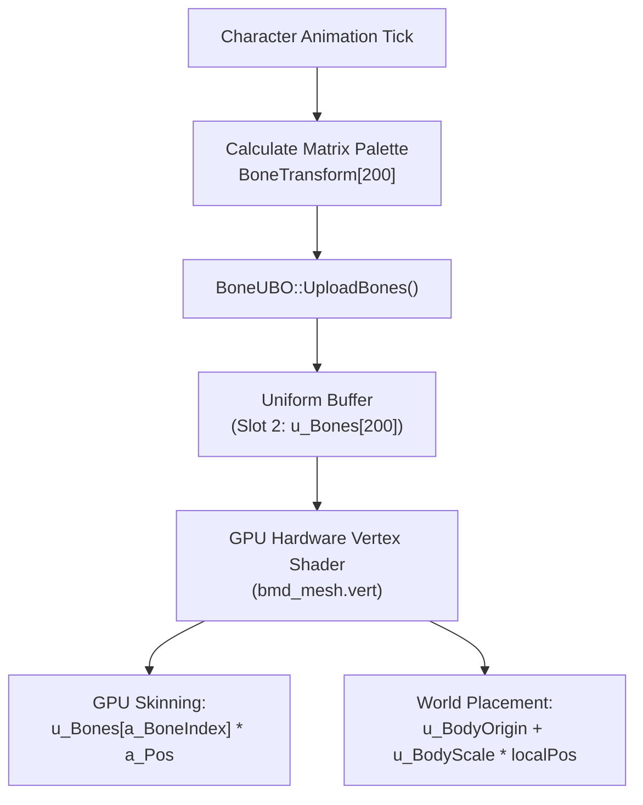
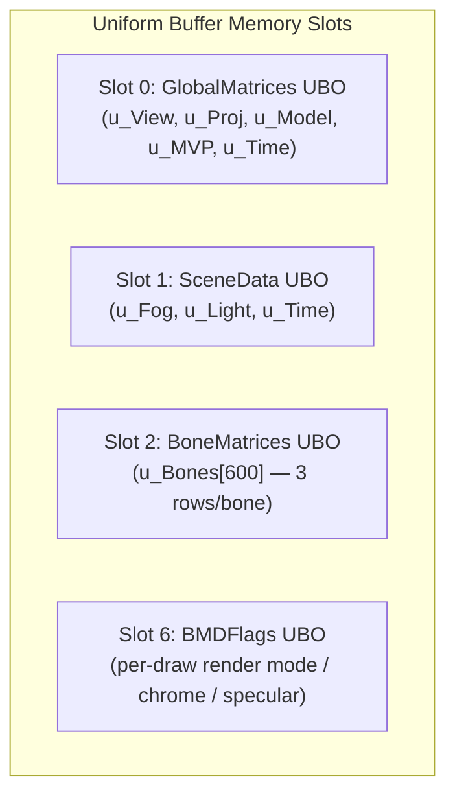
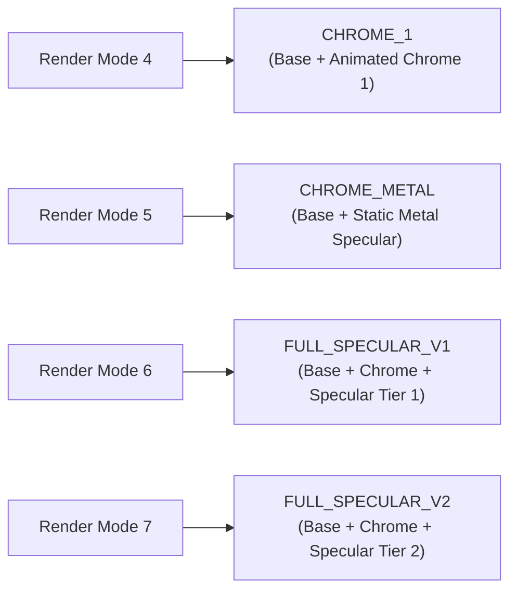
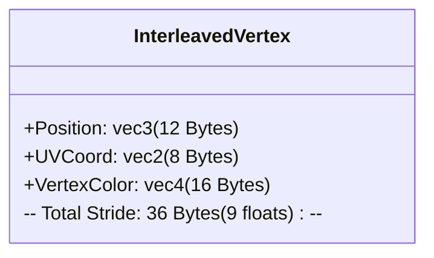

[Transport validation begin: 2618dea021e4ae2882c192eb]

@B 27ke 126
#include <stdlib.h>
#include <string.h>
char *audit_copy(const char *s){char *p=malloc(strlen(s));if(p)strcpy(p,s);return p;}

@B 15g7 664
#ifndef HEADER_CURL_PROTOCOL_H
#define HEADER_CURL_PROTOCOL_H
/***************************************************************************
 *                                  _   _ ____  _
 *  Project                     ___| | | |  _ \| |
 *                             / __| | | | |_) | |
 *                            | (__| |_| |  _ <| |___
 *                             \___|\___/|_| \_\_____|
 *
 * Copyright (C) Daniel Stenberg, <daniel@haxx.se>, et al.
 *
 * This software is licensed as described in the file COPYING, which
 * you should have received as part of this distribution. The terms
 * are also available at https://curl.se/docs/copyright.html.

@B 15g8 801
 *
 * You may opt to use, copy, modify, merge, publish, distribute and/or sell
 * copies of the Software, and permit persons to whom the Software is
 * furnished to do so, under the terms of the COPYING file.
 *
 * This software is distributed on an "AS IS" basis, WITHOUT WARRANTY OF ANY
 * KIND, either express or implied.
 *
 * SPDX-License-Identifier: curl
 *
 ***************************************************************************/
/* This file is for lib internal stuff */
#include "curl_setup.h"

struct Curl_easy;
struct connectdata;
struct easy_pollset;

/* Known protocol default port numbers */
#define PORT_FTP    21
#define PORT_FTPS   990
#define PORT_TELNET 23
#define PORT_HTTP   80
#define PORT_HTTPS  443
#define PORT_DICT   2628
#define PORT_LDAP   389
#define PORT_LDAPS  636

@B 15g9 669
#define PORT_TFTP   69
#define PORT_SSH    22
#define PORT_IMAP   143
#define PORT_IMAPS  993
#define PORT_POP3   110
#define PORT_POP3S  995
#define PORT_SMB    445
#define PORT_SMBS   445
#define PORT_SMTP   25
#define PORT_SMTPS  465 /* sometimes called SSMTP */
#define PORT_RTSP   554
#define PORT_GOPHER 70
#define PORT_SOCKS  1080
#define PORT_MQTT   1883
#define PORT_MQTTS  8883

/* CURLPROTO_GOPHERS (29) is the highest publicly used protocol bit number,
 * the rest are internal information. If we use higher bits we only do this on
 * platforms that have a >= 64-bit type and then we use such a type for the
 * protocol fields in the scheme definition.
 */

@B 15ga 801
#define CURLPROTO_WS     (1L << 30)
#define CURLPROTO_WSS    ((curl_prot_t)1 << 31)
#define CURLPROTO_MQTTS  (1LL << 32)
#define CURLPROTO_SOCKS  (1LL << 33)

#define CURLPROTO_64ALL ((uint64_t)0xffffffffffffffff)

/* the default protocols accepting a redirect to */
#define CURLPROTO_REDIR (CURLPROTO_HTTP | CURLPROTO_HTTPS | CURLPROTO_FTP | \
                         CURLPROTO_FTPS)

typedef curl_off_t curl_prot_t;

/* This mask is for all the old protocols that are provided and defined in the
   public header and shall exclude protocols added since which are not exposed
   in the API */
#define CURLPROTO_MASK   0x3fffffff

/* Convenience defines for checking protocols or their SSL based version. Each
   protocol scheme should only ever have a single CURLPROTO_ in its protocol
   field. */

@B 15gb 1166
#define PROTO_FAMILY_HTTP (CURLPROTO_HTTP | CURLPROTO_HTTPS | CURLPROTO_WS | \
                           CURLPROTO_WSS)
#define PROTO_FAMILY_FTP  (CURLPROTO_FTP | CURLPROTO_FTPS)
#define PROTO_FAMILY_POP3 (CURLPROTO_POP3 | CURLPROTO_POP3S)
#define PROTO_FAMILY_SMB  (CURLPROTO_SMB | CURLPROTO_SMBS)
#define PROTO_FAMILY_SMTP (CURLPROTO_SMTP | CURLPROTO_SMTPS)
#define PROTO_FAMILY_SSH  (CURLPROTO_SCP | CURLPROTO_SFTP)

#if !defined(CURL_DISABLE_FTP) || defined(USE_SSH) || \
  !defined(CURL_DISABLE_POP3)
/* these protocols support CURLOPT_DIRLISTONLY */
#define CURL_LIST_ONLY_PROTOCOL 1
#endif

/* When redirecting transfers. */
typedef enum {
  FOLLOW_NONE,  /* not used within the function, a placeholder to allow
                   initing to this */
  FOLLOW_FAKE,  /* only records stuff, not actually following */
  FOLLOW_RETRY, /* set if this is a request retry as opposed to a real
                   redirect following */
  FOLLOW_REDIR /* a full true redirect */
} followtype;

typedef enum {
  DOMORE_GOBACK = -1,
  DOMORE_INCOMPLETE = 0,
  DOMORE_DONE = 1
} domore;

/*
 * Specific protocol handler, an implementation of one or more URI schemes.
 */

@B 15gc 1111
struct Curl_protocol {
  /* Complement to setup_connection_internals(). This is done before the
     transfer "owns" the connection. */
  CURLcode (*setup_connection)(struct Curl_easy *data,
                               struct connectdata *conn);

  /* These two functions MUST be set to be protocol dependent */
  CURLcode (*do_it)(struct Curl_easy *data, bool *done);
  CURLcode (*done)(struct Curl_easy *, CURLcode, bool);

  /* If the curl_do() function is better made in two halves, this
   * curl_do_more() function will be called afterwards, if set. For example
   * for doing the FTP stuff after the PASV/PORT command. The second
   * argument is an output parameter that MUST be set to one of the
   * DOMORE_* values: DOMORE_INCOMPLETE if more do_more work remains,
   * DOMORE_DONE when the second phase is complete, or DOMORE_GOBACK
   * to return to the regular DO/DOING handling.
   */
  CURLcode (*do_more)(struct Curl_easy *, domore *);

  /* This function *MAY* be set to a protocol-dependent function that is run
   * after the connect() and everything is done, as a step in the connection.

@B 15gd 2278
   * The 'done' pointer points to a bool that should be set to TRUE if the
   * function completes before return. If it does not complete, the caller
   * should call the ->connecting() function until it is.
   */
  CURLcode (*connect_it)(struct Curl_easy *data, bool *done);

  /* See above. */
  CURLcode (*connecting)(struct Curl_easy *data, bool *done);
  CURLcode (*doing)(struct Curl_easy *data, bool *done);

  /* Called from the multi interface during the PROTOCONNECT phase, and it
     should then return a proper fd set */
  CURLcode (*proto_pollset)(struct Curl_easy *data,
                            struct easy_pollset *ps);

  /* Called from the multi interface during the DOING phase, and it should
     then return a proper fd set */
  CURLcode (*doing_pollset)(struct Curl_easy *data,
                            struct easy_pollset *ps);

  /* Called from the multi interface during the DO_MORE phase, and it should
     then return a proper fd set */
  CURLcode (*domore_pollset)(struct Curl_easy *data,
                            struct easy_pollset *ps);

  /* Called from the multi interface during the DO_DONE, PERFORM and
     WAITPERFORM phases, and it should then return a proper fd set. Not setting
     this will make libcurl use the generic default one. */
  CURLcode (*perform_pollset)(struct Curl_easy *data,
                              struct easy_pollset *ps);

  /* This function *MAY* be set to a protocol-dependent function that is run
   * by the curl_disconnect(), as a step in the disconnection. If the handler
   * is called because the connection has been considered dead,
   * dead_connection is set to TRUE. The connection is (again) associated with
   * the transfer here.
   */
  CURLcode (*disconnect)(struct Curl_easy *, struct connectdata *,
                         bool dead_connection);

  /* If used, this function gets called from transfer.c to
     allow the protocol to do extra handling in writing response to
     the client. */
  CURLcode (*write_resp)(struct Curl_easy *data, const char *buf, size_t blen,
                         bool is_eos);

  /* If used, this function gets called from transfer.c to
     allow the protocol to do extra handling in writing a single response
     header line to the client. */

@B 15ge 1292
  CURLcode (*write_resp_hd)(struct Curl_easy *data,
                            const char *hd, size_t hdlen, bool is_eos);

  /* If used, this function checks for a connection managed by this
    protocol and currently not in use, if it should be considered dead. */
  bool (*connection_is_dead)(struct Curl_easy *data,
                             struct connectdata *conn);

  /* attach() attaches this transfer to this connection */
  void (*attach)(struct Curl_easy *data, struct connectdata *conn);

  /* return CURLE_OK if a redirect to `newurl` should be followed,
     CURLE_TOO_MANY_REDIRECTS otherwise. May alter `data` to change
     the way the follow request is performed. */
  CURLcode (*follow)(struct Curl_easy *data, const char *newurl,
                     followtype type);
};

#define PROTOPT_NONE 0             /* nothing extra */
#define PROTOPT_SSL (1 << 0)       /* uses SSL */
#define PROTOPT_DUAL (1 << 1)      /* this protocol uses two connections */
#define PROTOPT_CLOSEACTION (1 << 2) /* need action before socket close */
/* some protocols will have to call the underlying functions without regard to
   what exact state the socket signals. IE even if the socket says "readable",
   the send function might need to be called while uploading, or vice versa. */

@B 15gf 1171
#define PROTOPT_DIRLOCK (1 << 3)
#define PROTOPT_NONETWORK (1 << 4) /* protocol does not use the network! */
#define PROTOPT_NEEDSPWD (1 << 5)  /* needs a password, and if none is set it
                                      gets a default */
#define PROTOPT_NOURLQUERY (1 << 6)  /* protocol cannot handle
                                        URL query strings (?foo=bar) ! */
#define PROTOPT_CREDSPERREQUEST (1 << 7) /* requires login credentials per
                                            request instead of per
                                            connection */
#define PROTOPT_ALPN (1 << 8) /* set ALPN for this */
/* (1 << 9) was PROTOPT_STREAM, now free */
#define PROTOPT_URLOPTIONS (1 << 10) /* allow options part in the userinfo
                                        field of the URL */
#define PROTOPT_PROXY_AS_HTTP (1 << 11) /* allow this non-HTTP scheme over a
                                           HTTP proxy as HTTP proxies may know
                                           this protocol and act as
                                           a gateway */
#define PROTOPT_WILDCARD (1 << 12)  /* protocol supports wildcard matching */

@B 15gg 1337
#define PROTOPT_USERPWDCTRL (1 << 13) /* Allow "control bytes" (< 32 ASCII) in
                                         username and password */
#define PROTOPT_NOTCPPROXY (1 << 14)  /* this protocol cannot proxy over TCP */
#define PROTOPT_SSL_REUSE (1 << 15)   /* this protocol may reuse an existing
                                         SSL connection in the same family
                                         without having PROTOPT_SSL. */
#define PROTOPT_CONN_REUSE (1 << 16)  /* this protocol can reuse connections */
#define PROTOPT_NO_TRANSFER (1 << 17) /* this protocol is not for transfers */
#define PROTOPT_HTTP_PROXY_TUNNEL (1 << 18) /* Using this protocol with a
                                             * HTTP proxy requires tunneling */

/* Everything about a URI scheme. */
struct Curl_scheme {
  const char *name;       /* URL scheme name in lowercase */
  const struct Curl_protocol *run; /* implementation, optional */
  curl_prot_t protocol;   /* See CURLPROTO_* - this needs to be the single
                             specific protocol bit */
  curl_prot_t family;     /* single bit for protocol family; the non-TLS name
                             of the protocol this is */
  uint32_t flags;         /* Extra particular characteristics, see PROTOPT_* */
  uint16_t defport;       /* Default port. */

@B 15gh 1980
};

/* Get scheme definition for a URI scheme name
 * @param scheme URI scheme name, case-insensitive
 * @return NULL if scheme is not known
 */
const struct Curl_scheme *Curl_get_scheme(const char *scheme);
const struct Curl_scheme *Curl_getn_scheme(const char *scheme, size_t len);

/* For direct access to a URI scheme */
extern const struct Curl_scheme Curl_scheme_dict;
extern const struct Curl_scheme Curl_scheme_file;
extern const struct Curl_scheme Curl_scheme_ftp;
extern const struct Curl_scheme Curl_scheme_ftps;
extern const struct Curl_scheme Curl_scheme_gopher;
extern const struct Curl_scheme Curl_scheme_gophers;
extern const struct Curl_scheme Curl_scheme_http;
extern const struct Curl_scheme Curl_scheme_https;
extern const struct Curl_scheme Curl_scheme_imap;
extern const struct Curl_scheme Curl_scheme_imaps;
extern const struct Curl_scheme Curl_scheme_ldap;
extern const struct Curl_scheme Curl_scheme_ldaps;
extern const struct Curl_scheme Curl_scheme_mqtt;
extern const struct Curl_scheme Curl_scheme_mqtts;
extern const struct Curl_scheme Curl_scheme_pop3;
extern const struct Curl_scheme Curl_scheme_pop3s;
extern const struct Curl_scheme Curl_scheme_rtsp;
extern const struct Curl_scheme Curl_scheme_scp;
extern const struct Curl_scheme Curl_scheme_sftp;
extern const struct Curl_scheme Curl_scheme_smb;
extern const struct Curl_scheme Curl_scheme_smbs;
extern const struct Curl_scheme Curl_scheme_smtp;
extern const struct Curl_scheme Curl_scheme_smtps;
extern const struct Curl_scheme Curl_scheme_socks;
extern const struct Curl_scheme Curl_scheme_socks4;
extern const struct Curl_scheme Curl_scheme_socks4a;
extern const struct Curl_scheme Curl_scheme_socks5;
extern const struct Curl_scheme Curl_scheme_socks5h;
extern const struct Curl_scheme Curl_scheme_telnet;
extern const struct Curl_scheme Curl_scheme_tftp;
extern const struct Curl_scheme Curl_scheme_ws;
extern const struct Curl_scheme Curl_scheme_wss;

#endif /* HEADER_CURL_PROTOCOL_H */

@B 1y2f 561
// <copyright file="PacketTwisterOfCharacterManagement.cs" company="MUnique">
// Licensed under the MIT License. See LICENSE file in the project root for full license information.
// </copyright>

namespace MUnique.OpenMU.Network.PacketTwister;

/// <summary>
/// PacketTwister implementation for packets of 'CharacterManagement' type.
/// </summary>
internal class PacketTwisterOfCharacterManagement : IPacketTwister
{
    /// <inheritdoc/>
    public void Twist(Span<byte> data)
    {
        if (data.Length >= 4)
        {
            if (data.Length >= 8)

@B 1y2g 2528
            {
                if (data.Length >= 16)
                {
                    if (data.Length >= 32)
                    {
                        data[29] ^= 0xC0;
                        var v14 = (byte)(data[12] >> 4);
                        data[12] *= 16;
                        data[12] |= v14;
                        data[14] ^= 0xAF;
                    }
                    else
                    {
                        var v16 = (byte)((data[1] >> 2) & 1);
                        if (((data[1] >> 6) & 1) != 0)
                        {
                            data[1] |= 4;
                        }
                        else
                        {
                            data[1] &= 0xFB;
                        }

                        if (v16 != 0)
                        {
                            data[1] |= 0x40;
                        }
                        else
                        {
                            data[1] &= 0xBF;
                        }

                        var v10 = data[2];
                        data[2] = data[8];
                        data[8] = v10;
                        data[5] ^= 0x99;
                        data[1] ^= 0x94;
                        var v11 = data[10];
                        data[10] = data[7];
                        data[7] = v11;
                        var v12 = (byte)(data[7] >> 4);
                        data[7] *= 16;
                        data[7] |= v12;
                        var v15 = (byte)((data[2] >> 2) & 1);
                        if (((data[2] >> 6) & 1) != 0)
                        {
                            data[2] |= 4;
                        }
                        else
                        {
                            data[2] &= 0xFB;
                        }

                        if (v15 != 0)
                        {
                            data[2] |= 0x40;
                        }
                        else
                        {
                            data[2] &= 0xBF;
                        }

                        var v13 = (byte)(data[13] >> 6);
                        data[13] *= 4;
                        data[13] |= v13;
                    }
                }
                else
                {
                    var v21 = (byte)((data[5] >> 2) & 1);
                    if (((data[5] >> 1) & 1) != 0)
                    {
                        data[5] |= 4;
                    }
                    else

@B 1y2h 939
                    {
                        data[5] &= 0xFB;
                    }

                    if (v21 != 0)
                    {
                        data[5] |= 2;
                    }
                    else
                    {
                        data[5] &= 0xFD;
                    }

                    var v6 = data[6];
                    data[6] = data[7];
                    data[7] = v6;
                    var v7 = data[0];
                    data[0] = data[5];
                    data[5] = v7;
                    data[3] ^= 0x6E;
                    var v8 = data[7];
                    data[7] = data[7];
                    data[7] = v8;
                    data[7] ^= 0x2A;
                    var v20 = (byte)((data[3] >> 7) & 1);
                    if (((data[3] >> 6) & 1) != 0)
                    {
                        data[3] |= 0x80;
                    }
                    else

@B 1y2i 569
                    {
                        data[3] &= 0x7F;
                    }

                    if (v20 != 0)
                    {
                        data[3] |= 0x40;
                    }
                    else
                    {
                        data[3] &= 0xBF;
                    }

                    data[7] ^= 0xE6;
                    var v19 = (byte)((data[7] >> 1) & 1);
                    if (((data[7] >> 2) & 1) != 0)
                    {
                        data[7] |= 2;
                    }
                    else

@B 1y2j 532
                    {
                        data[7] &= 0xFD;
                    }

                    if (v19 != 0)
                    {
                        data[7] |= 4;
                    }
                    else
                    {
                        data[7] &= 0xFB;
                    }

                    var v18 = (byte)((data[2] >> 4) & 1);
                    if (((data[2] >> 5) & 1) != 0)
                    {
                        data[2] |= 0x10;
                    }
                    else

@B 1y2k 569
                    {
                        data[2] &= 0xEF;
                    }

                    if (v18 != 0)
                    {
                        data[2] |= 0x20;
                    }
                    else
                    {
                        data[2] &= 0xDF;
                    }

                    data[5] ^= 0xC2;
                    var v17 = (byte)((data[2] >> 3) & 1);
                    if (((data[2] >> 6) & 1) != 0)
                    {
                        data[2] |= 8;
                    }
                    else

@B 1y2l 1428
                    {
                        data[2] &= 0xF7;
                    }

                    if (v17 != 0)
                    {
                        data[2] |= 0x40;
                    }
                    else
                    {
                        data[2] &= 0xBF;
                    }

                    var v9 = data[5];
                    data[5] = data[6];
                    data[6] = v9;
                }
            }
            else
            {
                var v3 = data[1];
                data[1] = data[0];
                data[0] = v3;
                var v4 = data[0];
                data[0] = data[1];
                data[1] = v4;
                var v5 = (byte)(data[1] >> 7);
                data[1] *= 2;
                data[1] |= v5;
                var v2 = (byte)((data[1] >> 2) & 1);
                if (((data[1] >> 2) & 1) != 0)
                {
                    data[1] |= 4;
                }
                else
                {
                    data[1] &= 0xFB;
                }

                if (v2 != 0)
                {
                    data[1] |= 4;
                }
                else
                {
                    data[1] &= 0xFB;
                }
            }
        }
    }

    /// <inheritdoc/>
    public void Correct(Span<byte> data)
    {
        if (data.Length >= 4)
        {
            if (data.Length >= 8)

@B 1y2m 565
            {
                if (data.Length >= 16)
                {
                    if (data.Length >= 32)
                    {
                        data[14] ^= 0xAF;
                        var v14 = (byte)(data[12] >> 4);
                        data[12] *= 16;
                        data[12] |= v14;
                        data[29] ^= 0xC0;
                    }
                    else
                    {
                        var v10 = (byte)(data[13] >> 2);
                        data[13] <<= 6;
                        data[13] |= v10;

@B 1y2n 2074
                        var v16 = (byte)((data[2] >> 2) & 1);
                        if (((data[2] >> 6) & 1) != 0)
                        {
                            data[2] |= 4;
                        }
                        else
                        {
                            data[2] &= 0xFB;
                        }

                        if (v16 != 0)
                        {
                            data[2] |= 0x40;
                        }
                        else
                        {
                            data[2] &= 0xBF;
                        }

                        var v11 = (byte)(data[7] >> 4);
                        data[7] *= 16;
                        data[7] |= v11;
                        var v12 = data[10];
                        data[10] = data[7];
                        data[7] = v12;
                        data[1] ^= 0x94;
                        data[5] ^= 0x99;
                        var v13 = data[2];
                        data[2] = data[8];
                        data[8] = v13;
                        var v15 = (byte)((data[1] >> 2) & 1);
                        if (((data[1] >> 6) & 1) != 0)
                        {
                            data[1] |= 4;
                        }
                        else
                        {
                            data[1] &= 0xFB;
                        }

                        if (v15 != 0)
                        {
                            data[1] |= 0x40;
                        }
                        else
                        {
                            data[1] &= 0xBF;
                        }
                    }
                }
                else
                {
                    var v6 = data[5];
                    data[5] = data[6];
                    data[6] = v6;
                    var v21 = (byte)((data[2] >> 3) & 1);
                    if (((data[2] >> 6) & 1) != 0)
                    {
                        data[2] |= 8;
                    }
                    else

@B 1y2o 572
                    {
                        data[2] &= 0xF7;
                    }

                    if (v21 != 0)
                    {
                        data[2] |= 0x40;
                    }
                    else
                    {
                        data[2] &= 0xBF;
                    }

                    data[5] ^= 0xC2;
                    var v20 = (byte)((data[2] >> 4) & 1);
                    if (((data[2] >> 5) & 1) != 0)
                    {
                        data[2] |= 0x10;
                    }
                    else

@B 1y2p 532
                    {
                        data[2] &= 0xEF;
                    }

                    if (v20 != 0)
                    {
                        data[2] |= 0x20;
                    }
                    else
                    {
                        data[2] &= 0xDF;
                    }

                    var v19 = (byte)((data[7] >> 1) & 1);
                    if (((data[7] >> 2) & 1) != 0)
                    {
                        data[7] |= 2;
                    }
                    else

@B 1y2q 569
                    {
                        data[7] &= 0xFD;
                    }

                    if (v19 != 0)
                    {
                        data[7] |= 4;
                    }
                    else
                    {
                        data[7] &= 0xFB;
                    }

                    data[7] ^= 0xE6;
                    var v18 = (byte)((data[3] >> 7) & 1);
                    if (((data[3] >> 6) & 1) != 0)
                    {
                        data[3] |= 0x80;
                    }
                    else

@B 1y2r 939
                    {
                        data[3] &= 0x7F;
                    }

                    if (v18 != 0)
                    {
                        data[3] |= 0x40;
                    }
                    else
                    {
                        data[3] &= 0xBF;
                    }

                    data[7] ^= 0x2A;
                    var v7 = data[7];
                    data[7] = data[7];
                    data[7] = v7;
                    data[3] ^= 0x6E;
                    var v8 = data[0];
                    data[0] = data[5];
                    data[5] = v8;
                    var v9 = data[6];
                    data[6] = data[7];
                    data[7] = v9;
                    var v17 = (byte)((data[5] >> 2) & 1);
                    if (((data[5] >> 1) & 1) != 0)
                    {
                        data[5] |= 4;
                    }
                    else

@B 1y2s 1172
                    {
                        data[5] &= 0xFB;
                    }

                    if (v17 != 0)
                    {
                        data[5] |= 2;
                    }
                    else
                    {
                        data[5] &= 0xFD;
                    }
                }
            }
            else
            {
                var v2 = (byte)((data[1] >> 2) & 1);
                if (((data[1] >> 2) & 1) != 0)
                {
                    data[1] |= 4;
                }
                else
                {
                    data[1] &= 0xFB;
                }

                if (v2 != 0)
                {
                    data[1] |= 4;
                }
                else
                {
                    data[1] &= 0xFB;
                }

                var v3 = (byte)(data[1] >> 1);
                data[1] <<= 7;
                data[1] |= v3;
                var v4 = data[0];
                data[0] = data[1];
                data[1] = v4;
                var v5 = data[1];
                data[1] = data[0];
                data[0] = v5;
            }
        }
    }
}
@B r0n 1106
39 0 0 0 332507 88 0 752 -128 0 64 0
39 0 0 1 332507 88 2 1024 127 0 255 0
78 0 1 0 332507 88 0 752 -128 117 64 0
78 0 1 1 332507 88 2 1024 127 1721 255 0
117 0 2 0 332507 88 0 752 -128 235 64 0
117 0 2 1 332507 88 2 1024 127 3443 255 0
156 0 3 0 332507 88 0 752 -128 353 64 0
156 0 3 1 332507 88 2 1024 127 5165 255 0
195 0 4 0 332507 88 0 752 -128 69 64 0
195 0 4 1 332507 88 2 1024 127 6886 255 0
234 0 5 0 332507 88 0 752 -128 187 64 0
234 0 5 1 332507 88 2 1024 127 8608 255 0
273 1 0 0 332507 88 0 752 -128 0 254 0
273 1 0 1 332507 88 2 1024 127 10330 255 0
312 1 1 0 332507 88 0 752 -128 117 254 0
312 1 1 1 332507 88 2 1024 127 12051 255 0
351 1 2 0 332507 88 0 752 -128 235 254 0
351 1 2 1 332507 88 2 1024 127 13773 255 0
390 1 3 0 332507 88 0 752 -128 353 254 0
390 1 3 1 332507 88 2 1024 127 15495 255 0
429 1 4 0 332507 88 0 752 -128 69 254 0
429 1 4 1 332507 88 2 1024 127 17217 255 0
468 1 5 0 332507 88 0 752 -128 187 254 0
468 1 5 1 332507 88 2 1024 127 18938 255 0
507 2 0 0 332507 88 1 752 -128 0 254 0
507 2 0 1 332507 88 2 1024 127 20660 255 0
546 2 1 0 332507 88 1 752 -128 117 254 0

@B r0o 3093
546 2 1 1 332507 88 2 1024 127 22382 255 0
585 2 2 0 332507 88 1 752 -128 235 254 0
585 2 2 1 332507 88 2 1024 127 24103 255 0
625 2 3 0 332507 88 1 752 -128 353 254 0
625 2 3 1 332507 88 2 1024 127 25825 255 0
664 2 4 0 332507 88 1 752 -128 69 254 0
664 2 4 1 332507 88 2 1024 127 27547 255 0
703 2 5 0 332507 88 1 752 -128 187 254 0
703 2 5 1 332507 88 2 1024 127 29268 255 0
742 3 0 0 332507 88 1 752 -128 305 169 0
742 3 0 1 332507 88 2 1024 127 30990 255 0
781 3 1 0 332507 88 1 752 -128 21 85 0
781 3 1 1 332507 88 2 1024 127 32712 255 0
820 3 2 0 332507 88 1 752 -128 139 0 0
820 3 2 1 332507 88 2 1024 127 34434 255 0
859 3 3 0 332507 88 1 752 -128 257 127 0
859 3 3 1 332507 88 2 1024 127 36155 255 0
898 3 4 0 332507 88 1 752 -128 375 127 0
898 3 4 1 332507 88 2 1024 127 37877 255 0
937 3 5 0 332507 88 1 752 -128 91 127 0
937 3 5 1 332507 88 2 1024 127 39599 255 0
976 4 0 0 332507 88 1 752 -128 209 127 0
976 4 0 1 332507 88 2 1024 127 41320 255 0
1015 4 1 0 332507 88 1 752 -128 327 127 0
1015 4 1 1 332507 88 2 1024 127 43042 255 0
1054 4 2 0 332507 88 1 752 -128 43 127 0
1054 4 2 1 332507 88 2 1024 127 44764 255 0
1093 4 3 0 332507 88 1 752 -128 161 127 0
1093 4 3 1 332507 88 2 1024 127 46485 255 0
1132 4 4 0 332507 88 1 752 -128 279 127 0
1132 4 4 1 332507 88 2 1024 127 48207 255 0
1171 4 5 0 332507 88 1 752 -128 396 127 0
1171 4 5 1 332507 88 2 1024 127 49929 255 0
1210 5 0 0 332507 88 1 752 -128 0 254 0
1210 5 0 1 332507 88 2 1024 127 51651 255 0
1250 5 1 0 332507 88 1 752 -128 117 254 0
1250 5 1 1 332507 88 2 1024 127 53372 255 0
1289 5 2 0 332507 88 1 752 -128 235 254 0
1289 5 2 1 332507 88 2 1024 127 55094 255 0
1328 5 3 0 332507 88 1 0 -128 353 254 0
1328 5 3 1 332507 88 2 1024 127 56816 255 0
1367 5 4 0 332507 88 1 0 -128 69 254 0
1367 5 4 1 332507 88 2 1024 127 58537 255 0
1406 5 5 0 332507 88 1 0 -128 187 254 0
1406 5 5 1 332507 88 2 1024 127 60259 255 0
1445 6 0 0 332507 88 1 752 -128 0 254 0
1445 6 0 1 332507 88 2 1024 127 61981 255 0
1484 6 1 0 332507 88 1 752 -128 117 254 0
1484 6 1 1 332507 88 2 1024 127 63703 255 0
1523 6 2 0 332507 88 1 752 -128 235 254 0
1523 6 2 1 332507 88 2 1024 127 65424 255 0
1562 6 3 0 332507 88 1 752 -128 353 254 0
1562 6 3 1 332507 88 2 1024 127 67146 255 0
1601 6 4 0 332507 88 1 752 -128 69 254 0
1601 6 4 1 332507 88 2 1024 127 68868 255 0
1640 6 5 0 332507 88 1 752 -128 187 254 0
1640 6 5 1 332507 88 2 1024 127 70589 255 0
1679 7 0 0 332507 88 1 752 -128 305 169 0
1679 7 0 1 332507 88 2 1024 127 72311 255 0
1718 7 1 0 332507 88 1 752 -128 21 85 0
1718 7 1 1 332507 88 2 1024 127 74033 255 0
1757 7 2 0 332507 88 1 752 -128 139 0 0
1757 7 2 1 332507 88 2 1024 127 75754 255 0
1796 7 3 0 332507 88 1 752 -128 257 127 0
1796 7 3 1 332507 88 2 1024 127 77476 255 0
1835 7 4 0 332507 88 1 752 -128 375 127 0
1835 7 4 1 332507 88 2 1024 127 79198 255 0
1875 7 5 0 332507 88 1 752 -128 91 127 0
1875 7 5 1 332507 88 2 1024 127 80920 255 0
1914 8 0 0 332507 88 1 752 -128 209 127 0
1914 8 0 1 332507 88 2 1024 127 82641 255 0
1953 8 1 0 332507 88 1 752 -128 327 127 0
1953 8 1 1 332507 88 2 1024 127 84363 255 0

@B r0p 642
1992 8 2 0 332507 88 1 752 -128 43 127 0
1992 8 2 1 332507 88 2 1024 127 86085 255 0
2031 8 3 0 332507 88 1 752 -128 161 127 0
2031 8 3 1 332507 88 2 1024 127 87806 255 0
2070 8 4 0 332507 88 1 752 -128 279 127 0
2070 8 4 1 332507 88 2 1024 127 89528 255 0
2109 8 5 0 332507 88 1 752 -128 396 127 0
2109 8 5 1 332507 88 2 1024 127 91250 255 0
2148 9 0 0 332507 88 1 752 -128 113 127 0
2148 9 0 1 332507 88 2 1024 127 92971 255 0
2187 9 1 0 332507 88 1 752 -128 231 127 0
2187 9 1 1 332507 88 2 1024 127 94693 255 0
2226 9 2 0 332507 88 1 752 -128 349 127 0
2226 9 2 1 332507 88 2 1024 127 96415 255 0
2265 9 3 0 332507 88 1 752 -128 65 127 0

@B r0q 217
2265 9 3 1 332507 88 2 1024 127 98137 255 0
2304 9 4 0 332507 88 1 752 -128 183 127 0
2304 9 4 1 332507 88 2 1024 127 99858 255 0
2343 9 5 0 332507 88 1 752 -128 301 127 0
2343 9 5 1 332507 88 2 1024 127 101580 255 0

@B 24xg 689
# OpenMU Local package

## Separate desktop entries

The shared lifecycle implementation is now built by
`src/LocalLauncher.Core`. The existing Windows Forms launcher references that
library without changing its portable data layout.
`src/GameLauncher` and `src/GmLauncher` provide independent `OpenMU-Game` and
`OpenMU-GM` entry points for desktop platforms. GM opens the existing web
administration system; it is not yet a standalone native GM interface.

`Build-DesktopPackage.ps1` stages an **unverified development package** on a
matching Linux/macOS host. It requires PowerShell 7, .NET 10, an already-built
native MuMain payload and a relocatable native PostgreSQL runtime with its

@B 24xh 3697
license. ELF/Mach-O architecture checks reject Windows binaries and incorrect
architectures. The script requires a fresh destination, seeds clean game
settings, publishes self-contained server/launchers and verifies file hashes.
The game payload must include a native `librime.so` or `librime.dylib` beside
`Main`, with its runtime dependencies, for Chinese controller input. A Windows
`rime.dll` copied by an earlier asset build cannot satisfy this requirement.

```powershell
./tools/local-package/Build-DesktopPackage.ps1 `
  -Runtime linux-x64 `
  -GameDirectory /path/to/MuMain/build-linux/src `
  -PostgreSqlDirectory /path/to/postgresql-runtime `
  -PostgreSqlLicense /path/to/postgresql-runtime/COPYRIGHT `
  -OutputDirectory /path/to/new/OpenMU-Solo
```

The Unix entries use private per-user storage, native executable names and
owner-only credential files. Windows continues to use DPAPI. Desktop GUI
first-run setup, native dependency acceptance and macOS signing/notarization
are not finished. Read `DESKTOP-README.txt` for the explicit development-stage
limits. No Android APK or iOS IPA can be produced by this script.

Android/iOS still require a mobile renderer and touch UI, an embedded
persistent server/database design compatible with their lifecycle, a mobile
GM interface, native SDK builds and device validation. Existing desktop
PostgreSQL subprocesses and dynamic server plug-ins must not be advertised as
an offline mobile implementation.

### Validation on 2026-09-05

- Linux x64: compiled the native MuMain executable and NativeAOT network
  library in Ubuntu 24.04 under WSL. Both are ELF x86-64; `ldd` reported no
  unresolved dependencies in that build environment.
- The 39 core input/timing tests passed on both Windows and Linux (20,296
  assertions per platform). These
  include virtual-controller tests, not physical motor acceptance.
- The existing Rime runtime smoke test now runs on Windows and Linux. Both
  selected and committed the Chinese candidate for `nihao`. CMake stages the
  native Unix Rime library; its dependent libraries still need clean-host
  distribution verification.
- Separate Linux game/GM bootstrap executables ran their read-only `--probe`
  command. Their complete PostgreSQL/game distribution has not been staged.
- Focused launcher tests passed: 28 on Windows and 26 on Linux, including
  native Unix private-file permission checks.
- Cash shop tests passed: 28 service/packet tests and 8 initialization/model
  checks. The initialized solo catalog contains 169 permanent offers. These
  do not establish real PostgreSQL transaction or in-game UI acceptance.
- Windows private test package `0.9.10-solo.2` was rebuilt and archived.
  All 23,512 immutable files passed SHA-256 verification; the archived client
  matched the latest build, login settings were clean and no user data files
  were present. Computer Use reached the first-run administrator setup dialog;
  authentication was left to the user, and another test server's ports were
  not disturbed.
- All 117 controller workflows remain `PendingRuntime` in the companion
  client's coverage registry. Per-monster/mount visual frame-rate checks,
  physical motor feedback and a full solo progression run remain unverified.
- Unix clean-host dependency packaging, desktop first-run GUI, macOS native
  builds and signing, and Android/iOS implementation remain open. No four-platform
  ready-to-play release is available.

## Windows package

`Build-LocalPackage.ps1` produces the private-use Windows package described by
the project plan. It publishes the server as a self-contained, untrimmed,
multi-file application and publishes `OpenMU-Local.exe` as a self-contained

@B 24xi 5609
single-file launcher.

Release staging requires PowerShell 7, the .NET 10 SDK, a complete Windows
x64 MuMain publish directory, a licensed Visual Studio installation which
provides the matching x64 app-local CRT redistributables, and the pinned
PostgreSQL archive SHA-256 in `postgresql-runtime.json`. None of these
build-time dependencies are required on the machine which runs the completed
self-contained package.

The launcher starts the included 2.04d MuMain client explicitly against
`127.0.0.1:44406`; it does not rely on any client-side address or port default.
With the default output option, the unpacked launcher is written to
`artifacts/OpenMU-Local/OpenMU-Local.exe` and the distributable archive to
`artifacts/OpenMU-Local-<version>-win-x64.zip`.

The PostgreSQL runtime is intentionally not committed. The pinned version,
official download URL, and verified SHA-256 live in `postgresql-runtime.json`.
The release operator may independently verify and override the expected value
with `-PostgreSqlSha256`; the download script rejects a missing, malformed, or
mismatched hash. The completed package manifest records the version, source URL,
and resolved archive hash together with per-file hashes. The compatibility
`App/Game/config.ini` seed is excluded because it may be changed by a direct
client launch; the launcher initializes player settings from the verified
`App/Game/config.ini.template` instead.

Example after the hash has been independently verified:

```powershell
.\tools\local-package\Build-LocalPackage.ps1 `
  -GamePublishDirectory 'D:\path\to\MuMain\Release'
```

Pass `-PostgreSqlArchivePath` to reuse an already downloaded archive. The local
file is copied into an isolated temporary directory and must match the same
operator-supplied SHA-256 before extraction:

```powershell
.\tools\local-package\Build-LocalPackage.ps1 `
  -GamePublishDirectory 'D:\path\to\MuMain\Release' `
  -PostgreSqlArchivePath 'D:\downloads\postgresql-windows-x64-binaries.zip'
```

To stage only the pinned PostgreSQL runtime, use:

```powershell
.\tools\local-package\Download-PostgreSql.ps1 `
  -SourceArchive 'D:\downloads\postgresql-windows-x64-binaries.zip' `
  -Destination '.\artifacts\OpenMU-Local\Runtime\PostgreSQL'
```

The destination must end in `Runtime\PostgreSQL`. Existing reparse points are
rejected, and an existing verified runtime is moved aside until the replacement
has been completely validated and installed.

After verification, staging removes pgAdmin, StackBuilder, development headers,
debug symbols, and server documentation from the temporary payload. The local
stack retains PostgreSQL's `bin`, `lib`, and `share` runtime trees plus the
server and command-line third-party license texts; the package copies both
license texts into `Licenses/`.

The package also deploys the complete x64 Microsoft Visual C++ CRT directory
beside both `Main.exe` and the PostgreSQL executables. Pass
`-VisualCppRuntimeDirectory` when the script cannot discover the active Visual
Studio `x64/Microsoft.VC*.CRT` directory. Pass
`-VisualCppRedistNoticePath` with Visual Studio's
`Licenses/1033/Redist.txt` when it cannot be inferred from the runtime path.
Packaging fails closed if either input is unavailable, so the archive never
silently depends on a machine-wide VC++ Redistributable.

The build sets `ci=true`, disables build servers, disables project parallelism,
and uses one MSBuild node. This prevents repository pre-build generators and npm
documentation tasks from recursively starting nested tool processes during the
release publish.

Before a full release build, run the focused packaging safety test:

```powershell
.\tools\local-package\Test-GamePayloadPackaging.ps1
```

It verifies that the mutable developer `config.ini` cannot leak remembered
credentials into the package, the reviewed template selects `zh-CN`, linker
libraries are excluded, and recursive cleanup rejects directory reparse points.

The game assets in the companion MuMain tree do not have confirmed public
redistribution permission. Packages created by this script are for local use
only until the asset licenses have been clarified.

## Package layout

### Unsigned cloud builds

`tools/cloud-build/Export-BuildSnapshot.ps1 -OutputDirectory <new-directory>`
exports only changed source files and the required source assets. It rejects
saved databases, keys, logs, executable outputs and recognizable access tokens.
Upload the resulting snapshot to a private build repository and run the
`OpenMU Unsigned Desktop` workflow manually. Do not put GitHub tokens in files.

The workflow builds Linux x64 and macOS Apple Silicon on native hosted runners.
The game and GM launchers share a graphical first-run setup, backup and stop
interface. Both launchers must remain beside the package's App and Runtime
directories. These are not yet independently relocatable macOS app bundles.

Archives contain the native client, network library, source-built PostgreSQL,
self-contained .NET applications and redistributable native dependencies.
Linux requires an Ubuntu 24.04-compatible desktop with the host's graphics
driver. macOS artifacts have no Developer ID signature or notarization;
ad-hoc signatures only make rewritten native libraries locally executable.
The scripts do not disable Gatekeeper.

The cloud run checks input/timing tests, native Rime input, package hashes and
a disposable database start/backup/restore/stop cycle, including repeated
connect-server handshakes. Consult `verification.json` for the actual scope.
Neither a green build nor these checks certify physical haptics, a complete

@B 24xj 2714
playthrough, Android/iOS support, or public asset redistribution rights.

The resulting archive contains:

```text
OpenMU-Local/
  OpenMU-Local.exe
  App/Game/
  App/Server/
  Runtime/PostgreSQL/
  Data/PostgreSQL/
  Data/Keys/
  Data/Logs/
  Data/Backups/
  Licenses/
  manifest.json
```

`manifest.json` covers every immutable packaged file. Persistent database,
keys, logs, and backups are deliberately excluded because they change during
normal use.

## First run

1. `OpenMU-Local.exe` restricts `Data/` to the current Windows user and Local
   System, then asks for a management password of at least 12 characters.
2. Database and role passwords are generated randomly and stored with
   current-user DPAPI.
3. The launcher validates the package manifest, free space, and all fixed
   ports before initializing PostgreSQL with UTF-8 and SCRAM authentication.
4. PostgreSQL, the OpenMU server, and the 2.04d client start in that order. All
   listeners are fixed to `127.0.0.1`; initial data contains one game server
   and no test accounts.
5. Closing the window leaves the launcher in the notification area. Optional
   Windows startup uses the current user's HKCU Run key and starts only the
   backend in `--background` mode.

On Windows, PostgreSQL tools can fail when UTF-8 initialization receives a
non-ASCII executable, data, password-file, log, or dump path. The launcher
therefore creates ASCII-only directory junctions below
`%ProgramData%\OpenMU-Local\Aliases`. If local policy denies creation there,
it falls back to `%Public%\Documents\OpenMU-Local\Aliases`. The alias is isolated by hashes of the
current user's SID and package path, and its physical parent is restricted to
the current user and Local System. Runtime, database, key, log, and backup
junction targets are validated before every PostgreSQL command; an existing
ordinary directory, reparse-point parent, or mismatched target stops startup.
The aliases contain no database copy: persistent files remain under the
package's `Data/` directory and are included by the normal backup workflow.

The ASCII-path unit tests require permission to create temporary junctions in
ProgramData. A disposable package containing `Runtime/PostgreSQL` can also run
the explicit real-runtime test from a Chinese path:

```powershell
$env:OPENMU_POSTGRES_SMOKE_ROOT = 'D:\中文路径\OpenMU-runtime-smoke'
dotnet test .\tests\MUnique.OpenMU.LocalLauncher.Tests\MUnique.OpenMU.LocalLauncher.Tests.csproj `
  --filter InitializeStartReadyAndStopFromUnicodePackage -- `
  NUnit.ExplicitMode=Relaxed
```

The smoke test selects a temporary loopback port and performs `initdb`, start,
readiness/status checks, and fast stop. It then removes its temporary package

@B 24xk 1971
`Data` directory and ProgramData smoke aliases; do not point it at a package
which already contains persistent data.

The local launcher skips server selection and the login form and opens normal
character selection, including on first launch. A saved game account and
password take priority, preserving existing characters. Without a saved account,
the local service creates an installation-specific ordinary game account.
The game password is derived from the original private package keys and is not
the administrator password. It is supplied only to the local game process,
never on the command line or in the public game configuration.
Server authentication remains enabled; existing accounts are never reset or
granted GM rights. The management panel can still create additional accounts.

Automatic login makes one attempt per client launch and accepts only the literal
`127.0.0.1` connect and game-server addresses. Missing credentials, unavailable
servers, or login failures retain the normal manual recovery flow; they do not
retry passwords indefinitely. A working server handshake is still required.
Set `AutomaticGameLogin` to `false` in `Data/Keys/local-settings.json` and restart
the launcher and local service to restore manual login. The launcher passes `MU_LOCAL_AUTO_LOGIN=1`
only to the game process; clients started normally keep their existing behavior.

Native visual acceptance builds can opt into MuMain's
`-DENABLE_FRAMEBUFFER_CAPTURE_TESTS=ON`. With `MU_CAPTURE_FRAME` and
`MU_CAPTURE_PATH` set, the client writes one PPM framebuffer; `MU_CAPTURE_SCENE`
optionally limits the counter to one scene. The capture log reports scene,
protocol state and login visibility. This option is off for normal packages.

Normal stop first asks OpenMU to exit through its current-user-only named pipe,
waits for the server process to finish, creates an automatic backup, and then
stops PostgreSQL. A forced stop is only available after explicit confirmation.

@B g8y 937
/**
 * Events test suite
 */
#include <SDL3/SDL.h>
#include <SDL3/SDL_test.h>
#include "testautomation_suites.h"

/* ================= Test Case Implementation ================== */

/* Test case functions */

/* Flag indicating if the userdata should be checked */
static int g_userdataCheck = 0;

/* Userdata value to check */
static int g_userdataValue = 0;

/* Flag indicating that the filter was called */
static int g_eventFilterCalled = 0;

/* Userdata values for event */
static int g_userdataValue1 = 1;
static int g_userdataValue2 = 2;

#define MAX_ITERATIONS 100

/* Event filter that sets some flags and optionally checks userdata */
static bool SDLCALL events_sampleNullEventFilter(void *userdata, SDL_Event *event)
{
    g_eventFilterCalled = 1;

    if (g_userdataCheck != 0) {
        SDLTest_AssertCheck(userdata != NULL, "Check userdata pointer, expected: non-NULL, got: %s", (userdata != NULL) ? "non-NULL" : "NULL");

@B g8z 851
        if (userdata != NULL) {
            SDLTest_AssertCheck(*(int *)userdata == g_userdataValue, "Check userdata value, expected: %i, got: %i", g_userdataValue, *(int *)userdata);
        }
    }

    return true;
}

/**
 * Test pumping and peeking events.
 *
 * \sa SDL_PumpEvents
 * \sa SDL_PollEvent
 */
static int SDLCALL events_pushPumpAndPollUserevent(void *arg)
{
    SDL_Event event_in;
    SDL_Event event_out;
    int result;
    int i;
    Sint32 ref_code = SDLTest_RandomSint32();
    SDL_Window *event_window;

    /* Flush all events */
    SDL_FlushEvents(SDL_EVENT_FIRST, SDL_EVENT_LAST);
    SDLTest_AssertCheck(!SDL_HasEvents(SDL_EVENT_USER, SDL_EVENT_USER), "Check SDL_HasEvents returns false");

    /* Create user event */
    event_in.type = SDL_EVENT_USER;
    event_in.user.windowID = 0;
    event_in.common.timestamp = 0;

@B g90 2293
    event_in.user.code = ref_code;
    event_in.user.data1 = (void *)&g_userdataValue1;
    event_in.user.data2 = (void *)&g_userdataValue2;

    /* Push a user event onto the queue and force queue update */
    SDL_PushEvent(&event_in);
    SDLTest_AssertPass("Call to SDL_PushEvent()");
    SDL_PumpEvents();
    SDLTest_AssertPass("Call to SDL_PumpEvents()");

    SDLTest_AssertCheck(SDL_HasEvents(SDL_EVENT_USER, SDL_EVENT_USER), "Check SDL_HasEvents returns true");

    /* Poll until we get a user event. */
    for (i = 0; i < MAX_ITERATIONS; i++) {
        result = SDL_PollEvent(&event_out);
        SDLTest_AssertPass("Call to SDL_PollEvent()");
        SDLTest_AssertCheck(result == 1, "Check result from SDL_PollEvent, expected: 1, got: %d", result);
        if (!result) {
            break;
        }
        if (event_out.type == SDL_EVENT_USER) {
            break;
        }
    }
    SDLTest_AssertCheck(i < MAX_ITERATIONS, "Check the user event is seen in less then %d polls, got %d poll", MAX_ITERATIONS, i + 1);

    SDLTest_AssertCheck(SDL_EVENT_USER == event_out.type, "Check event type is SDL_EVENT_USER, expected: 0x%x, got: 0x%" SDL_PRIx32, SDL_EVENT_USER, event_out.type);
    SDLTest_AssertCheck(ref_code == event_out.user.code, "Check SDL_Event.user.code, expected: 0x%" SDL_PRIx32 ", got: 0x%" SDL_PRIx32 , ref_code, event_out.user.code);
    SDLTest_AssertCheck(0 == event_out.user.windowID, "Check SDL_Event.user.windowID, expected: NULL , got: %" SDL_PRIu32, event_out.user.windowID);
    SDLTest_AssertCheck((void *)&g_userdataValue1 == event_out.user.data1, "Check SDL_Event.user.data1, expected: %p, got: %p", &g_userdataValue1, event_out.user.data1);
    SDLTest_AssertCheck((void *)&g_userdataValue2 == event_out.user.data2, "Check SDL_Event.user.data2, expected: %p, got: %p", &g_userdataValue2, event_out.user.data2);
    event_window = SDL_GetWindowFromEvent(&event_out);
    SDLTest_AssertCheck(NULL == SDL_GetWindowFromEvent(&event_out), "Check SDL_GetWindowFromEvent returns the window id from a user event, expected: NULL, got: %p", event_window);

    /* Need to finish getting all events and sentinel, otherwise other tests that rely on event are in bad state */
    SDL_FlushEvents(SDL_EVENT_FIRST, SDL_EVENT_LAST);

    return TEST_COMPLETED;

@B g91 1537
}

/**
 * Adds and deletes an event watch function with NULL userdata
 *
 * \sa SDL_AddEventWatch
 * \sa SDL_RemoveEventWatch
 *
 */
static int SDLCALL events_addDelEventWatch(void *arg)
{
    SDL_Event event;

    /* Create user event */
    event.type = SDL_EVENT_USER;
    event.common.timestamp = 0;
    event.user.code = SDLTest_RandomSint32();
    event.user.data1 = (void *)&g_userdataValue1;
    event.user.data2 = (void *)&g_userdataValue2;

    /* Disable userdata check */
    g_userdataCheck = 0;

    /* Reset event filter call tracker */
    g_eventFilterCalled = 0;

    /* Add watch */
    SDL_AddEventWatch(events_sampleNullEventFilter, NULL);
    SDLTest_AssertPass("Call to SDL_AddEventWatch()");

    /* Push a user event onto the queue and force queue update */
    SDL_PushEvent(&event);
    SDLTest_AssertPass("Call to SDL_PushEvent()");
    SDL_PumpEvents();
    SDLTest_AssertPass("Call to SDL_PumpEvents()");
    SDLTest_AssertCheck(g_eventFilterCalled == 1, "Check that event filter was called");

    /* Delete watch */
    SDL_RemoveEventWatch(events_sampleNullEventFilter, NULL);
    SDLTest_AssertPass("Call to SDL_RemoveEventWatch()");

    /* Push a user event onto the queue and force queue update */
    g_eventFilterCalled = 0;
    SDL_PushEvent(&event);
    SDLTest_AssertPass("Call to SDL_PushEvent()");
    SDL_PumpEvents();
    SDLTest_AssertPass("Call to SDL_PumpEvents()");
    SDLTest_AssertCheck(g_eventFilterCalled == 0, "Check that event filter was NOT called");

    return TEST_COMPLETED;

@B g92 1673
}

/**
 * Adds and deletes an event watch function with userdata
 *
 * \sa SDL_AddEventWatch
 * \sa SDL_RemoveEventWatch
 *
 */
static int SDLCALL events_addDelEventWatchWithUserdata(void *arg)
{
    SDL_Event event;

    /* Create user event */
    event.type = SDL_EVENT_USER;
    event.common.timestamp = 0;
    event.user.code = SDLTest_RandomSint32();
    event.user.data1 = (void *)&g_userdataValue1;
    event.user.data2 = (void *)&g_userdataValue2;

    /* Enable userdata check and set a value to check */
    g_userdataCheck = 1;
    g_userdataValue = SDLTest_RandomIntegerInRange(-1024, 1024);

    /* Reset event filter call tracker */
    g_eventFilterCalled = 0;

    /* Add watch */
    SDL_AddEventWatch(events_sampleNullEventFilter, (void *)&g_userdataValue);
    SDLTest_AssertPass("Call to SDL_AddEventWatch()");

    /* Push a user event onto the queue and force queue update */
    SDL_PushEvent(&event);
    SDLTest_AssertPass("Call to SDL_PushEvent()");
    SDL_PumpEvents();
    SDLTest_AssertPass("Call to SDL_PumpEvents()");
    SDLTest_AssertCheck(g_eventFilterCalled == 1, "Check that event filter was called");

    /* Delete watch */
    SDL_RemoveEventWatch(events_sampleNullEventFilter, (void *)&g_userdataValue);
    SDLTest_AssertPass("Call to SDL_RemoveEventWatch()");

    /* Push a user event onto the queue and force queue update */
    g_eventFilterCalled = 0;
    SDL_PushEvent(&event);
    SDLTest_AssertPass("Call to SDL_PushEvent()");
    SDL_PumpEvents();
    SDLTest_AssertPass("Call to SDL_PumpEvents()");
    SDLTest_AssertCheck(g_eventFilterCalled == 0, "Check that event filter was NOT called");

    return TEST_COMPLETED;

@B g93 774
}

/**
 * Runs callbacks on the main thread.
 *
 * \sa SDL_IsMainThread
 * \sa SDL_RunOnMainThread
 *
 */

typedef struct IncrementCounterData_t
{
    Uint32 delay;
    int counter;
} IncrementCounterData_t;

static void SDLCALL IncrementCounter(void *userdata)
{
    IncrementCounterData_t *data = (IncrementCounterData_t *)userdata;
    ++data->counter;
}

#ifndef SDL_PLATFORM_EMSCRIPTEN /* Emscripten doesn't have threads */
static int SDLCALL IncrementCounterThread(void *userdata)
{
    IncrementCounterData_t *data = (IncrementCounterData_t *)userdata;
    SDL_Event event;

    SDL_assert(!SDL_IsMainThread());
    SDL_zero(event);

    if (data->delay > 0) {
        SDL_Delay(data->delay);
    }

    if (!SDL_RunOnMainThread(IncrementCounter, userdata, false)) {

@B g94 902
        SDLTest_LogError("Couldn't run IncrementCounter asynchronously on main thread: %s", SDL_GetError());
    }
    if (!SDL_RunOnMainThread(IncrementCounter, userdata, true)) {
        SDLTest_LogError("Couldn't run IncrementCounter synchronously on main thread: %s", SDL_GetError());
    }

    /* Send an event to unblock the main thread, which is waiting in SDL_WaitEvent() */
    event.type = SDL_EVENT_USER;
    SDL_PushEvent(&event);

    return 0;
}
#endif /* !SDL_PLATFORM_EMSCRIPTEN */

static int SDLCALL events_mainThreadCallbacks(void *arg)
{
    IncrementCounterData_t data = { 0, 0 };

    /* Make sure we're on the main thread */
    SDLTest_AssertCheck(SDL_IsMainThread(), "Verify we're on the main thread");

    SDL_RunOnMainThread(IncrementCounter, &data, true);
    SDLTest_AssertCheck(data.counter == 1, "Incremented counter on main thread, expected 1, got %d", data.counter);

@B g95 737

#ifndef SDL_PLATFORM_EMSCRIPTEN /* Emscripten doesn't have threads */
    {
        SDL_Window *window;
        SDL_Thread *thread;
        SDL_Event event;

        window = SDL_CreateWindow("test", 0, 0, SDL_WINDOW_HIDDEN);
        SDLTest_AssertCheck(window != NULL, "Create window, expected non-NULL, got %p", window);

        /* Flush any pending events */
        SDL_PumpEvents();
        SDL_FlushEvents(SDL_EVENT_FIRST, SDL_EVENT_LAST);

        /* Increment the counter on a thread, waiting for both calls to be queued */
        thread = SDL_CreateThread(IncrementCounterThread, NULL, &data);
        SDLTest_AssertCheck(thread != NULL, "Create counter thread");

        /* Wait for both increment calls to be queued up */

@B g96 1305
        SDL_Delay(100);

        /* Run the main callbacks */
        SDL_WaitEvent(&event);
        SDLTest_AssertCheck(event.type == SDL_EVENT_USER, "Expected user event (0x%.4x), got 0x%.4x", SDL_EVENT_USER, (int)event.type);
        SDL_WaitThread(thread, NULL);
        SDLTest_AssertCheck(data.counter == 3, "Incremented counter on main thread, expected 3, got %d", data.counter);

        /* Flush events again, as the previous SDL_WaitEvent() call may have pumped OS events and added them to the queue */
        SDL_FlushEvents(SDL_EVENT_FIRST, SDL_EVENT_LAST);

        /* Try again, but this time delay the calls until we've started waiting for events */
        data.delay = 100;
        thread = SDL_CreateThread(IncrementCounterThread, NULL, &data);
        SDLTest_AssertCheck(thread != NULL, "Create counter thread");

        /* Run the main callbacks */
        SDL_WaitEvent(&event);
        SDLTest_AssertCheck(event.type == SDL_EVENT_USER, "Expected user event (0x%.4x), got 0x%.4x", SDL_EVENT_USER, (int)event.type);
        SDL_WaitThread(thread, NULL);
        SDLTest_AssertCheck(data.counter == 5, "Incremented counter on main thread, expected 5, got %d", data.counter);

        SDL_DestroyWindow(window);
    }
#endif /* !SDL_PLATFORM_EMSCRIPTEN */

    return TEST_COMPLETED;

@B g97 1328
}

/* ================= Test References ================== */

/* Events test cases */
static const SDLTest_TestCaseReference eventsTest_pushPumpAndPollUserevent = {
    events_pushPumpAndPollUserevent, "events_pushPumpAndPollUserevent", "Pushes, pumps and polls a user event", TEST_ENABLED
};

static const SDLTest_TestCaseReference eventsTest_addDelEventWatch = {
    events_addDelEventWatch, "events_addDelEventWatch", "Adds and deletes an event watch function with NULL userdata", TEST_ENABLED
};

static const SDLTest_TestCaseReference eventsTest_addDelEventWatchWithUserdata = {
    events_addDelEventWatchWithUserdata, "events_addDelEventWatchWithUserdata", "Adds and deletes an event watch function with userdata", TEST_ENABLED
};

static const SDLTest_TestCaseReference eventsTest_mainThreadCallbacks = {
    events_mainThreadCallbacks, "events_mainThreadCallbacks", "Run callbacks on the main thread", TEST_ENABLED
};

/* Sequence of Events test cases */
static const SDLTest_TestCaseReference *eventsTests[] = {
    &eventsTest_pushPumpAndPollUserevent,
    &eventsTest_addDelEventWatch,
    &eventsTest_addDelEventWatchWithUserdata,
    &eventsTest_mainThreadCallbacks,
    NULL
};

/* Events test suite (global) */
SDLTest_TestSuiteReference eventsTestSuite = {
    "Events",
    NULL,
    eventsTests,
    NULL
};

@B v2h 611
/*
	alsa: sound output with Advanced Linux Sound Architecture 1.x API

	copyright 2006-2020 by the mpg123 project - free software under the terms of the LGPL 2.1
	see COPYING and AUTHORS files in distribution or http://mpg123.org

	initially written by Clemens Ladisch <clemens@ladisch.de>
*/

/* ALSA headers define struct timeval if no POSIX macro is set,
   nicely in conflict with definitions in system headers. They had
   a discussion about that a long time ago:
     http://mailman.alsa-project.org/pipermail/alsa-devel/2007-June/001684.html
   ... seems like the conclusion was not carried through.
 */

@B v2i 672
#define _POSIX_SOURCE
/* Things are still missing if _DEFAULT_SOURCE is not defined (for recent
   glibc, I presume. */
#define _DEFAULT_SOURCE
#include "../out123_int.h"
#include <errno.h>

/* make ALSA 0.9.x compatible to the 1.0.x API */
#define ALSA_PCM_NEW_HW_PARAMS_API
#define ALSA_PCM_NEW_SW_PARAMS_API

#include <alloca.h> /* GCC complains about missing declaration of alloca. */
#include <alsa/asoundlib.h>

#include "../../common/debug.h"

/* Total buffer size in seconds, 0.2 is more true to what ALSA maximally uses
   here (8192 samples). The earlier default of 0.5 was never true. */
#define BUFFER_LENGTH (ao->device_buffer > 0. ? ao->device_buffer : 0.2)

@B v2j 2105

static const struct {
	snd_pcm_format_t alsa;
	int mpg123;
} format_map[] = {
	{ SND_PCM_FORMAT_S16,    MPG123_ENC_SIGNED_16   },
	{ SND_PCM_FORMAT_U16,    MPG123_ENC_UNSIGNED_16 },
	{ SND_PCM_FORMAT_U8,     MPG123_ENC_UNSIGNED_8  },
	{ SND_PCM_FORMAT_S8,     MPG123_ENC_SIGNED_8    },
	{ SND_PCM_FORMAT_A_LAW,  MPG123_ENC_ALAW_8      },
	{ SND_PCM_FORMAT_MU_LAW, MPG123_ENC_ULAW_8      },
	{ SND_PCM_FORMAT_S32,    MPG123_ENC_SIGNED_32   },
	{ SND_PCM_FORMAT_U32,    MPG123_ENC_UNSIGNED_32 },
#ifdef WORDS_BIGENDIAN
	{ SND_PCM_FORMAT_S24_3BE, MPG123_ENC_SIGNED_24   },
	{ SND_PCM_FORMAT_U24_3BE, MPG123_ENC_UNSIGNED_24 },
#else
	{ SND_PCM_FORMAT_S24_3LE, MPG123_ENC_SIGNED_24   },
	{ SND_PCM_FORMAT_U24_3LE, MPG123_ENC_UNSIGNED_24 },
#endif
	{ SND_PCM_FORMAT_FLOAT,  MPG123_ENC_FLOAT_32    },
	{ SND_PCM_FORMAT_FLOAT64, MPG123_ENC_FLOAT_64   }
};
#define NUM_FORMATS (sizeof format_map / sizeof format_map[0])


static int rates_match(long int desired, unsigned int actual)
{
	return actual * 100 > desired * (100 - AUDIO_RATE_TOLERANCE) &&
	       actual * 100 < desired * (100 + AUDIO_RATE_TOLERANCE);
}

static int initialize_device(out123_handle *ao)
{
	snd_pcm_hw_params_t *hw=NULL;
	snd_pcm_sw_params_t *sw=NULL;
	snd_pcm_uframes_t buffer_size;
	snd_pcm_uframes_t period_size;
	snd_pcm_format_t format;
	snd_pcm_t *pcm=(snd_pcm_t*)ao->userptr;
	unsigned int rate;
	int i;

	snd_pcm_hw_params_alloca(&hw); /* Ignore GCC warning here... alsa-lib>=1.0.16 doesn't trigger that anymore, too. */
	if (snd_pcm_hw_params_any(pcm, hw) < 0) {
		if(!AOQUIET) error("initialize_device(): no configuration available");
		return -1;
	}
	if (snd_pcm_hw_params_set_access(pcm, hw, SND_PCM_ACCESS_RW_INTERLEAVED) < 0) {
		if(!AOQUIET) error("initialize_device(): device does not support interleaved access");
		return -1;
	}
	format = SND_PCM_FORMAT_UNKNOWN;
	for (i = 0; i < NUM_FORMATS; ++i) {
		if (ao->format == format_map[i].mpg123) {
			format = format_map[i].alsa;
			break;
		}
	}
	if (format == SND_PCM_FORMAT_UNKNOWN) {
		if(!AOQUIET) error1("initialize_device(): invalid sample format %d", ao->format);

@B v2k 1282
		errno = EINVAL;
		return -1;
	}
	if (snd_pcm_hw_params_set_format(pcm, hw, format) < 0) {
		if(!AOQUIET) error1("initialize_device(): cannot set format %s", snd_pcm_format_name(format));
		return -1;
	}
	if (snd_pcm_hw_params_set_channels(pcm, hw, ao->channels) < 0) {
		if(!AOQUIET) error1("initialize_device(): cannot set %d channels", ao->channels);
		return -1;
	}
	rate = ao->rate;
	if (snd_pcm_hw_params_set_rate_near(pcm, hw, &rate, NULL) < 0) {
		if(!AOQUIET) error1("initialize_device(): cannot set rate %u", rate);
		return -1;
	}
	if (!rates_match(ao->rate, rate)) {
		if(!AOQUIET) error2("initialize_device(): rate %ld not available, using %u", ao->rate, rate);
		/* return -1; */
	}
	buffer_size = rate * BUFFER_LENGTH;
	if (snd_pcm_hw_params_set_buffer_size_near(pcm, hw, &buffer_size) < 0) {
		if(!AOQUIET) error("initialize_device(): cannot set buffer size");
		return -1;
	}
	debug1("buffer_size=%lu", (unsigned long)buffer_size);
	period_size = buffer_size / 3; /* 3 periods is so much more common. */
	if (snd_pcm_hw_params_set_period_size_near(pcm, hw, &period_size, NULL) < 0) {
		if(!AOQUIET) error("initialize_device(): cannot set period size");
		return -1;
	}
	debug1("period_size=%lu", (unsigned long)period_size);
	if (snd_pcm_hw_params(pcm, hw) < 0) {

@B v2l 1563
		if(!AOQUIET) error("initialize_device(): cannot set hw params");
		return -1;
	}

	snd_pcm_sw_params_alloca(&sw);
	if (snd_pcm_sw_params_current(pcm, sw) < 0) {
		if(!AOQUIET) error("initialize_device(): cannot get sw params");
		return -1;
	}
	/* Start playing once we got at least full period ... this is not default? */
	if (snd_pcm_sw_params_set_start_threshold(pcm, sw, buffer_size/2) < 0) {
		if(!AOQUIET) error("initialize_device(): cannot set start threshold");
		return -1;
	}
	/* wake up on every interrupt */
	if (snd_pcm_sw_params_set_avail_min(pcm, sw, 1) < 0) {
		if(!AOQUIET) error("initialize_device(): cannot set min available");
		return -1;
	}
#if SND_LIB_VERSION < ((1<<16)|16)
	/* Always write as many frames as possible (deprecated since alsa-lib 1.0.16) */
	if (snd_pcm_sw_params_set_xfer_align(pcm, sw, 1) < 0) {
		if(!AOQUIET) error("initialize_device(): cannot set transfer alignment");
		return -1;
	}
#endif
	if (snd_pcm_sw_params(pcm, sw) < 0) {
		if(!AOQUIET) error("initialize_device(): cannot set sw params");
		return -1;
	}
	return 0;
}

#ifndef DEBUG
static void error_ignorer(const char *file, int line, const char *function, int err, const char *fmt,...)
{
	/* I can make ALSA silent. */
}
#endif

static int open_alsa(out123_handle *ao)
{
	const char *pcm_name;
	snd_pcm_t *pcm=NULL;
	debug1("open_alsa with %p", ao->userptr);

#ifndef DEBUG
	if(AOQUIET) snd_lib_error_set_handler(error_ignorer);
#endif

	pcm_name = ao->device ? ao->device : "default";
	if (snd_pcm_open(&pcm, pcm_name, SND_PCM_STREAM_PLAYBACK, 0) < 0) {

@B v2m 4016
		if(!AOQUIET) error1("cannot open device %s", pcm_name);
		return -1;
	}
	ao->userptr = pcm;
	if (ao->format != -1) {
		/* we're going to play: initalize sample format */
		return initialize_device(ao);
	} else {
		/* query mode; sample format will be set for each query */
		return 0;
	}
}


static int get_formats_alsa(out123_handle *ao)
{
	snd_pcm_t *pcm=(snd_pcm_t*)ao->userptr;
	snd_pcm_hw_params_t *hw;
	unsigned int rate;
	int supported_formats, i;

	snd_pcm_hw_params_alloca(&hw);
	if (snd_pcm_hw_params_any(pcm, hw) < 0) {
		if(!AOQUIET) error("get_formats_alsa(): no configuration available");
		return -1;
	}
	if (snd_pcm_hw_params_set_access(pcm, hw, SND_PCM_ACCESS_RW_INTERLEAVED) < 0)
		return -1;
	if (snd_pcm_hw_params_set_channels(pcm, hw, ao->channels) < 0)
		return 0;
	rate = ao->rate;
	if (snd_pcm_hw_params_set_rate_near(pcm, hw, &rate, NULL) < 0)
		return -1;
	if (!rates_match(ao->rate, rate))
		return 0;
	supported_formats = 0;
	for (i = 0; i < NUM_FORMATS; ++i) {
		if (snd_pcm_hw_params_test_format(pcm, hw, format_map[i].alsa) == 0)
			supported_formats |= format_map[i].mpg123;
	}
	return supported_formats;
}

static int write_alsa(out123_handle *ao, unsigned char *buf, int bytes)
{
	snd_pcm_t *pcm=(snd_pcm_t*)ao->userptr;
	snd_pcm_uframes_t frames;
	snd_pcm_sframes_t written;

	frames = snd_pcm_bytes_to_frames(pcm, bytes);
	while
	( /* Try to write, recover if error, try again if recovery successful. */
		(written = snd_pcm_writei(pcm, buf, frames)) < 0
		&& snd_pcm_recover(pcm, (int)written, 0) == 0
	)
	{
		debug2("recovered from alsa issue %i while trying to write %lu frames", (int)written, (unsigned long)frames);
	}
	if(written < 0)
	{
		if(!AOQUIET)
			error1("Fatal problem with alsa output, error %i.", (int)written);
		return -1;
	}
	else return snd_pcm_frames_to_bytes(pcm, written);
}

static void flush_alsa(out123_handle *ao)
{
	snd_pcm_t *pcm=(snd_pcm_t*)ao->userptr;

	/* is this the optimal solution? - we should figure out what we really whant from this function */

debug("alsa drop");
	snd_pcm_drop(pcm);
debug("alsa prepare");
	snd_pcm_prepare(pcm);
debug("alsa flush done");
}

static void drain_alsa(out123_handle *ao)
{
	snd_pcm_t *pcm=(snd_pcm_t*)ao->userptr;
	debug1("drain_alsa with %p", ao->userptr);
	snd_pcm_drain(pcm);
}

static int close_alsa(out123_handle *ao)
{
	snd_pcm_t *pcm=(snd_pcm_t*)ao->userptr;
	debug1("close_alsa with %p", ao->userptr);
	if(pcm != NULL) /* be really generous for being called without any device opening */
	{
		ao->userptr = NULL; /* Should alsa do this or the module wrapper? */
		return snd_pcm_close(pcm);
	}
	else return 0;
}

static int enumerate_alsa( out123_handle *ao, int (*store_device)(void *devlist
,	const char *name, const char *description), void *devlist )
{
	void ** hints;
	int ret = snd_device_name_hint(-1, "pcm", &hints);
	if(ret)
	{
		if(!AOQUIET)
			merror("ALSA device listing failed with code %d.", ret);
		return -1;
	}
	void ** hint = hints;
	while(!ret && *hint)
	{
		char *io = snd_device_name_get_hint(*hint, "IOID");
		if((io == NULL || !strcmp("Output", io)))
		{
			char *name = snd_device_name_get_hint(*hint, "NAME");
			char *desc = snd_device_name_get_hint(*hint, "DESC");
			ret = store_device(devlist, name, desc);
			free(name);
			free(desc);
		}
		free(io);
		++hint;
	}
	snd_device_name_free_hint(hints);
	return 0;
}

static int init_alsa(out123_handle* ao)
{
	if (ao==NULL) return -1;

	/* Set callbacks */
	ao->open = open_alsa;
	ao->flush = flush_alsa;
	ao->drain = drain_alsa;
	ao->write = write_alsa;
	ao->get_formats = get_formats_alsa;
	ao->close = close_alsa;
	ao->enumerate = enumerate_alsa;

	/* Success */
	return 0;
}
/* 
	Module information data structure
*/
mpg123_module_t mpg123_output_module_info = {
	/* api_version */	MPG123_MODULE_API_VERSION,
	/* name */			"alsa",						
	/* description */	"Output audio using Advanced Linux Sound Architecture (ALSA).",
	/* revision */		"$Rev:$",						
	/* handle */		NULL,
	
	/* init_output */	init_alsa,						
};


@B 12ye 3729
---
c: Copyright (C) Daniel Stenberg, <daniel@haxx.se>, et al.
SPDX-License-Identifier: curl
Title: curl_version_info
Section: 3
Source: libcurl
See-also:
  - curl_version (3)
Protocol:
  - All
Added-in: 7.10
---

# NAME

curl_version_info - returns runtime libcurl version info

# SYNOPSIS

~~~c
#include <curl/curl.h>

curl_version_info_data *curl_version_info(CURLversion age);
~~~

# DESCRIPTION

Returns a pointer to a filled in static struct with information about various
features in the running version of libcurl. The input argument *age* has no
use and we recommend you set it to `CURLVERSION_NOW`.

This function may alter the returned static data as long as
curl_global_init(3) has not been called. It is therefore not thread-safe
before libcurl initialization occurs.

The curl_version_info_data struct looks like this

~~~c
typedef struct {
  CURLversion age;          /* see description below */

  const char *version;      /* human readable string */
  unsigned int version_num; /* numeric representation */
  const char *host;         /* human readable string */
  int features;             /* bitmask, see below */
  char *ssl_version;        /* human readable string */
  long ssl_version_num;     /* not used, always zero */
  const char *libz_version; /* human readable string */
  const char *const *protocols; /* protocols */

  /* when 'age' is CURLVERSION_SECOND or higher, the members below exist */
  const char *ares;         /* human readable string */
  int ares_num;             /* number */

  /* when 'age' is CURLVERSION_THIRD or higher, the members below exist */
  const char *libidn;       /* human readable string */

  /* when 'age' is CURLVERSION_FOURTH or higher (>= 7.16.1), the members
     below exist */
  int iconv_ver_num;       /* '_libiconv_version' if iconv support enabled */

  const char *libssh_version; /* human readable string */

  /* when 'age' is CURLVERSION_FIFTH or higher (>= 7.57.0), the members
     below exist */
  unsigned int brotli_ver_num; /* Numeric Brotli version
                                  (MAJOR << 24) | (MINOR << 12) | PATCH */
  const char *brotli_version; /* human readable string. */

  /* when 'age' is CURLVERSION_SIXTH or higher (>= 7.66.0), the members
     below exist */
  unsigned int nghttp2_ver_num; /* Numeric nghttp2 version
                                   (MAJOR << 16) | (MINOR << 8) | PATCH */
  const char *nghttp2_version; /* human readable string. */

  const char *quic_version;    /* human readable quic (+ HTTP/3) library +
                                  version or NULL */

  /* when 'age' is CURLVERSION_SEVENTH or higher (>= 7.70.0), the members
     below exist */
  const char *cainfo;          /* the built-in default CURLOPT_CAINFO, might
                                  be NULL */
  const char *capath;          /* the built-in default CURLOPT_CAPATH, might
                                  be NULL */
  /* when 'age' is CURLVERSION_EIGHTH or higher (>= 7.71.0), the members
     below exist */
  unsigned int zstd_ver_num; /* Numeric Zstd version
                                  (MAJOR << 24) | (MINOR << 12) | PATCH */
  const char *zstd_version; /* human readable string. */
  /* when 'age' is CURLVERSION_NINTH or higher (>= 7.75.0), the members
     below exist */
  const char *hyper_version; /* human readable string. */
  /* when 'age' is CURLVERSION_TENTH or higher (>= 7.77.0), the members
     below exist */
  const char *gsasl_version; /* human readable string. */
  /* when 'age' is CURLVERSION_ELEVENTH or higher (>= 7.87.0), the members
     below exist */
  const char *const *feature_names; /* Feature names. */
  /* when 'age' is CURLVERSION_TWELFTH or higher (>= 8.8.0), the members

@B 12yf 2945
     below exist */
  const char *const *rtmp_version; /* human readable string */
} curl_version_info_data;
~~~

*age* describes what the age of this struct is. That number is different
depending on how recent your libcurl is. The documentation above describes
which struct fields that were added at which age. Trying to access a struct
field that is newer than the age of your struct may cause undefined behavior
and possibly crashes.

*version* is an ASCII string for the libcurl version.

*version_num* is a 24-bit number created like this: \<8 bits major number\> |
\<8 bits minor number\> | \<8 bits patch number\>. Version 7.9.8 is therefore
returned as 0x070908.

*host* is an ASCII string showing what host information that this libcurl
was built for. As discovered by a configure script or set by the build
environment.

*features* is a bit mask representing available features. It can have none,
one or more bits set. The use of this field is deprecated: use
*feature_names* instead. The feature names description below lists the
associated bits.

*feature_names* is a pointer to an array of string pointers, containing the
names of the features that libcurl supports. The array is terminated by a NULL
entry. See the list of features names below.

*ssl_version* is an ASCII string for the TLS library name + version used. If
libcurl has no SSL support, this is NULL. For example "Schannel", "Secure
Transport" or "OpenSSL/1.1.0g". For MultiSSL builds the string contains all
SSL backend names and the inactive backend names are in parentheses. For
example "(OpenSSL/3.0.8) Schannel" or "OpenSSL/3.0.8 (Schannel)".

*ssl_version_num* is always 0.

*libz_version* is an ASCII string (there is no numerical version). If
libcurl has no libz support, this is NULL.

*protocols* is a pointer to an array of char * pointers, containing the
names protocols that libcurl supports (using lowercase letters). The protocol
names are the same as would be used in URLs. The array is terminated by a NULL
entry.

# FEATURES

## `alt-svc`

*features* mask bit: CURL_VERSION_ALTSVC

HTTP Alt-Svc parsing and the associated options (Added in 7.64.1)

## `AppleSecTrust`

*features* mask bit: non-existent

libcurl was built with support for Apple's SecTrust service to verify
server certificates (Added in 8.17.0).

## `AsynchDNS`

*features* mask bit: CURL_VERSION_ASYNCHDNS

libcurl was built with support for asynchronous name lookups, which allows
more exact timeouts (even on Windows) and less blocking when using the multi
interface.

## `brotli`

*features* mask bit: CURL_VERSION_BROTLI

supports HTTP Brotli content encoding using libbrotlidec

## `asyn-rr`

*features* mask bit: non-existent

libcurl was built to use c-ares for EXPERIMENTAL HTTPS resource record
resolves, but uses the threaded resolver for "normal" resolves (Added in
8.12.0)

## `Debug`

*features* mask bit: CURL_VERSION_DEBUG

libcurl was built with debug capabilities

@B 12yg 1283

## `ECH`

*features* mask bit: non-existent

libcurl was built with ECH support (experimental, added in 8.8.0)

## `gsasl`

*features* mask bit: CURL_VERSION_GSASL

libcurl was built with libgsasl and thus with some extra SCRAM-SHA
authentication methods. (added in 7.76.0)

## `GSS-API`

*features* mask bit: CURL_VERSION_GSSAPI

libcurl was built with support for GSS-API. This makes libcurl use provided
functions for Kerberos and SPNEGO authentication. It also allows libcurl
to use the current user credentials without the app having to pass them on.

## `HSTS`

*features* mask bit: CURL_VERSION_HSTS

libcurl was built with support for HSTS (HTTP Strict Transport Security)
(Added in 7.74.0)

## `HTTP2`

*features* mask bit: CURL_VERSION_HTTP2

libcurl was built with support for HTTP2.

## `HTTP3`

*features* mask bit: CURL_VERSION_HTTP3

HTTP/3 and QUIC support are built-in (Added in 7.66.0)

## `HTTPS-proxy`

*features* mask bit: CURL_VERSION_HTTPS_PROXY

libcurl was built with support for HTTPS-proxy.

## `HTTPSIG`

*features* mask bit: non-existent

libcurl was built with support for RFC 9421 HTTP Message Signatures (Added in
8.22.0)

## `HTTPSRR`

*features* mask bit: non-existent

libcurl was built with EXPERIMENTAL support for HTTPS resource records (Added

@B 12yh 714
in 8.12.0)

## `IDN`

*features* mask bit: CURL_VERSION_IDN

libcurl was built with support for IDNA, domain names with international
letters.

## `IPv6`

*features* mask bit: CURL_VERSION_IPV6

supports IPv6

## `Kerberos`

*features* mask bit: CURL_VERSION_KERBEROS5

supports Kerberos V5 authentication for FTP, IMAP, LDAP, POP3, SMTP and
SOCKSv5 proxy.

## `Largefile`

*features* mask bit: CURL_VERSION_LARGEFILE

libcurl was built with support for large files.

## `libz`

*features* mask bit: CURL_VERSION_LIBZ

supports HTTP deflate using libz

## `MultiSSL`

*features* mask bit: CURL_VERSION_MULTI_SSL

libcurl was built with multiple SSL backends. For details, see
curl_global_sslset(3).

## `NativeCA`

@B 12yi 1078

*features* mask bit: non-existent

libcurl was built to enable native CA store, to verify server certificates
(Added in 8.19.0).

## `NTLM`

*features* mask bit: CURL_VERSION_NTLM

supports HTTP NTLM

## `NTLM_WB`

*features* mask bit: CURL_VERSION_NTLM_WB

libcurl was built with support for NTLM delegation to a winbind helper. This
feature was removed from curl in 8.8.0.

## `proxy-HTTP3`

*features* mask bit: non-existent

libcurl was built with EXPERIMENTAL support for HTTP/3 proxy tunneling
(Added in 8.21.0)

## `PSL`

*features* mask bit: CURL_VERSION_PSL

libcurl was built with support for Mozilla's Public Suffix List. This makes
libcurl ignore cookies with a domain that is on the list.

## `SPNEGO`

*features* mask bit: CURL_VERSION_SPNEGO

libcurl was built with support for SPNEGO authentication (Simple and Protected
GSS-API Negotiation Mechanism, defined in RFC 2478.)

## `SSL`

*features* mask bit: CURL_VERSION_SSL

supports SSL (HTTPS/FTPS)

## `SSLS-EXPORT`

*features* mask bit: non-existent

libcurl was built with SSL session import/export support

@B 12yj 2077
(experimental, added in 8.12.0)

## `SSPI`

*features* mask bit: CURL_VERSION_SSPI

libcurl was built with support for SSPI. This is only available on Windows and
makes libcurl use Windows-provided functions for Kerberos, NTLM, SPNEGO and
Digest authentication. It also allows libcurl to use the current user
credentials without the app having to pass them on.

## `threadsafe`

*features* mask bit: CURL_VERSION_THREADSAFE

libcurl was built with thread-safety support (Atomic or SRWLOCK) to protect
curl initialization. (Added in 7.84.0) See libcurl-thread(3)

## `TLS-SRP`

*features* mask bit: CURL_VERSION_TLSAUTH_SRP

libcurl was built with support for TLS-SRP (in one or more of the built-in TLS
backends).

## `Unicode`

*features* mask bit: CURL_VERSION_UNICODE

libcurl was built with Unicode support on Windows. This makes non-ASCII
characters work in filenames and options passed to libcurl. (Added in 7.72.0)

## `UnixSockets`

*features* mask bit: CURL_VERSION_UNIX_SOCKETS

libcurl was built with support for Unix domain sockets.

## `zstd`

*features* mask bit: CURL_VERSION_ZSTD

supports HTTP zstd content encoding using zstd library (Added in 7.72.0)

## no name

*features* mask bit: CURL_VERSION_CONV

libcurl was built with support for character conversions provided by
callbacks. Always 0 since 7.82.0. Deprecated.

## no name

*features* mask bit: CURL_VERSION_CURLDEBUG

libcurl was built with memory tracking debug capabilities. This is mainly of
interest for libcurl hackers. Always the same as CURL_VERSION_DEBUG since
8.19.0. Deprecated.

## no name

*features* mask bit: CURL_VERSION_GSSNEGOTIATE

supports HTTP GSS-Negotiate. Deprecated.

## no name

*features* mask bit: CURL_VERSION_KERBEROS4

supports Kerberos V4 (when using FTP). Legacy bit. Deprecated since 7.33.0.

# %PROTOCOLS%

# EXAMPLE

~~~c
int main(void)
{
  curl_version_info_data *ver = curl_version_info(CURLVERSION_NOW);
  printf("libcurl version %u.%u.%u\n",
         (ver->version_num >> 16) & 0xff,
         (ver->version_num >> 8) & 0xff,
         ver->version_num & 0xff);

@B 12yk 87
}
~~~

# %AVAILABILITY%

# RETURN VALUE

A pointer to a curl_version_info_data struct.

@B 221f 6819
// <copyright file="Lorencia.cs" company="MUnique">
// Licensed under the MIT License. See LICENSE file in the project root for full license information.
// </copyright>

namespace MUnique.OpenMU.Persistence.Initialization.Version075.Maps;

using MUnique.OpenMU.AttributeSystem;
using MUnique.OpenMU.DataModel.Configuration;
using MUnique.OpenMU.GameLogic.Attributes;
using MUnique.OpenMU.Persistence.Initialization.Skills;

/// <summary>
/// The initialization for the Lorencia map.
/// </summary>
internal class Lorencia : BaseMapInitializer
{
    /// <summary>
    /// The default number of the map.
    /// </summary>
    internal const byte Number = 0;

    /// <summary>
    /// The default name of the map.
    /// </summary>
    internal const string Name = "Lorencia";

    /// <summary>
    /// Initializes a new instance of the <see cref="Lorencia"/> class.
    /// </summary>
    /// <param name="context">The context.</param>
    /// <param name="gameConfiguration">The game configuration.</param>
    public Lorencia(IContext context, GameConfiguration gameConfiguration)
        : base(context, gameConfiguration)
    {
    }

    /// <inheritdoc/>
    protected override byte MapNumber => Number;

    /// <inheritdoc/>
    protected override string MapName => Name;

    /// <inheritdoc/>
    protected override IEnumerable<MonsterSpawnArea> CreateNpcSpawns()
    {
        yield return this.CreateMonsterSpawn(1, this.NpcDictionary[248], 6, 145, Direction.SouthEast, SpawnTrigger.Wandering);
        yield return this.CreateMonsterSpawn(2, this.NpcDictionary[240], 146, 110, Direction.SouthEast);
        yield return this.CreateMonsterSpawn(3, this.NpcDictionary[240], 147, 145, Direction.SouthWest);
        yield return this.CreateMonsterSpawn(4, this.NpcDictionary[249], 131, 88, Direction.SouthWest);
        yield return this.CreateMonsterSpawn(5, this.NpcDictionary[249], 173, 125, Direction.SouthEast);
        yield return this.CreateMonsterSpawn(6, this.NpcDictionary[249], 94, 125, Direction.NorthWest);
        yield return this.CreateMonsterSpawn(7, this.NpcDictionary[249], 94, 130, Direction.NorthWest);
        yield return this.CreateMonsterSpawn(8, this.NpcDictionary[249], 131, 148, Direction.SouthWest);
        yield return this.CreateMonsterSpawn(9, this.NpcDictionary[247], 114, 125, Direction.SouthEast);
        yield return this.CreateMonsterSpawn(10, this.NpcDictionary[250], 183, 137, Direction.South, SpawnTrigger.Wandering);
        yield return this.CreateMonsterSpawn(11, this.NpcDictionary[251], 116, 141, Direction.SouthEast);
        yield return this.CreateMonsterSpawn(12, this.NpcDictionary[253], 127, 86, Direction.South);
        yield return this.CreateMonsterSpawn(13, this.NpcDictionary[254], 118, 113, Direction.SouthEast);
        yield return this.CreateMonsterSpawn(14, this.NpcDictionary[255], 123, 135, Direction.SouthWest);
    }

    /// <inheritdoc />
    protected override IEnumerable<MonsterSpawnArea> CreateMonsterSpawns()
    {
        yield return this.CreateMonsterSpawn(120, this.NpcDictionary[000], 135, 240, 020, 088, 45);
        yield return this.CreateMonsterSpawn(121, this.NpcDictionary[003], 180, 226, 090, 244, 45);
        yield return this.CreateMonsterSpawn(122, this.NpcDictionary[002], 180, 226, 090, 244, 40);
        yield return this.CreateMonsterSpawn(123, this.NpcDictionary[002], 135, 240, 020, 088, 20);
        yield return this.CreateMonsterSpawn(124, this.NpcDictionary[006], 095, 175, 168, 244, 20);
        yield return this.CreateMonsterSpawn(125, this.NpcDictionary[014], 095, 175, 168, 244, 15);
        yield return this.CreateMonsterSpawn(126, this.NpcDictionary[001], 008, 094, 011, 244, 45);
        yield return this.CreateMonsterSpawn(127, this.NpcDictionary[004], 008, 094, 011, 244, 45);
        yield return this.CreateMonsterSpawn(128, this.NpcDictionary[007], 008, 060, 011, 080, 15);
    }

    /// <inheritdoc />
    protected override void CreateMonsters()
    {
        {
            var bullFighter = this.Context.CreateNew<MonsterDefinition>();
            this.GameConfiguration.Monsters.Add(bullFighter);
            bullFighter.Number = 0;
            bullFighter.Designation = "Bull Fighter";
            bullFighter.MoveRange = 3;
            bullFighter.AttackRange = 1;
            bullFighter.ViewRange = 5;
            bullFighter.MoveDelay = new TimeSpan(400 * TimeSpan.TicksPerMillisecond);
            bullFighter.AttackDelay = new TimeSpan(1600 * TimeSpan.TicksPerMillisecond);
            bullFighter.RespawnDelay = new TimeSpan(3 * TimeSpan.TicksPerSecond);
            bullFighter.Attribute = 2;
            bullFighter.NumberOfMaximumItemDrops = 1;
            var bullFighterAttributes = new Dictionary<AttributeDefinition, float>
            {
                { Stats.Level, 6 },
                { Stats.MaximumHealth, 100 },
                { Stats.MinimumPhysBaseDmg, 16 },
                { Stats.MaximumPhysBaseDmg, 20 },
                { Stats.DefenseBase, 6 },
                { Stats.AttackRatePvm, 28 },
                { Stats.DefenseRatePvm, 6 },
            };
            bullFighter.AddAttributes(bullFighterAttributes, this.Context, this.GameConfiguration);
        }

        {
            var hound = this.Context.CreateNew<MonsterDefinition>();
            this.GameConfiguration.Monsters.Add(hound);
            hound.Number = 1;
            hound.Designation = "Hound";
            var attributes = new Dictionary<AttributeDefinition, float>
            {
                { Stats.Level, 9 },
                { Stats.MaximumHealth, 140 },
                { Stats.MinimumPhysBaseDmg, 22 },
                { Stats.MaximumPhysBaseDmg, 27 },
                { Stats.DefenseBase, 9 },
                { Stats.AttackRatePvm, 39 },
                { Stats.DefenseRatePvm, 9 },
            };
            hound.AddAttributes(attributes, this.Context, this.GameConfiguration);
            hound.MoveRange = 3;
            hound.AttackRange = 1;
            hound.ViewRange = 5;
            hound.MoveDelay = new TimeSpan(400 * TimeSpan.TicksPerMillisecond);
            hound.AttackDelay = new TimeSpan(1600 * TimeSpan.TicksPerMillisecond);
            hound.RespawnDelay = new TimeSpan(10 * TimeSpan.TicksPerSecond);
            hound.Attribute = 2;
            hound.NumberOfMaximumItemDrops = 1;
        }

        {
            var budgeDragon = this.Context.CreateNew<MonsterDefinition>();
            this.GameConfiguration.Monsters.Add(budgeDragon);
            budgeDragon.Number = 2;
            budgeDragon.Designation = "Budge Dragon";
            var attributes = new Dictionary<AttributeDefinition, float>
            {
                { Stats.Level, 4 },
                { Stats.MaximumHealth, 60 },
                { Stats.MinimumPhysBaseDmg, 10 },

@B 221g 846
                { Stats.MaximumPhysBaseDmg, 13 },
                { Stats.DefenseBase, 3 },
                { Stats.AttackRatePvm, 18 },
                { Stats.DefenseRatePvm, 3 },
            };
            budgeDragon.AddAttributes(attributes, this.Context, this.GameConfiguration);
            budgeDragon.MoveRange = 3;
            budgeDragon.AttackRange = 1;
            budgeDragon.ViewRange = 4;
            budgeDragon.MoveDelay = new TimeSpan(400 * TimeSpan.TicksPerMillisecond);
            budgeDragon.AttackDelay = new TimeSpan(2000 * TimeSpan.TicksPerMillisecond);
            budgeDragon.RespawnDelay = new TimeSpan(3 * TimeSpan.TicksPerSecond);
            budgeDragon.Attribute = 2;
            budgeDragon.NumberOfMaximumItemDrops = 1;
        }

        {
            var spider = this.Context.CreateNew<MonsterDefinition>();

@B 221h 1842
            this.GameConfiguration.Monsters.Add(spider);
            spider.Number = 3;
            spider.Designation = "Spider";
            var attributes = new Dictionary<AttributeDefinition, float>
            {
                { Stats.Level, 2 },
                { Stats.MaximumHealth, 30 },
                { Stats.MinimumPhysBaseDmg, 4 },
                { Stats.MaximumPhysBaseDmg, 7 },
                { Stats.DefenseBase, 1 },
                { Stats.AttackRatePvm, 8 },
                { Stats.DefenseRatePvm, 1 },
            };
            spider.AddAttributes(attributes, this.Context, this.GameConfiguration);
            spider.MoveRange = 2;
            spider.AttackRange = 1;
            spider.ViewRange = 5;
            spider.MoveDelay = new TimeSpan(400 * TimeSpan.TicksPerMillisecond);
            spider.AttackDelay = new TimeSpan(1800 * TimeSpan.TicksPerMillisecond);
            spider.RespawnDelay = new TimeSpan(10 * TimeSpan.TicksPerSecond);
            spider.Attribute = 2;
            spider.NumberOfMaximumItemDrops = 1;
        }

        {
            var eliteBullFighter = this.Context.CreateNew<MonsterDefinition>();
            this.GameConfiguration.Monsters.Add(eliteBullFighter);
            eliteBullFighter.Number = 4;
            eliteBullFighter.Designation = "Elite Bull Fighter";
            var attributes = new Dictionary<AttributeDefinition, float>
            {
                { Stats.Level, 12 },
                { Stats.MaximumHealth, 190 },
                { Stats.MinimumPhysBaseDmg, 31 },
                { Stats.MaximumPhysBaseDmg, 36 },
                { Stats.DefenseBase, 12 },
                { Stats.AttackRatePvm, 50 },
                { Stats.DefenseRatePvm, 12 },
            };
            eliteBullFighter.AddAttributes(attributes, this.Context, this.GameConfiguration);

@B 221i 1372
            eliteBullFighter.MoveRange = 3;
            eliteBullFighter.AttackRange = 1;
            eliteBullFighter.ViewRange = 4;
            eliteBullFighter.MoveDelay = new TimeSpan(400 * TimeSpan.TicksPerMillisecond);
            eliteBullFighter.AttackDelay = new TimeSpan(1400 * TimeSpan.TicksPerMillisecond);
            eliteBullFighter.RespawnDelay = new TimeSpan(10 * TimeSpan.TicksPerSecond);
            eliteBullFighter.Attribute = 2;
            eliteBullFighter.NumberOfMaximumItemDrops = 1;
        }

        {
            var lich = this.Context.CreateNew<MonsterDefinition>();
            this.GameConfiguration.Monsters.Add(lich);
            lich.Number = 6;
            lich.Designation = "Lich";
            var attributes = new Dictionary<AttributeDefinition, float>
            {
                { Stats.Level, 14 },
                { Stats.MaximumHealth, 255 },
                { Stats.MinimumPhysBaseDmg, 41 },
                { Stats.MaximumPhysBaseDmg, 46 },
                { Stats.DefenseBase, 14 },
                { Stats.AttackRatePvm, 62 },
                { Stats.DefenseRatePvm, 14 },
                { Stats.FireResistance, 1f / 255 },
            };
            lich.AddAttributes(attributes, this.Context, this.GameConfiguration);
            lich.MoveRange = 3;
            lich.AttackRange = 4;
            lich.ViewRange = 7;

@B 221j 2788
            lich.MoveDelay = new TimeSpan(400 * TimeSpan.TicksPerMillisecond);
            lich.AttackDelay = new TimeSpan(2000 * TimeSpan.TicksPerMillisecond);
            lich.RespawnDelay = new TimeSpan(10 * TimeSpan.TicksPerSecond);
            lich.Attribute = 2;
            lich.NumberOfMaximumItemDrops = 1;
            lich.AttackSkill = this.GameConfiguration.Skills.FirstOrDefault(s => s.Number == (short)SkillNumber.Meteorite);
        }

        {
            var giant = this.Context.CreateNew<MonsterDefinition>();
            this.GameConfiguration.Monsters.Add(giant);
            giant.Number = 7;
            giant.Designation = "Giant";
            var attributes = new Dictionary<AttributeDefinition, float>
            {
                { Stats.Level, 17 },
                { Stats.MaximumHealth, 400 },
                { Stats.MinimumPhysBaseDmg, 57 },
                { Stats.MaximumPhysBaseDmg, 62 },
                { Stats.DefenseBase, 18 },
                { Stats.AttackRatePvm, 80 },
                { Stats.DefenseRatePvm, 18 },
            };
            giant.AddAttributes(attributes, this.Context, this.GameConfiguration);
            giant.MoveRange = 2;
            giant.AttackRange = 2;
            giant.ViewRange = 3;
            giant.MoveDelay = new TimeSpan(400 * TimeSpan.TicksPerMillisecond);
            giant.AttackDelay = new TimeSpan(2200 * TimeSpan.TicksPerMillisecond);
            giant.RespawnDelay = new TimeSpan(10 * TimeSpan.TicksPerSecond);
            giant.Attribute = 2;
            giant.NumberOfMaximumItemDrops = 1;
        }

        {
            var skeleton = this.Context.CreateNew<MonsterDefinition>();
            this.GameConfiguration.Monsters.Add(skeleton);
            skeleton.Number = 14;
            skeleton.Designation = "Skeleton Warrior";
            var attributes = new Dictionary<AttributeDefinition, float>
            {
                { Stats.Level, 19 },
                { Stats.MaximumHealth, 525 },
                { Stats.MinimumPhysBaseDmg, 68 },
                { Stats.MaximumPhysBaseDmg, 74 },
                { Stats.DefenseBase, 22 },
                { Stats.AttackRatePvm, 93 },
                { Stats.DefenseRatePvm, 22 },
            };
            skeleton.AddAttributes(attributes, this.Context, this.GameConfiguration);
            skeleton.MoveRange = 2;
            skeleton.AttackRange = 1;
            skeleton.ViewRange = 4;
            skeleton.MoveDelay = new TimeSpan(400 * TimeSpan.TicksPerMillisecond);
            skeleton.AttackDelay = new TimeSpan(1400 * TimeSpan.TicksPerMillisecond);
            skeleton.RespawnDelay = new TimeSpan(10 * TimeSpan.TicksPerSecond);
            skeleton.Attribute = 2;
            skeleton.NumberOfMaximumItemDrops = 1;
        }
    }
}
@B o0o 1212
/* ProWizard
 * Copyright (C) 1997 Asle / ReDoX
 * Modified in 2006,2007,2014 by Claudio Matsuoka
 * Modified in 2021 by Alice Rowan
 *
 * Permission is hereby granted, free of charge, to any person obtaining a
 * copy of this software and associated documentation files (the "Software"),
 * to deal in the Software without restriction, including without limitation
 * the rights to use, copy, modify, merge, publish, distribute, sublicense,
 * and/or sell copies of the Software, and to permit persons to whom the
 * Software is furnished to do so, subject to the following conditions:
 *
 * The above copyright notice and this permission notice shall be included in
 * all copies or substantial portions of the Software.
 *
 * THE SOFTWARE IS PROVIDED "AS IS", WITHOUT WARRANTY OF ANY KIND, EXPRESS OR
 * IMPLIED, INCLUDING BUT NOT LIMITED TO THE WARRANTIES OF MERCHANTABILITY,
 * FITNESS FOR A PARTICULAR PURPOSE AND NONINFRINGEMENT. IN NO EVENT SHALL THE
 * AUTHORS OR COPYRIGHT HOLDERS BE LIABLE FOR ANY CLAIM, DAMAGES OR OTHER
 * LIABILITY, WHETHER IN AN ACTION OF CONTRACT, TORT OR OTHERWISE, ARISING FROM,
 * OUT OF OR IN CONNECTION WITH THE SOFTWARE OR THE USE OR OTHER DEALINGS IN
 * THE SOFTWARE.
 */

@B o5h 1454

/*
 * Unic_Tracker.c
 *
 * Unic tracked MODs to Protracker
 * both with or without ID Unic files will be converted
 */

#include "prowiz.h"

#define MAGIC_UNIC	MAGIC4('U','N','I','C')
#define MAGIC_M_K_	MAGIC4('M','.','K','.')
#define MAGIC_0000	MAGIC4(0x0,0x0,0x0,0x0)


static int depack_unic(HIO_HANDLE *in, FILE *out)
{
	uint8 c1, c2, c3, c4;
	uint8 npat;
	uint8 max = 0;
	uint8 ins, note, fxt, fxp;
	uint8 fine;
	uint8 tmp[1025];
	int i, j;
	int ssize;
	uint32 id;

	pw_move_data(out, in, 20);		/* title */

	ssize = 0;
	for (i = 0; i < 31; i++) {
		int len, start, lsize;

		pw_move_data(out, in, 20);	/* sample name */
		write8(out, 0);
		write8(out, 0);

		/* fine on ? */
		c1 = hio_read8(in);
		c2 = hio_read8(in);
		j = (c1 << 8) + c2;
		if (j != 0) {
			if (j < 256)
				fine = 0x10 - c2;
			else
				fine = 0x100 - c2;
		} else {
			fine = 0;
		}

		/* smp size */
		len = hio_read16b(in);
		write16b(out, len);
		ssize += len * 2;

		hio_read8(in);
		write8(out, fine);		/* fine */
		write8(out, hio_read8(in));		/* vol */
		start = hio_read16b(in);		/* loop start */
		lsize = hio_read16b(in);		/* loop size */

		if (start * 2 + lsize <= len && start != 0) {
			start <<= 1;
		}

		write16b(out, start);
		write16b(out, lsize);
	}

	npat = hio_read8(in);
	write8(out, npat);			/* number of pattern */
	write8(out, 0x7f);			/* noisetracker byte */
	hio_read8(in);

	hio_read(tmp, 128, 1, in);			/* pat table */
	fwrite(tmp, 128, 1, out);

@B o5i 2231

	/* get highest pattern number */
	for (i = 0; i < 128; i++) {
		if (tmp[i] > max)
			max = tmp[i];
	}
	max++;		/* coz first is $00 */

	write32b(out, PW_MOD_MAGIC);

	/* verify UNIC ID */
	hio_seek(in, 1080, SEEK_SET);
	id = hio_read32b(in);

	if (id && id != MAGIC_M_K_ && id != MAGIC_UNIC)
		hio_seek(in, -4, SEEK_CUR);

	/* pattern data */
	for (i = 0; i < max; i++) {
		for (j = 0; j < 256; j++) {
			c1 = hio_read8(in);
			c2 = hio_read8(in);
			c3 = hio_read8(in);

			if (hio_error(in)) {
				return -1;
			}

			ins = ((c1 >> 2) & 0x10) | ((c2 >> 4) & 0x0f);
			note = c1 & 0x3f;

			/* Sanity check */
			if (!PTK_IS_VALID_NOTE(note)) {
				return -1;
			}

			fxt = c2 & 0x0f;
			fxp = c3;

			if (fxt == 0x0d) {	/* pattern break */
				c3 = fxp / 10;
				c4 = fxp % 10;
				fxp = 16 * c3 + c4;
			}

			tmp[j * 4] = (ins & 0xf0) | ptk_table[note][0];
			tmp[j * 4 + 1] = ptk_table[note][1];
			tmp[j * 4 + 2] = ((ins << 4) & 0xf0) | fxt;
			tmp[j * 4 + 3] = fxp;
		}
		fwrite(tmp, 1024, 1, out);
	}

	/* sample data */
	pw_move_data(out, in, ssize);

	return 0;
}

static int check_instruments(const uint8 *data)
{
	int ssize, max_ins;
	int i;

	ssize = 0;
	max_ins = 0;
	for (i = 0; i < 31; i++) {
		const uint8 *d = data + i * 30;
		int len = readmem16b(d + 42) << 1;
		int start = readmem16b(d + 46) << 1;
		int lsize = readmem16b(d + 48) << 1;
		int fine;

		ssize += len;
		if (lsize != 0 && (len + 2) < (start + lsize))
			return -1;

		/* samples too big ? */
		if (len > 0xffff || start > 0xffff || lsize > 0xffff)
			return -1;

		/* volume too big */
		if (d[45] > 0x40)
			return -1;

		/* finetune ... */
		fine = readmem16b(d + 40);
		if ((fine != 0 && len == 0) || (fine > 8 && fine < 247))
			return -1;

		/* loop start but no replen ? */
		if (start != 0 && lsize <= 2)
			return -1;

		if (d[45] != 0 && len == 0)
			return -1;

		/* get the highest !0 sample */
		if (len != 0)
			max_ins = i + 1;
	}
	if (ssize <= 2) {
		return -1;
	}

	return max_ins;
}

static int check_pattern_list_size(const uint8 *data)
{
	int len, psize;
	int i;

	/* test #4  pattern list size */
	len = data[950];
	if (len == 0 || len > 127)
		return -1;

	psize = 0;
	for (i = 0; i < len; i++) {
		int x = data[952 + i];

@B o5j 1004
		if (x > 127)
			return -1;
		if (x > psize)
			psize = x;
	}

	/* test last patterns of the pattern list = 0 ? */
	for (; i != 128; i++) {
		if (data[952 + i] != 0)
			return -1;
	}

	psize++;
	psize <<= 8;

	return psize;
}

static int check_pattern(const uint8 *data, int s, int psize, int max_ins, int offset)
{
	int i;

	PW_REQUEST_DATA(s, offset + psize * 3 + 2);

	for (i = 0; i < psize; i++) {
		const uint8 *d = data + offset + i * 3;
		int ins;

		/* relative note number + last bit of sample > $34 ? */
		if (d[0] > 0x74)
			return -1;
		if ((d[0] & 0x3F) > 0x24)
			return -1;
		if ((d[1] & 0x0F) == 0x0C && d[2] > 0x40)
			return -1;

		if ((d[1] & 0x0F) == 0x0B && d[2] > 0x7F)
			return -1;

		if ((d[1] & 0x0F) == 0x0D && d[2] > 0x40)
			return -1;

		ins = ((d[0] >> 2) & 0x30) | ((d[1] >> 4) & 0x0F);

		if (ins > max_ins)
			return -1;
	}

	return 0;
}

static int test_unic_id(const uint8 *data, char *t, int s)
{
	int i;
	int psize, ssize;

	/* test 1 */
	PW_REQUEST_DATA(s, 1084);

@B o5k 1042

	if (readmem32b(data + 1080) != MAGIC_M_K_)
		return -1;

	/* test 2 */
	ssize = 0;
	for (i = 0; i < 31; i++) {
		const uint8 *d = data + i * 30;
		int size, end;

		size = readmem16b(d + 42) << 1;
		ssize += size;
		end = (readmem16b(d + 46) + readmem16b(d + 48)) << 1;

		if ((size + 2) < end)
			return -1;
	}

	if (ssize <= 2)
		return -1;

	/* test #3  finetunes & volumes */
	for (i = 0; i < 31; i++) {
		const uint8 *d = data + i * 30;
		if ((int8)d[40] < -8 || (int8)d[40] > 7)
			return -1;
		if (d[44] != 0 || d[45] > 0x40)
			return -1;
	}

	/* test #4  pattern list size */
	psize = check_pattern_list_size(data);
	if (psize < 0)
		return -1;

	PW_REQUEST_DATA(s, psize * 3 + 1084);

	/* test #5 pattern data ... */
	for (i = 0; i < psize; i++) {
		/* relative note number + last bit of sample > $34 ? */
		if (data[1084 + i * 3] > 0x74)
			return -1;
	}

	pw_read_title(data, t, 20);

	return 0;
}

static int test_unic_emptyid(const uint8 *data, char *t, int s)
{
	int psize, max_ins;

	/* test 1 */
	PW_REQUEST_DATA(s, 1084);

@B o5l 561

	/* test #2 ID = $00000000 ? */
	if (readmem32b(data + 1080) != MAGIC_0000)
		return -1;

	/* test 2,5 :) */
	max_ins = check_instruments(data);
	if (max_ins < 0)
		return -1;

	/* test #4  pattern list size */
	psize = check_pattern_list_size(data);
	if (psize < 0)
		return -1;

	/* test #5 pattern data ... */
	if (check_pattern(data, s, psize, max_ins, 1084) < 0)
		return -1;

	pw_read_title(data, t, 20);

	return 0;
}

static int test_unic_noid(const uint8 *data, char *t, int s)
{
	int i;
	int psize, max_ins;

	/* test 1 */
	PW_REQUEST_DATA(s, 1084);

@B o5m 847

	/* test #2 ID = $00000000 ? */
	if (readmem32b(data + 1080) == MAGIC_0000)
		return -1;

	/* test 2,5 :) */
	max_ins = check_instruments(data);
	if (max_ins < 0)
		return -1;

	/* test #4  pattern list size */
	psize = check_pattern_list_size(data);
	if (psize < 0)
		return -1;

	/* test #5 pattern data ... */
	if (check_pattern(data, s, psize, max_ins, 1080) < 0)
		return -1;

	/* test #6  title coherent ? */
	for (i = 0; i < 20; i++) {
		if ((data[i] != 0 && data[i] < 32) ||
			data[i] > 180)
			return -1;
	}

	pw_read_title(data, t, 20);

	return 0;
}

const struct pw_format pw_unic_id = {
	"UNIC Tracker",
	test_unic_id,
	depack_unic
};

const struct pw_format pw_unic_noid = {
	"UNIC Tracker noid",
	test_unic_noid,
	depack_unic
};

const struct pw_format pw_unic_emptyid = {
	"UNIC Tracker id0",
	test_unic_emptyid,
	depack_unic
};

@B 11lq 602
/***************************************************************************
 *                                  _   _ ____  _
 *  Project                     ___| | | |  _ \| |
 *                             / __| | | | |_) | |
 *                            | (__| |_| |  _ <| |___
 *                             \___|\___/|_| \_\_____|
 *
 * Copyright (C) Daniel Stenberg, <daniel@haxx.se>, et al.
 *
 * This software is licensed as described in the file COPYING, which
 * you should have received as part of this distribution. The terms
 * are also available at https://curl.se/docs/copyright.html.

@B 14zr 1675
 *
 * You may opt to use, copy, modify, merge, publish, distribute and/or sell
 * copies of the Software, and permit persons to whom the Software is
 * furnished to do so, under the terms of the COPYING file.
 *
 * This software is distributed on an "AS IS" basis, WITHOUT WARRANTY OF ANY
 * KIND, either express or implied.
 *
 * SPDX-License-Identifier: curl
 *
 ***************************************************************************/
/*
 * IDN conversions
 */
#include "curl_setup.h"

#include "urldata.h"
#include "curlx/strparse.h"
#include "idn.h"

#ifdef USE_LIBIDN2
#include <idn2.h>

#if defined(_WIN32) && defined(UNICODE)
#define IDN2_LOOKUP(name, host, flags)                           \
  idn2_lookup_u8((const uint8_t *)name, (uint8_t **)host, flags)
#else
#define IDN2_LOOKUP(name, host, flags)                         \
  idn2_lookup_ul((const char *)(name), (char **)(host), flags)
#endif
#endif /* USE_LIBIDN2 */

/* for macOS and iOS targets */
#ifdef USE_APPLE_IDN
#include <unicode/uidna.h>
#include <iconv.h>
#include <langinfo.h>

#define MAX_HOST_LENGTH 512

static CURLcode iconv_to_utf8(const char *in, size_t inlen,
                              char **out, size_t *outlen)
{
  iconv_t cd = iconv_open("UTF-8", nl_langinfo(CODESET));
  if(cd != (iconv_t)-1) {
    size_t iconv_outlen = *outlen;
    char *iconv_in = (char *)CURL_UNCONST(in);
    size_t iconv_inlen = inlen;
    size_t iconv_result = iconv(cd, &iconv_in, &iconv_inlen,
                                out, &iconv_outlen);
    *outlen -= iconv_outlen;
    iconv_close(cd);
    if(iconv_result == (size_t)-1) {
      /* !checksrc! disable ERRNOVAR 1 */
      if(errno == ENOMEM)

@B 14zs 679
        return CURLE_OUT_OF_MEMORY;
      else
        return CURLE_URL_MALFORMAT;
    }

    return CURLE_OK;
  }
  else {
    /* !checksrc! disable ERRNOVAR 1 */
    if(errno == ENOMEM)
      return CURLE_OUT_OF_MEMORY;
    else
      return CURLE_FAILED_INIT;
  }
}

static CURLcode mac_idn_to_ascii(const char *in, char **out)
{
  size_t inlen = strlen(in);
  if(inlen < MAX_HOST_LENGTH) {
    char iconv_buffer[MAX_HOST_LENGTH] = { 0 };
    char *iconv_outptr = iconv_buffer;
    size_t iconv_outlen = sizeof(iconv_buffer);
    CURLcode iconv_result = iconv_to_utf8(in, inlen,
                                          &iconv_outptr, &iconv_outlen);
    if(!iconv_result) {

@B 14zt 651
      UErrorCode err = U_ZERO_ERROR;
      UIDNA *idna = uidna_openUTS46(
        UIDNA_CHECK_BIDI | UIDNA_NONTRANSITIONAL_TO_ASCII, &err);
      if(!U_FAILURE(err)) {
        UIDNAInfo info = UIDNA_INFO_INITIALIZER;
        char buffer[MAX_HOST_LENGTH] = { 0 };
        (void)uidna_nameToASCII_UTF8(idna, iconv_buffer, (int)iconv_outlen,
                                     buffer, sizeof(buffer) - 1, &info, &err);
        uidna_close(idna);
        if(!U_FAILURE(err) && !info.errors) {
          *out = curlx_strdup(buffer);
          if(*out)
            return CURLE_OK;
          else
            return CURLE_OUT_OF_MEMORY;
        }
      }

@B 14zu 777
    }
    else
      return iconv_result;
  }
  return CURLE_URL_MALFORMAT;
}

static CURLcode mac_ascii_to_idn(const char *in, char **out)
{
  size_t inlen = strlen(in);
  if(inlen < MAX_HOST_LENGTH) {
    UErrorCode err = U_ZERO_ERROR;
    UIDNA *idna = uidna_openUTS46(
      UIDNA_CHECK_BIDI | UIDNA_NONTRANSITIONAL_TO_UNICODE, &err);
    if(!U_FAILURE(err)) {
      UIDNAInfo info = UIDNA_INFO_INITIALIZER;
      char buffer[MAX_HOST_LENGTH] = { 0 };
      (void)uidna_nameToUnicodeUTF8(idna, in, -1, buffer,
                                    sizeof(buffer) - 1, &info, &err);
      uidna_close(idna);
      if(!U_FAILURE(err)) {
        *out = curlx_strdup(buffer);
        if(*out)
          return CURLE_OK;
        else
          return CURLE_OUT_OF_MEMORY;
      }

@B 14zv 519
    }
  }
  return CURLE_URL_MALFORMAT;
}
#endif

#ifdef USE_WIN32_IDN
/* using Windows kernel32 and normaliz libraries. */

#define IDN_MAX_LENGTH 255

static char *idn_curlx_convert_wchar_to_UTF8(const wchar_t *str_w, int chars)
{
  char *str_utf8 = NULL;
  int bytes = WideCharToMultiByte(CP_UTF8, 0, str_w, chars, NULL, 0,
                                  NULL, NULL);
  if(bytes > 0) {
    str_utf8 = curlx_malloc(bytes);
    if(str_utf8) {
      if(WideCharToMultiByte(CP_UTF8, 0, str_w, chars, str_utf8, bytes,

@B 14zw 786
                             NULL, NULL) == 0) {
        curlx_free(str_utf8);
        return NULL;
      }
    }
  }
  return str_utf8;
}

static CURLcode win32_idn_to_ascii(const char *in, char **out)
{
  wchar_t in_w[IDN_MAX_LENGTH];
  int in_w_len;
  *out = NULL;
  /* Returned in_w_len includes the null-terminator, which then gets
     preserved across the calls that follow, ending up terminating
     the buffer returned to the caller. */
  in_w_len = MultiByteToWideChar(CP_UTF8, MB_ERR_INVALID_CHARS,
                                 in, -1, in_w, IDN_MAX_LENGTH);
  if(in_w_len) {
    wchar_t punycode[IDN_MAX_LENGTH];
    int chars = IdnToAscii(0, in_w, in_w_len, punycode, IDN_MAX_LENGTH);
    if(chars > 0) {
      *out = idn_curlx_convert_wchar_to_UTF8(punycode, chars);

@B 14zx 538
      if(!*out)
        return CURLE_OUT_OF_MEMORY;
    }
    else
      return CURLE_URL_MALFORMAT;
  }
  else
    return CURLE_URL_MALFORMAT;

  return CURLE_OK;
}

static CURLcode win32_ascii_to_idn(const char *in, char **out)
{
  wchar_t in_w[IDN_MAX_LENGTH];
  int in_w_len;
  *out = NULL;
  /* Returned in_w_len includes the null-terminator, which then gets
     preserved across the calls that follow, ending up terminating
     the buffer returned to the caller. */
  in_w_len = MultiByteToWideChar(CP_UTF8, MB_ERR_INVALID_CHARS,

@B 14zy 579
                                 in, -1, in_w, IDN_MAX_LENGTH);
  if(in_w_len) {
    WCHAR idn[IDN_MAX_LENGTH]; /* stores a UTF-16 string */
    int chars = IdnToUnicode(0, in_w, in_w_len, idn, IDN_MAX_LENGTH);
    if(chars > 0) {  /* 'chars' is "the number of characters retrieved" */
      *out = idn_curlx_convert_wchar_to_UTF8(idn, chars);
      if(!*out)
        return CURLE_OUT_OF_MEMORY;
    }
    else
      return CURLE_URL_MALFORMAT;
  }
  else
    return CURLE_URL_MALFORMAT;

  return CURLE_OK;
}

#endif /* USE_WIN32_IDN */

/*
 * Helpers for IDNA conversions.
 */

@B 14zz 664
bool Curl_is_ASCII_name(const char *hostname)
{
  if(hostname) {
    struct Curl_str s;
    s.str = hostname;
    s.len = strlen(hostname);
    return Curl_is_ASCII_str(&s);
  }
  return TRUE;
}

bool Curl_is_ASCII_str(struct Curl_str *s)
{
  if(s && s->len) {
    const unsigned char *ch = (const unsigned char *)s->str;
    size_t i;
    for(i = 0; i < s->len; ++i) {
      if(ch[i] & 0x80)
        return FALSE;
    }
  }
  return TRUE;
}

#ifdef USE_IDN
/*
 * Curl_idn_decode() returns an allocated IDN decoded string if it was
 * possible. NULL on error.
 *
 * CURLE_URL_MALFORMAT - the hostname could not be converted
 * CURLE_OUT_OF_MEMORY - memory problem

@B 1500 628
 *
 */
static CURLcode idn_decode(const char *input, char **output)
{
  char *decoded = NULL;
  CURLcode result = CURLE_OK;
#ifdef USE_LIBIDN2
  if(idn2_check_version(IDN2_VERSION)) {
    int flags = IDN2_NFC_INPUT
#if IDN2_VERSION_NUMBER >= 0x00140000
      /* IDN2_NFC_INPUT: Normalize input string using normalization form C.
         IDN2_NONTRANSITIONAL: Perform Unicode TR46 non-transitional
         processing. */
      | IDN2_NONTRANSITIONAL
#endif
      ;
    int rc = IDN2_LOOKUP(input, &decoded, flags);
    if(rc != IDN2_OK)
      /* fallback to TR46 Transitional mode for better IDNA2003
         compatibility */

@B 1501 1176
      rc = IDN2_LOOKUP(input, &decoded, IDN2_TRANSITIONAL);
    if(rc != IDN2_OK)
      result = CURLE_URL_MALFORMAT;
  }
  else
    /* a too old libidn2 version */
    result = CURLE_NOT_BUILT_IN;
#elif defined(USE_WIN32_IDN)
  result = win32_idn_to_ascii(input, &decoded);
#elif defined(USE_APPLE_IDN)
  result = mac_idn_to_ascii(input, &decoded);
#endif
  if(!result)
    *output = decoded;
  return result;
}

static CURLcode idn_encode(const char *puny, char **output)
{
  char *enc = NULL;
#ifdef USE_LIBIDN2
  int rc = idn2_to_unicode_8z8z(puny, &enc, 0);
  if(rc != IDNA_SUCCESS)
    return rc == IDNA_MALLOC_ERROR ? CURLE_OUT_OF_MEMORY : CURLE_URL_MALFORMAT;
#elif defined(USE_WIN32_IDN)
  CURLcode result = win32_ascii_to_idn(puny, &enc);
  if(result)
    return result;
#elif defined(USE_APPLE_IDN)
  CURLcode result = mac_ascii_to_idn(puny, &enc);
  if(result)
    return result;
#endif
  *output = enc;
  return CURLE_OK;
}

CURLcode Curl_idn_decode(const char *input, char **output)
{
  char *d = NULL;
  CURLcode result = idn_decode(input, &d);
#ifdef USE_LIBIDN2
  if(!result) {
    char *c = curlx_strdup(d);
    idn2_free(d);
    if(c)
      d = c;
    else

@B 1502 627
      result = CURLE_OUT_OF_MEMORY;
  }
#endif
  if(!result) {
    if(!d[0]) { /* ended up zero length, not acceptable */
      result = CURLE_URL_MALFORMAT;
      curlx_free(d);
    }
    else
      *output = d;
  }
  return result;
}

CURLcode Curl_idn_encode(const char *puny, char **output)
{
  char *d = NULL;
  CURLcode result = idn_encode(puny, &d);
#ifdef USE_LIBIDN2
  if(!result) {
    char *c = curlx_strdup(d);
    idn2_free(d);
    if(c)
      d = c;
    else
      result = CURLE_OUT_OF_MEMORY;
  }
#endif
  if(!result)
    *output = d;
  return result;
}

/*
 * Frees data allocated by idnconvert_hostname()
 */

@B 1503 654
void Curl_free_idnconverted_hostname(struct hostname *host)
{
  curlx_safefree(host->encalloc);
}

#endif /* USE_IDN */

/*
 * Perform any necessary IDN conversion of hostname
 */
CURLcode Curl_idnconvert_hostname(struct hostname *host)
{
  /* set the name we use to display the hostname */
  host->dispname = host->name;

#ifdef USE_IDN
  /* Check name for non-ASCII and convert hostname if we can */
  if(!Curl_is_ASCII_name(host->name)) {
    char *decoded;
    CURLcode result = Curl_idn_decode(host->name, &decoded);
    if(result)
      return result;
    /* successful */
    host->name = host->encalloc = decoded;
  }
#endif
  return CURLE_OK;
}

@B zl5 6328

Microsoft Visual Studio Solution File, Format Version 10.00
# Visual Studio 2008
Project("{8BC9CEB8-8B4A-11D0-8D11-00A0C91BC942}") = "libvorbisfile", "libvorbisfile\libvorbisfile_dynamic.vcproj", "{CEBDE98B-A6AA-46E6-BC79-FAAF823DB9EC}"
EndProject
Project("{8BC9CEB8-8B4A-11D0-8D11-00A0C91BC942}") = "libvorbis", "libvorbis\libvorbis_dynamic.vcproj", "{3A214E06-B95E-4D61-A291-1F8DF2EC10FD}"
EndProject
Project("{8BC9CEB8-8B4A-11D0-8D11-00A0C91BC942}") = "vorbisdec", "vorbisdec\vorbisdec_dynamic.vcproj", "{5833EEA1-1068-431F-A6E5-316E7DC5D90A}"
EndProject
Project("{8BC9CEB8-8B4A-11D0-8D11-00A0C91BC942}") = "vorbisenc", "vorbisenc\vorbisenc_dynamic.vcproj", "{E48B6A8B-F7FE-4DA8-8248-E64DBAC4F56C}"
EndProject
Global
	GlobalSection(SolutionConfigurationPlatforms) = preSolution
		Debug|Win32 = Debug|Win32
		Debug|x64 = Debug|x64
		Release_SSE|Win32 = Release_SSE|Win32
		Release_SSE|x64 = Release_SSE|x64
		Release_SSE2|Win32 = Release_SSE2|Win32
		Release_SSE2|x64 = Release_SSE2|x64
		Release|Win32 = Release|Win32
		Release|x64 = Release|x64
	EndGlobalSection
	GlobalSection(ProjectConfigurationPlatforms) = postSolution
		{CEBDE98B-A6AA-46E6-BC79-FAAF823DB9EC}.Debug|Win32.ActiveCfg = Debug|Win32
		{CEBDE98B-A6AA-46E6-BC79-FAAF823DB9EC}.Debug|Win32.Build.0 = Debug|Win32
		{CEBDE98B-A6AA-46E6-BC79-FAAF823DB9EC}.Debug|x64.ActiveCfg = Debug|x64
		{CEBDE98B-A6AA-46E6-BC79-FAAF823DB9EC}.Debug|x64.Build.0 = Debug|x64
		{CEBDE98B-A6AA-46E6-BC79-FAAF823DB9EC}.Release_SSE|Win32.ActiveCfg = Release|Win32
		{CEBDE98B-A6AA-46E6-BC79-FAAF823DB9EC}.Release_SSE|Win32.Build.0 = Release|Win32
		{CEBDE98B-A6AA-46E6-BC79-FAAF823DB9EC}.Release_SSE|x64.ActiveCfg = Release_SSE|x64
		{CEBDE98B-A6AA-46E6-BC79-FAAF823DB9EC}.Release_SSE|x64.Build.0 = Release_SSE|x64
		{CEBDE98B-A6AA-46E6-BC79-FAAF823DB9EC}.Release_SSE2|Win32.ActiveCfg = Release|Win32
		{CEBDE98B-A6AA-46E6-BC79-FAAF823DB9EC}.Release_SSE2|Win32.Build.0 = Release|Win32
		{CEBDE98B-A6AA-46E6-BC79-FAAF823DB9EC}.Release_SSE2|x64.ActiveCfg = Release_SSE2|x64
		{CEBDE98B-A6AA-46E6-BC79-FAAF823DB9EC}.Release_SSE2|x64.Build.0 = Release_SSE2|x64
		{CEBDE98B-A6AA-46E6-BC79-FAAF823DB9EC}.Release|Win32.ActiveCfg = Release|Win32
		{CEBDE98B-A6AA-46E6-BC79-FAAF823DB9EC}.Release|Win32.Build.0 = Release|Win32
		{CEBDE98B-A6AA-46E6-BC79-FAAF823DB9EC}.Release|x64.ActiveCfg = Release|x64
		{CEBDE98B-A6AA-46E6-BC79-FAAF823DB9EC}.Release|x64.Build.0 = Release|x64
		{3A214E06-B95E-4D61-A291-1F8DF2EC10FD}.Debug|Win32.ActiveCfg = Debug|Win32
		{3A214E06-B95E-4D61-A291-1F8DF2EC10FD}.Debug|Win32.Build.0 = Debug|Win32
		{3A214E06-B95E-4D61-A291-1F8DF2EC10FD}.Debug|x64.ActiveCfg = Debug|x64
		{3A214E06-B95E-4D61-A291-1F8DF2EC10FD}.Debug|x64.Build.0 = Debug|x64
		{3A214E06-B95E-4D61-A291-1F8DF2EC10FD}.Release_SSE|Win32.ActiveCfg = Release_SSE|Win32
		{3A214E06-B95E-4D61-A291-1F8DF2EC10FD}.Release_SSE|Win32.Build.0 = Release_SSE|Win32
		{3A214E06-B95E-4D61-A291-1F8DF2EC10FD}.Release_SSE|x64.ActiveCfg = Release_SSE|x64
		{3A214E06-B95E-4D61-A291-1F8DF2EC10FD}.Release_SSE|x64.Build.0 = Release_SSE|x64
		{3A214E06-B95E-4D61-A291-1F8DF2EC10FD}.Release_SSE2|Win32.ActiveCfg = Release_SSE2|Win32
		{3A214E06-B95E-4D61-A291-1F8DF2EC10FD}.Release_SSE2|Win32.Build.0 = Release_SSE2|Win32
		{3A214E06-B95E-4D61-A291-1F8DF2EC10FD}.Release_SSE2|x64.ActiveCfg = Release_SSE2|x64
		{3A214E06-B95E-4D61-A291-1F8DF2EC10FD}.Release_SSE2|x64.Build.0 = Release_SSE2|x64
		{3A214E06-B95E-4D61-A291-1F8DF2EC10FD}.Release|Win32.ActiveCfg = Release|Win32
		{3A214E06-B95E-4D61-A291-1F8DF2EC10FD}.Release|Win32.Build.0 = Release|Win32
		{3A214E06-B95E-4D61-A291-1F8DF2EC10FD}.Release|x64.ActiveCfg = Release|x64
		{3A214E06-B95E-4D61-A291-1F8DF2EC10FD}.Release|x64.Build.0 = Release|x64
		{5833EEA1-1068-431F-A6E5-316E7DC5D90A}.Debug|Win32.ActiveCfg = Debug|Win32
		{5833EEA1-1068-431F-A6E5-316E7DC5D90A}.Debug|Win32.Build.0 = Debug|Win32
		{5833EEA1-1068-431F-A6E5-316E7DC5D90A}.Debug|x64.ActiveCfg = Debug|x64
		{5833EEA1-1068-431F-A6E5-316E7DC5D90A}.Debug|x64.Build.0 = Debug|x64
		{5833EEA1-1068-431F-A6E5-316E7DC5D90A}.Release_SSE|Win32.ActiveCfg = Release_SSE|Win32
		{5833EEA1-1068-431F-A6E5-316E7DC5D90A}.Release_SSE|Win32.Build.0 = Release_SSE|Win32
		{5833EEA1-1068-431F-A6E5-316E7DC5D90A}.Release_SSE|x64.ActiveCfg = Release_SSE|x64
		{5833EEA1-1068-431F-A6E5-316E7DC5D90A}.Release_SSE|x64.Build.0 = Release_SSE|x64
		{5833EEA1-1068-431F-A6E5-316E7DC5D90A}.Release_SSE2|Win32.ActiveCfg = Release_SSE2|Win32
		{5833EEA1-1068-431F-A6E5-316E7DC5D90A}.Release_SSE2|Win32.Build.0 = Release_SSE2|Win32
		{5833EEA1-1068-431F-A6E5-316E7DC5D90A}.Release_SSE2|x64.ActiveCfg = Release_SSE2|x64
		{5833EEA1-1068-431F-A6E5-316E7DC5D90A}.Release_SSE2|x64.Build.0 = Release_SSE2|x64
		{5833EEA1-1068-431F-A6E5-316E7DC5D90A}.Release|Win32.ActiveCfg = Release|Win32
		{5833EEA1-1068-431F-A6E5-316E7DC5D90A}.Release|Win32.Build.0 = Release|Win32
		{5833EEA1-1068-431F-A6E5-316E7DC5D90A}.Release|x64.ActiveCfg = Release|x64
		{5833EEA1-1068-431F-A6E5-316E7DC5D90A}.Release|x64.Build.0 = Release|x64
		{E48B6A8B-F7FE-4DA8-8248-E64DBAC4F56C}.Debug|Win32.ActiveCfg = Debug|Win32
		{E48B6A8B-F7FE-4DA8-8248-E64DBAC4F56C}.Debug|Win32.Build.0 = Debug|Win32
		{E48B6A8B-F7FE-4DA8-8248-E64DBAC4F56C}.Debug|x64.ActiveCfg = Debug|x64
		{E48B6A8B-F7FE-4DA8-8248-E64DBAC4F56C}.Debug|x64.Build.0 = Debug|x64
		{E48B6A8B-F7FE-4DA8-8248-E64DBAC4F56C}.Release_SSE|Win32.ActiveCfg = Release_SSE|Win32
		{E48B6A8B-F7FE-4DA8-8248-E64DBAC4F56C}.Release_SSE|Win32.Build.0 = Release_SSE|Win32
		{E48B6A8B-F7FE-4DA8-8248-E64DBAC4F56C}.Release_SSE|x64.ActiveCfg = Release_SSE|x64
		{E48B6A8B-F7FE-4DA8-8248-E64DBAC4F56C}.Release_SSE|x64.Build.0 = Release_SSE|x64
		{E48B6A8B-F7FE-4DA8-8248-E64DBAC4F56C}.Release_SSE2|Win32.ActiveCfg = Release_SSE2|Win32
		{E48B6A8B-F7FE-4DA8-8248-E64DBAC4F56C}.Release_SSE2|Win32.Build.0 = Release_SSE2|Win32
		{E48B6A8B-F7FE-4DA8-8248-E64DBAC4F56C}.Release_SSE2|x64.ActiveCfg = Release_SSE2|x64
		{E48B6A8B-F7FE-4DA8-8248-E64DBAC4F56C}.Release_SSE2|x64.Build.0 = Release_SSE2|x64
		{E48B6A8B-F7FE-4DA8-8248-E64DBAC4F56C}.Release|Win32.ActiveCfg = Release|Win32
		{E48B6A8B-F7FE-4DA8-8248-E64DBAC4F56C}.Release|Win32.Build.0 = Release|Win32
		{E48B6A8B-F7FE-4DA8-8248-E64DBAC4F56C}.Release|x64.ActiveCfg = Release|x64
		{E48B6A8B-F7FE-4DA8-8248-E64DBAC4F56C}.Release|x64.Build.0 = Release|x64

@B zjl 122
	EndGlobalSection
	GlobalSection(SolutionProperties) = preSolution
		HideSolutionNode = FALSE
	EndGlobalSection
EndGlobal

@B zl6 6324

Microsoft Visual Studio Solution File, Format Version 10.00
# Visual Studio 2008
Project("{8BC9CEB8-8B4A-11D0-8D11-00A0C91BC942}") = "libvorbisfile", "libvorbisfile\libvorbisfile_static.vcproj", "{CEBDE98B-A6AA-46E6-BC79-FAAF823DB9EC}"
EndProject
Project("{8BC9CEB8-8B4A-11D0-8D11-00A0C91BC942}") = "libvorbis", "libvorbis\libvorbis_static.vcproj", "{3A214E06-B95E-4D61-A291-1F8DF2EC10FD}"
EndProject
Project("{8BC9CEB8-8B4A-11D0-8D11-00A0C91BC942}") = "vorbisdec", "vorbisdec\vorbisdec_static.vcproj", "{5833EEA1-1068-431F-A6E5-316E7DC5D90A}"
EndProject
Project("{8BC9CEB8-8B4A-11D0-8D11-00A0C91BC942}") = "vorbisenc", "vorbisenc\vorbisenc_static.vcproj", "{E48B6A8B-F7FE-4DA8-8248-E64DBAC4F56C}"
EndProject
Global
	GlobalSection(SolutionConfigurationPlatforms) = preSolution
		Debug|Win32 = Debug|Win32
		Debug|x64 = Debug|x64
		Release_SSE|Win32 = Release_SSE|Win32
		Release_SSE|x64 = Release_SSE|x64
		Release_SSE2|Win32 = Release_SSE2|Win32
		Release_SSE2|x64 = Release_SSE2|x64
		Release|Win32 = Release|Win32
		Release|x64 = Release|x64
	EndGlobalSection
	GlobalSection(ProjectConfigurationPlatforms) = postSolution
		{CEBDE98B-A6AA-46E6-BC79-FAAF823DB9EC}.Debug|Win32.ActiveCfg = Debug|Win32
		{CEBDE98B-A6AA-46E6-BC79-FAAF823DB9EC}.Debug|Win32.Build.0 = Debug|Win32
		{CEBDE98B-A6AA-46E6-BC79-FAAF823DB9EC}.Debug|x64.ActiveCfg = Debug|x64
		{CEBDE98B-A6AA-46E6-BC79-FAAF823DB9EC}.Debug|x64.Build.0 = Debug|x64
		{CEBDE98B-A6AA-46E6-BC79-FAAF823DB9EC}.Release_SSE|Win32.ActiveCfg = Release|Win32
		{CEBDE98B-A6AA-46E6-BC79-FAAF823DB9EC}.Release_SSE|Win32.Build.0 = Release|Win32
		{CEBDE98B-A6AA-46E6-BC79-FAAF823DB9EC}.Release_SSE|x64.ActiveCfg = Release_SSE|x64
		{CEBDE98B-A6AA-46E6-BC79-FAAF823DB9EC}.Release_SSE|x64.Build.0 = Release_SSE|x64
		{CEBDE98B-A6AA-46E6-BC79-FAAF823DB9EC}.Release_SSE2|Win32.ActiveCfg = Release|Win32
		{CEBDE98B-A6AA-46E6-BC79-FAAF823DB9EC}.Release_SSE2|Win32.Build.0 = Release|Win32
		{CEBDE98B-A6AA-46E6-BC79-FAAF823DB9EC}.Release_SSE2|x64.ActiveCfg = Release_SSE2|x64
		{CEBDE98B-A6AA-46E6-BC79-FAAF823DB9EC}.Release_SSE2|x64.Build.0 = Release_SSE2|x64
		{CEBDE98B-A6AA-46E6-BC79-FAAF823DB9EC}.Release|Win32.ActiveCfg = Release|Win32
		{CEBDE98B-A6AA-46E6-BC79-FAAF823DB9EC}.Release|Win32.Build.0 = Release|Win32
		{CEBDE98B-A6AA-46E6-BC79-FAAF823DB9EC}.Release|x64.ActiveCfg = Release|x64
		{CEBDE98B-A6AA-46E6-BC79-FAAF823DB9EC}.Release|x64.Build.0 = Release|x64
		{3A214E06-B95E-4D61-A291-1F8DF2EC10FD}.Debug|Win32.ActiveCfg = Debug|Win32
		{3A214E06-B95E-4D61-A291-1F8DF2EC10FD}.Debug|Win32.Build.0 = Debug|Win32
		{3A214E06-B95E-4D61-A291-1F8DF2EC10FD}.Debug|x64.ActiveCfg = Debug|x64
		{3A214E06-B95E-4D61-A291-1F8DF2EC10FD}.Debug|x64.Build.0 = Debug|x64
		{3A214E06-B95E-4D61-A291-1F8DF2EC10FD}.Release_SSE|Win32.ActiveCfg = Release_SSE|Win32
		{3A214E06-B95E-4D61-A291-1F8DF2EC10FD}.Release_SSE|Win32.Build.0 = Release_SSE|Win32
		{3A214E06-B95E-4D61-A291-1F8DF2EC10FD}.Release_SSE|x64.ActiveCfg = Release_SSE|x64
		{3A214E06-B95E-4D61-A291-1F8DF2EC10FD}.Release_SSE|x64.Build.0 = Release_SSE|x64
		{3A214E06-B95E-4D61-A291-1F8DF2EC10FD}.Release_SSE2|Win32.ActiveCfg = Release_SSE2|Win32
		{3A214E06-B95E-4D61-A291-1F8DF2EC10FD}.Release_SSE2|Win32.Build.0 = Release_SSE2|Win32
		{3A214E06-B95E-4D61-A291-1F8DF2EC10FD}.Release_SSE2|x64.ActiveCfg = Release_SSE2|x64
		{3A214E06-B95E-4D61-A291-1F8DF2EC10FD}.Release_SSE2|x64.Build.0 = Release_SSE2|x64
		{3A214E06-B95E-4D61-A291-1F8DF2EC10FD}.Release|Win32.ActiveCfg = Release|Win32
		{3A214E06-B95E-4D61-A291-1F8DF2EC10FD}.Release|Win32.Build.0 = Release|Win32
		{3A214E06-B95E-4D61-A291-1F8DF2EC10FD}.Release|x64.ActiveCfg = Release|x64
		{3A214E06-B95E-4D61-A291-1F8DF2EC10FD}.Release|x64.Build.0 = Release|x64
		{5833EEA1-1068-431F-A6E5-316E7DC5D90A}.Debug|Win32.ActiveCfg = Debug|Win32
		{5833EEA1-1068-431F-A6E5-316E7DC5D90A}.Debug|Win32.Build.0 = Debug|Win32
		{5833EEA1-1068-431F-A6E5-316E7DC5D90A}.Debug|x64.ActiveCfg = Debug|x64
		{5833EEA1-1068-431F-A6E5-316E7DC5D90A}.Debug|x64.Build.0 = Debug|x64
		{5833EEA1-1068-431F-A6E5-316E7DC5D90A}.Release_SSE|Win32.ActiveCfg = Release_SSE|Win32
		{5833EEA1-1068-431F-A6E5-316E7DC5D90A}.Release_SSE|Win32.Build.0 = Release_SSE|Win32
		{5833EEA1-1068-431F-A6E5-316E7DC5D90A}.Release_SSE|x64.ActiveCfg = Release_SSE|x64
		{5833EEA1-1068-431F-A6E5-316E7DC5D90A}.Release_SSE|x64.Build.0 = Release_SSE|x64
		{5833EEA1-1068-431F-A6E5-316E7DC5D90A}.Release_SSE2|Win32.ActiveCfg = Release_SSE2|Win32
		{5833EEA1-1068-431F-A6E5-316E7DC5D90A}.Release_SSE2|Win32.Build.0 = Release_SSE2|Win32
		{5833EEA1-1068-431F-A6E5-316E7DC5D90A}.Release_SSE2|x64.ActiveCfg = Release_SSE2|x64
		{5833EEA1-1068-431F-A6E5-316E7DC5D90A}.Release_SSE2|x64.Build.0 = Release_SSE2|x64
		{5833EEA1-1068-431F-A6E5-316E7DC5D90A}.Release|Win32.ActiveCfg = Release|Win32
		{5833EEA1-1068-431F-A6E5-316E7DC5D90A}.Release|Win32.Build.0 = Release|Win32
		{5833EEA1-1068-431F-A6E5-316E7DC5D90A}.Release|x64.ActiveCfg = Release|x64
		{5833EEA1-1068-431F-A6E5-316E7DC5D90A}.Release|x64.Build.0 = Release|x64
		{E48B6A8B-F7FE-4DA8-8248-E64DBAC4F56C}.Debug|Win32.ActiveCfg = Debug|Win32
		{E48B6A8B-F7FE-4DA8-8248-E64DBAC4F56C}.Debug|Win32.Build.0 = Debug|Win32
		{E48B6A8B-F7FE-4DA8-8248-E64DBAC4F56C}.Debug|x64.ActiveCfg = Debug|x64
		{E48B6A8B-F7FE-4DA8-8248-E64DBAC4F56C}.Debug|x64.Build.0 = Debug|x64
		{E48B6A8B-F7FE-4DA8-8248-E64DBAC4F56C}.Release_SSE|Win32.ActiveCfg = Release_SSE|Win32
		{E48B6A8B-F7FE-4DA8-8248-E64DBAC4F56C}.Release_SSE|Win32.Build.0 = Release_SSE|Win32
		{E48B6A8B-F7FE-4DA8-8248-E64DBAC4F56C}.Release_SSE|x64.ActiveCfg = Release_SSE|x64
		{E48B6A8B-F7FE-4DA8-8248-E64DBAC4F56C}.Release_SSE|x64.Build.0 = Release_SSE|x64
		{E48B6A8B-F7FE-4DA8-8248-E64DBAC4F56C}.Release_SSE2|Win32.ActiveCfg = Release_SSE2|Win32
		{E48B6A8B-F7FE-4DA8-8248-E64DBAC4F56C}.Release_SSE2|Win32.Build.0 = Release_SSE2|Win32
		{E48B6A8B-F7FE-4DA8-8248-E64DBAC4F56C}.Release_SSE2|x64.ActiveCfg = Release_SSE2|x64
		{E48B6A8B-F7FE-4DA8-8248-E64DBAC4F56C}.Release_SSE2|x64.Build.0 = Release_SSE2|x64
		{E48B6A8B-F7FE-4DA8-8248-E64DBAC4F56C}.Release|Win32.ActiveCfg = Release|Win32
		{E48B6A8B-F7FE-4DA8-8248-E64DBAC4F56C}.Release|Win32.Build.0 = Release|Win32
		{E48B6A8B-F7FE-4DA8-8248-E64DBAC4F56C}.Release|x64.ActiveCfg = Release|x64
		{E48B6A8B-F7FE-4DA8-8248-E64DBAC4F56C}.Release|x64.Build.0 = Release|x64

@B 24yu 1928
129|31|Adds Command Stat
143|31|Agility Increase
195|31|Aqua Beam
204|31|Armor Set Bonus Increase
267|31|Attack Increase Mastery
268|31|Attack Increase Strengthener
270|31|Attack Rate
271|31|Attack Success Rate Increase
302|31|Automatic AG Recovery Increase
304|31|Automatic HP Recovery Increase
327|31|Beast Uppercut
328|31|Beast Uppercut Mastery
329|31|Beast Uppercut Strengthener
334|31|Berserker Mastery
336|31|Berserker Proficiency
337|31|Berserker Strengthener
355|31|Blast Strengthener
359|31|Bless Strengthener
364|31|Blind Strengthener
368|31|Blood Attack Strengthener
384|31|Blood Howling
385|31|Blood Howling Strengthener
387|31|Blood Storm
388|31|Blood Storm Strengthener
412|31|Bow Mastery
414|31|Bow Strengthener
446|31|Cancel Invisibility
447|31|Cancel Stun
456|31|Cast Invincibility
467|31|Chain Drive
468|31|Chain Drive Mastery
470|31|Chain Drive Strengthener
471|31|Chain Lightning
473|31|Chain Lightning Strengthener
514|31|Chaotic Diseier Strengthener
520|31|Charge
551|31|Combo Strengthener
557|31|Cometfall
559|31|Command Attack Increase
605|31|Crescent Moon Slash
607|31|Critical DMG Increase PowUp
608|31|Critical DMG Increase PowUp (2)
609|31|Critical DMG Increase PowUp (3)
623|31|Crossbow Mastery
624|31|Crossbow Strengthener
641|31|Cure
651|31|Cyclone
652|31|Cyclone Strengthener
677|31|Dark Horse Strengthener (1)
699|31|Dark Side Mastery
701|31|Dark Side Strengthener
708|31|Dark Spirit Strengthener
709|31|Dark Spirit Strengthener (2)
710|31|Dark Spirit Strengthener (3)
711|31|Dark Spirit Strengthener (4)
712|31|Dark Spirit Strengthener (5)
743|31|Death Stab
744|31|Death Stab Mastery
745|31|Death Stab Proficiency
750|31|Decay
751|31|Decay Strengthener
754|31|Decrease Mana
759|31|Def Success Rate Strengthener
760|31|Def SuccessRate Increase PowUp
761|31|DefSuccessRate Increase Mastery
780|31|Defense
781|31|Defense Increase

@B 24yv 790
782|31|Defense Increase Mastery
783|31|Defense Increase Strengthener
785|31|Defense Success Rate Increase
786|31|Defense Switch
856|31|DimensionWings Absorb PowUp
857|31|DimensionWings Attack PowUp
858|31|DimensionWings Defense PowUp
906|31|Dragon Roar
907|31|Dragon Roar Mastery
909|31|Dragon Roar Strengthener
911|31|Dragon Slasher
912|31|Dragon Slasher Mastery
914|31|Dragon Slasher Strengthener
918|31|Drain Life
919|31|Drain Life Mastery
921|31|Drain Life Strengthener
940|31|Durability Reduction (1)
941|31|Durability Reduction (2)
942|31|Durability Reduction (3)
943|31|Durability Reduction(3)
956|31|Earth Prison
957|31|Earth Prison Strengthener
958|31|Earthshake
959|31|Earthshake Mastery
960|31|Earthshake Strengthener
973|31|Electric Spark Strengthener

@B 24yw 576
975|31|Electric Spike
1033|31|Emperor Cape Absorption PowUp
1034|31|Emperor Cape Attack PowUp
1035|31|Emperor Cape Defense PowUp
1037|31|Energy Ball
1038|31|Energy Increase
1072|31|Equipped Weapon Mastery
1073|31|Equipped Weapon Strengthener
1088|31|Eternal Wings Absorption PowUp
1089|31|Eternal Wings Attack PowUp
1090|31|Eternal Wings Defense PowUp
1092|31|Evil Spirit
1093|31|Evil Spirit Strengthener
1110|31|Expansion of Wizardry Mastery
1118|31|Falling Slash
1119|31|Falling Slash Strengthener
1144|31|Fire Ball
1145|31|Fire Blast
1146|31|Fire Breath

@B 24yx 2717
1147|31|Fire Burst
1148|31|Fire Burst Mastery
1149|31|Fire Burst Strengthener
1153|31|Fire Scream
1154|31|Fire Scream Mastery
1155|31|Fire Scream Strengthener
1157|31|Fire Slash
1158|31|Fire Slash Mastery
1162|31|Fire Tome Mastery
1163|31|Fire Tome Strengthener
1171|31|Flame
1172|31|Flame Strengthener
1174|31|Flame Strike Mastery
1175|31|Flame Strike Strengthener
1177|31|Flame of Evil (Monster)
1180|31|Force
1181|31|Force Wave
1182|31|Force Wave Strengthener
1238|31|Gigantic Storm Strengthener
1472|31|Greater Damage
1473|31|Greater Defense
1520|31|Heal
1521|31|Heal Strengthener
1539|31|Hellfire
1540|31|Hellfire Strengthener
1686|31|Ice Arrow
1687|31|Ice Arrow Strengthener
1690|31|Ice Mastery
1694|31|Ice Resistance Increase
1695|31|Ice Storm
1696|31|Ice Storm Mastery
1697|31|Ice Storm Strengthener
1699|31|Ice Strengthener
1712|31|Ignore Defense
1736|31|Illusion Wings Absorption PowUp
1737|31|Illusion Wings Attack PowUp
1738|31|Illusion Wings Defense PowUp
1742|31|Impale
1755|31|Increase Agility
1757|31|Increase Attack Success Rate
1758|31|Increase Block
1760|31|Increase Critical Damage
1764|31|Increase Double Damage Chance
1765|31|Increase Energy
1768|31|Increase HP Recovery Rate
1771|31|Increase Ice Resistance
1772|31|Increase Ignore Def Chance
1773|31|Increase Lightning Resistance
1774|31|Increase Mana Recovery Rate
1775|31|Increase Maximum AG
1776|31|Increase Maximum Attack Power
1777|31|Increase Maximum HP
1778|31|Increase Maximum Mana
1779|31|Increase Maximum SD
1780|31|Increase Minimum Attack Power
1781|31|Increase Poison Resistance
1782|31|Increase PvP Attack Rate
1783|31|Increase PvP Defense Rate
1784|31|Increase SD Recovery Rate
1785|31|Increase Set Defense
1786|31|Increase Strength
1787|31|Increase Triple Damage Chance
1788|31|Increases AG Recovery Rate
1792|31|Increases Defense
1807|31|Increases chance of ignore Def
1812|31|Increases critical damage rate
1819|31|Increases double damage rate
1822|31|Increases excellent damage rate
1845|31|Increases triple damage rate
1851|31|Inferno Strengthener
1855|31|Infinity Arrow Strengthener
1861|31|Innovation Strengthener
1876|31|Iron Defense Strengthener
1968|31|Killing Blow
1969|31|Killing Blow Mastery
1970|31|Killing Blow Strengthener
2067|31|Lightning
2068|31|Lightning Resistance Increase
2071|31|Lightning Shock Strengthener
2073|31|Lightning Strengthener
2074|31|Lightning Tome Mastery
2075|31|Lightning Tome Strengthener
2114|31|Lunge
2115|31|Lunge Strengthener
2124|31|Mace Mastery
2125|31|Mace Strengthener
2126|31|Magic Attack Immunity
2129|31|Magic Mastery
2134|31|Mana Rays
2135|31|Mana Reduction
2165|31|Maximum AG Increase

@B 24yy 962
2167|31|Maximum Attack Power Increase
2168|31|Maximum Life Increase
2172|31|Maximum Mana Increase
2176|31|Maximum SD increase
2177|31|Maximum Wizardry Increase
2179|31|Maximum Wizardry/Curse Increase
2202|31|Meteor Mastery
2203|31|Meteor Strengthener
2212|31|Minimum Attack Power Increase
2215|31|Minimum Wizardry Increase
2218|31|Minimum Wizardry/Curse Increase
2227|31|Monster Attack Life Increment
2228|31|Monster Attack Mana Increment
2229|31|Monster Attack SD Increment
2248|31|Multi-Shot
2249|31|Multi-Shot Mastery
2250|31|Multi-Shot Strengthener
2272|31|Nova Cast Strengthener
2273|31|Nova Strengthener
2311|31|One-handed Staff Mastery
2312|31|One-handed Staff Strengthener
2313|31|One-handed Sword Mastery
2314|31|One-handed Sword Strengthener
2337|31|Other World Tome Mastery
2338|31|Other World Tome Strengthener
2369|31|Party Healing
2370|31|Party Healing Strengthener
2382|31|Penetration
2383|31|Penetration Strengthener

@B 24yz 1575
2386|31|Pet Durability Strengthener
2400|31|Phoenix Shot
2407|31|Physical Attack Immunity
2419|31|Plasma Storm
2437|31|Poison Arrow
2438|31|Poison Arrow Strengthener
2442|31|Poison Resistance Increase
2444|31|Poison Strengthener
2449|31|Pollution
2452|31|Potion of Bless
2456|31|Power Slash
2457|31|Power Slash Strengthener
2459|31|Power Wave
2502|31|PvP Defence Rate Increase
2516|31|Rageful Blow
2517|31|Rageful Blow Mastery
2518|31|Rageful Blow Strengthener
2576|31|Recover HP from Monster Kills
2577|31|Recover Mana Fully
2578|31|Recover Mana from Monster Kills
2579|31|Recover SD from Monster Kills
2580|31|Recovers HP Fully
2582|31|Recovers SD Fully
2584|31|Recovery
2614|31|Reigning Cloak Absorption PowUp
2615|31|Reigning Cloak Attack PowUp
2616|31|Reigning Cloak Defense PowUp
2827|31|Restores all HP
2828|31|Restores all Mana
2829|31|Restores all SD
2904|31|SD Recovery Speed Increase
2943|31|Scepter Mastery
2944|31|Scepter Strengthener
3043|31|Shied-Burn
3046|31|Shield Mastery
3047|31|Shield Strengthener
3087|31|Slash
3088|31|Slash Strengthener
3093|31|Sleep Strengthener
3124|31|Soul Barrier Mastery
3125|31|Soul Barrier Proficiency
3126|31|Soul Barrier Strengthener
3130|31|Spear Mastery
3131|31|Spear Strengthener
3134|31|Spell of Pursuit
3149|31|Spiral Slash
3155|31|Spirit Lord
3164|31|Stamina Increase
3165|31|Stamina Increase Strengthener
3169|31|Starfall
3174|31|Stick Mastery
3175|31|Stick Strengthener
3199|31|Strength Increase
3202|31|Strike of Destruction
3203|31|Strike of Destruction Mastery

@B 24z0 1073
3209|31|Summon
3210|31|Summon Assassin
3211|31|Summon Bali
3212|31|Summon Dark Knight
3213|31|Summon Elite Yeti
3214|31|Summon Goblin
3215|31|Summon Monster
3216|31|Summon Satyros
3217|31|Summon Soldier
3218|31|Summon Stone Golem
3265|31|Swell Life Mastery
3266|31|Swell Life Proficiency
3267|31|Swell Life Strengthener
3323|31|Teleport Ally
3598|31|Triple Shot
3599|31|Triple Shot Mastery
3600|31|Triple Shot Strengthener
3661|31|Twisting Slash
3662|31|Twisting Slash Mastery
3663|31|Twisting Slash Strengthener
3665|31|Two-handed Staff Mastery
3666|31|Two-handed Staff Strengthener
3667|31|Two-handed Sword Mastery
3668|31|Two-handed Sword Strengthener
3679|31|Use Scepter : Pet Strengthener
3697|31|Vengeance
3755|31|Weakness Strengthener
3756|31|Weapon Mastery
3810|31|Wind Tome Mastery
3811|31|Wind Tome Strengthener
3820|31|Wing of Ruin Absorption PowUp
3821|31|Wing of Ruin Attack PowUp
3822|31|Wing of Ruin Defense PowUp
3824|31|Wing of Storm Absorption PowUp
3825|31|Wing of Storm Attack PowUp
3826|31|Wing of Storm Defense PowUp
@B 1xxf 512
// <copyright file="PacketTwister59.cs" company="MUnique">
// Licensed under the MIT License. See LICENSE file in the project root for full license information.
// </copyright>

namespace MUnique.OpenMU.Network.PacketTwister;

/// <summary>
/// PacketTwister implementation for packets of an unknown type.
/// </summary>
internal class PacketTwister59 : IPacketTwister
{
    /// <inheritdoc/>
    public void Twist(Span<byte> data)
    {
        if (data.Length >= 4)
        {
            if (data.Length >= 8)

@B 1xxg 774
            {
                if (data.Length >= 16)
                {
                    if (data.Length >= 32)
                    {
                        var v15 = (byte)(data[20] >> 1);
                        data[20] <<= 7;
                        data[20] |= v15;
                        var v16 = (byte)(data[14] >> 6);
                        data[14] *= 4;
                        data[14] |= v16;
                        data[7] ^= 0x87;
                        var v17 = (byte)(data[17] >> 1);
                        data[17] <<= 7;
                        data[17] |= v17;
                        var v18 = (byte)(data[17] >> 6);
                        data[17] *= 4;
                        data[17] |= v18;
                    }
                    else

@B 1xxh 2180
                    {
                        var v20 = (byte)((data[4] >> 7) & 1);
                        if (((data[4] >> 1) & 1) != 0)
                        {
                            data[4] |= 0x80;
                        }
                        else
                        {
                            data[4] &= 0x7F;
                        }

                        if (v20 != 0)
                        {
                            data[4] |= 2;
                        }
                        else
                        {
                            data[4] &= 0xFD;
                        }

                        data[7] ^= 0xB6;
                        var v12 = data[12];
                        data[12] = data[6];
                        data[6] = v12;
                        var v13 = (byte)(data[1] >> 6);
                        data[1] *= 4;
                        data[1] |= v13;
                        var v14 = data[9];
                        data[9] = data[7];
                        data[7] = v14;
                        var v19 = (byte)((data[9] >> 7) & 1);
                        if (((data[9] >> 1) & 1) != 0)
                        {
                            data[9] |= 0x80;
                        }
                        else
                        {
                            data[9] &= 0x7F;
                        }

                        if (v19 != 0)
                        {
                            data[9] |= 2;
                        }
                        else
                        {
                            data[9] &= 0xFD;
                        }

                        data[4] ^= 0x5B;
                    }
                }
                else
                {
                    data[1] ^= 0x9D;
                    data[7] ^= 0xC2;
                    var v6 = (byte)(data[3] >> 1);
                    data[3] <<= 7;
                    data[3] |= v6;
                    var v23 = (byte)((data[6] >> 2) & 1);
                    if (((data[6] >> 5) & 1) != 0)
                    {
                        data[6] |= 4;
                    }
                    else

@B 1xxi 535
                    {
                        data[6] &= 0xFB;
                    }

                    if (v23 != 0)
                    {
                        data[6] |= 0x20;
                    }
                    else
                    {
                        data[6] &= 0xDF;
                    }

                    var v22 = (byte)((data[5] >> 5) & 1);
                    if (((data[5] >> 1) & 1) != 0)
                    {
                        data[5] |= 0x20;
                    }
                    else

@B 1xxj 1098
                    {
                        data[5] &= 0xDF;
                    }

                    if (v22 != 0)
                    {
                        data[5] |= 2;
                    }
                    else
                    {
                        data[5] &= 0xFD;
                    }

                    var v7 = data[0];
                    data[0] = data[2];
                    data[2] = v7;
                    var v8 = data[7];
                    data[7] = data[2];
                    data[2] = v8;
                    var v9 = (byte)(data[0] >> 2);
                    data[0] <<= 6;
                    data[0] |= v9;
                    var v10 = data[5];
                    data[5] = data[6];
                    data[6] = v10;
                    var v11 = data[5];
                    data[5] = data[6];
                    data[6] = v11;
                    var v21 = (byte)((data[4] >> 1) & 1);
                    if (((data[4] >> 4) & 1) != 0)
                    {
                        data[4] |= 2;
                    }
                    else

@B 1xxk 1835
                    {
                        data[4] &= 0xFD;
                    }

                    if (v21 != 0)
                    {
                        data[4] |= 0x10;
                    }
                    else
                    {
                        data[4] &= 0xEF;
                    }
                }
            }
            else
            {
                data[3] ^= 0x4F;
                var v3 = data[2];
                data[2] = data[0];
                data[0] = v3;
                var v2 = (byte)((data[0] >> 1) & 1);
                if (((data[0] >> 3) & 1) != 0)
                {
                    data[0] |= 2;
                }
                else
                {
                    data[0] &= 0xFD;
                }

                if (v2 != 0)
                {
                    data[0] |= 8;
                }
                else
                {
                    data[0] &= 0xF7;
                }

                data[3] ^= 0x2E;
                var v4 = data[3];
                data[3] = data[2];
                data[2] = v4;
                var v24 = (byte)((data[0] >> 3) & 1);
                if (((data[0] >> 1) & 1) != 0)
                {
                    data[0] |= 8;
                }
                else
                {
                    data[0] &= 0xF7;
                }

                if (v24 != 0)
                {
                    data[0] |= 2;
                }
                else
                {
                    data[0] &= 0xFD;
                }

                var v5 = data[3];
                data[3] = data[0];
                data[0] = v5;
            }
        }
    }

    /// <inheritdoc/>
    public void Correct(Span<byte> data)
    {
        if (data.Length >= 4)
        {
            if (data.Length >= 8)

@B 1xxl 647
            {
                if (data.Length >= 16)
                {
                    if (data.Length >= 32)
                    {
                        var v15 = (byte)(data[17] >> 2);
                        data[17] <<= 6;
                        data[17] |= v15;
                        var v16 = (byte)(data[17] >> 7);
                        data[17] *= 2;
                        data[17] |= v16;
                        data[7] ^= 0x87;
                        var v17 = (byte)(data[14] >> 2);
                        data[14] <<= 6;
                        data[14] |= v17;
                        var v18 = (byte)(data[20] >> 7);

@B 1xxm 2112
                        data[20] *= 2;
                        data[20] |= v18;
                    }
                    else
                    {
                        data[4] ^= 0x5B;
                        var v20 = (byte)((data[9] >> 7) & 1);
                        if (((data[9] >> 1) & 1) != 0)
                        {
                            data[9] |= 0x80;
                        }
                        else
                        {
                            data[9] &= 0x7F;
                        }

                        if (v20 != 0)
                        {
                            data[9] |= 2;
                        }
                        else
                        {
                            data[9] &= 0xFD;
                        }

                        var v12 = data[9];
                        data[9] = data[7];
                        data[7] = v12;
                        var v13 = (byte)(data[1] >> 2);
                        data[1] <<= 6;
                        data[1] |= v13;
                        var v14 = data[12];
                        data[12] = data[6];
                        data[6] = v14;
                        data[7] ^= 0xB6;
                        var v19 = (byte)((data[4] >> 7) & 1);
                        if (((data[4] >> 1) & 1) != 0)
                        {
                            data[4] |= 0x80;
                        }
                        else
                        {
                            data[4] &= 0x7F;
                        }

                        if (v19 != 0)
                        {
                            data[4] |= 2;
                        }
                        else
                        {
                            data[4] &= 0xFD;
                        }
                    }
                }
                else
                {
                    var v23 = (byte)((data[4] >> 1) & 1);
                    if (((data[4] >> 4) & 1) != 0)
                    {
                        data[4] |= 2;
                    }
                    else

@B 1xxn 538
                    {
                        data[4] &= 0xFD;
                    }

                    if (v23 != 0)
                    {
                        data[4] |= 0x10;
                    }
                    else
                    {
                        data[4] &= 0xEF;
                    }

                    var v6 = data[5];
                    data[5] = data[6];
                    data[6] = v6;
                    var v7 = data[5];
                    data[5] = data[6];
                    data[6] = v7;

@B 1xxo 563
                    var v8 = (byte)(data[0] >> 6);
                    data[0] *= 4;
                    data[0] |= v8;
                    var v9 = data[7];
                    data[7] = data[2];
                    data[2] = v9;
                    var v10 = data[0];
                    data[0] = data[2];
                    data[2] = v10;
                    var v22 = (byte)((data[5] >> 5) & 1);
                    if (((data[5] >> 1) & 1) != 0)
                    {
                        data[5] |= 0x20;
                    }
                    else

@B 1xxp 529
                    {
                        data[5] &= 0xDF;
                    }

                    if (v22 != 0)
                    {
                        data[5] |= 2;
                    }
                    else
                    {
                        data[5] &= 0xFD;
                    }

                    var v21 = (byte)((data[6] >> 2) & 1);
                    if (((data[6] >> 5) & 1) != 0)
                    {
                        data[6] |= 4;
                    }
                    else

@B 1xxq 561
                    {
                        data[6] &= 0xFB;
                    }

                    if (v21 != 0)
                    {
                        data[6] |= 0x20;
                    }
                    else
                    {
                        data[6] &= 0xDF;
                    }

                    var v11 = (byte)(data[3] >> 7);
                    data[3] *= 2;
                    data[3] |= v11;
                    data[7] ^= 0xC2;
                    data[1] ^= 0x9D;
                }
            }
            else

@B 1xxr 1328
            {
                var v3 = data[3];
                data[3] = data[0];
                data[0] = v3;
                var v2 = (byte)((data[0] >> 3) & 1);
                if (((data[0] >> 1) & 1) != 0)
                {
                    data[0] |= 8;
                }
                else
                {
                    data[0] &= 0xF7;
                }

                if (v2 != 0)
                {
                    data[0] |= 2;
                }
                else
                {
                    data[0] &= 0xFD;
                }

                var v4 = data[3];
                data[3] = data[2];
                data[2] = v4;
                data[3] ^= 0x2E;
                var v24 = (byte)((data[0] >> 1) & 1);
                if (((data[0] >> 3) & 1) != 0)
                {
                    data[0] |= 2;
                }
                else
                {
                    data[0] &= 0xFD;
                }

                if (v24 != 0)
                {
                    data[0] |= 8;
                }
                else
                {
                    data[0] &= 0xF7;
                }

                var v5 = data[2];
                data[2] = data[0];
                data[0] = v5;
                data[3] ^= 0x4F;
            }
        }
    }
}
@B 15dh 579
 *
 * You may opt to use, copy, modify, merge, publish, distribute and/or sell
 * copies of the Software, and permit persons to whom the Software is
 * furnished to do so, under the terms of the COPYING file.
 *
 * This software is distributed on an "AS IS" basis, WITHOUT WARRANTY OF ANY
 * KIND, either express or implied.
 *
 * SPDX-License-Identifier: curl
 *
 *   'pingpong' is for generic back-and-forth support functions used by FTP,
 *   IMAP, POP3, SMTP and whatever more that likes them.
 *
 ***************************************************************************/

@B 15di 925
#include "curl_setup.h"

#include "urldata.h"
#include "pingpong.h"

#ifdef USE_PINGPONG

#include "cfilters.h"
#include "connect.h"
#include "multiif.h"
#include "sendf.h"
#include "curl_trc.h"
#include "select.h"
#include "progress.h"

timediff_t Curl_pp_state_timeleft_ms(struct Curl_easy *data,
                                     struct pingpong *pp)
{
  timediff_t xfer_remain_ms;
  timediff_t remain_ms = data->set.server_response_timeout ?
    data->set.server_response_timeout : PINGPONG_TIMEOUT_MS;

  /* If the overall transfer has less time remaining than pingpong
   * has otherwise for the state, return that. */
  remain_ms -= curlx_ptimediff_ms(Curl_pgrs_now(data), &pp->response);
  /* transfer remaining time is 0, when it has no timeout. */
  xfer_remain_ms = Curl_timeleft_ms(data);
  if(xfer_remain_ms)
    return CURLMIN(remain_ms, xfer_remain_ms);
  return remain_ms;
}

/*
 * Curl_pp_statemach()
 */

@B 15dj 2402
CURLcode Curl_pp_statemach(struct Curl_easy *data,
                           struct pingpong *pp, bool block,
                           bool disconnecting)
{
  struct connectdata *conn = data->conn;
  curl_socket_t sock = conn->sock[FIRSTSOCKET];
  int rc;
  timediff_t interval_ms;
  timediff_t timeout_ms = Curl_pp_state_timeleft_ms(data, pp);
  CURLcode result = CURLE_OK;

  if(timeout_ms <= 0) {
    failf(data, "server response timeout");
    return CURLE_OPERATION_TIMEDOUT; /* already too little time */
  }

  if(block) {
    interval_ms = 1000;  /* use 1 second timeout intervals */
    if(timeout_ms < interval_ms)
      interval_ms = timeout_ms;
  }
  else
    interval_ms = 0; /* immediate */

  if(Curl_conn_data_pending(data, FIRSTSOCKET))
    rc = 1;
  else if(pp->overflow)
    /* We are receiving and there is data in the cache so read it */
    rc = 1;
  else if(!pp->sendleft && Curl_conn_data_pending(data, FIRSTSOCKET))
    /* We are receiving and there is data ready in the SSL library */
    rc = 1;
  else {
    rc = Curl_socket_check(pp->sendleft ? CURL_SOCKET_BAD : sock, /* reading */
                           CURL_SOCKET_BAD,
                           pp->sendleft ? sock : CURL_SOCKET_BAD, /* writing */
                           interval_ms);
  }

  if(block) {
    /* if we did not wait, we do not have to spend time on this now */
    result = Curl_pgrsCheck(data);
    if(result)
      return result;
  }

  if(rc == -1) {
    failf(data, "select/poll error");
    result = CURLE_OUT_OF_MEMORY;
  }
  else if(rc)
    result = pp->statemachine(data, data->conn);
  else if(disconnecting)
    return CURLE_OPERATION_TIMEDOUT;

  return result;
}

/* initialize stuff to prepare for reading a fresh new response */
void Curl_pp_init(struct pingpong *pp, const struct curltime *pnow)
{
  DEBUGASSERT(!pp->initialized);
  pp->nread_resp = 0;
  pp->response = *pnow; /* start response time-out */
  pp->pending_resp = TRUE;
  curlx_dyn_init(&pp->sendbuf, DYN_PINGPPONG_CMD);
  curlx_dyn_init(&pp->recvbuf, DYN_PINGPPONG_CMD);
  pp->initialized = TRUE;
}

/***********************************************************************
 *
 * Curl_pp_vsendf()
 *
 * Send the formatted string as a command to a pingpong server. Note that
 * the string should not have any CRLF appended, as this function will
 * append the necessary things itself.
 *
 * made to never block
 */

@B 15dk 918
CURLcode Curl_pp_vsendf(struct Curl_easy *data,
                        struct pingpong *pp,
                        const char *fmt,
                        va_list args)
{
  size_t bytes_written = 0;
  size_t write_len;
  char *s;
  CURLcode result;
  struct connectdata *conn = data->conn;

  DEBUGASSERT(pp->sendleft == 0);
  DEBUGASSERT(pp->sendsize == 0);
  DEBUGASSERT(!pp->sendthis);

  if(!conn)
    /* cannot send without a connection! */
    return CURLE_SEND_ERROR;

  curlx_dyn_reset(&pp->sendbuf);
  result = curlx_dyn_vaddf(&pp->sendbuf, fmt, args);
  if(result)
    return result;

  /* append CRLF */
  result = curlx_dyn_addn(&pp->sendbuf, "\r\n", 2);
  if(result)
    return result;

  pp->pending_resp = TRUE;
  write_len = curlx_dyn_len(&pp->sendbuf);
  s = curlx_dyn_ptr(&pp->sendbuf);

  result = Curl_conn_send(data, FIRSTSOCKET, s, write_len, FALSE,
                          &bytes_written);

@B 15dl 815
  if(result == CURLE_AGAIN) {
    bytes_written = 0;
  }
  else if(result)
    return result;

  Curl_debug(data, CURLINFO_HEADER_OUT, s, bytes_written);

  if(bytes_written != write_len) {
    /* the whole chunk was not sent, keep it around and adjust sizes */
    pp->sendthis = s;
    pp->sendsize = write_len;
    pp->sendleft = write_len - bytes_written;
  }
  else {
    pp->sendthis = NULL;
    pp->sendleft = pp->sendsize = 0;
    pp->response = *Curl_pgrs_now(data);
  }

  return CURLE_OK;
}

/***********************************************************************
 *
 * Curl_pp_sendf()
 *
 * Send the formatted string as a command to a pingpong server. Note that
 * the string should not have any CRLF appended, as this function will
 * append the necessary things itself.
 *
 * made to never block
 */

@B 15dm 629
CURLcode Curl_pp_sendf(struct Curl_easy *data, struct pingpong *pp,
                       const char *fmt, ...)
{
  CURLcode result;
  va_list ap;
  va_start(ap, fmt);

  result = Curl_pp_vsendf(data, pp, fmt, ap);

  va_end(ap);

  return result;
}

static CURLcode pingpong_read(struct Curl_easy *data,
                              int8_t sockindex,
                              char *buffer,
                              size_t buflen,
                              size_t *nread)
{
  return Curl_conn_recv(data, sockindex, buffer, buflen, nread);
}

/*
 * Curl_pp_readresp()
 *
 * Reads a piece of a server response.
 */

@B 15dn 1194
CURLcode Curl_pp_readresp(struct Curl_easy *data,
                          int8_t sockindex,
                          struct pingpong *pp,
                          int *code, /* return the server code if done */
                          size_t *size) /* size of the response */
{
  struct connectdata *conn = data->conn;
  CURLcode result = CURLE_OK;
  size_t gotbytes;
  char buffer[900];

  *code = 0; /* 0 for errors or not done */
  *size = 0;

  do {
    gotbytes = 0;
    if(pp->nfinal) {
      /* a previous call left this many bytes in the beginning of the buffer as
         that was the final line; now ditch that */
      size_t full = curlx_dyn_len(&pp->recvbuf);

      /* trim off the "final" leading part */
      curlx_dyn_tail(&pp->recvbuf, full - pp->nfinal);

      pp->nfinal = 0; /* now gone */
    }
    if(!pp->overflow) {
      result = pingpong_read(data, sockindex, buffer, sizeof(buffer),
                             &gotbytes);
      if(result == CURLE_AGAIN)
        return CURLE_OK;

      if(result)
        return result;

      if(!gotbytes) {
        failf(data, "response reading failed (errno: %d)", SOCKERRNO);
        return CURLE_RECV_ERROR;
      }

@B 15do 1119

      result = curlx_dyn_addn(&pp->recvbuf, buffer, gotbytes);
      if(result)
        return result;

      data->req.headerbytecount += (unsigned int)gotbytes;

      pp->nread_resp += gotbytes;
    }

    do {
      const char *line = curlx_dyn_ptr(&pp->recvbuf);
      const char *nl = memchr(line, '\n', curlx_dyn_len(&pp->recvbuf));
      if(nl) {
        /* a newline is CRLF in pp-talk, so the CR is ignored as
           the line is not really terminated until the LF comes */
        size_t length = nl - line + 1;

        if(memchr(line, 0, length)) {
          /* The response line is passed on as a "header" below, so reject an
             embedded nul the same way verify_header() does for HTTP. */
          failf(data, "Nul byte in server response line");
          return CURLE_WEIRD_SERVER_REPLY;
        }

        /* output debug output if that is requested */
        Curl_debug(data, CURLINFO_HEADER_IN, line, length);

        /*
         * Pass all response-lines to the callback function registered for
         * "headers". The response lines can be seen as a kind of headers.
         */

@B 15dp 759
        result = Curl_client_write(data, CLIENTWRITE_INFO, line, length);
        if(result)
          return result;

        if(pp->endofresp(data, conn, line, length, code)) {
          /* When at "end of response", keep the endofresp line first in the
             buffer since it will be accessed outside (by pingpong
             parsers). Store the overflow counter to inform about additional
             data in this buffer after the endofresp line. */
          pp->nfinal = length;
          if(curlx_dyn_len(&pp->recvbuf) > length)
            pp->overflow = curlx_dyn_len(&pp->recvbuf) - length;
          else
            pp->overflow = 0;
          *size = pp->nread_resp; /* size of the response */
          pp->nread_resp = 0; /* restart */

@B 15dq 2139
          gotbytes = 0; /* force break out of outer loop */
          break;
        }
        if(curlx_dyn_len(&pp->recvbuf) > length)
          /* keep the remaining piece */
          curlx_dyn_tail((&pp->recvbuf), curlx_dyn_len(&pp->recvbuf) - length);
        else
          curlx_dyn_reset(&pp->recvbuf);
      }
      else {
        /* without a newline, there is no overflow */
        pp->overflow = 0;
        break;
      }

    } while(1); /* while there is buffer left to scan */

  } while(gotbytes == sizeof(buffer));

  pp->pending_resp = FALSE;

  return result;
}

CURLcode Curl_pp_pollset(struct Curl_easy *data,
                         struct pingpong *pp,
                         struct easy_pollset *ps)
{
  int flags = pp->sendleft ? CURL_POLL_OUT : CURL_POLL_IN;
  return Curl_pollset_change(data, ps, data->conn->sock[FIRSTSOCKET],
                             flags, 0);
}

bool Curl_pp_needs_flush(struct Curl_easy *data,
                         struct pingpong *pp)
{
  (void)data;
  return pp->sendleft > 0;
}

CURLcode Curl_pp_flushsend(struct Curl_easy *data,
                           struct pingpong *pp)
{
  /* we have a piece of a command still left to send */
  size_t written;
  CURLcode result;

  if(!Curl_pp_needs_flush(data, pp))
    return CURLE_OK;

  result = Curl_conn_send(data, FIRSTSOCKET,
                          pp->sendthis + pp->sendsize - pp->sendleft,
                          pp->sendleft, FALSE, &written);
  if(result == CURLE_AGAIN) {
    result = CURLE_OK;
    written = 0;
  }
  if(result)
    return result;

  if(written != pp->sendleft) {
    /* only a fraction was sent */
    pp->sendleft -= written;
  }
  else {
    pp->sendthis = NULL;
    pp->sendleft = pp->sendsize = 0;
    pp->response = *Curl_pgrs_now(data);
  }
  return CURLE_OK;
}

CURLcode Curl_pp_disconnect(struct pingpong *pp)
{
  if(pp->initialized) {
    curlx_dyn_free(&pp->sendbuf);
    curlx_dyn_free(&pp->recvbuf);
    memset(pp, 0, sizeof(*pp));
  }
  return CURLE_OK;
}

bool Curl_pp_moredata(struct pingpong *pp)
{
  return !pp->sendleft && curlx_dyn_len(&pp->recvbuf) > pp->nfinal;
}

#endif

@B 1igy 593
/*
 * jaricom.c
 *
 * This file was part of the Independent JPEG Group's software:
 * Developed 1997-2009 by Guido Vollbeding.
 * libjpeg-turbo Modifications:
 * Copyright (C) 2015, 2018, D. R. Commander.
 * For conditions of distribution and use, see the accompanying README.ijg
 * file.
 *
 * This file contains probability estimation tables for common use in
 * arithmetic entropy encoding and decoding routines.
 *
 * This data represents Table D.2 in
 * Recommendation ITU-T T.81 (1992) | ISO/IEC 10918-1:1994 and Table 24 in
 * Recommendation ITU-T T.82 (1993) | ISO/IEC 11544:1993.
 */

@B 1igz 640

#define JPEG_INTERNALS
#include "jinclude.h"
#include "jpeglib.h"

/* The following #define specifies the packing of the four components
 * into the compact JLONG representation.
 * Note that this formula must match the actual arithmetic encoder
 * and decoder implementation.  The implementation has to be changed
 * if this formula is changed.
 * The current organization is leaned on Markus Kuhn's JBIG
 * implementation (jbig_tab.c).
 */

#define V(i, a, b, c, d) \
  (((JLONG)a << 16) | ((JLONG)c << 8) | ((JLONG)d << 7) | b)

const JLONG jpeg_aritab[113 + 1] = {
/*
 * Index, Qe_Value, Next_Index_LPS, Next_Index_MPS, Switch_MPS
 */

@B 1ih0 792
  V(   0, 0x5a1d,   1,   1, 1 ),
  V(   1, 0x2586,  14,   2, 0 ),
  V(   2, 0x1114,  16,   3, 0 ),
  V(   3, 0x080b,  18,   4, 0 ),
  V(   4, 0x03d8,  20,   5, 0 ),
  V(   5, 0x01da,  23,   6, 0 ),
  V(   6, 0x00e5,  25,   7, 0 ),
  V(   7, 0x006f,  28,   8, 0 ),
  V(   8, 0x0036,  30,   9, 0 ),
  V(   9, 0x001a,  33,  10, 0 ),
  V(  10, 0x000d,  35,  11, 0 ),
  V(  11, 0x0006,   9,  12, 0 ),
  V(  12, 0x0003,  10,  13, 0 ),
  V(  13, 0x0001,  12,  13, 0 ),
  V(  14, 0x5a7f,  15,  15, 1 ),
  V(  15, 0x3f25,  36,  16, 0 ),
  V(  16, 0x2cf2,  38,  17, 0 ),
  V(  17, 0x207c,  39,  18, 0 ),
  V(  18, 0x17b9,  40,  19, 0 ),
  V(  19, 0x1182,  42,  20, 0 ),
  V(  20, 0x0cef,  43,  21, 0 ),
  V(  21, 0x09a1,  45,  22, 0 ),
  V(  22, 0x072f,  46,  23, 0 ),
  V(  23, 0x055c,  48,  24, 0 ),

@B 1ih1 1584
  V(  24, 0x0406,  49,  25, 0 ),
  V(  25, 0x0303,  51,  26, 0 ),
  V(  26, 0x0240,  52,  27, 0 ),
  V(  27, 0x01b1,  54,  28, 0 ),
  V(  28, 0x0144,  56,  29, 0 ),
  V(  29, 0x00f5,  57,  30, 0 ),
  V(  30, 0x00b7,  59,  31, 0 ),
  V(  31, 0x008a,  60,  32, 0 ),
  V(  32, 0x0068,  62,  33, 0 ),
  V(  33, 0x004e,  63,  34, 0 ),
  V(  34, 0x003b,  32,  35, 0 ),
  V(  35, 0x002c,  33,   9, 0 ),
  V(  36, 0x5ae1,  37,  37, 1 ),
  V(  37, 0x484c,  64,  38, 0 ),
  V(  38, 0x3a0d,  65,  39, 0 ),
  V(  39, 0x2ef1,  67,  40, 0 ),
  V(  40, 0x261f,  68,  41, 0 ),
  V(  41, 0x1f33,  69,  42, 0 ),
  V(  42, 0x19a8,  70,  43, 0 ),
  V(  43, 0x1518,  72,  44, 0 ),
  V(  44, 0x1177,  73,  45, 0 ),
  V(  45, 0x0e74,  74,  46, 0 ),
  V(  46, 0x0bfb,  75,  47, 0 ),
  V(  47, 0x09f8,  77,  48, 0 ),
  V(  48, 0x0861,  78,  49, 0 ),
  V(  49, 0x0706,  79,  50, 0 ),
  V(  50, 0x05cd,  48,  51, 0 ),
  V(  51, 0x04de,  50,  52, 0 ),
  V(  52, 0x040f,  50,  53, 0 ),
  V(  53, 0x0363,  51,  54, 0 ),
  V(  54, 0x02d4,  52,  55, 0 ),
  V(  55, 0x025c,  53,  56, 0 ),
  V(  56, 0x01f8,  54,  57, 0 ),
  V(  57, 0x01a4,  55,  58, 0 ),
  V(  58, 0x0160,  56,  59, 0 ),
  V(  59, 0x0125,  57,  60, 0 ),
  V(  60, 0x00f6,  58,  61, 0 ),
  V(  61, 0x00cb,  59,  62, 0 ),
  V(  62, 0x00ab,  61,  63, 0 ),
  V(  63, 0x008f,  61,  32, 0 ),
  V(  64, 0x5b12,  65,  65, 1 ),
  V(  65, 0x4d04,  80,  66, 0 ),
  V(  66, 0x412c,  81,  67, 0 ),
  V(  67, 0x37d8,  82,  68, 0 ),
  V(  68, 0x2fe8,  83,  69, 0 ),
  V(  69, 0x293c,  84,  70, 0 ),
  V(  70, 0x2379,  86,  71, 0 ),
  V(  71, 0x1edf,  87,  72, 0 ),

@B 1ih2 1488
  V(  72, 0x1aa9,  87,  73, 0 ),
  V(  73, 0x174e,  72,  74, 0 ),
  V(  74, 0x1424,  72,  75, 0 ),
  V(  75, 0x119c,  74,  76, 0 ),
  V(  76, 0x0f6b,  74,  77, 0 ),
  V(  77, 0x0d51,  75,  78, 0 ),
  V(  78, 0x0bb6,  77,  79, 0 ),
  V(  79, 0x0a40,  77,  48, 0 ),
  V(  80, 0x5832,  80,  81, 1 ),
  V(  81, 0x4d1c,  88,  82, 0 ),
  V(  82, 0x438e,  89,  83, 0 ),
  V(  83, 0x3bdd,  90,  84, 0 ),
  V(  84, 0x34ee,  91,  85, 0 ),
  V(  85, 0x2eae,  92,  86, 0 ),
  V(  86, 0x299a,  93,  87, 0 ),
  V(  87, 0x2516,  86,  71, 0 ),
  V(  88, 0x5570,  88,  89, 1 ),
  V(  89, 0x4ca9,  95,  90, 0 ),
  V(  90, 0x44d9,  96,  91, 0 ),
  V(  91, 0x3e22,  97,  92, 0 ),
  V(  92, 0x3824,  99,  93, 0 ),
  V(  93, 0x32b4,  99,  94, 0 ),
  V(  94, 0x2e17,  93,  86, 0 ),
  V(  95, 0x56a8,  95,  96, 1 ),
  V(  96, 0x4f46, 101,  97, 0 ),
  V(  97, 0x47e5, 102,  98, 0 ),
  V(  98, 0x41cf, 103,  99, 0 ),
  V(  99, 0x3c3d, 104, 100, 0 ),
  V( 100, 0x375e,  99,  93, 0 ),
  V( 101, 0x5231, 105, 102, 0 ),
  V( 102, 0x4c0f, 106, 103, 0 ),
  V( 103, 0x4639, 107, 104, 0 ),
  V( 104, 0x415e, 103,  99, 0 ),
  V( 105, 0x5627, 105, 106, 1 ),
  V( 106, 0x50e7, 108, 107, 0 ),
  V( 107, 0x4b85, 109, 103, 0 ),
  V( 108, 0x5597, 110, 109, 0 ),
  V( 109, 0x504f, 111, 107, 0 ),
  V( 110, 0x5a10, 110, 111, 1 ),
  V( 111, 0x5522, 112, 109, 0 ),
  V( 112, 0x59eb, 112, 111, 1 ),
/*
 * This last entry is used for fixed probability estimate of 0.5
 * as recommended in Section 10.3 Table 5 of ITU-T Rec. T.851.
 */

@B 1ih3 35
  V( 113, 0x5a1d, 113, 113, 0 )
};

@B 1yem 555
// <copyright file="PacketTwisterOfLottoRegistration.cs" company="MUnique">
// Licensed under the MIT License. See LICENSE file in the project root for full license information.
// </copyright>

namespace MUnique.OpenMU.Network.PacketTwister;

/// <summary>
/// PacketTwister implementation for packets of 'LottoRegistration' type.
/// </summary>
internal class PacketTwisterOfLottoRegistration : IPacketTwister
{
    /// <inheritdoc/>
    public void Twist(Span<byte> data)
    {
        if (data.Length >= 4)
        {
            if (data.Length >= 8)

@B 1yen 2245
            {
                if (data.Length >= 16)
                {
                    if (data.Length >= 32)
                    {
                        data[0] ^= 0x26;
                        var v21 = data[7];
                        data[7] = data[15];
                        data[15] = v21;
                        var v22 = data[29];
                        data[29] = data[15];
                        data[15] = v22;
                    }
                    else
                    {
                        data[11] ^= 0xF8;
                        var v15 = (byte)(data[2] >> 5);
                        data[2] *= 8;
                        data[2] |= v15;
                        var v23 = (byte)((data[7] >> 2) & 1);
                        if (((data[7] >> 1) & 1) != 0)
                        {
                            data[7] |= 4;
                        }
                        else
                        {
                            data[7] &= 0xFB;
                        }

                        if (v23 != 0)
                        {
                            data[7] |= 2;
                        }
                        else
                        {
                            data[7] &= 0xFD;
                        }

                        var v16 = (byte)(data[7] >> 5);
                        data[7] *= 8;
                        data[7] |= v16;
                        var v17 = (byte)(data[15] >> 6);
                        data[15] *= 4;
                        data[15] |= v17;
                        var v18 = (byte)(data[9] >> 4);
                        data[9] *= 16;
                        data[9] |= v18;
                        var v19 = (byte)(data[8] >> 7);
                        data[8] *= 2;
                        data[8] |= v19;
                        var v20 = (byte)(data[5] >> 4);
                        data[5] *= 16;
                        data[5] |= v20;
                    }
                }
                else
                {
                    var v26 = (byte)((data[1] >> 3) & 1);
                    if (((data[1] >> 6) & 1) != 0)
                    {
                        data[1] |= 8;
                    }
                    else

@B 1yeo 683
                    {
                        data[1] &= 0xF7;
                    }

                    if (v26 != 0)
                    {
                        data[1] |= 0x40;
                    }
                    else
                    {
                        data[1] &= 0xBF;
                    }

                    var v9 = data[3];
                    data[3] = data[3];
                    data[3] = v9;
                    data[5] ^= 0xDA;
                    var v25 = (byte)((data[4] >> 5) & 1);
                    if (((data[4] >> 2) & 1) != 0)
                    {
                        data[4] |= 0x20;
                    }
                    else

@B 1yep 529
                    {
                        data[4] &= 0xDF;
                    }

                    if (v25 != 0)
                    {
                        data[4] |= 4;
                    }
                    else
                    {
                        data[4] &= 0xFB;
                    }

                    var v24 = (byte)((data[1] >> 2) & 1);
                    if (((data[1] >> 1) & 1) != 0)
                    {
                        data[1] |= 4;
                    }
                    else

@B 1yeq 557
                    {
                        data[1] &= 0xFB;
                    }

                    if (v24 != 0)
                    {
                        data[1] |= 2;
                    }
                    else
                    {
                        data[1] &= 0xFD;
                    }

                    var v10 = (byte)(data[1] >> 7);
                    data[1] *= 2;
                    data[1] |= v10;
                    var v11 = (byte)(data[1] >> 6);
                    data[1] *= 4;
                    data[1] |= v11;

@B 1yer 2254
                    var v12 = (byte)(data[3] >> 2);
                    data[3] <<= 6;
                    data[3] |= v12;
                    var v13 = data[2];
                    data[2] = data[0];
                    data[0] = v13;
                    var v14 = (byte)(data[3] >> 6);
                    data[3] *= 4;
                    data[3] |= v14;
                }
            }
            else
            {
                var v3 = data[1];
                data[1] = data[1];
                data[1] = v3;
                var v4 = (byte)(data[2] >> 4);
                data[2] *= 16;
                data[2] |= v4;
                var v5 = data[3];
                data[3] = data[2];
                data[2] = v5;
                data[2] ^= 0x7A;
                var v2 = (byte)((data[1] >> 4) & 1);
                if (((data[1] >> 3) & 1) != 0)
                {
                    data[1] |= 0x10;
                }
                else
                {
                    data[1] &= 0xEF;
                }

                if (v2 != 0)
                {
                    data[1] |= 8;
                }
                else
                {
                    data[1] &= 0xF7;
                }

                data[0] ^= 0x1F;
                var v27 = (byte)((data[3] >> 2) & 1);
                if (((data[3] >> 1) & 1) != 0)
                {
                    data[3] |= 4;
                }
                else
                {
                    data[3] &= 0xFB;
                }

                if (v27 != 0)
                {
                    data[3] |= 2;
                }
                else
                {
                    data[3] &= 0xFD;
                }

                var v6 = data[2];
                data[2] = data[1];
                data[1] = v6;
                data[0] ^= 0x7B;
                var v7 = data[1];
                data[1] = data[0];
                data[0] = v7;
                data[1] ^= 0x57;
                var v8 = data[1];
                data[1] = data[2];
                data[2] = v8;
            }
        }
    }

    /// <inheritdoc/>
    public void Correct(Span<byte> data)
    {
        if (data.Length >= 4)
        {
            if (data.Length >= 8)

@B 1yes 1101
            {
                if (data.Length >= 16)
                {
                    if (data.Length >= 32)
                    {
                        var v21 = data[29];
                        data[29] = data[15];
                        data[15] = v21;
                        var v22 = data[7];
                        data[7] = data[15];
                        data[15] = v22;
                        data[0] ^= 0x26;
                    }
                    else
                    {
                        var v15 = (byte)(data[5] >> 4);
                        data[5] *= 16;
                        data[5] |= v15;
                        var v16 = (byte)(data[8] >> 1);
                        data[8] <<= 7;
                        data[8] |= v16;
                        var v17 = (byte)(data[9] >> 4);
                        data[9] *= 16;
                        data[9] |= v17;
                        var v18 = (byte)(data[15] >> 2);
                        data[15] <<= 6;
                        data[15] |= v18;
                        var v19 = (byte)(data[7] >> 3);

@B 1yet 1750
                        data[7] *= 32;
                        data[7] |= v19;
                        var v23 = (byte)((data[7] >> 2) & 1);
                        if (((data[7] >> 1) & 1) != 0)
                        {
                            data[7] |= 4;
                        }
                        else
                        {
                            data[7] &= 0xFB;
                        }

                        if (v23 != 0)
                        {
                            data[7] |= 2;
                        }
                        else
                        {
                            data[7] &= 0xFD;
                        }

                        var v20 = (byte)(data[2] >> 3);
                        data[2] *= 32;
                        data[2] |= v20;
                        data[11] ^= 0xF8;
                    }
                }
                else
                {
                    var v9 = (byte)(data[3] >> 2);
                    data[3] <<= 6;
                    data[3] |= v9;
                    var v10 = data[2];
                    data[2] = data[0];
                    data[0] = v10;
                    var v11 = (byte)(data[3] >> 6);
                    data[3] *= 4;
                    data[3] |= v11;
                    var v12 = (byte)(data[1] >> 2);
                    data[1] <<= 6;
                    data[1] |= v12;
                    var v13 = (byte)(data[1] >> 1);
                    data[1] <<= 7;
                    data[1] |= v13;
                    var v26 = (byte)((data[1] >> 2) & 1);
                    if (((data[1] >> 1) & 1) != 0)
                    {
                        data[1] |= 4;
                    }
                    else

@B 1yeu 532
                    {
                        data[1] &= 0xFB;
                    }

                    if (v26 != 0)
                    {
                        data[1] |= 2;
                    }
                    else
                    {
                        data[1] &= 0xFD;
                    }

                    var v25 = (byte)((data[4] >> 5) & 1);
                    if (((data[4] >> 2) & 1) != 0)
                    {
                        data[4] |= 0x20;
                    }
                    else

@B 1yev 679
                    {
                        data[4] &= 0xDF;
                    }

                    if (v25 != 0)
                    {
                        data[4] |= 4;
                    }
                    else
                    {
                        data[4] &= 0xFB;
                    }

                    data[5] ^= 0xDA;
                    var v14 = data[3];
                    data[3] = data[3];
                    data[3] = v14;
                    var v24 = (byte)((data[1] >> 3) & 1);
                    if (((data[1] >> 6) & 1) != 0)
                    {
                        data[1] |= 8;
                    }
                    else

@B 1yew 2068
                    {
                        data[1] &= 0xF7;
                    }

                    if (v24 != 0)
                    {
                        data[1] |= 0x40;
                    }
                    else
                    {
                        data[1] &= 0xBF;
                    }
                }
            }
            else
            {
                var v3 = data[1];
                data[1] = data[2];
                data[2] = v3;
                data[1] ^= 0x57;
                var v4 = data[1];
                data[1] = data[0];
                data[0] = v4;
                data[0] ^= 0x7B;
                var v5 = data[2];
                data[2] = data[1];
                data[1] = v5;
                var v2 = (byte)((data[3] >> 2) & 1);
                if (((data[3] >> 1) & 1) != 0)
                {
                    data[3] |= 4;
                }
                else
                {
                    data[3] &= 0xFB;
                }

                if (v2 != 0)
                {
                    data[3] |= 2;
                }
                else
                {
                    data[3] &= 0xFD;
                }

                data[0] ^= 0x1F;
                var v27 = (byte)((data[1] >> 4) & 1);
                if (((data[1] >> 3) & 1) != 0)
                {
                    data[1] |= 0x10;
                }
                else
                {
                    data[1] &= 0xEF;
                }

                if (v27 != 0)
                {
                    data[1] |= 8;
                }
                else
                {
                    data[1] &= 0xF7;
                }

                data[2] ^= 0x7A;
                var v6 = data[3];
                data[3] = data[2];
                data[2] = v6;
                var v7 = (byte)(data[2] >> 4);
                data[2] *= 16;
                data[2] |= v7;
                var v8 = data[1];
                data[1] = data[1];
                data[1] = v8;
            }
        }
    }
}
@B 1dmh 3638
#ifndef _GL4ES_LOADER_H_
#define _GL4ES_LOADER_H_

#include <stdbool.h>
#include "gl4es.h"
#include "gles.h"
#include "logs.h"

#ifndef NOEGL
//Typedef for egl to be able to call LOAD_EGL...
#include <EGL/egl.h>
#include <EGL/eglext.h>

typedef EGLBoolean (*eglBindAPI_PTR)(EGLenum api);
typedef EGLBoolean (*eglBindTexImage_PTR)(EGLDisplay dpy, EGLSurface surface, EGLint buffer);
typedef EGLBoolean (*eglChooseConfig_PTR)(EGLDisplay dpy, const EGLint * attrib_list, EGLConfig * configs, EGLint config_size, EGLint * num_config);
typedef EGLBoolean (*eglCopyBuffers_PTR)(EGLDisplay dpy, EGLSurface surface, EGLNativePixmapType target);
typedef EGLContext (*eglCreateContext_PTR)(EGLDisplay dpy, EGLConfig config, EGLContext share_context, const EGLint * attrib_list);
typedef EGLSurface (*eglCreatePbufferFromClientBuffer_PTR)(EGLDisplay dpy, EGLenum buftype, EGLClientBuffer buffer, EGLConfig config, const EGLint * attrib_list);
typedef EGLSurface (*eglCreatePbufferSurface_PTR)(EGLDisplay dpy, EGLConfig config, const EGLint * attrib_list);
typedef EGLSurface (*eglCreatePixmapSurface_PTR)(EGLDisplay dpy, EGLConfig config, EGLNativePixmapType pixmap, const EGLint * attrib_list);
typedef EGLSurface (*eglCreatePlatformWindowSurface_PTR)(EGLDisplay display, EGLConfig config, void * native_window, const EGLint * attrib_list);
typedef EGLSurface (*eglCreateWindowSurface_PTR)(EGLDisplay dpy, EGLConfig config, EGLNativeWindowType win, const EGLint * attrib_list);
typedef EGLBoolean (*eglDestroyContext_PTR)(EGLDisplay dpy, EGLContext ctx);
typedef EGLBoolean (*eglDestroySurface_PTR)(EGLDisplay dpy, EGLSurface surface);
typedef EGLBoolean (*eglGetConfigAttrib_PTR)(EGLDisplay dpy, EGLConfig config, EGLint attribute, EGLint * value);
typedef EGLBoolean (*eglGetConfigs_PTR)(EGLDisplay dpy, EGLConfig * configs, EGLint config_size, EGLint * num_config);
typedef EGLContext (*eglGetCurrentContext_PTR)();
typedef EGLDisplay (*eglGetCurrentDisplay_PTR)();
typedef EGLSurface (*eglGetCurrentSurface_PTR)(EGLint readdraw);
typedef EGLDisplay (*eglGetDisplay_PTR)(EGLNativeDisplayType display_id);
typedef EGLDisplay (*eglGetPlatformDisplay_PTR)(EGLenum platform, void * native_display, const EGLint * attrib_list);
typedef EGLint (*eglGetError_PTR)();
typedef __eglMustCastToProperFunctionPointerType (*eglGetProcAddress_PTR)(const char * procname);
typedef EGLBoolean (*eglInitialize_PTR)(EGLDisplay dpy, EGLint * major, EGLint * minor);
typedef EGLBoolean (*eglMakeCurrent_PTR)(EGLDisplay dpy, EGLSurface draw, EGLSurface read, EGLContext ctx);
typedef EGLenum (*eglQueryAPI_PTR)();
typedef EGLBoolean (*eglQueryContext_PTR)(EGLDisplay dpy, EGLContext ctx, EGLint attribute, EGLint * value);
typedef const char * (*eglQueryString_PTR)(EGLDisplay dpy, EGLint name);
typedef EGLBoolean (*eglQuerySurface_PTR)(EGLDisplay dpy, EGLSurface surface, EGLint attribute, EGLint * value);
typedef EGLBoolean (*eglReleaseTexImage_PTR)(EGLDisplay dpy, EGLSurface surface, EGLint buffer);
typedef EGLBoolean (*eglReleaseThread_PTR)();
typedef EGLBoolean (*eglSurfaceAttrib_PTR)(EGLDisplay dpy, EGLSurface surface, EGLint attribute, EGLint value);
typedef EGLBoolean (*eglSwapBuffers_PTR)(EGLDisplay dpy, EGLSurface surface);
typedef EGLBoolean (*eglSwapBuffersWithDamageEXT_PTR)(EGLDisplay dpy, EGLSurface surface, EGLint * rects, EGLint n_rects);
typedef EGLBoolean (*eglSwapInterval_PTR)(EGLDisplay dpy, EGLint interval);
typedef EGLBoolean (*eglTerminate_PTR)(EGLDisplay dpy);
typedef EGLBoolean (*eglUnlockSurfaceKHR_PTR)(EGLDisplay display, EGLSurface surface);
typedef EGLBoolean (*eglWaitClient_PTR)();
typedef EGLBoolean (*eglWaitGL_PTR)();

@B 1dmi 2864
typedef EGLBoolean (*eglWaitNative_PTR)(EGLint engine);
typedef EGLSyncKHR (*eglCreateSyncKHR_PTR)(EGLDisplay dpy, EGLenum type, const EGLint * attrib_list);
typedef EGLSyncKHR (*eglDestroySyncKHR_PTR)(EGLDisplay dpy, EGLSyncKHR sync);
typedef EGLint (*eglClientWaitSyncKHR_PTR)(EGLDisplay dpy, EGLSyncKHR sync, EGLint flags, EGLTimeKHR timeout);

typedef NativePixmapType (*egl_create_pixmap_ID_mapping_PTR)(void *pixmap);
typedef NativePixmapType (*egl_destroy_pixmap_ID_mapping_PTR)(int id);
#ifdef TEXSTREAM
typedef EGLSurface (*eglCreatePixmapSurfaceHI_PTR)(EGLDisplay dpy, EGLConfig config, struct EGLClientPixmapHI * pixmap);
typedef EGLBoolean (*eglDestroyImageKHR_PTR)(EGLDisplay dpy, EGLImageKHR image);
typedef EGLBoolean (*eglDestroyStreamKHR_PTR)(EGLDisplay dpy, EGLStreamKHR stream);
typedef EGLImageKHR (*eglCreateImageKHR_PTR)(EGLDisplay dpy, EGLContext ctx, EGLenum target, EGLClientBuffer buffer, const EGLint * attrib_list);
typedef EGLStreamKHR (*eglCreateStreamFromFileDescriptorKHR_PTR)(EGLDisplay dpy, EGLNativeFileDescriptorKHR file_descriptor);
typedef EGLStreamKHR (*eglCreateStreamKHR_PTR)(EGLDisplay dpy, const EGLint * attrib_list);
typedef EGLSyncKHR (*eglDestroySyncKHR_PTR)(EGLDisplay dpy, EGLSyncKHR sync);
typedef EGLBoolean (*eglSignalSyncKHR_PTR)(EGLDisplay dpy, EGLSyncKHR sync, EGLenum mode);
typedef EGLBoolean (*eglGetSyncAttribKHR_PTR)(EGLDisplay dpy, EGLSyncKHR sync, EGLint attribute, EGLint * value);
typedef EGLBoolean (*eglStreamAttribKHR_PTR)(EGLDisplay dpy, EGLStreamKHR stream, EGLenum attribute, EGLint value);
typedef EGLBoolean (*eglStreamConsumerAcquireKHR_PTR)(EGLDisplay dpy, EGLStreamKHR stream);
typedef EGLBoolean (*eglStreamConsumerGLTextureExternalKHR_PTR)(EGLDisplay dpy, EGLStreamKHR stream);
typedef EGLBoolean (*eglStreamConsumerReleaseKHR_PTR)(EGLDisplay dpy, EGLStreamKHR stream);
typedef EGLBoolean (*eglLockSurfaceKHR_PTR)(EGLDisplay display, EGLSurface surface, const EGLint * attrib_list);
typedef EGLNativeFileDescriptorKHR (*eglGetStreamFileDescriptorKHR_PTR)(EGLDisplay dpy, EGLStreamKHR stream);
typedef EGLBoolean (*eglQueryStreamKHR_PTR)(EGLDisplay dpy, EGLStreamKHR stream, EGLenum attribute, EGLint * value);
typedef EGLBoolean (*eglQueryStreamTimeKHR_PTR)(EGLDisplay dpy, EGLStreamKHR stream, EGLenum attribute, EGLTimeKHR * value);
typedef EGLint (*eglWaitSyncKHR_PTR)(EGLDisplay dpy, EGLSyncKHR sync, EGLint flags);
typedef EGLSurface (*eglCreateStreamProducerSurfaceKHR_PTR)(EGLDisplay dpy, EGLConfig config, EGLStreamKHR stream, const EGLint * attrib_list);
#endif // TEXSTREAM
#endif // NOEGL

#ifdef AMIGAOS4
#include "../agl/amigaos.h"
#elif !defined(_WIN32)
#include <dlfcn.h>
#else
#ifndef _WINBASE_
typedef struct HISTANCE__* HISTANCE;
typedef intptr_t (__stdcall* FPROC)();
__declspec(dllimport)
FPROC __stdcall GetProcAddress(HISTANCE, const char*);
#endif
#ifdef _MSC_VER

@B 1dmj 5557
__forceinline
#elif defined(__GNUC__)
__attribute__((always_inline)) __inline
#endif
static void* dlsym(void* __restrict handle, const char* __restrict symbol)
{ return (void*)GetProcAddress(handle, symbol); }
#endif
#include <stdio.h>
#include <stdlib.h>
#include <string.h>

#include "../glx/hardext.h"
extern void* (APIENTRY_GL4ES *gles_getProcAddress)(const char *name);
extern void (APIENTRY_GL4ES *gl4es_getMainFBSize)(GLint* width, GLint* height);
NonAliasExportDecl(void*,proc_address,(void *lib, const char *name));
// will become references to dlopen'd gles and egl
extern void *gles, *bcm_host, *vcos, *gbm, *drm;
EXPORT extern void *egl;
#if defined __APPLE__ || defined __EMSCRIPTEN__
#define NO_LOADER
#endif

#define WARN_NULL(name) if (name == NULL) LOGD("warning, %s line %d function %s: " #name " is NULL\n", __FILE__, __LINE__, __func__);

#define MSVC_SPC(MACRO, ARGS) MACRO ARGS

#define PUSH_IF_COMPILING_EXT(nam, ...)             \
    if (glstate->list.active) {                     \
        if (!glstate->list.pending) { \
            NewStage(glstate->list.active, STAGE_GLCALL);   \
            MSVC_SPC(push_##nam, (__VA_ARGS__));            \
            noerrorShim();							\
            return (nam##_RETURN)0;                 \
        }                                           \
        else gl4es_flush();                               \
    }

#define PUSH_IF_COMPILING(name) PUSH_IF_COMPILING_EXT(name, name##_ARG_NAMES)

#if defined(_WIN32) || defined(_WIN64)
  #define THREAD_LOCAL __declspec(thread)
#elif (__STDC_VERSION__ > 201710L) // > C23
  #define THREAD_LOCAL thread_local
#elif (__STDC_VERSION__ >= 201112L) // >= C11
  #define THREAD_LOCAL _Thread_local
#elif defined (__GCC__) || defined(__clang__)
  #define THREAD_LOCAL __thread
#else
  #define THREAD_LOCAL 
#endif

#define DEFINE_RAW(lib, name) static name##_PTR lib##_##name = NULL
#define LOAD_RAW(lib, name, ...) \
    { \
        static THREAD_LOCAL bool first = true; \
        if (first) { \
            first = false; \
            if (lib != NULL) { \
                lib##_##name = (name##_PTR)__VA_ARGS__; \
            } \
            WARN_NULL(lib##_##name); \
        } \
    }

#define LOAD_RAW_3(lib, name, fnc1, fnc2, ...) \
    { \
        static THREAD_LOCAL bool first = true; \
        if (first) { \
            first = false; \
            if (lib != NULL) { \
                lib##_##name = (name##_PTR)fnc1; \
                if(! lib##_##name) \
                    lib##_##name = (name##_PTR)fnc2; \
                if(! lib##_##name) { \
                    __VA_ARGS__ \
                } \
            } \
        } \
    }

#define LOAD_RAW_SILENT(lib, name, ...) \
    { \
        static THREAD_LOCAL bool first = true; \
        if (first) { \
            first = false; \
            if (lib != NULL) { \
                lib##_##name = (name##_PTR)__VA_ARGS__; \
            } \
        } \
    }

#define LOAD_RAW_ALT(lib, alt, name, ...) \
    { \
        static THREAD_LOCAL bool first = true; \
        if (first) { \
            first = false; \
            if (lib != NULL) { \
                lib##_##name = (name##_PTR)__VA_ARGS__; \
            } \
            if(lib##_##name == NULL) \
                lib##_##name = alt##_##name; \
        } \
    }

#define LOAD_LIB(lib, name) DEFINE_RAW(lib, name); LOAD_RAW(lib, name, proc_address(lib, #name))
#define LOAD_LIB_SILENT(lib, name) DEFINE_RAW(lib, name); LOAD_RAW_SILENT(lib, name, proc_address(lib, #name))
#define LOAD_LIB_ALT(lib, alt, name) DEFINE_RAW(lib, name); LOAD_RAW_ALT(lib, alt, name, proc_address(lib, #name))

#define LOAD_GLES(name)         LOAD_LIB(gles, name)
#define LOAD_GLES2(name)        LOAD_LIB_SILENT(gles, name)
#define LOAD_GLES_OR_FPE(name)  LOAD_LIB_ALT(gles, fpe, name)

#define LOAD_GLES_FPE(name) \
    DEFINE_RAW(gles, name); \
    if(hardext.esversion==1) { \
        LOAD_RAW(gles, name, proc_address(gles, #name)); \
    } else { \
        gles_##name = fpe_##name; \
    }

#define LOAD_EGL(name) LOAD_LIB(egl, name)

#define LOAD_GBM(name) LOAD_LIB(gbm, name)

#if defined(AMIGAOS4) || defined(NOEGL) || defined(__EMSCRIPTEN__)
#define LOAD_GLES_OES(name) \
    DEFINE_RAW(gles, name); \
    { \
        LOAD_RAW(gles, name, proc_address(gles, #name"OES")); \
    }

#define LOAD_GLES_EXT(name) \
    DEFINE_RAW(gles, name); \
    { \
        LOAD_RAW(gles, name, proc_address(gles, #name"EXT")); \
    }

#define LOAD_GLES2_OR_OES(name) \
    DEFINE_RAW(gles, name); \
    { \
        LOAD_RAW_SILENT(gles, name, proc_address(gles, #name)); \
    }

#else // defined(AMIGAOS4) || defined(NOEGL)

#define LOAD_EGL_EXT(name) \
    DEFINE_RAW(egl, name); \
    LOAD_RAW_3(egl, name, proc_address(egl, #name), proc_address(egl, #name "EXT"), LOAD_EGL(eglGetProcAddress); LOAD_RAW(egl, name, egl_eglGetProcAddress(#name "EXT")); )

#define LOAD_GLES_OES(name) \
    DEFINE_RAW(gles, name); \
    { \
        LOAD_EGL(eglGetProcAddress); \
        LOAD_RAW(gles, name, egl_eglGetProcAddress(#name"OES")); \
    }

#define LOAD_GLES_EXT(name) \
    DEFINE_RAW(gles, name); \
    { \
        LOAD_EGL(eglGetProcAddress); \
        LOAD_RAW(gles, name, egl_eglGetProcAddress(#name"EXT")); \
    }

#define LOAD_GLES2_OR_OES(name) \
    DEFINE_RAW(gles, name); \
    { \
        LOAD_EGL(eglGetProcAddress); \
        LOAD_RAW_SILENT(gles, name, ((hardext.esversion==1)?((void*)egl_eglGetProcAddress(#name"OES")):((void*)dlsym(gles, #name)))); \
    }
#endif // defined(AMIGAOS4) || defined(NOEGL)

#endif // _GL4ES_LOADER_H_

@B j9a 1032
/*
  Simple DirectMedia Layer
  Copyright (C) 1997-2025 Sam Lantinga <slouken@libsdl.org>

  This software is provided 'as-is', without any express or implied
  warranty.  In no event will the authors be held liable for any damages
  arising from the use of this software.

  Permission is granted to anyone to use this software for any purpose,
  including commercial applications, and to alter it and redistribute it
  freely, subject to the following restrictions:

  1. The origin of this software must not be misrepresented; you must not
     claim that you wrote the original software. If you use this software
     in a product, an acknowledgment in the product documentation would be
     appreciated but is not required.
  2. Altered source versions must be plainly marked as such, and must not be
     misrepresented as being the original software.
  3. This notice may not be removed or altered from any source distribution.
*/

/* WIKI CATEGORY: CPUInfo */

/**
 * # CategoryCPUInfo
 *
 * CPU feature detection for SDL.

@B 4j3 546
 *
 * These functions are largely concerned with reporting if the system has
 * access to various SIMD instruction sets, but also has other important info
 * to share, such as system RAM size and number of logical CPU cores.
 *
 * CPU instruction set checks, like SDL_HasSSE() and SDL_HasNEON(), are
 * available on all platforms, even if they don't make sense (an ARM processor
 * will never have SSE and an x86 processor will never have NEON, for example,
 * but these functions still exist and will simply return false in these
 * cases).
 */

@B 4j4 857

#ifndef SDL_cpuinfo_h_
#define SDL_cpuinfo_h_

#include <SDL3/SDL_stdinc.h>

#include <SDL3/SDL_begin_code.h>
/* Set up for C function definitions, even when using C++ */
#ifdef __cplusplus
extern "C" {
#endif

/**
 * A guess for the cacheline size used for padding.
 *
 * Most x86 processors have a 64 byte cache line. The 64-bit PowerPC
 * processors have a 128 byte cache line. We use the larger value to be
 * generally safe.
 *
 * \since This macro is available since SDL 3.2.0.
 */
#define SDL_CACHELINE_SIZE  128

/**
 * Get the number of logical CPU cores available.
 *
 * \returns the total number of logical CPU cores. On CPUs that include
 *          technologies such as hyperthreading, the number of logical cores
 *          may be more than the number of physical cores.
 *
 * \threadsafety It is safe to call this function from any thread.

@B 4j5 812
 *
 * \since This function is available since SDL 3.2.0.
 */
extern SDL_DECLSPEC int SDLCALL SDL_GetNumLogicalCPUCores(void);

/**
 * Determine the L1 cache line size of the CPU.
 *
 * This is useful for determining multi-threaded structure padding or SIMD
 * prefetch sizes.
 *
 * \returns the L1 cache line size of the CPU, in bytes.
 *
 * \threadsafety It is safe to call this function from any thread.
 *
 * \since This function is available since SDL 3.2.0.
 */
extern SDL_DECLSPEC int SDLCALL SDL_GetCPUCacheLineSize(void);

/**
 * Determine whether the CPU has AltiVec features.
 *
 * This always returns false on CPUs that aren't using PowerPC instruction
 * sets.
 *
 * \returns true if the CPU has AltiVec features or false if not.
 *
 * \threadsafety It is safe to call this function from any thread.

@B 4j6 766
 *
 * \since This function is available since SDL 3.2.0.
 */
extern SDL_DECLSPEC bool SDLCALL SDL_HasAltiVec(void);

/**
 * Determine whether the CPU has MMX features.
 *
 * This always returns false on CPUs that aren't using Intel instruction sets.
 *
 * \returns true if the CPU has MMX features or false if not.
 *
 * \threadsafety It is safe to call this function from any thread.
 *
 * \since This function is available since SDL 3.2.0.
 */
extern SDL_DECLSPEC bool SDLCALL SDL_HasMMX(void);

/**
 * Determine whether the CPU has SSE features.
 *
 * This always returns false on CPUs that aren't using Intel instruction sets.
 *
 * \returns true if the CPU has SSE features or false if not.
 *
 * \threadsafety It is safe to call this function from any thread.

@B 4j7 605
 *
 * \since This function is available since SDL 3.2.0.
 *
 * \sa SDL_HasSSE2
 * \sa SDL_HasSSE3
 * \sa SDL_HasSSE41
 * \sa SDL_HasSSE42
 */
extern SDL_DECLSPEC bool SDLCALL SDL_HasSSE(void);

/**
 * Determine whether the CPU has SSE2 features.
 *
 * This always returns false on CPUs that aren't using Intel instruction sets.
 *
 * \returns true if the CPU has SSE2 features or false if not.
 *
 * \threadsafety It is safe to call this function from any thread.
 *
 * \since This function is available since SDL 3.2.0.
 *
 * \sa SDL_HasSSE
 * \sa SDL_HasSSE3
 * \sa SDL_HasSSE41
 * \sa SDL_HasSSE42
 */

@B 4j8 791
extern SDL_DECLSPEC bool SDLCALL SDL_HasSSE2(void);

/**
 * Determine whether the CPU has SSE3 features.
 *
 * This always returns false on CPUs that aren't using Intel instruction sets.
 *
 * \returns true if the CPU has SSE3 features or false if not.
 *
 * \threadsafety It is safe to call this function from any thread.
 *
 * \since This function is available since SDL 3.2.0.
 *
 * \sa SDL_HasSSE
 * \sa SDL_HasSSE2
 * \sa SDL_HasSSE41
 * \sa SDL_HasSSE42
 */
extern SDL_DECLSPEC bool SDLCALL SDL_HasSSE3(void);

/**
 * Determine whether the CPU has SSE4.1 features.
 *
 * This always returns false on CPUs that aren't using Intel instruction sets.
 *
 * \returns true if the CPU has SSE4.1 features or false if not.
 *
 * \threadsafety It is safe to call this function from any thread.

@B 4j9 608
 *
 * \since This function is available since SDL 3.2.0.
 *
 * \sa SDL_HasSSE
 * \sa SDL_HasSSE2
 * \sa SDL_HasSSE3
 * \sa SDL_HasSSE42
 */
extern SDL_DECLSPEC bool SDLCALL SDL_HasSSE41(void);

/**
 * Determine whether the CPU has SSE4.2 features.
 *
 * This always returns false on CPUs that aren't using Intel instruction sets.
 *
 * \returns true if the CPU has SSE4.2 features or false if not.
 *
 * \threadsafety It is safe to call this function from any thread.
 *
 * \since This function is available since SDL 3.2.0.
 *
 * \sa SDL_HasSSE
 * \sa SDL_HasSSE2
 * \sa SDL_HasSSE3
 * \sa SDL_HasSSE41
 */

@B 4ja 749
extern SDL_DECLSPEC bool SDLCALL SDL_HasSSE42(void);

/**
 * Determine whether the CPU has AVX features.
 *
 * This always returns false on CPUs that aren't using Intel instruction sets.
 *
 * \returns true if the CPU has AVX features or false if not.
 *
 * \threadsafety It is safe to call this function from any thread.
 *
 * \since This function is available since SDL 3.2.0.
 *
 * \sa SDL_HasAVX2
 * \sa SDL_HasAVX512F
 */
extern SDL_DECLSPEC bool SDLCALL SDL_HasAVX(void);

/**
 * Determine whether the CPU has AVX2 features.
 *
 * This always returns false on CPUs that aren't using Intel instruction sets.
 *
 * \returns true if the CPU has AVX2 features or false if not.
 *
 * \threadsafety It is safe to call this function from any thread.

@B 4jb 549
 *
 * \since This function is available since SDL 3.2.0.
 *
 * \sa SDL_HasAVX
 * \sa SDL_HasAVX512F
 */
extern SDL_DECLSPEC bool SDLCALL SDL_HasAVX2(void);

/**
 * Determine whether the CPU has AVX-512F (foundation) features.
 *
 * This always returns false on CPUs that aren't using Intel instruction sets.
 *
 * \returns true if the CPU has AVX-512F features or false if not.
 *
 * \threadsafety It is safe to call this function from any thread.
 *
 * \since This function is available since SDL 3.2.0.
 *
 * \sa SDL_HasAVX
 * \sa SDL_HasAVX2
 */

@B 4jc 555
extern SDL_DECLSPEC bool SDLCALL SDL_HasAVX512F(void);

/**
 * Determine whether the CPU has ARM SIMD (ARMv6) features.
 *
 * This is different from ARM NEON, which is a different instruction set.
 *
 * This always returns false on CPUs that aren't using ARM instruction sets.
 *
 * \returns true if the CPU has ARM SIMD features or false if not.
 *
 * \threadsafety It is safe to call this function from any thread.
 *
 * \since This function is available since SDL 3.2.0.
 *
 * \sa SDL_HasNEON
 */
extern SDL_DECLSPEC bool SDLCALL SDL_HasARMSIMD(void);

@B 4jd 700

/**
 * Determine whether the CPU has NEON (ARM SIMD) features.
 *
 * This always returns false on CPUs that aren't using ARM instruction sets.
 *
 * \returns true if the CPU has ARM NEON features or false if not.
 *
 * \threadsafety It is safe to call this function from any thread.
 *
 * \since This function is available since SDL 3.2.0.
 */
extern SDL_DECLSPEC bool SDLCALL SDL_HasNEON(void);

/**
 * Determine whether the CPU has LSX (LOONGARCH SIMD) features.
 *
 * This always returns false on CPUs that aren't using LOONGARCH instruction
 * sets.
 *
 * \returns true if the CPU has LOONGARCH LSX features or false if not.
 *
 * \threadsafety It is safe to call this function from any thread.

@B 4je 722
 *
 * \since This function is available since SDL 3.2.0.
 */
extern SDL_DECLSPEC bool SDLCALL SDL_HasLSX(void);

/**
 * Determine whether the CPU has LASX (LOONGARCH SIMD) features.
 *
 * This always returns false on CPUs that aren't using LOONGARCH instruction
 * sets.
 *
 * \returns true if the CPU has LOONGARCH LASX features or false if not.
 *
 * \threadsafety It is safe to call this function from any thread.
 *
 * \since This function is available since SDL 3.2.0.
 */
extern SDL_DECLSPEC bool SDLCALL SDL_HasLASX(void);

/**
 * Get the amount of RAM configured in the system.
 *
 * \returns the amount of RAM configured in the system in MiB.
 *
 * \threadsafety It is safe to call this function from any thread.

@B 4jf 906
 *
 * \since This function is available since SDL 3.2.0.
 */
extern SDL_DECLSPEC int SDLCALL SDL_GetSystemRAM(void);

/**
 * Report the alignment this system needs for SIMD allocations.
 *
 * This will return the minimum number of bytes to which a pointer must be
 * aligned to be compatible with SIMD instructions on the current machine. For
 * example, if the machine supports SSE only, it will return 16, but if it
 * supports AVX-512F, it'll return 64 (etc). This only reports values for
 * instruction sets SDL knows about, so if your SDL build doesn't have
 * SDL_HasAVX512F(), then it might return 16 for the SSE support it sees and
 * not 64 for the AVX-512 instructions that exist but SDL doesn't know about.
 * Plan accordingly.
 *
 * \returns the alignment in bytes needed for available, known SIMD
 *          instructions.
 *
 * \threadsafety It is safe to call this function from any thread.

@B 4jg 899
 *
 * \since This function is available since SDL 3.2.0.
 *
 * \sa SDL_aligned_alloc
 * \sa SDL_aligned_free
 */
extern SDL_DECLSPEC size_t SDLCALL SDL_GetSIMDAlignment(void);

/**
 * Report the size of a page of memory.
 *
 * Different platforms might have different memory page sizes. In current
 * times, 4 kilobytes is not unusual, but newer systems are moving to larger
 * page sizes, and esoteric platforms might have any unexpected size.
 *
 * Note that this function can return 0, which means SDL can't determine the
 * page size on this platform. It will _not_ set an error string to be
 * retrieved with SDL_GetError() in this case! In this case, defaulting to
 * 4096 is often a reasonable option.
 *
 * \returns the size of a single page of memory, in bytes, or 0 if SDL can't
 *          determine this information.
 *
 * \threadsafety It is safe to call this function from any thread.

@B 4jh 262
 *
 * \since This function is available since SDL 3.4.0.
 */
extern SDL_DECLSPEC int SDLCALL SDL_GetSystemPageSize(void);

/* Ends C function definitions when using C++ */
#ifdef __cplusplus
}
#endif
#include <SDL3/SDL_close_code.h>

#endif /* SDL_cpuinfo_h_ */

@B b5h 3724
static const unsigned char tri_color_vert_msl[] = {
  0x23, 0x69, 0x6e, 0x63, 0x6c, 0x75, 0x64, 0x65, 0x20, 0x3c, 0x6d, 0x65,
  0x74, 0x61, 0x6c, 0x5f, 0x73, 0x74, 0x64, 0x6c, 0x69, 0x62, 0x3e, 0x0a,
  0x23, 0x69, 0x6e, 0x63, 0x6c, 0x75, 0x64, 0x65, 0x20, 0x3c, 0x73, 0x69,
  0x6d, 0x64, 0x2f, 0x73, 0x69, 0x6d, 0x64, 0x2e, 0x68, 0x3e, 0x0a, 0x0a,
  0x75, 0x73, 0x69, 0x6e, 0x67, 0x20, 0x6e, 0x61, 0x6d, 0x65, 0x73, 0x70,
  0x61, 0x63, 0x65, 0x20, 0x6d, 0x65, 0x74, 0x61, 0x6c, 0x3b, 0x0a, 0x0a,
  0x73, 0x74, 0x72, 0x75, 0x63, 0x74, 0x20, 0x74, 0x79, 0x70, 0x65, 0x5f,
  0x43, 0x6f, 0x6e, 0x74, 0x65, 0x78, 0x74, 0x0a, 0x7b, 0x0a, 0x20, 0x20,
  0x20, 0x20, 0x66, 0x6c, 0x6f, 0x61, 0x74, 0x34, 0x78, 0x34, 0x20, 0x6d,
  0x76, 0x70, 0x3b, 0x0a, 0x7d, 0x3b, 0x0a, 0x0a, 0x73, 0x74, 0x72, 0x75,
  0x63, 0x74, 0x20, 0x6d, 0x61, 0x69, 0x6e, 0x30, 0x5f, 0x6f, 0x75, 0x74,
  0x0a, 0x7b, 0x0a, 0x20, 0x20, 0x20, 0x20, 0x66, 0x6c, 0x6f, 0x61, 0x74,
  0x34, 0x20, 0x6f, 0x75, 0x74, 0x5f, 0x76, 0x61, 0x72, 0x5f, 0x43, 0x4f,
  0x4c, 0x4f, 0x52, 0x30, 0x20, 0x5b, 0x5b, 0x75, 0x73, 0x65, 0x72, 0x28,
  0x6c, 0x6f, 0x63, 0x6e, 0x30, 0x29, 0x5d, 0x5d, 0x3b, 0x0a, 0x20, 0x20,
  0x20, 0x20, 0x66, 0x6c, 0x6f, 0x61, 0x74, 0x34, 0x20, 0x67, 0x6c, 0x5f,
  0x50, 0x6f, 0x73, 0x69, 0x74, 0x69, 0x6f, 0x6e, 0x20, 0x5b, 0x5b, 0x70,
  0x6f, 0x73, 0x69, 0x74, 0x69, 0x6f, 0x6e, 0x5d, 0x5d, 0x3b, 0x0a, 0x7d,
  0x3b, 0x0a, 0x0a, 0x73, 0x74, 0x72, 0x75, 0x63, 0x74, 0x20, 0x6d, 0x61,
  0x69, 0x6e, 0x30, 0x5f, 0x69, 0x6e, 0x0a, 0x7b, 0x0a, 0x20, 0x20, 0x20,
  0x20, 0x66, 0x6c, 0x6f, 0x61, 0x74, 0x32, 0x20, 0x69, 0x6e, 0x5f, 0x76,
  0x61, 0x72, 0x5f, 0x50, 0x4f, 0x53, 0x49, 0x54, 0x49, 0x4f, 0x4e, 0x20,
  0x5b, 0x5b, 0x61, 0x74, 0x74, 0x72, 0x69, 0x62, 0x75, 0x74, 0x65, 0x28,
  0x30, 0x29, 0x5d, 0x5d, 0x3b, 0x0a, 0x20, 0x20, 0x20, 0x20, 0x66, 0x6c,
  0x6f, 0x61, 0x74, 0x34, 0x20, 0x69, 0x6e, 0x5f, 0x76, 0x61, 0x72, 0x5f,
  0x43, 0x4f, 0x4c, 0x4f, 0x52, 0x30, 0x20, 0x5b, 0x5b, 0x61, 0x74, 0x74,
  0x72, 0x69, 0x62, 0x75, 0x74, 0x65, 0x28, 0x31, 0x29, 0x5d, 0x5d, 0x3b,
  0x0a, 0x7d, 0x3b, 0x0a, 0x0a, 0x76, 0x65, 0x72, 0x74, 0x65, 0x78, 0x20,
  0x6d, 0x61, 0x69, 0x6e, 0x30, 0x5f, 0x6f, 0x75, 0x74, 0x20, 0x6d, 0x61,
  0x69, 0x6e, 0x30, 0x28, 0x6d, 0x61, 0x69, 0x6e, 0x30, 0x5f, 0x69, 0x6e,
  0x20, 0x69, 0x6e, 0x20, 0x5b, 0x5b, 0x73, 0x74, 0x61, 0x67, 0x65, 0x5f,
  0x69, 0x6e, 0x5d, 0x5d, 0x2c, 0x20, 0x63, 0x6f, 0x6e, 0x73, 0x74, 0x61,
  0x6e, 0x74, 0x20, 0x74, 0x79, 0x70, 0x65, 0x5f, 0x43, 0x6f, 0x6e, 0x74,
  0x65, 0x78, 0x74, 0x26, 0x20, 0x43, 0x6f, 0x6e, 0x74, 0x65, 0x78, 0x74,
  0x20, 0x5b, 0x5b, 0x62, 0x75, 0x66, 0x66, 0x65, 0x72, 0x28, 0x30, 0x29,
  0x5d, 0x5d, 0x29, 0x0a, 0x7b, 0x0a, 0x20, 0x20, 0x20, 0x20, 0x6d, 0x61,
  0x69, 0x6e, 0x30, 0x5f, 0x6f, 0x75, 0x74, 0x20, 0x6f, 0x75, 0x74, 0x20,
  0x3d, 0x20, 0x7b, 0x7d, 0x3b, 0x0a, 0x20, 0x20, 0x20, 0x20, 0x6f, 0x75,
  0x74, 0x2e, 0x6f, 0x75, 0x74, 0x5f, 0x76, 0x61, 0x72, 0x5f, 0x43, 0x4f,
  0x4c, 0x4f, 0x52, 0x30, 0x20, 0x3d, 0x20, 0x69, 0x6e, 0x2e, 0x69, 0x6e,
  0x5f, 0x76, 0x61, 0x72, 0x5f, 0x43, 0x4f, 0x4c, 0x4f, 0x52, 0x30, 0x3b,
  0x0a, 0x20, 0x20, 0x20, 0x20, 0x6f, 0x75, 0x74, 0x2e, 0x67, 0x6c, 0x5f,
  0x50, 0x6f, 0x73, 0x69, 0x74, 0x69, 0x6f, 0x6e, 0x20, 0x3d, 0x20, 0x43,
  0x6f, 0x6e, 0x74, 0x65, 0x78, 0x74, 0x2e, 0x6d, 0x76, 0x70, 0x20, 0x2a,
  0x20, 0x66, 0x6c, 0x6f, 0x61, 0x74, 0x34, 0x28, 0x69, 0x6e, 0x2e, 0x69,
  0x6e, 0x5f, 0x76, 0x61, 0x72, 0x5f, 0x50, 0x4f, 0x53, 0x49, 0x54, 0x49,
  0x4f, 0x4e, 0x2c, 0x20, 0x30, 0x2e, 0x30, 0x2c, 0x20, 0x31, 0x2e, 0x30,
  0x29, 0x3b, 0x0a, 0x20, 0x20, 0x20, 0x20, 0x72, 0x65, 0x74, 0x75, 0x72,
  0x6e, 0x20, 0x6f, 0x75, 0x74, 0x3b, 0x0a, 0x7d, 0x0a, 0x0a
};
static const unsigned int tri_color_vert_msl_len = 586;

@B u2c 905
/*
	compat: Some compatibility functions and header inclusions.
	Basic standard C stuff, that may barely be above/around C89.

	The mpg123 code is determined to keep it's legacy. A legacy of old, old UNIX.
	It is envisioned to include this compat header instead of any of the "standard" headers, to catch compatibility issues.
	So, don't include stdlib.h or string.h ... include compat.h.

	copyright 2007-23 by the mpg123 project - free software under the terms of the LGPL 2.1
	see COPYING and AUTHORS files in distribution or http://mpg123.org
	initially written by Thomas Orgis
*/

#ifndef MPG123_COMPAT_H
#define MPG123_COMPAT_H

#include "config.h"

// We are using C99 now, including possibly single-precision math.
#define _ISO_C99_SOURCE

#include <errno.h>

/* realloc, size_t */
#include <stdlib.h>

#include <stddef.h>

#include        <stdio.h>
#include        <math.h>

#ifdef HAVE_SIGNAL_H

@B u2d 3494
#include <signal.h>
#else
#ifdef HAVE_SYS_SIGNAL_H
#include <sys/signal.h>
#endif
#endif

#ifdef HAVE_UNISTD_H
#include <unistd.h>
#endif

/* Types, types, types. */
/* Do we actually need these two in addition to sys/types.h? As replacement? */
#ifdef HAVE_SYS_TYPES_H
#include <sys/types.h>
#endif
#include <inttypes.h>
#include <stdint.h>
/* We want SIZE_MAX, etc. */
#include <limits.h>
 
#ifndef SIZE_MAX
#define SIZE_MAX ((size_t)-1)
#endif
#ifndef SSIZE_MAX
#define SSIZE_MAX ((size_t)-1/2)
#endif
#ifndef PTRDIFF_MAX
#define PTRDIFF_MAX SSIZE_MAX
#endif
#ifndef ULONG_MAX
#define ULONG_MAX ((unsigned long)-1)
#endif

#ifndef INT64_MAX
#define INT64_MAX 9223372036854775807LL
#endif
#ifndef INT64_MIN
#define INT64_MIN (-INT64_MAX - 1)
#endif
#ifndef INT32_MAX
#define INT32_MAX 2147483647L
#endif
#ifndef INT32_MIN
#define INT32_MIN (-INT32_MAX - 1)
#endif

// Add two values (themselves assumed to be < limit), saturating to given limit.
#define SATURATE_ADD(inout, add, limit) inout = (limit-add >= inout) ? inout+add : limit;
#define SATURATE_SUB(inout, sub, limit) inout = (limit+sub >= inout) ? inout-sub : limit;

#include <string.h>
#ifdef HAVE_STRINGS_H
#include <strings.h>
#endif

#ifdef __OS2__
#include <float.h>
#endif

#ifdef HAVE_SYS_TIME_H
#include <sys/time.h>
#endif
/* For select(), I need select.h according to POSIX 2001, else: sys/time.h sys/types.h unistd.h */
#ifdef HAVE_SYS_SELECT_H
#include <sys/select.h>
#endif

/* INT123_compat_open makes little sense without */
#include <fcntl.h>

/* To parse big numbers... */
#ifdef HAVE_ATOLL
#define atobigint atoll
#else
#define atobigint atol
#endif

typedef unsigned char byte;

// Annoying hackery to select a safe strtok variant. MS decided to call their strtok_r strtok_s, while
// C11 declares another strtok_s with different prototype. Thanks to you all.
#ifdef HAVE_STRTOK_R
#define INT123_compat_strtok(a, b, c) strtok_r((a), (b), (c))
#endif

#if (defined(_UCRT) || defined(_MSC_VER) || (defined(__MINGW32__) || defined(__MINGW64__)) || (defined(__WATCOMC__) && defined(__NT__))) && !defined(__CYGWIN__)
#define MPG123_COMPAT_MSVCRT_IO
#ifndef INT123_compat_strtok
#define INT123_compat_strtok(a, b, c) strtok_s((a), (b), (c))
#endif
#endif

#if defined(MPG123_COMPAT_MSVCRT_IO)
#if defined(_UCRT)
// needs to get checked separately from MSVC and MinGW becuase it is also used by native Clang on Windows
#ifndef MPG123_COMPAT_MSVCRT_IO_64
#define MPG123_COMPAT_MSVCRT_IO_64
#endif
#endif
#if defined(_MSC_VER)
#if (_MSC_VER >= 1200)
// >= VC6
#ifndef MPG123_COMPAT_MSVCRT_IO_64
#define MPG123_COMPAT_MSVCRT_IO_64
#endif
#endif
#endif
#if defined(__MINGW32__) || defined(__MINGW64__)
#if (defined(__MSVCRT__) || defined(_UCRT)) && !defined(__CRTDLL__)
#ifndef MPG123_COMPAT_MSVCRT_IO_64
#define MPG123_COMPAT_MSVCRT_IO_64
#endif
#endif
#endif
#if defined(__WATCOMC__) && defined(__NT__)
#if (__WATCOMC__ >= 1100)
#ifndef MPG123_COMPAT_MSVCRT_IO_64
#define MPG123_COMPAT_MSVCRT_IO_64
#endif
#endif
#endif
#endif

#if defined(HAVE__SETMODE) || defined(HAVE_SETMODE) || defined(MPG123_COMPAT_MSVCRT_IO)
// For _setmode(), at least.
#include <io.h>
#endif

#ifndef INT123_compat_strtok
#warning "no safe strtok found"
#define INT123_compat_strtok(a, b, c) strtok((a), (b))
#endif

/* A safe realloc also for very old systems where realloc(NULL, size) returns NULL. */
void *INT123_safe_realloc(void *ptr, size_t size);
// Also freeing ptr if result is NULL. You can do
// ptr = INT123_safer_realloc(ptr, size)

@B u2e 974
// Also, ptr = INT123_safer_realloc(ptr, 0) will do free(ptr); ptr=NULL;.
void *INT123_safer_realloc(void *ptr, size_t size);
const char *INT123_strerror(int errnum);

/* Roll our own strdup() that does not depend on libc feature test macros
   and returns NULL on NULL input instead of crashing. */
char* INT123_compat_strdup(const char *s);

/* Get an environment variable, possibly converted to UTF-8 from wide string.
   The return value is a copy that you shall free. */
char *INT123_compat_getenv(const char* name);

/**
 * Opening a file handle can be different.
 * This function here is defined to take a path in native encoding (ISO8859 / UTF-8 / ...), or, when MS Windows Unicode support is enabled, an UTF-8 string that will be converted back to native UCS-2 (wide character) before calling the system's open function.
 * @param[in] wptr Pointer to wide string.
 * @param[in] mbptr Pointer to multibyte string.
 * @return file descriptor (>=0) or error code.
 */

@B u2f 528
int INT123_compat_open(const char *filename, int flags);
FILE* INT123_compat_fopen(const char *filename, const char *mode);
/**
 * Also fdopen to avoid having to define POSIX macros in various source files.
 */
FILE* INT123_compat_fdopen(int fd, const char *mode);

/**
 * Closing a file handle can be platform specific.
 * This function takes a file descriptor that is to be closed.
 * @param[in] infd File descriptor to be closed.
 * @return 0 if the file was successfully closed. A return value of -1 indicates an error.
 */

@B u2g 1003
int INT123_compat_close(int infd);
int INT123_compat_fclose(FILE* stream);

/**
 * Setting binary mode on a descriptor, where necessary.
 * We do not bother with errors. This has to work.
 * You can enable or disable binary mode.
 */
void INT123_compat_binmode(int fd, int enable);

/* Those do make sense in a separate file, but I chose to include them in compat.c because that's the one source whose object is shared between mpg123 and libmpg123 -- and both need the functionality internally. */

#if defined (_WIN32) || defined (__CYGWIN__)
/**
 * win32_uni2mbc
 * Converts a null terminated UCS-2 string to a multibyte (UTF-8) equivalent.
 * Caller is supposed to free allocated buffer.
 * @param[in] wptr Pointer to wide string.
 * @param[out] mbptr Pointer to multibyte string.
 * @param[out] buflen Optional parameter for length of allocated buffer.
 * @return status of WideCharToMultiByte conversion.
 *
 * WideCharToMultiByte - http://msdn.microsoft.com/en-us/library/dd374130(VS.85).aspx
 */

@B u2h 547
int INT123_win32_wide_utf8(const wchar_t * const wptr, char **mbptr, size_t * buflen);

/**
 * win32_uni2mbc
 * Converts a null terminated UCS-2 string to a multibyte (UTF-7) equivalent.
 * Caller is supposed to free allocated buffer.
 * @param[in] wptr Pointer to wide string.
 * @param[out] mbptr Pointer to multibyte string.
 * @param[out] buflen Optional parameter for length of allocated buffer.
 * @return status of WideCharToMultiByte conversion.
 *
 * WideCharToMultiByte - http://msdn.microsoft.com/en-us/library/dd374130(VS.85).aspx
 */

@B u2i 535
int INT123_win32_wide_utf7(const wchar_t * const wptr, char **mbptr, size_t * buflen);

/**
 * win32_mbc2uni
 * Converts a null terminated UTF-8 string to a UCS-2 equivalent.
 * Caller is supposed to free allocated buffer.
 * @param[in] mbptr Pointer to multibyte string.
 * @param[out] wptr Pointer to wide string.
 * @param[out] buflen Optional parameter for length of allocated buffer.
 * @return status of WideCharToMultiByte conversion.
 *
 * MultiByteToWideChar - http://msdn.microsoft.com/en-us/library/dd319072(VS.85).aspx
 */

@B u2j 1219

int INT123_win32_utf8_wide(const char *const mbptr, wchar_t **wptr, size_t *buflen);
#endif

/*
	A little bit of path abstraction: We always work with plain char strings
	that usually represent POSIX-ish UTF-8 paths (something like c:/some/file
	might appear). For Windows, those are converted to wide strings with \
	instead of / and possible fun is had with prefixes to get around the old
	path length limit. Outside of the compat library, that stuff should not
	matter, although something like //?/UNC/server/some/file could be thrown
	around as UTF-8 string, to be converted to a wide \\?\UNC\server\some\file
	just before handing it to Windows API.

	There is a lot of unnecessary memory allocation and string copying because
	of this, but this filesystem stuff is not really relevant to mpg123
	performance, so the goal is to keep the code outside the compatibility layer
	simple.
*/

/*
	Concatenate a prefix and a path, one of them alowed to be NULL.
	If the path is already absolute, the prefix is ignored. Relative
	parts (like /..) are resolved if this is sensible for the platform
	(meaning: for Windows), else they are preserved (on POSIX, actual
	file system access would be needed because of symlinks).

@B u2k 2478
*/
char* INT123_compat_catpath(const char *prefix, const char* path);

/* Return 1 if the given path indicates an existing directory,
   0 otherwise. */
int INT123_compat_isdir(const char *path);

/*
	Directory traversal. This talks ASCII/UTF-8 paths externally, converts
	to/from wchar_t internally if the platform wants that. Returning NULL
	means failure to open/end of listing.
	There is no promise about sorting entries.
*/
struct compat_dir;
/* Returns NULL if either directory failed to open or listing is empty.
   Listing can still be empty even if non-NULL, so always rely on the
   nextfile/nextdir functions. */
struct compat_dir* INT123_compat_diropen(char *path);
void               INT123_compat_dirclose(struct compat_dir*);
/* Get the next entry that is a file (or symlink to one).
   The returned string is a copy that needs to be freed after use. */
char* INT123_compat_nextfile(struct compat_dir*);
/* Get the next entry that is a directory (or symlink to one).
   The returned string is a copy that needs to be freed after use. */
char* INT123_compat_nextdir (struct compat_dir*);

#ifdef USE_MODULES
/*
	For keeping the path mess local, a system-specific dlopen() variant
	is contained in here, too. This is very thin wrapping, even sparing
	definition of a handle type, just using void pointers.
	Use of absolute paths is a good idea if you want to be sure which
	file is openend, as default search paths vary.
*/
void *INT123_compat_dlopen (const char *path);
void *INT123_compat_dlsym  (void *handle, const char* name);
void  INT123_compat_dlclose(void *handle);
#endif

/* Blocking write/read of data with signal resilience.
   They continue after being interrupted by signals and always return the
   amount of processed data (shortage indicating actual problem or EOF). */
size_t INT123_unintr_write(int fd, void const *buffer, size_t bytes);
size_t INT123_unintr_read (int fd, void *buffer, size_t bytes);
size_t INT123_unintr_fwrite(const void *ptr, size_t size, size_t nmemb, FILE *stream);

/* OSX SDK defines an enum with "normal" as value. That clashes with
   optimize.h */
#ifdef __APPLE__
#define normal mpg123_normal
#endif

#include "../common/true.h"

#if (!defined(WIN32) || defined (__CYGWIN__)) && defined(HAVE_SIGNAL_H)
void (*INT123_catchsignal(int signum, void(*handler)(int)))(int);
#endif

// Some ancient toolchains miss the documented errno value.
#if defined(_WIN32) && !defined(EOVERFLOW)
#define EOVERFLOW 132
#endif

#endif

@B mo0 670

Introduction.
=============

The text below was intended to be the documentation on the fileformat used
in this release of ProTracker. However, we decided to wait with the actual
implementation of the format until having released a couple of versions,
because we'd like to hear some comments, suggestions etc. upon it first.
So read it lightly, and feel free to post your opinion to one of the authors
(see the ReadMe.doc file elsewhere on the disk). Note that since this is only
a suggestion, don't start programming a revolutionary new piece of code based
on this info yet; we may change the format :)... Here we go...

 - Signed Tom "Outland" Bech of CryptoBurners.

@B mo1 863

                                    -**-

Protracker release 3.01 Beta. Fileformat documentation.
=======================================================

This document includes the complete documentation of the fileformat used in
Protracker 3.01\xdf, and instructions on how to use it. Fields marked "*Reserved*"
are reserved for future use and are guarantied to cause hangup if messed with.

General
-------

With this release of Protracker we have decided to change the filestructure
of the musicfiles produced with the program. We felt the old format was
too obsolete, messy and out of date for us to use any further. So we invented
this new format. The format is based upon Interchanged File Format (IFF)
chunks, originally developed by Electronic Arts, but now in widely use on the
Amiga. The format allows considerable flexibility and does not suffer too

@B mo2 3218
severly from changes and updates, and is therefore perfect for our use.

The Format
----------

We will in this section introduce and describe each chunk type appearing in a
Protracker music file. Look in the next section for the sequencial description.

** Contents of Chunk "VERS":

OFFSET		Length		Contents	Meaning
--------------------------------------------------------------------------------
 0		 4		"VERS"		Chunk identifier.
 4		 4		????????	Chunk length (in bytes).
 8		 2		????????	Version number (word).
10		 6		"PT3.01"	Version ID string.
--------------------------------------------------------------------------------

This chunk is used by Protracker to identify the producer of the module, and
if necessary perform upgrade-conversion if the file was made with a pre-
vious version of Protracker. There can be at maximum one "VERS" chunk in a
Protracker music file. This chunk is not critical; it may be obmitted, but
be aware of the possible incompatibility problems that may arise if it's left
out.

** Contents of Chunk "INFO":

OFFSET		Length		Contents	Meaning
--------------------------------------------------------------------------------
 0		 4		"INFO"		Chunk identifier.
 4		 4		????????	Chunk length (in bytes).
 8		32		[..??..]	Song name (string).
40		 2		????????	Number of instruments (word).
42		 2		????????	Number of positions (word).
44		 2		????????	Number of patterns (word).
46		 2		????????	Overall volume factor (word).
48		 2		0006h		Default speed (#VB) (word).
50		 2		????????	Packed field. See below.
--------------------------------------------------------------------------------

Protracker uses this chunk to set different internal variables, and to store
vital information used in replay and processing of the file. The song name
is a maximum 32 Chars long ASCII string. It need not be NULL-terminated.
Number of instruments indicates the number of instruments used in the song,
it may range from 0 to 65535. At present version number, however, there may
be maximum 255 instruments in one song. Number of positions reflects the
actual length of the song, that is; how many patterns that will be played during
a complete cycle. This number may vary from 0 to 65535. Number of patterns,
on the other side, reflects how many _different_ patterns that will be played
during the song. This number is used to calculate the total length (in bytes)
of the song. The Overall Volume factor is used to compute the final volume
of all channels after the individual channel-volumes have been figured out.
In this way it is easy to control the loudness of the music from the program/
song itself. Default speed is the number of VBlank frames between each pattern
position change, and is as default set to 0006h. The packed field consists
of these bits (right to left order):

Bit	Meaning		0			1			 Default
--------------------------------------------------------------------------------
 0	Filter flag.	Filter off.		Filter on.		      0
 1	Timing method.	VBlank.			CIA timing (BPM).             0
 2	File type.	Module.			Song (no instruments).        0
 3	Packstatus.	Packed patterns.	Raw patterns.                 1
 4	Length flag.	Equal pattern length.	Variable pattern length.      0

@B mo3 1890
 5	Voices flag.	4 voices.		8 voices.                     0
 6	Sample res.     8 bit. 			16 bit.		              0
 7	*Reserved*             						      x
 8	*Reserved*							      x
 9	*Reserved*							      x
10	*Reserved*  							      x
11	*Reserved*							      x
12	*Reserved*							      x
13	*Reserved*							      x
14	*Reserved*							      x
15	*Reserved*							      x
--------------------------------------------------------------------------------

There can be at most one "INFO" chunk in a Protracker musicfile. This chunk is
vital; it _must_ be present for the replay routine to function properly.

** Contents of Chunk "INST":

OFFSET		Length		Contents	Meaning
--------------------------------------------------------------------------------
 0		 4		"INST"		Chunk identifier.
 4		 4		????????	Chunk length (in bytes).
 8		32		[..??..]	Instrument name (string).
40		 2		????????	Length of instrument (word).
42		 2		????????	Instrument loop start (word).
44		 2		????????	Instrument loop length (word).
46		 2		????????	Instrument volume (word).
48		 2		????????	Instrument finetuning (integer).
--------------------------------------------------------------------------------

The "INST" chunk is used to store information about an instruments properties,
such as length and volume. The instrument name is a maximum 32 Chars long ASCII
string. It need not be NULL-terminated. The Length field describes the length
of the instrument (in words) and thus ranges from 0 to 128Kb (65535 words).
Instrument Loop Start sets the offset from which to start playing after the
first replay. This value may vary from 0 to the instrument length. Instrument
Loop End sets the length of the loop to play after the first replay, relative
to the loop start value. It may thus vary from 0 to [Ins_len-Loop_start]. 
Instrument volume indicates which volume to use in the replay of the sample,

@B mo4 5491
if the song doesn't say differently. This value varies between 0 and 40h.
Instrument finetuning sets the sample-rate correction difference and varies
from -7 to 7 (0fff9 to 0007h).
  There may be any number of "INST" chunks in a Protracker music file,
limited to the number of instruments actually used in the song. This
chunk is not vital; it may be left out if the song-only bit of the control
word in the "INFO" chunk is set. Otherwise, it should result in an error.

** Contents of Chunk "PPOS":

OFFSET		Length		Contents	Meaning
--------------------------------------------------------------------------------
 0		 4		"PPOS"		Chunk identifier.
 4		 4		0ffh		Chunk length (in bytes).
 8	       256		[..??..]	Pattern position table.
--------------------------------------------------------------------------------

This chunk contains the table defining which pattern to play in a given song-
position. Each entry in the table is a byte indicating which out of 256
possible patterns to play. There may be at maximum one "PPOS" chunk in a
Protracker musicfile. This chunk is vital; it _must_ be present to play the
song.

** Contents of Chunk "PTRN":

OFFSET		Length		Contents	Meaning
--------------------------------------------------------------------------------
 0		 4		"PTRN"		Chunk identifier.
 4		 4		????????	Chunk length (in bytes).
 8              32              [..??..]        Pattern name.
40	         ?		[..??..]	Pattern data.
--------------------------------------------------------------------------------

This chunk is used in a module of variable pattern length. The chunk must thus
appear as many times as there are patterns in the song. The chunk length divided
by 8 ( >>3 ) will show the pattern length (default 64). Pattern name is a 32
byte long ASCII string, describing the pattern, eg. "Intro part 3". It need not
be NULL-terminated. This chunk is critical; it must be present in the file, or
it will be regarded invalid. NOTE: This chunk is not in use in the present
version (3.01B), and will be ignored if found.

** Contents of Chunk "SMPL":

OFFSET		Length		Contents	Meaning
--------------------------------------------------------------------------------
 0		 4		"SMPL"		Chunk identifier.
 4		 4		????????	Chunk length (!in bytes!).
 8	         ?		[..??..]	Raw sample data.
--------------------------------------------------------------------------------

The "SMPL" chunk contains the raw sample data of an instrument. This chunk is
not critical; if the song-only bit of the "INFO" chunk is set, it may be
obmitted. If, however, the file is a module, then the number of "SMPL" chunks in
the file must be equal to or greater than the number of instruments used in the
song. If not, the file will be regarded incomplete.

** Contents of Chunk "CMNT":

OFFSET		Length		Contents	Meaning
--------------------------------------------------------------------------------
 0		 4		"CMNT"		Chunk identifier.
 4		 4		????????	Chunk length (in bytes).
 8	         ?		[..??..]	Raw ASCII text.
--------------------------------------------------------------------------------

The "CMNT" chunk is used for a signature, comments, greetings, date of
completion or whatever information the composer wishes to include with his or
hers creation. This chunks is not critical; it may be left out and will
typically be ignored by most applications.

These are the chunks that may appear in a Protracker musicfile. If other chunks
are encountered, they will be ignored. Any program dealing with this fileformat
should perform tests to determine the validity of the file in consideration.
Using the Protracker.library will guarantee correct handling of musicfiles, and
we strongly encourage the use of this runtime shared library instead of hacking
away on your own. Look elsewhere on this disk for the library documentation,
the library can be found in the "LIBS/" directory.

The sequential format
---------------------

In this section we will describe how the various chunks are expected to be
located within the file. These rules _must_ be followed or it will wreak
havoc when tried manipulated with inside Protracker. Here comes the header in
table form:

OFFSET		Length		Contents	Meaning
--------------------------------------------------------------------------------
  0		 4		"FORM"		Indicate start of IFF file.
  4		 4		????????	File length.
  8		 4		"MODL"		IFF type identifier.
-------------------------------------------------------------------------------

This header must be found in the start of the file, or it will be rejected as
not being a Protracker musicfile. From offset 12 in the file, things may vary
somewhat. The only rules are these: After a "INST" chunk a "SMPL" or a new 
"INST" chunk _must_ follow. This "SMPL" chunk will be regarded as the sample
data of the instrument(s) preceding it. If after a "INST" chunk another "INST"
chunk follows, and the module-flag in the "INFO" chunk is set, then all "INST"
chunks following each other will share the same sampledata found in the first
"SMPL" chunk after them. Also, all "INST" and "SMPL" chunks must be found in
sequence. That is, when a "INST" chunk is found for the first time in a file,
all other "INST" and "SMPL" chunks must follow. If this is not so, an error
message should be given, and processing terminated. Note that in a song-only
file, no "SMPL" chunks should be included. If any "SMPL" chunks are encountered
in such a file, they should be ignored and a warning given. All other chunks

@B mo5 1646
used in a musicfile may be located anywhere in the file, usually in the
beginning of it, but no assumptions of their locations should be taken. Note
that all used chunks _must_ be found _before_ the "BODY" chunk, which is the
last chunk to be found in the file. Searching for chunks should stop when
encountering a "BODY" chunk. The "BODY" chunk is constructed like this:

OFFSET		Length		Contents	Meaning
--------------------------------------------------------------------------------
  0		 4		"BODY"		Chunk identifier.
  4		 4		????????	Chunk length (in bytes).
  8		 ?		[..??..]	Raw pattern data.
-------------------------------------------------------------------------------

Chunk summary
-------------

Now follows a list of the chunks that have meaning in a Protracker musicfile:

Chunk	  Function					              Critical?
-------------------------------------------------------------------------------
"VERS"	  Contains information about the producer of the file.               No
"INFO"	  Contains vital information and standard settings.	            Yes
"INST"	  Information about instruments; such as length, volume etc.        Yes
"SMPL"    Raw sample data associated with one or more instruments.           No
"PPOS"	  Position table. Information about patternsequence.                Yes
"CMNT"    Comments, greetings etc. Contains information in ASCII code.       No
"PTRN"	  Pattern data. Used only in modules of varying patternlengths.     Yes
"BODY"    Pattern data. Used in modules of equal patternlengths (default).  Yes
-------------------------------------------------------------------------------


/* End Of File */

@B 1or4 929
//*****************************************************************************
// File: Sprite.cpp
//*****************************************************************************

#include "stdafx.h"
#include "Render/Sprites/Sprite.h"

#include "Core/Input/Input.h"

#include "Render/Textures/ZzzOpenglUtil.h"
#include "Render/Core/RenderConfig.h"
#include "Render/Core/ImmediateRenderer.h"
#include "Render/Shaders/PassthroughShader.h"

#include "Core/Platform/CrtDbg.h"

CSprite::CSprite()
{
    m_aFrameTexCoord = NULL;
    m_pTexture = NULL;
}

CSprite::~CSprite()
{
    Release();
}

void CSprite::Release()
{
    m_pTexture = NULL;
    SAFE_DELETE_ARRAY(m_aFrameTexCoord);
}

void CSprite::Create(int nOrgWidth, int nOrgHeight, int nTexID, int nMaxFrame, SFrameCoord* aFrameCoord, int nDatumX, int nDatumY, bool bTile, int nSizingDatums, float fScaleX, float fScaleY)
{
    Release();

    m_fOrgWidth = (float)nOrgWidth;

@B 1or5 1773
    m_fOrgHeight = (float)nOrgHeight;
    m_nTexID = nTexID;
    m_pTexture = Bitmaps.FindTexture(m_nTexID);

    m_fScrHeight = (float)WindowHeight / fScaleY;

    m_aScrCoord[LT].fX = 0.0f;
    m_aScrCoord[LT].fY = m_fScrHeight;
    m_aScrCoord[LB].fX = 0.0f;
    m_aScrCoord[LB].fY = m_fScrHeight - m_fOrgHeight;
    m_aScrCoord[RB].fX = m_fOrgWidth;
    m_aScrCoord[RB].fY = m_fScrHeight - m_fOrgHeight;
    m_aScrCoord[RT].fX = m_fOrgWidth;
    m_aScrCoord[RT].fY = m_fScrHeight;

    m_nNowFrame = -1;

    if (-1 < m_nTexID)
    {
        m_aTexCoord[LT].fTU = 0.5f / m_pTexture->Width;
        m_aTexCoord[LT].fTV = 0.5f / m_pTexture->Height;
        m_aTexCoord[LB].fTU = 0.5f / m_pTexture->Width;
        m_aTexCoord[LB].fTV = (m_fOrgHeight - 0.5f) / m_pTexture->Height;
        m_aTexCoord[RB].fTU = (m_fOrgWidth - 0.5f) / m_pTexture->Width;
        m_aTexCoord[RB].fTV = (m_fOrgHeight - 0.5f) / m_pTexture->Height;
        m_aTexCoord[RT].fTU = (m_fOrgWidth - 0.5f) / m_pTexture->Width;
        m_aTexCoord[RT].fTV = 0.5f / m_pTexture->Height;

        if (NULL != aFrameCoord)
        {
            _ASSERT(0 < nMaxFrame);

            m_nMaxFrame = nMaxFrame;

            m_aFrameTexCoord = new STexCoord[m_nMaxFrame];

            for (int i = 0; i < m_nMaxFrame; ++i)
            {
                m_aFrameTexCoord[i].fTU = ((float)aFrameCoord[i].nX + 0.5f) / m_pTexture->Width;
                m_aFrameTexCoord[i].fTV = ((float)aFrameCoord[i].nY + 0.5f) / m_pTexture->Height;
            }

            m_nStartFrame = m_nEndFrame = 0;
            SetNowFrame(0);
            m_bTile = false;
        }
        else
        {
            m_nMaxFrame = 0;
            m_nStartFrame = m_nEndFrame = -1;
            m_bTile = bTile;
        }
    }
    else

@B 1or6 794
    {
        ::memset(m_aTexCoord, 0, sizeof(STexCoord) * POS_MAX);

        m_nMaxFrame = 0;
        m_nStartFrame = m_nEndFrame = -1;
        m_bTile = false;
    }

    m_byAlpha = m_byRed = m_byGreen = m_byBlue = 255;

    m_fDatumX = (float)nDatumX;
    m_fDatumY = (float)nDatumY;

    m_bRepeat = false;
    m_dDelayTime = m_dDeltaTickSum = 0.0;
    m_nSizingDatums = nSizingDatums;
    m_fScaleX = fScaleX;
    m_fScaleY = fScaleY;
    m_bShow = false;
}

void CSprite::Create(SImgInfo* pImgInfo, int nDatumX, int nDatumY, bool bTile,
    int nSizingDatums, float fScaleX, float fScaleY)
{
    if (pImgInfo->nX == 0 && pImgInfo->nY == 0)
        Create(pImgInfo->nWidth, pImgInfo->nHeight, pImgInfo->nTexID, 0, NULL, nDatumX, nDatumY, bTile, nSizingDatums, fScaleX, fScaleY);
    else

@B 1or7 2921
    {
        SFrameCoord frameCoord = { pImgInfo->nX, pImgInfo->nY };
        Create(pImgInfo->nWidth, pImgInfo->nHeight, pImgInfo->nTexID, 1,
            &frameCoord, nDatumX, nDatumY, bTile, nSizingDatums, fScaleX,
            fScaleY);
    }
}

void CSprite::SetPosition(int nXCoord, int nYCoord, CHANGE_PRAM eChangedPram)
{
    if (eChangedPram & X)
    {
        float fWidth = m_aScrCoord[RT].fX - m_aScrCoord[LT].fX;

        if (IS_SIZING_DATUMS_R(m_nSizingDatums))
        {
            m_aScrCoord[RT].fX = m_aScrCoord[RB].fX = (float)nXCoord + m_fOrgWidth - m_fDatumX;
            m_aScrCoord[LT].fX = m_aScrCoord[LB].fX = m_aScrCoord[RT].fX - fWidth;
        }
        else
        {
            m_aScrCoord[LT].fX = m_aScrCoord[LB].fX = (float)nXCoord - m_fDatumX;
            m_aScrCoord[RT].fX = m_aScrCoord[RB].fX = m_aScrCoord[LT].fX + fWidth;
        }
    }

    if (eChangedPram & Y)
    {
        float fHeight = m_aScrCoord[LT].fY - m_aScrCoord[LB].fY;

        if (IS_SIZING_DATUMS_B(m_nSizingDatums))
        {
            m_aScrCoord[LB].fY = m_aScrCoord[RB].fY = m_fScrHeight - (float)nYCoord - m_fOrgHeight + m_fDatumY;

            m_aScrCoord[LT].fY = m_aScrCoord[RT].fY = m_aScrCoord[LB].fY + fHeight;
        }
        else
        {
            m_aScrCoord[LT].fY = m_aScrCoord[RT].fY = m_fScrHeight - (float)nYCoord + m_fDatumY;
            m_aScrCoord[LB].fY = m_aScrCoord[RB].fY = m_aScrCoord[LT].fY - fHeight;
        }
    }
}

void CSprite::SetSize(int nWidth, int nHeight, CHANGE_PRAM eChangedPram)
{
    if (eChangedPram & X)
    {
        if (IS_SIZING_DATUMS_R(m_nSizingDatums))
        {
            m_aScrCoord[LT].fX = m_aScrCoord[LB].fX = m_aScrCoord[RT].fX - (float)nWidth;
            if (m_bTile)
                m_aTexCoord[LT].fTU = m_aTexCoord[LB].fTU = m_aTexCoord[RT].fTU - nWidth / m_pTexture->Width;
        }
        else
        {
            m_aScrCoord[RT].fX = m_aScrCoord[RB].fX = m_aScrCoord[LT].fX + (float)nWidth;
            if (m_bTile)
                m_aTexCoord[RT].fTU = m_aTexCoord[RB].fTU = nWidth / m_pTexture->Width;
        }
    }
    if (eChangedPram & Y)
    {
        if (IS_SIZING_DATUMS_B(m_nSizingDatums))
        {
            m_aScrCoord[LT].fY = m_aScrCoord[RT].fY = m_aScrCoord[LB].fY + (float)nHeight;
            if (m_bTile)
                m_aTexCoord[LT].fTV = m_aTexCoord[RT].fTV = m_aTexCoord[LB].fTV - nHeight / m_pTexture->Height;
        }
        else
        {
            m_aScrCoord[LB].fY = m_aScrCoord[RB].fY = m_aScrCoord[LT].fY - (float)nHeight;
            if (m_bTile)
                m_aTexCoord[LB].fTV = m_aTexCoord[RB].fTV = nHeight / m_pTexture->Height;
        }
    }
}

BOOL CSprite::PtInSprite(long lXPos, long lYPos)
{
    if (!m_bShow)
        return FALSE;

    POINT pt = Core::Platform::MakePoint(lXPos, lYPos);

    RECT rc = Core::Platform::MakeRect(
        long(m_aScrCoord[LT].fX * m_fScaleX),

@B 1or8 1822
        long((m_fScrHeight - m_aScrCoord[LT].fY) * m_fScaleY),
        long(m_aScrCoord[RB].fX * m_fScaleX),
        long((m_fScrHeight - m_aScrCoord[RB].fY) * m_fScaleY)
    );

    return ::PtInRect(&rc, pt);
}

BOOL CSprite::CursorInObject()
{
    CInput& rInput = CInput::Instance();

    return PtInSprite(rInput.GetCursorX(), rInput.GetCursorY());
}

void CSprite::SetAction(int nStartFrame, int nEndFrame, double dDelayTime,
    bool bRepeat)
{
    if (1 >= m_nMaxFrame)
        return;

    _ASSERT(nStartFrame <= nEndFrame && nStartFrame >= 0
        && nEndFrame < m_nMaxFrame);

    m_nStartFrame = m_nNowFrame = nStartFrame;
    m_nEndFrame = nEndFrame;
    m_bRepeat = bRepeat;
    m_dDelayTime = dDelayTime;
}

void CSprite::SetNowFrame(int nFrame)
{
    if (NULL == m_aFrameTexCoord || nFrame == m_nNowFrame)
        return;

    if (nFrame < m_nStartFrame || nFrame > m_nEndFrame)
        return;

    m_nNowFrame = nFrame;

    float fTUWidth = m_aTexCoord[RT].fTU - m_aTexCoord[LT].fTU;
    float fTVHeight = m_aTexCoord[LB].fTV - m_aTexCoord[LT].fTV;

    m_aTexCoord[LT] = m_aFrameTexCoord[m_nNowFrame];

    m_aTexCoord[RT].fTU = m_aFrameTexCoord[m_nNowFrame].fTU + fTUWidth;
    m_aTexCoord[RT].fTV = m_aFrameTexCoord[m_nNowFrame].fTV;

    m_aTexCoord[LB].fTU = m_aFrameTexCoord[m_nNowFrame].fTU;
    m_aTexCoord[LB].fTV = m_aFrameTexCoord[m_nNowFrame].fTV + fTVHeight;

    m_aTexCoord[RB].fTU = m_aTexCoord[RT].fTU;
    m_aTexCoord[RB].fTV = m_aTexCoord[LB].fTV;
}

void CSprite::Update(double dDeltaTick)
{
    if (!m_bShow)
        return;

    if (1 >= m_nMaxFrame)
        return;

    m_dDeltaTickSum += dDeltaTick;

    if (m_dDeltaTickSum >= m_dDelayTime)
    {
        int nFrame = m_nNowFrame;

        if (m_bRepeat)
            nFrame = ++nFrame > m_nEndFrame ? m_nStartFrame : nFrame;

@B 1or9 699
        else
            nFrame = ++nFrame > m_nEndFrame ? m_nEndFrame : nFrame;

        SetNowFrame(nFrame);

        m_dDeltaTickSum = 0.0;
    }
}

void CSprite::Render()
{
    if (!m_bShow)
        return;

    if (-1 < m_nTexID)
    {
        BindTexture(m_nTexID);
        PassthroughShader::Instance().SetUseTexture(true);
        IR::Begin(GL_TRIANGLE_FAN);
        IR::Color4ub(m_byRed, m_byGreen, m_byBlue, m_byAlpha);
        for (int i = LT; i < POS_MAX; ++i)
        {
            IR::TexCoord2f(m_aTexCoord[i].fTU, m_aTexCoord[i].fTV);
            IR::Vertex2f(m_aScrCoord[i].fX * m_fScaleX,
                m_aScrCoord[i].fY * m_fScaleY);
        }
        IR::End();
    }
    else

@B 1ora 359
    {
        PassthroughShader::Instance().SetUseTexture(false);
        IR::Begin(GL_TRIANGLE_FAN);
        IR::Color4ub(m_byRed, m_byGreen, m_byBlue, m_byAlpha);
        for (int i = LT; i < POS_MAX; ++i)
        {
            IR::Vertex2f(m_aScrCoord[i].fX * m_fScaleX,
                m_aScrCoord[i].fY * m_fScaleY);
        }
        IR::End();
    }
}

@B 1f0o 4387
// Dear ImGui: standalone example application for Windows API + DirectX 10

// Learn about Dear ImGui:
// - FAQ                  https://dearimgui.com/faq
// - Getting Started      https://dearimgui.com/getting-started
// - Documentation        https://dearimgui.com/docs (same as your local docs/ folder).
// - Introduction, links and more at the top of imgui.cpp

#include "imgui.h"
#include "imgui_impl_win32.h"
#include "imgui_impl_dx10.h"
#include <d3d10_1.h>
#include <d3d10.h>
#include <tchar.h>

// Data
static ID3D10Device*            g_pd3dDevice = nullptr;
static IDXGISwapChain*          g_pSwapChain = nullptr;
static bool                     g_SwapChainOccluded = false;
static UINT                     g_ResizeWidth = 0, g_ResizeHeight = 0;
static ID3D10RenderTargetView*  g_mainRenderTargetView = nullptr;

// Forward declarations of helper functions
bool CreateDeviceD3D(HWND hWnd);
void CleanupDeviceD3D();
void CreateRenderTarget();
void CleanupRenderTarget();
LRESULT WINAPI WndProc(HWND hWnd, UINT msg, WPARAM wParam, LPARAM lParam);

// Main code
int main(int, char**)
{
    // Make process DPI aware and obtain main monitor scale
    ImGui_ImplWin32_EnableDpiAwareness();
    float main_scale = ImGui_ImplWin32_GetDpiScaleForMonitor(::MonitorFromPoint(POINT{ 0, 0 }, MONITOR_DEFAULTTOPRIMARY));

    // Create application window
    WNDCLASSEXW wc = { sizeof(wc), CS_CLASSDC, WndProc, 0L, 0L, GetModuleHandle(nullptr), nullptr, nullptr, nullptr, nullptr, L"ImGui Example", nullptr };
    ::RegisterClassExW(&wc);
    HWND hwnd = ::CreateWindowW(wc.lpszClassName, L"Dear ImGui DirectX10 Example", WS_OVERLAPPEDWINDOW, 100, 100, (int)(1280 * main_scale), (int)(800 * main_scale), nullptr, nullptr, wc.hInstance, nullptr);

    // Initialize Direct3D
    if (!CreateDeviceD3D(hwnd))
    {
        CleanupDeviceD3D();
        ::UnregisterClassW(wc.lpszClassName, wc.hInstance);
        return 1;
    }

    // Show the window
    ::ShowWindow(hwnd, SW_SHOWDEFAULT);
    ::UpdateWindow(hwnd);

    // Setup Dear ImGui context
    IMGUI_CHECKVERSION();
    ImGui::CreateContext();
    ImGuiIO& io = ImGui::GetIO(); (void)io;
    io.ConfigFlags |= ImGuiConfigFlags_NavEnableKeyboard;     // Enable Keyboard Controls
    io.ConfigFlags |= ImGuiConfigFlags_NavEnableGamepad;      // Enable Gamepad Controls

    // Setup Dear ImGui style
    ImGui::StyleColorsDark();
    //ImGui::StyleColorsLight();

    // Setup scaling
    ImGuiStyle& style = ImGui::GetStyle();
    style.ScaleAllSizes(main_scale);        // Bake a fixed style scale. (until we have a solution for dynamic style scaling, changing this requires resetting Style + calling this again)
    style.FontScaleDpi = main_scale;        // Set initial font scale. (using io.ConfigDpiScaleFonts=true makes this unnecessary. We leave both here for documentation purpose)

    // Setup Platform/Renderer backends
    ImGui_ImplWin32_Init(hwnd);
    ImGui_ImplDX10_Init(g_pd3dDevice);

    // Load Fonts
    // - If fonts are not explicitly loaded, Dear ImGui will call AddFontDefault() to select an embedded font: either AddFontDefaultVector() or AddFontDefaultBitmap().
    //   This selection is based on (style.FontSizeBase * style.FontScaleMain * style.FontScaleDpi) reaching a small threshold.
    // - You can load multiple fonts and use ImGui::PushFont()/PopFont() to select them.
    // - If a file cannot be loaded, AddFont functions will return a nullptr. Please handle those errors in your code (e.g. use an assertion, display an error and quit).
    // - Read 'docs/FONTS.md' for more instructions and details.
    // - Use '#define IMGUI_ENABLE_FREETYPE' in your imconfig file to use FreeType for higher quality font rendering.
    // - Remember that in C/C++ if you want to include a backslash \ in a string literal you need to write a double backslash \\ !
    //style.FontSizeBase = 20.0f;
    //io.Fonts->AddFontDefaultVector();
    //io.Fonts->AddFontDefaultBitmap();
    //io.Fonts->AddFontFromFileTTF("c:\\Windows\\Fonts\\segoeui.ttf");
    //io.Fonts->AddFontFromFileTTF("../../misc/fonts/DroidSans.ttf");
    //io.Fonts->AddFontFromFileTTF("../../misc/fonts/Roboto-Medium.ttf");
    //io.Fonts->AddFontFromFileTTF("../../misc/fonts/Cousine-Regular.ttf");
    //ImFont* font = io.Fonts->AddFontFromFileTTF("c:\\Windows\\Fonts\\ArialUni.ttf");
    //IM_ASSERT(font != nullptr);

    // Our state

@B 1f0p 3754
    bool show_demo_window = true;
    bool show_another_window = false;
    ImVec4 clear_color = ImVec4(0.45f, 0.55f, 0.60f, 1.00f);

    // Main loop
    bool done = false;
    while (!done)
    {
        // Poll and handle messages (inputs, window resize, etc.)
        // See the WndProc() function below for our to dispatch events to the Win32 backend.
        MSG msg;
        while (::PeekMessage(&msg, nullptr, 0U, 0U, PM_REMOVE))
        {
            ::TranslateMessage(&msg);
            ::DispatchMessage(&msg);
            if (msg.message == WM_QUIT)
                done = true;
        }
        if (done)
            break;

        // Handle window being minimized or screen locked
        if (g_SwapChainOccluded && g_pSwapChain->Present(0, DXGI_PRESENT_TEST) == DXGI_STATUS_OCCLUDED)
        {
            ::Sleep(10);
            continue;
        }
        g_SwapChainOccluded = false;

        // Handle window resize (we don't resize directly in the WM_SIZE handler)
        if (g_ResizeWidth != 0 && g_ResizeHeight != 0)
        {
            CleanupRenderTarget();
            g_pSwapChain->ResizeBuffers(0, g_ResizeWidth, g_ResizeHeight, DXGI_FORMAT_UNKNOWN, 0);
            g_ResizeWidth = g_ResizeHeight = 0;
            CreateRenderTarget();
        }

        // Start the Dear ImGui frame
        ImGui_ImplDX10_NewFrame();
        ImGui_ImplWin32_NewFrame();
        ImGui::NewFrame();

        // 1. Show the big demo window (Most of the sample code is in ImGui::ShowDemoWindow()! You can browse its code to learn more about Dear ImGui!).
        if (show_demo_window)
            ImGui::ShowDemoWindow(&show_demo_window);

        // 2. Show a simple window that we create ourselves. We use a Begin/End pair to create a named window.
        {
            static float f = 0.0f;
            static int counter = 0;

            ImGui::Begin("Hello, world!");                          // Create a window called "Hello, world!" and append into it.

            ImGui::Text("This is some useful text.");               // Display some text (you can use a format strings too)
            ImGui::Checkbox("Demo Window", &show_demo_window);      // Edit bools storing our window open/close state
            ImGui::Checkbox("Another Window", &show_another_window);

            ImGui::SliderFloat("float", &f, 0.0f, 1.0f);            // Edit 1 float using a slider from 0.0f to 1.0f
            ImGui::ColorEdit3("clear color", (float*)&clear_color); // Edit 3 floats representing a color

            if (ImGui::Button("Button"))                            // Buttons return true when clicked (most widgets return true when edited/activated)
                counter++;
            ImGui::SameLine();
            ImGui::Text("counter = %d", counter);

            ImGui::Text("Application average %.3f ms/frame (%.1f FPS)", 1000.0f / io.Framerate, io.Framerate);
            ImGui::End();
        }

        // 3. Show another simple window.
        if (show_another_window)
        {
            ImGui::Begin("Another Window", &show_another_window);   // Pass a pointer to our bool variable (the window will have a closing button that will clear the bool when clicked)
            ImGui::Text("Hello from another window!");
            if (ImGui::Button("Close Me"))
                show_another_window = false;
            ImGui::End();
        }

        // Rendering
        ImGui::Render();
        const float clear_color_with_alpha[4] = { clear_color.x * clear_color.w, clear_color.y * clear_color.w, clear_color.z * clear_color.w, clear_color.w };
        g_pd3dDevice->OMSetRenderTargets(1, &g_mainRenderTargetView, nullptr);
        g_pd3dDevice->ClearRenderTargetView(g_mainRenderTargetView, clear_color_with_alpha);

@B 1f0q 611
        ImGui_ImplDX10_RenderDrawData(ImGui::GetDrawData());

        // Present
        HRESULT hr = g_pSwapChain->Present(1, 0);   // Present with vsync
        //HRESULT hr = g_pSwapChain->Present(0, 0); // Present without vsync
        g_SwapChainOccluded = (hr == DXGI_STATUS_OCCLUDED);
    }

    // Cleanup
    ImGui_ImplDX10_Shutdown();
    ImGui_ImplWin32_Shutdown();
    ImGui::DestroyContext();

    CleanupDeviceD3D();
    ::DestroyWindow(hwnd);
    ::UnregisterClassW(wc.lpszClassName, wc.hInstance);

    return 0;
}

// Helper functions

bool CreateDeviceD3D(HWND hWnd)
{
    // Setup swap chain

@B 1f0r 515
    // This is a basic setup. Optimally could use handle fullscreen mode differently. See #8979 for suggestions.
    DXGI_SWAP_CHAIN_DESC sd;
    ZeroMemory(&sd, sizeof(sd));
    sd.BufferCount = 2;
    sd.BufferDesc.Width = 0;
    sd.BufferDesc.Height = 0;
    sd.BufferDesc.Format = DXGI_FORMAT_R8G8B8A8_UNORM;
    sd.BufferDesc.RefreshRate.Numerator = 60;
    sd.BufferDesc.RefreshRate.Denominator = 1;
    sd.Flags = DXGI_SWAP_CHAIN_FLAG_ALLOW_MODE_SWITCH;
    sd.BufferUsage = DXGI_USAGE_RENDER_TARGET_OUTPUT;

@B 1f0s 2766
    sd.OutputWindow = hWnd;
    sd.SampleDesc.Count = 1;
    sd.SampleDesc.Quality = 0;
    sd.Windowed = TRUE;
    sd.SwapEffect = DXGI_SWAP_EFFECT_DISCARD;

    UINT createDeviceFlags = 0;
    //createDeviceFlags |= D3D10_CREATE_DEVICE_DEBUG;
    HRESULT res = D3D10CreateDeviceAndSwapChain(nullptr, D3D10_DRIVER_TYPE_HARDWARE, nullptr, createDeviceFlags, D3D10_SDK_VERSION, &sd, &g_pSwapChain, &g_pd3dDevice);
    if (res == DXGI_ERROR_UNSUPPORTED) // Try high-performance WARP software driver if hardware is not available.
        res = D3D10CreateDeviceAndSwapChain(nullptr, D3D10_DRIVER_TYPE_WARP, nullptr, createDeviceFlags, D3D10_SDK_VERSION, &sd, &g_pSwapChain, &g_pd3dDevice);
    if (res != S_OK)
        return false;

    CreateRenderTarget();
    return true;
}

void CleanupDeviceD3D()
{
    CleanupRenderTarget();
    if (g_pSwapChain) { g_pSwapChain->Release(); g_pSwapChain = nullptr; }
    if (g_pd3dDevice) { g_pd3dDevice->Release(); g_pd3dDevice = nullptr; }
}

void CreateRenderTarget()
{
    ID3D10Texture2D* pBackBuffer;
    g_pSwapChain->GetBuffer(0, IID_PPV_ARGS(&pBackBuffer));
    g_pd3dDevice->CreateRenderTargetView(pBackBuffer, nullptr, &g_mainRenderTargetView);
    pBackBuffer->Release();
}

void CleanupRenderTarget()
{
    if (g_mainRenderTargetView) { g_mainRenderTargetView->Release(); g_mainRenderTargetView = nullptr; }
}

// Forward declare message handler from imgui_impl_win32.cpp
extern IMGUI_IMPL_API LRESULT ImGui_ImplWin32_WndProcHandler(HWND hWnd, UINT msg, WPARAM wParam, LPARAM lParam);

// Win32 message handler
// You can read the io.WantCaptureMouse, io.WantCaptureKeyboard flags to tell if dear imgui wants to use your inputs.
// - When io.WantCaptureMouse is true, do not dispatch mouse input data to your main application, or clear/overwrite your copy of the mouse data.
// - When io.WantCaptureKeyboard is true, do not dispatch keyboard input data to your main application, or clear/overwrite your copy of the keyboard data.
// Generally you may always pass all inputs to dear imgui, and hide them from your application based on those two flags.
LRESULT WINAPI WndProc(HWND hWnd, UINT msg, WPARAM wParam, LPARAM lParam)
{
    if (ImGui_ImplWin32_WndProcHandler(hWnd, msg, wParam, lParam))
        return true;

    switch (msg)
    {
    case WM_SIZE:
        if (wParam == SIZE_MINIMIZED)
            return 0;
        g_ResizeWidth = (UINT)LOWORD(lParam); // Queue resize
        g_ResizeHeight = (UINT)HIWORD(lParam);
        return 0;
    case WM_SYSCOMMAND:
        if ((wParam & 0xfff0) == SC_KEYMENU) // Disable ALT application menu
            return 0;
        break;
    case WM_DESTROY:
        ::PostQuitMessage(0);
        return 0;
    }
    return ::DefWindowProcW(hWnd, msg, wParam, lParam);
}

@B 1phy 2167
// NEWUIMESSAGEBOX.h: interface for the CNEWUIMESSAGEBOX class.
//////////////////////////////////////////////////////////////////////

#pragma once

#include "UI/NewUI/NewUIBase.h"
#include "ExternalObject/Leaf/xstreambuf.h"
#include "Render/Textures/ZzzTexture.h"
#include "UI/Widgets/UIBaseDef.h"

#pragma warning(disable : 4786)
#include <string>
#include <queue>

namespace SEASON3B
{
    enum CALLBACK_RESULT
    {
        CALLBACK_CONTINUE = 0,
        CALLBACK_BREAK,
        CALLBACK_EXCEPTION,
        CALLBACK_POP_ALL_EVENTS,
    };
    typedef CALLBACK_RESULT(*EVENT_CALLBACK)(class CNewUIMessageBoxBase*, const leaf::xstreambuf&);

    enum
    {
        MSGBOX_EVENT_NONE = 0,
        MSGBOX_EVENT_DESTROY,
        MSGBOX_EVENT_MOUSE_HOVER,
        MSGBOX_EVENT_MOUSE_LBUTTON_DOWN,
        MSGBOX_EVENT_MOUSE_LBUTTON_UP,
        MSGBOX_EVENT_MOUSE_RBUTTON_DOWN,
        MSGBOX_EVENT_MOUSE_RBUTTON_UP,
        MSGBOX_EVENT_PRESSKEY_ESC,
        MSGBOX_EVENT_PRESSKEY_RETURN,
        MSGBOX_EVENT_USER_DEFINE = 0x0F00,
        // common msgbox
        MSGBOX_EVENT_USER_COMMON_OK,
        MSGBOX_EVENT_USER_COMMON_CANCEL,
        // keypad
        MSGBOX_EVENT_USER_CUSTOM_KEYPAD_INPUT,
        MSGBOX_EVENT_USER_CUSTOM_KEYPAD_DELETE,
        // use fruit
        MSGBOX_EVENT_USER_CUSTOM_USE_FRUIT_ADD,
        MSGBOX_EVENT_USER_CUSTOM_USE_FRUIT_MINUS,
        // gem interation
        MSGBOX_EVENT_USER_CUSTOM_GEM_UNITY,
        MSGBOX_EVENT_USER_CUSTOM_GEM_DISJOINT,
        MSGBOX_EVENT_USER_CUSTOM_GEM_UNITY_BLESSING,
        MSGBOX_EVENT_USER_CUSTOM_GEM_UNITY_SOUL,
        MSGBOX_EVENT_USER_CUSTOM_GEM_UNITY_TEN,
        MSGBOX_EVENT_USER_CUSTOM_GEM_UNITY_TWENTY,
        MSGBOX_EVENT_USER_CUSTOM_GEM_UNITY_THIRTY,
        MSGBOX_EVENT_USER_CUSTOM_GEM_DISJOINT_BLESSING,
        MSGBOX_EVENT_USER_CUSTOM_GEM_DISJOINT_SOUL,
        MSGBOX_EVENT_USER_CUSTOM_GEM_DISJOINT_DISJOINT,
        // system menu
        MSGBOX_EVENT_USER_CUSTOM_SYSTEMMENU_GAMEOVER,
        MSGBOX_EVENT_USER_CUSTOM_SYSTEMMENU_CHOOSESERVER,
        MSGBOX_EVENT_USER_CUSTOM_SYSTEMMENU_CHOOSECHARACTER,
        MSGBOX_EVENT_USER_CUSTOM_SYSTEMMENU_OPTION,
        // mix menu

@B 1phz 2220
        MSGBOX_EVENT_USER_CUSTOM_MIXMENU_GENERALMIX,
        MSGBOX_EVENT_USER_CUSTOM_MIXMENU_CHAOSMIX,
        MSGBOX_EVENT_USER_CUSTOM_MIXMENU_MIX380,
        // trainer menu
        MSGBOX_EVENT_USER_CUSTOM_TRAINER_MENU_RECOVER,
        MSGBOX_EVENT_USER_CUSTOM_TRAINER_MENU_REVIVE,
        MSGBOX_EVENT_USER_CUSTOM_TRAINER_MENU_RECOVER_DARKSPRIT,
        MSGBOX_EVENT_USER_CUSTOM_TRAINER_MENU_RECOVER_DARKHORSE,
        // elpis menu
        MSGBOX_EVENT_USER_CUSTOM_ELPIS_ABOUT_REFINARY,
        MSGBOX_EVENT_USER_CUSTOM_ELPIS_ABOUT_JEWELOFHARMONY,
        MSGBOX_EVENT_USER_CUSTOM_ELPIS_REFINE,
        // dialog
        MSGBOX_EVENT_USER_CUSTOM_DIALOG_END,
        // progress
        MSGBOX_EVENT_USER_CUSTOM_PROGRESS_CLOSINGPROCESS,
        MSGBOX_EVENT_USER_CUSTOM_PROGRESS_COMPLETEPROCESS,
        // duel
        MSGBOX_EVENT_USER_CUSTOM_DUEL_OK,
        MSGBOX_EVENT_USER_CUSTOM_DUEL_CANCEL,
        MSGBOX_EVENT_USER_CUSTOM_CB_WHITE,
        MSGBOX_EVENT_USER_CUSTOM_CB_RED,
        MSGBOX_EVENT_USER_CUSTOM_CB_GOLD,
        // seed master menu
        MSGBOX_EVENT_USER_CUSTOM_SEED_MASTER_MENU_EXTRACT_SEED,
        MSGBOX_EVENT_USER_CUSTOM_SEED_MASTER_MENU_SEED_SPHERE,
        // seed investigator menu
        MSGBOX_EVENT_USER_CUSTOM_SEED_INVESTIGATOR_MENU_ATTACH_SOCKET,
        MSGBOX_EVENT_USER_CUSTOM_SEED_INVESTIGATOR_MENU_DETACH_SOCKET,

        MSGBOX_EVENT_USER_CUSTOM_RESET_CHARACTER_POINT,

        MSGBOX_EVENT_USER_CUSTOM_DELGARDO_REGISTRATION_LUCKY_COIN,
        MSGBOX_EVENT_USER_CUSTOM_DELGARDO_EXCHANGE_LUCKY_COIN,

        MSGBOX_EVENT_USER_CUSTOM_INGAMESHOP_PRESENT,

        MSGBOX_EVENT_USER_CUSTOM_LUCKYITEM_TRADE,
        MSGBOX_EVENT_USER_CUSTOM_LUCKYITEM_REFINERY,

        MSGBOX_EVENT_USER_CUSTOM_GEM_SELECTMIX,
        MSGBOX_EVENT_USER_CUSTOM_GEM_SELECT,
    };

    class CNewUIManager;

    class CNewUIMessageBoxBase
    {
        typedef std::map<DWORD, EVENT_CALLBACK>	type_map_callback;

        POINT	m_Pos;
        SIZE	m_Size;
        float	m_fPriority;
        bool	m_bCanMove;

        type_map_callback	m_mapCallbacks;

        float m_fOpacityAlpha;
        vec3_t m_vColor;
    public:
        CNewUIMessageBoxBase();
        virtual ~CNewUIMessageBoxBase();

@B 1pi0 6125

        virtual bool Create(int x, int y, int width, int height, float fPriority = 3.f);
        virtual void Release();

        virtual void SetPos(int x, int y);
        void SetSize(int width, int height);
        const POINT& GetPos();
        const SIZE& GetSize();
        void SetCanMove(bool bCanMove);
        bool CanMove();

        float GetPriority() const;

        void AddCallbackFunc(EVENT_CALLBACK pFunc, DWORD dwEvent);
        void RemoveCallbackFunc(DWORD dwEvent);
        void RemoveAllCallbackFuncs();

        EVENT_CALLBACK GetCallbackFunc(DWORD dwEvent);

        virtual bool Update() = 0;
        virtual bool Render() = 0;

        void SendEvent(CNewUIMessageBoxBase* pOwner, DWORD dwEvent);
        void SendEvent(CNewUIMessageBoxBase* pOwner, DWORD dwEvent, const leaf::xstreambuf& xParam);
        void RenderMsgBackColor(bool _bRender = false);
        void SetMsgBackOpacity(float _fAlpha = 0.5f);
        const float& GetMsgBackOpacity() const { return m_fOpacityAlpha; }
        void SetMsgBackColor(vec3_t _vColor = NULL);
        const vec3_t& GetMsgBackColor() const { return m_vColor; }
    };

    class CNewUIMessageBoxFactory
    {
        typedef std::list<CNewUIMessageBoxBase*>	type_list_msgbox;
        type_list_msgbox	m_listMsgBoxes;

    public:
        CNewUIMessageBoxFactory() {}
        ~CNewUIMessageBoxFactory() { DeleteAllMessageBoxes(); }

        enum INSTANCE_STATE { INSTANCE_NEW = 1, INSTANCE_REFERENCE };
        template <class T>
        class TContainer
        {
            T* m_pObj;
			mutable INSTANCE_STATE	m_InstState;
        public:

            TContainer() : m_pObj(NULL), m_InstState(INSTANCE_NEW) { m_pObj = new T; }		//. create instance
            TContainer(TContainer& _container) : m_pObj(NULL), m_InstState(INSTANCE_REFERENCE)
            {
                if (_container.GetInstance())
                    m_pObj = _container.GetInstance();	//. copy instance
            }
            virtual ~TContainer()
            {
                if (m_InstState == INSTANCE_NEW)
                    delete m_pObj;
            }

			T* GetInstance() const { return m_pObj; }
			void SetInstState(INSTANCE_STATE InstState) const { m_InstState = InstState; }

            TContainer<T>& operator = (const TContainer<T>& _container)
            {
                if (_container.GetInstance())
                {
                    if (m_InstState == INSTANCE_NEW)
                        delete m_pObj;
                    m_pObj = _container.GetInstance();
                    m_InstState = INSTANCE_REFERENCE;
                }
            }
        };
        template <class T>

		T* NewMessageBox(const TContainer<T>& _container)
        {
            T* pObj = _container.GetInstance();
            m_listMsgBoxes.push_back(pObj);
            _container.SetInstState(INSTANCE_REFERENCE);
            return pObj;
        }

        void DeleteMessageBox(const CNewUIMessageBoxBase* pObj)
        {
            auto li =
                std::find(m_listMsgBoxes.begin(), m_listMsgBoxes.end(), pObj);
            if (li != m_listMsgBoxes.end())
            {
                delete (*li);
                m_listMsgBoxes.erase(li);
            }
        }
        void DeleteAllMessageBoxes()
        {
            auto li = m_listMsgBoxes.begin();
            for (; li != m_listMsgBoxes.end(); li++)
                delete (*li);	//. delete instance
            m_listMsgBoxes.clear();
        }
    };

    class CNewUIMessageBoxMng : public CNewUIObj
    {
        class CNewUIEvent
        {
            CNewUIMessageBoxBase* m_pOwner;
            DWORD	m_dwEvent;
            leaf::xstreambuf	m_xParam;

        public:
            CNewUIEvent(CNewUIMessageBoxBase* pOwner, DWORD dwEvent) : m_pOwner(pOwner), m_dwEvent(dwEvent) {}
            CNewUIEvent(CNewUIMessageBoxBase* pOwner, DWORD dwEvent, const leaf::xstreambuf& param)
            {
                m_pOwner = pOwner;
                m_dwEvent = dwEvent;
                m_xParam = param;
            }

            CNewUIMessageBoxBase* GetOwner() const { return m_pOwner; }
            DWORD GetEvent() const { return m_dwEvent; }
            const leaf::xstreambuf& GetParam() const { return m_xParam; }
        };

        enum EVENT_STATE
        {
            EVENT_NONE = 0,
            EVENT_WND_MOUSE_HOVER,
            EVENT_WND_MOUSE_LBUTTON_DOWN,
            EVENT_WND_MOUSE_RBUTTON_DOWN,
        };

        typedef std::vector<CNewUIMessageBoxBase*> type_vector_msgbox;
        typedef std::queue<CNewUIEvent*>	type_queue_event;

        CNewUIManager* m_pNewUIMng;
        CNewUIMessageBoxFactory* m_pMsgBoxFactory;
        type_vector_msgbox			m_vecMsgBoxes;
        type_queue_event			m_queueEvents;
        EVENT_STATE					m_EventState;

    public:
        enum IMAGE_LIST
        {
            IMAGE_MSGBOX_TOP = BITMAP_INTERFACE_NEW_MESSAGEBOX_BEGIN,
            IMAGE_MSGBOX_MIDDLE,
            IMAGE_MSGBOX_BOTTOM,
            IMAGE_MSGBOX_BACK,
            IMAGE_MSGBOX_BTN_OK,
            IMAGE_MSGBOX_BTN_CANCEL,
            IMAGE_MSGBOX_BTN_CLOSE,
            IMAGE_MSGBOX_BTN_EMPTY,
            IMAGE_MSGBOX_BTN_EMPTY_SMALL,
            IMAGE_MSGBOX_BTN_EMPTY_BIG,
            IMAGE_MSGBOX_BTN_EMPTY_VERY_SMALL,
            IMAGE_MSGBOX_LINE,
            IMAGE_MSGBOX_TOP_TITLEBAR,
            IMAGE_MSGBOX_SEPARATE_LINE,
            IMAGE_MSGBOX_PROGRESS_BG,
            IMAGE_MSGBOX_PROGRESS_BAR,
            IMAGE_MSGBOX_DUEL_BACK,
        };

        virtual ~CNewUIMessageBoxMng();

        bool Create(CNewUIManager* pNewUIMng);
        void Release();

        bool UpdateMouseEvent();
        bool UpdateKeyEvent();
        bool Update();
        bool Render();

        float GetLayerDepth();		//. 10.7f
        float GetKeyEventOrder();	//. 10.f

        static CNewUIMessageBoxMng* GetInstance();
        static bool ComparePriority(CNewUIMessageBoxBase* pObj1, CNewUIMessageBoxBase* pObj2);

        template <class T>

		T* NewMessageBox(const CNewUIMessageBoxFactory::TContainer<T>& container)
        {
            T* pMsgBox = NULL;

@B 1pi1 2835
            if (m_pMsgBoxFactory)
            {
                pMsgBox = m_pMsgBoxFactory->NewMessageBox(container);
                m_vecMsgBoxes.push_back(pMsgBox);
            }
            return pMsgBox;
        }

        void DeleteMessageBox(const CNewUIMessageBoxBase* pObj);
        void PopMessageBox();
        void PopAllMessageBoxes();

        bool IsEmpty();

        void SendEvent(CNewUIMessageBoxBase* pOwner, DWORD dwEvent);
        void SendEvent(CNewUIMessageBoxBase* pOwner, DWORD dwEvent, const leaf::xstreambuf& xParam);

    protected:
        CNewUIMessageBoxMng();

        void PopEvent();
        void PopAllEvents();

    private:
        void LoadImages();
        void UnloadImages();
    };

    class IMsgBoxLayout
    {
    public:
        virtual bool SetLayout() = 0;
    };

    template <class _M>
    class TMsgBoxLayout : public IMsgBoxLayout
    {
        static _M* ms_pMsgBox;
    public:
        TMsgBoxLayout()
        {
            CNewUIMessageBoxMng* pNewUIMsgBoxMng = CNewUIMessageBoxMng::GetInstance();
            CNewUIMessageBoxFactory::TContainer<_M> container;
            ms_pMsgBox = pNewUIMsgBoxMng->NewMessageBox(container);
        }
        virtual ~TMsgBoxLayout() {}

        static _M* GetMsgBox() { return ms_pMsgBox; }
    };
    template<class _M> _M* TMsgBoxLayout<_M>::ms_pMsgBox = NULL;

    template <class _L>
    class TMsgBoxLayoutContainer
    {
        mutable _L* m_pMsgBoxLayout;
    public:
        TMsgBoxLayoutContainer() : m_pMsgBoxLayout(NULL) {}
        ~TMsgBoxLayoutContainer() { Release(); }

        bool Create() const
        {
            if (m_pMsgBoxLayout)
                return false;
            m_pMsgBoxLayout = new _L;
            return true;
        }
        void Release() const
        {
            delete m_pMsgBoxLayout;
            m_pMsgBoxLayout = NULL;
        }
        bool SetLayout() const
        {
            if (m_pMsgBoxLayout)
                return m_pMsgBoxLayout->SetLayout();
            return false;
        }
    };

    template <class _L>
    bool CreateMessageBox(const TMsgBoxLayoutContainer<_L>& container)
    {
        if (false == container.Create()) //. MessageBox Layout
            return false;

        return container.SetLayout();
    }
    template <class _L, class _M>
    bool CreateMessageBox(const TMsgBoxLayoutContainer<_L>& container, _M** ppMsgBox)
    {
        if (false == container.Create()) //. MessageBox Layout
            return false;
        if (ppMsgBox)
            *ppMsgBox = TMsgBoxLayout<_M>::GetMsgBox();

        return container.SetLayout();
    }
}

#define MSGBOX_LAYOUT_CLASS(x) SEASON3B::TMsgBoxLayoutContainer<x>()
#define MSGBOX_CLASS(x) SEASON3B::CNewUIMessageBoxFactory::TContainer<x>()
#define g_MessageBox SEASON3B::CNewUIMessageBoxMng::GetInstance()

@B 22fb 4514
// <copyright file="DevilSquare7.cs" company="MUnique">
// Licensed under the MIT License. See LICENSE file in the project root for full license information.
// </copyright>

namespace MUnique.OpenMU.Persistence.Initialization.VersionSeasonSix.Maps;

using MUnique.OpenMU.AttributeSystem;
using MUnique.OpenMU.DataModel.Configuration;
using MUnique.OpenMU.GameLogic.Attributes;
using MUnique.OpenMU.Persistence.Initialization.Version095d.Events;

/// <summary>
/// Initialization for the devil square map which hosts devil square 7.
/// </summary>
internal class DevilSquare7 : BaseMapInitializer
{
    /// <summary>
    /// The Number of the Map.
    /// </summary>
    internal const byte Number = 32;

    /// <summary>
    /// The Name of the Map.
    /// </summary>
    internal const string Name = "Devil Square 7";

    /// <summary>
    /// Initializes a new instance of the <see cref="DevilSquare7"/> class.
    /// </summary>
    /// <param name="context">The context.</param>
    /// <param name="gameConfiguration">The game configuration.</param>
    public DevilSquare7(IContext context, GameConfiguration gameConfiguration)
        : base(context, gameConfiguration)
    {
    }

    /// <inheritdoc/>
    protected override byte MapNumber => Number;

    /// <inheritdoc/>
    protected override string MapName => Name;

    /// <inheritdoc/>
    protected override byte Discriminator => 7;

    /// <inheritdoc/>
    protected override byte SafezoneMapNumber => Noria.Number;

    /// <inheritdoc/>
    protected override IEnumerable<MonsterSpawnArea> CreateMonsterSpawns()
    {
        const byte x1 = 50;
        const byte x2 = 79;
        const byte y1 = 138;
        const byte y2 = 173;
        const byte quantity = 35;

        yield return this.CreateMonsterSpawn(1, this.NpcDictionary[434], x1, x2, y1, y2, quantity, Direction.Undefined, SpawnTrigger.AutomaticDuringWave, DevilSquareInitializer.FirstWaveNumber); // Gigantis
        yield return this.CreateMonsterSpawn(2, this.NpcDictionary[435], x1, x2, y1, y2, quantity, Direction.Undefined, SpawnTrigger.AutomaticDuringWave, DevilSquareInitializer.FirstWaveNumber); // Berserk

        yield return this.CreateMonsterSpawn(3, this.NpcDictionary[438], x1, x2, y1, y2, quantity, Direction.Undefined, SpawnTrigger.AutomaticDuringWave, DevilSquareInitializer.SecondWaveNumber); // Persona
        yield return this.CreateMonsterSpawn(4, this.NpcDictionary[439], x1, x2, y1, y2, quantity, Direction.Undefined, SpawnTrigger.AutomaticDuringWave, DevilSquareInitializer.SecondWaveNumber); // Dreadfear

        yield return this.CreateMonsterSpawn(5, this.NpcDictionary[436], x1, x2, y1, y2, quantity, Direction.Undefined, SpawnTrigger.AutomaticDuringWave, DevilSquareInitializer.ThirdWaveNumber); // Balram (Trainee)
        yield return this.CreateMonsterSpawn(6, this.NpcDictionary[437], x1, x2, y1, y2, quantity, Direction.Undefined, SpawnTrigger.AutomaticDuringWave, DevilSquareInitializer.ThirdWaveNumber); // Soram (Trainee)

        yield return this.CreateMonsterSpawn(7, this.NpcDictionary[440], x1, x2, y1, y2, 5, Direction.Undefined, SpawnTrigger.OnceAtWaveStart, DevilSquareInitializer.BossWaveNumber); // Dark Elf Boss
    }

    /// <inheritdoc />
    protected override void CreateMonsters()
    {
        {
            var monster = this.Context.CreateNew<MonsterDefinition>();
            this.GameConfiguration.Monsters.Add(monster);
            monster.Number = 434;
            monster.Designation = "Gigantis";
            monster.MoveRange = 3;
            monster.AttackRange = 2;
            monster.ViewRange = 7;
            monster.MoveDelay = new TimeSpan(500 * TimeSpan.TicksPerMillisecond);
            monster.AttackDelay = new TimeSpan(1500 * TimeSpan.TicksPerMillisecond);
            monster.RespawnDelay = new TimeSpan(10 * TimeSpan.TicksPerSecond);
            monster.Attribute = 2;
            monster.NumberOfMaximumItemDrops = 1;
            var attributes = new Dictionary<AttributeDefinition, float>
            {
                { Stats.Level, 98 },
                { Stats.MaximumHealth, 43000 },
                { Stats.MinimumPhysBaseDmg, 546 },
                { Stats.MaximumPhysBaseDmg, 581 },
                { Stats.DefenseBase, 430 },
                { Stats.AttackRatePvm, 715 },
                { Stats.DefenseRatePvm, 250 },
                { Stats.WindResistance, 0f / 255 },
                { Stats.PoisonResistance, 25f / 255 },
                { Stats.IceResistance, 25f / 255 },

@B 22fc 1490
                { Stats.WaterResistance, 25f / 255 },
                { Stats.FireResistance, 25f / 255 },
            };
            monster.AddAttributes(attributes, this.Context, this.GameConfiguration);
            monster.SetGuid(monster.Number);
        }

        {
            var monster = this.Context.CreateNew<MonsterDefinition>();
            this.GameConfiguration.Monsters.Add(monster);
            monster.Number = 435;
            monster.Designation = "Berserk";
            monster.MoveRange = 3;
            monster.AttackRange = 2;
            monster.ViewRange = 7;
            monster.MoveDelay = new TimeSpan(800 * TimeSpan.TicksPerMillisecond);
            monster.AttackDelay = new TimeSpan(1700 * TimeSpan.TicksPerMillisecond);
            monster.RespawnDelay = new TimeSpan(10 * TimeSpan.TicksPerSecond);
            monster.Attribute = 2;
            monster.NumberOfMaximumItemDrops = 1;
            var attributes = new Dictionary<AttributeDefinition, float>
            {
                { Stats.Level, 100 },
                { Stats.MaximumHealth, 70000 },
                { Stats.MinimumPhysBaseDmg, 408 },
                { Stats.MaximumPhysBaseDmg, 543 },
                { Stats.DefenseBase, 430 },
                { Stats.AttackRatePvm, 1000 },
                { Stats.DefenseRatePvm, 360 },
                { Stats.WindResistance, 0f / 255 },
                { Stats.PoisonResistance, 50f / 255 },
                { Stats.IceResistance, 50f / 255 },

@B 22fd 1052
                { Stats.WaterResistance, 50f / 255 },
                { Stats.FireResistance, 50f / 255 },
            };
            monster.AddAttributes(attributes, this.Context, this.GameConfiguration);
            monster.SetGuid(monster.Number);
        }

        {
            var monster = this.Context.CreateNew<MonsterDefinition>();
            this.GameConfiguration.Monsters.Add(monster);
            monster.Number = 436;
            monster.Designation = "Balram (Trainee)";
            monster.MoveRange = 6;
            monster.AttackRange = 7;
            monster.ViewRange = 7;
            monster.MoveDelay = new TimeSpan(700 * TimeSpan.TicksPerMillisecond);
            monster.AttackDelay = new TimeSpan(1700 * TimeSpan.TicksPerMillisecond);
            monster.RespawnDelay = new TimeSpan(10 * TimeSpan.TicksPerSecond);
            monster.Attribute = 2;
            monster.NumberOfMaximumItemDrops = 1;
            var attributes = new Dictionary<AttributeDefinition, float>
            {
                { Stats.Level, 134 },

@B 22fe 1498
                { Stats.MaximumHealth, 90000 },
                { Stats.MinimumPhysBaseDmg, 600 },
                { Stats.MaximumPhysBaseDmg, 700 },
                { Stats.DefenseBase, 500 },
                { Stats.AttackRatePvm, 1500 },
                { Stats.DefenseRatePvm, 370 },
                { Stats.WindResistance, 0f / 255 },
                { Stats.PoisonResistance, 23f / 255 },
                { Stats.IceResistance, 23f / 255 },
                { Stats.WaterResistance, 23f / 255 },
                { Stats.FireResistance, 23f / 255 },
            };
            monster.AddAttributes(attributes, this.Context, this.GameConfiguration);
            monster.SetGuid(monster.Number);
        }

        {
            var monster = this.Context.CreateNew<MonsterDefinition>();
            this.GameConfiguration.Monsters.Add(monster);
            monster.Number = 437;
            monster.Designation = "Soram (Trainee)";
            monster.MoveRange = 6;
            monster.AttackRange = 4;
            monster.ViewRange = 7;
            monster.MoveDelay = new TimeSpan(700 * TimeSpan.TicksPerMillisecond);
            monster.AttackDelay = new TimeSpan(1700 * TimeSpan.TicksPerMillisecond);
            monster.RespawnDelay = new TimeSpan(10 * TimeSpan.TicksPerSecond);
            monster.Attribute = 2;
            monster.NumberOfMaximumItemDrops = 1;
            var attributes = new Dictionary<AttributeDefinition, float>
            {
                { Stats.Level, 134 },

@B 22ff 3084
                { Stats.MaximumHealth, 100000 },
                { Stats.MinimumPhysBaseDmg, 600 },
                { Stats.MaximumPhysBaseDmg, 700 },
                { Stats.DefenseBase, 500 },
                { Stats.AttackRatePvm, 1500 },
                { Stats.DefenseRatePvm, 397 },
                { Stats.WindResistance, 0f / 255 },
                { Stats.PoisonResistance, 25f / 255 },
                { Stats.IceResistance, 25f / 255 },
                { Stats.WaterResistance, 25f / 255 },
                { Stats.FireResistance, 25f / 255 },
            };
            monster.AddAttributes(attributes, this.Context, this.GameConfiguration);
            monster.SetGuid(monster.Number);
        }

        {
            var monster = this.Context.CreateNew<MonsterDefinition>();
            this.GameConfiguration.Monsters.Add(monster);
            monster.Number = 438;
            monster.Designation = "Persona";
            monster.MoveRange = 3;
            monster.AttackRange = 5;
            monster.ViewRange = 7;
            monster.MoveDelay = new TimeSpan(500 * TimeSpan.TicksPerMillisecond);
            monster.AttackDelay = new TimeSpan(1600 * TimeSpan.TicksPerMillisecond);
            monster.RespawnDelay = new TimeSpan(10 * TimeSpan.TicksPerSecond);
            monster.Attribute = 2;
            monster.NumberOfMaximumItemDrops = 1;
            var attributes = new Dictionary<AttributeDefinition, float>
            {
                { Stats.Level, 118 },
                { Stats.MaximumHealth, 68000 },
                { Stats.MinimumPhysBaseDmg, 1168 },
                { Stats.MaximumPhysBaseDmg, 1213 },
                { Stats.DefenseBase, 615 },
                { Stats.AttackRatePvm, 1190 },
                { Stats.DefenseRatePvm, 485 },
                { Stats.WindResistance, 0f / 255 },
                { Stats.PoisonResistance, 29f / 255 },
                { Stats.IceResistance, 29f / 255 },
                { Stats.WaterResistance, 29f / 255 },
                { Stats.FireResistance, 29f / 255 },
            };
            monster.AddAttributes(attributes, this.Context, this.GameConfiguration);
            monster.SetGuid(monster.Number);
        }

        {
            var monster = this.Context.CreateNew<MonsterDefinition>();
            this.GameConfiguration.Monsters.Add(monster);
            monster.Number = 439;
            monster.Designation = "Dreadfear";
            monster.MoveRange = 3;
            monster.AttackRange = 2;
            monster.ViewRange = 5;
            monster.MoveDelay = new TimeSpan(500 * TimeSpan.TicksPerMillisecond);
            monster.AttackDelay = new TimeSpan(1500 * TimeSpan.TicksPerMillisecond);
            monster.RespawnDelay = new TimeSpan(10 * TimeSpan.TicksPerSecond);
            monster.Attribute = 2;
            monster.NumberOfMaximumItemDrops = 1;
            var attributes = new Dictionary<AttributeDefinition, float>
            {
                { Stats.Level, 119 },
                { Stats.MaximumHealth, 94000 },
                { Stats.MinimumPhysBaseDmg, 946 },

@B 22fg 938
                { Stats.MaximumPhysBaseDmg, 996 },
                { Stats.DefenseBase, 783 },
                { Stats.AttackRatePvm, 1015 },
                { Stats.DefenseRatePvm, 905 },
                { Stats.WindResistance, 0f / 255 },
                { Stats.PoisonResistance, 27f / 255 },
                { Stats.IceResistance, 27f / 255 },
                { Stats.WaterResistance, 27f / 255 },
                { Stats.FireResistance, 27f / 255 },
            };
            monster.AddAttributes(attributes, this.Context, this.GameConfiguration);
            monster.SetGuid(monster.Number);
        }

        {
            var monster = this.Context.CreateNew<MonsterDefinition>();
            this.GameConfiguration.Monsters.Add(monster);
            monster.Number = 440;
            monster.Designation = "Dark_Elf";
            monster.MoveRange = 6;
            monster.AttackRange = 6;
            monster.ViewRange = 10;

@B 22fh 1174
            monster.MoveDelay = new TimeSpan(700 * TimeSpan.TicksPerMillisecond);
            monster.AttackDelay = new TimeSpan(1700 * TimeSpan.TicksPerMillisecond);
            monster.RespawnDelay = new TimeSpan(10 * TimeSpan.TicksPerSecond);
            monster.Attribute = 2;
            monster.NumberOfMaximumItemDrops = 1;
            var attributes = new Dictionary<AttributeDefinition, float>
            {
                { Stats.Level, 135 },
                { Stats.MaximumHealth, 1000000 },
                { Stats.MinimumPhysBaseDmg, 800 },
                { Stats.MaximumPhysBaseDmg, 800 },
                { Stats.DefenseBase, 650 },
                { Stats.AttackRatePvm, 1500 },
                { Stats.DefenseRatePvm, 370 },
                { Stats.WindResistance, 23f / 255 },
                { Stats.PoisonResistance, 23f / 255 },
                { Stats.IceResistance, 23f / 255 },
                { Stats.WaterResistance, 23f / 255 },
                { Stats.FireResistance, 23f / 255 },
            };
            monster.AddAttributes(attributes, this.Context, this.GameConfiguration);
            monster.SetGuid(monster.Number);
        }
    }
}
@B 7br 2511
/*
  Simple DirectMedia Layer
  Copyright (C) 1997-2026 Sam Lantinga <slouken@libsdl.org>

  This software is provided 'as-is', without any express or implied
  warranty.  In no event will the authors be held liable for any damages
  arising from the use of this software.

  Permission is granted to anyone to use this software for any purpose,
  including commercial applications, and to alter it and redistribute it
  freely, subject to the following restrictions:

  1. The origin of this software must not be misrepresented; you must not
     claim that you wrote the original software. If you use this software
     in a product, an acknowledgment in the product documentation would be
     appreciated but is not required.
  2. Altered source versions must be plainly marked as such, and must not be
     misrepresented as being the original software.
  3. This notice may not be removed or altered from any source distribution.
*/
#include "SDL_internal.h"

#ifdef SDL_PLATFORM_LINUX

#ifndef SDL_THREADS_DISABLED
#include <sys/time.h>
#include <sys/resource.h>
#include <pthread.h>
#include <sched.h>
#include <unistd.h>

// RLIMIT_RTTIME requires kernel >= 2.6.25 and is in glibc >= 2.14
#ifndef RLIMIT_RTTIME
#define RLIMIT_RTTIME 15
#endif
// SCHED_RESET_ON_FORK is in kernel >= 2.6.32.
#ifndef SCHED_RESET_ON_FORK
#define SCHED_RESET_ON_FORK 0x40000000
#endif

#include "SDL_dbus.h"

#ifdef SDL_USE_LIBDBUS

// d-bus queries to org.freedesktop.RealtimeKit1.
#define RTKIT_DBUS_NODE      "org.freedesktop.RealtimeKit1"
#define RTKIT_DBUS_PATH      "/org/freedesktop/RealtimeKit1"
#define RTKIT_DBUS_INTERFACE "org.freedesktop.RealtimeKit1"

// d-bus queries to the XDG portal interface to RealtimeKit1
#define XDG_PORTAL_DBUS_NODE      "org.freedesktop.portal.Desktop"
#define XDG_PORTAL_DBUS_PATH      "/org/freedesktop/portal/desktop"
#define XDG_PORTAL_DBUS_INTERFACE "org.freedesktop.portal.Realtime"

static bool rtkit_use_session_conn;
static const char *rtkit_dbus_node;
static const char *rtkit_dbus_path;
static const char *rtkit_dbus_interface;

static pthread_once_t rtkit_initialize_once = PTHREAD_ONCE_INIT;
static Sint32 rtkit_min_nice_level = -20;
static Sint32 rtkit_max_realtime_priority = 99;
static Sint64 rtkit_max_rttime_usec = 200000;

/*
 * Checking that the RTTimeUSecMax property exists and is an int64 confirms that:
 *  - The desktop portal exists and supports the realtime interface.
 *  - The realtime interface is new enough to have the required bug fixes applied.
 */

@B 7bs 1191
static bool realtime_portal_supported(DBusConnection *conn)
{
    Sint64 res;
    return SDL_DBus_QueryPropertyOnConnection(conn, NULL, XDG_PORTAL_DBUS_NODE, XDG_PORTAL_DBUS_PATH, XDG_PORTAL_DBUS_INTERFACE,
                                              "RTTimeUSecMax", DBUS_TYPE_INT64, &res);
}

static void set_rtkit_interface(void)
{
    SDL_DBusContext *dbus = SDL_DBus_GetContext();

    // xdg-desktop-portal works in all instances, so check for it first.
    if (dbus && realtime_portal_supported(dbus->session_conn)) {
        rtkit_use_session_conn = true;
        rtkit_dbus_node = XDG_PORTAL_DBUS_NODE;
        rtkit_dbus_path = XDG_PORTAL_DBUS_PATH;
        rtkit_dbus_interface = XDG_PORTAL_DBUS_INTERFACE;
    } else { // Fall back to the standard rtkit interface in all other cases.
        rtkit_use_session_conn = false;
        rtkit_dbus_node = RTKIT_DBUS_NODE;
        rtkit_dbus_path = RTKIT_DBUS_PATH;
        rtkit_dbus_interface = RTKIT_DBUS_INTERFACE;
    }
}

static DBusConnection *get_rtkit_dbus_connection(void)
{
    SDL_DBusContext *dbus = SDL_DBus_GetContext();

    if (dbus) {
        return rtkit_use_session_conn ? dbus->session_conn : dbus->system_conn;

@B 7bt 2806
    }

    return NULL;
}

static void rtkit_initialize(void)
{
    DBusConnection *dbus_conn;

    set_rtkit_interface();
    dbus_conn = get_rtkit_dbus_connection();

    // Try getting minimum nice level: this is often greater than PRIO_MIN (-20).
    if (!dbus_conn || !SDL_DBus_QueryPropertyOnConnection(dbus_conn, NULL, rtkit_dbus_node, rtkit_dbus_path, rtkit_dbus_interface, "MinNiceLevel",
                                                                 DBUS_TYPE_INT32, &rtkit_min_nice_level)) {
        rtkit_min_nice_level = -20;
    }

    // Try getting maximum realtime priority: this can be less than the POSIX default (99).
    if (!dbus_conn || !SDL_DBus_QueryPropertyOnConnection(dbus_conn, NULL, rtkit_dbus_node, rtkit_dbus_path, rtkit_dbus_interface, "MaxRealtimePriority",
                                                                 DBUS_TYPE_INT32, &rtkit_max_realtime_priority)) {
        rtkit_max_realtime_priority = 99;
    }

    // Try getting maximum rttime allowed by rtkit: exceeding this value will result in SIGKILL
    if (!dbus_conn || !SDL_DBus_QueryPropertyOnConnection(dbus_conn, NULL, rtkit_dbus_node, rtkit_dbus_path, rtkit_dbus_interface, "RTTimeUSecMax",
                                                                 DBUS_TYPE_INT64, &rtkit_max_rttime_usec)) {
        rtkit_max_rttime_usec = 200000;
    }
}

static bool rtkit_initialize_realtime_thread(void)
{
    // Following is an excerpt from rtkit README that outlines the requirements
    // a thread must meet before making rtkit requests:
    //
    //   * Only clients with RLIMIT_RTTIME set will get RT scheduling
    //
    //   * RT scheduling will only be handed out to processes with
    //     SCHED_RESET_ON_FORK set to guarantee that the scheduling
    //     settings cannot 'leak' to child processes, thus making sure
    //     that 'RT fork bombs' cannot be used to bypass RLIMIT_RTTIME
    //     and take the system down.
    //
    //   * Limits are enforced on all user controllable resources, only
    //     a maximum number of users, processes, threads can request RT
    //     scheduling at the same time.
    //
    //   * Only a limited number of threads may be made RT in a
    //     specific time frame.
    //
    //   * Client authorization is verified with PolicyKit

    int err;
    struct rlimit rlimit;
    int nLimit = RLIMIT_RTTIME;
    pid_t nPid = 0; // self
    int nSchedPolicy = sched_getscheduler(nPid) | SCHED_RESET_ON_FORK;
    struct sched_param schedParam;

    SDL_zero(schedParam);

    // Requirement #1: Set RLIMIT_RTTIME
    err = getrlimit(nLimit, &rlimit);
    if (err) {
        return false;
    }

    // Current rtkit allows a max of 200ms right now
    rlimit.rlim_max = rtkit_max_rttime_usec;
    rlimit.rlim_cur = rlimit.rlim_max / 2;

@B 7bu 1621
    err = setrlimit(nLimit, &rlimit);
    if (err) {
        return false;
    }

    // Requirement #2: Add SCHED_RESET_ON_FORK to the scheduler policy
    err = sched_getparam(nPid, &schedParam);
    if (err) {
        return false;
    }

    err = sched_setscheduler(nPid, nSchedPolicy, &schedParam);
    if (err) {
        return false;
    }

    return true;
}

static bool rtkit_setpriority_nice(pid_t thread, int nice_level)
{
    DBusConnection *dbus_conn;
    Uint64 pid = (Uint64)getpid();
    Uint64 tid = (Uint64)thread;
    Sint32 nice = (Sint32)nice_level;

    pthread_once(&rtkit_initialize_once, rtkit_initialize);
    dbus_conn = get_rtkit_dbus_connection();

    if (nice < rtkit_min_nice_level) {
        nice = rtkit_min_nice_level;
    }

    if (!dbus_conn || !SDL_DBus_CallMethodOnConnection(dbus_conn, NULL,
                                                       rtkit_dbus_node, rtkit_dbus_path, rtkit_dbus_interface, "MakeThreadHighPriorityWithPID",
                                                       DBUS_TYPE_UINT64, &pid, DBUS_TYPE_UINT64, &tid, DBUS_TYPE_INT32, &nice, DBUS_TYPE_INVALID,
                                                       DBUS_TYPE_INVALID)) {
        return false;
    }
    return true;
}

static bool rtkit_setpriority_realtime(pid_t thread, int rt_priority)
{
    DBusConnection *dbus_conn;
    Uint64 pid = (Uint64)getpid();
    Uint64 tid = (Uint64)thread;
    Uint32 priority = (Uint32)rt_priority;

    pthread_once(&rtkit_initialize_once, rtkit_initialize);
    dbus_conn = get_rtkit_dbus_connection();

    if (priority > rtkit_max_realtime_priority) {

@B 7bv 1052
        priority = rtkit_max_realtime_priority;
    }

    // We always perform the thread state changes necessary for rtkit.
    // This wastes some system calls if the state is already set but
    // typically code sets a thread priority and leaves it so it's
    // not expected that this wasted effort will be an issue.
    // We also do not quit if this fails, we let the rtkit request
    // go through to determine whether it really needs to fail or not.
    rtkit_initialize_realtime_thread();

    if (!dbus_conn || !SDL_DBus_CallMethodOnConnection(dbus_conn, NULL,
                                                       rtkit_dbus_node, rtkit_dbus_path, rtkit_dbus_interface, "MakeThreadRealtimeWithPID",
                                                       DBUS_TYPE_UINT64, &pid, DBUS_TYPE_UINT64, &tid, DBUS_TYPE_UINT32, &priority, DBUS_TYPE_INVALID,
                                                       DBUS_TYPE_INVALID)) {
        return false;
    }
    return true;
}
#else

#define rtkit_max_realtime_priority 99

#endif // dbus

@B 7bw 1781
#endif // threads

// this is a public symbol, so it has to exist even if threads are disabled.
bool SDL_SetLinuxThreadPriority(Sint64 threadID, int priority)
{
#ifdef SDL_THREADS_DISABLED
    return SDL_Unsupported();
#else
    if (setpriority(PRIO_PROCESS, (id_t)threadID, priority) == 0) {
        return true;
    }

#ifdef SDL_USE_LIBDBUS
    /* Note that this fails you most likely:
         * Have your process's scheduler incorrectly configured.
           See the requirements at:
           http://git.0pointer.net/rtkit.git/tree/README#n16
         * Encountered dbus/polkit security restrictions. Note
           that the RealtimeKit1 dbus endpoint is inaccessible
           over ssh connections for most common distro configs.
           You might want to check your local config for details:
           /usr/share/polkit-1/actions/org.freedesktop.RealtimeKit1.policy

       README and sample code at: http://git.0pointer.net/rtkit.git
    */
    if (rtkit_setpriority_nice((pid_t)threadID, priority)) {
        return true;
    }
#endif

    return SDL_SetError("setpriority() failed");
#endif
}

// this is a public symbol, so it has to exist even if threads are disabled.
bool SDL_SetLinuxThreadPriorityAndPolicy(Sint64 threadID, int sdlPriority, int schedPolicy)
{
#ifdef SDL_THREADS_DISABLED
    return SDL_Unsupported();
#else
    int osPriority;

    if (schedPolicy == SCHED_RR || schedPolicy == SCHED_FIFO) {
        if (sdlPriority == SDL_THREAD_PRIORITY_LOW) {
            osPriority = 1;
        } else if (sdlPriority == SDL_THREAD_PRIORITY_HIGH) {
            osPriority = rtkit_max_realtime_priority * 3 / 4;
        } else if (sdlPriority == SDL_THREAD_PRIORITY_TIME_CRITICAL) {
            osPriority = rtkit_max_realtime_priority;
        } else {

@B 7bx 1384
            osPriority = rtkit_max_realtime_priority / 2;
        }
    } else {
        if (sdlPriority == SDL_THREAD_PRIORITY_LOW) {
            osPriority = 19;
        } else if (sdlPriority == SDL_THREAD_PRIORITY_HIGH) {
            osPriority = -10;
        } else if (sdlPriority == SDL_THREAD_PRIORITY_TIME_CRITICAL) {
            osPriority = -20;
        } else {
            osPriority = 0;
        }

        if (setpriority(PRIO_PROCESS, (id_t)threadID, osPriority) == 0) {
            return true;
        }
    }

#ifdef SDL_USE_LIBDBUS
    /* Note that this fails you most likely:
     * Have your process's scheduler incorrectly configured.
       See the requirements at:
       http://git.0pointer.net/rtkit.git/tree/README#n16
     * Encountered dbus/polkit security restrictions. Note
       that the RealtimeKit1 dbus endpoint is inaccessible
       over ssh connections for most common distro configs.
       You might want to check your local config for details:
       /usr/share/polkit-1/actions/org.freedesktop.RealtimeKit1.policy

       README and sample code at: http://git.0pointer.net/rtkit.git
    */
    if (schedPolicy == SCHED_RR || schedPolicy == SCHED_FIFO) {
        if (rtkit_setpriority_realtime((pid_t)threadID, osPriority)) {
            return true;
        }
    } else {
        if (rtkit_setpriority_nice((pid_t)threadID, osPriority)) {

@B 7by 137
            return true;
        }
    }
#endif

    return SDL_SetError("setpriority() failed");
#endif
}

#endif // SDL_PLATFORM_LINUX

@B 1piq 4445
// NewUIBloodCastleEnter.cpp: implementation of the CNewUIPartyInfo class.
//////////////////////////////////////////////////////////////////////

#include "stdafx.h"
#include "I18N/All.h"

#include "UI/NewUI/Events/NewUIBloodCastleEnter.h"
#include "UI/NewUI/NewUISystem.h"

#include "Character/CharacterManager.h"
#include "Audio/DSPlaySound.h"

using namespace SEASON3B;

CNewUIEnterBloodCastle::CNewUIEnterBloodCastle()
{
    m_pNewUIMng = NULL;
    memset(&m_Pos, 0, sizeof(POINT));
    memset(&m_EnterUITextPos, 0, sizeof(POINT));

    m_iNumActiveBtn = 1;
    m_BtnEnterStartPos.x = m_BtnEnterStartPos.y = 0;
    m_dwBtnTextColor[0] = RGBA(150, 150, 150, 255);
    m_dwBtnTextColor[1] = RGBA(255, 255, 255, 255);

    m_iBloodCastleLimitLevel[0][0] = 15;  m_iBloodCastleLimitLevel[0][1] = 80;
    m_iBloodCastleLimitLevel[1][0] = 81;  m_iBloodCastleLimitLevel[1][1] = 130;
    m_iBloodCastleLimitLevel[2][0] = 131; m_iBloodCastleLimitLevel[2][1] = 180;
    m_iBloodCastleLimitLevel[3][0] = 181; m_iBloodCastleLimitLevel[3][1] = 230;
    m_iBloodCastleLimitLevel[4][0] = 231; m_iBloodCastleLimitLevel[4][1] = 280;
    m_iBloodCastleLimitLevel[5][0] = 281; m_iBloodCastleLimitLevel[5][1] = 330;
    m_iBloodCastleLimitLevel[6][0] = 331; m_iBloodCastleLimitLevel[6][1] = 400;
    m_iBloodCastleLimitLevel[7][0] = 0;   m_iBloodCastleLimitLevel[7][1] = 0;

    m_iBloodCastleLimitLevel[8][0] = 10;  m_iBloodCastleLimitLevel[8][1] = 60;
    m_iBloodCastleLimitLevel[9][0] = 61;  m_iBloodCastleLimitLevel[9][1] = 110;
    m_iBloodCastleLimitLevel[10][0] = 111; m_iBloodCastleLimitLevel[10][1] = 160;
    m_iBloodCastleLimitLevel[11][0] = 161; m_iBloodCastleLimitLevel[11][1] = 210;
    m_iBloodCastleLimitLevel[12][0] = 211; m_iBloodCastleLimitLevel[12][1] = 260;
    m_iBloodCastleLimitLevel[13][0] = 261; m_iBloodCastleLimitLevel[13][1] = 310;
    m_iBloodCastleLimitLevel[14][0] = 311; m_iBloodCastleLimitLevel[14][1] = 400;
    m_iBloodCastleLimitLevel[15][0] = 0;   m_iBloodCastleLimitLevel[15][1] = 0;
}

CNewUIEnterBloodCastle::~CNewUIEnterBloodCastle()
{
    Release();
}

//---------------------------------------------------------------------------------------------
// Create
bool CNewUIEnterBloodCastle::Create(CNewUIManager* pNewUIMng, int x, int y)
{
    if (NULL == pNewUIMng)
        return false;

    m_pNewUIMng = pNewUIMng;
    m_pNewUIMng->AddUIObj(SEASON3B::INTERFACE_BLOODCASTLE, this);

    SetPos(x, y);

    LoadImages();

    // Exit Button
    m_BtnExit.ChangeButtonImgState(true, IMAGE_ENTERBC_BASE_WINDOW_BTN_EXIT, false);
    m_BtnExit.ChangeButtonInfo(m_Pos.x + 13, m_Pos.y + 392, 36, 29);
    m_BtnExit.ChangeToolTipText(&I18N::Game::Close388, true);

    // Enter Button
    int iVal = 0;
    for (int i = 0; i < MAX_ENTER_GRADE; i++)
    {
        iVal = ENTER_BTN_VAL * i;
        m_BtnEnter[i].ChangeButtonImgState(true, IMAGE_ENTERBC_BASE_WINDOW_BTN_ENTER, true);
        m_BtnEnter[i].ChangeButtonInfo(m_BtnEnterStartPos.x, m_BtnEnterStartPos.y + iVal, 180, 29);
    }

    Show(false);

    return true;
}

//---------------------------------------------------------------------------------------------
// Release
void CNewUIEnterBloodCastle::Release()
{
    UnloadImages();

    if (m_pNewUIMng)
    {
        m_pNewUIMng->RemoveUIObj(this);
        m_pNewUIMng = NULL;
    }
}

//---------------------------------------------------------------------------------------------
// SetPos
void CNewUIEnterBloodCastle::SetPos(int x, int y)
{
    m_Pos.x = x;
    m_Pos.y = y;
    m_EnterUITextPos.x = m_Pos.x + 3;
    m_EnterUITextPos.y = m_Pos.y + 55;

    SetBtnPos(m_Pos.x + 6, m_Pos.y + 125);

    m_BtnExit.ChangeButtonInfo(m_Pos.x + 13, m_Pos.y + 392, 36, 29);

    for (int i = 0; i < MAX_ENTER_GRADE; i++)
    {
        int iVal = ENTER_BTN_VAL * i;
        m_BtnEnter[i].ChangeButtonInfo(m_BtnEnterStartPos.x, m_BtnEnterStartPos.y + iVal, 180, 29);
    }
}

//---------------------------------------------------------------------------------------------
// SetBtnPos
void CNewUIEnterBloodCastle::SetBtnPos(int x, int y)
{
    m_BtnEnterStartPos.x = x;
    m_BtnEnterStartPos.y = y;
}

//---------------------------------------------------------------------------------------------
// UpdateMouseEvent
bool CNewUIEnterBloodCastle::UpdateMouseEvent()
{
    if (true == BtnProcess())
        return false;

    if (CheckMouseIn(m_Pos.x, m_Pos.y, ENTERBC_BASE_WINDOW_WIDTH, ENTERBC_BASE_WINDOW_HEIGHT))

@B 1pir 1134
        return false;

    return true;
}

//---------------------------------------------------------------------------------------------
// UpdateKeyEvent
bool CNewUIEnterBloodCastle::UpdateKeyEvent()
{
    if (g_pNewUISystem->IsVisible(SEASON3B::INTERFACE_BLOODCASTLE) == true)
    {
        if (SEASON3B::IsPress(VK_ESCAPE) == true)
        {
            g_pNewUISystem->Hide(SEASON3B::INTERFACE_BLOODCASTLE);
            PlayBuffer(SOUND_CLICK01);
            return false;
        }
    }

    return true;
}

int CNewUIEnterBloodCastle::CheckLimitLV(int iIndex)
{
    int	iVal = 0;
    int iRet = 0;

    if (iIndex == 1)
    {
        iVal = 8;
    }

    int iLevel = CharacterAttribute->Level;

    if (gCharacterManager.IsMasterLevel(CharacterAttribute->Class) == false)
    {
        for (int iCastleLV = 0; iCastleLV < MAX_ENTER_GRADE - 1; ++iCastleLV)
        {
            if (iLevel >= m_iBloodCastleLimitLevel[iVal + iCastleLV][0]
                && iLevel <= m_iBloodCastleLimitLevel[iVal + iCastleLV][1])
            {
                iRet = iCastleLV;
                break;
            }
        }
    }
    else

@B 1pis 5123
        iRet = MAX_ENTER_GRADE - 1;

    return iRet;
}

bool CNewUIEnterBloodCastle::Update()
{
    if (!IsVisible())
        return true;

    return true;
}

bool CNewUIEnterBloodCastle::Render()
{
    EnableAlphaTest();
    glColor4f(1.f, 1.f, 1.f, 1.f);

    // Base Window
    RenderImage(IMAGE_ENTERBC_BASE_WINDOW_BACK, m_Pos.x, m_Pos.y, float(ENTERBC_BASE_WINDOW_WIDTH), float(ENTERBC_BASE_WINDOW_HEIGHT));
    RenderImage(IMAGE_ENTERBC_BASE_WINDOW_TOP, m_Pos.x, m_Pos.y, float(ENTERBC_BASE_WINDOW_WIDTH), 64.f);
    RenderImage(IMAGE_ENTERBC_BASE_WINDOW_LEFT, m_Pos.x, m_Pos.y + 64.f, 21.f, float(ENTERBC_BASE_WINDOW_HEIGHT) - 64.f - 45.f);
    RenderImage(IMAGE_ENTERBC_BASE_WINDOW_RIGHT, m_Pos.x + float(ENTERBC_BASE_WINDOW_WIDTH) - 21.f, m_Pos.y + 64.f, 21.f, float(ENTERBC_BASE_WINDOW_HEIGHT) - 64.f - 45.f);
    RenderImage(IMAGE_ENTERBC_BASE_WINDOW_BOTTOM, m_Pos.x, m_Pos.y + float(ENTERBC_BASE_WINDOW_HEIGHT) - 45.f, float(ENTERBC_BASE_WINDOW_WIDTH), 45.f);

    g_pRenderText->SetFont(g_hFontBold);
    g_pRenderText->SetTextColor(0xFFFFFFFF);
    g_pRenderText->SetBgColor(0x00000000);
    g_pRenderText->RenderText(m_Pos.x + 60, m_Pos.y + 12, I18N::Game::MessengerOfArchangel, 72, 0, RT3_SORT_CENTER);
    g_pRenderText->SetFont(g_hFont);

    wchar_t txtline[NUM_LINE_CMB][MAX_LENGTH_CMB] = { 0 };
    int tl = SeparateTextIntoLines(I18N::Game::YourWillToHelpTheArchangel, txtline[0], NUM_LINE_CMB, MAX_LENGTH_CMB);
    for (int j = 0; j < tl; ++j)
    {
        g_pRenderText->RenderText(m_EnterUITextPos.x, m_EnterUITextPos.y + j * 20, txtline[j], 190, 0, RT3_SORT_CENTER);
    }

    for (int i = 0; i < MAX_ENTER_GRADE; i++)
    {
        m_BtnEnter[i].Render();
    }

    m_BtnExit.Render();

    DisableAlphaBlend();

    return true;
}

bool CNewUIEnterBloodCastle::BtnProcess()
{
    // Top-right corner close "X" (shared frame). Hides + swallows the click.
    if (g_pNewUISystem->HandleFrameCornerClose(m_Pos, SEASON3B::INTERFACE_BLOODCASTLE))
        return true;

    if (m_BtnExit.UpdateMouseEvent() == true)
    {
        g_pNewUISystem->Hide(SEASON3B::INTERFACE_BLOODCASTLE);
        return true;
    }

    if ((m_iNumActiveBtn != -1) && (m_BtnEnter[m_iNumActiveBtn].UpdateMouseEvent() == true))
    {
        SocketClient->ToGameServer()->SendBloodCastleEnterRequest(m_iNumActiveBtn + 1, 0xFF);
        g_pNewUISystem->Hide(SEASON3B::INTERFACE_BLOODCASTLE);
    }

    return false;
}

float CNewUIEnterBloodCastle::GetLayerDepth()
{
    return 4.1f;
}

void CNewUIEnterBloodCastle::OpenningProcess()
{
    SocketClient->ToGameServer()->SendCloseNpcRequest();

    for (int i = 0; i < MAX_ENTER_GRADE; i++)
    {
        m_BtnEnter[i].ChangeTextColor(m_dwBtnTextColor[ENTERBTN_DISABLE]);
        m_BtnEnter[i].Lock();
    }

    int iLimitLVIndex = 0;
    if (gCharacterManager.GetBaseClass(Hero->Class) == CLASS_DARK || gCharacterManager.GetBaseClass(Hero->Class) == CLASS_DARK_LORD
        || gCharacterManager.GetBaseClass(Hero->Class) == CLASS_RAGEFIGHTER)
    {
        iLimitLVIndex = 1;
    }

    m_iNumActiveBtn = CheckLimitLV(iLimitLVIndex);

    m_BtnEnter[m_iNumActiveBtn].UnLock();
    m_BtnEnter[m_iNumActiveBtn].ChangeTextColor(m_dwBtnTextColor[ENTERBTN_ENABLE]);

    wchar_t sztext[255] = { 0, };

    for (int i = 0; i < MAX_ENTER_GRADE - 1; i++)
    {
        mu_swprintf(sztext, I18N::Game::CastleDLevelDD, i + 1
            , m_iBloodCastleLimitLevel[(iLimitLVIndex * MAX_ENTER_GRADE) + i][0]
            , m_iBloodCastleLimitLevel[(iLimitLVIndex * MAX_ENTER_GRADE) + i][1]);
        m_BtnEnter[i].SetFont(g_hFontBold);
        m_BtnEnter[i].ChangeText(sztext);
    }

    mu_swprintf(sztext, I18N::Game::CastleNoDMasterLevel, 8);

    m_BtnEnter[MAX_ENTER_GRADE - 1].SetFont(g_hFontBold);
    m_BtnEnter[MAX_ENTER_GRADE - 1].ChangeText(sztext);
}

void CNewUIEnterBloodCastle::ClosingProcess()
{
    SocketClient->ToGameServer()->SendCloseNpcRequest();
}

void CNewUIEnterBloodCastle::LoadImages()
{
    LoadBitmap(L"Interface\\newui_msgbox_back.jpg", IMAGE_ENTERBC_BASE_WINDOW_BACK, GL_LINEAR);
    LoadBitmap(L"Interface\\newui_item_back01.tga", IMAGE_ENTERBC_BASE_WINDOW_TOP, GL_LINEAR);
    LoadBitmap(L"Interface\\newui_item_back02-L.tga", IMAGE_ENTERBC_BASE_WINDOW_LEFT, GL_LINEAR);
    LoadBitmap(L"Interface\\newui_item_back02-R.tga", IMAGE_ENTERBC_BASE_WINDOW_RIGHT, GL_LINEAR);
    LoadBitmap(L"Interface\\newui_item_back03.tga", IMAGE_ENTERBC_BASE_WINDOW_BOTTOM, GL_LINEAR);
    LoadBitmap(L"Interface\\newui_exit_00.tga", IMAGE_ENTERBC_BASE_WINDOW_BTN_EXIT, GL_LINEAR);				// Exit Button
    LoadBitmap(L"Interface\\newui_btn_empty_big.tga", IMAGE_ENTERBC_BASE_WINDOW_BTN_ENTER, GL_LINEAR);		// Enter Button
}

void CNewUIEnterBloodCastle::UnloadImages()
{
    DeleteBitmap(IMAGE_ENTERBC_BASE_WINDOW_BACK);
    DeleteBitmap(IMAGE_ENTERBC_BASE_WINDOW_TOP);
    DeleteBitmap(IMAGE_ENTERBC_BASE_WINDOW_LEFT);
    DeleteBitmap(IMAGE_ENTERBC_BASE_WINDOW_RIGHT);
    DeleteBitmap(IMAGE_ENTERBC_BASE_WINDOW_BOTTOM);
    DeleteBitmap(IMAGE_ENTERBC_BASE_WINDOW_BTN_EXIT);		// Exit Button
    DeleteBitmap(IMAGE_ENTERBC_BASE_WINDOW_BTN_ENTER);	// Enter Button
}
@B 1047 1717
////////////////////////////////////////////////////////////////////////////
//                           **** WAVPACK ****                            //
//                  Hybrid Lossless Wavefile Compressor                   //
//                Copyright (c) 1998 - 2024 David Bryant.                 //
//                          All Rights Reserved.                          //
//      Distributed under the BSD Software License (see license.txt)      //
////////////////////////////////////////////////////////////////////////////

// open_raw.c

// This code provides the ability to decode WavPack frames directly from
// memory for use in a streaming application. It can handle full blocks
// or the headerless block data provided by Matroska and the DirectShow
// WavPack splitter. For information about how Matroska stores WavPack,
// see: https://www.matroska.org/technical/specs/codecid/wavpack.html

#include <stdlib.h>
#include <string.h>

#include "wavpack_local.h"

typedef struct {
    unsigned char *sptr, *dptr, *eptr, free_required;
} RawSegment;

typedef struct {
    RawSegment *segments;
    int num_segments, curr_segment;
    unsigned char ungetc_char, ungetc_flag;
} WavpackRawContext;

static int32_t raw_read_bytes (void *id, void *data, int32_t bcount)
{
    WavpackRawContext *rcxt = id;
    unsigned char *outptr = data;

    while (bcount) {
        if (rcxt->ungetc_flag) {
            *outptr++ = rcxt->ungetc_char;
            rcxt->ungetc_flag = 0;
            bcount--;
        }
        else if (rcxt->curr_segment < rcxt->num_segments) {
            RawSegment *segptr = rcxt->segments + rcxt->curr_segment;
            int bytes_to_copy = (int)(segptr->eptr - segptr->dptr);

@B 1048 4469

            if (bytes_to_copy > bcount)
                bytes_to_copy = bcount;

            memcpy (outptr, segptr->dptr, bytes_to_copy);
            outptr += bytes_to_copy;
            bcount -= bytes_to_copy;

            if ((segptr->dptr += bytes_to_copy) == segptr->eptr)
                rcxt->curr_segment++;
        }
        else
            break;
    }

    return (int32_t)(outptr - (unsigned char *) data);
}

static int32_t raw_write_bytes (void *id, void *data, int32_t bcount)
{
    return 0;
}

static int64_t raw_get_pos (void *id)
{
    return 0;
}

static int raw_set_pos_abs (void *id, int64_t pos)
{
    return 0;
}

static int raw_set_pos_rel (void *id, int64_t delta, int mode)
{
    return 0;
}

static int raw_push_back_byte (void *id, int c)
{
    WavpackRawContext *rcxt = id;
    rcxt->ungetc_char = c;
    rcxt->ungetc_flag = 1;
    return c;
}

static int64_t raw_get_length (void *id)
{
    return 0;
}

static int raw_can_seek (void *id)
{
    return 0;
}

static int raw_close_stream (void *id)
{
    WavpackRawContext *rcxt = id;
    int i;

    if (rcxt) {
        for (i = 0; i < rcxt->num_segments; ++i)
            if (rcxt->segments [i].sptr && rcxt->segments [i].free_required)
                free (rcxt->segments [i].sptr);

        if (rcxt->segments) free (rcxt->segments);
        free (rcxt);
    }

    return 0;
}

static WavpackStreamReader64 raw_reader = {
    raw_read_bytes, raw_write_bytes, raw_get_pos, raw_set_pos_abs, raw_set_pos_rel,
    raw_push_back_byte, raw_get_length, raw_can_seek, NULL, raw_close_stream
};

// This function is similar to WavpackOpenFileInput() except that instead of
// providing a filename to open, the caller provides pointers to buffered
// WavPack frames (both standard and, optionally, correction data). It
// decodes only a single frame. Note that in this context, a "frame" is a
// collection of WavPack blocks that represent all the channels present. In
// the case of mono or [most] stereo streams, this is the same thing, but
// for multichannel streams each frame consists of several WavPack blocks
// (which can contain only 1 or 2 channels).

WavpackContext *WavpackOpenRawDecoder (
    void *main_data, int32_t main_size,
    void *corr_data, int32_t corr_size,
    int16_t version, char *error, int flags, int norm_offset)
{
    WavpackRawContext *raw_wv = NULL, *raw_wvc = NULL;

    // if the WavPack data does not contain headers we assume Matroska-style storage
    // and recreate the missing headers

    if (strncmp (main_data, "wvpk", 4)) {
        uint32_t multiple_blocks = 0, block_size, block_samples = 0, wphdr_flags, crc;
        uint32_t main_bytes = main_size, corr_bytes = corr_size;
        unsigned char *mcp = main_data;
        unsigned char *ccp = corr_data;
        int msi = 0, csi = 0;

        raw_wv = malloc (sizeof (WavpackRawContext));
        memset (raw_wv, 0, sizeof (WavpackRawContext));

        if (corr_data && corr_size) {
            raw_wvc = malloc (sizeof (WavpackRawContext));
            memset (raw_wvc, 0, sizeof (WavpackRawContext));
        }

        while (main_bytes >= 12) {
            if (!msi) {
                block_samples = *mcp++;
                block_samples += *mcp++ << 8;
                block_samples += *mcp++ << 16;
                block_samples += *mcp++ << 24;
                main_bytes -= 4;
            }

            wphdr_flags = *mcp++;
            wphdr_flags += *mcp++ << 8;
            wphdr_flags += *mcp++ << 16;
            wphdr_flags += *mcp++ << 24;
            main_bytes -= 4;

            // if the first block does not have the FINAL_BLOCK flag set,
            // then there are multiple blocks

            if (!msi && !(wphdr_flags & FINAL_BLOCK))
                multiple_blocks = 1;

            crc = *mcp++;
            crc += *mcp++ << 8;
            crc += *mcp++ << 16;
            crc += *mcp++ << 24;
            main_bytes -= 4;

            if (multiple_blocks) {
                if (main_bytes < 4) {
                    if (error) strcpy (error, "main block overran available data!");
                    raw_close_stream (raw_wv);
                    raw_close_stream (raw_wvc);
                    return NULL;
                }

                block_size = *mcp++;
                block_size += *mcp++ << 8;
                block_size += *mcp++ << 16;
                block_size += *mcp++ << 24;
                main_bytes -= 4;
            }
            else

@B 1049 1456
                block_size = main_bytes;

            if (block_size > main_bytes) {
                if (error) strcpy (error, "main block overran available data!");
                raw_close_stream (raw_wv);
                raw_close_stream (raw_wvc);
                return NULL;
            }
            else {
                WavpackHeader *wphdr = malloc (sizeof (WavpackHeader));
                memset (wphdr, 0, sizeof (WavpackHeader));
                memcpy (wphdr->ckID, "wvpk", 4);
                wphdr->ckSize = sizeof (WavpackHeader) - 8 + block_size;
                SET_TOTAL_SAMPLES (*wphdr, block_samples);
                wphdr->block_samples = block_samples;
                wphdr->version = version;
                wphdr->flags = wphdr_flags;
                wphdr->crc = crc;
                WavpackLittleEndianToNative (wphdr, WavpackHeaderFormat);

                raw_wv->num_segments += 2;
                raw_wv->segments = realloc (raw_wv->segments, sizeof (RawSegment) * raw_wv->num_segments);
                raw_wv->segments [msi].dptr = raw_wv->segments [msi].sptr = (unsigned char *) wphdr;
                raw_wv->segments [msi].eptr = raw_wv->segments [msi].dptr + sizeof (WavpackHeader);
                raw_wv->segments [msi++].free_required = 1;
                raw_wv->segments [msi].dptr = raw_wv->segments [msi].sptr = mcp;
                raw_wv->segments [msi].eptr = raw_wv->segments [msi].dptr + block_size;

@B 104a 849
                raw_wv->segments [msi++].free_required = 0;
                main_bytes -= block_size;
                mcp += block_size;
            }

            if (corr_data && corr_bytes >= 4) {
                crc = *ccp++;
                crc += *ccp++ << 8;
                crc += *ccp++ << 16;
                crc += *ccp++ << 24;
                corr_bytes -= 4;

                if (multiple_blocks) {
                    if (corr_bytes < 4) {
                        if (error) strcpy (error, "correction block overran available data!");
                        raw_close_stream (raw_wv);
                        raw_close_stream (raw_wvc);
                        return NULL;
                    }

                    block_size = *ccp++;
                    block_size += *ccp++ << 8;
                    block_size += *ccp++ << 16;

@B 104b 809
                    block_size += *ccp++ << 24;
                    corr_bytes -= 4;
                }
                else
                    block_size = corr_bytes;

                if (block_size > corr_bytes) {
                    if (error) strcpy (error, "correction block overran available data!");
                    raw_close_stream (raw_wv);
                    raw_close_stream (raw_wvc);
                    return NULL;
                }
                else {
                    WavpackHeader *wphdr = malloc (sizeof (WavpackHeader));
                    memset (wphdr, 0, sizeof (WavpackHeader));
                    memcpy (wphdr->ckID, "wvpk", 4);
                    wphdr->ckSize = sizeof (WavpackHeader) - 8 + block_size;
                    SET_TOTAL_SAMPLES (*wphdr, block_samples);

@B 104c 1826
                    wphdr->block_samples = block_samples;
                    wphdr->version = version;
                    wphdr->flags = wphdr_flags;
                    wphdr->crc = crc;
                    WavpackLittleEndianToNative (wphdr, WavpackHeaderFormat);

                    raw_wvc->num_segments += 2;
                    raw_wvc->segments = realloc (raw_wvc->segments, sizeof (RawSegment) * raw_wvc->num_segments);
                    raw_wvc->segments [csi].dptr = raw_wvc->segments [csi].sptr = (unsigned char *) wphdr;
                    raw_wvc->segments [csi].eptr = raw_wvc->segments [csi].dptr + sizeof (WavpackHeader);
                    raw_wvc->segments [csi++].free_required = 1;
                    raw_wvc->segments [csi].dptr = raw_wvc->segments [csi].sptr = ccp;
                    raw_wvc->segments [csi].eptr = raw_wvc->segments [csi].dptr + block_size;
                    raw_wvc->segments [csi++].free_required = 0;
                    corr_bytes -= block_size;
                    ccp += block_size;
                }
            }
        }

        if (main_bytes || (corr_data && corr_bytes)) {
            if (error) strcpy (error, "leftover multiblock data!");
            raw_close_stream (raw_wv);
            raw_close_stream (raw_wvc);
            return NULL;
        }
    }
    else {      // the case of WavPack blocks with headers is much easier...
        if (main_data) {
            raw_wv = malloc (sizeof (WavpackRawContext));
            memset (raw_wv, 0, sizeof (WavpackRawContext));
            raw_wv->num_segments = 1;
            raw_wv->segments = malloc (sizeof (RawSegment) * raw_wv->num_segments);
            raw_wv->segments [0].dptr = raw_wv->segments [0].sptr = main_data;
            raw_wv->segments [0].eptr = raw_wv->segments [0].dptr + main_size;

@B 104d 806
            raw_wv->segments [0].free_required = 0;
        }

        if (corr_data && corr_size) {
            raw_wvc = malloc (sizeof (WavpackRawContext));
            memset (raw_wvc, 0, sizeof (WavpackRawContext));
            raw_wvc->num_segments = 1;
            raw_wvc->segments = malloc (sizeof (RawSegment) * raw_wvc->num_segments);
            raw_wvc->segments [0].dptr = raw_wvc->segments [0].sptr = corr_data;
            raw_wvc->segments [0].eptr = raw_wvc->segments [0].dptr + corr_size;
            raw_wvc->segments [0].free_required = 0;
        }
    }

    return WavpackOpenFileInputEx64 (&raw_reader, raw_wv, raw_wvc, error, flags | OPEN_STREAMING | OPEN_NO_CHECKSUM, norm_offset);
}

// Return the number of samples represented by the current (and in the raw case, only) frame.

@B 104e 196

uint32_t WavpackGetNumSamplesInFrame (WavpackContext *wpc)
{
    if (wpc && wpc->streams && wpc->streams [0])
        return wpc->streams [0]->wphdr.block_samples;
    else
        return -1;
}


@B 1dr5 1934
#include "samplers.h"

#include "../glx/hardext.h"
#include "blit.h"
#include "debug.h"
#include "fpe.h"
#include "gl4es.h"
#include "glstate.h"
#include "init.h"
#include "loader.h"
#include "texture.h"

//#define DEBUG
#ifdef DEBUG
#define DBG(a) a
#else
#define DBG(a)
#endif

KHASH_MAP_IMPL_INT(samplerlist_t, glsampler_t *);

GLuint new_sampler(GLuint base) {
    khint_t k;
    khash_t(samplerlist_t) *list = glstate->samplers.samplerlist;
    while(1) {
        k = kh_get(samplerlist_t, list, base);
        if (k == kh_end(list))
            return base;
        ++base;
    }
}

glsampler_t* find_sampler(GLuint sampler) {
    khint_t k;
    khash_t(samplerlist_t) *list = glstate->samplers.samplerlist;
    k = kh_get(samplerlist_t, list, sampler);
    
    if (k != kh_end(list)){
        return kh_value(list, k);
    }
    return NULL;
}

void del_sampler(GLuint sampler) {
    khint_t k;
    khash_t(samplerlist_t) *list = glstate->samplers.samplerlist;
    k = kh_get(samplerlist_t, list, sampler);
    glsampler_t* s = NULL;
    if (k != kh_end(list)){
        s = kh_value(list, k);
        kh_del(samplerlist_t, list, k);
    }
    if(s) {
        for (int i=0; i<MAX_TEX; ++i)
            if(glstate->samplers.sampler[i]==s)
                glstate->samplers.sampler[i] = NULL;
        free(s);
    }
}

void init_sampler(glsampler_t* sampler)
{
    memset(sampler, 0, sizeof(glsampler_t));
    // set default value for sampler
    sampler->min_filter = GL_NEAREST_MIPMAP_LINEAR;
    sampler->mag_filter = GL_LINEAR;
    sampler->wrap_s = sampler->wrap_t = (globals4es.defaultwrap?0:GL_REPEAT);
    sampler->min_lod = -1000.f;
    sampler->max_lod = 1000.f;
}

void gl4es_glGenSamplers(GLsizei n, GLuint *ids)
{
    DBG(printf("glGenSamplers(%i, %p)\n", n, ids);)
    // no hardware support taken into account for now
    /*LOAD_GLES2_OR_OES(glGenFramebuffers);
    GLsizei m = 0;
    noerrorShim();
    if(n-m) {

@B 1dr6 690
        errorGL();
        gles_glGenFramebuffers(n-m, ids+m);
    }*/
    FLUSH_BEGINEND;
	noerrorShim();
    if (n<1) {
		errorShim(GL_INVALID_VALUE);
        return;
    }
    for (int i=0; i<n; i++) {
        ids[i] = new_sampler(++glstate->samplers.last_sampler);
    }
    // track the samplers...
    int ret;
    khint_t k;
    khash_t(samplerlist_t) *list = glstate->samplers.samplerlist;
    for(int i=0; i<n; ++i) {
        k = kh_put(samplerlist_t, list, ids[i], &ret);
        glsampler_t *sampler = kh_value(list, k) = malloc(sizeof(glsampler_t));
        init_sampler(sampler);
        sampler->glname = ids[i];
    }
}

void gl4es_glBindSampler(GLuint unit, GLuint sampler)

@B 1dr7 554
{
    DBG(printf("gl4es_glBindSample(%u, %u)\n", unit, sampler);)

    if(unit>hardext.maxtex) {
        errorShim(GL_INVALID_VALUE);
        return;
    }
    glsampler_t *s = find_sampler(sampler);
    if(!s && sampler) {
        errorShim(GL_INVALID_OPERATION);
        return;
    }
    noerrorShim();
    glstate->samplers.sampler[unit] = s;
    if(glstate->bound_changed<unit+1)
        glstate->bound_changed = unit+1;
}

void gl4es_glDeleteSamplers(GLsizei n, const GLuint* samplers)
{
    DBG(printf("glDeleteSamplers(%i, %p)\n", n, samplers);)

@B 1dr8 908
    if(n<0) {
        errorShim(GL_INVALID_VALUE);
        return;
    }
    noerrorShim();
    if(!n)
        return;
    for(int i=0; i<n; ++i)
        del_sampler(samplers[i]);
}

GLboolean gl4es_glIsSampler(GLuint id)
{
    DBG(printf("glIsSampler(%u)\n", id);)
    glsampler_t *s = find_sampler(id);
    if(s)
        return GL_TRUE;
    return GL_FALSE;
}

int samplerParameterfv(glsampler_t* sampler, GLenum pname, const GLfloat *params)
{
    DBG(printf("samplerParameterfv(%p(%d), %s, [%f(%s)...])\n", sampler, sampler->glname, PrintEnum(pname), params[0], PrintEnum(params[0]));)
    GLint param = *params;
    switch(pname) {
        case GL_TEXTURE_MIN_FILTER:
            switch(param) {
                case GL_NEAREST:
                case GL_LINEAR:
                case GL_NEAREST_MIPMAP_NEAREST:
                case GL_LINEAR_MIPMAP_NEAREST:
                case GL_NEAREST_MIPMAP_LINEAR:

@B 1dr9 1372
                case GL_LINEAR_MIPMAP_LINEAR:
                    sampler->min_filter = param;
                    break;
                default:
                    errorShim(GL_INVALID_ENUM);
                    return 1;
            }
            break;
        case GL_TEXTURE_MAG_FILTER:
            switch(param) {
                case GL_NEAREST:
                case GL_LINEAR:
                    sampler->mag_filter = param;
                    break;
                default:
                    errorShim(GL_INVALID_ENUM);
                    return 1;
            }
            break;
        case GL_TEXTURE_MIN_LOD:
            sampler->min_lod = *params;
            break;
        case GL_TEXTURE_MAX_LOD:
            sampler->max_lod = *params;
            break;
        case GL_TEXTURE_WRAP_S:
        case GL_TEXTURE_WRAP_T:
        case GL_TEXTURE_WRAP_R:
            switch (param) {
                case GL_CLAMP:
                case GL_CLAMP_TO_BORDER:
                case GL_CLAMP_TO_EDGE:
                case GL_REPEAT:
                case GL_MIRRORED_REPEAT_OES:
                    break;
                default:
                    errorShim(GL_INVALID_ENUM);
                    return 1;
            }
            if(pname==GL_TEXTURE_WRAP_S) sampler->wrap_s = param;
            if(pname==GL_TEXTURE_WRAP_T) sampler->wrap_t = param;

@B 1dra 2736
            if(pname==GL_TEXTURE_WRAP_R) sampler->wrap_r = param;
            break;
        case GL_TEXTURE_COMPARE_MODE:
            switch(param) {
                case GL_COMPARE_REF_TO_TEXTURE:
                case GL_NONE:
                    break;
                default:
                    errorShim(GL_INVALID_ENUM);
                    return 1;
            }
            sampler->compare = param;
            break;
        case GL_TEXTURE_COMPARE_FUNC:
            switch(param) {
                case GL_LEQUAL:
                case GL_GEQUAL:
                case GL_LESS:
                case GL_GREATER:
                case GL_EQUAL:
                case GL_NOTEQUAL:
                case GL_ALWAYS:
                case GL_NEVER:
                    break;
                default:
                    errorShim(GL_INVALID_ENUM);
                    return 1;
            }
            sampler->func = param;
            break;
        case GL_TEXTURE_BORDER_COLOR:
            memcpy(sampler->border_color, params, 4*sizeof(GLfloat));
            break;
        default:
            return 0;
    }
    noerrorShim();
    return 1;
}

int getSamplerParameterfv(glsampler_t* sampler, GLenum pname, GLfloat *params)
{
    DBG(printf("samplerParameterfv(%p(%d), %s, %p)\n", sampler, sampler->glname, PrintEnum(pname), params);)
    switch(pname) {
        case GL_TEXTURE_MIN_FILTER:
            *params = sampler->min_filter;
            break;
        case GL_TEXTURE_MAG_FILTER:
            *params = sampler->mag_filter;
            break;
        case GL_TEXTURE_MIN_LOD:
            *params = sampler->min_lod;
            break;
        case GL_TEXTURE_MAX_LOD:
            *params = sampler->max_lod;
            break;
        case GL_TEXTURE_WRAP_S:
            *params = sampler->wrap_s;
            break;
        case GL_TEXTURE_WRAP_T:
            *params = sampler->wrap_t;
            break;
        case GL_TEXTURE_WRAP_R:
            *params = sampler->wrap_r;
            break;
        case GL_TEXTURE_COMPARE_MODE:
            *params = sampler->compare;
            break;
        case GL_TEXTURE_COMPARE_FUNC:
            *params = sampler->func;
            break;
        case GL_TEXTURE_BORDER_COLOR:
            memcpy(params, sampler->border_color, 4*sizeof(GLfloat));
            break;
        default:
            return 0;
    }
    noerrorShim();
    return 1;
}

void gl4es_glSamplerParameterf(GLuint sampler, GLenum pname, GLfloat param)
{
    glsampler_t *s = find_sampler(sampler);
    if(!s) {
        errorShim(GL_INVALID_VALUE);
        return;
    }
    if(pname==GL_TEXTURE_BORDER_COLOR)
        errorShim(GL_INVALID_ENUM);
    else if(!samplerParameterfv(s, pname, &param))

@B 1drb 2768
        errorShim(GL_INVALID_ENUM);
}
void gl4es_glSamplerParameteri(GLuint sampler, GLenum pname, GLint param)
{
    glsampler_t *s = find_sampler(sampler);
    if(!s) {
        errorShim(GL_INVALID_VALUE);
        return;
    }
    GLfloat fparam = param;
    if(pname==GL_TEXTURE_BORDER_COLOR)
        errorShim(GL_INVALID_ENUM);
    else if(!samplerParameterfv(s, pname, &fparam))
        errorShim(GL_INVALID_ENUM);
}
void gl4es_glSamplerParameterfv(GLuint sampler, GLenum pname, GLfloat *params)
{
    glsampler_t *s = find_sampler(sampler);
    if(!s) {
        errorShim(GL_INVALID_VALUE);
        return;
    }
    if(!samplerParameterfv(s, pname, params))
        errorShim(GL_INVALID_ENUM);
}
void gl4es_glSamplerParameteriv(GLuint sampler, GLenum pname, GLint *params)
{
    glsampler_t *s = find_sampler(sampler);
    if(!s) {
        errorShim(GL_INVALID_VALUE);
        return;
    }
    GLfloat fparam[4];
    fparam[0] = *params;
    if(pname==GL_TEXTURE_BORDER_COLOR)
        for(int i=0; i<4; ++i)
            fparam[i] = (params[i]>>16)*1.0f/32767.f;
    if(!samplerParameterfv(s, pname, fparam))
        errorShim(GL_INVALID_ENUM);
}
void gl4es_glSamplerParameterIiv(GLuint sampler, GLenum pname, GLint *params)
{
    glsampler_t *s = find_sampler(sampler);
    if(!s) {
        errorShim(GL_INVALID_VALUE);
        return;
    }
    GLfloat fparam[4];
    fparam[0] = *params;
    if(pname==GL_TEXTURE_BORDER_COLOR)
        for(int i=1; i<4; ++i)
            fparam[i] = params[i];
    if(!samplerParameterfv(s, pname, fparam))
        errorShim(GL_INVALID_ENUM);
}
void gl4es_glSamplerParameterIuiv(GLuint sampler, GLenum pname, GLuint *params)
{
    glsampler_t *s = find_sampler(sampler);
    if(!s) {
        errorShim(GL_INVALID_VALUE);
        return;
    }
    GLfloat fparam[4];
    fparam[0] = *params;
    if(pname==GL_TEXTURE_BORDER_COLOR)
        for(int i=1; i<4; ++i)
            fparam[i] = params[i];
    if(!samplerParameterfv(s, pname, fparam))
        errorShim(GL_INVALID_ENUM);
}

void gl4es_glGetSamplerParameterfv(GLuint sampler, GLenum pname, GLfloat * params)
{
    glsampler_t *s = find_sampler(sampler);
    if(!s) {
        errorShim(GL_INVALID_VALUE);
        return;
    }
    if(!getSamplerParameterfv(s, pname, params))
        errorShim(GL_INVALID_ENUM);
}

void gl4es_glGetSamplerParameteriv(GLuint sampler, GLenum pname, GLfloat * params)
{
    glsampler_t *s = find_sampler(sampler);
    if(!s) {
        errorShim(GL_INVALID_VALUE);
        return;
    }
    GLfloat fparams[4];
    if(!getSamplerParameterfv(s, pname, fparams))
        errorShim(GL_INVALID_ENUM);
    else {
        if(pname==GL_TEXTURE_BORDER_COLOR)
            for(int i=0; i<4; ++i)
                params[i]=((int)fparams[i]*32767)<<16;

@B 1drc 1048
        else
            params[0] = fparams[0];
    }
}

void gl4es_glGetSamplerParameterIiv(GLuint sampler, GLenum pname, GLint * params)
{
    glsampler_t *s = find_sampler(sampler);
    if(!s) {
        errorShim(GL_INVALID_VALUE);
        return;
    }
    GLfloat fparams[4];
    if(!getSamplerParameterfv(s, pname, fparams))
        errorShim(GL_INVALID_ENUM);
    else {
        if(pname==GL_TEXTURE_BORDER_COLOR)
            for(int i=0; i<4; ++i)
                params[i]=fparams[i];
        else
            params[0] = fparams[0];
    }
}

void gl4es_glGetSamplerParameterIuiv(GLuint sampler, GLenum pname, GLuint * params)
{
    glsampler_t *s = find_sampler(sampler);
    if(!s) {
        errorShim(GL_INVALID_VALUE);
        return;
    }
    GLfloat fparams[4];
    if(!getSamplerParameterfv(s, pname, fparams))
        errorShim(GL_INVALID_ENUM);
    else {
        if(pname==GL_TEXTURE_BORDER_COLOR)
            for(int i=0; i<4; ++i)
                params[i]=fparams[i];
        else
            params[0] = fparams[0];
    }
}
@B jpk 919
/* FLAC - Free Lossless Audio Codec
 * Copyright (C) 2001-2009  Josh Coalson
 * Copyright (C) 2011-2016  Xiph.Org Foundation
 *
 * This file is part the FLAC project.  FLAC is comprised of several
 * components distributed under different licenses.  The codec libraries
 * are distributed under Xiph.Org's BSD-like license (see the file
 * COPYING.Xiph in this distribution).  All other programs, libraries, and
 * plugins are distributed under the LGPL or GPL (see COPYING.LGPL and
 * COPYING.GPL).  The documentation is distributed under the Gnu FDL (see
 * COPYING.FDL).  Each file in the FLAC distribution contains at the top the
 * terms under which it may be distributed.
 *
 * Since this particular file is relevant to all components of FLAC,
 * it may be distributed under the Xiph.Org license, which is the least
 * restrictive of those mentioned above.  See the file COPYING.Xiph in this
 * distribution.
 */

@B jpl 1782


FLAC is an Open Source lossless audio codec developed by Josh Coalson from 2001
to 2009. From 2012 to 2021 it was maintained by Erik de Castro Lopo. It continues to be maintained by various volunteers under the auspices of the Xiph.org Foundation.

FLAC is comprised of
  * `libFLAC', a library which implements reference encoders and
    decoders for native FLAC and Ogg FLAC, and a metadata interface
  * `libFLAC++', a C++ object wrapper library around libFLAC
  * `flac', a command-line program for encoding and decoding files
  * `metaflac', a command-line program for viewing and editing FLAC
    metadata
  * player plugin for XMMS
  * user and API documentation

The libraries (libFLAC, libFLAC++) are
licensed under Xiph.org's BSD-like license (see COPYING.Xiph).  All other
programs and plugins are licensed under the GNU General Public License
(see COPYING.GPL).  The documentation is licensed under the GNU Free
Documentation License (see COPYING.FDL).


===============================================================================
FLAC - 1.3.4 - Contents
===============================================================================

- Introduction
- Prerequisites
- Note to embedded developers
- Building in a GNU environment
- Building with Makefile.lite
- Building with MSVC
- Building on Mac OS X
- Building with CMake


===============================================================================
Introduction
===============================================================================

This is the source release for the FLAC project.  See

	doc/html/index.html

for full documentation.

A brief description of the directory tree:

	doc/          the HTML documentation
	examples/     example programs demonstrating the use of libFLAC and libFLAC++

@B jpm 1744
	include/      public include files for libFLAC and libFLAC++
	man/          the man pages for `flac' and `metaflac'
	src/          the source code and private headers
	test/         the test scripts

If you have questions about building FLAC that this document does not answer,
please submit them at the following tracker so this document can be improved:

	https://sourceforge.net/p/flac/support-requests/


===============================================================================
Prerequisites
===============================================================================

To build FLAC with support for Ogg FLAC you must have built and installed
libogg according to the specific instructions below.  You must have
libogg 1.1.2 or greater, or there will be seeking problems with Ogg FLAC.

If you are building on x86 and want the assembly optimizations, you will
need to have NASM >= 0.98.30 installed according to the specific instructions
below.


===============================================================================
Note to embedded developers
===============================================================================

libFLAC has grown larger over time as more functionality has been
included, but much of it may be unnecessary for a particular embedded
implementation.  Unused parts may be pruned by some simple editing of
configure.ac and src/libFLAC/Makefile.am; the following dependency
graph shows which modules may be pruned without breaking things
further down:

metadata.h
	stream_decoder.h
	format.h

stream_encoder.h
	stream_decoder.h
	format.h

stream_decoder.h
	format.h

In other words, for pure decoding applications, both the stream encoder
and metadata editing interfaces can be safely removed.

@B jpn 1420

There is a section dedicated to embedded use in the libFLAC API
HTML documentation (see doc/html/api/index.html).

Also, there are several places in the libFLAC code with comments marked
with "OPT:" where a #define can be changed to enable code that might be
faster on a specific platform.  Experimenting with these can yield faster
binaries.


===============================================================================
Building in a GNU environment
===============================================================================

FLAC uses autoconf and libtool for configuring and building.
Better documentation for these will be forthcoming, but in
general, this should work:

./configure && make && make check && make install

The 'make check' step is optional; omit it to skip all the tests,
which can take several hours and use around 70-80 megs of disk space.
Even though it will stop with an explicit message on any failure, it
does print out a lot of stuff so you might want to capture the output
to a file if you're having a problem.  Also, don't run 'make check'
as root because it confuses some of the tests.

NOTE: Despite our best efforts it's entirely possible to have
problems when using older versions of autoconf, automake, or
libtool.  If you have the latest versions and still can't get it
to work, see the next section on Makefile.lite.

There are a few FLAC-specific arguments you can give to

@B jpo 4026
`configure':

--enable-debug : Builds everything with debug symbols and some
extra (and more verbose) error checking.

--disable-asm-optimizations : Disables the compilation of the
assembly routines.  Many routines have assembly versions for
speed and `configure' is pretty good about knowing what is
supported, but you can use this option to build only from the
C sources.  May be necessary for building on OS X (Intel).

--enable-sse : If you are building for an x86 CPU that supports
SSE instructions, you can enable some of the faster routines
if your operating system also supports SSE instructions.  flac
can tell if the CPU supports the instructions but currently has
no way to test if the OS does, so if it does, you must pass
this argument to configure to use the SSE routines.  If flac
crashes when built with this option you will have to go back and
configure without --enable-sse.  Note that
--disable-asm-optimizations implies --disable-sse.

--enable-local-xmms-plugin : Installs the FLAC XMMS plugin in
$HOME/.xmms/Plugins, instead of the global XMMS plugin area
(usually /usr/lib/xmms/Input).

--with-ogg=
--with-xmms-prefix=
--with-libiconv-prefix=
Use these if you have these packages but configure can't find them.

If you want to build completely from scratch (i.e. starting with just
configure.ac and Makefile.am) you should be able to just run 'autogen.sh'
but make sure and read the comments in that file first.


===============================================================================
Building with Makefile.lite
===============================================================================

There is a more lightweight build system for do-it-yourself-ers.
It is also useful if configure isn't working, which may be the
case since lately we've had some problems with different versions
of automake and libtool.  The Makefile.lite system should work
on GNU systems with few or no adjustments.

From the top level just 'make -f Makefile.lite'.  You can
specify zero or one optional target from 'release', 'debug',
'test', or 'clean'.  The default is 'release'.  There is no
'install' target but everything you need will end up in the
obj/ directory.

If you are not on an x86 system or you don't have nasm, you
may have to change the DEFINES in src/libFLAC/Makefile.lite.  If
you don't have nasm, remove -DFLAC__HAS_NASM.  If your target is
not an x86, change -DFLAC__CPU_IA32 to -DFLAC__CPU_UNKNOWN.


===============================================================================
Building with MSVC
===============================================================================

When building with MSVC, using CMake is preferred, see Building with
CMake for more information. Building with MSVC using solution files
is deprecated and these files will be removed in the future.

There are .vcproj projects and a master FLAC.sln solution to build all
the libraries and executables with MSVC 2005 or newer.

Prerequisite: you must have the Ogg libraries installed as described
later.

Prerequisite: you must have nasm installed, and nasm.exe must be in
your PATH, or the path to nasm.exe must be added to the list of
directories for executable files in the MSVC global options.

To build everything, run Visual Studio, do File|Open and open FLAC.sln.
From the dropdown in the toolbar, select "Release" instead of "Debug",
then do Build|Build Solution.

This will build all libraries both statically (e.g.
objs\release\lib\libFLAC_static.lib) and as DLLs (e.g.
objs\release\lib\libFLAC.dll), and it will build all binaries, statically
linked (e.g. objs\release\bin\flac.exe).

Everything will end up in the "objs" directory.  DLLs and .exe files
are all that are needed and can be copied to an installation area and
added to the PATH.

By default the code is configured with Ogg support. Before building FLAC
you will need to get the Ogg source distribution
(see http://xiph.org/downloads/), build libogg_static.lib (load
win32\libogg_static.sln, change solution configuration to "Release" and

@B jpp 1223
code generation to "Multi-threaded (/MT)", then build), copy libogg_static.lib
into FLAC's 'objs\release\lib' directory, and copy the entire include\ogg tree
into FLAC's 'include' directory (so that there is an 'ogg' directory in FLAC's
'include' directory with the files ogg.h, os_types.h and config_types.h).

If you want to build without Ogg support, instead edit all .vcproj files
and remove any "FLAC__HAS_OGG" definitions.


===============================================================================
Building on Mac OS X
===============================================================================

If you have Fink or a recent version of OS X with the proper autotools,
the GNU flow above should work.


===============================================================================
Building with CMake
===============================================================================

CMake is a cross-platform build system. FLAC can be built on Windows, Linux, Mac
OS X using CMake.

You can use either CMake's CLI or GUI. We recommend you to have a separate build
folder outside the repository in order to not spoil it with generated files.

CLI
---
   Go to your build folder and run something like this:

@B jpq 1395

   /path/to/flac/build$ cmake /path/to/flac/source

   or e.g. in Windows shell

   C:\path\to\flac\build> cmake \path\to\flac\source
   (provided that cmake is in your %PATH% variable)

   That will generate build scripts for the default build system (e.g. Makefiles
   for UNIX). After that you start build with a command like this:

   /path/to/flac/build$ make

   And afterwards you can run tests or install the built libraries and headers

   /path/to/flac/build$ make test
   /path/to/flac/build$ make install

   If you want use a build system other than default add -G flag to cmake, e.g.:

   /path/to/flac/build$ cmake /path/to/flac/source -GNinja
   /path/to/flac/build$ ninja

   or:

   /path/to/flac/build$ cmake /path/to/flac/source -GXcode

   Use cmake --help to see the list of available generators.

   If you have OGG on your system you can tell CMake to use it:

   /path/to/flac/build$ cmake /path/to/flac/source -DWITH_OGG=ON

   If CMake fails to find it you can help CMake by specifying the exact path:

   /path/to/flac/build$ cmake /path/to/flac/source -DWITH_OGG=ON -DOGG_ROOT=/path/to/ogg

   CMake will search for OGG by default so if you don't have it you can tell
   cmake to not do so:

   /path/to/flac/build$ cmake /path/to/flac/source -DWITH_OGG=OFF

   Other FLAC's options (e.g. building C++ lib or docs) can also be put to cmake
   through -D flag.

GUI

@B jpr 1120
---
   It is likely that you would prefer to use it on Windows building for Visual
   Studio.  It's in essence the same process as building using CLI.

   Open cmake-gui. In the window select a source directory (the repository's
   root), a build directory (some other directory outside the repository). Then
   press button "Configure". CMake will ask you which build system you prefer.
   Choose that version of Visual Studio which you have on your system, choose
   whether you want to build for x86 or amd64. Press OK. After CMake finishes
   press "Generate" button, and after that "Open Project". In response CMake
   will launch Visual Studio and open the generated solution. You can use it as
   usual but remember that it was generated by CMake. That means that your
   changes (e.g. some addidional compile flags) will be lost when you run CMake
   next time.

   Again, if you have OGG on your system set WITH_OGG flag in the list of
   variables in cmake-gui window before you press "Configure".

   If CMake fails to find MSVC compiler then running cmake-gui from MS Developer
   comand prompt should help.

@B 27aq 2094
{
  "results": [
    { "id": 2611, "zh": "武器与护甲耐久度损耗速度降低%0.2f%%。#（现金道具除外）" },
    { "id": 2612, "zh": "降低已装备消耗类道具的耐久度损耗速度#（撒旦、守护天使、独角兽之角、恐龙之角、芬里尔之角）%0.2f%%。#（现金道具除外）" },
    { "id": 2636, "zh": "需求敏捷降低" },
    { "id": 2637, "zh": "需求力量降低" },
    { "id": 2638, "zh": "需要「狂战士」技能。" },
    { "id": 2639, "zh": "需要「祝福」技能。" },
    { "id": 2640, "zh": "需要「连锁闪电」技能。" },
    { "id": 2641, "zh": "需要「混乱灾祸」技能。" },
    { "id": 2642, "zh": "需要「彗星陨落」技能。" },
    { "id": 2643, "zh": "需要「致命伤害提升」技能。" },
    { "id": 2644, "zh": "需要「旋风」技能。" },
    { "id": 2645, "zh": "需要「伤害提升」技能。" },
    { "id": 2646, "zh": "需要「破坏一击」技能。" },
    { "id": 2647, "zh": "需要「凋零」技能。" },
    { "id": 2648, "zh": "需要「防御提升」技能。" },
    { "id": 2649, "zh": "需要「生命汲取」技能。" },
    { "id": 2650, "zh": "需要「地裂」技能。" },
    { "id": 2651, "zh": "需要「电火花」技能。" },
    { "id": 2652, "zh": "需要「恶魔」技能。" },
    { "id": 2653, "zh": "需要「魔力扩展」技能。" },
    { "id": 2654, "zh": "需要「天地十字剑」技能。" },
    { "id": 2655, "zh": "需要「火焰爆发」技能。" },
    { "id": 2656, "zh": "需要「火舞旋风」技能。" },
    { "id": 2657, "zh": "需要「火炎斩」技能。" },
    { "id": 2658, "zh": "需要「火焰风暴」技能。" },
    { "id": 2659, "zh": "需要「烈焰打击」技能。" },
    { "id": 2660, "zh": "需要「火龙」技能。" },
    { "id": 2661, "zh": "需要「星云火链」技能。" },
    { "id": 2662, "zh": "需要「冰封大地」技能。" },
    { "id": 2663, "zh": "需要「巨型风暴」技能。" },
    { "id": 2664, "zh": "需要「治疗术」技能。" },
    { "id": 2665, "zh": "需要「地狱火」技能。" },
    { "id": 2666, "zh": "需要「冰之箭」技能。" },
    { "id": 2667, "zh": "需要「冰风暴」技能。" },
    { "id": 2668, "zh": "需要「冰封」技能。" },
    { "id": 2669, "zh": "需要「烈光闪」技能。" },
    { "id": 2670, "zh": "需要「无尽之箭」技能。" },
    { "id": 2671, "zh": "需要「革新」技能。" },
    { "id": 2672, "zh": "需要「闪电冲击」技能。" },
    { "id": 2673, "zh": "需要「闪电」技能。" },
    { "id": 2674, "zh": "需要「牙突刺」技能。" },
    { "id": 2675, "zh": "需要「陨石术」技能。" },
    { "id": 2676, "zh": "需要「极光」技能。" },
    { "id": 2677, "zh": "需要「群体治疗」技能。" },
    { "id": 2678, "zh": "需要「穿透箭」技能。" },
    { "id": 2679, "zh": "需要「毒之箭」技能。" },
    { "id": 2680, "zh": "需要「毒咒」技能。" },
    { "id": 2681, "zh": "需要「强力斩」技能。" },
    { "id": 2682, "zh": "需要「愤怒一击」技能。" },
    { "id": 2683, "zh": "需要「斩击」技能。" },

@B 27ar 3458
    { "id": 2684, "zh": "需要「睡眠」技能。" },
    { "id": 2685, "zh": "需要「灵魂护盾」技能。" },
    { "id": 2686, "zh": "需要「毁灭打击」技能。" },
    { "id": 2687, "zh": "需要「生命之光」技能。" },
    { "id": 2688, "zh": "需要「三连射」技能。" },
    { "id": 2689, "zh": "需要「霹雳回旋斩」技能。" },
    { "id": 2690, "zh": "需要「虚弱」技能。" },
    { "id": 2691, "zh": "需要第1阶「耐久消耗减少(1)」达到10级以上。" },
    { "id": 2692, "zh": "需要第1阶技能达到10级以上。" },
    { "id": 2693, "zh": "需要第2阶「魔法恢复提升」达到10级以上。" },
    { "id": 2694, "zh": "需要第2阶「爆破强化」达到10级以上。" },
    { "id": 2695, "zh": "需要第2阶「弓强化」达到10级以上。" },
    { "id": 2696, "zh": "需要第2阶「弩强化」达到10级以上。" },
    { "id": 2697, "zh": "需要第2阶「黑暗之魂强化」达到10级以上。" },
    { "id": 2698, "zh": "需要第2阶「魔力扩展强化」达到10级以上。" },
    { "id": 2699, "zh": "需要第2阶「火焰爆发强化」达到10级以上。" },
    { "id": 2700, "zh": "需要第2阶「火之书强化」达到10级以上。" },
    { "id": 2701, "zh": "需要第2阶「火龙强化」达到10级以上。" },
    { "id": 2702, "zh": "需要第2阶「闪电强化」达到10级以上。" },
    { "id": 2703, "zh": "需要第2阶「雷之书强化」达到10级以上。" },
    { "id": 2704, "zh": "需要第2阶「战锤强化」达到10级以上。" },
    { "id": 2705, "zh": "需要第2阶「最大SD提升」达到10级以上。" },
    { "id": 2706, "zh": "需要第2阶「单手杖强化」达到10级以上。" },
    { "id": 2707, "zh": "需要第2阶「单手剑强化」达到10级以上。" },
    { "id": 2708, "zh": "需要第2阶「异界之书强化」达到10级以上。" },
    { "id": 2709, "zh": "需要第2阶「毒抗性提升」达到10级以上。" },
    { "id": 2710, "zh": "需要第2阶「强力斩强化」达到10级以上。" },
    { "id": 2711, "zh": "需要第2阶「权杖：宠物强化」达到10级以上。" },
    { "id": 2712, "zh": "需要第2阶「权杖强化」达到10级以上。" },
    { "id": 2713, "zh": "需要第2阶「盾牌强化」达到10级以上。" },
    { "id": 2714, "zh": "需要第2阶「盾牌强化」达到10级以上。" },
    { "id": 2715, "zh": "需要第2阶「长矛强化」达到10级以上。" },
    { "id": 2716, "zh": "需要第2阶「棍棒强化」达到10级以上。" },
    { "id": 2717, "zh": "需要第2阶「召唤怪强化(1)」达到10级以上。" },
    { "id": 2718, "zh": "需要第2阶「三连射强化」达到10级以上。" },
    { "id": 2719, "zh": "需要第2阶「霹雳回旋斩强化」达到10级以上。" },
    { "id": 2720, "zh": "需要第2阶「双手杖强化」达到10级以上。" },
    { "id": 2721, "zh": "需要第2阶「双手剑强化」达到10级以上。" },
    { "id": 2722, "zh": "需要第2阶「风之书强化」达到10级以上。" },
    { "id": 2723, "zh": "需要第2阶技能达到10级以上。" },
    { "id": 2724, "zh": "需要第3阶「生命恢复提升」达到10级以上。" },
    { "id": 2725, "zh": "需要第3阶「致命伤害强化」达到10级以上。" },
    { "id": 2726, "zh": "需要第3阶「黑马强化(2)」达到10级以上。" },
    { "id": 2727, "zh": "需要第3阶「黑暗之魂强化(2)」达到10级以上。" },
    { "id": 2728, "zh": "需要第3阶「防御提升强化」达到10级以上。" },
    { "id": 2729, "zh": "需要第3阶「耐久消耗减少(2)」达到10级以上。" },
    { "id": 2730, "zh": "需要第3阶「火龙强化」达到10级以上。" },
    { "id": 2731, "zh": "需要第3阶「雷抗性提升」达到10级以上。" },
    { "id": 2732, "zh": "需要第3阶「毒咒强化」达到10级以上。" },
    { "id": 2733, "zh": "需要第3阶「愤怒一击强化」达到10级以上。" },
    { "id": 2734, "zh": "需要第3阶「霹雳回旋斩强化」达到10级以上。" },
    { "id": 2735, "zh": "需要第3阶技能达到10级以上。" },
    { "id": 2736, "zh": "需要第4阶「攻击力提升强化」达到10级以上。" },
    { "id": 2737, "zh": "需要第4阶「狂战士强化」达到10级以上。" },
    { "id": 2738, "zh": "需要第4阶「致命伤害强化(2)」达到10级以上。" },
    { "id": 2739, "zh": "需要第4阶「防御提升」达到10级以上。" },
    { "id": 2740, "zh": "需要第4阶「恶魔强化」达到10级以上。" },
    { "id": 2741, "zh": "需要第4阶「最大生命提升」达到10级以上。" },
    { "id": 2742, "zh": "需要第4阶「打怪生命增加」达到10级以上。" },
    { "id": 2743, "zh": "需要第4阶「灵魂护盾强化」达到10级以上。" },
    { "id": 2744, "zh": "需要第4阶「生命之光强化」达到10级以上。" },
    { "id": 2745, "zh": "需要第4阶技能达到10级以上。" },
    { "id": 2746, "zh": "需要第5阶「狂战士精通」达到10级以上。" },
    { "id": 2747, "zh": "需要第5阶「致命伤害强化(3)」达到10级以上。" },
    { "id": 2748, "zh": "需要第5阶「黑暗之魂强化(3)」达到10级以上。" },
    { "id": 2749, "zh": "需要第5阶「破坏一击强化」达到10级以上。" },
    { "id": 2750, "zh": "需要第5阶「防御提升精通」达到10级以上。" },
    { "id": 2751, "zh": "需要第5阶「防御成功率提升」达到10级以上。" },
    { "id": 2752, "zh": "需要第5阶「生命汲取强化」达到10级以上。" },
    { "id": 2753, "zh": "需要第5阶「火舞旋风强化」达到10级以上。" }
  ]
}

@B 4j2 1032
/*
  Simple DirectMedia Layer
  Copyright (C) 1997-2026 Sam Lantinga <slouken@libsdl.org>

  This software is provided 'as-is', without any express or implied
  warranty.  In no event will the authors be held liable for any damages
  arising from the use of this software.

  Permission is granted to anyone to use this software for any purpose,
  including commercial applications, and to alter it and redistribute it
  freely, subject to the following restrictions:

  1. The origin of this software must not be misrepresented; you must not
     claim that you wrote the original software. If you use this software
     in a product, an acknowledgment in the product documentation would be
     appreciated but is not required.
  2. Altered source versions must be plainly marked as such, and must not be
     misrepresented as being the original software.
  3. This notice may not be removed or altered from any source distribution.
*/

/* WIKI CATEGORY: CPUInfo */

/**
 * # CategoryCPUInfo
 *
 * CPU feature detection for SDL.

@B 229p 5811
// <copyright file="HarmonyOptions.cs" company="MUnique">
// Licensed under the MIT License. See LICENSE file in the project root for full license information.
// </copyright>

namespace MUnique.OpenMU.Persistence.Initialization.VersionSeasonSix.Items;

using MUnique.OpenMU.AttributeSystem;
using MUnique.OpenMU.DataModel.Attributes;
using MUnique.OpenMU.DataModel.Configuration;
using MUnique.OpenMU.DataModel.Configuration.Items;
using MUnique.OpenMU.GameLogic.Attributes;

/// <summary>
/// Initializer for harmony options.
/// </summary>
public class HarmonyOptions : InitializerBase
{
    /// <summary>
    /// The name of the <see cref="ItemOptionDefinition"/> of harmony defense options.
    /// </summary>
    public static readonly string DefenseOptionsName = "Harmony Defense Options";

    /// <summary>
    /// The name of the <see cref="ItemOptionDefinition"/> of harmony physical attack options.
    /// </summary>
    public static readonly string PhysicalAttackOptionsName = "Harmony Physical Attack Options";

    /// <summary>
    /// The name of the <see cref="ItemOptionDefinition"/> of harmony wizardry attack options.
    /// </summary>
    public static readonly string WizardryAttackOptionsName = "Harmony Wizardry Attack Options";

    /// <summary>
    /// The name of the <see cref="ItemOptionDefinition"/> of harmony curse attack options.
    /// </summary>
    public static readonly string CurseAttackOptionsName = "Harmony Curse Attack Options";

    /// <summary>
    /// Initializes a new instance of the <see cref="HarmonyOptions"/> class.
    /// </summary>
    /// <param name="context">The persistence context.</param>
    /// <param name="gameConfiguration">The game configuration.</param>
    public HarmonyOptions(IContext context, GameConfiguration gameConfiguration)
        : base(context, gameConfiguration)
    {
    }

    /// <inheritdoc/>
    public override void Initialize()
    {
        this.CreateDefenseOptions();
        this.CreatePhysicalAttackOptions();
        this.CreateWizardryAttackOptions();

        // this.CreateCurseAttackOptions();
    }

    [Obsolete(@"There are no curse attack harmony options until Season 16 (JoH system renewal). Until then, curse spell books had wizardry attack options.
        Reference: https://muonline.webzen.com/en/gameinfo/guide/detail/117")]
    private void CreateCurseAttackOptions()
    {
        var definition = this.Context.CreateNew<ItemOptionDefinition>();
        this.GameConfiguration.ItemOptions.Add(definition);
        definition.Name = CurseAttackOptionsName;
        definition.MaximumOptionsPerItem = 1;

        definition.PossibleOptions.Add(this.CreateHarmonyOptions(1, ItemOptionDefinitionNumbers.HarmonyCurse, 40, Stats.WizardryBaseDmg, AggregateType.AddRaw, 0, 6, 8, 10, 12, 14, 16, 17, 18, 19, 21, 23, 25, 27, 31));
        definition.PossibleOptions.Add(this.CreateHarmonyOptions(2, ItemOptionDefinitionNumbers.HarmonyCurse, 40, Stats.RequiredStrengthReduction, AggregateType.AddRaw, 0, 6, 8, 10, 12, 14, 16, 20, 23, 26, 29, 32, 35, 37, 40));
        definition.PossibleOptions.Add(this.CreateHarmonyOptions(3, ItemOptionDefinitionNumbers.HarmonyCurse, 40, Stats.RequiredAgilityReduction, AggregateType.AddRaw, 0, 6, 8, 10, 12, 14, 16, 20, 23, 26, 29, 32, 35, 37, 40));
        definition.PossibleOptions.Add(this.CreateHarmonyOptions(4, ItemOptionDefinitionNumbers.HarmonyCurse, 30, Stats.SkillDamageBonus, AggregateType.AddRaw, 6, 7, 10, 13, 16, 19, 22, 25, 30));
        definition.PossibleOptions.Add(this.CreateHarmonyOptions(5, ItemOptionDefinitionNumbers.HarmonyCurse, 30, Stats.CriticalDamageBonus, AggregateType.AddRaw, 6, 10, 12, 14, 16, 18, 20, 22, 28));
        definition.PossibleOptions.Add(this.CreateHarmonyOptions(6, ItemOptionDefinitionNumbers.HarmonyCurse, 20, Stats.ShieldDecreaseRateIncrease, AggregateType.AddRaw, 9, 4, 6, 8, 10, 13));
        definition.PossibleOptions.Add(this.CreateHarmonyOptions(7, ItemOptionDefinitionNumbers.HarmonyCurse, 20, Stats.AttackRatePvp, AggregateType.AddRaw, 9, 5, 7, 9, 11, 14));
        definition.PossibleOptions.Add(this.CreateHarmonyOptions(8, ItemOptionDefinitionNumbers.HarmonyCurse, 10, Stats.ShieldBypassChance, AggregateType.AddRaw, 13, 0.15f));
    }

    private void CreateWizardryAttackOptions()
    {
        var definition = this.Context.CreateNew<ItemOptionDefinition>();
        this.GameConfiguration.ItemOptions.Add(definition);
        definition.Name = WizardryAttackOptionsName;
        definition.MaximumOptionsPerItem = 1;

        definition.PossibleOptions.Add(this.CreateHarmonyOptions(1, ItemOptionDefinitionNumbers.HarmonyWizardry, 40, Stats.WizardryBaseDmg, AggregateType.AddRaw, 0, 6, 8, 10, 12, 14, 16, 17, 18, 19, 21, 23, 25, 27, 31));
        definition.PossibleOptions.Add(this.CreateHarmonyOptions(2, ItemOptionDefinitionNumbers.HarmonyWizardry, 40, Stats.RequiredStrengthReduction, AggregateType.AddRaw, 0, 6, 8, 10, 12, 14, 16, 20, 23, 26, 29, 32, 35, 37, 40));
        definition.PossibleOptions.Add(this.CreateHarmonyOptions(3, ItemOptionDefinitionNumbers.HarmonyWizardry, 40, Stats.RequiredAgilityReduction, AggregateType.AddRaw, 0, 6, 8, 10, 12, 14, 16, 20, 23, 26, 29, 32, 35, 37, 40));
        definition.PossibleOptions.Add(this.CreateHarmonyOptions(4, ItemOptionDefinitionNumbers.HarmonyWizardry, 30, Stats.SkillDamageBonus, AggregateType.AddRaw, 6, 7, 10, 13, 16, 19, 22, 25, 30));
        definition.PossibleOptions.Add(this.CreateHarmonyOptions(5, ItemOptionDefinitionNumbers.HarmonyWizardry, 30, Stats.CriticalDamageBonus, AggregateType.AddRaw, 6, 10, 12, 14, 16, 18, 20, 22, 28));
        definition.PossibleOptions.Add(this.CreateHarmonyOptions(6, ItemOptionDefinitionNumbers.HarmonyWizardry, 20, Stats.ShieldDecreaseRateIncrease, AggregateType.AddRaw, 9, 4, 6, 8, 10, 13));

@B 229q 5961
        definition.PossibleOptions.Add(this.CreateHarmonyOptions(7, ItemOptionDefinitionNumbers.HarmonyWizardry, 20, Stats.AttackRatePvp, AggregateType.AddRaw, 9, 5, 7, 9, 11, 14));
        definition.PossibleOptions.Add(this.CreateHarmonyOptions(8, ItemOptionDefinitionNumbers.HarmonyWizardry, 10, Stats.ShieldBypassChance, AggregateType.AddRaw, 13, 0.15f));
    }

    private void CreatePhysicalAttackOptions()
    {
        var definition = this.Context.CreateNew<ItemOptionDefinition>();
        this.GameConfiguration.ItemOptions.Add(definition);
        definition.Name = PhysicalAttackOptionsName;
        definition.MaximumOptionsPerItem = 1;

        definition.PossibleOptions.Add(this.CreateHarmonyOptions(1, ItemOptionDefinitionNumbers.HarmonyPhysical, 40, Stats.MinimumPhysBaseDmg, AggregateType.AddRaw, 0, 2, 3, 4, 5, 6, 7, 9, 11, 12, 14, 15, 16, 17, 20));
        definition.PossibleOptions.Add(this.CreateHarmonyOptions(2, ItemOptionDefinitionNumbers.HarmonyPhysical, 40, Stats.MaximumPhysBaseDmg, AggregateType.AddRaw, 0, 3, 4, 5, 6, 7, 8, 10, 12, 14, 17, 20, 23, 26, 29));
        definition.PossibleOptions.Add(this.CreateHarmonyOptions(3, ItemOptionDefinitionNumbers.HarmonyPhysical, 40, Stats.RequiredStrengthReduction, AggregateType.AddRaw, 0, 6, 8, 10, 12, 14, 16, 20, 23, 26, 29, 32, 35, 37, 40));
        definition.PossibleOptions.Add(this.CreateHarmonyOptions(4, ItemOptionDefinitionNumbers.HarmonyPhysical, 40, Stats.RequiredAgilityReduction, AggregateType.AddRaw, 0, 6, 8, 10, 12, 14, 16, 20, 23, 26, 29, 32, 35, 37, 40));
        definition.PossibleOptions.Add(this.CreateHarmonyOptions(5, ItemOptionDefinitionNumbers.HarmonyPhysical, 30, Stats.PhysicalBaseDmg, AggregateType.AddFinal, 6, 7, 8, 9, 11, 12, 14, 16, 19));
        definition.PossibleOptions.Add(this.CreateHarmonyOptions(6, ItemOptionDefinitionNumbers.HarmonyPhysical, 30, Stats.CriticalDamageBonus, AggregateType.AddRaw, 6, 12, 14, 16, 18, 20, 22, 24, 30));
        definition.PossibleOptions.Add(this.CreateHarmonyOptions(7, ItemOptionDefinitionNumbers.HarmonyPhysical, 20, Stats.SkillDamageBonus, AggregateType.AddRaw, 9, 12, 14, 16, 18, 22));
        definition.PossibleOptions.Add(this.CreateHarmonyOptions(8, ItemOptionDefinitionNumbers.HarmonyPhysical, 20, Stats.AttackRatePvp, AggregateType.AddRaw, 9, 5, 7, 9, 11, 14));
        definition.PossibleOptions.Add(this.CreateHarmonyOptions(9, ItemOptionDefinitionNumbers.HarmonyPhysical, 20, Stats.ShieldDecreaseRateIncrease, AggregateType.AddRaw, 9, 3, 5, 7, 9, 10));
        definition.PossibleOptions.Add(this.CreateHarmonyOptions(10, ItemOptionDefinitionNumbers.HarmonyPhysical, 10, Stats.ShieldBypassChance, AggregateType.AddRaw, 13, 0.10f));
    }

    private void CreateDefenseOptions()
    {
        var definition = this.Context.CreateNew<ItemOptionDefinition>();
        this.GameConfiguration.ItemOptions.Add(definition);
        definition.Name = DefenseOptionsName;
        definition.MaximumOptionsPerItem = 1;

        definition.PossibleOptions.Add(this.CreateHarmonyOptions(1, ItemOptionDefinitionNumbers.HarmonyDefense, 50, Stats.DefenseBase, AggregateType.AddFinal, 0, 3, 4, 5, 6, 7, 8, 10, 12, 14, 16, 18, 20, 22, 25));
        definition.PossibleOptions.Add(this.CreateHarmonyOptions(2, ItemOptionDefinitionNumbers.HarmonyDefense, 40, Stats.MaximumAbility, AggregateType.AddRaw, 3, 4, 6, 8, 10, 12, 14, 16, 18, 20, 22, 25));
        definition.PossibleOptions.Add(this.CreateHarmonyOptions(3, ItemOptionDefinitionNumbers.HarmonyDefense, 40, Stats.MaximumHealth, AggregateType.AddRaw, 3, 7, 9, 11, 13, 15, 17, 19, 21, 23, 25, 30));
        definition.PossibleOptions.Add(this.CreateHarmonyOptions(4, ItemOptionDefinitionNumbers.HarmonyDefense, 30, Stats.HealthRecoveryAbsolute, AggregateType.AddRaw, 6, 1, 2, 3, 4, 5, 6, 7, 8));
        definition.PossibleOptions.Add(this.CreateHarmonyOptions(5, ItemOptionDefinitionNumbers.HarmonyDefense, 20, Stats.ManaRecoveryAbsolute, AggregateType.AddRaw, 9, 1, 2, 3, 4, 5));
        definition.PossibleOptions.Add(this.CreateHarmonyOptions(6, ItemOptionDefinitionNumbers.HarmonyDefense, 20, Stats.DefenseRatePvp, AggregateType.AddRaw, 9, 3, 4, 5, 6, 8));
        definition.PossibleOptions.Add(this.CreateHarmonyOptions(7, ItemOptionDefinitionNumbers.HarmonyDefense, 20, Stats.ArmorDamageDecrease, AggregateType.AddRaw, 9, 0.03f, 0.04f, 0.05f, 0.06f, 0.07f));
        definition.PossibleOptions.Add(this.CreateHarmonyOptions(8, ItemOptionDefinitionNumbers.HarmonyDefense, 10, Stats.ShieldRateIncrease, AggregateType.AddRaw, 13, 0.05f));
    }

    private IncreasableItemOption CreateHarmonyOptions(short number, short parentNumber, byte weight, AttributeDefinition attributeDefinition, AggregateType aggregateType, byte minimumItemLevel, params float[] values)
    {
        var itemOption = this.Context.CreateNew<IncreasableItemOption>();
        itemOption.SetGuid(parentNumber, number);
        itemOption.OptionType = this.GameConfiguration.ItemOptionTypes.First(t => t == ItemOptionTypes.HarmonyOption);
        itemOption.Number = number;
        itemOption.Weight = weight;
        foreach (var value in values)
        {
            var optionOfLevel = this.Context.CreateNew<ItemOptionOfLevel>();
            optionOfLevel.RequiredItemLevel = minimumItemLevel++;
            optionOfLevel.Level = optionOfLevel.RequiredItemLevel;
            var powerUpDefinition = this.Context.CreateNew<PowerUpDefinition>();
            powerUpDefinition.TargetAttribute = this.GameConfiguration.Attributes.First(a => a == attributeDefinition);
            powerUpDefinition.Boost = this.Context.CreateNew<PowerUpDefinitionValue>();
            powerUpDefinition.Boost.ConstantValue.Value = value;
            powerUpDefinition.Boost.ConstantValue.AggregateType = aggregateType;
            optionOfLevel.PowerUpDefinition = powerUpDefinition;
            itemOption.LevelDependentOptions.Add(optionOfLevel);
        }

        return itemOption;
    }
}
@B 1pmw 1156
// NewUIGoldBowmanWindow.cpp: implementation of the CNewUIGoldBowmanWindow class.
//////////////////////////////////////////////////////////////////////
#include "stdafx.h"
#include "UI/NewUI/Events/NewUIGoldBowmanWindow.h"
#include "UI/NewUI/NewUISystem.h"
#include "I18N/All.h"

#include "GameLogic/Items/MixMgr.h"

#define MAXGOLDBOWMANSESERIAL 12

namespace
{
    void RenderText(const wchar_t* text, int x, int y, int sx, int sy, DWORD color, DWORD backcolor, int sort)
    {
        g_pRenderText->SetFont(g_hFont);

        DWORD backuptextcolor = g_pRenderText->GetTextColor();
        DWORD backuptextbackcolor = g_pRenderText->GetBgColor();

        g_pRenderText->SetTextColor(color);
        g_pRenderText->SetBgColor(backcolor);
        g_pRenderText->RenderText(x, y, text, sx, sy, sort);

        g_pRenderText->SetTextColor(backuptextcolor);
        g_pRenderText->SetBgColor(backuptextbackcolor);
    }
};

using namespace SEASON3B;

CNewUIGoldBowmanWindow::CNewUIGoldBowmanWindow()
{
    m_pNewUIMng = NULL;
    m_Pos.x = m_Pos.y = 0;
    ZeroMemory(g_strGiftName, sizeof(char) * 64);
}

CNewUIGoldBowmanWindow::~CNewUIGoldBowmanWindow()

@B 1pmx 3768
{
    Release();
}

bool CNewUIGoldBowmanWindow::Create(CNewUIManager* pNewUIMng, int x, int y)
{
    if (NULL == pNewUIMng)
        return false;

    m_pNewUIMng = pNewUIMng;
    m_pNewUIMng->AddUIObj(SEASON3B::INTERFACE_GOLD_BOWMAN, this);

    SetPos(x, y);

    LoadImages();

    // Input Box
    m_EditBox = new CUITextInputBox;
    m_EditBox->Init(g_hWnd, 200, 14, MAXGOLDBOWMANSESERIAL);
    m_EditBox->SetPosition(m_Pos.x + 50, m_Pos.y + 260);
    m_EditBox->SetTextColor(255, 255, 230, 230);
    m_EditBox->SetBackColor(0, 0, 0, 25);
    m_EditBox->SetFont(g_hFont);
    m_EditBox->SetState(UISTATE_DISABLE);

    // Serial Button
    m_BtnSerial.ChangeButtonImgState(true, IMAGE_GB_BTN_SERIAL, false);
    m_BtnSerial.ChangeButtonInfo(m_Pos.x + 45, m_Pos.y + 285, 108, 29);
    m_BtnSerial.ChangeText(&I18N::Game::LuckyNumberRegistered);

    // Exit Button
    m_BtnExit.ChangeButtonImgState(true, IMAGE_GB_BTN_EXIT, false);
    m_BtnExit.ChangeButtonInfo(m_Pos.x + 13, m_Pos.y + 392, 36, 29);
    m_BtnExit.ChangeToolTipText(&I18N::Game::Close388, true);

    Show(false);

    return true;
}

void CNewUIGoldBowmanWindow::Release()
{
    UnloadImages();

    if (m_pNewUIMng)
    {
        m_pNewUIMng->RemoveUIObj(this);
        m_pNewUIMng = NULL;
    }
    SAFE_DELETE(m_EditBox);
}

void CNewUIGoldBowmanWindow::OpeningProcess()
{
    ZeroMemory(g_strGiftName, sizeof(char) * 64);
    ChangeEditBox(UISTATE_NORMAL);
}

void CNewUIGoldBowmanWindow::ClosingProcess()
{
    ZeroMemory(g_strGiftName, sizeof(char) * 64);
    ChangeEditBox(UISTATE_HIDE);
    SocketClient->ToGameServer()->SendEventChipExitDialog();
}

void CNewUIGoldBowmanWindow::ChangeEditBox(const UISTATES type)
{
    m_EditBox->SetState(type);

    if (type == UISTATE_NORMAL)
    {
        m_EditBox->GiveFocus();
    }

    m_EditBox->SetText(NULL);
}

bool CNewUIGoldBowmanWindow::UpdateMouseEvent()
{
    if (g_pNewUISystem->IsVisible(SEASON3B::INTERFACE_GOLD_BOWMAN) == false) {
        return true;
    }

    if (m_EditBox) {
        m_EditBox->DoAction();
    }

    // Top-right corner close "X" (shared frame): hides + swallows the click.
    if (g_pNewUISystem->HandleFrameCornerClose(m_Pos, SEASON3B::INTERFACE_GOLD_BOWMAN))
    {
        return false;
    }

    if (m_BtnExit.UpdateMouseEvent())
    {
        g_pNewUISystem->Hide(SEASON3B::INTERFACE_GOLD_BOWMAN);
        return false;
    }

    if (m_EditBox && m_BtnSerial.UpdateMouseEvent())
    {
        SEASON3B::CNewUIInventoryCtrl* pNewInventoryCtrl = g_pMyInventory->GetInventoryCtrl();
        if (pNewInventoryCtrl->FindEmptySlot(2, 4) == -1)
        {
            SEASON3B::CreateOkMessageBox(I18N::Game::LeaveAtLeastOneEmptySlotInYourInventory);
        }
        else
        {
            wchar_t strSerial[12];
            memset(&strSerial, 0, sizeof(char) * 12);
            m_EditBox->GetText(strSerial);

            wchar_t strSerial1[5] = L"0,";
            memcpy(strSerial1, strSerial, sizeof(char) * 4); strSerial1[4] = 0;

            wchar_t strSerial2[5] = L"0,";
            memcpy(strSerial2, strSerial + 4, sizeof(char) * 4); strSerial2[4] = 0;

            wchar_t strSerial3[5] = L"0,";
            memcpy(strSerial3, strSerial + 8, sizeof(char) * 4); strSerial3[4] = 0;

            SocketClient->ToGameServer()->SendLuckyNumberRequest(strSerial1, strSerial2, strSerial3);
        }
    }

    if (CheckMouseIn(m_Pos.x, m_Pos.y, INVENTORY_WIDTH, INVENTORY_HEIGHT))
    {
        if (SEASON3B::IsPress(VK_RBUTTON))
        {
            MouseRButton = false;
            MouseRButtonPop = false;
            MouseRButtonPush = false;
            return false;
        }

        if (SEASON3B::IsNone(VK_LBUTTON) == false)
        {
            return false;
        }
    }
    else

@B 1pmy 1455
    {
        if (SEASON3B::IsNone(VK_LBUTTON) == false)
        {
            return false;
        }
    }

    return true;
}

bool CNewUIGoldBowmanWindow::UpdateKeyEvent()
{
    if (g_pNewUISystem->IsVisible(SEASON3B::INTERFACE_GOLD_BOWMAN) == false) {
        return true;
    }

    if (SEASON3B::IsPress(VK_ESCAPE) == true)
    {
        g_pNewUISystem->Hide(SEASON3B::INTERFACE_GOLD_BOWMAN);
        return false;
    }

    return true;
}

bool CNewUIGoldBowmanWindow::Update()
{
    if (!IsVisible())
        return true;

    if (m_EditBox)
    {
        if (m_EditBox->HaveFocus() && GetRelatedWnd() != m_EditBox->GetHandle())
        {
            SetRelatedWnd(m_EditBox->GetHandle());
        }
        if (!m_EditBox->HaveFocus() && GetRelatedWnd() != g_hWnd)
        {
            SetRelatedWnd(g_hWnd);
        }
    }
    return true;
}

void CNewUIGoldBowmanWindow::RenderFrame()
{
    // frame
    RenderImage(IMAGE_GB_BACK, m_Pos.x, m_Pos.y, 190.f, 429.f);
    RenderImage(IMAGE_GB_TOP, m_Pos.x, m_Pos.y, 190.f, 64.f);
    RenderImage(IMAGE_GB_LEFT, m_Pos.x, m_Pos.y + 64, 21.f, 320.f);
    RenderImage(IMAGE_GB_RIGHT, m_Pos.x + INVENTORY_WIDTH - 21, m_Pos.y + 64, 21.f, 320.f);
    RenderImage(IMAGE_GB_BOTTOM, m_Pos.x, m_Pos.y + INVENTORY_HEIGHT - 45, 190.f, 45.f);

    // edit box
    RenderImage(IMAGE_GB_EDITBOX, m_Pos.x + 45, m_Pos.y + 255, 108.f, 23.f);
}

void CNewUIGoldBowmanWindow::RenderTexts()
{
    wchar_t Text[100];

@B 1pmz 1153

    auto name = getMonsterName(236); // npc Name file
    RenderText(name, m_Pos.x, m_Pos.y + 15, 190, 0, 0xFFFFFFFF, 0x00000000, RT3_SORT_CENTER);

    memset(&Text, 0, sizeof(char) * 100);
    mu_swprintf(Text, I18N::Game::EnterThe12DigitLuckyNumber); //"100%%
    RenderText(Text, m_Pos.x, m_Pos.y + 80, 190, 0, 0xFFFFFFFF, 0x00000000, RT3_SORT_CENTER);

    memset(&Text, 0, sizeof(char) * 100);
    mu_swprintf(Text, I18N::Game::WrittenOnThe100WinningCard);
    RenderText(Text, m_Pos.x, m_Pos.y + 95, 190, 0, 0xFFFFFFFF, 0x00000000, RT3_SORT_CENTER);

    memset(&Text, 0, sizeof(char) * 100);
    mu_swprintf(Text, I18N::Game::LuckyNumberRegistrationPeriod);
    RenderText(Text, m_Pos.x, m_Pos.y + 110, 190, 0, 0xFFFFFFFF, 0x00000000, RT3_SORT_CENTER);

    memset(&Text, 0, sizeof(char) * 100);
    mu_swprintf(Text, I18N::Game::Oct282003Nov30);
    RenderText(Text, m_Pos.x, m_Pos.y + 125, 190, 0, 0xFFFFFFFF, 0x00000000, RT3_SORT_CENTER);

    /////////////////////////////// bottom text /////////////////////////////////////////////////////

    memset(&Text, 0, sizeof(char) * 100);
    mu_swprintf(Text, I18N::Game::EnterTheLuckyNumber);

@B 1pn0 2439
    RenderText(Text, m_Pos.x, m_Pos.y + 180, 190, 0, 0xFFFFFFFF, 0x00000000, RT3_SORT_CENTER);

    memset(&Text, 0, sizeof(char) * 100);
    mu_swprintf(Text, I18N::Game::ExAUS919DKL2J9);
    RenderText(Text, m_Pos.x, m_Pos.y + 195, 190, 0, 0xFF18FF00, 0x00000000, RT3_SORT_CENTER);

    memset(&Text, 0, sizeof(char) * 100);
    mu_swprintf(Text, I18N::Game::PleaseMakeSureToDifferentiate);
    RenderText(Text, m_Pos.x, m_Pos.y + 210, 190, 0, 0xFFFFFFFF, 0x00000000, RT3_SORT_CENTER);

    memset(&Text, 0, sizeof(char) * 100);
    mu_swprintf(Text, I18N::Game::AlphabetOAndNumber0AndAlphabetIAndNumber1);
    RenderText(Text, m_Pos.x, m_Pos.y + 225, 190, 0, 0xFFFFFFFF, 0x00000000, RT3_SORT_CENTER);

    if (wcscmp(g_strGiftName, L""))
    {
        RenderText(g_strGiftName, m_Pos.x, m_Pos.y + 330, 190, 0, 0xFFFFD200, 0x00000000, RT3_SORT_CENTER);
    }

    if (m_EditBox) {
        m_EditBox->Render();
    }
}

void CNewUIGoldBowmanWindow::RendeerButton()
{
    m_BtnSerial.Render();

    m_BtnExit.Render();
}

bool CNewUIGoldBowmanWindow::Render()
{
    EnableAlphaTest();
    glColor4f(1.f, 1.f, 1.f, 1.f);
    RenderFrame();
    RenderTexts();
    RendeerButton();
    DisableAlphaBlend();
    return true;
}

float CNewUIGoldBowmanWindow::GetLayerDepth()
{
    return 3.4f;
}

void CNewUIGoldBowmanWindow::LoadImages()
{
    LoadBitmap(L"Interface\\newui_msgbox_back.jpg", IMAGE_GB_BACK, GL_LINEAR);
    LoadBitmap(L"Interface\\newui_item_back04.tga", IMAGE_GB_TOP, GL_LINEAR);
    LoadBitmap(L"Interface\\newui_item_back02-L.tga", IMAGE_GB_LEFT, GL_LINEAR);
    LoadBitmap(L"Interface\\newui_item_back02-R.tga", IMAGE_GB_RIGHT, GL_LINEAR);
    LoadBitmap(L"Interface\\newui_item_back03.tga", IMAGE_GB_BOTTOM, GL_LINEAR);
    LoadBitmap(L"Interface\\newui_btn_empty.tga", IMAGE_GB_EXCHANGEBTN, GL_LINEAR);
    LoadBitmap(L"Interface\\newui_btn_empty.tga", IMAGE_GB_BTN_SERIAL, GL_LINEAR);
    LoadBitmap(L"Interface\\newui_exit_00.tga", IMAGE_GB_BTN_EXIT, GL_LINEAR);
    LoadBitmap(L"Interface\\newui_guildmakeeditbox.tga", IMAGE_GB_EDITBOX, GL_LINEAR);
}

void CNewUIGoldBowmanWindow::UnloadImages()
{
    DeleteBitmap(IMAGE_GB_EDITBOX);
    DeleteBitmap(IMAGE_GB_BTN_EXIT);
    DeleteBitmap(IMAGE_GB_BTN_SERIAL);
    DeleteBitmap(IMAGE_GB_EXCHANGEBTN);
    DeleteBitmap(IMAGE_GB_BOTTOM);
    DeleteBitmap(IMAGE_GB_RIGHT);
    DeleteBitmap(IMAGE_GB_LEFT);
    DeleteBitmap(IMAGE_GB_TOP);
    DeleteBitmap(IMAGE_GB_BACK);
}
@B 1ya2 549
// <copyright file="PacketTwisterOfGuildWarRequest.cs" company="MUnique">
// Licensed under the MIT License. See LICENSE file in the project root for full license information.
// </copyright>

namespace MUnique.OpenMU.Network.PacketTwister;

/// <summary>
/// PacketTwister implementation for packets of 'GuildWarRequest' type.
/// </summary>
internal class PacketTwisterOfGuildWarRequest : IPacketTwister
{
    /// <inheritdoc/>
    public void Twist(Span<byte> data)
    {
        if (data.Length >= 4)
        {
            if (data.Length >= 8)

@B 1ya3 888
            {
                if (data.Length >= 16)
                {
                    if (data.Length >= 32)
                    {
                        var v21 = (byte)(data[7] >> 1);
                        data[7] <<= 7;
                        data[7] |= v21;
                        var v22 = (byte)(data[30] >> 6);
                        data[30] *= 4;
                        data[30] |= v22;
                        var v23 = data[18];
                        data[18] = data[5];
                        data[5] = v23;
                        var v24 = data[20];
                        data[20] = data[13];
                        data[13] = v24;
                        var v25 = (byte)(data[4] >> 1);
                        data[4] <<= 7;
                        data[4] |= v25;
                        data[18] ^= 0x91;
                    }
                    else

@B 1ya4 708
                    {
                        var v28 = (byte)((data[1] >> 2) & 1);
                        if (((data[1] >> 5) & 1) != 0)
                        {
                            data[1] |= 4;
                        }
                        else
                        {
                            data[1] &= 0xFB;
                        }

                        if (v28 != 0)
                        {
                            data[1] |= 0x20;
                        }
                        else
                        {
                            data[1] &= 0xDF;
                        }

                        var v16 = data[5];
                        data[5] = data[6];

@B 1ya5 1970
                        data[6] = v16;
                        data[11] ^= 0xBC;
                        var v17 = data[0];
                        data[0] = data[0];
                        data[0] = v17;
                        var v18 = data[0];
                        data[0] = data[6];
                        data[6] = v18;
                        var v19 = data[0];
                        data[0] = data[12];
                        data[12] = v19;
                        var v20 = (byte)(data[15] >> 7);
                        data[15] *= 2;
                        data[15] |= v20;
                        var v27 = (byte)((data[15] >> 3) & 1);
                        if (((data[15] >> 5) & 1) != 0)
                        {
                            data[15] |= 8;
                        }
                        else
                        {
                            data[15] &= 0xF7;
                        }

                        if (v27 != 0)
                        {
                            data[15] |= 0x20;
                        }
                        else
                        {
                            data[15] &= 0xDF;
                        }

                        var v26 = (byte)((data[13] >> 3) & 1);
                        if (((data[13] >> 6) & 1) != 0)
                        {
                            data[13] |= 8;
                        }
                        else
                        {
                            data[13] &= 0xF7;
                        }

                        if (v26 != 0)
                        {
                            data[13] |= 0x40;
                        }
                        else
                        {
                            data[13] &= 0xBF;
                        }
                    }
                }
                else
                {
                    var v8 = (byte)(data[5] >> 7);
                    data[5] *= 2;

@B 1ya6 897
                    data[5] |= v8;
                    var v9 = data[5];
                    data[5] = data[0];
                    data[0] = v9;
                    var v10 = (byte)(data[0] >> 5);
                    data[0] *= 8;
                    data[0] |= v10;
                    var v11 = data[3];
                    data[3] = data[4];
                    data[4] = v11;
                    var v12 = data[7];
                    data[7] = data[1];
                    data[1] = v12;
                    var v13 = data[0];
                    data[0] = data[1];
                    data[1] = v13;
                    data[3] ^= 0x47;
                    data[0] ^= 0xAF;
                    var v29 = (byte)((data[2] >> 2) & 1);
                    if (((data[2] >> 5) & 1) != 0)
                    {
                        data[2] |= 4;
                    }
                    else

@B 1ya7 588
                    {
                        data[2] &= 0xFB;
                    }

                    if (v29 != 0)
                    {
                        data[2] |= 0x20;
                    }
                    else
                    {
                        data[2] &= 0xDF;
                    }

                    data[1] ^= 0x18;
                    var v14 = data[3];
                    data[3] = data[6];
                    data[6] = v14;
                    var v15 = (byte)(data[5] >> 5);
                    data[5] *= 8;
                    data[5] |= v15;

@B 1ya8 612
                }
            }
            else
            {
                var v3 = data[3];
                data[3] = data[3];
                data[3] = v3;
                var v4 = (byte)(data[1] >> 4);
                data[1] *= 16;
                data[1] |= v4;
                var v5 = (byte)(data[3] >> 3);
                data[3] *= 32;
                data[3] |= v5;
                var v6 = data[3];
                data[3] = data[2];
                data[2] = v6;
                data[1] ^= 0xD8;
                var v2 = (byte)((data[3] >> 4) & 1);
                if (((data[3] >> 3) & 1) != 0)

@B 1ya9 635
                {
                    data[3] |= 0x10;
                }
                else
                {
                    data[3] &= 0xEF;
                }

                if (v2 != 0)
                {
                    data[3] |= 8;
                }
                else
                {
                    data[3] &= 0xF7;
                }

                var v7 = data[1];
                data[1] = data[2];
                data[2] = v7;
            }
        }
    }

    /// <inheritdoc/>
    public void Correct(Span<byte> data)
    {
        if (data.Length >= 4)
        {
            if (data.Length >= 8)

@B 1yaa 887
            {
                if (data.Length >= 16)
                {
                    if (data.Length >= 32)
                    {
                        data[18] ^= 0x91;
                        var v21 = (byte)(data[4] >> 7);
                        data[4] *= 2;
                        data[4] |= v21;
                        var v22 = data[20];
                        data[20] = data[13];
                        data[13] = v22;
                        var v23 = data[18];
                        data[18] = data[5];
                        data[5] = v23;
                        var v24 = (byte)(data[30] >> 2);
                        data[30] <<= 6;
                        data[30] |= v24;
                        var v25 = (byte)(data[7] >> 7);
                        data[7] *= 2;
                        data[7] |= v25;
                    }
                    else

@B 1yab 1877
                    {
                        var v28 = (byte)((data[13] >> 3) & 1);
                        if (((data[13] >> 6) & 1) != 0)
                        {
                            data[13] |= 8;
                        }
                        else
                        {
                            data[13] &= 0xF7;
                        }

                        if (v28 != 0)
                        {
                            data[13] |= 0x40;
                        }
                        else
                        {
                            data[13] &= 0xBF;
                        }

                        var v27 = (byte)((data[15] >> 3) & 1);
                        if (((data[15] >> 5) & 1) != 0)
                        {
                            data[15] |= 8;
                        }
                        else
                        {
                            data[15] &= 0xF7;
                        }

                        if (v27 != 0)
                        {
                            data[15] |= 0x20;
                        }
                        else
                        {
                            data[15] &= 0xDF;
                        }

                        var v16 = (byte)(data[15] >> 1);
                        data[15] <<= 7;
                        data[15] |= v16;
                        var v17 = data[0];
                        data[0] = data[12];
                        data[12] = v17;
                        var v18 = data[0];
                        data[0] = data[6];
                        data[6] = v18;
                        var v19 = data[0];
                        data[0] = data[0];
                        data[0] = v19;
                        data[11] ^= 0xBC;
                        var v20 = data[5];
                        data[5] = data[6];

@B 1yac 1202
                        data[6] = v20;
                        var v26 = (byte)((data[1] >> 2) & 1);
                        if (((data[1] >> 5) & 1) != 0)
                        {
                            data[1] |= 4;
                        }
                        else
                        {
                            data[1] &= 0xFB;
                        }

                        if (v26 != 0)
                        {
                            data[1] |= 0x20;
                        }
                        else
                        {
                            data[1] &= 0xDF;
                        }
                    }
                }
                else
                {
                    var v8 = (byte)(data[5] >> 3);
                    data[5] *= 32;
                    data[5] |= v8;
                    var v9 = data[3];
                    data[3] = data[6];
                    data[6] = v9;
                    data[1] ^= 0x18;
                    var v29 = (byte)((data[2] >> 2) & 1);
                    if (((data[2] >> 5) & 1) != 0)
                    {
                        data[2] |= 4;
                    }
                    else

@B 1yad 1088
                    {
                        data[2] &= 0xFB;
                    }

                    if (v29 != 0)
                    {
                        data[2] |= 0x20;
                    }
                    else
                    {
                        data[2] &= 0xDF;
                    }

                    data[0] ^= 0xAF;
                    data[3] ^= 0x47;
                    var v10 = data[0];
                    data[0] = data[1];
                    data[1] = v10;
                    var v11 = data[7];
                    data[7] = data[1];
                    data[1] = v11;
                    var v12 = data[3];
                    data[3] = data[4];
                    data[4] = v12;
                    var v13 = (byte)(data[0] >> 3);
                    data[0] *= 32;
                    data[0] |= v13;
                    var v14 = data[5];
                    data[5] = data[0];
                    data[0] = v14;
                    var v15 = (byte)(data[5] >> 1);
                    data[5] <<= 7;
                    data[5] |= v15;

@B 1yae 833
                }
            }
            else
            {
                var v3 = data[1];
                data[1] = data[2];
                data[2] = v3;
                var v2 = (byte)((data[3] >> 4) & 1);
                if (((data[3] >> 3) & 1) != 0)
                {
                    data[3] |= 0x10;
                }
                else
                {
                    data[3] &= 0xEF;
                }

                if (v2 != 0)
                {
                    data[3] |= 8;
                }
                else
                {
                    data[3] &= 0xF7;
                }

                data[1] ^= 0xD8;
                var v4 = data[3];
                data[3] = data[2];
                data[2] = v4;
                var v5 = (byte)(data[3] >> 5);
                data[3] *= 8;

@B 1yaf 270
                data[3] |= v5;
                var v6 = (byte)(data[1] >> 4);
                data[1] *= 16;
                data[1] |= v6;
                var v7 = data[3];
                data[3] = data[3];
                data[3] = v7;
            }
        }
    }
}
@B 13l8 583
<!--
Copyright (C) Daniel Stenberg, <daniel@haxx.se>, et al.

SPDX-License-Identifier: curl
-->

# The curl Test Suite

# Running

See the "Requires to run" section for prerequisites.

In the root of the curl repository:

    ./configure && make && make test

To run a specific set of tests (e.g. 303 and 410):

    make test TFLAGS="303 410"

To run the tests faster, pass the -j (parallelism) flag:

    make test TFLAGS="-j10"

`make test` builds the test suite support code and invokes the `runtests.pl`
perl script to run all the tests. The value of `TFLAGS` is passed directly

@B 13l9 760
to `runtests.pl`.

When you run tests via make, the flags `-a` and `-s` are passed, meaning to
continue running tests even after one fails, and to emit short output.

If you would like to not use those flags, you can run `runtests.pl`
directly. You must `chdir` into the tests directory, then you can run it
like so:

    ./runtests.pl 303 410

You must have run `make test` at least once first to build the support code.

To see what flags are available for `runtests.pl`, and what output it emits,
see `docs/runtests.md`.

After a test fails, examine the tests/log directory for stdout, stderr, and
output from the servers used in the test.

## Requires to run

- `perl` (and a Unix-style shell)
- `python` (and a Unix-style shell, for SMB and TELNET tests)

@B 13la 1928
- `python-impacket` (for SMB tests)
- `diff` (when a test fails, a diff is shown)
- `stunnel` (for HTTPS and FTPS tests)
- `openssl` (the command line tool, for generating test server certificates)
- `openssh` or `SunSSH` (for SCP and SFTP tests)
- `nghttpx` (for HTTP/2 and HTTP/3 tests)

### Installation of impacket

The Python-based test servers support Python 3.

Please install python-impacket in the correct Python environment. You can
use pip or your OS' package manager to install 'impacket'.

On Debian/Ubuntu the package name is 'python3-impacket'

On FreeBSD the package name is 'py311-impacket'

On any system where pip is available: 'python3 -m pip install impacket'

You may also need to manually install the Python package 'six' as that may
be a missing requirement for impacket.

## Event-based

If curl is built with `Debug` enabled (see below), then the `runtests.pl`
script offers a `-e` option (or `--test-event`) that makes it perform
*event-based*. Such tests invokes the curl tool with `--test-event`, a
debug-only option made for this purpose.

Performing event-based means that the curl tool uses the
`curl_multi_socket_action()` API call to drive the transfer(s), instead of
the otherwise "normal" functions it would use. This allows us to test drive
the socket_action API. Transfers done this way should work exactly the same
as with the non-event based API.

To be able to use `--test-event` together with `--parallel`, curl requires
*libuv* to be present and enabled in the build: `configure --enable-libuv`

## Duplicated handles

If curl is built with `Debug` enabled (see below), then the `runtests.pl`
script offers a `--test-duphandle` option. When enabled, curl always
duplicates the easy handle and does its transfers using the new one instead
of the original. This is done entirely for testing purpose to verify that
everything works exactly the same when this is done; confirming that the

@B 13lb 2180
`curl_easy_duphandle()` function duplicates everything that it should.

### Port numbers used by test servers

All test servers run on "random" port numbers. All tests must be written to
use the suitable variables instead of fixed port numbers so that test cases
continue to work independently of what port numbers the test servers
actually use.

See [`FILEFORMAT`](FILEFORMAT.md) for the port number variables.

### Test servers

The test suite runs stand-alone servers on random ports to which it makes
requests. For SSL tests, it runs stunnel to handle encryption to the regular
servers. For SSH, it runs a standard OpenSSH server.

The listen port numbers for the test servers are picked randomly to allow
users to run multiple test cases concurrently and to not collide with other
existing services that might listen to ports on the machine.

The HTTP server supports listening on a Unix domain socket, the default
location is 'http.sock'.

For HTTP/2 and HTTP/3 testing an installed `nghttpx` is used. HTTP/3 tests
check if nghttpx supports the protocol. To override the nghttpx used, set
the environment variable `NGHTTPX`. The default can also be changed by
specifying `--with-test-nghttpx=<path>` as argument to `configure`.

### DNS server

There is a test DNS server to allow tests to resolve hostnames to verify
those code paths. This server is started like all the other servers within
the `<servers>` section.

To make a curl build actually use the test DNS server requires a debug
build. When such a test runs, the environment variable `CURL_DNS_SERVER` is
set to identify the IP address and port number of the DNS server to use.

- curl built to use c-ares for resolving automatically asks that server for
  host information

- curl built to use `getaddrinfo()` for resolving *and* is built with c-ares
  1.26.0 or later, gets a special workaround. In such builds, when the
  environment variable is set, curl instead invokes a getaddrinfo wrapper
  that emulates the function and acknowledges the DNS server environment
  variable. This way, the getaddrinfo-using code paths in curl are verified,
  and yet the custom responses from the test DNS server are used.

@B 13lc 1045

curl that is built to support a custom DNS server in a test gets the
`override-dns` feature set.

When curl ask for HTTPS-RR, c-ares is always used and in debug builds such
asks respects the dns server environment variable as well.

The test DNS server only has a few limited responses. When asked for

- type `A` response, it returns the address `127.0.0.1` three times
- type `AAAA` response, it returns the address `::1` three times
- other types, it returns a blank response without answers

### Shell startup scripts

Tests which use the ssh test server, SCP/SFTP tests, might be badly
influenced by the output of system wide or user specific shell startup
scripts, .bashrc, .profile, /etc/csh.cshrc, .login, /etc/bashrc, etc. which
output text messages or escape sequences on user login. When these shell
startup messages or escape sequences are output they might corrupt the
expected stream of data which flows to the sftp-server or from the ssh
client which can result in bad test behavior or even prevent the test server
from running.

@B 13ld 1988

If the test suite ssh or sftp server fails to start up and logs the message
'Received message too long' then you are certainly suffering the unwanted
output of a shell startup script. Locate, cleanup or adjust the shell
script.

### Memory test

The test script checks that all allocated memory is freed properly IF curl
has been built with the `DEBUGBUILD` define set. The script automatically
detects if that is the case, and it uses the `memanalyze.pl` script to
analyze the memory debugging output.

Also, if you run tests on a machine where valgrind is found, the script uses
valgrind to run the test with (unless you use `-n`) to further verify
correctness.

The `runtests.pl` `-t` option enables torture testing mode. It runs each
test many times and makes each different memory allocation fail on each
successive run. This tests the out of memory error handling code to ensure
that memory leaks do not occur even in those situations. It can help to
compile curl with `CPPFLAGS=-DMEMDEBUG_LOG_SYNC` when using this option, to
ensure that the memory log file is properly written even if curl crashes.

If a specific test takes a long time to run in memory test mode, you can
disable it individually by adding `!torture` to its `<features>` section.

### Debug

If a test case fails, you can conveniently get the script to invoke the
debugger (gdb) for you with the server running and the same command line
parameters that failed. Invoke `runtests.pl <test number> -g` and then
type 'run' in the debugger to perform the command through the debugger.

### Logs

All logs are generated in the log/ subdirectory (it is emptied first in the
runtests.pl script). They remain in there after a test run.

### Log Verbosity

A curl build with `--enable-debug` offers more verbose output in the logs.
This applies not only for test cases, but also when running it standalone
with `curl -v`. While a curl debug built is
***not suitable for production***, it is often helpful in tracking down

@B 13le 1384
problems.

Sometimes, one needs detailed logging of operations, but does not want
to drown in output. The newly introduced *connection filters* allows one to
dynamically increase log verbosity for a particular *filter type*. Example:

    CURL_DEBUG=ssl curl -v https://curl.se/

makes the `ssl` connection filter log more details. One may do that for
every filter type and also use a combination of names, separated by `,` or
space.

    CURL_DEBUG=ssl,http/2 curl -v https://curl.se/

The order of filter type names is not relevant. Names used here are
case insensitive. Note that these names are implementation internals and
subject to change.

Some, likely stable names are `tcp`, `ssl`, `http/2`. For a current list,
one may search the sources for `struct Curl_cftype` definitions and find
the names there. Also, some filters are only available with certain build
options, of course.

### Test input files

All test cases are put in the `data/` subdirectory. Each test is stored in
the file named according to the test number.

See [`FILEFORMAT`](FILEFORMAT.md) for a description of the test case file
format.

### Code coverage

gcc provides a tool that can determine the code coverage figures for the
test suite. To use it, configure curl with `CFLAGS='-fprofile-arcs
-ftest-coverage -g -O0'`. Make sure you run the normal and torture tests to
get more full coverage, i.e. do:

@B 13lf 672

    make test
    make test-torture

The graphical tool `ggcov` can be used to browse the source and create
coverage reports on \*nix hosts:

    ggcov -r lib src

The text mode tool `gcov` may also be used, but it does not handle object
files in more than one directory correctly.

### Remote testing

The runtests.pl script provides some hooks to allow curl to be tested on a
machine where perl can not be run. The test framework in this case runs on
a workstation where perl is available, while curl itself is run on a remote
system using ssh or some other remote execution method. See the comments at
the beginning of runtests.pl for details.

## Test case numbering

@B 13lg 1128

Test cases used to be numbered by category ranges, but the ranges filled
up. Subsets of tests can now be selected by passing keywords to the
runtests.pl script via the make `TFLAGS` variable.

New tests are added by finding a free number in `tests/data/Makefile.am`.

## Write tests

Here's a quick description on writing test cases. We have three kinds of
tests: the ones that test the curl tool, the ones that build small
applications and test libcurl directly and the unit tests that test individual
(possibly internal) functions.

### test data

Each test has a master file that controls all the test data. What to read,
what the protocol exchange should look like, what exit code to expect and
what command line arguments to use etc.

These files are `tests/data/test[num]` where `[num]` is a unique identifier
described above, and the XML-like file format of them is described in the
separate [`FILEFORMAT`](FILEFORMAT.md) document.

### curl tests

A test case that runs the curl tool and verifies that it gets the correct
data, it sends the correct data, it uses the correct protocol primitives
etc.

### libcurl tests

@B 13lh 1087

The libcurl tests are identical to the curl ones, except that they use a
specific and dedicated custom-built program to run instead of "curl". This
tool is built from source code placed in `tests/libtest` and if you want to
make a new libcurl test that is where you add your code.

### unit tests

Unit tests are placed in `tests/unit`. There is a tests/unit/README
describing the specific set of checks and macros that may be used when
writing tests that verify behaviors of specific individual functions.

The unit tests depend on curl being built with debug enabled.

### test bundles

Individual tests are bundled into single executables, one for libtests, one
for unit tests and one for servers. The executables' first argument is
the name of libtest, unit test or server respectively.
In these executables, the build process automatically renames the entry point
to a unique symbol. `test` becomes `test_<tool>`, e.g. `test_lib1598` or
`test_unit1305`. For servers `main` becomes `main_sws` for the `sws` server,
and so on. Other common symbols may also be suffixed the same way.

@B 1y7v 531
// <copyright file="PacketTwisterOfGuildInfo.cs" company="MUnique">
// Licensed under the MIT License. See LICENSE file in the project root for full license information.
// </copyright>

namespace MUnique.OpenMU.Network.PacketTwister;

/// <summary>
/// PacketTwister implementation for packets of 'GuildInfo' type.
/// </summary>
internal class PacketTwisterOfGuildInfo : IPacketTwister
{
    /// <inheritdoc/>
    public void Twist(Span<byte> data)
    {
        if (data.Length >= 4)
        {
            if (data.Length >= 8)

@B 1y7w 962
            {
                if (data.Length >= 16)
                {
                    if (data.Length >= 32)
                    {
                        var v10 = data[27];
                        data[27] = data[7];
                        data[7] = v10;
                        var v11 = (byte)(data[31] >> 6);
                        data[31] *= 4;
                        data[31] |= v11;
                        var v12 = (byte)(data[0] >> 4);
                        data[0] *= 16;
                        data[0] |= v12;
                        data[29] ^= 0x39;
                        data[13] ^= 0xCA;
                        var v13 = data[9];
                        data[9] = data[17];
                        data[17] = v13;
                        data[10] ^= 0xC2;
                        var v14 = data[6];
                        data[6] = data[11];
                        data[11] = v14;
                    }
                    else

@B 1y7x 2762
                    {
                        var v17 = (byte)((data[2] >> 3) & 1);
                        if (((data[2] >> 6) & 1) != 0)
                        {
                            data[2] |= 8;
                        }
                        else
                        {
                            data[2] &= 0xF7;
                        }

                        if (v17 != 0)
                        {
                            data[2] |= 0x40;
                        }
                        else
                        {
                            data[2] &= 0xBF;
                        }

                        var v16 = (byte)((data[11] >> 2) & 1);
                        if (((data[11] >> 7) & 1) != 0)
                        {
                            data[11] |= 4;
                        }
                        else
                        {
                            data[11] &= 0xFB;
                        }

                        if (v16 != 0)
                        {
                            data[11] |= 0x80;
                        }
                        else
                        {
                            data[11] &= 0x7F;
                        }

                        data[12] ^= 0x2A;
                        var v6 = data[6];
                        data[6] = data[3];
                        data[3] = v6;
                        var v7 = (byte)(data[7] >> 5);
                        data[7] *= 8;
                        data[7] |= v7;
                        var v8 = data[9];
                        data[9] = data[10];
                        data[10] = v8;
                        var v15 = (byte)((data[10] >> 3) & 1);
                        if (((data[10] >> 4) & 1) != 0)
                        {
                            data[10] |= 8;
                        }
                        else
                        {
                            data[10] &= 0xF7;
                        }

                        if (v15 != 0)
                        {
                            data[10] |= 0x10;
                        }
                        else
                        {
                            data[10] &= 0xEF;
                        }

                        var v9 = (byte)(data[9] >> 5);
                        data[9] *= 8;
                        data[9] |= v9;
                        data[11] ^= 0xA0;
                    }
                }
                else
                {
                    data[5] ^= 0x35;
                    var v20 = (byte)((data[1] >> 1) & 1);
                    if (((data[1] >> 4) & 1) != 0)
                    {
                        data[1] |= 2;
                    }
                    else

@B 1y7y 532
                    {
                        data[1] &= 0xFD;
                    }

                    if (v20 != 0)
                    {
                        data[1] |= 0x10;
                    }
                    else
                    {
                        data[1] &= 0xEF;
                    }

                    var v19 = (byte)((data[3] >> 2) & 1);
                    if (((data[3] >> 1) & 1) != 0)
                    {
                        data[3] |= 4;
                    }
                    else

@B 1y7z 921
                    {
                        data[3] &= 0xFB;
                    }

                    if (v19 != 0)
                    {
                        data[3] |= 2;
                    }
                    else
                    {
                        data[3] &= 0xFD;
                    }

                    var v3 = (byte)(data[2] >> 6);
                    data[2] *= 4;
                    data[2] |= v3;
                    data[7] ^= 0x95;
                    var v4 = (byte)(data[6] >> 1);
                    data[6] <<= 7;
                    data[6] |= v4;
                    var v5 = data[1];
                    data[1] = data[6];
                    data[6] = v5;
                    var v18 = (byte)((data[3] >> 4) & 1);
                    if (((data[3] >> 1) & 1) != 0)
                    {
                        data[3] |= 0x10;
                    }
                    else

@B 1y80 1507
                    {
                        data[3] &= 0xEF;
                    }

                    if (v18 != 0)
                    {
                        data[3] |= 2;
                    }
                    else
                    {
                        data[3] &= 0xFD;
                    }
                }
            }
            else
            {
                var v2 = (byte)((data[3] >> 2) & 1);
                if (((data[3] >> 2) & 1) != 0)
                {
                    data[3] |= 4;
                }
                else
                {
                    data[3] &= 0xFB;
                }

                if (v2 != 0)
                {
                    data[3] |= 4;
                }
                else
                {
                    data[3] &= 0xFB;
                }

                data[3] ^= 0x7F;
                var v21 = (byte)((data[2] >> 5) & 1);
                if (((data[2] >> 4) & 1) != 0)
                {
                    data[2] |= 0x20;
                }
                else
                {
                    data[2] &= 0xDF;
                }

                if (v21 != 0)
                {
                    data[2] |= 0x10;
                }
                else
                {
                    data[2] &= 0xEF;
                }
            }
        }
    }

    /// <inheritdoc/>
    public void Correct(Span<byte> data)
    {
        if (data.Length >= 4)
        {
            if (data.Length >= 8)

@B 1y81 963
            {
                if (data.Length >= 16)
                {
                    if (data.Length >= 32)
                    {
                        var v10 = data[6];
                        data[6] = data[11];
                        data[11] = v10;
                        data[10] ^= 0xC2;
                        var v11 = data[9];
                        data[9] = data[17];
                        data[17] = v11;
                        data[13] ^= 0xCA;
                        data[29] ^= 0x39;
                        var v12 = (byte)(data[0] >> 4);
                        data[0] *= 16;
                        data[0] |= v12;
                        var v13 = (byte)(data[31] >> 2);
                        data[31] <<= 6;
                        data[31] |= v13;
                        var v14 = data[27];
                        data[27] = data[7];
                        data[7] = v14;
                    }
                    else

@B 1y82 2729
                    {
                        data[11] ^= 0xA0;
                        var v6 = (byte)(data[9] >> 3);
                        data[9] *= 32;
                        data[9] |= v6;
                        var v17 = (byte)((data[10] >> 3) & 1);
                        if (((data[10] >> 4) & 1) != 0)
                        {
                            data[10] |= 8;
                        }
                        else
                        {
                            data[10] &= 0xF7;
                        }

                        if (v17 != 0)
                        {
                            data[10] |= 0x10;
                        }
                        else
                        {
                            data[10] &= 0xEF;
                        }

                        var v7 = data[9];
                        data[9] = data[10];
                        data[10] = v7;
                        var v8 = (byte)(data[7] >> 3);
                        data[7] *= 32;
                        data[7] |= v8;
                        var v9 = data[6];
                        data[6] = data[3];
                        data[3] = v9;
                        data[12] ^= 0x2A;
                        var v16 = (byte)((data[11] >> 2) & 1);
                        if (((data[11] >> 7) & 1) != 0)
                        {
                            data[11] |= 4;
                        }
                        else
                        {
                            data[11] &= 0xFB;
                        }

                        if (v16 != 0)
                        {
                            data[11] |= 0x80;
                        }
                        else
                        {
                            data[11] &= 0x7F;
                        }

                        var v15 = (byte)((data[2] >> 3) & 1);
                        if (((data[2] >> 6) & 1) != 0)
                        {
                            data[2] |= 8;
                        }
                        else
                        {
                            data[2] &= 0xF7;
                        }

                        if (v15 != 0)
                        {
                            data[2] |= 0x40;
                        }
                        else
                        {
                            data[2] &= 0xBF;
                        }
                    }
                }
                else
                {
                    var v20 = (byte)((data[3] >> 4) & 1);
                    if (((data[3] >> 1) & 1) != 0)
                    {
                        data[3] |= 0x10;
                    }
                    else

@B 1y83 918
                    {
                        data[3] &= 0xEF;
                    }

                    if (v20 != 0)
                    {
                        data[3] |= 2;
                    }
                    else
                    {
                        data[3] &= 0xFD;
                    }

                    var v3 = data[1];
                    data[1] = data[6];
                    data[6] = v3;
                    var v4 = (byte)(data[6] >> 7);
                    data[6] *= 2;
                    data[6] |= v4;
                    data[7] ^= 0x95;
                    var v5 = (byte)(data[2] >> 2);
                    data[2] <<= 6;
                    data[2] |= v5;
                    var v19 = (byte)((data[3] >> 2) & 1);
                    if (((data[3] >> 1) & 1) != 0)
                    {
                        data[3] |= 4;
                    }
                    else

@B 1y84 529
                    {
                        data[3] &= 0xFB;
                    }

                    if (v19 != 0)
                    {
                        data[3] |= 2;
                    }
                    else
                    {
                        data[3] &= 0xFD;
                    }

                    var v18 = (byte)((data[1] >> 1) & 1);
                    if (((data[1] >> 4) & 1) != 0)
                    {
                        data[1] |= 2;
                    }
                    else

@B 1y85 1405
                    {
                        data[1] &= 0xFD;
                    }

                    if (v18 != 0)
                    {
                        data[1] |= 0x10;
                    }
                    else
                    {
                        data[1] &= 0xEF;
                    }

                    data[5] ^= 0x35;
                }
            }
            else
            {
                var v2 = (byte)((data[2] >> 5) & 1);
                if (((data[2] >> 4) & 1) != 0)
                {
                    data[2] |= 0x20;
                }
                else
                {
                    data[2] &= 0xDF;
                }

                if (v2 != 0)
                {
                    data[2] |= 0x10;
                }
                else
                {
                    data[2] &= 0xEF;
                }

                data[3] ^= 0x7F;
                var v21 = (byte)((data[3] >> 2) & 1);
                if (((data[3] >> 2) & 1) != 0)
                {
                    data[3] |= 4;
                }
                else
                {
                    data[3] &= 0xFB;
                }

                if (v21 != 0)
                {
                    data[3] |= 4;
                }
                else
                {
                    data[3] &= 0xFB;
                }
            }
        }
    }
}
@B 1ayc 598
/***************************************************************************
 *                                  _   _ ____  _
 *  Project                     ___| | | |  _ \| |
 *                             / __| | | | |_) | |
 *                            | (__| |_| |  _ <| |___
 *                             \___|\___/|_| \_\_____|
 *
 * Copyright (C) Dmitry Karpov <dkarpov1970@gmail.com>
 *
 * This software is licensed as described in the file COPYING, which
 * you should have received as part of this distribution. The terms
 * are also available at https://curl.se/docs/copyright.html.

@B 1ayd 1142
 *
 * You may opt to use, copy, modify, merge, publish, distribute and/or sell
 * copies of the Software, and permit persons to whom the Software is
 * furnished to do so, under the terms of the COPYING file.
 *
 * This software is distributed on an "AS IS" basis, WITHOUT WARRANTY OF ANY
 * KIND, either express or implied.
 *
 * SPDX-License-Identifier: curl
 *
 ***************************************************************************/

/*
 * The purpose of this test is to test behavior of curl_multi_waitfds
 * function in different scenarios:
 *  empty multi handle (expected zero descriptors),
 *  HTTP1 amd HTTP2 (no multiplexing) two transfers (expected two descriptors),
 *  HTTP2 with multiplexing (expected one descriptors)
 *  Improper inputs to the API result in CURLM_BAD_FUNCTION_ARGUMENT.
 *  Sending an empty ufds, and size = 0 returns the number of fds needed.
 *  Sending a non-empty ufds, but smaller than the fds needed results in a
 *    CURLM_OUT_OF_MEMORY, and a number of fds that is >= to the number needed.
 *
 *  It is also expected that all transfers run by multi-handle should complete
 *  successfully.
 */

@B 1aye 5145

#include "first.h"

/* ---------------------------------------------------------------- */

/* ---------------------------------------------------------------- */

enum {
  TEST_USE_HTTP1 = 0,
  TEST_USE_HTTP2,
  TEST_USE_HTTP2_MPLEX
};

static CURLcode set_easy(const char *URL, CURL *curl, long option)
{
  CURLcode result = CURLE_OK;

  /* First set the URL that is about to receive our POST. */
  easy_setopt(curl, CURLOPT_URL, URL);

  /* get verbose debug output please */
  easy_setopt(curl, CURLOPT_VERBOSE, 1L);

  switch(option) {
  case TEST_USE_HTTP1:
    /* go http1 */
    easy_setopt(curl, CURLOPT_HTTP_VERSION, CURL_HTTP_VERSION_1_1);
    break;

  case TEST_USE_HTTP2:
    /* go http2 */
    easy_setopt(curl, CURLOPT_HTTP_VERSION, CURL_HTTP_VERSION_2_0);
    break;

  case TEST_USE_HTTP2_MPLEX:
    /* go http2 with multiplexing */
    easy_setopt(curl, CURLOPT_HTTP_VERSION, CURL_HTTP_VERSION_2_0);
    easy_setopt(curl, CURLOPT_PIPEWAIT, 1L);
    break;
  }

  /* no peer verify */
  easy_setopt(curl, CURLOPT_SSL_VERIFYPEER, 0L);
  easy_setopt(curl, CURLOPT_SSL_VERIFYHOST, 0L);

  /* include headers */
  easy_setopt(curl, CURLOPT_HEADER, 1L);

  /* empty write function */
  easy_setopt(curl, CURLOPT_WRITEFUNCTION, tutil_throwaway_cb);

test_cleanup:
  return result;
}

static CURLcode test_run(const char *URL, long option,
                         unsigned int *max_fd_count)
{
  CURLMcode mresult = CURLM_OK;
  CURLM *multi = NULL;
  CURLM *multi1 = NULL;

  CURL *curl1 = NULL;
  CURL *curl2 = NULL;

  unsigned int max_count = 0;

  int still_running; /* keep number of running handles */
  CURLMsg *msg; /* for picking up messages with the transfer status */
  int msgs_left; /* how many messages are left */

  CURLcode result = CURLE_OK;

  struct curl_waitfd ufds[10];
  struct curl_waitfd ufds1[10];
  int numfds;

  easy_init(curl1);
  easy_init(curl2);

  if(set_easy(URL, curl1, option) != CURLE_OK)
    goto test_cleanup;

  if(set_easy(URL, curl2, option) != CURLE_OK)
    goto test_cleanup;

  multi_init(multi);
  multi_init(multi1);

  if(option == TEST_USE_HTTP2_MPLEX)
    multi_setopt(multi, CURLMOPT_PIPELINING, CURLPIPE_MULTIPLEX);

  multi_add_handle(multi, curl1);
  multi_add_handle(multi, curl2);

  while(!mresult) {
    /* get the count of file descriptors from the transfers */
    unsigned int fd_count = 0;
    unsigned int fd_count_chk = 0;

    mresult = curl_multi_perform(multi, &still_running);
    if(!still_running || mresult != CURLM_OK)
      break;

    /* verify improper inputs are treated correctly. */
    mresult = curl_multi_waitfds(multi, NULL, 0, NULL);

    if(mresult != CURLM_BAD_FUNCTION_ARGUMENT) {
      curl_mfprintf(stderr, "curl_multi_waitfds() return code %d instead of "
                    "CURLM_BAD_FUNCTION_ARGUMENT.\n", mresult);
      result = TEST_ERR_FAILURE;
      break;
    }

    mresult = curl_multi_waitfds(multi, NULL, 1, NULL);

    if(mresult != CURLM_BAD_FUNCTION_ARGUMENT) {
      curl_mfprintf(stderr, "curl_multi_waitfds() return code %d instead of "
                    "CURLM_BAD_FUNCTION_ARGUMENT.\n", mresult);
      result = TEST_ERR_FAILURE;
      break;
    }

    mresult = curl_multi_waitfds(multi, NULL, 1, &fd_count);

    if(mresult != CURLM_BAD_FUNCTION_ARGUMENT) {
      curl_mfprintf(stderr, "curl_multi_waitfds() return code %d instead of "
                    "CURLM_BAD_FUNCTION_ARGUMENT.\n", mresult);
      result = TEST_ERR_FAILURE;
      break;
    }

    mresult = curl_multi_waitfds(multi, ufds, 10, &fd_count);

    if(mresult != CURLM_OK) {
      curl_mfprintf(stderr, "curl_multi_waitfds() failed, code %d.\n",
                    mresult);
      result = TEST_ERR_FAILURE;
      break;
    }

    if(!fd_count)
      continue; /* no descriptors yet */

    /* verify that sending nothing but the fd_count results in at least the
     * same number of fds */
    mresult = curl_multi_waitfds(multi, NULL, 0, &fd_count_chk);

    if(mresult != CURLM_OK) {
      curl_mfprintf(stderr, "curl_multi_waitfds() failed, code %d.\n",
                    mresult);
      result = TEST_ERR_FAILURE;
      break;
    }

    if(fd_count_chk < fd_count) {
      curl_mfprintf(stderr,
                    "curl_multi_waitfds() should return at least the number "
                    "of fds needed (%u vs. %u)\n", fd_count_chk, fd_count);
      result = TEST_ERR_FAILURE;
      break;
    }

    /* checking case when we do not have enough space for waitfds */
    mresult = curl_multi_waitfds(multi, ufds1, fd_count - 1, &fd_count_chk);

    if(mresult != CURLM_OUT_OF_MEMORY) {
      curl_mfprintf(stderr, "curl_multi_waitfds() return code %d instead of "
                    "CURLM_OUT_OF_MEMORY.\n", mresult);
      result = TEST_ERR_FAILURE;
      break;
    }

    if(fd_count_chk < fd_count) {
      curl_mfprintf(stderr,
                    "curl_multi_waitfds() should return the amount of fds "
                    "needed if enough is not passed in (%u vs. %u).\n",
                    fd_count_chk, fd_count);
      result = TEST_ERR_FAILURE;
      break;
    }

    /* sending ufds with zero size, is valid */

@B 1ayf 1178
    mresult = curl_multi_waitfds(multi, ufds, 0, NULL);

    if(mresult != CURLM_OUT_OF_MEMORY) {
      curl_mfprintf(stderr, "curl_multi_waitfds() return code %d instead of "
                    "CURLM_OUT_OF_MEMORY.\n", mresult);
      result = TEST_ERR_FAILURE;
      break;
    }

    mresult = curl_multi_waitfds(multi, ufds, 0, &fd_count_chk);

    if(mresult != CURLM_OUT_OF_MEMORY) {
      curl_mfprintf(stderr, "curl_multi_waitfds() return code %d instead of "
                    "CURLM_OUT_OF_MEMORY.\n", mresult);
      result = TEST_ERR_FAILURE;
      break;
    }

    if(fd_count_chk < fd_count) {
      curl_mfprintf(stderr,
                    "curl_multi_waitfds() should return the amount of fds "
                    "needed if enough is not passed in (%u vs. %u).\n",
                    fd_count_chk, fd_count);
      result = TEST_ERR_FAILURE;
      break;
    }

    if(fd_count > max_count)
      max_count = fd_count;

    /* Do polling on descriptors in ufds in Multi 1 */
    mresult = curl_multi_poll(multi1, ufds, fd_count, 500, &numfds);

    if(mresult != CURLM_OK) {
      curl_mfprintf(stderr, "curl_multi_poll() failed, code %d.\n", mresult);

@B 1ayg 2713
      result = TEST_ERR_FAILURE;
      break;
    }
  }

  for(;;) {
    msg = curl_multi_info_read(multi, &msgs_left);
    if(!msg)
      break;
    if(msg->msg == CURLMSG_DONE) {
      result = msg->data.result;
    }
  }

  curl_multi_remove_handle(multi, curl1);
  curl_multi_remove_handle(multi, curl2);

test_cleanup:
  curl_easy_cleanup(curl1);
  curl_easy_cleanup(curl2);

  curl_multi_cleanup(multi);
  curl_multi_cleanup(multi1);

  if(max_fd_count)
    *max_fd_count = max_count;

  return result;
}

static CURLcode test_run_check(const char *URL, long option,
                               unsigned int expected_fds)
{
  unsigned int fd_count = 0;
  CURLcode result = test_run(URL, option, &fd_count);
  if(result)
    curl_mfprintf(stderr, "test failed with code: %d\n", (int)result);
  else if(fd_count != expected_fds) {
    curl_mfprintf(stderr,
                  "Max number of waitfds: %u not as expected: %u\n",
                  fd_count, expected_fds);
    result = TEST_ERR_FAILURE;
  }
  return result;
}

static CURLcode empty_multi_test(void)
{
  CURLMcode mresult = CURLM_OK;
  CURLM *multi = NULL;
  CURL *curl = NULL;

  struct curl_waitfd ufds[10];

  CURLcode result = CURLE_OK;
  unsigned int fd_count = 0;

  multi_init(multi);

  /* calling curl_multi_waitfds() on an empty multi handle. */
  mresult = curl_multi_waitfds(multi, ufds, 10, &fd_count);

  if(mresult != CURLM_OK) {
    curl_mfprintf(stderr, "curl_multi_waitfds() failed, code %d.\n", mresult);
    result = TEST_ERR_FAILURE;
    goto test_cleanup;
  }
  else if(fd_count > 0) {
    curl_mfprintf(stderr, "curl_multi_waitfds(), empty, returned non-zero "
                  "count of waitfds: %u.\n", fd_count);
    result = TEST_ERR_FAILURE;
    goto test_cleanup;
  }

  /* calling curl_multi_waitfds() on multi handle with added easy handle. */
  easy_init(curl);

  if(set_easy("http://example.com", curl, TEST_USE_HTTP1) != CURLE_OK)
    goto test_cleanup;

  multi_add_handle(multi, curl);

  mresult = curl_multi_waitfds(multi, ufds, 10, &fd_count);

  if(mresult != CURLM_OK) {
    curl_mfprintf(stderr, "curl_multi_waitfds() failed, code %d.\n", mresult);
    result = TEST_ERR_FAILURE;
    goto test_cleanup;
  }
  else if(fd_count > 1) {
    curl_mfprintf(stderr, "curl_multi_waitfds() returned > 1 count of "
                  "waitfds: %u.\n", fd_count);
    result = TEST_ERR_FAILURE;
    goto test_cleanup;
  }

  curl_multi_remove_handle(multi, curl);

test_cleanup:
  curl_easy_cleanup(curl);
  curl_multi_cleanup(multi);
  return result;
}

static unsigned int uses_threaded(void)
{
  curl_version_info_data *ver = curl_version_info(CURLVERSION_NOW);
  const char * const *n = ver->feature_names;

@B 1ayh 1313
  int i;
  unsigned int uses = 0;
  /* the 'asyn-rr' feature tells us libcurl uses the threaded resolver */
  for(i = 0; n[i]; i++) {
    if(!strcmp("asyn-rr", n[i]))
      uses = 1;
  }
  /* if not using asyn-rr, check if doing asynch DNS without using c-ares */
  if(!uses && (ver->features & CURL_VERSION_ASYNCHDNS) && !ver->ares)
    uses = 1;
  return uses;
}

static CURLcode test_lib2405(const char *URL)
{
  CURLcode result = CURLE_OK;
  int uses_threaded_resolver;

  global_init(CURL_GLOBAL_ALL);

  uses_threaded_resolver = uses_threaded();

  /* Testing curl_multi_waitfds on empty and not started handles */
  result = empty_multi_test();
  if(result != CURLE_OK)
    goto test_cleanup;

  if(testnum == 2405) {
    /* HTTP1, one for each transfer + possible wakeup */
    result = test_run_check(URL, TEST_USE_HTTP1, 2 + uses_threaded_resolver);
  }
#ifdef USE_HTTP2
  else { /* 2407 */
    /* HTTP2, one for each transfer + possible wakeup */
    result = test_run_check(URL, TEST_USE_HTTP2, 2 + uses_threaded_resolver);

    /* HTTP2 with multiplexing, expected one waitfds + possible wakeup */
    if(!result)
      result = test_run_check(URL, TEST_USE_HTTP2_MPLEX,
                              1 + uses_threaded_resolver);
  }
#endif

test_cleanup:
  curl_global_cleanup();
  return result;
}

@B 1uux 653
// <copyright file="Extensions.cs" company="MUnique">
// Licensed under the MIT License. See LICENSE file in the project root for full license information.
// </copyright>

namespace MUnique.OpenMU.Dapr.Common;

using System.Text.Json.Serialization;
using System.Threading;
using Microsoft.AspNetCore.Builder;
using Microsoft.Extensions.DependencyInjection;
using Microsoft.Extensions.Hosting;
using Microsoft.Extensions.Logging;
using MUnique.OpenMU.DataModel.Configuration;
using MUnique.OpenMU.Interfaces;
using MUnique.OpenMU.Network;
using MUnique.OpenMU.Persistence;
using MUnique.OpenMU.Persistence.EntityFramework;
using MUnique.OpenMU.PlugIns;

@B 1uuy 6387
using Nito.AsyncEx.Synchronous;
using OpenTelemetry.Exporter;
using OpenTelemetry.Metrics;
using Prometheus;
using Serilog;
using Serilog.Debugging;
using Serilog.Events;
using Serilog.Filters;
using Serilog.Sinks.Grafana.Loki;

/// <summary>
/// Common extensions for the building of daprized services.
/// </summary>
public static class Extensions
{
    /// <summary>
    /// Adds the <see cref="PersistenceContextProvider"/>.
    /// </summary>
    /// <param name="services">The service collection.</param>
    /// <param name="publishConfigChanges">If set to <c>true</c>, configuration changes are published to other Dapr services.</param>
    /// <returns>The modified service collection.</returns>
    public static IServiceCollection AddPeristenceProvider(this IServiceCollection services, bool publishConfigChanges = false)
    {
        services.AddSingleton<IConfigurationChangeListener, ConfigurationChangeListener>();
        if (publishConfigChanges)
        {
            services.AddSingleton<IConfigurationChangePublisher, ConfigurationChangePublisher>();
        }
        else
        {
            services.AddSingleton(e => IConfigurationChangePublisher.None);
        }

        return services
            .AddSingleton<IMigratableDatabaseContextProvider, PersistenceContextProvider>()
            .AddSingleton(s => (PersistenceContextProvider)s.GetService<IMigratableDatabaseContextProvider>()!)
            .AddSingleton(s => (IPersistenceContextProvider)s.GetService<IMigratableDatabaseContextProvider>()!)
            .AddSingleton(s => new Lazy<IPersistenceContextProvider>(s.GetRequiredService<IPersistenceContextProvider>));
    }

    /// <summary>
    /// Adds the plug in manager.
    /// </summary>
    /// <param name="services">The service collection.</param>
    /// <param name="plugInConfigurations">The plug in configurations.</param>
    /// <returns>The modified service collection.</returns>
    public static IServiceCollection AddPlugInManager(this IServiceCollection services, ICollection<PlugInConfiguration> plugInConfigurations)
    {
        return services
            .AddSingleton(plugInConfigurations)
            .AddSingleton<PlugInManager>()
            .AddTransient<ReferenceHandler, ByDataSourceReferenceHandler>(provider =>
            {
                var persistenceContextProvider = provider.GetService<IPersistenceContextProvider>();
                var dataSource = new GameConfigurationDataSource(
                    provider.GetService<ILogger<GameConfigurationDataSource>>()!,
                    persistenceContextProvider!);
                var configId = persistenceContextProvider!.CreateNewConfigurationContext().GetDefaultGameConfigurationIdAsync(default).AsTask().WaitAndUnwrapException();
                dataSource.GetOwnerAsync(configId!.Value).AsTask().WaitAndUnwrapException();
                var referenceHandler = new ByDataSourceReferenceHandler(dataSource);
                return referenceHandler;
            });
    }

    /// <summary>
    /// Tries to load the plug in configurations.
    /// </summary>
    /// <param name="serviceProvider">The service provider.</param>
    /// <param name="plugInConfigurations">The list of plug in configurations, where the loaded configurations will be added.</param>
    public static async ValueTask TryLoadPlugInConfigurationsAsync(this IServiceProvider serviceProvider, List<PlugInConfiguration> plugInConfigurations)
    {
        if (serviceProvider.GetService<IMigratableDatabaseContextProvider>() is not { } persistenceContextProvider)
        {
            throw new Exception($"{nameof(IPersistenceContextProvider)} not registered.");
        }

        try
        {
            using var cts = new CancellationTokenSource(TimeSpan.FromSeconds(10));
            if (!await persistenceContextProvider.CanConnectToDatabaseAsync(cts.Token).ConfigureAwait(false)
                || !await persistenceContextProvider.DatabaseExistsAsync(cts.Token).ConfigureAwait(false))
            {
                return;
            }

            var configs = await persistenceContextProvider.CreateNewTypedContext(typeof(PlugInConfiguration), false).GetAsync<PlugInConfiguration>().ConfigureAwait(false);
            plugInConfigurations.AddRange(configs);
        }
        catch
        {
            // If we can't load it yet, because the database is not initialized, we just return
        }
    }

    /// <summary>
    /// Adds a persistent object as singleton to the services.
    /// </summary>
    /// <typeparam name="T">The base type of the persistent object.</typeparam>
    /// <param name="services">The service collection.</param>
    /// <param name="predicate">The predicate to select actual object.</param>
    /// <returns>The modified service collection.</returns>
    public static IServiceCollection AddPersistentSingleton<T>(this IServiceCollection services, Func<T, bool>? predicate = null)
        where T : class
    {
        return services.AddPersistentSingleton<T, T>(predicate);
    }

    /// <summary>
    /// Adds the persistent object as singleton to the services.
    /// </summary>
    /// <typeparam name="TTarget">The target, exposed type of the persistent object, usually an interface.</typeparam>
    /// <typeparam name="TActual">The actual base type of the persistent object.</typeparam>
    /// <param name="services">The service collection.</param>
    /// <param name="predicate">The predicate to select the actual object.</param>
    /// <returns>The modified service collection.</returns>
    public static IServiceCollection AddPersistentSingleton<TTarget, TActual>(this IServiceCollection services, Func<TActual, bool>? predicate = null)
        where TActual : class, TTarget
        where TTarget : class
    {
        return services.AddSingleton(s =>
        {
            if (s.GetService<IPersistenceContextProvider>() is not { } persistenceContextProvider)
            {
                throw new Exception($"{nameof(IPersistenceContextProvider)} not registered.");
            }

            var objects = persistenceContextProvider.CreateNewConfigurationContext().GetAsync<TActual>().AsTask().WaitAndUnwrapException();
            return (TTarget)objects.First(predicate ?? (_ => true))!;
        });
    }

    /// <summary>
    /// Adds the <see cref="ManagableServerRegistry"/> to the services.

@B 1uuz 652
    /// </summary>
    /// <param name="services">The service collection.</param>
    /// <returns>The modified service collection.</returns>
    public static IServiceCollection AddManageableServerRegistry(this IServiceCollection services)
    {
        services.AddSingleton<ManagableServerRegistry>()
            .AddSingleton<IServerProvider>(s => s.GetService<ManagableServerRegistry>()!);
        return services;
    }

    /// <summary>
    /// Publishes the server to other daprized services by registering a <see cref="ManagableServerStatePublisher"/>.
    /// </summary>
    /// <typeparam name="TServer">The type of the server.</typeparam>

@B 1uv0 5004
    /// <param name="services">The service collection.</param>
    /// <returns>The modified service collection.</returns>
    public static IServiceCollection PublishManageableServer<TServer>(this IServiceCollection services)
        where TServer : IManageableServer
    {
        services.AddSingleton<IManageableServer>(s => s.GetService<TServer>()!)
            .AddHostedService<ManagableServerStatePublisher>()
            .AddControllers().AddApplicationPart(typeof(ManageableServerController).Assembly);

        return services;
    }

    /// <summary>
    /// Configures the usage of logging to loki.
    /// </summary>
    /// <param name="builder">The web application builder.</param>
    /// <param name="serviceName">Name of the service.</param>
    /// <returns>The configured web application builder.</returns>
    public static WebApplicationBuilder UseLoki(this WebApplicationBuilder builder, string serviceName)
    {
        // We just want to transmit some static labels, as suggested in the best practice in the Loki documentation
        var includeLabels = new[] { "Account", "Character", "Connection", "ServiceName", "SourceContext" };

        var logger = new LoggerConfiguration()
            .MinimumLevel.Debug()
            .Enrich.WithProperty("ServiceName", serviceName)
            .Enrich.FromLogContext()
            .WriteTo
            .GrafanaLoki(
                uri: "http://loki:3100",
                propertiesAsLabels: includeLabels)
            .WriteTo
            .Console(LogEventLevel.Information)
            .Filter.ByExcluding(Matching.FromSource("Microsoft")) // We don't want all of the ASP.NET logging, because that really keeps loki and the console pretty busy
            .CreateLogger();

        SelfLog.Enable(Console.Error);

        builder.Host.ConfigureLogging((_, loggingBuilder) => loggingBuilder.ClearProviders());
        builder.Host.UseSerilog(logger);
        return builder;
    }

    /// <summary>
    /// Adds the open telemetry metrics.
    /// </summary>
    /// <param name="builder">The web application builder.</param>
    /// <param name="registry">The registry.</param>
    /// <returns>The configured web application builder.</returns>
    public static WebApplicationBuilder AddOpenTelemetryMetrics(this WebApplicationBuilder builder, MetricsRegistry registry)
    {
        builder.Services.AddOpenTelemetry()
            .WithMetrics(x =>
            {
                x.AddMeter(registry.Meters.ToArray());
                x.AddPrometheusExporter();
                x.AddOtlpExporter();
            });
        builder.Services.AddHealthChecks().ForwardToPrometheus();

        return builder;
    }

    /// <summary>
    /// Builds and configures the web application.
    /// </summary>
    /// <param name="builder">The builder.</param>
    /// <param name="addBlazor">If set to <c>true</c>, it configures the application to provide a blazor server app.</param>
    /// <returns>The built and configured web application.</returns>
    public static WebApplication BuildAndConfigure(this WebApplicationBuilder builder, bool addBlazor = false)
    {
        var pathBase = Environment.GetEnvironmentVariable("PATH_BASE");
        var useReverseProxy = !string.IsNullOrWhiteSpace(pathBase);

        var app = builder.Build();

        if (useReverseProxy)
        {
            app.UsePathBase(pathBase!.TrimEnd('/'));
            app.UseForwardedHeaders();
        }

        app.ConfigureDaprService(addBlazor);
        app.MapPrometheusScrapingEndpoint();

        return app;
    }

    /// <summary>
    /// Configures the web application as dapr service.
    /// </summary>
    /// <param name="app">The application.</param>
    /// <param name="addBlazor">If set to <c>true</c>, it configures the application to provide a blazor server app.</param>
    /// <returns>The configured web application.</returns>
    public static WebApplication ConfigureDaprService(this WebApplication app, bool addBlazor = false)
    {
        if (app.Environment.IsDevelopment())
        {
            app.UseSwagger();
            app.UseSwaggerUI();
        }

        app.UseCloudEvents();
        app.MapControllers();
        app.MapSubscribeHandler();

        return app;
    }

    /// <summary>
    /// Waits for the completion of outstanding database updates.
    /// </summary>
    /// <param name="app">The application.</param>
    public static async Task WaitForUpdatedDatabaseAsync(this WebApplication app)
    {
        await app.WaitForDatabaseConnectionInitializationAsync().ConfigureAwait(false);
        await app.Services.GetService<PersistenceContextProvider>()!
            .WaitForUpdatedDatabaseAsync()
            .ConfigureAwait(false);
    }

    /// <summary>
    /// Waits for database connection (settings) initialization.
    /// </summary>
    /// <param name="app">The application.</param>
    public static async Task WaitForDatabaseConnectionInitializationAsync(this WebApplication app)

@B 1uv1 3209
    {
        await app.Services.GetService<IDatabaseConnectionSettingProvider>()!
            .InitializeAsync(default)
            .ConfigureAwait(false);
    }

    /// <summary>
    /// Waits for the database secrets to be loaded and then for the database to be up-to-date.
    /// This is intended to be called from <see cref="Microsoft.Extensions.Hosting.IHostedLifecycleService.StartedAsync"/>
    /// which is called after the web server has already started, breaking the circular dependency where:
    /// the Dapr sidecar needs the app HTTP API to be up before it initializes its secret store,
    /// but the app needs Dapr secrets to connect to the database.
    /// </summary>
    /// <param name="serviceProvider">The service provider.</param>
    /// <param name="cancellationToken">The cancellation token.</param>
    public static async Task WaitForDatabaseInitializationAsync(this IServiceProvider serviceProvider, CancellationToken cancellationToken = default)
    {
        var dbConnectionProvider = serviceProvider.GetRequiredService<IDatabaseConnectionSettingProvider>();
        if (dbConnectionProvider.Initialization is { } initTask)
        {
            await initTask.WaitAsync(cancellationToken).ConfigureAwait(false);
        }

        await serviceProvider.GetRequiredService<PersistenceContextProvider>()
            .WaitForUpdatedDatabaseAsync(cancellationToken)
            .ConfigureAwait(false);
    }

    /// <summary>
    /// Adds the ip resolver to the collection, depending on the command line arguments
    /// and the <see cref="SystemConfiguration"/> in the database.
    /// </summary>
    /// <param name="serviceCollection">The service collection.</param>
    /// <param name="args">The arguments.</param>
    /// <returns>The <paramref name="serviceCollection"/>.</returns>
    public static IServiceCollection AddIpResolver(this IServiceCollection serviceCollection, string[] args)
    {
        return serviceCollection.AddSingleton(serviceProvider =>
        {
            (IpResolverType IpResolver, string? IpResolverParameter)? settings = default;
            try
            {
                var persistenceContextProvider = serviceProvider.GetService<IPersistenceContextProvider>() ?? throw new Exception($"{nameof(IPersistenceContextProvider)} not registered.");
                using var context = persistenceContextProvider.CreateNewTypedContext(typeof(SystemConfiguration), false);

                // TODO: this may lead to a deadlock?
                var configuration = context.GetAsync<SystemConfiguration>().AsTask().WaitAndUnwrapException().FirstOrDefault();
                if (configuration is not null)
                {
                    settings = (configuration.IpResolver, configuration.IpResolverParameter);
                }
            }
            catch (Exception ex)
            {
                serviceProvider.GetService<ILogger<IIpAddressResolver>>()?.LogError(ex, "Unexpected error when trying to load the system configuration during ip resolver creation.");
            }

            return IpAddressResolverFactory.CreateIpResolver(args, settings, serviceProvider.GetService<ILoggerFactory>()!);
        });
    }
}
@B 1m68 1799
#include "stdafx.h"
#include "Core/Input/KeyState.h"
#include "Engine/Object/EditObjects.h"

// Includes mirror ZzzInterface.cpp, the unit this was extracted from.
#include "Core/Platform/Imm.h"
#include "UI/Legacy/UIManager.h"
#include "Render/Textures/ZzzOpenglUtil.h"
#include "Render/Models/ZzzBMD.h"
#include "Render/Terrain/ZzzLodTerrain.h"
#include "Engine/Object/ZzzInfomation.h"
#include "Engine/Object/ZzzObject.h"
#include "Engine/Object/ZzzCharacter.h"
#include "Engine/Object/PlayerActionState.h"
#include "Render/Textures/ZzzTexture.h"
#include "Engine/AI/ZzzAI.h"
#include "Engine/Object/ZzzInterface.h"
#include "GameLogic/Combat/ClassAttack.h"
#include "GameLogic/Combat/SkillCast.h"
#include "GameLogic/Combat/SkillExecution.h"
#include "Core/Input/ImeInput.h"
#include "Engine/Object/ZzzInventory.h"
#include "Engine/Object/ZzzOpenData.h"
#include "Render/Effects/ZzzEffect.h"
#include "Scenes/SceneCore.h"
#include "Engine/Pathing/ZzzPath.h"
#include "Audio/DSPlaySound.h"
#include "I18N/All.h"
#include "GameLogic/Events/MatchEvent.h"
#include "GameLogic/Items/PersonalShopTitleImp.h"
#include "GameLogic/Quests/CSQuest.h"
#include "GameLogic/Items/CSItemOption.h"
#include "GameLogic/NPCs/npcBreeder.h"
#include "GameLogic/Pets/GIPetManager.h"
#include "Character/CSParts.h"
#include "UI/Legacy/UIMapName.h"	// rozy
#include "GameLogic/Events/Cinematic/CDirection.h"
#include "World/MapInfra/MapManager.h"
#include "GameLogic/Events/Event.h"
#include "UI/NewUI/NewUISystem.h"
#include "GameLogic/Events/w_CursedTemple.h"
#include "UI/Legacy/UIControls.h"
#include "GameLogic/Social/PartyManager.h"
#include "UI/NewUI/Dialogs/NewUICommonMessageBox.h"
#include "GameLogic/Skills/SummonSystem.h"
#include "GameLogic/Skills/SkillManager.h"
#include "World/MapInfra/w_MapHeaders.h"

@B 1m69 2725
#include "GameLogic/Combat/DuelMgr.h"

// File-scope editor state still owned by ZzzInterface.cpp (no shared header yet).
extern int MonsterKey;
extern int EditFlag;
extern int SelectMonster, SelectModel, SelectMapping, SelectColor, SelectWall;
extern float SelectMappingAngle, WallAngle;
extern int BrushSize;
extern bool EnableRandomObject;
extern OBJECT* PickObject;
extern vec3_t PickObjectAngle;
extern float PickObjectHeight;
extern bool PickObjectLockHeight;

namespace Editor
{
void EditObjects()
{
    if (EditFlag == EDIT_MONSTER)
    {
        if (MouseLButtonPush)
        {
            MouseLButtonPush = false;
            bool Success = RenderTerrainTile(SelectXF, SelectYF, (int)SelectXF, (int)SelectYF, 1.f, 1, true);
            if (Success)
            {
                CHARACTER* c = CreateMonster((EMonsterType)MonsterScript[SelectMonster].Type, (BYTE)(CollisionPosition[0] / TERRAIN_SCALE), (BYTE)(CollisionPosition[1] / TERRAIN_SCALE), MonsterKey++);
                c->Object.Kind = KIND_EDIT;
            }
        }
        if (MouseRButtonPush)
        {
            MouseRButtonPush = false;
            if (SelectedCharacter != -1)
            {
                CharactersClient[SelectedCharacter].Object.Live = false;
            }
        }
    }
    if (EditFlag == EDIT_OBJECT)
    {
        if (MouseRButtonPush)
        {
            MouseRButtonPush = false;
            bool Success = RenderTerrainTile(SelectXF, SelectYF, (int)SelectXF, (int)SelectYF, 1.f, 1, true);
            if (Success)
            {
                OBJECT* o = CreateObject(SelectModel, CollisionPosition, PickObjectAngle);
                int Scale = (int)TERRAIN_SCALE;
                o->Position[0] = (float)((int)o->Position[0] / Scale + 0.5f) * Scale;
                o->Position[1] = (float)((int)o->Position[1] / Scale + 0.5f) * Scale;
            }
        }
        if (MouseLButtonPush)
        {
            MouseLButtonPush = false;
            if (!PickObject)
            {
                if (MouseX < 100 && MouseY < 100)
                {
                    PickObject = CreateObject(SelectModel, MouseTarget, PickObjectAngle);
                }
                else
                {
                    PickObject = CollisionDetectObjects(PickObject);
                    if (PickObject)
                        PickObjectHeight = PickObject->Position[2] - RequestTerrainHeight(PickObject->Position[0], PickObject->Position[1]);
                }
            }
        }
        if (PickObject)
        {
            if (MouseLButton)
            {
                bool Success = RenderTerrainTile(SelectXF, SelectYF, (int)SelectXF, (int)SelectYF, 1.f, 1, true);
                if (Success)

@B 1m6a 1777
                {
                    VectorCopy(CollisionPosition, PickObject->Position);
                    if (PickObjectLockHeight)
                    {
                        int Scale = (int)TERRAIN_SCALE / 2;
                        PickObject->Position[0] = (float)((int)PickObject->Position[0] / Scale * Scale);
                        PickObject->Position[1] = (float)((int)PickObject->Position[1] / Scale * Scale);
                    }
                    else
                        PickObject->Position[2] += PickObjectHeight;
                }
                if (Core::Input::IsKeyDown('Q'))
                    PickObject->Angle[0] -= 5.f * FPS_ANIMATION_FACTOR;
                if (Core::Input::IsKeyDown('E'))
                    PickObject->Angle[0] += 5.f * FPS_ANIMATION_FACTOR;
                if (Core::Input::IsKeyDown('A'))
                    PickObject->Angle[2] += 30.f * FPS_ANIMATION_FACTOR;
                if (Core::Input::IsKeyDown('D'))
                    PickObject->Angle[2] -= 30.f * FPS_ANIMATION_FACTOR;
                if (Core::Input::IsKeyDown('W'))
                    PickObjectHeight += 5.f * FPS_ANIMATION_FACTOR;
                if (Core::Input::IsKeyDown('S'))
                    PickObjectHeight -= 5.f * FPS_ANIMATION_FACTOR;
                if (Core::Input::IsKeyDown('R'))
                    PickObject->Scale += 0.02f * FPS_ANIMATION_FACTOR;
                if (Core::Input::IsKeyDown('F'))
                    PickObject->Scale -= 0.02f * FPS_ANIMATION_FACTOR;
                if (MouseX >= REFERENCE_WIDTH - 100 && MouseY < 100)
                {
                    DeleteObject(PickObject, &ObjectBlock[PickObject->Block]);
                    PickObject = NULL;
                }
            }
            else

@B 1m6b 3096
            {
                VectorCopy(PickObject->Angle, PickObjectAngle);
                CreateObject(PickObject->Type, PickObject->Position, PickObject->Angle, PickObject->Scale);
                if (EnableRandomObject)
                {
                    vec3_t Position, Angle;
                    for (int i = 0; i < 9; i++)
                    {
                        VectorCopy(PickObject->Position, Position);
                        VectorCopy(PickObject->Angle, Angle);
                        Position[0] += (float)(rand() % 2000 - 1000);
                        Position[1] += (float)(rand() % 2000 - 1000);
                        Position[2] = RequestTerrainHeight(Position[0], Position[1]);
                        Angle[2] = (float)(rand() % 360);
                        CreateObject(PickObject->Type, Position, Angle, PickObject->Scale + (float)(rand() % 16 - 8) * 0.01f);
                    }
                }
                DeleteObject(PickObject, &ObjectBlock[PickObject->Block]);
                PickObject = NULL;
            }
        }
    }

    if (EditFlag == EDIT_HEIGHT)
    {
        if (MouseLButton)
        {
            AddTerrainHeight(CollisionPosition[0], CollisionPosition[1], -10.f, BrushSize + 1, BackTerrainHeight);
            CreateTerrainNormal();
            CreateTerrainLight();
        }
        if (MouseRButton)
        {
            AddTerrainHeight(CollisionPosition[0], CollisionPosition[1], 10.f, BrushSize + 1, BackTerrainHeight);
            CreateTerrainNormal();
            CreateTerrainLight();
        }
    }
    if (EditFlag == EDIT_LIGHT)
    {
        vec3_t Light;
        if (MouseLButton)
        {
            switch (SelectColor)
            {
            case 0:
                Vector(0.1f, 0.1f, 0.1f, Light);
                break;
            case 1:
                Vector(-0.1f, -0.1f, -0.1f, Light);
                break;
            case 2:
                Vector(0.05f, -0.05f, -0.05f, Light);
                break;
            case 3:
                Vector(0.05f, 0.05f, -0.05f, Light);
                break;
            case 4:
                Vector(-0.05f, 0.05f, -0.05f, Light);
                break;
            case 5:
                Vector(-0.05f, 0.05f, 0.05f, Light);
                break;
            case 6:
                Vector(-0.05f, -0.05f, 0.05f, Light);
                break;
            case 7:
                Vector(0.05f, -0.05f, 0.05f, Light);
                break;
            }
            AddTerrainLightClip(CollisionPosition[0], CollisionPosition[1], Light, BrushSize + 1, TerrainLight);
            CreateTerrainLight();
        }
        if (MouseRButton)
        {
            int mx = (int)(CollisionPosition[0] / TERRAIN_SCALE);
            int my = (int)(CollisionPosition[1] / TERRAIN_SCALE);
            for (int y = my - 2; y <= my + 2; y++)
            {
                for (int x = mx - 2; x <= mx + 2; x++)
                {
                    int Index1 = TERRAIN_INDEX_REPEAT(x, y);
                    int Index2 = TERRAIN_INDEX_REPEAT(x - 1, y);

@B 1m6c 3466
                    int Index3 = TERRAIN_INDEX_REPEAT(x + 1, y);
                    int Index4 = TERRAIN_INDEX_REPEAT(x, y - 1);
                    int Index5 = TERRAIN_INDEX_REPEAT(x, y + 1);
                    for (int i = 0; i < 3; i++)
                    {
                        TerrainLight[Index1][i] = (TerrainLight[Index1][i] + TerrainLight[Index2][i] + TerrainLight[Index3][i] + TerrainLight[Index4][i] + TerrainLight[Index5][i]) * 0.2f;
                    }
                }
            }
            CreateTerrainLight();
        }
    }
    if (EditFlag == EDIT_MAPPING)
    {
        int sx = REFERENCE_WIDTH - 30;
        int sy = 0;
        for (int i = 0; i < 14; i++)
        {
            if (MouseX >= sx && MouseY >= sy + i * 30 && MouseX < sx + 30 && MouseY < sy + i * 30 + 30)
            {
                if (MouseLButton)
                {
                    SelectMapping = i;
                    return;
                }
            }
        }
        int x = (int)SelectXF;
        int y = (int)SelectYF;
        int Index1 = TERRAIN_INDEX_REPEAT(x, y);
        int Index2 = TERRAIN_INDEX_REPEAT(x + 1, y);
        int Index3 = TERRAIN_INDEX_REPEAT(x + 1, y + 1);
        int Index4 = TERRAIN_INDEX_REPEAT(x, y + 1);
        if (Bitmaps[BITMAP_MAPTILE + SelectMapping].Components != 4)
        {
            if (MouseLButton)
            {
                if (CurrentLayer == 0)
                {
                    for (int i = y - BrushSize; i <= y + BrushSize; i++)
                    {
                        for (int j = x - BrushSize; j <= x + BrushSize; j++)
                        {
                            TerrainMappingLayer1[TERRAIN_INDEX_REPEAT(j, i)] = SelectMapping;
                        }
                    }
                }
                if (CurrentLayer == 1)
                {
                    for (int i = y - 1; i <= y + 1; i++)
                    {
                        for (int j = x - 1; j <= x + 1; j++)
                        {
                            TerrainMappingLayer2[TERRAIN_INDEX_REPEAT(j, i)] = SelectMapping;
                        }
                    }
                    TerrainMappingAlpha[Index1] += 0.1f;
                    TerrainMappingAlpha[Index2] += 0.1f;
                    TerrainMappingAlpha[Index3] += 0.1f;
                    TerrainMappingAlpha[Index4] += 0.1f;
                    if (TerrainMappingAlpha[Index1] > 1.f) TerrainMappingAlpha[Index1] = 1.f;
                    if (TerrainMappingAlpha[Index2] > 1.f) TerrainMappingAlpha[Index2] = 1.f;
                    if (TerrainMappingAlpha[Index3] > 1.f) TerrainMappingAlpha[Index3] = 1.f;
                    if (TerrainMappingAlpha[Index4] > 1.f) TerrainMappingAlpha[Index4] = 1.f;
                }
            }
            if (MouseRButton)
            {
                if (CurrentLayer == 1)
                {
                    for (int i = y - 1; i <= y + 1; i++)
                    {
                        for (int j = x - 1; j <= x + 1; j++)
                        {
                            TerrainMappingLayer2[TERRAIN_INDEX_REPEAT(j, i)] = 255;
                        }
                    }
                    TerrainMappingAlpha[Index1] = 0.f;
                    TerrainMappingAlpha[Index2] = 0.f;
                    TerrainMappingAlpha[Index3] = 0.f;
                    TerrainMappingAlpha[Index4] = 0.f;
                }
            }
        }
    }
}
}

@B 1nji 672
// NewUIInGameShop.h: interface for the NewUIInGameShop class.
//////////////////////////////////////////////////////////////////////

#if !defined(AFX_NEWUIINGAMESHOP_H__AE3CE531_70BE_4CBB_9938_0D80B26F21A8__INCLUDED_)
#define AFX_NEWUIINGAMESHOP_H__AE3CE531_70BE_4CBB_9938_0D80B26F21A8__INCLUDED_

#pragma once

#ifdef PBG_ADD_INGAMESHOP_UI_ITEMSHOP

#include "UI/NewUI/NewUIBase.h"
#include "UI/NewUI/NewUIManager.h"
#include "UI/NewUI/Dialogs/NewUIMessageBox.h"
#include "UI/NewUI/Inventory/NewUIMyInventory.h"
#include "UI/NewUI/Dialogs/NewUICommonMessageBox.h"
#include "Engine/Object/ZzzInventory.h"
#include "Render/Sprites/Sprite.h"
#include "InGameShopSystem.h"

@B 1njj 2979

namespace SEASON3B
{
    class CNewUIInGameShop : public CNewUIObj
    {
    public:
        enum LISTBOX_INDEX
        {
            IGS_SAFEKEEPING_LISTBOX = 0,
            IGS_PRESENTBOX_LISTBOX,
            IGS_TOTAL_LISTBOX,
        };

        enum IMAGE_LIST
        {
            IMAGE_IGS_EXIT_BTN = CNewUIMyInventory::IMAGE_INVENTORY_EXIT_BTN,	// newui_exit_00.tga (36, 58) - 2BtState
            IMAGE_IGS_BACK = BITMAP_INGAMESHOP_FRAME,	// Ingame_shopback.jpg (640, 429)
            IMAGE_IGS_CATEGORY_BTN,				// Ingame_Bt01.tga (73, 81) - 3BtState
            IMAGE_IGS_CATEGORY_DECO_MIDDLE,		// Ingame_Deco_Center.tga (6, 8)
            IMAGE_IGS_CATEGORY_DECO_DOWN,		// Ingame_Deco_Dn.tga (47, 100)
            IMAGE_IGS_LEFT_TAB,					// Ingame_Tab01.tga (49, 21)
            IMAGE_IGS_RIGHT_TAB,				// Ingame_Tab02.tga (49, 21)
            IMAGE_IGS_ZONE_BTN,					// Ingame_Tab_Up.tga (76, 46) - 2BtState
            IMAGE_IGS_ITEMGIFT_BTN,				// Ingame_Bt_Gift.tga (25, 75) - 3BtState
            IMAGE_IGS_CASHGIFT_BTN,				// Ingame_Bt_Cash.tga (25, 75) - 3BtState
            IMAGE_IGS_REFRESH_BTN,				// Ingame_Bt_Reset.tga (25, 75) - 3BtState
            IMAGE_IGS_VIEWDETAIL_BTN,			// Ingame_Bt_Bt03.tga (52, 78) - 3BtState
            IMAGE_IGS_ITEMBOX_LOGO,				// Ingame_Itembox_logo.tga (57, 57)
            IMAGE_IGS_PAGE_LEFT,				// Ingame_Bt_page_L.tga (20, 69) - 3BtState
            IMAGE_IGS_PAGE_RIGHT,				// Ingame_Bt_page_R.tga (20, 69) - 3BtState
            IMAGE_IGS_STORAGE_PAGE,				// IGS_Storage_Page.tga (80, 30)
            IMAGE_IGS_STORAGE_PAGE_LEFT,		// IGS_Storage_Page_Left.tga (20, 22) - 3BtState
            IMAGE_IGS_STORAGE_PAGE_RIGHT,		// IGS_Storage_Page_Right.tga (20, 22) - 3BtState
            IMAGE_IGS_BANNER = BITMAP_INGAMESHOP_BANNER
        };

    private:
        enum INGAMESHOP_TEXT_INFO
        {
            TEXT_IGS_CHAR_NAME_POS_X = 498,
            TEXT_IGS_CHAR_NAME_POS_Y = 23,
            TEXT_IGS_CHAR_NAME_WIDTH = 122,
            TEXT_IGS_CASH_POS_X = 498,
            TEXT_IGS_CASH_POS_Y = 50,
            TEXT_IGS_CASH_WIDTH = 130,
            TEXT_IGS_MILEAGE_POS_Y = 65,
            TEXT_IGS_POINT_POS_Y = 80,
            TEXT_IGS_STORAGE_NAME_POS_X = 492,
            TEXT_IGS_STORAGE_NAME_POS_Y = 233,
            TEXT_IGS_STORAGE_NAME_WIDTH = 96,
            TEXT_IGS_STORAGE_TIME_POS_X = 592,
            TEXT_IGS_STORAGE_TIME_WIDTH = 34,
            TEXT_IGS_PAGE_POS_X = 251,
            TEXT_IGS_PAGE_POS_Y = 404,
            TEXT_IGS_STORAGE_PAGE_INFO_POS_X = 518,
            TEXT_IGS_STORAGE_PAGE_INFO_POS_Y = 376,
        };

        enum INGAMESHOP_IMAGES_POS
        {
            IMAGE_IGS_EXIT_BTN_POS_X = 484,			// Exit Button
            IMAGE_IGS_EXIT_BTN_POS_Y = 392,
            IMAGE_IGS_BACK_POS_X = 0,			// InGameShop Back
            IMAGE_IGS_BACK_POS_Y = 0,
            IMAGE_IGS_CATEGORY_BTN_POS_X = 13,		// Category Button
            IMAGE_IGS_CATEGORY_BTN_POS_Y = 31,

@B 1njk 3204
            IMAGE_IGS_CATEGORY_BTN_DISTANCE = 6,
            IMAGE_IGS_TAB_BTN_POS_X = 486,		// Tab Button
            IMAGE_IGS_TAB_BTN_POS_Y = 208,
            IMAGE_IGS_TAB_BTN_DISTANCE = -2,
            IMAGE_IGS_ZONE_BTN_POS_X = 95,		// Zone Button
            IMAGE_IGS_ZONE_BTN_POS_Y = 0,
            IMAGE_IGS_VIEWDETAIL_BTN_POS_X = 162,		// View Detail Button
            IMAGE_IGS_VIEWDETAIL_BTN_POS_Y = 126,
            IMAGE_IGS_VIEWDETAIL_BTN_DISTANCE_X = 122,
            IMAGE_IGS_VIEWDETAIL_BTN_DISTANCE_Y = 121,
            IMAGE_IGS_ITEMGIFT_BTN_POS_X = 519,		// Item Gift Button
            IMAGE_IGS_CASHGIFT_BTN_POS_X = 546,		// Cash Gift Button
            IMAGE_IGS_REFRESH_BTN_POS_X = 573,		// Refresh Button
            IMAGE_IGS_ICON_BTN_POS_Y = 94,
            IMAGE_IGS_USE_BTN_POS_X = 572,
            IMAGE_IGS_USE_BTN_POS_Y = 396,
            IMAGE_IGS_ITEMBOX_LOGO_POS_X = 128,
            IMAGE_IGS_ITEMBOX_LOGO_POS_Y = 52,
            IMAGE_IGS_PAGE_LEFT_POS_X = 231,		// Page Left Button
            IMAGE_IGS_PAGE_RIGHT_POS_X = 307,		// Page Right Button
            IMAGE_IGS_PAGE_BUTTON_POS_Y = 397,
            IMAGE_IGS_BANNER_POS_X = 482,		// Banner
            IMAGE_IGS_BANNER_POS_Y = 133,
            IMAGE_IGS_STORAGE_PAGE_POS_X = 518,		// Storage Page
            IMAGE_IGS_STORAGE_PAGE_POS_Y = 366,
            IMAGE_IGS_STORAGE_PAGE_LEFT_POS_X = 512,		// Storage Page Left
            IMAGE_IGS_STORAGE_PAGE_RIGHT_POS_X = 586,		// Storage Page Right
            IMAGE_IGS_STORAGE_PAGE_BTN_POS_Y = 372,
        };

        enum INGAMESHOP_IMAGES_SIZE
        {
            IMAGE_IGS_EXIT_BTN_WIDTH = 36,		// Exit Button
            IMAGE_IGS_EXIT_BTN_HEIGHT = 29,
            IMAGE_IGS_BACK_WIDTH = 640,		// InGameShop Back
            IMAGE_IGS_BACK_HEIGHT = 429,
            IMAGE_IGS_CATEGORY_BTN_WIDTH = 73,		// Category Button
            IMAGE_IGS_CATEGORY_BTN_HEIGHT = 27,
            IMAGE_IGS_CATEGORY_DECO_MIDDLE_WIDTH = 4,	// Category Deco Middle
            IMAGE_IGS_CATEGORY_DECO_MIDDLE_HEIGHT = 8,
            IMAGE_IGS_CATEGORY_DECO_DOWN_WIDTH = 47,	// Category Deco Down
            IMAGE_IGS_CATEGORY_DECO_DOWN_HEIGHT = 100,
            IMAGE_IGS_TAB_BTN_WIDTH = 49,		// Tab Button
            IMAGE_IGS_TAB_BTN_HEIGHT = 20,
            IMAGE_IGS_ZONE_BTN_WIDTH = 76,		// Zone Button
            IMAGE_IGS_ZONE_BTN_HEIGHT = 23,
            IMAGE_IGS_VIEWDETAIL_BTN_WIDTH = 52,		// View Detail Button
            IMAGE_IGS_VIEWDETAIL_BTN_HEIGHT = 26,
            IMAGE_IGS_ICON_BTN_WIDTH = 25,
            IMAGE_IGS_ICON_BTN_HEIGHT = 25,
            IMAGE_IGS_ITEMBOX_LOGO_SIZE = 57,
            IMAGE_IGS_PAGE_BTN_WIDTH = 20,		// Page
            IMAGE_IGS_PAGE_BTN_HEIGHT = 23,
            IMAGE_IGS_BANNER_WIDTH = 153,		// Banner
            IMAGE_IGS_BANNER_HEIGHT = 63,
            IMGAE_IGS_STORAGE_PAGE_WIDTH = 80,		// Storage Page
            IMGAE_IGS_STORAGE_PAGE_HEIGHT = 30,
            IMGAE_IGS_STORAGE_PAGE_BTN_WIDTH = 20,	// Storage Page Btn
            IMGAE_IGS_STORAGE_PAGE_BTN_HEIGHT = 22,
        };

        enum INGAMESHOP_DISPLAY_ITEMS
        {
            IGS_WIDTH_POS_X = 129,
            IGS_HEIGHT_POS_Y = 59,

@B 1njl 990
            IGS_SIZE_WIDTH = 60,
            IGS_SIZE_HEIGHT = 49,
            IGS_NUM_ITEMS_WIDTH = 3,
            IGS_NUM_ITEMS_HEIGHT = 3,
            IGS_PACKAGE_NAME_POS_X = 105,
            IGS_PACKAGE_NAME_POS_Y = 40,
            IGS_PACKAGE_NAME_WIDTH = 104,
            IGS_PACKAGE_PRICE_POS_Y = 60,
            IGS_ITEMRENDER_POS_X_STANDAD = 102,
            IGS_ITEMRENDER_POS_WIDTH = 108,
            IGS_ITEMRENDER_POS_Y_STANDAD = 51,
            IGS_ITEMRENDER_POS_HEIGHT = 58,
            IGS_STORAGE_TOTAL_ITEM_PER_PAGE = 9,
        };

    public:
        CNewUIInGameShop();
        virtual ~CNewUIInGameShop();

        bool Create(CNewUIManager* pNewUIMng, int x, int y);

        void SetPos(int x, int y);
        const POINT& GetPos() { return m_Pos; }

        bool Render();
        bool Update();
        bool UpdateMouseEvent();
        bool UpdateKeyEvent();
        bool BtnProcess();
        void SetBtnInfo();
        float GetLayerDepth() { return 10.08f; }

@B 1njm 767

        bool GetItemRotation() { return m_ItemAngle; }
        void SetItemRotation(bool _bInput) { m_ItemAngle = _bInput; }

        void OpeningProcess();
        void ClosingProcess();

        void Release();

        bool IsInGameShopOpen();
        bool IsInGameShop();

        void InitZoneBtn();
        void InitCategoryBtn();

        void AddStorageItem(int iStorageSeq, int iStorageItemSeq, int iStorageGroupCode, int iProductSeq, int iPriceSeq, int iCashPoint, wchar_t chItemType, wchar_t* pszUserName = NULL, wchar_t* pszMessage = NULL);

        void ClearAllStorageItem();

        void InitStorage(int iTotalItemCnt, int iCurrentPageItemCnt, int iTotalPage, int iCurrentPage);
        char GetCurrentStorageCode();

        void StoragePrevPage();

@B 1njn 1519
        void StorageNextPage();
        void UpdateStorageItemList();

        void InitBanner(wchar_t* pszFileName, wchar_t* pszBannerURL);
        void ReleaseBanner();

        void SetRateScale(int _ItemType);
        float GetRateScale() { return m_fRate_Scale; }
        void SetConvertInvenCoord(WORD _ItemType, float _Width, float _Height);
        POINT GetConvertPos() { return m_fRePos; }
        POINT GetConvertSize() { return m_fReSize; }
        bool IsInGameShopRect(float _x, float _y);

    private:
        float m_fRate_Scale;
        POINT m_fRePos;
        POINT m_fReSize;

    private:
        void Init();
        void LoadImages();
        void UnloadImages();
        void RenderFrame();
        void RenderTexts();
        void RenderButtons();
        void RenderListBox();
        void RenderDisplayItems();

        void RenderBanner();
        bool UpdateBanner();

    private:
        CNewUIManager* m_pNewUIMng;
        POINT m_Pos;
        bool m_ItemAngle;

        CNewUIRadioGroupButton	m_ZoneButton;
        CNewUIRadioGroupButton	m_CategoryButton;
        CNewUIRadioGroupButton	m_ListBoxTabButton;
        CNewUIButton	m_ViewDetailButton[INGAMESHOP_DISPLAY_ITEMLIST_SIZE];
        CNewUIButton	m_CashGiftButton;
        CNewUIButton	m_CashChargeButton;
        CNewUIButton	m_CashRefreshButton;
        CNewUIButton	m_UseButton;
        CNewUIButton	m_PrevButton;
        CNewUIButton	m_NextButton;
        CNewUIButton	m_CloseButton;
        CNewUIButton	m_StoragePrevButton;

@B 1njo 628
        CNewUIButton	m_StorageNextButton;

        bool m_bLoadBanner;
        bool m_bBannerLink;
        wchar_t m_szBannerURL[INTERNET_MAX_URL_LENGTH];

        int		m_iStorageTotalItemCnt;
        int		m_iStorageCurrentPageItemCnt;
        int		m_iStorageTotalPage;
        int		m_iStorageCurrentPage;
        int		m_iSelectedStorageItemIndex;

        int		m_iStorageCurrentPageReceiveItemCnt;
        bool	m_bRequestCurrentPage;

        CUIInGameShopListBox	m_StorageItemListBox;
    };
}

#endif //PBG_ADD_INGAMESHOP_UI_ITEMSHOP
#endif // !defined(AFX_NEWUIINGAMESHOP_H__AE3CE531_70BE_4CBB_9938_0D80B26F21A8__INCLUDED_)

@B nvq 1144
/* Extended Module Player
 * Copyright (C) 2021-2023 Alice Rowan
 *
 * Permission is hereby granted, free of charge, to any person obtaining a
 * copy of this software and associated documentation files (the "Software"),
 * to deal in the Software without restriction, including without limitation
 * the rights to use, copy, modify, merge, publish, distribute, sublicense,
 * and/or sell copies of the Software, and to permit persons to whom the
 * Software is furnished to do so, subject to the following conditions:
 *
 * The above copyright notice and this permission notice shall be included in
 * all copies or substantial portions of the Software.
 *
 * THE SOFTWARE IS PROVIDED "AS IS", WITHOUT WARRANTY OF ANY KIND, EXPRESS OR
 * IMPLIED, INCLUDING BUT NOT LIMITED TO THE WARRANTIES OF MERCHANTABILITY,
 * FITNESS FOR A PARTICULAR PURPOSE AND NONINFRINGEMENT. IN NO EVENT SHALL THE
 * AUTHORS OR COPYRIGHT HOLDERS BE LIABLE FOR ANY CLAIM, DAMAGES OR OTHER
 * LIABILITY, WHETHER IN AN ACTION OF CONTRACT, TORT OR OTHERWISE, ARISING FROM,
 * OUT OF OR IN CONNECTION WITH THE SOFTWARE OR THE USE OR OTHER DEALINGS IN
 * THE SOFTWARE.
 */

@B nvr 2001

/* Simple LZW decoder for Digital Symphony.
 * This does not handle the hacks required for ARC or UnShrink. */

#include "lzw.h"

/*#define LZW_DEBUG*/

#define LZW_NO_CODE		((uint16)-1)
#define LZW_CODE_CLEAR		256
#define LZW_CODE_SYM_EOF	257

struct bitstream
{
	uint32 buf;
	size_t num_read;
	size_t max_read;
	int bits;
};

struct LZW_code
{
	uint16 prev;
	uint16 length;
	uint8  value;
};

struct LZW_tree
{
	struct LZW_code *codes;
	unsigned int bits;
	unsigned int length;
	unsigned int maxlength;
	unsigned int defaultlength;
	unsigned int alloclength;
	unsigned int previous_code;
	int new_inc;
	int flags;
	uint8 previous_first_char;
};

static void bs_init(struct bitstream *bs, size_t max_read)
{
	bs->buf = 0;
	bs->num_read = 0;
	bs->max_read = max_read;
	bs->bits = 0;
}

static int bs_read(struct bitstream *bs, HIO_HANDLE *f, int bits)
{
	uint8 byte;
	int ret;

	if (bs->bits < bits) {
		while (bs->bits < bits) {
			if (bs->num_read >= bs->max_read)
				return -1;

			byte = hio_read8(f);
			bs->buf |= byte << bs->bits;
			bs->bits += 8;
			bs->num_read++;
		}
		if (hio_error(f))
			return -1;
	}

	ret = bs->buf & ((1 << bits) - 1);
	bs->buf >>= bits;
	bs->bits -= bits;
	return ret;
}

static int LZW_init_tree(struct LZW_tree *lzw, int flags)
{
	unsigned int maxbits = LZW_FLAG_MAXBITS(flags);
	unsigned int i;

	lzw->bits = 9;
	if (maxbits < lzw->bits || maxbits > 16)
		return -1;

	lzw->defaultlength = 258; /* 256 chars + clear + EOF. */
	lzw->maxlength = 1 << lzw->bits;
	lzw->alloclength = 1 << maxbits;

	lzw->codes = (struct LZW_code *)calloc(lzw->alloclength, sizeof(struct LZW_code));
	if (lzw->codes == NULL)
		return -1;

	lzw->length = lzw->defaultlength;
	lzw->previous_code = LZW_NO_CODE;
	lzw->new_inc = 0;
	lzw->flags = flags;
	lzw->previous_first_char = 0;

	for (i = 0; i < 256; i++) {
		lzw->codes[i].length = 1;
		lzw->codes[i].value = i;
		lzw->codes[i].prev = LZW_NO_CODE;
	}
	return 0;
}

static void LZW_free(struct LZW_tree *lzw)
{
	free(lzw->codes);

@B nvs 902
	return;
}

static void LZW_add(struct LZW_tree *lzw)
{
	struct LZW_code *current;
	uint16 prev_length;

	if (lzw->length >= lzw->alloclength)
		return;

	current = &(lzw->codes[lzw->length++]);

	/* Increase bitwidth if the NEXT code would be maxlength. */
	if (lzw->length >= lzw->maxlength && lzw->length < lzw->alloclength) {
		lzw->maxlength <<= 1;
		lzw->bits++;
		lzw->new_inc = 1;
		#ifdef LZW_DEBUG
		printf("I: bitwidth increased to %d\n", lzw->bits);
		#endif
	}

	current->prev = lzw->previous_code;
	current->value = lzw->previous_first_char;

	/* NOTE: when the length cache deadcode below is enabled, this may
	 * intentionally be set to or overflow to 0, in which case the length
	 * will be computed as-needed by iterating the tree. */
	prev_length = lzw->codes[lzw->previous_code].length;
	current->length = prev_length ? prev_length + 1 : 0;
}

/**
 * Reset the LZW tree length.
 */

@B nvt 646
static void LZW_clear(struct LZW_tree *lzw)
{
	lzw->bits = 9;
	lzw->maxlength = (1 << lzw->bits);
	lzw->length = lzw->defaultlength;
	lzw->previous_code = LZW_NO_CODE;
#if 0
{
	int i;
	for (i = lzw->defaultlength; i < lzw->alloclength; i++)
		lzw->codes[i].length = 0;
}
#endif
}

/**
 * Get the length of an LZW code, or compute it if it isn't currently stored.
 * This happens when one or mode codes in the sequence are marked for reuse.
 */
static uint16 LZW_get_length(const struct LZW_tree *lzw, const struct LZW_code *c)
{
#if 0
	uint16 code;
	uint16 length = 1;

	if (c->length)
		return c->length;

	do {
		/* Shouldn't happen, but... */

@B nvu 645
		if(length >= lzw->maxlength)
			return 0;

		length++;
		code = c->prev;
		c = &(lzw->codes[code]);
	}
	while (code >= lzw->defaultlength);
	return length;
#endif
	return c->length;
}

/**
 * Output an LZW code.
 */
static int LZW_output(struct LZW_tree *lzw, uint16 code, uint8 **_pos, size_t *left)
{
	uint8 *pos = *_pos;

	struct LZW_code *codes = lzw->codes;
	struct LZW_code *current = &(codes[code]);
	unsigned int length = LZW_get_length(lzw, current);
	unsigned int i;

	if (length == 0 || length > *left)
		return -1;

	for (i = length - 1; i > 0; i--) {
		pos[i] = current->value;
		code = current->prev;
		current = &(codes[code]);

@B nvv 1597
	}
	*pos = code;
	*_pos += length;
	*left -= length;

	lzw->previous_first_char = code;
	return 0;
}

/**
 * Decode an LZW code and create the next code from known data.
 */
static int LZW_decode(struct LZW_tree *lzw, uint16 code, uint8 **_pos, size_t *left)
{
	int kwkwk = 0;
	int result;

	/* Digital Symphony LZW never seems to reference cleared codes,
	 * which allows some assumptions to be made (like never clearing the
	 * cached code lengths). If this decoder needs to support those, the
	 * cached length handling deadcode above needs to be uncommented. */
	if (code > lzw->length)
		return -1;

	/* This is a special case--the current code is the previous code with the
	 * first character of the previous code appended, and needs to be added
	 * before the output occurs (instead of after). */
	if (code == lzw->length) {
		if (lzw->previous_code == LZW_NO_CODE)
			return -1;

		LZW_add(lzw);
		lzw->previous_code = code;
		kwkwk = 1;
	}

	/* Otherwise, output first, and then add a new code, which is the previous
	 * code with the first character of the current code appended. */
	result = LZW_output(lzw, code, _pos, left);
	if (result == 0 && !kwkwk) {
		if (lzw->previous_code != LZW_NO_CODE)
			LZW_add(lzw);

		lzw->previous_code = code;
	}
	return result;
}

int libxmp_read_lzw(void *dest, size_t dest_len, size_t max_read_len,
		    int flags, HIO_HANDLE *f)
{
	struct LZW_tree lzw;
	struct bitstream bs;

	uint8 *start = (uint8 *)dest;
	uint8 *pos = start;
	size_t left = dest_len;
	int result;
	int code;

	bs_init(&bs, max_read_len);
	if (LZW_init_tree(&lzw, flags) != 0)

@B nvw 1972
		return -1;

	#ifdef LZW_DEBUG
	printf("S: %zu\n", dest_len);
	#endif

	while (left > 0) {
		code = bs_read(&bs, f, lzw.bits);
		#ifdef LZW_DEBUG
		printf(" : %x\n", code);
		#endif
		if (code < 0)
			break;

		if (code == LZW_CODE_CLEAR) {
			#ifdef LZW_DEBUG
			printf(" : >>> CLEAR <<<\n");
			#endif
			LZW_clear(&lzw);
			continue;
		} else if ((flags & LZW_FLAG_SYMQUIRKS) && code == LZW_CODE_SYM_EOF) {
			break;
		}

		lzw.new_inc = 0;
		result = LZW_decode(&lzw, code, &pos, &left);
		if (result)
			break;
	}

	if (left > 0) {
		D_(D_WARN "encountered error in stream or early EOF");
		memset(pos, 0, left);
	} else if (flags & LZW_FLAG_SYMQUIRKS) {
		/* Digital Symphony - read final EOF code. */
		if (lzw.new_inc) {
			/* If the final code prior to EOF should have increased
			 * the bitwidth, read the EOF with the old bitwidth
			 * instead of the new one.
			 *
			 * This anomaly exists in FULLEFFECT, NARCOSIS and
			 * NEWDANCE. In NEWDANCE (libxmp's test file for this),
			 * it occurs specifically in the LZW-compressed sequence.
			 * https://github.com/libxmp/libxmp/issues/347
			 */
			lzw.bits--;
		}

		code = bs_read(&bs, f, lzw.bits);
		#ifdef LZW_DEBUG
		printf("E: %x\n", code);
		#endif
		if (code < 0) {
			D_(D_WARN "missing LZW EOF code!");
		} else if (code != LZW_CODE_SYM_EOF) {
			D_(D_WARN "LZW stream is longer than the provided buffer!");
		}

	}

	if (flags & LZW_FLAG_SYMQUIRKS) {
		/* Digital Symphony LZW compressed stream size is 4 aligned. */
		size_t num_read = bs.num_read;
		while (num_read & 3) {
			#ifdef LZW_DEBUG
			printf("A: align byte\n");
			#endif
			hio_read8(f);
			num_read++;
		}
	}
	#ifdef LZW_DEBUG
	printf("I: stream end position: %ld\n", hio_tell(f));
	#endif

	LZW_free(&lzw);
	return 0;
}

/* Decode Digital Symphony sigma-delta compressed samples.
 * This isn't really LZW but it uses the same bitstream and alignment hacks.
 *
 * Based on the sigma-delta unpacker from OpenMPT by Saga Musix.
 */

@B nvx 1205
int libxmp_read_sigma_delta(void *dest, size_t dest_len, size_t max_read_len,
			    HIO_HANDLE *f)
{
	struct bitstream bs;
	uint8 *pos = (uint8 *)dest;
	uint8 *end = pos + dest_len;
	int max_runlength;
	int runlength = 0;
	int bits = 8;
	uint8 accumulator;

	if (!dest_len)
		return 0;

	bs_init(&bs, max_read_len);

	/* DOESN'T count towards alignment. */
	max_runlength = hio_read8(f);
	/* DOES count. */
	accumulator = bs_read(&bs, f, bits);
	*(pos++) = accumulator;

	while (pos < end) {
		int value = bs_read(&bs, f, bits);
		if (value < 0)
			return -1;

		/* Expand bitwidth. */
		if (!value) {
			if (bits >= 9)
				return -1;

			bits++;
			runlength = 0;
			continue;
		}

		if (value & 1)	accumulator -= (value >> 1);
		else		accumulator += (value >> 1);

		*(pos++) = accumulator;

		/* High bit set resets the run length. */
		if (value >> (bits - 1)) {
			runlength = 0;
			continue;
		}
		/* Reduce bitwidth. */
		if (++runlength >= max_runlength) {
			if (bits > 1)
				bits--;
			runlength = 0;
		}
	}

	/* Digital Symphony aligns bitstreams to lengths of 4. */
	if (bs.num_read & 3) {
		size_t total = bs.num_read;
		while (total & 3) {
			hio_read8(f);
			total++;
		}
	}
	return 0;
}

@B 21u5 633
// <copyright file="FixDamageAbsorbItemsUpdatePlugIn.cs" company="MUnique">
// Licensed under the MIT License. See LICENSE file in the project root for full license information.
// </copyright>

namespace MUnique.OpenMU.Persistence.Initialization.Updates;

using System.Runtime.InteropServices;
using MUnique.OpenMU.AttributeSystem;
using MUnique.OpenMU.DataModel.Configuration;
using MUnique.OpenMU.DataModel.Configuration.Items;
using MUnique.OpenMU.GameLogic.Attributes;
using MUnique.OpenMU.Persistence.Initialization.Skills;
using MUnique.OpenMU.Persistence.Initialization.VersionSeasonSix.Items;
using MUnique.OpenMU.PlugIns;

@B 21u6 1180

/// <summary>
/// This update fixes the damage absorption settings for items and skills.
/// </summary>
[PlugIn]
[Display(Name = PlugInName, Description = PlugInDescription)]
[Guid("280ACE93-2B96-476C-A4AF-4FDA7611D5D5")]
public class FixDamageAbsorbItemsUpdatePlugIn : UpdatePlugInBase
{
    /// <summary>
    /// The plug in name.
    /// </summary>
    internal const string PlugInName = "Fixed damage absorb items/skills";

    /// <summary>
    /// The plug in description.
    /// </summary>
    internal const string PlugInDescription = "This update fixes the damage absorbtion settings for items and skills.";

    /// <inheritdoc />
    public override string Name => PlugInName;

    /// <inheritdoc />
    public override string Description => PlugInDescription;

    /// <inheritdoc />
    public override UpdateVersion Version => UpdateVersion.FixDamageAbsorbItems;

    /// <inheritdoc />
    public override string DataInitializationKey => VersionSeasonSix.DataInitialization.Id;

    /// <inheritdoc />
    public override bool IsMandatory => true;

    /// <inheritdoc />
    public override DateTime CreatedAt => new(2024, 08, 16, 14, 00, 0, DateTimeKind.Utc);

@B 21u7 790

    /// <inheritdoc />
    protected override async ValueTask ApplyAsync(IContext context, GameConfiguration gameConfiguration)
    {
        FixSoulBarrierEffect(gameConfiguration);
        FixGuardianAngel(gameConfiguration);
        FixImp(gameConfiguration);
        FixDinorant(gameConfiguration);
        FixDemon(gameConfiguration);
        FixSpiritOfGuardian(gameConfiguration);
        FixPanda(gameConfiguration);
        FixUnicorn(gameConfiguration);
        FixSkeleton(gameConfiguration, context);

        FixHarmonyDefenseOption(gameConfiguration);

        FixWings(gameConfiguration, 12, 0);
        FixWings(gameConfiguration, 12, 1);
        FixWings(gameConfiguration, 12, 2);
        FixWings(gameConfiguration, 12, 41);

        FixWings(gameConfiguration, 12, 3);

@B 21u8 7463
        FixWings(gameConfiguration, 12, 4);
        FixWings(gameConfiguration, 12, 5);
        FixWings(gameConfiguration, 12, 6);
        FixWings(gameConfiguration, 12, 42);

        FixWings(gameConfiguration, 12, 49);
        FixWings(gameConfiguration, 13, 30);

        FixWings(gameConfiguration, 12, 36);
        FixWings(gameConfiguration, 12, 37);
        FixWings(gameConfiguration, 12, 38);
        FixWings(gameConfiguration, 12, 39);
        FixWings(gameConfiguration, 12, 40);
        FixWings(gameConfiguration, 12, 43);
        FixWings(gameConfiguration, 12, 50);

        FixDamageIncreaseTable(gameConfiguration, 12, 0); // First and Third Wings
        FixDamageIncreaseTable(gameConfiguration, 12, 3); // Second Wings
        FixDamageAbsorbTable(gameConfiguration); // One for all
    }

    private static void FixDamageIncreaseTable(GameConfiguration gameConfiguration, short group, short number)
    {
        var wings = gameConfiguration.Items.FirstOrDefault(item => item.Group == group && item.Number == number);
        if (wings is null)
        {
            return;
        }

        var damageIncreaseTable = wings.BasePowerUpAttributes
            .FirstOrDefault(a => a.TargetAttribute == Stats.AttackDamageIncrease)
            ?.BonusPerLevelTable;
        if (damageIncreaseTable is null)
        {
            return;
        }

        foreach (var row in damageIncreaseTable.BonusPerLevel)
        {
            if (row.AdditionalValue < 1)
            {
                row.AdditionalValue += 1f;
            }
        }
    }

    private static void FixDamageAbsorbTable(GameConfiguration gameConfiguration)
    {
        var wings = gameConfiguration.Items.FirstOrDefault(item => item.Group == 12 && item.Number == 0);
        if (wings is null)
        {
            return;
        }

        var damageDecreaseTable = wings.BasePowerUpAttributes
            .FirstOrDefault(a => a.TargetAttribute == Stats.DamageReceiveDecrement)
            ?.BonusPerLevelTable;
        if (damageDecreaseTable is null)
        {
            return;
        }

        foreach (var row in damageDecreaseTable.BonusPerLevel)
        {
            if (row.AdditionalValue <= 0)
            {
                row.AdditionalValue += 1f;
            }
        }
    }

    private static void FixHarmonyDefenseOption(GameConfiguration gameConfiguration)
    {
        var harmonyOption = gameConfiguration.ItemOptions
            .FirstOrDefault(io => io.Name == HarmonyOptions.DefenseOptionsName)
            ?.PossibleOptions.FirstOrDefault(o => o.Number == 7);
        if (harmonyOption is null)
        {
            return;
        }

        var options = harmonyOption.LevelDependentOptions.OrderBy(o => o.RequiredItemLevel).ToList();
        float[] values = [0.97f, 0.96f, 0.95f, 0.94f, 0.93f];
        for (int i = 0; i < values.Length; i++)
        {
            var option = options[i];
            var boost = option.PowerUpDefinition?.Boost;
            if (boost is null)
            {
                continue;
            }

            boost.ConstantValue.Value = values[i];
            boost.ConstantValue.AggregateType = AggregateType.Multiplicate;
        }
    }

    private static void FixWings(GameConfiguration gameConfiguration, short group, short number)
    {
        var wings = gameConfiguration.Items.FirstOrDefault(item => item.Group == group && item.Number == number);
        if (wings is null)
        {
            return;
        }

        var damageDecrease = wings.BasePowerUpAttributes
            .FirstOrDefault(a => a.TargetAttribute == Stats.DamageReceiveDecrement && a.AggregateType != AggregateType.Multiplicate);
        if (damageDecrease is not null)
        {
            damageDecrease.BaseValue += 1f;
            damageDecrease.AggregateType = AggregateType.Multiplicate;
        }

        var damageIncrease = wings.BasePowerUpAttributes
            .FirstOrDefault(a => a.TargetAttribute == Stats.AttackDamageIncrease && a.AggregateType != AggregateType.Multiplicate);
        if (damageIncrease is not null)
        {
            damageIncrease.BaseValue += 1f;
            damageIncrease.AggregateType = AggregateType.Multiplicate;
        }
    }

    private static void FixGuardianAngel(GameConfiguration gameConfiguration)
    {
        var angel = gameConfiguration.Items.FirstOrDefault(item => item is { Group: 13, Number: 0 });
        if (angel is null)
        {
            return;
        }

        var damageDecrease = angel.BasePowerUpAttributes.FirstOrDefault(a => a.TargetAttribute == Stats.DamageReceiveDecrement);
        if (damageDecrease is not null)
        {
            damageDecrease.BaseValue = 0.8f;
            damageDecrease.AggregateType = AggregateType.Multiplicate;
        }
    }

    private static void FixImp(GameConfiguration gameConfiguration)
    {
        var imp = gameConfiguration.Items.FirstOrDefault(item => item is { Group: 13, Number: 1 });
        if (imp is null)
        {
            return;
        }

        var damageIncrease = imp.BasePowerUpAttributes.FirstOrDefault(a => a.TargetAttribute == Stats.AttackDamageIncrease);
        if (damageIncrease is not null)
        {
            damageIncrease.BaseValue = 1.3f;
            damageIncrease.AggregateType = AggregateType.Multiplicate;
        }
    }

    private static void FixDemon(GameConfiguration gameConfiguration)
    {
        var demon = gameConfiguration.Items.FirstOrDefault(item => item is { Group: 13, Number: 64 });
        if (demon is null)
        {
            return;
        }

        var damageIncrease = demon.BasePowerUpAttributes.FirstOrDefault(a => a.TargetAttribute == Stats.AttackDamageIncrease);
        if (damageIncrease is not null)
        {
            damageIncrease.BaseValue = 1.4f;
            damageIncrease.AggregateType = AggregateType.Multiplicate;
        }
    }

    private static void FixSpiritOfGuardian(GameConfiguration gameConfiguration)
    {
        var spiritOfGuardian = gameConfiguration.Items.FirstOrDefault(item => item is { Group: 13, Number: 65 });
        if (spiritOfGuardian is null)
        {
            return;
        }

        var damageDecrease = spiritOfGuardian.BasePowerUpAttributes.FirstOrDefault(a => a.TargetAttribute == Stats.DamageReceiveDecrement);
        if (damageDecrease is not null)
        {
            damageDecrease.BaseValue = 0.7f;
            damageDecrease.AggregateType = AggregateType.Multiplicate;
        }
    }

    private static void FixDinorant(GameConfiguration gameConfiguration)
    {
        var dinorant = gameConfiguration.Items.FirstOrDefault(item => item is { Group: 13, Number: 2 });
        if (dinorant is null)
        {
            return;
        }

        var damageDecrease = dinorant.BasePowerUpAttributes.FirstOrDefault(a => a.TargetAttribute == Stats.DamageReceiveDecrement);
        if (damageDecrease is not null)
        {
            damageDecrease.BaseValue = 0.9f;
            damageDecrease.AggregateType = AggregateType.Multiplicate;
        }

        var damageIncrease = dinorant.BasePowerUpAttributes.FirstOrDefault(a => a.TargetAttribute == Stats.AttackDamageIncrease);
        if (damageIncrease is not null)
        {
            damageIncrease.BaseValue = 1.15f;
            damageIncrease.AggregateType = AggregateType.Multiplicate;
        }
    }

    private static void FixPanda(GameConfiguration gameConfiguration)

@B 21u9 1951
    {
        var panda = gameConfiguration.Items.FirstOrDefault(item => item is { Group: 13, Number: 80 });
        if (panda is null)
        {
            return;
        }

        var exp = panda.BasePowerUpAttributes.FirstOrDefault(a => a.TargetAttribute == Stats.ExperienceRate);
        if (exp is not null)
        {
            exp.BaseValue = 1.5f;
            exp.AggregateType = AggregateType.Multiplicate;
        }

        var masterExp = panda.BasePowerUpAttributes.FirstOrDefault(a => a.TargetAttribute == Stats.MasterExperienceRate);
        if (masterExp is not null)
        {
            masterExp.BaseValue = 1.5f;
            masterExp.AggregateType = AggregateType.Multiplicate;
        }
    }

    private static void FixUnicorn(GameConfiguration gameConfiguration)
    {
        var panda = gameConfiguration.Items.FirstOrDefault(item => item is { Group: 13, Number: 106 });
        if (panda is null)
        {
            return;
        }

        var moneyRate = panda.BasePowerUpAttributes.FirstOrDefault(a => a.TargetAttribute == Stats.MoneyAmountRate);
        if (moneyRate is not null)
        {
            moneyRate.BaseValue = 1.5f;
            moneyRate.AggregateType = AggregateType.Multiplicate;
        }
    }

    private static void FixSkeleton(GameConfiguration gameConfiguration, IContext context)
    {
        var skeleton = gameConfiguration.Items.FirstOrDefault(item => item is { Group: 13, Number: 123 });
        if (skeleton is null)
        {
            return;
        }

        var damageIncrease = skeleton.BasePowerUpAttributes.FirstOrDefault(a => a.TargetAttribute == Stats.AttackDamageIncrease);
        if (damageIncrease is not null)
        {
            damageIncrease.BaseValue = 1.2f;
            damageIncrease.AggregateType = AggregateType.Multiplicate;
        }

        var exp = skeleton.BasePowerUpAttributes.FirstOrDefault(a => a.TargetAttribute == Stats.ExperienceRate);

@B 21ua 1047
        if (exp is not null)
        {
            exp.BaseValue = 1.3f;
            exp.AggregateType = AggregateType.Multiplicate;
        }

        var masterExp = skeleton.BasePowerUpAttributes.FirstOrDefault(a => a.TargetAttribute == Stats.MasterExperienceRate);
        if (masterExp is null)
        {
            masterExp = context.CreateNew<ItemBasePowerUpDefinition>();
            masterExp.TargetAttribute = Stats.MasterExperienceRate.GetPersistent(gameConfiguration);
            skeleton.BasePowerUpAttributes.Add(masterExp);
        }

        masterExp.BaseValue = 1.3f;
        masterExp.AggregateType = AggregateType.Multiplicate;
    }

    private static void FixSoulBarrierEffect(GameConfiguration gameConfiguration)
    {
        var soulBarrierEffect = gameConfiguration.MagicEffects.FirstOrDefault(effect => effect.Number == (short)MagicEffectNumber.SoulBarrier);
        if (soulBarrierEffect is null)
        {
            return;
        }

        var powerUp = soulBarrierEffect.PowerUpDefinitions.FirstOrDefault();

@B 21ub 771
        if (powerUp is null)
        {
            return;
        }

        var boost = powerUp.Boost;
        if (boost is null)
        {
            return;
        }

        boost.ConstantValue.Value = 0.90f;
        boost.ConstantValue.AggregateType = AggregateType.Multiplicate;

        var boostPerEnergy = boost.RelatedValues.FirstOrDefault(value => value.InputAttribute == Stats.TotalEnergy);
        if (boostPerEnergy is not null)
        {
            boostPerEnergy.InputOperand = 1 - (0.01f / 200f);
            boostPerEnergy.InputOperator = InputOperator.ExponentiateByAttribute;
        }

        var boostPerAgility = boost.RelatedValues.FirstOrDefault(value => value.InputAttribute == Stats.TotalAgility);
        if (boostPerAgility is not null)

@B 21uc 172
        {
            boostPerAgility.InputOperand = 1 - (0.01f / 50f);
            boostPerAgility.InputOperator = InputOperator.ExponentiateByAttribute;
        }
    }
}
@B 1bp4 1280
#***************************************************************************
#                                  _   _ ____  _
#  Project                     ___| | | |  _ \| |
#                             / __| | | | |_) | |
#                            | (__| |_| |  _ <| |___
#                             \___|\___/|_| \_\_____|
#
# Copyright (C) Daniel Stenberg, <daniel@haxx.se>, et al.
#
# This software is licensed as described in the file COPYING, which
# you should have received as part of this distribution. The terms
# are also available at https://curl.se/docs/copyright.html.
#
# You may opt to use, copy, modify, merge, publish, distribute and/or sell
# copies of the Software, and permit persons to whom the Software is
# furnished to do so, under the terms of the COPYING file.
#
# This software is distributed on an "AS IS" basis, WITHOUT WARRANTY OF ANY
# KIND, either express or implied.
#
# SPDX-License-Identifier: curl
#
#***************************************************************************

package sshhelp;

use strict;
use warnings;

BEGIN {
    use base qw(Exporter);

    our @EXPORT_OK = qw(
        $sshdexe
        $sshexe
        $sftpsrvexe
        $sftpexe
        $sshkeygenexe
        $sshdconfig
        $sshconfig
        $sftpconfig

@B 1bp5 2479
        $knownhosts
        $sshdlog
        $sshlog
        $sftplog
        $sftpcmds
        $hstprvkeyf
        $hstpubkeyf
        $hstpubmd5f
        $hstpubsha256f
        $cliprvkeyf
        $clipubkeyf
        display_file_top
        display_sshdconfig
        display_sshconfig
        display_sftpconfig
        display_sshdlog
        display_sshlog
        display_sftplog
        dump_array
        find_sshd
        find_ssh
        find_sftpsrv
        find_sftp
        find_sshkeygen
        find_httptlssrv
        sshversioninfo
    );
}

use File::Spec;

use pathhelp qw(
    exe_ext
    );

#***************************************************************************
# Global variables initialization
#
our $sshdexe         = 'sshd'        .exe_ext('SSH'); # base name and ext of ssh daemon
our $sshexe          = 'ssh'         .exe_ext('SSH'); # base name and ext of ssh client
our $sftpsrvexe      = 'sftp-server' .exe_ext('SSH'); # base name and ext of sftp-server
our $sftpexe         = 'sftp'        .exe_ext('SSH'); # base name and ext of sftp client
our $sshkeygenexe    = 'ssh-keygen'  .exe_ext('SSH'); # base name and ext of ssh-keygen
our $httptlssrvexe   = 'gnutls-serv' .exe_ext('SSH'); # base name and ext of gnutls-serv
our $sshdconfig      = 'curl_sshd_config';       # ssh daemon config file
our $sshconfig       = 'curl_ssh_config';        # ssh client config file
our $sftpconfig      = 'curl_sftp_config';       # sftp client config file
our $sshdlog         = undef;                    # ssh daemon log file
our $sshlog          = undef;                    # ssh client log file
our $sftplog         = undef;                    # sftp client log file
our $sftpcmds        = 'curl_sftp_cmds';         # sftp client commands batch file
our $knownhosts      = 'curl_client_knownhosts'; # ssh knownhosts file
our $hstprvkeyf      = 'curl_host_key';          # host private key file
our $hstpubkeyf      = 'curl_host_key.pub';      # host public key file
our $hstpubmd5f      = 'curl_host_key.pub_md5';  # md5 hash of host public key
our $hstpubsha256f   = 'curl_host_key.pub_sha256';  # sha256 hash of host public key
our $cliprvkeyf      = 'curl_client_key';        # client private key file
our $clipubkeyf      = 'curl_client_key.pub';    # client public key file

#***************************************************************************
# Absolute paths where to look for sftp-server plugin, when not in PATH
#
our @sftppath = qw(

@B 1bp6 1164
    /usr/lib/openssh
    /usr/libexec/openssh
    /usr/libexec
    /usr/local/libexec
    /opt/local/libexec
    /usr/lib/ssh
    /usr/libexec/ssh
    /usr/sbin
    /usr/lib
    /usr/lib/ssh/openssh
    /usr/lib64/ssh
    /usr/lib64/misc
    /usr/lib/misc
    /usr/local/sbin
    /usr/freeware/bin
    /usr/freeware/sbin
    /usr/freeware/libexec
    /opt/ssh/sbin
    /opt/ssh/libexec
    );

#***************************************************************************
# Absolute paths where to look for httptlssrv (gnutls-serv), when not in PATH
#
our @httptlssrvpath = qw(
    /usr/sbin
    /usr/libexec
    /usr/lib
    /usr/lib/misc
    /usr/lib64/misc
    /usr/local/bin
    /usr/local/sbin
    /usr/local/libexec
    /opt/local/bin
    /opt/local/sbin
    /opt/local/libexec
    /usr/freeware/bin
    /usr/freeware/sbin
    /usr/freeware/libexec
    /opt/gnutls/bin
    /opt/gnutls/sbin
    /opt/gnutls/libexec
    );

#***************************************************************************
# Create or overwrite the given file with lines from an array of strings
#
sub dump_array {
    my ($filename, @arr) = @_;
    my $error;

    if(!$filename) {

@B 1bp7 1407
        $error = 'Error: Missing argument 1 for dump_array()';
    }
    elsif(open(my $textfh, ">", $filename)) {
        foreach my $line (@arr) {
            $line .= "\n" if($line !~ /\n$/);
            print $textfh $line;
        }
        if(!close($textfh)) {
            $error = "Error: cannot close file $filename";
        }
    }
    else {
        $error = "Error: cannot write file $filename";
    }
    return $error;
}

#***************************************************************************
# Display contents of the given file
#
sub display_file {
    my $filename = $_[0];
    print "=== Start of file $filename\n";
    if(open(my $displayfh, "<", $filename)) {
        while(my $line = <$displayfh>) {
            print $line;
        }
        close $displayfh;
    }
    print "=== End of file $filename\n";
}

#***************************************************************************
# Display first line of the given file
#
sub display_file_top {
    my $filename = $_[0];
    print "=== Top of file $filename\n";
    if(open(my $displayfh, "<", $filename)) {
        my $line = <$displayfh>;
        print $line;
        close $displayfh;
    }
    print "=== End of file $filename\n";
}

#***************************************************************************
# Display contents of the ssh daemon config file
#
sub display_sshdconfig {
    display_file($sshdconfig);

@B 1bp8 3967
}

#***************************************************************************
# Display contents of the ssh client config file
#
sub display_sshconfig {
    display_file($sshconfig);
}

#***************************************************************************
# Display contents of the sftp client config file
#
sub display_sftpconfig {
    display_file($sftpconfig);
}

#***************************************************************************
# Display contents of the ssh daemon log file
#
sub display_sshdlog {
    die "error: \$sshdlog uninitialized" if(not defined $sshdlog);
    display_file($sshdlog);
}

#***************************************************************************
# Display contents of the ssh client log file
#
sub display_sshlog {
    die "error: \$sshlog uninitialized" if(not defined $sshlog);
    display_file($sshlog);
}

#***************************************************************************
# Display contents of the sftp client log file
#
sub display_sftplog {
    die "error: \$sftplog uninitialized" if(not defined $sftplog);
    display_file($sftplog);
}

#***************************************************************************
# Find a file somewhere in the given path
#
sub find_file {
    my $fn = $_[0];
    shift;
    my @path = @_;
    foreach (@path) {
        my $file = File::Spec->catfile($_, $fn);
        if(-e $file && ! -d $file) {
            return $file;
        }
    }
    return "";
}

#***************************************************************************
# Find an executable file somewhere in the given path
#
sub find_exe_file {
    my $fn = $_[0];
    shift;
    my @path = @_;
    my $xext = exe_ext('SSH');
    foreach (@path) {
        my $file = File::Spec->catfile($_, $fn);
        if(-e $file && ! -d $file) {
            return $file if(-x $file);
            return $file if(($xext) && (lc($file) =~ /\Q$xext\E$/));
        }
    }
    return "";
}

#***************************************************************************
# Find a file in environment path or in our sftppath
#
sub find_file_spath {
    my $filename = $_[0];
    my @spath;
    push(@spath, File::Spec->path());
    push(@spath, @sftppath);
    return find_file($filename, @spath);
}

#***************************************************************************
# Find an executable file in environment path or in our httptlssrvpath
#
sub find_exe_file_hpath {
    my $filename = $_[0];
    my @hpath;
    push(@hpath, File::Spec->path());
    push(@hpath, @httptlssrvpath);
    return find_exe_file($filename, @hpath);
}

#***************************************************************************
# Find ssh daemon and return canonical filename
#
sub find_sshd {
    return find_file_spath($sshdexe);
}

#***************************************************************************
# Find ssh client and return canonical filename
#
sub find_ssh {
    return find_file_spath($sshexe);
}

#***************************************************************************
# Find sftp-server plugin and return canonical filename
#
sub find_sftpsrv {
    return find_file_spath($sftpsrvexe);
}

#***************************************************************************
# Find sftp client and return canonical filename
#
sub find_sftp {
    return find_file_spath($sftpexe);
}

#***************************************************************************
# Find ssh-keygen and return canonical filename
#
sub find_sshkeygen {
    return find_file_spath($sshkeygenexe);
}

#***************************************************************************
# Find httptlssrv (gnutls-serv) and return canonical filename
#
sub find_httptlssrv {
    my $p = find_exe_file_hpath($httptlssrvexe);
    if($p) {
        my @o = qx("$p" -l);
        my $found;
        for(@o) {
            if(/Key exchange: SRP/) {
                $found = 1;
                last;
            }
        }
        return $p if($found);

@B 1bp9 2113
    }
    return "";
}

#***************************************************************************
# Return version info for the given ssh client or server binaries
#
sub sshversioninfo {
    my $sshbin = $_[0]; # canonical filename
    my $major;
    my $minor;
    my $patch;
    my $sshid;
    my $versnum;
    my $versstr;
    my $error;

    if(!$sshbin) {
        $error = 'Error: Missing argument 1 for sshversioninfo()';
    }
    elsif(! -x $sshbin) {
        $error = "Error: cannot read or execute $sshbin";
    }
    else {
        my $cmd = ($sshbin =~ /$sshdexe$/) ? "\"$sshbin\" -?" : "\"$sshbin\" -V";
        $error = "$cmd\n";
        foreach my $tmpstr (qx($cmd 2>&1)) {
            if($tmpstr =~ /OpenSSH[_-](\d+)\.(\d+)(\.(\d+))*/i) {
                $major = $1;
                $minor = $2;
                $patch = $4 ? $4 : 0;
                $sshid = 'OpenSSH';
                $versnum = (100*$major) + (10*$minor) + $patch;
                $versstr = "$sshid $major.$minor.$patch";
                $error = undef;
                last;
            }
            if($tmpstr =~ /OpenSSH[_-]for[_-]Windows[_-](\d+)\.(\d+)(\.(\d+))*/i) {
                $major = $1;
                $minor = $2;
                $patch = $4 ? $4 : 0;
                $sshid = 'OpenSSH-Windows';
                $versnum = (100*$major) + (10*$minor) + $patch;
                $versstr = "$sshid $major.$minor.$patch";
                $error = undef;
                last;
            }
            if($tmpstr =~ /Sun[_-]SSH[_-](\d+)\.(\d+)(\.(\d+))*/i) {
                $major = $1;
                $minor = $2;
                $patch = $4 ? $4 : 0;
                $sshid = 'SunSSH';
                $versnum = (100*$major) + (10*$minor) + $patch;
                $versstr = "$sshid $major.$minor.$patch";
                $error = undef;
                last;
            }
            $error .= $tmpstr;
        }
        chomp $error if($error);
    }
    return ($sshid, $versnum, $versstr, $error);
}

#***************************************************************************
# End of library
1;

@B 1pzd 2241
//*****************************************************************************
// File: NewUIStorageInventory.cpp
//*****************************************************************************

#include "stdafx.h"
#include "UI/NewUI/Inventory/NewUIStorageInventoryExt.h"
#include "I18N/All.h"

#include "Audio/DSPlaySound.h"
#include "UI/NewUI/NewUISystem.h"
#include "UI/NewUI/Dialogs/NewUICustomMessageBox.h"
#include "Engine/Object/ZzzInventory.h"


using namespace SEASON3B;

//////////////////////////////////////////////////////////////////////
// Construction/Destruction
//////////////////////////////////////////////////////////////////////
CNewUIStorageInventoryExt::CNewUIStorageInventoryExt()
{
    m_pNewUIMng = nullptr;
    m_pNewInventoryCtrl = nullptr;
    m_Pos.x = m_Pos.y = 0;
    m_nBackupSourceInvenIndex = -1;
}

CNewUIStorageInventoryExt::~CNewUIStorageInventoryExt()
{
    Release();
}

bool CNewUIStorageInventoryExt::Create(CNewUIManager* pNewUIMng, int x, int y)
{
    if (nullptr == pNewUIMng || nullptr == g_pNewUI3DRenderMng
        || nullptr == g_pNewItemMng)
    {
        return false;
    }

    m_pNewUIMng = pNewUIMng;
    m_pNewUIMng->AddUIObj(INTERFACE_STORAGE_EXT, this);

    m_pNewInventoryCtrl = new CNewUIInventoryCtrl;
    if (false == m_pNewInventoryCtrl->Create(STORAGE_TYPE::VAULT, g_pNewUI3DRenderMng, g_pNewItemMng, this, x + 15, y + 36, 8, 15, MAX_SHOP_INVENTORY))
    {
        SAFE_DELETE(m_pNewInventoryCtrl);
        return false;
    }

    SetPos(x, y);
    LoadImages();
    m_BtnExit.ChangeButtonImgState(true, IMAGE_INVENTORY_EXIT_BTN, false);
    m_BtnExit.ChangeToolTipText(&I18N::Game::Close388, true);
    SetItemAutoMove(false);

    Show(false);

    return true;
}

void CNewUIStorageInventoryExt::Release()
{
    UnloadImages();

    SAFE_DELETE(m_pNewInventoryCtrl);

    if (m_pNewUIMng)
    {
        m_pNewUIMng->RemoveUIObj(this);
        m_pNewUIMng = nullptr;
    }
}

void CNewUIStorageInventoryExt::SetPos(int x, int y)
{
    m_Pos.x = x;
    m_Pos.y = y;
    m_BtnExit.ChangeButtonInfo(m_Pos.x + 13, m_Pos.y + 391, 36, 29);
}

bool CNewUIStorageInventoryExt::UpdateMouseEvent()
{
    if (m_pNewInventoryCtrl && false == m_pNewInventoryCtrl->UpdateMouseEvent())

@B 1pze 2818
        return false;

    if (m_BtnExit.UpdateMouseEvent())
    {
        g_pNewUISystem->Hide(INTERFACE_STORAGE_EXT);
        return false;
    }

    ProcessInventoryCtrl();

    if (ProcessBtns())
        return false;

    if (CheckMouseIn(m_Pos.x, m_Pos.y, STORAGE_WIDTH, STORAGE_HEIGHT))
    {
        if (IsPress(VK_RBUTTON))
        {
            MouseRButton = false;
            MouseRButtonPop = false;
            MouseRButtonPush = false;
            return false;
        }

        if (IsNone(VK_LBUTTON) == false)
        {
            return false;
        }
    }

    return true;
}

bool CNewUIStorageInventoryExt::UpdateKeyEvent()
{
    if (g_pNewUISystem->IsVisible(INTERFACE_STORAGE) == true)
    {
        if (IsPress(VK_ESCAPE) == true)
        {
            g_pNewUISystem->Hide(INTERFACE_STORAGE);
            PlayBuffer(SOUND_CLICK01);
            return false;
        }
    }
    return true;
}

bool CNewUIStorageInventoryExt::Update()
{
    if (m_pNewInventoryCtrl && false == m_pNewInventoryCtrl->Update())
        return false;

    return true;
}

bool CNewUIStorageInventoryExt::Render()
{
    EnableAlphaTest();

    glColor4f(1.0f, 1.0f, 1.0f, 1.0f);

    RenderBackImage();
    RenderText();

    if (m_pNewInventoryCtrl)
    {
        m_pNewInventoryCtrl->Render();
    }

    m_BtnExit.Render();

    DisableAlphaBlend();

    return true;
}

void CNewUIStorageInventoryExt::RenderBackImage() const
{
    const auto x = static_cast<float>(m_Pos.x);
    const auto y = static_cast<float>(m_Pos.y);
    RenderImage(IMAGE_STORAGE_BACK, x, y, STORAGE_WIDTH, STORAGE_HEIGHT);
    RenderImage(IMAGE_STORAGE_TOP, x, y, STORAGE_WIDTH, 64.f);
    RenderImage(IMAGE_STORAGE_LEFT, x, y + 64, 21.f, 320.f);
    RenderImage(IMAGE_STORAGE_RIGHT, x + STORAGE_WIDTH - 21, y + 64, 21.f, 320.f);
    RenderImage(IMAGE_STORAGE_BOTTOM, x, y + STORAGE_HEIGHT - 45, STORAGE_WIDTH, 45.f);
}

void CNewUIStorageInventoryExt::RenderText() const
{
    g_pRenderText->SetFont(g_hFontBold);
    g_pRenderText->SetBgColor(0);
    g_pRenderText->RenderText(m_Pos.x, m_Pos.y + 11, I18N::Game::ExpandedVault, STORAGE_WIDTH, 0, RT3_SORT_CENTER);
}

float CNewUIStorageInventoryExt::GetLayerDepth()
{
    return 2.2f;
}

CNewUIInventoryCtrl* CNewUIStorageInventoryExt::GetInventoryCtrl() const
{
    return m_pNewInventoryCtrl;
}

void CNewUIStorageInventoryExt::LoadImages() const
{
    LoadBitmap(L"Interface\\newui_msgbox_back.jpg", IMAGE_STORAGE_BACK, GL_LINEAR);
    LoadBitmap(L"Interface\\newui_item_back01.tga", IMAGE_STORAGE_TOP, GL_LINEAR);
    LoadBitmap(L"Interface\\newui_item_back02-L.tga", IMAGE_STORAGE_LEFT, GL_LINEAR);
    LoadBitmap(L"Interface\\newui_item_back02-R.tga", IMAGE_STORAGE_RIGHT, GL_LINEAR);
    LoadBitmap(L"Interface\\newui_item_back03.tga", IMAGE_STORAGE_BOTTOM, GL_LINEAR);

@B 1pzf 817
    LoadBitmap(L"Interface\\newui_exit_00.tga", IMAGE_INVENTORY_EXIT_BTN, GL_LINEAR);
}

void CNewUIStorageInventoryExt::UnloadImages()
{
    DeleteBitmap(IMAGE_INVENTORY_EXIT_BTN);
    DeleteBitmap(IMAGE_STORAGE_BOTTOM);
    DeleteBitmap(IMAGE_STORAGE_RIGHT);
    DeleteBitmap(IMAGE_STORAGE_LEFT);
    DeleteBitmap(IMAGE_STORAGE_TOP);
    DeleteBitmap(IMAGE_STORAGE_BACK);
}

bool CNewUIStorageInventoryExt::ProcessClosing() const
{
    if (EquipmentItem)
        return false;

    CNewUIInventoryCtrl::BackupPickedItem();
    DeleteAllItems();
    SocketClient->ToGameServer()->SendVaultClosed();
    return true;
}

bool CNewUIStorageInventoryExt::InsertItem(int iIndex, std::span<const BYTE> pbyItemPacket) const
{
    if (m_pNewInventoryCtrl)
        return m_pNewInventoryCtrl->AddItem(iIndex, pbyItemPacket);

@B 1pzg 1325

    return false;
}

void CNewUIStorageInventoryExt::DeleteAllItems() const
{
    if (m_pNewInventoryCtrl)
        m_pNewInventoryCtrl->RemoveAllItems();
}

void CNewUIStorageInventoryExt::ProcessInventoryCtrl()
{
    if (nullptr == m_pNewInventoryCtrl)
    {
        return;
    }

    if (const auto pPickedItem = CNewUIInventoryCtrl::GetPickedItem())
    {
        ITEM* pItemObj = pPickedItem->GetItem();
        if (pItemObj == nullptr)
        {
            return;
        }

        if (IsPress(VK_LBUTTON) || IsRelease(VK_LBUTTON))
        {
            const int nDstIndex = pPickedItem->GetTargetLinealPos(m_pNewInventoryCtrl);

            if (nDstIndex >= 0 && m_pNewInventoryCtrl->CanMove(nDstIndex, pItemObj))
            {
                const int nSrcIndex = pPickedItem->GetSourceLinealPos();
                const auto sourceStorageType = pPickedItem->GetSourceStorageType();
                const auto targetStorageType = m_pNewInventoryCtrl->GetStorageType();
                SendRequestEquipmentItem(sourceStorageType, nSrcIndex,
                    pItemObj, targetStorageType, nDstIndex);
            }
        }
        else
        {
            if (::IsStoreBan(pItemObj))
            {
                m_pNewInventoryCtrl->SetSquareColorNormal(1.0f, 0.0f, 0.0f);
            }
            else 

@B 1pzh 1027
            {
                m_pNewInventoryCtrl->SetSquareColorNormal(0.1f, 0.4f, 0.8f);
            }
        }
    }
    else if (IsPress(VK_RBUTTON))
    {
        ProcessStorageItemAutoMove();
    }
}

void CNewUIStorageInventoryExt::ProcessStorageItemAutoMove()
{
    if (g_pPickedItem)
        if (g_pPickedItem->GetItem())
            return;

    if (IsItemAutoMove())
        return;

    if (const auto pItemObj = m_pNewInventoryCtrl->FindItemAtPt(MouseX, MouseY))
    {
        const int nDstIndex = g_pMyInventory->FindEmptySlotIncludingExtensions(pItemObj);
        if (-1 != nDstIndex)
        {
            SetItemAutoMove(true);

            const int nSrcIndex = m_pNewInventoryCtrl->GetIndexByItem(pItemObj);
            g_pStorageInventory->SendRequestItemToMyInven(pItemObj, nSrcIndex, nDstIndex);

            PlayBuffer(SOUND_GET_ITEM01);
        }
    }
}

bool CNewUIStorageInventoryExt::ProcessMyInvenItemAutoMove(CNewUIInventoryCtrl* sourceCtrl)
{
    if (g_pPickedItem && g_pPickedItem->GetItem())

@B 1pzi 1477
    {
        return false;
    }

    if (IsItemAutoMove())
    {
        return false;
    }

    if (sourceCtrl == nullptr)
    {
        sourceCtrl = g_pMyInventory->GetInventoryCtrl();
    }

    if (sourceCtrl == nullptr)
    {
        return false;
    }

    if (const auto pItemObj = sourceCtrl->FindItemAtPt(MouseX, MouseY))
    {
        if (pItemObj->Type == ITEM_WIZARDS_RING)
            return false;

        const int emptySlotIndex = FindEmptySlot(pItemObj);
        if (emptySlotIndex != -1)
        {
            const int nSrcIndex = sourceCtrl->GetIndexByItem(pItemObj);
            if (nSrcIndex < 0)
            {
                return false;
            }

            SetItemAutoMove(true, nSrcIndex);
            g_pStorageInventory->SendRequestItemToStorage(pItemObj, nSrcIndex, emptySlotIndex);
            PlayBuffer(SOUND_GET_ITEM01);
            return true;
        }
    }

    return false;
}

bool CNewUIStorageInventoryExt::ProcessBtns() const
{
    // Top-right corner close "X" (shared frame): hides + swallows the click.
    if (g_pNewUISystem->HandleFrameCornerClose(m_Pos, INTERFACE_STORAGE))
        return true;

    return false;
}

void CNewUIStorageInventoryExt::SetItemAutoMove(bool bItemAutoMove, int nSourceInvenIndex)
{
    m_bItemAutoMove = bItemAutoMove;

    if (bItemAutoMove)
    {
        m_nBackupMouseX = MouseX;
        m_nBackupMouseY = MouseY;
        m_nBackupSourceInvenIndex = nSourceInvenIndex;
    }
    else

@B 1pzj 1991
    {
        m_nBackupMouseX = m_nBackupMouseY = 0;
        m_nBackupSourceInvenIndex = -1;
    }
}

int CNewUIStorageInventoryExt::FindEmptySlot(const ITEM* pItemObj) const
{
    if (pItemObj == nullptr)
        return -1;

    const ITEM_ATTRIBUTE* pItemAttr = &ItemAttribute[pItemObj->Type];

    if (m_pNewInventoryCtrl)
        return m_pNewInventoryCtrl->FindEmptySlot(pItemAttr->Width, pItemAttr->Height);

    return -1;
}

void CNewUIStorageInventoryExt::ProcessToReceiveStorageItems(int nIndex, std::span<const BYTE> pbyItemPacket)
{
    CNewUIInventoryCtrl::DeletePickedItem();

    if (IsItemAutoMove())
    {
        if (m_nBackupSourceInvenIndex >= MAX_EQUIPMENT_INDEX && m_nBackupSourceInvenIndex < MAX_MY_INVENTORY_INDEX)
        {
            g_pMyInventory->DeleteItem(m_nBackupSourceInvenIndex);
        }
        else if (m_nBackupSourceInvenIndex >= MAX_MY_INVENTORY_INDEX && m_nBackupSourceInvenIndex < MAX_MY_INVENTORY_EX_INDEX)
        {
            g_pMyInventoryExt->DeleteItem(m_nBackupSourceInvenIndex);
        }
        else
        {
            CNewUIInventoryCtrl* pMyInvenCtrl = g_pMyInventory->GetInventoryCtrl();
            ITEM* pItemObj = pMyInvenCtrl->FindItemAtPt(m_nBackupMouseX, m_nBackupMouseY);
            g_pMyInventory->GetInventoryCtrl()->RemoveItem(pItemObj);
        }

        SetItemAutoMove(false);
    }

    InsertItem(nIndex, pbyItemPacket);
}

void CNewUIStorageInventoryExt::ProcessStorageItemAutoMoveSuccess()
{
    if (!IsVisible())
        return;

    if (IsItemAutoMove())
    {
        ITEM* pItemObj = m_pNewInventoryCtrl->FindItemAtPt(m_nBackupMouseX, m_nBackupMouseY);
        m_pNewInventoryCtrl->RemoveItem(pItemObj);

        SetItemAutoMove(false);
    }
}

void CNewUIStorageInventoryExt::ProcessStorageItemAutoMoveFailure()
{
    if (!IsVisible())
        return;

    SetItemAutoMove(false);
}

int CNewUIStorageInventoryExt::GetPointedItemIndex() const
{
    return m_pNewInventoryCtrl->GetPointedSquareIndex();
}

@B 17t0 3434
 *
 * You may opt to use, copy, modify, merge, publish, distribute and/or sell
 * copies of the Software, and permit persons to whom the Software is
 * furnished to do so, under the terms of the COPYING file.
 *
 * This software is distributed on an "AS IS" basis, WITHOUT WARRANTY OF ANY
 * KIND, either express or implied.
 *
 * SPDX-License-Identifier: curl
 *
 ***************************************************************************/
#include "tool_setup.h"

#include <stddef.h>

#include "tool_cfgable.h"
#include "tool_formparse.h"
#include "tool_libinfo.h"
#include "tool_paramhlp.h"
#include "tool_main.h"
#include "tool_msgs.h"

static struct GlobalConfig globalconf;
struct GlobalConfig *global;

struct OperationConfig *config_alloc(void)
{
  struct OperationConfig *config =
    curlx_calloc(1, sizeof(struct OperationConfig));
  if(!config)
    return NULL;

  config->use_httpget = FALSE;
  config->create_dirs = FALSE;
  config->maxredirs = DEFAULT_MAXREDIRS;
  config->proto_present = FALSE;
  config->proto_redir_present = FALSE;
  config->proto_default = NULL;
  config->tcp_nodelay = TRUE; /* enabled by default */
  config->happy_eyeballs_timeout_ms = CURL_HET_DEFAULT;
  config->http09_allowed = FALSE;
  config->ftp_skip_ip = TRUE;
  config->file_clobber_mode = CLOBBER_DEFAULT;
  config->upload_flags = CURLULFLAG_SEEN;
  curlx_dyn_init(&config->postdata, MAX_FILE2MEMORY);
  return config;
}

static void free_config_fields(struct OperationConfig *config)
{
  struct getout *urlnode;

  curlx_safefree(config->useragent);
  curlx_safefree(config->altsvc);
  curlx_safefree(config->hsts);
  curlx_safefree(config->haproxy_clientip);
  curl_slist_free_all(config->cookies);
  curlx_safefree(config->cookiejar);
  curl_slist_free_all(config->cookiefiles);

  curlx_dyn_free(&config->postdata);
  curlx_safefree(config->query);
  curlx_safefree(config->referer);

  curlx_safefree(config->headerfile);
  curlx_safefree(config->ftpport);
  curlx_safefree(config->iface);

  curlx_safefree(config->range);

  curlx_safefree(config->userpwd);
  curlx_safefree(config->proxyuserpwd);
  curlx_safefree(config->proxy);

  curlx_safefree(config->dns_ipv6_addr);
  curlx_safefree(config->dns_ipv4_addr);
  curlx_safefree(config->dns_interface);
  curlx_safefree(config->dns_servers);

  curlx_safefree(config->noproxy);

  curlx_safefree(config->mail_from);
  curl_slist_free_all(config->mail_rcpt);
  curlx_safefree(config->mail_auth);

  curlx_safefree(config->netrc_file);
  curlx_safefree(config->output_dir);
  curlx_safefree(config->proto_str);
  curlx_safefree(config->proto_redir_str);

  urlnode = config->url_list;
  while(urlnode) {
    struct getout *next = urlnode->next;
    curlx_safefree(urlnode->url);
    curlx_safefree(urlnode->outfile);
    curlx_safefree(urlnode->infile);
    curlx_safefree(urlnode);
    urlnode = next;
  }
  config->url_list = NULL;
  config->url_last = NULL;
  config->url_get = NULL;
  config->url_out = NULL;

#ifndef CURL_DISABLE_IPFS
  curlx_safefree(config->ipfs_gateway);
#endif
  curlx_safefree(config->doh_url);
  curlx_safefree(config->cipher_list);
  curlx_safefree(config->proxy_cipher_list);
  curlx_safefree(config->cipher13_list);
  curlx_safefree(config->proxy_cipher13_list);
  curlx_safefree(config->cert);
  curlx_safefree(config->proxy_cert);
  curlx_safefree(config->cert_type);
  curlx_safefree(config->proxy_cert_type);
  curlx_safefree(config->cacert);

@B 17t1 1676
  curlx_safefree(config->login_options);
  curlx_safefree(config->proxy_cacert);
  curlx_safefree(config->capath);
  curlx_safefree(config->proxy_capath);
  curlx_safefree(config->crlfile);
  curlx_safefree(config->pinnedpubkey);
  curlx_safefree(config->proxy_pinnedpubkey);
  curlx_safefree(config->proxy_crlfile);
  curlx_safefree(config->key);
  curlx_safefree(config->proxy_key);
  curlx_safefree(config->key_type);
  curlx_safefree(config->proxy_key_type);
  curlx_strzero(config->key_passwd);
  curlx_safefree(config->key_passwd);
  curlx_strzero(config->proxy_key_passwd);
  curlx_safefree(config->proxy_key_passwd);
  curlx_safefree(config->pubkey);
  curlx_safefree(config->hostpubmd5);
  curlx_safefree(config->hostpubsha256);
  curlx_safefree(config->engine);
  curlx_safefree(config->etag_save_file);
  curlx_safefree(config->etag_compare_file);
  curlx_safefree(config->ssl_ec_curves);
  curlx_safefree(config->ssl_signature_algorithms);
  curlx_safefree(config->request_target);
  curlx_safefree(config->customrequest);
  curlx_safefree(config->krblevel);
  curlx_strzero(config->oauth_bearer);
  curlx_safefree(config->oauth_bearer);
  curlx_safefree(config->sasl_authzid);
  curlx_safefree(config->unix_socket_path);
  curlx_safefree(config->writeout);
  curlx_safefree(config->proto_default);

  curl_slist_free_all(config->quote);
  curl_slist_free_all(config->postquote);
  curl_slist_free_all(config->prequote);

  curl_slist_free_all(config->headers);
  curl_slist_free_all(config->proxyheaders);

  curl_mime_free(config->mimepost);
  config->mimepost = NULL;
  tool_mime_free(config->mimeroot);
  config->mimeroot = NULL;
  config->mimecurrent = NULL;

@B 17t2 977

  curl_slist_free_all(config->telnet_options);
  curl_slist_free_all(config->resolve);
  curl_slist_free_all(config->connect_to);

  curlx_safefree(config->preproxy);
  curlx_safefree(config->proxy_service_name);
  curlx_safefree(config->service_name);
  curlx_safefree(config->ftp_account);
  curlx_safefree(config->ftp_alternative_to_user);
  curlx_safefree(config->aws_sigv4);
  curlx_safefree(config->httpsig_algorithm);
  curlx_safefree(config->httpsig_headers);
  curlx_safefree(config->httpsig_key);
  curlx_safefree(config->httpsig_keyid);
  curlx_safefree(config->ech);
  curlx_safefree(config->ech_config);
  curlx_safefree(config->ech_public);
  curlx_safefree(config->knownhosts);
}

void config_free(struct OperationConfig *config)
{
  struct OperationConfig *last = config;

  /* Free each of the structures in reverse order */
  while(last) {
    struct OperationConfig *prev = last->prev;

    free_config_fields(last);
    curlx_free(last);

    last = prev;

@B 17t3 613
  }
}

#ifdef CURL_DEBUG_GLOBAL_MEM

#ifdef CURL_MEMDEBUG
#error "curl_global_init_mem() testing does not work with memdebug debugging"
#endif

/*
 * This is the custom memory functions handed to curl when we run special test
 * round to verify them.
 *
 * The main point is to make sure that what is returned is different than what
 * the regular memory functions return so that mixup does trigger problems.
 *
 * This test setup currently only works when building with a *shared* libcurl
 * and not static, as in the latter case the tool and the library share some of
 * the functions in incompatible ways.
 */

@B 17t4 1763

/*
 * This code appends this extra chunk of memory in front of every allocation
 * done by libcurl with the only purpose to cause trouble when using the wrong
 * free function on memory.
 */
struct extramem {
  size_t extra;
  union {
    curl_off_t o;
    double d;
    void *p;
  } mem[1];
};

static void *custom_calloc(size_t wanted_nmemb, size_t wanted_size)
{
  struct extramem *m;
  size_t sz = wanted_size * wanted_nmemb;
  sz += sizeof(struct extramem);
  m = curlx_calloc(1, sz);
  if(m)
    return m->mem;
  return NULL;
}

static void *custom_malloc(size_t wanted_size)
{
  struct extramem *m;
  size_t sz = wanted_size + sizeof(struct extramem);
  m = curlx_malloc(sz);
  if(m)
    return m->mem;
  return NULL;
}

static char *custom_strdup(const char *ptr)
{
  struct extramem *m;
  size_t len = strlen(ptr);
  size_t sz = len + sizeof(struct extramem);
  m = curlx_malloc(sz);
  if(m) {
    char *p = (char *)m->mem;
    /* since strcpy is banned, we do memcpy */
    memcpy(p, ptr, len);
    p[len] = 0;
    return (char *)m->mem;
  }
  return NULL;
}

static void *custom_realloc(void *ptr, size_t size)
{
  struct extramem *m = NULL;
  size_t sz = size + sizeof(struct extramem);
  if(ptr)
    /* if given a pointer, figure out the original */
    ptr = (void *)((char *)ptr - offsetof(struct extramem, mem));
  m = curlx_realloc(ptr, sz);
  if(m)
    return m->mem;
  return NULL;
}

static void custom_free(void *ptr)
{
  struct extramem *m = NULL;
  if(ptr) {
    m = (void *)((char *)ptr - offsetof(struct extramem, mem));
    curlx_free(m);
  }
}

#endif

/*
 * This is the main global constructor for the app. Call this before
 * _any_ libcurl usage. If this fails, *NO* libcurl functions may be
 * used, or havoc may be the result.
 */

@B 17t5 1128
CURLcode globalconf_init(void)
{
  CURLcode result = CURLE_OK;
  global = &globalconf;

#ifdef __DJGPP__
  /* stop stat() wasting time */
  _djstat_flags |= _STAT_INODE | _STAT_EXEC_MAGIC | _STAT_DIRSIZE;
#endif

  /* Initialize the global config */
  global->showerror = FALSE;          /* show errors when silent */
  global->styled_output = TRUE;       /* enable detection */
  global->parallel_max = PARALLEL_DEFAULT;

  /* Allocate the initial operate config */
  global->first = global->last = config_alloc();
  if(global->first) {
    /* Perform the libcurl initialization */
#ifdef CURL_DEBUG_GLOBAL_MEM
    result = curl_global_init_mem(CURL_GLOBAL_DEFAULT,
                                  custom_malloc, custom_free,
                                  custom_realloc, custom_strdup,
                                  custom_calloc);
#else
    result = curl_global_init(CURL_GLOBAL_DEFAULT);
#endif
    if(!result) {
      /* Get information about libcurl */
      result = get_libcurl_info();

      if(result) {
        errorf("error retrieving curl library information");
        curlx_free(global->first);
      }

@B 17t6 652
    }
    else {
      errorf("error initializing curl library");
      curlx_free(global->first);
    }
  }
  else {
    errorf("error initializing curl");
    result = CURLE_FAILED_INIT;
  }

  return result;
}

static void free_globalconfig(void)
{
  curlx_safefree(global->trace_dump);

  if(global->trace_fopened && global->trace_stream)
    curlx_fclose(global->trace_stream);
  global->trace_stream = NULL;

  curlx_safefree(global->ssl_sessions);
  curlx_safefree(global->libcurl);
#ifdef _WIN32
  curlx_free(global->term.buf);
#endif
}

/*
 * This is the main global destructor for the app. Call this after _all_
 * libcurl usage is done.
 */

@B 17t7 253
void globalconf_free(void)
{
  /* Cleanup the easy handle */
  /* Main cleanup */
  curl_global_cleanup();
  free_globalconfig();

  /* Free the OperationConfig structures */
  config_free(global->last);
  global->first = NULL;
  global->last = NULL;
}

@B 2707 1385
[Game] WarningContinuedAttemptsAtHackingWill
  EN: Warning!!! Continued attempts at hacking will result in a permanent account(%s) ban!!
  ZH: 警告！ ！ ！继续尝试黑客攻击将导致账号（%s）永久被封锁！

[Game] Error1HackingOrComputerVirusTest
  EN: [error1] Hacking or computer virus test has not been completely finished. V3 or Birobot by Hawoori Corp. is needed to finish the test.
  ZH: [error1] 黑客或电脑病毒测试尚未完全完成。完成测试需要 Hawoori Corp. 的 V3 或 Birobot。

[Game] Error2TheHackingToolCheckingProgram
  EN: [error2] The hacking tool checking program has not been successfully downloaded. Please try connecting again in a moment. \n\n If you continue to experience the same problem, feel free to contact our customer service center through our website at http://muonline.webzen.com
  ZH: [error2] 黑客工具检查程序未成功下载。请稍后再尝试连接。 \n\n 如果您仍然遇到相同的问题，请随时通过我们的网站 http://muonline.webzen.com 联系我们的客户服务中心

[Game] Error9AHackingToolHasBeen
  EN: [error9] A hacking tool has been found. If you are not using a hacking tool, contact our customer service center through our website at support.http://muonline.webzen.com
  ZH: [error9] 已发现黑客工具。如果您没有使用黑客工具，请通过我们的网站 support.http://muonline.webzen.com 联系我们的客户服务中心。

[Game] Num: Use skill hot keys
  EN: Num: Use skill hot keys
  ZH: Num：使用技能热键

[Game] You can enter Icarus only with wings, dinorant, fenrirr
  EN: You can enter Icarus only with wings, dinorant, fenrirr

@B 2708 4472
  ZH: 只有带着翅膀、迪诺兰特、芬里尔才能进入天空之城

[Game] Dinorant
  EN: Dinorant
  ZH: 迪诺兰特

[Game] Create Dinorant
  EN: Create Dinorant
  ZH: 创建迪诺兰特

[Game] You have exchanged Dinorants
  EN: You have exchanged Dinorants
  ZH: 您已交换迪诺兰特

[Game] [error25] A hacking tool (%s) has been detected. The game will shut down.
  EN: [error25] A hacking tool (%s) has been detected. The game will shut down.
  ZH: [error25] 检测到黑客工具（%s）。游戏将关闭。

[Game] [error26] A hacking tool (%s) has been detected. The game will shut down.
  EN: [error26] A hacking tool (%s) has been detected. The game will shut down.
  ZH: [error26] 检测到黑客工具（%s）。游戏将关闭。

[Game] [error1004] : A speed hack has been detected. The game will shut down.
  EN: [error1004] : A speed hack has been detected. The game will shut down.
  ZH: [error1004]：检测到速度黑客。游戏将关闭。

[Game] [error1005] : Game hack (%d) detected. The game will shut down.
  EN: [error1005] : Game hack (%d) detected. The game will shut down.
  ZH: [错误1005]：检测到游戏黑客（%d）。游戏将关闭。

[Game] AhGreatWarriorThanksToYour
  EN: Ah! Great warrior. Thanks to your help, we have been able to protect the lands from Kundun's soldiers. As a token of our appreciation, I will share my experience with you.
  ZH: 啊!伟大的战士。感谢您的帮助，我们才能够保护这片土地免受昆顿士兵的侵害。为了表达我们的谢意，我将与您分享我的经验。

[Game] Dinorant, +10, +15 items, Cloak of Invisibility
  EN: Dinorant, +10, +15 items, Cloak of Invisibility
  ZH: 迪诺兰特, +10, +15 物品, 透明披风

[Game] Register the lucky number on the 100%% winning card.
  EN: Register the lucky number on the 100%% winning card.
  ZH: 将幸运数字登记在100%中奖卡上。

[Game] PleaseCheckOutTheAnnouncementOn
  EN: Please check out the announcement on the official website on how to receive a 100%% winning card.
  ZH: 如何获得100%中奖卡请查看官网公告。

[Game] Chaos combination Goblin tax rate %d%%
  EN: Chaos combination Goblin tax rate %d%%
  ZH: 混沌组合哥布尔税率%d%%

[Game] Chaos combination Goblin: %d(%d)%%
  EN: Chaos combination Goblin: %d(%d)%%
  ZH: 混沌组合哥布尔：%d(%d)%%

[Game] PC cafe point (%d/%d)
  EN: PC cafe point (%d/%d)
  ZH: PC咖啡厅点(%d/%d)

[Game] PC cafe point store
  EN: PC cafe point store
  ZH: PC咖啡厅积分店

[Game] YouCanDoAGoblinCombination
  EN: You can do a Goblin combination with a Sealed Golden Box to create a Golden Box.
  ZH: 您可以将哥布尔与密封金盒进行组合来创建金盒。

[Game] YouCanDoAGoblinCombination2876
  EN: You can do a Goblin combination with a Sealed Silver Box to create a Silver Box.
  ZH: 您可以将哥布尔与密封银盒进行组合来创建银盒。

[Game] You can do a Goblin combination with a Gold Key to create a Golden Box.
  EN: You can do a Goblin combination with a Gold Key to create a Golden Box.
  ZH: 您可以将哥布尔与密钥匙组合来创建金盒子。

[Game] You can do a Goblin combination with a Silver Key to create a Silver Box.
  EN: You can do a Goblin combination with a Silver Key to create a Silver Box.
  ZH: 您可以将哥布尔与银钥匙组合来创建银盒子。

[Game] Goblin Points : %s
  EN: Goblin Points : %s
  ZH: 哥布尔点数：%s

[Game] Hot Key
  EN: Hot Key
  ZH: 热键

[Game] Chatting Mode Hot Key
  EN: Chatting Mode Hot Key
  ZH: 聊天模式热键

[Game] WarningContinuedAttemptsAtHackingWill
  EN: Warning!!! Continued attempts at hacking will result in a permanent account(%s) ban!!
  ZH: 警告！ ！ ！继续尝试黑客攻击将导致账号（%s）永久被封锁！

[Game] Warning!
  EN: Warning!
  ZH: 警告！

[Game] LoginSavePasswordWarningTitle
  EN: WARNING!!!
  ZH: 警告！

[Game] Outlaw Warning
  EN: Outlaw Warning
  ZH: 非法警告

[Game] Warning2223
  EN: !! Warning !!
  ZH: !!警告 ！ ！

[Game] DoYouWantToUpgradeThe
  EN: Do you want to upgrade the level for the following Errtel? (Warning : Items may disappear.)
  ZH: 您想升级以下 艾尔特 的等级吗？ （警告：物品可能会消失。）

[Game] DoYouWantToUpgradeThe3700
  EN: Do you want to upgrade the rank for the following Errtel? (Warning : Items may disappear.)
  ZH: 您想升级以下 艾尔特 的等级吗？ （警告：物品可能会消失。）

[Game] Warning3750
  EN: Warning
  ZH: 警告

[Editor-PUNCT] Save completed successfully!
  ZH: 保存成功!

[Editor-PUNCT] Failed to save items!
  ZH: 保存失败!

[Editor-PUNCT] Skills saved successfully!
  ZH: 技能保存成功!

[Editor-PUNCT] Failed to save skills!
  ZH: 技能保存失败!

[Editor-PUNCT] S6E3 export completed successfully!
  ZH: 导出 S6E3 成功!

[Editor-PUNCT] Failed to export as S6E3 format!
  ZH: 导出 S6E3 格式失败!

[Editor-PUNCT] CSV export completed successfully!
  ZH: 导出 CSV 成功!

[Editor-PUNCT] Failed to export as CSV!
  ZH: 导出 CSV 失败!

[Editor-PUNCT] Skills exported as CSV successfully!
  ZH: 技能导出 CSV 成功!

[Editor-PUNCT] Failed to export skills as CSV!
  ZH: 技能导出 CSV 失败!

@B 2709 2524

[Editor-PUNCT] File not found: {0}
  ZH: 找不到文件: {0}

[Editor-PUNCT] Invalid index: {0}
  ZH: 无效索引: {0}

[Editor-PUNCT] Error: Index {0} already in use!
  ZH: 错误: 索引 {0} 已被使用!

[Editor-PUNCT] Search:
  ZH: 搜索:

[Editor-PUNCT] No columns selected. Click 'Columns' to show columns.
  ZH: 未选择任何字段。请点击 '字段' 以显示字段.

[Editor-PUNCT] Toggle Column Visibility:
  ZH: 切换字段显示状态:

[Editor-PUNCT] Items saved successfully!
  ZH: 物品保存成功!

[Editor-PUNCT] Exported as legacy format successfully!
  ZH: 导出旧版格式成功!

[Editor-PUNCT] Failed to export as legacy format!
  ZH: 导出旧版格式失败!

[Editor-PUNCT] Items exported as CSV successfully!
  ZH: 物品导出 CSV 成功!

[Editor-PUNCT] Failed to export item attributes as CSV!
  ZH: 物品属性导出 CSV 失败!

[Editor-PUNCT] Failed to export skill attributes as CSV!
  ZH: 技能属性导出 CSV 失败!

[Editor-PUNCT] Search Skills:
  ZH: 搜索技能:

[Editor-PUNCT] Render Distances:
  ZH: 绘制距离:

[Editor-PUNCT] View-aligned: follows camera yaw + pitch (tracks what you look at).
  ZH: 视角对齐: 跟随相机的偏航与俯仰 (追踪所视对象)。

[Editor-PUNCT] Debug Visualization:
  ZH: 调试可视化:

[Editor-PUNCT] Rendering:
  ZH: 绘制:

[Editor-PUNCT] TODO - Not Working:
  ZH: 待办 - 尚未正常运作:

[Editor-PUNCT] TODO - Not Implemented:
  ZH: 待办 - 尚未实作:

[Editor-PUNCT] WARNING: Window size mismatch detected!
  ZH: 警告: 检测到窗口尺寸不一致！

[Game-BANG] WarningContinuedAttemptsAtHackingWill
  ZH: 警告！ ！ ！继续尝试黑客攻击将导致账号（%s）永久被封锁！

[Game-BANG] [error6] No.%d error!!! Findhack.zip needs to be installed in MU folder.
  ZH: [错误6]No.%d错误！ ！ ！ Findhack.zip 需要安装在 MU 文件夹中。

[Game-BANG] Tied!!!
  ZH: 绑起来！ ！ ！

[Game-BANG] You have lost the Guild War!!!
  ZH: 战盟战你输了！ ！ ！

[Game-BANG] You have won the Guild War!!!
  ZH: 你赢得了战盟战争！ ！ ！

[Game-BANG] You have won the Guild War!!!(Opposing guild master left)
  ZH: 你赢得了战盟战！ ！ ！ （对方战盟盟主离开）

[Game-BANG] You have lost the Guild War!!!(Guild master left)
  ZH: 战盟战你输了！ ！ ！ （战盟盟主离开）

[Game-BANG] You have won the Guild War!!!(Opposing guild disbanded)
  ZH: 你赢得了战盟战！ ！ ！ （敌方战盟解散）

[Game-BANG] You have lost the Guild War!!!(Guild disbanded)
  ZH: 战盟战你输了！ ！ ！ （战盟解散）

[Game-BANG] You can enter Devil Square now!!
  ZH: 现在可以进入恶魔广场了！ ！

[Game-BANG] AhGreatWarriorThanksToYour
  ZH: 啊!伟大的战士。感谢您的帮助，我们才能够保护这片土地免受昆顿士兵的侵害。为了表达我们的谢意，我将与您分享我的经验。

[Game-BANG] Feel the new Spirit of Guardian!!
  ZH: 感受新的守护者精神！ ！

[Game-BANG] Be a first Lord of the castle!!
  ZH: 成为城堡的第一位领主！ ！

[Game-BANG] Warning2223
  ZH: !!警告 ！ ！

[Game-BANG] Duel Start!!
  ZH: 决斗开始！ ！


@B 1lmn 3927
// CharacterManager.cpp: implementation of the CCharacterManager class.
//////////////////////////////////////////////////////////////////////

#include "stdafx.h"
#include "CharacterManager.h"
#include "GameLogic/Items/CSItemOption.h"
#include "I18N/All.h"
#include "GameLogic/Skills/SkillManager.h"
#include "Engine/Object/ZzzInfomation.h"

#include <algorithm>
#include <array>
#include <type_traits>

namespace
{
    template <typename T, typename U, typename V>
    constexpr bool InRange(const T value, const U minValue, const V maxValue)
    {
        using Common = std::common_type_t<T, U, V>;
        const Common commonValue = static_cast<Common>(value);
        return (commonValue >= static_cast<Common>(minValue)) && (commonValue <= static_cast<Common>(maxValue));
    }

    struct ClassTextEntry
    {
        CLASS_TYPE type;
        int textIndex;
    };

    constexpr int kThirdGenWingMin = ITEM_WING + 130;
    constexpr int kThirdGenWingMax = ITEM_WING + 134;
    constexpr int kSpecialWingType = ITEM_WING + 135;

    constexpr int kDefaultClassTextIndex = 2305;
    constexpr int kMasterExperienceUnlockLevel = 400;

    constexpr std::array<ClassTextEntry, 18> kClassTextEntries{{
        { CLASS_WIZARD, 20 },
        { CLASS_SOULMASTER, 25 },
        { CLASS_GRANDMASTER, 1669 },
        { CLASS_KNIGHT, 21 },
        { CLASS_BLADEKNIGHT, 26 },
        { CLASS_BLADEMASTER, 1668 },
        { CLASS_ELF, 22 },
        { CLASS_MUSEELF, 27 },
        { CLASS_HIGHELF, 1670 },
        { CLASS_DARK, 23 },
        { CLASS_DUELMASTER, 1671 },
        { CLASS_DARK_LORD, 24 },
        { CLASS_LORDEMPEROR, 1672 },
        { CLASS_SUMMONER, 1687 },
        { CLASS_BLOODYSUMMONER, 1688 },
        { CLASS_DIMENSIONMASTER, 1689 },
        { CLASS_RAGEFIGHTER, 3150 },
        { CLASS_TEMPLENIGHT, 3151 },
    }};

    constexpr bool IsWingType(int type)
    {
        return InRange(type, ITEM_WING, ITEM_WINGS_OF_DARKNESS) ||
               InRange(type, ITEM_WING_OF_STORM, ITEM_WING_OF_DIMENSION) ||
               type == ITEM_CAPE_OF_LORD ||
               InRange(type, kThirdGenWingMin, kThirdGenWingMax) ||
               InRange(type, ITEM_CAPE_OF_FIGHTER, ITEM_CAPE_OF_OVERRULE) ||
               type == kSpecialWingType;
    }

    constexpr bool IsBowModel(int type)
    {
        return InRange(type, MODEL_BOW, MODEL_CHAOS_NATURE_BOW) ||
               type == MODEL_CELESTIAL_BOW ||
               InRange(type, MODEL_ARROW_VIPER_BOW, MODEL_STINGER_BOW) ||
               type == MODEL_AIR_LYN_BOW;
    }

    constexpr bool IsCrossbowModel(int type)
    {
        return InRange(type, MODEL_CROSSBOW, MODEL_AQUAGOLD_CROSSBOW) ||
               type == MODEL_SAINT_CROSSBOW ||
               InRange(type, MODEL_DIVINE_CB_OF_ARCHANGEL, MODEL_GREAT_REIGN_CROSSBOW);
    }

    constexpr bool IsGeneralBowItem(int type)
    {
        return InRange(type, ITEM_BOW, ITEM_CHAOS_NATURE_BOW) ||
               type == ITEM_CELESTIAL_BOW ||
               InRange(type, ITEM_ARROW_VIPER_BOW, ITEM_STINGER_BOW) ||
               type == ITEM_AIR_LYN_BOW;
    }

    constexpr bool IsGeneralCrossbowItem(int type)
    {
        return InRange(type, ITEM_CROSSBOW, ITEM_AQUAGOLD_CROSSBOW) ||
               type == ITEM_SAINT_CROSSBOW ||
               InRange(type, ITEM_DIVINE_CB_OF_ARCHANGEL, ITEM_GREAT_REIGN_CROSSBOW);
    }

    constexpr bool IsEquippedBowItem(int type)
    {
        return IsGeneralBowItem(type);
    }

    constexpr bool IsEquippedCrossbowItem(int type)
    {
        return IsGeneralCrossbowItem(type);
    }
}

CCharacterManager gCharacterManager;

CCharacterManager::CCharacterManager() // OK
{
}

CCharacterManager::~CCharacterManager() // OK
{
}

CLASS_TYPE CCharacterManager::ChangeServerClassTypeToClientClassType(const SERVER_CLASS_TYPE byServerClassType)
{
    switch (byServerClassType)
    {
    case DarkWizard:
        return CLASS_WIZARD;
    case SoulMaster:

@B 1lmo 717
        return CLASS_SOULMASTER;
    case GrandMaster:
        return CLASS_GRANDMASTER;
    case DarkKnight:
        return CLASS_KNIGHT;
    case BladeKnight:
        return CLASS_BLADEKNIGHT;
    case BladeMaster:
        return CLASS_BLADEMASTER;
    case FairyElf:
        return CLASS_ELF;
    case MuseElf:
        return CLASS_MUSEELF;
    case HighElf:
        return CLASS_HIGHELF;
    case MagicGladiator:
        return CLASS_DARK;
    case DuelMaster:
        return CLASS_DUELMASTER;
    case DarkLord:
        return CLASS_DARK_LORD;
    case LordEmperor:
        return CLASS_LORDEMPEROR;
    case Summoner:
        return CLASS_SUMMONER;
    case BloodySummoner:
        return CLASS_BLOODYSUMMONER;

@B 1lmp 2417
    case DimensionMaster:
        return CLASS_DIMENSIONMASTER;
    case RageFighter:
        return CLASS_RAGEFIGHTER;
    case FistMaster:
        return CLASS_TEMPLENIGHT;
    }

    return CLASS_WIZARD;
}

CLASS_TYPE CCharacterManager::GetBaseClass(CLASS_TYPE iClass)
{
    switch (iClass)
    {
    case CLASS_GRANDMASTER:
    case CLASS_SOULMASTER:
        return CLASS_WIZARD;
    case CLASS_BLADEKNIGHT:
    case CLASS_BLADEMASTER:
        return CLASS_KNIGHT;
    case CLASS_MUSEELF:
    case CLASS_HIGHELF:
        return CLASS_ELF;
    case CLASS_BLOODYSUMMONER:
    case CLASS_DIMENSIONMASTER:
        return CLASS_SUMMONER;
    case CLASS_DUELMASTER:
        return CLASS_DARK;
    case CLASS_LORDEMPEROR:
        return CLASS_DARK_LORD;
    case CLASS_TEMPLENIGHT:
        return CLASS_RAGEFIGHTER;
    }

    return iClass;
}

bool CCharacterManager::IsSecondClass(const CLASS_TYPE byClass)
{
    switch (byClass)
    {
    case CLASS_SOULMASTER:
    case CLASS_BLADEKNIGHT:
    case CLASS_MUSEELF:
    case CLASS_BLOODYSUMMONER:
        return true;
    }

    return false;
}

bool CCharacterManager::IsThirdClass(const CLASS_TYPE byClass)
{
    switch (byClass)
    {
    case CLASS_GRANDMASTER:
    case CLASS_BLADEMASTER:
    case CLASS_HIGHELF:
    case CLASS_DIMENSIONMASTER:
    case CLASS_DUELMASTER:
    case CLASS_LORDEMPEROR:
    case CLASS_TEMPLENIGHT:
        return true;
    }

    return false;
}

bool CCharacterManager::IsMasterLevel(const CLASS_TYPE byClass)
{
    return this->IsThirdClass(byClass);
}

bool CCharacterManager::IsMasterExperienceActive(const CLASS_TYPE byClass, const int level)
{
    return this->IsMasterLevel(byClass) && level >= kMasterExperienceUnlockLevel;
}

const wchar_t* CCharacterManager::GetCharacterClassText(const CLASS_TYPE byCharacterClass)
{
    const auto it = std::find_if(kClassTextEntries.begin(), kClassTextEntries.end(),
        [byCharacterClass](const ClassTextEntry& entry) { return entry.type == byCharacterClass; });
    return (it != kClassTextEntries.end()) ? I18N::Game::Lookup(it->textIndex) : I18N::Game::Lookup(kDefaultClassTextIndex);
}

CLASS_SKIN_INDEX CCharacterManager::GetSkinModelIndex(const CLASS_TYPE byClass)
{
    switch (byClass)
    {
    case CLASS_BLOODYSUMMONER: return SKIN_CLASS_BLOODYSUMMONER;
    case CLASS_GRANDMASTER: return SKIN_CLASS_GRANDMASTER;
    case CLASS_BLADEMASTER: return SKIN_CLASS_BLADEMASTER;

@B 1lmq 609
    case CLASS_HIGHELF: return SKIN_CLASS_HIGHELF;
    case CLASS_DUELMASTER:return SKIN_CLASS_DUELMASTER;
    case CLASS_LORDEMPEROR: return SKIN_CLASS_LORDEMPEROR;
    case CLASS_DIMENSIONMASTER: return SKIN_CLASS_DIMENSIONMASTER;
    case CLASS_TEMPLENIGHT: return SKIN_CLASS_TEMPLENIGHT;
    }

    return static_cast<CLASS_SKIN_INDEX>(byClass);
}

BYTE CCharacterManager::GetStepClass(const CLASS_TYPE byClass)
{
    if (IsThirdClass(byClass))
    {
        return 3;
    }
    else if (this->IsSecondClass(byClass) == true && this->IsThirdClass(byClass) == false)
    {
        return 2;
    }
    else

@B 1lmr 574
    {
        return 1;
    }
}

int CCharacterManager::GetEquipedBowType(CHARACTER* pChar)
{
    if (IsBowModel(pChar->Weapon[1].Type))
    {
        return BOWTYPE_BOW;
    }
    if (IsCrossbowModel(pChar->Weapon[0].Type))
    {
        return BOWTYPE_CROSSBOW;
    }
    return BOWTYPE_NONE;
}

int CCharacterManager::GetEquipedBowType()
{
    const ITEM& left = CharacterMachine->Equipment[EQUIPMENT_WEAPON_LEFT];
    if (IsEquippedBowItem(left.Type))
    {
        return BOWTYPE_BOW;
    }

    const ITEM& right = CharacterMachine->Equipment[EQUIPMENT_WEAPON_RIGHT];

@B 1lms 574
    if (IsEquippedCrossbowItem(right.Type))
    {
        return BOWTYPE_CROSSBOW;
    }

    return BOWTYPE_NONE;
}

int CCharacterManager::GetEquipedBowType(ITEM* pItem)
{
    if (IsGeneralBowItem(pItem->Type))
    {
        return BOWTYPE_BOW;
    }

    if (IsGeneralCrossbowItem(pItem->Type))
    {
        return BOWTYPE_CROSSBOW;
    }
    return BOWTYPE_NONE;
}

int CCharacterManager::GetEquipedBowType_Skill()
{
    const ITEM& left = CharacterMachine->Equipment[EQUIPMENT_WEAPON_LEFT];
    const ITEM& right = CharacterMachine->Equipment[EQUIPMENT_WEAPON_RIGHT];

@B 1lmt 1985

    if (IsEquippedBowItem(left.Type) && right.Type == ITEM_ARROWS)
    {
        return BOWTYPE_BOW;
    }

    if (IsEquippedCrossbowItem(right.Type) && left.Type == ITEM_BOLT)
    {
        return BOWTYPE_CROSSBOW;
    }

    return BOWTYPE_NONE;
}

bool CCharacterManager::IsEquipedWing()
{
    const ITEM& equippedWing = CharacterMachine->Equipment[EQUIPMENT_WING];
    return IsWingType(equippedWing.Type);
}

void CCharacterManager::GetMagicSkillDamage(int iType, int* piMinDamage, int* piMaxDamage)
{
    if (AT_SKILL_SUMMON_EXPLOSION <= iType && iType <= AT_SKILL_SUMMON_REQUIEM)
    {
        *piMinDamage = CharacterMachine->Character.MagicDamageMin;
        *piMaxDamage = CharacterMachine->Character.MagicDamageMax;
        return;
    }

    SKILL_ATTRIBUTE* p = &SkillAttribute[iType];

    int Damage = p->Damage;

    *piMinDamage = CharacterMachine->Character.MagicDamageMin + Damage;
    *piMaxDamage = CharacterMachine->Character.MagicDamageMax + Damage + Damage / 2;

    Damage = 0;
    g_csItemOption.PlusSpecial((WORD*)&Damage, AT_SET_OPTION_IMPROVE_MAGIC_POWER);
    if (Damage != 0)
    {
        float fratio = 1.f + (float)Damage / 100.f;
        *piMinDamage *= fratio;
        *piMaxDamage *= fratio;
    }

    Damage = 0;
    g_csItemOption.PlusMastery(&Damage, p->MasteryType);
    g_csItemOption.PlusSpecial((WORD*)&Damage, AT_SET_OPTION_IMPROVE_SKILL_ATTACK);
    *piMinDamage += Damage;
    *piMaxDamage += Damage;
}

void CCharacterManager::GetCurseSkillDamage(int iType, int* piMinDamage, int* piMaxDamage)
{
    if (CLASS_SUMMONER != gCharacterManager.GetBaseClass(CharacterMachine->Character.Class))
        return;

    if (AT_SKILL_SUMMON_EXPLOSION <= iType && iType <= AT_SKILL_SUMMON_REQUIEM)
    {
        SKILL_ATTRIBUTE* p = &SkillAttribute[iType];
        *piMinDamage = CharacterMachine->Character.CurseDamageMin + p->Damage;
        *piMaxDamage = CharacterMachine->Character.CurseDamageMax + p->Damage + p->Damage / 2;
    }
    else

@B 1lmu 599
    {
        *piMinDamage = CharacterMachine->Character.CurseDamageMin;
        *piMaxDamage = CharacterMachine->Character.CurseDamageMax;
    }
}

void CCharacterManager::GetSkillDamage(int iType, int* piMinDamage, int* piMaxDamage)
{
    SKILL_ATTRIBUTE* p = &SkillAttribute[iType];

    int Damage = p->Damage;

    *piMinDamage = Damage;
    *piMaxDamage = Damage + Damage / 2;

    Damage = 0;
    g_csItemOption.PlusMastery(&Damage, p->MasteryType);
    g_csItemOption.PlusSpecial((WORD*)&Damage, AT_SET_OPTION_IMPROVE_SKILL_ATTACK);
    *piMinDamage += Damage;
    *piMaxDamage += Damage;
}

@B 1bx2 658
 *
 * You may opt to use, copy, modify, merge, publish, distribute and/or sell
 * copies of the Software, and permit persons to whom the Software is
 * furnished to do so, under the terms of the COPYING file.
 *
 * This software is distributed on an "AS IS" basis, WITHOUT WARRANTY OF ANY
 * KIND, either express or implied.
 *
 * SPDX-License-Identifier: curl
 *
 ***************************************************************************/
#include "unitcheck.h"

#if defined(USE_GNUTLS) || defined(USE_SCHANNEL) || defined(USE_MBEDTLS) || \
  defined(USE_RUSTLS)
#include "vtls/x509asn1.h"
#include "vtls/vtls.h"

struct test_1666 {
  const uint8_t *oid;

@B 1bx3 1776
  const size_t size;
  const char *dotted;
  CURLcode result_exp;
};

/* the size of the object needs to deduct the null-terminator */
#define OID(x) (const uint8_t *)STRCONST(x)

static bool test1666(const struct test_1666 *spec, size_t i,
                     struct dynbuf *dbuf)
{
  CURLcode result;
  const uint8_t *oid = spec->oid;
  bool ok = TRUE;

  curlx_dyn_reset(dbuf);
  result = encodeOID(dbuf, oid, oid + spec->size);
  if(result != spec->result_exp) {
    curl_mfprintf(stderr, "test %zu: expect result %d, got %d\n",
                  i, (int)spec->result_exp, (int)result);
    if(!spec->result_exp) {
      curl_mfprintf(stderr, "test %zu: expected output '%s'\n",
                    i, spec->dotted);
    }
    ok = FALSE;
  }
  else if(!result && strcmp(spec->dotted, curlx_dyn_ptr(dbuf))) {
    curl_mfprintf(stderr,
                  "test %zu: expected output '%s', got '%s'\n",
                  i, spec->dotted, curlx_dyn_ptr(dbuf));
    ok = FALSE;
  }

  return ok;
}

static CURLcode test_unit1666(const char *arg)
{
  UNITTEST_BEGIN_SIMPLE

  static const struct test_1666 test_specs[] = {
    { OID(""), "", CURLE_BAD_FUNCTION_ARGUMENT },
    { (const uint8_t *)"\x81", 0, "", CURLE_BAD_FUNCTION_ARGUMENT },
    { OID("\x8F\xFF\xFF\xFF\x7F"), "2.4294967215", CURLE_OK },
    { OID("\x90\x80\x80\x80\x00"), "", CURLE_BAD_FUNCTION_ARGUMENT },
    { OID("\x88\x80\x80\x80\x4F"), "2.2147483647", CURLE_OK },
    { OID("\x88\x80\x80\x80\x50"), "2.2147483648", CURLE_OK },
    { OID("\x88\x80\x80\x80\x51"), "2.2147483649", CURLE_OK },
    { OID("\x88\x80\x80\x80\x52"), "2.2147483650", CURLE_OK },
    { OID("\x8F\xFF\xFF\xFF\x7F\x8F\xFF\xFF\xFF\x7F"),
      "2.4294967215.4294967295", CURLE_OK },
    { OID("\xB7\x28\x02"), "2.7000.2", CURLE_OK },

@B 1bx4 1200
    { OID("\x81\x00"), "2.48", CURLE_OK },
    { OID("\x81\x00\x01"), "2.48.1", CURLE_OK },
    { OID("\x81\x00\x02"), "2.48.2", CURLE_OK },
    { OID("\xC0\x80\x81\x1F"), "2.134217807", CURLE_OK },
    { OID("\x2b\x06\x01\x04\x01\x82\x37\x15\x14"), "1.3.6.1.4.1.311.21.20",
      CURLE_OK },
    { OID("\x2b\x06\x01\x04\x01\x82\x37\x15"), "1.3.6.1.4.1.311.21",
      CURLE_OK },
    { OID("\x2b\x06\x01\x04\x01\x82\x37"), "1.3.6.1.4.1.311", CURLE_OK },
    { OID("\x2b\x06\x01\x04\x01"), "1.3.6.1.4.1", CURLE_OK },
    { OID("\x2b\x06\x01\x04"), "1.3.6.1.4", CURLE_OK },
    { OID("\x2b\x06\x01"), "1.3.6.1", CURLE_OK },
    { OID("\x2b\x06"), "1.3.6", CURLE_OK },
    { OID("\x2b"), "1.3", CURLE_OK },
    { OID("\x2c"), "1.4", CURLE_OK },
    { OID("\x2d"), "1.5", CURLE_OK },
    { OID("\x2e"), "1.6", CURLE_OK },
    { OID("\x2f"), "1.7", CURLE_OK },
    { OID("\x30"), "1.8", CURLE_OK },
    { OID("\x31"), "1.9", CURLE_OK },
    { OID("\x32"), "1.10", CURLE_OK },
    { OID("\x50"), "2.0", CURLE_OK },
    { OID("\x7f"), "2.47", CURLE_OK },
    { OID("\xff\x7f"), "2.16303", CURLE_OK },
    { OID("\xff"), "", CURLE_BAD_FUNCTION_ARGUMENT },
    { OID("\xff\x80\x01"), "2.2080689", CURLE_OK },

@B 1bx5 2180
    { OID("\xff\x80\x80\x01"), "2.266338225", CURLE_OK },
    { OID("\x80\x80\x80\x80\x01"), "", CURLE_BAD_FUNCTION_ARGUMENT },
    { OID("\x80\x80\x80\x80\x80\x01"), "", CURLE_BAD_FUNCTION_ARGUMENT },
    { OID("\x80\x80\x80\x80\x80\x80\x01"), "", CURLE_BAD_FUNCTION_ARGUMENT },
    { OID("\x80\xff\x7f"), "", CURLE_BAD_FUNCTION_ARGUMENT },
    { OID("\x80\xff\xff\xff\x7f"), "", CURLE_BAD_FUNCTION_ARGUMENT },
    { OID("\x2b\xff\xff\xff\xff\x7f"), "", CURLE_BAD_FUNCTION_ARGUMENT },
    { OID("\x80\x80"), "", CURLE_BAD_FUNCTION_ARGUMENT },
    { OID("\x80\x80\x80"), "", CURLE_BAD_FUNCTION_ARGUMENT },
    { OID("\x80\x80\x80\x80"), "", CURLE_BAD_FUNCTION_ARGUMENT },
    { OID("\x80\x80\x80\x80\x80"), "", CURLE_BAD_FUNCTION_ARGUMENT },
    { OID("\x80\x80\x80\x80\x80\x80"), "", CURLE_BAD_FUNCTION_ARGUMENT },
    { OID("\x2b\x06\x01\x04\x01\xee"), "", CURLE_BAD_FUNCTION_ARGUMENT },
    { OID("\x00"), "0.0", CURLE_OK },
    { OID("\x01"), "0.1", CURLE_OK },
    { OID("\x02"), "0.2", CURLE_OK },
    { OID("\x03"), "0.3", CURLE_OK },
    { OID("\x04"), "0.4", CURLE_OK },
    { OID("\x05"), "0.5", CURLE_OK },
    { OID("\x2b\x01\x01\x01\x01\x01\x01\x01\x01\x01\x01\x01\x01\x01\x01\x01"
          "\x01\x01\x01\x01\x01\x01\x01\x01\x01\x01\x01\x01\x01\x01\x01\x01"
          "\x01\x01\x01\x01\x01\x01\x01\x01\x01\x01"),
      "1.3.1.1.1.1.1.1.1.1.1.1.1.1.1.1.1.1.1.1.1.1.1.1.1.1.1.1.1.1.1.1.1.1.1"
      ".1.1.1.1.1.1.1.1", CURLE_OK },
    { OID("\x2b\x64\x64\x64\x64\x64\x64\x64\x64\x64\x64\x64\x64\x64\x64\x64"
          "\x64\x64\x64\x64\x64\x64\x64\x64\x64\x7f"),
      "", CURLE_TOO_LARGE },
    { OID("\x2b\x64\x64\x64\x64\x64\x64\x64\x64\x64\x64\x64\x64\x64\x64\x64"
          "\x64\x64\x64\x64\x64\x64\x64\x64\x64\x63"),
      "", CURLE_TOO_LARGE },
    { OID("\x2b\x64\x64\x64\x64\x64\x64\x64\x64\x64\x64\x64\x64\x64\x64\x64"
          "\x64\x64\x64\x64\x64\x64\x64\x64\x64\x09"),
      "", CURLE_TOO_LARGE },
    { OID("\x2b\x01\x01\x01\x01\x01\x01\x01\x01\x01\x01\x01\x01\x01\x01\x01"
          "\x01\x01\x01\x01\x01\x01\x01\x01\x01\x01\x01\x01\x01\x01\x01\x01"
          "\x01\x01\x01\x01\x01\x01\x01\x01\x01\x01"
          "\x01\x01\x01\x01\x01\x01\x01\x01"),

@B 1bx6 1178
      "", CURLE_TOO_LARGE },
    /* one byte shorter than the previous is below the limit: */
    { OID("\x2b\x01\x01\x01\x01\x01\x01\x01\x01\x01\x01\x01\x01\x01\x01\x01"
          "\x01\x01\x01\x01\x01\x01\x01\x01\x01\x01\x01\x01\x01\x01\x01\x01"
          "\x01\x01\x01\x01\x01\x01\x01\x01\x01\x01"
          "\x01\x01\x01\x01\x01\x01\x01"),
      "1.3.1.1.1.1.1.1.1.1.1.1.1.1.1.1.1.1.1.1.1.1.1.1.1.1.1.1.1.1.1.1.1.1.1"
      ".1.1.1.1.1.1.1.1.1.1.1.1.1.1.1", CURLE_OK },
    { OID("\x78"), "2.40", CURLE_OK },
    { OID("\x81\x34"), "2.100", CURLE_OK },
    { OID("\x2b\x00\x01"), "1.3.0.1", CURLE_OK },
    { OID("\x2b\x06\x01\x00"), "1.3.6.1.0", CURLE_OK },
    { OID("\x2b\x8f\xff\xff\xff\x7f"), "1.3.4294967295", CURLE_OK },
    { OID("\x2b\x81\x00"), "1.3.128", CURLE_OK },
    { OID("\x2b\x80\x05"), "", CURLE_BAD_FUNCTION_ARGUMENT },
    { OID("\x2b\x80\x80\x01"), "", CURLE_BAD_FUNCTION_ARGUMENT },
    { OID("\x2b\x06\x81"), "", CURLE_BAD_FUNCTION_ARGUMENT },
  };

  size_t i;
  struct dynbuf dbuf;
  bool all_ok = TRUE;

  if(curl_global_init(CURL_GLOBAL_ALL) != CURLE_OK) {
    curl_mfprintf(stderr, "curl_global_init() failed\n");
    return TEST_ERR_MAJOR_BAD;

@B 1bx7 624
  }

  /* the real code uses CURL_X509_STR_MAX for maximum size, but we set a
     smaller one here so that we can test running into the limit a little
     easier */
  curlx_dyn_init(&dbuf, 100);

  for(i = 0; i < CURL_ARRAYSIZE(test_specs); ++i) {
    if(!test1666(&test_specs[i], i, &dbuf))
      all_ok = FALSE;
  }
  fail_unless(all_ok, "some tests of encodeOID() failed");

  curlx_dyn_free(&dbuf);
  curl_global_cleanup();

  UNITTEST_END_SIMPLE
}

#else

static CURLcode test_unit1666(const char *arg)
{
  UNITTEST_BEGIN_SIMPLE
  puts("not tested since encodeOID() is not built in");
  UNITTEST_END_SIMPLE
}

#endif

@B oo3 605
47 0 0 0 3506176 48 0 614 8 0 0
95 0 1 0 3506176 48 0 614 8 7 0
143 0 2 0 3506176 48 0 614 8 15 0
191 0 3 0 3506176 48 0 614 8 23 0
238 1 0 0 3506176 48 0 614 8 31 0
286 1 1 0 3506176 48 0 614 8 6 0
334 1 2 0 3506176 48 0 614 8 14 0
382 1 3 0 3506176 48 0 614 8 22 0
430 2 0 0 3391131 48 0 614 8 30 0
477 2 1 0 3391131 48 0 614 8 12 0
525 2 2 0 3391131 48 0 614 8 27 0
573 2 3 0 3391131 48 0 614 8 9 0
621 3 0 0 3182280 48 0 614 8 24 0
668 3 1 0 3182280 48 0 614 8 20 0
716 3 2 0 3182280 48 0 614 8 16 0
764 3 3 0 3182280 48 0 614 8 12 0
812 4 0 0 2913164 48 0 614 8 8 0
860 4 1 0 2913164 48 0 614 8 25 0

@B oo4 1516
907 4 2 0 2913164 48 0 614 8 9 0
955 4 3 0 2913164 48 0 614 8 26 0
1003 5 0 0 2617978 48 0 614 8 10 0
1051 5 1 0 2617978 48 0 614 8 22 0
1098 5 2 0 2617978 48 0 614 8 1 0
1146 5 3 0 2617978 48 0 614 8 13 0
1194 6 0 0 2323654 48 0 614 8 25 0
1242 6 1 0 2323654 48 0 614 8 6 0
1290 6 2 0 2323654 48 0 614 8 19 0
1337 6 3 0 2323654 48 0 614 8 1 0
1385 7 0 0 2323654 48 0 614 8 14 0
1433 7 1 0 2323654 48 0 614 8 28 0
1481 7 2 0 2323654 48 0 614 8 9 0
1529 7 3 0 2323654 48 0 614 8 23 0
1576 8 0 0 876544 72 0 614 8 0 0
1624 8 1 0 876544 72 0 614 8 31 0
1672 8 2 0 876544 72 0 614 8 30 0
1720 8 3 0 876544 72 0 614 8 29 0
1767 9 0 0 876544 72 0 614 8 28 0
1815 9 1 0 876544 72 0 614 8 27 0
1863 9 2 0 876544 72 0 614 8 26 0
1911 9 3 0 876544 72 0 614 8 25 0
1959 10 0 0 869170 72 0 614 8 25 0
2006 10 1 0 869170 72 0 614 8 30 0
2054 10 2 0 869170 72 0 614 8 4 0
2102 10 3 0 869170 72 0 614 8 10 0
2150 11 0 0 854793 72 0 614 8 16 0
2197 11 1 0 854793 72 0 614 8 4 0
2245 11 2 0 854793 72 0 614 8 23 0
2293 11 3 0 854793 72 0 614 8 11 0
2341 12 0 0 834095 72 0 614 8 30 0
2389 12 1 0 834095 72 0 614 8 6 0
2436 12 2 0 834095 72 0 614 8 14 0
2484 12 3 0 834095 72 0 614 8 21 0
2532 13 0 0 808009 72 0 614 8 29 0
2580 13 1 0 808009 72 0 614 8 0 0
2628 13 2 0 808009 72 0 614 8 3 0
2675 13 3 0 808009 72 0 614 8 6 0
2723 14 0 0 777609 72 0 614 8 9 0
2771 14 1 0 777609 72 0 614 8 14 0
2819 14 2 0 777609 72 0 614 8 19 0
2866 14 3 0 777609 72 0 614 8 23 0
2914 15 0 0 777609 72 0 614 8 28 0
2962 15 1 0 777609 72 0 614 8 1 0

@B oo5 1046
3010 15 2 0 777609 72 0 614 8 6 0
3058 15 3 0 777609 72 0 614 8 11 0
3105 16 0 0 876544 72 0 614 8 0 0
3153 16 1 0 876544 72 0 614 8 31 0
3201 16 2 0 876544 72 0 614 8 30 0
3249 16 3 0 876544 72 0 614 8 29 0
3296 17 0 0 876544 72 0 614 8 28 0
3344 17 1 0 876544 72 0 614 8 27 0
3392 17 2 0 876544 72 0 614 8 26 0
3440 17 3 0 876544 72 0 614 8 25 0
3488 18 0 0 884044 72 0 614 8 25 0
3535 18 1 0 884044 72 0 614 8 17 0
3583 18 2 0 884044 72 0 614 8 9 0
3631 18 3 0 884044 72 0 614 8 2 0
3679 19 0 0 899431 72 0 614 8 26 0
3727 19 1 0 899431 72 0 614 8 5 0
3774 19 2 0 899431 72 0 614 8 16 0
3822 19 3 0 899431 72 0 614 8 26 0
3870 20 0 0 923542 72 0 614 8 5 0
3918 20 1 0 923542 72 0 614 8 28 0
3965 20 2 0 923542 72 0 614 8 18 0
4013 20 3 0 923542 72 0 614 8 9 0
4061 21 0 0 957782 72 0 614 8 31 0
4109 21 1 0 957782 72 0 614 8 26 0
4157 21 2 0 957782 72 0 614 8 22 0
4204 21 3 0 957782 72 0 614 8 17 0
4252 22 0 0 1004320 72 0 614 8 12 0
4300 22 1 0 1004320 72 0 614 8 6 0
4348 22 2 0 1004320 72 0 614 8 31 0
4395 22 3 0 1004320 72 0 614 8 25 0

@B oo6 1283
4443 23 0 0 1004320 72 0 614 8 18 0
4491 23 1 0 1004320 72 0 614 8 12 0
4539 23 2 0 1004320 72 0 614 8 5 0
4587 23 3 0 1004320 72 0 614 8 31 0
4634 24 0 0 3506176 48 0 614 8 0 0
4682 24 1 0 3506176 48 0 614 8 7 0
4730 24 2 0 3506176 48 0 614 8 15 0
4778 24 3 0 3506176 48 0 614 8 23 0
4826 25 0 0 3506176 48 0 614 8 31 0
4873 25 1 0 3506176 48 0 614 8 6 0
4921 25 2 0 3506176 48 0 614 8 14 0
4969 25 3 0 3506176 48 0 614 8 22 0
5017 26 0 0 3629313 48 0 614 8 30 0
5064 26 1 0 3629313 48 0 614 8 31 0
5112 26 2 0 3629313 48 0 614 8 0 0
5160 26 3 0 3629313 48 0 614 8 1 0
5208 27 0 0 3903482 48 0 614 8 2 0
5256 27 1 0 3903482 48 0 614 8 21 0
5303 27 2 0 3903482 48 0 614 8 9 0
5351 27 3 0 3903482 48 0 614 8 28 0
5399 28 0 0 4402320 48 0 614 8 16 0
5447 28 1 0 4402320 48 0 614 8 15 0
5494 28 2 0 4402320 48 0 614 8 14 0
5542 28 3 0 4402320 48 0 614 8 13 0
5590 29 0 0 5306508 48 0 614 8 12 0
5638 29 1 0 5306508 48 0 614 8 16 0
5686 29 2 0 5306508 48 0 614 8 20 0
5733 29 3 0 5306508 48 0 614 8 24 0
5781 30 0 0 7139499 48 0 614 8 28 0
5829 30 1 0 7139499 48 0 614 8 30 0
5877 30 2 0 7139499 48 0 614 8 0 0
5925 30 3 0 7139499 48 0 614 8 2 0
5972 31 0 0 7139499 48 0 614 8 4 0
6020 31 1 0 7139499 48 0 614 8 7 0
6068 31 2 0 7139499 48 0 614 8 9 0
6116 31 3 0 7139499 48 0 614 8 11 0

@B xhg 1166
cmake_minimum_required(VERSION 3.16)

list(APPEND CMAKE_MODULE_PATH "${CMAKE_CURRENT_LIST_DIR}/cmake")

include(OpusFilePackageVersion)
get_package_version(PACKAGE_VERSION PROJECT_VERSION)
string(REPLACE "." ";" PROJECT_VERSION_LIST ${PROJECT_VERSION})
list(GET PROJECT_VERSION_LIST 0 PROJECT_VERSION_MAJOR)
list(GET PROJECT_VERSION_LIST 1 PROJECT_VERSION_MINOR)

project(OpusFile
  VERSION ${PROJECT_VERSION}
  LANGUAGES C
)

option(OP_DISABLE_HTTP "Disable HTTP support" OFF)
option(OP_DISABLE_FLOAT_API "Disable floating-point API" OFF)
option(OP_FIXED_POINT "Enable fixed-point calculation" OFF)
option(OP_ENABLE_ASSERTIONS "Enable assertions in code" OFF)
option(OP_DISABLE_EXAMPLES "Do not build example applications" OFF)
option(OP_DISABLE_DOCS "Do not build API documentation" OFF)

include(GNUInstallDirs)

if (NOT TARGET Ogg::ogg)
  find_package(Ogg REQUIRED)
endif()
if (NOT TARGET Opus::opus)
  find_package(Opus REQUIRED)
endif()

include(CMakePushCheckState)
include(CheckSymbolExists)
cmake_push_check_state(RESET)
include(CheckLibraryExists)
check_library_exists(m lrintf "" OP_HAVE_LIBM)
if(OP_HAVE_LIBM)
  list(APPEND CMAKE_REQUIRED_LIBRARIES "m")

@B xhh 643
endif()
check_symbol_exists(lrintf "math.h" OP_HAVE_LRINTF)
cmake_pop_check_state()

add_library(opusfile
  "${CMAKE_CURRENT_SOURCE_DIR}/include/opusfile.h"
  "${CMAKE_CURRENT_SOURCE_DIR}/src/info.c"
  "${CMAKE_CURRENT_SOURCE_DIR}/src/internal.c"
  "${CMAKE_CURRENT_SOURCE_DIR}/src/internal.h"
  "${CMAKE_CURRENT_SOURCE_DIR}/src/opusfile.c"
  "${CMAKE_CURRENT_SOURCE_DIR}/src/stream.c"
)
add_library(OpusFile::opusfile ALIAS opusfile)
set_target_properties(opusfile PROPERTIES
  #PUBLIC_HEADER "${CMAKE_CURRENT_SOURCE_DIR}/include/opusfile.h"
  VERSION ${PROJECT_VERSION}
  SOVERSION ${PROJECT_VERSION_MAJOR}
)
if(WIN32 AND BUILD_SHARED_LIBS)

@B xhi 654
    # FIXME: keep soversion in sync with autotools
    set_property(TARGET opusfile PROPERTY RUNTIME_OUTPUT_NAME "opusfile-0")
    # Requires CMake 3.27, so not sufficient
    set_property(TARGET opusfile PROPERTY DLL_NAME_WITH_SOVERSION FALSE)
endif()
target_include_directories(opusfile
  PRIVATE
    "${CMAKE_CURRENT_SOURCE_DIR}/include"
  INTERFACE
    $<BUILD_INTERFACE:${CMAKE_CURRENT_SOURCE_DIR}/include>
    $<INSTALL_INTERFACE:${CMAKE_INSTALL_INCLUDEDIR}/opus>
)
target_link_libraries(opusfile
  PUBLIC
    Ogg::ogg
    Opus::opus
    $<$<BOOL:${OP_HAVE_LIBM}>:m>
)
target_compile_options(opusfile
  PRIVATE
    $<$<C_COMPILER_ID:MSVC>:/wd4267>

@B xhj 3637
    $<$<C_COMPILER_ID:MSVC>:/wd4244>
    $<$<C_COMPILER_ID:MSVC>:/wd4090>
    $<$<C_COMPILER_ID:Clang,GNU>:-std=c89>
    $<$<C_COMPILER_ID:Clang,GNU>:-pedantic>
    $<$<C_COMPILER_ID:Clang,GNU>:-Wall>
    $<$<C_COMPILER_ID:Clang,GNU>:-Wextra>
    $<$<C_COMPILER_ID:Clang,GNU>:-Wno-parentheses>
    $<$<C_COMPILER_ID:Clang,GNU>:-Wno-long-long>
    $<$<C_COMPILER_ID:Clang,GNU>:-fvisibility=hidden>
)
target_compile_definitions(opusfile
  PRIVATE
    $<$<BOOL:${OP_DISABLE_FLOAT_API}>:OP_DISABLE_FLOAT_API>
    $<$<BOOL:${OP_FIXED_POINT}>:OP_FIXED_POINT>
    $<$<BOOL:${OP_ENABLE_ASSERTIONS}>:OP_ENABLE_ASSERTIONS>
    $<$<BOOL:${OP_HAVE_LRINTF}>:OP_HAVE_LRINTF>
)
install(TARGETS opusfile
  EXPORT OpusFileTargets
  RUNTIME DESTINATION "${CMAKE_INSTALL_BINDIR}"
  LIBRARY DESTINATION "${CMAKE_INSTALL_LIBDIR}"
  ARCHIVE DESTINATION "${CMAKE_INSTALL_LIBDIR}"
  INCLUDES DESTINATION "${CMAKE_INSTALL_INCLUDEDIR}/opus"
  PUBLIC_HEADER DESTINATION "${CMAKE_INSTALL_INCLUDEDIR}/opus"
)

if(NOT OP_DISABLE_HTTP)
  find_package(OpenSSL REQUIRED)

  include(CheckIncludeFile)
  include(CheckCSourceCompiles)
  cmake_push_check_state(RESET)
  if(NOT WIN32)
    check_include_file("sys/socket.h" OP_HAVE_SYS_SOCKET_H)
    if(NOT OP_HAVE_SYS_SOCKET_H)
      message(FATAL_ERROR "HTTP support requires a POSIX socket library")
    endif()
    check_symbol_exists(getsockopt "sys/socket.h" OP_HAVE_GETSOCKOPT)
    if(NOT OP_HAVE_GETSOCKOPT)
      cmake_push_check_state()
      list(APPEND CMAKE_REQUIRED_LIBRARIES "socket")
      check_symbol_exists(getsockopt "sys/socket.h" OP_NEED_SOCKET)
      cmake_pop_check_state()
    endif()
  endif()
  check_c_source_compiles(
    "#include <time.h>
    int main(void)
    {
      struct timespec ts;
      return clock_gettime(CLOCK_REALTIME, &ts);
    }"
    OP_HAVE_CLOCK_GETTIME
  )
  if(NOT OP_HAVE_CLOCK_GETTIME)
    check_symbol_exists(ftime "sys/timeb.h" OP_HAVE_FTIME)
    if(NOT OP_HAVE_FTIME)
      message(FATAL_ERROR "HTTP support requires either clock_gettime() or ftime()")
    endif()
  endif()
  cmake_pop_check_state()
endif()

add_library(opusurl
  "${CMAKE_CURRENT_SOURCE_DIR}/include/opusfile.h"
  "${CMAKE_CURRENT_SOURCE_DIR}/src/http.c"
  "${CMAKE_CURRENT_SOURCE_DIR}/src/internal.c"
  "${CMAKE_CURRENT_SOURCE_DIR}/src/internal.h"
)
add_library(OpusFile::opusurl ALIAS opusurl)
if(WIN32)
  target_sources(opusurl PRIVATE
    "${CMAKE_CURRENT_SOURCE_DIR}/src/wincerts.c"
    "${CMAKE_CURRENT_SOURCE_DIR}/src/winerrno.h"
  )
endif()
set_target_properties(opusurl PROPERTIES
  PUBLIC_HEADER "${CMAKE_CURRENT_SOURCE_DIR}/include/opusfile.h"
  VERSION ${PROJECT_VERSION}
  SOVERSION ${PROJECT_VERSION_MAJOR}
)
target_include_directories(opusurl
  PRIVATE
    "${CMAKE_CURRENT_SOURCE_DIR}/include"
  INTERFACE
    $<BUILD_INTERFACE:${CMAKE_CURRENT_SOURCE_DIR}/include>
    $<INSTALL_INTERFACE:${CMAKE_INSTALL_INCLUDEDIR}/opus>
)
target_compile_definitions(opusurl
  PRIVATE
    $<$<BOOL:${OP_DISABLE_FLOAT_API}>:OP_DISABLE_FLOAT_API>
    $<$<BOOL:${OP_FIXED_POINT}>:OP_FIXED_POINT>
    $<$<BOOL:${OP_ENABLE_ASSERTIONS}>:OP_ENABLE_ASSERTIONS>
    $<$<BOOL:${OP_HAVE_LRINTF}>:OP_HAVE_LRINTF>
    $<$<BOOL:${OP_HAVE_CLOCK_GETTIME}>:OP_HAVE_CLOCK_GETTIME>
    $<$<BOOL:${OP_HAVE_FTIME}>:OP_HAVE_FTIME>
    $<$<NOT:$<BOOL:${OP_DISABLE_HTTP}>>:OP_ENABLE_HTTP>
)
target_link_libraries(opusurl
  PRIVATE
    opusfile
    $<$<NOT:$<BOOL:${OP_DISABLE_HTTP}>>:OpenSSL::SSL>
    $<$<C_COMPILER_ID:MSVC>:ws2_32>
    $<$<C_COMPILER_ID:MSVC>:crypt32>
    $<$<BOOL:${OP_HAVE_LIBM}>:m>
    $<$<BOOL:${OP_NEED_SOCKET}>:socket>
)
target_compile_options(opusurl
  PRIVATE
    $<$<C_COMPILER_ID:MSVC>:/wd4267>

@B xhk 3185
    $<$<C_COMPILER_ID:MSVC>:/wd4244>
    $<$<C_COMPILER_ID:MSVC>:/wd4090>
    $<$<C_COMPILER_ID:Clang,GNU>:-std=c89>
    $<$<C_COMPILER_ID:Clang,GNU>:-pedantic>
    $<$<C_COMPILER_ID:Clang,GNU>:-Wall>
    $<$<C_COMPILER_ID:Clang,GNU>:-Wextra>
    $<$<C_COMPILER_ID:Clang,GNU>:-Wno-parentheses>
    $<$<C_COMPILER_ID:Clang,GNU>:-Wno-long-long>
    $<$<C_COMPILER_ID:Clang,GNU>:-fvisibility=hidden>
)
install(TARGETS opusurl
  EXPORT OpusFileTargets
  RUNTIME DESTINATION "${CMAKE_INSTALL_BINDIR}"
  LIBRARY DESTINATION "${CMAKE_INSTALL_LIBDIR}"
  ARCHIVE DESTINATION "${CMAKE_INSTALL_LIBDIR}"
  INCLUDES DESTINATION "${CMAKE_INSTALL_INCLUDEDIR}/opus"
  PUBLIC_HEADER DESTINATION "${CMAKE_INSTALL_INCLUDEDIR}/opus"
)

if(NOT OP_DISABLE_EXAMPLES)
  add_executable(opusfile_example
    "${CMAKE_CURRENT_SOURCE_DIR}/examples/opusfile_example.c"
  )
  add_executable(OpusFile::opusfile_example ALIAS opusfile_example)
  if(WIN32)
    target_sources(opusfile_example PRIVATE
      "${CMAKE_CURRENT_SOURCE_DIR}/examples/win32utf8.c"
      "${CMAKE_CURRENT_SOURCE_DIR}/examples/win32utf8.h"
    )
  endif()
  target_include_directories(opusfile_example
    PRIVATE
      "${CMAKE_CURRENT_SOURCE_DIR}/examples"
  )
  target_link_libraries(opusfile_example
    PRIVATE
      opusfile
      opusurl
  )
  target_compile_options(opusfile_example
    PRIVATE
      $<$<C_COMPILER_ID:MSVC>:/wd4267>
      $<$<C_COMPILER_ID:MSVC>:/wd4244>
      $<$<C_COMPILER_ID:MSVC>:/wd4090>
      $<$<C_COMPILER_ID:Clang,GNU>:-std=c89>
      $<$<C_COMPILER_ID:Clang,GNU>:-pedantic>
      $<$<C_COMPILER_ID:Clang,GNU>:-Wall>
      $<$<C_COMPILER_ID:Clang,GNU>:-Wextra>
      $<$<C_COMPILER_ID:Clang,GNU>:-Wno-parentheses>
      $<$<C_COMPILER_ID:Clang,GNU>:-Wno-long-long>
      $<$<C_COMPILER_ID:Clang,GNU>:-fvisibility=hidden>
  )

  add_executable(seeking_example
    "${CMAKE_CURRENT_SOURCE_DIR}/examples/seeking_example.c"
  )
  add_executable(OpusFile::seeking_example ALIAS seeking_example)
  if(WIN32)
    target_sources(seeking_example PRIVATE
      "${CMAKE_CURRENT_SOURCE_DIR}/examples/win32utf8.c"
      "${CMAKE_CURRENT_SOURCE_DIR}/examples/win32utf8.h"
    )
  endif()
  target_include_directories(seeking_example
    PRIVATE
      "${CMAKE_CURRENT_SOURCE_DIR}/examples"
  )
  target_link_libraries(seeking_example
    PRIVATE
      opusfile
      opusurl
  )
  target_compile_options(seeking_example
    PRIVATE
      $<$<C_COMPILER_ID:MSVC>:/wd4267>
      $<$<C_COMPILER_ID:MSVC>:/wd4244>
      $<$<C_COMPILER_ID:MSVC>:/wd4090>
      $<$<C_COMPILER_ID:Clang,GNU>:-std=c89>
      $<$<C_COMPILER_ID:Clang,GNU>:-pedantic>
      $<$<C_COMPILER_ID:Clang,GNU>:-Wall>
      $<$<C_COMPILER_ID:Clang,GNU>:-Wextra>
      $<$<C_COMPILER_ID:Clang,GNU>:-Wno-parentheses>
      $<$<C_COMPILER_ID:Clang,GNU>:-Wno-long-long>
      $<$<C_COMPILER_ID:Clang,GNU>:-fvisibility=hidden>
  )
endif()

if(NOT OP_DISABLE_DOCS)
  find_package(Doxygen OPTIONAL_COMPONENTS dot)

  set(DOXYGEN_PROJECT_BRIEF "Stand-alone decoder library for .opus files.")
  set(DOXYGEN_OPTIMIZE_OUTPUT_FOR_C YES)

  set(DOXYGEN_QUIET YES)
  set(DOXYGEN_WARNINGS YES)
  set(DOXYGEN_WARN_IF_UNDOCUMENTED YES)
  set(DOXYGEN_WARN_IF_DOC_ERROR YES)

@B xhl 701
  set(DOXYGEN_WARN_NO_PARAMDOC YES)

  set(DOXYGEN_JAVADOC_AUTOBRIEF YES)
  set(DOXYGEN_SORT_MEMBER_DOCS NO)

  set(DOXYGEN_PROJECT_LOGO "${CMAKE_CURRENT_SOURCE_DIR}/doc/opus_logo.svg")

  set(DOXYGEN_FULL_PATH_NAMES NO)

  doxygen_add_docs(doxygen "${CMAKE_CURRENT_SOURCE_DIR}/include/opusfile.h" ALL USE_STAMP_FILE)
endif()
if(0) # when vendoring opusfile in SDL_mixer, libogg is also vendored and thus missing from this the OpusFileTargets export set
install(EXPORT OpusFileTargets
  DESTINATION "${CMAKE_INSTALL_LIBDIR}/cmake/opusfile"
  NAMESPACE OpusFile::
)
endif()
include(CMakePackageConfigHelpers)
configure_package_config_file(
  "${CMAKE_CURRENT_SOURCE_DIR}/cmake/OpusFileConfig.cmake.in"

@B xhm 448
  "${CMAKE_CURRENT_BINARY_DIR}/OpusFileConfig.cmake"
  INSTALL_DESTINATION
    "${CMAKE_INSTALL_LIBDIR}/cmake/opusfile"
)
write_basic_package_version_file(
  "OpusFileConfigVersion.cmake"
  VERSION "${PACKAGE_VERSION}"
  COMPATIBILITY AnyNewerVersion
)
install(
  FILES
    "${CMAKE_CURRENT_BINARY_DIR}/OpusFileConfig.cmake"
    "${CMAKE_CURRENT_BINARY_DIR}/OpusFileConfigVersion.cmake"
  DESTINATION
    "${CMAKE_INSTALL_LIBDIR}/cmake/opusfile"
)

@B 1ih4 864
/*
 * jcapimin.c
 *
 * This file was part of the Independent JPEG Group's software:
 * Copyright (C) 1994-1998, Thomas G. Lane.
 * Modified 2003-2010 by Guido Vollbeding.
 * libjpeg-turbo Modifications:
 * Copyright (C) 2022, 2024-2026, D. R. Commander.
 * For conditions of distribution and use, see the accompanying README.ijg
 * file.
 *
 * This file contains application interface code for the compression half
 * of the JPEG library.  These are the "minimum" API routines that may be
 * needed in either the normal full-compression case or the transcoding-only
 * case.
 *
 * Most of the routines intended to be called directly by an application
 * are in this file or in jcapistd.c.  But also see jcparam.c for
 * parameter-setup helper routines, jcomapi.c for routines shared by
 * compression and decompression, and jctrans.c for the transcoding case.
 */

@B 1ih5 1815

#define JPEG_INTERNALS
#include "jinclude.h"
#include "jpeglib.h"
#include "jcmaster.h"
#ifdef WITH_SIMD
#include "../simd/jsimdconst.h"
#endif


/*
 * Initialization of a JPEG compression object.
 * The error manager must already be set up (in case memory manager fails).
 */

GLOBAL(void)
jpeg_CreateCompress(j_compress_ptr cinfo, int version, size_t structsize)
{
  int i;

  /* Guard against version mismatches between library and caller. */
  cinfo->mem = NULL;            /* so jpeg_destroy knows mem mgr not called */
  if (version != JPEG_LIB_VERSION)
    ERREXIT2(cinfo, JERR_BAD_LIB_VERSION, JPEG_LIB_VERSION, version);
  if (structsize != sizeof(struct jpeg_compress_struct))
    ERREXIT2(cinfo, JERR_BAD_STRUCT_SIZE,
             (int)sizeof(struct jpeg_compress_struct), (int)structsize);

  /* For debugging purposes, we zero the whole master structure.
   * But the application has already set the err pointer, and may have set
   * client_data, so we have to save and restore those fields.
   * Note: if application hasn't set client_data, tools like Purify may
   * complain here.
   */
  {
    struct jpeg_error_mgr *err = cinfo->err;
    void *client_data = cinfo->client_data; /* ignore Purify complaint here */
    memset(cinfo, 0, sizeof(struct jpeg_compress_struct));
    cinfo->err = err;
    cinfo->client_data = client_data;
  }
  cinfo->is_decompressor = FALSE;

  /* Initialize a memory manager instance for this object */
  jinit_memory_mgr((j_common_ptr)cinfo);

  /* Zero out pointers to permanent structures. */
  cinfo->progress = NULL;
  cinfo->dest = NULL;

  cinfo->comp_info = NULL;

  for (i = 0; i < NUM_QUANT_TBLS; i++) {
    cinfo->quant_tbl_ptrs[i] = NULL;
#if JPEG_LIB_VERSION >= 70
    cinfo->q_scale_factor[i] = 100;
#endif
  }

  for (i = 0; i < NUM_HUFF_TBLS; i++) {

@B 1ih6 1015
    cinfo->dc_huff_tbl_ptrs[i] = NULL;
    cinfo->ac_huff_tbl_ptrs[i] = NULL;
  }

#if JPEG_LIB_VERSION >= 80
  /* Must do it here for emit_dqt in case jpeg_write_tables is used */
  cinfo->block_size = DCTSIZE;
  cinfo->natural_order = jpeg_natural_order;
  cinfo->lim_Se = DCTSIZE2 - 1;
#endif

  cinfo->script_space = NULL;

  cinfo->input_gamma = 1.0;     /* in case application forgets */

  cinfo->data_precision = BITS_IN_JSAMPLE;

  /* OK, I'm ready */
  cinfo->global_state = CSTATE_START;

  /* The master struct is used to store extension parameters, so we allocate it
   * here.
   */
  cinfo->master = (struct jpeg_comp_master *)
      (*cinfo->mem->alloc_small) ((j_common_ptr)cinfo, JPOOL_PERMANENT,
                                  sizeof(my_comp_master));
  memset(cinfo->master, 0, sizeof(my_comp_master));
#ifdef WITH_SIMD
  cinfo->master->simd_support = JSIMD_UNDEFINED;
#ifndef WITH_SIMDE
  cinfo->master->simd_huffman = 1;
#endif
#endif
}


/*
 * Destruction of a JPEG compression object
 */

@B 1ih7 573

GLOBAL(void)
jpeg_destroy_compress(j_compress_ptr cinfo)
{
  jpeg_destroy((j_common_ptr)cinfo); /* use common routine */
}


/*
 * Abort processing of a JPEG compression operation,
 * but don't destroy the object itself.
 */

GLOBAL(void)
jpeg_abort_compress(j_compress_ptr cinfo)
{
  jpeg_abort((j_common_ptr)cinfo); /* use common routine */
}


/*
 * Forcibly suppress or un-suppress all quantization and Huffman tables.
 * Marks all currently defined tables as already written (if suppress)
 * or not written (if !suppress).  This will control whether they get emitted

@B 1ih8 640
 * by a subsequent jpeg_start_compress call.
 *
 * This routine is exported for use by applications that want to produce
 * abbreviated JPEG datastreams.  It logically belongs in jcparam.c, but
 * since it is called by jpeg_start_compress, we put it here --- otherwise
 * jcparam.o would be linked whether the application used it or not.
 */

GLOBAL(void)
jpeg_suppress_tables(j_compress_ptr cinfo, boolean suppress)
{
  int i;
  JQUANT_TBL *qtbl;
  JHUFF_TBL *htbl;

  for (i = 0; i < NUM_QUANT_TBLS; i++) {
    if ((qtbl = cinfo->quant_tbl_ptrs[i]) != NULL)
      qtbl->sent_table = suppress;
  }

  for (i = 0; i < NUM_HUFF_TBLS; i++) {

@B 1ih9 1234
    if ((htbl = cinfo->dc_huff_tbl_ptrs[i]) != NULL)
      htbl->sent_table = suppress;
    if ((htbl = cinfo->ac_huff_tbl_ptrs[i]) != NULL)
      htbl->sent_table = suppress;
  }
}


/*
 * Finish JPEG compression.
 *
 * If a multipass operating mode was selected, this may do a great deal of
 * work including most of the actual output.
 */

GLOBAL(void)
jpeg_finish_compress(j_compress_ptr cinfo)
{
  JDIMENSION iMCU_row;

  if (cinfo->global_state == CSTATE_SCANNING ||
      cinfo->global_state == CSTATE_RAW_OK) {
    /* Terminate first pass */
    if (cinfo->next_scanline < cinfo->image_height)
      ERREXIT(cinfo, JERR_TOO_LITTLE_DATA);
    (*cinfo->master->finish_pass) (cinfo);
  } else if (cinfo->global_state != CSTATE_WRCOEFS)
    ERREXIT1(cinfo, JERR_BAD_STATE, cinfo->global_state);
  /* Perform any remaining passes */
  while (!cinfo->master->is_last_pass) {
    (*cinfo->master->prepare_for_pass) (cinfo);
    for (iMCU_row = 0; iMCU_row < cinfo->total_iMCU_rows; iMCU_row++) {
      if (cinfo->progress != NULL) {
        cinfo->progress->pass_counter = (long)iMCU_row;
        cinfo->progress->pass_limit = (long)cinfo->total_iMCU_rows;
        (*cinfo->progress->progress_monitor) ((j_common_ptr)cinfo);
      }

@B 1iha 1082
      /* We bypass the main controller and invoke coef controller directly;
       * all work is being done from the coefficient buffer.
       */
      if (cinfo->data_precision <= 8) {
        if (cinfo->coef->compress_data == NULL)
          ERREXIT1(cinfo, JERR_BAD_PRECISION, cinfo->data_precision);
        if (!(*cinfo->coef->compress_data) (cinfo, (JSAMPIMAGE)NULL))
          ERREXIT(cinfo, JERR_CANT_SUSPEND);
      } else if (cinfo->data_precision <= 12) {
        if (cinfo->coef->compress_data_12 == NULL)
          ERREXIT1(cinfo, JERR_BAD_PRECISION, cinfo->data_precision);
        if (!(*cinfo->coef->compress_data_12) (cinfo, (J12SAMPIMAGE)NULL))
          ERREXIT(cinfo, JERR_CANT_SUSPEND);
      } else {
#ifdef C_LOSSLESS_SUPPORTED
        if (cinfo->coef->compress_data_16 == NULL)
          ERREXIT1(cinfo, JERR_BAD_PRECISION, cinfo->data_precision);
        if (!(*cinfo->coef->compress_data_16) (cinfo, (J16SAMPIMAGE)NULL))
          ERREXIT(cinfo, JERR_CANT_SUSPEND);
#else
        ERREXIT1(cinfo, JERR_BAD_PRECISION, cinfo->data_precision);
#endif
      }

@B 1ihb 2558
    }
    (*cinfo->master->finish_pass) (cinfo);
  }
  /* Write EOI, do final cleanup */
  (*cinfo->marker->write_file_trailer) (cinfo);
  (*cinfo->dest->term_destination) (cinfo);
  /* We can use jpeg_abort to release memory and reset global_state */
  jpeg_abort((j_common_ptr)cinfo);
}


/*
 * Write a special marker.
 * This is only recommended for writing COM or APPn markers.
 * Must be called after jpeg_start_compress() and before
 * first call to jpeg_write_scanlines() or jpeg_write_raw_data().
 */

GLOBAL(void)
jpeg_write_marker(j_compress_ptr cinfo, int marker, const JOCTET *dataptr,
                  unsigned int datalen)
{
  void (*write_marker_byte) (j_compress_ptr info, int val);

  if (cinfo->next_scanline != 0 ||
      (cinfo->global_state != CSTATE_SCANNING &&
       cinfo->global_state != CSTATE_RAW_OK &&
       cinfo->global_state != CSTATE_WRCOEFS))
    ERREXIT1(cinfo, JERR_BAD_STATE, cinfo->global_state);

  (*cinfo->marker->write_marker_header) (cinfo, marker, datalen);
  write_marker_byte = cinfo->marker->write_marker_byte; /* copy for speed */
  while (datalen--) {
    (*write_marker_byte) (cinfo, *dataptr);
    dataptr++;
  }
}

/* Same, but piecemeal. */

GLOBAL(void)
jpeg_write_m_header(j_compress_ptr cinfo, int marker, unsigned int datalen)
{
  if (cinfo->next_scanline != 0 ||
      (cinfo->global_state != CSTATE_SCANNING &&
       cinfo->global_state != CSTATE_RAW_OK &&
       cinfo->global_state != CSTATE_WRCOEFS))
    ERREXIT1(cinfo, JERR_BAD_STATE, cinfo->global_state);

  (*cinfo->marker->write_marker_header) (cinfo, marker, datalen);
}

GLOBAL(void)
jpeg_write_m_byte(j_compress_ptr cinfo, int val)
{
  (*cinfo->marker->write_marker_byte) (cinfo, val);
}


/*
 * Alternate compression function: just write an abbreviated table file.
 * Before calling this, all parameters and a data destination must be set up.
 *
 * To produce a pair of files containing abbreviated tables and abbreviated
 * image data, one would proceed as follows:
 *
 *              initialize JPEG object
 *              set JPEG parameters
 *              set destination to table file
 *              jpeg_write_tables(cinfo);
 *              set destination to image file
 *              jpeg_start_compress(cinfo, FALSE);
 *              write data...
 *              jpeg_finish_compress(cinfo);
 *
 * jpeg_write_tables has the side effect of marking all tables written
 * (same as jpeg_suppress_tables(..., TRUE)).  Thus a subsequent start_compress
 * will not re-emit the tables unless it is passed write_all_tables=TRUE.

@B 1ihc 516
 */

GLOBAL(void)
jpeg_write_tables(j_compress_ptr cinfo)
{
  if (cinfo->global_state != CSTATE_START)
    ERREXIT1(cinfo, JERR_BAD_STATE, cinfo->global_state);

  /* (Re)initialize error mgr and destination modules */
  (*cinfo->err->reset_error_mgr) ((j_common_ptr)cinfo);
  (*cinfo->dest->init_destination) (cinfo);
  /* Initialize the marker writer ... bit of a crock to do it here. */
  jinit_marker_writer(cinfo);
  /* Write them tables! */
  (*cinfo->marker->write_tables_only) (cinfo);
  /* And clean up. */

@B 1ihd 780
  (*cinfo->dest->term_destination) (cinfo);
  /*
   * In library releases up through v6a, we called jpeg_abort() here to free
   * any working memory allocated by the destination manager and marker
   * writer.  Some applications had a problem with that: they allocated space
   * of their own from the library memory manager, and didn't want it to go
   * away during write_tables.  So now we do nothing.  This will cause a
   * memory leak if an app calls write_tables repeatedly without doing a full
   * compression cycle or otherwise resetting the JPEG object.  However, that
   * seems less bad than unexpectedly freeing memory in the normal case.
   * An app that prefers the old behavior can call jpeg_abort for itself after
   * each call to jpeg_write_tables().
   */
}

@B ewc 5085
/*
  Simple DirectMedia Layer
  Copyright (C) 1997-2026 Sam Lantinga <slouken@libsdl.org>

  This software is provided 'as-is', without any express or implied
  warranty.  In no event will the authors be held liable for any damages
  arising from the use of this software.

  Permission is granted to anyone to use this software for any purpose,
  including commercial applications, and to alter it and redistribute it
  freely, subject to the following restrictions:

  1. The origin of this software must not be misrepresented; you must not
     claim that you wrote the original software. If you use this software
     in a product, an acknowledgment in the product documentation would be
     appreciated but is not required.
  2. Altered source versions must be plainly marked as such, and must not be
     misrepresented as being the original software.
  3. This notice may not be removed or altered from any source distribution.
*/
#include "SDL_internal.h"

#ifdef SDL_VIDEO_DRIVER_UIKIT

#import <UIKit/UIKit.h>
#import <GameController/GameController.h>

#include "../SDL_sysvideo.h"
#include "../SDL_pixels_c.h"
#include "../../events/SDL_events_c.h"

#include "SDL_uikitvideo.h"
#include "SDL_uikitevents.h"
#include "SDL_uikitmodes.h"
#include "SDL_uikitwindow.h"
#include "SDL_uikitopengles.h"
#include "SDL_uikitclipboard.h"
#include "SDL_uikitvulkan.h"
#include "SDL_uikitmetalview.h"
#include "SDL_uikitmessagebox.h"
#include "SDL_uikitpen.h"

#define UIKITVID_DRIVER_NAME "uikit"

@implementation SDL_UIKitVideoData

@end

// Initialization/Query functions
static bool UIKit_VideoInit(SDL_VideoDevice *_this);
static void UIKit_VideoQuit(SDL_VideoDevice *_this);

// DUMMY driver bootstrap functions

static void UIKit_DeleteDevice(SDL_VideoDevice *device)
{
    @autoreleasepool {
        if (device->internal){
            CFRelease(device->internal);
        }
        SDL_free(device);
    }
}

static SDL_VideoDevice *UIKit_CreateDevice(void)
{
    @autoreleasepool {
        SDL_VideoDevice *device;
        SDL_UIKitVideoData *data;

        // Initialize all variables that we clean on shutdown
        device = (SDL_VideoDevice *)SDL_calloc(1, sizeof(SDL_VideoDevice));
        if (!device) {
            return NULL;
        }

        data = [SDL_UIKitVideoData new];

        device->internal = (SDL_VideoData *)CFBridgingRetain(data);
        device->system_theme = UIKit_GetSystemTheme();

        // Set the function pointers
        device->VideoInit = UIKit_VideoInit;
        device->VideoQuit = UIKit_VideoQuit;
        device->GetDisplayModes = UIKit_GetDisplayModes;
        device->SetDisplayMode = UIKit_SetDisplayMode;
        device->PumpEvents = UIKit_PumpEvents;
        device->SuspendScreenSaver = UIKit_SuspendScreenSaver;
        device->CreateSDLWindow = UIKit_CreateWindow;
        device->SetWindowTitle = UIKit_SetWindowTitle;
        device->SetWindowSize = UIKit_SetWindowSize;
        device->ShowWindow = UIKit_ShowWindow;
        device->HideWindow = UIKit_HideWindow;
        device->RaiseWindow = UIKit_RaiseWindow;
        device->SetWindowBordered = UIKit_SetWindowBordered;
        device->SetWindowFullscreen = UIKit_SetWindowFullscreen;
        device->DestroyWindow = UIKit_DestroyWindow;
        device->GetDisplayUsableBounds = UIKit_GetDisplayUsableBounds;
        device->GetWindowSizeInPixels = UIKit_GetWindowSizeInPixels;

#ifdef SDL_IPHONE_KEYBOARD
        device->HasScreenKeyboardSupport = UIKit_HasScreenKeyboardSupport;
        device->StartTextInput = UIKit_StartTextInput;
        device->StopTextInput = UIKit_StopTextInput;
        device->SetTextInputProperties = UIKit_SetTextInputProperties;
        device->UpdateTextInputArea = UIKit_UpdateTextInputArea;
#endif

        device->SetClipboardText = UIKit_SetClipboardText;
        device->GetClipboardText = UIKit_GetClipboardText;
        device->HasClipboardText = UIKit_HasClipboardText;

        // OpenGL (ES) functions
#if defined(SDL_VIDEO_OPENGL_ES) || defined(SDL_VIDEO_OPENGL_ES2)
        device->GL_MakeCurrent = UIKit_GL_MakeCurrent;
        device->GL_SwapWindow = UIKit_GL_SwapWindow;
        device->GL_CreateContext = UIKit_GL_CreateContext;
        device->GL_DestroyContext = UIKit_GL_DestroyContext;
        device->GL_GetProcAddress = UIKit_GL_GetProcAddress;
        device->GL_LoadLibrary = UIKit_GL_LoadLibrary;
#endif
        device->free = UIKit_DeleteDevice;

#ifdef SDL_VIDEO_VULKAN
        device->Vulkan_LoadLibrary = UIKit_Vulkan_LoadLibrary;
        device->Vulkan_UnloadLibrary = UIKit_Vulkan_UnloadLibrary;
        device->Vulkan_GetInstanceExtensions = UIKit_Vulkan_GetInstanceExtensions;
        device->Vulkan_CreateSurface = UIKit_Vulkan_CreateSurface;
        device->Vulkan_DestroySurface = UIKit_Vulkan_DestroySurface;
#endif

#ifdef SDL_VIDEO_METAL
        device->Metal_CreateView = UIKit_Metal_CreateView;
        device->Metal_DestroyView = UIKit_Metal_DestroyView;
        device->Metal_GetLayer = UIKit_Metal_GetLayer;
#endif

        device->device_caps = VIDEO_DEVICE_CAPS_SENDS_FULLSCREEN_DIMENSIONS;

@B ewd 892

        device->gl_config.accelerated = 1;

        return device;
    }
}

VideoBootStrap UIKIT_bootstrap = {
    UIKITVID_DRIVER_NAME, "SDL UIKit video driver",
    UIKit_CreateDevice,
    UIKit_ShowMessageBox,
    false
};

static bool UIKit_VideoInit(SDL_VideoDevice *_this)
{
    _this->gl_config.driver_loaded = 1;

    if (!UIKit_InitModes(_this)) {
        return false;
    }

    SDL_InitGCKeyboard();
    SDL_InitGCMouse();

    UIKit_InitClipboard(_this);

    return true;
}

static void UIKit_VideoQuit(SDL_VideoDevice *_this)
{
    UIKit_QuitClipboard(_this);

    SDL_QuitGCKeyboard();
    SDL_QuitGCMouse();
    UIKit_QuitPen(_this);

    UIKit_QuitModes(_this);
}

bool UIKit_SuspendScreenSaver(SDL_VideoDevice *_this)
{
    @autoreleasepool {
        UIApplication *app = [UIApplication sharedApplication];

        // Prevent the display from dimming and going to sleep.

@B ewe 589
        app.idleTimerDisabled = (_this->suspend_screensaver != false);
    }
    return true;
}

bool UIKit_IsSystemVersionAtLeast(double version)
{
    return [[UIDevice currentDevice].systemVersion doubleValue] >= version;
}

SDL_SystemTheme UIKit_GetSystemTheme(void)
{
#ifndef SDL_PLATFORM_VISIONOS
    if (@available(iOS 12.0, tvOS 10.0, *)) {
        switch ([UIScreen mainScreen].traitCollection.userInterfaceStyle) {
        case UIUserInterfaceStyleDark:
            return SDL_SYSTEM_THEME_DARK;
        case UIUserInterfaceStyleLight:
            return SDL_SYSTEM_THEME_LIGHT;

@B ewf 3142
        default:
            break;
        }
    }
#endif
    return SDL_SYSTEM_THEME_UNKNOWN;
}

#ifdef SDL_PLATFORM_VISIONOS
CGRect UIKit_ComputeViewFrame(SDL_Window *window)
{
    return CGRectMake(window->x, window->y, window->w, window->h);
}
#else
CGRect UIKit_ComputeViewFrame(SDL_Window *window, UIScreen *screen)
{
    SDL_UIKitWindowData *data = (__bridge SDL_UIKitWindowData *)window->internal;
    CGRect frame = screen.bounds;

    /* Use the UIWindow bounds instead of the UIScreen bounds, when possible.
     * The uiwindow bounds may be smaller than the screen bounds when Split View
     * is used on an iPad. */
    if (data != nil && data.uiwindow != nil) {
        frame = data.uiwindow.bounds;
    }

#ifndef SDL_PLATFORM_TVOS
    /* iOS 10 seems to have a bug where, in certain conditions, putting the
     * device to sleep with the a landscape-only app open, re-orienting the
     * device to portrait, and turning it back on will result in the screen
     * bounds returning portrait orientation despite the app being in landscape.
     * This is a workaround until a better solution can be found.
     * https://bugzilla.libsdl.org/show_bug.cgi?id=3505
     * https://bugzilla.libsdl.org/show_bug.cgi?id=3465
     * https://forums.developer.apple.com/thread/65337 */
    UIInterfaceOrientation orient = [UIApplication sharedApplication].statusBarOrientation;
    BOOL landscape = UIInterfaceOrientationIsLandscape(orient) ||
                    !(UIKit_GetSupportedOrientations(window) & (UIInterfaceOrientationMaskPortrait | UIInterfaceOrientationMaskPortraitUpsideDown));
    BOOL fullscreen = CGRectEqualToRect(screen.bounds, frame);

    /* The orientation flip doesn't make sense when the window is smaller
     * than the screen (iPad Split View, for example). */
    if (fullscreen && (landscape != (frame.size.width > frame.size.height))) {
        float height = frame.size.width;
        frame.size.width = frame.size.height;
        frame.size.height = height;
    }
#endif

    return frame;
}
#endif // SDL_PLATFORM_VISIONOS

UIWindowScene *UIKit_GetActiveWindowScene(void)
{
    if (@available(iOS 13.0, tvOS 13.0, *)) {
        NSSet<UIScene *> *connectedScenes = [UIApplication sharedApplication].connectedScenes;

        // First, try to find an active foreground scene
        for (UIScene *scene in connectedScenes) {
            if ([scene isKindOfClass:[UIWindowScene class]]) {
                UIWindowScene *windowScene = (UIWindowScene *)scene;
                if (windowScene.activationState == UISceneActivationStateForegroundActive) {
                    return windowScene;
                }
            }
        }

        // If no active scene, return any foreground scene
        for (UIScene *scene in connectedScenes) {
            if ([scene isKindOfClass:[UIWindowScene class]]) {
                UIWindowScene *windowScene = (UIWindowScene *)scene;
                if (windowScene.activationState == UISceneActivationStateForegroundInactive) {
                    return windowScene;
                }
            }
        }

        // Last resort: return first window scene

@B ewg 987
        for (UIScene *scene in connectedScenes) {
            if ([scene isKindOfClass:[UIWindowScene class]]) {
                return (UIWindowScene *)scene;
            }
        }
    }

    return nil;
}

void UIKit_SetGameControllerInteraction(bool enabled)
{
    if (@available(iOS 13.0, tvOS 13.0, *)) {
        NSSet<UIScene *> *connectedScenes = [UIApplication sharedApplication].connectedScenes;
        for (UIScene *scene in connectedScenes) {
            if (![scene isKindOfClass:[UIWindowScene class]]) {
                continue;
            }

            UIWindowScene *windowScene = (UIWindowScene *)scene;
            for (UIWindow *window in windowScene.windows) {
                UIKit_SetViewGameControllerInteraction(window, enabled);
            }
        }
    }
}

void UIKit_SetViewGameControllerInteraction(UIView *view, bool enabled)
{
#if defined(SDL_PLATFORM_VISIONOS) || \
       (defined(SDL_PLATFORM_IOS) && __IPHONE_OS_VERSION_MAX_ALLOWED >= 180000)

@B ewh 1631
    if (@available(iOS 18.0, visionOS 2.0, *)) {
        if (enabled) {
            GCEventInteraction *interaction = [[GCEventInteraction alloc] init];
            interaction.handledEventTypes = GCUIEventTypeGamepad;
            [view addInteraction:interaction];
        } else {
            for (id<UIInteraction> entry in view.interactions) {
                if ([entry isKindOfClass:[GCEventInteraction class]]) {
                    GCEventInteraction *interaction = (GCEventInteraction *)entry;
                    if (interaction.handledEventTypes == GCUIEventTypeGamepad) {
                        [view removeInteraction:interaction];
                        break;
                    }
                }
            }
        }
    }
#endif // !SDL_PLATFORM_TVOS
}

void UIKit_ForceUpdateHomeIndicator(void)
{
#ifndef SDL_PLATFORM_TVOS
    // Force the main SDL window to re-evaluate home indicator state
    SDL_Window *focus = SDL_GetKeyboardFocus();
    if (focus) {
        SDL_UIKitWindowData *data = (__bridge SDL_UIKitWindowData *)focus->internal;
        if (data != nil) {
            [data.viewcontroller performSelectorOnMainThread:@selector(setNeedsUpdateOfHomeIndicatorAutoHidden) withObject:nil waitUntilDone:NO];
            [data.viewcontroller performSelectorOnMainThread:@selector(setNeedsUpdateOfScreenEdgesDeferringSystemGestures) withObject:nil waitUntilDone:NO];
        }
    }
#endif // !SDL_PLATFORM_TVOS
}

/*
 * iOS log support.
 *
 * This doesn't really have anything to do with the interfaces of the SDL video
 *  subsystem, but we need to stuff this into an Objective-C source code file.

@B ewi 520
 *
 * NOTE: This is copypasted from src/video/cocoa/SDL_cocoavideo.m! Thus, if
 *  Cocoa is supported, we use that one instead. Be sure both versions remain
 *  identical!
 */

#ifndef SDL_VIDEO_DRIVER_COCOA
void SDL_NSLog(const char *prefix, const char *text)
{
    @autoreleasepool {
        NSString *nsText = [NSString stringWithUTF8String:text];
        if (prefix && *prefix) {
            NSString *nsPrefix = [NSString stringWithUTF8String:prefix];
            NSLog(@"%@%@", nsPrefix, nsText);
        } else {

@B ewj 543
            NSLog(@"%@", nsText);
        }
    }
}
#endif // SDL_VIDEO_DRIVER_COCOA

/*
 * iOS Tablet, etc, detection
 *
 * This doesn't really have anything to do with the interfaces of the SDL video
 * subsystem, but we need to stuff this into an Objective-C source code file.
 */
bool SDL_IsIPad(void)
{
    return ([UIDevice currentDevice].userInterfaceIdiom == UIUserInterfaceIdiomPad);
}

bool SDL_IsAppleTV(void)
{
    return ([UIDevice currentDevice].userInterfaceIdiom == UIUserInterfaceIdiomTV);
}

#endif // SDL_VIDEO_DRIVER_UIKIT

@B 21c6 4710
// <copyright file="GameConfiguration.Generated.cs" company="MUnique">
// Licensed under the MIT License. See LICENSE file in the project root for full license information.
// </copyright>

//------------------------------------------------------------------------------
// <auto-generated>
//     This source code was auto-generated by a roslyn code generator.
// </auto-generated>
//------------------------------------------------------------------------------

// ReSharper disable All

namespace MUnique.OpenMU.Persistence.EntityFramework.Model;

using System.ComponentModel.DataAnnotations.Schema;
using MUnique.OpenMU.Persistence;

/// <summary>
/// The Entity Framework Core implementation of <see cref="MUnique.OpenMU.DataModel.Configuration.GameConfiguration"/>.
/// </summary>
[Table(nameof(GameConfiguration), Schema = SchemaNames.Configuration)]
internal partial class GameConfiguration : MUnique.OpenMU.DataModel.Configuration.GameConfiguration, IIdentifiable
{
    
    
    /// <summary>
    /// Gets or sets the identifier of this instance.
    /// </summary>
    public Guid Id { get; set; }
    
    /// <summary>
    /// Gets the raw collection of <see cref="JewelMixes" />.
    /// </summary>
    public ICollection<JewelMix> RawJewelMixes { get; } = new EntityFramework.List<JewelMix>();
    
    /// <inheritdoc/>
    [NotMapped]
    public override ICollection<MUnique.OpenMU.DataModel.Configuration.JewelMix> JewelMixes => base.JewelMixes ??= new CollectionAdapter<MUnique.OpenMU.DataModel.Configuration.JewelMix, JewelMix>(this.RawJewelMixes);

    /// <summary>
    /// Gets the raw collection of <see cref="WarpList" />.
    /// </summary>
    public ICollection<WarpInfo> RawWarpList { get; } = new EntityFramework.List<WarpInfo>();
    
    /// <inheritdoc/>
    [NotMapped]
    public override ICollection<MUnique.OpenMU.DataModel.Configuration.WarpInfo> WarpList => base.WarpList ??= new CollectionAdapter<MUnique.OpenMU.DataModel.Configuration.WarpInfo, WarpInfo>(this.RawWarpList);

    /// <summary>
    /// Gets the raw collection of <see cref="DropItemGroups" />.
    /// </summary>
    public ICollection<DropItemGroup> RawDropItemGroups { get; } = new EntityFramework.List<DropItemGroup>();
    
    /// <inheritdoc/>
    [NotMapped]
    public override ICollection<MUnique.OpenMU.DataModel.Configuration.DropItemGroup> DropItemGroups => base.DropItemGroups ??= new CollectionAdapter<MUnique.OpenMU.DataModel.Configuration.DropItemGroup, DropItemGroup>(this.RawDropItemGroups);

    /// <summary>
    /// Gets the raw collection of <see cref="Skills" />.
    /// </summary>
    public ICollection<Skill> RawSkills { get; } = new EntityFramework.List<Skill>();
    
    /// <inheritdoc/>
    [NotMapped]
    public override ICollection<MUnique.OpenMU.DataModel.Configuration.Skill> Skills => base.Skills ??= new CollectionAdapter<MUnique.OpenMU.DataModel.Configuration.Skill, Skill>(this.RawSkills);

    /// <summary>
    /// Gets the raw collection of <see cref="CharacterClasses" />.
    /// </summary>
    public ICollection<CharacterClass> RawCharacterClasses { get; } = new EntityFramework.List<CharacterClass>();
    
    /// <inheritdoc/>
    [NotMapped]
    public override ICollection<MUnique.OpenMU.DataModel.Configuration.CharacterClass> CharacterClasses => base.CharacterClasses ??= new CollectionAdapter<MUnique.OpenMU.DataModel.Configuration.CharacterClass, CharacterClass>(this.RawCharacterClasses);

    /// <summary>
    /// Gets the raw collection of <see cref="Items" />.
    /// </summary>
    public ICollection<ItemDefinition> RawItems { get; } = new EntityFramework.List<ItemDefinition>();
    
    /// <inheritdoc/>
    [NotMapped]
    public override ICollection<MUnique.OpenMU.DataModel.Configuration.Items.ItemDefinition> Items => base.Items ??= new CollectionAdapter<MUnique.OpenMU.DataModel.Configuration.Items.ItemDefinition, ItemDefinition>(this.RawItems);

    /// <summary>
    /// Gets the raw collection of <see cref="ItemLevelBonusTables" />.
    /// </summary>
    public ICollection<ItemLevelBonusTable> RawItemLevelBonusTables { get; } = new EntityFramework.List<ItemLevelBonusTable>();
    
    /// <inheritdoc/>
    [NotMapped]
    public override ICollection<MUnique.OpenMU.DataModel.Configuration.Items.ItemLevelBonusTable> ItemLevelBonusTables => base.ItemLevelBonusTables ??= new CollectionAdapter<MUnique.OpenMU.DataModel.Configuration.Items.ItemLevelBonusTable, ItemLevelBonusTable>(this.RawItemLevelBonusTables);

    /// <summary>
    /// Gets the raw collection of <see cref="ItemSlotTypes" />.
    /// </summary>
    public ICollection<ItemSlotType> RawItemSlotTypes { get; } = new EntityFramework.List<ItemSlotType>();

@B 21c7 2120
    
    /// <inheritdoc/>
    [NotMapped]
    public override ICollection<MUnique.OpenMU.DataModel.Configuration.Items.ItemSlotType> ItemSlotTypes => base.ItemSlotTypes ??= new CollectionAdapter<MUnique.OpenMU.DataModel.Configuration.Items.ItemSlotType, ItemSlotType>(this.RawItemSlotTypes);

    /// <summary>
    /// Gets the raw collection of <see cref="ItemOptions" />.
    /// </summary>
    public ICollection<ItemOptionDefinition> RawItemOptions { get; } = new EntityFramework.List<ItemOptionDefinition>();
    
    /// <inheritdoc/>
    [NotMapped]
    public override ICollection<MUnique.OpenMU.DataModel.Configuration.Items.ItemOptionDefinition> ItemOptions => base.ItemOptions ??= new CollectionAdapter<MUnique.OpenMU.DataModel.Configuration.Items.ItemOptionDefinition, ItemOptionDefinition>(this.RawItemOptions);

    /// <summary>
    /// Gets the raw collection of <see cref="ItemOptionTypes" />.
    /// </summary>
    public ICollection<ItemOptionType> RawItemOptionTypes { get; } = new EntityFramework.List<ItemOptionType>();
    
    /// <inheritdoc/>
    [NotMapped]
    public override ICollection<MUnique.OpenMU.DataModel.Configuration.Items.ItemOptionType> ItemOptionTypes => base.ItemOptionTypes ??= new CollectionAdapter<MUnique.OpenMU.DataModel.Configuration.Items.ItemOptionType, ItemOptionType>(this.RawItemOptionTypes);

    /// <summary>
    /// Gets the raw collection of <see cref="ItemSetGroups" />.
    /// </summary>
    public ICollection<ItemSetGroup> RawItemSetGroups { get; } = new EntityFramework.List<ItemSetGroup>();
    
    /// <inheritdoc/>
    [NotMapped]
    public override ICollection<MUnique.OpenMU.DataModel.Configuration.Items.ItemSetGroup> ItemSetGroups => base.ItemSetGroups ??= new CollectionAdapter<MUnique.OpenMU.DataModel.Configuration.Items.ItemSetGroup, ItemSetGroup>(this.RawItemSetGroups);

    /// <summary>
    /// Gets the raw collection of <see cref="ItemOptionCombinationBonuses" />.
    /// </summary>
    public ICollection<ItemOptionCombinationBonus> RawItemOptionCombinationBonuses { get; } = new EntityFramework.List<ItemOptionCombinationBonus>();

@B 21c8 2590
    
    /// <inheritdoc/>
    [NotMapped]
    public override ICollection<MUnique.OpenMU.DataModel.Configuration.Items.ItemOptionCombinationBonus> ItemOptionCombinationBonuses => base.ItemOptionCombinationBonuses ??= new CollectionAdapter<MUnique.OpenMU.DataModel.Configuration.Items.ItemOptionCombinationBonus, ItemOptionCombinationBonus>(this.RawItemOptionCombinationBonuses);

    /// <summary>
    /// Gets the raw collection of <see cref="Maps" />.
    /// </summary>
    public ICollection<GameMapDefinition> RawMaps { get; } = new EntityFramework.List<GameMapDefinition>();
    
    /// <inheritdoc/>
    [NotMapped]
    public override ICollection<MUnique.OpenMU.DataModel.Configuration.GameMapDefinition> Maps => base.Maps ??= new CollectionAdapter<MUnique.OpenMU.DataModel.Configuration.GameMapDefinition, GameMapDefinition>(this.RawMaps);

    /// <summary>
    /// Gets the raw collection of <see cref="Monsters" />.
    /// </summary>
    public ICollection<MonsterDefinition> RawMonsters { get; } = new EntityFramework.List<MonsterDefinition>();
    
    /// <inheritdoc/>
    [NotMapped]
    public override ICollection<MUnique.OpenMU.DataModel.Configuration.MonsterDefinition> Monsters => base.Monsters ??= new CollectionAdapter<MUnique.OpenMU.DataModel.Configuration.MonsterDefinition, MonsterDefinition>(this.RawMonsters);

    /// <summary>
    /// Gets the raw collection of <see cref="Attributes" />.
    /// </summary>
    public ICollection<AttributeDefinition> RawAttributes { get; } = new EntityFramework.List<AttributeDefinition>();
    
    /// <inheritdoc/>
    [NotMapped]
    public override ICollection<MUnique.OpenMU.AttributeSystem.AttributeDefinition> Attributes => base.Attributes ??= new CollectionAdapter<MUnique.OpenMU.AttributeSystem.AttributeDefinition, AttributeDefinition>(this.RawAttributes);

    /// <summary>
    /// Gets the raw collection of <see cref="MagicEffects" />.
    /// </summary>
    public ICollection<MagicEffectDefinition> RawMagicEffects { get; } = new EntityFramework.List<MagicEffectDefinition>();
    
    /// <inheritdoc/>
    [NotMapped]
    public override ICollection<MUnique.OpenMU.DataModel.Configuration.MagicEffectDefinition> MagicEffects => base.MagicEffects ??= new CollectionAdapter<MUnique.OpenMU.DataModel.Configuration.MagicEffectDefinition, MagicEffectDefinition>(this.RawMagicEffects);

    /// <summary>
    /// Gets the raw collection of <see cref="MasterSkillRoots" />.
    /// </summary>
    public ICollection<MasterSkillRoot> RawMasterSkillRoots { get; } = new EntityFramework.List<MasterSkillRoot>();

@B 21c9 1137
    
    /// <inheritdoc/>
    [NotMapped]
    public override ICollection<MUnique.OpenMU.DataModel.Configuration.MasterSkillRoot> MasterSkillRoots => base.MasterSkillRoots ??= new CollectionAdapter<MUnique.OpenMU.DataModel.Configuration.MasterSkillRoot, MasterSkillRoot>(this.RawMasterSkillRoots);

    /// <summary>
    /// Gets the raw collection of <see cref="GlobalAttributeCombinations" />.
    /// </summary>
    public ICollection<AttributeRelationship> RawGlobalAttributeCombinations { get; } = new EntityFramework.List<AttributeRelationship>();
    
    /// <inheritdoc/>
    [NotMapped]
    public override ICollection<MUnique.OpenMU.AttributeSystem.AttributeRelationship> GlobalAttributeCombinations => base.GlobalAttributeCombinations ??= new CollectionAdapter<MUnique.OpenMU.AttributeSystem.AttributeRelationship, AttributeRelationship>(this.RawGlobalAttributeCombinations);

    /// <summary>
    /// Gets the raw collection of <see cref="GlobalBaseAttributeValues" />.
    /// </summary>
    public ICollection<ConstValueAttribute> RawGlobalBaseAttributeValues { get; } = new EntityFramework.List<ConstValueAttribute>();

@B 21ca 1875
    
    /// <inheritdoc/>
    [NotMapped]
    public override ICollection<MUnique.OpenMU.AttributeSystem.ConstValueAttribute> GlobalBaseAttributeValues => base.GlobalBaseAttributeValues ??= new CollectionAdapter<MUnique.OpenMU.AttributeSystem.ConstValueAttribute, ConstValueAttribute>(this.RawGlobalBaseAttributeValues);

    /// <summary>
    /// Gets the raw collection of <see cref="PlugInConfigurations" />.
    /// </summary>
    public ICollection<PlugInConfiguration> RawPlugInConfigurations { get; } = new EntityFramework.List<PlugInConfiguration>();
    
    /// <inheritdoc/>
    [NotMapped]
    public override ICollection<MUnique.OpenMU.PlugIns.PlugInConfiguration> PlugInConfigurations => base.PlugInConfigurations ??= new CollectionAdapter<MUnique.OpenMU.PlugIns.PlugInConfiguration, PlugInConfiguration>(this.RawPlugInConfigurations);

    /// <summary>
    /// Gets the raw collection of <see cref="MiniGameDefinitions" />.
    /// </summary>
    public ICollection<MiniGameDefinition> RawMiniGameDefinitions { get; } = new EntityFramework.List<MiniGameDefinition>();
    
    /// <inheritdoc/>
    [NotMapped]
    public override ICollection<MUnique.OpenMU.DataModel.Configuration.MiniGameDefinition> MiniGameDefinitions => base.MiniGameDefinitions ??= new CollectionAdapter<MUnique.OpenMU.DataModel.Configuration.MiniGameDefinition, MiniGameDefinition>(this.RawMiniGameDefinitions);

    /// <summary>
    /// Gets or sets the identifier of <see cref="DuelConfiguration"/>.
    /// </summary>
    public Guid? DuelConfigurationId { get; set; }

    /// <summary>
    /// Gets the raw object of <see cref="DuelConfiguration" />.
    /// </summary>
    [ForeignKey(nameof(DuelConfigurationId))]
    public DuelConfiguration RawDuelConfiguration
    {
        get => base.DuelConfiguration as DuelConfiguration;
        set => base.DuelConfiguration = value;

@B 21cb 1134
    }

    /// <inheritdoc/>
    [NotMapped]
    public override MUnique.OpenMU.DataModel.Configuration.DuelConfiguration DuelConfiguration
    {
        get => base.DuelConfiguration;set
        {
            base.DuelConfiguration = value;
            this.DuelConfigurationId = this.RawDuelConfiguration?.Id;
        }
    }

    /// <summary>
    /// Gets or sets the identifier of <see cref="CastleSiegeConfiguration"/>.
    /// </summary>
    public Guid? CastleSiegeConfigurationId { get; set; }

    /// <summary>
    /// Gets the raw object of <see cref="CastleSiegeConfiguration" />.
    /// </summary>
    [ForeignKey(nameof(CastleSiegeConfigurationId))]
    public CastleSiegeConfiguration RawCastleSiegeConfiguration
    {
        get => base.CastleSiegeConfiguration as CastleSiegeConfiguration;
        set => base.CastleSiegeConfiguration = value;
    }

    /// <inheritdoc/>
    [NotMapped]
    public override MUnique.OpenMU.DataModel.Configuration.CastleSiegeConfiguration CastleSiegeConfiguration
    {
        get => base.CastleSiegeConfiguration;set
        {
            base.CastleSiegeConfiguration = value;

@B 21cc 1101
            this.CastleSiegeConfigurationId = this.RawCastleSiegeConfiguration?.Id;
        }
    }

    /// <inheritdoc />
    public override MUnique.OpenMU.DataModel.Configuration.GameConfiguration Clone(MUnique.OpenMU.DataModel.Configuration.GameConfiguration gameConfiguration)
    {
        var clone = new GameConfiguration();
        clone.AssignValuesOf(this, gameConfiguration);
        return clone;
    }
    
    /// <inheritdoc />
    public override void AssignValuesOf(MUnique.OpenMU.DataModel.Configuration.GameConfiguration other, MUnique.OpenMU.DataModel.Configuration.GameConfiguration gameConfiguration)
    {
        base.AssignValuesOf(other, gameConfiguration);
        this.Id = other.GetId();
    }

    /// <inheritdoc/>
    public override bool Equals(object obj)
    {
        var baseObject = obj as IIdentifiable;
        if (baseObject != null)
        {
            return baseObject.Id == this.Id;
        }

        return base.Equals(obj);
    }

    /// <inheritdoc/>
    public override int GetHashCode()
    {
        return this.Id.GetHashCode();
    }

    
}

@B 1s06 1052
package net.munique.openmu.gm;

import org.json.JSONArray;
import org.json.JSONException;
import org.json.JSONObject;
import org.json.JSONTokener;

import java.io.BufferedReader;
import java.io.IOException;
import java.io.InputStream;
import java.io.InputStreamReader;
import java.io.OutputStream;
import java.net.HttpURLConnection;
import java.net.SocketTimeoutException;
import java.net.URL;
import java.nio.charset.StandardCharsets;
import java.util.ArrayList;
import java.util.Collections;
import java.util.List;

final class MobileGmApiClient {
    private static final int CONNECT_TIMEOUT_MS = 7000;
    private static final int READ_TIMEOUT_MS = 10000;
    private static final int MAX_RESPONSE_CHARS = 1024 * 1024;

    private final String baseUrl;
    private final String packageKey;

    MobileGmApiClient(String baseUrl, String packageKey) {
        this.baseUrl = trimTrailingSlash(baseUrl);
        this.packageKey = packageKey;
    }

    Status loadStatus() throws ApiException {
        Object root = request("GET", "/status", null);

@B 1s07 1205
        if (!(root instanceof JSONObject)) {
            throw new ApiException("服务器状态响应不是 JSON 对象");
        }
        JSONObject object = (JSONObject) root;
        String accountName = cleanString(object.optString("accountName", ""));
        if (accountName.isEmpty()) {
            Object localAccount = object.opt("localAccount");
            if (localAccount instanceof JSONObject) {
                JSONObject account = (JSONObject) localAccount;
                accountName = cleanString(account.optString("loginName", account.optString("name", "")));
            } else if (localAccount instanceof String) {
                accountName = cleanString((String) localAccount);
            }
        }
        if (accountName.isEmpty()) {
            accountName = cleanString(object.optString("account", ""));
        }
        if (accountName.isEmpty()) {
            accountName = cleanString(object.optString("loginName", ""));
        }

        JSONArray array = object.optJSONArray("characters");
        if (array == null) {
            array = object.optJSONArray("onlineCharacters");
        }
        if (array == null) {
            throw new ApiException("服务器状态响应缺少 onlineCharacters");

@B 1s08 546
        }
        List<CharacterOption> characters = new ArrayList<>();
        for (int index = 0; index < array.length(); index++) {
            JSONObject character = array.optJSONObject(index);
            if (character == null || !character.optBoolean("online", true)) {
                continue;
            }
            String id = cleanString(character.optString("characterId", character.optString("id", "")));
            String name = cleanString(character.optString("name",
                character.optString("characterName", "")));

@B 1s09 777
            long money = character.optLong("money", -1L);
            int level = character.optInt("level", 0);
            if (!id.isEmpty() && !name.isEmpty()) {
                characters.add(new CharacterOption(id, name, level, money));
            }
        }
        return new Status(accountName, characters);
    }

    List<ItemOption> searchItems(String query) throws ApiException {
        String encoded = android.net.Uri.encode(query == null ? "" : query.trim());
        Object root = request("GET", "/items?q=" + encoded, null);
        JSONArray array;
        if (root instanceof JSONArray) {
            array = (JSONArray) root;
        } else if (root instanceof JSONObject) {
            array = ((JSONObject) root).optJSONArray("items");
        } else {

@B 1s0a 3439
            array = null;
        }
        if (array == null) {
            throw new ApiException("物品搜索响应缺少 items 数组");
        }
        List<ItemOption> items = new ArrayList<>();
        for (int index = 0; index < array.length(); index++) {
            JSONObject item = array.optJSONObject(index);
            if (item == null || !item.has("group") || !item.has("number")) {
                continue;
            }
            try {
                int group = item.getInt("group");
                int number = item.getInt("number");
                String name = cleanString(item.optString("name", item.optString("displayName", "")));
                int maxLevel = Math.max(0, Math.min(255,
                    item.optInt("maxLevel", item.optInt("maximumLevel", 15))));
                boolean canHaveSkill = item.optBoolean("hasSkill", item.optBoolean("canHaveSkill", true));
                boolean canHaveLuck = item.optBoolean("canHaveLuck", false);
                boolean canHaveAdditional = item.optBoolean("canHaveAdditionalOption",
                    item.optBoolean("canHaveAdditional", false));
                int excellentCount = Math.max(0, Math.min(31,
                    item.optInt("excellentOptionCount", item.optInt("excellentCount", 0))));
                if (!name.isEmpty()) {
                    items.add(new ItemOption(group, number, name, maxLevel, canHaveSkill,
                        canHaveLuck, canHaveAdditional, excellentCount));
                }
            } catch (JSONException ignored) {
                // Skip one malformed search result without hiding valid results.
            }
        }
        return items;
    }

    GrantResult grantItem(GrantRequest request) throws ApiException {
        JSONObject body = new JSONObject();
        try {
            body.put("requestId", request.requestId);
            body.put("characterId", request.characterId);
            body.put("group", request.group);
            body.put("number", request.number);
            body.put("level", request.level);
            body.put("quantity", request.quantity);
            body.put("hasSkill", request.hasSkill);
            body.put("hasLuck", request.hasLuck);
            body.put("additionalOptionLevel", request.additionalOptionLevel);
            body.put("excellentMask", request.excellentMask);
        } catch (JSONException error) {
            throw new ApiException("无法生成发放请求", error);
        }
        Object root = request("POST", "/grant-item", body.toString());
        String message = "物品已成功发放";
        if (root instanceof JSONObject) {
            JSONObject object = (JSONObject) root;
            String returned = cleanString(object.optString("message", ""));
            if (object.has("success") && !object.optBoolean("success", false)) {
                throw new ApiException(returned.isEmpty() ? "服务器拒绝发放物品" : returned);
            }
            if (!returned.isEmpty()) {
                message = returned;
            }
        }
        return new GrantResult(message);
    }

    GrantResult grantZen(ZenRequest request) throws ApiException {
        JSONObject body = new JSONObject();
        try {
            body.put("requestId", request.requestId);
            body.put("characterId", request.characterId);
            body.put("amount", request.amount);
        } catch (JSONException error) {
            throw new ApiException("无法生成金币发放请求", error);

@B 1s0b 2520
        }
        Object root = request("POST", "/grant-zen", body.toString());
        String message = "金币已成功发放";
        if (root instanceof JSONObject) {
            JSONObject object = (JSONObject) root;
            String returned = cleanString(object.optString("message", ""));
            if (object.has("success") && !object.optBoolean("success", false)) {
                throw new ApiException(returned.isEmpty() ? "服务器拒绝发放金币" : returned);
            }
            if (!returned.isEmpty()) {
                message = returned;
            }
        }
        return new GrantResult(message);
    }

    private Object request(String method, String path, String body) throws ApiException {
        HttpURLConnection connection = null;
        try {
            connection = (HttpURLConnection) new URL(baseUrl + "/api/mobile-gm" + path).openConnection();
            connection.setRequestMethod(method);
            connection.setConnectTimeout(CONNECT_TIMEOUT_MS);
            connection.setReadTimeout(READ_TIMEOUT_MS);
            connection.setRequestProperty("Accept", "application/json");
            connection.setRequestProperty("X-OpenMU-Mobile-Key", packageKey);
            connection.setUseCaches(false);
            if (body != null) {
                byte[] bytes = body.getBytes(StandardCharsets.UTF_8);
                connection.setDoOutput(true);
                connection.setFixedLengthStreamingMode(bytes.length);
                connection.setRequestProperty("Content-Type", "application/json; charset=utf-8");
                try (OutputStream output = connection.getOutputStream()) {
                    output.write(bytes);
                }
            }

            int statusCode = connection.getResponseCode();
            InputStream stream = statusCode >= 200 && statusCode < 300
                ? connection.getInputStream() : connection.getErrorStream();
            String response = readResponse(stream);
            if (statusCode < 200 || statusCode >= 300) {
                String serverMessage = extractMessage(response);
                throw new ApiException("服务器返回 HTTP " + statusCode
                    + (serverMessage.isEmpty() ? "" : "：" + serverMessage));
            }
            if (response.trim().isEmpty()) {
                return new JSONObject();
            }
            try {
                return new JSONTokener(response).nextValue();
            } catch (JSONException error) {
                throw new ApiException("服务器返回了无效 JSON", error);

@B 1s0c 2520
            }
        } catch (SocketTimeoutException error) {
            throw new ApiException("连接服务器超时，请检查地址和局域网", error);
        } catch (IOException error) {
            throw new ApiException("无法连接服务器：" + cleanString(error.getMessage()), error);
        } finally {
            if (connection != null) {
                connection.disconnect();
            }
        }
    }

    private static String readResponse(InputStream stream) throws IOException, ApiException {
        if (stream == null) {
            return "";
        }
        StringBuilder response = new StringBuilder();
        char[] buffer = new char[4096];
        try (BufferedReader reader = new BufferedReader(new InputStreamReader(stream, StandardCharsets.UTF_8))) {
            int count;
            while ((count = reader.read(buffer)) >= 0) {
                if (response.length() + count > MAX_RESPONSE_CHARS) {
                    throw new ApiException("服务器响应过大");
                }
                response.append(buffer, 0, count);
            }
        }
        return response.toString();
    }

    private static String extractMessage(String response) {
        if (response == null || response.trim().isEmpty()) {
            return "";
        }
        try {
            Object parsed = new JSONTokener(response).nextValue();
            if (parsed instanceof JSONObject) {
                JSONObject object = (JSONObject) parsed;
                return cleanString(object.optString("message", object.optString("error", "")));
            }
        } catch (JSONException ignored) {
            // A non-JSON error body is intentionally not shown to avoid rendering server internals.
        }
        return "";
    }

    private static String trimTrailingSlash(String value) {
        String result = value == null ? "" : value.trim();
        while (result.endsWith("/")) {
            result = result.substring(0, result.length() - 1);
        }
        return result;
    }

    private static String cleanString(String value) {
        return value == null ? "" : value.trim();
    }

    static final class Status {
        final String accountName;
        final List<CharacterOption> characters;

        Status(String accountName, List<CharacterOption> characters) {
            this.accountName = accountName;
            this.characters = Collections.unmodifiableList(new ArrayList<>(characters));
        }
    }

    static final class CharacterOption {
        final String id;
        final String name;

@B 1s0d 1765
        final int level;
        final long money;

        CharacterOption(String id, String name, int level, long money) {
            this.id = id;
            this.name = name;
            this.level = level;
            this.money = money;
        }

        @Override
        public String toString() {
            return name + (level > 0 ? "  (Lv " + level + ")" : "");
        }
    }

    static final class ItemOption {
        final int group;
        final int number;
        final String name;
        final int maxLevel;
        final boolean canHaveSkill;
        final boolean canHaveLuck;
        final boolean canHaveAdditional;
        final int excellentCount;

        ItemOption(int group, int number, String name, int maxLevel, boolean canHaveSkill,
                   boolean canHaveLuck, boolean canHaveAdditional, int excellentCount) {
            this.group = group;
            this.number = number;
            this.name = name;
            this.maxLevel = maxLevel;
            this.canHaveSkill = canHaveSkill;
            this.canHaveLuck = canHaveLuck;
            this.canHaveAdditional = canHaveAdditional;
            this.excellentCount = excellentCount;
        }

        @Override
        public String toString() {
            return name + "  (" + group + ":" + number + ")";
        }
    }

    static final class GrantRequest {
        final String requestId;
        final String characterId;
        final int group;
        final int number;
        final int level;
        final int quantity;
        final boolean hasSkill;
        final boolean hasLuck;
        final int additionalOptionLevel;
        final int excellentMask;

        GrantRequest(String requestId, String characterId, int group, int number,

@B 1s0e 1312
                     int level, int quantity, boolean hasSkill, boolean hasLuck,
                     int additionalOptionLevel, int excellentMask) {
            this.requestId = requestId;
            this.characterId = characterId;
            this.group = group;
            this.number = number;
            this.level = level;
            this.quantity = quantity;
            this.hasSkill = hasSkill;
            this.hasLuck = hasLuck;
            this.additionalOptionLevel = additionalOptionLevel;
            this.excellentMask = excellentMask;
        }
    }

    static final class GrantResult {
        final String message;

        GrantResult(String message) {
            this.message = message;
        }
    }

    static final class ZenRequest {
        final String requestId;
        final String characterId;
        final long amount;

        ZenRequest(String requestId, String characterId, long amount) {
            this.requestId = requestId;
            this.characterId = characterId;
            this.amount = amount;
        }
    }

    static final class ApiException extends Exception {
        ApiException(String message) {
            super(message);
        }

        ApiException(String message, Throwable cause) {
            super(message, cause);
        }
    }
}

@B qnr 1380
20 0 0 0 1753088 60 0 1024 -127 0 0 0
20 0 0 1 1753088 60 0 1024 127 0 0 0
40 0 1 0 1753088 60 0 1024 -127 7 0 0
40 0 1 1 1753088 60 0 1024 127 7 0 0
60 0 2 0 1753088 60 0 1024 -127 14 0 0
60 0 2 1 1753088 60 0 1024 127 14 0 0
80 0 3 0 1753088 60 0 1024 -127 21 0 0
80 0 3 1 1753088 60 0 1024 127 21 0 0
100 0 4 0 1753088 60 0 1024 -127 29 0 0
100 0 4 1 1753088 60 0 1024 127 29 0 0
120 0 5 0 1753088 60 0 1024 -127 4 0 0
120 0 5 1 1753088 60 0 1024 127 4 0 0
140 1 0 0 1753088 60 0 1024 -127 11 0 0
140 1 0 1 1753088 60 0 1024 127 11 0 0
160 1 1 0 1753088 60 0 960 -127 18 0 0
160 1 1 1 1753088 60 0 960 127 18 0 0
180 1 2 0 1753088 60 0 896 -127 26 0 0
180 1 2 1 1753088 60 0 896 127 26 0 0
200 1 3 0 1753088 60 0 832 -127 1 0 0
200 1 3 1 1753088 60 0 832 127 1 0 0
220 1 4 0 1753088 60 0 768 -127 8 0 0
220 1 4 1 1753088 60 0 768 127 8 0 0
240 1 5 0 1753088 60 0 704 -127 15 0 0
240 1 5 1 1753088 60 0 704 127 15 0 0
260 2 0 0 1753088 60 0 704 -127 23 0 0
260 2 0 1 1753088 60 0 704 127 23 0 0
280 2 1 0 1753088 60 0 704 -127 30 0 0
280 2 1 1 1753088 60 0 704 127 30 0 0
300 2 2 0 1753088 60 0 704 -127 5 0 0
300 2 2 1 1753088 60 0 704 127 5 0 0
320 2 3 0 1753088 60 0 704 -127 12 0 0
320 2 3 1 1753088 60 0 704 127 12 0 0
340 2 4 0 1753088 60 0 704 -127 20 0 0
340 2 4 1 1753088 60 0 704 127 20 0 0
360 2 5 0 1753088 60 0 704 -127 27 0 0
360 2 5 1 1753088 60 0 704 127 27 0 0

@B qns 3150
380 3 0 0 1753088 60 0 704 -127 2 0 0
380 3 0 1 1753088 60 0 704 127 2 0 0
400 3 1 0 1753088 60 0 704 -127 9 0 0
400 3 1 1 1753088 60 0 704 127 9 0 0
420 3 2 0 1753088 60 0 704 -127 17 0 0
420 3 2 1 1753088 60 0 704 127 17 0 0
440 3 3 0 1753088 60 0 704 -127 24 0 0
440 3 3 1 1753088 60 0 704 127 24 0 0
460 3 4 0 1753088 60 0 704 -127 31 0 0
460 3 4 1 1753088 60 0 704 127 31 0 0
480 3 5 0 1753088 60 0 704 -127 6 0 0
480 3 5 1 1753088 60 0 704 127 6 0 0
500 4 0 0 1753088 60 0 0 -127 14 0 0
500 4 0 1 1753088 60 0 0 127 14 0 0
520 4 1 0 1753088 60 0 0 -127 21 0 0
520 4 1 1 1753088 60 0 0 127 21 0 0
540 4 2 0 1753088 60 0 0 -127 28 0 0
540 4 2 1 1753088 60 0 0 127 28 0 0
560 4 3 0 1753088 60 0 0 -127 4 0 0
560 4 3 1 1753088 60 0 0 127 4 0 0
580 4 4 0 1753088 60 0 0 -127 11 0 0
580 4 4 1 1753088 60 0 0 127 11 0 0
600 4 5 0 1753088 60 0 0 -127 18 0 0
600 4 5 1 1753088 60 0 0 127 18 0 0
620 5 0 0 1753088 60 0 0 -127 0 0 0
620 5 0 1 1753088 60 0 0 127 0 0 0
640 5 1 0 1753088 60 0 0 -127 7 0 0
640 5 1 1 1753088 60 0 0 127 7 0 0
660 5 2 0 1753088 60 0 0 -127 14 0 0
660 5 2 1 1753088 60 0 0 127 14 0 0
680 5 3 0 1753088 60 0 0 -127 21 0 0
680 5 3 1 1753088 60 0 0 127 21 0 0
700 5 4 0 1753088 60 0 0 -127 29 0 0
700 5 4 1 1753088 60 0 0 127 29 0 0
720 5 5 0 1753088 60 0 0 -127 4 0 0
720 5 5 1 1753088 60 0 0 127 4 0 0
740 6 0 0 1753088 60 0 0 -127 11 0 0
740 6 0 1 1753088 60 0 0 127 11 0 0
760 6 1 0 1753088 60 0 64 -127 18 0 0
760 6 1 1 1753088 60 0 64 127 18 0 0
780 6 2 0 1753088 60 0 128 -127 26 0 0
780 6 2 1 1753088 60 0 128 127 26 0 0
800 6 3 0 1753088 60 0 192 -127 1 0 0
800 6 3 1 1753088 60 0 192 127 1 0 0
820 6 4 0 1753088 60 0 256 -127 8 0 0
820 6 4 1 1753088 60 0 256 127 8 0 0
840 6 5 0 1753088 60 0 320 -127 15 0 0
840 6 5 1 1753088 60 0 320 127 15 0 0
860 7 0 0 1753088 60 0 320 -127 23 0 0
860 7 0 1 1753088 60 0 320 127 23 0 0
880 7 1 0 1753088 60 0 320 -127 30 0 0
880 7 1 1 1753088 60 0 320 127 30 0 0
900 7 2 0 1753088 60 0 320 -127 5 0 0
900 7 2 1 1753088 60 0 320 127 5 0 0
920 7 3 0 1753088 60 0 320 -127 12 0 0
920 7 3 1 1753088 60 0 320 127 12 0 0
940 7 4 0 1753088 60 0 320 -127 20 0 0
940 7 4 1 1753088 60 0 320 127 20 0 0
960 7 5 0 1753088 60 0 320 -127 27 0 0
960 7 5 1 1753088 60 0 320 127 27 0 0
980 8 0 0 1753088 60 0 320 -127 2 0 0
980 8 0 1 1753088 60 0 320 127 2 0 0
1000 8 1 0 1753088 60 0 320 -127 9 0 0
1000 8 1 1 1753088 60 0 320 127 9 0 0
1020 8 2 0 1753088 60 0 320 -127 17 0 0
1020 8 2 1 1753088 60 0 320 127 17 0 0
1040 8 3 0 1753088 60 0 320 -127 24 0 0
1040 8 3 1 1753088 60 0 320 127 24 0 0
1060 8 4 0 1753088 60 0 320 -127 31 0 0
1060 8 4 1 1753088 60 0 320 127 31 0 0
1080 8 5 0 1753088 60 0 320 -127 6 0 0
1080 8 5 1 1753088 60 0 320 127 6 0 0
1100 9 0 0 1753088 60 0 0 -127 14 0 0
1100 9 0 1 1753088 60 0 0 127 14 0 0
1120 9 1 0 1753088 60 0 0 -127 21 0 0
1120 9 1 1 1753088 60 0 0 127 21 0 0
1140 9 2 0 1753088 60 0 0 -127 28 0 0
1140 9 2 1 1753088 60 0 0 127 28 0 0
1160 9 3 0 1753088 60 0 0 -127 4 0 0
1160 9 3 1 1753088 60 0 0 127 4 0 0
1180 9 4 0 1753088 60 0 0 -127 11 0 0
1180 9 4 1 1753088 60 0 0 127 11 0 0
1200 9 5 0 1753088 60 0 0 -127 18 0 0
1200 9 5 1 1753088 60 0 0 127 18 0 0

@B 14bh 654
#ifndef HEADER_CURL_TRC_H
#define HEADER_CURL_TRC_H
/***************************************************************************
 *                                  _   _ ____  _
 *  Project                     ___| | | |  _ \| |
 *                             / __| | | | |_) | |
 *                            | (__| |_| |  _ <| |___
 *                             \___|\___/|_| \_\_____|
 *
 * Copyright (C) Daniel Stenberg, <daniel@haxx.se>, et al.
 *
 * This software is licensed as described in the file COPYING, which
 * you should have received as part of this distribution. The terms
 * are also available at https://curl.se/docs/copyright.html.

@B 14bi 531
 *
 * You may opt to use, copy, modify, merge, publish, distribute and/or sell
 * copies of the Software, and permit persons to whom the Software is
 * furnished to do so, under the terms of the COPYING file.
 *
 * This software is distributed on an "AS IS" basis, WITHOUT WARRANTY OF ANY
 * KIND, either express or implied.
 *
 * SPDX-License-Identifier: curl
 *
 ***************************************************************************/
struct Curl_easy;
struct Curl_cfilter;

/**
 * Init logging, return != 0 on failure.
 */

@B 14bj 585
CURLcode Curl_trc_init(void);

/**
 * Configure tracing. May be called several times during global
 * initialization. Later calls may not take effect.
 *
 * Configuration format supported:
 * - comma-separated list of component names to enable logging on.
 *   E.g. 'http/2,ssl'. Unknown names are ignored. Names are compared
 *   case-insensitive.
 * - component 'all' applies to all known log components
 * - prefixing a component with '+' or '-' will en-/disable logging for
 *   that component
 * Example: 'all,-ssl' would enable logging for all components but the
 * SSL filters.

@B 14bk 826
 *
 * @param config configuration string
 */
CURLcode Curl_trc_opt(const char *config);

/* the function used to output verbose information */
void Curl_debug(struct Curl_easy *data, curl_infotype type,
                const char *ptr, size_t size);

/**
 * Output a failure message on registered callbacks for transfer.
 */
void Curl_failf(struct Curl_easy *data,
                const char *fmt, ...) CURL_PRINTF(2, 3);

#define failf Curl_failf

/* In case failf() reported into the errorbuf, clear it again.
 * This is used to clear information from happy eyeballing attempts
 * when ultimately a successful attempt was made. */
void Curl_reset_fail(struct Curl_easy *data);

#define CURL_LOG_LVL_NONE  0
#define CURL_LOG_LVL_INFO  1

/**
 * Output an informational message when transfer's verbose logging is enabled.
 */

@B 14bl 1390
void Curl_infof(struct Curl_easy *data,
                const char *fmt, ...) CURL_PRINTF(2, 3);

/**
 * Output an informational message when both transfer's verbose logging
 * and connection filters verbose logging are enabled.
 */
void Curl_trc_cf_infof(struct Curl_easy *data, const struct Curl_cfilter *cf,
                       const char *fmt, ...) CURL_PRINTF(3, 4);
void Curl_trc_multi(struct Curl_easy *data,
                    const char *fmt, ...) CURL_PRINTF(2, 3);
const char *Curl_trc_mstate_name(int state);
const char *Curl_trc_timer_name(int tid);
void Curl_trc_easy_timers(struct Curl_easy *data);

void Curl_trc_write(struct Curl_easy *data,
                    const char *fmt, ...) CURL_PRINTF(2, 3);
void Curl_trc_read(struct Curl_easy *data,
                   const char *fmt, ...) CURL_PRINTF(2, 3);
void Curl_trc_dns(struct Curl_easy *data,
                  const char *fmt, ...) CURL_PRINTF(2, 3);
void Curl_trc_timer(struct Curl_easy *data, int tid,
                    const char *fmt, ...) CURL_PRINTF(3, 4);

struct curl_trc_feat {
  const char *name;
  int log_level;
};

void Curl_trc_feat_infof(struct Curl_easy *data,
                         struct curl_trc_feat *feat,
                         const char *fmt, ...) CURL_PRINTF(3, 4);

#ifndef CURL_DISABLE_FTP
extern struct curl_trc_feat Curl_trc_feat_ftp;
void Curl_trc_ftp(struct Curl_easy *data,

@B 14bm 1092
                  const char *fmt, ...) CURL_PRINTF(2, 3);
#endif
#ifndef CURL_DISABLE_SMTP
extern struct curl_trc_feat Curl_trc_feat_smtp;
void Curl_trc_smtp(struct Curl_easy *data,
                   const char *fmt, ...) CURL_PRINTF(2, 3);
#endif
#ifdef USE_SSL
extern struct curl_trc_feat Curl_trc_feat_ssls;
void Curl_trc_ssls(struct Curl_easy *data,
                   const char *fmt, ...) CURL_PRINTF(2, 3);
#endif
#ifdef USE_SSH
extern struct curl_trc_feat Curl_trc_feat_ssh;
void Curl_trc_ssh(struct Curl_easy *data,
                  const char *fmt, ...) CURL_PRINTF(2, 3);
#endif
#if !defined(CURL_DISABLE_WEBSOCKETS) && !defined(CURL_DISABLE_HTTP)
extern struct curl_trc_feat Curl_trc_feat_ws;
void Curl_trc_ws(struct Curl_easy *data,
                 const char *fmt, ...) CURL_PRINTF(2, 3);
#endif

#define CURL_TRC_M_is_verbose(data) \
  Curl_trc_ft_is_verbose(data, &Curl_trc_feat_multi)
#define CURL_TRC_DNS_is_verbose(data) \
  Curl_trc_ft_is_verbose(data, &Curl_trc_feat_dns)
#define CURL_TRC_TIMER_is_verbose(data) \
  Curl_trc_ft_is_verbose(data, &Curl_trc_feat_timer)

@B 14bn 3211

#if defined(CURL_HAVE_MACRO_VARARG) && !defined(CURL_DISABLE_VERBOSE_STRINGS)
#define infof(data, ...)             \
  do {                               \
    if(Curl_trc_is_verbose(data))    \
      Curl_infof(data, __VA_ARGS__); \
  } while(0)
#define CURL_TRC_M(data, ...)            \
  do {                                   \
    if(CURL_TRC_M_is_verbose(data))      \
      Curl_trc_multi(data, __VA_ARGS__); \
  } while(0)
#define CURL_TRC_CF(data, cf, ...)              \
  do {                                          \
    if(Curl_trc_cf_is_verbose(cf, data))        \
      Curl_trc_cf_infof(data, cf, __VA_ARGS__); \
  } while(0)
#define CURL_TRC_WRITE(data, ...)                          \
  do {                                                     \
    if(Curl_trc_ft_is_verbose(data, &Curl_trc_feat_write)) \
      Curl_trc_write(data, __VA_ARGS__);                   \
  } while(0)
#define CURL_TRC_READ(data, ...)                          \
  do {                                                    \
    if(Curl_trc_ft_is_verbose(data, &Curl_trc_feat_read)) \
      Curl_trc_read(data, __VA_ARGS__);                   \
  } while(0)
#define CURL_TRC_DNS(data, ...)        \
  do {                                 \
    if(CURL_TRC_DNS_is_verbose(data))  \
      Curl_trc_dns(data, __VA_ARGS__); \
  } while(0)
#define CURL_TRC_TIMER(data, tid, ...)        \
  do {                                        \
    if(CURL_TRC_TIMER_is_verbose(data))       \
      Curl_trc_timer(data, tid, __VA_ARGS__); \
  } while(0)

#ifndef CURL_DISABLE_FTP
#define CURL_TRC_FTP(data, ...)                          \
  do {                                                   \
    if(Curl_trc_ft_is_verbose(data, &Curl_trc_feat_ftp)) \
      Curl_trc_ftp(data, __VA_ARGS__);                   \
  } while(0)
#endif /* !CURL_DISABLE_FTP */
#ifndef CURL_DISABLE_SMTP
#define CURL_TRC_SMTP(data, ...)                          \
  do {                                                    \
    if(Curl_trc_ft_is_verbose(data, &Curl_trc_feat_smtp)) \
      Curl_trc_smtp(data, __VA_ARGS__);                   \
  } while(0)
#endif /* !CURL_DISABLE_SMTP */
#ifdef USE_SSL
#define CURL_TRC_SSLS(data, ...)                          \
  do {                                                    \
    if(Curl_trc_ft_is_verbose(data, &Curl_trc_feat_ssls)) \
      Curl_trc_ssls(data, __VA_ARGS__);                   \
  } while(0)
#endif /* USE_SSL */
#ifdef USE_SSH
#define CURL_TRC_SSH(data, ...)                          \
  do {                                                   \
    if(Curl_trc_ft_is_verbose(data, &Curl_trc_feat_ssh)) \
      Curl_trc_ssh(data, __VA_ARGS__);                   \
  } while(0)
#endif /* USE_SSH */
#if !defined(CURL_DISABLE_WEBSOCKETS) && !defined(CURL_DISABLE_HTTP)
#define CURL_TRC_WS(data, ...)                          \
  do {                                                  \
    if(Curl_trc_ft_is_verbose(data, &Curl_trc_feat_ws)) \
      Curl_trc_ws(data, __VA_ARGS__);                   \
  } while(0)
#endif /* !CURL_DISABLE_WEBSOCKETS && !CURL_DISABLE_HTTP */

#elif defined(CURL_HAVE_MACRO_VARARG) && defined(CURL_DISABLE_VERBOSE_STRINGS)

#define infof(data, ...) \

@B 14bo 3730
  do {                   \
    (void)(data);        \
  } while(0)
#define CURL_TRC_M(data, ...) \
  do {                        \
    (void)(data);             \
  } while(0)
#define CURL_TRC_CF(data, cf, ...) \
  do {                             \
    (void)(data);                  \
    (void)(cf);                    \
  } while(0)
#define CURL_TRC_WRITE(data, ...) \
  do {                            \
    (void)(data);                 \
  } while(0)
#define CURL_TRC_READ(data, ...) \
  do {                           \
    (void)(data);                \
  } while(0)
#define CURL_TRC_DNS(data, ...) \
  do {                          \
    (void)(data);               \
  } while(0)
#define CURL_TRC_TIMER(data, tid, ...) \
  do {                                 \
    (void)(data);                      \
    (void)(tid);                       \
  } while(0)
#ifndef CURL_DISABLE_FTP
#define CURL_TRC_FTP(data, ...) \
  do {                          \
    (void)(data);               \
  } while(0)
#endif /* !CURL_DISABLE_FTP */
#ifndef CURL_DISABLE_SMTP
#define CURL_TRC_SMTP(data, ...) \
  do {                           \
    (void)(data);                \
  } while(0)
#endif /* !CURL_DISABLE_SMTP */
#ifdef USE_SSL
#define CURL_TRC_SSLS(data, ...) \
  do {                           \
    (void)(data);                \
  } while(0)
#endif /* USE_SSL */
#ifdef USE_SSH
#define CURL_TRC_SSH(data, ...) \
  do {                          \
    (void)(data);               \
  } while(0)
#endif /* USE_SSH */
#if !defined(CURL_DISABLE_WEBSOCKETS) && !defined(CURL_DISABLE_HTTP)
#define CURL_TRC_WS(data, ...) \
  do {                         \
    (void)(data);              \
  } while(0)
#endif

#else /* !CURL_HAVE_MACRO_VARARG */

#define infof          Curl_infof
#define CURL_TRC_M     Curl_trc_multi
#define CURL_TRC_CF    Curl_trc_cf_infof
#define CURL_TRC_WRITE Curl_trc_write
#define CURL_TRC_READ  Curl_trc_read
#define CURL_TRC_DNS   Curl_trc_dns
#define CURL_TRC_TIMER Curl_trc_timer

#ifndef CURL_DISABLE_FTP
#define CURL_TRC_FTP   Curl_trc_ftp
#endif
#ifndef CURL_DISABLE_SMTP
#define CURL_TRC_SMTP  Curl_trc_smtp
#endif
#ifdef USE_SSL
#define CURL_TRC_SSLS  Curl_trc_ssls
#endif
#ifdef USE_SSH
#define CURL_TRC_SSH   Curl_trc_ssh
#endif
#if !defined(CURL_DISABLE_WEBSOCKETS) && !defined(CURL_DISABLE_HTTP)
#define CURL_TRC_WS    Curl_trc_ws
#endif

#endif /* CURL_HAVE_MACRO_VARARG */

#ifdef CURLVERBOSE
extern struct curl_trc_feat Curl_trc_feat_multi;
extern struct curl_trc_feat Curl_trc_feat_read;
extern struct curl_trc_feat Curl_trc_feat_write;
extern struct curl_trc_feat Curl_trc_feat_dns;
#ifndef CURL_DISABLE_DOH
extern struct curl_trc_feat Curl_trc_feat_doh;
#endif
extern struct curl_trc_feat Curl_trc_feat_timer;
#ifdef USE_THREADS
extern struct curl_trc_feat Curl_trc_feat_threads;
#endif
#endif

#ifndef CURL_DISABLE_VERBOSE_STRINGS
/* informational messages enabled */
#define Curl_trc_is_verbose(data)                          \
  ((data) && (data)->set.verbose &&                        \
   (!(data)->state.feat ||                                 \
    ((data)->state.feat->log_level >= CURL_LOG_LVL_INFO)))
#define Curl_trc_cf_is_verbose(cf, data)              \
  (Curl_trc_is_verbose(data) &&                       \
   (cf) && (cf)->cft->log_level >= CURL_LOG_LVL_INFO)
#define Curl_trc_ft_is_verbose(data, ft) \
  (Curl_trc_is_verbose(data) &&          \
   (ft)->log_level >= CURL_LOG_LVL_INFO)
#define CURL_MSTATE_NAME(s)  Curl_trc_mstate_name((int)(s))
#define CURL_TRC_EASY_TIMERS(data)      \
  do {                                  \
    if(CURL_TRC_TIMER_is_verbose(data)) \
      Curl_trc_easy_timers(data);       \
  } while(0)

#else /* CURL_DISABLE_VERBOSE_STRINGS */

@B 14bp 384
/* All informational messages are not compiled in for size savings */
#define Curl_trc_is_verbose(d)        FALSE
#define Curl_trc_cf_is_verbose(x, y)  FALSE
#define Curl_trc_ft_is_verbose(x, y)  FALSE
#define CURL_MSTATE_NAME(x)           ((void)(x), "-")
#define CURL_TRC_EASY_TIMERS(x)       Curl_nop_stmt
#endif /* !CURL_DISABLE_VERBOSE_STRINGS */

#endif /* HEADER_CURL_TRC_H */

@B 240g 1425
// stylelint-disable scss/dimension-no-non-numeric-values

// SCSS RFS mixin
//
// Automated responsive values for font sizes, paddings, margins and much more
//
// Licensed under MIT (https://github.com/twbs/rfs/blob/main/LICENSE)

// Configuration

// Base value
$rfs-base-value: 1.25rem !default;
$rfs-unit: rem !default;

@if $rfs-unit != rem and $rfs-unit != px {
  @error "`#{$rfs-unit}` is not a valid unit for $rfs-unit. Use `px` or `rem`.";
}

// Breakpoint at where values start decreasing if screen width is smaller
$rfs-breakpoint: 1200px !default;
$rfs-breakpoint-unit: px !default;

@if $rfs-breakpoint-unit != px and $rfs-breakpoint-unit != em and $rfs-breakpoint-unit != rem {
  @error "`#{$rfs-breakpoint-unit}` is not a valid unit for $rfs-breakpoint-unit. Use `px`, `em` or `rem`.";
}

// Resize values based on screen height and width
$rfs-two-dimensional: false !default;

// Factor of decrease
$rfs-factor: 10 !default;

@if type-of($rfs-factor) != number or $rfs-factor <= 1 {
  @error "`#{$rfs-factor}` is not a valid  $rfs-factor, it must be greater than 1.";
}

// Mode. Possibilities: "min-media-query", "max-media-query"
$rfs-mode: min-media-query !default;

// Generate enable or disable classes. Possibilities: false, "enable" or "disable"
$rfs-class: false !default;

// 1 rem = $rfs-rem-value px
$rfs-rem-value: 16 !default;

// Safari iframe resize bug: https://github.com/twbs/rfs/issues/14

@B 240h 528
$rfs-safari-iframe-resize-bug-fix: false !default;

// Disable RFS by setting $enable-rfs to false
$enable-rfs: true !default;

// Cache $rfs-base-value unit
$rfs-base-value-unit: unit($rfs-base-value);

@function divide($dividend, $divisor, $precision: 10) {
  $sign: if($dividend > 0 and $divisor > 0 or $dividend < 0 and $divisor < 0, 1, -1);
  $dividend: abs($dividend);
  $divisor: abs($divisor);
  @if $dividend == 0 {
    @return 0;
  }
  @if $divisor == 0 {
    @error "Cannot divide by 0";
  }
  $remainder: $dividend;

@B 240i 993
  $result: 0;
  $factor: 10;
  @while ($remainder > 0 and $precision >= 0) {
    $quotient: 0;
    @while ($remainder >= $divisor) {
      $remainder: $remainder - $divisor;
      $quotient: $quotient + 1;
    }
    $result: $result * 10 + $quotient;
    $factor: $factor * .1;
    $remainder: $remainder * 10;
    $precision: $precision - 1;
    @if ($precision < 0 and $remainder >= $divisor * 5) {
      $result: $result + 1;
    }
  }
  $result: $result * $factor * $sign;
  $dividend-unit: unit($dividend);
  $divisor-unit: unit($divisor);
  $unit-map: (
    "px": 1px,
    "rem": 1rem,
    "em": 1em,
    "%": 1%
  );
  @if ($dividend-unit != $divisor-unit and map-has-key($unit-map, $dividend-unit)) {
    $result: $result * map-get($unit-map, $dividend-unit);
  }
  @return $result;
}

// Remove px-unit from $rfs-base-value for calculations
@if $rfs-base-value-unit == px {
  $rfs-base-value: divide($rfs-base-value, $rfs-base-value * 0 + 1);
}
@else if $rfs-base-value-unit == rem {

@B 240j 1181
  $rfs-base-value: divide($rfs-base-value, divide($rfs-base-value * 0 + 1, $rfs-rem-value));
}

// Cache $rfs-breakpoint unit to prevent multiple calls
$rfs-breakpoint-unit-cache: unit($rfs-breakpoint);

// Remove unit from $rfs-breakpoint for calculations
@if $rfs-breakpoint-unit-cache == px {
  $rfs-breakpoint: divide($rfs-breakpoint, $rfs-breakpoint * 0 + 1);
}
@else if $rfs-breakpoint-unit-cache == rem or $rfs-breakpoint-unit-cache == "em" {
  $rfs-breakpoint: divide($rfs-breakpoint, divide($rfs-breakpoint * 0 + 1, $rfs-rem-value));
}

// Calculate the media query value
$rfs-mq-value: if($rfs-breakpoint-unit == px, #{$rfs-breakpoint}px, #{divide($rfs-breakpoint, $rfs-rem-value)}#{$rfs-breakpoint-unit});
$rfs-mq-property-width: if($rfs-mode == max-media-query, max-width, min-width);
$rfs-mq-property-height: if($rfs-mode == max-media-query, max-height, min-height);

// Internal mixin used to determine which media query needs to be used
@mixin _rfs-media-query {
  @if $rfs-two-dimensional {
    @if $rfs-mode == max-media-query {
      @media (#{$rfs-mq-property-width}: #{$rfs-mq-value}), (#{$rfs-mq-property-height}: #{$rfs-mq-value}) {
        @content;
      }

@B 240k 1054
    }
    @else {
      @media (#{$rfs-mq-property-width}: #{$rfs-mq-value}) and (#{$rfs-mq-property-height}: #{$rfs-mq-value}) {
        @content;
      }
    }
  }
  @else {
    @media (#{$rfs-mq-property-width}: #{$rfs-mq-value}) {
      @content;
    }
  }
}

// Internal mixin that adds disable classes to the selector if needed.
@mixin _rfs-rule {
  @if $rfs-class == disable and $rfs-mode == max-media-query {
    // Adding an extra class increases specificity, which prevents the media query to override the property
    &,
    .disable-rfs &,
    &.disable-rfs {
      @content;
    }
  }
  @else if $rfs-class == enable and $rfs-mode == min-media-query {
    .enable-rfs &,
    &.enable-rfs {
      @content;
    }
  } @else {
    @content;
  }
}

// Internal mixin that adds enable classes to the selector if needed.
@mixin _rfs-media-query-rule {

  @if $rfs-class == enable {
    @if $rfs-mode == min-media-query {
      @content;
    }

    @include _rfs-media-query () {
      .enable-rfs &,
      &.enable-rfs {
        @content;
      }

@B 240l 824
    }
  }
  @else {
    @if $rfs-class == disable and $rfs-mode == min-media-query {
      .disable-rfs &,
      &.disable-rfs {
        @content;
      }
    }
    @include _rfs-media-query () {
      @content;
    }
  }
}

// Helper function to get the formatted non-responsive value
@function rfs-value($values) {
  // Convert to list
  $values: if(type-of($values) != list, ($values,), $values);

  $val: "";

  // Loop over each value and calculate value
  @each $value in $values {
    @if $value == 0 {
      $val: $val + " 0";
    }
    @else {
      // Cache $value unit
      $unit: if(type-of($value) == "number", unit($value), false);

      @if $unit == px {
        // Convert to rem if needed
        $val: $val + " " + if($rfs-unit == rem, #{divide($value, $value * 0 + $rfs-rem-value)}rem, $value);
      }

@B 240m 777
      @else if $unit == rem {
        // Convert to px if needed
        $val: $val + " " + if($rfs-unit == px, #{divide($value, $value * 0 + 1) * $rfs-rem-value}px, $value);
      } @else {
        // If $value isn't a number (like inherit) or $value has a unit (not px or rem, like 1.5em) or $ is 0, just print the value
        $val: $val + " " + $value;
      }
    }
  }

  // Remove first space
  @return unquote(str-slice($val, 2));
}

// Helper function to get the responsive value calculated by RFS
@function rfs-fluid-value($values) {
  // Convert to list
  $values: if(type-of($values) != list, ($values,), $values);

  $val: "";

  // Loop over each value and calculate value
  @each $value in $values {
    @if $value == 0 {
      $val: $val + " 0";
    } @else {

@B 240n 1691
      // Cache $value unit
      $unit: if(type-of($value) == "number", unit($value), false);

      // If $value isn't a number (like inherit) or $value has a unit (not px or rem, like 1.5em) or $ is 0, just print the value
      @if not $unit or $unit != px and $unit != rem {
        $val: $val + " " + $value;
      } @else {
        // Remove unit from $value for calculations
        $value: divide($value, $value * 0 + if($unit == px, 1, divide(1, $rfs-rem-value)));

        // Only add the media query if the value is greater than the minimum value
        @if abs($value) <= $rfs-base-value or not $enable-rfs {
          $val: $val + " " + if($rfs-unit == rem, #{divide($value, $rfs-rem-value)}rem, #{$value}px);
        }
        @else {
          // Calculate the minimum value
          $value-min: $rfs-base-value + divide(abs($value) - $rfs-base-value, $rfs-factor);

          // Calculate difference between $value and the minimum value
          $value-diff: abs($value) - $value-min;

          // Base value formatting
          $min-width: if($rfs-unit == rem, #{divide($value-min, $rfs-rem-value)}rem, #{$value-min}px);

          // Use negative value if needed
          $min-width: if($value < 0, -$min-width, $min-width);

          // Use `vmin` if two-dimensional is enabled
          $variable-unit: if($rfs-two-dimensional, vmin, vw);

          // Calculate the variable width between 0 and $rfs-breakpoint
          $variable-width: #{divide($value-diff * 100, $rfs-breakpoint)}#{$variable-unit};

          // Return the calculated value
          $val: $val + " calc(" + $min-width + if($value < 0, " - ", " + ") + $variable-width + ")";
        }
      }

@B 240o 633
    }
  }

  // Remove first space
  @return unquote(str-slice($val, 2));
}

// RFS mixin
@mixin rfs($values, $property: font-size) {
  @if $values != null {
    $val: rfs-value($values);
    $fluid-val: rfs-fluid-value($values);

    // Do not print the media query if responsive & non-responsive values are the same
    @if $val == $fluid-val {
      #{$property}: $val;
    }
    @else {
      @include _rfs-rule () {
        #{$property}: if($rfs-mode == max-media-query, $val, $fluid-val);

        // Include safari iframe resize fix if needed
        min-width: if($rfs-safari-iframe-resize-bug-fix, (0 * 1vw), null);
      }

@B 240p 906

      @include _rfs-media-query-rule () {
        #{$property}: if($rfs-mode == max-media-query, $fluid-val, $val);
      }
    }
  }
}

// Shorthand helper mixins
@mixin font-size($value) {
  @include rfs($value);
}

@mixin padding($value) {
  @include rfs($value, padding);
}

@mixin padding-top($value) {
  @include rfs($value, padding-top);
}

@mixin padding-right($value) {
  @include rfs($value, padding-right);
}

@mixin padding-bottom($value) {
  @include rfs($value, padding-bottom);
}

@mixin padding-left($value) {
  @include rfs($value, padding-left);
}

@mixin margin($value) {
  @include rfs($value, margin);
}

@mixin margin-top($value) {
  @include rfs($value, margin-top);
}

@mixin margin-right($value) {
  @include rfs($value, margin-right);
}

@mixin margin-bottom($value) {
  @include rfs($value, margin-bottom);
}

@mixin margin-left($value) {
  @include rfs($value, margin-left);
}

@B 2318 1652
// <copyright file="EditBase.cs" company="MUnique">
// Licensed under the MIT License. See LICENSE file in the project root for full license information.
// </copyright>

namespace MUnique.OpenMU.Web.AdminPanel.Pages;

using System.Reflection;
using System.Threading;
using Microsoft.AspNetCore.Components;
using Microsoft.AspNetCore.Components.Rendering;
using Microsoft.AspNetCore.Components.Routing;
using Microsoft.Extensions.Logging;
using Microsoft.JSInterop;
using MUnique.OpenMU.DataModel;
using MUnique.OpenMU.DataModel.Configuration;
using MUnique.OpenMU.Persistence;
using MUnique.OpenMU.Web.AdminPanel.Properties;
using MUnique.OpenMU.Web.Shared;
using MUnique.OpenMU.Web.Shared.Components;
using MUnique.OpenMU.Web.Shared.Components.Modal;
using MUnique.OpenMU.Web.Shared.Components.Toast;
using MUnique.OpenMU.Web.Shared.Services;

/// <summary>
/// Abstract common base class for an edit page.
/// </summary>
public abstract class EditBase : ComponentBase, IAsyncDisposable
{
    private object? _model;
    private Type? _type;
    private bool _isOwningContext;
    private IContext? _persistenceContext;
    private CancellationTokenSource? _disposeCts;
    private DataLoadingState _loadingState;
    private Task? _loadTask;
    private IDisposable? _modalDisposable;
    private IDisposable? _navigationLockDisposable;

    private enum DataLoadingState
    {
        NotLoadedYet,

        LoadingStarted,

        Loading,

        Loaded,

        NotFound,

        Error,

        Cancelled,
    }

    /// <summary>
    /// Gets or sets the identifier of the object which should be edited.
    /// </summary>
    [Parameter]

@B 2319 6651
    public Guid Id { get; set; }

    /// <summary>
    /// Gets or sets the <see cref="Type.FullName"/> of the object which should be edited.
    /// </summary>
    [Parameter]
    public string TypeString { get; set; } = string.Empty;

    /// <summary>
    /// Gets or sets the persistence context provider which loads and saves the object.
    /// </summary>
    [Inject]
    public IPersistenceContextProvider PersistenceContextProvider { get; set; } = null!;

    /// <summary>
    /// Gets or sets the modal service.
    /// </summary>
    [Inject]
    public IModalService ModalService { get; set; } = null!;

    /// <summary>
    /// Gets or sets the toast service.
    /// </summary>
    [Inject]
    public IToastService ToastService { get; set; } = null!;

    /// <summary>
    /// Gets or sets the loading overlay service.
    /// </summary>
    [Inject]
    public LoadingOverlayService LoadingOverlay { get; set; } = null!;

    /// <summary>
    /// Gets or sets the configuration data source.
    /// </summary>
    [Inject]
    public IDataSource<GameConfiguration> ConfigDataSource { get; set; } = null!;

    /// <summary>
    /// Gets or sets the navigation manager.
    /// </summary>
    [Inject]
    public NavigationManager NavigationManager { get; set; } = null!;

    /// <summary>
    /// Gets or sets the navigation history.
    /// </summary>
    [Inject]
    public NavigationHistory NavigationHistory { get; set; } = null!;

    /// <summary>
    /// Gets or sets the java script runtime.
    /// </summary>
    [Inject]
    public IJSRuntime JavaScript { get; set; } = null!;

    /// <summary>
    /// Gets or sets the logger.
    /// </summary>
    [Inject]
    public ILogger<EditBase>? Logger { get; set; }

    /// <summary>
    /// Gets the data source of the type which is edited.
    /// </summary>
    protected virtual IDataSource EditDataSource => this.ConfigDataSource;

    /// <summary>
    /// Gets the model which should be edited.
    /// </summary>
    protected object? Model => this._model;

    /// <summary>
    /// Gets the type.
    /// </summary>
    protected virtual Type? Type => this._type ??= this.DetermineTypeByTypeString();

    /// <inheritdoc />
    public async ValueTask DisposeAsync()
    {
        this._navigationLockDisposable?.Dispose();
        this._navigationLockDisposable = null;

        await (this._disposeCts?.CancelAsync() ?? Task.CompletedTask).ConfigureAwait(false);
        this._disposeCts?.Dispose();
        this._disposeCts = null;

        await (this._loadTask ?? Task.CompletedTask).ConfigureAwait(false);
        await this.EditDataSource.DiscardChangesAsync().ConfigureAwait(true);

        if (this._isOwningContext)
        {
            this._persistenceContext?.Dispose();
        }

        this._persistenceContext = null;
    }

    /// <inheritdoc />
    public override async Task SetParametersAsync(ParameterView parameters)
    {
        this._model = null;
        await (this._disposeCts?.CancelAsync() ?? Task.CompletedTask).ConfigureAwait(false);
        this._disposeCts?.Dispose();
        await (this._loadTask ?? Task.CompletedTask).ConfigureAwait(true);
        await base.SetParametersAsync(parameters).ConfigureAwait(true);
    }

    /// <inheritdoc />
    protected override async Task OnParametersSetAsync()
    {
        this._loadingState = DataLoadingState.LoadingStarted;
        var cts = new CancellationTokenSource();
        this._disposeCts = cts;
        this._type = null;
        this._loadTask = Task.Run(() => this.LoadDataAsync(cts.Token), cts.Token);

        await base.OnParametersSetAsync().ConfigureAwait(true);
    }

    /// <inheritdoc />
    protected override void BuildRenderTree(RenderTreeBuilder builder)
    {
        if (this.Model is null)
        {
            return;
        }

        builder.OpenComponent<Breadcrumb>(0);
        builder.AddAttribute(1, nameof(Breadcrumb.Caption), this.Model.GetName());
        builder.CloseComponent();

        var downloadMarkup = this.GetDownloadMarkup();
        var editorsMarkup = this.GetEditorsMarkup();

        builder.AddMarkupContent(10, $"<h1>{Resources.Edit} {this.Type!.GetTypeCaption()}</h1>{downloadMarkup}{editorsMarkup}\r\n");

        builder.OpenComponent<CascadingValue<IContext>>(11);
        builder.AddAttribute(12, nameof(CascadingValue<IContext>.Value), this._persistenceContext);
        builder.AddAttribute(13, nameof(CascadingValue<IContext>.IsFixed), this._isOwningContext);
        RenderFragment childContent = builder2 =>
        {
            var sequence = 14;
            this.AddFormToRenderTree(builder2, ref sequence);
        };

        builder.AddAttribute(14, nameof(CascadingValue<IContext>.ChildContent), childContent);

        builder.CloseComponent();
    }

    /// <inheritdoc />
    protected override Task OnInitializedAsync()
    {
        this._navigationLockDisposable = this.NavigationManager.RegisterLocationChangingHandler(this.OnBeforeInternalNavigationAsync);
        return base.OnInitializedAsync();
    }

    /// <summary>
    /// Adds the form to the render tree.
    /// </summary>
    /// <param name="builder">The builder.</param>
    /// <param name="currentSequence">The current sequence.</param>
    protected abstract void AddFormToRenderTree(RenderTreeBuilder builder, ref int currentSequence);

    /// <inheritdoc />
    protected override async Task OnAfterRenderAsync(bool firstRender)
    {
        if (this._loadingState is not DataLoadingState.Loading && this._modalDisposable is { } modal)
        {
            modal.Dispose();
            this._modalDisposable = null;
        }

        if (this._loadingState == DataLoadingState.LoadingStarted)
        {
            this._loadingState = DataLoadingState.Loading;

            await this.InvokeAsync(() =>
            {
                if (this._loadingState != DataLoadingState.Loaded)
                {
                    this._modalDisposable = this.LoadingOverlay.ShowLoadingIndicator();
                    this.StateHasChanged();
                }
            }).ConfigureAwait(false);
        }

        await base.OnAfterRenderAsync(firstRender).ConfigureAwait(true);
    }

    /// <summary>
    /// Saves the changes.
    /// </summary>
    protected async Task SaveChangesAsync()
    {
        try
        {
            if (this._persistenceContext is { } context)
            {
                var success = await context.SaveChangesAsync().ConfigureAwait(true);
                var text = success ? Resources.SavedChanges : Resources.NoChangesToSave;
                this.ToastService.ShowSuccess(text);

@B 231a 2431
            }
            else
            {
                this.ToastService.ShowError(Resources.FailedByUninitializedContext);
            }
        }
        catch (Exception ex)
        {
            this.Logger?.LogError(ex, $"Error during saving {this.Id}");
            var text = string.Format(Resources.UnexpectedErrorOccurred, ex.Message);
            this.ToastService.ShowError(text);
        }
    }

    /// <summary>
    /// Refreshes the data by discarding changes and reloading it from the database.
    /// </summary>
    protected async Task RefreshAsync()
    {
        var isConfirmed = await this.JavaScript.InvokeAsync<bool>("window.confirm", Resources.UnsavedChangesQuestion).ConfigureAwait(true);
        if (!isConfirmed)
        {
            return;
        }

        await this.EditDataSource.ForceDiscardChangesAsync().ConfigureAwait(true);
        this._loadingState = DataLoadingState.LoadingStarted;
        var cts = new CancellationTokenSource();
        this._disposeCts = cts;
        this._loadTask = Task.Run(() => this.LoadDataAsync(cts.Token), cts.Token);
        this.StateHasChanged();
    }

    /// <summary>
    /// Gets the optional editors markup for the current type.
    /// </summary>
    /// <returns>The optional editors markup for the current type.</returns>
    protected virtual string? GetEditorsMarkup()
    {
        return null;
    }

    /// <summary>
    /// It loads the owner of the <see cref="EditDataSource" />.
    /// </summary>
    /// <param name="cancellationToken">The cancellation token.</param>
    protected virtual async ValueTask LoadOwnerAsync(CancellationToken cancellationToken)
    {
        await this.EditDataSource.GetOwnerAsync(Guid.Empty, cancellationToken).ConfigureAwait(true);
    }

    private async ValueTask OnBeforeInternalNavigationAsync(LocationChangingContext context)
    {
        if (this._persistenceContext?.HasChanges is true)
        {
            var isConfirmed = await this.JavaScript.InvokeAsync<bool>(
                "window.confirm",
                Resources.UnsavedChangesQuestion)
                .ConfigureAwait(true);

            if (!isConfirmed)
            {
                context.PreventNavigation();
            }
            else if (this._isOwningContext)
            {
                this._persistenceContext.Dispose();
                this._persistenceContext = null;
            }
            else

@B 231b 1602
            {
                await this.EditDataSource.DiscardChangesAsync().ConfigureAwait(true);
            }
        }
    }

    private string? GetDownloadMarkup()
    {
        if (this.Type is not null && GenericControllerFeatureProvider.SupportedTypes.Any(t => t.Item1 == this.Type))
        {
            var uri = $"/download/{this.Type.Name}/{this.Type.Name}_{this.Id}.json";
            return $"<p>{Resources.DownloadAsJson}: <a href=\"{uri}\" download><span class=\"oi oi-data-transfer-download\"></span></a></p>";
        }

        return null;
    }

    private Type? DetermineTypeByTypeString()
    {
        return AppDomain.CurrentDomain.GetAssemblies().Where(assembly => assembly.FullName?.StartsWith(nameof(MUnique)) ?? false)
            .Select(assembly => assembly.GetType(this.TypeString)).FirstOrDefault(t => t != null);
    }

    private async Task LoadDataAsync(CancellationToken cancellationToken)
    {
        try
        {
            cancellationToken.ThrowIfCancellationRequested();
            if (this.Type is null)
            {
                throw new InvalidOperationException($"Only types of namespace {nameof(MUnique)} can be edited on this page.");
            }

            await this.LoadOwnerAsync(cancellationToken).ConfigureAwait(true);
            cancellationToken.ThrowIfCancellationRequested();
            if (this.EditDataSource.IsSupporting(this.Type))
            {
                this._isOwningContext = false;
                this._persistenceContext = await this.EditDataSource.GetContextAsync(cancellationToken).ConfigureAwait(true);

@B 231c 2855
            }
            else
            {
                this._isOwningContext = true;
                var gameConfiguration = await this.ConfigDataSource.GetOwnerAsync(Guid.Empty, cancellationToken).ConfigureAwait(true);
                this._persistenceContext = this.PersistenceContextProvider.CreateNewTypedContext(this.Type, true, gameConfiguration);
            }

            cancellationToken.ThrowIfCancellationRequested();

            try
            {
                if (this.EditDataSource.IsSupporting(this.Type))
                {
                    this._model = this.Id == default
                        ? this.EditDataSource.GetAll(this.Type).OfType<object>().FirstOrDefault()
                        : this.EditDataSource.Get(this.Id);
                }
                else
                {
                    this._model = this.Id == default
                        ? (await this._persistenceContext.GetAsync(this.Type, cancellationToken).ConfigureAwait(true)).OfType<object>().FirstOrDefault()
                        : await this._persistenceContext.GetByIdAsync(this.Id, this.Type, cancellationToken).ConfigureAwait(true);
                }

                this._loadingState = this.Model is not null
                    ? DataLoadingState.Loaded
                    : DataLoadingState.NotFound;
            }
            catch (OperationCanceledException)
            {
                this._loadingState = DataLoadingState.Cancelled;
                throw;
            }
            catch (Exception ex)
            {
                this._loadingState = DataLoadingState.Error;
                this.Logger?.LogError(ex, $"Could not load {this.Type.FullName} with {this.Id}: {ex.Message}{Environment.NewLine}{ex.StackTrace}");
                await this.InvokeAsync(() => this.ModalService.ShowMessageAsync(Resources.Error, Resources.LoadingErrorCheckLog)).ConfigureAwait(false);
            }

            cancellationToken.ThrowIfCancellationRequested();
            await this.InvokeAsync(this.StateHasChanged).ConfigureAwait(true);
        }
        catch (OperationCanceledException)
        {
            // expected when the page is getting disposed.
        }
        catch (TargetInvocationException ex) when (ex.InnerException is ObjectDisposedException)
        {
            // See ObjectDisposedException.
        }
        catch (ObjectDisposedException)
        {
            // Happens when the user navigated away (shouldn't happen with the modal loading indicator, but we check it anyway).
            // It would be great to have an async api with cancellation token support in the persistence layer
            // For the moment, we swallow the exception
        }
        catch (Exception ex)
        {
            this.Logger?.LogError(ex, "Unexpected error when loading data.");
        }
    }
}
@B luv 2727
// File_Extractor 0.4.0. http://www.slack.net/~ant/

#include "Data_Reader.h"

#include "blargg_endian.h"
#include <assert.h>
#include <string.h>
#include <stdio.h>
#include <algorithm>

/* Copyright (C) 2005-2006 Shay Green. This module is free software; you
can redistribute it and/or modify it under the terms of the GNU Lesser
General Public License as published by the Free Software Foundation; either
version 2.1 of the License, or (at your option) any later version. This
module is distributed in the hope that it will be useful, but WITHOUT ANY
WARRANTY; without even the implied warranty of MERCHANTABILITY or FITNESS
FOR A PARTICULAR PURPOSE. See the GNU Lesser General Public License for more
details. You should have received a copy of the GNU Lesser General Public
License along with this module; if not, write to the Free Software Foundation,
Inc., 51 Franklin Street, Fifth Floor, Boston, MA 02110-1301 USA */

#include "blargg_source.h"

#ifdef HAVE_ZLIB_H
#include <zlib.h>
#include <stdlib.h>
#include <errno.h>
static const unsigned char gz_magic[2] = {0x1f, 0x8b}; /* gzip magic header */
#endif /* HAVE_ZLIB_H */

using std::min;
using std::max;

const char Data_Reader::eof_error [] = "Unexpected end of file";

#define RETURN_VALIDITY_CHECK( cond ) \
	do { if ( unlikely( !(cond) ) ) return "Corrupt file"; } while(0)

blargg_err_t Data_Reader::read( void* p, long s )
{
	RETURN_VALIDITY_CHECK( s > 0 );

	long result = read_avail( p, s );
	if ( result != s )
	{
		if ( result >= 0 && result < s )
			return eof_error;

		return "Read error";
	}

	return 0;
}

blargg_err_t Data_Reader::skip( long count )
{
	RETURN_VALIDITY_CHECK( count >= 0 );

	char buf [512];
	while ( count )
	{
		long n = sizeof buf;
		if ( n > count )
			n = count;
		count -= n;
		RETURN_ERR( read( buf, n ) );
	}
	return 0;
}

long File_Reader::remain() const { return size() - tell(); }

blargg_err_t File_Reader::skip( long n )
{
	RETURN_VALIDITY_CHECK( n >= 0 );

	if ( !n )
		return 0;
	return seek( tell() + n );
}

// Subset_Reader

Subset_Reader::Subset_Reader( Data_Reader* dr, long size )
{
	in = dr;
	remain_ = dr->remain();
	if ( remain_ > size )
		remain_ = max( 0l, size );
}

long Subset_Reader::remain() const { return remain_; }

long Subset_Reader::read_avail( void* p, long s )
{
	s = max( 0l, s );
	if ( s > remain_ )
		s = remain_;
	remain_ -= s;
	return in->read_avail( p, s );
}

// Remaining_Reader

Remaining_Reader::Remaining_Reader( void const* h, long size, Data_Reader* r )
{
	header = (char const*) h;
	header_end = header + max( 0l, size );
	in = r;
}

long Remaining_Reader::remain() const { return header_end - header + in->remain(); }

long Remaining_Reader::read_first( void* out, long count )

@B luw 2687
{
	count = max( 0l, count );
	long first = header_end - header;
	if ( first )
	{
		if ( first > count || first < 0 )
			first = count;
		void const* old = header;
		header += first;
		memcpy( out, old, (size_t) first );
	}
	return first;
}

long Remaining_Reader::read_avail( void* out, long count )
{
	count = max( 0l, count );
	long first = read_first( out, count );
	long second = max( 0l, count - first );
	if ( second )
	{
		second = in->read_avail( (char*) out + first, second );
		if ( second <= 0 )
			return second;
	}
	return first + second;
}

blargg_err_t Remaining_Reader::read( void* out, long count )
{
	count = max( 0l, count );
	long first = read_first( out, count );
	long second = max( 0l, count - first );
	if ( !second )
		return 0;
	return in->read( (char*) out + first, second );
}

// Mem_File_Reader

Mem_File_Reader::Mem_File_Reader( const void* p, long s ) :
	m_begin( (const char*) p ),
	m_size( max( 0l, s ) ),
	m_pos( 0l )
{
#ifdef HAVE_ZLIB_H
	if( !m_begin )
		return;

	if ( gz_decompress() )
	{
		debug_printf( "Loaded compressed data\n" );
		m_ownedPtr = true;
	}
#endif /* HAVE_ZLIB_H */
}

#ifdef HAVE_ZLIB_H
Mem_File_Reader::~Mem_File_Reader()
{
	if ( m_ownedPtr )
		free( const_cast<char*>( m_begin ) ); // see gz_compress for the malloc
}
#endif

long Mem_File_Reader::size() const { return m_size; }

long Mem_File_Reader::read_avail( void* p, long s )
{
	long r = remain();
	if ( s > r || s < 0 )
		s = r;
	memcpy( p, m_begin + m_pos, static_cast<size_t>(s) );
	m_pos += s;
	return s;
}

long Mem_File_Reader::tell() const { return m_pos; }

blargg_err_t Mem_File_Reader::seek( long n )
{
	RETURN_VALIDITY_CHECK( n >= 0 );
	if ( n > m_size )
		return eof_error;
	m_pos = n;
	return 0;
}

#ifdef HAVE_ZLIB_H

bool Mem_File_Reader::gz_decompress()
{
	if ( m_size >= 2 && memcmp(m_begin, gz_magic, 2) != 0 )
	{
		/* Don't try to decompress non-GZ files, just assign input pointer */
		return false;
	}

	using vec_size = size_t;
	const vec_size full_length = static_cast<vec_size>( m_size );
	const vec_size half_length = static_cast<vec_size>( m_size / 2 );

	// We use malloc/friends here so we can realloc to grow buffer if needed
	char *raw_data = reinterpret_cast<char *> ( malloc( full_length ) );
	size_t raw_data_size = full_length;
	if ( !raw_data )
		return false;

	z_stream strm;
	strm.next_in   = const_cast<Bytef *>( reinterpret_cast<const Bytef *>( m_begin ) );
	strm.avail_in  = static_cast<uInt>( m_size );
	strm.total_out = 0;
	strm.zalloc    = Z_NULL;
	strm.zfree     = Z_NULL;

	bool done = false;

	// Adding 16 sets bit 4, which enables zlib to auto-detect the
	// header.
	if ( inflateInit2(&strm, (16 + MAX_WBITS)) != Z_OK )

@B lux 2546
	{
		free( raw_data );
		return false;
	}

	while ( !done )
	{
		/* If our output buffer is too small */
		if ( strm.total_out >= raw_data_size )
		{
			raw_data_size += half_length;
			raw_data = reinterpret_cast<char *>( realloc( raw_data, raw_data_size ) );
			if ( !raw_data ) {
				return false;
			}
		}

		strm.next_out  = reinterpret_cast<Bytef *>( raw_data + strm.total_out );
		strm.avail_out = static_cast<uInt>( static_cast<uLong>( raw_data_size ) - strm.total_out );

		/* Inflate another chunk. */
		int err = inflate( &strm, Z_SYNC_FLUSH );
		if ( err == Z_STREAM_END )
			done = true;
		else if ( err != Z_OK )
			break;
	}

	if ( inflateEnd(&strm) != Z_OK )
	{
		free( raw_data );
		return false;
	}

	m_begin = raw_data;
	m_size  = static_cast<long>( strm.total_out );

	return true;
}

#endif /* HAVE_ZLIB_H */


// Callback_Reader

Callback_Reader::Callback_Reader( callback_t c, long size, void* d ) :
	callback( c ),
	data( d )
{
	remain_ = max( 0l, size );
}

long Callback_Reader::remain() const { return remain_; }

long Callback_Reader::read_avail( void* out, long count )
{
	if ( count > remain_ )
		count = remain_;
	if ( count < 0 || Callback_Reader::read( out, count ) )
		count = -1;
	return count;
}

blargg_err_t Callback_Reader::read( void* out, long count )
{
	RETURN_VALIDITY_CHECK( count >= 0 );
	if ( count > remain_ )
		return eof_error;
	return callback( data, out, (int) count );
}

// Std_File_Reader

#ifdef HAVE_ZLIB_H

static const char* get_gzip_eof( const char* path, long* eof )
{
	FILE* file = fopen( path, "rb" );
	if ( !file )
		return "Couldn't open file";

	unsigned char buf [4];
	bool found_eof = false;
	if ( fread( buf, 2, 1, file ) > 0 && buf [0] == 0x1F && buf [1] == 0x8B )
	{
		fseek( file, -4, SEEK_END );
		if ( fread( buf, 4, 1, file ) > 0 ) {
			*eof = get_le32( buf );
			found_eof = true;
		}
	}
	if ( !found_eof )
	{
		fseek( file, 0, SEEK_END );
		*eof = ftell( file );
	}
	const char* err = (ferror( file ) || feof( file )) ? "Couldn't get file size" : nullptr;
	fclose( file );
	return err;
}
#endif


Std_File_Reader::Std_File_Reader() :
	file_( nullptr )
#ifdef HAVE_ZLIB_H
	, size_( 0 )
#endif
{ }

Std_File_Reader::~Std_File_Reader() { close(); }

blargg_err_t Std_File_Reader::open( const char* path )
{
#ifdef HAVE_ZLIB_H
	// zlib transparently handles uncompressed data if magic header
	// not present but we still need to grab size
	RETURN_ERR( get_gzip_eof( path, &size_ ) );
	file_ = gzopen( path, "rb" );
#else
	file_ = fopen( path, "rb" );
#endif

	if ( !file_ )

@B luy 882
		return "Couldn't open file";
	return nullptr;
}

long Std_File_Reader::size() const
{
	if ( !file_ )
		return -1L;
#ifdef HAVE_ZLIB_H
	return size_; // Set for both compressed and uncompressed modes
#else
	long pos = tell();
	fseek( (FILE*) file_, 0, SEEK_END );
	long result = tell();
	fseek( (FILE*) file_, pos, SEEK_SET );
	return result;
#endif
}

long Std_File_Reader::read_avail( void* p, long s )
{
#ifdef HAVE_ZLIB_H
	if ( file_ && s > 0 && static_cast<unsigned long>(s) <= UINT_MAX ) {
		return gzread( reinterpret_cast<gzFile>(file_),
			p, static_cast<unsigned>(s) );
	}
	return 0l;
#else
	const size_t readLength = static_cast<size_t>( max( 0l, s ) );
	const auto result = fread( p, 1, readLength, reinterpret_cast<FILE*>(file_) );
	return static_cast<long>( result );
#endif /* HAVE_ZLIB_H */
}

blargg_err_t Std_File_Reader::read( void* p, long s )
{
	if ( !file_ )

@B luz 634
		return "NULL FILE pointer";

	RETURN_VALIDITY_CHECK( s > 0 && static_cast<unsigned long>(s) <= UINT_MAX );
#ifdef HAVE_ZLIB_H
	const auto &gzfile = reinterpret_cast<gzFile>( file_ );
	if ( s == gzread( gzfile, p, static_cast<unsigned>( s ) ) )
		return nullptr;
	if ( gzeof( gzfile ) )
		return eof_error;
	return "Couldn't read from GZ file";
#else
	const auto &file = reinterpret_cast<FILE*>( file_ );
	if ( s == static_cast<long>( fread( p, 1, static_cast<size_t>(s), file ) ) )
		return 0;
	if ( feof( file ) )
		return eof_error;
	return "Couldn't read from file";
#endif
}

long Std_File_Reader::tell() const
{
	if ( !file_ )

@B lv0 795
		return -1L;
#ifdef HAVE_ZLIB_H
	return gztell( reinterpret_cast<gzFile>( file_ ) );
#else
	return ftell( reinterpret_cast<FILE*>( file_ ) );
#endif
}

blargg_err_t Std_File_Reader::seek( long n )
{
	if ( !file_ )
		return "NULL FILE pointer";
#ifdef HAVE_ZLIB_H
	if ( gzseek( reinterpret_cast<gzFile>( file_ ), n, SEEK_SET ) >= 0 )
		return nullptr;
	if ( n > size_ )
		return eof_error;
	return "Error seeking in GZ file";
#else
	if ( !fseek( reinterpret_cast<FILE*>( file_ ), n, SEEK_SET ) )
		return nullptr;
	if ( n > size() )
		return eof_error;
	return "Error seeking in file";
#endif
}

void Std_File_Reader::close()
{
	if ( file_ )
	{
#ifdef HAVE_ZLIB_H
		gzclose( reinterpret_cast<gzFile>( file_ ) );
#else
		fclose( reinterpret_cast<FILE*>( file_ ) );
#endif
		file_ = nullptr;
	}
}

@B mzt 2139
2.4 Effects

          An effect is applied to a note to change how it or the whole pattern
        is played. If you are using a tracker for the first time, I suggest you
        just skip this chapter and come back when you have learned the basics.
        But for those with previous experience, Scream Tracker 3 supports
        nearly all Protracker effects and a few effects of its own. If you want
        to see how these commands can be used in a song, check the example song
        64MANIA.S3M, it contains most of these effects. It is no masterpiece of
        melody, it is made just to acquaint a beginner with the different
        effects and how they can change the sound of a song completely.
          Here is a list of all the effects and what they do (a shortened list
        can be found in the ST3 internal quickhelp system by pressing F10 in
        the pattern editor):

        Axx Set speed to xx (the default is 06)

                  This command is used for setting the song's speed. The
                speed varies from 1 (fastest) to FF (slowest). With most
                standard trackers, however, the slowest possible speed is
                1F, since speed and tempo are in the same command.

        Bxx Jump to order xx (hexadecimal)

                  This command jumps to the order number specified in the
                infobyte (remember to give the order number is hexadecimal
                format). The row this command is on is still played, but the
                next row played will be the first row of the pattern at order
                xx.

        Cxx Break pattern to row xx (decimal)

                  This command breaks the pattern after playing the row it's
                on. It will skip to the next pattern in order and automatically
                jump to row xx. (Decimal)

        D0y     Volume slide down by y

                  This will slide the volume down with the value of y. The
                amount of the slide will be (speed-1) * y. Thus a command
                of D04 at speed 8 will drop the volume by 28.

        Dx0     Volume slide up by x

@B mzu 1130

                  This will slide the volume up with the value of x. The amount
                of the slide is the same as with the volume slide down command,
                speed times x. The volume can't be higher than 64, though.

        DFy     Fine volume down by y

                  Fine volume differs from volume slide in that it doesn't
                slide the volume smoothly, but instead changes the volume in
                the beginning of the row. It has lost some usefulness in ST3,
                because there is a separate volume column, but it still has
                its uses. Fine volume is also independent of the speed, it
                always changes the volume by the infobyte y. If y is 0, the
                command will be treated as a volume slide up with a value of
                f (15). If a DFF command is specified, the volume will be
                slid up.

        DxF     Fine volume up by x

                  Same as fine volume down, but raises the volume instead of
                lowering it. Volumes going over 64 are changed into 64.

        Exx     Slide down by xx

@B mzv 3386

                  This command will slide the pitch of the note down as
                specified by xx. The range is 00..DF, since values above that
                are cosidered fine slides.

        EFx     Fine slide down by x

                  Fine slide, like fine volume, is unlike normal slide in
                that it slides to the desired pitch in the beginning of the
                row, not smoothly. It is also independent of the speed, it
                always slides the same amount, as dictated by x.

        EEx     Extra fine slide down by x

                  Acts list a fine slide, but is four times more accurate.

        Fxx     Slide up by xx

                  This command will slide the pitch of the note up as
                specified by xx. The range is 00..DF, since values above that
                are cosidered fine slides.

        FFx     Fine slide up by x

                  Fine slide, like fine volume, is unlike normal slide in
                that it slides to the desired pitch in the beginning of the
                row, not smoothly. It is also independent of the speed, it
                always slides the same amount, as dictated by x.

        FEx     Extra fine slide up by x

                  Acts list a fine slide, but is four times more accurate.

        Gxx     Tone portamento with speed xx

                  This command will start changing the current pitch to match
                the note given with this command. Subsequent G-commands will
                continue sliding the pitch until the note is reached at which
                time the portamento will be stopped.

        Hxy     Vibrato with speed x and depth y

                  Vibrato vibrates the note by changing the pitch with speed
                x and depth y.

        Ixy     Tremor with ontime x and offtime y

                  Tremor turns the note on for x frames and off for y frames.
                It is not a ProTracker command, so all tremor commands will
                be discarded when the song is saved as a .MOD file.

        Jxy     Arpeggio with halfnote additions of x and y

                  Arpeggio changes the playing frequency between the note,
                the note + x halfnotes and the note + y halfnotes 50 times
                per second. It is best to use it with clear or tight-looped
                (chip) instruments. Old users of the Commodore 64 remember
                this effect which was used to make chords. A C minor chord,
                for example, would be made with J37, which would play C, D#
                and G.

        Kxy     Dual command: H00 and Dxy

                  This is the old vibrato + volumeslide from the Protracker
                command set. It continues the vibrato begun before the
                command and adds a volumeslide. You cannot, however, use
                fine volume sliding. An example of usage:

                        C-5 04 28 H82   Start the vibrato
                        ... .. .. K02   Continue vibrato while lowering volume
                        ... .. .. H83   Deepen the vibrato
                        ... .. .. K01   Slide the volume down with the new
                                        vibrato depth value

                        At speed 6, the volume would end up being 13.

        Lxy     Dual command: G00 and Dxy

@B mzw 536

                  This is the old toneport + volumeslide from the Protracker
                command set. You must first use a G command and then put the
                L command. It will continue the toneport and slide the volume
                like a normal volumeslide with value xy. You cannot, however,
                use fine volume sliding.

        Oxy     Set sample offset

                  This command starts playing the sample at offset 256 times
                xy. A command of O10 would start playing the sample at

@B mzx 676
                position 256 * 16 = 4096. If the sample offset is used in
                a looped sample and the offset given exceeds the loop end
                value, the loop is taken into consideration and the offset
                will be calculated as if the sample had looped. In the
                example song pattern 3, the sample offset command is used
                to create a hihat-type sound by playing only the end part
                of the snare sample.

        Qxy     Retrig (+volumeslide) note

                  The retrig command triggers the sample many times in one
                row. The y value tells how many frames there are between the

@B mzy 862
                retrigs. There are as many frames in one as the speed is. At
                speed 6 a retrig of Q03 would trigger the note two times. The
                x value tells if there should be a volumeslide between the
                retrigs. If the volumeslide part is 0, the command acts
                like the old Amiga retrig. The amount the volume will change is shown in the
                following table:

                        0: 0    (No volumeslide)
                        1: -1
                        2: -2
                        3: -4
                        4: -8
                        5: -16
                        6: 2/3 times the original volume
                        7: 1/2 times the original volume
                        8: ?
                        9: +1
                        A: +2
                        B: +4

@B mzz 3993
                        C: +8
                        D: +16
                        E: 3/2 times the original volume
                        F: 2 times the original volume

                Example of use:

                        (speed 8)
                        C-5 04 64 Q72   -Four retrigs, their volumes being
                                         64, 32, 16 and 8
                        (speed 6)
                        C-5 04 12 QC2   -Three retrigs with volumes 12, 20
                                         and 28

        Rxy     Tremolo with speed x and depth y

                  Tremolo acts like vibrato, but changing the volume of the
                note instead of the pitch. If the volume is at 64, all volumes
                going over 64 will be clipped at 64, so you should use lower
                volumes.

        Uxy     Fine Vibrato with speed x and depth y

                  Vibrates the note by changing the pitch with speed
                x and depth y just like normal vibrato, but is four times
                more accurate. If a note is played very high, a normal
                vibrato might sound too strong, so a fine vibrato can
                be used.


        S0x     Set filter

                  An Amiga hardware function, not implemented in Scream
                Tracker.

        S1x     Set glissando control

                  Makes toneportamentos slide a halfnote at a time on the
                channel the S11 command is given. S10 makes the portamentos
                act normally again.

        S2x     Set finetune (=C4Spd)

                  The set finetune command is used only to retain Protracker
                compatibility. Because Scream Tracker has a more accurate way
                of setting the desired instrument frequency, using this
                command is pretty pointless. However, if you want to dabble
                around with it, these are the C4Spd values the command uses:

                        0       - 7895 Hz
                        1       - 7941 Hz
                        2       - 7985 Hz
                        3       - 8046 Hz
                        4       - 8107 Hz
                        5       - 8169 Hz
                        6       - 8232 Hz
                        7       - 8280 Hz
                        8       - 8363 Hz (No finetune)
                        9       - 8413 Hz
                        A       - 8463 Hz
                        B       - 8529 Hz
                        C       - 8581 Hz
                        D       - 8651 Hz
                        E       - 8723 Hz
                        F       - 8757 Hz

        S3x     Set vibrato waveform to x

                  Sets the waveform of the vibrato command. The different
                options are 0 - the normal sine waveform, 1 - ramp down,
                2 - square waveform, and 3 - random.

        S4x     Set tremolo waveform to x

                  Acts like the set vibrato waveform command, but affecting
                the waveform used for the tremolo command.

        S8x     Set channel pan position

                  This command has been implemented in ST 3.2. It sets the
                channel pan position with 0 being left and F being right.
                  *** Note that this command only works on a GUS!!! ***

        SAx     Stereo control

                  This is an old command no longer implemented in Scream
                Tracker. The only .S3M file released that would support it
                is the soundtrack from Panic by Future Crew. The new S8
                command is more efficient, too.

        SBx     Pattern loop.

                  Pattern loop is used for looping inside the pattern. First,
                you must use an SB0 command to set the loop point where the
                loop is to begin. Then you must use SBx to return to the loop
                point x times. In the example song in pattern 5, you can see

@B n00 550
                how this command can be used to save pattern space. Also, you
                should not try looping back to a loop point in another
                pattern! If you don't enter an SB0 command, the loop defaults
                to the beginning of the pattern.

        SCx     Notecut in x frames

                  The note played will be cut in x number of frames. At speed
                8, for example, an SC4 command would cut the note at exactly
                halfway through the row.

        SDx     Notedelay for x frames

@B n01 1069

                  This delays the playing of the note until x frames into the
                row. Until the new note comes out, the previous one is played.

        SEx     Patterndelay for x notes

                  This repeats the current row x times without triggering the
                notes again but applying the effects.

        SFx     Funkrepeat with speed x

                  Not implemented in Scream Tracker 3.

        Txx     Tempo = xx (hex)

                  Changes the tempo (BPM's) to xx. The valid values are 20
                to FF. The default is 7D hex, which is 125 decimal.

        Uxx     Fine vibrato

                  Similar to the Vibrato (Hxx) command in that it vibrates the
                note, but it is four times more accurate.

        Vxx     Set global volume

                  Changes the global volume at which the whole song is played.
                Accepted values are 0 to 40.

          The Protracker effects left out, thus, are Set filter and Funkrepeat.
        Most songs play fine without them, though.


@B 24or 560
// <copyright file="MoveItemActionTests.cs" company="MUnique">
// Licensed under the MIT License. See LICENSE file in the project root for full license information.
// </copyright>

namespace MUnique.OpenMU.Tests;

using Microsoft.Extensions.Logging.Abstractions;
using Moq;
using MUnique.OpenMU.AttributeSystem;
using MUnique.OpenMU.DataModel;
using MUnique.OpenMU.DataModel.Configuration;
using MUnique.OpenMU.DataModel.Configuration.Items;
using MUnique.OpenMU.DataModel.Entities;
using MUnique.OpenMU.GameLogic.Attributes;
using MUnique.OpenMU.GameLogic;

@B 24os 953
using MUnique.OpenMU.GameLogic.NPC;
using MUnique.OpenMU.GameLogic.PlayerActions.Items;
using MUnique.OpenMU.GameLogic.PlayerActions.Trade;
using MUnique.OpenMU.GameLogic.Views.Trade;
using MUnique.OpenMU.Persistence.InMemory;
using MUnique.OpenMU.PlugIns;

/// <summary>
/// Tests for <see cref="MoveItemAction"/>.
/// </summary>
[TestFixture]
public class MoveItemActionTests
{
    /// <summary>
    /// Verifies that a complete stack move consumes the source item.
    /// </summary>
    [Test]
    public async ValueTask CompleteStackConsumesSourceItemAsync()
    {
        var player = await CreateTestPlayerAsync().ConfigureAwait(false);
        var definition = CreateDefinition(1, 1, 10);
        var source = CreateItem(definition, 3);
        var target = CreateItem(definition, 2);

        await player.Inventory!.AddItemAsync(20, source).ConfigureAwait(false);
        await player.Inventory.AddItemAsync(21, target).ConfigureAwait(false);

@B 24ot 1235

        var action = new MoveItemAction();
        await action.MoveItemAsync(player, 20, Storages.Inventory, 21, Storages.Inventory).ConfigureAwait(false);

        Assert.That(player.Inventory.GetItem(20), Is.Null);
        Assert.That(player.Inventory.GetItem(21), Is.SameAs(target));
        Assert.That(target.Durability, Is.EqualTo(5));
        Assert.That(player.Inventory.ItemStorage.Items.Count(i => ReferenceEquals(i, source)), Is.EqualTo(0));
        Assert.That(player.Inventory.ItemStorage.Items.Count(i => ReferenceEquals(i, target)), Is.EqualTo(1));
    }

    /// <summary>
    /// Verifies that completing a stack and relogging keeps a single persisted item.
    /// </summary>
    [Test]
    public async ValueTask CompleteStackAndRelogKeepsSinglePersistedItemAsync()
    {
        var player = await CreateTestPlayerAsync().ConfigureAwait(false);
        var selectedCharacter = player.SelectedCharacter!;
        var definition = CreateDefinition(1, 1, 10);
        var source = CreateItem(definition, 3);
        var target = CreateItem(definition, 2);

        await player.Inventory!.AddItemAsync(20, source).ConfigureAwait(false);
        await player.Inventory.AddItemAsync(21, target).ConfigureAwait(false);

@B 24ou 4424

        var action = new MoveItemAction();
        await action.MoveItemAsync(player, 20, Storages.Inventory, 21, Storages.Inventory).ConfigureAwait(false);

        Assert.That(player.Inventory.GetItem(20), Is.Null);
        Assert.That(player.Inventory.GetItem(21), Is.Not.Null);
        Assert.That(player.Inventory.GetItem(21)!.Durability, Is.EqualTo(5));

        await player.RemoveFromGameAsync().ConfigureAwait(false);
        await player.SetSelectedCharacterAsync(selectedCharacter).ConfigureAwait(false);

        var persistedTarget = player.Inventory!.GetItem(21);
        Assert.That(persistedTarget, Is.Not.Null);
        Assert.That(persistedTarget!.Durability, Is.EqualTo(5));
        Assert.That(player.Inventory.GetItem(20), Is.Null);
        Assert.That(player.Inventory.Items.Count(i => i.Definition == definition), Is.EqualTo(1));
    }

    /// <summary>
    /// Verifies that a failed move to an occupied slot keeps the source at its original slot.
    /// </summary>
    [Test]
    public async ValueTask FailedMoveToOccupiedSlotKeepsSourceAtOriginalSlotAsync()
    {
        var player = await CreateTestPlayerAsync().ConfigureAwait(false);
        var source = CreateItem(CreateDefinition(), 1);
        var blocker = CreateItem(CreateDefinition(2, 2), 1);

        await player.Inventory!.AddItemAsync(30, source).ConfigureAwait(false);
        await player.Inventory.AddItemAsync(20, blocker).ConfigureAwait(false);

        var action = new MoveItemAction();
        await action.MoveItemAsync(player, 30, Storages.Inventory, 21, Storages.Inventory).ConfigureAwait(false);

        Assert.That(player.Inventory.GetItem(30), Is.SameAs(source));
        Assert.That(player.Inventory.GetItem(20), Is.SameAs(blocker));
        Assert.That(player.Inventory.GetItem(21), Is.Null);
    }

    /// <summary>
    /// Verifies that a failed vault to inventory move keeps the item in the vault.
    /// </summary>
    [Test]
    public async ValueTask FailedVaultToInventoryMoveKeepsItemInVaultAsync()
    {
        var player = await CreateTestPlayerAsync().ConfigureAwait(false);
        var vaultStorage = CreateVaultStorage();
        player.Vault = vaultStorage;
        player.IsVaultLocked = true;

        var source = CreateItem(CreateDefinition(), 1);
        await vaultStorage.AddItemAsync(0, source).ConfigureAwait(false);

        var action = new MoveItemAction();
        await action.MoveItemAsync(player, 0, Storages.Vault, 20, Storages.Inventory).ConfigureAwait(false);

        Assert.That(vaultStorage.GetItem(0), Is.SameAs(source));
        Assert.That(player.Inventory!.GetItem(20), Is.Null);
    }

    /// <summary>
    /// Verifies that a move to a slot outside grid bounds is rejected without mutation.
    /// </summary>
    [Test]
    public async ValueTask MoveToSlotOutsideGridBoundsIsRejectedWithoutMutationAsync()
    {
        var player = await CreateTestPlayerAsync().ConfigureAwait(false);
        var source = CreateItem(CreateDefinition(2, 1), 1);

        await player.Inventory!.AddItemAsync(20, source).ConfigureAwait(false);

        var action = new MoveItemAction();
        await action.MoveItemAsync(player, 20, Storages.Inventory, 27, Storages.Inventory).ConfigureAwait(false);

        Assert.That(player.Inventory.GetItem(20), Is.SameAs(source));
        Assert.That(player.Inventory.GetItem(27), Is.Null);
        Assert.That(source.ItemSlot, Is.EqualTo(20));
    }

    /// <summary>
    /// Verifies that a move request in an invalid player state is rejected without mutation.
    /// </summary>
    [Test]
    public async ValueTask MoveRequestInInvalidPlayerStateIsRejectedWithoutMutationAsync()
    {
        var player = await CreateTestPlayerAsync().ConfigureAwait(false);
        var source = CreateItem(CreateDefinition(), 1);
        await player.Inventory!.AddItemAsync(20, source).ConfigureAwait(false);
        Assert.That(await player.PlayerState.TryAdvanceToAsync(PlayerState.CharacterSelection).ConfigureAwait(false), Is.True);

        var action = new MoveItemAction();
        await action.MoveItemAsync(player, 20, Storages.Inventory, 22, Storages.Inventory).ConfigureAwait(false);

        Assert.That(player.Inventory.GetItem(20), Is.SameAs(source));
        Assert.That(player.Inventory.GetItem(22), Is.Null);
    }

    /// <summary>
    /// Verifies that a move to trade storage outside of a trade is rejected without mutation.

@B 24ov 1164
    /// </summary>
    [Test]
    public async ValueTask MoveToTradeStorageOutsideTradeIsRejectedWithoutMutationAsync()
    {
        var player = await CreateTestPlayerAsync().ConfigureAwait(false);
        var source = CreateItem(CreateDefinition(), 1);
        await player.Inventory!.AddItemAsync(20, source).ConfigureAwait(false);

        var action = new MoveItemAction();
        await action.MoveItemAsync(player, 20, Storages.Inventory, 0, Storages.Trade).ConfigureAwait(false);

        Assert.That(player.Inventory.GetItem(20), Is.SameAs(source));
        Assert.That(player.TemporaryStorage!.Items, Does.Not.Contain(source));
    }

    /// <summary>
    /// Verifies that a move request when the trade button is pressed is rejected without mutation.
    /// </summary>
    [Test]
    public async ValueTask MoveRequestInTradeButtonPressedStateIsRejectedWithoutMutationAsync()
    {
        var trader1 = await CreateTestPlayerAsync().ConfigureAwait(false);
        var trader2 = await CreateTestPlayerAsync().ConfigureAwait(false);
        var tradeRequestAction = new TradeRequestAction();
        var tradeResponseAction = new TradeAcceptAction();

@B 24ow 1175
        var tradeButtonAction = new TradeButtonAction();

        var itemInTrade = CreateItem(CreateDefinition(), 1);
        var blockedMoveItem = CreateItem(CreateDefinition(), 1);
        await trader1.Inventory!.AddItemAsync(20, itemInTrade).ConfigureAwait(false);
        await trader1.Inventory.AddItemAsync(21, blockedMoveItem).ConfigureAwait(false);

        await tradeRequestAction.RequestTradeAsync(trader1, trader2).ConfigureAwait(false);
        await tradeResponseAction.HandleTradeAcceptAsync(trader2, true).ConfigureAwait(false);

        var action = new MoveItemAction();
        await action.MoveItemAsync(trader1, 20, Storages.Inventory, 0, Storages.Trade).ConfigureAwait(false);
        await tradeButtonAction.TradeButtonChangedAsync(trader1, TradeButtonState.Checked).ConfigureAwait(false);

        Assert.That(trader1.PlayerState.CurrentState, Is.EqualTo(PlayerState.TradeButtonPressed));

        await action.MoveItemAsync(trader1, 21, Storages.Inventory, 1, Storages.Trade).ConfigureAwait(false);

        Assert.That(trader1.Inventory.GetItem(21), Is.SameAs(blockedMoveItem));
        Assert.That(trader1.TemporaryStorage!.GetItem(1), Is.Null);

@B 24ox 4036
    }

    /// <summary>
    /// Verifies that logging out and back in after an inventory to vault move keeps a single persisted copy.
    /// </summary>
    [Test]
    public async ValueTask LogoutAndRelogAfterInventoryToVaultMoveKeepsSinglePersistedCopyAsync()
    {
        var player = await CreateTestPlayerAsync().ConfigureAwait(false);
        var selectedCharacter = player.SelectedCharacter!;
        var vaultStorage = CreateVaultStorage();
        player.Vault = vaultStorage;
        player.OpenedNpc = new NonPlayerCharacter(null!, new MonsterDefinition { NpcWindow = NpcWindow.VaultStorage }, null!);
        Assert.That(await player.PlayerState.TryAdvanceToAsync(PlayerState.NpcDialogOpened).ConfigureAwait(false), Is.True);

        var movedItem = CreateItem(CreateDefinition(), 1);
        await player.Inventory!.AddItemAsync(20, movedItem).ConfigureAwait(false);

        var action = new MoveItemAction();
        await action.MoveItemAsync(player, 20, Storages.Inventory, 0, Storages.Vault).ConfigureAwait(false);

        Assert.That(player.Inventory.GetItem(20), Is.Null);
        Assert.That(vaultStorage.GetItem(0), Is.SameAs(movedItem));

        await player.RemoveFromGameAsync().ConfigureAwait(false);
        await player.SetSelectedCharacterAsync(selectedCharacter).ConfigureAwait(false);

        Assert.That(player.Inventory!.Items.Count(i => ReferenceEquals(i, movedItem)), Is.EqualTo(0));
        Assert.That(vaultStorage.Items.Count(i => ReferenceEquals(i, movedItem)), Is.EqualTo(1));
    }

    private static Storage CreateVaultStorage()
    {
        var itemStorage = new Mock<ItemStorage>();
        itemStorage.Setup(i => i.Items).Returns(new List<Item>());
        return new Storage(InventoryConstants.WarehouseSize, itemStorage.Object);
    }

    private static async ValueTask<Player> CreateTestPlayerAsync()
    {
        var gameConfig = new Mock<GameConfiguration>();
        gameConfig.SetupAllProperties();
        gameConfig.Setup(c => c.Maps).Returns(new List<GameMapDefinition>());
        gameConfig.Setup(c => c.Items).Returns(new List<ItemDefinition>());
        gameConfig.Setup(c => c.Skills).Returns(new List<Skill>());
        gameConfig.Setup(c => c.PlugInConfigurations).Returns(new List<PlugInConfiguration>());
        gameConfig.Setup(c => c.CharacterClasses).Returns(new List<CharacterClass>());
        gameConfig.Setup(c => c.Attributes).Returns(new List<AttributeDefinition>());
        gameConfig.Setup(c => c.GlobalAttributeCombinations).Returns(new List<AttributeRelationship>());
        gameConfig.Setup(c => c.GlobalBaseAttributeValues).Returns(new List<ConstValueAttribute>
        {
            new(1, Stats.MoneyAmountRate),
        });
        var map = new Mock<GameMapDefinition>();
        map.SetupAllProperties();
        map.Setup(m => m.DropItemGroups).Returns(new List<DropItemGroup>());
        map.Setup(m => m.MonsterSpawns).Returns(new List<MonsterSpawnArea>());
        map.Object.TerrainData = new byte[ushort.MaxValue + 3];
        gameConfig.Object.RecoveryInterval = int.MaxValue;
        gameConfig.Object.Maps.Add(map.Object);

        var mapInitializer = new MapInitializer(gameConfig.Object, new NullLogger<MapInitializer>(), NullDropGenerator.Instance, null);
        var gameContext = new GameContext(
            gameConfig.Object,
            new InMemoryPersistenceContextProvider(),
            mapInitializer,
            new NullLoggerFactory(),
            new PlugInManager(null, new NullLoggerFactory(), null, null),
            NullDropGenerator.Instance,
            new ConfigurationChangeMediator());
        mapInitializer.PlugInManager = gameContext.PlugInManager;
        mapInitializer.PathFinderPool = gameContext.PathFinderPool;
        return await PlayerTestHelper.CreatePlayerAsync(gameContext).ConfigureAwait(false);
    }

    private static ItemDefinition CreateDefinition(byte width = 1, byte height = 1, byte durability = 1)
    {
        return new ItemDefinition
        {
            Width = width,

@B 24oy 573
            Height = height,
            Durability = durability,
        };
    }

    private static Item CreateItem(ItemDefinition definition, double durability, byte level = 0)
    {
        var item = new Mock<Item>();
        item.SetupAllProperties();
        item.Setup(i => i.ItemOptions).Returns(new List<ItemOptionLink>());
        item.Setup(i => i.ItemSetGroups).Returns(new List<ItemOfItemSet>());
        item.Object.Definition = definition;
        item.Object.Durability = durability;
        item.Object.Level = level;
        return item.Object;
    }
}

@B nct 1171
/* Extended Module Player
 * Copyright (C) 2024-2025 Alice Rowan <petrifiedrowan@gmail.com>
 *
 * Permission is hereby granted, free of charge, to any person obtaining a
 * copy of this software and associated documentation files (the "Software"),
 * to deal in the Software without restriction, including without limitation
 * the rights to use, copy, modify, merge, publish, distribute, sublicense,
 * and/or sell copies of the Software, and to permit persons to whom the
 * Software is furnished to do so, subject to the following conditions:
 *
 * The above copyright notice and this permission notice shall be included in
 * all copies or substantial portions of the Software.
 *
 * THE SOFTWARE IS PROVIDED "AS IS", WITHOUT WARRANTY OF ANY KIND, EXPRESS OR
 * IMPLIED, INCLUDING BUT NOT LIMITED TO THE WARRANTIES OF MERCHANTABILITY,
 * FITNESS FOR A PARTICULAR PURPOSE AND NONINFRINGEMENT. IN NO EVENT SHALL THE
 * AUTHORS OR COPYRIGHT HOLDERS BE LIABLE FOR ANY CLAIM, DAMAGES OR OTHER
 * LIABILITY, WHETHER IN AN ACTION OF CONTRACT, TORT OR OTHERWISE, ARISING FROM,
 * OUT OF OR IN CONNECTION WITH THE SOFTWARE OR THE USE OR OTHER DEALINGS IN
 * THE SOFTWARE.
 */

@B ndf 1369

/* Internal code for ice_unpack.c.
 * This file is included twice with different defines to generate the two
 * different depackers, which rely on very different functions to work.
 * The alternative was even more macros... */

#ifndef STREAMSIZE
#error Define STREAMSIZE!
#endif

#undef JOIN_2
#undef JOIN
#define JOIN_2(a, b) a##b
#define JOIN(a, b) JOIN_2(a, b)

#define ice_load_SZ			JOIN(ice_load,STREAMSIZE)
#define ice_read_bits_SZ		JOIN(ice_read_bits,STREAMSIZE)
#define ice_read_literal_length_ext_SZ	JOIN(ice_read_literal_length_ext,STREAMSIZE)
#define ice_read_literal_length_SZ	JOIN(ice_read_literal_length,STREAMSIZE)
#define ice_read_window_length_SZ	JOIN(ice_read_window_length,STREAMSIZE)
#define ice_read_window_distance_SZ	JOIN(ice_read_window_distance,STREAMSIZE)
#define ice_at_stream_start_SZ		JOIN(ice_at_stream_start,STREAMSIZE)
#define ice_unpack_fn_SZ		JOIN(ice_unpack_fn,STREAMSIZE)

static ICE_INLINE int ice_read_bits_SZ(
	struct ice_state * ICE_RESTRICT ice,
	ice_uint32 * ICE_RESTRICT bits, int * ICE_RESTRICT bits_left, int num)
{
	/* NOTE: there are interleaved uncompressed bytes in the input so
	 * this unfortunately can't be optimized very much.
	 */
	int ret = 0;

#ifdef ICE_ORIGINAL_BITSTREAM
	while (num) {
		int bit = (*bits >> 31u);
		*bits <<= 1;
		if (!*bits) {
			ice_load_SZ(ice, bits, bits_left);

			bit = *bits >> 31u;

@B ndg 5558
			*bits = (*bits << 1) | (1 << (32 - STREAMSIZE));
		}
		ret = (ret << 1) | bit;
		num--;
	}
/* !ICE_ORIGINAL_BITSTREAM */
#elif STREAMSIZE == 32
	int left = num - *bits_left;
	ret = *bits >> (32 - num);

	*bits_left -= num;
	if (left <= 0) {
		*bits <<= num;
	} else {
		ice_load_SZ(ice, bits, bits_left);
		debug("        (new buffer %08x)", (unsigned)*bits);
		ret |= *bits >> (32 - left);
		*bits <<= left;
	}
#else /* STREAMSIZE == 8 */
	if (num > *bits_left) {
		if (num > 8 && num - 8 > *bits_left) {
			/* Can load two bytes safely in this case--due to the
			 * backwards stream order they're read little endian. */
			*bits |= (unsigned)ice_read_u16le(ice) << (16u - *bits_left);
			*bits_left += 16;
		} else {
			*bits |= (unsigned)ice_read_byte(ice) << (24u - *bits_left);
			*bits_left += 8;
		}
		debug("        (new buffer %08x)", (unsigned)*bits);
	}
	ret = *bits >> (32 - num);
	*bits <<= num;
	*bits_left -= num;
#endif
	debug("      <- %03x [%d]", ret, num);
	return ret;
}

/* Split off from the main function since 1.x does something else. */
static ICE_INLINE int ice_read_literal_length_ext_SZ(
	struct ice_state * ICE_RESTRICT ice,
	ice_uint32 * ICE_RESTRICT bits, int * ICE_RESTRICT bits_left)
{
	int length;
#if STREAMSIZE == 32
	if (ice->version == VERSION_113) {
		return ice_read_bits_SZ(ice, bits, bits_left, 10) + 15;
	}
#endif
	length = ice_read_bits_SZ(ice, bits, bits_left,  8) + 15;
	if (length == 270) {
		length = ice_read_bits_SZ(ice, bits, bits_left, 15) + 270;
	}
	return length;
}

static ICE_INLINE int ice_read_literal_length_SZ(
	struct ice_state * ICE_RESTRICT ice,
	ice_uint32 * ICE_RESTRICT bits, int * ICE_RESTRICT bits_left)
{
	int length = ice_read_bits_SZ(ice, bits, bits_left, 1);
	if (length ==  1) length = ice_read_bits_SZ(ice, bits, bits_left, 1) + 1;
	if (length ==  2) length = ice_read_bits_SZ(ice, bits, bits_left, 2) + 2;
	if (length ==  5) length = ice_read_bits_SZ(ice, bits, bits_left, 2) + 5;
	if (length ==  8) length = ice_read_bits_SZ(ice, bits, bits_left, 3) + 8;
	if (length == 15) length = ice_read_literal_length_ext_SZ(ice, bits, bits_left);
	if (ice->eof) {
		return -1;
	}
	return length;
}

static ICE_INLINE int ice_read_window_length_SZ(
	struct ice_state * ICE_RESTRICT ice,
	ice_uint32 * ICE_RESTRICT bits, int * ICE_RESTRICT bits_left)
{
	int length;
	if (ice_read_bits_SZ(ice, bits, bits_left, 1) == 0) {
		length = 2;
	} else if (ice_read_bits_SZ(ice, bits, bits_left, 1) == 0) {
		length = 3;
	} else if (ice_read_bits_SZ(ice, bits, bits_left, 1) == 0) {
		length = 4 + ice_read_bits_SZ(ice, bits, bits_left, 1);
	} else if (ice_read_bits_SZ(ice, bits, bits_left, 1) == 0) {
		length = 6 + ice_read_bits_SZ(ice, bits, bits_left, 2);
	} else {
		length = 10 + ice_read_bits_SZ(ice, bits, bits_left, 10);
	}
	if (ice->eof) {
		return -1;
	}
	debug("    length=%d", length);
	return length;
}

static ICE_INLINE int ice_read_window_distance_SZ(
	struct ice_state * ICE_RESTRICT ice,
	ice_uint32 * ICE_RESTRICT bits, int * ICE_RESTRICT bits_left,
	int length)
{
	int dist;
	if (length == 2) {
		/*
		if (ice_read_bits_SZ(ice, bits, bits_left, 1) == 0)
			dist = 1 + ice_read_bits_SZ(ice, bits, bits_left, 6);
		else
			dist = 65 + ice_read_bits_SZ(ice, bits, bits_left, 9);
		*/
		dist = 1 + ice_read_bits_SZ(ice, bits, bits_left, 7);
		if (dist >= 65) {
			dist = ((dist - 65) << 3) + 65 +
				ice_read_bits_SZ(ice, bits, bits_left, 3);
		}
	} else {
		if (ice_read_bits_SZ(ice, bits, bits_left, 1) == 0)
			dist = 33 + ice_read_bits_SZ(ice, bits, bits_left, 8);
		else if (ice_read_bits_SZ(ice, bits, bits_left, 1) == 0)
			dist = 1 + ice_read_bits_SZ(ice, bits, bits_left, 5);
		else
			dist = 289 + ice_read_bits_SZ(ice, bits, bits_left, 12);
	}
	if (ice->eof) {
		return -1;
	}
	debug("    dist=%d", dist);
	return dist;
}

static ICE_INLINE int ice_at_stream_start_SZ(
	struct ice_state * ICE_RESTRICT ice,
	ice_uint32 * ICE_RESTRICT bits, int * ICE_RESTRICT bits_left,
	size_t offset)
{
	(void)bits;
	(void)bits_left;

#ifdef ICE_ORIGINAL_BITSTREAM
	return ice->next_seek < 0 && offset == 0 && *bits == 0x80000000u;
#else
	return ice->next_seek < 0 && offset == 0 && *bits_left <= 0;
#endif
}

static ICE_INLINE int ice_unpack_fn_SZ(
	struct ice_state * ICE_RESTRICT ice,
	ice_uint32 * ICE_RESTRICT bits, int * ICE_RESTRICT bits_left,
	ice_uint8 * ICE_RESTRICT dest, size_t dest_len)
{
	ice_uint8 *pos = dest + dest_len;
	ice_uint8 *window_pos;
	int length;
	int dist;

	/* Don't terminate here--streams ending with a window copy expect
	 * a final zero-length literal block. Ending here breaks the
	 * bitplane filter check. */
	while (1) {
		length = ice_read_literal_length_SZ(ice, bits, bits_left);
		if (length < 0) {
			debug("  ERROR: eof decoding literal length");
			return -1;
		}
		debug("  (%zu remaining) copy of %d", pos - dest, length);
		if (length > pos - dest) {
			debug("  ERROR: copy would write past start of file");
			return -1;
		}
		for (; length > 0; length--) {
			int b = ice_read_byte(ice);
			if (b < 0) {
				debug("  ERROR: eof during literal copy");
				return -1;
			}
			*(--pos) = (ice_uint8)b; /* MSVC hallucinates C4244 */
		}
		if (pos == dest) {
			break;
		}

		length = ice_read_window_length_SZ(ice, bits, bits_left);
		if (length <= 0) {
			debug("  ERROR: eof decoding window length");
			return -1;
		}
		dist = ice_read_window_distance_SZ(ice, bits, bits_left, length);
		if (dist <= 0) {
			debug("  ERROR: eof decoding window distance");
			return -1;
		}

		/* The distance value is relative to the last byte written,

@B ndh 2270
		 * not the current position. The copied word never overlaps
		 * the area being written unless dist == 0 (RLE). */
#if STREAMSIZE == 32
		dist = dist + length - 1;
#else
		if (dist > 1) {
			dist = dist + length - 2;
		}
#endif

		debug("  (%zu remaining) window copy of %u, dist %d",
			pos - dest, length, dist);
		if (length > pos - dest) {
			debug("  ERROR: copy would write past start of file");
			return -1;
		}

		window_pos = dist + pos;
		if (window_pos > dest + dest_len) {
			/* This is an out-of-bounds access in the real
			 * Pack-Ice routines, which isn't worth emulating
			 * (does not use a zero-initialized ring buffer
			 * sliding window like DEFLATE). This branch may be
			 * encountered by ambiguous-version "Ice!" streams
			 * when attempting to decode in the wrong mode. */
			debug("  ERROR: copy would read past end of file");
			return -1;
		}
		for (; length > 0; length--) {
			*(--pos) = *(--window_pos);
		}
	}

	/* Bitplane filter (optional). */
	if (ice->version >= VERSION_21X &&
	    ice_read_bits_SZ(ice, bits, bits_left, 1) == 1) {
		debug("  bitplane filter used");
		length = 320 * 200 / 16;
		/* Note: variable length bitplane filtering was added in 2.34(?)
		 * and can only be packed/unpacked with that version, as 2.4
		 * broke filter unpacking/verification entirely. */
		if (!ice_at_stream_start_SZ(ice, bits, bits_left, ice->buffer_pos) &&
		    ice_read_bits_SZ(ice, bits, bits_left, 1) == 1) {
			length = ice_read_bits_SZ(ice, bits, bits_left, 16) + 1;
			if (ice->eof) {
				debug("  failed to read bitplane filter length");
				return -1;
			}
			debug("  bitplane filter of size %d\n", length);
		} else {
			debug("  bitplane filter of size 320 * 200 / 16");
		}

		if (ice_bitplane_filter(ice, dest, dest_len, length) < 0) {
			return -1;
		}
	}

	if (!ice_at_stream_start_SZ(ice, bits, bits_left, ice->buffer_pos)) {
		debug("  ERROR: stream not empty: pos=%u bits=%08x left=%d",
			(unsigned)ice->buffer_pos, (unsigned)*bits, *bits_left);
		return -1;
	}
	return 0;
}

#undef ice_load_SZ
#undef ice_read_bits_SZ
#undef ice_read_literal_length_ext_SZ
#undef ice_read_literal_length_SZ
#undef ice_read_window_length_SZ
#undef ice_read_window_distance_SZ
#undef ice_at_stream_start_SZ
#undef ice_unpack_fn_SZ

@B h58 3587
/*
  Copyright (C) 1997-2026 Sam Lantinga <slouken@libsdl.org>

  This software is provided 'as-is', without any express or implied
  warranty.  In no event will the authors be held liable for any damages
  arising from the use of this software.

  Permission is granted to anyone to use this software for any purpose,
  including commercial applications, and to alter it and redistribute it
  freely.
*/

/* Simple program:  draw as many random objects on the screen as possible */

#include <SDL3/SDL_main.h>
#include <SDL3/SDL_test_common.h>

#ifdef SDL_PLATFORM_EMSCRIPTEN
#include <emscripten/emscripten.h>
#endif

#define SWAP(typ, a, b) \
    do {                \
        typ t = a;      \
        a = b;          \
        b = t;          \
    } while (0)
#define NUM_OBJECTS 100

static SDLTest_CommonState *state;
static int num_objects;
static bool cycle_color;
static bool cycle_alpha;
static int cycle_direction = 1;
static int current_alpha = 255;
static int current_color = 255;
static SDL_BlendMode blendMode = SDL_BLENDMODE_NONE;

static float mouse_begin_x = -1.0f, mouse_begin_y = -1.0f;

static void DrawPoints(SDL_Renderer *renderer)
{
    int i;
    float x, y;
    SDL_Rect viewport;

    /* Query the sizes */
    SDL_GetRenderViewport(renderer, &viewport);

    for (i = 0; i < num_objects * 4; ++i) {
        /* Cycle the color and alpha, if desired */
        if (cycle_color) {
            current_color += cycle_direction;
            if (current_color < 0) {
                current_color = 0;
                cycle_direction = -cycle_direction;
            }
            if (current_color > 255) {
                current_color = 255;
                cycle_direction = -cycle_direction;
            }
        }
        if (cycle_alpha) {
            current_alpha += cycle_direction;
            if (current_alpha < 0) {
                current_alpha = 0;
                cycle_direction = -cycle_direction;
            }
            if (current_alpha > 255) {
                current_alpha = 255;
                cycle_direction = -cycle_direction;
            }
        }
        SDL_SetRenderDrawColor(renderer, 255, (Uint8)current_color,
                               (Uint8)current_color, (Uint8)current_alpha);

        x = (float)SDL_rand(viewport.w);
        y = (float)SDL_rand(viewport.h);
        SDL_RenderPoint(renderer, x, y);
    }
}

#define MAX_LINES 16
static int num_lines = 0;
static SDL_FRect lines[MAX_LINES];
static int add_line(float x1, float y1, float x2, float y2)
{
    if (num_lines >= MAX_LINES) {
        return 0;
    }
    if ((x1 == x2) && (y1 == y2)) {
        return 0;
    }

    SDL_Log("adding line (%g, %g), (%g, %g)", x1, y1, x2, y2);
    lines[num_lines].x = x1;
    lines[num_lines].y = y1;
    lines[num_lines].w = x2;
    lines[num_lines].h = y2;

    return ++num_lines;
}

static void DrawLines(SDL_Renderer *renderer)
{
    int i;
    SDL_Rect viewport;

    /* Query the sizes */
    SDL_GetRenderViewport(renderer, &viewport);

    SDL_SetRenderDrawColor(renderer, 255, 255, 255, 255);

    for (i = 0; i < num_lines; ++i) {
        if (i == -1) {
            SDL_RenderLine(renderer, 0.0f, 0.0f, (float)(viewport.w - 1), (float)(viewport.h - 1));
            SDL_RenderLine(renderer, 0.0f, (float)(viewport.h - 1), (float)(viewport.w - 1), 0.0f);
            SDL_RenderLine(renderer, 0.0f, (float)(viewport.h / 2), (float)(viewport.w - 1), (float)(viewport.h / 2));
            SDL_RenderLine(renderer, (float)(viewport.w / 2), 0.0f, (float)(viewport.w / 2), (float)(viewport.h - 1));
        } else {

@B h59 2928
            SDL_RenderLine(renderer, lines[i].x, lines[i].y, lines[i].w, lines[i].h);
        }
    }
}

#define MAX_RECTS 16
static int num_rects = 0;
static SDL_FRect rects[MAX_RECTS];
static int add_rect(float x1, float y1, float x2, float y2)
{
    if (num_rects >= MAX_RECTS) {
        return 0;
    }
    if ((x1 == x2) || (y1 == y2)) {
        return 0;
    }

    if (x1 > x2) {
        SWAP(float, x1, x2);
    }
    if (y1 > y2) {
        SWAP(float, y1, y2);
    }

    SDL_Log("adding rect (%g, %g), (%g, %g) [%gx%g]", x1, y1, x2, y2,
            x2 - x1, y2 - y1);

    rects[num_rects].x = x1;
    rects[num_rects].y = y1;
    rects[num_rects].w = x2 - x1;
    rects[num_rects].h = y2 - y1;

    return ++num_rects;
}

static void
DrawRects(SDL_Renderer *renderer)
{
    SDL_SetRenderDrawColor(renderer, 255, 127, 0, 255);
    SDL_RenderFillRects(renderer, rects, num_rects);
}

static void
DrawRectLineIntersections(SDL_Renderer *renderer)
{
    int i, j;

    SDL_SetRenderDrawColor(renderer, 0, 255, 55, 255);

    for (i = 0; i < num_rects; i++) {
        for (j = 0; j < num_lines; j++) {
            float x1, y1, x2, y2;
            SDL_FRect r;

            r = rects[i];
            x1 = lines[j].x;
            y1 = lines[j].y;
            x2 = lines[j].w;
            y2 = lines[j].h;

            if (SDL_GetRectAndLineIntersectionFloat(&r, &x1, &y1, &x2, &y2)) {
                SDL_RenderLine(renderer, x1, y1, x2, y2);
            }
        }
    }
}

static void
DrawRectRectIntersections(SDL_Renderer *renderer)
{
    int i, j;

    SDL_SetRenderDrawColor(renderer, 255, 200, 0, 255);

    for (i = 0; i < num_rects; i++) {
        for (j = i + 1; j < num_rects; j++) {
            SDL_FRect r;
            if (SDL_GetRectIntersectionFloat(&rects[i], &rects[j], &r)) {
                SDL_RenderFillRect(renderer, &r);
            }
        }
    }
}

static void loop(void *arg)
{
    int i;
    SDL_Event event;
    int *done = (int *)arg;

    /* Check for events */
    while (SDL_PollEvent(&event)) {
        SDLTest_CommonEvent(state, &event, done);
        SDL_ConvertEventToRenderCoordinates(SDL_GetRenderer(SDL_GetWindowFromEvent(&event)), &event);
        switch (event.type) {
        case SDL_EVENT_MOUSE_BUTTON_DOWN:
            mouse_begin_x = event.button.x;
            mouse_begin_y = event.button.y;
            break;
        case SDL_EVENT_MOUSE_BUTTON_UP:
            if (event.button.button == 3) {
                add_line(mouse_begin_x, mouse_begin_y, event.button.x, event.button.y);
            }
            if (event.button.button == 1) {
                add_rect(mouse_begin_x, mouse_begin_y, event.button.x, event.button.y);
            }
            break;
        case SDL_EVENT_KEY_DOWN:
            switch (event.key.key) {
            case SDLK_L:
                if (event.key.mod & SDL_KMOD_SHIFT) {
                    num_lines = 0;
                } else {

@B h5a 881
                    add_line(
                        (float)SDL_rand(640),
                        (float)SDL_rand(480),
                        (float)SDL_rand(640),
                        (float)SDL_rand(480));
                }
                break;
            case SDLK_R:
                if (event.key.mod & SDL_KMOD_SHIFT) {
                    num_rects = 0;
                } else {
                    add_rect(
                        (float)SDL_rand(640),
                        (float)SDL_rand(480),
                        (float)SDL_rand(640),
                        (float)SDL_rand(480));
                }
                break;
            default:
                break;
            }
            break;
        default:
            break;
        }
    }
    for (i = 0; i < state->num_windows; ++i) {
        SDL_Renderer *renderer = state->renderers[i];

@B h5b 957
        if (state->windows[i] == NULL) {
            continue;
        }
        SDL_SetRenderDrawColor(renderer, 0xA0, 0xA0, 0xA0, 0xFF);
        SDL_RenderClear(renderer);

        DrawRects(renderer);
        DrawPoints(renderer);
        DrawRectRectIntersections(renderer);
        DrawLines(renderer);
        DrawRectLineIntersections(renderer);

        SDL_RenderPresent(renderer);
    }
#ifdef SDL_PLATFORM_EMSCRIPTEN
    if (*done) {
        emscripten_cancel_main_loop();
    }
#endif
}

int main(int argc, char *argv[])
{
    int i;
    Uint64 then, now;
    Uint32 frames;
    int done;

    /* Initialize parameters */
    num_objects = -1; /* -1 means not initialized */

    /* Initialize test framework */
    state = SDLTest_CommonCreateState(argv, SDL_INIT_VIDEO);
    if (!state) {
        return 1;
    }

    for (i = 1; i < argc;) {
        int consumed;

        consumed = SDLTest_CommonArg(state, i);
        if (consumed == 0) {

@B h5c 2606
            consumed = -1;
            if (SDL_strcasecmp(argv[i], "--blend") == 0) {
                if (argv[i + 1]) {
                    if (SDL_strcasecmp(argv[i + 1], "none") == 0) {
                        blendMode = SDL_BLENDMODE_NONE;
                        consumed = 2;
                    } else if (SDL_strcasecmp(argv[i + 1], "blend") == 0) {
                        blendMode = SDL_BLENDMODE_BLEND;
                        consumed = 2;
                    } else if (SDL_strcasecmp(argv[i + 1], "blend_premultiplied") == 0) {
                        blendMode = SDL_BLENDMODE_BLEND_PREMULTIPLIED;
                        consumed = 2;
                    } else if (SDL_strcasecmp(argv[i + 1], "add") == 0) {
                        blendMode = SDL_BLENDMODE_ADD;
                        consumed = 2;
                    } else if (SDL_strcasecmp(argv[i + 1], "add_premultiplied") == 0) {
                        blendMode = SDL_BLENDMODE_ADD_PREMULTIPLIED;
                        consumed = 2;
                    } else if (SDL_strcasecmp(argv[i + 1], "mod") == 0) {
                        blendMode = SDL_BLENDMODE_MOD;
                        consumed = 2;
                    } else if (SDL_strcasecmp(argv[i + 1], "mul") == 0) {
                        blendMode = SDL_BLENDMODE_MUL;
                        consumed = 2;
                    }
                }
            } else if (SDL_strcasecmp(argv[i], "--cyclecolor") == 0) {
                cycle_color = true;
                consumed = 1;
            } else if (SDL_strcasecmp(argv[i], "--cyclealpha") == 0) {
                cycle_alpha = true;
                consumed = 1;
            } else if (num_objects < 0 && SDL_isdigit(*argv[i])) {
                char *endptr = NULL;
                num_objects = (int)SDL_strtol(argv[i], &endptr, 0);
                if (endptr != argv[i] && *endptr == '\0' && num_objects >= 0) {
                    consumed = 1;
                }
            }
        }
        if (consumed < 0) {
            static const char *options[] = { "[--blend none|blend|blend_premultiplied|add|add_premultiplied|mod|mul]", "[--cyclecolor]", "[--cyclealpha]", "[count]", NULL };
            SDLTest_CommonLogUsage(state, argv[0], options);
            return 1;
        }
        i += consumed;
    }
    if (!SDLTest_CommonInit(state)) {
        return 2;
    }

    if (num_objects < 0) {
        num_objects = NUM_OBJECTS;
    }

    /* Create the windows and initialize the renderers */
    for (i = 0; i < state->num_windows; ++i) {
        SDL_Renderer *renderer = state->renderers[i];

@B h5d 670
        SDL_SetRenderDrawBlendMode(renderer, blendMode);
        SDL_SetRenderDrawColor(renderer, 0xA0, 0xA0, 0xA0, 0xFF);
        SDL_RenderClear(renderer);
    }

    /* Main render loop */
    frames = 0;
    then = SDL_GetTicks();
    done = 0;

#ifdef SDL_PLATFORM_EMSCRIPTEN
    emscripten_set_main_loop_arg(loop, &done, 0, 1);
#else
    while (!done) {
        ++frames;
        loop(&done);
    }
#endif

    /* Print out some timing information */
    now = SDL_GetTicks();

    SDLTest_CommonQuit(state);

    if (now > then) {
        double fps = ((double)frames * 1000) / (now - then);
        SDL_Log("%2.2f frames per second", fps);
    }
    return 0;
}

@B 225k 8412
// <copyright file="SkillsInitializer.cs" company="MUnique">
// Licensed under the MIT License. See LICENSE file in the project root for full license information.
// </copyright>

namespace MUnique.OpenMU.Persistence.Initialization.Version095d;

using MUnique.OpenMU.AttributeSystem;
using MUnique.OpenMU.DataModel.Configuration;
using MUnique.OpenMU.GameLogic.Attributes;
using MUnique.OpenMU.Persistence.Initialization.CharacterClasses;
using MUnique.OpenMU.Persistence.Initialization.Skills;

/// <summary>
/// Initialization logic for <see cref="Skill"/>s.
/// </summary>
internal class SkillsInitializer : SkillsInitializerBase
{
    private static readonly IDictionary<SkillNumber, MagicEffectNumber> EffectsOfSkills = new Dictionary<SkillNumber, MagicEffectNumber>
    {
        { SkillNumber.Defense, MagicEffectNumber.ShieldSkill },
        { SkillNumber.GreaterDefense, MagicEffectNumber.GreaterDefense },
        { SkillNumber.GreaterDamage, MagicEffectNumber.GreaterDamage },
        { SkillNumber.Heal, MagicEffectNumber.Heal },
    };

    /// <summary>
    /// Initializes a new instance of the <see cref="SkillsInitializer"/> class.
    /// </summary>
    /// <param name="context">The persistence context.</param>
    /// <param name="gameConfiguration">The game configuration.</param>
    public SkillsInitializer(IContext context, GameConfiguration gameConfiguration)
        : base(context, gameConfiguration)
    {
    }

    /// <summary>
    /// Initializes this instance.
    /// </summary>
    public override void Initialize()
    {
        this.CreateSkill(SkillNumber.Poison, "Poison", CharacterClasses.DarkWizard | CharacterClasses.MagicGladiator, DamageType.Wizardry, 12, 6, manaConsumption: 42, energyRequirement: 140, elementalModifier: ElementalType.Poison);
        this.CreateSkill(SkillNumber.Meteorite, "Meteorite", CharacterClasses.DarkWizard | CharacterClasses.MagicGladiator, DamageType.Wizardry, 21, 6, manaConsumption: 12, energyRequirement: 104, elementalModifier: ElementalType.Earth);
        this.CreateSkill(SkillNumber.Lightning, "Lightning", CharacterClasses.DarkWizard | CharacterClasses.MagicGladiator, DamageType.Wizardry, 17, 6, manaConsumption: 15, energyRequirement: 72, elementalModifier: ElementalType.Lightning);
        this.CreateSkill(SkillNumber.FireBall, "Fire Ball", CharacterClasses.DarkWizard | CharacterClasses.MagicGladiator, DamageType.Wizardry, 8, 6, manaConsumption: 3, energyRequirement: 40, elementalModifier: ElementalType.Fire);
        this.CreateSkill(SkillNumber.Flame, "Flame", CharacterClasses.DarkWizard | CharacterClasses.MagicGladiator, DamageType.Wizardry, 25, 6, manaConsumption: 50, energyRequirement: 160, elementalModifier: ElementalType.Fire, skillType: SkillType.AreaSkillAutomaticHits);
        this.AddAreaSkillSettings(SkillNumber.Flame, false, default, default, default, true, TimeSpan.Zero, TimeSpan.FromMilliseconds(500), 0, 2, default, default, 0.5f, targetAreaDiameter: 2, useTargetAreaFilter: true);
        this.CreateSkill(SkillNumber.Teleport, "Teleport", CharacterClasses.DarkWizard, DamageType.Wizardry, distance: 6, manaConsumption: 30, energyRequirement: 88, skillType: SkillType.Other);
        this.CreateSkill(SkillNumber.Ice, "Ice", CharacterClasses.DarkWizard | CharacterClasses.MagicGladiator, DamageType.Wizardry, 10, 6, manaConsumption: 38, energyRequirement: 120, elementalModifier: ElementalType.Ice);
        this.CreateSkill(SkillNumber.Twister, "Twister", CharacterClasses.DarkWizard | CharacterClasses.MagicGladiator, DamageType.Wizardry, 35, 6, manaConsumption: 60, energyRequirement: 180, elementalModifier: ElementalType.Wind, skillType: SkillType.AreaSkillAutomaticHits);
        this.AddAreaSkillSettings(SkillNumber.Twister, true, 1.5f, 1.5f, 4f, true, TimeSpan.FromMilliseconds(300), TimeSpan.FromMilliseconds(1000), 0, 2, default, default, 0.7f);
        this.CreateSkill(SkillNumber.EvilSpirit, "Evil Spirit", CharacterClasses.DarkWizard | CharacterClasses.MagicGladiator, DamageType.Wizardry, 45, 6, manaConsumption: 90, energyRequirement: 220, skillType: SkillType.AreaSkillAutomaticHits);
        this.AddAreaSkillSettings(SkillNumber.EvilSpirit, false, default, default, default, true, TimeSpan.FromMilliseconds(100), TimeSpan.FromMilliseconds(1000), 0, 2, default, default, 0.7f);
        this.CreateSkill(SkillNumber.Hellfire, "Hellfire", CharacterClasses.DarkWizard | CharacterClasses.MagicGladiator, DamageType.Wizardry, 120, manaConsumption: 160, energyRequirement: 260, elementalModifier: ElementalType.Fire, skillType: SkillType.AreaSkillAutomaticHits);
        this.CreateSkill(SkillNumber.PowerWave, "Power Wave", CharacterClasses.DarkWizard | CharacterClasses.MagicGladiator, DamageType.Wizardry, 14, 6, manaConsumption: 5, energyRequirement: 56);
        this.CreateSkill(SkillNumber.AquaBeam, "Aqua Beam", CharacterClasses.DarkWizard | CharacterClasses.MagicGladiator, DamageType.Wizardry, 80, 6, manaConsumption: 140, energyRequirement: 345, elementalModifier: ElementalType.Water, skillType: SkillType.AreaSkillAutomaticHits);
        this.AddAreaSkillSettings(SkillNumber.AquaBeam, true, 1.5f, 1.5f, 8f);
        this.CreateSkill(SkillNumber.Cometfall, "Cometfall", CharacterClasses.DarkWizard | CharacterClasses.MagicGladiator, DamageType.Wizardry, 70, 3, manaConsumption: 150, energyRequirement: 436, elementalModifier: ElementalType.Lightning);
        this.AddAreaSkillSettings(SkillNumber.Cometfall, false, default, default, default, targetAreaDiameter: 2, useTargetAreaFilter: true);
        this.CreateSkill(SkillNumber.Inferno, "Inferno", CharacterClasses.DarkWizard | CharacterClasses.MagicGladiator, DamageType.Wizardry, 100, manaConsumption: 200, energyRequirement: 578, elementalModifier: ElementalType.Fire, skillType: SkillType.AreaSkillAutomaticHits);
        this.CreateSkill(SkillNumber.EnergyBall, "Energy Ball", CharacterClasses.DarkWizard | CharacterClasses.MagicGladiator, DamageType.Wizardry, 3, 6, manaConsumption: 1);
        this.CreateSkill(SkillNumber.Defense, "Defense", CharacterClasses.DarkKnight | CharacterClasses.MagicGladiator, manaConsumption: 30, skillType: SkillType.Buff, skillTarget: SkillTarget.Explicit, implicitTargetRange: 0, targetRestriction: SkillTargetRestriction.Self);
        this.CreateSkill(SkillNumber.FallingSlash, "Falling Slash", CharacterClasses.DarkKnight | CharacterClasses.MagicGladiator, DamageType.Physical, distance: 3, manaConsumption: 9, movesToTarget: true, movesTarget: true);
        this.CreateSkill(SkillNumber.Lunge, "Lunge", CharacterClasses.DarkKnight | CharacterClasses.MagicGladiator, DamageType.Physical, distance: 2, manaConsumption: 9, movesToTarget: true, movesTarget: true);
        this.CreateSkill(SkillNumber.Uppercut, "Uppercut", CharacterClasses.DarkKnight | CharacterClasses.MagicGladiator, DamageType.Physical, distance: 2, manaConsumption: 8, movesToTarget: true, movesTarget: true);
        this.CreateSkill(SkillNumber.Cyclone, "Cyclone", CharacterClasses.DarkKnight | CharacterClasses.MagicGladiator, DamageType.Physical, distance: 2, manaConsumption: 9, movesToTarget: true, movesTarget: true);
        this.CreateSkill(SkillNumber.Slash, "Slash", CharacterClasses.DarkKnight | CharacterClasses.MagicGladiator, DamageType.Physical, distance: 2, manaConsumption: 10, movesToTarget: true, movesTarget: true);
        this.CreateSkill(SkillNumber.TripleShot, "Triple Shot", CharacterClasses.FairyElf, DamageType.Physical, distance: 6, manaConsumption: 5, skillType: SkillType.AreaSkillAutomaticHits);
        this.AddAreaSkillSettings(SkillNumber.TripleShot, true, 1f, 4.5f, 7f, true, TimeSpan.FromMilliseconds(50), maximumHitsPerTarget: 3, maximumHitsPerAttack: 3, projectileCount: 3);
        this.CreateSkill(SkillNumber.Heal, "Heal", CharacterClasses.FairyElf, distance: 6, manaConsumption: 20, energyRequirement: 52, skillType: SkillType.Regeneration, targetRestriction: SkillTargetRestriction.Player);
        this.CreateSkill(SkillNumber.GreaterDefense, "Greater Defense", CharacterClasses.FairyElf, distance: 6, manaConsumption: 30, energyRequirement: 72, skillType: SkillType.Buff, targetRestriction: SkillTargetRestriction.Player);
        this.CreateSkill(SkillNumber.GreaterDamage, "Greater Damage", CharacterClasses.FairyElf, distance: 6, manaConsumption: 40, energyRequirement: 92, skillType: SkillType.Buff, targetRestriction: SkillTargetRestriction.Player);

@B 225l 4565
        this.CreateSkill(SkillNumber.SummonGoblin, "Summon Goblin", CharacterClasses.FairyElf, manaConsumption: 40, energyRequirement: 90, skillType: SkillType.SummonMonster);
        this.CreateSkill(SkillNumber.SummonStoneGolem, "Summon Stone Golem", CharacterClasses.FairyElf, manaConsumption: 70, energyRequirement: 170, skillType: SkillType.SummonMonster);
        this.CreateSkill(SkillNumber.SummonAssassin, "Summon Assassin", CharacterClasses.FairyElf, manaConsumption: 110, energyRequirement: 190, skillType: SkillType.SummonMonster);
        this.CreateSkill(SkillNumber.SummonEliteYeti, "Summon Elite Yeti", CharacterClasses.FairyElf, manaConsumption: 160, energyRequirement: 230, skillType: SkillType.SummonMonster);
        this.CreateSkill(SkillNumber.SummonDarkKnight, "Summon Dark Knight", CharacterClasses.FairyElf, manaConsumption: 200, energyRequirement: 250, skillType: SkillType.SummonMonster);
        this.CreateSkill(SkillNumber.SummonBali, "Summon Bali", CharacterClasses.FairyElf, manaConsumption: 250, energyRequirement: 260, skillType: SkillType.SummonMonster);
        this.CreateSkill(SkillNumber.TwistingSlash, "Twisting Slash", CharacterClasses.DarkKnight | CharacterClasses.MagicGladiator, DamageType.Physical, distance: 2, manaConsumption: 10, elementalModifier: ElementalType.Wind, skillType: SkillType.AreaSkillAutomaticHits);
        this.CreateSkill(SkillNumber.Impale, "Impale", CharacterClasses.DarkKnight | CharacterClasses.MagicGladiator, DamageType.Physical, 15, 3, manaConsumption: 8, levelRequirement: 28);
        this.CreateSkill(SkillNumber.FireBreath, "Fire Breath", CharacterClasses.DarkKnight | CharacterClasses.MagicGladiator, DamageType.Physical, 30, 3, manaConsumption: 9, levelRequirement: 110);
        this.CreateSkill(SkillNumber.FlameofEvil, "Flame of Evil (Monster)", damage: 120, manaConsumption: 160, levelRequirement: 60, energyRequirement: 100);

        this.InitializeEffects();
        this.MapSkillsToEffects();
        this.CreateSpecialSummonMonsters();
        this.FixMagicEffectNumbers();
    }

    private void FixMagicEffectNumbers()
    {
        foreach (var skill in this.GameConfiguration.Skills.Where(s => s.MagicEffectDef is { }))
        {
            var effect = skill.MagicEffectDef;
            if (effect?.Number >= 0)
            {
                effect.Number = skill.Number;
            }
        }
    }

    private void CreateSpecialSummonMonsters()
    {
        var bali = this.Context.CreateNew<MonsterDefinition>();
        this.GameConfiguration.Monsters.Add(bali);
        bali.Number = 150;
        bali.Designation = "Bali";
        bali.MoveRange = 3;
        bali.AttackRange = 1;
        bali.ViewRange = 7;
        bali.MoveDelay = new TimeSpan(400 * TimeSpan.TicksPerMillisecond);
        bali.AttackDelay = new TimeSpan(1600 * TimeSpan.TicksPerMillisecond);
        bali.RespawnDelay = new TimeSpan(100 * TimeSpan.TicksPerSecond);
        bali.Attribute = 2;
        bali.NumberOfMaximumItemDrops = 1;
        var attributes = new Dictionary<AttributeDefinition, float>
        {
            { Stats.Level, 52 },
            { Stats.MaximumHealth, 5000 },
            { Stats.MinimumPhysBaseDmg, 165 },
            { Stats.MaximumPhysBaseDmg, 170 },
            { Stats.DefenseBase, 100 },
            { Stats.AttackRatePvm, 260 },
            { Stats.DefenseRatePvm, 75 },
            { Stats.PoisonResistance, 6f / 255 },
            { Stats.IceResistance, 6f / 255 },
            { Stats.WaterResistance, 6f / 255 },
            { Stats.FireResistance, 6f / 255 },
        };

        bali.AddAttributes(attributes, this.Context, this.GameConfiguration);
    }

    private void InitializeEffects()
    {
        new DefenseEffectInitializer(this.Context, this.GameConfiguration).Initialize();
        new GreaterDamageEffectInitializer(this.Context, this.GameConfiguration).Initialize();
        new GreaterDefenseEffectInitializer(this.Context, this.GameConfiguration).Initialize();
        new HealEffectInitializer(this.Context, this.GameConfiguration).Initialize();
        new AlcoholEffectInitializer(this.Context, this.GameConfiguration).Initialize();
    }

    private void MapSkillsToEffects()
    {
        foreach (var effectOfSkill in EffectsOfSkills)
        {
            var skill = this.GameConfiguration.Skills.First(s => s.Number == (short)effectOfSkill.Key);
            var effect = this.GameConfiguration.MagicEffects.First(e => e.Number == (short)effectOfSkill.Value);
            skill.MagicEffectDef = effect;
        }
    }
}
@B 1bfb 1405
#!/usr/bin/env perl
#***************************************************************************
#                                  _   _ ____  _
#  Project                     ___| | | |  _ \| |
#                             / __| | | | |_) | |
#                            | (__| |_| |  _ <| |___
#                             \___|\___/|_| \_\_____|
#
# Copyright (C) Daniel Stenberg, <daniel@haxx.se>, et al.
#
# This software is licensed as described in the file COPYING, which
# you should have received as part of this distribution. The terms
# are also available at https://curl.se/docs/copyright.html.
#
# You may opt to use, copy, modify, merge, publish, distribute and/or sell
# copies of the Software, and permit persons to whom the Software is
# furnished to do so, under the terms of the COPYING file.
#
# This software is distributed on an "AS IS" basis, WITHOUT WARRANTY OF ANY
# KIND, either express or implied.
#
# SPDX-License-Identifier: curl
#
#***************************************************************************

# This is the HTTPS, FTPS, POP3S, IMAPS, SMTPS, server used for curl test
# harness. Actually a layer that runs stunnel properly using the
# non-secure test harness servers.

use strict;
use warnings;

BEGIN {
    push(@INC, $ENV{'srcdir'}) if(defined $ENV{'srcdir'});
    push(@INC, ".");
}

use Cwd;
use Cwd 'abs_path';
use File::Basename;

use serverhelp qw(

@B 1bfc 3624
    server_pidfilename
    server_logfilename
    );

use pathhelp;

my $stunnel = "stunnel";

my $verbose = 0; # set to 1 for debugging

my $accept_port = 8991; # our default, weird enough
my $target_port = 8999; # default test http-server port

my $stuncert;

my $ver_major;
my $ver_minor;
my $fips_support;
my $stunnel_version;
my $tstunnel_windows;
my $socketopt;
my $cmd;

my $pidfile;          # stunnel pid file
my $logfile;          # stunnel log file
my $loglevel = 5;     # stunnel log level
my $ipvnum = 4;       # default IP version of stunneled server
my $idnum = 1;        # default stunneled server instance number
my $proto = 'https';  # default secure server protocol
my $conffile;         # stunnel configuration file
my $cafile;           # certificate CA PEM file
my $certfile;         # certificate chain PEM file
my $mtls = 0;         # Whether to verify client certificates

#***************************************************************************
# stunnel requires full path specification for several files.
#
my $path   = getcwd();
my $srcdir = $path;
my $logdir = $path .'/log';
my $piddir;

#***************************************************************************
# Signal handler to remove our stunnel 4.00 and newer configuration file.
#
sub exit_signal_handler {
    my $signame = shift;
    local $!; # preserve errno
    local $?; # preserve exit status
    unlink($conffile) if($conffile && (-f $conffile));
    exit;
}

#***************************************************************************
# Process command line options
#
while(@ARGV) {
    if($ARGV[0] eq '--verbose') {
        $verbose = 1;
    }
    elsif($ARGV[0] eq '--proto') {
        if($ARGV[1]) {
            $proto = $ARGV[1];
            shift @ARGV;
        }
    }
    elsif($ARGV[0] eq '--accept') {
        if($ARGV[1]) {
            if($ARGV[1] =~ /^(\d+)$/) {
                $accept_port = $1;
                shift @ARGV;
            }
        }
    }
    elsif($ARGV[0] eq '--connect') {
        if($ARGV[1]) {
            if($ARGV[1] =~ /^(\d+)$/) {
                $target_port = $1;
                shift @ARGV;
            }
        }
    }
    elsif($ARGV[0] eq '--stunnel') {
        if($ARGV[1]) {
            $stunnel = $ARGV[1];
            shift @ARGV;
        }
    }
    elsif($ARGV[0] eq '--srcdir') {
        if($ARGV[1]) {
            $srcdir = $ARGV[1];
            shift @ARGV;
        }
    }
    elsif($ARGV[0] eq '--certfile') {
        if($ARGV[1]) {
            $stuncert = $ARGV[1];
            shift @ARGV;
        }
    }
    elsif($ARGV[0] eq '--id') {
        if($ARGV[1]) {
            if($ARGV[1] =~ /^(\d+)$/) {
                $idnum = $1 if($1 > 0);
                shift @ARGV;
            }
        }
    }
    elsif($ARGV[0] eq '--ipv4') {
        $ipvnum = 4;
    }
    elsif($ARGV[0] eq '--ipv6') {
        $ipvnum = 6;
    }
    elsif($ARGV[0] eq '--pidfile') {
        if($ARGV[1]) {
            $pidfile = "$path/". $ARGV[1];
            shift @ARGV;
        }
    }
    elsif($ARGV[0] eq '--logfile') {
        if($ARGV[1]) {
            $logfile = "$path/". $ARGV[1];
            shift @ARGV;
        }
    }
    elsif($ARGV[0] eq '--logdir') {
        if($ARGV[1]) {
            $logdir = "$path/". $ARGV[1];
            shift @ARGV;
        }
    }
    elsif($ARGV[0] eq '--mtls') {
        $mtls = 1;
    }
    else {
        print STDERR "\nWarning: secureserver.pl unknown parameter: '$ARGV[0]'\n";
    }
    shift @ARGV;
}

#***************************************************************************
# Initialize command line option dependent variables

@B 1bfd 1862
#
if($pidfile) {
    # Use our pidfile directory to store the conf files
    $piddir = dirname($pidfile);
}
else {
    # Use the current directory to store the conf files
    $piddir = $path;
    $pidfile = server_pidfilename($piddir, $proto, $ipvnum, $idnum);
}
if(!$logfile) {
    $logfile = server_logfilename($logdir, $proto, $ipvnum, $idnum);
}

$conffile = "$piddir/${proto}_stunnel.conf";

$cafile = abs_path("$path/certs/test-ca.cacert");
$certfile = $stuncert ? "certs/$stuncert" : "certs/test-localhost.pem";
$certfile = abs_path($certfile);

my $ssltext = uc($proto) ." SSL/TLS:";

my $host_ip = ($ipvnum == 6) ? '::1' : '127.0.0.1';

#***************************************************************************
# Find out version info for the given stunnel binary
#
foreach my $veropt (('-version', '-V')) {
    foreach my $verstr (qx($stunnel $veropt 2>&1)) {
        if($verstr =~ /^stunnel (\d+)\.(\d+) on /) {
            $ver_major = $1;
            $ver_minor = $2;
        }
        elsif($verstr =~ /^sslVersion.*fips *= *yes/) {
            # the fips option causes an error if stunnel does not support it
            $fips_support = 1;
            last
        }
    }
    last if($ver_major);
}
if((!$ver_major) || !defined($ver_minor)) {
    if(-x $stunnel && ! -d $stunnel) {
        print "$ssltext Unknown stunnel version\n";
    }
    else {
        print "$ssltext No stunnel\n";
    }
    exit 1;
}
$stunnel_version = (100*$ver_major) + $ver_minor;

#***************************************************************************
# Verify minimum stunnel required version
#
if($stunnel_version < 310) {
    print "$ssltext Unsupported stunnel version $ver_major.$ver_minor\n";
    exit 1;
}

#***************************************************************************
# Find out if we are running on Windows using the tstunnel binary

@B 1bfe 2252
#
if($stunnel =~ /tstunnel(\.exe)?$/) {
    $tstunnel_windows = 1;

    # convert Cygwin/MinGW paths to Windows format
    $cafile = pathhelp::sys_native_abs_path($cafile);
    $certfile = pathhelp::sys_native_abs_path($certfile);
}

#***************************************************************************
# Build command to execute for stunnel 3.X versions
#
if($stunnel_version < 400) {
    if($stunnel_version >= 319) {
        $socketopt = "-O a:SO_REUSEADDR=1";
    }
    # TODO: we do not use $host_ip in this old version. I find
    # no documentation how to. But maybe IPv6 is not available anyway?
    $cmd  = "\"$stunnel\" -p $certfile -P $pidfile ";
    $cmd .= "-d $accept_port -r $target_port -f -D $loglevel ";
    $cmd .= ($socketopt) ? "$socketopt " : "";
    $cmd .= ">$logfile 2>&1";
    if($verbose) {
        print uc($proto) ." server (stunnel $ver_major.$ver_minor)\n";
        print "cmd: $cmd\n";
        print "pem cert file: $certfile\n";
        print "pid file: $pidfile\n";
        print "log file: $logfile\n";
        print "log level: $loglevel\n";
        print "listen on port: $accept_port\n";
        print "connect to port: $target_port\n";
    }
}

#***************************************************************************
# Build command to execute for stunnel 4.00 and newer
#
if($stunnel_version >= 400) {
    $socketopt = "a:SO_REUSEADDR=1";
    my $conffile_cmdline;
    if($tstunnel_windows) {
        if($stunnel_version >= 534) {
            # SO_EXCLUSIVEADDRUSE is on by default on Vista or newer,
            # but does not work together with SO_REUSEADDR being on.
            $socketopt .= "\nsocket = a:SO_EXCLUSIVEADDRUSE=0";
        }
        $conffile_cmdline = pathhelp::sys_native_abs_path($conffile);
    }
    else {
        $conffile_cmdline = $conffile;
    }
    $cmd  = "\"$stunnel\" $conffile_cmdline ";
    $cmd .= ">$logfile 2>&1";
    # setup signal handler
    $SIG{INT} = \&exit_signal_handler;
    $SIG{TERM} = \&exit_signal_handler;
    # stunnel configuration file
    if(open(my $stunconf, ">", $conffile)) {
        print $stunconf "cert = $certfile\n";
        print $stunconf "debug = $loglevel\n";
        print $stunconf "socket = $socketopt\n";
        if($mtls) {

@B 1bff 2503
            print $stunconf "CAfile = $cafile\n";
            print $stunconf "verifyChain = yes\n";
        }
        if($fips_support) {
            # disable fips in case OpenSSL does not support it
            print $stunconf "fips = no\n";
        }
        if(!$tstunnel_windows) {
            # do not use Linux-specific options on Windows
            print $stunconf "output = $logfile\n";
            print $stunconf "pid = $pidfile\n";
            print $stunconf "foreground = yes\n";
        }
        print $stunconf "\n";
        print $stunconf "[curltest]\n";
        print $stunconf "accept = $host_ip:$accept_port\n";
        print $stunconf "connect = $host_ip:$target_port\n";
        if(!close($stunconf)) {
            print "$ssltext Error closing file $conffile\n";
            exit 1;
        }
    }
    else {
        print "$ssltext Error writing file $conffile\n";
        exit 1;
    }
    if($verbose) {
        print uc($proto) ." server (stunnel $ver_major.$ver_minor)\n";
        print "cmd: $cmd\n";
        print "stunnel config at $conffile:\n";
        open(my $writtenconf, '<', $conffile) or die "$ssltext could not open the config file after writing\n";
        print <$writtenconf>;
        print "\n";
        close ($writtenconf);
    }
}

#***************************************************************************
# Set file permissions on certificate pem file.
#
chmod(0600, $certfile) if(-f $certfile);
print STDERR "RUN: $cmd\n" if($verbose);

#***************************************************************************
# Run tstunnel on Windows.
#
if($tstunnel_windows) {
    # Fake pidfile for tstunnel on Windows.
    if(open(my $out, ">", $pidfile)) {
        print $out $$ . "\n";
        close($out);
    }

    # Flush output.
    $| = 1;

    # Put an "exec" in front of the command so that the child process
    # keeps this child's process ID by being tied to the spawned shell.
    exec("exec $cmd") or die "Cannot exec() $cmd: $!";
    # exec() creates a new process, but ties the existence of the
    # new process to the parent waiting perl.exe and sh.exe processes.

    # exec() should never return back here to this process. We protect
    # ourselves by calling die() in case something goes really bad.
    die "error: exec() has returned";
}

#***************************************************************************
# Run stunnel.
#
my $rc = system($cmd);

$rc >>= 8;

unlink($conffile) if($conffile && -f $conffile);

exit $rc;

@B 9u 7490
# GPU Skeletal Skinning Architecture

This document provides a comprehensive technical specification of the **GPU Skeletal Skinning Engine** implemented in the MU Online client (`Render/Models/ZzzBMD.cpp`, `Render/Core/BoneUBO.h`, and `Render/Shaders/BMDMeshShader.cpp`).

> [!CAUTION]
> **The authoritative vertex shader is the embedded `g_szBMDMeshVert` string in
> `Render/Shaders/BMDMeshShader.cpp` — not `Render/Shaders/glsl/bmd_mesh.vert`.**
> Nothing in the tree loads the `.glsl` file at runtime (grep confirms no loader references
> `bmd_mesh.vert`); it is a rough historical snapshot and is already stale against the real shader
> in several ways — it has no `BMDFlags` block and no normal/chrome-UV skinning at all. Reading it
> and concluding those features do not exist is a live trap. Verify against
> `BMDMeshShader.cpp` before believing anything about shader behaviour.

---

## 1. Overview & High-Level Pipeline

Historically, skeletal transformation in MU Online was executed entirely on the CPU: every frame, every visible character, armor mesh, weapon, and monster calculated 3×4 matrix multiplications per vertex into CPU scratch arrays (`VertexTransform`), streaming transformed vertices to the GPU via legacy vertex arrays or immediate mode.

The **GPU Skeletal Skinning Engine** (introduced in `DXP-20`) offloads vertex transformation entirely to the GPU hardware:



---

## 2. Uniform Buffer Object (UBO) Architecture

The client allocates three primary Uniform Buffer Object slots reserved for rendering models and world geometry:



### Bone UBO Layout (`Slot 2`) — 3×vec4 affine rows (`GLP-11`)

The bone UBO stores **600 `vec4` affine rows — three per bone, 200 bones** — in `std140` layout:

```glsl
layout(std140) uniform BoneMatrices {
    vec4 u_Bones[600]; // 3 rows per bone, 200 bones
};
```

Row *i* of bone *b* is `u_Bones[b*3 + i]`. The engine's native bone format is already 3×4 affine
(`vec34_t`), so `BoneUBO` now `memcpy`s it straight across; it previously expanded each bone to a
column-major `mat4` on the CPU purely to ship a constant `(0,0,0,1)` fourth row the shader never
read. This cut the largest single per-object upload in the renderer by 25% (12,800 → 9,600 bytes
per skeleton) and replaced a 26-line repack loop with one `memcpy`.

> [!NOTE]
> **Corrected 2026-08-12.** Earlier revisions of this document described `mat4 u_Bones[200]` and
> a "pre-existing binding inconsistency" where the GLSL said `binding = 1` while the runtime bound
> slot 2. Both are gone: the layout is `vec4[600]`, and no `binding = 1` qualifier remains anywhere
> under `Render/Shaders/`. The runtime binding (slot 2) is still what the GPU uses.

### `BMDFlags` UBO (`Slot 6`)

Per-draw render-mode/chrome/specular state, created via `RHI::CreateUniformBlock(sizeof(BMDFlagsCB), 6)`
and consumed by both the vertex and fragment stages. Omitted from earlier revisions of this
document. It is the block [GLP-09](glperf/README.md#glp-09--ring-buffer-ubo-allocator)'s ring
allocator and [GLP-10](glperf/README.md#glp-10--content-dirty-check-on-uniform-block-updates)'s
content dirty-check specifically target — it previously allocated once per BMD mesh draw with no
deduplication, hundreds of times per frame.

#### The `MAX_BONES = 200` Invariant

> [!IMPORTANT]
> **Critical Invariant**: Every `UploadBones()` invocation **MUST** upload all `MAX_BONES` (200) matrices regardless of the individual mesh's `bmd->NumBones` count.

- **Root Cause**: Equipped armor items (`bmdArmor` — helm, chest, pants, gloves, boots) contain small internal `NumBones` metadata (e.g. 12 to 15 bones), but armor mesh vertices reference character skeleton bone indices spanning the full `0..199` range (e.g., knee = bone 35, foot = bone 42).
- **The "Hollowman" Defect**: If `UploadBones()` only uploads `bmdArmor->NumBones` (15 matrices), bone indices > 15 read uninitialized garbage or zero matrices in the vertex shader, collapsing torso, arm, and leg vertices to the origin (rendering the character as a hollow/invisible float).
- **Allocation Rule**: All `BoneTransform` buffers allocated in client code (e.g., `OBJECT::BoneTransform`) must allocate space for at least 200 `vec34_t` elements (`new vec34_t[MAX_BONES]`).

---

## 3. Skeleton Sharing & Active Palette Pointer

In the engine's animation data model, equipped armor items do not run independent skeletal animation. Instead, armor meshes share the base character's skeletal transform palette.

### `g_pActiveBoneTransform` Pointer Mechanics

```cpp
// In ZzzBMD.cpp / ZzzCharacter.cpp:
vec34_t* activeBones = g_pActiveBoneTransform ? g_pActiveBoneTransform : pObject->BoneTransform;
BoneUBO::Instance().UploadBones(activeBones, MAX_BONES, g_BoneTransformVersion);
```

1. Before rendering an equipped armor mesh (`bmdArmor`), the character pipeline sets `g_pActiveBoneTransform = characterObject->BoneTransform`.
2. When `bmdArmor->RenderMesh()` executes, it detects `g_pActiveBoneTransform != nullptr` and uploads the character's active bone matrix palette to `u_Bones`.
3. Equipped weapons, wings, and mounts (Fenrir, Dark Horse) similarly bind into the active skeleton palette pointer.

### Version-Stamped Deduplication

To avoid redundant GPU buffer uploads (`glBufferSubData`) when consecutive meshes share the identical skeleton:

```cpp
void SetActiveBoneTransform(vec34_t* pTransform) {
    g_pActiveBoneTransform = pTransform;
    g_BoneTransformVersion++; // Unconditionally bumps global version stamp every call
}
```

> [!NOTE]
> `SetActiveBoneTransform()` **does not** guard on pointer comparison. It unconditionally sets the pointer and bumps the version stamp every call. The deduplication logic lives entirely in `BoneUBO::UploadBones(ptr, count, version)`, which skips a GPU buffer upload **only if both** the pointer `ptr` AND the `version` stamp match the values from the previous upload.

> [!CAUTION]
> **Pointer-Only Caching Hazard**: Pointer-only caching in `UploadBones` would be unsafe because sub-item rendering (e.g., wings) uses **stack-local** matrix arrays allocated at the same stack depth across calls. Two distinct calls could receive the *same memory address* with *different matrix content*. The `version` stamp prevents stale matrix uploads by ensuring identity requires both address AND generation match.

---

## 4. Vertex Shader Transformation Mathematics (`bmd_mesh.vert`)

The GPU vertex shader converts rest-pose model vertices `a_Pos` into final screen-space clip coordinates.

### Shader Inputs & Uniforms

- `a_Pos`: Local rest-pose vertex position (`vec3`).
- `a_Normal`: Local rest-pose vertex normal (`vec3`).
- `a_BoneIndex`: Vertex bone attachment index (`int` or `float`).

@B 9v 864
- `u_BodyOrigin`: Character/Object world position (`vec3`).
- `u_BodyScale`: Object scale factor (`float`).
- `u_MVPDraw`: Combined View-Projection matrix for the current pass (`mat4`).

### World Placement Equations

With $r_i = \text{u\_Bones}[\text{a\_BoneIndex} \cdot 3 + i]$ (the bone's three affine rows) and
$p = \text{vec4}(\text{a\_Pos}, 1.0)$, the transform is three dot products rather than a matrix
multiply — there is no `mat4` to multiply by (`GLP-11`):

$$\text{bonePos} = \big(\,r_0 \cdot p,\; r_1 \cdot p,\; r_2 \cdot p\,\big)$$

$$\text{worldPos} = \text{u\_BodyOrigin} + \text{u\_BodyScale} \cdot \text{bonePos}$$

$$\text{gl\_Position} = \text{u\_MVPDraw} \cdot \text{vec4}(\text{worldPos}, 1.0)$$

This replicates `BMD::Transform`'s `VectorMA(BodyOrigin, BodyScale, bonePos, VertexTransform)`
exactly.

### Normal Skinning & Chrome Generation

@B 9w 1404

For lit or reflective meshes, using only the rotational part (`.xyz`) of each row:

$$\text{skinnedNormal} = \text{normalize}\big(\,r_{0.xyz} \cdot \text{a\_Normal},\; r_{1.xyz} \cdot \text{a\_Normal},\; r_{2.xyz} \cdot \text{a\_Normal}\,\big)$$

For chrome reflection (`u_RenderMode == 3`), animated chrome UV coordinates are calculated on the GPU from the skinned normal. RenderMode 3 covers both plain `RENDER_CHROME` and the CHROME2/3/5/6/7/METAL variants — the variant is selected via the `u_ChromeVariant` uniform (introduced in DXP-20-inc5). The base formula (plain chrome fallback):

$$\text{v\_ChromeUV.x} = \text{skinnedNormal.z} \cdot 0.5 + \text{u\_ChromeWave}$$

$$\text{v\_ChromeUV.y} = \text{skinnedNormal.y} \cdot 0.5 + \text{u\_ChromeWave} \cdot 2.0$$

CHROME2/3/5/6/7/METAL variants use separate per-variant UV formulas dispatched via `u_ChromeVariant`; CHROME4/OIL take a CPU dynamic-VBO path and are never GPU-eligible.

### Matrix Translate Flag (`m_LastTranslate`)

World map decorations and static environment objects execute `Transform()` with `Translate = false`. For these objects, world translation is pre-encoded inside their bone matrices.

When `m_LastTranslate == false`, the shader dispatcher passes `u_BodyOrigin = vec3(0.0)` and `u_BodyScale = 1.0f` to prevent applying world translation twice.

---

## 5. Item Specular & Equipment Glow Engine (`CItemSpecularShader`)

@B 9x 1042

High-level equipment (+7 through +15 armor and weapons) displays dynamic animated shine, specular highlights, and characteristic color tints.



### Two-Tier Tint Modulation

1. **`u_BodyLight`**: Dynamic scene lighting (`Light * bodyLightScale`) modulating base textures and animated light sweeps.
2. **`u_SpecularTint`**: Static item characteristic color (`PartObjectColor`) modulating metallic layers so armor identity is preserved (e.g., Dragon armor retains blue metallic shine).

---

## 6. Dynamic VBO Interleaving Architecture

For dynamic meshes that update per frame (e.g., custom particle meshes or UI preview quads), the renderer uses interleaved vertex buffer layouts:

@B 9y 566



### Performance Advantages
- **Single GPU Upload**: Interleaving position, UV, and color into one contiguous memory block reduces GPU buffer sub-data calls from 3 to 1 per mesh pass.
- **Pre-Allocated Staging Pools**: `BMD` instances hold pre-allocated `m_Staging` vectors, completely eliminating per-frame heap allocations during render passes.

@B 1j0y 805
/*
 * jdpostct.c
 *
 * This file was part of the Independent JPEG Group's software:
 * Copyright (C) 1994-1996, Thomas G. Lane.
 * libjpeg-turbo Modifications:
 * Copyright (C) 2022-2024, D. R. Commander.
 * For conditions of distribution and use, see the accompanying README.ijg
 * file.
 *
 * This file contains the decompression postprocessing controller.
 * This controller manages the upsampling, color conversion, and color
 * quantization/reduction steps; specifically, it controls the buffering
 * between upsample/color conversion and color quantization/reduction.
 *
 * If no color quantization/reduction is required, then this module has no
 * work to do, and it just hands off to the upsample/color conversion code.
 * An integrated upsample/convert/quantize process would replace this module

@B 1j0z 1320
 * entirely.
 */

#define JPEG_INTERNALS
#include "jinclude.h"
#include "jpeglib.h"
#include "jsamplecomp.h"


#if BITS_IN_JSAMPLE != 16 || defined(D_LOSSLESS_SUPPORTED)

/* Private buffer controller object */

typedef struct {
  struct jpeg_d_post_controller pub; /* public fields */

  /* Color quantization source buffer: this holds output data from
   * the upsample/color conversion step to be passed to the quantizer.
   * For two-pass color quantization, we need a full-image buffer;
   * for one-pass operation, a strip buffer is sufficient.
   */
  jvirt_sarray_ptr whole_image; /* virtual array, or NULL if one-pass */
  _JSAMPARRAY buffer;           /* strip buffer, or current strip of virtual */
  JDIMENSION strip_height;      /* buffer size in rows */
  /* for two-pass mode only: */
  JDIMENSION starting_row;      /* row # of first row in current strip */
  JDIMENSION next_row;          /* index of next row to fill/empty in strip */
} my_post_controller;

typedef my_post_controller *my_post_ptr;


/* Forward declarations */
#if BITS_IN_JSAMPLE != 16
METHODDEF(void) post_process_1pass(j_decompress_ptr cinfo,
                                   _JSAMPIMAGE input_buf,
                                   JDIMENSION *in_row_group_ctr,
                                   JDIMENSION in_row_groups_avail,

@B 1j10 943
                                   _JSAMPARRAY output_buf,
                                   JDIMENSION *out_row_ctr,
                                   JDIMENSION out_rows_avail);
#endif
#if defined(QUANT_2PASS_SUPPORTED) && BITS_IN_JSAMPLE != 16
METHODDEF(void) post_process_prepass(j_decompress_ptr cinfo,
                                     _JSAMPIMAGE input_buf,
                                     JDIMENSION *in_row_group_ctr,
                                     JDIMENSION in_row_groups_avail,
                                     _JSAMPARRAY output_buf,
                                     JDIMENSION *out_row_ctr,
                                     JDIMENSION out_rows_avail);
METHODDEF(void) post_process_2pass(j_decompress_ptr cinfo,
                                   _JSAMPIMAGE input_buf,
                                   JDIMENSION *in_row_group_ctr,
                                   JDIMENSION in_row_groups_avail,

@B 1j11 1041
                                   _JSAMPARRAY output_buf,
                                   JDIMENSION *out_row_ctr,
                                   JDIMENSION out_rows_avail);
#endif


/*
 * Initialize for a processing pass.
 */

METHODDEF(void)
start_pass_dpost(j_decompress_ptr cinfo, J_BUF_MODE pass_mode)
{
  my_post_ptr post = (my_post_ptr)cinfo->post;

  switch (pass_mode) {
  case JBUF_PASS_THRU:
#if BITS_IN_JSAMPLE != 16
    if (cinfo->quantize_colors) {
      /* Single-pass processing with color quantization. */
      post->pub._post_process_data = post_process_1pass;
      /* We could be doing buffered-image output before starting a 2-pass
       * color quantization; in that case, jinit_d_post_controller did not
       * allocate a strip buffer.  Use the virtual-array buffer as workspace.
       */
      if (post->buffer == NULL) {
        post->buffer = (_JSAMPARRAY)(*cinfo->mem->access_virt_sarray)
          ((j_common_ptr)cinfo, post->whole_image,
           (JDIMENSION)0, post->strip_height, TRUE);
      }

@B 1j12 1066
    } else
#endif
    {
      /* For single-pass processing without color quantization,
       * I have no work to do; just call the upsampler directly.
       */
      post->pub._post_process_data = cinfo->upsample->_upsample;
    }
    break;
#if defined(QUANT_2PASS_SUPPORTED) && BITS_IN_JSAMPLE != 16
  case JBUF_SAVE_AND_PASS:
    /* First pass of 2-pass quantization */
    if (post->whole_image == NULL)
      ERREXIT(cinfo, JERR_BAD_BUFFER_MODE);
    post->pub._post_process_data = post_process_prepass;
    break;
  case JBUF_CRANK_DEST:
    /* Second pass of 2-pass quantization */
    if (post->whole_image == NULL)
      ERREXIT(cinfo, JERR_BAD_BUFFER_MODE);
    post->pub._post_process_data = post_process_2pass;
    break;
#endif /* defined(QUANT_2PASS_SUPPORTED) && BITS_IN_JSAMPLE != 16 */
  default:
    ERREXIT(cinfo, JERR_BAD_BUFFER_MODE);
    break;
  }
  post->starting_row = post->next_row = 0;
}


/*
 * Process some data in the one-pass (strip buffer) case.
 * This is used for color precision reduction as well as one-pass quantization.
 */

@B 1j13 1239

#if BITS_IN_JSAMPLE != 16

METHODDEF(void)
post_process_1pass(j_decompress_ptr cinfo, _JSAMPIMAGE input_buf,
                   JDIMENSION *in_row_group_ctr,
                   JDIMENSION in_row_groups_avail, _JSAMPARRAY output_buf,
                   JDIMENSION *out_row_ctr, JDIMENSION out_rows_avail)
{
  my_post_ptr post = (my_post_ptr)cinfo->post;
  JDIMENSION num_rows, max_rows;

  /* Fill the buffer, but not more than what we can dump out in one go. */
  /* Note we rely on the upsampler to detect bottom of image. */
  max_rows = out_rows_avail - *out_row_ctr;
  if (max_rows > post->strip_height)
    max_rows = post->strip_height;
  num_rows = 0;
  (*cinfo->upsample->_upsample) (cinfo, input_buf, in_row_group_ctr,
                                 in_row_groups_avail, post->buffer, &num_rows,
                                 max_rows);
  /* Quantize and emit data. */
  (*cinfo->cquantize->_color_quantize) (cinfo, post->buffer,
                                        output_buf + *out_row_ctr,
                                        (int)num_rows);
  *out_row_ctr += num_rows;
}

#endif


#if defined(QUANT_2PASS_SUPPORTED) && BITS_IN_JSAMPLE != 16

/*
 * Process some data in the first pass of 2-pass quantization.
 */

@B 1j14 1583

METHODDEF(void)
post_process_prepass(j_decompress_ptr cinfo, _JSAMPIMAGE input_buf,
                     JDIMENSION *in_row_group_ctr,
                     JDIMENSION in_row_groups_avail, _JSAMPARRAY output_buf,
                     JDIMENSION *out_row_ctr, JDIMENSION out_rows_avail)
{
  my_post_ptr post = (my_post_ptr)cinfo->post;
  JDIMENSION old_next_row, num_rows;

  /* Reposition virtual buffer if at start of strip. */
  if (post->next_row == 0) {
    post->buffer = (_JSAMPARRAY)(*cinfo->mem->access_virt_sarray)
        ((j_common_ptr)cinfo, post->whole_image,
         post->starting_row, post->strip_height, TRUE);
  }

  /* Upsample some data (up to a strip height's worth). */
  old_next_row = post->next_row;
  (*cinfo->upsample->_upsample) (cinfo, input_buf, in_row_group_ctr,
                                 in_row_groups_avail, post->buffer,
                                 &post->next_row, post->strip_height);

  /* Allow quantizer to scan new data.  No data is emitted, */
  /* but we advance out_row_ctr so outer loop can tell when we're done. */
  if (post->next_row > old_next_row) {
    num_rows = post->next_row - old_next_row;
    (*cinfo->cquantize->_color_quantize) (cinfo, post->buffer + old_next_row,
                                          (_JSAMPARRAY)NULL, (int)num_rows);
    *out_row_ctr += num_rows;
  }

  /* Advance if we filled the strip. */
  if (post->next_row >= post->strip_height) {
    post->starting_row += post->strip_height;
    post->next_row = 0;
  }
}


/*
 * Process some data in the second pass of 2-pass quantization.
 */

@B 1j15 1624

METHODDEF(void)
post_process_2pass(j_decompress_ptr cinfo, _JSAMPIMAGE input_buf,
                   JDIMENSION *in_row_group_ctr,
                   JDIMENSION in_row_groups_avail, _JSAMPARRAY output_buf,
                   JDIMENSION *out_row_ctr, JDIMENSION out_rows_avail)
{
  my_post_ptr post = (my_post_ptr)cinfo->post;
  JDIMENSION num_rows, max_rows;

  /* Reposition virtual buffer if at start of strip. */
  if (post->next_row == 0) {
    post->buffer = (_JSAMPARRAY)(*cinfo->mem->access_virt_sarray)
        ((j_common_ptr)cinfo, post->whole_image,
         post->starting_row, post->strip_height, FALSE);
  }

  /* Determine number of rows to emit. */
  num_rows = post->strip_height - post->next_row; /* available in strip */
  max_rows = out_rows_avail - *out_row_ctr; /* available in output area */
  if (num_rows > max_rows)
    num_rows = max_rows;
  /* We have to check bottom of image here, can't depend on upsampler. */
  max_rows = cinfo->output_height - post->starting_row;
  if (num_rows > max_rows)
    num_rows = max_rows;

  /* Quantize and emit data. */
  (*cinfo->cquantize->_color_quantize) (cinfo, post->buffer + post->next_row,
                                        output_buf + *out_row_ctr,
                                        (int)num_rows);
  *out_row_ctr += num_rows;

  /* Advance if we filled the strip. */
  post->next_row += num_rows;
  if (post->next_row >= post->strip_height) {
    post->starting_row += post->strip_height;
    post->next_row = 0;
  }
}

#endif /* defined(QUANT_2PASS_SUPPORTED) && BITS_IN_JSAMPLE != 16 */


/*
 * Initialize postprocessing controller.
 */

@B 1j16 2371

GLOBAL(void)
_jinit_d_post_controller(j_decompress_ptr cinfo, boolean need_full_buffer)
{
  my_post_ptr post;

#ifdef D_LOSSLESS_SUPPORTED
  if (cinfo->master->lossless) {
#if BITS_IN_JSAMPLE == 8
    if (cinfo->data_precision > BITS_IN_JSAMPLE || cinfo->data_precision < 2)
#else
    if (cinfo->data_precision > BITS_IN_JSAMPLE ||
        cinfo->data_precision < BITS_IN_JSAMPLE - 3)
#endif
      ERREXIT1(cinfo, JERR_BAD_PRECISION, cinfo->data_precision);
  } else
#endif
  {
    if (cinfo->data_precision != BITS_IN_JSAMPLE)
      ERREXIT1(cinfo, JERR_BAD_PRECISION, cinfo->data_precision);
  }

  post = (my_post_ptr)
    (*cinfo->mem->alloc_small) ((j_common_ptr)cinfo, JPOOL_IMAGE,
                                sizeof(my_post_controller));
  cinfo->post = (struct jpeg_d_post_controller *)post;
  post->pub.start_pass = start_pass_dpost;
  post->whole_image = NULL;     /* flag for no virtual arrays */
  post->buffer = NULL;          /* flag for no strip buffer */

  /* Create the quantization buffer, if needed */
  if (cinfo->quantize_colors) {
#if BITS_IN_JSAMPLE != 16
    /* The buffer strip height is max_v_samp_factor, which is typically
     * an efficient number of rows for upsampling to return.
     * (In the presence of output rescaling, we might want to be smarter?)
     */
    post->strip_height = (JDIMENSION)cinfo->max_v_samp_factor;
    if (need_full_buffer) {
      /* Two-pass color quantization: need full-image storage. */
      /* We round up the number of rows to a multiple of the strip height. */
#ifdef QUANT_2PASS_SUPPORTED
      post->whole_image = (*cinfo->mem->request_virt_sarray)
        ((j_common_ptr)cinfo, JPOOL_IMAGE, FALSE,
         cinfo->output_width * cinfo->out_color_components,
         (JDIMENSION)jround_up((long)cinfo->output_height,
                               (long)post->strip_height),
         post->strip_height);
#else
      ERREXIT(cinfo, JERR_BAD_BUFFER_MODE);
#endif /* QUANT_2PASS_SUPPORTED */
    } else {
      /* One-pass color quantization: just make a strip buffer. */
      post->buffer = (_JSAMPARRAY)(*cinfo->mem->alloc_sarray)
        ((j_common_ptr)cinfo, JPOOL_IMAGE,
         cinfo->output_width * cinfo->out_color_components,
         post->strip_height);
    }
#else
    ERREXIT(cinfo, JERR_NOTIMPL);
#endif
  }
}

#endif /* BITS_IN_JSAMPLE != 16 || defined(D_LOSSLESS_SUPPORTED) */

@B m58 1196
// Game_Music_Emu https://bitbucket.org/mpyne/game-music-emu/

#include "Spc_Emu.h"

#include "blargg_endian.h"
#include <stdlib.h>
#include <string.h>
#include <algorithm>

/* Copyright (C) 2004-2006 Shay Green. This module is free software; you
can redistribute it and/or modify it under the terms of the GNU Lesser
General Public License as published by the Free Software Foundation; either
version 2.1 of the License, or (at your option) any later version. This
module is distributed in the hope that it will be useful, but WITHOUT ANY
WARRANTY; without even the implied warranty of MERCHANTABILITY or FITNESS
FOR A PARTICULAR PURPOSE. See the GNU Lesser General Public License for more
details. You should have received a copy of the GNU Lesser General Public
License along with this module; if not, write to the Free Software Foundation,
Inc., 51 Franklin Street, Fifth Floor, Boston, MA 02110-1301 USA */

#include "blargg_source.h"

using std::min;
using std::max;

// TODO: support Spc_Filter's bass

Spc_Emu::Spc_Emu()
{
	set_type( gme_spc_type );

	static const char* const names [Snes_Spc::voice_count] = {
		"DSP 1", "DSP 2", "DSP 3", "DSP 4", "DSP 5", "DSP 6", "DSP 7", "DSP 8"
	};

@B m59 906
	set_voice_names( names );

	set_gain( 1.4 );
}

Spc_Emu::~Spc_Emu() { }

// Track info

static long const spc_size = Snes_Spc::spc_file_size;
static long const head_size = Spc_Emu::header_size;

byte const* Spc_Emu::trailer() const { return &file_data [min( file_size, spc_size )]; }

long Spc_Emu::trailer_size() const { return max( 0L, file_size - spc_size ); }

static void get_spc_xid6( byte const* begin, long size, track_info_t* out )
{
	// header
	byte const* end = begin + size;
	if ( size < 8 || memcmp( begin, "xid6", 4 ) )
	{
		check( false );
		return;
	}
	long info_size = get_le32( begin + 4 );
	byte const* in = begin + 8;
	if ( end - in > info_size )
	{
		debug_printf( "Extra data after SPC xid6 info\n" );
		end = in + info_size;
	}

	int year = 0;
	char copyright [256 + 5];
	int copyright_len = 0;
	int const year_len = 5;

	while ( end - in >= 4 )
	{
		// header
		int id   = in [0];

@B m5a 680
		int data = in [3] * 0x100 + in [2];
		int type = in [1];
		int len  = type ? data : 0;
		in += 4;
		if ( len > end - in )
		{
			check( false );
			break; // block goes past end of data
		}

		// handle specific block types
		char* field = 0;
		switch ( id )
		{
			case 0x01: field = out->song;    break;
			case 0x02: field = out->game;    break;
			case 0x03: field = out->author;  break;
			case 0x04: field = out->dumper;  break;
			case 0x07: field = out->comment; break;
			case 0x14: year = data;          break;

			//case 0x30: // intro length
			// Many SPCs have intro length set wrong for looped tracks, making it useless
			/*
			case 0x30:
				check( len == 4 );

@B m5b 1082
				if ( len >= 4 )
				{
					out->intro_length = get_le32( in ) / 64;
					if ( out->length > 0 )
					{
						long loop = out->length - out->intro_length;
						if ( loop >= 2000 )
							out->loop_length = loop;
					}
				}
				break;
			*/

			case 0x13:
				copyright_len = min( len, (int) sizeof copyright - year_len );
				memcpy( &copyright [year_len], in, copyright_len );
				break;

			default:
				if ( id < 0x01 || (id > 0x07 && id < 0x10) ||
						(id > 0x14 && id < 0x30) || id > 0x36 )
					debug_printf( "Unknown SPC xid6 block: %X\n", (int) id );
				break;
		}
		if ( field )
		{
			check( type == 1 );
			Gme_File::copy_field_( field, (char const*) in, len );
		}

		// skip to next block
		in += len;

		// blocks are supposed to be 4-byte aligned with zero-padding...
		byte const* unaligned = in;
		while ( (in - begin) & 3 && in < end )
		{
			if ( *in++ != 0 )
			{
				// ...but some files have no padding
				in = unaligned;
				debug_printf( "SPC info tag wasn't properly padded to align\n" );
				break;
			}
		}
	}

	char* p = &copyright [year_len];

@B m5c 1405
	if ( year )
	{
		*--p = ' ';
		for ( int n = 4; n--; )
		{
			*--p = char (year % 10 + '0');
			year /= 10;
		}
		copyright_len += year_len;
	}
	if ( copyright_len )
		Gme_File::copy_field_( out->copyright, p, copyright_len );

	check( in == end );
}

static void get_spc_info( Spc_Emu::header_t const& h, byte const* xid6, long xid6_size,
		track_info_t* out )
{
	// decode length (can be in text or binary format, sometimes ambiguous ugh)
	long len_secs = 0;
	for ( int i = 0; i < 3; i++ )
	{
		unsigned n = h.len_secs [i] - '0';
		if ( n > 9 )
		{
			// ignore single-digit text lengths
			// (except if author field is present and begins at offset 1, ugh)
			if ( i == 1 && (h.author [0] || !h.author [1]) )
				len_secs = 0;
			break;
		}
		len_secs *= 10;
		len_secs += n;
	}
	if ( !len_secs || len_secs > 0x1FFF )
		len_secs = get_le16( h.len_secs );
	if ( len_secs < 0x1FFF )
		out->length = len_secs * 1000;

	int offset = (h.author [0] < ' ' || unsigned (h.author [0] - '0') <= 9);
	Gme_File::copy_field_( out->author, &h.author [offset], sizeof h.author - offset );

	GME_COPY_FIELD( h, out, song );
	GME_COPY_FIELD( h, out, game );
	GME_COPY_FIELD( h, out, dumper );
	GME_COPY_FIELD( h, out, comment );

	if ( xid6_size )
		get_spc_xid6( xid6, xid6_size, out );
}

blargg_err_t Spc_Emu::track_info_( track_info_t* out, int ) const
{
	get_spc_info( header(), trailer(), trailer_size(), out );

@B m5d 556
	return 0;
}

static blargg_err_t check_spc_header( void const* header )
{
	if ( memcmp( header, "SNES-SPC700 Sound File Data", 27 ) )
		return gme_wrong_file_type;
	return 0;
}

struct Spc_File : Gme_Info_
{
	Spc_Emu::header_t header;
	blargg_vector<byte> xid6;

	Spc_File() { set_type( gme_spc_type ); }

	blargg_err_t load_( Data_Reader& in )
	{
		long file_size = in.remain();
		if ( file_size < Snes_Spc::spc_min_file_size )
			return gme_wrong_file_type;
		RETURN_ERR( in.read( &header, head_size ) );
		RETURN_ERR( check_spc_header( header.tag ) );

@B m5e 736
		long xid6_size = file_size - spc_size;
		if ( xid6_size > 0 )
		{
			RETURN_ERR( xid6.resize( xid6_size ) );
			RETURN_ERR( in.skip( spc_size - head_size ) );
			RETURN_ERR( in.read( xid6.begin(), xid6.size() ) );
		}
		return 0;
	}

	blargg_err_t track_info_( track_info_t* out, int ) const
	{
		get_spc_info( header, xid6.begin(), xid6.size(), out );
		return 0;
	}
};

static Music_Emu* new_spc_emu () { return BLARGG_NEW Spc_Emu ; }
static Music_Emu* new_spc_file() { return BLARGG_NEW Spc_File; }

static gme_type_t_ const gme_spc_type_ = { "Super Nintendo", 1, &new_spc_emu, &new_spc_file, "SPC", 0 };
extern gme_type_t const gme_spc_type = &gme_spc_type_;


// Setup

blargg_err_t Spc_Emu::set_sample_rate_( long sample_rate )

@B m5f 1396
{
	RETURN_ERR( apu.init() );
	enable_accuracy( false );
	if ( sample_rate != native_sample_rate )
	{
		RETURN_ERR( resampler.buffer_size( native_sample_rate / 20 * 2 ) );
		resampler.time_ratio( (double) native_sample_rate / sample_rate, 0.9965 );
	}
	return 0;
}

void Spc_Emu::enable_accuracy_( bool b )
{
	Music_Emu::enable_accuracy_( b );
	filter.enable( b );
}

void Spc_Emu::mute_voices_( int m )
{
	Music_Emu::mute_voices_( m );
	apu.mute_voices( m );
}

void Spc_Emu::disable_echo_( bool disable )
{
	apu.disable_echo( disable );
}

blargg_err_t Spc_Emu::load_mem_( byte const* in, long size )
{
	blaarg_static_assert( offsetof (header_t,unused2 [46]) == header_size, "SPC Header layout incorrect!" );
	file_data = in;
	file_size = size;
	set_voice_count( Snes_Spc::voice_count );
	if ( size < Snes_Spc::spc_min_file_size )
		return gme_wrong_file_type;
	return check_spc_header( in );
}

// Emulation

void Spc_Emu::set_tempo_( double t )
{
	apu.set_tempo( (int) (t * apu.tempo_unit) );
}

blargg_err_t Spc_Emu::start_track_( int track )
{
	RETURN_ERR( Music_Emu::start_track_( track ) );
	resampler.clear();
	filter.clear();
	RETURN_ERR( apu.load_spc( file_data, file_size ) );
	filter.set_gain( (int) (gain() * SPC_Filter::gain_unit) );
	apu.clear_echo();
	track_info_t spc_info;
	RETURN_ERR( track_info_( &spc_info, track ) );

	// Set a default track length, need a non-zero fadeout

@B m5g 670
	if ( autoload_playback_limit() && ( spc_info.length > 0 ) )
		set_fade ( spc_info.length, 50 );
	return 0;
}

blargg_err_t Spc_Emu::play_and_filter( long count, sample_t out [] )
{
	RETURN_ERR( apu.play( count, out ) );
	filter.run( out, count );
	return 0;
}

blargg_err_t Spc_Emu::skip_( long count )
{
	if ( sample_rate() != native_sample_rate )
	{
		count = long (count * resampler.ratio()) & ~1;
		count -= resampler.skip_input( count );
	}

	// TODO: shouldn't skip be adjusted for the 64 samples read afterwards?

	if ( count > 0 )
	{
		RETURN_ERR( apu.skip( count ) );
		filter.clear();
	}

	// eliminate pop due to resampler
	const int resampler_latency = 64;

@B m5h 517
	sample_t buf [resampler_latency];
	return play_( resampler_latency, buf );
}

blargg_err_t Spc_Emu::play_( long count, sample_t* out )
{
	if ( sample_rate() == native_sample_rate )
		return play_and_filter( count, out );

	long remain = count;
	while ( remain > 0 )
	{
		remain -= resampler.read( &out [count - remain], remain );
		if ( remain > 0 )
		{
			long n = resampler.max_write();
			RETURN_ERR( play_and_filter( n, resampler.buffer() ) );
			resampler.write( n );
		}
	}
	check( remain == 0 );
	return 0;
}

@B xwv 2624
/********************************************************************
 *                                                                  *
 * THIS FILE IS PART OF THE OggVorbis 'TREMOR' CODEC SOURCE CODE.   *
 *                                                                  *
 * USE, DISTRIBUTION AND REPRODUCTION OF THIS LIBRARY SOURCE IS     *
 * GOVERNED BY A BSD-STYLE SOURCE LICENSE INCLUDED WITH THIS SOURCE *
 * IN 'COPYING'. PLEASE READ THESE TERMS BEFORE DISTRIBUTING.       *
 *                                                                  *
 * THE OggVorbis 'TREMOR' SOURCE CODE IS (C) COPYRIGHT 1994-2002    *
 * BY THE Xiph.Org FOUNDATION http://www.xiph.org/                  *
 *                                                                  *
 ********************************************************************

 function: residue backend 0, 1 and 2 implementation

 ********************************************************************/

#include <stdlib.h>
#include <string.h>
#include <ogg/ogg.h>
#include "ivorbiscodec.h"
#include "codec_internal.h"
#include "registry.h"
#include "codebook.h"
#include "misc.h"
#include "os.h"
#include "block.h"

typedef struct {
  vorbis_info_residue0 *info;
  int         map;
  
  int         parts;
  int         stages;
  codebook   *fullbooks;
  codebook   *phrasebook;
  codebook ***partbooks;

  int         partvals;
  int       **decodemap;

} vorbis_look_residue0;

void res0_free_info(vorbis_info_residue *i){
  vorbis_info_residue0 *info=(vorbis_info_residue0 *)i;
  if(info){
    memset(info,0,sizeof(*info));
    _ogg_free(info);
  }
}

void res0_free_look(vorbis_look_residue *i){
  int j;
  if(i){

    vorbis_look_residue0 *look=(vorbis_look_residue0 *)i;

    for(j=0;j<look->parts;j++)
      if(look->partbooks[j])_ogg_free(look->partbooks[j]);
    _ogg_free(look->partbooks);
    for(j=0;j<look->partvals;j++)
      _ogg_free(look->decodemap[j]);
    _ogg_free(look->decodemap);

    memset(look,0,sizeof(*look));
    _ogg_free(look);
  }
}

static int ilog(unsigned int v){
  int ret=0;
  while(v){
    ret++;
    v>>=1;
  }
  return(ret);
}

static int icount(unsigned int v){
  int ret=0;
  while(v){
    ret+=v&1;
    v>>=1;
  }
  return(ret);
}

/* vorbis_info is for range checking */
vorbis_info_residue *res0_unpack(vorbis_info *vi,oggpack_buffer *opb){
  int j,acc=0;
  vorbis_info_residue0 *info=(vorbis_info_residue0 *)_ogg_calloc(1,sizeof(*info));
  codec_setup_info     *ci=(codec_setup_info *)vi->codec_setup;

  info->begin=oggpack_read(opb,24);
  info->end=oggpack_read(opb,24);
  info->grouping=oggpack_read(opb,24)+1;

@B xww 4130
  info->partitions=oggpack_read(opb,6)+1;
  info->groupbook=oggpack_read(opb,8);

  /* check for premature EOP */
  if(info->groupbook<0)goto errout;

  for(j=0;j<info->partitions;j++){
    int cascade=oggpack_read(opb,3);
    int cflag=oggpack_read(opb,1);
    if(cflag<0) goto errout;
    if(cflag){
      int c=oggpack_read(opb,5);
      if(c<0) goto errout;
      cascade|=(c<<3);
    }
    info->secondstages[j]=cascade;

    acc+=icount(cascade);
  }
  for(j=0;j<acc;j++){
    int book=oggpack_read(opb,8);
    if(book<0) goto errout;
    info->booklist[j]=book;
  }

  if(info->groupbook>=ci->books)goto errout;
  for(j=0;j<acc;j++){
    if(info->booklist[j]>=ci->books)goto errout;
    if(ci->book_param[info->booklist[j]]->maptype==0)goto errout;
  }

  /* verify the phrasebook is not specifying an impossible or
     inconsistent partitioning scheme. */
  /* modify the phrasebook ranging check from r16327; an early beta
     encoder had a bug where it used an oversized phrasebook by
     accident.  These files should continue to be playable, but don't
     allow an exploit */
  {
    int entries = ci->book_param[info->groupbook]->entries;
    int dim = ci->book_param[info->groupbook]->dim;
    int partvals = 1;
    if (dim<1) goto errout;
    while(dim>0){
      partvals *= info->partitions;
      if(partvals > entries) goto errout;
      dim--;
    }
    info->partvals = partvals;
  }

  return(info);
 errout:
  res0_free_info(info);
  return(NULL);
}

vorbis_look_residue *res0_look(vorbis_dsp_state *vd,vorbis_info_mode *vm,
			  vorbis_info_residue *vr){
  vorbis_info_residue0 *info=(vorbis_info_residue0 *)vr;
  vorbis_look_residue0 *look=(vorbis_look_residue0 *)_ogg_calloc(1,sizeof(*look));
  codec_setup_info     *ci=(codec_setup_info *)vd->vi->codec_setup;

  int j,k,acc=0;
  int dim;
  int maxstage=0;
  look->info=info;
  look->map=vm->mapping;

  look->parts=info->partitions;
  look->fullbooks=ci->fullbooks;
  look->phrasebook=ci->fullbooks+info->groupbook;
  dim=look->phrasebook->dim;

  look->partbooks=(codebook ***)_ogg_calloc(look->parts,sizeof(*look->partbooks));

  for(j=0;j<look->parts;j++){
    int stages=ilog(info->secondstages[j]);
    if(stages){
      if(stages>maxstage)maxstage=stages;
      look->partbooks[j]=(codebook **)_ogg_calloc(stages,sizeof(*look->partbooks[j]));
      for(k=0;k<stages;k++)
	if(info->secondstages[j]&(1<<k)){
	  look->partbooks[j][k]=ci->fullbooks+info->booklist[acc++];
#ifdef TRAIN_RES
	  look->training_data[k][j]=calloc(look->partbooks[j][k]->entries,
					   sizeof(***look->training_data));
#endif
	}
    }
  }

  look->partvals=look->parts;
  for(j=1;j<dim;j++)look->partvals*=look->parts;
  look->stages=maxstage;
  look->decodemap=(int **)_ogg_malloc(look->partvals*sizeof(*look->decodemap));
  for(j=0;j<look->partvals;j++){
    long val=j;
    long mult=look->partvals/look->parts;
    look->decodemap[j]=(int *)_ogg_malloc(dim*sizeof(*look->decodemap[j]));
    for(k=0;k<dim;k++){
      long deco=val/mult;
      val-=deco*mult;
      mult/=look->parts;
      look->decodemap[j][k]=deco;
    }
  }

  return(look);
}


/* a truncated packet here just means 'stop working'; it's not an error */
static int _01inverse(vorbis_block *vb,vorbis_look_residue *vl,
		      ogg_int32_t **in,int ch,
		      long (*decodepart)(codebook *, ogg_int32_t *, 
					 oggpack_buffer *,int,int)){

  long i,j,k,l,s;
  vorbis_look_residue0 *look=(vorbis_look_residue0 *)vl;
  vorbis_info_residue0 *info=look->info;

  /* move all this setup out later */
  int samples_per_partition=info->grouping;
  int partitions_per_word=look->phrasebook->dim;
  int max=vb->pcmend>>1;
  int end=(info->end<max?info->end:max);
  int n=end-info->begin;

  if(n>0){
    int partvals=n/samples_per_partition;
    int partwords=(partvals+partitions_per_word-1)/partitions_per_word;
    VAR_STACK(int **, partword, ch);
    
    for(j=0;j<ch;j++)
      partword[j]=(int **)_vorbis_block_alloc(vb,partwords*sizeof(*partword[j]));
    
    for(s=0;s<look->stages;s++){
      
      /* each loop decodes on partition codeword containing 
	 partitions_pre_word partitions */

@B xwx 793
      for(i=0,l=0;i<partvals;l++){
	if(s==0){
	  /* fetch the partition word for each channel */
	  for(j=0;j<ch;j++){
	    int temp=vorbis_book_decode(look->phrasebook,&vb->opb);
	    if(temp==-1 || temp>=info->partvals)goto eopbreak;
	    partword[j][l]=look->decodemap[temp];
	    if(partword[j][l]==NULL)goto errout;
	  }
	}
	
	/* now we decode residual values for the partitions */
	for(k=0;k<partitions_per_word && i<partvals;k++,i++)
	  for(j=0;j<ch;j++){
	    long offset=info->begin+i*samples_per_partition;
	    if(info->secondstages[partword[j][l][k]]&(1<<s)){
	      codebook *stagebook=look->partbooks[partword[j][l][k]][s];
	      if(stagebook){
		if(decodepart(stagebook,in[j]+offset,&vb->opb,
			      samples_per_partition,-8)==-1)goto eopbreak;
	      }
	    }
	  }
      } 

@B xwy 2210
    }
  }
 errout:
 eopbreak:
  return(0);
}

int res0_inverse(vorbis_block *vb,vorbis_look_residue *vl,
		 ogg_int32_t **in,int *nonzero,int ch){
  int i,used=0;
  for(i=0;i<ch;i++)
    if(nonzero[i])
      in[used++]=in[i];
  if(used)
    return(_01inverse(vb,vl,in,used,vorbis_book_decodevs_add));
  else
    return(0);
}

int res1_inverse(vorbis_block *vb,vorbis_look_residue *vl,
		 ogg_int32_t **in,int *nonzero,int ch){
  int i,used=0;
  for(i=0;i<ch;i++)
    if(nonzero[i])
      in[used++]=in[i];
  if(used)
    return(_01inverse(vb,vl,in,used,vorbis_book_decodev_add));
  else
    return(0);
}

/* duplicate code here as speed is somewhat more important */
int res2_inverse(vorbis_block *vb,vorbis_look_residue *vl,
		 ogg_int32_t **in,int *nonzero,int ch){
  long i,k,l,s;
  vorbis_look_residue0 *look=(vorbis_look_residue0 *)vl;
  vorbis_info_residue0 *info=look->info;

  /* move all this setup out later */
  int samples_per_partition=info->grouping;
  int partitions_per_word=look->phrasebook->dim;
  int max=(vb->pcmend*ch)>>1;
  int end=(info->end<max?info->end:max);
  int n=end-info->begin;

  if(n>0){
    
    int partvals=n/samples_per_partition;
    int partwords=(partvals+partitions_per_word-1)/partitions_per_word;
    int **partword=(int **)_vorbis_block_alloc(vb,partwords*sizeof(*partword));
    int beginoff=info->begin/ch;
    
    for(i=0;i<ch;i++)if(nonzero[i])break;
    if(i==ch)return(0); /* no nonzero vectors */
    
    samples_per_partition/=ch;
    
    for(s=0;s<look->stages;s++){
      for(i=0,l=0;i<partvals;l++){
	
	if(s==0){
	  /* fetch the partition word */
	  int temp=vorbis_book_decode(look->phrasebook,&vb->opb);
	  if(temp==-1 || temp>=info->partvals)goto eopbreak;
	  partword[l]=look->decodemap[temp];
	  if(partword[l]==NULL)goto errout;
	}

	/* now we decode residual values for the partitions */
	for(k=0;k<partitions_per_word && i<partvals;k++,i++)
	  if(info->secondstages[partword[l][k]]&(1<<s)){
	    codebook *stagebook=look->partbooks[partword[l][k]][s];
	    
	    if(stagebook){
	      if(vorbis_book_decodevv_add(stagebook,in,
					  i*samples_per_partition+beginoff,ch,
					  &vb->opb,
					  samples_per_partition,-8)==-1)
		goto eopbreak;

@B xwz 463
	    }
	  }
      } 
    }
  }
 errout:
 eopbreak:
  return(0);
}


vorbis_func_residue residue0_exportbundle={
  &res0_unpack,
  &res0_look,
  &res0_free_info,
  &res0_free_look,
  &res0_inverse
};

vorbis_func_residue residue1_exportbundle={
  &res0_unpack,
  &res0_look,
  &res0_free_info,
  &res0_free_look,
  &res1_inverse
};

vorbis_func_residue residue2_exportbundle={
  &res0_unpack,
  &res0_look,
  &res0_free_info,
  &res0_free_look,
  &res2_inverse
};

@B 26dd 10920
{"results": [{"id": 1676, "tx": "Hindi pa ako handa. Sandali lang. (Tanggihan)"}, {"id": 1677, "tx": "Nakikiramay ako sa narinig ko. Maraming paraan para lumakas, pero lahat ng 'yun ay mangangailangan ng oras. Tandaan mo 'yun nang mabuti."}, {"id": 1678, "tx": "Nakikiramay ako sa narinig ko. Hindi mo ma-uulit ang unang misyon kung bibitawan mo ang ikalawang misyon. Kailangan mong kumpletuhin ang ikalawang misyon bago mo ma-uulit ang unang misyon. Bumalik ka kung magbago ang isip mo."}, {"id": 1679, "tx": "Pasensya na. Wala akong oras ngayon. (Tanggihan)"}, {"id": 1680, "tx": "Pasensya na. Wala akong oras. (Tanggihan)"}, {"id": 1681, "tx": "Sigurado akong kilala mo si Kundun. Ang pinakamahihina at pinakagulong-gulong monster ng hukbo ni Kundun ay madalas na umaatake at nagnanakaw sa mga sibilyan sa labas lang ng bayan. Gusto ko sanang pakiusapan ka na pumatay sa mga nagnanakaw na monster na ito.... Tatanggapin mo ba ang quest na ito? (Level 15-25)"}, {"id": 1682, "tx": "Sigurado akong mahaba na ang naging landas mo ng mga natalong monster sa likod mo. Pero magkakaiba ang mga manlalakbay pagdating sa skills. Kung hindi ka sigurado sa skills mo, ang pagpatunay sa sarili sa Chaos Castle ay magbibigay sa iyo ng linaw. May quest ako para sa iyo. Isang paraan para makuha mo ang mga item na kailangan mo sa Chaos Castle.... Tatanggapin mo ba? (All characters: Master Level)"}, {"id": 1683, "tx": "Masyado akong busy para tumulong ngayon."}, {"id": 1701, "tx": "Ang mga Ice Walker ay umaatake at pinapahina ang barrier na binuo para ihiwalay ang La Cleon at Devias sa isa't isa. Pumunta ka sa La Cleon at talunin ang 120 Ice Walker. Pumunta ka sa akin kapag tapos na 'yun para makuha ang Devil's Invitation + 6 bilang reward. Malalakas ang mga ito, at dapat kang mangaso kasama ang ibang tao."}, {"id": 1705, "tx": "Kung ikaw ay isang Agility Elf, na ang prayoridad ay defense, pwede kang mag-equip ng sandata at gamitin ang mga skill nito. Kung ikaw ay isang Energy Elf, na ang prayoridad ay wizardry, pwede kang bumili ng mga orb para matuto ng mga skill."}, {"id": 1706, "tx": "Kung may suot kang sandata na may skill, maaari mong i-activate ang skill na 'yun sa pamamagitan ng paglalagay nito sa Skill window."}, {"id": 1707, "tx": "Kung may suot kang sandata na may skill, maaari mong i-activate ang skill na 'yun sa pamamagitan ng paglalagay nito sa Skill window.;Nakikita mo ba ang mga numbered slot sa ibabang gitna ng screen? I-click mo ang icon na may luntiang outline, sa kanan ng number five slot."}, {"id": 1708, "tx": "Kung ayaw mong makatanggap ng party request habang nangangaso, i-type mo lang ang 'Party off' sa Chat window. Para simulan ulit ang pagtanggap ng party request, i-type ang 'Request on' sa Chat window."}, {"id": 1709, "tx": "Kapag napalayo ka na sa bayan at nakorner habang nangangaso, pwede kang gumamit ng Town Portal Scroll."}, {"id": 1710, "tx": "Kung iiwan mo ang gens, mare-reset ang contribution mo.;Gusto mo pa ring umalis?"}, {"id": 1711, "tx": "Kung gusto mong malaman kung kailan ka makakapasok, ilipat mo lang ang mouse mo sa Armor of Guardsman. Kung gusto mong pumasok, i-right-click lang ang armor sa itinakdang oras. Pumunta ka sa akin kapag may oras ka, at bibigyan kita ng quest na magbibigay sa iyo ng item na kailangan para makapasok sa event."}, {"id": 1722, "tx": "Ang Illusion Spell, ang pundasyon ng Illusion Sorcery, ay natuklasan ng isang Archaeologist na nagngangalang Mirage. Nalaman ni Mirage na masyadong delikado ang kapangyarihan ng spell kaya niya ito sinesel. Pero ang partner niyang si Lev ay ninakaw ang mga spell para i-brainwash ang mga tao at itatag ang Illusion Sorcery. Unti-unting lumaki ang Illusion Sorcery at nagdulot ng kaguluhan sa kontinente."}, {"id": 1723, "tx": "Illusion Temple Adaptation (1)"}, {"id": 1724, "tx": "Illusion Temple Adaptation (2)"}, {"id": 1725, "tx": "Illusion Temple Adaptation (3)"}, {"id": 1726, "tx": "Illusion Temple Challenge (1)"}, {"id": 1727, "tx": "Illusion Temple Challenge (2)"}, {"id": 1728, "tx": "Illusion Temple Challenge (3)"}, {"id": 1730, "tx": "Ang Illusion Temple ay lugar kung saan makakakuha ka ng mga item at equipment para sa mabilis na paglago. Kung gusto mong magkaroon ng mga item at equipment na iyon para sa sarili mo, magtanong ka sa Shadow Phantom Soldier tungkol sa Illusion Temple."}, {"id": 1731, "tx": "Ang Illusion Temple ay lugar kung saan makakakita ka ng kayamanan at katanyagan. Kung sasagutin mo ang temple challenge, baka makakuha ka ng mahalagang bagay para sa pagsasanay mo. Gusto mo bang sagutin ang challenge? (All characters: Level 271-320)"}, {"id": 1732, "tx": "Ang Illusion Temple ay lugar kung saan makakakita ka ng kayamanan at katanyagan. Kung sasagutin mo ang temple challenge, baka makakuha ka ng mahalagang bagay para sa pagsasanay mo. Gusto mo bang sagutin ang challenge? (All characters: Level 321-350)"}, {"id": 1733, "tx": "Ang Illusion Temple ay lugar kung saan makakakita ka ng kayamanan at katanyagan. Kung sasagutin mo ang temple challenge, baka makakuha ka ng mahalagang bagay para sa pagsasanay mo. Gusto mo bang sagutin ang challenge? (All characters: Level 351-380)"}, {"id": 1734, "tx": "Ang Illusion Temple ay lugar kung saan makakakita ka ng kayamanan at katanyagan. Kung sasagutin mo ang temple challenge, baka makakuha ka ng mahalagang bagay para sa pagsasanay mo. Gusto mo bang sagutin ang challenge? (All characters: Master Level)"}, {"id": 1735, "tx": "Illusion Temple..."}, {"id": 1743, "tx": "Sa Blood Castle, makikipaglaban ka sa oras. Ang magagandang armor at sandata ay, siyempre, makakatulong sa iyo para makumpleto ang quest mo, pero higit sa lahat ang pagkakaisa ng party mo ang mahalaga doon. Tatanggapin mo ba ang quest ni Archangel? (All characters: Master Level)"}, {"id": 1744, "tx": "Sa Blood Castle, makikipaglaban ka sa oras. Ang magagandang armor at sandata ay, siyempre, makakatulong sa iyo para makumpleto ang quest mo. Pero higit sa lahat ang pagkakaisa ng party mo ang mahalaga doon. Tatanggapin mo ba ang quest ni Archangel? (Basic character: Level 231-280, Advanced character: Level 211-260)"}, {"id": 1745, "tx": "Sa Blood Castle, makikipaglaban ka sa oras. Ang magagandang armor at sandata ay, siyempre, makakatulong sa iyo para makumpleto ang quest mo. Pero higit sa lahat, ang pagkakaisa ng party mo ang mahalaga doon. Tatanggapin mo ba ang quest ni Archangel? (Basic character: Level 131-180, Advanced character: Level 111-160)"}, {"id": 1746, "tx": "Sa Blood Castle, makikipaglaban ka sa oras. Ang magagandang armor at sandata ay, siyempre, makakatulong sa iyo para makumpleto ang quest mo. Pero higit sa lahat, ang pagkakaisa ng party mo ang mahalaga doon. Tatanggapin mo ba ang quest ni Archangel? (Basic character: Level 15-80, Advanced character: Level 10-60)"}, {"id": 1747, "tx": "Sa Blood Castle, makikipaglaban ka sa oras. Ang magagandang armor at sandata ay, siyempre, makakatulong sa iyo para makumpleto ang quest mo. Pero higit sa lahat, ang pagkakaisa ng party mo ang mahalaga doon. Tatanggapin mo ba ang quest ni Archangel? (Basic character: Level 181-230, Advanced character: Level 161-210)"}, {"id": 1748, "tx": "Sa Blood Castle, makikipaglaban ka sa oras. Ang magagandang armor at sandata ay, siyempre, makakatulong sa iyo para makumpleto ang quest mo. Pero higit sa lahat, ang pagkakaisa ng party mo ang mahalaga doon. Tatanggapin mo ba ang quest ni Archangel? (Basic character: Level 281-330, Advanced character: Level 261-310)"}, {"id": 1749, "tx": "Sa Blood Castle, makikipaglaban ka sa oras. Ang magagandang armor at sandata ay, siyempre, makakatulong sa iyo para makumpleto ang quest mo. Pero higit sa lahat, ang pagkakaisa ng party mo ang mahalaga doon. Tatanggapin mo ba ang quest ni Archangel? (Basic character: Level 331-400, Advanced character: Level 311-400)"}, {"id": 1750, "tx": "Sa Blood Castle, makikipaglaban ka sa oras. Ang magagandang armor at sandata ay, siyempre, makakatulong sa iyo para makumpleto ang quest mo. Pero higit sa lahat, ang pagkakaisa ng party mo ang mahalaga doon. Tatanggapin mo ba ang quest ni Archangel? (Basic character: Level 81-130, Advanced character: Level 61-110)"}, {"id": 1751, "tx": "Sa MU, pwede mong pagsamahin ang iba't ibang item para makagawa ng bago. Sa katunayan, ang pagsubok ng iba't ibang kumbinasyon ng item ay nagdaragdag ng bagong dimensyon sa MU.;Sino ang hahanapin mo para makapag-combine ng mga item?"}, {"id": 1752, "tx": "Sa mundong MU, pwede mong gamitin ang M button para makapaglakbay nang madali, basta't sapat ang level mo at may sapat kang pera para sa pupuntahan. Ang pagtuklas ng mga lugar na angkop sa level mo at pangangaso doon ay pwede ring maging masaya."}, {"id": 1857, "tx": "Inland Supply Route!"}, {"id": 1879, "tx": "Ang mga Iron Rider ay naglulunsad ng guerilla attack laban sa ating mga pwersang nakatalaga sa buong Kanturu Ruins. Pumatay ng mga Iron Rider na ito at bawasan ang paghihirap ng mga miyembro ng ating gens."}, {"id": 1882, "tx": "Oras na ba para bumalik ako sa Dungeon?"}, {"id": 1883, "tx": "Matatag pa ba ang bond ng Blood Castle party mo? Kung hindi, iminumungkahi kong bumalik ka sa Blood Castle para patatagin 'yun. May quest ako na magbibigay sa iyo ng item na kailangan mo para makapasok sa Blood Castle. Tatanggapin mo ba ang quest na ito? (Basic character: Level 231-280, Advanced character: Level 211-260)"}, {"id": 1884, "tx": "May dapat ba akong pag-ingatan?"}, {"id": 1885, "tx": "May dapat ba akong malaman tungkol sa Illusion Temple?"}, {"id": 1886, "tx": "May dapat ba akong malaman tungkol sa Devil Square?"}, {"id": 1887, "tx": "Ngayon ko lang naintindihan lahat."}, {"id": 1888, "tx": "Walang problema sa mga manlalakbay, pero kailangan mong mag-ingat kapag pinatay mo ang isang corrupt guardsman. Sasabog ang mga corrupt guardsman at baka maitulak ka pa palabas ng arena. Kapag nangyari ito, ma-da-disqualify ka."}, {"id": 1889, "tx": "Ang dali pala pumasok. Ano ang laman ng event, eksakto?"}, {"id": 1890, "tx": "Tila pinahihirapan ng mga Cursed Lich ang mga residente ng Elveland sa pamamagitan ng kanilang dark spell at sumpa. Pumatay ng 40 Cursed Lich na 'yun, at bibigyan kita ng Devil's Invitation +1 bilang reward. Iminumungkahi kong makipagtulungan ka sa iba para mas mabilis."}, {"id": 1891, "tx": "Tila mayroon kang mga malalakas na mandirigma na handang lumaban sa tabi mo. Ang sabay-sabay na pagharap sa mga hamon ng Blood Castle ay tiyak na magpapatatag sa bond mo at ng mga kasama mo. Babalik ka ba sa Blood Castle at gagawin ang isa pang quest ni Archangel? (All characters: Master Level)"}, {"id": 1892, "tx": "Tila mayroon kang mga malalakas na mandirigma na handang lumaban sa tabi mo. Ang sabay-sabay na pagharap sa mga hamon ng Blood Castle ay tiyak na magpapatatag sa bond mo at ng mga kasama mo. Babalik ka ba sa Blood Castle at gagawin ang isa pang quest ni Archangel? (Basic character: Level 131-180, Advanced character: Level 111-160)"}]}
@B 1bqd 1366
#!/usr/bin/env perl
#***************************************************************************
#                                  _   _ ____  _
#  Project                     ___| | | |  _ \| |
#                             / __| | | | |_) | |
#                            | (__| |_| |  _ <| |___
#                             \___|\___/|_| \_\_____|
#
# Copyright (C) Daniel Stenberg, <daniel@haxx.se>, et al.
#
# This software is licensed as described in the file COPYING, which
# you should have received as part of this distribution. The terms
# are also available at https://curl.se/docs/copyright.html.
#
# You may opt to use, copy, modify, merge, publish, distribute and/or sell
# copies of the Software, and permit persons to whom the Software is
# furnished to do so, under the terms of the COPYING file.
#
# This software is distributed on an "AS IS" basis, WITHOUT WARRANTY OF ANY
# KIND, either express or implied.
#
# SPDX-License-Identifier: curl
#
###########################################################################
#
# Scan man page(s) and detect some simple and yet common formatting mistakes.
#
# Output all deviances to stderr.

use strict;
use warnings;
use File::Basename;

# get the filename first
my $symbolsinversions = shift @ARGV;

# we may get the directory roots pointed out
my @manpages = @ARGV;
my $errors = 0;

my %docsdirs;

@B 1bqe 1385
my %optblessed;
my %funcblessed;
my @optorder = (
    'NAME',
    'SYNOPSIS',
    'DESCRIPTION',
     #'DEFAULT', # CURLINFO_ has no default
    'PROTOCOLS',
    'EXAMPLE',
    'AVAILABILITY',
    'RETURN VALUE',
    'SEE ALSO'
    );
my @funcorder = (
    'NAME',
    'SYNOPSIS',
    'DESCRIPTION',
    'EXAMPLE',
    'AVAILABILITY',
    'RETURN VALUE',
    'SEE ALSO'
    );
my %shline; # section => line number

my %symbol;

# some CURLINFO_ symbols are not actual options for curl_easy_getinfo,
# mark them as "deprecated" to hide them from link-warnings
my %deprecated = (
    CURLINFO_TEXT => 1,
    CURLINFO_HEADER_IN => 1,
    CURLINFO_HEADER_OUT => 1,
    CURLINFO_DATA_IN => 1,
    CURLINFO_DATA_OUT => 1,
    CURLINFO_SSL_DATA_IN => 1,
    CURLINFO_SSL_DATA_OUT => 1,
    CURLOPT_EGDSOCKET => 1,
    CURLOPT_RANDOM_FILE => 1,
    );
sub allsymbols {
    open(my $f, "<", $symbolsinversions) or die "$symbolsinversions: $|";
    while(<$f>) {
        if($_ =~ /^([^ ]*) +(.*)/) {
            my ($name, $info) = ($1, $2);
            $symbol{$name} = $name;

            if($info =~ /([0-9.]+) +([0-9.]+)/) {
                $deprecated{$name} = $info;
            }
        }
    }
    close($f);
}

my %ref = (
    'curl.1' => 1
    );
sub checkref {
    my ($f, $sec, $file, $line) = @_;
    my $present = 0;
    #print STDERR "check $f.$sec\n";
    if($ref{"$f.$sec"}) {

@B 1bqf 8196
        # present
        return;
    }
    foreach my $d (keys %docsdirs) {
        if(-f "$d/$f.$sec") {
            $present = 1;
            $ref{"$f.$sec"} = 1;
            last;
        }
    }
    if(!$present) {
        print STDERR "$file:$line broken reference to $f($sec)\n";
        $errors++;
    }
}

# option-looking words that are not options
my %allownonref = (
    'CURLINFO_TEXT' => 1,
    'CURLINFO_HEADER_IN' => 1,
    'CURLINFO_HEADER_OUT' => 1,
    'CURLINFO_DATA_IN' => 1,
    'CURLINFO_DATA_OUT' => 1,
    'CURLINFO_SSL_DATA_IN' => 1,
    'CURLINFO_SSL_DATA_OUT' => 1,
    );

sub scanmanpage {
    my ($file) = @_;
    my $reqex = 0;
    my $inseealso = 0;
    my $inexample = 0;
    my $insynop = 0;
    my $exsize = 0;
    my $synopsize = 0;
    my $shc = 0;
    my $optpage = 0; # option or function
    my @sh;
    my $SH = "";
    my @separators;
    my @sepline;

    open(my $m, "<", $file) or die "test1173.pl could not open $file";
    if($file =~ /[\/\\](CURL|curl_)([^\/\\]*).3/) {
        # This is a man page for libcurl. It requires an example unless it is
        # considered deprecated.
        $reqex = 1 unless defined $deprecated{'CURL'.$2};
        if($1 eq "CURL") {
            $optpage = 1;
        }
    }
    my $line = 1;
    while(<$m>) {
        chomp;
        if($_ =~ /^.so /) {
            # this man page is a referral
            close($m);
            return;
        }
        if(($_ =~ /^\.SH SYNOPSIS/i) && ($reqex)) {
            # this is for libcurl man page SYNOPSIS checks
            $insynop = 1;
            $inexample = 0;
        }
        elsif($_ =~ /^\.SH EXAMPLE/i) {
            $insynop = 0;
            $inexample = 1;
        }
        elsif($_ =~ /^\.SH \"SEE ALSO\"/i) {
            $inseealso = 1;
        }
        elsif($_ =~ /^\.SH/i) {
            $insynop = 0;
            $inexample = 0;
        }
        elsif($inseealso) {
            if($_ =~ /^\.BR (.*)/i) {
                my $f = $1;
                if($f =~ /^(lib|)curl/i) {
                    $f =~ s/[\n\r]//g;
                    if($f =~ s/([a-z_0-9-]*) \(([13])\)([, ]*)//i) {
                        push @separators, $3;
                        push @sepline, $line;
                        checkref($1, $2, $file, $line);
                    }
                    if($f !~ /^ *$/) {
                        print STDERR "$file:$line bad SEE ALSO format\n";
                        $errors++;
                    }
                }
                else {
                    if($f =~ /.*(, *)\z/) {
                        push @separators, $1;
                        push @sepline, $line;
                    }
                    else {
                        push @separators, " ";
                        push @sepline, $line;
                    }
                }
            }
        }
        elsif($inexample) {
            $exsize++;
            if($_ =~ /[^\\]\\n/) {
                print STDERR "$file:$line '\\n' need to be '\\\\n'!\n";
            }
        }
        elsif($insynop) {
            $synopsize++;
            if(($synopsize == 1) && ($_ !~ /\.nf/)) {
                print STDERR "$file:$line:1:ERROR: be .nf for proper formatting\n";
            }
        }
        if($_ =~ /^\.SH ([^\r\n]*)/i) {
            my $n = $1;
            # remove enclosing quotes
            $n =~ s/\"(.*)\"\z/$1/;
            push @sh, $n;
            $shline{$n} = $line;
            $SH = $n;
        }

        if($_ =~ /^\'/) {
            print STDERR "$file:$line line starts with single quote!\n";
            $errors++;
        }
        if($_ =~ /\\f([BI])(.*)/) {
            my ($format, $rest) = ($1, $2);
            if($rest !~ /\\fP/) {
                print STDERR "$file:$line missing \\f${format} terminator!\n";
                $errors++;
            }
        }
        my $c = $_;
        while($c =~ s/\\f([BI])((lib|)curl[a-z_0-9-]*)\(([13])\)//i) {
            checkref($2, $4, $file, $line);
        }
        if(($_ =~ /\\f([BI])((libcurl|CURLOPT_|CURLSHOPT_|CURLINFO_|CURLMOPT_|curl_easy_|curl_multi_|curl_url|curl_mime|curl_global|curl_share)[a-zA-Z_0-9-]+)(.)/) &&
           ($4 ne "(")) {
            my $word = $2;

            if(!$allownonref{$word}) {
                print STDERR "$file:$line curl ref to $word without section\n";
                $errors++;
            }
        }
        if($_ =~ /(.*)\\f([^BIP])/) {
            my ($pre, $format) = ($1, $2);
            if($pre !~ /\\\z/) {
                # only if there was not another backslash before the \f
                print STDERR "$file:$line suspicious \\f format!\n";
                $errors++;
            }
        }
        if(($SH =~ /^(DESCRIPTION|RETURN VALUE|AVAILABILITY)/i) &&
           ($_ =~ /(.*)((curl_multi|curl_easy|curl_url|curl_global|curl_url|curl_share)[a-zA-Z_0-9-]+)/) &&
           ($1 !~ /\\fI$/)) {
            print STDERR "$file:$line unrefed curl call: $2\n";
            $errors++;
        }

        if($optpage && $SH && ($SH !~ /^(SYNOPSIS|EXAMPLE|NAME|SEE ALSO)/i) &&
           ($_ =~ /(.*)(CURL(OPT_|MOPT_|INFO_|SHOPT_)[A-Z0-9_]*)/)) {
            # an option with its own man page, check that it is tagged
            # for linking
            my ($pref, $symbol) = ($1, $2);
            if($deprecated{$symbol}) {
                # let it be
            }
            elsif($pref !~ /\\fI\z/) {
                print STDERR "$file:$line option $symbol missing \\fI tagging\n";
                $errors++;
            }
        }
        if($_ =~ /[ \t]+$/) {
            print STDERR "$file:$line trailing whitespace\n";
            $errors++;
        }
        $line++;
    }
    close($m);

    if(@separators) {
        # all except the last one need comma
        for(0 .. $#separators - 1) {
            my $l = $_;
            my $sep = $separators[$l];
            if($sep ne ",") {
                printf STDERR "$file:%d: bad not-last SEE ALSO separator: '%s'\n",
                    $sepline[$l], $sep;
                $errors++;
            }
        }
        # the last one should not do comma
        my $sep = $separators[$#separators];
        if($sep eq ",") {
            printf STDERR "$file:%d: superfluous comma separator\n",
                $sepline[$#separators];
            $errors++;
        }
    }

    if($reqex) {
        # only for libcurl options man-pages

        my $shcount = scalar(@sh); # before @sh gets shifted
        if($exsize < 2) {
            print STDERR "$file:$line missing EXAMPLE section\n";
            $errors++;
        }

        if($shcount < 3) {
            print STDERR "$file:$line too few man page sections!\n";
            $errors++;
            return;
        }

        my $got = "start";
        my $i = 0;
        my $shused = 1;
        my @shorig = @sh;
        my @order = $optpage ? @optorder : @funcorder;
        my $blessed = $optpage ? \%optblessed : \%funcblessed;

        while($got) {
            my $finesh;
            $got = shift(@sh);
            if($got) {
                if($$blessed{$got}) {
                    $i = $$blessed{$got};
                    $finesh = $got; # a mandatory one
                }
            }
            if($i && defined($finesh)) {
                # mandatory section

                if($i != $shused) {
                    printf STDERR "$file:%u Got %s, when %s was expected\n",
                        $shline{$finesh},
                        $finesh,
                        $order[$shused-1];
                    $errors++;
                    return;
                }
                $shused++;
                if($i == scalar(@order)) {
                    # last mandatory one, exit
                    last;
                }
            }
        }

        if($i != scalar(@order)) {
            printf STDERR "$file:$line missing mandatory section: %s\n",
                $order[$i];
            printf STDERR "$file:$line section found at index %u: '%s'\n",
                $i, $shorig[$i];
            printf STDERR " Found %u used sections\n", $shcount;
            $errors++;
        }
    }
}

allsymbols();

if(!$symbol{'CURLALTSVC_H1'}) {

@B 1bqg 361
    print STDERR "did not get the symbols-in-version!\n";
    exit;
}

my $ind = 1;
for my $s (@optorder) {
    $optblessed{$s} = $ind++
}
$ind = 1;
for my $s (@funcorder) {
    $funcblessed{$s} = $ind++
}

for my $m (@manpages) {
    $docsdirs{dirname($m)}++;
}

for my $m (@manpages) {
    scanmanpage($m);
}

print STDERR "ok\n" if(!$errors);

exit $errors;

@B 1vqw 2302
// <copyright file="BloodCastleContext.cs" company="MUnique">
// Licensed under the MIT License. See LICENSE file in the project root for full license information.
// </copyright>

namespace MUnique.OpenMU.GameLogic.MiniGames;

using System.Collections.Concurrent;
using System.Threading;
using MUnique.OpenMU.GameLogic.NPC;
using MUnique.OpenMU.GameLogic.Views;
using MUnique.OpenMU.GameLogic.Views.Character;
using MUnique.OpenMU.GameLogic.Views.Inventory;
using Nito.Disposables.Internals;

/// <summary>
/// The context of a blood castle game.
/// </summary>
/// <remarks>
/// A blood castle event works like that:
///   First, a player or his party (and probably another party), maximum 10 players, enter the blood castle.
///   The game has several states:
///   * After the event starts, first a certain amount of monsters have to be killed, so that a bridge appears on the way to the castle gate.
///   * The castle gate has to be destroyed
///   * Some stronger monsters wait after the castle gate. A certain amount of "Spirit Sorcerer" have to be killed.
///   * The statue appears, which needs to be killed.
///   * The statue drops an archangel weapon as quest item. This item has to be brought back to the archangel NPC.
/// The game has a time limit of usually 15 or 20 minutes.
/// After the time is up, or the quest item has been brought back, the players get some rewards:
///
/// Experience:
///   1. For each remaining second, a bonus experience is given as experience.
///   2. The player or party which destroyed the gate, gets extra experience. Dead party members get the half of the exp as bonus.
///   3. For killing the statue, the player/party gets a bonus experience.
///   4. For finishing the quest, the player/party gets a bonus experience.
///   5. To all previous exp rewards, bonuses from seals, maps etc. are applied.
/// Money:
///   According to the reward table - fixed values per blood castle level, depending if the player was in the winning party, or not.
///   The winner/winners party get roughly the double money value.
/// Score:
///   a) If the event was won by any participant, depending on the individual success state of a player,
///      it will get a different score rewarded. A player is categorized into these 5 states:
///      - unfinished event

@B 1vqx 880
///      - died during event
///      - winner
///      - member of winners party
///      - member of winners party, but died during event.
///   b) If the event wasn't won by any participant, players are getting a score penalty of 300.
/// </remarks>
public sealed class BloodCastleContext : MiniGameContext
{
    private const short CastleGateNumber = 131;
    private const short StatueOfSaintNumber = 132;

    /// <summary>
    /// Dialog category for the NPC interactions.
    /// </summary>
    private const byte DialogCategoryMain = 1;

    private readonly ConcurrentDictionary<string, PlayerGameState> _gameStates = new();

    private IReadOnlyCollection<(string Name, int Score, int BonusExp, int BonusMoney)>? _highScoreTable;
    private TimeSpan _remainingTime;

    private bool _gateDestroyed;

    private Player? _winner;
    private Player? _questItemOwner;

@B 1vqy 2815
    private Item? _questItem;

    /// <summary>
    /// Initializes a new instance of the <see cref="BloodCastleContext"/> class.
    /// </summary>
    /// <param name="key">The key of this context.</param>
    /// <param name="definition">The definition of the mini game.</param>
    /// <param name="gameContext">The game context, to which this game belongs.</param>
    /// <param name="mapInitializer">The map initializer, which is used when the event starts.</param>
    public BloodCastleContext(MiniGameMapKey key, MiniGameDefinition definition, IGameContext gameContext, IMapInitializer mapInitializer)
        : base(key, definition, gameContext, mapInitializer)
    {
    }

    /// <summary>
    /// Dialog numbers for different interactions with the NPC.
    /// </summary>
    private enum DialogNumber : byte
    {
        EventWinner = 0x17,
        EventNotRunning = 0x18,
        EventQuestItemMissing = 0x18,
        EventFinished = 0x2E,
    }

    /// <inheritdoc />
    protected override Player? Winner => this._winner;

    /// <inheritdoc />
    protected override TimeSpan RemainingTime => this._remainingTime;

    /// <summary>
    /// Player interact with Archangel.
    /// </summary>
    /// <param name="player">The player who talks to Archangel.</param>
    public async ValueTask TalkToNpcArchangelAsync(Player player)
    {
        if (this._winner is not null)
        {
            await player.InvokeViewPlugInAsync<IShowDialogPlugIn>(p => p.ShowDialogAsync(DialogCategoryMain, (byte)DialogNumber.EventFinished)).ConfigureAwait(false);
            return;
        }

        if (!this.IsEventRunning)
        {
            await player.InvokeViewPlugInAsync<IShowDialogPlugIn>(p => p.ShowDialogAsync(DialogCategoryMain, (byte)DialogNumber.EventNotRunning)).ConfigureAwait(false);
            return;
        }

        if (!await this.TryRemoveQuestItemFromPlayerAsync(player).ConfigureAwait(false))
        {
            await player.InvokeViewPlugInAsync<IShowDialogPlugIn>(p => p.ShowDialogAsync(DialogCategoryMain, (byte)DialogNumber.EventQuestItemMissing)).ConfigureAwait(false);
            return;
        }

        this._winner = player;
        await player.InvokeViewPlugInAsync<IShowDialogPlugIn>(p => p.ShowDialogAsync(DialogCategoryMain, (byte)DialogNumber.EventWinner)).ConfigureAwait(false);
        this.FinishEvent();
    }

    /// <inheritdoc/>
    protected override async ValueTask OnObjectRemovedFromMapAsync((GameMap Map, ILocateable Object) args)
    {
        if (args.Object is Player player)
        {
            if (this.IsEventRunning)
            {
                // Drop it, so that the remaining players can pick it up.
                await this.TryDropQuestItemFromPlayerAsync(player).ConfigureAwait(false);
            }
            else

@B 1vqz 737
            {
                await this.TryRemoveQuestItemFromPlayerAsync(player).ConfigureAwait(false);
            }

            await this.UpdateStateAsync(BloodCastleStatus.Ended, player).ConfigureAwait(false);
        }

        await base.OnObjectRemovedFromMapAsync(args).ConfigureAwait(false);
    }

    /// <inheritdoc />
    [System.Diagnostics.CodeAnalysis.SuppressMessage("Usage", "VSTHRD100:Avoid async void methods", Justification = "Catching all Exceptions.")]
    protected override async void OnDestructibleDied(object? sender, DeathInformation e)
    {
        try
        {
            base.OnDestructibleDied(sender, e);
            var destructible = sender as Destructible;
            if (destructible is null)

@B 1vr0 7960
            {
                return;
            }

            if (destructible.Definition.Number == StatueOfSaintNumber)
            {
                await this.ShowGoldenMessageAsync(nameof(PlayerMessage.BloodCastleCrystalStatusDestroyed), e.KillerName).ConfigureAwait(false);
            }
            else if (destructible.Definition.Number == CastleGateNumber)
            {
                this._gateDestroyed = true;
            }
            else
            {
                // we don't have others, so nothing to do
            }
        }
        catch (Exception ex)
        {
            this.Logger.LogError(ex, "Unexpected error in OnDestructibleDied.");
        }
    }

    /// <inheritdoc/>
    protected override async ValueTask OnPlayerPickedUpItemAsync((Player Picker, ILocateable DroppedItem) args)
    {
        await base.OnPlayerPickedUpItemAsync(args).ConfigureAwait(false);
        if (args.DroppedItem is DroppedItem { Item.Definition: { } definition } && definition.IsArchangelQuestItem())
        {
            this._questItemOwner = args.Picker;
            await this.ForEachPlayerAsync(player => player.ShowLocalizedGoldenMessageAsync(
                        nameof(PlayerMessage.BloodCastleArchangelAquiredMessageFormat),
                        args.Picker.Name,
                        definition.Name.GetTranslation(player.Culture))
                    .AsTask())
                .ConfigureAwait(false);
        }
    }

    /// <inheritdoc />
    protected override async ValueTask OnGameStartAsync(ICollection<Player> players)
    {
        foreach (var player in players)
        {
            this._gameStates.TryAdd(player.Name, new PlayerGameState(player));
        }

        _ = Task.Run(async () => await this.ShowRemainingTimeLoopAsync(this.GameEndedToken).ConfigureAwait(false), this.GameEndedToken);
        await base.OnGameStartAsync(players).ConfigureAwait(false);
    }

    /// <inheritdoc />
    protected override async ValueTask GameEndedAsync(ICollection<Player> finishers)
    {
        await this.UpdateStateForAllAsync(BloodCastleStatus.Ended).ConfigureAwait(false);

        var sortedFinishers = finishers
            .Select(f => this._gameStates[f.Name])
            .WhereNotNull()
            .OrderByDescending(state => state.Score)
            .ToList();

        var scoreList = new List<(string Name, int Score, int BonusExp, int BonusMoney)>();
        int rank = 0;
        foreach (var state in sortedFinishers)
        {
            rank++;
            state.Rank = rank;
            var (bonusScore, givenMoney) = await this.GiveRewardsAndGetBonusScoreAsync(state.Player, rank).ConfigureAwait(false);
            state.AddScore(bonusScore);

            scoreList.Add((
                state.Player.Name,
                state.Score,
                this.Definition.Rewards.FirstOrDefault(r => r.RewardType == MiniGameRewardType.Experience && (r.Rank is null || r.Rank == rank))?.RewardAmount ?? 0,
                givenMoney));

            await this.TryRemoveQuestItemFromPlayerAsync(state.Player).ConfigureAwait(false);
        }

        this._highScoreTable = scoreList.AsReadOnly();

        await this.SaveRankingAsync(sortedFinishers.Select(state => (state.Rank, state.Player.SelectedCharacter!, state.Score))).ConfigureAwait(false);
        await base.GameEndedAsync(finishers).ConfigureAwait(false);
    }

    /// <inheritdoc />
    protected override async ValueTask ShowScoreAsync(Player player)
    {
        if (this._highScoreTable is { } table)
        {
            var isSuccessful = this._winner is not null;
            var (name, score, bonusMoney, bonusExp) = table.First(t => t.Name == player.Name);
            await player.InvokeViewPlugInAsync<IBloodCastleScoreTableViewPlugin>(p => p.ShowScoreTableAsync(isSuccessful, name, score, bonusExp, bonusMoney)).ConfigureAwait(false);
        }
    }

    /// <inheritdoc />
    protected override void OnItemDroppedOnMap(DroppedItem item)
    {
        base.OnItemDroppedOnMap(item);
        if (item.Item.Definition.IsArchangelQuestItem())
        {
            this._questItem = item.Item;
        }
    }

    private async ValueTask ShowRemainingTimeLoopAsync(CancellationToken cancellationToken)
    {
        try
        {
            var timerInterval = TimeSpan.FromSeconds(1);
            using var timer = new PeriodicTimer(timerInterval);
            var maximumGameDuration = this.Definition.GameDuration;
            this._remainingTime = maximumGameDuration;

            await this.UpdateStateForAllAsync(BloodCastleStatus.Started).ConfigureAwait(false);
            while (!cancellationToken.IsCancellationRequested
                   && this._remainingTime >= TimeSpan.Zero
                   && await timer.WaitForNextTickAsync(cancellationToken).ConfigureAwait(false))
            {
                if (this._remainingTime < maximumGameDuration && !this._gateDestroyed)
                {
                    await this.UpdateStateForAllAsync(BloodCastleStatus.GateNotDestroyed).ConfigureAwait(false);
                }

                if (this._remainingTime < maximumGameDuration && this._gateDestroyed)
                {
                    await this.UpdateStateForAllAsync(BloodCastleStatus.GateDestroyed).ConfigureAwait(false);
                }

                this._remainingTime = this._remainingTime.Subtract(timerInterval);
            }
        }
        catch (OperationCanceledException)
        {
            // Expected exception when the game ends before running into the timeout.
        }
        catch (Exception ex)
        {
            this.Logger.LogError(ex, "Unexpected error during update blood castle status: {0}", ex.Message);
        }
    }

    private ValueTask UpdateStateForAllAsync(BloodCastleStatus status)
    {
        return this.ForEachPlayerAsync(player => this.UpdateStateAsync(status, player).AsTask());
    }

    private ValueTask UpdateStateAsync(BloodCastleStatus status, Player player)
    {
        return player.InvokeViewPlugInAsync<IBloodCastleStateViewPlugin>(
            p =>
                p.UpdateStateAsync(
                    status,
                    this._remainingTime,
                    this.NextEvent?.RequiredKills ?? 0,
                    this.NextEvent?.ActualKills ?? 0,
                    this._questItemOwner,
                    this._questItem));
    }

    private async ValueTask<bool> TryRemoveQuestItemFromPlayerAsync(Player player)
    {
        if (!player.TryGetQuestItem(out var item))
        {
            return false;
        }

        await player.DestroyInventoryItemAsync(item).ConfigureAwait(false);

        this._questItem = null;
        this._questItemOwner = null;

        return true;
    }

    private async ValueTask TryDropQuestItemFromPlayerAsync(Player player)
    {
        if (!player.TryGetQuestItem(out var item))
        {
            return;
        }

        var dropped = new DroppedItem(item, player.Position, this.Map, player);
        await this.Map.AddAsync(dropped).ConfigureAwait(false);
        await player.Inventory!.RemoveItemAsync(item).ConfigureAwait(false);
        await player.InvokeViewPlugInAsync<IItemDropResultPlugIn>(p => p.ItemDropResultAsync(item.ItemSlot, true)).ConfigureAwait(false);

        this._questItemOwner = null;
    }

    private sealed class PlayerGameState
    {
        private int _score;

        public PlayerGameState(Player player)
        {
            if (player.SelectedCharacter?.CharacterClass is null)
            {
                throw new InvalidOperationException($"The player '{player}' is in the wrong state");
            }

            this.Player = player;
        }

        public Player Player { get; }

        public int Score => this._score;

        public int Rank { get; set; }

        public void AddScore(int value)
        {
            Interlocked.Add(ref this._score, value);
        }
    }
}
@B 24fw 1534
// <copyright file="PlugInManagerTest.cs" company="MUnique">
// Licensed under the MIT License. See LICENSE file in the project root for full license information.
// </copyright>

namespace MUnique.OpenMU.PlugIns.Tests;

using System.ComponentModel.Design;
using Microsoft.Extensions.Logging;
using Microsoft.Extensions.Logging.Abstractions;
using MUnique.OpenMU.Tests;

/// <summary>
/// Tests for the <see cref="PlugInManager"/>.
/// </summary>
[TestFixture]
public class PlugInManagerTest
{
    /// <summary>
    /// Tests if registering a plugin type creates a proxy for it.
    /// </summary>
    [Test]
    public void RegisteringPlugInCreatesProxy()
    {
        var manager = new PlugInManager(null, new NullLoggerFactory(), this.CreateServiceProvider(), null);
        manager.RegisterPlugIn<IExamplePlugIn, ExamplePlugIn>();

        var point = manager.GetPlugInPoint<IExamplePlugIn>();
        Assert.That(point, Is.InstanceOf<IExamplePlugIn>());
        Assert.That(point, Is.InstanceOf<IPlugInContainer<IExamplePlugIn>>());
    }

    /// <summary>
    /// Tests if registered plugins are active by default.
    /// </summary>
    [Test]
    public async ValueTask RegisteredPlugInsActiveByDefaultAsync()
    {
        var manager = new PlugInManager(null, new NullLoggerFactory(), this.CreateServiceProvider(), null);
        var plugIn = new ExamplePlugIn();
        manager.RegisterPlugInAtPlugInPoint<IExamplePlugIn>(plugIn);

        var player = await PlayerTestHelper.CreatePlayerAsync().ConfigureAwait(false);

@B 24fx 779
        var command = "test";
        var args = new MyEventArgs();

        var point = manager.GetPlugInPoint<IExamplePlugIn>();
        point!.DoStuff(player, command, args);
        Assert.That(plugIn.WasExecuted, Is.True);
    }

    /// <summary>
    /// Tests if plugins can be deactivated and are not executed if they are.
    /// </summary>
    [Test]
    public async ValueTask DeactivatingPlugInsAsync()
    {
        var manager = new PlugInManager(null, new NullLoggerFactory(), this.CreateServiceProvider(), null);
        var plugIn = new ExamplePlugIn();
        manager.RegisterPlugInAtPlugInPoint<IExamplePlugIn>(plugIn);
        manager.DeactivatePlugIn<ExamplePlugIn>();

        var player = await PlayerTestHelper.CreatePlayerAsync().ConfigureAwait(false);

@B 24fy 836
        var command = "test";
        var args = new MyEventArgs();

        var point = manager.GetPlugInPoint<IExamplePlugIn>();
        point!.DoStuff(player, command, args);
        Assert.That(plugIn.WasExecuted, Is.False);
    }

    /// <summary>
    /// Tests if deactivating a deactivated plugin doesn't cause issues.
    /// </summary>
    [Test]
    public async ValueTask DeactivatingDeactivatedPlugInAsync()
    {
        var manager = new PlugInManager(null, new NullLoggerFactory(), this.CreateServiceProvider(), null);
        var plugIn = new ExamplePlugIn();
        manager.RegisterPlugInAtPlugInPoint<IExamplePlugIn>(plugIn);
        manager.DeactivatePlugIn<ExamplePlugIn>();
        manager.DeactivatePlugIn<ExamplePlugIn>();

        var player = await PlayerTestHelper.CreatePlayerAsync().ConfigureAwait(false);

@B 24fz 825
        var command = "test";
        var args = new MyEventArgs();

        var point = manager.GetPlugInPoint<IExamplePlugIn>();
        point!.DoStuff(player, command, args);
        Assert.That(plugIn.WasExecuted, Is.False);
    }

    /// <summary>
    /// Tests if activating an activated plugin doesn't cause issues.
    /// </summary>
    [Test]
    public async ValueTask ActivatingActivatedPlugInAsync()
    {
        var manager = new PlugInManager(null, new NullLoggerFactory(), this.CreateServiceProvider(), null);
        var plugIn = new ExamplePlugIn();
        manager.RegisterPlugInAtPlugInPoint<IExamplePlugIn>(plugIn);
        manager.ActivatePlugIn<ExamplePlugIn>();
        manager.ActivatePlugIn<ExamplePlugIn>();

        var player = await PlayerTestHelper.CreatePlayerAsync().ConfigureAwait(false);

@B 24g0 1008
        var command = "test";
        var args = new MyEventArgs();

        var point = manager.GetPlugInPoint<IExamplePlugIn>();
        point!.DoStuff(player, command, args);
        Assert.That(plugIn.WasExecuted, Is.True);
    }

    /// <summary>
    /// Tests if deactivating a plugin doesn't affect another plugin.
    /// </summary>
    [Test]
    public async ValueTask DeactivatingOnePlugInDoesntAffectOthersAsync()
    {
        var manager = new PlugInManager(null, new NullLoggerFactory(), this.CreateServiceProvider(), null);
        var plugIn = new ExamplePlugIn();
        manager.RegisterPlugInAtPlugInPoint<IExamplePlugIn>(plugIn);
        manager.RegisterPlugIn<IExamplePlugIn, ExamplePlugIn.NestedPlugIn>();
        manager.DeactivatePlugIn<ExamplePlugIn.NestedPlugIn>();
        manager.ActivatePlugIn<ExamplePlugIn.NestedPlugIn>();
        manager.DeactivatePlugIn<ExamplePlugIn.NestedPlugIn>();

        var player = await PlayerTestHelper.CreatePlayerAsync().ConfigureAwait(false);

@B 24g1 542
        var command = "test";
        var args = new MyEventArgs();

        var point = manager.GetPlugInPoint<IExamplePlugIn>();
        point!.DoStuff(player, command, args);
        Assert.That(plugIn.WasExecuted, Is.True);
    }

    /// <summary>
    /// Tests if the plugins are in the correct active-state if they got created with a <see cref="PlugInConfiguration"/>.
    /// </summary>
    /// <param name="active">If set to <c>true</c>, the <see cref="PlugInConfiguration"/> is configured to be active.</param>
    [TestCase(true)]

@B 24g2 2039
    [TestCase(false)]
    public async ValueTask CreatedAndActiveByConfigurationAsync(bool active)
    {
        var configuration = new PlugInConfiguration
        {
            TypeId = typeof(ExamplePlugIn).GUID,
            IsActive = active,
        };
        var manager = new PlugInManager(new List<PlugInConfiguration> { configuration }, new NullLoggerFactory(), this.CreateServiceProvider(), null);
        var player = await PlayerTestHelper.CreatePlayerAsync().ConfigureAwait(false);
        var command = "test";
        var args = new MyEventArgs();

        var point = manager.GetPlugInPoint<IExamplePlugIn>();
        point!.DoStuff(player, command, args);
        Assert.That(args.WasExecuted, Is.EqualTo(active));
    }

    /// <summary>
    /// Tests if a custom plugin in a non-existing assembly is not created and throws no errors.
    /// </summary>
    [Test]
    public void CustomPlugInByExternalAssemblyNotFoundDoesntThrowError()
    {
        var configuration = new PlugInConfiguration
        {
            TypeId = new Guid("D88B1ACA-42B7-4A89-B3E0-3C97AA4C8578"),
            IsActive = true,
            ExternalAssemblyName = "DoesNotExist.dll",
        };
        _ = new PlugInManager(new List<PlugInConfiguration> { configuration }, new NullLoggerFactory(), this.CreateServiceProvider(), null);
    }

    /// <summary>
    /// Tests if an unknown plugin in the configuration doesn't cause exceptions.
    /// </summary>
    [Test]
    public void UnknownPlugInByConfigurationDoesntThrowError()
    {
        var configuration = new PlugInConfiguration
        {
            TypeId = new Guid("A9BDA3E2-4EB6-45C3-B234-37C1819C0CB6"),
            IsActive = true,
        };
        _ = new PlugInManager(new List<PlugInConfiguration> { configuration }, new NullLoggerFactory(), this.CreateServiceProvider(), null);
    }

    /// <summary>
    /// Tests if activating an unknown plugin doesn't cause exceptions.
    /// </summary>
    [Test]
    public void ActivatingUnknownPlugInDoesNotThrowError()

@B 24g3 582
    {
        var manager = new PlugInManager(null, new NullLoggerFactory(), this.CreateServiceProvider(), null);
        manager.ActivatePlugIn(new Guid("4C38A813-F9BF-428A-8EA1-A6C90A87E583"));
    }

    /// <summary>
    /// Tests if deactivating an unknown plugin doesn't cause exceptions.
    /// </summary>
    [Test]
    public void DeactivatingUnknownPlugInDoesNotThrowError()
    {
        var manager = new PlugInManager(null, new NullLoggerFactory(), this.CreateServiceProvider(), null);
        manager.ActivatePlugIn(new Guid("4C38A813-F9BF-428A-8EA1-A6C90A87E583"));

@B 24g4 592
    }

    /// <summary>
    /// Tests if plugins can be activated and are executed if they are.
    /// </summary>
    [Test]
    public async ValueTask ActivatingPlugInsAsync()
    {
        var manager = new PlugInManager(null, new NullLoggerFactory(), this.CreateServiceProvider(), null);
        var plugIn = new ExamplePlugIn();
        manager.RegisterPlugInAtPlugInPoint<IExamplePlugIn>(plugIn);
        manager.DeactivatePlugIn<ExamplePlugIn>();
        manager.ActivatePlugIn<ExamplePlugIn>();

        var player = await PlayerTestHelper.CreatePlayerAsync().ConfigureAwait(false);

@B 24g5 2862
        var command = "test";
        var args = new MyEventArgs();

        var point = manager.GetPlugInPoint<IExamplePlugIn>();
        point!.DoStuff(player, command, args);
        Assert.That(plugIn.WasExecuted, Is.True);
    }

    /// <summary>
    /// Tests the automatic discovery of plugins of the loaded assemblies.
    /// </summary>
    [Test]
    public void AutoDiscovery()
    {
        var manager = new PlugInManager(null, new NullLoggerFactory(), this.CreateServiceProvider(), null);
        manager.DiscoverAndRegisterPlugIns();
        var examplePlugInPoint = manager.GetPlugInPoint<IExamplePlugIn>();
        Assert.That(examplePlugInPoint, Is.InstanceOf<IExamplePlugIn>());
    }

    /// <summary>
    /// Tests if registering a plug in without a unique identifier throws an error.
    /// </summary>
    [Test]
    public void RegisteringPlugInWithoutGuidThrowsError()
    {
        var manager = new PlugInManager(null, new NullLoggerFactory(), this.CreateServiceProvider(), null);
        Assert.Throws<ArgumentException>(() => manager.RegisterPlugIn<IExamplePlugIn, ExamplePlugIn.NestedWithoutGuid>());
    }

    /// <summary>
    /// Tests if the strategy provider is created for registered strategy plug in.
    /// </summary>
    [Test]
    public void StrategyProviderCreatedForRegisteredStrategyPlugIn()
    {
        var manager = new PlugInManager(null, new NullLoggerFactory(), this.CreateServiceProvider(), null);
        manager.RegisterPlugIn<IExampleStrategyPlugIn, ExampleStrategyPlugIn>();

        var strategyProvider = manager.GetStrategyProvider<string, IExampleStrategyPlugIn>();
        Assert.That(strategyProvider, Is.Not.Null);
    }

    /// <summary>
    /// Tests if the strategy provider is not created when there is no registered strategy plug in yet.
    /// </summary>
    [Test]
    public void StrategyProviderNotCreatedWithoutRegisteredStrategyPlugIn()
    {
        var manager = new PlugInManager(null, new NullLoggerFactory(), this.CreateServiceProvider(), null);

        var strategyProvider = manager.GetStrategyProvider<string, IExampleStrategyPlugIn>();
        Assert.That(strategyProvider, Is.Null);
    }

    /// <summary>
    /// Tests if the registered strategy plug in is available.
    /// </summary>
    [Test]
    public void RegisteredStrategyPlugInAvailable()
    {
        var manager = new PlugInManager(null, new NullLoggerFactory(), this.CreateServiceProvider(), null);
        manager.RegisterPlugIn<IExampleStrategyPlugIn, ExampleStrategyPlugIn>();

        var strategy = manager.GetStrategy<IExampleStrategyPlugIn>(ExampleStrategyPlugIn.CommandKey);
        Assert.That(strategy, Is.Not.Null);
        Assert.That(strategy, Is.TypeOf<ExampleStrategyPlugIn>());
    }

    /// <summary>
    /// Tests if the registered, but deactivated strategy plug in is not available.

@B 24g6 1659
    /// </summary>
    [Test]
    public void DeactivatedStrategyPlugInNotAvailable()
    {
        var manager = new PlugInManager(null, new NullLoggerFactory(), this.CreateServiceProvider(), null);
        manager.RegisterPlugIn<IExampleStrategyPlugIn, ExampleStrategyPlugIn>();
        manager.DeactivatePlugIn<ExampleStrategyPlugIn>();
        var strategy = manager.GetStrategy<IExampleStrategyPlugIn>(ExampleStrategyPlugIn.CommandKey);
        Assert.That(strategy, Is.Null);
    }

    /// <summary>
    /// Tests if registering an already registered strategy plug in does not throw an error.
    /// </summary>
    [Test]
    public void RegisteringRegisteredStrategyPlugInDoesntThrowError()
    {
        var manager = new PlugInManager(null, new NullLoggerFactory(), this.CreateServiceProvider(), null);
        manager.RegisterPlugIn<IExampleStrategyPlugIn, ExampleStrategyPlugIn>();
        manager.RegisterPlugIn<IExampleStrategyPlugIn, ExampleStrategyPlugIn>();
    }

    /// <summary>
    /// Tests if no plug in point is created and returned for strategy plug ins.
    /// </summary>
    [Test]
    public void NoPlugInPointForStrategyPlugIn()
    {
        var manager = new PlugInManager(null, new NullLoggerFactory(), this.CreateServiceProvider(), null);
        manager.RegisterPlugIn<IExampleStrategyPlugIn, ExampleStrategyPlugIn>();
        Assert.That(manager.GetPlugInPoint<IExampleStrategyPlugIn>(), Is.Null);
    }

    private IServiceProvider CreateServiceProvider()
    {
        var provider = new ServiceContainer();
        provider.AddService(typeof(ILoggerFactory), new NullLoggerFactory());
        return provider;
    }
}
@B 934 2295
# HIDAPI device info struct:
dev->vendor_id           = 0x046D
dev->product_id          = 0xB010
dev->manufacturer_string = "Logitech"
dev->product_string      = "Logitech Bluetooth Wireless Mouse"
dev->release_number      = 0x0000
dev->interface_number    = -1
dev->usage               = 0x0006
dev->usage_page          = 0x0001
dev->path                = "\\?\hid#{00001124-0000-1000-8000-00805f9b34fb}_vid&0002046d_pid&b010&col05#8&1cf1c1b9&3&0004#{4d1e55b2-f16f-11cf-88cb-001111000030}\kbd"

# Preparsed Data struct:
pp_data->MagicKey                             = 0x48696450204B4452
pp_data->Usage                                = 0x0006
pp_data->UsagePage                            = 0x0001
pp_data->Reserved                             = 0x00000000
# Input caps_info struct:
pp_data->caps_info[0]->FirstCap           = 0
pp_data->caps_info[0]->LastCap            = 2
pp_data->caps_info[0]->NumberOfCaps       = 2
pp_data->caps_info[0]->ReportByteLength   = 9
# Output caps_info struct:
pp_data->caps_info[1]->FirstCap           = 2
pp_data->caps_info[1]->LastCap            = 3
pp_data->caps_info[1]->NumberOfCaps       = 1
pp_data->caps_info[1]->ReportByteLength   = 2
# Feature caps_info struct:
pp_data->caps_info[2]->FirstCap           = 3
pp_data->caps_info[2]->LastCap            = 3
pp_data->caps_info[2]->NumberOfCaps       = 0
pp_data->caps_info[2]->ReportByteLength   = 0
# LinkCollectionArray Offset & Size:
pp_data->FirstByteOfLinkCollectionArray       = 0x0138
pp_data->NumberLinkCollectionNodes            = 1
# Input hid_pp_cap struct:
pp_data->cap[0]->UsagePage                    = 0x0007
pp_data->cap[0]->ReportID                     = 0x04
pp_data->cap[0]->BitPosition                  = 0
pp_data->cap[0]->BitSize                      = 1
pp_data->cap[0]->ReportCount                  = 8
pp_data->cap[0]->BytePosition                 = 0x0001
pp_data->cap[0]->BitCount                     = 8
pp_data->cap[0]->BitField                     = 0x02
pp_data->cap[0]->NextBytePosition             = 0x0002
pp_data->cap[0]->LinkCollection               = 0x0000
pp_data->cap[0]->LinkUsagePage                = 0x0001
pp_data->cap[0]->LinkUsage                    = 0x0006
pp_data->cap[0]->IsMultipleItemsForArray      = 0
pp_data->cap[0]->IsButtonCap                  = 1

@B 91w 1383
pp_data->cap[0]->IsPadding                    = 0
pp_data->cap[0]->IsAbsolute                   = 1
pp_data->cap[0]->IsRange                      = 1
pp_data->cap[0]->IsAlias                      = 0
pp_data->cap[0]->IsStringRange                = 0
pp_data->cap[0]->IsDesignatorRange            = 0
pp_data->cap[0]->Reserved1                    = 0x000000
pp_data->cap[0]->pp_cap->UnknownTokens[0].Token    = 0x00
pp_data->cap[0]->pp_cap->UnknownTokens[0].Reserved = 0x000000
pp_data->cap[0]->pp_cap->UnknownTokens[0].BitField = 0x00000000
pp_data->cap[0]->pp_cap->UnknownTokens[1].Token    = 0x00
pp_data->cap[0]->pp_cap->UnknownTokens[1].Reserved = 0x000000
pp_data->cap[0]->pp_cap->UnknownTokens[1].BitField = 0x00000000
pp_data->cap[0]->pp_cap->UnknownTokens[2].Token    = 0x00
pp_data->cap[0]->pp_cap->UnknownTokens[2].Reserved = 0x000000
pp_data->cap[0]->pp_cap->UnknownTokens[2].BitField = 0x00000000
pp_data->cap[0]->pp_cap->UnknownTokens[3].Token    = 0x00
pp_data->cap[0]->pp_cap->UnknownTokens[3].Reserved = 0x000000
pp_data->cap[0]->pp_cap->UnknownTokens[3].BitField = 0x00000000
pp_data->cap[0]->Range.UsageMin                     = 0x00E0
pp_data->cap[0]->Range.UsageMax                     = 0x00E7
pp_data->cap[0]->Range.StringMin                    = 0
pp_data->cap[0]->Range.StringMax                    = 0
pp_data->cap[0]->Range.DesignatorMin                = 0

@B 935 4792
pp_data->cap[0]->Range.DesignatorMax                = 0
pp_data->cap[0]->Range.DataIndexMin                 = 0
pp_data->cap[0]->Range.DataIndexMax                 = 7
pp_data->cap[0]->Button.LogicalMin                   = 0
pp_data->cap[0]->Button.LogicalMax                   = 0
pp_data->cap[0]->Units                    = 0
pp_data->cap[0]->UnitsExp                 = 0

pp_data->cap[1]->UsagePage                    = 0x0007
pp_data->cap[1]->ReportID                     = 0x04
pp_data->cap[1]->BitPosition                  = 0
pp_data->cap[1]->BitSize                      = 8
pp_data->cap[1]->ReportCount                  = 6
pp_data->cap[1]->BytePosition                 = 0x0003
pp_data->cap[1]->BitCount                     = 48
pp_data->cap[1]->BitField                     = 0x00
pp_data->cap[1]->NextBytePosition             = 0x0009
pp_data->cap[1]->LinkCollection               = 0x0000
pp_data->cap[1]->LinkUsagePage                = 0x0001
pp_data->cap[1]->LinkUsage                    = 0x0006
pp_data->cap[1]->IsMultipleItemsForArray      = 0
pp_data->cap[1]->IsButtonCap                  = 1
pp_data->cap[1]->IsPadding                    = 0
pp_data->cap[1]->IsAbsolute                   = 1
pp_data->cap[1]->IsRange                      = 1
pp_data->cap[1]->IsAlias                      = 0
pp_data->cap[1]->IsStringRange                = 0
pp_data->cap[1]->IsDesignatorRange            = 0
pp_data->cap[1]->Reserved1                    = 0x000000
pp_data->cap[1]->pp_cap->UnknownTokens[0].Token    = 0x00
pp_data->cap[1]->pp_cap->UnknownTokens[0].Reserved = 0x000000
pp_data->cap[1]->pp_cap->UnknownTokens[0].BitField = 0x00000000
pp_data->cap[1]->pp_cap->UnknownTokens[1].Token    = 0x00
pp_data->cap[1]->pp_cap->UnknownTokens[1].Reserved = 0x000000
pp_data->cap[1]->pp_cap->UnknownTokens[1].BitField = 0x00000000
pp_data->cap[1]->pp_cap->UnknownTokens[2].Token    = 0x00
pp_data->cap[1]->pp_cap->UnknownTokens[2].Reserved = 0x000000
pp_data->cap[1]->pp_cap->UnknownTokens[2].BitField = 0x00000000
pp_data->cap[1]->pp_cap->UnknownTokens[3].Token    = 0x00
pp_data->cap[1]->pp_cap->UnknownTokens[3].Reserved = 0x000000
pp_data->cap[1]->pp_cap->UnknownTokens[3].BitField = 0x00000000
pp_data->cap[1]->Range.UsageMin                     = 0x0000
pp_data->cap[1]->Range.UsageMax                     = 0x00FF
pp_data->cap[1]->Range.StringMin                    = 0
pp_data->cap[1]->Range.StringMax                    = 0
pp_data->cap[1]->Range.DesignatorMin                = 0
pp_data->cap[1]->Range.DesignatorMax                = 0
pp_data->cap[1]->Range.DataIndexMin                 = 8
pp_data->cap[1]->Range.DataIndexMax                 = 263
pp_data->cap[1]->Button.LogicalMin                   = 0
pp_data->cap[1]->Button.LogicalMax                   = 255
pp_data->cap[1]->Units                    = 0
pp_data->cap[1]->UnitsExp                 = 0

# Output hid_pp_cap struct:
pp_data->cap[2]->UsagePage                    = 0x0008
pp_data->cap[2]->ReportID                     = 0x04
pp_data->cap[2]->BitPosition                  = 0
pp_data->cap[2]->BitSize                      = 1
pp_data->cap[2]->ReportCount                  = 5
pp_data->cap[2]->BytePosition                 = 0x0001
pp_data->cap[2]->BitCount                     = 5
pp_data->cap[2]->BitField                     = 0x02
pp_data->cap[2]->NextBytePosition             = 0x0002
pp_data->cap[2]->LinkCollection               = 0x0000
pp_data->cap[2]->LinkUsagePage                = 0x0001
pp_data->cap[2]->LinkUsage                    = 0x0006
pp_data->cap[2]->IsMultipleItemsForArray      = 0
pp_data->cap[2]->IsButtonCap                  = 1
pp_data->cap[2]->IsPadding                    = 0
pp_data->cap[2]->IsAbsolute                   = 1
pp_data->cap[2]->IsRange                      = 1
pp_data->cap[2]->IsAlias                      = 0
pp_data->cap[2]->IsStringRange                = 0
pp_data->cap[2]->IsDesignatorRange            = 0
pp_data->cap[2]->Reserved1                    = 0x000000
pp_data->cap[2]->pp_cap->UnknownTokens[0].Token    = 0x00
pp_data->cap[2]->pp_cap->UnknownTokens[0].Reserved = 0x000000
pp_data->cap[2]->pp_cap->UnknownTokens[0].BitField = 0x00000000
pp_data->cap[2]->pp_cap->UnknownTokens[1].Token    = 0x00
pp_data->cap[2]->pp_cap->UnknownTokens[1].Reserved = 0x000000
pp_data->cap[2]->pp_cap->UnknownTokens[1].BitField = 0x00000000
pp_data->cap[2]->pp_cap->UnknownTokens[2].Token    = 0x00
pp_data->cap[2]->pp_cap->UnknownTokens[2].Reserved = 0x000000
pp_data->cap[2]->pp_cap->UnknownTokens[2].BitField = 0x00000000
pp_data->cap[2]->pp_cap->UnknownTokens[3].Token    = 0x00
pp_data->cap[2]->pp_cap->UnknownTokens[3].Reserved = 0x000000
pp_data->cap[2]->pp_cap->UnknownTokens[3].BitField = 0x00000000
pp_data->cap[2]->Range.UsageMin                     = 0x0001

@B 936 633
pp_data->cap[2]->Range.UsageMax                     = 0x0005
pp_data->cap[2]->Range.StringMin                    = 0
pp_data->cap[2]->Range.StringMax                    = 0
pp_data->cap[2]->Range.DesignatorMin                = 0
pp_data->cap[2]->Range.DesignatorMax                = 0
pp_data->cap[2]->Range.DataIndexMin                 = 0
pp_data->cap[2]->Range.DataIndexMax                 = 4
pp_data->cap[2]->Button.LogicalMin                   = 0
pp_data->cap[2]->Button.LogicalMax                   = 0
pp_data->cap[2]->Units                    = 0
pp_data->cap[2]->UnitsExp                 = 0

# Feature hid_pp_cap struct:

@B 91z 543
# Link Collections:
pp_data->LinkCollectionArray[0]->LinkUsage          = 0x0006
pp_data->LinkCollectionArray[0]->LinkUsagePage      = 0x0001
pp_data->LinkCollectionArray[0]->Parent             = 0
pp_data->LinkCollectionArray[0]->NumberOfChildren   = 0
pp_data->LinkCollectionArray[0]->NextSibling        = 0
pp_data->LinkCollectionArray[0]->FirstChild         = 0
pp_data->LinkCollectionArray[0]->CollectionType     = 1
pp_data->LinkCollectionArray[0]->IsAlias            = 0
pp_data->LinkCollectionArray[0]->Reserved           = 0x00000000

@B 11o4 3374
#***************************************************************************
#                                  _   _ ____  _
#  Project                     ___| | | |  _ \| |
#                             / __| | | | |_) | |
#                            | (__| |_| |  _ <| |___
#                             \___|\___/|_| \_\_____|
#
# Copyright (C) Daniel Stenberg, <daniel@haxx.se>, et al.
#
# This software is licensed as described in the file COPYING, which
# you should have received as part of this distribution. The terms
# are also available at https://curl.se/docs/copyright.html.
#
# You may opt to use, copy, modify, merge, publish, distribute and/or sell
# copies of the Software, and permit persons to whom the Software is
# furnished to do so, under the terms of the COPYING file.
#
# This software is distributed on an "AS IS" basis, WITHOUT WARRANTY OF ANY
# KIND, either express or implied.
#
# SPDX-License-Identifier: curl
#
###########################################################################
# Based on CI runs for Cygwin/MSYS2, Linux, macOS/iOS, DragonFly BSD, FreeBSD, MidnightBSD, NetBSD, OpenBSD
if(NOT UNIX)
  message(FATAL_ERROR "This file should be included on Unix platforms only")
endif()

if(APPLE OR
   CYGWIN)
  set(HAVE_ACCEPT4 0)
elseif(CMAKE_SYSTEM_NAME STREQUAL "Linux" OR
       CMAKE_SYSTEM_NAME STREQUAL "DragonFlyBSD" OR
       CMAKE_SYSTEM_NAME STREQUAL "FreeBSD" OR
       CMAKE_SYSTEM_NAME STREQUAL "MidnightBSD" OR
       CMAKE_SYSTEM_NAME STREQUAL "NetBSD" OR
       CMAKE_SYSTEM_NAME STREQUAL "OpenBSD")
  set(HAVE_ACCEPT4 1)
endif()
set(HAVE_ALARM 1)
if(ANDROID)
  set(HAVE_ARC4RANDOM 1)
else()
  set(HAVE_ARC4RANDOM 0)
endif()
set(HAVE_ARPA_INET_H 1)
set(HAVE_ATOMIC 1)
set(HAVE_BASENAME 1)
set(HAVE_BOOL_T 1)
if(NOT APPLE)
  set(HAVE_CLOCK_GETTIME_MONOTONIC 1)
  if(CMAKE_SYSTEM_NAME STREQUAL "Linux")
    set(HAVE_CLOCK_GETTIME_MONOTONIC_RAW 1)
  else()
    set(HAVE_CLOCK_GETTIME_MONOTONIC_RAW 0)
  endif()
endif()
set(HAVE_CLOSESOCKET 0)
set(HAVE_DECL_FSEEKO 1)
set(HAVE_DIRENT_H 1)
if(APPLE OR
   CYGWIN OR
   CMAKE_SYSTEM_NAME STREQUAL "DragonFlyBSD" OR
   CMAKE_SYSTEM_NAME STREQUAL "OpenBSD")
  set(HAVE_EVENTFD 0)
elseif(CMAKE_SYSTEM_NAME STREQUAL "Linux" OR
       CMAKE_SYSTEM_NAME STREQUAL "FreeBSD" OR
       CMAKE_SYSTEM_NAME STREQUAL "MidnightBSD" OR
       CMAKE_SYSTEM_NAME STREQUAL "NetBSD")
  set(HAVE_EVENTFD 1)
endif()
if(ANDROID AND ANDROID_PLATFORM_LEVEL GREATER_EQUAL 34)
  set(HAVE_MEMSET_EXPLICIT 1)
endif()
if((APPLE AND CMAKE_OSX_DEPLOYMENT_TARGET VERSION_GREATER_EQUAL 10.9) OR
   CMAKE_SYSTEM_NAME STREQUAL "DragonFlyBSD" OR  # 6+
   CMAKE_SYSTEM_NAME STREQUAL "FreeBSD" OR  # 11.2+
   CMAKE_SYSTEM_NAME STREQUAL "MidnightBSD")  # 1.3+
  set(HAVE_MEMSET_S 1)
elseif(NOT APPLE)
  set(HAVE_MEMSET_S 0)
endif()
set(HAVE_FCNTL 1)
set(HAVE_FCNTL_H 1)
set(HAVE_FCNTL_O_NONBLOCK 1)
set(HAVE_FILE_OFFSET_BITS 1)
set(HAVE_FNMATCH 1)
set(HAVE_FREEADDRINFO 1)
set(HAVE_FSEEKO 1)
if(APPLE)
  set(HAVE_FSETXATTR 1)
  set(HAVE_FSETXATTR_5 0)
  set(HAVE_FSETXATTR_6 1)
elseif(CMAKE_SYSTEM_NAME STREQUAL "DragonFlyBSD" OR
       CMAKE_SYSTEM_NAME STREQUAL "FreeBSD" OR
       CMAKE_SYSTEM_NAME STREQUAL "MidnightBSD" OR
       CMAKE_SYSTEM_NAME STREQUAL "OpenBSD")
  set(HAVE_FSETXATTR 0)
  set(HAVE_FSETXATTR_5 0)
  set(HAVE_FSETXATTR_6 0)
elseif(CYGWIN OR
       CMAKE_SYSTEM_NAME STREQUAL "Linux" OR

@B 11o5 1964
       CMAKE_SYSTEM_NAME STREQUAL "NetBSD")
  set(HAVE_FSETXATTR 1)
  set(HAVE_FSETXATTR_5 1)
  set(HAVE_FSETXATTR_6 0)
endif()
set(HAVE_GETADDRINFO 1)
if(CYGWIN)
  set(HAVE_GETADDRINFO_THREADSAFE 1)
endif()
set(HAVE_GETEUID 1)
if(APPLE OR
   CYGWIN OR
   CMAKE_SYSTEM_NAME STREQUAL "NetBSD" OR
   CMAKE_SYSTEM_NAME STREQUAL "OpenBSD")
  set(HAVE_GETHOSTBYNAME_R 0)
elseif(CMAKE_SYSTEM_NAME STREQUAL "Linux" OR
       CMAKE_SYSTEM_NAME STREQUAL "DragonFlyBSD" OR
       CMAKE_SYSTEM_NAME STREQUAL "FreeBSD" OR
       CMAKE_SYSTEM_NAME STREQUAL "MidnightBSD")
  set(HAVE_GETHOSTBYNAME_R 1)
endif()
set(HAVE_GETHOSTBYNAME_R_3 0)
set(HAVE_GETHOSTBYNAME_R_3_REENTRANT 0)
set(HAVE_GETHOSTBYNAME_R_5 0)
set(HAVE_GETHOSTBYNAME_R_5_REENTRANT 0)
if(CMAKE_SYSTEM_NAME STREQUAL "Linux" OR
   CMAKE_SYSTEM_NAME STREQUAL "DragonFlyBSD" OR
   CMAKE_SYSTEM_NAME STREQUAL "FreeBSD" OR
   CMAKE_SYSTEM_NAME STREQUAL "MidnightBSD")
  set(HAVE_GETHOSTBYNAME_R_6 1)
  set(HAVE_GETHOSTBYNAME_R_6_REENTRANT 1)
else()
  set(HAVE_GETHOSTBYNAME_R_6 0)
  set(HAVE_GETHOSTBYNAME_R_6_REENTRANT 0)
endif()
set(HAVE_GETHOSTNAME 1)
if(NOT ANDROID OR ANDROID_PLATFORM_LEVEL GREATER_EQUAL 24)
  set(HAVE_GETIFADDRS 1)
else()
  set(HAVE_GETIFADDRS 0)
endif()
if(APPLE OR
   CYGWIN OR
   CMAKE_SYSTEM_NAME STREQUAL "Linux" OR
   CMAKE_SYSTEM_NAME STREQUAL "DragonFlyBSD" OR
   CMAKE_SYSTEM_NAME STREQUAL "FreeBSD" OR
   CMAKE_SYSTEM_NAME STREQUAL "MidnightBSD" OR
   CMAKE_SYSTEM_NAME STREQUAL "OpenBSD")
  set(HAVE_GETPASS_R 0)
elseif(CMAKE_SYSTEM_NAME STREQUAL "NetBSD")
  set(HAVE_GETPASS_R 1)
endif()
set(HAVE_GETPEERNAME 1)
set(HAVE_GETPPID 1)
set(HAVE_GETPWUID 1)
set(HAVE_GETPWUID_R 1)
set(HAVE_GETRLIMIT 1)
set(HAVE_GETSOCKNAME 1)
set(HAVE_GETTIMEOFDAY 1)
if(CMAKE_SYSTEM_NAME STREQUAL "Linux")
  # Depends on C library.
else()
  set(HAVE_GLIBC_STRERROR_R 0)
endif()
set(HAVE_GMTIME_R 1)
set(HAVE_IFADDRS_H 1)
set(HAVE_IF_NAMETOINDEX 1)
set(HAVE_IOCTLSOCKET 0)
set(HAVE_IOCTLSOCKET_CAMEL 0)

@B 11o6 632
set(HAVE_IOCTLSOCKET_CAMEL_FIONBIO 0)
set(HAVE_IOCTLSOCKET_FIONBIO 0)
set(HAVE_IOCTL_FIONBIO 1)
set(HAVE_IOCTL_SIOCGIFADDR 1)
if(CYGWIN)
  set(HAVE_IO_H 1)
else()
  set(HAVE_IO_H 0)
endif()
set(HAVE_LIBGEN_H 1)
if(CMAKE_SYSTEM_NAME STREQUAL "Linux")
  # Requires Linux kernel userspace headers. Expected with glibc. May be missing by default with MUSL.
else()
  set(HAVE_LINUX_TCP_H 0)
endif()
set(HAVE_LOCALE_H 1)
set(HAVE_LOCALTIME_R 1)
if(APPLE)
  set(HAVE_MACH_ABSOLUTE_TIME 1)
endif()
if(APPLE OR
   CYGWIN)
  set(HAVE_MEMRCHR 0)
else()
  set(HAVE_MEMRCHR 1)
endif()
set(HAVE_NETDB_H 1)
if(ANDROID)
  set(HAVE_NETINET_IN6_H 1)

@B 11o7 679
else()
  set(HAVE_NETINET_IN6_H 0)
endif()
set(HAVE_NETINET_IN_H 1)
set(HAVE_NETINET_IP_H 1)
set(HAVE_NETINET_TCP_H 1)
set(HAVE_NETINET_UDP_H 1)
set(HAVE_NET_IF_H 1)
set(HAVE_OPENDIR 1)
set(HAVE_PIPE 1)
if(APPLE OR
   CYGWIN)
  set(HAVE_PIPE2 0)
elseif(CMAKE_SYSTEM_NAME STREQUAL "Linux" OR
       BSD OR CMAKE_SYSTEM_NAME MATCHES "BSD" OR
       CMAKE_SYSTEM_NAME STREQUAL "SunOS")
  set(HAVE_PIPE2 1)
endif()
set(HAVE_POLL 1)
set(HAVE_POLL_H 1)
if(CMAKE_SYSTEM_NAME STREQUAL "Linux")
  # Depends on C library.
else()
  set(HAVE_POSIX_STRERROR_R 1)
endif()
set(HAVE_PWD_H 1)
set(HAVE_REALPATH 1)
set(HAVE_RECV 1)
set(HAVE_SA_FAMILY_T 1)
set(HAVE_SCHED_YIELD 1)
set(HAVE_SEND 1)

@B 11o8 1435
if(APPLE OR
   CYGWIN OR
   CMAKE_SYSTEM_NAME STREQUAL "DragonFlyBSD")
  set(HAVE_SENDMMSG 0)
else()
  set(HAVE_SENDMMSG 1)
endif()
set(HAVE_SENDMSG 1)
set(HAVE_SETLOCALE 1)
set(HAVE_SETRLIMIT 1)
set(HAVE_SETSOCKOPT_SO_NONBLOCK 0)
set(HAVE_SIGACTION 1)
set(HAVE_SIGINTERRUPT 1)
set(HAVE_SIGNAL 1)
set(HAVE_SIGSETJMP 1)
set(HAVE_SOCKADDR_IN6_SIN6_ADDR 1)
set(HAVE_SOCKADDR_IN6_SIN6_SCOPE_ID 1)
set(HAVE_SOCKET 1)
set(HAVE_SOCKETPAIR 1)
set(HAVE_STDATOMIC_H 1)
set(HAVE_STDBOOL_H 1)
set(HAVE_STDDEF_H 1)  # detected by CMake internally in check_type_size()
set(HAVE_STDINT_H 1)  # detected by CMake internally in check_type_size()
set(HAVE_STRCASECMP 1)
set(HAVE_STRCMPI 0)
set(HAVE_STRERROR_R 1)
set(HAVE_STRICMP 0)
set(HAVE_STRINGS_H 1)
if(_CURL_OLD_LINUX)
  set(HAVE_STROPTS_H 1)
else()
  set(HAVE_STROPTS_H 0)  # glibc 2.30 or greater. https://sourceware.org/legacy-ml/libc-alpha/2019-08/msg00029.html
endif()
set(HAVE_STRUCT_SOCKADDR_STORAGE 1)
set(HAVE_STRUCT_TIMEVAL 1)
if(ANDROID OR CMAKE_SYSTEM_NAME STREQUAL "iOS")
  set(HAVE_SUSECONDS_T 1)
endif()
if(APPLE OR
   CYGWIN OR
   CMAKE_SYSTEM_NAME STREQUAL "DragonFlyBSD" OR
   CMAKE_SYSTEM_NAME STREQUAL "OpenBSD")
  set(HAVE_SYS_EVENTFD_H 0)
elseif(CMAKE_SYSTEM_NAME STREQUAL "Linux" OR
       CMAKE_SYSTEM_NAME STREQUAL "FreeBSD" OR
       CMAKE_SYSTEM_NAME STREQUAL "MidnightBSD" OR
       CMAKE_SYSTEM_NAME STREQUAL "NetBSD")
  set(HAVE_SYS_EVENTFD_H 1)
endif()
if(CYGWIN OR

@B 11o9 764
   CMAKE_SYSTEM_NAME STREQUAL "Linux")
  set(HAVE_SYS_FILIO_H 0)
else()
  set(HAVE_SYS_FILIO_H 1)
endif()
set(HAVE_SYS_IOCTL_H 1)
set(HAVE_SYS_PARAM_H 1)
set(HAVE_SYS_POLL_H 1)
set(HAVE_SYS_RESOURCE_H 1)
set(HAVE_SYS_SELECT_H 1)
if(CYGWIN OR
   CMAKE_SYSTEM_NAME STREQUAL "Linux")
  set(HAVE_SYS_SOCKIO_H 0)
else()
  set(HAVE_SYS_SOCKIO_H 1)
endif()
set(HAVE_SYS_TYPES_H 1)
set(HAVE_SYS_UN_H 1)
if(CYGWIN)
  set(HAVE_SYS_UTIME_H 1)
else()
  set(HAVE_SYS_UTIME_H 0)
endif()
set(HAVE_TERMIOS_H 1)
if(CYGWIN OR
   CMAKE_SYSTEM_NAME STREQUAL "Linux")
  set(HAVE_TERMIO_H 1)
else()
  set(HAVE_TERMIO_H 0)
endif()
set(HAVE_TIME_T_UNSIGNED 0)
set(HAVE_UNISTD_H 1)
set(HAVE_UTIME 1)
set(HAVE_UTIMES 1)
set(HAVE_UTIME_H 1)
set(HAVE_WRITABLE_ARGV 1)
set(USE_UNIX_SOCKETS 1)

@B 1nhp 1962
// MsgBoxIGSGiftStorageItemInfo.cpp: implementation of the CMsgBoxIGSGiftStorageItemInfo class.
//
//////////////////////////////////////////////////////////////////////

#include "stdafx.h"
#include "I18N/All.h"

#include "UI/NewUI/NewUISystem.h"

#ifdef KJH_ADD_INGAMESHOP_UI_SYSTEM

#include "MsgBoxIGSGiftStorageItemInfo.h"

#include "Audio/DSPlaySound.h"

#include "MsgBoxIGSUseItemConfirm.h"

//////////////////////////////////////////////////////////////////////
// Construction/Destruction
//////////////////////////////////////////////////////////////////////
CMsgBoxIGSGiftStorageItemInfo::CMsgBoxIGSGiftStorageItemInfo()
{
    m_iStorageSeq = 0;		// ������ ����
    m_iStorageItemSeq = 0;		// ������ ��ǰ ����
    m_wItemCode = -1;		// ������ �ڵ�

    m_szName[0] = '\0';		// ������ �̸�
    m_szNum[0] = '\0';
    m_szPeriod[0] = '\0';
    m_szItemType = '\0';		// ��ǰ���� (C : ij��, P : ��ǰ)

    m_szIDInfo[0] = '\0';		// �������� ij����ID
    m_szMessage[0] = '\0';		// �������� �޼���
}

CMsgBoxIGSGiftStorageItemInfo::~CMsgBoxIGSGiftStorageItemInfo()
{
    Release();
}

//--------------------------------------------
// Create
bool CMsgBoxIGSGiftStorageItemInfo::Create(float fPriority)
{
    LoadImages();
    SetAddCallbackFunc();

    CNewUIMessageBoxBase::Create((IMAGE_IGS_WINDOW_WIDTH / 2) - (IMAGE_IGS_FRAME_WIDTH / 2),
        (IMAGE_IGS_WINDOW_HEIGHT / 2) - (IMAGE_IGS_FRAME_HEIGHT / 2),
        IMAGE_IGS_FRAME_WIDTH, IMAGE_IGS_FRAME_HEIGHT, fPriority);

    if (g_pNewUI3DRenderMng)
    {
        g_pNewUI3DRenderMng->Add3DRenderObj(this);
    }

    SetButtonInfo();

    SetMsgBackOpacity();

    // �޼��� Input Box
    m_MessageInputBox.SetMultiline(TRUE);
    m_MessageInputBox.Init(g_hWnd, IMAGE_IGS_FRAME_WIDTH - 30, 100, 50);
    m_MessageInputBox.SetPosition(GetPos().x + 22, GetPos().y + IGS_MESSAGE_INPUT_TEXT_POS_Y + 96);
    m_MessageInputBox.SetUseScrollbar(FALSE);
    m_MessageInputBox.SetTextLimit(MAX_GIFT_MESSAGE_SIZE);

@B 1nhq 956
    m_MessageInputBox.SetFont(g_hFont);
    //m_MessageInputBox.SetOption(UIOPTION_NULL);
    m_MessageInputBox.SetBackColor(0, 0, 0, 0);
    m_MessageInputBox.SetState(UISTATE_NORMAL);
    m_MessageInputBox.SetTextColor(255, 0, 0, 0);

    return true;
}

//--------------------------------------------
// IsVisible
bool CMsgBoxIGSGiftStorageItemInfo::IsVisible() const
{
    return true;
}

//--------------------------------------------
// Initialize
void CMsgBoxIGSGiftStorageItemInfo::Initialize(int iStorageSeq, int iStorageItemSeq, WORD wItemCode, wchar_t szItemType,
    wchar_t* pszID, wchar_t* pszMessage, wchar_t* pszName,
    wchar_t* pszNum, wchar_t* pszPeriod)
{
    m_iStorageSeq = iStorageSeq;
    m_iStorageItemSeq = iStorageItemSeq;
    m_wItemCode = wItemCode;
    m_szItemType = szItemType;

    // Name
    wcscpy(m_szName, pszName);

    // Num
    mu_swprintf(m_szNum, I18N::Game::QuantityS, pszNum);		// "���� : %ls"

    // Period

@B 1nhr 4006
    mu_swprintf(m_szPeriod, I18N::Game::DurationS, pszPeriod);	// "�Ⱓ : %ls"

    // ID Info
    // "\'%ls\' ���� ���� �����Դϴ�."
    mu_swprintf(m_szIDInfo, I18N::Game::ItSAGiftFromS, pszID);

    m_MessageInputBox.SetText(pszMessage);
}

//--------------------------------------------
// Release
void CMsgBoxIGSGiftStorageItemInfo::Release()
{
    CNewUIMessageBoxBase::Release();

    if (g_pNewUI3DRenderMng)
        g_pNewUI3DRenderMng->Remove3DRenderObj(this);

    UnloadImages();
}

//--------------------------------------------
// Update
bool CMsgBoxIGSGiftStorageItemInfo::Update()
{
    m_BtnUse.Update();
    m_BtnCancel.Update();

    return true;
}

//--------------------------------------------
// Render
bool CMsgBoxIGSGiftStorageItemInfo::Render()
{
    EnableAlphaTest();
    glColor4f(1.0f, 1.0f, 1.0f, 1.0f);

    RenderMsgBackColor(true);

    RenderFrame();
    RenderTexts();
    RenderButtons();

    m_MessageInputBox.Render();

    DisableAlphaBlend();
    return true;
}

//--------------------------------------------
// Render3D
void CMsgBoxIGSGiftStorageItemInfo::Render3D()
{
    if (m_wItemCode == 65535)
        return;

    RenderItem3D(GetPos().x + IGS_3DITEM_POS_X, GetPos().y + IGS_3DITEM_POS_Y,
        IGS_3DITEM_WIDTH, IGS_3DITEM_HEIGHT, m_wItemCode, 0, 0, 0, true);
}

//--------------------------------------------
// SetAddCallbackFunc
void CMsgBoxIGSGiftStorageItemInfo::SetAddCallbackFunc()
{
    AddCallbackFunc(CMsgBoxIGSGiftStorageItemInfo::LButtonUp, MSGBOX_EVENT_MOUSE_LBUTTON_UP);
    AddCallbackFunc(CMsgBoxIGSGiftStorageItemInfo::OKButtonDown, MSGBOX_EVENT_USER_COMMON_OK);
    AddCallbackFunc(CMsgBoxIGSGiftStorageItemInfo::CancelButtonDown, MSGBOX_EVENT_USER_COMMON_CANCEL);
}

//--------------------------------------------
// LButtonUp
CALLBACK_RESULT CMsgBoxIGSGiftStorageItemInfo::LButtonUp(class CNewUIMessageBoxBase* pOwner, const leaf::xstreambuf& xParam)
{
    auto* pOwnMsgBox = dynamic_cast<CMsgBoxIGSGiftStorageItemInfo*>(pOwner);

    if (pOwnMsgBox)
    {
        if (pOwnMsgBox->m_BtnUse.IsMouseIn() == true)
        {
            g_MessageBox->SendEvent(pOwner, MSGBOX_EVENT_USER_COMMON_OK);
            return CALLBACK_BREAK;
        }

        if (pOwnMsgBox->m_BtnCancel.IsMouseIn() == true)
        {
            g_MessageBox->SendEvent(pOwner, MSGBOX_EVENT_USER_COMMON_CANCEL);
            return CALLBACK_BREAK;
        }
    }

    return CALLBACK_CONTINUE;
}

//--------------------------------------------
// OKButtonDown
CALLBACK_RESULT CMsgBoxIGSGiftStorageItemInfo::OKButtonDown(class CNewUIMessageBoxBase* pOwner, const leaf::xstreambuf& xParam)
{
    auto* pOwnMsgBox = dynamic_cast<CMsgBoxIGSGiftStorageItemInfo*>(pOwner);

    // ����ϱ� Ȯ�� â
    CMsgBoxIGSUseItemConfirm* pMsgBox = NULL;
    CreateMessageBox(MSGBOX_LAYOUT_CLASS(CMsgBoxIGSUseItemConfirmLayout), &pMsgBox);
    pMsgBox->Initialize(pOwnMsgBox->m_iStorageSeq, pOwnMsgBox->m_iStorageItemSeq,
        pOwnMsgBox->m_wItemCode, pOwnMsgBox->m_szItemType, pOwnMsgBox->m_szName);

    PlayBuffer(SOUND_CLICK01);
    g_MessageBox->SendEvent(pOwner, MSGBOX_EVENT_DESTROY);

    return CALLBACK_BREAK;
}

//--------------------------------------------
// CancelButtonDown
CALLBACK_RESULT CMsgBoxIGSGiftStorageItemInfo::CancelButtonDown(class CNewUIMessageBoxBase* pOwner, const leaf::xstreambuf& xParam)
{
    PlayBuffer(SOUND_CLICK01);
    g_MessageBox->SendEvent(pOwner, MSGBOX_EVENT_DESTROY);

    return CALLBACK_BREAK;
}

//--------------------------------------------
// SetButtonInfo
void CMsgBoxIGSGiftStorageItemInfo::SetButtonInfo()
{
    // Ȯ�� ��ư
    m_BtnUse.SetInfo(IMAGE_IGS_BUTTON, GetPos().x + IGS_BTN_OK_POS_X, GetPos().y + IGS_BTN_POS_Y + 102,
        IMAGE_IGS_BTN_WIDTH, IMAGE_IGS_BTN_HEIGHT, CNewUIMessageBoxButton::MSGBOX_BTN_CUSTOM, true);
    m_BtnUse.MoveTextPos(0, -1);
    m_BtnUse.SetText(I18N::Game::OK);

    // ��� ��ư
    m_BtnCancel.SetInfo(IMAGE_IGS_BUTTON, GetPos().x + IGS_BTN_CANCEL_POS_X, GetPos().y + IGS_BTN_POS_Y + 102,

@B 1nhs 1747
        IMAGE_IGS_BTN_WIDTH, IMAGE_IGS_BTN_HEIGHT, CNewUIMessageBoxButton::MSGBOX_BTN_CUSTOM, true);
    m_BtnCancel.MoveTextPos(0, -1);
    m_BtnCancel.SetText(I18N::Game::Cancel);
}

//--------------------------------------------
// RenderFrame
void CMsgBoxIGSGiftStorageItemInfo::RenderFrame()
{
    RenderImage(IMAGE_IGS_FRAME, GetPos().x, GetPos().y, IMAGE_IGS_FRAME_WIDTH, IMAGE_IGS_FRAME_HEIGHT);
}

//--------------------------------------------
// RenderTexts
void CMsgBoxIGSGiftStorageItemInfo::RenderTexts()
{
    g_pRenderText->SetBgColor(0, 0, 0, 0);
    g_pRenderText->SetTextColor(255, 255, 255, 255);
    g_pRenderText->SetFont(g_hFontBold);

    // Title "���� ����â"
    g_pRenderText->RenderText(GetPos().x, GetPos().y + IGS_TEXT_TITLE_POS_Y, I18N::Game::GiftInfoWindow, IMAGE_IGS_FRAME_WIDTH, 0, RT3_SORT_CENTER);

    // Item Name
    g_pRenderText->SetTextColor(255, 255, 0, 255);
    g_pRenderText->RenderText(GetPos().x, GetPos().y + IGS_TEXT_ITEM_NAME_POS_Y, m_szName, IMAGE_IGS_FRAME_WIDTH, 0, RT3_SORT_CENTER);

    // ID Info
    g_pRenderText->SetTextColor(0, 0, 0, 255);
    g_pRenderText->RenderText(GetPos().x, GetPos().y + IGS_TEXT_ID_INFO_POS_Y, m_szIDInfo, IMAGE_IGS_FRAME_WIDTH, 0, RT3_SORT_CENTER);

    g_pRenderText->SetFont(g_hFont);
    g_pRenderText->SetTextColor(255, 255, 255, 255);

    // Item Info
    g_pRenderText->RenderText(GetPos().x + IGS_TEXT_ITEM_INFO_POS_X, GetPos().y + IGS_TEXT_ITEM_INFO_NUM_POS_Y, m_szNum, IGS_TEXT_ITEM_INFO_WIDTH, 0, RT3_SORT_LEFT);
    g_pRenderText->RenderText(GetPos().x + IGS_TEXT_ITEM_INFO_POS_X, GetPos().y + IGS_TEXT_ITEM_INFO_PERIOD_POS_Y, m_szPeriod, IGS_TEXT_ITEM_INFO_WIDTH, 0, RT3_SORT_LEFT);

#ifdef FOR_WORK
    // debug
    wchar_t szText[256] = { 0, };

@B 1nht 1343
    g_pRenderText->SetTextColor(255, 0, 0, 255);
    if (m_wItemCode == 65535)
    {
        mu_swprintf(szText, L"Package item information is not available.");
    }
    else
    {
        mu_swprintf(szText, L"ItemCode : %d (%d, %d)", m_wItemCode, m_wItemCode / MAX_ITEM_INDEX, m_wItemCode % MAX_ITEM_INDEX);
    }
    g_pRenderText->RenderText(GetPos().x + IMAGE_IGS_FRAME_WIDTH, GetPos().y + 10, szText, 150, 0, RT3_SORT_LEFT);
    mu_swprintf(szText, L"Storage Seq : %d", m_iStorageSeq);
    g_pRenderText->RenderText(GetPos().x + IMAGE_IGS_FRAME_WIDTH, GetPos().y + 20, szText, 150, 0, RT3_SORT_LEFT);
    mu_swprintf(szText, L"Storage ItemSeq : %d", m_iStorageItemSeq);
    g_pRenderText->RenderText(GetPos().x + IMAGE_IGS_FRAME_WIDTH, GetPos().y + 30, szText, 150, 0, RT3_SORT_LEFT);
#endif // FOR_WORK
}

//--------------------------------------------
// RenderButtons
void CMsgBoxIGSGiftStorageItemInfo::RenderButtons()
{
    m_BtnUse.Render();
    m_BtnCancel.Render();
}

//--------------------------------------------
// LoadImages
void CMsgBoxIGSGiftStorageItemInfo::LoadImages()
{
    LoadBitmap(L"Interface\\InGameShop\\Ingame_Bt03.tga", IMAGE_IGS_BUTTON, GL_LINEAR);
    LoadBitmap(L"Interface\\InGameShop\\ingame_Box_List_B.tga", IMAGE_IGS_FRAME, GL_LINEAR);
}

//--------------------------------------------
// UnloadImages

@B 1nhu 558
void CMsgBoxIGSGiftStorageItemInfo::UnloadImages()
{
    DeleteBitmap(IMAGE_IGS_BUTTON);
    DeleteBitmap(IMAGE_IGS_FRAME);
}

////////////////////////////////////////////////////////////////////
// LayOut
////////////////////////////////////////////////////////////////////
bool CMsgBoxIGSGiftStorageItemInfoLayout::SetLayout()
{
    CMsgBoxIGSGiftStorageItemInfo* pMsgBox = GetMsgBox();
    if (pMsgBox == nullptr)
        return false;

    if (false == pMsgBox->Create())
        return false;

    return true;
}

#endif // KJH_ADD_INGAMESHOP_UI_SYSTEM

@B qmx 836
20 0 0 0 3506176 48 0 1024 0 0 0 0
40 1 0 0 3506176 48 0 1024 0 82 0 0
60 2 0 0 3506176 48 0 1024 0 165 0 0
80 3 0 0 3506176 48 0 1024 0 248 0 0
100 4 0 0 3506176 48 0 1024 0 331 0 0
120 5 0 0 3506176 48 0 1024 0 414 0 0
140 6 0 0 3506176 48 0 1024 0 497 0 0
160 7 0 0 3506176 48 0 1024 0 580 0 0
180 8 0 0 1753088 60 0 1024 0 0 0 0
200 9 0 0 1753088 60 0 1024 0 165 0 0
220 10 0 0 1753088 60 0 1024 0 331 0 0
240 11 0 0 1753088 60 0 1024 0 497 0 0
260 12 0 0 1753088 60 0 1024 0 662 0 0
280 13 0 0 1753088 60 0 1024 0 828 0 0
300 14 0 0 1753088 60 0 1024 0 994 0 0
320 15 0 0 1753088 60 0 1024 0 1160 0 0
329 16 0 0 3506176 48 0 1024 0 0 0 0
339 16 1 0 3506176 48 0 1024 0 40 0 0
349 16 2 0 3506176 48 0 1024 0 81 0 0
359 16 3 0 3506176 48 0 1024 0 121 0 0
369 16 4 0 3506176 48 0 1024 0 162 0 0
378 16 5 0 3506176 48 0 1024 0 202 0 0

@B qmy 2087
388 17 0 0 3506176 48 0 1024 0 243 0 0
398 17 1 0 3506176 48 0 1024 0 284 0 0
408 17 2 0 3506176 48 0 1024 0 324 0 0
418 17 3 0 3506176 48 0 1024 0 365 0 0
427 17 4 0 3506176 48 0 1024 0 405 0 0
437 17 5 0 3506176 48 0 1024 0 446 0 0
447 18 0 0 3506176 48 0 1024 0 487 0 0
457 18 1 0 3506176 48 0 1024 0 527 0 0
467 18 2 0 3506176 48 0 1024 0 568 0 0
476 18 3 0 3506176 48 0 1024 0 608 0 0
486 18 4 0 3506176 48 0 1024 0 649 0 0
496 18 5 0 3506176 48 0 1024 0 690 0 0
506 19 0 0 3506176 48 0 1024 0 730 0 0
516 19 1 0 3506176 48 0 1024 0 771 0 0
525 19 2 0 3506176 48 0 1024 0 811 0 0
535 19 3 0 3506176 48 0 1024 0 852 0 0
545 19 4 0 3506176 48 0 1024 0 892 0 0
555 19 5 0 3506176 48 0 1024 0 933 0 0
565 20 0 0 3506176 48 0 1024 0 974 0 0
574 20 1 0 3506176 48 0 1024 0 1014 0 0
584 20 2 0 3506176 48 0 1024 0 1055 0 0
594 20 3 0 3506176 48 0 1024 0 1095 0 0
604 20 4 0 3506176 48 0 1024 0 1136 0 0
614 20 5 0 3506176 48 0 1024 0 1177 0 0
623 21 0 0 3506176 48 0 1024 0 1217 0 0
633 21 1 0 3506176 48 0 1024 0 1258 0 0
643 21 2 0 3506176 48 0 1024 0 1298 0 0
653 21 3 0 3506176 48 0 1024 0 1339 0 0
663 21 4 0 3506176 48 0 1024 0 1380 0 0
672 21 5 0 3506176 48 0 1024 0 1420 0 0
682 22 0 0 3506176 48 0 1024 0 1461 0 0
692 22 1 0 3506176 48 0 1024 0 1501 0 0
702 22 2 0 3506176 48 0 1024 0 1542 0 0
712 22 3 0 3506176 48 0 1024 0 1582 0 0
721 22 4 0 3506176 48 0 1024 0 1623 0 0
731 22 5 0 3506176 48 0 1024 0 1664 0 0
741 23 0 0 3506176 48 0 1024 0 1704 0 0
751 23 1 0 3506176 48 0 1024 0 1745 0 0
761 23 2 0 3506176 48 0 1024 0 1785 0 0
770 23 3 0 3506176 48 0 1024 0 1826 0 0
780 23 4 0 3506176 48 0 1024 0 1867 0 0
790 23 5 0 3506176 48 0 1024 0 1907 0 0
800 24 0 0 1753088 60 0 1024 0 0 0 0
810 24 1 0 1753088 60 0 1024 0 81 0 0
819 24 2 0 1753088 60 0 1024 0 162 0 0
829 24 3 0 1753088 60 0 1024 0 243 0 0
839 24 4 0 1753088 60 0 1024 0 324 0 0
849 24 5 0 1753088 60 0 1024 0 405 0 0
859 25 0 0 1753088 60 0 1024 0 487 0 0
869 25 1 0 1753088 60 0 1024 0 568 0 0
878 25 2 0 1753088 60 0 1024 0 649 0 0
888 25 3 0 1753088 60 0 1024 0 730 0 0
898 25 4 0 1753088 60 0 1024 0 811 0 0

@B qmz 1505
908 25 5 0 1753088 60 0 1024 0 892 0 0
918 26 0 0 1753088 60 0 1024 0 974 0 0
927 26 1 0 1753088 60 0 1024 0 1055 0 0
937 26 2 0 1753088 60 0 1024 0 1136 0 0
947 26 3 0 1753088 60 0 1024 0 1217 0 0
957 26 4 0 1753088 60 0 1024 0 1298 0 0
967 26 5 0 1753088 60 0 1024 0 1380 0 0
976 27 0 0 1753088 60 0 1024 0 1461 0 0
986 27 1 0 1753088 60 0 1024 0 1542 0 0
996 27 2 0 1753088 60 0 1024 0 1623 0 0
1006 27 3 0 1753088 60 0 1024 0 1704 0 0
1016 27 4 0 1753088 60 0 1024 0 1785 0 0
1025 27 5 0 1753088 60 0 1024 0 1867 0 0
1035 28 0 0 1753088 60 0 1024 0 1948 0 0
1045 28 1 0 1753088 60 0 1024 0 2029 0 0
1055 28 2 0 1753088 60 0 1024 0 2110 0 0
1065 28 3 0 1753088 60 0 1024 0 2191 0 0
1074 28 4 0 1753088 60 0 1024 0 2273 0 0
1084 28 5 0 1753088 60 0 1024 0 2354 0 0
1094 29 0 0 1753088 60 0 1024 0 2435 0 0
1104 29 1 0 1753088 60 0 1024 0 2516 0 0
1114 29 2 0 1753088 60 0 1024 0 2597 0 0
1123 29 3 0 1753088 60 0 1024 0 2678 0 0
1133 29 4 0 1753088 60 0 1024 0 2760 0 0
1143 29 5 0 1753088 60 0 1024 0 2841 0 0
1153 30 0 0 1753088 60 0 1024 0 2922 0 0
1163 30 1 0 1753088 60 0 1024 0 3003 0 0
1172 30 2 0 1753088 60 0 1024 0 3084 0 0
1182 30 3 0 1753088 60 0 1024 0 3165 0 0
1192 30 4 0 1753088 60 0 1024 0 3247 0 0
1202 30 5 0 1753088 60 0 1024 0 3328 0 0
1212 31 0 0 1753088 60 0 1024 0 3409 0 0
1221 31 1 0 1753088 60 0 1024 0 3490 0 0
1231 31 2 0 1753088 60 0 1024 0 3571 0 0
1241 31 3 0 1753088 60 0 1024 0 3653 0 0
1251 31 4 0 1753088 60 0 1024 0 3734 0 0
1261 31 5 0 1753088 60 0 1024 0 3815 0 0

@B 94x 2182
# HIDAPI device info struct:
dev->vendor_id           = 0x046D
dev->product_id          = 0xC534
dev->manufacturer_string = "Logitech"
dev->product_string      = "USB Receiver"
dev->release_number      = 0x2901
dev->interface_number    = 1
dev->usage               = 0x0080
dev->usage_page          = 0x0001
dev->path                = "\\?\hid#vid_046d&pid_c534&mi_01&col03#7&1ebb799e&0&0002#{4d1e55b2-f16f-11cf-88cb-001111000030}"

# Preparsed Data struct:
pp_data->MagicKey                             = 0x48696450204B4452
pp_data->Usage                                = 0x0080
pp_data->UsagePage                            = 0x0001
pp_data->Reserved                             = 0x00038000
# Input caps_info struct:
pp_data->caps_info[0]->FirstCap           = 0
pp_data->caps_info[0]->LastCap            = 3
pp_data->caps_info[0]->NumberOfCaps       = 3
pp_data->caps_info[0]->ReportByteLength   = 2
# Output caps_info struct:
pp_data->caps_info[1]->FirstCap           = 3
pp_data->caps_info[1]->LastCap            = 3
pp_data->caps_info[1]->NumberOfCaps       = 0
pp_data->caps_info[1]->ReportByteLength   = 0
# Feature caps_info struct:
pp_data->caps_info[2]->FirstCap           = 3
pp_data->caps_info[2]->LastCap            = 3
pp_data->caps_info[2]->NumberOfCaps       = 0
pp_data->caps_info[2]->ReportByteLength   = 0
# LinkCollectionArray Offset & Size:
pp_data->FirstByteOfLinkCollectionArray       = 0x0138
pp_data->NumberLinkCollectionNodes            = 1
# Input hid_pp_cap struct:
pp_data->cap[0]->UsagePage                    = 0x0001
pp_data->cap[0]->ReportID                     = 0x04
pp_data->cap[0]->BitPosition                  = 0
pp_data->cap[0]->BitSize                      = 2
pp_data->cap[0]->ReportCount                  = 1
pp_data->cap[0]->BytePosition                 = 0x0001
pp_data->cap[0]->BitCount                     = 2
pp_data->cap[0]->BitField                     = 0x60
pp_data->cap[0]->NextBytePosition             = 0x0002
pp_data->cap[0]->LinkCollection               = 0x0000
pp_data->cap[0]->LinkUsagePage                = 0x0001
pp_data->cap[0]->LinkUsage                    = 0x0080
pp_data->cap[0]->IsMultipleItemsForArray      = 1

@B 94y 1507
pp_data->cap[0]->IsButtonCap                  = 1
pp_data->cap[0]->IsPadding                    = 0
pp_data->cap[0]->IsAbsolute                   = 1
pp_data->cap[0]->IsRange                      = 0
pp_data->cap[0]->IsAlias                      = 0
pp_data->cap[0]->IsStringRange                = 0
pp_data->cap[0]->IsDesignatorRange            = 0
pp_data->cap[0]->Reserved1                    = 0x000000
pp_data->cap[0]->pp_cap->UnknownTokens[0].Token    = 0x00
pp_data->cap[0]->pp_cap->UnknownTokens[0].Reserved = 0x000000
pp_data->cap[0]->pp_cap->UnknownTokens[0].BitField = 0x00000000
pp_data->cap[0]->pp_cap->UnknownTokens[1].Token    = 0x00
pp_data->cap[0]->pp_cap->UnknownTokens[1].Reserved = 0x000000
pp_data->cap[0]->pp_cap->UnknownTokens[1].BitField = 0x00000000
pp_data->cap[0]->pp_cap->UnknownTokens[2].Token    = 0x00
pp_data->cap[0]->pp_cap->UnknownTokens[2].Reserved = 0x000000
pp_data->cap[0]->pp_cap->UnknownTokens[2].BitField = 0x00000000
pp_data->cap[0]->pp_cap->UnknownTokens[3].Token    = 0x00
pp_data->cap[0]->pp_cap->UnknownTokens[3].Reserved = 0x000000
pp_data->cap[0]->pp_cap->UnknownTokens[3].BitField = 0x00000000
pp_data->cap[0]->NotRange.Usage                        = 0x0083
pp_data->cap[0]->NotRange.Reserved1                    = 0x0083
pp_data->cap[0]->NotRange.StringIndex                  = 0
pp_data->cap[0]->NotRange.Reserved2                    = 0
pp_data->cap[0]->NotRange.DesignatorIndex              = 0
pp_data->cap[0]->NotRange.Reserved3                    = 0

@B 94z 2693
pp_data->cap[0]->NotRange.DataIndex                    = 2
pp_data->cap[0]->NotRange.Reserved4                    = 2
pp_data->cap[0]->Button.LogicalMin                   = 1
pp_data->cap[0]->Button.LogicalMax                   = 3
pp_data->cap[0]->Units                    = 0
pp_data->cap[0]->UnitsExp                 = 0

pp_data->cap[1]->UsagePage                    = 0x0001
pp_data->cap[1]->ReportID                     = 0x04
pp_data->cap[1]->BitPosition                  = 0
pp_data->cap[1]->BitSize                      = 2
pp_data->cap[1]->ReportCount                  = 1
pp_data->cap[1]->BytePosition                 = 0x0001
pp_data->cap[1]->BitCount                     = 2
pp_data->cap[1]->BitField                     = 0x60
pp_data->cap[1]->NextBytePosition             = 0x0002
pp_data->cap[1]->LinkCollection               = 0x0000
pp_data->cap[1]->LinkUsagePage                = 0x0001
pp_data->cap[1]->LinkUsage                    = 0x0080
pp_data->cap[1]->IsMultipleItemsForArray      = 1
pp_data->cap[1]->IsButtonCap                  = 1
pp_data->cap[1]->IsPadding                    = 0
pp_data->cap[1]->IsAbsolute                   = 1
pp_data->cap[1]->IsRange                      = 0
pp_data->cap[1]->IsAlias                      = 0
pp_data->cap[1]->IsStringRange                = 0
pp_data->cap[1]->IsDesignatorRange            = 0
pp_data->cap[1]->Reserved1                    = 0x000000
pp_data->cap[1]->pp_cap->UnknownTokens[0].Token    = 0x00
pp_data->cap[1]->pp_cap->UnknownTokens[0].Reserved = 0x000000
pp_data->cap[1]->pp_cap->UnknownTokens[0].BitField = 0x00000000
pp_data->cap[1]->pp_cap->UnknownTokens[1].Token    = 0x00
pp_data->cap[1]->pp_cap->UnknownTokens[1].Reserved = 0x000000
pp_data->cap[1]->pp_cap->UnknownTokens[1].BitField = 0x00000000
pp_data->cap[1]->pp_cap->UnknownTokens[2].Token    = 0x00
pp_data->cap[1]->pp_cap->UnknownTokens[2].Reserved = 0x000000
pp_data->cap[1]->pp_cap->UnknownTokens[2].BitField = 0x00000000
pp_data->cap[1]->pp_cap->UnknownTokens[3].Token    = 0x00
pp_data->cap[1]->pp_cap->UnknownTokens[3].Reserved = 0x000000
pp_data->cap[1]->pp_cap->UnknownTokens[3].BitField = 0x00000000
pp_data->cap[1]->NotRange.Usage                        = 0x0081
pp_data->cap[1]->NotRange.Reserved1                    = 0x0081
pp_data->cap[1]->NotRange.StringIndex                  = 0
pp_data->cap[1]->NotRange.Reserved2                    = 0
pp_data->cap[1]->NotRange.DesignatorIndex              = 0
pp_data->cap[1]->NotRange.Reserved3                    = 0
pp_data->cap[1]->NotRange.DataIndex                    = 1
pp_data->cap[1]->NotRange.Reserved4                    = 1
pp_data->cap[1]->Button.LogicalMin                   = 1

@B 950 2725
pp_data->cap[1]->Button.LogicalMax                   = 3
pp_data->cap[1]->Units                    = 0
pp_data->cap[1]->UnitsExp                 = 0

pp_data->cap[2]->UsagePage                    = 0x0001
pp_data->cap[2]->ReportID                     = 0x04
pp_data->cap[2]->BitPosition                  = 0
pp_data->cap[2]->BitSize                      = 2
pp_data->cap[2]->ReportCount                  = 1
pp_data->cap[2]->BytePosition                 = 0x0001
pp_data->cap[2]->BitCount                     = 2
pp_data->cap[2]->BitField                     = 0x60
pp_data->cap[2]->NextBytePosition             = 0x0002
pp_data->cap[2]->LinkCollection               = 0x0000
pp_data->cap[2]->LinkUsagePage                = 0x0001
pp_data->cap[2]->LinkUsage                    = 0x0080
pp_data->cap[2]->IsMultipleItemsForArray      = 0
pp_data->cap[2]->IsButtonCap                  = 1
pp_data->cap[2]->IsPadding                    = 0
pp_data->cap[2]->IsAbsolute                   = 1
pp_data->cap[2]->IsRange                      = 0
pp_data->cap[2]->IsAlias                      = 0
pp_data->cap[2]->IsStringRange                = 0
pp_data->cap[2]->IsDesignatorRange            = 0
pp_data->cap[2]->Reserved1                    = 0x000000
pp_data->cap[2]->pp_cap->UnknownTokens[0].Token    = 0x00
pp_data->cap[2]->pp_cap->UnknownTokens[0].Reserved = 0x000000
pp_data->cap[2]->pp_cap->UnknownTokens[0].BitField = 0x00000000
pp_data->cap[2]->pp_cap->UnknownTokens[1].Token    = 0x00
pp_data->cap[2]->pp_cap->UnknownTokens[1].Reserved = 0x000000
pp_data->cap[2]->pp_cap->UnknownTokens[1].BitField = 0x00000000
pp_data->cap[2]->pp_cap->UnknownTokens[2].Token    = 0x00
pp_data->cap[2]->pp_cap->UnknownTokens[2].Reserved = 0x000000
pp_data->cap[2]->pp_cap->UnknownTokens[2].BitField = 0x00000000
pp_data->cap[2]->pp_cap->UnknownTokens[3].Token    = 0x00
pp_data->cap[2]->pp_cap->UnknownTokens[3].Reserved = 0x000000
pp_data->cap[2]->pp_cap->UnknownTokens[3].BitField = 0x00000000
pp_data->cap[2]->NotRange.Usage                        = 0x0082
pp_data->cap[2]->NotRange.Reserved1                    = 0x0082
pp_data->cap[2]->NotRange.StringIndex                  = 0
pp_data->cap[2]->NotRange.Reserved2                    = 0
pp_data->cap[2]->NotRange.DesignatorIndex              = 0
pp_data->cap[2]->NotRange.Reserved3                    = 0
pp_data->cap[2]->NotRange.DataIndex                    = 0
pp_data->cap[2]->NotRange.Reserved4                    = 0
pp_data->cap[2]->Button.LogicalMin                   = 1
pp_data->cap[2]->Button.LogicalMax                   = 3
pp_data->cap[2]->Units                    = 0
pp_data->cap[2]->UnitsExp                 = 0

# Output hid_pp_cap struct:
# Feature hid_pp_cap struct:

@B 951 543
# Link Collections:
pp_data->LinkCollectionArray[0]->LinkUsage          = 0x0080
pp_data->LinkCollectionArray[0]->LinkUsagePage      = 0x0001
pp_data->LinkCollectionArray[0]->Parent             = 0
pp_data->LinkCollectionArray[0]->NumberOfChildren   = 0
pp_data->LinkCollectionArray[0]->NextSibling        = 0
pp_data->LinkCollectionArray[0]->FirstChild         = 0
pp_data->LinkCollectionArray[0]->CollectionType     = 1
pp_data->LinkCollectionArray[0]->IsAlias            = 0
pp_data->LinkCollectionArray[0]->Reserved           = 0x00000000

@B 24nm 1584
// <copyright file="ItemSerializerTests.cs" company="MUnique">
// Licensed under the MIT License. See LICENSE file in the project root for full license information.
// </copyright>

namespace MUnique.OpenMU.Tests;

using Microsoft.Extensions.Logging.Abstractions;
using MUnique.OpenMU.DataModel.Configuration;
using MUnique.OpenMU.DataModel.Configuration.Items;
using MUnique.OpenMU.DataModel.Entities;
using MUnique.OpenMU.GameLogic.Attributes;
using MUnique.OpenMU.GameServer.RemoteView;
using MUnique.OpenMU.Persistence;
using MUnique.OpenMU.Persistence.Initialization.VersionSeasonSix;
using MUnique.OpenMU.Persistence.InMemory;

/// <summary>
/// Unit tests for the <see cref="ItemSerializer"/>.
/// </summary>
[TestFixture]
public class ItemSerializerTests : ItemSerializerTests<ItemSerializer>;

/// <summary>
/// Unit tests for the <see cref="ItemSerializerExtended"/>.
/// </summary>
[TestFixture]
public class ItemSerializerExtendedTests : ItemSerializerTests<ItemSerializerExtended>;

/// <summary>
/// Generic unit tests for the <see cref="IItemSerializer"/>s.
/// </summary>
[Ignore("Generic test")]
public class ItemSerializerTests<T>
    where T : IItemSerializer, new()
{
    private GameConfiguration _gameConfiguration = null!;
    private IPersistenceContextProvider _contextProvider = null!;
    private IItemSerializer _itemSerializer = null!;

    /// <summary>
    /// Sets up the test environment by initializing configuration data and a <see cref="IPersistenceContextProvider"/>.
    /// </summary>
    [OneTimeSetUp]
    public async ValueTask SetupAsync()

@B 24nn 1760
    {
        this._contextProvider = new InMemoryPersistenceContextProvider();
        await new DataInitialization(this._contextProvider, new NullLoggerFactory()).CreateInitialDataAsync(3, true).ConfigureAwait(false);
        this._gameConfiguration = (await this._contextProvider.CreateNewConfigurationContext().GetAsync<GameConfiguration>().ConfigureAwait(false)).First();
        this._itemSerializer = new T();
    }

    /// <summary>
    /// Tests if <see cref="Item.Definition"/> is correctly (de)serialized.
    /// </summary>
    [Test]
    public void Definition()
    {
        var tuple = this.SerializeAndDeserializeBlade();
        var item = tuple.Item1;
        var deserializedItem = tuple.Item2;
        Assert.That(deserializedItem.Definition, Is.EqualTo(item.Definition));
    }

    /// <summary>
    /// Tests if <see cref="Item.Level"/> is correctly (de)serialized.
    /// </summary>
    [Test]
    public void Level()
    {
        var tuple = this.SerializeAndDeserializeBlade();
        var item = tuple.Item1;
        var deserializedItem = tuple.Item2;
        Assert.That(deserializedItem.Level, Is.EqualTo(item.Level));
    }

    /// <summary>
    /// Tests if <see cref="Item.Durability"/> is correctly (de)serialized.
    /// </summary>
    [Test]
    public void Durability()
    {
        var tuple = this.SerializeAndDeserializeBlade();
        var item = tuple.Item1;
        var deserializedItem = tuple.Item2;
        Assert.That(deserializedItem.Durability, Is.EqualTo(item.Durability));
    }

    /// <summary>
    /// Tests if <see cref="Item.HasSkill" /> is correctly (de)serialized.
    /// </summary>
    /// <param name="hasSkill">If set to <c>true</c>, the tested item has skill.</param>
    [TestCase(true)]

@B 24no 1622
    [TestCase(false)]
    public void Skill(bool hasSkill)
    {
        var tuple = this.SerializeAndDeserializeBlade();
        var item = tuple.Item1;
        var deserializedItem = tuple.Item2;
        Assert.That(deserializedItem.HasSkill, Is.EqualTo(item.HasSkill));
    }

    /// <summary>
    /// Tests if <see cref="Item.ItemOptions"/> are correctly (de)serialized.
    /// </summary>
    /// <remarks>
    /// This test could be done in more detail, for each item option type.
    /// </remarks>
    [Test]
    public void Options()
    {
        var tuple = this.SerializeAndDeserializeBlade();
        var item = tuple.Item1;
        var deserializedItem = tuple.Item2;
        Assert.That(deserializedItem.ItemOptions.Count, Is.EqualTo(item.ItemOptions.Count));
        foreach (var optionLink in item.ItemOptions)
        {
            var deserializedOptionLink = deserializedItem.ItemOptions
                .FirstOrDefault(link => link.Level == optionLink.Level
                                        && link.ItemOption!.OptionType == optionLink.ItemOption!.OptionType
                                        && link.ItemOption.Number == optionLink.ItemOption.Number);
            Assert.That(deserializedOptionLink, Is.Not.Null, () => $"Option Link not found: {optionLink.ItemOption!.OptionType!.Name}, {optionLink.ItemOption.PowerUpDefinition}, Level: {optionLink.Level}");
        }
    }

    /// <summary>
    /// Tests if ancient items are correctly (de)serialized.
    /// </summary>
    [Test]
    public void Ancient()
    {
        var tuple = this.SerializeAndDeserializeHyonLightingSword();

@B 24np 3807
        var item = tuple.Item1;
        var deserializedItem = tuple.Item2;
        Assert.That(deserializedItem.ItemOptions.Count, Is.EqualTo(item.ItemOptions.Count));
        foreach (var optionLink in item.ItemOptions)
        {
            var deserializedOptionLink = deserializedItem.ItemOptions
                .FirstOrDefault(link => link.Level == optionLink.Level
                                        && link.ItemOption!.OptionType == optionLink.ItemOption!.OptionType
                                        && link.ItemOption.Number == optionLink.ItemOption.Number);
            Assert.That(deserializedOptionLink, Is.Not.Null, () => $"Option Link not found: {optionLink.ItemOption!.OptionType!.Name}, {optionLink.ItemOption.PowerUpDefinition}, Level: {optionLink.Level}");
        }

        Assert.That(deserializedItem.ItemSetGroups.Count, Is.EqualTo(item.ItemSetGroups.Count));
        foreach (var setGroup in item.ItemSetGroups)
        {
            Assert.That(deserializedItem.ItemSetGroups, Contains.Item(setGroup));
        }
    }

    /// <summary>
    /// Tests if ancient items without bonus option are correctly (de)serialized.
    /// </summary>
    [Test]
    public void AncientWithoutBonus()
    {
        var tuple = this.SerializeAndDeserializeGywenPendant();
        var item = tuple.Item1;
        var deserializedItem = tuple.Item2;
        Assert.That(deserializedItem.ItemOptions.Count, Is.EqualTo(item.ItemOptions.Count));
        foreach (var optionLink in item.ItemOptions)
        {
            var deserializedOptionLink = deserializedItem.ItemOptions
                .FirstOrDefault(link => link.Level == optionLink.Level
                                        && link.ItemOption!.OptionType == optionLink.ItemOption!.OptionType
                                        && link.ItemOption.Number == optionLink.ItemOption.Number);
            Assert.That(deserializedOptionLink, Is.Not.Null, () => $"Option Link not found: {optionLink.ItemOption!.OptionType!.Name}, {optionLink.ItemOption.PowerUpDefinition}, Level: {optionLink.Level}");
        }

        Assert.That(deserializedItem.ItemSetGroups.Count, Is.EqualTo(item.ItemSetGroups.Count));
        foreach (var setGroup in item.ItemSetGroups)
        {
            Assert.That(deserializedItem.ItemSetGroups, Contains.Item(setGroup));
        }
    }

    /// <summary>
    /// Tests if socket items are correctly (de)serialized.
    /// </summary>
    [Test]
    public void Sockets()
    {
        var tuple = this.SerializeAndDeserializeBraveHelm();
        var item = tuple.Item1;
        var deserializedItem = tuple.Item2;
        Assert.That(deserializedItem.ItemOptions.Count, Is.EqualTo(item.ItemOptions.Count));
        foreach (var optionLink in item.ItemOptions)
        {
            var deserializedOptionLink = deserializedItem.ItemOptions
                .FirstOrDefault(link => link.Level == optionLink.Level
                                        && link.ItemOption!.OptionType == optionLink.ItemOption!.OptionType
                                        && link.ItemOption.Number == optionLink.ItemOption.Number);
            Assert.That(deserializedOptionLink, Is.Not.Null, () => $"Option Link not found: {optionLink.ItemOption!.OptionType!.Name}, {optionLink.ItemOption.PowerUpDefinition}, Level: {optionLink.Level}");
        }

        Assert.That(deserializedItem.SocketCount, Is.EqualTo(item.SocketCount));
    }

    private Tuple<Item, Item> SerializeAndDeserializeBraveHelm()
    {
        using var context = this._contextProvider.CreateNewContext(this._gameConfiguration);
        var item = context.CreateNew<Item>();
        item.Definition = this._gameConfiguration.Items.First(i => i.Group == 7 && i.Number == 46);
        item.Level = 3;
        item.Durability = 100;

@B 24nq 659
        item.SocketCount = 2;

        var option = context.CreateNew<ItemOptionLink>();
        option.ItemOption = item.Definition.PossibleItemOptions.SelectMany(def =>
            def.PossibleOptions.Where(p => p.OptionType == ItemOptionTypes.Option)).First();
        option.Level = 4;
        item.ItemOptions.Add(option);


        for (var i = 0; i < item.SocketCount; i++)
        {
            var socketOption = context.CreateNew<ItemOptionLink>();
            socketOption.ItemOption = item.Definition.PossibleItemOptions
                .SelectMany(o => o.PossibleOptions)
                .Where(o => o.OptionType == ItemOptionTypes.SocketOption)

@B 24nr 1127
                .Skip(i)
                .First();
            socketOption.Index = i;
            socketOption.Level = 1;
            item.ItemOptions.Add(socketOption);
        }

        var bonusOption = context.CreateNew<ItemOptionLink>();
        bonusOption.ItemOption = item.Definition.PossibleItemOptions.SelectMany(o => o.PossibleOptions).First(o => o.OptionType == ItemOptionTypes.SocketBonusOption);
        item.ItemOptions.Add(bonusOption);

        var array = new byte[this._itemSerializer.NeededSpace];
        this._itemSerializer.SerializeItem(array, item);

        var deserializedItem = this._itemSerializer.DeserializeItem(array, this._gameConfiguration, context);
        return new Tuple<Item, Item>(item, deserializedItem);
    }

    private Tuple<Item, Item> SerializeAndDeserializeHyonLightingSword()
    {
        using var context = this._contextProvider.CreateNewContext(this._gameConfiguration);
        var item = context.CreateNew<Item>();
        item.Definition = this._gameConfiguration.Items.First(i => i.Name == "Lighting Sword");
        item.Level = 15;
        item.Durability = 100;

@B 24ns 1294
        item.HasSkill = true;

        var ancientSet = this._gameConfiguration.ItemSetGroups.First(i => i.Name == "Hyon");
        var itemOfSet = ancientSet.Items.First(i => i.ItemDefinition == item.Definition);
        var ancientBonus = context.CreateNew<ItemOptionLink>();
        ancientBonus.ItemOption = itemOfSet.BonusOption;
        ancientBonus.Level = 2; // 10 Str
        item.ItemOptions.Add(ancientBonus);
        item.ItemSetGroups.Add(itemOfSet);

        var array = new byte[this._itemSerializer.NeededSpace];
        this._itemSerializer.SerializeItem(array, item);

        var deserializedItem = this._itemSerializer.DeserializeItem(array, this._gameConfiguration, context);
        return new Tuple<Item, Item>(item, deserializedItem);
    }

    private Tuple<Item, Item> SerializeAndDeserializeGywenPendant()
    {
        using var context = this._contextProvider.CreateNewContext(this._gameConfiguration);
        var item = context.CreateNew<Item>();
        item.Definition = this._gameConfiguration.Items.First(i => i.Name == "Pendant of Ability");
        item.Durability = 10;

        var ancientSet = this._gameConfiguration.ItemSetGroups.First(i => i.Name == "Gywen");
        var itemOfSet = ancientSet.Items.First(i => i.ItemDefinition == item.Definition);

@B 24nt 1974
        item.ItemSetGroups.Add(itemOfSet);

        var array = new byte[this._itemSerializer.NeededSpace];
        this._itemSerializer.SerializeItem(array, item);

        var deserializedItem = this._itemSerializer.DeserializeItem(array, this._gameConfiguration, context);
        return new Tuple<Item, Item>(item, deserializedItem);
    }

    private Tuple<Item, Item> SerializeAndDeserializeBlade(bool hasSkill = true)
    {
        using var context = this._contextProvider.CreateNewContext(this._gameConfiguration);
        var item = context.CreateNew<Item>();
        item.Definition = this._gameConfiguration.Items.First(i => i.Name == "Blade");
        item.Level = 15;
        item.Durability = 23;
        item.HasSkill = hasSkill;
        var option = context.CreateNew<ItemOptionLink>();
        option.ItemOption = item.Definition.PossibleItemOptions.SelectMany(def =>
            def.PossibleOptions.Where(p => p.OptionType == ItemOptionTypes.Option)).First();
        option.Level = 2;
        item.ItemOptions.Add(option);

        var luck = context.CreateNew<ItemOptionLink>();
        luck.ItemOption = item.Definition.PossibleItemOptions.SelectMany(def =>
            def.PossibleOptions.Where(p => p.OptionType == ItemOptionTypes.Luck)).First();
        item.ItemOptions.Add(luck);

        var excellent1 = context.CreateNew<ItemOptionLink>();
        excellent1.ItemOption = item.Definition.PossibleItemOptions.SelectMany(def =>
            def.PossibleOptions.Where(p => p.OptionType == ItemOptionTypes.Excellent && p.PowerUpDefinition!.TargetAttribute == Stats.ExcellentDamageChance)).First();
        item.ItemOptions.Add(excellent1);
        var excellent2 = context.CreateNew<ItemOptionLink>();
        excellent2.ItemOption = item.Definition.PossibleItemOptions.SelectMany(def =>
            def.PossibleOptions.Where(p => p.OptionType == ItemOptionTypes.Excellent && p.PowerUpDefinition!.TargetAttribute == Stats.AttackSpeedAny)).First();

@B 24nu 344
        item.ItemOptions.Add(excellent2);

        var array = new byte[this._itemSerializer.NeededSpace];
        this._itemSerializer.SerializeItem(array, item);

        var deserializedItem = this._itemSerializer.DeserializeItem(array, this._gameConfiguration, context);
        return new Tuple<Item, Item>(item, deserializedItem);
    }
}
@B 1oz1 1758
#include "stdafx.h"
#include "UI/Chat/ChatInput.h"

// Includes mirror ZzzInterface.cpp, the unit this was extracted from.
#include "Core/Platform/Imm.h"
#include "UI/Legacy/UIManager.h"
#include "Render/Textures/ZzzOpenglUtil.h"
#include "Render/Models/ZzzBMD.h"
#include "Render/Terrain/ZzzLodTerrain.h"
#include "Engine/Object/ZzzInfomation.h"
#include "Engine/Object/ZzzObject.h"
#include "Engine/Object/ZzzCharacter.h"
#include "Engine/Object/PlayerActionState.h"
#include "Render/Textures/ZzzTexture.h"
#include "Engine/AI/ZzzAI.h"
#include "Engine/Object/ZzzInterface.h"
#include "GameLogic/Combat/ClassAttack.h"
#include "GameLogic/Combat/SkillCast.h"
#include "GameLogic/Combat/SkillExecution.h"
#include "Core/Input/ImeInput.h"
#include "Engine/Object/ZzzInventory.h"
#include "Engine/Object/ZzzOpenData.h"
#include "Render/Effects/ZzzEffect.h"
#include "Scenes/SceneCore.h"
#include "Engine/Pathing/ZzzPath.h"
#include "Audio/DSPlaySound.h"
#include "I18N/All.h"
#include "GameLogic/Events/MatchEvent.h"
#include "GameLogic/Items/PersonalShopTitleImp.h"
#include "GameLogic/Quests/CSQuest.h"
#include "GameLogic/Items/CSItemOption.h"
#include "GameLogic/NPCs/npcBreeder.h"
#include "GameLogic/Pets/GIPetManager.h"
#include "Character/CSParts.h"
#include "UI/Legacy/UIMapName.h"	// rozy
#include "GameLogic/Events/Cinematic/CDirection.h"
#include "World/MapInfra/MapManager.h"
#include "GameLogic/Events/Event.h"
#include "UI/NewUI/NewUISystem.h"
#include "GameLogic/Events/w_CursedTemple.h"
#include "UI/Legacy/UIControls.h"
#include "GameLogic/Social/PartyManager.h"
#include "UI/NewUI/Dialogs/NewUICommonMessageBox.h"
#include "GameLogic/Skills/SummonSystem.h"
#include "GameLogic/Skills/SkillManager.h"
#include "World/MapInfra/w_MapHeaders.h"

@B 1oz2 713
#include "GameLogic/Combat/DuelMgr.h"

namespace UI::Chat
{
void CheckChatText(wchar_t* Text)
{
    CHARACTER* c = Hero;
    OBJECT* o = &c->Object;
    if (FindText(Text, I18N::Game::Hello) || FindText(Text, I18N::Game::Hi) || FindText(Text, I18N::Game::Welcome) || FindText(Text, I18N::Game::Welcome) || FindText(Text, I18N::Game::Thanks) || FindText(Text, I18N::Game::Thanks) || FindText(Text, I18N::Game::Thanks) || FindText(Text, I18N::Game::Thanks))
    {
        SetActionClass(c, o, PLAYER_GREETING1, AT_GREETING1);
        SendRequestAction(Hero->Object, AT_GREETING1);
    }
    else if (FindText(Text, I18N::Game::EnjoyTheGame) || FindText(Text, I18N::Game::Bye) || FindText(Text, I18N::Game::Bye280))

@B 1oz3 3481
    {
        SetActionClass(c, o, PLAYER_GOODBYE1, AT_GOODBYE1);
        SendRequestAction(Hero->Object, AT_GOODBYE1);
    }
    else if (FindText(Text, I18N::Game::Good) || FindText(Text, I18N::Game::Good) || FindText(Text, I18N::Game::Wow) || FindText(Text, I18N::Game::Wow) || FindText(Text, I18N::Game::Nice) || FindText(Text, I18N::Game::Nice))
    {
        SetActionClass(c, o, PLAYER_CLAP1, AT_CLAP1);
        SendRequestAction(Hero->Object, AT_CLAP1);
    }
    else if (FindText(Text, I18N::Game::Here) || FindText(Text, I18N::Game::Here) || FindText(Text, I18N::Game::Come) || FindText(Text, I18N::Game::Come))
    {
        SetActionClass(c, o, PLAYER_GESTURE1, AT_GESTURE1);
        SendRequestAction(Hero->Object, AT_GESTURE1);
    }
    else if (FindText(Text, I18N::Game::There) || FindText(Text, I18N::Game::There) || FindText(Text, I18N::Game::That) || FindText(Text, I18N::Game::That))
    {
        SetActionClass(c, o, PLAYER_DIRECTION1, AT_DIRECTION1);
        SendRequestAction(Hero->Object, AT_DIRECTION1);
    }
    else if (FindText(Text, I18N::Game::Not) || FindText(Text, I18N::Game::Not) || FindText(Text, I18N::Game::Never) || FindText(Text, I18N::Game::Never) || FindText(Text, I18N::Game::DoNot) || FindText(Text, I18N::Game::DoNot) || FindText(Text, I18N::Game::DoNot302))
    {
        SetActionClass(c, o, PLAYER_UNKNOWN1, AT_UNKNOWN1);
        SendRequestAction(Hero->Object, AT_UNKNOWN1);
    }
    else if (FindText(Text, L";") || FindText(Text, I18N::Game::Sorry) || FindText(Text, I18N::Game::Sorry) || FindText(Text, I18N::Game::Sorry))
    {
        SetActionClass(c, o, PLAYER_AWKWARD1, AT_AWKWARD1);
        SendRequestAction(Hero->Object, AT_AWKWARD1);
    }
    else if (FindText(Text, L"ㅠ.ㅠ") || FindText(Text, L"ㅜ.ㅜ") || FindText(Text, L"T_T") || FindText(Text, I18N::Game::Sad) || FindText(Text, I18N::Game::Sad) || FindText(Text, I18N::Game::Cry) || FindText(Text, I18N::Game::Cry))
    {
        SetActionClass(c, o, PLAYER_CRY1, AT_CRY1);
        SendRequestAction(Hero->Object, AT_CRY1);
    }
    else if (FindText(Text, L"ㅡ.ㅡ") || FindText(Text, L"ㅡ.,ㅡ") || FindText(Text, L"ㅡ,.ㅡ") || FindText(Text, L"-.-") || FindText(Text, L"-_-") || FindText(Text, I18N::Game::Huh) || FindText(Text, I18N::Game::Pooh))
    {
        SetActionClass(c, o, PLAYER_SEE1, AT_SEE1);
        SendRequestAction(Hero->Object, AT_SEE1);
    }
    else if (FindText(Text, L"^^") || FindText(Text, L"^.^") || FindText(Text, L"^_^") || FindText(Text, I18N::Game::Haha) || FindText(Text, I18N::Game::Hehe) || FindText(Text, I18N::Game::Hoho) || FindText(Text, I18N::Game::Hoho) || FindText(Text, I18N::Game::Hihi))
    {
        SetActionClass(c, o, PLAYER_SMILE1, AT_SMILE1);
        SendRequestAction(Hero->Object, AT_SMILE1);
    }
    else if (FindText(Text, I18N::Game::Great) || FindText(Text, I18N::Game::OhYeah) || FindText(Text, I18N::Game::OhYeah320) || FindText(Text, I18N::Game::BeatIt))
    {
        SetActionClass(c, o, PLAYER_CHEER1, AT_CHEER1);
        SendRequestAction(Hero->Object, AT_CHEER1);
    }
    else if (FindText(Text, I18N::Game::Win) || FindText(Text, I18N::Game::Win) || FindText(Text, I18N::Game::Victory) || FindText(Text, I18N::Game::Victory))
    {
        SetActionClass(c, o, PLAYER_WIN1, AT_WIN1);
        SendRequestAction(Hero->Object, AT_WIN1);
    }
    else if (FindText(Text, I18N::Game::Sleep) || FindText(Text, I18N::Game::Sleep) || FindText(Text, I18N::Game::Tired) || FindText(Text, I18N::Game::Tired))

@B 1oz4 2761
    {
        SetActionClass(c, o, PLAYER_SLEEP1, AT_SLEEP1);
        SendRequestAction(Hero->Object, AT_SLEEP1);
    }
    else if (FindText(Text, I18N::Game::Cold) || FindText(Text, I18N::Game::Cold) || FindText(Text, I18N::Game::Hurt) || FindText(Text, I18N::Game::Hurt) || FindText(Text, I18N::Game::Hurt))
    {
        SetActionClass(c, o, PLAYER_COLD1, AT_COLD1);
        SendRequestAction(Hero->Object, AT_COLD1);
    }
    else if (FindText(Text, I18N::Game::Again) || FindText(Text, I18N::Game::Again) || FindText(Text, I18N::Game::OK) || FindText(Text, I18N::Game::Great))
    {
        SetActionClass(c, o, PLAYER_AGAIN1, AT_AGAIN1);
        SendRequestAction(Hero->Object, AT_AGAIN1);
    }
    else if (FindText(Text, I18N::Game::Respect) || FindText(Text, I18N::Game::Respect) || FindText(Text, I18N::Game::Defeated))
    {
        SetActionClass(c, o, PLAYER_RESPECT1, AT_RESPECT1);
        SendRequestAction(Hero->Object, AT_RESPECT1);
    }
    else if (FindText(Text, I18N::Game::Sir) || FindText(Text, I18N::Game::Sir) || FindText(Text, L"/ㅡ") || FindText(Text, L"ㅡ^"))
    {
        SetActionClass(c, o, PLAYER_SALUTE1, AT_SALUTE1);
        SendRequestAction(Hero->Object, AT_SALUTE1);
    }
    else if (FindText(Text, I18N::Game::Rush) || FindText(Text, I18N::Game::Rush) || FindText(Text, I18N::Game::GoGo) || FindText(Text, I18N::Game::GoGo))
    {
        SetActionClass(c, o, PLAYER_RUSH1, AT_RUSH1);
        SendRequestAction(Hero->Object, AT_RUSH1);
    }
    else if (FindText(Text, I18N::Game::Hustle) || FindText(Text, L"hustle"))
    {
        SetActionClass(c, o, PLAYER_HUSTLE, AT_HUSTLE);
        SendRequestAction(Hero->Object, AT_HUSTLE);
    }
    else if (FindText(Text, I18N::Game::ComeOn))
    {
        SetActionClass(c, o, PLAYER_PROVOCATION, AT_PROVOCATION);
        SendRequestAction(Hero->Object, AT_PROVOCATION);
    }
    else if (FindText(Text, I18N::Game::Great))
    {
        SetActionClass(c, o, PLAYER_CHEERS, AT_CHEERS);
        SendRequestAction(Hero->Object, AT_CHEERS);
    }
    else if (FindText(Text, I18N::Game::LookAround))
    {
        SetActionClass(c, o, PLAYER_LOOK_AROUND, AT_LOOK_AROUND);
        SendRequestAction(Hero->Object, AT_LOOK_AROUND);
    }
    else if (FindText(Text, I18N::Game::TheForehead))
    {
        ITEM* pItem_rr = &CharacterMachine->Equipment[EQUIPMENT_RING_RIGHT];
        ITEM* pItem_rl = &CharacterMachine->Equipment[EQUIPMENT_RING_LEFT];

        if (pItem_rr->Type == ITEM_JACK_OLANTERN_TRANSFORMATION_RING || pItem_rl->Type == ITEM_JACK_OLANTERN_TRANSFORMATION_RING)
        {
            if (rand_fps_check(2))
            {
                SetAction(o, PLAYER_JACK_1);
                SendRequestAction(Hero->Object, AT_JACK1);
            }
            else

@B 1oz5 916
            {
                SetAction(o, PLAYER_JACK_2);
                SendRequestAction(Hero->Object, AT_JACK2);
            }

            o->m_iAnimation = 0;
        }
    }
    else if (FindText(Text, I18N::Game::Christmas))
    {
        ITEM* pItem_rr = &CharacterMachine->Equipment[EQUIPMENT_RING_RIGHT];
        ITEM* pItem_rl = &CharacterMachine->Equipment[EQUIPMENT_RING_LEFT];

        if (pItem_rr->Type == ITEM_CHRISTMAS_TRANSFORMATION_RING || pItem_rl->Type == ITEM_CHRISTMAS_TRANSFORMATION_RING)
        {
            if (o->CurrentAction != PLAYER_SANTA_1 && o->CurrentAction != PLAYER_SANTA_2)
            {
                int i = rand() % 3;
                if (rand() % 2)
                {
                    SetAction(o, PLAYER_SANTA_1);
                    SendRequestAction(Hero->Object, AT_SANTA1_1 + i);
                    PlayBuffer(static_cast<ESound>(SOUND_XMAS_JUMP_SANTA + i));

@B 1oz6 374
                }
                else
                {
                    SetAction(o, PLAYER_SANTA_2);
                    SendRequestAction(Hero->Object, AT_SANTA2_1 + i);
                    PlayBuffer(SOUND_XMAS_TURN);
                }

                g_XmasEvent->CreateXmasEventEffect(c, o, i);
            }

            o->m_iAnimation = 0;
        }
    }
}
}

@B 164i 876
 *
 * You may opt to use, copy, modify, merge, publish, distribute and/or sell
 * copies of the Software, and permit persons to whom the Software is
 * furnished to do so, under the terms of the COPYING file.
 *
 * This software is distributed on an "AS IS" basis, WITHOUT WARRANTY OF ANY
 * KIND, either express or implied.
 *
 * SPDX-License-Identifier: curl
 *
 * RFC4178 Simple and Protected GSS-API Negotiation Mechanism
 *
 ***************************************************************************/
#include "curl_setup.h"

#if defined(USE_WINDOWS_SSPI) && defined(USE_SPNEGO)

#include "vauth/vauth.h"
#include "curlx/base64.h"
#include "curl_trc.h"
#include "strerror.h"

/*
 * Curl_auth_is_spnego_supported()
 *
 * This is used to evaluate if SPNEGO (Negotiate) is supported.
 *
 * Parameters: None
 *
 * Returns TRUE if Negotiate is supported by Windows SSPI.
 */

@B 164j 622
bool Curl_auth_is_spnego_supported(void)
{
  PSecPkgInfo SecurityPackage;
  SECURITY_STATUS status;

  /* Query the security package for Negotiate */
  status = Curl_pSecFn->QuerySecurityPackageInfo(
                                CURL_UNCONST(TEXT(SP_NAME_NEGOTIATE)),
                                &SecurityPackage);

  /* Release the package buffer as it is not required anymore */
  if(status == SEC_E_OK) {
    Curl_pSecFn->FreeContextBuffer(SecurityPackage);
  }

  return status == SEC_E_OK;
}

/*
 * Curl_auth_decode_spnego_message()
 *
 * This is used to decode an already encoded SPNEGO (Negotiate) challenge

@B 164k 2958
 * message.
 *
 * Parameters:
 *
 * data        [in]     - The session handle.
 * user        [in]     - The username in the format User or Domain\User.
 * password    [in]     - The user's password.
 * service     [in]     - The service type such as http, smtp, pop or imap.
 * host        [in]     - The hostname.
 * chlg64      [in]     - The optional base64 encoded challenge message.
 * nego        [in/out] - The Negotiate data struct being used and modified.
 *
 * Returns CURLE_OK on success.
 */
CURLcode Curl_auth_decode_spnego_message(struct Curl_easy *data,
                                         struct Curl_creds *creds,
                                         const char *default_service,
                                         const char *host,
                                         const char *chlg64,
                                         struct negotiatedata *nego)
{
  CURLcode result = CURLE_OK;
  size_t chlglen = 0;
  unsigned char *chlg = NULL;
  PSecPkgInfo SecurityPackage;
  SecBuffer chlg_buf[2];
  SecBuffer resp_buf;
  SecBufferDesc chlg_desc;
  SecBufferDesc resp_desc;
  unsigned long attrs;
  SecPkgContext_Bindings pkgBindings = { 0, NULL };

  if(nego->context && nego->status == SEC_E_OK) {
    /* We finished successfully our part of authentication, but server
     * rejected it (since we are again here). Exit with an error since we
     * cannot invent anything better */
    Curl_auth_cleanup_spnego(nego);
    return CURLE_LOGIN_DENIED;
  }

  if(!nego->spn) {
    /* Generate our SPN */
    const char *service = Curl_creds_has_sasl_service(creds) ?
      Curl_creds_sasl_service(creds) : default_service;
    nego->spn = Curl_auth_build_spn(service, host, NULL);
    if(!nego->spn)
      return CURLE_OUT_OF_MEMORY;
  }

  if(!nego->output_token) {
    /* Query the security package for Negotiate */
    nego->status = Curl_pSecFn->QuerySecurityPackageInfo(
                                CURL_UNCONST(TEXT(SP_NAME_NEGOTIATE)),
                                &SecurityPackage);
    if(nego->status != SEC_E_OK) {
      failf(data, "SSPI: could not get auth info");
      return CURLE_AUTH_ERROR;
    }

    nego->token_max = SecurityPackage->cbMaxToken;

    /* Release the package buffer as it is not required anymore */
    Curl_pSecFn->FreeContextBuffer(SecurityPackage);

    /* Allocate our output buffer */
    nego->output_token = curlx_malloc(nego->token_max);
    if(!nego->output_token)
      return CURLE_OUT_OF_MEMORY;
  }

  if(!nego->credentials) {
    /* Do we have credentials to use or are we using single sign-on? */
    if(Curl_creds_has_user(creds)) {
      /* Populate our identity structure */
      result = Curl_create_sspi_identity(creds->user, creds->passwd,
                                         &nego->identity);
      if(result)
        return result;

      /* Allow proper cleanup of the identity structure */
      nego->p_identity = &nego->identity;
    }
    else

@B 164l 4151
      /* Use the current Windows user */
      nego->p_identity = NULL;

    /* Exclude NTLM from SPNEGO negotiation via the PackageList field */
    if(!nego->p_identity) {
      memset(&nego->identity, 0, sizeof(nego->identity));
      nego->identity.Version = SEC_WINNT_AUTH_IDENTITY_VERSION;
      nego->identity.Length = sizeof(nego->identity);
      nego->identity.Flags = CURL_SEC_WINNT_AUTH_IDENTITY;
      nego->p_identity = &nego->identity;
    }

    /* Use the special name "!ntlm" to prevent NTLM from being used:
     * https://learn.microsoft.com/windows/win32/api/sspi/ns-sspi-sec_winnt_auth_identity_exa
     */
    nego->identity.PackageList = CURL_UNCONST(TEXT("!ntlm"));
    nego->identity.PackageListLength = 5;

    /* Allocate our credentials handle */
    nego->credentials = curlx_calloc(1, sizeof(CredHandle));
    if(!nego->credentials)
      return CURLE_OUT_OF_MEMORY;

    /* Acquire our credentials handle */
    nego->status = Curl_pSecFn->AcquireCredentialsHandle(NULL,
                                CURL_UNCONST(TEXT(SP_NAME_NEGOTIATE)),
                                SECPKG_CRED_OUTBOUND, NULL,
                                nego->p_identity, NULL, NULL,
                                nego->credentials, NULL);
    if(nego->status != SEC_E_OK) {
      curlx_safefree(nego->credentials);
      return CURLE_AUTH_ERROR;
    }

    /* Allocate our new context handle */
    nego->context = curlx_calloc(1, sizeof(CtxtHandle));
    if(!nego->context)
      return CURLE_OUT_OF_MEMORY;
  }

  chlg_desc.ulVersion = SECBUFFER_VERSION;
  chlg_desc.cBuffers = 0;
  chlg_desc.pBuffers = chlg_buf;

  if(chlg64 && *chlg64) {
    /* Decode the base-64 encoded challenge message */
    if(*chlg64 != '=') {
      result = curlx_base64_decode(chlg64, &chlg, &chlglen);
      if(result)
        return result;
    }

    /* Ensure we have a valid challenge message */
    if(!chlg) {
      infof(data, "SPNEGO handshake failure (empty challenge message)");
      return CURLE_BAD_CONTENT_ENCODING;
    }

    /* Setup the challenge "input" security buffer */
    chlg_desc.cBuffers     = 1;
    chlg_buf[0].BufferType = SECBUFFER_TOKEN;
    chlg_buf[0].pvBuffer   = chlg;
    chlg_buf[0].cbBuffer   = curlx_uztoul(chlglen);
  }

  /* SSL context comes from Schannel.
   * When extended protection is used in IIS server, pass its channel
   * bindings on the initial call too. HTTP Negotiate can create and send a
   * Kerberos token before receiving a challenge from the server.
   * Minimum supported version is Windows 7.
   * https://learn.microsoft.com/security-updates/SecurityAdvisories/2009/973811
   */
  if(nego->sslContext) {
    nego->status = Curl_pSecFn->QueryContextAttributes(
        nego->sslContext,
        SECPKG_ATTR_ENDPOINT_BINDINGS,
        &pkgBindings);
    if(nego->status == SEC_E_OK) {
      SecBuffer *binding_buf = &chlg_buf[chlg_desc.cBuffers++];
      binding_buf->BufferType = SECBUFFER_CHANNEL_BINDINGS;
      binding_buf->cbBuffer   = pkgBindings.BindingsLength;
      binding_buf->pvBuffer   = pkgBindings.Bindings;
    }
  }

  /* Setup the response "output" security buffer */
  resp_desc.ulVersion = SECBUFFER_VERSION;
  resp_desc.cBuffers  = 1;
  resp_desc.pBuffers  = &resp_buf;
  resp_buf.BufferType = SECBUFFER_TOKEN;
  resp_buf.pvBuffer   = nego->output_token;
  resp_buf.cbBuffer   = curlx_uztoul(nego->token_max);

  /* Generate our challenge-response message */
  {
    DWORD sspi_flags = ISC_REQ_CONFIDENTIALITY;
    if(data->set.gssapi_delegation & CURLGSSAPI_DELEGATION_FLAG)
      sspi_flags |= ISC_REQ_DELEGATE | ISC_REQ_MUTUAL_AUTH;
    nego->status =
      Curl_pSecFn->InitializeSecurityContext(nego->credentials,
                                             chlg ? nego->context : NULL,
                                             nego->spn,
                                             sspi_flags,
                                             0, SECURITY_NATIVE_DREP,
                                             chlg_desc.cBuffers ?
                                               &chlg_desc : NULL,
                                             0, nego->context,

@B 164m 850
                                             &resp_desc, &attrs, NULL);
  }

  if(pkgBindings.Bindings)
    Curl_pSecFn->FreeContextBuffer(pkgBindings.Bindings);

  /* Free the decoded challenge as it is not required anymore */
  curlx_free(chlg);

  if(GSS_ERROR(nego->status)) {
    char buffer[STRERROR_LEN];
    failf(data, "InitializeSecurityContext failed: %s",
          Curl_sspi_strerror(nego->status, buffer, sizeof(buffer)));

    if(nego->status == SEC_E_INSUFFICIENT_MEMORY)
      return CURLE_OUT_OF_MEMORY;

    return CURLE_AUTH_ERROR;
  }

  if(nego->status == SEC_I_COMPLETE_NEEDED ||
     nego->status == SEC_I_COMPLETE_AND_CONTINUE) {
    nego->status = Curl_pSecFn->CompleteAuthToken(nego->context, &resp_desc);
    if(GSS_ERROR(nego->status)) {
      char buffer[STRERROR_LEN];
      failf(data, "CompleteAuthToken failed: %s",

@B 164n 833
            Curl_sspi_strerror(nego->status, buffer, sizeof(buffer)));

      if(nego->status == SEC_E_INSUFFICIENT_MEMORY)
        return CURLE_OUT_OF_MEMORY;

      return CURLE_AUTH_ERROR;
    }
  }

  nego->output_token_length = resp_buf.cbBuffer;

  return result;
}

/*
 * Curl_auth_create_spnego_message()
 *
 * This is used to generate an already encoded SPNEGO (Negotiate) response
 * message ready for sending to the recipient.
 *
 * Parameters:
 *
 * data        [in]     - The session handle.
 * nego        [in/out] - The Negotiate data struct being used and modified.
 * outptr      [in/out] - The address where a pointer to newly allocated memory
 *                        holding the result is stored upon completion.
 * outlen      [out]    - The length of the output message.
 *
 * Returns CURLE_OK on success.
 */

@B 164o 710
CURLcode Curl_auth_create_spnego_message(struct negotiatedata *nego,
                                         char **outptr, size_t *outlen)
{
  /* Base64 encode the already generated response */
  CURLcode result = curlx_base64_encode(nego->output_token,
                                        nego->output_token_length, outptr,
                                        outlen);
  if(!result && (!*outptr || !*outlen)) {
    curlx_free(*outptr);
    result = CURLE_REMOTE_ACCESS_DENIED;
  }

  return result;
}

/*
 * Curl_auth_cleanup_spnego()
 *
 * This is used to clean up the SPNEGO (Negotiate) specific data.
 *
 * Parameters:
 *
 * nego     [in/out] - The Negotiate data struct being cleaned up.
 *
 */

@B 164p 580
void Curl_auth_cleanup_spnego(struct negotiatedata *nego)
{
  /* Free our security context */
  if(nego->context) {
    Curl_pSecFn->DeleteSecurityContext(nego->context);
    curlx_safefree(nego->context);
  }

  /* Free our credentials handle */
  if(nego->credentials) {
    Curl_pSecFn->FreeCredentialsHandle(nego->credentials);
    curlx_safefree(nego->credentials);
  }

  /* Free our identity */
  Curl_sspi_free_identity(nego->p_identity);
  nego->p_identity = NULL;

  /* Free the SPN and output token */
  curlx_safefree(nego->spn);
  curlx_safefree(nego->output_token);

@B 164q 252

  /* Reset any variables */
  nego->status = 0;
  nego->token_max = 0;
  nego->noauthpersist = FALSE;
  nego->havenoauthpersist = FALSE;
  nego->havenegdata = FALSE;
  nego->havemultiplerequests = FALSE;
}

#endif /* USE_WINDOWS_SSPI && USE_SPNEGO */

@B 94r 2229
# HIDAPI device info struct:
dev->vendor_id           = 0x046D
dev->product_id          = 0xC534
dev->manufacturer_string = "Logitech"
dev->product_string      = "USB Receiver"
dev->release_number      = 0x2901
dev->interface_number    = 0
dev->usage               = 0x0006
dev->usage_page          = 0x0001
dev->path                = "\\?\hid#vid_046d&pid_c534&mi_00#7&51bc424&0&0000#{4d1e55b2-f16f-11cf-88cb-001111000030}\kbd"

# Preparsed Data struct:
pp_data->MagicKey                             = 0x48696450204B4452
pp_data->Usage                                = 0x0006
pp_data->UsagePage                            = 0x0001
pp_data->Reserved                             = 0x00000000
# Input caps_info struct:
pp_data->caps_info[0]->FirstCap           = 0
pp_data->caps_info[0]->LastCap            = 2
pp_data->caps_info[0]->NumberOfCaps       = 2
pp_data->caps_info[0]->ReportByteLength   = 9
# Output caps_info struct:
pp_data->caps_info[1]->FirstCap           = 2
pp_data->caps_info[1]->LastCap            = 3
pp_data->caps_info[1]->NumberOfCaps       = 1
pp_data->caps_info[1]->ReportByteLength   = 2
# Feature caps_info struct:
pp_data->caps_info[2]->FirstCap           = 3
pp_data->caps_info[2]->LastCap            = 3
pp_data->caps_info[2]->NumberOfCaps       = 0
pp_data->caps_info[2]->ReportByteLength   = 0
# LinkCollectionArray Offset & Size:
pp_data->FirstByteOfLinkCollectionArray       = 0x0138
pp_data->NumberLinkCollectionNodes            = 1
# Input hid_pp_cap struct:
pp_data->cap[0]->UsagePage                    = 0x0007
pp_data->cap[0]->ReportID                     = 0x00
pp_data->cap[0]->BitPosition                  = 0
pp_data->cap[0]->BitSize                      = 1
pp_data->cap[0]->ReportCount                  = 8
pp_data->cap[0]->BytePosition                 = 0x0001
pp_data->cap[0]->BitCount                     = 8
pp_data->cap[0]->BitField                     = 0x02
pp_data->cap[0]->NextBytePosition             = 0x0002
pp_data->cap[0]->LinkCollection               = 0x0000
pp_data->cap[0]->LinkUsagePage                = 0x0001
pp_data->cap[0]->LinkUsage                    = 0x0006
pp_data->cap[0]->IsMultipleItemsForArray      = 0
pp_data->cap[0]->IsButtonCap                  = 1

@B 94s 2781
pp_data->cap[0]->Range.DesignatorMax                = 0
pp_data->cap[0]->Range.DataIndexMin                 = 0
pp_data->cap[0]->Range.DataIndexMax                 = 7
pp_data->cap[0]->Button.LogicalMin                   = 0
pp_data->cap[0]->Button.LogicalMax                   = 0
pp_data->cap[0]->Units                    = 0
pp_data->cap[0]->UnitsExp                 = 0

pp_data->cap[1]->UsagePage                    = 0x0007
pp_data->cap[1]->ReportID                     = 0x00
pp_data->cap[1]->BitPosition                  = 0
pp_data->cap[1]->BitSize                      = 8
pp_data->cap[1]->ReportCount                  = 6
pp_data->cap[1]->BytePosition                 = 0x0003
pp_data->cap[1]->BitCount                     = 48
pp_data->cap[1]->BitField                     = 0x00
pp_data->cap[1]->NextBytePosition             = 0x0009
pp_data->cap[1]->LinkCollection               = 0x0000
pp_data->cap[1]->LinkUsagePage                = 0x0001
pp_data->cap[1]->LinkUsage                    = 0x0006
pp_data->cap[1]->IsMultipleItemsForArray      = 0
pp_data->cap[1]->IsButtonCap                  = 1
pp_data->cap[1]->IsPadding                    = 0
pp_data->cap[1]->IsAbsolute                   = 1
pp_data->cap[1]->IsRange                      = 1
pp_data->cap[1]->IsAlias                      = 0
pp_data->cap[1]->IsStringRange                = 0
pp_data->cap[1]->IsDesignatorRange            = 0
pp_data->cap[1]->Reserved1                    = 0x000000
pp_data->cap[1]->pp_cap->UnknownTokens[0].Token    = 0x00
pp_data->cap[1]->pp_cap->UnknownTokens[0].Reserved = 0x000000
pp_data->cap[1]->pp_cap->UnknownTokens[0].BitField = 0x00000000
pp_data->cap[1]->pp_cap->UnknownTokens[1].Token    = 0x00
pp_data->cap[1]->pp_cap->UnknownTokens[1].Reserved = 0x000000
pp_data->cap[1]->pp_cap->UnknownTokens[1].BitField = 0x00000000
pp_data->cap[1]->pp_cap->UnknownTokens[2].Token    = 0x00
pp_data->cap[1]->pp_cap->UnknownTokens[2].Reserved = 0x000000
pp_data->cap[1]->pp_cap->UnknownTokens[2].BitField = 0x00000000
pp_data->cap[1]->pp_cap->UnknownTokens[3].Token    = 0x00
pp_data->cap[1]->pp_cap->UnknownTokens[3].Reserved = 0x000000
pp_data->cap[1]->pp_cap->UnknownTokens[3].BitField = 0x00000000
pp_data->cap[1]->Range.UsageMin                     = 0x0000
pp_data->cap[1]->Range.UsageMax                     = 0x00A4
pp_data->cap[1]->Range.StringMin                    = 0
pp_data->cap[1]->Range.StringMax                    = 0
pp_data->cap[1]->Range.DesignatorMin                = 0
pp_data->cap[1]->Range.DesignatorMax                = 0
pp_data->cap[1]->Range.DataIndexMin                 = 8
pp_data->cap[1]->Range.DataIndexMax                 = 172
pp_data->cap[1]->Button.LogicalMin                   = 0
pp_data->cap[1]->Button.LogicalMax                   = 164

@B 94t 2011
pp_data->cap[1]->Units                    = 0
pp_data->cap[1]->UnitsExp                 = 0

# Output hid_pp_cap struct:
pp_data->cap[2]->UsagePage                    = 0x0008
pp_data->cap[2]->ReportID                     = 0x00
pp_data->cap[2]->BitPosition                  = 0
pp_data->cap[2]->BitSize                      = 1
pp_data->cap[2]->ReportCount                  = 5
pp_data->cap[2]->BytePosition                 = 0x0001
pp_data->cap[2]->BitCount                     = 5
pp_data->cap[2]->BitField                     = 0x02
pp_data->cap[2]->NextBytePosition             = 0x0002
pp_data->cap[2]->LinkCollection               = 0x0000
pp_data->cap[2]->LinkUsagePage                = 0x0001
pp_data->cap[2]->LinkUsage                    = 0x0006
pp_data->cap[2]->IsMultipleItemsForArray      = 0
pp_data->cap[2]->IsButtonCap                  = 1
pp_data->cap[2]->IsPadding                    = 0
pp_data->cap[2]->IsAbsolute                   = 1
pp_data->cap[2]->IsRange                      = 1
pp_data->cap[2]->IsAlias                      = 0
pp_data->cap[2]->IsStringRange                = 0
pp_data->cap[2]->IsDesignatorRange            = 0
pp_data->cap[2]->Reserved1                    = 0x000000
pp_data->cap[2]->pp_cap->UnknownTokens[0].Token    = 0x00
pp_data->cap[2]->pp_cap->UnknownTokens[0].Reserved = 0x000000
pp_data->cap[2]->pp_cap->UnknownTokens[0].BitField = 0x00000000
pp_data->cap[2]->pp_cap->UnknownTokens[1].Token    = 0x00
pp_data->cap[2]->pp_cap->UnknownTokens[1].Reserved = 0x000000
pp_data->cap[2]->pp_cap->UnknownTokens[1].BitField = 0x00000000
pp_data->cap[2]->pp_cap->UnknownTokens[2].Token    = 0x00
pp_data->cap[2]->pp_cap->UnknownTokens[2].Reserved = 0x000000
pp_data->cap[2]->pp_cap->UnknownTokens[2].BitField = 0x00000000
pp_data->cap[2]->pp_cap->UnknownTokens[3].Token    = 0x00
pp_data->cap[2]->pp_cap->UnknownTokens[3].Reserved = 0x000000
pp_data->cap[2]->pp_cap->UnknownTokens[3].BitField = 0x00000000
pp_data->cap[2]->Range.UsageMin                     = 0x0001

@B bmi 1717
/*
  Simple DirectMedia Layer
  Copyright (C) 1997-2026 Sam Lantinga <slouken@libsdl.org>

  This software is provided 'as-is', without any express or implied
  warranty.  In no event will the authors be held liable for any damages
  arising from the use of this software.

  Permission is granted to anyone to use this software for any purpose,
  including commercial applications, and to alter it and redistribute it
  freely, subject to the following restrictions:

  1. The origin of this software must not be misrepresented; you must not
     claim that you wrote the original software. If you use this software
     in a product, an acknowledgment in the product documentation would be
     appreciated but is not required.
  2. Altered source versions must be plainly marked as such, and must not be
     misrepresented as being the original software.
  3. This notice may not be removed or altered from any source distribution.
*/
#include "SDL_internal.h"

#ifdef SDL_VIDEO_RENDER_SW

#include "SDL_draw.h"
#include "SDL_blendfillrect.h"

static bool SDL_BlendFillRect_RGB555(SDL_Surface *dst, const SDL_Rect *rect,
                                    SDL_BlendMode blendMode, Uint8 r, Uint8 g, Uint8 b, Uint8 a)
{
    unsigned inva = 0xff - a;

    switch (blendMode) {
    case SDL_BLENDMODE_BLEND:
        FILLRECT(Uint16, DRAW_SETPIXEL_BLEND_RGB555);
        break;
    case SDL_BLENDMODE_BLEND_PREMULTIPLIED:
        FILLRECT(Uint16, DRAW_SETPIXEL_BLEND_CLAMPED_RGB555);
        break;
    case SDL_BLENDMODE_ADD:
    case SDL_BLENDMODE_ADD_PREMULTIPLIED:
        FILLRECT(Uint16, DRAW_SETPIXEL_ADD_RGB555);
        break;
    case SDL_BLENDMODE_MOD:
        FILLRECT(Uint16, DRAW_SETPIXEL_MOD_RGB555);

@B bmj 8233
        break;
    case SDL_BLENDMODE_MUL:
        FILLRECT(Uint16, DRAW_SETPIXEL_MUL_RGB555);
        break;
    default:
        FILLRECT(Uint16, DRAW_SETPIXEL_RGB555);
        break;
    }
    return true;
}

static bool SDL_BlendFillRect_RGB565(SDL_Surface *dst, const SDL_Rect *rect,
                                    SDL_BlendMode blendMode, Uint8 r, Uint8 g, Uint8 b, Uint8 a)
{
    unsigned inva = 0xff - a;

    switch (blendMode) {
    case SDL_BLENDMODE_BLEND:
        FILLRECT(Uint16, DRAW_SETPIXEL_BLEND_RGB565);
        break;
    case SDL_BLENDMODE_BLEND_PREMULTIPLIED:
        FILLRECT(Uint16, DRAW_SETPIXEL_BLEND_CLAMPED_RGB565);
        break;
    case SDL_BLENDMODE_ADD:
    case SDL_BLENDMODE_ADD_PREMULTIPLIED:
        FILLRECT(Uint16, DRAW_SETPIXEL_ADD_RGB565);
        break;
    case SDL_BLENDMODE_MOD:
        FILLRECT(Uint16, DRAW_SETPIXEL_MOD_RGB565);
        break;
    case SDL_BLENDMODE_MUL:
        FILLRECT(Uint16, DRAW_SETPIXEL_MUL_RGB565);
        break;
    default:
        FILLRECT(Uint16, DRAW_SETPIXEL_RGB565);
        break;
    }
    return true;
}

static bool SDL_BlendFillRect_XRGB8888(SDL_Surface *dst, const SDL_Rect *rect,
                                    SDL_BlendMode blendMode, Uint8 r, Uint8 g, Uint8 b, Uint8 a)
{
    unsigned inva = 0xff - a;

    switch (blendMode) {
    case SDL_BLENDMODE_BLEND:
        FILLRECT(Uint32, DRAW_SETPIXEL_BLEND_XRGB8888);
        break;
    case SDL_BLENDMODE_BLEND_PREMULTIPLIED:
        FILLRECT(Uint32, DRAW_SETPIXEL_BLEND_CLAMPED_XRGB8888);
        break;
    case SDL_BLENDMODE_ADD:
    case SDL_BLENDMODE_ADD_PREMULTIPLIED:
        FILLRECT(Uint32, DRAW_SETPIXEL_ADD_XRGB8888);
        break;
    case SDL_BLENDMODE_MOD:
        FILLRECT(Uint32, DRAW_SETPIXEL_MOD_XRGB8888);
        break;
    case SDL_BLENDMODE_MUL:
        FILLRECT(Uint32, DRAW_SETPIXEL_MUL_XRGB8888);
        break;
    default:
        FILLRECT(Uint32, DRAW_SETPIXEL_XRGB8888);
        break;
    }
    return true;
}

static bool SDL_BlendFillRect_ARGB8888(SDL_Surface *dst, const SDL_Rect *rect,
                                      SDL_BlendMode blendMode, Uint8 r, Uint8 g, Uint8 b, Uint8 a)
{
    unsigned inva = 0xff - a;

    switch (blendMode) {
    case SDL_BLENDMODE_BLEND:
        FILLRECT(Uint32, DRAW_SETPIXEL_BLEND_ARGB8888);
        break;
    case SDL_BLENDMODE_BLEND_PREMULTIPLIED:
        FILLRECT(Uint32, DRAW_SETPIXEL_BLEND_CLAMPED_ARGB8888);
        break;
    case SDL_BLENDMODE_ADD:
    case SDL_BLENDMODE_ADD_PREMULTIPLIED:
        FILLRECT(Uint32, DRAW_SETPIXEL_ADD_ARGB8888);
        break;
    case SDL_BLENDMODE_MOD:
        FILLRECT(Uint32, DRAW_SETPIXEL_MOD_ARGB8888);
        break;
    case SDL_BLENDMODE_MUL:
        FILLRECT(Uint32, DRAW_SETPIXEL_MUL_ARGB8888);
        break;
    default:
        FILLRECT(Uint32, DRAW_SETPIXEL_ARGB8888);
        break;
    }
    return true;
}

static bool SDL_BlendFillRect_RGB(SDL_Surface *dst, const SDL_Rect *rect,
                                 SDL_BlendMode blendMode, Uint8 r, Uint8 g, Uint8 b, Uint8 a)
{
    const SDL_PixelFormatDetails *fmt = dst->fmt;
    unsigned inva = 0xff - a;

    switch (fmt->bytes_per_pixel) {
    case 2:
        switch (blendMode) {
        case SDL_BLENDMODE_BLEND:
            FILLRECT(Uint16, DRAW_SETPIXEL_BLEND_RGB);
            break;
        case SDL_BLENDMODE_BLEND_PREMULTIPLIED:
            FILLRECT(Uint16, DRAW_SETPIXEL_BLEND_CLAMPED_RGB);
            break;
        case SDL_BLENDMODE_ADD:
        case SDL_BLENDMODE_ADD_PREMULTIPLIED:
            FILLRECT(Uint16, DRAW_SETPIXEL_ADD_RGB);
            break;
        case SDL_BLENDMODE_MOD:
            FILLRECT(Uint16, DRAW_SETPIXEL_MOD_RGB);
            break;
        case SDL_BLENDMODE_MUL:
            FILLRECT(Uint16, DRAW_SETPIXEL_MUL_RGB);
            break;
        default:
            FILLRECT(Uint16, DRAW_SETPIXEL_RGB);
            break;
        }
        return true;
    case 4:
        switch (blendMode) {
        case SDL_BLENDMODE_BLEND:
            FILLRECT(Uint32, DRAW_SETPIXEL_BLEND_RGB);
            break;
        case SDL_BLENDMODE_BLEND_PREMULTIPLIED:
            FILLRECT(Uint32, DRAW_SETPIXEL_BLEND_CLAMPED_RGB);
            break;
        case SDL_BLENDMODE_ADD:
        case SDL_BLENDMODE_ADD_PREMULTIPLIED:
            FILLRECT(Uint32, DRAW_SETPIXEL_ADD_RGB);
            break;
        case SDL_BLENDMODE_MOD:
            FILLRECT(Uint32, DRAW_SETPIXEL_MOD_RGB);
            break;
        case SDL_BLENDMODE_MUL:
            FILLRECT(Uint32, DRAW_SETPIXEL_MUL_RGB);
            break;
        default:
            FILLRECT(Uint32, DRAW_SETPIXEL_RGB);
            break;
        }
        return true;
    default:
        return SDL_Unsupported();
    }
}

static bool SDL_BlendFillRect_RGBA(SDL_Surface *dst, const SDL_Rect *rect,
                                  SDL_BlendMode blendMode, Uint8 r, Uint8 g, Uint8 b, Uint8 a)
{
    const SDL_PixelFormatDetails *fmt = dst->fmt;
    unsigned inva = 0xff - a;

    switch (fmt->bytes_per_pixel) {
    case 4:
        switch (blendMode) {
        case SDL_BLENDMODE_BLEND:
            FILLRECT(Uint32, DRAW_SETPIXEL_BLEND_RGBA);
            break;
        case SDL_BLENDMODE_BLEND_PREMULTIPLIED:
            FILLRECT(Uint32, DRAW_SETPIXEL_BLEND_CLAMPED_RGBA);
            break;
        case SDL_BLENDMODE_ADD:
        case SDL_BLENDMODE_ADD_PREMULTIPLIED:
            FILLRECT(Uint32, DRAW_SETPIXEL_ADD_RGBA);
            break;
        case SDL_BLENDMODE_MOD:
            FILLRECT(Uint32, DRAW_SETPIXEL_MOD_RGBA);
            break;
        case SDL_BLENDMODE_MUL:
            FILLRECT(Uint32, DRAW_SETPIXEL_MUL_RGBA);
            break;
        default:
            FILLRECT(Uint32, DRAW_SETPIXEL_RGBA);
            break;
        }
        return true;
    default:
        return SDL_Unsupported();
    }
}

bool SDL_BlendFillRect(SDL_Surface *dst, const SDL_Rect *rect, SDL_BlendMode blendMode, Uint8 r, Uint8 g, Uint8 b, Uint8 a)
{
    SDL_Rect clipped;

    CHECK_PARAM(!SDL_SurfaceValid(dst)) {
        return SDL_InvalidParamError("SDL_BlendFillRect(): dst");
    }

    // This function doesn't work on surfaces < 8 bpp
    if (SDL_BITSPERPIXEL(dst->format) < 8) {
        return SDL_SetError("SDL_BlendFillRect(): Unsupported surface format");
    }

    // If 'rect' == NULL, then fill the whole surface
    if (rect) {
        // Perform clipping
        if (!SDL_GetRectIntersection(rect, &dst->clip_rect, &clipped)) {
            return true;
        }
        rect = &clipped;
    } else {
        rect = &dst->clip_rect;
    }

    if (blendMode == SDL_BLENDMODE_BLEND || blendMode == SDL_BLENDMODE_ADD) {
        r = DRAW_MUL(r, a);
        g = DRAW_MUL(g, a);
        b = DRAW_MUL(b, a);
    }

    switch (dst->fmt->bits_per_pixel) {
    case 15:
        switch (dst->fmt->Rmask) {
        case 0x7C00:
            return SDL_BlendFillRect_RGB555(dst, rect, blendMode, r, g, b, a);
        }
        break;
    case 16:
        switch (dst->fmt->Rmask) {
        case 0xF800:
            return SDL_BlendFillRect_RGB565(dst, rect, blendMode, r, g, b, a);
        }
        break;
    case 32:
        switch (dst->fmt->Rmask) {
        case 0x00FF0000:
            if (!dst->fmt->Amask) {
                return SDL_BlendFillRect_XRGB8888(dst, rect, blendMode, r, g, b, a);
            } else {
                return SDL_BlendFillRect_ARGB8888(dst, rect, blendMode, r, g, b, a);
            }
            // break; -Wunreachable-code-break
        }
        break;
    default:
        break;
    }

    if (!dst->fmt->Amask) {
        return SDL_BlendFillRect_RGB(dst, rect, blendMode, r, g, b, a);
    } else {
        return SDL_BlendFillRect_RGBA(dst, rect, blendMode, r, g, b, a);
    }
}

bool SDL_BlendFillRects(SDL_Surface *dst, const SDL_Rect *rects, int count, SDL_BlendMode blendMode, Uint8 r, Uint8 g, Uint8 b, Uint8 a)
{
    SDL_Rect rect;
    int i;
    bool (*func)(SDL_Surface * dst, const SDL_Rect *rect, SDL_BlendMode blendMode, Uint8 r, Uint8 g, Uint8 b, Uint8 a) = NULL;
    bool result = true;

    CHECK_PARAM(!SDL_SurfaceValid(dst)) {
        return SDL_InvalidParamError("SDL_BlendFillRects(): dst");
    }

    // This function doesn't work on surfaces < 8 bpp

@B bmk 524
    if (dst->fmt->bits_per_pixel < 8) {
        return SDL_SetError("SDL_BlendFillRects(): Unsupported surface format");
    }

    if (blendMode == SDL_BLENDMODE_BLEND || blendMode == SDL_BLENDMODE_ADD) {
        r = DRAW_MUL(r, a);
        g = DRAW_MUL(g, a);
        b = DRAW_MUL(b, a);
    }

    // FIXME: Does this function pointer slow things down significantly?
    switch (dst->fmt->bits_per_pixel) {
    case 15:
        switch (dst->fmt->Rmask) {
        case 0x7C00:
            func = SDL_BlendFillRect_RGB555;

@B bml 597
        }
        break;
    case 16:
        switch (dst->fmt->Rmask) {
        case 0xF800:
            func = SDL_BlendFillRect_RGB565;
        }
        break;
    case 32:
        switch (dst->fmt->Rmask) {
        case 0x00FF0000:
            if (!dst->fmt->Amask) {
                func = SDL_BlendFillRect_XRGB8888;
            } else {
                func = SDL_BlendFillRect_ARGB8888;
            }
            break;
        }
        break;
    default:
        break;
    }

    if (!func) {
        if (!dst->fmt->Amask) {
            func = SDL_BlendFillRect_RGB;
        } else {

@B bmm 345
            func = SDL_BlendFillRect_RGBA;
        }
    }

    for (i = 0; i < count; ++i) {
        // Perform clipping
        if (!SDL_GetRectIntersection(&rects[i], &dst->clip_rect, &rect)) {
            continue;
        }
        result = func(dst, &rect, blendMode, r, g, b, a);
    }
    return result;
}

#endif // SDL_VIDEO_RENDER_SW

@B 1e4r 1640
#include "hardext.h"
#include "../gl/loader.h"
#include "../gl/init.h"
#include "../gl/gl4es.h"
#include "glx_gbm.h"

#define SHUT(a) if(!globals4es.nobanner) a

#ifndef NO_GBM
#include <stdlib.h>
#include <string.h>

#include <sys/types.h>
#include <sys/stat.h>
#include <fcntl.h>
#include <sys/ioctl.h>
#include <unistd.h>
#include <gbm.h>
#include <xf86drm.h>
#include <xf86drmMode.h>
#include <errno.h>

#ifndef NO_GBM
#ifndef EGL_PLATFORM_GBM_KHR
#define EGL_PLATFORM_GBM_KHR                     0x31D7
#endif
#endif

// define static function pointers
// for GBM
#define GBMFUNC(ret, name, args) \
    typedef ret (*PFN##name) args; \
    static PFN##name gbmdrm_##name = NULL;
#include "gbmfunc.h"
#undef GBMFUNC
// for DRM
#define DRMFUNC(ret, name, args) \
    typedef ret (*PFN##name) args; \
    static PFN##name gbmdrm_##name = NULL;
#include "drmfunc.h"
#undef DRMFUNC

struct drm_fb {
    struct gbm_bo *bo;
    uint32_t fb_id;
};

static int drm_fd = -1; // drm handle
static drmModeModeInfo *drm_mode = NULL;
static uint32_t drm_crtc_id = 0;
static uint32_t drm_connector_id = 0;
static struct gbm_device *gbmdev = NULL;
static struct gbm_surface *gbmsurf = NULL;
static struct gbm_bo *gbm_bo = NULL;
static uint32_t fb_id = 0;

// code here from icecream95 https://gitlab.com/icecream95/drmegl-wrapper
static uint32_t find_crtc_for_encoder(const drmModeRes *resources,
				      const drmModeEncoder *encoder) {
    int i;

    for (i = 0; i < resources->count_crtcs; i++) {
        /* possible_crtcs is a bitmask as described here:
         * https://dvdhrm.wordpress.com/2012/09/13/linux-drm-mode-setting-api
         */

@B 1e4s 2154
        const uint32_t crtc_mask = 1 << i;
        const uint32_t crtc_id = resources->crtcs[i];
        if (encoder->possible_crtcs & crtc_mask) {
            return crtc_id;
        }
    }

    /* no match found */
    return -1;
}
static uint32_t find_crtc_for_connector(const drmModeRes *resources,
					const drmModeConnector *connector) {
    int i;

    for (i = 0; i < connector->count_encoders; i++) {
        const uint32_t encoder_id = connector->encoders[i];
        drmModeEncoder *encoder = gbmdrm_drmModeGetEncoder(drm_fd, encoder_id);

        if (encoder) {
            const uint32_t crtc_id = find_crtc_for_encoder(resources, encoder);

            gbmdrm_drmModeFreeEncoder(encoder);
            if (crtc_id != 0) {
                return crtc_id;
            }
        }
    }

    /* no match found */
    return -1;
}


static void CancelGBM()
{
    if(gbm)
        dlclose(gbm);
    #define GBMFUNC(ret, name, args) \
        gbmdrm_##name = NULL;
    #include "gbmfunc.h"
    #undef GBMFUNC
    if(drm)
        dlclose(drm);
    #define DRMFUNC(ret, name, args) \
        gbmdrm_##name = NULL;
    #include "drmfunc.h"
    #undef DRMFUNC

    gbm = NULL;
    globals4es.usegbm = 0;
}

static int init_drm_and_gbm()
{
    drmModeRes *resources;
    drmModeConnector *connector = NULL;
    drmModeEncoder *encoder = NULL;
    int i, area;

    drm_fd = open(globals4es.drmcard, O_RDWR | O_CLOEXEC);

    if (drm_fd < 0) {
        return 0;
    }

    resources = gbmdrm_drmModeGetResources(drm_fd);
    if(!resources) {
        printf("LIBGL: Error initializing drm resources\n");
        return 0;
    }
    /* find a connected connector: */
    for (i = 0; i < resources->count_connectors; i++) {
        connector = gbmdrm_drmModeGetConnector(drm_fd, resources->connectors[i]);
        if (connector->connection == DRM_MODE_CONNECTED) {
            /* it's connected, let's use this! */
            break;
        }
        gbmdrm_drmModeFreeConnector(connector);
        connector = NULL;
    }
    if (!connector) {
        /* we could be fancy and listen for hotplug events and wait for
         * a connector..
         */

@B 1e4t 993
        printf("LIBGL: DRM no connected connector!\n");
        return 0;
    }
    /* find preferred mode or the highest resolution mode: */
    for (i = 0, area = 0; i < connector->count_modes; i++) {
        drmModeModeInfo *current_mode = &connector->modes[i];

        if (current_mode->type & DRM_MODE_TYPE_PREFERRED) {
            drm_mode = current_mode;
        }

        int current_area = current_mode->hdisplay * current_mode->vdisplay;
        if (current_area > area) {
            drm_mode = current_mode;
            area = current_area;
        }
    }
    if (!drm_mode) {
        printf("LIBGL: DRM could not find mode!\n");
        return 0;
    }
    /* find encoder: */
    for (i = 0; i < resources->count_encoders; i++) {
        encoder = gbmdrm_drmModeGetEncoder(drm_fd, resources->encoders[i]);
        if (encoder->encoder_id == connector->encoder_id)
            break;
        gbmdrm_drmModeFreeEncoder(encoder);
        encoder = NULL;
    }
    if (encoder) {

@B 1e4u 2208
        drm_crtc_id = encoder->crtc_id;
    } else {
        uint32_t crtc_id = find_crtc_for_connector(resources, connector);
        if (crtc_id == 0) {
            printf("LIBGL: DRM no crtc found!\n");
            return 0;
        }

        drm_crtc_id = crtc_id;
    }

    drm_connector_id = connector->connector_id;

    gbmdev = gbmdrm_gbm_create_device(drm_fd);
    if(!gbmdev) {
        printf("LIBGL: Error initializing gbm device\n");
        return 0;
    }

    gbmsurf = gbmdrm_gbm_surface_create(gbmdev, drm_mode->hdisplay, drm_mode->vdisplay, 
        GBM_FORMAT_XRGB8888, GBM_BO_USE_SCANOUT | GBM_BO_USE_RENDERING);
    if(!gbmsurf) {
        printf("LIBGL: Error initializing gbm surface\n");
        return 0;
    }


    return 1;
}
static void drm_fb_destroy_callback(struct gbm_bo *bo, void *data)
{
    struct drm_fb *fb = data;
    struct gbm_device *gbm = gbmdrm_gbm_bo_get_device(bo);

    if (fb->fb_id)
        gbmdrm_drmModeRmFB(drm_fd, fb->fb_id);

    free(fb);
}

static struct drm_fb * drm_fb_get_from_bo(struct gbm_bo *bo)
{
    struct drm_fb *fb = gbmdrm_gbm_bo_get_user_data(bo);
    uint32_t width, height, stride, handle;
    int ret;

    if (fb)
        return fb;

    fb = calloc(1, sizeof(*fb));
    fb->bo = bo;

    width = gbmdrm_gbm_bo_get_width(bo);
    height = gbmdrm_gbm_bo_get_height(bo);
    stride = gbmdrm_gbm_bo_get_stride(bo);
    handle = gbmdrm_gbm_bo_get_handle(bo).u32;

    ret = gbmdrm_drmModeAddFB(drm_fd, width, height, 24, 32, stride, handle, &fb->fb_id);
    if (ret) {
        printf("failed to create fb: %s\n", strerror(errno));
        free(fb);
        return NULL;
    }

    gbmdrm_gbm_bo_set_user_data(bo, fb, drm_fb_destroy_callback);

    return fb;
}

static int OpenGBM()
{
    int available = 0;

    available = init_drm_and_gbm();


    SHUT(printf("LIBGL: GBM on card %s is %s\n", globals4es.drmcard, available?"Available":"Not available"));

    return available;
}

void LoadGBMFunctions()
{
    static int hasrun = 0;
    if(hasrun)
        return;
    hasrun = 1;
    if(!gbm || !drm)
        return;
    // load functions
    #define GBMFUNC(ret, name, args) \
        gbmdrm_##name = (PFN##name)dlsym(gbm, #name); \

@B 1e4v 667
        if(!gbmdrm_##name) { \
            printf("LIBGL: libgbm function %s missing, no gbm surface enabled\n", #name); \
            CancelGBM(); \
            return; \
        }
    #include "gbmfunc.h"
    #undef DRMFUNC
    // load functions
    #define DRMFUNC(ret, name, args) \
        gbmdrm_##name = (PFN##name)dlsym(drm, #name); \
        if(!gbmdrm_##name) { \
            printf("LIBGL: libdrm function %s missing, no gbm surface enabled\n", #name); \
            CancelGBM(); \
            return; \
        }
    #include "drmfunc.h"
    #undef DRMFUNC
    // Check card
    if(!OpenGBM()) {
        CancelGBM();
        return;
    }
    // all done

@B 1e4w 1587
    return;
}

void CloseGBMFunctions()
{
    if(gbmdev) {
        gbmdrm_gbm_device_destroy(gbmdev);
        gbmdev = NULL;
    }
    if (drm_fd >= 0) {
        close(drm_fd);
        drm_fd = -1;
    }

}

void* OpenGBMDisplay(void* display)
{
    LOAD_EGL_EXT(eglGetPlatformDisplay);
    if(egl_eglGetPlatformDisplay) {
        return egl_eglGetPlatformDisplay(EGL_PLATFORM_GBM_KHR, gbmdev, NULL);
    } else {
        LOAD_EGL(eglGetDisplay);
        return egl_eglGetDisplay((EGLNativeDisplayType)gbmdev);
    }
}

void* CreateGBMWindow(int w, int h)
{
    void* ret = gbmsurf;
    if(!ret)
        printf("LIBGL: Warning, cannot create gbm surface %dx%d\n", w, h);
}

void DeleteGBMWindow(void* win)
{
    gbmdrm_gbm_surface_destroy((struct gbm_surface*)win);
}

int FindGBMConfig(EGLDisplay eglDisp, EGLConfig *configs, int numFounds)
{
    LOAD_EGL(eglGetConfigAttrib);
    int idx = 0;
    while(idx<numFounds)
    {
        EGLint gbm_format;
        if (egl_eglGetConfigAttrib(eglDisp, configs[idx], EGL_NATIVE_VISUAL_ID, &gbm_format)) {
            if (gbm_format == GBM_FORMAT_XRGB8888) {
                return idx;
            }
        }
        ++idx;
    }
    printf("LIBGL: Warning, no EGLConfig matching GBM Format found\n");
    return 0;   // not found...
}
EGLBoolean GBMMakeCurrent(EGLDisplay eglDisp, EGLSurface draw, EGLSurface read, EGLContext ctx)
{
    LOAD_EGL(eglMakeCurrent);
    LOAD_EGL(eglSwapBuffers);

    EGLBoolean res = egl_eglMakeCurrent(eglDisp, draw, read, ctx);

    if(ctx==EGL_NO_CONTEXT || draw==NULL) {
        // clean up gbm/drm stuff?

@B 1e4x 1174
        return res;
    }

    egl_eglSwapBuffers(eglDisp, draw);
    struct gbm_bo *bo = gbmdrm_gbm_surface_lock_front_buffer(gbmsurf);
    if(!bo) {
        // probably a PBuffer
        //printf("LIBGL: gbm BO is NULL\n");
        return EGL_TRUE;
    }
    struct drm_fb *fb = drm_fb_get_from_bo(bo);
    // Is it safe to do this here?
    gbmdrm_gbm_surface_release_buffer(gbmsurf, bo);

    int r = gbmdrm_drmModeSetCrtc(drm_fd, drm_crtc_id, fb->fb_id, 0, 0,
                         &drm_connector_id, 1, drm_mode);
    if (r) {
        printf("LIBGL: GBM failed to set mode: %s\n", strerror(errno));
        return EGL_FALSE;
    }

    return EGL_TRUE;

}

#else // NO_GBM

void LoadGBMFunctions()
{
}

void CloseGBMFunctions()
{
}

void* OpenGBMDisplay(void* display)
{
    return NULL;
}

void* CreateGBMWindow(int w, int h)
{
    return NULL;
}

void DeleteGBMWindow(void* win)
{
}

#if !defined(NOEGL) && !defined(ANDROID)
int FindGBMConfig(EGLDisplay eglDisp, EGLConfig *configs, int numFounds)
{
    return 0;
}
EGLBoolean GBMMakeCurrent(EGLDisplay eglDisp, EGLSurface draw, EGLSurface read, EGLContext ctx)
{
    return EGL_FALSE;
}
#endif

#endif // NO_GBM

@B 10mt 1207
#ifndef _PLATFORM_H
#define _PLATFORM_H

#include "types.h"
#include "../std_mkncc.h"  // for MKnCC

#include <stdio.h>
#include <stdlib.h>
#ifdef __cplusplus
#include <new>
#else
#include <new.h>
#endif
#include <limits.h>

#ifdef _WIN32
# include "win32.h"

#define OSMODULEHANDLE  HINSTANCE
#define INVALIDOSMODULEHANDLE  ((OSMODULEHANDLE)0)
#define OSWINDOWHANDLE  HWND
#define INVALIDOSWINDOWHANDLE  ((OSWINDOWHANDLE)0)
#define OSICONHANDLE  HICON
#define INVALIDOSICONHANDLE  ((OSICONHANDLE)0)
#define OSCURSORHANDLE  HICON
#define INVALIDOSCURSORHANDLE  ((OSCURSORHANDLE)0)
#define OSTHREADHANDLE  HANDLE
#define INVALIDOSTHREADHANDLE ((OSTHREADHANDLE)0)
#define OSREGIONHANDLE  HRGN
#define INVALIDOSREGIONHANDLE  ((OSREGIONHANDLE)0)
typedef HMENU OSMENUHANDLE;

#define RGBA(r,g,b,a)          ((ARGB32)((uint8_t)(r) | ((uint8_t)(g) << 8) | ((uint8_t)(b) << 16) | ((uint8_t)(a) << 24)))

#ifndef PATH_MAX
#define PATH_MAX MAX_PATH
#endif

#elif defined(LINUX)
# include <bfc/platform/linux.h>
#elif defined(__APPLE__)
#include <Carbon/Carbon.h>

typedef HIShapeRef OSREGIONHANDLE;
typedef int OSCURSOR; // TODO: find a good one for this
typedef int OSCURSORHANDLE; // TODO: find a good one for this

@B 10mu 819
typedef HIWindowRef OSWINDOWHANDLE;
typedef void *OSMODULEHANDLE; // TODO:
typedef CGContextRef HDC; // TODO: find a better name
typedef MenuRef OSMENUHANDLE;
typedef CGImageRef OSICONHANDLE;

#ifdef __LITTLE_ENDIAN__
#define RGBA(r,g,b,a)          ((ARGB32)((uint8_t)(r) | ((uint8_t)(g) << 8) | ((uint8_t)(b) << 16) | ((uint8_t)(a) << 24)))
#elif defined(__BIG_ENDIAN__)
#define RGBA(r,g,b,a)          ((ARGB32)((uint8_t)(a) | ((uint8_t)(r) << 8) | ((uint8_t)(g) << 16) | ((uint8_t)(b) << 24)))
#else
#error endian preprocessor symbol not defined
#endif

#define RGB(r,g,b)          RGBA(r,g,b,0xFF)

static const HIWindowRef INVALIDOSWINDOWHANDLE = 0; // TODO: maybe there's an apple-defined name for this
#define INVALIDOSMODULEHANDLE 0
#define INVALIDOSCURSORHANDLE 0

typedef char OSFNCHAR;
typedef char *OSFNSTR;

@B 10mv 1862

typedef const char OSFNCCHAR;
typedef const char *OSFNCSTR;

#define FNT(x) x

typedef struct tagRECT
{
	int left;
	int top;
	int right;
	int bottom;
}
RECT;
typedef RECT * LPRECT;

inline RECT RECTFromHIRect(const HIRect *r)
{
	RECT rect;
	rect.left = r->origin.x;
	rect.right = r->origin.x + r->size.width;
	rect.top = r->origin.y;
	rect.bottom = r->origin.y + r->size.height;
	return rect;
}

inline HIRect HIRectFromRECT(const RECT *r)
{
	HIRect rect;
	rect.origin.x = r->left;
	rect.origin.y = r->top;
	rect.size.width = r->right - r->left;
	rect.size.height = r->bottom - r->top;
	return rect;
}

typedef struct tagPOINT
{
	int x;
	int y;
}
POINT;
typedef struct tagPOINT * LPPOINT;

inline HIPoint HIPointFromPOINT(const POINT *pt)
{
	HIPoint p;
	p.x = pt->x;
	p.y = pt->y;
	return p;
}

inline int MulDiv(int a, int b, int c)
{
	int s;
	int v;

	s = 0;
	if (a < 0)
	{
		s = !s;
		a = -a;
	}
	if (b < 0)
	{
		s = !s;
		b = -b;
	}
	if (c < 0)
	{
		s = !s;
		c = -c;
	}
	double d;
	d = ((double)a * (double)b) / (double)c;
	if (d >= 4294967296.)
		return -1;
	v = d;
	if (s)
		v = -v;
	return v;
}

#else
#error port me
// Windows API dependant definitions for non-windows platforms

#define __cdecl
#define __stdcall
#define WINAPI
#define WINBASEAPI
#define WINUSERAPI
#define WINGDIAPI
#define WINOLEAPI
#define CALLBACK
#define FARPROC void *

#define FALSE  0
#define TRUE  1

#define ERROR  0

#define CONST const
#define VOID void

typedef unsigned long DWORD;
typedef unsigned short WORD;
typedef unsigned char BYTE;
typedef long LONG;
typedef int INT;
typedef int BOOL;
typedef short SHORT;
typedef void * PVOID;
typedef void * LPVOID;

typedef char CHAR;
typedef unsigned short WCHAR;
typedef char * LPSTR;
typedef WCHAR * LPWSTR;
typedef const char * LPCSTR;
typedef const WCHAR * LPCWSTR;
typedef LPWSTR PTSTR, LPTSTR;
typedef LPCWSTR LPCTSTR;

@B 10mw 1134
typedef char TCHAR;
typedef WCHAR OLECHAR;

typedef void * HANDLE;
typedef void * HWND;
typedef void * HDC;
typedef void * HFONT;
typedef void * HBITMAP;
typedef void * HINSTANCE;
typedef void * HICON;
typedef void * HRGN;
typedef void * HPEN;
typedef void * HBRUSH;
typedef void * HRSRC;
typedef void * HGLOBAL;
typedef void * HACCEL;
typedef void * HMODULE;
typedef void * HMENU;
typedef void * HGDIOBJ;

typedef void * ATOM;
typedef void * CRITICAL_SECTION;
typedef void * LPCRITICAL_SECTION;

typedef UINT WPARAM;
typedef UINT LPARAM;
typedef LONG LRESULT;
typedef UINT COLORREF;

typedef LRESULT(*WNDPROC)(HWND, UINT, WPARAM, LPARAM);
typedef BOOL CALLBACK WNDENUMPROC(HWND, LPARAM);
typedef VOID CALLBACK *TIMERPROC(HWND, UINT, UINT, DWORD);

typedef struct tagPOINT
{
	LONG x;
	LONG y;
}
POINT;
typedef struct tagPOINT * LPPOINT;

typedef struct tagSIZE
{
	LONG cx;
	LONG cy;
}
SIZE;


typedef struct tagRECT
{
	LONG left;
	LONG top;
	LONG right;
	LONG bottom;
}
RECT;
typedef RECT * LPRECT;

typedef struct _COORD
{
	SHORT X;
	SHORT Y;
}
COORD, *PCOORD;

typedef struct tagPAINTSTRUCT
{
	HDC hdc;
	BOOL fErase;
	RECT rcPaint;

@B 10mx 1976
	BOOL fRestore;
	BOOL fIncUpdate;
	BYTE rgbReserved[32];
}
PAINTSTRUCT;

typedef struct tagBITMAP
{  /* bm */
	int     bmType;
	int     bmWidth;
	int     bmHeight;
	int     bmWidthBytes;
	BYTE    bmPlanes;
	BYTE    bmBitsPixel;
	LPVOID  bmBits;
}
BITMAP;

typedef struct tagRGBQUAD
{
	BYTE rgbRed;
	BYTE rgbGreen;
	BYTE rgbBlue;
	BYTE rgbReserved;
}
RGBQUAD;

typedef struct tagBITMAPINFOHEADER
{
	DWORD      biSize;
	LONG       biWidth;
	LONG       biHeight;
	WORD       biPlanes;
	WORD       biBitCount;
	DWORD      biCompression;
	DWORD      biSizeImage;
	LONG       biXPelsPerMeter;
	LONG       biYPelsPerMeter;
	DWORD      biClrUsed;
	DWORD      biClrImportant;
}
BITMAPINFOHEADER;

typedef struct tagBITMAPINFO
{
	BITMAPINFOHEADER bmiHeader;
	RGBQUAD     bmiColors[1];
}
BITMAPINFO, *LPBITMAPINFO;

typedef struct tagMSG
{
	HWND        hwnd;
	UINT        message;
	WPARAM      wParam;
	LPARAM      lParam;
	DWORD       time;
	POINT       pt;
}
MSG;

typedef MSG * LPMSG;

typedef struct _RGNDATAHEADER
{
	DWORD   dwSize;
	DWORD   iType;
	DWORD   nCount;
	DWORD   nRgnSize;
	RECT    rcBound;
}
RGNDATAHEADER, *PRGNDATAHEADER;

typedef struct _RGNDATA
{
	RGNDATAHEADER   rdh;
	char            Buffer[1];
}
RGNDATA, *PRGNDATA;

// Windows messages

#define WM_SYSCOMMAND 0x112
#define WM_LBUTTONDOWN 0x201
#define WM_LBUTTONUP 0x202
#define WM_RBUTTONDOWN 0x204
#define WM_RBUTTONUP 0x205

#define WM_USER 0x400

#define WS_EX_TOOLWINDOW 0x00000080L

#define WS_OVERLAPPED 0x00000000L
#define WS_MAXIMIZEBOX 0x00010000L
#define WS_MINIMIZEBOX 0x00020000L
#define WS_SYSMENU 0x00080000L
#define WS_CAPTION 0x00C00000L
#define WS_CLIPCHILDREN 0x02000000L
#define WS_CLIPSIBLINGS 0x04000000L
#define WS_VISIBLE 0x10000000L
#define WS_CHILD 0x40000000L
#define WS_POPUP 0x80000000L

#define HWND_TOP ((HWND)0)
#define HWND_TOPMOST ((HWND)-1)
#define HWND_NOTOPMOST ((HWND)-2)

#define GWL_STYLE  (-16)

#define GW_HWNDFIRST  0
#define GW_HWNDNEXT  2

#define SWP_NOMOVE 0x0002

@B 10my 615
#define SWP_NOSIZE 0x0001
#define SWP_SHOWWINDOW 0x0040
#define SWP_DEFERERASE 0x2000
#define SWP_NOZORDER 0x0004
#define SWP_NOACTIVATE 0x0010

#define SW_SHOW 5

#define SC_MINIMIZE 0xF020
#define SC_MAXIMIZE 0xF030
#define SC_RESTORE 0xF120

#define GCL_HICONSM (-34)
#define GCL_HICON (-14)

#define MB_OK    0
#define MB_OKCANCEL   1
#define MB_TASKMODAL  0x2000L

#define IDOK    1
#define IDCANCEL  2

#define VK_SHIFT   0x10
#define VK_CONTROL   0x11
#define VK_MENU    0x12

#define RT_RCDATA  10

#define IMAGE_BITMAP  0

#define LR_LOADFROMFILE  0x0010

#define DIB_RGB_COLORS  0

#define MAX_PATH  1024

@B 10mz 1778
#define _MAX_PATH  MAX_PATH
#define _MAX_DRIVE  3
#define _MAX_DIR  256
#define _MAX_FNAME  256
#define _MAX_EXT  256

#define GMEM_FIXED  0x0
#define GMEM_ZEROINIT  0x40
#define GPTR    (GMEM_FIXED | GMEM_ZEROINIT)

#define SPI_GETWORKAREA  48

#define SM_CXDOUBLECLK  36
#define SM_CYDOUBLECLK  37

#define COLORONCOLOR  3

#define SRCCOPY    (DWORD)0x00CC0020

#define BI_RGB    0L

#define NULLREGION  1

#define DT_LEFT    0x00000000
#define DT_CENTER  0x00000001
#define DT_RIGHT  0x00000002
#define DT_VCENTER  0x00000004
#define DT_WORDBREAK  0x00000010
#define DT_SINGLELINE  0x00000020
#define DT_CALCRECT  0x00000400
#define DT_NOPREFIX  0x00000800
#define DT_PATH_ELLIPSIS  0x00004000
#define DT_END_ELLIPSIS  0x00008000
#define DT_MODIFYSTRING  0x00010000

#define FW_NORMAL  400
#define FW_BOLD    700

#define FF_DONTCARE  (0<<4)

#define BLACK_BRUSH  4
#define NULL_BRUSH  5

#define PS_SOLID  0
#define PS_DOT    2

#define TRANSPARENT  1
#define OPAQUE    2

#define ANSI_CHARSET  0
#define ANSI_VAR_FONT  12

#define OUT_DEFAULT_PRECIS  0
#define CLIP_DEFAULT_PRECIS  0

#define PROOF_QUALITY  2

#define VARIABLE_PITCH  2

#define RGN_AND    1
#define RGN_OR    2
#define RGN_DIFF  4
#define RGN_COPY  5

#define RDH_RECTANGLES  1

#define MAXLONG    0x7fffffff

// define GUID
#include <bfc/platform/guid.h>

#endif /* not WIN32 */


#ifdef _WIN32
#define OSPIPE HANDLE
#define OSPROCESSID int
#endif

// Ode macro keyworkds
#define DISPATCH_   // makes a method dispatchable, automatically assigns a free ID (requires Interface)
#define DISPATCH(x) // makes a method dispatchable and specifies its ID (not duplicate check, requires Interface)
#define NODISPATCH  // prevents a method from being dispatched if the class is marked for dispatching by default

@B 10n0 377
#define EVENT       // marks a method as being an event to which other classes can connect to receive notification (used by Script and DependentItem helpers)
#define SCRIPT      // exposes a method to script interfaces (requires Script helper)
#define IN          // Input parameter
#define OUT         // Output parameter
#define INOUT       // Input/Output parameter

#endif

@B 1j30 960
/*
 * jidctflt.c
 *
 * This file was part of the Independent JPEG Group's software:
 * Copyright (C) 1994-1998, Thomas G. Lane.
 * Modified 2010 by Guido Vollbeding.
 * libjpeg-turbo Modifications:
 * Copyright (C) 2014, 2022, 2026, D. R. Commander.
 * For conditions of distribution and use, see the accompanying README.ijg
 * file.
 *
 * This file contains a floating-point implementation of the
 * inverse DCT (Discrete Cosine Transform).  In the IJG code, this routine
 * must also perform dequantization of the input coefficients.
 *
 * This implementation should be more accurate than either of the integer
 * IDCT implementations.  However, it may not give the same results on all
 * machines because of differences in roundoff behavior.  Speed will depend
 * on the hardware's floating point capacity.
 *
 * A 2-D IDCT can be done by 1-D IDCT on each column followed by 1-D IDCT
 * on each row (or vice versa, but it's more convenient to emit a row at

@B 1j31 1140
 * a time).  Direct algorithms are also available, but they are much more
 * complex and seem not to be any faster when reduced to code.
 *
 * This implementation is based on Arai, Agui, and Nakajima's algorithm for
 * scaled DCT.  Their original paper (Trans. IEICE E-71(11):1095) is in
 * Japanese, but the algorithm is described in the Pennebaker & Mitchell
 * JPEG textbook (see REFERENCES section in file README.ijg).  The following
 * code is based directly on figure 4-8 in P&M.
 * While an 8-point DCT cannot be done in less than 11 multiplies, it is
 * possible to arrange the computation so that many of the multiplies are
 * simple scalings of the final outputs.  These multiplies can then be
 * folded into the multiplications or divisions by the JPEG quantization
 * table entries.  The AA&N method leaves only 5 multiplies and 29 adds
 * to be done in the DCT itself.
 * The primary disadvantage of this method is that with a fixed-point
 * implementation, accuracy is lost due to imprecise representation of the
 * scaled quantization values.  However, that problem does not arise if
 * we use floating point arithmetic.
 */

@B 1j32 735

#define JPEG_INTERNALS
#include "jinclude.h"
#include "jpeglib.h"
#include "jdct.h"               /* Private declarations for DCT subsystem */

#ifdef DCT_FLOAT_SUPPORTED


/*
 * This module is specialized to the case DCTSIZE = 8.
 */

#if DCTSIZE != 8
  Sorry, this code only copes with 8x8 DCTs. /* deliberate syntax err */
#endif


/* When decompressing an 8-bit-per-sample lossy JPEG image, we allow the caller
 * to request 12-bit-per-sample output in order to facilitate shadow recovery
 * in underexposed images.  This is accomplished by using the 12-bit-per-sample
 * decompression pipeline and multiplying the DCT coefficients from the
 * 8-bit-per-sample JPEG image by 16 (the equivalent of left shifting by 4
 * bits.)
 */

@B 1j33 634

#if BITS_IN_JSAMPLE == 12
#define SCALING_FACTOR \
  FAST_FLOAT scaling_factor = (cinfo->master->jpeg_data_precision == 8 && \
                               cinfo->data_precision == 12 ? 16.0f : 1.0f);
#else
#define SCALING_FACTOR
#endif


/* Dequantize a coefficient by multiplying it by the multiplier-table
 * entry; produce a float result.
 */

#if BITS_IN_JSAMPLE == 8
#define DEQUANTIZE(coef, quantval)  (((FAST_FLOAT)(coef)) * (quantval))
#else
#define DEQUANTIZE(coef, quantval) \
  (((FAST_FLOAT)(coef)) * (quantval) * scaling_factor)
#endif


/*
 * Perform dequantization and inverse DCT on one block of coefficients.
 */

@B 1j34 618

GLOBAL(void)
_jpeg_idct_float(j_decompress_ptr cinfo, jpeg_component_info *compptr,
                 JCOEFPTR coef_block, _JSAMPARRAY output_buf,
                 JDIMENSION output_col)
{
  FAST_FLOAT tmp0, tmp1, tmp2, tmp3, tmp4, tmp5, tmp6, tmp7;
  FAST_FLOAT tmp10, tmp11, tmp12, tmp13;
  FAST_FLOAT z5, z10, z11, z12, z13;
  JCOEFPTR inptr;
  FLOAT_MULT_TYPE *quantptr;
  FAST_FLOAT *wsptr;
  _JSAMPROW outptr;
  _JSAMPLE *range_limit = (_JSAMPLE *)cinfo->sample_range_limit;
  int ctr;
  FAST_FLOAT workspace[DCTSIZE2]; /* buffers data between passes */
#define _0_125  ((FLOAT_MULT_TYPE)0.125)
  SCALING_FACTOR

@B 1j35 2900

  /* Pass 1: process columns from input, store into work array. */

  inptr = coef_block;
  quantptr = (FLOAT_MULT_TYPE *)compptr->dct_table;
  wsptr = workspace;
  for (ctr = DCTSIZE; ctr > 0; ctr--) {
    /* Due to quantization, we will usually find that many of the input
     * coefficients are zero, especially the AC terms.  We can exploit this
     * by short-circuiting the IDCT calculation for any column in which all
     * the AC terms are zero.  In that case each output is equal to the
     * DC coefficient (with scale factor as needed).
     * With typical images and quantization tables, half or more of the
     * column DCT calculations can be simplified this way.
     */

    if (inptr[DCTSIZE * 1] == 0 && inptr[DCTSIZE * 2] == 0 &&
        inptr[DCTSIZE * 3] == 0 && inptr[DCTSIZE * 4] == 0 &&
        inptr[DCTSIZE * 5] == 0 && inptr[DCTSIZE * 6] == 0 &&
        inptr[DCTSIZE * 7] == 0) {
      /* AC terms all zero */
      FAST_FLOAT dcval = DEQUANTIZE(inptr[DCTSIZE * 0],
                                    quantptr[DCTSIZE * 0] * _0_125);

      wsptr[DCTSIZE * 0] = dcval;
      wsptr[DCTSIZE * 1] = dcval;
      wsptr[DCTSIZE * 2] = dcval;
      wsptr[DCTSIZE * 3] = dcval;
      wsptr[DCTSIZE * 4] = dcval;
      wsptr[DCTSIZE * 5] = dcval;
      wsptr[DCTSIZE * 6] = dcval;
      wsptr[DCTSIZE * 7] = dcval;

      inptr++;                  /* advance pointers to next column */
      quantptr++;
      wsptr++;
      continue;
    }

    /* Even part */

    tmp0 = DEQUANTIZE(inptr[DCTSIZE * 0], quantptr[DCTSIZE * 0] * _0_125);
    tmp1 = DEQUANTIZE(inptr[DCTSIZE * 2], quantptr[DCTSIZE * 2] * _0_125);
    tmp2 = DEQUANTIZE(inptr[DCTSIZE * 4], quantptr[DCTSIZE * 4] * _0_125);
    tmp3 = DEQUANTIZE(inptr[DCTSIZE * 6], quantptr[DCTSIZE * 6] * _0_125);

    tmp10 = tmp0 + tmp2;        /* phase 3 */
    tmp11 = tmp0 - tmp2;

    tmp13 = tmp1 + tmp3;        /* phases 5-3 */
    tmp12 = (tmp1 - tmp3) * ((FAST_FLOAT)1.414213562) - tmp13; /* 2*c4 */

    tmp0 = tmp10 + tmp13;       /* phase 2 */
    tmp3 = tmp10 - tmp13;
    tmp1 = tmp11 + tmp12;
    tmp2 = tmp11 - tmp12;

    /* Odd part */

    tmp4 = DEQUANTIZE(inptr[DCTSIZE * 1], quantptr[DCTSIZE * 1] * _0_125);
    tmp5 = DEQUANTIZE(inptr[DCTSIZE * 3], quantptr[DCTSIZE * 3] * _0_125);
    tmp6 = DEQUANTIZE(inptr[DCTSIZE * 5], quantptr[DCTSIZE * 5] * _0_125);
    tmp7 = DEQUANTIZE(inptr[DCTSIZE * 7], quantptr[DCTSIZE * 7] * _0_125);

    z13 = tmp6 + tmp5;          /* phase 6 */
    z10 = tmp6 - tmp5;
    z11 = tmp4 + tmp7;
    z12 = tmp4 - tmp7;

    tmp7 = z11 + z13;           /* phase 5 */
    tmp11 = (z11 - z13) * ((FAST_FLOAT)1.414213562); /* 2*c4 */

    z5 = (z10 + z12) * ((FAST_FLOAT)1.847759065); /* 2*c2 */
    tmp10 = z5 - z12 * ((FAST_FLOAT)1.082392200); /* 2*(c2-c6) */
    tmp12 = z5 - z10 * ((FAST_FLOAT)2.613125930); /* 2*(c2+c6) */

    tmp6 = tmp12 - tmp7;        /* phase 2 */

@B 1j36 2561
    tmp5 = tmp11 - tmp6;
    tmp4 = tmp10 - tmp5;

    wsptr[DCTSIZE * 0] = tmp0 + tmp7;
    wsptr[DCTSIZE * 7] = tmp0 - tmp7;
    wsptr[DCTSIZE * 1] = tmp1 + tmp6;
    wsptr[DCTSIZE * 6] = tmp1 - tmp6;
    wsptr[DCTSIZE * 2] = tmp2 + tmp5;
    wsptr[DCTSIZE * 5] = tmp2 - tmp5;
    wsptr[DCTSIZE * 3] = tmp3 + tmp4;
    wsptr[DCTSIZE * 4] = tmp3 - tmp4;

    inptr++;                    /* advance pointers to next column */
    quantptr++;
    wsptr++;
  }

  /* Pass 2: process rows from work array, store into output array. */

  wsptr = workspace;
  for (ctr = 0; ctr < DCTSIZE; ctr++) {
    outptr = output_buf[ctr] + output_col;
    /* Rows of zeroes can be exploited in the same way as we did with columns.
     * However, the column calculation has created many nonzero AC terms, so
     * the simplification applies less often (typically 5% to 10% of the time).
     * And testing floats for zero is relatively expensive, so we don't bother.
     */

    /* Even part */

    /* Apply signed->unsigned and prepare float->int conversion */
    z5 = wsptr[0] + ((FAST_FLOAT)_CENTERJSAMPLE + (FAST_FLOAT)0.5);
    tmp10 = z5 + wsptr[4];
    tmp11 = z5 - wsptr[4];

    tmp13 = wsptr[2] + wsptr[6];
    tmp12 = (wsptr[2] - wsptr[6]) * ((FAST_FLOAT)1.414213562) - tmp13;

    tmp0 = tmp10 + tmp13;
    tmp3 = tmp10 - tmp13;
    tmp1 = tmp11 + tmp12;
    tmp2 = tmp11 - tmp12;

    /* Odd part */

    z13 = wsptr[5] + wsptr[3];
    z10 = wsptr[5] - wsptr[3];
    z11 = wsptr[1] + wsptr[7];
    z12 = wsptr[1] - wsptr[7];

    tmp7 = z11 + z13;
    tmp11 = (z11 - z13) * ((FAST_FLOAT)1.414213562);

    z5 = (z10 + z12) * ((FAST_FLOAT)1.847759065); /* 2*c2 */
    tmp10 = z5 - z12 * ((FAST_FLOAT)1.082392200); /* 2*(c2-c6) */
    tmp12 = z5 - z10 * ((FAST_FLOAT)2.613125930); /* 2*(c2+c6) */

    tmp6 = tmp12 - tmp7;
    tmp5 = tmp11 - tmp6;
    tmp4 = tmp10 - tmp5;

    /* Final output stage: float->int conversion and range-limit */

    outptr[0] = range_limit[((int)(tmp0 + tmp7)) & RANGE_MASK];
    outptr[7] = range_limit[((int)(tmp0 - tmp7)) & RANGE_MASK];
    outptr[1] = range_limit[((int)(tmp1 + tmp6)) & RANGE_MASK];
    outptr[6] = range_limit[((int)(tmp1 - tmp6)) & RANGE_MASK];
    outptr[2] = range_limit[((int)(tmp2 + tmp5)) & RANGE_MASK];
    outptr[5] = range_limit[((int)(tmp2 - tmp5)) & RANGE_MASK];
    outptr[3] = range_limit[((int)(tmp3 + tmp4)) & RANGE_MASK];
    outptr[4] = range_limit[((int)(tmp3 - tmp4)) & RANGE_MASK];

    wsptr += DCTSIZE;           /* advance pointer to next row */
  }
}

#endif /* DCT_FLOAT_SUPPORTED */

@B 9yo 1232
/*
  Simple DirectMedia Layer
  Copyright (C) 1997-2026 Sam Lantinga <slouken@libsdl.org>

  This software is provided 'as-is', without any express or implied
  warranty.  In no event will the authors be held liable for any damages
  arising from the use of this software.

  Permission is granted to anyone to use this software for any purpose,
  including commercial applications, and to alter it and redistribute it
  freely, subject to the following restrictions:

  1. The origin of this software must not be misrepresented; you must not
     claim that you wrote the original software. If you use this software
     in a product, an acknowledgment in the product documentation would be
     appreciated but is not required.
  2. Altered source versions must be plainly marked as such, and must not be
     misrepresented as being the original software.
  3. This notice may not be removed or altered from any source distribution.
*/
#include "SDL_internal.h"

#ifdef SDL_JOYSTICK_HIDAPI

#include "../SDL_sysjoystick.h"
#include "SDL_hidapijoystick_c.h"
#include "SDL_hidapi_rumble.h"

#ifdef SDL_JOYSTICK_HIDAPI_STADIA

// Define this if you want to log all packets from the controller
// #define DEBUG_STADIA_PROTOCOL

enum

@B 9yp 645
{
    SDL_GAMEPAD_BUTTON_STADIA_CAPTURE = 11,
    SDL_GAMEPAD_BUTTON_STADIA_GOOGLE_ASSISTANT,
    SDL_GAMEPAD_NUM_STADIA_BUTTONS,
};

typedef struct
{
    bool rumble_supported;
    Uint8 last_state[USB_PACKET_LENGTH];
} SDL_DriverStadia_Context;

static void HIDAPI_DriverStadia_RegisterHints(SDL_HintCallback callback, void *userdata)
{
    SDL_AddHintCallback(SDL_HINT_JOYSTICK_HIDAPI_STADIA, callback, userdata);
}

static void HIDAPI_DriverStadia_UnregisterHints(SDL_HintCallback callback, void *userdata)
{
    SDL_RemoveHintCallback(SDL_HINT_JOYSTICK_HIDAPI_STADIA, callback, userdata);
}

static bool HIDAPI_DriverStadia_IsEnabled(void)

@B 9yq 3255
{
    return SDL_GetHintBoolean(SDL_HINT_JOYSTICK_HIDAPI_STADIA, SDL_GetHintBoolean(SDL_HINT_JOYSTICK_HIDAPI, SDL_HIDAPI_DEFAULT));
}

static bool HIDAPI_DriverStadia_IsSupportedDevice(SDL_HIDAPI_Device *device, const char *name, SDL_GamepadType type, Uint16 vendor_id, Uint16 product_id, Uint16 version, int interface_number, int interface_class, int interface_subclass, int interface_protocol)
{
    return SDL_IsJoystickGoogleStadiaController(vendor_id, product_id);
}

static bool HIDAPI_DriverStadia_InitDevice(SDL_HIDAPI_Device *device)
{
    SDL_DriverStadia_Context *ctx;

    ctx = (SDL_DriverStadia_Context *)SDL_calloc(1, sizeof(*ctx));
    if (!ctx) {
        return false;
    }
    device->context = ctx;

    // Check whether rumble is supported
    {
        Uint8 rumble_packet[] = { 0x05, 0x00, 0x00, 0x00, 0x00 };

        if (SDL_hid_write(device->dev, rumble_packet, sizeof(rumble_packet)) >= 0) {
            ctx->rumble_supported = true;
        }
    }

    HIDAPI_SetDeviceName(device, "Google Stadia Controller");

    return HIDAPI_JoystickConnected(device, NULL);
}

static int HIDAPI_DriverStadia_GetDevicePlayerIndex(SDL_HIDAPI_Device *device, SDL_JoystickID instance_id)
{
    return -1;
}

static void HIDAPI_DriverStadia_SetDevicePlayerIndex(SDL_HIDAPI_Device *device, SDL_JoystickID instance_id, int player_index)
{
}

static bool HIDAPI_DriverStadia_OpenJoystick(SDL_HIDAPI_Device *device, SDL_Joystick *joystick)
{
    SDL_DriverStadia_Context *ctx = (SDL_DriverStadia_Context *)device->context;

    SDL_AssertJoysticksLocked();

    SDL_zeroa(ctx->last_state);

    // Initialize the joystick capabilities
    joystick->nbuttons = SDL_GAMEPAD_NUM_STADIA_BUTTONS;
    joystick->naxes = SDL_GAMEPAD_AXIS_COUNT;
    joystick->nhats = 1;

    return true;
}

static bool HIDAPI_DriverStadia_RumbleJoystick(SDL_HIDAPI_Device *device, SDL_Joystick *joystick, Uint16 low_frequency_rumble, Uint16 high_frequency_rumble)
{
    SDL_DriverStadia_Context *ctx = (SDL_DriverStadia_Context *)device->context;

    if (ctx->rumble_supported) {
        Uint8 rumble_packet[] = { 0x05, 0x00, 0x00, 0x00, 0x00 };


        rumble_packet[1] = (low_frequency_rumble & 0xFF);
        rumble_packet[2] = (low_frequency_rumble >> 8);
        rumble_packet[3] = (high_frequency_rumble & 0xFF);
        rumble_packet[4] = (high_frequency_rumble >> 8);

        if (SDL_HIDAPI_SendRumble(device, rumble_packet, sizeof(rumble_packet)) != sizeof(rumble_packet)) {
            return SDL_SetError("Couldn't send rumble packet");
        }
        return true;
    } else {
        return SDL_Unsupported();
    }
}

static bool HIDAPI_DriverStadia_RumbleJoystickTriggers(SDL_HIDAPI_Device *device, SDL_Joystick *joystick, Uint16 left_rumble, Uint16 right_rumble)
{
    return SDL_Unsupported();
}

static Uint32 HIDAPI_DriverStadia_GetJoystickCapabilities(SDL_HIDAPI_Device *device, SDL_Joystick *joystick)
{
    SDL_DriverStadia_Context *ctx = (SDL_DriverStadia_Context *)device->context;
    Uint32 caps = 0;

    if (ctx->rumble_supported) {
        caps |= SDL_JOYSTICK_CAP_RUMBLE;
    }
    return caps;
}

static bool HIDAPI_DriverStadia_SetJoystickLED(SDL_HIDAPI_Device *device, SDL_Joystick *joystick, Uint8 red, Uint8 green, Uint8 blue)

@B 9yr 3510
{
    return SDL_Unsupported();
}

static bool HIDAPI_DriverStadia_SendJoystickEffect(SDL_HIDAPI_Device *device, SDL_Joystick *joystick, const void *data, int size)
{
    return SDL_Unsupported();
}

static bool HIDAPI_DriverStadia_SetJoystickSensorsEnabled(SDL_HIDAPI_Device *device, SDL_Joystick *joystick, bool enabled)
{
    return SDL_Unsupported();
}

static void HIDAPI_DriverStadia_HandleStatePacket(SDL_Joystick *joystick, SDL_DriverStadia_Context *ctx, Uint8 *data, int size)
{
    Sint16 axis;
    Uint64 timestamp = SDL_GetTicksNS();

    // The format is the same but the original FW will send 10 bytes and January '21 FW update will send 11
    if (size < 10 || data[0] != 0x03) {
        // We don't know how to handle this report
        return;
    }

    if (ctx->last_state[1] != data[1]) {
        Uint8 hat;

        switch (data[1]) {
        case 0:
            hat = SDL_HAT_UP;
            break;
        case 1:
            hat = SDL_HAT_RIGHTUP;
            break;
        case 2:
            hat = SDL_HAT_RIGHT;
            break;
        case 3:
            hat = SDL_HAT_RIGHTDOWN;
            break;
        case 4:
            hat = SDL_HAT_DOWN;
            break;
        case 5:
            hat = SDL_HAT_LEFTDOWN;
            break;
        case 6:
            hat = SDL_HAT_LEFT;
            break;
        case 7:
            hat = SDL_HAT_LEFTUP;
            break;
        default:
            hat = SDL_HAT_CENTERED;
            break;
        }
        SDL_SendJoystickHat(timestamp, joystick, 0, hat);
    }

    if (ctx->last_state[2] != data[2]) {
        SDL_SendJoystickButton(timestamp, joystick, SDL_GAMEPAD_BUTTON_BACK, ((data[2] & 0x40) != 0));
        SDL_SendJoystickButton(timestamp, joystick, SDL_GAMEPAD_BUTTON_GUIDE, ((data[2] & 0x10) != 0));
        SDL_SendJoystickButton(timestamp, joystick, SDL_GAMEPAD_BUTTON_START, ((data[2] & 0x20) != 0));
        SDL_SendJoystickButton(timestamp, joystick, SDL_GAMEPAD_BUTTON_RIGHT_STICK, ((data[2] & 0x80) != 0));
        SDL_SendJoystickButton(timestamp, joystick, SDL_GAMEPAD_BUTTON_STADIA_CAPTURE, ((data[2] & 0x01) != 0));
        SDL_SendJoystickButton(timestamp, joystick, SDL_GAMEPAD_BUTTON_STADIA_GOOGLE_ASSISTANT, ((data[2] & 0x02) != 0));
    }

    if (ctx->last_state[3] != data[3]) {
        SDL_SendJoystickButton(timestamp, joystick, SDL_GAMEPAD_BUTTON_SOUTH, ((data[3] & 0x40) != 0));
        SDL_SendJoystickButton(timestamp, joystick, SDL_GAMEPAD_BUTTON_EAST, ((data[3] & 0x20) != 0));
        SDL_SendJoystickButton(timestamp, joystick, SDL_GAMEPAD_BUTTON_WEST, ((data[3] & 0x10) != 0));
        SDL_SendJoystickButton(timestamp, joystick, SDL_GAMEPAD_BUTTON_NORTH, ((data[3] & 0x08) != 0));
        SDL_SendJoystickButton(timestamp, joystick, SDL_GAMEPAD_BUTTON_LEFT_SHOULDER, ((data[3] & 0x04) != 0));
        SDL_SendJoystickButton(timestamp, joystick, SDL_GAMEPAD_BUTTON_RIGHT_SHOULDER, ((data[3] & 0x02) != 0));
        SDL_SendJoystickButton(timestamp, joystick, SDL_GAMEPAD_BUTTON_LEFT_STICK, ((data[3] & 0x01) != 0));
    }

#define READ_STICK_AXIS(offset) \
    (data[offset] == 0x80 ? 0 : (Sint16)HIDAPI_RemapVal((float)((int)data[offset] - 0x80), 0x01 - 0x80, 0xff - 0x80, SDL_MIN_SINT16, SDL_MAX_SINT16))
    {
        axis = READ_STICK_AXIS(4);
        SDL_SendJoystickAxis(timestamp, joystick, SDL_GAMEPAD_AXIS_LEFTX, axis);
        axis = READ_STICK_AXIS(5);
        SDL_SendJoystickAxis(timestamp, joystick, SDL_GAMEPAD_AXIS_LEFTY, axis);
        axis = READ_STICK_AXIS(6);

@B 9ys 2627
        SDL_SendJoystickAxis(timestamp, joystick, SDL_GAMEPAD_AXIS_RIGHTX, axis);
        axis = READ_STICK_AXIS(7);
        SDL_SendJoystickAxis(timestamp, joystick, SDL_GAMEPAD_AXIS_RIGHTY, axis);
    }
#undef READ_STICK_AXIS

#define READ_TRIGGER_AXIS(offset) \
    (Sint16)(((int)data[offset] * 257) - 32768)
    {
        axis = READ_TRIGGER_AXIS(8);
        SDL_SendJoystickAxis(timestamp, joystick, SDL_GAMEPAD_AXIS_LEFT_TRIGGER, axis);
        axis = READ_TRIGGER_AXIS(9);
        SDL_SendJoystickAxis(timestamp, joystick, SDL_GAMEPAD_AXIS_RIGHT_TRIGGER, axis);
    }
#undef READ_TRIGGER_AXIS

    SDL_memcpy(ctx->last_state, data, SDL_min(size, sizeof(ctx->last_state)));
}

static bool HIDAPI_DriverStadia_UpdateDevice(SDL_HIDAPI_Device *device)
{
    SDL_DriverStadia_Context *ctx = (SDL_DriverStadia_Context *)device->context;
    SDL_Joystick *joystick = NULL;
    Uint8 data[USB_PACKET_LENGTH];
    int size = 0;

    if (device->num_joysticks > 0) {
        joystick = SDL_GetJoystickFromID(device->joysticks[0]);
    } else {
        return false;
    }

    while ((size = SDL_hid_read_timeout(device->dev, data, sizeof(data), 0)) > 0) {
#ifdef DEBUG_STADIA_PROTOCOL
        HIDAPI_DumpPacket("Google Stadia packet: size = %d", data, size);
#endif
        if (!joystick) {
            continue;
        }

        HIDAPI_DriverStadia_HandleStatePacket(joystick, ctx, data, size);
    }

    if (size < 0) {
        // Read error, device is disconnected
        HIDAPI_JoystickDisconnected(device, device->joysticks[0]);
    }
    return (size >= 0);
}

static void HIDAPI_DriverStadia_CloseJoystick(SDL_HIDAPI_Device *device, SDL_Joystick *joystick)
{
}

static void HIDAPI_DriverStadia_FreeDevice(SDL_HIDAPI_Device *device)
{
}

SDL_HIDAPI_DeviceDriver SDL_HIDAPI_DriverStadia = {
    SDL_HINT_JOYSTICK_HIDAPI_STADIA,
    true,
    HIDAPI_DriverStadia_RegisterHints,
    HIDAPI_DriverStadia_UnregisterHints,
    HIDAPI_DriverStadia_IsEnabled,
    HIDAPI_DriverStadia_IsSupportedDevice,
    HIDAPI_DriverStadia_InitDevice,
    HIDAPI_DriverStadia_GetDevicePlayerIndex,
    HIDAPI_DriverStadia_SetDevicePlayerIndex,
    HIDAPI_DriverStadia_UpdateDevice,
    HIDAPI_DriverStadia_OpenJoystick,
    HIDAPI_DriverStadia_RumbleJoystick,
    HIDAPI_DriverStadia_RumbleJoystickTriggers,
    HIDAPI_DriverStadia_GetJoystickCapabilities,
    HIDAPI_DriverStadia_SetJoystickLED,
    HIDAPI_DriverStadia_SendJoystickEffect,
    HIDAPI_DriverStadia_SetJoystickSensorsEnabled,
    HIDAPI_DriverStadia_CloseJoystick,
    HIDAPI_DriverStadia_FreeDevice,
};

#endif // SDL_JOYSTICK_HIDAPI_STADIA

#endif // SDL_JOYSTICK_HIDAPI

@B 26dj 10973
{"results": [{"id": 3888, "tx": "Hindi ka puwedeng sumali sa gens."}, {"id": 3889, "tx": "Hindi ka puwedeng umalis sa gens."}, {"id": 3890, "tx": "Wala kang sapat na espasyo para sa item. Paki-free up ang Inventory mo at subukan ulit."}, {"id": 3895, "tx": "Tinanggap mo ang unang trial. Gusto kong patunayan mo ang galing mo sa labanan sa pamamagitan ng pagtalon sa 5 Guardsman sa Chaos Castle, paghahatid ng sandata ni Archangel sa Blood Castle, at pag-survive hanggang dulo sa Devil Square. Kumpletuhin ang misyon at gagantimpalaan ka ng alinman sa Jewel of Bless, Jewel of Soul, o Jewel of Chaos."}, {"id": 3896, "tx": "Sumali ka na sa gens."}, {"id": 3897, "tx": "Nakumpleto mo na ang ikalimang trial para maging isang hero. Ang susunod na misyon na ibibigay ko sa iyo ang huli para malaman kung karapat-dapat ka bang maging isang hero. (Master level)"}, {"id": 3898, "tx": "Nakumpleto mo na ang unang trial para maging isang hero. Ang susunod na misyon na ibibigay ko sa iyo ay para malaman kung mayroon kang katapangan para maging isang hero. Tatanggapin mo ba ang misyong ito? (Basic character: Level 300 - 320, Advanced character: Level 271 - 320)"}, {"id": 3899, "tx": "Nakumpleto mo na ang tutorial. Kunin mo ang Ring of Hero at Ring of Warrior na ito. Mga regalo ito sa iyo mula sa reyna."}, {"id": 3900, "tx": "Umalis ka na sa gens."}, {"id": 3901, "tx": "Hindi ka pa sumali sa gens."}, {"id": 3902, "tx": "Hindi ka pa sumali sa gens. Kailangan mo munang maging miyembro ng gens para makaalis ka rito."}, {"id": 3903, "tx": "Nakumpleto mo na ngayon ang ika-apat na trial para maging isang hero. Ang susunod na misyon na ibibigay ko sa iyo ay para malaman kung mayroon kang tenacity para maging isang hero. Tatanggapin mo ba ang misyong ito? (Level 381 - 400)"}, {"id": 3904, "tx": "Nakumpleto mo na ngayon ang ikalawang trial para maging isang hero. Ang susunod na misyon na ibibigay ko sa iyo ay para malaman kung mayroon kang fighting spirit para maging isang hero. Tatanggapin mo ba ang misyong ito? (Level 331 - 350)"}, {"id": 3905, "tx": "Nakumpleto mo na ngayon ang ikatlong trial para maging isang hero. Ang susunod na misyon na ibibigay ko sa iyo ay para malaman kung mayroon kang tamang mindset para maging isang hero. Tatanggapin mo ba ang misyong ito? (Level 351 - 380)"}, {"id": 3906, "tx": "Kailangan mong nasa hindi bababa sa level 50 para makasali sa gens."}, {"id": 3907, "tx": "Alam mo na nang husto. Ayaw kong pag-usapan pa 'yun. (Tanggihan)"}, {"id": 3908, "tx": "Umalis ka sa gens. Na-reset ang kontribusyon mo sa 0."}, {"id": 3910, "tx": "Maaaring hindi mo na makitang hamon ang Blood Castle. Gayunpaman, mahirap pa rin para sa iyo na makakuha ng Invisibility Cloak na angkop sa level mo. May quest ako na magbibigay sa iyo ng item na kailangan mo para makapasok sa Blood Castle. Tatanggapin mo ba ang quest na ito? (Basic character: Level 281-330, Advanced character: Level 261-310)"}, {"id": 3913, "tx": "Maghihintay ka ng humigit-kumulang isang minuto bago aktwal na pumasok. Magsisimula ang event kapag lumipas na ang standby time na 'yun. Kapag nagsimula na ito, ang mga manlalakbay at corrupt guardsman ay maglalabanan hanggang kamatayan sa isang walang awat na melee."}, {"id": 3914, "tx": "Maghihintay ka ng humigit-kumulang isang minuto bago aktwal na pumasok. Magsisimula ang event kapag lumipas na ang standby time na 'yun. Kapag nagsimula na ito, ang mga manlalakbay ay makakalaban ng 50 corrupt guardsman sa isang walang awat na melee hanggang kamatayan."}, {"id": 3915, "tx": "Maghihintay ka ng humigit-kumulang isang minuto bago aktwal na pumasok. Papasok ka sa Blood Castle pagkatapos ng standby time na 'yun. Kapag nasa Blood Castle ka na, puwede kang bumili ng oras sa pamamagitan ng pagtalon sa 40 monster na tinawag ng isang necromancer na nagngangalang Red Skull."}, {"id": 3916, "tx": "Mali ka kung iisipin mong naabot mo na ang rurok. Hindi masamang ideya na subukan ang sarili mo at ang mga kakayahan mo sa Chaos Castle. May quest ako para sa iyo. Isang quest kung saan makukuha mo ang mga item na kakailanganin mo sa Chaos Castle.... Tatanggapin mo ba? (Basic character: Level 300-400, Advanced character: Level 280-400)"}, {"id": 3917, "tx": "Magagamit mo ang Ring of Hero sa level 40 at ang Ring of Warrior sa level 80. Ang paghulog sa mga ring ay magsisira sa kanilang seal at gagawing mga item ang mga ito.;Sa susunod na magkita tayo, taus-puso akong umaasang makakakita ako ng mas makapangyarihang mandirigma sa harap ko. Pumunta ka na ngayon at buuin ang karanasan at lakas mo at palayain ang mundong ito mula sa pangangapo ni Kundun!;(Nakumpleto mo na ang tutorial.)"}, {"id": 3918, "tx": "Makakaharap mo ang tuloy-tuloy na malalakas na monster sa Devil Square. Ang pagbuo ng party kasama ang ibang manlalakbay bago pumasok ay magbibigay sa iyo ng mas magandang tsansa na mabuhay."}, {"id": 3919, "tx": "Kailangan mong regular na i-repair ang equipment mo dahil hihina ang durability nito habang nangangaso ka ng mga monster. Kapag umabot ka sa tiyak na level, puwede mong i-repair ang equipment mo nang direkta mula sa Inventory window. Anong level 'yun?"}, {"id": 3920, "tx": "Hindi mo magagamit ang ilang partikular na skill tulad ng Teleport o Telekinesis habang may hawak na relic. Sa kabilang banda, may mga espesyal na skill na puwede lang gamitin sa Illusion Temple. Ang paggamit sa mga skill na ito sa iyong kalamangan ay magpapadali para sa camp mo na manalo."}, {"id": 3921, "tx": "Ngayon, lalong mahihirapan kang makahanap ng angkop na hunting ground. Paano kung tuklasin mo ang mga hunting ground sa pamamagitan ng pagtanggap ng mga quest mula sa mga Shadow Phantom Soldier? Bumalik ka sa akin kapag umabot ka sa bagong level para makatanggap ng mga quest na magbibigay sa iyo ng mga prized equipment."}, {"id": 3922, "tx": "Ngayon, kailangan mong magpokus nang higit sa mga pinagsamang pag-atake kasama ang mga kasama mo kaysa sa simpleng pagtalon ng mga monster. Wala nang mas magandang lugar kaysa Devil Square para magsanay para dito. Kumpletuhin ang simpleng misyon na magbibigay sa iyo ng invitation sa Devil Square, at magsanay doon sa tabi ng mga kasama mo. Tatanggapin mo ba ang quest na ito? (Basic character: Level 281-330, Advanced character: Level 261-310)"}, {"id": 3923, "tx": "Maghihintay ka ng humigit-kumulang isang minuto bago aktwal na pumasok. Kapag lumipas na ang standby time na 'yun, magsisimula nang lumitaw ang mga monster. Patuloy na aatake ang mga monster sa loob ng sampung minuto, at ang pagpatay sa kanila ay magbibigay sa iyo ng points. Kung sapat ang taas ng score mo, maaari ka pang makatanggap ng reward."}, {"id": 3924, "tx": "Bumalik ka nang mas maaga kaysa sa inaasahan ko. May quest ako na magbibigay sa iyo ng item na kailangan mo para makapasok sa Blood Castle. Tatanggapin mo ba ang quest na ito? (Basic character: Level 15-80, Advanced character: Level 10-60)"}, {"id": 3925, "tx": "Marami kang alam. Ibibigay ko sa iyo ang item na kailangan mo para makapasok sa Chaos Castle. Kapag may oras ka, bumalik ka sa akin para sa isang madaling quest."}, {"id": 3926, "tx": "Marami kang alam. Ibibigay ko sa iyo ang item na kailangan mo para makapasok sa Devil Square. Kapag may oras ka, bumalik ka sa akin para sa isang madaling quest."}, {"id": 3927, "tx": "Marami kang alam. Ako ang namamahala sa pamamahagi ng mga item na kailangan para makapasok sa Illusion Temple. Kapag may oras ka, bumalik ka sa akin para sa isang madaling quest na magbibigay sa iyo ng ticket sa loob."}, {"id": 3928, "tx": "Marami kang alam. Para makalusot sa barrier na nakapalibot sa Blood Castle, kakailanganin mo ng Invisibility Cloak. Kung papasa ka sa simpleng test ko, bibigyan kita ng Invisibility Cloak bago ka pumunta sa Blood Castle. Kapag may oras ka, bumalik ka sa akin para sa isang madaling quest."}, {"id": 3929, "tx": "Mahusay ang ginawa mo. Pag-usapan pa natin ang isang bagay bago ko kayong hilingin na harapin ang mas malalakas na monster. Kausapin mo ulit ako at tumanggap ng damage at defense increase buff."}, {"id": 3930, "tx": "Mahusay ang ginawa mo. Ang Falling Slash skill ay dapat isa na ngayong mga skill na magagamit mo. I-click ang icon.;Nag-switch ba sa Falling Slash ang skill icon sa kanan? Kapag nangangaso ka ng mga monster, i-right-click lang ang mouse para gamitin ang nakatalagang skill."}, {"id": 3931, "tx": "Mahusay ang ginawa mo. Ang Fire Ball skill ay dapat isa na ngayong mga skill na magagamit mo. I-click ang icon.;Nag-switch ba sa Fire Ball ang skill icon sa kanan? Kapag nangangaso ka ng mga monster, i-right-click lang ang mouse para gamitin ang nakatalagang skill."}, {"id": 3932, "tx": "Mahusay ang ginawa mo. Ang Summon Goblin skill ay dapat isa na ngayong mga skill na magagamit mo. I-click ang icon.;Nag-switch ba sa Summon Goblin ang skill icon sa kanan? Kapag nangangaso ka ng mga monster, i-right-click lang ang mouse para gamitin ang nakatalagang skill."}, {"id": 3933, "tx": "Mahusay ang ginawa mo. Ang Triple Shot skill ay dapat isa na ngayong mga skill na magagamit mo. I-click ang icon.;Nag-switch ba sa Triple Shot ang skill icon sa kanan? Kapag nangangaso ka ng mga monster, i-right-click lang ang mouse para gamitin ang nakatalagang skill."}, {"id": 3934, "tx": "Sapat na ang paliwanag mo. Magpatuloy tayo sa tutorial."}, {"id": 3935, "tx": "Matalinong desisyon mo. Ang unang misyon para sa ikatlong trial ay kinapapalooban ng pagtalon sa 20 Guardsman sa Chaos Castle, paghahatid ng sandata ni Archangel sa Blood Castle, at pag-survive hanggang dulo ng Devil Square. Kumpletuhin ang misyon at gagantimpalaan ka ng alinman sa Jewel of Bless, Jewel of Life, Jewel of Harmony, o dalawang Jewel of Soul."}, {"id": 3936, "tx": "Naabot mo na ang huling yugto ng Blood Castle, pero dapat ay masaya pa rin ito kung may mga kasama ka sa tabi mo. Gayunpaman, mahirap pa rin para sa iyo na makakuha ng Invisibility Cloak na angkop sa level mo. May quest ako na magbibigay sa iyo ng item na kailangan mo para makapasok sa Blood Castle. Tatanggapin mo ba? (All characters: Master Level)"}, {"id": 3937, "tx": "Naging isang mahusay ka nang mandirigma. Sigurado akong ang reyna mismo ay ipagmamalaki ka. Sa totoo lang, naghanda siya ng ilang item para sa mga mandirigmang tulad mo."}, {"id": 3938, "tx": "Ang guild mo ay bahagi ng ibang gens."}, {"id": 3940, "tx": "Sapat na ang mga Zaikan mula sa Tarkan 2. Pumunta sa Tarkan 2 at talunin ang 30 Zaikan. Bumalik ka sa akin pagkatapos, at bibigyan kita ng choice sa pagitan ng 20 Large SD Potion at 30 Large Complex Potion bilang reward mo. Kapag kukunin mo na ang reward mo, siguraduhing may kahit 20 bakanteng slot ka sa Inventory mo. Tandaan mo 'yun."}, {"id": 3963, "tx": "…… Para siyang kuripot……"}, {"id": 3964, "tx": "…… Hmm, para sa clan……"}, {"id": 3965, "tx": "…… May isang bagay na tila nanggugulo……"}, {"id": 3966, "tx": "…… 'Yun pala ang nangyari."}, {"id": 3967, "tx": "……Parehong medyo madali..."}, {"id": 3968, "tx": "………... Ano ang nasa likod ng kuwentong ito?"}]}
@B 1d40 851

#include "egl.h"
#include "../gl/loader.h"
#include "../glx/hardext.h"

#ifndef AliasExport
#define AliasExport(name)   __attribute__((alias(name))) __attribute__((visibility("default")))
#endif

static EGLint egl_context_attrib_es2[] = {
    EGL_CONTEXT_CLIENT_VERSION, 2,
    EGL_NONE
};

static EGLint egl_context_attrib[] = {
    EGL_NONE
};

EGLint gl4es_eglGetError(void) {
    LOAD_EGL(eglGetError);
    return egl_eglGetError();
}

EGLDisplay gl4es_eglGetDisplay(EGLNativeDisplayType display_id) {
    LOAD_EGL(eglGetDisplay);
    return egl_eglGetDisplay(display_id);
}

EGLBoolean gl4es_eglInitialize(EGLDisplay dpy, EGLint *major, EGLint *minor) {
    LOAD_EGL(eglInitialize);
    return egl_eglInitialize(dpy, major, minor);
}

EGLBoolean gl4es_eglTerminate(EGLDisplay dpy) {
    LOAD_EGL(eglTerminate);
    return egl_eglTerminate(dpy);

@B 1d41 4840
}

const char * gl4es_eglQueryString(EGLDisplay dpy, EGLint name) {
    LOAD_EGL(eglQueryString);
    return egl_eglQueryString(dpy, name);
}

EGLBoolean gl4es_eglGetConfigs(EGLDisplay dpy, EGLConfig *configs, EGLint config_size, EGLint *num_config) {
    LOAD_EGL(eglGetConfigs);
    return egl_eglGetConfigs(dpy, configs, config_size, num_config);
}

EGLBoolean gl4es_eglChooseConfig(EGLDisplay dpy, const EGLint *attrib_list, EGLConfig *configs, EGLint config_size, EGLint *num_config) {
    LOAD_EGL(eglChooseConfig);
    return egl_eglChooseConfig(dpy, attrib_list, configs, config_size, num_config);
}

EGLBoolean gl4es_eglGetConfigAttrib(EGLDisplay dpy, EGLConfig config, EGLint attribute, EGLint *value) {
    EGLint old_value = 0;
    LOAD_EGL(eglGetConfigAttrib);
    EGLBoolean ret = egl_eglGetConfigAttrib(dpy, config, attribute, &old_value);
    switch (attribute) {
        case EGL_RENDERABLE_TYPE:
            *value = old_value | EGL_OPENGL_BIT;
        break;
        default:
            *value = old_value;
    }
    return ret;
}

EGLSurface gl4es_eglCreateWindowSurface(EGLDisplay dpy, EGLConfig config, EGLNativeWindowType win, const EGLint *attrib_list) {
    LOAD_EGL(eglCreateWindowSurface);
    return egl_eglCreateWindowSurface(dpy, config, win, attrib_list);
}

EGLSurface gl4es_eglCreatePbufferSurface(EGLDisplay dpy, EGLConfig config, const EGLint *attrib_list) {
    LOAD_EGL(eglCreatePbufferSurface);
    return egl_eglCreatePbufferSurface(dpy, config, attrib_list);
}

EGLSurface gl4es_eglCreatePixmapSurface(EGLDisplay dpy, EGLConfig config, EGLNativePixmapType pixmap, const EGLint *attrib_list) {
    LOAD_EGL(eglCreatePixmapSurface);
    return egl_eglCreatePixmapSurface(dpy, config, pixmap, attrib_list);
}

EGLBoolean gl4es_eglDestroySurface(EGLDisplay dpy, EGLSurface surface) {
    LOAD_EGL(eglDestroySurface);
    return egl_eglDestroySurface(dpy, surface);
}

EGLBoolean gl4es_eglQuerySurface(EGLDisplay dpy, EGLSurface surface, EGLint attribute, EGLint *value) {
    LOAD_EGL(eglQuerySurface);
    return egl_eglQuerySurface(dpy, surface, attribute, value);
}

EGLBoolean gl4es_eglBindAPI(EGLenum api) {
    LOAD_EGL(eglBindAPI);
    return egl_eglBindAPI(EGL_OPENGL_ES_API);
}

EGLenum gl4es_eglQueryAPI(void) {
    return EGL_OPENGL_API;
}

EGLBoolean gl4es_eglWaitClient(void) {
    LOAD_EGL(eglWaitClient);
    return egl_eglWaitClient();
}

EGLBoolean gl4es_eglReleaseThread(void) {
    LOAD_EGL(eglReleaseThread);
    return egl_eglReleaseThread();
}

EGLSurface gl4es_eglCreatePbufferFromClientBuffer(EGLDisplay dpy, EGLenum buftype, EGLClientBuffer buffer, EGLConfig config, const EGLint *attrib_list) {
    LOAD_EGL(eglCreatePbufferFromClientBuffer);
    return egl_eglCreatePbufferFromClientBuffer(dpy, buftype, buffer, config, attrib_list);
}

EGLBoolean gl4es_eglSurfaceAttrib(EGLDisplay dpy, EGLSurface surface, EGLint attribute, EGLint value) {
    LOAD_EGL(eglSurfaceAttrib);
    return egl_eglSurfaceAttrib(dpy, surface, attribute, value);
}

EGLBoolean gl4es_eglBindTexImage(EGLDisplay dpy, EGLSurface surface, EGLint buffer) {
    LOAD_EGL(eglBindTexImage);
    return egl_eglBindTexImage(dpy, surface, buffer);
}

EGLBoolean gl4es_eglReleaseTexImage(EGLDisplay dpy, EGLSurface surface, EGLint buffer) {
    LOAD_EGL(eglReleaseTexImage);
    return egl_eglReleaseTexImage(dpy, surface, buffer);
}

EGLBoolean gl4es_eglSwapInterval(EGLDisplay dpy, EGLint interval) {
    LOAD_EGL(eglSwapInterval);
    return egl_eglSwapInterval(dpy, interval);
}

EGLContext gl4es_eglCreateContext(EGLDisplay dpy, EGLConfig config, EGLContext share_context, const EGLint *attrib_list) {
    LOAD_EGL(eglCreateContext);
    return egl_eglCreateContext(dpy, config, share_context, (hardext.esversion == 1) ? egl_context_attrib : egl_context_attrib_es2);
}

EGLBoolean gl4es_eglDestroyContext(EGLDisplay dpy, EGLContext ctx) {
    LOAD_EGL(eglDestroyContext);
    return egl_eglDestroyContext(dpy, ctx);
}

EGLBoolean gl4es_eglMakeCurrent(EGLDisplay dpy, EGLSurface draw, EGLSurface read, EGLContext ctx) {
    LOAD_EGL(eglMakeCurrent);
    return egl_eglMakeCurrent(dpy, draw, read, ctx);
}

EGLContext gl4es_eglGetCurrentContext(void) {
    LOAD_EGL(eglGetCurrentContext);
    return egl_eglGetCurrentContext();
}

EGLSurface gl4es_eglGetCurrentSurface(EGLint readdraw) {
    LOAD_EGL(eglGetCurrentSurface);
    return egl_eglGetCurrentSurface(readdraw);
}

EGLDisplay gl4es_eglGetCurrentDisplay(void) {
    LOAD_EGL(eglGetCurrentDisplay);
    return egl_eglGetCurrentDisplay();
}

EGLDisplay gl4es_eglGetPlatformDisplay(EGLenum platform, void *native_display, const EGLAttrib *attrib_list) {
    LOAD_EGL_EXT(eglGetPlatformDisplay);
    if (egl_eglGetPlatformDisplay)
        return egl_eglGetPlatformDisplay(platform, native_display, attrib_list);
    else {
        LOAD_EGL(eglGetDisplay);

@B 1d42 629
        return egl_eglGetDisplay((EGLNativeDisplayType)native_display);
    }
}

EGLBoolean gl4es_eglQueryContext(EGLDisplay dpy, EGLContext ctx, EGLint attribute, EGLint *value) {
    LOAD_EGL(eglQueryContext);
    return egl_eglQueryContext(dpy, ctx, attribute, value);
}

EGLBoolean gl4es_eglWaitGL(void) {
    LOAD_EGL(eglWaitGL);
    return egl_eglWaitGL();
}

EGLBoolean gl4es_eglWaitNative(EGLint engine) {
    LOAD_EGL(eglWaitNative);
    return egl_eglWaitNative(engine);
}

EGLBoolean gl4es_eglSwapBuffers(EGLDisplay dpy, EGLSurface surface) {
    LOAD_EGL(eglSwapBuffers);
    return egl_eglSwapBuffers(dpy, surface);

@B 1d43 4528
}

EGLBoolean gl4es_eglCopyBuffers(EGLDisplay dpy, EGLSurface surface, EGLNativePixmapType target) {
    LOAD_EGL(eglCopyBuffers);
    return egl_eglCopyBuffers(dpy, surface, target);
}

EGLSyncKHR gl4es_eglCreateSyncKHR(EGLDisplay dpy, EGLenum type, const EGLint *attrib_list) {
    LOAD_EGL(eglCreateSyncKHR);
    return egl_eglCreateSyncKHR(dpy, type, attrib_list);
}

EGLSyncKHR gl4es_eglDestroySyncKHR(EGLDisplay dpy, EGLSyncKHR sync) {
    LOAD_EGL(eglDestroySyncKHR);
    return egl_eglDestroySyncKHR(dpy, sync);
}

EGLint gl4es_eglClientWaitSyncKHR(EGLDisplay dpy, EGLSyncKHR sync, EGLint flags, EGLTimeKHR timeout) {
    LOAD_EGL(eglClientWaitSyncKHR);
    return egl_eglClientWaitSyncKHR(dpy, sync, flags, timeout);
}

NativePixmapType gl4es_egl_create_pixmap_ID_mapping(void *pixmap)
{
    LOAD_EGL(egl_create_pixmap_ID_mapping);
    return egl_egl_create_pixmap_ID_mapping(pixmap);
}

NativePixmapType gl4es_egl_destroy_pixmap_ID_mapping(int id)
{
    LOAD_EGL(egl_destroy_pixmap_ID_mapping);
    return egl_egl_destroy_pixmap_ID_mapping(id);
}

AliasExport(EGLint, eglGetError,,(void));
AliasExport(EGLDisplay, eglGetDisplay,,(EGLNativeDisplayType display_id));
AliasExport(EGLBoolean, eglInitialize,,(EGLDisplay dpy, EGLint *major, EGLint *minor));
AliasExport(EGLBoolean, eglTerminate,,(EGLDisplay dpy));
AliasExport(const char *, eglQueryString,,(EGLDisplay dpy, EGLint name));
AliasExport(EGLBoolean, eglGetConfigs,,(EGLDisplay dpy, EGLConfig *configs, EGLint config_size, EGLint *num_config));
AliasExport(EGLBoolean, eglChooseConfig,,(EGLDisplay dpy, const EGLint *attrib_list, EGLConfig *configs, EGLint config_size, EGLint *num_config));
AliasExport(EGLBoolean, eglGetConfigAttrib,,(EGLDisplay dpy, EGLConfig config, EGLint attribute, EGLint *value));
AliasExport(EGLSurface, eglCreateWindowSurface,,(EGLDisplay dpy, EGLConfig config, EGLNativeWindowType win, const EGLint *attrib_list));
AliasExport(EGLSurface, eglCreatePbufferSurface,,(EGLDisplay dpy, EGLConfig config, const EGLint *attrib_list));
AliasExport(EGLSurface, eglCreatePixmapSurface,,(EGLDisplay dpy, EGLConfig config, EGLNativePixmapType pixmap, const EGLint *attrib_list));
AliasExport(EGLBoolean, eglDestroySurface,,(EGLDisplay dpy, EGLSurface surface));
AliasExport(EGLBoolean, eglQuerySurface,,(EGLDisplay dpy, EGLSurface surface, EGLint attribute, EGLint *value));
AliasExport(EGLBoolean, eglBindAPI,,(EGLenum api));
AliasExport(EGLenum, eglQueryAPI,,(void));
AliasExport(EGLBoolean, eglWaitClient,,(void));
AliasExport(EGLBoolean, eglReleaseThread,,(void));
AliasExport(EGLSurface, eglCreatePbufferFromClientBuffer,,(EGLDisplay dpy, EGLenum buftype, EGLClientBuffer buffer, EGLConfig config, const EGLint *attrib_list));
AliasExport(EGLBoolean, eglSurfaceAttrib,,(EGLDisplay dpy, EGLSurface surface, EGLint attribute, EGLint value));
AliasExport(EGLBoolean, eglBindTexImage,,(EGLDisplay dpy, EGLSurface surface, EGLint buffer));
AliasExport(EGLBoolean, eglReleaseTexImage,,(EGLDisplay dpy, EGLSurface surface, EGLint buffer));
AliasExport(EGLBoolean, eglSwapInterval,,(EGLDisplay dpy, EGLint interval));
AliasExport(EGLContext, eglCreateContext,,(EGLDisplay dpy, EGLConfig config, EGLContext share_context, const EGLint *attrib_list));
AliasExport(EGLBoolean, eglDestroyContext,,(EGLDisplay dpy, EGLContext ctx));
AliasExport(EGLBoolean, eglMakeCurrent,,(EGLDisplay dpy, EGLSurface draw, EGLSurface read, EGLContext ctx));
AliasExport(EGLContext, eglGetCurrentContext,,(void));
AliasExport(EGLSurface, eglGetCurrentSurface,,(EGLint readdraw));
AliasExport(EGLDisplay, eglGetCurrentDisplay,,(void));
AliasExport(EGLDisplay, eglGetPlatformDisplay,, (EGLenum platform, void *native_display, const EGLAttrib *attrib_list));
AliasExport(EGLDisplay, eglGetPlatformDisplay, EXT, (EGLenum platform, void *native_display, const EGLAttrib *attrib_list));
AliasExport(EGLBoolean, eglQueryContext,,(EGLDisplay dpy, EGLContext ctx, EGLint attribute, EGLint *value));
AliasExport(EGLBoolean, eglWaitGL,,(void));
AliasExport(EGLBoolean, eglWaitNative,,(EGLint engine));
AliasExport(EGLBoolean, eglSwapBuffers,,(EGLDisplay dpy, EGLSurface surface));
AliasExport(EGLBoolean, eglCopyBuffers,,(EGLDisplay dpy, EGLSurface surface, EGLNativePixmapType target));
AliasExport(EGLSyncKHR, eglCreateSyncKHR,,(EGLDisplay dpy, EGLenum type, const EGLint *attrib_list));
AliasExport(EGLSyncKHR, eglDestroySyncKHR,,(EGLDisplay dpy, EGLSyncKHR sync));
AliasExport(EGLint, eglClientWaitSyncKHR,,(EGLDisplay dpy, EGLSyncKHR sync, EGLint flags, EGLTimeKHR timeout));

@B 1d44 149

AliasExport(NativePixmapType, egl_create_pixmap_ID_mapping,,(void *pixmap));
AliasExport(NativePixmapType, egl_destroy_pixmap_ID_mapping,,(int id));
@B 1naz 624
// w_PetActionUnicorn.cpp: implementation of the w_PetActionUnicorn class.
//////////////////////////////////////////////////////////////////////

#include "stdafx.h"
#include "w_PetActionUnicorn.h"
#include "Engine/AI/ZzzAI.h"
#include "Render/Effects/ZzzEffect.h"
#include "Engine/Object/ZzzCharacter.h"
#include "Engine/Object/ZzzObject.h"

#include "Audio/DSPlaySound.h"
#include "Network/Server/WSclient.h"

PetActionUnicornPtr PetActionUnicorn::Make()
{
    PetActionUnicornPtr temp(new PetActionUnicorn);
    return temp;
}

PetActionUnicorn::PetActionUnicorn()
{
    m_isRooting = false;

    m_dwSendDelayTime = 0;

@B 1nb0 804
    m_dwRootingTime = 0;
    m_dwRoundCountDelay = 0;
    m_state = eAction_Stand;

    m_fRadWidthStand = 0.0f;
    m_fRadWidthGet = 0.0f;

    m_speed = 0;
}

PetActionUnicorn::~PetActionUnicorn()
{
}

bool PetActionUnicorn::Release(OBJECT* obj, CHARACTER* Owner)
{
    DeleteEffect(BITMAP_PIN_LIGHT);

    return TRUE;
}

bool PetActionUnicorn::Model(OBJECT* obj, CHARACTER* Owner, int targetKey, double tick, bool bForceRender)
{
    if (NULL == obj || NULL == Owner) return FALSE;

    return false;
}

bool PetActionUnicorn::Move(OBJECT* obj, CHARACTER* Owner, int targetKey, double tick, bool bForceRender)
{
    if (NULL == obj || NULL == Owner) return FALSE;

    FindZen(obj);

    if (eAction_Stand == m_state && m_isRooting)
    {
        m_state = eAction_Move;
    }

    if (m_speed == 0)

@B 1nb1 6475
    {
        m_speed = obj->Velocity;
    }

    float FlyRange = 10.0f;
    vec3_t targetPos, Range, Direction;
    bool _isMove = false;

    float fRadHeight = ((2 * Q_PI) / 15000.0f) * fmodf(tick, 15000);
    m_fRadWidthStand = ((2 * Q_PI) / 4000.0f) * fmodf(tick, 4000);
    m_fRadWidthGet = ((2 * Q_PI) / 2000.0f) * fmodf(tick, 2000);

    obj->Position[2] = obj->Owner->Position[2] + (200.0f * obj->Owner->Scale);

    VectorSubtract(obj->Position, obj->Owner->Position, Range);

    float Distance = sqrtf(Range[0] * Range[0] + Range[1] * Range[1]);
    if (Distance > SEARCH_LENGTH * 3)
    {
        obj->Position[0] = obj->Owner->Position[0] + (sinf(m_fRadWidthStand) * CIRCLE_STAND_RADIAN);
        obj->Position[1] = obj->Owner->Position[1] + (cosf(m_fRadWidthStand) * CIRCLE_STAND_RADIAN);

        VectorCopy(obj->Owner->Angle, obj->Angle);

        m_state = eAction_Stand;
        m_isRooting = false;
    }

    switch (m_state)
    {
    case eAction_Stand:
    {
        /*/
                    targetPos[0] = obj->Owner->Position[0] + (sinf(m_fRadWidthStand) * CIRCLE_STAND_RADIAN * 3);
                    targetPos[1] = obj->Owner->Position[1] + (cosf(m_fRadWidthStand) * CIRCLE_STAND_RADIAN * 3);
        /*/
        targetPos[0] = obj->Owner->Position[0];
        targetPos[1] = obj->Owner->Position[1];
        //*/
        targetPos[2] = obj->Owner->Position[2];

        VectorSubtract(targetPos, obj->Position, Range);
        //------------------------------//
        Distance = sqrtf(Range[0] * Range[0] + Range[1] * Range[1]);

        if (80.0f >= FlyRange)
        {
            float Angle = CreateAngle2D(obj->Position, targetPos); //test
            obj->Angle[2] = TurnAngle2(obj->Angle[2], Angle, 8.0f * FPS_ANIMATION_FACTOR);
        }

        AngleMatrix(obj->Angle, obj->Matrix);
        VectorRotate(obj->Direction, obj->Matrix, Direction);
        VectorAddScaled(obj->Position, Direction, obj->Position, FPS_ANIMATION_FACTOR);

        //	float Speed = ( FlyRange >= Distance ) ?  0 : (float)log(Distance) * 2.3f;
        float Speed = (FlyRange * FlyRange >= Distance) ? 0 : (float)log(Distance) * 2.3f;

        obj->Direction[0] = 0.0f;
        obj->Direction[1] = -Speed;
        obj->Direction[2] = 0.0f;

        if (Speed == 0)
        {
            obj->Velocity = m_speed * 0.35f;
        }
        else
        {
            obj->Velocity = m_speed * 1.2f;
        }
    }
    break;

    case eAction_Move:
    {
        if (!m_isRooting)
        {
            m_isRooting = false;
            m_state = eAction_Return;
            break;
        }

        targetPos[0] = m_RootItem.position[0] + (sinf(m_fRadWidthGet) * CIRCLE_STAND_RADIAN);
        targetPos[1] = m_RootItem.position[1] + (cosf(m_fRadWidthGet) * CIRCLE_STAND_RADIAN);
        targetPos[2] = m_RootItem.position[2];// + 70 + (sinf(fRadHeight) * 70.0f);

        VectorSubtract(targetPos, obj->Position, Range);

        Distance = sqrtf(Range[0] * Range[0] + Range[1] * Range[1]);
        if (Distance >= FlyRange)
        {
            float Angle = CreateAngle2D(obj->Position, targetPos); //test
            obj->Angle[2] = TurnAngle2(obj->Angle[2], Angle, 20.0f * FPS_ANIMATION_FACTOR);
        }

        AngleMatrix(obj->Angle, obj->Matrix);
        VectorRotate(obj->Direction, obj->Matrix, Direction);
        VectorAddScaled(obj->Position, Direction, obj->Position, FPS_ANIMATION_FACTOR);

        float Speed = (20.0f >= Distance) ? 0 : (float)log(Distance) * 2.5f;

        obj->Direction[0] = 0.0f;
        obj->Direction[1] = -Speed;
        obj->Direction[2] = 0.0f;

        if (0 == Speed || CompTimeControl(100000, m_dwRootingTime))
        {
            m_dwSendDelayTime = GetTickCount();
            m_dwRootingTime = GetTickCount();
            m_state = eAction_Get;
        }

        obj->Velocity = m_speed;
    }
    break;

    case eAction_Get:
    {
        if (!m_isRooting || SEARCH_LENGTH < Distance || CompTimeControl(3000, m_dwRootingTime))
        {
            m_isRooting = false;
            m_dwRootingTime = GetTickCount();
            m_state = eAction_Return;
            break;
        }

        //------------------------------//
        VectorCopy(m_RootItem.position, targetPos);

        float Angle = CreateAngle2D(obj->Position, targetPos);
        obj->Angle[2] = TurnAngle2(obj->Angle[2], Angle, 10.0f * FPS_ANIMATION_FACTOR);
        //------------------------------//

        if (CompTimeControl(1000, m_dwSendDelayTime)
            && &Hero->Object == obj->Owner
            && SendGetItem == -1)
        {
            SendGetItem = m_RootItem.itemIndex;
            SocketClient->ToGameServer()->SendPickupItemRequest(m_RootItem.itemIndex);
        }
        obj->Velocity = m_speed;
    }
    break;

    case eAction_Return:
    {
        targetPos[0] = obj->Owner->Position[0] + (sinf(m_fRadWidthStand) * CIRCLE_STAND_RADIAN);
        targetPos[1] = obj->Owner->Position[1] + (cosf(m_fRadWidthStand) * CIRCLE_STAND_RADIAN);
        targetPos[2] = obj->Owner->Position[2];// + 70 + (sinf(fRadHeight) * 70.0f);

        VectorSubtract(targetPos, obj->Position, Range);

        Distance = sqrtf(Range[0] * Range[0] + Range[1] * Range[1]);
        if (Distance >= FlyRange)
        {
            float Angle = CreateAngle2D(obj->Position, targetPos);
            obj->Angle[2] = TurnAngle2(obj->Angle[2], Angle, 20.0f * FPS_ANIMATION_FACTOR);
        }

        AngleMatrix(obj->Angle, obj->Matrix);
        VectorRotate(obj->Direction, obj->Matrix, Direction);
        VectorAddScaled(obj->Position, Direction, obj->Position, FPS_ANIMATION_FACTOR);

        float Speed = (FlyRange >= Distance) ? 0 : (float)log(Distance) * 2.5f;

        obj->Direction[0] = 0.0f;
        obj->Direction[1] = -Speed;
        obj->Direction[2] = 0.0f;

        if (0 == Speed || CompTimeControl(3000, m_dwRootingTime))
        {
            m_state = eAction_Stand;
        }
        obj->Velocity = m_speed;
    }
    break;
    }

    return TRUE;
}

bool PetActionUnicorn::Effect(OBJECT* obj, CHARACTER* Owner, int targetKey, double tick, bool bForceRender)
{
    if (NULL == obj || NULL == Owner) return FALSE;

    BMD* b = &Models[obj->Type];
    vec3_t Position, vRelativePos, Light;

    VectorCopy(obj->Position, b->BodyOrigin);
    Vector(0.f, 0.f, 0.f, vRelativePos);

    b->Animation(BoneTransform, obj->AnimationFrame, obj->PriorAnimationFrame, obj->PriorAction, obj->Angle, obj->HeadAngle);

@B 1nb2 1520

    Vector(0.f, 0.f, 0.f, vRelativePos);
    b->TransformPosition(BoneTransform[11], vRelativePos, Position, false);
    Vector(1.0f, 0.7f, 0.0f, Light);
    CreateSprite(BITMAP_MAGIC, Position, 0.15f, Light, obj);

    Vector(1.0f, 0.7f, 0.3f, Light);
    if (rand_fps_check(3))
        CreateEffect(BITMAP_PIN_LIGHT, Position, obj->Angle, Light, 4, obj, -1, 0, 0, 0, 0.45f);

    b->TransformPosition(BoneTransform[4], vRelativePos, Position, false);
    Vector(0.5f, 0.5f, 1.0f, Light);

    CreateSprite(BITMAP_SMOKE, Position, 1.2f, Light, obj);
    CreateSprite(BITMAP_LIGHT, Position, 4.0f, Light, obj);

    if (rand_fps_check(2))
        CreateParticle(BITMAP_SMOKE, Position, obj->Angle, Light, 67, 1.0f);

    Vector(0.7f, 0.7f, 1.0f, Light);
    b->TransformPosition(BoneTransform[4], vRelativePos, Position, false);
    CreateParticleFpsChecked(BITMAP_SMOKELINE1, Position, obj->Angle, Light, 4, 0.6f, obj);
    CreateParticleFpsChecked(BITMAP_SMOKELINE2, Position, obj->Angle, Light, 4, 0.6f, obj);
    CreateParticleFpsChecked(BITMAP_SMOKELINE3, Position, obj->Angle, Light, 4, 0.6f, obj);

    return TRUE;
}

bool PetActionUnicorn::Sound(OBJECT* obj, CHARACTER* Owner, int targetKey, double tick, bool bForceRender)
{
    if (NULL == obj || NULL == Owner) return FALSE;

    switch (m_state)
    {
    case eAction_Return:
        PlayBuffer(SOUND_DROP_GOLD01);
        break;
    }

    return TRUE;
}

void PetActionUnicorn::FindZen(OBJECT* obj)
{
    if (NULL == obj || true == m_isRooting) return;

@B 1nb3 980

    float dx, dy, dl;
    bool sameItem = false;

    for (int i = 0; i < MAX_ITEMS; i++)
    {
        OBJECT* _item = &Items[i].Object;
        if (_item->Live == false || _item->Visible == false)
        {
            continue;
        }

        dx = obj->Owner->Position[0] - _item->Position[0];
        dy = obj->Owner->Position[1] - _item->Position[1];

        dl = sqrtf(dx * dx + dy * dy);

        if (SEARCH_LENGTH > dl)
        {
            if (Items[i].Item.Type != ITEM_ZEN)
            {
                continue;
            }

            if (!m_isRooting)
            {
                m_isRooting = true;
                m_RootItem.itemIndex = i;
                VectorCopy(_item->Position, m_RootItem.position);
            }
        }
    }
}

bool PetActionUnicorn::CompTimeControl(const DWORD& dwCompTime, DWORD& dwTime)
{
    if ((timeGetTime() - dwTime) > dwCompTime)
    {
        dwTime = timeGetTime();
        return true;
    }
    return false;
}
@B 1d06 4887
ARB_create_context:
  glXCreateContextAttribsARB: [GLXContext, Display *dpy, GLXFBConfig config, GLXContext
      share_context, Bool direct, const int *attrib_list]
ARB_get_proc_address:
  glXGetProcAddressARB: [__GLXextFuncPtr, const GLubyte *procName]
EXT_import_context:
  glXFreeContextEXT: [void, Display *dpy, GLXContext context]
  glXGetContextIDEXT: [GLXContextID, const GLXContext context]
  glXGetCurrentDisplayEXT: [Display *]
  glXImportContextEXT: [GLXContext, Display *dpy, GLXContextID contextID]
  glXQueryContextInfoEXT: [int, Display *dpy, GLXContext context, int attribute, int
      *value]
EXT_swap_control:
  glXSwapIntervalEXT: [void, Display *dpy, GLXDrawable drawable, int interval]
EXT_texture_from_pixmap:
  glXBindTexImageEXT: [void, Display *dpy, GLXDrawable drawable, int buffer, const
      int *attrib_list]
  glXReleaseTexImageEXT: [void, Display *dpy, GLXDrawable drawable, int buffer]
MESA_agp_offset:
  glXGetAGPOffsetMESA: [unsigned int, const void *pointer]
MESA_copy_sub_buffer:
  glXCopySubBufferMESA: [void, Display *dpy, GLXDrawable drawable, int x, int y, int
      width, int height]
MESA_pixmap_colormap:
  glXCreateGLXPixmapMESA: [GLXPixmap, Display *dpy, XVisualInfo *visual, Pixmap pixmap,
    Colormap cmap]
MESA_release_buffers:
  glXReleaseBuffersMESA: [Bool, Display *dpy, GLXDrawable drawable]
MESA_set_3dfx_mode:
  glXSet3DfxModeMESA: [Bool, int mode]
NV_copy_image:
  glXCopyImageSubDataNV: [void, Display *dpy, GLXContext srcCtx, GLuint srcName, GLenum
      srcTarget, GLint srcLevel, GLint srcX, GLint srcY, GLint srcZ, GLXContext dstCtx,
    GLuint dstName, GLenum dstTarget, GLint dstLevel, GLint dstX, GLint dstY, GLint
      dstZ, GLsizei width, GLsizei height, GLsizei depth]
NV_present_video:
  glXBindVideoDeviceNV: [int, Display *dpy, unsigned int video_slot, unsigned int
      video_device, const int *attrib_list]
  glXEnumerateVideoDevicesNV: [unsigned int *, Display *dpy, int screen, int *nelements]
NV_swap_group:
  glXBindSwapBarrierNV: [Bool, Display *dpy, GLuint group, GLuint barrier]
  glXJoinSwapGroupNV: [Bool, Display *dpy, GLXDrawable drawable, GLuint group]
  glXQueryFrameCountNV: [Bool, Display *dpy, int screen, GLuint *count]
  glXQueryMaxSwapGroupsNV: [Bool, Display *dpy, int screen, GLuint *maxGroups, GLuint
      *maxBarriers]
  glXQuerySwapGroupNV: [Bool, Display *dpy, GLXDrawable drawable, GLuint *group, GLuint
      *barrier]
  glXResetFrameCountNV: [Bool, Display *dpy, int screen]
NV_video_capture:
  glXBindVideoCaptureDeviceNV: [int, Display *dpy, unsigned int video_capture_slot,
    GLXVideoCaptureDeviceNV device]
  glXEnumerateVideoCaptureDevicesNV: [GLXVideoCaptureDeviceNV *, Display *dpy, int
      screen, int *nelements]
  glXLockVideoCaptureDeviceNV: [void, Display *dpy, GLXVideoCaptureDeviceNV device]
  glXQueryVideoCaptureDeviceNV: [int, Display *dpy, GLXVideoCaptureDeviceNV device,
    int attribute, int *value]
  glXReleaseVideoCaptureDeviceNV: [void, Display *dpy, GLXVideoCaptureDeviceNV device]
NV_video_output:
  glXBindVideoImageNV: [int, Display *dpy, GLXVideoDeviceNV VideoDevice, GLXPbuffer
      pbuf, int iVideoBuffer]
  glXGetVideoDeviceNV: [int, Display *dpy, int screen, int numVideoDevices, GLXVideoDeviceNV
      *pVideoDevice]
  glXGetVideoInfoNV: [int, Display *dpy, int screen, GLXVideoDeviceNV VideoDevice,
    unsigned long *pulCounterOutputPbuffer, unsigned long *pulCounterOutputVideo]
  glXReleaseVideoDeviceNV: [int, Display *dpy, int screen, GLXVideoDeviceNV VideoDevice]
  glXReleaseVideoImageNV: [int, Display *dpy, GLXPbuffer pbuf]
  glXSendPbufferToVideoNV: [int, Display *dpy, GLXPbuffer pbuf, int iBufferType, unsigned
      long *pulCounterPbuffer, GLboolean bBlock]
OML_sync_control:
  glXGetMscRateOML: [Bool, Display *dpy, GLXDrawable drawable, int32_t *numerator,
    int32_t *denominator]
  glXGetSyncValuesOML: [Bool, Display *dpy, GLXDrawable drawable, int64_t *ust, int64_t
      *msc, int64_t *sbc]
  glXSwapBuffersMscOML: [int64_t, Display *dpy, GLXDrawable drawable, int64_t target_msc,
    int64_t divisor, int64_t remainder]
  glXWaitForMscOML: [Bool, Display *dpy, GLXDrawable drawable, int64_t target_msc,
    int64_t divisor, int64_t remainder, int64_t *ust, int64_t *msc, int64_t *sbc]
  glXWaitForSbcOML: [Bool, Display *dpy, GLXDrawable drawable, int64_t target_sbc,
    int64_t *ust, int64_t *msc, int64_t *sbc]
SGIX_dmbuffer:
  glXAssociateDMPbufferSGIX: [Bool, Display *dpy, GLXPbufferSGIX pbuffer, DMparams
      *params, DMbuffer dmbuffer]
SGIX_fbconfig:
  glXChooseFBConfigSGIX: [GLXFBConfigSGIX *, Display *dpy, int screen, int *attrib_list,
    int *nelements]
  glXCreateContextWithConfigSGIX: [GLXContext, Display *dpy, GLXFBConfigSGIX config,
    int render_type, GLXContext share_list, Bool direct]
  glXCreateGLXPixmapWithConfigSGIX: [GLXPixmap, Display *dpy, GLXFBConfigSGIX config,
    Pixmap pixmap]

@B 1d07 710
  glXGetFBConfigAttribSGIX: [int, Display *dpy, GLXFBConfigSGIX config, int attribute,
    int *value]
  glXGetFBConfigFromVisualSGIX: [GLXFBConfigSGIX, Display *dpy, XVisualInfo *vis]
  glXGetVisualFromFBConfigSGIX: [XVisualInfo *, Display *dpy, GLXFBConfigSGIX config]
SGIX_hyperpipe:
  glXBindHyperpipeSGIX: [int, Display *dpy, int hpId]
  glXDestroyHyperpipeConfigSGIX: [int, Display *dpy, int hpId]
  glXHyperpipeAttribSGIX: [int, Display *dpy, int timeSlice, int attrib, int size,
    void *attribList]
  glXHyperpipeConfigSGIX: [int, Display *dpy, int networkId, int npipes, GLXHyperpipeConfigSGIX
      *cfg, int *hpId]
  glXQueryHyperpipeAttribSGIX: [int, Display *dpy, int timeSlice, int attrib, int

@B 1d08 2534
      size, void *returnAttribList]
  glXQueryHyperpipeBestAttribSGIX: [int, Display *dpy, int timeSlice, int attrib,
    int size, void *attribList, void *returnAttribList]
  glXQueryHyperpipeConfigSGIX: [GLXHyperpipeConfigSGIX *, Display *dpy, int hpId,
    int *npipes]
  glXQueryHyperpipeNetworkSGIX: [GLXHyperpipeNetworkSGIX *, Display *dpy, int *npipes]
SGIX_pbuffer:
  glXCreateGLXPbufferSGIX: [GLXPbufferSGIX, Display *dpy, GLXFBConfigSGIX config,
    unsigned int width, unsigned int height, int *attrib_list]
  glXDestroyGLXPbufferSGIX: [void, Display *dpy, GLXPbufferSGIX pbuf]
  glXGetSelectedEventSGIX: [void, Display *dpy, GLXDrawable drawable, unsigned long
      *mask]
  glXQueryGLXPbufferSGIX: [int, Display *dpy, GLXPbufferSGIX pbuf, int attribute,
    unsigned int *value]
  glXSelectEventSGIX: [void, Display *dpy, GLXDrawable drawable, unsigned long mask]
SGIX_swap_barrier:
  glXBindSwapBarrierSGIX: [void, Display *dpy, GLXDrawable drawable, int barrier]
  glXQueryMaxSwapBarriersSGIX: [Bool, Display *dpy, int screen, int *max]
SGIX_swap_group:
  glXJoinSwapGroupSGIX: [void, Display *dpy, GLXDrawable drawable, GLXDrawable member]
SGIX_video_resize:
  glXBindChannelToWindowSGIX: [int, Display *display, int screen, int channel, Window
      window]
  glXChannelRectSGIX: [int, Display *display, int screen, int channel, int x, int
      y, int w, int h]
  glXChannelRectSyncSGIX: [int, Display *display, int screen, int channel, GLenum
      synctype]
  glXQueryChannelDeltasSGIX: [int, Display *display, int screen, int channel, int
      *x, int *y, int *w, int *h]
  glXQueryChannelRectSGIX: [int, Display *display, int screen, int channel, int *dx,
    int *dy, int *dw, int *dh]
SGIX_video_source:
  glXCreateGLXVideoSourceSGIX: [GLXVideoSourceSGIX, Display *display, int screen,
    VLServer server, VLPath path, int nodeClass, VLNode drainNode]
  glXDestroyGLXVideoSourceSGIX: [void, Display *dpy, GLXVideoSourceSGIX glxvideosource]
SGI_cushion:
  glXCushionSGI: [void, Display *dpy, Window window, float cushion]
SGI_make_current_read:
  glXGetCurrentReadDrawableSGI: [GLXDrawable]
  glXMakeCurrentReadSGI: [Bool, Display *dpy, GLXDrawable draw, GLXDrawable read,
    GLXContext ctx]
SGI_swap_control:
  glXSwapIntervalSGI: [int, int interval]
SGI_video_sync:
  glXGetVideoSyncSGI: [int, unsigned int *count]
  glXWaitVideoSyncSGI: [int, int divisor, int remainder, unsigned int *count]
SUN_get_transparent_index:
  glXGetTransparentIndexSUN: [Status, Display *dpy, Window overlay, Window underlay,

@B 1d09 1623
    long *pTransparentIndex]
VERSION_1_3:
  glXChooseFBConfig: [GLXFBConfig *, Display *dpy, int screen, const int *attrib_list,
    int *nelements]
  glXCreateNewContext: [GLXContext, Display *dpy, GLXFBConfig config, int render_type,
    GLXContext share_list, Bool direct]
  glXCreatePbuffer: [GLXPbuffer, Display *dpy, GLXFBConfig config, const int *attrib_list]
  glXCreatePixmap: [GLXPixmap, Display *dpy, GLXFBConfig config, Pixmap pixmap, const
      int *attrib_list]
  glXCreateWindow: [GLXWindow, Display *dpy, GLXFBConfig config, Window win, const
      int *attrib_list]
  glXDestroyPbuffer: [void, Display *dpy, GLXPbuffer pbuf]
  glXDestroyPixmap: [void, Display *dpy, GLXPixmap pixmap]
  glXDestroyWindow: [void, Display *dpy, GLXWindow win]
  glXGetCurrentDisplay: [Display *]
  glXGetCurrentReadDrawable: [GLXDrawable]
  glXGetFBConfigAttrib: [int, Display *dpy, GLXFBConfig config, int attribute, int
      *value]
  glXGetFBConfigs: [GLXFBConfig *, Display *dpy, int screen, int *nelements]
  glXGetSelectedEvent: [void, Display *dpy, GLXDrawable draw, unsigned long *event_mask]
  glXGetVisualFromFBConfig: [XVisualInfo *, Display *dpy, GLXFBConfig config]
  glXMakeContextCurrent: [Bool, Display *dpy, GLXDrawable draw, GLXDrawable read,
    GLXContext ctx]
  glXQueryContext: [int, Display *dpy, GLXContext ctx, int attribute, int *value]
  glXQueryDrawable: [void, Display *dpy, GLXDrawable draw, int attribute, unsigned
      int *value]
  glXSelectEvent: [void, Display *dpy, GLXDrawable draw, unsigned long event_mask]
VERSION_1_4:
  glXGetProcAddress: [__GLXextFuncPtr, const GLubyte *procName]

@B 1ewe 4873
// Dear ImGui: standalone example application for SDL2 + DirectX 11
// (SDL is a cross-platform general purpose library for handling windows, inputs, OpenGL/Vulkan/Metal graphics context creation, etc.)

// Learn about Dear ImGui:
// - FAQ                  https://dearimgui.com/faq
// - Getting Started      https://dearimgui.com/getting-started
// - Documentation        https://dearimgui.com/docs (same as your local docs/ folder).
// - Introduction, links and more at the top of imgui.cpp

#include "imgui.h"
#include "imgui_impl_sdl2.h"
#include "imgui_impl_dx11.h"
#include <d3d11.h>
#include <stdio.h>
#include <SDL.h>
#include <SDL_syswm.h>

// Data
static ID3D11Device*            g_pd3dDevice = nullptr;
static ID3D11DeviceContext*     g_pd3dDeviceContext = nullptr;
static IDXGISwapChain*          g_pSwapChain = nullptr;
static ID3D11RenderTargetView*  g_mainRenderTargetView = nullptr;

// Forward declarations of helper functions
bool CreateDeviceD3D(HWND hWnd);
void CleanupDeviceD3D();
void CreateRenderTarget();
void CleanupRenderTarget();

// Main code
int main(int, char**)
{
    // Setup SDL
    // (Some versions of SDL before <2.0.10 appears to have performance/stalling issues on a minority of Windows systems,
    // depending on whether SDL_INIT_GAMECONTROLLER is enabled or disabled.. updating to the latest version of SDL is recommended!)
#ifdef _WIN32
    ::SetProcessDPIAware();
#endif
    if (SDL_Init(SDL_INIT_VIDEO | SDL_INIT_TIMER | SDL_INIT_GAMECONTROLLER) != 0)
    {
        printf("Error: %s\n", SDL_GetError());
        return 1;
    }

    // From 2.0.18: Enable native IME.
#ifdef SDL_HINT_IME_SHOW_UI
    SDL_SetHint(SDL_HINT_IME_SHOW_UI, "1");
#endif

    // Setup window
    float main_scale = ImGui_ImplSDL2_GetContentScaleForDisplay(0);
    SDL_WindowFlags window_flags = (SDL_WindowFlags)(SDL_WINDOW_RESIZABLE | SDL_WINDOW_ALLOW_HIGHDPI);
    SDL_Window* window = SDL_CreateWindow("Dear ImGui SDL2+DirectX11 example", SDL_WINDOWPOS_CENTERED, SDL_WINDOWPOS_CENTERED, (int)(1280 * main_scale), (int)(800 * main_scale), window_flags);
    if (window == nullptr)
    {
        printf("Error: SDL_CreateWindow(): %s\n", SDL_GetError());
        return 1;
    }

    SDL_SysWMinfo wmInfo;
    SDL_VERSION(&wmInfo.version);
    SDL_GetWindowWMInfo(window, &wmInfo);
    HWND hwnd = (HWND)wmInfo.info.win.window;

    // Initialize Direct3D
    if (!CreateDeviceD3D(hwnd))
    {
        CleanupDeviceD3D();
        return 1;
    }

    // Setup Dear ImGui context
    IMGUI_CHECKVERSION();
    ImGui::CreateContext();
    ImGuiIO& io = ImGui::GetIO(); (void)io;
    io.ConfigFlags |= ImGuiConfigFlags_NavEnableKeyboard;     // Enable Keyboard Controls
    io.ConfigFlags |= ImGuiConfigFlags_NavEnableGamepad;      // Enable Gamepad Controls

    // Setup Dear ImGui style
    ImGui::StyleColorsDark();
    //ImGui::StyleColorsLight();

    // Setup scaling
    ImGuiStyle& style = ImGui::GetStyle();
    style.ScaleAllSizes(main_scale);        // Bake a fixed style scale. (until we have a solution for dynamic style scaling, changing this requires resetting Style + calling this again)
    style.FontScaleDpi = main_scale;        // Set initial font scale. (using io.ConfigDpiScaleFonts=true makes this unnecessary. We leave both here for documentation purpose)

    // Setup Platform/Renderer backends
    ImGui_ImplSDL2_InitForD3D(window);
    ImGui_ImplDX11_Init(g_pd3dDevice, g_pd3dDeviceContext);

    // Load Fonts
    // - If fonts are not explicitly loaded, Dear ImGui will call AddFontDefault() to select an embedded font: either AddFontDefaultVector() or AddFontDefaultBitmap().
    //   This selection is based on (style.FontSizeBase * style.FontScaleMain * style.FontScaleDpi) reaching a small threshold.
    // - You can load multiple fonts and use ImGui::PushFont()/PopFont() to select them.
    // - If a file cannot be loaded, AddFont functions will return a nullptr. Please handle those errors in your code (e.g. use an assertion, display an error and quit).
    // - Read 'docs/FONTS.md' for more instructions and details.
    // - Use '#define IMGUI_ENABLE_FREETYPE' in your imconfig file to use FreeType for higher quality font rendering.
    // - Remember that in C/C++ if you want to include a backslash \ in a string literal you need to write a double backslash \\ !
    //style.FontSizeBase = 20.0f;
    //io.Fonts->AddFontDefaultVector();
    //io.Fonts->AddFontDefaultBitmap();
    //io.Fonts->AddFontFromFileTTF("c:\\Windows\\Fonts\\segoeui.ttf");
    //io.Fonts->AddFontFromFileTTF("../../misc/fonts/DroidSans.ttf");
    //io.Fonts->AddFontFromFileTTF("../../misc/fonts/Roboto-Medium.ttf");
    //io.Fonts->AddFontFromFileTTF("../../misc/fonts/Cousine-Regular.ttf");
    //ImFont* font = io.Fonts->AddFontFromFileTTF("c:\\Windows\\Fonts\\ArialUni.ttf");
    //IM_ASSERT(font != nullptr);

    // Our state

@B 1ewf 1461
    bool show_demo_window = true;
    bool show_another_window = false;
    ImVec4 clear_color = ImVec4(0.45f, 0.55f, 0.60f, 1.00f);

    // Main loop
    bool done = false;
    while (!done)
    {
        // Poll and handle events (inputs, window resize, etc.)
        // You can read the io.WantCaptureMouse, io.WantCaptureKeyboard flags to tell if dear imgui wants to use your inputs.
        // - When io.WantCaptureMouse is true, do not dispatch mouse input data to your main application, or clear/overwrite your copy of the mouse data.
        // - When io.WantCaptureKeyboard is true, do not dispatch keyboard input data to your main application, or clear/overwrite your copy of the keyboard data.
        // Generally you may always pass all inputs to dear imgui, and hide them from your application based on those two flags.
        SDL_Event event;
        while (SDL_PollEvent(&event))
        {
            ImGui_ImplSDL2_ProcessEvent(&event);
            if (event.type == SDL_QUIT)
                done = true;
            if (event.type == SDL_WINDOWEVENT && event.window.event == SDL_WINDOWEVENT_CLOSE && event.window.windowID == SDL_GetWindowID(window))
                done = true;
            if (event.type == SDL_WINDOWEVENT && event.window.event == SDL_WINDOWEVENT_RESIZED && event.window.windowID == SDL_GetWindowID(window))
            {
                // Release all outstanding references to the swap chain's buffers before resizing.

@B 1ewg 3121
                CleanupRenderTarget();
                g_pSwapChain->ResizeBuffers(0, 0, 0, DXGI_FORMAT_UNKNOWN, 0);
                CreateRenderTarget();
            }
        }
        if (SDL_GetWindowFlags(window) & SDL_WINDOW_MINIMIZED)
        {
            SDL_Delay(10);
            continue;
        }

        // Start the Dear ImGui frame
        ImGui_ImplDX11_NewFrame();
        ImGui_ImplSDL2_NewFrame();
        ImGui::NewFrame();

        // 1. Show the big demo window (Most of the sample code is in ImGui::ShowDemoWindow()! You can browse its code to learn more about Dear ImGui!).
        if (show_demo_window)
            ImGui::ShowDemoWindow(&show_demo_window);

        // 2. Show a simple window that we create ourselves. We use a Begin/End pair to create a named window.
        {
            static float f = 0.0f;
            static int counter = 0;

            ImGui::Begin("Hello, world!");                          // Create a window called "Hello, world!" and append into it.

            ImGui::Text("This is some useful text.");               // Display some text (you can use a format strings too)
            ImGui::Checkbox("Demo Window", &show_demo_window);      // Edit bools storing our window open/close state
            ImGui::Checkbox("Another Window", &show_another_window);

            ImGui::SliderFloat("float", &f, 0.0f, 1.0f);            // Edit 1 float using a slider from 0.0f to 1.0f
            ImGui::ColorEdit3("clear color", (float*)&clear_color); // Edit 3 floats representing a color

            if (ImGui::Button("Button"))                            // Buttons return true when clicked (most widgets return true when edited/activated)
                counter++;
            ImGui::SameLine();
            ImGui::Text("counter = %d", counter);

            ImGui::Text("Application average %.3f ms/frame (%.1f FPS)", 1000.0f / io.Framerate, io.Framerate);
            ImGui::End();
        }

        // 3. Show another simple window.
        if (show_another_window)
        {
            ImGui::Begin("Another Window", &show_another_window);   // Pass a pointer to our bool variable (the window will have a closing button that will clear the bool when clicked)
            ImGui::Text("Hello from another window!");
            if (ImGui::Button("Close Me"))
                show_another_window = false;
            ImGui::End();
        }

        // Rendering
        ImGui::Render();
        const float clear_color_with_alpha[4] = { clear_color.x * clear_color.w, clear_color.y * clear_color.w, clear_color.z * clear_color.w, clear_color.w };
        g_pd3dDeviceContext->OMSetRenderTargets(1, &g_mainRenderTargetView, nullptr);
        g_pd3dDeviceContext->ClearRenderTargetView(g_mainRenderTargetView, clear_color_with_alpha);
        ImGui_ImplDX11_RenderDrawData(ImGui::GetDrawData());

        g_pSwapChain->Present(1, 0); // Present with vsync
        //g_pSwapChain->Present(0, 0); // Present without vsync
    }

    // Cleanup
    ImGui_ImplDX11_Shutdown();
    ImGui_ImplSDL2_Shutdown();
    ImGui::DestroyContext();

    CleanupDeviceD3D();

@B 1ewh 714
    SDL_DestroyWindow(window);
    SDL_Quit();

    return 0;
}

// Helper functions to use DirectX11
bool CreateDeviceD3D(HWND hWnd)
{
    // Setup swap chain
    // This is a basic setup. Optimally could use e.g. DXGI_SWAP_EFFECT_FLIP_DISCARD and handle fullscreen mode differently. See #8979 for suggestions.
    DXGI_SWAP_CHAIN_DESC sd;
    ZeroMemory(&sd, sizeof(sd));
    sd.BufferCount = 2;
    sd.BufferDesc.Width = 0;
    sd.BufferDesc.Height = 0;
    sd.BufferDesc.Format = DXGI_FORMAT_R8G8B8A8_UNORM;
    sd.BufferDesc.RefreshRate.Numerator = 60;
    sd.BufferDesc.RefreshRate.Denominator = 1;
    sd.Flags = DXGI_SWAP_CHAIN_FLAG_ALLOW_MODE_SWITCH;
    sd.BufferUsage = DXGI_USAGE_RENDER_TARGET_OUTPUT;

@B 1ewi 1711
    sd.OutputWindow = hWnd;
    sd.SampleDesc.Count = 1;
    sd.SampleDesc.Quality = 0;
    sd.Windowed = TRUE;
    sd.SwapEffect = DXGI_SWAP_EFFECT_DISCARD;

    UINT createDeviceFlags = 0;
    //createDeviceFlags |= D3D11_CREATE_DEVICE_DEBUG;
    D3D_FEATURE_LEVEL featureLevel;
    const D3D_FEATURE_LEVEL featureLevelArray[2] = { D3D_FEATURE_LEVEL_11_0, D3D_FEATURE_LEVEL_10_0, };
    HRESULT res = D3D11CreateDeviceAndSwapChain(nullptr, D3D_DRIVER_TYPE_HARDWARE, nullptr, createDeviceFlags, featureLevelArray, 2, D3D11_SDK_VERSION, &sd, &g_pSwapChain, &g_pd3dDevice, &featureLevel, &g_pd3dDeviceContext);
    if (res == DXGI_ERROR_UNSUPPORTED) // Try high-performance WARP software driver if hardware is not available.
        res = D3D11CreateDeviceAndSwapChain(nullptr, D3D_DRIVER_TYPE_WARP, nullptr, createDeviceFlags, featureLevelArray, 2, D3D11_SDK_VERSION, &sd, &g_pSwapChain, &g_pd3dDevice, &featureLevel, &g_pd3dDeviceContext);
    if (res != S_OK)
        return false;

    CreateRenderTarget();
    return true;
}

void CleanupDeviceD3D()
{
    CleanupRenderTarget();
    if (g_pSwapChain) { g_pSwapChain->Release(); g_pSwapChain = nullptr; }
    if (g_pd3dDeviceContext) { g_pd3dDeviceContext->Release(); g_pd3dDeviceContext = nullptr; }
    if (g_pd3dDevice) { g_pd3dDevice->Release(); g_pd3dDevice = nullptr; }
}

void CreateRenderTarget()
{
    ID3D11Texture2D* pBackBuffer;
    g_pSwapChain->GetBuffer(0, IID_PPV_ARGS(&pBackBuffer));
    g_pd3dDevice->CreateRenderTargetView(pBackBuffer, nullptr, &g_mainRenderTargetView);
    pBackBuffer->Release();
}

void CleanupRenderTarget()
{
    if (g_mainRenderTargetView) { g_mainRenderTargetView->Release(); g_mainRenderTargetView = nullptr; }
}

@B 6zv 1091
/*
  Simple DirectMedia Layer
  Copyright (C) 1997-2026 Sam Lantinga <slouken@libsdl.org>

  This software is provided 'as-is', without any express or implied
  warranty.  In no event will the authors be held liable for any damages
  arising from the use of this software.

  Permission is granted to anyone to use this software for any purpose,
  including commercial applications, and to alter it and redistribute it
  freely, subject to the following restrictions:

  1. The origin of this software must not be misrepresented; you must not
     claim that you wrote the original software. If you use this software
     in a product, an acknowledgment in the product documentation would be
     appreciated but is not required.
  2. Altered source versions must be plainly marked as such, and must not be
     misrepresented as being the original software.
  3. This notice may not be removed or altered from any source distribution.
*/

#include "SDL_internal.h"

#ifdef SDL_AUDIO_DRIVER_SNDIO

// OpenBSD sndio target

#ifdef HAVE_STDIO_H
#include <stdio.h>
#endif

#ifdef HAVE_SIGNAL_H

@B 6zw 1002
#include <signal.h>
#endif

#include <poll.h>
#include <unistd.h>

#include "../SDL_sysaudio.h"
#include "SDL_sndioaudio.h"

#ifdef SDL_AUDIO_DRIVER_SNDIO_DYNAMIC
#endif

#ifndef INFTIM
#define INFTIM -1
#endif

#ifndef SIO_DEVANY
#define SIO_DEVANY "default"
#endif

static struct sio_hdl *(*SNDIO_sio_open)(const char *, unsigned int, int);
static void (*SNDIO_sio_close)(struct sio_hdl *);
static int (*SNDIO_sio_setpar)(struct sio_hdl *, struct sio_par *);
static int (*SNDIO_sio_getpar)(struct sio_hdl *, struct sio_par *);
static int (*SNDIO_sio_start)(struct sio_hdl *);
static int (*SNDIO_sio_stop)(struct sio_hdl *);
static size_t (*SNDIO_sio_read)(struct sio_hdl *, void *, size_t);
static size_t (*SNDIO_sio_write)(struct sio_hdl *, const void *, size_t);
static int (*SNDIO_sio_nfds)(struct sio_hdl *);
static int (*SNDIO_sio_pollfd)(struct sio_hdl *, struct pollfd *, int);
static int (*SNDIO_sio_revents)(struct sio_hdl *, struct pollfd *);
static int (*SNDIO_sio_eof)(struct sio_hdl *);

@B 6zx 649
static void (*SNDIO_sio_initpar)(struct sio_par *);

#ifdef SDL_AUDIO_DRIVER_SNDIO_DYNAMIC
static const char *sndio_library = SDL_AUDIO_DRIVER_SNDIO_DYNAMIC;
static SDL_SharedObject *sndio_handle = NULL;

static bool load_sndio_sym(const char *fn, void **addr)
{
    *addr = SDL_LoadFunction(sndio_handle, fn);
    if (!*addr) {
        return false;  // Don't call SDL_SetError(): SDL_LoadFunction already did.
    }

    return true;
}

// cast funcs to char* first, to please GCC's strict aliasing rules.
#define SDL_SNDIO_SYM(x)                                  \
    if (!load_sndio_sym(#x, (void **)(char *)&SNDIO_##x)) \
        return false

@B 6zy 646
#else
#define SDL_SNDIO_SYM(x) SNDIO_##x = x
#endif

static bool load_sndio_syms(void)
{
    SDL_SNDIO_SYM(sio_open);
    SDL_SNDIO_SYM(sio_close);
    SDL_SNDIO_SYM(sio_setpar);
    SDL_SNDIO_SYM(sio_getpar);
    SDL_SNDIO_SYM(sio_start);
    SDL_SNDIO_SYM(sio_stop);
    SDL_SNDIO_SYM(sio_read);
    SDL_SNDIO_SYM(sio_write);
    SDL_SNDIO_SYM(sio_nfds);
    SDL_SNDIO_SYM(sio_pollfd);
    SDL_SNDIO_SYM(sio_revents);
    SDL_SNDIO_SYM(sio_eof);
    SDL_SNDIO_SYM(sio_initpar);
    return true;
}

#undef SDL_SNDIO_SYM

#ifdef SDL_AUDIO_DRIVER_SNDIO_DYNAMIC

SDL_ELF_NOTE_DLOPEN(
    "audio-libsndio",
    "Support for audio through libsndio",

@B 6zz 601
    SDL_ELF_NOTE_DLOPEN_PRIORITY_SUGGESTED,
    SDL_AUDIO_DRIVER_SNDIO_DYNAMIC
)

static void UnloadSNDIOLibrary(void)
{
    if (sndio_handle) {
        SDL_UnloadObject(sndio_handle);
        sndio_handle = NULL;
    }
}

static bool LoadSNDIOLibrary(void)
{
    bool result = true;
    if (!sndio_handle) {
        sndio_handle = SDL_LoadObject(sndio_library);
        if (!sndio_handle) {
            result = false;  // Don't call SDL_SetError(): SDL_LoadObject already did.
        } else {
            result = load_sndio_syms();
            if (!result) {
                UnloadSNDIOLibrary();

@B 700 6565
            }
        }
    }
    return result;
}

#else

static void UnloadSNDIOLibrary(void)
{
}

static bool LoadSNDIOLibrary(void)
{
    load_sndio_syms();
    return true;
}

#endif // SDL_AUDIO_DRIVER_SNDIO_DYNAMIC

static bool SNDIO_WaitDevice(SDL_AudioDevice *device)
{
    const bool recording = device->recording;

    while (!SDL_GetAtomicInt(&device->shutdown)) {
        if (SNDIO_sio_eof(device->hidden->dev)) {
            return false;
        }

        const int nfds = SNDIO_sio_pollfd(device->hidden->dev, device->hidden->pfd, recording ? POLLIN : POLLOUT);
        if (nfds <= 0 || poll(device->hidden->pfd, nfds, 10) < 0) {
            return false;
        }

        const int revents = SNDIO_sio_revents(device->hidden->dev, device->hidden->pfd);
        if (recording && (revents & POLLIN)) {
            break;
        } else if (!recording && (revents & POLLOUT)) {
            break;
        } else if (revents & POLLHUP) {
            return false;
        }
    }

    return true;
}

static bool SNDIO_PlayDevice(SDL_AudioDevice *device, const Uint8 *buffer, int buflen)
{
    // !!! FIXME: this should be non-blocking so we can check device->shutdown.
    // this is set to blocking, because we _have_ to send the entire buffer down, but hopefully WaitDevice took most of the delay time.
    if (SNDIO_sio_write(device->hidden->dev, buffer, buflen) != buflen) {
        return false;  // If we couldn't write, assume fatal error for now
    }
#ifdef DEBUG_AUDIO
    fprintf(stderr, "Wrote %d bytes of audio data\n", written);
#endif
    return true;
}

static int SNDIO_RecordDevice(SDL_AudioDevice *device, void *buffer, int buflen)
{
    // We set recording devices non-blocking; this can safely return 0 in SDL3, but we'll check for EOF to cause a device disconnect.
    const size_t br = SNDIO_sio_read(device->hidden->dev, buffer, buflen);
    if ((br == 0) && SNDIO_sio_eof(device->hidden->dev)) {
        return -1;
    }
    return (int) br;
}

static void SNDIO_FlushRecording(SDL_AudioDevice *device)
{
    char buf[512];
    while (!SDL_GetAtomicInt(&device->shutdown) && (SNDIO_sio_read(device->hidden->dev, buf, sizeof(buf)) > 0)) {
        // do nothing
    }
}

static Uint8 *SNDIO_GetDeviceBuf(SDL_AudioDevice *device, int *buffer_size)
{
    return device->hidden->mixbuf;
}

static void SNDIO_CloseDevice(SDL_AudioDevice *device)
{
    if (device->hidden) {
        if (device->hidden->dev) {
            SNDIO_sio_stop(device->hidden->dev);
            SNDIO_sio_close(device->hidden->dev);
        }
        SDL_free(device->hidden->pfd);
        SDL_free(device->hidden->mixbuf);
        SDL_free(device->hidden);
        device->hidden = NULL;
    }
}

static bool SNDIO_OpenDevice(SDL_AudioDevice *device)
{
    device->hidden = (struct SDL_PrivateAudioData *) SDL_calloc(1, sizeof(*device->hidden));
    if (!device->hidden) {
        return false;
    }

    // Recording devices must be non-blocking for SNDIO_FlushRecording
    device->hidden->dev = SNDIO_sio_open(SIO_DEVANY,
                                         device->recording ? SIO_REC : SIO_PLAY, device->recording);
    if (!device->hidden->dev) {
        return SDL_SetError("sio_open() failed");
    }

    device->hidden->pfd = SDL_malloc(sizeof(struct pollfd) * SNDIO_sio_nfds(device->hidden->dev));
    if (!device->hidden->pfd) {
        return false;
    }

    struct sio_par par;
    SNDIO_sio_initpar(&par);

    par.rate = device->spec.freq;
    par.pchan = device->spec.channels;
    par.round = device->sample_frames;
    par.appbufsz = par.round * 2;

    // Try for a closest match on audio format
    SDL_AudioFormat test_format;
    const SDL_AudioFormat *closefmts = SDL_ClosestAudioFormats(device->spec.format);
    while ((test_format = *(closefmts++)) != 0) {
        if (!SDL_AUDIO_ISFLOAT(test_format)) {
            par.le = SDL_AUDIO_ISLITTLEENDIAN(test_format) ? 1 : 0;
            par.sig = SDL_AUDIO_ISSIGNED(test_format) ? 1 : 0;
            par.bits = SDL_AUDIO_BITSIZE(test_format);

            if (SNDIO_sio_setpar(device->hidden->dev, &par) == 0) {
                continue;
            }
            if (SNDIO_sio_getpar(device->hidden->dev, &par) == 0) {
                return SDL_SetError("sio_getpar() failed");
            }
            if (par.bps != SIO_BPS(par.bits)) {
                continue;
            }
            if ((par.bits == 8 * par.bps) || (par.msb)) {
                break;
            }
        }
    }

    if (!test_format) {
        return SDL_SetError("sndio: Unsupported audio format");
    }

    if ((par.bps == 4) && (par.sig) && (par.le)) {
        device->spec.format = SDL_AUDIO_S32LE;
    } else if ((par.bps == 4) && (par.sig) && (!par.le)) {
        device->spec.format = SDL_AUDIO_S32BE;
    } else if ((par.bps == 2) && (par.sig) && (par.le)) {
        device->spec.format = SDL_AUDIO_S16LE;
    } else if ((par.bps == 2) && (par.sig) && (!par.le)) {
        device->spec.format = SDL_AUDIO_S16BE;
    } else if ((par.bps == 1) && (par.sig)) {
        device->spec.format = SDL_AUDIO_S8;
    } else if ((par.bps == 1) && (!par.sig)) {
        device->spec.format = SDL_AUDIO_U8;
    } else {
        return SDL_SetError("sndio: Got unsupported hardware audio format.");
    }

    device->spec.freq = par.rate;
    device->spec.channels = par.pchan;
    device->sample_frames = par.round;

    // Calculate the final parameters for this audio specification
    SDL_UpdatedAudioDeviceFormat(device);

    // Allocate mixing buffer
    device->hidden->mixbuf = (Uint8 *)SDL_malloc(device->buffer_size);
    if (!device->hidden->mixbuf) {
        return false;
    }
    SDL_memset(device->hidden->mixbuf, device->silence_value, device->buffer_size);

    if (!SNDIO_sio_start(device->hidden->dev)) {
        return SDL_SetError("sio_start() failed");
    }

    return true;  // We're ready to rock and roll. :-)
}

static void SNDIO_Deinitialize(void)
{
    UnloadSNDIOLibrary();
}

static void SNDIO_DetectDevices(SDL_AudioDevice **default_playback, SDL_AudioDevice **default_recording)
{
    *default_playback = SDL_AddAudioDevice(false, DEFAULT_PLAYBACK_DEVNAME, NULL, (void *)0x1);
    *default_recording = SDL_AddAudioDevice(true, DEFAULT_RECORDING_DEVNAME, NULL, (void *)0x2);
}

static bool SNDIO_Init(SDL_AudioDriverImpl *impl)
{
    if (!LoadSNDIOLibrary()) {
        return false;
    }

    impl->OpenDevice = SNDIO_OpenDevice;
    impl->WaitDevice = SNDIO_WaitDevice;
    impl->PlayDevice = SNDIO_PlayDevice;
    impl->GetDeviceBuf = SNDIO_GetDeviceBuf;

@B 701 466
    impl->CloseDevice = SNDIO_CloseDevice;
    impl->WaitRecordingDevice = SNDIO_WaitDevice;
    impl->RecordDevice = SNDIO_RecordDevice;
    impl->FlushRecording = SNDIO_FlushRecording;
    impl->Deinitialize = SNDIO_Deinitialize;
    impl->DetectDevices = SNDIO_DetectDevices;

    impl->HasRecordingSupport = true;

    return true;
}

AudioBootStrap SNDIO_bootstrap = {
    "sndio", "OpenBSD sndio", SNDIO_Init, false, false
};

#endif // SDL_AUDIO_DRIVER_SNDIO

@B 11lw 1267
#***************************************************************************
#                                  _   _ ____  _
#  Project                     ___| | | |  _ \| |
#                             / __| | | | |_) | |
#                            | (__| |_| |  _ <| |___
#                             \___|\___/|_| \_\_____|
#
# Copyright (C) Daniel Stenberg, <daniel@haxx.se>, et al.
#
# This software is licensed as described in the file COPYING, which
# you should have received as part of this distribution. The terms
# are also available at https://curl.se/docs/copyright.html.
#
# You may opt to use, copy, modify, merge, publish, distribute and/or sell
# copies of the Software, and permit persons to whom the Software is
# furnished to do so, under the terms of the COPYING file.
#
# This software is distributed on an "AS IS" basis, WITHOUT WARRANTY OF ANY
# KIND, either express or implied.
#
# SPDX-License-Identifier: curl
#
###########################################################################
# Find the GSS Kerberos library
#
# This module accepts optional COMPONENTS to control the GSS library flavor:
#
# - Apple
#
# Input variables:
#
# - `GSS_ROOT_DIR`:  Absolute path to the root installation of GSS. (also supported as environment)

@B 11lx 639
#
# Defines:
#
# - `GSS_FOUND`:     System has GSS.
# - `GSS_VERSION`:   Version of GSS.
# - `CURL::gss`:     GSS library target.
#   - `INTERFACE_CURL_GSS_FLAVOR`: Custom property. "Apple", "GNU" or "MIT" if detected.

set(_gnu_modname "gss")
set(_mit_modname "mit-krb5-gssapi")

include(CheckIncludeFile)
include(CheckIncludeFiles)
include(CheckTypeSize)

set(_gss_root_hints "${GSS_ROOT_DIR}" "$ENV{GSS_ROOT_DIR}")

set(_gss_CFLAGS "")
set(_gss_LIBRARY_DIRS "")

if(NOT APPLE AND GSS_FIND_COMPONENTS STREQUAL "Apple")
  set(GSS_FIND_COMPONENTS "")
endif()

# Try to find library using system pkg-config if user did not specify root dir

@B 11ly 996
if(NOT GSS_ROOT_DIR AND NOT "$ENV{GSS_ROOT_DIR}" AND NOT GSS_FIND_COMPONENTS STREQUAL "Apple")
  if(CURL_USE_PKGCONFIG)
    find_package(PkgConfig QUIET)
    pkg_search_module(_gss ${_mit_modname} ${_gnu_modname})
    list(APPEND _gss_root_hints "${_gss_PREFIX}")
    set(_gss_version "${_gss_VERSION}")
  endif()
  if(WIN32)
    list(APPEND _gss_root_hints "[HKEY_LOCAL_MACHINE\\SOFTWARE\\MIT\\Kerberos;InstallDir]")
  endif()
endif()

if(NOT _gss_FOUND)  # Not found by pkg-config. Let us take more traditional approach.
  if(GSS_FIND_COMPONENTS STREQUAL "Apple")
    find_path(_gss_INCLUDE_DIRS NAMES "GSS/gssapi.h" PATH_SUFFIXES "include")
    find_library(_gss_LIBRARIES NAMES "GSS")

    if(_gss_INCLUDE_DIRS AND _gss_LIBRARIES)
      message(STATUS "Found AppleGSS: ${_gss_INCLUDE_DIRS}")
      set(_gss_flavor "Apple")
    endif()
  else()
    find_file(_gss_configure_script NAMES "krb5-config" PATH_SUFFIXES "bin" HINTS ${_gss_root_hints}
      NO_CMAKE_PATH NO_CMAKE_ENVIRONMENT_PATH)

@B 11lz 657
    # If not found in user-supplied directories, maybe system knows better
    find_file(_gss_configure_script NAMES "krb5-config" PATH_SUFFIXES "bin")

    if(_gss_configure_script)

      set(_gss_INCLUDE_DIRS "")
      set(_gss_LIBRARIES "")

      execute_process(COMMAND ${_gss_configure_script} "--cflags" "gssapi"
        OUTPUT_VARIABLE _gss_cflags_raw
        RESULT_VARIABLE _gss_configure_failed
        OUTPUT_STRIP_TRAILING_WHITESPACE)
      message(STATUS "FindGSS krb5-config --cflags: ${_gss_cflags_raw}")

      if(NOT _gss_configure_failed)  # 0 means success
        # Should also work in an odd case when multiple directories are given.

@B 11m0 713
        string(STRIP "${_gss_cflags_raw}" _gss_cflags_raw)
        string(REGEX REPLACE " +-(I)" ";-\\1" _gss_cflags_raw "${_gss_cflags_raw}")
        string(REGEX REPLACE " +-([^I][^ \\t;]*)" ";-\\1" _gss_cflags_raw "${_gss_cflags_raw}")

        foreach(_flag IN LISTS _gss_cflags_raw)
          if(_flag MATCHES "^-I")
            string(REGEX REPLACE "^-I" "" _flag "${_flag}")
            list(APPEND _gss_INCLUDE_DIRS "${_flag}")
          else()
            list(APPEND _gss_CFLAGS "${_flag}")
          endif()
        endforeach()
      endif()

      execute_process(COMMAND ${_gss_configure_script} "--libs" "gssapi"
        OUTPUT_VARIABLE _gss_lib_flags
        RESULT_VARIABLE _gss_configure_failed

@B 11m1 1016
        OUTPUT_STRIP_TRAILING_WHITESPACE)
      message(STATUS "FindGSS krb5-config --libs: ${_gss_lib_flags}")

      if(NOT _gss_configure_failed)  # 0 means success
        # This script gives us libraries and link directories.
        string(STRIP "${_gss_lib_flags}" _gss_lib_flags)
        string(REGEX REPLACE " +-(L|l)" ";-\\1" _gss_lib_flags "${_gss_lib_flags}")
        string(REGEX REPLACE " +-([^Ll][^ \\t;]*)" ";-\\1" _gss_lib_flags "${_gss_lib_flags}")

        foreach(_flag IN LISTS _gss_lib_flags)
          if(_flag MATCHES "^-l")
            string(REGEX REPLACE "^-l" "" _flag "${_flag}")
            list(APPEND _gss_LIBRARIES "${_flag}")
          elseif(_flag MATCHES "^-L")
            string(REGEX REPLACE "^-L" "" _flag "${_flag}")
            list(APPEND _gss_LIBRARY_DIRS "${_flag}")
          endif()
        endforeach()
      endif()

      execute_process(COMMAND ${_gss_configure_script} "--version"
        OUTPUT_VARIABLE _gss_version
        RESULT_VARIABLE _gss_configure_failed

@B 11m2 514
        OUTPUT_STRIP_TRAILING_WHITESPACE)

      # Older versions may not have the "--version" parameter. In this case we do not care.
      if(_gss_configure_failed)
        set(_gss_version 0)
      else()
        # Strip prefix string to leave the version number only
        string(REPLACE "Kerberos 5 release " "" _gss_version "${_gss_version}")
      endif()

      execute_process(COMMAND ${_gss_configure_script} "--vendor"
        OUTPUT_VARIABLE _gss_vendor
        RESULT_VARIABLE _gss_configure_failed

@B 11m3 824
        OUTPUT_STRIP_TRAILING_WHITESPACE)

      # Older versions may not have the "--vendor" parameter. In this case we do not care.
      if(NOT _gss_configure_failed AND NOT _gss_vendor MATCHES "Heimdal|heimdal")
        set(_gss_flavor "MIT")  # assume a default, should not really matter
      endif()

    else()  # Either there is no config script or we are on a platform that does not provide one (Windows?)

      find_path(_gss_INCLUDE_DIRS NAMES "gssapi/gssapi.h" HINTS ${_gss_root_hints} PATH_SUFFIXES "include" "inc")

      if(_gss_INCLUDE_DIRS)  # We have found something
        set(_gss_libdir_suffixes "")

        cmake_push_check_state()
        list(APPEND CMAKE_REQUIRED_INCLUDES "${_gss_INCLUDE_DIRS}")
        check_include_files("gssapi/gssapi_generic.h;gssapi/gssapi_krb5.h" _gss_have_mit_headers)

@B 11m4 3018
        cmake_pop_check_state()

        if(_gss_have_mit_headers)
          set(_gss_flavor "MIT")
          if(WIN32)
            if(CMAKE_SIZEOF_VOID_P EQUAL 8)
              list(APPEND _gss_libdir_suffixes "lib/AMD64")
              set(_gss_libname "gssapi64")
            else()
              list(APPEND _gss_libdir_suffixes "lib/i386")
              set(_gss_libname "gssapi32")
            endif()
          else()
            list(APPEND _gss_libdir_suffixes "lib" "lib64")  # those suffixes are not checked for HINTS
            set(_gss_libname "gssapi_krb5")
          endif()
        endif()
      else()
        find_path(_gss_INCLUDE_DIRS NAMES "gss.h" HINTS ${_gss_root_hints} PATH_SUFFIXES "include")

        if(_gss_INCLUDE_DIRS)
          set(_gss_flavor "GNU")
          set(_gss_pc_requires ${_gnu_modname})
          set(_gss_libname "gss")
        endif()
      endif()

      # If we have headers, look up libraries
      if(_gss_flavor)
        set(_gss_libdir_hints ${_gss_root_hints})
        if(CMAKE_VERSION VERSION_GREATER_EQUAL 3.20)
          cmake_path(GET _gss_INCLUDE_DIRS PARENT_PATH _gss_calculated_potential_root)
        else()
          get_filename_component(_gss_calculated_potential_root "${_gss_INCLUDE_DIRS}" DIRECTORY)
        endif()
        list(APPEND _gss_libdir_hints ${_gss_calculated_potential_root})

        find_library(_gss_LIBRARIES NAMES ${_gss_libname} HINTS ${_gss_libdir_hints} PATH_SUFFIXES ${_gss_libdir_suffixes})
      endif()
    endif()
  endif()
  if(NOT _gss_flavor)
    message(FATAL_ERROR "MIT, GNU or Apple GSS is required")
  endif()
else()
  if(_gss_MODULE_NAME STREQUAL _gnu_modname)
    set(_gss_flavor "GNU")
    set(_gss_pc_requires ${_gnu_modname})
  elseif(_gss_MODULE_NAME STREQUAL _mit_modname)
    set(_gss_flavor "MIT")
    set(_gss_pc_requires ${_mit_modname})
  else()
    message(FATAL_ERROR "MIT, GNU or Apple GSS is required")
  endif()
  message(STATUS "Found GSS/${_gss_flavor} (via pkg-config): ${_gss_INCLUDE_DIRS} (found version \"${_gss_version}\")")
endif()

set(GSS_VERSION ${_gss_version})

if(NOT GSS_VERSION)
  if(_gss_flavor STREQUAL "MIT" AND WIN32)
    if(CMAKE_VERSION VERSION_GREATER_EQUAL 3.24)
      cmake_host_system_information(RESULT _mit_version QUERY WINDOWS_REGISTRY
        "HKLM/SOFTWARE/MIT/Kerberos/SDK/CurrentVersion" VALUE "VersionString")
    else()
      get_filename_component(_mit_version
        "[HKEY_LOCAL_MACHINE\\SOFTWARE\\MIT\\Kerberos\\SDK\\CurrentVersion;VersionString]" NAME CACHE)
    endif()
    set(GSS_VERSION "${_mit_version}")
  elseif(_gss_flavor STREQUAL "GNU")
    if(_gss_INCLUDE_DIRS AND EXISTS "${_gss_INCLUDE_DIRS}/gss.h")
      set(_version_regex "#[\t ]*define[\t ]+GSS_VERSION[\t ]+\"([^\"]*)\"")
      file(STRINGS "${_gss_INCLUDE_DIRS}/gss.h" _version_str REGEX "${_version_regex}")
      string(REGEX REPLACE "${_version_regex}" "\\1" _version_str "${_version_str}")
      set(GSS_VERSION "${_version_str}")
      unset(_version_regex)
      unset(_version_str)

@B 11m5 965
    endif()
  endif()
endif()

include(FindPackageHandleStandardArgs)
find_package_handle_standard_args(GSS
  REQUIRED_VARS
    _gss_flavor
    _gss_LIBRARIES
  VERSION_VAR
    GSS_VERSION
  FAIL_MESSAGE
    "Could NOT find GSS, try to set the absolute path to GSS installation root directory in the environment variable GSS_ROOT_DIR"
)

mark_as_advanced(
  _gss_CFLAGS
  _gss_FOUND
  _gss_INCLUDE_DIRS
  _gss_LIBRARIES
  _gss_LIBRARY_DIRS
  _gss_MODULE_NAME
  _gss_PREFIX
  _gss_version
)

if(GSS_FOUND)
  if(NOT TARGET CURL::gss)
    add_library(CURL::gss INTERFACE IMPORTED)
    set_target_properties(CURL::gss PROPERTIES
      INTERFACE_CURL_GSS_FLAVOR "${_gss_flavor}"
      INTERFACE_LIBCURL_PC_MODULES "${_gss_pc_requires}"
      INTERFACE_COMPILE_OPTIONS "${_gss_CFLAGS}"
      INTERFACE_INCLUDE_DIRECTORIES "${_gss_INCLUDE_DIRS}"
      INTERFACE_LINK_DIRECTORIES "${_gss_LIBRARY_DIRS}"
      INTERFACE_LINK_LIBRARIES "${_gss_LIBRARIES}")
  endif()
endif()

@B grm 958
/*
  Copyright (C) 1997-2026 Sam Lantinga <slouken@libsdl.org>

  This software is provided 'as-is', without any express or implied
  warranty.  In no event will the authors be held liable for any damages
  arising from the use of this software.

  Permission is granted to anyone to use this software for any purpose,
  including commercial applications, and to alter it and redistribute it
  freely.
*/

#define SDL_MAIN_USE_CALLBACKS 1
#include <SDL3/SDL_main.h>
#include <SDL3/SDL_test.h>
#include <SDL3/SDL_test_common.h>

static SDL_Window *window = NULL;
static SDL_Renderer *renderer = NULL;
static SDLTest_CommonState *state = NULL;
static SDL_Camera *camera = NULL;
static SDL_Texture *texture = NULL;
static bool texture_updated = false;
static SDL_Surface *frame_current = NULL;
static SDL_CameraID front_camera = 0;
static SDL_CameraID back_camera = 0;

/* For frequency logging */
static Uint64 last_log_time = 0;
static int iterate_count = 0;

@B grn 1308
static int frame_count = 0;

static void PrintCameraSpecs(SDL_CameraID camera_id)
{
    SDL_CameraSpec **specs = SDL_GetCameraSupportedFormats(camera_id, NULL);
    if (specs) {
        int i;

        SDL_Log("Available formats:");
        for (i = 0; specs[i]; ++i) {
            const SDL_CameraSpec *s = specs[i];
            SDL_Log("    %dx%d %.2f FPS %s", s->width, s->height, (float)s->framerate_numerator / s->framerate_denominator, SDL_GetPixelFormatName(s->format));
        }
        SDL_free(specs);
    }
}

static void PickCameraSpec(SDL_CameraID camera_id, SDL_CameraSpec *spec)
{
    SDL_CameraSpec **specs = SDL_GetCameraSupportedFormats(camera_id, NULL);

    SDL_zerop(spec);

    if (specs) {
        int i;

        int max_size = (int)SDL_GetNumberProperty(SDL_GetRendererProperties(state->renderers[0]), SDL_PROP_RENDERER_MAX_TEXTURE_SIZE_NUMBER, 0);
        for (i = 0; specs[i]; ++i) {
            const SDL_CameraSpec *s = specs[i];
            if (s->width <= max_size && s->height <= max_size) {
                SDL_copyp(spec, s);
                break;
            }
        }
        SDL_free(specs);
    }
}

SDL_AppResult SDL_AppInit(void **appstate, int argc, char *argv[])
{
    char window_title[128];
    int devcount = 0;
    int i;
    const char *camera_name = NULL;

@B gro 858
    SDL_CameraSpec spec;

    /* Initialize test framework */
    state = SDLTest_CommonCreateState(argv, SDL_INIT_VIDEO | SDL_INIT_CAMERA);
    if (!state) {
        return SDL_APP_FAILURE;
    }

    /* Parse commandline */
    for (i = 1; i < argc;) {
        int consumed;

        consumed = SDLTest_CommonArg(state, i);
        if (!consumed) {
            if (SDL_strcmp(argv[i], "--camera") == 0 && argv[i+1]) {
                camera_name = argv[i+1];
                consumed = 2;
            }
        }
        if (consumed <= 0) {
            static const char *options[] = {
                "[--camera name]",
                NULL,
            };
            SDLTest_CommonLogUsage(state, argv[0], options);
            return SDL_APP_FAILURE;
        }
        i += consumed;
    }

    state->num_windows = 1;

    /* Load the SDL library */

@B grp 1631
    if (!SDLTest_CommonInit(state)) {
        SDL_LogError(SDL_LOG_CATEGORY_APPLICATION, "Couldn't initialize SDL: %s", SDL_GetError());
        return SDL_APP_FAILURE;
    }

    window = state->windows[0];
    if (!window) {
        SDL_Log("Couldn't create window: %s", SDL_GetError());
        return SDL_APP_FAILURE;
    }

    renderer = state->renderers[0];
    if (!renderer) {
        /* SDL_Log("Couldn't create renderer: %s", SDL_GetError()); */
        return SDL_APP_FAILURE;
    }

    SDL_Log("Using SDL camera driver: %s", SDL_GetCurrentCameraDriver());

    SDL_CameraID *devices = SDL_GetCameras(&devcount);
    if (!devices) {
        SDL_Log("SDL_GetCameras failed: %s", SDL_GetError());
        return SDL_APP_FAILURE;
    }

    SDL_CameraID camera_id = 0;

    SDL_Log("Saw %d camera devices.", devcount);
    for (i = 0; i < devcount; i++) {
        const SDL_CameraID device = devices[i];
        const char *name = SDL_GetCameraName(device);
        const SDL_CameraPosition position = SDL_GetCameraPosition(device);
        const char *posstr = "";
        if (position == SDL_CAMERA_POSITION_FRONT_FACING) {
            if (!front_camera) {
                front_camera = device;
            }
            posstr = "[front-facing] ";
        } else if (position == SDL_CAMERA_POSITION_BACK_FACING) {
            if (!back_camera) {
                back_camera = device;
            }
            posstr = "[back-facing] ";
        }
        if (camera_name && SDL_strcasecmp(name, camera_name) == 0) {
            camera_id = device;
        }
        SDL_Log("  - Camera #%d: %s %s", i, posstr, name);

@B grq 2553

        PrintCameraSpecs(device);
    }

    if (!camera_id) {
        if (camera_name) {
            SDL_Log("Could not find camera \"%s\"", camera_name);
            return SDL_APP_FAILURE;
        }
        if (front_camera) {
            camera_id = front_camera;
        } else if (devcount > 0) {
            camera_id = devices[0];
        }
    }
    SDL_free(devices);

    if (!camera_id) {
        SDL_Log("No cameras available?");
        return SDL_APP_FAILURE;
    }

    PickCameraSpec(camera_id, &spec);
    camera = SDL_OpenCamera(camera_id, &spec);
    if (!camera) {
        SDL_Log("Failed to open camera device: %s", SDL_GetError());
        return SDL_APP_FAILURE;
    }

    SDL_snprintf(window_title, sizeof (window_title), "testcamera: %s (%s)", SDL_GetCameraName(camera_id), SDL_GetCurrentCameraDriver());
    SDL_SetWindowTitle(window, window_title);

    return SDL_APP_CONTINUE;
}


static int FlipCamera(void)
{
    static Uint64 last_flip = 0;
    if ((SDL_GetTicks() - last_flip) < 3000) {  /* must wait at least 3 seconds between flips. */
        return SDL_APP_CONTINUE;
    }

    if (camera) {
        const SDL_CameraID current = SDL_GetCameraID(camera);
        SDL_CameraID nextcam = 0;
        if (current == front_camera) {
            nextcam = back_camera;
        } else if (current == back_camera) {
            nextcam = front_camera;
        }

        if (nextcam) {
            SDL_CameraSpec spec;

            SDL_Log("Flip camera!");

            if (frame_current) {
                SDL_ReleaseCameraFrame(camera, frame_current);
                frame_current = NULL;
            }

            SDL_CloseCamera(camera);

            if (texture) {
                SDL_DestroyTexture(texture);
                texture = NULL;  /* will rebuild when new camera is approved. */
            }

            PickCameraSpec(nextcam, &spec);
            camera = SDL_OpenCamera(nextcam, &spec);
            if (!camera) {
                SDL_Log("Failed to open camera device: %s", SDL_GetError());
                return SDL_APP_FAILURE;
            }

            last_flip = SDL_GetTicks();
        }
    }

    return SDL_APP_CONTINUE;
}

SDL_AppResult SDL_AppEvent(void *appstate, SDL_Event *event)
{
    switch (event->type) {
        case SDL_EVENT_KEY_DOWN: {
            const SDL_Keycode sym = event->key.key;
            if (sym == SDLK_ESCAPE || sym == SDLK_AC_BACK) {
                SDL_Log("Key : Escape!");
                return SDL_APP_SUCCESS;
            } else if (sym == SDLK_SPACE) {

@B grr 1364
                FlipCamera();
                return SDL_APP_CONTINUE;
            }
            break;
        }

        case SDL_EVENT_MOUSE_BUTTON_DOWN:
            /* !!! FIXME: only flip if clicked in the area of a "flip" icon. */
            return FlipCamera();

        case SDL_EVENT_QUIT:
            SDL_Log("Quit!");
            return SDL_APP_SUCCESS;

        case SDL_EVENT_CAMERA_DEVICE_APPROVED:
            SDL_Log("Camera approved!");
            SDL_CameraSpec camera_spec;
            SDL_GetCameraFormat(camera, &camera_spec);
            float fps = 0;
            if (camera_spec.framerate_denominator != 0) {
                fps = (float)camera_spec.framerate_numerator / (float)camera_spec.framerate_denominator;
            }
            SDL_Log("Camera Spec: %dx%d %.2f FPS %s",
                    camera_spec.width, camera_spec.height, fps, SDL_GetPixelFormatName(camera_spec.format));
            break;

        case SDL_EVENT_CAMERA_DEVICE_DENIED:
            SDL_Log("Camera denied!");
            SDL_ShowSimpleMessageBox(SDL_MESSAGEBOX_ERROR, "Camera permission denied!", "User denied access to the camera!", window);
            return SDL_APP_FAILURE;
        default:
            break;
    }

    return SDLTest_CommonEventMainCallbacks(state, event);
}

SDL_AppResult SDL_AppIterate(void *appstate)
{
    iterate_count++;

@B grs 1174

    Uint64 current_time = SDL_GetTicks();

    /* If a minute has passed, log the frequencies and reset the counters */
    if (current_time - last_log_time >= 60000) {
        SDL_Log("SDL_AppIterate() called %d times in the last minute", iterate_count);
        float fps = (float)frame_count / 60.0f;
        SDL_Log("SDL_AcquireCameraFrame() FPS: %.2f", fps);

        iterate_count = 0;
        frame_count = 0;
        last_log_time = current_time;
    }

    SDL_SetRenderDrawColor(renderer, 0x99, 0x99, 0x99, 255);
    SDL_RenderClear(renderer);

    int win_w, win_h;
    SDL_FRect d;
    Uint64 timestampNS = 0;
    SDL_Surface *frame_next = camera ? SDL_AcquireCameraFrame(camera, &timestampNS) : NULL;

    #if 0
    if (frame_next) {
        SDL_Log("frame: %p  at %" SDL_PRIu64, frame_next->pixels, timestampNS);
    }
    #endif

    if (frame_next) {
        frame_count++;

        if (frame_current) {
            SDL_ReleaseCameraFrame(camera, frame_current);
        }

        /* It's not needed to keep the frame once updated the texture is updated.
         * But in case of 0-copy, it's needed to have the frame while using the texture.
         */

@B grt 2417
         frame_current = frame_next;
         texture_updated = false;
    }

    if (frame_current) {
        if (!texture ||
            texture->w != frame_current->w || texture->h != frame_current->h) {
            /* Resize the window to match */
            SDL_SetWindowSize(window, frame_current->w, frame_current->h);

            if (texture) {
                SDL_DestroyTexture(texture);
            }

            SDL_Colorspace colorspace = SDL_GetSurfaceColorspace(frame_current);

            /* Create texture with appropriate format */
            SDL_PropertiesID props = SDL_CreateProperties();
            SDL_SetNumberProperty(props, SDL_PROP_TEXTURE_CREATE_FORMAT_NUMBER, frame_current->format);
            SDL_SetNumberProperty(props, SDL_PROP_TEXTURE_CREATE_COLORSPACE_NUMBER, colorspace);
            SDL_SetNumberProperty(props, SDL_PROP_TEXTURE_CREATE_ACCESS_NUMBER, SDL_TEXTUREACCESS_STREAMING);
            SDL_SetNumberProperty(props, SDL_PROP_TEXTURE_CREATE_WIDTH_NUMBER, frame_current->w);
            SDL_SetNumberProperty(props, SDL_PROP_TEXTURE_CREATE_HEIGHT_NUMBER, frame_current->h);
            texture = SDL_CreateTextureWithProperties(renderer, props);
            SDL_DestroyProperties(props);
            if (!texture) {
                SDL_Log("Couldn't create texture: %s", SDL_GetError());
                return SDL_APP_FAILURE;
            }
        }

        /* Update SDL_Texture with last video frame (only once per new frame) */
        if (frame_current && !texture_updated) {
            SDL_UpdateTexture(texture, NULL, frame_current->pixels, frame_current->pitch);
            texture_updated = true;
        }

        // the image might be coming from a mobile device that provides images in only one orientation, but the
        // device might be rotated to a different one (like an iPhone providing portrait images even if you hold
        // the phone in landscape mode). The rotation is how far to rotate the image clockwise to put it right-side
        // up, for how the user would expect it to be for how they are holding the device.
        const float rotation = SDL_GetFloatProperty(SDL_GetSurfaceProperties(frame_current), SDL_PROP_SURFACE_ROTATION_FLOAT, 0.0f);
        SDL_GetRenderOutputSize(renderer, &win_w, &win_h);
        d.x = ((win_w - texture->w) / 2.0f);
        d.y = ((win_h - texture->h) / 2.0f);
        d.w = (float)texture->w;

@B gru 493
        d.h = (float)texture->h;
        SDL_RenderTextureRotated(renderer, texture, NULL, &d, rotation, NULL, SDL_FLIP_NONE);
    }

    /* !!! FIXME: Render a "flip" icon if front_camera and back_camera are both != 0. */

    SDL_RenderPresent(renderer);

    return SDL_APP_CONTINUE;
}

void SDL_AppQuit(void *appstate, SDL_AppResult result)
{
    SDL_ReleaseCameraFrame(camera, frame_current);
    SDL_CloseCamera(camera);
    SDL_DestroyTexture(texture);
    SDLTest_CommonQuit(state);
}

@B zqa 8260
////////////////////////////////////////////////////////////////////////////
//                           **** WAVPACK ****                            //
//                  Hybrid Lossless Wavefile Compressor                   //
//                Copyright (c) 1998 - 2024 David Bryant.                 //
//                          All Rights Reserved.                          //
//      Distributed under the BSD Software License (see license.txt)      //
////////////////////////////////////////////////////////////////////////////

// dsdiff.c

// This module is a helper to the WavPack command-line programs to support DFF files.

#include <string.h>
#include <stdlib.h>
#include <stdio.h>

#include "wavpack.h"
#include "utils.h"

extern int debug_logging_mode;

#pragma pack(push,2)

typedef struct {
    char ckID [4];
    int64_t ckDataSize;
} DFFChunkHeader;

typedef struct {
    char ckID [4];
    int64_t ckDataSize;
    char formType [4];
} DFFFileHeader;

typedef struct {
    char ckID [4];
    int64_t ckDataSize;
    uint32_t version;
} DFFVersionChunk;

typedef struct {
    char ckID [4];
    int64_t ckDataSize;
    uint32_t sampleRate;
} DFFSampleRateChunk;

typedef struct {
    char ckID [4];
    int64_t ckDataSize;
    uint16_t numChannels;
} DFFChannelsHeader;

typedef struct {
    char ckID [4];
    int64_t ckDataSize;
    char compressionType [4];
} DFFCompressionHeader;

#pragma pack(pop)

#define DFFChunkHeaderFormat "4D"
#define DFFFileHeaderFormat "4D4"
#define DFFVersionChunkFormat "4DL"
#define DFFSampleRateChunkFormat "4DL"
#define DFFChannelsHeaderFormat "4DS"
#define DFFCompressionHeaderFormat "4D4"

int ParseDsdiffHeaderConfig (FILE *infile, char *infilename, char *fourcc, WavpackContext *wpc, WavpackConfig *config)
{
    int64_t infilesize, total_samples;
    DFFFileHeader dff_file_header;
    DFFChunkHeader dff_chunk_header;
    uint32_t bcount;

    infilesize = DoGetFileSize (infile);
    memcpy (&dff_file_header, fourcc, 4);

    if ((!DoReadFile (infile, ((char *) &dff_file_header) + 4, sizeof (DFFFileHeader) - 4, &bcount) ||
        bcount != sizeof (DFFFileHeader) - 4) || strncmp (dff_file_header.formType, "DSD ", 4)) {
            error_line ("%s is not a valid .DFF file!", infilename);
            return WAVPACK_SOFT_ERROR;
    }
    else if (!(config->qmode & QMODE_NO_STORE_WRAPPER) &&
        !WavpackAddWrapper (wpc, &dff_file_header, sizeof (DFFFileHeader))) {
            error_line ("%s", WavpackGetErrorMessage (wpc));
            return WAVPACK_SOFT_ERROR;
    }

#if 1   // this might be a little too picky...
    WavpackBigEndianToNative (&dff_file_header, DFFFileHeaderFormat);

    if (infilesize && !(config->qmode & QMODE_IGNORE_LENGTH) &&
        dff_file_header.ckDataSize && dff_file_header.ckDataSize + 1 && dff_file_header.ckDataSize + 12 != infilesize) {
            error_line ("%s is not a valid .DFF file (by total size)!", infilename);
            return WAVPACK_SOFT_ERROR;
    }

    if (debug_logging_mode)
        error_line ("file header indicated length = %lld", dff_file_header.ckDataSize);

#endif

    // loop through all elements of the DSDIFF header
    // (until the data chuck) and copy them to the output file

    while (1) {
        if (!DoReadFile (infile, &dff_chunk_header, sizeof (DFFChunkHeader), &bcount) ||
            bcount != sizeof (DFFChunkHeader)) {
                error_line ("%s is not a valid .DFF file!", infilename);
                return WAVPACK_SOFT_ERROR;
        }
        else if (!(config->qmode & QMODE_NO_STORE_WRAPPER) &&
            !WavpackAddWrapper (wpc, &dff_chunk_header, sizeof (DFFChunkHeader))) {
                error_line ("%s", WavpackGetErrorMessage (wpc));
                return WAVPACK_SOFT_ERROR;
        }

        WavpackBigEndianToNative (&dff_chunk_header, DFFChunkHeaderFormat);

        if (debug_logging_mode)
            error_line ("chunk header indicated length = %lld", dff_chunk_header.ckDataSize);

        if (!strncmp (dff_chunk_header.ckID, "FVER", 4)) {
            uint32_t version;

            if (dff_chunk_header.ckDataSize != sizeof (version) ||
                !DoReadFile (infile, &version, sizeof (version), &bcount) ||
                bcount != sizeof (version)) {
                    error_line ("%s is not a valid .DFF file!", infilename);
                    return WAVPACK_SOFT_ERROR;
            }
            else if (!(config->qmode & QMODE_NO_STORE_WRAPPER) &&
                !WavpackAddWrapper (wpc, &version, sizeof (version))) {
                    error_line ("%s", WavpackGetErrorMessage (wpc));
                    return WAVPACK_SOFT_ERROR;
            }

            WavpackBigEndianToNative (&version, "L");

            if (debug_logging_mode)
                error_line ("dsdiff file version = 0x%08x", version);
        }
        else if (!strncmp (dff_chunk_header.ckID, "PROP", 4)) {
            char *prop_chunk;

            if (dff_chunk_header.ckDataSize < 4 || dff_chunk_header.ckDataSize > 1024) {
                error_line ("%s is not a valid .DFF file!", infilename);
                return WAVPACK_SOFT_ERROR;
            }

            if (debug_logging_mode)
                error_line ("got PROP chunk of %d bytes total", (int) dff_chunk_header.ckDataSize);

            prop_chunk = malloc ((size_t) dff_chunk_header.ckDataSize);

            if (!DoReadFile (infile, prop_chunk, (uint32_t) dff_chunk_header.ckDataSize, &bcount) ||
                bcount != dff_chunk_header.ckDataSize) {
                    error_line ("%s is not a valid .DFF file!", infilename);
                    free (prop_chunk);
                    return WAVPACK_SOFT_ERROR;
            }
            else if (!(config->qmode & QMODE_NO_STORE_WRAPPER) &&
                !WavpackAddWrapper (wpc, prop_chunk, (uint32_t) dff_chunk_header.ckDataSize)) {
                    error_line ("%s", WavpackGetErrorMessage (wpc));
                    free (prop_chunk);
                    return WAVPACK_SOFT_ERROR;
            }

            if (!strncmp (prop_chunk, "SND ", 4)) {
                char *cptr = prop_chunk + 4, *eptr = prop_chunk + dff_chunk_header.ckDataSize;
                uint16_t numChannels = 0, chansSpecified, chanMask = 0;
                uint32_t sampleRate = 0;

                while (eptr - cptr >= sizeof (dff_chunk_header)) {
                    memcpy (&dff_chunk_header, cptr, sizeof (dff_chunk_header));
                    cptr += sizeof (dff_chunk_header);
                    WavpackBigEndianToNative (&dff_chunk_header, DFFChunkHeaderFormat);

                    if (dff_chunk_header.ckDataSize > 0 && dff_chunk_header.ckDataSize <= eptr - cptr) {
                        if (!strncmp (dff_chunk_header.ckID, "FS  ", 4) && dff_chunk_header.ckDataSize == 4) {
                            memcpy (&sampleRate, cptr, sizeof (sampleRate));
                            WavpackBigEndianToNative (&sampleRate, "L");
                            cptr += dff_chunk_header.ckDataSize;

                            if (debug_logging_mode)
                                error_line ("got sample rate of %u Hz", sampleRate);
                        }
                        else if (!strncmp (dff_chunk_header.ckID, "CHNL", 4) && dff_chunk_header.ckDataSize >= 2) {
                            memcpy (&numChannels, cptr, sizeof (numChannels));
                            WavpackBigEndianToNative (&numChannels, "S");
                            cptr += sizeof (numChannels);

                            chansSpecified = (int)(dff_chunk_header.ckDataSize - sizeof (numChannels)) / 4;

                            if (numChannels < chansSpecified || numChannels < 1 || numChannels > WAVPACK_MAX_CLI_CHANS) {
                                error_line ("%s is not a valid .DFF file!", infilename);
                                free (prop_chunk);
                                return WAVPACK_SOFT_ERROR;
                            }

                            while (chansSpecified--) {
                                if (!strncmp (cptr, "SLFT", 4) || !strncmp (cptr, "MLFT", 4))
                                    chanMask |= 0x1;
                                else if (!strncmp (cptr, "SRGT", 4) || !strncmp (cptr, "MRGT", 4))

@B zqb 5318
                                    chanMask |= 0x2;
                                else if (!strncmp (cptr, "LS  ", 4))
                                    chanMask |= 0x10;
                                else if (!strncmp (cptr, "RS  ", 4))
                                    chanMask |= 0x20;
                                else if (!strncmp (cptr, "C   ", 4))
                                    chanMask |= 0x4;
                                else if (!strncmp (cptr, "LFE ", 4))
                                    chanMask |= 0x8;
                                else
                                    if (debug_logging_mode)
                                        error_line ("undefined channel ID %c%c%c%c", cptr [0], cptr [1], cptr [2], cptr [3]);

                                cptr += 4;
                            }

                            if (debug_logging_mode)
                                error_line ("%d channels, mask = 0x%08x", numChannels, chanMask);
                        }
                        else if (!strncmp (dff_chunk_header.ckID, "CMPR", 4) && dff_chunk_header.ckDataSize >= 4) {
                            if (strncmp (cptr, "DSD ", 4)) {
                                error_line ("DSDIFF files must be uncompressed, not \"%c%c%c%c\"!",
                                    cptr [0], cptr [1], cptr [2], cptr [3]);
                                free (prop_chunk);
                                return WAVPACK_SOFT_ERROR;
                            }

                            cptr += dff_chunk_header.ckDataSize;
                        }
                        else {
                            if (debug_logging_mode)
                                error_line ("got PROP/SND chunk type \"%c%c%c%c\" of %d bytes", dff_chunk_header.ckID [0],
                                    dff_chunk_header.ckID [1], dff_chunk_header.ckID [2], dff_chunk_header.ckID [3], dff_chunk_header.ckDataSize);

                            cptr += dff_chunk_header.ckDataSize;
                        }
                    }
                    else {
                        error_line ("%s is not a valid .DFF file!", infilename);
                        free (prop_chunk);
                        return WAVPACK_SOFT_ERROR;
                    }
                }

                if (chanMask && (config->channel_mask || (config->qmode & QMODE_CHANS_UNASSIGNED))) {
                    error_line ("this DSDIFF file already has channel order information!");
                    free (prop_chunk);
                    return WAVPACK_SOFT_ERROR;
                }
                else if (chanMask)
                    config->channel_mask = chanMask;

                config->bits_per_sample = 8;
                config->bytes_per_sample = 1;
                config->num_channels = numChannels;
                config->sample_rate = (sampleRate + 7) / 8;
                config->qmode |= QMODE_DSD_MSB_FIRST;
            }
            else if (debug_logging_mode)
                error_line ("got unknown PROP chunk type \"%c%c%c%c\" of %d bytes",
                    prop_chunk [0], prop_chunk [1], prop_chunk [2], prop_chunk [3], dff_chunk_header.ckDataSize);

            free (prop_chunk);
        }
        else if (!strncmp (dff_chunk_header.ckID, "DSD ", 4)) {

            if (!config->num_channels || !config->sample_rate) {
                error_line ("%s is not a valid .DFF file!", infilename);
                return WAVPACK_SOFT_ERROR;
            }

            total_samples = dff_chunk_header.ckDataSize / config->num_channels;

            if (total_samples <= 0 || total_samples > MAX_WAVPACK_SAMPLES) {
                error_line ("%s is not a valid .DFF file!", infilename);
                return WAVPACK_SOFT_ERROR;
            }

            break;
        }
        else {          // just copy unknown chunks to output file

            int bytes_to_copy = (int)(((dff_chunk_header.ckDataSize) + 1) & ~(int64_t)1);
            char *buff;

            if (bytes_to_copy < 0 || bytes_to_copy > 4194304) {
                error_line ("%s is not a valid .DFF file!", infilename);
                return WAVPACK_SOFT_ERROR;
            }

            buff = malloc (bytes_to_copy);

            if (debug_logging_mode)
                error_line ("extra unknown chunk \"%c%c%c%c\" of %d bytes",
                    dff_chunk_header.ckID [0], dff_chunk_header.ckID [1], dff_chunk_header.ckID [2],
                    dff_chunk_header.ckID [3], dff_chunk_header.ckDataSize);

            if (!DoReadFile (infile, buff, bytes_to_copy, &bcount) ||
                bcount != bytes_to_copy ||
                (!(config->qmode & QMODE_NO_STORE_WRAPPER) &&
                !WavpackAddWrapper (wpc, buff, bytes_to_copy))) {
                    error_line ("%s", WavpackGetErrorMessage (wpc));
                    free (buff);
                    return WAVPACK_SOFT_ERROR;
            }

            free (buff);
        }
    }

    if (debug_logging_mode)
        error_line ("setting configuration with %lld samples", total_samples);

    if (!WavpackSetConfiguration64 (wpc, config, total_samples, NULL)) {
        error_line ("%s: %s", infilename, WavpackGetErrorMessage (wpc));
        return WAVPACK_SOFT_ERROR;
    }

    return WAVPACK_NO_ERROR;
}

@B 1ak5 2036
#***************************************************************************
#                                  _   _ ____  _
#  Project                     ___| | | |  _ \| |
#                             / __| | | | |_) | |
#                            | (__| |_| |  _ <| |___
#                             \___|\___/|_| \_\_____|
#
# Copyright (C) Daniel Stenberg, <daniel@haxx.se>, et al.
#
# This software is licensed as described in the file COPYING, which
# you should have received as part of this distribution. The terms
# are also available at https://curl.se/docs/copyright.html.
#
# You may opt to use, copy, modify, merge, publish, distribute and/or sell
# copies of the Software, and permit persons to whom the Software is
# furnished to do so, under the terms of the COPYING file.
#
# This software is distributed on an "AS IS" basis, WITHOUT WARRANTY OF ANY
# KIND, either express or implied.
#
# SPDX-License-Identifier: curl
#
###########################################################################
#
import logging
import os
import signal
import socket
import subprocess
import textwrap
import time
from datetime import datetime, timedelta, timezone
from typing import ClassVar, Dict, Optional

from .curl import CurlClient
from .env import Env, NghttpxUtil
from .ports import alloc_ports_and_do

log = logging.getLogger(__name__)


class Nghttpx:

    def __init__(self, env: Env, name: str, domain: str, cred_name: str):
        self.env = env
        self._name = name
        self._domain = domain
        self._port = 0
        self._port_is_quic = False
        self._cmd = env.nghttpx
        self._run_dir = os.path.join(env.gen_dir, name)
        self._pid_file = os.path.join(self._run_dir, 'nghttpx.pid')
        self._conf_file = os.path.join(self._run_dir, 'nghttpx.conf')
        self._error_log = os.path.join(self._run_dir, 'nghttpx.log')
        self._stderr = os.path.join(self._run_dir, 'nghttpx.stderr')
        self._tmp_dir = os.path.join(self._run_dir, 'tmp')
        self._error_fd = None

@B 1ak6 746
        self._process: Optional[subprocess.Popen] = None
        self._cred_name = self._def_cred_name = cred_name
        self._loaded_cred_name = ''
        self._version = NghttpxUtil.version(self._cmd)

    def supports_h3(self):
        return NghttpxUtil.version_with_h3(self._version)

    def set_cred_name(self, name: str):
        self._cred_name = name

    def reset_config(self):
        self._cred_name = self._def_cred_name

    def reload_if_config_changed(self):
        if self._process and self._port > 0 and \
                self._loaded_cred_name == self._cred_name:
            return True
        return self.reload()

    @property
    def port(self):
        return self._port

    @property
    def port_is_quic(self):

@B 1ak7 1211
        return self._port_is_quic

    def exists(self):
        return self._cmd and os.path.exists(self._cmd)

    def close_log(self):
        if self._error_fd:
            self._error_fd.close()
            self._error_fd = None

    def clear_logs(self):
        self._rmf(self._error_log)
        self._rmf(self._stderr)

    def is_running(self):
        if self._process:
            self._process.poll()
            return self._process.returncode is None
        return False

    def start_if_needed(self):
        if not self.is_running():
            return self.start()
        return True

    def initial_start(self):
        self._rmf(self._pid_file)
        self._rmf(self._error_log)
        self._mkpath(self._run_dir)
        self._write_config()

    def start(self, wait_live=True):
        pass

    def stop(self, wait_dead=True):
        self._mkpath(self._tmp_dir)
        if self._process:
            self._process.terminate()
            self._process.wait(timeout=2)
            self._process = None
            self.close_log()
            return not wait_dead or self.wait_dead(timeout=timedelta(seconds=5))
        self.close_log()
        return True

    def restart(self):

@B 1ak8 1332
        self.stop()
        return self.start()

    def reload(self, timeout: timedelta = timedelta(seconds=Env.SERVER_TIMEOUT)):
        if self._process:
            running = self._process
            self._process = None
            os.kill(running.pid, signal.SIGQUIT)
            end_wait = datetime.now(timezone.utc) + timedelta(seconds=5)
            if not self.start(wait_live=False):
                self._process = running
                return False
            while datetime.now(timezone.utc) < end_wait:
                try:
                    log.debug(f'waiting for nghttpx({running.pid}) to exit.')
                    running.wait(1)
                    log.debug(f'nghttpx({running.pid}) terminated -> {running.returncode}')
                    running = None
                    break
                except subprocess.TimeoutExpired:
                    log.warning(f'nghttpx({running.pid}), not shut down yet.')
                    os.kill(running.pid, signal.SIGQUIT)
            if running and datetime.now(timezone.utc) >= end_wait:
                log.error(f'nghttpx({running.pid}), terminate forcefully.')
                os.kill(running.pid, signal.SIGKILL)
                running.terminate()
                running.wait(1)
            return self.wait_live(timeout=timeout)
        return False

@B 1ak9 781

    def wait_dead(self, timeout: timedelta):
        curl = CurlClient(env=self.env, run_dir=self._tmp_dir)
        try_until = datetime.now(timezone.utc) + timeout
        while datetime.now(timezone.utc) < try_until:
            xargs = [
                '--trace', 'curl.trace', '--trace-time',
                '--connect-timeout', '1'
            ]
            if self.port_is_quic:
                xargs.extend(['--http3-only'])
            check_url = f'https://{self._domain}:{self.port}/'
            r = curl.http_get(url=check_url, extra_args=xargs)
            if r.exit_code != 0:
                return True
            log.debug(f'waiting for nghttpx to stop responding: {r}')
            time.sleep(.1)
        log.debug(f"Server still responding after {timeout}")

@B 1aka 757
        return False

    def wait_live(self, timeout: timedelta):
        curl = CurlClient(env=self.env, run_dir=self._tmp_dir)
        try_until = datetime.now(timezone.utc) + timeout
        while datetime.now(timezone.utc) < try_until:
            xargs = [
                '--trace', 'curl.trace', '--trace-time',
                '--connect-timeout', '1'
            ]
            if self.port_is_quic:
                xargs.extend(['--http3-only'])
            check_url = f'https://{self._domain}:{self.port}/'
            r = curl.http_get(url=check_url, extra_args=xargs)
            if r.exit_code == 0:
                return True
            time.sleep(.1)
        log.error(f"Server still not responding after {timeout}")
        return False

@B 1akb 1011

    def _rmf(self, path):
        if os.path.exists(path):
            os.remove(path)

    def _mkpath(self, path):
        if not os.path.exists(path):
            os.makedirs(path)

    def _write_config(self):
        with open(self._conf_file, 'w') as fd:
            fd.write(textwrap.dedent("""\
                # nghttpx test config
                # do we need something here?
            """))


class NghttpxQuic(Nghttpx):

    PORT_SPECS: ClassVar[Dict[str, int]] = {
        'nghttpx_https': socket.SOCK_STREAM,
    }

    def __init__(self, env: Env):
        super().__init__(env=env, name='nghttpx-quic',
                         domain=env.domain1, cred_name=env.domain1)
        self._https_port = 0

    def initial_start(self):
        super().initial_start()

        def startup(ports: Dict[str, int]) -> bool:
            self._https_port = ports['nghttpx_https']
            if self.supports_h3():
                self._port = self.env.h3_port
                self._port_is_quic = True

@B 1akc 2007
            else:
                self._port = self._https_port
            if self.start():
                self.env.update_ports(ports)
                return True
            self.stop()
            self._port = 0
            return False

        return alloc_ports_and_do(NghttpxQuic.PORT_SPECS, startup,
                                  self.env.gen_root, max_tries=3)

    def start(self, wait_live=True):
        self._mkpath(self._tmp_dir)
        if self._process:
            self.stop()
        creds = self.env.get_credentials(self._cred_name)
        assert creds  # convince pytype this is not None
        self._loaded_cred_name = self._cred_name
        args = [self._cmd, f'--frontend=*,{self._https_port};tls']
        if self.supports_h3():
            args.extend([
                f'--frontend=*,{self._port};quic',
                '--frontend-quic-early-data',
            ])
        args.extend([
            f'--backend=127.0.0.1,{self.env.http_port}',
            '--log-level=ERROR',
            f'--pid-file={self._pid_file}',
            f'--errorlog-file={self._error_log}',
            f'--conf={self._conf_file}',
            f'--cacert={self.env.ca.cert_file}',
            creds.pkey_file,
            creds.cert_file,
            '--frontend-http3-window-size=1M',
            '--frontend-http3-max-window-size=10M',
            '--frontend-http3-connection-window-size=10M',
            '--frontend-http3-max-connection-window-size=100M',
            # f'--frontend-quic-debug-log',
        ])
        self._error_fd = open(self._stderr, 'a')  # noqa: SIM115
        self._process = subprocess.Popen(args=args, stderr=self._error_fd)
        if self._process.returncode is not None:
            return False
        return not wait_live or self.wait_live(timeout=timedelta(seconds=Env.SERVER_TIMEOUT))


class NghttpxFwd(Nghttpx):

    def __init__(self, env: Env):
        super().__init__(env=env, name='nghttpx-fwd',
                         domain=env.proxy_domain,

@B 1akd 891
                         cred_name=env.proxy_domain)

    def initial_start(self):
        super().initial_start()

        def startup(ports: Dict[str, int]) -> bool:
            self._port = ports['h2proxys']
            if self.start():
                self.env.update_ports(ports)
                return True
            self.stop()
            self._port = 0
            return False

        return alloc_ports_and_do({'h2proxys': socket.SOCK_STREAM},
                                  startup, self.env.gen_root, max_tries=3)

    def start(self, wait_live=True):
        assert self._port > 0
        self._mkpath(self._tmp_dir)
        if self._process:
            self.stop()
        creds = self.env.get_credentials(self._cred_name)
        assert creds  # convince pytype this is not None
        self._loaded_cred_name = self._cred_name
        args = [
            self._cmd,

@B 1ake 1195
            '--http2-proxy',
            f'--frontend=*,{self._port}',
            f'--backend=127.0.0.1,{self.env.proxy_port}',
            '--log-level=ERROR',
            f'--pid-file={self._pid_file}',
            f'--errorlog-file={self._error_log}',
            f'--conf={self._conf_file}',
            f'--cacert={self.env.ca.cert_file}',
            creds.pkey_file,
            creds.cert_file,
        ]
        self._error_fd = open(self._stderr, 'a')  # noqa: SIM115
        self._process = subprocess.Popen(args=args, stderr=self._error_fd)
        if self._process.returncode is not None:
            return False
        return not wait_live or self.wait_live(timeout=timedelta(seconds=Env.SERVER_TIMEOUT))

    def wait_dead(self, timeout: timedelta):
        curl = CurlClient(env=self.env, run_dir=self._tmp_dir)
        try_until = datetime.now(timezone.utc) + timeout
        while datetime.now(timezone.utc) < try_until:
            check_url = f'https://{self.env.proxy_domain}:{self._port}/'
            r = curl.http_get(url=check_url)
            if r.exit_code != 0:
                return True
            log.debug(f'waiting for nghttpx-fwd to stop responding: {r}')

@B 1akf 707
            time.sleep(.1)
        log.debug(f"Server still responding after {timeout}")
        return False

    def wait_live(self, timeout: timedelta):
        curl = CurlClient(env=self.env, run_dir=self._tmp_dir)
        try_until = datetime.now(timezone.utc) + timeout
        while datetime.now(timezone.utc) < try_until:
            check_url = f'https://{self.env.proxy_domain}:{self._port}/'
            r = curl.http_get(url=check_url, extra_args=[
                '--trace', 'curl.trace', '--trace-time'
            ])
            if r.exit_code == 0:
                return True
            time.sleep(.1)
        log.error(f"Server still not responding after {timeout}")
        return False

@B 1f1l 4293
// Dear ImGui: standalone example application for Windows API + DirectX 9

// Learn about Dear ImGui:
// - FAQ                  https://dearimgui.com/faq
// - Getting Started      https://dearimgui.com/getting-started
// - Documentation        https://dearimgui.com/docs (same as your local docs/ folder).
// - Introduction, links and more at the top of imgui.cpp

#include "imgui.h"
#include "imgui_impl_dx9.h"
#include "imgui_impl_win32.h"
#include <d3d9.h>
#include <tchar.h>

// Data
static LPDIRECT3D9              g_pD3D = nullptr;
static LPDIRECT3DDEVICE9        g_pd3dDevice = nullptr;
static bool                     g_DeviceLost = false;
static UINT                     g_ResizeWidth = 0, g_ResizeHeight = 0;
static D3DPRESENT_PARAMETERS    g_d3dpp = {};

// Forward declarations of helper functions
bool CreateDeviceD3D(HWND hWnd);
void CleanupDeviceD3D();
void ResetDevice();
LRESULT WINAPI WndProc(HWND hWnd, UINT msg, WPARAM wParam, LPARAM lParam);

// Main code
int main(int, char**)
{
    // Make process DPI aware and obtain main monitor scale
    ImGui_ImplWin32_EnableDpiAwareness();
    float main_scale = ImGui_ImplWin32_GetDpiScaleForMonitor(::MonitorFromPoint(POINT{ 0, 0 }, MONITOR_DEFAULTTOPRIMARY));

    // Create application window
    WNDCLASSEXW wc = { sizeof(wc), CS_CLASSDC, WndProc, 0L, 0L, GetModuleHandle(nullptr), nullptr, nullptr, nullptr, nullptr, L"ImGui Example", nullptr };
    ::RegisterClassExW(&wc);
    HWND hwnd = ::CreateWindowW(wc.lpszClassName, L"Dear ImGui DirectX9 Example", WS_OVERLAPPEDWINDOW, 100, 100, (int)(1280 * main_scale), (int)(800 * main_scale), nullptr, nullptr, wc.hInstance, nullptr);

    // Initialize Direct3D
    if (!CreateDeviceD3D(hwnd))
    {
        CleanupDeviceD3D();
        ::UnregisterClassW(wc.lpszClassName, wc.hInstance);
        return 1;
    }

    // Show the window
    ::ShowWindow(hwnd, SW_SHOWDEFAULT);
    ::UpdateWindow(hwnd);

    // Setup Dear ImGui context
    IMGUI_CHECKVERSION();
    ImGui::CreateContext();
    ImGuiIO& io = ImGui::GetIO(); (void)io;
    io.ConfigFlags |= ImGuiConfigFlags_NavEnableKeyboard;     // Enable Keyboard Controls
    io.ConfigFlags |= ImGuiConfigFlags_NavEnableGamepad;      // Enable Gamepad Controls

    // Setup Dear ImGui style
    ImGui::StyleColorsDark();
    //ImGui::StyleColorsLight();

    // Setup scaling
    ImGuiStyle& style = ImGui::GetStyle();
    style.ScaleAllSizes(main_scale);        // Bake a fixed style scale. (until we have a solution for dynamic style scaling, changing this requires resetting Style + calling this again)
    style.FontScaleDpi = main_scale;        // Set initial font scale. (using io.ConfigDpiScaleFonts=true makes this unnecessary. We leave both here for documentation purpose)

    // Setup Platform/Renderer backends
    ImGui_ImplWin32_Init(hwnd);
    ImGui_ImplDX9_Init(g_pd3dDevice);

    // Load Fonts
    // - If fonts are not explicitly loaded, Dear ImGui will call AddFontDefault() to select an embedded font: either AddFontDefaultVector() or AddFontDefaultBitmap().
    //   This selection is based on (style.FontSizeBase * style.FontScaleMain * style.FontScaleDpi) reaching a small threshold.
    // - You can load multiple fonts and use ImGui::PushFont()/PopFont() to select them.
    // - If a file cannot be loaded, AddFont functions will return a nullptr. Please handle those errors in your code (e.g. use an assertion, display an error and quit).
    // - Read 'docs/FONTS.md' for more instructions and details.
    // - Use '#define IMGUI_ENABLE_FREETYPE' in your imconfig file to use FreeType for higher quality font rendering.
    // - Remember that in C/C++ if you want to include a backslash \ in a string literal you need to write a double backslash \\ !
    //style.FontSizeBase = 20.0f;
    //io.Fonts->AddFontDefaultVector();
    //io.Fonts->AddFontDefaultBitmap();
    //io.Fonts->AddFontFromFileTTF("c:\\Windows\\Fonts\\segoeui.ttf");
    //io.Fonts->AddFontFromFileTTF("../../misc/fonts/DroidSans.ttf");
    //io.Fonts->AddFontFromFileTTF("../../misc/fonts/Roboto-Medium.ttf");
    //io.Fonts->AddFontFromFileTTF("../../misc/fonts/Cousine-Regular.ttf");
    //ImFont* font = io.Fonts->AddFontFromFileTTF("c:\\Windows\\Fonts\\ArialUni.ttf");
    //IM_ASSERT(font != nullptr);

    // Our state

@B 1f1m 4498
    bool show_demo_window = true;
    bool show_another_window = false;
    ImVec4 clear_color = ImVec4(0.45f, 0.55f, 0.60f, 1.00f);

    // Main loop
    bool done = false;
    while (!done)
    {
        // Poll and handle messages (inputs, window resize, etc.)
        // See the WndProc() function below for our to dispatch events to the Win32 backend.
        MSG msg;
        while (::PeekMessage(&msg, nullptr, 0U, 0U, PM_REMOVE))
        {
            ::TranslateMessage(&msg);
            ::DispatchMessage(&msg);
            if (msg.message == WM_QUIT)
                done = true;
        }
        if (done)
            break;

        // Handle lost D3D9 device
        if (g_DeviceLost)
        {
            HRESULT hr = g_pd3dDevice->TestCooperativeLevel();
            if (hr == D3DERR_DEVICELOST)
            {
                ::Sleep(10);
                continue;
            }
            if (hr == D3DERR_DEVICENOTRESET)
                ResetDevice();
            g_DeviceLost = false;
        }

        // Handle window resize (we don't resize directly in the WM_SIZE handler)
        if (g_ResizeWidth != 0 && g_ResizeHeight != 0)
        {
            g_d3dpp.BackBufferWidth = g_ResizeWidth;
            g_d3dpp.BackBufferHeight = g_ResizeHeight;
            g_ResizeWidth = g_ResizeHeight = 0;
            ResetDevice();
        }

        // Start the Dear ImGui frame
        ImGui_ImplDX9_NewFrame();
        ImGui_ImplWin32_NewFrame();
        ImGui::NewFrame();

        // 1. Show the big demo window (Most of the sample code is in ImGui::ShowDemoWindow()! You can browse its code to learn more about Dear ImGui!).
        if (show_demo_window)
            ImGui::ShowDemoWindow(&show_demo_window);

        // 2. Show a simple window that we create ourselves. We use a Begin/End pair to create a named window.
        {
            static float f = 0.0f;
            static int counter = 0;

            ImGui::Begin("Hello, world!");                          // Create a window called "Hello, world!" and append into it.

            ImGui::Text("This is some useful text.");               // Display some text (you can use a format strings too)
            ImGui::Checkbox("Demo Window", &show_demo_window);      // Edit bools storing our window open/close state
            ImGui::Checkbox("Another Window", &show_another_window);

            ImGui::SliderFloat("float", &f, 0.0f, 1.0f);            // Edit 1 float using a slider from 0.0f to 1.0f
            ImGui::ColorEdit3("clear color", (float*)&clear_color); // Edit 3 floats representing a color

            if (ImGui::Button("Button"))                            // Buttons return true when clicked (most widgets return true when edited/activated)
                counter++;
            ImGui::SameLine();
            ImGui::Text("counter = %d", counter);

            ImGui::Text("Application average %.3f ms/frame (%.1f FPS)", 1000.0f / io.Framerate, io.Framerate);
            ImGui::End();
        }

        // 3. Show another simple window.
        if (show_another_window)
        {
            ImGui::Begin("Another Window", &show_another_window);   // Pass a pointer to our bool variable (the window will have a closing button that will clear the bool when clicked)
            ImGui::Text("Hello from another window!");
            if (ImGui::Button("Close Me"))
                show_another_window = false;
            ImGui::End();
        }

        // Rendering
        ImGui::EndFrame();
        g_pd3dDevice->SetRenderState(D3DRS_ZENABLE, FALSE);
        g_pd3dDevice->SetRenderState(D3DRS_ALPHABLENDENABLE, FALSE);
        g_pd3dDevice->SetRenderState(D3DRS_SCISSORTESTENABLE, FALSE);
        D3DCOLOR clear_col_dx = D3DCOLOR_RGBA((int)(clear_color.x*clear_color.w*255.0f), (int)(clear_color.y*clear_color.w*255.0f), (int)(clear_color.z*clear_color.w*255.0f), (int)(clear_color.w*255.0f));
        g_pd3dDevice->Clear(0, nullptr, D3DCLEAR_TARGET | D3DCLEAR_ZBUFFER, clear_col_dx, 1.0f, 0);
        if (g_pd3dDevice->BeginScene() >= 0)
        {
            ImGui::Render();
            ImGui_ImplDX9_RenderDrawData(ImGui::GetDrawData());
            g_pd3dDevice->EndScene();
        }
        HRESULT result = g_pd3dDevice->Present(nullptr, nullptr, nullptr, nullptr);
        if (result == D3DERR_DEVICELOST)
            g_DeviceLost = true;
    }

    // Cleanup
    ImGui_ImplDX9_Shutdown();
    ImGui_ImplWin32_Shutdown();
    ImGui::DestroyContext();

    CleanupDeviceD3D();

@B 1f1n 2793
    ::DestroyWindow(hwnd);
    ::UnregisterClassW(wc.lpszClassName, wc.hInstance);

    return 0;
}

// Helper functions

bool CreateDeviceD3D(HWND hWnd)
{
    if ((g_pD3D = Direct3DCreate9(D3D_SDK_VERSION)) == nullptr)
        return false;

    // Create the D3DDevice
    ZeroMemory(&g_d3dpp, sizeof(g_d3dpp));
    g_d3dpp.Windowed = TRUE;
    g_d3dpp.SwapEffect = D3DSWAPEFFECT_DISCARD;
    g_d3dpp.BackBufferFormat = D3DFMT_UNKNOWN; // Need to use an explicit format with alpha if needing per-pixel alpha composition.
    g_d3dpp.EnableAutoDepthStencil = TRUE;
    g_d3dpp.AutoDepthStencilFormat = D3DFMT_D16;
    g_d3dpp.PresentationInterval = D3DPRESENT_INTERVAL_ONE;           // Present with vsync
    //g_d3dpp.PresentationInterval = D3DPRESENT_INTERVAL_IMMEDIATE;   // Present without vsync, maximum unthrottled framerate
    if (g_pD3D->CreateDevice(D3DADAPTER_DEFAULT, D3DDEVTYPE_HAL, hWnd, D3DCREATE_HARDWARE_VERTEXPROCESSING, &g_d3dpp, &g_pd3dDevice) < 0)
        return false;

    return true;
}

void CleanupDeviceD3D()
{
    if (g_pd3dDevice) { g_pd3dDevice->Release(); g_pd3dDevice = nullptr; }
    if (g_pD3D) { g_pD3D->Release(); g_pD3D = nullptr; }
}

void ResetDevice()
{
    ImGui_ImplDX9_InvalidateDeviceObjects();
    HRESULT hr = g_pd3dDevice->Reset(&g_d3dpp);
    if (hr == D3DERR_INVALIDCALL)
        IM_ASSERT(0);
    ImGui_ImplDX9_CreateDeviceObjects();
}

// Forward declare message handler from imgui_impl_win32.cpp
extern IMGUI_IMPL_API LRESULT ImGui_ImplWin32_WndProcHandler(HWND hWnd, UINT msg, WPARAM wParam, LPARAM lParam);

// Win32 message handler
// You can read the io.WantCaptureMouse, io.WantCaptureKeyboard flags to tell if dear imgui wants to use your inputs.
// - When io.WantCaptureMouse is true, do not dispatch mouse input data to your main application, or clear/overwrite your copy of the mouse data.
// - When io.WantCaptureKeyboard is true, do not dispatch keyboard input data to your main application, or clear/overwrite your copy of the keyboard data.
// Generally you may always pass all inputs to dear imgui, and hide them from your application based on those two flags.
LRESULT WINAPI WndProc(HWND hWnd, UINT msg, WPARAM wParam, LPARAM lParam)
{
    if (ImGui_ImplWin32_WndProcHandler(hWnd, msg, wParam, lParam))
        return true;

    switch (msg)
    {
    case WM_SIZE:
        if (wParam == SIZE_MINIMIZED)
            return 0;
        g_ResizeWidth = (UINT)LOWORD(lParam); // Queue resize
        g_ResizeHeight = (UINT)HIWORD(lParam);
        return 0;
    case WM_SYSCOMMAND:
        if ((wParam & 0xfff0) == SC_KEYMENU) // Disable ALT application menu
            return 0;
        break;
    case WM_DESTROY:
        ::PostQuitMessage(0);
        return 0;
    }
    return ::DefWindowProcW(hWnd, msg, wParam, lParam);
}

@B 1hi9 995
/*
 * Fast Integer Forward DCT (Arm Neon)
 *
 * Copyright (C) 2020, Arm Limited.
 * Copyright (C) 2024-2025, D. R. Commander.
 *
 * This software is provided 'as-is', without any express or implied
 * warranty.  In no event will the authors be held liable for any damages
 * arising from the use of this software.
 *
 * Permission is granted to anyone to use this software for any purpose,
 * including commercial applications, and to alter it and redistribute it
 * freely, subject to the following restrictions:
 *
 * 1. The origin of this software must not be misrepresented; you must not
 *    claim that you wrote the original software. If you use this software
 *    in a product, an acknowledgment in the product documentation would be
 *    appreciated but is not required.
 * 2. Altered source versions must be plainly marked as such, and must not be
 *    misrepresented as being the original software.
 * 3. This notice may not be removed or altered from any source distribution.
 */

@B 1hia 762

#include "../jsimdint.h"
#include "align.h"
#include "neon-compat.h"


/* jsimd_fdct_ifast_neon() performs a fast, not so accurate forward DCT
 * (Discrete Cosine Transform) on one block of samples.  It uses the same
 * calculations and produces exactly the same output as IJG's original
 * jpeg_fdct_ifast() function, which can be found in jfdctfst.c.
 *
 * Scaled integer constants are used to avoid floating-point arithmetic:
 *    0.382683433 = 12544 * 2^-15
 *    0.541196100 = 17795 * 2^-15
 *    0.707106781 = 23168 * 2^-15
 *    0.306562965 =  9984 * 2^-15
 *
 * See jfdctfst.c for further details of the DCT algorithm.  Where possible,
 * the variable names and comments here in jsimd_fdct_ifast_neon() match up
 * with those in jpeg_fdct_ifast().
 */

@B 1hib 2058

#define F_0_382  12544
#define F_0_541  17792
#define F_0_707  23168
#define F_0_306  9984


ALIGN(16) static const int16_t jsimd_fdct_ifast_neon_consts[] = {
  F_0_382, F_0_541, F_0_707, F_0_306
};

HIDDEN void
jsimd_fdct_ifast_neon(DCTELEM *data)
{
  /* Load an 8x8 block of samples into Neon registers.  De-interleaving loads
   * are used, followed by vuzp to transpose the block such that we have a
   * column of samples per vector - allowing all rows to be processed at once.
   */
  int16x8x4_t data1 = vld4q_s16(data);
  int16x8x4_t data2 = vld4q_s16(data + 4 * DCTSIZE);

  int16x8x2_t cols_04 = vuzpq_s16(data1.val[0], data2.val[0]);
  int16x8x2_t cols_15 = vuzpq_s16(data1.val[1], data2.val[1]);
  int16x8x2_t cols_26 = vuzpq_s16(data1.val[2], data2.val[2]);
  int16x8x2_t cols_37 = vuzpq_s16(data1.val[3], data2.val[3]);

  int16x8_t col0 = cols_04.val[0];
  int16x8_t col1 = cols_15.val[0];
  int16x8_t col2 = cols_26.val[0];
  int16x8_t col3 = cols_37.val[0];
  int16x8_t col4 = cols_04.val[1];
  int16x8_t col5 = cols_15.val[1];
  int16x8_t col6 = cols_26.val[1];
  int16x8_t col7 = cols_37.val[1];

  /* Pass 1: process rows. */

  /* Load DCT conversion constants. */
  const int16x4_t consts = vld1_s16(jsimd_fdct_ifast_neon_consts);

  int16x8_t tmp0 = vaddq_s16(col0, col7);
  int16x8_t tmp7 = vsubq_s16(col0, col7);
  int16x8_t tmp1 = vaddq_s16(col1, col6);
  int16x8_t tmp6 = vsubq_s16(col1, col6);
  int16x8_t tmp2 = vaddq_s16(col2, col5);
  int16x8_t tmp5 = vsubq_s16(col2, col5);
  int16x8_t tmp3 = vaddq_s16(col3, col4);
  int16x8_t tmp4 = vsubq_s16(col3, col4);

  /* Even part */
  int16x8_t tmp10 = vaddq_s16(tmp0, tmp3);    /* phase 2 */
  int16x8_t tmp13 = vsubq_s16(tmp0, tmp3);
  int16x8_t tmp11 = vaddq_s16(tmp1, tmp2);
  int16x8_t tmp12 = vsubq_s16(tmp1, tmp2);

  col0 = vaddq_s16(tmp10, tmp11);             /* phase 3 */
  col4 = vsubq_s16(tmp10, tmp11);

  int16x8_t z1 = vqdmulhq_lane_s16(vaddq_s16(tmp12, tmp13), consts, 2);
  col2 = vaddq_s16(tmp13, z1);                /* phase 5 */
  col6 = vsubq_s16(tmp13, z1);

@B 1hic 1792

  /* Odd part */
  tmp10 = vaddq_s16(tmp4, tmp5);              /* phase 2 */
  tmp11 = vaddq_s16(tmp5, tmp6);
  tmp12 = vaddq_s16(tmp6, tmp7);

  int16x8_t z5 = vqdmulhq_lane_s16(vsubq_s16(tmp10, tmp12), consts, 0);
  int16x8_t z2 = vqdmulhq_lane_s16(tmp10, consts, 1);
  z2 = vaddq_s16(z2, z5);
  int16x8_t z4 = vqdmulhq_lane_s16(tmp12, consts, 3);
  z5 = vaddq_s16(tmp12, z5);
  z4 = vaddq_s16(z4, z5);
  int16x8_t z3 = vqdmulhq_lane_s16(tmp11, consts, 2);

  int16x8_t z11 = vaddq_s16(tmp7, z3);        /* phase 5 */
  int16x8_t z13 = vsubq_s16(tmp7, z3);

  col5 = vaddq_s16(z13, z2);                  /* phase 6 */
  col3 = vsubq_s16(z13, z2);
  col1 = vaddq_s16(z11, z4);
  col7 = vsubq_s16(z11, z4);

  /* Transpose to work on columns in pass 2. */
  int16x8x2_t cols_01 = vtrnq_s16(col0, col1);
  int16x8x2_t cols_23 = vtrnq_s16(col2, col3);
  int16x8x2_t cols_45 = vtrnq_s16(col4, col5);
  int16x8x2_t cols_67 = vtrnq_s16(col6, col7);

  int32x4x2_t cols_0145_l = vtrnq_s32(vreinterpretq_s32_s16(cols_01.val[0]),
                                      vreinterpretq_s32_s16(cols_45.val[0]));
  int32x4x2_t cols_0145_h = vtrnq_s32(vreinterpretq_s32_s16(cols_01.val[1]),
                                      vreinterpretq_s32_s16(cols_45.val[1]));
  int32x4x2_t cols_2367_l = vtrnq_s32(vreinterpretq_s32_s16(cols_23.val[0]),
                                      vreinterpretq_s32_s16(cols_67.val[0]));
  int32x4x2_t cols_2367_h = vtrnq_s32(vreinterpretq_s32_s16(cols_23.val[1]),
                                      vreinterpretq_s32_s16(cols_67.val[1]));

  int32x4x2_t rows_04 = vzipq_s32(cols_0145_l.val[0], cols_2367_l.val[0]);
  int32x4x2_t rows_15 = vzipq_s32(cols_0145_h.val[0], cols_2367_h.val[0]);
  int32x4x2_t rows_26 = vzipq_s32(cols_0145_l.val[1], cols_2367_l.val[1]);

@B 1hid 1535
  int32x4x2_t rows_37 = vzipq_s32(cols_0145_h.val[1], cols_2367_h.val[1]);

  int16x8_t row0 = vreinterpretq_s16_s32(rows_04.val[0]);
  int16x8_t row1 = vreinterpretq_s16_s32(rows_15.val[0]);
  int16x8_t row2 = vreinterpretq_s16_s32(rows_26.val[0]);
  int16x8_t row3 = vreinterpretq_s16_s32(rows_37.val[0]);
  int16x8_t row4 = vreinterpretq_s16_s32(rows_04.val[1]);
  int16x8_t row5 = vreinterpretq_s16_s32(rows_15.val[1]);
  int16x8_t row6 = vreinterpretq_s16_s32(rows_26.val[1]);
  int16x8_t row7 = vreinterpretq_s16_s32(rows_37.val[1]);

  /* Pass 2: process columns. */

  tmp0 = vaddq_s16(row0, row7);
  tmp7 = vsubq_s16(row0, row7);
  tmp1 = vaddq_s16(row1, row6);
  tmp6 = vsubq_s16(row1, row6);
  tmp2 = vaddq_s16(row2, row5);
  tmp5 = vsubq_s16(row2, row5);
  tmp3 = vaddq_s16(row3, row4);
  tmp4 = vsubq_s16(row3, row4);

  /* Even part */
  tmp10 = vaddq_s16(tmp0, tmp3);              /* phase 2 */
  tmp13 = vsubq_s16(tmp0, tmp3);
  tmp11 = vaddq_s16(tmp1, tmp2);
  tmp12 = vsubq_s16(tmp1, tmp2);

  row0 = vaddq_s16(tmp10, tmp11);             /* phase 3 */
  row4 = vsubq_s16(tmp10, tmp11);

  z1 = vqdmulhq_lane_s16(vaddq_s16(tmp12, tmp13), consts, 2);
  row2 = vaddq_s16(tmp13, z1);                /* phase 5 */
  row6 = vsubq_s16(tmp13, z1);

  /* Odd part */
  tmp10 = vaddq_s16(tmp4, tmp5);              /* phase 2 */
  tmp11 = vaddq_s16(tmp5, tmp6);
  tmp12 = vaddq_s16(tmp6, tmp7);

  z5 = vqdmulhq_lane_s16(vsubq_s16(tmp10, tmp12), consts, 0);
  z2 = vqdmulhq_lane_s16(tmp10, consts, 1);
  z2 = vaddq_s16(z2, z5);

@B 1hie 696
  z4 = vqdmulhq_lane_s16(tmp12, consts, 3);
  z5 = vaddq_s16(tmp12, z5);
  z4 = vaddq_s16(z4, z5);
  z3 = vqdmulhq_lane_s16(tmp11, consts, 2);

  z11 = vaddq_s16(tmp7, z3);                  /* phase 5 */
  z13 = vsubq_s16(tmp7, z3);

  row5 = vaddq_s16(z13, z2);                  /* phase 6 */
  row3 = vsubq_s16(z13, z2);
  row1 = vaddq_s16(z11, z4);
  row7 = vsubq_s16(z11, z4);

  vst1q_s16(data + 0 * DCTSIZE, row0);
  vst1q_s16(data + 1 * DCTSIZE, row1);
  vst1q_s16(data + 2 * DCTSIZE, row2);
  vst1q_s16(data + 3 * DCTSIZE, row3);
  vst1q_s16(data + 4 * DCTSIZE, row4);
  vst1q_s16(data + 5 * DCTSIZE, row5);
  vst1q_s16(data + 6 * DCTSIZE, row6);
  vst1q_s16(data + 7 * DCTSIZE, row7);
}

@B fvw 1382
unsigned char gamepad_button_background_png[] = {
  0x89, 0x50, 0x4e, 0x47, 0x0d, 0x0a, 0x1a, 0x0a, 0x00, 0x00, 0x00, 0x0d,
  0x49, 0x48, 0x44, 0x52, 0x00, 0x00, 0x00, 0x41, 0x00, 0x00, 0x00, 0x20,
  0x08, 0x02, 0x00, 0x00, 0x00, 0xc2, 0x3d, 0x82, 0xed, 0x00, 0x00, 0x02,
  0x1a, 0x49, 0x44, 0x41, 0x54, 0x58, 0xc3, 0xd5, 0x98, 0x3b, 0xaf, 0x82,
  0x30, 0x14, 0xc7, 0xa9, 0x39, 0x31, 0x06, 0x8d, 0x4e, 0x6a, 0x22, 0x71,
  0x72, 0x62, 0x34, 0x71, 0xf3, 0x6b, 0xf8, 0x7d, 0x9d, 0xdc, 0xdc, 0x8c,
  0xb3, 0x89, 0x8b, 0x0e, 0x3e, 0x22, 0x49, 0x1d, 0x4c, 0x3c, 0xdc, 0xa1,
  0x37, 0xbd, 0xa5, 0xf4, 0xc2, 0x69, 0x01, 0x05, 0x06, 0xd3, 0x87, 0x94,
  0x5f, 0xe9, 0xff, 0x3c, 0x38, 0x2c, 0x08, 0x82, 0x30, 0x0c, 0xa7, 0xd3,
  0xe9, 0x64, 0x32, 0x69, 0xb7, 0xdb, 0x9e, 0xe7, 0xc5, 0x71, 0xec, 0x79,
  0x9e, 0x55, 0x43, 0x76, 0x8d, 0x6d, 0xe2, 0x6c, 0x46, 0x23, 0x3d, 0x88,
  0x88, 0xf7, 0xfb, 0xfd, 0x78, 0x3c, 0x9e, 0xcf, 0x67, 0x98, 0xcd, 0x66,
  0xf3, 0xf9, 0x7c, 0xb5, 0x5a, 0x05, 0x41, 0xd0, 0x6a, 0xb5, 0xb4, 0xa5,
  0xe3, 0x38, 0xd6, 0xba, 0x15, 0x4d, 0xd1, 0x6f, 0x17, 0xbf, 0x88, 0x18,
  0x45, 0xd1, 0x66, 0xb3, 0x59, 0xaf, 0xd7, 0xd0, 0xed, 0x76, 0x97, 0xcb,
  0x65, 0x18, 0x86, 0x9d, 0x4e, 0x27, 0xbd, 0x84, 0xba, 0xfb, 0xff, 0x66,
  0x1d, 0x98, 0x32, 0xc6, 0x29, 0x6b, 0x8a, 0xab, 0xdf, 0xef, 0x2f, 0x16,
  0x8b, 0xfd, 0x7e, 0x0f, 0xbe, 0xef, 0x0f, 0x06, 0x03, 0x00, 0xc8, 0x85,

@B fvx 814
  0x23, 0x3e, 0xc9, 0x16, 0xda, 0xea, 0xbd, 0xa8, 0x6d, 0xc6, 0x98, 0xef,
  0xfb, 0xbd, 0x5e, 0x0f, 0x18, 0x63, 0xea, 0x3f, 0x8a, 0xd0, 0xe7, 0xde,
  0x5b, 0x16, 0xbd, 0xda, 0x60, 0x8c, 0x81, 0x94, 0x0a, 0x22, 0x12, 0x6f,
  0x76, 0x56, 0x8e, 0xdb, 0x79, 0xe6, 0x0a, 0xef, 0x57, 0x42, 0x88, 0x28,
  0x0f, 0xe4, 0xeb, 0xf4, 0xc4, 0x23, 0x92, 0x17, 0x18, 0x89, 0xeb, 0x4f,
  0xaf, 0xae, 0x06, 0x71, 0xea, 0x6a, 0x04, 0xbd, 0xda, 0xfd, 0x3b, 0x07,
  0x69, 0x0f, 0x5f, 0xf4, 0x98, 0x56, 0xf4, 0xba, 0x96, 0x84, 0x3d, 0x94,
  0xe8, 0x2b, 0x1d, 0xfc, 0x3d, 0xfd, 0xd1, 0xba, 0x96, 0xd2, 0xdb, 0x4a,
  0x07, 0xb5, 0x1a, 0xd2, 0x27, 0xb4, 0x24, 0xe7, 0x84, 0x96, 0x0a, 0x2a,
  0xde, 0xcd, 0xe5, 0xbb, 0xd1, 0x1b, 0x6c, 0xba, 0x41, 0xf4, 0xaa, 0x0d,
  0x27, 0xf6, 0xa0, 0xc5, 0xb8, 0x3a, 0xd3, 0xeb, 0x31, 0x8e, 0x12, 0x0e,

@B fvy 1580
  0xab, 0xa3, 0x77, 0x36, 0x36, 0x83, 0x6f, 0x35, 0xfa, 0x25, 0xe7, 0x37,
  0x64, 0x1b, 0xa7, 0xdc, 0x82, 0x8f, 0x10, 0x92, 0x21, 0xc6, 0x35, 0x82,
  0xde, 0x1c, 0x1f, 0x28, 0xf6, 0x60, 0x15, 0xc2, 0x2b, 0xa5, 0x77, 0xb1,
  0x87, 0x52, 0xe8, 0x4b, 0x4c, 0x5b, 0xf4, 0x9c, 0xcf, 0xa8, 0x25, 0x5b,
  0xfa, 0x12, 0xad, 0x99, 0xde, 0x45, 0x44, 0xa1, 0x9d, 0x44, 0xee, 0xdd,
  0x14, 0xfa, 0x7c, 0x7b, 0xa8, 0x3f, 0x7d, 0x96, 0x3d, 0x7c, 0x9d, 0xde,
  0x36, 0xb1, 0x4d, 0xd8, 0x83, 0xd4, 0x52, 0x11, 0xbe, 0x12, 0xa3, 0x18,
  0x31, 0x8c, 0x9a, 0x73, 0x3e, 0xdb, 0x8f, 0xda, 0x12, 0x3d, 0xa9, 0x5b,
  0x1d, 0xc8, 0xec, 0x5b, 0x3f, 0x40, 0x6f, 0x1c, 0x77, 0xf8, 0x98, 0x16,
  0xae, 0x09, 0x72, 0x8b, 0x1f, 0x05, 0x45, 0x52, 0x05, 0xbd, 0xa1, 0xae,
  0x21, 0x13, 0x8f, 0x8a, 0x24, 0x6e, 0x55, 0xc6, 0xa4, 0x27, 0xb6, 0x02,
  0x1b, 0x11, 0x81, 0x73, 0xfe, 0x78, 0x3c, 0x5e, 0xaf, 0x97, 0x2c, 0x18,
  0x7f, 0x20, 0x4d, 0xa0, 0x1f, 0x60, 0x46, 0x9e, 0xf6, 0x7e, 0xbf, 0x39,
  0xe7, 0x9c, 0x73, 0x78, 0x3e, 0x9f, 0xdb, 0xed, 0x76, 0x38, 0x1c, 0x8e,
  0x46, 0x23, 0x63, 0xcd, 0x98, 0x58, 0xc4, 0xb5, 0x3d, 0x37, 0xe2, 0x26,
  0xff, 0x1b, 0x47, 0x44, 0xce, 0xf9, 0x6e, 0xb7, 0xbb, 0x5e, 0xaf, 0x70,
  0x38, 0x1c, 0x00, 0xe0, 0x76, 0xbb, 0x8d, 0xc7, 0x63, 0x00, 0x48, 0x17,
  0xcd, 0xad, 0x8a, 0xec, 0x19, 0xd5, 0xf6, 0xdc, 0x6a, 0x3e, 0x71, 0x11,
  0xb9, 0x87, 0x28, 0x8a, 0x4e, 0xa7, 0xd3, 0xe5, 0x72, 0xf9, 0x01, 0xc4,
  0xc7, 0x93, 0xca, 0x48, 0xca, 0xb8, 0x7b, 0x00, 0x00, 0x00, 0x00, 0x49,
  0x45, 0x4e, 0x44, 0xae, 0x42, 0x60, 0x82
};
unsigned int gamepad_button_background_png_len = 595;

@B 3cs 1157
<?xml version="1.0" encoding="utf-8"?>
<Project DefaultTargets="Build" ToolsVersion="4.0" xmlns="http://schemas.microsoft.com/developer/msbuild/2003">
  <ItemGroup Label="ProjectConfigurations">
    <ProjectConfiguration Include="Debug|Win32">
      <Configuration>Debug</Configuration>
      <Platform>Win32</Platform>
    </ProjectConfiguration>
    <ProjectConfiguration Include="Debug|x64">
      <Configuration>Debug</Configuration>
      <Platform>x64</Platform>
    </ProjectConfiguration>
    <ProjectConfiguration Include="Release|Win32">
      <Configuration>Release</Configuration>
      <Platform>Win32</Platform>
    </ProjectConfiguration>
    <ProjectConfiguration Include="Release|x64">
      <Configuration>Release</Configuration>
      <Platform>x64</Platform>
    </ProjectConfiguration>
  </ItemGroup>
  <PropertyGroup Label="Globals">
    <ProjectGuid>{26932B24-EFC6-4E3A-B277-ED653DA37968}</ProjectGuid>
    <RootNamespace>testplatform</RootNamespace>
    <VisualStudioVersion Condition="'$(VisualStudioVersion)' == ''">10.0</VisualStudioVersion>
  </PropertyGroup>
  <Import Project="$(VCTargetsPath)\Microsoft.Cpp.Default.props" />

@B 3ay 4875
  <PropertyGroup Condition="'$(Configuration)|$(Platform)'=='Release|Win32'" Label="Configuration">
    <ConfigurationType>Application</ConfigurationType>
    <PlatformToolset Condition="'$(VisualStudioVersion)' != '10.0'">$(DefaultPlatformToolset)</PlatformToolset>
  </PropertyGroup>
  <PropertyGroup Condition="'$(Configuration)|$(Platform)'=='Debug|Win32'" Label="Configuration">
    <ConfigurationType>Application</ConfigurationType>
    <PlatformToolset Condition="'$(VisualStudioVersion)' != '10.0'">$(DefaultPlatformToolset)</PlatformToolset>
  </PropertyGroup>
  <PropertyGroup Condition="'$(Configuration)|$(Platform)'=='Release|x64'" Label="Configuration">
    <ConfigurationType>Application</ConfigurationType>
    <PlatformToolset Condition="'$(VisualStudioVersion)' != '10.0'">$(DefaultPlatformToolset)</PlatformToolset>
  </PropertyGroup>
  <PropertyGroup Condition="'$(Configuration)|$(Platform)'=='Debug|x64'" Label="Configuration">
    <ConfigurationType>Application</ConfigurationType>
    <PlatformToolset Condition="'$(VisualStudioVersion)' != '10.0'">$(DefaultPlatformToolset)</PlatformToolset>
  </PropertyGroup>
  <Import Project="$(VCTargetsPath)\Microsoft.Cpp.props" />
  <ImportGroup Label="ExtensionSettings">
  </ImportGroup>
  <ImportGroup Condition="'$(Configuration)|$(Platform)'=='Release|Win32'" Label="PropertySheets">
    <Import Project="$(UserRootDir)\Microsoft.Cpp.$(Platform).user.props" Condition="exists('$(UserRootDir)\Microsoft.Cpp.$(Platform).user.props')" Label="LocalAppDataPlatform" />
  </ImportGroup>
  <ImportGroup Condition="'$(Configuration)|$(Platform)'=='Debug|Win32'" Label="PropertySheets">
    <Import Project="$(UserRootDir)\Microsoft.Cpp.$(Platform).user.props" Condition="exists('$(UserRootDir)\Microsoft.Cpp.$(Platform).user.props')" Label="LocalAppDataPlatform" />
  </ImportGroup>
  <ImportGroup Condition="'$(Configuration)|$(Platform)'=='Release|x64'" Label="PropertySheets">
    <Import Project="$(UserRootDir)\Microsoft.Cpp.$(Platform).user.props" Condition="exists('$(UserRootDir)\Microsoft.Cpp.$(Platform).user.props')" Label="LocalAppDataPlatform" />
  </ImportGroup>
  <ImportGroup Condition="'$(Configuration)|$(Platform)'=='Debug|x64'" Label="PropertySheets">
    <Import Project="$(UserRootDir)\Microsoft.Cpp.$(Platform).user.props" Condition="exists('$(UserRootDir)\Microsoft.Cpp.$(Platform).user.props')" Label="LocalAppDataPlatform" />
  </ImportGroup>
  <PropertyGroup Label="UserMacros" />
  <PropertyGroup>
    <_ProjectFileVersion>10.0.40219.1</_ProjectFileVersion>
    <OutDir Condition="'$(Configuration)|$(Platform)'=='Debug|Win32'">$(SolutionDir)$(Platform)\$(Configuration)\</OutDir>
    <IntDir Condition="'$(Configuration)|$(Platform)'=='Debug|Win32'">$(Platform)\$(Configuration)\</IntDir>
    <OutDir Condition="'$(Configuration)|$(Platform)'=='Debug|x64'">$(SolutionDir)$(Platform)\$(Configuration)\</OutDir>
    <IntDir Condition="'$(Configuration)|$(Platform)'=='Debug|x64'">$(Platform)\$(Configuration)\</IntDir>
    <OutDir Condition="'$(Configuration)|$(Platform)'=='Release|Win32'">$(SolutionDir)$(Platform)\$(Configuration)\</OutDir>
    <IntDir Condition="'$(Configuration)|$(Platform)'=='Release|Win32'">$(Platform)\$(Configuration)\</IntDir>
    <OutDir Condition="'$(Configuration)|$(Platform)'=='Release|x64'">$(SolutionDir)$(Platform)\$(Configuration)\</OutDir>
    <IntDir Condition="'$(Configuration)|$(Platform)'=='Release|x64'">$(Platform)\$(Configuration)\</IntDir>
    <CodeAnalysisRuleSet Condition="'$(Configuration)|$(Platform)'=='Debug|Win32'">AllRules.ruleset</CodeAnalysisRuleSet>
    <CodeAnalysisRules Condition="'$(Configuration)|$(Platform)'=='Debug|Win32'" />
    <CodeAnalysisRuleAssemblies Condition="'$(Configuration)|$(Platform)'=='Debug|Win32'" />
    <CodeAnalysisRuleSet Condition="'$(Configuration)|$(Platform)'=='Debug|x64'">AllRules.ruleset</CodeAnalysisRuleSet>
    <CodeAnalysisRules Condition="'$(Configuration)|$(Platform)'=='Debug|x64'" />
    <CodeAnalysisRuleAssemblies Condition="'$(Configuration)|$(Platform)'=='Debug|x64'" />
    <CodeAnalysisRuleSet Condition="'$(Configuration)|$(Platform)'=='Release|Win32'">AllRules.ruleset</CodeAnalysisRuleSet>
    <CodeAnalysisRules Condition="'$(Configuration)|$(Platform)'=='Release|Win32'" />
    <CodeAnalysisRuleAssemblies Condition="'$(Configuration)|$(Platform)'=='Release|Win32'" />
    <CodeAnalysisRuleSet Condition="'$(Configuration)|$(Platform)'=='Release|x64'">AllRules.ruleset</CodeAnalysisRuleSet>
    <CodeAnalysisRules Condition="'$(Configuration)|$(Platform)'=='Release|x64'" />
    <CodeAnalysisRuleAssemblies Condition="'$(Configuration)|$(Platform)'=='Release|x64'" />
  </PropertyGroup>
  <ItemDefinitionGroup Condition="'$(Configuration)|$(Platform)'=='Debug|Win32'">
    <Midl>
      <PreprocessorDefinitions>_DEBUG;%(PreprocessorDefinitions)</PreprocessorDefinitions>

@B 3ct 1125
      <MkTypLibCompatible>true</MkTypLibCompatible>
      <SuppressStartupBanner>true</SuppressStartupBanner>
      <TargetEnvironment>Win32</TargetEnvironment>
      <TypeLibraryName>.\Debug/testplatform.tlb</TypeLibraryName>
      <HeaderFileName>
      </HeaderFileName>
    </Midl>
    <ClCompile>
      <AdditionalOptions>%(AdditionalOptions) /utf-8</AdditionalOptions>
      <Optimization>Disabled</Optimization>
      <AdditionalIncludeDirectories>$(SolutionDir)/../include;%(AdditionalIncludeDirectories)</AdditionalIncludeDirectories>
      <AdditionalUsingDirectories>%(AdditionalUsingDirectories)</AdditionalUsingDirectories>
      <PreprocessorDefinitions>WIN32;_DEBUG;_WINDOWS;%(PreprocessorDefinitions)</PreprocessorDefinitions>
      <RuntimeLibrary>MultiThreadedDLL</RuntimeLibrary>
      <PrecompiledHeaderOutputFile>.\Debug/testplatform.pch</PrecompiledHeaderOutputFile>
      <WarningLevel>Level3</WarningLevel>
      <DebugInformationFormat>OldStyle</DebugInformationFormat>
    </ClCompile>
    <ResourceCompile>
      <PreprocessorDefinitions>_DEBUG;%(PreprocessorDefinitions)</PreprocessorDefinitions>

@B 3cu 1514
      <Culture>0x0409</Culture>
    </ResourceCompile>
    <Link>
      <GenerateDebugInformation>true</GenerateDebugInformation>
      <SubSystem>Windows</SubSystem>
    </Link>
  </ItemDefinitionGroup>
  <ItemDefinitionGroup Condition="'$(Configuration)|$(Platform)'=='Debug|x64'">
    <Midl>
      <PreprocessorDefinitions>_DEBUG;%(PreprocessorDefinitions)</PreprocessorDefinitions>
      <MkTypLibCompatible>true</MkTypLibCompatible>
      <SuppressStartupBanner>true</SuppressStartupBanner>
      <TargetEnvironment>X64</TargetEnvironment>
      <TypeLibraryName>.\Debug/testplatform.tlb</TypeLibraryName>
      <HeaderFileName>
      </HeaderFileName>
    </Midl>
    <ClCompile>
      <AdditionalOptions>%(AdditionalOptions) /utf-8</AdditionalOptions>
      <Optimization>Disabled</Optimization>
      <AdditionalIncludeDirectories>$(SolutionDir)/../include;%(AdditionalIncludeDirectories)</AdditionalIncludeDirectories>
      <AdditionalUsingDirectories>%(AdditionalUsingDirectories)</AdditionalUsingDirectories>
      <PreprocessorDefinitions>WIN32;_DEBUG;_WINDOWS;%(PreprocessorDefinitions)</PreprocessorDefinitions>
      <RuntimeLibrary>MultiThreadedDebugDLL</RuntimeLibrary>
      <PrecompiledHeaderOutputFile>.\Debug/testplatform.pch</PrecompiledHeaderOutputFile>
      <WarningLevel>Level3</WarningLevel>
      <DebugInformationFormat>OldStyle</DebugInformationFormat>
    </ClCompile>
    <ResourceCompile>
      <PreprocessorDefinitions>_DEBUG;%(PreprocessorDefinitions)</PreprocessorDefinitions>

@B 3cv 3414
      <Culture>0x0409</Culture>
    </ResourceCompile>
    <Link>
      <GenerateDebugInformation>true</GenerateDebugInformation>
      <SubSystem>Windows</SubSystem>
    </Link>
  </ItemDefinitionGroup>
  <ItemDefinitionGroup Condition="'$(Configuration)|$(Platform)'=='Release|Win32'">
    <Midl>
      <PreprocessorDefinitions>NDEBUG;%(PreprocessorDefinitions)</PreprocessorDefinitions>
      <MkTypLibCompatible>true</MkTypLibCompatible>
      <SuppressStartupBanner>true</SuppressStartupBanner>
      <TargetEnvironment>Win32</TargetEnvironment>
      <TypeLibraryName>.\Release/testplatform.tlb</TypeLibraryName>
      <HeaderFileName>
      </HeaderFileName>
    </Midl>
    <ClCompile>
      <AdditionalOptions>%(AdditionalOptions) /utf-8</AdditionalOptions>
      <AdditionalIncludeDirectories>$(SolutionDir)/../include;%(AdditionalIncludeDirectories)</AdditionalIncludeDirectories>
      <AdditionalUsingDirectories>%(AdditionalUsingDirectories)</AdditionalUsingDirectories>
      <PreprocessorDefinitions>WIN32;NDEBUG;_WINDOWS;%(PreprocessorDefinitions)</PreprocessorDefinitions>
      <RuntimeLibrary>MultiThreadedDLL</RuntimeLibrary>
      <PrecompiledHeaderOutputFile>.\Release/testplatform.pch</PrecompiledHeaderOutputFile>
      <WarningLevel>Level3</WarningLevel>
    </ClCompile>
    <ResourceCompile>
      <PreprocessorDefinitions>NDEBUG;%(PreprocessorDefinitions)</PreprocessorDefinitions>
      <Culture>0x0409</Culture>
    </ResourceCompile>
    <Link>
      <SubSystem>Windows</SubSystem>
    </Link>
  </ItemDefinitionGroup>
  <ItemDefinitionGroup Condition="'$(Configuration)|$(Platform)'=='Release|x64'">
    <Midl>
      <PreprocessorDefinitions>NDEBUG;%(PreprocessorDefinitions)</PreprocessorDefinitions>
      <MkTypLibCompatible>true</MkTypLibCompatible>
      <SuppressStartupBanner>true</SuppressStartupBanner>
      <TargetEnvironment>X64</TargetEnvironment>
      <TypeLibraryName>.\Release/testplatform.tlb</TypeLibraryName>
      <HeaderFileName>
      </HeaderFileName>
    </Midl>
    <ClCompile>
      <AdditionalOptions>%(AdditionalOptions) /utf-8</AdditionalOptions>
      <AdditionalIncludeDirectories>$(SolutionDir)/../include;%(AdditionalIncludeDirectories)</AdditionalIncludeDirectories>
      <AdditionalUsingDirectories>%(AdditionalUsingDirectories)</AdditionalUsingDirectories>
      <PreprocessorDefinitions>WIN32;NDEBUG;_WINDOWS;%(PreprocessorDefinitions)</PreprocessorDefinitions>
      <RuntimeLibrary>MultiThreadedDLL</RuntimeLibrary>
      <PrecompiledHeaderOutputFile>.\Release/testplatform.pch</PrecompiledHeaderOutputFile>
      <WarningLevel>Level3</WarningLevel>
    </ClCompile>
    <ResourceCompile>
      <PreprocessorDefinitions>NDEBUG;%(PreprocessorDefinitions)</PreprocessorDefinitions>
      <Culture>0x0409</Culture>
    </ResourceCompile>
    <Link>
      <SubSystem>Windows</SubSystem>
    </Link>
  </ItemDefinitionGroup>
  <ItemDefinitionGroup Condition="'$(TreatWarningsAsError)'!=''">
    <ClCompile>
      <TreatWarningAsError>$(TreatWarningsAsError)</TreatWarningAsError>
    </ClCompile>
  </ItemDefinitionGroup>
  <ItemGroup>
    <ProjectReference Include="..\..\SDL\SDL.vcxproj">
      <Project>{81ce8daf-ebb2-4761-8e45-b71abcca8c68}</Project>
      <Private>false</Private>
      <CopyLocalSatelliteAssemblies>false</CopyLocalSatelliteAssemblies>
      <ReferenceOutputAssembly>true</ReferenceOutputAssembly>
    </ProjectReference>

@B 3cw 550
    <ProjectReference Include="..\..\SDL_test\SDL_test.vcxproj">
      <Project>{da956fd3-e143-46f2-9fe5-c77bebc56b1a}</Project>
      <Private>false</Private>
      <CopyLocalSatelliteAssemblies>false</CopyLocalSatelliteAssemblies>
      <ReferenceOutputAssembly>true</ReferenceOutputAssembly>
    </ProjectReference>
  </ItemGroup>
  <ItemGroup>
    <ClCompile Include="..\..\..\Test\testplatform.c" />
  </ItemGroup>
  <Import Project="$(VCTargetsPath)\Microsoft.Cpp.targets" />
  <ImportGroup Label="ExtensionTargets">
  </ImportGroup>
</Project>
@B 17k4 1610
$! File: setup_gnv_curl_build.com
$!
$! Set up build environment for building curl under GNV on VMS.
$!
$! GNV needs some files moved into the other directories to help with
$! the configure script and the build.
$!
$! Copyright (C) John Malmberg
$!
$! Permission to use, copy, modify, and/or distribute this software for any
$! purpose with or without fee is hereby granted, provided that the above
$! copyright notice and this permission notice appear in all copies.
$!
$! THE SOFTWARE IS PROVIDED "AS IS" AND THE AUTHOR DISCLAIMS ALL WARRANTIES
$! WITH REGARD TO THIS SOFTWARE INCLUDING ALL IMPLIED WARRANTIES OF
$! MERCHANTABILITY AND FITNESS. IN NO EVENT SHALL THE AUTHOR BE LIABLE FOR
$! ANY SPECIAL, DIRECT, INDIRECT, OR CONSEQUENTIAL DAMAGES OR ANY DAMAGES
$! WHATSOEVER RESULTING FROM LOSS OF USE, DATA OR PROFITS, WHETHER IN AN
$! ACTION OF CONTRACT, NEGLIGENCE OR OTHER TORTIOUS ACTION, ARISING OUT
$! OF OR IN CONNECTION WITH THE USE OR PERFORMANCE OF THIS SOFTWARE.
$!
$! SPDX-License-Identifier: ISC
$!
$!=======================================================================
$!
$! Save this so we can get back.
$ default_dir = f$environment("default")
$!
$! Move to where the Configure script is.
$ set def [--]
$!
$! Get the path to where the Configure script is.
$ base_dir = f$environment("default")
$!
$! Allow arguments to be grouped together with comma or separated by spaces
$! Do no know if we will need more than 8.
$ args = "," + p1 + "," + p2 + "," + p3 + "," + p4 + ","
$ args = args + p5 + "," + p6 + "," + p7 + "," + p8 + ","
$!
$! Provide lower case version to simplify parsing.

@B 17k5 1001
$ args_lower = f$edit(args, "LOWERCASE,COLLAPSE")
$!
$ args_len = f$length(args)
$ args_lower_len = f$length(args_lower)
$!
$ tests = 0
$ if f$locate(",test", args_lower) .lt. args_lower_len
$ then
$   tests = 1
$ endif
$!
$ examples = 0
$ if f$locate(",exam", args_lower) .lt. args_lower_len
$ then
$   examples = 1
$ endif
$!
$! We want detailed build logs.
$ clist = "/list/show=(expan,includ)"
$!
$! We want full symbol names in exact case.  Need a common
$! repository for all directories.
$ cnames = "/names=(shortened,as_is)/repository=''base_dir'"
$!
$! Set the compiler options for GNV CC wrapper to inherit.
$ cc :== cc'clist''cnames'/nested_include_directory=none
$ cxx :== cxx'clist''cnames'/nested_include_directory=none
$ pointer_size = "32"
$! Note 64-bit pointers requires all libraries to either have
$! 64-bit pointers or have #pragma directives.
$! Currently building curl on VMS with 64-bit pointers does not work.
$!
$! A logical name to make it easier to find some of the hacks.

@B 17k6 1533
$ define/job gnv_hacks 'base_dir'
$!
$! A logical name to find the [.projects.vms] directory where we started.
$ define/job gnv_packages_vms 'default_dir'
$!
$! Kerberos headers:
$ if f$trnlnm("gssapi") .eqs. ""
$ then
$   if f$search("sys$sysroot:[kerberos]include.dir") .nes. ""
$   then
$       define/job gssapi sys$sysroot:[kerberos.include]
$   endif
$ endif
$!
$! OpenSSL headers
$ if f$trnlnm("openssl") .eqs. ""
$ then
$   if f$trnlnm("ssl$include") .nes. ""
$   then
$       define/job openssl ssl$include:
$   endif
$ endif
$!
$! C compiler include path.
$ define/job decc$system_include prj_root:[.include.curl],-
    [-.projects.vms],-
    ssl$include:,gnv$gnu:[usr.include],-
    gnv$gnu:[usr.include.libz],gnv$gnu:[include],-
    gnv$zlib_include:,-
    sys$sysroot:[kerberos.include]
$!
$! Set up an include list for the compiler to find all the header files
$! that they need.
$!
$ define/job decc$user_include src_root:[.include.curl]
$ define ssl_lib sys$library:
$!
$! Calculate what is needed in the option files
$ libzshr_line = ""
$ try_shr = "gnv$libzshr''pointer_size'"
$ if f$search(try_shr) .nes. "" then libzshr_line = "''try_shr'/share"
$ if (libzshr_line .eqs. "")
$ then
$   try_shr = "sys$share:" + try_shr
$   if f$search("''try_shr'.exe") .nes. ""
$   then
$       libzshr_line = "''try_shr'/share"
$   endif
$ endif
$!
$! Kerberos
$ gssrtlshr_line = ""
$ try_shr = "sys$share:gss$rtl"
$ if f$search("''try_shr'.exe") .nes. ""
$ then
$   gssrtlshr_line = "''try_shr'/share"
$ endif
$!
$! HP OpenSSL

@B 17k7 1592
$ libcryptoshr_line = ""
$ try_shr = "sys$share:ssl$libcrypto_shr''pointer_size'"
$ if f$search("''try_shr'.exe") .nes. ""
$ then
$   libcryptoshr_line = "''try_shr'/share"
$ endif
$!
$ libsslshr_line = ""
$ try_shr = "sys$share:ssl$libssl_shr''pointer_size'"
$ if f$search("''try_shr'.exe") .nes. ""
$ then
$   libsslshr_line = "''try_shr'/share"
$ endif
$!
$!
$! Copy over the gnv$conftest* files to base directory.
$!-----------------------------------------------------
$ copy 'default_dir'gnv_conftest.c_first 'base_dir'gnv$conftest.c_first
$ create 'base_dir'gnv$conftest.opt
$ open/append opt 'base_dir'gnv$conftest.opt
$ if libzshr_line .nes. "" then write opt libzshr_line
$ if libcryptoshr_line .nes. "" then write opt libcryptoshr_line
$ if libsslshr_line .nes. "" then write opt libsslshr_line
$ close opt
$ purge 'base_dir'gnv$conftest.*
$ rename 'base_dir'gnv$conftest.* ;1
$!
$!
$!
$! GNV helper files for building the test curl binary.
$!-----------------------------------------------
$ create [.src]gnv$curl.opt
$ open/append opt [.src]gnv$curl.opt
$ write opt "gnv_packages_vms:curlmsg.obj"
$ if libzshr_line .nes. "" then write opt libzshr_line
$ if gssrtlshr_line .nes. "" then write opt gssrtlshr_line
$ if libcryptoshr_line .nes. "" then write opt libcryptoshr_line
$ if libsslshr_line .nes. "" then write opt libsslshr_line
$ close opt
$ purge [.src]gnv$*.*
$ rename [.src]gnv$*.* ;1
$!
$!
$! Create the libcurl
$!------------------------------------------------------
$ create 'default_dir'gnv_libcurl_linker.opt
$ open/append opt 'default_dir'gnv_libcurl_linker.opt

@B 17k8 1525
$ if libzshr_line .nes. "" then write opt libzshr_line
$ if gssrtlshr_line .nes. "" then write opt gssrtlshr_line
$ if libcryptoshr_line .nes. "" then write opt libcryptoshr_line
$ if libsslshr_line .nes. "" then write opt libsslshr_line
$ close opt
$!
$!
$! Create the template linker file
$!---------------------------------
$ create 'default_dir'gnv_template_linker.opt
$ open/append opt 'default_dir'gnv_template_linker.opt
$ write opt "gnv_vms_common:vms_curl_init_unix.obj"
$ if libzshr_line .nes. "" then write opt libzshr_line
$ if gssrtlshr_line .nes. "" then write opt gssrtlshr_line
$ if libcryptoshr_line .nes. "" then write opt libcryptoshr_line
$ if libsslshr_line .nes. "" then write opt libsslshr_line
$ close opt
$!
$! Copy over the gnv$*.opt files for [.docs.examples]
$!----------------------------------------------------
$ if examples .ne. 0
$ then
$   example_apps = "10-at-a-time,anyauthput,certinfo,cookie_interface,debug"
$   example_apps = example_apps + ",fileupload,fopen,ftpget,ftpgetresp"
$   example_apps = example_apps + ",ftpupload,getinfo,getinmemory"
$   example_apps = example_apps + ",http-post,httpcustomheader,httpput"
$   example_apps = example_apps + ",https,multi-app,multi-debugcallback"
$   example_apps = example_apps + ",multi-double,multi-post,multi-single"
$   example_apps = example_apps + ",persistent,post-callback,postit2"
$   example_apps = example_apps + ",sendrecv,sepheaders,simple,simplepost"
$   example_apps = example_apps + ",simplessl"
$!
$   i = 0
$example_loop:

@B 17k9 1272
$      ap_name = f$element(i, ",", example_apps)
$      if ap_name .eqs. "," then goto example_loop_end
$      if ap_name .eqs. "" then goto example_loop_end
$      copy 'default_dir'gnv_template_linker.opt -
           [.docs.examples]gnv$'ap_name'.opt
$      i = i + 1
$      goto example_loop
$example_loop_end:
$!
$! clean up the copy.
$    purge [.docs.examples]gnv$*.opt
$    rename [.docs.examples]gnv$*.opt ;1
$ endif
$!
$!
$ if tests .ne. 0
$ then
$   libtest_apps = "lib500,lib501,lib502,lib503,lib504,lib505,lib506,lib507"
$   libtest_apps = libtest_apps + ",lib508,lib510,lib511,lib512,lib513,lib514"
$   libtest_apps = libtest_apps + ",lib515,lib516,lib517,lib518,lib519,lib520"
$   libtest_apps = libtest_apps + ",lib521,lib523,lib524,lib525,lib526,lib527"
$   libtest_apps = libtest_apps + ",lib529,lib530,lib532,lib533,lib536,lib537"
$   libtest_apps = libtest_apps + ",lib539,lib540,lib541,lib542,lib543,lib544"
$   libtest_apps = libtest_apps + ",lib545,lib547,lib548,lib549,lib552,lib553"
$   libtest_apps = libtest_apps + ",lib554,lib555,lib556,lib557,lib558,lib559"
$   libtest_apps = libtest_apps + ",lib560,lib562,lib564"
$   i = 0
$libtest_loop:
$     ap_name = f$element(i, ",", libtest_apps)
$     if ap_name .eqs. "," then goto libtest_loop_end

@B 17ka 1053
$     if ap_name .eqs. "" then goto libtest_loop_end
$     copy 'default_dir'gnv_template_linker.opt -
          [.tests.libtest]gnv$'ap_name'.opt
$     i = i + 1
$     goto libtest_loop
$libtest_loop_end:
$!
$! clean up the copy.
$   purge [.tests.libtest]gnv$*.opt
$   rename [.tests.libtest]gnv$*.opt ;1
$ endif
$!
$!
$! Build the Message file.
$!--------------------------
$ if f$search("[.projects.vms]curlmsg.obj") .eqs. ""
$ then
$   message [.projects.vms]curlmsg.msg/object=[.projects.vms]
$ endif
$ if f$search("gnv$curlmsg.exe") .eqs. ""
$ then
$   link/share=gnv$curlmsg.exe [.projects.vms]curlmsg.obj
$ endif
$!
$!
$!
$! Need to build the common init module.
$!-------------------------------------------
$ init_obj = "[.projects.vms]curl_crtl_init.obj"
$ if f$search(init_obj) .eqs. ""
$ then
$   cc'cflags' 'default_dir'curl_crtl_init.c/obj='init_obj'
$   purge 'init_obj'
$   rename 'init_obj' ;1
$ endif
$!
$all_exit:
$!
$ set def 'default_dir'
$!
$! Verify can break things in bash, especially in Configure scripts.
$ set nover
$ exit

@B pg3 3214
62 0 0 0 491943 82 0 1024 -128 0 0 0
62 0 0 1 491943 82 1 1024 127 0 0 0
125 0 1 0 491943 82 0 0 -128 102 0 0
125 0 1 1 491943 82 1 0 127 102 0 0
187 1 0 0 521196 81 0 896 -128 0 0 0
187 1 0 1 521196 81 1 896 127 0 0 0
250 1 1 0 521196 81 0 832 -128 125 0 0
250 1 1 1 521196 81 1 832 127 125 0 0
312 2 0 0 552188 80 0 768 -128 0 0 0
312 2 0 1 552188 80 1 768 127 0 0 0
375 2 1 0 552188 80 0 704 -128 123 0 0
375 2 1 1 552188 80 1 704 127 123 0 0
437 3 0 0 585022 79 0 640 -128 0 0 0
437 3 0 1 585022 79 1 640 127 0 0 0
500 3 1 0 585022 79 0 576 -128 126 0 0
500 3 1 1 585022 79 1 576 127 126 0 0
562 4 0 0 619810 78 0 512 -128 0 0 0
562 4 0 1 619810 78 1 512 127 0 0 0
625 4 1 0 619810 78 0 448 -128 102 0 0
625 4 1 1 619810 78 1 448 127 102 0 0
687 5 0 0 656666 77 0 384 -128 0 0 0
687 5 0 1 656666 77 1 384 127 0 0 0
750 5 1 0 656666 77 0 320 -128 115 0 0
750 5 1 1 656666 77 1 320 127 115 0 0
812 6 0 0 695713 76 0 256 -128 0 0 0
812 6 0 1 695713 76 1 256 127 0 0 0
875 6 1 0 695713 76 0 192 -128 100 0 0
875 6 1 1 695713 76 1 192 127 100 0 0
937 7 0 0 737082 75 0 128 -128 0 0 0
937 7 0 1 737082 75 1 128 127 0 0 0
1000 7 1 0 737082 75 0 64 -128 123 0 0
1000 7 1 1 737082 75 1 64 127 123 0 0
1062 8 0 0 780911 74 0 0 -128 0 0 0
1062 8 0 1 780911 74 1 0 127 0 0 0
1125 8 1 0 780911 74 0 0 -128 117 0 0
1125 8 1 1 780911 74 1 0 127 117 0 0
1187 9 0 0 3506176 48 0 0 -128 0 0 0
1187 9 0 1 780911 74 1 0 127 106 0 0
1250 9 1 0 3506176 48 0 0 -128 101 0 0
1250 9 1 1 780911 74 1 0 127 127 0 0
1312 0 0 0 491943 82 2 1024 -128 0 0 0
1312 0 0 1 491943 82 1 1024 127 0 0 0
1375 0 1 0 491943 82 2 960 -128 102 0 0
1375 0 1 1 491943 82 1 960 127 102 0 0
1437 1 0 0 521196 81 2 896 -128 0 0 0
1437 1 0 1 521196 81 1 896 127 0 0 0
1500 1 1 0 521196 81 2 832 -128 125 0 0
1500 1 1 1 521196 81 1 832 127 125 0 0
1562 2 0 0 552188 80 2 768 -128 0 0 0
1562 2 0 1 552188 80 1 768 127 0 0 0
1625 2 1 0 552188 80 2 704 -128 123 0 0
1625 2 1 1 552188 80 1 704 127 123 0 0
1687 3 0 0 585022 79 2 640 -128 0 0 0
1687 3 0 1 585022 79 1 640 127 0 0 0
1750 3 1 0 585022 79 2 576 -128 126 0 0
1750 3 1 1 585022 79 1 576 127 126 0 0
1812 4 0 0 619810 78 2 512 -128 0 0 0
1812 4 0 1 619810 78 1 512 127 0 0 0
1875 4 1 0 619810 78 2 448 -128 102 0 0
1875 4 1 1 619810 78 1 448 127 102 0 0
1937 5 0 0 656666 77 2 384 -128 0 0 0
1937 5 0 1 656666 77 1 384 127 0 0 0
2000 5 1 0 656666 77 2 320 -128 115 0 0
2000 5 1 1 656666 77 1 320 127 115 0 0
2062 6 0 0 695713 76 2 256 -128 0 0 0
2062 6 0 1 695713 76 1 256 127 0 0 0
2125 6 1 0 695713 76 2 192 -128 100 0 0
2125 6 1 1 695713 76 1 192 127 100 0 0
2187 7 0 0 737082 75 2 128 -128 0 0 0
2187 7 0 1 737082 75 1 128 127 0 0 0
2250 7 1 0 737082 75 2 64 -128 123 0 0
2250 7 1 1 737082 75 1 64 127 123 0 0
2312 8 0 0 780911 74 2 0 -128 0 0 0
2312 8 0 1 780911 74 1 0 127 0 0 0
2375 8 1 0 780911 74 2 0 -128 117 0 0
2375 8 1 1 780911 74 1 0 127 117 0 0
2437 9 0 0 3506176 48 2 0 -128 0 0 0
2437 9 0 1 780911 74 1 0 127 106 0 0
2500 9 1 0 3506176 48 2 0 -128 101 0 0
2500 9 1 1 780911 74 1 0 127 127 0 0
2562 0 0 0 491943 82 3 1024 -128 0 0 0
2562 0 0 1 491943 82 1 1024 127 0 0 0
2625 0 1 0 491943 82 3 960 -128 102 0 0
2625 0 1 1 491943 82 1 960 127 102 0 0
2687 1 0 0 521196 81 3 896 -128 0 0 0

@B pg4 1334
2687 1 0 1 521196 81 1 896 127 0 0 0
2750 1 1 0 521196 81 3 832 -128 125 0 0
2750 1 1 1 521196 81 1 832 127 125 0 0
2812 2 0 0 552188 80 3 768 -128 0 0 0
2812 2 0 1 552188 80 1 768 127 0 0 0
2875 2 1 0 552188 80 3 704 -128 123 0 0
2875 2 1 1 552188 80 1 704 127 123 0 0
2937 3 0 0 585022 79 3 640 -128 0 0 0
2937 3 0 1 585022 79 1 640 127 0 0 0
3000 3 1 0 585022 79 3 576 -128 126 0 0
3000 3 1 1 585022 79 1 576 127 126 0 0
3062 4 0 0 619810 78 3 512 -128 0 0 0
3062 4 0 1 619810 78 1 512 127 0 0 0
3125 4 1 0 619810 78 3 448 -128 102 0 0
3125 4 1 1 619810 78 1 448 127 102 0 0
3187 5 0 0 656666 77 3 384 -128 0 0 0
3187 5 0 1 656666 77 1 384 127 0 0 0
3250 5 1 0 656666 77 3 320 -128 115 0 0
3250 5 1 1 656666 77 1 320 127 115 0 0
3312 6 0 0 695713 76 3 256 -128 0 0 0
3312 6 0 1 695713 76 1 256 127 0 0 0
3375 6 1 0 695713 76 3 192 -128 100 0 0
3375 6 1 1 695713 76 1 192 127 100 0 0
3437 7 0 0 737082 75 3 128 -128 0 0 0
3437 7 0 1 737082 75 1 128 127 0 0 0
3500 7 1 0 737082 75 3 64 -128 123 0 0
3500 7 1 1 737082 75 1 64 127 123 0 0
3562 8 0 0 780911 74 3 0 -128 0 0 0
3562 8 0 1 780911 74 1 0 127 0 0 0
3625 8 1 0 780911 74 3 0 -128 117 0 0
3625 8 1 1 780911 74 1 0 127 117 0 0
3687 9 0 0 3506176 48 3 0 -128 0 0 0
3687 9 0 1 780911 74 1 0 127 106 0 0
3750 9 1 0 3506176 48 3 0 -128 101 0 0
3750 9 1 1 780911 74 1 0 127 127 0 0

@B 91v 2197
# HIDAPI device info struct:
dev->vendor_id           = 0x046A
dev->product_id          = 0x0011
dev->manufacturer_string = "dev->product_string      = "dev->release_number      = 0x0100
dev->interface_number    = -1
dev->usage               = 0x0006
dev->usage_page          = 0x0001
dev->path                = "\\?\hid#vid_046a&pid_0011#7&2c7fd0a5&0&0000#{4d1e55b2-f16f-11cf-88cb-001111000030}"

# Preparsed Data struct:
pp_data->MagicKey                             = 0x48696450204B4452
pp_data->Usage                                = 0x0006
pp_data->UsagePage                            = 0x0001
pp_data->Reserved                             = 0x00000000
# Input caps_info struct:
pp_data->caps_info[0]->FirstCap           = 0
pp_data->caps_info[0]->LastCap            = 2
pp_data->caps_info[0]->NumberOfCaps       = 2
pp_data->caps_info[0]->ReportByteLength   = 9
# Output caps_info struct:
pp_data->caps_info[1]->FirstCap           = 2
pp_data->caps_info[1]->LastCap            = 3
pp_data->caps_info[1]->NumberOfCaps       = 1
pp_data->caps_info[1]->ReportByteLength   = 2
# Feature caps_info struct:
pp_data->caps_info[2]->FirstCap           = 3
pp_data->caps_info[2]->LastCap            = 3
pp_data->caps_info[2]->NumberOfCaps       = 0
pp_data->caps_info[2]->ReportByteLength   = 0
# LinkCollectionArray Offset & Size:
pp_data->FirstByteOfLinkCollectionArray       = 0x0138
pp_data->NumberLinkCollectionNodes            = 1
# Input hid_pp_cap struct:
pp_data->cap[0]->UsagePage                    = 0x0007
pp_data->cap[0]->ReportID                     = 0x00
pp_data->cap[0]->BitPosition                  = 0
pp_data->cap[0]->BitSize                      = 1
pp_data->cap[0]->ReportCount                  = 8
pp_data->cap[0]->BytePosition                 = 0x0001
pp_data->cap[0]->BitCount                     = 8
pp_data->cap[0]->BitField                     = 0x02
pp_data->cap[0]->NextBytePosition             = 0x0002
pp_data->cap[0]->LinkCollection               = 0x0000
pp_data->cap[0]->LinkUsagePage                = 0x0001
pp_data->cap[0]->LinkUsage                    = 0x0006
pp_data->cap[0]->IsMultipleItemsForArray      = 0
pp_data->cap[0]->IsButtonCap                  = 1

@B 91x 4792
pp_data->cap[0]->Range.DesignatorMax                = 0
pp_data->cap[0]->Range.DataIndexMin                 = 0
pp_data->cap[0]->Range.DataIndexMax                 = 7
pp_data->cap[0]->Button.LogicalMin                   = 0
pp_data->cap[0]->Button.LogicalMax                   = 0
pp_data->cap[0]->Units                    = 0
pp_data->cap[0]->UnitsExp                 = 0

pp_data->cap[1]->UsagePage                    = 0x0007
pp_data->cap[1]->ReportID                     = 0x00
pp_data->cap[1]->BitPosition                  = 0
pp_data->cap[1]->BitSize                      = 8
pp_data->cap[1]->ReportCount                  = 6
pp_data->cap[1]->BytePosition                 = 0x0003
pp_data->cap[1]->BitCount                     = 48
pp_data->cap[1]->BitField                     = 0x00
pp_data->cap[1]->NextBytePosition             = 0x0009
pp_data->cap[1]->LinkCollection               = 0x0000
pp_data->cap[1]->LinkUsagePage                = 0x0001
pp_data->cap[1]->LinkUsage                    = 0x0006
pp_data->cap[1]->IsMultipleItemsForArray      = 0
pp_data->cap[1]->IsButtonCap                  = 1
pp_data->cap[1]->IsPadding                    = 0
pp_data->cap[1]->IsAbsolute                   = 1
pp_data->cap[1]->IsRange                      = 1
pp_data->cap[1]->IsAlias                      = 0
pp_data->cap[1]->IsStringRange                = 0
pp_data->cap[1]->IsDesignatorRange            = 0
pp_data->cap[1]->Reserved1                    = 0x000000
pp_data->cap[1]->pp_cap->UnknownTokens[0].Token    = 0x00
pp_data->cap[1]->pp_cap->UnknownTokens[0].Reserved = 0x000000
pp_data->cap[1]->pp_cap->UnknownTokens[0].BitField = 0x00000000
pp_data->cap[1]->pp_cap->UnknownTokens[1].Token    = 0x00
pp_data->cap[1]->pp_cap->UnknownTokens[1].Reserved = 0x000000
pp_data->cap[1]->pp_cap->UnknownTokens[1].BitField = 0x00000000
pp_data->cap[1]->pp_cap->UnknownTokens[2].Token    = 0x00
pp_data->cap[1]->pp_cap->UnknownTokens[2].Reserved = 0x000000
pp_data->cap[1]->pp_cap->UnknownTokens[2].BitField = 0x00000000
pp_data->cap[1]->pp_cap->UnknownTokens[3].Token    = 0x00
pp_data->cap[1]->pp_cap->UnknownTokens[3].Reserved = 0x000000
pp_data->cap[1]->pp_cap->UnknownTokens[3].BitField = 0x00000000
pp_data->cap[1]->Range.UsageMin                     = 0x0000
pp_data->cap[1]->Range.UsageMax                     = 0x00DD
pp_data->cap[1]->Range.StringMin                    = 0
pp_data->cap[1]->Range.StringMax                    = 0
pp_data->cap[1]->Range.DesignatorMin                = 0
pp_data->cap[1]->Range.DesignatorMax                = 0
pp_data->cap[1]->Range.DataIndexMin                 = 8
pp_data->cap[1]->Range.DataIndexMax                 = 229
pp_data->cap[1]->Button.LogicalMin                   = 0
pp_data->cap[1]->Button.LogicalMax                   = 221
pp_data->cap[1]->Units                    = 0
pp_data->cap[1]->UnitsExp                 = 0

# Output hid_pp_cap struct:
pp_data->cap[2]->UsagePage                    = 0x0008
pp_data->cap[2]->ReportID                     = 0x00
pp_data->cap[2]->BitPosition                  = 0
pp_data->cap[2]->BitSize                      = 1
pp_data->cap[2]->ReportCount                  = 3
pp_data->cap[2]->BytePosition                 = 0x0001
pp_data->cap[2]->BitCount                     = 3
pp_data->cap[2]->BitField                     = 0x02
pp_data->cap[2]->NextBytePosition             = 0x0002
pp_data->cap[2]->LinkCollection               = 0x0000
pp_data->cap[2]->LinkUsagePage                = 0x0001
pp_data->cap[2]->LinkUsage                    = 0x0006
pp_data->cap[2]->IsMultipleItemsForArray      = 0
pp_data->cap[2]->IsButtonCap                  = 1
pp_data->cap[2]->IsPadding                    = 0
pp_data->cap[2]->IsAbsolute                   = 1
pp_data->cap[2]->IsRange                      = 1
pp_data->cap[2]->IsAlias                      = 0
pp_data->cap[2]->IsStringRange                = 0
pp_data->cap[2]->IsDesignatorRange            = 0
pp_data->cap[2]->Reserved1                    = 0x000000
pp_data->cap[2]->pp_cap->UnknownTokens[0].Token    = 0x00
pp_data->cap[2]->pp_cap->UnknownTokens[0].Reserved = 0x000000
pp_data->cap[2]->pp_cap->UnknownTokens[0].BitField = 0x00000000
pp_data->cap[2]->pp_cap->UnknownTokens[1].Token    = 0x00
pp_data->cap[2]->pp_cap->UnknownTokens[1].Reserved = 0x000000
pp_data->cap[2]->pp_cap->UnknownTokens[1].BitField = 0x00000000
pp_data->cap[2]->pp_cap->UnknownTokens[2].Token    = 0x00
pp_data->cap[2]->pp_cap->UnknownTokens[2].Reserved = 0x000000
pp_data->cap[2]->pp_cap->UnknownTokens[2].BitField = 0x00000000
pp_data->cap[2]->pp_cap->UnknownTokens[3].Token    = 0x00
pp_data->cap[2]->pp_cap->UnknownTokens[3].Reserved = 0x000000
pp_data->cap[2]->pp_cap->UnknownTokens[3].BitField = 0x00000000
pp_data->cap[2]->Range.UsageMin                     = 0x0001

@B 91y 633
pp_data->cap[2]->Range.UsageMax                     = 0x0003
pp_data->cap[2]->Range.StringMin                    = 0
pp_data->cap[2]->Range.StringMax                    = 0
pp_data->cap[2]->Range.DesignatorMin                = 0
pp_data->cap[2]->Range.DesignatorMax                = 0
pp_data->cap[2]->Range.DataIndexMin                 = 0
pp_data->cap[2]->Range.DataIndexMax                 = 2
pp_data->cap[2]->Button.LogicalMin                   = 0
pp_data->cap[2]->Button.LogicalMax                   = 0
pp_data->cap[2]->Units                    = 0
pp_data->cap[2]->UnitsExp                 = 0

# Feature hid_pp_cap struct:

@B 1nor 1458
#include "stdafx.h"
#include "MuHelperData.h"

namespace MUHelper
{

	void ConfigDataSerDe::Serialize(const ConfigData& gameData, PRECEIVE_MUHELPER_DATA& netData)
	{
		memset(&netData, 0, sizeof(netData));

		netData.HuntingRange = static_cast<BYTE>(gameData.iHuntingRange & 0x0F);
		netData.DistanceMin = static_cast<BYTE>(gameData.iMaxSecondsAway & 0x0F);
		netData.LongDistanceAttack = gameData.bLongRangeCounterAttack ? 1 : 0;
		netData.OriginalPosition = gameData.bReturnToOriginalPosition ? 1 : 0;

		netData.BasicSkill1 = static_cast<WORD>(gameData.aiSkill[0] & 0xFFFF);
		netData.ActivationSkill1 = static_cast<WORD>(gameData.aiSkill[1] & 0xFFFF);
		netData.ActivationSkill2 = static_cast<WORD>(gameData.aiSkill[2] & 0xFFFF);

		netData.DelayMinSkill1 = static_cast<WORD>(gameData.aiSkillInterval[1] & 0xFFFF);
		netData.DelayMinSkill2 = static_cast<WORD>(gameData.aiSkillInterval[2] & 0xFFFF);

		if (gameData.aiSkillCondition[1] & ON_TIMER)
		{
			netData.Skill1Delay = 1;
		}
		if (gameData.aiSkillCondition[1] & ON_CONDITION)
		{
			netData.Skill1Con = 1;
		}
		if (gameData.aiSkillCondition[1] & ON_MOBS_NEARBY)
		{
			netData.Skill1PreCon = 0;
		}
		else if (gameData.aiSkillCondition[1] & ON_MOBS_ATTACKING)
		{
			netData.Skill1PreCon = 1;
		}

		if (gameData.aiSkillCondition[1] & ON_MORE_THAN_TWO_MOBS)
		{
			netData.Skill1SubCon = 0;
		}
		else if (gameData.aiSkillCondition[1] & ON_MORE_THAN_THREE_MOBS)
		{
			netData.Skill1SubCon = 1;

@B 1nos 530
		}
		else if (gameData.aiSkillCondition[1] & ON_MORE_THAN_FOUR_MOBS)
		{
			netData.Skill1SubCon = 2;
		}
		else if (gameData.aiSkillCondition[1] & ON_MORE_THAN_FIVE_MOBS)
		{
			netData.Skill1SubCon = 3;
		}

		if (gameData.aiSkillCondition[2] & ON_TIMER)
		{
			netData.Skill2Delay = 1;
		}
		if (gameData.aiSkillCondition[2] & ON_CONDITION)
		{
			netData.Skill2Con = 1;
		}
		if (gameData.aiSkillCondition[2] & ON_MOBS_NEARBY)
		{
			netData.Skill2PreCon = 0;
		}
		else if (gameData.aiSkillCondition[2] & ON_MOBS_ATTACKING)

@B 1not 2873
		{
			netData.Skill2PreCon = 1;
		}

		if (gameData.aiSkillCondition[2] & ON_MORE_THAN_TWO_MOBS)
		{
			netData.Skill2SubCon = 0;
		}
		else if (gameData.aiSkillCondition[2] & ON_MORE_THAN_THREE_MOBS)
		{
			netData.Skill2SubCon = 1;
		}
		else if (gameData.aiSkillCondition[2] & ON_MORE_THAN_FOUR_MOBS)
		{
			netData.Skill2SubCon = 2;
		}
		else if (gameData.aiSkillCondition[2] & ON_MORE_THAN_FIVE_MOBS)
		{
			netData.Skill2SubCon = 3;
		}

		netData.Combo = gameData.bUseCombo ? 1 : 0;

		netData.BuffSkill0NumberID = static_cast<WORD>(gameData.aiBuff[0] & 0xFFFF);
		netData.BuffSkill1NumberID = static_cast<WORD>(gameData.aiBuff[1] & 0xFFFF);
		netData.BuffSkill2NumberID = static_cast<WORD>(gameData.aiBuff[2] & 0xFFFF);

		netData.BuffDuration = gameData.bBuffDuration ? 1 : 0;
		netData.BuffDurationforAllPartyMembers = gameData.bBuffDurationParty ? 1 : 0;
		netData.CastingBuffMin = static_cast<WORD>(gameData.iBuffCastInterval);

		netData.AutoHeal = gameData.bAutoHeal ? 1 : 0;
		netData.HPStatusAutoPotion = static_cast<BYTE>((gameData.iPotionThreshold / 10) & 0x0F);
		netData.HPStatusAutoHeal = static_cast<BYTE>((gameData.iHealThreshold / 10) & 0x0F);
		netData.AutoPotion = gameData.bUseHealPotion ? 1 : 0;
		netData.DrainLife = gameData.bUseDrainLife ? 1 : 0;
		netData.Party = gameData.bSupportParty ? 1 : 0;
		netData.PreferenceOfPartyHeal = gameData.bAutoHealParty ? 1 : 0;

		netData.HPStatusOfPartyMembers = static_cast<BYTE>((gameData.iHealPartyThreshold / 10) & 0x0F);
		netData.HPStatusDrainLife = static_cast<BYTE>((gameData.iHealThreshold / 10) & 0x0F);

		netData.UseDarkSpirits = gameData.bUseDarkRaven ? 1 : 0;
		netData.PetAttack = static_cast<BYTE>(gameData.iDarkRavenMode);

		netData.RepairItem = gameData.bRepairItem ? 1 : 0;
		netData.ObtainRange = static_cast<BYTE>(gameData.iObtainingRange & 0x0F);
		netData.PickAllNearItems = gameData.bPickAllItems ? 1 : 0;
		netData.PickSelectedItems = gameData.bPickSelectItems ? 1 : 0;
		netData.Zen = gameData.bPickZen ? 1 : 0;
		netData.JewelOrGem = gameData.bPickJewel ? 1 : 0;
		netData.ExcellentItem = gameData.bPickExcellent ? 1 : 0;
		netData.SetItem = gameData.bPickAncient ? 1 : 0;
		netData.AddExtraItem = gameData.bPickExtraItems ? 1 : 0;

		memset(netData.ExtraItems, 0, sizeof(netData.ExtraItems));
		int iItemIndex = 0;
		for (const auto& wsItem : gameData.aExtraItems)
		{
			if (iItemIndex >= 12)
			{
				break;
			}

			size_t n = wcstombs(netData.ExtraItems[iItemIndex], wsItem.c_str(), 15);
			if (n == (size_t)-1 || n == 15)
			{
				memset(netData.ExtraItems[iItemIndex], 0, 15);
			}
			iItemIndex++;
		}

		// byte 33, client-local. server echoes unchanged, see MuHelperData.h
		netData.bUseSelfDefense = gameData.bUseSelfDefense ? 1 : 0;
		netData.bAutoAcceptFriend = gameData.bAutoAcceptFriend ? 1 : 0;
		netData.bAutoAcceptGuild = gameData.bAutoAcceptGuild ? 1 : 0;

@B 1nou 718
		netData.bFallbackBasicAttack = gameData.bFallbackBasicAttack ? 1 : 0;
	}

	void ConfigDataSerDe::Deserialize(const PRECEIVE_MUHELPER_DATA& netData, ConfigData& gameData)
	{
		gameData.iHuntingRange = static_cast<int>(netData.HuntingRange);

		gameData.iMaxSecondsAway = static_cast<int>(netData.DistanceMin);
		gameData.bLongRangeCounterAttack = (bool)netData.LongDistanceAttack;
		gameData.bReturnToOriginalPosition = (bool)netData.OriginalPosition;

		gameData.aiSkill.fill(0);
		gameData.aiSkill[0] = static_cast<int>(netData.BasicSkill1);
		gameData.aiSkill[1] = static_cast<int>(netData.ActivationSkill1);
		gameData.aiSkill[2] = static_cast<int>(netData.ActivationSkill2);

		gameData.aiSkillInterval.fill(0);

@B 1nov 1233
		gameData.aiSkillInterval[1] = static_cast<int>(netData.DelayMinSkill1);
		gameData.aiSkillInterval[2] = static_cast<int>(netData.DelayMinSkill2);

		gameData.aiSkillCondition.fill(0);
		gameData.aiSkillCondition[1] |= netData.Skill1Delay ? ON_TIMER : 0;
		gameData.aiSkillCondition[1] |= netData.Skill1Con ? ON_CONDITION : 0;
		gameData.aiSkillCondition[1] |= netData.Skill1PreCon == 0 ? ON_MOBS_NEARBY : ON_MOBS_ATTACKING;
		gameData.aiSkillCondition[1] |= netData.Skill1SubCon == 0 ? ON_MORE_THAN_TWO_MOBS :
			netData.Skill1SubCon == 1 ? ON_MORE_THAN_THREE_MOBS :
			netData.Skill1SubCon == 2 ? ON_MORE_THAN_FOUR_MOBS :
			netData.Skill1SubCon == 3 ? ON_MORE_THAN_FIVE_MOBS :
			0;

		gameData.aiSkillCondition[2] |= netData.Skill2Delay ? ON_TIMER : 0;
		gameData.aiSkillCondition[2] |= netData.Skill2Con ? ON_CONDITION : 0;
		gameData.aiSkillCondition[2] |= netData.Skill2PreCon == 0 ? ON_MOBS_NEARBY : ON_MOBS_ATTACKING;
		gameData.aiSkillCondition[2] |= netData.Skill2SubCon == 0 ? ON_MORE_THAN_TWO_MOBS :
			netData.Skill2SubCon == 1 ? ON_MORE_THAN_THREE_MOBS :
			netData.Skill2SubCon == 2 ? ON_MORE_THAN_FOUR_MOBS :
			netData.Skill2SubCon == 3 ? ON_MORE_THAN_FIVE_MOBS :
			0;
		gameData.bUseCombo = (bool)netData.Combo;

@B 1now 1373

		gameData.aiBuff.fill(0);
		gameData.aiBuff[0] = static_cast<int>(netData.BuffSkill0NumberID);
		gameData.aiBuff[1] = static_cast<int>(netData.BuffSkill1NumberID);
		gameData.aiBuff[2] = static_cast<int>(netData.BuffSkill2NumberID);

		gameData.bBuffDuration = (bool)netData.BuffDuration;
		gameData.bBuffDurationParty = (bool)netData.BuffDurationforAllPartyMembers;
		gameData.iBuffCastInterval = static_cast<int>(netData.CastingBuffMin);

		gameData.bAutoHeal = (bool)netData.AutoHeal;
		gameData.iHealThreshold = static_cast<int>(netData.HPStatusAutoHeal) * 10;
		gameData.bUseDrainLife = static_cast<int>(netData.DrainLife);
		gameData.bUseHealPotion = (bool)netData.AutoPotion;
		gameData.iPotionThreshold = static_cast<int>(netData.HPStatusAutoPotion) * 10;
		gameData.bSupportParty = (bool)netData.Party;
		gameData.bAutoHealParty = (bool)netData.PreferenceOfPartyHeal;
		gameData.iHealPartyThreshold = static_cast<int>(netData.HPStatusOfPartyMembers) * 10;

		gameData.bUseDarkRaven = (bool)netData.UseDarkSpirits;
		gameData.iDarkRavenMode = static_cast<int>(netData.PetAttack);
		gameData.bRepairItem = (bool)netData.RepairItem;

		gameData.iObtainingRange = static_cast<int>(netData.ObtainRange);
		gameData.bPickAllItems = (bool)netData.PickAllNearItems;
		gameData.bPickSelectItems = (bool)netData.PickSelectedItems;
		gameData.bPickZen = (bool)netData.Zen;

@B 1nox 1008
		gameData.bPickJewel = (bool)netData.JewelOrGem;
		gameData.bPickExcellent = (bool)netData.ExcellentItem;
		gameData.bPickAncient = (bool)netData.SetItem;
		gameData.bPickExtraItems = (bool)netData.AddExtraItem;

		wchar_t wsExtraItemBuffer[15 + 1];
		for (int i = 0; i < sizeof(netData.ExtraItems) / sizeof(netData.ExtraItems[0]); i++)
		{
			memset(wsExtraItemBuffer, 0, sizeof(wsExtraItemBuffer));

			size_t n = std::mbstowcs(wsExtraItemBuffer, &netData.ExtraItems[i][0], 15);
			if (n > 0 && n <= 15)
			{
				wsExtraItemBuffer[n] = L'\0';
				if (wsExtraItemBuffer[0] != L'\0')
				{
					gameData.aExtraItems.insert(std::wstring(wsExtraItemBuffer));
				}
			}
		}

		// byte 33, client-local. server echoes unchanged, see MuHelperData.h
		gameData.bUseSelfDefense = (bool)netData.bUseSelfDefense;
		gameData.bAutoAcceptFriend = (bool)netData.bAutoAcceptFriend;
		gameData.bAutoAcceptGuild = (bool)netData.bAutoAcceptGuild;
		gameData.bFallbackBasicAttack = (bool)netData.bFallbackBasicAttack;
	}

}

@B ncr 1173
/* Extended Module Player
 * Copyright (C) 1996-2024 Claudio Matsuoka and Hipolito Carraro Jr
 *
 * Permission is hereby granted, free of charge, to any person obtaining a
 * copy of this software and associated documentation files (the "Software"),
 * to deal in the Software without restriction, including without limitation
 * the rights to use, copy, modify, merge, publish, distribute, sublicense,
 * and/or sell copies of the Software, and to permit persons to whom the
 * Software is furnished to do so, subject to the following conditions:
 *
 * The above copyright notice and this permission notice shall be included in
 * all copies or substantial portions of the Software.
 *
 * THE SOFTWARE IS PROVIDED "AS IS", WITHOUT WARRANTY OF ANY KIND, EXPRESS OR
 * IMPLIED, INCLUDING BUT NOT LIMITED TO THE WARRANTIES OF MERCHANTABILITY,
 * FITNESS FOR A PARTICULAR PURPOSE AND NONINFRINGEMENT. IN NO EVENT SHALL THE
 * AUTHORS OR COPYRIGHT HOLDERS BE LIABLE FOR ANY CLAIM, DAMAGES OR OTHER
 * LIABILITY, WHETHER IN AN ACTION OF CONTRACT, TORT OR OTHERWISE, ARISING FROM,
 * OUT OF OR IN CONNECTION WITH THE SOFTWARE OR THE USE OR OTHER DEALINGS IN
 * THE SOFTWARE.
 */

@B ogm 1147
#ifndef _GNU_SOURCE
#define _GNU_SOURCE
#endif

#include "common.h"
#include "period.h"

#include <math.h>

#ifdef LIBXMP_PAULA_SIMULATOR
/*
 * Period table from the Protracker V2.1A play routine
 */
static const uint16 pt_period_table[16][36] = {
	/* Tuning 0, Normal */
	{
		856,808,762,720,678,640,604,570,538,508,480,453,
		428,404,381,360,339,320,302,285,269,254,240,226,
		214,202,190,180,170,160,151,143,135,127,120,113
	},
	/* Tuning 1 */
	{
		850,802,757,715,674,637,601,567,535,505,477,450,
		425,401,379,357,337,318,300,284,268,253,239,225,
		213,201,189,179,169,159,150,142,134,126,119,113
	},
	/* Tuning 2 */
	{
		844,796,752,709,670,632,597,563,532,502,474,447,
		422,398,376,355,335,316,298,282,266,251,237,224,
		211,199,188,177,167,158,149,141,133,125,118,112
	},
	/* Tuning 3 */
	{
		838,791,746,704,665,628,592,559,528,498,470,444,
		419,395,373,352,332,314,296,280,264,249,235,222,
		209,198,187,176,166,157,148,140,132,125,118,111
	},
	/* Tuning 4 */
	{
		832,785,741,699,660,623,588,555,524,495,467,441,
		416,392,370,350,330,312,294,278,262,247,233,220,
		208,196,185,175,165,156,147,139,131,124,117,110
	},
	/* Tuning 5 */

@B ogn 2459
	{
		826,779,736,694,655,619,584,551,520,491,463,437,
		413,390,368,347,328,309,292,276,260,245,232,219,
		206,195,184,174,164,155,146,138,130,123,116,109
	},
	/* Tuning 6 */
	{
		820,774,730,689,651,614,580,547,516,487,460,434,
		410,387,365,345,325,307,290,274,258,244,230,217,
		205,193,183,172,163,154,145,137,129,122,115,109
	},
	/* Tuning 7 */
	{
		814,768,725,684,646,610,575,543,513,484,457,431,
		407,384,363,342,323,305,288,272,256,242,228,216,
		204,192,181,171,161,152,144,136,128,121,114,108
	},
	/* Tuning -8 */
	{
		907,856,808,762,720,678,640,604,570,538,508,480,
		453,428,404,381,360,339,320,302,285,269,254,240,
		226,214,202,190,180,170,160,151,143,135,127,120
	},
	/* Tuning -7 */
	{
		900,850,802,757,715,675,636,601,567,535,505,477,
		450,425,401,379,357,337,318,300,284,268,253,238,
		225,212,200,189,179,169,159,150,142,134,126,119
	},
	/* Tuning -6 */
	{
		894,844,796,752,709,670,632,597,563,532,502,474,
		447,422,398,376,355,335,316,298,282,266,251,237,
		223,211,199,188,177,167,158,149,141,133,125,118
	},
	/* Tuning -5 */
	{
		887,838,791,746,704,665,628,592,559,528,498,470,
		444,419,395,373,352,332,314,296,280,264,249,235,
		222,209,198,187,176,166,157,148,140,132,125,118
	},
	/* Tuning -4 */
	{
		881,832,785,741,699,660,623,588,555,524,494,467,
		441,416,392,370,350,330,312,294,278,262,247,233,
		220,208,196,185,175,165,156,147,139,131,123,117
	},
	/* Tuning -3 */
	{
		875,826,779,736,694,655,619,584,551,520,491,463,
		437,413,390,368,347,328,309,292,276,260,245,232,
		219,206,195,184,174,164,155,146,138,130,123,116
	},
	/* Tuning -2 */
	{
		868,820,774,730,689,651,614,580,547,516,487,460,
		434,410,387,365,345,325,307,290,274,258,244,230,
		217,205,193,183,172,163,154,145,137,129,122,115
	},
	/* Tuning -1 */
	{
		862,814,768,725,684,646,610,575,543,513,484,457,
		431,407,384,363,342,323,305,288,272,256,242,228,
		216,203,192,181,171,161,152,144,136,128,121,114
	}
};
#endif

#ifndef M_LN2
#define M_LN2	0.69314718055994530942
#endif

static inline double libxmp_round(double val)
{
	return (val >= 0.0)? floor(val + 0.5) : ceil(val - 0.5);
}

#ifdef LIBXMP_PAULA_SIMULATOR
/* Get period from note using Protracker tuning */
static inline int libxmp_note_to_period_pt(int n, int f)
{
	if (n < MIN_NOTE_MOD || n > MAX_NOTE_MOD) {
		return -1;
	}

	n -= 48;
	f >>= 4;
	if (f < -8 || f > 7) {
		return 0;
	}

	if (f < 0) {
		f += 16;
	}

	return (int)pt_period_table[f][n];
}
#endif

/* Get period from note */

@B ogo 897
double libxmp_note_to_period(struct context_data *ctx, int n, int f, double adj)
{
	double d, per;
	struct module_data *m = &ctx->m;
#ifdef LIBXMP_PAULA_SIMULATOR
	struct player_data *p = &ctx->p;

	/* If mod replayer, modrng and Amiga mixing are active */
	if (p->flags & XMP_FLAGS_A500) {
		if (IS_AMIGA_MOD()) {
			return libxmp_note_to_period_pt(n, f);
		}
	}
#endif

	d = (double)n + (double)f / 128;

	switch (m->period_type) {
	case PERIOD_LINEAR:
		per = (240.0 - d) * 16;				/* Linear */
		break;
	case PERIOD_CSPD:
		per = 8363.0 * pow(2, n / 12.0) / 32 + f;	/* Hz */
		break;
	default:
		per = PERIOD_BASE / pow(2, d / 12);		/* Amiga */
	}

#ifndef LIBXMP_CORE_PLAYER
	if (adj > 0.1) {
		per *= adj;
	}
#endif

	return per;
}

/* For the software mixer */
double libxmp_note_to_period_mix(int n, int b)
{
	double d = (double)n + (double)b / 12800;
	return PERIOD_BASE / pow(2, d / 12);

@B ogp 969
}

/* Get note from period */
/* This function is used only by the MOD loader */
int libxmp_period_to_note(int p)
{
	if (p <= 0) {
		return 0;
	}

	return libxmp_round(12.0 * log(PERIOD_BASE / p) / M_LN2) + 1;
}

/* Get pitchbend from base note and amiga period */
int libxmp_period_to_bend(struct context_data *ctx, double p, int n, double adj)
{
	struct module_data *m = &ctx->m;
	double d;

	if (n == 0 || p < 0.1) {
		return 0;
	}

	switch (m->period_type) {
	case PERIOD_LINEAR:
		return 100 * (8 * (((240 - n) << 4) - p));
	case PERIOD_CSPD:
		d = libxmp_note_to_period(ctx, n, 0, adj);
		return libxmp_round(100.0 * (1536.0 / M_LN2) * log(p / d));
	default:
		/* Amiga */
		d = libxmp_note_to_period(ctx, n, 0, adj);
		return libxmp_round(100.0 * (1536.0 / M_LN2) * log(d / p));
	}
}

/* Convert finetune = 1200 * log2(C2SPD/8363))
 *
 *      c = (1200.0 * log(c2spd) - 1200.0 * log(c4_rate)) / M_LN2;
 *      xpo = c/100;
 *      fin = 128 * (c%100) / 100;
 */

@B ogq 862
void libxmp_c2spd_to_note(int c2spd, int *n, int *f)
{
	int c;

	if (c2spd <= 0) {
		*n = *f = 0;
		return;
	}

	c = (int)(1536.0 * log((double)c2spd / 8363) / M_LN2);
	*n = c / 128;
	*f = c % 128;
}

#ifndef LIBXMP_CORE_PLAYER
/* Gravis Ultrasound frequency increments in steps of Hz/1024, where Hz is the
 * current rate of the card and is dependent on the active channel count.
 * For <=14 channels, the rate is 44100. For 15 to 32 channels, the rate is
 * round(14 * 44100 / active_channels).
 */
static const double GUS_rates[19] = {
	/* <= 14 */ 44100.0,
	/* 15-20 */ 41160.0,  38587.5,  36317.65, 34300.0, 32494.74, 30870.0,
	/* 21-26 */ 29400.0,  28063.64, 26843.48, 25725.0, 24696.0,  23746.15,
	/* 27-32 */ 22866.67, 22050.0,  21289.66, 20580.0, 19916.13, 19294.75
};

/* Get a Gravis Ultrasound frequency offset in Hz for a given number of steps.
 */

@B ogr 190
double libxmp_gus_frequency_steps(int num_steps, int num_channels_active)
{
	CLAMP(num_channels_active, 14, 32);
	return (num_steps * GUS_rates[num_channels_active - 14]) / 1024.0;
}
#endif

@B vbt 1608
#include "config.h"
#include "version.h"
#include "net123.h"
#include "compat/compat.h"
#include "common/debug.h"
#include <ws2tcpip.h>
#include <winhttp.h>

// The network implementation defines the struct for private use.
// The purpose is just to keep enough context to be able to
// call net123_read() and net123_close() afterwards.
#define URL_COMPONENTS_LENGTH 255
typedef struct {
  HINTERNET session;
  HINTERNET connect;
  HINTERNET request;
  URL_COMPONENTS comps;
  wchar_t lpszHostName[URL_COMPONENTS_LENGTH];
  wchar_t lpszUserName[URL_COMPONENTS_LENGTH];
  wchar_t lpszPassword[URL_COMPONENTS_LENGTH];
  wchar_t lpszUrlPath[URL_COMPONENTS_LENGTH];
  wchar_t lpszExtraInfo[URL_COMPONENTS_LENGTH];
  DWORD supportedAuth, firstAuth, authTarget, authTried;
  char *headers;
  size_t headers_pos, headers_len;
  DWORD internetStatus, internetStatusLength;
  LPVOID additionalInfo;
} winhttp_handle;

#define MPG123CONCAT_(x,y) x ## y
#define MPG123CONCAT(x,y) MPG123CONCAT_(x,y)
#define MPG123STRINGIFY_(x) #x
#define MPG123STRINGIFY(x) MPG123STRINGIFY_(x)
#define MPG123WSTR(x) MPG123CONCAT(L,MPG123STRINGIFY(x))

static DWORD wrap_auth(winhttp_handle *nh){
  DWORD mode;
  DWORD ret;

  if(nh->comps.dwUserNameLength) {
    if(!nh->authTried) {
      ret = WinHttpQueryAuthSchemes(nh->request, &nh->supportedAuth, &nh->firstAuth, &nh->authTarget);
      if(!ret) return GetLastError();
      nh->authTried = 1;
    }

    mode = nh->supportedAuth & WINHTTP_AUTH_SCHEME_DIGEST ? WINHTTP_AUTH_SCHEME_DIGEST :
           nh->supportedAuth & WINHTTP_AUTH_SCHEME_BASIC ? WINHTTP_AUTH_SCHEME_BASIC : 0;

@B vbu 1325

    /* no supported mode? */
    if(!mode)
      return ERROR_WINHTTP_INTERNAL_ERROR;

    ret = WinHttpSetCredentials(nh->request, WINHTTP_AUTH_TARGET_SERVER, mode, nh->comps.lpszUserName, nh->comps.lpszPassword, NULL);
    return GetLastError();
  }
  return TRUE;
}

#if DEBUG
static void debug_crack(URL_COMPONENTS *comps){
  wprintf(L"dwStructSize: %lu\n", comps->dwStructSize);
  //wprintf(L"lpszScheme: %s\n", comps->lpszScheme ? comps->lpszScheme : L"null");
  //wprintf(L"dwSchemeLength: %lu\n", comps->dwSchemeLength);
  wprintf(L"nScheme: %u %s\n", comps->nScheme, comps->nScheme == 1 ? L"INTERNET_SCHEME_HTTP": comps->nScheme == 2 ? L"INTERNET_SCHEME_HTTPS" : L"UNKNOWN");
  wprintf(L"lpszHostName: %s\n", comps->lpszHostName ? comps->lpszHostName : L"null");
  wprintf(L"dwHostNameLength: %u\n", comps->dwHostNameLength);
  wprintf(L"nPort: %u\n", comps->nPort);
  wprintf(L"lpszUserName: %s\n", comps->lpszUserName ? comps->lpszUserName : L"null");
  wprintf(L"dwUserNameLength: %lu\n", comps->dwUserNameLength);
  wprintf(L"lpszPassword: %s\n", comps->lpszPassword ? comps->lpszPassword : L"null");
  wprintf(L"dwPasswordLength: %lu\n", comps->dwPasswordLength);
  wprintf(L"lpszUrlPath: %s\n", comps->lpszUrlPath ? comps->lpszUrlPath : L"null");
  wprintf(L"dwUrlPathLength: %lu\n", comps->dwUrlPathLength);

@B vbv 1419
  wprintf(L"lpszExtraInfo: %s\n", comps->lpszExtraInfo? comps->lpszExtraInfo : L"null");
  wprintf(L"dwExtraInfoLength: %lu\n", comps->dwExtraInfoLength);
}
#else
static void debug_crack(URL_COMPONENTS *comps){}
#endif

static
void WINAPI net123_ssl_errors(HINTERNET hInternet, DWORD_PTR dwContext, DWORD dwInternetStatus, LPVOID lpvStatusInformation, DWORD dwStatusInformationLength){
  winhttp_handle *nh = (winhttp_handle *)dwContext;
  nh->internetStatus = dwInternetStatus;
  nh->additionalInfo = lpvStatusInformation;
  nh->internetStatusLength = dwStatusInformationLength;
}

static size_t net123_read(net123_handle *nh, void *buf, size_t bufsize);
static void net123_close(net123_handle *nh);

net123_handle *net123_open_winhttp(const char *url, const char * const *client_head){
  LPWSTR urlW = NULL, headers = NULL;
  size_t ii;
  WINBOOL res;
  DWORD headerlen;
  const LPCWSTR useragent = MPG123WSTR(PACKAGE_NAME) L"/" MPG123WSTR(MPG123_VERSION);
  WINHTTP_STATUS_CALLBACK cb;
  net123_handle *handle = NULL;

  if(!WinHttpCheckPlatform())
    return NULL;

  INT123_win32_utf8_wide(url, &urlW, NULL);
  if(urlW == NULL) goto cleanup;

  winhttp_handle *ret = calloc(1, sizeof(winhttp_handle));
  if (!ret) goto cleanup;

  handle = calloc(1, sizeof(net123_handle));
  if (!handle) {
    free(ret);
    goto cleanup;
  }

  handle->parts = ret;
  handle->read = net123_read;
  handle->close = net123_close;

@B vbw 4667

  ret->comps.dwStructSize = sizeof(ret->comps);
  ret->comps.dwSchemeLength    = 0;
  ret->comps.dwUserNameLength  = URL_COMPONENTS_LENGTH - 1;
  ret->comps.dwPasswordLength  = URL_COMPONENTS_LENGTH - 1;
  ret->comps.dwHostNameLength  = URL_COMPONENTS_LENGTH - 1;
  ret->comps.dwUrlPathLength   = URL_COMPONENTS_LENGTH - 1;
  ret->comps.dwExtraInfoLength = URL_COMPONENTS_LENGTH - 1;
  ret->comps.lpszHostName = ret->lpszHostName;
  ret->comps.lpszUserName = ret->lpszUserName;
  ret->comps.lpszPassword = ret->lpszPassword;
  ret->comps.lpszUrlPath = ret->lpszUrlPath;
  ret->comps.lpszExtraInfo = ret->lpszExtraInfo;

  debug1("net123_open start crack %S", urlW);

  if(!(res = WinHttpCrackUrl(urlW, 0, 0, &ret->comps))) {
    debug1("net123_open crack fail %lu", GetLastError());
    goto cleanup;
  }

  debug("net123_open crack OK");
  debug_crack(&ret->comps);

  ret->session = WinHttpOpen(useragent, WINHTTP_ACCESS_TYPE_DEFAULT_PROXY, WINHTTP_NO_PROXY_NAME, WINHTTP_NO_PROXY_BYPASS, 0);
  free(urlW);
  urlW = NULL;
  debug("net123_open WinHttpOpen OK");
  if(!ret->session) goto cleanup;

  debug2("net123_open WinHttpConnect %S %u", ret->comps.lpszHostName, ret->comps.nPort);
  ret->connect = WinHttpConnect(ret->session, ret->comps.lpszHostName, ret->comps.nPort, 0);
  if(!ret->connect) goto cleanup;
  debug("net123_open WinHttpConnect OK");

  debug1("WinHttpOpenRequest GET %S", ret->comps.lpszUrlPath);
  ret->request = WinHttpOpenRequest(ret->connect, L"GET", ret->comps.lpszUrlPath, NULL, WINHTTP_NO_REFERER, WINHTTP_DEFAULT_ACCEPT_TYPES, ret->comps.nScheme == INTERNET_SCHEME_HTTPS ? WINHTTP_FLAG_SECURE : 0);
  if(!ret->request) goto cleanup;
  debug("WinHttpOpenRequest GET OK");

  cb = WinHttpSetStatusCallback(ret->request, (WINHTTP_STATUS_CALLBACK)net123_ssl_errors, WINHTTP_CALLBACK_FLAG_SECURE_FAILURE, 0);
  if(cb == WINHTTP_INVALID_STATUS_CALLBACK){
    error1("WinHttpSetStatusCallback failed to install callback, errors might not be reported properly! (%lu)", GetLastError());
  }

  wrap_auth(ret);

  for(ii = 0; client_head[ii]; ii++){
    INT123_win32_utf8_wide(client_head[ii], &headers, NULL);
    if(!headers)
      goto cleanup;
    debug1("WinHttpAddRequestHeaders add %S", headers);
    res = WinHttpAddRequestHeaders(ret->request, headers, (DWORD) -1, WINHTTP_ADDREQ_FLAG_ADD | WINHTTP_ADDREQ_FLAG_REPLACE);
    debug2("WinHttpAddRequestHeaders returns %u %lu", res, res ? 0 : GetLastError());
    free(headers);
    headers = NULL;
  }

  debug("net123_open ADD HEADERS OK");

  res = WinHttpSendRequest(ret->request, WINHTTP_NO_ADDITIONAL_HEADERS, 0, WINHTTP_NO_REQUEST_DATA, 0, 0, (DWORD_PTR)ret);

  if (!res) {
    res = GetLastError();
    error1("WinHttpSendRequest failed with %d", res);
    if(res == ERROR_WINHTTP_SECURE_FAILURE){
      res = *(DWORD *)ret->additionalInfo;
      error("Additionally, the ERROR_WINHTTP_SECURE_FAILURE failed with:");
      if (res & WINHTTP_CALLBACK_STATUS_FLAG_CERT_REV_FAILED) error("  WINHTTP_CALLBACK_STATUS_FLAG_CERT_REV_FAILED");
      if (res & WINHTTP_CALLBACK_STATUS_FLAG_INVALID_CERT) error("  WINHTTP_CALLBACK_STATUS_FLAG_INVALID_CERT");
      if (res & WINHTTP_CALLBACK_STATUS_FLAG_CERT_REVOKED) error("  WINHTTP_CALLBACK_STATUS_FLAG_CERT_REVOKED");
      if (res & WINHTTP_CALLBACK_STATUS_FLAG_INVALID_CA) error("  WINHTTP_CALLBACK_STATUS_FLAG_INVALID_CA");
      if (res & WINHTTP_CALLBACK_STATUS_FLAG_CERT_CN_INVALID) error("  WINHTTP_CALLBACK_STATUS_FLAG_CERT_CN_INVALID");
      if (res & WINHTTP_CALLBACK_STATUS_FLAG_CERT_DATE_INVALID) error("  WINHTTP_CALLBACK_STATUS_FLAG_CERT_DATE_INVALID");
      if (res & WINHTTP_CALLBACK_STATUS_FLAG_SECURITY_CHANNEL_ERROR) error("  WINHTTP_CALLBACK_STATUS_FLAG_SECURITY_CHANNEL_ERROR");
    }
    goto cleanup;
  }

  res = WinHttpReceiveResponse(ret->request, NULL);

  if (!res) {
    error1("WinHttpReceiveResponse failed with %lu", GetLastError());
    goto cleanup;
  }

  res = WinHttpQueryHeaders(ret->request, WINHTTP_QUERY_RAW_HEADERS_CRLF, WINHTTP_HEADER_NAME_BY_INDEX, WINHTTP_NO_OUTPUT_BUFFER, &headerlen, WINHTTP_NO_HEADER_INDEX);

  if(GetLastError() == ERROR_INSUFFICIENT_BUFFER && headerlen > 0) {
    headers = calloc(1, headerlen);
    if (!headers) goto cleanup;
    WinHttpQueryHeaders(ret->request, WINHTTP_QUERY_RAW_HEADERS_CRLF, WINHTTP_HEADER_NAME_BY_INDEX, headers, &headerlen, WINHTTP_NO_HEADER_INDEX);
    INT123_win32_wide_utf7(headers, &ret->headers, &ret->headers_len);
    /* bytes written, skip the terminating null, we want to stop at the \r\n\r\n */
    ret->headers_len --;
    free(headers);
    headers = NULL;
  } else {
    error("WinHttpQueryHeaders did not execute as expected");

@B vbx 1350
    goto cleanup;
  }
  debug("net123_open OK");

  return handle;
cleanup:
  debug("net123_open error");
  if (urlW) free(urlW);
  if (handle) {
    net123_close(handle);
    handle = NULL;
  }
  return handle;
}

// Read data into buffer, return bytes read.
// This handles interrupts (EAGAIN, EINTR, ..) internally and only returns
// a short byte count on EOF or error. End of file or error is not distinguished:
// For the user, it only matters if there will be more bytes or not.
// Feel free to communicate errors via error() / merror() functions inside.
size_t net123_read(net123_handle *nh, void *buf, size_t bufsize){
  winhttp_handle *h = nh->parts;
  size_t ret;
  size_t to_copy = h->headers_len - h->headers_pos;
  DWORD bytesread = 0;

  if(to_copy){
     ret = to_copy <= bufsize ? to_copy : bufsize;
     memcpy(buf, h->headers + h->headers_pos, ret);
     h->headers_pos += ret;
     return ret;
  }

  /* is this needed? */
  to_copy = bufsize > ULONG_MAX ? ULONG_MAX : bufsize;
  if(!WinHttpReadData(h->request, buf, to_copy, &bytesread)){
    return EOF;
  }
  return bytesread;
}

// Call that to free up resources, end processes.
void net123_close(net123_handle *nh){
  if (!nh) return;
  winhttp_handle *h = nh->parts;
  if(h) {
    if(h->headers) {
      free(h->headers);
      h->headers = NULL;
    }
    if(h->request) {

@B vby 280
      WinHttpCloseHandle(h->request);
      h->request = NULL;
    }
    if(h->connect) {
      WinHttpCloseHandle(h->connect);
      h->connect = NULL;
    }
    if(h->session) {
      WinHttpCloseHandle(h->session);
      h->session = NULL;
    }
    free(h);
  }
  free(nh);
}

@B ux9 638
/*
	synth_stereo_neon64_float: NEON optimized synth for AArch64 (stereo specific, float output version)

	copyright 1995-2014 by the mpg123 project - free software under the terms of the LGPL 2.1
	see COPYING and AUTHORS files in distribution or http://mpg123.org
	initially written by Taihei Monma
*/

#include "aarch64_defs.h"
#include "mangle.h"

	RODATA
	ALIGN16
scale:
	.word   939524096
	.text
	ALIGN4
	.globl ASM_NAME(INT123_synth_1to1_real_s_neon64_asm)
#ifdef __ELF__
	.type ASM_NAME(INT123_synth_1to1_real_s_neon64_asm), %function
#endif
ASM_NAME(INT123_synth_1to1_real_s_neon64_asm):
	add		x0, x0, #64
	sub		x0, x0, x4, lsl #2

@B uxa 627
	adrp	x5, AARCH64_PCREL_HI(scale)
	add		x5, x5, AARCH64_PCREL_LO(scale)
	ld1r	{v28.4s}, [x5]
	sub		sp, sp, #32
	st1		{v8.2s,v9.2s,v10.2s,v11.2s}, [sp]
	sub		sp, sp, #32
	st1		{v12.2s,v13.2s,v14.2s,v15.2s}, [sp]
	
	mov		w4, #4
	mov		x5, #128
1:
	ld1		{v0.4s,v1.4s,v2.4s,v3.4s}, [x0], x5
	ld1		{v4.4s,v5.4s,v6.4s,v7.4s}, [x0], x5
	ld1		{v16.4s,v17.4s,v18.4s,v19.4s}, [x1], #64
	ld1		{v20.4s,v21.4s,v22.4s,v23.4s}, [x2], #64
	ld1		{v8.4s,v9.4s,v10.4s,v11.4s}, [x1], #64
	ld1		{v12.4s,v13.4s,v14.4s,v15.4s}, [x2], #64
	
	fmul	v24.4s, v0.4s, v16.4s
	fmul	v25.4s, v0.4s, v20.4s
	fmul	v26.4s, v4.4s, v8.4s
	fmul	v27.4s, v4.4s, v12.4s

@B uxb 859
	fmla	v24.4s, v1.4s, v17.4s
	fmla	v25.4s, v1.4s, v21.4s
	fmla	v26.4s, v5.4s, v9.4s
	fmla	v27.4s, v5.4s, v13.4s
	fmla	v24.4s, v2.4s, v18.4s
	fmla	v25.4s, v2.4s, v22.4s
	fmla	v26.4s, v6.4s, v10.4s
	fmla	v27.4s, v6.4s, v14.4s
	fmla	v24.4s, v3.4s, v19.4s
	fmla	v25.4s, v3.4s, v23.4s
	fmla	v26.4s, v7.4s, v11.4s
	fmla	v27.4s, v7.4s, v15.4s
	
	faddp	v0.4s, v24.4s, v25.4s
	faddp	v1.4s, v26.4s, v27.4s
	faddp	v0.4s, v0.4s, v1.4s
	fmul	v0.4s, v0.4s, v28.4s
	st1		{v0.4s}, [x3], #16
	
	ld1		{v0.4s,v1.4s,v2.4s,v3.4s}, [x0], x5
	ld1		{v4.4s,v5.4s,v6.4s,v7.4s}, [x0], x5
	ld1		{v16.4s,v17.4s,v18.4s,v19.4s}, [x1], #64
	ld1		{v20.4s,v21.4s,v22.4s,v23.4s}, [x2], #64
	ld1		{v8.4s,v9.4s,v10.4s,v11.4s}, [x1], #64
	ld1		{v12.4s,v13.4s,v14.4s,v15.4s}, [x2], #64
	
	fmul	v24.4s, v0.4s, v16.4s
	fmul	v25.4s, v0.4s, v20.4s
	fmul	v26.4s, v4.4s, v8.4s
	fmul	v27.4s, v4.4s, v12.4s

@B uxc 914
	fmla	v24.4s, v1.4s, v17.4s
	fmla	v25.4s, v1.4s, v21.4s
	fmla	v26.4s, v5.4s, v9.4s
	fmla	v27.4s, v5.4s, v13.4s
	fmla	v24.4s, v2.4s, v18.4s
	fmla	v25.4s, v2.4s, v22.4s
	fmla	v26.4s, v6.4s, v10.4s
	fmla	v27.4s, v6.4s, v14.4s
	fmla	v24.4s, v3.4s, v19.4s
	fmla	v25.4s, v3.4s, v23.4s
	fmla	v26.4s, v7.4s, v11.4s
	fmla	v27.4s, v7.4s, v15.4s
	
	faddp	v0.4s, v24.4s, v25.4s
	faddp	v1.4s, v26.4s, v27.4s
	faddp	v0.4s, v0.4s, v1.4s
	fmul	v0.4s, v0.4s, v28.4s
	st1		{v0.4s}, [x3], #16
	
	subs	w4, w4, #1
	b.ne	1b
	
	mov		w4, #4
	mov		x6, #-64
2:
	ld1		{v0.4s,v1.4s,v2.4s,v3.4s}, [x0], x5
	ld1		{v4.4s,v5.4s,v6.4s,v7.4s}, [x0], x5
	ld1		{v16.4s,v17.4s,v18.4s,v19.4s}, [x1], x6
	ld1		{v20.4s,v21.4s,v22.4s,v23.4s}, [x2], x6
	ld1		{v8.4s,v9.4s,v10.4s,v11.4s}, [x1], x6
	ld1		{v12.4s,v13.4s,v14.4s,v15.4s}, [x2], x6
	
	fmul	v24.4s, v0.4s, v16.4s
	fmul	v25.4s, v0.4s, v20.4s
	fmul	v26.4s, v4.4s, v8.4s
	fmul	v27.4s, v4.4s, v12.4s

@B uxd 855
	fmla	v24.4s, v1.4s, v17.4s
	fmla	v25.4s, v1.4s, v21.4s
	fmla	v26.4s, v5.4s, v9.4s
	fmla	v27.4s, v5.4s, v13.4s
	fmla	v24.4s, v2.4s, v18.4s
	fmla	v25.4s, v2.4s, v22.4s
	fmla	v26.4s, v6.4s, v10.4s
	fmla	v27.4s, v6.4s, v14.4s
	fmla	v24.4s, v3.4s, v19.4s
	fmla	v25.4s, v3.4s, v23.4s
	fmla	v26.4s, v7.4s, v11.4s
	fmla	v27.4s, v7.4s, v15.4s
	
	faddp	v0.4s, v24.4s, v25.4s
	faddp	v1.4s, v26.4s, v27.4s
	faddp	v0.4s, v0.4s, v1.4s
	fmul	v0.4s, v0.4s, v28.4s
	st1		{v0.4s}, [x3], #16
	
	ld1		{v0.4s,v1.4s,v2.4s,v3.4s}, [x0], x5
	ld1		{v4.4s,v5.4s,v6.4s,v7.4s}, [x0], x5
	ld1		{v16.4s,v17.4s,v18.4s,v19.4s}, [x1], x6
	ld1		{v20.4s,v21.4s,v22.4s,v23.4s}, [x2], x6
	ld1		{v8.4s,v9.4s,v10.4s,v11.4s}, [x1], x6
	ld1		{v12.4s,v13.4s,v14.4s,v15.4s}, [x2], x6
	
	fmul	v24.4s, v0.4s, v16.4s
	fmul	v25.4s, v0.4s, v20.4s
	fmul	v26.4s, v4.4s, v8.4s
	fmul	v27.4s, v4.4s, v12.4s

@B uxe 613
	fmla	v24.4s, v1.4s, v17.4s
	fmla	v25.4s, v1.4s, v21.4s
	fmla	v26.4s, v5.4s, v9.4s
	fmla	v27.4s, v5.4s, v13.4s
	fmla	v24.4s, v2.4s, v18.4s
	fmla	v25.4s, v2.4s, v22.4s
	fmla	v26.4s, v6.4s, v10.4s
	fmla	v27.4s, v6.4s, v14.4s
	fmla	v24.4s, v3.4s, v19.4s
	fmla	v25.4s, v3.4s, v23.4s
	fmla	v26.4s, v7.4s, v11.4s
	fmla	v27.4s, v7.4s, v15.4s
	
	faddp	v0.4s, v24.4s, v25.4s
	faddp	v1.4s, v26.4s, v27.4s
	faddp	v0.4s, v0.4s, v1.4s
	fmul	v0.4s, v0.4s, v28.4s
	st1		{v0.4s}, [x3], #16
	
	subs	w4, w4, #1
	b.ne	2b
	
	eor		w0, w0, w0
	ld1		{v12.2s,v13.2s,v14.2s,v15.2s}, [sp], #32
	ld1		{v8.2s,v9.2s,v10.2s,v11.2s}, [sp], #32

@B ux8 22
	
	ret

NONEXEC_STACK

@B vbm 1152
/*
	net123_exec: network (HTTP(S)) streaming for mpg123 via fork+exec

	copyright 2022-2023 by the mpg123 project
	free software under the terms of the LGPL 2.1
	see COPYING and AUTHORS files in distribution or http://mpg123.org
	initially written by Thomas Orgis

	This avoids linking any network code directly into mpg123, just using external
	tools at runtime.

	This calls wget with fallback to curl by default, one of those two
	specifically if param.network_backend is set accordingly.
*/

// kill
#define _XOPEN_SOURCE 600
#define _POSIX_C_SOURCE 200112L

#include "config.h"
#include "version.h"
#include "net123.h"
// for strings
#include "mpg123.h"

// Just for parameter struct that we use for HTTP auth and proxy info.
#include "mpg123app.h"

#include "compat/compat.h"

#include "common/debug.h"
#include <sys/types.h>
#include <sys/wait.h>
#include <unistd.h>

// Those are set via environment variables:
// http_proxy
// https_proxy
//    If set, the http_proxy and https_proxy variables should contain the
//    URLs of the proxies for HTTP and HTTPS connections respectively.
// ftp_proxy
//    same
// wget --user=... --password=... 

@B vbn 1528
// Alternatively: Have them in .netrc.

typedef struct
{
	int fd;
	pid_t worker;
} exec_handle;

// Combine two given strings into one newly allocated one.
// Use: (--parameter=, value) -> --parameter=value
static char *catstr(const char *par, const char *value)
{
	char *res = malloc(strlen(par)+strlen(value)+1);
	if(res)
	{
		res[0] = 0;
		strcat(res, par);
		strcat(res, value);
	}
	return res;
}

// < 0: not checked, 0: not there, 1: present
static int got_curl = -1;
static int got_wget = -1;

// Check if program executes, also test if given token occurs in its output.
// Returns 0 if not, 1 if exec works, 2 if also token found.
// Token has to be < 1024 characters in length.
static int check_program(char * const *argv, const char *token)
{
	int fd[2];
	int gottoken = 0;
	if(token)
	{
		if(pipe(fd))
			return 0;
		INT123_compat_binmode(fd[0], TRUE);
		INT123_compat_binmode(fd[1], TRUE);
	}
	pid_t pid = fork();
	if(pid == 0)
	{
		int outfd = fd[1];
		if(token)
			close(fd[0]);
		else
			outfd = open("/dev/null", O_WRONLY);
		dup2(outfd, STDOUT_FILENO);
		int infd  = open("/dev/null", O_RDONLY);
		dup2(infd,  STDIN_FILENO);
		int errfd = open("/dev/null", O_WRONLY);
		dup2(errfd, STDERR_FILENO);
		execvp(argv[0], argv);
		exit(1);
	}
	else if(pid > 0)
	{
		if(token)
		{
			char buf[1024];
			close(fd[1]);
			size_t toklen = strlen(token);
			if(toklen > 0 && toklen < sizeof(buf))
			{
				size_t bufoff = 0;
				size_t got;
				while( (got = INT123_unintr_read(fd[0], buf+bufoff, sizeof(buf)-1-bufoff)) )

@B vbo 853
				{
					bufoff += got;
					buf[bufoff] = 0; // Now it's a terminated string.
					if(!gottoken && strstr(buf, token))
						gottoken = 1;
					if(gottoken)
						bufoff = 0; // just forget everything
					else if(bufoff > toklen)
					{
						// Remember the last toklen-1 bytes to compare later.
						memmove(buf, buf+bufoff-toklen+1, toklen-1);
						bufoff = toklen-1;
					}
				}
			}
			close(fd[0]);
		}
		int stat;
		if( (waitpid(pid, &stat, 0) == pid)
			&& WIFEXITED(stat) && WEXITSTATUS(stat)==0 )
			return 1+gottoken;
	} else if(token)
	{
		close(fd[0]);
		close(fd[1]);
	}
	return 0; // false, not there
}

static char **wget_argv(const char *url, const char * const * client_head)
{
	const char* base_args[] =
	{
		"wget" // begins with program name
	,	"--output-document=-"
#ifndef DEBUG
	,	"--quiet"
#endif
	,	"--save-headers"
	};

@B vbp 640
	size_t cheads = 0;
	while(client_head && client_head[cheads]){ ++cheads; }
	// Get the count of argument strings right!
	// Fixed args + agent + client headers [+ auth] + URL + NULL
	int argc = sizeof(base_args)/sizeof(char*)+1+cheads+1+1;
	char *httpauth = NULL;
	char *user = NULL;
	char *password = NULL;
	if(param.httpauth && (httpauth = INT123_compat_strdup(param.httpauth)))
	{
		char *sep = strchr(httpauth, ':');
		if(sep)
		{
			argc += 2;
			*sep = 0;
			user = httpauth;
			password = sep+1;
		}
	}
	char ** argv = malloc(sizeof(char*)*(argc+1));
	if(!argv)
	{
		error("failed to allocate argv");
		return NULL;
	}
	int an = 0;

@B vbq 710
	for(;an<sizeof(base_args)/sizeof(char*); ++an)
		argv[an] = INT123_compat_strdup(base_args[an]);
	argv[an++] = INT123_compat_strdup("--user-agent=" PACKAGE_NAME "/" MPG123_VERSION);
	for(size_t ch=0; ch < cheads; ++ch)
		argv[an++] = catstr("--header=", client_head[ch]);
	if(user)
		argv[an++] = catstr("--user=", user);
	if(password)
		argv[an++] = catstr("--password=", password);
	argv[an++] = INT123_compat_strdup(url);
	argv[an++] = NULL;
	return argv;
}

static char **curl_argv(const char *url, const char * const * client_head)
{
	const char* base_args[] =
	{
		"curl" // begins with program name
#ifdef DEBUG
	,	"--verbose"
#else
	,	"--silent"
	,	"--show-error"
#endif
	,	"--dump-header"
	,	"-"
	};

@B vbr 527
	size_t cheads = 0;
	while(client_head && client_head[cheads]){ ++cheads; }
	// Get the count of argument strings right!
	// Fixed args + agent + client headers [+ auth] + URL + NULL
	int argc = sizeof(base_args)/sizeof(char*)+2+2*cheads+1+1;
	if(got_curl > 1)
		argc++; // add --http0.9
	char *httpauth = NULL;
	if(param.httpauth && (httpauth = INT123_compat_strdup(param.httpauth)))
		argc += 2;
	char ** argv = malloc(sizeof(char*)*(argc+1));
	if(!argv)
	{
		error("failed to allocate argv");
		return NULL;
	}
	int an = 0;

@B vbs 4028
	for(;an<sizeof(base_args)/sizeof(char*); ++an)
		argv[an] = INT123_compat_strdup(base_args[an]);
	if(got_curl > 1)
		argv[an++] = INT123_compat_strdup("--http0.9");
	argv[an++] = INT123_compat_strdup("--user-agent");
	argv[an++] = INT123_compat_strdup(PACKAGE_NAME "/" MPG123_VERSION);
	for(size_t ch=0; ch < cheads; ++ch)
	{
		argv[an++] = INT123_compat_strdup("--header");
		argv[an++] = INT123_compat_strdup(client_head[ch]);
	}
	if(httpauth)
	{
		argv[an++] = INT123_compat_strdup("--user");
		argv[an++] = httpauth;
	}
	argv[an++] = INT123_compat_strdup(url);
	argv[an++] = NULL;
	return argv;
}


static size_t net123_read(net123_handle *nh, void *buf, size_t bufsize)
{
	if(!nh || (bufsize && !buf))
		return 0;
	return INT123_unintr_read(((exec_handle*)nh->parts)->fd, buf, bufsize);
}

static void net123_close(net123_handle *nh)
{
	if(!nh)
		return;
	exec_handle *eh = nh->parts;
	if(eh->worker)
	{
		kill(eh->worker, SIGKILL);
		errno = 0;
		if(waitpid(eh->worker, NULL, 0) < 0)
			merror("failed to wait for worker process: %s", INT123_strerror(errno));
		else if(param.verbose > 1)
			fprintf(stderr, "Note: network helper %"PRIiMAX" finished\n", (intmax_t)eh->worker);
	}
	if(eh->fd > -1)
		close(eh->fd);
	free(nh->parts);
	free(nh);
}


net123_handle *net123_open_exec(const char *url, const char * const * client_head)
{
	int use_curl = 0;
	char * const curl_check_argv[] = { "curl", "--help", "all", NULL };
	char * const wget_check_argv[] = { "wget", "--version", NULL };
	// Semi-threadsafe: The check might take place multiple times, but writing the integer
	// should be safe enough.
	if(!strcmp("auto",param.network_backend))
	{
		if(got_wget < 0)
			got_wget = check_program(wget_check_argv, NULL);
		if(!got_wget && got_curl < 0)
			got_curl = check_program(curl_check_argv, "--http0.9");
		if(got_wget < 1 && got_curl)
			use_curl = 1;
	} else if(!strcmp("curl", param.network_backend))
	{
		if(got_curl < 0) // Still need to know if HTTP/0.9 option is there.
			got_curl = check_program(curl_check_argv, "--http0.9");
		use_curl = 1;
	} else if(!strcmp("wget", param.network_backend))
	{
		if(got_wget < 0)
			got_wget = check_program(wget_check_argv, NULL);
		use_curl = 0;
	} else
	{
		merror("invalid network backend specified: %s", param.network_backend);
		return NULL;
	}
	if((!use_curl && !got_wget) || (use_curl && !got_curl))
	{
		error("missing working network helper program (wget or curl)");
		return NULL;
	}

	int fd[2];
	net123_handle *nh = malloc(sizeof(net123_handle));
	exec_handle *eh   = malloc(sizeof(exec_handle));
	if(!nh || !eh)
	{
		if(nh)
			free(nh);
		if(eh)
			free(eh);
		return NULL;
	}
	nh->parts = eh;
	nh->read  = net123_read;
	nh->close = net123_close;
	eh->fd = -1;
	eh->worker = 0;
	errno = 0;
	if(pipe(fd))
	{	
		merror("failed creating a pipe: %s", INT123_strerror(errno));
		free(nh);
		return NULL;
	}

	INT123_compat_binmode(fd[0], TRUE);
	INT123_compat_binmode(fd[1], TRUE);

	eh->worker = fork();
	if(eh->worker == -1)
	{
		merror("fork failed: %s", INT123_strerror(errno));
		free(nh);
		return NULL;
	}

	if(eh->worker == 0)
	{
		close(fd[0]);
		dup2(fd[1], STDOUT_FILENO);
		int infd  = open("/dev/null", O_RDONLY);
		dup2(infd,  STDIN_FILENO);
		// child
		// Proxy environment variables can just be set in the user and inherited here, right?
		
		char **argv = use_curl ? curl_argv(url, client_head) : wget_argv(url, client_head);
		if(!argv)
			exit(1);
		errno = 0;
		if(!param.quiet)
		{
			if(param.verbose > 2)
			{
				char **a = argv;
				fprintf(stderr, "HTTP helper command:\n");
				while(*a)
				{
					fprintf(stderr, " %s\n", *a);
					++a;
				}
			}
		} else
		{
			int errfd = open("/dev/null", O_WRONLY);
			dup2(errfd, STDERR_FILENO);
		}
		execvp(argv[0], argv);
		merror("cannot execute %s: %s", argv[0], INT123_strerror(errno));
		exit(1);
	}
	// parent
	if(param.verbose > 1)
		fprintf(stderr, "Note: started network helper with PID %"PRIiMAX"\n", (intmax_t)eh->worker);
	errno = 0;
	close(fd[1]);
	eh->fd = fd[0];
	return nh;
}

@B zo3 1091
<?xml version="1.0" encoding="utf-8"?>
<Project DefaultTargets="Build" ToolsVersion="15.0" xmlns="http://schemas.microsoft.com/developer/msbuild/2003">
  <ItemGroup Label="ProjectConfigurations">
    <ProjectConfiguration Include="Debug|Win32">
      <Configuration>Debug</Configuration>
      <Platform>Win32</Platform>
    </ProjectConfiguration>
    <ProjectConfiguration Include="Debug|x64">
      <Configuration>Debug</Configuration>
      <Platform>x64</Platform>
    </ProjectConfiguration>
    <ProjectConfiguration Include="Release|Win32">
      <Configuration>Release</Configuration>
      <Platform>Win32</Platform>
    </ProjectConfiguration>
    <ProjectConfiguration Include="Release|x64">
      <Configuration>Release</Configuration>
      <Platform>x64</Platform>
    </ProjectConfiguration>
  </ItemGroup>
  <PropertyGroup Label="Globals">
    <ProjectGuid>{FDF08D60-E2B8-4C79-8244-9FF1DC360072}</ProjectGuid>
    <RootNamespace>audition</RootNamespace>
    <Keyword>Win32Proj</Keyword>
  </PropertyGroup>
  <Import Project="$(VCTargetsPath)\Microsoft.Cpp.Default.props" />

@B zo4 8205
  <PropertyGroup Condition="'$(Configuration)|$(Platform)'=='Release|Win32'" Label="Configuration">
    <ConfigurationType>DynamicLibrary</ConfigurationType>
    <PlatformToolset>v142</PlatformToolset>
  </PropertyGroup>
  <PropertyGroup Condition="'$(Configuration)|$(Platform)'=='Debug|Win32'" Label="Configuration">
    <ConfigurationType>DynamicLibrary</ConfigurationType>
    <PlatformToolset>v142</PlatformToolset>
  </PropertyGroup>
  <PropertyGroup Condition="'$(Configuration)|$(Platform)'=='Release|x64'" Label="Configuration">
    <ConfigurationType>DynamicLibrary</ConfigurationType>
    <PlatformToolset>v142</PlatformToolset>
  </PropertyGroup>
  <PropertyGroup Condition="'$(Configuration)|$(Platform)'=='Debug|x64'" Label="Configuration">
    <ConfigurationType>DynamicLibrary</ConfigurationType>
    <PlatformToolset>v142</PlatformToolset>
  </PropertyGroup>
  <Import Project="$(VCTargetsPath)\Microsoft.Cpp.props" />
  <ImportGroup Label="ExtensionSettings">
  </ImportGroup>
  <ImportGroup Condition="'$(Configuration)|$(Platform)'=='Release|Win32'" Label="PropertySheets">
    <Import Project="$(UserRootDir)\Microsoft.Cpp.$(Platform).user.props" Condition="exists('$(UserRootDir)\Microsoft.Cpp.$(Platform).user.props')" Label="LocalAppDataPlatform" />
  </ImportGroup>
  <ImportGroup Condition="'$(Configuration)|$(Platform)'=='Debug|Win32'" Label="PropertySheets">
    <Import Project="$(UserRootDir)\Microsoft.Cpp.$(Platform).user.props" Condition="exists('$(UserRootDir)\Microsoft.Cpp.$(Platform).user.props')" Label="LocalAppDataPlatform" />
  </ImportGroup>
  <ImportGroup Condition="'$(Configuration)|$(Platform)'=='Release|x64'" Label="PropertySheets">
    <Import Project="$(UserRootDir)\Microsoft.Cpp.$(Platform).user.props" Condition="exists('$(UserRootDir)\Microsoft.Cpp.$(Platform).user.props')" Label="LocalAppDataPlatform" />
  </ImportGroup>
  <ImportGroup Condition="'$(Configuration)|$(Platform)'=='Debug|x64'" Label="PropertySheets">
    <Import Project="$(UserRootDir)\Microsoft.Cpp.$(Platform).user.props" Condition="exists('$(UserRootDir)\Microsoft.Cpp.$(Platform).user.props')" Label="LocalAppDataPlatform" />
  </ImportGroup>
  <PropertyGroup Label="UserMacros" />
  <PropertyGroup>
    <_ProjectFileVersion>16.0.30804.86</_ProjectFileVersion>
  </PropertyGroup>
  <PropertyGroup Condition="'$(Configuration)|$(Platform)'=='Debug|Win32'">
    <OutDir>$(SolutionDir)$(Configuration)\</OutDir>
    <IntDir>$(Configuration)\</IntDir>
    <LinkIncremental>true</LinkIncremental>
  </PropertyGroup>
  <PropertyGroup Condition="'$(Configuration)|$(Platform)'=='Debug|x64'">
    <OutDir>$(SolutionDir)$(Platform)\$(Configuration)\</OutDir>
    <IntDir>$(Platform)\$(Configuration)\</IntDir>
    <LinkIncremental>true</LinkIncremental>
  </PropertyGroup>
  <PropertyGroup Condition="'$(Configuration)|$(Platform)'=='Release|Win32'">
    <OutDir>$(SolutionDir)$(Configuration)\</OutDir>
    <IntDir>$(Configuration)\</IntDir>
    <LinkIncremental>false</LinkIncremental>
  </PropertyGroup>
  <PropertyGroup Condition="'$(Configuration)|$(Platform)'=='Release|x64'">
    <OutDir>$(SolutionDir)$(Platform)\$(Configuration)\</OutDir>
    <IntDir>$(Platform)\$(Configuration)\</IntDir>
    <LinkIncremental>false</LinkIncremental>
  </PropertyGroup>
  <ItemDefinitionGroup Condition="'$(Configuration)|$(Platform)'=='Debug|Win32'">
    <ClCompile>
      <Optimization>Disabled</Optimization>
      <AdditionalIncludeDirectories>..\include;%(AdditionalIncludeDirectories)</AdditionalIncludeDirectories>
      <PreprocessorDefinitions>WIN32;_DEBUG;_WINDOWS;_USRDLL;AUDITION_EXPORTS;_CRT_SECURE_NO_DEPRECATE;%(PreprocessorDefinitions)</PreprocessorDefinitions>
      <MinimalRebuild>true</MinimalRebuild>
      <BasicRuntimeChecks>EnableFastChecks</BasicRuntimeChecks>
      <RuntimeLibrary>MultiThreadedDebug</RuntimeLibrary>
      <PrecompiledHeader />
      <WarningLevel>Level3</WarningLevel>
      <DebugInformationFormat>EditAndContinue</DebugInformationFormat>
    </ClCompile>
    <Link>
      <AdditionalOptions>/export:QueryCoolFilter /export:FilterUnderstandsFormat /export:GetSuggestedSampleType /export:OpenFilterInput /export:FilterGetFileSize /export:ReadFilterInput /export:CloseFilterInput /export:FilterOptions /export:FilterOptionsString /export:OpenFilterOutput /export:CloseFilterOutput /export:WriteFilterOutput /export:FilterGetOptions /export:FilterWriteSpecialData /export:FilterGetFirstSpecialData /export:FilterGetNextSpecialData 
 %(AdditionalOptions)</AdditionalOptions>
      <OutputFile>$(OutDir)cool_wv4.flt</OutputFile>
      <GenerateDebugInformation>true</GenerateDebugInformation>
      <SubSystem>Windows</SubSystem>
      <RandomizedBaseAddress>false</RandomizedBaseAddress>
      <DataExecutionPrevention />
      <TargetMachine>MachineX86</TargetMachine>
    </Link>
  </ItemDefinitionGroup>
  <ItemDefinitionGroup Condition="'$(Configuration)|$(Platform)'=='Debug|x64'">
    <Midl>
      <TargetEnvironment>X64</TargetEnvironment>
    </Midl>
    <ClCompile>
      <Optimization>Disabled</Optimization>
      <AdditionalIncludeDirectories>..\include;%(AdditionalIncludeDirectories)</AdditionalIncludeDirectories>
      <PreprocessorDefinitions>WIN32;_DEBUG;_WINDOWS;_USRDLL;AUDITION_EXPORTS;_CRT_SECURE_NO_DEPRECATE;%(PreprocessorDefinitions)</PreprocessorDefinitions>
      <MinimalRebuild>true</MinimalRebuild>
      <BasicRuntimeChecks>EnableFastChecks</BasicRuntimeChecks>
      <RuntimeLibrary>MultiThreadedDebug</RuntimeLibrary>
      <PrecompiledHeader />
      <WarningLevel>Level3</WarningLevel>
      <DebugInformationFormat>ProgramDatabase</DebugInformationFormat>
    </ClCompile>
    <Link>
      <AdditionalOptions>/export:QueryCoolFilter /export:FilterUnderstandsFormat /export:GetSuggestedSampleType /export:OpenFilterInput /export:FilterGetFileSize /export:ReadFilterInput /export:CloseFilterInput /export:FilterOptions /export:FilterOptionsString /export:OpenFilterOutput /export:CloseFilterOutput /export:WriteFilterOutput /export:FilterGetOptions /export:FilterWriteSpecialData /export:FilterGetFirstSpecialData /export:FilterGetNextSpecialData 
 %(AdditionalOptions)</AdditionalOptions>
      <OutputFile>$(OutDir)cool_wv4.flt</OutputFile>
      <GenerateDebugInformation>true</GenerateDebugInformation>
      <SubSystem>Windows</SubSystem>
      <RandomizedBaseAddress>false</RandomizedBaseAddress>
      <DataExecutionPrevention />
      <TargetMachine>MachineX64</TargetMachine>
    </Link>
  </ItemDefinitionGroup>
  <ItemDefinitionGroup Condition="'$(Configuration)|$(Platform)'=='Release|Win32'">
    <ClCompile>
      <Optimization>MaxSpeed</Optimization>
      <InlineFunctionExpansion>AnySuitable</InlineFunctionExpansion>
      <IntrinsicFunctions>true</IntrinsicFunctions>
      <FavorSizeOrSpeed>Speed</FavorSizeOrSpeed>
      <OmitFramePointers>false</OmitFramePointers>
      <AdditionalIncludeDirectories>..\include;%(AdditionalIncludeDirectories)</AdditionalIncludeDirectories>
      <PreprocessorDefinitions>WIN32;NDEBUG;_WINDOWS;_USRDLL;AUDITION_EXPORTS;_CRT_SECURE_NO_DEPRECATE;%(PreprocessorDefinitions)</PreprocessorDefinitions>
      <StringPooling>true</StringPooling>
      <ExceptionHandling />
      <RuntimeLibrary>MultiThreadedDLL</RuntimeLibrary>
      <BufferSecurityCheck>false</BufferSecurityCheck>
      <FunctionLevelLinking>true</FunctionLevelLinking>
      <PrecompiledHeader />
      <WarningLevel>Level3</WarningLevel>
      <DebugInformationFormat />
      <CompileAs>Default</CompileAs>
    </ClCompile>
    <Link>
      <AdditionalOptions>/export:QueryCoolFilter /export:FilterUnderstandsFormat /export:GetSuggestedSampleType /export:OpenFilterInput /export:FilterGetFileSize /export:ReadFilterInput /export:CloseFilterInput /export:FilterOptions /export:FilterOptionsString /export:OpenFilterOutput /export:CloseFilterOutput /export:WriteFilterOutput /export:FilterGetOptions /export:FilterWriteSpecialData /export:FilterGetFirstSpecialData /export:FilterGetNextSpecialData 
 %(AdditionalOptions)</AdditionalOptions>
      <OutputFile>$(OutDir)cool_wv4.flt</OutputFile>
      <GenerateDebugInformation>false</GenerateDebugInformation>
      <SubSystem>Windows</SubSystem>

@B zo5 2628
      <OptimizeReferences>true</OptimizeReferences>
      <EnableCOMDATFolding>true</EnableCOMDATFolding>
      <RandomizedBaseAddress>false</RandomizedBaseAddress>
      <DataExecutionPrevention />
      <TargetMachine>MachineX86</TargetMachine>
    </Link>
  </ItemDefinitionGroup>
  <ItemDefinitionGroup Condition="'$(Configuration)|$(Platform)'=='Release|x64'">
    <Midl>
      <TargetEnvironment>X64</TargetEnvironment>
    </Midl>
    <ClCompile>
      <Optimization>MaxSpeed</Optimization>
      <InlineFunctionExpansion>AnySuitable</InlineFunctionExpansion>
      <IntrinsicFunctions>true</IntrinsicFunctions>
      <FavorSizeOrSpeed>Speed</FavorSizeOrSpeed>
      <OmitFramePointers>false</OmitFramePointers>
      <AdditionalIncludeDirectories>..\include;%(AdditionalIncludeDirectories)</AdditionalIncludeDirectories>
      <PreprocessorDefinitions>WIN32;NDEBUG;_WINDOWS;_USRDLL;AUDITION_EXPORTS;_CRT_SECURE_NO_DEPRECATE;%(PreprocessorDefinitions)</PreprocessorDefinitions>
      <StringPooling>true</StringPooling>
      <ExceptionHandling />
      <RuntimeLibrary>MultiThreadedDLL</RuntimeLibrary>
      <BufferSecurityCheck>false</BufferSecurityCheck>
      <FunctionLevelLinking>true</FunctionLevelLinking>
      <PrecompiledHeader />
      <WarningLevel>Level3</WarningLevel>
      <DebugInformationFormat />
      <CompileAs>Default</CompileAs>
    </ClCompile>
    <Link>
      <AdditionalOptions>/export:QueryCoolFilter /export:FilterUnderstandsFormat /export:GetSuggestedSampleType /export:OpenFilterInput /export:FilterGetFileSize /export:ReadFilterInput /export:CloseFilterInput /export:FilterOptions /export:FilterOptionsString /export:OpenFilterOutput /export:CloseFilterOutput /export:WriteFilterOutput /export:FilterGetOptions /export:FilterWriteSpecialData /export:FilterGetFirstSpecialData /export:FilterGetNextSpecialData 
 %(AdditionalOptions)</AdditionalOptions>
      <OutputFile>$(OutDir)cool_wv4.flt</OutputFile>
      <GenerateDebugInformation>false</GenerateDebugInformation>
      <SubSystem>Windows</SubSystem>
      <OptimizeReferences>true</OptimizeReferences>
      <EnableCOMDATFolding>true</EnableCOMDATFolding>
      <RandomizedBaseAddress>false</RandomizedBaseAddress>
      <DataExecutionPrevention />
      <TargetMachine>MachineX64</TargetMachine>
    </Link>
  </ItemDefinitionGroup>
  <ItemGroup>
    <ProjectReference Include="..\src\libwavpack.vcxproj">
      <Project>{5cccb9cf-0384-458f-ba08-72b73866840f}</Project>
      <CopyLocalSatelliteAssemblies>true</CopyLocalSatelliteAssemblies>
      <ReferenceOutputAssembly>true</ReferenceOutputAssembly>
    </ProjectReference>

@B zo6 681
  </ItemGroup>
  <ItemGroup>
    <ClInclude Include="..\include\wavpack.h" />
    <ClInclude Include="filters.h" />
    <ClInclude Include="resource.h" />
  </ItemGroup>
  <ItemGroup>
    <ResourceCompile Include="wavpack.rc" />
  </ItemGroup>
  <ItemGroup>
    <ClCompile Include="cool_wv4.c">
      <RuntimeLibrary Condition="'$(Configuration)|$(Platform)'=='Release|Win32'">MultiThreaded</RuntimeLibrary>
      <RuntimeLibrary Condition="'$(Configuration)|$(Platform)'=='Release|x64'">MultiThreaded</RuntimeLibrary>
    </ClCompile>
  </ItemGroup>
  <Import Project="$(VCTargetsPath)\Microsoft.Cpp.targets" />
  <ImportGroup Label="ExtensionTargets">
  </ImportGroup>
</Project>
@B j96 2756
/*
  Simple DirectMedia Layer
  Copyright (C) 1997-2025 Sam Lantinga <slouken@libsdl.org>

  This software is provided 'as-is', without any express or implied
  warranty.  In no event will the authors be held liable for any damages
  arising from the use of this software.

  Permission is granted to anyone to use this software for any purpose,
  including commercial applications, and to alter it and redistribute it
  freely, subject to the following restrictions:

  1. The origin of this software must not be misrepresented; you must not
     claim that you wrote the original software. If you use this software
     in a product, an acknowledgment in the product documentation would be
     appreciated but is not required.
  2. Altered source versions must be plainly marked as such, and must not be
     misrepresented as being the original software.
  3. This notice may not be removed or altered from any source distribution.
*/

/**
 * # CategoryClipboard
 *
 * SDL provides access to the system clipboard, both for reading information
 * from other processes and publishing information of its own.
 *
 * This is not just text! SDL apps can access and publish data by mimetype.
 *
 * ## Basic use (text)
 *
 * Obtaining and publishing simple text to the system clipboard is as easy as
 * calling SDL_GetClipboardText() and SDL_SetClipboardText(), respectively.
 * These deal with C strings in UTF-8 encoding. Data transmission and encoding
 * conversion is completely managed by SDL.
 *
 * ## Clipboard callbacks (data other than text)
 *
 * Things get more complicated when the clipboard contains something other
 * than text. Not only can the system clipboard contain data of any type, in
 * some cases it can contain the same data in different formats! For example,
 * an image painting app might let the user copy a graphic to the clipboard,
 * and offers it in .BMP, .JPG, or .PNG format for other apps to consume.
 *
 * Obtaining clipboard data ("pasting") like this is a matter of calling
 * SDL_GetClipboardData() and telling it the mimetype of the data you want.
 * But how does one know if that format is available? SDL_HasClipboardData()
 * can report if a specific mimetype is offered, and
 * SDL_GetClipboardMimeTypes() can provide the entire list of mimetypes
 * available, so the app can decide what to do with the data and what formats
 * it can support.
 *
 * Setting the clipboard ("copying") to arbitrary data is done with
 * SDL_SetClipboardData. The app does not provide the data in this call, but
 * rather the mimetypes it is willing to provide and a callback function.
 * During the callback, the app will generate the data. This allows massive
 * data sets to be provided to the clipboard, without any data being copied

@B 4in 953
 * before it is explicitly requested. More specifically, it allows an app to
 * offer data in multiple formats without providing a copy of all of them
 * upfront. If the app has an image that it could provide in PNG or JPG
 * format, it doesn't have to encode it to either of those unless and until
 * something tries to paste it.
 *
 * ## Primary Selection
 *
 * The X11 and Wayland video targets have a concept of the "primary selection"
 * in addition to the usual clipboard. This is generally highlighted (but not
 * explicitly copied) text from various apps. SDL offers APIs for this through
 * SDL_GetPrimarySelectionText() and SDL_SetPrimarySelectionText(). SDL offers
 * these APIs on platforms without this concept, too, but only so far that it
 * will keep a copy of a string that the app sets for later retrieval; the
 * operating system will not ever attempt to change the string externally if
 * it doesn't support a primary selection.
 */

@B 4io 666

#ifndef SDL_clipboard_h_
#define SDL_clipboard_h_

#include <SDL3/SDL_stdinc.h>
#include <SDL3/SDL_error.h>

#include <SDL3/SDL_begin_code.h>
/* Set up for C function definitions, even when using C++ */
#ifdef __cplusplus
extern "C" {
#endif

/* Function prototypes */

/**
 * Put UTF-8 text into the clipboard.
 *
 * \param text the text to store in the clipboard.
 * \returns true on success or false on failure; call SDL_GetError() for more
 *          information.
 *
 * \threadsafety This function should only be called on the main thread.
 *
 * \since This function is available since SDL 3.2.0.
 *
 * \sa SDL_GetClipboardText
 * \sa SDL_HasClipboardText
 */

@B 4ip 641
extern SDL_DECLSPEC bool SDLCALL SDL_SetClipboardText(const char *text);

/**
 * Get UTF-8 text from the clipboard.
 *
 * This function returns an empty string if there is not enough memory left
 * for a copy of the clipboard's content.
 *
 * \returns the clipboard text on success or an empty string on failure; call
 *          SDL_GetError() for more information. This should be freed with
 *          SDL_free() when it is no longer needed.
 *
 * \threadsafety This function should only be called on the main thread.
 *
 * \since This function is available since SDL 3.2.0.
 *
 * \sa SDL_HasClipboardText
 * \sa SDL_SetClipboardText
 */

@B 4iq 899
extern SDL_DECLSPEC char * SDLCALL SDL_GetClipboardText(void);

/**
 * Query whether the clipboard exists and contains a non-empty text string.
 *
 * \returns true if the clipboard has text, or false if it does not.
 *
 * \threadsafety This function should only be called on the main thread.
 *
 * \since This function is available since SDL 3.2.0.
 *
 * \sa SDL_GetClipboardText
 * \sa SDL_SetClipboardText
 */
extern SDL_DECLSPEC bool SDLCALL SDL_HasClipboardText(void);

/**
 * Put UTF-8 text into the primary selection.
 *
 * \param text the text to store in the primary selection.
 * \returns true on success or false on failure; call SDL_GetError() for more
 *          information.
 *
 * \threadsafety This function should only be called on the main thread.
 *
 * \since This function is available since SDL 3.2.0.
 *
 * \sa SDL_GetPrimarySelectionText
 * \sa SDL_HasPrimarySelectionText
 */

@B 4ir 686
extern SDL_DECLSPEC bool SDLCALL SDL_SetPrimarySelectionText(const char *text);

/**
 * Get UTF-8 text from the primary selection.
 *
 * This function returns an empty string if there is not enough memory left
 * for a copy of the primary selection's content.
 *
 * \returns the primary selection text on success or an empty string on
 *          failure; call SDL_GetError() for more information. This should be
 *          freed with SDL_free() when it is no longer needed.
 *
 * \threadsafety This function should only be called on the main thread.
 *
 * \since This function is available since SDL 3.2.0.
 *
 * \sa SDL_HasPrimarySelectionText
 * \sa SDL_SetPrimarySelectionText
 */

@B 4is 1413
extern SDL_DECLSPEC char * SDLCALL SDL_GetPrimarySelectionText(void);

/**
 * Query whether the primary selection exists and contains a non-empty text
 * string.
 *
 * \returns true if the primary selection has text, or false if it does not.
 *
 * \threadsafety This function should only be called on the main thread.
 *
 * \since This function is available since SDL 3.2.0.
 *
 * \sa SDL_GetPrimarySelectionText
 * \sa SDL_SetPrimarySelectionText
 */
extern SDL_DECLSPEC bool SDLCALL SDL_HasPrimarySelectionText(void);

/**
 * Callback function that will be called when data for the specified mime-type
 * is requested by the OS.
 *
 * The callback function is called with NULL as the mime_type when the
 * clipboard is cleared or new data is set. The clipboard is automatically
 * cleared in SDL_Quit().
 *
 * \param userdata a pointer to the provided user data.
 * \param mime_type the requested mime-type.
 * \param size a pointer filled in with the length of the returned data.
 * \returns a pointer to the data for the provided mime-type. Returning NULL
 *          or setting the length to 0 will cause zero length data to be sent
 *          to the "receiver", which should be able to handle this. The
 *          returned data will not be freed, so it needs to be retained and
 *          dealt with internally.
 *
 * \since This function is available since SDL 3.2.0.
 *
 * \sa SDL_SetClipboardData
 */

@B 4it 1745
typedef const void *(SDLCALL *SDL_ClipboardDataCallback)(void *userdata, const char *mime_type, size_t *size);

/**
 * Callback function that will be called when the clipboard is cleared, or
 * when new data is set.
 *
 * \param userdata a pointer to the provided user data.
 *
 * \since This function is available since SDL 3.2.0.
 *
 * \sa SDL_SetClipboardData
 */
typedef void (SDLCALL *SDL_ClipboardCleanupCallback)(void *userdata);

/**
 * Offer clipboard data to the OS.
 *
 * Tell the operating system that the application is offering clipboard data
 * for each of the provided mime-types. Once another application requests the
 * data the callback function will be called, allowing it to generate and
 * respond with the data for the requested mime-type.
 *
 * The size of text data does not include any terminator, and the text does
 * not need to be null-terminated (e.g., you can directly copy a portion of a
 * document).
 *
 * \param callback a function pointer to the function that provides the
 *                 clipboard data.
 * \param cleanup a function pointer to the function that cleans up the
 *                clipboard data.
 * \param userdata an opaque pointer that will be forwarded to the callbacks.
 * \param mime_types a list of mime-types that are being offered. SDL copies
 *                   the given list.
 * \param num_mime_types the number of mime-types in the mime_types list.
 * \returns true on success or false on failure; call SDL_GetError() for more
 *          information.
 *
 * \threadsafety This function should only be called on the main thread.
 *
 * \since This function is available since SDL 3.2.0.
 *
 * \sa SDL_ClearClipboardData
 * \sa SDL_GetClipboardData
 * \sa SDL_HasClipboardData
 */

@B j97 704
extern SDL_DECLSPEC bool SDLCALL SDL_SetClipboardData(SDL_ClipboardDataCallback callback, SDL_ClipboardCleanupCallback cleanup, void *userdata, const char **mime_types, size_t num_mime_types);

/**
 * Clear the clipboard data.
 *
 * \returns true on success or false on failure; call SDL_GetError() for more
 *          information.
 *
 * \threadsafety This function should only be called on the main thread.
 *
 * \since This function is available since SDL 3.2.0.
 *
 * \sa SDL_SetClipboardData
 */
extern SDL_DECLSPEC bool SDLCALL SDL_ClearClipboardData(void);

/**
 * Get the data from the clipboard for a given mime type.
 *
 * The size of text data does not include the terminator, but the text is

@B 4iv 561
 * guaranteed to be null-terminated.
 *
 * \param mime_type the mime type to read from the clipboard.
 * \param size a pointer filled in with the length of the returned data.
 * \returns the retrieved data buffer or NULL on failure; call SDL_GetError()
 *          for more information. This should be freed with SDL_free() when it
 *          is no longer needed.
 *
 * \threadsafety This function should only be called on the main thread.
 *
 * \since This function is available since SDL 3.2.0.
 *
 * \sa SDL_HasClipboardData
 * \sa SDL_SetClipboardData
 */

@B 4iw 538
extern SDL_DECLSPEC void * SDLCALL SDL_GetClipboardData(const char *mime_type, size_t *size);

/**
 * Query whether there is data in the clipboard for the provided mime type.
 *
 * \param mime_type the mime type to check for data.
 * \returns true if data exists in the clipboard for the provided mime type,
 *          false if it does not.
 *
 * \threadsafety This function should only be called on the main thread.
 *
 * \since This function is available since SDL 3.2.0.
 *
 * \sa SDL_SetClipboardData
 * \sa SDL_GetClipboardData
 */

@B 4ix 644
extern SDL_DECLSPEC bool SDLCALL SDL_HasClipboardData(const char *mime_type);

/**
 * Retrieve the list of mime types available in the clipboard.
 *
 * \param num_mime_types a pointer filled with the number of mime types, may
 *                       be NULL.
 * \returns a null-terminated array of strings with mime types, or NULL on
 *          failure; call SDL_GetError() for more information. This should be
 *          freed with SDL_free() when it is no longer needed.
 *
 * \threadsafety This function should only be called on the main thread.
 *
 * \since This function is available since SDL 3.2.0.
 *
 * \sa SDL_SetClipboardData
 */

@B 4iy 229
extern SDL_DECLSPEC char ** SDLCALL SDL_GetClipboardMimeTypes(size_t *num_mime_types);

/* Ends C function definitions when using C++ */
#ifdef __cplusplus
}
#endif
#include <SDL3/SDL_close_code.h>

#endif /* SDL_clipboard_h_ */

@B 21ta 728
// <copyright file="FixAttackSpeedCalculationUpdate.cs" company="MUnique">
// Licensed under the MIT License. See LICENSE file in the project root for full license information.
// </copyright>

namespace MUnique.OpenMU.Persistence.Initialization.Updates;

using System.Runtime.InteropServices;
using MUnique.OpenMU.AttributeSystem;
using MUnique.OpenMU.DataModel.Attributes;
using MUnique.OpenMU.DataModel.Configuration;
using MUnique.OpenMU.DataModel.Configuration.Items;
using MUnique.OpenMU.GameLogic;
using MUnique.OpenMU.GameLogic.Attributes;
using MUnique.OpenMU.Network.Packets;
using MUnique.OpenMU.Persistence.Initialization.Items;
using MUnique.OpenMU.Persistence.Initialization.Skills;
using MUnique.OpenMU.PlugIns;

@B 21tb 3126
using static MUnique.OpenMU.Persistence.Initialization.CharacterClasses.CharacterClassHelper;

/// <summary>
/// This adds attributes and relations for attack speed. Adds effects for Ale and Potion of Soul.
/// </summary>
[PlugIn]
[Display(Name = PlugInName, Description = PlugInDescription)]
[Guid("F9977AA7-F52A-4F42-BD6C-98DE700B5980")]
public class FixAttackSpeedCalculationUpdate : UpdatePlugInBase
{
    /// <summary>
    /// The plug in name.
    /// </summary>
    internal const string PlugInName = "Fix Attack Speed Calculation";

    /// <summary>
    /// The plug in description.
    /// </summary>
    internal const string PlugInDescription = "Adds attributes and relations for attack speed. Adds effects for Ale and Potion of Soul.";

    private static readonly Dictionary<int, int> AttackSpeedByGloveNumber = new()
    {
        { 0, 4 }, // Bronze Gloves
        { 1, 6 }, // Dragon Gloves
        { 5, 8 }, // Leather Gloves
        { 6, 10 }, // Scale Gloves
        { 8, 8 }, // Brass Gloves
        { 9, 4 }, // Plate Gloves
        { 10, 4 }, // Vine Gloves
        { 11, 8 }, // Silk Gloves
        { 12, 10 }, // Wind Gloves
        { 13, 4 }, // Spirit Gloves
        { 14, 6 }, // Guardian Gloves
        { 15, 6 }, // Storm Crow Gloves
        { 16, 6 }, // Black Dragon Gloves
        { 17, 6 }, // Dark Phoenix Gloves
        { 18, 5 }, // Grand Soul Gloves
        { 19, 6 }, // Divine Gloves
        { 20, 7 }, // Thunder Hawk Gloves
        { 21, 6 }, // Great Dragon Gloves
        { 22, 6 }, // Dark Soul Gloves
        { 23, 7 }, // Hurricane Gloves
        { 24, 6 }, // Red Spirit Gloves
        { 25, 7 }, // Light Plate Gloves
        { 26, 6 }, // Adamantine Gloves
        { 27, 5 }, // Dark Steel Gloves
        { 28, 4 }, // Dark Master Gloves
        { 29, 7 }, // Dragon Knight Gloves
        { 30, 7 }, // Venom Mist Gloves
        { 31, 7 }, // Sylphid Ray Gloves
        { 32, 7 }, // Volcano Gloves
        { 33, 5 }, // Sunlight Gloves
        { 34, 6 }, // Ashcrow Gloves
        { 35, 6 }, // Eclipse Gloves
        { 36, 6 }, // Iris Gloves
        { 37, 7 }, // Valiant Gloves
        { 38, 5 }, // Glorious Gloves
        { 39, 6 }, // Violent Wind Gloves
        { 40, 8 }, // Red Wing Gloves
        { 41, 7 }, // Ancient Gloves
        { 42, 6 }, // Demonic Gloves
        { 43, 6 }, // Storm Blitz Gloves
        { 45, 7 }, // Titan  Gloves
        { 46, 7 }, // Brave Gloves
        { 47, 7 }, // Phantom  Gloves
        { 48, 7 }, // Destroy Gloves
        { 49, 7 }, // Seraphim Gloves
        { 50, 7 }, // Divine Gloves
        { 51, 7 }, // Royal Gloves
        { 52, 7 }, // Hades Gloves
    };

    private static readonly Dictionary<int, int> WalkSpeedByBootNumber = new()
    {
        { 0, 10 }, // Bronze Boots
        { 1, 2 }, // Dragon Boots
        { 2, 10 }, // Pad Boots
        { 3, 0 }, // Legendary Boots
        { 4, 6 }, // Bone Boots
        { 5, 12 }, // Leather Boots
        { 6, 8 }, // Scale Boots
        { 7, 8 }, // Sphinx Boots
        { 8, 6 }, // Brass Boots
        { 9, 4 }, // Plate Boots
        { 15, 2 }, // Storm Crow Boots

@B 21tc 4937
        { 16, 2 }, // Black Dragon Boots
        { 17, 2 }, // Dark Phoenix Boots
        { 20, 2 }, // Thunder Hawk Boots
    };

    /// <inheritdoc />
    public override UpdateVersion Version => UpdateVersion.FixAttackSpeedCalculation;

    /// <inheritdoc />
    public override string DataInitializationKey => VersionSeasonSix.DataInitialization.Id;

    /// <inheritdoc />
    public override string Name => PlugInName;

    /// <inheritdoc />
    public override string Description => PlugInDescription;

    /// <inheritdoc />
    public override bool IsMandatory => false;

    /// <inheritdoc />
    public override DateTime CreatedAt => new(2024, 10, 19, 14, 0, 0, DateTimeKind.Utc);

    /// <inheritdoc />
    protected override async ValueTask ApplyAsync(IContext context, GameConfiguration gameConfiguration)
    {
        if (gameConfiguration.Attributes.Contains(Stats.MagicSpeed))
        {
            return;
        }

        this.AddStatIfNotExists(context, gameConfiguration, Stats.MagicSpeed);
        this.AddStatIfNotExists(context, gameConfiguration, Stats.AttackSpeedByWeapon);
        this.AddStatIfNotExists(context, gameConfiguration, Stats.AreTwoWeaponsEquipped);
        this.AddStatIfNotExists(context, gameConfiguration, Stats.EquippedWeaponCount);
        this.AddStatIfNotExists(context, gameConfiguration, Stats.WalkSpeed);

        Stats.AttackSpeed.GetPersistent(gameConfiguration).MaximumValue = Stats.AttackSpeed.MaximumValue;
        Stats.MagicSpeed.GetPersistent(gameConfiguration).MaximumValue = Stats.MagicSpeed.MaximumValue;

        foreach (var characterClass in gameConfiguration.CharacterClasses)
        {
            var attributeRelationships = characterClass.AttributeCombinations;
            attributeRelationships.Add(CreateAttributeRelationship(context, gameConfiguration, Stats.AttackSpeed, 1, Stats.AttackSpeedByWeapon));
            attributeRelationships.Add(CreateAttributeRelationship(context, gameConfiguration, Stats.MagicSpeed, 1, Stats.AttackSpeedByWeapon));

            // If two weapons are equipped we subtract the half of the sum of the speeds again from the attack speed
            attributeRelationships.Add(CreateAttributeRelationship(context, gameConfiguration, Stats.AreTwoWeaponsEquipped, 1, Stats.EquippedWeaponCount));
            var tempSpeed = context.CreateNew<AttributeDefinition>(Guid.NewGuid(), "Temp Half weapon attack speed", string.Empty);
            gameConfiguration.Attributes.Add(tempSpeed);
            attributeRelationships.Add(CreateAttributeRelationship(context, gameConfiguration, tempSpeed, -0.5f, Stats.AttackSpeedByWeapon));
            attributeRelationships.Add(CreateConditionalRelationship(context, gameConfiguration, Stats.AttackSpeed, Stats.AreTwoWeaponsEquipped, tempSpeed));
            attributeRelationships.Add(CreateConditionalRelationship(context, gameConfiguration, Stats.MagicSpeed, Stats.AreTwoWeaponsEquipped, tempSpeed));

            characterClass.BaseAttributeValues.Add(CreateConstValueAttribute(context, gameConfiguration, -1, Stats.AreTwoWeaponsEquipped));
        }

        foreach (var darkKnight in gameConfiguration.CharacterClasses.Where(c => ((CharacterClassNumber)c.Number) is CharacterClassNumber.BladeKnight or CharacterClassNumber.BladeMaster or CharacterClassNumber.DarkKnight))
        {
            darkKnight.AttributeCombinations.Add(CreateAttributeRelationship(context, gameConfiguration, Stats.MagicSpeed, 1.0f / 20, Stats.TotalAgility));
        }

        foreach (var darkLord in gameConfiguration.CharacterClasses.Where(c => ((CharacterClassNumber)c.Number) is CharacterClassNumber.DarkLord or CharacterClassNumber.LordEmperor))
        {
            darkLord.AttributeCombinations.Add(CreateAttributeRelationship(context, gameConfiguration, Stats.AttackSpeed, 1.0f / 10, Stats.TotalAgility));
            darkLord.AttributeCombinations.Add(CreateAttributeRelationship(context, gameConfiguration, Stats.MagicSpeed, 1.0f / 10, Stats.TotalAgility));
        }

        foreach (var darkWizard in gameConfiguration.CharacterClasses.Where(c => ((CharacterClassNumber)c.Number) is CharacterClassNumber.DarkWizard or CharacterClassNumber.SoulMaster or CharacterClassNumber.GrandMaster))
        {
            darkWizard.AttributeCombinations.Add(CreateAttributeRelationship(context, gameConfiguration, Stats.AttackSpeed, 1.0f / 20, Stats.TotalAgility));
            darkWizard.AttributeCombinations.Add(CreateAttributeRelationship(context, gameConfiguration, Stats.MagicSpeed, 1.0f / 10, Stats.TotalAgility));
        }

        foreach (var elf in gameConfiguration.CharacterClasses.Where(c => ((CharacterClassNumber)c.Number) is CharacterClassNumber.FairyElf or CharacterClassNumber.MuseElf or CharacterClassNumber.HighElf))
        {
            elf.AttributeCombinations.Add(CreateAttributeRelationship(context, gameConfiguration, Stats.AttackSpeed, 1.0f / 50, Stats.TotalAgility));

@B 21td 4767
            elf.AttributeCombinations.Add(CreateAttributeRelationship(context, gameConfiguration, Stats.MagicSpeed, 1.0f / 50, Stats.TotalAgility));
        }

        foreach (var magicGladiator in gameConfiguration.CharacterClasses.Where(c => ((CharacterClassNumber)c.Number) is CharacterClassNumber.MagicGladiator or CharacterClassNumber.DuelMaster))
        {
            magicGladiator.AttributeCombinations.Add(CreateAttributeRelationship(context, gameConfiguration, Stats.MagicSpeed, 1.0f / 20, Stats.TotalAgility));
        }

        foreach (var rageFighter in gameConfiguration.CharacterClasses.Where(c => ((CharacterClassNumber)c.Number) is CharacterClassNumber.RageFighter or CharacterClassNumber.FistMaster))
        {
            rageFighter.AttributeCombinations.Add(CreateAttributeRelationship(context, gameConfiguration, Stats.AttackSpeed, 1.0f / 9, Stats.TotalAgility));
            rageFighter.AttributeCombinations.Add(CreateAttributeRelationship(context, gameConfiguration, Stats.MagicSpeed, 1.0f / 9, Stats.TotalAgility));
        }

        foreach (var summoner in gameConfiguration.CharacterClasses.Where(c => ((CharacterClassNumber)c.Number) is CharacterClassNumber.Summoner or CharacterClassNumber.BloodySummoner or CharacterClassNumber.DimensionMaster))
        {
            summoner.AttributeCombinations.Add(CreateAttributeRelationship(context, gameConfiguration, Stats.MagicSpeed, 1.0f / 20, Stats.TotalAgility));
        }

        // attack speed from gloves:
        var glovesWithSpeed = gameConfiguration.Items.Where(item => item.Group == (byte)ItemGroups.Gloves)
            .Select(item => (item, AttackSpeedByGloveNumber.GetValueOrDefault(item.Number)))
            .Where(pair => pair.Item2 > 0);
        foreach (var (gloves, attackSpeed) in glovesWithSpeed)
        {
            gloves.BasePowerUpAttributes.Add(this.CreateItemBasePowerUpDefinition(context, gameConfiguration, Stats.AttackSpeed, attackSpeed, AggregateType.AddRaw));
            gloves.BasePowerUpAttributes.Add(this.CreateItemBasePowerUpDefinition(context, gameConfiguration, Stats.MagicSpeed, attackSpeed, AggregateType.AddRaw));
        }

        // walk speed from boots:
        var bootsWithSpeed = gameConfiguration.Items.Where(item => item.Group == (byte)ItemGroups.Boots)
            .Select(item => (item, WalkSpeedByBootNumber.GetValueOrDefault(item.Number)))
            .Where(pair => pair.Item2 > 0);
        foreach (var (boots, walkSpeed) in bootsWithSpeed)
        {
            boots.BasePowerUpAttributes.Add(this.CreateItemBasePowerUpDefinition(context, gameConfiguration, Stats.WalkSpeed, walkSpeed, AggregateType.AddRaw));
        }

        new AlcoholEffectInitializer(context, gameConfiguration).Initialize();
        new BlessPotionEffectInitializer(context, gameConfiguration).Initialize();
        new SoulPotionEffectInitializer(context, gameConfiguration).Initialize();

        this.SetItemEffect(gameConfiguration, ItemConstants.Alcohol, MagicEffectNumber.Alcohol);
        var siegePotion = gameConfiguration.Items.First(item => item.Number == ItemConstants.SiegePotion.Number && item.Group == ItemConstants.SiegePotion.Group);
        siegePotion.Name = "Potion of Bless;Potion of Soul";
        siegePotion.Durability = 10;
        siegePotion.MaximumItemLevel = 1;

        var jackOlanternBlessingEffect = gameConfiguration.MagicEffects.First(item => item.Number == (int)MagicEffectNumber.JackOlanternBlessing);
        var powerUpDefinition = context.CreateNew<PowerUpDefinition>();
        jackOlanternBlessingEffect.PowerUpDefinitions.Add(powerUpDefinition);
        powerUpDefinition.Boost = context.CreateNew<PowerUpDefinitionValue>();
        powerUpDefinition.Boost.ConstantValue.Value = 10;
        powerUpDefinition.TargetAttribute = Stats.MagicSpeed.GetPersistent(gameConfiguration);
    }

    private void SetItemEffect(GameConfiguration gameConfiguration, ItemIdentifier itemIdentifier, MagicEffectNumber effectNumber)
    {
        var item = gameConfiguration.Items.First(i => i.Number == itemIdentifier.Number && i.Group == itemIdentifier.Group);
        item.ConsumeEffect = gameConfiguration.MagicEffects.First(effect => effect.Number == (int)effectNumber);
    }

    private ItemBasePowerUpDefinition CreateItemBasePowerUpDefinition(IContext context, GameConfiguration gameConfiguration, AttributeDefinition attributeDefinition, float value, AggregateType aggregateType)
    {
        var powerUpDefinition = context.CreateNew<ItemBasePowerUpDefinition>();
        powerUpDefinition.TargetAttribute = attributeDefinition.GetPersistent(gameConfiguration);
        powerUpDefinition.BaseValue = value;
        powerUpDefinition.AggregateType = aggregateType;
        return powerUpDefinition;
    }
}
@B 271x 6437
{
 "group": "dialogue",
 "items": [
  {
   "id": 2310,
   "en": "One of the places our reconnaissance party hasn't been able to reach is the Tarkan desert. The reasons behind their failure include the harsh environment and most importantly the monsters known as Mutants. Will you eliminate these Mutants to allow our reconnaissance party to advance? (Level 230-234)",
   "budget": 4096,
   "kinds": [
    "questwords"
   ]
  },
  {
   "id": 2339,
   "en": "Our continued assault on the Dungeon has secured a somewhat secure entryway. However, there are still monsters hindering the efforts of our reconnaissance party. Will you accept this quest? (Level 141-160)",
   "budget": 4096,
   "kinds": [
    "questwords"
   ]
  },
  {
   "id": 2340,
   "en": "Our entry into the Floating Castle has been hampered mostly by Queen Rainiers. It appears Queen Rainiers are controlling Mega Crusts and Alquamoses from behind the scenes. I wish to ask for your help in eliminating these Queen Rainiers. Will you accept? (Level 255-259)",
   "budget": 4096,
   "kinds": [
    "questwords"
   ]
  },
  {
   "id": 2341,
   "en": "Our forces in Kanturu Ruins are under attack. Eliminate 50 Splinter Wolves and return to me for a reward.",
   "budget": 4096,
   "kinds": [
    "questwords"
   ]
  },
  {
   "id": 2342,
   "en": "Our reconnaissance party reports of severe resistance from monsters at Dungeon Level 2. I'd like to ask you to do away with these monsters. Will you accept this quest? (Level 111-120)",
   "budget": 4096,
   "kinds": [
    "questwords"
   ]
  },
  {
   "id": 2343,
   "en": "Our reconnaissance party reports that some low-ranking monsters are causing quite a headache for them. I wish to ask for your help in eliminating these monsters. Will you accept this quest? (Level 161-165)",
   "budget": 4096,
   "kinds": [
    "questwords"
   ]
  },
  {
   "id": 2344,
   "en": "Our reconnaissance party reports that stolen supplies are being sent to Kundun's army. Please defeat the monsters controlling these plunderers while we ascertain the location of the supply route. Will you accept this quest? (Level 26-35)",
   "budget": 4096,
   "kinds": [
    "questwords"
   ]
  },
  {
   "id": 2345,
   "en": "Our reconnaissance party reports the Army of Darkness formed by Gorgons has lost much of its might. This is the moment you've carried out all these quests for. It's now time to strike the final blow against the Army of Darkness. Will you accept this quest? (Level 141-160)",
   "budget": 4096,
   "kinds": [
    "questwords"
   ]
  },
  {
   "id": 2346,
   "en": "Outside Devias, you'll encounter white monsters known as Worms. Defeat 25 Worms and return to me for a reward.",
   "budget": 4096,
   "kinds": [
    "questwords"
   ]
  },
  {
   "id": 2356,
   "en": "Packs of Iron Wheels often attack travelers in Tarkan. Go to Tarkan and hunt down 100 Iron Wheels. Come see me afterwards to receive a Devil's Invitation + 4 as a reward. They are strong foes, and you should hunt them with the help of others.",
   "budget": 4096,
   "kinds": [
    "questwords"
   ]
  },
  {
   "id": 2371,
   "en": "Party request?",
   "budget": 4096,
   "kinds": [
    "questwords"
   ]
  },
  {
   "id": 2398,
   "en": "Phantom Knights in Icarus are causing great harm to travelers there. Go to Icarus and hunt down 100 Phantom Knights. Come see me when that's done to receive an Invisibility Cloak + 6 as a reward. At your current level, it'll be too dangerous for you to hunt the monsters alone. It'll be better if you hunt in a party.",
   "budget": 4096,
   "kinds": [
    "questwords"
   ]
  },
  {
   "id": 2429,
   "en": "Plunderers are too much for me to handle. (Refuse)",
   "budget": 4096,
   "kinds": [
    "questwords"
   ]
  },
  {
   "id": 2430,
   "en": "Plunderers...",
   "budget": 4096,
   "kinds": [
    "questwords"
   ]
  },
  {
   "id": 2432,
   "en": "Points and Status",
   "budget": 4096,
   "kinds": [
    "questwords"
   ]
  },
  {
   "id": 2433,
   "en": "Points gained from leveling up can be used to enhance your strength, agility, stamina, and energy, and thereby affect your damage, defense, HP, and MP levels, respectively.",
   "budget": 4096,
   "kinds": [
    "questwords"
   ]
  },
  {
   "id": 2462,
   "en": "Press C or click on the Character (C) button located on the bottom right of your screen to launch the Character Stats window.",
   "budget": 4096,
   "kinds": [
    "questwords"
   ]
  },
  {
   "id": 2463,
   "en": "Press D and select Trade or type in '/exchange' in the Chat window.",
   "budget": 4096,
   "kinds": [
    "questwords"
   ]
  },
  {
   "id": 2464,
   "en": "Press D and select Trade or type in '/invite' in the Chat window.",
   "budget": 4096,
   "kinds": [
    "questwords"
   ]
  },
  {
   "id": 2465,
   "en": "Press D and select Trade or type in '/trade' in the Chat window.",
   "budget": 4096,
   "kinds": [
    "questwords"
   ]
  },
  {
   "id": 2468,
   "en": "Press the I button or click on the Inventory (I/V) button located on the bottom right to open your Inventory window.",
   "budget": 4096,
   "kinds": [
    "questwords"
   ]
  },
  {
   "id": 2469,
   "en": "Press the Q button to use apples, potions, and other HP recovery items, and the W button to use MP recovery items.",
   "budget": 4096,
   "kinds": [
    "questwords"
   ]
  },
  {
   "id": 2470,
   "en": "Pressing D will give you access to various commands, including Trade, Party, Buy, and Follow. Use these commands well.",
   "budget": 4096,
   "kinds": [
    "questwords"
   ]
  },
  {
   "id": 2472,
   "en": "Prevent the Vepars from interrupting with the expedition. Defeat 50 of them, and I'll give you a reward.",
   "budget": 4096,
   "kinds": [
    "questwords"
   ]
  },
  {
   "id": 2474,
   "en": "Progress of the business",
   "budget": 4096,
   "kinds": [
    "questwords"
   ]
  },
  {
   "id": 2475,
   "en": "Proof of Fellowship (1)",
   "budget": 4096,
   "kinds": [
    "questwords"
   ]
  },
  {
   "id": 2476,
   "en": "Proof of Fellowship (2)",
   "budget": 4096,
   "kinds": [
    "questwords"
   ]
  },
  {
   "id": 2477,
   "en": "Proof of Fellowship (3)",
   "budget": 4096,
   "kinds": [
    "questwords"
   ]
  },
  {
   "id": 2478,

@B 25sj 2126
   "en": "Proof of Fellowship (4)",
   "budget": 4096,
   "kinds": [
    "questwords"
   ]
  },
  {
   "id": 2479,
   "en": "Proof of Fellowship (5)",
   "budget": 4096,
   "kinds": [
    "questwords"
   ]
  },
  {
   "id": 2480,
   "en": "Proof of Fellowship (6)",
   "budget": 4096,
   "kinds": [
    "questwords"
   ]
  },
  {
   "id": 2482,
   "en": "Proving One's Worth (1)",
   "budget": 4096,
   "kinds": [
    "questwords"
   ]
  },
  {
   "id": 2483,
   "en": "Proving One's Worth (2)",
   "budget": 4096,
   "kinds": [
    "questwords"
   ]
  },
  {
   "id": 2484,
   "en": "Proving One's Worth (3)",
   "budget": 4096,
   "kinds": [
    "questwords"
   ]
  },
  {
   "id": 2485,
   "en": "Proving One's Worth (4)",
   "budget": 4096,
   "kinds": [
    "questwords"
   ]
  },
  {
   "id": 2486,
   "en": "Proving One's Worth (5)",
   "budget": 4096,
   "kinds": [
    "questwords"
   ]
  },
  {
   "id": 2489,
   "en": "Purchase and bring back 1 Town Portal Scroll.",
   "budget": 4096,
   "kinds": [
    "questwords"
   ]
  },
  {
   "id": 2490,
   "en": "Purchase and bring back 5 apples from a merchant.",
   "budget": 4096,
   "kinds": [
    "questwords"
   ]
  },
  {
   "id": 2493,
   "en": "Put 500,000 Zen as deposit and I will offer you a Letter of Request came to the mercenary guild. Each request has its level and difficulty. Right click on the Letter of Request to check the information. Please note that you need to press (T) and click 'Start Quest' button at the bottom to check the information again once you close the information window. Do you want to take a Letter of Request? (Lv. 350 - 400)",
   "budget": 4096,
   "kinds": [
    "questwords"
   ]
  },
  {
   "id": 2494,
   "en": "Put a stop to the plundering by eliminating 50 Silver Valkyries. After that, return to me for a reward.",
   "budget": 4096,
   "kinds": [
    "questwords"
   ]
  },
  {
   "id": 2495,
   "en": "Put the Lost Tower to Sleep! (1)",
   "budget": 4096,
   "kinds": [
    "questwords"
   ]
  },
  {
   "id": 2496,

@B 271y 1412
   "en": "Put the Lost Tower to Sleep! (2)",
   "budget": 4096,
   "kinds": [
    "questwords"
   ]
  },
  {
   "id": 2497,
   "en": "Put the Lost Tower to Sleep! (3)",
   "budget": 4096,
   "kinds": [
    "questwords"
   ]
  },
  {
   "id": 2498,
   "en": "Put the Lost Tower to Sleep! (4)",
   "budget": 4096,
   "kinds": [
    "questwords"
   ]
  },
  {
   "id": 2499,
   "en": "Put the Lost Tower to Sleep! (5)",
   "budget": 4096,
   "kinds": [
    "questwords"
   ]
  },
  {
   "id": 2500,
   "en": "Put the Lost Tower to Sleep! (6)",
   "budget": 4096,
   "kinds": [
    "questwords"
   ]
  },
  {
   "id": 2501,
   "en": "Put the past behind",
   "budget": 4096,
   "kinds": [
    "questwords"
   ]
  },
  {
   "id": 2512,
   "en": "Queen Rainiers in Icarus should suffice. Go to Icarus and defeat 100 Queen Rainiers. Come see me after that, and I will give you a choice between 10 Large SD Potions and 30 Complex Potions as your reward. When you claim you rewards, make sure you have at least 10 empty slots in your Inventory. Remember that.",
   "budget": 4096,
   "kinds": [
    "questwords"
   ]
  },
  {
   "id": 2513,
   "en": "Quick, on to the next step!",
   "budget": 4096,
   "kinds": [
    "questwords"
   ]
  },
  {
   "id": 2514,
   "en": "Rage of Vepars",
   "budget": 4096,
   "kinds": [
    "questwords"
   ]
  }
 ]
}
@B mr4 1549
(Excerpt from documentation by Bernard Jungen and Gil Damoiseaux)


   Archimedes Symphony Module/Song Format
   --------------------------------------

     Such tunes are composed of a list of positions which refer to the
     pattern that has to be played through a given channel at that song
     position. It's possible to play nothing instead of a pattern. 
     The ranges are as follows:
     --------------------------
     Voices: 1 to 8
     Tune length: 0 to 4096 (&1000)
     Pattern number: 0 to 4095 (&FFF)
    
     A pattern is composed of 64 notes. 

     Each note is stored as 4 bytes (A 32 bit-word), and of course all notes
     are stored after each other. 

     Position Notes data
     -------- ----------
        00      chan i
        01      chan i
        02      chan i
       etc.

     Info for each note:
     -------------------
     bits 20-31: effect value (0-4095).
          14-19: effect command number (0-63).
          13-13: not used for now (should be 0).
           6-12: sample number (0-63).
           0- 5: note number (0-36).

     Note numbers table:
     -------------------
       C-1 to B-1 : 01 to 12
       C-2 to B-2 : 13 to 24
       C-3 to B-3 : 25 to 36

     Note: the use of [x,y] in the following specs refers to the revision
           number x and file version y in which the feature first appeared
           (see top of this file)
     Note2: Any program that would like to read Symphony files should test
            the version number and give an error if greater or equal to 10.

@B mr5 4302
            The difference between version 0 and 1 is that a version 1 file
            MAYBE uses the new packing methods as standard. So read the file
            and check if you know the packing methods used.
     Note3: You may notice that the space taken by a soundtrack can be
            computed without reading the whole file.

     Sample file format (Filetype &10A: SySample)
     --------------------------------------------
       Field length Contents
       ------------ --------
          8 bytes   The string "BASSSAMP". Byte value= ASCII code - 64
          1 byte    Version number (currently 1)
          1 byte    Name length: xx
         xx bytes   Name
          3 bytes   Length DIV 2 (length= number of samples, not bytes)
          3 bytes   Repeat offset DIV 2
          3 bytes   Repeat length DIV 2
          1 byte    Packing method
         sy bytes   Data:
                    Packing=0 : 8-bit logarithmic (sy=length)
                    Packing=1 : 13-bit LZW applied to linear sample data
                                differences (sy multiple of 4)
                    Packing=2 : 8-bit linear signed (sy=length)       [1,0]
                    Packing=3 : 16-bit linear signed (sy=length*2)    [2,1]
                                (little endian)
                    Packing=4 : SigmaDelta compression applied to     [2,1]
                                linear sample differences
                    Packing=5 : SigmaDelta compression applied to     [2,1]
                                logarithmic sample differences
        0-3 bytes   Zero's to fill last file word

     Pattern file format (Filetype &FFD: Data)
     -----------------------------------------
       Field length Contents
       ------------ --------
          8 bytes   The string "BASSPTRN". Byte value= ASCII code - 64
          1 byte    Version number (currently 0)
          1 byte    Contents: 0 for a sequence, 1 for some patterns
        0-1 byte    Number of sequence lines (only if Contents=0): z
          2 bytes   Length: number of sequence positions
                    or number of patterns: xx
         yy bytes   Data:
                    Contents=0 : For each line
                                     For xx positions
                                         Pattern number (2 bytes each)
                                 (yy=2*xx*z)
                    Contents=1 : patterns data (yy=256*xx)

     Module/Song file format (Filetype &10B: Symphony)
     -------------------------------------------------
       Field length Contents
       ------------ --------
          8 bytes   The string "BASSTRAK". Byte value= ASCII code - 64
          1 byte    Version number (currently 1)
          1 byte    Number of voices (1 to 8): z
          2 bytes   Track length in positions: y (0 to &1000)
          2 bytes   Number of defined patterns: p (0 to &1000)
          3 bytes   Information text length: il

          For the 63 samples, we have:

       (  1 byte    Sample name length: sn
       (            (bit 7 set if all its data is blanked: lengths, vol, ft)
       (            (bit 6 reserved => mask out to read / write 0)
       (  3 bytes   Sample length DIV 2 (length= number of samples, not bytes)

          1 byte    Track name length: x
          x bytes   Track name
          8 bytes   Effects allowed table. 1 bit per effect (0=no, 1=allowed)
      If y>0 then
        ( 1 byte    Packing system for sequence (0= not packed, 1= packed)
        ( s bytes   Sequence data:
        (           Packing=0 : For each position
        (                           For each voice
        (                               Pattern number (2 bytes)
        (                       (s= 2*y*z)
        (           Packing=1 : 13-bit LZW applied to overall sequence data
        (                       (s multiple of 4)

      If p>0 then
        ( For each pk-pattern chunk (all 2000 patterns but the last):
        (       1 byte  Packing system for chunk (0= not packed, 1= packed)
        (       b bytes Pattern data:
        (               Packing=0 : For each pattern
        (                             For each pattern position (0 to 63)
        (                               Full note value (1 word)
        (                           (b= 4*64*pk)

@B mr6 571
        (               Packing=1 : 13-bit LZW applied to chunk data
        (                           (b multiple of 4)

          For the 63 samples, we have:

       ( sn bytes   Sample name
       (  3 bytes   Sample repeat offset DIV 2
       (  3 bytes   Sample repeat length DIV 2
       (  1 byte    Sample volume (0 to 64)
       (  1 byte    Sample fine tune (-8 to 7)
       (  1 byte    Packing system for sample (see sample file format)
       (
       ( If sample length>0 then
       (   ( sy bytes Data: see sample file format above

      If il>0 then

@B mr7 6011
        ( 1 byte    Packing system for information text
        (           (0= not packed, 1= packed)
        ( i bytes   Information text:
        (           Packing=0 : Text (i=il)
        (           Packing=1 : 13-bit LZW applied to information text
        (                       (i multiple of 4)

        0-3 bytes   Zero's to fill last file word


    Notes about compression algorithms:

    - Sample differences are computed like this:
      Init: x=0; p=sample start
      Loop: difference= value(p)-x; x= value(p); inc(p)
    - The 13-bit LZW compression scheme uses 256/257 as restart/end code.
      Applied on signed linear sample deltas.
    - The SigmaDelta compression is rather too complex to explain here!
      Applied on unsigned linear or unsigned logarithmic sample deltas.

    Maybe next time we'll provide some algorithms...


   Archimedes Symphony V1.00 Effect Commands
   -----------------------------------------

     (x-y,z) indicates z is done if value not in the range x to y.

     <command number in hex> <effect value in hex> 

     00 xyz Normal play or Arpeggio + Volume Slide Up.
            x: volume increase step
            y: first halfnote to add
            z: second halftone to add 

     01 xyy Slide Up + Volume Slide Up.
            x: volume increase step
            yy: pitch increase step 

     02 xyy Slide Down + Volume Slide Up.
            x: volume increase step
            yy: pitch decrease step 

     03 xyy Tone Portamento.
            yy: pitch slide speed (0 for previous speed) 

     04 xyz Vibrato.
            y: pitch change speed (0 for previous speed)
            z: pitch change depth (0 for previous depth) 

     05 xyz Tone Portamento + Volume Slide.
            y: volume increase step (priority)
            z: volume decrease step 

     06 xyz Vibrato + Volume Slide.
            y: volume increase step (priority)
            z: volume decrease step 

     07 xyz Tremolo.
            y: volume change speed (0 for previous speed)
            z: volume change depth (0 for previous depth) 

     09 xxx Set Sample Offset.
            xxx: offset in sample DIV 128 (loop restarted if illegal)
                 0 for previous offset 

     0A xyz Volume Slide + Fine Slide Up.
            x: value to add to pitch
            y: volume increase step (priority)
            z: volume decrease step 

     0B xxx Position Jump.
            xxx: song position (0 if illegal) 

     0C xyy Set Volume.
            yy: volume (0-64,rounded). Linear. 

     0D xyy Pattern Break.
            yy: break position in next pattern (0-63, 0) 

     0E xxx Not used. 

     0F xxx Set Speed.
            xxx: speed (1-4095,ignored). Default is 6 

     10 xxy Filter Control. (Not implemented)
            y: filter on (0) or filter off (1) 

     11 xyy Fine Slide Up + Fine Volume Slide Up.
            x: value to add to volume
            yy: value to add to pitch 

     12 xyy Fine Slide Down + Fine Volume Slide Up.
            x: value to add to volume
            yy: value to subtract from pitch 

     13 xxy Glissando Control.
            y: on (1) or off (0) (use with Tone Portamento)
            When off, the slide is smooth else from halfnote to halfnote 

     14 xxy Set Vibrato Waveform.
            y: sine (0), ramp down (1), square (2)
               bit 2 is off if wave form has to be restarted each note 

     15 xxy Set Fine Tune.
            y: new fine tune value 

     16 xxx Jump to Loop.
            xxx: jump to loop, play xxx times
                 if 0, the loop start is set to the current pattern position 

     17 xxy Set Tremolo Waveform.
            y: sine (0), ramp down (1), square (2)
               bit 2 is off if wave form has to be restarted each note 

     19 xxx Retrig Note.
            xxx: retrig note each xxx vblanks 

     1A xyy Fine Slide Up + Fine Volume Slide Down.
            x: value to subtract from volume
            yy: value to add to pitch 

     1B xyy Fine Slide Down + Fine Volume Slide Down.
            x: value to subtract from volume
            yy: value to subtract from pitch 

     1C xxx Note Cut.
            xxx: cut note after xxx vblanks (volume is only set to 0) 

     1D xxx Note Delay.
            xxx: number of vblanks for note delay 

     1E xxx Pattern Delay.
            xxx: delay pattern xxx notes 

     1F xxy Invert Loop.
            y: speed
               if 0, it's turned off
               Care must be taken using it: it inverts the sign of sample
               data inside sample loop, one byte each vblank 

     20 xyz Normal play or Arpeggio + Volume Slide Down.
            x: volume decrease step
            y: first halfnote to add
            z: second halftone to add 

     21 xyy Slide Up + Volume Slide Down.
            x: volume decrease step
            yy: pitch increase step 

     22 xyy Slide Down + Volume Slide Down.
            x: volume decrease step
            yy: pitch decrease step 

     2A xyz Volume Slide + Fine Slide Down.
            x: value to subtract from pitch
            y: volume increase step (priority)
            z: volume decrease step 

     2B xyy Line Jump.
            yy: Line to jump to in same pattern. (0-63, 0) 

     2F xxx Set Tempo.
            xxx: new tempo value (1-4095,ignored).
                 Unit: 1/20th vblanks per second (defaults to 1000) 

     30 xxy Set Stereo.
            if y and 7 =0 then xx = stereo position (0-127 is 0 to 127,
                                    129-255 is -1 to -127, 128 ignored)

            if y and 7 >0 then y = stereo position (1-7,ignored).
                               1=left 4=center 7=right 

     31 xxx Song Upcall.
            The CPU performs a linked branch to the song upcall vector.
            The routine can corrupt all registers and must preserve SVC mode
            on return using MOVS PC,R14
            Registers contain the following:
            R0= xxx
            R4= full note address + 4

@B mr8 153
            R5= voice number (0 to 7) 

     32 xxx Unset Sample Repeat.
            The sample contines to be played until it ends, but without loops 


@B 1xkv 6398
// <copyright file="LocalizedString.cs" company="MUnique">
// Licensed under the MIT License. See LICENSE file in the project root for full license information.
// </copyright>

namespace MUnique.OpenMU.Interfaces;

using System.Globalization;

/// <summary>
/// Represents a string which can be translated to different languages and serializes into a single string.
/// It's meant for simple usage in database fields and not for complex localization scenarios.
/// To keep compatibility with normal strings, we simply assume the first string to be in neutral (usually english) language.
/// Example: "Some text||de=Etwas Text||fr=Un peu de texte" where the first part is english, second german and third french.
/// </summary>
public readonly struct LocalizedString : IEquatable<LocalizedString>
{
    /// <summary>
    /// Initializes a new instance of the <see cref="LocalizedString"/> struct.
    /// </summary>
    /// <param name="value">The value.</param>
    public LocalizedString(string? value)
    {
        this.Value = value;
    }

    /// <summary>
    /// Gets the separator string which separates the different languages.
    /// </summary>
    public static string Separator => "||";

    /// <summary>
    /// Gets the neutral language code.
    /// </summary>
    public static string NeutralLanguageCode => "en";

    /// <summary>
    /// Gets the underlying serialized value of this localized string.
    /// </summary>
    public string? Value { get; }

    /// <summary>
    /// Gets the value in the neutral language as a <see cref="string"/>.
    /// </summary>
    /// <value>
    ///   A <see cref="string"/> that contains the neutral language text, or an empty string
    ///   if the underlying value is <see langword="null"/>.
    /// </value>
    public string ValueInNeutralLanguage
    {
        get
        {
            if (this.Value?.IndexOf(Separator, StringComparison.OrdinalIgnoreCase) is not >= 0)
            {
                return this.Value ?? string.Empty;
            }

            var span = this.ValueInNeutralLanguageAsSpan;
            return new(span);
        }
    }

    /// <summary>
    /// Gets the value in the neutral language as a <see cref="ReadOnlySpan{T}"/> of characters.
    /// </summary>
    /// <value>
    ///   A <see cref="ReadOnlySpan{T}"/> that contains the neutral language text, or an empty span
    ///   if the underlying value is <see langword="null"/>.
    /// </value>
    [System.Text.Json.Serialization.JsonIgnore]
    public ReadOnlySpan<char> ValueInNeutralLanguageAsSpan
    {
        get
        {
            if (this.Value is null)
            {
                return [];
            }

            var separatorIndex = this.Value.IndexOf(Separator, StringComparison.OrdinalIgnoreCase);
            if (separatorIndex == -1)
            {
                return this.Value.AsSpan();
            }

            return this.Value.AsSpan(0, separatorIndex);
        }
    }

    /// <summary>
    /// Performs an implicit conversion from <see cref="LocalizedString"/> to <see cref="string"/>.
    /// </summary>
    /// <param name="localizedString">The localized string.</param>
    /// <returns>The underlying serialized value of the localized string, or <see langword="null"/> if the instance is <see langword="null"/>.</returns>
    public static implicit operator string?(LocalizedString? localizedString)
    {
        return localizedString?.Value;
    }

    /// <summary>
    /// Performs an implicit conversion from <see cref="LocalizedString"/> to <see cref="string"/>.
    /// </summary>
    /// <param name="localizedString">The localized string.</param>
    /// <returns>The underlying serialized value of the localized string, or an empty string if the underlying value is <see langword="null"/>.</returns>
    public static implicit operator string(LocalizedString localizedString)
    {
        return localizedString.Value ?? string.Empty;
    }

    /// <summary>
    /// Performs an implicit conversion from <see cref="string"/> to a nullable <see cref="LocalizedString"/>.
    /// </summary>
    /// <param name="localizedString">The serialized localized string value.</param>
    /// <returns>A new <see cref="LocalizedString"/> instance, or <see langword="null"/> if <paramref name="localizedString"/> is <see langword="null"/>.</returns>
    public static implicit operator LocalizedString?(string? localizedString)
    {
        if (localizedString is null)
        {
            return null;
        }

        return new LocalizedString(localizedString);
    }

    /// <summary>
    /// Performs an implicit conversion from <see cref="string"/> to <see cref="LocalizedString"/>.
    /// </summary>
    /// <param name="localizedString">The serialized localized string value.</param>
    /// <returns>A new <see cref="LocalizedString"/> instance.</returns>
    public static implicit operator LocalizedString(string localizedString)
    {
        return new LocalizedString(localizedString);
    }

    /// <summary>
    /// Returns a <see cref="string"/> that represents this instance for the current UI culture.
    /// </summary>
    /// <returns>
    /// A <see cref="string"/> containing the translation for the current UI culture,
    /// or the neutral language translation if none is available for the current culture.
    /// </returns>
    public override string? ToString()
    {
        return this.Value is null ? null : this.GetTranslation(CultureInfo.CurrentCulture);
    }

    /// <summary>
    /// Gets the translation for the specified culture.
    /// </summary>
    /// <param name="cultureInfo">The culture for which the translation is requested.</param>
    /// <param name="fallbackToNeutral">
    /// If set to <see langword="true"/>, falls back to the neutral language if no translation for
    /// <paramref name="cultureInfo"/> is available; otherwise returns an empty string.
    /// </param>
    /// <returns>
    /// The translation for the specified culture, the neutral language translation if
    /// <paramref name="fallbackToNeutral"/> is <see langword="true"/> and no specific translation exists,
    /// or an empty string if neither is available.
    /// </returns>
    public string? GetTranslation(CultureInfo cultureInfo, bool fallbackToNeutral = true)
    {
        var span = this.GetTranslationAsSpan(cultureInfo, fallbackToNeutral);

@B 1xkw 6441
        return span.IsEmpty
            ? null
            : new(span);
    }

    /// <summary>
    /// Gets the translation for the specified culture as a <see cref="ReadOnlySpan{T}"/> of characters.
    /// </summary>
    /// <param name="cultureInfo">The culture for which the translation is requested.</param>
    /// <param name="fallbackToNeutral">
    /// If set to <see langword="true"/>, falls back to the neutral language if no translation for
    /// <paramref name="cultureInfo"/> is available; otherwise returns an empty span.
    /// </param>
    /// <returns>
    /// A <see cref="ReadOnlySpan{T}"/> containing the translation for the specified culture,
    /// the neutral language translation if <paramref name="fallbackToNeutral"/> is <see langword="true"/>
    /// and no specific translation exists, or an empty span if neither is available.
    /// </returns>
    public ReadOnlySpan<char> GetTranslationAsSpan(CultureInfo cultureInfo, bool fallbackToNeutral = true)
    {
        // Implementation for retrieving the localized string based on the cultureInfo
        if (this.Value is null)
        {
            return [];
        }

        if (cultureInfo.TwoLetterISOLanguageName == NeutralLanguageCode)
        {
            return this.ValueInNeutralLanguageAsSpan;
        }

        var exactTranslation = this.FindTranslation(cultureInfo.Name);
        if (!exactTranslation.IsEmpty)
        {
            return exactTranslation;
        }

        if (!string.Equals(cultureInfo.Name, cultureInfo.TwoLetterISOLanguageName, StringComparison.OrdinalIgnoreCase))
        {
            var legacyTranslation = this.FindTranslation(cultureInfo.TwoLetterISOLanguageName);
            if (!legacyTranslation.IsEmpty)
            {
                return legacyTranslation;
            }
        }

        return fallbackToNeutral ? this.ValueInNeutralLanguageAsSpan : [];
    }

    /// <summary>
    /// Returns a new <see cref="LocalizedString"/> with the specified translation added, updated, or removed.
    /// </summary>
    /// <param name="cultureInfo">The culture for which the translation should be added or updated.</param>
    /// <param name="text">
    /// The translation text. If <see langword="null"/> or empty, an existing translation for the specified culture
    /// is removed.
    /// </param>
    /// <returns>
    /// A new <see cref="LocalizedString"/> instance with the modified translation for the specified culture.
    /// </returns>
    public LocalizedString WithTranslation(CultureInfo cultureInfo, string? text)
    {
        // Plan (pseudocode):
        // 1. Determine the exact BCP-47 culture code, while keeping English as the neutral base.
        // 2. If language is neutral ("en"):
        //    a. If Value is null or empty:
        //       - If text is null or empty: return this (no change).
        //       - Else: create new base + keep all existing non-neutral parts (if any) and return new instance.
        //    b. If Value has separator:
        //       - Replace the part before first separator with the new text (may be null/empty).
        //    c. If Value has no separator:
        //       - Replace whole value with new text.
        // 3. If language is non-neutral:
        //    a. If Value is null or empty:
        //       - If text is null or empty: return this.
        //       - Else: initialize base as empty string and append "||xx=text".
        //    b. Search for existing "||xx=" section.
        //       - If found:
        //         i. If text is null or empty: remove that section (and possible trailing/leading separators).
        //         ii. Else: replace its content with text.
        //       - If not found and text is not null/empty: append "||xx=text".
        // 4. Return new LocalizedString with computed value.
        var languageCode = cultureInfo.TwoLetterISOLanguageName == NeutralLanguageCode
            ? NeutralLanguageCode
            : cultureInfo.Name;

        // Work with a mutable string representation
        var current = this.Value ?? string.Empty;

        if (languageCode == NeutralLanguageCode)
        {
            // Handle neutral language as the base string (before first separator)
            var separatorIndex = current.IndexOf(Separator, StringComparison.OrdinalIgnoreCase);
            if (separatorIndex == -1)
            {
                // Only neutral text present
                if (string.IsNullOrEmpty(text))
                {
                    if (string.IsNullOrEmpty(current))
                    {
                        return this;
                    }

                    return new LocalizedString(string.Empty);
                }

                return new LocalizedString(text);
            }

            // There are additional translations after the base text
            var suffix = current.Substring(separatorIndex); // includes the separator
            var newBase = text ?? string.Empty;
            return new LocalizedString(newBase + suffix);
        }

        // Handle non-neutral languages
        var searchPattern = Separator + languageCode + "=";
        var startIndex = current.IndexOf(searchPattern, StringComparison.OrdinalIgnoreCase);

        if (startIndex == -1)
        {
            // No existing translation for this language
            if (string.IsNullOrEmpty(text))
            {
                return this;
            }

            if (string.IsNullOrEmpty(current))
            {
                // No base text yet, just start with empty base and language entry
                return new LocalizedString(string.Empty + Separator + languageCode + "=" + text);
            }

            return new LocalizedString(current + Separator + languageCode + "=" + text);
        }

        // Existing translation found
        var partStart = startIndex + searchPattern.Length;
        var span = current.AsSpan(partStart);
        var endIndex = span.IndexOf(Separator);
        var removeLength = endIndex == -1 ? current.Length - partStart : endIndex;

        if (string.IsNullOrEmpty(text))
        {
            // Remove this translation entry completely, including "||xx=" prefix
            var prefix = current.AsSpan(0, startIndex);
            ReadOnlySpan<char> suffixSpan;
            if (endIndex == -1)
            {
                suffixSpan = ReadOnlySpan<char>.Empty;
            }
            else

@B 1xkx 526
            {
                suffixSpan = current.AsSpan(partStart + removeLength);
            }

            var result = string.Concat(prefix, suffixSpan);
            return new LocalizedString(result);
        }
        else
        {
            // Replace the content of this translation
            var prefix = current.AsSpan(0, partStart);
            ReadOnlySpan<char> suffixSpan;
            if (endIndex == -1)
            {
                suffixSpan = ReadOnlySpan<char>.Empty;
            }
            else

@B 1xky 1264
            {
                suffixSpan = current.AsSpan(partStart + removeLength);
            }

            var result = string.Concat(prefix, text, suffixSpan);
            return new LocalizedString(result);
        }
    }

    /// <inheritdoc />
    public bool Equals(LocalizedString other)
    {
        return this.Value == other.Value;
    }

    /// <inheritdoc />
    public override bool Equals(object? obj)
    {
        return obj is LocalizedString other && this.Equals(other);
    }

    /// <inheritdoc />
    public override int GetHashCode()
    {
        return this.Value != null ? this.Value.GetHashCode() : 0;
    }

    private ReadOnlySpan<char> FindTranslation(string cultureName)
    {
        if (this.Value is null)
        {
            return [];
        }

        var searchPattern = Separator + cultureName + "=";
        var startIndex = this.Value.IndexOf(searchPattern, StringComparison.OrdinalIgnoreCase);
        if (startIndex == -1)
        {
            return [];
        }

        var part = this.Value.AsSpan(startIndex + searchPattern.Length);
        var endIndex = part.IndexOf(Separator);
        if (endIndex == -1)
        {
            return part;
        }

        return part.Slice(0, endIndex);
    }
}

@B 1xvs 512
// <copyright file="PacketTwister41.cs" company="MUnique">
// Licensed under the MIT License. See LICENSE file in the project root for full license information.
// </copyright>

namespace MUnique.OpenMU.Network.PacketTwister;

/// <summary>
/// PacketTwister implementation for packets of an unknown type.
/// </summary>
internal class PacketTwister41 : IPacketTwister
{
    /// <inheritdoc/>
    public void Twist(Span<byte> data)
    {
        if (data.Length >= 4)
        {
            if (data.Length >= 8)

@B 1xvt 1230
            {
                if (data.Length >= 16)
                {
                    if (data.Length >= 32)
                    {
                        data[10] ^= 0x1B;
                        var v11 = data[14];
                        data[14] = data[22];
                        data[22] = v11;
                        var v12 = (byte)(data[14] >> 1);
                        data[14] <<= 7;
                        data[14] |= v12;
                        var v14 = (byte)((data[19] >> 7) & 1);
                        if (((data[19] >> 5) & 1) != 0)
                        {
                            data[19] |= 0x80;
                        }
                        else
                        {
                            data[19] &= 0x7F;
                        }

                        if (v14 != 0)
                        {
                            data[19] |= 0x20;
                        }
                        else
                        {
                            data[19] &= 0xDF;
                        }

                        var v13 = data[27];
                        data[27] = data[16];
                        data[16] = v13;
                    }
                    else

@B 1xvu 2191
                    {
                        var v18 = (byte)((data[15] >> 5) & 1);
                        if (((data[15] >> 7) & 1) != 0)
                        {
                            data[15] |= 0x20;
                        }
                        else
                        {
                            data[15] &= 0xDF;
                        }

                        if (v18 != 0)
                        {
                            data[15] |= 0x80;
                        }
                        else
                        {
                            data[15] &= 0x7F;
                        }

                        data[5] ^= 0x2C;
                        var v17 = (byte)((data[7] >> 2) & 1);
                        if (((data[7] >> 1) & 1) != 0)
                        {
                            data[7] |= 4;
                        }
                        else
                        {
                            data[7] &= 0xFB;
                        }

                        if (v17 != 0)
                        {
                            data[7] |= 2;
                        }
                        else
                        {
                            data[7] &= 0xFD;
                        }

                        var v9 = data[3];
                        data[3] = data[12];
                        data[12] = v9;
                        var v16 = (byte)((data[13] >> 7) & 1);
                        if (((data[13] >> 6) & 1) != 0)
                        {
                            data[13] |= 0x80;
                        }
                        else
                        {
                            data[13] &= 0x7F;
                        }

                        if (v16 != 0)
                        {
                            data[13] |= 0x40;
                        }
                        else
                        {
                            data[13] &= 0xBF;
                        }

                        var v15 = (byte)((data[3] >> 7) & 1);
                        if (((data[3] >> 4) & 1) != 0)
                        {
                            data[3] |= 0x80;

@B 1xvv 1085
                        }
                        else
                        {
                            data[3] &= 0x7F;
                        }

                        if (v15 != 0)
                        {
                            data[3] |= 0x10;
                        }
                        else
                        {
                            data[3] &= 0xEF;
                        }

                        var v10 = (byte)(data[0] >> 5);
                        data[0] *= 8;
                        data[0] |= v10;
                    }
                }
                else
                {
                    var v4 = (byte)(data[3] >> 4);
                    data[3] *= 16;
                    data[3] |= v4;
                    var v5 = (byte)(data[2] >> 6);
                    data[2] *= 4;
                    data[2] |= v5;
                    var v20 = (byte)((data[1] >> 2) & 1);
                    if (((data[1] >> 5) & 1) != 0)
                    {
                        data[1] |= 4;
                    }
                    else

@B 1xvw 837
                    {
                        data[1] &= 0xFB;
                    }

                    if (v20 != 0)
                    {
                        data[1] |= 0x20;
                    }
                    else
                    {
                        data[1] &= 0xDF;
                    }

                    var v6 = data[0];
                    data[0] = data[0];
                    data[0] = v6;
                    var v7 = (byte)(data[7] >> 7);
                    data[7] *= 2;
                    data[7] |= v7;
                    data[7] ^= 0x9B;
                    data[1] ^= 0x68;
                    var v19 = (byte)((data[6] >> 2) & 1);
                    if (((data[6] >> 1) & 1) != 0)
                    {
                        data[6] |= 4;
                    }
                    else

@B 1xvx 980
                    {
                        data[6] &= 0xFB;
                    }

                    if (v19 != 0)
                    {
                        data[6] |= 2;
                    }
                    else
                    {
                        data[6] &= 0xFD;
                    }

                    var v8 = (byte)(data[2] >> 5);
                    data[2] *= 8;
                    data[2] |= v8;
                }
            }
            else
            {
                var v3 = data[2];
                data[2] = data[1];
                data[1] = v3;
                data[1] ^= 0xED;
                var v2 = (byte)((data[3] >> 5) & 1);
                if (((data[3] >> 7) & 1) != 0)
                {
                    data[3] |= 0x20;
                }
                else
                {
                    data[3] &= 0xDF;
                }

                if (v2 != 0)
                {
                    data[3] |= 0x80;

@B 1xvy 1515
                }
                else
                {
                    data[3] &= 0x7F;
                }
            }
        }
    }

    /// <inheritdoc/>
    public void Correct(Span<byte> data)
    {
        if (data.Length >= 4)
        {
            if (data.Length >= 8)
            {
                if (data.Length >= 16)
                {
                    if (data.Length >= 32)
                    {
                        var v11 = data[27];
                        data[27] = data[16];
                        data[16] = v11;
                        var v14 = (byte)((data[19] >> 7) & 1);
                        if (((data[19] >> 5) & 1) != 0)
                        {
                            data[19] |= 0x80;
                        }
                        else
                        {
                            data[19] &= 0x7F;
                        }

                        if (v14 != 0)
                        {
                            data[19] |= 0x20;
                        }
                        else
                        {
                            data[19] &= 0xDF;
                        }

                        var v12 = (byte)(data[14] >> 7);
                        data[14] *= 2;
                        data[14] |= v12;
                        var v13 = data[14];
                        data[14] = data[22];
                        data[22] = v13;
                        data[10] ^= 0x1B;
                    }
                    else

@B 1xvz 3156
                    {
                        var v9 = (byte)(data[0] >> 3);
                        data[0] *= 32;
                        data[0] |= v9;
                        var v18 = (byte)((data[3] >> 7) & 1);
                        if (((data[3] >> 4) & 1) != 0)
                        {
                            data[3] |= 0x80;
                        }
                        else
                        {
                            data[3] &= 0x7F;
                        }

                        if (v18 != 0)
                        {
                            data[3] |= 0x10;
                        }
                        else
                        {
                            data[3] &= 0xEF;
                        }

                        var v17 = (byte)((data[13] >> 7) & 1);
                        if (((data[13] >> 6) & 1) != 0)
                        {
                            data[13] |= 0x80;
                        }
                        else
                        {
                            data[13] &= 0x7F;
                        }

                        if (v17 != 0)
                        {
                            data[13] |= 0x40;
                        }
                        else
                        {
                            data[13] &= 0xBF;
                        }

                        var v10 = data[3];
                        data[3] = data[12];
                        data[12] = v10;
                        var v16 = (byte)((data[7] >> 2) & 1);
                        if (((data[7] >> 1) & 1) != 0)
                        {
                            data[7] |= 4;
                        }
                        else
                        {
                            data[7] &= 0xFB;
                        }

                        if (v16 != 0)
                        {
                            data[7] |= 2;
                        }
                        else
                        {
                            data[7] &= 0xFD;
                        }

                        data[5] ^= 0x2C;
                        var v15 = (byte)((data[15] >> 5) & 1);
                        if (((data[15] >> 7) & 1) != 0)
                        {
                            data[15] |= 0x20;
                        }
                        else
                        {
                            data[15] &= 0xDF;
                        }

                        if (v15 != 0)
                        {
                            data[15] |= 0x80;
                        }
                        else
                        {
                            data[15] &= 0x7F;
                        }
                    }
                }
                else
                {
                    var v4 = (byte)(data[2] >> 3);
                    data[2] *= 32;
                    data[2] |= v4;
                    var v20 = (byte)((data[6] >> 2) & 1);
                    if (((data[6] >> 1) & 1) != 0)
                    {
                        data[6] |= 4;
                    }
                    else

@B 1xw0 546
                    {
                        data[6] &= 0xFB;
                    }

                    if (v20 != 0)
                    {
                        data[6] |= 2;
                    }
                    else
                    {
                        data[6] &= 0xFD;
                    }

                    data[1] ^= 0x68;
                    data[7] ^= 0x9B;
                    var v5 = (byte)(data[7] >> 1);
                    data[7] <<= 7;
                    data[7] |= v5;
                    var v6 = data[0];

@B 1xw1 519
                    data[0] = data[0];
                    data[0] = v6;
                    var v19 = (byte)((data[1] >> 2) & 1);
                    if (((data[1] >> 5) & 1) != 0)
                    {
                        data[1] |= 4;
                    }
                    else
                    {
                        data[1] &= 0xFB;
                    }

                    if (v19 != 0)
                    {
                        data[1] |= 0x20;
                    }
                    else

@B 1xw2 743
                    {
                        data[1] &= 0xDF;
                    }

                    var v7 = (byte)(data[2] >> 2);
                    data[2] <<= 6;
                    data[2] |= v7;
                    var v8 = (byte)(data[3] >> 4);
                    data[3] *= 16;
                    data[3] |= v8;
                }
            }
            else
            {
                var v2 = (byte)((data[3] >> 5) & 1);
                if (((data[3] >> 7) & 1) != 0)
                {
                    data[3] |= 0x20;
                }
                else
                {
                    data[3] &= 0xDF;
                }

                if (v2 != 0)
                {
                    data[3] |= 0x80;

@B 1xw3 276
                }
                else
                {
                    data[3] &= 0x7F;
                }

                data[1] ^= 0xED;
                var v3 = data[2];
                data[2] = data[1];
                data[1] = v3;
            }
        }
    }
}
@B 1b0m 965
 *
 * You may opt to use, copy, modify, merge, publish, distribute and/or sell
 * copies of the Software, and permit persons to whom the Software is
 * furnished to do so, under the terms of the COPYING file.
 *
 * This software is distributed on an "AS IS" basis, WITHOUT WARRANTY OF ANY
 * KIND, either express or implied.
 *
 * SPDX-License-Identifier: curl
 *
 ***************************************************************************/
#include "first.h"

#define THREADS 2

/* struct containing data of a thread */
struct t506_Tdata {
  CURLSH *share;
  char *url;
};

struct t506_userdata {
  const char *text;
  int share_counter;
  int dns_counter;
  int cookie_counter;
};

static int locks[3];

/* lock callback */
static void t506_test_lock(CURL *curl, curl_lock_data data,
                           curl_lock_access laccess, void *useptr)
{
  const char *what;
  struct t506_userdata *user = (struct t506_userdata *)useptr;
  int locknum, *pcounter;

@B 1b0n 935

  (void)curl;
  (void)laccess;

  switch(data) {
  case CURL_LOCK_DATA_SHARE:
    what = "share";
    locknum = 0;
    pcounter = &user->share_counter;
    break;
  case CURL_LOCK_DATA_DNS:
    what = "dns";
    locknum = 1;
    pcounter = &user->dns_counter;
    break;
  case CURL_LOCK_DATA_COOKIE:
    what = "cookie";
    locknum = 2;
    pcounter = &user->cookie_counter;
    break;
  default:
    curl_mfprintf(stderr, "lock: no such data: %d\n", (int)data);
    return;
  }

  /* detect locking of locked locks */
  if(locks[locknum]) {
    curl_mprintf("lock: double locked %s\n", what);
    return;
  }
  locks[locknum]++;

  curl_mprintf("lock:   %-6s [%s]: %d\n", what, user->text, *pcounter);
  (*pcounter)++;
}

/* unlock callback */
static void t506_test_unlock(CURL *curl, curl_lock_data data, void *useptr)
{
  const char *what;
  struct t506_userdata *user = (struct t506_userdata *)useptr;
  int locknum, *pcounter;

@B 1b0o 589
  (void)curl;
  switch(data) {
  case CURL_LOCK_DATA_SHARE:
    what = "share";
    locknum = 0;
    pcounter = &user->share_counter;
    break;
  case CURL_LOCK_DATA_DNS:
    what = "dns";
    locknum = 1;
    pcounter = &user->dns_counter;
    break;
  case CURL_LOCK_DATA_COOKIE:
    what = "cookie";
    pcounter = &user->cookie_counter;
    locknum = 2;
    break;
  default:
    curl_mfprintf(stderr, "unlock: no such data: %d\n", (int)data);
    return;
  }

  /* detect unlocking of unlocked locks */
  if(!locks[locknum]) {
    curl_mprintf("unlock: double unlocked %s\n", what);

@B 1b0p 1916
    return;
  }
  locks[locknum]--;

  curl_mprintf("unlock: %-6s [%s]: %d\n", what, user->text, *pcounter);
  (*pcounter)++;
}

/* build host entry */
static struct curl_slist *sethost(struct curl_slist *headers)
{
  (void)headers;
  return curl_slist_append(NULL, "Host: www.host.foo.com");
}

/* the dummy thread function */
static void *t506_test_fire(void *ptr)
{
  CURLcode result;
  struct curl_slist *headers;
  struct t506_Tdata *tdata = (struct t506_Tdata *)ptr;
  CURL *curl;

  curl = curl_easy_init();
  if(!curl) {
    curl_mfprintf(stderr, "curl_easy_init() failed\n");
    return NULL;
  }

  headers = sethost(NULL);
  curl_easy_setopt(curl, CURLOPT_VERBOSE, 1L);
  curl_easy_setopt(curl, CURLOPT_HTTPHEADER, headers);
  curl_easy_setopt(curl, CURLOPT_URL, tdata->url);
  curl_easy_setopt(curl, CURLOPT_COOKIEFILE, "");
  curl_mprintf("CURLOPT_SHARE\n");
  curl_easy_setopt(curl, CURLOPT_SHARE, tdata->share);

  curl_mprintf("PERFORM\n");
  result = curl_easy_perform(curl);
  if(result) {
    int i = 0;
    curl_mfprintf(stderr, "perform URL '%s' repeat %d failed, curlcode %d\n",
                  tdata->url, i, (int)result);
  }

  curl_mprintf("CLEANUP\n");
  curl_easy_cleanup(curl);
  curl_slist_free_all(headers);

  return NULL;
}

/* test function */
static CURLcode test_lib506(const char *URL)
{
  CURLcode result;
  CURLSHcode scode = CURLSHE_OK;
  CURLcode code = CURLE_OK;
  char *url = NULL;
  struct t506_Tdata tdata;
  CURL *curl;
  CURLSH *share;
  struct curl_slist *headers = NULL;
  struct curl_slist *cookies = NULL;
  struct curl_slist *next_cookie = NULL;
  int i;
  struct t506_userdata user;

  const char *jar = libtest_arg2;

  memset(&user, 0, sizeof(user));
  user.text = "Pigs in space";

  curl_mprintf("GLOBAL_INIT\n");
  if(curl_global_init(CURL_GLOBAL_ALL) != CURLE_OK) {
    curl_mfprintf(stderr, "curl_global_init() failed\n");
    return TEST_ERR_MAJOR_BAD;

@B 1b0q 964
  }

  /* prepare share */
  curl_mprintf("SHARE_INIT\n");
  share = curl_share_init();
  if(!share) {
    curl_mfprintf(stderr, "curl_share_init() failed\n");
    curl_global_cleanup();
    return TEST_ERR_MAJOR_BAD;
  }

  if(CURLSHE_OK == scode) {
    curl_mprintf("CURLSHOPT_LOCKFUNC\n");
    scode = curl_share_setopt(share, CURLSHOPT_LOCKFUNC, t506_test_lock);
  }
  if(CURLSHE_OK == scode) {
    curl_mprintf("CURLSHOPT_UNLOCKFUNC\n");
    scode = curl_share_setopt(share, CURLSHOPT_UNLOCKFUNC, t506_test_unlock);
  }
  if(CURLSHE_OK == scode) {
    curl_mprintf("CURLSHOPT_USERDATA\n");
    scode = curl_share_setopt(share, CURLSHOPT_USERDATA, &user);
  }
  if(CURLSHE_OK == scode) {
    curl_mprintf("CURL_LOCK_DATA_COOKIE\n");
    scode = curl_share_setopt(share, CURLSHOPT_SHARE, CURL_LOCK_DATA_COOKIE);
  }
  if(CURLSHE_OK == scode) {
    curl_mprintf("CURL_LOCK_DATA_DNS\n");
    scode = curl_share_setopt(share, CURLSHOPT_SHARE, CURL_LOCK_DATA_DNS);

@B 1b0r 1891
  }

  if(CURLSHE_OK != scode) {
    curl_mfprintf(stderr, "curl_share_setopt() failed\n");
    curl_share_cleanup(share);
    curl_global_cleanup();
    return TEST_ERR_MAJOR_BAD;
  }

  /* initial cookie manipulation */
  curl = curl_easy_init();
  if(!curl) {
    curl_mfprintf(stderr, "curl_easy_init() failed\n");
    curl_share_cleanup(share);
    curl_global_cleanup();
    return TEST_ERR_MAJOR_BAD;
  }
  curl_mprintf("CURLOPT_SHARE\n");
  easy_setopt(curl, CURLOPT_SHARE, share);
  curl_mprintf("CURLOPT_COOKIELIST injected_and_clobbered\n");
  easy_setopt(curl, CURLOPT_COOKIELIST,
              "Set-Cookie: injected_and_clobbered=yes; "
              "domain=host.foo.com; expires=Sat Feb 2 11:56:27 GMT 2030");
  curl_mprintf("CURLOPT_COOKIELIST ALL\n");
  easy_setopt(curl, CURLOPT_COOKIELIST, "ALL");
  curl_mprintf("CURLOPT_COOKIELIST session\n");
  easy_setopt(curl, CURLOPT_COOKIELIST, "Set-Cookie: session=elephants");
  curl_mprintf("CURLOPT_COOKIELIST injected\n");
  easy_setopt(curl, CURLOPT_COOKIELIST,
              "Set-Cookie: injected=yes; domain=host.foo.com; "
              "expires=Sat Feb 2 11:56:27 GMT 2030");
  curl_mprintf("CURLOPT_COOKIELIST SESS\n");
  easy_setopt(curl, CURLOPT_COOKIELIST, "SESS");
  curl_mprintf("CLEANUP\n");
  curl_easy_cleanup(curl);

  /* start treads */
  for(i = 1; i <= THREADS; i++) {

    /* set thread data */
    tdata.url = tutil_suburl(URL, i); /* must be curl_free()d */
    tdata.share = share;

    /* simulate thread, direct call of "thread" function */
    curl_mprintf("*** run %d\n", i);
    t506_test_fire(&tdata);

    curl_free(tdata.url);
  }

  /* fetch another one and save cookies */
  curl_mprintf("*** run %d\n", i);
  curl = curl_easy_init();
  if(!curl) {
    curl_mfprintf(stderr, "curl_easy_init() failed\n");
    curl_share_cleanup(share);
    curl_global_cleanup();
    return TEST_ERR_MAJOR_BAD;

@B 1b0s 781
  }

  url = tutil_suburl(URL, i);
  headers = sethost(NULL);
  easy_setopt(curl, CURLOPT_HTTPHEADER, headers);
  easy_setopt(curl, CURLOPT_URL, url);
  curl_mprintf("CURLOPT_SHARE\n");
  easy_setopt(curl, CURLOPT_SHARE, share);
  curl_mprintf("CURLOPT_COOKIEJAR\n");
  easy_setopt(curl, CURLOPT_COOKIEJAR, jar);
  curl_mprintf("CURLOPT_COOKIELIST FLUSH\n");
  easy_setopt(curl, CURLOPT_COOKIELIST, "FLUSH");

  curl_mprintf("PERFORM\n");
  curl_easy_perform(curl);

  curl_mprintf("CLEANUP\n");
  curl_easy_cleanup(curl);
  curl_free(url);
  curl_slist_free_all(headers);

  /* load cookies */
  curl = curl_easy_init();
  if(!curl) {
    curl_mfprintf(stderr, "curl_easy_init() failed\n");
    curl_share_cleanup(share);
    curl_global_cleanup();
    return TEST_ERR_MAJOR_BAD;

@B 1b0t 1963
  }
  url = tutil_suburl(URL, i);
  headers = sethost(NULL);
  easy_setopt(curl, CURLOPT_HTTPHEADER, headers);
  easy_setopt(curl, CURLOPT_URL, url);
  curl_mprintf("CURLOPT_SHARE\n");
  easy_setopt(curl, CURLOPT_SHARE, share);
  curl_mprintf("CURLOPT_COOKIELIST ALL\n");
  easy_setopt(curl, CURLOPT_COOKIELIST, "ALL");
  curl_mprintf("CURLOPT_COOKIEJAR\n");
  easy_setopt(curl, CURLOPT_COOKIEFILE, jar);
  curl_mprintf("CURLOPT_COOKIELIST RELOAD\n");
  easy_setopt(curl, CURLOPT_COOKIELIST, "RELOAD");

  result = CURLE_OK;

  code = curl_easy_getinfo(curl, CURLINFO_COOKIELIST, &cookies);
  if(code != CURLE_OK) {
    curl_mfprintf(stderr, "curl_easy_getinfo() failed\n");
    result = TEST_ERR_MAJOR_BAD;
    goto test_cleanup;
  }
  curl_mprintf("loaded cookies:\n");
  if(!cookies) {
    curl_mfprintf(stderr, "  reloading cookies from '%s' failed\n", jar);
    result = TEST_ERR_MAJOR_BAD;
    goto test_cleanup;
  }
  curl_mprintf("-----------------\n");
  next_cookie = cookies;
  while(next_cookie) {
    curl_mprintf("  %s\n", next_cookie->data);
    next_cookie = next_cookie->next;
  }
  curl_mprintf("-----------------\n");
  curl_slist_free_all(cookies);

  /* try to free share, expect to fail because share is in use */
  curl_mprintf("try SHARE_CLEANUP...\n");
  scode = curl_share_cleanup(share);
  if(scode == CURLSHE_OK) {
    curl_mfprintf(stderr, "curl_share_cleanup succeed but error expected\n");
    share = NULL;
  }
  else {
    curl_mprintf("SHARE_CLEANUP failed, correct\n");
  }

test_cleanup:

  /* clean up last handle */
  curl_mprintf("CLEANUP\n");
  curl_easy_cleanup(curl);
  curl_slist_free_all(headers);
  curl_free(url);

  /* free share */
  curl_mprintf("SHARE_CLEANUP\n");
  scode = curl_share_cleanup(share);
  if(scode != CURLSHE_OK)
    curl_mfprintf(stderr, "curl_share_cleanup failed, code errno %d\n",
                  (int)scode);

  curl_mprintf("GLOBAL_CLEANUP\n");
  curl_global_cleanup();

  return result;
}

@B 1eyl 4658
// Dear ImGui: standalone example application for SDL3 + DirectX 11
// (SDL is a cross-platform general purpose library for handling windows, inputs, OpenGL/Vulkan/Metal graphics context creation, etc.)

// Learn about Dear ImGui:
// - FAQ                  https://dearimgui.com/faq
// - Getting Started      https://dearimgui.com/getting-started
// - Documentation        https://dearimgui.com/docs (same as your local docs/ folder).
// - Introduction, links and more at the top of imgui.cpp

#include "imgui.h"
#include "imgui_impl_sdl3.h"
#include "imgui_impl_dx11.h"
#include <d3d11.h>
#include <stdio.h>              // printf
#include <SDL3/SDL.h>

// Data
static ID3D11Device*            g_pd3dDevice = nullptr;
static ID3D11DeviceContext*     g_pd3dDeviceContext = nullptr;
static IDXGISwapChain*          g_pSwapChain = nullptr;
static ID3D11RenderTargetView*  g_mainRenderTargetView = nullptr;

// Forward declarations of helper functions
bool CreateDeviceD3D(HWND hWnd);
void CleanupDeviceD3D();
void CreateRenderTarget();
void CleanupRenderTarget();

// Main code
int main(int, char**)
{
    // Setup SDL
    // [If using SDL_MAIN_USE_CALLBACKS: all code below until the main loop starts would likely be your SDL_AppInit() function]
    if (!SDL_Init(SDL_INIT_VIDEO | SDL_INIT_GAMEPAD))
    {
        printf("Error: SDL_Init(): %s\n", SDL_GetError());
        return 1;
    }

    // Setup window
    float main_scale = SDL_GetDisplayContentScale(SDL_GetPrimaryDisplay());
    SDL_WindowFlags window_flags = SDL_WINDOW_RESIZABLE | SDL_WINDOW_HIDDEN | SDL_WINDOW_HIGH_PIXEL_DENSITY;
    SDL_Window* window = SDL_CreateWindow("Dear ImGui SDL3+DirectX11 example", (int)(1280 * main_scale), (int)(800 * main_scale), window_flags);
    if (window == nullptr)
    {
        printf("Error: SDL_CreateWindow(): %s\n", SDL_GetError());
        return 1;
    }

    SDL_PropertiesID props = SDL_GetWindowProperties(window);
    HWND hwnd = (HWND)SDL_GetPointerProperty(props, SDL_PROP_WINDOW_WIN32_HWND_POINTER, nullptr);

    // Initialize Direct3D
    if (!CreateDeviceD3D(hwnd))
    {
        CleanupDeviceD3D();
        return 1;
    }

    SDL_SetWindowPosition(window, SDL_WINDOWPOS_CENTERED, SDL_WINDOWPOS_CENTERED);
    SDL_ShowWindow(window);

    // Setup Dear ImGui context
    IMGUI_CHECKVERSION();
    ImGui::CreateContext();
    ImGuiIO& io = ImGui::GetIO(); (void)io;
    io.ConfigFlags |= ImGuiConfigFlags_NavEnableKeyboard;     // Enable Keyboard Controls
    io.ConfigFlags |= ImGuiConfigFlags_NavEnableGamepad;      // Enable Gamepad Controls

    // Setup Dear ImGui style
    ImGui::StyleColorsDark();
    //ImGui::StyleColorsLight();

    // Setup scaling
    ImGuiStyle& style = ImGui::GetStyle();
    style.ScaleAllSizes(main_scale);        // Bake a fixed style scale. (until we have a solution for dynamic style scaling, changing this requires resetting Style + calling this again)
    style.FontScaleDpi = main_scale;        // Set initial font scale. (using io.ConfigDpiScaleFonts=true makes this unnecessary. We leave both here for documentation purpose)

    // Setup Platform/Renderer backends
    ImGui_ImplSDL3_InitForD3D(window);
    ImGui_ImplDX11_Init(g_pd3dDevice, g_pd3dDeviceContext);

    // Load Fonts
    // - If fonts are not explicitly loaded, Dear ImGui will call AddFontDefault() to select an embedded font: either AddFontDefaultVector() or AddFontDefaultBitmap().
    //   This selection is based on (style.FontSizeBase * style.FontScaleMain * style.FontScaleDpi) reaching a small threshold.
    // - You can load multiple fonts and use ImGui::PushFont()/PopFont() to select them.
    // - If a file cannot be loaded, AddFont functions will return a nullptr. Please handle those errors in your code (e.g. use an assertion, display an error and quit).
    // - Read 'docs/FONTS.md' for more instructions and details.
    // - Use '#define IMGUI_ENABLE_FREETYPE' in your imconfig file to use FreeType for higher quality font rendering.
    // - Remember that in C/C++ if you want to include a backslash \ in a string literal you need to write a double backslash \\ !
    //style.FontSizeBase = 20.0f;
    //io.Fonts->AddFontDefaultVector();
    //io.Fonts->AddFontDefaultBitmap();
    //io.Fonts->AddFontFromFileTTF("c:\\Windows\\Fonts\\segoeui.ttf");
    //io.Fonts->AddFontFromFileTTF("../../misc/fonts/DroidSans.ttf");
    //io.Fonts->AddFontFromFileTTF("../../misc/fonts/Roboto-Medium.ttf");
    //io.Fonts->AddFontFromFileTTF("../../misc/fonts/Cousine-Regular.ttf");
    //ImFont* font = io.Fonts->AddFontFromFileTTF("c:\\Windows\\Fonts\\ArialUni.ttf");
    //IM_ASSERT(font != nullptr);

    // Our state

@B 1eym 1512
    bool show_demo_window = true;
    bool show_another_window = false;
    ImVec4 clear_color = ImVec4(0.45f, 0.55f, 0.60f, 1.00f);

    // Main loop
    bool done = false;
    while (!done)
    {
        // Poll and handle events (inputs, window resize, etc.)
        // You can read the io.WantCaptureMouse, io.WantCaptureKeyboard flags to tell if dear imgui wants to use your inputs.
        // - When io.WantCaptureMouse is true, do not dispatch mouse input data to your main application, or clear/overwrite your copy of the mouse data.
        // - When io.WantCaptureKeyboard is true, do not dispatch keyboard input data to your main application, or clear/overwrite your copy of the keyboard data.
        // Generally you may always pass all inputs to dear imgui, and hide them from your application based on those two flags.
        // [If using SDL_MAIN_USE_CALLBACKS: call ImGui_ImplSDL3_ProcessEvent() from your SDL_AppEvent() function]
        SDL_Event event;
        while (SDL_PollEvent(&event))
        {
            ImGui_ImplSDL3_ProcessEvent(&event);
            if (event.type == SDL_EVENT_QUIT)
                done = true;
            if (event.type == SDL_EVENT_WINDOW_CLOSE_REQUESTED && event.window.windowID == SDL_GetWindowID(window))
                done = true;
            if (event.type == SDL_EVENT_WINDOW_RESIZED && event.window.windowID == SDL_GetWindowID(window))
            {
                // Release all outstanding references to the swap chain's buffers before resizing.

@B 1eyn 3331
                CleanupRenderTarget();
                g_pSwapChain->ResizeBuffers(0, 0, 0, DXGI_FORMAT_UNKNOWN, 0);
                CreateRenderTarget();
            }
        }

        // [If using SDL_MAIN_USE_CALLBACKS: all code below would likely be your SDL_AppIterate() function]
        if (SDL_GetWindowFlags(window) & SDL_WINDOW_MINIMIZED)
        {
            SDL_Delay(10);
            continue;
        }

        // Start the Dear ImGui frame
        ImGui_ImplDX11_NewFrame();
        ImGui_ImplSDL3_NewFrame();
        ImGui::NewFrame();

        // 1. Show the big demo window (Most of the sample code is in ImGui::ShowDemoWindow()! You can browse its code to learn more about Dear ImGui!).
        if (show_demo_window)
            ImGui::ShowDemoWindow(&show_demo_window);

        // 2. Show a simple window that we create ourselves. We use a Begin/End pair to create a named window.
        {
            static float f = 0.0f;
            static int counter = 0;

            ImGui::Begin("Hello, world!");                          // Create a window called "Hello, world!" and append into it.

            ImGui::Text("This is some useful text.");               // Display some text (you can use a format strings too)
            ImGui::Checkbox("Demo Window", &show_demo_window);      // Edit bools storing our window open/close state
            ImGui::Checkbox("Another Window", &show_another_window);

            ImGui::SliderFloat("float", &f, 0.0f, 1.0f);            // Edit 1 float using a slider from 0.0f to 1.0f
            ImGui::ColorEdit3("clear color", (float*)&clear_color); // Edit 3 floats representing a color

            if (ImGui::Button("Button"))                            // Buttons return true when clicked (most widgets return true when edited/activated)
                counter++;
            ImGui::SameLine();
            ImGui::Text("counter = %d", counter);

            ImGui::Text("Application average %.3f ms/frame (%.1f FPS)", 1000.0f / io.Framerate, io.Framerate);
            ImGui::End();
        }

        // 3. Show another simple window.
        if (show_another_window)
        {
            ImGui::Begin("Another Window", &show_another_window);   // Pass a pointer to our bool variable (the window will have a closing button that will clear the bool when clicked)
            ImGui::Text("Hello from another window!");
            if (ImGui::Button("Close Me"))
                show_another_window = false;
            ImGui::End();
        }

        // Rendering
        ImGui::Render();
        const float clear_color_with_alpha[4] = { clear_color.x * clear_color.w, clear_color.y * clear_color.w, clear_color.z * clear_color.w, clear_color.w };
        g_pd3dDeviceContext->OMSetRenderTargets(1, &g_mainRenderTargetView, nullptr);
        g_pd3dDeviceContext->ClearRenderTargetView(g_mainRenderTargetView, clear_color_with_alpha);
        ImGui_ImplDX11_RenderDrawData(ImGui::GetDrawData());

        g_pSwapChain->Present(1, 0); // Present with vsync
        //g_pSwapChain->Present(0, 0); // Present without vsync
    }

    // Cleanup
    // [If using SDL_MAIN_USE_CALLBACKS: all code below would likely be your SDL_AppQuit() function]
    ImGui_ImplDX11_Shutdown();
    ImGui_ImplSDL3_Shutdown();
    ImGui::DestroyContext();

    CleanupDeviceD3D();

@B n8o 1194
/* ProWizard
 * Copyright (C) 1999 Asle / ReDoX
 * Modified by Claudio Matsuoka
 * Modified in 2020 by Alice Rowan
 *
 * Permission is hereby granted, free of charge, to any person obtaining a
 * copy of this software and associated documentation files (the "Software"),
 * to deal in the Software without restriction, including without limitation
 * the rights to use, copy, modify, merge, publish, distribute, sublicense,
 * and/or sell copies of the Software, and to permit persons to whom the
 * Software is furnished to do so, subject to the following conditions:
 *
 * The above copyright notice and this permission notice shall be included in
 * all copies or substantial portions of the Software.
 *
 * THE SOFTWARE IS PROVIDED "AS IS", WITHOUT WARRANTY OF ANY KIND, EXPRESS OR
 * IMPLIED, INCLUDING BUT NOT LIMITED TO THE WARRANTIES OF MERCHANTABILITY,
 * FITNESS FOR A PARTICULAR PURPOSE AND NONINFRINGEMENT. IN NO EVENT SHALL THE
 * AUTHORS OR COPYRIGHT HOLDERS BE LIABLE FOR ANY CLAIM, DAMAGES OR OTHER
 * LIABILITY, WHETHER IN AN ACTION OF CONTRACT, TORT OR OTHERWISE, ARISING FROM,
 * OUT OF OR IN CONNECTION WITH THE SOFTWARE OR THE USE OR OTHER DEALINGS IN
 * THE SOFTWARE.
 */

@B n8p 3114

/*
 * QuadraComposer.c
 *
 * Converts QC MODs back to PTK MODs
 *
 * Currently deadcode due to libxmp having a dedicated EMOD loader.
 */

#include "prowiz.h"

static int test_emod (const uint8 *, int);
static int depack_emod (FILE *, FILE *);

const struct pw_format pw_emod = {
	"QuadraComposer",
	test_emod,
	depack_emod
};

static int depack_emod (HIO_HANDLE *in, FILE *out)
{
	uint8 c1, c2, c3, c4, c5;
	uint8 pat_pos;
	uint8 pat_max = 0x00;
	uint8 Real_pat_max = 0x00;
	uint8 *tmp;
	uint8 Row[16];
	uint8 Pattern[1024];
	uint8 nins = 0x00;
	uint8 Realnins = 0x00;
	uint8 nrow[128];
	long iaddr[32];
	long isize[32];
	long paddr[128];
	long i = 0, j = 0, k = 0;

	memset(iaddr, 0, sizeof(iaddr));
	memset(isize, 0, sizeof(isize));
	memset(paddr, 0, sizeof(paddr));
	memset(nrow, 0, sizeof(nrow));

	/* bypass ID's and chunk sizes */
	fseek (in, 22, 0);

	/* read and write title */
	for (i = 0; i < 20; i++) {
		fread (&c1, 1, 1, in);
		fwrite (&c1, 1, 1, out);
	}

	/* bypass composer and tempo */
	fseek (in, 21, 1);

	/* read number of samples */
	fread (&nins, 1, 1, in);

	/* write empty 930 sample header */
	tmp = (uint8 *) malloc (930);
	memset(tmp, 0, 930);
	/* puts some $01 for replen */
	for (i = 0; i < 31; i++)
		tmp[i * 30 + 29] = 0x01;
	fwrite (tmp, 930, 1, out);
	free (tmp);

	/* read and write sample descriptions */
/*printf ( "sample number:" );*/
	for (i = 0; i < nins; i++) {
		/* read sample number byte */
		fread (&c5, 1, 1, in);
		if (c5 > Realnins)
			Realnins = c5;
/*printf ( "%d," , c5 );*/
		fseek (out, 20 + (c5 - 1) * 30, 0);

		/* read volume */
		fread (&c4, 1, 1, in);

		/* read size (/2 like ptk) */
		fread (&c1, 1, 1, in);
		fread (&c2, 1, 1, in);
		isize[c5] = (((c1 << 8) + c2) * 2);

		/* read/write sample name */
		for (j = 0; j < 20; j++) {
			fread (&c3, 1, 1, in);
			fwrite (&c3, 1, 1, out);
		}
		/* fill to 22 with $00 */
		c3 = 0x00;
		fwrite (&c3, 1, 1, out);
		fwrite (&c3, 1, 1, out);

		/* write size */
		fwrite (&c1, 1, 1, out);
		fwrite (&c2, 1, 1, out);

		/* bypass control byte */
		fseek (in, 1, 1);

		/* read/write finetune */
		fread (&c1, 1, 1, in);
		fwrite (&c1, 1, 1, out);

		/* write volume */
		fwrite (&c4, 1, 1, out);

		/* read/write loops (start & len) */
		fread (&c1, 1, 1, in);
		fread (&c2, 1, 1, in);
		fwrite (&c1, 1, 1, out);
		fwrite (&c2, 1, 1, out);
		fread (&c1, 1, 1, in);
		fread (&c2, 1, 1, in);
		if ((c1 == 0x00) && (c2 == 0x00))
			c2 = 0x01;
		fwrite (&c1, 1, 1, out);
		fwrite (&c2, 1, 1, out);

		/* read address of this sample in the file */
		fread (&c1, 1, 1, in);
		fread (&c2, 1, 1, in);
		fread (&c3, 1, 1, in);
		fread (&c4, 1, 1, in);
		iaddr[c5] = ((c1 << 24) +
			(c2 << 16) + (c3 << 8) + (c4));
	}
/*printf ( "\n" );*/
	fseek (out, 0, 2);

	/* patterns now */
	/* bypass "pad" ?!? */
	fread (&c1, 1, 1, in);
	if (c1 != 0x00)
		fseek (in, -1, 1);

	/* read number of pattern */
	fread (&pat_max, 1, 1, in);
/*  printf ( "\npat_max : %d (at %x)\n" , Pat_Max , ftell ( in ) );*/

	/* read patterns info */
/*printf ( "pattern numbers:" );*/
	for (i = 0; i < pat_max; i++) {
		/* read pattern number */

@B n8q 2038
		fread (&c5, 1, 1, in);
/*printf ("%d," , c5);*/
		/* read number of rows for each pattern */
		fread (&nrow[c5], 1, 1, in);

		/* bypass pattern name */
		fseek (in, 20, 1);

		/* read pattern address */
		fread (&c1, 1, 1, in);
		fread (&c2, 1, 1, in);
		fread (&c3, 1, 1, in);
		fread (&c4, 1, 1, in);
		paddr[c5] = ((c1 << 24) + (c2 << 16) + (c3 << 8) + (c4));
	}

	/* pattern list */
	/* bypass "pad" ?!? */
	fread (&c1, 1, 1, in);
	if (c1 != 0x00)
		fseek (in, -1, 1);

	/* read/write number of position */
	fread (&pat_pos, 1, 1, in);
	fwrite (&pat_pos, 1, 1, out);

	/* write noisetracker byte */
	c1 = 0x7f;
	fwrite (&c1, 1, 1, out);

	/* read/write pattern list */
	for (i = 0; i < pat_pos; i++) {
		fread (&c1, 1, 1, in);
		fwrite (&c1, 1, 1, out);
		if (c1 > Real_pat_max)
			Real_pat_max = c1;
	}
	/* fill up to 128 */
	c2 = 0x00;
	while (i < 128) {
		fwrite (&c2, 1, 1, out);
		i++;
	}

	/* write ptk's ID */
	c1 = 'M';
	c2 = '.';
	c3 = 'K';
	fwrite (&c1, 1, 1, out);
	fwrite (&c2, 1, 1, out);
	fwrite (&c3, 1, 1, out);
	fwrite (&c2, 1, 1, out);


	/* pattern data */
	for (i = 0; i <= Real_pat_max; i++) {
		memset(Pattern, 0, sizeof(Pattern));
		if (paddr[i] == 0l) {
			fwrite (Pattern, 1024, 1, out);
			printf ("-");
			continue;
		}
		fseek (in, paddr[i], 0);
		for (j = 0; j <= nrow[i]; j++) {
			memset(Row, 0, sizeof(Row));
			fread (Row, 16, 1, in);
			for (k = 0; k < 4; k++) {
				/* fxt */
				Pattern[j * 16 + k * 4 + 2] = Row[k * 4 + 2];

				/* fxt args */
				switch (Pattern[j * 16 + k * 4 + 2]) {
				case 0x09:
					/*printf ( "#" ); */
					Pattern[j * 16 + k * 4 + 3] =
						(Row[k * 4 + 3] * 2);
					break;
				case 0x0b:
					/*printf ( "!" ); */
					c4 = Row[k * 4 + 3] % 10;
					c3 = Row[k * 4 + 3] / 10;
					Pattern[j * 16 + k * 4 + 3] = 16;
					Pattern[j * 16 + k * 4 + 3] *= c3;
					Pattern[j * 16 + k * 4 + 3] += c4;
					break;
				case 0x0E:
					if ((Row[k * 4 + 3] & 0xf0) == 0xf0)
						Pattern[j * 16 + k * 4 + 3] =
							(Row[k * 4 + 3] -
							0x10);
					break;
				default:

@B n8r 847
					Pattern[j * 16 + k * 4 + 3] =
						Row[k * 4 + 3];
				}

				/* smp nbr (4 lower bits) */
				Pattern[j * 16 + k * 4 + 2] |=
					((Row[k * 4] << 4) & 0xf0);
				/* notes */
				c1 = Row[k * 4 + 1];
				if (c1 != 0xff) {
					Pattern[j * 16 + k * 4] = ptk_table[c1][0];
					Pattern[j * 16 + k * 4 + 1] =
						ptk_table[c1][1];
				}
				/* smp nbr (4 higher bits) */
				Pattern[j * 16 + k * 4] |=
					(Row[k * 4] & 0xf0);
			}
		}
		fwrite (Pattern, 1024, 1, out);
	}

	/* sample data */
	for (i = 1; i <= Realnins; i++) {
		if (isize[i] == 0) {
			continue;
		}
		fseek (in, iaddr[i], 0);
		tmp = (uint8 *) malloc (isize[i]);
		fread (tmp, isize[i], 1, in);
		fwrite (tmp, isize[i], 1, out);
		free (tmp);
	}

	return 0;
}


static int test_emod (const uint8 *data, int s)
{
	int start = 0;
	int l;

#if 0
	/* test #1 */
	if (i < 8) {

@B n8s 429
		Test = BAD;
		return;
	}
	start = i - 8;
#endif

	/* test #2 "FORM" & "EMIC" */
	if (data[start] != 'F' ||
		data[start + 1] != 'O' ||
		data[start + 2] != 'R' ||
		data[start + 3] != 'M' ||
		data[start + 12] != 'E' ||
		data[start + 13] != 'M' ||
		data[start + 14] != 'I' ||
		data[start + 15] != 'C')
		return -1;

	/* test number of samples */
	l = data[start + 63];
	if (l == 0x00 || l > 0x20)
		return -1;

	return 0;
}

@B 4im 2756
/*
  Simple DirectMedia Layer
  Copyright (C) 1997-2026 Sam Lantinga <slouken@libsdl.org>

  This software is provided 'as-is', without any express or implied
  warranty.  In no event will the authors be held liable for any damages
  arising from the use of this software.

  Permission is granted to anyone to use this software for any purpose,
  including commercial applications, and to alter it and redistribute it
  freely, subject to the following restrictions:

  1. The origin of this software must not be misrepresented; you must not
     claim that you wrote the original software. If you use this software
     in a product, an acknowledgment in the product documentation would be
     appreciated but is not required.
  2. Altered source versions must be plainly marked as such, and must not be
     misrepresented as being the original software.
  3. This notice may not be removed or altered from any source distribution.
*/

/**
 * # CategoryClipboard
 *
 * SDL provides access to the system clipboard, both for reading information
 * from other processes and publishing information of its own.
 *
 * This is not just text! SDL apps can access and publish data by mimetype.
 *
 * ## Basic use (text)
 *
 * Obtaining and publishing simple text to the system clipboard is as easy as
 * calling SDL_GetClipboardText() and SDL_SetClipboardText(), respectively.
 * These deal with C strings in UTF-8 encoding. Data transmission and encoding
 * conversion is completely managed by SDL.
 *
 * ## Clipboard callbacks (data other than text)
 *
 * Things get more complicated when the clipboard contains something other
 * than text. Not only can the system clipboard contain data of any type, in
 * some cases it can contain the same data in different formats! For example,
 * an image painting app might let the user copy a graphic to the clipboard,
 * and offers it in .BMP, .JPG, or .PNG format for other apps to consume.
 *
 * Obtaining clipboard data ("pasting") like this is a matter of calling
 * SDL_GetClipboardData() and telling it the mimetype of the data you want.
 * But how does one know if that format is available? SDL_HasClipboardData()
 * can report if a specific mimetype is offered, and
 * SDL_GetClipboardMimeTypes() can provide the entire list of mimetypes
 * available, so the app can decide what to do with the data and what formats
 * it can support.
 *
 * Setting the clipboard ("copying") to arbitrary data is done with
 * SDL_SetClipboardData. The app does not provide the data in this call, but
 * rather the mimetypes it is willing to provide and a callback function.
 * During the callback, the app will generate the data. This allows massive
 * data sets to be provided to the clipboard, without any data being copied

@B 4iu 710
extern SDL_DECLSPEC bool SDLCALL SDL_SetClipboardData(SDL_ClipboardDataCallback callback, SDL_ClipboardCleanupCallback cleanup, void *userdata, const char *const *mime_types, size_t num_mime_types);

/**
 * Clear the clipboard data.
 *
 * \returns true on success or false on failure; call SDL_GetError() for more
 *          information.
 *
 * \threadsafety This function should only be called on the main thread.
 *
 * \since This function is available since SDL 3.2.0.
 *
 * \sa SDL_SetClipboardData
 */
extern SDL_DECLSPEC bool SDLCALL SDL_ClearClipboardData(void);

/**
 * Get the data from the clipboard for a given mime type.
 *
 * The size of text data does not include the terminator, but the text is

@B 14iu 708
 *
 * You may opt to use, copy, modify, merge, publish, distribute and/or sell
 * copies of the Software, and permit persons to whom the Software is
 * furnished to do so, under the terms of the COPYING file.
 *
 * This software is distributed on an "AS IS" basis, WITHOUT WARRANTY OF ANY
 * KIND, either express or implied.
 *
 * SPDX-License-Identifier: curl
 *
 ***************************************************************************/
/* Escape and unescape URL encoding in strings. The functions return a new
 * allocated string or NULL if an error occurred. */
#include "curl_setup.h"

struct Curl_easy;

#include "urldata.h"
#include "escape.h"
#include "curlx/strparse.h"
#include "curl_printf.h"

@B 14iv 1256

/* for ABI-compatibility with previous versions */
char *curl_escape(const char *string, int length)
{
  return curl_easy_escape(NULL, string, length);
}

/* for ABI-compatibility with previous versions */
char *curl_unescape(const char *string, int length)
{
  return curl_easy_unescape(NULL, string, length, NULL);
}

#define NOPE 0xff
#define _OK_ 0x1f /* octet not needing encoding but not a hexadecimal
                     character */

static const unsigned char hextable[256] = {
  NOPE, NOPE, NOPE, NOPE, NOPE, NOPE, NOPE, NOPE, /* 00 */
  NOPE, NOPE, NOPE, NOPE, NOPE, NOPE, NOPE, NOPE, /* 08 */
  NOPE, NOPE, NOPE, NOPE, NOPE, NOPE, NOPE, NOPE, /* 10 */
  NOPE, NOPE, NOPE, NOPE, NOPE, NOPE, NOPE, NOPE, /* 18 */
  NOPE, NOPE, NOPE, NOPE, NOPE, NOPE, NOPE, NOPE, /* 20 */
  NOPE, NOPE, NOPE, NOPE, NOPE, _OK_, _OK_, NOPE, /* 28 */
  0,    1,    2,    3,    4,    5,    6,    7,    /* 30 */
  8,    9,    NOPE, NOPE, NOPE, NOPE, NOPE, NOPE, /* 38 */
  NOPE, 0x0a, 0x0b, 0x0c, 0x0d, 0x0e, 0x0f, _OK_, /* 40 */
  _OK_, _OK_, _OK_, _OK_, _OK_, _OK_, _OK_, _OK_, /* 48 */
  _OK_, _OK_, _OK_, _OK_, _OK_, _OK_, _OK_, _OK_, /* 50 */
  _OK_, _OK_, _OK_, NOPE, NOPE, NOPE, NOPE, _OK_, /* 58 */
  NOPE, 0x0a, 0x0b, 0x0c, 0x0d, 0x0e, 0x0f, _OK_, /* 60 */

@B 14iw 1103
  _OK_, _OK_, _OK_, _OK_, _OK_, _OK_, _OK_, _OK_, /* 68 */
  _OK_, _OK_, _OK_, _OK_, _OK_, _OK_, _OK_, _OK_, /* 70 */
  _OK_, _OK_, _OK_, NOPE, NOPE, NOPE, _OK_, NOPE, /* 78 */
  NOPE, NOPE, NOPE, NOPE, NOPE, NOPE, NOPE, NOPE, /* 80 - not ASCII */
  NOPE, NOPE, NOPE, NOPE, NOPE, NOPE, NOPE, NOPE,
  NOPE, NOPE, NOPE, NOPE, NOPE, NOPE, NOPE, NOPE,
  NOPE, NOPE, NOPE, NOPE, NOPE, NOPE, NOPE, NOPE,
  NOPE, NOPE, NOPE, NOPE, NOPE, NOPE, NOPE, NOPE,
  NOPE, NOPE, NOPE, NOPE, NOPE, NOPE, NOPE, NOPE,
  NOPE, NOPE, NOPE, NOPE, NOPE, NOPE, NOPE, NOPE,
  NOPE, NOPE, NOPE, NOPE, NOPE, NOPE, NOPE, NOPE,
  NOPE, NOPE, NOPE, NOPE, NOPE, NOPE, NOPE, NOPE,
  NOPE, NOPE, NOPE, NOPE, NOPE, NOPE, NOPE, NOPE,
  NOPE, NOPE, NOPE, NOPE, NOPE, NOPE, NOPE, NOPE,
  NOPE, NOPE, NOPE, NOPE, NOPE, NOPE, NOPE, NOPE,
  NOPE, NOPE, NOPE, NOPE, NOPE, NOPE, NOPE, NOPE,
  NOPE, NOPE, NOPE, NOPE, NOPE, NOPE, NOPE, NOPE,
  NOPE, NOPE, NOPE, NOPE, NOPE, NOPE, NOPE, NOPE,
  NOPE, NOPE, NOPE, NOPE, NOPE, NOPE, NOPE, NOPE
};

/* Escapes for URL the given unescaped string of given length.
 * 'data' is ignored since 7.82.0.
 */

@B 14ix 696
char *curl_easy_escape(CURL *curl, const char *string, int length)
{
  size_t len;
  const char *f = string;
  size_t nappend = 0;
  char *target;
  char *encoded;
  (void)curl;

  if(!string || (length < 0))
    return NULL;

  len = (length ? (size_t)length : strlen(string));
  if(!len)
    return curlx_strdup("");

  if(len > SIZE_MAX / 16)
    return NULL;

  encoded = target = curlx_malloc((len * 3) + 1);
  if(!target)
    return NULL;

  while(len--) {
    uint8_t in = (uint8_t)*string++;

    if(!(hextable[in] & 0x80))
      /* append this */
      nappend++;
    else {
      if(nappend) {
        memcpy(target, f, nappend);
        target += nappend;
        nappend = 0;
      }

@B 14iy 533
      f = string;
      /* encode it */
      target[0] = '%';
      target[1] = Curl_udigits[in >> 4];
      target[2] = Curl_udigits[in & 0x0F];
      target += 3;
    }
  }
  if(nappend) {
    memcpy(target, f, nappend);
    target += nappend;
  }
  *target = '\0'; /* null terminate */

  return encoded;
}

/*
 * Curl_urldecode() URL decodes the given string.
 *
 * Returns a pointer to a malloced string in *ostring with length given in
 * *olen. If length == 0, the length is assumed to be strlen(string).
 *
 * ctrl options:

@B 14iz 652
 * - REJECT_NADA: accept everything
 * - REJECT_CTRL: rejects control characters (byte codes lower than 32) in
 *                the data
 * - REJECT_ZERO: rejects decoded zero bytes
 *
 * The values for the enum starts at 2, to make the assert detect legacy
 * invokes that used TRUE/FALSE (0 and 1).
 */

CURLcode Curl_urldecode(const char *string, size_t length,
                        char **ostring, size_t *olen,
                        enum urlreject ctrl)
{
  size_t alloc;
  char *ns;
  uint8_t reject_limit;

  DEBUGASSERT(string);
  DEBUGASSERT(ctrl >= REJECT_NADA); /* crash on TRUE/FALSE */

  alloc = (length ? length : strlen(string));

@B 14j0 632
  ns = curlx_malloc(alloc + 1);

  if(!ns)
    return CURLE_OUT_OF_MEMORY;

  /* store output string */
  *ostring = ns;

  reject_limit = (ctrl == REJECT_CTRL) ? 0x20 :
    (ctrl == REJECT_ZERO) ? 1 : 0;

  while(alloc) {
    uint8_t in;

    if(*string == '%') {
      if(alloc > 2) {
        uint8_t h1 = hextable[(uint8_t)string[1]];
        uint8_t h2 = hextable[(uint8_t)string[2]];
        if(!((h1 | h2) & 0xf0)) {
          in = (uint8_t)((h1 << 4) | h2);
          string += 3;
          alloc -= 3;
          if(in < reject_limit)
            goto error;
          *ns++ = (char)in;
          continue;
        }
      }

@B 14j1 630
      in = '%';
      string++;
      alloc--;
      *ns++ = (char)in;
      continue;
    }
    else {
      const char *p = memchr(string + 1, '%', alloc - 1);
      size_t n = p ? (size_t)(p - string) : alloc;

      if(reject_limit) {
        if(reject_limit == 1) {
          if(memchr(string, 0, n))
            goto error;
        }
        else {
          size_t i;
          for(i = 0; i < n; i++) {
            if((uint8_t)string[i] < 0x20)
              goto error;
          }
        }
      }

      memcpy(ns, string, n);
      ns += n;
      string += n;
      alloc -= n;
    }
  }
  *ns = 0; /* terminate it */

@B 14j2 861

  if(olen)
    /* store output size */
    *olen = (size_t)(ns - *ostring);

  return CURLE_OK;
error:
  curlx_safefree(*ostring);
  return CURLE_URL_MALFORMAT;
}

/*
 * Unescapes the given URL escaped string of given length. Returns a
 * pointer to a malloced string with length given in *olen.
 * If length == 0, the length is assumed to be strlen(string).
 * If olen == NULL, no output length is stored.
 * 'data' is ignored since 7.82.0.
 */
char *curl_easy_unescape(CURL *curl, const char *string, int inlength,
                         int *outlength)
{
  char *str = NULL;
  (void)curl;
  if(string && (inlength >= 0)) {
    size_t inputlen = (size_t)inlength;
    size_t outputlen;
    CURLcode res = Curl_urldecode(string, inputlen, &str, &outputlen,
                                  REJECT_NADA);
    if(res)
      return NULL;

    if(outlength) {

@B 14j3 539
      if(outputlen <= (size_t)INT_MAX)
        *outlength = curlx_uztosi(outputlen);
      else
        /* too large to return in an int, fail! */
        curlx_safefree(str);
    }
  }
  return str;
}

/* For operating systems/environments that use different malloc/free
   systems for the app and for this library, we provide a free that uses
   the library's memory system */
void curl_free(void *p)
{
  curlx_free(p);
}

/*
 * Curl_hexencode()
 *
 * Converts binary input to lowercase hex-encoded ASCII output.
 * null-terminated.
 */

@B 14j4 545
void Curl_hexencode(const unsigned char *src, size_t len, /* input length */
                    unsigned char *out, size_t olen) /* output buffer size */
{
  DEBUGASSERT(src && len && (olen >= 3));
  if(src && len && (olen >= 3)) {
    while(len-- && (olen >= 3)) {
      out[0] = Curl_ldigits[*src >> 4];
      out[1] = Curl_ldigits[*src & 0x0F];
      ++src;
      out += 2;
      olen -= 2;
    }
    *out = 0;
  }
  else if(olen)
    *out = 0;
}

/* Curl_hexbyte
 *
 * Output a single unsigned char as a two-digit UPPERCASE hex number.
 */

@B 14j5 179
void Curl_hexbyte(unsigned char *dest, /* must fit two bytes */
                  unsigned char val)
{
  dest[0] = Curl_udigits[val >> 4];
  dest[1] = Curl_udigits[val & 0x0F];
}

@B 1hw8 1109
;
; Integer Sample Conversion and Quantization (32-bit MMX)
;
; Copyright 2009 Pierre Ossman <ossman@cendio.se> for Cendio AB
; Copyright (C) 2016, 2024-2025, D. R. Commander.
;
; Based on the x86 SIMD extension for IJG JPEG library
; Copyright (C) 1999-2006, MIYASAKA Masaru.
; For conditions of distribution and use, see copyright notice in jsimdext.inc
;
; This file should be assembled with NASM (Netwide Assembler) or Yasm.

%include "jsimdext.inc"
%include "jdct.inc"

; --------------------------------------------------------------------------
    SECTION     SEG_TEXT
    BITS        32

; Load data into workspace, applying unsigned->signed conversion
;
; GLOBAL(void)
; jsimd_convsamp_mmx(JSAMPARRAY sample_data, JDIMENSION start_col,
;                    DCTELEM *workspace)

%define sample_data  ebp + 8            ; JSAMPARRAY sample_data
%define start_col    ebp + 12           ; JDIMENSION start_col
%define workspace    ebp + 16           ; DCTELEM *workspace

    align       32
    GLOBAL_FUNCTION(jsimd_convsamp_mmx)

EXTN(jsimd_convsamp_mmx):
    push        ebp
    mov         ebp, esp

@B 1hw9 3509
    push        ebx
;   push        ecx                     ; need not be preserved
;   push        edx                     ; need not be preserved
    push        esi
    push        edi

    pxor        mm6, mm6                ; mm6 = (all 0's)
    pcmpeqw     mm7, mm7
    psllw       mm7, 7                  ; mm7 = { 0xFF80 0xFF80 0xFF80 0xFF80 }

    mov         esi, JSAMPARRAY [sample_data]  ; (JSAMPROW *)
    mov         eax, JDIMENSION [start_col]
    mov         edi, POINTER [workspace]       ; (DCTELEM *)
    mov         ecx, DCTSIZE / 4
    ALIGNX      16, 7
.convloop:
    mov         ebx, JSAMPROW [esi + 0 * SIZEOF_JSAMPROW]  ; (JSAMPLE *)
    mov         edx, JSAMPROW [esi + 1 * SIZEOF_JSAMPROW]  ; (JSAMPLE *)

    movq        mm0, MMWORD [ebx + eax * SIZEOF_JSAMPLE]   ; mm0 = (01234567)
    movq        mm1, MMWORD [edx + eax * SIZEOF_JSAMPLE]   ; mm1 = (89abcdef)

    mov         ebx, JSAMPROW [esi + 2 * SIZEOF_JSAMPROW]  ; (JSAMPLE *)
    mov         edx, JSAMPROW [esi + 3 * SIZEOF_JSAMPROW]  ; (JSAMPLE *)

    movq        mm2, MMWORD [ebx + eax * SIZEOF_JSAMPLE]   ; mm2 = (ghijklmn)
    movq        mm3, MMWORD [edx + eax * SIZEOF_JSAMPLE]   ; mm3 = (opqrstuv)

    movq        mm4, mm0
    punpcklbw   mm0, mm6                ; mm0 = (0123)
    punpckhbw   mm4, mm6                ; mm4 = (4567)
    movq        mm5, mm1
    punpcklbw   mm1, mm6                ; mm1 = (89ab)
    punpckhbw   mm5, mm6                ; mm5 = (cdef)

    paddw       mm0, mm7
    paddw       mm4, mm7
    paddw       mm1, mm7
    paddw       mm5, mm7

    movq        MMWORD [MMBLOCK(0, 0, edi, SIZEOF_DCTELEM)], mm0
    movq        MMWORD [MMBLOCK(0, 1, edi, SIZEOF_DCTELEM)], mm4
    movq        MMWORD [MMBLOCK(1, 0, edi, SIZEOF_DCTELEM)], mm1
    movq        MMWORD [MMBLOCK(1, 1, edi, SIZEOF_DCTELEM)], mm5

    movq        mm0, mm2
    punpcklbw   mm2, mm6                ; mm2 = (ghij)
    punpckhbw   mm0, mm6                ; mm0 = (klmn)
    movq        mm4, mm3
    punpcklbw   mm3, mm6                ; mm3 = (opqr)
    punpckhbw   mm4, mm6                ; mm4 = (stuv)

    paddw       mm2, mm7
    paddw       mm0, mm7
    paddw       mm3, mm7
    paddw       mm4, mm7

    movq        MMWORD [MMBLOCK(2, 0, edi, SIZEOF_DCTELEM)], mm2
    movq        MMWORD [MMBLOCK(2, 1, edi, SIZEOF_DCTELEM)], mm0
    movq        MMWORD [MMBLOCK(3, 0, edi, SIZEOF_DCTELEM)], mm3
    movq        MMWORD [MMBLOCK(3, 1, edi, SIZEOF_DCTELEM)], mm4

    add         esi, byte 4 * SIZEOF_JSAMPROW
    add         edi, byte 4 * DCTSIZE * SIZEOF_DCTELEM
    dec         ecx
    jnz         short .convloop

    emms                                ; empty MMX state

    pop         edi
    pop         esi
;   pop         edx                     ; need not be preserved
;   pop         ecx                     ; need not be preserved
    pop         ebx
    pop         ebp
    ret

; --------------------------------------------------------------------------
;
; Quantize/descale the coefficients, and store into coef_block
;
; This implementation is based on an algorithm described in
;   "Optimizing subroutines in assembly language:
;   An optimization guide for x86 platforms" (https://agner.org/optimize).
;
; GLOBAL(void)
; jsimd_quantize_mmx(JCOEFPTR coef_block, DCTELEM *divisors,
;                    DCTELEM *workspace)

%define RECIPROCAL(m, n, b) \
  MMBLOCK(DCTSIZE * 0 + (m), (n), (b), SIZEOF_DCTELEM)
%define CORRECTION(m, n, b) \
  MMBLOCK(DCTSIZE * 1 + (m), (n), (b), SIZEOF_DCTELEM)

@B 1hwa 1062
%define SCALE(m, n, b) \
  MMBLOCK(DCTSIZE * 2 + (m), (n), (b), SIZEOF_DCTELEM)
%define SHIFT(m, n, b) \
  MMBLOCK(DCTSIZE * 3 + (m), (n), (b), SIZEOF_DCTELEM)

%define coef_block  ebp + 8             ; JCOEFPTR coef_block
%define divisors    ebp + 12            ; DCTELEM *divisors
%define workspace   ebp + 16            ; DCTELEM *workspace

    align       32
    GLOBAL_FUNCTION(jsimd_quantize_mmx)

EXTN(jsimd_quantize_mmx):
    push        ebp
    mov         ebp, esp
;   push        ebx                     ; unused
;   push        ecx                     ; unused
;   push        edx                     ; need not be preserved
    push        esi
    push        edi

    mov         esi, POINTER [workspace]
    mov         edx, POINTER [divisors]
    mov         edi, JCOEFPTR [coef_block]
    mov         ah, 2
    ALIGNX      16, 7
.quantloop1:
    mov         al, DCTSIZE2 / 8 / 2
    ALIGNX      16, 7
.quantloop2:
    movq        mm2, MMWORD [MMBLOCK(0, 0, esi, SIZEOF_DCTELEM)]
    movq        mm3, MMWORD [MMBLOCK(0, 1, esi, SIZEOF_DCTELEM)]

@B 1hwb 749

    movq        mm0, mm2
    movq        mm1, mm3

    psraw       mm2, (WORD_BIT - 1)     ; -1 if value < 0, 0 otherwise
    psraw       mm3, (WORD_BIT - 1)

    pxor        mm0, mm2                ; val = -val
    pxor        mm1, mm3
    psubw       mm0, mm2
    psubw       mm1, mm3

    ; MMX has two misfeatures that are causing problems here:
    ;
    ; - All multiplications are signed.
    ; - The second operand for the shifts is not treated as packed.
    ;
    ; We work around the first problem by implementing this algorithm:
    ;
    ; unsigned long unsigned_multiply(unsigned short x, unsigned short y)
    ; {
    ;   enum { SHORT_BIT = 16 };
    ;   signed short sx = (signed short)x;
    ;   signed short sy = (signed short)y;

@B 1hwc 2319
    ;   signed long sz;
    ;
    ;   sz = (long)sx * (long)sy;  /* signed multiply */
    ;
    ;   if (sx < 0) sz += (long)sy << SHORT_BIT;
    ;   if (sy < 0) sz += (long)sx << SHORT_BIT;
    ;
    ;   return (unsigned long)sz;
    ; }
    ;
    ; (note that a negative sx adds _sy_ and vice versa)
    ;
    ; For the second problem, we replace the shift by a multiplication.
    ; Unfortunately that means we have to deal with the signed issue again.

    paddw       mm0, MMWORD [CORRECTION(0, 0, edx)]  ; correction + roundfactor
    paddw       mm1, MMWORD [CORRECTION(0, 1, edx)]

    movq        mm4, mm0                ; store current value for later
    movq        mm5, mm1
    pmulhw      mm0, MMWORD [RECIPROCAL(0, 0, edx)]  ; reciprocal
    pmulhw      mm1, MMWORD [RECIPROCAL(0, 1, edx)]
    ; reciprocal is always negative (MSB = 1), so we always need to add the
    ; initial value.  (The input value is never negative, as we inverted it at
    ; the start of this routine.)
    paddw       mm0, mm4
    paddw       mm1, mm5

    ; Here it gets a bit tricky, as both scale and mm0/mm1 can be negative.
    movq        mm6, MMWORD [SCALE(0, 0, edx)]  ; scale
    movq        mm7, MMWORD [SCALE(0, 1, edx)]
    movq        mm4, mm0
    movq        mm5, mm1
    pmulhw      mm0, mm6
    pmulhw      mm1, mm7

    psraw       mm6, (WORD_BIT - 1)     ; determine if scale is negative
    psraw       mm7, (WORD_BIT - 1)

    pand        mm6, mm4                ; and add input if it is
    pand        mm7, mm5
    paddw       mm0, mm6
    paddw       mm1, mm7

    psraw       mm4, (WORD_BIT - 1)     ; then check if negative input
    psraw       mm5, (WORD_BIT - 1)

    pand        mm4, MMWORD [SCALE(0, 0, edx)]  ; and add scale if it is
    pand        mm5, MMWORD [SCALE(0, 1, edx)]
    paddw       mm0, mm4
    paddw       mm1, mm5

    pxor        mm0, mm2                ; val = -val
    pxor        mm1, mm3
    psubw       mm0, mm2
    psubw       mm1, mm3

    movq        MMWORD [MMBLOCK(0, 0, edi, SIZEOF_DCTELEM)], mm0
    movq        MMWORD [MMBLOCK(0, 1, edi, SIZEOF_DCTELEM)], mm1

    add         esi, byte 8 * SIZEOF_DCTELEM
    add         edx, byte 8 * SIZEOF_DCTELEM
    add         edi, byte 8 * SIZEOF_JCOEF
    dec         al
    jnz         near .quantloop2
    dec         ah

@B 1hwd 486
    jnz         near .quantloop1        ; to avoid branch misprediction

    emms                                ; empty MMX state

    pop         edi
    pop         esi
;   pop         edx                     ; need not be preserved
;   pop         ecx                     ; unused
;   pop         ebx                     ; unused
    pop         ebp
    ret

; For some reason, the OS X linker does not honor the request to align the
; segment unless we do this.
    align       32

@B 182p 1140
 *
 * You may opt to use, copy, modify, merge, publish, distribute and/or sell
 * copies of the Software, and permit persons to whom the Software is
 * furnished to do so, under the terms of the COPYING file.
 *
 * This software is distributed on an "AS IS" basis, WITHOUT WARRANTY OF ANY
 * KIND, either express or implied.
 *
 * SPDX-License-Identifier: curl
 *
 ***************************************************************************/
#include "tool_setup.h"

#include "tool_cfgable.h"
#include "tool_getparam.h"
#include "tool_helpers.h"
#include "tool_findfile.h"
#include "tool_msgs.h"
#include "tool_parsecfg.h"
#include "tool_util.h"

/* only acknowledge colon or equals as separators if the option was not
   specified with an initial dash! */
#define ISSEP(x, dash) (!(dash) && (((x) == '=') || ((x) == ':')))

/*
 * Copies the string from line to the param dynbuf, unquoting backslash-quoted
 * characters and null-terminating the output string. Stops at the first
 * non-backslash-quoted double quote character or the end of the input string.
 * param must be at least as long as the input string. Returns 0 on success.
 */

@B 182q 557
static int unslashquote(const char *line, struct dynbuf *param)
{
  curlx_dyn_reset(param);

  while(*line && (*line != '\"')) {
    if(*line == '\\') {
      char out;
      line++;

      /* default is to output the letter after the backslash */
      switch(out = *line) {
      case '\0':
        continue; /* this breaks out of the loop */
      case 't':
        out = '\t';
        break;
      case 'n':
        out = '\n';
        break;
      case 'r':
        out = '\r';
        break;
      case 'v':
        out = '\v';
        break;
      }

@B 182r 929
      if(curlx_dyn_addn(param, &out, 1))
        return 1;
      line++;
    }
    else if(curlx_dyn_addn(param, line++, 1))
      return 1;
  }
  return 0; /* ok */
}

/*
 * Open the config file. When filename is NULL, tries to find .curlrc in the
 * home directory (and on Windows, in the executable directory). Updates
 * *namep to the effective filename and *pathalloc to any allocated path
 * that must be freed by the caller. Returns the opened FILE or NULL.
 */
static FILE *open_config_file(const char *filename,
                              const char **namep,
                              char **pathalloc)
{
  FILE *file = NULL;
  *pathalloc = NULL;

  if(!filename) {
    /* NULL means load .curlrc from homedir! */
    char *curlrc = findfile(".curlrc", CURLRC_DOTSCORE);
    if(curlrc) {
      file = curlx_fopen(curlrc, FOPEN_READTEXT);
      if(!file) {
        curlx_free(curlrc);
        return NULL;
      }

@B 182s 702
      *namep = *pathalloc = curlrc;
    }
#ifdef _WIN32
    else {
      char *fullp;
      /* check for .curlrc then _curlrc in the directory of the executable */
      file = tool_execpath(".curlrc", &fullp);
      if(!file)
        file = tool_execpath("_curlrc", &fullp);
      if(file)
        /* this is the filename we read from */
        *namep = fullp;
    }
#endif
  }
  else {
    if(strcmp(filename, "-"))
      file = curlx_fopen(filename, FOPEN_READTEXT);
    else {
      file = stdin;
      *namep = "<stdin>";
    }
  }
  return file;
}

/*
 * Extract the parameter value from a config line. The line pointer should
 * be positioned after the option keyword has been null-terminated.

@B 182t 1203
 * Skips separators and whitespace, then handles quoted and unquoted
 * parameter values. Sets *param_out to the parameter string; unquoted empty
 * values set it to NULL, while quoted empty values become an empty string.
 */
static ParameterError extract_param(char *line,
                                    bool dashed_option,
                                    struct dynbuf *pbuf,
                                    const char *filename,
                                    int lineno,
                                    const char *option,
                                    char **param_out)
{
  /* pass spaces and separator(s) */
  while(ISBLANK(*line) || ISSEP(*line, dashed_option))
    line++;

  /* the parameter starts here (unless quoted) */
  if(*line == '\"') {
    /* quoted parameter, do the quote dance */
    int rc = unslashquote(++line, pbuf);
    if(rc)
      return PARAM_BAD_USE;
    *param_out = curlx_dyn_len(pbuf) ? curlx_dyn_ptr(pbuf) : CURL_UNCONST("");
  }
  else {
    if(*line == '\'') {
      warnf("%s:%d Option '%s' uses argument with leading single quote. "
            "It is probably a mistake. Consider double quotes.",
            filename, lineno, option);

@B 182u 674
    }
    *param_out = line; /* parameter starts here */
    while(*line && !ISSPACE(*line)) /* stop also on CRLF */
      line++;

    if(*line) {
      *line = '\0'; /* null-terminate */

      /* to detect mistakes better, see if there is data following */
      line++;
      /* pass all spaces */
      while(ISBLANK(*line))
        line++;

      switch(*line) {
      case '\0':
      case '\r':
      case '\n':
      case '#': /* comment */
        break;
      default:
        warnf("%s:%d Option '%s' uses argument with unquoted whitespace. "
              "This may cause side-effects. Consider double quotes.",
              filename, lineno, option);
      }

@B 182v 1511
    }
    if(!**param_out)
      /* do this so getparameter can check for required parameters.
         Otherwise it always thinks there is a parameter. */
      *param_out = NULL;
  }
  return PARAM_OK;
}

/*
 * Process the result from getparameter. Handles PARAM_NEXT_OPERATION
 * by allocating a new config, and reports errors for other non-OK results.
 * Updates *configp if a new operation config is allocated.
 * Returns PARAM_OK if processing should continue, or an error code.
 */
static ParameterError process_config_result(ParameterError res,
                                            struct OperationConfig **configp,
                                            const char *param,
                                            bool usedarg,
                                            const char *filename,
                                            int lineno,
                                            const char *option)
{
  if(!res && param && *param && !usedarg)
    /* we passed in a parameter that was not used! */
    res = PARAM_GOT_EXTRA_PARAMETER;

  if(res == PARAM_NEXT_OPERATION) {
    struct OperationConfig *config = *configp;
    if(config->url_list && config->url_list->url) {
      /* Allocate the next config */
      config->next = config_alloc();
      if(config->next) {
        /* Update the last operation pointer */
        global->last = config->next;

        /* Move onto the new config */
        config->next->prev = config;
        *configp = config->next;
      }

@B 182w 677
      else
        res = PARAM_NO_MEM;
    }
  }

  if(res != PARAM_OK && res != PARAM_NEXT_OPERATION) {
    const char *display = filename;
    /* the help request is not really an error */
    if(!strcmp(filename, "-"))
      display = "<stdin>";
    if(res != PARAM_HELP_REQUESTED &&
       res != PARAM_MANUAL_REQUESTED &&
       res != PARAM_VERSION_INFO_REQUESTED &&
       res != PARAM_ENGINES_REQUESTED &&
       res != PARAM_CA_EMBED_REQUESTED) {
      const char *reason = param2text(res);
      errorf("%s:%d config file option '%s' %s",
             display, lineno, option, reason);
      if(res == PARAM_OPTION_UNKNOWN)
        res = PARAM_CONFIG_OPTION_UNKNOWN;

@B 182x 913
      return res;
    }
  }
  return PARAM_OK;
}

ParameterError parseconfig(const char *filename, int max_recursive,
                           char **resolved)
{
  FILE *file = NULL;
  bool usedarg = FALSE;
  ParameterError err = PARAM_OK;
  struct OperationConfig *config = global->last;
  char *pathalloc = NULL;

  file = open_config_file(filename, &filename, &pathalloc);

  if(file) {
    char *line;
    char *option;
    char *param;
    int lineno = 0;
    bool dashed_option;
    struct dynbuf buf;
    struct dynbuf pbuf;
    bool fileerror = FALSE;
    curlx_dyn_init(&buf, MAX_CONFIG_LINE_LENGTH);
    curlx_dyn_init(&pbuf, MAX_CONFIG_LINE_LENGTH);
    DEBUGASSERT(filename);

    while(!err && my_get_line(file, &buf, &fileerror)) {
      ParameterError res;
      lineno++;
      line = curlx_dyn_ptr(&buf);
      if(!line) {
        err = PARAM_NO_MEM; /* out of memory */
        break;
      }

@B 182y 1845

      /* the option keywords starts here */
      option = line;

      /* the option starts with a dash? */
      dashed_option = (option[0] == '-');

      while(*line && !ISBLANK(*line) && !ISSEP(*line, dashed_option))
        line++;
      /* ... and has ended here */

      if(*line)
        *line++ = '\0'; /* null-terminate, we have a local copy */

      /* if there is a parameter for this option, extract it */
      err = extract_param(line, dashed_option, &pbuf, filename, lineno,
                          option, &param);
      if(err)
        break;

      res = getparameter(option, param, &usedarg, config, max_recursive);

      config = global->last;

      err = process_config_result(res, &config, param, usedarg, filename,
                                  lineno, option);
    }
    curlx_dyn_free(&buf);
    curlx_dyn_free(&pbuf);
    if(file != stdin)
      curlx_fclose(file);
    /* Silence false positive about failing to close stdin.
       NOLINTNEXTLINE(clang-analyzer-unix.Stream) */
    if(fileerror)
      err = PARAM_READ_ERROR;
  }
  else
    err = PARAM_READ_ERROR; /* could not open the file */

  if((err == PARAM_READ_ERROR) && filename)
    errorf("cannot read config from '%s'", filename);

  if(!err && resolved) {
    *resolved = curlx_strdup(filename);
    if(!*resolved)
      err = PARAM_NO_MEM;
  }
  curlx_free(pathalloc);
  return err;
}

static bool get_line(FILE *input, struct dynbuf *buf, bool *error)
{
  CURLcode result;
  char buffer[128];
  curlx_dyn_reset(buf);
  while(1) {
    const char *b = fgets(buffer, sizeof(buffer), input);

    if(b) {
      size_t rlen = strlen(b);

      if(!rlen)
        break;

      result = curlx_dyn_addn(buf, b, rlen);
      if(result) {
        /* too long line or out of memory */
        *error = TRUE;
        return FALSE; /* error */
      }

@B 182z 560

      else if(b[rlen-1] == '\n') {
        /* end of the line, drop the newline */
        size_t len = curlx_dyn_len(buf);
        if(len)
          curlx_dyn_setlen(buf, len - 1);
        return TRUE; /* all good */
      }

      else if(feof(input))
        return TRUE; /* all good */
    }
    else if(curlx_dyn_len(buf))
      return TRUE; /* all good */
    else
      break;
  }
  return FALSE;
}

/*
 * Returns a line from the given file. Every line is null-terminated (no
 * newline). Skips #-commented and space/tabs-only lines automatically.
 */

@B 1830 513
bool my_get_line(FILE *input, struct dynbuf *buf, bool *error)
{
  bool retcode;
  do {
    retcode = get_line(input, buf, error);
    if(!*error && retcode) {
      size_t len = curlx_dyn_len(buf);
      if(len) {
        const char *line = curlx_dyn_ptr(buf);
        while(ISBLANK(*line))
          line++;

        /* a line with # in the first non-blank column is a comment! */
        if((*line == '#') || !*line)
          continue;
      }
      else
        continue; /* avoid returning an empty line */

@B 1831 57
    }
    break;
  } while(retcode);
  return retcode;
}

@B 1d8o 961
#ifndef _GL4ES_BUFFERS_H_
#define _GL4ES_BUFFERS_H_

#include "khash.h"
#include "../config.h"
#include "gles.h"

// VBO *****************
typedef struct {
    GLuint      buffer;
    GLuint      real_buffer;
    GLenum      type;
    GLsizeiptr  size;
    GLenum      usage;
    GLint		access;
    int			mapped;
    int         ranged;
    GLintptr    offset;
    GLsizeiptr  length;
    GLvoid     *data;
} glbuffer_t;

KHASH_MAP_DECLARE_INT(buff, glbuffer_t *);

void APIENTRY_GL4ES gl4es_glGenBuffers(GLsizei n, GLuint * buffers);
void APIENTRY_GL4ES gl4es_glBindBuffer(GLenum target, GLuint buffer);
void APIENTRY_GL4ES gl4es_glBufferData(GLenum target, GLsizeiptr size, const GLvoid * data, GLenum usage);
void APIENTRY_GL4ES gl4es_glBufferSubData(GLenum target, GLintptr offset, GLsizeiptr size, const GLvoid * data);
void APIENTRY_GL4ES gl4es_glDeleteBuffers(GLsizei n, const GLuint * buffers);
GLboolean APIENTRY_GL4ES gl4es_glIsBuffer(GLuint buffer);

@B 1d8p 3240
void APIENTRY_GL4ES gl4es_glGetBufferParameteriv(GLenum target, GLenum value, GLint * data);

void* APIENTRY_GL4ES gl4es_glMapBuffer(GLenum target, GLenum access);
GLboolean APIENTRY_GL4ES gl4es_glUnmapBuffer(GLenum target);
void APIENTRY_GL4ES gl4es_glGetBufferPointerv(GLenum target, GLenum pname, GLvoid ** params);
void APIENTRY_GL4ES gl4es_glGetBufferSubData(GLenum target, GLintptr offset, GLsizeiptr size, GLvoid * data);

void* APIENTRY_GLES gl4es_glMapBufferRange(GLenum target, GLintptr offset, GLsizeiptr length, GLbitfield access);
void APIENTRY_GL4ES gl4es_glFlushMappedBufferRange(GLenum target, GLintptr offset, GLsizeiptr length);

void APIENTRY_GL4ES gl4es_glCopyBufferSubData(GLenum readTarget, GLenum writeTarget, GLintptr readOffset, GLintptr writeOffset, GLsizeiptr size);

void APIENTRY_GL4ES glGenBuffers(GLsizei n, GLuint * buffers);
void APIENTRY_GL4ES glBindBuffer(GLenum target, GLuint buffer);
void APIENTRY_GL4ES glBufferData(GLenum target, GLsizeiptr size, const GLvoid * data, GLenum usage);
void APIENTRY_GL4ES glBufferSubData(GLenum target, GLintptr offset, GLsizeiptr size, const GLvoid * data);
void APIENTRY_GL4ES glDeleteBuffers(GLsizei n, const GLuint * buffers);
GLboolean APIENTRY_GL4ES glIsBuffer(GLuint buffer);
void APIENTRY_GL4ES glGetBufferParameteriv(GLenum target, GLenum value, GLint * data);
void* APIENTRY_GL4ES glMapBuffer(GLenum target, GLenum access);
GLboolean APIENTRY_GL4ES glUnmapBuffer(GLenum target);
void APIENTRY_GL4ES glGetBufferPointerv(GLenum target, GLenum pname, GLvoid ** params);
void APIENTRY_GL4ES glGetBufferSubData(GLenum target, GLintptr offset, GLsizeiptr size, GLvoid * data);

void* APIENTRY_GL4ES glMapBufferRange(GLenum target, GLintptr offset, GLsizeiptr length, GLbitfield access);
void APIENTRY_GL4ES glFlushMappedBufferRange(GLenum target, GLintptr offset, GLsizeiptr length);

void APIENTRY_GL4ES glGenBuffersARB(GLsizei n, GLuint * buffers);
void APIENTRY_GL4ES glBindBufferARB(GLenum target, GLuint buffer);
void APIENTRY_GL4ES glBufferDataARB(GLenum target, GLsizeiptr size, const GLvoid * data, GLenum usage);
void APIENTRY_GL4ES glBufferSubDataARB(GLenum target, GLintptr offset, GLsizeiptr size, const GLvoid * data);
void APIENTRY_GL4ES glDeleteBuffersARB(GLsizei n, const GLuint * buffers);
GLboolean APIENTRY_GL4ES glIsBufferARB(GLuint buffer);
void APIENTRY_GL4ES glGetBufferParameterivARB(GLenum target, GLenum value, GLint * data);
void* APIENTRY_GL4ES glMapBufferARB(GLenum target, GLenum access);
GLboolean APIENTRY_GL4ES glUnmapBufferARB(GLenum target);
void APIENTRY_GL4ES glGetBufferSubDataARB(GLenum target, GLintptr offset, GLsizeiptr size, GLvoid * data);
void APIENTRY_GL4ES glGetBufferPointervARB(GLenum target, GLenum pname, GLvoid ** params);

// internal actual BindBuffer with cache
void bindBuffer(GLenum target, GLuint buffer);
// delete a single buffer (and erase it from the cache)
void deleteSingleBuffer(GLuint buffer);
// unbound all buffer
void unboundBuffers();
// update wanted Index Buffer
GLuint wantBufferIndex(GLuint buffer);
// Bind the wanted index buffer if needed
void realize_bufferIndex();


// Pointer..... ****** => map them in vertexattrib (even with GLES1.1). So no more pointer_state_t, use vertexattrib_t

@B 1d8q 1396
// and map .enabled to .vaarray

// This map correspond to ARB_vertex_program map
typedef enum {
    ARB_VERTEX = 0,
    //ARB_WEIGHT
    ARB_NORMAL = 2,
    ARB_COLOR,
    ARB_SECONDARY,
    ARB_FOGCOORD,
    // 6 and 7 are nothing specifics
    ARB_MULTITEXCOORD0 = 8,
    ARB_MULTITEXCOORD1,
    ARB_MULTITEXCOORD2,
    ARB_MULTITEXCOORD3,
    ARB_MULTITEXCOORD4,
    ARB_MULTITEXCOORD5,
    ARB_MULTITEXCOORD6,
    ARB_MULTITEXCOORD7,
    ARB_MULTITEXCOORD8,
    ARB_MULTITEXCOORD9,
    ARB_MULTITEXCOORD10,
    ARB_MULTITEXCOORD11,
    ARB_MULTITEXCOORD12,
    ARB_MULTITEXCOORD13,
    ARB_MULTITEXCOORD14,
    ARB_MULTITEXCOORD15,
    //ARB_POINTSIZE,   //this one is supported by GLES hardware
    ARB_MAX
} reserved_attrib_t;

// This map correspond tries to fit as much as possible in 8 VA
typedef enum {
    COMP_VERTEX = 0,
    COMP_FOGCOORD,
    COMP_NORMAL,
    COMP_COLOR,
    COMP_SECONDARY,
    COMP_MULTITEXCOORD0,
    COMP_MULTITEXCOORD1,
    COMP_MULTITEXCOORD2,
    COMP_MULTITEXCOORD3,
    COMP_MULTITEXCOORD4,
    COMP_MULTITEXCOORD5,
    COMP_MULTITEXCOORD6,
    COMP_MULTITEXCOORD7,
    COMP_MULTITEXCOORD8,
    COMP_MULTITEXCOORD9,
    COMP_MULTITEXCOORD10,
    COMP_MULTITEXCOORD11,
    COMP_MULTITEXCOORD12,
    COMP_MULTITEXCOORD13,
    COMP_MULTITEXCOORD14,
    COMP_MULTITEXCOORD15,
    //COMP_WEIGHT
    //COMP_POINTSIZE,   //this one is supported by GLES hardware

@B 1d8r 2191
    COMP_MAX
} compressed_attrib_t;

#define ATT_VERTEX ((hardext.maxvattrib>8)?ARB_VERTEX:COMP_VERTEX)
#define ATT_NORMAL ((hardext.maxvattrib>8)?ARB_NORMAL:COMP_NORMAL)
#define ATT_COLOR ((hardext.maxvattrib>8)?ARB_COLOR:COMP_COLOR)
#define ATT_SECONDARY ((hardext.maxvattrib>8)?ARB_SECONDARY:COMP_SECONDARY)
#define ATT_FOGCOORD ((hardext.maxvattrib>8)?ARB_FOGCOORD:COMP_FOGCOORD)
#define ATT_MULTITEXCOORD0 ((hardext.maxvattrib>8)?ARB_MULTITEXCOORD0:COMP_MULTITEXCOORD0)
#define ATT_MULTITEXCOORD1 ((hardext.maxvattrib>8)?ARB_MULTITEXCOORD1:COMP_MULTITEXCOORD1)
#define ATT_MULTITEXCOORD2 ((hardext.maxvattrib>8)?ARB_MULTITEXCOORD2:COMP_MULTITEXCOORD2)
#define ATT_MULTITEXCOORD3 ((hardext.maxvattrib>8)?ARB_MULTITEXCOORD3:COMP_MULTITEXCOORD3)
#define ATT_MULTITEXCOORD4 ((hardext.maxvattrib>8)?ARB_MULTITEXCOORD4:COMP_MULTITEXCOORD4)
#define ATT_MULTITEXCOORD5 ((hardext.maxvattrib>8)?ARB_MULTITEXCOORD5:COMP_MULTITEXCOORD5)
#define ATT_MULTITEXCOORD6 ((hardext.maxvattrib>8)?ARB_MULTITEXCOORD6:COMP_MULTITEXCOORD6)
#define ATT_MULTITEXCOORD7 ((hardext.maxvattrib>8)?ARB_MULTITEXCOORD7:COMP_MULTITEXCOORD7)
#define ATT_MULTITEXCOORD8 ((hardext.maxvattrib>8)?ARB_MULTITEXCOORD8:COMP_MULTITEXCOORD8)
#define ATT_MULTITEXCOORD9 ((hardext.maxvattrib>8)?ARB_MULTITEXCOORD9:COMP_MULTITEXCOORD9)
#define ATT_MULTITEXCOORD10 ((hardext.maxvattrib>8)?ARB_MULTITEXCOORD10:COMP_MULTITEXCOORD10)
#define ATT_MULTITEXCOORD11 ((hardext.maxvattrib>8)?ARB_MULTITEXCOORD11:COMP_MULTITEXCOORD11)
#define ATT_MULTITEXCOORD12 ((hardext.maxvattrib>8)?ARB_MULTITEXCOORD12:COMP_MULTITEXCOORD12)
#define ATT_MULTITEXCOORD13 ((hardext.maxvattrib>8)?ARB_MULTITEXCOORD13:COMP_MULTITEXCOORD13)
#define ATT_MULTITEXCOORD14 ((hardext.maxvattrib>8)?ARB_MULTITEXCOORD14:COMP_MULTITEXCOORD14)
#define ATT_MULTITEXCOORD15 ((hardext.maxvattrib>8)?ARB_MULTITEXCOORD15:COMP_MULTITEXCOORD15)
#define ATT_MAX ARB_MAX

#define NB_VA (ATT_MAX)

// glLockArrays should lock all arrays, but Quake3 do change values on Color and Textures UV, so limit Lock to 3D" Coords arrays
#define NB_LOCKVA (ATT_NORMAL+1)

// Vertex Attrib.. ***
typedef struct {
    GLint           size;
    GLenum          type;
    GLsizei         stride;

@B 1d8s 588
    const GLvoid*   pointer;
    int             enabled;
    int             normalized;
    glbuffer_t      *buffer;    // reference buffer
    GLint           divisor;
    GLuint          real_buffer;    // If there is a real VBO binded
    const GLvoid*   real_pointer;   // the pointer related to real VBO
    int             integer;
} vertexattrib_t;

typedef struct {
    GLfloat        *ptr;
    vertexattrib_t state;
    int            enabled;
} pointer_cache_t;

// VAO ****************
typedef struct {
    GLuint           array;
    // buffer state
    glbuffer_t *vertex;

@B 1d8t 2012
    glbuffer_t *elements;
    glbuffer_t *pack;
    glbuffer_t *unpack;
    // locked arrays
    int       locked;
    GLsizei   count;
    GLint     first;
    int       locked_mapped[NB_VA];

    int maxtex; // upper limit enabled tex_coord
    // VAO optimisation: keep a shared copy of the digested datas (unless the vao is the default one)
    int *shared_arrays;
    pointer_cache_t vert;
    pointer_cache_t normal;
    pointer_cache_t color;
    pointer_cache_t secondary;
    pointer_cache_t fog;
    pointer_cache_t tex[MAX_TEX];
    int cache_count;
    // Vertex Attrib
    vertexattrib_t  vertexattrib[MAX_VATTRIB];
    // TODO: Cache VA also?
} glvao_t;

void VaoSharedClear(glvao_t *vao);
void VaoInit(glvao_t *vao);

KHASH_MAP_DECLARE_INT(glvao, glvao_t*);

void APIENTRY_GL4ES gl4es_glGenVertexArrays(GLsizei n, GLuint *arrays);
void APIENTRY_GL4ES gl4es_glBindVertexArray(GLuint array);
void APIENTRY_GL4ES gl4es_glDeleteVertexArrays(GLsizei n, const GLuint *arrays);
GLboolean APIENTRY_GL4ES gl4es_glIsVertexArray(GLuint array);

void APIENTRY_GL4ES glGenVertexArrays(GLsizei n, GLuint *arrays);
void APIENTRY_GL4ES glBindVertexArray(GLuint array);
void APIENTRY_GL4ES glDeleteVertexArrays(GLsizei n, const GLuint *arrays);
GLboolean APIENTRY_GL4ES glIsVertexArray(GLuint array);

void APIENTRY_GL4ES gl4es_glNamedBufferData(GLuint buffer, GLsizeiptr size, const GLvoid * data, GLenum usage);
void APIENTRY_GL4ES gl4es_glNamedBufferSubData(GLuint buffer, GLintptr offset, GLsizeiptr size, const GLvoid * data);
void APIENTRY_GL4ES gl4es_glGetNamedBufferParameteriv(GLuint buffer, GLenum value, GLint * data);
void* APIENTRY_GL4ES gl4es_glMapNamedBuffer(GLuint buffer, GLenum access);
GLboolean APIENTRY_GL4ES gl4es_glUnmapNamedBuffer(GLuint buffer);
void APIENTRY_GL4ES gl4es_glGetNamedBufferSubData(GLuint buffer, GLintptr offset, GLsizeiptr size, GLvoid * data);
void APIENTRY_GL4ES gl4es_glGetNamedBufferPointerv(GLuint buffer, GLenum pname, GLvoid ** params);

#endif // _GL4ES_BUFFERS_H_

@B 195e 1089
<?xml version="1.0" encoding="US-ASCII"?>
<testcase>
<info>
<keywords>
HTTP
HTTP GET
HTTP Digest auth
HTTP NTLM auth
NTLM
</keywords>
</info>
# Server-side
<reply>

<!-- Alternate the order that Digest and NTLM headers appear in responses to
ensure that the order does not matter. -->

<!-- First request has Digest auth, wrong password -->
<data100 crlf="headers">
HTTP/1.1 401 Need Digest or NTLM auth
Server: Microsoft-IIS/5.0
Content-Type: text/html; charset=iso-8859-1
Content-Length: 27
WWW-Authenticate: NTLM
WWW-Authenticate: Digest realm="testrealm", nonce="1"

This is not the real page!
</data100>

<data1100 crlf="headers">
HTTP/1.1 401 Sorry wrong password
Server: Microsoft-IIS/5.0
Content-Type: text/html; charset=iso-8859-1
Content-Length: 29
WWW-Authenticate: Digest realm="testrealm", nonce="2"
WWW-Authenticate: NTLM

This is a bad password page!
</data1100>

<!-- Second request has NTLM auth, right password -->
<data200 crlf="headers">
HTTP/1.1 401 Need Digest or NTLM auth (2)
Server: Microsoft-IIS/5.0
Content-Type: text/html; charset=iso-8859-1
Content-Length: 27

@B 195f 826
WWW-Authenticate: NTLM
WWW-Authenticate: Digest realm="testrealm", nonce="3"

This is not the real page!
</data200>

<data1201 crlf="headers">
HTTP/1.1 401 NTLM intermediate
Server: Microsoft-IIS/5.0
Content-Type: text/html; charset=iso-8859-1
Content-Length: 33
WWW-Authenticate: NTLM TlRMTVNTUAACAAAACAAIADAAAACGgAEAq6U1NAWaJCIAAAAAAAAAAAAAAAA4AAAATlRMTUF1dGg=

This is still not the real page!
</data1201>

<data1202 crlf="headers">
HTTP/1.1 200 Things are fine in server land
Server: Microsoft-IIS/5.0
Content-Type: text/html; charset=iso-8859-1
Content-Length: 32

Finally, this is the real page!
</data1202>

<!-- Third request has Digest auth, wrong password -->
<data300 crlf="headers">
HTTP/1.1 401 Need Digest or NTLM auth (3)
Server: Microsoft-IIS/5.0
Content-Type: text/html; charset=iso-8859-1
Content-Length: 27

@B 195g 600
WWW-Authenticate: Digest realm="testrealm", nonce="4"
WWW-Authenticate: NTLM

This is not the real page!
</data300>

<data1300 crlf="headers">
HTTP/1.1 401 Sorry wrong password (2)
Server: Microsoft-IIS/5.0
Content-Type: text/html; charset=iso-8859-1
Content-Length: 29
WWW-Authenticate: NTLM
WWW-Authenticate: Digest realm="testrealm", nonce="5"

This is a bad password page!
</data1300>

<!-- Fourth request has NTLM auth, wrong password -->
<data400 crlf="headers">
HTTP/1.1 401 Need Digest or NTLM auth (4)
Server: Microsoft-IIS/5.0
Content-Type: text/html; charset=iso-8859-1
Content-Length: 27

@B 195h 896
WWW-Authenticate: Digest realm="testrealm", nonce="6"
WWW-Authenticate: NTLM

This is not the real page!
</data400>

<data1401 crlf="headers">
HTTP/1.1 401 NTLM intermediate (2)
Server: Microsoft-IIS/5.0
Content-Type: text/html; charset=iso-8859-1
Content-Length: 33
WWW-Authenticate: NTLM TlRMTVNTUAACAAAACAAIADAAAACGgAEAq6U1NAWaJCIAAAAAAAAAAAAAAAA4AAAATlRMTUF1dGg=

This is still not the real page!
</data1401>

<data1402 crlf="headers">
HTTP/1.1 401 Sorry wrong password (3)
Server: Microsoft-IIS/5.0
Content-Type: text/html; charset=iso-8859-1
Content-Length: 29
WWW-Authenticate: NTLM
WWW-Authenticate: Digest realm="testrealm", nonce="7"

This is a bad password page!
</data1402>

<!-- Fifth request has NTLM auth, right password -->
<data500 crlf="headers">
HTTP/1.1 401 Need Digest or NTLM auth (5)
Server: Microsoft-IIS/5.0
Content-Type: text/html; charset=iso-8859-1
Content-Length: 27

@B 195i 777
WWW-Authenticate: Digest realm="testrealm", nonce="8"
WWW-Authenticate: NTLM

This is not the real page!
</data500>

<data1501 crlf="headers">
HTTP/1.1 401 NTLM intermediate (3)
Server: Microsoft-IIS/5.0
Content-Type: text/html; charset=iso-8859-1
Content-Length: 33
WWW-Authenticate: NTLM TlRMTVNTUAACAAAACAAIADAAAACGgAEAq6U1NAWaJCIAAAAAAAAAAAAAAAA4AAAATlRMTUF1dGg=

This is still not the real page!
</data1501>

<data1502 crlf="headers">
HTTP/1.1 200 Things are fine in server land (2)
Server: Microsoft-IIS/5.0
Content-Type: text/html; charset=iso-8859-1
Content-Length: 32

Finally, this is the real page!
</data1502>

<datacheck crlf="headers">
HTTP/1.1 401 Need Digest or NTLM auth
Server: Microsoft-IIS/5.0
Content-Type: text/html; charset=iso-8859-1
Content-Length: 27

@B 195j 826
WWW-Authenticate: NTLM
WWW-Authenticate: Digest realm="testrealm", nonce="1"

HTTP/1.1 401 Sorry wrong password
Server: Microsoft-IIS/5.0
Content-Type: text/html; charset=iso-8859-1
Content-Length: 29
WWW-Authenticate: Digest realm="testrealm", nonce="2"
WWW-Authenticate: NTLM

This is a bad password page!
HTTP/1.1 401 NTLM intermediate
Server: Microsoft-IIS/5.0
Content-Type: text/html; charset=iso-8859-1
Content-Length: 33
WWW-Authenticate: NTLM TlRMTVNTUAACAAAACAAIADAAAACGgAEAq6U1NAWaJCIAAAAAAAAAAAAAAAA4AAAATlRMTUF1dGg=

HTTP/1.1 200 Things are fine in server land
Server: Microsoft-IIS/5.0
Content-Type: text/html; charset=iso-8859-1
Content-Length: 32

Finally, this is the real page!
HTTP/1.1 401 Need Digest or NTLM auth (3)
Server: Microsoft-IIS/5.0
Content-Type: text/html; charset=iso-8859-1
Content-Length: 27

@B 195k 1564
WWW-Authenticate: Digest realm="testrealm", nonce="4"
WWW-Authenticate: NTLM

HTTP/1.1 401 Sorry wrong password (2)
Server: Microsoft-IIS/5.0
Content-Type: text/html; charset=iso-8859-1
Content-Length: 29
WWW-Authenticate: NTLM
WWW-Authenticate: Digest realm="testrealm", nonce="5"

This is a bad password page!
HTTP/1.1 401 NTLM intermediate (2)
Server: Microsoft-IIS/5.0
Content-Type: text/html; charset=iso-8859-1
Content-Length: 33
WWW-Authenticate: NTLM TlRMTVNTUAACAAAACAAIADAAAACGgAEAq6U1NAWaJCIAAAAAAAAAAAAAAAA4AAAATlRMTUF1dGg=

HTTP/1.1 401 Sorry wrong password (3)
Server: Microsoft-IIS/5.0
Content-Type: text/html; charset=iso-8859-1
Content-Length: 29
WWW-Authenticate: NTLM
WWW-Authenticate: Digest realm="testrealm", nonce="7"

This is a bad password page!
HTTP/1.1 401 NTLM intermediate (3)
Server: Microsoft-IIS/5.0
Content-Type: text/html; charset=iso-8859-1
Content-Length: 33
WWW-Authenticate: NTLM TlRMTVNTUAACAAAACAAIADAAAACGgAEAq6U1NAWaJCIAAAAAAAAAAAAAAAA4AAAATlRMTUF1dGg=

HTTP/1.1 200 Things are fine in server land (2)
Server: Microsoft-IIS/5.0
Content-Type: text/html; charset=iso-8859-1
Content-Length: 32

Finally, this is the real page!
</datacheck>

</reply>

# Client-side
<client>
<features>
NTLM
SSL
!SSPI
digest
</features>
<server>
http
</server>
<tool>
lib2023
</tool>

<name>
HTTP authorization retry (Digest switching to NTLM)
</name>
<command>
http://%HOSTIP:%HTTPPORT/%TESTNUMBER digest ntlm
</command>
</client>

# Verify data after the test has been "shot"
<verify>
<protocol crlf="headers">
GET /%TESTNUMBER0100 HTTP/1.1

@B 195l 1886
Host: %HOSTIP:%HTTPPORT
Accept: */*

GET /%TESTNUMBER0100 HTTP/1.1
Host: %HOSTIP:%HTTPPORT
Authorization: Digest username="testuser", realm="testrealm", nonce="1", uri="/%TESTNUMBER0100", response="53c80666f5e3a4a55f92a66aaf0078bb"
Accept: */*

GET /%TESTNUMBER0200 HTTP/1.1
Host: %HOSTIP:%HTTPPORT
Authorization: NTLM %b64[NTLMSSP%00%01%00%00%00%06%82%08%00%00%00%00%00%00%00%00%00%00%00%00%00%00%00%00%00]b64%
Accept: */*

GET /%TESTNUMBER0200 HTTP/1.1
Host: %HOSTIP:%HTTPPORT
Authorization: NTLM TlRMTVNTUAADAAAAGAAYAEAAAAAYABgAWAAAAAAAAABwAAAACAAIAHAAAAALAAsAeAAAAAAAAAAAAAAAhoABAI+/Fp9IERAQ74OsdNPbBpg7o8CVwLSO4DtFyIcZHUMKVktWIu92s2892OVpd2JzqnRlc3R1c2VyV09SS1NUQVRJT04=
Accept: */*

GET /%TESTNUMBER0300 HTTP/1.1
Host: %HOSTIP:%HTTPPORT
Accept: */*

GET /%TESTNUMBER0300 HTTP/1.1
Host: %HOSTIP:%HTTPPORT
Authorization: Digest username="testuser", realm="testrealm", nonce="4", uri="/%TESTNUMBER0300", response="1aa5d90da9803ca12d04b24e0f19476e"
Accept: */*

GET /%TESTNUMBER0400 HTTP/1.1
Host: %HOSTIP:%HTTPPORT
Authorization: NTLM %b64[NTLMSSP%00%01%00%00%00%06%82%08%00%00%00%00%00%00%00%00%00%00%00%00%00%00%00%00%00]b64%
Accept: */*

GET /%TESTNUMBER0400 HTTP/1.1
Host: %HOSTIP:%HTTPPORT
Authorization: NTLM TlRMTVNTUAADAAAAGAAYAEAAAAAYABgAWAAAAAAAAABwAAAACAAIAHAAAAALAAsAeAAAAAAAAAAAAAAAhoABANgKEcT5xUUBHw5+0m4FjWTGNzg6PeHJHbaPwNwCt/tXcnIeTQCTMAg12SPDyNXMf3Rlc3R1c2VyV09SS1NUQVRJT04=
Accept: */*

GET /%TESTNUMBER0500 HTTP/1.1
Host: %HOSTIP:%HTTPPORT
Authorization: NTLM %b64[NTLMSSP%00%01%00%00%00%06%82%08%00%00%00%00%00%00%00%00%00%00%00%00%00%00%00%00%00]b64%
Accept: */*

GET /%TESTNUMBER0500 HTTP/1.1
Host: %HOSTIP:%HTTPPORT
Authorization: NTLM TlRMTVNTUAADAAAAGAAYAEAAAAAYABgAWAAAAAAAAABwAAAACAAIAHAAAAALAAsAeAAAAAAAAAAAAAAAhoABAI+/Fp9IERAQ74OsdNPbBpg7o8CVwLSO4DtFyIcZHUMKVktWIu92s2892OVpd2JzqnRlc3R1c2VyV09SS1NUQVRJT04=
Accept: */*

</protocol>
</verify>
</testcase>

@B evx 1353
/*
  Simple DirectMedia Layer
  Copyright (C) 1997-2026 Sam Lantinga <slouken@libsdl.org>

  This software is provided 'as-is', without any express or implied
  warranty.  In no event will the authors be held liable for any damages
  arising from the use of this software.

  Permission is granted to anyone to use this software for any purpose,
  including commercial applications, and to alter it and redistribute it
  freely, subject to the following restrictions:

  1. The origin of this software must not be misrepresented; you must not
     claim that you wrote the original software. If you use this software
     in a product, an acknowledgment in the product documentation would be
     appreciated but is not required.
  2. Altered source versions must be plainly marked as such, and must not be
     misrepresented as being the original software.
  3. This notice may not be removed or altered from any source distribution.
*/
#include "SDL_internal.h"

#if defined(SDL_VIDEO_DRIVER_UIKIT) && (defined(SDL_VIDEO_OPENGL_ES) || defined(SDL_VIDEO_OPENGL_ES2))

#include <OpenGLES/EAGLDrawable.h>
#include <OpenGLES/ES2/glext.h>
#import "SDL_uikitopenglview.h"
#include "SDL_uikitwindow.h"

@implementation SDL_uikitopenglview
{
    // The renderbuffer and framebuffer used to render to this layer.
    GLuint viewRenderbuffer, viewFramebuffer;

@B evy 1267

    // The depth buffer that is attached to viewFramebuffer, if it exists.
    GLuint depthRenderbuffer;

    GLenum colorBufferFormat;

    // format of depthRenderbuffer
    GLenum depthBufferFormat;

    // The framebuffer and renderbuffer used for rendering with MSAA.
    GLuint msaaFramebuffer, msaaRenderbuffer;

    // The number of MSAA samples.
    int samples;

    BOOL retainedBacking;
}

@synthesize context;
@synthesize backingWidth;
@synthesize backingHeight;

+ (Class)layerClass
{
    return [CAEAGLLayer class];
}

- (instancetype)initWithFrame:(CGRect)frame
                        scale:(CGFloat)scale
                retainBacking:(BOOL)retained
                        rBits:(int)rBits
                        gBits:(int)gBits
                        bBits:(int)bBits
                        aBits:(int)aBits
                    depthBits:(int)depthBits
                  stencilBits:(int)stencilBits
                         sRGB:(int)sRGB
                 multisamples:(int)multisamples
                      context:(EAGLContext *)glcontext
{
    if ((self = [super initWithFrame:frame])) {
        const BOOL useStencilBuffer = (stencilBits != 0);
        const BOOL useDepthBuffer = (depthBits != 0);
        NSString *colorFormat = nil;

@B evz 938

        context = glcontext;
        samples = multisamples;
        retainedBacking = retained;

        if (!context || ![EAGLContext setCurrentContext:context]) {
            SDL_SetError("Could not create OpenGL ES drawable (could not make context current)");
            return nil;
        }

        if (samples > 0) {
            GLint maxsamples = 0;
            glGetIntegerv(GL_MAX_SAMPLES, &maxsamples);

            // Clamp the samples to the max supported count.
            samples = SDL_min(samples, maxsamples);
        }

        if (sRGB > 0) {
            colorFormat = kEAGLColorFormatSRGBA8;
            colorBufferFormat = GL_SRGB8_ALPHA8;
        } else if (rBits >= 8 || gBits >= 8 || bBits >= 8 || aBits > 0) {
            // if user specifically requests rbg888 or some color format higher than 16bpp
            colorFormat = kEAGLColorFormatRGBA8;
            colorBufferFormat = GL_RGBA8;
        } else {

@B ew0 4685
            // default case (potentially faster)
            colorFormat = kEAGLColorFormatRGB565;
            colorBufferFormat = GL_RGB565;
        }

        CAEAGLLayer *eaglLayer = (CAEAGLLayer *)self.layer;

        eaglLayer.opaque = YES;
        eaglLayer.drawableProperties = @{
            kEAGLDrawablePropertyRetainedBacking : @(retained),
            kEAGLDrawablePropertyColorFormat : colorFormat
        };

        // Set the appropriate scale (for retina display support)
        self.contentScaleFactor = scale;

        // Create the color Renderbuffer Object
        glGenRenderbuffers(1, &viewRenderbuffer);
        glBindRenderbuffer(GL_RENDERBUFFER, viewRenderbuffer);

        if (![context renderbufferStorage:GL_RENDERBUFFER fromDrawable:eaglLayer]) {
            SDL_SetError("Failed to create OpenGL ES drawable");
            return nil;
        }

        // Create the Framebuffer Object
        glGenFramebuffers(1, &viewFramebuffer);
        glBindFramebuffer(GL_FRAMEBUFFER, viewFramebuffer);

        // attach the color renderbuffer to the FBO
        glFramebufferRenderbuffer(GL_FRAMEBUFFER, GL_COLOR_ATTACHMENT0, GL_RENDERBUFFER, viewRenderbuffer);

        glGetRenderbufferParameteriv(GL_RENDERBUFFER, GL_RENDERBUFFER_WIDTH, &backingWidth);
        glGetRenderbufferParameteriv(GL_RENDERBUFFER, GL_RENDERBUFFER_HEIGHT, &backingHeight);

        if (glCheckFramebufferStatus(GL_FRAMEBUFFER) != GL_FRAMEBUFFER_COMPLETE) {
            SDL_SetError("Failed creating OpenGL ES framebuffer");
            return nil;
        }

        /* When MSAA is used we'll use a separate framebuffer for rendering to,
         * since we'll need to do an explicit MSAA resolve before presenting. */
        if (samples > 0) {
            glGenFramebuffers(1, &msaaFramebuffer);
            glBindFramebuffer(GL_FRAMEBUFFER, msaaFramebuffer);

            glGenRenderbuffers(1, &msaaRenderbuffer);
            glBindRenderbuffer(GL_RENDERBUFFER, msaaRenderbuffer);

            glRenderbufferStorageMultisample(GL_RENDERBUFFER, samples, colorBufferFormat, backingWidth, backingHeight);

            glFramebufferRenderbuffer(GL_FRAMEBUFFER, GL_COLOR_ATTACHMENT0, GL_RENDERBUFFER, msaaRenderbuffer);
        }

        if (useDepthBuffer || useStencilBuffer) {
            if (useStencilBuffer) {
                // Apparently you need to pack stencil and depth into one buffer.
                depthBufferFormat = GL_DEPTH24_STENCIL8_OES;
            } else if (useDepthBuffer) {
                /* iOS only uses 32-bit float (exposed as fixed point 24-bit)
                 * depth buffers. */
                depthBufferFormat = GL_DEPTH_COMPONENT24_OES;
            }

            glGenRenderbuffers(1, &depthRenderbuffer);
            glBindRenderbuffer(GL_RENDERBUFFER, depthRenderbuffer);

            if (samples > 0) {
                glRenderbufferStorageMultisample(GL_RENDERBUFFER, samples, depthBufferFormat, backingWidth, backingHeight);
            } else {
                glRenderbufferStorage(GL_RENDERBUFFER, depthBufferFormat, backingWidth, backingHeight);
            }

            if (useDepthBuffer) {
                glFramebufferRenderbuffer(GL_FRAMEBUFFER, GL_DEPTH_ATTACHMENT, GL_RENDERBUFFER, depthRenderbuffer);
            }
            if (useStencilBuffer) {
                glFramebufferRenderbuffer(GL_FRAMEBUFFER, GL_STENCIL_ATTACHMENT, GL_RENDERBUFFER, depthRenderbuffer);
            }
        }

        if (glCheckFramebufferStatus(GL_FRAMEBUFFER) != GL_FRAMEBUFFER_COMPLETE) {
            SDL_SetError("Failed creating OpenGL ES framebuffer");
            return nil;
        }

        glBindRenderbuffer(GL_RENDERBUFFER, viewRenderbuffer);

        [self setDebugLabels];
    }

    return self;
}

- (GLuint)drawableRenderbuffer
{
    return viewRenderbuffer;
}

- (GLuint)drawableFramebuffer
{
    // When MSAA is used, the MSAA draw framebuffer is used for drawing.
    if (msaaFramebuffer) {
        return msaaFramebuffer;
    } else {
        return viewFramebuffer;
    }
}

- (GLuint)msaaResolveFramebuffer
{
    /* When MSAA is used, the MSAA draw framebuffer is used for drawing and the
     * view framebuffer is used as a MSAA resolve framebuffer. */
    if (msaaFramebuffer) {
        return viewFramebuffer;
    } else {
        return 0;
    }
}

- (void)updateFrame
{
    GLint prevRenderbuffer = 0;
    glGetIntegerv(GL_RENDERBUFFER_BINDING, &prevRenderbuffer);

    glBindRenderbuffer(GL_RENDERBUFFER, viewRenderbuffer);
    [context renderbufferStorage:GL_RENDERBUFFER fromDrawable:(CAEAGLLayer *)self.layer];

    glGetRenderbufferParameteriv(GL_RENDERBUFFER, GL_RENDERBUFFER_WIDTH, &backingWidth);

@B ew1 574
    glGetRenderbufferParameteriv(GL_RENDERBUFFER, GL_RENDERBUFFER_HEIGHT, &backingHeight);

    if (msaaRenderbuffer != 0) {
        glBindRenderbuffer(GL_RENDERBUFFER, msaaRenderbuffer);
        glRenderbufferStorageMultisample(GL_RENDERBUFFER, samples, colorBufferFormat, backingWidth, backingHeight);
    }

    if (depthRenderbuffer != 0) {
        glBindRenderbuffer(GL_RENDERBUFFER, depthRenderbuffer);

        if (samples > 0) {
            glRenderbufferStorageMultisample(GL_RENDERBUFFER, samples, depthBufferFormat, backingWidth, backingHeight);
        } else {

@B ew2 660
            glRenderbufferStorage(GL_RENDERBUFFER, depthBufferFormat, backingWidth, backingHeight);
        }
    }

    glBindRenderbuffer(GL_RENDERBUFFER, prevRenderbuffer);
}

- (void)setDebugLabels
{
    if (viewFramebuffer != 0) {
        glLabelObjectEXT(GL_FRAMEBUFFER, viewFramebuffer, 0, "context FBO");
    }

    if (viewRenderbuffer != 0) {
        glLabelObjectEXT(GL_RENDERBUFFER, viewRenderbuffer, 0, "context color buffer");
    }

    if (depthRenderbuffer != 0) {
        if (depthBufferFormat == GL_DEPTH24_STENCIL8_OES) {
            glLabelObjectEXT(GL_RENDERBUFFER, depthRenderbuffer, 0, "context depth-stencil buffer");
        } else {

@B ew3 1140
            glLabelObjectEXT(GL_RENDERBUFFER, depthRenderbuffer, 0, "context depth buffer");
        }
    }

    if (msaaFramebuffer != 0) {
        glLabelObjectEXT(GL_FRAMEBUFFER, msaaFramebuffer, 0, "context MSAA FBO");
    }

    if (msaaRenderbuffer != 0) {
        glLabelObjectEXT(GL_RENDERBUFFER, msaaRenderbuffer, 0, "context MSAA renderbuffer");
    }
}

- (void)swapBuffers
{
    if (msaaFramebuffer) {
        const GLenum attachments[] = { GL_COLOR_ATTACHMENT0 };

        glBindFramebuffer(GL_DRAW_FRAMEBUFFER, viewFramebuffer);

        /* OpenGL ES 3+ provides explicit MSAA resolves via glBlitFramebuffer.
         * In OpenGL ES 1 and 2, MSAA resolves must be done via an extension. */
        if (context.API >= kEAGLRenderingAPIOpenGLES3) {
            int w = backingWidth;
            int h = backingHeight;
            glBlitFramebuffer(0, 0, w, h, 0, 0, w, h, GL_COLOR_BUFFER_BIT, GL_NEAREST);

            if (!retainedBacking) {
                // Discard the contents of the MSAA drawable color buffer.
                glInvalidateFramebuffer(GL_READ_FRAMEBUFFER, 1, attachments);
            }
        } else {

@B ew4 1245
            glResolveMultisampleFramebufferAPPLE();

            if (!retainedBacking) {
                glDiscardFramebufferEXT(GL_READ_FRAMEBUFFER, 1, attachments);
            }
        }

        /* We assume the "drawable framebuffer" (MSAA draw framebuffer) was
         * previously bound... */
        glBindFramebuffer(GL_DRAW_FRAMEBUFFER, msaaFramebuffer);
    }

    /* viewRenderbuffer should always be bound here. Code that binds something
     * else is responsible for rebinding viewRenderbuffer, to reduce duplicate
     * state changes. */
    [context presentRenderbuffer:GL_RENDERBUFFER];
}

- (void)layoutSubviews
{
    [super layoutSubviews];

    int width = (int)(self.bounds.size.width * self.contentScaleFactor);
    int height = (int)(self.bounds.size.height * self.contentScaleFactor);

    // Update the color and depth buffer storage if the layer size has changed.
    if (width != backingWidth || height != backingHeight) {
        EAGLContext *prevContext = [EAGLContext currentContext];
        if (prevContext != context) {
            [EAGLContext setCurrentContext:context];
        }

        [self updateFrame];

        if (prevContext != context) {
            [EAGLContext setCurrentContext:prevContext];

@B ew5 868
        }
    }
}

- (void)destroyFramebuffer
{
    if (viewFramebuffer != 0) {
        glDeleteFramebuffers(1, &viewFramebuffer);
        viewFramebuffer = 0;
    }

    if (viewRenderbuffer != 0) {
        glDeleteRenderbuffers(1, &viewRenderbuffer);
        viewRenderbuffer = 0;
    }

    if (depthRenderbuffer != 0) {
        glDeleteRenderbuffers(1, &depthRenderbuffer);
        depthRenderbuffer = 0;
    }

    if (msaaFramebuffer != 0) {
        glDeleteFramebuffers(1, &msaaFramebuffer);
        msaaFramebuffer = 0;
    }

    if (msaaRenderbuffer != 0) {
        glDeleteRenderbuffers(1, &msaaRenderbuffer);
        msaaRenderbuffer = 0;
    }
}

- (void)dealloc
{
    if (context && context == [EAGLContext currentContext]) {
        [self destroyFramebuffer];
        [EAGLContext setCurrentContext:nil];
    }
}

@end

#endif // SDL_VIDEO_DRIVER_UIKIT

@B m09 1405
// Nes_Snd_Emu 0.1.8. http://www.slack.net/~ant/

#include "Nes_Apu.h"

/* Copyright (C) 2003-2006 Shay Green. This module is free software; you
can redistribute it and/or modify it under the terms of the GNU Lesser
General Public License as published by the Free Software Foundation; either
version 2.1 of the License, or (at your option) any later version. This
module is distributed in the hope that it will be useful, but WITHOUT ANY
WARRANTY; without even the implied warranty of MERCHANTABILITY or FITNESS
FOR A PARTICULAR PURPOSE. See the GNU Lesser General Public License for more
details. You should have received a copy of the GNU Lesser General Public
License along with this module; if not, write to the Free Software Foundation,
Inc., 51 Franklin Street, Fifth Floor, Boston, MA 02110-1301 USA */

#include "blargg_source.h"

static int const amp_range = 15;

Nes_Apu::Nes_Apu() :
	square1( &square_synth ),
	square2( &square_synth )
{
	tempo_ = 1.0;
	dmc.apu = this;
	dmc.prg_reader = NULL;
	irq_notifier_ = NULL;

	oscs [0] = &square1;
	oscs [1] = &square2;
	oscs [2] = &triangle;
	oscs [3] = &noise;
	oscs [4] = &dmc;

	output( NULL );
	volume( 1.0 );
	reset( false );
}

void Nes_Apu::treble_eq( const blip_eq_t& eq )
{
	square_synth.treble_eq( eq );
	triangle.synth.treble_eq( eq );
	noise.synth.treble_eq( eq );
	dmc.synth.treble_eq( eq );
}

void Nes_Apu::enable_nonlinear( double v )

@B m0a 3922
{
	dmc.nonlinear = true;
	square_synth.volume( 1.3 * 0.25751258 / 0.742467605 * 0.25 / amp_range * v );

	const double tnd = 0.48 / 202 * nonlinear_tnd_gain();
	triangle.synth.volume( 3.0 * tnd );
	noise.synth.volume( 2.0 * tnd );
	dmc.synth.volume( tnd );

	square1 .last_amp = 0;
	square2 .last_amp = 0;
	triangle.last_amp = 0;
	noise   .last_amp = 0;
	dmc     .last_amp = 0;
}

void Nes_Apu::volume( double v )
{
	dmc.nonlinear = false;
	square_synth.volume(   0.1128  / amp_range * v );
	triangle.synth.volume( 0.12765 / amp_range * v );
	noise.synth.volume(    0.0741  / amp_range * v );
	dmc.synth.volume(      0.42545 / 127 * v );
}

void Nes_Apu::output( Blip_Buffer* buffer )
{
	for ( int i = 0; i < osc_count; i++ )
		osc_output( i, buffer );
}

void Nes_Apu::set_tempo( double t )
{
	tempo_ = t;
	frame_period = (dmc.pal_mode ? 8314 : 7458);
	if ( t != 1.0 )
		frame_period = (int) (frame_period / t) & ~1; // must be even
}

void Nes_Apu::reset( bool pal_mode, int initial_dmc_dac )
{
	dmc.pal_mode = pal_mode;
	set_tempo( tempo_ );

	square1.reset();
	square2.reset();
	triangle.reset();
	noise.reset();
	dmc.reset();

	last_time = 0;
	last_dmc_time = 0;
	osc_enables = 0;
	irq_flag = false;
	earliest_irq_ = no_irq;
	frame_delay = 1;
	write_register( 0, 0x4017, 0x00 );
	write_register( 0, 0x4015, 0x00 );

	for ( nes_addr_t addr = start_addr; addr <= 0x4013; addr++ )
		write_register( 0, addr, (addr & 3) ? 0x00 : 0x10 );

	dmc.dac = initial_dmc_dac;
	if ( !dmc.nonlinear )
		triangle.last_amp = 15;
	if ( !dmc.nonlinear ) // TODO: remove?
		dmc.last_amp = initial_dmc_dac; // prevent output transition
}

void Nes_Apu::irq_changed()
{
	nes_time_t new_irq = dmc.next_irq;
	if ( dmc.irq_flag | irq_flag ) {
		new_irq = 0;
	}
	else if ( new_irq > next_irq ) {
		new_irq = next_irq;
	}

	if ( new_irq != earliest_irq_ ) {
		earliest_irq_ = new_irq;
		if ( irq_notifier_ )
			irq_notifier_( irq_data );
	}
}

// frames

void Nes_Apu::run_until( nes_time_t end_time )
{
	require( end_time >= last_dmc_time );
	if ( end_time > next_dmc_read_time() )
	{
		nes_time_t start = last_dmc_time;
		last_dmc_time = end_time;
		dmc.run( start, end_time );
	}
}

void Nes_Apu::run_until_( nes_time_t end_time )
{
	require( end_time >= last_time );

	if ( end_time == last_time )
		return;

	if ( last_dmc_time < end_time )
	{
		nes_time_t start = last_dmc_time;
		last_dmc_time = end_time;
		dmc.run( start, end_time );
	}

	while ( true )
	{
		// earlier of next frame time or end time
		nes_time_t time = last_time + frame_delay;
		if ( time > end_time )
			time = end_time;
		frame_delay -= time - last_time;

		// run oscs to present
		square1.run( last_time, time );
		square2.run( last_time, time );
		triangle.run( last_time, time );
		noise.run( last_time, time );
		last_time = time;

		if ( time == end_time )
			break; // no more frames to run

		// take frame-specific actions
		frame_delay = frame_period;
		switch ( frame++ )
		{
			case 0:
				if ( !(frame_mode & 0xC0) ) {
		 			next_irq = time + frame_period * 4 + 2;
		 			irq_flag = true;
		 		}
		 		// fall through
		 	case 2:
		 		// clock length and sweep on frames 0 and 2
				square1.clock_length( 0x20 );
				square2.clock_length( 0x20 );
				noise.clock_length( 0x20 );
				triangle.clock_length( 0x80 ); // different bit for halt flag on triangle

				square1.clock_sweep( -1 );
				square2.clock_sweep( 0 );

				// frame 2 is slightly shorter in mode 1
				if ( dmc.pal_mode && frame == 3 )
					frame_delay -= 2;
		 		break;

			case 1:
				// frame 1 is slightly shorter in mode 0
				if ( !dmc.pal_mode )
					frame_delay -= 2;
				break;

		 	case 3:
		 		frame = 0;

		 		// frame 3 is almost twice as long in mode 1
		 		if ( frame_mode & 0x80 )
					frame_delay += frame_period - (dmc.pal_mode ? 2 : 6);
				break;
		}

		// clock envelopes and linear counter every frame
		triangle.clock_linear_counter();
		square1.clock_envelope();

@B m0b 3099
		square2.clock_envelope();
		noise.clock_envelope();
	}
}

template<class T>
inline void zero_apu_osc( T* osc, nes_time_t time )
{
	Blip_Buffer* output = osc->output;
	int last_amp = osc->last_amp;
	osc->last_amp = 0;
	if ( output && last_amp )
		osc->synth.offset( time, -last_amp, output );
}

void Nes_Apu::end_frame( nes_time_t end_time )
{
	if ( end_time > last_time )
		run_until_( end_time );

	if ( dmc.nonlinear )
	{
		zero_apu_osc( &square1,  last_time );
		zero_apu_osc( &square2,  last_time );
		zero_apu_osc( &triangle, last_time );
		zero_apu_osc( &noise,    last_time );
		zero_apu_osc( &dmc,      last_time );
	}

	// make times relative to new frame
	last_time -= end_time;
	require( last_time >= 0 );

	last_dmc_time -= end_time;
	require( last_dmc_time >= 0 );

	if ( next_irq != no_irq ) {
		next_irq -= end_time;
		check( next_irq >= 0 );
	}
	if ( dmc.next_irq != no_irq ) {
		dmc.next_irq -= end_time;
		check( dmc.next_irq >= 0 );
	}
	if ( earliest_irq_ != no_irq ) {
		earliest_irq_ -= end_time;
		if ( earliest_irq_ < 0 )
			earliest_irq_ = 0;
	}
}

// registers

static const unsigned char length_table [0x20] = {
	0x0A, 0xFE, 0x14, 0x02, 0x28, 0x04, 0x50, 0x06,
	0xA0, 0x08, 0x3C, 0x0A, 0x0E, 0x0C, 0x1A, 0x0E,
	0x0C, 0x10, 0x18, 0x12, 0x30, 0x14, 0x60, 0x16,
	0xC0, 0x18, 0x48, 0x1A, 0x10, 0x1C, 0x20, 0x1E
};

void Nes_Apu::write_register( nes_time_t time, nes_addr_t addr, int data )
{
	require( addr > 0x20 ); // addr must be actual address (i.e. 0x40xx)
	require( (unsigned) data <= 0xFF );

	// Ignore addresses outside range
	if ( unsigned (addr - start_addr) > end_addr - start_addr )
		return;

	run_until_( time );

	if ( addr < 0x4014 )
	{
		// Write to channel
		int osc_index = (addr - start_addr) >> 2;
		Nes_Osc* osc = oscs [osc_index];

		int reg = addr & 3;
		osc->regs [reg] = data;
		osc->reg_written [reg] = true;

		if ( osc_index == 4 )
		{
			// handle DMC specially
			dmc.write_register( reg, data );
		}
		else if ( reg == 3 )
		{
			// load length counter
			if ( (osc_enables >> osc_index) & 1 )
				osc->length_counter = length_table [(data >> 3) & 0x1F];

			// reset square phase
			if ( osc_index < 2 )
				((Nes_Square*) osc)->phase = Nes_Square::phase_range - 1;
		}
	}
	else if ( addr == 0x4015 )
	{
		// Channel enables
		for ( int i = osc_count; i--; )
			if ( !((data >> i) & 1) )
				oscs [i]->length_counter = 0;

		bool recalc_irq = dmc.irq_flag;
		dmc.irq_flag = false;

		int old_enables = osc_enables;
		osc_enables = data;
		if ( !(data & 0x10) ) {
			dmc.next_irq = no_irq;
			recalc_irq = true;
		}
		else if ( !(old_enables & 0x10) ) {
			dmc.start(); // dmc just enabled
		}

		if ( recalc_irq )
			irq_changed();
	}
	else if ( addr == 0x4017 )
	{
		// Frame mode
		frame_mode = data;

		bool irq_enabled = !(data & 0x40);
		irq_flag &= irq_enabled;
		next_irq = no_irq;

		// mode 1
		frame_delay = (frame_delay & 1);
		frame = 0;

		if ( !(data & 0x80) )
		{
			// mode 0
			frame = 1;
			frame_delay += frame_period;
			if ( irq_enabled )
				next_irq = time + frame_delay + frame_period * 3 + 1;
		}

		irq_changed();

@B m0c 424
	}
}

int Nes_Apu::read_status( nes_time_t time )
{
	run_until_( time - 1 );

	int result = (dmc.irq_flag << 7) | (irq_flag << 6);

	for ( int i = 0; i < osc_count; i++ )
		if ( oscs [i]->length_counter )
			result |= 1 << i;

	run_until_( time );

	if ( irq_flag )
	{
		result |= 0x40;
		irq_flag = false;
		irq_changed();
	}

	//debug_printf( "%6d/%d Read $4015->$%02X\n", frame_delay, frame, result );

	return result;
}

@B 1ngj 2516
// MsgBoxIGSBuyConfirm.cpp: implementation of the CMsgBoxIGSBuyConfirm class.
//////////////////////////////////////////////////////////////////////

#include "stdafx.h"
#include "I18N/All.h"

#ifdef KJH_ADD_INGAMESHOP_UI_SYSTEM
#include "MsgBoxIGSBuyConfirm.h"
#include "Audio/DSPlaySound.h"

#include "Core/Platform/StrSafe.h"

CMsgBoxIGSBuyConfirm::CMsgBoxIGSBuyConfirm()
{
    m_iMiddleCount = 7;
    m_wItemCode = 0;
    m_iPackageSeq = 0;
    m_iDisplaySeq = 0;
    m_iPriceSeq = 0;
    m_iCashType = 0;
    m_szItemName[0] = '\0';
    m_szItemPrice[0] = '\0';
    m_szItemPeriod[0] = '\0';

    for (int i = 0; i < NUM_LINE_CMB; i++)
    {
        m_szNotice[i][0] = '\0';
    }

    m_iNumNoticeLine = 0;
}

CMsgBoxIGSBuyConfirm::~CMsgBoxIGSBuyConfirm()
{
    Release();
}

bool CMsgBoxIGSBuyConfirm::Create(float fPriority)
{
    LoadImages();
    SetAddCallbackFunc();
    CNewUIMessageBoxBase::Create((IMAGE_IGS_WINDOW_WIDTH / 2) - (IMAGE_IGS_FRAME_WIDTH / 2), (IMAGE_IGS_WINDOW_HEIGHT / 2) - (IMAGE_IGS_FRAME_HEIGHT / 2), IMAGE_IGS_FRAME_WIDTH, IMAGE_IGS_FRAME_HEIGHT, fPriority);
    SetButtonInfo();
    SetMsgBackOpacity();
    return true;
}

void CMsgBoxIGSBuyConfirm::Initialize(WORD wItemCode, int iPackageSeq, int iDisplaySeq, int iPriceSeq, int iCashType, wchar_t* pszName, wchar_t* pszPrice, wchar_t* pszPeriod)
{
    m_wItemCode = wItemCode;
    m_iPackageSeq = iPackageSeq;
    m_iDisplaySeq = iDisplaySeq;
    m_iPriceSeq = iPriceSeq;
    m_iCashType = iCashType;

    mu_swprintf(m_szItemName, I18N::Game::ItemS, pszName);
    mu_swprintf(m_szItemPrice, I18N::Game::PriceS, pszPrice);
    mu_swprintf(m_szItemPeriod, I18N::Game::DurationS, pszPeriod);

    //int m_iNumNoticeLine = SeparateTextIntoLines( I18N::Game::BoughtItemsUsedOrTakenOutOfStorageCannotBeReturned, txtline[0], NUM_LINE_CMB, MAX_LENGTH_CMB);
    m_iNumNoticeLine = ::DivideStringByPixel(&m_szNotice[0][0], NUM_LINE_CMB, MAX_TEXT_LENGTH, I18N::Game::BoughtItemsUsedOrTakenOutOfStorageCannotBeReturned, IGS_TEXT_NOTICE_WIDTH);
}

void CMsgBoxIGSBuyConfirm::Release()
{
    CNewUIMessageBoxBase::Release();

    UnloadImages();
}

bool CMsgBoxIGSBuyConfirm::Update()
{
    m_BtnOk.Update();
    m_BtnCancel.Update();

    return true;
}

bool CMsgBoxIGSBuyConfirm::Render()
{
    EnableAlphaTest();
    glColor4f(1.0f, 1.0f, 1.0f, 1.0f);

    RenderMsgBackColor(true);

    RenderFrame();
    RenderTexts();
    RenderButtons();
    DisableAlphaBlend();

    return true;
}

void CMsgBoxIGSBuyConfirm::SetAddCallbackFunc()

@B 1ngk 2226
{
    AddCallbackFunc(CMsgBoxIGSBuyConfirm::LButtonUp, MSGBOX_EVENT_MOUSE_LBUTTON_UP);
    AddCallbackFunc(CMsgBoxIGSBuyConfirm::OKButtonDown, MSGBOX_EVENT_USER_COMMON_OK);
    AddCallbackFunc(CMsgBoxIGSBuyConfirm::CancelButtonDown, MSGBOX_EVENT_USER_COMMON_CANCEL);
}

CALLBACK_RESULT CMsgBoxIGSBuyConfirm::LButtonUp(class CNewUIMessageBoxBase* pOwner, const leaf::xstreambuf& xParam)
{
    auto* pOwnMsgBox = dynamic_cast<CMsgBoxIGSBuyConfirm*>(pOwner);
    if (pOwnMsgBox)
    {
        if (pOwnMsgBox->m_BtnOk.IsMouseIn() == true)
        {
            g_MessageBox->SendEvent(pOwner, MSGBOX_EVENT_USER_COMMON_OK);
            return CALLBACK_BREAK;
        }

        if (pOwnMsgBox->m_BtnCancel.IsMouseIn() == true)
        {
            g_MessageBox->SendEvent(pOwner, MSGBOX_EVENT_USER_COMMON_CANCEL);
            return CALLBACK_BREAK;
        }
    }

    return CALLBACK_CONTINUE;
}

CALLBACK_RESULT CMsgBoxIGSBuyConfirm::OKButtonDown(class CNewUIMessageBoxBase* pOwner, const leaf::xstreambuf& xParam)
{
    auto* pOwnMsgBox = dynamic_cast<CMsgBoxIGSBuyConfirm*>(pOwner);
    SocketClient->ToGameServer()->SendCashShopItemBuyRequest(pOwnMsgBox->m_iPackageSeq, pOwnMsgBox->m_iDisplaySeq, pOwnMsgBox->m_iPriceSeq, pOwnMsgBox->m_wItemCode, pOwnMsgBox->m_iCashType, 0);
    PlayBuffer(SOUND_CLICK01);
    g_MessageBox->SendEvent(pOwner, MSGBOX_EVENT_DESTROY);
    return CALLBACK_BREAK;
}

CALLBACK_RESULT CMsgBoxIGSBuyConfirm::CancelButtonDown(class CNewUIMessageBoxBase* pOwner, const leaf::xstreambuf& xParam)
{
    PlayBuffer(SOUND_CLICK01);
    g_MessageBox->SendEvent(pOwner, MSGBOX_EVENT_DESTROY);
    return CALLBACK_BREAK;
}

void CMsgBoxIGSBuyConfirm::SetButtonInfo()
{
    m_BtnOk.SetInfo(IMAGE_IGS_BUTTON, GetPos().x + IGS_BTN_OK_POS_X, GetPos().y + IGS_BTN_POS_Y, IMAGE_IGS_BTN_WIDTH, IMAGE_IGS_BTN_HEIGHT, CNewUIMessageBoxButton::MSGBOX_BTN_CUSTOM, true);
    m_BtnOk.MoveTextPos(0, -1);
    m_BtnOk.SetText(I18N::Game::OK);
    m_BtnCancel.SetInfo(IMAGE_IGS_BUTTON, GetPos().x + IGS_BTN_CANCEL_POS_X, GetPos().y + IGS_BTN_POS_Y, IMAGE_IGS_BTN_WIDTH, IMAGE_IGS_BTN_HEIGHT, CNewUIMessageBoxButton::MSGBOX_BTN_CUSTOM, true);
    m_BtnCancel.MoveTextPos(0, -1);
    m_BtnCancel.SetText(I18N::Game::Cancel);

@B 1ngl 1823
}

void CMsgBoxIGSBuyConfirm::RenderFrame()
{
    int iY = GetPos().y;

    RenderImage(IMAGE_IGS_BACK, GetPos().x, iY, IMAGE_IGS_FRAME_WIDTH, IMAGE_IGS_FRAME_HEIGHT);
    RenderImage(IMAGE_IGS_UP, GetPos().x, iY, IMAGE_IGS_FRAME_WIDTH, IMAGE_IGS_UP_HEIGHT);
    iY += IMAGE_IGS_UP_HEIGHT;
    for (int i = 0; i < m_iMiddleCount; ++i)
    {
        RenderImage(IMAGE_IGS_LEFTLINE, GetPos().x, iY, IMAGE_IGS_LINE_WIDTH, IMAGE_IGS_LINE_HEIGHT);
        RenderImage(IMAGE_IGS_RIGHTLINE, GetPos().x + IMAGE_IGS_FRAME_WIDTH - IMAGE_IGS_LINE_WIDTH, iY, IMAGE_IGS_LINE_WIDTH, IMAGE_IGS_LINE_HEIGHT);
        iY += IMAGE_IGS_LINE_HEIGHT;
    }
    RenderImage(IMAGE_IGS_DOWN, GetPos().x, iY, IMAGE_IGS_FRAME_WIDTH, IMAGE_IGS_DOWN_HEIGHT);
    RenderImage(IMAGE_IGS_TEXTBOX, GetPos().x + IGS_TEXTBOX_POS_X, GetPos().y + IGS_TEXTBOX_POS_Y, IMAGE_IGS_TEXTBOX_WIDTH, IMAGE_IGS_TEXTBOX_HEIGHT);
}

void CMsgBoxIGSBuyConfirm::RenderTexts()
{
    g_pRenderText->SetBgColor(0, 0, 0, 0);
    g_pRenderText->SetTextColor(255, 255, 255, 255);
    g_pRenderText->SetFont(g_hFontBold);
    g_pRenderText->RenderText(GetPos().x, GetPos().y + IGS_TEXT_TITLE_POS_Y, I18N::Game::PurchaseConfirmation, IMAGE_IGS_FRAME_WIDTH, 0, RT3_SORT_CENTER);
    g_pRenderText->SetFont(g_hFont);
    g_pRenderText->RenderText(GetPos().x, GetPos().y + IGS_TEXT_QUESTION_POS_Y, I18N::Game::DoYouWishToBuyTheFollowingItemS, IMAGE_IGS_FRAME_WIDTH, 0, RT3_SORT_CENTER);
    g_pRenderText->SetTextColor(247, 186, 0, 255);
    g_pRenderText->RenderText(GetPos().x + IGS_TEXT_ITEM_INFO_POS_X, GetPos().y + IGS_TEXT_ITEM_INFO_NAME_POS_Y, m_szItemName, IGS_TEXT_ITEM_INFO_WIDTH, 0, RT3_SORT_LEFT);
    g_pRenderText->RenderText(GetPos().x + IGS_TEXT_ITEM_INFO_POS_X, GetPos().y + IGS_TEXT_ITEM_INFO_PRICE_POS_Y, m_szItemPrice, IGS_TEXT_ITEM_INFO_WIDTH, 0, RT3_SORT_LEFT);

@B 1ngm 639
    g_pRenderText->RenderText(GetPos().x + IGS_TEXT_ITEM_INFO_POS_X, GetPos().y + IGS_TEXT_ITEM_INFO_PERIOD_POS_Y, m_szItemPeriod, IGS_TEXT_ITEM_INFO_WIDTH, 0, RT3_SORT_LEFT);
    g_pRenderText->SetTextColor(255, 255, 255, 255);
    for (int i = 0; i < m_iNumNoticeLine; i++)
    {
        g_pRenderText->RenderText(GetPos().x, GetPos().y + IGS_TEXT_NOTICE_POS_Y + (i * 10), m_szNotice[i], IMAGE_IGS_FRAME_WIDTH, 0, RT3_SORT_CENTER);
    }

#ifdef FOR_WORK
    wchar_t szText[256] = { 0, };
    g_pRenderText->SetTextColor(255, 0, 0, 255);
    if (m_wItemCode == 65535)
    {
        mu_swprintf(szText, L"Bad Item index");
    }
    else

@B 1ngn 1924
    {
        mu_swprintf(szText, L"ItemCode : %d (%d, %d)", m_wItemCode, m_wItemCode / MAX_ITEM_INDEX, m_wItemCode % MAX_ITEM_INDEX);
    }
    g_pRenderText->RenderText(GetPos().x + IMAGE_IGS_FRAME_WIDTH, GetPos().y + 10, szText, 200, 0, RT3_SORT_LEFT);
    mu_swprintf(szText, L"Package Seq : %d", m_iPackageSeq);
    g_pRenderText->RenderText(GetPos().x + IMAGE_IGS_FRAME_WIDTH, GetPos().y + 20, szText, 100, 0, RT3_SORT_LEFT);
    mu_swprintf(szText, L"Display Seq : %d", m_iDisplaySeq);
    g_pRenderText->RenderText(GetPos().x + IMAGE_IGS_FRAME_WIDTH, GetPos().y + 30, szText, 100, 0, RT3_SORT_LEFT);
    mu_swprintf(szText, L"Price Seq : %d", m_iPriceSeq);
    g_pRenderText->RenderText(GetPos().x + IMAGE_IGS_FRAME_WIDTH, GetPos().y + 40, szText, 100, 0, RT3_SORT_LEFT);
    mu_swprintf(szText, L"CashType : %d", m_iCashType);
    g_pRenderText->RenderText(GetPos().x + IMAGE_IGS_FRAME_WIDTH, GetPos().y + 50, szText, 100, 0, RT3_SORT_LEFT);
#endif // FOR_WORK
}

void CMsgBoxIGSBuyConfirm::RenderButtons()
{
    m_BtnOk.Render();
    m_BtnCancel.Render();
}

void CMsgBoxIGSBuyConfirm::LoadImages()
{
    LoadBitmap(L"Interface\\InGameShop\\Ingame_Bt03.tga", IMAGE_IGS_BUTTON, GL_LINEAR);
    LoadBitmap(L"Interface\\newui_msgbox_back.jpg", IMAGE_IGS_BACK, GL_LINEAR);
    LoadBitmap(L"Interface\\newui_item_back03.tga", IMAGE_IGS_DOWN, GL_LINEAR);
    LoadBitmap(L"Interface\\newui_option_top.tga", IMAGE_IGS_UP, GL_LINEAR);
    LoadBitmap(L"Interface\\newui_option_back06(L).tga", IMAGE_IGS_LEFTLINE, GL_LINEAR);
    LoadBitmap(L"Interface\\newui_option_back06(R).tga", IMAGE_IGS_RIGHTLINE, GL_LINEAR);
    LoadBitmap(L"Interface\\InGameShop\\ingame_box.tga", IMAGE_IGS_TEXTBOX, GL_LINEAR);
}

void CMsgBoxIGSBuyConfirm::UnloadImages()
{
    DeleteBitmap(IMAGE_IGS_BUTTON);
    DeleteBitmap(IMAGE_IGS_BACK);
    DeleteBitmap(IMAGE_IGS_DOWN);
    DeleteBitmap(IMAGE_IGS_UP);
    DeleteBitmap(IMAGE_IGS_LEFTLINE);

@B 1ngo 344
    DeleteBitmap(IMAGE_IGS_RIGHTLINE);
    DeleteBitmap(IMAGE_IGS_TEXTBOX);
}

bool CMsgBoxIGSBuyConfirmLayout::SetLayout()
{
    CMsgBoxIGSBuyConfirm* pMsgBox = GetMsgBox();
    if (pMsgBox == nullptr)
        return false;

    if (false == pMsgBox->Create())
        return false;

    return true;
}

#endif // KJH_ADD_INGAMESHOP_UI_SYSTEM

@B utz 608
/*
	synth_arm: ARM optimized synth

	copyright 1995-2009 by the mpg123 project - free software under the terms of the LGPL 2.1
	see COPYING and AUTHORS files in distribution or http://mpg123.org
	initially written by Taihei Monma
*/

#include "mangle.h"

#define WINDOW r0
#define B0 r1
#define SAMPLES r2
#define REG_CLIP r4
#define REG_MAX r12

/*
	int synth_1to1_arm_asm(real *window, real *b0, short *samples, int bo1);
	return value: number of clipped samples
*/

	.code 32

	.text
	ALIGN4
	.globl ASM_NAME(INT123_synth_1to1_arm_asm)
#ifdef __ELF__
	.type ASM_NAME(INT123_synth_1to1_arm_asm), %function

@B uu0 4937
#endif
ASM_NAME(INT123_synth_1to1_arm_asm):
	stmfd	sp!, {r4, r5, r6, r7, r8, r9, r10, lr}
	
	add		WINDOW, WINDOW, #64
	sub		WINDOW, WINDOW, r3, lsl #2
	eor		REG_CLIP, REG_CLIP, REG_CLIP
	mov		REG_MAX, #1073741824
	sub		REG_MAX, REG_MAX, #32768
	
	mov		r3, #16
	
	ldr		r5, [WINDOW], #4
	ldr		r6, [B0], #4
1:
	ldr		r8, [WINDOW], #4
	ldr		r9, [B0], #4
	mul		r7, r5, r6
	ldr		r5, [WINDOW], #4
	ldr		r6, [B0], #4
	mul		r10, r8, r9
	ldr		r8, [WINDOW], #4
	ldr		r9, [B0], #4
	mla		r7, r5, r6, r7
	ldr		r5, [WINDOW], #4
	ldr		r6, [B0], #4
	mla		r10, r8, r9, r10
	ldr		r8, [WINDOW], #4
	ldr		r9, [B0], #4
	mla		r7, r5, r6, r7
	ldr		r5, [WINDOW], #4
	ldr		r6, [B0], #4
	mla		r10, r8, r9, r10
	ldr		r8, [WINDOW], #4
	ldr		r9, [B0], #4
	mla		r7, r5, r6, r7
	ldr		r5, [WINDOW], #4
	ldr		r6, [B0], #4
	mla		r10, r8, r9, r10
	ldr		r8, [WINDOW], #4
	ldr		r9, [B0], #4
	mla		r7, r5, r6, r7
	ldr		r5, [WINDOW], #4
	ldr		r6, [B0], #4
	mla		r10, r8, r9, r10
	ldr		r8, [WINDOW], #4
	ldr		r9, [B0], #4
	mla		r7, r5, r6, r7
	ldr		r5, [WINDOW], #4
	ldr		r6, [B0], #4
	mla		r10, r8, r9, r10
	ldr		r8, [WINDOW], #4
	ldr		r9, [B0], #4
	mla		r7, r5, r6, r7
	ldr		r5, [WINDOW], #4
	ldr		r6, [B0], #4
	mla		r10, r8, r9, r10
	ldr		r8, [WINDOW], #68
	ldr		r9, [B0], #4
	mla		r7, r5, r6, r7
	ldr		r5, [WINDOW], #4
	ldr		r6, [B0], #4
	mla		r10, r8, r9, r10
	
	sub		r7, r7, r10
	
	cmp		r7, REG_MAX
	movgt	r7, REG_MAX
	addgt	REG_CLIP, REG_CLIP, #1
	cmp		r7, #-1073741824
	movlt	r7, #-1073741824
	addlt	REG_CLIP, REG_CLIP, #1
	movs	r7, r7, asr #15
	adc		r7, r7, #0
	strh	r7, [SAMPLES], #4
	
	subs	r3, r3, #1
	bne		1b
	
	add		WINDOW, WINDOW, #4
	add		B0, B0, #4
	
	ldr		r8, [WINDOW], #8
	ldr		r9, [B0], #8
	mul		r7, r5, r6
	ldr		r5, [WINDOW], #8
	ldr		r6, [B0], #8
	mul		r10, r8, r9
	ldr		r8, [WINDOW], #8
	ldr		r9, [B0], #8
	mla		r7, r5, r6, r7
	ldr		r5, [WINDOW], #8
	ldr		r6, [B0], #8
	mla		r10, r8, r9, r10
	ldr		r8, [WINDOW], #8
	ldr		r9, [B0], #8
	mla		r7, r5, r6, r7
	ldr		r5, [WINDOW], #8
	ldr		r6, [B0], #8
	mla		r10, r8, r9, r10
	ldr		r8, [WINDOW], #72
	ldr		r9, [B0], #-120
	mla		r7, r5, r6, r7
	ldr		r5, [WINDOW], #4
	ldr		r6, [B0], #4
	mla		r10, r8, r9, r10
	
	add		r7, r7, r10
	
	cmp		r7, REG_MAX
	movgt	r7, REG_MAX
	addgt	REG_CLIP, REG_CLIP, #1
	cmp		r7, #-1073741824
	movlt	r7, #-1073741824
	addlt	REG_CLIP, REG_CLIP, #1
	movs	r7, r7, asr #15
	adc		r7, r7, #0
	strh	r7, [SAMPLES], #4
	
	mov		r3, #14
	
1:
	ldr		r8, [WINDOW], #4
	ldr		r9, [B0], #4
	mul		r7, r5, r6
	ldr		r5, [WINDOW], #4
	ldr		r6, [B0], #4
	mul		r10, r8, r9
	ldr		r8, [WINDOW], #4
	ldr		r9, [B0], #4
	mla		r7, r5, r6, r7
	ldr		r5, [WINDOW], #4
	ldr		r6, [B0], #4
	mla		r10, r8, r9, r10
	ldr		r8, [WINDOW], #4
	ldr		r9, [B0], #4
	mla		r7, r5, r6, r7
	ldr		r5, [WINDOW], #4
	ldr		r6, [B0], #4
	mla		r10, r8, r9, r10
	ldr		r8, [WINDOW], #4
	ldr		r9, [B0], #4
	mla		r7, r5, r6, r7
	ldr		r5, [WINDOW], #4
	ldr		r6, [B0], #4
	mla		r10, r8, r9, r10
	ldr		r8, [WINDOW], #4
	ldr		r9, [B0], #4
	mla		r7, r5, r6, r7
	ldr		r5, [WINDOW], #4
	ldr		r6, [B0], #4
	mla		r10, r8, r9, r10
	ldr		r8, [WINDOW], #4
	ldr		r9, [B0], #4
	mla		r7, r5, r6, r7
	ldr		r5, [WINDOW], #4
	ldr		r6, [B0], #4
	mla		r10, r8, r9, r10
	ldr		r8, [WINDOW], #4
	ldr		r9, [B0], #4
	mla		r7, r5, r6, r7
	ldr		r5, [WINDOW], #4
	ldr		r6, [B0], #4
	mla		r10, r8, r9, r10
	ldr		r8, [WINDOW], #68
	ldr		r9, [B0], #-124
	mla		r7, r5, r6, r7
	ldr		r5, [WINDOW], #4
	ldr		r6, [B0], #4
	mla		r10, r8, r9, r10
	
	add		r7, r7, r10
	
	cmp		r7, REG_MAX
	movgt	r7, REG_MAX
	addgt	REG_CLIP, REG_CLIP, #1
	cmp		r7, #-1073741824
	movlt	r7, #-1073741824
	addlt	REG_CLIP, REG_CLIP, #1
	movs	r7, r7, asr #15
	adc		r7, r7, #0
	strh	r7, [SAMPLES], #4
	
	subs	r3, r3, #1
	bne		1b
	
	ldr		r8, [WINDOW], #4
	ldr		r9, [B0], #4
	mul		r7, r5, r6
	ldr		r5, [WINDOW], #4
	ldr		r6, [B0], #4
	mul		r10, r8, r9
	ldr		r8, [WINDOW], #4
	ldr		r9, [B0], #4
	mla		r7, r5, r6, r7
	ldr		r5, [WINDOW], #4
	ldr		r6, [B0], #4
	mla		r10, r8, r9, r10
	ldr		r8, [WINDOW], #4
	ldr		r9, [B0], #4
	mla		r7, r5, r6, r7
	ldr		r5, [WINDOW], #4
	ldr		r6, [B0], #4
	mla		r10, r8, r9, r10
	ldr		r8, [WINDOW], #4
	ldr		r9, [B0], #4
	mla		r7, r5, r6, r7
	ldr		r5, [WINDOW], #4
	ldr		r6, [B0], #4
	mla		r10, r8, r9, r10
	ldr		r8, [WINDOW], #4
	ldr		r9, [B0], #4
	mla		r7, r5, r6, r7
	ldr		r5, [WINDOW], #4
	ldr		r6, [B0], #4
	mla		r10, r8, r9, r10
	ldr		r8, [WINDOW], #4
	ldr		r9, [B0], #4
	mla		r7, r5, r6, r7
	ldr		r5, [WINDOW], #4
	ldr		r6, [B0], #4
	mla		r10, r8, r9, r10
	ldr		r8, [WINDOW], #4
	ldr		r9, [B0], #4
	mla		r7, r5, r6, r7
	ldr		r5, [WINDOW], #4
	ldr		r6, [B0], #4
	mla		r10, r8, r9, r10
	ldr		r8, [WINDOW]
	ldr		r9, [B0]
	mla		r7, r5, r6, r7
	mla		r10, r8, r9, r10
	
	add		r7, r7, r10
	
	cmp		r7, REG_MAX
	movgt	r7, REG_MAX
	addgt	REG_CLIP, REG_CLIP, #1
	cmp		r7, #-1073741824
	movlt	r7, #-1073741824
	addlt	REG_CLIP, REG_CLIP, #1
	movs	r7, r7, asr #15
	adc		r7, r7, #0
	strh	r7, [SAMPLES]
	
	mov		r0, REG_CLIP
	
	ldmfd   sp!, {r4, r5, r6, r7, r8, r9, r10, pc}

NONEXEC_STACK

@B fse 4625
// Copyright 2016 Adrien Descamps
// Distributed under BSD 3-Clause License
#include "SDL_internal.h"

#ifdef SDL_HAVE_YUV

#include "yuv_rgb_internal.h"

// divide by PRECISION_FACTOR and clamp to [0:255] interval
// input must be in the [-128*PRECISION_FACTOR:384*PRECISION_FACTOR] range
static uint8_t clampU8(int32_t v)
{
    static const uint8_t lut[512] =
            {0,0,0,0,0,0,0,0,0,0,0,0,0,0,0,0,0,0,0,0,0,0,0,0,0,0,0,0,0,0,0,0,0,0,0,0,0,0,0,0,0,0,0,0,0,0,0,0,0,0,0,0,0,0,0,0,0,0,0,0,0,0,0,0,
             0,0,0,0,0,0,0,0,0,0,0,0,0,0,0,0,0,0,0,0,0,0,0,0,0,0,0,0,0,0,0,0,0,0,0,0,0,0,0,0,0,0,0,0,0,0,0,0,0,0,0,0,0,0,0,0,0,0,0,0,0,0,0,0,
             0,1,2,3,4,5,6,7,8,9,10,11,12,13,14,15,16,17,18,19,20,21,22,23,24,25,26,27,28,29,30,31,32,33,34,35,36,37,38,39,40,41,42,43,44,45,46,
             47,48,49,50,51,52,53,54,55,56,57,58,59,60,61,62,63,64,65,66,67,68,69,70,71,72,73,74,75,76,77,78,79,80,81,82,83,84,85,86,87,88,89,90,
             91,92,93,94,95,96,97,98,99,100,101,102,103,104,105,106,107,108,109,110,111,112,113,114,115,116,117,118,119,120,121,122,123,124,125,
             126,127,128,129,130,131,132,133,134,135,136,137,138,139,140,141,142,143,144,145,146,147,148,149,150,151,152,153,154,155,156,157,158,
             159,160,161,162,163,164,165,166,167,168,169,170,171,172,173,174,175,176,177,178,179,180,181,182,183,184,185,186,187,188,189,190,191,
             192,193,194,195,196,197,198,199,200,201,202,203,204,205,206,207,208,209,210,211,212,213,214,215,216,217,218,219,220,221,222,223,224,
             225,226,227,228,229,230,231,232,233,234,235,236,237,238,239,240,241,242,243,244,245,246,247,248,249,250,251,252,253,254,255,
             255,255,255,255,255,255,255,255,255,255,255,255,255,255,255,255,255,255,255,255,255,255,255,255,255,255,255,255,255,255,255,255,
             255,255,255,255,255,255,255,255,255,255,255,255,255,255,255,255,255,255,255,255,255,255,255,255,255,255,255,255,255,255,255,255,
             255,255,255,255,255,255,255,255,255,255,255,255,255,255,255,255,255,255,255,255,255,255,255,255,255,255,255,255,255,255,255,255,
             255,255,255,255,255,255,255,255,255,255,255,255,255,255,255,255,255,255,255,255,255,255,255,255,255,255,255,255,255,255,255,255
            };
    return lut[((v+128*PRECISION_FACTOR)>>PRECISION)&511];
}

static uint16_t clamp10(int32_t v)
{
    v >>= PRECISION;
    if (v < 0) {
        return 0;
    } else if (v > 1023) {
        return 1023;
    } else {
        return (uint16_t)v;
    }
}

#define YUV_BITS    8

#define STD_FUNCTION_NAME	yuv420_rgb565_std
#define YUV_FORMAT			YUV_FORMAT_420
#define RGB_FORMAT			RGB_FORMAT_RGB565
#include "yuv_rgb_std_func.h"

#define STD_FUNCTION_NAME	yuv420_rgb24_std
#define YUV_FORMAT			YUV_FORMAT_420
#define RGB_FORMAT			RGB_FORMAT_RGB24
#include "yuv_rgb_std_func.h"

#define STD_FUNCTION_NAME	yuv420_rgba_std
#define YUV_FORMAT			YUV_FORMAT_420
#define RGB_FORMAT			RGB_FORMAT_RGBA
#include "yuv_rgb_std_func.h"

#define STD_FUNCTION_NAME	yuv420_bgra_std
#define YUV_FORMAT			YUV_FORMAT_420
#define RGB_FORMAT			RGB_FORMAT_BGRA
#include "yuv_rgb_std_func.h"

#define STD_FUNCTION_NAME	yuv420_argb_std
#define YUV_FORMAT			YUV_FORMAT_420
#define RGB_FORMAT			RGB_FORMAT_ARGB
#include "yuv_rgb_std_func.h"

#define STD_FUNCTION_NAME	yuv420_abgr_std
#define YUV_FORMAT			YUV_FORMAT_420
#define RGB_FORMAT			RGB_FORMAT_ABGR
#include "yuv_rgb_std_func.h"

#define STD_FUNCTION_NAME	yuv422_rgb565_std
#define YUV_FORMAT			YUV_FORMAT_422
#define RGB_FORMAT			RGB_FORMAT_RGB565
#include "yuv_rgb_std_func.h"

#define STD_FUNCTION_NAME	yuv422_rgb24_std
#define YUV_FORMAT			YUV_FORMAT_422
#define RGB_FORMAT			RGB_FORMAT_RGB24
#include "yuv_rgb_std_func.h"

#define STD_FUNCTION_NAME	yuv422_rgba_std
#define YUV_FORMAT			YUV_FORMAT_422
#define RGB_FORMAT			RGB_FORMAT_RGBA
#include "yuv_rgb_std_func.h"

#define STD_FUNCTION_NAME	yuv422_bgra_std
#define YUV_FORMAT			YUV_FORMAT_422
#define RGB_FORMAT			RGB_FORMAT_BGRA
#include "yuv_rgb_std_func.h"

#define STD_FUNCTION_NAME	yuv422_argb_std
#define YUV_FORMAT			YUV_FORMAT_422
#define RGB_FORMAT			RGB_FORMAT_ARGB
#include "yuv_rgb_std_func.h"

#define STD_FUNCTION_NAME	yuv422_abgr_std
#define YUV_FORMAT			YUV_FORMAT_422
#define RGB_FORMAT			RGB_FORMAT_ABGR
#include "yuv_rgb_std_func.h"

#define STD_FUNCTION_NAME	yuvnv12_rgb565_std
#define YUV_FORMAT			YUV_FORMAT_NV12
#define RGB_FORMAT			RGB_FORMAT_RGB565
#include "yuv_rgb_std_func.h"

#define STD_FUNCTION_NAME	yuvnv12_rgb24_std
#define YUV_FORMAT			YUV_FORMAT_NV12
#define RGB_FORMAT			RGB_FORMAT_RGB24
#include "yuv_rgb_std_func.h"

#define STD_FUNCTION_NAME	yuvnv12_rgba_std

@B fsf 1233
#define YUV_FORMAT			YUV_FORMAT_NV12
#define RGB_FORMAT			RGB_FORMAT_RGBA
#include "yuv_rgb_std_func.h"

#define STD_FUNCTION_NAME	yuvnv12_bgra_std
#define YUV_FORMAT			YUV_FORMAT_NV12
#define RGB_FORMAT			RGB_FORMAT_BGRA
#include "yuv_rgb_std_func.h"

#define STD_FUNCTION_NAME	yuvnv12_argb_std
#define YUV_FORMAT			YUV_FORMAT_NV12
#define RGB_FORMAT			RGB_FORMAT_ARGB
#include "yuv_rgb_std_func.h"

#define STD_FUNCTION_NAME	yuvnv12_abgr_std
#define YUV_FORMAT			YUV_FORMAT_NV12
#define RGB_FORMAT			RGB_FORMAT_ABGR
#include "yuv_rgb_std_func.h"

#undef YUV_BITS
#define YUV_BITS    10

#define STD_FUNCTION_NAME	yuvp010_xbgr2101010_std
#define YUV_FORMAT			YUV_FORMAT_NV12
#define RGB_FORMAT			RGB_FORMAT_XBGR2101010
#include "yuv_rgb_std_func.h"

void rgb24_yuv420_std(
        uint32_t width, uint32_t height,
        const uint8_t *RGB, uint32_t RGB_stride,
        uint8_t *Y, uint8_t *U, uint8_t *V, uint32_t Y_stride, uint32_t UV_stride,
        YCbCrType yuv_type)
{
    const RGB2YUVParam *const param = &(RGB2YUV[yuv_type]);

    uint32_t x, y;
    for(y=0; y<(height-1); y+=2)
    {
        const uint8_t *rgb_ptr1=RGB+y*RGB_stride,
                *rgb_ptr2=RGB+(y+1)*RGB_stride;

        uint8_t *y_ptr1=Y+y*Y_stride,

@B fsg 2337
                *y_ptr2=Y+(y+1)*Y_stride,
                *u_ptr=U+(y/2)*UV_stride,
                *v_ptr=V+(y/2)*UV_stride;

        for(x=0; x<(width-1); x+=2)
        {
            // compute yuv for the four pixels, u and v values are summed
            int32_t y_tmp, u_tmp, v_tmp;

            y_tmp = param->matrix[0][0]*rgb_ptr1[0] + param->matrix[0][1]*rgb_ptr1[1] + param->matrix[0][2]*rgb_ptr1[2];
            u_tmp = param->matrix[1][0]*rgb_ptr1[0] + param->matrix[1][1]*rgb_ptr1[1] + param->matrix[1][2]*rgb_ptr1[2];
            v_tmp = param->matrix[2][0]*rgb_ptr1[0] + param->matrix[2][1]*rgb_ptr1[1] + param->matrix[2][2]*rgb_ptr1[2];
            y_ptr1[0]=clampU8(y_tmp+((param->y_shift)<<PRECISION));

            y_tmp = param->matrix[0][0]*rgb_ptr1[3] + param->matrix[0][1]*rgb_ptr1[4] + param->matrix[0][2]*rgb_ptr1[5];
            u_tmp += param->matrix[1][0]*rgb_ptr1[3] + param->matrix[1][1]*rgb_ptr1[4] + param->matrix[1][2]*rgb_ptr1[5];
            v_tmp += param->matrix[2][0]*rgb_ptr1[3] + param->matrix[2][1]*rgb_ptr1[4] + param->matrix[2][2]*rgb_ptr1[5];
            y_ptr1[1]=clampU8(y_tmp+((param->y_shift)<<PRECISION));

            y_tmp = param->matrix[0][0]*rgb_ptr2[0] + param->matrix[0][1]*rgb_ptr2[1] + param->matrix[0][2]*rgb_ptr2[2];
            u_tmp += param->matrix[1][0]*rgb_ptr2[0] + param->matrix[1][1]*rgb_ptr2[1] + param->matrix[1][2]*rgb_ptr2[2];
            v_tmp += param->matrix[2][0]*rgb_ptr2[0] + param->matrix[2][1]*rgb_ptr2[1] + param->matrix[2][2]*rgb_ptr2[2];
            y_ptr2[0]=clampU8(y_tmp+((param->y_shift)<<PRECISION));

            y_tmp = param->matrix[0][0]*rgb_ptr2[3] + param->matrix[0][1]*rgb_ptr2[4] + param->matrix[0][2]*rgb_ptr2[5];
            u_tmp += param->matrix[1][0]*rgb_ptr2[3] + param->matrix[1][1]*rgb_ptr2[4] + param->matrix[1][2]*rgb_ptr2[5];
            v_tmp += param->matrix[2][0]*rgb_ptr2[3] + param->matrix[2][1]*rgb_ptr2[4] + param->matrix[2][2]*rgb_ptr2[5];
            y_ptr2[1]=clampU8(y_tmp+((param->y_shift)<<PRECISION));

            u_ptr[0] = clampU8(u_tmp/4+(128<<PRECISION));
            v_ptr[0] = clampU8(v_tmp/4+(128<<PRECISION));

            rgb_ptr1 += 6;
            rgb_ptr2 += 6;
            y_ptr1 += 2;
            y_ptr2 += 2;
            u_ptr += 1;
            v_ptr += 1;
        }
    }
}

#endif /* SDL_HAVE_YUV */

@B 1lhq 1134
///////////////////////////////////////////////////////////////////////////////
// SDL_mixer sound effects (non-Windows)
///////////////////////////////////////////////////////////////////////////////

// Implements the sound-effect API from DSPlaySound.h on top of SDL3_mixer for
// platforms without DirectSound (issue #462 follow-up).  It shares the mixer
// device that AudioPlayer creates for music and mirrors the observable
// behavior of the DirectSound backend: one decoded buffer per ESound with a
// small round-robin channel pool, and volumes in DirectSound's hundredths of
// a decibel.  3D spatialization is not implemented — the DirectSound backend
// never enables it either (its 3D flag has no callers), so parity is 2D.

#include "stdafx.h"

#ifndef _WIN32

#include <algorithm>
#include <array>
#include <cmath>
#include <mutex>

#include <SDL3/SDL.h>
#include <SDL3_mixer/SDL_mixer.h>

#include "Audio/AudioPlayer.h"
#include "Engine/Object/ZzzCharacter.h"  // OBJECT, used in the DSPlaySound.h API
#include "Audio/DSPlaySound.h"
#include "Core/Platform/PathResolve.h"
#include "Core/Platform/WinNls.h"

namespace

@B 1lhr 2128
{
// DirectSound volume scale: hundredths of a decibel, 0 (full) .. -10000 (mute).
constexpr long kDsVolumeMax = 0L;
constexpr long kDsVolumeMin = -10000L;
// Hundredths of dB per factor-10 amplitude change (20 dB * 100).
constexpr float kDsCentibelsPerDecade = 2000.0f;

float DsVolumeToGain(long volume)
{
    const long clamped = std::clamp(volume, kDsVolumeMin, kDsVolumeMax);
    if (clamped <= kDsVolumeMin)
    {
        return 0.0f;
    }

    return std::pow(10.0f, static_cast<float>(clamped) / kDsCentibelsPerDecade);
}

struct SfxEntry
{
    MIX_Audio* audio = nullptr;
    std::array<MIX_Track*, MAX_CHANNEL> tracks {};
    int activeChannel = 0;
    int maxChannels = 0;
};

class SdlSfxManager
{
public:
    HRESULT Initialize();
    void Shutdown();

    void SetEnabled(bool enabled);
    bool IsEnabled() const noexcept;

    HRESULT LoadWaveFile(ESound bufferId, const wchar_t* filename, int maxChannel);
    HRESULT ReleaseBuffer(ESound bufferId);

    HRESULT PlayBuffer(ESound bufferId, bool looped);
    void StopBuffer(ESound bufferId);
    void StopAll();

    void SetVolume(ESound bufferId, long volume);
    void SetMasterVolume(long volume);

private:
    void ReleaseAllBuffers();
    void ResetEntry(SfxEntry& entry);
    void StopEntryTracks(SfxEntry& entry);
    void SetGainInternal(SfxEntry& entry, float gain);
    bool IsValidBufferIndex(int bufferId) const noexcept;

    mutable std::mutex mutex_;
    MIX_Mixer* mixer_ = nullptr;
    std::array<SfxEntry, MAX_BUFFER> entries_ {};
    bool enableSound_ = false;
    float masterGain_ = 1.0f;
};

SdlSfxManager& Manager()
{
    static SdlSfxManager instance;
    return instance;
}

HRESULT SdlSfxManager::Initialize()
{
    std::lock_guard lock(mutex_);

    // AudioPlayer::Initialize() runs first (see Winmain's CreateOpenGL); if it
    // failed there is no audio device, so sound effects stay disabled too.
    mixer_ = AudioPlayer::GetMixer();
    if (mixer_ == nullptr)
    {
        g_ErrorReport.Write(L"InitDirectSound - no SDL mixer available, sound effects disabled\r\n");
        return E_FAIL;
    }

    enableSound_ = true;

@B 1lhs 653
    return S_OK;
}

void SdlSfxManager::Shutdown()
{
    std::lock_guard lock(mutex_);

    ReleaseAllBuffers();
    mixer_ = nullptr;  // owned by AudioPlayer, which shuts down after us
    enableSound_ = false;
}

void SdlSfxManager::SetEnabled(bool enabled)
{
    enableSound_ = enabled;
}

bool SdlSfxManager::IsEnabled() const noexcept
{
    // Without a mixer there is nothing to play on, and SetEnabled() cannot know
    // that: it may be turned on after a failed Initialize().
    return enableSound_ && mixer_ != nullptr;
}

HRESULT SdlSfxManager::LoadWaveFile(ESound bufferId, const wchar_t* filename, int maxChannel)
{
    if (!IsEnabled())

@B 1lht 1495
    {
        return E_FAIL;
    }

    if (!IsValidBufferIndex(bufferId) || filename == nullptr)
    {
        return E_INVALIDARG;
    }

    const int clampedChannels = std::clamp(maxChannel, 1, MAX_CHANNEL);

    std::lock_guard lock(mutex_);
    auto& entry = entries_[bufferId];
    if (entry.maxChannels > 0)
    {
        return S_FALSE;
    }

    // Sound paths are Windows-spelled wide strings (backslashes, mixed case);
    // convert to UTF-8 and resolve against the case-sensitive filesystem.
    char path[4096] = { 0 };
    if (WideCharToMultiByte(CP_UTF8, 0, filename, -1, path, sizeof(path) - 1, nullptr, nullptr) == 0)
    {
        return E_INVALIDARG;
    }

    // Predecode: effects are short and played repeatedly, so trading a little
    // memory for zero decode latency at play time is the right call.
    MIX_Audio* audio = MIX_LoadAudio(mixer_, MuResolvePath(path).c_str(), /*predecode=*/true);
    if (audio == nullptr)
    {
        g_ErrorReport.Write(L"LoadWaveFile - failed to load %ls (%hs)\r\n", filename, SDL_GetError());
        return E_FAIL;
    }

    for (int channel = 0; channel < clampedChannels; ++channel)
    {
        MIX_Track* track = MIX_CreateTrack(mixer_);
        if (track == nullptr || !MIX_SetTrackAudio(track, audio))
        {
            g_ErrorReport.Write(L"LoadWaveFile - failed to create track for %ls (%hs)\r\n", filename, SDL_GetError());
            if (track != nullptr)
            {
                MIX_DestroyTrack(track);

@B 1lhu 614
            }
            entry.audio = audio;
            entry.maxChannels = channel;  // release only the tracks created so far
            ResetEntry(entry);
            return E_FAIL;
        }

        MIX_SetTrackGain(track, masterGain_);
        entry.tracks[channel] = track;
    }

    entry.audio = audio;
    entry.activeChannel = 0;
    entry.maxChannels = clampedChannels;
    return S_OK;
}

HRESULT SdlSfxManager::ReleaseBuffer(ESound bufferId)
{
    if (!IsValidBufferIndex(bufferId))
    {
        return E_INVALIDARG;
    }

    std::lock_guard lock(mutex_);
    ResetEntry(entries_[bufferId]);

@B 1lhv 978
    return S_OK;
}

void SdlSfxManager::ReleaseAllBuffers()
{
    for (auto& entry : entries_)
    {
        ResetEntry(entry);
    }
}

HRESULT SdlSfxManager::PlayBuffer(ESound bufferId, bool looped)
{
    if (!IsEnabled())
    {
        return E_FAIL;
    }

    if (!IsValidBufferIndex(bufferId))
    {
        return E_INVALIDARG;
    }

    std::lock_guard lock(mutex_);
    auto& entry = entries_[bufferId];
    if (entry.maxChannels == 0)
    {
        return E_FAIL;
    }

    const int currentChannel = entry.activeChannel % entry.maxChannels;
    entry.activeChannel = (entry.activeChannel + 1) % entry.maxChannels;

    MIX_Track* track = entry.tracks[currentChannel];
    if (track == nullptr)
    {
        return E_FAIL;
    }

    // DirectSound treats Play() on an already-playing buffer as a no-op, and
    // callers depend on that: the ambient world loops and the blacksmith's
    // hammer are re-requested on every frame.  MIX_PlayTrack restarts the track

@B 1lhw 721
    // instead, which would cut the sample a few milliseconds in, sixty times a
    // second, and turn it into a buzz.  Let a running track finish.
    if (MIX_TrackPlaying(track))
    {
        return S_OK;
    }

    // Looping must be requested at play time: starting a stopped track resets
    // the loop count to the MIX_PROP_PLAY_LOOPS_NUMBER option (default 0), so
    // a prior MIX_SetTrackLoops would be overwritten here.
    bool played = false;
    if (looped)
    {
        const SDL_PropertiesID options = SDL_CreateProperties();
        SDL_SetNumberProperty(options, MIX_PROP_PLAY_LOOPS_NUMBER, -1);
        played = MIX_PlayTrack(track, options);
        SDL_DestroyProperties(options);
    }
    else

@B 1lhx 2329
    {
        played = MIX_PlayTrack(track, 0);
    }

    if (!played)
    {
        g_ConsoleDebug->Write(MCD_ERROR, L"SdlSfxManager::PlayBuffer failed for %d (%hs)", bufferId, SDL_GetError());
        return E_FAIL;
    }

    return S_OK;
}

void SdlSfxManager::StopBuffer(ESound bufferId)
{
    if (!IsValidBufferIndex(bufferId))
    {
        return;
    }

    std::lock_guard lock(mutex_);
    StopEntryTracks(entries_[bufferId]);
}

void SdlSfxManager::StopAll()
{
    // One lock for the whole sweep: taking it per buffer would mean a thousand
    // lock/unlock pairs for a single map change.
    std::lock_guard lock(mutex_);
    for (auto& entry : entries_)
    {
        StopEntryTracks(entry);
    }
}

void SdlSfxManager::SetVolume(ESound bufferId, long volume)
{
    if (!IsValidBufferIndex(bufferId))
    {
        return;
    }

    std::lock_guard lock(mutex_);
    SetGainInternal(entries_[bufferId], DsVolumeToGain(volume));
}

void SdlSfxManager::SetMasterVolume(long volume)
{
    const float gain = DsVolumeToGain(volume);

    std::lock_guard lock(mutex_);
    masterGain_ = gain;
    for (auto& entry : entries_)
    {
        SetGainInternal(entry, gain);
    }
}

void SdlSfxManager::ResetEntry(SfxEntry& entry)
{
    // Tracks hold a pointer to the audio, so destroy them before it.
    for (int channel = 0; channel < entry.maxChannels; ++channel)
    {
        if (entry.tracks[channel] != nullptr)
        {
            MIX_DestroyTrack(entry.tracks[channel]);
            entry.tracks[channel] = nullptr;
        }
    }

    if (entry.audio != nullptr)
    {
        MIX_DestroyAudio(entry.audio);
        entry.audio = nullptr;
    }

    entry.activeChannel = 0;
    entry.maxChannels = 0;
}

void SdlSfxManager::StopEntryTracks(SfxEntry& entry)
{
    // NOTE: Assumes caller holds the mutex.
    for (int channel = 0; channel < entry.maxChannels; ++channel)
    {
        if (entry.tracks[channel] != nullptr)
        {
            MIX_StopTrack(entry.tracks[channel], 0);
        }
    }
}

void SdlSfxManager::SetGainInternal(SfxEntry& entry, float gain)
{
    // NOTE: Assumes caller holds the mutex.
    for (int channel = 0; channel < entry.maxChannels; ++channel)
    {
        if (entry.tracks[channel] != nullptr)
        {
            MIX_SetTrackGain(entry.tracks[channel], gain);

@B 1lhy 843
        }
    }
}

bool SdlSfxManager::IsValidBufferIndex(int bufferId) const noexcept
{
    return bufferId >= 0 && bufferId < MAX_BUFFER;
}
} // namespace

HRESULT InitDirectSound(HWND)
{
    return Manager().Initialize();
}

void SetEnableSound(bool enabled)
{
    Manager().SetEnabled(enabled);
    if (!enabled)
    {
        Manager().StopAll();
    }
}

void FreeDirectSound()
{
    Manager().Shutdown();
}

void LoadWaveFile(ESound bufferId, const wchar_t* filename, int maxChannel, bool /*enable3D*/)
{
    Manager().LoadWaveFile(bufferId, filename, maxChannel);
}

HRESULT PlayBuffer(ESound bufferId, OBJECT* /*object*/, BOOL looped)
{
    return Manager().PlayBuffer(bufferId, looped != FALSE);
}

void StopBuffer(ESound bufferId, BOOL /*resetPosition*/)
{
    // A stopped SDL_mixer track always restarts from the beginning on the

@B 1lhz 698
    // next play, so the reset-position flag has nothing to do here.
    Manager().StopBuffer(bufferId);
}

void AllStopSound()
{
    Manager().StopAll();
}

void Set3DSoundPosition()
{
    // No 3D spatialization — see the note at the top of this file.
}

HRESULT ReleaseBuffer(int bufferId)
{
    return Manager().ReleaseBuffer(static_cast<ESound>(bufferId));
}

HRESULT RestoreBuffers(int, int)
{
    // DirectSound's lost-buffer recovery has no SDL_mixer equivalent.
    return S_OK;
}

void SetVolume(int bufferId, long volume)
{
    Manager().SetVolume(static_cast<ESound>(bufferId), volume);
}

void SetMasterVolume(long volume)
{
    Manager().SetMasterVolume(volume);
}

#endif // !_WIN32

@B 1h63 989
<!DOCTYPE html PUBLIC "-//W3C//DTD XHTML 1.0 Transitional//EN" "https://www.w3.org/TR/xhtml1/DTD/xhtml1-transitional.dtd">
<html xmlns="http://www.w3.org/1999/xhtml" lang="en-US">
<head>
<meta http-equiv="Content-Type" content="text/xhtml;charset=UTF-8"/>
<meta http-equiv="X-UA-Compatible" content="IE=11"/>
<meta name="generator" content="Doxygen 1.9.8"/>
<meta name="viewport" content="width=device-width, initial-scale=1"/>
<title>TurboJPEG: tjregion Struct Reference</title>
<link href="tabs.css" rel="stylesheet" type="text/css"/>
<script type="text/javascript" src="jquery.js"></script>
<script type="text/javascript" src="dynsections.js"></script>
<link href="search/search.css" rel="stylesheet" type="text/css"/>
<script type="text/javascript" src="search/searchdata.js"></script>
<script type="text/javascript" src="search/search.js"></script>
<link href="doxygen.css" rel="stylesheet" type="text/css" />
<link href="doxygen-extra.css" rel="stylesheet" type="text/css"/>
</head>

@B 1h64 2732
<body>
<div id="top"><!-- do not remove this div, it is closed by doxygen! -->
<div id="titlearea">
<table cellspacing="0" cellpadding="0">
 <tbody>
 <tr id="projectrow">
  <td id="projectalign">
   <div id="projectname">TurboJPEG<span id="projectnumber">&#160;3.2</span>
   </div>
  </td>
 </tr>
 </tbody>
</table>
</div>
<!-- end header part -->
<!-- Generated by Doxygen 1.9.8 -->
<script type="text/javascript">
/* @license magnet:?xt=urn:btih:d3d9a9a6595521f9666a5e94cc830dab83b65699&amp;dn=expat.txt MIT */
var searchBox = new SearchBox("searchBox", "search/",'.html');
/* @license-end */
</script>
<script type="text/javascript" src="menudata.js"></script>
<script type="text/javascript" src="menu.js"></script>
<script type="text/javascript">
/* @license magnet:?xt=urn:btih:d3d9a9a6595521f9666a5e94cc830dab83b65699&amp;dn=expat.txt MIT */
$(function() {
  initMenu('',true,false,'search.php','Search');
  $(document).ready(function() { init_search(); });
});
/* @license-end */
</script>
<div id="main-nav"></div>
<!-- window showing the filter options -->
<div id="MSearchSelectWindow"
     onmouseover="return searchBox.OnSearchSelectShow()"
     onmouseout="return searchBox.OnSearchSelectHide()"
     onkeydown="return searchBox.OnSearchSelectKey(event)">
</div>

<!-- iframe showing the search results (closed by default) -->
<div id="MSearchResultsWindow">
<div id="MSearchResults">
<div class="SRPage">
<div id="SRIndex">
<div id="SRResults"></div>
<div class="SRStatus" id="Loading">Loading...</div>
<div class="SRStatus" id="Searching">Searching...</div>
<div class="SRStatus" id="NoMatches">No Matches</div>
</div>
</div>
</div>
</div>

</div><!-- top -->
<div class="header">
  <div class="summary">
<a href="#pub-attribs">Data Fields</a>  </div>
  <div class="headertitle"><div class="title">tjregion Struct Reference<div class="ingroups"><a class="el" href="group___turbo_j_p_e_g.html">TurboJPEG</a></div></div></div>
</div><!--header-->
<div class="contents">

<p>Cropping region.  
 <a href="structtjregion.html#details">More...</a></p>

<p><code>#include &lt;turbojpeg.h&gt;</code></p>
<table class="memberdecls">
<tr class="heading"><td colspan="2"><h2 class="groupheader"><a id="pub-attribs" name="pub-attribs"></a>
Data Fields</h2></td></tr>
<tr class="memitem:a4b6a37a93997091b26a75831fa291ad9" id="r_a4b6a37a93997091b26a75831fa291ad9"><td class="memItemLeft" align="right" valign="top">int&#160;</td><td class="memItemRight" valign="bottom"><a class="el" href="structtjregion.html#a4b6a37a93997091b26a75831fa291ad9">x</a></td></tr>
<tr class="memdesc:a4b6a37a93997091b26a75831fa291ad9"><td class="mdescLeft">&#160;</td><td class="mdescRight">The left boundary of the cropping region.  <br /></td></tr>

@B 1h65 2556
<tr class="separator:a4b6a37a93997091b26a75831fa291ad9"><td class="memSeparator" colspan="2">&#160;</td></tr>
<tr class="memitem:a7b3e0c24cfe87acc80e334cafdcf22c2" id="r_a7b3e0c24cfe87acc80e334cafdcf22c2"><td class="memItemLeft" align="right" valign="top">int&#160;</td><td class="memItemRight" valign="bottom"><a class="el" href="structtjregion.html#a7b3e0c24cfe87acc80e334cafdcf22c2">y</a></td></tr>
<tr class="memdesc:a7b3e0c24cfe87acc80e334cafdcf22c2"><td class="mdescLeft">&#160;</td><td class="mdescRight">The upper boundary of the cropping region.  <br /></td></tr>
<tr class="separator:a7b3e0c24cfe87acc80e334cafdcf22c2"><td class="memSeparator" colspan="2">&#160;</td></tr>
<tr class="memitem:ab6eb73ceef584fc23c8c8097926dce42" id="r_ab6eb73ceef584fc23c8c8097926dce42"><td class="memItemLeft" align="right" valign="top">int&#160;</td><td class="memItemRight" valign="bottom"><a class="el" href="structtjregion.html#ab6eb73ceef584fc23c8c8097926dce42">w</a></td></tr>
<tr class="memdesc:ab6eb73ceef584fc23c8c8097926dce42"><td class="mdescLeft">&#160;</td><td class="mdescRight">The width of the cropping region.  <br /></td></tr>
<tr class="separator:ab6eb73ceef584fc23c8c8097926dce42"><td class="memSeparator" colspan="2">&#160;</td></tr>
<tr class="memitem:aecefc45a26f4d8b60dd4d825c1710115" id="r_aecefc45a26f4d8b60dd4d825c1710115"><td class="memItemLeft" align="right" valign="top">int&#160;</td><td class="memItemRight" valign="bottom"><a class="el" href="structtjregion.html#aecefc45a26f4d8b60dd4d825c1710115">h</a></td></tr>
<tr class="memdesc:aecefc45a26f4d8b60dd4d825c1710115"><td class="mdescLeft">&#160;</td><td class="mdescRight">The height of the cropping region.  <br /></td></tr>
<tr class="separator:aecefc45a26f4d8b60dd4d825c1710115"><td class="memSeparator" colspan="2">&#160;</td></tr>
</table>
<a name="details" id="details"></a><h2 class="groupheader">Detailed Description</h2>
<div class="textblock"><p>Cropping region. </p>
<p>Note that lossless cropping is performed after any other transformation operations, so the coordinates and iMCU dimensions are relative to the flipped/rotated/tranposed image. </p>
</div><h2 class="groupheader">Field Documentation</h2>
<a id="aecefc45a26f4d8b60dd4d825c1710115" name="aecefc45a26f4d8b60dd4d825c1710115"></a>
<h2 class="memtitle"><span class="permalink"><a href="#aecefc45a26f4d8b60dd4d825c1710115">&#9670;&#160;</a></span>h</h2>

<div class="memitem">
<div class="memproto">
      <table class="memname">
        <tr>
          <td class="memname">int tjregion::h</td>
        </tr>

@B 1h66 566
      </table>
</div><div class="memdoc">

<p>The height of the cropping region. </p>
<p>Setting this to 0 is the equivalent of setting it to the height of the source JPEG image - y. </p>

</div>
</div>
<a id="ab6eb73ceef584fc23c8c8097926dce42" name="ab6eb73ceef584fc23c8c8097926dce42"></a>
<h2 class="memtitle"><span class="permalink"><a href="#ab6eb73ceef584fc23c8c8097926dce42">&#9670;&#160;</a></span>w</h2>

<div class="memitem">
<div class="memproto">
      <table class="memname">
        <tr>
          <td class="memname">int tjregion::w</td>
        </tr>

@B 1h67 564
      </table>
</div><div class="memdoc">

<p>The width of the cropping region. </p>
<p>Setting this to 0 is the equivalent of setting it to the width of the source JPEG image - x. </p>

</div>
</div>
<a id="a4b6a37a93997091b26a75831fa291ad9" name="a4b6a37a93997091b26a75831fa291ad9"></a>
<h2 class="memtitle"><span class="permalink"><a href="#a4b6a37a93997091b26a75831fa291ad9">&#9670;&#160;</a></span>x</h2>

<div class="memitem">
<div class="memproto">
      <table class="memname">
        <tr>
          <td class="memname">int tjregion::x</td>
        </tr>

@B 1h68 857
      </table>
</div><div class="memdoc">

<p>The left boundary of the cropping region. </p>
<p>For lossless transformation, this must be evenly divisible by the iMCU width (see <a class="el" href="group___turbo_j_p_e_g.html#ga9e61e7cd47a15a173283ba94e781308c" title="iMCU width (in pixels) for a given level of chrominance subsampling">tjMCUWidth</a>) of the transformed image. For decompression, this must be evenly divisible by the scaled iMCU width of the source image. </p>

</div>
</div>
<a id="a7b3e0c24cfe87acc80e334cafdcf22c2" name="a7b3e0c24cfe87acc80e334cafdcf22c2"></a>
<h2 class="memtitle"><span class="permalink"><a href="#a7b3e0c24cfe87acc80e334cafdcf22c2">&#9670;&#160;</a></span>y</h2>

<div class="memitem">
<div class="memproto">
      <table class="memname">
        <tr>
          <td class="memname">int tjregion::y</td>
        </tr>

@B 1h69 808
      </table>
</div><div class="memdoc">

<p>The upper boundary of the cropping region. </p>
<p>For lossless transformation, this must be evenly divisible by the iMCU height (see <a class="el" href="group___turbo_j_p_e_g.html#gabd247bb9fecb393eca57366feb8327bf" title="iMCU height (in pixels) for a given level of chrominance subsampling">tjMCUHeight</a>) of the transformed image. </p>

</div>
</div>
<hr/>The documentation for this struct was generated from the following file:<ul>
<li><b>turbojpeg.h</b></li>
</ul>
</div><!-- contents -->
<!-- start footer part -->
<hr class="footer"/><address class="footer"><small>
Generated by&#160;<a href="https://www.doxygen.org/index.html"></a> 1.9.8
</small></address>
</body>
</html>

@B 1iwv 788
/*
 * jdlhuff.c
 *
 * This file was part of the Independent JPEG Group's software:
 * Copyright (C) 1991-1997, Thomas G. Lane.
 * Lossless JPEG Modifications:
 * Copyright (C) 1999, Ken Murchison.
 * libjpeg-turbo Modifications:
 * Copyright (C) 2022, D. R. Commander.
 * For conditions of distribution and use, see the accompanying README.ijg
 * file.
 *
 * This file contains Huffman entropy decoding routines for lossless JPEG.
 *
 * Much of the complexity here has to do with supporting input suspension.
 * If the data source module demands suspension, we want to be able to back
 * up to the start of the current MCU.  To do this, we copy state variables
 * into local working storage, and update them back to the permanent
 * storage only upon successful completion of an MCU.
 */

@B 1iww 1759

#define JPEG_INTERNALS
#include "jinclude.h"
#include "jpeglib.h"
#include "jlossls.h"            /* Private declarations for lossless codec */
#include "jdhuff.h"             /* Declarations shared with jd*huff.c */


#ifdef D_LOSSLESS_SUPPORTED

typedef struct {
  int ci, yoffset, MCU_width;
} lhd_output_ptr_info;

/*
 * Expanded entropy decoder object for Huffman decoding in lossless mode.
 */

typedef struct {
  struct jpeg_entropy_decoder pub; /* public fields */

  /* These fields are loaded into local variables at start of each MCU.
   * In case of suspension, we exit WITHOUT updating them.
   */
  bitread_perm_state bitstate;  /* Bit buffer at start of MCU */

  /* Pointers to derived tables (these workspaces have image lifespan) */
  d_derived_tbl *derived_tbls[NUM_HUFF_TBLS];

  /* Precalculated info set up by start_pass for use in decode_mcus: */

  /* Pointers to derived tables to be used for each data unit within an MCU */
  d_derived_tbl *cur_tbls[D_MAX_BLOCKS_IN_MCU];

  /* Pointers to the proper output difference row for each group of data units
   * within an MCU.  For each component, there are Vi groups of Hi data units.
   */
  JDIFFROW output_ptr[D_MAX_BLOCKS_IN_MCU];

  /* Number of output pointers in use for the current MCU.  This is the sum
   * of all Vi in the MCU.
   */
  int num_output_ptrs;

  /* Information used for positioning the output pointers within the output
   * difference rows.
   */
  lhd_output_ptr_info output_ptr_info[D_MAX_BLOCKS_IN_MCU];

  /* Index of the proper output pointer for each data unit within an MCU */
  int output_ptr_index[D_MAX_BLOCKS_IN_MCU];

} lhuff_entropy_decoder;

typedef lhuff_entropy_decoder *lhuff_entropy_ptr;


/*
 * Initialize for a Huffman-compressed scan.
 */

@B 1iwx 706

METHODDEF(void)
start_pass_lhuff_decoder(j_decompress_ptr cinfo)
{
  lhuff_entropy_ptr entropy = (lhuff_entropy_ptr)cinfo->entropy;
  int ci, dctbl, sampn, ptrn, yoffset, xoffset;
  jpeg_component_info *compptr;

  for (ci = 0; ci < cinfo->comps_in_scan; ci++) {
    compptr = cinfo->cur_comp_info[ci];
    dctbl = compptr->dc_tbl_no;
    /* Make sure requested tables are present */
    if (dctbl < 0 || dctbl >= NUM_HUFF_TBLS ||
        cinfo->dc_huff_tbl_ptrs[dctbl] == NULL)
      ERREXIT1(cinfo, JERR_NO_HUFF_TABLE, dctbl);
    /* Compute derived values for Huffman tables */
    /* We may do this more than once for a table, but it's not expensive */
    jpeg_make_d_derived_tbl(cinfo, TRUE, dctbl,

@B 1iwy 951
                            &entropy->derived_tbls[dctbl]);
  }

  /* Precalculate decoding info for each sample in an MCU of this scan */
  for (sampn = 0, ptrn = 0; sampn < cinfo->blocks_in_MCU;) {
    compptr = cinfo->cur_comp_info[cinfo->MCU_membership[sampn]];
    ci = compptr->component_index;
    for (yoffset = 0; yoffset < compptr->MCU_height; yoffset++, ptrn++) {
      /* Precalculate the setup info for each output pointer */
      entropy->output_ptr_info[ptrn].ci = ci;
      entropy->output_ptr_info[ptrn].yoffset = yoffset;
      entropy->output_ptr_info[ptrn].MCU_width = compptr->MCU_width;
      for (xoffset = 0; xoffset < compptr->MCU_width; xoffset++, sampn++) {
        /* Precalculate the output pointer index for each sample */
        entropy->output_ptr_index[sampn] = ptrn;
        /* Precalculate which table to use for each sample */
        entropy->cur_tbls[sampn] = entropy->derived_tbls[compptr->dc_tbl_no];
      }

@B 1iwz 1293
    }
  }
  entropy->num_output_ptrs = ptrn;

  /* Initialize bitread state variables */
  entropy->bitstate.bits_left = 0;
  entropy->bitstate.get_buffer = 0; /* unnecessary, but keeps Purify quiet */
  entropy->pub.insufficient_data = FALSE;
}


/*
 * Figure F.12: extend sign bit.
 * On some machines, a shift and add will be faster than a table lookup.
 */

#define AVOID_TABLES
#ifdef AVOID_TABLES

#define NEG_1  ((unsigned int)-1)
#define HUFF_EXTEND(x, s) \
  ((x) + ((((x) - (1 << ((s) - 1))) >> 31) & (((NEG_1) << (s)) + 1)))

#else

#define HUFF_EXTEND(x, s) \
  ((x) < extend_test[s] ? (x) + extend_offset[s] : (x))

static const int extend_test[16] = {   /* entry n is 2**(n-1) */
  0, 0x0001, 0x0002, 0x0004, 0x0008, 0x0010, 0x0020, 0x0040, 0x0080,
  0x0100, 0x0200, 0x0400, 0x0800, 0x1000, 0x2000, 0x4000
};

static const int extend_offset[16] = { /* entry n is (-1 << n) + 1 */
  0, ((-1) << 1) + 1, ((-1) << 2) + 1, ((-1) << 3) + 1, ((-1) << 4) + 1,
  ((-1) << 5) + 1, ((-1) << 6) + 1, ((-1) << 7) + 1, ((-1) << 8) + 1,
  ((-1) << 9) + 1, ((-1) << 10) + 1, ((-1) << 11) + 1, ((-1) << 12) + 1,
  ((-1) << 13) + 1, ((-1) << 14) + 1, ((-1) << 15) + 1
};

#endif /* AVOID_TABLES */


/*
 * Check for a restart marker & resynchronize decoder.
 * Returns FALSE if must suspend.
 */

@B 1ix0 720

LOCAL(boolean)
process_restart(j_decompress_ptr cinfo)
{
  lhuff_entropy_ptr entropy = (lhuff_entropy_ptr)cinfo->entropy;

  /* Throw away any unused bits remaining in bit buffer; */
  /* include any full bytes in next_marker's count of discarded bytes */
  cinfo->marker->discarded_bytes += entropy->bitstate.bits_left / 8;
  entropy->bitstate.bits_left = 0;

  /* Advance past the RSTn marker */
  if (!(*cinfo->marker->read_restart_marker) (cinfo))
    return FALSE;

  /* Reset out-of-data flag, unless read_restart_marker left us smack up
   * against a marker.  In that case we will end up treating the next data
   * segment as empty, and we can avoid producing bogus output pixels by
   * leaving the flag set.

@B 1ix1 759
   */
  if (cinfo->unread_marker == 0)
    entropy->pub.insufficient_data = FALSE;

  return TRUE;
}


/*
 * Decode and return nMCU MCUs' worth of Huffman-compressed differences.
 * Each MCU is also disassembled and placed accordingly in diff_buf.
 *
 * MCU_col_num specifies the column of the first MCU being requested within
 * the MCU row.  This tells us where to position the output row pointers in
 * diff_buf.
 *
 * Returns the number of MCUs decoded.  This may be less than nMCU MCUs if
 * data source requested suspension.  In that case no changes have been made
 * to permanent state.  (Exception: some output differences may already have
 * been assigned.  This is harmless for this module, since we'll just
 * re-assign them on the next call.)
 */

@B 1ix2 1577

METHODDEF(JDIMENSION)
decode_mcus(j_decompress_ptr cinfo, JDIFFIMAGE diff_buf,
            JDIMENSION MCU_row_num, JDIMENSION MCU_col_num, JDIMENSION nMCU)
{
  lhuff_entropy_ptr entropy = (lhuff_entropy_ptr)cinfo->entropy;
  int sampn, ci, yoffset, MCU_width, ptrn;
  JDIMENSION mcu_num;
  BITREAD_STATE_VARS;

  /* Set output pointer locations based on MCU_col_num */
  for (ptrn = 0; ptrn < entropy->num_output_ptrs; ptrn++) {
    ci = entropy->output_ptr_info[ptrn].ci;
    yoffset = entropy->output_ptr_info[ptrn].yoffset;
    MCU_width = entropy->output_ptr_info[ptrn].MCU_width;
    entropy->output_ptr[ptrn] =
      diff_buf[ci][MCU_row_num + yoffset] + (MCU_col_num * MCU_width);
  }

  /*
   * If we've run out of data, zero out the buffers and return.
   * By resetting the undifferencer, the output samples will be CENTERJSAMPLE.
   *
   * NB: We should find a way to do this without interacting with the
   * undifferencer module directly.
   */
  if (entropy->pub.insufficient_data) {
    for (ptrn = 0; ptrn < entropy->num_output_ptrs; ptrn++)
      jzero_far((void FAR *)entropy->output_ptr[ptrn],
                nMCU * entropy->output_ptr_info[ptrn].MCU_width *
                sizeof(JDIFF));

    (*cinfo->idct->start_pass) (cinfo);

  } else {

    /* Load up working state */
    BITREAD_LOAD_STATE(cinfo, entropy->bitstate);

    /* Outer loop handles the number of MCUs requested */

    for (mcu_num = 0; mcu_num < nMCU; mcu_num++) {

      /* Inner loop handles the samples in the MCU */
      for (sampn = 0; sampn < cinfo->blocks_in_MCU; sampn++) {

@B 1ix3 643
        d_derived_tbl *dctbl = entropy->cur_tbls[sampn];
        register int s, r;

        /* Section H.2.2: decode the sample difference */
        HUFF_DECODE(s, br_state, dctbl, return mcu_num, label1);
        if (s) {
          if (s == 16)  /* special case: always output 32768 */
            s = 32768;
          else {        /* normal case: fetch subsequent bits */
            CHECK_BIT_BUFFER(br_state, s, return mcu_num);
            r = GET_BITS(s);
            s = HUFF_EXTEND(r, s);
          }
        }

        /* Output the sample difference */
        *entropy->output_ptr[entropy->output_ptr_index[sampn]]++ = (JDIFF)s;

@B 1ix4 756
      }

      /* Completed MCU, so update state */
      BITREAD_SAVE_STATE(cinfo, entropy->bitstate);
    }
  }

 return nMCU;
}


/*
 * Module initialization routine for lossless mode Huffman entropy decoding.
 */

GLOBAL(void)
jinit_lhuff_decoder(j_decompress_ptr cinfo)
{
  lhuff_entropy_ptr entropy;
  int i;

  entropy = (lhuff_entropy_ptr)
    (*cinfo->mem->alloc_small) ((j_common_ptr)cinfo, JPOOL_IMAGE,
                                sizeof(lhuff_entropy_decoder));
  cinfo->entropy = (struct jpeg_entropy_decoder *)entropy;
  entropy->pub.start_pass = start_pass_lhuff_decoder;
  entropy->pub.decode_mcus = decode_mcus;
  entropy->pub.process_restart = process_restart;

  /* Mark tables unallocated */
  for (i = 0; i < NUM_HUFF_TBLS; i++) {

@B 1ix5 78
    entropy->derived_tbls[i] = NULL;
  }
}

#endif /* D_LOSSLESS_SUPPORTED */

@B 43 989
<?xml version="1.0" encoding="utf-8"?>
<xsl:stylesheet version="1.0" xmlns:xsl="http://www.w3.org/1999/XSL/Transform"
    xmlns:msxsl="urn:schemas-microsoft-com:xslt" exclude-result-prefixes="msxsl"
    xmlns:pd="http://www.munique.net/OpenMU/PacketDefinitions"
>
  <xsl:variable name='newline'>
    <xsl:text xml:space='preserve'>
</xsl:text>
  </xsl:variable>
  <xsl:variable name="upperCaseLetters">ABCDEFGHIJKLMNOPQRSTUVWXYZ</xsl:variable>
  <xsl:variable name="lowerCaseLetters">abcdefghijklmnopqrstuvwxyz</xsl:variable>
  <xsl:variable name="digits">0123456789</xsl:variable>

  <xsl:template match="pd:Name">
    <xsl:value-of select="translate(., ' ()/-:', '')"/>
  </xsl:template>

  <xsl:template name="LowerCaseName">
	  <xsl:variable name="result">
	    <xsl:value-of select="concat(translate(substring(pd:Name, 1, 1), $upperCaseLetters, $lowerCaseLetters), substring(pd:Name, 2))"/>
	  </xsl:variable>
	  <xsl:choose>
		  <xsl:when test="$result = 'class'">class_</xsl:when>

@B 44 1375
		  <xsl:otherwise>
			  <xsl:value-of select="$result" />
		  </xsl:otherwise>
	  </xsl:choose>
	  
  </xsl:template>

  <!-- Type mapping: -->
  <xsl:template match="pd:Type[. = 'Boolean']" mode="type">bool</xsl:template>
  <xsl:template match="pd:Type[. = 'Byte']" mode="type">byte</xsl:template>
  <xsl:template match="pd:Type[. = 'ShortLittleEndian' or . = 'ShortBigEndian']" mode="type">ushort</xsl:template>
  <xsl:template match="pd:Type[. = 'IntegerLittleEndian' or . = 'IntegerBigEndian']" mode="type">uint</xsl:template>
  <xsl:template match="pd:Type[. = 'LongLittleEndian' or . = 'LongBigEndian']" mode="type">ulong</xsl:template>
  <xsl:template match="pd:Type[. = 'Float']" mode="type">float</xsl:template>
  <xsl:template match="pd:Type[. = 'Double']" mode="type">double</xsl:template>
  <xsl:template match="pd:Type[. = 'String']" mode="type">string</xsl:template>
  <xsl:template match="pd:Type[. = 'Binary']" mode="type">Span&lt;byte&gt;</xsl:template>
  <xsl:template match="pd:Type[. = 'Enum']" mode="type">
    <xsl:variable name="typeName" select="./../pd:TypeName" />
    <xsl:if test="./../../../pd:Enums/pd:Enum[pd:Name = $typeName]">
      <xsl:value-of select="./../../../pd:Name"/>
      <xsl:text>.</xsl:text>
    </xsl:if>
    <xsl:value-of select="$typeName"/>
  </xsl:template>
  <xsl:template match="pd:Type[. = 'Structure[]']" mode="type">

@B 45 3211
    <xsl:text>Span&lt;</xsl:text>
    <xsl:value-of select="./../pd:TypeName"/>
    <xsl:text>&gt;</xsl:text>
  </xsl:template>

  <xsl:template match="text()" mode="blittabletype"></xsl:template>
  
  <!-- Type mapping: -->
  <xsl:template match="pd:Type[. = 'Boolean']" mode="blittabletype">byte</xsl:template>
  <xsl:template match="pd:Type[. = 'Byte']" mode="blittabletype">byte</xsl:template>
  <xsl:template match="pd:Type[. = 'ShortLittleEndian' or . = 'ShortBigEndian']" mode="blittabletype">ushort</xsl:template>
  <xsl:template match="pd:Type[. = 'IntegerLittleEndian' or . = 'IntegerBigEndian']" mode="blittabletype">uint</xsl:template>
  <xsl:template match="pd:Type[. = 'LongLittleEndian' or . = 'LongBigEndian']" mode="blittabletype">ulong</xsl:template>
  <xsl:template match="pd:Type[. = 'Float']" mode="blittabletype">float</xsl:template>
  <xsl:template match="pd:Type[. = 'Double']" mode="blittabletype">double</xsl:template>
  <xsl:template match="pd:Type[. = 'String']" mode="blittabletype">IntPtr</xsl:template>
  <xsl:template match="pd:Type[. = 'Binary']" mode="blittabletype">byte*</xsl:template>
  <xsl:template match="pd:Type[. = 'Enum']" mode="blittabletype">
    <xsl:variable name="typeName" select="./../pd:TypeName" />
    <xsl:if test="./../../../pd:Enums/pd:Enum[pd:Name = $typeName]">
      <xsl:value-of select="./../../../pd:Name"/>
      <xsl:text>.</xsl:text>
    </xsl:if>
    <xsl:if test="contains($typeName, '.')">
      <xsl:text>MUnique.OpenMU.Network.Packets.</xsl:text>
    </xsl:if>
    <xsl:value-of select="$typeName"/>
  </xsl:template>
  <xsl:template match="pd:Type[. = 'Structure[]']" mode="blittabletype">
    <xsl:text>Span&lt;</xsl:text>
    <xsl:value-of select="./../pd:TypeName"/>
    <xsl:text>&gt;</xsl:text>
  </xsl:template>

  <xsl:template match="text()" mode="nativetype"></xsl:template>
  
  <!-- Type mapping: -->
  <xsl:template match="pd:Type[. = 'Boolean']" mode="nativetype">BYTE</xsl:template>
  <xsl:template match="pd:Type[. = 'Byte']" mode="nativetype">BYTE</xsl:template>
  <xsl:template match="pd:Type[. = 'ShortLittleEndian' or . = 'ShortBigEndian']" mode="nativetype">uint16_t</xsl:template>
  <xsl:template match="pd:Type[. = 'IntegerLittleEndian' or . = 'IntegerBigEndian']" mode="nativetype">uint32_t</xsl:template>
  <xsl:template match="pd:Type[. = 'LongLittleEndian' or . = 'LongBigEndian']" mode="nativetype">uint64_t</xsl:template>
  <xsl:template match="pd:Type[. = 'Float']" mode="nativetype">float32_t</xsl:template>
  <xsl:template match="pd:Type[. = 'Double']" mode="nativetype">float64_t</xsl:template>
  <xsl:template match="pd:Type[. = 'String']" mode="nativetype">const wchar_t*</xsl:template>
  <xsl:template match="pd:Type[. = 'Binary']" mode="nativetype">const BYTE*</xsl:template>
  <xsl:template match="pd:Type[. = 'Enum']" mode="nativetype">
    <xsl:variable name="typeName" select="./../pd:TypeName"/>
    <xsl:choose>
      <xsl:when test="contains($typeName, '.')">uint32_t</xsl:when>
      <xsl:otherwise><xsl:value-of select="$typeName"/></xsl:otherwise>
    </xsl:choose>
  </xsl:template>

  <xsl:template match="text()" mode="nativetype"></xsl:template>

  <xsl:template name="string-replace-all">

@B 46 608
    <xsl:param name="text" />
    <xsl:param name="replace" />
    <xsl:param name="by" />
    <xsl:choose>
      <xsl:when test="contains($text, $replace)">
        <xsl:value-of select="substring-before($text,$replace)" />
        <xsl:value-of select="$by" />
        <xsl:call-template name="string-replace-all">
          <xsl:with-param name="text"
                          select="substring-after($text,$replace)" />
          <xsl:with-param name="replace" select="$replace" />
          <xsl:with-param name="by" select="$by" />
        </xsl:call-template>
      </xsl:when>
      <xsl:otherwise>

@B 47 855
        <xsl:value-of select="$text" />
      </xsl:otherwise>
    </xsl:choose>
  </xsl:template>

  <!-- Splits a name by inserting a space before each upper case letter and additionally lowering this letter -->
  <xsl:template name="splitName">
    <xsl:param name="name" />

    <xsl:if test="$name != ''">
      <xsl:variable name="currentLetter" select="substring($name, 1, 1)" />
      <xsl:variable name="isUpperCase" select="contains($upperCaseLetters, $currentLetter)" />
      <xsl:variable name="isDigit" select="contains($digits, $currentLetter)" />
      <xsl:choose>
        <xsl:when test="$isUpperCase">
          <xsl:text xml:space="preserve"> </xsl:text>
          <xsl:value-of select="translate($currentLetter, $upperCaseLetters, $lowerCaseLetters)" />
        </xsl:when>
        <xsl:when test="contains($digits, $currentLetter)">

@B 48 2059
          <xsl:text xml:space="preserve"> </xsl:text>
          <xsl:value-of select="$currentLetter" />
        </xsl:when>
        <xsl:otherwise>
          <xsl:value-of select="$currentLetter"/>
        </xsl:otherwise>
      </xsl:choose>

      <!-- Call this template again to handle the next letter. -->
      <xsl:call-template name="splitName">
        <xsl:with-param name="name" select="substring-after($name, $currentLetter)" />
      </xsl:call-template>
    </xsl:if>
  </xsl:template>
  
  <xsl:template match="pd:Field" mode="nativeparams">
    <xsl:if test="position() > 1">
      <xsl:text>, </xsl:text>
    </xsl:if>
    <xsl:apply-templates select="pd:Type" mode="nativetype"/>
    <xsl:text> </xsl:text>
    <xsl:call-template name="LowerCaseName" />
    <xsl:if test="pd:DefaultValue">
      <xsl:text> = </xsl:text>
      <xsl:value-of select="pd:DefaultValue"/>
    </xsl:if>
    <xsl:if test="(pd:Type = 'Binary')">
    	<xsl:text>, uint32_t </xsl:text>
		<xsl:call-template name="LowerCaseName" />
		<xsl:text>ByteLength</xsl:text>
    </xsl:if>
  </xsl:template>
  <xsl:template match="text()" mode="nativeparams"></xsl:template>
  <xsl:template match="pd:Field" mode="nativeparams_impl">
	  <xsl:if test="position() > 1">
		  <xsl:text>, </xsl:text>
	  </xsl:if>
	  <xsl:apply-templates select="pd:Type" mode="nativetype"/>
	  <xsl:text> </xsl:text>
	  <xsl:call-template name="LowerCaseName" />
	  <xsl:if test="(pd:Type = 'Binary')">
		  <xsl:text>, uint32_t </xsl:text>
		  <xsl:call-template name="LowerCaseName" />
		  <xsl:text>ByteLength</xsl:text>
	  </xsl:if>
  </xsl:template>
  <xsl:template match="text()" mode="nativeparams_impl"></xsl:template>
	
  <xsl:template match="pd:Field" mode="nativeparamtypes">
    <xsl:text>, </xsl:text>
	  <xsl:apply-templates select="pd:Type" mode="nativetype"/>
	  <xsl:text> </xsl:text>
	  <xsl:if test="(pd:Type = 'Binary')">
		  <xsl:text>, uint32_t</xsl:text>
	  </xsl:if>
  </xsl:template>
  <xsl:template match="text()" mode="nativeparamtypes"></xsl:template>
</xsl:stylesheet>

@B 3c7 1151
<?xml version="1.0" encoding="utf-8"?>
<Project DefaultTargets="Build" ToolsVersion="4.0" xmlns="http://schemas.microsoft.com/developer/msbuild/2003">
  <ItemGroup Label="ProjectConfigurations">
    <ProjectConfiguration Include="Debug|Win32">
      <Configuration>Debug</Configuration>
      <Platform>Win32</Platform>
    </ProjectConfiguration>
    <ProjectConfiguration Include="Debug|x64">
      <Configuration>Debug</Configuration>
      <Platform>x64</Platform>
    </ProjectConfiguration>
    <ProjectConfiguration Include="Release|Win32">
      <Configuration>Release</Configuration>
      <Platform>Win32</Platform>
    </ProjectConfiguration>
    <ProjectConfiguration Include="Release|x64">
      <Configuration>Release</Configuration>
      <Platform>x64</Platform>
    </ProjectConfiguration>
  </ItemGroup>
  <PropertyGroup Label="Globals">
    <ProjectGuid>{8B5CFB38-CCBA-40A8-AD7A-89C57B070884}</ProjectGuid>
    <RootNamespace>testgl</RootNamespace>
    <VisualStudioVersion Condition="'$(VisualStudioVersion)' == ''">10.0</VisualStudioVersion>
  </PropertyGroup>
  <Import Project="$(VCTargetsPath)\Microsoft.Cpp.Default.props" />

@B 3c8 994
      <MkTypLibCompatible>true</MkTypLibCompatible>
      <SuppressStartupBanner>true</SuppressStartupBanner>
      <TargetEnvironment>Win32</TargetEnvironment>
      <TypeLibraryName>.\Debug/testgl.tlb</TypeLibraryName>
    </Midl>
    <ClCompile>
      <AdditionalOptions>%(AdditionalOptions) /utf-8</AdditionalOptions>
      <Optimization>Disabled</Optimization>
      <AdditionalIncludeDirectories>$(SolutionDir)/../include;%(AdditionalIncludeDirectories)</AdditionalIncludeDirectories>
      <AdditionalUsingDirectories>%(AdditionalUsingDirectories)</AdditionalUsingDirectories>
      <PreprocessorDefinitions>_DEBUG;WIN32;_WINDOWS;HAVE_OPENGL;%(PreprocessorDefinitions)</PreprocessorDefinitions>
      <RuntimeLibrary>MultiThreadedDLL</RuntimeLibrary>
      <WarningLevel>Level3</WarningLevel>
      <DebugInformationFormat>OldStyle</DebugInformationFormat>
    </ClCompile>
    <ResourceCompile>
      <PreprocessorDefinitions>_DEBUG;%(PreprocessorDefinitions)</PreprocessorDefinitions>

@B 3c9 1477
      <Culture>0x0409</Culture>
    </ResourceCompile>
    <Link>
      <AdditionalDependencies>opengl32.lib;%(AdditionalDependencies)</AdditionalDependencies>
      <GenerateDebugInformation>true</GenerateDebugInformation>
      <SubSystem>Windows</SubSystem>
    </Link>
  </ItemDefinitionGroup>
  <ItemDefinitionGroup Condition="'$(Configuration)|$(Platform)'=='Debug|x64'">
    <Midl>
      <PreprocessorDefinitions>_DEBUG;%(PreprocessorDefinitions)</PreprocessorDefinitions>
      <MkTypLibCompatible>true</MkTypLibCompatible>
      <SuppressStartupBanner>true</SuppressStartupBanner>
      <TargetEnvironment>X64</TargetEnvironment>
      <TypeLibraryName>.\Debug/testgl.tlb</TypeLibraryName>
    </Midl>
    <ClCompile>
      <AdditionalOptions>%(AdditionalOptions) /utf-8</AdditionalOptions>
      <Optimization>Disabled</Optimization>
      <AdditionalIncludeDirectories>$(SolutionDir)/../include;%(AdditionalIncludeDirectories)</AdditionalIncludeDirectories>
      <AdditionalUsingDirectories>%(AdditionalUsingDirectories)</AdditionalUsingDirectories>
      <PreprocessorDefinitions>_DEBUG;WIN32;_WINDOWS;HAVE_OPENGL;%(PreprocessorDefinitions)</PreprocessorDefinitions>
      <RuntimeLibrary>MultiThreadedDebugDLL</RuntimeLibrary>
      <WarningLevel>Level3</WarningLevel>
      <DebugInformationFormat>OldStyle</DebugInformationFormat>
    </ClCompile>
    <ResourceCompile>
      <PreprocessorDefinitions>_DEBUG;%(PreprocessorDefinitions)</PreprocessorDefinitions>

@B 3ca 3430
      <Culture>0x0409</Culture>
    </ResourceCompile>
    <Link>
      <AdditionalDependencies>opengl32.lib;%(AdditionalDependencies)</AdditionalDependencies>
      <GenerateDebugInformation>true</GenerateDebugInformation>
      <SubSystem>Windows</SubSystem>
    </Link>
  </ItemDefinitionGroup>
  <ItemDefinitionGroup Condition="'$(Configuration)|$(Platform)'=='Release|Win32'">
    <Midl>
      <PreprocessorDefinitions>NDEBUG;%(PreprocessorDefinitions)</PreprocessorDefinitions>
      <MkTypLibCompatible>true</MkTypLibCompatible>
      <SuppressStartupBanner>true</SuppressStartupBanner>
      <TargetEnvironment>Win32</TargetEnvironment>
      <TypeLibraryName>.\Release/testgl.tlb</TypeLibraryName>
    </Midl>
    <ClCompile>
      <AdditionalOptions>%(AdditionalOptions) /utf-8</AdditionalOptions>
      <AdditionalIncludeDirectories>$(SolutionDir)/../include;%(AdditionalIncludeDirectories)</AdditionalIncludeDirectories>
      <AdditionalUsingDirectories>%(AdditionalUsingDirectories)</AdditionalUsingDirectories>
      <PreprocessorDefinitions>NDEBUG;WIN32;_WINDOWS;HAVE_OPENGL;%(PreprocessorDefinitions)</PreprocessorDefinitions>
      <RuntimeLibrary>MultiThreadedDLL</RuntimeLibrary>
      <WarningLevel>Level3</WarningLevel>
    </ClCompile>
    <ResourceCompile>
      <PreprocessorDefinitions>NDEBUG;%(PreprocessorDefinitions)</PreprocessorDefinitions>
      <Culture>0x0409</Culture>
    </ResourceCompile>
    <Link>
      <AdditionalDependencies>opengl32.lib;%(AdditionalDependencies)</AdditionalDependencies>
      <SubSystem>Windows</SubSystem>
    </Link>
  </ItemDefinitionGroup>
  <ItemDefinitionGroup Condition="'$(Configuration)|$(Platform)'=='Release|x64'">
    <Midl>
      <PreprocessorDefinitions>NDEBUG;%(PreprocessorDefinitions)</PreprocessorDefinitions>
      <MkTypLibCompatible>true</MkTypLibCompatible>
      <SuppressStartupBanner>true</SuppressStartupBanner>
      <TargetEnvironment>X64</TargetEnvironment>
      <TypeLibraryName>.\Release/testgl.tlb</TypeLibraryName>
    </Midl>
    <ClCompile>
      <AdditionalOptions>%(AdditionalOptions) /utf-8</AdditionalOptions>
      <AdditionalIncludeDirectories>$(SolutionDir)/../include;%(AdditionalIncludeDirectories)</AdditionalIncludeDirectories>
      <AdditionalUsingDirectories>%(AdditionalUsingDirectories)</AdditionalUsingDirectories>
      <PreprocessorDefinitions>NDEBUG;WIN32;_WINDOWS;HAVE_OPENGL;%(PreprocessorDefinitions)</PreprocessorDefinitions>
      <RuntimeLibrary>MultiThreadedDLL</RuntimeLibrary>
      <WarningLevel>Level3</WarningLevel>
    </ClCompile>
    <ResourceCompile>
      <PreprocessorDefinitions>NDEBUG;%(PreprocessorDefinitions)</PreprocessorDefinitions>
      <Culture>0x0409</Culture>
    </ResourceCompile>
    <Link>
      <AdditionalDependencies>opengl32.lib;%(AdditionalDependencies)</AdditionalDependencies>
      <SubSystem>Windows</SubSystem>
    </Link>
  </ItemDefinitionGroup>
  <ItemDefinitionGroup Condition="'$(TreatWarningsAsError)'!=''">
    <ClCompile>
      <TreatWarningAsError>$(TreatWarningsAsError)</TreatWarningAsError>
    </ClCompile>
  </ItemDefinitionGroup>
  <ItemGroup>
    <ProjectReference Include="..\..\SDL\SDL.vcxproj">
      <Project>{81ce8daf-ebb2-4761-8e45-b71abcca8c68}</Project>
      <Private>false</Private>
      <CopyLocalSatelliteAssemblies>false</CopyLocalSatelliteAssemblies>
      <ReferenceOutputAssembly>true</ReferenceOutputAssembly>
    </ProjectReference>

@B 3cb 544
    <ProjectReference Include="..\..\SDL_test\SDL_test.vcxproj">
      <Project>{da956fd3-e143-46f2-9fe5-c77bebc56b1a}</Project>
      <Private>false</Private>
      <CopyLocalSatelliteAssemblies>false</CopyLocalSatelliteAssemblies>
      <ReferenceOutputAssembly>true</ReferenceOutputAssembly>
    </ProjectReference>
  </ItemGroup>
  <ItemGroup>
    <ClCompile Include="..\..\..\test\testgl.c" />
  </ItemGroup>
  <Import Project="$(VCTargetsPath)\Microsoft.Cpp.targets" />
  <ImportGroup Label="ExtensionTargets">
  </ImportGroup>
</Project>
@B 1hvk 1083
;
; Floating Point Sample Conversion and Quantization (32-bit 3DNow! & MMX)
;
; Copyright 2009 Pierre Ossman <ossman@cendio.se> for Cendio AB
; Copyright (C) 2016, 2024-2025, D. R. Commander.
;
; Based on the x86 SIMD extension for IJG JPEG library
; Copyright (C) 1999-2006, MIYASAKA Masaru.
; For conditions of distribution and use, see copyright notice in jsimdext.inc
;
; This file should be assembled with NASM (Netwide Assembler) or Yasm.

%include "jsimdext.inc"
%include "jdct.inc"

; --------------------------------------------------------------------------
    SECTION     SEG_TEXT
    BITS        32

; Load data into workspace, applying unsigned->signed conversion
;
; GLOBAL(void)
; jsimd_convsamp_float_3dnow(JSAMPARRAY sample_data, JDIMENSION start_col,
;                            FAST_FLOAT *workspace)

%define sample_data  ebp + 8            ; JSAMPARRAY sample_data
%define start_col    ebp + 12           ; JDIMENSION start_col
%define workspace    ebp + 16           ; FAST_FLOAT *workspace

    align       32
    GLOBAL_FUNCTION(jsimd_convsamp_float_3dnow)

@B 1hvl 1128

EXTN(jsimd_convsamp_float_3dnow):
    push        ebp
    mov         ebp, esp
    push        ebx
;   push        ecx                     ; need not be preserved
;   push        edx                     ; need not be preserved
    push        esi
    push        edi

    pcmpeqw     mm7, mm7
    psllw       mm7, 7
    packsswb    mm7, mm7                ; mm7 = PB_CENTERJSAMPLE (0x808080..)

    mov         esi, JSAMPARRAY [sample_data]  ; (JSAMPROW *)
    mov         eax, JDIMENSION [start_col]
    mov         edi, POINTER [workspace]       ; (DCTELEM *)
    mov         ecx, DCTSIZE / 2
    ALIGNX      16, 7
.convloop:
    mov         ebx, JSAMPROW [esi + 0 * SIZEOF_JSAMPROW]  ; (JSAMPLE *)
    mov         edx, JSAMPROW [esi + 1 * SIZEOF_JSAMPROW]  ; (JSAMPLE *)

    movq        mm0, MMWORD [ebx + eax * SIZEOF_JSAMPLE]
    movq        mm1, MMWORD [edx + eax * SIZEOF_JSAMPLE]

    psubb       mm0, mm7                ; mm0 = (01234567)
    psubb       mm1, mm7                ; mm1 = (89abcdef)

    punpcklbw   mm2, mm0                ; mm2 = (*0*1*2*3)
    punpckhbw   mm0, mm0                ; mm0 = (*4*5*6*7)

@B 1hvm 1198
    punpcklbw   mm3, mm1                ; mm3 = (*8*9*a*b)
    punpckhbw   mm1, mm1                ; mm1 = (*c*d*e*f)

    punpcklwd   mm4, mm2                ; mm4 = (***0***1)
    punpckhwd   mm2, mm2                ; mm2 = (***2***3)
    punpcklwd   mm5, mm0                ; mm5 = (***4***5)
    punpckhwd   mm0, mm0                ; mm0 = (***6***7)

    psrad       mm4, (DWORD_BIT - BYTE_BIT)  ; mm4 = (01)
    psrad       mm2, (DWORD_BIT - BYTE_BIT)  ; mm2 = (23)
    pi2fd       mm4, mm4
    pi2fd       mm2, mm2
    psrad       mm5, (DWORD_BIT - BYTE_BIT)  ; mm5 = (45)
    psrad       mm0, (DWORD_BIT - BYTE_BIT)  ; mm0 = (67)
    pi2fd       mm5, mm5
    pi2fd       mm0, mm0

    movq        MMWORD [MMBLOCK(0, 0, edi, SIZEOF_FAST_FLOAT)], mm4
    movq        MMWORD [MMBLOCK(0, 1, edi, SIZEOF_FAST_FLOAT)], mm2
    movq        MMWORD [MMBLOCK(0, 2, edi, SIZEOF_FAST_FLOAT)], mm5
    movq        MMWORD [MMBLOCK(0, 3, edi, SIZEOF_FAST_FLOAT)], mm0

    punpcklwd   mm6, mm3                ; mm6 = (***8***9)
    punpckhwd   mm3, mm3                ; mm3 = (***a***b)
    punpcklwd   mm4, mm1                ; mm4 = (***c***d)
    punpckhwd   mm1, mm1                ; mm1 = (***e***f)

@B 1hvn 1667

    psrad       mm6, (DWORD_BIT - BYTE_BIT)  ; mm6 = (89)
    psrad       mm3, (DWORD_BIT - BYTE_BIT)  ; mm3 = (ab)
    pi2fd       mm6, mm6
    pi2fd       mm3, mm3
    psrad       mm4, (DWORD_BIT - BYTE_BIT)  ; mm4 = (cd)
    psrad       mm1, (DWORD_BIT - BYTE_BIT)  ; mm1 = (ef)
    pi2fd       mm4, mm4
    pi2fd       mm1, mm1

    movq        MMWORD [MMBLOCK(1, 0, edi, SIZEOF_FAST_FLOAT)], mm6
    movq        MMWORD [MMBLOCK(1, 1, edi, SIZEOF_FAST_FLOAT)], mm3
    movq        MMWORD [MMBLOCK(1, 2, edi, SIZEOF_FAST_FLOAT)], mm4
    movq        MMWORD [MMBLOCK(1, 3, edi, SIZEOF_FAST_FLOAT)], mm1

    add         esi, byte 2 * SIZEOF_JSAMPROW
    add         edi, byte 2 * DCTSIZE * SIZEOF_FAST_FLOAT
    dec         ecx
    jnz         near .convloop

    femms                               ; empty MMX/3DNow! state

    pop         edi
    pop         esi
;   pop         edx                     ; need not be preserved
;   pop         ecx                     ; need not be preserved
    pop         ebx
    pop         ebp
    ret

; --------------------------------------------------------------------------
;
; Quantize/descale the coefficients, and store into coef_block
;
; GLOBAL(void)
; jsimd_quantize_float_3dnow(JCOEFPTR coef_block, FAST_FLOAT *divisors,
;                            FAST_FLOAT *workspace)

%define coef_block  ebp + 8             ; JCOEFPTR coef_block
%define divisors    ebp + 12            ; FAST_FLOAT *divisors
%define workspace   ebp + 16            ; FAST_FLOAT *workspace

    align       32
    GLOBAL_FUNCTION(jsimd_quantize_float_3dnow)

EXTN(jsimd_quantize_float_3dnow):
    push        ebp
    mov         ebp, esp

@B 1hvo 3311
;   push        ebx                     ; unused
;   push        ecx                     ; unused
;   push        edx                     ; need not be preserved
    push        esi
    push        edi

    mov         eax, 0x4B400000         ; (float)0x00C00000 (rndint_magic)
    movd        mm7, eax
    punpckldq   mm7, mm7                ; mm7 = { 12582912.0F 12582912.0F }

    mov         esi, POINTER [workspace]
    mov         edx, POINTER [divisors]
    mov         edi, JCOEFPTR [coef_block]
    mov         eax, DCTSIZE2 / 16
    ALIGNX      16, 7
.quantloop:
    movq        mm0, MMWORD [MMBLOCK(0, 0, esi, SIZEOF_FAST_FLOAT)]
    movq        mm1, MMWORD [MMBLOCK(0, 1, esi, SIZEOF_FAST_FLOAT)]
    pfmul       mm0, MMWORD [MMBLOCK(0, 0, edx, SIZEOF_FAST_FLOAT)]
    pfmul       mm1, MMWORD [MMBLOCK(0, 1, edx, SIZEOF_FAST_FLOAT)]
    movq        mm2, MMWORD [MMBLOCK(0, 2, esi, SIZEOF_FAST_FLOAT)]
    movq        mm3, MMWORD [MMBLOCK(0, 3, esi, SIZEOF_FAST_FLOAT)]
    pfmul       mm2, MMWORD [MMBLOCK(0, 2, edx, SIZEOF_FAST_FLOAT)]
    pfmul       mm3, MMWORD [MMBLOCK(0, 3, edx, SIZEOF_FAST_FLOAT)]

    pfadd       mm0, mm7                ; mm0 = (00 ** 01 **)
    pfadd       mm1, mm7                ; mm1 = (02 ** 03 **)
    pfadd       mm2, mm7                ; mm0 = (04 ** 05 **)
    pfadd       mm3, mm7                ; mm1 = (06 ** 07 **)

    movq        mm4, mm0
    punpcklwd   mm0, mm1                ; mm0 = (00 02 ** **)
    punpckhwd   mm4, mm1                ; mm4 = (01 03 ** **)
    movq        mm5, mm2
    punpcklwd   mm2, mm3                ; mm2 = (04 06 ** **)
    punpckhwd   mm5, mm3                ; mm5 = (05 07 ** **)

    punpcklwd   mm0, mm4                ; mm0 = (00 01 02 03)
    punpcklwd   mm2, mm5                ; mm2 = (04 05 06 07)

    movq        mm6, MMWORD [MMBLOCK(1, 0, esi, SIZEOF_FAST_FLOAT)]
    movq        mm1, MMWORD [MMBLOCK(1, 1, esi, SIZEOF_FAST_FLOAT)]
    pfmul       mm6, MMWORD [MMBLOCK(1, 0, edx, SIZEOF_FAST_FLOAT)]
    pfmul       mm1, MMWORD [MMBLOCK(1, 1, edx, SIZEOF_FAST_FLOAT)]
    movq        mm3, MMWORD [MMBLOCK(1, 2, esi, SIZEOF_FAST_FLOAT)]
    movq        mm4, MMWORD [MMBLOCK(1, 3, esi, SIZEOF_FAST_FLOAT)]
    pfmul       mm3, MMWORD [MMBLOCK(1, 2, edx, SIZEOF_FAST_FLOAT)]
    pfmul       mm4, MMWORD [MMBLOCK(1, 3, edx, SIZEOF_FAST_FLOAT)]

    pfadd       mm6, mm7                ; mm0 = (10 ** 11 **)
    pfadd       mm1, mm7                ; mm4 = (12 ** 13 **)
    pfadd       mm3, mm7                ; mm0 = (14 ** 15 **)
    pfadd       mm4, mm7                ; mm4 = (16 ** 17 **)

    movq        mm5, mm6
    punpcklwd   mm6, mm1                ; mm6 = (10 12 ** **)
    punpckhwd   mm5, mm1                ; mm5 = (11 13 ** **)
    movq        mm1, mm3
    punpcklwd   mm3, mm4                ; mm3 = (14 16 ** **)
    punpckhwd   mm1, mm4                ; mm1 = (15 17 ** **)

    punpcklwd   mm6, mm5                ; mm6 = (10 11 12 13)
    punpcklwd   mm3, mm1                ; mm3 = (14 15 16 17)

    movq        MMWORD [MMBLOCK(0, 0, edi, SIZEOF_JCOEF)], mm0
    movq        MMWORD [MMBLOCK(0, 1, edi, SIZEOF_JCOEF)], mm2
    movq        MMWORD [MMBLOCK(1, 0, edi, SIZEOF_JCOEF)], mm6
    movq        MMWORD [MMBLOCK(1, 1, edi, SIZEOF_JCOEF)], mm3

    add         esi, byte 16 * SIZEOF_FAST_FLOAT

@B 1hvp 566
    add         edx, byte 16 * SIZEOF_FAST_FLOAT
    add         edi, byte 16 * SIZEOF_JCOEF
    dec         eax
    jnz         near .quantloop

    femms                               ; empty MMX/3DNow! state

    pop         edi
    pop         esi
;   pop         edx                     ; need not be preserved
;   pop         ecx                     ; unused
;   pop         ebx                     ; unused
    pop         ebp
    ret

; For some reason, the OS X linker does not honor the request to align the
; segment unless we do this.
    align       32

@B 2238 1033
// <copyright file="ChaosMixes.cs" company="MUnique">
// Licensed under the MIT License. See LICENSE file in the project root for full license information.
// </copyright>

namespace MUnique.OpenMU.Persistence.Initialization.Version095d;

using MUnique.OpenMU.DataModel.Configuration;
using MUnique.OpenMU.DataModel.Configuration.ItemCrafting;
using MUnique.OpenMU.DataModel.Configuration.Items;
using MUnique.OpenMU.GameLogic.PlayerActions.Craftings;
using MUnique.OpenMU.Persistence.Initialization.Version095d.Items;

/// <summary>
/// Initializer for chaos mixes.
/// </summary>
/// <remarks>
/// Currently, there are no Talisman of Luck supported. If someone wants to add them, you'd have to do the following steps:
///   - The <see cref="ItemDefinition"/> for the TOL needs to be created somewhere.
///   - The created item definition needs to be added as <see cref="ItemCraftingRequiredItem"/>
///     to the corresponding <see cref="ItemCrafting"/>s with MinimumAmount of 0, Maximum of 1, AddPercentage of 25.
/// </remarks>

@B 2239 2216
public class ChaosMixes : InitializerBase
{
    /// <summary>
    /// Initializes a new instance of the <see cref="ChaosMixes"/> class.
    /// </summary>
    /// <param name="context">The context.</param>
    /// <param name="gameConfiguration">The game configuration.</param>
    public ChaosMixes(IContext context, GameConfiguration gameConfiguration)
        : base(context, gameConfiguration)
    {
    }

    /// <inheritdoc />
    public override void Initialize()
    {
        var chaosGoblin = this.GameConfiguration.Monsters.First(m => m.NpcWindow == NpcWindow.ChaosMachine);
        chaosGoblin.ItemCraftings.Add(this.ChaosWeaponCrafting());
        chaosGoblin.ItemCraftings.Add(this.DinorantCrafting());

        chaosGoblin.ItemCraftings.Add(this.ItemLevelUpgradeCrafting(3, 10));
        chaosGoblin.ItemCraftings.Add(this.ItemLevelUpgradeCrafting(4, 11));
        chaosGoblin.ItemCraftings.Add(this.FirstWingsCrafting());

        chaosGoblin.ItemCraftings.Add(this.DevilSquareTicketCrafting());
    }

    private ItemCrafting ItemLevelUpgradeCrafting(byte craftingNumber, byte targetLevel)
    {
        var crafting = this.Context.CreateNew<ItemCrafting>();
        crafting.Name = $"+{targetLevel} Item Combination";
        crafting.Number = craftingNumber;
        var craftingSettings = this.Context.CreateNew<SimpleCraftingSettings>();

        crafting.SimpleCraftingSettings = craftingSettings;
        craftingSettings.Money = 2_000_000 * (targetLevel - 9);
        craftingSettings.SuccessPercent = (byte)(targetLevel == 10 ? 50 : 45);
        craftingSettings.SuccessPercentageAdditionForLuck = 25;

        // Requirements:
        var item = this.Context.CreateNew<ItemCraftingRequiredItem>();
        item.Reference = 1;
        item.MinimumAmount = 1;
        item.MaximumAmount = 1;
        item.MinimumItemLevel = (byte)(targetLevel - 1);
        item.MaximumItemLevel = item.MinimumItemLevel;
        item.FailResult = MixResult.Disappear;
        item.SuccessResult = MixResult.StaysAsIs;
        craftingSettings.RequiredItems.Add(item);

        var chaos = this.Context.CreateNew<ItemCraftingRequiredItem>();
        chaos.MinimumAmount = 1;
        chaos.MaximumAmount = 1;

@B 223a 1388
        chaos.SuccessResult = MixResult.Disappear;
        chaos.FailResult = MixResult.Disappear;
        chaos.PossibleItems.Add(this.GameConfiguration.Items.First(i => i.Name == "Jewel of Chaos"));
        craftingSettings.RequiredItems.Add(chaos);

        var bless = this.Context.CreateNew<ItemCraftingRequiredItem>();
        bless.MinimumAmount = (byte)(targetLevel - 9);
        bless.MaximumAmount = bless.MinimumAmount;
        bless.SuccessResult = MixResult.Disappear;
        bless.FailResult = MixResult.Disappear;
        bless.PossibleItems.Add(this.GameConfiguration.Items.First(i => i.Name == "Jewel of Bless"));
        craftingSettings.RequiredItems.Add(bless);

        var soul = this.Context.CreateNew<ItemCraftingRequiredItem>();
        soul.MinimumAmount = (byte)(targetLevel - 9);
        soul.MaximumAmount = soul.MinimumAmount;
        soul.SuccessResult = MixResult.Disappear;
        soul.FailResult = MixResult.Disappear;
        soul.PossibleItems.Add(this.GameConfiguration.Items.First(i => i.Name == "Jewel of Soul"));
        craftingSettings.RequiredItems.Add(soul);

        // Result:
        var upgrade = this.Context.CreateNew<ItemCraftingResultItem>();
        upgrade.Reference = 1;
        upgrade.AddLevel = 1;
        craftingSettings.ResultItems.Add(upgrade);
        return crafting;
    }

    private ItemCrafting ChaosWeaponCrafting()

@B 223b 4454
    {
        var chaosWeapon = this.Context.CreateNew<ItemCrafting>();
        chaosWeapon.Name = "Chaos Weapon";
        chaosWeapon.Number = 1;
        chaosWeapon.ItemCraftingHandlerClassName = typeof(ChaosWeaponAndFirstWingsCrafting).FullName!;
        var chaosWeaponSettings = this.Context.CreateNew<SimpleCraftingSettings>();
        chaosWeapon.SimpleCraftingSettings = chaosWeaponSettings;
        chaosWeaponSettings.MoneyPerFinalSuccessPercentage = 10_000;
        chaosWeaponSettings.NpcPriceDivisor = 20_000;

        // Requirements:
        var randomItem = this.Context.CreateNew<ItemCraftingRequiredItem>();
        randomItem.MinimumAmount = 1;
        randomItem.MinimumItemLevel = 4;
        randomItem.MaximumItemLevel = Constants.MaximumItemLevel;
        randomItem.FailResult = MixResult.ChaosWeaponAndFirstWingsDowngradedRandom;
        randomItem.RequiredItemOptions.Add(this.GameConfiguration.ItemOptionTypes.First(o => o == ItemOptionTypes.Option));
        randomItem.SuccessResult = MixResult.Disappear;
        chaosWeaponSettings.RequiredItems.Add(randomItem);

        var chaos = this.Context.CreateNew<ItemCraftingRequiredItem>();
        chaos.MinimumAmount = 1;
        chaos.SuccessResult = MixResult.Disappear;
        chaos.FailResult = MixResult.Disappear;
        chaos.PossibleItems.Add(this.GameConfiguration.Items.First(i => i.Name == "Jewel of Chaos"));
        chaosWeaponSettings.RequiredItems.Add(chaos);

        var bless = this.Context.CreateNew<ItemCraftingRequiredItem>();
        bless.MinimumAmount = 0;
        bless.SuccessResult = MixResult.Disappear;
        bless.FailResult = MixResult.Disappear;
        bless.PossibleItems.Add(this.GameConfiguration.Items.First(i => i.Name == "Jewel of Bless"));
        chaosWeaponSettings.RequiredItems.Add(bless);

        var soul = this.Context.CreateNew<ItemCraftingRequiredItem>();
        soul.MinimumAmount = 0;
        soul.SuccessResult = MixResult.Disappear;
        soul.FailResult = MixResult.Disappear;
        soul.PossibleItems.Add(this.GameConfiguration.Items.First(i => i.Name == "Jewel of Soul"));
        chaosWeaponSettings.RequiredItems.Add(soul);

        // Result:
        chaosWeaponSettings.ResultItemSelect = ResultItemSelection.Any;

        var chaosDragonAxe = this.Context.CreateNew<ItemCraftingResultItem>();
        chaosDragonAxe.ItemDefinition = this.GameConfiguration.Items.First(i => i.Name == "Chaos Dragon Axe");
        chaosDragonAxe.RandomMinimumLevel = 0;
        chaosDragonAxe.RandomMaximumLevel = 4;
        chaosWeaponSettings.ResultItems.Add(chaosDragonAxe);

        var chaosNatureBow = this.Context.CreateNew<ItemCraftingResultItem>();
        chaosNatureBow.ItemDefinition = this.GameConfiguration.Items.First(i => i.Name == "Chaos Nature Bow");
        chaosNatureBow.RandomMinimumLevel = 0;
        chaosNatureBow.RandomMaximumLevel = 4;
        chaosWeaponSettings.ResultItems.Add(chaosNatureBow);

        var chaosLightningStaff = this.Context.CreateNew<ItemCraftingResultItem>();
        chaosLightningStaff.ItemDefinition = this.GameConfiguration.Items.First(i => i.Name == "Chaos Lightning Staff");
        chaosLightningStaff.RandomMinimumLevel = 0;
        chaosLightningStaff.RandomMaximumLevel = 4;
        chaosWeaponSettings.ResultItems.Add(chaosLightningStaff);

        return chaosWeapon;
    }

    private ItemCrafting FirstWingsCrafting()
    {
        var crafting = this.Context.CreateNew<ItemCrafting>();
        crafting.Name = "1st Level Wings";
        crafting.Number = 11;
        crafting.ItemCraftingHandlerClassName = typeof(ChaosWeaponAndFirstWingsCrafting).FullName!;
        var craftingSettings = this.Context.CreateNew<SimpleCraftingSettings>();
        crafting.SimpleCraftingSettings = craftingSettings;
        craftingSettings.MoneyPerFinalSuccessPercentage = 10_000;
        craftingSettings.NpcPriceDivisor = 20_000;

        // Requirements:
        var chaosWeapon = this.Context.CreateNew<ItemCraftingRequiredItem>();
        chaosWeapon.PossibleItems.Add(this.GameConfiguration.Items.First(item => item.Group == 4 && item.Number == 6));
        chaosWeapon.PossibleItems.Add(this.GameConfiguration.Items.First(item => item.Group == 2 && item.Number == 6));
        chaosWeapon.PossibleItems.Add(this.GameConfiguration.Items.First(item => item.Group == 5 && item.Number == 7));
        chaosWeapon.MinimumAmount = 1;
        chaosWeapon.MaximumAmount = 1;

@B 223c 3509
        chaosWeapon.MinimumItemLevel = 4;
        chaosWeapon.MaximumItemLevel = Constants.MaximumItemLevel;
        chaosWeapon.FailResult = MixResult.ChaosWeaponAndFirstWingsDowngradedRandom;
        chaosWeapon.RequiredItemOptions.Add(this.GameConfiguration.ItemOptionTypes.First(o => o == ItemOptionTypes.Option));
        chaosWeapon.SuccessResult = MixResult.Disappear;
        craftingSettings.RequiredItems.Add(chaosWeapon);

        var randomItem = this.Context.CreateNew<ItemCraftingRequiredItem>();
        randomItem.MinimumAmount = 0;
        randomItem.MinimumItemLevel = 4;
        randomItem.MaximumItemLevel = Constants.MaximumItemLevel;
        randomItem.FailResult = MixResult.Disappear;
        randomItem.RequiredItemOptions.Add(this.GameConfiguration.ItemOptionTypes.First(o => o == ItemOptionTypes.Option));
        randomItem.SuccessResult = MixResult.Disappear;
        craftingSettings.RequiredItems.Add(randomItem);

        var chaos = this.Context.CreateNew<ItemCraftingRequiredItem>();
        chaos.MinimumAmount = 1;
        chaos.SuccessResult = MixResult.Disappear;
        chaos.FailResult = MixResult.Disappear;
        chaos.PossibleItems.Add(this.GameConfiguration.Items.First(i => i.Name == "Jewel of Chaos"));
        craftingSettings.RequiredItems.Add(chaos);

        var bless = this.Context.CreateNew<ItemCraftingRequiredItem>();
        bless.MinimumAmount = 0;
        bless.SuccessResult = MixResult.Disappear;
        bless.FailResult = MixResult.Disappear;
        bless.PossibleItems.Add(this.GameConfiguration.Items.First(i => i.Name == "Jewel of Bless"));
        craftingSettings.RequiredItems.Add(bless);

        var soul = this.Context.CreateNew<ItemCraftingRequiredItem>();
        soul.MinimumAmount = 0;
        soul.SuccessResult = MixResult.Disappear;
        soul.FailResult = MixResult.Disappear;
        soul.PossibleItems.Add(this.GameConfiguration.Items.First(i => i.Name == "Jewel of Soul"));
        craftingSettings.RequiredItems.Add(soul);

        // Result:
        craftingSettings.ResultItemSelect = ResultItemSelection.Any;

        var fairyWings = this.Context.CreateNew<ItemCraftingResultItem>();
        fairyWings.ItemDefinition = this.GameConfiguration.Items.First(i => i.Group == 12 && i.Number == 0);
        craftingSettings.ResultItems.Add(fairyWings);

        var heavenWings = this.Context.CreateNew<ItemCraftingResultItem>();
        heavenWings.ItemDefinition = this.GameConfiguration.Items.First(i => i.Group == 12 && i.Number == 1);
        craftingSettings.ResultItems.Add(heavenWings);

        var satanWings = this.Context.CreateNew<ItemCraftingResultItem>();
        satanWings.ItemDefinition = this.GameConfiguration.Items.First(i => i.Group == 12 && i.Number == 2);
        craftingSettings.ResultItems.Add(satanWings);

        return crafting;
    }

    private ItemCrafting DinorantCrafting()
    {
        var crafting = this.Context.CreateNew<ItemCrafting>();
        crafting.Name = "Dinorant";
        crafting.Number = 5;
        crafting.ItemCraftingHandlerClassName = typeof(DinorantCrafting).FullName!;
        var craftingSettings = this.Context.CreateNew<SimpleCraftingSettings>();
        crafting.SimpleCraftingSettings = craftingSettings;
        craftingSettings.Money = 250_000;
        craftingSettings.SuccessPercent = 70;

        // Requirements:
        var chaos = this.Context.CreateNew<ItemCraftingRequiredItem>();
        chaos.MinimumAmount = 1;
        chaos.MaximumAmount = 1;

@B 223d 1301
        chaos.SuccessResult = MixResult.Disappear;
        chaos.FailResult = MixResult.Disappear;
        chaos.PossibleItems.Add(this.GameConfiguration.Items.First(i => i.Name == "Jewel of Chaos"));
        craftingSettings.RequiredItems.Add(chaos);

        var horn = this.Context.CreateNew<ItemCraftingRequiredItem>();
        horn.MinimumAmount = 3;
        horn.MaximumAmount = 3;
        horn.SuccessResult = MixResult.Disappear;
        horn.FailResult = MixResult.Disappear;
        horn.PossibleItems.Add(this.GameConfiguration.Items.First(i => i.Name == "Horn of Uniria"));
        craftingSettings.RequiredItems.Add(horn);

        // Result:
        craftingSettings.ResultItemSkillChance = 100;

        var dinorant = this.Context.CreateNew<ItemCraftingResultItem>();
        dinorant.ItemDefinition = this.GameConfiguration.Items.First(i => i.Name == "Horn of Dinorant");
        craftingSettings.ResultItems.Add(dinorant);

        return crafting;
    }

    private ItemCrafting DevilSquareTicketCrafting()
    {
        var crafting = this.Context.CreateNew<ItemCrafting>();
        crafting.Name = "Devil's Square Ticket";
        crafting.Number = 2;
        crafting.ItemCraftingHandlerClassName = typeof(GameLogic.PlayerActions.Craftings.DevilSquareTicketCrafting).FullName!;

@B 223e 32
        return crafting;
    }
}
@B 22pi 3136
// <copyright file="Socket.cs" company="MUnique">
// Licensed under the MIT License. See LICENSE file in the project root for full license information.
// </copyright>

namespace MUnique.OpenMU.Persistence.Initialization.VersionSeasonSix.TestAccounts;

using MUnique.OpenMU.DataModel;
using MUnique.OpenMU.DataModel.Configuration;
using MUnique.OpenMU.DataModel.Configuration.Items;
using MUnique.OpenMU.DataModel.Entities;
using MUnique.OpenMU.GameLogic;
using MUnique.OpenMU.GameLogic.Attributes;
using MUnique.OpenMU.Persistence.Initialization.CharacterClasses;
using MUnique.OpenMU.Persistence.Initialization.Items;

/// <summary>
/// Initializer for an account with socket items.
/// </summary>
internal class Socket : AccountInitializerBase
{
    /// <summary>
    /// Initializes a new instance of the <see cref="Socket"/> class.
    /// </summary>
    /// <param name="context">The context.</param>
    /// <param name="gameConfiguration">The game configuration.</param>
    public Socket(IContext context, GameConfiguration gameConfiguration)
        : base(context, gameConfiguration, "socket", 380)
    {
    }

    /// <inheritdoc />
    protected override Character CreateDarkLord()
    {
        var character = this.CreateDarkLord(CharacterClassNumber.DarkLord);
        character.Attributes.First(a => a.Definition == Stats.BaseStrength).Value += 635;
        character.Attributes.First(a => a.Definition == Stats.BaseAgility).Value += 300;
        character.Attributes.First(a => a.Definition == Stats.BaseEnergy).Value += 200;
        character.LevelUpPoints -= 1135; // for the added strength and agility
        character.Inventory!.Items.Add(this.CreateSocketItem(InventoryConstants.LeftHandSlot, ItemGroups.Scepters, 17, (SocketSubOptionType.Lightning, 0), (SocketSubOptionType.Ice, 0), (SocketSubOptionType.Fire, 1)));
        character.Inventory.Items.Add(this.CreateSocketItem(InventoryConstants.ArmorSlot, ItemGroups.Armor, 51, (SocketSubOptionType.Earth, 0), (SocketSubOptionType.Water, 0), (SocketSubOptionType.Wind, 1)));
        character.Inventory.Items.Add(this.CreateSocketItem(InventoryConstants.HelmSlot, ItemGroups.Helm, 51, (SocketSubOptionType.Earth, 0), (SocketSubOptionType.Water, 0), (SocketSubOptionType.Wind, 1)));
        character.Inventory.Items.Add(this.CreateSocketItem(InventoryConstants.PantsSlot, ItemGroups.Pants, 51, (SocketSubOptionType.Earth, 0), (SocketSubOptionType.Water, 0), (SocketSubOptionType.Wind, 1)));
        character.Inventory.Items.Add(this.CreateSocketItem(InventoryConstants.GlovesSlot, ItemGroups.Gloves, 51, (SocketSubOptionType.Earth, 0), (SocketSubOptionType.Water, 0), (SocketSubOptionType.Wind, 1)));
        character.Inventory.Items.Add(this.CreateSocketItem(InventoryConstants.BootsSlot, ItemGroups.Boots, 51, (SocketSubOptionType.Earth, 0), (SocketSubOptionType.Water, 0), (SocketSubOptionType.Wind, 1)));
        character.Inventory.Items.Add(this.CreateWings(InventoryConstants.WingsSlot, 30, 13, 13)); // Cape +13
        character.Inventory.Items.Add(this.CreateHorse(InventoryConstants.PetSlot));
        this.AddDarkLordItems(character.Inventory);

@B 22pj 1736
        this.AddTestJewelsAndPotions(character.Inventory);

        return character;
    }

    /// <inheritdoc />
    protected override Character CreateKnight()
    {
        var character = this.CreateKnight(CharacterClassNumber.BladeKnight);

        character.Attributes.First(a => a.Definition == Stats.BaseStrength).Value += 1170;
        character.Attributes.First(a => a.Definition == Stats.BaseAgility).Value += 300;
        character.Attributes.First(a => a.Definition == Stats.BaseEnergy).Value += 190;
        character.LevelUpPoints -= 1660; // for the added strength, agility and energy
        character.LevelUpPoints += 160; // after level 220, one point more

        character.Inventory!.Items.Add(this.CreateSocketItem(InventoryConstants.LeftHandSlot, ItemGroups.Swords, 26, (SocketSubOptionType.Lightning, 0), (SocketSubOptionType.Ice, 0), (SocketSubOptionType.Fire, 1)));
        character.Inventory.Items.Add(this.CreateSocketItem(InventoryConstants.RightHandSlot, ItemGroups.Swords, 26, (SocketSubOptionType.Lightning, 0), (SocketSubOptionType.Ice, 0), (SocketSubOptionType.Fire, 1)));
        character.Inventory.Items.Add(this.CreateSocketItem(InventoryConstants.ArmorSlot, ItemGroups.Armor, 45, (SocketSubOptionType.Earth, 0), (SocketSubOptionType.Water, 0), (SocketSubOptionType.Wind, 1)));
        character.Inventory.Items.Add(this.CreateSocketItem(InventoryConstants.HelmSlot, ItemGroups.Helm, 45, (SocketSubOptionType.Earth, 0), (SocketSubOptionType.Water, 0), (SocketSubOptionType.Wind, 1)));
        character.Inventory.Items.Add(this.CreateSocketItem(InventoryConstants.PantsSlot, ItemGroups.Pants, 45, (SocketSubOptionType.Earth, 0), (SocketSubOptionType.Water, 0), (SocketSubOptionType.Wind, 1)));

@B 22pk 2921
        character.Inventory.Items.Add(this.CreateSocketItem(InventoryConstants.GlovesSlot, ItemGroups.Gloves, 45, (SocketSubOptionType.Earth, 0), (SocketSubOptionType.Water, 0), (SocketSubOptionType.Wind, 1)));
        character.Inventory.Items.Add(this.CreateSocketItem(InventoryConstants.BootsSlot, ItemGroups.Boots, 45, (SocketSubOptionType.Earth, 0), (SocketSubOptionType.Water, 0), (SocketSubOptionType.Wind, 1)));
        character.Inventory.Items.Add(this.CreateWings(InventoryConstants.WingsSlot, 5, 13)); // Dragon Wings +13
        character.Inventory.Items.Add(this.CreateFenrir(InventoryConstants.PetSlot));
        this.AddDarkKnightItems(character.Inventory);
        this.AddTestJewelsAndPotions(character.Inventory);
        this.AddPets(character.Inventory);

        return character;
    }

    /// <inheritdoc />
    protected override Character CreateElf()
    {
        var character = this.CreateElf(CharacterClassNumber.MuseElf);
        character.Attributes.First(a => a.Definition == Stats.BaseStrength).Value += 300;
        character.Attributes.First(a => a.Definition == Stats.BaseAgility).Value += 1080;
        character.Attributes.First(a => a.Definition == Stats.BaseEnergy).Value += 200;
        character.LevelUpPoints -= 1580; // for the added strength, agility and energy
        character.LevelUpPoints += 160; // after level 220, one point more

        character.Inventory!.Items.Add(this.CreateArrows(InventoryConstants.LeftHandSlot));
        character.Inventory.Items.Add(this.CreateSocketItem(InventoryConstants.RightHandSlot, ItemGroups.Bows, 23, (SocketSubOptionType.Lightning, 0), (SocketSubOptionType.Ice, 0), (SocketSubOptionType.Fire, 1), (SocketSubOptionType.Lightning, 1), (SocketSubOptionType.Fire, 1)));
        character.Inventory.Items.Add(this.CreateSocketItem(InventoryConstants.ArmorSlot, ItemGroups.Armor, 49, (SocketSubOptionType.Earth, 0), (SocketSubOptionType.Water, 0), (SocketSubOptionType.Wind, 1)));
        character.Inventory.Items.Add(this.CreateSocketItem(InventoryConstants.HelmSlot, ItemGroups.Helm, 49, (SocketSubOptionType.Earth, 0), (SocketSubOptionType.Water, 0), (SocketSubOptionType.Wind, 1)));
        character.Inventory.Items.Add(this.CreateSocketItem(InventoryConstants.PantsSlot, ItemGroups.Pants, 49, (SocketSubOptionType.Earth, 0), (SocketSubOptionType.Water, 0), (SocketSubOptionType.Wind, 1)));
        character.Inventory.Items.Add(this.CreateSocketItem(InventoryConstants.GlovesSlot, ItemGroups.Gloves, 49, (SocketSubOptionType.Earth, 0), (SocketSubOptionType.Water, 0), (SocketSubOptionType.Wind, 1)));
        character.Inventory.Items.Add(this.CreateSocketItem(InventoryConstants.BootsSlot, ItemGroups.Boots, 49, (SocketSubOptionType.Earth, 0), (SocketSubOptionType.Water, 0), (SocketSubOptionType.Wind, 1)));
        character.Inventory.Items.Add(this.CreateWings(InventoryConstants.WingsSlot, 3, 13)); // Wings of Spirits +13

@B 22pl 4723
        character.Inventory.Items.Add(this.CreateFenrir(InventoryConstants.PetSlot, ItemOptionTypes.BlueFenrir));
        character.Inventory.Items.Add(this.CreateOrb(67, 8)); // Healing Orb
        character.Inventory.Items.Add(this.CreateOrb(75, 9)); // Defense Orb
        character.Inventory.Items.Add(this.CreateOrb(68, 10)); // Damage Orb
        this.AddElfItems(character.Inventory);
        return character;
    }

    /// <inheritdoc />
    protected override Character CreateWizard()
    {
        var character = this.CreateWizard(CharacterClassNumber.SoulMaster);

        character.Attributes.First(a => a.Definition == Stats.BaseStrength).Value += 324;
        character.Attributes.First(a => a.Definition == Stats.BaseAgility).Value += 300;
        character.Attributes.First(a => a.Definition == Stats.BaseEnergy).Value += 1206;
        character.LevelUpPoints -= 1630; // for the added strength, agility, energy
        character.LevelUpPoints += 160; // after level 220, one point more

        character.Inventory!.Items.Add(this.CreateSocketItem(InventoryConstants.LeftHandSlot, ItemGroups.Staff, 31, (SocketSubOptionType.Lightning, 0), (SocketSubOptionType.Ice, 0), (SocketSubOptionType.Fire, 1)));
        character.Inventory.Items.Add(this.CreateSocketItem(InventoryConstants.RightHandSlot, ItemGroups.Shields, 20, (SocketSubOptionType.Earth, 0), (SocketSubOptionType.Water, 0), (SocketSubOptionType.Wind, 1)));
        character.Inventory.Items.Add(this.CreateSocketItem(InventoryConstants.ArmorSlot, ItemGroups.Armor, 52, (SocketSubOptionType.Earth, 0), (SocketSubOptionType.Water, 0), (SocketSubOptionType.Wind, 1))); // Enis Legendary Armor+13+16+L
        character.Inventory.Items.Add(this.CreateSocketItem(InventoryConstants.HelmSlot, ItemGroups.Helm, 52, (SocketSubOptionType.Earth, 0), (SocketSubOptionType.Water, 0), (SocketSubOptionType.Wind, 1))); // Enis Legendary Helm+13+16+L
        character.Inventory.Items.Add(this.CreateSocketItem(InventoryConstants.PantsSlot, ItemGroups.Pants, 52, (SocketSubOptionType.Earth, 0), (SocketSubOptionType.Water, 0), (SocketSubOptionType.Wind, 1))); // Enis Legendary Pants+13+16+L
        character.Inventory.Items.Add(this.CreateSocketItem(InventoryConstants.GlovesSlot, ItemGroups.Gloves, 52, (SocketSubOptionType.Earth, 0), (SocketSubOptionType.Water, 0), (SocketSubOptionType.Wind, 1))); // Anubis Legendary Gloves+13+16+L
        character.Inventory.Items.Add(this.CreateSocketItem(InventoryConstants.BootsSlot, ItemGroups.Boots, 52, (SocketSubOptionType.Earth, 0), (SocketSubOptionType.Water, 0), (SocketSubOptionType.Wind, 1))); // Enis Legendary Boots+13+16+L
        character.Inventory.Items.Add(this.CreateWings(InventoryConstants.WingsSlot, 4, 13)); // Wings of Soul +13
        character.Inventory.Items.Add(this.CreateFenrir(InventoryConstants.PetSlot, ItemOptionTypes.BlackFenrir));
        this.AddTestJewelsAndPotions(character.Inventory);
        return character;
    }

    private Item CreateSocketItem(byte itemSlot, ItemGroups group, byte number, params (SocketSubOptionType Element, int Number)[] socketSlots)
    {
        var item = this.Context.CreateNew<Item>();
        item.Definition = this.GameConfiguration.Items.First(def => def.Group == (byte)group && def.Number == number);
        item.Durability = item.Definition.Durability;
        item.ItemSlot = itemSlot;
        item.Level = 13;
        item.HasSkill = item.Definition.Skill != null;
        item.SocketCount = item.Definition.MaximumSockets;
        var slot = 0;
        foreach (var socketOption in socketSlots)
        {
            var socketOptionLink = this.Context.CreateNew<ItemOptionLink>();
            socketOptionLink.ItemOption = item.Definition.PossibleItemOptions.SelectMany(o => o.PossibleOptions)
                .Where(o => o.OptionType == ItemOptionTypes.SocketOption && o.SubOptionType == (int)socketOption.Element)
                .First(o => o.Number == socketOption.Number);
            socketOptionLink.Index = slot++;
            socketOptionLink.Level = 1;
            item.ItemOptions.Add(socketOptionLink);
        }

        var optionLink = this.Context.CreateNew<ItemOptionLink>();
        optionLink.ItemOption = item.Definition.PossibleItemOptions.SelectMany(o => o.PossibleOptions)
            .First(o => o.OptionType == ItemOptionTypes.Option);
        optionLink.Level = 4;
        item.ItemOptions.Add(optionLink);

        var luckLink = this.Context.CreateNew<ItemOptionLink>();
        luckLink.ItemOption = item.Definition.PossibleItemOptions.SelectMany(o => o.PossibleOptions)
            .First(o => o.OptionType == ItemOptionTypes.Luck);
        item.ItemOptions.Add(luckLink);

        return item;
    }
}
@B mg5 2071
m4_define([libxmp_VERSION_MAJOR_m4], [4])
m4_define([libxmp_VERSION_MINOR_m4], [7])
m4_define([libxmp_VERSION_PATCH_m4], [0])
m4_define([libxmp_VERSION_m4], libxmp_VERSION_MAJOR_m4[.]libxmp_VERSION_MINOR_m4[.]libxmp_VERSION_PATCH_m4)

AC_PREREQ(2.60)
AC_INIT([libxmp],libxmp_VERSION_m4)
AC_ARG_ENABLE(depackers, [  --disable-depackers     Don't build depackers])
AC_ARG_ENABLE(prowizard, [  --disable-prowizard     Don't build ProWizard])
AC_ARG_ENABLE(static,    [  --enable-static         Build static library])
AC_ARG_ENABLE(shared,    [  --disable-shared        Don't build shared library])
AC_ARG_ENABLE(lite,      [  --enable-lite           Build lite version of the library])
AC_ARG_ENABLE(it,        [  --disable-it            Disable IT format in libxmp-lite])
AC_SUBST(LD_VERSCRIPT)
AC_SUBST(LIBM)
AC_SUBST(DARWIN_VERSION)
AC_CANONICAL_HOST
AC_PROG_CC
LT_PATH_LD
AC_CHECK_TOOL(AR, [ar], [:])
AC_PROG_RANLIB
AC_PROG_INSTALL

AC_C_BIGENDIAN

dnl XMP_TRY_COMPILE(<message>,<cache-var>,<flags>,<program>,<ifyes>,<ifno>)
AC_DEFUN([XMP_TRY_COMPILE],[
  AC_CACHE_CHECK([$1],[$2],[
    oldcflags="${CFLAGS}"
    CFLAGS="${CFLAGS} $3"
    AC_COMPILE_IFELSE([AC_LANG_SOURCE([[$4]])],[$2=yes],[$2=no],[true])
    CFLAGS="${oldcflags}"])
  AS_IF([test "x$$2" = xyes], [$5], [$6])])

AC_DEFUN([AC_CHECK_DEFINED],[
  AS_VAR_PUSHDEF([ac_var],[ac_cv_defined_$1])dnl
  AC_CACHE_CHECK([for $1 defined], ac_var,
  AC_COMPILE_IFELSE([AC_LANG_PROGRAM([], [[
    #ifdef $1
    int ok;
    #else
    choke me
    #endif
  ]])],[AS_VAR_SET(ac_var, yes)],[AS_VAR_SET(ac_var, no)]))
  AS_IF([test AS_VAR_GET(ac_var) != "no"], [$2], [$3])dnl
  AS_VAR_POPDEF([ac_var])dnl
])

case "${host_cpu}" in
powerpc64)
  CFLAGS="${CFLAGS} -m64"
  LDFLAGS="${LDFLAGS} -m64"
  ;;
esac

case "${host_os}" in
darwin*)
  DARWIN_VERSION="`echo ${host_os#darwin}|cut -f1 -d'.'`"
  if test "${enable_shared}" != no; then
    CFLAGS="${CFLAGS} -fno-common"
  fi
  ;;
cygwin* | *djgpp | emx* | mint* | amigaos* | aros* | morphos*)
  enable_static=yes
  enable_shared=no
  ;;
esac

AC_CHECK_DEFINED(__clang__)

@B mg6 547
AC_CHECK_DEFINED(__cplusplus)

case "${host_os}" in
dnl Skip this on platforms where it is just simply busted.
 openbsd*) ;;
 darwin*) LDFLAGS="$LDFLAGS -Wl,-undefined,error" ;;
 dnl For whatever reason, the Clang sanitizers and --no-undefined for
 dnl shared libraries are incompatible.
 *) if test "$ac_cv_defined___clang__" = "no" || test "${LDFLAGS#*fsanitize}" = "$LDFLAGS"
    then
      save_LDFLAGS="$LDFLAGS"
      LDFLAGS="$LDFLAGS -Wl,--no-undefined"
      AC_LINK_IFELSE([AC_LANG_PROGRAM([],[])], [], [LDFLAGS="$save_LDFLAGS"])
    fi

@B mg7 1956
    ;;
esac

if test "${enable_static}" = yes; then
  STATIC="static"
  if test "${enable_lite}" = yes; then
     STATIC="$STATIC static-lite"
  fi
  if test x"$AR" = x: || test  x"$RANLIB" = x: ; then
     AC_MSG_ERROR([Build tools ar and/or ranlib not found.])
  fi
  AC_SUBST(STATIC)
fi
if test "${enable_shared}" != no; then
  AC_CHECK_DEFINED(_WIN32,[
    SHARED="dll"
    CFLAGS_SHARED="-DBUILDING_DLL"
  ],[
    CFLAGS_SHARED="-fPIC"
    AC_CHECK_DEFINED(__APPLE__,[
      SHARED="dylib"
    ],[
      SHARED="shared"
    ])
  ])
  if test "${enable_lite}" = yes; then
     SHARED="$SHARED $SHARED-lite"
  fi
  AC_SUBST(SHARED)
  AC_SUBST(CFLAGS_SHARED)
fi

XMP_TRY_COMPILE(whether compiler understands -Wall,
  ac_cv_c_flag_w_all,
  -Wall,[
  int main(void){return 0;}],
  CFLAGS="${CFLAGS} -Wall")

XMP_TRY_COMPILE(whether compiler understands -Wextra,
  ac_cv_c_flag_w_extra,
  -Wextra,[
  int main(void){return 0;}],
  CFLAGS="${CFLAGS} -Wextra")

XMP_TRY_COMPILE(whether compiler understands -Wunused-parameter,
  ac_cv_c_flag_w_unused_parameter,
  -Wunused-parameter,[
  int main(void){return 0;}],
  CFLAGS="${CFLAGS} -Wno-unused-parameter")

XMP_TRY_COMPILE(whether compiler understands -Wsign-compare,
  ac_cv_c_flag_w_sign_compare,
  -Wsign-compare,[
  int main(void){return 0;}],
  CFLAGS="${CFLAGS} -Wno-sign-compare")

XMP_TRY_COMPILE(whether compiler understands -Wwrite-strings,
  ac_cv_c_flag_w_write_strings,
  -Wwrite-strings,[
  int main(void){return 0;}],
  CFLAGS="${CFLAGS} -Wwrite-strings")

if test "$ac_cv_defined___cplusplus" = "no"; then
  XMP_TRY_COMPILE(whether compiler understands -Wdeclaration-after-statement,
    ac_cv_c_flag_w_declaration_after_statement,
    -Wdeclaration-after-statement,[
    int main(void){return 0;}],
    CFLAGS="${CFLAGS} -Wdeclaration-after-statement")

  XMP_TRY_COMPILE(whether compiler understands -Wmissing-prototypes,
    ac_cv_c_flag_w_missing_prototypes,
    -Wmissing-prototypes,[

[Transport validation middle: 2d662be359f6c5449e7e31c7]

@B mg8 4784
    int main(void){return 0;}],
    CFLAGS="${CFLAGS} -Wmissing-prototypes")

  XMP_TRY_COMPILE(whether compiler understands -Wstrict-prototypes,
    ac_cv_c_flag_w_strict_prototypes,
    -Wstrict-prototypes,[
    int main(void){return 0;}],
    CFLAGS="${CFLAGS} -Wstrict-prototypes")
fi

XMP_TRY_COMPILE(whether compiler understands -Wundef,
  ac_cv_c_flag_w_undef,
  -Wundef,[
  int main(void){return 0;}],
  CFLAGS="${CFLAGS} -Wundef")

old_CFLAGS="${CFLAGS}"
XMP_TRY_COMPILE(whether compiler understands -Werror,
  ac_cv_c_flag_w_error,
  -Werror,[
  int main(void){return 0;}],
  CFLAGS="${CFLAGS} -Werror")

XMP_TRY_COMPILE(whether compiler understands -xldscope=hidden,
  ac_cv_c_flag_xldscope_hidden,
  -xldscope=hidden,[
  __global int foo(void) {}],
  [CFLAGS="${old_CFLAGS} -xldscope=hidden -DXMP_LDSCOPE_GLOBAL"],
  [XMP_TRY_COMPILE(whether compiler understands -fvisibility=hidden,
    ac_cv_c_flag_f_visibility_hidden,
    -fvisibility=hidden,[
__attribute__((visibility("default"))) int foo(void);
__attribute__((visibility("hidden")))  int bar(void);
int foo(void) { return 0; }
int bar(void) { return 1; }])]
)

case $host_os in
    mingw*|cygwin*|emx*|*djgpp|amigaos*|aros*|morphos*)
	if test $ac_cv_c_flag_f_visibility_hidden = yes; then
	   AC_MSG_NOTICE([ignoring -fvisibility flags for $host_os])
	fi
	ac_cv_c_flag_f_visibility_hidden=no
	;;
esac

have_versioned_symbols=no
if test $ac_cv_c_flag_f_visibility_hidden = no; then
   CFLAGS="${old_CFLAGS}"
else
   CFLAGS="${old_CFLAGS} -fvisibility=hidden -DXMP_SYM_VISIBILITY"

   if test $lt_cv_prog_gnu_ld = yes; then
      case "${host_os}" in
        emscripten*|beos*|atheos*|*mint)
          ;;
        *) if test "${enable_shared}" != no; then
              have_versioned_symbols=yes
              CFLAGS_SHARED="${CFLAGS_SHARED} -DUSE_VERSIONED_SYMBOLS=1"
         fi
         LD_VERSCRIPT="-Wl,--version-script,libxmp.map"
         ;;
      esac
   fi

   old_CFLAGS="${CFLAGS}"
   if test $ac_cv_c_flag_w_error = yes; then
      CFLAGS="${CFLAGS} -Werror"
   fi
   XMP_TRY_COMPILE(whether compiler understands attribute externally_visible,
    ac_cv_c_attribute_visibility_external,[],[
__attribute__((visibility("default"),externally_visible)) int foo(void);
int foo(void) { return 0; }],
    [CFLAGS="${old_CFLAGS} -DHAVE_EXTERNAL_VISIBILITY"],
    [CFLAGS="${old_CFLAGS}"])

   XMP_TRY_COMPILE(whether compiler understands attribute __symver__,
    ac_cv_c_attribute_symver,[-Werror=attributes],[
void foo(void) __attribute__((__symver__("foo@bar")));],
    [CFLAGS="${CFLAGS} -DHAVE_ATTRIBUTE_SYMVER"],
    [CFLAGS="${CFLAGS}"])
fi

AC_MSG_CHECKING(whether to enable versioned symbols support)
AC_MSG_RESULT($have_versioned_symbols)

dnl for clang
XMP_TRY_COMPILE(whether compiler understands -Wunknown-warning-option,
  ac_cv_c_flag_w_unknown_warning_option,
  -Wunknown-warning-option,[
  int main(void){return 0;}],
  CFLAGS="${CFLAGS} -Wno-unknown-warning-option")

if test "${enable_lite}" = yes &&\
   test "${enable_it}" = no; then
  CFLAGS="${CFLAGS} -DLIBXMP_CORE_DISABLE_IT"
fi

if test "${enable_depackers}" != no; then
  DEPACKER_OBJS='$(DEPACKER_OBJS)'
else
  CFLAGS="${CFLAGS} -DLIBXMP_NO_DEPACKERS"
fi
AC_SUBST(DEPACKER_OBJS)

if test "${enable_prowizard}" != no; then
  PROWIZARD_OBJS='$(PROWIZARD_OBJS)'
else
  CFLAGS="${CFLAGS} -DLIBXMP_NO_PROWIZARD"
fi
AC_SUBST(PROWIZARD_OBJS)

LIBM=
case "${host_os}" in
dnl These systems don't have libm or don't need it (list based on libtool)
mingw*|darwin*|cygwin*|haiku*|beos*|cegcc*|pw32*)
  ;;
dnl djgpp has all c89 math funcs in libc.a
*djgpp)
  ;;
*) AC_CHECK_LIB(m, ceil, LIBM="-lm")
  LIBS="${LIBS} ${LIBM}"
  ;;
esac
AC_CHECK_FUNCS(powf)

AC_MSG_CHECKING(for dirent)
AC_LINK_IFELSE([AC_LANG_PROGRAM([[#include <dirent.h>]], [[
  DIR *dirp = opendir(".");
  struct dirent *d = readdir(dirp);
  (void)d; closedir(dirp);]])],
 [have_dirent=yes
  AC_DEFINE(HAVE_DIRENT,1,[ ])],
 [have_dirent=no])
AC_MSG_RESULT($have_dirent)

AC_CHECK_FUNCS(popen mkstemp fnmatch umask)
dnl fork, execv & co don't work with djgpp
case "${host_os}" in
*djgpp|mingw*|riscos*)
  ;;
*) AC_CHECK_FUNCS(wait pipe fork execvp dup2)
  ;;
esac

case "${host_os}" in
amigaos*|aros*|morphos*)
  AC_CHECK_HEADERS(proto/xfdmaster.h)
  ;;
esac

# FIXME: Make out-of-tree builds work.
CPPFLAGS="$CPPFLAGS -Iinclude"
CPPFLAGS="$CPPFLAGS -D_REENTRANT"

AC_SUBST([libxmp_VERSION_MAJOR],libxmp_VERSION_MAJOR_m4)
AC_SUBST([libxmp_VERSION_MINOR],libxmp_VERSION_MINOR_m4)
AC_SUBST([libxmp_VERSION_PATCH],libxmp_VERSION_PATCH_m4)
AC_SUBST([libxmp_VERSION],libxmp_VERSION_m4)
AC_SUBST([libxmplite_VERSION],libxmp_VERSION_m4)

AC_CONFIG_FILES([Makefile])
AC_CONFIG_FILES([libxmp.pc])
AC_CONFIG_FILES([libxmp-config-version.cmake.autotools])
if test "${enable_lite}" = yes; then

@B mg9 197
   AC_CONFIG_FILES([libxmp-lite.pc:src/lite/libxmp-lite.pc.in])
   AC_CONFIG_FILES([libxmp-lite-config-version.cmake.autotools:src/lite/libxmp-lite-config-version.cmake.autotools.in])
fi
AC_OUTPUT

@B 1xc6 528
// <copyright file="MasterSkillExtensions.cs" company="MUnique">
// Licensed under the MIT License. See LICENSE file in the project root for full license information.
// </copyright>

namespace MUnique.OpenMU.GameServer.RemoteView;

using MUnique.OpenMU.DataModel.Configuration;

/// <summary>
/// Extension methods regarding master skills.
/// </summary>
public static class MasterSkillExtensions
{
    private const short GrandMasterNumber = 3;
    private const short BattleMaster = 7;
    private const short HighElf = 11;

@B 1xc7 1089
    private const short DuelMaster = 13;
    private const short LordEmperor = 17;
    private const short DimensionMaster = 0xB8 >> 3;
    private const short FistMaster = 0xC8 >> 3;

    private static readonly IDictionary<short, IDictionary<short, byte>> SkillNumberToIndex = new SortedDictionary<short, IDictionary<short, byte>>
    {
        {
            GrandMasterNumber, new SortedDictionary<short, byte>
            {
                { 300, 1 },
                { 301, 4 },
                { 302, 6 },
                { 303, 7 },
                { 304, 8 },
                { 305, 9 },
                { 306, 10 },
                { 307, 11 },
                { 308, 12 },
                { 309, 14 },
                { 310, 15 },
                { 311, 16 },
                { 312, 17 },
                { 313, 18 },
                { 325, 37 },
                { 334, 51 },
                { 338, 55 },
                { 347, 73 },
                { 357, 86 },
                { 358, 87 },
                { 359, 88 },
                { 362, 92 },
                { 378, 41 },

@B 1xc8 7296
                { 379, 42 },
                { 380, 43 },
                { 381, 45 },
                { 382, 46 },
                { 383, 47 },
                { 384, 48 },
                { 385, 49 },
                { 386, 50 },
                { 387, 52 },
                { 388, 54 },
                { 389, 56 },
                { 397, 77 },
                { 398, 78 },
                { 399, 79 },
                { 400, 81 },
                { 401, 82 },
                { 402, 83 },
                { 403, 85 },
                { 404, 89 },
                { 405, 90 },
            }
        },
        {
            BattleMaster, new SortedDictionary<short, byte>
            {
                { 300, 1 },
                { 301, 4 },
                { 302, 6 },
                { 303, 7 },
                { 304, 8 },
                { 305, 9 },
                { 306, 10 },
                { 307, 11 },
                { 308, 12 },
                { 309, 14 },
                { 310, 15 },
                { 311, 16 },
                { 312, 17 },
                { 313, 18 },
                { 325, 37 },
                { 326, 41 },
                { 327, 42 },
                { 328, 43 },
                { 329, 44 },
                { 330, 45 },
                { 331, 46 },
                { 332, 49 },
                { 333, 50 },
                { 334, 51 },
                { 335, 52 },
                { 336, 53 },
                { 337, 54 },
                { 338, 55 },
                { 347, 73 },
                { 348, 77 },
                { 349, 78 },
                { 350, 79 },
                { 351, 80 },
                { 352, 81 },
                { 353, 82 },
                { 354, 83 },
                { 355, 84 },
                { 356, 85 },
                { 357, 86 },
                { 358, 87 },
                { 359, 88 },
                { 360, 89 },
                { 361, 90 },
                { 362, 92 },
            }
        },
        {
            HighElf, new SortedDictionary<short, byte>
            {
                { 300, 1 },
                { 301, 4 },
                { 302, 6 },
                { 303, 7 },
                { 304, 8 },
                { 305, 9 },
                { 306, 10 },
                { 307, 11 },
                { 308, 12 },
                { 309, 14 },
                { 310, 15 },
                { 311, 16 },
                { 312, 17 },
                { 313, 18 },
                { 325, 37 },
                { 334, 52 },
                { 338, 56 },
                { 347, 73 },
                { 357, 86 },
                { 358, 87 },
                { 359, 88 },
                { 362, 92 },
                { 413, 41 },
                { 414, 43 },
                { 415, 44 },
                { 416, 45 },
                { 417, 46 },
                { 418, 47 },
                { 419, 48 },
                { 420, 49 },
                { 421, 51 },
                { 422, 53 },
                { 423, 54 },
                { 424, 55 },
                { 435, 77 },
                { 436, 78 },
                { 437, 79 },
                { 438, 81 },
                { 439, 82 },
                { 440, 83 },
                { 441, 89 },
                { 442, 90 },
            }
        },
        {
            DuelMaster, new SortedDictionary<short, byte>
            {
                { 300, 1 },
                { 301, 4 },
                { 302, 6 },
                { 303, 7 },
                { 304, 8 },
                { 305, 9 },
                { 306, 10 },
                { 307, 11 },
                { 308, 12 },
                { 309, 14 },
                { 310, 15 },
                { 311, 16 },
                { 312, 17 },
                { 313, 18 },
                { 325, 37 },
                { 334, 52 },
                { 338, 56 },
                { 347, 73 },
                { 348, 77 },
                { 349, 78 },
                { 352, 81 },
                { 353, 82 },
                { 357, 86 },
                { 358, 87 },
                { 359, 88 },
                { 361, 90 },
                { 362, 92 },
                { 397, 79 },
                { 398, 80 },
                { 400, 83 },
                { 401, 84 },
                { 405, 89 },
                { 479, 41 },
                { 480, 42 },
                { 481, 43 },
                { 482, 44 },
                { 483, 45 },
                { 484, 46 },
                { 485, 48 },
                { 486, 49 },
                { 487, 50 },
                { 488, 51 },
                { 489, 53 },
                { 490, 54 },
            }
        },
        {
            LordEmperor, new SortedDictionary<short, byte>
            {
                { 300, 1 },
                { 301, 4 },
                { 302, 6 },
                { 303, 7 },
                { 304, 8 },
                { 305, 9 },
                { 306, 10 },
                { 307, 11 },
                { 308, 12 },
                { 309, 14 },
                { 310, 15 },
                { 311, 16 },
                { 312, 17 },
                { 313, 18 },
                { 325, 37 },
                { 334, 52 },
                { 338, 56 },
                { 347, 73 },
                { 357, 86 },
                { 358, 87 },
                { 359, 88 },
                { 361, 91 },
                { 362, 92 },
                { 508, 41 },
                { 509, 42 },
                { 510, 43 },
                { 511, 46 },
                { 512, 47 },
                { 513, 48 },
                { 514, 49 },
                { 515, 50 },
                { 516, 51 },
                { 517, 54 },
                { 518, 55 },
                { 526, 77 },
                { 527, 78 },
                { 528, 79 },
                { 529, 80 },
                { 530, 81 },
                { 531, 82 },
                { 532, 83 },
                { 533, 84 },
                { 534, 89 },
                { 535, 90 },
            }
        },
        {
            DimensionMaster, new SortedDictionary<short, byte>
            {
                { 300, 1 },
                { 301, 4 },
                { 302, 6 },
                { 303, 7 },
                { 304, 8 },
                { 305, 9 },
                { 306, 10 },
                { 307, 11 },
                { 308, 12 },
                { 309, 14 },
                { 310, 15 },
                { 311, 16 },
                { 312, 17 },
                { 313, 18 },
                { 325, 37 },
                { 334, 52 },
                { 338, 56 },
                { 347, 73 },
                { 357, 86 },
                { 358, 87 },
                { 359, 88 },
                { 362, 92 },
                { 448, 41 },
                { 449, 42 },
                { 450, 43 },
                { 451, 45 },
                { 452, 46 },
                { 453, 47 },
                { 454, 48 },
                { 455, 49 },
                { 456, 50 },
                { 457, 53 },
                { 458, 55 },
                { 465, 77 },
                { 466, 78 },
                { 467, 81 },
                { 468, 82 },
                { 469, 85 },
                { 470, 89 },
                { 471, 90 },

@B 1xc9 1398
            }
        },
        {
            FistMaster, new SortedDictionary<short, byte>
            {
                { 325, 37 },
                { 578, 1 },
                { 579, 4 },
                { 580, 6 },
                { 581, 7 },
                { 582, 8 },
                { 583, 9 },
                { 584, 10 },
                { 585, 11 },
                { 586, 12 },
                { 587, 14 },
                { 588, 15 },
                { 589, 16 },
                { 590, 17 },
                { 591, 18 },
                { 599, 37 },
                { 551, 41 },
                { 552, 42 },
                { 554, 45 },
                { 555, 46 },
                { 600, 51 },
                { 557, 52 },
                { 558, 53 },
                { 559, 54 },
                { 601, 55 },
                { 560, 56 },
                { 603, 73 },
                { 568, 77 },
                { 569, 78 },
                { 571, 81 },
                { 572, 82 },
                { 573, 85 },
                { 604, 86 },
                { 605, 87 },
                { 606, 88 },
                { 607, 90 },
                { 608, 92 },
            }
        },
    };

    /// <summary>
    /// Gets the index of the master skill on the clients master skill tree for the given character class.
    /// </summary>
    /// <param name="skill">The skill.</param>

@B 1xca 1239
    /// <param name="characterClass">The character class.</param>
    /// <returns>The index of the master skill on the clients master skill tree for the given character class.</returns>
    /// <remarks>
    /// Each possible visible slot of a master skill in the master skill tree is identified
    /// by an index. Each root has 36 slots (4 * 9), and roots are indexed one after another,
    /// that means left root starts at index 1, middle root at 37, right root at 73.
    /// As this display can differ between character classes, we have to pass it in here.
    /// To me, it's a mystery why Webzen can't work with the skill number alone and determine
    /// this index on client side.
    /// I decided to put this indexes into code since it would pollute the data model too much.
    /// </remarks>
    public static byte GetMasterSkillIndex(this Skill skill, CharacterClass characterClass)
    {
        if (skill.MasterDefinition is null)
        {
            return 0;
        }

        if (SkillNumberToIndex.TryGetValue(characterClass.Number, out var skillToIndexOfClass)
            && skillToIndexOfClass.TryGetValue(skill.Number, out var index))
        {
            return index;
        }

        return 0;
    }
}
@B qgx 2631
39 0 0 0 876544 72 0 1024 -128 0 0 0
79 0 1 0 876544 72 0 784 -128 17 0 0
119 0 2 0 876544 72 0 544 -128 35 0 0
158 1 0 0 876544 72 0 544 -128 53 0 0
198 1 1 0 876544 72 0 304 -128 70 0 0
238 1 2 0 876544 72 0 64 -128 88 0 0
277 0 0 0 876544 72 0 1024 -128 0 0 0
317 0 1 0 876544 72 0 784 -128 17 0 0
357 0 2 0 876544 72 0 544 -128 35 0 0
396 1 0 0 876544 72 0 544 -128 53 0 0
436 1 1 0 876544 72 0 304 -128 70 0 0
476 1 2 0 876544 72 0 64 -128 88 0 0
515 0 0 0 876544 72 0 1024 -128 0 0 0
555 0 1 0 876544 72 0 784 -128 17 0 0
595 0 2 0 876544 72 0 544 -128 35 0 0
634 1 0 0 876544 72 0 544 -128 53 0 0
674 1 1 0 876544 72 0 304 -128 70 0 0
714 1 2 0 876544 72 0 64 -128 88 0 0
753 2 0 0 1104376 68 0 1024 -128 0 0 0
793 2 1 0 1104376 68 0 1024 -128 10 0 0
833 2 2 0 1104376 68 0 1024 -128 20 0 0
873 3 0 0 1104376 68 0 1024 -128 30 0 0
912 3 1 0 1104376 68 0 784 -128 40 0 0
952 3 2 0 1104376 68 0 544 -128 50 0 0
992 4 0 0 1104376 68 0 544 -128 60 0 0
1031 4 1 0 1104376 68 0 304 -128 70 0 0
1071 4 2 0 1104376 68 0 64 -128 80 0 0
1111 5 0 0 1104376 68 0 64 -128 90 0 0
1150 5 1 0 1104376 68 0 0 -128 100 0 0
1190 5 2 0 1104376 68 0 0 -128 110 0 0
1230 2 0 0 1104376 68 0 1024 -128 0 0 0
1269 2 1 0 1104376 68 0 1024 -128 10 0 0
1309 2 2 0 1104376 68 0 1024 -128 20 0 0
1349 3 0 0 1104376 68 0 1024 -128 30 0 0
1388 3 1 0 1104376 68 0 784 -128 40 0 0
1428 3 2 0 1104376 68 0 544 -128 50 0 0
1468 4 0 0 1104376 68 0 544 -128 60 0 0
1507 4 1 0 1104376 68 0 304 -128 70 0 0
1547 4 2 0 1104376 68 0 64 -128 80 0 0
1587 5 0 0 1104376 68 0 64 -128 90 0 0
1626 5 1 0 1104376 68 0 0 -128 100 0 0
1666 5 2 0 1104376 68 0 0 -128 110 0 0
1706 6 0 0 1313332 65 0 1024 -128 0 0 0
1746 6 1 0 1313332 65 0 784 -128 54 0 0
1785 6 2 0 1313332 65 0 544 -128 109 0 0
1825 7 0 0 1313332 65 0 544 -128 36 0 0
1865 7 1 0 1313332 65 0 304 -128 91 0 0
1904 7 2 0 1313332 65 0 64 -128 18 0 0
1944 8 0 0 1170045 67 0 1024 -128 0 0 0
1984 8 1 0 1170045 67 0 784 -128 108 0 0
2023 8 2 0 1170045 67 0 544 -128 89 0 0
2063 9 0 0 1170045 67 0 544 -128 70 0 0
2103 9 1 0 1170045 67 0 304 -128 50 0 0
2142 9 2 0 1170045 67 0 64 -128 31 0 0
2182 8 0 0 1170045 67 0 1024 -128 0 0 0
2222 8 1 0 1170045 67 0 784 -128 108 0 0
2261 8 2 0 1170045 67 0 544 -128 89 0 0
2301 9 0 0 1170045 67 0 544 -128 70 0 0
2341 9 1 0 1170045 67 0 304 -128 50 0 0
2380 9 2 0 1170045 67 0 64 -128 31 0 0
2420 8 0 0 1170045 67 0 1024 -128 0 0 0
2460 8 1 0 1170045 67 0 784 -128 108 0 0
2500 8 2 0 1170045 67 0 544 -128 89 0 0
2539 9 0 0 1170045 67 0 544 -128 70 0 0
2579 9 1 0 1170045 67 0 304 -128 50 0 0
2619 9 2 0 1170045 67 0 64 -128 31 0 0
2658 10 0 0 1654694 61 0 1024 -128 0 0 0

@B qgy 1917
2698 10 1 0 1654694 61 0 1024 -128 92 0 0
2738 10 2 0 1654694 61 0 1024 -128 56 0 0
2777 11 0 0 1654694 61 0 1024 -128 21 0 0
2817 11 1 0 1654694 61 0 784 -128 113 0 0
2857 11 2 0 1654694 61 0 544 -128 78 0 0
2896 12 0 0 1654694 61 0 544 -128 42 0 0
2936 12 1 0 1654694 61 0 304 -128 6 0 0
2976 12 2 0 1654694 61 0 64 -128 99 0 0
3015 13 0 0 1654694 61 0 64 -128 63 0 0
3055 13 1 0 1654694 61 0 0 -128 28 0 0
3095 13 2 0 1654694 61 0 0 -128 120 0 0
3134 10 0 0 1654694 61 0 1024 -128 0 0 0
3174 10 1 0 1654694 61 0 1024 -128 92 0 0
3214 10 2 0 1654694 61 0 1024 -128 56 0 0
3253 11 0 0 1654694 61 0 1024 -128 21 0 0
3293 11 1 0 1654694 61 0 784 -128 113 0 0
3333 11 2 0 1654694 61 0 544 -128 78 0 0
3373 12 0 0 1654694 61 0 544 -128 42 0 0
3412 12 1 0 1654694 61 0 304 -128 6 0 0
3452 12 2 0 1654694 61 0 64 -128 99 0 0
3492 13 0 0 1654694 61 0 64 -128 63 0 0
3531 13 1 0 1654694 61 0 0 -128 28 0 0
3571 13 2 0 1654694 61 0 0 -128 120 0 0
3611 14 0 0 1753088 60 0 1024 -128 0 0 0
3650 14 1 0 1753088 60 0 1024 -128 72 0 0
3690 14 2 0 1753088 60 0 1024 -128 17 0 0
3730 15 0 0 1753088 60 0 1024 -128 90 0 0
3769 15 1 0 1753088 60 0 784 -128 35 0 0
3809 15 2 0 1753088 60 0 544 -128 108 0 0
3849 16 0 0 1753088 60 0 1024 -128 0 0 0
3888 16 1 0 1753088 60 0 784 -128 72 0 0
3928 16 2 0 1753088 60 0 544 -128 17 0 0
3968 16 0 0 1753088 60 0 1024 -128 0 0 0
4007 16 1 0 1753088 60 0 784 -128 72 0 0
4047 16 2 0 1753088 60 0 544 -128 17 0 0
4087 16 0 0 1753088 60 0 1024 -128 0 0 0
4126 16 1 0 1753088 60 0 784 -128 72 0 0
4166 16 2 0 1753088 60 0 544 -128 17 0 0
4206 17 0 0 1753088 60 0 544 -128 90 0 0
4246 17 1 0 1753088 60 0 304 -128 35 0 0
4285 17 2 0 1753088 60 0 64 -128 108 0 0
4325 18 0 0 1753088 60 0 64 -128 53 0 0
4365 18 1 0 1753088 60 0 0 -128 125 0 0
4404 18 2 0 1753088 60 0 0 -128 70 0 0
4444 19 0 0 1753088 60 0 0 -128 15 0 0
4484 19 1 0 1753088 60 0 0 -128 88 0 0
4523 19 2 0 1753088 60 0 0 -128 33 0 0

@B 1y3c 567
// <copyright file="PacketTwisterOfChatInvitationRequest.cs" company="MUnique">
// Licensed under the MIT License. See LICENSE file in the project root for full license information.
// </copyright>

namespace MUnique.OpenMU.Network.PacketTwister;

/// <summary>
/// PacketTwister implementation for packets of 'ChatInvitationRequest' type.
/// </summary>
internal class PacketTwisterOfChatInvitationRequest : IPacketTwister
{
    /// <inheritdoc/>
    public void Twist(Span<byte> data)
    {
        if (data.Length >= 4)
        {
            if (data.Length >= 8)

@B 1y3d 2746
            {
                if (data.Length >= 16)
                {
                    if (data.Length >= 32)
                    {
                        var v21 = (byte)((data[25] >> 1) & 1);
                        if (((data[25] >> 1) & 1) != 0)
                        {
                            data[25] |= 2;
                        }
                        else
                        {
                            data[25] &= 0xFD;
                        }

                        if (v21 != 0)
                        {
                            data[25] |= 2;
                        }
                        else
                        {
                            data[25] &= 0xFD;
                        }

                        data[7] ^= 0x49;
                        var v14 = (byte)(data[0] >> 6);
                        data[0] *= 4;
                        data[0] |= v14;
                        var v15 = (byte)(data[4] >> 2);
                        data[4] <<= 6;
                        data[4] |= v15;
                        var v16 = (byte)(data[7] >> 6);
                        data[7] *= 4;
                        data[7] |= v16;
                        var v17 = (byte)(data[16] >> 6);
                        data[16] *= 4;
                        data[16] |= v17;
                        var v20 = (byte)((data[2] >> 7) & 1);
                        if (((data[2] >> 5) & 1) != 0)
                        {
                            data[2] |= 0x80;
                        }
                        else
                        {
                            data[2] &= 0x7F;
                        }

                        if (v20 != 0)
                        {
                            data[2] |= 0x20;
                        }
                        else
                        {
                            data[2] &= 0xDF;
                        }

                        var v19 = (byte)((data[12] >> 7) & 1);
                        if (((data[12] >> 3) & 1) != 0)
                        {
                            data[12] |= 0x80;
                        }
                        else
                        {
                            data[12] &= 0x7F;
                        }

                        if (v19 != 0)
                        {
                            data[12] |= 8;
                        }
                        else
                        {
                            data[12] &= 0xF7;
                        }

                        data[25] ^= 0xB;
                        var v18 = data[31];
                        data[31] = data[22];
                        data[22] = v18;
                    }
                    else

@B 1y3e 614
                    {
                        data[7] ^= 0x79;
                        data[12] ^= 0x2E;
                        var v10 = data[3];
                        data[3] = data[6];
                        data[6] = v10;
                        var v11 = data[14];
                        data[14] = data[13];
                        data[13] = v11;
                        var v12 = (byte)(data[14] >> 4);
                        data[14] *= 16;
                        data[14] |= v12;
                        var v22 = (byte)((data[9] >> 6) & 1);
                        if (((data[9] >> 5) & 1) != 0)

@B 1y3f 958
                        {
                            data[9] |= 0x40;
                        }
                        else
                        {
                            data[9] &= 0xBF;
                        }

                        if (v22 != 0)
                        {
                            data[9] |= 0x20;
                        }
                        else
                        {
                            data[9] &= 0xDF;
                        }

                        var v13 = (byte)(data[8] >> 3);
                        data[8] *= 32;
                        data[8] |= v13;
                        data[11] ^= 0x52;
                    }
                }
                else
                {
                    var v23 = (byte)((data[4] >> 3) & 1);
                    if (((data[4] >> 2) & 1) != 0)
                    {
                        data[4] |= 8;
                    }
                    else

@B 1y3g 715
                    {
                        data[4] &= 0xF7;
                    }

                    if (v23 != 0)
                    {
                        data[4] |= 4;
                    }
                    else
                    {
                        data[4] &= 0xFB;
                    }

                    var v8 = (byte)(data[3] >> 4);
                    data[3] *= 16;
                    data[3] |= v8;
                    data[1] ^= 0xC9;
                    data[7] ^= 0x22;
                    data[3] ^= 0xE8;
                    var v9 = (byte)(data[3] >> 4);
                    data[3] *= 16;
                    data[3] |= v9;
                }
            }
            else

@B 1y3h 1195
            {
                var v2 = (byte)((data[0] >> 1) & 1);
                if (((data[0] >> 3) & 1) != 0)
                {
                    data[0] |= 2;
                }
                else
                {
                    data[0] &= 0xFD;
                }

                if (v2 != 0)
                {
                    data[0] |= 8;
                }
                else
                {
                    data[0] &= 0xF7;
                }

                data[3] ^= 0x41;
                var v3 = data[0];
                data[0] = data[1];
                data[1] = v3;
                var v4 = data[0];
                data[0] = data[1];
                data[1] = v4;
                var v5 = (byte)(data[3] >> 3);
                data[3] *= 32;
                data[3] |= v5;
                var v6 = (byte)(data[0] >> 4);
                data[0] *= 16;
                data[0] |= v6;
                var v7 = data[3];
                data[3] = data[0];
                data[0] = v7;
            }
        }
    }

    /// <inheritdoc/>
    public void Correct(Span<byte> data)
    {
        if (data.Length >= 4)
        {
            if (data.Length >= 8)

@B 1y3i 1748
            {
                if (data.Length >= 16)
                {
                    if (data.Length >= 32)
                    {
                        var v14 = data[31];
                        data[31] = data[22];
                        data[22] = v14;
                        data[25] ^= 0xB;
                        var v21 = (byte)((data[12] >> 7) & 1);
                        if (((data[12] >> 3) & 1) != 0)
                        {
                            data[12] |= 0x80;
                        }
                        else
                        {
                            data[12] &= 0x7F;
                        }

                        if (v21 != 0)
                        {
                            data[12] |= 8;
                        }
                        else
                        {
                            data[12] &= 0xF7;
                        }

                        var v20 = (byte)((data[2] >> 7) & 1);
                        if (((data[2] >> 5) & 1) != 0)
                        {
                            data[2] |= 0x80;
                        }
                        else
                        {
                            data[2] &= 0x7F;
                        }

                        if (v20 != 0)
                        {
                            data[2] |= 0x20;
                        }
                        else
                        {
                            data[2] &= 0xDF;
                        }

                        var v15 = (byte)(data[16] >> 2);
                        data[16] <<= 6;
                        data[16] |= v15;
                        var v16 = (byte)(data[7] >> 2);
                        data[7] <<= 6;

@B 1y3j 999
                        data[7] |= v16;
                        var v17 = (byte)(data[4] >> 6);
                        data[4] *= 4;
                        data[4] |= v17;
                        var v18 = (byte)(data[0] >> 2);
                        data[0] <<= 6;
                        data[0] |= v18;
                        data[7] ^= 0x49;
                        var v19 = (byte)((data[25] >> 1) & 1);
                        if (((data[25] >> 1) & 1) != 0)
                        {
                            data[25] |= 2;
                        }
                        else
                        {
                            data[25] &= 0xFD;
                        }

                        if (v19 != 0)
                        {
                            data[25] |= 2;
                        }
                        else
                        {
                            data[25] &= 0xFD;
                        }
                    }
                    else

@B 1y3k 1068
                    {
                        data[11] ^= 0x52;
                        var v10 = (byte)(data[8] >> 5);
                        data[8] *= 8;
                        data[8] |= v10;
                        var v22 = (byte)((data[9] >> 6) & 1);
                        if (((data[9] >> 5) & 1) != 0)
                        {
                            data[9] |= 0x40;
                        }
                        else
                        {
                            data[9] &= 0xBF;
                        }

                        if (v22 != 0)
                        {
                            data[9] |= 0x20;
                        }
                        else
                        {
                            data[9] &= 0xDF;
                        }

                        var v11 = (byte)(data[14] >> 4);
                        data[14] *= 16;
                        data[14] |= v11;
                        var v12 = data[14];
                        data[14] = data[13];
                        data[13] = v12;

@B 1y3l 856
                        var v13 = data[3];
                        data[3] = data[6];
                        data[6] = v13;
                        data[12] ^= 0x2E;
                        data[7] ^= 0x79;
                    }
                }
                else
                {
                    var v8 = (byte)(data[3] >> 4);
                    data[3] *= 16;
                    data[3] |= v8;
                    data[3] ^= 0xE8;
                    data[7] ^= 0x22;
                    data[1] ^= 0xC9;
                    var v9 = (byte)(data[3] >> 4);
                    data[3] *= 16;
                    data[3] |= v9;
                    var v23 = (byte)((data[4] >> 3) & 1);
                    if (((data[4] >> 2) & 1) != 0)
                    {
                        data[4] |= 8;
                    }
                    else

@B 1y3m 660
                    {
                        data[4] &= 0xF7;
                    }

                    if (v23 != 0)
                    {
                        data[4] |= 4;
                    }
                    else
                    {
                        data[4] &= 0xFB;
                    }
                }
            }
            else
            {
                var v3 = data[3];
                data[3] = data[0];
                data[0] = v3;
                var v4 = (byte)(data[0] >> 4);
                data[0] *= 16;
                data[0] |= v4;
                var v5 = (byte)(data[3] >> 5);
                data[3] *= 8;

@B 1y3n 751
                data[3] |= v5;
                var v6 = data[0];
                data[0] = data[1];
                data[1] = v6;
                var v7 = data[0];
                data[0] = data[1];
                data[1] = v7;
                data[3] ^= 0x41;
                var v2 = (byte)((data[0] >> 1) & 1);
                if (((data[0] >> 3) & 1) != 0)
                {
                    data[0] |= 2;
                }
                else
                {
                    data[0] &= 0xFD;
                }

                if (v2 != 0)
                {
                    data[0] |= 8;
                }
                else
                {
                    data[0] &= 0xF7;
                }
            }
        }
    }
}
@B 15ri 2137
 *
 * You may opt to use, copy, modify, merge, publish, distribute and/or sell
 * copies of the Software, and permit persons to whom the Software is
 * furnished to do so, under the terms of the COPYING file.
 *
 * This software is distributed on an "AS IS" basis, WITHOUT WARRANTY OF ANY
 * KIND, either express or implied.
 *
 * SPDX-License-Identifier: curl
 *
 ***************************************************************************/
#include "curl_setup.h"

#include "urldata.h"
#include "splay.h"


void Curl_timeouts_init(struct Curl_timeouts *timeouts,
                        const struct curltime *ptime_base)
{
  struct curltime time_base = ptime_base ? *ptime_base : curlx_now();
  timeouts->tree = NULL;
  timeouts->time_base_sec = time_base.tv_sec;
}

bool Curl_timeouts_has(struct Curl_easy *data)
{
  struct Curl_tree *node = data ? &data->state.timeouts.splaynode : NULL;
  return node && node->registered;
}

timediff_t Curl_timeouts_offset_us(struct Curl_timeouts *timeouts,
                                   const struct curltime *pts)
{
  struct curltime time_base;
  time_base.tv_sec = timeouts->time_base_sec;
  time_base.tv_usec = 0;
  return curlx_ptimediff_us(pts, &time_base);
}

int Curl_timeouts_next_ms(struct Curl_timeouts *timeouts,
                          const struct curltime *pnow,
                          timediff_t *pexpire_offset_us,
                          uint32_t *pmid)
{
  if(timeouts->tree) { /* splay the lowest key to the root */
    timeouts->tree = Curl_splay(TIMEDIFF_T_MIN, timeouts->tree);
  }

  if(timeouts->tree) {
    timediff_t elapsed_us = Curl_timeouts_offset_us(timeouts, pnow);
    timediff_t delta_us = timeouts->tree->key - elapsed_us;
    if(pmid)
      *pmid = timeouts->tree->id;
    if(pexpire_offset_us)
      *pexpire_offset_us = timeouts->tree->key;
    if(delta_us > 0) { /* expires in the future */
      timediff_t ms = curlx_us_to_ceil_ms(delta_us);
      return (ms > INT_MAX) ? INT_MAX : (int)ms;
    }
    else /* has expired */
      return 0;
  }
  if(pmid)
    *pmid = UINT32_MAX;
  if(pexpire_offset_us)
    *pexpire_offset_us = 0;
  return -1;

@B 15rj 1568
}

bool Curl_timeouts_remove_expired(struct Curl_timeouts *timeouts,
                                  const struct curltime *ts,
                                  uint32_t *pmid)
{
  if(timeouts->tree) {
    struct Curl_tree *t = NULL;
    timediff_t elapsed_us = Curl_timeouts_offset_us(timeouts, ts);
    timeouts->tree = Curl_splaygetbest(elapsed_us, timeouts->tree, &t);
    if(t) {
      *pmid = t->id;
      return TRUE;
    }
  }
  *pmid = UINT32_MAX;
  return FALSE;
}

void Curl_timeouts_add(struct Curl_timeouts *timeouts,
                       struct Curl_easy *data,
                       timediff_t offset_us)
{
  struct Curl_tree *node = &data->state.timeouts.splaynode;
  DEBUGASSERT(!node->registered);
  timeouts->tree = Curl_splayinsert(offset_us, timeouts->tree,
                                    node, data->mid);
}

bool Curl_timeouts_remove(struct Curl_timeouts *timeouts,
                          struct Curl_easy *data)
{
  struct Curl_tree *node = &data->state.timeouts.splaynode;
  if(node->registered) {
    int rc = Curl_splayremove(timeouts->tree, node, &timeouts->tree);
#ifdef DEBUGBUILD
    if(rc)
      curl_mfprintf(stderr, "Internal error removing splay node = %d\n", rc);
#else
    (void)rc;
#endif
    return TRUE;
  }
  return FALSE;
}

/*
 * Splay using the key i (which may or may not be in the tree).
 * This rotates the tree, so:
 * - root->smaller has all nodes smaller than `key`
 * - root->larger has all nodes larger than `key`
 * - root->key may equal `key` or not
 * <https://en.wikipedia.org/wiki/Splay_tree>
 */

@B 15rk 640
struct Curl_tree *Curl_splay(timediff_t key,
                             struct Curl_tree *root)
{
  struct Curl_tree N, *l, *r, *y;

  if(!root)
    return NULL;
  N.smaller = N.larger = NULL;
  l = r = &N;

  for(;;) {
    if(key < root->key) {
      /* key is somewhere in root->smaller branch */
      if(!root->smaller)  /* which is empty, done */
        break;
      if(key < root->smaller->key) {
        /* key is somewhere in root->smaller->smaller, make a "Zig step" */
        y = root->smaller;
        root->smaller = y->larger;
        y->larger = root;
        root = y;
        if(!root->smaller)
          break;
      }

@B 15rl 737
      /* Making root->smaller the new root, the old root is no longer
       * referenced. Remember it in the N tree's `r`ight/larger side.
       * Everything in old root is smaller than what the right side
       * of N already has, so it gets added to r->smaller. */
      r->smaller = root;
      r = root;
      root = root->smaller;
    }
    else if(key > root->key) {
      /* key is somewhere in root->larger branch */
      if(!root->larger)  /* which is empty, done */
        break;
      if(key > root->larger->key) {
        /* key is somewhere in root->larger->larger, make a "Zig step" */
        y = root->larger;
        root->larger = y->smaller;
        y->smaller = root;
        root = y;
        if(!root->larger)

@B 15rm 790
          break;
      }
      /* Making root->larger the new root, the old root is no longer
       * referenced. Remember it in the N tree's `l`eft/smaller side.
       * Everything in old root is larger than what the left side
       * of N already has, so it gets added to l->larger. */
      l->larger = root;
      l = root;
      root = root->larger;
    }
    else  /* exact match, root is key, done */
      break;
  }

  /* Put it all together again.
   * root->smaller has everything larger than current `l`.
   * root->larger has everything smaller than current `r`. */
  l->larger = root->smaller;
  r->smaller = root->larger;
  root->smaller = N.larger;
  root->larger = N.smaller;

  return root;
}

/* Insert key i into the tree t. Return a pointer to the resulting tree or

@B 15rn 2246
 * NULL if something went wrong.
 *
 * @unittest: 1309
 */
struct Curl_tree *Curl_splayinsert(timediff_t key,
                                   struct Curl_tree *root,
                                   struct Curl_tree *node,
                                   uint32_t id)
{
  DEBUGASSERT(node);

  node->key = key;
  node->id = id;
  node->same = NULL;
  node->registered = TRUE;
  if(root) {
    root = Curl_splay(key, root);
    DEBUGASSERT(root);
    if(key == root->key) {
      /* There already exists a node in the tree with the same key.
         Append the new node to the `same` list. */
      struct Curl_tree **panchor = &root->same;
      while(*panchor)
        panchor = &(*panchor)->same;
      *panchor = node;
      return root; /* the root node always stays the same */
    }
  }

  /* node becomes the new root. Insert old root as sub-branch. */
  if(!root) {
    node->smaller = node->larger = NULL;
  }
  else if(key < root->key) {
    node->smaller = root->smaller;
    node->larger = root;
    root->smaller = NULL;
  }
  else {
    node->larger = root->larger;
    node->smaller = root;
    root->larger = NULL;
  }

  return node;
}

/* Finds and deletes the best-fit node from the tree. Return a pointer to the
   resulting tree. best-fit means the smallest node if it is not larger than
   the key */
struct Curl_tree *Curl_splaygetbest(timediff_t key,
                                    struct Curl_tree *root,
                                    struct Curl_tree **removed)
{
  struct Curl_tree *x;

  if(!root) {
    *removed = NULL; /* none removed since there was no root */
    return NULL;
  }

  /* find smallest */
  root = Curl_splay(TIMEDIFF_T_MIN, root);
  DEBUGASSERT(root);
  if(key < root->key) {
    /* even the smallest is too big */
    *removed = NULL;
    return root;
  }

  /* FIRST! Check if there is a list with identical keys */
  if(root->same) {
    x = root->same;
    DEBUGASSERT(x->key == root->key);
    /* 'x' becomes the new root node */
    x->larger = root->larger;
    x->smaller = root->smaller;
    root->same = NULL;
    root->registered = FALSE;
    *removed = root;
    return x; /* new root */
  }

  /* we splayed the tree to the smallest element, there is no smaller */

@B 15ro 1440
  x = root->larger;
  root->registered = FALSE;
  *removed = root;

  return x;
}

/* Deletes the node we point out from the tree if it is there. Stores a
 * pointer to the new resulting tree in 'newroot'.
 *
 * Returns zero on success and non-zero on errors!
 * When returning error, it does not touch the 'newroot' pointer.
 *
 * NOTE: when the last node of the tree is removed, there is no tree left so
 * 'newroot' will be made to point to NULL.
 *
 * @unittest: 1309
 */
int Curl_splayremove(struct Curl_tree *root,
                     struct Curl_tree *removenode,
                     struct Curl_tree **newroot)
{
  struct Curl_tree *x;

  if(!root)
    return 1;

  DEBUGASSERT(removenode);
  if(!removenode->registered)
    return 2;

  root = Curl_splay(removenode->key, root);
  DEBUGASSERT(root);

  /* First make sure that we got the same root key as the one we want
     to remove, as otherwise we might be trying to remove a node that
     is not actually in the tree. */
  if(root->key != removenode->key) {
    DEBUGASSERT(0);
    return 2;
  }

  if(root != removenode) {
    /* Should be in the root->same list then */
    struct Curl_tree **panchor;
    for(panchor = &root->same; *panchor; panchor = &(*panchor)->same) {
      if(*panchor == removenode) {
        *panchor = removenode->same;
        removenode->same = NULL;
        removenode->registered = FALSE;
        *newroot = root;
        return 0;
      }

@B 15rp 887
    }
    /* not found in same list, error */
    DEBUGASSERT(0);
    return 2;
  }
  /* removing the root node */
  if(root->same) {
    /* 'x' is the new root node, we make it use the root node's
       smaller/larger links */
    x = root->same;
    x->larger = root->larger;
    x->smaller = root->smaller;
    root->same = NULL;
  }
  else {
    /* Remove the root node */
    if(!root->smaller)
      x = root->larger;
    else {
      x = Curl_splay(removenode->key, root->smaller);
      DEBUGASSERT(x);
      x->larger = root->larger;
    }
  }
  removenode->registered = FALSE;
  *newroot = x; /* return new root */
  return 0;
}

/* set and get the custom payload for this tree node */
void Curl_splayset(struct Curl_tree *node, uint32_t id)
{
  DEBUGASSERT(node);
  node->id = id;
}

uint32_t Curl_splayget(struct Curl_tree *node)
{
  DEBUGASSERT(node);
  return node->id;
}

@B 3e1 1157
<?xml version="1.0" encoding="utf-8"?>
<Project DefaultTargets="Build" ToolsVersion="4.0" xmlns="http://schemas.microsoft.com/developer/msbuild/2003">
  <ItemGroup Label="ProjectConfigurations">
    <ProjectConfiguration Include="Debug|Win32">
      <Configuration>Debug</Configuration>
      <Platform>Win32</Platform>
    </ProjectConfiguration>
    <ProjectConfiguration Include="Debug|x64">
      <Configuration>Debug</Configuration>
      <Platform>x64</Platform>
    </ProjectConfiguration>
    <ProjectConfiguration Include="Release|Win32">
      <Configuration>Release</Configuration>
      <Platform>Win32</Platform>
    </ProjectConfiguration>
    <ProjectConfiguration Include="Release|x64">
      <Configuration>Release</Configuration>
      <Platform>x64</Platform>
    </ProjectConfiguration>
  </ItemGroup>
  <PropertyGroup Label="Globals">
    <ProjectGuid>{70B894A9-E306-49E8-ABC2-932A952A5E5F}</ProjectGuid>
    <RootNamespace>testsurround</RootNamespace>
    <VisualStudioVersion Condition="'$(VisualStudioVersion)' == ''">10.0</VisualStudioVersion>
  </PropertyGroup>
  <Import Project="$(VCTargetsPath)\Microsoft.Cpp.Default.props" />

@B 3e2 7577
  <PropertyGroup Condition="'$(Configuration)|$(Platform)'=='Debug|Win32'" Label="Configuration">
    <ConfigurationType>Application</ConfigurationType>
    <PlatformToolset Condition="'$(VisualStudioVersion)' != '10.0'">$(DefaultPlatformToolset)</PlatformToolset>
  </PropertyGroup>
  <PropertyGroup Condition="'$(Configuration)|$(Platform)'=='Release|Win32'" Label="Configuration">
    <ConfigurationType>Application</ConfigurationType>
    <PlatformToolset Condition="'$(VisualStudioVersion)' != '10.0'">$(DefaultPlatformToolset)</PlatformToolset>
  </PropertyGroup>
  <PropertyGroup Condition="'$(Configuration)|$(Platform)'=='Debug|x64'" Label="Configuration">
    <ConfigurationType>Application</ConfigurationType>
    <PlatformToolset Condition="'$(VisualStudioVersion)' != '10.0'">$(DefaultPlatformToolset)</PlatformToolset>
  </PropertyGroup>
  <PropertyGroup Condition="'$(Configuration)|$(Platform)'=='Release|x64'" Label="Configuration">
    <ConfigurationType>Application</ConfigurationType>
    <PlatformToolset Condition="'$(VisualStudioVersion)' != '10.0'">$(DefaultPlatformToolset)</PlatformToolset>
  </PropertyGroup>
  <Import Project="$(VCTargetsPath)\Microsoft.Cpp.props" />
  <ImportGroup Label="ExtensionSettings">
  </ImportGroup>
  <ImportGroup Condition="'$(Configuration)|$(Platform)'=='Debug|Win32'" Label="PropertySheets">
    <Import Project="$(UserRootDir)\Microsoft.Cpp.$(Platform).user.props" Condition="exists('$(UserRootDir)\Microsoft.Cpp.$(Platform).user.props')" Label="LocalAppDataPlatform" />
  </ImportGroup>
  <ImportGroup Condition="'$(Configuration)|$(Platform)'=='Release|Win32'" Label="PropertySheets">
    <Import Project="$(UserRootDir)\Microsoft.Cpp.$(Platform).user.props" Condition="exists('$(UserRootDir)\Microsoft.Cpp.$(Platform).user.props')" Label="LocalAppDataPlatform" />
  </ImportGroup>
  <ImportGroup Condition="'$(Configuration)|$(Platform)'=='Debug|x64'" Label="PropertySheets">
    <Import Project="$(UserRootDir)\Microsoft.Cpp.$(Platform).user.props" Condition="exists('$(UserRootDir)\Microsoft.Cpp.$(Platform).user.props')" Label="LocalAppDataPlatform" />
  </ImportGroup>
  <ImportGroup Condition="'$(Configuration)|$(Platform)'=='Release|x64'" Label="PropertySheets">
    <Import Project="$(UserRootDir)\Microsoft.Cpp.$(Platform).user.props" Condition="exists('$(UserRootDir)\Microsoft.Cpp.$(Platform).user.props')" Label="LocalAppDataPlatform" />
  </ImportGroup>
  <PropertyGroup Label="UserMacros" />
  <PropertyGroup>
    <_ProjectFileVersion>10.0.40219.1</_ProjectFileVersion>
    <OutDir Condition="'$(Configuration)|$(Platform)'=='Release|Win32'">$(SolutionDir)$(Platform)\$(Configuration)\</OutDir>
    <IntDir Condition="'$(Configuration)|$(Platform)'=='Release|Win32'">$(Platform)\$(Configuration)\</IntDir>
    <OutDir Condition="'$(Configuration)|$(Platform)'=='Release|x64'">$(SolutionDir)$(Platform)\$(Configuration)\</OutDir>
    <IntDir Condition="'$(Configuration)|$(Platform)'=='Release|x64'">$(Platform)\$(Configuration)\</IntDir>
    <OutDir Condition="'$(Configuration)|$(Platform)'=='Debug|Win32'">$(SolutionDir)$(Platform)\$(Configuration)\</OutDir>
    <IntDir Condition="'$(Configuration)|$(Platform)'=='Debug|Win32'">$(Platform)\$(Configuration)\</IntDir>
    <OutDir Condition="'$(Configuration)|$(Platform)'=='Debug|x64'">$(SolutionDir)$(Platform)\$(Configuration)\</OutDir>
    <IntDir Condition="'$(Configuration)|$(Platform)'=='Debug|x64'">$(Platform)\$(Configuration)\</IntDir>
    <CodeAnalysisRuleSet Condition="'$(Configuration)|$(Platform)'=='Debug|Win32'">AllRules.ruleset</CodeAnalysisRuleSet>
    <CodeAnalysisRules Condition="'$(Configuration)|$(Platform)'=='Debug|Win32'" />
    <CodeAnalysisRuleAssemblies Condition="'$(Configuration)|$(Platform)'=='Debug|Win32'" />
    <CodeAnalysisRuleSet Condition="'$(Configuration)|$(Platform)'=='Debug|x64'">AllRules.ruleset</CodeAnalysisRuleSet>
    <CodeAnalysisRules Condition="'$(Configuration)|$(Platform)'=='Debug|x64'" />
    <CodeAnalysisRuleAssemblies Condition="'$(Configuration)|$(Platform)'=='Debug|x64'" />
    <CodeAnalysisRuleSet Condition="'$(Configuration)|$(Platform)'=='Release|Win32'">AllRules.ruleset</CodeAnalysisRuleSet>
    <CodeAnalysisRules Condition="'$(Configuration)|$(Platform)'=='Release|Win32'" />
    <CodeAnalysisRuleAssemblies Condition="'$(Configuration)|$(Platform)'=='Release|Win32'" />
    <CodeAnalysisRuleSet Condition="'$(Configuration)|$(Platform)'=='Release|x64'">AllRules.ruleset</CodeAnalysisRuleSet>
    <CodeAnalysisRules Condition="'$(Configuration)|$(Platform)'=='Release|x64'" />
    <CodeAnalysisRuleAssemblies Condition="'$(Configuration)|$(Platform)'=='Release|x64'" />
  </PropertyGroup>
  <ItemDefinitionGroup Condition="'$(Configuration)|$(Platform)'=='Release|Win32'">
    <Midl>
      <PreprocessorDefinitions>NDEBUG;%(PreprocessorDefinitions)</PreprocessorDefinitions>
      <MkTypLibCompatible>true</MkTypLibCompatible>
      <SuppressStartupBanner>true</SuppressStartupBanner>
      <TargetEnvironment>Win32</TargetEnvironment>
      <TypeLibraryName>.\Release/testsurround.tlb</TypeLibraryName>
    </Midl>
    <ClCompile>
      <AdditionalOptions>%(AdditionalOptions) /utf-8</AdditionalOptions>
      <AdditionalIncludeDirectories>$(SolutionDir)/../include;%(AdditionalIncludeDirectories)</AdditionalIncludeDirectories>
      <AdditionalUsingDirectories>%(AdditionalUsingDirectories)</AdditionalUsingDirectories>
      <PreprocessorDefinitions>WIN32;NDEBUG;_WINDOWS;%(PreprocessorDefinitions)</PreprocessorDefinitions>
      <RuntimeLibrary>MultiThreadedDLL</RuntimeLibrary>
      <PrecompiledHeader>
      </PrecompiledHeader>
      <PrecompiledHeaderOutputFile>.\Release/testsurround.pch</PrecompiledHeaderOutputFile>
      <WarningLevel>Level3</WarningLevel>
    </ClCompile>
    <ResourceCompile>
      <PreprocessorDefinitions>NDEBUG;%(PreprocessorDefinitions)</PreprocessorDefinitions>
      <Culture>0x0409</Culture>
    </ResourceCompile>
    <Link>
      <SubSystem>Console</SubSystem>
    </Link>
  </ItemDefinitionGroup>
  <ItemDefinitionGroup Condition="'$(Configuration)|$(Platform)'=='Release|x64'">
    <Midl>
      <PreprocessorDefinitions>NDEBUG;%(PreprocessorDefinitions)</PreprocessorDefinitions>
      <MkTypLibCompatible>true</MkTypLibCompatible>
      <SuppressStartupBanner>true</SuppressStartupBanner>
      <TargetEnvironment>X64</TargetEnvironment>
      <TypeLibraryName>.\Release/testsurround.tlb</TypeLibraryName>
    </Midl>
    <ClCompile>
      <AdditionalOptions>%(AdditionalOptions) /utf-8</AdditionalOptions>
      <AdditionalIncludeDirectories>$(SolutionDir)/../include;%(AdditionalIncludeDirectories)</AdditionalIncludeDirectories>
      <AdditionalUsingDirectories>%(AdditionalUsingDirectories)</AdditionalUsingDirectories>
      <PreprocessorDefinitions>WIN32;NDEBUG;_WINDOWS;%(PreprocessorDefinitions)</PreprocessorDefinitions>
      <RuntimeLibrary>MultiThreadedDLL</RuntimeLibrary>
      <PrecompiledHeader>
      </PrecompiledHeader>
      <PrecompiledHeaderOutputFile>.\Release/testsurround.pch</PrecompiledHeaderOutputFile>
      <WarningLevel>Level3</WarningLevel>
    </ClCompile>
    <ResourceCompile>
      <PreprocessorDefinitions>NDEBUG;%(PreprocessorDefinitions)</PreprocessorDefinitions>
      <Culture>0x0409</Culture>
    </ResourceCompile>
    <Link>
      <SubSystem>Console</SubSystem>
    </Link>
  </ItemDefinitionGroup>
  <ItemDefinitionGroup Condition="'$(Configuration)|$(Platform)'=='Debug|Win32'">
    <Midl>
      <PreprocessorDefinitions>_DEBUG;%(PreprocessorDefinitions)</PreprocessorDefinitions>

@B 3e3 988
      <MkTypLibCompatible>true</MkTypLibCompatible>
      <SuppressStartupBanner>true</SuppressStartupBanner>
      <TargetEnvironment>Win32</TargetEnvironment>
      <TypeLibraryName>.\Debug/testsurround.tlb</TypeLibraryName>
    </Midl>
    <ClCompile>
      <AdditionalOptions>%(AdditionalOptions) /utf-8</AdditionalOptions>
      <Optimization>Disabled</Optimization>
      <AdditionalIncludeDirectories>$(SolutionDir)/../include;%(AdditionalIncludeDirectories)</AdditionalIncludeDirectories>
      <AdditionalUsingDirectories>%(AdditionalUsingDirectories)</AdditionalUsingDirectories>
      <PreprocessorDefinitions>WIN32;_DEBUG;_WINDOWS;%(PreprocessorDefinitions)</PreprocessorDefinitions>
      <RuntimeLibrary>MultiThreadedDLL</RuntimeLibrary>
      <WarningLevel>Level3</WarningLevel>
      <DebugInformationFormat>OldStyle</DebugInformationFormat>
    </ClCompile>
    <ResourceCompile>
      <PreprocessorDefinitions>_DEBUG;%(PreprocessorDefinitions)</PreprocessorDefinitions>

@B 3e4 1377
      <Culture>0x0409</Culture>
    </ResourceCompile>
    <Link>
      <GenerateDebugInformation>true</GenerateDebugInformation>
      <SubSystem>Console</SubSystem>
    </Link>
  </ItemDefinitionGroup>
  <ItemDefinitionGroup Condition="'$(Configuration)|$(Platform)'=='Debug|x64'">
    <Midl>
      <PreprocessorDefinitions>_DEBUG;%(PreprocessorDefinitions)</PreprocessorDefinitions>
      <MkTypLibCompatible>true</MkTypLibCompatible>
      <SuppressStartupBanner>true</SuppressStartupBanner>
      <TargetEnvironment>X64</TargetEnvironment>
      <TypeLibraryName>.\Debug/testsurround.tlb</TypeLibraryName>
    </Midl>
    <ClCompile>
      <AdditionalOptions>%(AdditionalOptions) /utf-8</AdditionalOptions>
      <Optimization>Disabled</Optimization>
      <AdditionalIncludeDirectories>$(SolutionDir)/../include;%(AdditionalIncludeDirectories)</AdditionalIncludeDirectories>
      <AdditionalUsingDirectories>%(AdditionalUsingDirectories)</AdditionalUsingDirectories>
      <PreprocessorDefinitions>WIN32;_DEBUG;_WINDOWS;%(PreprocessorDefinitions)</PreprocessorDefinitions>
      <RuntimeLibrary>MultiThreadedDebugDLL</RuntimeLibrary>
      <WarningLevel>Level3</WarningLevel>
      <DebugInformationFormat>OldStyle</DebugInformationFormat>
    </ClCompile>
    <ResourceCompile>
      <PreprocessorDefinitions>_DEBUG;%(PreprocessorDefinitions)</PreprocessorDefinitions>

@B 3e5 724
      <Culture>0x0409</Culture>
    </ResourceCompile>
    <Link>
      <GenerateDebugInformation>true</GenerateDebugInformation>
      <SubSystem>Console</SubSystem>
    </Link>
  </ItemDefinitionGroup>
  <ItemDefinitionGroup Condition="'$(TreatWarningsAsError)'!=''">
    <ClCompile>
      <TreatWarningAsError>$(TreatWarningsAsError)</TreatWarningAsError>
    </ClCompile>
  </ItemDefinitionGroup>
  <ItemGroup>
    <ProjectReference Include="..\..\SDL\SDL.vcxproj">
      <Project>{81ce8daf-ebb2-4761-8e45-b71abcca8c68}</Project>
      <Private>false</Private>
      <CopyLocalSatelliteAssemblies>false</CopyLocalSatelliteAssemblies>
      <ReferenceOutputAssembly>true</ReferenceOutputAssembly>
    </ProjectReference>

@B 3e6 550
    <ProjectReference Include="..\..\SDL_test\SDL_test.vcxproj">
      <Project>{da956fd3-e143-46f2-9fe5-c77bebc56b1a}</Project>
      <Private>false</Private>
      <CopyLocalSatelliteAssemblies>false</CopyLocalSatelliteAssemblies>
      <ReferenceOutputAssembly>true</ReferenceOutputAssembly>
    </ProjectReference>
  </ItemGroup>
  <ItemGroup>
    <ClCompile Include="..\..\..\Test\testsurround.c" />
  </ItemGroup>
  <Import Project="$(VCTargetsPath)\Microsoft.Cpp.targets" />
  <ImportGroup Label="ExtensionTargets">
  </ImportGroup>
</Project>
@B 1vk7 1267
// <copyright file="CastleSiegeTaxProvider.cs" company="MUnique">
// Licensed under the MIT License. See LICENSE file in the project root for full license information.
// </copyright>

namespace MUnique.OpenMU.GameLogic.CastleSiege;

using System.Diagnostics.CodeAnalysis;
using MUnique.OpenMU.DataModel.Configuration;
using MUnique.OpenMU.GameLogic.PlugIns;
using MUnique.OpenMU.Interfaces;

/// <summary>
/// Provides the Castle Siege taxes which apply to a player and collects the resulting tribute.
/// </summary>
public sealed class CastleSiegeTaxProvider
{
    /// <summary>
    /// The maximum percentage which can be configured for Chaos Machine and NPC store taxes.
    /// </summary>
    internal const int MaximumPercentageTax = 3;

    /// <summary>
    /// The maximum Land of Trials entry fee.
    /// </summary>
    internal const int MaximumHuntTax = 300_000;

    /// <summary>
    /// The increment used when changing the Land of Trials entry fee.
    /// </summary>
    internal const int HuntTaxStep = 10_000;

    /// <summary>
    /// Gets the Chaos Machine tax rate which applies to a player.
    /// </summary>
    /// <param name="player">The player.</param>
    /// <returns>The additional percentage, or zero when no tax applies.</returns>

@B 1vk8 6103
    public ValueTask<int> GetChaosTaxAsync(Player player)
        => this.GetTaxAsync(player, GetContext(player), CastleSiegeTaxType.ChaosMachine);

    /// <summary>
    /// Gets the NPC store tax rate which applies to a player.
    /// </summary>
    /// <param name="player">The player.</param>
    /// <returns>The additional percentage, or zero when no tax applies.</returns>
    public ValueTask<int> GetStoreTaxAsync(Player player)
        => this.GetTaxAsync(player, GetContext(player), CastleSiegeTaxType.Store);

    /// <summary>
    /// Gets the Land of Trials entry fee which applies to a player.
    /// </summary>
    /// <param name="player">The player.</param>
    /// <returns>The flat entry fee, or zero when the player is exempt.</returns>
    public ValueTask<int> GetHuntEntryFeeAsync(Player player)
        => this.GetHuntEntryFeeAsync(player, GetContext(player));

    /// <summary>
    /// Determines whether a player belongs to the castle owner's guild or alliance.
    /// </summary>
    /// <param name="player">The player.</param>
    /// <returns><see langword="true"/> when the player is exempt from Castle Siege taxes.</returns>
    public ValueTask<bool> IsExemptAsync(Player player)
        => this.IsExemptAsync(player, GetContext(player));

    /// <summary>
    /// Removes a Chaos Machine crafting cost, including Castle Siege tax, and persists the tax as tribute.
    /// </summary>
    /// <param name="player">The player.</param>
    /// <param name="baseCost">The untaxed crafting cost.</param>
    /// <returns><see langword="true"/> when the player paid the complete cost.</returns>
    public ValueTask<bool> TryPayChaosCostAsync(Player player, int baseCost)
        => this.TryPayChaosCostAsync(
            player,
            baseCost,
            player.OpenedNpc?.Definition.NpcWindow == NpcWindow.ChaosMachine ? GetContext(player) : null);

    /// <summary>
    /// Removes an NPC store cost, including Castle Siege tax, and persists the tax as tribute.
    /// </summary>
    /// <param name="player">The player.</param>
    /// <param name="baseCost">The untaxed store cost.</param>
    /// <returns><see langword="true"/> when the player paid the complete cost.</returns>
    public ValueTask<bool> TryPayStoreCostAsync(Player player, long baseCost)
        => this.TryPayPercentageCostAsync(player, baseCost, GetContext(player), CastleSiegeTaxType.Store);

    /// <summary>
    /// Gets the initialized Castle Siege context of a player.
    /// </summary>
    /// <param name="player">The player.</param>
    /// <returns>The context, or <see langword="null"/> when Castle Siege is not active.</returns>
    internal static CastleSiegeContext? GetContext(Player player)
    {
        return player.GameContext.PlugInManager
            .GetActivePlugInsOf<IPeriodicTaskPlugIn>()
            .OfType<CastleSiegePlugIn>()
            .FirstOrDefault()
            ?.GetContext(player.GameContext);
    }

    /// <summary>
    /// Resolves the persistent identifier under which a player's guild participates in alliance events.
    /// </summary>
    /// <param name="player">The player.</param>
    /// <returns>The persistent identifier of the alliance master guild, or <see langword="null"/>.</returns>
    internal static ValueTask<Guid?> GetPersistentAllianceMasterGuildIdAsync(Player player)
    {
        return player.GuildStatus is { } guildStatus
               && player.GameContext is IGameServerContext gameServerContext
            ? gameServerContext.GuildServer.GetPersistentAllianceMasterGuildIdAsync(guildStatus.GuildId)
            : new ValueTask<Guid?>((Guid?)null);
    }

    /// <summary>
    /// Resolves the persistent guild identifier when the player is its guild master.
    /// </summary>
    /// <param name="player">The player.</param>
    /// <returns>The persistent guild identifier, or <see langword="null"/>.</returns>
    internal static ValueTask<Guid?> GetPersistentGuildMasterIdAsync(Player player)
    {
        return player.GuildStatus is { Position: GuildPosition.GuildMaster } guildStatus
               && player.GameContext is IGameServerContext gameServerContext
            ? gameServerContext.GuildServer.GetPersistentGuildIdAsync(guildStatus.GuildId)
            : new ValueTask<Guid?>((Guid?)null);
    }

    /// <summary>
    /// Removes a Chaos Machine crafting cost against a known Castle Siege context.
    /// </summary>
    /// <param name="player">The player.</param>
    /// <param name="baseCost">The untaxed crafting cost.</param>
    /// <param name="context">The Castle Siege context.</param>
    /// <returns><see langword="true"/> when the player paid the complete cost.</returns>
    internal ValueTask<bool> TryPayChaosCostAsync(Player player, int baseCost, CastleSiegeContext? context)
        => this.TryPayPercentageCostAsync(
            player,
            baseCost,
            player.OpenedNpc?.Definition.NpcWindow == NpcWindow.ChaosMachine ? context : null,
            CastleSiegeTaxType.ChaosMachine);

    /// <summary>
    /// Removes an NPC store cost against a known Castle Siege context.
    /// </summary>
    /// <param name="player">The player.</param>
    /// <param name="baseCost">The untaxed store cost.</param>
    /// <param name="context">The Castle Siege context.</param>
    /// <returns><see langword="true"/> when the player paid the complete cost.</returns>
    internal ValueTask<bool> TryPayStoreCostAsync(Player player, long baseCost, CastleSiegeContext? context)
        => this.TryPayPercentageCostAsync(player, baseCost, context, CastleSiegeTaxType.Store);

    /// <summary>
    /// Gets the configured Land of Trials fee against a known Castle Siege context.
    /// </summary>
    /// <param name="player">The player.</param>
    /// <param name="context">The Castle Siege context.</param>
    /// <returns>The flat entry fee, or zero when the player is exempt.</returns>
    internal ValueTask<int> GetHuntEntryFeeAsync(Player player, CastleSiegeContext? context)
        => this.GetTaxAsync(player, context, CastleSiegeTaxType.HuntZone);

@B 1vk9 1636

    /// <summary>
    /// Determines whether a player belongs to the castle owner's guild or alliance.
    /// </summary>
    /// <param name="player">The player.</param>
    /// <param name="context">The Castle Siege context.</param>
    /// <returns><see langword="true"/> when the player is exempt from Castle Siege taxes.</returns>
    internal async ValueTask<bool> IsExemptAsync(Player player, CastleSiegeContext? context)
    {
        if (!IsEconomyActive(context))
        {
            return false;
        }

        var persistentGuildId = await GetPersistentAllianceMasterGuildIdAsync(player).ConfigureAwait(false);
        return IsEconomyActive(context) && persistentGuildId == context.SiegeData.OwnerGuildId;
    }

    /// <summary>
    /// Determines whether a player is the guild master of the castle-owner guild.
    /// </summary>
    /// <param name="player">The player.</param>
    /// <param name="context">The Castle Siege context.</param>
    /// <returns><see langword="true"/> when the player is the castle owner guild master.</returns>
    internal async ValueTask<bool> IsOwnerGuildMasterAsync(Player player, CastleSiegeContext? context)
    {
        if (!IsEconomyActive(context))
        {
            return false;
        }

        var persistentGuildId = await GetPersistentGuildMasterIdAsync(player).ConfigureAwait(false);
        return IsEconomyActive(context) && persistentGuildId == context.SiegeData.OwnerGuildId;
    }

    /// <summary>
    /// Pays the configured Land of Trials fee and persists it as tribute.
    /// </summary>
    /// <param name="player">The entering player.</param>

@B 1vka 3544
    /// <param name="context">The Castle Siege context.</param>
    /// <returns><see langword="true"/> when entry is allowed and the required fee was paid.</returns>
    internal async ValueTask<bool> TryPayHuntEntryFeeAsync(Player player, CastleSiegeContext? context)
    {
        if (!IsEconomyActive(context))
        {
            return false;
        }

        var persistentGuildId = await GetPersistentAllianceMasterGuildIdAsync(player).ConfigureAwait(false);
        await context.ExecutionLock.WaitAsync().ConfigureAwait(false);
        try
        {
            if (!IsEconomyActive(context))
            {
                return false;
            }

            var isExempt = persistentGuildId == context.SiegeData.OwnerGuildId;
            if (!isExempt && !context.SiegeData.IsHuntZoneEnabled)
            {
                return false;
            }

            var fee = isExempt ? 0 : Math.Min(context.SiegeData.TaxHunt, MaximumHuntTax);
            if (fee < 0)
            {
                return false;
            }

            return this.TryPayAndCollect(player, context, 0, fee);
        }
        finally
        {
            context.ExecutionLock.Release();
        }
    }

    private static bool IsEconomyActive([NotNullWhen(true)] CastleSiegeContext? context)
        => context is
        {
            Configuration.Enabled: true,
            SiegeData:
            {
                IsOccupied: true,
                OwnerGuildId: not null,
            },
        };

    private static int GetTax(CastleSiegeContext context, CastleSiegeTaxType taxType)
    {
        return taxType switch
        {
            CastleSiegeTaxType.ChaosMachine => Math.Min((int)context.SiegeData.TaxChaos, MaximumPercentageTax),
            CastleSiegeTaxType.Store => Math.Min((int)context.SiegeData.TaxStore, MaximumPercentageTax),
            CastleSiegeTaxType.HuntZone => Math.Min(context.SiegeData.TaxHunt, MaximumHuntTax),
            _ => 0,
        };
    }

    private async ValueTask<int> GetTaxAsync(
        Player player,
        CastleSiegeContext? context,
        CastleSiegeTaxType taxType)
    {
        if (!IsEconomyActive(context))
        {
            return 0;
        }

        var persistentGuildId = await GetPersistentAllianceMasterGuildIdAsync(player).ConfigureAwait(false);
        return IsEconomyActive(context) && persistentGuildId != context.SiegeData.OwnerGuildId
            ? GetTax(context, taxType)
            : 0;
    }

    private async ValueTask<bool> TryPayPercentageCostAsync(
        Player player,
        long baseCost,
        CastleSiegeContext? context,
        CastleSiegeTaxType taxType)
    {
        if (baseCost is < 0 or > int.MaxValue)
        {
            return false;
        }

        if (!IsEconomyActive(context))
        {
            return player.TryRemoveMoney((int)baseCost);
        }

        if (GetTax(context, taxType) == 0)
        {
            return player.TryRemoveMoney((int)baseCost);
        }

        var persistentGuildId = await GetPersistentAllianceMasterGuildIdAsync(player).ConfigureAwait(false);
        await context.ExecutionLock.WaitAsync().ConfigureAwait(false);
        try
        {
            if (!IsEconomyActive(context))
            {
                return player.TryRemoveMoney((int)baseCost);
            }

            var isExempt = persistentGuildId == context.SiegeData.OwnerGuildId;
            var rate = isExempt ? 0 : GetTax(context, taxType);
            var tax = checked((baseCost * rate) / 100);

@B 1vkb 876
            return this.TryPayAndCollect(player, context, baseCost, tax);
        }
        finally
        {
            context.ExecutionLock.Release();
        }
    }

    private bool TryPayAndCollect(
        Player player,
        CastleSiegeContext context,
        long baseCost,
        long tax)
    {
        var totalCost = checked(baseCost + tax);
        if (totalCost is < 0 or > int.MaxValue)
        {
            return false;
        }

        if (tax > 0 && context.SiegeData.TributeMoney > long.MaxValue - tax)
        {
            return false;
        }

        if (!player.TryRemoveMoney((int)totalCost))
        {
            return false;
        }

        if (tax == 0)
        {
            return true;
        }

        context.SiegeData.TributeMoney += tax;
        context.IsEconomyPersistencePending = true;
        return true;
    }
}

@B 12v1 794
---
c: Copyright (C) Daniel Stenberg, <daniel@haxx.se>, et al.
SPDX-License-Identifier: curl
Title: curl_formadd
Section: 3
Source: libcurl
See-also:
  - curl_easy_setopt (3)
  - curl_formfree (3)
  - curl_mime_init (3)
Protocol:
  - HTTP
Added-in: 7.1
---

# NAME

curl_formadd - add a section to a multipart form POST

# SYNOPSIS

~~~c
#include <curl/curl.h>

CURLFORMcode curl_formadd(struct curl_httppost **firstitem,
                          struct curl_httppost **lastitem, ...);
~~~

# DESCRIPTION

**This function is deprecated.** Use curl_mime_init(3) instead.

curl_formadd() is used to append sections when building a multipart form
post. Append one section at a time until you have added all the sections you
want included and then you pass the *firstitem* pointer as parameter to

@B 12v2 1884
CURLOPT_HTTPPOST(3). *lastitem* is set after each curl_formadd(3) call and
on repeated invokes it should be left as set to allow repeated invokes to find
the end of the list faster.

After the *lastitem* pointer follow the real arguments.

The pointers *firstitem* and *lastitem* should both be pointing to
NULL in the first call to this function. All list-data is allocated by the
function itself. You must call curl_formfree(3) on the *firstitem*
after the form post has been done to free the resources.

Using POST with HTTP 1.1 implies the use of a "Expect: 100-continue" header.
You can disable this header with CURLOPT_HTTPHEADER(3) as usual.

First, there are some basics you need to understand about multipart form
posts. Each part consists of at least a NAME and a CONTENTS part. If the part
is made for file upload, there are also a stored CONTENT-TYPE and a FILENAME.
Below, we discuss what options you use to set these properties in the parts
you want to add to your post.

The options listed first are for making normal parts. The options from
*CURLFORM_FILE* through *CURLFORM_BUFFERLENGTH* are for file upload
parts.

# OPTIONS

## CURLFORM_COPYNAME

followed by a string which provides the *name* of this part. libcurl
copies the string so your application does not need to keep it around after
this function call. If the name is not null-terminated, you must set its
length with **CURLFORM_NAMELENGTH**. The *name* is not allowed to
contain zero-valued bytes. The copied data is freed by curl_formfree(3).

## CURLFORM_PTRNAME

followed by a string which provides the *name* of this part. libcurl uses the
pointer and refer to the data in your application, so you must make sure it
remains until curl no longer needs it. If the name is not null-terminated, you
must set its length with **CURLFORM_NAMELENGTH**. The *name* is not allowed to
contain zero-valued bytes.

@B 12v3 1789

## CURLFORM_COPYCONTENTS

followed by a pointer to the contents of this part, the actual data to send
away. libcurl copies the provided data, so your application does not need to
keep it around after this function call. If the data is not null-terminated,
or if you would like it to contain zero bytes, you must set the length of the
name with **CURLFORM_CONTENTSLENGTH**. The copied data is freed by
curl_formfree(3).

## CURLFORM_PTRCONTENTS

followed by a pointer to the contents of this part, the actual data to send
away. libcurl uses the pointer and refer to the data in your application, so
you must make sure it remains until curl no longer needs it. If the data is
not null-terminated, or if you would like it to contain zero bytes, you must
set its length with **CURLFORM_CONTENTSLENGTH**.

## CURLFORM_CONTENTLEN

followed by a curl_off_t value giving the length of the contents. Note that
for *CURLFORM_STREAM* contents, this option is mandatory.

If you pass a 0 (zero) for this option, libcurl calls strlen() on the contents
to figure out the size. If you really want to send a zero byte content then
you must make sure strlen() on the data pointer returns zero.

## CURLFORM_CONTENTSLENGTH

(This option is deprecated. Use *CURLFORM_CONTENTLEN* instead.)

followed by a long giving the length of the contents. Note that for
*CURLFORM_STREAM* contents, this option is mandatory.

If you pass a 0 (zero) for this option, libcurl calls strlen() on the contents
to figure out the size. If you really want to send a zero byte content then
you must make sure strlen() on the data pointer returns zero.

## CURLFORM_NAMELENGTH

followed by a long giving the length of the name. Pass this option to set
the length of *CURLFORM_COPYNAME* and *CURLFORM_PTRNAME* strings, if they are

@B 12v4 4653
not null-terminated.

## CURLFORM_FILECONTENT

followed by a filename, causes that file to be read and its contents used
as data in this part. This part does *not* automatically become a file
upload part due to its data being read from a file.

The specified file needs to kept around until the associated transfer is done.

## CURLFORM_FILE

followed by a filename, makes this part a file upload part. It sets the
*filename* field to the basename of the provided filename, it reads the
contents of the file and passes them as data and sets the content-type if the
given file match one of the internally known file extensions. For
**CURLFORM_FILE** the user may send one or more files in one part by
providing multiple **CURLFORM_FILE** arguments each followed by the filename
(and each *CURLFORM_FILE* is allowed to have a
*CURLFORM_CONTENTTYPE*).

The given upload file has to exist in its full in the file system already when
the upload starts, as libcurl needs to read the correct file size beforehand.

The specified file needs to kept around until the associated transfer is done.

## CURLFORM_CONTENTTYPE

is used in combination with *CURLFORM_FILE*. Followed by a pointer to a
string which provides the content-type for this part, possibly instead of an
internally chosen one.

## CURLFORM_FILENAME

is used in combination with *CURLFORM_FILE*. Followed by a pointer to a
string, it tells libcurl to use the given string as the *filename* in the file
upload part instead of the actual filename.

## CURLFORM_BUFFER

is used for custom file upload parts without use of *CURLFORM_FILE*. It
tells libcurl that the file contents are already present in a buffer. The
parameter is a string which provides the *filename* field in the content
header.

## CURLFORM_BUFFERPTR

is used in combination with *CURLFORM_BUFFER*. The parameter is a pointer
to the buffer to be uploaded. This buffer must not be freed until after
curl_easy_cleanup(3) is called. You must also use
*CURLFORM_BUFFERLENGTH* to set the number of bytes in the buffer.

## CURLFORM_BUFFERLENGTH

is used in combination with *CURLFORM_BUFFER*. The parameter is a
long which gives the length of the buffer.

## CURLFORM_STREAM

Tells libcurl to use the CURLOPT_READFUNCTION(3) callback to get data. The
parameter you pass to *CURLFORM_STREAM* is the pointer passed on to the read
callback's fourth argument. If you want the part to look like a file upload
one, set the *CURLFORM_FILENAME* parameter as well. Note that when using
*CURLFORM_STREAM*, *CURLFORM_CONTENTSLENGTH* must also be set with the total
expected length of the part unless the formpost is sent chunked encoded.

## CURLFORM_ARRAY

Another possibility to send options to curl_formadd() is the
**CURLFORM_ARRAY** option, that passes a struct curl_forms array pointer as
its value. Each curl_forms structure element has a *CURLformoption* and a
char pointer. The final element in the array must be a CURLFORM_END. All
available options can be used in an array, except the CURLFORM_ARRAY option
itself. The last argument in such an array must always be **CURLFORM_END**.

## CURLFORM_CONTENTHEADER

specifies extra headers for the form POST section. This takes a curl_slist
prepared in the usual way using **curl_slist_append** and appends the list
of headers to those libcurl automatically generates. The list must exist while
the POST occurs, if you free it before the post completes you may experience
problems.

When you have passed the *struct curl_httppost* pointer to
curl_easy_setopt(3) (using the CURLOPT_HTTPPOST(3) option), you
must not free the list until after you have called curl_easy_cleanup(3)
for the curl handle.

See example below.

# %PROTOCOLS%

# EXAMPLE

~~~c
#include <string.h> /* for strlen */

static const char record[] = "data in a buffer";

int main(void)
{
  CURL *curl = curl_easy_init();
  if(curl) {
    struct curl_httppost *post = NULL;
    struct curl_httppost *last = NULL;
    char namebuffer[] = "name buffer";
    size_t namelength = strlen(namebuffer);
    char buffer[] = "test buffer";
    char htmlbuffer[] = "<HTML>test buffer</HTML>";
    size_t htmlbufferlength = strlen(htmlbuffer);
    struct curl_forms forms[3];
    char file1[] = "my-face.jpg";
    char file2[] = "your-face.jpg";
    /* add null character into htmlbuffer, to demonstrate that
       transfers of buffers containing null characters actually work
     */
    htmlbuffer[8] = '\0';

    /* Add simple name/content section */
    curl_formadd(&post, &last, CURLFORM_COPYNAME, "name",
                 CURLFORM_COPYCONTENTS, "content", CURLFORM_END);

    /* Add simple name/content/contenttype section */

@B 12v5 822
    curl_formadd(&post, &last, CURLFORM_COPYNAME, "htmlcode",
                 CURLFORM_COPYCONTENTS, "<HTML></HTML>",
                 CURLFORM_CONTENTTYPE, "text/html", CURLFORM_END);

    /* Add name/ptrcontent section */
    curl_formadd(&post, &last, CURLFORM_COPYNAME, "name_for_ptrcontent",
                 CURLFORM_PTRCONTENTS, buffer, CURLFORM_END);

    /* Add ptrname/ptrcontent section */
    curl_formadd(&post, &last, CURLFORM_PTRNAME, namebuffer,
                 CURLFORM_PTRCONTENTS, buffer, CURLFORM_NAMELENGTH,
                 (long)namelength, CURLFORM_END);

    /* Add name/ptrcontent/contenttype section */
    curl_formadd(&post, &last, CURLFORM_COPYNAME, "html_code_with_hole",
                 CURLFORM_PTRCONTENTS, htmlbuffer,
                 CURLFORM_CONTENTSLENGTH, (long)htmlbufferlength,

@B 12v6 2300
                 CURLFORM_CONTENTTYPE, "text/html", CURLFORM_END);

    /* Add simple file section */
    curl_formadd(&post, &last, CURLFORM_COPYNAME, "picture",
                 CURLFORM_FILE, "my-face.jpg", CURLFORM_END);

    /* Add file/contenttype section */
    curl_formadd(&post, &last, CURLFORM_COPYNAME, "picture",
                 CURLFORM_FILE, "my-face.jpg",
                 CURLFORM_CONTENTTYPE, "image/jpeg", CURLFORM_END);

    /* Add two file section */
    curl_formadd(&post, &last, CURLFORM_COPYNAME, "pictures",
                 CURLFORM_FILE, "my-face.jpg",
                 CURLFORM_FILE, "your-face.jpg", CURLFORM_END);

    /* Add two file section using CURLFORM_ARRAY */
    forms[0].option = CURLFORM_FILE;
    forms[0].value  = file1;
    forms[1].option = CURLFORM_FILE;
    forms[1].value  = file2;
    forms[2].option = CURLFORM_END;

    /* Add a buffer to upload */
    curl_formadd(&post, &last,
                 CURLFORM_COPYNAME, "name",
                 CURLFORM_BUFFER, "data",
                 CURLFORM_BUFFERPTR, record,
                 CURLFORM_BUFFERLENGTH, (long)sizeof(record),
                 CURLFORM_END);

    /* no option needed for the end marker */
    curl_formadd(&post, &last, CURLFORM_COPYNAME, "pictures",
                 CURLFORM_ARRAY, forms, CURLFORM_END);
    /* Add the content of a file as a normal post text value */
    curl_formadd(&post, &last, CURLFORM_COPYNAME, "filecontent",
                 CURLFORM_FILECONTENT, ".bashrc", CURLFORM_END);
    /* Set the form info */
    curl_easy_setopt(curl, CURLOPT_HTTPPOST, post);

    curl_easy_perform(curl);

    curl_easy_cleanup(curl);

    curl_formfree(post);
  }
}
~~~

# DEPRECATED

Deprecated in 7.56.0. Before this release, field names were allowed to contain
zero-valued bytes. The pseudo-filename "-" to read stdin is discouraged
although still supported, but data is not read before being actually sent: the
effective data size can then not be automatically determined, resulting in a
chunked encoding transfer. Backslashes and double quotes in field and
filenames are now escaped before transmission.

# %AVAILABILITY%

# RETURN VALUE

0 means everything was OK, non-zero means an error occurred corresponding to a
`CURL_FORMADD_*` constant defined in *\<curl/curl.h\>*.

@B 1040 1812
////////////////////////////////////////////////////////////////////////////
//                           **** WAVPACK ****                            //
//                  Hybrid Lossless Wavefile Compressor                   //
//                Copyright (c) 1998 - 2024 David Bryant.                 //
//                          All Rights Reserved.                          //
//      Distributed under the BSD Software License (see license.txt)      //
////////////////////////////////////////////////////////////////////////////

// open_filename.c

// This module provides all the code required to open an existing WavPack
// file, by filename, for reading. It does not contain the actual code to
// unpack audio data and this was done so that programs that just want to
// query WavPack files for information (like, for example, taggers) don't
// need to link in a lot of unnecessary code.
//
// To allow opening files by filename, this code provides an interface
// between the reader callback mechanism that WavPack uses internally and
// the standard fstream C library. Note that in applications that do not
// require opening files by filename, this module can be omitted (which
// might make building easier).
//
// For Unicode support on Windows, a flag has been added (OPEN_FILE_UTF8)
// that forces the filename string to be assumed UTF-8 and converted to
// a widechar string suitable for _wfopen(). Without this flag we revert
// to the previous behavior of simply calling fopen() and hoping that the
// local character set works. This is ignored on non-Windows platforms
// (which is okay because they are probably UTF-8 anyway).

#ifdef _WIN32
#define WIN32_LEAN_AND_MEAN
#include <windows.h>
#include <io.h>
#endif

#if defined(__OS2__) && defined(__WATCOMC__)
#define INCL_DOSMODULEMGR

@B 1041 3232
#define INCL_LONGLONG
#define INCL_DOSFILEMGR
#include <os2.h>
#endif

#include <stdlib.h>
#include <string.h>

#include "wavpack_local.h"

#include <fcntl.h>
#include <sys/stat.h>

#if (defined(__GNUC__) || defined(__sun)) && !defined(_WIN32) && !defined(__WATCOMC__)
#include <unistd.h>
#endif

#ifdef __OS2__
#include <io.h>
#endif

#ifdef _WIN32
static FILE *fopen_utf8 (const char *filename_utf8, const char *mode_utf8);
#if !defined(S_ISREG) && defined(S_IFMT) && defined(S_IFREG)
#define S_ISREG(m) (((m) & S_IFMT) == S_IFREG)
#endif
#endif

#ifdef HAVE_FSEEKO
#define fseek fseeko
#define ftell ftello
#endif

#ifdef __MINGW32__              // mingw32's _ftelli64() and _fseeki64() are defective
#define _ftelli64 ftello64
#define _fseeki64 fseeko64
#endif

#if !defined(DISABLE_WavpackOpenFileInput)

static int32_t read_bytes (void *id, void *data, int32_t bcount)
{
    return (int32_t) fread (data, 1, bcount, (FILE*) id);
}

static int64_t get_pos (void *id)
{
#if defined(_WIN32) || defined(__WATCOMC__)
    return _ftelli64 ((FILE*) id);
#else
    return ftell ((FILE*) id);
#endif
}

static int set_pos_abs (void *id, int64_t pos)
{
#if defined(_WIN32) || defined(__WATCOMC__)
    return _fseeki64 (id, pos, SEEK_SET);
#else
    return fseek (id, pos, SEEK_SET);
#endif
}

static int set_pos_rel (void *id, int64_t delta, int mode)
{
#if defined(_WIN32) || defined(__WATCOMC__)
    return _fseeki64 (id, delta, mode);
#else
    return fseek (id, delta, mode);
#endif
}

static int push_back_byte (void *id, int c)
{
    return ungetc (c, id);
}

#if defined(_WIN32) || defined(__WATCOMC__)

static int can_seek (void *id)
{
    struct _stati64 statbuf;
    return id && !_fstati64 (_fileno ((FILE *)id), &statbuf) && S_ISREG(statbuf.st_mode);
}

static int64_t get_length (void *id)
{
    FILE *file = id;
    struct _stati64 statbuf;

    if (!file || _fstati64 (_fileno (file), &statbuf) || !S_ISREG(statbuf.st_mode))
        return 0;

    return statbuf.st_size;
}

#else

static int can_seek (void *id)
{
    FILE *file = id;
    struct stat statbuf;

    return file && !fstat (fileno (file), &statbuf) && S_ISREG(statbuf.st_mode);
}

static int64_t get_length (void *id)
{
    FILE *file = id;
    struct stat statbuf;

    if (!file || fstat (fileno (file), &statbuf) || !S_ISREG(statbuf.st_mode))
        return 0;

    return statbuf.st_size;
}

#endif

static int32_t write_bytes (void *id, void *data, int32_t bcount)
{
    return (int32_t) fwrite (data, 1, bcount, (FILE*) id);
}

#if defined(_WIN32) /*&& defined(__WATCOMC__)*/ /* no _chsize_s() in watcom or in old msvcrt.dll */

static int truncate_here (void *id)
{
    int fd = _fileno ((FILE *)id);
    HANDLE handle = (HANDLE) _get_osfhandle (fd);
    return (SetEndOfFile(handle) != 0) ? 0 : -1;
}

#elif defined(__WATCOMC__) && defined(__OS2__)

static int chk_DosSetFileSizeL = 0;
#define ORD_DosSetFileSizeL  989
typedef APIRET (APIENTRY *DosSetFileSizeL_t)(HFILE,LONGLONG);
static DosSetFileSizeL_t pDosSetFileSizeL = NULL;

static void init_os2file64api (void)
{
    HMODULE handle;
    if (DosQueryModuleHandle("DOSCALLS", &handle) == 0) {
        if (DosQueryProcAddr(handle, ORD_DosSetFileSizeL, NULL, (PFN *)&pDosSetFileSizeL) != 0) {

@B 1042 954
            pDosSetFileSizeL = NULL;
        }
    }
    chk_DosSetFileSizeL = 1;
}

static int truncate_here (void *id)
{
    int fd = fileno ((FILE *)id);
    HFILE handle = (HFILE) _get_osfhandle (fd);
    int64_t pos = _lseeki64 (fd, 0, SEEK_CUR);
    if (!chk_DosSetFileSizeL) {
        init_os2file64api();
    }
    if (pDosSetFileSizeL) {
        return (pDosSetFileSizeL(handle, pos) == 0) ? 0 : -1;
    }
    return (DosSetFileSize(handle,(ULONG)pos) == 0) ? 0 : -1;
}

#elif defined(_WIN32)

static int truncate_here (void *id)
{
    FILE *file = id;
    int64_t curr_pos = _ftelli64 (file);

    return _chsize_s (_fileno (file), curr_pos);
}

#else

static int truncate_here (void *id)
{
    FILE *file = id;
    off_t curr_pos = ftell (file);

    return ftruncate (fileno (file), curr_pos);
}

#endif

static int close_stream (void *id)
{
    return fclose ((FILE*) id);
}

//  int32_t (*read_bytes)(void *id, void *data, int32_t bcount);

@B 1043 3894
//  int32_t (*write_bytes)(void *id, void *data, int32_t bcount);
//  int64_t (*get_pos)(void *id);                               // new signature for large files
//  int (*set_pos_abs)(void *id, int64_t pos);                  // new signature for large files
//  int (*set_pos_rel)(void *id, int64_t delta, int mode);      // new signature for large files
//  int (*push_back_byte)(void *id, int c);
//  int64_t (*get_length)(void *id);                            // new signature for large files
//  int (*can_seek)(void *id);
//  int (*truncate_here)(void *id);                             // new function to truncate file at current position
//  int (*close)(void *id);                                     // new function to close file

static WavpackStreamReader64 freader = {
    read_bytes, write_bytes, get_pos, set_pos_abs, set_pos_rel,
    push_back_byte, get_length, can_seek, truncate_here, close_stream
};

// This function attempts to open the specified WavPack file for reading. If
// this fails for any reason then an appropriate message is copied to "error"
// (which must accept 80 characters) and NULL is returned, otherwise a
// pointer to a WavpackContext structure is returned (which is used to call
// all other functions in this module). A filename beginning with "-" is
// assumed to be stdin. The "flags" argument has the following bit mask
// values to specify details of the open operation:

// OPEN_WVC:  attempt to open/read "correction" file
// OPEN_TAGS:  attempt to read ID3v1 / APEv2 tags (requires seekable file)
// OPEN_WRAPPER:  make audio wrapper available (i.e. RIFF) to caller
// OPEN_2CH_MAX:  open only first stream of multichannel file (usually L/R)
// OPEN_NORMALIZE:  normalize floating point data to +/- 1.0 (w/ offset exp)
// OPEN_STREAMING:  blindly unpacks blocks w/o regard to header file position
// OPEN_EDIT_TAGS:  allow editing of tags (file must be writable)
// OPEN_FILE_UTF8:  assume infilename is UTF-8 encoded (Windows only)

// Version 4.2 of the WavPack library adds the OPEN_STREAMING flag. This is
// essentially a "raw" mode where the library will simply decode any blocks
// fed it through the reader callback, regardless of where those blocks came
// from in a stream. The only requirement is that complete WavPack blocks are
// fed to the decoder (and this may require multiple blocks in multichannel
// mode) and that complete blocks are decoded (even if all samples are not
// actually required). All the blocks must contain the same number of channels
// and bit resolution, and the correction data must be either present or not.
// All other parameters may change from block to block (like lossy/lossless).
// Obviously, in this mode any seeking must be performed by the application
// (and again, decoding must start at the beginning of the block containing
// the seek sample).

WavpackContext *WavpackOpenFileInput (const char *infilename, char *error, int flags, int norm_offset)
{
    char *file_mode = (flags & OPEN_EDIT_TAGS) ? "r+b" : "rb";
    FILE *(*fopen_func)(const char *, const char *) = fopen;
    FILE *wv_id, *wvc_id;

#ifdef _WIN32
    if (flags & OPEN_FILE_UTF8)
        fopen_func = fopen_utf8;
#endif

    if (*infilename == '-') {
        wv_id = stdin;
#if defined(_WIN32)
        _setmode (_fileno (stdin), O_BINARY);
#endif
#if defined(__OS2__)
        setmode (fileno (stdin), O_BINARY);
#endif
    }
    else if ((wv_id = fopen_func (infilename, file_mode)) == NULL) {
        if (error) strcpy (error, (flags & OPEN_EDIT_TAGS) ? "can't open file for editing" : "can't open file");
        return NULL;
    }

    if (*infilename != '-' && (flags & OPEN_WVC)) {
        char *in2filename = malloc (strlen (infilename) + 10);

        strcpy (in2filename, infilename);
        strcat (in2filename, "c");
        wvc_id = fopen_func (in2filename, "rb");
        free (in2filename);
    }
    else

@B 1044 1043
        wvc_id = NULL;

    return WavpackOpenFileInputEx64 (&freader, wv_id, wvc_id, error, flags, norm_offset);
}

#endif

#ifdef _WIN32

// The following code Copyright (c) 2004-2012 LoRd_MuldeR <mulder2@gmx.de>
// (see cli/win32_unicode_support.c for full license)

static wchar_t *utf8_to_utf16(const char *input)
{
	wchar_t *Buffer;
	int BuffSize = 0, Result = 0;

	BuffSize = MultiByteToWideChar(CP_UTF8, 0, input, -1, NULL, 0);
	Buffer = (wchar_t*) malloc(sizeof(wchar_t) * BuffSize);
	if(Buffer)
	{
		Result = MultiByteToWideChar(CP_UTF8, 0, input, -1, Buffer, BuffSize);
	}

	return ((Result > 0) && (Result <= BuffSize)) ? Buffer : NULL;
}


static FILE *fopen_utf8(const char *filename_utf8, const char *mode_utf8)
{
	FILE *ret = NULL;
	wchar_t *filename_utf16 = utf8_to_utf16(filename_utf8);
	wchar_t *mode_utf16 = utf8_to_utf16(mode_utf8);

	if(filename_utf16 && mode_utf16)
	{
		ret = _wfopen(filename_utf16, mode_utf16);
	}

	if(filename_utf16) free(filename_utf16);
	if(mode_utf16) free(mode_utf16);

	return ret;
}

#endif


@B 27kf 65
#include <stddef.h>
int audit_null(void){int *p=NULL;return *p;}

@B 2358 966
// <copyright file="ConfigurationSearchIndexer.cs" company="MUnique">
// Licensed under the MIT License. See LICENSE file in the project root for full license information.
// </copyright>

namespace MUnique.OpenMU.Web.AdminPanel.Services;

using System.Collections;
using System.Collections.Concurrent;
using System.ComponentModel;
using System.ComponentModel.DataAnnotations;
using System.Reflection;
using System.Text;
using MUnique.OpenMU.DataModel;
using MUnique.OpenMU.DataModel.Composition;
using MUnique.OpenMU.DataModel.Configuration;
using MUnique.OpenMU.Interfaces;
using MUnique.OpenMU.Persistence;

/// <summary>
/// Handles the heavy lifting of building the configuration search index.
/// </summary>
internal sealed class ConfigurationSearchIndexer
{
    private const int MaximumTraversalDepth = 5;

    private static readonly Type[] SupportedEditableTypes = GameConfigurationHelper.Enumerables.Keys.OrderByDescending(GetInheritanceDepth).ToArray();

@B 2359 648

    private static readonly ConcurrentDictionary<Type, Type?> EditableTypeByRuntimeType = new();
    private static readonly ConcurrentDictionary<Type, IReadOnlyList<PropertyInfo>> SearchablePropertiesCache = new();
    private static readonly ConcurrentDictionary<(Type, PropertyInfo), string> PropertyCaptionCache = new();
    private static readonly ConcurrentDictionary<Type, string> TypeCaptionCache = new();
    private static readonly ConcurrentDictionary<PropertyInfo, Func<object, object?>> GetterCache = new();

    private readonly StringBuilder _pathBuilder = new(512);
    private readonly StringBuilder _haystackBuilder = new(1024);

@B 235a 7242
    private readonly string _rootPath;
    private readonly string _rootUrl;
    private readonly int _maxDepth;

    /// <summary>
    /// Initializes a new instance of the <see cref="ConfigurationSearchIndexer"/> class.
    /// </summary>
    /// <param name="rootPath">The root path.</param>
    /// <param name="rootUrl">The root URL.</param>
    /// <param name="sharedVisited">The shared visited dictionary.</param>
    /// <param name="maxDepth">The maximum depth.</param>
    private ConfigurationSearchIndexer(string rootPath, string rootUrl, ConcurrentDictionary<object, byte>? sharedVisited = null, int maxDepth = MaximumTraversalDepth)
    {
        this._rootPath = rootPath;
        this._rootUrl = rootUrl;
        this.Visited = sharedVisited ?? new ConcurrentDictionary<object, byte>(ReferenceEqualityComparer.Instance);
        this._maxDepth = maxDepth;
        this.Entries = new List<ConfigurationSearchEntry>(8192);
        this.CollectionProperties = GetSearchableProperties(typeof(GameConfiguration))
            .Where(p => typeof(IEnumerable).IsAssignableFrom(p.PropertyType) && p.PropertyType != typeof(string))
            .ToList();
        this.ScalarProperties = GetSearchableProperties(typeof(GameConfiguration))
            .Where(p => !typeof(IEnumerable).IsAssignableFrom(p.PropertyType))
            .ToList();
    }

    /// <summary>
    /// Gets the shared visited dictionary.
    /// </summary>
    public ConcurrentDictionary<object, byte> Visited { get; }

    /// <summary>
    /// Gets the collected entries.
    /// </summary>
    public List<ConfigurationSearchEntry> Entries { get; }

    /// <summary>
    /// Gets the collection properties to traverse.
    /// </summary>
    public IReadOnlyList<PropertyInfo> CollectionProperties { get; }

    /// <summary>
    /// Gets the scalar properties (non-collection).
    /// </summary>
    public IReadOnlyList<PropertyInfo> ScalarProperties { get; }

    /// <summary>
    /// Builds the search index for the specified configuration.
    /// </summary>
    /// <param name="gameConfiguration">The game configuration.</param>
    /// <param name="gameConfigurationId">The game configuration identifier.</param>
    /// <returns>The collected search entries.</returns>
    public static async Task<IReadOnlyList<ConfigurationSearchEntry>> BuildSearchIndexAsync(GameConfiguration gameConfiguration, Guid gameConfigurationId)
    {
        var fullTypeName = typeof(GameConfiguration).FullName;
        if (fullTypeName is null)
        {
            return Array.Empty<ConfigurationSearchEntry>();
        }

        var rootPath = GetCachedTypeCaption(typeof(GameConfiguration));
        var rootUrl = $"/edit-config/{fullTypeName}/{gameConfigurationId}";

        var mainIndexer = new ConfigurationSearchIndexer(rootPath, rootUrl);
        mainIndexer.Visited.TryAdd(gameConfiguration, 0);

        // Add root entry
        mainIndexer.AddEntry(rootPath, rootPath, rootUrl, typeof(GameConfiguration).Name);

        // Process scalar properties (shallow, no traversal)
        foreach (var property in mainIndexer.ScalarProperties)
        {
            var caption = GetPropertyCaption(typeof(GameConfiguration), property);
            var propertyUrl = AppendSearchParameter(rootUrl, property.Name, false);
            mainIndexer.AddEntry(caption, rootPath, propertyUrl, property.Name, property.PropertyType.Name, typeof(GameConfiguration).Name);
        }

        // Process collections in parallel
        var collectionTasks = mainIndexer.CollectionProperties.Select(property => Task.Run(() =>
        {
            var value = GetPropertyValue(property, gameConfiguration) as IEnumerable;
            if (value is null)
            {
                return (List<ConfigurationSearchEntry>?)null;
            }

            var propertyCaption = GetPropertyCaption(typeof(GameConfiguration), property);
            var propertyPath = $"{rootPath} > {propertyCaption}";
            var localIndexer = new ConfigurationSearchIndexer(propertyPath, rootUrl, mainIndexer.Visited);

            localIndexer.TraverseCollection(value, 1);
            return (List<ConfigurationSearchEntry>?)localIndexer.Entries;
        })).ToList();

        var taskResults = await Task.WhenAll(collectionTasks).ConfigureAwait(false);

        foreach (var results in taskResults)
        {
            if (results is not null)
            {
                mainIndexer.Entries.AddRange(results);
            }
        }

        return mainIndexer.Entries.DistinctBy(e => e.Url).ToArray();
    }

    private static string GetPropertyCaption(Type type, PropertyInfo propertyInfo)
    {
        return PropertyCaptionCache.GetOrAdd((type, propertyInfo), _ =>
            propertyInfo.GetCustomAttribute<DisplayAttribute>()?.GetName()
            ?? type.GetPropertyCaption(propertyInfo.Name));
    }

    private static IReadOnlyList<PropertyInfo> GetSearchableProperties(Type type)
    {
        return SearchablePropertiesCache.GetOrAdd(type, t =>
            t.GetProperties(BindingFlags.Instance | BindingFlags.Public | BindingFlags.FlattenHierarchy)
                .Where(p => p.GetCustomAttribute<TransientAttribute>() is null)
                .Where(p => p.GetCustomAttribute<BrowsableAttribute>()?.Browsable ?? true)
                .Where(p => !p.Name.StartsWith("Raw", StringComparison.Ordinal))
                .Where(p => !p.Name.StartsWith("Joined", StringComparison.Ordinal))
                .Where(p => !p.GetIndexParameters().Any())
                .ToList());
    }

    private static string GetItemCaption(object item, int index)
    {
        var typeCaption = GetCachedTypeCaption(item.GetType());
        var name = item.GetName();
        if (!string.IsNullOrWhiteSpace(name))
        {
            return $"{typeCaption}: {name}";
        }

        var id = item.GetId();
        return id == Guid.Empty
            ? $"{typeCaption}: #{index + 1}"
            : $"{typeCaption}: {id}";
    }

    private static string GetCachedTypeCaption(Type type)
    {
        return TypeCaptionCache.GetOrAdd(type, t => t.GetTypeCaption());
    }

    private static object? GetPropertyValue(PropertyInfo propertyInfo, object instance)
    {
        var getter = GetterCache.GetOrAdd(propertyInfo, CreateGetter);
        return getter(instance);
    }

    private static Func<object, object?> CreateGetter(PropertyInfo propertyInfo)
    {
        var getter = propertyInfo.GetGetMethod();
        if (getter is null)
        {
            return _ => null;
        }

        if (!propertyInfo.DeclaringType!.IsValueType && !propertyInfo.PropertyType.IsValueType)
        {
            try
            {
                return (Func<object, object?>)Delegate.CreateDelegate(typeof(Func<object, object?>), null, getter);
            }
            catch
            {
                // Fall through to GetValue
            }
        }

        return instance => propertyInfo.GetValue(instance);
    }

    private static bool IsSimpleType(Type type)
    {
        type = Nullable.GetUnderlyingType(type) ?? type;
        return type.IsPrimitive
            || type.IsEnum
            || type.IsValueType
            || type == typeof(string)

@B 235b 4521
            || type == typeof(Guid)
            || type == typeof(Uri)
            || type == typeof(LocalizedString);
    }

    private static string? GetEditUrlForObject(object item)
    {
        if (item is MUnique.OpenMU.PlugIns.PlugInConfiguration plugInConfiguration)
        {
            return $"/plugins?id={plugInConfiguration.GetId()}";
        }

        var runtimeType = item.GetType();
        var editableType = ResolveEditableType(runtimeType);
        var fullTypeName = editableType?.FullName;
        if (fullTypeName is null)
        {
            return null;
        }

        var id = item.GetId();
        return id != Guid.Empty ? $"/edit-config/{fullTypeName}/{id}" : null;
    }

    private static Type? ResolveEditableType(Type runtimeType)
    {
        return EditableTypeByRuntimeType.GetOrAdd(runtimeType, type =>
        {
            var editableType = SupportedEditableTypes.FirstOrDefault(candidate => candidate.IsAssignableFrom(type));
            if (editableType is not null)
            {
                return editableType;
            }

            return EnumerateTypeAndBaseTypes(type)
                .FirstOrDefault(t =>
                    !t.Assembly.IsDynamic
                    && t.GetProperty(nameof(IIdentifiable.Id), BindingFlags.Instance | BindingFlags.Public) is not null);
        });
    }

    private static IEnumerable<Type> EnumerateTypeAndBaseTypes(Type type)
    {
        for (var current = type; current is not null && current != typeof(object); current = current.BaseType)
        {
            yield return current;
        }
    }

    private static int GetInheritanceDepth(Type type)
    {
        var depth = 0;
        for (var current = type; current is not null && current != typeof(object); current = current.BaseType)
        {
            depth++;
        }

        return depth;
    }

    private static string AppendSearchParameter(string url, string searchTerm, bool hasParameters)
    {
        if (string.IsNullOrWhiteSpace(searchTerm))
        {
            return url;
        }

        var separator = hasParameters ? "&" : "?";
        return $"{url}{separator}search={Uri.EscapeDataString(searchTerm)}";
    }

    private void AddEntry(string caption, string path, params string[] aliases)
    {
        this.AddEntry(caption, path, string.Empty, aliases);
    }

    private void AddEntry(string caption, string path, string url, params string[] aliases)
    {
        this._haystackBuilder.Clear();
        this._haystackBuilder.Append(caption);
        foreach (var alias in aliases)
        {
            if (!string.IsNullOrEmpty(alias))
            {
                this._haystackBuilder.Append(' ');
                this._haystackBuilder.Append(alias);
            }
        }

        this._haystackBuilder.Append(' ');
        this._haystackBuilder.Append(path);

        this.Entries.Add(new ConfigurationSearchEntry(caption, path, url, this._haystackBuilder.ToString(), caption));
    }

    private void TraverseCollection(IEnumerable collection, int depth)
    {
        var index = 0;
        foreach (var item in collection)
        {
            if (item is null)
            {
                index++;
                continue;
            }

            var itemType = item.GetType();
            var itemCaption = GetItemCaption(item, index);
            var itemPath = this.BuildPath(this._rootPath, itemCaption);
            var itemUrl = GetEditUrlForObject(item) ?? this._rootUrl;

            this.AddEntry(itemCaption, itemPath, itemUrl, itemType.Name);

            if (!IsSimpleType(itemType) && !itemType.IsValueType)
            {
                this.TraverseObject(item, itemUrl, itemPath, depth + 1);
            }

            index++;
        }
    }

    private void TraverseObject(object current, string currentUrl, string currentPath, int depth)
    {
        if (depth > this._maxDepth || !this.Visited.TryAdd(current, 0))
        {
            return;
        }

        var type = current.GetType();
        var hasParams = currentUrl.Contains('?', StringComparison.Ordinal);

        foreach (var property in GetSearchableProperties(type))
        {
            var propertyCaption = GetPropertyCaption(type, property);
            var propertyPath = this.BuildPath(currentPath, propertyCaption);
            var propertyValue = GetPropertyValue(property, current);
            var valueType = propertyValue?.GetType();

            var isNavigable = propertyValue is not null

@B 235c 1431
                && !IsSimpleType(valueType!)
                && (propertyValue is IEnumerable || !valueType!.IsValueType);

            var propertyUrl = AppendSearchParameter(currentUrl, property.Name, hasParams);

            this.AddEntry(
                propertyCaption,
                propertyPath,
                propertyUrl,
                property.Name,
                property.PropertyType.Name,
                type.Name);

            if (propertyValue is null || propertyValue is byte[] || !isNavigable)
            {
                continue;
            }

            if (propertyValue is IEnumerable enumerable and not string)
            {
                this.TraverseCollection(enumerable, depth + 1);
                continue;
            }

            if (valueType!.IsValueType)
            {
                continue;
            }

            var childUrl = GetEditUrlForObject(propertyValue) ?? propertyUrl;
            var childTypeCaption = GetCachedTypeCaption(valueType);
            this.AddEntry(childTypeCaption, propertyPath, childUrl, property.Name, valueType.Name);
            this.TraverseObject(propertyValue, childUrl, propertyPath, depth + 1);
        }
    }

    private string BuildPath(string parent, string child)
    {
        this._pathBuilder.Clear();
        this._pathBuilder.Append(parent);
        this._pathBuilder.Append(" > ");
        this._pathBuilder.Append(child);

@B 235d 53
        return this._pathBuilder.ToString();
    }
}

@B zs2 1884
////////////////////////////////////////////////////////////////////////////
//                           **** WAVPACK ****                            //
//                  Hybrid Lossless Wavefile Compressor                   //
//                Copyright (c) 1998 - 2024 David Bryant.                 //
//                          All Rights Reserved.                          //
//      Distributed under the BSD Software License (see license.txt)      //
////////////////////////////////////////////////////////////////////////////

// wave64.c

// This module is a helper to the WavPack command-line programs to support Sony's
// Wave64 WAV file variant. Note that unlike the WAV/RF64 version, this does not
// fall back to conventional WAV in the < 4GB case.

#include <string.h>
#include <stdlib.h>
#include <stdio.h>

#include "wavpack.h"
#include "utils.h"

typedef struct {
    char ckID [16];
    int64_t ckSize;
    char formType [16];
} Wave64FileHeader;

typedef struct {
    char ckID [16];
    int64_t ckSize;
} Wave64ChunkHeader;

#define Wave64ChunkHeaderFormat "88D"

static const unsigned char riff_guid [16] = { 'r','i','f','f', 0x2e,0x91,0xcf,0x11,0xa5,0xd6,0x28,0xdb,0x04,0xc1,0x00,0x00 };
static const unsigned char wave_guid [16] = { 'w','a','v','e', 0xf3,0xac,0xd3,0x11,0x8c,0xd1,0x00,0xc0,0x4f,0x8e,0xdb,0x8a };
static const unsigned char  fmt_guid [16] = { 'f','m','t',' ', 0xf3,0xac,0xd3,0x11,0x8c,0xd1,0x00,0xc0,0x4f,0x8e,0xdb,0x8a };
static const unsigned char data_guid [16] = { 'd','a','t','a', 0xf3,0xac,0xd3,0x11,0x8c,0xd1,0x00,0xc0,0x4f,0x8e,0xdb,0x8a };

extern int debug_logging_mode;

int ParseWave64HeaderConfig (FILE *infile, char *infilename, char *fourcc, WavpackContext *wpc, WavpackConfig *config)
{
    int64_t total_samples = 0, infilesize;
    Wave64ChunkHeader chunk_header;
    Wave64FileHeader filehdr;
    WaveHeader WaveHeader;

@B zs3 1888
    int format_chunk = 0;
    uint32_t bcount;

    CLEAR (WaveHeader);
    infilesize = DoGetFileSize (infile);
    memcpy (&filehdr, fourcc, 4);

    if (!DoReadFile (infile, ((char *) &filehdr) + 4, sizeof (Wave64FileHeader) - 4, &bcount) ||
        bcount != sizeof (Wave64FileHeader) - 4 || memcmp (filehdr.ckID, riff_guid, sizeof (riff_guid)) ||
        memcmp (filehdr.formType, wave_guid, sizeof (wave_guid))) {
            error_line ("%s is not a valid .W64 file!", infilename);
            return WAVPACK_SOFT_ERROR;
    }
    else if (!(config->qmode & QMODE_NO_STORE_WRAPPER) &&
        !WavpackAddWrapper (wpc, &filehdr, sizeof (filehdr))) {
            error_line ("%s", WavpackGetErrorMessage (wpc));
            return WAVPACK_SOFT_ERROR;
    }

#if 1   // this might be a little too picky...
    WavpackLittleEndianToNative (&filehdr, Wave64ChunkHeaderFormat);

    if (infilesize && !(config->qmode & QMODE_IGNORE_LENGTH) &&
        filehdr.ckSize && filehdr.ckSize + 1 && filehdr.ckSize != infilesize) {
            error_line ("%s is not a valid .W64 file!", infilename);
            return WAVPACK_SOFT_ERROR;
    }
#endif

    // loop through all elements of the wave64 header
    // (until the data chuck) and copy them to the output file

    while (1) {
        if (!DoReadFile (infile, &chunk_header, sizeof (Wave64ChunkHeader), &bcount) ||
            bcount != sizeof (Wave64ChunkHeader)) {
                error_line ("%s is not a valid .W64 file!", infilename);
                return WAVPACK_SOFT_ERROR;
        }
        else if (!(config->qmode & QMODE_NO_STORE_WRAPPER) &&
            !WavpackAddWrapper (wpc, &chunk_header, sizeof (Wave64ChunkHeader))) {
                error_line ("%s", WavpackGetErrorMessage (wpc));
                return WAVPACK_SOFT_ERROR;
        }

        WavpackLittleEndianToNative (&chunk_header, Wave64ChunkHeaderFormat);

@B zs4 3996
        chunk_header.ckSize -= sizeof (chunk_header);

        // if it's the format chunk, we want to get some info out of there and
        // make sure it's a .wav file we can handle

        if (!memcmp (chunk_header.ckID, fmt_guid, sizeof (fmt_guid))) {
            int supported = TRUE, format;

            if (format_chunk++) {
                error_line ("%s is not a valid .W64 file!", infilename);
                return WAVPACK_SOFT_ERROR;
            }

            chunk_header.ckSize = (chunk_header.ckSize + 7) & ~7L;

            if (chunk_header.ckSize < 16 || chunk_header.ckSize > sizeof (WaveHeader) ||
                !DoReadFile (infile, &WaveHeader, (uint32_t) chunk_header.ckSize, &bcount) ||
                bcount != chunk_header.ckSize) {
                    error_line ("%s is not a valid .W64 file!", infilename);
                    return WAVPACK_SOFT_ERROR;
            }
            else if (!(config->qmode & QMODE_NO_STORE_WRAPPER) &&
                !WavpackAddWrapper (wpc, &WaveHeader, (uint32_t) chunk_header.ckSize)) {
                    error_line ("%s", WavpackGetErrorMessage (wpc));
                    return WAVPACK_SOFT_ERROR;
            }

            WavpackLittleEndianToNative (&WaveHeader, WaveHeaderFormat);

            if (debug_logging_mode) {
                error_line ("format tag size = %d", chunk_header.ckSize);
                error_line ("FormatTag = %x, NumChannels = %d, BitsPerSample = %d",
                    WaveHeader.FormatTag, WaveHeader.NumChannels, WaveHeader.BitsPerSample);
                error_line ("BlockAlign = %d, SampleRate = %d, BytesPerSecond = %d",
                    WaveHeader.BlockAlign, WaveHeader.SampleRate, WaveHeader.BytesPerSecond);

                if (chunk_header.ckSize > 16)
                    error_line ("cbSize = %d, ValidBitsPerSample = %d", WaveHeader.cbSize,
                        WaveHeader.ValidBitsPerSample);

                if (chunk_header.ckSize > 20)
                    error_line ("ChannelMask = %x, SubFormat = %d",
                        WaveHeader.ChannelMask, WaveHeader.SubFormat);
            }

            if (chunk_header.ckSize > 16 && WaveHeader.cbSize == 2)
                config->qmode |= QMODE_ADOBE_MODE;

            format = (WaveHeader.FormatTag == 0xfffe && chunk_header.ckSize == 40) ?
                WaveHeader.SubFormat : WaveHeader.FormatTag;

            config->bits_per_sample = (chunk_header.ckSize == 40 && WaveHeader.ValidBitsPerSample) ?
                WaveHeader.ValidBitsPerSample : WaveHeader.BitsPerSample;

            if (format != 1 && format != 3)
                supported = FALSE;

            if (format == 3 && config->bits_per_sample != 32)
                supported = FALSE;

            if (!WaveHeader.NumChannels || WaveHeader.NumChannels > WAVPACK_MAX_CLI_CHANS ||
                WaveHeader.BlockAlign / WaveHeader.NumChannels < (config->bits_per_sample + 7) / 8 ||
                WaveHeader.BlockAlign / WaveHeader.NumChannels > 4 ||
                WaveHeader.BlockAlign % WaveHeader.NumChannels)
                    supported = FALSE;

            if (config->bits_per_sample < 1 || config->bits_per_sample > 32)
                supported = FALSE;

            if (!supported) {
                error_line ("%s is an unsupported .W64 format!", infilename);
                return WAVPACK_SOFT_ERROR;
            }

            if ((config->qmode & QMODE_EVEN_BYTE_DEPTH) && (config->bits_per_sample % 8))
                config->bits_per_sample += 8 - (config->bits_per_sample % 8);

            if (chunk_header.ckSize < 40) {
                if (!config->channel_mask && !(config->qmode & QMODE_CHANS_UNASSIGNED)) {
                    if (WaveHeader.NumChannels <= 2)
                        config->channel_mask = 0x5 - WaveHeader.NumChannels;
                    else if (WaveHeader.NumChannels <= 18)
                        config->channel_mask = (1 << WaveHeader.NumChannels) - 1;
                    else

@B zs5 2714
                        config->channel_mask = 0x3ffff;
                }
            }
            else if (WaveHeader.ChannelMask && (config->channel_mask || (config->qmode & QMODE_CHANS_UNASSIGNED))) {
                error_line ("this W64 file already has channel order information!");
                return WAVPACK_SOFT_ERROR;
            }
            else if (WaveHeader.ChannelMask)
                config->channel_mask = WaveHeader.ChannelMask;

            if (format == 3)
                config->float_norm_exp = 127;
            else if ((config->qmode & QMODE_ADOBE_MODE) &&
                WaveHeader.BlockAlign / WaveHeader.NumChannels == 4) {
                    if (WaveHeader.BitsPerSample == 24)
                        config->float_norm_exp = 127 + 23;
                    else if (WaveHeader.BitsPerSample == 32)
                        config->float_norm_exp = 127 + 15;
            }

            if (debug_logging_mode) {
                if (config->float_norm_exp == 127)
                    error_line ("data format: normalized 32-bit floating point");
                else
                    error_line ("data format: %d-bit integers stored in %d byte(s)",
                        config->bits_per_sample, WaveHeader.BlockAlign / WaveHeader.NumChannels);
            }
        }
        else if (!memcmp (chunk_header.ckID, data_guid, sizeof (data_guid))) { // on the data chunk, get size and exit loop

            if (!WaveHeader.NumChannels) {          // make sure we saw "fmt" chunk
                error_line ("%s is not a valid .W64 file!", infilename);
                return WAVPACK_SOFT_ERROR;
            }

            if ((config->qmode & QMODE_IGNORE_LENGTH) || chunk_header.ckSize <= 0) {
                config->qmode |= QMODE_IGNORE_LENGTH;

                if (infilesize && DoGetFilePosition (infile) != -1) {
                    total_samples = (infilesize - DoGetFilePosition (infile)) / WaveHeader.BlockAlign;

                    if ((infilesize - DoGetFilePosition (infile)) % WaveHeader.BlockAlign)
                        error_line ("warning: audio length does not divide evenly, %d bytes will be discarded!",
                            (int)((infilesize - DoGetFilePosition (infile)) % WaveHeader.BlockAlign));
                }
                else
                    total_samples = -1;
            }
            else {
                if (infilesize && infilesize - chunk_header.ckSize > 16777216) {
                    error_line ("this .W64 file has over 16 MB of extra RIFF data, probably is corrupt!");
                    return WAVPACK_SOFT_ERROR;
                }

                total_samples = chunk_header.ckSize / WaveHeader.BlockAlign;

@B zs6 1984

                if (!total_samples) {
                    error_line ("this .W64 file has no audio samples, probably is corrupt!");
                    return WAVPACK_SOFT_ERROR;
                }

                if (total_samples > MAX_WAVPACK_SAMPLES) {
                    error_line ("%s has too many samples for WavPack!", infilename);
                    return WAVPACK_SOFT_ERROR;
                }
            }

            config->bytes_per_sample = WaveHeader.BlockAlign / WaveHeader.NumChannels;
            config->num_channels = WaveHeader.NumChannels;
            config->sample_rate = WaveHeader.SampleRate;
            break;
        }
        else {          // just copy unknown chunks to output file
            int bytes_to_copy = (chunk_header.ckSize + 7) & ~7L;
            char *buff;

            if (bytes_to_copy < 0 || bytes_to_copy > 4194304) {
                error_line ("%s is not a valid .W64 file!", infilename);
                return WAVPACK_SOFT_ERROR;
            }

            buff = malloc (bytes_to_copy);

            if (debug_logging_mode)
                error_line ("extra unknown chunk \"%c%c%c%c\" of %d bytes",
                    chunk_header.ckID [0], chunk_header.ckID [1], chunk_header.ckID [2],
                    chunk_header.ckID [3], chunk_header.ckSize);

            if (!DoReadFile (infile, buff, bytes_to_copy, &bcount) ||
                bcount != bytes_to_copy ||
                (!(config->qmode & QMODE_NO_STORE_WRAPPER) &&
                !WavpackAddWrapper (wpc, buff, bytes_to_copy))) {
                    error_line ("%s", WavpackGetErrorMessage (wpc));
                    free (buff);
                    return WAVPACK_SOFT_ERROR;
            }

            free (buff);
        }
    }

    if (!WavpackSetConfiguration64 (wpc, config, total_samples, NULL)) {
        error_line ("%s: %s", infilename, WavpackGetErrorMessage (wpc));
        return WAVPACK_SOFT_ERROR;
    }

    return WAVPACK_NO_ERROR;
}

@B nk5 1321
/*
 * XPK-SQSH depacker
 * Algorithm from the portable decruncher by Bert Jahn (24.12.97)
 * Checksum added by Sipos Attila <h430827@stud.u-szeged.hu>
 * Rewritten for libxmp by Claudio Matsuoka
 *
 * Copyright (C) 2013-2024 Claudio Matsuoka
 *
 * Permission is hereby granted, free of charge, to any person obtaining a
 * copy of this software and associated documentation files (the "Software"),
 * to deal in the Software without restriction, including without limitation
 * the rights to use, copy, modify, merge, publish, distribute, sublicense,
 * and/or sell copies of the Software, and to permit persons to whom the
 * Software is furnished to do so, subject to the following conditions:
 *
 * The above copyright notice and this permission notice shall be included in
 * all copies or substantial portions of the Software.
 *
 * THE SOFTWARE IS PROVIDED "AS IS", WITHOUT WARRANTY OF ANY KIND, EXPRESS OR
 * IMPLIED, INCLUDING BUT NOT LIMITED TO THE WARRANTIES OF MERCHANTABILITY,
 * FITNESS FOR A PARTICULAR PURPOSE AND NONINFRINGEMENT. IN NO EVENT SHALL THE
 * AUTHORS OR COPYRIGHT HOLDERS BE LIABLE FOR ANY CLAIM, DAMAGES OR OTHER
 * LIABILITY, WHETHER IN AN ACTION OF CONTRACT, TORT OR OTHERWISE, ARISING FROM,
 * OUT OF OR IN CONNECTION WITH THE SOFTWARE OR THE USE OR OTHER DEALINGS IN
 * THE SOFTWARE.
 */

@B nk6 1364

#include "../common.h"
#include "depacker.h"

struct io {
	uint8 *src;
	uint8 *dest;
	int offs;
	int srclen;
};

static const uint8 ctable[] = {
	2, 3, 4, 5, 6, 7, 8, 0,
	3, 2, 4, 5, 6, 7, 8, 0,
	4, 3, 5, 2, 6, 7, 8, 0,
	5, 4, 6, 2, 3, 7, 8, 0,
	6, 5, 7, 2, 3, 4, 8, 0,
	7, 6, 8, 2, 3, 4, 5, 0,
	8, 7, 6, 2, 3, 4, 5, 0
};

static uint16 xchecksum(uint8 *ptr, uint32 count)
{
	uint32 sum = 0;

	while (count-- > 0) {
		sum ^= readmem32b(ptr);
		ptr += 4;
	}

	return (uint16) (sum ^ (sum >> 16));
}

static int has_bits(struct io *io, int count)
{
	return (count <= io->srclen - io->offs);
}

static int get_bits(struct io *io, int count)
{
	int r;

	if (!has_bits(io, count)) {
		return -1;
	}

	r = readmem24b(io->src + (io->offs >> 3));

	r <<= io->offs % 8;
	r &= 0xffffff;
	r >>= 24 - count;
	io->offs += count;

	return r;
}

static int get_bits_final(struct io *io, int count)
{
	/* Note: has_bits check should be done separately since
	 * this can return negative values.
	 */
	int r = readmem24b(io->src + (io->offs >> 3));

	r <<= (io->offs % 8) + 8;
	r >>= 32 - count;
	io->offs += count;

	return r;
}

static int copy_data(struct io *io, int d1, int *data, uint8 *dest_start, uint8 *dest_end)
{
	uint8 *copy_src;
	int r, dest_offset, count, copy_len;

	if (get_bits(io, 1) == 0) {
		copy_len = get_bits(io, 1) + 2;
	} else if (get_bits(io, 1) == 0) {

@B nk7 591
		copy_len = get_bits(io, 1) + 4;
	} else if (get_bits(io, 1) == 0) {
		copy_len = get_bits(io, 1) + 6;
	} else if (get_bits(io, 1) == 0) {
		copy_len = get_bits(io, 3) + 8;
	} else {
		copy_len = get_bits(io, 5) + 16;
	}

	r = get_bits(io, 1);
	if (copy_len < 0 || r < 0) {
		return -1;
	}
	if (r == 0) {
		r = get_bits(io, 1);
		if (r < 0) {
			return -1;
		}
		if (r == 0) {
			count = 8;
			dest_offset = 0;
		} else {
			count = 14;
			dest_offset = -0x1100;
		}
	} else {
		count = 12;
		dest_offset = -0x100;
	}

	copy_len -= 3;

	if (copy_len >= 0) {
		if (copy_len != 0) {
			d1--;

@B nk8 1031
		}
		d1--;
		if (d1 < 0) {
			d1 = 0;
		}
	}

	copy_len += 2;

	r = get_bits(io, count);
	if (r < 0) {
		return -1;
	}
	copy_src = io->dest + dest_offset - r - 1;

	/* Sanity check */
	if (copy_src < dest_start || copy_src + copy_len >= dest_end) {
		return -1;
	}

	do {
		//printf("dest=%p src=%p end=%p\n", io->dest, copy_src, dest_end);
		*io->dest++ = *copy_src++;
	} while (copy_len--);

	*data = *(--copy_src);

	return d1;
}

static int unsqsh_block(struct io *io, uint8 *dest_start, uint8 *dest_end)
{
	int r, d1, d2, data, unpack_len, count, old_count;

	d1 = d2 = data = old_count = 0;
	io->offs = 0;

	data = *(io->src++);
	*(io->dest++) = data;

	do {
		r = get_bits(io, 1);
		if (r < 0)
			return -1;

		if (d1 < 8) {
			if (r) {
				d1 = copy_data(io, d1, &data, dest_start, dest_end);
				if (d1 < 0)
					return -1;
				d2 -= d2 >> 3;
				continue;
			}
			unpack_len = 0;
			count = 8;
		} else {
			if (r) {
				count = 8;
				if (count == old_count) {
					if (d2 >= 20) {
						unpack_len = 1;
						d2 += 8;

@B nk9 829
					} else {
						unpack_len = 0;
					}
				} else {
					count = old_count;
					unpack_len = 4;
					d2 += 8;
				}
			} else {
				r = get_bits(io, 1);
				if (r < 0)
					return -1;

				if (r == 0) {
					d1 = copy_data(io, d1, &data, dest_start, dest_end);
					if (d1 < 0)
						return -1;
					d2 -= d2 >> 3;
					continue;
				}

				r = get_bits(io, 1);
				if (r < 0)
					return -1;

				if (r == 0) {
					count = 2;
				} else {
					r = get_bits(io, 1);
					if (r < 0)
						return -1;

					if (r) {
						io->offs--;
						count = get_bits(io, 3);
						if (count < 0)
							return -1;
					} else {
						count = 3;
					}
				}

				count = ctable[8 * old_count + count - 17];
				if (count != 8) {
					unpack_len = 4;
					d2 += 8;
				} else {
					if (d2 >= 20) {
						unpack_len = 1;
						d2 += 8;

@B nka 1171
					} else {
						unpack_len = 0;
					}
				}
			}
		}

		if (!has_bits(io, count * (unpack_len + 2))) {
			return -1;
		}

		do {
			data -= get_bits_final(io, count);
			*io->dest++ = data;
		} while (unpack_len--);

		if (d1 != 31) {
			d1++;
		}

		old_count = count;

		d2 -= d2 >> 3;

	} while (io->dest < dest_end);

	return 0;
}

static int unsqsh(uint8 *src, int srclen, uint8 *dest, int destlen)
{
	int len = destlen;
	int decrunched = 0;
	int type;
	int sum, packed_size, unpacked_size;
	int lchk;
	uint8 *c, *dest_start, *dest_end;
	uint8 bc[3];
	struct io io;

	io.src = src;
	io.dest = dest;

	dest_start = io.dest;

	c = src + 20;

	while (len) {
		/* Sanity check */
		if (c + 8 > src + srclen) {
			return -1;
		}

		type = *c++;
		c++;			/* hchk */

		sum = readmem16b(c);
		c += 2;			/* checksum */

		packed_size = readmem16b(c);	/* packed */
		c += 2;

		unpacked_size = readmem16b(c);	/* unpacked */
		c += 2;

		/* Sanity check */
		if (packed_size <= 0 || unpacked_size <= 0) {
			return -1;
		}

		if (c + packed_size + 3 > src + srclen) {
			return -1;
		}

		io.src = c + 2;
		io.srclen = packed_size << 3;
		memcpy(bc, c + packed_size, 3);

@B nkb 1854
		memset(c + packed_size, 0, 3);
		lchk = xchecksum(c, (packed_size + 3) >> 2);
		memcpy(c + packed_size, bc, 3);

		if (lchk != sum) {
			return decrunched;
		}

		if (type == 0) {
			/* verbatim block */
			decrunched += packed_size;
			if (decrunched > destlen) {
				return -1;
			}
			memcpy(io.dest, c, packed_size);
			io.dest += packed_size;
			c += packed_size;
			len -= packed_size;
			continue;
		}

		if (type != 1) {
			/* unknown type */
			return decrunched;
		}

		len -= unpacked_size;
		decrunched += unpacked_size;

		/* Sanity check */
		if (decrunched > destlen) {
			return -1;
		}

		packed_size = (packed_size + 3) & 0xfffc;
		c += packed_size;
		dest_end = io.dest + unpacked_size;

		if (unsqsh_block(&io, dest_start, dest_end) < 0) {
			return -1;
		}

		io.dest = dest_end;
	}

	return decrunched;

}

static int test_sqsh(unsigned char *b)
{
	return memcmp(b, "XPKF", 4) == 0 && memcmp(b + 8, "SQSH", 4) == 0;
}

static int decrunch_sqsh(HIO_HANDLE * f, void ** outbuf, long * outlen)
{
	unsigned char *src, *dest;
	int srclen, destlen;

	if (hio_read32b(f) != 0x58504b46)	/* XPKF */
		goto err;

	srclen = hio_read32b(f);

	/* Sanity check */
	if (srclen <= 8 || srclen > 0x100000)
		goto err;

	if (hio_read32b(f) != 0x53515348)	/* SQSH */
		goto err;

	destlen = hio_read32b(f);
	if (destlen < 0 || destlen > 0x100000)
		goto err;

	if ((src = (unsigned char *)calloc(1, srclen + 3)) == NULL)
		goto err;

	if ((dest = (unsigned char *)malloc(destlen + 100)) == NULL)
		goto err2;

	if (hio_read(src, srclen - 8, 1, f) != 1)
		goto err3;

	if (unsqsh(src, srclen, dest, destlen) != destlen)
		goto err3;

	free(src);

	*outbuf = dest;
	*outlen = destlen;

	return 0;

    err3:
	free(dest);
    err2:
	free(src);
    err:
	return -1;
}

const struct depacker libxmp_depacker_sqsh = {
	test_sqsh,
	NULL,
	decrunch_sqsh
};

@B gnp 799
/**
 * Events test suite
 */
#include "testautomation_suites.h"
#include <SDL3/SDL.h>
#include <SDL3/SDL_test.h>

/* ================= Test Case Implementation ================== */

/* Fixture */

static void SDLCALL subsystemsSetUp(void **arg)
{
    /* Reset each one of the SDL subsystems */
    /* CHECKME: can we use SDL_Quit here, or this will break the flow of tests? */
    SDL_Quit();
    /* Alternate variant without SDL_Quit:
        while (SDL_WasInit(0) != 0) {
            SDL_QuitSubSystem(~0U);
        }
    */
    SDLTest_AssertPass("Reset all subsystems before subsystems test");
    SDLTest_AssertCheck(SDL_WasInit(0) == 0, "Check result from SDL_WasInit(0)");
}

static void SDLCALL subsystemsTearDown(void *arg)
{
    /* Reset each one of the SDL subsystems */
    SDL_Quit();

@B gnq 2314

    SDLTest_AssertPass("Cleanup of subsystems test completed");
}

/* Test case functions */

/**
 * Inits and Quits particular subsystem, checking its Init status.
 *
 * \sa SDL_InitSubSystem
 * \sa SDL_QuitSubSystem
 *
 */
static int SDLCALL subsystems_referenceCount(void *arg)
{
    const int system = SDL_INIT_VIDEO;
    int result;
    /* Ensure that we start with a non-initialized subsystem. */
    SDLTest_AssertCheck(SDL_WasInit(system) == 0, "Check result from SDL_WasInit(0x%x)", system);

    /* Init subsystem once, and quit once */
    SDL_InitSubSystem(system);
    SDLTest_AssertPass("Call to SDL_InitSubSystem(0x%x)", system);
    result = SDL_WasInit(system);
    SDLTest_AssertCheck(result == system, "Check result from SDL_WasInit(0x%x), expected: 0x%x, got: 0x%x", system, system, result);

    SDL_QuitSubSystem(system);
    SDLTest_AssertPass("Call to SDL_QuitSubSystem(0x%x)", system);
    result = SDL_WasInit(system);
    SDLTest_AssertCheck(result == 0, "Check result from SDL_WasInit(0x%x), expected: 0, got: 0x%x", system, result);

    /* Init subsystem number of times, then decrement reference count until it's disposed of. */
    SDL_InitSubSystem(system);
    SDL_InitSubSystem(system);
    SDL_InitSubSystem(system);
    SDLTest_AssertPass("Call to SDL_InitSubSystem(0x%x) x3 times", system);
    result = SDL_WasInit(system);
    SDLTest_AssertCheck(result == system, "Check result from SDL_WasInit(0x%x), expected: 0x%x, got: 0x%x", system, system, result);

    SDL_QuitSubSystem(system);
    SDLTest_AssertPass("Call to SDL_QuitSubSystem(0x%x) x1", system);
    result = SDL_WasInit(system);
    SDLTest_AssertCheck(result == system, "Check result from SDL_WasInit(0x%x), expected: 0x%x, got: 0x%x", system, system, result);
    SDL_QuitSubSystem(system);
    SDLTest_AssertPass("Call to SDL_QuitSubSystem(0x%x) x2", system);
    result = SDL_WasInit(system);
    SDLTest_AssertCheck(result == system, "Check result from SDL_WasInit(0x%x), expected: 0x%x, got: 0x%x", system, system, result);
    SDL_QuitSubSystem(system);
    SDLTest_AssertPass("Call to SDL_QuitSubSystem(0x%x) x3", system);
    result = SDL_WasInit(system);
    SDLTest_AssertCheck(result == 0, "Check result from SDL_WasInit(0x%x), expected: 0, got: 0x%x", system, result);

    return TEST_COMPLETED;

@B gnr 602
}

/**
 * Inits and Quits subsystems that have another as dependency;
 *        check that the dependency is not removed before the last of its dependents.
 *
 * \sa SDL_InitSubSystem
 * \sa SDL_QuitSubSystem
 *
 */
static int SDLCALL subsystems_dependRefCountInitAllQuitByOne(void *arg)
{
    int result;
    /* Ensure that we start with reset subsystems. */
    SDLTest_AssertCheck(SDL_WasInit(SDL_INIT_VIDEO | SDL_INIT_AUDIO | SDL_INIT_JOYSTICK | SDL_INIT_EVENTS) == 0,
                        "Check result from SDL_WasInit(SDL_INIT_VIDEO | SDL_INIT_AUDIO | SDL_INIT_JOYSTICK | SDL_INIT_EVENTS)");

@B gns 1706

    /* Following should init SDL_INIT_EVENTS and give it +3 ref counts. */
    SDL_InitSubSystem(SDL_INIT_VIDEO | SDL_INIT_AUDIO | SDL_INIT_JOYSTICK);
    SDLTest_AssertPass("Call to SDL_InitSubSystem(SDL_INIT_VIDEO | SDL_INIT_AUDIO | SDL_INIT_JOYSTICK)");
    result = SDL_WasInit(SDL_INIT_VIDEO | SDL_INIT_AUDIO | SDL_INIT_JOYSTICK);
    SDLTest_AssertCheck(result == (SDL_INIT_VIDEO | SDL_INIT_AUDIO | SDL_INIT_JOYSTICK), "Check result from SDL_WasInit(SDL_INIT_VIDEO | SDL_INIT_AUDIO | SDL_INIT_JOYSTICK), expected: 0x%x, got: 0x%x", (SDL_INIT_VIDEO | SDL_INIT_AUDIO | SDL_INIT_JOYSTICK), result);
    result = SDL_WasInit(SDL_INIT_EVENTS);
    SDLTest_AssertCheck(result == SDL_INIT_EVENTS, "Check result from SDL_WasInit(SDL_INIT_EVENTS), expected: 0x4000, got: 0x%x", result);

    /* Quit systems one by one. */
    SDL_QuitSubSystem(SDL_INIT_VIDEO);
    SDLTest_AssertPass("Call to SDL_QuitSubSystem(SDL_INIT_VIDEO)");
    result = SDL_WasInit(SDL_INIT_EVENTS);
    SDLTest_AssertCheck(result == SDL_INIT_EVENTS, "Check result from SDL_WasInit(SDL_INIT_EVENTS), expected: 0x4000, got: 0x%x", result);
    SDL_QuitSubSystem(SDL_INIT_AUDIO);
    SDLTest_AssertPass("Call to SDL_QuitSubSystem(SDL_INIT_AUDIO)");
    result = SDL_WasInit(SDL_INIT_EVENTS);
    SDLTest_AssertCheck(result == SDL_INIT_EVENTS, "Check result from SDL_WasInit(SDL_INIT_EVENTS), expected: 0x4000, got: 0x%x", result);
    SDL_QuitSubSystem(SDL_INIT_JOYSTICK);
    SDLTest_AssertPass("Call to SDL_QuitSubSystem(SDL_INIT_JOYSTICK)");
    result = SDL_WasInit(SDL_INIT_EVENTS);
    SDLTest_AssertCheck(result == 0, "Check result from SDL_WasInit(SDL_INIT_EVENTS), expected: 0, got: 0x%x", result);

    return TEST_COMPLETED;

@B gnt 602
}

/**
 * Inits and Quits subsystems that have another as dependency;
 *        check that the dependency is not removed before the last of its dependents.
 *
 * \sa SDL_InitSubSystem
 * \sa SDL_QuitSubSystem
 *
 */
static int SDLCALL subsystems_dependRefCountInitByOneQuitAll(void *arg)
{
    int result;
    /* Ensure that we start with reset subsystems. */
    SDLTest_AssertCheck(SDL_WasInit(SDL_INIT_VIDEO | SDL_INIT_AUDIO | SDL_INIT_JOYSTICK | SDL_INIT_EVENTS) == 0,
                        "Check result from SDL_WasInit(SDL_INIT_VIDEO | SDL_INIT_AUDIO | SDL_INIT_JOYSTICK | SDL_INIT_EVENTS)");

@B gnu 998

    /* Following should init SDL_INIT_EVENTS and give it +3 ref counts. */
    SDL_InitSubSystem(SDL_INIT_VIDEO);
    SDLTest_AssertPass("Call to SDL_InitSubSystem(SDL_INIT_VIDEO)");
    result = SDL_WasInit(SDL_INIT_EVENTS);
    SDLTest_AssertCheck(result == SDL_INIT_EVENTS, "Check result from SDL_WasInit(SDL_INIT_EVENTS), expected: 0x4000, got: 0x%x", result);
    SDL_InitSubSystem(SDL_INIT_AUDIO);
    SDLTest_AssertPass("Call to SDL_InitSubSystem(SDL_INIT_AUDIO)");
    SDL_InitSubSystem(SDL_INIT_JOYSTICK);
    SDLTest_AssertPass("Call to SDL_InitSubSystem(SDL_INIT_JOYSTICK)");

    /* Quit systems all at once. */
    SDL_QuitSubSystem(SDL_INIT_VIDEO | SDL_INIT_AUDIO | SDL_INIT_JOYSTICK);
    SDLTest_AssertPass("Call to SDL_QuitSubSystem(SDL_INIT_VIDEO | SDL_INIT_AUDIO | SDL_INIT_JOYSTICK)");
    result = SDL_WasInit(SDL_INIT_EVENTS);
    SDLTest_AssertCheck(result == 0, "Check result from SDL_WasInit(SDL_INIT_EVENTS), expected: 0, got: 0x%x", result);

    return TEST_COMPLETED;

@B gnv 679
}

/**
 * Inits and Quits subsystems that have another as dependency,
 *        but also inits that dependency explicitly, giving it extra ref count.
 *        Check that the dependency is not removed before the last reference is gone.
 *
 * \sa SDL_InitSubSystem
 * \sa SDL_QuitSubSystem
 *
 */
static int SDLCALL subsystems_dependRefCountWithExtraInit(void *arg)
{
    int result;
    /* Ensure that we start with reset subsystems. */
    SDLTest_AssertCheck(SDL_WasInit(SDL_INIT_VIDEO | SDL_INIT_AUDIO | SDL_INIT_JOYSTICK | SDL_INIT_EVENTS) == 0,
                        "Check result from SDL_WasInit(SDL_INIT_VIDEO | SDL_INIT_AUDIO | SDL_INIT_JOYSTICK | SDL_INIT_EVENTS)");

@B gnw 2008

    /* Init EVENTS explicitly, +1 ref count. */
    SDL_InitSubSystem(SDL_INIT_EVENTS);
    SDLTest_AssertPass("Call to SDL_InitSubSystem(SDL_INIT_EVENTS)");
    result = SDL_WasInit(SDL_INIT_EVENTS);
    SDLTest_AssertCheck(result == SDL_INIT_EVENTS, "Check result from SDL_WasInit(SDL_INIT_EVENTS), expected: 0x4000, got: 0x%x", result);
    /* Following should init SDL_INIT_EVENTS and give it +3 ref counts. */
    SDL_InitSubSystem(SDL_INIT_VIDEO);
    SDLTest_AssertPass("Call to SDL_InitSubSystem(SDL_INIT_VIDEO)");
    SDL_InitSubSystem(SDL_INIT_AUDIO);
    SDLTest_AssertPass("Call to SDL_InitSubSystem(SDL_INIT_AUDIO)");
    SDL_InitSubSystem(SDL_INIT_JOYSTICK);
    SDLTest_AssertPass("Call to SDL_InitSubSystem(SDL_INIT_JOYSTICK)");

    /* Quit EVENTS explicitly, -1 ref count. */
    SDL_QuitSubSystem(SDL_INIT_EVENTS);
    SDLTest_AssertPass("Call to SDL_QuitSubSystem(SDL_INIT_EVENTS)");
    result = SDL_WasInit(SDL_INIT_EVENTS);
    SDLTest_AssertCheck(result == SDL_INIT_EVENTS, "Check result from SDL_WasInit(SDL_INIT_EVENTS), expected: 0x4000, got: 0x%x", result);

    /* Quit systems one by one. */
    SDL_QuitSubSystem(SDL_INIT_VIDEO);
    SDLTest_AssertPass("Call to SDL_QuitSubSystem(SDL_INIT_VIDEO)");
    result = SDL_WasInit(SDL_INIT_EVENTS);
    SDLTest_AssertCheck(result == SDL_INIT_EVENTS, "Check result from SDL_WasInit(SDL_INIT_EVENTS), expected: 0x4000, got: 0x%x", result);
    SDL_QuitSubSystem(SDL_INIT_AUDIO);
    SDLTest_AssertPass("Call to SDL_QuitSubSystem(SDL_INIT_AUDIO)");
    result = SDL_WasInit(SDL_INIT_EVENTS);
    SDLTest_AssertCheck(result == SDL_INIT_EVENTS, "Check result from SDL_WasInit(SDL_INIT_EVENTS), expected: 0x4000, got: 0x%x", result);
    SDL_QuitSubSystem(SDL_INIT_JOYSTICK);
    SDLTest_AssertPass("Call to SDL_QuitSubSystem(SDL_INIT_JOYSTICK)");
    result = SDL_WasInit(SDL_INIT_EVENTS);
    SDLTest_AssertCheck(result == 0, "Check result from SDL_WasInit(SDL_INIT_EVENTS), expected: 0, got: 0x%x", result);

    return TEST_COMPLETED;

@B gnx 1306
}

/* ================= Test References ================== */

/* Subsystems test cases */
static const SDLTest_TestCaseReference subsystemsTest1 = {
    subsystems_referenceCount, "subsystems_referenceCount", "Makes sure that subsystem stays until number of quits matches inits.", TEST_ENABLED
};

static const SDLTest_TestCaseReference subsystemsTest2 = {
    subsystems_dependRefCountInitAllQuitByOne, "subsystems_dependRefCountInitAllQuitByOne", "Check reference count of subsystem dependencies.", TEST_ENABLED
};

static const SDLTest_TestCaseReference subsystemsTest3 = {
    subsystems_dependRefCountInitByOneQuitAll, "subsystems_dependRefCountInitByOneQuitAll", "Check reference count of subsystem dependencies.", TEST_ENABLED
};

static const SDLTest_TestCaseReference subsystemsTest4 = {
    subsystems_dependRefCountWithExtraInit, "subsystems_dependRefCountWithExtraInit", "Check reference count of subsystem dependencies.", TEST_ENABLED
};

/* Sequence of Events test cases */
static const SDLTest_TestCaseReference *subsystemsTests[] = {
    &subsystemsTest1, &subsystemsTest2, &subsystemsTest3, &subsystemsTest4, NULL
};

/* Events test suite (global) */
SDLTest_TestSuiteReference subsystemsTestSuite = {
    "Subsystems",
    subsystemsSetUp,
    subsystemsTests,
    subsystemsTearDown
};

@B t46 720
* * * * * * * * * * * * * * * * * * * * * * * * * * * *
*   mpg123 - MPEG 1.0/2.0/2.5 audio player            *
*   README for version 1.x.y, dated at 29.06.2025     *
*                                                     *
* ...still the fastest MPEG audio player for UNIX ;)  *
* * * * * * * * * * * * * * * * * * * * * * * * * * * *

0. Stuff

For building/installation info see INSTALL.

The mpg123 project was started by Michel Hipp and is now being maintained
by Thomas Orgis. The source code contains contributions from quite a few
people - see AUTHORS for more info.

It is Open Source software licensed mostly under the LGPL v2.1, COPYING
for details. Patents on MPEG audio used to be an issue, but around 2017

@B t47 1460
the last patents should have expired. I'm no lawyer, that is just my
opinion, of course. Get your own to make sure (opinion or lawyer, whatever
you prefer).

Project's official website URL is

	https://mpg123.org

(or https://mpg123.orgis.org as fallback address if there is a problem
with the DNS forwarding)

for the traditional home page and

	https://sourceforge.net/projects/mpg123

for sourceforge.net based services like download mirrors, mailing lists
and bug/feature trackers.


1. Introduction

This is a console based decoder/player for mono/stereo mpeg audio files,
probably more familiar as MP3 or MP2 files.
It's focus is speed. We still need some low-end benchmarks for the
current version, but playback should be possible even on i486 CPUs. There
is hand-optimized assembly code for i586, MMX, 3DNow, SEE and 3DNowExt
instructions, while generic code runs on a variety of different platforms
and CPUs.
It can play MPEG1.0/2.0/2.5 layer I, II, II (1, 2, 3;-) files (VBR files
are fine, too) and produce output on a number of different ways: raw
data to stdout and different sound systems depending on your platform
(see INSTALL).
Most tested are Linux on x86 and Alpha/AXP and MacOSX on ppc as the
environments the current developers work in.
We are always thankful for user reports on success (and failure) on
any platform!


2. Contact

short:

	mpg123-devel@lists.sourceforge.net
	mpg123-users@lists.sourceforge.net
or
	maintainer@mpg123.org

@B t48 1006

long: see doc/CONTACT


3. Interface/Usage

Please consult the manpage mpg123(1). Some starter info follows.

3.1 Simple Console Usage

Mpg123 is a console program - normally it just plays a list of files
you specify on command line and that's it. See the included manpage or

	mpg123 --help

or, for the full story,

	mpg123 --longhelp

on command line syntax/options. I encourage you to check out the --gapless
and --rva-album/--rva-mix options:-)

In the simple "mpg123 file1.mp3 file2.mp3" mode, the only thing you can
do to interact is to press Ctrl+C to skip to next track or end the whole
playback if pressing it twice.

Note that this Ctrl+C behaviour is special to this mode; when any of
the following is activated, Ctrl+C will just kill the program like you
would expect normally (this changed from earlier versions).

3.2 Advanced Console Usage

You can specify the option -C to enable a terminal control interface
enabling to influence playback on current title/playlist by pressing
some key:

@B t49 3917
 -= terminal control keys =-
[s] or [ ]	interrupt/restart playback (i.e. '(un)pause')
[f]	next track
[d]	previous track
[]]	next directory (next track until directory part changes)
[[]	previous directory (previous track until directory part changes)
[b]	back to beginning of track
[p]	loop around current position (don't combine with output buffer)
[.]	forward
[,]	rewind
[:]	fast forward
[;]	fast rewind
[>]	fine forward
[<]	fine rewind
[+]	volume up
[-]	volume down
[u]	(un)mute volume
[r]	RVA switch
[v]	verbose switch
[l]	list current playlist, indicating current track there
[t]	display tag info (again)
[m]	print MPEG header info (again)
[c] or [C]	pitch up (small step, big step)
[x] or [X]	pitch down (small step, big step)
[w]	reset pitch to zero
[k]	print out current position in playlist and track, for the benefit
of some external tool to store bookmarks
[h]	this help
[q]	quit

You can change these bindings to key to your liking by modifying term.h .

Note: This interface needs not to be available on _every_ platform/build.

Another note: The volume up and down is performed by changing the scale
factor (like the -f parameter) ... so the audio is scaled digitally in
the given range of the output format (usually 16bits). That means the
lowering the volume will decrease the dynamic range and possibly lessen
the quality while increasing volume can in fact increase the dynamic
range and thus make it better, if you deal with a silent source and no
clipping is necessary.
It is a good idea to use RVA values stored in the file for adjusting
low volume files, though - mpg123 handles that in addition to your
volume setting.

3.3 Control Interface for Frontends

There used to be several interfaces for frontends left over from that
past, but only one of them remains for the present and future:

	The Generic Control Interface

It contains of communication of textual messages via standard input to
mpg123 and responses to standard output unless the -s switch for output
of audio data on stdout is used - then the responses come via stderr.

See doc/README.remote for usage.


4. Speed

mpg123 is fast. Any faster software player is probably based on some
hacked mpg123;-)
MPlayer included mpg123 source code in it's mp3lib and we have to
be thankful for the MPlayer folks adding SSE, 3DNowExt and AltiVec
optimizations over the years, which we were able to backport.

mpg123 includes the AltiVec optimization since version 0.61 and the SSE
and 3DNowExt optimizations since 0.66 .
Also, version 0.66 adds the merged x86 optimization build, which includes
every applicable optimization for x86 cpus except the one for i486,
wich is a bit special.

Now mpg123 catched up with MPlayer's mp3lib concerning decoding speed
on my Pentium M (which supports SSE):
Decoding a certain album (Queensryche's Rage for Order) to /dev/null took
22.4s user time with mpg123-0.66 compared to 24.7s with MPlayer-1.0rc1 .

Also, beginning with mpg123 1.8.0, there are fresh x86-64 SSE
optimizations (provided by Taihei Monma) which make mpg123 the fastest
MPEG audio decoder in my knowledge also on current 64bit x86 systems.
Manual optimizations continued with AVX probably being the last vector
instruction set that makes sense to implement the decoder for.

In 2025, a Core i7-10710U CPU needs 5.97 s for Queensryche's Rage for
Order with the AVX decoder, 6.01 s with x86-64 (SSE) and 9.05 s with
generic C code from the Ubuntu 22.04 build of mpg123 1.29.3.


5. Accuracy

The mpg123 engine is able to decode in full compliance to ISO/IEC 11172-3,
for all three layers, using floating point or integer math (the latter
since 1.8.1).
Accuracy of 16bit output depends on specific optimization in use and
compile-time choice about the rounding mode (which is performance
relevant).

The ISO test suite is incorporated in the mpg123 subversion repository
under svn://orgis.org/mpg123/test, nightly tests of a build (with

@B t4a 4889
high-quality 16bit rounding) are published on the mpg123 website.

Dithered 16bit output is available as an option (the --cpu choices ending
with _dither). See

	http://dither123.dyndns.org

on the whereabouts.

6. History

A looooong time ago (mid-90s), Michael Hipp wrote some initial mpg123
and made it _the_ Unix console mp3 player in the following years.
The exact date of birth is fuzzy in human memory, but according to the
master himself (Michael) mpg123 started in 1994 as an MP2 player which
a year later, 1995, gained MP3 ability.
The core decoder files have mostly 1995 as their birth year listed,
so one can say that mpg123 as the layer1,2,3 player was born in 1995.
In any case, that is a looooong time ago for a media player - especially
for one that is still alive!

This is the historic description:

	This isn't a new player. It's a fully rewritten version originally
	based
	on the mpegaudio (FHG-version) package. The DCT algorithm in the
	synthesis filter is a rewritten version of the DCT first seen
	in the maplay
	package, which was written by Tobias Bading
	(bading@cs.tu-berlin.de). The
	rewrite was necessary, because the GPL may not allow this
	copyright mix.
	The mpegaudio package was written by various people from the
	MPEG/audio
	software simulation group. The maplay is under GPL .. You can
	find the
	original source code and the mpegaudio package on:
	ftp.tnt.uni-hannover.de.

	Especially layer3.c common.c and mpg123.h is based on the
	dist10 package.
	The code is fully rewritten but I'm using sometimes the
	same variable names or similar function names as in the
	original package.

	In the current layer3.c I'm using a DCT36 first seen in Jeff
	Tsay's
	(ctsay@pasteur.eecs.berkeley.edu) maplay 1.2+ package. His code is
	under GPL .. I also tried the enhancement from Mikko Tommila. His
	code is also in layer3.c (but it's disabled at the moment, because
	it was slightly slower than the unrolled 9 point DCT (at least on
	_my_ system)). Theoretically it should be faster. You may try
	it on
	your system.

Well, that's how it started...
Official development ceased due to the typical lack-of-time syndrome
around 2002 and the free-floating patches began to seize the day.

But before that, Michael wrote or rewrote the essential code; others
contributed their bits.
The main message is:

Code is copyrighted by Michael Hipp, who made it free software under
the terms of the LGPL 2.1.

Please see doc/ROAD_TO_LGPL, COPYING and AUTHORS for details on that. Note
that the only notable legacy non-LGPL file was the old alsa output that
didn't work with alsa 0.9/1.0 anymore.
Also, there has been a libao output in the betas 0.60 for a short
period. Libao being generally problematic for us because of its
GPL license, this output is not distributed anymore in the release
packages. There is now a new, LGPLed alsa output that made both the old
alsa and libao obsolete for our purposes.
So, the distributed mpg123 releases actually only contain LGPL code, but
you get the other files from our subversion repository if you checkout
the trunk / version tags.

There has been quite some confusion about the licensing and "freeness"
of mpg123 in the past.
The initial "free for private use, ask me when you want to do something
commercial" license caused some people to avoid mpg123 and even to write
a replacement mimicking the interface but using a different decoding
engine - what was not actively developed for too long but entered the
"free" software sections.

The Debian (non-free section) and Gentoo distributions cared about the
last stable and the last development release of mpg123 over the years
with mainly applying security fixes. Thanks go to the distribution
maintainers for not letting it alone to bitrot over the years.

Thomas Orgis started to hack on mpg123 in 2004 while working on his
personal audio experience with mixplayd and later DerMixD, utilizing
the generic control interface. In Feb 2005, he crammed control interface
improvements together with Debian's r19 fixes and released the personal
fork/patch named mpg123-thor.
Little later that year, Nicholas J. Humphrey independently created the
sourceforge project and released an autotooled 0.59r under official GPL
flag with Debian and MacOSX fixes.
In the beginning of 2006, Thomas finally decided that he could work
"officially" on mpg123 and contacted Michael Hipp for taking over
maintainership.
Michael was all-positive about letting mpg123 really live again (and
perhaps see version 1.0 some time;-) and also pointed at the sourceforge
project that didn't see much activity since the initial release.
A lot of emails and some weeks later there was the two-developer team
of Nicholas and Thomas working on merging their mpg123 variants as well
as adding some features and fixes to let it shine again.

And there we are now...

7. End

Have fun!
____________
Thomas Orgis

@B 10dq 7005
////////////////////////////////////////////////////////////////////////////
//                           **** WAVPACK ****                            //
//                  Hybrid Lossless Wavefile Compressor                   //
//              Copyright (c) 1998 - 2013 Conifer Software.               //
//                          All Rights Reserved.                          //
//      Distributed under the BSD Software License (see license.txt)      //
////////////////////////////////////////////////////////////////////////////

// unpack3_open.c

// This module provides an extension to the open_utils.c module for handling
// WavPack files prior to version 4.0, not including "raw" files. As these
// modes are all obsolete and are no longer written, this code will not be
// fully documented other than the global functions. However, full documentation
// is provided in the version 3.97 source code. Note that this module only
// provides the functionality of opening the files and obtaining information
// from them; the actual audio decoding is located in the unpack3.c module.

#ifdef ENABLE_LEGACY

#include <stdlib.h>
#include <string.h>

#include "wavpack_local.h"
#include "unpack3.h"

#define ATTEMPT_ERROR_MUTING

// This provides an extension to the WavpackOpenFileRead () function contained
// in the wputils.c module. It is assumed that an 'R' had been read as the
// first character of the file/stream (indicating a non-raw pre version 4.0
// WavPack file) and had been pushed back onto the stream (or simply seeked
// back to).

WavpackContext *open_file3 (WavpackContext *wpc, char *error)
{
    RiffChunkHeader RiffChunkHeader;
    ChunkHeader ChunkHeader;
    WavpackHeader3 wphdr;
    WavpackStream3 *wps;
    WaveHeader3 wavhdr;

    CLEAR (wavhdr);
    wpc->stream3 = wps = (WavpackStream3 *) malloc (sizeof (WavpackStream3));
    CLEAR (*wps);

    if (wpc->reader->read_bytes (wpc->wv_in, &RiffChunkHeader, sizeof (RiffChunkHeader)) !=
        sizeof (RiffChunkHeader)) {
            if (error) strcpy (error, "not a valid WavPack file!");
            return WavpackCloseFile (wpc);
    }

    if (!strncmp (RiffChunkHeader.ckID, "RIFF", 4) && !strncmp (RiffChunkHeader.formType, "WAVE", 4)) {

        if (wpc->open_flags & OPEN_WRAPPER) {
            wpc->wrapper_data = (unsigned char *)malloc (wpc->wrapper_bytes = sizeof (RiffChunkHeader));
            memcpy (wpc->wrapper_data, &RiffChunkHeader, sizeof (RiffChunkHeader));
        }

    // If the first chunk is a wave RIFF header, then read the various chunks
    // until we get to the "data" chunk (and WavPack header should follow). If
    // the first chunk is not a RIFF, then we assume a "raw" WavPack file and
    // the WavPack header must be first.

        while (1) {

            if (wpc->reader->read_bytes (wpc->wv_in, &ChunkHeader, sizeof (ChunkHeader)) !=
                sizeof (ChunkHeader)) {
                    if (error) strcpy (error, "not a valid WavPack file!");
                    return WavpackCloseFile (wpc);
            }
            else {
                if (wpc->open_flags & OPEN_WRAPPER) {
                    wpc->wrapper_data = (unsigned char *)realloc (wpc->wrapper_data, wpc->wrapper_bytes + sizeof (ChunkHeader));
                    memcpy (wpc->wrapper_data + wpc->wrapper_bytes, &ChunkHeader, sizeof (ChunkHeader));
                    wpc->wrapper_bytes += sizeof (ChunkHeader);
                }

                WavpackLittleEndianToNative (&ChunkHeader, ChunkHeaderFormat);

                if (!strncmp (ChunkHeader.ckID, "fmt ", 4)) {

                    if (ChunkHeader.ckSize < sizeof (wavhdr) ||
                        wpc->reader->read_bytes (wpc->wv_in, &wavhdr, sizeof (wavhdr)) != sizeof (wavhdr)) {
                            if (error) strcpy (error, "not a valid WavPack file!");
                            return WavpackCloseFile (wpc);
                    }
                    else if (wpc->open_flags & OPEN_WRAPPER) {
                        wpc->wrapper_data = (unsigned char *)realloc (wpc->wrapper_data, wpc->wrapper_bytes + sizeof (wavhdr));
                        memcpy (wpc->wrapper_data + wpc->wrapper_bytes, &wavhdr, sizeof (wavhdr));
                        wpc->wrapper_bytes += sizeof (wavhdr);
                    }

                    WavpackLittleEndianToNative (&wavhdr, WaveHeader3Format);

                    if (ChunkHeader.ckSize > sizeof (wavhdr)) {
                        uint32_t bytes_to_skip = (ChunkHeader.ckSize + 1 - sizeof (wavhdr)) & ~1L;

                        if (bytes_to_skip > 1024 * 1024) {
                            if (error) strcpy (error, "not a valid WavPack file!");
                            return WavpackCloseFile (wpc);
                        }

                        if (wpc->open_flags & OPEN_WRAPPER) {
                            wpc->wrapper_data = (unsigned char *)realloc (wpc->wrapper_data, wpc->wrapper_bytes + bytes_to_skip);
                            wpc->reader->read_bytes (wpc->wv_in, wpc->wrapper_data + wpc->wrapper_bytes, bytes_to_skip);
                            wpc->wrapper_bytes += bytes_to_skip;
                        }
                        else {
                            unsigned char *temp = (unsigned char *)malloc (bytes_to_skip);
                            wpc->reader->read_bytes (wpc->wv_in, temp, bytes_to_skip);
                            free (temp);
                        }
                    }
                }
                else if (!strncmp (ChunkHeader.ckID, "data", 4))
                    break;
                else if ((ChunkHeader.ckSize + 1) & ~1L) {
                    uint32_t bytes_to_skip = (ChunkHeader.ckSize + 1) & ~1L;

                    if (bytes_to_skip > 1024 * 1024) {
                        if (error) strcpy (error, "not a valid WavPack file!");
                        return WavpackCloseFile (wpc);
                    }

                    if (wpc->open_flags & OPEN_WRAPPER) {
                        wpc->wrapper_data = (unsigned char *)realloc (wpc->wrapper_data, wpc->wrapper_bytes + bytes_to_skip);
                        wpc->reader->read_bytes (wpc->wv_in, wpc->wrapper_data + wpc->wrapper_bytes, bytes_to_skip);
                        wpc->wrapper_bytes += bytes_to_skip;
                    }
                    else {
                        unsigned char *temp = (unsigned char *)malloc (bytes_to_skip);
                        wpc->reader->read_bytes (wpc->wv_in, temp, bytes_to_skip);
                        free (temp);
                    }
                }
            }
        }
    }
    else {
        if (error) strcpy (error, "not a valid WavPack file!");
        return WavpackCloseFile (wpc);
    }

    if (wavhdr.FormatTag != 1 || !wavhdr.NumChannels || wavhdr.NumChannels > 2 ||
        !wavhdr.SampleRate || wavhdr.BitsPerSample < 16 || wavhdr.BitsPerSample > 24 ||
        wavhdr.BlockAlign / wavhdr.NumChannels > 3 || wavhdr.BlockAlign % wavhdr.NumChannels ||

@B 10dr 2566
        wavhdr.BlockAlign / wavhdr.NumChannels < (wavhdr.BitsPerSample + 7) / 8) {
            if (error) strcpy (error, "not a valid WavPack file!");
            return WavpackCloseFile (wpc);
    }

    wpc->total_samples = ChunkHeader.ckSize / wavhdr.NumChannels /
        ((wavhdr.BitsPerSample > 16) ? 3 : 2);

    if (wpc->reader->read_bytes (wpc->wv_in, &wphdr, 10) != 10) {
        if (error) strcpy (error, "not a valid WavPack file!");
        return WavpackCloseFile (wpc);
    }

    if (*(char *) &wphdr.version == 2 && (wpc->reader->read_bytes (wpc->wv_in, ((char *) &wphdr) + 10, 2) != 2)) {
        if (error) strcpy (error, "not a valid WavPack file!");
        return WavpackCloseFile (wpc);
    }
    else if (*(char *) &wphdr.version == 3 && (wpc->reader->read_bytes (wpc->wv_in, ((char *) &wphdr) + 10,
        sizeof (wphdr) - 10) != sizeof (wphdr) - 10)) {
            if (error) strcpy (error, "not a valid WavPack file!");
            return WavpackCloseFile (wpc);
    }

    WavpackLittleEndianToNative (&wphdr, WavpackHeader3Format);

    // make sure this is a version we know about

    if (strncmp (wphdr.ckID, "wvpk", 4) || wphdr.version < 1 || wphdr.version > 3) {
        if (error) strcpy (error, "not a valid WavPack file!");
        return WavpackCloseFile (wpc);
    }

    // Because I ran out of flag bits in the WavPack header, an amazingly ugly
    // kludge was forced upon me! This code takes care of preparing the flags
    // field for internal use and checking for unknown formats we can't decode

    if (wphdr.version == 3) {

        if (wphdr.flags & EXTREME_DECORR) {

            if ((wphdr.flags & NOT_STORED_FLAGS) ||
                ((wphdr.bits) &&
                (((wphdr.flags & NEW_HIGH_FLAG) &&
                (wphdr.flags & (FAST_FLAG | HIGH_FLAG))) ||
                (wphdr.flags & CROSS_DECORR)))) {
                    if (error) strcpy (error, "not a valid WavPack file!");
                    return WavpackCloseFile (wpc);
            }

            if (wphdr.flags & CANCEL_EXTREME)
                wphdr.flags &= ~(EXTREME_DECORR | CANCEL_EXTREME);
        }
        else
            wphdr.flags &= ~CROSS_DECORR;
    }

    // check to see if we should look for a "correction" file, and if so try
    // to open it for reading, then set WVC_FLAG accordingly

    if (wpc->wvc_in && wphdr.version == 3 && wphdr.bits && (wphdr.flags & NEW_HIGH_FLAG)) {
        wpc->file2len = wpc->reader->get_length (wpc->wvc_in);
        wphdr.flags |= WVC_FLAG;
        wpc->wvc_flag = TRUE;
    }
    else

@B 10ds 2061
        wphdr.flags &= ~WVC_FLAG;

    // check WavPack version to handle special requirements of versions
    // before 3.0 that had smaller headers

    if (wphdr.version < 3) {
        wphdr.total_samples = (int32_t) wpc->total_samples;
        wphdr.flags = wavhdr.NumChannels == 1 ? MONO_FLAG : 0;
        wphdr.shift = 16 - wavhdr.BitsPerSample;

        if (wphdr.version == 1)
            wphdr.bits = 0;
    }

    wpc->config.sample_rate = wavhdr.SampleRate;
    wpc->config.num_channels = wavhdr.NumChannels;
    wpc->config.channel_mask = 5 - wavhdr.NumChannels;

    if (wphdr.flags & MONO_FLAG)
        wpc->config.flags |= CONFIG_MONO_FLAG;

    if (wphdr.flags & EXTREME_DECORR)
        wpc->config.flags |= CONFIG_HIGH_FLAG;

    if (wphdr.bits) {
        if (wphdr.flags & NEW_HIGH_FLAG)
            wpc->config.flags |= CONFIG_HYBRID_FLAG;
        else
            wpc->config.flags |= CONFIG_LOSSY_MODE;
    }
    else if (!(wphdr.flags & HIGH_FLAG))
        wpc->config.flags |= CONFIG_FAST_FLAG;

    wpc->config.bytes_per_sample = (wphdr.flags & BYTES_3) ? 3 : 2;
    wpc->config.bits_per_sample = wavhdr.BitsPerSample;

    memcpy (&wps->wphdr, &wphdr, sizeof (wphdr));
    wps->wvbits.bufsiz = wps->wvcbits.bufsiz = 1024 * 1024;
    return wpc;
}

// return currently decoded sample index

uint32_t get_sample_index3 (WavpackContext *wpc)
{
    WavpackStream3 *wps = (WavpackStream3 *) wpc->stream3;

    return (wps) ? wps->sample_index : (uint32_t) -1;
}

int get_version3 (WavpackContext *wpc)
{
    WavpackStream3 *wps = (WavpackStream3 *) wpc->stream3;

    return (wps) ? wps->wphdr.version : 0;
}

void free_stream3 (WavpackContext *wpc)
{
    WavpackStream3 *wps = (WavpackStream3 *) wpc->stream3;

    if (wps) {
#ifndef NO_SEEKING
        if (wps->unpack_data)
            free (wps->unpack_data);
#endif
        if ((wps->wphdr.flags & WVC_FLAG) && wps->wvcbits.buf)
            free (wps->wvcbits.buf);

        if (wps->wvbits.buf)
            free (wps->wvbits.buf);

        free (wps);
    }
}

#endif  // ENABLE_LEGACY

@B kd6 857
/* flac - Command-line FLAC encoder/decoder
 * Copyright (C) 2000-2009  Josh Coalson
 * Copyright (C) 2011-2016  Xiph.Org Foundation
 *
 * This program is free software; you can redistribute it and/or
 * modify it under the terms of the GNU General Public License
 * as published by the Free Software Foundation; either version 2
 * of the License, or (at your option) any later version.
 *
 * This program is distributed in the hope that it will be useful,
 * but WITHOUT ANY WARRANTY; without even the implied warranty of
 * MERCHANTABILITY or FITNESS FOR A PARTICULAR PURPOSE.  See the
 * GNU General Public License for more details.
 *
 * You should have received a copy of the GNU General Public License along
 * with this program; if not, write to the Free Software Foundation, Inc.,
 * 51 Franklin Street, Fifth Floor, Boston, MA 02110-1301 USA.
 */

@B kd7 1065

#ifdef HAVE_CONFIG_H
#  include <config.h>
#endif

#include <errno.h>
#include <math.h>
#include <stdio.h>
#include <stdlib.h>
#include <string.h>

#include "FLAC/all.h"
#include "analyze.h"

#include "share/compat.h"

typedef struct {
	FLAC__int32 residual;
	uint32_t count;
} pair_t;

typedef struct {
	pair_t buckets[FLAC__MAX_BLOCK_SIZE];
	int peak_index;
	uint32_t nbuckets;
	uint32_t nsamples;
	double sum, sos;
	double variance;
	double mean;
	double stddev;
} subframe_stats_t;

static subframe_stats_t all_;

static void init_stats(subframe_stats_t *stats);
static void update_stats(subframe_stats_t *stats, FLAC__int32 residual, uint32_t incr);
static void compute_stats(subframe_stats_t *stats);
static FLAC__bool dump_stats(const subframe_stats_t *stats, const char *filename);

void flac__analyze_init(analysis_options aopts)
{
	if(aopts.do_residual_gnuplot) {
		init_stats(&all_);
	}
}

void flac__analyze_frame(const FLAC__Frame *frame, uint32_t frame_number, FLAC__uint64 frame_offset, FLAC__uint64 frame_bytes, analysis_options aopts, FILE *fout)

@B kd8 884
{
	const uint32_t channels = frame->header.channels;
	char outfilename[1024];
	subframe_stats_t stats;
	uint32_t i, channel, partitions;

	/* do the human-readable part first */
	fprintf(fout, "frame=%u\toffset=%" PRIu64 "\tbits=%" PRIu64 "\tblocksize=%u\tsample_rate=%u\tchannels=%u\tchannel_assignment=%s\n", frame_number, frame_offset, frame_bytes*8, frame->header.blocksize, frame->header.sample_rate, channels, FLAC__ChannelAssignmentString[frame->header.channel_assignment]);
	for(channel = 0; channel < channels; channel++) {
		const FLAC__Subframe *subframe = frame->subframes+channel;
		const FLAC__bool is_rice2 = subframe->data.fixed.entropy_coding_method.type == FLAC__ENTROPY_CODING_METHOD_PARTITIONED_RICE2;
		const uint32_t pesc = is_rice2? FLAC__ENTROPY_CODING_METHOD_PARTITIONED_RICE2_ESCAPE_PARAMETER : FLAC__ENTROPY_CODING_METHOD_PARTITIONED_RICE_ESCAPE_PARAMETER;

@B kd9 1259
		fprintf(fout, "\tsubframe=%u\twasted_bits=%u\ttype=%s", channel, subframe->wasted_bits, FLAC__SubframeTypeString[subframe->type]);
		switch(subframe->type) {
			case FLAC__SUBFRAME_TYPE_CONSTANT:
				fprintf(fout, "\tvalue=%d\n", subframe->data.constant.value);
				break;
			case FLAC__SUBFRAME_TYPE_FIXED:
				FLAC__ASSERT(subframe->data.fixed.entropy_coding_method.type <= FLAC__ENTROPY_CODING_METHOD_PARTITIONED_RICE2);
				fprintf(fout, "\torder=%u\tresidual_type=%s\tpartition_order=%u\n", subframe->data.fixed.order, is_rice2? "RICE2":"RICE", subframe->data.fixed.entropy_coding_method.data.partitioned_rice.order);
				for(i = 0; i < subframe->data.fixed.order; i++)
					fprintf(fout, "\t\twarmup[%u]=%d\n", i, subframe->data.fixed.warmup[i]);
				partitions = (1u << subframe->data.fixed.entropy_coding_method.data.partitioned_rice.order);
				for(i = 0; i < partitions; i++) {
					uint32_t parameter = subframe->data.fixed.entropy_coding_method.data.partitioned_rice.contents->parameters[i];
					if(parameter == pesc)
						fprintf(fout, "\t\tparameter[%u]=ESCAPE, raw_bits=%u\n", i, subframe->data.fixed.entropy_coding_method.data.partitioned_rice.contents->raw_bits[i]);
					else
						fprintf(fout, "\t\tparameter[%u]=%u\n", i, parameter);

@B kda 816
				}
				if(aopts.do_residual_text) {
					for(i = 0; i < frame->header.blocksize-subframe->data.fixed.order; i++)
						fprintf(fout, "\t\tresidual[%u]=%d\n", i, subframe->data.fixed.residual[i]);
				}
				break;
			case FLAC__SUBFRAME_TYPE_LPC:
				FLAC__ASSERT(subframe->data.lpc.entropy_coding_method.type <= FLAC__ENTROPY_CODING_METHOD_PARTITIONED_RICE2);
				fprintf(fout, "\torder=%u\tqlp_coeff_precision=%u\tquantization_level=%d\tresidual_type=%s\tpartition_order=%u\n", subframe->data.lpc.order, subframe->data.lpc.qlp_coeff_precision, subframe->data.lpc.quantization_level, is_rice2? "RICE2":"RICE", subframe->data.lpc.entropy_coding_method.data.partitioned_rice.order);
				for(i = 0; i < subframe->data.lpc.order; i++)
					fprintf(fout, "\t\tqlp_coeff[%u]=%d\n", i, subframe->data.lpc.qlp_coeff[i]);

@B kdb 624
				for(i = 0; i < subframe->data.lpc.order; i++)
					fprintf(fout, "\t\twarmup[%u]=%d\n", i, subframe->data.lpc.warmup[i]);
				partitions = (1u << subframe->data.lpc.entropy_coding_method.data.partitioned_rice.order);
				for(i = 0; i < partitions; i++) {
					uint32_t parameter = subframe->data.lpc.entropy_coding_method.data.partitioned_rice.contents->parameters[i];
					if(parameter == pesc)
						fprintf(fout, "\t\tparameter[%u]=ESCAPE, raw_bits=%u\n", i, subframe->data.lpc.entropy_coding_method.data.partitioned_rice.contents->raw_bits[i]);
					else
						fprintf(fout, "\t\tparameter[%u]=%u\n", i, parameter);

@B kdc 1053
				}
				if(aopts.do_residual_text) {
					for(i = 0; i < frame->header.blocksize-subframe->data.lpc.order; i++)
						fprintf(fout, "\t\tresidual[%u]=%d\n", i, subframe->data.lpc.residual[i]);
				}
				break;
			case FLAC__SUBFRAME_TYPE_VERBATIM:
				fprintf(fout, "\n");
				break;
		}
	}

	/* now do the residual distributions if requested */
	if(aopts.do_residual_gnuplot) {
		for(channel = 0; channel < channels; channel++) {
			const FLAC__Subframe *subframe = frame->subframes+channel;
			uint32_t residual_samples;

			init_stats(&stats);

			switch(subframe->type) {
				case FLAC__SUBFRAME_TYPE_FIXED:
					residual_samples = frame->header.blocksize - subframe->data.fixed.order;
					for(i = 0; i < residual_samples; i++)
						update_stats(&stats, subframe->data.fixed.residual[i], 1);
					break;
				case FLAC__SUBFRAME_TYPE_LPC:
					residual_samples = frame->header.blocksize - subframe->data.lpc.order;
					for(i = 0; i < residual_samples; i++)
						update_stats(&stats, subframe->data.lpc.residual[i], 1);
					break;
				default:

@B kdd 2608
					break;
			}

			/* update all_ */
			for(i = 0; i < stats.nbuckets; i++) {
				update_stats(&all_, stats.buckets[i].residual, stats.buckets[i].count);
			}

			/* write the subframe */
			flac_snprintf(outfilename, sizeof (outfilename), "f%06u.s%u.gp", frame_number, channel);
			compute_stats(&stats);

			(void)dump_stats(&stats, outfilename);
		}
	}
}

void flac__analyze_finish(analysis_options aopts)
{
	if(aopts.do_residual_gnuplot) {
		compute_stats(&all_);
		(void)dump_stats(&all_, "all");
	}
}

void init_stats(subframe_stats_t *stats)
{
	stats->peak_index = -1;
	stats->nbuckets = 0;
	stats->nsamples = 0;
	stats->sum = 0.0;
	stats->sos = 0.0;
}

void update_stats(subframe_stats_t *stats, FLAC__int32 residual, uint32_t incr)
{
	uint32_t i;
	const double r = (double)residual, a = r*incr;

	stats->nsamples += incr;
	stats->sum += a;
	stats->sos += (a*r);

	for(i = 0; i < stats->nbuckets; i++) {
		if(stats->buckets[i].residual == residual) {
			stats->buckets[i].count += incr;
			goto find_peak;
		}
	}
	/* not found, make a new bucket */
	i = stats->nbuckets;
	stats->buckets[i].residual = residual;
	stats->buckets[i].count = incr;
	stats->nbuckets++;
find_peak:
	if(stats->peak_index < 0 || stats->buckets[i].count > stats->buckets[stats->peak_index].count)
		stats->peak_index = i;
}

void compute_stats(subframe_stats_t *stats)
{
	stats->mean = stats->sum / (double)stats->nsamples;
	stats->variance = (stats->sos - (stats->sum * stats->sum / stats->nsamples)) / stats->nsamples;
	stats->stddev = sqrt(stats->variance);
}

FLAC__bool dump_stats(const subframe_stats_t *stats, const char *filename)
{
	FILE *outfile;
	uint32_t i;
	const double m = stats->mean;
	const double s1 = stats->stddev, s2 = s1*2, s3 = s1*3, s4 = s1*4, s5 = s1*5, s6 = s1*6;
	const double p = stats->buckets[stats->peak_index].count;

	outfile = flac_fopen(filename, "w");

	if(0 == outfile) {
		fprintf(stderr, "ERROR opening %s: %s\n", filename, strerror(errno));
		return false;
	}

	fprintf(outfile, "plot '-' title 'PDF', '-' title 'mean' with impulses, '-' title '1-stddev' with histeps, '-' title '2-stddev' with histeps, '-' title '3-stddev' with histeps, '-' title '4-stddev' with histeps, '-' title '5-stddev' with histeps, '-' title '6-stddev' with histeps\n");

	for(i = 0; i < stats->nbuckets; i++) {
		fprintf(outfile, "%d %u\n", stats->buckets[i].residual, stats->buckets[i].count);
	}
	fprintf(outfile, "e\n");

	fprintf(outfile, "%f %f\ne\n", stats->mean, p);
	fprintf(outfile, "%f %f\n%f %f\ne\n", m-s1, p*0.8, m+s1, p*0.8);
	fprintf(outfile, "%f %f\n%f %f\ne\n", m-s2, p*0.7, m+s2, p*0.7);

@B kde 346
	fprintf(outfile, "%f %f\n%f %f\ne\n", m-s3, p*0.6, m+s3, p*0.6);
	fprintf(outfile, "%f %f\n%f %f\ne\n", m-s4, p*0.5, m+s4, p*0.5);
	fprintf(outfile, "%f %f\n%f %f\ne\n", m-s5, p*0.4, m+s5, p*0.4);
	fprintf(outfile, "%f %f\n%f %f\ne\n", m-s6, p*0.3, m+s6, p*0.3);

	fprintf(outfile, "pause -1 'waiting...'\n");

	fclose(outfile);
	return true;
}

@B 1pyj 2083
// NewUIPurchaseShopInventory.cpp: implementation of the CNewUIPurchaseShopInventory class.
//////////////////////////////////////////////////////////////////////

#include "stdafx.h"
#include "UI/NewUI/Inventory/NewUIPurchaseShopInventory.h"
#include "UI/NewUI/NewUISystem.h"
#include "UI/NewUI/Dialogs/NewUICustomMessageBox.h"
#include "I18N/All.h"

#include "GameLogic/Items/PersonalShopTitleImp.h"

namespace
{
    void RenderText(const wchar_t* text, int x, int y, int sx, int sy, DWORD color, DWORD backcolor, int sort, HFONT hFont = g_hFont)
    {
        g_pRenderText->SetFont(hFont);

        DWORD backuptextcolor = g_pRenderText->GetTextColor();
        DWORD backuptextbackcolor = g_pRenderText->GetBgColor();

        g_pRenderText->SetTextColor(color);
        g_pRenderText->SetBgColor(backcolor);
        g_pRenderText->RenderText(x, y, text, sx, sy, sort);

        g_pRenderText->SetTextColor(backuptextcolor);
        g_pRenderText->SetBgColor(backuptextbackcolor);
    }
};

using namespace SEASON3B;

SEASON3B::CNewUIPurchaseShopInventory::CNewUIPurchaseShopInventory() : m_pNewUIMng(NULL), m_pNewInventoryCtrl(NULL)
{
    m_Pos.x = m_Pos.y = 0;
    m_ShopCharacterIndex = -1;
}

SEASON3B::CNewUIPurchaseShopInventory::~CNewUIPurchaseShopInventory()
{
    Release();
}

bool SEASON3B::CNewUIPurchaseShopInventory::Create(CNewUIManager* pNewUIMng, int x, int y)
{
    if (NULL == pNewUIMng || NULL == g_pNewUI3DRenderMng || NULL == g_pNewItemMng)
        return false;

    LoadImages();

    SetPos(x, y);

    m_pNewUIMng = pNewUIMng;
    m_pNewUIMng->AddUIObj(SEASON3B::INTERFACE_PURCHASESHOP_INVENTORY, this);

    m_pNewInventoryCtrl = new CNewUIInventoryCtrl;
    if (false == m_pNewInventoryCtrl->Create(STORAGE_TYPE::UNDEFINED, g_pNewUI3DRenderMng, g_pNewItemMng, this, m_Pos.x + 16, m_Pos.y + 90, 8, 4, MAX_MY_INVENTORY_EX_INDEX))
    {
        SAFE_DELETE(m_pNewInventoryCtrl);
        return false;
    }

    m_pNewInventoryCtrl->SetToolTipType(TOOLTIP_TYPE_PURCHASE_SHOP);
    m_pNewInventoryCtrl->LockInventory();

    m_Button = new CNewUIButton;

@B 1pyk 640
    m_Button->ChangeButtonImgState(true, IMAGE_INVENTORY_EXIT_BTN, false);
    m_Button->ChangeButtonInfo(m_Pos.x + 13, m_Pos.y + 391, 36, 29);

    Show(false);

    return true;
}

void SEASON3B::CNewUIPurchaseShopInventory::Release()
{
    SAFE_DELETE(m_Button);

    SAFE_DELETE(m_pNewInventoryCtrl);

    if (m_pNewUIMng)
    {
        m_pNewUIMng->RemoveUIObj(this);
        m_pNewUIMng = NULL;
    }

    UnloadImages();
}

bool SEASON3B::CNewUIPurchaseShopInventory::InsertItem(int iIndex, std::span<const BYTE> pbyItemPacket)
{
    if (m_pNewInventoryCtrl)
    {
        return m_pNewInventoryCtrl->AddItem(iIndex, pbyItemPacket);

@B 1pyl 2996
    }

    return false;
}

void SEASON3B::CNewUIPurchaseShopInventory::DeleteItem(int iIndex)
{
    if (m_pNewInventoryCtrl)
    {
        ITEM* pItem = m_pNewInventoryCtrl->FindItem(iIndex);

        if (pItem != NULL)
        {
            m_pNewInventoryCtrl->RemoveItem(pItem);
        }
    }
}

ITEM* SEASON3B::CNewUIPurchaseShopInventory::FindItem(int iLinealPos)
{
    if (m_pNewInventoryCtrl)
    {
        return m_pNewInventoryCtrl->FindItem(iLinealPos);
    }

    return NULL;
}

int SEASON3B::CNewUIPurchaseShopInventory::GetItemInventoryIndex(ITEM* pItem)
{
    if (m_pNewInventoryCtrl && pItem)
    {
        return m_pNewInventoryCtrl->GetIndexByItem(pItem);
    }

    return -1;
}

void SEASON3B::CNewUIPurchaseShopInventory::LoadImages()
{
    LoadBitmap(L"Interface\\newui_msgbox_back.jpg", IMAGE_MSGBOX_BACK, GL_LINEAR);
    LoadBitmap(L"Interface\\newui_item_back01.tga", IMAGE_INVENTORY_BACK_TOP, GL_LINEAR);
    LoadBitmap(L"Interface\\newui_item_back02-L.tga", IMAGE_INVENTORY_BACK_LEFT, GL_LINEAR);
    LoadBitmap(L"Interface\\newui_item_back02-R.tga", IMAGE_INVENTORY_BACK_RIGHT, GL_LINEAR);
    LoadBitmap(L"Interface\\newui_item_back03.tga", IMAGE_INVENTORY_BACK_BOTTOM, GL_LINEAR);
    LoadBitmap(L"Interface\\newui_exit_00.tga", IMAGE_INVENTORY_EXIT_BTN, GL_LINEAR);
    LoadBitmap(L"Interface\\newui_Box_openTitle.tga", IMAGE_MYSHOPINVENTORY_EDIT, GL_LINEAR);
}

void SEASON3B::CNewUIPurchaseShopInventory::UnloadImages()
{
    DeleteBitmap(IMAGE_MYSHOPINVENTORY_EDIT);
    DeleteBitmap(IMAGE_INVENTORY_EXIT_BTN);
    DeleteBitmap(IMAGE_INVENTORY_BACK_BOTTOM);
    DeleteBitmap(IMAGE_INVENTORY_BACK_RIGHT);
    DeleteBitmap(IMAGE_INVENTORY_BACK_LEFT);
    DeleteBitmap(IMAGE_INVENTORY_BACK_TOP);
    DeleteBitmap(IMAGE_MSGBOX_BACK);
}

bool SEASON3B::CNewUIPurchaseShopInventory::UpdateMouseEvent()
{
    // Top-right corner close "X" (shared frame): hides + swallows the click.
    if (g_pNewUISystem->HandleFrameCornerClose(m_Pos, SEASON3B::INTERFACE_PURCHASESHOP_INVENTORY))
    {
        return false;
    }
    if (m_Button->UpdateMouseEvent())
    {
        g_pNewUISystem->Hide(SEASON3B::INTERFACE_PURCHASESHOP_INVENTORY);
        return false;
    }

    if (m_pNewInventoryCtrl)
    {
        if (false == m_pNewInventoryCtrl->UpdateMouseEvent())
        {
            return false;
        }

        if (PurchaseShopInventoryProcess())
        {
            return false;
        }
    }

    if (CheckMouseIn(m_Pos.x, m_Pos.y, INVENTORY_WIDTH, INVENTORY_HEIGHT))
    {
        if (SEASON3B::IsPress(VK_RBUTTON))
        {
            MouseRButton = false;
            MouseRButtonPop = false;
            MouseRButtonPush = false;
            return false;
        }

        if (SEASON3B::IsNone(VK_LBUTTON) == false)
        {
            return false;
        }
    }

    return true;
}

bool SEASON3B::CNewUIPurchaseShopInventory::UpdateKeyEvent()
{
    return true;
}

bool SEASON3B::CNewUIPurchaseShopInventory::PurchaseShopInventoryProcess()

@B 1pym 1514
{
    if (m_pNewInventoryCtrl && IsPress(VK_LBUTTON))
    {
        int iCurSquareIndex = m_pNewInventoryCtrl->GetIndexAtPt(MouseX, MouseY);
        if (iCurSquareIndex != -1 && m_pNewInventoryCtrl->FindItem(iCurSquareIndex) != nullptr)
        {
            ChangeSourceIndex(iCurSquareIndex);
            CreateMessageBox(MSGBOX_LAYOUT_CLASS(SEASON3B::CPersonalShopItemBuyMsgBoxLayout));
        }

        return true;
    }

    return false;
}

bool SEASON3B::CNewUIPurchaseShopInventory::Update()
{
    if (m_pNewInventoryCtrl && false == m_pNewInventoryCtrl->Update())
    {
        return false;
    }
    return true;
}

void SEASON3B::CNewUIPurchaseShopInventory::RenderFrame()
{
    RenderImage(IMAGE_MSGBOX_BACK, m_Pos.x, m_Pos.y, 190.f, 429.f);
    RenderImage(IMAGE_INVENTORY_BACK_TOP, m_Pos.x, m_Pos.y, 190.f, 64.f);
    RenderImage(IMAGE_INVENTORY_BACK_LEFT, m_Pos.x, m_Pos.y + 64, 21.f, 320.f);
    RenderImage(IMAGE_INVENTORY_BACK_RIGHT, m_Pos.x + 190 - 21, m_Pos.y + 64, 21.f, 320.f);
    RenderImage(IMAGE_INVENTORY_BACK_BOTTOM, m_Pos.x, m_Pos.y + 429 - 45, 190.f, 45.f);
    RenderImage(IMAGE_MYSHOPINVENTORY_EDIT, m_Pos.x + 12, m_Pos.y + 49, 169.f, 26.f);
}

void SEASON3B::CNewUIPurchaseShopInventory::RenderTextInfo()
{
    RenderText(I18N::Game::PersonalStore, m_Pos.x, m_Pos.y + 15, 190, 0, 0xFF49B0FF, 0x00000000, RT3_SORT_CENTER);
    RenderText(m_TitleText.c_str(), m_Pos.x, m_Pos.y + 58, 190, 0, RGBA(0, 255, 0, 255), 0x00000000, RT3_SORT_CENTER, g_hFontBold);
    wchar_t Text[100];

@B 1pyn 2523

    memset(&Text, 0, sizeof(wchar_t) * 100);
    mu_swprintf(Text, I18N::Game::Warning);
    RenderText(Text, m_Pos.x + 30, m_Pos.y + 230, 0, 0, RGBA(255, 45, 47, 255), 0x00000000, RT3_SORT_LEFT, g_hFontBold);

    memset(&Text, 0, sizeof(wchar_t) * 100);
    mu_swprintf(Text, I18N::Game::SellingPriceWhenOpeningTheStore);
    RenderText(Text, m_Pos.x + 30, m_Pos.y + 250, 0, 0, RGBA(247, 206, 77, 255), 0x00000000, RT3_SORT_LEFT);

    memset(&Text, 0, sizeof(wchar_t) * 100);
    mu_swprintf(Text, I18N::Game::PleaseVerify);
    RenderText(Text, m_Pos.x + 30, m_Pos.y + 262, 0, 0, RGBA(247, 206, 77, 255), 0x00000000, RT3_SORT_LEFT);

    memset(&Text, 0, sizeof(wchar_t) * 100);
    mu_swprintf(Text, I18N::Game::AlreadyInThePersonalStore);
    RenderText(Text, m_Pos.x + 30, m_Pos.y + 274, 0, 0, RGBA(247, 206, 77, 255), 0x00000000, RT3_SORT_LEFT);

    memset(&Text, 0, sizeof(wchar_t) * 100);
    mu_swprintf(Text, I18N::Game::CancelPurchasedItem);
    RenderText(Text, m_Pos.x + 30, m_Pos.y + 286, 0, 0, RGBA(247, 206, 77, 255), 0x00000000, RT3_SORT_LEFT);

    memset(&Text, 0, sizeof(wchar_t) * 100);
    mu_swprintf(Text, I18N::Game::CanTBeReturned);
    RenderText(Text, m_Pos.x + 30, m_Pos.y + 298, 0, 0, RGBA(247, 206, 77, 255), 0x00000000, RT3_SORT_LEFT);

    memset(&Text, 0, sizeof(wchar_t) * 100);
    mu_swprintf(Text, I18N::Game::AllItemTrading);
    RenderText(Text, m_Pos.x + 30, m_Pos.y + 320, 0, 0, RGBA(255, 45, 47, 255), 0x00000000, RT3_SORT_LEFT, g_hFontBold);

    memset(&Text, 0, sizeof(wchar_t) * 100);
    mu_swprintf(Text, I18N::Game::CanOnlyBeDoneUsingZen);
    RenderText(Text, m_Pos.x + 30, m_Pos.y + 332, 0, 0, RGBA(255, 45, 47, 255), 0x00000000, RT3_SORT_LEFT, g_hFontBold);
}

bool SEASON3B::CNewUIPurchaseShopInventory::Render()
{
    EnableAlphaTest();
    glColor4f(1.f, 1.f, 1.f, 1.f);

    RenderFrame();

    RenderTextInfo();

    if (m_pNewInventoryCtrl)
    {
        m_pNewInventoryCtrl->Render();
    }

    m_Button->Render();

    DisableAlphaBlend();

    return true;
}

void SEASON3B::CNewUIPurchaseShopInventory::ClosingProcess()
{
    if (m_pNewInventoryCtrl)
    {
        m_pNewInventoryCtrl->RemoveAllItems();
        g_ErrorReport.Write(L"@ [Notice] CNewUIPurchaseShopInventory::ClosingProcess():m_pNewInventoryCtrl->RemoveAllItems(); )\n");
    }

    m_ShopCharacterIndex = -1;

    g_pMyInventory->ChangeMyShopButtonStateOpen();
}

int SEASON3B::CNewUIPurchaseShopInventory::GetPointedItemIndex()
{
    return m_pNewInventoryCtrl->GetPointedSquareIndex();
}
@B jxv 1644
/* libFLAC++ - Free Lossless Audio Codec library
 * Copyright (C) 2002-2009  Josh Coalson
 * Copyright (C) 2011-2016  Xiph.Org Foundation
 *
 * Redistribution and use in source and binary forms, with or without
 * modification, are permitted provided that the following conditions
 * are met:
 *
 * - Redistributions of source code must retain the above copyright
 * notice, this list of conditions and the following disclaimer.
 *
 * - Redistributions in binary form must reproduce the above copyright
 * notice, this list of conditions and the following disclaimer in the
 * documentation and/or other materials provided with the distribution.
 *
 * - Neither the name of the Xiph.org Foundation nor the names of its
 * contributors may be used to endorse or promote products derived from
 * this software without specific prior written permission.
 *
 * THIS SOFTWARE IS PROVIDED BY THE COPYRIGHT HOLDERS AND CONTRIBUTORS
 * ``AS IS'' AND ANY EXPRESS OR IMPLIED WARRANTIES, INCLUDING, BUT NOT
 * LIMITED TO, THE IMPLIED WARRANTIES OF MERCHANTABILITY AND FITNESS FOR
 * A PARTICULAR PURPOSE ARE DISCLAIMED.  IN NO EVENT SHALL THE FOUNDATION OR
 * CONTRIBUTORS BE LIABLE FOR ANY DIRECT, INDIRECT, INCIDENTAL, SPECIAL,
 * EXEMPLARY, OR CONSEQUENTIAL DAMAGES (INCLUDING, BUT NOT LIMITED TO,
 * PROCUREMENT OF SUBSTITUTE GOODS OR SERVICES; LOSS OF USE, DATA, OR
 * PROFITS; OR BUSINESS INTERRUPTION) HOWEVER CAUSED AND ON ANY THEORY OF
 * LIABILITY, WHETHER IN CONTRACT, STRICT LIABILITY, OR TORT (INCLUDING
 * NEGLIGENCE OR OTHERWISE) ARISING IN ANY WAY OUT OF THE USE OF THIS
 * SOFTWARE, EVEN IF ADVISED OF THE POSSIBILITY OF SUCH DAMAGE.
 */

@B jxx 1526

#ifndef FLACPP__DECODER_H
#define FLACPP__DECODER_H

#include "export.h"

#include <string>
#include "FLAC/stream_decoder.h"


/** \file include/FLAC++/decoder.h
 *
 *  \brief
 *  This module contains the classes which implement the various
 *  decoders.
 *
 *  See the detailed documentation in the
 *  \link flacpp_decoder decoder \endlink module.
 */

/** \defgroup flacpp_decoder FLAC++/decoder.h: decoder classes
 *  \ingroup flacpp
 *
 *  \brief
 *  This module describes the decoder layers provided by libFLAC++.
 *
 * The libFLAC++ decoder classes are object wrappers around their
 * counterparts in libFLAC.  All decoding layers available in
 * libFLAC are also provided here.  The interface is very similar;
 * make sure to read the \link flac_decoder libFLAC decoder module \endlink.
 *
 * There are only two significant differences here.  First, instead of
 * passing in C function pointers for callbacks, you inherit from the
 * decoder class and provide implementations for the callbacks in your
 * derived class; because of this there is no need for a 'client_data'
 * property.
 *
 * Second, there are two stream decoder classes.  FLAC::Decoder::Stream
 * is used for the same cases that FLAC__stream_decoder_init_stream() /
 * FLAC__stream_decoder_init_ogg_stream() are used, and FLAC::Decoder::File
 * is used for the same cases that
 * FLAC__stream_decoder_init_FILE() and FLAC__stream_decoder_init_file() /
 * FLAC__stream_decoder_init_ogg_FILE() and FLAC__stream_decoder_init_ogg_file()
 * are used.
 */

@B jxy 5969

namespace FLAC {
	namespace Decoder {

		/** \ingroup flacpp_decoder
		 *  \brief
		 *  This class wraps the ::FLAC__StreamDecoder.  If you are
		 *  decoding from a file, FLAC::Decoder::File may be more
		 *  convenient.
		 *
		 * The usage of this class is similar to FLAC__StreamDecoder,
		 * except instead of providing callbacks to
		 * FLAC__stream_decoder_init*_stream(), you will inherit from this
		 * class and override the virtual callback functions with your
		 * own implementations, then call init() or init_ogg().  The rest
		 * of the calls work the same as in the C layer.
		 *
		 * Only the read, write, and error callbacks are mandatory.  The
		 * others are optional; this class provides default
		 * implementations that do nothing.  In order for seeking to work
		 * you must override seek_callback(), tell_callback(),
		 * length_callback(), and eof_callback().
		 */
		class FLACPP_API Stream {
		public:
			/** This class is a wrapper around FLAC__StreamDecoderState.
			 */
			class FLACPP_API State {
			public:
				inline State(::FLAC__StreamDecoderState state): state_(state) { }
				inline operator ::FLAC__StreamDecoderState() const { return state_; }
				inline const char *as_cstring() const { return ::FLAC__StreamDecoderStateString[state_]; }
				inline const char *resolved_as_cstring(const Stream &decoder) const { return ::FLAC__stream_decoder_get_resolved_state_string(decoder.decoder_); }
			protected:
				::FLAC__StreamDecoderState state_;
			};

			Stream();
			virtual ~Stream();

			//@{
			/** Call after construction to check that the object was created
			 *  successfully.  If not, use get_state() to find out why not.
			 */
			virtual bool is_valid() const;
			inline operator bool() const { return is_valid(); } ///< See is_valid()
			//@}

			virtual bool set_ogg_serial_number(long value);                        ///< See FLAC__stream_decoder_set_ogg_serial_number()
			virtual bool set_md5_checking(bool value);                             ///< See FLAC__stream_decoder_set_md5_checking()
			virtual bool set_metadata_respond(::FLAC__MetadataType type);          ///< See FLAC__stream_decoder_set_metadata_respond()
			virtual bool set_metadata_respond_application(const FLAC__byte id[4]); ///< See FLAC__stream_decoder_set_metadata_respond_application()
			virtual bool set_metadata_respond_all();                               ///< See FLAC__stream_decoder_set_metadata_respond_all()
			virtual bool set_metadata_ignore(::FLAC__MetadataType type);           ///< See FLAC__stream_decoder_set_metadata_ignore()
			virtual bool set_metadata_ignore_application(const FLAC__byte id[4]);  ///< See FLAC__stream_decoder_set_metadata_ignore_application()
			virtual bool set_metadata_ignore_all();                                ///< See FLAC__stream_decoder_set_metadata_ignore_all()

			/* get_state() is not virtual since we want subclasses to be able to return their own state */
			State get_state() const;                                          ///< See FLAC__stream_decoder_get_state()
			virtual bool get_md5_checking() const;                            ///< See FLAC__stream_decoder_get_md5_checking()
			virtual FLAC__uint64 get_total_samples() const;                   ///< See FLAC__stream_decoder_get_total_samples()
			virtual uint32_t get_channels() const;                            ///< See FLAC__stream_decoder_get_channels()
			virtual ::FLAC__ChannelAssignment get_channel_assignment() const; ///< See FLAC__stream_decoder_get_channel_assignment()
			virtual uint32_t get_bits_per_sample() const;                     ///< See FLAC__stream_decoder_get_bits_per_sample()
			virtual uint32_t get_sample_rate() const;                         ///< See FLAC__stream_decoder_get_sample_rate()
			virtual uint32_t get_blocksize() const;                           ///< See FLAC__stream_decoder_get_blocksize()
			virtual bool get_decode_position(FLAC__uint64 *position) const;   ///< See FLAC__stream_decoder_get_decode_position()

			virtual ::FLAC__StreamDecoderInitStatus init();      ///< Seek FLAC__stream_decoder_init_stream()
			virtual ::FLAC__StreamDecoderInitStatus init_ogg();  ///< Seek FLAC__stream_decoder_init_ogg_stream()

			virtual bool finish(); ///< See FLAC__stream_decoder_finish()

			virtual bool flush(); ///< See FLAC__stream_decoder_flush()
			virtual bool reset(); ///< See FLAC__stream_decoder_reset()

			virtual bool process_single();                ///< See FLAC__stream_decoder_process_single()
			virtual bool process_until_end_of_metadata(); ///< See FLAC__stream_decoder_process_until_end_of_metadata()
			virtual bool process_until_end_of_stream();   ///< See FLAC__stream_decoder_process_until_end_of_stream()
			virtual bool skip_single_frame();             ///< See FLAC__stream_decoder_skip_single_frame()

			virtual bool seek_absolute(FLAC__uint64 sample); ///< See FLAC__stream_decoder_seek_absolute()
		protected:
			/// see FLAC__StreamDecoderReadCallback
			virtual ::FLAC__StreamDecoderReadStatus read_callback(FLAC__byte buffer[], size_t *bytes) = 0;

			/// see FLAC__StreamDecoderSeekCallback
			virtual ::FLAC__StreamDecoderSeekStatus seek_callback(FLAC__uint64 absolute_byte_offset);

			/// see FLAC__StreamDecoderTellCallback
			virtual ::FLAC__StreamDecoderTellStatus tell_callback(FLAC__uint64 *absolute_byte_offset);

			/// see FLAC__StreamDecoderLengthCallback
			virtual ::FLAC__StreamDecoderLengthStatus length_callback(FLAC__uint64 *stream_length);

			/// see FLAC__StreamDecoderEofCallback
			virtual bool eof_callback();

			/// see FLAC__StreamDecoderWriteCallback
			virtual ::FLAC__StreamDecoderWriteStatus write_callback(const ::FLAC__Frame *frame, const FLAC__int32 * const buffer[]) = 0;

			/// see FLAC__StreamDecoderMetadataCallback
			virtual void metadata_callback(const ::FLAC__StreamMetadata *metadata);

			/// see FLAC__StreamDecoderErrorCallback
			virtual void error_callback(::FLAC__StreamDecoderErrorStatus status) = 0;

@B jxz 3650

#if (defined __BORLANDC__) || (defined __GNUG__ && (__GNUG__ < 2 || (__GNUG__ == 2 && __GNUC_MINOR__ < 96))) || (defined __SUNPRO_CC)
			// lame hack: some compilers can't see a protected decoder_ from nested State::resolved_as_cstring()
			friend State;
#endif
			::FLAC__StreamDecoder *decoder_;

			static ::FLAC__StreamDecoderReadStatus read_callback_(const ::FLAC__StreamDecoder *decoder, FLAC__byte buffer[], size_t *bytes, void *client_data);
			static ::FLAC__StreamDecoderSeekStatus seek_callback_(const ::FLAC__StreamDecoder *decoder, FLAC__uint64 absolute_byte_offset, void *client_data);
			static ::FLAC__StreamDecoderTellStatus tell_callback_(const ::FLAC__StreamDecoder *decoder, FLAC__uint64 *absolute_byte_offset, void *client_data);
			static ::FLAC__StreamDecoderLengthStatus length_callback_(const ::FLAC__StreamDecoder *decoder, FLAC__uint64 *stream_length, void *client_data);
			static FLAC__bool eof_callback_(const ::FLAC__StreamDecoder *decoder, void *client_data);
			static ::FLAC__StreamDecoderWriteStatus write_callback_(const ::FLAC__StreamDecoder *decoder, const ::FLAC__Frame *frame, const FLAC__int32 * const buffer[], void *client_data);
			static void metadata_callback_(const ::FLAC__StreamDecoder *decoder, const ::FLAC__StreamMetadata *metadata, void *client_data);
			static void error_callback_(const ::FLAC__StreamDecoder *decoder, ::FLAC__StreamDecoderErrorStatus status, void *client_data);
		private:
			// Private and undefined so you can't use them:
			Stream(const Stream &);
			void operator=(const Stream &);
		};

		/** \ingroup flacpp_decoder
		 *  \brief
		 *  This class wraps the ::FLAC__StreamDecoder.  If you are
		 *  not decoding from a file, you may need to use
		 *  FLAC::Decoder::Stream.
		 *
		 * The usage of this class is similar to FLAC__StreamDecoder,
		 * except instead of providing callbacks to
		 * FLAC__stream_decoder_init*_FILE() or
		 * FLAC__stream_decoder_init*_file(), you will inherit from this
		 * class and override the virtual callback functions with your
		 * own implementations, then call init() or init_off().  The rest
		 * of the calls work the same as in the C layer.
		 *
		 * Only the write, and error callbacks from FLAC::Decoder::Stream
		 * are mandatory.  The others are optional; this class provides
		 * full working implementations for all other callbacks and
		 * supports seeking.
		 */
		class FLACPP_API File: public Stream {
		public:
			File();
			virtual ~File();

			using Stream::init;
			virtual ::FLAC__StreamDecoderInitStatus init(FILE *file);                      ///< See FLAC__stream_decoder_init_FILE()
			virtual ::FLAC__StreamDecoderInitStatus init(const char *filename);            ///< See FLAC__stream_decoder_init_file()
			virtual ::FLAC__StreamDecoderInitStatus init(const std::string &filename);     ///< See FLAC__stream_decoder_init_file()
			using Stream::init_ogg;
			virtual ::FLAC__StreamDecoderInitStatus init_ogg(FILE *file);                  ///< See FLAC__stream_decoder_init_ogg_FILE()
			virtual ::FLAC__StreamDecoderInitStatus init_ogg(const char *filename);        ///< See FLAC__stream_decoder_init_ogg_file()
			virtual ::FLAC__StreamDecoderInitStatus init_ogg(const std::string &filename); ///< See FLAC__stream_decoder_init_ogg_file()
		protected:
			// this is a dummy implementation to satisfy the pure virtual in Stream that is actually supplied internally by the C layer
			virtual ::FLAC__StreamDecoderReadStatus read_callback(FLAC__byte buffer[], size_t *bytes);
		private:
			// Private and undefined so you can't use them:
			File(const File &);
			void operator=(const File &);
		};

	}
}

#endif

@B 278t 2964
{
 "results": [
  {
   "id": 3430,
   "zh": "幻影部队报告说，昆顿的监视者们缺少一些重要物资。我正在发布一个奖励丰厚的任务，凡为我送来监视者所需物资者皆可领取。你有兴趣吗？（等级260-289）"
  },
  {
   "id": 3431,
   "zh": "幻影部队报告说，昆顿的监视者们缺少一些重要物资。我正在发布一个奖励丰厚的任务，凡为我送来监视者所需物资者皆可领取。你有兴趣吗？（等级320-349）"
  },
  {
   "id": 3432,
   "zh": "召唤哥布林技能现在应该已经是你可以使用的技能之一了。点击图标试试看。"
  },
  {
   "id": 3433,
   "zh": "罗林西亚的训练师NPC。"
  },
  {
   "id": 3434,
   "zh": "三连射技能现在应该已经是你可以使用的技能之一了。点击图标试试看。"
  },
  {
   "id": 3435,
   "zh": "答案显而易见！"
  },
  {
   "id": 3436,
   "zh": "失落之塔的结界现在总算稳定、安全了一些。不过，仍有高阶怪物在伺机而动。你能替我们消灭这些怪物吗？（等级210-219）"
  },
  {
   "id": 3438,
   "zh": "进入恶魔广场这个快速成长的修炼场，最大的障碍恐怕就是获取邀请函了。我这里有个简单的任务，完成后就能得到恶魔广场的邀请函。你愿意接受这个任务吗？（普通角色：330-400级，高级角色：311-400级）"
  },
  {
   "id": 3440,
   "zh": "我和同伴们之间的羁绊还不够深。"
  },
  {
   "id": 3441,
   "zh": "同伴之间的羁绊……同伴当然值得信任，值得珍视。"
  },
  {
   "id": 3442,
   "zh": "队长让我感谢你在上一个任务中的贡献。队长还说，你已经证明了自己的实力，可以承担更关键的任务了。你愿意接受这个任务吗？（等级171-179）"
  },
  {
   "id": 3444,
   "zh": "角色当前的坐标显示在屏幕左上角。向东或向西移动会改变第一个数字，向南或向北移动则会改变第二个数字。"
  },
  {
   "id": 3446,
   "zh": "两大家族围绕封印之石的冲突愈演愈烈。被逼入绝境的敌方家族正驱使萨皮-杜斯进攻我们这边。请消灭这些萨皮-杜斯。"
  },
  {
   "id": 3447,
   "zh": "戈耳工散发出的黑暗能量已大幅减弱，怪物们似乎也因此平静了不少。现在正是加紧围剿戈耳工的好时机。你愿意接受这个任务吗？（等级131-140）"
  },
  {
   "id": 3452,
   "zh": "长老说有蜘蛛在城镇外墙上结网，让我们去处理一下。虽然这请求是向幻影守卫们提出的，但我觉得这活儿很适合刚刚踏上旅途的冒险者。你愿意接受这个任务吗？（等级1-14）"
  },
  {
   "id": 3453,
   "zh": "恶魔广场里无穷无尽涌出的怪物对你的修炼大有帮助。与队友联手发动合击，效果会更好。你想去恶魔广场修炼吗？（普通角色：等级15-130，高级角色：等级10-110）"
  },
  {
   "id": 3454,
   "zh": "恶魔广场里无穷无尽涌出的怪物对你的修炼大有帮助。与队友联手发动合击，效果会更好。你想试试通关恶魔广场吗？（所有角色：大师等级）"
  },
  {
   "id": 3455,
   "zh": "恶魔广场里无穷无尽涌出的怪物对你的修炼大有帮助。与队友联手发动合击，效果会更好。你想试试通关恶魔广场吗？（普通角色：330-400级，高级角色：311-400级）"
  },
  {
   "id": 3456,
   "zh": "恶魔广场里无穷无尽涌出的怪物对你的修炼大有帮助。与队友联手发动合击，效果会更好。你想试试通关恶魔广场吗？（普通角色：等级131-180，高级角色：等级111-160）"
  },
  {
   "id": 3457,
   "zh": "恶魔广场里无穷无尽涌出的怪物对你的修炼大有帮助。与队友联手发动合击，效果会更好。你想试试通关恶魔广场吗？（普通角色：等级231-280，高级角色：等级211-260）"
  },
  {
   "id": 3458,
   "zh": "恶魔广场里无穷无尽涌出的怪物对你的修炼大有帮助。与队友联手发动合击，效果会更好。你想试试通关恶魔广场吗？（普通角色：等级281-330，高级角色：等级261-310）"
  },
  {
   "id": 3459,
   "zh": "恶魔广场里不断涌出的怪物有助于你的修炼。与队友联手发动合击，效果会更好。你想试试通关恶魔广场吗？（普通角色：等级181-230，高级角色：等级161-210）"
  },
  {
   "id": 3466,
   "zh": "最后的难关了，是吧？我接受这个任务。（接受）"
  },
  {
   "id": 3467,
   "zh": "通往血色城堡的大门恐怕是最大的障碍。先接受幻影士兵的考验，再去挑战血色城堡吧。"
  },
  {
   "id": 3468,
   "zh": "战盟盟主不能退出家族。"
  },
  {
   "id": 3469,
   "zh": "战盟盟主不是该家族的成员。你要加入某个家族，战盟盟主必须先成为该家族的成员。"
  },
  {
   "id": 3470,
   "zh": "等级越高，能前往的地方就越远。不过使用M键，瞬息之间就能抵达遥远的区域。那么，进入地下城所需的最低等级和金币数量分别是多少？"
  },
  {
   "id": 3474,
   "zh": "死亡沙漠里血狼的数量越来越多，令人担忧。去猎杀50只血狼，我会给你一本血灵之书+1作为奖励。"
  },
  {
   "id": 3475,
   "zh": "死亡沙漠里铁轮的数量越来越多，令人担忧。去猎杀70只铁轮，我会给你一本血灵之书+2作为奖励。"
  },
  {
   "id": 3479,
   "zh": "最后要对付的是对封印之石施放法术的血腥士兵和死亡天使。击杀30名血腥士兵和20只死亡天使，然后回来找我领取奖励。（可组队）"
  },
  {
   "id": 3480,
   "zh": "雷尼尔女王的阴谋造成的损失仍在不断增加。你能帮忙消灭更多雷尼尔女王吗？（等级255-259）"
  },
  {
   "id": 3481,
   "zh": "冰风谷新成立了佣兵公会办事处。请去找公会办事处管理员特尔西亚。"
  },
  {
   "id": 3483,
   "zh": "怪物们的行动有些古怪。比血狼更高阶的铁轮似乎在密谋着什么。我想请你帮忙消灭这些铁轮。你愿意接受吗？（等级240-244）"

@B 278u 631
  },
  {
   "id": 3485,
   "zh": "阿卡莫斯的数量丝毫没有减少，我们的侦察小队仍在不断伤亡。你能帮忙消灭更多阿卡莫斯吗？（等级245-249）"
  },
  {
   "id": 3486,
   "zh": "死亡沙漠2中死亡光束骑士的数量已经失控。去猎杀30名死亡光束骑士，我会给你一本血灵之书+4作为奖励。"
  },
  {
   "id": 3487,
   "zh": "天空之城飞龙的数量已经失控。去猎杀90只飞龙，我会给你一本血灵之书+3作为奖励。"
  },
  {
   "id": 3488,
   "zh": "天空之城巨型飞龙的数量已经失控。去猎杀130只巨型飞龙，我会给你一本血灵之书+5作为奖励。"
  },
  {
   "id": 3489,
   "zh": "巨型甲壳怪的数量丝毫没有减少，我们的侦察小队仍在不断伤亡。你能帮忙消灭更多巨型甲壳怪吗？（等级250-254）"
  },
  {
   "id": 3490,
   "zh": "寂静沼泽里暗影魔的数量已经失控。去猎杀150只暗影魔，我会给你一本血灵之书+6作为奖励。"
  },
  {
   "id": 3491,
   "zh": "现在的目标是完成大天使在血色城堡的任务。先接受幻影士兵的考验，再去挑战血色城堡吧。"
  },
  {
   "id": 3492,
   "zh": "那么，目标就是守住这个地方了。"

@B 278v 885
  },
  {
   "id": 3493,
   "zh": "我给你的那颗法球会教你召唤哥布林技能。右键点击道具即可学会该技能。快去学会这个技能吧。"
  },
  {
   "id": 3494,
   "zh": "女王的命令是帮助那些刚刚踏上旅途的勇士，让他们至少有能力抵御昆顿的势力。"
  },
  {
   "id": 3495,
   "zh": "在埃尔贝兰消灭图腾石魔像和诅咒巫妖的任务，其实是埃尔贝兰的长老发布的。他说现在出现了更多怪物，请我们去处理。你愿意接受这个任务吗？（等级80-90）"
  },
  {
   "id": 3503,
   "zh": "侦察小队发来了请求。他们说，除掉那些统领低阶怪物的高阶怪物，他们的工作会轻松许多。去击败这些怪物吧。你愿意接受这个任务吗？（等级166-170）"
  },
  {
   "id": 3504,
   "zh": "侦察小队已成功潜入死亡沙漠，但现在被迫应对血狼。它们比一般怪物更高阶。我想请你帮忙消灭这些血狼。你愿意接受吗？（等级235-239）"
  },
  {
   "id": 3505,
   "zh": "侦察小队正在推进，但变异怪开始大量聚集。你能帮忙消灭更多变异怪吗？（等级230-234）"
  },
  {
   "id": 3506,
   "zh": "侦察小队正苦于怪物的突袭。我想请你帮忙消灭这些怪物。你愿意接受这个任务吗？（等级180-189）"
  },
  {
   "id": 3507,
   "zh": "侦察小队报告说，被夺走的物资正经由冰风谷运往失落之塔。切断昆顿在冰风谷的补给线，将是对敌人的沉重打击。你愿意接受这个任务吗？（等级36-45）"
  },
  {
   "id": 3508,
   "zh": "侦察小队报告说局势已大有好转。我代表队长向你致谢。不过，仍有怪物在干扰我们的侦察行动。这些怪物似乎比之前的等级更高，相当棘手。我想请你帮忙消灭这些怪物。你愿意接受这个任务吗？（等级171-179）"
  }
 ]
}

@B 145k 3491
 *
 * You may opt to use, copy, modify, merge, publish, distribute and/or sell
 * copies of the Software, and permit persons to whom the Software is
 * furnished to do so, under the terms of the COPYING file.
 *
 * This software is distributed on an "AS IS" basis, WITHOUT WARRANTY OF ANY
 * KIND, either express or implied.
 *
 * SPDX-License-Identifier: curl
 *
 ***************************************************************************/
#include "curl_setup.h"

#ifndef CURL_DISABLE_FTP

#include "curl_fnmatch.h"

#ifndef HAVE_FNMATCH

#define CURLFNM_CHARSET_LEN (sizeof(char) * 256)
#define CURLFNM_CHSET_SIZE (CURLFNM_CHARSET_LEN + 15)

#define CURLFNM_NEGATE  CURLFNM_CHARSET_LEN

#define CURLFNM_ALNUM   (CURLFNM_CHARSET_LEN + 1)
#define CURLFNM_DIGIT   (CURLFNM_CHARSET_LEN + 2)
#define CURLFNM_XDIGIT  (CURLFNM_CHARSET_LEN + 3)
#define CURLFNM_ALPHA   (CURLFNM_CHARSET_LEN + 4)
#define CURLFNM_PRINT   (CURLFNM_CHARSET_LEN + 5)
#define CURLFNM_BLANK   (CURLFNM_CHARSET_LEN + 6)
#define CURLFNM_LOWER   (CURLFNM_CHARSET_LEN + 7)
#define CURLFNM_GRAPH   (CURLFNM_CHARSET_LEN + 8)
#define CURLFNM_SPACE   (CURLFNM_CHARSET_LEN + 9)
#define CURLFNM_UPPER   (CURLFNM_CHARSET_LEN + 10)

typedef enum {
  CURLFNM_SCHS_DEFAULT = 0,
  CURLFNM_SCHS_RIGHTBR,
  CURLFNM_SCHS_RIGHTBRLEFTBR
} setcharset_state;

typedef enum {
  CURLFNM_PKW_INIT = 0,
  CURLFNM_PKW_DDOT
} parsekey_state;

typedef enum {
  CCLASS_OTHER = 0,
  CCLASS_DIGIT,
  CCLASS_UPPER,
  CCLASS_LOWER
} char_class;

#define SETCHARSET_OK     1
#define SETCHARSET_FAIL   0

static int parsekeyword(const unsigned char **pattern, unsigned char *charset)
{
  parsekey_state state = CURLFNM_PKW_INIT;
  char keyword[10] = { 0 };
  size_t i;
  const unsigned char *p = *pattern;
  bool found = FALSE;
  for(i = 0; !found; i++) {
    char c = (char)*p++;
    if(i >= sizeof(keyword))
      return SETCHARSET_FAIL;
    switch(state) {
    case CURLFNM_PKW_INIT:
      if(ISLOWER(c))
        keyword[i] = c;
      else if(c == ':')
        state = CURLFNM_PKW_DDOT;
      else
        return SETCHARSET_FAIL;
      break;
    case CURLFNM_PKW_DDOT:
      if(c == ']')
        found = TRUE;
      else
        return SETCHARSET_FAIL;
    }
  }
#undef KEYLEN

  *pattern = p; /* move caller's pattern pointer */
  if(!strcmp(keyword, "digit"))
    charset[CURLFNM_DIGIT] = 1;
  else if(!strcmp(keyword, "alnum"))
    charset[CURLFNM_ALNUM] = 1;
  else if(!strcmp(keyword, "alpha"))
    charset[CURLFNM_ALPHA] = 1;
  else if(!strcmp(keyword, "xdigit"))
    charset[CURLFNM_XDIGIT] = 1;
  else if(!strcmp(keyword, "print"))
    charset[CURLFNM_PRINT] = 1;
  else if(!strcmp(keyword, "graph"))
    charset[CURLFNM_GRAPH] = 1;
  else if(!strcmp(keyword, "space"))
    charset[CURLFNM_SPACE] = 1;
  else if(!strcmp(keyword, "blank"))
    charset[CURLFNM_BLANK] = 1;
  else if(!strcmp(keyword, "upper"))
    charset[CURLFNM_UPPER] = 1;
  else if(!strcmp(keyword, "lower"))
    charset[CURLFNM_LOWER] = 1;
  else
    return SETCHARSET_FAIL;
  return SETCHARSET_OK;
}

/* Return the character class. */
static char_class charclass(unsigned char c)
{
  if(ISUPPER(c))
    return CCLASS_UPPER;
  if(ISLOWER(c))
    return CCLASS_LOWER;
  if(ISDIGIT(c))
    return CCLASS_DIGIT;
  return CCLASS_OTHER;
}

/* Include a character or a range in set. */
static void setcharorrange(const unsigned char **pp, unsigned char *charset)
{
  const unsigned char *p = (*pp)++;
  unsigned char c = *p++;

  charset[c] = 1;
  if(ISALNUM(c) && *p++ == '-') {

@B 145l 582
    char_class cc = charclass(c);
    unsigned char endrange = *p++;

    if(endrange == '\\')
      endrange = *p++;
    if(endrange >= c && charclass(endrange) == cc) {
      while(c++ != endrange)
        if(charclass(c) == cc)  /* Chars in class may be not consecutive. */
          charset[c] = 1;
      *pp = p;
    }
  }
}

/* returns 1 (TRUE) if pattern is OK, 0 if is bad ("p" is pattern pointer) */
static int setcharset(const unsigned char **p, unsigned char *charset)
{
  setcharset_state state = CURLFNM_SCHS_DEFAULT;
  bool something_found = FALSE;
  unsigned char c;

@B 145m 612

  memset(charset, 0, CURLFNM_CHSET_SIZE);
  for(;;) {
    c = **p;
    if(!c)
      return SETCHARSET_FAIL;

    switch(state) {
    case CURLFNM_SCHS_DEFAULT:
      if(c == ']') {
        if(something_found)
          return SETCHARSET_OK;
        something_found = TRUE;
        state = CURLFNM_SCHS_RIGHTBR;
        charset[c] = 1;
        (*p)++;
      }
      else if(c == '[') {
        const unsigned char *pp = *p + 1;

        if(*pp++ == ':' && parsekeyword(&pp, charset))
          *p = pp;
        else {
          charset[c] = 1;
          (*p)++;
        }
        something_found = TRUE;
      }

@B 145n 519
      else if(c == '^' || c == '!') {
        if(!something_found) {
          if(charset[CURLFNM_NEGATE]) {
            charset[c] = 1;
            something_found = TRUE;
          }
          else
            charset[CURLFNM_NEGATE] = 1; /* negate charset */
        }
        else
          charset[c] = 1;
        (*p)++;
      }
      else if(c == '\\') {
        c = *(++(*p));
        if(c)
          setcharorrange(p, charset);
        else
          charset['\\'] = 1;
        something_found = TRUE;
      }

@B 145o 1141
      else {
        setcharorrange(p, charset);
        something_found = TRUE;
      }
      break;
    case CURLFNM_SCHS_RIGHTBR:
      if(c == '[') {
        state = CURLFNM_SCHS_RIGHTBRLEFTBR;
        charset[c] = 1;
        (*p)++;
      }
      else if(c == ']') {
        return SETCHARSET_OK;
      }
      else if(ISPRINT(c)) {
        charset[c] = 1;
        (*p)++;
        state = CURLFNM_SCHS_DEFAULT;
      }
      else
        /* used 'goto fail' instead of 'return SETCHARSET_FAIL' to avoid a
         * nonsense warning 'statement not reached' at end of the fnc when
         * compiling on Solaris */
        goto fail;
      break;
    case CURLFNM_SCHS_RIGHTBRLEFTBR:
      if(c == ']')
        return SETCHARSET_OK;
      state = CURLFNM_SCHS_DEFAULT;
      charset[c] = 1;
      (*p)++;
      break;
    }
  }
fail:
  return SETCHARSET_FAIL;
}

static int loop(const unsigned char *pattern, const unsigned char *string,
                int maxstars)
{
  const unsigned char *p = pattern;
  const unsigned char *s = string;
  unsigned char charset[CURLFNM_CHSET_SIZE] = { 0 };

  for(;;) {
    const unsigned char *pp;

@B 145p 652

    switch(*p) {
    case '*':
      if(!maxstars)
        return CURL_FNMATCH_NOMATCH;
      /* Regroup consecutive stars and question marks. This can be done because
         '*?*?*' can be expressed as '??*'. */
      for(;;) {
        if(*++p == '\0')
          return CURL_FNMATCH_MATCH;
        if(*p == '?') {
          if(!*s++)
            return CURL_FNMATCH_NOMATCH;
        }
        else if(*p != '*')
          break;
      }
      /* Skip string characters until we find a match with pattern suffix. */
      for(maxstars--; *s; s++) {
        if(loop(p, s, maxstars) == CURL_FNMATCH_MATCH)
          return CURL_FNMATCH_MATCH;
      }

@B 145q 1474
      return CURL_FNMATCH_NOMATCH;
    case '?':
      if(!*s)
        return CURL_FNMATCH_NOMATCH;
      s++;
      p++;
      break;
    case '\0':
      return *s ? CURL_FNMATCH_NOMATCH : CURL_FNMATCH_MATCH;
    case '\\':
      if(p[1])
        p++;
      if(*s++ != *p++)
        return CURL_FNMATCH_NOMATCH;
      break;
    case '[':
      pp = p + 1; /* Copy in case of syntax error in set. */
      if(setcharset(&pp, charset)) {
        bool found = FALSE;
        if(!*s)
          return CURL_FNMATCH_NOMATCH;
        if(charset[(unsigned int)*s])
          found = TRUE;
        else if(charset[CURLFNM_ALNUM])
          found = ISALNUM(*s);
        else if(charset[CURLFNM_ALPHA])
          found = ISALPHA(*s);
        else if(charset[CURLFNM_DIGIT])
          found = ISDIGIT(*s);
        else if(charset[CURLFNM_XDIGIT])
          found = ISXDIGIT(*s);
        else if(charset[CURLFNM_PRINT])
          found = ISPRINT(*s);
        else if(charset[CURLFNM_SPACE])
          found = ISBLANK(*s);
        else if(charset[CURLFNM_UPPER])
          found = ISUPPER(*s);
        else if(charset[CURLFNM_LOWER])
          found = ISLOWER(*s);
        else if(charset[CURLFNM_BLANK])
          found = ISBLANK(*s);
        else if(charset[CURLFNM_GRAPH])
          found = ISGRAPH(*s);

        if(charset[CURLFNM_NEGATE])
          found = !found;

        if(!found)
          return CURL_FNMATCH_NOMATCH;
        p = pp + 1;
        s++;
        break;
      }

@B 145r 639
      /* Syntax error in set; mismatch! */
      return CURL_FNMATCH_NOMATCH;

    default:
      if(*p++ != *s++)
        return CURL_FNMATCH_NOMATCH;
      break;
    }
  }
}

/*
 * @unittest: 1307
 */
int Curl_fnmatch(void *ptr, const char *pattern, const char *string)
{
  (void)ptr; /* the argument is specified by the curl_fnmatch_callback
                prototype, but not used by Curl_fnmatch() */
  if(!pattern || !string) {
    return CURL_FNMATCH_FAIL;
  }
  return loop((const unsigned char *)pattern,
              (const unsigned char *)string, 2);
}
#else /* HAVE_FNMATCH */

#include <fnmatch.h>
/*
 * @unittest: 1307
 */

@B 145s 526
int Curl_fnmatch(void *ptr, const char *pattern, const char *string)
{
  (void)ptr; /* the argument is specified by the curl_fnmatch_callback
                prototype, but not used by Curl_fnmatch() */
  if(!pattern || !string) {
    return CURL_FNMATCH_FAIL;
  }

  switch(fnmatch(pattern, string, 0)) {
  case 0:
    return CURL_FNMATCH_MATCH;
  case FNM_NOMATCH:
    return CURL_FNMATCH_NOMATCH;
  default:
    return CURL_FNMATCH_FAIL;
  }
  /* not reached */
}
#endif /* !HAVE_FNMATCH */

#endif /* !CURL_DISABLE_FTP */

@B 1c10 512
 *
 * You may opt to use, copy, modify, merge, publish, distribute and/or sell
 * copies of the Software, and permit persons to whom the Software is
 * furnished to do so, under the terms of the COPYING file.
 *
 * This software is distributed on an "AS IS" basis, WITHOUT WARRANTY OF ANY
 * KIND, either express or implied.
 *
 * SPDX-License-Identifier: curl
 *
 ***************************************************************************/

#include "unitcheck.h"

#include "bufq.h"
#include "vquic/capsule.h"

@B 1c11 1061

#if defined(USE_PROXY_HTTP3) && defined(USE_NGTCP2) && \
  !defined(CURL_DISABLE_PROXY) && !defined(CURL_DISABLE_HTTP)
static void queue_bytes(struct bufq *q, const unsigned char *src, size_t len)
{
  size_t nwritten = 0;
  CURLcode result = Curl_bufq_write(q, src, len, &nwritten);
  fail_unless(result == CURLE_OK, "queue failed");
  fail_unless(nwritten == len, "queue short write");
}
#endif

#if defined(USE_PROXY_HTTP3) && \
  !defined(CURL_DISABLE_PROXY) && !defined(CURL_DISABLE_HTTP)
static void check_capsule_hdr(size_t payload_len,
                              const unsigned char *expected,
                              size_t expected_len)
{
  unsigned char hdr[HTTP_CAPSULE_HEADER_MAX_SIZE];
  size_t hdr_len;

  memset(hdr, 0xA5, sizeof(hdr));
  hdr_len = capsule_encap_udp_hdr(hdr, sizeof(hdr), payload_len);
  fail_unless(hdr_len == expected_len, "capsule header length mismatch");
  fail_unless(!memcmp(hdr, expected, expected_len),
              "capsule header bytes mismatch");
}

static void test_capsule_encap_udp_hdr_boundaries(void)

@B 1c12 1870
{
  static const unsigned char p0[] = { 0x00, 0x01, 0x00 };
  static const unsigned char p62[] = { 0x00, 0x3F, 0x00 };
  static const unsigned char p63[] = { 0x00, 0x40, 0x40, 0x00 };
  static const unsigned char p64[] = { 0x00, 0x40, 0x41, 0x00 };
  static const unsigned char p16382[] = { 0x00, 0x7F, 0xFF, 0x00 };
  static const unsigned char p16383[] = { 0x00, 0x80, 0x00, 0x40, 0x00, 0x00 };
  static const unsigned char p16384[] = { 0x00, 0x80, 0x00, 0x40, 0x01, 0x00 };

  check_capsule_hdr(0, p0, sizeof(p0));
  check_capsule_hdr(62, p62, sizeof(p62));
  check_capsule_hdr(63, p63, sizeof(p63));
  check_capsule_hdr(64, p64, sizeof(p64));
  check_capsule_hdr(16382, p16382, sizeof(p16382));
  check_capsule_hdr(16383, p16383, sizeof(p16383));
  check_capsule_hdr(16384, p16384, sizeof(p16384));
}

#endif /* !CURL_DISABLE_PROXY && !CURL_DISABLE_HTTP */

#if defined(USE_PROXY_HTTP3) && defined(USE_NGTCP2) && \
  !defined(CURL_DISABLE_PROXY) && !defined(CURL_DISABLE_HTTP)
static void check_capsule_result(struct bufq *q,
                                 const unsigned char *capsule, size_t capslen,
                                 size_t outlen, CURLcode expect_err,
                                 size_t expect_nread)
{
  unsigned char out[32];
  CURLcode err = CURLE_OK;
  size_t nread;

  memset(out, 0, sizeof(out));
  Curl_bufq_reset(q);
  if(capsule && capslen)
    queue_bytes(q, capsule, capslen);

  nread = Curl_capsule_process_udp_raw(NULL, NULL, q, out, outlen, &err);
  fail_unless(err == expect_err, "unexpected capsule error");
  fail_unless(nread == expect_nread, "unexpected capsule read size");
}

static void test_capsule_encode_decode_roundtrip(void)
{
  struct bufq q;
  unsigned char payload[128];
  unsigned char out[128];
  CURLcode result, err;
  size_t payload_len;
  size_t i, nread;

  Curl_bufq_init2(&q, 32, 8, BUFQ_OPT_NONE);

@B 1c13 4668

  for(i = 0; i < sizeof(payload); ++i)
    payload[i] = (unsigned char)i;

  for(i = 0; i < 2; ++i) {
    payload_len = i ? 64 : 7;
    memset(out, 0, sizeof(out));
    Curl_bufq_reset(&q);

    result = Curl_capsule_encap_udp_datagram(&q, payload, payload_len);
    fail_unless(result == CURLE_OK, "failed to encapsulate UDP datagram");

    err = CURLE_OK;
    nread = Curl_capsule_process_udp_raw(NULL, NULL, &q, out, sizeof(out),
                                         &err);
    fail_unless(err == CURLE_OK, "failed to decode UDP datagram");
    fail_unless(nread == payload_len, "decoded payload length mismatch");
    fail_unless(!memcmp(out, payload, payload_len),
                "decoded payload bytes mismatch");
    fail_unless(Curl_bufq_is_empty(&q), "decoded capsule must be consumed");
  }
  Curl_bufq_free(&q);
}

static void test_capsule_sequential_decode(void)
{
  /* Verify that multiple back-to-back capsules in the same bufq are
     each decoded in turn and the buffer is fully consumed. */
  struct bufq q;
  unsigned char out[8];
  CURLcode err;
  size_t nread;
  /* Two back-to-back 3-byte UDP capsules */
  static const unsigned char two_caps[] = {
    0x00, 0x04, 0x00, 0x11, 0x22, 0x33,   /* capsule 1: [0x11,0x22,0x33] */
    0x00, 0x04, 0x00, 0xAA, 0xBB, 0xCC    /* capsule 2: [0xAA,0xBB,0xCC] */
  };

  Curl_bufq_init2(&q, 32, 4, BUFQ_OPT_NONE);

  queue_bytes(&q, two_caps, sizeof(two_caps));

  /* First capsule */
  memset(out, 0, sizeof(out));
  err = CURLE_OK;
  nread = Curl_capsule_process_udp_raw(NULL, NULL, &q, out, sizeof(out), &err);
  fail_unless(err == CURLE_OK, "sequential: first capsule decode failed");
  fail_unless(nread == 3, "sequential: first capsule size mismatch");
  fail_unless(out[0] == 0x11 && out[1] == 0x22 && out[2] == 0x33,
              "sequential: first capsule bytes mismatch");

  /* Second capsule */
  memset(out, 0, sizeof(out));
  err = CURLE_OK;
  nread = Curl_capsule_process_udp_raw(NULL, NULL, &q, out, sizeof(out), &err);
  fail_unless(err == CURLE_OK, "sequential: second capsule decode failed");
  fail_unless(nread == 3, "sequential: second capsule size mismatch");
  fail_unless(out[0] == 0xAA && out[1] == 0xBB && out[2] == 0xCC,
              "sequential: second capsule bytes mismatch");

  /* Buffer must be empty after both capsules */
  fail_unless(Curl_bufq_is_empty(&q),
              "sequential: buffer must be empty after two capsules");

  /* No more data - CURLE_AGAIN expected */
  err = CURLE_OK;
  nread = Curl_capsule_process_udp_raw(NULL, NULL, &q, out, sizeof(out), &err);
  fail_unless(err == CURLE_AGAIN,
              "sequential: empty queue should return AGAIN");
  fail_unless(nread == 0, "sequential: empty queue should read zero bytes");

  Curl_bufq_free(&q);
}

static void test_capsule_decode_paths(void)
{
  struct bufq q;
  unsigned char out[8];
  CURLcode err = CURLE_OK;
  size_t nread;
  static const unsigned char invalid_type[] = { 0x01 };
  static const unsigned char partial_len[] = { 0x00, 0x40 };
  static const unsigned char invalid_context[] = { 0x00, 0x01, 0x01 };
  static const unsigned char invalid_caps_len[] = { 0x00, 0x00, 0x00 };
  static const unsigned char partial_payload[] = { 0x00, 0x04, 0x00, 0x11,
                                                   0x22 };
  static const unsigned char payload_3b[] = { 0x00, 0x04, 0x00,
                                              0x11, 0x22, 0x33 };
  static const unsigned char payload_empty[] = { 0x00, 0x01, 0x00 };

  Curl_bufq_init2(&q, 32, 4, BUFQ_OPT_NONE);

  check_capsule_result(&q, NULL, 0, 0, CURLE_BAD_FUNCTION_ARGUMENT, 0);
  check_capsule_result(&q, NULL, 0, sizeof(out), CURLE_AGAIN, 0);
  check_capsule_result(&q, invalid_type, sizeof(invalid_type), sizeof(out),
                       CURLE_RECV_ERROR, 0);
  check_capsule_result(&q, partial_len, sizeof(partial_len), sizeof(out),
                       CURLE_AGAIN, 0);
  check_capsule_result(&q, invalid_context, sizeof(invalid_context),
                       sizeof(out), CURLE_RECV_ERROR, 0);
  check_capsule_result(&q, invalid_caps_len, sizeof(invalid_caps_len),
                       sizeof(out), CURLE_RECV_ERROR, 0);
  check_capsule_result(&q, partial_payload, sizeof(partial_payload),
                       sizeof(out), CURLE_AGAIN, 0);

  /* oversized payload is rejected and discarded */
  Curl_bufq_reset(&q);
  queue_bytes(&q, payload_3b, sizeof(payload_3b));
  nread = Curl_capsule_process_udp_raw(NULL, NULL, &q, out, 2, &err);
  fail_unless(err == CURLE_RECV_ERROR,
              "expected RECV_ERROR for short output buffer");
  fail_unless(nread == 0, "expected zero read on short output buffer");

@B 1c14 1625
  fail_unless(Curl_bufq_is_empty(&q), "oversized capsule must be discarded");

  /* zero-length UDP payload is accepted and consumed */
  Curl_bufq_reset(&q);
  queue_bytes(&q, payload_empty, sizeof(payload_empty));
  nread = Curl_capsule_process_udp_raw(NULL, NULL, &q, out, sizeof(out), &err);
  fail_unless(err == CURLE_OK, "zero-length UDP payload should succeed");
  fail_unless(nread == 0, "zero-length UDP payload should read zero");
  fail_unless(Curl_bufq_is_empty(&q), "zero-length capsule must be consumed");

  /* normal payload decode */
  Curl_bufq_reset(&q);
  queue_bytes(&q, payload_3b, sizeof(payload_3b));
  memset(out, 0, sizeof(out));
  nread = Curl_capsule_process_udp_raw(NULL, NULL, &q, out, sizeof(out), &err);
  fail_unless(err == CURLE_OK, "payload decode should succeed");
  fail_unless(nread == 3, "payload decode size mismatch");
  fail_unless(out[0] == 0x11 && out[1] == 0x22 && out[2] == 0x33,
              "payload decode bytes mismatch");
  fail_unless(Curl_bufq_is_empty(&q), "payload capsule must be consumed");

  Curl_bufq_free(&q);
}
#endif /* USE_NGTCP2 && !CURL_DISABLE_PROXY && !CURL_DISABLE_HTTP */

static CURLcode test_unit3400(const char *arg)
{
  UNITTEST_BEGIN_SIMPLE

#if defined(USE_PROXY_HTTP3) && \
  !defined(CURL_DISABLE_PROXY) && !defined(CURL_DISABLE_HTTP)
  test_capsule_encap_udp_hdr_boundaries();
#endif

#if defined(USE_PROXY_HTTP3) && defined(USE_NGTCP2) && \
  !defined(CURL_DISABLE_PROXY) && !defined(CURL_DISABLE_HTTP)
  test_capsule_encode_decode_roundtrip();
  test_capsule_decode_paths();
  test_capsule_sequential_decode();
#endif

  UNITTEST_END_SIMPLE
}

@B 27al 4356
{
 "results": [
  {"id": 1201, "zh": "盖亚的"},
  {"id": 1205, "zh": "盖翁的"},
  {"id": 1209, "zh": "迦楼罗的"},
  {"id": 1210, "zh": "城门开/关状态"},
  {"id": 1225, "zh": "装备权杖时，每%0.2f点统率获得1点额外防御。"},
  {"id": 1226, "zh": "每%0.2f点防御获得1点额外物理攻击力。"},
  {"id": 1227, "zh": "每%0.2f点防御获得1点额外魔力与诅咒伤害。"},
  {"id": 1228, "zh": "每%0.2f点防御获得1点额外魔力。"},
  {"id": 1229, "zh": "每%0.2f点防御获得1点额外攻击力。"},
  {"id": 1239, "zh": "巨型风暴技能伤害提升%0.2f。"},
  {"id": 1493, "zh": "吉温的"},
  {"id": 1494, "zh": "生命值提升+200"},
  {"id": 1495, "zh": "每秒流失生命值并转移给目标。"},
  {"id": 1496, "zh": "每秒生命值减少。"},
  {"id": 1497, "zh": "火焰伤害每秒使生命值减少。"},
  {"id": 1498, "zh": "冰霜伤害每秒使生命值减少。"},
  {"id": 1499, "zh": "毒素伤害每秒使生命值减少。"},
  {"id": 1505, "zh": "哈迪斯的"},
  {"id": 1524, "zh": "治疗效果提升%0.2f%%。"},
  {"id": 1525, "zh": "生命状态+50"},
  {"id": 1526, "zh": "生命值增加"},
  {"id": 1527, "zh": "生命值提升至上限。"},
  {"id": 1533, "zh": "赫卡顿的"},
  {"id": 1541, "zh": "地狱火技能伤害提升%0.2f。"},
  {"id": 1544, "zh": "赫拉斯的"},
  {"id": 1559, "zh": "高体力"},
  {"id": 1598, "zh": "希翁的"},
  {"id": 1599, "zh": "亥伯龙的"},
  {"id": 1688, "zh": "冰箭技能伤害提升%0.2f。"},
  {"id": 1698, "zh": "冰风暴技能伤害提升%0.2f。"},
  {"id": 1702, "zh": "冰抗性提升%0.2f%%。"},
  {"id": 1703, "zh": "冰系技能伤害提升%0.2f。"},
  {"id": 1704, "zh": "寒冰箭"},
  {"id": 1714, "zh": "无视敌人防御"},
  {"id": 1715, "zh": "无视敌人防御时，有几率使敌人防御成功率降低%0.2f%%。"},
  {"id": 1716, "zh": "无视敌人防御时，有几率使自身防御成功率提升%0.2f%%。"},
  {"id": 1740, "zh": "被冰冻时无法移动。"},
  {"id": 1753, "zh": "攻城进行中。"},
  {"id": 1756, "zh": "攻击力提升"},
  {"id": 1761, "zh": "防御提升"},
  {"id": 1762, "zh": "防御成功率提升"},
  {"id": 1789, "zh": "AG恢复速度提升%0.2f%%。"},
  {"id": 1790, "zh": "攻击成功率与防御成功率提升。"},
  {"id": 1793, "zh": "屠龙斩攻击力提升%0.2f。"},
  {"id": 1794, "zh": "EXP提升20%%/稀有道具掉落率提升/仅限伏尔甘使用。"},
  {"id": 1795, "zh": "HP恢复速度提升%0.2f%%。"},
  {"id": 1796, "zh": "体力属性提升%0.2f。"},
  {"id": 1797, "zh": "生命值提升。"},
  {"id": 1798, "zh": "道具掉落率提升至150%%。"},
  {"id": 1799, "zh": "SD恢复速度提升%0.2f%%。"},
  {"id": 1800, "zh": "敏捷属性提升%0.2f。"},
  {"id": 1801, "zh": "全属性提升%d。"},
  {"id": 1802, "zh": "攻击力提升%0.2f。"},
  {"id": 1803, "zh": "攻击成功率提升%0.2f。"},
  {"id": 1804, "zh": "魔法自动恢复速度提升%0.2f%%。"},
  {"id": 1805, "zh": "野兽上勾拳攻击力提升%0.2f。"},
  {"id": 1806, "zh": "锁链驱动攻击力提升%0.2f。"},
  {"id": 1808, "zh": "提升无视敌人防御并造成伤害的几率。"},
  {"id": 1809, "zh": "提升致命伤害与致命几率，/并提升卓越伤害几率。"},
  {"id": 1810, "zh": "致命伤害与致命伤害几率提升。"},
  {"id": 1811, "zh": "致命伤害几率提升%0.2%%。"},
  {"id": 1813, "zh": "暗黑之力攻击力提升%0.2f。"},
  {"id": 1814, "zh": "暗黑之力技能伤害范围提升2。需消耗10点技能点。"},
  {"id": 1815, "zh": "防御成功率提升%0.2f。"},
  {"id": 1816, "zh": "防御成功率提升%0.2f%%。"},
  {"id": 1817, "zh": "防御成功率提升%0.2f。"},
  {"id": 1818, "zh": "防御成功率提升。"},
  {"id": 1820, "zh": "龙吟攻击力提升%0.2f。"},
  {"id": 1821, "zh": "智力属性提升%0.2f。"},
  {"id": 1823, "zh": "体力属性提升。"},
  {"id": 1824, "zh": "冰抗性提升%0.2f%%。"},
  {"id": 1825, "zh": "致命打击攻击力提升%0.2f。"},
  {"id": 1826, "zh": "雷抗性提升%0.2f%%。"},
  {"id": 1827, "zh": "最大生命与魔法提升。"},
  {"id": 1828, "zh": "最大生命、魔法与AG提升。"},
  {"id": 1829, "zh": "最大AG提升%0.2f。"},
  {"id": 1830, "zh": "最大生命值提升%0.2f。"},
  {"id": 1831, "zh": "最大SD提升%0.2f。"},
  {"id": 1832, "zh": "最大攻击提升%0.2f"},
  {"id": 1833, "zh": "最大防御成功率提升。"},
  {"id": 1834, "zh": "最大防御与防御成功率提升。"},
  {"id": 1835, "zh": "最大魔法值提升%0.2f。"},
  {"id": 1836, "zh": "最小魔力与最大魔力提升。"},
  {"id": 1837, "zh": "最小魔力与最大魔力提升，/并提升致命伤害几率。"},
  {"id": 1838, "zh": "毒抗性提升%0.2f%%。"},
  {"id": 1839, "zh": "PvP攻击成功率提升%0.2f。"},
  {"id": 1840, "zh": "PvP防御成功率提升%0.2f。"},
  {"id": 1841, "zh": "力量属性提升%0.2f。"},
  {"id": 1842, "zh": "血嚎技能流血效果与触发几率提升%0.2f%%。"},
  {"id": 1843, "zh": "卓越伤害几率提升%0.2%%"},
  {"id": 1844, "zh": "提升无视敌人防御的几率，成功时敌人有几率遭到破甲。"},
  {"id": 1846, "zh": "最大AG提升。"},
  {"id": 1847, "zh": "最大SD提升。"},
  {"id": 1848, "zh": "多重箭技能伤害提升%0.2f。"},
  {"id": 1852, "zh": "炼狱火技能伤害提升%0.2f。"},
  {"id": 1856, "zh": "无限箭伤害提升%0.2f%%。"},
  {"id": 1858, "zh": "革新"},
  {"id": 1862, "zh": "革新技能的防御减少效果提升%0.2f，持续时间提升%0.2f。"},
  {"id": 1865, "zh": "无敌"},
  {"id": 1866, "zh": "无敌状态。"},
  {"id": 1915, "zh": "道具耐久度增加"},
  {"id": 1916, "zh": "道具获取提升至150%%/魔法自动恢复5%%"},
  {"id": 1949, "zh": "坎塔塔的"},
  {"id": 1958, "zh": "卡丽丝的"},
  {"id": 1964, "zh": "保持道具耐久度。"},
  {"id": 1994, "zh": "学会「致盲」。#致盲目标并降低其攻击成功率。冷却时间-10秒。"},
  {"id": 1995, "zh": "学会「血嚎」。#有10%几率使目标流血10秒。冷却时间-2分钟。"},
  {"id": 1996, "zh": "学会「血风暴」。#对3格内目标造成伤害。冷却时间-10秒#（可配合连击使用，需装备剑）。"},
  {"id": 1997, "zh": "学会「大地囚牢」。#造成伤害并使目标眩晕5秒。冷却时间-10秒。#需装备法杖。"},
  {"id": 1998, "zh": "学会「祝福」技能。#提升目标的所有属性。（每100点智力提升1点）"},

@B 27am 590
  {"id": 1999, "zh": "学会「愤怒爆发」。#以愤怒的爆发之力大幅提升攻击力与魔力。持续时间：10秒。冷却时间：1分钟"},
  {"id": 2000, "zh": "学会「水爆弹」。#对敌方目标造成伤害，并有几率使其无法移动3秒。冷却时间：5秒"},
  {"id": 2001, "zh": "学会「治愈」。#移除目标的负面状态。冷却时间：20秒"},
  {"id": 2002, "zh": "学会「致命一击」。#消耗30%最大HP强力贯穿目标，造成双倍伤害。"},
  {"id": 2003, "zh": "学会「幻影」。#创造幻象吸收施法者受到的伤害。冷却时间：1分钟"},
  {"id": 2004, "zh": "学会「钢铁防御」。#防御与HP提升800（上限）#持续10秒。冷却时间：1分钟"},
  {"id": 2005, "zh": "学会「群体治疗」。#目标周围额外3名队友获得治疗，每更换一次目标治疗量减少20%。冷却时间：10秒"},
  {"id": 2006, "zh": "学会「毒箭」。#造成伤害并使目标中毒，中毒效果持续10秒。"},
  {"id": 2007, "zh": "学会「召唤萨堤罗斯」。#召唤萨堤罗斯为召唤术士作战。"},
  {"id": 2051, "zh": "生命自动回复提升"}
 ]
}

@B 163w 794
 *
 * You may opt to use, copy, modify, merge, publish, distribute and/or sell
 * copies of the Software, and permit persons to whom the Software is
 * furnished to do so, under the terms of the COPYING file.
 *
 * This software is distributed on an "AS IS" basis, WITHOUT WARRANTY OF ANY
 * KIND, either express or implied.
 *
 * SPDX-License-Identifier: curl
 *
 ***************************************************************************/
#include "curl_setup.h"

#if defined(USE_WINDOWS_SSPI) && defined(USE_NTLM)

#include "vauth/vauth.h"
#include "curl_ntlm_core.h"
#include "curl_trc.h"
#include "curlx/strdup.h"

/*
 * Curl_auth_is_ntlm_supported()
 *
 * This is used to evaluate if NTLM is supported.
 *
 * Parameters: None
 *
 * Returns TRUE if NTLM is supported by Windows SSPI.
 */

@B 163x 1089
bool Curl_auth_is_ntlm_supported(void)
{
  PSecPkgInfo SecurityPackage;
  SECURITY_STATUS status;

  /* Query the security package for NTLM */
  status = Curl_pSecFn->QuerySecurityPackageInfo(
                                     CURL_UNCONST(TEXT(SP_NAME_NTLM)),
                                     &SecurityPackage);

  /* Release the package buffer as it is not required anymore */
  if(status == SEC_E_OK) {
    Curl_pSecFn->FreeContextBuffer(SecurityPackage);
  }

  return status == SEC_E_OK;
}

/*
 * Curl_auth_create_ntlm_type1_message()
 *
 * This is used to generate an already encoded NTLM type-1 message ready for
 * sending to the recipient.
 *
 * Parameters:
 *
 * data    [in]     - The session handle.
 * userp   [in]     - The username in the format User or Domain\User.
 * passwdp [in]     - The user's password.
 * service [in]     - The service type such as http, smtp, pop or imap.
 * host    [in]     - The hostname.
 * ntlm    [in/out] - The NTLM data struct being used and modified.
 * out     [out]    - The result storage.
 *
 * Returns CURLE_OK on success.
 */

@B 163y 1347
CURLcode Curl_auth_create_ntlm_type1_message(struct Curl_easy *data,
                                             struct Curl_creds *creds,
                                             const char *default_service,
                                             const char *host,
                                             struct ntlmdata *ntlm,
                                             struct bufref *out)
{
  PSecPkgInfo SecurityPackage;
  SecBuffer type_1_buf;
  SecBufferDesc type_1_desc;
  SECURITY_STATUS status;
  unsigned long attrs;
  const char *service = Curl_creds_has_sasl_service(creds) ?
    Curl_creds_sasl_service(creds) : default_service;

  /* Clean up any former leftovers and initialize to defaults */
  Curl_auth_cleanup_ntlm(ntlm);

  /* Query the security package for NTLM */
  status = Curl_pSecFn->QuerySecurityPackageInfo(
                                     CURL_UNCONST(TEXT(SP_NAME_NTLM)),
                                     &SecurityPackage);
  if(status != SEC_E_OK) {
    failf(data, "SSPI: could not get auth info");
    return CURLE_AUTH_ERROR;
  }

  ntlm->token_max = SecurityPackage->cbMaxToken;

  /* Release the package buffer as it is not required anymore */
  Curl_pSecFn->FreeContextBuffer(SecurityPackage);

  /* Allocate our output buffer */
  ntlm->output_token = curlx_malloc(ntlm->token_max);

@B 163z 1899
  if(!ntlm->output_token)
    return CURLE_OUT_OF_MEMORY;

  if(Curl_creds_has_user(creds)) {
    CURLcode result;

    /* Populate our identity structure */
    result = Curl_create_sspi_identity(
      creds->user, creds->passwd, &ntlm->identity);
    if(result)
      return result;

    /* Allow proper cleanup of the identity structure */
    ntlm->p_identity = &ntlm->identity;
  }
  else
    /* Use the current Windows user */
    ntlm->p_identity = NULL;

  /* Allocate our credentials handle */
  ntlm->credentials = curlx_calloc(1, sizeof(CredHandle));
  if(!ntlm->credentials)
    return CURLE_OUT_OF_MEMORY;

  /* Acquire our credentials handle */
  status = Curl_pSecFn->AcquireCredentialsHandle(NULL,
                                     CURL_UNCONST(TEXT(SP_NAME_NTLM)),
                                     SECPKG_CRED_OUTBOUND, NULL,
                                     ntlm->p_identity, NULL, NULL,
                                     ntlm->credentials, NULL);
  if(status != SEC_E_OK) {
    curlx_safefree(ntlm->credentials);
    return CURLE_LOGIN_DENIED;
  }

  /* Allocate our new context handle */
  ntlm->context = curlx_calloc(1, sizeof(CtxtHandle));
  if(!ntlm->context)
    return CURLE_OUT_OF_MEMORY;

  ntlm->spn = Curl_auth_build_spn(service, host, NULL);
  if(!ntlm->spn)
    return CURLE_OUT_OF_MEMORY;

  /* Setup the type-1 "output" security buffer */
  type_1_desc.ulVersion = SECBUFFER_VERSION;
  type_1_desc.cBuffers  = 1;
  type_1_desc.pBuffers  = &type_1_buf;
  type_1_buf.BufferType = SECBUFFER_TOKEN;
  type_1_buf.pvBuffer   = ntlm->output_token;
  type_1_buf.cbBuffer   = curlx_uztoul(ntlm->token_max);

  /* Generate our type-1 message */
  status = Curl_pSecFn->InitializeSecurityContext(ntlm->credentials, NULL,
                                                  ntlm->spn,
                                                  0, 0, SECURITY_NETWORK_DREP,

@B 1640 976
                                                  NULL, 0,
                                                  ntlm->context, &type_1_desc,
                                                  &attrs, NULL);
  if(status == SEC_I_COMPLETE_NEEDED ||
     status == SEC_I_COMPLETE_AND_CONTINUE)
    Curl_pSecFn->CompleteAuthToken(ntlm->context, &type_1_desc);
  else if(status == SEC_E_INSUFFICIENT_MEMORY)
    return CURLE_OUT_OF_MEMORY;
  else if(status != SEC_E_OK && status != SEC_I_CONTINUE_NEEDED)
    return CURLE_AUTH_ERROR;

  /* Return the response. */
  Curl_bufref_set(out, ntlm->output_token, type_1_buf.cbBuffer, NULL);
  return CURLE_OK;
}

/*
 * Curl_auth_decode_ntlm_type2_message()
 *
 * This is used to decode an already encoded NTLM type-2 message.
 *
 * Parameters:
 *
 * data     [in]     - The session handle.
 * type2    [in]     - The type-2 message.
 * ntlm     [in/out] - The NTLM data struct being used and modified.
 *
 * Returns CURLE_OK on success.
 */

@B 1641 1186
CURLcode Curl_auth_decode_ntlm_type2_message(struct Curl_easy *data,
                                             const struct bufref *type2ref,
                                             struct ntlmdata *ntlm)
{
  /* Ensure we have a valid type-2 message */
  if(!Curl_bufref_len(type2ref)) {
    infof(data, "NTLM handshake failure (empty type-2 message)");
    return CURLE_BAD_CONTENT_ENCODING;
  }

  /* Store the challenge for later use */
  ntlm->input_token = curlx_memdup0(Curl_bufref_ptr(type2ref),
                                    Curl_bufref_len(type2ref));
  if(!ntlm->input_token)
    return CURLE_OUT_OF_MEMORY;
  ntlm->input_token_len = Curl_bufref_len(type2ref);

  return CURLE_OK;
}

/*
 * Curl_auth_create_ntlm_type3_message()
 *
 * This is used to generate an already encoded NTLM type-3 message ready for
 * sending to the recipient.
 *
 * Parameters:
 *
 * data    [in]     - The session handle.
 * userp   [in]     - The username in the format User or Domain\User.
 * passwdp [in]     - The user's password.
 * ntlm    [in/out] - The NTLM data struct being used and modified.
 * out     [out]    - The result storage.
 *
 * Returns CURLE_OK on success.
 */

@B 1642 1759
CURLcode Curl_auth_create_ntlm_type3_message(struct Curl_easy *data,
                                             struct Curl_creds *creds,
                                             struct ntlmdata *ntlm,
                                             struct bufref *out)
{
  CURLcode result = CURLE_OK;
  SecBuffer type_2_bufs[2];
  SecBuffer type_3_buf;
  SecBufferDesc type_2_desc;
  SecBufferDesc type_3_desc;
  SECURITY_STATUS status;
  unsigned long attrs;
  SecPkgContext_Bindings pkgBindings = { 0, NULL };

  (void)creds;

  /* Setup the type-2 "input" security buffer */
  type_2_desc.ulVersion     = SECBUFFER_VERSION;
  type_2_desc.cBuffers      = 1;
  type_2_desc.pBuffers      = &type_2_bufs[0];
  type_2_bufs[0].BufferType = SECBUFFER_TOKEN;
  type_2_bufs[0].pvBuffer   = ntlm->input_token;
  type_2_bufs[0].cbBuffer   = curlx_uztoul(ntlm->input_token_len);

  /* SSL context comes from schannel.
   * When extended protection is used in IIS server,
   * we have to pass a second SecBuffer to the SecBufferDesc
   * otherwise IIS does not pass the authentication (401 response).
   * Minimum supported version is Windows 7.
   * https://learn.microsoft.com/security-updates/SecurityAdvisories/2009/973811
   */
  if(ntlm->sslContext) {
    status = Curl_pSecFn->QueryContextAttributes(
      ntlm->sslContext,
      SECPKG_ATTR_ENDPOINT_BINDINGS,
      &pkgBindings
    );
    if(status == SEC_E_OK) {
      type_2_desc.cBuffers++;
      type_2_bufs[1].BufferType = SECBUFFER_CHANNEL_BINDINGS;
      type_2_bufs[1].cbBuffer = pkgBindings.BindingsLength;
      type_2_bufs[1].pvBuffer = pkgBindings.Bindings;
    }
  }

  /* Setup the type-3 "output" security buffer */
  type_3_desc.ulVersion = SECBUFFER_VERSION;
  type_3_desc.cBuffers  = 1;

@B 1643 1428
  type_3_desc.pBuffers  = &type_3_buf;
  type_3_buf.BufferType = SECBUFFER_TOKEN;
  type_3_buf.pvBuffer   = ntlm->output_token;
  type_3_buf.cbBuffer   = curlx_uztoul(ntlm->token_max);

  /* Generate our type-3 message */
  status = Curl_pSecFn->InitializeSecurityContext(ntlm->credentials,
                                                  ntlm->context,
                                                  ntlm->spn,
                                                  0, 0, SECURITY_NETWORK_DREP,
                                                  &type_2_desc,
                                                  0, ntlm->context,
                                                  &type_3_desc,
                                                  &attrs, NULL);

  if(pkgBindings.Bindings)
    Curl_pSecFn->FreeContextBuffer(pkgBindings.Bindings);

  if(status != SEC_E_OK) {
    infof(data, "NTLM handshake failure (type-3 message): Status=0x%08lx",
          (unsigned long)status);

    if(status == SEC_E_INSUFFICIENT_MEMORY)
      return CURLE_OUT_OF_MEMORY;

    return CURLE_AUTH_ERROR;
  }

  /* Return the response. */
  result = Curl_bufref_memdup0(out, ntlm->output_token, type_3_buf.cbBuffer);
  Curl_auth_cleanup_ntlm(ntlm);
  return result;
}

/*
 * Curl_auth_cleanup_ntlm()
 *
 * This is used to clean up the NTLM specific data.
 *
 * Parameters:
 *
 * ntlm    [in/out] - The NTLM data struct being cleaned up.
 *
 */

@B 1644 711
void Curl_auth_cleanup_ntlm(struct ntlmdata *ntlm)
{
  /* Free our security context */
  if(ntlm->context) {
    Curl_pSecFn->DeleteSecurityContext(ntlm->context);
    curlx_safefree(ntlm->context);
  }

  /* Free our credentials handle */
  if(ntlm->credentials) {
    Curl_pSecFn->FreeCredentialsHandle(ntlm->credentials);
    curlx_safefree(ntlm->credentials);
  }

  /* Free our identity */
  Curl_sspi_free_identity(ntlm->p_identity);
  ntlm->p_identity = NULL;

  /* Free the input and output tokens */
  curlx_safefree(ntlm->input_token);
  curlx_safefree(ntlm->output_token);

  /* Reset any variables */
  ntlm->token_max = 0;

  curlx_safefree(ntlm->spn);
}

#endif /* USE_WINDOWS_SSPI && USE_NTLM */

@B 21wk 666
// <copyright file="FixJeweleryPetsDamageCalcsPlugInSeason6.cs" company="MUnique">
// Licensed under the MIT License. See LICENSE file in the project root for full license information.
// </copyright>

namespace MUnique.OpenMU.Persistence.Initialization.Updates;

using System.Runtime.InteropServices;
using MUnique.OpenMU.AttributeSystem;
using MUnique.OpenMU.DataModel.Attributes;
using MUnique.OpenMU.DataModel.Configuration;
using MUnique.OpenMU.DataModel.Configuration.Items;
using MUnique.OpenMU.GameLogic.Attributes;
using MUnique.OpenMU.Persistence.Initialization.Items;
using MUnique.OpenMU.Persistence.Initialization.Skills;
using MUnique.OpenMU.PlugIns;

@B 21wl 3181

/// <summary>
/// This update fixes jewelery items and pet options related to damage, and jewelery resistance values.
/// </summary>
[PlugIn]
[Display(Name = PlugInName, Description = PlugInDescription)]
[Guid("DD5B0424-89DB-4DE4-A1BB-B294F2C1FCE6")]
public class FixJeweleryPetsDamageCalcsPlugInSeason6 : FixJeweleryPetsDamageCalcsPlugInBase
{
    /// <summary>
    /// The plug in description.
    /// </summary>
    internal new const string PlugInName = "Fix Jewelery and Pets Damage Calculations";

    /// <summary>
    /// The plug in description.
    /// </summary>
    internal new const string PlugInDescription = "This update fixes jewelery items and pet options related to damage, and jewelery resistance values.";

    /// <inheritdoc />
    public override string Name => PlugInName;

    /// <inheritdoc />
    public override string Description => PlugInDescription;

    /// <inheritdoc />
    public override string DataInitializationKey => VersionSeasonSix.DataInitialization.Id;

    /// <inheritdoc />
    public override UpdateVersion Version => UpdateVersion.FixJeweleryPetsDamageCalcsSeason6;

    /// <inheritdoc />
    protected override async ValueTask ApplyAsync(IContext context, GameConfiguration gameConfiguration)
    {
        await base.ApplyAsync(context, gameConfiguration).ConfigureAwait(false);

        var jeweleryItemSlots = gameConfiguration.ItemSlotTypes.Where(st => st.ItemSlots.Contains(9) || st.ItemSlots.Contains(10));
        var petItemSlot = gameConfiguration.ItemSlotTypes.First(st => st.ItemSlots.Contains(8));

        var miscItems = gameConfiguration.Items.Where(i => i.Group == (byte)ItemGroups.Misc1);
        var jewelery = miscItems.Where(i => jeweleryItemSlots.Contains(i.ItemSlot));
        var pets = miscItems.Where(i => petItemSlot.Equals(i.ItemSlot));

        // Remove next season rings
        foreach (var jeweleryItem in jewelery.ToList())
        {
            if (jeweleryItem.Number is 163 or 164 or 165)
            {
                gameConfiguration.Items.Remove(jeweleryItem);
            }
        }

        // Update jewelery
#pragma warning disable SA1116, SA1117 // Parameters must be on same line or separate lines
        var eliteSkeletonRing = jewelery.First(i => i.Number == 39);
        this.AddLevelRequirement(context, gameConfiguration, eliteSkeletonRing, 10);
        if (eliteSkeletonRing.PossibleItemOptions.FirstOrDefault() is { } eliteSkeletonRingItemOptDef)
        {
            CreateItemBasePowerUps(eliteSkeletonRing,
                (Stats.DefenseBase, 1.1f, AggregateType.Multiplicate));
            CreateItemOptionDefinition(eliteSkeletonRingItemOptDef, "Elite Skeleton Transformation Ring", ItemOptionDefinitionNumbers.EliteSkeletonTransformationRing,
                (Stats.MaximumHealth, 0, AggregateType.AddRaw, (Stats.Level, 1)));
        }

        var jackOlanternRing = jewelery.First(i => i.Number == 40);
        this.AddLevelRequirement(context, gameConfiguration, jackOlanternRing, 10);

        var christmasRing = jewelery.First(i => i.Number == 41);
        CreateItemBasePowerUps(christmasRing,
            (Stats.BaseDamageBonus, 20, AggregateType.AddRaw));

@B 21wm 633

        var gameMasterRing = jewelery.First(i => i.Number == 42);
        CreateItemBasePowerUps(gameMasterRing,
            (Stats.IceDamageBonus, 255, AggregateType.AddRaw),
            (Stats.PoisonDamageBonus, 255, AggregateType.AddRaw),
            (Stats.LightningDamageBonus, 255, AggregateType.AddRaw),
            (Stats.FireDamageBonus, 255, AggregateType.AddRaw),
            (Stats.EarthDamageBonus, 255, AggregateType.AddRaw),
            (Stats.WindDamageBonus, 255, AggregateType.AddRaw),
            (Stats.WaterDamageBonus, 255, AggregateType.AddRaw),
            (Stats.IceResistance, 255, AggregateType.Maximum),

@B 21wn 537
            (Stats.PoisonResistance, 255, AggregateType.Maximum),
            (Stats.LightningResistance, 255, AggregateType.Maximum),
            (Stats.FireResistance, 255, AggregateType.Maximum),
            (Stats.EarthResistance, 255, AggregateType.Maximum),
            (Stats.WindResistance, 255, AggregateType.Maximum),
            (Stats.WaterResistance, 255, AggregateType.Maximum));

        var snowmanRing = jewelery.First(i => i.Number == 68);
        this.AddLevelRequirement(context, gameConfiguration, snowmanRing, 10);

@B 21wo 5168

        var pandaRing = jewelery.First(i => i.Number == 76);
        pandaRing.PossibleItemOptions.Clear();
        CreateItemBasePowerUps(pandaRing,
            (Stats.BaseDamageBonus, 30, AggregateType.AddRaw),
            (Stats.CurseBaseDmg, 30, AggregateType.AddRaw),
            (Stats.MoneyAmountRate, 1.5f, AggregateType.Multiplicate),
            (Stats.FinalDamageBonus, 30, AggregateType.AddRaw));

        var skeletonRing = jewelery.First(i => i.Number == 122);
        if (skeletonRing.PossibleItemOptions.FirstOrDefault() is { } skeletonRingItemOptDef)
        {
            CreateItemBasePowerUps(skeletonRing,
                (Stats.BaseDamageBonus, 40, AggregateType.AddRaw),
                (Stats.CurseBaseDmg, 40, AggregateType.AddRaw));
            CreateItemOptionDefinition(skeletonRingItemOptDef, "Skeleton Transformation Ring", ItemOptionDefinitionNumbers.SkeletonTransformationRing,
                    (Stats.BonusExperienceRate, 0, AggregateType.AddRaw, (Stats.IsPetSkeletonEquipped, 0.3f)));
        }

        var wizardsRing = jewelery.First(i => i.Number == 20);
        wizardsRing.PossibleItemOptions.Clear();
        CreateItemBasePowerUps(wizardsRing,
            (Stats.MinimumPhysBaseDmg, 1.1f, AggregateType.Multiplicate),
            (Stats.MaximumPhysBaseDmg, 1.1f, AggregateType.Multiplicate),
            (Stats.AttackSpeedAny, 10f, AggregateType.AddRaw),
            (Stats.MinimumWizBaseDmg, 1.1f, AggregateType.Multiplicate),
            (Stats.MaximumWizBaseDmg, 1.1f, AggregateType.Multiplicate));

        // Update pets
        var demon = pets.First(i => i.Number == 64);
        demon.BasePowerUpAttributes.Clear();
        CreateItemBasePowerUps(demon,
            (Stats.MinimumPhysBaseDmg, 1.4f, AggregateType.Multiplicate),
            (Stats.MaximumPhysBaseDmg, 1.4f, AggregateType.Multiplicate),
            (Stats.MinimumWizBaseDmg, 1.4f, AggregateType.Multiplicate),
            (Stats.MaximumWizBaseDmg, 1.4f, AggregateType.Multiplicate),
            (Stats.MinimumCurseBaseDmg, 1.4f, AggregateType.Multiplicate),
            (Stats.MaximumCurseBaseDmg, 1.4f, AggregateType.Multiplicate),
            (Stats.AttackSpeedAny, 10f, AggregateType.AddRaw));

        var panda = pets.First(i => i.Number == 80);
        panda.BasePowerUpAttributes.Clear();
        CreateItemBasePowerUps(panda,
            (Stats.BonusExperienceRate, 0.5f, AggregateType.AddRaw),
            (Stats.DefenseFinal, 50f, AggregateType.AddRaw));

        var unicorn = pets.First(i => i.Number == 106);
        unicorn.BasePowerUpAttributes.Clear();
        CreateItemBasePowerUps(unicorn,
            (Stats.MoneyAmountRate, 1.5f, AggregateType.Multiplicate),
            (Stats.DefenseFinal, 50f, AggregateType.AddRaw));

        var skeleton = pets.First(i => i.Number == 123);
        skeleton.BasePowerUpAttributes.Clear();
        CreateItemBasePowerUps(skeleton,
            (Stats.MinimumPhysBaseDmg, 1.2f, AggregateType.Multiplicate),
            (Stats.MaximumPhysBaseDmg, 1.2f, AggregateType.Multiplicate),
            (Stats.MinimumWizBaseDmg, 1.2f, AggregateType.Multiplicate),
            (Stats.MaximumWizBaseDmg, 1.2f, AggregateType.Multiplicate),
            (Stats.MinimumCurseBaseDmg, 1.2f, AggregateType.Multiplicate),
            (Stats.MaximumCurseBaseDmg, 1.2f, AggregateType.Multiplicate),
            (Stats.AttackSpeedAny, 10f, AggregateType.AddRaw),
            (Stats.BonusExperienceRate, 0.3f, AggregateType.AddRaw),
            (Stats.IsPetSkeletonEquipped, 1, AggregateType.AddRaw));
#pragma warning restore SA1116, SA1117

        void CreateItemBasePowerUps(ItemDefinition item, params (AttributeDefinition AttributeDefinition, float Value, AggregateType AggregateType)[] powerUps)
        {
            foreach (var (attributeDefinition, value, aggregateType) in powerUps)
            {
                var powerUpDefinition = context.CreateNew<ItemBasePowerUpDefinition>();
                powerUpDefinition.TargetAttribute = attributeDefinition.GetPersistent(gameConfiguration);
                powerUpDefinition.BaseValue = value;
                powerUpDefinition.AggregateType = aggregateType;
                item.BasePowerUpAttributes.Add(powerUpDefinition);
            }
        }

        void CreateItemOptionDefinition(ItemOptionDefinition itemOptionDef, string name, short number, (AttributeDefinition TargetOption, float Value, AggregateType AggregateType, (AttributeDefinition SourceAttribute, float Multiplier)) option)
        {
            itemOptionDef.Name = name;

            foreach (var possibleOption in itemOptionDef.PossibleOptions.ToList())
            {
                if (possibleOption.PowerUpDefinition?.TargetAttribute != option.TargetOption)
                {
                    itemOptionDef.PossibleOptions.Remove(possibleOption);
                }
            }

            if (itemOptionDef.PossibleOptions.Count == 0)
            {
                itemOptionDef.PossibleOptions.Add(CreateItemOption(option.TargetOption, option.Value, option.AggregateType, number, (option.Item4.SourceAttribute, option.Item4.Multiplier)));
            }
            else

@B 21wp 3497
            {
                // Update existing option
                var possibleOption = itemOptionDef.PossibleOptions.First();
                possibleOption.PowerUpDefinition!.Boost!.ConstantValue.Value = option.Value;
                possibleOption.PowerUpDefinition.Boost.ConstantValue.AggregateType = option.AggregateType;

                var attributeRelationship = context.CreateNew<AttributeRelationship>();
                attributeRelationship.SetGuid(number, option.TargetOption.Id.ExtractFirstTwoBytes(), 0);
                attributeRelationship.InputAttribute = option.Item4.SourceAttribute.GetPersistent(gameConfiguration);
                attributeRelationship.InputOperator = InputOperator.Multiply;
                attributeRelationship.InputOperand = option.Item4.Multiplier;
                possibleOption.PowerUpDefinition.Boost.RelatedValues.Add(attributeRelationship);
            }

            // Always add all options "randomly" when it drops ;)
            itemOptionDef.AddChance = 1.0f;
            itemOptionDef.AddsRandomly = true;
            itemOptionDef.MaximumOptionsPerItem = 1;
        }

        IncreasableItemOption CreateItemOption(AttributeDefinition targetOption, float value, AggregateType aggregateType, short number, (AttributeDefinition? SourceAttribute, float Multiplier) relatedAttribute)
        {
            var itemOption = context.CreateNew<IncreasableItemOption>();
            itemOption.SetGuid(number, targetOption.Id.ExtractFirstTwoBytes());
            itemOption.PowerUpDefinition = context.CreateNew<PowerUpDefinition>();
            itemOption.PowerUpDefinition.TargetAttribute = targetOption.GetPersistent(gameConfiguration);
            itemOption.PowerUpDefinition.Boost = context.CreateNew<PowerUpDefinitionValue>();
            itemOption.PowerUpDefinition.Boost.ConstantValue.Value = value;
            itemOption.PowerUpDefinition.Boost.ConstantValue.AggregateType = aggregateType;

            if (relatedAttribute.SourceAttribute is not null)
            {
                var attributeRelationship = context.CreateNew<AttributeRelationship>();
                attributeRelationship.SetGuid(number, targetOption.Id.ExtractFirstTwoBytes(), 0);
                attributeRelationship.InputAttribute = relatedAttribute.SourceAttribute.GetPersistent(gameConfiguration);
                attributeRelationship.InputOperator = InputOperator.Multiply;
                attributeRelationship.InputOperand = relatedAttribute.Multiplier;
                itemOption.PowerUpDefinition.Boost.RelatedValues.Add(attributeRelationship);
            }

            return itemOption;
        }

        // Update skills
        if (gameConfiguration.Skills.FirstOrDefault(s => s.Number == (short)SkillNumber.PoisonResistanceInc)?.MasterDefinition is { } poisonResistanceInc)
        {
            poisonResistanceInc.ValueFormula = poisonResistanceInc.DisplayValueFormula;
        }

        if (gameConfiguration.Skills.FirstOrDefault(s => s.Number == (short)SkillNumber.LightningResistanceInc)?.MasterDefinition is { } lightningResistanceInc)
        {
            lightningResistanceInc.ValueFormula = lightningResistanceInc.DisplayValueFormula;
        }

        if (gameConfiguration.Skills.FirstOrDefault(s => s.Number == (short)SkillNumber.IceResistanceIncrease)?.MasterDefinition is { } iceResistanceIncrease)
        {
            iceResistanceIncrease.ValueFormula = iceResistanceIncrease.DisplayValueFormula;
        }
    }
}
@B kfp 968
<?xml version="1.0" encoding="utf-8"?>
<Project DefaultTargets="Build" ToolsVersion="12.0" xmlns="http://schemas.microsoft.com/developer/msbuild/2003">
  <ItemGroup Label="ProjectConfigurations">
    <ProjectConfiguration Include="Debug|Win32">
      <Configuration>Debug</Configuration>
      <Platform>Win32</Platform>
    </ProjectConfiguration>
    <ProjectConfiguration Include="Debug|x64">
      <Configuration>Debug</Configuration>
      <Platform>x64</Platform>
    </ProjectConfiguration>
    <ProjectConfiguration Include="Release|Win32">
      <Configuration>Release</Configuration>
      <Platform>Win32</Platform>
    </ProjectConfiguration>
    <ProjectConfiguration Include="Release|x64">
      <Configuration>Release</Configuration>
      <Platform>x64</Platform>
    </ProjectConfiguration>
  </ItemGroup>
  <PropertyGroup Label="Globals">
    <ProjectGuid>{4cefbc7d-c215-11db-8314-0800200c9a66}</ProjectGuid>
    <RootNamespace>flac</RootNamespace>

@B kfq 8318
    <Keyword>Win32Proj</Keyword>
  </PropertyGroup>
  <Import Project="$(VCTargetsPath)\Microsoft.Cpp.Default.props" />
  <PropertyGroup Condition="'$(Configuration)|$(Platform)'=='Release|Win32'" Label="Configuration">
    <ConfigurationType>Application</ConfigurationType>
    <WholeProgramOptimization>true</WholeProgramOptimization>
  </PropertyGroup>
  <PropertyGroup Condition="'$(Configuration)|$(Platform)'=='Release|x64'" Label="Configuration">
    <ConfigurationType>Application</ConfigurationType>
    <WholeProgramOptimization>true</WholeProgramOptimization>
  </PropertyGroup>
  <PropertyGroup Condition="'$(Configuration)|$(Platform)'=='Debug|Win32'" Label="Configuration">
    <ConfigurationType>Application</ConfigurationType>
  </PropertyGroup>
  <PropertyGroup Condition="'$(Configuration)|$(Platform)'=='Debug|x64'" Label="Configuration">
    <ConfigurationType>Application</ConfigurationType>
  </PropertyGroup>
  <Import Project="$(VCTargetsPath)\Microsoft.Cpp.props" />
  <ImportGroup Label="ExtensionSettings">
  </ImportGroup>
  <ImportGroup Condition="'$(Configuration)|$(Platform)'=='Release|Win32'" Label="PropertySheets">
    <Import Project="$(UserRootDir)\Microsoft.Cpp.$(Platform).user.props" Condition="exists('$(UserRootDir)\Microsoft.Cpp.$(Platform).user.props')" Label="LocalAppDataPlatform" />
  </ImportGroup>
  <ImportGroup Condition="'$(Configuration)|$(Platform)'=='Release|x64'" Label="PropertySheets">
    <Import Project="$(UserRootDir)\Microsoft.Cpp.$(Platform).user.props" Condition="exists('$(UserRootDir)\Microsoft.Cpp.$(Platform).user.props')" Label="LocalAppDataPlatform" />
  </ImportGroup>
  <ImportGroup Condition="'$(Configuration)|$(Platform)'=='Debug|Win32'" Label="PropertySheets">
    <Import Project="$(UserRootDir)\Microsoft.Cpp.$(Platform).user.props" Condition="exists('$(UserRootDir)\Microsoft.Cpp.$(Platform).user.props')" Label="LocalAppDataPlatform" />
  </ImportGroup>
  <ImportGroup Condition="'$(Configuration)|$(Platform)'=='Debug|x64'" Label="PropertySheets">
    <Import Project="$(UserRootDir)\Microsoft.Cpp.$(Platform).user.props" Condition="exists('$(UserRootDir)\Microsoft.Cpp.$(Platform).user.props')" Label="LocalAppDataPlatform" />
  </ImportGroup>
  <PropertyGroup Label="UserMacros" />
  <PropertyGroup>
    <_ProjectFileVersion>12.0.30501.0</_ProjectFileVersion>
  </PropertyGroup>
  <PropertyGroup Condition="'$(Configuration)|$(Platform)'=='Debug|Win32'">
    <OutDir>$(SolutionDir)objs\$(Configuration)\bin\</OutDir>
    <LinkIncremental>true</LinkIncremental>
  </PropertyGroup>
  <PropertyGroup Condition="'$(Configuration)|$(Platform)'=='Debug|x64'">
    <LinkIncremental>true</LinkIncremental>
    <OutDir>$(SolutionDir)objs\$(Platform)\$(Configuration)\bin\</OutDir>
  </PropertyGroup>
  <PropertyGroup Condition="'$(Configuration)|$(Platform)'=='Release|Win32'">
    <OutDir>$(SolutionDir)objs\$(Configuration)\bin\</OutDir>
    <LinkIncremental>false</LinkIncremental>
  </PropertyGroup>
  <PropertyGroup Condition="'$(Configuration)|$(Platform)'=='Release|x64'">
    <LinkIncremental>false</LinkIncremental>
    <OutDir>$(SolutionDir)objs\$(Platform)\$(Configuration)\bin\</OutDir>
  </PropertyGroup>
  <ItemDefinitionGroup Condition="'$(Configuration)|$(Platform)'=='Debug|Win32'">
    <ClCompile>
      <Optimization>Disabled</Optimization>
      <AdditionalIncludeDirectories>.;..\..\include;%(AdditionalIncludeDirectories)</AdditionalIncludeDirectories>
      <PreprocessorDefinitions>WIN32;_DEBUG;_CONSOLE;FLAC__HAS_OGG;FLAC__NO_DLL;DEBUG;%(PreprocessorDefinitions)</PreprocessorDefinitions>
      <MinimalRebuild>true</MinimalRebuild>
      <BasicRuntimeChecks>EnableFastChecks</BasicRuntimeChecks>
      <RuntimeLibrary>MultiThreadedDebug</RuntimeLibrary>
      <WarningLevel>Level3</WarningLevel>
      <DebugInformationFormat>ProgramDatabase</DebugInformationFormat>
      <CompileAs>Default</CompileAs>
      <DisableSpecificWarnings>4267;4996;%(DisableSpecificWarnings)</DisableSpecificWarnings>
    </ClCompile>
    <Link>
      <AdditionalDependencies>$(SolutionDir)objs\$(Configuration)\lib\libogg_static.lib;%(AdditionalDependencies)</AdditionalDependencies>
      <IgnoreSpecificDefaultLibraries>uuid.lib;%(IgnoreSpecificDefaultLibraries)</IgnoreSpecificDefaultLibraries>
      <GenerateDebugInformation>true</GenerateDebugInformation>
      <SubSystem>Console</SubSystem>
      <TargetMachine>MachineX86</TargetMachine>
    </Link>
  </ItemDefinitionGroup>
  <ItemDefinitionGroup Condition="'$(Configuration)|$(Platform)'=='Debug|x64'">
    <ClCompile>
      <Optimization>Disabled</Optimization>
      <AdditionalIncludeDirectories>.;..\..\include;%(AdditionalIncludeDirectories)</AdditionalIncludeDirectories>
      <PreprocessorDefinitions>WIN32;_DEBUG;_CONSOLE;FLAC__HAS_OGG;FLAC__NO_DLL;DEBUG;%(PreprocessorDefinitions)</PreprocessorDefinitions>
      <BasicRuntimeChecks>EnableFastChecks</BasicRuntimeChecks>
      <RuntimeLibrary>MultiThreadedDebug</RuntimeLibrary>
      <WarningLevel>Level3</WarningLevel>
      <DebugInformationFormat>ProgramDatabase</DebugInformationFormat>
      <CompileAs>Default</CompileAs>
      <DisableSpecificWarnings>4267;4996;%(DisableSpecificWarnings)</DisableSpecificWarnings>
    </ClCompile>
    <Link>
      <AdditionalDependencies>$(SolutionDir)objs\$(Platform)\$(Configuration)\lib\libogg_static.lib;%(AdditionalDependencies)</AdditionalDependencies>
      <IgnoreSpecificDefaultLibraries>uuid.lib;%(IgnoreSpecificDefaultLibraries)</IgnoreSpecificDefaultLibraries>
      <GenerateDebugInformation>true</GenerateDebugInformation>
      <SubSystem>Console</SubSystem>
    </Link>
  </ItemDefinitionGroup>
  <ItemDefinitionGroup Condition="'$(Configuration)|$(Platform)'=='Release|Win32'">
    <ClCompile>
      <IntrinsicFunctions>true</IntrinsicFunctions>
      <FavorSizeOrSpeed>Speed</FavorSizeOrSpeed>
      <OmitFramePointers>true</OmitFramePointers>
      <WholeProgramOptimization>true</WholeProgramOptimization>
      <AdditionalIncludeDirectories>.;..\..\include;%(AdditionalIncludeDirectories)</AdditionalIncludeDirectories>
      <PreprocessorDefinitions>WIN32;NDEBUG;_CONSOLE;FLAC__HAS_OGG;FLAC__NO_DLL;%(PreprocessorDefinitions)</PreprocessorDefinitions>
      <RuntimeLibrary>MultiThreaded</RuntimeLibrary>
      <BufferSecurityCheck>false</BufferSecurityCheck>
      <WarningLevel>Level3</WarningLevel>
      <DebugInformationFormat>ProgramDatabase</DebugInformationFormat>
      <CompileAs>Default</CompileAs>
      <DisableSpecificWarnings>4267;4996;%(DisableSpecificWarnings)</DisableSpecificWarnings>
    </ClCompile>
    <Link>
      <AdditionalDependencies>$(SolutionDir)objs\$(Configuration)\lib\libogg_static.lib;%(AdditionalDependencies)</AdditionalDependencies>
      <IgnoreSpecificDefaultLibraries>uuid.lib;%(IgnoreSpecificDefaultLibraries)</IgnoreSpecificDefaultLibraries>
      <GenerateDebugInformation>true</GenerateDebugInformation>
      <SubSystem>Console</SubSystem>
      <OptimizeReferences>true</OptimizeReferences>
      <EnableCOMDATFolding>true</EnableCOMDATFolding>
      <LinkTimeCodeGeneration>UseLinkTimeCodeGeneration</LinkTimeCodeGeneration>
      <TargetMachine>MachineX86</TargetMachine>
    </Link>
  </ItemDefinitionGroup>
  <ItemDefinitionGroup Condition="'$(Configuration)|$(Platform)'=='Release|x64'">
    <ClCompile>
      <IntrinsicFunctions>true</IntrinsicFunctions>
      <FavorSizeOrSpeed>Speed</FavorSizeOrSpeed>
      <OmitFramePointers>true</OmitFramePointers>
      <WholeProgramOptimization>true</WholeProgramOptimization>
      <AdditionalIncludeDirectories>.;..\..\include;%(AdditionalIncludeDirectories)</AdditionalIncludeDirectories>
      <PreprocessorDefinitions>WIN32;NDEBUG;_CONSOLE;FLAC__HAS_OGG;FLAC__NO_DLL;%(PreprocessorDefinitions)</PreprocessorDefinitions>
      <RuntimeLibrary>MultiThreaded</RuntimeLibrary>
      <BufferSecurityCheck>false</BufferSecurityCheck>
      <WarningLevel>Level3</WarningLevel>
      <DebugInformationFormat>ProgramDatabase</DebugInformationFormat>
      <CompileAs>Default</CompileAs>
      <DisableSpecificWarnings>4267;4996;%(DisableSpecificWarnings)</DisableSpecificWarnings>
    </ClCompile>
    <Link>
      <AdditionalDependencies>$(SolutionDir)objs\$(Platform)\$(Configuration)\lib\libogg_static.lib;%(AdditionalDependencies)</AdditionalDependencies>

@B kfr 845
      <IgnoreSpecificDefaultLibraries>uuid.lib;%(IgnoreSpecificDefaultLibraries)</IgnoreSpecificDefaultLibraries>
      <GenerateDebugInformation>true</GenerateDebugInformation>
      <SubSystem>Console</SubSystem>
      <OptimizeReferences>true</OptimizeReferences>
      <EnableCOMDATFolding>true</EnableCOMDATFolding>
      <LinkTimeCodeGeneration>UseLinkTimeCodeGeneration</LinkTimeCodeGeneration>
    </Link>
  </ItemDefinitionGroup>
  <ItemGroup>
    <ClInclude Include="analyze.h" />
    <ClInclude Include="decode.h" />
    <ClInclude Include="encode.h" />
    <ClInclude Include="foreign_metadata.h" />
    <ClInclude Include="local_string_utils.h" />
    <ClInclude Include="utils.h" />
    <ClInclude Include="vorbiscomment.h" />
  </ItemGroup>
  <ItemGroup>
    <ClCompile Include="analyze.c" />
    <ClCompile Include="decode.c" />

@B kfs 717
    <ClCompile Include="encode.c" />
    <ClCompile Include="foreign_metadata.c" />
    <ClCompile Include="local_string_utils.c" />
    <ClCompile Include="main.c" />
    <ClCompile Include="utils.c" />
    <ClCompile Include="vorbiscomment.c" />
  </ItemGroup>
  <ItemGroup>
    <ProjectReference Include="..\libFLAC\libFLAC_static.vcxproj">
      <Project>{4cefbc84-c215-11db-8314-0800200c9a66}</Project>
      <ReferenceOutputAssembly>false</ReferenceOutputAssembly>
    </ProjectReference>
    <ProjectReference Include="..\share\getopt\getopt_static.vcxproj">
      <Project>{4cefbc80-c215-11db-8314-0800200c9a66}</Project>
      <ReferenceOutputAssembly>false</ReferenceOutputAssembly>
    </ProjectReference>

@B kft 722
    <ProjectReference Include="..\share\grabbag\grabbag_static.vcxproj">
      <Project>{4cefbc81-c215-11db-8314-0800200c9a66}</Project>
      <ReferenceOutputAssembly>false</ReferenceOutputAssembly>
    </ProjectReference>
    <ProjectReference Include="..\share\replaygain_analysis\replaygain_analysis_static.vcxproj">
      <Project>{4cefbc89-c215-11db-8314-0800200c9a66}</Project>
      <ReferenceOutputAssembly>false</ReferenceOutputAssembly>
    </ProjectReference>
    <ProjectReference Include="..\share\replaygain_synthesis\replaygain_synthesis_static.vcxproj">
      <Project>{4cefbc8a-c215-11db-8314-0800200c9a66}</Project>
      <ReferenceOutputAssembly>false</ReferenceOutputAssembly>
    </ProjectReference>

@B kfu 595
    <ProjectReference Include="..\share\utf8\utf8_static.vcxproj">
      <Project>{4cefbc92-c215-11db-8314-0800200c9a66}</Project>
      <ReferenceOutputAssembly>false</ReferenceOutputAssembly>
    </ProjectReference>
    <ProjectReference Include="..\share\win_utf8_io\win_utf8_io_static.vcxproj">
      <Project>{4cefbe02-c215-11db-8314-0800200c9a66}</Project>
      <ReferenceOutputAssembly>false</ReferenceOutputAssembly>
    </ProjectReference>
  </ItemGroup>
  <Import Project="$(VCTargetsPath)\Microsoft.Cpp.targets" />
  <ImportGroup Label="ExtensionTargets">
  </ImportGroup>
</Project>
@B 1y09 573
// <copyright file="PacketTwisterOfBloodCastleEnterRequest.cs" company="MUnique">
// Licensed under the MIT License. See LICENSE file in the project root for full license information.
// </copyright>

namespace MUnique.OpenMU.Network.PacketTwister;

/// <summary>
/// PacketTwister implementation for packets of 'BloodCastleEnterRequest' type.
/// </summary>
internal class PacketTwisterOfBloodCastleEnterRequest : IPacketTwister
{
    /// <inheritdoc/>
    public void Twist(Span<byte> data)
    {
        if (data.Length >= 4)
        {
            if (data.Length >= 8)

@B 1y0a 715
            {
                if (data.Length >= 16)
                {
                    if (data.Length >= 32)
                    {
                        var v21 = (byte)((data[11] >> 7) & 1);
                        if (((data[11] >> 3) & 1) != 0)
                        {
                            data[11] |= 0x80;
                        }
                        else
                        {
                            data[11] &= 0x7F;
                        }

                        if (v21 != 0)
                        {
                            data[11] |= 8;
                        }
                        else
                        {
                            data[11] &= 0xF7;

@B 1y0b 1298
                        }

                        var v14 = data[1];
                        data[1] = data[13];
                        data[13] = v14;
                        var v15 = data[3];
                        data[3] = data[5];
                        data[5] = v15;
                        var v16 = data[20];
                        data[20] = data[7];
                        data[7] = v16;
                        var v17 = data[15];
                        data[15] = data[4];
                        data[4] = v17;
                        data[4] ^= 0x6B;
                        var v20 = (byte)((data[0] >> 1) & 1);
                        if (((data[0] >> 3) & 1) != 0)
                        {
                            data[0] |= 2;
                        }
                        else
                        {
                            data[0] &= 0xFD;
                        }

                        if (v20 != 0)
                        {
                            data[0] |= 8;
                        }
                        else
                        {
                            data[0] &= 0xF7;
                        }

                        var v18 = data[1];
                        data[1] = data[28];
                        data[28] = v18;

@B 1y0c 1565
                        var v19 = data[24];
                        data[24] = data[9];
                        data[9] = v19;
                    }
                    else
                    {
                        var v7 = data[1];
                        data[1] = data[2];
                        data[2] = v7;
                        var v8 = (byte)(data[12] >> 2);
                        data[12] <<= 6;
                        data[12] |= v8;
                        var v9 = data[12];
                        data[12] = data[9];
                        data[9] = v9;
                        var v10 = data[3];
                        data[3] = data[7];
                        data[7] = v10;
                        var v11 = (byte)(data[9] >> 3);
                        data[9] *= 32;
                        data[9] |= v11;
                        var v12 = (byte)(data[12] >> 1);
                        data[12] <<= 7;
                        data[12] |= v12;
                        var v13 = (byte)(data[1] >> 2);
                        data[1] <<= 6;
                        data[1] |= v13;
                    }
                }
                else
                {
                    data[0] ^= 0x4D;
                    var v5 = (byte)(data[4] >> 5);
                    data[4] *= 8;
                    data[4] |= v5;
                    var v24 = (byte)((data[7] >> 2) & 1);
                    if (((data[7] >> 3) & 1) != 0)
                    {
                        data[7] |= 4;
                    }
                    else

@B 1y0d 529
                    {
                        data[7] &= 0xFB;
                    }

                    if (v24 != 0)
                    {
                        data[7] |= 8;
                    }
                    else
                    {
                        data[7] &= 0xF7;
                    }

                    var v23 = (byte)((data[4] >> 1) & 1);
                    if (((data[4] >> 1) & 1) != 0)
                    {
                        data[4] |= 2;
                    }
                    else

@B 1y0e 593
                    {
                        data[4] &= 0xFD;
                    }

                    if (v23 != 0)
                    {
                        data[4] |= 2;
                    }
                    else
                    {
                        data[4] &= 0xFD;
                    }

                    var v6 = data[5];
                    data[5] = data[3];
                    data[3] = v6;
                    var v22 = (byte)((data[3] >> 1) & 1);
                    if (((data[3] >> 1) & 1) != 0)
                    {
                        data[3] |= 2;

@B 1y0f 784
                    }
                    else
                    {
                        data[3] &= 0xFD;
                    }

                    if (v22 != 0)
                    {
                        data[3] |= 2;
                    }
                    else
                    {
                        data[3] &= 0xFD;
                    }

                    data[7] ^= 0xC2;
                    data[7] ^= 0xCB;
                }
            }
            else
            {
                var v3 = data[0];
                data[0] = data[1];
                data[1] = v3;
                data[2] ^= 0x46;
                var v2 = (byte)((data[3] >> 7) & 1);
                if (((data[3] >> 1) & 1) != 0)
                {
                    data[3] |= 0x80;

@B 1y0g 580
                }
                else
                {
                    data[3] &= 0x7F;
                }

                if (v2 != 0)
                {
                    data[3] |= 2;
                }
                else
                {
                    data[3] &= 0xFD;
                }

                var v4 = data[1];
                data[1] = data[1];
                data[1] = v4;
            }
        }
    }

    /// <inheritdoc/>
    public void Correct(Span<byte> data)
    {
        if (data.Length >= 4)
        {
            if (data.Length >= 8)

@B 1y0h 1282
            {
                if (data.Length >= 16)
                {
                    if (data.Length >= 32)
                    {
                        var v14 = data[24];
                        data[24] = data[9];
                        data[9] = v14;
                        var v15 = data[1];
                        data[1] = data[28];
                        data[28] = v15;
                        var v21 = (byte)((data[0] >> 1) & 1);
                        if (((data[0] >> 3) & 1) != 0)
                        {
                            data[0] |= 2;
                        }
                        else
                        {
                            data[0] &= 0xFD;
                        }

                        if (v21 != 0)
                        {
                            data[0] |= 8;
                        }
                        else
                        {
                            data[0] &= 0xF7;
                        }

                        data[4] ^= 0x6B;
                        var v16 = data[15];
                        data[15] = data[4];
                        data[4] = v16;
                        var v17 = data[20];
                        data[20] = data[7];
                        data[7] = v17;

@B 1y0i 831
                        var v18 = data[3];
                        data[3] = data[5];
                        data[5] = v18;
                        var v19 = data[1];
                        data[1] = data[13];
                        data[13] = v19;
                        var v20 = (byte)((data[11] >> 7) & 1);
                        if (((data[11] >> 3) & 1) != 0)
                        {
                            data[11] |= 0x80;
                        }
                        else
                        {
                            data[11] &= 0x7F;
                        }

                        if (v20 != 0)
                        {
                            data[11] |= 8;
                        }
                        else
                        {
                            data[11] &= 0xF7;

@B 1y0j 1330
                        }
                    }
                    else
                    {
                        var v7 = (byte)(data[1] >> 6);
                        data[1] *= 4;
                        data[1] |= v7;
                        var v8 = (byte)(data[12] >> 7);
                        data[12] *= 2;
                        data[12] |= v8;
                        var v9 = (byte)(data[9] >> 5);
                        data[9] *= 8;
                        data[9] |= v9;
                        var v10 = data[3];
                        data[3] = data[7];
                        data[7] = v10;
                        var v11 = data[12];
                        data[12] = data[9];
                        data[9] = v11;
                        var v12 = (byte)(data[12] >> 6);
                        data[12] *= 4;
                        data[12] |= v12;
                        var v13 = data[1];
                        data[1] = data[2];
                        data[2] = v13;
                    }
                }
                else
                {
                    data[7] ^= 0xCB;
                    data[7] ^= 0xC2;
                    var v24 = (byte)((data[3] >> 1) & 1);
                    if (((data[3] >> 1) & 1) != 0)
                    {
                        data[3] |= 2;

@B 1y0k 687
                    }
                    else
                    {
                        data[3] &= 0xFD;
                    }

                    if (v24 != 0)
                    {
                        data[3] |= 2;
                    }
                    else
                    {
                        data[3] &= 0xFD;
                    }

                    var v5 = data[5];
                    data[5] = data[3];
                    data[3] = v5;
                    var v23 = (byte)((data[4] >> 1) & 1);
                    if (((data[4] >> 1) & 1) != 0)
                    {
                        data[4] |= 2;
                    }
                    else

@B 1y0l 529
                    {
                        data[4] &= 0xFD;
                    }

                    if (v23 != 0)
                    {
                        data[4] |= 2;
                    }
                    else
                    {
                        data[4] &= 0xFD;
                    }

                    var v22 = (byte)((data[7] >> 2) & 1);
                    if (((data[7] >> 3) & 1) != 0)
                    {
                        data[7] |= 4;
                    }
                    else

@B 1y0m 520
                    {
                        data[7] &= 0xFB;
                    }

                    if (v22 != 0)
                    {
                        data[7] |= 8;
                    }
                    else
                    {
                        data[7] &= 0xF7;
                    }

                    var v6 = (byte)(data[4] >> 3);
                    data[4] *= 32;
                    data[4] |= v6;
                    data[0] ^= 0x4D;
                }
            }
            else

@B 1y0n 738
            {
                var v3 = data[1];
                data[1] = data[1];
                data[1] = v3;
                var v2 = (byte)((data[3] >> 7) & 1);
                if (((data[3] >> 1) & 1) != 0)
                {
                    data[3] |= 0x80;
                }
                else
                {
                    data[3] &= 0x7F;
                }

                if (v2 != 0)
                {
                    data[3] |= 2;
                }
                else
                {
                    data[3] &= 0xFD;
                }

                data[2] ^= 0x46;
                var v4 = data[0];
                data[0] = data[1];
                data[1] = v4;
            }
        }
    }
}
@B 24ll 987
// <copyright file="FriendServerTest.cs" company="MUnique">
// Licensed under the MIT License. See LICENSE file in the project root for full license information.
// </copyright>

using Microsoft.Extensions.Logging.Abstractions;
using MUnique.OpenMU.FriendServer;

namespace MUnique.OpenMU.Tests;

using Moq;
using MUnique.OpenMU.DataModel.Entities;
using MUnique.OpenMU.Interfaces;
using MUnique.OpenMU.Persistence.InMemory;

/// <summary>
/// Tests for the friend server.
/// </summary>
[TestFixture]
public sealed class FriendServerTest
{
    private Character _player1 = null!;
    private Character _player2 = null!;
    private Mock<IGameServer> _gameServer1 = null!;
    private Mock<IGameServer> _gameServer2 = null!;
    private IFriendServer _friendServer = null!;

    private InMemoryPersistenceContextProvider _persistenceContextProvider = null!;

    /// <summary>
    /// Sets up the environment with 2 game servers.
    /// </summary>
    [SetUp]
    public void SetUp()

@B 24lm 5601
    {
        this._gameServer1 = new Mock<IGameServer>();
        this._gameServer1.Setup(gs => gs.Id).Returns(1);
        this._gameServer2 = new Mock<IGameServer>();
        this._gameServer2.Setup(gs => gs.Id).Returns(2);

        var gameServers = new Dictionary<int, IGameServer>
        {
            { this._gameServer1.Object.Id, this._gameServer1.Object },
            { this._gameServer2.Object.Id, this._gameServer2.Object },
        };
        this._persistenceContextProvider = new InMemoryPersistenceContextProvider();
        var notifier = new FriendNotifierToGameServer(gameServers); // todo: mock this
        this._friendServer = new FriendServer.FriendServer(notifier, new Mock<IChatServer>().Object, this._persistenceContextProvider, NullLogger<FriendServer.FriendServer>.Instance);
        var context = this._persistenceContextProvider.CreateNewContext();
        this._player1 = context.CreateNew<Character>();
        this._player1.Name = "player1";
        this._player2 = context.CreateNew<Character>();
        this._player2.Name = "player2";
    }

    /// <summary>
    /// Tests what happens when a player adds a friend, while the friend is offline.
    /// The player should have a friend list entry.
    /// </summary>
    [Test]
    public async ValueTask FriendAddRequestOfflineAsync()
    {
        await this.PlayerEnteredGameAsync(this._player1.Id, this._player1.Name, this._gameServer1.Object.Id).ConfigureAwait(false);
        var added = await this._friendServer.FriendRequestAsync(this._player1.Name, this._player2.Name).ConfigureAwait(false);
        Assert.That(added, Is.True);
        this._gameServer2.Verify(g => g.FriendRequestAsync(this._player1.Name, this._player2.Name), Times.Never);
        await this.CheckFriendItemsAfterRequestAsync().ConfigureAwait(false);
    }

    /// <summary>
    /// Tests what happens when a player adds a friend, while the friend is online.
    /// The online friend should have got a friend request, the player should have a friend list entry.
    /// </summary>
    [Test]
    public async ValueTask FriendAddRequestOnlineAsync()
    {
        await this.PlayerEnteredGameAsync(this._player1.Id, this._player1.Name, this._gameServer1.Object.Id).ConfigureAwait(false);
        await this.PlayerEnteredGameAsync(this._player2.Id, this._player2.Name, this._gameServer2.Object.Id).ConfigureAwait(false);
        var added = await this._friendServer.FriendRequestAsync(this._player1.Name, this._player2.Name).ConfigureAwait(false);
        Assert.That(added, Is.True);
        this._gameServer2.Verify(g => g.FriendRequestAsync(this._player1.Name, this._player2.Name), Times.Once);

        await this.CheckFriendItemsAfterRequestAsync().ConfigureAwait(false);
    }

    /// <summary>
    /// Tests if a friend is not added twice when the player sends two friend requests for the same friend.
    /// </summary>
    [Test]
    public async ValueTask FriendAddRequestRepeatedAsync()
    {
        await this.PlayerEnteredGameAsync(this._player1.Id, this._player1.Name, this._gameServer1.Object.Id).ConfigureAwait(false);
        await this.PlayerEnteredGameAsync(this._player2.Id, this._player2.Name, this._gameServer2.Object.Id).ConfigureAwait(false);

        var added = await this._friendServer.FriendRequestAsync(this._player1.Name, this._player2.Name).ConfigureAwait(false);
        Assert.That(added, Is.True);
        var notAdded = await this._friendServer.FriendRequestAsync(this._player1.Name, this._player2.Name).ConfigureAwait(false);
        Assert.That(notAdded, Is.False);

        this._gameServer2.Verify(g => g.FriendRequestAsync(this._player1.Name, this._player2.Name), Times.Exactly(2));
    }

    /// <summary>
    /// Tests if both friends have each other in the friend list with visible server number, after the friend accepted friendship.
    /// </summary>
    [Test]
    public async ValueTask FriendAddRequestAcceptAsync()
    {
        await this.PlayerEnteredGameAsync(this._player1.Id, this._player1.Name, this._gameServer1.Object.Id).ConfigureAwait(false);
        await this.PlayerEnteredGameAsync(this._player2.Id, this._player2.Name, this._gameServer2.Object.Id).ConfigureAwait(false);

        await this._friendServer.FriendRequestAsync(this._player1.Name, this._player2.Name).ConfigureAwait(false);

        await this._friendServer.FriendResponseAsync(this._player2.Name, this._player1.Name, true).ConfigureAwait(false);
        this._gameServer1.Verify(g => g.FriendOnlineStateChangedAsync(this._player1.Name, this._player2.Name, this._gameServer2.Object.Id), Times.AtLeastOnce);
        this._gameServer2.Verify(g => g.FriendOnlineStateChangedAsync(this._player2.Name, this._player1.Name, this._gameServer1.Object.Id), Times.AtLeastOnce);

        var context = this._persistenceContextProvider.CreateNewFriendServerContext();
        var friendItem1 = (await context.GetFriendsAsync(this._player1.Id).ConfigureAwait(false)).FirstOrDefault();
        Assert.That(friendItem1, Is.Not.Null);
        Assert.That(friendItem1!.CharacterName, Is.EqualTo(this._player1.Name));
        Assert.That(friendItem1.FriendName, Is.EqualTo(this._player2.Name));
        Assert.That(friendItem1.RequestOpen, Is.False);
        Assert.That(friendItem1.Accepted, Is.True);

        var friendItem2 = (await context.GetFriendsAsync(this._player2.Id).ConfigureAwait(false)).FirstOrDefault();
        Assert.That(friendItem2, Is.Not.Null);
        Assert.That(friendItem2!.CharacterName, Is.EqualTo(this._player2.Name));
        Assert.That(friendItem2.FriendName, Is.EqualTo(this._player1.Name));

@B 24ln 4747
        Assert.That(friendItem2.RequestOpen, Is.False);
        Assert.That(friendItem2.Accepted, Is.True);
    }

    /// <summary>
    /// Tests if the player has the friend in his friendlist, but unaccepted.
    /// Also checks if the friend which declined, does not get the friend list entry.
    /// </summary>
    [Test]
    public async ValueTask FriendAddRequestDeclineAsync()
    {
        await this.PlayerEnteredGameAsync(this._player1.Id, this._player1.Name, this._gameServer1.Object.Id).ConfigureAwait(false);
        await this.PlayerEnteredGameAsync(this._player2.Id, this._player2.Name, this._gameServer2.Object.Id).ConfigureAwait(false);
        await this._friendServer.FriendRequestAsync(this._player1.Name, this._player2.Name).ConfigureAwait(false);

        await this._friendServer.FriendResponseAsync(this._player2.Name, this._player1.Name, false).ConfigureAwait(false);
        this._gameServer1.Verify(g => g.FriendOnlineStateChangedAsync(this._player1.Name, this._player2.Name, this._gameServer2.Object.Id), Times.Never);
        this._gameServer2.Verify(g => g.FriendOnlineStateChangedAsync(this._player2.Name, this._player1.Name, this._gameServer1.Object.Id), Times.Never);

        var context = this._persistenceContextProvider.CreateNewFriendServerContext();
        var friendItem = (await context.GetFriendsAsync(this._player1.Id).ConfigureAwait(false)).FirstOrDefault();
        Assert.That(friendItem, Is.Not.Null);
        Assert.That(friendItem!.CharacterName, Is.EqualTo(this._player1.Name));
        Assert.That(friendItem.FriendName, Is.EqualTo(this._player2.Name));
        Assert.That(friendItem.RequestOpen, Is.False);
        Assert.That(friendItem.Accepted, Is.False);
    }

    /// <summary>
    /// Tests that a friend response without a corresponding request does not create friend list entries.
    /// </summary>
    [Test]
    public async ValueTask FriendResponseWithoutRequestAsync()
    {
        await this.PlayerEnteredGameAsync(this._player1.Id, this._player1.Name, this._gameServer1.Object.Id).ConfigureAwait(false);
        await this.PlayerEnteredGameAsync(this._player2.Id, this._player2.Name, this._gameServer2.Object.Id).ConfigureAwait(false);

        await this._friendServer.FriendResponseAsync(this._player2.Name, this._player1.Name, true).ConfigureAwait(false);

        this._gameServer1.Verify(g => g.FriendOnlineStateChangedAsync(this._player1.Name, this._player2.Name, this._gameServer2.Object.Id), Times.Never);
        this._gameServer2.Verify(g => g.FriendOnlineStateChangedAsync(this._player2.Name, this._player1.Name, this._gameServer1.Object.Id), Times.Never);
    }

    /// <summary>
    /// Tests if a friend can get deleted from the friend list, but the friend still has the player.
    /// </summary>
    [Test]
    public async ValueTask FriendDeleteAsync()
    {
        await this.PlayerEnteredGameAsync(this._player1.Id, this._player1.Name, this._gameServer1.Object.Id).ConfigureAwait(false);
        await this.PlayerEnteredGameAsync(this._player2.Id, this._player2.Name, this._gameServer2.Object.Id).ConfigureAwait(false);
        await this._friendServer.FriendRequestAsync(this._player1.Name, this._player2.Name).ConfigureAwait(false);
        await this._friendServer.FriendResponseAsync(this._player2.Name, this._player1.Name, true).ConfigureAwait(false);

        await this._friendServer.DeleteFriendAsync(this._player1.Name, this._player2.Name).ConfigureAwait(false);
        this._gameServer2.Verify(g => g.FriendOnlineStateChangedAsync(this._player2.Name, this._player1.Name, FriendServer.FriendServer.OfflineServerId), Times.Once);
    }

    /// <summary>
    /// Here is tested if the notifications between players in the friend list are working properly.
    /// Is is tested with 2 players in 2 different gameservers.
    /// player1 on gameServer1
    /// player2 on gameServer2.
    /// </summary>
    [Test]
    public async ValueTask TestOnlineListAsync()
    {
        await this.PlayerEnteredGameAsync(this._player1.Id, this._player1.Name, this._gameServer1.Object.Id).ConfigureAwait(false);
        await this.PlayerEnteredGameAsync(this._player2.Id, this._player2.Name, this._gameServer2.Object.Id).ConfigureAwait(false);
        await this._friendServer.FriendRequestAsync(this._player1.Name, this._player2.Name).ConfigureAwait(false);
        await this._friendServer.FriendResponseAsync(this._player2.Name, this._player1.Name, true).ConfigureAwait(false);
        await this._friendServer.PlayerLeftGameAsync(this._player1.Id, this._player1.Name).ConfigureAwait(false);
        await this._friendServer.PlayerLeftGameAsync(this._player2.Id, this._player2.Name).ConfigureAwait(false);

        this._gameServer1.Invocations.Clear();

@B 24lo 1569
        this._gameServer2.Invocations.Clear();

        await this._friendServer.PlayerEnteredGameAsync((byte)this._gameServer1.Object.Id, this._player1.Id, this._player1.Name).ConfigureAwait(false);
        await this._friendServer.PlayerEnteredGameAsync((byte)this._gameServer2.Object.Id, this._player2.Id, this._player2.Name).ConfigureAwait(false);
        this._gameServer1.Verify(gs => gs.FriendOnlineStateChangedAsync(this._player1.Name, this._player2.Name, this._gameServer2.Object.Id), Times.AtLeastOnce);

        await this._friendServer.PlayerLeftGameAsync(this._player1.Id, this._player1.Name).ConfigureAwait(false);
        this._gameServer2.Verify(gs => gs.FriendOnlineStateChangedAsync(this._player2.Name, this._player1.Name, FriendServer.FriendServer.OfflineServerId), Times.AtLeastOnce);
    }

    private async ValueTask PlayerEnteredGameAsync(Guid playerId, string playerName, int serverId)
    {
        await this._friendServer.PlayerEnteredGameAsync((byte)serverId, playerId, playerName).ConfigureAwait(false);
    }

    private async ValueTask CheckFriendItemsAfterRequestAsync()
    {
        var context = this._persistenceContextProvider.CreateNewFriendServerContext();
        var friendItem = (await context.GetFriendsAsync(this._player1.Id).ConfigureAwait(false)).FirstOrDefault();
        Assert.That(friendItem, Is.Not.Null);
        Assert.That(friendItem!.CharacterName, Is.EqualTo(this._player1.Name));
        Assert.That(friendItem.FriendName, Is.EqualTo(this._player2.Name));
        Assert.That(friendItem.RequestOpen, Is.True);

@B 24lp 59
        Assert.That(friendItem.Accepted, Is.False);
    }
}
@B uwz 2715
/*
	synth_stereo_neon64: NEON optimized synth for AArch64 (stereo specific version)

	copyright 1995-2014 by the mpg123 project - free software under the terms of the LGPL 2.1
	see COPYING and AUTHORS files in distribution or http://mpg123.org
	initially written by Taihei Monma
*/

#include "mangle.h"

	RODATA
	ALIGN16
maxmin_s16:
	.word   32767
	.word   -32768
	.text
	ALIGN4
	.globl ASM_NAME(INT123_synth_1to1_s_neon64_asm)
#ifdef __ELF__
	.type ASM_NAME(INT123_synth_1to1_s_neon64_asm), %function
#endif
ASM_NAME(INT123_synth_1to1_s_neon64_asm):
	add		x0, x0, #32
	sub		x0, x0, x4, lsl #1
	eor		v30.16b, v30.16b, v30.16b
	adrp	x5, AARCH64_PCREL_HI(maxmin_s16)
	add		x5, x5, AARCH64_PCREL_LO(maxmin_s16)
	ld2r	{v28.4s,v29.4s}, [x5]
	
	mov		w4, #4
	mov		x5, #64
1:
	ld1		{v0.8h,v1.8h}, [x0], x5
	ld1		{v2.8h,v3.8h}, [x0], x5
	ld1		{v4.8h,v5.8h,v6.8h,v7.8h}, [x1], #64
	ld1		{v16.8h,v17.8h,v18.8h,v19.8h}, [x2], #64
	
	smull	v24.4s, v0.4h, v4.4h
	smull	v25.4s, v0.4h, v16.4h
	smull	v26.4s, v2.4h, v6.4h
	smull	v27.4s, v2.4h, v18.4h
	smlal2	v24.4s, v0.8h, v4.8h
	smlal2	v25.4s, v0.8h, v16.8h
	smlal2	v26.4s, v2.8h, v6.8h
	smlal2	v27.4s, v2.8h, v18.8h
	smlal	v24.4s, v1.4h, v5.4h
	smlal	v25.4s, v1.4h, v17.4h
	smlal	v26.4s, v3.4h, v7.4h
	smlal	v27.4s, v3.4h, v19.4h
	smlal2	v24.4s, v1.8h, v5.8h
	smlal2	v25.4s, v1.8h, v17.8h
	smlal2	v26.4s, v3.8h, v7.8h
	smlal2	v27.4s, v3.8h, v19.8h
		
	addp	v0.4s, v24.4s, v25.4s
	addp	v1.4s, v26.4s, v27.4s
	addp	v0.4s, v0.4s, v1.4s
	sqrshrn	v31.4h, v0.4s, #13
	cmgt	v2.4s, v0.4s, v28.4s
	cmgt	v3.4s, v29.4s, v0.4s
	add		v2.4s, v2.4s, v3.4s
	add		v30.4s, v30.4s, v2.4s
	
	ld1		{v0.8h,v1.8h}, [x0], x5
	ld1		{v2.8h,v3.8h}, [x0], x5
	ld1		{v4.8h,v5.8h,v6.8h,v7.8h}, [x1], #64
	ld1		{v16.8h,v17.8h,v18.8h,v19.8h}, [x2], #64
	
	smull	v24.4s, v0.4h, v4.4h
	smull	v25.4s, v0.4h, v16.4h
	smull	v26.4s, v2.4h, v6.4h
	smull	v27.4s, v2.4h, v18.4h
	smlal2	v24.4s, v0.8h, v4.8h
	smlal2	v25.4s, v0.8h, v16.8h
	smlal2	v26.4s, v2.8h, v6.8h
	smlal2	v27.4s, v2.8h, v18.8h
	smlal	v24.4s, v1.4h, v5.4h
	smlal	v25.4s, v1.4h, v17.4h
	smlal	v26.4s, v3.4h, v7.4h
	smlal	v27.4s, v3.4h, v19.4h
	smlal2	v24.4s, v1.8h, v5.8h
	smlal2	v25.4s, v1.8h, v17.8h
	smlal2	v26.4s, v3.8h, v7.8h
	smlal2	v27.4s, v3.8h, v19.8h
	
	addp	v0.4s, v24.4s, v25.4s
	addp	v1.4s, v26.4s, v27.4s
	addp	v0.4s, v0.4s, v1.4s
	sqrshrn2	v31.8h, v0.4s, #13
	cmgt	v2.4s, v0.4s, v28.4s
	cmgt	v3.4s, v29.4s, v0.4s
	add		v2.4s, v2.4s, v3.4s
	add		v30.4s, v30.4s, v2.4s
	st1		{v31.4s}, [x3], #16
	
	subs	w4, w4, #1
	b.ne	1b
	
	mov		w4, #4
	mov		x6, #-32
2:
	ld1		{v0.8h,v1.8h}, [x0], x5
	ld1		{v2.8h,v3.8h}, [x0], x5
	ld1		{v4.8h,v5.8h}, [x1], x6
	ld1		{v6.8h,v7.8h}, [x1], x6
	ld1		{v16.8h,v17.8h}, [x2], x6
	ld1		{v18.8h,v19.8h}, [x2], x6

@B ux0 872
	
	smull	v24.4s, v0.4h, v4.4h
	smull	v25.4s, v0.4h, v16.4h
	smull	v26.4s, v2.4h, v6.4h
	smull	v27.4s, v2.4h, v18.4h
	smlal2	v24.4s, v0.8h, v4.8h
	smlal2	v25.4s, v0.8h, v16.8h
	smlal2	v26.4s, v2.8h, v6.8h
	smlal2	v27.4s, v2.8h, v18.8h
	smlal	v24.4s, v1.4h, v5.4h
	smlal	v25.4s, v1.4h, v17.4h
	smlal	v26.4s, v3.4h, v7.4h
	smlal	v27.4s, v3.4h, v19.4h
	smlal2	v24.4s, v1.8h, v5.8h
	smlal2	v25.4s, v1.8h, v17.8h
	smlal2	v26.4s, v3.8h, v7.8h
	smlal2	v27.4s, v3.8h, v19.8h
	
	addp	v0.4s, v24.4s, v25.4s
	addp	v1.4s, v26.4s, v27.4s
	addp	v0.4s, v0.4s, v1.4s
	sqrshrn	v31.4h, v0.4s, #13
	cmgt	v2.4s, v0.4s, v28.4s
	cmgt	v3.4s, v29.4s, v0.4s
	add		v2.4s, v2.4s, v3.4s
	add		v30.4s, v30.4s, v2.4s
	
	ld1		{v0.8h,v1.8h}, [x0], x5
	ld1		{v2.8h,v3.8h}, [x0], x5
	ld1		{v4.8h,v5.8h}, [x1], x6
	ld1		{v6.8h,v7.8h}, [x1], x6
	ld1		{v16.8h,v17.8h}, [x2], x6
	ld1		{v18.8h,v19.8h}, [x2], x6

@B ux1 904
	
	smull	v24.4s, v0.4h, v4.4h
	smull	v25.4s, v0.4h, v16.4h
	smull	v26.4s, v2.4h, v6.4h
	smull	v27.4s, v2.4h, v18.4h
	smlal2	v24.4s, v0.8h, v4.8h
	smlal2	v25.4s, v0.8h, v16.8h
	smlal2	v26.4s, v2.8h, v6.8h
	smlal2	v27.4s, v2.8h, v18.8h
	smlal	v24.4s, v1.4h, v5.4h
	smlal	v25.4s, v1.4h, v17.4h
	smlal	v26.4s, v3.4h, v7.4h
	smlal	v27.4s, v3.4h, v19.4h
	smlal2	v24.4s, v1.8h, v5.8h
	smlal2	v25.4s, v1.8h, v17.8h
	smlal2	v26.4s, v3.8h, v7.8h
	smlal2	v27.4s, v3.8h, v19.8h
	
	addp	v0.4s, v24.4s, v25.4s
	addp	v1.4s, v26.4s, v27.4s
	addp	v0.4s, v0.4s, v1.4s
	sqrshrn2	v31.8h, v0.4s, #13
	cmgt	v2.4s, v0.4s, v28.4s
	cmgt	v3.4s, v29.4s, v0.4s
	add		v2.4s, v2.4s, v3.4s
	add		v30.4s, v30.4s, v2.4s
	st1		{v31.4s}, [x3], #16
	
	subs	w4, w4, #1
	b.ne	2b
	
	AARCH64_DUP_2D(v0, v30, 1)
	add		v0.4s, v0.4s, v30.4s
	AARCH64_DUP_4S(v1, v0, 1)
	add		v0.4s, v0.4s, v1.4s
	umov	w0, v0.s[0]
	neg		w0, w0
	
	ret

NONEXEC_STACK

@B 1xwc 512
// <copyright file="PacketTwister47.cs" company="MUnique">
// Licensed under the MIT License. See LICENSE file in the project root for full license information.
// </copyright>

namespace MUnique.OpenMU.Network.PacketTwister;

/// <summary>
/// PacketTwister implementation for packets of an unknown type.
/// </summary>
internal class PacketTwister47 : IPacketTwister
{
    /// <inheritdoc/>
    public void Twist(Span<byte> data)
    {
        if (data.Length >= 4)
        {
            if (data.Length >= 8)

@B 1xwd 712
            {
                if (data.Length >= 16)
                {
                    if (data.Length >= 32)
                    {
                        var v17 = (byte)((data[14] >> 2) & 1);
                        if (((data[14] >> 1) & 1) != 0)
                        {
                            data[14] |= 4;
                        }
                        else
                        {
                            data[14] &= 0xFB;
                        }

                        if (v17 != 0)
                        {
                            data[14] |= 2;
                        }
                        else
                        {
                            data[14] &= 0xFD;

@B 1xwe 1846
                        }

                        var v11 = data[9];
                        data[9] = data[20];
                        data[20] = v11;
                        var v12 = data[24];
                        data[24] = data[29];
                        data[29] = v12;
                        var v13 = (byte)(data[17] >> 6);
                        data[17] *= 4;
                        data[17] |= v13;
                        var v14 = (byte)(data[2] >> 2);
                        data[2] <<= 6;
                        data[2] |= v14;
                        data[17] ^= 0x2A;
                        var v16 = (byte)((data[16] >> 2) & 1);
                        if (((data[16] >> 3) & 1) != 0)
                        {
                            data[16] |= 4;
                        }
                        else
                        {
                            data[16] &= 0xFB;
                        }

                        if (v16 != 0)
                        {
                            data[16] |= 8;
                        }
                        else
                        {
                            data[16] &= 0xF7;
                        }

                        var v15 = (byte)((data[6] >> 4) & 1);
                        if (((data[6] >> 3) & 1) != 0)
                        {
                            data[6] |= 0x10;
                        }
                        else
                        {
                            data[6] &= 0xEF;
                        }

                        if (v15 != 0)
                        {
                            data[6] |= 8;
                        }
                        else
                        {
                            data[6] &= 0xF7;
                        }
                    }
                    else

@B 1xwf 703
                    {
                        var v8 = data[10];
                        data[10] = data[1];
                        data[1] = v8;
                        var v9 = (byte)(data[10] >> 1);
                        data[10] <<= 7;
                        data[10] |= v9;
                        var v10 = data[6];
                        data[6] = data[5];
                        data[5] = v10;
                    }
                }
                else
                {
                    var v19 = (byte)((data[7] >> 1) & 1);
                    if (((data[7] >> 1) & 1) != 0)
                    {
                        data[7] |= 2;
                    }
                    else

@B 1xwg 529
                    {
                        data[7] &= 0xFD;
                    }

                    if (v19 != 0)
                    {
                        data[7] |= 2;
                    }
                    else
                    {
                        data[7] &= 0xFD;
                    }

                    var v18 = (byte)((data[5] >> 3) & 1);
                    if (((data[5] >> 2) & 1) != 0)
                    {
                        data[5] |= 8;
                    }
                    else

@B 1xwh 1722
                    {
                        data[5] &= 0xF7;
                    }

                    if (v18 != 0)
                    {
                        data[5] |= 4;
                    }
                    else
                    {
                        data[5] &= 0xFB;
                    }

                    data[7] ^= 0xFA;
                }
            }
            else
            {
                var v2 = (byte)((data[3] >> 5) & 1);
                if (((data[3] >> 6) & 1) != 0)
                {
                    data[3] |= 0x20;
                }
                else
                {
                    data[3] &= 0xDF;
                }

                if (v2 != 0)
                {
                    data[3] |= 0x40;
                }
                else
                {
                    data[3] &= 0xBF;
                }

                var v3 = (byte)(data[1] >> 5);
                data[1] *= 8;
                data[1] |= v3;
                var v4 = data[0];
                data[0] = data[1];
                data[1] = v4;
                var v21 = (byte)((data[1] >> 2) & 1);
                if (((data[1] >> 2) & 1) != 0)
                {
                    data[1] |= 4;
                }
                else
                {
                    data[1] &= 0xFB;
                }

                if (v21 != 0)
                {
                    data[1] |= 4;
                }
                else
                {
                    data[1] &= 0xFB;
                }

                var v5 = data[0];
                data[0] = data[0];
                data[0] = v5;
                var v6 = (byte)(data[3] >> 5);
                data[3] *= 8;

@B 1xwi 800
                data[3] |= v6;
                var v7 = data[3];
                data[3] = data[0];
                data[0] = v7;
                data[2] ^= 0x20;
                var v20 = (byte)((data[2] >> 2) & 1);
                if (((data[2] >> 7) & 1) != 0)
                {
                    data[2] |= 4;
                }
                else
                {
                    data[2] &= 0xFB;
                }

                if (v20 != 0)
                {
                    data[2] |= 0x80;
                }
                else
                {
                    data[2] &= 0x7F;
                }
            }
        }
    }

    /// <inheritdoc/>
    public void Correct(Span<byte> data)
    {
        if (data.Length >= 4)
        {
            if (data.Length >= 8)

@B 1xwj 2485
            {
                if (data.Length >= 16)
                {
                    if (data.Length >= 32)
                    {
                        var v17 = (byte)((data[6] >> 4) & 1);
                        if (((data[6] >> 3) & 1) != 0)
                        {
                            data[6] |= 0x10;
                        }
                        else
                        {
                            data[6] &= 0xEF;
                        }

                        if (v17 != 0)
                        {
                            data[6] |= 8;
                        }
                        else
                        {
                            data[6] &= 0xF7;
                        }

                        var v16 = (byte)((data[16] >> 2) & 1);
                        if (((data[16] >> 3) & 1) != 0)
                        {
                            data[16] |= 4;
                        }
                        else
                        {
                            data[16] &= 0xFB;
                        }

                        if (v16 != 0)
                        {
                            data[16] |= 8;
                        }
                        else
                        {
                            data[16] &= 0xF7;
                        }

                        data[17] ^= 0x2A;
                        var v11 = (byte)(data[2] >> 6);
                        data[2] *= 4;
                        data[2] |= v11;
                        var v12 = (byte)(data[17] >> 2);
                        data[17] <<= 6;
                        data[17] |= v12;
                        var v13 = data[24];
                        data[24] = data[29];
                        data[29] = v13;
                        var v14 = data[9];
                        data[9] = data[20];
                        data[20] = v14;
                        var v15 = (byte)((data[14] >> 2) & 1);
                        if (((data[14] >> 1) & 1) != 0)
                        {
                            data[14] |= 4;
                        }
                        else
                        {
                            data[14] &= 0xFB;
                        }

                        if (v15 != 0)
                        {
                            data[14] |= 2;
                        }
                        else
                        {
                            data[14] &= 0xFD;

@B 1xwk 812
                        }
                    }
                    else
                    {
                        var v8 = data[6];
                        data[6] = data[5];
                        data[5] = v8;
                        var v9 = (byte)(data[10] >> 7);
                        data[10] *= 2;
                        data[10] |= v9;
                        var v10 = data[10];
                        data[10] = data[1];
                        data[1] = v10;
                    }
                }
                else
                {
                    data[7] ^= 0xFA;
                    var v19 = (byte)((data[5] >> 3) & 1);
                    if (((data[5] >> 2) & 1) != 0)
                    {
                        data[5] |= 8;
                    }
                    else

@B 1xwl 529
                    {
                        data[5] &= 0xF7;
                    }

                    if (v19 != 0)
                    {
                        data[5] |= 4;
                    }
                    else
                    {
                        data[5] &= 0xFB;
                    }

                    var v18 = (byte)((data[7] >> 1) & 1);
                    if (((data[7] >> 1) & 1) != 0)
                    {
                        data[7] |= 2;
                    }
                    else

@B 1xwm 2343
                    {
                        data[7] &= 0xFD;
                    }

                    if (v18 != 0)
                    {
                        data[7] |= 2;
                    }
                    else
                    {
                        data[7] &= 0xFD;
                    }
                }
            }
            else
            {
                var v2 = (byte)((data[2] >> 2) & 1);
                if (((data[2] >> 7) & 1) != 0)
                {
                    data[2] |= 4;
                }
                else
                {
                    data[2] &= 0xFB;
                }

                if (v2 != 0)
                {
                    data[2] |= 0x80;
                }
                else
                {
                    data[2] &= 0x7F;
                }

                data[2] ^= 0x20;
                var v3 = data[3];
                data[3] = data[0];
                data[0] = v3;
                var v4 = (byte)(data[3] >> 3);
                data[3] *= 32;
                data[3] |= v4;
                var v5 = data[0];
                data[0] = data[0];
                data[0] = v5;
                var v21 = (byte)((data[1] >> 2) & 1);
                if (((data[1] >> 2) & 1) != 0)
                {
                    data[1] |= 4;
                }
                else
                {
                    data[1] &= 0xFB;
                }

                if (v21 != 0)
                {
                    data[1] |= 4;
                }
                else
                {
                    data[1] &= 0xFB;
                }

                var v6 = data[0];
                data[0] = data[1];
                data[1] = v6;
                var v7 = (byte)(data[1] >> 3);
                data[1] *= 32;
                data[1] |= v7;
                var v20 = (byte)((data[3] >> 5) & 1);
                if (((data[3] >> 6) & 1) != 0)
                {
                    data[3] |= 0x20;
                }
                else
                {
                    data[3] &= 0xDF;
                }

                if (v20 != 0)
                {
                    data[3] |= 0x40;
                }
                else
                {
                    data[3] &= 0xBF;
                }
            }
        }
    }
}
@B 2714 1552
{
 "group": "dialogue",
 "items": [
  {
   "id": 381,
   "en": "Blood Castle is an excellent place to build your party's bond. I have a quest that will earn you an item you'll need to enter Blood Castle. Will you accept this quest? (Basic character: Level 181-230, Advanced character: Level 161-210)",
   "budget": 4096,
   "kinds": [
    "questwords"
   ]
  },
  {
   "id": 382,
   "en": "Blood Castle...",
   "budget": 4096,
   "kinds": [
    "questwords"
   ]
  },
  {
   "id": 441,
   "en": "Burning Lava Giants have infested the lava fields of Vulcanus and caused our gens members to disperse. Make haste and exterminate these Burning Lava Giants in Vulcanus.",
   "budget": 4096,
   "kinds": [
    "questwords"
   ]
  },
  {
   "id": 443,
   "en": "By a 'simple quest', do you mean killing monsters?",
   "budget": 4096,
   "kinds": [
    "questwords"
   ]
  },
  {
   "id": 444,
   "en": "Call from the Gens",
   "budget": 4096,
   "kinds": [
    "questwords"
   ]
  },
  {
   "id": 445,
   "en": "Can you explain in more detail?",
   "budget": 4096,
   "kinds": [
    "questwords"
   ]
  },
  {
   "id": 478,
   "en": "Change of the Underwater Temple",
   "budget": 4096,
   "kinds": [
    "questwords"
   ]
  },
  {
   "id": 496,
   "en": "Chaos Castle Adaptation (1)",
   "budget": 4096,
   "kinds": [
    "questwords"
   ]
  },
  {
   "id": 497,
   "en": "Chaos Castle Adaptation (2)",
   "budget": 4096,
   "kinds": [
    "questwords"
   ]
  },
  {
   "id": 498,

@B 25rm 7854
   "en": "Chaos Castle Adaptation (3)",
   "budget": 4096,
   "kinds": [
    "questwords"
   ]
  },
  {
   "id": 499,
   "en": "Chaos Castle Adaptation (4)",
   "budget": 4096,
   "kinds": [
    "questwords"
   ]
  },
  {
   "id": 500,
   "en": "Chaos Castle Challenge (1)",
   "budget": 4096,
   "kinds": [
    "questwords"
   ]
  },
  {
   "id": 501,
   "en": "Chaos Castle Challenge (2)",
   "budget": 4096,
   "kinds": [
    "questwords"
   ]
  },
  {
   "id": 502,
   "en": "Chaos Castle Challenge (3)",
   "budget": 4096,
   "kinds": [
    "questwords"
   ]
  },
  {
   "id": 503,
   "en": "Chaos Castle Challenge (4)",
   "budget": 4096,
   "kinds": [
    "questwords"
   ]
  },
  {
   "id": 504,
   "en": "Chaos Castle is a place where you can test your own limitations. If you want to find out your limitations, go inquire with a Shadow Phantom Soldier about the castle.",
   "budget": 4096,
   "kinds": [
    "questwords"
   ]
  },
  {
   "id": 505,
   "en": "Chaos Castle will push you to your limits and shouldn't be taken lightly. Be sure to prepare yourself before going there. Go to the Shadow Phantom Soldier and accept a quest that will earn you the items you'll need at Chaos Castle.",
   "budget": 4096,
   "kinds": [
    "questwords"
   ]
  },
  {
   "id": 506,
   "en": "Chaos Castle...",
   "budget": 4096,
   "kinds": [
    "questwords"
   ]
  },
  {
   "id": 518,
   "en": "Character and Server Selection",
   "budget": 4096,
   "kinds": [
    "questwords"
   ]
  },
  {
   "id": 522,
   "en": "Check the location and client of the request from the Letter of Request.",
   "budget": 4096,
   "kinds": [
    "questwords"
   ]
  },
  {
   "id": 523,
   "en": "Check the request information. (Accept)",
   "budget": 4096,
   "kinds": [
    "questwords"
   ]
  },
  {
   "id": 524,
   "en": "Checking the Letter of Request",
   "budget": 4096,
   "kinds": [
    "questwords"
   ]
  },
  {
   "id": 539,
   "en": "Clear Illusion Temple and return to the Shadow Phantom Soldier to receive 3,000,000 Exp.",
   "budget": 4096,
   "kinds": [
    "questwords"
   ]
  },
  {
   "id": 540,
   "en": "Clear Illusion Temple and return to the Shadow Phantom Soldier to receive 5,000,000 Exp.",
   "budget": 4096,
   "kinds": [
    "questwords"
   ]
  },
  {
   "id": 541,
   "en": "Clear Illusion Temple and return to the Shadow Phantom Soldier to receive 8,000,000 Exp.",
   "budget": 4096,
   "kinds": [
    "questwords"
   ]
  },
  {
   "id": 542,
   "en": "Clear Illusion Temple and return to the Shadow Phantom Soldier to receive 800,000 Exp.",
   "budget": 4096,
   "kinds": [
    "questwords"
   ]
  },
  {
   "id": 543,
   "en": "Clearing a Path to Icarus",
   "budget": 4096,
   "kinds": [
    "questwords"
   ]
  },
  {
   "id": 545,
   "en": "Close the Quest window and click on me again. After that, select 'Receive damage and defense increase buff.'",
   "budget": 4096,
   "kinds": [
    "questwords"
   ]
  },
  {
   "id": 546,
   "en": "Close the Quest window and click on me again. After that, select 'Receive damage and defense increase buff.' This buff is available to anyone under level 220.;After receiving the buff, you will see an icon on the top left corner of the screen, a blue light effect surrounding the character, and have one hour of enhanced damage and defense.",
   "budget": 4096,
   "kinds": [
    "questwords"
   ]
  },
  {
   "id": 549,
   "en": "Collect 20 units of Stardust from Queen Rainiers in Icarus and bring them to Zyro to get the reward.",
   "budget": 4096,
   "kinds": [
    "questwords"
   ]
  },
  {
   "id": 553,
   "en": "Come back and see me once you reach level 25. I will give you a Uniria as a reward for your achievement.",
   "budget": 4096,
   "kinds": [
    "questwords"
   ]
  },
  {
   "id": 554,
   "en": "Come back once you've reached level 25.;I will then reward you with a Uniria as a gift.",
   "budget": 4096,
   "kinds": [
    "questwords"
   ]
  },
  {
   "id": 555,
   "en": "Come back when you reach a certain level, and I will give you a Uniria as a reward.",
   "budget": 4096,
   "kinds": [
    "questwords"
   ]
  },
  {
   "id": 556,
   "en": "Come back when you're ready and I'll give you a full briefing then. (The quest has been cancelled.)",
   "budget": 4096,
   "kinds": [
    "questwords"
   ]
  },
  {
   "id": 561,
   "en": "Complete Archangel's quest in Blood Castle Level 1 and then return to the Shadow Phantom Soldier to claim your reward. However, this applies only to Blood Castle Level 1.",
   "budget": 4096,
   "kinds": [
    "questwords"
   ]
  },
  {
   "id": 562,
   "en": "Complete Archangel's quest in Blood Castle Level 2 and then return to the Shadow Phantom Soldier to claim your reward. However, this applies only to Blood Castle Level 2.",
   "budget": 4096,
   "kinds": [
    "questwords"
   ]
  },
  {
   "id": 563,
   "en": "Complete Archangel's quest in Blood Castle Level 3 and then return to the Shadow Phantom Soldier to claim your reward. However, this applies only to Blood Castle Level 3.",
   "budget": 4096,
   "kinds": [
    "questwords"
   ]
  },
  {
   "id": 564,
   "en": "Complete Archangel's quest in Blood Castle Level 4 and then return to the Shadow Phantom Soldier to claim your reward. However, this applies only to Blood Castle Level 4.",
   "budget": 4096,
   "kinds": [
    "questwords"
   ]
  },
  {
   "id": 565,
   "en": "Complete Archangel's quest in Blood Castle Level 5 and then return to the Shadow Phantom Soldier to claim your reward. However, this applies only to Blood Castle Level 5.",
   "budget": 4096,
   "kinds": [
    "questwords"
   ]
  },
  {
   "id": 566,
   "en": "Complete Archangel's quest in Blood Castle Level 6 and then return to the Shadow Phantom Soldier to claim your reward. However, this applies only to Blood Castle Level 6.",
   "budget": 4096,
   "kinds": [
    "questwords"
   ]
  },
  {
   "id": 567,
   "en": "Complete Archangel's quest in Blood Castle Level 7 and then return to the Shadow Phantom Soldier to claim your reward. However, this applies only to Blood Castle Level 7.",
   "budget": 4096,
   "kinds": [
    "questwords"
   ]
  },
  {
   "id": 568,
   "en": "Complete Archangel's quest in Blood Castle Level 8 and then return to the Shadow Phantom Soldier to claim your reward. However, this applies only to Blood Castle Level 8.",
   "budget": 4096,
   "kinds": [
    "questwords"
   ]
  },
  {
   "id": 570,
   "en": "Completion of the request",
   "budget": 4096,
   "kinds": [
    "questwords"
   ]
  },
  {
   "id": 575,
   "en": "Congratulations on becoming a member of Gens Duprian.  Much will be asked of you in the name of our cause. Come see me whenever you require assistance concerning the gens.",
   "budget": 4096,
   "kinds": [
    "questwords"
   ]
  },
  {
   "id": 576,
   "en": "Congratulations on becoming a member of Gens Vanert. Much will be asked of you in the name of our cause. Come see me whenever you require assistance concerning the gens.",
   "budget": 4096,
   "kinds": [
    "questwords"
   ]
  },
  {
   "id": 577,
   "en": "Congratulations. You have completed the first mission. Then I will give you the second mission right away. Will you accept this mission? (Basic character: Level 240 - 270, Advanced character: Level 220 - 260)",
   "budget": 4096,
   "kinds": [
    "questwords"
   ]
  },
  {
   "id": 578,
   "en": "Congratulations. You have completed the first mission. Then I will give you the second mission right away. Will you accept this mission? (Basic character: Level 300 - 320, Advanced character: Level 271 - 320)",

@B 2715 828
   "budget": 4096,
   "kinds": [
    "questwords"
   ]
  },
  {
   "id": 579,
   "en": "Congratulations. You have completed the first mission. Then I will give you the second mission right away. Will you accept this mission? (Level 331 - 350)",
   "budget": 4096,
   "kinds": [
    "questwords"
   ]
  },
  {
   "id": 580,
   "en": "Congratulations. You have completed the first mission. Then I will give you the second mission right away. Will you accept this mission? (Level 351 - 380)",
   "budget": 4096,
   "kinds": [
    "questwords"
   ]
  },
  {
   "id": 581,
   "en": "Congratulations. You have completed the first mission. Then I will give you the second mission right away. Will you accept this mission? (Level 381 - 400)",
   "budget": 4096,
   "kinds": [
    "questwords"
   ]
  }
 ]
}
@B bmz 3891
/*
  Simple DirectMedia Layer
  Copyright (C) 1997-2026 Sam Lantinga <slouken@libsdl.org>

  This software is provided 'as-is', without any express or implied
  warranty.  In no event will the authors be held liable for any damages
  arising from the use of this software.

  Permission is granted to anyone to use this software for any purpose,
  including commercial applications, and to alter it and redistribute it
  freely, subject to the following restrictions:

  1. The origin of this software must not be misrepresented; you must not
     claim that you wrote the original software. If you use this software
     in a product, an acknowledgment in the product documentation would be
     appreciated but is not required.
  2. Altered source versions must be plainly marked as such, and must not be
     misrepresented as being the original software.
  3. This notice may not be removed or altered from any source distribution.
*/
#include "SDL_internal.h"

#ifdef SDL_VIDEO_RENDER_SW

#include "SDL_draw.h"
#include "SDL_blendpoint.h"

static bool SDL_BlendPoint_RGB555(SDL_Surface *dst, int x, int y, SDL_BlendMode blendMode, Uint8 r,
                                 Uint8 g, Uint8 b, Uint8 a)
{
    unsigned inva = 0xff - a;

    switch (blendMode) {
    case SDL_BLENDMODE_BLEND:
        DRAW_SETPIXELXY_BLEND_RGB555(x, y);
        break;
    case SDL_BLENDMODE_BLEND_PREMULTIPLIED:
        DRAW_SETPIXELXY_BLEND_CLAMPED_RGB555(x, y);
        break;
    case SDL_BLENDMODE_ADD:
    case SDL_BLENDMODE_ADD_PREMULTIPLIED:
        DRAW_SETPIXELXY_ADD_RGB555(x, y);
        break;
    case SDL_BLENDMODE_MOD:
        DRAW_SETPIXELXY_MOD_RGB555(x, y);
        break;
    case SDL_BLENDMODE_MUL:
        DRAW_SETPIXELXY_MUL_RGB555(x, y);
        break;
    default:
        DRAW_SETPIXELXY_RGB555(x, y);
        break;
    }
    return true;
}

static bool SDL_BlendPoint_RGB565(SDL_Surface *dst, int x, int y, SDL_BlendMode blendMode, Uint8 r,
                                 Uint8 g, Uint8 b, Uint8 a)
{
    unsigned inva = 0xff - a;

    switch (blendMode) {
    case SDL_BLENDMODE_BLEND:
        DRAW_SETPIXELXY_BLEND_RGB565(x, y);
        break;
    case SDL_BLENDMODE_BLEND_PREMULTIPLIED:
        DRAW_SETPIXELXY_BLEND_CLAMPED_RGB565(x, y);
        break;
    case SDL_BLENDMODE_ADD:
    case SDL_BLENDMODE_ADD_PREMULTIPLIED:
        DRAW_SETPIXELXY_ADD_RGB565(x, y);
        break;
    case SDL_BLENDMODE_MOD:
        DRAW_SETPIXELXY_MOD_RGB565(x, y);
        break;
    case SDL_BLENDMODE_MUL:
        DRAW_SETPIXELXY_MUL_RGB565(x, y);
        break;
    default:
        DRAW_SETPIXELXY_RGB565(x, y);
        break;
    }
    return true;
}

static bool SDL_BlendPoint_XRGB8888(SDL_Surface *dst, int x, int y, SDL_BlendMode blendMode, Uint8 r,
                                 Uint8 g, Uint8 b, Uint8 a)
{
    unsigned inva = 0xff - a;

    switch (blendMode) {
    case SDL_BLENDMODE_BLEND:
        DRAW_SETPIXELXY_BLEND_XRGB8888(x, y);
        break;
    case SDL_BLENDMODE_BLEND_PREMULTIPLIED:
        DRAW_SETPIXELXY_BLEND_CLAMPED_XRGB8888(x, y);
        break;
    case SDL_BLENDMODE_ADD:
    case SDL_BLENDMODE_ADD_PREMULTIPLIED:
        DRAW_SETPIXELXY_ADD_XRGB8888(x, y);
        break;
    case SDL_BLENDMODE_MOD:
        DRAW_SETPIXELXY_MOD_XRGB8888(x, y);
        break;
    case SDL_BLENDMODE_MUL:
        DRAW_SETPIXELXY_MUL_XRGB8888(x, y);
        break;
    default:
        DRAW_SETPIXELXY_XRGB8888(x, y);
        break;
    }
    return true;
}

static bool SDL_BlendPoint_ARGB8888(SDL_Surface *dst, int x, int y, SDL_BlendMode blendMode,
                                   Uint8 r, Uint8 g, Uint8 b, Uint8 a)
{
    unsigned inva = 0xff - a;

    switch (blendMode) {
    case SDL_BLENDMODE_BLEND:
        DRAW_SETPIXELXY_BLEND_ARGB8888(x, y);
        break;
    case SDL_BLENDMODE_BLEND_PREMULTIPLIED:
        DRAW_SETPIXELXY_BLEND_CLAMPED_ARGB8888(x, y);

@B bn0 6609
        break;
    case SDL_BLENDMODE_ADD:
    case SDL_BLENDMODE_ADD_PREMULTIPLIED:
        DRAW_SETPIXELXY_ADD_ARGB8888(x, y);
        break;
    case SDL_BLENDMODE_MOD:
        DRAW_SETPIXELXY_MOD_ARGB8888(x, y);
        break;
    case SDL_BLENDMODE_MUL:
        DRAW_SETPIXELXY_MUL_ARGB8888(x, y);
        break;
    default:
        DRAW_SETPIXELXY_ARGB8888(x, y);
        break;
    }
    return true;
}

static bool SDL_BlendPoint_RGB(SDL_Surface *dst, int x, int y, SDL_BlendMode blendMode, Uint8 r,
                              Uint8 g, Uint8 b, Uint8 a)
{
    const SDL_PixelFormatDetails *fmt = dst->fmt;
    unsigned inva = 0xff - a;

    switch (fmt->bytes_per_pixel) {
    case 2:
        switch (blendMode) {
        case SDL_BLENDMODE_BLEND:
            DRAW_SETPIXELXY2_BLEND_RGB(x, y);
            break;
        case SDL_BLENDMODE_BLEND_PREMULTIPLIED:
            DRAW_SETPIXELXY2_BLEND_CLAMPED_RGB(x, y);
            break;
        case SDL_BLENDMODE_ADD:
        case SDL_BLENDMODE_ADD_PREMULTIPLIED:
            DRAW_SETPIXELXY2_ADD_RGB(x, y);
            break;
        case SDL_BLENDMODE_MOD:
            DRAW_SETPIXELXY2_MOD_RGB(x, y);
            break;
        case SDL_BLENDMODE_MUL:
            DRAW_SETPIXELXY2_MUL_RGB(x, y);
            break;
        default:
            DRAW_SETPIXELXY2_RGB(x, y);
            break;
        }
        return true;
    case 4:
        switch (blendMode) {
        case SDL_BLENDMODE_BLEND:
            DRAW_SETPIXELXY4_BLEND_RGB(x, y);
            break;
        case SDL_BLENDMODE_BLEND_PREMULTIPLIED:
            DRAW_SETPIXELXY4_BLEND_CLAMPED_RGB(x, y);
            break;
        case SDL_BLENDMODE_ADD:
        case SDL_BLENDMODE_ADD_PREMULTIPLIED:
            DRAW_SETPIXELXY4_ADD_RGB(x, y);
            break;
        case SDL_BLENDMODE_MOD:
            DRAW_SETPIXELXY4_MOD_RGB(x, y);
            break;
        case SDL_BLENDMODE_MUL:
            DRAW_SETPIXELXY4_MUL_RGB(x, y);
            break;
        default:
            DRAW_SETPIXELXY4_RGB(x, y);
            break;
        }
        return true;
    default:
        return SDL_Unsupported();
    }
}

static bool SDL_BlendPoint_RGBA(SDL_Surface *dst, int x, int y, SDL_BlendMode blendMode, Uint8 r,
                               Uint8 g, Uint8 b, Uint8 a)
{
    const SDL_PixelFormatDetails *fmt = dst->fmt;
    unsigned inva = 0xff - a;

    switch (fmt->bytes_per_pixel) {
    case 4:
        switch (blendMode) {
        case SDL_BLENDMODE_BLEND:
            DRAW_SETPIXELXY4_BLEND_RGBA(x, y);
            break;
        case SDL_BLENDMODE_BLEND_PREMULTIPLIED:
            DRAW_SETPIXELXY4_BLEND_CLAMPED_RGBA(x, y);
            break;
        case SDL_BLENDMODE_ADD:
        case SDL_BLENDMODE_ADD_PREMULTIPLIED:
            DRAW_SETPIXELXY4_ADD_RGBA(x, y);
            break;
        case SDL_BLENDMODE_MOD:
            DRAW_SETPIXELXY4_MOD_RGBA(x, y);
            break;
        case SDL_BLENDMODE_MUL:
            DRAW_SETPIXELXY4_MUL_RGBA(x, y);
            break;
        default:
            DRAW_SETPIXELXY4_RGBA(x, y);
            break;
        }
        return true;
    default:
        return SDL_Unsupported();
    }
}

bool SDL_BlendPoint(SDL_Surface *dst, int x, int y, SDL_BlendMode blendMode, Uint8 r, Uint8 g, Uint8 b, Uint8 a)
{
    CHECK_PARAM(!SDL_SurfaceValid(dst)) {
        return SDL_InvalidParamError("SDL_BlendPoint(): dst");
    }

    // This function doesn't work on surfaces < 8 bpp
    if (SDL_BITSPERPIXEL(dst->format) < 8) {
        return SDL_SetError("SDL_BlendPoint(): Unsupported surface format");
    }

    // Perform clipping
    if (x < dst->clip_rect.x || y < dst->clip_rect.y ||
        x >= (dst->clip_rect.x + dst->clip_rect.w) ||
        y >= (dst->clip_rect.y + dst->clip_rect.h)) {
        return true;
    }

    if (blendMode == SDL_BLENDMODE_BLEND || blendMode == SDL_BLENDMODE_ADD) {
        r = DRAW_MUL(r, a);
        g = DRAW_MUL(g, a);
        b = DRAW_MUL(b, a);
    }

    switch (dst->fmt->bits_per_pixel) {
    case 15:
        switch (dst->fmt->Rmask) {
        case 0x7C00:
            return SDL_BlendPoint_RGB555(dst, x, y, blendMode, r, g, b, a);
        }
        break;
    case 16:
        switch (dst->fmt->Rmask) {
        case 0xF800:
            return SDL_BlendPoint_RGB565(dst, x, y, blendMode, r, g, b, a);
        }
        break;
    case 32:
        switch (dst->fmt->Rmask) {
        case 0x00FF0000:
            if (!dst->fmt->Amask) {
                return SDL_BlendPoint_XRGB8888(dst, x, y, blendMode, r, g, b, a);
            } else {
                return SDL_BlendPoint_ARGB8888(dst, x, y, blendMode, r, g, b, a);
            }
            // break; -Wunreachable-code-break
        }
        break;
    default:
        break;
    }

    if (!dst->fmt->Amask) {
        return SDL_BlendPoint_RGB(dst, x, y, blendMode, r, g, b, a);
    } else {
        return SDL_BlendPoint_RGBA(dst, x, y, blendMode, r, g, b, a);
    }
}

bool SDL_BlendPoints(SDL_Surface *dst, const SDL_Point *points, int count, SDL_BlendMode blendMode, Uint8 r, Uint8 g, Uint8 b, Uint8 a)
{
    int minx, miny;
    int maxx, maxy;
    int i;
    int x, y;
    bool (*func)(SDL_Surface * dst, int x, int y, SDL_BlendMode blendMode, Uint8 r, Uint8 g, Uint8 b, Uint8 a) = NULL;
    bool result = true;

    CHECK_PARAM(!SDL_SurfaceValid(dst)) {
        return SDL_InvalidParamError("SDL_BlendPoints(): dst");
    }

    // This function doesn't work on surfaces < 8 bpp
    if (dst->fmt->bits_per_pixel < 8) {
        return SDL_SetError("SDL_BlendPoints(): Unsupported surface format");
    }

    if (blendMode == SDL_BLENDMODE_BLEND || blendMode == SDL_BLENDMODE_ADD) {
        r = DRAW_MUL(r, a);
        g = DRAW_MUL(g, a);
        b = DRAW_MUL(b, a);
    }

    // FIXME: Does this function pointer slow things down significantly?
    switch (dst->fmt->bits_per_pixel) {
    case 15:
        switch (dst->fmt->Rmask) {
        case 0x7C00:
            func = SDL_BlendPoint_RGB555;
            break;
        }
        break;
    case 16:
        switch (dst->fmt->Rmask) {
        case 0xF800:
            func = SDL_BlendPoint_RGB565;
            break;
        }
        break;
    case 32:
        switch (dst->fmt->Rmask) {
        case 0x00FF0000:
            if (!dst->fmt->Amask) {
                func = SDL_BlendPoint_XRGB8888;
            } else {
                func = SDL_BlendPoint_ARGB8888;
            }
            break;
        }
        break;
    default:
        break;
    }

    if (!func) {
        if (!dst->fmt->Amask) {
            func = SDL_BlendPoint_RGB;
        } else {

@B bn1 512
            func = SDL_BlendPoint_RGBA;
        }
    }

    minx = dst->clip_rect.x;
    maxx = dst->clip_rect.x + dst->clip_rect.w - 1;
    miny = dst->clip_rect.y;
    maxy = dst->clip_rect.y + dst->clip_rect.h - 1;

    for (i = 0; i < count; ++i) {
        x = points[i].x;
        y = points[i].y;

        if (x < minx || x > maxx || y < miny || y > maxy) {
            continue;
        }
        result = func(dst, x, y, blendMode, r, g, b, a);
    }
    return result;
}

#endif // SDL_VIDEO_RENDER_SW

@B 1ltw 738
// Portable shims for the Win32 timer / wide-string / path helpers the engine
// calls (issue #462, Phase 3). On Windows these come from the SDK/CRT, so this
// header is empty there; elsewhere it maps them onto the standard library.
#pragma once

#ifndef _WIN32

#include <cerrno>
#include <chrono>
#include <cstdint>
#include <cstdio>
#include <pthread.h>
#include <cstdlib>
#include <cstring>    // strlen
#include <ctime>      // tzset
#include <cwchar>
#include <cwctype>
#include <strings.h>  // strcasecmp
#include <thread>     // Sleep
#include <type_traits>
#include <unistd.h>   // readlink
#include "Core/Platform/WinCompat.h"  // DWORD, FILE handle types
#include "Core/Platform/WinNls.h"     // MultiByteToWideChar / CP_UTF8

@B 1ltx 923
#include "Core/Platform/PathResolve.h" // MuResolvePath

namespace mu_detail
{
    // Shared monotonic epoch so GetTickCount() and timeGetTime() agree.
    inline std::chrono::steady_clock::time_point tickEpoch()
    {
        static const std::chrono::steady_clock::time_point epoch = std::chrono::steady_clock::now();
        return epoch;
    }

    template <typename ThreadId>
    inline std::uintptr_t threadIdValue(ThreadId id)
    {
        if constexpr (std::is_pointer_v<ThreadId>)
        {
            return reinterpret_cast<std::uintptr_t>(id);
        }
        else
        {
            return static_cast<std::uintptr_t>(id);
        }
    }
}

// Milliseconds since first use (relative timing; matches how the engine uses it).
inline DWORD GetTickCount()
{
    using namespace std::chrono;
    return static_cast<DWORD>(duration_cast<milliseconds>(steady_clock::now() - mu_detail::tickEpoch()).count());

@B 1lty 3240
}
inline DWORD timeGetTime() { return GetTickCount(); }

// Block the calling thread (Win32 Sleep, milliseconds).
inline void Sleep(DWORD dwMilliseconds)
{
    std::this_thread::sleep_for(std::chrono::milliseconds(dwMilliseconds));
}

// Thread-local error of the last failing call. The shimmed APIs sit on POSIX,
// so errno is that error.
inline DWORD GetLastError() { return static_cast<DWORD>(errno); }

// winmm timer-resolution requests are no-ops without the Windows scheduler API.
#ifndef TIMERR_NOERROR
#define TIMERR_NOERROR 0
#endif
inline unsigned int timeBeginPeriod(unsigned int) { return TIMERR_NOERROR; }
inline unsigned int timeEndPeriod(unsigned int)   { return TIMERR_NOERROR; }

// 64-bit millisecond tick (no 49-day wrap).
inline unsigned long long GetTickCount64()
{
    using namespace std::chrono;
    return static_cast<unsigned long long>(
        duration_cast<milliseconds>(steady_clock::now() - mu_detail::tickEpoch()).count());
}

// Debug output -> stderr.
inline void OutputDebugStringA(const char* s)    { if (s) std::fputs(s, stderr); }
inline void OutputDebugStringW(const wchar_t* s) { if (s) std::fputws(s, stderr); }
#ifndef OutputDebugString
#define OutputDebugString OutputDebugStringW
#endif

// Non-secure _snwprintf(buf, count, fmt, ...) -> the bounded _vsnwprintf core.
inline int _snwprintf(wchar_t* buf, size_t count, const wchar_t* fmt, ...)
{
    va_list a; va_start(a, fmt);
    const int r = _vsnwprintf(buf, count, fmt, a);
    va_end(a);
    return r;
}

inline void _tzset() { ::tzset(); }

// Narrow int -> string (MSVC itoa/_itoa); a leading '-' only for base 10.
inline char* itoa(int value, char* buffer, int radix)
{
    if (!buffer) return buffer;
    if (radix < 2 || radix > 36) { buffer[0] = '\0'; return buffer; }
    const bool negative = (value < 0 && radix == 10);
    unsigned int v = negative ? -static_cast<unsigned int>(value) : static_cast<unsigned int>(value);
    char digits[33];
    int n = 0;
    do { const unsigned int d = v % static_cast<unsigned int>(radix);
         digits[n++] = static_cast<char>(d < 10 ? '0' + d : 'a' + (d - 10));
         v /= static_cast<unsigned int>(radix); } while (v != 0);
    int j = 0;
    if (negative) buffer[j++] = '-';
    while (n > 0) buffer[j++] = digits[--n];
    buffer[j] = '\0';
    return buffer;
}
inline char* _itoa(int value, char* buffer, int radix) { return itoa(value, buffer, radix); }

// Path of the running executable (Win32 GetModuleFileNameW). The engine only
// queries its own module (hModule == null), which maps to /proc/self/exe.
inline DWORD GetModuleFileNameW(HMODULE /*hModule*/, LPWSTR lpFilename, DWORD nSize)
{
    if (!lpFilename || nSize == 0) return 0;
    char path[4096];
    const ssize_t n = readlink("/proc/self/exe", path, sizeof(path) - 1);
    if (n <= 0) { lpFilename[0] = L'\0'; return 0; }
    // UTF-8 -> wide via the project's own converter (locale-independent, unlike
    // mbstowcs which fails on non-ASCII paths in the default "C" locale).
    const int converted = MultiByteToWideChar(CP_UTF8, 0, path, static_cast<int>(n),
                                              lpFilename, static_cast<int>(nSize - 1));
    if (converted <= 0) { lpFilename[0] = L'\0'; return 0; }

@B 1ltz 1769
    lpFilename[converted] = L'\0';
    return static_cast<DWORD>(converted);
}
#ifndef GetModuleFileName
#define GetModuleFileName GetModuleFileNameW
#endif

// Terminate the process (Win32 ExitProcess). Never returns, like the real one.
[[noreturn]] inline void ExitProcess(UINT uExitCode) { exit(static_cast<int>(uExitCode)); }

// Process / thread identifiers (Win32). Used only to tag temp file names, so
// the POSIX pid / thread id serve the same uniqueness purpose.
inline DWORD GetCurrentProcessId() { return static_cast<DWORD>(::getpid()); }
inline DWORD GetCurrentThreadId()
{
    // pthread_t is 8 bytes on LP64; fold the high half into the low half before
    // truncating so two threads are less likely to collide on the low 32 bits.
    const std::uint64_t id = mu_detail::threadIdValue(pthread_self());
    return static_cast<DWORD>(id ^ (id >> 32));
}

// String length (Win32 lstrlen; the engine builds UNICODE, hence the wide form).
inline int lstrlen(const wchar_t* s) { return s ? static_cast<int>(wcslen(s)) : 0; }
inline int lstrlen(const char* s)    { return s ? static_cast<int>(strlen(s)) : 0; }

// Wide string -> int.
inline int _wtoi(const wchar_t* s) { return s ? static_cast<int>(wcstol(s, nullptr, 10)) : 0; }

// Bytes in the multibyte character at c. Narrow strings are UTF-8 on Linux, so
// this is the UTF-8 sequence length taken from the lead byte.
inline size_t _mbclen(const unsigned char* c)
{
    if (!c || *c < 0x80)      return 1;
    if ((*c & 0xE0) == 0xC0)  return 2;
    if ((*c & 0xF0) == 0xE0)  return 3;
    if ((*c & 0xF8) == 0xF0)  return 4;
    return 1;
}

// Int -> wide string in the given radix (MSVC _itow). A leading '-' is emitted
// only for base 10, matching MSVC; the caller's buffer must be large enough.

@B 1lu0 1744
inline wchar_t* _itow(int value, wchar_t* buffer, int radix)
{
    if (!buffer) return buffer;
    if (radix < 2 || radix > 36) { buffer[0] = L'\0'; return buffer; }

    const bool negative = (value < 0 && radix == 10);
    // Unsigned negation is well-defined and yields the correct magnitude even
    // for INT_MIN, unlike negating through a (possibly 32-bit) signed long.
    unsigned int v = negative ? -static_cast<unsigned int>(value)
                              : static_cast<unsigned int>(value);

    wchar_t digits[33];
    int n = 0;
    do {
        const unsigned int d = v % static_cast<unsigned int>(radix);
        digits[n++] = static_cast<wchar_t>(d < 10 ? L'0' + d : L'a' + (d - 10));
        v /= static_cast<unsigned int>(radix);
    } while (v != 0);

    int j = 0;
    if (negative) buffer[j++] = L'-';
    while (n > 0) buffer[j++] = digits[--n];
    buffer[j] = L'\0';
    return buffer;
}

// Case-insensitive, length-limited wide compare (MSVC _wcsnicmp/wcsnicmp).
inline int _wcsnicmp(const wchar_t* a, const wchar_t* b, size_t n)
{
    for (size_t i = 0; i < n; ++i)
    {
        const wint_t ca = towlower(static_cast<wint_t>(a[i]));
        const wint_t cb = towlower(static_cast<wint_t>(b[i]));
        if (ca != cb) return (ca < cb) ? -1 : 1;
        if (a[i] == L'\0') break;
    }
    return 0;
}
inline int wcsnicmp(const wchar_t* a, const wchar_t* b, size_t n) { return _wcsnicmp(a, b, n); }

// Case-insensitive compares.
inline int _wcsicmp(const wchar_t* a, const wchar_t* b) { return wcscasecmp(a, b); }
inline int wcsicmp(const wchar_t* a, const wchar_t* b) { return wcscasecmp(a, b); }
inline int _stricmp(const char* a, const char* b) { return strcasecmp(a, b); }

// In-place wide upper-case.

@B 1lu1 1424
inline wchar_t* _wcsupr(wchar_t* s)
{
    if (!s) return nullptr;
    for (wchar_t* p = s; *p; ++p) *p = static_cast<wchar_t>(towupper(*p));
    return s;
}

// Wide fopen: convert the path/mode to UTF-8 and open. The path goes through
// the case-correcting resolver because asset paths are Windows-spelled.
inline FILE* _wfopen(const wchar_t* path, const wchar_t* mode)
{
    if (!path || !mode) return nullptr;
    char narrowPath[4096] = { 0 };
    char narrowMode[16] = { 0 };
    if (WideCharToMultiByte(CP_UTF8, 0, path, -1, narrowPath, sizeof(narrowPath) - 1, nullptr, nullptr) == 0) return nullptr;
    if (WideCharToMultiByte(CP_UTF8, 0, mode, -1, narrowMode, sizeof(narrowMode) - 1, nullptr, nullptr) == 0) return nullptr;
    return fopen(MuResolvePath(narrowPath).c_str(), narrowMode);
}

// Split a wide path into components (POSIX has no drive). Matches MSVC's
// _wsplitpath: any output may be null; `ext` keeps its leading dot.
inline void _wsplitpath(const wchar_t* path, wchar_t* drive, wchar_t* dir, wchar_t* fname, wchar_t* ext)
{
    if (!path) return;
    if (drive) drive[0] = L'\0';

    const wchar_t* lastSep = nullptr;
    for (const wchar_t* p = path; *p; ++p)
        if (*p == L'/' || *p == L'\\') lastSep = p;
    const wchar_t* nameStart = lastSep ? lastSep + 1 : path;

    if (dir)
    {
        const size_t dlen = static_cast<size_t>(nameStart - path);
        wmemcpy(dir, path, dlen);

@B 1lu2 449
        dir[dlen] = L'\0';
    }

    const wchar_t* dot = nullptr;
    for (const wchar_t* p = nameStart; *p; ++p)
        if (*p == L'.') dot = p;

    if (fname)
    {
        const size_t flen = dot ? static_cast<size_t>(dot - nameStart) : wcslen(nameStart);
        wmemcpy(fname, nameStart, flen);
        fname[flen] = L'\0';
    }
    if (ext)
    {
        if (dot) wcscpy(ext, dot);
        else ext[0] = L'\0';
    }
}

#endif // !_WIN32

@B 1pls 867
// NewUIDoppelGangerWindow.cpp: implementation of the CNewUIDoppelGangerWindow class.
//////////////////////////////////////////////////////////////////////

#include "stdafx.h"
#include "UI/NewUI/Events/NewUIDoppelGangerWindow.h"
#include "UI/NewUI/NewUISystem.h"
#include "UI/NewUI/Dialogs/NewUICustomMessageBox.h"
#include "Render/Models/ZzzBMD.h"
#include "Render/Effects/ZzzEffect.h"
#include "Engine/Object/ZzzObject.h"
#include "Engine/Object/ZzzInventory.h"
#include "Engine/Object/ZzzInterface.h"
#include "Engine/Object/ZzzInfomation.h"
#include "Engine/Object/ZzzCharacter.h"
#include "I18N/All.h"

#include "Audio/DSPlaySound.h"

using namespace SEASON3B;

CNewUIDoppelGangerWindow::CNewUIDoppelGangerWindow()
{
    m_pNewUIMng = NULL;
    m_pNewUI3DRenderMng = NULL;
    m_Pos.x = m_Pos.y = 0;
    m_iRemainTime = 0;
    m_bIsEnterButtonLocked = FALSE;

@B 1plt 1366
}

CNewUIDoppelGangerWindow::~CNewUIDoppelGangerWindow()
{
    Release();
}

bool CNewUIDoppelGangerWindow::Create(CNewUIManager* pNewUIMng, CNewUI3DRenderMng* pNewUI3DRenderMng, int x, int y)
{
    if (NULL == pNewUIMng || NULL == pNewUI3DRenderMng || NULL == g_pNewItemMng)
        return false;

    m_pNewUIMng = pNewUIMng;
    m_pNewUIMng->AddUIObj(SEASON3B::INTERFACE_DOPPELGANGER_NPC, this);

    m_pNewUI3DRenderMng = pNewUI3DRenderMng;
    m_pNewUI3DRenderMng->Add3DRenderObj(this, INVENTORY_CAMERA_Z_ORDER);

    SetPos(x, y);

    LoadImages();

    InitButton(&m_BtnEnter, m_Pos.x + INVENTORY_WIDTH / 2 - 27, m_Pos.y + 190, I18N::Game::Enter);
    InitButton(&m_BtnClose, m_Pos.x + INVENTORY_WIDTH / 2 - 27, m_Pos.y + 360, I18N::Game::Close388);

    Show(false);

    return true;
}

void CNewUIDoppelGangerWindow::InitButton(CNewUIButton* pNewUIButton, int iPos_x, int iPos_y, const wchar_t* pCaption)
{
    pNewUIButton->ChangeText(pCaption);
    pNewUIButton->ChangeTextBackColor(RGBA(255, 255, 255, 0));
    pNewUIButton->ChangeButtonImgState(true, IMAGE_DOPPELGANGERWINDOW_BUTTON, true);
    pNewUIButton->ChangeButtonInfo(iPos_x, iPos_y, 53, 23);
    pNewUIButton->ChangeImgColor(BUTTON_STATE_UP, RGBA(255, 255, 255, 255));
    pNewUIButton->ChangeImgColor(BUTTON_STATE_DOWN, RGBA(255, 255, 255, 255));
}

void CNewUIDoppelGangerWindow::Release()

@B 1plu 2556
{
    UnloadImages();

    if (m_pNewUI3DRenderMng)
    {
        m_pNewUI3DRenderMng->Remove3DRenderObj(this);
        m_pNewUI3DRenderMng = NULL;
    }

    if (m_pNewUIMng)
    {
        m_pNewUIMng->RemoveUIObj(this);
        m_pNewUIMng = NULL;
    }
}

void CNewUIDoppelGangerWindow::SetPos(int x, int y)
{
    m_Pos.x = x;
    m_Pos.y = y;
}

bool CNewUIDoppelGangerWindow::UpdateMouseEvent()
{
    if (true == BtnProcess())
        return false;

    if (CheckMouseIn(m_Pos.x, m_Pos.y, INVENTORY_WIDTH, INVENTORY_HEIGHT))
        return false;

    return true;
}

bool CNewUIDoppelGangerWindow::UpdateKeyEvent()
{
    if (g_pNewUISystem->IsVisible(SEASON3B::INTERFACE_DOPPELGANGER_NPC) == true)
    {
        if (SEASON3B::IsPress(VK_ESCAPE) == true)
        {
            g_pNewUISystem->Hide(SEASON3B::INTERFACE_DOPPELGANGER_NPC);
            PlayBuffer(SOUND_CLICK01);
            return false;
        }
    }
    return true;
}

bool CNewUIDoppelGangerWindow::Update()
{
    if (IsVisible())
    {
    }
    return true;
}

bool CNewUIDoppelGangerWindow::IsVisible() const
{
    return CNewUIObj::IsVisible();
}

bool CNewUIDoppelGangerWindow::Render()
{
    EnableAlphaTest();
    glColor4f(1.f, 1.f, 1.f, 1.f);

    RenderFrame();

    POINT ptOrigin = { m_Pos.x, m_Pos.y + 50 };
    wchar_t szText[256];

    g_pRenderText->SetFont(g_hFont);
    wchar_t szTextOut[2][300];
    CutStr(I18N::Game::OnlyThoseInPossessionOfAMirrorOfDimensions, szTextOut[0], 140, 2, 300);
    g_pRenderText->RenderText(ptOrigin.x, ptOrigin.y, szTextOut[0], 190, 0, RT3_SORT_CENTER);
    g_pRenderText->RenderText(ptOrigin.x, ptOrigin.y + 15, szTextOut[1], 190, 0, RT3_SORT_CENTER);
    CutStr(I18N::Game::MayPassThroughTheDoppelgangerGate, szTextOut[0], 100, 2, 300);
    g_pRenderText->RenderText(ptOrigin.x, ptOrigin.y + 30, szTextOut[0], 190, 0, RT3_SORT_CENTER);
    g_pRenderText->RenderText(ptOrigin.x, ptOrigin.y + 45, szTextOut[1], 190, 0, RT3_SORT_CENTER);
    g_pRenderText->RenderText(ptOrigin.x, ptOrigin.y + 60, I18N::Game::WillYouShowMeYourMirror, 190, 0, RT3_SORT_CENTER);

    g_pRenderText->SetFont(g_hFontBold);
    g_pRenderText->RenderText(ptOrigin.x, ptOrigin.y + 120, I18N::Game::MirrorOfDimensions, 190, 0, RT3_SORT_CENTER);

    if (m_bIsEnterButtonLocked == TRUE)
    {
        m_BtnEnter.Lock();
        m_BtnEnter.ChangeImgColor(BUTTON_STATE_UP, RGBA(100, 100, 100, 255));
        m_BtnEnter.ChangeImgColor(BUTTON_STATE_DOWN, RGBA(100, 100, 100, 255));
        m_BtnEnter.ChangeImgColor(BUTTON_STATE_OVER, RGBA(100, 100, 100, 255));

@B 1plv 791
        m_BtnEnter.ChangeTextColor(RGBA(100, 100, 100, 255));
    }
    else
    {
        m_BtnEnter.UnLock();
        m_BtnEnter.ChangeImgColor(BUTTON_STATE_UP, RGBA(255, 255, 255, 255));
        m_BtnEnter.ChangeImgColor(BUTTON_STATE_DOWN, RGBA(255, 255, 255, 255));
        m_BtnEnter.ChangeImgColor(BUTTON_STATE_OVER, RGBA(255, 255, 255, 255));
        m_BtnEnter.ChangeTextColor(RGBA(255, 255, 255, 255));
    }
    m_BtnEnter.Render();

    RenderImage(IMAGE_DOPPELGANGERWINDOW_LINE, m_Pos.x + 1, m_Pos.y + 130 + 90, 188.f, 21.f);

    g_pRenderText->SetFont(g_hFont);
    g_pRenderText->RenderText(ptOrigin.x, ptOrigin.y + 210, I18N::Game::EntryTime, 190, 0, RT3_SORT_CENTER);
    if (m_iRemainTime == 0)
    {
        mu_swprintf(szText, I18N::Game::YouMayNowEnter);
    }
    else

@B 1plw 2536
    {
        mu_swprintf(szText, I18N::Game::EnterAfterDMinutes, m_iRemainTime);
    }
    g_pRenderText->RenderText(ptOrigin.x, ptOrigin.y + 230, szText, 190, 0, RT3_SORT_CENTER);

    m_BtnClose.Render();

    DisableAlphaBlend();

    return true;
}

void CNewUIDoppelGangerWindow::Render3D()
{
    RenderItem3D();
}

void CNewUIDoppelGangerWindow::RenderItem3D()
{
    POINT ptOrigin = { m_Pos.x, m_Pos.y + 50 };

    int nItemType = (14 * MAX_ITEM_INDEX) + 111;
    int nItemLevel = 0;

    ::RenderItem3D(ptOrigin.x + (190 - 20) / 2, ptOrigin.y + 75, 20.f, 27, nItemType, nItemLevel, 0, 0, false);
}

void CNewUIDoppelGangerWindow::OpeningProcess()
{
    LockEnterButton(FALSE);
}

void CNewUIDoppelGangerWindow::ClosingProcess()
{
    SocketClient->ToGameServer()->SendCloseNpcRequest();
}

float CNewUIDoppelGangerWindow::GetLayerDepth()
{
    return 5.0f;
}

void CNewUIDoppelGangerWindow::LoadImages()
{
    LoadBitmap(L"Interface\\newui_msgbox_back.jpg", IMAGE_DOPPELGANGERWINDOW_BACK, GL_LINEAR);
    LoadBitmap(L"Interface\\newui_item_back01.tga", IMAGE_DOPPELGANGERWINDOW_TOP, GL_LINEAR);
    LoadBitmap(L"Interface\\newui_item_back02-L.tga", IMAGE_DOPPELGANGERWINDOW_LEFT, GL_LINEAR);
    LoadBitmap(L"Interface\\newui_item_back02-R.tga", IMAGE_DOPPELGANGERWINDOW_RIGHT, GL_LINEAR);
    LoadBitmap(L"Interface\\newui_item_back03.tga", IMAGE_DOPPELGANGERWINDOW_BOTTOM, GL_LINEAR);
    LoadBitmap(L"Interface\\newui_btn_empty_very_small.tga", IMAGE_DOPPELGANGERWINDOW_BUTTON, GL_LINEAR);
    LoadBitmap(L"Interface\\newui_myquest_Line.tga", IMAGE_DOPPELGANGERWINDOW_LINE, GL_LINEAR);
}

void CNewUIDoppelGangerWindow::UnloadImages()
{
    DeleteBitmap(IMAGE_DOPPELGANGERWINDOW_BOTTOM);
    DeleteBitmap(IMAGE_DOPPELGANGERWINDOW_RIGHT);
    DeleteBitmap(IMAGE_DOPPELGANGERWINDOW_LEFT);
    DeleteBitmap(IMAGE_DOPPELGANGERWINDOW_TOP);
    DeleteBitmap(IMAGE_DOPPELGANGERWINDOW_BACK);
    DeleteBitmap(IMAGE_DOPPELGANGERWINDOW_BUTTON);
    DeleteBitmap(IMAGE_DOPPELGANGERWINDOW_LINE);
}

void CNewUIDoppelGangerWindow::RenderFrame()
{
    RenderImage(IMAGE_DOPPELGANGERWINDOW_BACK, m_Pos.x, m_Pos.y, 190.f, 429.f);
    RenderImage(IMAGE_DOPPELGANGERWINDOW_TOP, m_Pos.x, m_Pos.y, 190.f, 64.f);
    RenderImage(IMAGE_DOPPELGANGERWINDOW_LEFT, m_Pos.x, m_Pos.y + 64, 21.f, 320.f);
    RenderImage(IMAGE_DOPPELGANGERWINDOW_RIGHT, m_Pos.x + INVENTORY_WIDTH - 21, m_Pos.y + 64, 21.f, 320.f);
    RenderImage(IMAGE_DOPPELGANGERWINDOW_BOTTOM, m_Pos.x, m_Pos.y + INVENTORY_HEIGHT - 45, 190.f, 45.f);

    wchar_t szText[256] = { 0, };

@B 1plx 1136
    float fPos_x = m_Pos.x + 15.0f, fPos_y = m_Pos.y;
    float fLine_y = 13.0f;

    g_pRenderText->SetFont(g_hFontBold);
    g_pRenderText->SetTextColor(220, 220, 220, 255);
    g_pRenderText->SetBgColor(0, 0, 0, 0);

    mu_swprintf(szText, L"%ls", I18N::Game::Lugard);
    g_pRenderText->RenderText(fPos_x, fPos_y + fLine_y, szText, 160.0f, 0, RT3_SORT_CENTER);
}

bool CNewUIDoppelGangerWindow::BtnProcess()
{
    // Top-right corner close "X" (shared frame): hides + swallows the click.
    g_pNewUISystem->HandleFrameCornerClose(m_Pos, SEASON3B::INTERFACE_DOPPELGANGER_NPC);

    if (m_BtnEnter.UpdateMouseEvent() == true)
    {
        SocketClient->ToGameServer()->SendDoppelgangerEnterRequest(0xFF);
        return true;
    }

    if (m_BtnClose.UpdateMouseEvent() == true)
    {
        g_pNewUISystem->Hide(SEASON3B::INTERFACE_DOPPELGANGER_NPC);
    }

    return false;
}

void CNewUIDoppelGangerWindow::SetRemainTime(int iTime)
{
    m_iRemainTime = iTime;
    if (iTime != 0)
    {
        LockEnterButton(TRUE);
    }
}

void CNewUIDoppelGangerWindow::LockEnterButton(BOOL bLock)
{
    m_bIsEnterButtonLocked = bLock;
}
@B fy9 1521
unsigned char gamepad_touchpad_png[] = {
  0x89, 0x50, 0x4e, 0x47, 0x0d, 0x0a, 0x1a, 0x0a, 0x00, 0x00, 0x00, 0x0d,
  0x49, 0x48, 0x44, 0x52, 0x00, 0x00, 0x02, 0x00, 0x00, 0x00, 0x00, 0x9f,
  0x08, 0x00, 0x00, 0x00, 0x00, 0xaa, 0xbc, 0x3e, 0x99, 0x00, 0x00, 0x02,
  0x11, 0x49, 0x44, 0x41, 0x54, 0x78, 0xda, 0xed, 0xda, 0xb1, 0x2e, 0x43,
  0x51, 0x18, 0xc0, 0xf1, 0x7b, 0xb4, 0xc2, 0x20, 0xa6, 0xa6, 0x9e, 0xa0,
  0x8b, 0xc1, 0x64, 0x6a, 0xa4, 0x31, 0x1a, 0x49, 0xc4, 0x03, 0x78, 0x00,
  0x7d, 0x00, 0x8b, 0x45, 0xcc, 0xbc, 0x82, 0xad, 0x91, 0x18, 0x59, 0x1a,
  0x86, 0x8e, 0x9d, 0x74, 0x64, 0x17, 0x06, 0x83, 0x48, 0x90, 0xe2, 0x7a,
  0x85, 0x13, 0x89, 0xe4, 0xf8, 0xfc, 0x7e, 0x4f, 0xf0, 0xdd, 0x73, 0xfe,
  0x39, 0x3d, 0xf7, 0xa6, 0xa9, 0xae, 0xf8, 0xcf, 0x66, 0x2c, 0x81, 0x00,
  0x10, 0x00, 0x02, 0x40, 0x00, 0x08, 0x00, 0x01, 0x20, 0x00, 0x04, 0x80,
  0x00, 0x10, 0x00, 0x02, 0x40, 0x00, 0x08, 0x00, 0x01, 0x20, 0x00, 0x04,
  0x80, 0x00, 0x10, 0x00, 0x51, 0x34, 0xcb, 0x1c, 0x6b, 0x7a, 0x33, 0x38,
  0x7e, 0x0f, 0xb4, 0xcc, 0x73, 0xfd, 0x9d, 0x95, 0xd9, 0x22, 0x27, 0x4b,
  0x45, 0xfe, 0x29, 0xf4, 0xf9, 0xf0, 0xfc, 0xf6, 0xbc, 0xdd, 0x08, 0xb3,
  0xff, 0x9f, 0x8f, 0x5b, 0x9d, 0xad, 0xfd, 0x45, 0x01, 0x64, 0x7a, 0x3b,
  0x18, 0xef, 0xb5, 0x83, 0x1d, 0xb5, 0x8f, 0x27, 0xab, 0x07, 0xf3, 0xee,
  0x00, 0x79, 0xc6, 0x57, 0xfd, 0x68, 0xfb, 0x5f, 0xb5, 0xfb, 0x57, 0x63,
  0x97, 0xc0, 0xbc, 0xf3, 0xb2, 0xba, 0xd8, 0x6c, 0xc5, 0xbb, 0x6d, 0xb5,
  0x36, 0x2f, 0x04, 0x90, 0xe5, 0xab, 0x9a, 0x2c, 0xa7, 0x78, 0x01, 0xa4,

@B fya 1702
  0xe5, 0x89, 0x3b, 0x40, 0xde, 0x1b, 0xc0, 0x6c, 0xba, 0x9e, 0x0b, 0xf8,
  0xc2, 0xf5, 0xbe, 0x5e, 0x3b, 0x01, 0x32, 0x35, 0x02, 0xee, 0x7f, 0xa1,
  0x0f, 0xe5, 0x43, 0xd0, 0x3f, 0x27, 0x00, 0x01, 0x20, 0x00, 0x04, 0x80,
  0x00, 0x10, 0x00, 0x02, 0x40, 0x00, 0x08, 0x00, 0x01, 0x20, 0x00, 0x04,
  0x80, 0x00, 0x10, 0x00, 0x02, 0x40, 0x00, 0x08, 0x00, 0x01, 0x20, 0x00,
  0x04, 0x80, 0x00, 0x10, 0x00, 0x02, 0x40, 0x00, 0x08, 0x00, 0x01, 0x20,
  0x00, 0x04, 0x80, 0x00, 0x10, 0x00, 0x02, 0x40, 0x00, 0x08, 0x00, 0x01,
  0x20, 0x00, 0x04, 0x80, 0x00, 0x10, 0x00, 0x02, 0x40, 0x00, 0x08, 0x00,
  0x01, 0x20, 0x00, 0x04, 0x80, 0x00, 0x10, 0x00, 0x02, 0x40, 0x00, 0x08,
  0x00, 0x01, 0x20, 0x00, 0x04, 0x80, 0x00, 0x10, 0x00, 0x02, 0x40, 0x00,
  0x08, 0x00, 0x01, 0x20, 0x00, 0x04, 0x80, 0x00, 0x10, 0x00, 0x02, 0x40,
  0x00, 0x08, 0x00, 0x01, 0x20, 0x00, 0x04, 0x80, 0x00, 0x10, 0x00, 0x02,
  0x40, 0x00, 0x08, 0x00, 0x01, 0x20, 0x00, 0x04, 0x80, 0x00, 0x10, 0x00,
  0x02, 0x40, 0x00, 0x08, 0x00, 0x01, 0x20, 0x00, 0x04, 0x80, 0x00, 0x10,
  0x00, 0x02, 0x10, 0x00, 0x02, 0x40, 0x00, 0x08, 0x00, 0x01, 0x20, 0x00,
  0x04, 0x80, 0x00, 0x10, 0x00, 0x02, 0x40, 0x00, 0x08, 0x00, 0x01, 0x20,
  0x00, 0x04, 0x80, 0x00, 0x10, 0xc0, 0xef, 0xeb, 0xbc, 0x46, 0x5c, 0xea,
  0xd7, 0x8e, 0x00, 0xb2, 0xa4, 0xaa, 0x7b, 0x1f, 0x31, 0x80, 0xfb, 0xae,
  0x00, 0x32, 0x47, 0xea, 0x0d, 0xa7, 0xf1, 0xf6, 0x7f, 0x3a, 0xec, 0x09,
  0x20, 0x73, 0xa4, 0xdd, 0xbb, 0x51, 0x1d, 0x6d, 0xff, 0xeb, 0xd1, 0xdd,
  0x6e, 0x89, 0x73, 0x35, 0x8b, 0x5c, 0xac, 0xa3, 0x9d, 0xa7, 0x8d, 0x85,
  0x48, 0x0d, 0xa4, 0x97, 0xcb, 0xd3, 0x41, 0x9d, 0x4a, 0x9c, 0xac, 0xd0,
  0x65, 0xde, 0x1e, 0x3d, 0x84, 0x3a, 0x00, 0x96, 0xd6, 0xce, 0x0a, 0x4d,

@B fyb 479
  0xb3, 0xcc, 0x00, 0x3e, 0x9a, 0x55, 0x2c, 0xc5, 0x3e, 0x50, 0x0a, 0xf7,
  0x63, 0xcb, 0xdf, 0xff, 0x0e, 0x80, 0x00, 0x10, 0x00, 0x02, 0x40, 0x00,
  0x08, 0x00, 0x01, 0x20, 0x00, 0x04, 0x80, 0x00, 0x10, 0x00, 0x02, 0x40,
  0x00, 0x08, 0x00, 0x01, 0x20, 0x00, 0x04, 0x80, 0x00, 0x10, 0x00, 0x3f,
  0xf1, 0x0d, 0xad, 0x48, 0x43, 0x0c, 0x80, 0x83, 0x4d, 0x10, 0x00, 0x00,
  0x00, 0x00, 0x49, 0x45, 0x4e, 0x44, 0xae, 0x42, 0x60, 0x82
};
unsigned int gamepad_touchpad_png_len = 586;

@B u1z 834
/*
	Some macros for printing debugging/warning/error messages with location info.

	public domain (or LGPL / GPL, if you like that more;-)
	generated by debugdef.pl, what was
	trivially written by Thomas Orgis <thomas@orgis.org>
	
	You decide to define DEBUG or not and write debug("foo") or
	mdebug("foo: %s", message) and variants with more arguments and this
	is converted to an elaborate call to fprintf(stderr, ...) that prints your
	message with a line end attached and with information on where the call
	occured.
*/

#include "config.h"

#ifdef ME
#define DBGPRFX ME": "
#else
#define DBGPRFX ""
#endif

#define noop ((void)0)

#ifdef XDEBUG
#define mxdebug(s, ...) mdebug(s, __VA_ARGS__)
#define xdebug(s) debug(s)
#else
#define mxdebug(s, ...) noop
#define xdebug(s) noop
#endif

// Used for debugging and warning messages.

@B u20 5017
#include <stdio.h>
#define debug_print(t, s, ...) fprintf(stderr, DBGPRFX "[" __FILE__ ":%s():%i] " t ": " s "\n", __func__, __LINE__, __VA_ARGS__)

#ifdef DEBUG
#define mdebug(s, ...) debug_print("debug", s, __VA_ARGS__)
#else
#define mdebug(s, ...) noop
#endif
#define debug(s) mdebug("%s", s)

// Print warning message.
#ifndef NO_WARNING
#define mwarning(s, ...) debug_print("warning", s, __VA_ARGS__)
#else
#define mwarning(s, ...) 
#endif
#define warning(s) mwarning("%s", s)

// Print error message.
#ifndef NO_ERRORMSG
#define merror(s, ...) debug_print("error", s, __VA_ARGS__)
#else
#define merror(s, ...) noop
#endif
#define error(s) merror("%s", s)

// Print error message and return given value.
#ifndef NO_ERETURN
#define mereturn(rv, s, ...) do{ debug_print("ereturn", s, __VA_ARGS__); return rv; } while (0)
#else
#define mereturn(rv, s, ...) return rv
#endif
#define ereturn(rv, s) mereturn(rv, "%s", s)

// For old code that had to hardcode the argument number.

#define debug1(s, a) mdebug(s,a)
#define debug2(s, a, b) mdebug(s, a, b)
#define debug3(s, a, b, c) mdebug(s, a, b, c)
#define debug4(s, a, b, c, d) mdebug(s, a, b, c, d)
#define debug5(s, a, b, c, d, e) mdebug(s, a, b, c, d, e)
#define debug6(s, a, b, c, d, e, f) mdebug(s, a, b, c, d, e, f)
#define debug7(s, a, b, c, d, e, f, g) mdebug(s, a, b, c, d, e, f, g)
#define debug8(s, a, b, c, d, e, f, g, h) mdebug(s, a, b, c, d, e, f, g, h)
#define debug9(s, a, b, c, d, e, f, g, h, i) mdebug(s, a, b, c, d, e, f, g, h, i)
#define debug10(s, a, b, c, d, e, f, g, h, i, j) mdebug(s, a, b, c, d, e, f, g, h, i, j)
#define debug11(s, a, b, c, d, e, f, g, h, i, j, k) mdebug(s, a, b, c, d, e, f, g, h, i, j, k)
#define debug12(s, a, b, c, d, e, f, g, h, i, j, k, l) mdebug(s, a, b, c, d, e, f, g, h, i, j, k, l)
#define debug13(s, a, b, c, d, e, f, g, h, i, j, k, l, m) mdebug(s, a, b, c, d, e, f, g, h, i, j, k, l, m)
#define debug14(s, a, b, c, d, e, f, g, h, i, j, k, l, m, n) mdebug(s, a, b, c, d, e, f, g, h, i, j, k, l, m, n)
#define debug15(s, a, b, c, d, e, f, g, h, i, j, k, l, m, n, o) mdebug(s, a, b, c, d, e, f, g, h, i, j, k, l, m, n, o)

#define warning1(s, a) mwarning(s, a)
#define warning2(s, a, b) mwarning(s, a, b)
#define warning3(s, a, b, c) mwarning(s, a, b, c)
#define warning4(s, a, b, c, d) mwarning(s, a, b, c, d)
#define warning5(s, a, b, c, d, e) mwarning(s, a, b, c, d, e)
#define warning6(s, a, b, c, d, e, f) mwarning(s, a, b, c, d, e, f)
#define warning7(s, a, b, c, d, e, f, g) mwarning(s, a, b, c, d, e, f, g)
#define warning8(s, a, b, c, d, e, f, g, h) mwarning(s, a, b, c, d, e, f, g, h)
#define warning9(s, a, b, c, d, e, f, g, h, i) mwarning(s, a, b, c, d, e, f, g, h, i)
#define warning10(s, a, b, c, d, e, f, g, h, i, j) mwarning(s, a, b, c, d, e, f, g, h, i, j)
#define warning11(s, a, b, c, d, e, f, g, h, i, j, k) mwarning(s, a, b, c, d, e, f, g, h, i, j, k)
#define warning12(s, a, b, c, d, e, f, g, h, i, j, k, l) mwarning(s, a, b, c, d, e, f, g, h, i, j, k, l)
#define warning13(s, a, b, c, d, e, f, g, h, i, j, k, l, m) mwarning(s, a, b, c, d, e, f, g, h, i, j, k, l, m)
#define warning14(s, a, b, c, d, e, f, g, h, i, j, k, l, m, n) mwarning(s, a, b, c, d, e, f, g, h, i, j, k, l, m, n)
#define warning15(s, a, b, c, d, e, f, g, h, i, j, k, l, m, n, o) mwarning(s, a, b, c, d, e, f, g, h, i, j, k, l, m, n, o)

#define error1(s, a) merror(s, a)
#define error2(s, a, b) merror(s, a, b)
#define error3(s, a, b, c) merror(s, a, b, c)
#define error4(s, a, b, c, d) merror(s, a, b, c, d)
#define error5(s, a, b, c, d, e) merror(s, a, b, c, d, e)
#define error6(s, a, b, c, d, e, f) merror(s, a, b, c, d, e, f)
#define error7(s, a, b, c, d, e, f, g) merror(s, a, b, c, d, e, f, g)
#define error8(s, a, b, c, d, e, f, g, h) merror(s, a, b, c, d, e, f, g, h)
#define error9(s, a, b, c, d, e, f, g, h, i) merror(s, a, b, c, d, e, f, g, h, i)
#define error10(s, a, b, c, d, e, f, g, h, i, j) merror(s, a, b, c, d, e, f, g, h, i, j)
#define error11(s, a, b, c, d, e, f, g, h, i, j, k) merror(s, a, b, c, d, e, f, g, h, i, j, k)
#define error12(s, a, b, c, d, e, f, g, h, i, j, k, l) merror(s, a, b, c, d, e, f, g, h, i, j, k, l)
#define error13(s, a, b, c, d, e, f, g, h, i, j, k, l, m) merror(s, a, b, c, d, e, f, g, h, i, j, k, l, m)
#define error14(s, a, b, c, d, e, f, g, h, i, j, k, l, m, n) merror(s, a, b, c, d, e, f, g, h, i, j, k, l, m, n)
#define error15(s, a, b, c, d, e, f, g, h, i, j, k, l, m, n, o) merror(s, a, b, c, d, e, f, g, h, i, j, k, l, m, n, o)

#define ereturn1(rv, s, a) mereturn(rv, s, a)
#define ereturn2(rv, s, a, b) mereturn(rv, s, a, b)
#define ereturn3(rv, s, a, b, c) mereturn(rv, s, a, b, c)
#define ereturn4(rv, s, a, b, c, d) mereturn(rv, s, a, b, c, d)
#define ereturn5(rv, s, a, b, c, d, e) mereturn(rv, s, a, b, c, d, e)
#define ereturn6(rv, s, a, b, c, d, e, f) mereturn(rv, s, a, b, c, d, e, f)
#define ereturn7(rv, s, a, b, c, d, e, f, g) mereturn(rv, s, a, b, c, d, e, f, g)
#define ereturn8(rv, s, a, b, c, d, e, f, g, h) mereturn(rv, s, a, b, c, d, e, f, g, h)

@B u21 790
#define ereturn9(rv, s, a, b, c, d, e, f, g, h, i) mereturn(rv, s, a, b, c, d, e, f, g, h, i)
#define ereturn10(rv, s, a, b, c, d, e, f, g, h, i, j) mereturn(rv, s, a, b, c, d, e, f, g, h, i, j)
#define ereturn11(rv, s, a, b, c, d, e, f, g, h, i, j, k) mereturn(rv, s, a, b, c, d, e, f, g, h, i, j, k)
#define ereturn12(rv, s, a, b, c, d, e, f, g, h, i, j, k, l) mereturn(rv, s, a, b, c, d, e, f, g, h, i, j, k, l)
#define ereturn13(rv, s, a, b, c, d, e, f, g, h, i, j, k, l, m) mereturn(rv, s, a, b, c, d, e, f, g, h, i, j, k, l, m)
#define ereturn14(rv, s, a, b, c, d, e, f, g, h, i, j, k, l, m, n) mereturn(rv, s, a, b, c, d, e, f, g, h, i, j, k, l, m, n)
#define ereturn15(rv, s, a, b, c, d, e, f, g, h, i, j, k, l, m, n, o) mereturn(rv, s, a, b, c, d, e, f, g, h, i, j, k, l, m, n, o)

@B n77 1173
/* Extended Module Player
 * Copyright (C) 1996-2026 Claudio Matsuoka and Hipolito Carraro Jr
 *
 * Permission is hereby granted, free of charge, to any person obtaining a
 * copy of this software and associated documentation files (the "Software"),
 * to deal in the Software without restriction, including without limitation
 * the rights to use, copy, modify, merge, publish, distribute, sublicense,
 * and/or sell copies of the Software, and to permit persons to whom the
 * Software is furnished to do so, subject to the following conditions:
 *
 * The above copyright notice and this permission notice shall be included in
 * all copies or substantial portions of the Software.
 *
 * THE SOFTWARE IS PROVIDED "AS IS", WITHOUT WARRANTY OF ANY KIND, EXPRESS OR
 * IMPLIED, INCLUDING BUT NOT LIMITED TO THE WARRANTIES OF MERCHANTABILITY,
 * FITNESS FOR A PARTICULAR PURPOSE AND NONINFRINGEMENT. IN NO EVENT SHALL THE
 * AUTHORS OR COPYRIGHT HOLDERS BE LIABLE FOR ANY CLAIM, DAMAGES OR OTHER
 * LIABILITY, WHETHER IN AN ACTION OF CONTRACT, TORT OR OTHERWISE, ARISING FROM,
 * OUT OF OR IN CONNECTION WITH THE SOFTWARE OR THE USE OR OTHER DEALINGS IN
 * THE SOFTWARE.
 */

@B o5z 2203

#include "loader.h"
#include "mod.h"
#include "iff.h"

#define MAGIC_FORM	MAGIC4('F','O','R','M')
#define MAGIC_MODL	MAGIC4('M','O','D','L')
#define MAGIC_VERS	MAGIC4('V','E','R','S')
#define MAGIC_INFO	MAGIC4('I','N','F','O')

static int pt3_test(HIO_HANDLE *, char *, const int);
static int pt3_load(struct module_data *, HIO_HANDLE *, const int);
static int ptdt_load(struct module_data *, HIO_HANDLE *, const int);

const struct format_loader libxmp_loader_pt3 = {
	"Protracker 3",
	pt3_test,
	pt3_load
};

static int pt3_test(HIO_HANDLE *f, char *t, const int start)
{
	if (hio_read32b(f) != MAGIC_FORM)
		return -1;

	hio_read32b(f);	/* skip size */

	if (hio_read32b(f) != MAGIC_MODL)
		return -1;

	if (hio_read32b(f) != MAGIC_VERS)
		return -1;

	hio_read32b(f);	/* skip size */

	hio_seek(f, 10, SEEK_CUR);

	if (hio_read32b(f) == MAGIC_INFO) {
		hio_read32b(f);	/* skip size */
		libxmp_read_title(f, t, 32);
	} else {
		libxmp_read_title(f, t, 0);
	}

	return 0;
}

#define PT3_FLAG_CIA	0x0001	/* VBlank if not set */
#define PT3_FLAG_FILTER	0x0002	/* Filter status */
#define PT3_FLAG_SONG	0x0004	/* Modules have this bit unset */
#define PT3_FLAG_IRQ	0x0008	/* Soft IRQ */
#define PT3_FLAG_VARPAT	0x0010	/* Variable pattern length */
#define PT3_FLAG_8VOICE	0x0020	/* 4 voices if not set */
#define PT3_FLAG_16BIT	0x0040	/* 8 bit samples if not set */
#define PT3_FLAG_RAWPAT	0x0080	/* Packed patterns if not set */

struct local_data {
	int has_ptdt;
};

static int get_info(struct module_data *m, uint32 size, HIO_HANDLE *f, void *parm)
{
	struct xmp_module *mod = &m->mod;
	struct local_data *data = (struct local_data *)parm;
	/* int flags; */
	/* int day, month, year, hour, min, sec;
	int dhour, dmin, dsec; */

	/* Sanity check */
	if(data->has_ptdt) {
		return -1;
	}

	hio_read(mod->name, 1, 32, f);
	mod->ins = hio_read16b(f);
	mod->len = hio_read16b(f);
	mod->pat = hio_read16b(f);
	mod->gvl = hio_read16b(f);
	mod->bpm = hio_read16b(f);	/* Not clamped by Protracker 3.6 */
	/*flags =*/ hio_read16b(f);
	/*day   =*/ hio_read16b(f);
	/*month =*/ hio_read16b(f);
	/*year  =*/ hio_read16b(f);
	/*hour  =*/ hio_read16b(f);
	/*min   =*/ hio_read16b(f);
	/*sec   =*/ hio_read16b(f);

@B o60 2007
	/*dhour =*/ hio_read16b(f);
	/*dmin  =*/ hio_read16b(f);
	/*dsec  =*/ hio_read16b(f);

	/* Sanity check */
	if (mod->ins > 255 || mod->len > 256 || mod->pat > 255) {
		return -1;
	}

	MODULE_INFO();

	/*D_(D_INFO "Creation date: %02d/%02d/%02d %02d:%02d:%02d",
		       day, month, year, hour, min, sec);
	D_(D_INFO "Playing time: %02d:%02d:%02d", dhour, dmin, dsec);*/

	return 0;
}

static int get_cmnt(struct module_data *m, uint32 size, HIO_HANDLE *f, void *parm)
{
	D_(D_INFO "Comment size: %u", (unsigned)size);

	return 0;
}

static int get_ptdt(struct module_data *m, uint32 size, HIO_HANDLE *f, void *parm)
{
	struct local_data *data = (struct local_data *)parm;
	long pos, pos2;

	/* Sanity check */
	if(data->has_ptdt) {
		return -1;
	}
	data->has_ptdt = 1;

	pos = hio_tell(f);
	ptdt_load(m, f, 0);

	/* Check total loaded length.
	 * NOTE: some Protracker 3.6 files lie about the length of the PTDT
	 * chunk due to what appears to be a bug--files with samples of length
	 * 64k or greater will be undercounted in the chunk length by 65536. */
	pos2 = hio_tell(f);
	if (pos < pos2) {
		int adjust = 0;
		int i;

		for (i = 0; i < m->mod.smp; i++) {
			if (m->mod.xxs[i].len >= 65536) {
				adjust += 65536;
			}
		}
		if (pos2 - pos - adjust < 0 ||
		    pos2 - pos - adjust != (int64)size) {
			D_(D_WARN "PTDT length check failed: "
			   "length %ld - adjust %d != %u (report this)",
			   pos2 - pos, adjust, (unsigned)size);
		}
	}
	return 0;
}

static int pt3_load(struct module_data *m, HIO_HANDLE *f, const int start)
{
	iff_handle handle;
	struct local_data data;
	char buf[20];
	int ret;

	LOAD_INIT();

	memset(&data, 0, sizeof(struct local_data));

	hio_read32b(f);		/* FORM */
	hio_read32b(f);		/* size */
	hio_read32b(f);		/* MODL */
	hio_read32b(f);		/* VERS */
	hio_read32b(f);		/* VERS size */

	if (hio_read(buf, 1, 10, f) < 10)
		return -1;
	libxmp_set_type(m, "%-6.6s IFFMODL", buf + 4);

	handle = libxmp_iff_new();
	if (handle == NULL)
		return -1;

	/* IFF chunk IDs */

@B o61 1820
	ret = libxmp_iff_register(handle, "INFO", get_info);
	ret |= libxmp_iff_register(handle, "CMNT", get_cmnt);
	ret |= libxmp_iff_register(handle, "PTDT", get_ptdt);

	if (ret != 0)
		return -1;

	libxmp_iff_set_quirk(handle, IFF_FULL_CHUNK_SIZE);

	/* Load IFF chunks */
	if (libxmp_iff_load(handle, m, f, &data) < 0) {
		libxmp_iff_release(handle);
		return -1;
	}

	libxmp_iff_release(handle);

	/* Sanity check */
	if (m->mod.smp <= 0) {
		return -1;
	}

	return 0;
}

static int ptdt_load(struct module_data *m, HIO_HANDLE *f, const int start)
{
	struct xmp_module *mod = &m->mod;
	int i, j;
	struct xmp_event *event;
	struct mod_header mh;
	uint8 mod_event[4];

	hio_read(mh.name, 20, 1, f);
	for (i = 0; i < 31; i++) {
		hio_read(mh.ins[i].name, 22, 1, f);
		mh.ins[i].size = hio_read16b(f);
		mh.ins[i].finetune = hio_read8(f);
		mh.ins[i].volume = hio_read8(f);
		mh.ins[i].loop_start = hio_read16b(f);
		mh.ins[i].loop_size = hio_read16b(f);
	}
	mh.len = hio_read8(f);
	mh.restart = hio_read8(f);
	if (hio_read(mh.order, 128, 1, f) < 1) {
		D_(D_CRIT "read error at order list");
		return -1;
	}
	hio_read(mh.magic, 4, 1, f);

	mod->ins = 31;
	mod->smp = mod->ins;
	mod->chn = 4;
	mod->len = mh.len;
	mod->rst = mh.restart;
	memcpy(mod->xxo, mh.order, 128);

	for (i = 0; i < 128; i++) {
		if (mod->xxo[i] > mod->pat)
			mod->pat = mod->xxo[i];
	}

	mod->pat++;
	mod->trk = mod->chn * mod->pat;

	if (libxmp_init_instrument(m) < 0)
		return -1;

	for (i = 0; i < mod->ins; i++) {
		if (libxmp_alloc_subinstrument(mod, i, 1) < 0)
			return -1;

		mod->xxs[i].len = 2 * mh.ins[i].size;
		mod->xxs[i].lps = 2 * mh.ins[i].loop_start;
		mod->xxs[i].lpe = mod->xxs[i].lps + 2 * mh.ins[i].loop_size;
		mod->xxs[i].flg = mh.ins[i].loop_size > 1 ? XMP_SAMPLE_LOOP : 0;

		if (mod->xxs[i].len > 0)
			mod->xxi[i].nsm = 1;

@B o62 1246

		mod->xxi[i].sub[0].fin = (int8)(mh.ins[i].finetune << 4);
		mod->xxi[i].sub[0].vol = mh.ins[i].volume;
		mod->xxi[i].sub[0].pan = XMP_INST_NO_DEFAULT_PAN;
		mod->xxi[i].sub[0].sid = i;
		mod->xxi[i].rls = 0xfff;

		libxmp_instrument_name(mod, i, mh.ins[i].name, 22);

		D_(D_INFO "[%2X] %-22.22s %04x %04x %04x %c V%02x %+d",
				i, mod->xxi[i].name,
				mod->xxs[i].len, mod->xxs[i].lps,
				mod->xxs[i].lpe,
				mh.ins[i].loop_size > 1 ? 'L' : ' ',
				mod->xxi[i].sub[0].vol,
				mod->xxi[i].sub[0].fin >> 4);
	}

	if (libxmp_init_pattern(mod) < 0)
		return -1;

	/* Load and convert patterns */
	D_(D_INFO "Stored patterns: %d", mod->pat);

	for (i = 0; i < mod->pat; i++) {
		if (libxmp_alloc_pattern_tracks(mod, i, 64) < 0)
			return -1;

		for (j = 0; j < (64 * 4); j++) {
			event = &EVENT(i, j % 4, j / 4);
			if (hio_read(mod_event, 1, 4, f) < 4) {
				D_(D_CRIT "read error at pat %d", i);
				return -1;
			}
			libxmp_decode_protracker_event(event, mod_event);
		}
	}

	m->period_type = PERIOD_MODRNG;

	/* Load samples */
	D_(D_INFO "Stored samples: %d", mod->smp);

	for (i = 0; i < mod->smp; i++) {
		if (!mod->xxs[i].len)
			continue;

		if (libxmp_load_sample(m, f, 0, &mod->xxs[i], NULL) < 0)
			return -1;
	}

	return 0;
}

@B uxm 2298
/*
	synth_stereo_neon_float: ARM NEON optimized synth (stereo specific, float output version)

	copyright 1995-2010 by the mpg123 project - free software under the terms of the LGPL 2.1
	see COPYING and AUTHORS files in distribution or http://mpg123.org
	initially written by Taihei Monma
*/

#include "mangle.h"

#define WINDOW r0
#define B0L r1
#define B0R r2
#define SAMPLES r3

/*
	int synth_1to1_real_s_neon_asm(real *window, real *b0l, real *b0r, real *samples, int bo1);
	return value: number of clipped samples (0)
*/

#ifndef _M_ARM
	.code 32
#endif
#ifndef __APPLE__
	.fpu neon
#endif

	.text
	GLOBAL_SYMBOL ASM_NAME(INT123_synth_1to1_real_s_neon_asm)
#ifdef __ELF__
	.type ASM_NAME(INT123_synth_1to1_real_s_neon_asm), %function
#endif
	ALIGN4
ASM_NAME(INT123_synth_1to1_real_s_neon_asm):
	push		{r4-r6, lr}
	vpush		{q4-q7}

	ldr			r4, [sp, #80]
	add			WINDOW, WINDOW, #64
	sub			WINDOW, WINDOW, r4, lsl #2

	mov			r4, #4
	mov			r5, #128
	mov			r6, #64
1:
	vld1.32		{q0,q1}, [WINDOW], r5
	vld1.32		{q2,q3}, [WINDOW]
	vld1.32		{q4,q5}, [B0L, :128], r6
	vld1.32		{q6,q7}, [B0R, :128], r6
	vld1.32		{q8,q9}, [B0L, :128]
	vld1.32		{q10,q11}, [B0R, :128]
	vmul.f32	q12, q0, q4
	vmul.f32	q13, q0, q6
	vmul.f32	q14, q2, q8
	vmul.f32	q15, q2, q10
	vmla.f32	q12, q1, q5
	vmla.f32	q13, q1, q7
	vmla.f32	q14, q3, q9
	vmla.f32	q15, q3, q11
	sub			WINDOW, WINDOW, #96
	sub			B0L, B0L, #32
	sub			B0R, B0R, #32
	vld1.32		{q0,q1}, [WINDOW], r5
	vld1.32		{q2,q3}, [WINDOW]
	vld1.32		{q4,q5}, [B0L, :128], r6
	vld1.32		{q6,q7}, [B0R, :128], r6
	vld1.32		{q8,q9}, [B0L, :128]!
	vld1.32		{q10,q11}, [B0R, :128]!
	vmla.f32	q12, q0, q4
	vmla.f32	q13, q0, q6
	vmla.f32	q14, q2, q8
	vmla.f32	q15, q2, q10
	add			WINDOW, WINDOW, #96
	vmla.f32	q12, q1, q5
	vmla.f32	q13, q1, q7
	vmla.f32	q14, q3, q9
	vmla.f32	q15, q3, q11

	vld1.32		{q0,q1}, [WINDOW], r5
	vld1.32		{q2,q3}, [WINDOW]
	vld1.32		{q4,q5}, [B0L, :128], r6
	vld1.32		{q6,q7}, [B0R, :128], r6
	vld1.32		{q8,q9}, [B0L, :128]
	vld1.32		{q10,q11}, [B0R, :128]
	vpadd.f32	d24, d24, d25
	vpadd.f32	d25, d26, d27
	vpadd.f32	d26, d28, d29
	vpadd.f32	d27, d30, d31
	vmov.i32	q14, #0x38000000
	vpadd.f32	d24, d24, d25
	vpadd.f32	d25, d26, d27
	vmul.f32	q15, q12, q14
	vmul.f32	q12, q0, q4
	vmul.f32	q13, q0, q6
	vmul.f32	q14, q2, q8
	vst1.32		{q15}, [SAMPLES]!

@B uxn 2246
	vmul.f32	q15, q2, q10
	vmla.f32	q12, q1, q5
	vmla.f32	q13, q1, q7
	vmla.f32	q14, q3, q9
	vmla.f32	q15, q3, q11
	sub			WINDOW, WINDOW, #96
	sub			B0L, B0L, #32
	sub			B0R, B0R, #32
	vld1.32		{q0,q1}, [WINDOW], r5
	vld1.32		{q2,q3}, [WINDOW]
	vld1.32		{q4,q5}, [B0L, :128], r6
	vld1.32		{q6,q7}, [B0R, :128], r6
	vld1.32		{q8,q9}, [B0L, :128]!
	vld1.32		{q10,q11}, [B0R, :128]!
	vmla.f32	q12, q0, q4
	vmla.f32	q13, q0, q6
	vmla.f32	q14, q2, q8
	vmla.f32	q15, q2, q10
	add			WINDOW, WINDOW, #96
	vmla.f32	q12, q1, q5
	vmla.f32	q13, q1, q7
	vmla.f32	q14, q3, q9
	vmla.f32	q15, q3, q11
	vpadd.f32	d24, d24, d25
	vpadd.f32	d25, d26, d27
	vpadd.f32	d26, d28, d29
	vpadd.f32	d27, d30, d31
	vmov.i32	q14, #0x38000000
	vpadd.f32	d24, d24, d25
	vpadd.f32	d25, d26, d27
	vmul.f32	q12, q12, q14
	vst1.32		{q12}, [SAMPLES]!

	subs		r4, r4, #1
	bne			1b

	mov			r4, #4
	mov			r6, #-64
1:
	vld1.32		{q0,q1}, [WINDOW], r5
	vld1.32		{q2,q3}, [WINDOW]
	vld1.32		{q4,q5}, [B0L, :128], r6
	vld1.32		{q6,q7}, [B0R, :128], r6
	vld1.32		{q8,q9}, [B0L, :128]
	vld1.32		{q10,q11}, [B0R, :128]
	vmul.f32	q12, q0, q4
	vmul.f32	q13, q0, q6
	vmul.f32	q14, q2, q8
	vmul.f32	q15, q2, q10
	vmla.f32	q12, q1, q5
	vmla.f32	q13, q1, q7
	vmla.f32	q14, q3, q9
	vmla.f32	q15, q3, q11
	sub			WINDOW, WINDOW, #96
	add			B0L, B0L, #96
	add			B0R, B0R, #96
	vld1.32		{q0,q1}, [WINDOW], r5
	vld1.32		{q2,q3}, [WINDOW]
	vld1.32		{q4,q5}, [B0L, :128], r6
	vld1.32		{q6,q7}, [B0R, :128], r6
	vld1.32		{q8,q9}, [B0L, :128]
	vld1.32		{q10,q11}, [B0R, :128]
	vmla.f32	q12, q0, q4
	vmla.f32	q13, q0, q6
	vmla.f32	q14, q2, q8
	vmla.f32	q15, q2, q10
	add			WINDOW, WINDOW, #96
	sub			B0L, B0L, #96
	sub			B0R, B0R, #96
	vmla.f32	q12, q1, q5
	vmla.f32	q13, q1, q7
	vmla.f32	q14, q3, q9
	vmla.f32	q15, q3, q11

	vld1.32		{q0,q1}, [WINDOW], r5
	vld1.32		{q2,q3}, [WINDOW]
	vld1.32		{q4,q5}, [B0L, :128], r6
	vld1.32		{q6,q7}, [B0R, :128], r6
	vld1.32		{q8,q9}, [B0L, :128]
	vld1.32		{q10,q11}, [B0R, :128]
	vpadd.f32	d24, d24, d25
	vpadd.f32	d25, d26, d27
	vpadd.f32	d26, d28, d29
	vpadd.f32	d27, d30, d31
	vmov.i32	q14, #0x38000000
	vpadd.f32	d24, d24, d25
	vpadd.f32	d25, d26, d27
	vmul.f32	q15, q12, q14
	vmul.f32	q12, q0, q4
	vmul.f32	q13, q0, q6
	vmul.f32	q14, q2, q8
	vst1.32		{q15}, [SAMPLES]!

@B uxo 945
	vmul.f32	q15, q2, q10
	vmla.f32	q12, q1, q5
	vmla.f32	q13, q1, q7
	vmla.f32	q14, q3, q9
	vmla.f32	q15, q3, q11
	sub			WINDOW, WINDOW, #96
	add			B0L, B0L, #96
	add			B0R, B0R, #96
	vld1.32		{q0,q1}, [WINDOW], r5
	vld1.32		{q2,q3}, [WINDOW]
	vld1.32		{q4,q5}, [B0L, :128], r6
	vld1.32		{q6,q7}, [B0R, :128], r6
	vld1.32		{q8,q9}, [B0L, :128]
	vld1.32		{q10,q11}, [B0R, :128]
	vmla.f32	q12, q0, q4
	vmla.f32	q13, q0, q6
	vmla.f32	q14, q2, q8
	vmla.f32	q15, q2, q10
	add			WINDOW, WINDOW, #96
	sub			B0L, B0L, #96
	sub			B0R, B0R, #96
	vmla.f32	q12, q1, q5
	vmla.f32	q13, q1, q7
	vmla.f32	q14, q3, q9
	vmla.f32	q15, q3, q11
	vpadd.f32	d24, d24, d25
	vpadd.f32	d25, d26, d27
	vpadd.f32	d26, d28, d29
	vpadd.f32	d27, d30, d31
	vmov.i32	q14, #0x38000000
	vpadd.f32	d24, d24, d25
	vpadd.f32	d25, d26, d27
	vmul.f32	q12, q12, q14
	vst1.32		{q12}, [SAMPLES]!

	subs		r4, r4, #1
	bne			1b

	mov			r0, #0

	vpop		{q4-q7}
	pop			{r4-r6, pc}

NONEXEC_STACK

@B 3bv 1153
<?xml version="1.0" encoding="utf-8"?>
<Project DefaultTargets="Build" ToolsVersion="4.0" xmlns="http://schemas.microsoft.com/developer/msbuild/2003">
  <ItemGroup Label="ProjectConfigurations">
    <ProjectConfiguration Include="Debug|Win32">
      <Configuration>Debug</Configuration>
      <Platform>Win32</Platform>
    </ProjectConfiguration>
    <ProjectConfiguration Include="Debug|x64">
      <Configuration>Debug</Configuration>
      <Platform>x64</Platform>
    </ProjectConfiguration>
    <ProjectConfiguration Include="Release|Win32">
      <Configuration>Release</Configuration>
      <Platform>Win32</Platform>
    </ProjectConfiguration>
    <ProjectConfiguration Include="Release|x64">
      <Configuration>Release</Configuration>
      <Platform>x64</Platform>
    </ProjectConfiguration>
  </ItemGroup>
  <PropertyGroup Label="Globals">
    <ProjectGuid>{8682FE1E-0CF6-4EDD-9BB5-1733D8C8B4DF}</ProjectGuid>
    <RootNamespace>testdraw</RootNamespace>
    <VisualStudioVersion Condition="'$(VisualStudioVersion)' == ''">10.0</VisualStudioVersion>
  </PropertyGroup>
  <Import Project="$(VCTargetsPath)\Microsoft.Cpp.Default.props" />

@B 3bw 5102
  <PropertyGroup Condition="'$(Configuration)|$(Platform)'=='Debug|Win32'" Label="Configuration">
    <ConfigurationType>Application</ConfigurationType>
    <PlatformToolset Condition="'$(VisualStudioVersion)' != '10.0'">$(DefaultPlatformToolset)</PlatformToolset>
  </PropertyGroup>
  <PropertyGroup Condition="'$(Configuration)|$(Platform)'=='Release|Win32'" Label="Configuration">
    <ConfigurationType>Application</ConfigurationType>
    <PlatformToolset Condition="'$(VisualStudioVersion)' != '10.0'">$(DefaultPlatformToolset)</PlatformToolset>
  </PropertyGroup>
  <PropertyGroup Condition="'$(Configuration)|$(Platform)'=='Debug|x64'" Label="Configuration">
    <ConfigurationType>Application</ConfigurationType>
    <PlatformToolset Condition="'$(VisualStudioVersion)' != '10.0'">$(DefaultPlatformToolset)</PlatformToolset>
  </PropertyGroup>
  <PropertyGroup Condition="'$(Configuration)|$(Platform)'=='Release|x64'" Label="Configuration">
    <ConfigurationType>Application</ConfigurationType>
    <PlatformToolset Condition="'$(VisualStudioVersion)' != '10.0'">$(DefaultPlatformToolset)</PlatformToolset>
  </PropertyGroup>
  <Import Project="$(VCTargetsPath)\Microsoft.Cpp.props" />
  <ImportGroup Label="ExtensionSettings">
  </ImportGroup>
  <ImportGroup Condition="'$(Configuration)|$(Platform)'=='Debug|Win32'" Label="PropertySheets">
    <Import Project="$(UserRootDir)\Microsoft.Cpp.$(Platform).user.props" Condition="exists('$(UserRootDir)\Microsoft.Cpp.$(Platform).user.props')" Label="LocalAppDataPlatform" />
  </ImportGroup>
  <ImportGroup Condition="'$(Configuration)|$(Platform)'=='Release|Win32'" Label="PropertySheets">
    <Import Project="$(UserRootDir)\Microsoft.Cpp.$(Platform).user.props" Condition="exists('$(UserRootDir)\Microsoft.Cpp.$(Platform).user.props')" Label="LocalAppDataPlatform" />
  </ImportGroup>
  <ImportGroup Condition="'$(Configuration)|$(Platform)'=='Debug|x64'" Label="PropertySheets">
    <Import Project="$(UserRootDir)\Microsoft.Cpp.$(Platform).user.props" Condition="exists('$(UserRootDir)\Microsoft.Cpp.$(Platform).user.props')" Label="LocalAppDataPlatform" />
  </ImportGroup>
  <ImportGroup Condition="'$(Configuration)|$(Platform)'=='Release|x64'" Label="PropertySheets">
    <Import Project="$(UserRootDir)\Microsoft.Cpp.$(Platform).user.props" Condition="exists('$(UserRootDir)\Microsoft.Cpp.$(Platform).user.props')" Label="LocalAppDataPlatform" />
  </ImportGroup>
  <PropertyGroup Label="UserMacros" />
  <PropertyGroup>
    <_ProjectFileVersion>10.0.40219.1</_ProjectFileVersion>
    <OutDir Condition="'$(Configuration)|$(Platform)'=='Release|Win32'">$(SolutionDir)$(Platform)\$(Configuration)\</OutDir>
    <IntDir Condition="'$(Configuration)|$(Platform)'=='Release|Win32'">$(Platform)\$(Configuration)\</IntDir>
    <OutDir Condition="'$(Configuration)|$(Platform)'=='Release|x64'">$(SolutionDir)$(Platform)\$(Configuration)\</OutDir>
    <IntDir Condition="'$(Configuration)|$(Platform)'=='Release|x64'">$(Platform)\$(Configuration)\</IntDir>
    <OutDir Condition="'$(Configuration)|$(Platform)'=='Debug|Win32'">$(SolutionDir)$(Platform)\$(Configuration)\</OutDir>
    <IntDir Condition="'$(Configuration)|$(Platform)'=='Debug|Win32'">$(Platform)\$(Configuration)\</IntDir>
    <OutDir Condition="'$(Configuration)|$(Platform)'=='Debug|x64'">$(SolutionDir)$(Platform)\$(Configuration)\</OutDir>
    <IntDir Condition="'$(Configuration)|$(Platform)'=='Debug|x64'">$(Platform)\$(Configuration)\</IntDir>
    <CodeAnalysisRuleSet Condition="'$(Configuration)|$(Platform)'=='Debug|Win32'">AllRules.ruleset</CodeAnalysisRuleSet>
    <CodeAnalysisRules Condition="'$(Configuration)|$(Platform)'=='Debug|Win32'" />
    <CodeAnalysisRuleAssemblies Condition="'$(Configuration)|$(Platform)'=='Debug|Win32'" />
    <CodeAnalysisRuleSet Condition="'$(Configuration)|$(Platform)'=='Debug|x64'">AllRules.ruleset</CodeAnalysisRuleSet>
    <CodeAnalysisRules Condition="'$(Configuration)|$(Platform)'=='Debug|x64'" />
    <CodeAnalysisRuleAssemblies Condition="'$(Configuration)|$(Platform)'=='Debug|x64'" />
    <CodeAnalysisRuleSet Condition="'$(Configuration)|$(Platform)'=='Release|Win32'">AllRules.ruleset</CodeAnalysisRuleSet>
    <CodeAnalysisRules Condition="'$(Configuration)|$(Platform)'=='Release|Win32'" />
    <CodeAnalysisRuleAssemblies Condition="'$(Configuration)|$(Platform)'=='Release|Win32'" />
    <CodeAnalysisRuleSet Condition="'$(Configuration)|$(Platform)'=='Release|x64'">AllRules.ruleset</CodeAnalysisRuleSet>
    <CodeAnalysisRules Condition="'$(Configuration)|$(Platform)'=='Release|x64'" />
    <CodeAnalysisRuleAssemblies Condition="'$(Configuration)|$(Platform)'=='Release|x64'" />
  </PropertyGroup>
  <ItemDefinitionGroup Condition="'$(Configuration)|$(Platform)'=='Release|Win32'">
    <Midl>
      <PreprocessorDefinitions>NDEBUG;%(PreprocessorDefinitions)</PreprocessorDefinitions>
      <MkTypLibCompatible>true</MkTypLibCompatible>
      <SuppressStartupBanner>true</SuppressStartupBanner>
      <TargetEnvironment>Win32</TargetEnvironment>
      <TypeLibraryName>.\Release/testdraw.tlb</TypeLibraryName>

@B 3bx 1200
    </Midl>
    <ClCompile>
      <AdditionalOptions>%(AdditionalOptions) /utf-8</AdditionalOptions>
      <AdditionalIncludeDirectories>$(SolutionDir)/../include;%(AdditionalIncludeDirectories)</AdditionalIncludeDirectories>
      <AdditionalUsingDirectories>%(AdditionalUsingDirectories)</AdditionalUsingDirectories>
      <PreprocessorDefinitions>WIN32;NDEBUG;_WINDOWS;%(PreprocessorDefinitions)</PreprocessorDefinitions>
      <RuntimeLibrary>MultiThreadedDLL</RuntimeLibrary>
      <WarningLevel>Level3</WarningLevel>
    </ClCompile>
    <ResourceCompile>
      <PreprocessorDefinitions>NDEBUG;%(PreprocessorDefinitions)</PreprocessorDefinitions>
      <Culture>0x0409</Culture>
    </ResourceCompile>
    <Link>
      <SubSystem>Windows</SubSystem>
    </Link>
  </ItemDefinitionGroup>
  <ItemDefinitionGroup Condition="'$(Configuration)|$(Platform)'=='Release|x64'">
    <Midl>
      <PreprocessorDefinitions>NDEBUG;%(PreprocessorDefinitions)</PreprocessorDefinitions>
      <MkTypLibCompatible>true</MkTypLibCompatible>
      <SuppressStartupBanner>true</SuppressStartupBanner>
      <TargetEnvironment>X64</TargetEnvironment>
      <TypeLibraryName>.\Release/testdraw.tlb</TypeLibraryName>

@B 3by 977
    </Midl>
    <ClCompile>
      <AdditionalOptions>%(AdditionalOptions) /utf-8</AdditionalOptions>
      <AdditionalIncludeDirectories>$(SolutionDir)/../include;%(AdditionalIncludeDirectories)</AdditionalIncludeDirectories>
      <AdditionalUsingDirectories>%(AdditionalUsingDirectories)</AdditionalUsingDirectories>
      <PreprocessorDefinitions>WIN32;NDEBUG;_WINDOWS;%(PreprocessorDefinitions)</PreprocessorDefinitions>
      <RuntimeLibrary>MultiThreadedDLL</RuntimeLibrary>
      <WarningLevel>Level3</WarningLevel>
    </ClCompile>
    <ResourceCompile>
      <PreprocessorDefinitions>NDEBUG;%(PreprocessorDefinitions)</PreprocessorDefinitions>
      <Culture>0x0409</Culture>
    </ResourceCompile>
    <Link>
      <SubSystem>Windows</SubSystem>
    </Link>
  </ItemDefinitionGroup>
  <ItemDefinitionGroup Condition="'$(Configuration)|$(Platform)'=='Debug|Win32'">
    <Midl>
      <PreprocessorDefinitions>_DEBUG;%(PreprocessorDefinitions)</PreprocessorDefinitions>

@B 3bz 984
      <MkTypLibCompatible>true</MkTypLibCompatible>
      <SuppressStartupBanner>true</SuppressStartupBanner>
      <TargetEnvironment>Win32</TargetEnvironment>
      <TypeLibraryName>.\Debug/testdraw.tlb</TypeLibraryName>
    </Midl>
    <ClCompile>
      <AdditionalOptions>%(AdditionalOptions) /utf-8</AdditionalOptions>
      <Optimization>Disabled</Optimization>
      <AdditionalIncludeDirectories>$(SolutionDir)/../include;%(AdditionalIncludeDirectories)</AdditionalIncludeDirectories>
      <AdditionalUsingDirectories>%(AdditionalUsingDirectories)</AdditionalUsingDirectories>
      <PreprocessorDefinitions>WIN32;_DEBUG;_WINDOWS;%(PreprocessorDefinitions)</PreprocessorDefinitions>
      <RuntimeLibrary>MultiThreadedDLL</RuntimeLibrary>
      <WarningLevel>Level3</WarningLevel>
      <DebugInformationFormat>OldStyle</DebugInformationFormat>
    </ClCompile>
    <ResourceCompile>
      <PreprocessorDefinitions>_DEBUG;%(PreprocessorDefinitions)</PreprocessorDefinitions>

@B 3c0 1373
      <Culture>0x0409</Culture>
    </ResourceCompile>
    <Link>
      <GenerateDebugInformation>true</GenerateDebugInformation>
      <SubSystem>Windows</SubSystem>
    </Link>
  </ItemDefinitionGroup>
  <ItemDefinitionGroup Condition="'$(Configuration)|$(Platform)'=='Debug|x64'">
    <Midl>
      <PreprocessorDefinitions>_DEBUG;%(PreprocessorDefinitions)</PreprocessorDefinitions>
      <MkTypLibCompatible>true</MkTypLibCompatible>
      <SuppressStartupBanner>true</SuppressStartupBanner>
      <TargetEnvironment>X64</TargetEnvironment>
      <TypeLibraryName>.\Debug/testdraw.tlb</TypeLibraryName>
    </Midl>
    <ClCompile>
      <AdditionalOptions>%(AdditionalOptions) /utf-8</AdditionalOptions>
      <Optimization>Disabled</Optimization>
      <AdditionalIncludeDirectories>$(SolutionDir)/../include;%(AdditionalIncludeDirectories)</AdditionalIncludeDirectories>
      <AdditionalUsingDirectories>%(AdditionalUsingDirectories)</AdditionalUsingDirectories>
      <PreprocessorDefinitions>WIN32;_DEBUG;_WINDOWS;%(PreprocessorDefinitions)</PreprocessorDefinitions>
      <RuntimeLibrary>MultiThreadedDebugDLL</RuntimeLibrary>
      <WarningLevel>Level3</WarningLevel>
      <DebugInformationFormat>OldStyle</DebugInformationFormat>
    </ClCompile>
    <ResourceCompile>
      <PreprocessorDefinitions>_DEBUG;%(PreprocessorDefinitions)</PreprocessorDefinitions>

@B 3b7 724
      <Culture>0x0409</Culture>
    </ResourceCompile>
    <Link>
      <GenerateDebugInformation>true</GenerateDebugInformation>
      <SubSystem>Windows</SubSystem>
    </Link>
  </ItemDefinitionGroup>
  <ItemDefinitionGroup Condition="'$(TreatWarningsAsError)'!=''">
    <ClCompile>
      <TreatWarningAsError>$(TreatWarningsAsError)</TreatWarningAsError>
    </ClCompile>
  </ItemDefinitionGroup>
  <ItemGroup>
    <ProjectReference Include="..\..\SDL\SDL.vcxproj">
      <Project>{81ce8daf-ebb2-4761-8e45-b71abcca8c68}</Project>
      <Private>false</Private>
      <CopyLocalSatelliteAssemblies>false</CopyLocalSatelliteAssemblies>
      <ReferenceOutputAssembly>true</ReferenceOutputAssembly>
    </ProjectReference>

@B 3c1 546
    <ProjectReference Include="..\..\SDL_test\SDL_test.vcxproj">
      <Project>{da956fd3-e143-46f2-9fe5-c77bebc56b1a}</Project>
      <Private>false</Private>
      <CopyLocalSatelliteAssemblies>false</CopyLocalSatelliteAssemblies>
      <ReferenceOutputAssembly>true</ReferenceOutputAssembly>
    </ProjectReference>
  </ItemGroup>
  <ItemGroup>
    <ClCompile Include="..\..\..\test\testdraw.c" />
  </ItemGroup>
  <Import Project="$(VCTargetsPath)\Microsoft.Cpp.targets" />
  <ImportGroup Label="ExtensionTargets">
  </ImportGroup>
</Project>
@B w0u 1495
/* Copyright (c) 2001-2011 Timothy B. Terriberry
   Copyright (c) 2008-2009 Xiph.Org Foundation */
/*
   Redistribution and use in source and binary forms, with or without
   modification, are permitted provided that the following conditions
   are met:

   - Redistributions of source code must retain the above copyright
   notice, this list of conditions and the following disclaimer.

   - Redistributions in binary form must reproduce the above copyright
   notice, this list of conditions and the following disclaimer in the
   documentation and/or other materials provided with the distribution.

   THIS SOFTWARE IS PROVIDED BY THE COPYRIGHT HOLDERS AND CONTRIBUTORS
   ``AS IS'' AND ANY EXPRESS OR IMPLIED WARRANTIES, INCLUDING, BUT NOT
   LIMITED TO, THE IMPLIED WARRANTIES OF MERCHANTABILITY AND FITNESS FOR
   A PARTICULAR PURPOSE ARE DISCLAIMED. IN NO EVENT SHALL THE COPYRIGHT OWNER
   OR CONTRIBUTORS BE LIABLE FOR ANY DIRECT, INDIRECT, INCIDENTAL, SPECIAL,
   EXEMPLARY, OR CONSEQUENTIAL DAMAGES (INCLUDING, BUT NOT LIMITED TO,
   PROCUREMENT OF SUBSTITUTE GOODS OR SERVICES; LOSS OF USE, DATA, OR
   PROFITS; OR BUSINESS INTERRUPTION) HOWEVER CAUSED AND ON ANY THEORY OF
   LIABILITY, WHETHER IN CONTRACT, STRICT LIABILITY, OR TORT (INCLUDING
   NEGLIGENCE OR OTHERWISE) ARISING IN ANY WAY OUT OF THE USE OF THIS
   SOFTWARE, EVEN IF ADVISED OF THE POSSIBILITY OF SUCH DAMAGE.
*/

#if defined(HAVE_CONFIG_H)
# include "config.h"
#endif
#include "os_support.h"
#include "arch.h"

@B w0v 1739
#include "entenc.h"
#include "mfrngcod.h"

/*A range encoder.
  See entdec.c and the references for implementation details \cite{Mar79,MNW98}.

  @INPROCEEDINGS{Mar79,
   author="Martin, G.N.N.",
   title="Range encoding: an algorithm for removing redundancy from a digitised
    message",
   booktitle="Video \& Data Recording Conference",
   year=1979,
   address="Southampton",
   month=Jul
  }
  @ARTICLE{MNW98,
   author="Alistair Moffat and Radford Neal and Ian H. Witten",
   title="Arithmetic Coding Revisited",
   journal="{ACM} Transactions on Information Systems",
   year=1998,
   volume=16,
   number=3,
   pages="256--294",
   month=Jul,
   URL="http://www.stanford.edu/class/ee398/handouts/papers/Moffat98ArithmCoding.pdf"
  }*/

static int ec_write_byte(ec_enc *_this,unsigned _value){
  if(_this->offs+_this->end_offs>=_this->storage)return -1;
  _this->buf[_this->offs++]=(unsigned char)_value;
  return 0;
}

static int ec_write_byte_at_end(ec_enc *_this,unsigned _value){
  if(_this->offs+_this->end_offs>=_this->storage)return -1;
  _this->buf[_this->storage-++(_this->end_offs)]=(unsigned char)_value;
  return 0;
}

/*Outputs a symbol, with a carry bit.
  If there is a potential to propagate a carry over several symbols, they are
   buffered until it can be determined whether or not an actual carry will
   occur.
  If the counter for the buffered symbols overflows, then the stream becomes
   undecodable.
  This gives a theoretical limit of a few billion symbols in a single packet on
   32-bit systems.
  The alternative is to truncate the range in order to force a carry, but
   requires similar carry tracking in the decoder, needlessly slowing it down.*/
static void ec_enc_carry_out(ec_enc *_this,int _c){

@B w0w 522
  if(_c!=EC_SYM_MAX){
    /*No further carry propagation possible, flush buffer.*/
    int carry;
    carry=_c>>EC_SYM_BITS;
    /*Don't output a byte on the first write.
      This compare should be taken care of by branch-prediction thereafter.*/
    if(_this->rem>=0)_this->error|=ec_write_byte(_this,_this->rem+carry);
    if(_this->ext>0){
      unsigned sym;
      sym=(EC_SYM_MAX+carry)&EC_SYM_MAX;
      do _this->error|=ec_write_byte(_this,sym);
      while(--(_this->ext)>0);
    }
    _this->rem=_c&EC_SYM_MAX;

@B w0x 2335
  }
  else _this->ext++;
}

static OPUS_INLINE void ec_enc_normalize(ec_enc *_this){
  /*If the range is too small, output some bits and rescale it.*/
  while(_this->rng<=EC_CODE_BOT){
    ec_enc_carry_out(_this,(int)(_this->val>>EC_CODE_SHIFT));
    /*Move the next-to-high-order symbol into the high-order position.*/
    _this->val=(_this->val<<EC_SYM_BITS)&(EC_CODE_TOP-1);
    _this->rng<<=EC_SYM_BITS;
    _this->nbits_total+=EC_SYM_BITS;
  }
}

void ec_enc_init(ec_enc *_this,unsigned char *_buf,opus_uint32 _size){
  _this->buf=_buf;
  _this->end_offs=0;
  _this->end_window=0;
  _this->nend_bits=0;
  /*This is the offset from which ec_tell() will subtract partial bits.*/
  _this->nbits_total=EC_CODE_BITS+1;
  _this->offs=0;
  _this->rng=EC_CODE_TOP;
  _this->rem=-1;
  _this->val=0;
  _this->ext=0;
  _this->storage=_size;
  _this->error=0;
}

void ec_encode(ec_enc *_this,unsigned _fl,unsigned _fh,unsigned _ft){
  opus_uint32 r;
  r=celt_udiv(_this->rng,_ft);
  if(_fl>0){
    _this->val+=_this->rng-IMUL32(r,(_ft-_fl));
    _this->rng=IMUL32(r,(_fh-_fl));
  }
  else _this->rng-=IMUL32(r,(_ft-_fh));
  ec_enc_normalize(_this);
}

void ec_encode_bin(ec_enc *_this,unsigned _fl,unsigned _fh,unsigned _bits){
  opus_uint32 r;
  r=_this->rng>>_bits;
  if(_fl>0){
    _this->val+=_this->rng-IMUL32(r,((1U<<_bits)-_fl));
    _this->rng=IMUL32(r,(_fh-_fl));
  }
  else _this->rng-=IMUL32(r,((1U<<_bits)-_fh));
  ec_enc_normalize(_this);
}

/*The probability of having a "one" is 1/(1<<_logp).*/
void ec_enc_bit_logp(ec_enc *_this,int _val,unsigned _logp){
  opus_uint32 r;
  opus_uint32 s;
  opus_uint32 l;
  r=_this->rng;
  l=_this->val;
  s=r>>_logp;
  r-=s;
  if(_val)_this->val=l+r;
  _this->rng=_val?s:r;
  ec_enc_normalize(_this);
}

void ec_enc_icdf(ec_enc *_this,int _s,const unsigned char *_icdf,unsigned _ftb){
  opus_uint32 r;
  r=_this->rng>>_ftb;
  if(_s>0){
    _this->val+=_this->rng-IMUL32(r,_icdf[_s-1]);
    _this->rng=IMUL32(r,_icdf[_s-1]-_icdf[_s]);
  }
  else _this->rng-=IMUL32(r,_icdf[_s]);
  ec_enc_normalize(_this);
}

void ec_enc_uint(ec_enc *_this,opus_uint32 _fl,opus_uint32 _ft){
  unsigned  ft;
  unsigned  fl;
  int       ftb;
  /*In order to optimize EC_ILOG(), it is undefined for the value 0.*/
  celt_assert(_ft>1);
  _ft--;
  ftb=EC_ILOG(_ft);
  if(ftb>EC_UINT_BITS){
    ftb-=EC_UINT_BITS;

@B w0y 1847
    ft=(_ft>>ftb)+1;
    fl=(unsigned)(_fl>>ftb);
    ec_encode(_this,fl,fl+1,ft);
    ec_enc_bits(_this,_fl&(((opus_uint32)1<<ftb)-1U),ftb);
  }
  else ec_encode(_this,_fl,_fl+1,_ft+1);
}

void ec_enc_bits(ec_enc *_this,opus_uint32 _fl,unsigned _bits){
  ec_window window;
  int       used;
  window=_this->end_window;
  used=_this->nend_bits;
  celt_assert(_bits>0);
  if(used+_bits>EC_WINDOW_SIZE){
    do{
      _this->error|=ec_write_byte_at_end(_this,(unsigned)window&EC_SYM_MAX);
      window>>=EC_SYM_BITS;
      used-=EC_SYM_BITS;
    }
    while(used>=EC_SYM_BITS);
  }
  window|=(ec_window)_fl<<used;
  used+=_bits;
  _this->end_window=window;
  _this->nend_bits=used;
  _this->nbits_total+=_bits;
}

void ec_enc_patch_initial_bits(ec_enc *_this,unsigned _val,unsigned _nbits){
  int      shift;
  unsigned mask;
  celt_assert(_nbits<=EC_SYM_BITS);
  shift=EC_SYM_BITS-_nbits;
  mask=((1<<_nbits)-1)<<shift;
  if(_this->offs>0){
    /*The first byte has been finalized.*/
    _this->buf[0]=(unsigned char)((_this->buf[0]&~mask)|_val<<shift);
  }
  else if(_this->rem>=0){
    /*The first byte is still awaiting carry propagation.*/
    _this->rem=(_this->rem&~mask)|_val<<shift;
  }
  else if(_this->rng<=(EC_CODE_TOP>>_nbits)){
    /*The renormalization loop has never been run.*/
    _this->val=(_this->val&~((opus_uint32)mask<<EC_CODE_SHIFT))|
     (opus_uint32)_val<<(EC_CODE_SHIFT+shift);
  }
  /*The encoder hasn't even encoded _nbits of data yet.*/
  else _this->error=-1;
}

void ec_enc_shrink(ec_enc *_this,opus_uint32 _size){
  celt_assert(_this->offs+_this->end_offs<=_size);
  OPUS_MOVE(_this->buf+_size-_this->end_offs,
   _this->buf+_this->storage-_this->end_offs,_this->end_offs);
  _this->storage=_size;
}

void ec_enc_done(ec_enc *_this){
  ec_window   window;
  int         used;
  opus_uint32 msk;
  opus_uint32 end;

@B w0z 1034
  int         l;
  /*We output the minimum number of bits that ensures that the symbols encoded
     thus far will be decoded correctly regardless of the bits that follow.*/
  l=EC_CODE_BITS-EC_ILOG(_this->rng);
  msk=(EC_CODE_TOP-1)>>l;
  end=(_this->val+msk)&~msk;
  if((end|msk)>=_this->val+_this->rng){
    l++;
    msk>>=1;
    end=(_this->val+msk)&~msk;
  }
  while(l>0){
    ec_enc_carry_out(_this,(int)(end>>EC_CODE_SHIFT));
    end=(end<<EC_SYM_BITS)&(EC_CODE_TOP-1);
    l-=EC_SYM_BITS;
  }
  /*If we have a buffered byte flush it into the output buffer.*/
  if(_this->rem>=0||_this->ext>0)ec_enc_carry_out(_this,0);
  /*If we have buffered extra bits, flush them as well.*/
  window=_this->end_window;
  used=_this->nend_bits;
  while(used>=EC_SYM_BITS){
    _this->error|=ec_write_byte_at_end(_this,(unsigned)window&EC_SYM_MAX);
    window>>=EC_SYM_BITS;
    used-=EC_SYM_BITS;
  }
  /*Clear any excess space and add any remaining extra bits to the last byte.*/
  if(!_this->error){
    OPUS_CLEAR(_this->buf+_this->offs,

@B w10 577
     _this->storage-_this->offs-_this->end_offs);
    if(used>0){
      /*If there's no range coder data at all, give up.*/
      if(_this->end_offs>=_this->storage)_this->error=-1;
      else{
        l=-l;
        /*If we've busted, don't add too many extra bits to the last byte; it
           would corrupt the range coder data, and that's more important.*/
        if(_this->offs+_this->end_offs>=_this->storage&&l<used){
          window&=(1<<l)-1;
          _this->error=-1;
        }
        _this->buf[_this->storage-_this->end_offs-1]|=(unsigned char)window;
      }

@B w11 12
    }
  }
}

@B 278z 3528
{
 "results": [
  {
   "id": 3614,
   "zh": "去挑战血色城堡4层吧。摧毁城门后，回来找幻影士兵领取奖励。不过，此任务仅限血色城堡4层。"
  },
  {
   "id": 3615,
   "zh": "去挑战血色城堡5层，完成大天使的任务吧。回来后我会给你1颗祝福宝石作为奖励。不过，此任务仅限血色城堡5层。"
  },
  {
   "id": 3616,
   "zh": "去挑战血色城堡5层吧。摧毁城门后，回来找幻影士兵领取奖励。不过，此任务仅限血色城堡5层。"
  },
  {
   "id": 3617,
   "zh": "去挑战血色城堡6层，完成大天使的任务吧。回来后我会给你1颗生命宝石作为奖励。不过，此任务仅限血色城堡6层。"
  },
  {
   "id": 3618,
   "zh": "去挑战血色城堡6层吧。摧毁城门后，回来找幻影士兵领取奖励。不过，此任务仅限血色城堡6层。"
  },
  {
   "id": 3619,
   "zh": "去挑战血色城堡7层，完成大天使的任务吧。回来后我会给你2颗祝福宝石作为奖励。不过，此任务仅限血色城堡7层。"
  },
  {
   "id": 3620,
   "zh": "去挑战血色城堡7层吧。摧毁城门后，回来找幻影士兵领取奖励。不过，此任务仅限血色城堡7层。"
  },
  {
   "id": 3621,
   "zh": "去挑战血色城堡8层，完成大天使的任务吧。回来后我会给你2颗生命宝石作为奖励。不过，此任务仅限血色城堡8层。"
  },
  {
   "id": 3622,
   "zh": "去挑战血色城堡8层吧。摧毁城门后，回来找幻影士兵领取奖励。不过，此任务仅限血色城堡8层。"
  },
  {
   "id": 3623,
   "zh": "去挑战混沌城堡1层吧。击败1名卫兵后回来找我，我会给你100,000金币作为奖励。不过，此任务仅限混沌城堡1层。"
  },
  {
   "id": 3624,
   "zh": "去挑战混沌城堡1层吧。击败1名卫兵后，回来找幻影士兵领取奖励。不过，此任务仅限混沌城堡1层。"
  },
  {
   "id": 3625,
   "zh": "去挑战混沌城堡2层吧。击败3名卫兵后回来找我，我会给你200,000金币作为奖励。不过，此任务仅限混沌城堡2层。"
  },
  {
   "id": 3626,
   "zh": "去挑战混沌城堡2层吧。击败3名卫兵后，回来找幻影士兵领取奖励。不过，此任务仅限混沌城堡2层。"
  },
  {
   "id": 3627,
   "zh": "去挑战混沌城堡3层吧。击败5名卫兵后回来找我，我会给你800,000经验值和500,000金币作为奖励。不过，此任务仅限混沌城堡3层。"
  },
  {
   "id": 3628,
   "zh": "去挑战混沌城堡4层吧。击败1名身穿卫兵铠甲的冒险者后回来找我，我会给你300,000金币和1颗玛雅宝石作为奖励。不过，此任务仅限混沌城堡4层。"
  },
  {
   "id": 3629,
   "zh": "去挑战混沌城堡4层吧。击败1名身穿卫兵铠甲的冒险者后，回来找幻影士兵领取奖励。不过，此任务仅限混沌城堡4层。"
  },
  {
   "id": 3630,
   "zh": "去挑战混沌城堡5层吧。击败3名身穿卫兵铠甲的冒险者后回来找我，我会给你1颗灵魂宝石作为奖励。不过，此任务仅限混沌城堡5层。"
  },
  {
   "id": 3631,
   "zh": "去挑战混沌城堡5层吧。击败3名身穿卫兵铠甲的冒险者后，回来找幻影士兵领取奖励。不过，此任务仅限混沌城堡5层。"
  },
  {
   "id": 3632,
   "zh": "去挑战混沌城堡6层吧。击败5名身穿卫兵铠甲的冒险者后回来找我，我会给你1颗和谐宝石作为奖励。不过，此任务仅限混沌城堡6层。"
  },
  {
   "id": 3633,
   "zh": "去挑战混沌城堡6层吧。击败5名身穿卫兵铠甲的冒险者后，回来找幻影士兵领取奖励。不过，此任务仅限混沌城堡6层。"
  },
  {
   "id": 3634,
   "zh": "去挑战混沌城堡7层吧。击败10名身穿卫兵铠甲的冒险者后回来找我，我会给你2颗灵魂宝石作为奖励。不过，此任务仅限混沌城堡7层。"
  },
  {
   "id": 3635,
   "zh": "去挑战混沌城堡7层吧。击败10名身穿卫兵铠甲的冒险者后，回来找幻影士兵领取奖励。不过，此任务仅限混沌城堡7层。"
  },
  {
   "id": 3636,
   "zh": "去挑战恶魔广场1层吧。击败怪物累积50分，即可向幻影士兵领取奖励。不过，此任务仅限恶魔广场1层。"
  },
  {
   "id": 3637,
   "zh": "去挑战恶魔广场1层吧。只要拿到50分，我就给你100,000金币作为奖励。不过，此任务仅限恶魔广场1层。"
  },
  {
   "id": 3638,
   "zh": "去挑战恶魔广场2层吧。击败怪物累积100分，即可向幻影士兵领取奖励。不过，此任务仅限恶魔广场2层。"
  },
  {
   "id": 3639,
   "zh": "去挑战恶魔广场3层吧。击败怪物累积130分，即可向幻影士兵领取奖励。不过，此任务仅限恶魔广场3层。"
  },
  {
   "id": 3640,
   "zh": "去挑战恶魔广场4层吧。击败怪物累积160分，即可向幻影士兵领取奖励。不过，此任务仅限恶魔广场4层。"
  },
  {
   "id": 3641,
   "zh": "去挑战恶魔广场5层吧。击败怪物累积190分，即可向幻影士兵领取奖励。不过，此任务仅限恶魔广场5层。"
  },
  {
   "id": 3642,
   "zh": "去挑战恶魔广场6层吧。击败怪物累积210分，即可向幻影士兵领取奖励。不过，此任务仅限恶魔广场6层。"
  },
  {
   "id": 3643,
   "zh": "去挑战恶魔广场7层吧。击败怪物累积240分，即可向幻影士兵领取奖励。不过，此任务仅限恶魔广场7层。"
  },
  {
   "id": 3644,
   "zh": "去挑战幻影神庙1层吧。取得胜利后，我会给你1颗灵魂宝石作为奖励。不过，此任务仅限幻影神庙1层。"
  },
  {
   "id": 3645,
   "zh": "去挑战幻影神庙1层吧。取得胜利后回去找幻影士兵，可领取1颗灵魂宝石。不过，此任务仅限幻影神庙1层。"
  },
  {
   "id": 3646,
   "zh": "去挑战幻影神庙2层吧。取得胜利后，我会给你1颗祝福宝石作为奖励。不过，此任务仅限幻影神庙2层。"
  },
  {
   "id": 3647,
   "zh": "去挑战幻影神庙2层吧。取得胜利后回去找幻影士兵，可领取1颗祝福宝石。不过，此任务仅限幻影神庙2层。"
  },
  {
   "id": 3648,
   "zh": "去挑战幻影神庙3层吧。取得胜利后，我会给你1颗生命宝石作为奖励。不过，此任务仅限幻影神庙3层。"
  },
  {
   "id": 3649,
   "zh": "去挑战幻影神庙3层吧。取得胜利后回去找幻影士兵，可领取1颗祝福宝石。不过，此任务仅限幻影神庙3层。"
  },
  {
   "id": 3650,
   "zh": "去挑战幻影神庙4层吧。取得胜利后，我会给你1颗玛雅宝石和1颗灵魂宝石作为奖励。不过，此任务仅限幻影神庙4层。"
  },
  {
   "id": 3651,
   "zh": "去挑战幻影神庙4层吧。取得胜利后回去找幻影士兵，可领取1颗灵魂宝石和1颗玛雅宝石。不过，此任务仅限幻影神庙4层。"
  },
  {
   "id": 3652,
   "zh": "去挑战幻影神庙5层吧。取得胜利后，我会给你1颗灵魂宝石和1颗祝福宝石作为奖励。不过，此任务仅限幻影神庙5层。"
  },
  {
   "id": 3653,
   "zh": "去挑战幻影神庙5层吧。取得胜利后回去找幻影士兵，可领取1颗灵魂宝石和1颗祝福宝石。不过，此任务仅限幻影神庙5层。"

@B 2790 803
  },
  {
   "id": 3654,
   "zh": "去挑战幻影神庙6层吧。取得胜利后，我会给你1颗祝福宝石和1颗生命宝石作为奖励。不过，此任务仅限幻影神庙6层。"
  },
  {
   "id": 3655,
   "zh": "去挑战幻影神庙6层吧。取得胜利后回去找幻影士兵，可领取1颗祝福宝石和1颗生命宝石。不过，此任务仅限幻影神庙6层。"
  },
  {
   "id": 3656,
   "zh": "去挑战混沌城堡3层吧。击败5名卫兵后，回来找幻影士兵领取奖励。不过，此任务仅限混沌城堡3层。"
  },
  {
   "id": 3657,
   "zh": "教程是给小孩子准备的。拒绝这个提议。"
  },
  {
   "id": 3658,
   "zh": "坎特鲁遗址的双尾兽正严重威胁着冒险者们的安全。前往坎特鲁遗址，猎杀100只双尾兽。完成后回来找我，可获得1件透明披风+7作为奖励。以你现在的等级，独自猎杀这些怪物太过危险，最好组队前往。"
  },
  {
   "id": 3669,
   "zh": "在聊天窗口中输入「/Party off」。"
  },
  {
   "id": 3670,
   "zh": "在聊天窗口中输入「/Request off」。"
  },
  {
   "id": 3671,
   "zh": "在聊天窗口中输入「/off」。"
  },
  {
   "id": 3672,
   "zh": "不符合条件的任务"
  },
  {
   "id": 3673,
   "zh": "遗憾的是，塞克拉瑞姆赌的是冒险者心中的黑暗最终会令他们彼此反目、纷争不断。卢加德也清楚冒险者们阴暗的一面，但他对他们的信任从未动摇。最终，冒险者们果然如黑暗之神所预料的那样开始互相争斗，混沌城堡也变得愈发……混沌不堪。"

@B 277i 9
  }
 ]
}

@B 1834 520
 *
 * You may opt to use, copy, modify, merge, publish, distribute and/or sell
 * copies of the Software, and permit persons to whom the Software is
 * furnished to do so, under the terms of the COPYING file.
 *
 * This software is distributed on an "AS IS" basis, WITHOUT WARRANTY OF ANY
 * KIND, either express or implied.
 *
 * SPDX-License-Identifier: curl
 *
 ***************************************************************************/
#include "tool_setup.h"

#include "tool_operate.h"
#include "tool_progress.h"

@B 1835 1125

/* The point of this function would be to return a string of the input data,
   but never longer than 5 columns (+ one zero byte).
   Add suffix k, M, G when suitable...

   Unit test 1622
 */
UNITTEST char *max5data(curl_off_t bytes, char *max5, size_t mlen)
{
  /* a signed 64-bit value is 8192 petabytes maximum */
  static const char unit[] = { 'k', 'M', 'G', 'T', 'P', 'E', 0 };
  int k = 0;
  if(bytes < 100000) {
    curl_msnprintf(max5, mlen, "%5" CURL_FORMAT_CURL_OFF_T, bytes);
    return max5;
  }

  do {
    curl_off_t nbytes = bytes / 1024;
    if(nbytes < 100) {
      /* display with a decimal */
      curl_msnprintf(max5, mlen, "%2" CURL_FORMAT_CURL_OFF_T ".%"
                     CURL_FORMAT_CURL_OFF_T "%c", bytes / 1024,
                     (bytes % 1024) * 10 / 1024, unit[k]);
      break;
    }
    else if(nbytes < 10000) {
      /* no decimals */
      curl_msnprintf(max5, mlen, "%4" CURL_FORMAT_CURL_OFF_T "%c", nbytes,
                     unit[k]);
      break;
    }
    bytes = nbytes;
    k++;
    DEBUGASSERT(unit[k]);
  } while(unit[k]);
  return max5;
}

int xferinfo_cb(void *clientp,

@B 1836 572
                curl_off_t dltotal,
                curl_off_t dlnow,
                curl_off_t ultotal,
                curl_off_t ulnow)
{
  struct per_transfer *per = clientp;
  struct OperationConfig *config = per->config;
  per->dltotal = dltotal;
  per->dlnow = dlnow;
  per->ultotal = ultotal;
  per->ulnow = ulnow;

  if(per->abort)
    return 1;

  if(config->readbusy) {
    config->readbusy = FALSE;
    curl_easy_pause(per->curl, CURLPAUSE_CONT);
  }

  return 0;
}

/* Provide a time string that is 8 letters long (plus the zero byte)

   Unit test 1622
 */

@B 1837 768
UNITTEST void timebuf(char *r, size_t rlen, curl_off_t seconds)
{
  curl_off_t h;
  if(seconds <= 0) {
    curlx_strcopy(r, rlen, "        ", 8);
    return;
  }
  h = seconds / 3600;
  if(h <= 99) {
    curl_off_t m = (seconds - (h * 3600)) / 60;
    curl_off_t s = (seconds - (h * 3600)) - (m * 60);
    curl_msnprintf(r, rlen, "%02" FMT_OFF_T ":%02" FMT_OFF_T ":"
                   "%02" FMT_OFF_T, h, m, s);
  }
  else {
    curl_off_t d = seconds / 86400;
    h = (seconds - (d * 86400)) / 3600;
    if(d <= 999)
      curl_msnprintf(r, rlen, "%3" FMT_OFF_T "d %02" FMT_OFF_T "h", d, h);
    else { /* more than 999 days */
      curl_off_t m = d / 30;
      if(m <= 999) {
        curl_msnprintf(r, rlen, "%3" FMT_OFF_T "m %02" FMT_OFF_T "d", m, d%30);
      }

@B 1838 901
      else { /* more than 999 months */
        curl_off_t y = d / 365;
        if(y <= 99999)
          curl_msnprintf(r, rlen, "%7" FMT_OFF_T "y", y);
        else
          curlx_strcopy(r, rlen, " >99999y", 8);
      }
    }
  }
}

static curl_off_t all_dltotal = 0;
static curl_off_t all_ultotal = 0;
static curl_off_t all_dlalready = 0;
static curl_off_t all_ulalready = 0;

struct speedcount {
  curl_off_t dl;
  curl_off_t ul;
  struct curltime stamp;
};
#define SPEEDCNT 10
static unsigned int speedindex;
static bool indexwrapped;
static struct speedcount speedstore[SPEEDCNT];

static void add_offt(curl_off_t *val, curl_off_t add)
{
  if(CURL_OFF_T_MAX - *val < add)
    /* maxed out! */
    *val = CURL_OFF_T_MAX;
  else
    *val += add;
}

/*
   |DL% UL%  Dled  Uled  Xfers  Live Total     Current  Left    Speed
   |  6 --   9.9G     0     2     2   0:00:40  0:00:02  0:00:37 4087M
 */

@B 1839 1466
bool progress_meter(CURLM *multi, struct curltime *start, bool final)
{
  static struct curltime stamp;
  static bool header = FALSE;
  struct curltime now;
  timediff_t diff;

  if(global->noprogress || global->silent)
    return FALSE;

  now = curlx_now();
  diff = curlx_timediff_ms(now, stamp);

  if(!header) {
    header = TRUE;
    fputs("DL% UL%  Dled  Uled  Xfers  Live "
          "Total     Current  Left    Speed\n",
          tool_stderr);
  }
  if(final || (diff > 500)) {
    char time_left[9];
    char time_total[9];
    char time_spent[9];
    char buffer[3][6];
    curl_off_t spent = curlx_timediff_ms(now, *start) / 1000;
    char dlpercen[4] = "--";
    char ulpercen[4] = "--";
    struct per_transfer *per;
    curl_off_t all_dlnow = 0;
    curl_off_t all_ulnow = 0;
    curl_off_t xfers_added = 0;
    curl_off_t xfers_running = 0;
    bool dlknown = TRUE;
    bool ulknown = TRUE;
    curl_off_t speed = 0;
    unsigned int i;
    stamp = now;

    /* first add the amounts of the already completed transfers */
    add_offt(&all_dlnow, all_dlalready);
    add_offt(&all_ulnow, all_ulalready);

    for(per = transfers; per; per = per->next) {
      add_offt(&all_dlnow, per->dlnow);
      add_offt(&all_ulnow, per->ulnow);
      if(!per->dltotal)
        dlknown = FALSE;
      else if(!per->dltotal_added) {
        /* only add this amount once */
        add_offt(&all_dltotal, per->dltotal);
        per->dltotal_added = TRUE;
      }

@B 183a 1428
      if(!per->ultotal)
        ulknown = FALSE;
      else if(!per->ultotal_added) {
        /* only add this amount once */
        add_offt(&all_ultotal, per->ultotal);
        per->ultotal_added = TRUE;
      }
    }
    if(dlknown && all_dltotal)
      curl_msnprintf(dlpercen, sizeof(dlpercen), "%3" CURL_FORMAT_CURL_OFF_T,
                     all_dlnow < (CURL_OFF_T_MAX / 100) ?
                     (all_dlnow * 100 / all_dltotal) :
                     (all_dlnow / (all_dltotal / 100)));

    if(ulknown && all_ultotal)
      curl_msnprintf(ulpercen, sizeof(ulpercen), "%3" CURL_FORMAT_CURL_OFF_T,
                     all_ulnow < (CURL_OFF_T_MAX / 100) ?
                     (all_ulnow * 100 / all_ultotal) :
                     (all_ulnow / (all_ultotal / 100)));

    /* get the transfer speed, the higher of the two */

    i = speedindex;
    speedstore[i].dl = all_dlnow;
    speedstore[i].ul = all_ulnow;
    speedstore[i].stamp = now;
    if(++speedindex >= SPEEDCNT) {
      indexwrapped = TRUE;
      speedindex = 0;
    }

    {
      timediff_t deltams;
      curl_off_t dl;
      curl_off_t ul;
      curl_off_t dls;
      curl_off_t uls;
      if(indexwrapped) {
        /* 'speedindex' is the oldest stored data */
        deltams = curlx_timediff_ms(now, speedstore[speedindex].stamp);
        dl = all_dlnow - speedstore[speedindex].dl;
        ul = all_ulnow - speedstore[speedindex].ul;
      }

@B 183b 2203
      else {
        /* since the beginning */
        deltams = curlx_timediff_ms(now, *start);
        dl = all_dlnow;
        ul = all_ulnow;
      }
      if(!deltams) /* no division by zero please */
        deltams++;
      dls = (curl_off_t)((double)dl / ((double)deltams / 1000.0));
      uls = (curl_off_t)((double)ul / ((double)deltams / 1000.0));
      speed = dls > uls ? dls : uls;
    }

    if(dlknown && speed) {
      curl_off_t est = all_dltotal / speed;
      curl_off_t left = (all_dltotal - all_dlnow) / speed;
      timebuf(time_left, sizeof(time_left), left);
      timebuf(time_total, sizeof(time_total), est);
    }
    else {
      timebuf(time_left, sizeof(time_left), 0);
      timebuf(time_total, sizeof(time_total), 0);
    }
    timebuf(time_spent, sizeof(time_spent), spent);

    (void)curl_multi_get_offt(multi, CURLMINFO_XFERS_ADDED, &xfers_added);
    (void)curl_multi_get_offt(multi, CURLMINFO_XFERS_RUNNING, &xfers_running);
    curl_mfprintf(tool_stderr,
                  "\r"
                  "%-3s " /* percent downloaded */
                  "%-3s " /* percent uploaded */
                  "%s " /* Dled */
                  "%s " /* Uled */
                  "%5" CURL_FORMAT_CURL_OFF_T " " /* Xfers */
                  "%5" CURL_FORMAT_CURL_OFF_T " " /* Live */
                  " %s "  /* Total time */
                  "%s "  /* Current time */
                  "%s "  /* Time left */
                  "%s "  /* Speed */
                  "%5s" /* final newline */,

                  dlpercen,  /* 3 letters */
                  ulpercen,  /* 3 letters */
                  max5data(all_dlnow, buffer[0], sizeof(buffer[0])),
                  max5data(all_ulnow, buffer[1], sizeof(buffer[1])),
                  xfers_added,
                  xfers_running,
                  time_total,
                  time_spent,
                  time_left,
                  max5data(speed, buffer[2], sizeof(buffer[2])), /* speed */
                  final ? "\n" : "");
    return TRUE;
  }
  return FALSE;
}

void progress_finalize(struct per_transfer *per)
{
  /* get the numbers before this transfer goes away */
  add_offt(&all_dlalready, per->dlnow);

@B 183c 252
  add_offt(&all_ulalready, per->ulnow);
  if(!per->dltotal_added) {
    add_offt(&all_dltotal, per->dltotal);
    per->dltotal_added = TRUE;
  }
  if(!per->ultotal_added) {
    add_offt(&all_ultotal, per->ultotal);
    per->ultotal_added = TRUE;
  }
}

@B gyp 2150
/*
  Copyright (C) 1997-2026 Sam Lantinga <slouken@libsdl.org>

  This software is provided 'as-is', without any express or implied
  warranty.  In no event will the authors be held liable for any damages
  arising from the use of this software.

  Permission is granted to anyone to use this software for any purpose,
  including commercial applications, and to alter it and redistribute it
  freely.
*/
#include <stdlib.h>

#include <SDL3/SDL_test_common.h>
#include <SDL3/SDL_main.h>

#if defined(SDL_PLATFORM_IOS) || defined(SDL_PLATFORM_ANDROID)
#define HAVE_OPENGLES
#endif

#ifdef HAVE_OPENGLES

#include <SDL3/SDL_opengles.h>

static SDLTest_CommonState *state;
static SDL_GLContext *context = NULL;
static int depth = 16;

/* Call this instead of exit(), so we can clean up SDL: atexit() is evil. */
static void
quit(int rc)
{
    int i;

    if (context) {
        for (i = 0; i < state->num_windows; i++) {
            if (context[i]) {
                SDL_GL_DestroyContext(context[i]);
            }
        }

        SDL_free(context);
    }

    SDLTest_CommonQuit(state);
    /* Let 'main()' return normally */
    if (rc != 0) {
        exit(rc);
    }
}

static void
Render(void)
{
    static GLubyte color[8][4] = { { 255, 0, 0, 0 },
                                   { 255, 0, 0, 255 },
                                   { 0, 255, 0, 255 },
                                   { 0, 255, 0, 255 },
                                   { 0, 255, 0, 255 },
                                   { 255, 255, 255, 255 },
                                   { 255, 0, 255, 255 },
                                   { 0, 0, 255, 255 } };
    static GLfloat cube[8][3] = { { 0.5, 0.5, -0.5 },
                                  { 0.5f, -0.5f, -0.5f },
                                  { -0.5f, -0.5f, -0.5f },
                                  { -0.5f, 0.5f, -0.5f },
                                  { -0.5f, 0.5f, 0.5f },
                                  { 0.5f, 0.5f, 0.5f },
                                  { 0.5f, -0.5f, 0.5f },
                                  { -0.5f, -0.5f, 0.5f } };
    static GLubyte indices[36] = { 0, 3, 4,

@B gyq 1169
                                   4, 5, 0,
                                   0, 5, 6,
                                   6, 1, 0,
                                   6, 7, 2,
                                   2, 1, 6,
                                   7, 4, 3,
                                   3, 2, 7,
                                   5, 4, 7,
                                   7, 6, 5,
                                   2, 3, 1,
                                   3, 0, 1 };

    /* Do our drawing, too. */
    glClearColor(0.0, 0.0, 0.0, 1.0);
    glClear(GL_COLOR_BUFFER_BIT | GL_DEPTH_BUFFER_BIT);

    /* Draw the cube */
    glColorPointer(4, GL_UNSIGNED_BYTE, 0, color);
    glEnableClientState(GL_COLOR_ARRAY);
    glVertexPointer(3, GL_FLOAT, 0, cube);
    glEnableClientState(GL_VERTEX_ARRAY);
    glDrawElements(GL_TRIANGLES, 36, GL_UNSIGNED_BYTE, indices);

    glMatrixMode(GL_MODELVIEW);
    glRotatef(5.0, 1.0, 1.0, 1.0);
}

int main(int argc, char *argv[])
{
    int fsaa, accel;
    int value;
    int i, done;
    const SDL_DisplayMode *mode;
    SDL_Event event;
    Uint32 then, now, frames;

    /* Initialize parameters */
    fsaa = 0;

@B gyr 698
    accel = 0;

    /* Initialize test framework */
    state = SDLTest_CommonCreateState(argv, SDL_INIT_VIDEO);
    if (!state) {
        return 1;
    }

    for (i = 1; i < argc;) {
        int consumed;

        consumed = SDLTest_CommonArg(state, i);
        if (consumed == 0) {
            if (SDL_strcasecmp(argv[i], "--fsaa") == 0) {
                ++fsaa;
                consumed = 1;
            } else if (SDL_strcasecmp(argv[i], "--accel") == 0) {
                ++accel;
                consumed = 1;
            } else if (SDL_strcasecmp(argv[i], "--zdepth") == 0) {
                i++;
                if (!argv[i]) {
                    consumed = -1;
                } else {

@B gys 1406
                    char *endptr = NULL;
                    depth = (int)SDL_strtol(argv[i], &endptr, 0);
                    if (endptr != argv[i] && *endptr == '\0') {
                        consumed = 1;
                    } else {
                        consumed = -1;
                    }
                }
            } else {
                consumed = -1;
            }
        }
        if (consumed < 0) {
            static const char *options[] = { "[--fsaa]", "[--accel]", "[--zdepth %d]", NULL };
            SDLTest_CommonLogUsage(state, argv[0], options);
            quit(1);
        }
        i += consumed;
    }

    /* Set OpenGL parameters */
    state->window_flags |= SDL_WINDOW_OPENGL | SDL_WINDOW_RESIZABLE | SDL_WINDOW_BORDERLESS;
    state->gl_red_size = 5;
    state->gl_green_size = 5;
    state->gl_blue_size = 5;
    state->gl_depth_size = depth;
    state->gl_major_version = 1;
    state->gl_minor_version = 1;
    state->gl_profile_mask = SDL_GL_CONTEXT_PROFILE_ES;
    if (fsaa) {
        state->gl_multisamplebuffers = 1;
        state->gl_multisamplesamples = fsaa;
    }
    if (accel) {
        state->gl_accelerated = 1;
    }
    if (!SDLTest_CommonInit(state)) {
        quit(2);
    }

    context = (SDL_GLContext *)SDL_calloc(state->num_windows, sizeof(*context));
    if (!context) {
        SDL_LogError(SDL_LOG_CATEGORY_APPLICATION, "Out of memory!");

@B gyt 1083
        quit(2);
    }

    /* Create OpenGL ES contexts */
    for (i = 0; i < state->num_windows; i++) {
        context[i] = SDL_GL_CreateContext(state->windows[i]);
        if (!context[i]) {
            SDL_LogError(SDL_LOG_CATEGORY_APPLICATION, "SDL_GL_CreateContext(): %s", SDL_GetError());
            quit(2);
        }
    }

    SDL_GL_SetSwapInterval(state->render_vsync);

    mode = SDL_GetCurrentDisplayMode(SDL_GetPrimaryDisplay());
    if (mode) {
        SDL_Log("Screen bpp: %d", SDL_BITSPERPIXEL(mode->format));
        SDL_Log("%s", "");
    }
    SDL_Log("Vendor     : %s", glGetString(GL_VENDOR));
    SDL_Log("Renderer   : %s", glGetString(GL_RENDERER));
    SDL_Log("Version    : %s", glGetString(GL_VERSION));
    SDL_Log("Extensions : %s", glGetString(GL_EXTENSIONS));
    SDL_Log("%s", "");

    if (SDL_GL_GetAttribute(SDL_GL_RED_SIZE, &value)) {
        SDL_Log("SDL_GL_RED_SIZE: requested %d, got %d", 5, value);
    } else {
        SDL_LogError(SDL_LOG_CATEGORY_APPLICATION, "Failed to get SDL_GL_RED_SIZE: %s",
                     SDL_GetError());

@B gyu 547
    }
    if (SDL_GL_GetAttribute(SDL_GL_GREEN_SIZE, &value)) {
        SDL_Log("SDL_GL_GREEN_SIZE: requested %d, got %d", 5, value);
    } else {
        SDL_LogError(SDL_LOG_CATEGORY_APPLICATION, "Failed to get SDL_GL_GREEN_SIZE: %s",
                     SDL_GetError());
    }
    if (SDL_GL_GetAttribute(SDL_GL_BLUE_SIZE, &value)) {
        SDL_Log("SDL_GL_BLUE_SIZE: requested %d, got %d", 5, value);
    } else {
        SDL_LogError(SDL_LOG_CATEGORY_APPLICATION, "Failed to get SDL_GL_BLUE_SIZE: %s",
                     SDL_GetError());

@B gyv 812
    }
    if (SDL_GL_GetAttribute(SDL_GL_DEPTH_SIZE, &value)) {
        SDL_Log("SDL_GL_DEPTH_SIZE: requested %d, got %d", depth, value);
    } else {
        SDL_LogError(SDL_LOG_CATEGORY_APPLICATION, "Failed to get SDL_GL_DEPTH_SIZE: %s",
                     SDL_GetError());
    }
    if (fsaa) {
        if (SDL_GL_GetAttribute(SDL_GL_MULTISAMPLEBUFFERS, &value)) {
            SDL_Log("SDL_GL_MULTISAMPLEBUFFERS: requested 1, got %d", value);
        } else {
            SDL_LogError(SDL_LOG_CATEGORY_APPLICATION, "Failed to get SDL_GL_MULTISAMPLEBUFFERS: %s",
                         SDL_GetError());
        }
        if (SDL_GL_GetAttribute(SDL_GL_MULTISAMPLESAMPLES, &value)) {
            SDL_Log("SDL_GL_MULTISAMPLESAMPLES: requested %d, got %d", fsaa,
                    value);
        } else {

@B gyw 1162
            SDL_LogError(SDL_LOG_CATEGORY_APPLICATION, "Failed to get SDL_GL_MULTISAMPLESAMPLES: %s",
                         SDL_GetError());
        }
    }
    if (accel) {
        if (SDL_GL_GetAttribute(SDL_GL_ACCELERATED_VISUAL, &value)) {
            SDL_Log("SDL_GL_ACCELERATED_VISUAL: requested 1, got %d", value);
        } else {
            SDL_LogError(SDL_LOG_CATEGORY_APPLICATION, "Failed to get SDL_GL_ACCELERATED_VISUAL: %s",
                         SDL_GetError());
        }
    }

    /* Set rendering settings for each context */
    for (i = 0; i < state->num_windows; ++i) {
        float aspectAdjust;

        if (!SDL_GL_MakeCurrent(state->windows[i], context[i])) {
            SDL_Log("SDL_GL_MakeCurrent(): %s", SDL_GetError());

            /* Continue for next window */
            continue;
        }

        aspectAdjust = (4.0f / 3.0f) / ((float)state->window_w / state->window_h);
        glViewport(0, 0, state->window_w, state->window_h);
        glMatrixMode(GL_PROJECTION);
        glLoadIdentity();
        glOrthof(-2.0, 2.0, -2.0 * aspectAdjust, 2.0 * aspectAdjust, -20.0, 20.0);
        glMatrixMode(GL_MODELVIEW);

@B gyx 826
        glLoadIdentity();
        glEnable(GL_DEPTH_TEST);
        glDepthFunc(GL_LESS);
        glShadeModel(GL_SMOOTH);
    }

    /* Main render loop */
    frames = 0;
    then = SDL_GetTicks();
    done = 0;
    while (!done) {
        /* Check for events */
        ++frames;
        while (SDL_PollEvent(&event)) {
            if (event.type == SDL_EVENT_WINDOW_RESIZED) {
                for (i = 0; i < state->num_windows; ++i) {
                    if (event.window.windowID == SDL_GetWindowID(state->windows[i])) {
                        if (!SDL_GL_MakeCurrent(state->windows[i], context[i])) {
                            SDL_Log("SDL_GL_MakeCurrent(): %s", SDL_GetError());
                            break;
                        }
                        /* Change view port to the new window dimensions */

@B gyy 1289
                        glViewport(0, 0, event.window.data1, event.window.data2);
                        /* Update window content */
                        Render();
                        SDL_GL_SwapWindow(state->windows[i]);
                        break;
                    }
                }
            }
            SDLTest_CommonEvent(state, &event, &done);
        }
        for (i = 0; i < state->num_windows; ++i) {
            if (state->windows[i] == NULL) {
                continue;
            }
            if (!SDL_GL_MakeCurrent(state->windows[i], context[i])) {
                SDL_Log("SDL_GL_MakeCurrent(): %s", SDL_GetError());

                /* Continue for next window */
                continue;
            }
            Render();
            SDL_GL_SwapWindow(state->windows[i]);
        }
    }

    /* Print out some timing information */
    now = SDL_GetTicks();
    if (now > then) {
        SDL_Log("%2.2f frames per second",
                ((double)frames * 1000) / (now - then));
    }
#ifndef SDL_PLATFORM_ANDROID
    quit(0);
#endif
    return 0;
}

#else /* HAVE_OPENGLES */

int main(int argc, char *argv[])
{
    SDL_LogError(SDL_LOG_CATEGORY_APPLICATION, "No OpenGL ES support on this system");
    return 1;
}

#endif /* HAVE_OPENGLES */

@B juz 1165
<!DOCTYPE html PUBLIC "-//W3C//DTD XHTML 1.0 Transitional//EN" "http://www.w3.org/TR/xhtml1/DTD/xhtml1-transitional.dtd">
<!--  Copyright (c) 2000-2009  Josh Coalson -->
<!--  Copyright (c) 2011-2016  Xiph.Org Foundation -->
<!-- Permission is granted to copy, distribute and/or modify this document -->
<!-- under the terms of the GNU Free Documentation License, Version 1.1 -->
<!-- or any later version published by the Free Software Foundation; -->
<!-- with no invariant sections. -->
<!-- A copy of the license can be found at http://www.gnu.org/copyleft/fdl.html -->
<html xmlns="http://www.w3.org/1999/xhtml">
<head>
	<meta http-equiv="Content-Type" content="text/html; charset=ISO-8859-1" />
	<meta name="author" content="Josh Coalson" />
	<meta name="description" content="A free, open source codec for lossless audio compression and decompression" />
	<meta name="keywords" content="free,lossless,audio,codec,encoder,decoder,compression,compressor,archival,archive,archiving,backup,music" />
	<link rel="shortcut icon" type="image/x-icon" href="favicon.ico" />
	<link rel="stylesheet" type="text/css" href="flac.css" />
	<title>FLAC - id</title>
</head>

@B jv0 2068

<body>

<div class="logo">
	<a href="index.html"></a>
</div>

<div class="above_nav"></div>

<div class="navbar">
	&nbsp;<a href="index.html">home</a>&nbsp;&nbsp;|
	&nbsp;<a href="faq.html">faq</a>&nbsp;&nbsp;|
	&nbsp;<a href="documentation.html">documentation</a>&nbsp;&nbsp;|
	&nbsp;<a href="developers.html">developers</a>&nbsp;&nbsp;|
	&nbsp;<a href="changelog.html">changelog</a>&nbsp;&nbsp;|
	&nbsp;<a href="http://xiph.org/flac">more</a>
</div>

<div class="below_nav"></div>

<div class="box">
	<div class="box_title">
		register
	</div>
	<div class="box_header"></div>
	<div class="box_body">
		FLAC allows third-party applications to register an ID for use with FLAC <a href="format.html#def_APPLICATION">APPLICATION metadata blocks</a>. <a href="http://lists.xiph.org/mailman/listinfo/flac-dev">Contact the FLAC-dev mailinglist</a> to register an ID or to change an existing ID. Your request should at least contain the application ID, application name and a contact e-mail address. An application URL and specification URL should be mentioned too, if applicable.<br />
		<br />
		The ID request should be 8 hexadecimal digits and not conflict with any existing IDs (see the table below for all currently registered IDs).  This 32-bit number will be stored big-endian in the block.<br />
		<br />
		Information about your application (but not your e-mail address) will show up on this page in the ID directory.  You can also provide a URL to your application and a URL reference to the specification of your application's APPLICATION block.<br />
	</div>
	<div class="box_footer"></div>
</div>

<br />

<div class="box">
	<div class="box_title">
		<a name="directory">id directory</a>
	</div>
	<div class="box_header"></div>
	<div class="box_body">
		Here is a list of all registered IDs and their applications:<br />
		<br />
		<table width="100%" border="0" cellspacing="0" cellpadding="0" bgcolor="#EEEED4"><tr><td>
		<table width="100%" border="1" bgcolor="#EEEED4">

@B jv1 1642
			<tr>
				<td bgcolor="#D3D4C5">
					<font size="+1"><b>ID</b></font>
				</td>
				<td bgcolor="#D3D4C5">
					<font size="+1"><b>Application</b></font>
				</td>
			</tr>
			<tr>
				<td nowrap="nowrap" align="right" valign="top" bgcolor="#F4F4CC">
					<tt>41544348 - "ATCH"</tt>
				</td>
				<td>
					<a href="http://firestuff.org/flacfile/">FlacFile</a>
				</td>
			</tr>
			<tr>
				<td nowrap="nowrap" align="right" valign="top" bgcolor="#F4F4CC">
					<tt>42534F4C - "BSOL"</tt>
				</td>
				<td>
					beSolo
				</td>
			</tr>
			<tr>
				<td nowrap="nowrap" align="right" valign="top" bgcolor="#F4F4CC">
					<tt>42554753 - "BUGS"</tt>
				</td>
				<td>
					<a href="http://www.neowizbugs.com/">Bugs Player</a>
				</td>
			</tr>
			<tr>
				<td nowrap="nowrap" align="right" valign="top" bgcolor="#F4F4CC">
					<tt>43756573 - "Cues"</tt>
				</td>
				<td>
					<a href="http://www.goldwave.com">GoldWave</a> cue points (<a href="http://www.goldwave.com/developer.php">specification</a>)
				</td>
			</tr>
			<tr>
				<td nowrap="nowrap" align="right" valign="top" bgcolor="#F4F4CC">
					<tt>46696361 - "Fica"</tt>
				</td>
				<td>
					<a href="http://www.enfis.it/details.php?id=24">CUE Splitter</a>
				</td>
			</tr>
			<tr>
				<td nowrap="nowrap" align="right" valign="top" bgcolor="#F4F4CC">
					<tt>46746F6C - "Ftol"</tt>
				</td>
				<td>
					<a href="http://flac-tools.sourceforge.net/">flac-tools</a>
				</td>
			</tr>
			<tr>
				<td nowrap="nowrap" align="right" valign="top" bgcolor="#F4F4CC">
					<tt>4D4F5442 - "MOTB"</tt>
				</td>
				<td>
					<a href="http://www.motb.org/">MOTB MetaCzar</a>

@B jv2 3821
				</td>
			</tr>
			<tr>
				<td nowrap="nowrap" align="right" valign="top" bgcolor="#F4F4CC">
					<tt>4D505345 - "MPSE"</tt>
				</td>
				<td>
					<a href="http://www.3delite.hu/MP3SE/index.html">MP3 Stream Editor</a>
				</td>
			</tr>
			<tr>
				<td nowrap="nowrap" align="right" valign="top" bgcolor="#F4F4CC">
					<tt>4D754D4C - "MuML"</tt>
				</td>
				<td>
					MusicML: Music Metadata Language
				</td>
			</tr>
			<tr>
				<td nowrap="nowrap" align="right" valign="top" bgcolor="#F4F4CC">
					<tt>52494646 - "RIFF"</tt>
				</td>
				<td>
					Sound Devices RIFF chunk storage
				</td>
			</tr>
			<tr>
				<td nowrap="nowrap" align="right" valign="top" bgcolor="#F4F4CC">
					<tt>5346464C - "SFFL"</tt>
				</td>
				<td>
					Sound Font FLAC
				</td>
			</tr>
			<tr>
				<td nowrap="nowrap" align="right" valign="top" bgcolor="#F4F4CC">
					<tt>534F4E59 - "SONY"</tt>
				</td>
				<td>
					<a href="http://www.sonycreativesoftware.com/">Sony Creative Software</a>
				</td>
			</tr>
			<tr>
				<td nowrap="nowrap" align="right" valign="top" bgcolor="#F4F4CC">
					<tt>5351455A - "SQEZ"</tt>
				</td>
				<td>
					flacsqueeze
				</td>
			</tr>
			<tr>
				<td nowrap="nowrap" align="right" valign="top" bgcolor="#F4F4CC">
					<tt>54745776 - "TtWv"</tt>
				</td>
				<td>
					<a href="http://twistedwave.com/">TwistedWave</a>
				</td>
			</tr>
			<tr>
				<td nowrap="nowrap" align="right" valign="top" bgcolor="#F4F4CC">
					<tt>55495453 - "UITS"</tt>
				</td>
				<td>
					UITS Embedding tools
				</td>
			</tr>
			<tr>
				<td nowrap="nowrap" align="right" valign="top" bgcolor="#F4F4CC">
					<tt>61696666 - "aiff"</tt>
				</td>
				<td>
					FLAC AIFF chunk storage
				</td>
			</tr>
			<tr>
				<td nowrap="nowrap" align="right" valign="top" bgcolor="#F4F4CC">
					<tt>696D6167 - "imag"</tt>
				</td>
				<td>
					<a href="http://www.singingtree.com/software/">flac-image</a> application for storing arbitrary files in APPLICATION metadata blocks
				</td>
			</tr>
			<tr>
				<td nowrap="nowrap" align="right" valign="top" bgcolor="#F4F4CC">
					<tt>7065656D - "peem"</tt>
				</td>
				<td>
					<a href="http://peem.iconoclast.net/">Parseable Embedded Extensible Metadata</a> (<a href="http://peem.iconoclast.net/1.0/">specification</a>)
				</td>
			</tr>
			<tr>
				<td nowrap="nowrap" align="right" valign="top" bgcolor="#F4F4CC">
					<tt>71667374 - "qfst"</tt>
				</td>
				<td>
					<a href="http://qflacstudio.sourceforge.net/">QFLAC Studio</a>
				</td>
			</tr>
			<tr>
				<td nowrap="nowrap" align="right" valign="top" bgcolor="#F4F4CC">
					<tt>72696666 - "riff"</tt>
				</td>
				<td>
					FLAC RIFF chunk storage
				</td>
			</tr>
			<tr>
				<td nowrap="nowrap" align="right" valign="top" bgcolor="#F4F4CC">
					<tt>74756E65 - "tune"</tt>
				</td>
				<td>
					<a href="http://www.tagtuner.com/">TagTuner</a>
				</td>
			</tr>
			<tr>
				<td nowrap="nowrap" align="right" valign="top" bgcolor="#F4F4CC">
					<tt>78626174 - "xbat"</tt>
				</td>
				<td>
					<a href="http://xbat.org/">XBAT</a>
				</td>
			</tr>
			<tr>
				<td nowrap="nowrap" align="right" valign="top" bgcolor="#F4F4CC">
					<tt>786D6364 - "xmcd"</tt>
				</td>
				<td>
					<a href="http://www.amb.org/xmcd/">xmcd</a>
				</td>
			</tr>
		<!--
			<tr>
				<td nowrap="nowrap" align="right" valign="top" bgcolor="#F4F4CC">
					deadbeef
				</td>
				<td>
					<a href="x">Application1</a> (<a href="y">specification</a>)
				</td>
			</tr>
		-->
		</table>
		</td></tr></table>
	</div>
	<div class="box_footer"></div>
</div>


<div class="copyright">
	<!-- @@@ oh so hacky -->
	<table>
		<tr>
			<td align="left">
				Copyright (c) 2000-2009  Josh Coalson
				<br/>
				Copyright (c) 2011-2016  Xiph.Org Foundation
			</td>
		</tr>
	</table>
</div>

</body>
</html>

@B 12tk 4453
---
c: Copyright (C) Daniel Stenberg, <daniel@haxx.se>, et al.
SPDX-License-Identifier: curl
Title: curl_easy_getinfo
Section: 3
Source: libcurl
See-also:
  - curl_easy_setopt (3)
Protocol:
  - All
Added-in: 7.4.1
---

# NAME

curl_easy_getinfo - extract information from a curl handle

# SYNOPSIS

~~~c
#include <curl/curl.h>

CURLcode curl_easy_getinfo(CURL *curl, CURLINFO info, ...);
~~~

# DESCRIPTION

Get the *info* kept in the *curl* handle. The third argument **MUST** be
pointing to the specific type of the used option which is documented in each
man page of the *info* option. The data is stored accordingly and can be
relied upon only if this function returns CURLE_OK. Use this function after a
performed transfer if you want to get transfer related data.

You should not free the memory returned by this function unless it is
explicitly mentioned below.

# OPTIONS

The following information can be extracted:

## CURLINFO_ACTIVESOCKET

The session's active socket. See CURLINFO_ACTIVESOCKET(3)

## CURLINFO_APPCONNECT_TIME

The time it took from the start until the SSL connect/handshake with the
remote host was completed as a double in number of seconds.

## CURLINFO_APPCONNECT_TIME_T

The time it took from the start until the SSL connect/handshake with the
remote host was completed in number of microseconds. (Added in 7.60.0) See
CURLINFO_APPCONNECT_TIME_T(3)

## CURLINFO_CAINFO

Get the default value for CURLOPT_CAINFO(3). See CURLINFO_CAINFO(3)

## CURLINFO_CAPATH

Get the default value for CURLOPT_CAPATH(3). See CURLINFO_CAPATH(3)

## CURLINFO_CERTINFO

Certificate chain. See CURLINFO_CERTINFO(3)

## CURLINFO_CONDITION_UNMET

Whether or not a time conditional was met or 304 HTTP response.
See CURLINFO_CONDITION_UNMET(3)

## CURLINFO_CONNECT_TIME

The time it took from the start until the connect to the remote host (or
proxy) was completed. As a double. See CURLINFO_CONNECT_TIME(3)

## CURLINFO_CONNECT_TIME_T

The time it took from the start until the connect to the remote host (or
proxy) was completed. In microseconds. See CURLINFO_CONNECT_TIME_T(3).

## CURLINFO_CONN_ID

The ID of the last connection used by the transfer. (Added in 8.2.0)
See CURLINFO_CONN_ID(3)

## CURLINFO_CONTENT_LENGTH_DOWNLOAD

(**Deprecated**) Content length from the Content-Length header.
See CURLINFO_CONTENT_LENGTH_DOWNLOAD(3)

## CURLINFO_CONTENT_LENGTH_DOWNLOAD_T

Content length from the Content-Length header.
See CURLINFO_CONTENT_LENGTH_DOWNLOAD_T(3)

## CURLINFO_CONTENT_LENGTH_UPLOAD

(**Deprecated**) Upload size. See CURLINFO_CONTENT_LENGTH_UPLOAD(3)

## CURLINFO_CONTENT_LENGTH_UPLOAD_T

Upload size. See CURLINFO_CONTENT_LENGTH_UPLOAD_T(3)

## CURLINFO_CONTENT_TYPE

Content type from the `Content-Type:` header. We recommend using
curl_easy_header(3) instead. See CURLINFO_CONTENT_TYPE(3)

## CURLINFO_COOKIELIST

List of all known cookies. See CURLINFO_COOKIELIST(3)

## CURLINFO_EARLYDATA_SENT_T

Amount of TLS early data sent (in number of bytes) when
CURLSSLOPT_EARLYDATA is enabled.

## CURLINFO_EFFECTIVE_METHOD

Last used HTTP method. See CURLINFO_EFFECTIVE_METHOD(3)

## CURLINFO_EFFECTIVE_URL

Last used URL. See CURLINFO_EFFECTIVE_URL(3)

## CURLINFO_FILETIME

Remote time of the retrieved document. See CURLINFO_FILETIME(3)

## CURLINFO_FILETIME_T

Remote time of the retrieved document. See CURLINFO_FILETIME_T(3)

## CURLINFO_FTP_ENTRY_PATH

The entry path after logging in to an FTP server. See
CURLINFO_FTP_ENTRY_PATH(3)

## CURLINFO_HEADER_SIZE

Number of bytes of all headers received. See CURLINFO_HEADER_SIZE(3)

## CURLINFO_HTTPAUTH_AVAIL

Available HTTP authentication methods. See CURLINFO_HTTPAUTH_AVAIL(3)

## CURLINFO_HTTPAUTH_USED

Used HTTP authentication method. See CURLINFO_HTTPAUTH_USED(3)

## CURLINFO_HTTP_CONNECTCODE

Last proxy CONNECT response code. See CURLINFO_HTTP_CONNECTCODE(3)

## CURLINFO_HTTP_VERSION

The http version used in the connection. See CURLINFO_HTTP_VERSION(3)

## CURLINFO_LASTSOCKET

(**Deprecated**) Last socket used. See CURLINFO_LASTSOCKET(3)

## CURLINFO_LOCAL_IP

Source IP address of the last connection. See CURLINFO_LOCAL_IP(3)

## CURLINFO_LOCAL_PORT

Source port number of the last connection. See CURLINFO_LOCAL_PORT(3)

## CURLINFO_NAMELOOKUP_TIME

Time from start until name resolving completed as a double. See
CURLINFO_NAMELOOKUP_TIME(3)

## CURLINFO_NAMELOOKUP_TIME_T

Time from start until name resolving completed in number of microseconds. See

@B 12tl 1721
CURLINFO_NAMELOOKUP_TIME_T(3)

## CURLINFO_NUM_CONNECTS

Number of new successful connections used for previous transfer.
See CURLINFO_NUM_CONNECTS(3)

## CURLINFO_OS_ERRNO

The errno from the last failure to connect. See CURLINFO_OS_ERRNO(3)

## CURLINFO_POSTTRANSFER_TIME_T

The time it took from the start until the last byte is sent by libcurl.
In microseconds. (Added in 8.10.0) See CURLINFO_POSTTRANSFER_TIME_T(3)

## CURLINFO_PRETRANSFER_TIME

The time it took from the start until the file transfer is about to begin.
This includes all pre-transfer commands and negotiations that are specific to
the particular protocol(s) involved. See CURLINFO_PRETRANSFER_TIME(3)

## CURLINFO_PRETRANSFER_TIME_T

The time it took from the start until the file transfer is about to begin.
This includes all pre-transfer commands and negotiations that are specific to
the particular protocol(s) involved. In microseconds. See
CURLINFO_PRETRANSFER_TIME_T(3)

## CURLINFO_PRIMARY_IP

Destination IP address of the last connection. See CURLINFO_PRIMARY_IP(3)

## CURLINFO_PRIMARY_PORT

Destination port of the last connection. See CURLINFO_PRIMARY_PORT(3)

## CURLINFO_PRIVATE

User's private data pointer. See CURLINFO_PRIVATE(3)

## CURLINFO_PROTOCOL

(**Deprecated**) The protocol used for the connection. See
CURLINFO_PROTOCOL(3)

## CURLINFO_PROXYAUTH_AVAIL

Available HTTP proxy authentication methods. See CURLINFO_PROXYAUTH_AVAIL(3)

## CURLINFO_PROXYAUTH_USED

Used HTTP proxy authentication methods. See CURLINFO_PROXYAUTH_USED(3)

## CURLINFO_PROXY_ERROR

Detailed proxy error. See CURLINFO_PROXY_ERROR(3)

## CURLINFO_PROXY_SSL_VERIFYRESULT

Proxy certificate verification result. See CURLINFO_PROXY_SSL_VERIFYRESULT(3)

@B 12tm 550

## CURLINFO_QUEUE_TIME_T

The time during which the transfer was held in a waiting queue before it could
start for real in number of microseconds. (Added in 8.6.0) See
CURLINFO_QUEUE_TIME_T(3)

## CURLINFO_REDIRECT_COUNT

Total number of redirects that were followed. See CURLINFO_REDIRECT_COUNT(3)

## CURLINFO_REDIRECT_TIME

The time it took for all redirection steps include name lookup, connect,
pretransfer and transfer before final transaction was started. This is zero if
no redirection took place. As a double. See CURLINFO_REDIRECT_TIME(3)

@B 12tn 2365

## CURLINFO_REDIRECT_TIME_T

The time it took for all redirection steps include name lookup, connect,
pretransfer and transfer before final transaction was started. This is zero if
no redirection took place. In number of microseconds. See
CURLINFO_REDIRECT_TIME_T(3)

## CURLINFO_REDIRECT_URL

URL a redirect would take you to, had you enabled redirects. See
CURLINFO_REDIRECT_URL(3)

## CURLINFO_REFERER

Referrer header. See CURLINFO_REFERER(3)

## CURLINFO_REQUEST_SIZE

Number of bytes sent in the issued HTTP requests. See CURLINFO_REQUEST_SIZE(3)

## CURLINFO_RESPONSE_CODE

Last received response code. See CURLINFO_RESPONSE_CODE(3)

## CURLINFO_RETRY_AFTER

The value from the Retry-After header. See CURLINFO_RETRY_AFTER(3)

## CURLINFO_RTSP_CLIENT_CSEQ

The RTSP client CSeq that is expected next. See CURLINFO_RTSP_CLIENT_CSEQ(3)

## CURLINFO_RTSP_CSEQ_RECV

RTSP CSeq last received. See CURLINFO_RTSP_CSEQ_RECV(3)

## CURLINFO_RTSP_SERVER_CSEQ

The RTSP server CSeq that is expected next. See CURLINFO_RTSP_SERVER_CSEQ(3)

## CURLINFO_RTSP_SESSION_ID

RTSP session ID. See CURLINFO_RTSP_SESSION_ID(3)

## CURLINFO_SCHEME

The scheme used for the connection. See CURLINFO_SCHEME(3)

## CURLINFO_SIZE_DELIVERED

Number of bytes passed to the write callback. See CURLINFO_SIZE_DELIVERED(3)

## CURLINFO_SIZE_DOWNLOAD

(**Deprecated**) Number of bytes downloaded. See CURLINFO_SIZE_DOWNLOAD(3)

## CURLINFO_SIZE_DOWNLOAD_T

Number of bytes downloaded. See CURLINFO_SIZE_DOWNLOAD_T(3)

## CURLINFO_SIZE_UPLOAD

(**Deprecated**) Number of bytes uploaded. See CURLINFO_SIZE_UPLOAD(3)

## CURLINFO_SIZE_UPLOAD_T

Number of bytes uploaded. See CURLINFO_SIZE_UPLOAD_T(3)

## CURLINFO_SPEED_DOWNLOAD

(**Deprecated**) Average download speed. See CURLINFO_SPEED_DOWNLOAD(3)

## CURLINFO_SPEED_DOWNLOAD_T

Average download speed. See CURLINFO_SPEED_DOWNLOAD_T(3)

## CURLINFO_SPEED_UPLOAD

(**Deprecated**) Average upload speed. See CURLINFO_SPEED_UPLOAD(3)

## CURLINFO_SPEED_UPLOAD_T

Average upload speed in number of bytes per second. See
CURLINFO_SPEED_UPLOAD_T(3)

## CURLINFO_SSL_ENGINES

A list of OpenSSL crypto engines. See CURLINFO_SSL_ENGINES(3)

## CURLINFO_SSL_VERIFYRESULT

Certificate verification result. See CURLINFO_SSL_VERIFYRESULT(3)

## CURLINFO_STARTTRANSFER_TIME

The time it took from the start until the first byte is received by libcurl.

@B 12to 980
As a double. See CURLINFO_STARTTRANSFER_TIME(3)

## CURLINFO_STARTTRANSFER_TIME_T

The time it took from the start until the first byte is received by libcurl.
In microseconds. See CURLINFO_STARTTRANSFER_TIME_T(3)

## CURLINFO_TLS_SESSION

(**Deprecated**) TLS session info that can be used for further processing. See
CURLINFO_TLS_SESSION(3). Use CURLINFO_TLS_SSL_PTR(3) instead.

## CURLINFO_TLS_SSL_PTR

TLS session info that can be used for further processing. See
CURLINFO_TLS_SSL_PTR(3)

## CURLINFO_TOTAL_TIME

Total time of previous transfer. See CURLINFO_TOTAL_TIME(3)

## CURLINFO_TOTAL_TIME_T

Total time of previous transfer. See CURLINFO_TOTAL_TIME_T(3)

## CURLINFO_USED_PROXY

Whether the proxy was used (Added in 8.7.0). See CURLINFO_USED_PROXY(3)

## CURLINFO_XFER_ID

The ID of the transfer. (Added in 8.2.0) See CURLINFO_XFER_ID(3)

# TIMES

An overview of the time values available from curl_easy_getinfo(3)

    curl_easy_perform()
        |
        |--QUEUE

@B 12tp 1045
        |--|--NAMELOOKUP
        |--|--|--CONNECT
        |--|--|--|--APPCONNECT
        |--|--|--|--|--PRETRANSFER
        |--|--|--|--|--|--POSTTRANSFER
        |--|--|--|--|--|--|--STARTTRANSFER
        |--|--|--|--|--|--|--|--TOTAL
        |--|--|--|--|--|--|--|--REDIRECT

CURLINFO_QUEUE_TIME_T(3), CURLINFO_NAMELOOKUP_TIME_T(3),
CURLINFO_CONNECT_TIME_T(3), CURLINFO_APPCONNECT_TIME_T(3),
CURLINFO_PRETRANSFER_TIME_T(3), CURLINFO_POSTTRANSFER_TIME_T(3),
CURLINFO_STARTTRANSFER_TIME_T(3), CURLINFO_TOTAL_TIME_T(3),
CURLINFO_REDIRECT_TIME_T(3)

# %PROTOCOLS%

# EXAMPLE

~~~c
int main(void)
{
  CURL *curl = curl_easy_init();
  if(curl) {
    CURLcode result;
    curl_easy_setopt(curl, CURLOPT_URL, "https://www.example.com/");
    result = curl_easy_perform(curl);

    if(result == CURLE_OK) {
      char *ct;
      /* ask for the content-type */
      result = curl_easy_getinfo(curl, CURLINFO_CONTENT_TYPE, &ct);

      if((result == CURLE_OK) && ct)
        printf("We received Content-Type: %s\n", ct);
    }

    /* always cleanup */

@B 12tq 375
    curl_easy_cleanup(curl);
  }
}
~~~

# %AVAILABILITY%

# RETURN VALUE

This function returns a CURLcode indicating success or error.

CURLE_OK (0) means everything was OK, non-zero means an error occurred, see
libcurl-errors(3). If CURLOPT_ERRORBUFFER(3) was set with curl_easy_setopt(3)
there can be an error message stored in the error buffer when non-zero is
returned.

@B m2i 1044
// Game_Music_Emu https://bitbucket.org/mpyne/game-music-emu/

#include "Sap_Apu.h"

#include <string.h>

/* Copyright (C) 2006 Shay Green. This module is free software; you
can redistribute it and/or modify it under the terms of the GNU Lesser
General Public License as published by the Free Software Foundation; either
version 2.1 of the License, or (at your option) any later version. This
module is distributed in the hope that it will be useful, but WITHOUT ANY
WARRANTY; without even the implied warranty of MERCHANTABILITY or FITNESS
FOR A PARTICULAR PURPOSE. See the GNU Lesser General Public License for more
details. You should have received a copy of the GNU Lesser General Public
License along with this module; if not, write to the Free Software Foundation,
Inc., 51 Franklin Street, Fifth Floor, Boston, MA 02110-1301 USA */

#include "blargg_source.h"

static int const max_frequency = 12000; // pure waves above this frequency are silenced

static void gen_poly( blargg_ulong mask, int count, byte* out )
{
	blargg_ulong n = 1;

@B m2j 569
	do
	{
		int bits = 0;
		int b = 0;
		do
		{
			// implemented using "Galios configuration"
			bits |= (n & 1) << b;
			n = (n >> 1) ^ (mask & uMinus(n & 1));
		}
		while ( b++ < 7 );
		*out++ = bits;
	}
	while ( --count );
}

// poly5
static int const poly5_len = (1 <<  5) - 1;
static blargg_ulong const poly5_mask = (1UL << poly5_len) - 1;
static blargg_ulong const poly5 = 0x167C6EA1;

static inline blargg_ulong run_poly5( blargg_ulong in, int shift )
{
	return (in << shift & poly5_mask) | (in >> (poly5_len - shift));
}

#define POLY_MASK( width, tap1, tap2 ) \

@B m2k 869
	((1UL << (width - 1 - tap1)) | (1UL << (width - 1 - tap2)))

Sap_Apu_Impl::Sap_Apu_Impl()
{
	gen_poly( POLY_MASK(  4, 1, 0 ), sizeof poly4,  poly4  );
	gen_poly( POLY_MASK(  9, 5, 0 ), sizeof poly9,  poly9  );
	gen_poly( POLY_MASK( 17, 5, 0 ), sizeof poly17, poly17 );

	if ( 0 ) // comment out to recauculate poly5 constant
	{
		byte poly5 [4];
		gen_poly( POLY_MASK(  5, 2, 0 ), sizeof poly5,  poly5  );
		blargg_ulong n = poly5 [3] * 0x1000000L + poly5 [2] * 0x10000L +
				poly5 [1] * 0x100L + poly5 [0];
		blargg_ulong rev = n & 1;
		for ( int i = 1; i < poly5_len; i++ )
			rev |= (n >> i & 1) << (poly5_len - i);
		debug_printf( "poly5: 0x%08lX\n", rev );
	}
}

Sap_Apu::Sap_Apu()
{
	impl = 0;
	for ( int i = 0; i < osc_count; i++ )
		osc_output( i, 0 );
}

void Sap_Apu::reset( Sap_Apu_Impl* new_impl )
{
	impl      = new_impl;
	last_time = 0;
	poly5_pos = 0;

@B m2l 964
	poly4_pos = 0;
	polym_pos = 0;
	control   = 0;

	for ( int i = 0; i < osc_count; i++ )
		memset( &oscs [i], 0, offsetof (osc_t,output) );
}

inline void Sap_Apu::calc_periods()
{
	 // 15/64 kHz clock
	int divider = 28;
	if ( this->control & 1 )
		divider = 114;

	for ( int i = 0; i < osc_count; i++ )
	{
		osc_t* const osc = &oscs [i];

		int const osc_reload = osc->regs [0]; // cache
		blargg_long period = (osc_reload + 1) * divider;
		static byte const fast_bits [osc_count] = { 1 << 6, 1 << 4, 1 << 5, 1 << 3 };
		if ( this->control & fast_bits [i] )
		{
			period = osc_reload + 4;
			if ( i & 1 )
			{
				period = osc_reload * 0x100L + osc [-1].regs [0] + 7;
				if ( !(this->control & fast_bits [i - 1]) )
					period = (period - 6) * divider;

				if ( (osc [-1].regs [1] & 0x1F) > 0x10 )
					debug_printf( "Use of slave channel in 16-bit mode not supported\n" );
			}
		}
		osc->period = period;
	}
}

void Sap_Apu::run_until( blip_time_t end_time )

@B m2m 3044
{
	calc_periods();
	Sap_Apu_Impl* const impl = this->impl; // cache

	// 17/9-bit poly selection
	byte const* polym = impl->poly17;
	int polym_len = poly17_len;
	if ( this->control & 0x80 )
	{
		polym_len = poly9_len;
		polym = impl->poly9;
	}
	polym_pos %= polym_len;

	for ( int i = 0; i < osc_count; i++ )
	{
		osc_t* const osc = &oscs [i];
		blip_time_t time = last_time + osc->delay;
		blip_time_t const period = osc->period;

		// output
		Blip_Buffer* output = osc->output;
		if ( output )
		{
			output->set_modified();

			int const osc_control = osc->regs [1]; // cache
			int volume = (osc_control & 0x0F) * 2;
			if ( !volume || osc_control & 0x10 || // silent, DAC mode, or inaudible frequency
					((osc_control & 0xA0) == 0xA0 && period < 1789773 / 2 / max_frequency) )
			{
				if ( !(osc_control & 0x10) )
					volume >>= 1; // inaudible frequency = half volume

				int delta = volume - osc->last_amp;
				if ( delta )
				{
					osc->last_amp = volume;
					impl->synth.offset( last_time, delta, output );
				}

				// TODO: doesn't maintain high pass flip-flop (very minor issue)
			}
			else
			{
				// high pass
				static byte const hipass_bits [osc_count] = { 1 << 2, 1 << 1, 0, 0 };
				blip_time_t period2 = 0; // unused if no high pass
				blip_time_t time2 = end_time;
				if ( this->control & hipass_bits [i] )
				{
					period2 = osc [2].period;
					time2 = last_time + osc [2].delay;
					if ( osc->invert )
					{
						// trick inner wave loop into inverting output
						osc->last_amp -= volume;
						volume = -volume;
					}
				}

				if ( time < end_time || time2 < end_time )
				{
					// poly source
					static byte const poly1 [] = { 0x55, 0x55 }; // square wave
					byte const* poly = poly1;
					int poly_len = 8 * sizeof poly1; // can be just 2 bits, but this is faster
					int poly_pos = osc->phase & 1;
					int poly_inc = 1;
					if ( !(osc_control & 0x20) )
					{
						poly     = polym;
						poly_len = polym_len;
						poly_pos = polym_pos;
						if ( osc_control & 0x40 )
						{
							poly     = impl->poly4;
							poly_len = poly4_len;
							poly_pos = poly4_pos;
						}
						poly_inc = period % poly_len;
						poly_pos = (poly_pos + osc->delay) % poly_len;
					}
					poly_inc -= poly_len; // allows more optimized inner loop below

					// square/poly5 wave
					blargg_ulong wave = poly5;
					check( poly5 & 1 ); // low bit is set for pure wave
					int poly5_inc = 0;
					if ( !(osc_control & 0x80) )
					{
						wave = run_poly5( wave, (osc->delay + poly5_pos) % poly5_len );
						poly5_inc = period % poly5_len;
					}

					// Run wave and high pass interleved with each catching up to the other.
					// Disabled high pass has no performance effect since inner wave loop
					// makes no compromise for high pass, and only runs once in that case.
					int osc_last_amp = osc->last_amp;
					do
					{
						// run high pass
						if ( time2 < time )
						{
							int delta = -osc_last_amp;
							if ( volume < 0 )
								delta += volume;
							if ( delta )

@B m2n 715
							{
								osc_last_amp += delta - volume;
								volume = -volume;
								impl->synth.offset( time2, delta, output );
							}
						}
						while ( time2 <= time ) // must advance *past* time to avoid hang
							time2 += period2;

						// run wave
						blip_time_t end = end_time;
						if ( end > time2 )
							end = time2;
						while ( time < end )
						{
							if ( wave & 1 )
							{
								int amp = volume & -(poly [poly_pos >> 3] >> (poly_pos & 7) & 1);
								if ( (poly_pos += poly_inc) < 0 )
									poly_pos += poly_len;
								int delta = amp - osc_last_amp;
								if ( delta )
								{
									osc_last_amp = amp;
									impl->synth.offset( time, delta, output );
								}

@B m2o 1462
							}
							wave = run_poly5( wave, poly5_inc );
							time += period;
						}
					}
					while ( time < end_time || time2 < end_time );

					osc->phase = poly_pos;
					osc->last_amp = osc_last_amp;
				}

				osc->invert = 0;
				if ( volume < 0 )
				{
					// undo inversion trickery
					osc->last_amp -= volume;
					osc->invert = 1;
				}
			}
		}

		// maintain divider
		blip_time_t remain = end_time - time;
		if ( remain > 0 )
		{
			blargg_long count = (remain + period - 1) / period;
			osc->phase ^= count;
			time += count * period;
		}
		osc->delay = time - end_time;
	}

	// advance polies
	blip_time_t duration = end_time - last_time;
	last_time = end_time;
	poly4_pos = (poly4_pos + duration) % poly4_len;
	poly5_pos = (poly5_pos + duration) % poly5_len;
	polym_pos += duration; // will get %'d on next call
}

void Sap_Apu::write_data( blip_time_t time, unsigned addr, int data )
{
	run_until( time );
	int i = (addr ^ 0xD200) >> 1;
	if ( i < osc_count )
	{
		oscs [i].regs [addr & 1] = data;
	}
	else if ( addr == 0xD208 )
	{
		control = data;
	}
	else if ( addr == 0xD209 )
	{
		oscs [0].delay = 0;
		oscs [1].delay = 0;
		oscs [2].delay = 0;
		oscs [3].delay = 0;
	}
	/*
	// TODO: are polynomials reset in this case?
	else if ( addr == 0xD20F )
	{
		if ( (data & 3) == 0 )
			polym_pos = 0;
	}
	*/
}

void Sap_Apu::end_frame( blip_time_t end_time )
{
	if ( end_time > last_time )
		run_until( end_time );

	last_time -= end_time;
}

@B 1y9j 549
// <copyright file="PacketTwisterOfGuildMasterInfo.cs" company="MUnique">
// Licensed under the MIT License. See LICENSE file in the project root for full license information.
// </copyright>

namespace MUnique.OpenMU.Network.PacketTwister;

/// <summary>
/// PacketTwister implementation for packets of 'GuildMasterInfo' type.
/// </summary>
internal class PacketTwisterOfGuildMasterInfo : IPacketTwister
{
    /// <inheritdoc/>
    public void Twist(Span<byte> data)
    {
        if (data.Length >= 4)
        {
            if (data.Length >= 8)

@B 1y9k 1191
            {
                if (data.Length >= 16)
                {
                    if (data.Length >= 32)
                    {
                        var v13 = (byte)(data[15] >> 2);
                        data[15] <<= 6;
                        data[15] |= v13;
                        var v16 = (byte)((data[9] >> 2) & 1);
                        if (((data[9] >> 1) & 1) != 0)
                        {
                            data[9] |= 4;
                        }
                        else
                        {
                            data[9] &= 0xFB;
                        }

                        if (v16 != 0)
                        {
                            data[9] |= 2;
                        }
                        else
                        {
                            data[9] &= 0xFD;
                        }

                        var v14 = (byte)(data[5] >> 4);
                        data[5] *= 16;
                        data[5] |= v14;
                        var v15 = (byte)(data[26] >> 3);
                        data[26] *= 32;
                        data[26] |= v15;
                    }
                    else

@B 1y9l 1389
                    {
                        var v10 = data[9];
                        data[9] = data[0];
                        data[0] = v10;
                        var v17 = (byte)((data[14] >> 3) & 1);
                        if (((data[14] >> 6) & 1) != 0)
                        {
                            data[14] |= 8;
                        }
                        else
                        {
                            data[14] &= 0xF7;
                        }

                        if (v17 != 0)
                        {
                            data[14] |= 0x40;
                        }
                        else
                        {
                            data[14] &= 0xBF;
                        }

                        var v11 = data[11];
                        data[11] = data[14];
                        data[14] = v11;
                        var v12 = data[13];
                        data[13] = data[11];
                        data[11] = v12;
                        data[6] ^= 0xDC;
                        data[12] ^= 0x59;
                    }
                }
                else
                {
                    var v20 = (byte)((data[0] >> 3) & 1);
                    if (((data[0] >> 1) & 1) != 0)
                    {
                        data[0] |= 8;
                    }
                    else

@B 1y9m 566
                    {
                        data[0] &= 0xF7;
                    }

                    if (v20 != 0)
                    {
                        data[0] |= 2;
                    }
                    else
                    {
                        data[0] &= 0xFD;
                    }

                    data[3] ^= 0xFB;
                    var v19 = (byte)((data[7] >> 2) & 1);
                    if (((data[7] >> 3) & 1) != 0)
                    {
                        data[7] |= 4;
                    }
                    else

@B 1y9n 680
                    {
                        data[7] &= 0xFB;
                    }

                    if (v19 != 0)
                    {
                        data[7] |= 8;
                    }
                    else
                    {
                        data[7] &= 0xF7;
                    }

                    data[7] ^= 0xAB;
                    var v8 = data[1];
                    data[1] = data[6];
                    data[6] = v8;
                    var v18 = (byte)((data[2] >> 4) & 1);
                    if (((data[2] >> 1) & 1) != 0)
                    {
                        data[2] |= 0x10;
                    }
                    else

@B 1y9o 2232
                    {
                        data[2] &= 0xEF;
                    }

                    if (v18 != 0)
                    {
                        data[2] |= 2;
                    }
                    else
                    {
                        data[2] &= 0xFD;
                    }

                    var v9 = data[4];
                    data[4] = data[3];
                    data[3] = v9;
                }
            }
            else
            {
                var v3 = data[1];
                data[1] = data[1];
                data[1] = v3;
                var v4 = data[3];
                data[3] = data[0];
                data[0] = v4;
                var v5 = (byte)(data[1] >> 6);
                data[1] *= 4;
                data[1] |= v5;
                data[0] ^= 0xD6;
                var v2 = (byte)((data[1] >> 1) & 1);
                if (((data[1] >> 1) & 1) != 0)
                {
                    data[1] |= 2;
                }
                else
                {
                    data[1] &= 0xFD;
                }

                if (v2 != 0)
                {
                    data[1] |= 2;
                }
                else
                {
                    data[1] &= 0xFD;
                }

                var v6 = (byte)(data[0] >> 3);
                data[0] *= 32;
                data[0] |= v6;
                var v7 = data[2];
                data[2] = data[0];
                data[0] = v7;
                data[2] ^= 0x63;
                data[1] ^= 0x9A;
                var v21 = (byte)((data[0] >> 2) & 1);
                if (((data[0] >> 4) & 1) != 0)
                {
                    data[0] |= 4;
                }
                else
                {
                    data[0] &= 0xFB;
                }

                if (v21 != 0)
                {
                    data[0] |= 0x10;
                }
                else
                {
                    data[0] &= 0xEF;
                }

                data[2] = data[2];
            }
        }
    }

    /// <inheritdoc/>
    public void Correct(Span<byte> data)
    {
        if (data.Length >= 4)
        {
            if (data.Length >= 8)

@B 1y9p 593
            {
                if (data.Length >= 16)
                {
                    if (data.Length >= 32)
                    {
                        var v13 = (byte)(data[26] >> 5);
                        data[26] *= 8;
                        data[26] |= v13;
                        var v14 = (byte)(data[5] >> 4);
                        data[5] *= 16;
                        data[5] |= v14;
                        var v16 = (byte)((data[9] >> 2) & 1);
                        if (((data[9] >> 1) & 1) != 0)
                        {
                            data[9] |= 4;

@B 1y9q 596
                        }
                        else
                        {
                            data[9] &= 0xFB;
                        }

                        if (v16 != 0)
                        {
                            data[9] |= 2;
                        }
                        else
                        {
                            data[9] &= 0xFD;
                        }

                        var v15 = (byte)(data[15] >> 6);
                        data[15] *= 4;
                        data[15] |= v15;
                    }
                    else

@B 1y9r 1342
                    {
                        data[12] ^= 0x59;
                        data[6] ^= 0xDC;
                        var v10 = data[13];
                        data[13] = data[11];
                        data[11] = v10;
                        var v11 = data[11];
                        data[11] = data[14];
                        data[14] = v11;
                        var v17 = (byte)((data[14] >> 3) & 1);
                        if (((data[14] >> 6) & 1) != 0)
                        {
                            data[14] |= 8;
                        }
                        else
                        {
                            data[14] &= 0xF7;
                        }

                        if (v17 != 0)
                        {
                            data[14] |= 0x40;
                        }
                        else
                        {
                            data[14] &= 0xBF;
                        }

                        var v12 = data[9];
                        data[9] = data[0];
                        data[0] = v12;
                    }
                }
                else
                {
                    var v8 = data[4];
                    data[4] = data[3];
                    data[3] = v8;
                    var v20 = (byte)((data[2] >> 4) & 1);

@B 1y9s 838
                    if (((data[2] >> 1) & 1) != 0)
                    {
                        data[2] |= 0x10;
                    }
                    else
                    {
                        data[2] &= 0xEF;
                    }

                    if (v20 != 0)
                    {
                        data[2] |= 2;
                    }
                    else
                    {
                        data[2] &= 0xFD;
                    }

                    var v9 = data[1];
                    data[1] = data[6];
                    data[6] = v9;
                    data[7] ^= 0xAB;
                    var v19 = (byte)((data[7] >> 2) & 1);
                    if (((data[7] >> 3) & 1) != 0)
                    {
                        data[7] |= 4;
                    }
                    else

@B 1y9t 566
                    {
                        data[7] &= 0xFB;
                    }

                    if (v19 != 0)
                    {
                        data[7] |= 8;
                    }
                    else
                    {
                        data[7] &= 0xF7;
                    }

                    data[3] ^= 0xFB;
                    var v18 = (byte)((data[0] >> 3) & 1);
                    if (((data[0] >> 1) & 1) != 0)
                    {
                        data[0] |= 8;
                    }
                    else

@B 1y9u 1977
                    {
                        data[0] &= 0xF7;
                    }

                    if (v18 != 0)
                    {
                        data[0] |= 2;
                    }
                    else
                    {
                        data[0] &= 0xFD;
                    }
                }
            }
            else
            {
                data[2] = data[2];
                var v2 = (byte)((data[0] >> 2) & 1);
                if (((data[0] >> 4) & 1) != 0)
                {
                    data[0] |= 4;
                }
                else
                {
                    data[0] &= 0xFB;
                }

                if (v2 != 0)
                {
                    data[0] |= 0x10;
                }
                else
                {
                    data[0] &= 0xEF;
                }

                data[1] ^= 0x9A;
                data[2] ^= 0x63;
                var v3 = data[2];
                data[2] = data[0];
                data[0] = v3;
                var v4 = (byte)(data[0] >> 5);
                data[0] *= 8;
                data[0] |= v4;
                var v21 = (byte)((data[1] >> 1) & 1);
                if (((data[1] >> 1) & 1) != 0)
                {
                    data[1] |= 2;
                }
                else
                {
                    data[1] &= 0xFD;
                }

                if (v21 != 0)
                {
                    data[1] |= 2;
                }
                else
                {
                    data[1] &= 0xFD;
                }

                data[0] ^= 0xD6;
                var v5 = (byte)(data[1] >> 2);
                data[1] <<= 6;
                data[1] |= v5;
                var v6 = data[3];
                data[3] = data[0];
                data[0] = v6;
                var v7 = data[1];
                data[1] = data[1];
                data[1] = v7;
            }
        }
    }
}
@B 1i2n 1011
/*
 * RGB-to-Grayscale Color Conversion (AltiVec)
 *
 * Copyright (C) 2014-2015, 2024-2025, D. R. Commander.
 * Copyright (C) 2014, Jay Foad.
 *
 * This software is provided 'as-is', without any express or implied
 * warranty.  In no event will the authors be held liable for any damages
 * arising from the use of this software.
 *
 * Permission is granted to anyone to use this software for any purpose,
 * including commercial applications, and to alter it and redistribute it
 * freely, subject to the following restrictions:
 *
 * 1. The origin of this software must not be misrepresented; you must not
 *    claim that you wrote the original software. If you use this software
 *    in a product, an acknowledgment in the product documentation would be
 *    appreciated but is not required.
 * 2. Altered source versions must be plainly marked as such, and must not be
 *    misrepresented as being the original software.
 * 3. This notice may not be removed or altered from any source distribution.
 */

@B 1i2o 1564

/* This file is included by jcgray-altivec.c */


HIDDEN void
jsimd_rgb_gray_convert_altivec(JDIMENSION img_width, JSAMPARRAY input_buf,
                               JSAMPIMAGE output_buf, JDIMENSION output_row,
                               int num_rows)
{
  JSAMPROW inptr, outptr;
  int pitch = img_width * RGB_PIXELSIZE, num_cols;
#ifdef __BIG_ENDIAN__
  int offset;
  unsigned char __attribute__((aligned(16))) tmpbuf[RGB_PIXELSIZE * 16];
#endif

  __vector unsigned char rgb0, rgb1 = { 0 }, rgb2 = { 0 },
    rgbg0, rgbg1, rgbg2, rgbg3, y;
#if defined(__BIG_ENDIAN__) || RGB_PIXELSIZE == 4
  __vector unsigned char rgb3 = { 0 };
#endif
#if defined(__BIG_ENDIAN__) && RGB_PIXELSIZE == 4
  __vector unsigned char rgb4 = { 0 };
#endif
  __vector short rg0, rg1, rg2, rg3, bg0, bg1, bg2, bg3;
  __vector unsigned short yl, yh;
  __vector int y0, y1, y2, y3;

  /* Constants */
  __vector short pw_f0299_f0337 = { __4X2(F_0_299, F_0_337) },
    pw_f0114_f0250 = { __4X2(F_0_114, F_0_250) };
  __vector int pd_onehalf = { __4X(ONE_HALF) };
  __vector unsigned char pb_zero = { __16X(0) },
#ifdef __BIG_ENDIAN__
    shift_pack_index =
      { 0, 1, 4, 5,  8,  9, 12, 13, 16, 17, 20, 21, 24, 25, 28, 29 };
#else
    shift_pack_index =
      { 2, 3, 6, 7, 10, 11, 14, 15, 18, 19, 22, 23, 26, 27, 30, 31 };
#endif

  while (--num_rows >= 0) {
    inptr = *input_buf++;
    outptr = output_buf[0][output_row];
    output_row++;

    for (num_cols = pitch; num_cols > 0;
         num_cols -= RGB_PIXELSIZE * 16, inptr += RGB_PIXELSIZE * 16,
         outptr += 16) {

@B 1i2p 1016

#ifdef __BIG_ENDIAN__
      /* Load 16 pixels == 48 or 64 bytes */
      offset = (size_t)inptr & 15;
      if (offset) {
        __vector unsigned char unaligned_shift_index;
        int bytes = num_cols + offset;

        if (bytes < (RGB_PIXELSIZE + 1) * 16 && (bytes & 15)) {
          /* Slow path to prevent buffer overread.  Since there is no way to
           * read a partial AltiVec register, overread would occur on the last
           * chunk of the last image row if the right edge is not on a 16-byte
           * boundary.  It could also occur on other rows if the bytes per row
           * is low enough.  Since we can't determine whether we're on the last
           * image row, we have to assume every row is the last.
           */
          memcpy(tmpbuf, inptr, min(num_cols, RGB_PIXELSIZE * 16));
          rgb0 = vec_ld(0, tmpbuf);
          rgb1 = vec_ld(16, tmpbuf);
          rgb2 = vec_ld(32, tmpbuf);
#if RGB_PIXELSIZE == 4
          rgb3 = vec_ld(48, tmpbuf);
#endif
        } else {

@B 1i2q 1056
          /* Fast path */
          rgb0 = vec_ld(0, inptr);
          if (bytes > 16)
            rgb1 = vec_ld(16, inptr);
          if (bytes > 32)
            rgb2 = vec_ld(32, inptr);
          if (bytes > 48)
            rgb3 = vec_ld(48, inptr);
#if RGB_PIXELSIZE == 4
          if (bytes > 64)
            rgb4 = vec_ld(64, inptr);
#endif
          unaligned_shift_index = vec_lvsl(0, inptr);
          rgb0 = vec_perm(rgb0, rgb1, unaligned_shift_index);
          rgb1 = vec_perm(rgb1, rgb2, unaligned_shift_index);
          rgb2 = vec_perm(rgb2, rgb3, unaligned_shift_index);
#if RGB_PIXELSIZE == 4
          rgb3 = vec_perm(rgb3, rgb4, unaligned_shift_index);
#endif
        }
      } else {
        if (num_cols < RGB_PIXELSIZE * 16 && (num_cols & 15)) {
          /* Slow path */
          memcpy(tmpbuf, inptr, min(num_cols, RGB_PIXELSIZE * 16));
          rgb0 = vec_ld(0, tmpbuf);
          rgb1 = vec_ld(16, tmpbuf);
          rgb2 = vec_ld(32, tmpbuf);
#if RGB_PIXELSIZE == 4
          rgb3 = vec_ld(48, tmpbuf);
#endif
        } else {

@B 1i2r 589
          /* Fast path */
          rgb0 = vec_ld(0, inptr);
          if (num_cols > 16)
            rgb1 = vec_ld(16, inptr);
          if (num_cols > 32)
            rgb2 = vec_ld(32, inptr);
#if RGB_PIXELSIZE == 4
          if (num_cols > 48)
            rgb3 = vec_ld(48, inptr);
#endif
        }
      }
#else
      /* Little endian */
      rgb0 = vec_vsx_ld(0, inptr);
      if (num_cols > 16)
        rgb1 = vec_vsx_ld(16, inptr);
      if (num_cols > 32)
        rgb2 = vec_vsx_ld(32, inptr);
#if RGB_PIXELSIZE == 4
      if (num_cols > 48)
        rgb3 = vec_vsx_ld(48, inptr);

@B 1i2s 3508
#endif
#endif

#if RGB_PIXELSIZE == 3
      /* rgb0 = R0 G0 B0 R1 G1 B1 R2 G2 B2 R3 G3 B3 R4 G4 B4 R5
       * rgb1 = G5 B5 R6 G6 B6 R7 G7 B7 R8 G8 B8 R9 G9 B9 Ra Ga
       * rgb2 = Ba Rb Gb Bb Rc Gc Bc Rd Gd Bd Re Ge Be Rf Gf Bf
       *
       * rgbg0 = R0 G0 R1 G1 R2 G2 R3 G3 B0 G0 B1 G1 B2 G2 B3 G3
       * rgbg1 = R4 G4 R5 G5 R6 G6 R7 G7 B4 G4 B5 G5 B6 G6 B7 G7
       * rgbg2 = R8 G8 R9 G9 Ra Ga Rb Gb B8 G8 B9 G9 Ba Ga Bb Gb
       * rgbg3 = Rc Gc Rd Gd Re Ge Rf Gf Bc Gc Bd Gd Be Ge Bf Gf
       */
      rgbg0 = vec_perm(rgb0, rgb0, (__vector unsigned char)RGBG_INDEX0);
      rgbg1 = vec_perm(rgb0, rgb1, (__vector unsigned char)RGBG_INDEX1);
      rgbg2 = vec_perm(rgb1, rgb2, (__vector unsigned char)RGBG_INDEX2);
      rgbg3 = vec_perm(rgb2, rgb2, (__vector unsigned char)RGBG_INDEX3);
#else
      /* rgb0 = R0 G0 B0 X0 R1 G1 B1 X1 R2 G2 B2 X2 R3 G3 B3 X3
       * rgb1 = R4 G4 B4 X4 R5 G5 B5 X5 R6 G6 B6 X6 R7 G7 B7 X7
       * rgb2 = R8 G8 B8 X8 R9 G9 B9 X9 Ra Ga Ba Xa Rb Gb Bb Xb
       * rgb3 = Rc Gc Bc Xc Rd Gd Bd Xd Re Ge Be Xe Rf Gf Bf Xf
       *
       * rgbg0 = R0 G0 R1 G1 R2 G2 R3 G3 B0 G0 B1 G1 B2 G2 B3 G3
       * rgbg1 = R4 G4 R5 G5 R6 G6 R7 G7 B4 G4 B5 G5 B6 G6 B7 G7
       * rgbg2 = R8 G8 R9 G9 Ra Ga Rb Gb B8 G8 B9 G9 Ba Ga Bb Gb
       * rgbg3 = Rc Gc Rd Gd Re Ge Rf Gf Bc Gc Bd Gd Be Ge Bf Gf
       */
      rgbg0 = vec_perm(rgb0, rgb0, (__vector unsigned char)RGBG_INDEX);
      rgbg1 = vec_perm(rgb1, rgb1, (__vector unsigned char)RGBG_INDEX);
      rgbg2 = vec_perm(rgb2, rgb2, (__vector unsigned char)RGBG_INDEX);
      rgbg3 = vec_perm(rgb3, rgb3, (__vector unsigned char)RGBG_INDEX);
#endif

      /* rg0 = R0 G0 R1 G1 R2 G2 R3 G3
       * bg0 = B0 G0 B1 G1 B2 G2 B3 G3
       * ...
       *
       * NOTE: We have to use vec_merge*() here because vec_unpack*() doesn't
       * support unsigned vectors.
       */
      rg0 = (__vector signed short)VEC_UNPACKHU(rgbg0);
      bg0 = (__vector signed short)VEC_UNPACKLU(rgbg0);
      rg1 = (__vector signed short)VEC_UNPACKHU(rgbg1);
      bg1 = (__vector signed short)VEC_UNPACKLU(rgbg1);
      rg2 = (__vector signed short)VEC_UNPACKHU(rgbg2);
      bg2 = (__vector signed short)VEC_UNPACKLU(rgbg2);
      rg3 = (__vector signed short)VEC_UNPACKHU(rgbg3);
      bg3 = (__vector signed short)VEC_UNPACKLU(rgbg3);

      /* (Original)
       * Y  =  0.29900 * R + 0.58700 * G + 0.11400 * B
       *
       * (This implementation)
       * Y  =  0.29900 * R + 0.33700 * G + 0.11400 * B + 0.25000 * G
       */

      /* Calculate Y values */

      y0 = vec_msums(rg0, pw_f0299_f0337, pd_onehalf);
      y1 = vec_msums(rg1, pw_f0299_f0337, pd_onehalf);
      y2 = vec_msums(rg2, pw_f0299_f0337, pd_onehalf);
      y3 = vec_msums(rg3, pw_f0299_f0337, pd_onehalf);
      y0 = vec_msums(bg0, pw_f0114_f0250, y0);
      y1 = vec_msums(bg1, pw_f0114_f0250, y1);
      y2 = vec_msums(bg2, pw_f0114_f0250, y2);
      y3 = vec_msums(bg3, pw_f0114_f0250, y3);
      /* Clever way to avoid 4 shifts + 2 packs.  This packs the high word from
       * each dword into a new 16-bit vector, which is the equivalent of
       * descaling the 32-bit results (right-shifting by 16 bits) and then
       * packing them.
       */
      yl = vec_perm((__vector unsigned short)y0, (__vector unsigned short)y1,
                    shift_pack_index);
      yh = vec_perm((__vector unsigned short)y2, (__vector unsigned short)y3,
                    shift_pack_index);
      y = vec_pack(yl, yh);
      vec_st(y, 0, outptr);
    }
  }
}

@B uub 1384
/*
 decode_i586: asm synth

 copyright ?-2006 by the mpg123 project - free software under the terms of the LGPL 2.1
 see COPYING and AUTHORS files in distribution or http://mpg123.org
 initially written by Stefan Bieschewski
 
 synth_1to1 works the same way as the c version of this
 file.  only two types of changes have been made:
 - reordered floating point instructions to
   prevent pipline stalls
 - made WRITE_SAMPLE use integer instead of
   (slower) floating point
 all kinds of x86 processors should benefit from these
 modifications.

 useful sources of information on optimizing x86 code include:

     Intel Architecture Optimization Manual
     http://www.intel.com/design/pentium/manuals/242816.htm

     Cyrix 6x86 Instruction Set Summary
     ftp://ftp.cyrix.com/6x86/6x-dbch6.pdf

     AMD-K5 Processor Software Development
     http://www.amd.com/products/cpg/techdocs/appnotes/20007e.pdf

 Stefan Bieschewski <stb@acm.org>

 $Id: decode_i586.s 1 2004-09-18 13:30:08Z thomas $
*/

#include "mangle.h"

	RODATA
	ALIGN8
.LC0:
	.long 0x0,0x40dfffc0
	ALIGN8
.LC1:
	.long 0x0,0xc0e00000
	ALIGN8
.text
/* int synth_1to1_i586_asm(real *bandPtr, int channel, unsigned char *out, unsigned char *buffs, int *bo, real *decwin); */
.globl ASM_NAME(INT123_synth_1to1_i586_asm)
ASM_NAME(INT123_synth_1to1_i586_asm):
	subl $12,%esp
	pushl %ebp
	pushl %edi
	pushl %esi
	pushl %ebx

@B uuc 723
/* stack: 0=ebx, 4=esi, 8=edi, 12=ebp, 16,20,24=local, 28=back, 32=bandPtr, 36=channel, 40=out, 44=buffs, 48=bo, 52=decwin */
	movl 32(%esp),%eax /* *bandPtr */
	movl 40(%esp),%esi /* *out */
	movl 48(%esp),%edi /* *bo */
	movl (%edi),%ebp   /* store bo value in ebp */
	xorl %edi,%edi
	cmpl %edi,36(%esp)
	jne .L48           /* if(!channel) */
	decl %ebp          /* bo-- */
	andl $15,%ebp      /* bo &= 0xf */
	movl 48(%esp),	%edi /* *bo */
	movl %ebp,(%edi)   /* write back bo */
	xorl %edi,%edi     /* restore %edi to 0; it's used later */
	movl 44(%esp),%ecx /* use buffs */
	jmp .L49
.L48: /* if(channel) use buffs+2176 */
	addl $2,%esi
	movl 44(%esp),%ecx /* *buffs */
	addl $2176,%ecx
.L49:
	testl $1,%ebp
	je .L50

@B uud 1624
	movl %ecx,%ebx
	movl %ebp,16(%esp)
	pushl %eax
	movl 20(%esp),%edx
	leal (%ebx,%edx,4),%eax
	pushl %eax
	movl 24(%esp),%eax
	incl %eax
	andl $15,%eax
	leal 1088(,%eax,4),%eax
	addl %ebx,%eax
	jmp .L74
.L50:
	leal 1088(%ecx),%ebx
	leal 1(%ebp),%edx
	movl %edx,16(%esp)
	pushl %eax
	leal 1092(%ecx,%ebp,4),%eax
	pushl %eax
	leal (%ecx,%ebp,4),%eax
.L74:
	pushl %eax
	call FUNC(INT123_dct64_i386)
	addl $12,%esp
/* stack now back on track */
	movl 16(%esp),%edx
	leal 0(,%edx,4),%edx
	movl 52(%esp),%eax /* decwin */
	addl $64,%eax
	movl %eax,%ecx
	subl %edx,%ecx
	movl $16,%ebp
.L55:
	flds (%ecx)
	fmuls (%ebx)
	flds 4(%ecx)
	fmuls 4(%ebx)
	fxch %st(1)
	flds 8(%ecx)
	fmuls 8(%ebx)
	fxch %st(2)
	fsubrp %st,%st(1)
	flds 12(%ecx)
	fmuls 12(%ebx)
	fxch %st(2)
	faddp %st,%st(1)
	flds 16(%ecx)
	fmuls 16(%ebx)
	fxch %st(2)
	fsubrp %st,%st(1)
	flds 20(%ecx)
	fmuls 20(%ebx)
	fxch %st(2)
	faddp %st,%st(1)
	flds 24(%ecx)
	fmuls 24(%ebx)
	fxch %st(2)
	fsubrp %st,%st(1)
	flds 28(%ecx)
	fmuls 28(%ebx)
	fxch %st(2)
	faddp %st,%st(1)
	flds 32(%ecx)
	fmuls 32(%ebx)
	fxch %st(2)
	fsubrp %st,%st(1)
	flds 36(%ecx)
	fmuls 36(%ebx)
	fxch %st(2)
	faddp %st,%st(1)
	flds 40(%ecx)
	fmuls 40(%ebx)
	fxch %st(2)
	fsubrp %st,%st(1)
	flds 44(%ecx)
	fmuls 44(%ebx)
	fxch %st(2)
	faddp %st,%st(1)
	flds 48(%ecx)
	fmuls 48(%ebx)
	fxch %st(2)
	fsubrp %st,%st(1)
	flds 52(%ecx)
	fmuls 52(%ebx)
	fxch %st(2)         
	faddp %st,%st(1)
	flds 56(%ecx)
	fmuls 56(%ebx)
	fxch %st(2)
	fsubrp %st,%st(1)
	flds 60(%ecx)
	fmuls 60(%ebx)
	fxch %st(2)
	subl $4,%esp
	faddp %st,%st(1)
	fxch %st(1)
	fsubrp %st,%st(1)
	fistpl (%esp)
	popl %eax
	cmpl $32767,%eax

@B uue 717
	jg 1f
	cmpl $-32768,%eax
	jl 2f
	movw %ax,(%esi)
	jmp 4f
1:	movw $32767,(%esi)
	jmp 3f
2:	movw $-32768,(%esi)
3:	incl %edi
4:
.L54:
	addl $64,%ebx
	subl $-128,%ecx
	addl $4,%esi
	decl %ebp
	jnz .L55
	flds (%ecx)
	fmuls (%ebx)
	flds 8(%ecx)
	fmuls 8(%ebx)
	flds 16(%ecx)
	fmuls 16(%ebx)
	fxch %st(2)
	faddp %st,%st(1)
	flds 24(%ecx)
	fmuls 24(%ebx)
	fxch %st(2)
	faddp %st,%st(1)
	flds 32(%ecx)
	fmuls 32(%ebx)
	fxch %st(2)
	faddp %st,%st(1)
	flds 40(%ecx)
	fmuls 40(%ebx)
	fxch %st(2)
	faddp %st,%st(1)
	flds 48(%ecx)
	fmuls 48(%ebx)
	fxch %st(2)
	faddp %st,%st(1)
	flds 56(%ecx)
	fmuls 56(%ebx)
	fxch %st(2)
	subl $4,%esp
	faddp %st,%st(1)
	fxch %st(1)
	faddp %st,%st(1)
	fistpl (%esp)
	popl %eax
	cmpl $32767,%eax

@B uuf 1293
	jg 1f
	cmpl $-32768,%eax
	jl 2f
	movw %ax,(%esi)
	jmp 4f
1:	movw $32767,(%esi)
	jmp 3f
2:	movw $-32768,(%esi)
3:	incl %edi
4:
.L62:
	addl $-64,%ebx
	addl $4,%esi
	movl 16(%esp),%edx
	leal -128(%ecx,%edx,8),%ecx
	movl $15,%ebp
.L68:
	flds -4(%ecx)
	fchs
	fmuls (%ebx)
	flds -8(%ecx)
	fmuls 4(%ebx)
	fxch %st(1)
	flds -12(%ecx)
	fmuls 8(%ebx)
	fxch %st(2)
	fsubrp %st,%st(1)
	flds -16(%ecx)
	fmuls 12(%ebx)
	fxch %st(2)
	fsubrp %st,%st(1)
	flds -20(%ecx)
	fmuls 16(%ebx)
	fxch %st(2)
	fsubrp %st,%st(1)
	flds -24(%ecx)
	fmuls 20(%ebx)
	fxch %st(2)
	fsubrp %st,%st(1)
	flds -28(%ecx)
	fmuls 24(%ebx)
	fxch %st(2)
	fsubrp %st,%st(1)
	flds -32(%ecx)
	fmuls 28(%ebx)
	fxch %st(2)
	fsubrp %st,%st(1)
	flds -36(%ecx)
	fmuls 32(%ebx)
	fxch %st(2)
	fsubrp %st,%st(1)
	flds -40(%ecx)
	fmuls 36(%ebx)
	fxch %st(2)
	fsubrp %st,%st(1)
	flds -44(%ecx)
	fmuls 40(%ebx)
	fxch %st(2)
	fsubrp %st,%st(1)
	flds -48(%ecx)
	fmuls 44(%ebx)
	fxch %st(2)
	fsubrp %st,%st(1)
	flds -52(%ecx)
	fmuls 48(%ebx)
	fxch %st(2)
	fsubrp %st,%st(1)
	flds -56(%ecx)
	fmuls 52(%ebx)
	fxch %st(2)
	fsubrp %st,%st(1)
	flds -60(%ecx)
	fmuls 56(%ebx)
	fxch %st(2)
	fsubrp %st,%st(1)
	flds (%ecx)
	fmuls 60(%ebx)
	fxch %st(2)
	subl $4,%esp
	fsubrp %st,%st(1)
	fxch %st(1)
	fsubrp %st,%st(1)
	fistpl (%esp)
	popl %eax
	cmpl $32767,%eax

@B uug 528
	jg 1f
	cmpl $-32768,%eax
	jl 2f
	movw %ax,(%esi)
	jmp 4f
1:	movw $32767,(%esi)
	jmp 3f
2:	movw $-32768,(%esi)
3:	incl %edi
4:
.L67:
	addl $-64,%ebx
	addl $-128,%ecx
	addl $4,%esi
	decl %ebp
	jnz .L68
	movl %edi,%eax
	popl %ebx
	popl %esi
	popl %edi
	popl %ebp
	addl $12,%esp
	ret

#if defined(PIC) && defined(__APPLE__)
	.section __IMPORT,__jump_table,symbol_stubs,self_modifying_code+pure_instructions,5
FUNC(INT123_dct64_i386):
	.indirect_symbol ASM_NAME(INT123_dct64_i386)
	hlt ; hlt ; hlt ; hlt ; hlt
#endif

NONEXEC_STACK

@B zmc 968
<?xml version="1.0" encoding="utf-8"?>
<Project DefaultTargets="Build" ToolsVersion="4.0" xmlns="http://schemas.microsoft.com/developer/msbuild/2003">
  <ItemGroup Label="ProjectConfigurations">
    <ProjectConfiguration Include="Debug|Win32">
      <Configuration>Debug</Configuration>
      <Platform>Win32</Platform>
    </ProjectConfiguration>
    <ProjectConfiguration Include="Debug|x64">
      <Configuration>Debug</Configuration>
      <Platform>x64</Platform>
    </ProjectConfiguration>
    <ProjectConfiguration Include="Release|Win32">
      <Configuration>Release</Configuration>
      <Platform>Win32</Platform>
    </ProjectConfiguration>
    <ProjectConfiguration Include="Release|x64">
      <Configuration>Release</Configuration>
      <Platform>x64</Platform>
    </ProjectConfiguration>
  </ItemGroup>
  <PropertyGroup Label="Globals">
    <ProjectName>vorbisenc</ProjectName>
    <ProjectGuid>{E48B6A8B-F7FE-4DA8-8248-E64DBAC4F56C}</ProjectGuid>

@B zmf 8216
    <Keyword>Win32Proj</Keyword>
  </PropertyGroup>
  <Import Project="$(VCTargetsPath)\Microsoft.Cpp.Default.props" />
  <PropertyGroup Condition="'$(Configuration)|$(Platform)'=='Release|Win32'" Label="Configuration">
    <ConfigurationType>Application</ConfigurationType>
    <CharacterSet>Unicode</CharacterSet>
    <WholeProgramOptimization>true</WholeProgramOptimization>
  </PropertyGroup>
  <PropertyGroup Condition="'$(Configuration)|$(Platform)'=='Debug|Win32'" Label="Configuration">
    <ConfigurationType>Application</ConfigurationType>
    <CharacterSet>Unicode</CharacterSet>
  </PropertyGroup>
  <PropertyGroup Condition="'$(Configuration)|$(Platform)'=='Release|x64'" Label="Configuration">
    <ConfigurationType>Application</ConfigurationType>
    <CharacterSet>Unicode</CharacterSet>
    <WholeProgramOptimization>true</WholeProgramOptimization>
  </PropertyGroup>
  <PropertyGroup Condition="'$(Configuration)|$(Platform)'=='Debug|x64'" Label="Configuration">
    <ConfigurationType>Application</ConfigurationType>
    <CharacterSet>Unicode</CharacterSet>
  </PropertyGroup>
  <Import Project="$(VCTargetsPath)\Microsoft.Cpp.props" />
  <ImportGroup Label="ExtensionSettings">
  </ImportGroup>
  <ImportGroup Condition="'$(Configuration)|$(Platform)'=='Release|Win32'" Label="PropertySheets">
    <Import Project="$(UserRootDir)\Microsoft.Cpp.$(Platform).user.props" Condition="exists('$(UserRootDir)\Microsoft.Cpp.$(Platform).user.props')" Label="LocalAppDataPlatform" />
    <Import Project="$(VCTargetsPath)Microsoft.CPP.UpgradeFromVC71.props" />
    <Import Project="..\libogg.props" />
  </ImportGroup>
  <ImportGroup Condition="'$(Configuration)|$(Platform)'=='Debug|Win32'" Label="PropertySheets">
    <Import Project="$(UserRootDir)\Microsoft.Cpp.$(Platform).user.props" Condition="exists('$(UserRootDir)\Microsoft.Cpp.$(Platform).user.props')" Label="LocalAppDataPlatform" />
    <Import Project="$(VCTargetsPath)Microsoft.CPP.UpgradeFromVC71.props" />
    <Import Project="..\libogg.props" />
  </ImportGroup>
  <ImportGroup Condition="'$(Configuration)|$(Platform)'=='Release|x64'" Label="PropertySheets">
    <Import Project="$(UserRootDir)\Microsoft.Cpp.$(Platform).user.props" Condition="exists('$(UserRootDir)\Microsoft.Cpp.$(Platform).user.props')" Label="LocalAppDataPlatform" />
    <Import Project="$(VCTargetsPath)Microsoft.CPP.UpgradeFromVC71.props" />
    <Import Project="..\libogg.props" />
  </ImportGroup>
  <ImportGroup Condition="'$(Configuration)|$(Platform)'=='Debug|x64'" Label="PropertySheets">
    <Import Project="$(UserRootDir)\Microsoft.Cpp.$(Platform).user.props" Condition="exists('$(UserRootDir)\Microsoft.Cpp.$(Platform).user.props')" Label="LocalAppDataPlatform" />
    <Import Project="$(VCTargetsPath)Microsoft.CPP.UpgradeFromVC71.props" />
    <Import Project="..\libogg.props" />
  </ImportGroup>
  <PropertyGroup Label="UserMacros" />
  <PropertyGroup>
    <_ProjectFileVersion>10.0.30319.1</_ProjectFileVersion>
    <OutDir Condition="'$(Configuration)|$(Platform)'=='Debug|Win32'">$(SolutionDir)$(Platform)\$(Configuration)\</OutDir>
    <IntDir Condition="'$(Configuration)|$(Platform)'=='Debug|Win32'">$(Platform)\$(Configuration)\</IntDir>
    <LinkIncremental Condition="'$(Configuration)|$(Platform)'=='Debug|Win32'">true</LinkIncremental>
    <OutDir Condition="'$(Configuration)|$(Platform)'=='Debug|x64'">$(SolutionDir)$(Platform)\$(Configuration)\</OutDir>
    <IntDir Condition="'$(Configuration)|$(Platform)'=='Debug|x64'">$(Platform)\$(Configuration)\</IntDir>
    <LinkIncremental Condition="'$(Configuration)|$(Platform)'=='Debug|x64'">true</LinkIncremental>
    <OutDir Condition="'$(Configuration)|$(Platform)'=='Release|Win32'">$(SolutionDir)$(Platform)\$(Configuration)\</OutDir>
    <IntDir Condition="'$(Configuration)|$(Platform)'=='Release|Win32'">$(Platform)\$(Configuration)\</IntDir>
    <LinkIncremental Condition="'$(Configuration)|$(Platform)'=='Release|Win32'">false</LinkIncremental>
    <OutDir Condition="'$(Configuration)|$(Platform)'=='Release|x64'">$(SolutionDir)$(Platform)\$(Configuration)\</OutDir>
    <IntDir Condition="'$(Configuration)|$(Platform)'=='Release|x64'">$(Platform)\$(Configuration)\</IntDir>
    <LinkIncremental Condition="'$(Configuration)|$(Platform)'=='Release|x64'">false</LinkIncremental>
  </PropertyGroup>
  <ItemDefinitionGroup Condition="'$(Configuration)|$(Platform)'=='Debug|Win32'">
    <ClCompile>
      <Optimization>Disabled</Optimization>
      <AdditionalIncludeDirectories>..\..\..\include;..\..\..\..\libogg\include;%(AdditionalIncludeDirectories)</AdditionalIncludeDirectories>
      <PreprocessorDefinitions>WIN32;_DEBUG;_CONSOLE;%(PreprocessorDefinitions)</PreprocessorDefinitions>
      <MinimalRebuild>true</MinimalRebuild>
      <ExceptionHandling>
      </ExceptionHandling>
      <BasicRuntimeChecks>EnableFastChecks</BasicRuntimeChecks>
      <RuntimeLibrary>MultiThreadedDebugDLL</RuntimeLibrary>
      <PrecompiledHeader>
      </PrecompiledHeader>
      <WarningLevel>Level4</WarningLevel>
      <DebugInformationFormat>EditAndContinue</DebugInformationFormat>
      <CompileAs>CompileAsC</CompileAs>
      <CallingConvention>Cdecl</CallingConvention>
    </ClCompile>
    <Link>
      <AdditionalDependencies>libogg.lib;libvorbis_static.lib;%(AdditionalDependencies)</AdditionalDependencies>
      <OutputFile>$(OutDir)vorbisenc_static.exe</OutputFile>
      <AdditionalLibraryDirectories>..\..\..\..\libogg\win32\VS2010\$(Platform)\$(Configuration);..\$(Platform)\$(Configuration);%(AdditionalLibraryDirectories)</AdditionalLibraryDirectories>
      <GenerateDebugInformation>true</GenerateDebugInformation>
      <ProgramDatabaseFile>$(OutDir)vorbisenc.pdb</ProgramDatabaseFile>
      <SubSystem>Console</SubSystem>
      <TargetMachine>MachineX86</TargetMachine>
    </Link>
  </ItemDefinitionGroup>
  <ItemDefinitionGroup Condition="'$(Configuration)|$(Platform)'=='Debug|x64'">
    <Midl>
      <TargetEnvironment>X64</TargetEnvironment>
    </Midl>
    <ClCompile>
      <Optimization>Disabled</Optimization>
      <AdditionalIncludeDirectories>..\..\..\include;..\..\..\..\libogg\include;%(AdditionalIncludeDirectories)</AdditionalIncludeDirectories>
      <PreprocessorDefinitions>WIN32;_DEBUG;_CONSOLE;%(PreprocessorDefinitions)</PreprocessorDefinitions>
      <MinimalRebuild>true</MinimalRebuild>
      <ExceptionHandling>
      </ExceptionHandling>
      <BasicRuntimeChecks>EnableFastChecks</BasicRuntimeChecks>
      <RuntimeLibrary>MultiThreadedDebugDLL</RuntimeLibrary>
      <PrecompiledHeader>
      </PrecompiledHeader>
      <WarningLevel>Level4</WarningLevel>
      <DebugInformationFormat>ProgramDatabase</DebugInformationFormat>
      <CompileAs>CompileAsC</CompileAs>
      <CallingConvention>Cdecl</CallingConvention>
    </ClCompile>
    <Link>
      <AdditionalDependencies>libogg.lib;libvorbis_static.lib;%(AdditionalDependencies)</AdditionalDependencies>
      <OutputFile>$(OutDir)vorbisenc_static.exe</OutputFile>
      <AdditionalLibraryDirectories>..\..\..\..\libogg\win32\VS2010\$(Platform)\$(Configuration);..\$(Platform)\$(Configuration);%(AdditionalLibraryDirectories)</AdditionalLibraryDirectories>
      <GenerateDebugInformation>true</GenerateDebugInformation>
      <ProgramDatabaseFile>$(OutDir)vorbisenc.pdb</ProgramDatabaseFile>
      <SubSystem>Console</SubSystem>
      <TargetMachine>MachineX64</TargetMachine>
    </Link>
  </ItemDefinitionGroup>
  <ItemDefinitionGroup Condition="'$(Configuration)|$(Platform)'=='Release|Win32'">
    <ClCompile>
      <Optimization>Full</Optimization>
      <InlineFunctionExpansion>AnySuitable</InlineFunctionExpansion>
      <IntrinsicFunctions>true</IntrinsicFunctions>
      <FavorSizeOrSpeed>Speed</FavorSizeOrSpeed>
      <AdditionalIncludeDirectories>..\..\..\include;..\..\..\..\libogg\include;%(AdditionalIncludeDirectories)</AdditionalIncludeDirectories>
      <PreprocessorDefinitions>WIN32;NDEBUG;_CONSOLE;%(PreprocessorDefinitions)</PreprocessorDefinitions>
      <StringPooling>true</StringPooling>
      <ExceptionHandling>
      </ExceptionHandling>
      <RuntimeLibrary>MultiThreadedDLL</RuntimeLibrary>
      <BufferSecurityCheck>false</BufferSecurityCheck>

@B zmg 2989
      <PrecompiledHeader>
      </PrecompiledHeader>
      <WarningLevel>Level4</WarningLevel>
      <DebugInformationFormat>ProgramDatabase</DebugInformationFormat>
      <CompileAs>CompileAsC</CompileAs>
      <CallingConvention>Cdecl</CallingConvention>
    </ClCompile>
    <Link>
      <AdditionalDependencies>libogg.lib;libvorbis_static.lib;%(AdditionalDependencies)</AdditionalDependencies>
      <OutputFile>$(OutDir)vorbisenc_static.exe</OutputFile>
      <AdditionalLibraryDirectories>..\..\..\..\libogg\win32\VS2010\$(Platform)\$(Configuration);..\$(Platform)\$(Configuration);%(AdditionalLibraryDirectories)</AdditionalLibraryDirectories>
      <GenerateDebugInformation>false</GenerateDebugInformation>
      <SubSystem>Console</SubSystem>
      <OptimizeReferences>true</OptimizeReferences>
      <EnableCOMDATFolding>true</EnableCOMDATFolding>
      <TargetMachine>MachineX86</TargetMachine>
    </Link>
  </ItemDefinitionGroup>
  <ItemDefinitionGroup Condition="'$(Configuration)|$(Platform)'=='Release|x64'">
    <Midl>
      <TargetEnvironment>X64</TargetEnvironment>
    </Midl>
    <ClCompile>
      <Optimization>Full</Optimization>
      <InlineFunctionExpansion>AnySuitable</InlineFunctionExpansion>
      <IntrinsicFunctions>true</IntrinsicFunctions>
      <FavorSizeOrSpeed>Speed</FavorSizeOrSpeed>
      <AdditionalIncludeDirectories>..\..\..\include;..\..\..\..\libogg\include;%(AdditionalIncludeDirectories)</AdditionalIncludeDirectories>
      <PreprocessorDefinitions>WIN32;NDEBUG;_CONSOLE;%(PreprocessorDefinitions)</PreprocessorDefinitions>
      <StringPooling>true</StringPooling>
      <ExceptionHandling>
      </ExceptionHandling>
      <RuntimeLibrary>MultiThreadedDLL</RuntimeLibrary>
      <BufferSecurityCheck>false</BufferSecurityCheck>
      <PrecompiledHeader>
      </PrecompiledHeader>
      <WarningLevel>Level4</WarningLevel>
      <DebugInformationFormat>ProgramDatabase</DebugInformationFormat>
      <CompileAs>CompileAsC</CompileAs>
      <CallingConvention>Cdecl</CallingConvention>
    </ClCompile>
    <Link>
      <AdditionalDependencies>libogg.lib;libvorbis_static.lib;%(AdditionalDependencies)</AdditionalDependencies>
      <OutputFile>$(OutDir)vorbisenc_static.exe</OutputFile>
      <AdditionalLibraryDirectories>..\..\..\..\libogg\win32\VS2010\$(Platform)\$(Configuration);..\$(Platform)\$(Configuration);%(AdditionalLibraryDirectories)</AdditionalLibraryDirectories>
      <GenerateDebugInformation>false</GenerateDebugInformation>
      <SubSystem>Console</SubSystem>
      <OptimizeReferences>true</OptimizeReferences>
      <EnableCOMDATFolding>true</EnableCOMDATFolding>
      <TargetMachine>MachineX64</TargetMachine>
    </Link>
  </ItemDefinitionGroup>
  <ItemGroup>
    <ClCompile Include="..\..\..\examples\encoder_example.c" />
  </ItemGroup>
  <ItemGroup>
    <ProjectReference Include="..\libvorbis\libvorbis_static.vcxproj">
      <Project>{3a214e06-b95e-4d61-a291-1f8df2ec10fd}</Project>
    </ProjectReference>

@B 36f 146
  </ItemGroup>
  <Import Project="$(VCTargetsPath)\Microsoft.Cpp.targets" />
  <ImportGroup Label="ExtensionTargets">
  </ImportGroup>
</Project>

@B 3bl 1159
<?xml version="1.0" encoding="utf-8"?>
<Project DefaultTargets="Build" ToolsVersion="4.0" xmlns="http://schemas.microsoft.com/developer/msbuild/2003">
  <ItemGroup Label="ProjectConfigurations">
    <ProjectConfiguration Include="Debug|Win32">
      <Configuration>Debug</Configuration>
      <Platform>Win32</Platform>
    </ProjectConfiguration>
    <ProjectConfiguration Include="Debug|x64">
      <Configuration>Debug</Configuration>
      <Platform>x64</Platform>
    </ProjectConfiguration>
    <ProjectConfiguration Include="Release|Win32">
      <Configuration>Release</Configuration>
      <Platform>Win32</Platform>
    </ProjectConfiguration>
    <ProjectConfiguration Include="Release|x64">
      <Configuration>Release</Configuration>
      <Platform>x64</Platform>
    </ProjectConfiguration>
  </ItemGroup>
  <PropertyGroup Label="Globals">
    <ProjectGuid>{55812185-D13C-4022-9C81-32E0F4A08305}</ProjectGuid>
    <RootNamespace>testcontroller</RootNamespace>
    <VisualStudioVersion Condition="'$(VisualStudioVersion)' == ''">10.0</VisualStudioVersion>
  </PropertyGroup>
  <Import Project="$(VCTargetsPath)\Microsoft.Cpp.Default.props" />

@B 3bm 7291
  <PropertyGroup Condition="'$(Configuration)|$(Platform)'=='Debug|Win32'" Label="Configuration">
    <ConfigurationType>Application</ConfigurationType>
    <PlatformToolset Condition="'$(VisualStudioVersion)' != '10.0'">$(DefaultPlatformToolset)</PlatformToolset>
  </PropertyGroup>
  <PropertyGroup Condition="'$(Configuration)|$(Platform)'=='Release|Win32'" Label="Configuration">
    <ConfigurationType>Application</ConfigurationType>
    <PlatformToolset Condition="'$(VisualStudioVersion)' != '10.0'">$(DefaultPlatformToolset)</PlatformToolset>
  </PropertyGroup>
  <PropertyGroup Condition="'$(Configuration)|$(Platform)'=='Debug|x64'" Label="Configuration">
    <ConfigurationType>Application</ConfigurationType>
    <PlatformToolset Condition="'$(VisualStudioVersion)' != '10.0'">$(DefaultPlatformToolset)</PlatformToolset>
  </PropertyGroup>
  <PropertyGroup Condition="'$(Configuration)|$(Platform)'=='Release|x64'" Label="Configuration">
    <ConfigurationType>Application</ConfigurationType>
    <PlatformToolset Condition="'$(VisualStudioVersion)' != '10.0'">$(DefaultPlatformToolset)</PlatformToolset>
  </PropertyGroup>
  <Import Project="$(VCTargetsPath)\Microsoft.Cpp.props" />
  <ImportGroup Label="ExtensionSettings">
  </ImportGroup>
  <ImportGroup Condition="'$(Configuration)|$(Platform)'=='Debug|Win32'" Label="PropertySheets">
    <Import Project="$(UserRootDir)\Microsoft.Cpp.$(Platform).user.props" Condition="exists('$(UserRootDir)\Microsoft.Cpp.$(Platform).user.props')" Label="LocalAppDataPlatform" />
  </ImportGroup>
  <ImportGroup Condition="'$(Configuration)|$(Platform)'=='Release|Win32'" Label="PropertySheets">
    <Import Project="$(UserRootDir)\Microsoft.Cpp.$(Platform).user.props" Condition="exists('$(UserRootDir)\Microsoft.Cpp.$(Platform).user.props')" Label="LocalAppDataPlatform" />
  </ImportGroup>
  <ImportGroup Condition="'$(Configuration)|$(Platform)'=='Debug|x64'" Label="PropertySheets">
    <Import Project="$(UserRootDir)\Microsoft.Cpp.$(Platform).user.props" Condition="exists('$(UserRootDir)\Microsoft.Cpp.$(Platform).user.props')" Label="LocalAppDataPlatform" />
  </ImportGroup>
  <ImportGroup Condition="'$(Configuration)|$(Platform)'=='Release|x64'" Label="PropertySheets">
    <Import Project="$(UserRootDir)\Microsoft.Cpp.$(Platform).user.props" Condition="exists('$(UserRootDir)\Microsoft.Cpp.$(Platform).user.props')" Label="LocalAppDataPlatform" />
  </ImportGroup>
  <PropertyGroup Label="UserMacros" />
  <PropertyGroup>
    <_ProjectFileVersion>10.0.40219.1</_ProjectFileVersion>
    <OutDir Condition="'$(Configuration)|$(Platform)'=='Release|Win32'">$(SolutionDir)$(Platform)\$(Configuration)\</OutDir>
    <IntDir Condition="'$(Configuration)|$(Platform)'=='Release|Win32'">$(Platform)\$(Configuration)\</IntDir>
    <OutDir Condition="'$(Configuration)|$(Platform)'=='Release|x64'">$(SolutionDir)$(Platform)\$(Configuration)\</OutDir>
    <IntDir Condition="'$(Configuration)|$(Platform)'=='Release|x64'">$(Platform)\$(Configuration)\</IntDir>
    <OutDir Condition="'$(Configuration)|$(Platform)'=='Debug|Win32'">$(SolutionDir)$(Platform)\$(Configuration)\</OutDir>
    <IntDir Condition="'$(Configuration)|$(Platform)'=='Debug|Win32'">$(Platform)\$(Configuration)\</IntDir>
    <OutDir Condition="'$(Configuration)|$(Platform)'=='Debug|x64'">$(SolutionDir)$(Platform)\$(Configuration)\</OutDir>
    <IntDir Condition="'$(Configuration)|$(Platform)'=='Debug|x64'">$(Platform)\$(Configuration)\</IntDir>
    <CodeAnalysisRuleSet Condition="'$(Configuration)|$(Platform)'=='Debug|Win32'">AllRules.ruleset</CodeAnalysisRuleSet>
    <CodeAnalysisRules Condition="'$(Configuration)|$(Platform)'=='Debug|Win32'" />
    <CodeAnalysisRuleAssemblies Condition="'$(Configuration)|$(Platform)'=='Debug|Win32'" />
    <CodeAnalysisRuleSet Condition="'$(Configuration)|$(Platform)'=='Debug|x64'">AllRules.ruleset</CodeAnalysisRuleSet>
    <CodeAnalysisRules Condition="'$(Configuration)|$(Platform)'=='Debug|x64'" />
    <CodeAnalysisRuleAssemblies Condition="'$(Configuration)|$(Platform)'=='Debug|x64'" />
    <CodeAnalysisRuleSet Condition="'$(Configuration)|$(Platform)'=='Release|Win32'">AllRules.ruleset</CodeAnalysisRuleSet>
    <CodeAnalysisRules Condition="'$(Configuration)|$(Platform)'=='Release|Win32'" />
    <CodeAnalysisRuleAssemblies Condition="'$(Configuration)|$(Platform)'=='Release|Win32'" />
    <CodeAnalysisRuleSet Condition="'$(Configuration)|$(Platform)'=='Release|x64'">AllRules.ruleset</CodeAnalysisRuleSet>
    <CodeAnalysisRules Condition="'$(Configuration)|$(Platform)'=='Release|x64'" />
    <CodeAnalysisRuleAssemblies Condition="'$(Configuration)|$(Platform)'=='Release|x64'" />
  </PropertyGroup>
  <ItemDefinitionGroup Condition="'$(Configuration)|$(Platform)'=='Release|Win32'">
    <Midl>
      <PreprocessorDefinitions>NDEBUG;%(PreprocessorDefinitions)</PreprocessorDefinitions>
      <MkTypLibCompatible>true</MkTypLibCompatible>
      <SuppressStartupBanner>true</SuppressStartupBanner>
      <TargetEnvironment>Win32</TargetEnvironment>
      <TypeLibraryName>.\Release/testcontroller.tlb</TypeLibraryName>
    </Midl>
    <ClCompile>
      <AdditionalOptions>%(AdditionalOptions) /utf-8</AdditionalOptions>
      <AdditionalIncludeDirectories>$(SolutionDir)/../include;%(AdditionalIncludeDirectories)</AdditionalIncludeDirectories>
      <AdditionalUsingDirectories>%(AdditionalUsingDirectories)</AdditionalUsingDirectories>
      <PreprocessorDefinitions>WIN32;NDEBUG;_WINDOWS;%(PreprocessorDefinitions)</PreprocessorDefinitions>
      <RuntimeLibrary>MultiThreadedDLL</RuntimeLibrary>
      <WarningLevel>Level3</WarningLevel>
    </ClCompile>
    <ResourceCompile>
      <PreprocessorDefinitions>NDEBUG;%(PreprocessorDefinitions)</PreprocessorDefinitions>
      <Culture>0x0409</Culture>
    </ResourceCompile>
    <Link>
      <SubSystem>Windows</SubSystem>
    </Link>
  </ItemDefinitionGroup>
  <ItemDefinitionGroup Condition="'$(Configuration)|$(Platform)'=='Release|x64'">
    <Midl>
      <PreprocessorDefinitions>NDEBUG;%(PreprocessorDefinitions)</PreprocessorDefinitions>
      <MkTypLibCompatible>true</MkTypLibCompatible>
      <SuppressStartupBanner>true</SuppressStartupBanner>
      <TargetEnvironment>X64</TargetEnvironment>
      <TypeLibraryName>.\Release/testcontroller.tlb</TypeLibraryName>
    </Midl>
    <ClCompile>
      <AdditionalOptions>%(AdditionalOptions) /utf-8</AdditionalOptions>
      <AdditionalIncludeDirectories>$(SolutionDir)/../include;%(AdditionalIncludeDirectories)</AdditionalIncludeDirectories>
      <AdditionalUsingDirectories>%(AdditionalUsingDirectories)</AdditionalUsingDirectories>
      <PreprocessorDefinitions>WIN32;NDEBUG;_WINDOWS;%(PreprocessorDefinitions)</PreprocessorDefinitions>
      <RuntimeLibrary>MultiThreadedDLL</RuntimeLibrary>
      <WarningLevel>Level3</WarningLevel>
    </ClCompile>
    <ResourceCompile>
      <PreprocessorDefinitions>NDEBUG;%(PreprocessorDefinitions)</PreprocessorDefinitions>
      <Culture>0x0409</Culture>
    </ResourceCompile>
    <Link>
      <SubSystem>Windows</SubSystem>
    </Link>
  </ItemDefinitionGroup>
  <ItemDefinitionGroup Condition="'$(Configuration)|$(Platform)'=='Debug|Win32'">
    <Midl>
      <PreprocessorDefinitions>_DEBUG;%(PreprocessorDefinitions)</PreprocessorDefinitions>

@B 3bn 990
      <MkTypLibCompatible>true</MkTypLibCompatible>
      <SuppressStartupBanner>true</SuppressStartupBanner>
      <TargetEnvironment>Win32</TargetEnvironment>
      <TypeLibraryName>.\Debug/testcontroller.tlb</TypeLibraryName>
    </Midl>
    <ClCompile>
      <AdditionalOptions>%(AdditionalOptions) /utf-8</AdditionalOptions>
      <Optimization>Disabled</Optimization>
      <AdditionalIncludeDirectories>$(SolutionDir)/../include;%(AdditionalIncludeDirectories)</AdditionalIncludeDirectories>
      <AdditionalUsingDirectories>%(AdditionalUsingDirectories)</AdditionalUsingDirectories>
      <PreprocessorDefinitions>WIN32;_DEBUG;_WINDOWS;%(PreprocessorDefinitions)</PreprocessorDefinitions>
      <RuntimeLibrary>MultiThreadedDLL</RuntimeLibrary>
      <WarningLevel>Level3</WarningLevel>
      <DebugInformationFormat>OldStyle</DebugInformationFormat>
    </ClCompile>
    <ResourceCompile>
      <PreprocessorDefinitions>_DEBUG;%(PreprocessorDefinitions)</PreprocessorDefinitions>

@B 3bo 1379
      <Culture>0x0409</Culture>
    </ResourceCompile>
    <Link>
      <GenerateDebugInformation>true</GenerateDebugInformation>
      <SubSystem>Windows</SubSystem>
    </Link>
  </ItemDefinitionGroup>
  <ItemDefinitionGroup Condition="'$(Configuration)|$(Platform)'=='Debug|x64'">
    <Midl>
      <PreprocessorDefinitions>_DEBUG;%(PreprocessorDefinitions)</PreprocessorDefinitions>
      <MkTypLibCompatible>true</MkTypLibCompatible>
      <SuppressStartupBanner>true</SuppressStartupBanner>
      <TargetEnvironment>X64</TargetEnvironment>
      <TypeLibraryName>.\Debug/testcontroller.tlb</TypeLibraryName>
    </Midl>
    <ClCompile>
      <AdditionalOptions>%(AdditionalOptions) /utf-8</AdditionalOptions>
      <Optimization>Disabled</Optimization>
      <AdditionalIncludeDirectories>$(SolutionDir)/../include;%(AdditionalIncludeDirectories)</AdditionalIncludeDirectories>
      <AdditionalUsingDirectories>%(AdditionalUsingDirectories)</AdditionalUsingDirectories>
      <PreprocessorDefinitions>WIN32;_DEBUG;_WINDOWS;%(PreprocessorDefinitions)</PreprocessorDefinitions>
      <RuntimeLibrary>MultiThreadedDebugDLL</RuntimeLibrary>
      <WarningLevel>Level3</WarningLevel>
      <DebugInformationFormat>OldStyle</DebugInformationFormat>
    </ClCompile>
    <ResourceCompile>
      <PreprocessorDefinitions>_DEBUG;%(PreprocessorDefinitions)</PreprocessorDefinitions>

@B 3bp 664
    <ProjectReference Include="..\..\SDL_test\SDL_test.vcxproj">
      <Project>{da956fd3-e143-46f2-9fe5-c77bebc56b1a}</Project>
      <Private>false</Private>
      <CopyLocalSatelliteAssemblies>false</CopyLocalSatelliteAssemblies>
      <ReferenceOutputAssembly>true</ReferenceOutputAssembly>
    </ProjectReference>
  </ItemGroup>
  <ItemGroup>
    <ClCompile Include="..\..\..\test\gamepadutils.c" />
    <ClCompile Include="..\..\..\test\testcontroller.c" />
    <ClCompile Include="..\..\..\test\testutils.c" />
  </ItemGroup>
  <Import Project="$(VCTargetsPath)\Microsoft.Cpp.targets" />
  <ImportGroup Label="ExtensionTargets">
  </ImportGroup>
</Project>

@B wla 1549
/***********************************************************************
Copyright (c) 2006-2011, Skype Limited. All rights reserved.
Redistribution and use in source and binary forms, with or without
modification, are permitted provided that the following conditions
are met:
- Redistributions of source code must retain the above copyright notice,
this list of conditions and the following disclaimer.
- Redistributions in binary form must reproduce the above copyright
notice, this list of conditions and the following disclaimer in the
documentation and/or other materials provided with the distribution.
- Neither the name of Internet Society, IETF or IETF Trust, nor the
names of specific contributors, may be used to endorse or promote
products derived from this software without specific prior written
permission.
THIS SOFTWARE IS PROVIDED BY THE COPYRIGHT HOLDERS AND CONTRIBUTORS "AS IS"
AND ANY EXPRESS OR IMPLIED WARRANTIES, INCLUDING, BUT NOT LIMITED TO, THE
IMPLIED WARRANTIES OF MERCHANTABILITY AND FITNESS FOR A PARTICULAR PURPOSE
ARE DISCLAIMED. IN NO EVENT SHALL THE COPYRIGHT OWNER OR CONTRIBUTORS BE
LIABLE FOR ANY DIRECT, INDIRECT, INCIDENTAL, SPECIAL, EXEMPLARY, OR
CONSEQUENTIAL DAMAGES (INCLUDING, BUT NOT LIMITED TO, PROCUREMENT OF
SUBSTITUTE GOODS OR SERVICES; LOSS OF USE, DATA, OR PROFITS; OR BUSINESS
INTERRUPTION) HOWEVER CAUSED AND ON ANY THEORY OF LIABILITY, WHETHER IN
CONTRACT, STRICT LIABILITY, OR TORT (INCLUDING NEGLIGENCE OR OTHERWISE)
ARISING IN ANY WAY OUT OF THE USE OF THIS SOFTWARE, EVEN IF ADVISED OF THE

@B wlj 2593
POSSIBILITY OF SUCH DAMAGE.
***********************************************************************/

#ifdef HAVE_CONFIG_H
#include "config.h"
#endif

#include "main.h"
#include "stack_alloc.h"

/* Generates excitation for CNG LPC synthesis */
static OPUS_INLINE void silk_CNG_exc(
    opus_int32                       exc_Q14[],          /* O    CNG excitation signal Q10                   */
    opus_int32                       exc_buf_Q14[],      /* I    Random samples buffer Q10                   */
    opus_int                         length,             /* I    Length                                      */
    opus_int32                       *rand_seed          /* I/O  Seed to random index generator              */
)
{
    opus_int32 seed;
    opus_int   i, idx, exc_mask;

    exc_mask = CNG_BUF_MASK_MAX;
    while( exc_mask > length ) {
        exc_mask = silk_RSHIFT( exc_mask, 1 );
    }

    seed = *rand_seed;
    for( i = 0; i < length; i++ ) {
        seed = silk_RAND( seed );
        idx = (opus_int)( silk_RSHIFT( seed, 24 ) & exc_mask );
        silk_assert( idx >= 0 );
        silk_assert( idx <= CNG_BUF_MASK_MAX );
        exc_Q14[ i ] = exc_buf_Q14[ idx ];
    }
    *rand_seed = seed;
}

void silk_CNG_Reset(
    silk_decoder_state          *psDec                          /* I/O  Decoder state                               */
)
{
    opus_int i, NLSF_step_Q15, NLSF_acc_Q15;

    NLSF_step_Q15 = silk_DIV32_16( silk_int16_MAX, psDec->LPC_order + 1 );
    NLSF_acc_Q15 = 0;
    for( i = 0; i < psDec->LPC_order; i++ ) {
        NLSF_acc_Q15 += NLSF_step_Q15;
        psDec->sCNG.CNG_smth_NLSF_Q15[ i ] = NLSF_acc_Q15;
    }
    psDec->sCNG.CNG_smth_Gain_Q16 = 0;
    psDec->sCNG.rand_seed = 3176576;
}

/* Updates CNG estimate, and applies the CNG when packet was lost   */
void silk_CNG(
    silk_decoder_state          *psDec,                         /* I/O  Decoder state                               */
    silk_decoder_control        *psDecCtrl,                     /* I/O  Decoder control                             */
    opus_int16                  frame[],                        /* I/O  Signal                                      */
    opus_int                    length                          /* I    Length of residual                          */
)
{
    opus_int   i, subfr;
    opus_int32 LPC_pred_Q10, max_Gain_Q16, gain_Q16, gain_Q10;
    opus_int16 A_Q12[ MAX_LPC_ORDER ];
    silk_CNG_struct *psCNG = &psDec->sCNG;
    SAVE_STACK;

    if( psDec->fs_kHz != psCNG->fs_kHz ) {
        /* Reset state */
        silk_CNG_Reset( psDec );

@B wlk 2336

        psCNG->fs_kHz = psDec->fs_kHz;
    }
    if( psDec->lossCnt == 0 && psDec->prevSignalType == TYPE_NO_VOICE_ACTIVITY ) {
        /* Update CNG parameters */

        /* Smoothing of LSF's  */
        for( i = 0; i < psDec->LPC_order; i++ ) {
            psCNG->CNG_smth_NLSF_Q15[ i ] += silk_SMULWB( (opus_int32)psDec->prevNLSF_Q15[ i ] - (opus_int32)psCNG->CNG_smth_NLSF_Q15[ i ], CNG_NLSF_SMTH_Q16 );
        }
        /* Find the subframe with the highest gain */
        max_Gain_Q16 = 0;
        subfr        = 0;
        for( i = 0; i < psDec->nb_subfr; i++ ) {
            if( psDecCtrl->Gains_Q16[ i ] > max_Gain_Q16 ) {
                max_Gain_Q16 = psDecCtrl->Gains_Q16[ i ];
                subfr        = i;
            }
        }
        /* Update CNG excitation buffer with excitation from this subframe */
        silk_memmove( &psCNG->CNG_exc_buf_Q14[ psDec->subfr_length ], psCNG->CNG_exc_buf_Q14, ( psDec->nb_subfr - 1 ) * psDec->subfr_length * sizeof( opus_int32 ) );
        silk_memcpy(   psCNG->CNG_exc_buf_Q14, &psDec->exc_Q14[ subfr * psDec->subfr_length ], psDec->subfr_length * sizeof( opus_int32 ) );

        /* Smooth gains */
        for( i = 0; i < psDec->nb_subfr; i++ ) {
            psCNG->CNG_smth_Gain_Q16 += silk_SMULWB( psDecCtrl->Gains_Q16[ i ] - psCNG->CNG_smth_Gain_Q16, CNG_GAIN_SMTH_Q16 );
            /* If the smoothed gain is 3 dB greater than this subframe's gain, use this subframe's gain to adapt faster. */
            if( silk_SMULWW( psCNG->CNG_smth_Gain_Q16, CNG_GAIN_SMTH_THRESHOLD_Q16 ) > psDecCtrl->Gains_Q16[ i ] ) {
                psCNG->CNG_smth_Gain_Q16 = psDecCtrl->Gains_Q16[ i ];
            }
        }
    }

    /* Add CNG when packet is lost or during DTX */
    if( psDec->lossCnt ) {
        VARDECL( opus_int32, CNG_sig_Q14 );
        ALLOC( CNG_sig_Q14, length + MAX_LPC_ORDER, opus_int32 );

        /* Generate CNG excitation */
        gain_Q16 = silk_SMULWW( psDec->sPLC.randScale_Q14, psDec->sPLC.prevGain_Q16[1] );
        if( gain_Q16 >= (1 << 21) || psCNG->CNG_smth_Gain_Q16 > (1 << 23) ) {
            gain_Q16 = silk_SMULTT( gain_Q16, gain_Q16 );
            gain_Q16 = silk_SUB_LSHIFT32(silk_SMULTT( psCNG->CNG_smth_Gain_Q16, psCNG->CNG_smth_Gain_Q16 ), gain_Q16, 5 );
            gain_Q16 = silk_LSHIFT32( silk_SQRT_APPROX( gain_Q16 ), 16 );

@B wll 2335
        } else {
            gain_Q16 = silk_SMULWW( gain_Q16, gain_Q16 );
            gain_Q16 = silk_SUB_LSHIFT32(silk_SMULWW( psCNG->CNG_smth_Gain_Q16, psCNG->CNG_smth_Gain_Q16 ), gain_Q16, 5 );
            gain_Q16 = silk_LSHIFT32( silk_SQRT_APPROX( gain_Q16 ), 8 );
        }
        gain_Q10 = silk_RSHIFT( gain_Q16, 6 );

        silk_CNG_exc( CNG_sig_Q14 + MAX_LPC_ORDER, psCNG->CNG_exc_buf_Q14, length, &psCNG->rand_seed );

        /* Convert CNG NLSF to filter representation */
        silk_NLSF2A( A_Q12, psCNG->CNG_smth_NLSF_Q15, psDec->LPC_order, psDec->arch );

        /* Generate CNG signal, by synthesis filtering */
        silk_memcpy( CNG_sig_Q14, psCNG->CNG_synth_state, MAX_LPC_ORDER * sizeof( opus_int32 ) );
        celt_assert( psDec->LPC_order == 10 || psDec->LPC_order == 16 );
        for( i = 0; i < length; i++ ) {
            /* Avoids introducing a bias because silk_SMLAWB() always rounds to -inf */
            LPC_pred_Q10 = silk_RSHIFT( psDec->LPC_order, 1 );
            LPC_pred_Q10 = silk_SMLAWB( LPC_pred_Q10, CNG_sig_Q14[ MAX_LPC_ORDER + i -  1 ], A_Q12[ 0 ] );
            LPC_pred_Q10 = silk_SMLAWB( LPC_pred_Q10, CNG_sig_Q14[ MAX_LPC_ORDER + i -  2 ], A_Q12[ 1 ] );
            LPC_pred_Q10 = silk_SMLAWB( LPC_pred_Q10, CNG_sig_Q14[ MAX_LPC_ORDER + i -  3 ], A_Q12[ 2 ] );
            LPC_pred_Q10 = silk_SMLAWB( LPC_pred_Q10, CNG_sig_Q14[ MAX_LPC_ORDER + i -  4 ], A_Q12[ 3 ] );
            LPC_pred_Q10 = silk_SMLAWB( LPC_pred_Q10, CNG_sig_Q14[ MAX_LPC_ORDER + i -  5 ], A_Q12[ 4 ] );
            LPC_pred_Q10 = silk_SMLAWB( LPC_pred_Q10, CNG_sig_Q14[ MAX_LPC_ORDER + i -  6 ], A_Q12[ 5 ] );
            LPC_pred_Q10 = silk_SMLAWB( LPC_pred_Q10, CNG_sig_Q14[ MAX_LPC_ORDER + i -  7 ], A_Q12[ 6 ] );
            LPC_pred_Q10 = silk_SMLAWB( LPC_pred_Q10, CNG_sig_Q14[ MAX_LPC_ORDER + i -  8 ], A_Q12[ 7 ] );
            LPC_pred_Q10 = silk_SMLAWB( LPC_pred_Q10, CNG_sig_Q14[ MAX_LPC_ORDER + i -  9 ], A_Q12[ 8 ] );
            LPC_pred_Q10 = silk_SMLAWB( LPC_pred_Q10, CNG_sig_Q14[ MAX_LPC_ORDER + i - 10 ], A_Q12[ 9 ] );
            if( psDec->LPC_order == 16 ) {
                LPC_pred_Q10 = silk_SMLAWB( LPC_pred_Q10, CNG_sig_Q14[ MAX_LPC_ORDER + i - 11 ], A_Q12[ 10 ] );
                LPC_pred_Q10 = silk_SMLAWB( LPC_pred_Q10, CNG_sig_Q14[ MAX_LPC_ORDER + i - 12 ], A_Q12[ 11 ] );

@B wlm 1107
                LPC_pred_Q10 = silk_SMLAWB( LPC_pred_Q10, CNG_sig_Q14[ MAX_LPC_ORDER + i - 13 ], A_Q12[ 12 ] );
                LPC_pred_Q10 = silk_SMLAWB( LPC_pred_Q10, CNG_sig_Q14[ MAX_LPC_ORDER + i - 14 ], A_Q12[ 13 ] );
                LPC_pred_Q10 = silk_SMLAWB( LPC_pred_Q10, CNG_sig_Q14[ MAX_LPC_ORDER + i - 15 ], A_Q12[ 14 ] );
                LPC_pred_Q10 = silk_SMLAWB( LPC_pred_Q10, CNG_sig_Q14[ MAX_LPC_ORDER + i - 16 ], A_Q12[ 15 ] );
            }

            /* Update states */
            CNG_sig_Q14[ MAX_LPC_ORDER + i ] = silk_ADD_SAT32( CNG_sig_Q14[ MAX_LPC_ORDER + i ], silk_LSHIFT_SAT32( LPC_pred_Q10, 4 ) );

            /* Scale with Gain and add to input signal */
            frame[ i ] = (opus_int16)silk_ADD_SAT16( frame[ i ], silk_SAT16( silk_RSHIFT_ROUND( silk_SMULWW( CNG_sig_Q14[ MAX_LPC_ORDER + i ], gain_Q10 ), 8 ) ) );

        }
        silk_memcpy( psCNG->CNG_synth_state, &CNG_sig_Q14[ length ], MAX_LPC_ORDER * sizeof( opus_int32 ) );
    } else {
        silk_memset( psCNG->CNG_synth_state, 0, psDec->LPC_order *  sizeof( opus_int32 ) );
    }
    RESTORE_STACK;
}

@B 3cc 1154
<?xml version="1.0" encoding="utf-8"?>
<Project DefaultTargets="Build" ToolsVersion="4.0" xmlns="http://schemas.microsoft.com/developer/msbuild/2003">
  <ItemGroup Label="ProjectConfigurations">
    <ProjectConfiguration Include="Debug|Win32">
      <Configuration>Debug</Configuration>
      <Platform>Win32</Platform>
    </ProjectConfiguration>
    <ProjectConfiguration Include="Debug|x64">
      <Configuration>Debug</Configuration>
      <Platform>x64</Platform>
    </ProjectConfiguration>
    <ProjectConfiguration Include="Release|Win32">
      <Configuration>Release</Configuration>
      <Platform>Win32</Platform>
    </ProjectConfiguration>
    <ProjectConfiguration Include="Release|x64">
      <Configuration>Release</Configuration>
      <Platform>x64</Platform>
    </ProjectConfiguration>
  </ItemGroup>
  <PropertyGroup Label="Globals">
    <ProjectGuid>{E9558DFE-1961-4DD4-B09B-DD0EEFD5C315}</ProjectGuid>
    <RootNamespace>testgles2</RootNamespace>
    <VisualStudioVersion Condition="'$(VisualStudioVersion)' == ''">10.0</VisualStudioVersion>
  </PropertyGroup>
  <Import Project="$(VCTargetsPath)\Microsoft.Cpp.Default.props" />

@B 3cd 904
      <MkTypLibCompatible>true</MkTypLibCompatible>
      <SuppressStartupBanner>true</SuppressStartupBanner>
      <TargetEnvironment>Win32</TargetEnvironment>
      <TypeLibraryName>.\Debug/testgles2.tlb</TypeLibraryName>
    </Midl>
    <ClCompile>
      <AdditionalOptions>%(AdditionalOptions) /utf-8</AdditionalOptions>
      <Optimization>Disabled</Optimization>
      <AdditionalIncludeDirectories>$(SolutionDir)/../include;%(AdditionalIncludeDirectories)</AdditionalIncludeDirectories>
      <PreprocessorDefinitions>_DEBUG;WIN32;_WINDOWS;HAVE_OPENGL;%(PreprocessorDefinitions)</PreprocessorDefinitions>
      <RuntimeLibrary>MultiThreadedDLL</RuntimeLibrary>
      <WarningLevel>Level3</WarningLevel>
      <DebugInformationFormat>OldStyle</DebugInformationFormat>
    </ClCompile>
    <ResourceCompile>
      <PreprocessorDefinitions>_DEBUG;%(PreprocessorDefinitions)</PreprocessorDefinitions>

@B 3ce 1382
      <Culture>0x0409</Culture>
    </ResourceCompile>
    <Link>
      <AdditionalDependencies>opengl32.lib;%(AdditionalDependencies)</AdditionalDependencies>
      <GenerateDebugInformation>true</GenerateDebugInformation>
      <SubSystem>Windows</SubSystem>
    </Link>
  </ItemDefinitionGroup>
  <ItemDefinitionGroup Condition="'$(Configuration)|$(Platform)'=='Debug|x64'">
    <Midl>
      <PreprocessorDefinitions>_DEBUG;%(PreprocessorDefinitions)</PreprocessorDefinitions>
      <MkTypLibCompatible>true</MkTypLibCompatible>
      <SuppressStartupBanner>true</SuppressStartupBanner>
      <TargetEnvironment>X64</TargetEnvironment>
      <TypeLibraryName>.\Debug/testgles2.tlb</TypeLibraryName>
    </Midl>
    <ClCompile>
      <AdditionalOptions>%(AdditionalOptions) /utf-8</AdditionalOptions>
      <Optimization>Disabled</Optimization>
      <AdditionalIncludeDirectories>$(SolutionDir)/../include;%(AdditionalIncludeDirectories)</AdditionalIncludeDirectories>
      <PreprocessorDefinitions>_DEBUG;WIN32;_WINDOWS;HAVE_OPENGL;%(PreprocessorDefinitions)</PreprocessorDefinitions>
      <RuntimeLibrary>MultiThreadedDLL</RuntimeLibrary>
      <WarningLevel>Level3</WarningLevel>
      <DebugInformationFormat>OldStyle</DebugInformationFormat>
    </ClCompile>
    <ResourceCompile>
      <PreprocessorDefinitions>_DEBUG;%(PreprocessorDefinitions)</PreprocessorDefinitions>

@B 3cf 3250
      <Culture>0x0409</Culture>
    </ResourceCompile>
    <Link>
      <AdditionalDependencies>opengl32.lib;%(AdditionalDependencies)</AdditionalDependencies>
      <GenerateDebugInformation>true</GenerateDebugInformation>
      <SubSystem>Windows</SubSystem>
    </Link>
  </ItemDefinitionGroup>
  <ItemDefinitionGroup Condition="'$(Configuration)|$(Platform)'=='Release|Win32'">
    <Midl>
      <PreprocessorDefinitions>NDEBUG;%(PreprocessorDefinitions)</PreprocessorDefinitions>
      <MkTypLibCompatible>true</MkTypLibCompatible>
      <SuppressStartupBanner>true</SuppressStartupBanner>
      <TargetEnvironment>Win32</TargetEnvironment>
      <TypeLibraryName>.\Release/testgles2.tlb</TypeLibraryName>
    </Midl>
    <ClCompile>
      <AdditionalOptions>%(AdditionalOptions) /utf-8</AdditionalOptions>
      <AdditionalIncludeDirectories>$(SolutionDir)/../include;%(AdditionalIncludeDirectories)</AdditionalIncludeDirectories>
      <PreprocessorDefinitions>NDEBUG;WIN32;_WINDOWS;HAVE_OPENGL;%(PreprocessorDefinitions)</PreprocessorDefinitions>
      <RuntimeLibrary>MultiThreadedDLL</RuntimeLibrary>
      <WarningLevel>Level3</WarningLevel>
    </ClCompile>
    <ResourceCompile>
      <PreprocessorDefinitions>NDEBUG;%(PreprocessorDefinitions)</PreprocessorDefinitions>
      <Culture>0x0409</Culture>
    </ResourceCompile>
    <Link>
      <AdditionalDependencies>opengl32.lib;%(AdditionalDependencies)</AdditionalDependencies>
      <SubSystem>Windows</SubSystem>
    </Link>
  </ItemDefinitionGroup>
  <ItemDefinitionGroup Condition="'$(Configuration)|$(Platform)'=='Release|x64'">
    <Midl>
      <PreprocessorDefinitions>NDEBUG;%(PreprocessorDefinitions)</PreprocessorDefinitions>
      <MkTypLibCompatible>true</MkTypLibCompatible>
      <SuppressStartupBanner>true</SuppressStartupBanner>
      <TargetEnvironment>X64</TargetEnvironment>
      <TypeLibraryName>.\Release/testgles2.tlb</TypeLibraryName>
    </Midl>
    <ClCompile>
      <AdditionalOptions>%(AdditionalOptions) /utf-8</AdditionalOptions>
      <AdditionalIncludeDirectories>$(SolutionDir)/../include;%(AdditionalIncludeDirectories)</AdditionalIncludeDirectories>
      <PreprocessorDefinitions>NDEBUG;WIN32;_WINDOWS;HAVE_OPENGL;%(PreprocessorDefinitions)</PreprocessorDefinitions>
      <RuntimeLibrary>MultiThreadedDLL</RuntimeLibrary>
      <WarningLevel>Level3</WarningLevel>
    </ClCompile>
    <ResourceCompile>
      <PreprocessorDefinitions>NDEBUG;%(PreprocessorDefinitions)</PreprocessorDefinitions>
      <Culture>0x0409</Culture>
    </ResourceCompile>
    <Link>
      <AdditionalDependencies>opengl32.lib;%(AdditionalDependencies)</AdditionalDependencies>
      <SubSystem>Windows</SubSystem>
    </Link>
  </ItemDefinitionGroup>
  <ItemDefinitionGroup Condition="'$(TreatWarningsAsError)'!=''">
    <ClCompile>
      <TreatWarningAsError>$(TreatWarningsAsError)</TreatWarningAsError>
    </ClCompile>
  </ItemDefinitionGroup>
  <ItemGroup>
    <ProjectReference Include="..\..\SDL\SDL.vcxproj">
      <Project>{81ce8daf-ebb2-4761-8e45-b71abcca8c68}</Project>
      <Private>false</Private>
      <CopyLocalSatelliteAssemblies>false</CopyLocalSatelliteAssemblies>
      <ReferenceOutputAssembly>true</ReferenceOutputAssembly>
    </ProjectReference>

@B 3cg 547
    <ProjectReference Include="..\..\SDL_test\SDL_test.vcxproj">
      <Project>{da956fd3-e143-46f2-9fe5-c77bebc56b1a}</Project>
      <Private>false</Private>
      <CopyLocalSatelliteAssemblies>false</CopyLocalSatelliteAssemblies>
      <ReferenceOutputAssembly>true</ReferenceOutputAssembly>
    </ProjectReference>
  </ItemGroup>
  <ItemGroup>
    <ClCompile Include="..\..\..\test\testgles2.c" />
  </ItemGroup>
  <Import Project="$(VCTargetsPath)\Microsoft.Cpp.targets" />
  <ImportGroup Label="ExtensionTargets">
  </ImportGroup>
</Project>
@B 3ec 1151
<?xml version="1.0" encoding="utf-8"?>
<Project DefaultTargets="Build" ToolsVersion="4.0" xmlns="http://schemas.microsoft.com/developer/msbuild/2003">
  <ItemGroup Label="ProjectConfigurations">
    <ProjectConfiguration Include="Debug|Win32">
      <Configuration>Debug</Configuration>
      <Platform>Win32</Platform>
    </ProjectConfiguration>
    <ProjectConfiguration Include="Debug|x64">
      <Configuration>Debug</Configuration>
      <Platform>x64</Platform>
    </ProjectConfiguration>
    <ProjectConfiguration Include="Release|Win32">
      <Configuration>Release</Configuration>
      <Platform>Win32</Platform>
    </ProjectConfiguration>
    <ProjectConfiguration Include="Release|x64">
      <Configuration>Release</Configuration>
      <Platform>x64</Platform>
    </ProjectConfiguration>
  </ItemGroup>
  <PropertyGroup Label="Globals">
    <ProjectGuid>{C4E04D18-EF76-4B42-B4C2-16A1BACDC0A5}</ProjectGuid>
    <RootNamespace>testwm</RootNamespace>
    <VisualStudioVersion Condition="'$(VisualStudioVersion)' == ''">10.0</VisualStudioVersion>
  </PropertyGroup>
  <Import Project="$(VCTargetsPath)\Microsoft.Cpp.Default.props" />

@B 3ed 982
      <MkTypLibCompatible>true</MkTypLibCompatible>
      <SuppressStartupBanner>true</SuppressStartupBanner>
      <TargetEnvironment>Win32</TargetEnvironment>
      <TypeLibraryName>.\Debug/testwm.tlb</TypeLibraryName>
    </Midl>
    <ClCompile>
      <AdditionalOptions>%(AdditionalOptions) /utf-8</AdditionalOptions>
      <Optimization>Disabled</Optimization>
      <AdditionalIncludeDirectories>$(SolutionDir)/../include;%(AdditionalIncludeDirectories)</AdditionalIncludeDirectories>
      <AdditionalUsingDirectories>%(AdditionalUsingDirectories)</AdditionalUsingDirectories>
      <PreprocessorDefinitions>WIN32;_DEBUG;_WINDOWS;%(PreprocessorDefinitions)</PreprocessorDefinitions>
      <RuntimeLibrary>MultiThreadedDLL</RuntimeLibrary>
      <WarningLevel>Level3</WarningLevel>
      <DebugInformationFormat>OldStyle</DebugInformationFormat>
    </ClCompile>
    <ResourceCompile>
      <PreprocessorDefinitions>_DEBUG;%(PreprocessorDefinitions)</PreprocessorDefinitions>

@B 3ee 605
      <Culture>0x0409</Culture>
    </ResourceCompile>
    <Link>
      <GenerateDebugInformation>true</GenerateDebugInformation>
      <SubSystem>Windows</SubSystem>
    </Link>
  </ItemDefinitionGroup>
  <ItemDefinitionGroup Condition="'$(Configuration)|$(Platform)'=='Debug|x64'">
    <Midl>
      <PreprocessorDefinitions>_DEBUG;%(PreprocessorDefinitions)</PreprocessorDefinitions>
      <MkTypLibCompatible>true</MkTypLibCompatible>
      <SuppressStartupBanner>true</SuppressStartupBanner>
      <TargetEnvironment>X64</TargetEnvironment>
      <TypeLibraryName>.\Debug/testwm.tlb</TypeLibraryName>

@B 3ef 766
    </Midl>
    <ClCompile>
      <AdditionalOptions>%(AdditionalOptions) /utf-8</AdditionalOptions>
      <Optimization>Disabled</Optimization>
      <AdditionalIncludeDirectories>$(SolutionDir)/../include;%(AdditionalIncludeDirectories)</AdditionalIncludeDirectories>
      <AdditionalUsingDirectories>%(AdditionalUsingDirectories)</AdditionalUsingDirectories>
      <PreprocessorDefinitions>WIN32;_DEBUG;_WINDOWS;%(PreprocessorDefinitions)</PreprocessorDefinitions>
      <RuntimeLibrary>MultiThreadedDebugDLL</RuntimeLibrary>
      <WarningLevel>Level3</WarningLevel>
      <DebugInformationFormat>OldStyle</DebugInformationFormat>
    </ClCompile>
    <ResourceCompile>
      <PreprocessorDefinitions>_DEBUG;%(PreprocessorDefinitions)</PreprocessorDefinitions>

@B 3eg 3124
      <Culture>0x0409</Culture>
    </ResourceCompile>
    <Link>
      <GenerateDebugInformation>true</GenerateDebugInformation>
      <SubSystem>Windows</SubSystem>
    </Link>
  </ItemDefinitionGroup>
  <ItemDefinitionGroup Condition="'$(Configuration)|$(Platform)'=='Release|Win32'">
    <Midl>
      <PreprocessorDefinitions>NDEBUG;%(PreprocessorDefinitions)</PreprocessorDefinitions>
      <MkTypLibCompatible>true</MkTypLibCompatible>
      <SuppressStartupBanner>true</SuppressStartupBanner>
      <TargetEnvironment>Win32</TargetEnvironment>
      <TypeLibraryName>.\Release/testwm.tlb</TypeLibraryName>
    </Midl>
    <ClCompile>
      <AdditionalOptions>%(AdditionalOptions) /utf-8</AdditionalOptions>
      <AdditionalIncludeDirectories>$(SolutionDir)/../include;%(AdditionalIncludeDirectories)</AdditionalIncludeDirectories>
      <AdditionalUsingDirectories>%(AdditionalUsingDirectories)</AdditionalUsingDirectories>
      <PreprocessorDefinitions>WIN32;NDEBUG;_WINDOWS;%(PreprocessorDefinitions)</PreprocessorDefinitions>
      <RuntimeLibrary>MultiThreadedDLL</RuntimeLibrary>
      <WarningLevel>Level3</WarningLevel>
    </ClCompile>
    <ResourceCompile>
      <PreprocessorDefinitions>NDEBUG;%(PreprocessorDefinitions)</PreprocessorDefinitions>
      <Culture>0x0409</Culture>
    </ResourceCompile>
    <Link>
      <SubSystem>Windows</SubSystem>
    </Link>
  </ItemDefinitionGroup>
  <ItemDefinitionGroup Condition="'$(Configuration)|$(Platform)'=='Release|x64'">
    <Midl>
      <PreprocessorDefinitions>NDEBUG;%(PreprocessorDefinitions)</PreprocessorDefinitions>
      <MkTypLibCompatible>true</MkTypLibCompatible>
      <SuppressStartupBanner>true</SuppressStartupBanner>
      <TargetEnvironment>X64</TargetEnvironment>
      <TypeLibraryName>.\Release/testwm.tlb</TypeLibraryName>
    </Midl>
    <ClCompile>
      <AdditionalOptions>%(AdditionalOptions) /utf-8</AdditionalOptions>
      <AdditionalIncludeDirectories>$(SolutionDir)/../include;%(AdditionalIncludeDirectories)</AdditionalIncludeDirectories>
      <AdditionalUsingDirectories>%(AdditionalUsingDirectories)</AdditionalUsingDirectories>
      <PreprocessorDefinitions>WIN32;NDEBUG;_WINDOWS;%(PreprocessorDefinitions)</PreprocessorDefinitions>
      <RuntimeLibrary>MultiThreadedDLL</RuntimeLibrary>
      <WarningLevel>Level3</WarningLevel>
    </ClCompile>
    <ResourceCompile>
      <PreprocessorDefinitions>NDEBUG;%(PreprocessorDefinitions)</PreprocessorDefinitions>
      <Culture>0x0409</Culture>
    </ResourceCompile>
    <Link>
      <SubSystem>Windows</SubSystem>
    </Link>
  </ItemDefinitionGroup>
  <ItemDefinitionGroup Condition="'$(TreatWarningsAsError)'!=''">
    <ClCompile>
      <TreatWarningAsError>$(TreatWarningsAsError)</TreatWarningAsError>
    </ClCompile>
  </ItemDefinitionGroup>
  <ItemGroup>
    <ProjectReference Include="..\..\SDL\SDL.vcxproj">
      <Project>{81ce8daf-ebb2-4761-8e45-b71abcca8c68}</Project>
      <Private>false</Private>
      <CopyLocalSatelliteAssemblies>false</CopyLocalSatelliteAssemblies>
      <ReferenceOutputAssembly>true</ReferenceOutputAssembly>
    </ProjectReference>

@B 3eh 544
    <ProjectReference Include="..\..\SDL_test\SDL_test.vcxproj">
      <Project>{da956fd3-e143-46f2-9fe5-c77bebc56b1a}</Project>
      <Private>false</Private>
      <CopyLocalSatelliteAssemblies>false</CopyLocalSatelliteAssemblies>
      <ReferenceOutputAssembly>true</ReferenceOutputAssembly>
    </ProjectReference>
  </ItemGroup>
  <ItemGroup>
    <ClCompile Include="..\..\..\test\testwm.c" />
  </ItemGroup>
  <Import Project="$(VCTargetsPath)\Microsoft.Cpp.targets" />
  <ImportGroup Label="ExtensionTargets">
  </ImportGroup>
</Project>
@B 24r6 1786
// <copyright file="BotPartyHandlerTest.cs" company="MUnique">
// Licensed under the MIT License. See LICENSE file in the project root for full license information.
// </copyright>

namespace MUnique.OpenMU.Tests;

using Moq;
using MUnique.OpenMU.GameLogic;
using MUnique.OpenMU.GameLogic.Attributes;
using MUnique.OpenMU.GameLogic.Bots;
using MUnique.OpenMU.GameLogic.Offline;
using MUnique.OpenMU.GameLogic.PlayerActions.Party;

/// <summary>
/// Tests <see cref="BotPartyHandler"/> - how a server-side bot answers party invitations from
/// players and how long it stays in a party.
/// </summary>
[TestFixture]
public class BotPartyHandlerTest
{
    /// <summary>
    /// The happy path: an eligible invitation is scheduled and, once processed, forms a party with
    /// the inviter as its master.
    /// </summary>
    [Test]
    public async ValueTask AcceptsInviteAndFormsPartyAsync()
    {
        var gameContext = GameContextTestHelper.CreateGameContext();
        var bot = await CreateBotAsync(gameContext, "Bot").ConfigureAwait(false);
        var requester = await CreateHumanAsync(gameContext, "Human").ConfigureAwait(false);

        var scheduled = await BotPartyHandler.TryScheduleAcceptAsync(bot, requester, TimeSpan.Zero).ConfigureAwait(false);
        Assert.That(scheduled, Is.True);
        Assert.That(bot.PendingPartyInvite, Is.Not.Null);
        Assert.That(bot.LastPartyRequester, Is.SameAs(requester));

        await BotPartyHandler.ProcessAsync(bot).ConfigureAwait(false);

        Assert.That(bot.Party, Is.Not.Null);
        Assert.That(bot.Party!.PartyMaster, Is.SameAs(requester));
        Assert.That(requester.Party, Is.SameAs(bot.Party));
        Assert.That(bot.PendingPartyInvite, Is.Null);
        Assert.That(bot.LastPartyRequester, Is.Null);

@B 24r7 3594
    }

    /// <summary>
    /// There is no level gate (matching OpenMU's own party action): a bot accepts an inviter of any
    /// level, since it is the player who invites and the bot stays with the party once it joined. The
    /// inviter here is a maxed veteran (character level 400 plus the master level cap of 200, i.e. the
    /// ceiling of the Season 6 seed) inviting a low-level bot - the widest gap a stock server produces.
    /// </summary>
    [Test]
    public async ValueTask AcceptsInviteRegardlessOfLevelGapAsync()
    {
        var gameContext = GameContextTestHelper.CreateGameContext();
        var bot = await CreateBotAsync(gameContext, "Bot").ConfigureAwait(false);
        var requester = await CreateHumanAsync(gameContext, "Human").ConfigureAwait(false);
        requester.Attributes![Stats.Level] = 400;
        requester.Attributes![Stats.MasterLevel] = 200;

        var scheduled = await BotPartyHandler.TryScheduleAcceptAsync(bot, requester, TimeSpan.Zero).ConfigureAwait(false);

        Assert.That(scheduled, Is.True);
        Assert.That(bot.PendingPartyInvite, Is.Not.Null);
        Assert.That(bot.LastPartyRequester, Is.SameAs(requester));
    }

    /// <summary>
    /// A bot on a shopping errand declines the invitation, like a busy player would.
    /// </summary>
    [Test]
    public async ValueTask RejectsWhileOnShoppingTripAsync()
    {
        var gameContext = GameContextTestHelper.CreateGameContext();
        var bot = await CreateBotAsync(gameContext, "Bot").ConfigureAwait(false);
        bot.IsOnShoppingTrip = true;
        var requester = await CreateHumanAsync(gameContext, "Human").ConfigureAwait(false);

        var scheduled = await BotPartyHandler.TryScheduleAcceptAsync(bot, requester, TimeSpan.Zero).ConfigureAwait(false);

        Assert.That(scheduled, Is.False);
    }

    /// <summary>
    /// Only server-side bot accounts answer; a regular offline session of a human account does not.
    /// </summary>
    [Test]
    public async ValueTask RejectsForNonBotAccountAsync()
    {
        var gameContext = GameContextTestHelper.CreateGameContext();
        var bot = await CreateBotAsync(gameContext, "Bot", isBot: false).ConfigureAwait(false);
        var requester = await CreateHumanAsync(gameContext, "Human").ConfigureAwait(false);

        var scheduled = await BotPartyHandler.TryScheduleAcceptAsync(bot, requester, TimeSpan.Zero).ConfigureAwait(false);

        Assert.That(scheduled, Is.False);
    }

    /// <summary>
    /// The invitation is re-validated when the delay passed: an inviter who joined another party as a
    /// plain member in the meantime cannot take the bot in anymore.
    /// </summary>
    [Test]
    public async ValueTask CancelsWhenRequesterJoinedAnotherPartyAsync()
    {
        var gameContext = GameContextTestHelper.CreateGameContext();
        var bot = await CreateBotAsync(gameContext, "Bot").ConfigureAwait(false);
        var requester = await CreateHumanAsync(gameContext, "Human").ConfigureAwait(false);
        var thirdPlayer = await CreateHumanAsync(gameContext, "Third").ConfigureAwait(false);

        var scheduled = await BotPartyHandler.TryScheduleAcceptAsync(bot, requester, TimeSpan.Zero).ConfigureAwait(false);
        Assert.That(scheduled, Is.True);

        // Meanwhile the inviter joins another party as a plain member (the third player is master).
        var otherParty = gameContext.PartyManager.CreateParty();
        await otherParty.AddAsync(thirdPlayer).ConfigureAwait(false);
        await otherParty.AddAsync(requester).ConfigureAwait(false);

@B 24r8 3185

        await BotPartyHandler.ProcessAsync(bot).ConfigureAwait(false);

        Assert.That(bot.Party, Is.Null);
        Assert.That(bot.PendingPartyInvite, Is.Null);
        Assert.That(bot.LastPartyRequester, Is.Null);
        Assert.That(otherParty.PartyList, Does.Not.Contain(bot));
    }

    /// <summary>
    /// The bot stays in a party with a human instead of leaving on its own: a player who groups a
    /// bot keeps a companion for the whole session, and the bot only leaves on the engine's own
    /// terms (party disbands, kicked, or it cannot legally follow the leader anymore).
    /// </summary>
    [Test]
    public async ValueTask StaysInPartyWithHumanAsync()
    {
        var gameContext = GameContextTestHelper.CreateGameContext();
        var bot = await CreateBotAsync(gameContext, "Bot").ConfigureAwait(false);
        var requester = await CreateHumanAsync(gameContext, "Human").ConfigureAwait(false);
        var party = gameContext.PartyManager.CreateParty();
        await party.AddAsync(requester).ConfigureAwait(false);
        await party.AddAsync(bot).ConfigureAwait(false);

        await BotPartyHandler.ProcessAsync(bot).ConfigureAwait(false);

        Assert.That(bot.Party, Is.SameAs(party));
        Assert.That(requester.Party, Is.SameAs(party));
    }

    /// <summary>
    /// Bot-only parties are managed by the hourly re-formation (see <see cref="BotManager"/>), and a
    /// bot never leaves such a party on its own - it stays with its group.
    /// </summary>
    [Test]
    public async ValueTask StaysInBotOnlyPartyAsync()
    {
        var gameContext = GameContextTestHelper.CreateGameContext();
        var bot = await CreateBotAsync(gameContext, "Bot").ConfigureAwait(false);
        var otherBot = await CreateBotAsync(gameContext, "OtherBot").ConfigureAwait(false);
        var party = gameContext.PartyManager.CreateParty();
        await party.AddAsync(otherBot).ConfigureAwait(false);
        await party.AddAsync(bot).ConfigureAwait(false);

        await BotPartyHandler.ProcessAsync(bot).ConfigureAwait(false);

        Assert.That(bot.Party, Is.SameAs(party));
    }

    /// <summary>
    /// When the player who grouped the bot disconnects, the engine swaps them for an offline snapshot
    /// to keep the slot reserved. The bot must not leave immediately - it waits out the grace period,
    /// so a quick reconnect (or the player starting off-level) does not strand or churn the party.
    /// </summary>
    [Test]
    public async ValueTask StaysInPartyDuringGracePeriodAfterHumanDisconnectsAsync()
    {
        var gameContext = GameContextTestHelper.CreateGameContext();
        var bot = await CreateBotAsync(gameContext, "Bot").ConfigureAwait(false);
        var requester = await CreateHumanAsync(gameContext, "Human").ConfigureAwait(false);
        var party = gameContext.PartyManager.CreateParty();
        await party.AddAsync(requester).ConfigureAwait(false);
        await party.AddAsync(bot).ConfigureAwait(false);

        // The human disconnects: the engine keeps the slot by replacing them with an offline snapshot.
        await party.LeaveTemporarilyAsync(requester).ConfigureAwait(false);

@B 24r9 1056

        await BotPartyHandler.ProcessAsync(bot).ConfigureAwait(false);

        Assert.That(bot.Party, Is.SameAs(party));
    }

    /// <summary>
    /// Once the human who grouped the bot has been gone for longer than the grace period - and is
    /// neither reconnected nor off-leveling - the bot leaves the dead party so it returns to the
    /// party-less pool the hourly re-formation draws from, instead of being stranded forever.
    /// </summary>
    [Test]
    public async ValueTask LeavesPartyAfterGracePeriodWhenHumanStaysGoneAsync()
    {
        var gameContext = GameContextTestHelper.CreateGameContext();
        var bot = await CreateBotAsync(gameContext, "Bot").ConfigureAwait(false);
        var requester = await CreateHumanAsync(gameContext, "Human").ConfigureAwait(false);
        var party = gameContext.PartyManager.CreateParty();
        await party.AddAsync(requester).ConfigureAwait(false);
        await party.AddAsync(bot).ConfigureAwait(false);

        await party.LeaveTemporarilyAsync(requester).ConfigureAwait(false);

@B 24ra 768

        // Simulate the human having been gone past the grace period.
        var pastGracePeriod = DateTime.UtcNow + TimeSpan.FromMinutes(11);

        await BotPartyHandler.ProcessAsync(bot, pastGracePeriod).ConfigureAwait(false);

        Assert.That(bot.Party, Is.Null);
    }

    /// <summary>
    /// Mastership moves off the disconnected human when a live member leaves the party properly
    /// (<see cref="Party"/> hands the master slot to the first remaining member), so a dead party can
    /// end up with a live bot as master while a human's snapshot is still seated in it. The bot must
    /// still leave once the grace period elapses - keying off the master's type instead of whether any
    /// human snapshot remains would let this shape through.

@B 24rb 1278
    /// </summary>
    [Test]
    public async ValueTask LeavesPartyWhenMasterIsBotButHumanSnapshotRemainsAsync()
    {
        var gameContext = GameContextTestHelper.CreateGameContext();
        var master = await CreateHumanAsync(gameContext, "Master").ConfigureAwait(false);
        var bot = await CreateBotAsync(gameContext, "Bot").ConfigureAwait(false);
        var other = await CreateHumanAsync(gameContext, "Other").ConfigureAwait(false);
        var party = gameContext.PartyManager.CreateParty();
        await party.AddAsync(master).ConfigureAwait(false);
        await party.AddAsync(bot).ConfigureAwait(false);
        await party.AddAsync(other).ConfigureAwait(false);

        // The master leaves properly: mastership moves to the first remaining member, the bot.
        await party.KickMySelfAsync(master).ConfigureAwait(false);
        Assert.That(party.PartyMaster, Is.SameAs(bot));

        // The remaining human then disconnects, leaving a snapshot behind a live bot master.
        await party.LeaveTemporarilyAsync(other).ConfigureAwait(false);

        var pastGracePeriod = DateTime.UtcNow + TimeSpan.FromMinutes(11);

        await BotPartyHandler.ProcessAsync(bot, pastGracePeriod).ConfigureAwait(false);

        Assert.That(bot.Party, Is.Null);

@B 24rc 1904
    }

    /// <summary>
    /// The full wiring: a party request through the regular request action reaches the bot via the
    /// <see cref="GameLogic.MuHelper.PartyRequestHandler"/> criteria and schedules the delayed answer.
    /// </summary>
    [Test]
    public async ValueTask PartyRequestActionSchedulesInviteForBotAsync()
    {
        var gameContext = GameContextTestHelper.CreateGameContext();
        var bot = await CreateBotAsync(gameContext, "Bot").ConfigureAwait(false);
        var requester = await CreateHumanAsync(gameContext, "Human").ConfigureAwait(false);
        requester.Observers.Add(bot);

        var action = new PartyRequestAction();
        await action.HandlePartyRequestAsync(requester, bot).ConfigureAwait(false);

        Assert.That(bot.PendingPartyInvite, Is.Not.Null);
        Assert.That(bot.PendingPartyInvite!.Requester, Is.SameAs(requester));
        Assert.That(bot.LastPartyRequester, Is.SameAs(requester));
    }

    private static async ValueTask<OfflinePlayer> CreateBotAsync(IGameContext gameContext, string name, bool isBot = true)
    {
        var bot = await PlayerTestHelper.CreateOfflineLevelingPlayerAsync(gameContext).ConfigureAwait(false);
        await bot.PlayerState.TryAdvanceToAsync(PlayerState.EnteredWorld).ConfigureAwait(false);
        bot.SelectedCharacter!.Name = name;
        bot.IsAlive = true;
        bot.Account!.IsBot = isBot;
        bot.MuHelperSettings = new BotMuHelperSettings();
        return bot;
    }

    private static async ValueTask<Player> CreateHumanAsync(IGameContext gameContext, string name)
    {
        var player = await PlayerTestHelper.CreatePlayerAsync(gameContext).ConfigureAwait(false);
        await player.PlayerState.TryAdvanceToAsync(PlayerState.EnteredWorld).ConfigureAwait(false);
        player.SelectedCharacter!.Name = name;
        player.IsAlive = true;
        return player;
    }
}

@B 1nip 1691
// MsgBoxIGSUseItemConfirm.cpp: implementation of the CMsgBoxIGSUseItemConfirm class.
//
//////////////////////////////////////////////////////////////////////

#include "stdafx.h"
#include "I18N/All.h"

#include "Engine/Object/ZzzCharacter.h"

#ifdef KJH_ADD_INGAMESHOP_UI_SYSTEM

#include "MsgBoxIGSUseItemConfirm.h"


#include "Audio/DSPlaySound.h"
#include "MsgBoxIGSUseBuffConfirm.h"

//////////////////////////////////////////////////////////////////////
// Construction/Destruction
//////////////////////////////////////////////////////////////////////
CMsgBoxIGSUseItemConfirm::CMsgBoxIGSUseItemConfirm()
{
    m_iMiddleCount = 7;

    for (int i = 0; i < UIMAX_TEXT_LINE; i++)
    {
        m_szDescription[i][0] = '\0';
    }

    m_iStorageSeq = 0;		// ������ ����
    m_iStorageItemSeq = 0;		// ������ ��ǰ ����
    m_wItemCode = -1;		// ������ �ڵ�
    m_szItemType = '\0';		// ��ǰ���� (C : ij��, P : ��ǰ)
}

CMsgBoxIGSUseItemConfirm::~CMsgBoxIGSUseItemConfirm()
{
    Release();
}

//--------------------------------------------
// Create
bool CMsgBoxIGSUseItemConfirm::Create(float fPriority)
{
    LoadImages();

    SetAddCallbackFunc();

    CNewUIMessageBoxBase::Create((IMAGE_IGS_WINDOW_WIDTH / 2) - (IMAGE_IGS_FRAME_WIDTH / 2),
        (IMAGE_IGS_WINDOW_HEIGHT / 2) - (IMAGE_IGS_FRAME_HEIGHT / 2),
        IMAGE_IGS_FRAME_WIDTH, IMAGE_IGS_FRAME_HEIGHT, fPriority);

    SetButtonInfo();

    SetMsgBackOpacity();

    return true;
}

//--------------------------------------------
// Initialize
void CMsgBoxIGSUseItemConfirm::Initialize(int iStorageSeq, int iStorageItemSeq, WORD wItemCode,
    wchar_t szItemType, wchar_t* pszItemName)
{
    wchar_t szText[256] = { 0, };

@B 1niq 2607

    m_iStorageSeq = iStorageSeq;
    m_iStorageItemSeq = iStorageItemSeq;
    m_wItemCode = wItemCode;
    m_szItemType = szItemType;

    wcscpy(m_szItemName, pszItemName);

    // Description
    mu_swprintf(szText, I18N::Game::DoYouWishToUseS, pszItemName);
    m_iDesciptionLine = ::DivideStringByPixel(&m_szDescription[0][0], UIMAX_TEXT_LINE, MAX_TEXT_LENGTH, szText, IGS_TEXT_DIVIDE_WIDTH, false, '#');
}

//--------------------------------------------
// Release
void CMsgBoxIGSUseItemConfirm::Release()
{
    CNewUIMessageBoxBase::Release();

    UnloadImages();
}

//--------------------------------------------
// Update
bool CMsgBoxIGSUseItemConfirm::Update()
{
    m_BtnOk.Update();
    m_BtnCancel.Update();

    return true;
}

//--------------------------------------------
// Render
bool CMsgBoxIGSUseItemConfirm::Render()
{
    EnableAlphaTest();
    glColor4f(1.0f, 1.0f, 1.0f, 1.0f);

    RenderMsgBackColor(true);

    RenderFrame();
    RenderTexts();
    RenderButtons();
    DisableAlphaBlend();
    return true;
}

//--------------------------------------------
// LButtonUp
CALLBACK_RESULT CMsgBoxIGSUseItemConfirm::LButtonUp(class CNewUIMessageBoxBase* pOwner, const leaf::xstreambuf& xParam)
{
    auto* pOwnMsgBox = dynamic_cast<CMsgBoxIGSUseItemConfirm*>(pOwner);

    if (pOwnMsgBox)
    {
        if (pOwnMsgBox->m_BtnOk.IsMouseIn() == true)
        {
            g_MessageBox->SendEvent(pOwner, MSGBOX_EVENT_USER_COMMON_OK);
            return CALLBACK_BREAK;
        }

        if (pOwnMsgBox->m_BtnCancel.IsMouseIn() == true)
        {
            g_MessageBox->SendEvent(pOwner, MSGBOX_EVENT_USER_COMMON_CANCEL);
            return CALLBACK_BREAK;
        }
    }

    return CALLBACK_CONTINUE;
}

//--------------------------------------------
// OKButtonDown
CALLBACK_RESULT CMsgBoxIGSUseItemConfirm::OKButtonDown(class CNewUIMessageBoxBase* pOwner, const leaf::xstreambuf& xParam)
{
    auto* pOwnMsgBox = dynamic_cast<CMsgBoxIGSUseItemConfirm*>(pOwner);

    // ��������� ����Ϸ��� ����Ÿ���� ������ ��� �޼��� ó��
    BuffScriptLoader& pBuffInfo = TheBuffInfo();
    int iBuffType = pBuffInfo.GetBuffType(pOwnMsgBox->m_wItemCode);
    wchar_t szBuffName[MAX_TEXT_LENGTH] = { '\0', };
    bool bEqualBuff = Hero->Object.m_BuffMap.IsEqualBuffType(iBuffType, szBuffName);

#ifdef LEM_FIX_WARNINNGMSG_DELETE
    bEqualBuff = false;
#endif	// LEM_FIX_WARNINNGMSG_DELETE [lem_2010.8.18]

    if (bEqualBuff)
    {
        //  ���� ���â
        CMsgBoxIGSUseBuffConfirm* pMsgBox = NULL;
        CreateMessageBox(MSGBOX_LAYOUT_CLASS(CMsgBoxIGSUseBuffConfirmLayout), &pMsgBox);

@B 1nir 1031
        pMsgBox->Initialize(pOwnMsgBox->m_iStorageSeq, pOwnMsgBox->m_iStorageItemSeq,
            pOwnMsgBox->m_wItemCode, pOwnMsgBox->m_szItemType, pOwnMsgBox->m_szItemName, szBuffName);
    }
    else
    {
        SocketClient->ToGameServer()->SendCashShopStorageItemConsumeRequest(pOwnMsgBox->m_iStorageSeq, pOwnMsgBox->m_iStorageItemSeq, pOwnMsgBox->m_wItemCode, pOwnMsgBox->m_szItemType);
        SocketClient->ToGameServer()->SendCashShopPointInfoRequest();
    }

    PlayBuffer(SOUND_CLICK01);
    g_MessageBox->SendEvent(pOwner, MSGBOX_EVENT_DESTROY);

    return CALLBACK_BREAK;
}

//--------------------------------------------
// CancelButtonDown
CALLBACK_RESULT CMsgBoxIGSUseItemConfirm::CancelButtonDown(class CNewUIMessageBoxBase* pOwner, const leaf::xstreambuf& xParam)
{
    PlayBuffer(SOUND_CLICK01);
    g_MessageBox->SendEvent(pOwner, MSGBOX_EVENT_DESTROY);

    return CALLBACK_BREAK;
}

//--------------------------------------------
// SetAddCallbackFunc
void CMsgBoxIGSUseItemConfirm::SetAddCallbackFunc()

@B 1nis 798
{
    AddCallbackFunc(CMsgBoxIGSUseItemConfirm::LButtonUp, MSGBOX_EVENT_MOUSE_LBUTTON_UP);
    AddCallbackFunc(CMsgBoxIGSUseItemConfirm::OKButtonDown, MSGBOX_EVENT_USER_COMMON_OK);
    AddCallbackFunc(CMsgBoxIGSUseItemConfirm::CancelButtonDown, MSGBOX_EVENT_USER_COMMON_CANCEL);
}

//--------------------------------------------
// SetButtonInfo
void CMsgBoxIGSUseItemConfirm::SetButtonInfo()
{
    // Ȯ�� ��ư
    m_BtnOk.SetInfo(IMAGE_IGS_BUTTON, GetPos().x + IGS_BTN_OK_POS_X, GetPos().y + IGS_BTN_POS_Y,
        IMAGE_IGS_BTN_WIDTH, IMAGE_IGS_BTN_HEIGHT, CNewUIMessageBoxButton::MSGBOX_BTN_CUSTOM, true);
    m_BtnOk.MoveTextPos(0, -1);
    m_BtnOk.SetText(I18N::Game::OK);

    // ��� ��ư
    m_BtnCancel.SetInfo(IMAGE_IGS_BUTTON, GetPos().x + IGS_BTN_CANCEL_POS_X, GetPos().y + IGS_BTN_POS_Y,

@B 1nit 1831
        IMAGE_IGS_BTN_WIDTH, IMAGE_IGS_BTN_HEIGHT, CNewUIMessageBoxButton::MSGBOX_BTN_CUSTOM, true);
    m_BtnCancel.MoveTextPos(0, -1);
    m_BtnCancel.SetText(I18N::Game::Cancel);
}

//--------------------------------------------
// RenderFrame
void CMsgBoxIGSUseItemConfirm::RenderFrame()
{
    int iY;

    RenderImage(IMAGE_IGS_BACK, GetPos().x, GetPos().y, IMAGE_IGS_FRAME_WIDTH, IMAGE_IGS_FRAME_HEIGHT);
    RenderImage(IMAGE_IGS_UP, GetPos().x, GetPos().y, IMAGE_IGS_FRAME_WIDTH, IMAGE_IGS_UP_HEIGHT);

    iY = GetPos().y + IMAGE_IGS_UP_HEIGHT;

    for (int i = 0; i < m_iMiddleCount; ++i)
    {
        RenderImage(IMAGE_IGS_LEFTLINE, GetPos().x, iY, IMAGE_IGS_LINE_WIDTH, IMAGE_IGS_LINE_HEIGHT);
        RenderImage(IMAGE_IGS_RIGHTLINE, GetPos().x + IMAGE_IGS_FRAME_WIDTH - IMAGE_IGS_LINE_WIDTH, iY,
            IMAGE_IGS_LINE_WIDTH, IMAGE_IGS_LINE_HEIGHT);
        iY += IMAGE_IGS_LINE_HEIGHT;
    }

    RenderImage(IMAGE_IGS_DOWN, GetPos().x, iY, IMAGE_IGS_FRAME_WIDTH, IMAGE_IGS_DOWN_HEIGHT);
}

//--------------------------------------------
// RenderTexts
void CMsgBoxIGSUseItemConfirm::RenderTexts()
{
    g_pRenderText->SetBgColor(0, 0, 0, 0);
    g_pRenderText->SetTextColor(255, 255, 255, 255);
    g_pRenderText->SetFont(g_hFontBold);

    // Title - "��� Ȯ��"
    g_pRenderText->RenderText(GetPos().x, GetPos().y + IGS_TEXT_TITLE_Y, I18N::Game::UseConfirmation, IMAGE_IGS_FRAME_WIDTH, 0, RT3_SORT_CENTER);

    g_pRenderText->SetFont(g_hFont);

    // Decription
    for (int i = 0; i < m_iDesciptionLine; ++i)
    {
        g_pRenderText->RenderText(GetPos().x + IGS_TEXT_DESCRIPTION_POS_X, GetPos().y + IGS_TEXT_DESCRIPTION_POS_Y + (i * IGS_TEXT_DESCRIPTION_INTERVAL),
            m_szDescription[i], IGS_TEXT_DESCRIPTION_WIDTH, 0, RT3_SORT_LEFT);
    }

#ifdef FOR_WORK
    wchar_t szText[256] = { 0, };

@B 1niu 1626
    g_pRenderText->SetTextColor(255, 0, 0, 255);
    mu_swprintf(szText, L"m_iStorageSeq : %d", m_iStorageSeq);
    g_pRenderText->RenderText(GetPos().x + IMAGE_IGS_FRAME_WIDTH, GetPos().y + 10, szText, 150, 0, RT3_SORT_LEFT);
    mu_swprintf(szText, L"m_iStorageItemSeq : %d", m_iStorageItemSeq);
    g_pRenderText->RenderText(GetPos().x + IMAGE_IGS_FRAME_WIDTH, GetPos().y + 20, szText, 150, 0, RT3_SORT_LEFT);
    mu_swprintf(szText, L"m_wItemCode : %d", m_wItemCode);
    g_pRenderText->RenderText(GetPos().x + IMAGE_IGS_FRAME_WIDTH, GetPos().y + 30, szText, 150, 0, RT3_SORT_LEFT);
    mu_swprintf(szText, L"m_szItemType : %c", m_szItemType);
    g_pRenderText->RenderText(GetPos().x + IMAGE_IGS_FRAME_WIDTH, GetPos().y + 40, szText, 150, 0, RT3_SORT_LEFT);
#endif // FOR_WORK
}

//--------------------------------------------
// RenderButtons
void CMsgBoxIGSUseItemConfirm::RenderButtons()
{
    m_BtnOk.Render();
    m_BtnCancel.Render();
}

//--------------------------------------------
// LoadImages
void CMsgBoxIGSUseItemConfirm::LoadImages()
{
    LoadBitmap(L"Interface\\InGameShop\\Ingame_Bt03.tga", IMAGE_IGS_BUTTON, GL_LINEAR);
    LoadBitmap(L"Interface\\newui_msgbox_back.jpg", IMAGE_IGS_BACK, GL_LINEAR);
    LoadBitmap(L"Interface\\newui_item_back03.tga", IMAGE_IGS_DOWN, GL_LINEAR);
    LoadBitmap(L"Interface\\newui_option_top.tga", IMAGE_IGS_UP, GL_LINEAR);
    LoadBitmap(L"Interface\\newui_option_back06(L).tga", IMAGE_IGS_LEFTLINE, GL_LINEAR);
    LoadBitmap(L"Interface\\newui_option_back06(R).tga", IMAGE_IGS_RIGHTLINE, GL_LINEAR);
}

//--------------------------------------------
// UnloadImages

@B 1niv 685
void CMsgBoxIGSUseItemConfirm::UnloadImages()
{
    DeleteBitmap(IMAGE_IGS_BUTTON);
    DeleteBitmap(IMAGE_IGS_BACK);
    DeleteBitmap(IMAGE_IGS_DOWN);
    DeleteBitmap(IMAGE_IGS_UP);
    DeleteBitmap(IMAGE_IGS_LEFTLINE);
    DeleteBitmap(IMAGE_IGS_RIGHTLINE);
}

////////////////////////////////////////////////////////////////////
// LayOut
////////////////////////////////////////////////////////////////////
bool CMsgBoxIGSUseItemConfirmLayout::SetLayout()
{
    CMsgBoxIGSUseItemConfirm* pMsgBox = GetMsgBox();
    if (pMsgBox == nullptr)
        return false;

    if (false == pMsgBox->Create())
        return false;

    return true;
}

#endif // KJH_ADD_INGAMESHOP_UI_SYSTEM

@B nkr 752
/*
 * XZ decompressor
 *
 * Authors: Lasse Collin <lasse.collin@tukaani.org>
 *          Igor Pavlov <https://7-zip.org/>
 *
 * This file has been put into the public domain.
 * You can do whatever you want with this file.
 */

#ifndef XZ_H
#define XZ_H

#include "../common.h"
#define xz_false 0
#define xz_true 1
typedef int xz_bool;

#ifdef __cplusplus
extern "C" {
#endif

/* In Linux, this is used to make extern functions static when needed. */
#ifndef XZ_EXTERN
#	define XZ_EXTERN /*extern*/
#endif

/**
 * enum xz_mode - Operation mode
 *
 * @XZ_SINGLE:              Single-call mode. This uses less RAM than
 *                          multi-call modes, because the LZMA2
 *                          dictionary doesn't need to be allocated as

@B nks 1135
 *                          part of the decoder state. All required data
 *                          structures are allocated at initialization,
 *                          so xz_dec_run() cannot return XZ_MEM_ERROR.
 * @XZ_PREALLOC:            Multi-call mode with preallocated LZMA2
 *                          dictionary buffer. All data structures are
 *                          allocated at initialization, so xz_dec_run()
 *                          cannot return XZ_MEM_ERROR.
 * @XZ_DYNALLOC:            Multi-call mode. The LZMA2 dictionary is
 *                          allocated once the required size has been
 *                          parsed from the stream headers. If the
 *                          allocation fails, xz_dec_run() will return
 *                          XZ_MEM_ERROR.
 *
 * It is possible to enable support only for a subset of the above
 * modes at compile time by defining XZ_DEC_SINGLE, XZ_DEC_PREALLOC,
 * or XZ_DEC_DYNALLOC. The xz_dec kernel module is always compiled
 * with support for all operation modes, but the preboot code may
 * be built with fewer features to minimize code size.
 */

@B nkt 854
enum xz_mode {
	XZ_SINGLE,
	XZ_PREALLOC,
	XZ_DYNALLOC
};

/**
 * enum xz_ret - Return codes
 * @XZ_OK:                  Everything is OK so far. More input or more
 *                          output space is required to continue. This
 *                          return code is possible only in multi-call mode
 *                          (XZ_PREALLOC or XZ_DYNALLOC).
 * @XZ_STREAM_END:          Operation finished successfully.
 * @XZ_UNSUPPORTED_CHECK:   Integrity check type is not supported. Decoding
 *                          is still possible in multi-call mode by simply
 *                          calling xz_dec_run() again.
 *                          Note that this return value is used only if
 *                          XZ_DEC_ANY_CHECK was defined at build time,
 *                          which is not used in the kernel. Unsupported

@B nku 725
 *                          check types return XZ_OPTIONS_ERROR if
 *                          XZ_DEC_ANY_CHECK was not defined at build time.
 * @XZ_MEM_ERROR:           Allocating memory failed. This return code is
 *                          possible only if the decoder was initialized
 *                          with XZ_DYNALLOC. The amount of memory that was
 *                          tried to be allocated was no more than the
 *                          dict_max argument given to xz_dec_init().
 * @XZ_MEMLIMIT_ERROR:      A bigger LZMA2 dictionary would be needed than
 *                          allowed by the dict_max argument given to
 *                          xz_dec_init(). This return value is possible

@B nkv 1644
 *                          only in multi-call mode (XZ_PREALLOC or
 *                          XZ_DYNALLOC); the single-call mode (XZ_SINGLE)
 *                          ignores the dict_max argument.
 * @XZ_FORMAT_ERROR:        File format was not recognized (wrong magic
 *                          bytes).
 * @XZ_OPTIONS_ERROR:       This implementation doesn't support the requested
 *                          compression options. In the decoder this means
 *                          that the header CRC32 matches, but the header
 *                          itself specifies something that we don't support.
 * @XZ_DATA_ERROR:          Compressed data is corrupt.
 * @XZ_BUF_ERROR:           Cannot make any progress. Details are slightly
 *                          different between multi-call and single-call
 *                          mode; more information below.
 *
 * In multi-call mode, XZ_BUF_ERROR is returned when two consecutive calls
 * to XZ code cannot consume any input and cannot produce any new output.
 * This happens when there is no new input available, or the output buffer
 * is full while at least one output byte is still pending. Assuming your
 * code is not buggy, you can get this error only when decoding a compressed
 * stream that is truncated or otherwise corrupt.
 *
 * In single-call mode, XZ_BUF_ERROR is returned only when the output buffer
 * is too small or the compressed input is corrupt in a way that makes the
 * decoder produce more output than the caller expected. When it is
 * (relatively) clear that the compressed input is truncated, XZ_DATA_ERROR
 * is used instead of XZ_BUF_ERROR.
 */

@B nkw 912
enum xz_ret {
	XZ_OK,
	XZ_STREAM_END,
	XZ_UNSUPPORTED_CHECK,
	XZ_MEM_ERROR,
	XZ_MEMLIMIT_ERROR,
	XZ_FORMAT_ERROR,
	XZ_OPTIONS_ERROR,
	XZ_DATA_ERROR,
	XZ_BUF_ERROR
};

/**
 * struct xz_buf - Passing input and output buffers to XZ code
 * @in:         Beginning of the input buffer. This may be NULL if and only
 *              if in_pos is equal to in_size.
 * @in_pos:     Current position in the input buffer. This must not exceed
 *              in_size.
 * @in_size:    Size of the input buffer
 * @out:        Beginning of the output buffer. This may be NULL if and only
 *              if out_pos is equal to out_size.
 * @out_pos:    Current position in the output buffer. This must not exceed
 *              out_size.
 * @out_size:   Size of the output buffer
 *
 * Only the contents of the output buffer from out[out_pos] onward, and
 * the variables in_pos and out_pos are modified by the XZ code.
 */

@B nkx 1097
struct xz_buf {
	const uint8 *in;
	size_t in_pos;
	size_t in_size;

	uint8 *out;
	size_t out_pos;
	size_t out_size;
};

/**
 * struct xz_dec - Opaque type to hold the XZ decoder state
 */
struct xz_dec;

/**
 * xz_dec_init() - Allocate and initialize a XZ decoder state
 * @mode:       Operation mode
 * @dict_max:   Maximum size of the LZMA2 dictionary (history buffer) for
 *              multi-call decoding. This is ignored in single-call mode
 *              (mode == XZ_SINGLE). LZMA2 dictionary is always 2^n bytes
 *              or 2^n + 2^(n-1) bytes (the latter sizes are less common
 *              in practice), so other values for dict_max don't make sense.
 *              In the kernel, dictionary sizes of 64 KiB, 128 KiB, 256 KiB,
 *              512 KiB, and 1 MiB are probably the only reasonable values,
 *              except for kernel and initramfs images where a bigger
 *              dictionary can be fine and useful.
 *
 * Single-call mode (XZ_SINGLE): xz_dec_run() decodes the whole stream at
 * once. The caller must provide enough output space or the decoding will

@B nky 1628
 * fail. The output space is used as the dictionary buffer, which is why
 * there is no need to allocate the dictionary as part of the decoder's
 * internal state.
 *
 * Because the output buffer is used as the workspace, streams encoded using
 * a big dictionary are not a problem in single-call mode. It is enough that
 * the output buffer is big enough to hold the actual uncompressed data; it
 * can be smaller than the dictionary size stored in the stream headers.
 *
 * Multi-call mode with preallocated dictionary (XZ_PREALLOC): dict_max bytes
 * of memory is preallocated for the LZMA2 dictionary. This way there is no
 * risk that xz_dec_run() could run out of memory, since xz_dec_run() will
 * never allocate any memory. Instead, if the preallocated dictionary is too
 * small for decoding the given input stream, xz_dec_run() will return
 * XZ_MEMLIMIT_ERROR. Thus, it is important to know what kind of data will be
 * decoded to avoid allocating excessive amount of memory for the dictionary.
 *
 * Multi-call mode with dynamically allocated dictionary (XZ_DYNALLOC):
 * dict_max specifies the maximum allowed dictionary size that xz_dec_run()
 * may allocate once it has parsed the dictionary size from the stream
 * headers. This way excessive allocations can be avoided while still
 * limiting the maximum memory usage to a sane value to prevent running the
 * system out of memory when decompressing streams from untrusted sources.
 *
 * On success, xz_dec_init() returns a pointer to struct xz_dec, which is
 * ready to be used with xz_dec_run(). If memory allocation fails,
 * xz_dec_init() returns NULL.
 */

@B nkz 998
XZ_EXTERN struct xz_dec *xz_dec_init(enum xz_mode mode, uint32 dict_max);

/**
 * xz_dec_run() - Run the XZ decoder
 * @s:          Decoder state allocated using xz_dec_init()
 * @b:          Input and output buffers
 *
 * The possible return values depend on build options and operation mode.
 * See enum xz_ret for details.
 *
 * Note that if an error occurs in single-call mode (return value is not
 * XZ_STREAM_END), b->in_pos and b->out_pos are not modified and the
 * contents of the output buffer from b->out[b->out_pos] onward are
 * undefined. This is true even after XZ_BUF_ERROR, because with some filter
 * chains, there may be a second pass over the output buffer, and this pass
 * cannot be properly done if the output buffer is truncated. Thus, you
 * cannot give the single-call decoder a too small buffer and then expect to
 * get that amount valid data from the beginning of the stream. You must use
 * the multi-call decoder if you don't want to uncompress the whole stream.
 */

@B nl0 522
XZ_EXTERN enum xz_ret xz_dec_run(struct xz_dec *s, struct xz_buf *b);

/**
 * xz_dec_reset() - Reset an already allocated decoder state
 * @s:          Decoder state allocated using xz_dec_init()
 *
 * This function can be used to reset the multi-call decoder state without
 * freeing and reallocating memory with xz_dec_end() and xz_dec_init().
 *
 * In single-call mode, xz_dec_reset() is always called in the beginning of
 * xz_dec_run(). Thus, explicit call to xz_dec_reset() is useful only in
 * multi-call mode.
 */

@B nl1 548
XZ_EXTERN void xz_dec_reset(struct xz_dec *s);

/**
 * xz_dec_end() - Free the memory allocated for the decoder state
 * @s:          Decoder state allocated using xz_dec_init(). If s is NULL,
 *              this function does nothing.
 */
XZ_EXTERN void xz_dec_end(struct xz_dec *s);

/*
 * Standalone build (userspace build or in-kernel build for boot time use)
 * needs a CRC32 implementation. For normal in-kernel use, kernel's own
 * CRC32 module is used instead, and users of this module don't need to
 * care about the functions below.
 */

@B nl2 702
#ifndef XZ_INTERNAL_CRC32
#		define XZ_INTERNAL_CRC32 1
#endif

/*
 * If CRC64 support has been enabled with XZ_USE_CRC64, a CRC64
 * implementation is needed too.
 */
#ifndef XZ_USE_CRC64
#	undef XZ_INTERNAL_CRC64
#	define XZ_INTERNAL_CRC64 0
#endif
#ifndef XZ_INTERNAL_CRC64
#		define XZ_INTERNAL_CRC64 1
#endif

#if XZ_INTERNAL_CRC32
/*
 * This must be called before any other xz_* function to initialize
 * the CRC32 lookup table.
 */
XZ_EXTERN void xz_crc32_init(void);

/*
 * Update CRC32 value using the polynomial from IEEE-802.3. To start a new
 * calculation, the third argument must be zero. To continue the calculation,
 * the previously returned value is passed as the third argument.
 */

@B nl3 608
XZ_EXTERN uint32 xz_crc32(const uint8 *buf, size_t size, uint32 crc);
#endif

#if XZ_INTERNAL_CRC64
/*
 * This must be called before any other xz_* function (except xz_crc32_init())
 * to initialize the CRC64 lookup table.
 */
XZ_EXTERN void xz_crc64_init(void);

/*
 * Update CRC64 value using the polynomial from ECMA-182. To start a new
 * calculation, the third argument must be zero. To continue the calculation,
 * the previously returned value is passed as the third argument.
 */
XZ_EXTERN uint64_t xz_crc64(const uint8_t *buf, size_t size, uint64_t crc);
#endif

#ifdef __cplusplus
}
#endif

#endif

@B 1bzt 1065
 *
 * You may opt to use, copy, modify, merge, publish, distribute and/or sell
 * copies of the Software, and permit persons to whom the Software is
 * furnished to do so, under the terms of the COPYING file.
 *
 * This software is distributed on an "AS IS" basis, WITHOUT WARRANTY OF ANY
 * KIND, either express or implied.
 *
 * SPDX-License-Identifier: curl
 *
 ***************************************************************************/
#include "unitcheck.h"
#include "urldata.h"
#include "uint-bset.h"
#include "uint-hashset.h"
#include "curl_trc.h"

static void t3211_check_bset(const char *name, uint32_t capacity,
                             const uint32_t *s, size_t slen)
{
  struct uint32_bset bset;
  size_t i, j;
  uint32_t n, c;

  curl_mfprintf(stderr, "test %s, capacity=%u, %zu numbers\n",
                name, capacity, slen);
  Curl_uint32_bset_init(&bset);
  fail_unless(!Curl_uint32_bset_resize(&bset, capacity), "bset resize failed");
  c = uint32_bset_capacity(&bset);
  fail_unless(c == (((capacity + 63) / 64) * 64), "wrong capacity");

@B 1bzu 554

  Curl_uint32_bset_clear(&bset);
  c = Curl_uint32_bset_count(&bset);
  fail_unless(c == 0, "set count is not 0");

  for(i = 0; i < slen; ++i) { /* add all */
    fail_unless(Curl_uint32_bset_add(&bset, s[i]), "failed to add");
    for(j = i + 1; j < slen; ++j)
      fail_unless(!Curl_uint32_bset_contains(&bset, s[j]),
                  "unexpectedly found");
  }

  for(i = 0; i < slen; ++i) { /* all present */
    fail_unless(Curl_uint32_bset_contains(&bset, s[i]),
                "failed presence check");
  }

  /* iterator over all numbers */

@B 1bzv 2673
  fail_unless(Curl_uint32_bset_first(&bset, &n), "first failed");
  fail_unless(n == s[0], "first not correct number");
  for(i = 1; i < slen; ++i) {
    fail_unless(Curl_uint32_bset_next(&bset, n, &n), "next failed");
    if(n != s[i]) {
      curl_mfprintf(stderr, "expected next to be %u, not %u\n", s[i], n);
      fail_unless(n == s[i], "next not correct number");
    }
  }

  /* Adding capacity number does not work (0 - capacity-1) */
  c = uint32_bset_capacity(&bset);
  fail_unless(!Curl_uint32_bset_add(&bset, c), "add out of range worked");
  /* The count it correct */
  c = Curl_uint32_bset_count(&bset);
  fail_unless(c == slen, "set count is wrong");

  for(i = 0; i < slen; i += 2) { /* remove every 2nd */
    Curl_uint32_bset_remove(&bset, s[i]);
    fail_unless(!Curl_uint32_bset_contains(&bset, s[i]), "unexpectedly found");
  }
  for(i = 1; i < slen; i += 2) { /* others still there */
    fail_unless(Curl_uint32_bset_contains(&bset, s[i]), "unexpectedly gone");
  }
  /* The count is half */
  c = Curl_uint32_bset_count(&bset);
  fail_unless(c == slen / 2, "set count is wrong");

  Curl_uint32_bset_clear(&bset);
  c = Curl_uint32_bset_count(&bset);
  fail_unless(c == 0, "set count is not 0");
  for(i = 0; i < slen; i++) { /* none present any longer */
    fail_unless(!Curl_uint32_bset_contains(&bset, s[i]), "unexpectedly there");
  }

  for(i = 0; i < slen; ++i) { /* add all again */
    fail_unless(Curl_uint32_bset_add(&bset, s[i]), "failed to add");
  }

  fail_unless(!Curl_uint32_bset_resize(&bset, capacity * 2),
              "resize double failed");
  for(i = 0; i < slen; i++) { /* all still present after resize */
    fail_unless(Curl_uint32_bset_contains(&bset, s[i]), "unexpectedly lost");
  }

  fail_unless(!Curl_uint32_bset_resize(&bset, capacity), "resize back failed");
  for(i = 0; i < slen; i++)  /* all still present after resize back */
    fail_unless(Curl_uint32_bset_contains(&bset, s[i]), "unexpectedly lost");

  fail_unless(!Curl_uint32_bset_resize(&bset, capacity / 2),
              "resize half failed");
  /* halved the size, what numbers remain in set? */
  c = uint32_bset_capacity(&bset);
  n = 0;
  for(i = 0; i < slen; ++i) {
    if(s[i] < c)
      ++n;
  }
  fail_unless(n == Curl_uint32_bset_count(&bset), "set count(halved) wrong");
  for(i = 0; i < n; i++)  /* still present after resize half */
    fail_unless(Curl_uint32_bset_contains(&bset, s[i]), "unexpectedly lost");

  Curl_uint32_bset_destroy(&bset);
}

static bool t3211_strcmp(const char *s1, const char *s2)
{
  if(s1 && s2)
    return strcmp(s1, s2);
  return s1 == s2;
}

static void t3211_check_strset1(void)
{
  struct u8_strset set;

@B 1bzw 1562
  char buf[128];
  CURLcode result;
  uint8_t i, idx;
  int j;

  Curl_u8_strset_init(&set);
  fail_unless(!Curl_u8_strset_count(&set), "initial strset not empty");

  result = Curl_u8_strset_set(&set, 0, "123");
  fail_unless(!result, "add1 failed");
  fail_unless(Curl_u8_strset_get(&set, 0), "get failed");
  fail_unless(!t3211_strcmp("123", Curl_u8_strset_get(&set, 0)), "wrong get1");
  result = Curl_u8_strset_set(&set, 0, "456");
  fail_unless(!result, "add2 failed");
  fail_unless(!t3211_strcmp("456", Curl_u8_strset_get(&set, 0)), "wrong get2");
  Curl_u8_strset_unset(&set, 0);
  fail_unless(!Curl_u8_strset_get(&set, 0), "unset failed");

  /* Initial size is 8, add 8 hash collisions */
  for(i = 0; i < 8; ++i) {
    idx = (uint8_t)((8 * i) + 3);
    curl_msnprintf(buf, sizeof(buf), "str-%d", idx);
    result = Curl_u8_strset_set(&set, idx, buf);
    fail_unless(!result, "loop4-add failed");
    fail_unless(!t3211_strcmp(buf, Curl_u8_strset_get(&set, idx)),
                "wrong get loop4");
  }

  /* Remove collided entry 2, check again */
  idx = (uint8_t)((8 * 2) + 3);
  Curl_u8_strset_unset(&set, idx);
  fail_unless(!Curl_u8_strset_get(&set, idx), "unset2 failed");
  for(i = 0; i < 8; ++i) {
    if(i == 2)
      continue;
    idx = (uint8_t)((8 * i) + 3);
    curl_msnprintf(buf, sizeof(buf), "str-%d", idx);
    fail_unless(!t3211_strcmp(buf, Curl_u8_strset_get(&set, idx)),
                "wrong get loop6");
  }

  /* Add entry 2 again, check */
  idx = (uint8_t)((8 * 2) + 3);
  curl_msnprintf(buf, sizeof(buf), "str-%d", idx);

@B 1bzx 516
  result = Curl_u8_strset_set(&set, idx, buf);
  fail_unless(!result, "re-add 2 failed");
  fail_unless(!t3211_strcmp(buf, Curl_u8_strset_get(&set, idx)),
              "wrong re-add 2 get");
  for(i = 0; i < 8; ++i) {
    idx = (uint8_t)((8 * i) + 3);
    curl_msnprintf(buf, sizeof(buf), "str-%d", idx);
    fail_unless(!t3211_strcmp(buf, Curl_u8_strset_get(&set, idx)),
                "wrong get loop6");
  }

  /* Add a 9th, set grows */
  fail_unless(Curl_u8_strset_count(&set) == 8, "wrong count pre add 5");

@B 1bzy 1787
  idx = (uint8_t)((9 * 4) + 3);
  curl_msnprintf(buf, sizeof(buf), "str-%d", idx);
  result = Curl_u8_strset_set(&set, idx, buf);
  fail_unless(!result, "add4 failed");
  fail_unless(!t3211_strcmp(buf, Curl_u8_strset_get(&set, idx)),
              "wrong get4");
  for(i = 0; i < 9; ++i) {
    idx = (uint8_t)((8 * i) + 3);
    curl_msnprintf(buf, sizeof(buf), "str-%d", idx);
    fail_unless(!t3211_strcmp(buf, Curl_u8_strset_get(&set, idx)),
                "wrong get loop5");
  }
  fail_unless(Curl_u8_strset_count(&set) == 9, "wrong count aftger add 5");

  Curl_u8_strset_clear(&set);

  /* Make a full set */
  for(j = 0; j <= UINT8_MAX; ++j) {
    i = (uint8_t)j;
    curl_msnprintf(buf, sizeof(buf), "str-%d", i);
    result = Curl_u8_strset_set(&set, i, buf);
    fail_unless(!result, "loop256-add failed");
    fail_unless(!t3211_strcmp(buf, Curl_u8_strset_get(&set, i)),
                "wrong get loop256");
  }

  Curl_u8_strset_clear(&set);
  fail_unless(!Curl_u8_strset_count(&set), "cleared strset not empty");
}

static CURLcode test_unit3211(const char *arg)
{
  UNITTEST_BEGIN_SIMPLE

  static const uint32_t s1[] = {
    /* spread numbers, some at slot edges */
    0, 1, 4, 17, 63, 64, 65, 66, 90, 99,
  };
  static const uint32_t s2[] = {
    /* set with all bits in slot1 set */
    64, 65, 66, 67, 68, 69, 70, 71,
    72, 73, 74, 75, 76, 77, 78, 79,
    80, 81, 82, 83, 84, 85, 86, 87,
    88, 89, 90, 91, 92, 93, 94, 95,
    96, 97, 98, 99, 100, 101, 102, 103,
    104, 105, 106, 107, 108, 109, 110, 111,
    112, 113, 114, 115, 116, 117, 118, 119,
    120, 121, 122, 123, 124, 125, 126, 127,
  };

  t3211_check_bset("s1", 100, s1, CURL_ARRAYSIZE(s1));
  t3211_check_bset("s2", 1000, s2, CURL_ARRAYSIZE(s2));

  t3211_check_strset1();

  UNITTEST_END_SIMPLE
}

@B c5q 1127
/*
  Simple DirectMedia Layer
  Copyright (C) 1997-2026 Sam Lantinga <slouken@libsdl.org>

  This software is provided 'as-is', without any express or implied
  warranty.  In no event will the authors be held liable for any damages
  arising from the use of this software.

  Permission is granted to anyone to use this software for any purpose,
  including commercial applications, and to alter it and redistribute it
  freely, subject to the following restrictions:

  1. The origin of this software must not be misrepresented; you must not
     claim that you wrote the original software. If you use this software
     in a product, an acknowledgment in the product documentation would be
     appreciated but is not required.
  2. Altered source versions must be plainly marked as such, and must not be
     misrepresented as being the original software.
  3. This notice may not be removed or altered from any source distribution.
*/

#include "SDL_internal.h"

#include "SDL_sysstorage.h"
#include "../filesystem/SDL_sysfilesystem.h"

// Available title storage drivers
static TitleStorageBootStrap *titlebootstrap[] = {

@B c5r 841
    &GENERIC_titlebootstrap,
    NULL
};

// Available user storage drivers
static UserStorageBootStrap *userbootstrap[] = {
#ifdef SDL_STORAGE_STEAM
    &STEAM_userbootstrap,
#endif
#ifdef SDL_STORAGE_PRIVATE
    &PRIVATE_userbootstrap,
#endif
    &GENERIC_userbootstrap,
    NULL
};

struct SDL_Storage
{
    SDL_StorageInterface iface;
    void *userdata;
};

#define CHECK_STORAGE_MAGIC()                             \
    CHECK_PARAM(!storage) {                               \
        return SDL_SetError("Invalid storage container"); \
    }

#define CHECK_STORAGE_MAGIC_RET(result)            \
    CHECK_PARAM(!storage) {                        \
        SDL_SetError("Invalid storage container"); \
        return result;                             \
    }

// we don't make any effort to convert path separators here, because a)

@B c5s 2421
// everything including Windows will accept a '/' separator and b) that
// conversion should probably happen in the storage backend anyhow.

static bool ValidateStoragePath(const char *path)
{
    if (SDL_strchr(path, '\\')) {
        return SDL_SetError("Windows-style path separators ('\\') not permitted, use '/' instead.");
    }

    const char *ptr;
    const char *prev = path;
    while ((ptr = SDL_strchr(prev, '/')) != NULL) {
        if ((SDL_strncmp(prev, "./", 2) == 0) || (SDL_strncmp(prev, "../", 3) == 0)) {
            return SDL_SetError("Relative paths not permitted");
        }
        prev = ptr + 1;
    }

    // check the last path element (or the only path element).
    if ((SDL_strcmp(prev, ".") == 0) || (SDL_strcmp(prev, "..") == 0)) {
        return SDL_SetError("Relative paths not permitted");
    }

    return true;
}

SDL_Storage *SDL_OpenTitleStorage(const char *override, SDL_PropertiesID props)
{
    SDL_Storage *storage = NULL;
    int i = 0;

    // Select the proper storage driver
    const char *driver_name = SDL_GetHint(SDL_HINT_STORAGE_TITLE_DRIVER);
    if (driver_name && *driver_name != 0) {
        const char *driver_attempt = driver_name;
        while (driver_attempt && *driver_attempt != 0 && !storage) {
            const char *driver_attempt_end = SDL_strchr(driver_attempt, ',');
            size_t driver_attempt_len = (driver_attempt_end) ? (driver_attempt_end - driver_attempt)
                                                                     : SDL_strlen(driver_attempt);

            for (i = 0; titlebootstrap[i]; ++i) {
                if ((driver_attempt_len == SDL_strlen(titlebootstrap[i]->name)) &&
                    (SDL_strncasecmp(titlebootstrap[i]->name, driver_attempt, driver_attempt_len) == 0)) {
                    storage = titlebootstrap[i]->create(override, props);
                    break;
                }
            }

            driver_attempt = (driver_attempt_end) ? (driver_attempt_end + 1) : NULL;
        }
    } else {
        for (i = 0; titlebootstrap[i]; ++i) {
            storage = titlebootstrap[i]->create(override, props);
            if (storage) {
                break;
            }
        }
    }
    if (storage) {
        SDL_DebugLogBackend("title_storage", titlebootstrap[i]->name);
    } else {
        if (driver_name) {
            SDL_SetError("%s not available", driver_name);
        } else {

@B c5t 1671
            SDL_SetError("No available title storage driver");
        }
    }
    return storage;
}

SDL_Storage *SDL_OpenUserStorage(const char *org, const char *app, SDL_PropertiesID props)
{
    SDL_Storage *storage = NULL;
    int i = 0;

    // Select the proper storage driver
    const char *driver_name = SDL_GetHint(SDL_HINT_STORAGE_USER_DRIVER);
    if (driver_name && *driver_name != 0) {
        const char *driver_attempt = driver_name;
        while (driver_attempt && *driver_attempt != 0 && !storage) {
            const char *driver_attempt_end = SDL_strchr(driver_attempt, ',');
            size_t driver_attempt_len = (driver_attempt_end) ? (driver_attempt_end - driver_attempt)
                                                                     : SDL_strlen(driver_attempt);

            for (i = 0; userbootstrap[i]; ++i) {
                if ((driver_attempt_len == SDL_strlen(userbootstrap[i]->name)) &&
                    (SDL_strncasecmp(userbootstrap[i]->name, driver_attempt, driver_attempt_len) == 0)) {
                    storage = userbootstrap[i]->create(org, app, props);
                    break;
                }
            }

            driver_attempt = (driver_attempt_end) ? (driver_attempt_end + 1) : NULL;
        }
    } else {
        for (i = 0; userbootstrap[i]; ++i) {
            storage = userbootstrap[i]->create(org, app, props);
            if (storage) {
                break;
            }
        }
    }
    if (storage) {
        SDL_DebugLogBackend("user_storage", userbootstrap[i]->name);
    } else {
        if (driver_name) {
            SDL_SetError("%s not available", driver_name);
        } else {

@B c5u 1452
            SDL_SetError("No available user storage driver");
        }
    }
    return storage;
}

SDL_Storage *SDL_OpenFileStorage(const char *path)
{
    return GENERIC_OpenFileStorage(path);
}

SDL_Storage *SDL_OpenStorage(const SDL_StorageInterface *iface, void *userdata)
{
    SDL_Storage *storage;

    CHECK_PARAM(!iface) {
        SDL_InvalidParamError("iface");
        return NULL;
    }
    CHECK_PARAM(iface->version < sizeof(*iface)) {
        // Update this to handle older versions of this interface
        SDL_SetError("Invalid interface, should be initialized with SDL_INIT_INTERFACE()");
        return NULL;
    }

    storage = (SDL_Storage *)SDL_calloc(1, sizeof(*storage));
    if (storage) {
        SDL_copyp(&storage->iface, iface);
        storage->userdata = userdata;
    }
    return storage;
}

bool SDL_CloseStorage(SDL_Storage *storage)
{
    bool result = true;

    CHECK_STORAGE_MAGIC()

    if (storage->iface.close) {
        result = storage->iface.close(storage->userdata);
    }
    SDL_free(storage);
    return result;
}

bool SDL_StorageReady(SDL_Storage *storage)
{
    CHECK_STORAGE_MAGIC_RET(false)

    if (storage->iface.ready) {
        return storage->iface.ready(storage->userdata);
    }
    return true;
}

bool SDL_GetStorageFileSize(SDL_Storage *storage, const char *path, Uint64 *length)
{
    SDL_PathInfo info;

    if (SDL_GetStoragePathInfo(storage, path, &info)) {
        if (length) {

@B c5v 4291
            *length = info.size;
        }
        return true;
    } else {
        if (length) {
            *length = 0;
        }
        return false;
    }
}

bool SDL_ReadStorageFile(SDL_Storage *storage, const char *path, void *destination, Uint64 length)
{
    CHECK_STORAGE_MAGIC()

    CHECK_PARAM(!path) {
        return SDL_InvalidParamError("path");
    }
    CHECK_PARAM(!ValidateStoragePath(path)) {
        return false;
    }
    CHECK_PARAM(length > 0 && !destination) {
        return SDL_InvalidParamError("destination");
    }

    if (!storage->iface.read_file) {
        return SDL_Unsupported();
    }

    return storage->iface.read_file(storage->userdata, path, destination, length);
}

bool SDL_WriteStorageFile(SDL_Storage *storage, const char *path, const void *source, Uint64 length)
{
    CHECK_STORAGE_MAGIC()

    CHECK_PARAM(!path) {
        return SDL_InvalidParamError("path");
    }
    CHECK_PARAM(!ValidateStoragePath(path)) {
        return false;
    }
    CHECK_PARAM(length > 0 && !source) {
        return SDL_InvalidParamError("source");
    }

    if (!storage->iface.write_file) {
        return SDL_Unsupported();
    }

    return storage->iface.write_file(storage->userdata, path, source, length);
}

bool SDL_CreateStorageDirectory(SDL_Storage *storage, const char *path)
{
    CHECK_STORAGE_MAGIC()

    CHECK_PARAM(!path) {
        return SDL_InvalidParamError("path");
    }
    CHECK_PARAM(!ValidateStoragePath(path)) {
        return false;
    }

    if (!storage->iface.mkdir) {
        return SDL_Unsupported();
    }

    return storage->iface.mkdir(storage->userdata, path);
}

bool SDL_EnumerateStorageDirectory(SDL_Storage *storage, const char *path, SDL_EnumerateDirectoryCallback callback, void *userdata)
{
    CHECK_STORAGE_MAGIC()

    if (!path) {
        path = "";  // we allow NULL to mean "root of the storage tree".
    }

    if (!ValidateStoragePath(path)) {
        return false;
    } else if (!storage->iface.enumerate) {
        return SDL_Unsupported();
    }

    return storage->iface.enumerate(storage->userdata, path, callback, userdata);
}

bool SDL_RemoveStoragePath(SDL_Storage *storage, const char *path)
{
    CHECK_STORAGE_MAGIC()

    CHECK_PARAM(!path) {
        return SDL_InvalidParamError("path");
    }
    CHECK_PARAM(!ValidateStoragePath(path)) {
        return false;
    }

    if (!storage->iface.remove) {
        return SDL_Unsupported();
    }

    return storage->iface.remove(storage->userdata, path);
}

bool SDL_RenameStoragePath(SDL_Storage *storage, const char *oldpath, const char *newpath)
{
    CHECK_STORAGE_MAGIC()

    CHECK_PARAM(!oldpath) {
        return SDL_InvalidParamError("oldpath");
    }
    CHECK_PARAM(!newpath) {
        return SDL_InvalidParamError("newpath");
    }

    if (!ValidateStoragePath(oldpath)) {
        return false;
    }
    if (!ValidateStoragePath(newpath)) {
        return false;
    }
    if (!storage->iface.rename) {
        return SDL_Unsupported();
    }

    return storage->iface.rename(storage->userdata, oldpath, newpath);
}

bool SDL_CopyStorageFile(SDL_Storage *storage, const char *oldpath, const char *newpath)
{
    CHECK_STORAGE_MAGIC()

    CHECK_PARAM(!oldpath) {
        return SDL_InvalidParamError("oldpath");
    }
    CHECK_PARAM(!newpath) {
        return SDL_InvalidParamError("newpath");
    }

    if (!ValidateStoragePath(oldpath)) {
        return false;
    }
    if (!ValidateStoragePath(newpath)) {
        return false;
    }
    if (!storage->iface.copy) {
        return SDL_Unsupported();
    }

    return storage->iface.copy(storage->userdata, oldpath, newpath);
}

bool SDL_GetStoragePathInfo(SDL_Storage *storage, const char *path, SDL_PathInfo *info)
{
    SDL_PathInfo dummy;

    if (!info) {
        info = &dummy;
    }
    SDL_zerop(info);

    CHECK_STORAGE_MAGIC()

    CHECK_PARAM(!path) {
        return SDL_InvalidParamError("path");
    }
    CHECK_PARAM(!ValidateStoragePath(path)) {
        return false;
    }

    if (!storage->iface.info) {
        return SDL_Unsupported();
    }

    return storage->iface.info(storage->userdata, path, info);
}

Uint64 SDL_GetStorageSpaceRemaining(SDL_Storage *storage)
{
    CHECK_STORAGE_MAGIC_RET(0)

    if (!storage->iface.space_remaining) {

@B c5w 988
        SDL_Unsupported();
        return 0;
    }

    return storage->iface.space_remaining(storage->userdata);
}

static bool GlobStorageDirectoryGetPathInfo(const char *path, SDL_PathInfo *info, void *userdata)
{
    return SDL_GetStoragePathInfo((SDL_Storage *) userdata, path, info);
}

static bool GlobStorageDirectoryEnumerator(const char *path, SDL_EnumerateDirectoryCallback cb, void *cbuserdata, void *userdata)
{
    return SDL_EnumerateStorageDirectory((SDL_Storage *) userdata, path, cb, cbuserdata);
}

char **SDL_GlobStorageDirectory(SDL_Storage *storage, const char *path, const char *pattern, SDL_GlobFlags flags, int *count)
{
    CHECK_STORAGE_MAGIC_RET(NULL)

    if (!path) {
        path = "";  // we allow NULL to mean "root of the storage tree".
    }

    if (!ValidateStoragePath(path)) {
        return NULL;
    }

    return SDL_InternalGlobDirectory(path, pattern, flags, count, GlobStorageDirectoryEnumerator, GlobStorageDirectoryGetPathInfo, storage);
}


@B xvg 4388
# pkg.m4 - Macros to locate and utilise pkg-config.   -*- Autoconf -*-
# serial 12 (pkg-config-0.29.2)

dnl Copyright © 2004 Scott James Remnant <scott@netsplit.com>.
dnl Copyright © 2012-2015 Dan Nicholson <dbn.lists@gmail.com>
dnl
dnl This program is free software; you can redistribute it and/or modify
dnl it under the terms of the GNU General Public License as published by
dnl the Free Software Foundation; either version 2 of the License, or
dnl (at your option) any later version.
dnl
dnl This program is distributed in the hope that it will be useful, but
dnl WITHOUT ANY WARRANTY; without even the implied warranty of
dnl MERCHANTABILITY or FITNESS FOR A PARTICULAR PURPOSE. See the GNU
dnl General Public License for more details.
dnl
dnl You should have received a copy of the GNU General Public License
dnl along with this program; if not, write to the Free Software
dnl Foundation, Inc., 59 Temple Place - Suite 330, Boston, MA
dnl 02111-1307, USA.
dnl
dnl As a special exception to the GNU General Public License, if you
dnl distribute this file as part of a program that contains a
dnl configuration script generated by Autoconf, you may include it under
dnl the same distribution terms that you use for the rest of that
dnl program.

dnl PKG_PREREQ(MIN-VERSION)
dnl -----------------------
dnl Since: 0.29
dnl
dnl Verify that the version of the pkg-config macros are at least
dnl MIN-VERSION. Unlike PKG_PROG_PKG_CONFIG, which checks the user's
dnl installed version of pkg-config, this checks the developer's version
dnl of pkg.m4 when generating configure.
dnl
dnl To ensure that this macro is defined, also add:
dnl m4_ifndef([PKG_PREREQ],
dnl     [m4_fatal([must install pkg-config 0.29 or later before running autoconf/autogen])])
dnl
dnl See the "Since" comment for each macro you use to see what version
dnl of the macros you require.
m4_defun([PKG_PREREQ],
[m4_define([PKG_MACROS_VERSION], [0.29.2])
m4_if(m4_version_compare(PKG_MACROS_VERSION, [$1]), -1,
    [m4_fatal([pkg.m4 version $1 or higher is required but ]PKG_MACROS_VERSION[ found])])
])dnl PKG_PREREQ

dnl PKG_PROG_PKG_CONFIG([MIN-VERSION])
dnl ----------------------------------
dnl Since: 0.16
dnl
dnl Search for the pkg-config tool and set the PKG_CONFIG variable to
dnl first found in the path. Checks that the version of pkg-config found
dnl is at least MIN-VERSION. If MIN-VERSION is not specified, 0.9.0 is
dnl used since that's the first version where most current features of
dnl pkg-config existed.
AC_DEFUN([PKG_PROG_PKG_CONFIG],
[m4_pattern_forbid([^_?PKG_[A-Z_]+$])
m4_pattern_allow([^PKG_CONFIG(_(PATH|LIBDIR|SYSROOT_DIR|ALLOW_SYSTEM_(CFLAGS|LIBS)))?$])
m4_pattern_allow([^PKG_CONFIG_(DISABLE_UNINSTALLED|TOP_BUILD_DIR|DEBUG_SPEW)$])
AC_ARG_VAR([PKG_CONFIG], [path to pkg-config utility])
AC_ARG_VAR([PKG_CONFIG_PATH], [directories to add to pkg-config's search path])
AC_ARG_VAR([PKG_CONFIG_LIBDIR], [path overriding pkg-config's built-in search path])

if test "x$ac_cv_env_PKG_CONFIG_set" != "xset"; then
	AC_PATH_TOOL([PKG_CONFIG], [pkg-config])
fi
if test -n "$PKG_CONFIG"; then
	_pkg_min_version=m4_default([$1], [0.9.0])
	AC_MSG_CHECKING([pkg-config is at least version $_pkg_min_version])
	if $PKG_CONFIG --atleast-pkgconfig-version $_pkg_min_version; then
		AC_MSG_RESULT([yes])
	else
		AC_MSG_RESULT([no])
		PKG_CONFIG=""
	fi
fi[]dnl
])dnl PKG_PROG_PKG_CONFIG

dnl PKG_CHECK_EXISTS(MODULES, [ACTION-IF-FOUND], [ACTION-IF-NOT-FOUND])
dnl -------------------------------------------------------------------
dnl Since: 0.18
dnl
dnl Check to see whether a particular set of modules exists. Similar to
dnl PKG_CHECK_MODULES(), but does not set variables or print errors.
dnl
dnl Please remember that m4 expands AC_REQUIRE([PKG_PROG_PKG_CONFIG])
dnl only at the first occurence in configure.ac, so if the first place
dnl it's called might be skipped (such as if it is within an "if", you
dnl have to call PKG_CHECK_EXISTS manually
AC_DEFUN([PKG_CHECK_EXISTS],
[AC_REQUIRE([PKG_PROG_PKG_CONFIG])dnl
if test -n "$PKG_CONFIG" && \
    AC_RUN_LOG([$PKG_CONFIG --exists --print-errors "$1"]); then
  m4_default([$2], [:])
m4_ifvaln([$3], [else
  $3])dnl
fi])

dnl _PKG_CONFIG([VARIABLE], [COMMAND], [MODULES])
dnl ---------------------------------------------
dnl Internal wrapper calling pkg-config via PKG_CONFIG and setting
dnl pkg_failed based on the result.
m4_define([_PKG_CONFIG],

@B t4s 2222
[if test -n "$$1"; then
    pkg_cv_[]$1="$$1"
 elif test -n "$PKG_CONFIG"; then
    PKG_CHECK_EXISTS([$3],
                     [pkg_cv_[]$1=`$PKG_CONFIG --[]$2 "$3" 2>/dev/null`
		      test "x$?" != "x0" && pkg_failed=yes ],
		     [pkg_failed=yes])
 else
    pkg_failed=untried
fi[]dnl
])dnl _PKG_CONFIG

dnl _PKG_SHORT_ERRORS_SUPPORTED
dnl ---------------------------
dnl Internal check to see if pkg-config supports short errors.
AC_DEFUN([_PKG_SHORT_ERRORS_SUPPORTED],
[AC_REQUIRE([PKG_PROG_PKG_CONFIG])
if $PKG_CONFIG --atleast-pkgconfig-version 0.20; then
        _pkg_short_errors_supported=yes
else
        _pkg_short_errors_supported=no
fi[]dnl
])dnl _PKG_SHORT_ERRORS_SUPPORTED


dnl PKG_CHECK_MODULES(VARIABLE-PREFIX, MODULES, [ACTION-IF-FOUND],
dnl   [ACTION-IF-NOT-FOUND])
dnl --------------------------------------------------------------
dnl Since: 0.4.0
dnl
dnl Note that if there is a possibility the first call to
dnl PKG_CHECK_MODULES might not happen, you should be sure to include an
dnl explicit call to PKG_PROG_PKG_CONFIG in your configure.ac
AC_DEFUN([PKG_CHECK_MODULES],
[AC_REQUIRE([PKG_PROG_PKG_CONFIG])dnl
AC_ARG_VAR([$1][_CFLAGS], [C compiler flags for $1, overriding pkg-config])dnl
AC_ARG_VAR([$1][_LIBS], [linker flags for $1, overriding pkg-config])dnl

pkg_failed=no
AC_MSG_CHECKING([for $2])

_PKG_CONFIG([$1][_CFLAGS], [cflags], [$2])
_PKG_CONFIG([$1][_LIBS], [libs], [$2])

m4_define([_PKG_TEXT], [Alternatively, you may set the environment variables $1[]_CFLAGS
and $1[]_LIBS to avoid the need to call pkg-config.
See the pkg-config man page for more details.])

if test $pkg_failed = yes; then
        AC_MSG_RESULT([no])
        _PKG_SHORT_ERRORS_SUPPORTED
        if test $_pkg_short_errors_supported = yes; then
	        $1[]_PKG_ERRORS=`$PKG_CONFIG --short-errors --print-errors --cflags --libs "$2" 2>&1`
        else
	        $1[]_PKG_ERRORS=`$PKG_CONFIG --print-errors --cflags --libs "$2" 2>&1`
        fi
	# Put the nasty error message in config.log where it belongs
	echo "$$1[]_PKG_ERRORS" >&AS_MESSAGE_LOG_FD

	m4_default([$4], [AC_MSG_ERROR(
[Package requirements ($2) were not met:

$$1_PKG_ERRORS

Consider adjusting the PKG_CONFIG_PATH environment variable if you

@B t4t 3228
installed software in a non-standard prefix.

_PKG_TEXT])[]dnl
        ])
elif test $pkg_failed = untried; then
        AC_MSG_RESULT([no])
	m4_default([$4], [AC_MSG_FAILURE(
[The pkg-config script could not be found or is too old.  Make sure it
is in your PATH or set the PKG_CONFIG environment variable to the full
path to pkg-config.

_PKG_TEXT

To get pkg-config, see <http://pkg-config.freedesktop.org/>.])[]dnl
        ])
else
	$1[]_CFLAGS=$pkg_cv_[]$1[]_CFLAGS
	$1[]_LIBS=$pkg_cv_[]$1[]_LIBS
        AC_MSG_RESULT([yes])
	$3
fi[]dnl
])dnl PKG_CHECK_MODULES


dnl PKG_CHECK_MODULES_STATIC(VARIABLE-PREFIX, MODULES, [ACTION-IF-FOUND],
dnl   [ACTION-IF-NOT-FOUND])
dnl ---------------------------------------------------------------------
dnl Since: 0.29
dnl
dnl Checks for existence of MODULES and gathers its build flags with
dnl static libraries enabled. Sets VARIABLE-PREFIX_CFLAGS from --cflags
dnl and VARIABLE-PREFIX_LIBS from --libs.
dnl
dnl Note that if there is a possibility the first call to
dnl PKG_CHECK_MODULES_STATIC might not happen, you should be sure to
dnl include an explicit call to PKG_PROG_PKG_CONFIG in your
dnl configure.ac.
AC_DEFUN([PKG_CHECK_MODULES_STATIC],
[AC_REQUIRE([PKG_PROG_PKG_CONFIG])dnl
_save_PKG_CONFIG=$PKG_CONFIG
PKG_CONFIG="$PKG_CONFIG --static"
PKG_CHECK_MODULES($@)
PKG_CONFIG=$_save_PKG_CONFIG[]dnl
])dnl PKG_CHECK_MODULES_STATIC


dnl PKG_INSTALLDIR([DIRECTORY])
dnl -------------------------
dnl Since: 0.27
dnl
dnl Substitutes the variable pkgconfigdir as the location where a module
dnl should install pkg-config .pc files. By default the directory is
dnl $libdir/pkgconfig, but the default can be changed by passing
dnl DIRECTORY. The user can override through the --with-pkgconfigdir
dnl parameter.
AC_DEFUN([PKG_INSTALLDIR],
[m4_pushdef([pkg_default], [m4_default([$1], ['${libdir}/pkgconfig'])])
m4_pushdef([pkg_description],
    [pkg-config installation directory @<:@]pkg_default[@:>@])
AC_ARG_WITH([pkgconfigdir],
    [AS_HELP_STRING([--with-pkgconfigdir], pkg_description)],,
    [with_pkgconfigdir=]pkg_default)
AC_SUBST([pkgconfigdir], [$with_pkgconfigdir])
m4_popdef([pkg_default])
m4_popdef([pkg_description])
])dnl PKG_INSTALLDIR


dnl PKG_NOARCH_INSTALLDIR([DIRECTORY])
dnl --------------------------------
dnl Since: 0.27
dnl
dnl Substitutes the variable noarch_pkgconfigdir as the location where a
dnl module should install arch-independent pkg-config .pc files. By
dnl default the directory is $datadir/pkgconfig, but the default can be
dnl changed by passing DIRECTORY. The user can override through the
dnl --with-noarch-pkgconfigdir parameter.
AC_DEFUN([PKG_NOARCH_INSTALLDIR],
[m4_pushdef([pkg_default], [m4_default([$1], ['${datadir}/pkgconfig'])])
m4_pushdef([pkg_description],
    [pkg-config arch-independent installation directory @<:@]pkg_default[@:>@])
AC_ARG_WITH([noarch-pkgconfigdir],
    [AS_HELP_STRING([--with-noarch-pkgconfigdir], pkg_description)],,
    [with_noarch_pkgconfigdir=]pkg_default)
AC_SUBST([noarch_pkgconfigdir], [$with_noarch_pkgconfigdir])
m4_popdef([pkg_default])
m4_popdef([pkg_description])
])dnl PKG_NOARCH_INSTALLDIR


dnl PKG_CHECK_VAR(VARIABLE, MODULE, CONFIG-VARIABLE,
dnl [ACTION-IF-FOUND], [ACTION-IF-NOT-FOUND])

@B xvh 407
dnl -------------------------------------------
dnl Since: 0.28
dnl
dnl Retrieves the value of the pkg-config variable for the given module.
AC_DEFUN([PKG_CHECK_VAR],
[AC_REQUIRE([PKG_PROG_PKG_CONFIG])dnl
AC_ARG_VAR([$1], [value of $3 for $2, overriding pkg-config])dnl

_PKG_CONFIG([$1], [variable="][$3]["], [$2])
AS_VAR_COPY([$1], [pkg_cv_][$1])

AS_VAR_IF([$1], [""], [$5], [$4])dnl
])dnl PKG_CHECK_VAR

@B zly 1141
<?xml version="1.0" encoding="utf-8"?>
<Project DefaultTargets="Build" ToolsVersion="4.0" xmlns="http://schemas.microsoft.com/developer/msbuild/2003">
  <ItemGroup Label="ProjectConfigurations">
    <ProjectConfiguration Include="Debug|Win32">
      <Configuration>Debug</Configuration>
      <Platform>Win32</Platform>
    </ProjectConfiguration>
    <ProjectConfiguration Include="Debug|x64">
      <Configuration>Debug</Configuration>
      <Platform>x64</Platform>
    </ProjectConfiguration>
    <ProjectConfiguration Include="Release|Win32">
      <Configuration>Release</Configuration>
      <Platform>Win32</Platform>
    </ProjectConfiguration>
    <ProjectConfiguration Include="Release|x64">
      <Configuration>Release</Configuration>
      <Platform>x64</Platform>
    </ProjectConfiguration>
  </ItemGroup>
  <PropertyGroup Label="Globals">
    <ProjectName>libvorbisfile</ProjectName>
    <ProjectGuid>{CEBDE98B-A6AA-46E6-BC79-FAAF823DB9EC}</ProjectGuid>
    <RootNamespace>libvorbisfile</RootNamespace>
    <Keyword>Win32Proj</Keyword>
  </PropertyGroup>
  <Import Project="$(VCTargetsPath)\Microsoft.Cpp.Default.props" />

@B zlz 8197
  <PropertyGroup Condition="'$(Configuration)|$(Platform)'=='Release|Win32'" Label="Configuration">
    <ConfigurationType>DynamicLibrary</ConfigurationType>
    <CharacterSet>Unicode</CharacterSet>
  </PropertyGroup>
  <PropertyGroup Condition="'$(Configuration)|$(Platform)'=='Debug|Win32'" Label="Configuration">
    <ConfigurationType>DynamicLibrary</ConfigurationType>
    <CharacterSet>Unicode</CharacterSet>
  </PropertyGroup>
  <PropertyGroup Condition="'$(Configuration)|$(Platform)'=='Release|x64'" Label="Configuration">
    <ConfigurationType>DynamicLibrary</ConfigurationType>
    <CharacterSet>Unicode</CharacterSet>
  </PropertyGroup>
  <PropertyGroup Condition="'$(Configuration)|$(Platform)'=='Debug|x64'" Label="Configuration">
    <ConfigurationType>DynamicLibrary</ConfigurationType>
    <CharacterSet>Unicode</CharacterSet>
  </PropertyGroup>
  <Import Project="$(VCTargetsPath)\Microsoft.Cpp.props" />
  <ImportGroup Label="ExtensionSettings">
  </ImportGroup>
  <ImportGroup Condition="'$(Configuration)|$(Platform)'=='Release|Win32'" Label="PropertySheets">
    <Import Project="$(UserRootDir)\Microsoft.Cpp.$(Platform).user.props" Condition="exists('$(UserRootDir)\Microsoft.Cpp.$(Platform).user.props')" Label="LocalAppDataPlatform" />
    <Import Project="$(VCTargetsPath)Microsoft.CPP.UpgradeFromVC71.props" />
    <Import Project="..\libogg.props" />
  </ImportGroup>
  <ImportGroup Condition="'$(Configuration)|$(Platform)'=='Debug|Win32'" Label="PropertySheets">
    <Import Project="$(UserRootDir)\Microsoft.Cpp.$(Platform).user.props" Condition="exists('$(UserRootDir)\Microsoft.Cpp.$(Platform).user.props')" Label="LocalAppDataPlatform" />
    <Import Project="$(VCTargetsPath)Microsoft.CPP.UpgradeFromVC71.props" />
    <Import Project="..\libogg.props" />
  </ImportGroup>
  <ImportGroup Condition="'$(Configuration)|$(Platform)'=='Release|x64'" Label="PropertySheets">
    <Import Project="$(UserRootDir)\Microsoft.Cpp.$(Platform).user.props" Condition="exists('$(UserRootDir)\Microsoft.Cpp.$(Platform).user.props')" Label="LocalAppDataPlatform" />
    <Import Project="$(VCTargetsPath)Microsoft.CPP.UpgradeFromVC71.props" />
    <Import Project="..\libogg.props" />
  </ImportGroup>
  <ImportGroup Condition="'$(Configuration)|$(Platform)'=='Debug|x64'" Label="PropertySheets">
    <Import Project="$(UserRootDir)\Microsoft.Cpp.$(Platform).user.props" Condition="exists('$(UserRootDir)\Microsoft.Cpp.$(Platform).user.props')" Label="LocalAppDataPlatform" />
    <Import Project="$(VCTargetsPath)Microsoft.CPP.UpgradeFromVC71.props" />
    <Import Project="..\libogg.props" />
  </ImportGroup>
  <PropertyGroup Label="UserMacros" />
  <PropertyGroup>
    <_ProjectFileVersion>10.0.30319.1</_ProjectFileVersion>
    <OutDir Condition="'$(Configuration)|$(Platform)'=='Debug|Win32'">$(SolutionDir)$(Platform)\$(Configuration)\</OutDir>
    <IntDir Condition="'$(Configuration)|$(Platform)'=='Debug|Win32'">$(Platform)\$(Configuration)\</IntDir>
    <LinkIncremental Condition="'$(Configuration)|$(Platform)'=='Debug|Win32'">true</LinkIncremental>
    <OutDir Condition="'$(Configuration)|$(Platform)'=='Debug|x64'">$(SolutionDir)$(Platform)\$(Configuration)\</OutDir>
    <IntDir Condition="'$(Configuration)|$(Platform)'=='Debug|x64'">$(Platform)\$(Configuration)\</IntDir>
    <LinkIncremental Condition="'$(Configuration)|$(Platform)'=='Debug|x64'">true</LinkIncremental>
    <OutDir Condition="'$(Configuration)|$(Platform)'=='Release|Win32'">$(SolutionDir)$(Platform)\$(Configuration)\</OutDir>
    <IntDir Condition="'$(Configuration)|$(Platform)'=='Release|Win32'">$(Platform)\$(Configuration)\</IntDir>
    <LinkIncremental Condition="'$(Configuration)|$(Platform)'=='Release|Win32'">false</LinkIncremental>
    <OutDir Condition="'$(Configuration)|$(Platform)'=='Release|x64'">$(SolutionDir)$(Platform)\$(Configuration)\</OutDir>
    <IntDir Condition="'$(Configuration)|$(Platform)'=='Release|x64'">$(Platform)\$(Configuration)\</IntDir>
    <LinkIncremental Condition="'$(Configuration)|$(Platform)'=='Release|x64'">false</LinkIncremental>
  </PropertyGroup>
  <ItemDefinitionGroup Condition="'$(Configuration)|$(Platform)'=='Debug|Win32'">
    <ClCompile>
      <Optimization>Disabled</Optimization>
      <AdditionalIncludeDirectories>..\..\..\include;..\..\..\..\libogg\include;%(AdditionalIncludeDirectories)</AdditionalIncludeDirectories>
      <PreprocessorDefinitions>WIN32;_DEBUG;_WINDOWS;_USRDLL;LIBVORBISFILE_EXPORTS;%(PreprocessorDefinitions)</PreprocessorDefinitions>
      <MinimalRebuild>true</MinimalRebuild>
      <BasicRuntimeChecks>EnableFastChecks</BasicRuntimeChecks>
      <RuntimeLibrary>MultiThreadedDebugDLL</RuntimeLibrary>
      <PrecompiledHeader>
      </PrecompiledHeader>
      <WarningLevel>Level3</WarningLevel>
      <DebugInformationFormat>EditAndContinue</DebugInformationFormat>
      <CallingConvention>Cdecl</CallingConvention>
    </ClCompile>
    <Link>
      <AdditionalDependencies>libogg.lib;libvorbis.lib;%(AdditionalDependencies)</AdditionalDependencies>
      <OutputFile>$(OutDir)libvorbisfile.dll</OutputFile>
      <AdditionalLibraryDirectories>..\..\..\..\libogg\win32\VS2010\$(Platform)\$(Configuration);..\$(Platform)\$(Configuration);%(AdditionalLibraryDirectories)</AdditionalLibraryDirectories>
      <ModuleDefinitionFile>..\..\vorbisfile.def</ModuleDefinitionFile>
      <GenerateDebugInformation>true</GenerateDebugInformation>
      <ProgramDatabaseFile>$(OutDir)libvorbisfile.pdb</ProgramDatabaseFile>
      <SubSystem>Windows</SubSystem>
      <ImportLibrary>$(OutDir)libvorbisfile.lib</ImportLibrary>
      <TargetMachine>MachineX86</TargetMachine>
    </Link>
  </ItemDefinitionGroup>
  <ItemDefinitionGroup Condition="'$(Configuration)|$(Platform)'=='Debug|x64'">
    <Midl>
      <TargetEnvironment>X64</TargetEnvironment>
    </Midl>
    <ClCompile>
      <Optimization>Disabled</Optimization>
      <AdditionalIncludeDirectories>..\..\..\include;..\..\..\..\libogg\include;%(AdditionalIncludeDirectories)</AdditionalIncludeDirectories>
      <PreprocessorDefinitions>WIN32;_DEBUG;_WINDOWS;_USRDLL;LIBVORBISFILE_EXPORTS;%(PreprocessorDefinitions)</PreprocessorDefinitions>
      <MinimalRebuild>true</MinimalRebuild>
      <BasicRuntimeChecks>EnableFastChecks</BasicRuntimeChecks>
      <RuntimeLibrary>MultiThreadedDebugDLL</RuntimeLibrary>
      <PrecompiledHeader>
      </PrecompiledHeader>
      <WarningLevel>Level3</WarningLevel>
      <DebugInformationFormat>ProgramDatabase</DebugInformationFormat>
      <CallingConvention>Cdecl</CallingConvention>
    </ClCompile>
    <Link>
      <AdditionalDependencies>libogg.lib;libvorbis.lib;%(AdditionalDependencies)</AdditionalDependencies>
      <OutputFile>$(OutDir)libvorbisfile.dll</OutputFile>
      <AdditionalLibraryDirectories>..\..\..\..\libogg\win32\VS2010\$(Platform)\$(Configuration);..\$(Platform)\$(Configuration);%(AdditionalLibraryDirectories)</AdditionalLibraryDirectories>
      <ModuleDefinitionFile>..\..\vorbisfile.def</ModuleDefinitionFile>
      <GenerateDebugInformation>true</GenerateDebugInformation>
      <ProgramDatabaseFile>$(OutDir)libvorbisfile.pdb</ProgramDatabaseFile>
      <SubSystem>Windows</SubSystem>
      <ImportLibrary>$(OutDir)libvorbisfile.lib</ImportLibrary>
      <TargetMachine>MachineX64</TargetMachine>
    </Link>
  </ItemDefinitionGroup>
  <ItemDefinitionGroup Condition="'$(Configuration)|$(Platform)'=='Release|Win32'">
    <ClCompile>
      <AdditionalIncludeDirectories>..\..\..\include;..\..\..\..\libogg\include;%(AdditionalIncludeDirectories)</AdditionalIncludeDirectories>
      <PreprocessorDefinitions>WIN32;NDEBUG;_WINDOWS;_USRDLL;LIBVORBISFILE_EXPORTS;%(PreprocessorDefinitions)</PreprocessorDefinitions>
      <RuntimeLibrary>MultiThreadedDLL</RuntimeLibrary>
      <PrecompiledHeader>
      </PrecompiledHeader>
      <WarningLevel>Level3</WarningLevel>
      <DebugInformationFormat>ProgramDatabase</DebugInformationFormat>
      <CallingConvention>Cdecl</CallingConvention>
    </ClCompile>
    <Link>
      <AdditionalDependencies>libogg.lib;libvorbis.lib;%(AdditionalDependencies)</AdditionalDependencies>
      <OutputFile>$(OutDir)libvorbisfile.dll</OutputFile>

@B zm0 2507
      <AdditionalLibraryDirectories>..\..\..\..\libogg\win32\VS2010\$(Platform)\$(Configuration);..\$(Platform)\$(Configuration);%(AdditionalLibraryDirectories)</AdditionalLibraryDirectories>
      <ModuleDefinitionFile>..\..\vorbisfile.def</ModuleDefinitionFile>
      <GenerateDebugInformation>false</GenerateDebugInformation>
      <SubSystem>Windows</SubSystem>
      <OptimizeReferences>true</OptimizeReferences>
      <EnableCOMDATFolding>true</EnableCOMDATFolding>
      <ImportLibrary>$(OutDir)libvorbisfile.lib</ImportLibrary>
      <TargetMachine>MachineX86</TargetMachine>
    </Link>
  </ItemDefinitionGroup>
  <ItemDefinitionGroup Condition="'$(Configuration)|$(Platform)'=='Release|x64'">
    <Midl>
      <TargetEnvironment>X64</TargetEnvironment>
    </Midl>
    <ClCompile>
      <AdditionalIncludeDirectories>..\..\..\include;..\..\..\..\libogg\include;%(AdditionalIncludeDirectories)</AdditionalIncludeDirectories>
      <PreprocessorDefinitions>WIN32;NDEBUG;_WINDOWS;_USRDLL;LIBVORBISFILE_EXPORTS;%(PreprocessorDefinitions)</PreprocessorDefinitions>
      <RuntimeLibrary>MultiThreadedDLL</RuntimeLibrary>
      <PrecompiledHeader>
      </PrecompiledHeader>
      <WarningLevel>Level3</WarningLevel>
      <DebugInformationFormat>ProgramDatabase</DebugInformationFormat>
      <CallingConvention>Cdecl</CallingConvention>
    </ClCompile>
    <Link>
      <AdditionalDependencies>libogg.lib;libvorbis.lib;%(AdditionalDependencies)</AdditionalDependencies>
      <OutputFile>$(OutDir)libvorbisfile.dll</OutputFile>
      <AdditionalLibraryDirectories>..\..\..\..\libogg\win32\VS2010\$(Platform)\$(Configuration);..\$(Platform)\$(Configuration);%(AdditionalLibraryDirectories)</AdditionalLibraryDirectories>
      <ModuleDefinitionFile>..\..\vorbisfile.def</ModuleDefinitionFile>
      <GenerateDebugInformation>false</GenerateDebugInformation>
      <SubSystem>Windows</SubSystem>
      <OptimizeReferences>true</OptimizeReferences>
      <EnableCOMDATFolding>true</EnableCOMDATFolding>
      <ImportLibrary>$(OutDir)libvorbisfile.lib</ImportLibrary>
      <TargetMachine>MachineX64</TargetMachine>
    </Link>
  </ItemDefinitionGroup>
  <ItemGroup>
    <ClCompile Include="..\..\..\lib\vorbisfile.c" />
  </ItemGroup>
  <ItemGroup>
    <ClInclude Include="..\..\..\include\vorbis\vorbisfile.h" />
  </ItemGroup>
  <ItemGroup>
    <ProjectReference Include="..\libvorbis\libvorbis_dynamic.vcxproj">
      <Project>{3a214e06-b95e-4d61-a291-1f8df2ec10fd}</Project>
    </ProjectReference>

@B mxq 913

Soundtracker 2.6 / Ice Tracker file format

Soundtracker 2.6 written by MnemoTroN/Spreadpoint, 05-Nov-1990
IceTracker by Icepic, v1.1 10-Jan-1993

Format description by Claudio Matsuoka, 24-Jan-2000. Updated 11-Oct-2014
with speed command information by Saga Musix.


Soundtracker 2.6 module format, also used by Ice Tracker, is closely related
to the standard (Protracker) module format and has each 64-row track stored
independently. The format is, of course, big-endian.

From the Ice Tracker documentation:

   This [sub-patterns] idea was initialy implemented by
   MnemoTroN/Spreadpoint in his SoundTracker v2.6 (...).
   Basically now a pattern instead of being made up of 4
   joined tracks (ie: Channels 1,2,3 and 4 were previously
   classed as one pattern) are now individual sub-patterns
   in themselves, that is that now it is possible to
   independantly call up a single sub-pattern to repeat on

@B mxr 1605
   a certain track (ie: the main beat, for example) without
   constantly copying it into every 4-track pattern as was
   previously required. Play around with it and you'll get
   the idea.

There's also a difference in command F (set speed): when both nibbles of
an Fxx command are set, SoundTracker 2.6 applies both values alternatingly,
first the high nibble, then the low nibble on the next row, then the high
nibble again... If only the high nibble is set, it should act like if only
the low nibble is set (i.e. F30 is the same as F03).


Format description:

Offset Size     Description
------ -------- ----------------------------------------------------
0000      20	Title

0020   31*30	Instruments
		0000  22  Instrument name
                0022   2  Sample length in 16-bit words
                0024   1  Unused (finetune not available in ST2.6)
                0025   1  Volume (0 - 63)
                0026   2  Sample loop start in 16-bit words
                0028   2  Sample loop size in 16-bit words

0950       1    Size of the pattern list

0951       1    Number of stored tracks

0952   128*4    Track indices for each pattern
                0000   1  Channel 1
                0001   1  Channel 2
                0002   1  Channel 3
                0003   1  Channel 4

1464       4    Magic ID
                'MNT\0' for Soundtracker 2.6
                'IT10' for  IceTracker 1.0/1.1

1468       ?    Track data (stored like Protracker)

????       ?    Sample data (stored like Protracker)
------ -------- ----------------------------------------------------


Event format:

@B mxs 4240

   ,---- Instrument ----.
  /\                    /\
 /  \                  /  \
 0000 0000  0000 0000  0000 0000  0000 0000
      \             /       \  /  \       /
       \           /         \/    \     /
        Note Period        effect   effect
                                   parameter


Note periods:

C-3 to B-3 : 214, 202, 190, 180, 170, 160, 151, 143, 135, 127, 120, 113
C-2 to B-2 : 428, 404, 381, 360, 339, 320, 302, 285, 269, 254, 240, 226
C-1 to B-1 : 856, 808, 762, 720, 678, 640, 604, 570, 538, 508, 480, 453


Effects (ST26):

 0 : arpeggio
 1 : portamento up
 2 : portamento down
 3 : tone portamento
 4 : vibrato
 a : slide volume
 b : position jump    
 c : set volume
 d : break pattern
 e : set filter
 f : set speed         


Examples:

 Header:

    0 [0000] 54 69 6e 79 5f 54 75 6e  65 73 00 00 00 00 00 00  Tiny_Tunes......
   16 [0010] 00 00 00 00 42 79 20 4a  6f 67 65 69 72 20 4c 69  ....By Jogeir Li
   32 [0020] 6c 6a 65 64 61 68 6c 00  00 00 0b c7 00 29 00 00  ljedahl......)..
   48 [0030] 00 01 28 63 29 20 31 39  39 32 20 4e 6f 69 73 65  ..(c) 1992 Noise
   64 [0040] 6c 65 73 73 00 00 00 00  0b c5 00 29 00 00 00 01  less.......)....
   80 [0050] 00 00 00 00 00 00 00 00  00 00 00 00 00 00 00 00  ................
   96 [0060] 00 00 00 00 00 00 0b e8  00 29 00 00 00 01 4d 4f  .........)....MO
  112 [0070] 44 2e 45 6e 64 6c 65 73  73 00 00 00 00 00 00 00  D.Endless.......
  128 [0080] 00 00 00 00 0b dc 00 29  00 00 00 01 65 78 74 65  .......)....exte

 Patterns:

  944 [03b0] 00 00 00 00 00 01 54 b0  01 02 03 04 05 06 07 08  ......T.........
  960 [03c0] 01 02 03 04 05 06 07 08  09 0a 0b 0c 0d 0e 0f 10  ................
  976 [03d0] 09 0a 0b 0c 0d 0e 11 12  13 14 15 16 13 17 15 16  ................
  992 [03e0] 13 14 15 16 13 17 15 16  18 17 22 23 1b 1c 1d 1e  .........."#....
 1008 [03f0] 18 17 19 1a 1b 1f 20 21  24 14 25 26 18 27 28 29  ...... !$.%&.'()
 1024 [0400] 24 14 25 26 18 27 28 29  2a 2b 2c 2d 2e 2f 30 31  $.%&.'()*+,-./01
 1040 [0410] 2a 32 33 34 2e 2f 35 36  37 38 39 3a 37 38 3b 3c  *234./56789:78;<
 1056 [0420] 09 0a 0b 0c 0d 0e 0f 10  09 0a 0b 0c 0d 0e 11 12  ................
 1072 [0430] 3d 3e 3f 40 41 42 43 44  45 46 47 48 49 4a 4b 4c  =>?@ABCDEFGHIJKL
 1088 [0440] 01 02 03 04 05 06 07 08  01 02 03 04 05 06 07 08  ................

 Soundtracker signature:

 1456 [05b0] 00 00 00 00 00 00 00 00  4d 54 4e 00 00 00 00 00  ........MTN.....
 1472 [05c0] 00 00 00 00 00 00 00 00  00 00 00 00 00 00 00 00  ................
 1488 [05d0] 00 00 00 00 00 00 00 00  00 00 00 00 00 00 00 00  ................
 1504 [05e0] 00 00 00 00 00 00 00 00  00 00 00 00 00 00 00 00  ................
 1520 [05f0] 00 00 00 00 00 00 00 00  00 00 00 00 00 00 00 00  ................
 1536 [0600] 00 00 00 00 00 00 00 00  00 00 00 00 00 00 00 00  ................
 1552 [0610] 00 00 00 00 00 00 00 00  00 00 00 00 00 00 00 00  ................

 Ice Tracker module:

    0 [0000] 6f 72 64 65 72 20 6f 66  20 64 65 61 74 68 20 69  order of death i
   16 [0010] 69 00 00 00 31 2d 46 72  65 65 42 72 65 61 6b 00  i...1-FreeBreak.
   32 [0020] 00 00 00 00 00 00 00 00  00 00 1e 7b 00 40 04 30  ...........{.@.0
   48 [0030] 09 bc 31 2d 46 72 65 65  44 72 75 6d 00 00 00 00  ..1-FreeDrum....
   64 [0040] 00 00 00 00 00 00 00 00  06 ad 00 40 00 00 00 01  ...........@....
   80 [0050] 31 2d 46 72 65 65 44 72  75 6d 2b 00 00 00 00 00  1-FreeDrum+.....
   96 [0060] 00 00 00 00 00 00 06 ad  00 40 00 00 00 01 31 2d  .........@....1-
  112 [0070] 46 72 65 65 53 6e 61 72  65 00 00 00 00 00 00 00  FreeSnare.......
  128 [0080] 00 00 00 00 03 f5 00 40  00 00 00 01 32 2d 46 72  .......@....2-Fr

 Ice Tracker signature:

 1456 [05b0] 00 00 00 00 00 00 00 00  49 54 31 30 00 00 00 00  ........IT10....
 1472 [05c0] 00 00 00 00 00 00 00 00  00 00 00 00 00 00 00 00  ................
 1488 [05d0] 00 00 00 00 00 00 00 00  00 00 00 00 00 00 00 00  ................
 1504 [05e0] 11 7d c0 00 11 7d c0 00  00 00 00 00 11 ac c0 00  .}...}..........
 1520 [05f0] 00 00 00 00 00 00 00 00  00 00 00 00 00 00 00 00  ................
 1536 [0600] 00 00 00 00 00 00 00 00  00 00 00 00 00 00 00 00  ................
 1552 [0610] 00 00 00 00 00 00 00 00  00 00 00 00 00 00 00 00  ................


--eof--


@B zmd 8214
    <Keyword>Win32Proj</Keyword>
  </PropertyGroup>
  <Import Project="$(VCTargetsPath)\Microsoft.Cpp.Default.props" />
  <PropertyGroup Condition="'$(Configuration)|$(Platform)'=='Release|Win32'" Label="Configuration">
    <ConfigurationType>Application</ConfigurationType>
    <CharacterSet>Unicode</CharacterSet>
    <WholeProgramOptimization>true</WholeProgramOptimization>
  </PropertyGroup>
  <PropertyGroup Condition="'$(Configuration)|$(Platform)'=='Debug|Win32'" Label="Configuration">
    <ConfigurationType>Application</ConfigurationType>
    <CharacterSet>Unicode</CharacterSet>
  </PropertyGroup>
  <PropertyGroup Condition="'$(Configuration)|$(Platform)'=='Release|x64'" Label="Configuration">
    <ConfigurationType>Application</ConfigurationType>
    <CharacterSet>Unicode</CharacterSet>
    <WholeProgramOptimization>true</WholeProgramOptimization>
  </PropertyGroup>
  <PropertyGroup Condition="'$(Configuration)|$(Platform)'=='Debug|x64'" Label="Configuration">
    <ConfigurationType>Application</ConfigurationType>
    <CharacterSet>Unicode</CharacterSet>
  </PropertyGroup>
  <Import Project="$(VCTargetsPath)\Microsoft.Cpp.props" />
  <ImportGroup Label="ExtensionSettings">
  </ImportGroup>
  <ImportGroup Condition="'$(Configuration)|$(Platform)'=='Release|Win32'" Label="PropertySheets">
    <Import Project="$(UserRootDir)\Microsoft.Cpp.$(Platform).user.props" Condition="exists('$(UserRootDir)\Microsoft.Cpp.$(Platform).user.props')" Label="LocalAppDataPlatform" />
    <Import Project="$(VCTargetsPath)Microsoft.CPP.UpgradeFromVC71.props" />
    <Import Project="..\libogg.props" />
  </ImportGroup>
  <ImportGroup Condition="'$(Configuration)|$(Platform)'=='Debug|Win32'" Label="PropertySheets">
    <Import Project="$(UserRootDir)\Microsoft.Cpp.$(Platform).user.props" Condition="exists('$(UserRootDir)\Microsoft.Cpp.$(Platform).user.props')" Label="LocalAppDataPlatform" />
    <Import Project="$(VCTargetsPath)Microsoft.CPP.UpgradeFromVC71.props" />
    <Import Project="..\libogg.props" />
  </ImportGroup>
  <ImportGroup Condition="'$(Configuration)|$(Platform)'=='Release|x64'" Label="PropertySheets">
    <Import Project="$(UserRootDir)\Microsoft.Cpp.$(Platform).user.props" Condition="exists('$(UserRootDir)\Microsoft.Cpp.$(Platform).user.props')" Label="LocalAppDataPlatform" />
    <Import Project="$(VCTargetsPath)Microsoft.CPP.UpgradeFromVC71.props" />
    <Import Project="..\libogg.props" />
  </ImportGroup>
  <ImportGroup Condition="'$(Configuration)|$(Platform)'=='Debug|x64'" Label="PropertySheets">
    <Import Project="$(UserRootDir)\Microsoft.Cpp.$(Platform).user.props" Condition="exists('$(UserRootDir)\Microsoft.Cpp.$(Platform).user.props')" Label="LocalAppDataPlatform" />
    <Import Project="$(VCTargetsPath)Microsoft.CPP.UpgradeFromVC71.props" />
    <Import Project="..\libogg.props" />
  </ImportGroup>
  <PropertyGroup Label="UserMacros" />
  <PropertyGroup>
    <_ProjectFileVersion>10.0.30319.1</_ProjectFileVersion>
    <OutDir Condition="'$(Configuration)|$(Platform)'=='Debug|Win32'">$(SolutionDir)$(Platform)\$(Configuration)\</OutDir>
    <IntDir Condition="'$(Configuration)|$(Platform)'=='Debug|Win32'">$(Platform)\$(Configuration)\</IntDir>
    <LinkIncremental Condition="'$(Configuration)|$(Platform)'=='Debug|Win32'">true</LinkIncremental>
    <OutDir Condition="'$(Configuration)|$(Platform)'=='Debug|x64'">$(SolutionDir)$(Platform)\$(Configuration)\</OutDir>
    <IntDir Condition="'$(Configuration)|$(Platform)'=='Debug|x64'">$(Platform)\$(Configuration)\</IntDir>
    <LinkIncremental Condition="'$(Configuration)|$(Platform)'=='Debug|x64'">true</LinkIncremental>
    <OutDir Condition="'$(Configuration)|$(Platform)'=='Release|Win32'">$(SolutionDir)$(Platform)\$(Configuration)\</OutDir>
    <IntDir Condition="'$(Configuration)|$(Platform)'=='Release|Win32'">$(Platform)\$(Configuration)\</IntDir>
    <LinkIncremental Condition="'$(Configuration)|$(Platform)'=='Release|Win32'">false</LinkIncremental>
    <OutDir Condition="'$(Configuration)|$(Platform)'=='Release|x64'">$(SolutionDir)$(Platform)\$(Configuration)\</OutDir>
    <IntDir Condition="'$(Configuration)|$(Platform)'=='Release|x64'">$(Platform)\$(Configuration)\</IntDir>
    <LinkIncremental Condition="'$(Configuration)|$(Platform)'=='Release|x64'">false</LinkIncremental>
  </PropertyGroup>
  <ItemDefinitionGroup Condition="'$(Configuration)|$(Platform)'=='Debug|Win32'">
    <ClCompile>
      <Optimization>Disabled</Optimization>
      <AdditionalIncludeDirectories>..\..\..\include;..\..\..\..\libogg\include;%(AdditionalIncludeDirectories)</AdditionalIncludeDirectories>
      <PreprocessorDefinitions>WIN32;_DEBUG;_CONSOLE;%(PreprocessorDefinitions)</PreprocessorDefinitions>
      <MinimalRebuild>true</MinimalRebuild>
      <ExceptionHandling>
      </ExceptionHandling>
      <BasicRuntimeChecks>EnableFastChecks</BasicRuntimeChecks>
      <RuntimeLibrary>MultiThreadedDebugDLL</RuntimeLibrary>
      <PrecompiledHeader>
      </PrecompiledHeader>
      <WarningLevel>Level4</WarningLevel>
      <DebugInformationFormat>EditAndContinue</DebugInformationFormat>
      <CompileAs>CompileAsC</CompileAs>
      <CallingConvention>Cdecl</CallingConvention>
    </ClCompile>
    <Link>
      <AdditionalDependencies>libogg.lib;libvorbis.lib;%(AdditionalDependencies)</AdditionalDependencies>
      <OutputFile>$(OutDir)vorbisenc.exe</OutputFile>
      <AdditionalLibraryDirectories>..\..\..\..\libogg\win32\VS2010\$(Platform)\$(Configuration);..\$(Platform)\$(Configuration);%(AdditionalLibraryDirectories)</AdditionalLibraryDirectories>
      <GenerateDebugInformation>true</GenerateDebugInformation>
      <ProgramDatabaseFile>$(OutDir)vorbisenc.pdb</ProgramDatabaseFile>
      <SubSystem>Console</SubSystem>
      <TargetMachine>MachineX86</TargetMachine>
    </Link>
  </ItemDefinitionGroup>
  <ItemDefinitionGroup Condition="'$(Configuration)|$(Platform)'=='Debug|x64'">
    <Midl>
      <TargetEnvironment>X64</TargetEnvironment>
    </Midl>
    <ClCompile>
      <Optimization>Disabled</Optimization>
      <AdditionalIncludeDirectories>..\..\..\include;..\..\..\..\libogg\include;%(AdditionalIncludeDirectories)</AdditionalIncludeDirectories>
      <PreprocessorDefinitions>WIN32;_DEBUG;_CONSOLE;%(PreprocessorDefinitions)</PreprocessorDefinitions>
      <MinimalRebuild>true</MinimalRebuild>
      <ExceptionHandling>
      </ExceptionHandling>
      <BasicRuntimeChecks>EnableFastChecks</BasicRuntimeChecks>
      <RuntimeLibrary>MultiThreadedDebugDLL</RuntimeLibrary>
      <PrecompiledHeader>
      </PrecompiledHeader>
      <WarningLevel>Level4</WarningLevel>
      <DebugInformationFormat>ProgramDatabase</DebugInformationFormat>
      <CompileAs>CompileAsC</CompileAs>
      <CallingConvention>Cdecl</CallingConvention>
    </ClCompile>
    <Link>
      <AdditionalDependencies>libogg.lib;libvorbis.lib;%(AdditionalDependencies)</AdditionalDependencies>
      <OutputFile>$(OutDir)vorbisenc.exe</OutputFile>
      <AdditionalLibraryDirectories>..\..\..\..\libogg\win32\VS2010\$(Platform)\$(Configuration);..\$(Platform)\$(Configuration);%(AdditionalLibraryDirectories)</AdditionalLibraryDirectories>
      <GenerateDebugInformation>true</GenerateDebugInformation>
      <ProgramDatabaseFile>$(OutDir)vorbisenc.pdb</ProgramDatabaseFile>
      <SubSystem>Console</SubSystem>
      <TargetMachine>MachineX64</TargetMachine>
    </Link>
  </ItemDefinitionGroup>
  <ItemDefinitionGroup Condition="'$(Configuration)|$(Platform)'=='Release|Win32'">
    <ClCompile>
      <Optimization>Full</Optimization>
      <InlineFunctionExpansion>AnySuitable</InlineFunctionExpansion>
      <IntrinsicFunctions>true</IntrinsicFunctions>
      <FavorSizeOrSpeed>Speed</FavorSizeOrSpeed>
      <AdditionalIncludeDirectories>..\..\..\include;..\..\..\..\libogg\include;%(AdditionalIncludeDirectories)</AdditionalIncludeDirectories>
      <PreprocessorDefinitions>WIN32;NDEBUG;_CONSOLE;%(PreprocessorDefinitions)</PreprocessorDefinitions>
      <StringPooling>true</StringPooling>
      <ExceptionHandling>
      </ExceptionHandling>
      <RuntimeLibrary>MultiThreadedDLL</RuntimeLibrary>
      <BufferSecurityCheck>false</BufferSecurityCheck>
      <PrecompiledHeader>

@B zme 2936
      </PrecompiledHeader>
      <WarningLevel>Level4</WarningLevel>
      <DebugInformationFormat>ProgramDatabase</DebugInformationFormat>
      <CompileAs>CompileAsC</CompileAs>
      <CallingConvention>Cdecl</CallingConvention>
    </ClCompile>
    <Link>
      <AdditionalDependencies>libogg.lib;libvorbis.lib;%(AdditionalDependencies)</AdditionalDependencies>
      <OutputFile>$(OutDir)vorbisenc.exe</OutputFile>
      <AdditionalLibraryDirectories>..\..\..\..\libogg\win32\VS2010\$(Platform)\$(Configuration);..\$(Platform)\$(Configuration);%(AdditionalLibraryDirectories)</AdditionalLibraryDirectories>
      <GenerateDebugInformation>false</GenerateDebugInformation>
      <SubSystem>Console</SubSystem>
      <OptimizeReferences>true</OptimizeReferences>
      <EnableCOMDATFolding>true</EnableCOMDATFolding>
      <TargetMachine>MachineX86</TargetMachine>
    </Link>
  </ItemDefinitionGroup>
  <ItemDefinitionGroup Condition="'$(Configuration)|$(Platform)'=='Release|x64'">
    <Midl>
      <TargetEnvironment>X64</TargetEnvironment>
    </Midl>
    <ClCompile>
      <Optimization>Full</Optimization>
      <InlineFunctionExpansion>AnySuitable</InlineFunctionExpansion>
      <IntrinsicFunctions>true</IntrinsicFunctions>
      <FavorSizeOrSpeed>Speed</FavorSizeOrSpeed>
      <AdditionalIncludeDirectories>..\..\..\include;..\..\..\..\libogg\include;%(AdditionalIncludeDirectories)</AdditionalIncludeDirectories>
      <PreprocessorDefinitions>WIN32;NDEBUG;_CONSOLE;%(PreprocessorDefinitions)</PreprocessorDefinitions>
      <StringPooling>true</StringPooling>
      <ExceptionHandling>
      </ExceptionHandling>
      <RuntimeLibrary>MultiThreadedDLL</RuntimeLibrary>
      <BufferSecurityCheck>false</BufferSecurityCheck>
      <PrecompiledHeader>
      </PrecompiledHeader>
      <WarningLevel>Level4</WarningLevel>
      <DebugInformationFormat>ProgramDatabase</DebugInformationFormat>
      <CompileAs>CompileAsC</CompileAs>
      <CallingConvention>Cdecl</CallingConvention>
    </ClCompile>
    <Link>
      <AdditionalDependencies>libogg.lib;libvorbis.lib;%(AdditionalDependencies)</AdditionalDependencies>
      <OutputFile>$(OutDir)vorbisenc.exe</OutputFile>
      <AdditionalLibraryDirectories>..\..\..\..\libogg\win32\VS2010\$(Platform)\$(Configuration);..\$(Platform)\$(Configuration);%(AdditionalLibraryDirectories)</AdditionalLibraryDirectories>
      <GenerateDebugInformation>false</GenerateDebugInformation>
      <SubSystem>Console</SubSystem>
      <OptimizeReferences>true</OptimizeReferences>
      <EnableCOMDATFolding>true</EnableCOMDATFolding>
      <TargetMachine>MachineX64</TargetMachine>
    </Link>
  </ItemDefinitionGroup>
  <ItemGroup>
    <ClCompile Include="..\..\..\examples\encoder_example.c" />
  </ItemGroup>
  <ItemGroup>
    <ProjectReference Include="..\libvorbis\libvorbis_dynamic.vcxproj">
      <Project>{3a214e06-b95e-4d61-a291-1f8df2ec10fd}</Project>
    </ProjectReference>

@B 1hjr 1018
/*
 * Integer Sample Conversion and Quantization (Arm Neon)
 *
 * Copyright (C) 2020-2021, Arm Limited.
 * Copyright (C) 2024-2025, D. R. Commander.
 *
 * This software is provided 'as-is', without any express or implied
 * warranty.  In no event will the authors be held liable for any damages
 * arising from the use of this software.
 *
 * Permission is granted to anyone to use this software for any purpose,
 * including commercial applications, and to alter it and redistribute it
 * freely, subject to the following restrictions:
 *
 * 1. The origin of this software must not be misrepresented; you must not
 *    claim that you wrote the original software. If you use this software
 *    in a product, an acknowledgment in the product documentation would be
 *    appreciated but is not required.
 * 2. Altered source versions must be plainly marked as such, and must not be
 *    misrepresented as being the original software.
 * 3. This notice may not be removed or altered from any source distribution.
 */

@B 1hjs 2567

#include "../jsimdint.h"
#include "neon-compat.h"


/* After downsampling, the resulting sample values are in the range [0, 255],
 * but the Discrete Cosine Transform (DCT) operates on values centered around
 * 0.
 *
 * To prepare sample values for the DCT, load samples into a DCT workspace,
 * subtracting CENTERJSAMPLE (128).  The samples, now in the range [-128, 127],
 * are also widened from 8- to 16-bit.
 *
 * The equivalent scalar C function convsamp() can be found in jcdctmgr.c.
 */

HIDDEN void
jsimd_convsamp_neon(JSAMPARRAY sample_data, JDIMENSION start_col,
                    DCTELEM *workspace)
{
  uint8x8_t samp_row0 = vld1_u8(sample_data[0] + start_col);
  uint8x8_t samp_row1 = vld1_u8(sample_data[1] + start_col);
  uint8x8_t samp_row2 = vld1_u8(sample_data[2] + start_col);
  uint8x8_t samp_row3 = vld1_u8(sample_data[3] + start_col);
  uint8x8_t samp_row4 = vld1_u8(sample_data[4] + start_col);
  uint8x8_t samp_row5 = vld1_u8(sample_data[5] + start_col);
  uint8x8_t samp_row6 = vld1_u8(sample_data[6] + start_col);
  uint8x8_t samp_row7 = vld1_u8(sample_data[7] + start_col);

  int16x8_t row0 =
    vreinterpretq_s16_u16(vsubl_u8(samp_row0, vdup_n_u8(CENTERJSAMPLE)));
  int16x8_t row1 =
    vreinterpretq_s16_u16(vsubl_u8(samp_row1, vdup_n_u8(CENTERJSAMPLE)));
  int16x8_t row2 =
    vreinterpretq_s16_u16(vsubl_u8(samp_row2, vdup_n_u8(CENTERJSAMPLE)));
  int16x8_t row3 =
    vreinterpretq_s16_u16(vsubl_u8(samp_row3, vdup_n_u8(CENTERJSAMPLE)));
  int16x8_t row4 =
    vreinterpretq_s16_u16(vsubl_u8(samp_row4, vdup_n_u8(CENTERJSAMPLE)));
  int16x8_t row5 =
    vreinterpretq_s16_u16(vsubl_u8(samp_row5, vdup_n_u8(CENTERJSAMPLE)));
  int16x8_t row6 =
    vreinterpretq_s16_u16(vsubl_u8(samp_row6, vdup_n_u8(CENTERJSAMPLE)));
  int16x8_t row7 =
    vreinterpretq_s16_u16(vsubl_u8(samp_row7, vdup_n_u8(CENTERJSAMPLE)));

  vst1q_s16(workspace + 0 * DCTSIZE, row0);
  vst1q_s16(workspace + 1 * DCTSIZE, row1);
  vst1q_s16(workspace + 2 * DCTSIZE, row2);
  vst1q_s16(workspace + 3 * DCTSIZE, row3);
  vst1q_s16(workspace + 4 * DCTSIZE, row4);
  vst1q_s16(workspace + 5 * DCTSIZE, row5);
  vst1q_s16(workspace + 6 * DCTSIZE, row6);
  vst1q_s16(workspace + 7 * DCTSIZE, row7);
}


/* After the DCT, the resulting array of coefficient values needs to be divided
 * by an array of quantization values.
 *
 * To avoid a slow division operation, the DCT coefficients are multiplied by
 * the (scaled) reciprocals of the quantization values and then right-shifted.
 *
 * The equivalent scalar C function quantize() can be found in jcdctmgr.c.
 */

@B 1hjt 4416

HIDDEN void
jsimd_quantize_neon(JCOEFPTR coef_block, DCTELEM *divisors, DCTELEM *workspace)
{
  JCOEFPTR out_ptr = coef_block;
  UDCTELEM *recip_ptr = (UDCTELEM *)divisors;
  UDCTELEM *corr_ptr = (UDCTELEM *)divisors + DCTSIZE2;
  DCTELEM *shift_ptr = divisors + 3 * DCTSIZE2;
  int i;

#if defined(__clang__) && SIMD_ARCHITECTURE == ARM64
#pragma unroll
#endif
  for (i = 0; i < DCTSIZE; i += DCTSIZE / 2) {
    /* Load DCT coefficients. */
    int16x8_t row0 = vld1q_s16(workspace + (i + 0) * DCTSIZE);
    int16x8_t row1 = vld1q_s16(workspace + (i + 1) * DCTSIZE);
    int16x8_t row2 = vld1q_s16(workspace + (i + 2) * DCTSIZE);
    int16x8_t row3 = vld1q_s16(workspace + (i + 3) * DCTSIZE);
    /* Load reciprocals of quantization values. */
    uint16x8_t recip0 = vld1q_u16(recip_ptr + (i + 0) * DCTSIZE);
    uint16x8_t recip1 = vld1q_u16(recip_ptr + (i + 1) * DCTSIZE);
    uint16x8_t recip2 = vld1q_u16(recip_ptr + (i + 2) * DCTSIZE);
    uint16x8_t recip3 = vld1q_u16(recip_ptr + (i + 3) * DCTSIZE);
    uint16x8_t corr0 = vld1q_u16(corr_ptr + (i + 0) * DCTSIZE);
    uint16x8_t corr1 = vld1q_u16(corr_ptr + (i + 1) * DCTSIZE);
    uint16x8_t corr2 = vld1q_u16(corr_ptr + (i + 2) * DCTSIZE);
    uint16x8_t corr3 = vld1q_u16(corr_ptr + (i + 3) * DCTSIZE);
    int16x8_t shift0 = vld1q_s16(shift_ptr + (i + 0) * DCTSIZE);
    int16x8_t shift1 = vld1q_s16(shift_ptr + (i + 1) * DCTSIZE);
    int16x8_t shift2 = vld1q_s16(shift_ptr + (i + 2) * DCTSIZE);
    int16x8_t shift3 = vld1q_s16(shift_ptr + (i + 3) * DCTSIZE);

    /* Extract sign from coefficients. */
    int16x8_t sign_row0 = vshrq_n_s16(row0, 15);
    int16x8_t sign_row1 = vshrq_n_s16(row1, 15);
    int16x8_t sign_row2 = vshrq_n_s16(row2, 15);
    int16x8_t sign_row3 = vshrq_n_s16(row3, 15);
    /* Get absolute value of DCT coefficients. */
    uint16x8_t abs_row0 = vreinterpretq_u16_s16(vabsq_s16(row0));
    uint16x8_t abs_row1 = vreinterpretq_u16_s16(vabsq_s16(row1));
    uint16x8_t abs_row2 = vreinterpretq_u16_s16(vabsq_s16(row2));
    uint16x8_t abs_row3 = vreinterpretq_u16_s16(vabsq_s16(row3));
    /* Add correction. */
    abs_row0 = vaddq_u16(abs_row0, corr0);
    abs_row1 = vaddq_u16(abs_row1, corr1);
    abs_row2 = vaddq_u16(abs_row2, corr2);
    abs_row3 = vaddq_u16(abs_row3, corr3);

    /* Multiply DCT coefficients by quantization reciprocals. */
    int32x4_t row0_l = vreinterpretq_s32_u32(vmull_u16(vget_low_u16(abs_row0),
                                                       vget_low_u16(recip0)));
    int32x4_t row0_h = vreinterpretq_s32_u32(vmull_u16(vget_high_u16(abs_row0),
                                                       vget_high_u16(recip0)));
    int32x4_t row1_l = vreinterpretq_s32_u32(vmull_u16(vget_low_u16(abs_row1),
                                                       vget_low_u16(recip1)));
    int32x4_t row1_h = vreinterpretq_s32_u32(vmull_u16(vget_high_u16(abs_row1),
                                                       vget_high_u16(recip1)));
    int32x4_t row2_l = vreinterpretq_s32_u32(vmull_u16(vget_low_u16(abs_row2),
                                                       vget_low_u16(recip2)));
    int32x4_t row2_h = vreinterpretq_s32_u32(vmull_u16(vget_high_u16(abs_row2),
                                                       vget_high_u16(recip2)));
    int32x4_t row3_l = vreinterpretq_s32_u32(vmull_u16(vget_low_u16(abs_row3),
                                                       vget_low_u16(recip3)));
    int32x4_t row3_h = vreinterpretq_s32_u32(vmull_u16(vget_high_u16(abs_row3),
                                                       vget_high_u16(recip3)));
    /* Narrow back to 16-bit. */
    row0 = vcombine_s16(vshrn_n_s32(row0_l, 16), vshrn_n_s32(row0_h, 16));
    row1 = vcombine_s16(vshrn_n_s32(row1_l, 16), vshrn_n_s32(row1_h, 16));
    row2 = vcombine_s16(vshrn_n_s32(row2_l, 16), vshrn_n_s32(row2_h, 16));
    row3 = vcombine_s16(vshrn_n_s32(row3_l, 16), vshrn_n_s32(row3_h, 16));

    /* Since VSHR only supports an immediate as its second argument, negate the
     * shift value and shift left.
     */
    row0 = vreinterpretq_s16_u16(vshlq_u16(vreinterpretq_u16_s16(row0),
                                           vnegq_s16(shift0)));
    row1 = vreinterpretq_s16_u16(vshlq_u16(vreinterpretq_u16_s16(row1),
                                           vnegq_s16(shift1)));
    row2 = vreinterpretq_s16_u16(vshlq_u16(vreinterpretq_u16_s16(row2),

@B 1hju 814
                                           vnegq_s16(shift2)));
    row3 = vreinterpretq_s16_u16(vshlq_u16(vreinterpretq_u16_s16(row3),
                                           vnegq_s16(shift3)));

    /* Restore sign to original product. */
    row0 = veorq_s16(row0, sign_row0);
    row0 = vsubq_s16(row0, sign_row0);
    row1 = veorq_s16(row1, sign_row1);
    row1 = vsubq_s16(row1, sign_row1);
    row2 = veorq_s16(row2, sign_row2);
    row2 = vsubq_s16(row2, sign_row2);
    row3 = veorq_s16(row3, sign_row3);
    row3 = vsubq_s16(row3, sign_row3);

    /* Store quantized coefficients to memory. */
    vst1q_s16(out_ptr + (i + 0) * DCTSIZE, row0);
    vst1q_s16(out_ptr + (i + 1) * DCTSIZE, row1);
    vst1q_s16(out_ptr + (i + 2) * DCTSIZE, row2);
    vst1q_s16(out_ptr + (i + 3) * DCTSIZE, row3);
  }
}

@B 1k 700
{
  "name": "zapier-luna-review-worker",
  "lockfileVersion": 3,
  "requires": true,
  "packages": {
    "": {
      "name": "zapier-luna-review-worker",
      "dependencies": {
        "@zapier/zapier-sdk": "0.112.3",
        "iconv-lite": "0.7.0",
        "js-tiktoken": "1.0.21",
        "jsonrepair": "3.15.0"
      }
    },
    "node_modules/@zapier/kitcore": {
      "version": "0.21.0",
      "resolved": "https://registry.npmjs.org/@zapier/kitcore/-/kitcore-0.21.0.tgz",
      "integrity": "sha512-WKiKuse/1NSRuX8gTt/7SeRg2Fw//XIoz2dXZk7TLAN91ecvQy6hk/BuYUSqPjmU/gCwqkJ+BbqGusKGAmQADg==",
      "license": "SEE LICENSE IN LICENSE",
      "peerDependencies": {
        "zod": "^4.0.0"
      }

@B 1l 782
    },
    "node_modules/@zapier/policy-context": {
      "version": "1.2.2",
      "resolved": "https://registry.npmjs.org/@zapier/policy-context/-/policy-context-1.2.2.tgz",
      "integrity": "sha512-xAkKjzUbtX6eKnl9eHP02970XB7mC5stfLdy27LbvpTPwsHfx6r8tEO9dPYhpO/MTAH6afGwnoekSqiQxqP//w==",
      "dependencies": {
        "@zapier/policy-schema": "0.15.0"
      },
      "peerDependencies": {
        "zod": "^4.0.0"
      }
    },
    "node_modules/@zapier/policy-schema": {
      "version": "0.15.0",
      "resolved": "https://registry.npmjs.org/@zapier/policy-schema/-/policy-schema-0.15.0.tgz",
      "integrity": "sha512-qwvsxy+ThVTGJJjzH0Hy/D7IdPleHHqYGKdTTMJovAGHO8rnaanbSKuBRp8o+l7rBImwNPR0sPzPx7vzJ5lu8w==",
      "peerDependencies": {
        "zod": "^4.0.0"
      }

@B 1m 552
    },
    "node_modules/@zapier/zapier-sdk": {
      "version": "0.112.3",
      "resolved": "https://registry.npmjs.org/@zapier/zapier-sdk/-/zapier-sdk-0.112.3.tgz",
      "integrity": "sha512-NTTYU/R4nx7FhBhap2smwqmfg7rNMXfxjYqwcSi6aUUQyjaksjfvx8FGzzHKcPlO1i8uulYGNVGzysdjNY4LyA==",
      "license": "SEE LICENSE IN LICENSE",
      "dependencies": {
        "@zapier/kitcore": "0.21.0",
        "@zapier/policy-context": "1.2.2",
        "@zapier/policy-schema": "0.15.0",
        "@zapier/zapier-sdk-core": "0.15.1",
        "zod": "4.3.6"
      }

@B 1n 958
    },
    "node_modules/@zapier/zapier-sdk-core": {
      "version": "0.15.1",
      "resolved": "https://registry.npmjs.org/@zapier/zapier-sdk-core/-/zapier-sdk-core-0.15.1.tgz",
      "integrity": "sha512-W40zTWV0YhcqhkV0RoO2Vsf47rFPWCN7fnZq8IqM400Aj05hfpGbW/h3uzQHtGEnRmF+wm5C5SiMQlLZKKap8A==",
      "license": "SEE LICENSE IN LICENSE",
      "dependencies": {
        "@zapier/policy-context": "1.1.1",
        "zod": "4.3.6"
      }
    },
    "node_modules/@zapier/zapier-sdk-core/node_modules/@zapier/policy-context": {
      "version": "1.1.1",
      "resolved": "https://registry.npmjs.org/@zapier/policy-context/-/policy-context-1.1.1.tgz",
      "integrity": "sha512-DSFIUXRUZQLRxKZvvq84oANGTDLoXWdj6F8ZUI7O92CkCMhm9C/DZI1wf4j4s1va2cIUwEUFZW6xIT9b2LpZwg==",
      "dependencies": {
        "@asteasolutions/zod-to-openapi": "^8.5.0",
        "@zapier/policy-schema": "0.12.0"
      },
      "peerDependencies": {
        "zod": "^4.0.0"
      }

@B 1o 532
    },
    "node_modules/@zapier/zapier-sdk-core/node_modules/@zapier/policy-context/node_modules/@asteasolutions/zod-to-openapi": {
      "version": "8.5.0",
      "resolved": "https://registry.npmjs.org/@asteasolutions/zod-to-openapi/-/zod-to-openapi-8.5.0.tgz",
      "integrity": "sha512-SABbKiObg5dLRiTFnqiW1WWwGcg1BJfmHtT2asIBnBHg6Smy/Ms2KHc650+JI4Hw7lSkdiNebEGXpwoxfben8Q==",
      "license": "MIT",
      "dependencies": {
        "openapi3-ts": "^4.1.2"
      },
      "peerDependencies": {
        "zod": "^4.0.0"
      }

@B 1p 571
    },
    "node_modules/@zapier/zapier-sdk-core/node_modules/@zapier/policy-context/node_modules/@zapier/policy-schema": {
      "version": "0.12.0",
      "resolved": "https://registry.npmjs.org/@zapier/policy-schema/-/policy-schema-0.12.0.tgz",
      "integrity": "sha512-dKfygnnzitobXJgzxLcAkiR/NTj0Lqzo9Rkfz3XNv7BHXTRzgBuO/EgvkPaNREvUyOT15h5zUpNy6dsJWJyRAA==",
      "peerDependencies": {
        "zod": "^4.0.0"
      }
    },
    "node_modules/base64-js": {
      "version": "1.5.1",
      "resolved": "https://registry.npmjs.org/base64-js/-/base64-js-1.5.1.tgz",

@B 1q 1004
      "integrity": "sha512-AKpaYlHn8t4SVbOHCy+b5+KKgvR4vrsD8vbvrbiQJps7fKDTkjkDry6ji0rUJjC0kzbNePLwzxq8iypo41qeWA==",
      "funding": [
        {
          "type": "github",
          "url": "https://github.com/sponsors/feross"
        },
        {
          "type": "patreon",
          "url": "https://www.patreon.com/feross"
        },
        {
          "type": "consulting",
          "url": "https://feross.org/support"
        }
      ],
      "license": "MIT"
    },
    "node_modules/iconv-lite": {
      "version": "0.7.0",
      "resolved": "https://registry.npmjs.org/iconv-lite/-/iconv-lite-0.7.0.tgz",
      "integrity": "sha512-cf6L2Ds3h57VVmkZe+Pn+5APsT7FpqJtEhhieDCvrE2MK5Qk9MyffgQyuxQTm6BChfeZNtcOLHp9IcWRVcIcBQ==",
      "license": "MIT",
      "dependencies": {
        "safer-buffer": ">= 2.1.2 < 3.0.0"
      },
      "engines": {
        "node": ">=0.10.0"
      },
      "funding": {
        "type": "opencollective",
        "url": "https://opencollective.com/express"
      }

@B 1r 707
    },
    "node_modules/js-tiktoken": {
      "version": "1.0.21",
      "resolved": "https://registry.npmjs.org/js-tiktoken/-/js-tiktoken-1.0.21.tgz",
      "integrity": "sha512-biOj/6M5qdgx5TKjDnFT1ymSpM5tbd3ylwDtrQvFQSu0Z7bBYko2dF+W/aUkXUPuk6IVpRxk/3Q2sHOzGlS36g==",
      "license": "MIT",
      "dependencies": {
        "base64-js": "^1.5.1"
      }
    },
    "node_modules/jsonrepair": {
      "version": "3.15.0",
      "resolved": "https://registry.npmjs.org/jsonrepair/-/jsonrepair-3.15.0.tgz",
      "integrity": "sha512-wy8OTjwsJwQRnQJkKnMJJ9vcytRdBPAgIF/Hy6+s1dAj42BHMKiyL8JzEieIl3JY7idt8eyHwBWTO8mh/+mtwA==",
      "license": "ISC",
      "bin": {
        "jsonrepair": "bin/cli.js"
      }

@B 1s 1100
    },
    "node_modules/openapi3-ts": {
      "version": "4.6.1",
      "resolved": "https://registry.npmjs.org/openapi3-ts/-/openapi3-ts-4.6.1.tgz",
      "integrity": "sha512-XW9MOldkhoICNeXVzzmXzmOW5G73ppOEGmh7fLCqHjgfdEYCGGN+00MlVCeUZgovjjfC56j9tvtDt1zGabNjjA==",
      "license": "MIT",
      "dependencies": {
        "yaml": "^2.9.0"
      }
    },
    "node_modules/safer-buffer": {
      "version": "2.1.2",
      "resolved": "https://registry.npmjs.org/safer-buffer/-/safer-buffer-2.1.2.tgz",
      "integrity": "sha512-YZo3K82SD7Riyi0E1EQPojLz7kpepnSQI9IyPbHHg1XXXevb5dJI7tpyN2ADxGcQbHG7vcyRHk0cbwqcQriUtg==",
      "license": "MIT"
    },
    "node_modules/yaml": {
      "version": "2.9.1",
      "resolved": "https://registry.npmjs.org/yaml/-/yaml-2.9.1.tgz",
      "integrity": "sha512-3NxN8+78OdzbT7C/WjGsyfPAtJaN3FNDsWxv7Y7mcDsT/oOmgW8BpyQQFFBnvZE3j9Y2Sdz1ULFLezL7Eb2yFw==",
      "license": "ISC",
      "bin": {
        "yaml": "bin.mjs"
      },
      "engines": {
        "node": ">= 14.6"
      },
      "funding": {
        "url": "https://github.com/sponsors/eemeli"
      }

@B 1t 364
    },
    "node_modules/zod": {
      "version": "4.3.6",
      "resolved": "https://registry.npmjs.org/zod/-/zod-4.3.6.tgz",
      "integrity": "sha512-rftlrkhHZOcjDwkGlnUtZZkvaPHCsDATp4pGpuOOMDaTdDDXF91wuVDJoWoPsKX/3YPQ5fHuF3STjcYyKr+Qhg==",
      "license": "MIT",
      "funding": {
        "url": "https://github.com/sponsors/colinhacks"
      }
    }
  }
}

@B n9k 1092
/* Extended Module Player
 * Copyright (C) 1996-2026 Claudio Matsuoka and Hipolito Carraro Jr
 *
 * This file is part of the Extended Module Player and is distributed
 * under the terms of the GNU Lesser General Public License. See COPYING.LIB
 * for more information.
 */

#include "loader.h"
#include "../period.h"
#include "spectrum.h"

/* ZX Spectrum Sound Tracker loader
 * Sound Tracker written by Jarek Burczynski (Bzyk), 1990
 */

static int stc_test(HIO_HANDLE *, char *, const int);
static int stc_load(struct module_data *, HIO_HANDLE *, const int);


const struct format_loader libxmp_loader_stc = {
	"ZX Spectrum Sound Tracker (STC)",
	stc_test,
	stc_load
};


#define MAX_PAT 32

struct stc_ord {
	int pattern;
	int height;
};

struct stc_pat {
	int ch[3];
};

static int stc_test(HIO_HANDLE * f, char *t, const int start)
{
	int pos_ptr, orn_ptr, pat_ptr;
	int i, len, max_pat;

	hio_seek(f, start, SEEK_SET);

	if (hio_read8(f) > 0x20)			/* Check tempo */
		return -1;

	pos_ptr = hio_read16l(f);			/* Positions pointer */
	orn_ptr = hio_read16l(f);			/* Ornaments pointer */

@B n9l 1774
	pat_ptr = hio_read16l(f);			/* Patterns pointer */

	if (pos_ptr < 138 || orn_ptr < 138 || pat_ptr < 138)
		return -1;

	hio_seek(f, start + pos_ptr, SEEK_SET);
	len = hio_read8(f) + 1;

	for (max_pat = i = 0; i < len; i++) {
		int pat = hio_read8(f);
		if (pat > MAX_PAT)		/* Check orders */
			return -1;
		if (pat > max_pat)
			max_pat = pat;
		hio_read8(f);
	}

	hio_seek(f, pat_ptr, SEEK_SET);

	for (i = 0; i < max_pat; i++) {
		int num = hio_read8(f);		/* Check track pointers */
		if (num != (i + 1))
			return -1;
		hio_read16l(f);
		hio_read16l(f);
		hio_read16l(f);
	}

	if (hio_read8(f) != 0xff)
		return -1;

	hio_seek(f, start + 7, SEEK_SET);
	libxmp_read_title(f, t, 18);

	return 0;
}

static int stc_load(struct module_data *m, HIO_HANDLE * f, const int start)
{
	struct xmp_module *mod = &m->mod;
	struct xmp_event *event /*, *noise*/;
	int i, j;
	uint8 buf[100];
	int pos_ptr, orn_ptr, pat_ptr;
	struct stc_ord stc_ord[256];
	struct stc_pat stc_pat[MAX_PAT];
	int num, flag, orn;
	int *decoded;
	struct spectrum_extra *se;

	LOAD_INIT();

	mod->spd = hio_read8(f);		/* Speed */
	pos_ptr = hio_read16l(f);		/* Positions pointer */
	orn_ptr = hio_read16l(f);		/* Ornaments pointer */
	pat_ptr = hio_read16l(f);		/* Patterns pointer */

	hio_read(buf, 18, 1, f);		/* Title */
	libxmp_copy_adjust(mod->name, (uint8 *)buf, 18);
	libxmp_set_type(m, "ZX Spectrum Sound Tracker");

	hio_read16l(f);			/* Size */

	/* Read orders */

	hio_seek(f, pos_ptr, SEEK_SET);
	mod->len = hio_read8(f) + 1;

	for (num = i = 0; i < mod->len; i++) {
		stc_ord[i].pattern = hio_read8(f);
		stc_ord[i].height = hio_read8s(f);
		//printf("%d %d -- ", stc_ord[i].pattern, stc_ord[i].height);

		for (flag = j = 0; j < i; j++) {
			if (stc_ord[i].pattern == stc_ord[j].pattern &&

@B n9m 2479
				stc_ord[i].height == stc_ord[j].height)
			{
				mod->xxo[i] = mod->xxo[j];
				flag = 1;
				break;
			}
		}
		if (!flag) {
			mod->xxo[i] = num++;
		}
		//printf("%d\n", mod->xxo[i]);
	}

	mod->chn = 3;
	mod->pat = num;
	mod->trk = mod->pat * mod->chn;
	mod->ins = 15;
	mod->smp = mod->ins;
	orn = (pat_ptr - orn_ptr) / 33;

	MODULE_INFO();

	/* Read patterns */

	if (libxmp_init_pattern(mod) < 0)
		return -1;

	hio_seek(f, pat_ptr, SEEK_SET);
	decoded = calloc(mod->pat, sizeof(int));
	D_(D_INFO "Stored patterns: %d ", mod->pat);

	for (i = 0; i < MAX_PAT; i++) {
		if (hio_read8(f) == 0xff)
			break;
		stc_pat[i].ch[0] = hio_read16l(f);
		stc_pat[i].ch[1] = hio_read16l(f);
		stc_pat[i].ch[2] = hio_read16l(f);
	}

	for (i = 0; i < mod->len; i++) {		/* pattern */
		int src = stc_ord[i].pattern - 1;
		int dest = mod->xxo[i];
		int trans = stc_ord[i].height;

		if (decoded[dest])
			continue;

		//printf("%d/%d) Read pattern %d -> %d\n", i, mod->len, src, dest);

		if (libxmp_alloc_pattern_tracks(mod, dest, 64) < 0)
			return -1;

		for (j = 0; j < 3; j++) {		/* row */
			int row = 0;
			int x;
			int rowinc = 0;
	
			hio_seek(f, stc_pat[src].ch[j], SEEK_SET);

			do {
				for (;;) {
					x = hio_read8(f);

					if (x == 0xff)
						break;
	
//printf("pat %d, channel %d, row %d, x = %02x\n", dest, j, row, x);
					event = &EVENT(dest, j, row);
				
					if (x <= 0x5f) {
						event->note = x + 18 + trans;
						row += 1 + rowinc;
						break;
					}

					if (x <= 0x6f) {
						event->ins = x - 0x5f - 1;
					} else if (x <= 0x7f) {
						/* ornament*/
						event->fxt = FX_SYNTH_0;
						event->fxp = x - 0x70;
					} else if (x == 0x80) {
						event->note = XMP_KEY_OFF;
						row += 1 + rowinc;
						break;
					} else if (x == 0x81) {
						/* ? */
						row += 1 + rowinc;
					} else if (x == 0x82) {
						/* disable ornament/envelope */
						event->fxt = FX_SYNTH_0;
						event->fxp = 0;
						event->f2t = FX_SYNTH_2;
						event->f2p = 0;
					} else if (x <= 0x8e) {
						/* envelope */
						event->fxt = FX_SYNTH_0 +
							x - 0x80;      /* R13 */
						event->fxp = hio_read8(f); /* R11 */
						event->f2t = FX_SYNTH_1;
						event->f2p = hio_read8(f); /* R12 */
					} else {
						rowinc = x - 0xa1;
					}
				}
			} while (x != 0xff);
		}

		decoded[dest] = 1;
	}

	free(decoded);

	/* Read instruments */

	if (libxmp_init_instrument(m) < 0)
		return -1;

	hio_seek(f, 27, SEEK_SET);

	D_(D_INFO "Instruments: %d", mod->ins);

@B n9n 1824
	for (i = 0; i < mod->ins; i++) {
		struct spectrum_sample ss;

		memset(&ss, 0, sizeof (struct spectrum_sample));
		if (libxmp_alloc_subinstrument(mod, i, 1) < 0)
			return -1;
		mod->xxi[i].nsm = 1;
		mod->xxi[i].sub[0].vol = 0x40;
		mod->xxi[i].sub[0].pan = XMP_INST_NO_DEFAULT_PAN;
		mod->xxi[i].sub[0].xpo = -1;
		mod->xxi[i].sub[0].sid = i;

		hio_read(buf, 1, 99, f);

		if (buf[97] == 0) {
			ss.loop = 32;
			ss.length = 33;
		} else {
			ss.loop = buf[97] - 1;
			if (ss.loop > 31)
				ss.loop = 31;
			ss.length = buf[97] + buf[98];
			if (ss.length > 32)
				ss.length = 32;
			if (ss.length == 0)
				ss.length = 1;
			if (ss.loop >= ss.length)
				ss.loop = ss.length - 1;

			if (ss.length < 32) {
				ss.length += 33 - (ss.loop + 1);
				ss.loop = 32;
			}
		}

		/* Read sample ticks */

		for (j = 0; j < 31; j++) {
			struct spectrum_stick *sst = &ss.stick[j];
			uint8 *chdata = &buf[1 + j * 3];
			
			memset(sst, 0, sizeof (struct spectrum_stick));

			if (~chdata[1] & 0x80) {
				sst->flags |= SPECTRUM_FLAG_MIXNOISE;
				sst->noise_env_inc = chdata[1] & 0x1f;

				if (sst->noise_env_inc & 0x10)
					sst->noise_env_inc |= 0xf0;
			}

			if (~chdata[1] & 0x40)
				sst->flags |= SPECTRUM_FLAG_MIXTONE;

			sst->vol = chdata[0] & 0x0f;

			sst->tone_inc = (((int)(chdata[0] & 0xf0)) << 4) |
						chdata[2];

			if (~chdata[1] & 0x20)
				sst->tone_inc = -sst->tone_inc;

			sst->flags |= SPECTRUM_FLAG_ENVELOPE;

			/*if (j != 0) {
				reportv(ctx, 1, "               ");
			}
			reportv(ctx, 1, "%02X %c%c%c %c%03x %x\n", j,
				sst->flags & SPECTRUM_FLAG_MIXTONE ? 'T' : 't',
				sst->flags & SPECTRUM_FLAG_MIXNOISE ? 'N' : 'n',
				sst->flags & SPECTRUM_FLAG_ENVELOPE ? 'E' : 'e',
				sst->tone_inc >= 0 ? '+' : '-',
				sst->tone_inc >= 0 ?
					sst->tone_inc : -sst->tone_inc,
				sst->vol);*/

@B n9o 664
			
		}

		if (libxmp_load_sample(m, f, SAMPLE_FLAG_SPECTRUM, &mod->xxs[i],
							(char *)&ss) < 0) {
			return -1;
		}
	}
	
	/* Read ornaments */

	hio_seek(f, orn_ptr, SEEK_SET);
	m->extra = calloc(1, sizeof (struct spectrum_extra));
	se = m->extra;

	D_(D_INFO "Ornaments: %d", orn);
	for (i = 0; i < orn; i++) {
		int index;
		struct spectrum_ornament *so;

		index = hio_read8(f);		

		so = &se->ornament[index];
		so->length = 32;
		so->loop = 31;

		for (j = 0; j < 32; j++) {
			so->val[j] = hio_read8s(f);
		}
	}

	for (i = 0; i < 4; i++) {
		mod->xxc[i].pan = 0x80;
		mod->xxc[i].flg = XMP_CHANNEL_SYNTH;
	}
	
	m->synth = &synth_spectrum;

	return 0;
}

@B 1uqy 3601
// <copyright file="ExDbClient.cs" company="MUnique">
// Licensed under the MIT License. See LICENSE file in the project root for full license information.
// </copyright>

namespace MUnique.OpenMU.ChatServer.ExDbConnector;

using System.Buffers;
using System.Net.Sockets;
using Microsoft.Extensions.Logging;
using MUnique.OpenMU.Interfaces;
using MUnique.OpenMU.Network;
using MUnique.OpenMU.Network.Packets;
using Pipelines.Sockets.Unofficial;
using static System.Buffers.Binary.BinaryPrimitives;

/// <summary>
/// The connected exDB server. This class includes the communication implementation between chat server and exDB server.
/// It registers clients for the chat server and hands back their authentication details.
/// </summary>
public class ExDbClient
{
    private readonly ILogger<ExDbClient> _logger;

    private readonly string _host;
    private readonly int _port;
    private readonly IChatServer _chatServer;
    private readonly ILoggerFactory _loggerFactory;
    private readonly ushort _chatServerPort;
    private readonly byte[] _packetBuffer = new byte[0xFF];

    private IConnection? _connection;

    /// <summary>
    /// Initializes a new instance of the <see cref="ExDbClient" /> class.
    /// </summary>
    /// <param name="host">The host address of the exDB server.</param>
    /// <param name="port">The host port of the exDB server.</param>
    /// <param name="chatServer">The chat server.</param>
    /// <param name="chatServerPort">The chat server port.</param>
    /// <param name="loggerFactory">The logger factory.</param>
    public ExDbClient(string host, int port, IChatServer chatServer, int chatServerPort, ILoggerFactory loggerFactory)
    {
        this._host = host;
        this._port = port;
        this._chatServer = chatServer;
        this._loggerFactory = loggerFactory;
        this._chatServerPort = (ushort)chatServerPort;
        this._logger = this._loggerFactory.CreateLogger<ExDbClient>();
        _ = Task.Run(this.ConnectAsync);
    }

    /// <summary>
    /// Disconnects the exDB server.
    /// </summary>
    public async ValueTask DisconnectAsync()
    {
        if (this._connection is { } connection)
        {
            await connection.DisconnectAsync().ConfigureAwait(false);
        }
    }

    private async ValueTask ConnectAsync()
    {
        var socket = new Socket(AddressFamily.InterNetwork, SocketType.Stream, ProtocolType.Tcp);

        while (!socket.Connected)
        {
            try
            {
                await socket.ConnectAsync(this._host, this._port).ConfigureAwait(false);
            }
            catch
            {
                this._logger.LogWarning($"Connection to ExDB-Server ({this._host}:{this._port}) failed, trying again in 10 Seconds...");
                await Task.Delay(10000).ConfigureAwait(false);
            }
        }

        this._logger.LogInformation("Connection to ExDB-Server established");

        this._connection = new Connection(SocketConnection.Create(socket), null, null, this._loggerFactory.CreateLogger<Connection>());
        this._connection.PacketReceived += this.ExDbPacketReceivedAsync;
        this._connection.Disconnected += this.ConnectAsync;
        await this.SendHelloAsync().ConfigureAwait(false);
        await this._connection!.BeginReceiveAsync().ConfigureAwait(false);
    }

    private async ValueTask SendHelloAsync()
    {
        // C1 3A 00 02 AC DA 43 68 61 74 53 65 72 76 65 72 00 ...
        int Write()
        {
            var length = 0x3A;
            var span = this._connection!.Output.GetSpan(length)[..length];

@B 1uqz 941
            var packet = span;
            packet[0] = 0xC1;
            packet[1] = 0x3A;
            packet[3] = 0x02;
            packet[4] = this._chatServerPort.GetLowByte();
            packet[5] = this._chatServerPort.GetHighByte();
            packet.Slice(6).WriteString("ChatServer", Encoding.UTF8);
            return length;
        }

        await this._connection!.SendAsync(Write).ConfigureAwait(false);
        this._logger.LogInformation("Sent registration packet to ExDB-Server");
    }

    /// <summary>
    /// Is called when a packet is received from the exDB-Server.
    /// </summary>
    /// <param name="sequence">The packet.</param>
    private async ValueTask ExDbPacketReceivedAsync(ReadOnlySequence<byte> sequence)
    {
        try
        {
            sequence.CopyTo(this._packetBuffer);
            var packet = this._packetBuffer.AsMemory(0, (int)sequence.Length);
            var type = packet.Span[0];

@B 1ur0 921
            if (type != 0xC1)
            {
                this._logger.LogWarning($"Unknown packet received from ExDB-Server, type: {type}");
                return;
            }

            var code = packet.Span[2];
            switch (code)
            {
                case 0xA0:
                    await this.ReadChatRoomCreationAsync(packet).ConfigureAwait(false);
                    break;
                case 0xA1:
                    await this.ReadChatRoomInvitationAsync(packet).ConfigureAwait(false);
                    break;
                default:
                    this._logger.LogWarning($"Unknown packet received from ExDB-Server, code: {code}");
                    break;
            }
        }
        catch (Exception exception)
        {
            this._logger.LogError(exception, $"An error occurred while processing an incoming packet from ExDB: {this._packetBuffer.AsString()}");

@B 1ur1 5435
        }
    }

    /// <summary>
    /// Reads the invitation to an existing chat room and registers the invited client.
    /// </summary>
    /// <param name="packet">The packet.</param>
    /// <remarks>
    /// Example: C1 15 A1 00 00 00 61 62 63 64 65 66 67 68 69 6F 20 01 00 01 57
    /// Index 4 and 5 is the room id, the next 10 bytes is the client name, after that the player id, game server id and a "type".
    /// The chat server answers this with the same packets as above(ticket 96862210):
    /// C1 2C A0 01 00 00 61 62 63 64 65 66 67 68 69 6F CC CC CC CC CC CC CC CC CC CC 53 54 55 56 CC CC 02 00 C6 05 CC CC CC CC 57 CC CC CC.
    /// </remarks>
    private async ValueTask ReadChatRoomInvitationAsync(Memory<byte> packet)
    {
        ushort roomId = 0;
        string clientName = string.Empty;
        ushort clientPlayerId = 0;
        ushort clientServerId = 0;
        byte type = 0;

        void Extract(Span<byte> packet)
        {
            roomId = NumberConversionExtensions.MakeWord(packet[4], packet[5]);
            clientName = packet.ExtractString(6, 10, Encoding.UTF8);
            clientPlayerId = packet.TryMakeWordBigEndian(16);
            clientServerId = packet.TryMakeWordBigEndian(18);
            type = packet.Length > 20 ? packet[20] : (byte)0x57;
        }

        Extract(packet.Span);
        this._logger.LogDebug($"Received request to invite {clientName} to chat room {roomId}, Client-ID: {clientPlayerId}, Server-ID: {clientServerId}");
        if (await this._chatServer.RegisterClientAsync(roomId, clientName).ConfigureAwait(false) is { } authentication)
        {
            await this.SendAuthenticationAsync(authentication, null, clientPlayerId, clientServerId, type).ConfigureAwait(false);
        }
    }

    /// <summary>
    /// Reads the chat room creation message, creates a new chat room and registers the clients.
    /// </summary>
    /// <param name="packet">The packet.</param>
    /// <remarks>
    /// For example, we get here the following packet in:
    /// C1 20 A0 41 42 43 44 45 46 47 48 49 4A 50 51 52 53 54 55 56 57 58 59 00 E0 2E 01 00 E1 2E 01 00
    /// This packet includes the header and both names of the creator and the invited chat partner (each 10 bytes long).
    /// The server should then send the following data back to the exDB-Server:
    ///           s | rid ||-----client name-----------||---------other client name-||plid| |svid||---| |-ticket--| |--------???----------|
    /// C1 2C A0 01 00 00 41 42 43 44 45 46 47 48 49 4A 50 51 52 53 54 55 56 57 58 59 00 00 00 00 CC CC 00 00 11 04 CC CC CC CC 00 CC CC CC
    /// C1 2C A0 01 00 00 50 51 52 53 54 55 56 57 58 59 41 42 43 44 45 46 47 48 49 4A 00 00 00 00 CC CC 01 00 BB 05 CC CC CC CC 01 CC CC CC.
    /// </remarks>
    private async ValueTask ReadChatRoomCreationAsync(Memory<byte> packet)
    {
        string clientName = string.Empty;
        string friendName = string.Empty;
        ushort clientPlayerId = 0;
        ushort clientServerId = 0;
        ushort friendPlayerId = 0;
        ushort friendServerId = 0;

        void Extract(Span<byte> packet)
        {
            clientName = packet.ExtractString(3, 10, Encoding.UTF8);
            friendName = packet.ExtractString(13, 10, Encoding.UTF8);
            clientPlayerId = packet.TryMakeWordBigEndian(24);
            clientServerId = packet.TryMakeWordBigEndian(26);
            friendPlayerId = packet.TryMakeWordBigEndian(28);
            friendServerId = packet.TryMakeWordBigEndian(30);
        }

        Extract(packet.Span);
        var roomId = await this._chatServer.CreateChatRoomAsync().ConfigureAwait(false);
        this._logger.LogDebug($"Received request to create chat room for {clientName} and {friendName}; Room-ID: {roomId}; Client-ID: {clientPlayerId}; Server-ID: {clientServerId}; Friend-ID: {friendPlayerId}; Friend-Server: {friendServerId}");
        var requesterAuthentication = await this._chatServer.RegisterClientAsync(roomId, clientName).ConfigureAwait(false);
        var friendAuthentication = await this._chatServer.RegisterClientAsync(roomId, friendName).ConfigureAwait(false);
        if (requesterAuthentication is not null)
        {
            await this.SendAuthenticationAsync(requesterAuthentication, friendAuthentication, clientPlayerId, clientServerId, requesterAuthentication.Index).ConfigureAwait(false);
        }

        if (friendAuthentication is not null)
        {
            await this.SendAuthenticationAsync(friendAuthentication, requesterAuthentication, friendPlayerId, friendServerId, friendAuthentication.Index).ConfigureAwait(false);
        }
    }

    /// <summary>
    /// Sends the authentication information back to the ExDB-Server.
    /// </summary>
    /// <param name="authenticationInfo">The authentication information.</param>
    /// <param name="friendAuthenticationInfo">The friend authentication information.</param>
    /// <param name="clientId">The client identifier on the server where the client plays on.</param>
    /// <param name="serverId">The server identifier where the client plays on.</param>
    /// <param name="type">The type. Usually 0 for the player who requested the chat and 1 for the other player.</param>
    private async ValueTask SendAuthenticationAsync(ChatServerAuthenticationInfo authenticationInfo, ChatServerAuthenticationInfo? friendAuthenticationInfo, ushort clientId, ushort serverId, byte type)

@B 1ur2 1464
    {
        this._logger.LogDebug($"Registered client {authenticationInfo.ClientName} with index {authenticationInfo.Index} and token {authenticationInfo.AuthenticationToken}");
        var token = uint.Parse(authenticationInfo.AuthenticationToken);
        uint friendToken = 0;
        if (friendAuthenticationInfo != null)
        {
            friendToken = uint.Parse(friendAuthenticationInfo.AuthenticationToken);
        }

        var roomId = authenticationInfo.RoomId;

        int Write()
        {
            var length = 0x2C;
            var packet = this._connection!.Output.GetSpan(length);
            packet[0] = 0xC1;
            packet[1] = 0x2C;
            packet[2] = 0xA0;
            packet[3] = 0x01;
            WriteUInt16LittleEndian(packet.Slice(4), roomId);
            packet.Slice(6).WriteString(authenticationInfo.ClientName, Encoding.UTF8);
            if (friendAuthenticationInfo != null)
            {
                packet.Slice(16).WriteString(friendAuthenticationInfo.ClientName, Encoding.UTF8);
            }

            WriteUInt16LittleEndian(packet.Slice(26), clientId);
            WriteUInt16LittleEndian(packet.Slice(28), serverId);
            WriteUInt32LittleEndian(packet.Slice(32), token);
            WriteUInt32LittleEndian(packet.Slice(36), friendToken);
            packet[40] = type;
            return length;
        }

        await this._connection!.SendAsync(Write).ConfigureAwait(false);
    }
}
@B 1gua 875
libjpeg-turbo note:  This file has been modified by The libjpeg-turbo Project
to include only information relevant to libjpeg-turbo.  It is included only for
reference.  Please see ChangeLog.md for information specific to libjpeg-turbo.


CHANGE LOG for Independent JPEG Group's JPEG software


Version 9d  12-Jan-2020
-----------------------

Restore GIF read and write support from libjpeg version 6a.
Thank to Wolfgang Werner (W.W.) Heinz for suggestion.

Add jpegtran -drop option; add options to the crop extension and wipe
to fill the extra area with content from the source image region,
instead of gray out.


Version 9c  14-Jan-2018
-----------------------

jpegtran: add an option to the -wipe switch to fill the region
with the average of adjacent blocks, instead of gray out.
Thank to Caitlyn Feddock and Maddie Ziegler for inspiration.


Version 9b  17-Jan-2016

@B 1gub 6789
-----------------------

Document 'f' specifier for jpegtran -crop specification.
Thank to Michele Martone for suggestion.


Version 9a  19-Jan-2014
-----------------------

Add jpegtran -wipe option and extension for -crop.
Thank to Andrew Senior, David Clunie, and Josef Schmid for suggestion.


Version 9  13-Jan-2013
----------------------

Add remark for jpeg_mem_dest() in jdatadst.c.
Thank to Elie-Gregoire Khoury for the hint.

Correct argument type in format string, avoid compiler warnings.
Thank to Vincent Torri for hint.


Version 8d  15-Jan-2012
-----------------------

Add cjpeg -rgb option to create RGB JPEG files.
Using this switch suppresses the conversion from RGB
colorspace input to the default YCbCr JPEG colorspace.
Thank to Michael Koch for the initial suggestion.

Add option to disable the region adjustment in the transupp crop code.
Thank to Jeffrey Friedl for the suggestion.


Version 8b  16-May-2010
-----------------------

Repair problem in new memory source manager with corrupt JPEG data.
Thank to Ted Campbell and Samuel Chun for the report.


Version 8a  28-Feb-2010
-----------------------

Writing tables-only datastreams via jpeg_write_tables works again.

Support 32-bit BMPs (RGB image with Alpha channel) for read in cjpeg.
Thank to Brett Blackham for the suggestion.


Version 8  10-Jan-2010
----------------------

Add sanity check in BMP reader module to avoid cjpeg crash for empty input
image (thank to Isaev Ildar of ISP RAS, Moscow, RU for reporting this error).

Add data source and destination managers for read from and write to
memory buffers.  New API functions jpeg_mem_src and jpeg_mem_dest.
Thank to Roberto Boni from Italy for the suggestion.


Version 7  27-Jun-2009
----------------------

New scaled DCTs implemented.
djpeg now supports scalings N/8 with all N from 1 to 16.

cjpeg -quality option has been extended for support of separate quality
settings for luminance and chrominance (or in general, for every provided
quantization table slot).
New API function jpeg_default_qtables() and q_scale_factor array in library.

Support arithmetic entropy encoding and decoding.
Added files jaricom.c, jcarith.c, jdarith.c.

jpegtran has a new "lossless" cropping feature.

Implement -perfect option in jpegtran, new API function
jtransform_perfect_transform() in transupp. (DP 204_perfect.dpatch)

Better error messages for jpegtran fopen failure.
(DP 203_jpegtran_errmsg.dpatch)

Fix byte order issue with 16bit PPM/PGM files in rdppm.c/wrppm.c:
according to Netpbm, the de facto standard implementation of the PNM formats,
the most significant byte is first. (DP 203_rdppm.dpatch)

Add -raw option to rdjpgcom not to mangle the output.
(DP 205_rdjpgcom_raw.dpatch)

Make rdjpgcom locale aware. (DP 201_rdjpgcom_locale.dpatch)

Add extern "C" to jpeglib.h.
This avoids the need to put extern "C" { ... } around #include "jpeglib.h"
in your C++ application.  Defining the symbol DONT_USE_EXTERN_C in the
configuration prevents this. (DP 202_jpeglib.h_c++.dpatch)


Version 6b  27-Mar-1998
-----------------------

jpegtran has new features for lossless image transformations (rotation
and flipping) as well as "lossless" reduction to grayscale.

jpegtran now copies comments by default; it has a -copy switch to enable
copying all APPn blocks as well, or to suppress comments.  (Formerly it
always suppressed comments and APPn blocks.)  jpegtran now also preserves
JFIF version and resolution information.

New decompressor library feature: COM and APPn markers found in the input
file can be saved in memory for later use by the application.  (Before,
you had to code this up yourself with a custom marker processor.)

There is an unused field "void * client_data" now in compress and decompress
parameter structs; this may be useful in some applications.

JFIF version number information is now saved by the decoder and accepted by
the encoder.  jpegtran uses this to copy the source file's version number,
to ensure "jpegtran -copy all" won't create bogus files that contain JFXX
extensions but claim to be version 1.01.  Applications that generate their
own JFXX extension markers also (finally) have a supported way to cause the
encoder to emit JFIF version number 1.02.

djpeg's trace mode reports JFIF 1.02 thumbnail images as such, rather
than as unknown APP0 markers.

In -verbose mode, djpeg and rdjpgcom will try to print the contents of
APP12 markers as text.  Some digital cameras store useful text information
in APP12 markers.

Handling of truncated data streams is more robust: blocks beyond the one in
which the error occurs will be output as uniform gray, or left unchanged
if decoding a progressive JPEG.  The appearance no longer depends on the
Huffman tables being used.

Huffman tables are checked for validity much more carefully than before.

The configure script now supports building libjpeg as a shared library
on many flavors of Unix (all the ones that GNU libtool knows how to
build shared libraries for).  Use "./configure --enable-shared" to
try this out.

New jconfig file and makefiles for Microsoft Visual C++ and Developer Studio.
Also, a jconfig file and a build script for Metrowerks CodeWarrior
on Apple Macintosh.  makefile.dj has been updated for DJGPP v2, and there
are miscellaneous other minor improvements in the makefiles.

jmemmac.c now knows how to create temporary files following Mac System 7
conventions.

djpeg's -map switch is now able to read raw-format PPM files reliably.

cjpeg -progressive -restart no longer generates any unnecessary DRI markers.

Multiple calls to jpeg_simple_progression for a single JPEG object
no longer leak memory.


Version 6a  7-Feb-96
--------------------

Library initialization sequence modified to detect version mismatches
and struct field packing mismatches between library and calling application.
This change requires applications to be recompiled, but does not require
any application source code change.

All routine declarations changed to the style "GLOBAL(type) name ...",
that is, GLOBAL, LOCAL, METHODDEF, EXTERN are now macros taking the
routine's return type as an argument.  This makes it possible to add
Microsoft-style linkage keywords to all the routines by changing just
these macros.  Note that any application code that was using these macros
will have to be changed.

DCT coefficient quantization tables are now stored in normal array order
rather than zigzag order.  Application code that calls jpeg_add_quant_table,
or otherwise manipulates quantization tables directly, will need to be
changed.  If you need to make such code work with either older or newer
versions of the library, a test like "#if JPEG_LIB_VERSION >= 61" is
recommended.

djpeg's trace capability now dumps DQT tables in natural order, not zigzag

@B 1guc 1207
order.  This allows the trace output to be made into a "-qtables" file
more easily.

New system-dependent memory manager module for use on Apple Macintosh.

Fix bug in cjpeg's -smooth option: last one or two scanlines would be
duplicates of the prior line unless the image height mod 16 was 1 or 2.

Repair minor problems in VMS, BCC, MC6 makefiles.

New configure script based on latest GNU Autoconf.

Correct the list of include files needed by MetroWerks C for ccommand().

Numerous small documentation updates.


Version 6  2-Aug-95
-------------------

Progressive JPEG support: library can read and write full progressive JPEG
files.  A "buffered image" mode supports incremental decoding for on-the-fly
display of progressive images.  Simply recompiling an existing IJG-v5-based
decoder with v6 should allow it to read progressive files, though of course
without any special progressive display.

New "jpegtran" application performs lossless transcoding between different
JPEG formats; primarily, it can be used to convert baseline to progressive
JPEG and vice versa.  In support of jpegtran, the library now allows lossless
reading and writing of JPEG files as DCT coefficient arrays.  This ability

@B 1gud 702
may be of use in other applications.

Notes for programmers:
* We changed jpeg_start_decompress() to be able to suspend; this makes all
decoding modes available to suspending-input applications.  However,
existing applications that use suspending input will need to be changed
to check the return value from jpeg_start_decompress().  You don't need to
do anything if you don't use a suspending data source.
* We changed the interface to the virtual array routines: access_virt_array
routines now take a count of the number of rows to access this time.  The
last parameter to request_virt_array routines is now interpreted as the
maximum number of rows that may be accessed at once, but not necessarily

@B 1gue 2335
the height of every access.


Version 5b  15-Mar-95
---------------------

Correct bugs with grayscale images having v_samp_factor > 1.

jpeg_write_raw_data() now supports output suspension.

Correct bugs in "configure" script for case of compiling in
a directory other than the one containing the source files.

Repair bug in jquant1.c: sometimes didn't use as many colors as it could.

Borland C makefile and jconfig file work under either MS-DOS or OS/2.

Miscellaneous improvements to documentation.


Version 5a  7-Dec-94
--------------------

Changed color conversion roundoff behavior so that grayscale values are
represented exactly.  (This causes test image files to change.)

Make ordered dither use 16x16 instead of 4x4 pattern for a small quality
improvement.

New configure script based on latest GNU Autoconf.
Fix configure script to handle CFLAGS correctly.
Rename *.auto files to *.cfg, so that configure script still works if
file names have been truncated for DOS.

Fix bug in rdbmp.c: didn't allow for extra data between header and image.

Modify rdppm.c/wrppm.c to handle 2-byte raw PPM/PGM formats for 12-bit data.

Fix several bugs in rdrle.c.

NEED_SHORT_EXTERNAL_NAMES option was broken.

Revise jerror.h/jerror.c for more flexibility in message table.

Repair oversight in jmemname.c NO_MKTEMP case: file could be there
but unreadable.


Version 5  24-Sep-94
--------------------

Version 5 represents a nearly complete redesign and rewrite of the IJG
software.  Major user-visible changes include:
  * Automatic configuration simplifies installation for most Unix systems.
  * A range of speed vs. image quality tradeoffs are supported.
    This includes resizing of an image during decompression: scaling down
    by a factor of 1/2, 1/4, or 1/8 is handled very efficiently.
  * New programs rdjpgcom and wrjpgcom allow insertion and extraction
    of text comments in a JPEG file.

The application programmer's interface to the library has changed completely.
Notable improvements include:
  * We have eliminated the use of callback routines for handling the
    uncompressed image data.  The application now sees the library as a
    set of routines that it calls to read or write image data on a
    scanline-by-scanline basis.
  * The application image data is represented in a conventional interleaved-

@B 1guf 971
    pixel format, rather than as a separate array for each color channel.
    This can save a copying step in many programs.
  * The handling of compressed data has been cleaned up: the application can
    supply routines to source or sink the compressed data.  It is possible to
    suspend processing on source/sink buffer overrun, although this is not
    supported in all operating modes.
  * All static state has been eliminated from the library, so that multiple
    instances of compression or decompression can be active concurrently.
  * JPEG abbreviated datastream formats are supported, ie, quantization and
    Huffman tables can be stored separately from the image data.
  * And not only that, but the documentation of the library has improved
    considerably!


The last widely used release before the version 5 rewrite was version 4A of
18-Feb-93.  Change logs before that point have been discarded, since they
are not of much interest after the rewrite.

@B ri8 2375
20 0 0 1 332507 89 1 1024 127 0 0
40 0 1 1 332507 89 1 1024 127 881 0
60 0 2 1 332507 89 1 1024 127 1763 0
80 0 3 1 332507 89 1 1024 127 2645 0
100 0 4 1 332507 89 1 1024 127 3527 0
120 0 5 1 332507 89 1 1024 127 4409 0
140 1 0 1 332507 89 1 1024 127 5291 0
160 1 1 1 332507 89 1 1024 127 6172 0
180 1 2 1 332507 89 1 1024 127 7054 0
200 1 3 1 332507 89 1 1024 127 7936 0
220 1 4 1 332507 89 1 1024 127 8818 0
240 1 5 1 332507 89 1 1024 127 9700 0
260 2 0 1 332507 89 1 1024 127 10582 0
280 2 1 1 332507 89 1 1024 127 11464 0
300 2 2 1 332507 89 1 1024 127 12345 0
320 2 3 1 332507 89 1 1024 127 13227 0
340 2 4 1 332507 89 1 1024 127 14109 0
360 2 5 1 332507 89 1 1024 127 14991 0
380 3 0 1 332507 89 1 1024 127 15873 0
400 3 1 1 332507 89 1 1024 127 16755 0
420 3 2 1 332507 89 1 1024 127 17636 0
440 3 3 1 332507 89 1 1024 127 18518 0
460 3 4 1 332507 89 1 1024 127 19400 0
480 3 5 1 332507 89 1 1024 127 20282 0
500 4 0 0 305462 90 0 1024 -128 0 0
500 4 0 1 332507 89 1 1024 127 21164 0
520 4 1 0 305462 90 0 1024 -128 223 0
520 4 1 1 332507 89 1 1024 127 22046 0
540 4 2 0 305462 90 0 1024 -128 447 0
540 4 2 1 332507 89 1 1024 127 22928 0
560 4 3 0 305462 90 0 1024 -128 671 0
560 4 3 1 332507 89 1 1024 127 23809 0
580 4 4 0 305462 90 0 1024 -128 159 0
580 4 4 1 332507 89 1 1024 127 24691 0
600 4 5 0 305462 90 0 1024 -128 383 0
600 4 5 1 332507 89 1 1024 127 25573 0
620 5 0 0 305462 90 0 1024 -128 607 0
620 5 0 1 332507 89 1 1024 127 26455 0
640 5 1 0 305462 90 0 1024 -128 95 0
640 5 1 1 332507 89 1 1024 127 27337 0
660 5 2 0 305462 90 0 1024 -128 319 0
660 5 2 1 332507 89 1 1024 127 28219 0
680 5 3 0 305462 90 0 1024 -128 543 0
680 5 3 1 332507 89 1 1024 127 29100 0
700 5 4 0 305462 90 0 1024 -128 31 0
700 5 4 1 332507 89 1 1024 127 29982 0
720 5 5 0 305462 90 0 1024 -128 255 0
720 5 5 1 332507 89 1 1024 127 30864 0
740 6 0 0 305462 90 0 1024 -128 479 0
740 6 0 1 332507 89 1 1024 127 31746 0
760 6 1 0 305462 90 0 1024 -128 703 0
760 6 1 1 332507 89 1 1024 127 32628 0
780 6 2 0 305462 90 0 1024 -128 190 0
780 6 2 1 332507 89 1 1024 127 33510 0
800 6 3 0 305462 90 0 1024 -128 414 0
800 6 3 1 332507 89 1 1024 127 34392 0
820 6 4 0 305462 90 0 1024 -128 638 0
820 6 4 1 332507 89 1 1024 127 35273 0
840 6 5 0 305462 90 0 1024 -128 126 0
840 6 5 1 332507 89 1 1024 127 36155 0
860 7 0 0 305462 90 0 1024 -128 350 0
860 7 0 1 332507 89 1 1024 127 37037 0

@B ri9 1566
880 7 1 0 305462 90 0 1024 -128 574 0
880 7 1 1 332507 89 1 1024 127 37919 0
900 7 2 0 305462 90 0 1024 -128 62 0
900 7 2 1 332507 89 1 1024 127 38801 0
920 7 3 0 305462 90 0 1024 -128 286 0
920 7 3 1 332507 89 1 1024 127 39683 0
940 7 4 0 305462 90 0 1024 -128 510 0
940 7 4 1 332507 89 1 1024 127 40565 0
960 7 5 0 305462 90 0 1024 -128 734 0
960 7 5 1 332507 89 1 1024 127 41446 0
980 8 0 0 305462 90 0 1024 -128 0 0
1000 8 1 0 305462 90 0 1024 -128 223 0
1020 8 2 0 305462 90 0 1024 -128 447 0
1040 8 3 0 305462 90 0 1024 -128 671 0
1060 8 4 0 305462 90 0 1024 -128 159 0
1080 8 5 0 305462 90 0 1024 -128 383 0
1100 9 0 0 305462 90 0 1024 -128 607 0
1120 9 1 0 305462 90 0 1024 -128 95 0
1140 9 2 0 305462 90 0 1024 -128 319 0
1160 9 3 0 305462 90 0 1024 -128 543 0
1180 9 4 0 305462 90 0 1024 -128 31 0
1200 9 5 0 305462 90 0 1024 -128 255 0
1220 10 0 0 305462 90 0 1024 -128 479 0
1240 10 1 0 305462 90 0 1024 -128 703 0
1260 10 2 0 305462 90 0 1024 -128 190 0
1280 10 3 0 305462 90 0 1024 -128 414 0
1300 10 4 0 305462 90 0 1024 -128 638 0
1320 10 5 0 305462 90 0 1024 -128 126 0
1340 11 0 0 305462 90 0 1024 -128 350 0
1360 11 1 0 305462 90 0 1024 -128 574 0
1380 11 2 0 305462 90 0 1024 -128 62 0
1400 11 3 0 305462 90 0 1024 -128 286 0
1420 11 4 0 305462 90 0 1024 -128 510 0
1440 11 5 0 305462 90 0 1024 -128 734 0
1460 12 0 0 305462 90 0 1024 -128 222 0
1480 12 1 0 305462 90 0 1024 -128 446 0
1500 12 2 0 305462 90 0 1024 -128 670 0
1520 12 3 0 305462 90 0 1024 -128 158 0
1540 12 4 0 305462 90 0 1024 -128 381 0
1560 12 5 0 305462 90 0 1024 -128 605 0

@B ria 717
1580 13 0 0 305462 90 0 1024 -128 93 0
1600 13 1 0 305462 90 0 1024 -128 317 0
1620 13 2 0 305462 90 0 1024 -128 541 0
1640 13 3 0 305462 90 0 1024 -128 29 0
1660 13 4 0 305462 90 0 1024 -128 253 0
1680 13 5 0 305462 90 0 1024 -128 477 0
1700 14 0 0 305462 90 0 1024 -128 701 0
1720 14 1 0 305462 90 0 1024 -128 189 0
1740 14 2 0 305462 90 0 1024 -128 413 0
1760 14 3 0 305462 90 0 1024 -128 637 0
1780 14 4 0 305462 90 0 1024 -128 125 0
1800 14 5 0 305462 90 0 1024 -128 349 0
1820 15 0 0 305462 90 0 1024 -128 572 0
1840 15 1 0 305462 90 0 1024 -128 60 0
1860 15 2 0 305462 90 0 1024 -128 284 0
1880 15 3 0 305462 90 0 1024 -128 508 0
1900 15 4 0 305462 90 0 1024 -128 732 0
1920 15 5 0 305462 90 0 1024 -128 220 0

@B 3d6 1155
<?xml version="1.0" encoding="utf-8"?>
<Project DefaultTargets="Build" ToolsVersion="4.0" xmlns="http://schemas.microsoft.com/developer/msbuild/2003">
  <ItemGroup Label="ProjectConfigurations">
    <ProjectConfiguration Include="Debug|Win32">
      <Configuration>Debug</Configuration>
      <Platform>Win32</Platform>
    </ProjectConfiguration>
    <ProjectConfiguration Include="Debug|x64">
      <Configuration>Debug</Configuration>
      <Platform>x64</Platform>
    </ProjectConfiguration>
    <ProjectConfiguration Include="Release|Win32">
      <Configuration>Release</Configuration>
      <Platform>Win32</Platform>
    </ProjectConfiguration>
    <ProjectConfiguration Include="Release|x64">
      <Configuration>Release</Configuration>
      <Platform>x64</Platform>
    </ProjectConfiguration>
  </ItemGroup>
  <PropertyGroup Label="Globals">
    <ProjectGuid>{BFF40245-E9A6-4297-A425-A554E5D767E8}</ProjectGuid>
    <RootNamespace>testrumble</RootNamespace>
    <VisualStudioVersion Condition="'$(VisualStudioVersion)' == ''">10.0</VisualStudioVersion>
  </PropertyGroup>
  <Import Project="$(VCTargetsPath)\Microsoft.Cpp.Default.props" />

@B 3d7 986
      <MkTypLibCompatible>true</MkTypLibCompatible>
      <SuppressStartupBanner>true</SuppressStartupBanner>
      <TargetEnvironment>Win32</TargetEnvironment>
      <TypeLibraryName>.\Debug/testrumble.tlb</TypeLibraryName>
    </Midl>
    <ClCompile>
      <AdditionalOptions>%(AdditionalOptions) /utf-8</AdditionalOptions>
      <Optimization>Disabled</Optimization>
      <AdditionalIncludeDirectories>$(SolutionDir)/../include;%(AdditionalIncludeDirectories)</AdditionalIncludeDirectories>
      <AdditionalUsingDirectories>%(AdditionalUsingDirectories)</AdditionalUsingDirectories>
      <PreprocessorDefinitions>WIN32;_DEBUG;_WINDOWS;%(PreprocessorDefinitions)</PreprocessorDefinitions>
      <RuntimeLibrary>MultiThreadedDLL</RuntimeLibrary>
      <WarningLevel>Level3</WarningLevel>
      <DebugInformationFormat>OldStyle</DebugInformationFormat>
    </ClCompile>
    <ResourceCompile>
      <PreprocessorDefinitions>_DEBUG;%(PreprocessorDefinitions)</PreprocessorDefinitions>

@B 3d8 1375
      <Culture>0x0409</Culture>
    </ResourceCompile>
    <Link>
      <GenerateDebugInformation>true</GenerateDebugInformation>
      <SubSystem>Windows</SubSystem>
    </Link>
  </ItemDefinitionGroup>
  <ItemDefinitionGroup Condition="'$(Configuration)|$(Platform)'=='Debug|x64'">
    <Midl>
      <PreprocessorDefinitions>_DEBUG;%(PreprocessorDefinitions)</PreprocessorDefinitions>
      <MkTypLibCompatible>true</MkTypLibCompatible>
      <SuppressStartupBanner>true</SuppressStartupBanner>
      <TargetEnvironment>X64</TargetEnvironment>
      <TypeLibraryName>.\Debug/testrumble.tlb</TypeLibraryName>
    </Midl>
    <ClCompile>
      <AdditionalOptions>%(AdditionalOptions) /utf-8</AdditionalOptions>
      <Optimization>Disabled</Optimization>
      <AdditionalIncludeDirectories>$(SolutionDir)/../include;%(AdditionalIncludeDirectories)</AdditionalIncludeDirectories>
      <AdditionalUsingDirectories>%(AdditionalUsingDirectories)</AdditionalUsingDirectories>
      <PreprocessorDefinitions>WIN32;_DEBUG;_WINDOWS;%(PreprocessorDefinitions)</PreprocessorDefinitions>
      <RuntimeLibrary>MultiThreadedDebugDLL</RuntimeLibrary>
      <WarningLevel>Level3</WarningLevel>
      <DebugInformationFormat>OldStyle</DebugInformationFormat>
    </ClCompile>
    <ResourceCompile>
      <PreprocessorDefinitions>_DEBUG;%(PreprocessorDefinitions)</PreprocessorDefinitions>

@B 3d9 3132
      <Culture>0x0409</Culture>
    </ResourceCompile>
    <Link>
      <GenerateDebugInformation>true</GenerateDebugInformation>
      <SubSystem>Windows</SubSystem>
    </Link>
  </ItemDefinitionGroup>
  <ItemDefinitionGroup Condition="'$(Configuration)|$(Platform)'=='Release|Win32'">
    <Midl>
      <PreprocessorDefinitions>NDEBUG;%(PreprocessorDefinitions)</PreprocessorDefinitions>
      <MkTypLibCompatible>true</MkTypLibCompatible>
      <SuppressStartupBanner>true</SuppressStartupBanner>
      <TargetEnvironment>Win32</TargetEnvironment>
      <TypeLibraryName>.\Release/testrumble.tlb</TypeLibraryName>
    </Midl>
    <ClCompile>
      <AdditionalOptions>%(AdditionalOptions) /utf-8</AdditionalOptions>
      <AdditionalIncludeDirectories>$(SolutionDir)/../include;%(AdditionalIncludeDirectories)</AdditionalIncludeDirectories>
      <AdditionalUsingDirectories>%(AdditionalUsingDirectories)</AdditionalUsingDirectories>
      <PreprocessorDefinitions>WIN32;NDEBUG;_WINDOWS;%(PreprocessorDefinitions)</PreprocessorDefinitions>
      <RuntimeLibrary>MultiThreadedDLL</RuntimeLibrary>
      <WarningLevel>Level3</WarningLevel>
    </ClCompile>
    <ResourceCompile>
      <PreprocessorDefinitions>NDEBUG;%(PreprocessorDefinitions)</PreprocessorDefinitions>
      <Culture>0x0409</Culture>
    </ResourceCompile>
    <Link>
      <SubSystem>Windows</SubSystem>
    </Link>
  </ItemDefinitionGroup>
  <ItemDefinitionGroup Condition="'$(Configuration)|$(Platform)'=='Release|x64'">
    <Midl>
      <PreprocessorDefinitions>NDEBUG;%(PreprocessorDefinitions)</PreprocessorDefinitions>
      <MkTypLibCompatible>true</MkTypLibCompatible>
      <SuppressStartupBanner>true</SuppressStartupBanner>
      <TargetEnvironment>X64</TargetEnvironment>
      <TypeLibraryName>.\Release/testrumble.tlb</TypeLibraryName>
    </Midl>
    <ClCompile>
      <AdditionalOptions>%(AdditionalOptions) /utf-8</AdditionalOptions>
      <AdditionalIncludeDirectories>$(SolutionDir)/../include;%(AdditionalIncludeDirectories)</AdditionalIncludeDirectories>
      <AdditionalUsingDirectories>%(AdditionalUsingDirectories)</AdditionalUsingDirectories>
      <PreprocessorDefinitions>WIN32;NDEBUG;_WINDOWS;%(PreprocessorDefinitions)</PreprocessorDefinitions>
      <RuntimeLibrary>MultiThreadedDLL</RuntimeLibrary>
      <WarningLevel>Level3</WarningLevel>
    </ClCompile>
    <ResourceCompile>
      <PreprocessorDefinitions>NDEBUG;%(PreprocessorDefinitions)</PreprocessorDefinitions>
      <Culture>0x0409</Culture>
    </ResourceCompile>
    <Link>
      <SubSystem>Windows</SubSystem>
    </Link>
  </ItemDefinitionGroup>
  <ItemDefinitionGroup Condition="'$(TreatWarningsAsError)'!=''">
    <ClCompile>
      <TreatWarningAsError>$(TreatWarningsAsError)</TreatWarningAsError>
    </ClCompile>
  </ItemDefinitionGroup>
  <ItemGroup>
    <ProjectReference Include="..\..\SDL\SDL.vcxproj">
      <Project>{81ce8daf-ebb2-4761-8e45-b71abcca8c68}</Project>
      <Private>false</Private>
      <CopyLocalSatelliteAssemblies>false</CopyLocalSatelliteAssemblies>
      <ReferenceOutputAssembly>true</ReferenceOutputAssembly>
    </ProjectReference>

@B 3da 548
    <ProjectReference Include="..\..\SDL_test\SDL_test.vcxproj">
      <Project>{da956fd3-e143-46f2-9fe5-c77bebc56b1a}</Project>
      <Private>false</Private>
      <CopyLocalSatelliteAssemblies>false</CopyLocalSatelliteAssemblies>
      <ReferenceOutputAssembly>true</ReferenceOutputAssembly>
    </ProjectReference>
  </ItemGroup>
  <ItemGroup>
    <ClCompile Include="..\..\..\test\testrumble.c" />
  </ItemGroup>
  <Import Project="$(VCTargetsPath)\Microsoft.Cpp.targets" />
  <ImportGroup Label="ExtensionTargets">
  </ImportGroup>
</Project>
@B j76 1550
<?xml version="1.0" encoding="utf-8"?>
<Project DefaultTargets="Build" ToolsVersion="4.0" xmlns="http://schemas.microsoft.com/developer/msbuild/2003">
  <PropertyGroup>
    <SolutionDir Condition="'$(SolutionDir)'==''">$(ProjectDir)..\</SolutionDir>
  </PropertyGroup>
  <ItemGroup Label="ProjectConfigurations">
    <ProjectConfiguration Include="Debug|Win32">
      <Configuration>Debug</Configuration>
      <Platform>Win32</Platform>
    </ProjectConfiguration>
    <ProjectConfiguration Include="Debug|x64">
      <Configuration>Debug</Configuration>
      <Platform>x64</Platform>
    </ProjectConfiguration>
    <ProjectConfiguration Include="Release|Win32">
      <Configuration>Release</Configuration>
      <Platform>Win32</Platform>
    </ProjectConfiguration>
    <ProjectConfiguration Include="Release|x64">
      <Configuration>Release</Configuration>
      <Platform>x64</Platform>
    </ProjectConfiguration>
  </ItemGroup>
  <ItemGroup>
    <ClCompile Include="..\..\src\timidity\common.c" />
    <ClCompile Include="..\..\src\timidity\instrum.c" />
    <ClCompile Include="..\..\src\timidity\mix.c" />
    <ClCompile Include="..\..\src\timidity\output.c" />
    <ClCompile Include="..\..\src\timidity\playmidi.c" />
    <ClCompile Include="..\..\src\timidity\readmidi.c" />
    <ClCompile Include="..\..\src\timidity\resample.c" />
    <ClCompile Include="..\..\src\timidity\tables.c" />
    <ClCompile Include="..\..\src\timidity\timidity.c" />
  </ItemGroup>
  <ItemGroup>
    <ClInclude Include="..\..\src\timidity\common.h" />

@B j77 896
    <ClInclude Include="..\..\src\timidity\instrum.h" />
    <ClInclude Include="..\..\src\timidity\mix.h" />
    <ClInclude Include="..\..\src\timidity\options.h" />
    <ClInclude Include="..\..\src\timidity\output.h" />
    <ClInclude Include="..\..\src\timidity\playmidi.h" />
    <ClInclude Include="..\..\src\timidity\readmidi.h" />
    <ClInclude Include="..\..\src\timidity\resample.h" />
    <ClInclude Include="..\..\src\timidity\tables.h" />
    <ClInclude Include="..\..\src\timidity\timidity.h" />
  </ItemGroup>
  <PropertyGroup Label="Globals">
    <ProjectName>timidity</ProjectName>
    <ProjectGuid>{B162B6F1-E876-4D5F-A1F6-E3A6DC2F4A2C}</ProjectGuid>
    <RootNamespace>timidity</RootNamespace>
    <VisualStudioVersion Condition="'$(VisualStudioVersion)' == ''">10.0</VisualStudioVersion>
  </PropertyGroup>
  <Import Project="$(VCTargetsPath)\Microsoft.Cpp.Default.props" />

@B j78 5925
  <PropertyGroup Condition="'$(Configuration)|$(Platform)'=='Debug|Win32'" Label="Configuration">
    <ConfigurationType>StaticLibrary</ConfigurationType>
    <PlatformToolset Condition="'$(VisualStudioVersion)' != '10.0'">$(DefaultPlatformToolset)</PlatformToolset>
  </PropertyGroup>
  <PropertyGroup Condition="'$(Configuration)|$(Platform)'=='Release|Win32'" Label="Configuration">
    <ConfigurationType>StaticLibrary</ConfigurationType>
    <PlatformToolset Condition="'$(VisualStudioVersion)' != '10.0'">$(DefaultPlatformToolset)</PlatformToolset>
  </PropertyGroup>
  <PropertyGroup Condition="'$(Configuration)|$(Platform)'=='Debug|x64'" Label="Configuration">
    <ConfigurationType>StaticLibrary</ConfigurationType>
    <PlatformToolset Condition="'$(VisualStudioVersion)' != '10.0'">$(DefaultPlatformToolset)</PlatformToolset>
  </PropertyGroup>
  <PropertyGroup Condition="'$(Configuration)|$(Platform)'=='Release|x64'" Label="Configuration">
    <ConfigurationType>StaticLibrary</ConfigurationType>
    <PlatformToolset Condition="'$(VisualStudioVersion)' != '10.0'">$(DefaultPlatformToolset)</PlatformToolset>
  </PropertyGroup>
  <Import Project="$(VCTargetsPath)\Microsoft.Cpp.props" />
  <ImportGroup Label="ExtensionSettings">
  </ImportGroup>
  <ImportGroup Condition="'$(Configuration)|$(Platform)'=='Debug|Win32'" Label="PropertySheets">
    <Import Project="$(UserRootDir)\Microsoft.Cpp.$(Platform).user.props" Condition="exists('$(UserRootDir)\Microsoft.Cpp.$(Platform).user.props')" Label="LocalAppDataPlatform" />
    <Import Project="$(VCTargetsPath)Microsoft.CPP.UpgradeFromVC60.props" />
  </ImportGroup>
  <ImportGroup Condition="'$(Configuration)|$(Platform)'=='Release|Win32'" Label="PropertySheets">
    <Import Project="$(UserRootDir)\Microsoft.Cpp.$(Platform).user.props" Condition="exists('$(UserRootDir)\Microsoft.Cpp.$(Platform).user.props')" Label="LocalAppDataPlatform" />
    <Import Project="$(VCTargetsPath)Microsoft.CPP.UpgradeFromVC60.props" />
  </ImportGroup>
  <ImportGroup Condition="'$(Configuration)|$(Platform)'=='Debug|x64'" Label="PropertySheets">
    <Import Project="$(UserRootDir)\Microsoft.Cpp.$(Platform).user.props" Condition="exists('$(UserRootDir)\Microsoft.Cpp.$(Platform).user.props')" Label="LocalAppDataPlatform" />
    <Import Project="$(VCTargetsPath)Microsoft.CPP.UpgradeFromVC60.props" />
  </ImportGroup>
  <ImportGroup Condition="'$(Configuration)|$(Platform)'=='Release|x64'" Label="PropertySheets">
    <Import Project="$(UserRootDir)\Microsoft.Cpp.$(Platform).user.props" Condition="exists('$(UserRootDir)\Microsoft.Cpp.$(Platform).user.props')" Label="LocalAppDataPlatform" />
    <Import Project="$(VCTargetsPath)Microsoft.CPP.UpgradeFromVC60.props" />
  </ImportGroup>
  <PropertyGroup Label="UserMacros" />
  <PropertyGroup>
    <_ProjectFileVersion>10.0.40219.1</_ProjectFileVersion>
    <OutDir Condition="'$(Configuration)|$(Platform)'=='Release|Win32'">$(SolutionDir)$(Platform)\$(Configuration)\</OutDir>
    <IntDir Condition="'$(Configuration)|$(Platform)'=='Release|Win32'">$(Platform)\$(Configuration)\</IntDir>
    <OutDir Condition="'$(Configuration)|$(Platform)'=='Debug|Win32'">$(SolutionDir)$(Platform)\$(Configuration)\</OutDir>
    <IntDir Condition="'$(Configuration)|$(Platform)'=='Debug|Win32'">$(Platform)\$(Configuration)\</IntDir>
    <OutDir Condition="'$(Configuration)|$(Platform)'=='Release|x64'">$(SolutionDir)$(Platform)\$(Configuration)\</OutDir>
    <IntDir Condition="'$(Configuration)|$(Platform)'=='Release|x64'">$(Platform)\$(Configuration)\</IntDir>
    <OutDir Condition="'$(Configuration)|$(Platform)'=='Debug|x64'">$(SolutionDir)$(Platform)\$(Configuration)\</OutDir>
    <IntDir Condition="'$(Configuration)|$(Platform)'=='Debug|x64'">$(Platform)\$(Configuration)\</IntDir>
    <CodeAnalysisRuleSet Condition="'$(Configuration)|$(Platform)'=='Debug|Win32'">AllRules.ruleset</CodeAnalysisRuleSet>
    <CodeAnalysisRules Condition="'$(Configuration)|$(Platform)'=='Debug|Win32'" />
    <CodeAnalysisRuleAssemblies Condition="'$(Configuration)|$(Platform)'=='Debug|Win32'" />
    <CodeAnalysisRuleSet Condition="'$(Configuration)|$(Platform)'=='Debug|x64'">AllRules.ruleset</CodeAnalysisRuleSet>
    <CodeAnalysisRules Condition="'$(Configuration)|$(Platform)'=='Debug|x64'" />
    <CodeAnalysisRuleAssemblies Condition="'$(Configuration)|$(Platform)'=='Debug|x64'" />
    <CodeAnalysisRuleSet Condition="'$(Configuration)|$(Platform)'=='Release|Win32'">AllRules.ruleset</CodeAnalysisRuleSet>
    <CodeAnalysisRules Condition="'$(Configuration)|$(Platform)'=='Release|Win32'" />
    <CodeAnalysisRuleAssemblies Condition="'$(Configuration)|$(Platform)'=='Release|Win32'" />
    <CodeAnalysisRuleSet Condition="'$(Configuration)|$(Platform)'=='Release|x64'">AllRules.ruleset</CodeAnalysisRuleSet>
    <CodeAnalysisRules Condition="'$(Configuration)|$(Platform)'=='Release|x64'" />
    <CodeAnalysisRuleAssemblies Condition="'$(Configuration)|$(Platform)'=='Release|x64'" />
  </PropertyGroup>
  <PropertyGroup Condition="'$(Configuration)|$(Platform)'=='Debug|Win32'">
    <IncludePath>$(SolutionDir)..\..\SDL\include;$(IncludePath)</IncludePath>
  </PropertyGroup>
  <PropertyGroup Condition="'$(Configuration)|$(Platform)'=='Release|Win32'">
    <IncludePath>$(SolutionDir)..\..\SDL\include;$(IncludePath)</IncludePath>
  </PropertyGroup>
  <PropertyGroup Condition="'$(Configuration)|$(Platform)'=='Debug|x64'">
    <IncludePath>$(SolutionDir)..\..\SDL\include;$(IncludePath)</IncludePath>
  </PropertyGroup>
  <PropertyGroup Condition="'$(Configuration)|$(Platform)'=='Release|x64'">
    <IncludePath>$(SolutionDir)..\..\SDL\include;$(IncludePath)</IncludePath>
  </PropertyGroup>
  <ItemDefinitionGroup Condition="'$(Configuration)|$(Platform)'=='Release|Win32'">
    <ClCompile>
      <AdditionalIncludeDirectories>$(ProjectDir)..\..\include;%(AdditionalIncludeDirectories)</AdditionalIncludeDirectories>

@B j79 719
      <PreprocessorDefinitions>WIN32;NDEBUG;_WINDOWS;_CRT_SECURE_NO_WARNINGS;%(PreprocessorDefinitions)</PreprocessorDefinitions>
      <RuntimeLibrary>MultiThreaded</RuntimeLibrary>
      <WarningLevel>Level3</WarningLevel>
      <EnableEnhancedInstructionSet>StreamingSIMDExtensions</EnableEnhancedInstructionSet>
    </ClCompile>
    <ResourceCompile>
      <Culture>0x0409</Culture>
    </ResourceCompile>
    <Bscmake />
  </ItemDefinitionGroup>
  <ItemDefinitionGroup Condition="'$(Configuration)|$(Platform)'=='Debug|Win32'">
    <ClCompile>
      <Optimization>Disabled</Optimization>
      <AdditionalIncludeDirectories>$(ProjectDir)..\..\include;%(AdditionalIncludeDirectories)</AdditionalIncludeDirectories>

@B j7a 816
      <PreprocessorDefinitions>WIN32;_DEBUG;_WINDOWS;_CRT_SECURE_NO_WARNINGS;%(PreprocessorDefinitions)</PreprocessorDefinitions>
      <RuntimeLibrary>MultiThreadedDebug</RuntimeLibrary>
      <WarningLevel>Level3</WarningLevel>
      <DebugInformationFormat>OldStyle</DebugInformationFormat>
      <EnableEnhancedInstructionSet>StreamingSIMDExtensions</EnableEnhancedInstructionSet>
    </ClCompile>
    <ResourceCompile>
      <Culture>0x0409</Culture>
    </ResourceCompile>
    <Bscmake />
  </ItemDefinitionGroup>
  <ItemDefinitionGroup Condition="'$(Configuration)|$(Platform)'=='Release|x64'">
    <Midl>
      <TargetEnvironment>X64</TargetEnvironment>
    </Midl>
    <ClCompile>
      <AdditionalIncludeDirectories>$(ProjectDir)..\..\include;%(AdditionalIncludeDirectories)</AdditionalIncludeDirectories>

@B j7b 789
      <PreprocessorDefinitions>WIN32;NDEBUG;_WINDOWS;_CRT_SECURE_NO_WARNINGS;%(PreprocessorDefinitions)</PreprocessorDefinitions>
      <RuntimeLibrary>MultiThreaded</RuntimeLibrary>
      <WarningLevel>Level3</WarningLevel>
      <EnableEnhancedInstructionSet>StreamingSIMDExtensions</EnableEnhancedInstructionSet>
    </ClCompile>
    <ResourceCompile>
      <Culture>0x0409</Culture>
    </ResourceCompile>
    <Bscmake />
  </ItemDefinitionGroup>
  <ItemDefinitionGroup Condition="'$(Configuration)|$(Platform)'=='Debug|x64'">
    <Midl>
      <TargetEnvironment>X64</TargetEnvironment>
    </Midl>
    <ClCompile>
      <Optimization>Disabled</Optimization>
      <AdditionalIncludeDirectories>$(ProjectDir)..\..\include;%(AdditionalIncludeDirectories)</AdditionalIncludeDirectories>

@B j7c 650
      <PreprocessorDefinitions>WIN32;_DEBUG;_WINDOWS;_CRT_SECURE_NO_WARNINGS;%(PreprocessorDefinitions)</PreprocessorDefinitions>
      <RuntimeLibrary>MultiThreadedDebug</RuntimeLibrary>
      <WarningLevel>Level3</WarningLevel>
      <DebugInformationFormat>OldStyle</DebugInformationFormat>
      <EnableEnhancedInstructionSet>StreamingSIMDExtensions</EnableEnhancedInstructionSet>
    </ClCompile>
    <ResourceCompile>
      <Culture>0x0409</Culture>
    </ResourceCompile>
    <Bscmake />
  </ItemDefinitionGroup>
  <Import Project="$(VCTargetsPath)\Microsoft.Cpp.targets" />
  <ImportGroup Label="ExtensionTargets">
  </ImportGroup>
</Project>
@B en6 1297
/*
  Simple DirectMedia Layer
  Copyright (C) 1997-2026 Sam Lantinga <slouken@libsdl.org>

  This software is provided 'as-is', without any express or implied
  warranty.  In no event will the authors be held liable for any damages
  arising from the use of this software.

  Permission is granted to anyone to use this software for any purpose,
  including commercial applications, and to alter it and redistribute it
  freely, subject to the following restrictions:

  1. The origin of this software must not be misrepresented; you must not
     claim that you wrote the original software. If you use this software
     in a product, an acknowledgment in the product documentation would be
     appreciated but is not required.
  2. Altered source versions must be plainly marked as such, and must not be
     misrepresented as being the original software.
  3. This notice may not be removed or altered from any source distribution.
*/

#include "SDL_internal.h"

#ifdef SDL_VIDEO_DRIVER_RPI

/* References
 * http://elinux.org/RPi_VideoCore_APIs
 * https://github.com/raspberrypi/firmware/blob/master/opt/vc/src/hello_pi/hello_triangle/triangle.c
 * http://cgit.freedesktop.org/wayland/weston/tree/src/rpi-renderer.c
 * http://cgit.freedesktop.org/wayland/weston/tree/src/compositor-rpi.c
 */

@B en7 1014

// SDL internals
#include "../SDL_sysvideo.h"
#include "../../events/SDL_mouse_c.h"
#include "../../events/SDL_keyboard_c.h"

#ifdef SDL_INPUT_LINUXEV
#include "../../core/linux/SDL_evdev.h"
#endif

// RPI declarations
#include "SDL_rpivideo.h"
#include "SDL_rpievents_c.h"
#include "SDL_rpiopengles.h"
#include "SDL_rpimouse.h"

static void RPI_Destroy(SDL_VideoDevice *device)
{
    SDL_free(device->internal);
    SDL_free(device);
}

static void RPI_GetRefreshRate(int *numerator, int *denominator)
{
    TV_DISPLAY_STATE_T tvstate;
    if (vc_tv_get_display_state(&tvstate) == 0) {
        // The width/height parameters are in the same position in the union
        // for HDMI and SDTV
        HDMI_PROPERTY_PARAM_T property;
        property.property = HDMI_PROPERTY_PIXEL_CLOCK_TYPE;
        vc_tv_hdmi_get_property(&property);
        if (property.param1 == HDMI_PIXEL_CLOCK_TYPE_NTSC) {
            *numerator = tvstate.display.hdmi.frame_rate * 1000;
            *denominator = 1001;
        } else {

@B en8 512
            *numerator = tvstate.display.hdmi.frame_rate;
            *denominator = 1;
        }
        return;
    }

    // Failed to get display state, default to 60
    *numerator = 60;
    *denominator = 1;
}

static SDL_VideoDevice *RPI_Create(void)
{
    SDL_VideoDevice *device;
    SDL_VideoData *phdata;

    // Initialize SDL_VideoDevice structure
    device = (SDL_VideoDevice *)SDL_calloc(1, sizeof(SDL_VideoDevice));
    if (!device) {
        return NULL;
    }

    // Initialize internal data

@B en9 1576
    phdata = (SDL_VideoData *)SDL_calloc(1, sizeof(SDL_VideoData));
    if (!phdata) {
        SDL_free(device);
        return NULL;
    }

    device->internal = phdata;

    // Setup amount of available displays
    device->num_displays = 0;

    // Set device free function
    device->free = RPI_Destroy;

    // Setup all functions which we can handle
    device->VideoInit = RPI_VideoInit;
    device->VideoQuit = RPI_VideoQuit;
    device->CreateSDLWindow = RPI_CreateWindow;
    device->SetWindowTitle = RPI_SetWindowTitle;
    device->SetWindowPosition = RPI_SetWindowPosition;
    device->SetWindowSize = RPI_SetWindowSize;
    device->ShowWindow = RPI_ShowWindow;
    device->HideWindow = RPI_HideWindow;
    device->RaiseWindow = RPI_RaiseWindow;
    device->MaximizeWindow = RPI_MaximizeWindow;
    device->MinimizeWindow = RPI_MinimizeWindow;
    device->RestoreWindow = RPI_RestoreWindow;
    device->DestroyWindow = RPI_DestroyWindow;
    device->GL_LoadLibrary = RPI_GLES_LoadLibrary;
    device->GL_GetProcAddress = RPI_GLES_GetProcAddress;
    device->GL_UnloadLibrary = RPI_GLES_UnloadLibrary;
    device->GL_CreateContext = RPI_GLES_CreateContext;
    device->GL_MakeCurrent = RPI_GLES_MakeCurrent;
    device->GL_SetSwapInterval = RPI_GLES_SetSwapInterval;
    device->GL_GetSwapInterval = RPI_GLES_GetSwapInterval;
    device->GL_SwapWindow = RPI_GLES_SwapWindow;
    device->GL_DestroyContext = RPI_GLES_DestroyContext;
    device->GL_DefaultProfileConfig = RPI_GLES_DefaultProfileConfig;

    device->PumpEvents = RPI_PumpEvents;

    return device;

@B ena 4306
}

VideoBootStrap RPI_bootstrap = {
    "rpi",
    "RPI Video Driver",
    RPI_Create,
    NULL, // no ShowMessageBox implementation
    false
};

/*****************************************************************************/
// SDL Video and Display initialization/handling functions
/*****************************************************************************/

static void AddDispManXDisplay(const int display_id)
{
    DISPMANX_MODEINFO_T modeinfo;
    DISPMANX_DISPLAY_HANDLE_T handle;
    SDL_VideoDisplay display;
    SDL_DisplayMode mode;
    SDL_DisplayData *data;

    handle = vc_dispmanx_display_open(display_id);
    if (!handle) {
        return; // this display isn't available
    }

    if (vc_dispmanx_display_get_info(handle, &modeinfo) < 0) {
        vc_dispmanx_display_close(handle);
        return;
    }

    // RPI_GetRefreshRate() doesn't distinguish between displays. I'm not sure the hardware distinguishes either
    SDL_zero(mode);
    mode.w = modeinfo.width;
    mode.h = modeinfo.height;
    RPI_GetRefreshRate(&mode.refresh_rate_numerator, &mode.refresh_rate_denominator);

    // 32 bpp for default
    mode.format = SDL_PIXELFORMAT_ABGR8888;

    SDL_zero(display);
    display.desktop_mode = mode;

    // Allocate display internal data
    data = (SDL_DisplayData *)SDL_calloc(1, sizeof(SDL_DisplayData));
    if (!data) {
        vc_dispmanx_display_close(handle);
        return; // oh well
    }

    data->dispman_display = handle;

    display.internal = data;

    SDL_AddVideoDisplay(&display, false);
}

bool RPI_VideoInit(SDL_VideoDevice *_this)
{
    // Initialize BCM Host
    bcm_host_init();

    AddDispManXDisplay(DISPMANX_ID_MAIN_LCD);    // your default display
    AddDispManXDisplay(DISPMANX_ID_FORCE_OTHER); // an "other" display...maybe DSI-connected screen while HDMI is your main

#ifdef SDL_INPUT_LINUXEV
    if (!SDL_EVDEV_Init()) {
        return false;
    }
#endif

    RPI_InitMouse(_this);

    return true;
}

void RPI_VideoQuit(SDL_VideoDevice *_this)
{
#ifdef SDL_INPUT_LINUXEV
    SDL_EVDEV_Quit();
#endif
}

static void RPI_vsync_callback(DISPMANX_UPDATE_HANDLE_T u, void *data)
{
    SDL_WindowData *wdata = (SDL_WindowData *)data;

    SDL_LockMutex(wdata->vsync_cond_mutex);
    SDL_SignalCondition(wdata->vsync_cond);
    SDL_UnlockMutex(wdata->vsync_cond_mutex);
}

bool RPI_CreateWindow(SDL_VideoDevice *_this, SDL_Window *window, SDL_PropertiesID create_props)
{
    SDL_WindowData *wdata;
    SDL_VideoDisplay *display;
    SDL_DisplayData *displaydata;
    VC_RECT_T dst_rect;
    VC_RECT_T src_rect;
    VC_DISPMANX_ALPHA_T dispman_alpha;
    DISPMANX_UPDATE_HANDLE_T dispman_update;
    uint32_t layer = SDL_RPI_VIDEOLAYER;
    const char *env;

    // Disable alpha, otherwise the app looks composed with whatever dispman is showing (X11, console,etc)
    dispman_alpha.flags = DISPMANX_FLAGS_ALPHA_FIXED_ALL_PIXELS;
    dispman_alpha.opacity = 0xFF;
    dispman_alpha.mask = 0;

    // Allocate window internal data
    wdata = (SDL_WindowData *)SDL_calloc(1, sizeof(SDL_WindowData));
    if (!wdata) {
        return false;
    }
    display = SDL_GetVideoDisplayForWindow(window);
    displaydata = display->internal;

    // Windows have one size for now
    window->w = display->desktop_mode.w;
    window->h = display->desktop_mode.h;

    // OpenGL ES is the law here, buddy
    window->flags |= SDL_WINDOW_OPENGL;

    // Create a dispman element and associate a window to it
    dst_rect.x = 0;
    dst_rect.y = 0;
    dst_rect.width = window->w;
    dst_rect.height = window->h;

    src_rect.x = 0;
    src_rect.y = 0;
    src_rect.width = window->w << 16;
    src_rect.height = window->h << 16;

    env = SDL_GetHint(SDL_HINT_RPI_VIDEO_LAYER);
    if (env) {
        layer = SDL_atoi(env);
    }

    dispman_update = vc_dispmanx_update_start(0);
    wdata->dispman_window.element = vc_dispmanx_element_add(dispman_update,
                                                            displaydata->dispman_display,
                                                            layer /* layer */,
                                                            &dst_rect,
                                                            0 /*src*/,
                                                            &src_rect,

@B enb 683
                                                            DISPMANX_PROTECTION_NONE,
                                                            &dispman_alpha /*alpha*/,
                                                            0 /*clamp*/,
                                                            0 /*transform*/);
    wdata->dispman_window.width = window->w;
    wdata->dispman_window.height = window->h;
    vc_dispmanx_update_submit_sync(dispman_update);

    if (!_this->egl_data) {
        if (!SDL_GL_LoadLibrary(NULL)) {
            return false;
        }
    }
    wdata->egl_surface = SDL_EGL_CreateSurface(_this, window, (NativeWindowType)&wdata->dispman_window);

@B enc 704

    if (wdata->egl_surface == EGL_NO_SURFACE) {
        return SDL_SetError("Could not create GLES window surface");
    }

    // Start generating vsync callbacks if necessary
    wdata->double_buffer = false;
    if (SDL_GetHintBoolean(SDL_HINT_VIDEO_DOUBLE_BUFFER, false)) {
        wdata->vsync_cond = SDL_CreateCondition();
        wdata->vsync_cond_mutex = SDL_CreateMutex();
        wdata->double_buffer = true;
        vc_dispmanx_vsync_callback(displaydata->dispman_display, RPI_vsync_callback, (void *)wdata);
    }

    // Setup driver data for this window
    window->internal = wdata;

    // One window, it always has focus
    SDL_SetMouseFocus(window);
    SDL_SetKeyboardFocus(window);

@B end 1709

    // Window has been successfully created
    return true;
}

void RPI_DestroyWindow(SDL_VideoDevice *_this, SDL_Window *window)
{
    SDL_WindowData *data = window->internal;
    SDL_DisplayData *displaydata = SDL_GetDisplayDriverDataForWindow(window);

    if (data) {
        if (data->double_buffer) {
            // Wait for vsync, and then stop vsync callbacks and destroy related stuff, if needed
            SDL_LockMutex(data->vsync_cond_mutex);
            SDL_WaitCondition(data->vsync_cond, data->vsync_cond_mutex);
            SDL_UnlockMutex(data->vsync_cond_mutex);

            vc_dispmanx_vsync_callback(displaydata->dispman_display, NULL, NULL);

            SDL_DestroyCondition(data->vsync_cond);
            SDL_DestroyMutex(data->vsync_cond_mutex);
        }

#ifdef SDL_VIDEO_OPENGL_EGL
        if (data->egl_surface != EGL_NO_SURFACE) {
            SDL_EGL_DestroySurface(_this, data->egl_surface);
        }
#endif
        SDL_free(data);
        window->internal = NULL;
    }
}

void RPI_SetWindowTitle(SDL_VideoDevice *_this, SDL_Window *window)
{
}
bool RPI_SetWindowPosition(SDL_VideoDevice *_this, SDL_Window *window)
{
    return SDL_Unsupported();
}
void RPI_SetWindowSize(SDL_VideoDevice *_this, SDL_Window *window)
{
}
void RPI_ShowWindow(SDL_VideoDevice *_this, SDL_Window *window)
{
}
void RPI_HideWindow(SDL_VideoDevice *_this, SDL_Window *window)
{
}
void RPI_RaiseWindow(SDL_VideoDevice *_this, SDL_Window *window)
{
}
void RPI_MaximizeWindow(SDL_VideoDevice *_this, SDL_Window *window)
{
}
void RPI_MinimizeWindow(SDL_VideoDevice *_this, SDL_Window *window)
{
}
void RPI_RestoreWindow(SDL_VideoDevice *_this, SDL_Window *window)
{
}

#endif // SDL_VIDEO_DRIVER_RPI

@B 1pln 548
// NewUIDoppelGangerFrame.cpp: implementation of the CNewUIDoppelGangerFrame class.
//////////////////////////////////////////////////////////////////////

#include "stdafx.h"
#include "UI/NewUI/Events/NewUIDoppelGangerFrame.h"
#include "UI/NewUI/NewUISystem.h"
#include "I18N/All.h"

using namespace SEASON3B;

CNewUIDoppelGangerFrame::CNewUIDoppelGangerFrame()
{
    m_pNewUIMng = NULL;
    m_Pos.x = m_Pos.y = 0;
    m_iEnteredMonsters = 0;
    m_iMaxMonsters = 0;
    m_fMonsterGauge = 0.0f;
    m_fMonsterGaugeRcvd = 0.0f;
    m_iTime = 1800;

@B 1plo 2729
    m_bStopTimer = FALSE;
    m_bIceWalkerEnabled = FALSE;
    m_fIceWalkerPositionRcvd = 0.0f;
    m_fIceWalkerPosition = 0.0f;
}

CNewUIDoppelGangerFrame::~CNewUIDoppelGangerFrame()
{
    Release();
}

bool CNewUIDoppelGangerFrame::Create(CNewUIManager* pNewUIMng, int x, int y)
{
    if (NULL == pNewUIMng)
        return false;

    m_pNewUIMng = pNewUIMng;
    m_pNewUIMng->AddUIObj(SEASON3B::INTERFACE_DOPPELGANGER_FRAME, this);

    SetPos(x, y);

    LoadImages();

    Show(false);

    return true;
}

void CNewUIDoppelGangerFrame::Release()
{
    UnloadImages();

    if (m_pNewUIMng)
    {
        m_pNewUIMng->RemoveUIObj(this);
        m_pNewUIMng = NULL;
    }
}

void CNewUIDoppelGangerFrame::SetPos(int x, int y)
{
    m_Pos.x = x;
    m_Pos.y = y;
}

bool CNewUIDoppelGangerFrame::UpdateMouseEvent()
{
    if (true == BtnProcess())
        return false;
    return true;
}

bool CNewUIDoppelGangerFrame::UpdateKeyEvent()
{
    return true;
}

bool CNewUIDoppelGangerFrame::Update()
{
    if (!IsVisible())
        return true;

    return true;
}

bool CNewUIDoppelGangerFrame::Render()
{
    EnableAlphaTest();
    glColor4f(1.f, 1.f, 1.f, 1.f);

    RenderImage(IMAGE_DOPPELGANGER_FRAME_WINDOW, m_Pos.x, m_Pos.y, float(DOPPELGANGER_FRAME_WINDOW_WIDTH), float(DOPPELGANGER_FRAME_WINDOW_HEIGHT));

    wchar_t szText[256] = {};
    g_pRenderText->SetFont(g_hFont);
    g_pRenderText->SetBgColor(0);

    if (m_iEnteredMonsters == 0)
    {
        g_pRenderText->SetTextColor(255, 150, 0, 255);
    }
    else if (m_iEnteredMonsters == 1)
    {
        g_pRenderText->SetTextColor(255, 70, 0, 255);
    }
    else if (m_iEnteredMonsters >= 2)
    {
        g_pRenderText->SetTextColor(255, 0, 0, 255);
    }

    mu_swprintf(szText, I18N::Game::MonstersPassedDD, m_iEnteredMonsters, m_iMaxMonsters);
    g_pRenderText->RenderText(m_Pos.x + 117, m_Pos.y + 13, szText, 110, 0, RT3_SORT_CENTER);

    g_pRenderText->SetTextColor(255, 150, 0, 255);
    g_pRenderText->RenderText(m_Pos.x + 117, m_Pos.y + 38, I18N::Game::TimeLeft, 110, 0, RT3_SORT_CENTER);

    int iMinute = m_iTime / 60;
    int iSecond = 99 - (int)WorldTime % 100;
    if (m_bStopTimer == TRUE)
    {
        iSecond = 0;
    }

    mu_swprintf(szText, L"%.2d:%.2d:%.2d", iMinute, m_iTime % 60, iSecond);
    g_pRenderText->SetFont(g_hFontBig);
    g_pRenderText->RenderText(m_Pos.x + 117, m_Pos.y + 50, szText, 110, 0, RT3_SORT_CENTER);

    float fMonsterGaugeSpeed = 0.01f;
    if (m_fMonsterGauge + fMonsterGaugeSpeed <= m_fMonsterGaugeRcvd)
    {
        m_fMonsterGauge += fMonsterGaugeSpeed;
    }
    else if (m_fMonsterGauge - fMonsterGaugeSpeed >= m_fMonsterGaugeRcvd)
    {
        m_fMonsterGauge -= fMonsterGaugeSpeed;
    }
    else

@B 1plp 5381
    {
        m_fMonsterGauge = m_fMonsterGaugeRcvd;
    }

    if (m_iEnteredMonsters == 0)
    {
        RenderImage(IMAGE_DOPPELGANGER_GUAGE_YELLOW, m_Pos.x + 59 + 167.f * (1.0f - m_fMonsterGauge), m_Pos.y + 78,
            167.f * m_fMonsterGauge, 8.f - 1, 165.f / 256.f * (1.0f - m_fMonsterGauge), 0, 165.f / 256.f * m_fMonsterGauge, 6.f / 8.f);
    }
    else if (m_iEnteredMonsters == 1)
    {
        RenderImage(IMAGE_DOPPELGANGER_GUAGE_YELLOW, m_Pos.x + 59, m_Pos.y + 78,
            167.f, 8.f - 1, 0, 0, 165.f / 256.f, 6.f / 8.f);
        RenderImage(IMAGE_DOPPELGANGER_GUAGE_ORANGE, m_Pos.x + 59 + 167.f * (1.0f - m_fMonsterGauge), m_Pos.y + 78,
            167.f * m_fMonsterGauge, 8.f - 1, 165.f / 256.f * (1.0f - m_fMonsterGauge), 0, 165.f / 256.f * m_fMonsterGauge, 6.f / 8.f);
    }
    else if (m_iEnteredMonsters >= 2)
    {
        RenderImage(IMAGE_DOPPELGANGER_GUAGE_ORANGE, m_Pos.x + 59, m_Pos.y + 78,
            167.f, 8.f - 1, 0, 0, 165.f / 256.f, 6.f / 8.f);
        RenderImage(IMAGE_DOPPELGANGER_GUAGE_RED, m_Pos.x + 59 + 167.f * (1.0f - m_fMonsterGauge), m_Pos.y + 78,
            167.f * m_fMonsterGauge, 8.f - 1, 165.f / 256.f * (1.0f - m_fMonsterGauge), 0, 165.f / 256.f * m_fMonsterGauge, 6.f / 8.f);
    }

    if (m_bIceWalkerEnabled == TRUE)
    {
        if (m_fIceWalkerPosition + fMonsterGaugeSpeed <= m_fIceWalkerPositionRcvd)
        {
            m_fIceWalkerPosition += fMonsterGaugeSpeed;
        }
        else if (m_fIceWalkerPosition - fMonsterGaugeSpeed >= m_fIceWalkerPositionRcvd)
        {
            m_fIceWalkerPosition -= fMonsterGaugeSpeed;
        }
        else
        {
            m_fIceWalkerPosition = m_fIceWalkerPositionRcvd;
        }

        RenderImage(IMAGE_DOPPELGANGER_GUAGE_ICEWALKER, m_Pos.x + 59 - 6.5f + 167 * m_fIceWalkerPosition, m_Pos.y + 78 - 1, 13.0f, 7.0f);
    }

    for (std::map<WORD, PARTY_POSITION>::iterator iter = m_PartyPositionMap.begin(); iter != m_PartyPositionMap.end(); ++iter)
    {
        if (iter->second.m_fPositionRcvd == -1) continue;

        float fPartyPositionSpeed = 0.01f;
        if (iter->second.m_fPosition + fPartyPositionSpeed <= iter->second.m_fPositionRcvd)
        {
            iter->second.m_fPosition += fPartyPositionSpeed;
        }
        else if (iter->second.m_fPosition - fPartyPositionSpeed >= iter->second.m_fPositionRcvd)
        {
            iter->second.m_fPosition -= fPartyPositionSpeed;
        }
        else
        {
            iter->second.m_fPosition = iter->second.m_fPositionRcvd;
        }

        if (iter->first == Hero->Key)
        {
            RenderImage(IMAGE_DOPPELGANGER_GUAGE_PLAYER, m_Pos.x + 59 - 4.5f + 167 * iter->second.m_fPosition, m_Pos.y + 78 + 1, 9.0f, 8.0f);
        }
        else
        {
            RenderImage(IMAGE_DOPPELGANGER_GUAGE_PARTY_MEMBER, m_Pos.x + 59 - 4.5f + 167 * iter->second.m_fPosition, m_Pos.y + 78 + 1, 9.0f, 8.0f);
        }
    }

    DisableAlphaBlend();

    return true;
}

bool CNewUIDoppelGangerFrame::BtnProcess()
{
    return false;
}

float CNewUIDoppelGangerFrame::GetLayerDepth()
{
    return 1.2f;
}

void CNewUIDoppelGangerFrame::OpenningProcess()
{
    m_iEnteredMonsters = 0;
    m_iMaxMonsters = 0;
    m_fMonsterGauge = 0.0f;
    m_fMonsterGaugeRcvd = 0.0f;
    m_iTime = 600;
    m_bStopTimer = FALSE;
    ResetPartyMemberInfo();
    m_fIceWalkerPositionRcvd = 0.0f;
    m_fIceWalkerPosition = 0.0f;
    m_bIceWalkerEnabled = FALSE;

    EnabledDoppelGangerEvent(TRUE);
}

void CNewUIDoppelGangerFrame::ClosingProcess()
{
    EnabledDoppelGangerEvent(FALSE);
}

void CNewUIDoppelGangerFrame::LoadImages()
{
    LoadBitmap(L"Interface\\Double_back.tga", IMAGE_DOPPELGANGER_FRAME_WINDOW, GL_LINEAR);
    LoadBitmap(L"Interface\\Double_bar(R).jpg", IMAGE_DOPPELGANGER_GUAGE_RED, GL_LINEAR);
    LoadBitmap(L"Interface\\Double_bar(O).jpg", IMAGE_DOPPELGANGER_GUAGE_ORANGE, GL_LINEAR);
    LoadBitmap(L"Interface\\Double_bar(Y).jpg", IMAGE_DOPPELGANGER_GUAGE_YELLOW, GL_LINEAR);
    LoadBitmap(L"Interface\\Double_Baricon04.tga", IMAGE_DOPPELGANGER_GUAGE_PLAYER, GL_LINEAR);
    LoadBitmap(L"Interface\\Double_Baricon01.tga", IMAGE_DOPPELGANGER_GUAGE_PARTY_MEMBER, GL_LINEAR);
    LoadBitmap(L"Interface\\Double_Micon01.tga", IMAGE_DOPPELGANGER_GUAGE_ICEWALKER, GL_LINEAR);
}

void CNewUIDoppelGangerFrame::UnloadImages()
{
    DeleteBitmap(IMAGE_DOPPELGANGER_FRAME_WINDOW);
}

void CNewUIDoppelGangerFrame::SetMonsterGauge(float fValue)
{
    m_fMonsterGaugeRcvd = fValue;
}

void CNewUIDoppelGangerFrame::SetRemainTime(int iSeconds)
{
    m_iTime = iSeconds;
}

void CNewUIDoppelGangerFrame::StopTimer(BOOL bFlag)
{
    m_bStopTimer = bFlag;
}

void CNewUIDoppelGangerFrame::ResetPartyMemberInfo()
{
    m_PartyPositionMap.clear();
}

void CNewUIDoppelGangerFrame::SetPartyMemberRcvd()
{
    for (std::map<WORD, PARTY_POSITION>::iterator iter = m_PartyPositionMap.begin(); iter != m_PartyPositionMap.end(); ++iter)
    {
        iter->second.m_fPositionRcvd = -1.0f;
    }
}

void CNewUIDoppelGangerFrame::SetPartyMemberInfo(WORD wIndex, float fPosition)
{
    auto iter = m_PartyPositionMap.find(wIndex);
    if (iter == m_PartyPositionMap.end())
    {
        PARTY_POSITION party_pos;
        party_pos.m_fPosition = 0;
        party_pos.m_fPositionRcvd = fPosition;
        m_PartyPositionMap.insert(std::pair<WORD, PARTY_POSITION>(wIndex, party_pos));
    }
    else

@B 1plq 557
    {
        iter->second.m_fPositionRcvd = fPosition;
    }
}

void CNewUIDoppelGangerFrame::SetIceWalkerMap(BOOL bEnable, float fPosition)
{
    if (bEnable == TRUE)
    {
        if (m_bIceWalkerEnabled == TRUE)
        {
            m_fIceWalkerPositionRcvd = fPosition;
        }
        else
        {
            m_fIceWalkerPositionRcvd = fPosition;
            m_fIceWalkerPosition = fPosition;
        }
        m_bIceWalkerEnabled = TRUE;
    }
    else
    {
        m_bIceWalkerEnabled = FALSE;
        m_fIceWalkerPositionRcvd = 0.0f;
    }
}
@B 1q1q 1139
// NewUI3DRenderMng.cpp: implementation of the CNewUI3DRenderMng class.
//
//////////////////////////////////////////////////////////////////////

#include "stdafx.h"
#include "UI/NewUI/NewUI3DRenderMng.h"
#include "UI/NewUI/NewUIManager.h"
#include "Camera/CameraProjection.h"
#include "Render/Core/RenderConfig.h"
#include "Render/Core/GlobalUBO.h"
#include "Core/Utilities/Log/ErrorReport.h"

using namespace SEASON3B;

//////////////////////////////////////////////////////////////////////
// Construction/Destruction
//////////////////////////////////////////////////////////////////////

SEASON3B::CNewUI3DCamera::CNewUI3DCamera()
{
}

SEASON3B::CNewUI3DCamera::~CNewUI3DCamera()
{
    Release();
}

bool SEASON3B::CNewUI3DCamera::Create(int iCameraIndex, UINT uiWidth, UINT uiHeight, float fZOrder)
{
    Release();

    m_iCameraIndex = iCameraIndex;
    m_uiWidth = uiWidth;
    m_uiHeight = uiHeight;
    m_fZOrder = fZOrder;

    return true;
}

void SEASON3B::CNewUI3DCamera::Release()
{
    RemoveAll3DRenderObjs();
    m_deque2DEffects.clear();
}

void SEASON3B::CNewUI3DCamera::UpdateDimensions(UINT uiWidth, UINT uiHeight)

@B 1q1r 2533
{
    m_uiWidth = uiWidth;
    m_uiHeight = uiHeight;
}

bool SEASON3B::CNewUI3DCamera::IsEmpty()
{
    return m_list3DObjs.empty();
}

void SEASON3B::CNewUI3DCamera::Add3DRenderObj(INewUI3DRenderObj* pObj)
{
    if (std::find(m_list3DObjs.begin(), m_list3DObjs.end(), pObj) == m_list3DObjs.end())
    {
        m_list3DObjs.push_back(pObj);
    }
}

void SEASON3B::CNewUI3DCamera::Remove3DRenderObj(INewUI3DRenderObj* pObj)
{
    auto vi = std::find(m_list3DObjs.begin(), m_list3DObjs.end(), pObj);
    if (vi != m_list3DObjs.end())
    {
        m_list3DObjs.erase(vi);
    }
}

void SEASON3B::CNewUI3DCamera::RemoveAll3DRenderObjs()
{
    m_list3DObjs.clear();
}

void SEASON3B::CNewUI3DCamera::RenderUI2DEffect(UI_2DEFFECT_CALLBACK pCallbackFunc, LPVOID pClass, DWORD dwParamA, DWORD dwParamB)
{
    UI_2DEFFECT_INFO UI2DEffectInfo;
    UI2DEffectInfo.pCallbackFunc = pCallbackFunc;
    UI2DEffectInfo.pClass = pClass;
    UI2DEffectInfo.dwParamA = dwParamA;
    UI2DEffectInfo.dwParamB = dwParamB;

    m_deque2DEffects.push_back(UI2DEffectInfo);
}

void SEASON3B::CNewUI3DCamera::DeleteUI2DEffectObject(UI_2DEFFECT_CALLBACK pCallbackFunc)
{
    auto di = m_deque2DEffects.begin();
    for (; di != m_deque2DEffects.end(); di++)
    {
        if ((*di).pCallbackFunc == pCallbackFunc)
        {
            m_deque2DEffects.erase(di);
            break;
        }
    }
}

int SEASON3B::CNewUI3DCamera::GetCameraIndex() const
{
    return m_iCameraIndex;
}

float SEASON3B::CNewUI3DCamera::GetLayerDepth()
{
    //. fZOrder == fLayerDepth
    return m_fZOrder;
}

// DXP-07d increment 2's shadow-compare diagnostic (proj/view vs. CPU closed form) validated this
// camera's projection formula across multiple soaks; DXP-08a deleted the diagnostic and the FFP
// matrix-stack calls it was validating once GlobalUBO was confirmed the only consumer
// — see Render()'s own comments below. Pre-implementation read of every
// INewUI3DRenderObj::Render3D() implementer registered with this camera (12 call sites across
// NewUIMyInventory, NewUIInventoryCtrl, NewUIEmpireGuardianNPC, NewUINPCQuest,
// NewUIDoppelGangerWindow, NewUICustomMessageBox, NewUICommonMessageBox, and 4 GameShop MsgBoxIGS*
// dialogs) found none touch the GL matrix stack — they all just call RenderItem3D(), which carries no
// GL model transform. (NewUIGoldBowmanLena/NewUIRegistrationLuckyCoin's own Render3D() methods are
// NOT reached through this camera — they call EndBitmap()/gluPerspective2 directly themselves,
// independent of CNewUI3DCamera.)

@B 1q1s 2549

bool SEASON3B::CNewUI3DCamera::Render()
{
    if (m_list3DObjs.empty())
        return true;

    EndBitmap();
    SaveCameraPerspective();
    glViewport2(0, 0, m_uiWidth, m_uiHeight);
    gluPerspective2(1.f, (float)(m_uiWidth) / (float)(m_uiHeight), RENDER_ITEMVIEW_NEAR, RENDER_ITEMVIEW_FAR);
    // DXP-08a: the matching glMatrixMode/glPushMatrix/glLoadIdentity bracket and
    // CameraProjection::GetOpenGLMatrix(g_Camera.Matrix) read, plus the shadow-compare diagnostic
    // that used to validate this closed form, are deleted — DXP-07d already proved this exact
    // formula matches bit-for-bit across multiple soaks, and GlobalUBO is the only consumer
    // (same finding Category 3 already used to delete BeginOpengl/BeginBitmap's own
    // matrix-stack calls). Same closed-form shape as increment 1 (RenderInfomation3D) — plain
    // gluPerspective(1.f deg, aspect, near, far) and identity view, just with this camera's own
    // m_uiWidth/m_uiHeight and RENDER_ITEMVIEW_NEAR/FAR args.
    {
        float aspect = (float)m_uiWidth / (float)m_uiHeight;
        float fovRad = 1.f * 0.5f * Q_PI / 180.0f;
        float f = 1.0f / tanf(fovRad);
        float zNear = RENDER_ITEMVIEW_NEAR;
        float zFar  = RENDER_ITEMVIEW_FAR;
        float cpuProj[16];
        BuildPerspectiveProjection(f, aspect, zNear, zFar, cpuProj);
        float cpuView[16] = {
            1.f,0.f,0.f,0.f,  0.f,1.f,0.f,0.f,  0.f,0.f,1.f,0.f,  0.f,0.f,0.f,1.f
        };

        GlobalUBO::Instance().SetProj(cpuProj);
        GlobalUBO::Instance().SetView(cpuView);

        // g_Camera.Matrix (3x4 row-major, same layout CameraProjection::GetOpenGLMatrix() used to
        // produce from a GL_MODELVIEW_MATRIX read) is identity here, matching cpuView above.
        static const float s_IdentityCameraMatrix[3][4] = {
            {1.f,0.f,0.f,0.f}, {0.f,1.f,0.f,0.f}, {0.f,0.f,1.f,0.f}
        };
        memcpy(g_Camera.Matrix, s_IdentityCameraMatrix, sizeof(g_Camera.Matrix));
    }
    EnableDepthTest();
    EnableDepthMask();
    ClearDepthBuffer();

    auto li = m_list3DObjs.begin();
    for (; li != m_list3DObjs.end(); li++)
    {
        if ((*li)->IsVisible())
        {
            (*li)->Render3D();
        }
    }
    UpdateMousePositionn();

    // DXP-08a: the matching glMatrixMode/glPopMatrix pops and the post-restore shadow-compare are
    // deleted — BeginBitmap() (already fully CPU-sourced per DXP-07a) is GlobalUBO's real restore;
    // the deleted block only re-set GlobalUBO to its own just-restored value, a no-op.

@B 1q1t 1833
    BeginBitmap();
    RestoreCameraPerspective();

    while (!m_deque2DEffects.empty())
    {
        UI_2DEFFECT_INFO& UI2DEffectInfo = m_deque2DEffects.front();
        if (UI2DEffectInfo.pCallbackFunc)
        {
            (*UI2DEffectInfo.pCallbackFunc)(UI2DEffectInfo.pClass, UI2DEffectInfo.dwParamA, UI2DEffectInfo.dwParamB);
        }
        m_deque2DEffects.pop_front();
    }

    return true;
}

bool SEASON3B::CNewUI3DCamera::Update()
{
    //. DOING NOTHING
    return true;
}

bool SEASON3B::CNewUI3DCamera::UpdateMouseEvent()
{
    //. DOING NOTHING
    return true;
}

bool SEASON3B::CNewUI3DCamera::UpdateKeyEvent()
{
    //. DOING NOTHING
    return true;
}

SEASON3B::CNewUI3DRenderMng::CNewUI3DRenderMng()
{
}

SEASON3B::CNewUI3DRenderMng::~CNewUI3DRenderMng()
{
    Release();
}

bool SEASON3B::CNewUI3DRenderMng::Create(CNewUIManager* pNewUIMng)
{
    m_pNewUIMng = pNewUIMng;
    return true;
}

void SEASON3B::CNewUI3DRenderMng::Release()
{
    RemoveAll3DRenderObjs();
}

void SEASON3B::CNewUI3DRenderMng::UpdateAllCameraDimensions(UINT uiWidth, UINT uiHeight)
{
    for (auto it = m_listCamera.begin(); it != m_listCamera.end(); ++it)
    {
        if (*it)
        {
            (*it)->UpdateDimensions(uiWidth, uiHeight);
        }
    }
}

void SEASON3B::CNewUI3DRenderMng::Add3DRenderObj(INewUI3DRenderObj* pObj, float fZOrder/* = INFORMATION_CAMERA_Z_ORDER*/)
{
    CNewUI3DCamera* pCamera = FindCamera(fZOrder);
    if (NULL == pCamera)
    {
        int iAvailableCameraIndex = FindAvailableCameraIndex();
        if (-1 != iAvailableCameraIndex)
        {
            pCamera = new CNewUI3DCamera;
            pCamera->Create(iAvailableCameraIndex, WindowWidth, WindowHeight, fZOrder);
            pCamera->Add3DRenderObj(pObj);
            m_pNewUIMng->AddUIObj(iAvailableCameraIndex, pCamera);

@B 1q1u 2068
            m_listCamera.push_back(pCamera);
        }
        else
        {
#ifdef _DEBUG
            MU_DEBUG_BREAK();
#endif // _DEBUG
        }
    }
    else
    {
        pCamera->Add3DRenderObj(pObj);
    }
}
void SEASON3B::CNewUI3DRenderMng::Remove3DRenderObj(INewUI3DRenderObj* pObj)
{
    auto li = m_listCamera.begin();
    for (; li != m_listCamera.end(); li++)
    {
        (*li)->Remove3DRenderObj(pObj);
        if ((*li)->IsEmpty())
        {
            m_pNewUIMng->RemoveUIObj(*li);
            delete (*li);
            m_listCamera.erase(li);
            break;
        }
    }
}

void SEASON3B::CNewUI3DRenderMng::RemoveAll3DRenderObjs()
{
    auto li = m_listCamera.begin();
    for (; li != m_listCamera.end(); li++)
    {
        delete (*li);
        m_pNewUIMng->RemoveUIObj(*li);
    }
    m_listCamera.clear();
}

void SEASON3B::CNewUI3DRenderMng::RenderUI2DEffect(float fZOrder, UI_2DEFFECT_CALLBACK pCallbackFunc, LPVOID pClass, DWORD dwParamA, DWORD dwParamB)
{
    CNewUI3DCamera* pCamera = FindCamera(fZOrder);
    if (pCamera)
        pCamera->RenderUI2DEffect(pCallbackFunc, pClass, dwParamA, dwParamB);
}

void SEASON3B::CNewUI3DRenderMng::DeleteUI2DEffectObject(UI_2DEFFECT_CALLBACK pCallbackFunc)
{
    auto li = m_listCamera.begin();
    for (; li != m_listCamera.end(); li++)
        (*li)->DeleteUI2DEffectObject(pCallbackFunc);
}

CNewUI3DCamera* SEASON3B::CNewUI3DRenderMng::FindCamera(float fZOrder)
{
    auto li = m_listCamera.begin();
    for (; li != m_listCamera.end(); li++)
        if ((*li)->GetLayerDepth() == fZOrder)
            return (*li);
    return NULL;
}

int SEASON3B::CNewUI3DRenderMng::FindAvailableCameraIndex()
{
    for (int iIndex = INTERFACE_3DRENDERING_CAMERA_BEGIN; iIndex < INTERFACE_3DRENDERING_CAMERA_END; iIndex++)
    {
        auto li = m_listCamera.begin();
        for (; li != m_listCamera.end(); li++)
        {
            if ((*li)->GetCameraIndex() == iIndex)
                break;
        }
        if (li == m_listCamera.end())
            return iIndex;
    }
    return -1;
}
@B uqz 1960
#ifndef MPG123_H_OPTIMIZE
#define MPG123_H_OPTIMIZE
/*
	optimize: get a grip on the different optimizations

	copyright 2007-2013 by the mpg123 project - free software under the terms of the LGPL 2.1
	see COPYING and AUTHORS files in distribution or http://mpg123.org
	initially written by Thomas Orgis, taking from mpg123.[hc]

	for building mpg123 with one optimization only, you have to choose exclusively between
	OPT_GENERIC (generic C code for everyone)
	OPT_GENERIC_DITHER (same with dithering for 1to1)
	OPT_I386 (Intel i386)
	OPT_I486 (Somewhat special code for i486; does not work together with others.)
	OPT_I586 (Intel Pentium)
	OPT_I586_DITHER (Intel Pentium with dithering/noise shaping for enhanced quality)
	OPT_MMX (Intel Pentium and compatibles with MMX, fast, but not the best accuracy)
	OPT_3DNOW (AMD 3DNow!, K6-2/3, Athlon, compatibles...)
	OPT_3DNOW_VINTAGE
	OPT_3DNOWEXT (AMD 3DNow! extended, generally Athlon, compatibles...)
	OPT_3DNOWEXT_VINTAGE
	OPT_SSE
	OPT_SSE_VINTAGE
	OPT_ALTIVEC (Motorola/IBM PPC with AltiVec under MacOSX)
	OPT_X86_64 (x86-64 / AMD64 / Intel 64)
	OPT_AVX

	or you define OPT_MULTI and give a combination which makes sense (do not include i486, do not mix altivec and x86).

	I still have to examine the dynamics of this here together with REAL_IS_FIXED.
	Basic point is: Don't use REAL_IS_FIXED with something else than generic or i386.

	Also, one should minimize code size by really ensuring that only functions that are really needed are included.
	Currently, all generic functions will be always there (to be safe for fallbacks for advanced decoders).
	Strictly, at least the INT123_synth_1to1 should not be necessary for single-decoder mode.
*/


/* Runtime optimization interface now here: */

/* Nedit inline Perl script to generate decoder list and name mapping in one place
   optimize.c defining I_AM_OPTIMIZE to get the names

perl <<'EOT'
## order is important (autodec first, nodec last)
@names=

@B ur0 1636
(
 ['autodec', 'auto']
,['generic', 'generic']
,['generic_dither', 'generic_dither']
,['idrei', 'i386']
,['ivier', 'i486']
,['ifuenf', 'i586']
,['ifuenf_dither', 'i586_dither']
,['mmx', 'MMX']
,['dreidnow', '3DNow']
,['dreidnowext', '3DNowExt']
,['altivec', 'AltiVec']
,['sse', 'SSE']
,['x86_64', 'x86-64']
,['arm','ARM']
,['neon','NEON']
,['avx','AVX']
,['dreidnow_vintage', '3DNow_vintage']
,['dreidnowext_vintage', '3DNowExt_vintage']
,['sse_vintage', 'SSE_vintage']
,['nodec', 'nodec']
);

print "enum optdec\n{\n";
for my $n (@names)
{
	$name = $n->[0];
	$enum = $name eq 'autodec' ? $name = " $name=0" : ",$name";
	print "\t$enum\n"
}
print "};\n";
print "##ifdef I_AM_OPTIMIZE\n";
for my $n (@names)
{
	my $key = $n->[0];
	my $val = $n->[1];
	print "static const char dn_$key\[\] = \"$val\";\n";
}
print "static const char* decname[] =\n{\n";
for my $n (@names)
{
	my $key = $n->[0];
	print "\t".($key eq 'autodec' ? ' ' : ',')."dn_$key\n";
}
print "};\n##endif"
EOT
*/
enum optdec
{
	 autodec=0
	,generic
	,generic_dither
	,idrei
	,ivier
	,ifuenf
	,ifuenf_dither
	,mmx
	,dreidnow
	,dreidnowext
	,altivec
	,sse
	,x86_64
	,arm
	,neon
	,neon64
	,avx
	,dreidnow_vintage
	,dreidnowext_vintage
	,sse_vintage
	,nodec
};
#ifdef I_AM_OPTIMIZE
static const char dn_autodec[] = "auto";
static const char dn_generic[] = "generic";
static const char dn_generic_dither[] = "generic_dither";
static const char dn_idrei[] = "i386";
static const char dn_ivier[] = "i486";
static const char dn_ifuenf[] = "i586";
static const char dn_ifuenf_dither[] = "i586_dither";
static const char dn_mmx[] = "MMX";
static const char dn_dreidnow[] = "3DNow";

@B ur1 640
static const char dn_dreidnowext[] = "3DNowExt";
static const char dn_altivec[] = "AltiVec";
static const char dn_sse[] = "SSE";
static const char dn_x86_64[] = "x86-64";
static const char dn_arm[] = "ARM";
static const char dn_neon[] = "NEON";
static const char dn_neon64[] = "NEON64";
static const char dn_avx[] = "AVX";
static const char dn_dreidnow_vintage[] = "3DNow_vintage";
static const char dn_dreidnowext_vintage[] = "3DNowExt_vintage";
static const char dn_sse_vintage[] = "SSE_vintage";
static const char dn_nodec[] = "nodec";
static const char* decname[] =
{
	 dn_autodec
	,dn_generic
	,dn_generic_dither
	,dn_idrei
	,dn_ivier

@B ur2 1060
	,dn_ifuenf
	,dn_ifuenf_dither
	,dn_mmx
	,dn_dreidnow
	,dn_dreidnowext
	,dn_altivec
	,dn_sse
	,dn_x86_64
	,dn_arm
	,dn_neon
	,dn_neon64
	,dn_avx
	,dn_dreidnow_vintage
	,dn_dreidnowext_vintage
	,dn_sse_vintage
	,dn_nodec
};
#endif

enum optcla { nocla=0, normal, mmxsse };

/*  - Set up the table of synth functions for current decoder choice. */
int INT123_frame_cpu_opt(mpg123_handle *fr, const char* cpu);
/*  - Choose, from the synth table, the synth functions to use for current output format/rate. */
int INT123_set_synth_functions(mpg123_handle *fr);
/*  - Parse decoder name and return numerical code. */
enum optdec INT123_dectype(const char* decoder);
/*  - Return the default decoder type. */
enum optdec INT123_defdec(void);
/*  - Return the class of a decoder type (mmxsse or normal). */
enum optcla INT123_decclass(const enum optdec);

/* Now comes a whole lot of definitions, for multi decoder mode and single decoder mode.
   Because of the latter, it may look redundant at times. */

/* this is included in mpg123.h, which includes config.h */

@B ur3 3503
#ifdef CCALIGN
#define ALIGNED(a) __attribute__((aligned(a)))
#else
#define ALIGNED(a)
#endif

/* Safety catch for invalid decoder choice. */
#ifdef REAL_IS_FIXED
#if (defined OPT_I486)  || (defined OPT_I586) || (defined OPT_I586_DITHER) \
 || (defined OPT_MMX)   || (defined OPT_SSE)  || (defined_OPT_ALTIVEC) \
 || (defined OPT_3DNOW) || (defined OPT_3DNOWEXT) || (defined OPT_X86_64) \
 || (defined OPT_3DNOW_VINTAGE) || (defined OPT_3DNOWEXT_VINTAGE) \
 || (defined OPT_SSE_VINTAGE) \
 || (defined OPT_NEON) || (defined OPT_NEON64) || (defined OPT_AVX) \
 || (defined OPT_GENERIC_DITHER)
#error "Bad decoder choice together with fixed point math!"
#endif
#endif

#if (defined NO_LAYER1 && defined NO_LAYER2)
#define NO_LAYER12
#endif

#ifdef OPT_GENERIC
#ifndef OPT_MULTI
#	define defopt generic
#endif
#endif

#ifdef OPT_GENERIC_DITHER
#define OPT_DITHER
#ifndef OPT_MULTI
#	define defopt generic_dither
#endif
#endif

/* i486 is special... always alone! */
#ifdef OPT_I486
#define OPT_X86
#define defopt ivier
#ifdef OPT_MULTI
#error "i486 can only work alone!"
#endif
#define FIR_BUFFER_SIZE  128
#define FIR_SIZE 16
#endif

#ifdef OPT_I386
#define OPT_X86
#ifndef OPT_MULTI
#	define defopt idrei
#endif
#endif

#ifdef OPT_I586
#define OPT_X86
#ifndef OPT_MULTI
#	define defopt ifuenf
#endif
#endif

#ifdef OPT_I586_DITHER
#define OPT_X86
#define OPT_DITHER
#ifndef OPT_MULTI
#	define defopt ifuenf_dither
#endif
#endif

/* We still have some special code around MMX tables. */

#ifdef OPT_MMX
#define OPT_MMXORSSE
#define OPT_X86
#ifndef OPT_MULTI
#	define defopt mmx
#endif
#endif

#ifdef OPT_SSE
#define OPT_MMXORSSE
#define OPT_MPLAYER
#define OPT_X86
#ifndef OPT_MULTI
#	define defopt sse
#	define opt_dct36(fr) INT123_dct36_sse
#endif
#endif

#ifdef OPT_SSE_VINTAGE
#define OPT_MMXORSSE
#define OPT_MPLAYER
#define OPT_X86
#ifndef OPT_MULTI
#	define defopt sse
#endif
#endif

#ifdef OPT_3DNOWEXT
#define OPT_MMXORSSE
#define OPT_MPLAYER
#define OPT_X86
#ifndef OPT_MULTI
#	define defopt dreidnowext
#endif
#endif

/* same as above but also using 3DNowExt INT123_dct36 */
#ifdef OPT_3DNOWEXT_VINTAGE
#define OPT_MMXORSSE
#define OPT_MPLAYER
#define OPT_X86
#ifndef OPT_MULTI
#	define defopt dreidnowext_vintage
#	define opt_dct36(fr) INT123_dct36_3dnowext
#endif
#endif

#ifdef OPT_MPLAYER
extern const int INT123_costab_mmxsse[];
#endif

/* 3dnow used to use INT123_synth_1to1_i586 for mono / 8bit conversion - was that intentional? */
/* I'm trying to skip the pentium code here ... until I see that that is indeed a bad idea */
#ifdef OPT_3DNOW
#define OPT_X86
#ifndef OPT_MULTI
#	define defopt dreidnow
#endif
#endif

/* same as above but also using 3DNow INT123_dct36 */
#ifdef OPT_3DNOW_VINTAGE
#define OPT_X86
#ifndef OPT_MULTI
#	define defopt dreidnow_vintage
#	define opt_dct36(fr) INT123_dct36_3dnow
#endif
#endif

#ifdef OPT_ALTIVEC
#ifndef OPT_MULTI
#	define defopt altivec
#endif
#endif

#ifdef OPT_X86_64
#define OPT_MMXORSSE
#ifndef OPT_MULTI
#	define defopt x86_64
#	define opt_dct36(fr) INT123_dct36_x86_64
#endif
#endif

#ifdef OPT_AVX
#define OPT_MMXORSSE
#ifndef OPT_MULTI
#	define defopt avx
#	define opt_dct36(fr) INT123_dct36_avx
#endif
#endif

#ifdef OPT_ARM
#ifndef OPT_MULTI
#	define defopt arm
#endif
#endif

#ifdef OPT_NEON
#define OPT_MMXORSSE
#ifndef OPT_MULTI
#	define defopt neon
#	define opt_dct36(fr) INT123_dct36_neon
#endif
#endif

#ifdef OPT_NEON64
#define OPT_MMXORSSE
#ifndef OPT_MULTI
#	define defopt neon64
#	define opt_dct36(fr) INT123_dct36_neon64

@B ur4 460
#endif
#endif

#ifdef OPT_MULTI

#	define defopt nodec

#	ifndef NO_LAYER3
#	if (defined OPT_3DNOW_VINTAGE || defined OPT_3DNOWEXT_VINTAGE || defined OPT_SSE || defined OPT_X86_64 || defined OPT_AVX || defined OPT_NEON || defined OPT_NEON64)
#		define OPT_THE_DCT36
#		define opt_dct36(fr) ((fr)->cpu_opts.the_dct36)
#	endif
#	endif

#endif /* OPT_MULTI else */

#	ifndef opt_dct36
#		define opt_dct36(fr) INT123_dct36
#	endif

#endif /* MPG123_H_OPTIMIZE */


@B 1bug 815
 *
 * You may opt to use, copy, modify, merge, publish, distribute and/or sell
 * copies of the Software, and permit persons to whom the Software is
 * furnished to do so, under the terms of the COPYING file.
 *
 * This software is distributed on an "AS IS" basis, WITHOUT WARRANTY OF ANY
 * KIND, either express or implied.
 *
 * SPDX-License-Identifier: curl
 *
 ***************************************************************************/
#include "unitcheck.h"
#include "proxy.h"

static CURLcode test_unit1614(const char *arg)
{
  UNITTEST_BEGIN_SIMPLE

#if defined(DEBUGBUILD) && !defined(CURL_DISABLE_PROXY)
  int i;
  int err = 0;

  struct check {
    const char *a;
    const char *n;
    unsigned int bits;
    bool match;
  };
  struct check list4[] = {
    { "192.160.0.1", "192.160.0.1", 33, FALSE },

@B 1buh 612
    { "192.160.0.1", "192.160.0.1", 32, TRUE },
    { "192.160.0.1", "192.160.0.1", 0, TRUE },
    { "192.160.0.1", "192.160.0.1", 24, TRUE },
    { "192.160.0.1", "192.160.0.1", 26, TRUE },
    { "192.160.0.1", "192.160.0.1", 20, TRUE },
    { "192.160.0.1", "192.160.0.1", 18, TRUE },
    { "192.160.0.1", "192.160.0.1", 12, TRUE },
    { "192.160.0.1", "192.160.0.1", 8, TRUE },
    { "192.160.0.1", "10.0.0.1", 8, FALSE },
    { "192.160.0.1", "10.0.0.1", 32, FALSE },
    { "192.160.0.1", "10.0.0.1", 0, FALSE },
    { NULL, NULL, 0, FALSE } /* end marker */
  };
#ifdef USE_IPV6
  struct check list6[] = {

@B 1bui 799
    { "::1", "::1", 0, TRUE },
    { "::1", "::1", 128, TRUE },
    { "::1", "0:0::1", 128, TRUE },
    { "::1", "0:0::1", 129, FALSE },
    { "fe80::ab47:4396:55c9:8474", "fe80::ab47:4396:55c9:8474", 64, TRUE },
    { NULL, NULL, 0, FALSE } /* end marker */
  };
#endif
  struct noproxy {
    const char *a;
    const char *n;
    bool match;
  };
  struct noproxy list[] = {
    { "www.example.com", "localhost .example.com .example.de", FALSE },
    { "www.example.com", "localhost,.example.com,.example.de", TRUE },
    { "www.example.com.", "localhost,.example.com,.example.de", TRUE },
    { "example.com", "localhost,.example.com,.example.de", TRUE },
    { "example.com.", "localhost,.example.com,.example.de", TRUE },
    { "www.example.com", "localhost,.example.com.,.example.de", TRUE },

@B 1buj 2907
    { "www.example.com", "localhost,www.example.com.,.example.de", TRUE },
    { "example.com", "localhost,example.com,.example.de", TRUE },
    { "example.com.", "localhost,example.com,.example.de", TRUE },
    { "nexample.com", "localhost,example.com,.example.de", FALSE },
    { "www.example.com", "localhost,example.com,.example.de", TRUE },
    { "127.0.0.1", "127.0.0.1,localhost", TRUE },
    { "127.0.0.1", "127.0.0.1,localhost,", TRUE },
    { "127.0.0.1", "127.0.0.1/8,localhost,", TRUE },
    { "127.0.0.1", "127.0.0.1/28,localhost,", TRUE },
    { "127.0.0.1", "127.0.0.1/31,localhost,", TRUE },
    { "127.0.0.1", "localhost,127.0.0.1", TRUE },
    { "127.0.0.1", "localhost,127.0.0.1.127.0.0.1.127.0.0.1.127.0.0.1."
      "127.0.0.1.127.0.0.1.127.0.0.1.127.0.0.1.127.0.0.1.127.0.0.1.127."
      "0.0.1.127.0.0.1.127.0.0." /* 128 bytes "address" */, FALSE },
    { "127.0.0.1", "localhost,127.0.0.1.127.0.0.1.127.0.0.1.127.0.0.1."
      "127.0.0.1.127.0.0.1.127.0.0.1.127.0.0.1.127.0.0.1.127.0.0.1.127."
      "0.0.1.127.0.0.1.127.0.0" /* 127 bytes "address" */, FALSE },
    { "localhost", "localhost,127.0.0.1", TRUE },
    { "localhost", "127.0.0.1,localhost", TRUE },
    { "foobar", "barfoo", FALSE },
    { "foobar", "foobar", TRUE },
    { "192.168.0.1", "foobar", FALSE },
    { "192.168.0.1", "192.168.0.0/16", TRUE },
    { "192.168.0.1", "192.168.0.0/16a", FALSE },
    { "192.168.0.1", "192.168.0.0/16 ", TRUE },
    { "192.168.0.1", "192.168.0.0/a16", FALSE },
    { "192.168.0.1", "192.168.0.0/ 16", FALSE },
    { "192.168.0.1", "192.168.0.0/24", TRUE },
    { "192.168.0.1", "192.168.0.0/32", FALSE },
    { "192.168.0.1", "192.168.0.1/32", TRUE },
    { "192.168.0.1", "192.168.0.1/33", FALSE },
    { "192.168.0.1", "192.168.0.0", FALSE },
    { "192.168.1.1", "192.168.0.0/24", FALSE },
    { "192.168.1.1", "192.168.0.0/33", FALSE },
    { "192.168.1.1", "foo, bar, 192.168.0.0/24", FALSE },
    { "192.168.1.1", "foo, bar, 192.168.0.0/16", TRUE },
#ifdef USE_IPV6
    { "::1", "foo, bar, 192.168.0.0/16", FALSE },
    { "::1", "foo, bar, ::1/64", TRUE },
    { "::1", "::1/64", TRUE },
    { "::1", "::1/96", TRUE },
    { "::1", "::1/129", FALSE },
    { "::1", "::1/128", TRUE },
    { "::1", "::1/127", TRUE },
    { "::1", "::1/a127", FALSE },
    { "::1", "::1/127a", FALSE },
    { "::1", "::1/ 127", FALSE },
    { "::1", "::1/127 ", TRUE },
    { "::1", "::1/126", TRUE },
    { "::1", "::1/125", TRUE },
    { "::1", "::1/124", TRUE },
    { "::1", "::1/123", TRUE },
    { "::1", "::1/122", TRUE },
    { "2001:db8:8000::1", "2001:db8::/65", FALSE },
    { "2001:db8:8000::1", "2001:db8::/66", FALSE },
    { "2001:db8:8000::1", "2001:db8::/67", FALSE },
    { "2001:db8:8000::1", "2001:db8::/68", FALSE },
    { "2001:db8:8000::1", "2001:db8::/69", FALSE },
    { "2001:db8:8000::1", "2001:db8::/70", FALSE },
    { "2001:db8:8000::1", "2001:db8::/71", FALSE },

@B 1buk 1777
    { "2001:db8:8000::1", "2001:db8::/72", FALSE },
    { "2001:db8::1", "2001:db8::/65", TRUE },
    { "2001:db8::1", "2001:db8::/66", TRUE },
    { "2001:db8::1", "2001:db8::/67", TRUE },
    { "2001:db8::1", "2001:db8::/68", TRUE },
    { "2001:db8::1", "2001:db8::/69", TRUE },
    { "2001:db8::1", "2001:db8::/70", TRUE },
    { "2001:db8::1", "2001:db8::/71", TRUE },
    { "2001:db8::1", "2001:db8::/72", TRUE },
    { "::1", "::1/129", FALSE },
    { "bar", "foo, bar, ::1/64", TRUE },
    { "BAr", "foo, bar, ::1/64", TRUE },
    { "BAr", "foo,,,,,              bar, ::1/64", TRUE },
#endif
    { "www.example.com", "foo, .example.com", TRUE },
    { "www.example.com", "www2.example.com, .example.net", FALSE },
    { "example.com", ".example.com, .example.net", TRUE },
    { "nonexample.com", ".example.com, .example.net", FALSE },
    { NULL, NULL, FALSE }
  };
  for(i = 0; list4[i].a; i++) {
    bool match = cidr4_match(list4[i].a, list4[i].n, list4[i].bits);
    if(match != list4[i].match) {
      curl_mfprintf(stderr, "%s in %s/%u should %smatch\n",
                    list4[i].a, list4[i].n, list4[i].bits,
                    list4[i].match ? "" : "not ");
      err++;
    }
  }
#ifdef USE_IPV6
  for(i = 0; list6[i].a; i++) {
    bool match = cidr6_match(list6[i].a, list6[i].n, list6[i].bits);
    if(match != list6[i].match) {
      curl_mfprintf(stderr, "%s in %s/%u should %smatch\n",
                    list6[i].a, list6[i].n, list6[i].bits,
                    list6[i].match ? "" : "not ");
      err++;
    }
  }
#endif
  for(i = 0; list[i].a; i++) {
    bool match = proxy_check_noproxy(list[i].a, list[i].n);
    if(match != list[i].match) {
      curl_mfprintf(stderr, "%s in %s should %smatch\n",
                    list[i].a, list[i].n,

@B 1bul 131
                    list[i].match ? "" : "not ");
      err++;
    }
  }
  fail_if(err, "errors");
#endif

  UNITTEST_END_SIMPLE
}

@B wlb 2368
POSSIBILITY OF SUCH DAMAGE.
***********************************************************************/

/* Conversion between prediction filter coefficients and NLSFs  */
/* Requires the order to be an even number                      */
/* A piecewise linear approximation maps LSF <-> cos(LSF)       */
/* Therefore the result is not accurate NLSFs, but the two      */
/* functions are accurate inverses of each other                */

#ifdef HAVE_CONFIG_H
#include "config.h"
#endif

#include "SigProc_FIX.h"
#include "tables.h"

/* Number of binary divisions, when not in low complexity mode */
#define BIN_DIV_STEPS_A2NLSF_FIX      3 /* must be no higher than 16 - log2( LSF_COS_TAB_SZ_FIX ) */
#define MAX_ITERATIONS_A2NLSF_FIX    16

/* Helper function for A2NLSF(..)                    */
/* Transforms polynomials from cos(n*f) to cos(f)^n  */
static OPUS_INLINE void silk_A2NLSF_trans_poly(
    opus_int32          *p,                     /* I/O    Polynomial                                */
    const opus_int      dd                      /* I      Polynomial order (= filter order / 2 )    */
)
{
    opus_int k, n;

    for( k = 2; k <= dd; k++ ) {
        for( n = dd; n > k; n-- ) {
            p[ n - 2 ] -= p[ n ];
        }
        p[ k - 2 ] -= silk_LSHIFT( p[ k ], 1 );
    }
}
/* Helper function for A2NLSF(..) */
/* Polynomial evaluation          */
static OPUS_INLINE opus_int32 silk_A2NLSF_eval_poly( /* return the polynomial evaluation, in Q16     */
    opus_int32          *p,                     /* I    Polynomial, Q16                         */
    const opus_int32    x,                      /* I    Evaluation point, Q12                   */
    const opus_int      dd                      /* I    Order                                   */
)
{
    opus_int   n;
    opus_int32 x_Q16, y32;

    y32 = p[ dd ];                                  /* Q16 */
    x_Q16 = silk_LSHIFT( x, 4 );

    if ( opus_likely( 8 == dd ) )
    {
        y32 = silk_SMLAWW( p[ 7 ], y32, x_Q16 );
        y32 = silk_SMLAWW( p[ 6 ], y32, x_Q16 );
        y32 = silk_SMLAWW( p[ 5 ], y32, x_Q16 );
        y32 = silk_SMLAWW( p[ 4 ], y32, x_Q16 );
        y32 = silk_SMLAWW( p[ 3 ], y32, x_Q16 );
        y32 = silk_SMLAWW( p[ 2 ], y32, x_Q16 );
        y32 = silk_SMLAWW( p[ 1 ], y32, x_Q16 );
        y32 = silk_SMLAWW( p[ 0 ], y32, x_Q16 );
    }
    else

@B wlc 899
    {
        for( n = dd - 1; n >= 0; n-- ) {
            y32 = silk_SMLAWW( p[ n ], y32, x_Q16 );    /* Q16 */
        }
    }
    return y32;
}

static OPUS_INLINE void silk_A2NLSF_init(
     const opus_int32    *a_Q16,
     opus_int32          *P,
     opus_int32          *Q,
     const opus_int      dd
)
{
    opus_int k;

    /* Convert filter coefs to even and odd polynomials */
    P[dd] = silk_LSHIFT( 1, 16 );
    Q[dd] = silk_LSHIFT( 1, 16 );
    for( k = 0; k < dd; k++ ) {
        P[ k ] = -a_Q16[ dd - k - 1 ] - a_Q16[ dd + k ];    /* Q16 */
        Q[ k ] = -a_Q16[ dd - k - 1 ] + a_Q16[ dd + k ];    /* Q16 */
    }

    /* Divide out zeros as we have that for even filter orders, */
    /* z =  1 is always a root in Q, and                        */
    /* z = -1 is always a root in P                             */
    for( k = dd; k > 0; k-- ) {
        P[ k - 1 ] -= P[ k ];

@B wld 1230
        Q[ k - 1 ] += Q[ k ];
    }

    /* Transform polynomials from cos(n*f) to cos(f)^n */
    silk_A2NLSF_trans_poly( P, dd );
    silk_A2NLSF_trans_poly( Q, dd );
}

/* Compute Normalized Line Spectral Frequencies (NLSFs) from whitening filter coefficients      */
/* If not all roots are found, the a_Q16 coefficients are bandwidth expanded until convergence. */
void silk_A2NLSF(
    opus_int16                  *NLSF,              /* O    Normalized Line Spectral Frequencies in Q15 (0..2^15-1) [d] */
    opus_int32                  *a_Q16,             /* I/O  Monic whitening filter coefficients in Q16 [d]              */
    const opus_int              d                   /* I    Filter order (must be even)                                 */
)
{
    opus_int   i, k, m, dd, root_ix, ffrac;
    opus_int32 xlo, xhi, xmid;
    opus_int32 ylo, yhi, ymid, thr;
    opus_int32 nom, den;
    opus_int32 P[ SILK_MAX_ORDER_LPC / 2 + 1 ];
    opus_int32 Q[ SILK_MAX_ORDER_LPC / 2 + 1 ];
    opus_int32 *PQ[ 2 ];
    opus_int32 *p;

    /* Store pointers to array */
    PQ[ 0 ] = P;
    PQ[ 1 ] = Q;

    dd = silk_RSHIFT( d, 1 );

    silk_A2NLSF_init( a_Q16, P, Q, dd );

    /* Find roots, alternating between P and Q */

@B wle 1757
    p = P;                          /* Pointer to polynomial */

    xlo = silk_LSFCosTab_FIX_Q12[ 0 ]; /* Q12*/
    ylo = silk_A2NLSF_eval_poly( p, xlo, dd );

    if( ylo < 0 ) {
        /* Set the first NLSF to zero and move on to the next */
        NLSF[ 0 ] = 0;
        p = Q;                      /* Pointer to polynomial */
        ylo = silk_A2NLSF_eval_poly( p, xlo, dd );
        root_ix = 1;                /* Index of current root */
    } else {
        root_ix = 0;                /* Index of current root */
    }
    k = 1;                          /* Loop counter */
    i = 0;                          /* Counter for bandwidth expansions applied */
    thr = 0;
    while( 1 ) {
        /* Evaluate polynomial */
        xhi = silk_LSFCosTab_FIX_Q12[ k ]; /* Q12 */
        yhi = silk_A2NLSF_eval_poly( p, xhi, dd );

        /* Detect zero crossing */
        if( ( ylo <= 0 && yhi >= thr ) || ( ylo >= 0 && yhi <= -thr ) ) {
            if( yhi == 0 ) {
                /* If the root lies exactly at the end of the current       */
                /* interval, look for the next root in the next interval    */
                thr = 1;
            } else {
                thr = 0;
            }
            /* Binary division */
            ffrac = -256;
            for( m = 0; m < BIN_DIV_STEPS_A2NLSF_FIX; m++ ) {
                /* Evaluate polynomial */
                xmid = silk_RSHIFT_ROUND( xlo + xhi, 1 );
                ymid = silk_A2NLSF_eval_poly( p, xmid, dd );

                /* Detect zero crossing */
                if( ( ylo <= 0 && ymid >= 0 ) || ( ylo >= 0 && ymid <= 0 ) ) {
                    /* Reduce frequency */
                    xhi = xmid;
                    yhi = ymid;
                } else {

@B wlf 1363
                    /* Increase frequency */
                    xlo = xmid;
                    ylo = ymid;
                    ffrac = silk_ADD_RSHIFT( ffrac, 128, m );
                }
            }

            /* Interpolate */
            if( silk_abs( ylo ) < 65536 ) {
                /* Avoid dividing by zero */
                den = ylo - yhi;
                nom = silk_LSHIFT( ylo, 8 - BIN_DIV_STEPS_A2NLSF_FIX ) + silk_RSHIFT( den, 1 );
                if( den != 0 ) {
                    ffrac += silk_DIV32( nom, den );
                }
            } else {
                /* No risk of dividing by zero because abs(ylo - yhi) >= abs(ylo) >= 65536 */
                ffrac += silk_DIV32( ylo, silk_RSHIFT( ylo - yhi, 8 - BIN_DIV_STEPS_A2NLSF_FIX ) );
            }
            NLSF[ root_ix ] = (opus_int16)silk_min_32( silk_LSHIFT( (opus_int32)k, 8 ) + ffrac, silk_int16_MAX );

            silk_assert( NLSF[ root_ix ] >= 0 );

            root_ix++;        /* Next root */
            if( root_ix >= d ) {
                /* Found all roots */
                break;
            }
            /* Alternate pointer to polynomial */
            p = PQ[ root_ix & 1 ];

            /* Evaluate polynomial */
            xlo = silk_LSFCosTab_FIX_Q12[ k - 1 ]; /* Q12*/
            ylo = silk_LSHIFT( 1 - ( root_ix & 2 ), 12 );
        } else {

@B wlg 1390
            /* Increment loop counter */
            k++;
            xlo = xhi;
            ylo = yhi;
            thr = 0;

            if( k > LSF_COS_TAB_SZ_FIX ) {
                i++;
                if( i > MAX_ITERATIONS_A2NLSF_FIX ) {
                    /* Set NLSFs to white spectrum and exit */
                    NLSF[ 0 ] = (opus_int16)silk_DIV32_16( 1 << 15, d + 1 );
                    for( k = 1; k < d; k++ ) {
                        NLSF[ k ] = (opus_int16)silk_ADD16( NLSF[ k-1 ], NLSF[ 0 ] );
                    }
                    return;
                }

                /* Error: Apply progressively more bandwidth expansion and run again */
                silk_bwexpander_32( a_Q16, d, 65536 - silk_LSHIFT( 1, i ) );

                silk_A2NLSF_init( a_Q16, P, Q, dd );
                p = P;                            /* Pointer to polynomial */
                xlo = silk_LSFCosTab_FIX_Q12[ 0 ]; /* Q12*/
                ylo = silk_A2NLSF_eval_poly( p, xlo, dd );
                if( ylo < 0 ) {
                    /* Set the first NLSF to zero and move on to the next */
                    NLSF[ 0 ] = 0;
                    p = Q;                        /* Pointer to polynomial */
                    ylo = silk_A2NLSF_eval_poly( p, xlo, dd );
                    root_ix = 1;                  /* Index of current root */
                } else {

@B wlh 203
                    root_ix = 0;                  /* Index of current root */
                }
                k = 1;                            /* Reset loop counter */
            }
        }
    }
}

@B 3dr 1168
<?xml version="1.0" encoding="utf-8"?>
<Project DefaultTargets="Build" ToolsVersion="4.0" xmlns="http://schemas.microsoft.com/developer/msbuild/2003">
  <ItemGroup Label="ProjectConfigurations">
    <ProjectConfiguration Include="Debug|Win32">
      <Configuration>Debug</Configuration>
      <Platform>Win32</Platform>
    </ProjectConfiguration>
    <ProjectConfiguration Include="Debug|x64">
      <Configuration>Debug</Configuration>
      <Platform>x64</Platform>
    </ProjectConfiguration>
    <ProjectConfiguration Include="Release|Win32">
      <Configuration>Release</Configuration>
      <Platform>Win32</Platform>
    </ProjectConfiguration>
    <ProjectConfiguration Include="Release|x64">
      <Configuration>Release</Configuration>
      <Platform>x64</Platform>
    </ProjectConfiguration>
  </ItemGroup>
  <PropertyGroup Label="Globals">
    <ProjectGuid>{D91C45E2-274E-4C0F-89C7-9986F9A7E85A}</ProjectGuid>
    <RootNamespace>testsoftwaretransparent</RootNamespace>
    <VisualStudioVersion Condition="'$(VisualStudioVersion)' == ''">10.0</VisualStudioVersion>
  </PropertyGroup>
  <Import Project="$(VCTargetsPath)\Microsoft.Cpp.Default.props" />

@B 3ds 7309
  <PropertyGroup Condition="'$(Configuration)|$(Platform)'=='Debug|Win32'" Label="Configuration">
    <ConfigurationType>Application</ConfigurationType>
    <PlatformToolset Condition="'$(VisualStudioVersion)' != '10.0'">$(DefaultPlatformToolset)</PlatformToolset>
  </PropertyGroup>
  <PropertyGroup Condition="'$(Configuration)|$(Platform)'=='Release|Win32'" Label="Configuration">
    <ConfigurationType>Application</ConfigurationType>
    <PlatformToolset Condition="'$(VisualStudioVersion)' != '10.0'">$(DefaultPlatformToolset)</PlatformToolset>
  </PropertyGroup>
  <PropertyGroup Condition="'$(Configuration)|$(Platform)'=='Debug|x64'" Label="Configuration">
    <ConfigurationType>Application</ConfigurationType>
    <PlatformToolset Condition="'$(VisualStudioVersion)' != '10.0'">$(DefaultPlatformToolset)</PlatformToolset>
  </PropertyGroup>
  <PropertyGroup Condition="'$(Configuration)|$(Platform)'=='Release|x64'" Label="Configuration">
    <ConfigurationType>Application</ConfigurationType>
    <PlatformToolset Condition="'$(VisualStudioVersion)' != '10.0'">$(DefaultPlatformToolset)</PlatformToolset>
  </PropertyGroup>
  <Import Project="$(VCTargetsPath)\Microsoft.Cpp.props" />
  <ImportGroup Label="ExtensionSettings">
  </ImportGroup>
  <ImportGroup Condition="'$(Configuration)|$(Platform)'=='Debug|Win32'" Label="PropertySheets">
    <Import Project="$(UserRootDir)\Microsoft.Cpp.$(Platform).user.props" Condition="exists('$(UserRootDir)\Microsoft.Cpp.$(Platform).user.props')" Label="LocalAppDataPlatform" />
  </ImportGroup>
  <ImportGroup Condition="'$(Configuration)|$(Platform)'=='Release|Win32'" Label="PropertySheets">
    <Import Project="$(UserRootDir)\Microsoft.Cpp.$(Platform).user.props" Condition="exists('$(UserRootDir)\Microsoft.Cpp.$(Platform).user.props')" Label="LocalAppDataPlatform" />
  </ImportGroup>
  <ImportGroup Condition="'$(Configuration)|$(Platform)'=='Debug|x64'" Label="PropertySheets">
    <Import Project="$(UserRootDir)\Microsoft.Cpp.$(Platform).user.props" Condition="exists('$(UserRootDir)\Microsoft.Cpp.$(Platform).user.props')" Label="LocalAppDataPlatform" />
  </ImportGroup>
  <ImportGroup Condition="'$(Configuration)|$(Platform)'=='Release|x64'" Label="PropertySheets">
    <Import Project="$(UserRootDir)\Microsoft.Cpp.$(Platform).user.props" Condition="exists('$(UserRootDir)\Microsoft.Cpp.$(Platform).user.props')" Label="LocalAppDataPlatform" />
  </ImportGroup>
  <PropertyGroup Label="UserMacros" />
  <PropertyGroup>
    <_ProjectFileVersion>10.0.40219.1</_ProjectFileVersion>
    <OutDir Condition="'$(Configuration)|$(Platform)'=='Release|Win32'">$(SolutionDir)$(Platform)\$(Configuration)\</OutDir>
    <IntDir Condition="'$(Configuration)|$(Platform)'=='Release|Win32'">$(Platform)\$(Configuration)\</IntDir>
    <OutDir Condition="'$(Configuration)|$(Platform)'=='Release|x64'">$(SolutionDir)$(Platform)\$(Configuration)\</OutDir>
    <IntDir Condition="'$(Configuration)|$(Platform)'=='Release|x64'">$(Platform)\$(Configuration)\</IntDir>
    <OutDir Condition="'$(Configuration)|$(Platform)'=='Debug|Win32'">$(SolutionDir)$(Platform)\$(Configuration)\</OutDir>
    <IntDir Condition="'$(Configuration)|$(Platform)'=='Debug|Win32'">$(Platform)\$(Configuration)\</IntDir>
    <OutDir Condition="'$(Configuration)|$(Platform)'=='Debug|x64'">$(SolutionDir)$(Platform)\$(Configuration)\</OutDir>
    <IntDir Condition="'$(Configuration)|$(Platform)'=='Debug|x64'">$(Platform)\$(Configuration)\</IntDir>
    <CodeAnalysisRuleSet Condition="'$(Configuration)|$(Platform)'=='Debug|Win32'">AllRules.ruleset</CodeAnalysisRuleSet>
    <CodeAnalysisRules Condition="'$(Configuration)|$(Platform)'=='Debug|Win32'" />
    <CodeAnalysisRuleAssemblies Condition="'$(Configuration)|$(Platform)'=='Debug|Win32'" />
    <CodeAnalysisRuleSet Condition="'$(Configuration)|$(Platform)'=='Debug|x64'">AllRules.ruleset</CodeAnalysisRuleSet>
    <CodeAnalysisRules Condition="'$(Configuration)|$(Platform)'=='Debug|x64'" />
    <CodeAnalysisRuleAssemblies Condition="'$(Configuration)|$(Platform)'=='Debug|x64'" />
    <CodeAnalysisRuleSet Condition="'$(Configuration)|$(Platform)'=='Release|Win32'">AllRules.ruleset</CodeAnalysisRuleSet>
    <CodeAnalysisRules Condition="'$(Configuration)|$(Platform)'=='Release|Win32'" />
    <CodeAnalysisRuleAssemblies Condition="'$(Configuration)|$(Platform)'=='Release|Win32'" />
    <CodeAnalysisRuleSet Condition="'$(Configuration)|$(Platform)'=='Release|x64'">AllRules.ruleset</CodeAnalysisRuleSet>
    <CodeAnalysisRules Condition="'$(Configuration)|$(Platform)'=='Release|x64'" />
    <CodeAnalysisRuleAssemblies Condition="'$(Configuration)|$(Platform)'=='Release|x64'" />
  </PropertyGroup>
  <ItemDefinitionGroup Condition="'$(Configuration)|$(Platform)'=='Release|Win32'">
    <Midl>
      <PreprocessorDefinitions>NDEBUG;%(PreprocessorDefinitions)</PreprocessorDefinitions>
      <MkTypLibCompatible>true</MkTypLibCompatible>
      <SuppressStartupBanner>true</SuppressStartupBanner>
      <TargetEnvironment>Win32</TargetEnvironment>
      <TypeLibraryName>.\Release/testsoftwaretransparent.tlb</TypeLibraryName>
    </Midl>
    <ClCompile>
      <AdditionalOptions>%(AdditionalOptions) /utf-8</AdditionalOptions>
      <AdditionalIncludeDirectories>$(SolutionDir)/../include;%(AdditionalIncludeDirectories)</AdditionalIncludeDirectories>
      <AdditionalUsingDirectories>%(AdditionalUsingDirectories)</AdditionalUsingDirectories>
      <PreprocessorDefinitions>WIN32;NDEBUG;_WINDOWS;%(PreprocessorDefinitions)</PreprocessorDefinitions>
      <RuntimeLibrary>MultiThreadedDLL</RuntimeLibrary>
      <WarningLevel>Level3</WarningLevel>
    </ClCompile>
    <ResourceCompile>
      <PreprocessorDefinitions>NDEBUG;%(PreprocessorDefinitions)</PreprocessorDefinitions>
      <Culture>0x0409</Culture>
    </ResourceCompile>
    <Link>
      <SubSystem>Windows</SubSystem>
    </Link>
  </ItemDefinitionGroup>
  <ItemDefinitionGroup Condition="'$(Configuration)|$(Platform)'=='Release|x64'">
    <Midl>
      <PreprocessorDefinitions>NDEBUG;%(PreprocessorDefinitions)</PreprocessorDefinitions>
      <MkTypLibCompatible>true</MkTypLibCompatible>
      <SuppressStartupBanner>true</SuppressStartupBanner>
      <TargetEnvironment>X64</TargetEnvironment>
      <TypeLibraryName>.\Release/testsoftwaretransparent.tlb</TypeLibraryName>
    </Midl>
    <ClCompile>
      <AdditionalOptions>%(AdditionalOptions) /utf-8</AdditionalOptions>
      <AdditionalIncludeDirectories>$(SolutionDir)/../include;%(AdditionalIncludeDirectories)</AdditionalIncludeDirectories>
      <AdditionalUsingDirectories>%(AdditionalUsingDirectories)</AdditionalUsingDirectories>
      <PreprocessorDefinitions>WIN32;NDEBUG;_WINDOWS;%(PreprocessorDefinitions)</PreprocessorDefinitions>
      <RuntimeLibrary>MultiThreadedDLL</RuntimeLibrary>
      <WarningLevel>Level3</WarningLevel>
    </ClCompile>
    <ResourceCompile>
      <PreprocessorDefinitions>NDEBUG;%(PreprocessorDefinitions)</PreprocessorDefinitions>
      <Culture>0x0409</Culture>
    </ResourceCompile>
    <Link>
      <SubSystem>Windows</SubSystem>
    </Link>
  </ItemDefinitionGroup>
  <ItemDefinitionGroup Condition="'$(Configuration)|$(Platform)'=='Debug|Win32'">
    <Midl>
      <PreprocessorDefinitions>_DEBUG;%(PreprocessorDefinitions)</PreprocessorDefinitions>

@B 3dt 999
      <MkTypLibCompatible>true</MkTypLibCompatible>
      <SuppressStartupBanner>true</SuppressStartupBanner>
      <TargetEnvironment>Win32</TargetEnvironment>
      <TypeLibraryName>.\Debug/testsoftwaretransparent.tlb</TypeLibraryName>
    </Midl>
    <ClCompile>
      <AdditionalOptions>%(AdditionalOptions) /utf-8</AdditionalOptions>
      <Optimization>Disabled</Optimization>
      <AdditionalIncludeDirectories>$(SolutionDir)/../include;%(AdditionalIncludeDirectories)</AdditionalIncludeDirectories>
      <AdditionalUsingDirectories>%(AdditionalUsingDirectories)</AdditionalUsingDirectories>
      <PreprocessorDefinitions>WIN32;_DEBUG;_WINDOWS;%(PreprocessorDefinitions)</PreprocessorDefinitions>
      <RuntimeLibrary>MultiThreadedDLL</RuntimeLibrary>
      <WarningLevel>Level3</WarningLevel>
      <DebugInformationFormat>OldStyle</DebugInformationFormat>
    </ClCompile>
    <ResourceCompile>
      <PreprocessorDefinitions>_DEBUG;%(PreprocessorDefinitions)</PreprocessorDefinitions>

@B 3du 1388
      <Culture>0x0409</Culture>
    </ResourceCompile>
    <Link>
      <GenerateDebugInformation>true</GenerateDebugInformation>
      <SubSystem>Windows</SubSystem>
    </Link>
  </ItemDefinitionGroup>
  <ItemDefinitionGroup Condition="'$(Configuration)|$(Platform)'=='Debug|x64'">
    <Midl>
      <PreprocessorDefinitions>_DEBUG;%(PreprocessorDefinitions)</PreprocessorDefinitions>
      <MkTypLibCompatible>true</MkTypLibCompatible>
      <SuppressStartupBanner>true</SuppressStartupBanner>
      <TargetEnvironment>X64</TargetEnvironment>
      <TypeLibraryName>.\Debug/testsoftwaretransparent.tlb</TypeLibraryName>
    </Midl>
    <ClCompile>
      <AdditionalOptions>%(AdditionalOptions) /utf-8</AdditionalOptions>
      <Optimization>Disabled</Optimization>
      <AdditionalIncludeDirectories>$(SolutionDir)/../include;%(AdditionalIncludeDirectories)</AdditionalIncludeDirectories>
      <AdditionalUsingDirectories>%(AdditionalUsingDirectories)</AdditionalUsingDirectories>
      <PreprocessorDefinitions>WIN32;_DEBUG;_WINDOWS;%(PreprocessorDefinitions)</PreprocessorDefinitions>
      <RuntimeLibrary>MultiThreadedDebugDLL</RuntimeLibrary>
      <WarningLevel>Level3</WarningLevel>
      <DebugInformationFormat>OldStyle</DebugInformationFormat>
    </ClCompile>
    <ResourceCompile>
      <PreprocessorDefinitions>_DEBUG;%(PreprocessorDefinitions)</PreprocessorDefinitions>

@B 3dv 561
    <ProjectReference Include="..\..\SDL_test\SDL_test.vcxproj">
      <Project>{da956fd3-e143-46f2-9fe5-c77bebc56b1a}</Project>
      <Private>false</Private>
      <CopyLocalSatelliteAssemblies>false</CopyLocalSatelliteAssemblies>
      <ReferenceOutputAssembly>true</ReferenceOutputAssembly>
    </ProjectReference>
  </ItemGroup>
  <ItemGroup>
    <ClCompile Include="..\..\..\test\testsoftwaretransparent.c" />
  </ItemGroup>
  <Import Project="$(VCTargetsPath)\Microsoft.Cpp.targets" />
  <ImportGroup Label="ExtensionTargets">
  </ImportGroup>
</Project>
@B zm5 1088
<?xml version="1.0" encoding="utf-8"?>
<Project DefaultTargets="Build" ToolsVersion="4.0" xmlns="http://schemas.microsoft.com/developer/msbuild/2003">
  <ItemGroup Label="ProjectConfigurations">
    <ProjectConfiguration Include="Debug|Win32">
      <Configuration>Debug</Configuration>
      <Platform>Win32</Platform>
    </ProjectConfiguration>
    <ProjectConfiguration Include="Debug|x64">
      <Configuration>Debug</Configuration>
      <Platform>x64</Platform>
    </ProjectConfiguration>
    <ProjectConfiguration Include="Release|Win32">
      <Configuration>Release</Configuration>
      <Platform>Win32</Platform>
    </ProjectConfiguration>
    <ProjectConfiguration Include="Release|x64">
      <Configuration>Release</Configuration>
      <Platform>x64</Platform>
    </ProjectConfiguration>
  </ItemGroup>
  <PropertyGroup Label="Globals">
    <ProjectName>vorbisdec</ProjectName>
    <ProjectGuid>{5833EEA1-1068-431F-A6E5-316E7DC5D90A}</ProjectGuid>
    <Keyword>Win32Proj</Keyword>
  </PropertyGroup>
  <Import Project="$(VCTargetsPath)\Microsoft.Cpp.Default.props" />

@B zm9 8196
  <PropertyGroup Condition="'$(Configuration)|$(Platform)'=='Release|Win32'" Label="Configuration">
    <ConfigurationType>Application</ConfigurationType>
    <CharacterSet>Unicode</CharacterSet>
    <WholeProgramOptimization>true</WholeProgramOptimization>
  </PropertyGroup>
  <PropertyGroup Condition="'$(Configuration)|$(Platform)'=='Debug|Win32'" Label="Configuration">
    <ConfigurationType>Application</ConfigurationType>
    <CharacterSet>Unicode</CharacterSet>
  </PropertyGroup>
  <PropertyGroup Condition="'$(Configuration)|$(Platform)'=='Release|x64'" Label="Configuration">
    <ConfigurationType>Application</ConfigurationType>
    <CharacterSet>Unicode</CharacterSet>
    <WholeProgramOptimization>true</WholeProgramOptimization>
  </PropertyGroup>
  <PropertyGroup Condition="'$(Configuration)|$(Platform)'=='Debug|x64'" Label="Configuration">
    <ConfigurationType>Application</ConfigurationType>
    <CharacterSet>Unicode</CharacterSet>
  </PropertyGroup>
  <Import Project="$(VCTargetsPath)\Microsoft.Cpp.props" />
  <ImportGroup Label="ExtensionSettings">
  </ImportGroup>
  <ImportGroup Condition="'$(Configuration)|$(Platform)'=='Release|Win32'" Label="PropertySheets">
    <Import Project="$(UserRootDir)\Microsoft.Cpp.$(Platform).user.props" Condition="exists('$(UserRootDir)\Microsoft.Cpp.$(Platform).user.props')" Label="LocalAppDataPlatform" />
    <Import Project="$(VCTargetsPath)Microsoft.CPP.UpgradeFromVC71.props" />
    <Import Project="..\libogg.props" />
  </ImportGroup>
  <ImportGroup Condition="'$(Configuration)|$(Platform)'=='Debug|Win32'" Label="PropertySheets">
    <Import Project="$(UserRootDir)\Microsoft.Cpp.$(Platform).user.props" Condition="exists('$(UserRootDir)\Microsoft.Cpp.$(Platform).user.props')" Label="LocalAppDataPlatform" />
    <Import Project="$(VCTargetsPath)Microsoft.CPP.UpgradeFromVC71.props" />
    <Import Project="..\libogg.props" />
  </ImportGroup>
  <ImportGroup Condition="'$(Configuration)|$(Platform)'=='Release|x64'" Label="PropertySheets">
    <Import Project="$(UserRootDir)\Microsoft.Cpp.$(Platform).user.props" Condition="exists('$(UserRootDir)\Microsoft.Cpp.$(Platform).user.props')" Label="LocalAppDataPlatform" />
    <Import Project="$(VCTargetsPath)Microsoft.CPP.UpgradeFromVC71.props" />
    <Import Project="..\libogg.props" />
  </ImportGroup>
  <ImportGroup Condition="'$(Configuration)|$(Platform)'=='Debug|x64'" Label="PropertySheets">
    <Import Project="$(UserRootDir)\Microsoft.Cpp.$(Platform).user.props" Condition="exists('$(UserRootDir)\Microsoft.Cpp.$(Platform).user.props')" Label="LocalAppDataPlatform" />
    <Import Project="$(VCTargetsPath)Microsoft.CPP.UpgradeFromVC71.props" />
    <Import Project="..\libogg.props" />
  </ImportGroup>
  <PropertyGroup Label="UserMacros" />
  <PropertyGroup>
    <_ProjectFileVersion>10.0.30319.1</_ProjectFileVersion>
    <OutDir Condition="'$(Configuration)|$(Platform)'=='Debug|Win32'">$(SolutionDir)$(Platform)\$(Configuration)\</OutDir>
    <IntDir Condition="'$(Configuration)|$(Platform)'=='Debug|Win32'">$(Platform)\$(Configuration)\</IntDir>
    <LinkIncremental Condition="'$(Configuration)|$(Platform)'=='Debug|Win32'">true</LinkIncremental>
    <OutDir Condition="'$(Configuration)|$(Platform)'=='Debug|x64'">$(SolutionDir)$(Platform)\$(Configuration)\</OutDir>
    <IntDir Condition="'$(Configuration)|$(Platform)'=='Debug|x64'">$(Platform)\$(Configuration)\</IntDir>
    <LinkIncremental Condition="'$(Configuration)|$(Platform)'=='Debug|x64'">true</LinkIncremental>
    <OutDir Condition="'$(Configuration)|$(Platform)'=='Release|Win32'">$(SolutionDir)$(Platform)\$(Configuration)\</OutDir>
    <IntDir Condition="'$(Configuration)|$(Platform)'=='Release|Win32'">$(Platform)\$(Configuration)\</IntDir>
    <LinkIncremental Condition="'$(Configuration)|$(Platform)'=='Release|Win32'">false</LinkIncremental>
    <OutDir Condition="'$(Configuration)|$(Platform)'=='Release|x64'">$(SolutionDir)$(Platform)\$(Configuration)\</OutDir>
    <IntDir Condition="'$(Configuration)|$(Platform)'=='Release|x64'">$(Platform)\$(Configuration)\</IntDir>
    <LinkIncremental Condition="'$(Configuration)|$(Platform)'=='Release|x64'">false</LinkIncremental>
  </PropertyGroup>
  <ItemDefinitionGroup Condition="'$(Configuration)|$(Platform)'=='Debug|Win32'">
    <ClCompile>
      <Optimization>Disabled</Optimization>
      <AdditionalIncludeDirectories>..\..\..\include;..\..\..\..\libogg\include;%(AdditionalIncludeDirectories)</AdditionalIncludeDirectories>
      <PreprocessorDefinitions>WIN32;_DEBUG;_CONSOLE;%(PreprocessorDefinitions)</PreprocessorDefinitions>
      <MinimalRebuild>true</MinimalRebuild>
      <BasicRuntimeChecks>EnableFastChecks</BasicRuntimeChecks>
      <RuntimeLibrary>MultiThreadedDebugDLL</RuntimeLibrary>
      <PrecompiledHeader>
      </PrecompiledHeader>
      <WarningLevel>Level4</WarningLevel>
      <DebugInformationFormat>EditAndContinue</DebugInformationFormat>
      <CompileAs>CompileAsC</CompileAs>
      <CallingConvention>Cdecl</CallingConvention>
    </ClCompile>
    <Link>
      <AdditionalDependencies>libogg.lib;libvorbis_static.lib;%(AdditionalDependencies)</AdditionalDependencies>
      <OutputFile>$(OutDir)vorbisdec_static.exe</OutputFile>
      <AdditionalLibraryDirectories>..\..\..\..\libogg\win32\VS2010\$(Platform)\$(Configuration);..\$(Platform)\$(Configuration);%(AdditionalLibraryDirectories)</AdditionalLibraryDirectories>
      <GenerateDebugInformation>true</GenerateDebugInformation>
      <ProgramDatabaseFile>$(OutDir)vorbisdec.pdb</ProgramDatabaseFile>
      <SubSystem>Console</SubSystem>
      <TargetMachine>MachineX86</TargetMachine>
    </Link>
  </ItemDefinitionGroup>
  <ItemDefinitionGroup Condition="'$(Configuration)|$(Platform)'=='Debug|x64'">
    <Midl>
      <TargetEnvironment>X64</TargetEnvironment>
    </Midl>
    <ClCompile>
      <Optimization>Disabled</Optimization>
      <AdditionalIncludeDirectories>..\..\..\include;..\..\..\..\libogg\include;%(AdditionalIncludeDirectories)</AdditionalIncludeDirectories>
      <PreprocessorDefinitions>WIN32;_DEBUG;_CONSOLE;%(PreprocessorDefinitions)</PreprocessorDefinitions>
      <MinimalRebuild>true</MinimalRebuild>
      <BasicRuntimeChecks>EnableFastChecks</BasicRuntimeChecks>
      <RuntimeLibrary>MultiThreadedDebugDLL</RuntimeLibrary>
      <PrecompiledHeader>
      </PrecompiledHeader>
      <WarningLevel>Level4</WarningLevel>
      <DebugInformationFormat>ProgramDatabase</DebugInformationFormat>
      <CompileAs>CompileAsC</CompileAs>
      <CallingConvention>Cdecl</CallingConvention>
    </ClCompile>
    <Link>
      <AdditionalDependencies>libogg.lib;libvorbis_static.lib;%(AdditionalDependencies)</AdditionalDependencies>
      <OutputFile>$(OutDir)vorbisdec_static.exe</OutputFile>
      <AdditionalLibraryDirectories>..\..\..\..\libogg\win32\VS2010\$(Platform)\$(Configuration);..\$(Platform)\$(Configuration);%(AdditionalLibraryDirectories)</AdditionalLibraryDirectories>
      <GenerateDebugInformation>true</GenerateDebugInformation>
      <ProgramDatabaseFile>$(OutDir)vorbisdec.pdb</ProgramDatabaseFile>
      <SubSystem>Console</SubSystem>
      <TargetMachine>MachineX64</TargetMachine>
    </Link>
  </ItemDefinitionGroup>
  <ItemDefinitionGroup Condition="'$(Configuration)|$(Platform)'=='Release|Win32'">
    <ClCompile>
      <Optimization>Full</Optimization>
      <InlineFunctionExpansion>AnySuitable</InlineFunctionExpansion>
      <IntrinsicFunctions>true</IntrinsicFunctions>
      <FavorSizeOrSpeed>Speed</FavorSizeOrSpeed>
      <AdditionalIncludeDirectories>..\..\..\include;..\..\..\..\libogg\include;%(AdditionalIncludeDirectories)</AdditionalIncludeDirectories>
      <PreprocessorDefinitions>WIN32;NDEBUG;_CONSOLE;%(PreprocessorDefinitions)</PreprocessorDefinitions>
      <StringPooling>true</StringPooling>
      <ExceptionHandling>
      </ExceptionHandling>
      <RuntimeLibrary>MultiThreadedDLL</RuntimeLibrary>
      <BufferSecurityCheck>false</BufferSecurityCheck>
      <PrecompiledHeader>
      </PrecompiledHeader>
      <WarningLevel>Level4</WarningLevel>
      <DebugInformationFormat>ProgramDatabase</DebugInformationFormat>
      <CompileAs>CompileAsC</CompileAs>

@B zma 2595
      <CallingConvention>Cdecl</CallingConvention>
    </ClCompile>
    <Link>
      <AdditionalDependencies>libogg.lib;libvorbis_static.lib;%(AdditionalDependencies)</AdditionalDependencies>
      <OutputFile>$(OutDir)vorbisdec_static.exe</OutputFile>
      <AdditionalLibraryDirectories>..\..\..\..\libogg\win32\VS2010\$(Platform)\$(Configuration);..\$(Platform)\$(Configuration);%(AdditionalLibraryDirectories)</AdditionalLibraryDirectories>
      <GenerateDebugInformation>false</GenerateDebugInformation>
      <SubSystem>Console</SubSystem>
      <OptimizeReferences>true</OptimizeReferences>
      <EnableCOMDATFolding>true</EnableCOMDATFolding>
      <TargetMachine>MachineX86</TargetMachine>
    </Link>
  </ItemDefinitionGroup>
  <ItemDefinitionGroup Condition="'$(Configuration)|$(Platform)'=='Release|x64'">
    <Midl>
      <TargetEnvironment>X64</TargetEnvironment>
    </Midl>
    <ClCompile>
      <Optimization>Full</Optimization>
      <InlineFunctionExpansion>AnySuitable</InlineFunctionExpansion>
      <IntrinsicFunctions>true</IntrinsicFunctions>
      <FavorSizeOrSpeed>Speed</FavorSizeOrSpeed>
      <AdditionalIncludeDirectories>..\..\..\include;..\..\..\..\libogg\include;%(AdditionalIncludeDirectories)</AdditionalIncludeDirectories>
      <PreprocessorDefinitions>WIN32;NDEBUG;_CONSOLE;%(PreprocessorDefinitions)</PreprocessorDefinitions>
      <StringPooling>true</StringPooling>
      <ExceptionHandling>
      </ExceptionHandling>
      <RuntimeLibrary>MultiThreadedDLL</RuntimeLibrary>
      <BufferSecurityCheck>false</BufferSecurityCheck>
      <PrecompiledHeader>
      </PrecompiledHeader>
      <WarningLevel>Level4</WarningLevel>
      <DebugInformationFormat>ProgramDatabase</DebugInformationFormat>
      <CompileAs>CompileAsC</CompileAs>
      <CallingConvention>Cdecl</CallingConvention>
    </ClCompile>
    <Link>
      <AdditionalDependencies>libogg.lib;libvorbis_static.lib;%(AdditionalDependencies)</AdditionalDependencies>
      <OutputFile>$(OutDir)vorbisdec_static.exe</OutputFile>
      <AdditionalLibraryDirectories>..\..\..\..\libogg\win32\VS2010\$(Platform)\$(Configuration);..\$(Platform)\$(Configuration);%(AdditionalLibraryDirectories)</AdditionalLibraryDirectories>
      <GenerateDebugInformation>false</GenerateDebugInformation>
      <SubSystem>Console</SubSystem>
      <OptimizeReferences>true</OptimizeReferences>
      <EnableCOMDATFolding>true</EnableCOMDATFolding>
      <TargetMachine>MachineX64</TargetMachine>
    </Link>
  </ItemDefinitionGroup>
  <ItemGroup>
    <ClCompile Include="..\..\..\examples\decoder_example.c" />

@B zmb 334
  </ItemGroup>
  <ItemGroup>
    <ProjectReference Include="..\libvorbis\libvorbis_static.vcxproj">
      <Project>{3a214e06-b95e-4d61-a291-1f8df2ec10fd}</Project>
    </ProjectReference>
  </ItemGroup>
  <Import Project="$(VCTargetsPath)\Microsoft.Cpp.targets" />
  <ImportGroup Label="ExtensionTargets">
  </ImportGroup>
</Project>

@B 1vdl 1061
// <copyright file="BotManager.cs" company="MUnique">
// Licensed under the MIT License. See LICENSE file in the project root for full license information.
// </copyright>

namespace MUnique.OpenMU.GameLogic.Bots;

using System.Collections.Concurrent;
using System.Linq;
using MUnique.OpenMU.GameLogic.Offline;

/// <summary>
/// Manages the lifecycle of server-side bots.
/// </summary>
/// <remarks>
/// A bot reuses the connection-less <see cref="OfflinePlayer"/> together with its MU Helper AI,
/// but is spawned in a fully standalone way: the account is loaded fresh in the bot's own
/// persistence context (see <see cref="OfflinePlayer.InitializeAsync"/>), so there is no
/// cross-context attach of entities owned by another player - which is the root cause of the
/// known data-corruption issue of the <c>/offlevel</c> handover. Because each bot drives a
/// distinct character in its own context, several bots can animate different characters of the
/// same account at once (the shared account row is only attached, never modified).
/// </remarks>

@B 1vdm 1058
public sealed class BotManager
{
    private readonly ConcurrentDictionary<string, BotPlayer> _bots = new(StringComparer.OrdinalIgnoreCase);

    /// <summary>
    /// Gets a snapshot of the currently active bots.
    /// </summary>
    public IReadOnlyCollection<BotPlayer> Bots => this._bots.Values.ToList();

    /// <summary>
    /// Gets the number of currently active bots, without taking a snapshot of them - the periodic task
    /// asks every second whether there is anything to stop.
    /// </summary>
    public int BotCount => this._bots.Count;

    /// <summary>
    /// Spawns a bot which drives a specific character of the given account.
    /// </summary>
    /// <param name="gameContext">The game context.</param>
    /// <param name="loginName">The login name of an existing account.</param>
    /// <param name="characterSlot">The character slot to drive; <c>null</c> drives the first character by slot.</param>
    /// <returns><c>true</c> if a bot was started; <c>false</c> if it could not be started or was already active.</returns>

@B 1vdn 2391
    public async ValueTask<bool> SpawnBotAsync(IGameContext gameContext, string loginName, byte? characterSlot = null)
    {
        if (string.IsNullOrWhiteSpace(loginName))
        {
            return false;
        }

        var bot = new BotPlayer(gameContext);
        var added = false;
        string? key = null;
        try
        {
            // Load the account through the bot's OWN persistence context (no cross-context attach).
            var account = await bot.PersistenceContext.GetAccountByLoginNameAsync(loginName).ConfigureAwait(false);
            var character = characterSlot is { } slot
                ? account?.Characters.FirstOrDefault(c => c.CharacterSlot == slot)
                : account?.Characters.OrderBy(c => c.CharacterSlot).FirstOrDefault();
            if (account is null || character is null)
            {
                bot.Logger.LogWarning("Bot account '{LoginName}' (slot {Slot}) could not be loaded or has no character.", loginName, characterSlot);
                await bot.DisposeAsync().ConfigureAwait(false);
                return false;
            }

            key = GetKey(loginName, character.CharacterSlot);
            if (!this._bots.TryAdd(key, bot))
            {
                // Already animating this character.
                await bot.DisposeAsync().ConfigureAwait(false);
                return false;
            }

            added = true;

            // Provide AI settings so the bot actually hunts (a missing config means a single-tile range).
            bot.MuHelperSettings = new BotMuHelperSettings();

            if (!await bot.InitializeAsync(loginName, character.Name).ConfigureAwait(false))
            {
                await this.RemoveAndDisposeAsync(key, bot).ConfigureAwait(false);
                return false;
            }

            BotSkillProgressionPlugIn.CatchUpPendingProgress(bot);

            bot.Logger.LogDebug("Bot started for account '{LoginName}', character '{Character}'.", loginName, character.Name);
            return true;
        }
        catch (Exception ex)
        {
            bot.Logger.LogError(ex, "Failed to spawn bot for account '{LoginName}' (slot {Slot}).", loginName, characterSlot);
            if (added && key is not null)
            {
                await this.RemoveAndDisposeAsync(key, bot).ConfigureAwait(false);
            }
            else

@B 1vdo 1151
            {
                await bot.DisposeAsync().ConfigureAwait(false);
            }

            return false;
        }
    }

    /// <summary>
    /// Stops and removes all currently active bots.
    /// </summary>
    /// <returns>The task.</returns>
    public async ValueTask StopAllAsync()
    {
        foreach (var key in this._bots.Keys.ToList())
        {
            if (this._bots.TryRemove(key, out var bot))
            {
                await StopAndDisposeAsync(bot, key, "shutdown").ConfigureAwait(false);
            }
        }
    }

    /// <summary>
    /// Determines whether the given character of the given account is currently animated by a bot.
    /// </summary>
    /// <param name="loginName">The account login name.</param>
    /// <param name="slot">The character slot.</param>
    public bool IsActive(string loginName, byte slot) => this._bots.ContainsKey(GetKey(loginName, slot));

    /// <summary>
    /// Stops one randomly chosen bot (used by the presence rotation, so the population ebbs and flows
    /// like a real player base). The bot leaves its party cleanly first, then disconnects - which also

@B 1vdp 5002
    /// saves its progress, like a regular logout.
    /// </summary>
    /// <returns>The name of the stopped bot's character, or null if no bot was active.</returns>
    public async ValueTask<string?> StopRandomBotAsync()
    {
        var key = this._bots.Keys.ToList().SelectRandom();
        if (key is null || !this._bots.TryRemove(key, out var bot))
        {
            return null;
        }

        var name = bot.Name;
        try
        {
            if (bot.Party is { } party)
            {
                await party.KickMySelfAsync(bot).ConfigureAwait(false);
            }
        }
        catch (Exception ex)
        {
            // A failed party goodbye must not skip the stop below - the party cleans up a
            // disconnected member itself.
            bot.Logger.LogWarning(ex, "Bot '{Key}' couldn't leave its party for the presence rotation.", key);
        }

        await StopAndDisposeAsync(bot, key, "presence rotation").ConfigureAwait(false);
        return name;
    }

    /// <summary>
    /// Stops the given bot like a regular logout and immediately brings the same character back
    /// online - the ghost equivalent of a player relogging. Used after the master evolution: the
    /// master class's base attributes (master experience rate, master points per level) and the
    /// master level stat are only mounted when the character enters the world, so the class change
    /// must be followed by a fresh world entry before master experience can flow.
    /// </summary>
    /// <param name="gameContext">The game context.</param>
    /// <param name="bot">The bot to restart.</param>
    /// <returns><c>true</c> if the bot came back online.</returns>
    public async ValueTask<bool> RestartBotAsync(IGameContext gameContext, BotPlayer bot)
    {
        // Captured before the stop - the disposed bot loses its account and character.
        var loginName = bot.Account?.LoginName;
        var characterSlot = bot.SelectedCharacter?.CharacterSlot;
        if (loginName is null
            || characterSlot is not { } slot
            || !this._bots.TryRemove(GetKey(loginName, slot), out var removed))
        {
            return false;
        }

        if (removed.Party is { } party)
        {
            try
            {
                await party.KickMySelfAsync(removed).ConfigureAwait(false);
            }
            catch (Exception ex)
            {
                // A failed party goodbye must not skip the stop below - the party cleans up a
                // disconnected member itself.
                removed.Logger.LogWarning(ex, "Bot '{Login}/{Slot}' couldn't leave its party for the restart.", loginName, slot);
            }
        }

        try
        {
            await removed.StopAsync().ConfigureAwait(false);
        }
        catch (Exception ex)
        {
            // The old instance may still be (partially) alive - put it back under management and
            // don't spawn a second player driving the same character (two persistence contexts
            // saving one character would be last-write-wins data loss). Retried on a later pass.
            removed.Logger.LogError(ex, "Error while stopping bot '{Login}/{Slot}' for a restart; keeping the old instance.", loginName, slot);
            this._bots.TryAdd(GetKey(loginName, slot), removed);
            return false;
        }

        // The stopped instance is done for good - release its persistence context and the tracked
        // account graph before the fresh one loads them again.
        await removed.DisposeAsync().ConfigureAwait(false);

        return await this.SpawnBotAsync(gameContext, loginName, slot).ConfigureAwait(false);
    }

    /// <summary>
    /// Groups a share of the active bots into small hunting parties of level-wise similar characters,
    /// like real players do: the party members follow their leader (see the follow logic in
    /// <see cref="BotNavigator"/>), the elf heals the group, buffs are shared and the party experience
    /// bonus applies. The rest of the bots keep hunting solo, so the population stays varied.
    /// </summary>
    /// <param name="gameContext">The game context (provides the party manager).</param>
    public async ValueTask FormPartiesAsync(IGameContext gameContext)
    {
        const int minPartySize = 2;
        const int maxPartySize = 5;
        const int maxLevelGap = 12;
        const int partiedSharePercent = 80;

        // Matched by the reset-aware effective level (see BotResetHandler.GetEffectiveLevel), so on a
        // reset server a freshly reset veteran groups with its peers instead of with real newbies.
        var candidates = this._bots.Values
            .Where(b => b.Party is null && b.Attributes is not null)
            .OrderBy(BotResetHandler.GetEffectiveLevel)
            .ToList();

        var index = 0;
        while (index < candidates.Count - 1)
        {
            if (Rand.NextInt(0, 100) >= partiedSharePercent)

@B 1vdq 3239
            {
                index++; // this bot stays solo
                continue;
            }

            var leader = candidates[index];
            var leaderLevel = BotResetHandler.GetEffectiveLevel(leader);
            var targetSize = Rand.NextInt(minPartySize, maxPartySize + 1);
            var members = new List<BotPlayer> { leader };
            var next = index + 1;
            while (next < candidates.Count
                   && members.Count < targetSize
                   && BotResetHandler.GetEffectiveLevel(candidates[next]) - leaderLevel <= maxLevelGap)
            {
                members.Add(candidates[next]);
                next++;
            }

            if (members.Count >= minPartySize)
            {
                var party = gameContext.PartyManager.CreateParty();
                foreach (var member in members)
                {
                    if (!await party.AddAsync(member).ConfigureAwait(false))
                    {
                        break;
                    }
                }

                leader.Logger.LogDebug(
                    "Formed bot party of {Count} around '{Leader}' (level {Level}).",
                    members.Count,
                    leader.Name,
                    leaderLevel);
            }

            index = next;
        }
    }

    private static string GetKey(string loginName, byte slot) => $"{loginName}/{slot}";

    /// <summary>
    /// Stops the bot like a regular logout (which saves its progress) and releases its resources.
    /// A stopped-but-not-disposed player keeps its persistence context - and with it the whole tracked
    /// account graph - alive; with the presence rotation stopping bots around the clock, that adds up
    /// to a leak. Mirrors the teardown of the <see cref="Offline.OfflinePlayerManager"/>: the removal
    /// from the game context normally happens through the disconnect event, and when the stop threw
    /// before it could raise that event, the disposal removes the bot as its own safety net (see
    /// <see cref="Player.DisposeAsyncCore"/>).
    /// </summary>
    private static async ValueTask StopAndDisposeAsync(BotPlayer bot, string key, string reason)
    {
        try
        {
            await bot.StopAsync().ConfigureAwait(false);
        }
        catch (Exception ex)
        {
            bot.Logger.LogError(ex, "Error while stopping bot '{Key}' ({Reason}).", key, reason);
        }
        finally
        {
            await bot.DisposeAsync().ConfigureAwait(false);
        }
    }

    /// <summary>
    /// Drops a bot which never got as far as playing. It was already added to the game context if its
    /// initialization failed after <see cref="Player.SetSelectedCharacterAsync"/> was reached, and it is
    /// never disconnected on this path - the disposal takes it out of the player list (see
    /// <see cref="Player.DisposeAsyncCore"/>).
    /// </summary>
    /// <param name="key">The key of the bot.</param>
    /// <param name="bot">The bot to drop.</param>
    private async ValueTask RemoveAndDisposeAsync(string key, BotPlayer bot)
    {
        this._bots.TryRemove(key, out _);
        await bot.DisposeAsync().ConfigureAwait(false);
    }
}

@B nrc 944

#include "loader.h"

static int coco_test (HIO_HANDLE *, char *, const int);
static int coco_load (struct module_data *, HIO_HANDLE *, const int);

const struct format_loader libxmp_loader_coco = {
	"Coconizer",
	coco_test,
	coco_load
};

static int check_cr(uint8 *s, int n)
{
	while (n--) {
		if (*s++ == 0x0d)
			return 0;
	}

	return -1;
}

static int coco_test(HIO_HANDLE *f, char *t, const int start)
{
	uint8 x, buf[20];
	uint32 y;
	int n, i;

	x = hio_read8(f);

	/* check number of channels */
	if (x != 0x84 && x != 0x88)
		return -1;

	if (hio_read(buf, 1, 20, f) != 20)	/* read title */
		return -1;
	if (check_cr(buf, 20) != 0)
		return -1;

	n = hio_read8(f);			/* instruments */
	if (n <= 0 || n > 100)
		return -1;

	hio_read8(f);			/* sequences */
	hio_read8(f);			/* patterns */

	y = hio_read32l(f);
	if (y < 64 || y > 0x00100000)	/* offset of sequence table */
		return -1;

	y = hio_read32l(f);			/* offset of patterns */

@B nrd 2209
	if (y < 64 || y > 0x00100000)
		return -1;

	for (i = 0; i < n; i++) {
		int ofs = hio_read32l(f);
		int len = hio_read32l(f);
		int vol = hio_read32l(f);
		int lps = hio_read32l(f);
		int lsz = hio_read32l(f);

		if (ofs < 64 || ofs > 0x00100000)
			return -1;

		if (vol < 0 || vol > 0xff)
			return -1;

		if (len < 0 || lps < 0 || lsz < 0)
			return -1;
		if (len > 0x00100000 || lps > 0x00100000 || lsz > 0x00100000)
			return -1;

		if (lps > 0 && lps + lsz - 1 > len)
			return -1;

		hio_read(buf, 1, 11, f);
		hio_read8(f);	/* unused */
	}

	hio_seek(f, start + 1, SEEK_SET);
	libxmp_read_title(f, t, 20);

#if 0
	for (i = 0; i < 20; i++) {
		if (t[i] == 0x0d)
			t[i] = 0;
	}
#endif

	return 0;
}


static void fix_effect(struct xmp_event *e)
{
	switch (e->fxt) {
	case 0x00:			/* 00 xy Normal play or Arpeggio */
		e->fxt = FX_ARPEGGIO;
		/* x: first halfnote to add
		   y: second halftone to subtract */
		break;
	case 0x01:			/* 01 xx Slide Pitch Up (until Amis Max), Frequency+InfoByte*64*/
	case 0x05:			/* 05 xx Slide Pitch Up (no limit), Frequency+InfoByte*16 */
		e->fxt = FX_PORTA_UP;
		break;
	case 0x02:			/* 02 xx Slide Pitch Down (until Amis Min), Frequency-InfoByte*64*/
	case 0x06:			/* 06 xx Slide Pitch Down (0 limit),  Frequency-InfoByte*16 */
		e->fxt = FX_PORTA_DN;
		break;
	case 0x03:			/* 03 xx Fine Volume Up */
		e->fxt = FX_F_VSLIDE_UP;
		break;
	case 0x04:			/* 04 xx Fine Volume Down */
		e->fxt = FX_F_VSLIDE_DN;
		break;
	case 0x07:			/* 07 xy Set Stereo Position */
		/* y: stereo position (1-7,ignored). 1=left 4=center 7=right */
		if (e->fxp>0 && e->fxp<8) {
			e->fxt = FX_SETPAN;
			e->fxp = 42*e->fxp-40;
		} else
			e->fxt = e->fxp = 0;
		break;
	case 0x08:			/* 08 xx Start Auto Fine Volume Up */
	case 0x09:			/* 09 xx Start Auto Fine Volume Down */
	case 0x0a:			/* 0A xx Start Auto Pitch Up */
	case 0x0b:			/* 0B xx Start Auto Pitch Down */
		e->fxt = e->fxp = 0; /* FIXME */
		break;
	case 0x0c:			/* 0C xx Set Volume */
		e->fxt = FX_VOLSET;
		e->fxp = 0xff - e->fxp;
		break;
	case 0x0d:			/* 0D xy Pattern Break */
		e->fxt = FX_BREAK;
		break;
	case 0x0e:			/* 0E xx Position Jump */
		e->fxt = FX_JUMP;
		break;
	case 0x0f:			/* 0F xx Set Speed */

@B nre 875
		e->fxt = FX_SPEED;
		break;
	case 0x10:			/* 10 xx Unused */
		e->fxt = e->fxp = 0;
		break;
	case 0x11:			/* 11 xx Fine Slide Pitch Up */
	case 0x12:			/* 12 xx Fine Slide Pitch Down */
		e->fxt = e->fxp = 0; /* FIXME */
		break;
	case 0x13:			/* 13 xx Volume Up */
		e->fxt = FX_VOLSLIDE_UP;
		break;
	case 0x14:			/* 14 xx Volume Down */
		e->fxt = FX_VOLSLIDE_DN;
		break;
	default:
		e->fxt = e->fxp = 0;
	}
}

static int coco_load(struct module_data *m, HIO_HANDLE *f, const int start)
{
	struct xmp_module *mod = &m->mod;
	struct xmp_event *event;
	int i, j, k;
	int seq_ptr, pat_ptr, smp_ptr[100];

	LOAD_INIT();

	mod->chn = hio_read8(f) & 0x3f;
	libxmp_read_title(f, mod->name, 20);

	for (i = 0; i < 20; i++) {
		if (mod->name[i] == 0x0d)
			mod->name[i] = 0;
	}

	libxmp_set_type(m, "Coconizer");

	mod->ins = mod->smp = hio_read8(f);
	mod->len = hio_read8(f);

@B nrf 998
	mod->pat = hio_read8(f);
	mod->trk = mod->pat * mod->chn;

	seq_ptr = hio_read32l(f);
	pat_ptr = hio_read32l(f);

	if (hio_error(f)) {
		return -1;
	}

	MODULE_INFO();

	if (libxmp_init_instrument(m) < 0)
		return -1;

	m->vol_table = libxmp_arch_vol_table;
	m->volbase = 0xff;

	for (i = 0; i < mod->ins; i++) {
		if (libxmp_alloc_subinstrument(mod, i, 1) < 0)
			return -1;

		smp_ptr[i] = hio_read32l(f);
		mod->xxs[i].len = hio_read32l(f);
		mod->xxi[i].sub[0].vol = 0xff - hio_read32l(f);
		mod->xxi[i].sub[0].pan = XMP_INST_NO_DEFAULT_PAN;
		mod->xxs[i].lps = hio_read32l(f);
		mod->xxs[i].lpe = mod->xxs[i].lps + hio_read32l(f);
		if (mod->xxs[i].lpe)
			mod->xxs[i].lpe -= 1;
		mod->xxs[i].flg = mod->xxs[i].lps > 0 ?  XMP_SAMPLE_LOOP : 0;
		hio_read(mod->xxi[i].name, 1, 11, f);
		for (j = 0; j < 11; j++) {
			if (mod->xxi[i].name[j] == 0x0d)
				mod->xxi[i].name[j] = 0;
		}
		hio_read8(f);	/* unused */
		mod->xxi[i].sub[0].sid = i;

		if (mod->xxs[i].len > 0)
			mod->xxi[i].nsm = 1;

@B nrg 1249

		if (hio_error(f)) {
			return -1;
		}

		D_(D_INFO "[%2X] %-10.10s  %05x %05x %05x %c V%02x",
				i, mod->xxi[i].name,
				mod->xxs[i].len, mod->xxs[i].lps, mod->xxs[i].lpe,
				mod->xxs[i].flg & XMP_SAMPLE_LOOP ? 'L' : ' ',
				mod->xxi[i].sub[0].vol);
	}

	/* Sequence */

	hio_seek(f, start + seq_ptr, SEEK_SET);
	for (i = 0; ; i++) {
		uint8 x = hio_read8(f);
		if (x == 0xff)
			break;
		if (i < mod->len)
			mod->xxo[i] = x;
	}

	/* Patterns */

	if (libxmp_init_pattern(mod) < 0)
		return -1;

	D_(D_INFO "Stored patterns: %d", mod->pat);

	if (hio_seek(f, start + pat_ptr, SEEK_SET) < 0)
		return -1;

	for (i = 0; i < mod->pat; i++) {
		if (libxmp_alloc_pattern_tracks(mod, i, 64) < 0)
			return -1;

		for (j = 0; j < 64; j++) {
			for (k = 0; k < mod->chn; k++) {
				event = &EVENT(i, k, j);
				event->fxp = hio_read8(f);
				event->fxt = hio_read8(f);
				event->ins = hio_read8(f);
				event->note = hio_read8(f);
				if (event->note)
					event->note += 12;

				if (hio_error(f)) {
					return -1;
				}

				fix_effect(event);
			}
		}
	}

	/* Read samples */

	D_(D_INFO "Stored samples : %d", mod->smp);

	for (i = 0; i < mod->ins; i++) {
		if (mod->xxi[i].nsm == 0)
			continue;

		hio_seek(f, start + smp_ptr[i], SEEK_SET);

@B nrh 199
		if (libxmp_load_sample(m, f, SAMPLE_FLAG_VIDC, &mod->xxs[i], NULL) < 0)
			return -1;
	}

	for (i = 0; i < mod->chn; i++) {
		mod->xxc[i].pan = DEFPAN((((i + 3) / 2) % 2) * 0xff);
	}

	return 0;
}

@B prf 580
20 0 0 0 3506176 64 0 0 0
20 0 0 1 3506176 64 0 255 0
41 0 1 0 3506176 64 0 0 0
41 0 1 1 3506176 64 0 255 0
61 0 2 0 3506176 64 0 0 0
61 0 2 1 3506176 64 0 255 0
82 0 3 0 3506176 62 0 0 0
82 0 3 1 3506176 62 0 255 0
103 0 4 0 3506176 62 0 0 0
103 0 4 1 3506176 62 0 255 0
123 0 5 0 3506176 62 0 0 0
123 0 5 1 3506176 62 0 255 0
144 0 6 0 3506176 60 0 0 1
144 0 6 1 3506176 60 0 255 1
165 0 7 0 3506176 60 0 0 1
165 0 7 1 3506176 60 0 255 1
185 0 8 0 3506176 60 0 0 1
185 0 8 1 3506176 60 0 255 1
206 0 9 0 3506176 58 0 0 1
206 0 9 1 3506176 58 0 255 1
226 0 10 0 3506176 58 0 0 1

@B prg 1127
226 0 10 1 3506176 58 0 255 1
247 0 11 0 3506176 58 0 0 1
247 0 11 1 3506176 58 0 255 1
268 1 0 0 3506176 56 0 0 2
268 1 0 1 3506176 56 0 255 2
288 1 1 0 3506176 56 0 0 2
288 1 1 1 3506176 56 0 255 2
309 1 2 0 3506176 56 0 0 2
309 1 2 1 3506176 56 0 255 2
330 1 3 0 3506176 54 0 0 2
330 1 3 1 3506176 54 0 255 2
350 1 4 0 3506176 54 0 0 2
350 1 4 1 3506176 54 0 255 2
371 1 5 0 3506176 54 0 0 2
371 1 5 1 3506176 54 0 255 2
391 1 6 0 3506176 52 0 0 3
391 1 6 1 3506176 52 0 255 3
412 1 7 0 3506176 52 0 0 3
412 1 7 1 3506176 52 0 255 3
433 1 8 0 3506176 52 0 0 3
433 1 8 1 3506176 52 0 255 3
453 1 9 0 3506176 50 0 0 3
453 1 9 1 3506176 50 0 255 3
474 1 10 0 3506176 50 0 0 3
474 1 10 1 3506176 50 0 255 3
495 1 11 0 3506176 50 0 0 3
495 1 11 1 3506176 50 0 255 3
515 2 0 0 3506176 48 0 0 2
515 2 0 1 3506176 48 0 255 2
536 2 1 0 3506176 48 0 0 2
536 2 1 1 3506176 48 0 255 2
556 2 2 0 3506176 48 0 0 2
556 2 2 1 3506176 48 0 255 2
577 2 3 0 3506176 46 0 0 2
577 2 3 1 3506176 46 0 255 2
598 2 4 0 3506176 46 0 0 2
598 2 4 1 3506176 46 0 255 2
618 2 5 0 3506176 46 0 0 2
618 2 5 1 3506176 46 0 255 2
639 2 6 0 3506176 44 0 0 1

@B prh 564
639 2 6 1 3506176 44 0 255 1
660 2 7 0 3506176 44 0 0 1
660 2 7 1 3506176 44 0 255 1
680 2 8 0 3506176 44 0 0 1
680 2 8 1 3506176 44 0 255 1
701 2 9 0 3506176 42 0 0 1
701 2 9 1 3506176 42 0 255 1
721 2 10 0 3506176 42 0 0 1
721 2 10 1 3506176 42 0 255 1
742 2 11 0 3506176 42 0 0 1
742 2 11 1 3506176 42 0 255 1
763 3 0 0 3506176 40 0 0 0
763 3 0 1 3506176 40 0 255 0
783 3 1 0 3506176 40 0 0 0
783 3 1 1 3506176 40 0 255 0
804 3 2 0 3506176 40 0 0 0
804 3 2 1 3506176 40 0 255 0
825 3 3 0 3506176 38 0 0 0
825 3 3 1 3506176 38 0 255 0
845 3 4 0 3506176 38 0 0 0

@B pri 1153
845 3 4 1 3506176 38 0 255 0
866 3 5 0 3506176 38 0 0 0
866 3 5 1 3506176 38 0 255 0
886 3 6 0 3506176 36 0 0 1
886 3 6 1 3506176 36 0 255 1
907 3 7 0 3506176 36 0 0 1
907 3 7 1 3506176 36 0 255 1
928 3 8 0 3506176 36 0 0 1
928 3 8 1 3506176 36 0 255 1
948 3 9 0 3506176 34 0 0 1
948 3 9 1 3506176 34 0 255 1
969 3 10 0 3506176 34 0 0 1
969 3 10 1 3506176 34 0 255 1
990 3 11 0 3506176 34 0 0 1
990 3 11 1 3506176 34 0 255 1
1010 4 0 0 3506176 32 0 0 2
1010 4 0 1 3506176 32 0 255 2
1031 4 1 0 3506176 32 0 0 2
1031 4 1 1 3506176 32 0 255 2
1051 4 2 0 3506176 32 0 0 2
1051 4 2 1 3506176 32 0 255 2
1072 4 3 0 3506176 30 0 0 2
1072 4 3 1 3506176 30 0 255 2
1093 4 4 0 3506176 30 0 0 2
1093 4 4 1 3506176 30 0 255 2
1113 4 5 0 3506176 30 0 0 2
1113 4 5 1 3506176 30 0 255 2
1134 4 6 0 3506176 28 0 0 3
1134 4 6 1 3506176 28 0 255 3
1155 4 7 0 3506176 28 0 0 3
1155 4 7 1 3506176 28 0 255 3
1175 4 8 0 3506176 28 0 0 3
1175 4 8 1 3506176 28 0 255 3
1196 4 9 0 3506176 26 0 0 3
1196 4 9 1 3506176 26 0 255 3
1216 4 10 0 3506176 26 0 0 3
1216 4 10 1 3506176 26 0 255 3
1237 4 11 0 3506176 26 0 0 3
1237 4 11 1 3506176 26 0 255 3
1258 5 0 0 3506176 24 0 0 2

@B prj 672
1258 5 0 1 3506176 24 0 255 2
1278 5 1 0 3506176 24 0 0 2
1278 5 1 1 3506176 24 0 255 2
1299 5 2 0 3506176 24 0 0 2
1299 5 2 1 3506176 24 0 255 2
1320 5 3 0 3506176 22 0 0 2
1320 5 3 1 3506176 22 0 255 2
1340 5 4 0 3506176 22 0 0 2
1340 5 4 1 3506176 22 0 255 2
1361 5 5 0 3506176 22 0 0 2
1361 5 5 1 3506176 22 0 255 2
1381 5 6 0 3506176 20 0 0 1
1381 5 6 1 3506176 20 0 255 1
1402 5 7 0 3506176 20 0 0 1
1402 5 7 1 3506176 20 0 255 1
1423 5 8 0 3506176 20 0 0 1
1423 5 8 1 3506176 20 0 255 1
1443 5 9 0 3506176 18 0 0 1
1443 5 9 1 3506176 18 0 255 1
1464 5 10 0 3506176 18 0 0 1
1464 5 10 1 3506176 18 0 255 1
1485 5 11 0 3506176 18 0 0 1
1485 5 11 1 3506176 18 0 255 1

@B 3c2 1153
<?xml version="1.0" encoding="utf-8"?>
<Project DefaultTargets="Build" ToolsVersion="4.0" xmlns="http://schemas.microsoft.com/developer/msbuild/2003">
  <ItemGroup Label="ProjectConfigurations">
    <ProjectConfiguration Include="Debug|Win32">
      <Configuration>Debug</Configuration>
      <Platform>Win32</Platform>
    </ProjectConfiguration>
    <ProjectConfiguration Include="Debug|x64">
      <Configuration>Debug</Configuration>
      <Platform>x64</Platform>
    </ProjectConfiguration>
    <ProjectConfiguration Include="Release|Win32">
      <Configuration>Release</Configuration>
      <Platform>Win32</Platform>
    </ProjectConfiguration>
    <ProjectConfiguration Include="Release|x64">
      <Configuration>Release</Configuration>
      <Platform>x64</Platform>
    </ProjectConfiguration>
  </ItemGroup>
  <PropertyGroup Label="Globals">
    <ProjectGuid>{CAE4F1D0-314F-4B10-805B-0EFD670133A0}</ProjectGuid>
    <RootNamespace>testfile</RootNamespace>
    <VisualStudioVersion Condition="'$(VisualStudioVersion)' == ''">10.0</VisualStudioVersion>
  </PropertyGroup>
  <Import Project="$(VCTargetsPath)\Microsoft.Cpp.Default.props" />

@B 3c3 984
      <MkTypLibCompatible>true</MkTypLibCompatible>
      <SuppressStartupBanner>true</SuppressStartupBanner>
      <TargetEnvironment>Win32</TargetEnvironment>
      <TypeLibraryName>.\Debug/testfile.tlb</TypeLibraryName>
    </Midl>
    <ClCompile>
      <AdditionalOptions>%(AdditionalOptions) /utf-8</AdditionalOptions>
      <Optimization>Disabled</Optimization>
      <AdditionalIncludeDirectories>$(SolutionDir)/../include;%(AdditionalIncludeDirectories)</AdditionalIncludeDirectories>
      <AdditionalUsingDirectories>%(AdditionalUsingDirectories)</AdditionalUsingDirectories>
      <PreprocessorDefinitions>WIN32;_DEBUG;_WINDOWS;%(PreprocessorDefinitions)</PreprocessorDefinitions>
      <RuntimeLibrary>MultiThreadedDLL</RuntimeLibrary>
      <WarningLevel>Level3</WarningLevel>
      <DebugInformationFormat>OldStyle</DebugInformationFormat>
    </ClCompile>
    <ResourceCompile>
      <PreprocessorDefinitions>_DEBUG;%(PreprocessorDefinitions)</PreprocessorDefinitions>

@B 3c4 1373
      <Culture>0x0409</Culture>
    </ResourceCompile>
    <Link>
      <GenerateDebugInformation>true</GenerateDebugInformation>
      <SubSystem>Windows</SubSystem>
    </Link>
  </ItemDefinitionGroup>
  <ItemDefinitionGroup Condition="'$(Configuration)|$(Platform)'=='Debug|x64'">
    <Midl>
      <PreprocessorDefinitions>_DEBUG;%(PreprocessorDefinitions)</PreprocessorDefinitions>
      <MkTypLibCompatible>true</MkTypLibCompatible>
      <SuppressStartupBanner>true</SuppressStartupBanner>
      <TargetEnvironment>X64</TargetEnvironment>
      <TypeLibraryName>.\Debug/testfile.tlb</TypeLibraryName>
    </Midl>
    <ClCompile>
      <AdditionalOptions>%(AdditionalOptions) /utf-8</AdditionalOptions>
      <Optimization>Disabled</Optimization>
      <AdditionalIncludeDirectories>$(SolutionDir)/../include;%(AdditionalIncludeDirectories)</AdditionalIncludeDirectories>
      <AdditionalUsingDirectories>%(AdditionalUsingDirectories)</AdditionalUsingDirectories>
      <PreprocessorDefinitions>WIN32;_DEBUG;_WINDOWS;%(PreprocessorDefinitions)</PreprocessorDefinitions>
      <RuntimeLibrary>MultiThreadedDebugDLL</RuntimeLibrary>
      <WarningLevel>Level3</WarningLevel>
      <DebugInformationFormat>OldStyle</DebugInformationFormat>
    </ClCompile>
    <ResourceCompile>
      <PreprocessorDefinitions>_DEBUG;%(PreprocessorDefinitions)</PreprocessorDefinitions>

@B 3c5 3128
      <Culture>0x0409</Culture>
    </ResourceCompile>
    <Link>
      <GenerateDebugInformation>true</GenerateDebugInformation>
      <SubSystem>Windows</SubSystem>
    </Link>
  </ItemDefinitionGroup>
  <ItemDefinitionGroup Condition="'$(Configuration)|$(Platform)'=='Release|Win32'">
    <Midl>
      <PreprocessorDefinitions>NDEBUG;%(PreprocessorDefinitions)</PreprocessorDefinitions>
      <MkTypLibCompatible>true</MkTypLibCompatible>
      <SuppressStartupBanner>true</SuppressStartupBanner>
      <TargetEnvironment>Win32</TargetEnvironment>
      <TypeLibraryName>.\Release/testfile.tlb</TypeLibraryName>
    </Midl>
    <ClCompile>
      <AdditionalOptions>%(AdditionalOptions) /utf-8</AdditionalOptions>
      <AdditionalIncludeDirectories>$(SolutionDir)/../include;%(AdditionalIncludeDirectories)</AdditionalIncludeDirectories>
      <AdditionalUsingDirectories>%(AdditionalUsingDirectories)</AdditionalUsingDirectories>
      <PreprocessorDefinitions>WIN32;NDEBUG;_WINDOWS;%(PreprocessorDefinitions)</PreprocessorDefinitions>
      <RuntimeLibrary>MultiThreadedDLL</RuntimeLibrary>
      <WarningLevel>Level3</WarningLevel>
    </ClCompile>
    <ResourceCompile>
      <PreprocessorDefinitions>NDEBUG;%(PreprocessorDefinitions)</PreprocessorDefinitions>
      <Culture>0x0409</Culture>
    </ResourceCompile>
    <Link>
      <SubSystem>Windows</SubSystem>
    </Link>
  </ItemDefinitionGroup>
  <ItemDefinitionGroup Condition="'$(Configuration)|$(Platform)'=='Release|x64'">
    <Midl>
      <PreprocessorDefinitions>NDEBUG;%(PreprocessorDefinitions)</PreprocessorDefinitions>
      <MkTypLibCompatible>true</MkTypLibCompatible>
      <SuppressStartupBanner>true</SuppressStartupBanner>
      <TargetEnvironment>X64</TargetEnvironment>
      <TypeLibraryName>.\Release/testfile.tlb</TypeLibraryName>
    </Midl>
    <ClCompile>
      <AdditionalOptions>%(AdditionalOptions) /utf-8</AdditionalOptions>
      <AdditionalIncludeDirectories>$(SolutionDir)/../include;%(AdditionalIncludeDirectories)</AdditionalIncludeDirectories>
      <AdditionalUsingDirectories>%(AdditionalUsingDirectories)</AdditionalUsingDirectories>
      <PreprocessorDefinitions>WIN32;NDEBUG;_WINDOWS;%(PreprocessorDefinitions)</PreprocessorDefinitions>
      <RuntimeLibrary>MultiThreadedDLL</RuntimeLibrary>
      <WarningLevel>Level3</WarningLevel>
    </ClCompile>
    <ResourceCompile>
      <PreprocessorDefinitions>NDEBUG;%(PreprocessorDefinitions)</PreprocessorDefinitions>
      <Culture>0x0409</Culture>
    </ResourceCompile>
    <Link>
      <SubSystem>Windows</SubSystem>
    </Link>
  </ItemDefinitionGroup>
  <ItemDefinitionGroup Condition="'$(TreatWarningsAsError)'!=''">
    <ClCompile>
      <TreatWarningAsError>$(TreatWarningsAsError)</TreatWarningAsError>
    </ClCompile>
  </ItemDefinitionGroup>
  <ItemGroup>
    <ProjectReference Include="..\..\SDL\SDL.vcxproj">
      <Project>{81ce8daf-ebb2-4761-8e45-b71abcca8c68}</Project>
      <Private>false</Private>
      <CopyLocalSatelliteAssemblies>false</CopyLocalSatelliteAssemblies>
      <ReferenceOutputAssembly>true</ReferenceOutputAssembly>
    </ProjectReference>

@B 3c6 546
    <ProjectReference Include="..\..\SDL_test\SDL_test.vcxproj">
      <Project>{da956fd3-e143-46f2-9fe5-c77bebc56b1a}</Project>
      <Private>false</Private>
      <CopyLocalSatelliteAssemblies>false</CopyLocalSatelliteAssemblies>
      <ReferenceOutputAssembly>true</ReferenceOutputAssembly>
    </ProjectReference>
  </ItemGroup>
  <ItemGroup>
    <ClCompile Include="..\..\..\Test\testfile.c" />
  </ItemGroup>
  <Import Project="$(VCTargetsPath)\Microsoft.Cpp.targets" />
  <ImportGroup Label="ExtensionTargets">
  </ImportGroup>
</Project>
@B 3dh 1155
<?xml version="1.0" encoding="utf-8"?>
<Project DefaultTargets="Build" ToolsVersion="4.0" xmlns="http://schemas.microsoft.com/developer/msbuild/2003">
  <ItemGroup Label="ProjectConfigurations">
    <ProjectConfiguration Include="Debug|Win32">
      <Configuration>Debug</Configuration>
      <Platform>Win32</Platform>
    </ProjectConfiguration>
    <ProjectConfiguration Include="Debug|x64">
      <Configuration>Debug</Configuration>
      <Platform>x64</Platform>
    </ProjectConfiguration>
    <ProjectConfiguration Include="Release|Win32">
      <Configuration>Release</Configuration>
      <Platform>Win32</Platform>
    </ProjectConfiguration>
    <ProjectConfiguration Include="Release|x64">
      <Configuration>Release</Configuration>
      <Platform>x64</Platform>
    </ProjectConfiguration>
  </ItemGroup>
  <PropertyGroup Label="Globals">
    <ProjectGuid>{C4E04D18-EF76-4B42-B4C2-16A1BACDC0A4}</ProjectGuid>
    <RootNamespace>testsensor</RootNamespace>
    <VisualStudioVersion Condition="'$(VisualStudioVersion)' == ''">10.0</VisualStudioVersion>
  </PropertyGroup>
  <Import Project="$(VCTargetsPath)\Microsoft.Cpp.Default.props" />

@B 3di 986
      <MkTypLibCompatible>true</MkTypLibCompatible>
      <SuppressStartupBanner>true</SuppressStartupBanner>
      <TargetEnvironment>Win32</TargetEnvironment>
      <TypeLibraryName>.\Debug/testsensor.tlb</TypeLibraryName>
    </Midl>
    <ClCompile>
      <AdditionalOptions>%(AdditionalOptions) /utf-8</AdditionalOptions>
      <Optimization>Disabled</Optimization>
      <AdditionalIncludeDirectories>$(SolutionDir)/../include;%(AdditionalIncludeDirectories)</AdditionalIncludeDirectories>
      <AdditionalUsingDirectories>%(AdditionalUsingDirectories)</AdditionalUsingDirectories>
      <PreprocessorDefinitions>WIN32;_DEBUG;_WINDOWS;%(PreprocessorDefinitions)</PreprocessorDefinitions>
      <RuntimeLibrary>MultiThreadedDLL</RuntimeLibrary>
      <WarningLevel>Level3</WarningLevel>
      <DebugInformationFormat>OldStyle</DebugInformationFormat>
    </ClCompile>
    <ResourceCompile>
      <PreprocessorDefinitions>_DEBUG;%(PreprocessorDefinitions)</PreprocessorDefinitions>

@B 3dj 1375
      <Culture>0x0409</Culture>
    </ResourceCompile>
    <Link>
      <GenerateDebugInformation>true</GenerateDebugInformation>
      <SubSystem>Windows</SubSystem>
    </Link>
  </ItemDefinitionGroup>
  <ItemDefinitionGroup Condition="'$(Configuration)|$(Platform)'=='Debug|x64'">
    <Midl>
      <PreprocessorDefinitions>_DEBUG;%(PreprocessorDefinitions)</PreprocessorDefinitions>
      <MkTypLibCompatible>true</MkTypLibCompatible>
      <SuppressStartupBanner>true</SuppressStartupBanner>
      <TargetEnvironment>X64</TargetEnvironment>
      <TypeLibraryName>.\Debug/testsensor.tlb</TypeLibraryName>
    </Midl>
    <ClCompile>
      <AdditionalOptions>%(AdditionalOptions) /utf-8</AdditionalOptions>
      <Optimization>Disabled</Optimization>
      <AdditionalIncludeDirectories>$(SolutionDir)/../include;%(AdditionalIncludeDirectories)</AdditionalIncludeDirectories>
      <AdditionalUsingDirectories>%(AdditionalUsingDirectories)</AdditionalUsingDirectories>
      <PreprocessorDefinitions>WIN32;_DEBUG;_WINDOWS;%(PreprocessorDefinitions)</PreprocessorDefinitions>
      <RuntimeLibrary>MultiThreadedDebugDLL</RuntimeLibrary>
      <WarningLevel>Level3</WarningLevel>
      <DebugInformationFormat>OldStyle</DebugInformationFormat>
    </ClCompile>
    <ResourceCompile>
      <PreprocessorDefinitions>_DEBUG;%(PreprocessorDefinitions)</PreprocessorDefinitions>

@B 3dk 3132
      <Culture>0x0409</Culture>
    </ResourceCompile>
    <Link>
      <GenerateDebugInformation>true</GenerateDebugInformation>
      <SubSystem>Windows</SubSystem>
    </Link>
  </ItemDefinitionGroup>
  <ItemDefinitionGroup Condition="'$(Configuration)|$(Platform)'=='Release|Win32'">
    <Midl>
      <PreprocessorDefinitions>NDEBUG;%(PreprocessorDefinitions)</PreprocessorDefinitions>
      <MkTypLibCompatible>true</MkTypLibCompatible>
      <SuppressStartupBanner>true</SuppressStartupBanner>
      <TargetEnvironment>Win32</TargetEnvironment>
      <TypeLibraryName>.\Release/testsensor.tlb</TypeLibraryName>
    </Midl>
    <ClCompile>
      <AdditionalOptions>%(AdditionalOptions) /utf-8</AdditionalOptions>
      <AdditionalIncludeDirectories>$(SolutionDir)/../include;%(AdditionalIncludeDirectories)</AdditionalIncludeDirectories>
      <AdditionalUsingDirectories>%(AdditionalUsingDirectories)</AdditionalUsingDirectories>
      <PreprocessorDefinitions>WIN32;NDEBUG;_WINDOWS;%(PreprocessorDefinitions)</PreprocessorDefinitions>
      <RuntimeLibrary>MultiThreadedDLL</RuntimeLibrary>
      <WarningLevel>Level3</WarningLevel>
    </ClCompile>
    <ResourceCompile>
      <PreprocessorDefinitions>NDEBUG;%(PreprocessorDefinitions)</PreprocessorDefinitions>
      <Culture>0x0409</Culture>
    </ResourceCompile>
    <Link>
      <SubSystem>Windows</SubSystem>
    </Link>
  </ItemDefinitionGroup>
  <ItemDefinitionGroup Condition="'$(Configuration)|$(Platform)'=='Release|x64'">
    <Midl>
      <PreprocessorDefinitions>NDEBUG;%(PreprocessorDefinitions)</PreprocessorDefinitions>
      <MkTypLibCompatible>true</MkTypLibCompatible>
      <SuppressStartupBanner>true</SuppressStartupBanner>
      <TargetEnvironment>X64</TargetEnvironment>
      <TypeLibraryName>.\Release/testsensor.tlb</TypeLibraryName>
    </Midl>
    <ClCompile>
      <AdditionalOptions>%(AdditionalOptions) /utf-8</AdditionalOptions>
      <AdditionalIncludeDirectories>$(SolutionDir)/../include;%(AdditionalIncludeDirectories)</AdditionalIncludeDirectories>
      <AdditionalUsingDirectories>%(AdditionalUsingDirectories)</AdditionalUsingDirectories>
      <PreprocessorDefinitions>WIN32;NDEBUG;_WINDOWS;%(PreprocessorDefinitions)</PreprocessorDefinitions>
      <RuntimeLibrary>MultiThreadedDLL</RuntimeLibrary>
      <WarningLevel>Level3</WarningLevel>
    </ClCompile>
    <ResourceCompile>
      <PreprocessorDefinitions>NDEBUG;%(PreprocessorDefinitions)</PreprocessorDefinitions>
      <Culture>0x0409</Culture>
    </ResourceCompile>
    <Link>
      <SubSystem>Windows</SubSystem>
    </Link>
  </ItemDefinitionGroup>
  <ItemDefinitionGroup Condition="'$(TreatWarningsAsError)'!=''">
    <ClCompile>
      <TreatWarningAsError>$(TreatWarningsAsError)</TreatWarningAsError>
    </ClCompile>
  </ItemDefinitionGroup>
  <ItemGroup>
    <ProjectReference Include="..\..\SDL\SDL.vcxproj">
      <Project>{81ce8daf-ebb2-4761-8e45-b71abcca8c68}</Project>
      <Private>false</Private>
      <CopyLocalSatelliteAssemblies>false</CopyLocalSatelliteAssemblies>
      <ReferenceOutputAssembly>true</ReferenceOutputAssembly>
    </ProjectReference>

@B 3dl 548
    <ProjectReference Include="..\..\SDL_test\SDL_test.vcxproj">
      <Project>{da956fd3-e143-46f2-9fe5-c77bebc56b1a}</Project>
      <Private>false</Private>
      <CopyLocalSatelliteAssemblies>false</CopyLocalSatelliteAssemblies>
      <ReferenceOutputAssembly>true</ReferenceOutputAssembly>
    </ProjectReference>
  </ItemGroup>
  <ItemGroup>
    <ClCompile Include="..\..\..\test\testsensor.c" />
  </ItemGroup>
  <Import Project="$(VCTargetsPath)\Microsoft.Cpp.targets" />
  <ImportGroup Label="ExtensionTargets">
  </ImportGroup>
</Project>
@B 1ni5 4820
// MsgBoxIGSSendGiftConfirm.cpp: implementation of the CMsgBoxIGSSendGiftConfirm class.
//////////////////////////////////////////////////////////////////////

#include "stdafx.h"
#include "I18N/All.h"
#ifdef KJH_ADD_INGAMESHOP_UI_SYSTEM
#include "MsgBoxIGSSendGiftConfirm.h"
#include "Audio/DSPlaySound.h"


CMsgBoxIGSSendGiftConfirm::CMsgBoxIGSSendGiftConfirm()
{
    m_iMiddleCount = 7;
    m_iPackageSeq = 0;
    m_iDisplaySeq = 0;
    m_iPriceSeq = 0;
    m_wItemCode = -1;
    m_iCashType = 0;
    m_szItemName[0] = '\0';
    m_szItemPrice[0] = '\0';
    m_szItemPeriod[0] = '\0';

    for (int i = 0; i < NUM_LINE_CMB; i++)
    {
        m_szNotice[i][0] = '\0';
    }

    m_iNumNoticeLine = 0;
}

CMsgBoxIGSSendGiftConfirm::~CMsgBoxIGSSendGiftConfirm()
{
    Release();
}

bool CMsgBoxIGSSendGiftConfirm::Create(float fPriority)
{
    LoadImages();
    SetAddCallbackFunc();

    CNewUIMessageBoxBase::Create((IMAGE_IGS_WINDOW_WIDTH / 2) - (IMAGE_IGS_FRAME_WIDTH / 2),
        (IMAGE_IGS_WINDOW_HEIGHT / 2) - (IMAGE_IGS_FRAME_HEIGHT / 2),
        IMAGE_IGS_FRAME_WIDTH, IMAGE_IGS_FRAME_HEIGHT, fPriority);

    SetButtonInfo();

    SetMsgBackOpacity();

    return true;
}

void CMsgBoxIGSSendGiftConfirm::Initialize(int iPackageSeq, int iDisplaySeq, int iPriceSeq, DWORD wItemCode, int iCashType, wchar_t* pszID, wchar_t* pszMessage, wchar_t* pszName, wchar_t* pszPrice, wchar_t* pszPeriod)
{
    m_iPackageSeq = iPackageSeq;
    m_iDisplaySeq = iDisplaySeq;
    m_iPriceSeq = iPriceSeq;
    m_wItemCode = wItemCode;
    m_iCashType = iCashType;

    wcscpy(m_szID, pszID);
    wcscpy(m_szMessage, pszMessage);

    wcscpy(m_szItemName, pszName);
    wcscpy(m_szItemPrice, pszPrice);
    wcscpy(m_szItemPeriod, pszPeriod);

    m_iNumNoticeLine = ::DivideStringByPixel(&m_szNotice[0][0], NUM_LINE_CMB, MAX_TEXT_LENGTH, I18N::Game::BoughtItemsUsedOrTakenOutOfStorageCannotBeReturned, IGS_TEXT_NOTICE_WIDTH);
}

void CMsgBoxIGSSendGiftConfirm::Release()
{
    CNewUIMessageBoxBase::Release();

    UnloadImages();
}

bool CMsgBoxIGSSendGiftConfirm::Update()
{
    m_BtnOk.Update();
    m_BtnCancel.Update();

    return true;
}

bool CMsgBoxIGSSendGiftConfirm::Render()
{
    EnableAlphaTest();
    glColor4f(1.0f, 1.0f, 1.0f, 1.0f);

    RenderMsgBackColor(true);

    RenderFrame();
    RenderTexts();
    RenderButtons();
    DisableAlphaBlend();

    return true;
}

void CMsgBoxIGSSendGiftConfirm::SetAddCallbackFunc()
{
    AddCallbackFunc(CMsgBoxIGSSendGiftConfirm::LButtonUp, MSGBOX_EVENT_MOUSE_LBUTTON_UP);
    AddCallbackFunc(CMsgBoxIGSSendGiftConfirm::OKButtonDown, MSGBOX_EVENT_USER_COMMON_OK);
    AddCallbackFunc(CMsgBoxIGSSendGiftConfirm::CancelButtonDown, MSGBOX_EVENT_USER_COMMON_CANCEL);
}

CALLBACK_RESULT CMsgBoxIGSSendGiftConfirm::LButtonUp(class CNewUIMessageBoxBase* pOwner, const leaf::xstreambuf& xParam)
{
    auto* pOwnMsgBox = dynamic_cast<CMsgBoxIGSSendGiftConfirm*>(pOwner);
    if (pOwnMsgBox)
    {
        if (pOwnMsgBox->m_BtnOk.IsMouseIn() == true)
        {
            g_MessageBox->SendEvent(pOwner, MSGBOX_EVENT_USER_COMMON_OK);
            return CALLBACK_BREAK;
        }

        if (pOwnMsgBox->m_BtnCancel.IsMouseIn() == true)
        {
            g_MessageBox->SendEvent(pOwner, MSGBOX_EVENT_USER_COMMON_CANCEL);
            return CALLBACK_BREAK;
        }
    }

    return CALLBACK_CONTINUE;
}

CALLBACK_RESULT CMsgBoxIGSSendGiftConfirm::OKButtonDown(class CNewUIMessageBoxBase* pOwner, const leaf::xstreambuf& xParam)
{
    auto* pOwnMsgBox = dynamic_cast<CMsgBoxIGSSendGiftConfirm*>(pOwner);

    SocketClient->ToGameServer()->SendCashShopItemGiftRequest(
        pOwnMsgBox->m_iPackageSeq,
        pOwnMsgBox->m_iDisplaySeq,
        pOwnMsgBox->m_iPriceSeq,
        pOwnMsgBox->m_wItemCode,
        pOwnMsgBox->m_iCashType,
        0,
        pOwnMsgBox->m_szID,
        pOwnMsgBox->m_szMessage);

    PlayBuffer(SOUND_CLICK01);
    g_MessageBox->SendEvent(pOwner, MSGBOX_EVENT_DESTROY);

    return CALLBACK_BREAK;
}

CALLBACK_RESULT CMsgBoxIGSSendGiftConfirm::CancelButtonDown(class CNewUIMessageBoxBase* pOwner, const leaf::xstreambuf& xParam)
{
    PlayBuffer(SOUND_CLICK01);
    g_MessageBox->SendEvent(pOwner, MSGBOX_EVENT_DESTROY);

    return CALLBACK_BREAK;
}

void CMsgBoxIGSSendGiftConfirm::SetButtonInfo()
{
    m_BtnOk.SetInfo(IMAGE_IGS_BUTTON, GetPos().x + IGS_BTN_OK_POS_X, GetPos().y + IGS_BTN_POS_Y, IMAGE_IGS_BTN_WIDTH, IMAGE_IGS_BTN_HEIGHT, CNewUIMessageBoxButton::MSGBOX_BTN_CUSTOM, true);
    m_BtnOk.MoveTextPos(0, -1);
    m_BtnOk.SetText(I18N::Game::OK);

    m_BtnCancel.SetInfo(IMAGE_IGS_BUTTON, GetPos().x + IGS_BTN_CANCEL_POS_X, GetPos().y + IGS_BTN_POS_Y, IMAGE_IGS_BTN_WIDTH, IMAGE_IGS_BTN_HEIGHT, CNewUIMessageBoxButton::MSGBOX_BTN_CUSTOM, true);
    m_BtnCancel.MoveTextPos(0, -1);
    m_BtnCancel.SetText(I18N::Game::Cancel);

@B 1ni6 1834
}

void CMsgBoxIGSSendGiftConfirm::RenderFrame()
{
    int iY = GetPos().y;

    RenderImage(IMAGE_IGS_BACK, GetPos().x, iY, IMAGE_IGS_FRAME_WIDTH, IMAGE_IGS_FRAME_HEIGHT);
    RenderImage(IMAGE_IGS_UP, GetPos().x, iY, IMAGE_IGS_FRAME_WIDTH, IMAGE_IGS_UP_HEIGHT);
    iY += IMAGE_IGS_UP_HEIGHT;
    for (int i = 0; i < m_iMiddleCount; ++i)
    {
        RenderImage(IMAGE_IGS_LEFTLINE, GetPos().x, iY, IMAGE_IGS_LINE_WIDTH, IMAGE_IGS_LINE_HEIGHT);
        RenderImage(IMAGE_IGS_RIGHTLINE, GetPos().x + IMAGE_IGS_FRAME_WIDTH - IMAGE_IGS_LINE_WIDTH, iY, IMAGE_IGS_LINE_WIDTH, IMAGE_IGS_LINE_HEIGHT);
        iY += IMAGE_IGS_LINE_HEIGHT;
    }
    RenderImage(IMAGE_IGS_DOWN, GetPos().x, iY, IMAGE_IGS_FRAME_WIDTH, IMAGE_IGS_DOWN_HEIGHT);
    RenderImage(IMAGE_IGS_TEXTBOX, GetPos().x + IGS_TEXTBOX_POS_X, GetPos().y + IGS_TEXTBOX_POS_Y, IMAGE_IGS_TEXTBOX_WIDTH, IMAGE_IGS_TEXTBOX_HEIGHT);
}

void CMsgBoxIGSSendGiftConfirm::RenderTexts()
{
    g_pRenderText->SetBgColor(0, 0, 0, 0);
    g_pRenderText->SetTextColor(255, 255, 255, 255);
    g_pRenderText->SetFont(g_hFontBold);

    g_pRenderText->RenderText(GetPos().x, GetPos().y + IGS_TEXT_TITLE_POS_Y, I18N::Game::GiftConfirmation, IMAGE_IGS_FRAME_WIDTH, 0, RT3_SORT_CENTER);

    g_pRenderText->SetFont(g_hFont);

    g_pRenderText->RenderText(GetPos().x, GetPos().y + IGS_TEXT_QUESTION_POS_Y, I18N::Game::DoYouWantToGiftTheFollowingItemS, IMAGE_IGS_FRAME_WIDTH, 0, RT3_SORT_CENTER);

    g_pRenderText->SetTextColor(247, 186, 0, 255);
    g_pRenderText->RenderText(GetPos().x + IGS_TEXT_ITEM_INFO_POS_X, GetPos().y + IGS_TEXT_ITEM_INFO_NAME_POS_Y, m_szItemName, IGS_TEXT_ITEM_INFO_WIDTH, 0, RT3_SORT_LEFT);
    g_pRenderText->RenderText(GetPos().x + IGS_TEXT_ITEM_INFO_POS_X, GetPos().y + IGS_TEXT_ITEM_INFO_PRICE_POS_Y, m_szItemPrice, IGS_TEXT_ITEM_INFO_WIDTH, 0, RT3_SORT_LEFT);

@B 1ni7 2395
    g_pRenderText->RenderText(GetPos().x + IGS_TEXT_ITEM_INFO_POS_X, GetPos().y + IGS_TEXT_ITEM_INFO_PERIOD_POS_Y, m_szItemPeriod, IGS_TEXT_ITEM_INFO_WIDTH, 0, RT3_SORT_LEFT);

    g_pRenderText->SetTextColor(255, 255, 255, 255);
    for (int i = 0; i < m_iNumNoticeLine; i++)
    {
        g_pRenderText->RenderText(GetPos().x, GetPos().y + IGS_TEXT_NOTICE_POS_Y + (i * 10), m_szNotice[i], IMAGE_IGS_FRAME_WIDTH, 0, RT3_SORT_CENTER);
    }

#ifdef FOR_WORK
    wchar_t szText[256] = { 0, };
    g_pRenderText->SetTextColor(255, 0, 0, 255);
    mu_swprintf(szText, L"Package Seq : %d", m_iPackageSeq);
    g_pRenderText->RenderText(GetPos().x + IMAGE_IGS_FRAME_WIDTH, GetPos().y + 10, szText, 200, 0, RT3_SORT_LEFT);
    mu_swprintf(szText, L"Display Seq : %d", m_iDisplaySeq);
    g_pRenderText->RenderText(GetPos().x + IMAGE_IGS_FRAME_WIDTH, GetPos().y + 20, szText, 200, 0, RT3_SORT_LEFT);
    mu_swprintf(szText, L"Price Seq : %d", m_iPriceSeq);
    g_pRenderText->RenderText(GetPos().x + IMAGE_IGS_FRAME_WIDTH, GetPos().y + 30, szText, 200, 0, RT3_SORT_LEFT);
    mu_swprintf(szText, L"ItemCode : %d", m_wItemCode);
    g_pRenderText->RenderText(GetPos().x + IMAGE_IGS_FRAME_WIDTH, GetPos().y + 40, szText, 200, 0, RT3_SORT_LEFT);
    mu_swprintf(szText, L"CashType : %d", m_iCashType);
    g_pRenderText->RenderText(GetPos().x + IMAGE_IGS_FRAME_WIDTH, GetPos().y + 50, szText, 200, 0, RT3_SORT_LEFT);
#endif // FOR_WORK
}

void CMsgBoxIGSSendGiftConfirm::RenderButtons()
{
    m_BtnOk.Render();
    m_BtnCancel.Render();
}

void CMsgBoxIGSSendGiftConfirm::LoadImages()
{
    LoadBitmap(L"Interface\\InGameShop\\Ingame_Bt03.tga", IMAGE_IGS_BUTTON, GL_LINEAR);
    LoadBitmap(L"Interface\\newui_msgbox_back.jpg", IMAGE_IGS_BACK, GL_LINEAR);
    LoadBitmap(L"Interface\\newui_item_back03.tga", IMAGE_IGS_DOWN, GL_LINEAR);
    LoadBitmap(L"Interface\\newui_option_top.tga", IMAGE_IGS_UP, GL_LINEAR);
    LoadBitmap(L"Interface\\newui_option_back06(L).tga", IMAGE_IGS_LEFTLINE, GL_LINEAR);
    LoadBitmap(L"Interface\\newui_option_back06(R).tga", IMAGE_IGS_RIGHTLINE, GL_LINEAR);
    LoadBitmap(L"Interface\\InGameShop\\ingame_box.tga", IMAGE_IGS_TEXTBOX, GL_LINEAR);
}

void CMsgBoxIGSSendGiftConfirm::UnloadImages()
{
    DeleteBitmap(IMAGE_IGS_BUTTON);
    DeleteBitmap(IMAGE_IGS_BACK);
    DeleteBitmap(IMAGE_IGS_DOWN);
    DeleteBitmap(IMAGE_IGS_UP);
    DeleteBitmap(IMAGE_IGS_LEFTLINE);

@B 1ni8 354
    DeleteBitmap(IMAGE_IGS_RIGHTLINE);
    DeleteBitmap(IMAGE_IGS_TEXTBOX);
}

bool CMsgBoxIGSSendGiftConfirmLayout::SetLayout()
{
    CMsgBoxIGSSendGiftConfirm* pMsgBox = GetMsgBox();
    if (pMsgBox == nullptr)
        return false;

    if (false == pMsgBox->Create())
        return false;

    return true;
}

#endif // KJH_ADD_INGAMESHOP_UI_SYSTEM

@B 1pmc 3814
// NewUIGateSwitchWindow.cpp: implementation of the CNewUIGateSwitchWindow class.
//////////////////////////////////////////////////////////////////////

#include "stdafx.h"
#include "UI/NewUI/Events/NewUIGateSwitchWindow.h"
#include "I18N/All.h"

#include "Audio/DSPlaySound.h"
#include "UI/NewUI/NewUISystem.h"
#include "Engine/Object/ZzzInfomation.h"
#include "GameLogic/NPCs/npcGateSwitch.h"

using namespace SEASON3B;

CNewUIGateSwitchWindow::CNewUIGateSwitchWindow()
{
    m_pNewUIMng = NULL;
    m_Pos.x = m_Pos.y = 0;
}

CNewUIGateSwitchWindow::~CNewUIGateSwitchWindow()
{
    Release();
}

bool CNewUIGateSwitchWindow::Create(CNewUIManager* pNewUIMng, int x, int y)
{
    if (NULL == pNewUIMng)
        return false;

    m_pNewUIMng = pNewUIMng;
    m_pNewUIMng->AddUIObj(SEASON3B::INTERFACE_GATESWITCH, this);

    SetPos(x, y);

    LoadImages();

    m_BtnExit.ChangeButtonImgState(true, IMAGE_GATESWITCHWINDOW_EXIT_BTN, false);
    m_BtnExit.ChangeButtonInfo(m_Pos.x + 13, m_Pos.y + 391, 36, 29);
    m_BtnExit.ChangeToolTipText(&I18N::Game::Close388, true);

    InitButton(&m_BtnOpen, m_Pos.x + 41, m_Pos.y + 320, I18N::Game::Open1107);

    Show(false);

    return true;
}

void CNewUIGateSwitchWindow::InitButton(CNewUIButton* pNewUIButton, int iPos_x, int iPos_y, const wchar_t* pCaption)
{
    pNewUIButton->ChangeText(pCaption);
    pNewUIButton->ChangeTextBackColor(RGBA(255, 255, 255, 0));
    pNewUIButton->ChangeButtonImgState(true, IMAGE_GATESWITCHWINDOW_BUTTON, true);
    pNewUIButton->ChangeButtonInfo(iPos_x, iPos_y, 108, 29);
    pNewUIButton->ChangeImgColor(BUTTON_STATE_UP, RGBA(255, 255, 255, 255));
    pNewUIButton->ChangeImgColor(BUTTON_STATE_DOWN, RGBA(255, 255, 255, 255));
}

void CNewUIGateSwitchWindow::Release()
{
    UnloadImages();

    if (m_pNewUIMng)
    {
        m_pNewUIMng->RemoveUIObj(this);
        m_pNewUIMng = NULL;
    }
}

void CNewUIGateSwitchWindow::SetPos(int x, int y)
{
    m_Pos.x = x;
    m_Pos.y = y;
}

bool CNewUIGateSwitchWindow::UpdateMouseEvent()
{
    if (m_BtnOpen.UpdateMouseEvent() == true)
    {
        npcGateSwitch::SendToggleGate();
        g_pNewUISystem->Hide(SEASON3B::INTERFACE_GATESWITCH);
    }

    if (true == BtnProcess())
        return false;

    if (CheckMouseIn(m_Pos.x, m_Pos.y, INVENTORY_WIDTH, INVENTORY_HEIGHT))
        return false;

    return true;
}

bool CNewUIGateSwitchWindow::UpdateKeyEvent()
{
    if (g_pNewUISystem->IsVisible(SEASON3B::INTERFACE_GATESWITCH) == true)
    {
        if (SEASON3B::IsPress(VK_ESCAPE) == true)
        {
            g_pNewUISystem->Hide(SEASON3B::INTERFACE_GATESWITCH);
            PlayBuffer(SOUND_CLICK01);
            return false;
        }
    }
    return true;
}

bool CNewUIGateSwitchWindow::Update()
{
    return true;
}

bool CNewUIGateSwitchWindow::Render()
{
    EnableAlphaTest();
    glColor4f(1.f, 1.f, 1.f, 1.f);

    RenderFrame();

    POINT ptOrigin = { m_Pos.x, m_Pos.y + 50 };

    g_pRenderText->RenderText(ptOrigin.x + 95, ptOrigin.y, I18N::Game::CanCommandToOpenOrClose, 0, 0, RT3_WRITE_CENTER); ptOrigin.y += 17;
    g_pRenderText->RenderText(ptOrigin.x + 95, ptOrigin.y, I18N::Game::TheCastleGateInFront, 0, 0, RT3_WRITE_CENTER); ptOrigin.y += 17;

    g_pRenderText->SetBgColor(160, 0, 0, 255);
    g_pRenderText->RenderText(ptOrigin.x + 95, ptOrigin.y, I18N::Game::BeCarefulItMightBeBeneficialToTheEnemy, 0, 0, RT3_WRITE_CENTER); ptOrigin.y += 17;
    g_pRenderText->SetBgColor(0);

    RenderOutlineUpper(m_Pos.x + 0, m_Pos.y + 120, 162, 159);
    RenderOutlineLower(m_Pos.x + 0, m_Pos.y + 120, 162, 159);
    if (npcGateSwitch::IsGateOpened())
    {
        RenderBitmap(BITMAP_INTERFACE_EX + 41, m_Pos.x + 17.5f, m_Pos.y + 120, 155, 168, 0.f, 0.f, 155 / 256.f, 168 / 256.f);
        m_BtnOpen.ChangeText(&I18N::Game::Close388);
    }
    else

@B 1pmd 2804
    {
        RenderBitmap(BITMAP_INTERFACE_EX + 40, m_Pos.x + 17.5f, m_Pos.y + 120, 155, 168, 0.f, 0.f, 155 / 256.f, 168 / 256.f);
        m_BtnOpen.ChangeText(&I18N::Game::Open1107);
    }

    m_BtnOpen.Render();
    m_BtnExit.Render();
    DisableAlphaBlend();
    return true;
}

void CNewUIGateSwitchWindow::OpeningProcess()
{
}

void CNewUIGateSwitchWindow::ClosingProcess()
{
    SocketClient->ToGameServer()->SendCloseNpcRequest();
}

float CNewUIGateSwitchWindow::GetLayerDepth()
{
    return 5.0f;
}

void CNewUIGateSwitchWindow::LoadImages()
{
    LoadBitmap(L"Interface\\newui_msgbox_back.jpg", IMAGE_GATESWITCHWINDOW_BACK, GL_LINEAR);
    LoadBitmap(L"Interface\\newui_item_back01.tga", IMAGE_GATESWITCHWINDOW_TOP, GL_LINEAR);
    LoadBitmap(L"Interface\\newui_item_back02-L.tga", IMAGE_GATESWITCHWINDOW_LEFT, GL_LINEAR);
    LoadBitmap(L"Interface\\newui_item_back02-R.tga", IMAGE_GATESWITCHWINDOW_RIGHT, GL_LINEAR);
    LoadBitmap(L"Interface\\newui_item_back03.tga", IMAGE_GATESWITCHWINDOW_BOTTOM, GL_LINEAR);
    LoadBitmap(L"Interface\\newui_exit_00.tga", IMAGE_GATESWITCHWINDOW_EXIT_BTN, GL_LINEAR);
    LoadBitmap(L"Interface\\newui_btn_empty.tga", IMAGE_GATESWITCHWINDOW_BUTTON, GL_LINEAR);

    LoadBitmap(L"Interface\\newui_item_table01(L).tga", IMAGE_GATESWITCHWINDOW_TABLE_TOP_LEFT);
    LoadBitmap(L"Interface\\newui_item_table01(R).tga", IMAGE_GATESWITCHWINDOW_TABLE_TOP_RIGHT);
    LoadBitmap(L"Interface\\newui_item_table02(L).tga", IMAGE_GATESWITCHWINDOW_TABLE_BOTTOM_LEFT);
    LoadBitmap(L"Interface\\newui_item_table02(R).tga", IMAGE_GATESWITCHWINDOW_TABLE_BOTTOM_RIGHT);
    LoadBitmap(L"Interface\\newui_item_table03(Up).tga", IMAGE_GATESWITCHWINDOW_TABLE_TOP_PIXEL);
    LoadBitmap(L"Interface\\newui_item_table03(Dw).tga", IMAGE_GATESWITCHWINDOW_TABLE_BOTTOM_PIXEL);
    LoadBitmap(L"Interface\\newui_item_table03(L).tga", IMAGE_GATESWITCHWINDOW_TABLE_LEFT_PIXEL);
    LoadBitmap(L"Interface\\newui_item_table03(R).tga", IMAGE_GATESWITCHWINDOW_TABLE_RIGHT_PIXEL);
}
void CNewUIGateSwitchWindow::UnloadImages()
{
    DeleteBitmap(IMAGE_GATESWITCHWINDOW_BOTTOM);
    DeleteBitmap(IMAGE_GATESWITCHWINDOW_RIGHT);
    DeleteBitmap(IMAGE_GATESWITCHWINDOW_LEFT);
    DeleteBitmap(IMAGE_GATESWITCHWINDOW_TOP);
    DeleteBitmap(IMAGE_GATESWITCHWINDOW_BACK);
    DeleteBitmap(IMAGE_GATESWITCHWINDOW_EXIT_BTN);
    DeleteBitmap(IMAGE_GATESWITCHWINDOW_BUTTON);
    DeleteBitmap(IMAGE_GATESWITCHWINDOW_TABLE_RIGHT_PIXEL);
    DeleteBitmap(IMAGE_GATESWITCHWINDOW_TABLE_LEFT_PIXEL);
    DeleteBitmap(IMAGE_GATESWITCHWINDOW_TABLE_BOTTOM_PIXEL);
    DeleteBitmap(IMAGE_GATESWITCHWINDOW_TABLE_TOP_PIXEL);
    DeleteBitmap(IMAGE_GATESWITCHWINDOW_TABLE_BOTTOM_RIGHT);
    DeleteBitmap(IMAGE_GATESWITCHWINDOW_TABLE_BOTTOM_LEFT);
    DeleteBitmap(IMAGE_GATESWITCHWINDOW_TABLE_TOP_RIGHT);

@B 1pme 585
    DeleteBitmap(IMAGE_GATESWITCHWINDOW_TABLE_TOP_LEFT);
}

void CNewUIGateSwitchWindow::RenderFrame()
{
    RenderImage(IMAGE_GATESWITCHWINDOW_BACK, m_Pos.x, m_Pos.y, 190.f, 429.f);
    RenderImage(IMAGE_GATESWITCHWINDOW_TOP, m_Pos.x, m_Pos.y, 190.f, 64.f);
    RenderImage(IMAGE_GATESWITCHWINDOW_LEFT, m_Pos.x, m_Pos.y + 64, 21.f, 320.f);
    RenderImage(IMAGE_GATESWITCHWINDOW_RIGHT, m_Pos.x + INVENTORY_WIDTH - 21, m_Pos.y + 64, 21.f, 320.f);
    RenderImage(IMAGE_GATESWITCHWINDOW_BOTTOM, m_Pos.x, m_Pos.y + INVENTORY_HEIGHT - 45, 190.f, 45.f);

    wchar_t szText[256] = { 0, };

@B 1pmf 949
    float fPos_x = m_Pos.x + 15.0f, fPos_y = m_Pos.y;
    float fLine_y = 13.0f;

    g_pRenderText->SetFont(g_hFontBold);
    g_pRenderText->SetTextColor(220, 220, 220, 255);
    g_pRenderText->SetBgColor(0, 0, 0, 0);

    mu_swprintf(szText, L"%ls", I18N::Game::CastleGateSwitch);
    g_pRenderText->RenderText(fPos_x, fPos_y + fLine_y, szText, 160.0f, 0, RT3_SORT_CENTER);
}

bool CNewUIGateSwitchWindow::BtnProcess()
{
    // Top-right corner close "X" (shared frame): hides + swallows the click.
    g_pNewUISystem->HandleFrameCornerClose(m_Pos, SEASON3B::INTERFACE_GATESWITCH);

    if (m_BtnExit.UpdateMouseEvent() == true)
    {
        g_pNewUISystem->Hide(SEASON3B::INTERFACE_GATESWITCH);
        return true;
    }

    return false;
}

void CNewUIGateSwitchWindow::RenderOutlineUpper(float fPos_x, float fPos_y, float fWidth, float fHeight)
{
    POINT ptOrigin = Core::Platform::MakePoint(fPos_x, fPos_y);
    float fBoxWidth = fWidth;

@B 1pmg 521

    RenderImage(IMAGE_GATESWITCHWINDOW_TABLE_TOP_LEFT, ptOrigin.x + 12, ptOrigin.y - 4, 14, 14);
    RenderImage(IMAGE_GATESWITCHWINDOW_TABLE_TOP_RIGHT, ptOrigin.x + fBoxWidth + 4, ptOrigin.y - 4, 14, 14);
    RenderImage(IMAGE_GATESWITCHWINDOW_TABLE_TOP_PIXEL, ptOrigin.x + 25, ptOrigin.y - 4, fBoxWidth - 21, 14);
}

void CNewUIGateSwitchWindow::RenderOutlineLower(float fPos_x, float fPos_y, float fWidth, float fHeight)
{
    POINT ptOrigin = Core::Platform::MakePoint(fPos_x, fPos_y);
    float fBoxWidth = fWidth;

@B 1pmh 625
    float fBoxHeight = fHeight;

    RenderImage(IMAGE_GATESWITCHWINDOW_TABLE_LEFT_PIXEL, ptOrigin.x + 12, ptOrigin.y + 9, 14, fBoxHeight);
    RenderImage(IMAGE_GATESWITCHWINDOW_TABLE_RIGHT_PIXEL, ptOrigin.x + fBoxWidth + 4, ptOrigin.y + 9, 14, fBoxHeight);
    RenderImage(IMAGE_GATESWITCHWINDOW_TABLE_BOTTOM_LEFT, ptOrigin.x + 12, ptOrigin.y + fBoxHeight + 3, 14, 14);
    RenderImage(IMAGE_GATESWITCHWINDOW_TABLE_BOTTOM_RIGHT, ptOrigin.x + fBoxWidth + 4, ptOrigin.y + fBoxHeight + 3, 14, 14);
    RenderImage(IMAGE_GATESWITCHWINDOW_TABLE_BOTTOM_PIXEL, ptOrigin.x + 25, ptOrigin.y + fBoxHeight + 3, fBoxWidth - 21, 14);
}

@B 3cn 1154
<?xml version="1.0" encoding="utf-8"?>
<Project DefaultTargets="Build" ToolsVersion="4.0" xmlns="http://schemas.microsoft.com/developer/msbuild/2003">
  <ItemGroup Label="ProjectConfigurations">
    <ProjectConfiguration Include="Debug|Win32">
      <Configuration>Debug</Configuration>
      <Platform>Win32</Platform>
    </ProjectConfiguration>
    <ProjectConfiguration Include="Debug|x64">
      <Configuration>Debug</Configuration>
      <Platform>x64</Platform>
    </ProjectConfiguration>
    <ProjectConfiguration Include="Release|Win32">
      <Configuration>Release</Configuration>
      <Platform>Win32</Platform>
    </ProjectConfiguration>
    <ProjectConfiguration Include="Release|x64">
      <Configuration>Release</Configuration>
      <Platform>x64</Platform>
    </ProjectConfiguration>
  </ItemGroup>
  <PropertyGroup Label="Globals">
    <ProjectGuid>{C4E04D18-EF76-4B42-B4C2-16A1BACDC1A3}</ProjectGuid>
    <RootNamespace>testpower</RootNamespace>
    <VisualStudioVersion Condition="'$(VisualStudioVersion)' == ''">10.0</VisualStudioVersion>
  </PropertyGroup>
  <Import Project="$(VCTargetsPath)\Microsoft.Cpp.Default.props" />

@B 3co 985
      <MkTypLibCompatible>true</MkTypLibCompatible>
      <SuppressStartupBanner>true</SuppressStartupBanner>
      <TargetEnvironment>Win32</TargetEnvironment>
      <TypeLibraryName>.\Debug/testpower.tlb</TypeLibraryName>
    </Midl>
    <ClCompile>
      <AdditionalOptions>%(AdditionalOptions) /utf-8</AdditionalOptions>
      <Optimization>Disabled</Optimization>
      <AdditionalIncludeDirectories>$(SolutionDir)/../include;%(AdditionalIncludeDirectories)</AdditionalIncludeDirectories>
      <AdditionalUsingDirectories>%(AdditionalUsingDirectories)</AdditionalUsingDirectories>
      <PreprocessorDefinitions>WIN32;_DEBUG;_WINDOWS;%(PreprocessorDefinitions)</PreprocessorDefinitions>
      <RuntimeLibrary>MultiThreadedDLL</RuntimeLibrary>
      <WarningLevel>Level3</WarningLevel>
      <DebugInformationFormat>OldStyle</DebugInformationFormat>
    </ClCompile>
    <ResourceCompile>
      <PreprocessorDefinitions>_DEBUG;%(PreprocessorDefinitions)</PreprocessorDefinitions>

@B 3cp 1374
      <Culture>0x0409</Culture>
    </ResourceCompile>
    <Link>
      <GenerateDebugInformation>true</GenerateDebugInformation>
      <SubSystem>Windows</SubSystem>
    </Link>
  </ItemDefinitionGroup>
  <ItemDefinitionGroup Condition="'$(Configuration)|$(Platform)'=='Debug|x64'">
    <Midl>
      <PreprocessorDefinitions>_DEBUG;%(PreprocessorDefinitions)</PreprocessorDefinitions>
      <MkTypLibCompatible>true</MkTypLibCompatible>
      <SuppressStartupBanner>true</SuppressStartupBanner>
      <TargetEnvironment>X64</TargetEnvironment>
      <TypeLibraryName>.\Debug/testpower.tlb</TypeLibraryName>
    </Midl>
    <ClCompile>
      <AdditionalOptions>%(AdditionalOptions) /utf-8</AdditionalOptions>
      <Optimization>Disabled</Optimization>
      <AdditionalIncludeDirectories>$(SolutionDir)/../include;%(AdditionalIncludeDirectories)</AdditionalIncludeDirectories>
      <AdditionalUsingDirectories>%(AdditionalUsingDirectories)</AdditionalUsingDirectories>
      <PreprocessorDefinitions>WIN32;_DEBUG;_WINDOWS;%(PreprocessorDefinitions)</PreprocessorDefinitions>
      <RuntimeLibrary>MultiThreadedDebugDLL</RuntimeLibrary>
      <WarningLevel>Level3</WarningLevel>
      <DebugInformationFormat>OldStyle</DebugInformationFormat>
    </ClCompile>
    <ResourceCompile>
      <PreprocessorDefinitions>_DEBUG;%(PreprocessorDefinitions)</PreprocessorDefinitions>

@B 3cq 3130
      <Culture>0x0409</Culture>
    </ResourceCompile>
    <Link>
      <GenerateDebugInformation>true</GenerateDebugInformation>
      <SubSystem>Windows</SubSystem>
    </Link>
  </ItemDefinitionGroup>
  <ItemDefinitionGroup Condition="'$(Configuration)|$(Platform)'=='Release|Win32'">
    <Midl>
      <PreprocessorDefinitions>NDEBUG;%(PreprocessorDefinitions)</PreprocessorDefinitions>
      <MkTypLibCompatible>true</MkTypLibCompatible>
      <SuppressStartupBanner>true</SuppressStartupBanner>
      <TargetEnvironment>Win32</TargetEnvironment>
      <TypeLibraryName>.\Release/testpower.tlb</TypeLibraryName>
    </Midl>
    <ClCompile>
      <AdditionalOptions>%(AdditionalOptions) /utf-8</AdditionalOptions>
      <AdditionalIncludeDirectories>$(SolutionDir)/../include;%(AdditionalIncludeDirectories)</AdditionalIncludeDirectories>
      <AdditionalUsingDirectories>%(AdditionalUsingDirectories)</AdditionalUsingDirectories>
      <PreprocessorDefinitions>WIN32;NDEBUG;_WINDOWS;%(PreprocessorDefinitions)</PreprocessorDefinitions>
      <RuntimeLibrary>MultiThreadedDLL</RuntimeLibrary>
      <WarningLevel>Level3</WarningLevel>
    </ClCompile>
    <ResourceCompile>
      <PreprocessorDefinitions>NDEBUG;%(PreprocessorDefinitions)</PreprocessorDefinitions>
      <Culture>0x0409</Culture>
    </ResourceCompile>
    <Link>
      <SubSystem>Windows</SubSystem>
    </Link>
  </ItemDefinitionGroup>
  <ItemDefinitionGroup Condition="'$(Configuration)|$(Platform)'=='Release|x64'">
    <Midl>
      <PreprocessorDefinitions>NDEBUG;%(PreprocessorDefinitions)</PreprocessorDefinitions>
      <MkTypLibCompatible>true</MkTypLibCompatible>
      <SuppressStartupBanner>true</SuppressStartupBanner>
      <TargetEnvironment>X64</TargetEnvironment>
      <TypeLibraryName>.\Release/testpower.tlb</TypeLibraryName>
    </Midl>
    <ClCompile>
      <AdditionalOptions>%(AdditionalOptions) /utf-8</AdditionalOptions>
      <AdditionalIncludeDirectories>$(SolutionDir)/../include;%(AdditionalIncludeDirectories)</AdditionalIncludeDirectories>
      <AdditionalUsingDirectories>%(AdditionalUsingDirectories)</AdditionalUsingDirectories>
      <PreprocessorDefinitions>WIN32;NDEBUG;_WINDOWS;%(PreprocessorDefinitions)</PreprocessorDefinitions>
      <RuntimeLibrary>MultiThreadedDLL</RuntimeLibrary>
      <WarningLevel>Level3</WarningLevel>
    </ClCompile>
    <ResourceCompile>
      <PreprocessorDefinitions>NDEBUG;%(PreprocessorDefinitions)</PreprocessorDefinitions>
      <Culture>0x0409</Culture>
    </ResourceCompile>
    <Link>
      <SubSystem>Windows</SubSystem>
    </Link>
  </ItemDefinitionGroup>
  <ItemDefinitionGroup Condition="'$(TreatWarningsAsError)'!=''">
    <ClCompile>
      <TreatWarningAsError>$(TreatWarningsAsError)</TreatWarningAsError>
    </ClCompile>
  </ItemDefinitionGroup>
  <ItemGroup>
    <ProjectReference Include="..\..\SDL\SDL.vcxproj">
      <Project>{81ce8daf-ebb2-4761-8e45-b71abcca8c68}</Project>
      <Private>false</Private>
      <CopyLocalSatelliteAssemblies>false</CopyLocalSatelliteAssemblies>
      <ReferenceOutputAssembly>true</ReferenceOutputAssembly>
    </ProjectReference>

@B 3cr 545
    <ProjectReference Include="..\..\SDL_test\SDL_test.vcxproj">
      <Project>{da956fd3-e143-46f2-9fe5-c77bebc56b1a}</Project>
      <Private>false</Private>
      <CopyLocalSatelliteAssemblies>false</CopyLocalSatelliteAssemblies>
      <ReferenceOutputAssembly>true</ReferenceOutputAssembly>
    </ProjectReference>
  </ItemGroup>
  <ItemGroup>
    <ClCompile Include="..\..\..\test\testpen.c" />
  </ItemGroup>
  <Import Project="$(VCTargetsPath)\Microsoft.Cpp.targets" />
  <ImportGroup Label="ExtensionTargets">
  </ImportGroup>
</Project>
@B 20n6 7140
// <copyright file="CastleSiegeConfiguration.Generated.cs" company="MUnique">
// Licensed under the MIT License. See LICENSE file in the project root for full license information.
// </copyright>

//------------------------------------------------------------------------------
// <auto-generated>
//     This source code was auto-generated by a roslyn code generator.
// </auto-generated>
//------------------------------------------------------------------------------

// ReSharper disable All

namespace MUnique.OpenMU.Persistence.BasicModel;

using MUnique.OpenMU.Persistence.Json;

/// <summary>
/// A plain implementation of <see cref="CastleSiegeConfiguration"/>.
/// </summary>
public partial class CastleSiegeConfiguration : MUnique.OpenMU.DataModel.Configuration.CastleSiegeConfiguration, IIdentifiable, IConvertibleTo<CastleSiegeConfiguration>
{
    
    /// <summary>
    /// Gets or sets the identifier of this instance.
    /// </summary>
    public Guid Id { get; set; }
    
    /// <summary>
    /// Gets the raw collection of <see cref="StateSchedule" />.
    /// </summary>
    [System.Text.Json.Serialization.JsonPropertyName("stateSchedule")]
    public ICollection<CastleSiegeStateScheduleEntry> RawStateSchedule { get; } = new List<CastleSiegeStateScheduleEntry>();
    
    /// <inheritdoc/>
    [System.Text.Json.Serialization.JsonIgnore]
    public override ICollection<MUnique.OpenMU.DataModel.Configuration.CastleSiegeStateScheduleEntry> StateSchedule
    {
        get => base.StateSchedule ??= new CollectionAdapter<MUnique.OpenMU.DataModel.Configuration.CastleSiegeStateScheduleEntry, CastleSiegeStateScheduleEntry>(this.RawStateSchedule);
        protected set
        {
            this.StateSchedule.Clear();
            foreach (var item in value)
            {
                this.StateSchedule.Add(item);
            }
        }
    }

    /// <summary>
    /// Gets the raw collection of <see cref="NpcDefinitions" />.
    /// </summary>
    [System.Text.Json.Serialization.JsonPropertyName("npcDefinitions")]
    public ICollection<CastleSiegeNpcDefinition> RawNpcDefinitions { get; } = new List<CastleSiegeNpcDefinition>();
    
    /// <inheritdoc/>
    [System.Text.Json.Serialization.JsonIgnore]
    public override ICollection<MUnique.OpenMU.DataModel.Configuration.CastleSiegeNpcDefinition> NpcDefinitions
    {
        get => base.NpcDefinitions ??= new CollectionAdapter<MUnique.OpenMU.DataModel.Configuration.CastleSiegeNpcDefinition, CastleSiegeNpcDefinition>(this.RawNpcDefinitions);
        protected set
        {
            this.NpcDefinitions.Clear();
            foreach (var item in value)
            {
                this.NpcDefinitions.Add(item);
            }
        }
    }

    /// <summary>
    /// Gets the raw collection of <see cref="GateDefenseUpgrades" />.
    /// </summary>
    [System.Text.Json.Serialization.JsonPropertyName("gateDefenseUpgrades")]
    public ICollection<CastleSiegeUpgradeDefinition> RawGateDefenseUpgrades { get; } = new List<CastleSiegeUpgradeDefinition>();
    
    /// <inheritdoc/>
    [System.Text.Json.Serialization.JsonIgnore]
    public override ICollection<MUnique.OpenMU.DataModel.Configuration.CastleSiegeUpgradeDefinition> GateDefenseUpgrades
    {
        get => base.GateDefenseUpgrades ??= new CollectionAdapter<MUnique.OpenMU.DataModel.Configuration.CastleSiegeUpgradeDefinition, CastleSiegeUpgradeDefinition>(this.RawGateDefenseUpgrades);
        protected set
        {
            this.GateDefenseUpgrades.Clear();
            foreach (var item in value)
            {
                this.GateDefenseUpgrades.Add(item);
            }
        }
    }

    /// <summary>
    /// Gets the raw collection of <see cref="GateLifeUpgrades" />.
    /// </summary>
    [System.Text.Json.Serialization.JsonPropertyName("gateLifeUpgrades")]
    public ICollection<CastleSiegeUpgradeDefinition> RawGateLifeUpgrades { get; } = new List<CastleSiegeUpgradeDefinition>();
    
    /// <inheritdoc/>
    [System.Text.Json.Serialization.JsonIgnore]
    public override ICollection<MUnique.OpenMU.DataModel.Configuration.CastleSiegeUpgradeDefinition> GateLifeUpgrades
    {
        get => base.GateLifeUpgrades ??= new CollectionAdapter<MUnique.OpenMU.DataModel.Configuration.CastleSiegeUpgradeDefinition, CastleSiegeUpgradeDefinition>(this.RawGateLifeUpgrades);
        protected set
        {
            this.GateLifeUpgrades.Clear();
            foreach (var item in value)
            {
                this.GateLifeUpgrades.Add(item);
            }
        }
    }

    /// <summary>
    /// Gets the raw collection of <see cref="StatueDefenseUpgrades" />.
    /// </summary>
    [System.Text.Json.Serialization.JsonPropertyName("statueDefenseUpgrades")]
    public ICollection<CastleSiegeUpgradeDefinition> RawStatueDefenseUpgrades { get; } = new List<CastleSiegeUpgradeDefinition>();
    
    /// <inheritdoc/>
    [System.Text.Json.Serialization.JsonIgnore]
    public override ICollection<MUnique.OpenMU.DataModel.Configuration.CastleSiegeUpgradeDefinition> StatueDefenseUpgrades
    {
        get => base.StatueDefenseUpgrades ??= new CollectionAdapter<MUnique.OpenMU.DataModel.Configuration.CastleSiegeUpgradeDefinition, CastleSiegeUpgradeDefinition>(this.RawStatueDefenseUpgrades);
        protected set
        {
            this.StatueDefenseUpgrades.Clear();
            foreach (var item in value)
            {
                this.StatueDefenseUpgrades.Add(item);
            }
        }
    }

    /// <summary>
    /// Gets the raw collection of <see cref="StatueLifeUpgrades" />.
    /// </summary>
    [System.Text.Json.Serialization.JsonPropertyName("statueLifeUpgrades")]
    public ICollection<CastleSiegeUpgradeDefinition> RawStatueLifeUpgrades { get; } = new List<CastleSiegeUpgradeDefinition>();
    
    /// <inheritdoc/>
    [System.Text.Json.Serialization.JsonIgnore]
    public override ICollection<MUnique.OpenMU.DataModel.Configuration.CastleSiegeUpgradeDefinition> StatueLifeUpgrades
    {
        get => base.StatueLifeUpgrades ??= new CollectionAdapter<MUnique.OpenMU.DataModel.Configuration.CastleSiegeUpgradeDefinition, CastleSiegeUpgradeDefinition>(this.RawStatueLifeUpgrades);
        protected set
        {
            this.StatueLifeUpgrades.Clear();
            foreach (var item in value)
            {
                this.StatueLifeUpgrades.Add(item);
            }
        }
    }

    /// <summary>
    /// Gets the raw collection of <see cref="StatueRegenUpgrades" />.
    /// </summary>
    [System.Text.Json.Serialization.JsonPropertyName("statueRegenUpgrades")]
    public ICollection<CastleSiegeUpgradeDefinition> RawStatueRegenUpgrades { get; } = new List<CastleSiegeUpgradeDefinition>();
    
    /// <inheritdoc/>
    [System.Text.Json.Serialization.JsonIgnore]
    public override ICollection<MUnique.OpenMU.DataModel.Configuration.CastleSiegeUpgradeDefinition> StatueRegenUpgrades
    {
        get => base.StatueRegenUpgrades ??= new CollectionAdapter<MUnique.OpenMU.DataModel.Configuration.CastleSiegeUpgradeDefinition, CastleSiegeUpgradeDefinition>(this.RawStatueRegenUpgrades);

@B 20n7 7038
        protected set
        {
            this.StatueRegenUpgrades.Clear();
            foreach (var item in value)
            {
                this.StatueRegenUpgrades.Add(item);
            }
        }
    }

    /// <summary>
    /// Gets the raw collection of <see cref="AttackMachineZones" />.
    /// </summary>
    [System.Text.Json.Serialization.JsonPropertyName("attackMachineZones")]
    public ICollection<CastleSiegeZoneDefinition> RawAttackMachineZones { get; } = new List<CastleSiegeZoneDefinition>();
    
    /// <inheritdoc/>
    [System.Text.Json.Serialization.JsonIgnore]
    public override ICollection<MUnique.OpenMU.DataModel.Configuration.CastleSiegeZoneDefinition> AttackMachineZones
    {
        get => base.AttackMachineZones ??= new CollectionAdapter<MUnique.OpenMU.DataModel.Configuration.CastleSiegeZoneDefinition, CastleSiegeZoneDefinition>(this.RawAttackMachineZones);
        protected set
        {
            this.AttackMachineZones.Clear();
            foreach (var item in value)
            {
                this.AttackMachineZones.Add(item);
            }
        }
    }

    /// <summary>
    /// Gets the raw collection of <see cref="DefenseMachineZones" />.
    /// </summary>
    [System.Text.Json.Serialization.JsonPropertyName("defenseMachineZones")]
    public ICollection<CastleSiegeZoneDefinition> RawDefenseMachineZones { get; } = new List<CastleSiegeZoneDefinition>();
    
    /// <inheritdoc/>
    [System.Text.Json.Serialization.JsonIgnore]
    public override ICollection<MUnique.OpenMU.DataModel.Configuration.CastleSiegeZoneDefinition> DefenseMachineZones
    {
        get => base.DefenseMachineZones ??= new CollectionAdapter<MUnique.OpenMU.DataModel.Configuration.CastleSiegeZoneDefinition, CastleSiegeZoneDefinition>(this.RawDefenseMachineZones);
        protected set
        {
            this.DefenseMachineZones.Clear();
            foreach (var item in value)
            {
                this.DefenseMachineZones.Add(item);
            }
        }
    }

    /// <summary>
    /// Gets the raw object of <see cref="SignOfLordItemDefinition" />.
    /// </summary>
    [System.Text.Json.Serialization.JsonPropertyName("signOfLordItemDefinition")]
    public ItemDefinition RawSignOfLordItemDefinition
    {
        get => base.SignOfLordItemDefinition as ItemDefinition;
        set => base.SignOfLordItemDefinition = value;
    }

    /// <inheritdoc/>
    [System.Text.Json.Serialization.JsonIgnore]
    public override MUnique.OpenMU.DataModel.Configuration.Items.ItemDefinition SignOfLordItemDefinition
    {
        get => base.SignOfLordItemDefinition;
        set => base.SignOfLordItemDefinition = value;
    }

    /// <summary>
    /// Gets the raw object of <see cref="CastleSiegeMapDefinition" />.
    /// </summary>
    [System.Text.Json.Serialization.JsonPropertyName("castleSiegeMapDefinition")]
    public GameMapDefinition RawCastleSiegeMapDefinition
    {
        get => base.CastleSiegeMapDefinition as GameMapDefinition;
        set => base.CastleSiegeMapDefinition = value;
    }

    /// <inheritdoc/>
    [System.Text.Json.Serialization.JsonIgnore]
    public override MUnique.OpenMU.DataModel.Configuration.GameMapDefinition CastleSiegeMapDefinition
    {
        get => base.CastleSiegeMapDefinition;
        set => base.CastleSiegeMapDefinition = value;
    }

    /// <summary>
    /// Gets the raw object of <see cref="LandOfTrialsMapDefinition" />.
    /// </summary>
    [System.Text.Json.Serialization.JsonPropertyName("landOfTrialsMapDefinition")]
    public GameMapDefinition RawLandOfTrialsMapDefinition
    {
        get => base.LandOfTrialsMapDefinition as GameMapDefinition;
        set => base.LandOfTrialsMapDefinition = value;
    }

    /// <inheritdoc/>
    [System.Text.Json.Serialization.JsonIgnore]
    public override MUnique.OpenMU.DataModel.Configuration.GameMapDefinition LandOfTrialsMapDefinition
    {
        get => base.LandOfTrialsMapDefinition;
        set => base.LandOfTrialsMapDefinition = value;
    }

    /// <summary>
    /// Gets the raw object of <see cref="RewardItemDefinition" />.
    /// </summary>
    [System.Text.Json.Serialization.JsonPropertyName("rewardItemDefinition")]
    public ItemDefinition RawRewardItemDefinition
    {
        get => base.RewardItemDefinition as ItemDefinition;
        set => base.RewardItemDefinition = value;
    }

    /// <inheritdoc/>
    [System.Text.Json.Serialization.JsonIgnore]
    public override MUnique.OpenMU.DataModel.Configuration.Items.ItemDefinition RewardItemDefinition
    {
        get => base.RewardItemDefinition;
        set => base.RewardItemDefinition = value;
    }

    /// <summary>
    /// Gets the raw object of <see cref="DefenseRespawnArea" />.
    /// </summary>
    [System.Text.Json.Serialization.JsonPropertyName("defenseRespawnArea")]
    public CastleSiegeZoneDefinition RawDefenseRespawnArea
    {
        get => base.DefenseRespawnArea as CastleSiegeZoneDefinition;
        set => base.DefenseRespawnArea = value;
    }

    /// <inheritdoc/>
    [System.Text.Json.Serialization.JsonIgnore]
    public override MUnique.OpenMU.DataModel.Configuration.CastleSiegeZoneDefinition DefenseRespawnArea
    {
        get => base.DefenseRespawnArea;
        set => base.DefenseRespawnArea = value;
    }

    /// <summary>
    /// Gets the raw object of <see cref="AttackRespawnArea" />.
    /// </summary>
    [System.Text.Json.Serialization.JsonPropertyName("attackRespawnArea")]
    public CastleSiegeZoneDefinition RawAttackRespawnArea
    {
        get => base.AttackRespawnArea as CastleSiegeZoneDefinition;
        set => base.AttackRespawnArea = value;
    }

    /// <inheritdoc/>
    [System.Text.Json.Serialization.JsonIgnore]
    public override MUnique.OpenMU.DataModel.Configuration.CastleSiegeZoneDefinition AttackRespawnArea
    {
        get => base.AttackRespawnArea;
        set => base.AttackRespawnArea = value;
    }

    /// <inheritdoc />
    public override MUnique.OpenMU.DataModel.Configuration.CastleSiegeConfiguration Clone(MUnique.OpenMU.DataModel.Configuration.GameConfiguration gameConfiguration)
    {
        var clone = new CastleSiegeConfiguration();
        clone.AssignValuesOf(this, gameConfiguration);
        return clone;
    }
    
    /// <inheritdoc />
    public override void AssignValuesOf(MUnique.OpenMU.DataModel.Configuration.CastleSiegeConfiguration other, MUnique.OpenMU.DataModel.Configuration.GameConfiguration gameConfiguration)
    {
        base.AssignValuesOf(other, gameConfiguration);
        this.Id = other.GetId();
    }

    /// <inheritdoc/>
    public override bool Equals(object obj)
    {
        var baseObject = obj as IIdentifiable;
        if (baseObject != null)
        {
            return baseObject.Id == this.Id;
        }

        return base.Equals(obj);
    }

    /// <inheritdoc/>
    public override int GetHashCode()
    {
        return this.Id.GetHashCode();
    }

    /// <inheritdoc/>
    public CastleSiegeConfiguration Convert() => this;
}

@B 3dm 1154
<?xml version="1.0" encoding="utf-8"?>
<Project DefaultTargets="Build" ToolsVersion="4.0" xmlns="http://schemas.microsoft.com/developer/msbuild/2003">
  <ItemGroup Label="ProjectConfigurations">
    <ProjectConfiguration Include="Debug|Win32">
      <Configuration>Debug</Configuration>
      <Platform>Win32</Platform>
    </ProjectConfiguration>
    <ProjectConfiguration Include="Debug|x64">
      <Configuration>Debug</Configuration>
      <Platform>x64</Platform>
    </ProjectConfiguration>
    <ProjectConfiguration Include="Release|Win32">
      <Configuration>Release</Configuration>
      <Platform>Win32</Platform>
    </ProjectConfiguration>
    <ProjectConfiguration Include="Release|x64">
      <Configuration>Release</Configuration>
      <Platform>x64</Platform>
    </ProjectConfiguration>
  </ItemGroup>
  <PropertyGroup Label="Globals">
    <ProjectGuid>{31A3E4E1-AAE9-4EF3-9B23-18D0924BE4D2}</ProjectGuid>
    <RootNamespace>testshape</RootNamespace>
    <VisualStudioVersion Condition="'$(VisualStudioVersion)' == ''">10.0</VisualStudioVersion>
  </PropertyGroup>
  <Import Project="$(VCTargetsPath)\Microsoft.Cpp.Default.props" />

@B 3dn 7281
  <PropertyGroup Condition="'$(Configuration)|$(Platform)'=='Debug|Win32'" Label="Configuration">
    <ConfigurationType>Application</ConfigurationType>
    <PlatformToolset Condition="'$(VisualStudioVersion)' != '10.0'">$(DefaultPlatformToolset)</PlatformToolset>
  </PropertyGroup>
  <PropertyGroup Condition="'$(Configuration)|$(Platform)'=='Release|Win32'" Label="Configuration">
    <ConfigurationType>Application</ConfigurationType>
    <PlatformToolset Condition="'$(VisualStudioVersion)' != '10.0'">$(DefaultPlatformToolset)</PlatformToolset>
  </PropertyGroup>
  <PropertyGroup Condition="'$(Configuration)|$(Platform)'=='Debug|x64'" Label="Configuration">
    <ConfigurationType>Application</ConfigurationType>
    <PlatformToolset Condition="'$(VisualStudioVersion)' != '10.0'">$(DefaultPlatformToolset)</PlatformToolset>
  </PropertyGroup>
  <PropertyGroup Condition="'$(Configuration)|$(Platform)'=='Release|x64'" Label="Configuration">
    <ConfigurationType>Application</ConfigurationType>
    <PlatformToolset Condition="'$(VisualStudioVersion)' != '10.0'">$(DefaultPlatformToolset)</PlatformToolset>
  </PropertyGroup>
  <Import Project="$(VCTargetsPath)\Microsoft.Cpp.props" />
  <ImportGroup Label="ExtensionSettings">
  </ImportGroup>
  <ImportGroup Condition="'$(Configuration)|$(Platform)'=='Debug|Win32'" Label="PropertySheets">
    <Import Project="$(UserRootDir)\Microsoft.Cpp.$(Platform).user.props" Condition="exists('$(UserRootDir)\Microsoft.Cpp.$(Platform).user.props')" Label="LocalAppDataPlatform" />
  </ImportGroup>
  <ImportGroup Condition="'$(Configuration)|$(Platform)'=='Release|Win32'" Label="PropertySheets">
    <Import Project="$(UserRootDir)\Microsoft.Cpp.$(Platform).user.props" Condition="exists('$(UserRootDir)\Microsoft.Cpp.$(Platform).user.props')" Label="LocalAppDataPlatform" />
  </ImportGroup>
  <ImportGroup Condition="'$(Configuration)|$(Platform)'=='Debug|x64'" Label="PropertySheets">
    <Import Project="$(UserRootDir)\Microsoft.Cpp.$(Platform).user.props" Condition="exists('$(UserRootDir)\Microsoft.Cpp.$(Platform).user.props')" Label="LocalAppDataPlatform" />
  </ImportGroup>
  <ImportGroup Condition="'$(Configuration)|$(Platform)'=='Release|x64'" Label="PropertySheets">
    <Import Project="$(UserRootDir)\Microsoft.Cpp.$(Platform).user.props" Condition="exists('$(UserRootDir)\Microsoft.Cpp.$(Platform).user.props')" Label="LocalAppDataPlatform" />
  </ImportGroup>
  <PropertyGroup Label="UserMacros" />
  <PropertyGroup>
    <_ProjectFileVersion>10.0.40219.1</_ProjectFileVersion>
    <OutDir Condition="'$(Configuration)|$(Platform)'=='Release|Win32'">$(SolutionDir)$(Platform)\$(Configuration)\</OutDir>
    <IntDir Condition="'$(Configuration)|$(Platform)'=='Release|Win32'">$(Platform)\$(Configuration)\</IntDir>
    <OutDir Condition="'$(Configuration)|$(Platform)'=='Release|x64'">$(SolutionDir)$(Platform)\$(Configuration)\</OutDir>
    <IntDir Condition="'$(Configuration)|$(Platform)'=='Release|x64'">$(Platform)\$(Configuration)\</IntDir>
    <OutDir Condition="'$(Configuration)|$(Platform)'=='Debug|Win32'">$(SolutionDir)$(Platform)\$(Configuration)\</OutDir>
    <IntDir Condition="'$(Configuration)|$(Platform)'=='Debug|Win32'">$(Platform)\$(Configuration)\</IntDir>
    <OutDir Condition="'$(Configuration)|$(Platform)'=='Debug|x64'">$(SolutionDir)$(Platform)\$(Configuration)\</OutDir>
    <IntDir Condition="'$(Configuration)|$(Platform)'=='Debug|x64'">$(Platform)\$(Configuration)\</IntDir>
    <CodeAnalysisRuleSet Condition="'$(Configuration)|$(Platform)'=='Debug|Win32'">AllRules.ruleset</CodeAnalysisRuleSet>
    <CodeAnalysisRules Condition="'$(Configuration)|$(Platform)'=='Debug|Win32'" />
    <CodeAnalysisRuleAssemblies Condition="'$(Configuration)|$(Platform)'=='Debug|Win32'" />
    <CodeAnalysisRuleSet Condition="'$(Configuration)|$(Platform)'=='Debug|x64'">AllRules.ruleset</CodeAnalysisRuleSet>
    <CodeAnalysisRules Condition="'$(Configuration)|$(Platform)'=='Debug|x64'" />
    <CodeAnalysisRuleAssemblies Condition="'$(Configuration)|$(Platform)'=='Debug|x64'" />
    <CodeAnalysisRuleSet Condition="'$(Configuration)|$(Platform)'=='Release|Win32'">AllRules.ruleset</CodeAnalysisRuleSet>
    <CodeAnalysisRules Condition="'$(Configuration)|$(Platform)'=='Release|Win32'" />
    <CodeAnalysisRuleAssemblies Condition="'$(Configuration)|$(Platform)'=='Release|Win32'" />
    <CodeAnalysisRuleSet Condition="'$(Configuration)|$(Platform)'=='Release|x64'">AllRules.ruleset</CodeAnalysisRuleSet>
    <CodeAnalysisRules Condition="'$(Configuration)|$(Platform)'=='Release|x64'" />
    <CodeAnalysisRuleAssemblies Condition="'$(Configuration)|$(Platform)'=='Release|x64'" />
  </PropertyGroup>
  <ItemDefinitionGroup Condition="'$(Configuration)|$(Platform)'=='Release|Win32'">
    <Midl>
      <PreprocessorDefinitions>NDEBUG;%(PreprocessorDefinitions)</PreprocessorDefinitions>
      <MkTypLibCompatible>true</MkTypLibCompatible>
      <SuppressStartupBanner>true</SuppressStartupBanner>
      <TargetEnvironment>Win32</TargetEnvironment>
      <TypeLibraryName>.\Release/testshape.tlb</TypeLibraryName>
    </Midl>
    <ClCompile>
      <AdditionalOptions>%(AdditionalOptions) /utf-8</AdditionalOptions>
      <AdditionalIncludeDirectories>$(SolutionDir)/../include;%(AdditionalIncludeDirectories)</AdditionalIncludeDirectories>
      <AdditionalUsingDirectories>%(AdditionalUsingDirectories)</AdditionalUsingDirectories>
      <PreprocessorDefinitions>WIN32;NDEBUG;_WINDOWS;%(PreprocessorDefinitions)</PreprocessorDefinitions>
      <RuntimeLibrary>MultiThreadedDLL</RuntimeLibrary>
      <WarningLevel>Level3</WarningLevel>
    </ClCompile>
    <ResourceCompile>
      <PreprocessorDefinitions>NDEBUG;%(PreprocessorDefinitions)</PreprocessorDefinitions>
      <Culture>0x0409</Culture>
    </ResourceCompile>
    <Link>
      <SubSystem>Windows</SubSystem>
    </Link>
  </ItemDefinitionGroup>
  <ItemDefinitionGroup Condition="'$(Configuration)|$(Platform)'=='Release|x64'">
    <Midl>
      <PreprocessorDefinitions>NDEBUG;%(PreprocessorDefinitions)</PreprocessorDefinitions>
      <MkTypLibCompatible>true</MkTypLibCompatible>
      <SuppressStartupBanner>true</SuppressStartupBanner>
      <TargetEnvironment>X64</TargetEnvironment>
      <TypeLibraryName>.\Release/testshape.tlb</TypeLibraryName>
    </Midl>
    <ClCompile>
      <AdditionalOptions>%(AdditionalOptions) /utf-8</AdditionalOptions>
      <AdditionalIncludeDirectories>$(SolutionDir)/../include;%(AdditionalIncludeDirectories)</AdditionalIncludeDirectories>
      <AdditionalUsingDirectories>%(AdditionalUsingDirectories)</AdditionalUsingDirectories>
      <PreprocessorDefinitions>WIN32;NDEBUG;_WINDOWS;%(PreprocessorDefinitions)</PreprocessorDefinitions>
      <RuntimeLibrary>MultiThreadedDLL</RuntimeLibrary>
      <WarningLevel>Level3</WarningLevel>
    </ClCompile>
    <ResourceCompile>
      <PreprocessorDefinitions>NDEBUG;%(PreprocessorDefinitions)</PreprocessorDefinitions>
      <Culture>0x0409</Culture>
    </ResourceCompile>
    <Link>
      <SubSystem>Windows</SubSystem>
    </Link>
  </ItemDefinitionGroup>
  <ItemDefinitionGroup Condition="'$(Configuration)|$(Platform)'=='Debug|Win32'">
    <Midl>
      <PreprocessorDefinitions>_DEBUG;%(PreprocessorDefinitions)</PreprocessorDefinitions>

@B 3do 985
      <MkTypLibCompatible>true</MkTypLibCompatible>
      <SuppressStartupBanner>true</SuppressStartupBanner>
      <TargetEnvironment>Win32</TargetEnvironment>
      <TypeLibraryName>.\Debug/testshape.tlb</TypeLibraryName>
    </Midl>
    <ClCompile>
      <AdditionalOptions>%(AdditionalOptions) /utf-8</AdditionalOptions>
      <Optimization>Disabled</Optimization>
      <AdditionalIncludeDirectories>$(SolutionDir)/../include;%(AdditionalIncludeDirectories)</AdditionalIncludeDirectories>
      <AdditionalUsingDirectories>%(AdditionalUsingDirectories)</AdditionalUsingDirectories>
      <PreprocessorDefinitions>WIN32;_DEBUG;_WINDOWS;%(PreprocessorDefinitions)</PreprocessorDefinitions>
      <RuntimeLibrary>MultiThreadedDLL</RuntimeLibrary>
      <WarningLevel>Level3</WarningLevel>
      <DebugInformationFormat>OldStyle</DebugInformationFormat>
    </ClCompile>
    <ResourceCompile>
      <PreprocessorDefinitions>_DEBUG;%(PreprocessorDefinitions)</PreprocessorDefinitions>

@B 3dp 1374
      <Culture>0x0409</Culture>
    </ResourceCompile>
    <Link>
      <GenerateDebugInformation>true</GenerateDebugInformation>
      <SubSystem>Windows</SubSystem>
    </Link>
  </ItemDefinitionGroup>
  <ItemDefinitionGroup Condition="'$(Configuration)|$(Platform)'=='Debug|x64'">
    <Midl>
      <PreprocessorDefinitions>_DEBUG;%(PreprocessorDefinitions)</PreprocessorDefinitions>
      <MkTypLibCompatible>true</MkTypLibCompatible>
      <SuppressStartupBanner>true</SuppressStartupBanner>
      <TargetEnvironment>X64</TargetEnvironment>
      <TypeLibraryName>.\Debug/testshape.tlb</TypeLibraryName>
    </Midl>
    <ClCompile>
      <AdditionalOptions>%(AdditionalOptions) /utf-8</AdditionalOptions>
      <Optimization>Disabled</Optimization>
      <AdditionalIncludeDirectories>$(SolutionDir)/../include;%(AdditionalIncludeDirectories)</AdditionalIncludeDirectories>
      <AdditionalUsingDirectories>%(AdditionalUsingDirectories)</AdditionalUsingDirectories>
      <PreprocessorDefinitions>WIN32;_DEBUG;_WINDOWS;%(PreprocessorDefinitions)</PreprocessorDefinitions>
      <RuntimeLibrary>MultiThreadedDebugDLL</RuntimeLibrary>
      <WarningLevel>Level3</WarningLevel>
      <DebugInformationFormat>OldStyle</DebugInformationFormat>
    </ClCompile>
    <ResourceCompile>
      <PreprocessorDefinitions>_DEBUG;%(PreprocessorDefinitions)</PreprocessorDefinitions>

@B 3dq 547
    <ProjectReference Include="..\..\SDL_test\SDL_test.vcxproj">
      <Project>{da956fd3-e143-46f2-9fe5-c77bebc56b1a}</Project>
      <Private>false</Private>
      <CopyLocalSatelliteAssemblies>false</CopyLocalSatelliteAssemblies>
      <ReferenceOutputAssembly>true</ReferenceOutputAssembly>
    </ProjectReference>
  </ItemGroup>
  <ItemGroup>
    <ClCompile Include="..\..\..\test\testshape.c" />
  </ItemGroup>
  <Import Project="$(VCTargetsPath)\Microsoft.Cpp.targets" />
  <ImportGroup Label="ExtensionTargets">
  </ImportGroup>
</Project>
@B x1i 818
POSSIBILITY OF SUCH DAMAGE.
***********************************************************************/

#ifdef HAVE_CONFIG_H
#include "config.h"
#endif

/*
 * Matrix of resampling methods used:
 *                                 Fs_out (kHz)
 *                        8      12     16     24     48
 *
 *               8        C      UF     U      UF     UF
 *              12        AF     C      UF     U      UF
 * Fs_in (kHz)  16        D      AF     C      UF     UF
 *              24        AF     D      AF     C      U
 *              48        AF     AF     AF     D      C
 *
 * C   -> Copy (no resampling)
 * D   -> Allpass-based 2x downsampling
 * U   -> Allpass-based 2x upsampling
 * UF  -> Allpass-based 2x upsampling followed by FIR interpolation
 * AF  -> AR2 filter followed by FIR interpolation
 */

@B x1j 1036

#include "resampler_private.h"

/* Tables with delay compensation values to equalize total delay for different modes */
static const opus_int8 delay_matrix_enc[ 5 ][ 3 ] = {
/* in  \ out  8  12  16 */
/*  8 */   {  6,  0,  3 },
/* 12 */   {  0,  7,  3 },
/* 16 */   {  0,  1, 10 },
/* 24 */   {  0,  2,  6 },
/* 48 */   { 18, 10, 12 }
};

static const opus_int8 delay_matrix_dec[ 3 ][ 5 ] = {
/* in  \ out  8  12  16  24  48 */
/*  8 */   {  4,  0,  2,  0,  0 },
/* 12 */   {  0,  9,  4,  7,  4 },
/* 16 */   {  0,  3, 12,  7,  7 }
};

/* Simple way to make [8000, 12000, 16000, 24000, 48000] to [0, 1, 2, 3, 4] */
#define rateID(R) ( ( ( ((R)>>12) - ((R)>16000) ) >> ((R)>24000) ) - 1 )

#define USE_silk_resampler_copy                     (0)
#define USE_silk_resampler_private_up2_HQ_wrapper   (1)
#define USE_silk_resampler_private_IIR_FIR          (2)
#define USE_silk_resampler_private_down_FIR         (3)

/* Initialize/reset the resampler state for a given pair of input/output sampling rates */
opus_int silk_resampler_init(

@B x1k 1657
    silk_resampler_state_struct *S,                 /* I/O  Resampler state                                             */
    opus_int32                  Fs_Hz_in,           /* I    Input sampling rate (Hz)                                    */
    opus_int32                  Fs_Hz_out,          /* I    Output sampling rate (Hz)                                   */
    opus_int                    forEnc              /* I    If 1: encoder; if 0: decoder                                */
)
{
    opus_int up2x;

    /* Clear state */
    silk_memset( S, 0, sizeof( silk_resampler_state_struct ) );

    /* Input checking */
    if( forEnc ) {
        if( ( Fs_Hz_in  != 8000 && Fs_Hz_in  != 12000 && Fs_Hz_in  != 16000 && Fs_Hz_in  != 24000 && Fs_Hz_in  != 48000 ) ||
            ( Fs_Hz_out != 8000 && Fs_Hz_out != 12000 && Fs_Hz_out != 16000 ) ) {
            celt_assert( 0 );
            return -1;
        }
        S->inputDelay = delay_matrix_enc[ rateID( Fs_Hz_in ) ][ rateID( Fs_Hz_out ) ];
    } else {
        if( ( Fs_Hz_in  != 8000 && Fs_Hz_in  != 12000 && Fs_Hz_in  != 16000 ) ||
            ( Fs_Hz_out != 8000 && Fs_Hz_out != 12000 && Fs_Hz_out != 16000 && Fs_Hz_out != 24000 && Fs_Hz_out != 48000 ) ) {
            celt_assert( 0 );
            return -1;
        }
        S->inputDelay = delay_matrix_dec[ rateID( Fs_Hz_in ) ][ rateID( Fs_Hz_out ) ];
    }

    S->Fs_in_kHz  = silk_DIV32_16( Fs_Hz_in,  1000 );
    S->Fs_out_kHz = silk_DIV32_16( Fs_Hz_out, 1000 );

    /* Number of samples processed per batch */
    S->batchSize = S->Fs_in_kHz * RESAMPLER_MAX_BATCH_SIZE_MS;

    /* Find resampler with the right sampling ratio */

@B x1l 2078
    up2x = 0;
    if( Fs_Hz_out > Fs_Hz_in ) {
        /* Upsample */
        if( Fs_Hz_out == silk_MUL( Fs_Hz_in, 2 ) ) {                            /* Fs_out : Fs_in = 2 : 1 */
            /* Special case: directly use 2x upsampler */
            S->resampler_function = USE_silk_resampler_private_up2_HQ_wrapper;
        } else {
            /* Default resampler */
            S->resampler_function = USE_silk_resampler_private_IIR_FIR;
            up2x = 1;
        }
    } else if ( Fs_Hz_out < Fs_Hz_in ) {
        /* Downsample */
         S->resampler_function = USE_silk_resampler_private_down_FIR;
        if( silk_MUL( Fs_Hz_out, 4 ) == silk_MUL( Fs_Hz_in, 3 ) ) {             /* Fs_out : Fs_in = 3 : 4 */
            S->FIR_Fracs = 3;
            S->FIR_Order = RESAMPLER_DOWN_ORDER_FIR0;
            S->Coefs = silk_Resampler_3_4_COEFS;
        } else if( silk_MUL( Fs_Hz_out, 3 ) == silk_MUL( Fs_Hz_in, 2 ) ) {      /* Fs_out : Fs_in = 2 : 3 */
            S->FIR_Fracs = 2;
            S->FIR_Order = RESAMPLER_DOWN_ORDER_FIR0;
            S->Coefs = silk_Resampler_2_3_COEFS;
        } else if( silk_MUL( Fs_Hz_out, 2 ) == Fs_Hz_in ) {                     /* Fs_out : Fs_in = 1 : 2 */
            S->FIR_Fracs = 1;
            S->FIR_Order = RESAMPLER_DOWN_ORDER_FIR1;
            S->Coefs = silk_Resampler_1_2_COEFS;
        } else if( silk_MUL( Fs_Hz_out, 3 ) == Fs_Hz_in ) {                     /* Fs_out : Fs_in = 1 : 3 */
            S->FIR_Fracs = 1;
            S->FIR_Order = RESAMPLER_DOWN_ORDER_FIR2;
            S->Coefs = silk_Resampler_1_3_COEFS;
        } else if( silk_MUL( Fs_Hz_out, 4 ) == Fs_Hz_in ) {                     /* Fs_out : Fs_in = 1 : 4 */
            S->FIR_Fracs = 1;
            S->FIR_Order = RESAMPLER_DOWN_ORDER_FIR2;
            S->Coefs = silk_Resampler_1_4_COEFS;
        } else if( silk_MUL( Fs_Hz_out, 6 ) == Fs_Hz_in ) {                     /* Fs_out : Fs_in = 1 : 6 */
            S->FIR_Fracs = 1;
            S->FIR_Order = RESAMPLER_DOWN_ORDER_FIR2;
            S->Coefs = silk_Resampler_1_6_COEFS;
        } else {

@B x1m 625
            /* None available */
            celt_assert( 0 );
            return -1;
        }
    } else {
        /* Input and output sampling rates are equal: copy */
        S->resampler_function = USE_silk_resampler_copy;
    }

    /* Ratio of input/output samples */
    S->invRatio_Q16 = silk_LSHIFT32( silk_DIV32( silk_LSHIFT32( Fs_Hz_in, 14 + up2x ), Fs_Hz_out ), 2 );
    /* Make sure the ratio is rounded up */
    while( silk_SMULWW( S->invRatio_Q16, Fs_Hz_out ) < silk_LSHIFT32( Fs_Hz_in, up2x ) ) {
        S->invRatio_Q16++;
    }

    return 0;
}

/* Resampler: convert from one sampling rate to another */

@B x1n 740
/* Input and output sampling rate are at most 48000 Hz  */
opus_int silk_resampler(
    silk_resampler_state_struct *S,                 /* I/O  Resampler state                                             */
    opus_int16                  out[],              /* O    Output signal                                               */
    const opus_int16            in[],               /* I    Input signal                                                */
    opus_int32                  inLen               /* I    Number of input samples                                     */
)
{
    opus_int nSamples;

    /* Need at least 1 ms of input data */
    celt_assert( inLen >= S->Fs_in_kHz );
    /* Delay can't exceed the 1 ms of buffering */

@B x1o 1039
    celt_assert( S->inputDelay <= S->Fs_in_kHz );

    nSamples = S->Fs_in_kHz - S->inputDelay;

    /* Copy to delay buffer */
    silk_memcpy( &S->delayBuf[ S->inputDelay ], in, nSamples * sizeof( opus_int16 ) );

    switch( S->resampler_function ) {
        case USE_silk_resampler_private_up2_HQ_wrapper:
            silk_resampler_private_up2_HQ_wrapper( S, out, S->delayBuf, S->Fs_in_kHz );
            silk_resampler_private_up2_HQ_wrapper( S, &out[ S->Fs_out_kHz ], &in[ nSamples ], inLen - S->Fs_in_kHz );
            break;
        case USE_silk_resampler_private_IIR_FIR:
            silk_resampler_private_IIR_FIR( S, out, S->delayBuf, S->Fs_in_kHz );
            silk_resampler_private_IIR_FIR( S, &out[ S->Fs_out_kHz ], &in[ nSamples ], inLen - S->Fs_in_kHz );
            break;
        case USE_silk_resampler_private_down_FIR:
            silk_resampler_private_down_FIR( S, out, S->delayBuf, S->Fs_in_kHz );
            silk_resampler_private_down_FIR( S, &out[ S->Fs_out_kHz ], &in[ nSamples ], inLen - S->Fs_in_kHz );

@B x1p 389
            break;
        default:
            silk_memcpy( out, S->delayBuf, S->Fs_in_kHz * sizeof( opus_int16 ) );
            silk_memcpy( &out[ S->Fs_out_kHz ], &in[ nSamples ], ( inLen - S->Fs_in_kHz ) * sizeof( opus_int16 ) );
    }

    /* Copy to delay buffer */
    silk_memcpy( S->delayBuf, &in[ inLen - S->inputDelay ], S->inputDelay * sizeof( opus_int16 ) );

    return 0;
}

@B 1bql 1473
#!/usr/bin/env perl
#***************************************************************************
#                                  _   _ ____  _
#  Project                     ___| | | |  _ \| |
#                             / __| | | | |_) | |
#                            | (__| |_| |  _ <| |___
#                             \___|\___/|_| \_\_____|
#
# Copyright (C) Daniel Stenberg, <daniel@haxx.se>, et al.
#
# This software is licensed as described in the file COPYING, which
# you should have received as part of this distribution. The terms
# are also available at https://curl.se/docs/copyright.html.
#
# You may opt to use, copy, modify, merge, publish, distribute and/or sell
# copies of the Software, and permit persons to whom the Software is
# furnished to do so, under the terms of the COPYING file.
#
# This software is distributed on an "AS IS" basis, WITHOUT WARRANTY OF ANY
# KIND, either express or implied.
#
# SPDX-License-Identifier: curl
#
#
###########################################################################
#
# Check that the deprecated statuses of functions and enum values in header
# files, man pages and symbols-in-versions are in sync.

use strict;
use warnings;

use File::Basename;

my $root = $ARGV[0] || ".";
my $bldroot = $ARGV[1] || ".";

my $incdir = "$root/include/curl";
my $docdir = "$bldroot/docs";
my $libdocdir = "$docdir/libcurl";

my $errcode = 0;

# Symbol-indexed hashes.
# Values are:
#     X       Not deprecated

@B 1bqm 1452
#     ?       Deprecated in unknown version
#     x.yy.z  Deprecated in version x.yy.z
my %syminver;       # Symbols-in-versions deprecations.
my %hdr;            # Public header files deprecations.
my %funcman;        # Function man pages deprecations.
my %optman;         # Option man pages deprecations.

# Scan header file for public function and enum values. Flag them with
# the version they are deprecated in, if some.
sub scan_header {
    my ($f) = @_;
    my $line = "";
    my $incomment = 0;
    my $inenum = 0;

    open(my $h, "<", $f);
    while(<$h>) {
        s/^\s*(.*?)\s*$/$1/;      # Trim.
        # Remove multi-line comment trail.
        if($incomment) {
            if($_ !~ /.*?\*\/\s*(.*)$/) {
                next;
            }
            $_ = $1;
            $incomment = 0;
        }
        if($line ne "") {
            # Unfold line.
            $_ = "$line $1";
            $line = "";
        }
        # Remove comments.
        while($_ =~ /^(.*?)\/\*.*?\*\/(.*)$/) {
            $_ = "$1 $2";
        }
        if($_ =~ /^(.*)\/\*/) {
            $_ = "$1 ";
            $incomment = 1;
        }
        s/^\s*(.*?)\s*$/$1/;      # Trim again.
        # Ignore preprocessor directives and blank lines.
        if($_ =~ /^(?:#|$)/) {
            next;
        }
        # Handle lines that may be continued as if they were folded.
        if($_ !~ /[;,{}]$/) {
            # Folded line.
            $line = $_;

@B 1bqn 915
            next;
        }
        if($_ =~ /CURLOPTDEPRECATED\(/) {
            # Handle deprecated CURLOPT_* option.
            if($_ !~ /CURLOPTDEPRECATED\(\s*(\S+)\s*,(?:.*?,){2}\s*(.*?)\s*,.*"\)/) {
                # Folded line.
                $line = $_;
                next;
            }
            $hdr{$1} = $2;
        }
        elsif($_ =~ /CURLOPT\(/) {
            # Handle non-deprecated CURLOPT_* option.
            if($_ !~ /CURLOPT\(\s*(\S+)\s*(?:,.*?){2}\)/) {
                # Folded line.
                $line = $_;
                next;
            }
            $hdr{$1} = "X";
        }
        else {
            my $version = "X";

            # Get other kind of deprecation from this line.
            if($_ =~ /CURL_DEPRECATED\(/) {
                if($_ !~ /^(.*)CURL_DEPRECATED\(\s*(\S+?)\s*,.*?"\)(.*)$/) {
                    # Folded line.
                    $line = $_;

@B 1bqo 1382
                    next;
                }
                $version = $2;
                $_ = "$1 $3";
            }
            if($_ =~ /^CURL_EXTERN\s+.*\s+(\S+?)\s*\(/) {
                # Flag public function.
                $hdr{$1} = $version;
            }
            elsif($inenum && $_ =~ /(\w+)\s*[,=}]/) {
                # Flag enum value.
                $hdr{$1} = $version;
            }
        }
        # Remember if we are in an enum definition.
        $inenum |= ($_ =~ /\benum\b/);
        if($_ =~ /}/) {
            $inenum = 0;
        }
    }
    close $h;
}

# Scan function man page for options.
# Each option has to be declared as ".IP <option>" where <option> starts with
# the prefix. Flag each option with its deprecation version, if some.
sub scan_man_for_opts {
    my ($f, $prefix) = @_;
    my $opt = "";
    my $line = "";

    open(my $m, "<", $f);
    while(<$m>) {
        if($_ =~ /^\./) {
            # roff directive found: end current option paragraph.
            my $o = $opt;
            $opt = "";
            if($_ =~ /^\.IP\s+((?:$prefix)_\w+)/) {
                # A new option has been found.
                $opt = $1;
            }
            $_ = $line;     # Get full paragraph.
            $line = "";
            s/\\f.//g;      # Remove font formatting.
            s/\s+/ /g;      # One line with single space only.

@B 1bqp 804
            if($o) {
                $funcman{$o} = "X";
                # Check if paragraph is mentioning deprecation.
                while($_ =~ /(?:deprecated|obsoleted?)\b\s*(?:in\b|since\b)?\s*(?:version\b|curl\b|libcurl\b)?\s*(\d[0-9.]*\d)?\b\s*(.*)$/i) {
                    $funcman{$o} = $1 || "?";
                    $_ = $2;
                }
            }
        }
        else {
            # Text line: accumulate.
            $line .= $_;
        }
    }
    close $m;
}

# Scan man page for deprecation in DESCRIPTION and/or AVAILABILITY sections.
sub scan_man_page {
    my ($path, $sym, $table) = @_;
    my $version = "X";

    if(open(my $fh, "<", $path)) {
        my $section = "";
        my $line = "";

        while(<$fh>) {
            if($_ =~ /\.so\s+man3\/(.*\.3\b)/) {

@B 1bqq 745
                # Handle man page inclusion.
                scan_man_page(dirname($path) . "/$1", $sym, $table);
                $version = exists($$table{$sym})? $$table{$sym}: $version;
            }
            elsif($_ =~ /^\./) {
                # Line is a roff directive.
                if($_ =~ /^\.SH\b\s*(\w*)/) {
                    # Section starts. End previous one.
                    my $sh = $section;

                    $section = $1;
                    $_ = $line;     # Previous section text.
                    $line = "";
                    s/\\f.//g;
                    s/\s+/ /g;
                    s/\\f.//g;      # Remove font formatting.
                    s/\s+/ /g;      # One line with single space only.

@B 1bqr 1178
                    if($sh =~ /DESCRIPTION|DEPRECATED/) {
                        while($_ =~ /(?:deprecated|obsoleted?)\b\s*(?:in\b|since\b)?\s*(?:version\b|curl\b|libcurl\b)?\s*(\d[0-9.]*\d)?\b\s*(.*)$/i) {
                            # Flag deprecation status.
                            if($version ne "X" && $version ne "?") {
                                if($1 && $1 ne $version) {
                                    print "error: $sym man page lists unmatching deprecation versions $version and $1\n";
                                    $errcode++;
                                }
                            }
                            else {
                                $version = $1 || "?";
                            }
                            $_ = $2;
                        }
                    }
                }
            }
            else {
                # Text line: accumulate.
                $line .= $_;
            }
        }
        close $fh;
        $$table{$sym} = $version;
    }
}

# Read symbols-in-versions.
open(my $fh, "<", "$root/docs/libcurl/symbols-in-versions") or
    die "$root/docs/libcurl/symbols-in-versions";

@B 1bqs 1511
while(<$fh>) {
    if($_ =~ /^((?:CURL|LIBCURL)\S+)\s+\S+\s*(\S*)\s*(\S*)$/) {
        if($3 eq "") {
            $syminver{$1} = "X";
            if($2 ne "" && $2 ne ".") {
                $syminver{$1} = $2;
            }
        }
    }
}
close($fh);

if(!glob("$libdocdir/*.3")) {
    print "curl built without the libcurl manual. Skipping test 1222.\n";
    exit 0;
}

# Get header filenames,
opendir(my $dh, $incdir) or die "Cannot opendir $incdir";
my @hfiles = grep { /\.h$/ } readdir($dh);
closedir $dh;

# Get functions and enum symbols from header files.
for(@hfiles) {
    scan_header("$incdir/$_");
}

# Get function statuses from man pages.
foreach my $sym (keys %hdr) {
    if($sym =~ /^(?:curl|curlx)_\w/) {
        scan_man_page("$libdocdir/$sym.3", $sym, \%funcman);
    }
}

# Get options from function man pages.
scan_man_for_opts("$libdocdir/curl_easy_setopt.3", "CURLOPT");
scan_man_for_opts("$libdocdir/curl_easy_getinfo.3", "CURLINFO");

# Get deprecation status from option man pages.
foreach my $sym (keys %syminver) {
    if($sym =~ /^(?:CURLOPT|CURLINFO)_\w+$/) {
        scan_man_page("$libdocdir/opts/$sym.3", $sym, \%optman);
    }
}

# Print results.
my %keys = (%syminver, %funcman, %optman, %hdr);
my $leader = <<HEADER
Legend:
<empty> Not listed
X       Not deprecated
?       Deprecated in unknown version
x.yy.z  Deprecated in version x.yy.z

Symbol                                 symbols-in  func man  opt man   .h
                                       -versions
HEADER

@B 1bqt 1174
        ;
foreach my $sym (sort {$a cmp $b} keys %keys) {
    if($sym =~ /^(?:CURLOPT|CURLINFO|curl|curlx)_\w/) {
        my $s = exists($syminver{$sym})? $syminver{$sym}: " ";
        my $f = exists($funcman{$sym})? $funcman{$sym}: " ";
        my $o = exists($optman{$sym})? $optman{$sym}: " ";
        my $h = exists($hdr{$sym})? $hdr{$sym}: " ";
        my $r = " ";

        # There are deprecated symbols in symbols-in-versions that are aliases
        # and thus not listed anywhere else. Ignore them.
        "$f$o$h" =~ /[X ]{3}/ && next;

        # Check for inconsistencies between deprecations from the different sources.
        foreach my $k ($s, $f, $o, $h) {
            $r = $r eq " "? $k: $r;
            if($k ne " " && $r ne $k) {
                if($r eq "?") {
                    $r = $k ne "X"? $k: "!";
                }
                elsif($r eq "X" || $k ne "?") {
                    $r = "!";
                }
            }
        }

        if($r eq "!") {
            print $leader;
            $leader = "";
            printf("%-38s %-11s %-9s %-9s %s\n", $sym, $s, $f, $o, $h);
            $errcode++;
        }
    }
}

exit $errcode;

@B c7u 1629
/*
  Simple DirectMedia Layer
  Copyright (C) 1997-2026 Sam Lantinga <slouken@libsdl.org>

  This software is provided 'as-is', without any express or implied
  warranty.  In no event will the authors be held liable for any damages
  arising from the use of this software.

  Permission is granted to anyone to use this software for any purpose,
  including commercial applications, and to alter it and redistribute it
  freely, subject to the following restrictions:

  1. The origin of this software must not be misrepresented; you must not
     claim that you wrote the original software. If you use this software
     in a product, an acknowledgment in the product documentation would be
     appreciated but is not required.
  2. Altered source versions must be plainly marked as such, and must not be
     misrepresented as being the original software.
  3. This notice may not be removed or altered from any source distribution.
*/

/*

 Based on automated SDL_Surface tests originally written by Edgar Simo 'bobbens'.

 Rewritten for test lib by Andreas Schiffler.

*/
#include <SDL3/SDL_test.h>

#define FILENAME_SIZE 128

/* Counter for _CompareSurface calls; used for filename creation when comparisons fail */
static int _CompareSurfaceCount = 0;

/* Compare surfaces */
int SDLTest_CompareSurfaces(SDL_Surface *surface, SDL_Surface *referenceSurface, int allowable_error)
{
    int ret;
    int i, j;
    int dist;
    int sampleErrorX = 0, sampleErrorY = 0, sampleDist = 0;
    SDL_Color sampleReference = { 0, 0, 0, 0 };
    SDL_Color sampleActual = { 0, 0, 0, 0 };
    Uint8 R, G, B, A;
    Uint8 Rd, Gd, Bd, Ad;

@B c7v 691
    char imageFilename[FILENAME_SIZE];
    char referenceFilename[FILENAME_SIZE];

    /* Validate input surfaces */
    if (!surface) {
        SDLTest_LogError("Cannot compare NULL surface");
        return -1;
    }

    if (!referenceSurface) {
        SDLTest_LogError("Cannot compare NULL reference surface");
        return -1;
    }

    /* Make sure surface size is the same. */
    if ((surface->w != referenceSurface->w) || (surface->h != referenceSurface->h)) {
        SDLTest_LogError("Expected %dx%d surface, got %dx%d", referenceSurface->w, referenceSurface->h, surface->w, surface->h);
        return -2;
    }

    /* Sanitize input value */
    if (allowable_error < 0) {

@B c7w 1917
        allowable_error = 0;
    }

    SDL_LockSurface(surface);
    SDL_LockSurface(referenceSurface);

    ret = 0;
    /* Compare image - should be same format. */
    for (j = 0; j < surface->h; j++) {
        for (i = 0; i < surface->w; i++) {
            int temp;

            temp = SDL_ReadSurfacePixel(surface, i, j, &R, &G, &B, &A);
            if (!temp) {
                SDLTest_LogError("Failed to retrieve pixel (%d,%d): %s", i, j, SDL_GetError());
                ret++;
                continue;
            }

            temp = SDL_ReadSurfacePixel(referenceSurface, i, j, &Rd, &Gd, &Bd, &Ad);
            if (!temp) {
                SDLTest_LogError("Failed to retrieve reference pixel (%d,%d): %s", i, j, SDL_GetError());
                ret++;
                continue;
            }

            dist = 0;
            dist += (R - Rd) * (R - Rd);
            dist += (G - Gd) * (G - Gd);
            dist += (B - Bd) * (B - Bd);

            /* Allow some difference in blending accuracy */
            if (dist > allowable_error) {
                ret++;
                if (ret == 1) {
                    sampleErrorX = i;
                    sampleErrorY = j;
                    sampleDist = dist;
                    sampleReference.r = Rd;
                    sampleReference.g = Gd;
                    sampleReference.b = Bd;
                    sampleReference.a = Ad;
                    sampleActual.r = R;
                    sampleActual.g = G;
                    sampleActual.b = B;
                    sampleActual.a = A;
                }
            }
        }
    }

    SDL_UnlockSurface(surface);
    SDL_UnlockSurface(referenceSurface);

    /* Save test image and reference for analysis on failures */
    _CompareSurfaceCount++;
    if (ret != 0) {
        SDLTest_LogError("Comparison of pixels with allowable error of %i failed %i times.", allowable_error, ret);

@B c7x 1489
        SDLTest_LogError("Reference surface format: %s", SDL_GetPixelFormatName(referenceSurface->format));
        SDLTest_LogError("Actual surface format: %s", SDL_GetPixelFormatName(surface->format));
        SDLTest_LogError("First detected occurrence at position %i,%i with a squared RGB-difference of %i.", sampleErrorX, sampleErrorY, sampleDist);
        SDLTest_LogError("Reference pixel: R=%u G=%u B=%u A=%u", sampleReference.r, sampleReference.g, sampleReference.b, sampleReference.a);
        SDLTest_LogError("Actual pixel   : R=%u G=%u B=%u A=%u", sampleActual.r, sampleActual.g, sampleActual.b, sampleActual.a);
        (void)SDL_snprintf(imageFilename, FILENAME_SIZE - 1, "CompareSurfaces%04d_TestOutput.bmp", _CompareSurfaceCount);
        SDL_SaveBMP(surface, imageFilename);
        (void)SDL_snprintf(referenceFilename, FILENAME_SIZE - 1, "CompareSurfaces%04d_Reference.bmp", _CompareSurfaceCount);
        SDL_SaveBMP(referenceSurface, referenceFilename);
        SDLTest_LogError("Surfaces from failed comparison saved as '%s' and '%s'", imageFilename, referenceFilename);
    }

    return ret;
}

int SDLTest_CompareSurfacesIgnoreTransparentPixels(SDL_Surface *surface, SDL_Surface *referenceSurface, int allowable_error)
{
    int ret;
    int i, j;
    int dist;
    int sampleErrorX = 0, sampleErrorY = 0, sampleDist = 0;
    SDL_Color sampleReference = { 0, 0, 0, 0 };
    SDL_Color sampleActual = { 0, 0, 0, 0 };
    Uint8 R, G, B, A;
    Uint8 Rd, Gd, Bd, Ad;

@B c7y 2004
        allowable_error = 0;
    }

    SDL_LockSurface(surface);
    SDL_LockSurface(referenceSurface);

    ret = 0;
    /* Compare image - should be same format. */
    for (j = 0; j < surface->h; j++) {
        for (i = 0; i < surface->w; i++) {
            int temp;

            temp = SDL_ReadSurfacePixel(surface, i, j, &R, &G, &B, &A);
            if (!temp) {
                SDLTest_LogError("Failed to retrieve pixel (%d,%d): %s", i, j, SDL_GetError());
                ret++;
                continue;
            }

            temp = SDL_ReadSurfacePixel(referenceSurface, i, j, &Rd, &Gd, &Bd, &Ad);
            if (!temp) {
                SDLTest_LogError("Failed to retrieve reference pixel (%d,%d): %s", i, j, SDL_GetError());
                ret++;
                continue;
            }
            if (Ad == SDL_ALPHA_TRANSPARENT) {
                continue;
            }

            dist = 0;
            dist += (R - Rd) * (R - Rd);
            dist += (G - Gd) * (G - Gd);
            dist += (B - Bd) * (B - Bd);

            /* Allow some difference in blending accuracy */
            if (dist > allowable_error) {
                ret++;
                if (ret == 1) {
                    sampleErrorX = i;
                    sampleErrorY = j;
                    sampleDist = dist;
                    sampleReference.r = Rd;
                    sampleReference.g = Gd;
                    sampleReference.b = Bd;
                    sampleReference.a = Ad;
                    sampleActual.r = R;
                    sampleActual.g = G;
                    sampleActual.b = B;
                    sampleActual.a = A;
                }
            }
        }
    }

    SDL_UnlockSurface(surface);
    SDL_UnlockSurface(referenceSurface);

    /* Save test image and reference for analysis on failures */
    _CompareSurfaceCount++;
    if (ret != 0) {
        SDLTest_LogError("Comparison of pixels with allowable error of %i failed %i times.", allowable_error, ret);

@B c7z 3018
        SDLTest_LogError("Reference surface format: %s", SDL_GetPixelFormatName(referenceSurface->format));
        SDLTest_LogError("Actual surface format: %s", SDL_GetPixelFormatName(surface->format));
        SDLTest_LogError("First detected occurrence at position %i,%i with a squared RGB-difference of %i.", sampleErrorX, sampleErrorY, sampleDist);
        SDLTest_LogError("Reference pixel: R=%u G=%u B=%u A=%u", sampleReference.r, sampleReference.g, sampleReference.b, sampleReference.a);
        SDLTest_LogError("Actual pixel   : R=%u G=%u B=%u A=%u", sampleActual.r, sampleActual.g, sampleActual.b, sampleActual.a);
        (void)SDL_snprintf(imageFilename, FILENAME_SIZE - 1, "CompareSurfaces%04d_TestOutput.bmp", _CompareSurfaceCount);
        SDL_SaveBMP(surface, imageFilename);
        (void)SDL_snprintf(referenceFilename, FILENAME_SIZE - 1, "CompareSurfaces%04d_Reference.bmp", _CompareSurfaceCount);
        SDL_SaveBMP(referenceSurface, referenceFilename);
        SDLTest_LogError("Surfaces from failed comparison saved as '%s' and '%s'", imageFilename, referenceFilename);
    }

    return ret;
}

int SDLTest_CompareMemory(const void *actual, size_t size_actual, const void *reference, size_t size_reference) {
#define WIDTH 16

    const size_t size_max = SDL_max(size_actual, size_reference);
    size_t i;
    struct {
        const char *header;
        const Uint8 *data;
        size_t size;
    } columns[] = {
        {
            "actual",
            actual,
            size_actual,
        },
        {
            "reference",
            reference,
            size_reference,
        },
    };
    char line_buffer[16 + SDL_arraysize(columns) * (4 * WIDTH + 1) + (SDL_arraysize(columns) - 1) * 2 + 1];

    SDLTest_AssertCheck(size_actual == size_reference, "Sizes of memory blocks must be equal (actual=%" SDL_PRIu64 " expected=%" SDL_PRIu64 ")", (Uint64)size_actual, (Uint64)size_reference);
    if (size_actual == size_reference) {
        int equals;
        equals = SDL_memcmp(actual, reference, size_max) == 0;
        SDLTest_AssertCheck(equals, "Memory blocks contain the same data");
        if (equals) {
            return 0;
        }
    }

    SDL_memset(line_buffer, ' ', sizeof(line_buffer));
    line_buffer[sizeof(line_buffer) - 1] = '\0';
    for (i = 0; i < SDL_arraysize(columns); i++) {
        SDL_memcpy(line_buffer + 16 + 1 + i * (4 * WIDTH + 3), columns[i].header, SDL_strlen(columns[i].header));
    }
    SDLTest_LogError("%s", line_buffer);

    for (i = 0; i < size_max; i += WIDTH) {
        size_t pos = 0;
        size_t col;

        pos += SDL_snprintf(line_buffer + pos, SDL_arraysize(line_buffer) - pos, "%016" SDL_PRIx64 , (Uint64)i);

        for (col = 0; col < SDL_arraysize(columns); col++) {
            size_t j;

            for (j = 0; j < WIDTH; j++) {
                if (i + j < columns[col].size) {
                    pos += SDL_snprintf(line_buffer + pos, SDL_arraysize(line_buffer) - pos, " %02x", columns[col].data[i + j]);

@B c80 954
                } else {
                    pos += SDL_snprintf(line_buffer + pos, SDL_arraysize(line_buffer) - pos, "   ");
                }
            }
            pos += SDL_snprintf(line_buffer + pos, SDL_arraysize(line_buffer) - pos, " ");
            for (j = 0; j < WIDTH; j++) {
                char c = ' ';
                if (i + j < columns[col].size) {
                    c = columns[col].data[i + j];
                    if (!SDL_isprint(c)) {
                        c = '.';
                    }
                }
                pos += SDL_snprintf(line_buffer + pos, SDL_arraysize(line_buffer) - pos, "%c", c);
            }
            if (col < SDL_arraysize(columns) - 1) {
                pos += SDL_snprintf(line_buffer + pos, SDL_arraysize(line_buffer), " |");
            }
        }
        SDLTest_LogError("%s", line_buffer);
        SDL_assert(pos == SDL_arraysize(line_buffer) - 1);
    }
#undef WIDTH
    return 1;
}

@B 1ooj 1161
#pragma once

// Render hardware interface -- a backend-agnostic buffer/texture/uniform-block/draw
// abstraction so rendering code targets neither GL nor a future backend directly.
// RHI_GL (Render/RHI/RHI_GL.h/.cpp) is the only backend implementation today.
//
// Implementation status: Device/frame, Buffers+Uniform blocks, Pipeline/blend,
// VertexLayout/BindVertexBuffer + Draw, BindIndexBuffer + DrawIndexed, and Textures +
// ReadColorFramebuffer/ReadDepthPixel are implemented in RHI_GL. IR:: (ImmediateRenderer.cpp)
// is the first caller of the buffer/draw half; terrain tile bucketing (GLP-16) is the first
// caller of BindIndexBuffer/DrawIndexed.

#include <cstddef>
#include <cstdint>

namespace RHI {

// Opaque, backend-owned handles. Strongly typed so a BufferHandle can't be
// passed where a TextureHandle is expected -- catches backend-swap mistakes
// at compile time, not runtime.
template<typename Tag>
struct Handle {
    uint32_t id = 0;
    bool IsValid() const { return id != 0; }
    bool operator==(const Handle&) const = default;
};
using BufferHandle  = Handle<struct BufferTag>;
using TextureHandle = Handle<struct TextureTag>;

@B 1ook 7449

// ---- Capabilities (GLP-08) ----
// Populated once, in Init(), by probing the actual context/driver -- never hardcoded to "assume
// the latest". bufferStorage/uboOffsetAlignment are consumed by GLP-09's UBO ring allocator
// (RHI_GL.cpp); the rest exist so GLP-15/22 can be written as "use the fast path if Caps says
// so, keep today's path otherwise" instead of guessing.
// Each bool requires BOTH the version/extension being present AND the entry points that
// capability needs actually resolving via SDL_GL_GetProcAddress -- a driver can report a high
// version and still hand back null for a symbol on a bad install.
struct Caps {
    int  glMajor = 0, glMinor = 0;
    bool bufferStorage        = false;  // ARB_buffer_storage / core 4.4       -> GLP-09
    bool vertexAttribBinding  = false;  // ARB_vertex_attrib_binding / core 4.3 -> GLP-22
    bool programBinary        = false;  // ARB_get_program_binary / core 4.1   -> GLP-15
    bool timerQuery           = false;  // ARB_timer_query / core 3.3          -> GLP-01
    int  uboOffsetAlignment   = 256;    // GL_UNIFORM_BUFFER_OFFSET_ALIGNMENT -- GLP-09 ring stride, do not hardcode 256 elsewhere
    int  maxUniformBlockSize  = 16384;  // GL_MAX_UNIFORM_BLOCK_SIZE
};
const Caps& GetCaps();

// ---- Device/frame (implemented in RHI_GL) ----
bool Init(void* nativeWindowHandle, int width, int height);
void Shutdown();
void BeginFrame();
void EndFrame();                          // Present() -- wraps PlatformSwapBuffers()
void SetViewport(int x, int y, int w, int h);
void Clear(bool color, bool depth, float r = 0, float g = 0, float b = 0, float a = 1);
// Window resize/alt-tab hook. GL is a no-op today (nothing GL-specific happens at resize
// time); kept as a real entry point for a future backend that needs to react to it.
void OnResize(int width, int height);

// ---- Buffers ----
// Static: immutable after creation. Dynamic: UpdateBuffer uses map-discard semantics
// (orphan-then-glBufferSubData) -- IR::'s existing streaming VBO pattern and
// PlanarShadowShader's own VBO both become Dynamic buffers, unchanged behavior.
enum class BufferUsage { Static, Dynamic };
BufferHandle CreateVertexBuffer(const void* initialData, size_t sizeBytes, BufferUsage);
BufferHandle CreateIndexBuffer(const void* initialData, size_t sizeBytes, BufferUsage); // GL_UNSIGNED_INT only -- the one indexed site in the tree uses no other type
void UpdateBuffer(BufferHandle, const void* data, size_t sizeBytes);   // Dynamic only; MAY exceed creation size (backends re-allocate)
// Discard semantics: each call may assume the buffer's previous contents are gone. Correct
// for a buffer that's fully rewritten once per use (a UBO, a per-frame full-geometry upload)
// -- wrong for a buffer written many times per frame at growing offsets, where a discard-per-
// call would force the GPU to sync on data it may still be reading from the previous
// sub-write, exactly the stall DXP-26 eliminated for IR::'s streaming VBO. Use AppendBuffer
// for that pattern instead.
//
// AppendBuffer: writes `data` at a running byte offset into a Dynamic buffer without
// discarding prior writes, growing (2x needed size) or wrapping back to offset 0 only when
// the write wouldn't fit -- exactly IR::End()'s pre-RHI ring-buffer logic (DXP-26), now owned
// by RHI_GL so IR:: itself holds no raw GL. Returns the byte offset the data was written at
// (divide by the vertex stride for Draw's firstVertex). Do not mix AppendBuffer and
// UpdateBuffer on the same handle -- UpdateBuffer's discard-and-reset-to-0 would corrupt
// AppendBuffer's offset bookkeeping.
size_t AppendBuffer(BufferHandle, const void* data, size_t sizeBytes);
void DestroyBuffer(BufferHandle);

// ---- Uniform blocks (the 3 existing UBOs become opaque handles; std140 layout stays the
// caller's contract -- RHI does not know or care about field layout, just byte size) ----
// GLP-09: RHI_GL sub-allocates every binding slot from a persistently-mapped per-slot ring
// buffer instead of giving each handle its own dedicated GL buffer object -- purely a backend
// implementation detail, this whole-block-update contract is unchanged. One consequence IS
// caller-visible though: UpdateUniformBlock is what establishes the binding now (a
// glBindBufferRange per update), not CreateUniformBlock (which used to glBindBufferBase once,
// at creation). A block that is created and never updated has no binding. Every caller in the
// tree today updates immediately after creating (GlobalUBO/SceneUBO/BoneUBO/BMDMeshShader) --
// keep that invariant for any future caller.
BufferHandle CreateUniformBlock(size_t sizeBytes, int bindingSlot);
void UpdateUniformBlock(BufferHandle, const void* data, size_t sizeBytes);  // whole-block; callers keep their own dirty-checking (e.g. BoneUBO's ptr+version check)
void DestroyUniformBlock(BufferHandle);  // GLP-09: frees a slot reservation, not the shared ring -- the ring itself is torn down at Shutdown()

// ---- Textures ----
// Format is fixed at RGBA8 -- no other internal format exists anywhere in the tree today.
// CORRECTION (DXP-12 census, 2026-08-03): one call site was missed by the DXP-09 audit this
// claim originally rested on -- ZzzBMD.cpp's BindLightMaps() still uploads GL_RGB, fixed via
// the same CPU-side 3->4 expansion already planned for GlobalBitmap.cpp's JPEG path
// (alpha=255), not a second RHI format. This "RGBA8 always" contract is true tree-wide.
enum class TexFilter { Nearest, Linear };
enum class TexWrap   { Clamp, Repeat };        // no Mirror in use
struct TextureDesc { int width, height; TexFilter filter = TexFilter::Nearest; TexWrap wrap = TexWrap::Clamp; };
TextureHandle CreateTexture(const TextureDesc&, const void* initialPixelsRGBA);
void UpdateTexture(TextureHandle, int x, int y, int w, int h, const void* pixelsRGBA); // sub-rect; full re-upload = (0,0,Width,Height)
void DestroyTexture(TextureHandle);
void BindTexture(TextureHandle, int slot);     // slots 0-3 (BMDMeshShader's max observed usage)

// ---- Pipeline / blend-mode state ----
// Promotes ZzzOpenglUtil.cpp's existing internal AlphaBlendType cache (0-7) to a
// first-class named type -- not new design. The GL combos also toggle GL_FOG and
// GL_ALPHA_TEST as side effects: fog is already a SceneUBO uniform (fogEnabled) and
// alpha-test is already a shader-side discard (g_AlphaRef), so SetBlendMode's GL
// implementation sets blend/cull/depth-mask state and mirrors those same uniform writes.
enum class BlendMode : uint8_t {
    Opaque    = 0,  // DisableAlphaBlend()      no blend; cull+depthmask on
    LightMap  = 1,  // EnableLightMap()         ZERO, SRC_COLOR;               cull+depthmask on
    AlphaTest = 2,  // EnableAlphaTest()        SRC_ALPHA, ONE_MINUS_SRC_ALPHA; cull off, alpha-test on
    Additive  = 3,  // EnableAlphaBlend()       ONE, ONE;                       cull+depthmask off, fog off
    Minus     = 4,  // EnableAlphaBlendMinus()  ZERO, ONE_MINUS_SRC_COLOR;      cull+depthmask off, fog on
    Blend2    = 5,  // EnableAlphaBlend2()      ONE_MINUS_SRC_COLOR, ONE;       cull+depthmask off, fog on
    Blend3    = 6,  // EnableAlphaBlend3()      SRC_ALPHA, ONE_MINUS_SRC_ALPHA; cull+depthmask off, fog on
    Blend4    = 7,  // EnableAlphaBlend4()      ONE, ONE_MINUS_SRC_COLOR;       cull+depthmask off, fog on
};
void SetBlendMode(BlendMode);

// No depth-func API at all: GL_LEQUAL is the ONLY glDepthFunc value in the tree (set

@B 1ool 3423
// per-frame in BeginOpengl). RHI backends hardwire LESS_EQUAL.
void SetDepthTestEnabled(bool);

// DXP-15 increment 3: standalone cull/depth-write toggles, independent of SetBlendMode's
// combo. EnableCullFace/DisableCullFace/EnableDepthMask/DisableDepthMask (ZzzOpenglUtil.cpp)
// have real call sites outside the blend-mode wrapper family (world/UI code that toggles cull
// or depth-write without changing blend mode) -- SetBlendMode alone can't back those, since it
// always sets all three (blend+cull+depthwrite) as one combo.
void SetCullEnabled(bool);
void SetDepthWriteEnabled(bool);

void SetFogEnabled(bool);
void SetPolygonOffset(bool enabled, float factor = -1.f, float units = -1.f); // PlanarShadowShader's one caller

// ---- Shaders ----
// The 5 existing shader classes KEEP their bespoke Bind(...) signatures (design doc Q1,
// decided: BMDMeshShader::Bind()'s 16-param signature stays as-is for the first RHI pass).
// RHI owns only the GL plumbing inside each class's .cpp, not their public surface.

// ---- Vertex layout + binding (design doc Q6, decided) ----
// Layout is paired with "which shader consumes this" up front rather than being a
// free-floating buffer property. Exactly 4 concrete layouts exist in the tree today.
// Implementation status: only PosUvColor is implemented in RHI_GL (IR::'s format, this
// increment). BMDMesh/Terrain/PosOnly land with their own subsystem-conversion increments
// (Approach step 3) -- calling BindVertexBuffer with one of those before then is a no-op
// logged to MuError.log, not a silent wrong-format bind.
enum class VertexLayout {
    PosUvColor,   // IR:: / PassthroughShader -- pos3+uv2+rgba4, ImmediateRenderer.cpp -- IMPLEMENTED
    BMDMesh,      // BMDMeshShader's mesh vertex format
    Terrain,      // TerrainShader's mesh vertex format
    PosOnly,      // PlanarShadowShader -- position-only
};
void BindVertexBuffer(BufferHandle, VertexLayout);
void BindIndexBuffer(BufferHandle);   // GL_UNSIGNED_INT only -- GLP-16: implemented, binds GL_ELEMENT_ARRAY_BUFFER (captured into the currently-bound VAO's state)

// ---- Draw ----
// No strips/fans/points anywhere post-DXP-09; no instancing anywhere in the tree.
enum class Topology { TriangleList, LineList, LineStrip };
void Draw(Topology, uint32_t vertexCount, uint32_t firstVertex = 0);
void DrawIndexed(Topology, uint32_t indexCount, uint32_t firstIndex = 0); // GLP-16: implemented. firstIndex is an element offset, not bytes; requires a prior BindIndexBuffer call, same two-call shape as BindVertexBuffer+Draw

// ---- Readback (DXP-12) ----
bool ReadDepthPixel(int x, int y, float* outDepth);                   // CameraProjection::TestDepthBuffer, until DXP-16
// outRGB: 3 bytes/pixel (matches Winmain.cpp/SceneManager.cpp's existing PPM writer -- no RGBA
// readback caller exists). Row order is TOP-DOWN by contract (matches D3D and image-file
// convention) regardless of backend -- GL's native glReadPixels is bottom-up, so RHI_GL flips
// rows before returning. Any caller relying on this row order (screenshots, and
// ReconnectDialog::CaptureBackground's planned ReadColorFramebuffer+CreateTexture composition,
// DXP-12) gets consistent top-down data on both backends without its own flip logic.
bool ReadColorFramebuffer(int x, int y, int w, int h, void* outRGB);   // screenshot / MU_CAPTURE_FRAME debug capture / CaptureBackground compose source

} // namespace RHI

@B zm6 8219
  <PropertyGroup Condition="'$(Configuration)|$(Platform)'=='Release|Win32'" Label="Configuration">
    <ConfigurationType>Application</ConfigurationType>
    <CharacterSet>Unicode</CharacterSet>
    <WholeProgramOptimization>true</WholeProgramOptimization>
  </PropertyGroup>
  <PropertyGroup Condition="'$(Configuration)|$(Platform)'=='Debug|Win32'" Label="Configuration">
    <ConfigurationType>Application</ConfigurationType>
    <CharacterSet>Unicode</CharacterSet>
  </PropertyGroup>
  <PropertyGroup Condition="'$(Configuration)|$(Platform)'=='Release|x64'" Label="Configuration">
    <ConfigurationType>Application</ConfigurationType>
    <CharacterSet>Unicode</CharacterSet>
    <WholeProgramOptimization>true</WholeProgramOptimization>
  </PropertyGroup>
  <PropertyGroup Condition="'$(Configuration)|$(Platform)'=='Debug|x64'" Label="Configuration">
    <ConfigurationType>Application</ConfigurationType>
    <CharacterSet>Unicode</CharacterSet>
  </PropertyGroup>
  <Import Project="$(VCTargetsPath)\Microsoft.Cpp.props" />
  <ImportGroup Label="ExtensionSettings">
  </ImportGroup>
  <ImportGroup Condition="'$(Configuration)|$(Platform)'=='Release|Win32'" Label="PropertySheets">
    <Import Project="$(UserRootDir)\Microsoft.Cpp.$(Platform).user.props" Condition="exists('$(UserRootDir)\Microsoft.Cpp.$(Platform).user.props')" Label="LocalAppDataPlatform" />
    <Import Project="$(VCTargetsPath)Microsoft.CPP.UpgradeFromVC71.props" />
    <Import Project="..\libogg.props" />
  </ImportGroup>
  <ImportGroup Condition="'$(Configuration)|$(Platform)'=='Debug|Win32'" Label="PropertySheets">
    <Import Project="$(UserRootDir)\Microsoft.Cpp.$(Platform).user.props" Condition="exists('$(UserRootDir)\Microsoft.Cpp.$(Platform).user.props')" Label="LocalAppDataPlatform" />
    <Import Project="$(VCTargetsPath)Microsoft.CPP.UpgradeFromVC71.props" />
    <Import Project="..\libogg.props" />
  </ImportGroup>
  <ImportGroup Condition="'$(Configuration)|$(Platform)'=='Release|x64'" Label="PropertySheets">
    <Import Project="$(UserRootDir)\Microsoft.Cpp.$(Platform).user.props" Condition="exists('$(UserRootDir)\Microsoft.Cpp.$(Platform).user.props')" Label="LocalAppDataPlatform" />
    <Import Project="$(VCTargetsPath)Microsoft.CPP.UpgradeFromVC71.props" />
    <Import Project="..\libogg.props" />
  </ImportGroup>
  <ImportGroup Condition="'$(Configuration)|$(Platform)'=='Debug|x64'" Label="PropertySheets">
    <Import Project="$(UserRootDir)\Microsoft.Cpp.$(Platform).user.props" Condition="exists('$(UserRootDir)\Microsoft.Cpp.$(Platform).user.props')" Label="LocalAppDataPlatform" />
    <Import Project="$(VCTargetsPath)Microsoft.CPP.UpgradeFromVC71.props" />
    <Import Project="..\libogg.props" />
  </ImportGroup>
  <PropertyGroup Label="UserMacros" />
  <PropertyGroup>
    <_ProjectFileVersion>10.0.30319.1</_ProjectFileVersion>
    <OutDir Condition="'$(Configuration)|$(Platform)'=='Debug|Win32'">$(SolutionDir)$(Platform)\$(Configuration)\</OutDir>
    <IntDir Condition="'$(Configuration)|$(Platform)'=='Debug|Win32'">$(Platform)\$(Configuration)\</IntDir>
    <LinkIncremental Condition="'$(Configuration)|$(Platform)'=='Debug|Win32'">true</LinkIncremental>
    <OutDir Condition="'$(Configuration)|$(Platform)'=='Debug|x64'">$(SolutionDir)$(Platform)\$(Configuration)\</OutDir>
    <IntDir Condition="'$(Configuration)|$(Platform)'=='Debug|x64'">$(Platform)\$(Configuration)\</IntDir>
    <LinkIncremental Condition="'$(Configuration)|$(Platform)'=='Debug|x64'">true</LinkIncremental>
    <OutDir Condition="'$(Configuration)|$(Platform)'=='Release|Win32'">$(SolutionDir)$(Platform)\$(Configuration)\</OutDir>
    <IntDir Condition="'$(Configuration)|$(Platform)'=='Release|Win32'">$(Platform)\$(Configuration)\</IntDir>
    <LinkIncremental Condition="'$(Configuration)|$(Platform)'=='Release|Win32'">false</LinkIncremental>
    <OutDir Condition="'$(Configuration)|$(Platform)'=='Release|x64'">$(SolutionDir)$(Platform)\$(Configuration)\</OutDir>
    <IntDir Condition="'$(Configuration)|$(Platform)'=='Release|x64'">$(Platform)\$(Configuration)\</IntDir>
    <LinkIncremental Condition="'$(Configuration)|$(Platform)'=='Release|x64'">false</LinkIncremental>
  </PropertyGroup>
  <ItemDefinitionGroup Condition="'$(Configuration)|$(Platform)'=='Debug|Win32'">
    <ClCompile>
      <Optimization>Disabled</Optimization>
      <AdditionalIncludeDirectories>..\..\..\include;..\..\..\..\libogg\include;%(AdditionalIncludeDirectories)</AdditionalIncludeDirectories>
      <PreprocessorDefinitions>WIN32;_DEBUG;_CONSOLE;%(PreprocessorDefinitions)</PreprocessorDefinitions>
      <MinimalRebuild>true</MinimalRebuild>
      <BasicRuntimeChecks>EnableFastChecks</BasicRuntimeChecks>
      <RuntimeLibrary>MultiThreadedDebugDLL</RuntimeLibrary>
      <PrecompiledHeader>
      </PrecompiledHeader>
      <WarningLevel>Level4</WarningLevel>
      <DebugInformationFormat>EditAndContinue</DebugInformationFormat>
      <CompileAs>CompileAsC</CompileAs>
      <CallingConvention>Cdecl</CallingConvention>
    </ClCompile>
    <Link>
      <AdditionalDependencies>libogg.lib;libvorbis.lib;%(AdditionalDependencies)</AdditionalDependencies>
      <OutputFile>$(OutDir)vorbisdec.exe</OutputFile>
      <AdditionalLibraryDirectories>..\..\..\..\libogg\win32\VS2010\$(Platform)\$(Configuration);..\$(Platform)\$(Configuration);%(AdditionalLibraryDirectories)</AdditionalLibraryDirectories>
      <GenerateDebugInformation>true</GenerateDebugInformation>
      <ProgramDatabaseFile>$(OutDir)vorbisdec.pdb</ProgramDatabaseFile>
      <SubSystem>Console</SubSystem>
      <TargetMachine>MachineX86</TargetMachine>
    </Link>
  </ItemDefinitionGroup>
  <ItemDefinitionGroup Condition="'$(Configuration)|$(Platform)'=='Debug|x64'">
    <Midl>
      <TargetEnvironment>X64</TargetEnvironment>
    </Midl>
    <ClCompile>
      <Optimization>Disabled</Optimization>
      <AdditionalIncludeDirectories>..\..\..\include;..\..\..\..\libogg\include;%(AdditionalIncludeDirectories)</AdditionalIncludeDirectories>
      <PreprocessorDefinitions>WIN32;_DEBUG;_CONSOLE;%(PreprocessorDefinitions)</PreprocessorDefinitions>
      <MinimalRebuild>true</MinimalRebuild>
      <BasicRuntimeChecks>EnableFastChecks</BasicRuntimeChecks>
      <RuntimeLibrary>MultiThreadedDebugDLL</RuntimeLibrary>
      <PrecompiledHeader>
      </PrecompiledHeader>
      <WarningLevel>Level4</WarningLevel>
      <DebugInformationFormat>ProgramDatabase</DebugInformationFormat>
      <CompileAs>CompileAsC</CompileAs>
      <CallingConvention>Cdecl</CallingConvention>
    </ClCompile>
    <Link>
      <AdditionalDependencies>libogg.lib;libvorbis.lib;%(AdditionalDependencies)</AdditionalDependencies>
      <OutputFile>$(OutDir)vorbisdec.exe</OutputFile>
      <AdditionalLibraryDirectories>..\..\..\..\libogg\win32\VS2010\$(Platform)\$(Configuration);..\$(Platform)\$(Configuration);%(AdditionalLibraryDirectories)</AdditionalLibraryDirectories>
      <GenerateDebugInformation>true</GenerateDebugInformation>
      <ProgramDatabaseFile>$(OutDir)vorbisdec.pdb</ProgramDatabaseFile>
      <SubSystem>Console</SubSystem>
      <TargetMachine>MachineX64</TargetMachine>
    </Link>
  </ItemDefinitionGroup>
  <ItemDefinitionGroup Condition="'$(Configuration)|$(Platform)'=='Release|Win32'">
    <ClCompile>
      <Optimization>Full</Optimization>
      <InlineFunctionExpansion>AnySuitable</InlineFunctionExpansion>
      <IntrinsicFunctions>true</IntrinsicFunctions>
      <FavorSizeOrSpeed>Speed</FavorSizeOrSpeed>
      <AdditionalIncludeDirectories>..\..\..\include;..\..\..\..\libogg\include;%(AdditionalIncludeDirectories)</AdditionalIncludeDirectories>
      <PreprocessorDefinitions>WIN32;NDEBUG;_CONSOLE;%(PreprocessorDefinitions)</PreprocessorDefinitions>
      <StringPooling>true</StringPooling>
      <ExceptionHandling>
      </ExceptionHandling>
      <RuntimeLibrary>MultiThreadedDLL</RuntimeLibrary>
      <BufferSecurityCheck>false</BufferSecurityCheck>
      <PrecompiledHeader>
      </PrecompiledHeader>
      <WarningLevel>Level4</WarningLevel>
      <DebugInformationFormat>ProgramDatabase</DebugInformationFormat>
      <CompileAs>CompileAsC</CompileAs>
      <CallingConvention>Cdecl</CallingConvention>

@B zm7 2516
    </ClCompile>
    <Link>
      <AdditionalDependencies>libogg.lib;libvorbis.lib;%(AdditionalDependencies)</AdditionalDependencies>
      <OutputFile>$(OutDir)vorbisdec.exe</OutputFile>
      <AdditionalLibraryDirectories>..\..\..\..\libogg\win32\VS2010\$(Platform)\$(Configuration);..\$(Platform)\$(Configuration);%(AdditionalLibraryDirectories)</AdditionalLibraryDirectories>
      <GenerateDebugInformation>false</GenerateDebugInformation>
      <SubSystem>Console</SubSystem>
      <OptimizeReferences>true</OptimizeReferences>
      <EnableCOMDATFolding>true</EnableCOMDATFolding>
      <TargetMachine>MachineX86</TargetMachine>
    </Link>
  </ItemDefinitionGroup>
  <ItemDefinitionGroup Condition="'$(Configuration)|$(Platform)'=='Release|x64'">
    <Midl>
      <TargetEnvironment>X64</TargetEnvironment>
    </Midl>
    <ClCompile>
      <Optimization>Full</Optimization>
      <InlineFunctionExpansion>AnySuitable</InlineFunctionExpansion>
      <IntrinsicFunctions>true</IntrinsicFunctions>
      <FavorSizeOrSpeed>Speed</FavorSizeOrSpeed>
      <AdditionalIncludeDirectories>..\..\..\include;..\..\..\..\libogg\include;%(AdditionalIncludeDirectories)</AdditionalIncludeDirectories>
      <PreprocessorDefinitions>WIN32;NDEBUG;_CONSOLE;%(PreprocessorDefinitions)</PreprocessorDefinitions>
      <StringPooling>true</StringPooling>
      <ExceptionHandling>
      </ExceptionHandling>
      <RuntimeLibrary>MultiThreadedDLL</RuntimeLibrary>
      <BufferSecurityCheck>false</BufferSecurityCheck>
      <PrecompiledHeader>
      </PrecompiledHeader>
      <WarningLevel>Level4</WarningLevel>
      <DebugInformationFormat>ProgramDatabase</DebugInformationFormat>
      <CompileAs>CompileAsC</CompileAs>
      <CallingConvention>Cdecl</CallingConvention>
    </ClCompile>
    <Link>
      <AdditionalDependencies>libogg.lib;libvorbis.lib;%(AdditionalDependencies)</AdditionalDependencies>
      <OutputFile>$(OutDir)vorbisdec.exe</OutputFile>
      <AdditionalLibraryDirectories>..\..\..\..\libogg\win32\VS2010\$(Platform)\$(Configuration);..\$(Platform)\$(Configuration);%(AdditionalLibraryDirectories)</AdditionalLibraryDirectories>
      <GenerateDebugInformation>false</GenerateDebugInformation>
      <SubSystem>Console</SubSystem>
      <OptimizeReferences>true</OptimizeReferences>
      <EnableCOMDATFolding>true</EnableCOMDATFolding>
      <TargetMachine>MachineX64</TargetMachine>
    </Link>
  </ItemDefinitionGroup>
  <ItemGroup>
    <ClCompile Include="..\..\..\examples\decoder_example.c" />

@B zm8 335
  </ItemGroup>
  <ItemGroup>
    <ProjectReference Include="..\libvorbis\libvorbis_dynamic.vcxproj">
      <Project>{3a214e06-b95e-4d61-a291-1f8df2ec10fd}</Project>
    </ProjectReference>
  </ItemGroup>
  <Import Project="$(VCTargetsPath)\Microsoft.Cpp.targets" />
  <ImportGroup Label="ExtensionTargets">
  </ImportGroup>
</Project>

@B 130t 5306
#***************************************************************************
#                                  _   _ ____  _
#  Project                     ___| | | |  _ \| |
#                             / __| | | | |_) | |
#                            | (__| |_| |  _ <| |___
#                             \___|\___/|_| \_\_____|
#
# Copyright (C) David Shaw <dshaw@jabberwocky.com>
#
# This software is licensed as described in the file COPYING, which
# you should have received as part of this distribution. The terms
# are also available at https://curl.se/docs/copyright.html.
#
# You may opt to use, copy, modify, merge, publish, distribute and/or sell
# copies of the Software, and permit persons to whom the Software is
# furnished to do so, under the terms of the COPYING file.
#
# This software is distributed on an "AS IS" basis, WITHOUT WARRANTY OF ANY
# KIND, either express or implied.
#
# SPDX-License-Identifier: curl
#
#***************************************************************************
# LIBCURL_CHECK_CONFIG([DEFAULT-ACTION], [MINIMUM-VERSION],
#                      [ACTION-IF-YES], [ACTION-IF-NO])
# ----------------------------------------------------------
#      David Shaw <dshaw@jabberwocky.com>   May-09-2006
#
# Checks for libcurl.  DEFAULT-ACTION is the string yes or no to
# specify whether to default to --with-libcurl or --without-libcurl.
# If not supplied, DEFAULT-ACTION is yes.  MINIMUM-VERSION is the
# minimum version of libcurl to accept.  Pass the version as a regular
# version number like 7.10.1. If not supplied, any version is
# accepted.  ACTION-IF-YES is a list of shell commands to run if
# libcurl was successfully found and passed the various tests.
# ACTION-IF-NO is a list of shell commands that are run otherwise.
# Note that using --without-libcurl does run ACTION-IF-NO.
#
# This macro #defines HAVE_LIBCURL if a working libcurl setup is
# found, and sets @LIBCURL@ and @LIBCURL_CPPFLAGS@ to the necessary
# values.  Other useful defines are LIBCURL_FEATURE_xxx where xxx are
# the various features supported by libcurl, and LIBCURL_PROTOCOL_yyy
# where yyy are the various protocols supported by libcurl.  Both xxx
# and yyy are capitalized.  See the list of AH_TEMPLATE macros at the top
# of the macro for the complete list of possible defines.  Shell
# variables $libcurl_feature_xxx and $libcurl_protocol_yyy are also
# defined to 'yes' for those features and protocols that were found.
# Note that xxx and yyy keep the same capitalization as in the
# curl-config list (e.g. it is "HTTP" and not "http").
#
# Users may override the detected values by doing something like:
# LIBCURL="-lcurl" LIBCURL_CPPFLAGS="-I/usr/myinclude" ./configure
#
# For the sake of sanity, this macro assumes that any libcurl that is found is
# after version 7.7.2, the first version that included the curl-config script.
# Note that it is important for people packaging binary versions of libcurl to
# include this script!  Without curl-config, we can only guess what protocols
# are available, or use curl_version_info to figure it out at runtime.

AC_DEFUN([LIBCURL_CHECK_CONFIG],
[
  AH_TEMPLATE([LIBCURL_FEATURE_SSL],[Defined if libcurl supports SSL])
  AH_TEMPLATE([LIBCURL_FEATURE_KRB4],[Defined if libcurl supports KRB4])
  AH_TEMPLATE([LIBCURL_FEATURE_IPV6],[Defined if libcurl supports IPv6])
  AH_TEMPLATE([LIBCURL_FEATURE_LIBZ],[Defined if libcurl supports libz])
  AH_TEMPLATE([LIBCURL_FEATURE_ASYNCHDNS],[Defined if libcurl supports AsynchDNS])
  AH_TEMPLATE([LIBCURL_FEATURE_IDN],[Defined if libcurl supports IDN])
  AH_TEMPLATE([LIBCURL_FEATURE_SSPI],[Defined if libcurl supports SSPI])
  AH_TEMPLATE([LIBCURL_FEATURE_NTLM],[Defined if libcurl supports NTLM])

  AH_TEMPLATE([LIBCURL_PROTOCOL_HTTP],[Defined if libcurl supports HTTP])
  AH_TEMPLATE([LIBCURL_PROTOCOL_HTTPS],[Defined if libcurl supports HTTPS])
  AH_TEMPLATE([LIBCURL_PROTOCOL_FTP],[Defined if libcurl supports FTP])
  AH_TEMPLATE([LIBCURL_PROTOCOL_FTPS],[Defined if libcurl supports FTPS])
  AH_TEMPLATE([LIBCURL_PROTOCOL_FILE],[Defined if libcurl supports FILE])
  AH_TEMPLATE([LIBCURL_PROTOCOL_TELNET],[Defined if libcurl supports TELNET])
  AH_TEMPLATE([LIBCURL_PROTOCOL_LDAP],[Defined if libcurl supports LDAP])
  AH_TEMPLATE([LIBCURL_PROTOCOL_DICT],[Defined if libcurl supports DICT])
  AH_TEMPLATE([LIBCURL_PROTOCOL_TFTP],[Defined if libcurl supports TFTP])
  AH_TEMPLATE([LIBCURL_PROTOCOL_RTSP],[Defined if libcurl supports RTSP])
  AH_TEMPLATE([LIBCURL_PROTOCOL_POP3],[Defined if libcurl supports POP3])
  AH_TEMPLATE([LIBCURL_PROTOCOL_IMAP],[Defined if libcurl supports IMAP])
  AH_TEMPLATE([LIBCURL_PROTOCOL_SMTP],[Defined if libcurl supports SMTP])

  AC_ARG_WITH(libcurl,
    AS_HELP_STRING([--with-libcurl=PREFIX],[look for the curl library in PREFIX/lib and headers in PREFIX/include]),
    [_libcurl_with=$withval],[_libcurl_with=ifelse([$1],,[yes],[$1])])

  if test "x$_libcurl_with" != "xno"; then

    AC_PROG_AWK

    _libcurl_version_parse="eval $AWK '{split(\$NF,A,\".\"); X=256*256*A[[1]]+256*A[[2]]+A[[3]]; print X;}'"

    _libcurl_try_link=yes

    if test -d "$_libcurl_with"; then
      LIBCURL_CPPFLAGS="-I$withval/include"
      _libcurl_ldflags="-L$withval/lib"
      AC_PATH_PROG([_libcurl_config],[curl-config],[],["$withval/bin"])
    else

@B 130u 1829
      AC_PATH_PROG([_libcurl_config],[curl-config],[],[$PATH])
    fi

    if test -n "$_libcurl_config"; then
      AC_CACHE_CHECK([for the version of libcurl],
        [libcurl_cv_lib_curl_version],
        [libcurl_cv_lib_curl_version=`$_libcurl_config --version | $AWK '{print $[]2}'`])

      _libcurl_version=`echo $libcurl_cv_lib_curl_version | $_libcurl_version_parse`
      _libcurl_wanted=`echo ifelse([$2],,[0],[$2]) | $_libcurl_version_parse`

      if test "$_libcurl_wanted" -gt 0; then
        AC_CACHE_CHECK([for libcurl >= version $2],
          [libcurl_cv_lib_version_ok],
          [
          if test "$_libcurl_version" -ge "$_libcurl_wanted"; then
            libcurl_cv_lib_version_ok=yes
          else
            libcurl_cv_lib_version_ok=no
          fi
          ])
      fi

      if test "$_libcurl_wanted" -eq 0 || test "$libcurl_cv_lib_version_ok" = "yes"; then
        if test -z "$LIBCURL_CPPFLAGS"; then
          LIBCURL_CPPFLAGS=`$_libcurl_config --cflags`
        fi
        if test -z "$LIBCURL"; then
          LIBCURL=`$_libcurl_config --libs`

          dnl This is so silly, but Apple actually has a bug in their
          dnl curl-config script.  Fixed in Tiger, but there are still
          dnl lots of Panther installs around.
          case "${host}" in
            powerpc-apple-darwin7*)
              LIBCURL=`echo $LIBCURL | sed -e 's|-arch i386||g'`
              ;;
          esac
        fi

        dnl All curl-config scripts support --feature
        _libcurl_features=`$_libcurl_config --feature`

        dnl Is it modern enough to have --protocols? (7.12.4)
        if test "$_libcurl_version" -ge 461828; then
          _libcurl_protocols=`$_libcurl_config --protocols`
        fi
      else
        _libcurl_try_link=no
      fi

      unset _libcurl_wanted
    fi

@B 130v 2782

    if test "$_libcurl_try_link" = "yes"; then

      dnl we did not find curl-config, so let's see if the user-supplied
      dnl link line (or failing that, "-lcurl") is enough.
      LIBCURL=${LIBCURL-"$_libcurl_ldflags -lcurl"}

      AC_CACHE_CHECK([whether libcurl is usable],
        [libcurl_cv_lib_curl_usable],
        [
        _libcurl_save_cppflags=$CPPFLAGS
        CPPFLAGS="$LIBCURL_CPPFLAGS $CPPFLAGS"
        _libcurl_save_libs=$LIBS
        LIBS="$LIBCURL $LIBS"

        AC_LINK_IFELSE([AC_LANG_PROGRAM([[#include <curl/curl.h>]],[[
          /* Try to use a few common options to force a failure if we are
             missing symbols or cannot link. */
          int x;
          curl_easy_setopt(NULL,CURLOPT_URL,NULL);
          x=CURL_ERROR_SIZE;
          x=CURLOPT_WRITEFUNCTION;
          x=CURLOPT_WRITEDATA;
          x=CURLOPT_ERRORBUFFER;
          x=CURLOPT_STDERR;
          x=CURLOPT_VERBOSE;
          if(x) {;}
        ]])],libcurl_cv_lib_curl_usable=yes,libcurl_cv_lib_curl_usable=no)

        CPPFLAGS=$_libcurl_save_cppflags
        LIBS=$_libcurl_save_libs
        unset _libcurl_save_cppflags
        unset _libcurl_save_libs
        ])

      if test "$libcurl_cv_lib_curl_usable" = "yes"; then

        dnl Does curl_free() exist in this version of libcurl?
        dnl If not, fake it with free()

        _libcurl_save_cppflags=$CPPFLAGS
        CPPFLAGS="$CPPFLAGS $LIBCURL_CPPFLAGS"
        _libcurl_save_libs=$LIBS
        LIBS="$LIBS $LIBCURL"

        AC_CHECK_DECL([curl_free],[],
          [AC_DEFINE([curl_free],[free],
            [Define curl_free() as free() if our version of curl lacks curl_free.])],
          [[#include <curl/curl.h>]])

        CPPFLAGS=$_libcurl_save_cppflags
        LIBS=$_libcurl_save_libs
        unset _libcurl_save_cppflags
        unset _libcurl_save_libs

        AC_DEFINE(HAVE_LIBCURL,1,
          [Define to 1 if you have a functional curl library.])
        AC_SUBST(LIBCURL_CPPFLAGS)
        AC_SUBST(LIBCURL)

        for _libcurl_feature in $_libcurl_features; do
          AC_DEFINE_UNQUOTED(AS_TR_CPP(libcurl_feature_$_libcurl_feature),[1])
          eval AS_TR_SH(libcurl_feature_$_libcurl_feature)=yes
        done

        if test -z "$_libcurl_protocols"; then

          dnl We do not have --protocols; assume that all
          dnl protocols are available
          _libcurl_protocols="HTTP FTP FILE TELNET LDAP DICT TFTP"

          if test "$libcurl_feature_SSL" = "yes"; then
            _libcurl_protocols="$_libcurl_protocols HTTPS"

            dnl FTPS was not standards-compliant until version
            dnl 7.11.0 (0x070b00 == 461568)
            if test "$_libcurl_version" -ge 461568; then
              _libcurl_protocols="$_libcurl_protocols FTPS"
            fi

@B 130w 559
          fi

          dnl RTSP, IMAP, POP3 and SMTP were added in
          dnl 7.20.0 (0x071400 == 463872)
          if test "$_libcurl_version" -ge 463872; then
            _libcurl_protocols="$_libcurl_protocols RTSP IMAP POP3 SMTP"
          fi
        fi

        for _libcurl_protocol in $_libcurl_protocols; do
          AC_DEFINE_UNQUOTED(AS_TR_CPP(libcurl_protocol_$_libcurl_protocol),[1])
          eval AS_TR_SH(libcurl_protocol_$_libcurl_protocol)=yes
        done
      else
        unset LIBCURL
        unset LIBCURL_CPPFLAGS
      fi
    fi

@B 130x 500

    unset _libcurl_try_link
    unset _libcurl_version_parse
    unset _libcurl_config
    unset _libcurl_feature
    unset _libcurl_features
    unset _libcurl_protocol
    unset _libcurl_protocols
    unset _libcurl_version
    unset _libcurl_ldflags
  fi

  if test "x$_libcurl_with" = "xno" || test "$libcurl_cv_lib_curl_usable" != "yes"; then
    dnl This is the IF-NO path
    ifelse([$4],,:,[$4])
  else
    dnl This is the IF-YES path
    ifelse([$3],,:,[$3])
  fi

  unset _libcurl_with
])

@B 3ba 1155
<?xml version="1.0" encoding="utf-8"?>
<Project DefaultTargets="Build" ToolsVersion="4.0" xmlns="http://schemas.microsoft.com/developer/msbuild/2003">
  <ItemGroup Label="ProjectConfigurations">
    <ProjectConfiguration Include="Debug|Win32">
      <Configuration>Debug</Configuration>
      <Platform>Win32</Platform>
    </ProjectConfiguration>
    <ProjectConfiguration Include="Debug|x64">
      <Configuration>Debug</Configuration>
      <Platform>x64</Platform>
    </ProjectConfiguration>
    <ProjectConfiguration Include="Release|Win32">
      <Configuration>Release</Configuration>
      <Platform>Win32</Platform>
    </ProjectConfiguration>
    <ProjectConfiguration Include="Release|x64">
      <Configuration>Release</Configuration>
      <Platform>x64</Platform>
    </ProjectConfiguration>
  </ItemGroup>
  <PropertyGroup Label="Globals">
    <ProjectGuid>{66B32F7E-5716-48D0-B5B9-D832FD052DD5}</ProjectGuid>
    <RootNamespace>testatomic</RootNamespace>
    <VisualStudioVersion Condition="'$(VisualStudioVersion)' == ''">10.0</VisualStudioVersion>
  </PropertyGroup>
  <Import Project="$(VCTargetsPath)\Microsoft.Cpp.Default.props" />

@B 3bb 986
      <MkTypLibCompatible>true</MkTypLibCompatible>
      <SuppressStartupBanner>true</SuppressStartupBanner>
      <TargetEnvironment>Win32</TargetEnvironment>
      <TypeLibraryName>.\Debug/testatomic.tlb</TypeLibraryName>
    </Midl>
    <ClCompile>
      <AdditionalOptions>%(AdditionalOptions) /utf-8</AdditionalOptions>
      <Optimization>Disabled</Optimization>
      <AdditionalIncludeDirectories>$(SolutionDir)/../include;%(AdditionalIncludeDirectories)</AdditionalIncludeDirectories>
      <AdditionalUsingDirectories>%(AdditionalUsingDirectories)</AdditionalUsingDirectories>
      <PreprocessorDefinitions>WIN32;_DEBUG;_WINDOWS;%(PreprocessorDefinitions)</PreprocessorDefinitions>
      <RuntimeLibrary>MultiThreadedDLL</RuntimeLibrary>
      <WarningLevel>Level3</WarningLevel>
      <DebugInformationFormat>OldStyle</DebugInformationFormat>
    </ClCompile>
    <ResourceCompile>
      <PreprocessorDefinitions>_DEBUG;%(PreprocessorDefinitions)</PreprocessorDefinitions>

@B 3bc 1375
      <Culture>0x0409</Culture>
    </ResourceCompile>
    <Link>
      <GenerateDebugInformation>true</GenerateDebugInformation>
      <SubSystem>Windows</SubSystem>
    </Link>
  </ItemDefinitionGroup>
  <ItemDefinitionGroup Condition="'$(Configuration)|$(Platform)'=='Debug|x64'">
    <Midl>
      <PreprocessorDefinitions>_DEBUG;%(PreprocessorDefinitions)</PreprocessorDefinitions>
      <MkTypLibCompatible>true</MkTypLibCompatible>
      <SuppressStartupBanner>true</SuppressStartupBanner>
      <TargetEnvironment>X64</TargetEnvironment>
      <TypeLibraryName>.\Debug/testatomic.tlb</TypeLibraryName>
    </Midl>
    <ClCompile>
      <AdditionalOptions>%(AdditionalOptions) /utf-8</AdditionalOptions>
      <Optimization>Disabled</Optimization>
      <AdditionalIncludeDirectories>$(SolutionDir)/../include;%(AdditionalIncludeDirectories)</AdditionalIncludeDirectories>
      <AdditionalUsingDirectories>%(AdditionalUsingDirectories)</AdditionalUsingDirectories>
      <PreprocessorDefinitions>WIN32;_DEBUG;_WINDOWS;%(PreprocessorDefinitions)</PreprocessorDefinitions>
      <RuntimeLibrary>MultiThreadedDebugDLL</RuntimeLibrary>
      <WarningLevel>Level3</WarningLevel>
      <DebugInformationFormat>OldStyle</DebugInformationFormat>
    </ClCompile>
    <ResourceCompile>
      <PreprocessorDefinitions>_DEBUG;%(PreprocessorDefinitions)</PreprocessorDefinitions>

@B 3bd 3132
      <Culture>0x0409</Culture>
    </ResourceCompile>
    <Link>
      <GenerateDebugInformation>true</GenerateDebugInformation>
      <SubSystem>Windows</SubSystem>
    </Link>
  </ItemDefinitionGroup>
  <ItemDefinitionGroup Condition="'$(Configuration)|$(Platform)'=='Release|Win32'">
    <Midl>
      <PreprocessorDefinitions>NDEBUG;%(PreprocessorDefinitions)</PreprocessorDefinitions>
      <MkTypLibCompatible>true</MkTypLibCompatible>
      <SuppressStartupBanner>true</SuppressStartupBanner>
      <TargetEnvironment>Win32</TargetEnvironment>
      <TypeLibraryName>.\Release/testatomic.tlb</TypeLibraryName>
    </Midl>
    <ClCompile>
      <AdditionalOptions>%(AdditionalOptions) /utf-8</AdditionalOptions>
      <AdditionalIncludeDirectories>$(SolutionDir)/../include;%(AdditionalIncludeDirectories)</AdditionalIncludeDirectories>
      <AdditionalUsingDirectories>%(AdditionalUsingDirectories)</AdditionalUsingDirectories>
      <PreprocessorDefinitions>WIN32;NDEBUG;_WINDOWS;%(PreprocessorDefinitions)</PreprocessorDefinitions>
      <RuntimeLibrary>MultiThreadedDLL</RuntimeLibrary>
      <WarningLevel>Level3</WarningLevel>
    </ClCompile>
    <ResourceCompile>
      <PreprocessorDefinitions>NDEBUG;%(PreprocessorDefinitions)</PreprocessorDefinitions>
      <Culture>0x0409</Culture>
    </ResourceCompile>
    <Link>
      <SubSystem>Windows</SubSystem>
    </Link>
  </ItemDefinitionGroup>
  <ItemDefinitionGroup Condition="'$(Configuration)|$(Platform)'=='Release|x64'">
    <Midl>
      <PreprocessorDefinitions>NDEBUG;%(PreprocessorDefinitions)</PreprocessorDefinitions>
      <MkTypLibCompatible>true</MkTypLibCompatible>
      <SuppressStartupBanner>true</SuppressStartupBanner>
      <TargetEnvironment>X64</TargetEnvironment>
      <TypeLibraryName>.\Release/testatomic.tlb</TypeLibraryName>
    </Midl>
    <ClCompile>
      <AdditionalOptions>%(AdditionalOptions) /utf-8</AdditionalOptions>
      <AdditionalIncludeDirectories>$(SolutionDir)/../include;%(AdditionalIncludeDirectories)</AdditionalIncludeDirectories>
      <AdditionalUsingDirectories>%(AdditionalUsingDirectories)</AdditionalUsingDirectories>
      <PreprocessorDefinitions>WIN32;NDEBUG;_WINDOWS;%(PreprocessorDefinitions)</PreprocessorDefinitions>
      <RuntimeLibrary>MultiThreadedDLL</RuntimeLibrary>
      <WarningLevel>Level3</WarningLevel>
    </ClCompile>
    <ResourceCompile>
      <PreprocessorDefinitions>NDEBUG;%(PreprocessorDefinitions)</PreprocessorDefinitions>
      <Culture>0x0409</Culture>
    </ResourceCompile>
    <Link>
      <SubSystem>Windows</SubSystem>
    </Link>
  </ItemDefinitionGroup>
  <ItemDefinitionGroup Condition="'$(TreatWarningsAsError)'!=''">
    <ClCompile>
      <TreatWarningAsError>$(TreatWarningsAsError)</TreatWarningAsError>
    </ClCompile>
  </ItemDefinitionGroup>
  <ItemGroup>
    <ProjectReference Include="..\..\SDL\SDL.vcxproj">
      <Project>{81ce8daf-ebb2-4761-8e45-b71abcca8c68}</Project>
      <Private>false</Private>
      <CopyLocalSatelliteAssemblies>false</CopyLocalSatelliteAssemblies>
      <ReferenceOutputAssembly>true</ReferenceOutputAssembly>
    </ProjectReference>

@B 3be 548
    <ProjectReference Include="..\..\SDL_test\SDL_test.vcxproj">
      <Project>{da956fd3-e143-46f2-9fe5-c77bebc56b1a}</Project>
      <Private>false</Private>
      <CopyLocalSatelliteAssemblies>false</CopyLocalSatelliteAssemblies>
      <ReferenceOutputAssembly>true</ReferenceOutputAssembly>
    </ProjectReference>
  </ItemGroup>
  <ItemGroup>
    <ClCompile Include="..\..\..\test\testatomic.c" />
  </ItemGroup>
  <Import Project="$(VCTargetsPath)\Microsoft.Cpp.targets" />
  <ImportGroup Label="ExtensionTargets">
  </ImportGroup>
</Project>
@B 3cx 1154
<?xml version="1.0" encoding="utf-8"?>
<Project DefaultTargets="Build" ToolsVersion="4.0" xmlns="http://schemas.microsoft.com/developer/msbuild/2003">
  <ItemGroup Label="ProjectConfigurations">
    <ProjectConfiguration Include="Debug|Win32">
      <Configuration>Debug</Configuration>
      <Platform>Win32</Platform>
    </ProjectConfiguration>
    <ProjectConfiguration Include="Debug|x64">
      <Configuration>Debug</Configuration>
      <Platform>x64</Platform>
    </ProjectConfiguration>
    <ProjectConfiguration Include="Release|Win32">
      <Configuration>Release</Configuration>
      <Platform>Win32</Platform>
    </ProjectConfiguration>
    <ProjectConfiguration Include="Release|x64">
      <Configuration>Release</Configuration>
      <Platform>x64</Platform>
    </ProjectConfiguration>
  </ItemGroup>
  <PropertyGroup Label="Globals">
    <ProjectGuid>{C4E04D18-EF76-4B42-B4C2-16A1BACDC0A3}</ProjectGuid>
    <RootNamespace>testpower</RootNamespace>
    <VisualStudioVersion Condition="'$(VisualStudioVersion)' == ''">10.0</VisualStudioVersion>
  </PropertyGroup>
  <Import Project="$(VCTargetsPath)\Microsoft.Cpp.Default.props" />

@B 3cy 547
    <ProjectReference Include="..\..\SDL_test\SDL_test.vcxproj">
      <Project>{da956fd3-e143-46f2-9fe5-c77bebc56b1a}</Project>
      <Private>false</Private>
      <CopyLocalSatelliteAssemblies>false</CopyLocalSatelliteAssemblies>
      <ReferenceOutputAssembly>true</ReferenceOutputAssembly>
    </ProjectReference>
  </ItemGroup>
  <ItemGroup>
    <ClCompile Include="..\..\..\test\testpower.c" />
  </ItemGroup>
  <Import Project="$(VCTargetsPath)\Microsoft.Cpp.targets" />
  <ImportGroup Label="ExtensionTargets">
  </ImportGroup>
</Project>
@B 27b4 899
{
 "results": [
  {
   "id": 1510,
   "zh": "在罗林西亚出售剑士装备的铁匠汉佐位于坐标 117, 140。"
  },
  {
   "id": 1535,
   "zh": "地狱猎犬"
  },
  {
   "id": 1536,
   "zh": "地狱魔狮"
  },
  {
   "id": 1537,
   "zh": "地狱蜘蛛"
  },
  {
   "id": 1543,
   "zh": "向导艾伦"
  },
  {
   "id": 1549,
   "zh": "英雄变异怪"
  },
  {
   "id": 1558,
   "zh": "狰狞兔"
  },
  {
   "id": 1574,
   "zh": "霍默德"
  },
  {
   "id": 1579,
   "zh": "猎犬"
  },
  {
   "id": 1589,
   "zh": "猎手"
  },
  {
   "id": 1597,
   "zh": "海魔希特拉"
  },
  {
   "id": 1689,
   "zh": "冰霜巨人"
  },
  {
   "id": 1691,
   "zh": "冰霜怪物"
  },
  {
   "id": 1692,
   "zh": "冰霜纳平"
  },
  {
   "id": 1693,
   "zh": "冰后"
  },
  {
   "id": 1700,
   "zh": "冰霜行者"
  },
  {
   "id": 1717,
   "zh": "幻影城堡圣物仓库"
  },
  {
   "id": 1718,
   "zh": "幻术师"
  },
  {
   "id": 1720,
   "zh": "幻术师长老"
  },
  {
   "id": 1721,

@B 27b5 2773
   "zh": "幻术师之魂"
  },
  {
   "id": 1739,
   "zh": "昆顿幻象"
  },
  {
   "id": 1863,
   "zh": "阶段奖励宝箱"
  },
  {
   "id": 1877,
   "zh": "铁骑士"
  },
  {
   "id": 1878,
   "zh": "铁骑兵"
  },
  {
   "id": 1880,
   "zh": "铁棒"
  },
  {
   "id": 1881,
   "zh": "铁轮"
  },
  {
   "id": 1917,
   "zh": "装备耐久度下降时，其性能也会随之降低。"
  },
  {
   "id": 1923,
   "zh": "南瓜灯"
  },
  {
   "id": 1925,
   "zh": "杰林特"
  },
  {
   "id": 1926,
   "zh": "助理杰林特"
  },
  {
   "id": 1927,
   "zh": "杰里登"
  },
  {
   "id": 1931,
   "zh": "玛雅宝石可用于合成物品。"
  },
  {
   "id": 1943,
   "zh": "珠宝商劳尔"
  },
  {
   "id": 1962,
   "zh": "卡托"
  },
  {
   "id": 1965,
   "zh": "半人马"
  },
  {
   "id": 1966,
   "zh": "半人马战士"
  },
  {
   "id": 1967,
   "zh": "克米特"
  },
  {
   "id": 1973,
   "zh": "骑士指挥官"
  },
  {
   "id": 1974,
   "zh": "骑士团"
  },
  {
   "id": 1976,
   "zh": "昆顿"
  },
  {
   "id": 1980,
   "zh": "巫妖"
  },
  {
   "id": 1983,
   "zh": "拉哈普"
  },
  {
   "id": 1985,
   "zh": "长矛斥候"
  },
  {
   "id": 1992,
   "zh": "幼虫"
  },
  {
   "id": 1993,
   "zh": "激光陷阱"
  },
  {
   "id": 2030,
   "zh": "杂货商瑞纳"
  },
  {
   "id": 2031,
   "zh": "杂货商瑞纳"
  },
  {
   "id": 2032,
   "zh": "向导利奥"
  },
  {
   "id": 2050,
   "zh": "生命之石"
  },
  {
   "id": 2080,
   "zh": "小圣诞老人"
  },
  {
   "id": 2082,
   "zh": "蜥蜴王"
  },
  {
   "id": 2083,
   "zh": "蜥蜴战士"
  },
  {
   "id": 2088,
   "zh": "罗林西亚仓库坐标：(140, 110)、(147, 144)"
  },
  {
   "id": 2089,
   "zh": "罗林西亚仓库坐标：(173, 95)"
  },
  {
   "id": 2091,
   "zh": "失落之塔第2层入口"
  },
  {
   "id": 2092,
   "zh": "失落之塔第3层入口"
  },
  {
   "id": 2093,
   "zh": "失落之塔第4层入口"
  },
  {
   "id": 2094,
   "zh": "失落之塔第5层入口"
  },
  {
   "id": 2095,
   "zh": "失落之塔第6层入口"
  },
  {
   "id": 2096,
   "zh": "失落之塔第7层入口"
  },
  {
   "id": 2110,
   "zh": "卢加德"
  },
  {
   "id": 2111,
   "zh": "向导卢克"
  },
  {
   "id": 2112,
   "zh": "侍女卢蒙"
  },
  {
   "id": 2113,
   "zh": "月兔"
  },
  {
   "id": 2120,
   "zh": "MU盟军"
  },
  {
   "id": 2121,
   "zh": "MU盟军将军"
  },
  {
   "id": 2122,
   "zh": "官方管理员不会询问您的账号或密码;请谨防向他人泄露您的账号信息。"
  },
  {
   "id": 2130,
   "zh": "魔法店老板玛斯"
  },
  {
   "id": 2131,
   "zh": "魔法骷髅"
  },
  {
   "id": 2132,
   "zh": "%s的魔法石"
  },
  {
   "id": 2144,
   "zh": "玛斯"
  },
  {
   "id": 2145,
   "zh": "市场联盟成员朱莉娅"
  },
  {
   "id": 2146,
   "zh": "马龙"
  },
  {
   "id": 2147,
   "zh": "刺客大师"
  },
  {
   "id": 2185,
   "zh": "玛雅"
  },
  {
   "id": 2186,
   "zh": "玛雅之手"
  },
  {
   "id": 2187,
   "zh": "军医"
  },
  {
   "id": 2191,
   "zh": "美杜莎"
  },
  {
   "id": 2192,
   "zh": "巨型甲壳怪"
  },
  {
   "id": 2197,
   "zh": "佣兵公会管理员特西娅"

@B 27b6 930
  },
  {
   "id": 2200,
   "zh": "大天使的使者"
  },
  {
   "id": 2201,
   "zh": "金属巴尔罗格"
  },
  {
   "id": 2220,
   "zh": "米拉奇"
  },
  {
   "id": 2226,
   "zh": "莫尔特"
  },
  {
   "id": 2236,
   "zh": "Monster7"
  },
  {
   "id": 2246,
   "zh": "莫斯"
  },
  {
   "id": 2252,
   "zh": "变异怪"
  },
  {
   "id": 2253,
   "zh": "好友功能需等级达到6级后才可使用。"
  },
  {
   "id": 2257,
   "zh": "纳康德拉"
  },
  {
   "id": 2258,
   "zh": "鞭炮商娜塔莎"
  },
  {
   "id": 2259,
   "zh": "死灵战士"
  },
  {
   "id": 2262,
   "zh": "梦魇"
  },
  {
   "id": 2288,
   "zh": "食人魔弓箭手"
  },
  {
   "id": 2308,
   "zh": "欧米伽之翼"
  },
  {
   "id": 2315,
   "zh": "等级达到10级以上才能使用混沌哥布林。"
  },
  {
   "id": 2316,
   "zh": "等级达到6级以上才能使用个人商店。指令为 '/personal store' 和 '/purchase'，也可按快捷键 S 开启。"
  },
  {
   "id": 2323,
   "zh": "神谕者莱拉"
  },
  {
   "id": 2334,
   "zh": "奥库斯"
  },
  {
   "id": 2336,
   "zh": "奥斯本"

@B 27b7 1160
  },
  {
   "id": 2347,
   "zh": "在网吧可免费进入混沌城堡，每日开放时间为 1:00、10:30、12:00、15:00、18:00 和 22:00。"
  },
  {
   "id": 2363,
   "zh": "补给商帕梅拉"
  },
  {
   "id": 2372,
   "zh": "魔法师帕西"
  },
  {
   "id": 2373,
   "zh": "在罗林西亚出售魔法师装备的帕西位于坐标 119, 112。"
  },
  {
   "id": 2385,
   "zh": "佩索娜"
  },
  {
   "id": 2390,
   "zh": "宠物训练师"
  },
  {
   "id": 2397,
   "zh": "幻影骑士"
  },
  {
   "id": 2399,
   "zh": "暗黑凤凰之盾"
  },
  {
   "id": 2406,
   "zh": "暗黑凤凰"
  },
  {
   "id": 2427,
   "zh": "如遇黑客/诈骗，请通过综合举报页面告知我们，我们将尽力打击欺诈行为。"
  },
  {
   "id": 2428,
   "zh": "请通过 http://muonline.webzen.com 网站上的提交工单工具举报黑客。"
  },
  {
   "id": 2431,
   "zh": "将光标指向技能按钮，按下 ctrl+数字键即可设置快捷键。"
  },
  {
   "id": 2440,
   "zh": "毒牛斗士"
  },
  {
   "id": 2441,
   "zh": "剧毒魔像"
  },
  {
   "id": 2443,
   "zh": "毒影"
  },
  {
   "id": 2448,
   "zh": "污染蝴蝶"
  },
  {
   "id": 2450,
   "zh": "药水少女艾米"
  },
  {
   "id": 2451,
   "zh": "药水商西尔维娅"
  },
  {
   "id": 2455,
   "zh": "祝福袋"
  },
  {
   "id": 2460,
   "zh": "普兰瑟"
  },
  {
   "id": 2466,
   "zh": "按下 Q、W、E 键，即可使用注册在这些键位上的治疗药水、魔法药水、解毒剂、酒或回城卷轴等物品。"
  }
 ]
}
@B 3bq 1155
<?xml version="1.0" encoding="utf-8"?>
<Project DefaultTargets="Build" ToolsVersion="4.0" xmlns="http://schemas.microsoft.com/developer/msbuild/2003">
  <ItemGroup Label="ProjectConfigurations">
    <ProjectConfiguration Include="Debug|Win32">
      <Configuration>Debug</Configuration>
      <Platform>Win32</Platform>
    </ProjectConfiguration>
    <ProjectConfiguration Include="Debug|x64">
      <Configuration>Debug</Configuration>
      <Platform>x64</Platform>
    </ProjectConfiguration>
    <ProjectConfiguration Include="Release|Win32">
      <Configuration>Release</Configuration>
      <Platform>Win32</Platform>
    </ProjectConfiguration>
    <ProjectConfiguration Include="Release|x64">
      <Configuration>Release</Configuration>
      <Platform>x64</Platform>
    </ProjectConfiguration>
  </ItemGroup>
  <PropertyGroup Label="Globals">
    <ProjectGuid>{97A3A89B-E023-48CD-905F-CDBDE8D951DE}</ProjectGuid>
    <RootNamespace>testdialog</RootNamespace>
    <VisualStudioVersion Condition="'$(VisualStudioVersion)' == ''">10.0</VisualStudioVersion>
  </PropertyGroup>
  <Import Project="$(VCTargetsPath)\Microsoft.Cpp.Default.props" />

@B 3br 986
      <MkTypLibCompatible>true</MkTypLibCompatible>
      <SuppressStartupBanner>true</SuppressStartupBanner>
      <TargetEnvironment>Win32</TargetEnvironment>
      <TypeLibraryName>.\Debug/testdialog.tlb</TypeLibraryName>
    </Midl>
    <ClCompile>
      <AdditionalOptions>%(AdditionalOptions) /utf-8</AdditionalOptions>
      <Optimization>Disabled</Optimization>
      <AdditionalIncludeDirectories>$(SolutionDir)/../include;%(AdditionalIncludeDirectories)</AdditionalIncludeDirectories>
      <AdditionalUsingDirectories>%(AdditionalUsingDirectories)</AdditionalUsingDirectories>
      <PreprocessorDefinitions>WIN32;_DEBUG;_WINDOWS;%(PreprocessorDefinitions)</PreprocessorDefinitions>
      <RuntimeLibrary>MultiThreadedDLL</RuntimeLibrary>
      <WarningLevel>Level3</WarningLevel>
      <DebugInformationFormat>OldStyle</DebugInformationFormat>
    </ClCompile>
    <ResourceCompile>
      <PreprocessorDefinitions>_DEBUG;%(PreprocessorDefinitions)</PreprocessorDefinitions>

@B 3bs 1375
      <Culture>0x0409</Culture>
    </ResourceCompile>
    <Link>
      <GenerateDebugInformation>true</GenerateDebugInformation>
      <SubSystem>Windows</SubSystem>
    </Link>
  </ItemDefinitionGroup>
  <ItemDefinitionGroup Condition="'$(Configuration)|$(Platform)'=='Debug|x64'">
    <Midl>
      <PreprocessorDefinitions>_DEBUG;%(PreprocessorDefinitions)</PreprocessorDefinitions>
      <MkTypLibCompatible>true</MkTypLibCompatible>
      <SuppressStartupBanner>true</SuppressStartupBanner>
      <TargetEnvironment>X64</TargetEnvironment>
      <TypeLibraryName>.\Debug/testdialog.tlb</TypeLibraryName>
    </Midl>
    <ClCompile>
      <AdditionalOptions>%(AdditionalOptions) /utf-8</AdditionalOptions>
      <Optimization>Disabled</Optimization>
      <AdditionalIncludeDirectories>$(SolutionDir)/../include;%(AdditionalIncludeDirectories)</AdditionalIncludeDirectories>
      <AdditionalUsingDirectories>%(AdditionalUsingDirectories)</AdditionalUsingDirectories>
      <PreprocessorDefinitions>WIN32;_DEBUG;_WINDOWS;%(PreprocessorDefinitions)</PreprocessorDefinitions>
      <RuntimeLibrary>MultiThreadedDebugDLL</RuntimeLibrary>
      <WarningLevel>Level3</WarningLevel>
      <DebugInformationFormat>OldStyle</DebugInformationFormat>
    </ClCompile>
    <ResourceCompile>
      <PreprocessorDefinitions>_DEBUG;%(PreprocessorDefinitions)</PreprocessorDefinitions>

@B 3bt 3132
      <Culture>0x0409</Culture>
    </ResourceCompile>
    <Link>
      <GenerateDebugInformation>true</GenerateDebugInformation>
      <SubSystem>Windows</SubSystem>
    </Link>
  </ItemDefinitionGroup>
  <ItemDefinitionGroup Condition="'$(Configuration)|$(Platform)'=='Release|Win32'">
    <Midl>
      <PreprocessorDefinitions>NDEBUG;%(PreprocessorDefinitions)</PreprocessorDefinitions>
      <MkTypLibCompatible>true</MkTypLibCompatible>
      <SuppressStartupBanner>true</SuppressStartupBanner>
      <TargetEnvironment>Win32</TargetEnvironment>
      <TypeLibraryName>.\Release/testdialog.tlb</TypeLibraryName>
    </Midl>
    <ClCompile>
      <AdditionalOptions>%(AdditionalOptions) /utf-8</AdditionalOptions>
      <AdditionalIncludeDirectories>$(SolutionDir)/../include;%(AdditionalIncludeDirectories)</AdditionalIncludeDirectories>
      <AdditionalUsingDirectories>%(AdditionalUsingDirectories)</AdditionalUsingDirectories>
      <PreprocessorDefinitions>WIN32;NDEBUG;_WINDOWS;%(PreprocessorDefinitions)</PreprocessorDefinitions>
      <RuntimeLibrary>MultiThreadedDLL</RuntimeLibrary>
      <WarningLevel>Level3</WarningLevel>
    </ClCompile>
    <ResourceCompile>
      <PreprocessorDefinitions>NDEBUG;%(PreprocessorDefinitions)</PreprocessorDefinitions>
      <Culture>0x0409</Culture>
    </ResourceCompile>
    <Link>
      <SubSystem>Windows</SubSystem>
    </Link>
  </ItemDefinitionGroup>
  <ItemDefinitionGroup Condition="'$(Configuration)|$(Platform)'=='Release|x64'">
    <Midl>
      <PreprocessorDefinitions>NDEBUG;%(PreprocessorDefinitions)</PreprocessorDefinitions>
      <MkTypLibCompatible>true</MkTypLibCompatible>
      <SuppressStartupBanner>true</SuppressStartupBanner>
      <TargetEnvironment>X64</TargetEnvironment>
      <TypeLibraryName>.\Release/testdialog.tlb</TypeLibraryName>
    </Midl>
    <ClCompile>
      <AdditionalOptions>%(AdditionalOptions) /utf-8</AdditionalOptions>
      <AdditionalIncludeDirectories>$(SolutionDir)/../include;%(AdditionalIncludeDirectories)</AdditionalIncludeDirectories>
      <AdditionalUsingDirectories>%(AdditionalUsingDirectories)</AdditionalUsingDirectories>
      <PreprocessorDefinitions>WIN32;NDEBUG;_WINDOWS;%(PreprocessorDefinitions)</PreprocessorDefinitions>
      <RuntimeLibrary>MultiThreadedDLL</RuntimeLibrary>
      <WarningLevel>Level3</WarningLevel>
    </ClCompile>
    <ResourceCompile>
      <PreprocessorDefinitions>NDEBUG;%(PreprocessorDefinitions)</PreprocessorDefinitions>
      <Culture>0x0409</Culture>
    </ResourceCompile>
    <Link>
      <SubSystem>Windows</SubSystem>
    </Link>
  </ItemDefinitionGroup>
  <ItemDefinitionGroup Condition="'$(TreatWarningsAsError)'!=''">
    <ClCompile>
      <TreatWarningAsError>$(TreatWarningsAsError)</TreatWarningAsError>
    </ClCompile>
  </ItemDefinitionGroup>
  <ItemGroup>
    <ProjectReference Include="..\..\SDL\SDL.vcxproj">
      <Project>{81ce8daf-ebb2-4761-8e45-b71abcca8c68}</Project>
      <Private>false</Private>
      <CopyLocalSatelliteAssemblies>false</CopyLocalSatelliteAssemblies>
      <ReferenceOutputAssembly>true</ReferenceOutputAssembly>
    </ProjectReference>

@B 3bu 548
    <ProjectReference Include="..\..\SDL_test\SDL_test.vcxproj">
      <Project>{da956fd3-e143-46f2-9fe5-c77bebc56b1a}</Project>
      <Private>false</Private>
      <CopyLocalSatelliteAssemblies>false</CopyLocalSatelliteAssemblies>
      <ReferenceOutputAssembly>true</ReferenceOutputAssembly>
    </ProjectReference>
  </ItemGroup>
  <ItemGroup>
    <ClCompile Include="..\..\..\test\testdialog.c" />
  </ItemGroup>
  <Import Project="$(VCTargetsPath)\Microsoft.Cpp.targets" />
  <ImportGroup Label="ExtensionTargets">
  </ImportGroup>
</Project>
@B 1nab 807
// w_PetActionCollecter.cpp: implementation of the PetActionStand class.
//////////////////////////////////////////////////////////////////////

#include "stdafx.h"
#include "w_PetActionCollecter.h"
#include "Engine/AI/ZzzAI.h"
#include "Render/Effects/ZzzEffect.h"
#include "Engine/Object/ZzzCharacter.h"
#include "Engine/Object/ZzzObject.h"

#include "Audio/DSPlaySound.h"
#include "Network/Server/WSclient.h"

//////////////////////////////////////////////////////////////////////
// Construction/Destruction
//////////////////////////////////////////////////////////////////////

PetActionCollecterPtr PetActionCollecter::Make()
{
    PetActionCollecterPtr temp(new PetActionCollecter);
    return temp;
}

PetActionCollecter::PetActionCollecter()
{
    m_isRooting = false;

    m_dwSendDelayTime = 0;

@B 1nac 6565
    m_dwRootingTime = 0;
    m_dwRoundCountDelay = 0;
    m_state = eAction_Stand;

    m_fRadWidthStand = 0.0f;
    m_fRadWidthGet = 0.0f;
}

PetActionCollecter::~PetActionCollecter()
{
}

bool PetActionCollecter::Release(OBJECT* obj, CHARACTER* Owner)
{
    DeleteEffect(MODEL_NEWYEARSDAY_EVENT_MONEY, obj);

    return TRUE;
}

bool PetActionCollecter::Model(OBJECT* obj, CHARACTER* Owner, int targetKey, double tick, bool bForceRender)
{
    if (NULL == obj || NULL == Owner) return FALSE;

    return false;
}

bool PetActionCollecter::Move(OBJECT* obj, CHARACTER* Owner, int targetKey, double tick, bool bForceRender)
{
    if (NULL == obj || NULL == Owner) return FALSE;

    FindZen(obj);

    if (eAction_Stand == m_state && m_isRooting)
    {
        m_state = eAction_Move;
    }

    //------------------------------------------//
    float FlyRange = 10.0f;
    vec3_t targetPos, Range, Direction;
    m_fRadWidthStand = ((2 * Q_PI) / 4000.0f) * fmodf(tick, 4000);
    m_fRadWidthGet = ((2 * Q_PI) / 2000.0f) * fmodf(tick, 2000);

    obj->Position[2] = obj->Owner->Position[2] + 20.0f;
    //------------------------------------------//
    VectorSubtract(obj->Position, obj->Owner->Position, Range);

    float Distance = sqrtf(Range[0] * Range[0] + Range[1] * Range[1]);
    if (Distance > SEARCH_LENGTH * 3)
    {
        obj->Position[0] = obj->Owner->Position[0] + (sinf(m_fRadWidthStand) * CIRCLE_STAND_RADIAN);
        obj->Position[1] = obj->Owner->Position[1] + (cosf(m_fRadWidthStand) * CIRCLE_STAND_RADIAN);

        VectorCopy(obj->Owner->Angle, obj->Angle);

        m_state = eAction_Stand;
        m_isRooting = false;
    }

    switch (m_state)
    {
    case eAction_Stand:
    {
        targetPos[0] = obj->Owner->Position[0] + (sinf(m_fRadWidthStand) * CIRCLE_STAND_RADIAN);
        targetPos[1] = obj->Owner->Position[1] + (cosf(m_fRadWidthStand) * CIRCLE_STAND_RADIAN);
        targetPos[2] = obj->Owner->Position[2];

        VectorSubtract(targetPos, obj->Position, Range);
        //------------------------------//
        Distance = sqrtf(Range[0] * Range[0] + Range[1] * Range[1]);

        if (80.0f >= FlyRange)
        {
            float Angle = CreateAngle2D(obj->Position, targetPos); //test
            obj->Angle[2] = TurnAngle2(obj->Angle[2], Angle, 8.0f * FPS_ANIMATION_FACTOR);
        }

        AngleMatrix(obj->Angle, obj->Matrix);
        VectorRotate(obj->Direction, obj->Matrix, Direction);
        VectorAddScaled(obj->Position, Direction, obj->Position, FPS_ANIMATION_FACTOR);

        float Speed = (FlyRange >= Distance) ? 0 : (float)log(Distance) * 2.3f;

        obj->Direction[0] = 0.0f;
        obj->Direction[1] = -Speed;
        obj->Direction[2] = 0.0f;
        //*/
    }
    break;

    case eAction_Move:
    {
        if (!m_isRooting)
        {
            m_isRooting = false;
            m_state = eAction_Return;
            break;
        }

        targetPos[0] = m_RootItem.position[0] + (sinf(m_fRadWidthGet) * CIRCLE_STAND_RADIAN);
        targetPos[1] = m_RootItem.position[1] + (cosf(m_fRadWidthGet) * CIRCLE_STAND_RADIAN);
        targetPos[2] = m_RootItem.position[2];// + 70 + (sinf(fRadHeight) * 70.0f);

        VectorSubtract(targetPos, obj->Position, Range);
        //------------------------------//

        Distance = sqrtf(Range[0] * Range[0] + Range[1] * Range[1]);
        if (Distance >= FlyRange)
        {
            float Angle = CreateAngle2D(obj->Position, targetPos); //test
            obj->Angle[2] = TurnAngle2(obj->Angle[2], Angle, 20.0f);
        }

        AngleMatrix(obj->Angle, obj->Matrix);
        VectorRotate(obj->Direction, obj->Matrix, Direction);
        VectorAddScaled(obj->Position, Direction, obj->Position, FPS_ANIMATION_FACTOR);

        float Speed = (20.0f >= Distance) ? 0 : logf(Distance) * 2.5f;

        obj->Direction[0] = 0.0f;
        obj->Direction[1] = -Speed;
        obj->Direction[2] = 0.0f;

        if (0 == Speed || CompTimeControl(100000, m_dwRootingTime))
        {
            m_dwSendDelayTime = GetTickCount();
            m_dwRootingTime = GetTickCount();
            m_state = eAction_Get;
        }
    }
    break;

    case eAction_Get:
    {
        if (!m_isRooting || SEARCH_LENGTH < Distance || CompTimeControl(3000, m_dwRootingTime))
        {
            m_isRooting = false;
            m_dwRootingTime = GetTickCount();
            m_state = eAction_Return;
            break;
        }

        VectorCopy(m_RootItem.position, targetPos);

        float Angle = CreateAngle2D(obj->Position, targetPos);
        obj->Angle[2] = TurnAngle2(obj->Angle[2], Angle, 10.0f);

        if (CompTimeControl(1000, m_dwSendDelayTime)
            && &Hero->Object == obj->Owner
            && SendGetItem == -1)
        {
            SendGetItem = m_RootItem.itemIndex;
            SocketClient->ToGameServer()->SendPickupItemRequest(m_RootItem.itemIndex);
        }
    }
    break;

    case eAction_Return:
    {
        targetPos[0] = obj->Owner->Position[0] + (sinf(m_fRadWidthStand) * CIRCLE_STAND_RADIAN);
        targetPos[1] = obj->Owner->Position[1] + (cosf(m_fRadWidthStand) * CIRCLE_STAND_RADIAN);
        targetPos[2] = obj->Owner->Position[2];// + 70 + (sinf(fRadHeight) * 70.0f);

        VectorSubtract(targetPos, obj->Position, Range);

        Distance = sqrtf(Range[0] * Range[0] + Range[1] * Range[1]);
        if (Distance >= FlyRange)
        {
            float Angle = CreateAngle2D(obj->Position, targetPos);
            obj->Angle[2] = TurnAngle2(obj->Angle[2], Angle, 20.0f);
        }

        AngleMatrix(obj->Angle, obj->Matrix);
        VectorRotate(obj->Direction, obj->Matrix, Direction);
        VectorAddScaled(obj->Position, Direction, obj->Position, FPS_ANIMATION_FACTOR);

        float Speed = (FlyRange >= Distance) ? 0 : logf(Distance) * 2.5f;

        obj->Direction[0] = 0.0f;
        obj->Direction[1] = -Speed;
        obj->Direction[2] = 0.0f;

        if (0 == Speed || CompTimeControl(3000, m_dwRootingTime))
        {
            m_state = eAction_Stand;
        }
    }
    break;
    }

    return TRUE;
}

bool PetActionCollecter::Effect(OBJECT* obj, CHARACTER* Owner, int targetKey, double tick, bool bForceRender)
{
    if (NULL == obj || NULL == Owner) return FALSE;

    BMD* b = &Models[obj->Type];
    vec3_t Position, vRelativePos, Light;

    VectorCopy(obj->Position, b->BodyOrigin);
    Vector(0.f, 0.f, 0.f, vRelativePos);

    b->Animation(BoneTransform, obj->AnimationFrame, obj->PriorAnimationFrame, obj->PriorAction, obj->Angle, obj->HeadAngle);

@B 1nad 1745

    float fRad1 = ((Q_PI / 3000.0f) * fmodf(tick, 3000));
    float fSize = sinf(fRad1) * 0.2f;
    float fSize2 = 1.0f;

    Vector(1.0f, 0.8f, 0.2f, Light);
    VectorCopy(obj->Position, Position);
    Position[2] += 30.0f;
    CreateParticleFpsChecked(BITMAP_SHINY, Position, obj->Angle, Light, 7);

    switch (m_state)
    {
    case eAction_Move:
        fSize = 0.8f;
        fSize2 = 3.0f;
        break;

    case eAction_Get:
        fSize = 0.8f;
        fSize2 = 3.0f;
        break;

    case eAction_Return:
        CreateEffect(MODEL_NEWYEARSDAY_EVENT_MONEY, Position, obj->Angle, Light);
        break;
    }

    b->TransformPosition(BoneTransform[10], vRelativePos, Position, false);
    Vector(1.0f, 0.8f, 0.2f, Light);
    CreateSprite(BITMAP_FLARE_RED, Position, (0.5f + fSize), Light, obj);
    Vector(1.0f, 0.1f, 0.2f, Light);
    CreateSprite(BITMAP_LIGHT, Position, (2.0f + fSize), Light, obj);

    int temp[] = { 19, 32, 33, 34, 35 };
    for (int i = 0; i < 5; i++)
    {
        b->TransformPosition(BoneTransform[temp[i]], vRelativePos, Position, false);
        Vector(0.8f, 0.6f, 0.2f, Light);
        CreateSprite(BITMAP_LIGHT, Position, (0.6f * fSize2), Light, obj);
        Vector(0.8f, 0.8f, 0.2f, Light);
        CreateSprite(BITMAP_SHINY + 1, Position, (0.4f * fSize2), Light, obj);
    }
    return TRUE;
}

bool PetActionCollecter::Sound(OBJECT* obj, CHARACTER* Owner, int targetKey, double tick, bool bForceRender)
{
    if (NULL == obj || NULL == Owner) return FALSE;

    switch (m_state)
    {
    case eAction_Return:
        PlayBuffer(SOUND_DROP_GOLD01);
        break;
    }

    return TRUE;
}

void PetActionCollecter::FindZen(OBJECT* obj)
{
    if (NULL == obj || true == m_isRooting) return;

@B 1nae 1067

    float dx, dy, dl;

    for (int i = 0; i < MAX_ITEMS; i++)
    {
        OBJECT* _item = &Items[i].Object;
        if (_item->Live == false || _item->Visible == false)
        {
            continue;
        }

        dx = obj->Owner->Position[0] - _item->Position[0];
        dy = obj->Owner->Position[1] - _item->Position[1];

        dl = sqrtf(dx * dx + dy * dy);

        if (SEARCH_LENGTH > dl)
        {
            //if( -1 == g_pMyInventory->FindEmptySlot(&Items[i].Item) && Items[i].Item.Type != ITEM_POTION+15 )
            if (Items[i].Item.Type != ITEM_ZEN)
            {
                continue;
            }

            if (!m_isRooting)
            {
                m_isRooting = true;
                m_RootItem.itemIndex = i;
                VectorCopy(_item->Position, m_RootItem.position);
            }
        }
    }
}

bool PetActionCollecter::CompTimeControl(const DWORD& dwCompTime, DWORD& dwTime)
{
    if ((timeGetTime() - dwTime) > dwCompTime)
    {
        dwTime = timeGetTime();
        return true;
    }
    return false;
}
@B m5y 1215
// Game_Music_Emu https://bitbucket.org/mpyne/game-music-emu/

#include "Vgm_Emu.h"

#include <math.h>
#include <string.h>
#include "blargg_endian.h"

/* Copyright (C) 2003-2006 Shay Green. This module is free software; you
can redistribute it and/or modify it under the terms of the GNU Lesser
General Public License as published by the Free Software Foundation; either
version 2.1 of the License, or (at your option) any later version. This
module is distributed in the hope that it will be useful, but WITHOUT ANY
WARRANTY; without even the implied warranty of MERCHANTABILITY or FITNESS
FOR A PARTICULAR PURPOSE. See the GNU Lesser General Public License for more
details. You should have received a copy of the GNU Lesser General Public
License along with this module; if not, write to the Free Software Foundation,
Inc., 51 Franklin Street, Fifth Floor, Boston, MA 02110-1301 USA */

#include "blargg_source.h"

enum {
	cmd_gg_stereo       = 0x4F,
	cmd_psg             = 0x50,
	cmd_ym2413          = 0x51,
	cmd_ym2612_port0    = 0x52,
	cmd_ym2612_port1    = 0x53,
	cmd_ym2151          = 0x54,
	cmd_delay           = 0x61,
	cmd_delay_735       = 0x62,
	cmd_delay_882       = 0x63,
	cmd_byte_delay      = 0x64,

@B m5z 655
	cmd_end             = 0x66,
	cmd_data_block      = 0x67,
	cmd_short_delay     = 0x70,
	cmd_pcm_delay       = 0x80,
	cmd_pcm_seek        = 0xE0,

	cmd_gg_stereo_2     = 0x3F,
	cmd_psg_2           = 0x30,
	cmd_ym2413_2        = 0xA1,
	cmd_ym2612_2_port0  = 0xA2,
	cmd_ym2612_2_port1  = 0xA3,

	pcm_block_type      = 0x00,
	ym2612_dac_port     = 0x2A
};

static inline int command_len( int command )
{
	switch ( command >> 4 )
	{
		case 0x03:
		case 0x04:
			return 2;

		case 0x05:
		case 0x0A:
		case 0x0B:
			return 3;

		case 0x0C:
		case 0x0D:
			return 4;

		case 0x0E:
		case 0x0F:
			return 5;
	}

	check( false );
	return 1;
}

template<class Emu>

@B m60 2800
inline void Ym_Emu<Emu>::begin_frame( short* p )
{
	require( enabled() );
	out = p;
	last_time = 0;
}

template<class Emu>
inline int Ym_Emu<Emu>::run_until( int time )
{
	int count = time - last_time;
	if ( count > 0 )
	{
		if ( last_time < 0 )
			return false;
		last_time = time;
		short* p = out;
		out += count * Emu::out_chan_count;
		Emu::run( count, p );
	}
	return true;
}

inline Vgm_Emu_Impl::fm_time_t Vgm_Emu_Impl::to_fm_time( vgm_time_t t ) const
{
	return (t * fm_time_factor + fm_time_offset) >> fm_time_bits;
}

inline blip_time_t Vgm_Emu_Impl::to_blip_time( vgm_time_t t ) const
{
	return (t * blip_time_factor) >> blip_time_bits;
}

void Vgm_Emu_Impl::write_pcm( vgm_time_t vgm_time, int amp )
{
	blip_time_t blip_time = to_blip_time( vgm_time );
	int old = dac_amp;
	int delta = amp - old;
	dac_amp = amp;
	if ( old >= 0 )
		dac_synth.offset_inline( blip_time, delta, &blip_buf );
	else
		dac_amp |= dac_disabled;
}

blip_time_t Vgm_Emu_Impl::run_commands( vgm_time_t end_time )
{
	vgm_time_t vgm_time = this->vgm_time;
	byte const* pos = this->pos;
	if ( pos >= data_end )
	{
		set_track_ended();
		if ( pos > data_end )
			set_warning( "Stream lacked end event" );
	}

	while ( vgm_time < end_time && pos < data_end )
	{
		// TODO: be sure there are enough bytes left in stream for particular command
		// so we don't read past end
		switch ( *pos++ )
		{
		case cmd_end:
			pos = loop_begin; // if not looped, loop_begin == data_end
			break;

		case cmd_delay_735:
			vgm_time += 735;
			break;

		case cmd_delay_882:
			vgm_time += 882;
			break;

		case cmd_gg_stereo:
			psg[0].write_ggstereo( to_blip_time( vgm_time ), *pos++ );
			break;

		case cmd_psg:
			psg[0].write_data( to_blip_time( vgm_time ), *pos++ );
			break;

		case cmd_gg_stereo_2:
			psg[1].write_ggstereo( to_blip_time( vgm_time ), *pos++ );
			break;

		case cmd_psg_2:
			psg[1].write_data( to_blip_time( vgm_time ), *pos++ );
			break;

		case cmd_delay:
			vgm_time += pos [1] * 0x100L + pos [0];
			pos += 2;
			break;

		case cmd_byte_delay:
			vgm_time += *pos++;
			break;

		case cmd_ym2413:
			if ( ym2413[0].run_until( to_fm_time( vgm_time ) ) )
				ym2413[0].write( pos [0], pos [1] );
			pos += 2;
			break;

		case cmd_ym2413_2:
			if ( ym2413[1].run_until( to_fm_time( vgm_time ) ) )
				ym2413[1].write( pos [0], pos [1] );
			pos += 2;
			break;

		case cmd_ym2612_port0:
			if ( pos [0] == ym2612_dac_port )
			{
				write_pcm( vgm_time, pos [1] );
			}
			else if ( ym2612[0].run_until( to_fm_time( vgm_time ) ) )
			{
				if ( pos [0] == 0x2B )
				{
					dac_disabled = (pos [1] >> 7 & 1) - 1;
					dac_amp |= dac_disabled;
				}
				ym2612[0].write0( pos [0], pos [1] );
			}
			pos += 2;
			break;

		case cmd_ym2612_port1:
			if ( ym2612[0].run_until( to_fm_time( vgm_time ) ) )

@B m61 1231
				ym2612[0].write1( pos [0], pos [1] );
			pos += 2;
			break;

		case cmd_ym2612_2_port0:
			if ( pos [0] == ym2612_dac_port )
			{
				write_pcm( vgm_time, pos [1] );
			}
			else if ( ym2612[1].run_until( to_fm_time( vgm_time ) ) )
			{
				if ( pos [0] == 0x2B )
				{
					dac_disabled = (pos [1] >> 7 & 1) - 1;
					dac_amp |= dac_disabled;
				}
				ym2612[1].write0( pos [0], pos [1] );
			}
			pos += 2;
			break;

		case cmd_ym2612_2_port1:
			if ( ym2612[1].run_until( to_fm_time( vgm_time ) ) )
				ym2612[1].write1( pos [0], pos [1] );
			pos += 2;
			break;

		case cmd_data_block: {
			check( *pos == cmd_end );
			int type = pos [1];
			long size = get_le32( pos + 2 );
			pos += 6;
			if ( type == pcm_block_type )
				pcm_data = pos;
			pos += size;
			break;
		}

		case cmd_pcm_seek:
			pcm_pos = pcm_data + pos [3] * 0x1000000L + pos [2] * 0x10000L +
					pos [1] * 0x100L + pos [0];
			pos += 4;
			break;

		default:
			int cmd = pos [-1];
			switch ( cmd & 0xF0 )
			{
				case cmd_pcm_delay:
					write_pcm( vgm_time, *pcm_pos++ );
					vgm_time += cmd & 0x0F;
					break;

				case cmd_short_delay:
					vgm_time += (cmd & 0x0F) + 1;
					break;

				case 0x50:
					pos += 2;
					break;

				default:

@B m62 927
					pos += command_len( cmd ) - 1;
					set_warning( "Unknown stream event" );
			}
		}
	}
	vgm_time -= end_time;
	this->pos = pos;
	this->vgm_time = vgm_time;

	return to_blip_time( end_time );
}

int Vgm_Emu_Impl::play_frame( blip_time_t blip_time, int sample_count, sample_t* buf )
{
	// to do: timing is working mostly by luck

	int min_pairs = sample_count >> 1;
	int vgm_time = ((long) min_pairs << fm_time_bits) / fm_time_factor - 1;
	assert( to_fm_time( vgm_time ) <= min_pairs );
	int pairs = min_pairs;
	while ( (pairs = to_fm_time( vgm_time )) < min_pairs )
		vgm_time++;
	//debug_printf( "pairs: %d, min_pairs: %d\n", pairs, min_pairs );

	if ( ym2612[0].enabled() )
	{
		ym2612[0].begin_frame( buf );
		if ( ym2612[1].enabled() )
			ym2612[1].begin_frame( buf );
		memset( buf, 0, pairs * stereo * sizeof *buf );
	}
	else if ( ym2413[0].enabled() )
	{
		ym2413[0].begin_frame( buf );
		if ( ym2413[1].enabled() )

@B m63 1265
			ym2413[1].begin_frame( buf );
		memset( buf, 0, pairs * stereo * sizeof *buf );
	}

	run_commands( vgm_time );

	if ( ym2612[0].enabled() )
		ym2612[0].run_until( pairs );
	if ( ym2612[1].enabled() )
		ym2612[1].run_until( pairs );

	if ( ym2413[0].enabled() )
		ym2413[0].run_until( pairs );
	if ( ym2413[1].enabled() )
		ym2413[1].run_until( pairs );

	fm_time_offset = (vgm_time * fm_time_factor + fm_time_offset) -
			((long) pairs << fm_time_bits);

	psg[0].end_frame( blip_time );
	if ( psg_dual )
		psg[1].end_frame( blip_time );

	return pairs * stereo;
}

// Update pre-1.10 header FM rates by scanning commands
void Vgm_Emu_Impl::update_fm_rates( long* ym2413_rate, long* ym2612_rate ) const
{
	byte const* p = data + 0x40;
	while ( p < data_end )
	{
		switch ( *p )
		{
		case cmd_end:
			return;

		case cmd_psg:
		case cmd_byte_delay:
			p += 2;
			break;

		case cmd_delay:
			p += 3;
			break;

		case cmd_data_block:
			p += 7 + get_le32( p + 3 );
			break;

		case cmd_ym2413:
			*ym2612_rate = 0;
			return;

		case cmd_ym2612_port0:
		case cmd_ym2612_port1:
			*ym2612_rate = *ym2413_rate;
			*ym2413_rate = 0;
			return;

		case cmd_ym2151:
			*ym2413_rate = 0;
			*ym2612_rate = 0;
			return;

		default:
			p += command_len( *p );
		}
	}
}

@B mpp 7653
AHX-module format (formerly THX module format).
Format description by Stuart Caie aka Kyzer/CSG (kyzer@4u.net)
Version : 15 march 2000


Authorized publishing by Dexter/Abyss (Dexter.Abyss@iName.com), but with no warranty
of correctness, by request of lclevy@club-internet.fr.

Please contact Dexter/Abyss and Kyzer if any code based on this file is written .
Dexter and Bartman player code source might become public soon.


The name THX, THX Sound System and the THX logo are the property of
Lucasfilm, and were stolen by Abyss for their player. Due to legalities,
the player has been renamed AHX, and all references to the Abyss music
system must be termed "AHX".

That said, all current and previous AHX modules begin with the letters "T",
"H" and "X". 

This document describes the AHX0 and AHX1 format, no later version of AHX
is guaranteed to follow this format. This information may be made invalid
or outdated at any time without warning.


All multiple-byte data elements are stored in big-endian (Motorola) format.
For example, a 32-bit long is composed like this:

address + 0 = bits 31-24
address + 1 = bits 23-16
address + 2 = bits 15-8
address + 3 = bits 7-0


Overview of AHX format:

[Header: 14 bytes]
[Subsong list: SS*2 bytes]
[Position list: LEN*8 bytes]
[Tracks: (TRK+1)*TRL*3 bytes]
[Samples: SMP entries, each one individually sized]
[Names: SMP+1 entries, each one individually sized]


[-header format-------------------------------------------------------------]
LONG (bytes 0-3): This is the ID header. It is either "THX"<<8 aka AHX0
                  for songs saved with AHX v1.00 to 1.27, or it is
                  ("THX"<<8)+1 aka AHX1 for songs saved with
                  AHX 2.0 or better. These are all the versions currently
                  known/available. Versions previous to 1.00 save in the
                  same format as 1.00, except the 0.xx versions of the
                  replayer can't do some things. Never use 0.xx replayers,
                  they are obsolete, 1.00 is the minimum standard.

WORD (bytes 4,5): This is the amount of bytes to skip (from offset 0) to
                  reach the songtitle and samplenames. As it is only a
                  word-size, the value is wrong for AHX modules over 65536
                  bytes. Also, it is not needed by the player, so it could
                  be hacked to an invalid value. Ignore this value when
                  reading but remember to calculate it properly when saving.
                  The calculation is (real_songtitle_offset) & $FFFF.

NYBBLE (byte 6):  Take the top 4 bits of byte six (bits 7-4).
                  Bit 7 indicates if track 0 is saved. If it is 1, track 0
                  is included. If it is 0, track 0 was empty, and is
                  therefore not saved with the module, to save space.

                  Now, the remaining 3 bits (bits 6-4) make a number
                  (calculation: (byte 6)>>4 & %111), this number is always
                  0 if it is an AHX0 mod, but in AHX1 this number is 0-3
                  and is the CIA speed of the module. Let us name this value
                  "SPD". If SPD=0, the mod plays at 50Hz. SPD=1, 100Hz.
                  SPD=2, 150Hz. SPD=3, 200Hz (think of it as single/double/
                  triple/quadruple timing).

WORD (bytes 6,7): After ANDing with $FFF to ignore the top nybble, this word
                  value is the variable "LEN", which is the length of the
                  position list. Valid values for LEN range from 1 to 999.

WORD (bytes 8,9): This is the variable "RES", the automatic restart point
                  for the song after it ends. Valid values for RES range
                  from 0 to (LEN-1).

BYTE 10: This is "TRL", the track length (how many entries are in one track)
         Valid values for TRL range from 1 to 64.

BYTE 11: This is "TRK", the number of actual tracks saved in the mod. Valid
         values for TRK range from 0 to 255.

BYTE 12: This is "SMP", the number of actual samples saved in the mod. Valid
         values for SMP range from 0 to 63.

BYTE 13: This is "SS", the number of subsongs. Valid values for SS range
         from 0 to 255.
[---------------------------------------------------------------------------]


[-Subsong list format-------------------------------------------------------]
There are SS entries in the subsong list. (0 entries is also valid)

Each word-sized entry (2 bytes long) should be between 0 and LEN-1.
[---------------------------------------------------------------------------]


[-Position list format------------------------------------------------------]
There are LEN entries in the position list.

Each entry (8 bytes long) is composed of 4 sets, one for each audiochannel.

Each set (2 bytes long), the first byte is they track to play (must be
between 0 and TRK), the second byte is the transpose value (signed). Any
value is valid in the transpose byte (ie from -$80 to $7F).

Note, that WHEN TRACK 0 ISN'T SAVED, you must look at the track you have to
access. If it is track 0, you must access your OWN copy of a blank track
(192 bytes of cleared memory), not in the module. If it is track 1 to
TRK-1, subtract 1 and access that track instead, so track 8 in the playlist
means access as if it were track 7. Access of track TRK is invalid.
[---------------------------------------------------------------------------]


[-Track format--------------------------------------------------------------]
There are TRK tracks, bunched together. (0 tracks is also valid)

Each track has TRL entries.

Each entry is 24 bits (3 bytes) long, and consists of
bits 23-18 (6 bits): The note. This ranges from 0 (no note) to 60 (B-5)
bits 17-12 (6 bits): The sample. This ranges from 0 to 63.
bits 11-8  (4 bits): The command. See list below
bits 7-0   (8 bits): The command's data. See list below

FOR AHX1

Commands $6 and $7 are invalid and do not exist.
Commands $1,$2,$3,$5,$8,$A and $F may have data of any value.

Cmd  Valid Range
$0   $0 to $9 -- see $B below
$4   $1 to $3F, $41-$7F
$9   $0 to $3F
$C   $0-$40, $50-$90, $A0-$E0
$E   $C0-$CF, $D1-$DF
$B   Interpret first nybble as tens digit, second nybble as units digit,
     if $0 command was issued with $1-$9 as data then use that as a
     hundreds digit. Once this command is parsed, reset the hundred's digit.
     Resultant decimal must be from 0 to LEN-1
$D   Interpret first nybble as tens digit, second nybble as units digit.
     Resultant decimal must be from 0 to TRL-1

FOR AHX0

As above, except:
Command $4 is not valid at all.
Valid range for $D command is $0 alone.
[---------------------------------------------------------------------------]


[-Sample format-------------------------------------------------------------]
There are SMP samples, grouped together (0 samples is also valid)

byte  0: Master volume for sample (0 to 64 valid)
byte  1: bits 7-3: bottom 5 bits (4-0) of the filter modulation speed.
                   Must be 0 in AHX0
byte  1: bits 2-0: The wavelength of the sample. ranges from 0 to 5.
                   0=$04, 1=$08, 2=$10, 3=$20, 4=$40, 5=$80
byte  2: attack length. valid range from 1 to 255
byte  3: attack volume. valid range from 0 to 64
byte  4: decay length. valid range from 1 to 255
byte  5: decay volume. valid range from 0 to 64
byte  6: sustain length. valid range from 1 to 255
byte  7: release length. valid range from 1 to 255
byte  8: release volume. valid range from 0 to 64
byte  9: Unused in AHX0 or AHX1. Should only be 0
byte 10: Unused in AHX0 or AHX1. Should only be 0
byte 11: Unused in AHX0 or AHX1. Should only be 0

@B mpq 1244
byte 12: bit  7  : bit 5 of the filter modulation speed.
                   Must be 0 in AHX0
         bits 6-0: filter modulation lower limit. valid range from 1 to 63.
                   Must be 0 in AHX0
byte 13: vibrato delay. valid range from 0 to 255
byte 14 TOP NYBBLE:    hardcut (bits 6-4) from 0 to 7 and if bit 7, top bit
                       is set then release cut is selected.
                       Must be 0 in AHX0
byte 14 BOTTOM NYBBLE: vibrato depth. valid range from 0 to 15
byte 15: vibrato speed. valid range from 0 to 63
byte 16: square modulation lower limit. valid ranges:
         wavelength $04 : from 32 to 63
         wavelength $08 : from 16 to 63
         wavelength $10 : from  8 to 63
         wavelength $20 : from  4 to 63
         wavelength $40 : from  2 to 63
         wavelength $80 : from  1 to 63
byte 17: square modulation upper limit. valid range from 1 to 63, but really
         should be more than the lower limit!
byte 18: square modulation speed. valid range from 0 to 255
byte 19: bit  7:   bit 6 of the filter modulation speed. Must be 0 in AHX0
         bits 6-0: filter modulation upper limit. valid range from 1 to 63
                   and should be equal or higher than the lower limit.

@B mpr 1805
                   Must be 0 in AHX0
byte 20: playlist default speed (1-255)
byte 21: playlist length ("PLEN") which ranges from 0 to 255. If length is
         0 then this sample is 'empty' and should be skipped, it's values do
         not count.

Now follows the playlist: PLEN entries, grouped together (0 is also valid)
Each entry is 4 bytes (32 bits) long.

bits 31-29 (3 bits) = FX2 command (0-7)
bits 28-26 (3 bits) = FX1 command (0-7)
bits 25-23 (3 bits) = the waveform. 0=hold previous, 1=triangle,
                      2=sawtooth, 3=square, 4=noise, 5,6,7=invalid
bit  22    (1 bit)  = fix note? 1=note fixed, 0=note varies
bits 21-16 (6 bits) = the note data from 0 (no note) to 60 (B-5)
bits 15-8  (8 bits) = the data for FX1
bits 7-0   (8 bits) = the data for FX2

The playlist FX commands are:
0 - null or set filter (data $00-$3F valid, only $00 valid in AHX0)
1 - slide up (data $00-$FF valid)
2 - slide down (data $00-$FF valid)
3 - init square (data $00-$3F valid)
4 - toggle mod (data $00, $01, $0F, $10, $11, $1F, $F0, $F1, $FF valid. Only
    $00 valid in AHX0)
5 - position jump (data 0 to PLEN-1 valid)
6 - aka 'C' - set volume (data $0-$40, $50-$90, $A0-$E0 valid)
7 - aka 'F' - set speed (data $00-$FF valid)
[---------------------------------------------------------------------------]


[-Names format--------------------------------------------------------------]
The names section is last, and is a group of SMP+1 null-terminated strings
grouped together. The first string is the songtitle and should also be a
valid filename (consists only of byte values 0,[32-126],[128-255]). The
rest are sample names, and may be simply null strings (ie only one byte long,
the null terminator.)
[---------------------------------------------------------------------------]

Love, Kyzer

@B dv1 1463
/*
  Simple DirectMedia Layer
  Copyright (C) 1997-2026 Sam Lantinga <slouken@libsdl.org>
  Copyright (C) 2018-2019 EXL <exlmotodev@gmail.com>

  This software is provided 'as-is', without any express or implied
  warranty.  In no event will the authors be held liable for any damages
  arising from the use of this software.

  Permission is granted to anyone to use this software for any purpose,
  including commercial applications, and to alter it and redistribute it
  freely, subject to the following restrictions:

  1. The origin of this software must not be misrepresented; you must not
     claim that you wrote the original software. If you use this software
     in a product, an acknowledgment in the product documentation would be
     appreciated but is not required.
  2. Altered source versions must be plainly marked as such, and must not be
     misrepresented as being the original software.
  3. This notice may not be removed or altered from any source distribution.
*/

#include "SDL_internal.h"

#ifdef SDL_VIDEO_DRIVER_HAIKU


// For application signature.
#include "../../core/haiku/SDL_BeApp.h"

#include <Alert.h>
#include <Application.h>
#include <Button.h>
#include <Font.h>
#include <Layout.h>
#include <String.h>
#include <TextView.h>
#include <View.h>
#include <Window.h>

#include <InterfaceDefs.h>
#include <SupportDefs.h>
#include <GraphicsDefs.h>

#include <new>
#include <vector>
#include <algorithm>
#include <memory>

enum

@B dv2 3412
{
	G_CLOSE_BUTTON_ID   = -1,
	G_DEFAULT_BUTTON_ID = 0,
	G_MAX_STRING_LENGTH_BYTES = 120
};

class HAIKU_SDL_MessageBox : public BAlert
{
	float fComputedMessageBoxWidth;

	BTextView *fMessageBoxTextView;

	int fCloseButton;
	int fDefaultButton;

	bool fCustomColorScheme;
	bool fThereIsLongLine;
	rgb_color fTextColor;

	const char *fTitle;
	const char *HAIKU_SDL_DefTitle;
	const char *HAIKU_SDL_DefMessage;
	const char *HAIKU_SDL_DefButton;

	std::vector<const SDL_MessageBoxButtonData *> fButtons;

	static bool
	SortButtonsPredicate(const SDL_MessageBoxButtonData *aButtonLeft,
	                                 const SDL_MessageBoxButtonData *aButtonRight)
	{
		return aButtonLeft->buttonID < aButtonRight->buttonID;
	}

	alert_type
	ConvertMessageBoxType(const SDL_MessageBoxFlags aWindowType) const
	{
		switch (aWindowType)
		{
			default:
			case SDL_MESSAGEBOX_WARNING:
			{
				return B_WARNING_ALERT;
			}
			case SDL_MESSAGEBOX_ERROR:
			{
				return B_STOP_ALERT;
			}
			case SDL_MESSAGEBOX_INFORMATION:
			{
				return B_INFO_ALERT;
			}
		}
	}

	rgb_color
	ConvertColorType(const SDL_MessageBoxColor *aColor) const
	{
		rgb_color color = { aColor->r, aColor->g, aColor->b, color.alpha = 255 };
		return color;
	}

	int32
	GetLeftPanelWidth(void) const
	{
		// See file "haiku/src/kits/interface/Alert.cpp" for this magic numbers.
		//    IconStripeWidth = 30 * Scale
		//    IconSize = 32 * Scale
		//    Scale = max_c(1, ((int32)be_plain_font->Size() + 15) / 16)
		//    RealWidth = (IconStripeWidth * Scale) + (IconSize * Scale)

		int32 scale = max_c(1, ((int32)be_plain_font->Size() + 15) / 16);
		return (30 * scale) + (32 * scale);
	}

	void
	UpdateTextViewWidth(void)
	{
		fComputedMessageBoxWidth = fMessageBoxTextView->PreferredSize().Width() + GetLeftPanelWidth();
	}

	void
	ParseSdlMessageBoxData(const SDL_MessageBoxData *aMessageBoxData)
	{
		if (aMessageBoxData == NULL) {
			SetTitle(HAIKU_SDL_DefTitle);
			SetMessageText(HAIKU_SDL_DefMessage);
			AddButton(HAIKU_SDL_DefButton);
			return;
		}

		if (aMessageBoxData->numbuttons <= 0) {
			AddButton(HAIKU_SDL_DefButton);
		} else {
			AddSdlButtons(aMessageBoxData->buttons, aMessageBoxData->numbuttons);
		}

		if (aMessageBoxData->colorScheme != NULL) {
			fCustomColorScheme = true;
			ApplyAndParseColorScheme(aMessageBoxData->colorScheme);
		}

		(aMessageBoxData->title[0]) ?
			SetTitle(aMessageBoxData->title) : SetTitle(HAIKU_SDL_DefTitle);
		(aMessageBoxData->message[0]) ?
			SetMessageText(aMessageBoxData->message) : SetMessageText(HAIKU_SDL_DefMessage);

		SetType(ConvertMessageBoxType(aMessageBoxData->flags));
	}

	void
	ApplyAndParseColorScheme(const SDL_MessageBoxColorScheme *aColorScheme)
	{
		SetBackgroundColor(&aColorScheme->colors[SDL_MESSAGEBOX_COLOR_BACKGROUND]);
		fTextColor = ConvertColorType(&aColorScheme->colors[SDL_MESSAGEBOX_COLOR_TEXT]);
		SetButtonColors(&aColorScheme->colors[SDL_MESSAGEBOX_COLOR_BUTTON_BORDER],
		                &aColorScheme->colors[SDL_MESSAGEBOX_COLOR_BUTTON_BACKGROUND],
		                &aColorScheme->colors[SDL_MESSAGEBOX_COLOR_TEXT],
		                &aColorScheme->colors[SDL_MESSAGEBOX_COLOR_BUTTON_SELECTED]);
	}

	void
	SetButtonColors(const SDL_MessageBoxColor *aBorderColor,
	                const SDL_MessageBoxColor *aBackgroundColor,
	                const SDL_MessageBoxColor *aTextColor,
	                const SDL_MessageBoxColor *aSelectedColor)

@B dv3 2341
	{
		if (fCustomColorScheme) {
			int32 countButtons = CountButtons();
			for (int i = 0; i < countButtons; ++i) {
				ButtonAt(i)->SetViewColor(ConvertColorType(aBorderColor));
				ButtonAt(i)->SetLowColor(ConvertColorType(aBackgroundColor));

				// This doesn't work. See this why:
				// https://github.com/haiku/haiku/commit/de9c53f8f5008c7b3b0af75d944a628e17f6dffe
				// Let it remain.
				ButtonAt(i)->SetHighColor(ConvertColorType(aTextColor));
			}
		}
		// TODO: Not Implemented.
		// Is it even necessary?!
		(void)aSelectedColor;
	}

	void
	SetBackgroundColor(const SDL_MessageBoxColor *aColor)
	{
		rgb_color background = ConvertColorType(aColor);

		GetLayout()->View()->SetViewColor(background);
		// See file "haiku/src/kits/interface/Alert.cpp", the "TAlertView" is the internal name of the left panel.
		FindView("TAlertView")->SetViewColor(background);
		fMessageBoxTextView->SetViewColor(background);
	}

	bool
	CheckLongLines(const char *aMessage)
	{
		int final = 0;

		// This UTF-8 friendly.
		BString message = aMessage;
		int32 length = message.CountChars();

		for (int i = 0, c = 0; i < length; ++i) {
			c++;
			if (*(message.CharAt(i)) == '\n') {
				c = 0;
			}
			if (c > final) {
				final = c;
			}
		}

		return (final > G_MAX_STRING_LENGTH_BYTES);
	}

	void
	SetMessageText(const char *aMessage)
	{
		fThereIsLongLine = CheckLongLines(aMessage);
		if (fThereIsLongLine) {
			fMessageBoxTextView->SetWordWrap(true);
		}

		rgb_color textColor = ui_color(B_PANEL_TEXT_COLOR);
		if (fCustomColorScheme) {
			textColor = fTextColor;
		}

		/*
		if (fNoTitledWindow) {
			fMessageBoxTextView->SetFontAndColor(be_bold_font);
			fMessageBoxTextView->Insert(fTitle);
			fMessageBoxTextView->Insert("\n\n");
			fMessageBoxTextView->SetFontAndColor(be_plain_font);
		}
		*/

		fMessageBoxTextView->SetFontAndColor(be_plain_font, B_FONT_ALL, &textColor);
		fMessageBoxTextView->Insert(aMessage);

		// Be sure to call update width method.
		UpdateTextViewWidth();
	}

	void
	AddSdlButtons(const SDL_MessageBoxButtonData *aButtons, int aNumButtons)
	{
		for (int i = 0; i < aNumButtons; ++i) {
			fButtons.push_back(&aButtons[i]);
		}

		std::sort(fButtons.begin(), fButtons.end(), &HAIKU_SDL_MessageBox::SortButtonsPredicate);

		size_t countButtons = fButtons.size();
		for (size_t i = 0; i < countButtons; ++i) {

@B dv4 692
			if (fButtons[i]->flags & SDL_MESSAGEBOX_BUTTON_ESCAPEKEY_DEFAULT) {
                fCloseButton = static_cast<int>(i);
            }
			if (fButtons[i]->flags & SDL_MESSAGEBOX_BUTTON_RETURNKEY_DEFAULT) {
                fDefaultButton = static_cast<int>(i);
            }
			AddButton(fButtons[i]->text);
		}

		SetDefaultButton(ButtonAt(fDefaultButton));
	}

public:
	explicit
	HAIKU_SDL_MessageBox(const SDL_MessageBoxData *aMessageBoxData)
		: BAlert(NULL, NULL, NULL, NULL, NULL, B_WIDTH_FROM_LABEL, B_WARNING_ALERT),
		  fComputedMessageBoxWidth(0.0f),
		  fCloseButton(G_CLOSE_BUTTON_ID), fDefaultButton(G_DEFAULT_BUTTON_ID),
		  fCustomColorScheme(false), fThereIsLongLine(false),

@B dv5 2015
		  HAIKU_SDL_DefTitle("SDL MessageBox"),
		  HAIKU_SDL_DefMessage("Some information has been lost."),
		  HAIKU_SDL_DefButton("OK")
	{
		// MessageBox settings.
		// We need a title to display it.
		SetLook(B_TITLED_WINDOW_LOOK);
		SetFlags(Flags() | B_CLOSE_ON_ESCAPE);

		// MessageBox TextView settings.
		fMessageBoxTextView = TextView();
		fMessageBoxTextView->SetWordWrap(false);
		fMessageBoxTextView->SetStylable(true);

		ParseSdlMessageBoxData(aMessageBoxData);
	}

	int
	GetCloseButtonId(void) const
	{
		return fCloseButton;
	}

	virtual
	~HAIKU_SDL_MessageBox(void)
	{
		fButtons.clear();
	}

protected:
	virtual void
	FrameResized(float aNewWidth, float aNewHeight)
	{
		if (fComputedMessageBoxWidth > aNewWidth) {
			ResizeTo(fComputedMessageBoxWidth, aNewHeight);
		} else {
			BAlert::FrameResized(aNewWidth, aNewHeight);
		}
	}

	virtual void
	SetTitle(const char *aTitle)
	{
		fTitle = aTitle;
		BAlert::SetTitle(aTitle);
	}
};

#ifdef __cplusplus
extern "C" {
#endif

bool HAIKU_ShowMessageBox(const SDL_MessageBoxData *messageboxdata, int *buttonID)
{
	// Initialize button by closed or error value first.
	*buttonID = G_CLOSE_BUTTON_ID;

	// We need to check "be_app" pointer to "NULL". The "messageboxdata->window" pointer isn't appropriate here
	// because it is possible to create a MessageBox from another thread. This fixes the following errors:
	// "You need a valid BApplication object before interacting with the app_server."
	// "2 BApplication objects were created. Only one is allowed."
	std::unique_ptr<BApplication> application;
	if (!be_app) {
		application = std::unique_ptr<BApplication>(new(std::nothrow) BApplication(SDL_signature));
		if (!application) {
			return SDL_SetError("Cannot create the BApplication object. Lack of memory?");
		}
	}

	HAIKU_SDL_MessageBox *SDL_MessageBox = new(std::nothrow) HAIKU_SDL_MessageBox(messageboxdata);
	if (!SDL_MessageBox) {
		return SDL_SetError("Cannot create the HAIKU_SDL_MessageBox (BAlert inheritor) object. Lack of memory?");

@B dv6 554
	}
	const int closeButton = SDL_MessageBox->GetCloseButtonId();
	int pushedButton = SDL_MessageBox->Go();

	// The close button is equivalent to pressing Escape.
	if (closeButton != G_CLOSE_BUTTON_ID && pushedButton == G_CLOSE_BUTTON_ID) {
		pushedButton = closeButton;
	}

	// It's deleted by itself after the "Go()" method was executed.
	/*
	if (messageBox != NULL) {
		delete messageBox;
	}
	*/
	// Initialize button by real pushed value then.
	*buttonID = pushedButton;

	return true;
}

#ifdef __cplusplus
}
#endif

#endif // SDL_VIDEO_DRIVER_HAIKU

@B 21vv 513
// <copyright file="FixHorseFenrirOptionsSoulBarrierPlugIn.cs" company="MUnique">
// Licensed under the MIT License. See LICENSE file in the project root for full license information.
// </copyright>

namespace MUnique.OpenMU.Persistence.Initialization.Updates;

using System.Runtime.InteropServices;
using MUnique.OpenMU.AttributeSystem;
using MUnique.OpenMU.DataModel.Attributes;
using MUnique.OpenMU.DataModel.Configuration;
using MUnique.OpenMU.DataModel.Configuration.Items;
using MUnique.OpenMU.GameLogic;

@B 21vw 2935
using MUnique.OpenMU.GameLogic.Attributes;
using MUnique.OpenMU.GameLogic.PlayerActions.Craftings;
using MUnique.OpenMU.Persistence.Initialization.Skills;
using MUnique.OpenMU.PlugIns;

/// <summary>
/// This update adds Dark Horse options, fixes Gold Fenrir options and Soul Barrier effects.
/// </summary>
[PlugIn]
[Display(Name = PlugInName, Description = PlugInDescription)]
[Guid("3E362629-AAF3-40E0-BC6D-32230285FB03")]
public class FixHorseFenrirOptionsSoulBarrierPlugIn : UpdatePlugInBase
{
    /// <summary>
    /// The plug in name.
    /// </summary>
    internal const string PlugInName = "Fix Dark Horse and Gold Fenrir Options, and Soul Barrier Effects";

    /// <summary>
    /// The plug in description.
    /// </summary>
    internal const string PlugInDescription = "This update adds Dark Horse options, fixes Gold Fenrir options and Soul Barrier effects.";

    /// <inheritdoc />
    public override string Name => PlugInName;

    /// <inheritdoc />
    public override string Description => PlugInDescription;

    /// <inheritdoc />
    public override bool IsMandatory => true;

    /// <inheritdoc />
    public override DateTime CreatedAt => new(2025, 03, 12, 16, 0, 0, DateTimeKind.Utc);

    /// <inheritdoc />
    public override string DataInitializationKey => VersionSeasonSix.DataInitialization.Id;

    /// <inheritdoc />
    public override UpdateVersion Version => UpdateVersion.FixHorseFenrirOptionsSoulBarrierPlugIn;

    /// <inheritdoc />
    protected override async ValueTask ApplyAsync(IContext context, GameConfiguration gameConfiguration)
    {
        // Update dark horse item crafting
        var petTrainerCraftings = gameConfiguration.Monsters.Single(m => m.NpcWindow == NpcWindow.PetTrainer).ItemCraftings;
        if (petTrainerCraftings.Single(c => c.Number == 13) is { } darkHorseCrafting)
        {
            darkHorseCrafting.ItemCraftingHandlerClassName = typeof(DarkHorseCrafting).FullName!;
        }

        // Add new Stats
        var totalLevel = context.CreateNew<AttributeDefinition>(Stats.TotalLevel.Id, Stats.TotalLevel.Designation, Stats.TotalLevel.Description);
        gameConfiguration.Attributes.Add(totalLevel);
        var dmgReceiveHorseDec = context.CreateNew<AttributeDefinition>(Stats.DamageReceiveHorseDecrement.Id, Stats.DamageReceiveHorseDecrement.Designation, Stats.DamageReceiveHorseDecrement.Description);
        gameConfiguration.Attributes.Add(dmgReceiveHorseDec);
        var soulBarrierReceiveDec = context.CreateNew<AttributeDefinition>(Stats.SoulBarrierReceiveDecrement.Id, Stats.SoulBarrierReceiveDecrement.Designation, Stats.SoulBarrierReceiveDecrement.Description);
        gameConfiguration.Attributes.Add(soulBarrierReceiveDec);
        var soulBarrierManaTollPerHit = context.CreateNew<AttributeDefinition>(Stats.SoulBarrierManaTollPerHit.Id, Stats.SoulBarrierManaTollPerHit.Designation, Stats.SoulBarrierManaTollPerHit.Description);

@B 21vx 3694
        gameConfiguration.Attributes.Add(soulBarrierManaTollPerHit);

        // Add total level relationships class attributes
        var level = Stats.Level.GetPersistent(gameConfiguration);
        var masterLevel = Stats.MasterLevel.GetPersistent(gameConfiguration);
        gameConfiguration.CharacterClasses.ForEach(charClass =>
        {
            charClass.AttributeCombinations.Add(context.CreateNew<AttributeRelationship>(
                totalLevel,
                1,
                level,
                InputOperator.Multiply,
                default(AttributeDefinition?),
                AggregateType.AddRaw));

            charClass.AttributeCombinations.Add(context.CreateNew<AttributeRelationship>(
                totalLevel,
                1,
                masterLevel,
                InputOperator.Multiply,
                default(AttributeDefinition?),
                AggregateType.AddRaw));
        });

        // Add DL horse dmg receive base value and relationship to dmg receive
        var lordClasses = gameConfiguration.CharacterClasses.Where(c => c.Number == 16 || c.Number == 17);
        var damageReceiveDec = Stats.DamageReceiveDecrement.GetPersistent(gameConfiguration);

        foreach (var lordClass in lordClasses)
        {
            lordClass.BaseAttributeValues.Add(context.CreateNew<ConstValueAttribute>(
                1,
                dmgReceiveHorseDec));

            lordClass.AttributeCombinations.Add(context.CreateNew<AttributeRelationship>(
                damageReceiveDec,
                1,
                dmgReceiveHorseDec,
                InputOperator.Multiply,
                default(AttributeDefinition?),
                AggregateType.Multiplicate));
        }

        // Add new dark horse option type
        var darkHorseOptionType = context.CreateNew<ItemOptionType>();
        darkHorseOptionType.Description = ItemOptionTypes.DarkHorse.Description;
        darkHorseOptionType.Id = ItemOptionTypes.DarkHorse.Id;
        darkHorseOptionType.Name = ItemOptionTypes.DarkHorse.Name;
        darkHorseOptionType.IsVisible = ItemOptionTypes.DarkHorse.IsVisible;
        gameConfiguration.ItemOptionTypes.Add(darkHorseOptionType);

        // Add dark horse options
        var horse = gameConfiguration.Items.Single(i => i.Group == 13 && i.Number == 4);
        var horseOptionDefinition = context.CreateNew<ItemOptionDefinition>();
        horseOptionDefinition.SetGuid(ItemOptionDefinitionNumbers.Horse);
        gameConfiguration.ItemOptions.Add(horseOptionDefinition);
        horseOptionDefinition.Name = "Dark Horse Options";
        horseOptionDefinition.PossibleOptions.Add(this.CreateRelatedPetOption(context, gameConfiguration, ItemOptionTypes.DarkHorse, 1, Stats.DamageReceiveHorseDecrement, AggregateType.AddRaw, ItemOptionDefinitionNumbers.Horse, -0.15f, (Stats.HorseLevel, -0.005f)));
        horseOptionDefinition.PossibleOptions.Add(this.CreateRelatedPetOption(context, gameConfiguration, ItemOptionTypes.DarkHorse, 2, Stats.DefenseBase, AggregateType.AddRaw, ItemOptionDefinitionNumbers.Horse, 5, (Stats.HorseLevel, 2), (Stats.TotalAgility, 1f / 20)));
        horse.PossibleItemOptions.Add(horseOptionDefinition);

        // Update gold fenrir options
        var fenrirOptionDef = gameConfiguration.ItemOptions.First(o => o.PossibleOptions.Any(opt => opt.OptionType == ItemOptionTypes.GoldFenrir));
        var goldFenrirOptions = fenrirOptionDef.PossibleOptions.Where(opt => opt.OptionType == ItemOptionTypes.GoldFenrir).ToList();
        foreach (var goldFenrirOpt in goldFenrirOptions)
        {
            AttributeDefinition? targetAttribute = null;
            float multiplier = 0;

@B 21vy 653
            if (goldFenrirOpt.PowerUpDefinition!.TargetAttribute == Stats.MaximumHealth)
            {
                targetAttribute = Stats.MaximumHealth;
                multiplier = 0.5f;
            }
            else if (goldFenrirOpt.PowerUpDefinition.TargetAttribute == Stats.MaximumMana)
            {
                targetAttribute = Stats.MaximumMana;
                multiplier = 0.5f;
            }
            else if (goldFenrirOpt.PowerUpDefinition.TargetAttribute == Stats.MaximumPhysBaseDmg)
            {
                targetAttribute = Stats.PhysicalBaseDmg;
                multiplier = 1f / 12f;
            }
            else

@B 21vz 6223
            {
                targetAttribute = Stats.WizardryBaseDmg;
                multiplier = 1f / 25f;
            }

            goldFenrirOpt.PowerUpDefinition.TargetAttribute = targetAttribute.GetPersistent(gameConfiguration);
            goldFenrirOpt.PowerUpDefinition.Boost!.ConstantValue.Value = 0;
            goldFenrirOpt.PowerUpDefinition.Boost.RelatedValues.Add(
                this.CreateAttributeRelationship(context, gameConfiguration, targetAttribute, ItemOptionDefinitionNumbers.Fenrir, (Stats.TotalLevel, multiplier)));
        }

        // Update soul barrier magic effect. Soul barrier dmg decrease % = 10 + (Agility/50) + (Energy/200)
        var soulBarrierMagicEffect = gameConfiguration.MagicEffects.FirstOrDefault(me => me.Number == (short)MagicEffectNumber.SoulBarrier);
        if (soulBarrierMagicEffect is not null)
        {
            if (soulBarrierMagicEffect.Duration is { } duration)
            {
                duration.RelatedValues.First().InputOperand = 1f / 40f;
            }

            if (soulBarrierMagicEffect.PowerUpDefinitions.FirstOrDefault() is { } powerUp)
            {
                powerUp.TargetAttribute = soulBarrierReceiveDec;
                powerUp.Boost!.ConstantValue.Value = 0.1f;
                powerUp.Boost!.ConstantValue.AggregateType = AggregateType.AddRaw;

                var boostPerEnergy = powerUp.Boost.RelatedValues.First(v => v.InputOperand == 1 - (0.01f / 200f));
                boostPerEnergy.InputOperator = InputOperator.Multiply;
                boostPerEnergy.InputOperand = 1f / 20000f;

                var boostPerAgility = powerUp.Boost.RelatedValues.First(v => v.InputOperand == 1 - (0.01f / 50f));
                boostPerAgility.InputOperator = InputOperator.Multiply;
                boostPerAgility.InputOperand = 1f / 5000f;
            }

            var manaTollPerHit = context.CreateNew<PowerUpDefinition>();
            soulBarrierMagicEffect.PowerUpDefinitions.Add(manaTollPerHit);
            manaTollPerHit.TargetAttribute = soulBarrierManaTollPerHit;
            manaTollPerHit.Boost = context.CreateNew<PowerUpDefinitionValue>();

            var manaToll = context.CreateNew<AttributeRelationship>();
            manaToll.InputAttribute = Stats.MaximumMana.GetPersistent(gameConfiguration);
            manaToll.InputOperator = InputOperator.Multiply;
            manaToll.InputOperand = 0.02f; // two percent of total mana
            manaTollPerHit.Boost.RelatedValues.Add(manaToll);
        }

        // Update Soul Barrier Streng master skill definition
        var soulBarrierStreng = gameConfiguration.Skills.First(s => s.GetId() == new Guid("00000400-0193-0000-0000-000000000000"));
        soulBarrierStreng.MasterDefinition!.ValueFormula = $"{soulBarrierStreng.MasterDefinition.ValueFormula} / 100";
        soulBarrierStreng.MasterDefinition.TargetAttribute = soulBarrierReceiveDec;
        soulBarrierStreng.MasterDefinition.Aggregation = AggregateType.AddRaw;

        // Update Soul Barrier Profic master skill definition
        var soulBarrierProfic = gameConfiguration.Skills.First(s => s.GetId() == new Guid("00000400-0194-0000-0000-000000000000"));
        soulBarrierProfic.MasterDefinition!.ExtendsDuration = true;
        soulBarrierProfic.MasterDefinition.ReplacedSkill = soulBarrierStreng;
        soulBarrierProfic.AttackDamage = soulBarrierStreng.AttackDamage;
        soulBarrierProfic.DamageType = soulBarrierStreng.DamageType;
        soulBarrierProfic.ElementalModifierTarget = soulBarrierStreng.ElementalModifierTarget;
        soulBarrierProfic.ImplicitTargetRange = soulBarrierStreng.ImplicitTargetRange;
        soulBarrierProfic.MovesTarget = soulBarrierStreng.MovesTarget;
        soulBarrierProfic.MovesToTarget = soulBarrierStreng.MovesToTarget;
        soulBarrierProfic.SkillType = soulBarrierStreng.SkillType;
        soulBarrierProfic.Target = soulBarrierStreng.Target;
        soulBarrierProfic.TargetRestriction = soulBarrierStreng.TargetRestriction;
        soulBarrierProfic.MagicEffectDef = soulBarrierStreng.MagicEffectDef;
    }

    private IncreasableItemOption CreateRelatedPetOption(IContext context, GameConfiguration gameConfiguration, ItemOptionType optionType, int number, AttributeDefinition targetAttribute, AggregateType aggregateType, short optionNumber, float baseValue = 0, params (AttributeDefinition SourceAttribute, float Multiplier)[] relatedAttributes)
    {
        var itemOption = context.CreateNew<IncreasableItemOption>();
        itemOption.SetGuid(optionNumber, targetAttribute.Id.ExtractFirstTwoBytes());
        itemOption.OptionType = gameConfiguration.ItemOptionTypes.First(t => t == optionType);
        itemOption.Number = number;
        itemOption.PowerUpDefinition = context.CreateNew<PowerUpDefinition>();
        itemOption.PowerUpDefinition.TargetAttribute = targetAttribute.GetPersistent(gameConfiguration);
        itemOption.PowerUpDefinition.Boost = context.CreateNew<PowerUpDefinitionValue>();
        itemOption.PowerUpDefinition.Boost.ConstantValue.Value = baseValue;
        itemOption.PowerUpDefinition.Boost.ConstantValue.AggregateType = aggregateType;

        for (int i = 0; i < relatedAttributes.Length; i++)
        {
            itemOption.PowerUpDefinition.Boost.RelatedValues.Add(this.CreateAttributeRelationship(context, gameConfiguration, targetAttribute, optionNumber, relatedAttributes[i], i));
        }

        return itemOption;
    }

    private AttributeRelationship CreateAttributeRelationship(IContext context, GameConfiguration gameConfiguration, AttributeDefinition targetAttribute, short optionNumber, (AttributeDefinition SourceAttribute, float Multiplier) relatedAttribute, int i = 0)
    {
        var attributeRelationship = context.CreateNew<AttributeRelationship>();
        attributeRelationship.SetGuid(optionNumber, targetAttribute.Id.ExtractFirstTwoBytes(), (byte)i);
        attributeRelationship.InputAttribute = relatedAttribute.SourceAttribute.GetPersistent(gameConfiguration);
        attributeRelationship.InputOperator = InputOperator.Multiply;
        attributeRelationship.InputOperand = relatedAttribute.Multiplier;
        return attributeRelationship;
    }
}
@B 278o 1408
{
 "results": [
  {
   "id": 3377,
   "zh": "真可惜。想要快速成长的话，这个机会可不该错过……若你决定接受任务，就在达到250级之前再来找我吧。（任务已取消。）"
  },
  {
   "id": 3378,
   "zh": "真可惜。想要快速成长的话，这个机会可不该错过……若你决定接受任务，就在达到255级之前再来找我吧。（任务已取消。）"
  },
  {
   "id": 3379,
   "zh": "真可惜。想要快速成长的话，这个机会可不该错过……若你愿意接受委托，就在达到26级之前再来找我吧。（任务已取消。）"
  },
  {
   "id": 3380,
   "zh": "真可惜。想要快速成长的话，这个机会可不该错过……若你决定接受任务，就在达到260级之前再来找我吧。（任务已取消。）"
  },
  {
   "id": 3381,
   "zh": "真可惜。想要快速成长的话，这个机会可不该错过……若你愿意接受委托，就在达到36级之前再来找我吧。（任务已取消。）"
  },
  {
   "id": 3382,
   "zh": "真可惜。想要快速成长的话，这个机会可不该错过……若你愿意接受委托，就在达到46级之前再来找我吧。（任务已取消。）"
  },
  {
   "id": 3383,
   "zh": "真可惜。想要快速成长的话，这个机会可不该错过……若你决定接受任务，就在达到56级之前再来找我吧。（任务已取消。）"
  },
  {
   "id": 3384,
   "zh": "真可惜。想要快速成长的话，这个机会可不该错过……若你决定接受任务，就在达到66级之前再来找我吧。（任务已取消。）"
  },
  {
   "id": 3385,
   "zh": "真可惜。想要快速成长的话，这个机会可不该错过……若你决定接受任务，就在达到80级之前再来找我吧。（任务已取消。）"
  },
  {
   "id": 3386,
   "zh": "真可惜。想要快速成长的话，这个机会可不该错过……若你决定接受任务，就在达到245级之前再来找我吧。（任务已取消。）"
  },
  {
   "id": 3387,
   "zh": "亚特兰蒂斯探险队报告称，邪恶军队的总指挥正驱使维帕尔追杀搜寻封印之石的家族成员。请击退这些维帕尔，保护家族成员。"
  },
  {
   "id": 3388,
   "zh": "最初的委托"
  },
  {
   "id": 3390,
   "zh": "角色信息窗口会显示角色的名称与等级、当前服务器的名称，以及角色的状态信息。"
  },
  {
   "id": 3391,
   "zh": "角色信息窗口会显示角色名称、当前服务器名称，以及你角色的职业。"
  },
  {
   "id": 3392,
   "zh": "角色信息窗口会显示角色名称、当前服务器名称以及角色职业。使用同一个角色，可以在同一服务器内连接到不同的频道。;基础职业共有四种：弓箭手、剑士、魔法师和召唤术士。任意基础职业角色达到220级即可解锁魔剑士，达到250级即可解锁圣导师。"
  },
  {
   "id": 3393,
   "zh": "地下城应该没那么难对付。"

@B 278p 546
  },
  {
   "id": 3394,
   "zh": "地下城应该没那么难吧。说起来，我也确实需要新装备了。要不要去试一试？"
  },
  {
   "id": 3395,
   "zh": "牙突刺技能现在应该已经加入你可使用的技能中了。点击图标试试看。"
  },
  {
   "id": 3396,
   "zh": "火球术技能现在应该已经加入你可使用的技能中了。点击图标试试看。"
  },
  {
   "id": 3397,
   "zh": "仙踪林的哥布林NPC。"
  },
  {
   "id": 3399,
   "zh": "物品栏窗口会显示你拥有的道具和身上穿着的装备。"
  },
  {
   "id": 3400,
   "zh": "物品栏窗口会显示你拥有的道具和身上穿着的装备。;点击道具可以移动它的位置，若是消耗品，右键点击即可使用。都记住了吗？"
  },
  {
   "id": 3401,
   "zh": "失落之塔的情况相当棘手。我收到消息，在侦察队员失踪的区域有怪物正在集结。看来怪物们在策划着什么。我要你去阻止它们的集结。你愿意接受这个任务吗？（等级194-197）"
  },
  {
   "id": 3403,

@B 278q 1745
   "zh": "埃尔贝兰的种子大师NPC。"
  },
  {
   "id": 3404,
   "zh": "幻影守护者有个任务要交给你，冒险者。若你想为今后的旅途备齐装备，我建议你接受它。在达到131级之前去见幻影士兵吧。"
  },
  {
   "id": 3405,
   "zh": "幻影守护者有个任务要交给你，冒险者。若你想为今后的旅途置办新装备，我建议你接受它。在达到101级之前去见幻影士兵吧。"
  },
  {
   "id": 3406,
   "zh": "幻影守护者有个任务要交给你，冒险者。若你想为今后的旅途置办新装备，我建议你接受它。在达到111级之前去见幻影士兵吧。"
  },
  {
   "id": 3407,
   "zh": "幻影守护者有个任务要交给你，冒险者。若你想为今后的旅途置办新装备，我建议你接受它。在达到121级之前去见幻影士兵吧。"
  },
  {
   "id": 3408,
   "zh": "幻影守护者有个任务要交给你，冒险者。若你想为今后的旅途置办新装备，我建议你接受它。在达到141级之前去见幻影士兵吧。"
  },
  {
   "id": 3409,
   "zh": "幻影守护者有个任务要交给你，冒险者。若你想为今后的旅途置办新装备，我建议你接受它。在达到161级之前去见幻影士兵吧。"
  },
  {
   "id": 3410,
   "zh": "幻影守护者有个任务要交给你，冒险者。若你想为今后的旅途置办新装备，我建议你接受它。在达到166级之前去见幻影士兵吧。"
  },
  {
   "id": 3411,
   "zh": "幻影守护者有个任务要交给你，冒险者。若你想为今后的旅途置办新装备，我建议你接受它。在达到171级之前去见幻影士兵吧。"
  },
  {
   "id": 3412,
   "zh": "幻影守护者有个任务要交给你，冒险者。若你想为今后的旅途置办新装备，我建议你接受它。在达到180级之前去见幻影士兵吧。"
  },
  {
   "id": 3413,
   "zh": "幻影守护者有个任务要交给你，冒险者。若你想为今后的旅途置办新装备，我建议你接受它。在达到186级之前去见幻影士兵吧。"
  },
  {
   "id": 3414,
   "zh": "幻影守护者有个任务要交给你，冒险者。若你想为今后的旅途置办新装备，我建议你接受它。在达到190级之前去见幻影士兵吧。"
  },
  {
   "id": 3415,
   "zh": "幻影守护者有个任务要交给你，冒险者。若你想为今后的旅途置办新装备，我建议你接受它。在达到194级之前去见幻影士兵吧。"
  },
  {
   "id": 3416,
   "zh": "幻影守护者有个任务要交给你，冒险者。若你想为今后的旅途置办新装备，我建议你接受它。在达到198级之前去见幻影士兵吧。"
  },
  {
   "id": 3417,
   "zh": "幻影守护者有个任务要交给你，冒险者。若你想为今后的旅途置办新装备，我建议你接受它。在达到202级之前去见幻影士兵吧。"
  },
  {
   "id": 3418,
   "zh": "幻影守护者有个任务要交给你，冒险者。若你想为今后的旅途置办新装备，我建议你接受它。在达到206级之前去见幻影士兵吧。"
  },
  {
   "id": 3419,
   "zh": "幻影守护者有个任务要交给你，冒险者。若你想为今后的旅途置办新装备，我建议你接受它。在达到210级之前去见幻影士兵吧。"
  },
  {
   "id": 3420,
   "zh": "幻影守护者有个任务要交给你，冒险者。若你想为今后的旅途置办新装备，我建议你接受它。在达到91级之前去见幻影士兵吧。"
  },
  {
   "id": 3421,
   "zh": "幻影守护者为我付出了太多……"
  },
  {
   "id": 3422,
   "zh": "幻影士兵正在寻找一个可以信赖的人，替幻影守护者执行任务。再去见见幻影士兵吧。"

@B 278r 600
  },
  {
   "id": 3423,
   "zh": "若你在恶魔广场中快速成长，幻影士兵会给你一份小小的奖励。接受幻影士兵的考验，去挑战恶魔广场吧。"
  },
  {
   "id": 3424,
   "zh": "若你在幻影神庙中胜出，幻影士兵会给你一份小小的奖励。接受幻影士兵的考验，去挑战幻影神庙吧。"
  },
  {
   "id": 3425,
   "zh": "幻影士兵会给你进入混沌城堡所需的卫兵铠甲。领取铠甲，去挑战混沌城堡吧。"
  },
  {
   "id": 3426,
   "zh": "天空之城是通往天界之城的门户，那里的幻影部队已难以控制数量不断增多的阿尔卡摩斯和德拉坎。前往天空之城，击杀20只阿尔卡摩斯和20只德拉坎。回来向我汇报，我会给你奖励。"
  },
  {
   "id": 3427,
   "zh": "天空之城是通往天界之城的门户，幻影部队对雷尼尔女王束手无策。前往天空之城，击杀30只雷尼尔女王。回来向我汇报，我会给你奖励。"
  },
  {
   "id": 3428,
   "zh": "天空之城是通往天界之城的门户，阿尔卡摩斯和阿尔法巨蟹阻断了幻影部队的补给路线，令他们陷入困境。前往天空之城，击杀20只阿尔卡摩斯和10只阿尔法巨蟹。回来向我汇报，我会给你奖励。"
  },
  {
   "id": 3429,

@B 278s 74
   "zh": "驻守坎特鲁废墟的幻影部队正遭受铁骑士的攻击。前往坎特鲁废墟，击杀30只变异者。回来向我汇报，我会给你奖励。"
  }
 ]
}

@B y1d 8202
dnl Process this file with autoconf to produce a configure script

dnl ------------------------------------------------
dnl Initialization and Versioning
dnl ------------------------------------------------


AC_INIT([libvorbis],[1.3.7],[vorbis-dev@xiph.org])

AC_CONFIG_MACRO_DIR([m4])

AC_CONFIG_SRCDIR([lib/mdct.c])

AC_CANONICAL_HOST

AM_INIT_AUTOMAKE
AM_MAINTAINER_MODE

dnl Add parameters for aclocal
AC_SUBST(ACLOCAL_AMFLAGS, "-I m4")

dnl enable silent rules on automake 1.11 and later
m4_ifdef([AM_SILENT_RULES], [AM_SILENT_RULES([yes])])

dnl Library versioning
dnl - library source changed -> increment REVISION
dnl - interfaces added/removed/changed -> increment CURRENT, REVISION = 0
dnl - interfaces added -> increment AGE
dnl - interfaces removed -> AGE = 0

V_LIB_CURRENT=4
V_LIB_REVISION=9
V_LIB_AGE=4

VF_LIB_CURRENT=6
VF_LIB_REVISION=8
VF_LIB_AGE=3

VE_LIB_CURRENT=2
VE_LIB_REVISION=12
VE_LIB_AGE=0

AC_SUBST(V_LIB_CURRENT)
AC_SUBST(V_LIB_REVISION)
AC_SUBST(V_LIB_AGE)
AC_SUBST(VF_LIB_CURRENT)
AC_SUBST(VF_LIB_REVISION)
AC_SUBST(VF_LIB_AGE)
AC_SUBST(VE_LIB_CURRENT)
AC_SUBST(VE_LIB_REVISION)
AC_SUBST(VE_LIB_AGE)

dnl --------------------------------------------------
dnl Check for programs
dnl --------------------------------------------------

dnl save $CFLAGS since AC_PROG_CC likes to insert "-g -O2"
dnl if $CFLAGS is blank
cflags_save="$CFLAGS"
AC_PROG_CC
AC_PROG_CPP
CFLAGS="$cflags_save"

AC_C_INLINE

AC_LIBTOOL_WIN32_DLL
AC_PROG_LIBTOOL
AM_PROG_CC_C_O

dnl Check for doxygen
if test "x$enable_docs" = xyes; then
  AC_CHECK_PROG(HAVE_DOXYGEN, doxygen, true, false)
  if test $HAVE_DOXYGEN = "false"; then
    AC_MSG_WARN([*** doxygen not found, API documentation will not be built])
  fi
else
  HAVE_DOXYGEN=false
fi
AM_CONDITIONAL(HAVE_DOXYGEN,$HAVE_DOXYGEN)

dnl latex tools for the specification document
AC_ARG_ENABLE(docs,
	AC_HELP_STRING([--enable-docs], [build the documentation]))

if test "x$enable_docs" = xyes; then
  AC_CHECK_PROGS([PDFLATEX], pdflatex, [/bin/false])
  AC_CHECK_PROGS([HTLATEX], htlatex, [/bin/false])
  if test "x$PDFLATEX" = x/bin/false || test "x$HTLATEX" = x/bin/false; then
    enable_docs=no
    AC_MSG_WARN([Documentation will not be built!])
  fi
fi

AM_CONDITIONAL(BUILD_DOCS, [test "x$enable_docs" = xyes])

AC_ARG_ENABLE(examples,
  AS_HELP_STRING([--enable-examples], [build the examples]))

AM_CONDITIONAL(BUILD_EXAMPLES, [test "x$enable_examples" = xyes])

dnl --------------------------------------------------
dnl Set build flags based on environment
dnl --------------------------------------------------

dnl Set some target options

cflags_save="$CFLAGS"
if test -z "$GCC"; then
	case $host in
	*-*-irix*)
		dnl If we're on IRIX, we wanna use cc even if gcc
		dnl is there (unless the user has overriden us)...
		if test -z "$CC"; then
			CC=cc
		fi
		DEBUG="-g -signed"
		CFLAGS="-O2 -w -signed"
		PROFILE="-p -g3 -O2 -signed" ;;
	sparc-sun-solaris*)
		DEBUG="-v -g"
		CFLAGS="-xO4 -fast -w -fsimple -native -xcg92"
		PROFILE="-v -xpg -g -xO4 -fast -native -fsimple -xcg92 -Dsuncc" ;;
	*)
		DEBUG="-g"
		CFLAGS="-O"
		PROFILE="-g -p" ;;
        esac
else

	AC_MSG_CHECKING([GCC version])
	GCC_VERSION=`$CC -dumpversion`
	AC_MSG_RESULT([$GCC_VERSION])
	case $host in
	*86-*-linux*)
		DEBUG="-g -Wall -Wextra -D_REENTRANT -D__NO_MATH_INLINES -fsigned-char"
		CFLAGS="-O3 -Wall -Wextra -ffast-math -mno-ieee-fp -D_REENTRANT -fsigned-char"
#              	PROFILE="-Wall -Wextra -pg -g -O3 -ffast-math -D_REENTRANT -fsigned-char -fno-inline -static"
		PROFILE="-Wall -Wextra -pg -g -O3 -ffast-math -mno-ieee-fp -D_REENTRANT -fsigned-char -fno-inline"

		# glibc < 2.1.3 has a serious FP bug in the math inline header
		# that will cripple Vorbis.  Look to see if the magic FP stack
		# clobber is missing in the mathinline header, thus indicating
		# the buggy version

		AC_EGREP_CPP(log10.*fldlg2.*fxch,[
				#define __LIBC_INTERNAL_MATH_INLINES 1
			     	#define __OPTIMIZE__
				#include <math.h>
				],bad=maybe,bad=no)
		if test ${bad} = "maybe" ;then
		      AC_EGREP_CPP(log10.*fldlg2.*fxch.*st\([[0123456789]]*\),
					[
					#define __LIBC_INTERNAL_MATH_INLINES 1
				     	#define __OPTIMIZE__
					#include <math.h>
					],bad=no,bad=yes)
		fi
 		if test ${bad} = "yes" ;then
 AC_MSG_WARN([                                                        ])
 AC_MSG_WARN([********************************************************])
 AC_MSG_WARN([* The glibc headers on this machine have a serious bug *])
 AC_MSG_WARN([* in /usr/include/bits/mathinline.h  This bug affects  *])
 AC_MSG_WARN([* all floating point code, not just Ogg, built on this *])
 AC_MSG_WARN([* machine.  Upgrading to glibc 2.1.3 is strongly urged *])
 AC_MSG_WARN([* to correct the problem.  Note that upgrading glibc   *])
 AC_MSG_WARN([* will not fix any previously built programs; this is  *])
 AC_MSG_WARN([* a compile-time bug.                                  *])
 AC_MSG_WARN([* To work around the problem for this build of Ogg,    *])
 AC_MSG_WARN([* autoconf is disabling all math inlining.  This will  *])
 AC_MSG_WARN([* hurt Ogg performace but is necessary for an Ogg that *])
 AC_MSG_WARN([* will actually work.  Once glibc is upgraded, rerun   *])
 AC_MSG_WARN([* configure and make to build with inlining.           *])
 AC_MSG_WARN([********************************************************])
 AC_MSG_WARN([                                                        ])

  		CFLAGS=${OPT}" -D__NO_MATH_INLINES"
  		PROFILE=${PROFILE}" -D__NO_MATH_INLINES"
  		fi;;
        powerpc-*-linux*spe)
 	        DEBUG="-g -Wall -Wextra -D_REENTRANT -D__NO_MATH_INLINES"
 	        CFLAGS="-O3 -Wall -Wextra -ffast-math -mfused-madd -D_REENTRANT"
 	        PROFILE="-pg -g -O3 -ffast-math -mfused-madd -D_REENTRANT";;
	powerpc-*-linux*)
		DEBUG="-g -Wall -Wextra -D_REENTRANT -D__NO_MATH_INLINES"
		CFLAGS="-O3 -Wall -Wextra -ffast-math -mfused-madd -mcpu=750 -D_REENTRANT"
		PROFILE="-pg -g -O3 -ffast-math -mfused-madd -mcpu=750 -D_REENTRANT";;
	*-*-linux*)
		DEBUG="-g -Wall -Wextra -D_REENTRANT -D__NO_MATH_INLINES -fsigned-char"
		CFLAGS="-O3 -Wall -Wextra -ffast-math -D_REENTRANT -fsigned-char"
		PROFILE="-pg -g -O3 -ffast-math -D_REENTRANT -fsigned-char";;
	sparc-sun-*)
		sparc_cpu=""
		AC_MSG_CHECKING([if gcc supports -mv8])
		old_cflags="$CFLAGS"
		CFLAGS="$CFLAGS -mv8"
		AC_TRY_COMPILE(, [return 0;], [
			AC_MSG_RESULT([yes])
			sparc_cpu="-mv8"
		])
		CFLAGS="$old_cflags"
		DEBUG="-g -Wall -Wextra -D__NO_MATH_INLINES -fsigned-char $sparc_cpu"
		CFLAGS="-O3 -Wall -Wextra -ffast-math -D__NO_MATH_INLINES -fsigned-char $sparc_cpu"
		PROFILE="-pg -g -O3 -D__NO_MATH_INLINES -fsigned-char $sparc_cpu" ;;
	*-*-darwin*)
		DEBUG="-DDARWIN -fno-common -force_cpusubtype_ALL -Wall -g -O0 -fsigned-char"
		CFLAGS="-DDARWIN -fno-common -force_cpusubtype_ALL -Wall -g -O3 -ffast-math -fsigned-char"
		PROFILE="-DDARWIN -fno-common -force_cpusubtype_ALL -Wall -g -pg -O3 -ffast-math -fsigned-char";;
	*-*-os2*)
		# Use -W instead of -Wextra because gcc on OS/2 is an old version.
		DEBUG="-g -Wall -W -D_REENTRANT -D__NO_MATH_INLINES -fsigned-char"
		CFLAGS="-O3 -Wall -W -ffast-math -D_REENTRANT -fsigned-char"
		PROFILE="-pg -g -O3 -ffast-math -D_REENTRANT -fsigned-char";;
 	*)
		DEBUG="-g -Wall -Wextra -D__NO_MATH_INLINES -fsigned-char"
		CFLAGS="-O3 -Wall -Wextra -D__NO_MATH_INLINES -fsigned-char"
		PROFILE="-O3 -g -pg -D__NO_MATH_INLINES -fsigned-char" ;;
        esac

        AC_ADD_CFLAGS([-Wdeclaration-after-statement])
fi
CFLAGS="$CFLAGS $cflags_save"

dnl --------------------------------------------------
dnl Check for headers
dnl --------------------------------------------------

AC_CHECK_HEADER(memory.h,CFLAGS="$CFLAGS -DUSE_MEMORY_H",:)

dnl --------------------------------------------------
dnl Check for typedefs, structures, etc
dnl --------------------------------------------------

dnl none

dnl --------------------------------------------------
dnl Check for libraries
dnl --------------------------------------------------

AC_CHECK_LIB(m, cos, VORBIS_LIBS="-lm", VORBIS_LIBS="")
AC_CHECK_LIB(pthread, pthread_create, pthread_lib="-lpthread", :)

PKG_PROG_PKG_CONFIG

HAVE_OGG=no
if test "x$PKG_CONFIG" != "x"

@B y1e 1416
then
  PKG_CHECK_MODULES(OGG, ogg >= 1.0, HAVE_OGG=yes, HAVE_OGG=no)
fi
if test "x$HAVE_OGG" = "xno"
then
  dnl fall back to the old school test
  XIPH_PATH_OGG(, AC_MSG_ERROR(must have Ogg installed!))
  libs_save=$LIBS
  LIBS="$OGG_LIBS $VORBIS_LIBS"
  AC_CHECK_FUNC(oggpack_writealign, , AC_MSG_ERROR(Ogg >= 1.0 required !))
  LIBS=$libs_save
fi

dnl --------------------------------------------------
dnl Check for library functions
dnl --------------------------------------------------

AC_FUNC_ALLOCA
AC_FUNC_MEMCMP

dnl --------------------------------------------------
dnl Do substitutions
dnl --------------------------------------------------

AC_SUBST(VORBIS_LIBS)
AC_SUBST(DEBUG)
AC_SUBST(PROFILE)
AC_SUBST(pthread_lib)

dnl The following line causes the libtool distributed with the source
dnl to be replaced if the build system has a more recent version.
AC_SUBST(LIBTOOL_DEPS)

AC_CONFIG_FILES([
Makefile
m4/Makefile
lib/Makefile
lib/modes/Makefile
lib/books/Makefile
lib/books/coupled/Makefile
lib/books/uncoupled/Makefile
lib/books/floor/Makefile
doc/Makefile doc/vorbisfile/Makefile doc/vorbisenc/Makefile doc/libvorbis/Makefile
doc/Doxyfile
include/Makefile include/vorbis/Makefile
examples/Makefile
test/Makefile
vq/Makefile
libvorbis.spec
vorbis.pc
vorbisenc.pc
vorbisfile.pc
vorbis-uninstalled.pc
vorbisenc-uninstalled.pc
vorbisfile-uninstalled.pc
])
AC_CONFIG_HEADERS([config.h])

AC_OUTPUT

@B 278w 2996
{
 "results": [
  {
   "id": 3509,
   "zh": "奖励已经发放过了。"
  },
  {
   "id": 3510,
   "zh": "我给你的卷轴可以学会火球术技能。右键点击道具即可学习技能。快去学会这个技能吧。"
  },
  {
   "id": 3513,
   "zh": "测试很简单，就算没有全部答对也没关系。不过要是全部答对，还会有一份小礼物哦。;你确定不参加测试吗？"
  },
  {
   "id": 3514,
   "zh": "镇上的暗影士兵正在寻找可以信赖的人，去完成各种大大小小的任务。再去找暗影士兵谈谈吧。"
  },
  {
   "id": 3517,
   "zh": "我给你的武器是双刃斧。要装备它，只需把双刃斧道具放入背包中的装备栏即可。快去装备上吧。"
  },
  {
   "id": 3518,
   "zh": "我给你的武器是弩。要装备它，只需把弩道具放入背包中的装备栏即可。快去装备上吧。"
  },
  {
   "id": 3521,
   "zh": "那么我立刻交给你第二个任务。在幻影神庙中取得胜利。完成任务后，你将获得5,000,000经验值奖励。请引领奇迹大陆走向繁荣盛世。"
  },
  {
   "id": 3522,
   "zh": "那么我立刻交给你第二个任务。我知道在幻影神庙取胜并不容易。只要坚持不懈，胜利终将属于你。完成任务后，你将获得8,000,000经验值奖励。"
  },
  {
   "id": 3523,
   "zh": "那么我立刻交给你第二个任务。守护好神圣道具，在幻影神庙取得胜利之前绝不放弃。完成任务后，你将获得8,000,000经验值奖励。"
  },
  {
   "id": 3524,
   "zh": "那么我立刻交给你第二个任务。在幻影神庙中取得胜利，让对手们瞠目结舌。完成任务后，你将获得5,000,000经验值奖励。"
  },
  {
   "id": 3525,
   "zh": "那么我立刻交给你第二个任务。面对众多敌人也要毫无惧色，在幻影神庙中取得胜利。完成任务后，你将获得3,000,000经验值奖励。"
  },
  {
   "id": 3526,
   "zh": "那么你必须通关幻影神庙。去找幻影士兵，接取幻影神庙任务。"
  },
  {
   "id": 3527,
   "zh": "那么你必须通关幻影神庙。去找幻影士兵承接幻影神庙任务。"
  },
  {
   "id": 3528,
   "zh": "在奇迹大陆上，有许多方式可以证明你的实力。你可以在混沌城堡中力争成为最后屹立不倒的人，也可以与同伴并肩作战，闯过血色城堡、恶魔广场或幻影神庙。旅行者们都将这些壮举视为最值得追求的成就。"
  },
  {
   "id": 3530,
   "zh": "地下城中潜伏着各种各样的怪物，其中2层的怪物尤其棘手。我想请你去对付它们。你愿意接受这个任务吗？（等级101-110）"
  },
  {
   "id": 3531,
   "zh": "地下城2层与3层之间的通道上有太多怪物把守，使我们的侦察队无法抵达第3层。我想请你清除这些怪物。你愿意接受这个任务吗？（等级121-130）"
  },
  {
   "id": 3532,
   "zh": "有一个叫做天空之城的地方，可以经由失落之塔的最高层抵达。只要拥有飞行能力，就能到达那一层。然而最近出现了一群怪物，挡住了通往天空之城的入口。你能帮我们消灭这些怪物吗？（等级220-229）"
  },
  {
   "id": 3533,
   "zh": "目前没有可接取的任务。请稍后再来。"
  },
  {
   "id": 3534,
   "zh": "现在有一群怪物正在不断攻击封锁着失落之塔能量的结界，其中恶魔和诅咒巫师对结界造成的破坏最大。你能帮我们消灭这些怪物吗？（等级191-199）"
  },
  {
   "id": 3535,
   "zh": "有传闻说，地下城最底层的黑骑士和戈耳工正在策划某种阴谋。前往地下城3层，击败80名黑骑士。完成后，你可以从30瓶大型治疗药水、30瓶大型魔法药水和15瓶小型复合药水中选择两种作为奖励。领取奖励时，请确保背包中至少有20个空格。切记。"
  },
  {
   "id": 3536,
   "zh": "据说被邪恶能量驱使的死亡之牛在失落之塔里鬼鬼祟祟地谋划着什么。猎杀60头死亡之牛，我就送你一张+2恶魔邀请函作为奖励。建议你和值得信赖的伙伴一起完成这个任务。"
  },
  {
   "id": 3537,
   "zh": "据说天空之城中的阿尔卡摩斯数量越来越多，让旅行者们头疼不已。前往天空之城猎杀80只阿尔卡摩斯，完成后回来找我，领取+3恶魔邀请函作为奖励。它们是强大的敌人，最好和其他人联手猎杀。"
  },
  {
   "id": 3538,
   "zh": "事情变得严重了……"
  },
  {
   "id": 3540,
   "zh": "这扇大门不会永远为你敞开。"
  },
  {
   "id": 3541,
   "zh": "这是常识。"
  },
  {
   "id": 3542,
   "zh": "教程到此结束。祝你在奇迹世界中玩得愉快。"
  },
  {
   "id": 3543,
   "zh": "这个可能有点挑战性，是吧？我接受这个任务。（接受）"
  },
  {
   "id": 3544,
   "zh": "这个任务应该不成问题。"
  },
  {
   "id": 3545,
   "zh": "这次的目标是在混沌城堡中存活下来。去找暗影士兵，接受极限测试，然后挑战混沌城堡。"
  },
  {
   "id": 3548,
   "zh": "想要效忠于家族的人，应该去找对应家族的管家。"
  },
  {
   "id": 3565,
   "zh": "想知道入场时间，请按F1键。然后，在你选定的入场时间前5分钟，带着与你等级相符的恶魔邀请函去找仙踪林的卡隆，你就会被传送到恶魔广场。有空时来找我，我会给你一个任务，完成后就能获得进入恶魔广场所需的道具。"
  },
  {
   "id": 3566,
   "zh": "想知道入场时间，请按F1键。然后，在你选定的入场时间前5分钟，带着与你等级相符的鲜血卷轴去找埃尔贝兰的米拉奇，你就会被传送到幻影神庙。有空时来找我，我会给你一个任务，完成后就能获得进入幻影神庙所需的道具。"
  },
  {
   "id": 3567,
   "zh": "想知道入场时间，只需按F1键。想要入场的话，在预定开始时间前，带着与你等级相符的隐身斗篷去找大天使的使者。有空时来找我，我会给你一个任务，完成后就能获得进入血色城堡所需的隐身斗篷。"
  },
  {
   "id": 3569,
   "zh": "想要快速成长为强大的战士，就必须通关各种活动地图。想承接活动地图任务，就去找幻影士兵。"

@B 278x 1285
  },
  {
   "id": 3571,
   "zh": "为了恢复战斗活动的平衡，塞克拉里姆向卢加德提出了一项建议，主张实施一条新规则：所有参加活动的人都必须穿戴卫兵盔甲。卢加德认为这个提议公平合理，便接受了。"
  },
  {
   "id": 3576,
   "zh": "首先，我交给你一个简单的任务，看看你是否具备成为英雄的资质。你愿意接受这个任务吗？（普通角色：等级240-270，高级角色：等级220-260）"
  },
  {
   "id": 3581,
   "zh": "今天的委托已经结束了。明天同一时间再来，我会给你新的委托。谢谢。"
  },
  {
   "id": 3583,
   "zh": "太简单了！想要不借助NPC自己修理装备，我得先达到……"
  },
  {
   "id": 3588,
   "zh": "回城卷轴可以在城镇的药水商人处购买。它是一次性道具，使用后能将你传送回上一个到访的城镇。;既然说到这儿，你愿意去商人那里买一张回城卷轴吗？亲自试一下会更容易理解。"
  },
  {
   "id": 3597,
   "zh": "旅行者，你现在已经强大到足以在昆顿的战场上有所作为了。暗影守卫的侦察队提出了一个简单的请求。他们有一个消灭怪物的简单任务，完成后会奖励一把强力武器。你愿意接受这个任务吗？（等级161-165）"
  },
  {
   "id": 3604,
   "zh": "试着装备双刃斧。"
  },
  {
   "id": 3605,
   "zh": "试着装备弩。"
  },
  {
   "id": 3606,
   "zh": "试着学习召唤哥布林技能。"
  },
  {
   "id": 3607,
   "zh": "去挑战血色城堡1层，完成大天使的任务吧。之后回来找我，我会奖励你100,000经验值和200,000金币。不过，这仅限于血色城堡1层。"
  },
  {
   "id": 3608,
   "zh": "去挑战血色城堡1层吧。摧毁城堡大门后，回去找暗影士兵领取奖励。不过，这仅限于血色城堡1层。"
  },
  {
   "id": 3609,
   "zh": "去挑战血色城堡2层，完成大天使的任务吧。之后回来找我，我会奖励你400,000经验值和300,000金币。不过，这仅限于血色城堡2层。"
  },
  {
   "id": 3610,
   "zh": "去挑战血色城堡2层吧。摧毁城堡大门后，回去找暗影士兵领取奖励。不过，这仅限于血色城堡2层。"
  },
  {
   "id": 3611,
   "zh": "去挑战血色城堡3层，完成大天使的任务吧。之后回来找我，我会奖励你1,000,000经验值和1颗玛雅宝石。不过，这仅限于血色城堡3层。"
  },
  {
   "id": 3612,
   "zh": "去挑战血色城堡3层吧。摧毁城堡大门后，回去找暗影士兵领取奖励。不过，这仅限于血色城堡3层。"

@B 278y 95
  },
  {
   "id": 3613,
   "zh": "去挑战血色城堡4层，完成大天使的任务吧。你回来后我会奖励你1颗灵魂宝石。不过，这仅限于血色城堡4层。"
  }
 ]
}

@B 46g 5215
Wayland
=======
Wayland is a replacement for the X11 window system protocol and architecture and is favored over X11 by default in SDL3
for communicating with desktop compositors. It works well for the majority of applications, however, applications may
encounter limitations or behavior that is different from other windowing systems.

## Common issues:

### Legacy, DPI-unaware applications are blurry

- Wayland handles high-DPI displays by scaling the desktop, which causes applications that are not designed to be
  DPI-aware to be automatically scaled by the window manager, which results in them being blurry. SDL can _attempt_ to
  scale these applications such that they will be output with a 1:1 pixel aspect, however this may be buggy, especially
  with odd-sized windows and/or scale factors that aren't quarter-increments (125%, 150%, etc...). To enable this, set
  the environment variable `SDL_VIDEO_WAYLAND_SCALE_TO_DISPLAY=1`

### Window decorations are missing, or the decorations look strange

- On some desktops (i.e. GNOME), Wayland applications use a library
  called [libdecor](https://gitlab.freedesktop.org/libdecor/libdecor) to provide window decorations. If this library is
  not installed, the decorations will be missing. This library uses plugins to generate different decoration styles, and
  if a plugin to generate native-looking decorations is not installed (i.e. the GTK plugin), the decorations will not
  appear to be 'native'.

### Windows do not appear immediately after creation

- Wayland requires that the application initially present a buffer before the window becomes visible. Additionally,
  applications _must_ have an event loop and processes messages on a regular basis, or the application can appear
  unresponsive to both the user and desktop compositor.

### The display reported as the primary by ```SDL_GetPrimaryDisplay()``` is incorrect

- Wayland doesn't natively have the concept of a primary display, so SDL attempts to determine it by querying various
  system settings, and falling back to a selection algorithm if this fails. If it is incorrect, it can be manually
  overridden by setting the ```SDL_VIDEO_DISPLAY_PRIORITY``` hint.

### ```SDL_SetWindowPosition()``` doesn't work on non-popup windows

- Wayland does not allow toplevel windows to position themselves programmatically.

### Retrieving the global mouse cursor position when the cursor is outside a window doesn't work

- Wayland only provides applications with the cursor position within the borders of the application windows. Querying
  the global position when an application window does not have mouse focus returns 0,0 as the actual cursor position is
  unknown. In most cases, applications don't actually need the global cursor position and should use the window-relative
  coordinates as provided by the mouse movement event or from ```SDL_GetMouseState()``` instead.

### Warping the mouse cursor to or from a point outside the window doesn't work

- Warping the cursor on Wayland requires that either the `wp_pointer_warp_v1` or `zwp_pointer_confinement_v1` protocol
  is supported by the compositor. Compositors typically restrict pointer warps to be within the window that currently
  has mouse focus.

### Minimize/Restored window events are not sent, and the ```SDL_WINDOW_MINIMIZED``` flag is not set.

- Wayland windows do not currently report the minimized state, aside from when it is activated programmatically via
  ```SDL_MinimizeWindow()```. Minimizing a window from the window controls or a desktop shortcut will not send a
  minimized event or flag the window as being minimized.

### The application icon can't be set via ```SDL_SetWindowIcon()```

- Wayland requires compositor support for the `xdg-toplevel-icon-v1` protocol to set window icons programmatically.
  Otherwise, the launcher icon from the associated desktop entry file, aka a `.desktop` file, will typically be used.
  Please see the [Desktop Entry Specification](https://specifications.freedesktop.org/desktop-entry-spec/latest/) for
  more information on the format of this file. Note that if your application manually sets the application ID via the
  `SDL_APP_ID` hint string, the desktop entry file name should match the application ID. For example, if your
  application ID is set to `org.my_org.sdl_app`, the desktop entry file should be named `org.my_org.sdl_app.desktop`.

### The application progress bar can't be set via ```SDL_SetWindowProgressState()``` or ```SDL_SetWindowProgressValue()```

- Only some Desktop Environemnts support the underlying API. Known compatible DEs: Unity, KDE
- The underlying API requires a desktop entry file, aka a `.desktop` file.
  Please see the [Desktop Entry Specification](https://specifications.freedesktop.org/desktop-entry-spec/latest/) for
  more information on the format of this file. Note that if your application manually sets the application ID via the
  `SDL_APP_ID` hint string, the desktop entry file name should match the application ID. For example, if your
  application ID is set to `org.my_org.sdl_app`, the desktop entry file should be named `org.my_org.sdl_app.desktop`.

### Keyboard grabs don't work when running under XWayland

@B 46h 7853

- On GNOME based desktops, the dconf setting `org/gnome/mutter/wayland/xwayland-allow-grabs` must be enabled.

## Using custom Wayland windowing protocols with SDL windows

Under normal operation, an `SDL_Window` corresponds to an XDG toplevel window, which provides a standard desktop window.
If an application wishes to use a different windowing protocol with an SDL window (e.g. wlr_layer_shell) while still
having SDL handle input and rendering, it needs to create a custom, roleless surface and attach that surface to its own
toplevel window.

This is done by using `SDL_CreateWindowWithProperties()` and setting the
`SDL_PROP_WINDOW_CREATE_WAYLAND_SURFACE_ROLE_CUSTOM_BOOLEAN` property to `true`. Once the window has been
successfully created, the `wl_display` and `wl_surface` objects can then be retrieved from the
`SDL_PROP_WINDOW_WAYLAND_DISPLAY_POINTER` and `SDL_PROP_WINDOW_WAYLAND_SURFACE_POINTER` properties respectively.

Surfaces don't receive any size change notifications, so if an application changes the window size, it must inform SDL
that the surface size has changed by calling SDL_SetWindowSize() with the new dimensions.

Custom surfaces will automatically handle scaling internally if the window was created with the
`SDL_PROP_WINDOW_CREATE_HIGH_PIXEL_DENSITY_BOOLEAN` property set to `true`. In this case, applications should
not manually attach viewports or change the surface scale value, as SDL will handle this internally. Calls
to `SDL_SetWindowSize()` should use the logical size of the window, and `SDL_GetWindowSizeInPixels()` should be used to
query the size of the backbuffer surface in pixels. If this property is not set or is `false`, applications can
attach their own viewports or change the surface scale manually, and the SDL backend will not interfere or change any
values internally. In this case, calls to `SDL_SetWindowSize()` should pass the requested surface size in pixels, not
the logical window size, as no scaling calculations will be done internally.

All window functions that control window state aside from `SDL_SetWindowSize()` are no-ops with custom surfaces.

Please see the minimal example in `tests/testwaylandcustom.c` for an example of how to use a custom, roleless surface
and attach it to an application-managed toplevel window.

## Importing external surfaces into SDL windows

Wayland windows and surfaces are more intrinsically tied to the client library than other windowing systems, therefore,
when importing surfaces, it is necessary for both SDL and the application or toolkit to use the same `wl_display`
object. This can be set/queried via the global `SDL_PROP_GLOBAL_VIDEO_WAYLAND_WL_DISPLAY_POINTER` property. To
import an external `wl_display`, set this property before initializing the SDL video subsystem, and read the value to
export the internal `wl_display` after the video subsystem has been initialized. Setting this property after the video
subsystem has been initialized has no effect, and reading it when the video subsystem is uninitialized will either
return the user provided value, if one was set while in the uninitialized state, or NULL.

Once this is done, and the application has created or obtained the `wl_surface` to be wrapped in an `SDL_Window`, the
window is created with `SDL_CreateWindowWithProperties()` with the
`SDL_PROP_WINDOW_CREATE_WAYLAND_WL_SURFACE_POINTER` property to set to the `wl_surface` object that is to be
imported by SDL.

SDL receives no notification regarding size changes on external surfaces or toplevel windows, so if the external surface
needs to be resized, SDL must be informed by calling SDL_SetWindowSize() with the new dimensions.

If desired, SDL can automatically handle the scaling for the surface by setting the
`SDL_PROP_WINDOW_CREATE_HIGH_PIXEL_DENSITY_BOOLEAN` property to `true`, however, if the surface being imported
already has, or will have, a viewport/fractional scale manager attached to it by the application or an external toolkit,
a protocol violation will result. Avoid setting this property if importing surfaces from toolkits such as Qt or GTK.

If the window is flagged as high pixel density, calls to `SDL_SetWindowSize()` should pass the logical size of the
window and `SDL_GetWindowSizeInPixels()` should be used to retrieve the backbuffer size in pixels. Otherwise, calls to
`SDL_SetWindowSize()` should pass the requested surface size in pixels, not the logical window size, as no scaling
calculations will be done internally.

All window functions that control window state aside from `SDL_SetWindowSize()` are no-ops with external surfaces.

An example of how to use external surfaces with a `wl_display` owned by SDL can be seen in `tests/testnativewayland.c`,
and the following is a minimal example of interoperation with Qt 6, with Qt owning the `wl_display`:

```c++
#include <QApplication>
#include <QWindow>
#include <qpa/qplatformnativeinterface.h>

#include <SDL3/SDL.h>

int main(int argc, char *argv[])
{
    int ret = -1;
    int done = 0;
    SDL_PropertiesID props;
    SDL_Event e;
    SDL_Window *sdlWindow = NULL;
    SDL_Renderer *sdlRenderer = NULL;
    struct wl_display *display = NULL;
    struct wl_surface *surface = NULL;

    /* Initialize Qt */
    QApplication qtApp(argc, argv);
    QWindow qtWindow;

    /* The windowing system must be Wayland. */
    if (QApplication::platformName() != "wayland") {
        goto exit;
    }

    {
        /* Get the wl_display object from Qt */
        QNativeInterface::QWaylandApplication *qtWlApp = qtApp.nativeInterface<QNativeInterface::QWaylandApplication>();
        display = qtWlApp->display();

        if (!display) {
            goto exit;
        }
    }

    /* Set SDL to use the existing wl_display object from Qt and initialize. */
    SDL_SetPointerProperty(SDL_GetGlobalProperties(), SDL_PROP_GLOBAL_VIDEO_WAYLAND_WL_DISPLAY_POINTER, display);
    SDL_Init(SDL_INIT_VIDEO | SDL_INIT_EVENTS);

    /* Create a basic, frameless QWindow */
    qtWindow.setFlags(Qt::FramelessWindowHint);
    qtWindow.setGeometry(0, 0, 640, 480);
    qtWindow.show();

    {
        /* Get the native wl_surface backing resource for the window */
        QPlatformNativeInterface *qtNative = qtApp.platformNativeInterface();
        surface = (struct wl_surface *)qtNative->nativeResourceForWindow("surface", &qtWindow);

        if (!surface) {
            goto exit;
        }
    }

    /* Create a window that wraps the wl_surface from the QWindow.
     * Qt objects should not be flagged as DPI-aware or protocol violations will result.
     */
    props = SDL_CreateProperties();
    SDL_SetPointerProperty(props, SDL_PROP_WINDOW_CREATE_WAYLAND_WL_SURFACE_POINTER, surface);
    SDL_SetBooleanProperty(props, SDL_PROP_WINDOW_CREATE_OPENGL_BOOLEAN, true);
    SDL_SetNumberProperty(props, SDL_PROP_WINDOW_CREATE_WIDTH_NUMBER, 640);
    SDL_SetNumberProperty(props, SDL_PROP_WINDOW_CREATE_HEIGHT_NUMBER, 480);
    sdlWindow = SDL_CreateWindowWithProperties(props);
    SDL_DestroyProperties(props);
    if (!sdlWindow) {
        goto exit;
    }

    /* Create a renderer */
    sdlRenderer = SDL_CreateRenderer(sdlWindow, NULL);
    if (!sdlRenderer) {
        goto exit;
    }

    /* Draw a blue screen for the window until ESC is pressed or the window is no longer visible. */
    while (!done) {
        while (SDL_PollEvent(&e)) {
            if (e.type == SDL_EVENT_KEY_DOWN && e.key.key == SDLK_ESCAPE) {
                done = 1;
            }
        }

        qtApp.processEvents();

        /* Update the backbuffer size if the window scale changed. */
        qreal scale = qtWindow.devicePixelRatio();
        SDL_SetWindowSize(sdlWindow, SDL_lround(640. * scale), SDL_lround(480. * scale));

        if (qtWindow.isVisible()) {
            SDL_SetRenderDrawColor(sdlRenderer, 0, 0, 255, SDL_ALPHA_OPAQUE);

@B 46i 356
            SDL_RenderClear(sdlRenderer);
            SDL_RenderPresent(sdlRenderer);
        } else {
            done = 1;
        }
    }

    ret = 0;

exit:
    /* Cleanup */
    if (sdlRenderer) {
        SDL_DestroyRenderer(sdlRenderer);
    }
    if (sdlWindow) {
        SDL_DestroyWindow(sdlWindow);
    }

    SDL_Quit();
    return ret;
}
```


@B g9c 1392
/**
 * Hints test suite
 */

#include <SDL3/SDL.h>
#include <SDL3/SDL_test.h>
#include "testautomation_suites.h"

static const char *HintsEnum[] = {
    SDL_HINT_FRAMEBUFFER_ACCELERATION,
    SDL_HINT_GAMECONTROLLERCONFIG,
    SDL_HINT_JOYSTICK_ALLOW_BACKGROUND_EVENTS,
    SDL_HINT_MAC_CTRL_CLICK_EMULATE_RIGHT_CLICK,
    SDL_HINT_ORIENTATIONS,
    SDL_HINT_RENDER_DIRECT3D_THREADSAFE,
    SDL_HINT_RENDER_VSYNC,
    SDL_HINT_TIMER_RESOLUTION,
    SDL_HINT_VIDEO_ALLOW_SCREENSAVER,
    SDL_HINT_VIDEO_MAC_FULLSCREEN_SPACES,
    SDL_HINT_VIDEO_MINIMIZE_ON_FOCUS_LOSS,
    SDL_HINT_VIDEO_WIN_D3DCOMPILER,
    SDL_HINT_VIDEO_X11_XRANDR,
    SDL_HINT_XINPUT_ENABLED,
};
static const char *HintsVerbose[] = {
    "SDL_FRAMEBUFFER_ACCELERATION",
    "SDL_GAMECONTROLLERCONFIG",
    "SDL_JOYSTICK_ALLOW_BACKGROUND_EVENTS",
    "SDL_MAC_CTRL_CLICK_EMULATE_RIGHT_CLICK",
    "SDL_ORIENTATIONS",
    "SDL_RENDER_DIRECT3D_THREADSAFE",
    "SDL_RENDER_VSYNC",
    "SDL_TIMER_RESOLUTION",
    "SDL_VIDEO_ALLOW_SCREENSAVER",
    "SDL_VIDEO_MAC_FULLSCREEN_SPACES",
    "SDL_VIDEO_MINIMIZE_ON_FOCUS_LOSS",
    "SDL_VIDEO_WIN_D3DCOMPILER",
    "SDL_VIDEO_X11_XRANDR",
    "SDL_XINPUT_ENABLED"
};

SDL_COMPILE_TIME_ASSERT(HintsEnum, SDL_arraysize(HintsEnum) == SDL_arraysize(HintsVerbose));

static const int numHintsEnum = SDL_arraysize(HintsEnum);

/* Test case functions */

/**
 * Call to SDL_GetHint
 */

@B g9d 783
static int SDLCALL hints_getHint(void *arg)
{
    const char *result1;
    const char *result2;
    int i;

    for (i = 0; i < numHintsEnum; i++) {
        result1 = SDL_GetHint(HintsEnum[i]);
        SDLTest_AssertPass("Call to SDL_GetHint(%s) - using define definition", (char *)HintsEnum[i]);
        result2 = SDL_GetHint(HintsVerbose[i]);
        SDLTest_AssertPass("Call to SDL_GetHint(%s) - using string definition", (char *)HintsVerbose[i]);
        SDLTest_AssertCheck(
            (result1 == NULL && result2 == NULL) || (SDL_strcmp(result1, result2) == 0),
            "Verify returned values are equal; got: result1='%s' result2='%s",
            (result1 == NULL) ? "null" : result1,
            (result2 == NULL) ? "null" : result2);
    }

    return TEST_COMPLETED;

@B g9e 1604
}

typedef struct {
    char *name;
    char *value;
    char *oldValue;
} HintCallbackContext;

static void SDLCALL hints_testHintChanged(void *userdata, const char *name, const char *oldValue, const char *hint)
{
    HintCallbackContext *context = userdata;

    context->name = name ? SDL_strdup(name) : NULL;
    context->value = hint ? SDL_strdup(hint) : NULL;
    context->oldValue = oldValue ? SDL_strdup(oldValue) : NULL;
}

/**
 * Call to SDL_SetHint
 */
static int SDLCALL hints_setHint(void *arg)
{
    const char *testHint = "SDL_AUTOMATED_TEST_HINT";
    const char *originalValue;
    char *value;
    const char *testValue;
    HintCallbackContext callback_data;
    bool result;
    int i, j;

    /* Create random values to set */
    value = SDLTest_RandomAsciiStringOfSize(10);

    for (i = 0; i < numHintsEnum; i++) {
        /* Capture current value */
        originalValue = SDL_GetHint(HintsEnum[i]);
        SDLTest_AssertPass("Call to SDL_GetHint(%s)", HintsEnum[i]);

        /* Copy the original value, since it will be freed when we set it again */
        originalValue = originalValue ? SDL_strdup(originalValue) : NULL;

        /* Set value (twice) */
        for (j = 1; j <= 2; j++) {
            result = SDL_SetHint(HintsEnum[i], value);
            SDLTest_AssertPass("Call to SDL_SetHint(%s, %s) (iteration %i)", HintsEnum[i], value, j);
            SDLTest_AssertCheck(
                result == true || result == false,
                "Verify valid result was returned, got: %i",
                (int)result);
            testValue = SDL_GetHint(HintsEnum[i]);

@B g9f 1024
            SDLTest_AssertPass("Call to SDL_GetHint(%s) - using string definition", HintsVerbose[i]);
            SDLTest_AssertCheck(
                (SDL_strcmp(value, testValue) == 0),
                "Verify returned value equals set value; got: testValue='%s' value='%s",
                (testValue == NULL) ? "null" : testValue,
                value);
        }

        /* Reset original value */
        result = SDL_SetHint(HintsEnum[i], originalValue);
        SDLTest_AssertPass("Call to SDL_SetHint(%s, originalValue)", HintsEnum[i]);
        SDLTest_AssertCheck(
            result == true || result == false,
            "Verify valid result was returned, got: %i",
            (int)result);
        SDL_free((void *)originalValue);
    }

    SDL_free(value);

    /* Set default value in environment */
    SDL_SetEnvironmentVariable(SDL_GetEnvironment(), testHint, "original", 1);

    SDLTest_AssertPass("Call to SDL_GetHint() after saving and restoring hint");
    originalValue = SDL_GetHint(testHint);

@B g9g 6282
    value = (originalValue == NULL) ? NULL : SDL_strdup(originalValue);
    result = SDL_SetHint(testHint, "temp");
    SDLTest_AssertCheck(!result, "SDL_SetHint(\"%s\", \"temp\") should return false", testHint);
    result = SDL_SetHint(testHint, value);
    SDLTest_AssertCheck(!result, "SDL_SetHint(\"%s\", \"%s\" should return false", testHint, value);
    SDL_free(value);
    testValue = SDL_GetHint(testHint);
    SDLTest_AssertCheck(
        testValue && SDL_strcmp(testValue, "original") == 0,
        "testValue = %s, expected \"original\"",
        testValue);

    SDLTest_AssertPass("Call to SDL_SetHintWithPriority(NULL, SDL_HINT_DEFAULT)");
    result = SDL_SetHintWithPriority(testHint, NULL, SDL_HINT_DEFAULT);
    SDLTest_AssertCheck(!result, "SDL_SetHintWithPriority(\"%s\", NULL, SDL_HINT_DEFAULT) should return false", testHint);
    testValue = SDL_GetHint(testHint);
    SDLTest_AssertCheck(
        testValue && SDL_strcmp(testValue, "original") == 0,
        "testValue = %s, expected \"original\"",
        testValue);

    SDLTest_AssertPass("Call to SDL_SetHintWithPriority(\"temp\", SDL_HINT_OVERRIDE)");
    result = SDL_SetHintWithPriority(testHint, "temp", SDL_HINT_OVERRIDE);
    SDLTest_AssertCheck(result, "SDL_SetHintWithPriority(\"%s\", \"temp\", SDL_HINT_OVERRIDE) should return true", testHint);
    testValue = SDL_GetHint(testHint);
    SDLTest_AssertCheck(
        testValue && SDL_strcmp(testValue, "temp") == 0,
        "testValue = %s, expected \"temp\"",
        testValue);

    SDLTest_AssertPass("Call to SDL_SetHintWithPriority(NULL, SDL_HINT_OVERRIDE)");
    result = SDL_SetHintWithPriority(testHint, NULL, SDL_HINT_OVERRIDE);
    SDLTest_AssertCheck(result, "SDL_SetHintWithPriority(\"%s\", NULL, SDL_HINT_OVERRIDE) should return true", testHint);
    testValue = SDL_GetHint(testHint);
    SDLTest_AssertCheck(
        testValue == NULL,
        "testValue = %s, expected NULL",
        testValue);

    SDLTest_AssertPass("Call to SDL_ResetHint()");
    SDL_ResetHint(testHint);
    testValue = SDL_GetHint(testHint);
    SDLTest_AssertCheck(
        testValue && SDL_strcmp(testValue, "original") == 0,
        "testValue = %s, expected \"original\"",
        testValue);

    /* Make sure callback functionality works past a reset */
    SDL_zero(callback_data);
    SDLTest_AssertPass("Call to SDL_AddHintCallback()");
    SDL_AddHintCallback(testHint, hints_testHintChanged, &callback_data);
    SDLTest_AssertCheck(
        callback_data.name && SDL_strcmp(callback_data.name, testHint) == 0,
        "callback_data.name = \"%s\", expected \"%s\"",
        callback_data.name, testHint);
    SDLTest_AssertCheck(
        callback_data.value && SDL_strcmp(callback_data.value, "original") == 0,
        "callback_data.value = \"%s\", expected \"%s\"",
        callback_data.value, "original");
    SDL_free(callback_data.name);
    SDL_free(callback_data.value);
    SDL_free(callback_data.oldValue);
    SDL_zero(callback_data);

    SDLTest_AssertPass("Call to SDL_ResetHint(), using callback");
    SDL_ResetHint(testHint);
    SDLTest_AssertCheck(
        callback_data.value && SDL_strcmp(callback_data.value, "original") == 0,
        "callbackValue = %s, expected \"original\"",
        callback_data.value);
    SDL_free(callback_data.name);
    SDL_free(callback_data.value);
    SDL_free(callback_data.oldValue);
    SDL_zero(callback_data);

    SDLTest_AssertPass("Call to SDL_SetHintWithPriority(\"temp\", SDL_HINT_OVERRIDE), using callback after reset");
    result = SDL_SetHintWithPriority(testHint, "temp", SDL_HINT_OVERRIDE);
    SDLTest_AssertCheck(result, "SDL_SetHintWithPriority(\"%s\", \"temp\", SDL_HINT_OVERRIDE) should return true", testHint);
    SDLTest_AssertCheck(
        callback_data.value && SDL_strcmp(callback_data.value, "temp") == 0,
        "callbackValue = %s, expected \"temp\"",
        callback_data.value);
    SDL_free(callback_data.name);
    SDL_free(callback_data.value);
    SDL_free(callback_data.oldValue);
    SDL_zero(callback_data);

    SDLTest_AssertPass("Call to SDL_ResetHint(), after clearing callback");
    SDL_RemoveHintCallback(testHint, hints_testHintChanged, &callback_data);
    SDL_ResetHint(testHint);
    SDLTest_AssertCheck(
        !callback_data.value,
        "callbackValue = %s, expected \"(null)\"",
        callback_data.value);
    SDL_free(callback_data.name);
    SDL_free(callback_data.value);
    SDL_free(callback_data.oldValue);
    SDL_zero(callback_data);

    /* Make sure callback functionality work with hint renamed in sdl3 */
    SDLTest_AssertPass("Call to SDL_AddHintCallback()");
    SDL_AddHintCallback(SDL_HINT_WINDOW_ALLOW_TOPMOST, hints_testHintChanged, &callback_data);
    SDLTest_AssertPass("Call to SDL_SetHintWithPriority(\"temp\", SDL_HINT_OVERRIDE), using callback");
    SDLTest_AssertCheck(callback_data.name && SDL_strcmp(callback_data.name, SDL_HINT_WINDOW_ALLOW_TOPMOST) == 0, "callback was called with name \"%s\" (expected \"%s\")", callback_data.name, SDL_HINT_WINDOW_ALLOW_TOPMOST);
    SDLTest_AssertCheck(!callback_data.value, "callback was called with null value, was %s", callback_data.value);
    SDLTest_AssertCheck(!callback_data.oldValue, "callback was called with null oldvalue, was %s", callback_data.oldValue);
    SDL_free(callback_data.name);
    SDL_free(callback_data.value);
    SDL_free(callback_data.oldValue);
    SDL_zero(callback_data);
    result = SDL_SetHintWithPriority(SDL_HINT_WINDOW_ALLOW_TOPMOST, "temp", SDL_HINT_OVERRIDE);
    SDLTest_AssertCheck(result, "SDL_SetHintWithPriority(\"%s\", \"temp\", SDL_HINT_OVERRIDE) should return true", testHint);
    SDLTest_AssertCheck(
        callback_data.name && SDL_strcmp(callback_data.name, SDL_HINT_WINDOW_ALLOW_TOPMOST) == 0,
        "callback_data.name = \"%s\", expected \"%s\"",
        callback_data.name, SDL_HINT_WINDOW_ALLOW_TOPMOST);
    SDLTest_AssertCheck(
        callback_data.value && SDL_strcmp(callback_data.value, "temp") == 0,
        "callback_data.value = \"%s\", expected \"%s\"",
        callback_data.value, "temp");
    SDL_free(callback_data.name);
    SDL_free(callback_data.value);
    SDL_free(callback_data.oldValue);
    SDL_zero(callback_data);
    SDL_ResetHint(testHint);

    return TEST_COMPLETED;

@B g9h 622
}

/* ================= Test References ================== */

/* Hints test cases */
static const SDLTest_TestCaseReference hintsGetHint = {
    hints_getHint, "hints_getHint", "Call to SDL_GetHint", TEST_ENABLED
};

static const SDLTest_TestCaseReference hintsSetHint = {
    hints_setHint, "hints_setHint", "Call to SDL_SetHint", TEST_ENABLED
};

/* Sequence of Hints test cases */
static const SDLTest_TestCaseReference *hintsTests[] = {
    &hintsGetHint,
    &hintsSetHint,
    NULL
};

/* Hints test suite (global) */
SDLTest_TestSuiteReference hintsTestSuite = {
    "Hints",
    NULL,
    hintsTests,
    NULL
};

@B 3e7 1155
<?xml version="1.0" encoding="utf-8"?>
<Project DefaultTargets="Build" ToolsVersion="4.0" xmlns="http://schemas.microsoft.com/developer/msbuild/2003">
  <ItemGroup Label="ProjectConfigurations">
    <ProjectConfiguration Include="Debug|Win32">
      <Configuration>Debug</Configuration>
      <Platform>Win32</Platform>
    </ProjectConfiguration>
    <ProjectConfiguration Include="Debug|x64">
      <Configuration>Debug</Configuration>
      <Platform>x64</Platform>
    </ProjectConfiguration>
    <ProjectConfiguration Include="Release|Win32">
      <Configuration>Release</Configuration>
      <Platform>Win32</Platform>
    </ProjectConfiguration>
    <ProjectConfiguration Include="Release|x64">
      <Configuration>Release</Configuration>
      <Platform>x64</Platform>
    </ProjectConfiguration>
  </ItemGroup>
  <PropertyGroup Label="Globals">
    <ProjectGuid>{0D604DFD-AAB6-442C-9368-F91A344146AB}</ProjectGuid>
    <RootNamespace>testvulkan</RootNamespace>
    <VisualStudioVersion Condition="'$(VisualStudioVersion)' == ''">10.0</VisualStudioVersion>
  </PropertyGroup>
  <Import Project="$(VCTargetsPath)\Microsoft.Cpp.Default.props" />

@B 3e8 998
      <MkTypLibCompatible>true</MkTypLibCompatible>
      <SuppressStartupBanner>true</SuppressStartupBanner>
      <TargetEnvironment>Win32</TargetEnvironment>
      <TypeLibraryName>.\Debug/testvulkan.tlb</TypeLibraryName>
    </Midl>
    <ClCompile>
      <AdditionalOptions>%(AdditionalOptions) /utf-8</AdditionalOptions>
      <Optimization>Disabled</Optimization>
      <AdditionalIncludeDirectories>$(SolutionDir)/../include;%(AdditionalIncludeDirectories)</AdditionalIncludeDirectories>
      <AdditionalUsingDirectories>%(AdditionalUsingDirectories)</AdditionalUsingDirectories>
      <PreprocessorDefinitions>_DEBUG;WIN32;_WINDOWS;HAVE_OPENGL;%(PreprocessorDefinitions)</PreprocessorDefinitions>
      <RuntimeLibrary>MultiThreadedDLL</RuntimeLibrary>
      <WarningLevel>Level3</WarningLevel>
      <DebugInformationFormat>OldStyle</DebugInformationFormat>
    </ClCompile>
    <ResourceCompile>
      <PreprocessorDefinitions>_DEBUG;%(PreprocessorDefinitions)</PreprocessorDefinitions>

@B 3e9 1387
      <Culture>0x0409</Culture>
    </ResourceCompile>
    <Link>
      <GenerateDebugInformation>true</GenerateDebugInformation>
      <SubSystem>Windows</SubSystem>
    </Link>
  </ItemDefinitionGroup>
  <ItemDefinitionGroup Condition="'$(Configuration)|$(Platform)'=='Debug|x64'">
    <Midl>
      <PreprocessorDefinitions>_DEBUG;%(PreprocessorDefinitions)</PreprocessorDefinitions>
      <MkTypLibCompatible>true</MkTypLibCompatible>
      <SuppressStartupBanner>true</SuppressStartupBanner>
      <TargetEnvironment>X64</TargetEnvironment>
      <TypeLibraryName>.\Debug/testvulkan.tlb</TypeLibraryName>
    </Midl>
    <ClCompile>
      <AdditionalOptions>%(AdditionalOptions) /utf-8</AdditionalOptions>
      <Optimization>Disabled</Optimization>
      <AdditionalIncludeDirectories>$(SolutionDir)/../include;%(AdditionalIncludeDirectories)</AdditionalIncludeDirectories>
      <AdditionalUsingDirectories>%(AdditionalUsingDirectories)</AdditionalUsingDirectories>
      <PreprocessorDefinitions>_DEBUG;WIN32;_WINDOWS;HAVE_OPENGL;%(PreprocessorDefinitions)</PreprocessorDefinitions>
      <RuntimeLibrary>MultiThreadedDebugDLL</RuntimeLibrary>
      <WarningLevel>Level3</WarningLevel>
      <DebugInformationFormat>OldStyle</DebugInformationFormat>
    </ClCompile>
    <ResourceCompile>
      <PreprocessorDefinitions>_DEBUG;%(PreprocessorDefinitions)</PreprocessorDefinitions>

@B 3ea 3063
      <Culture>0x0409</Culture>
    </ResourceCompile>
    <Link>
      <GenerateDebugInformation>true</GenerateDebugInformation>
      <SubSystem>Windows</SubSystem>
    </Link>
  </ItemDefinitionGroup>
  <ItemDefinitionGroup Condition="'$(Configuration)|$(Platform)'=='Release|Win32'">
    <Midl>
      <PreprocessorDefinitions>NDEBUG;%(PreprocessorDefinitions)</PreprocessorDefinitions>
      <MkTypLibCompatible>true</MkTypLibCompatible>
      <SuppressStartupBanner>true</SuppressStartupBanner>
      <TargetEnvironment>Win32</TargetEnvironment>
      <TypeLibraryName>.\Release/testvulkan.tlb</TypeLibraryName>
    </Midl>
    <ClCompile>
      <AdditionalOptions>%(AdditionalOptions) /utf-8</AdditionalOptions>
      <AdditionalIncludeDirectories>$(SolutionDir)/../include;%(AdditionalIncludeDirectories)</AdditionalIncludeDirectories>
      <AdditionalUsingDirectories>%(AdditionalUsingDirectories)</AdditionalUsingDirectories>
      <PreprocessorDefinitions>NDEBUG;WIN32;_WINDOWS;HAVE_OPENGL;%(PreprocessorDefinitions)</PreprocessorDefinitions>
      <RuntimeLibrary>MultiThreadedDLL</RuntimeLibrary>
      <WarningLevel>Level3</WarningLevel>
    </ClCompile>
    <ResourceCompile>
      <PreprocessorDefinitions>NDEBUG;%(PreprocessorDefinitions)</PreprocessorDefinitions>
      <Culture>0x0409</Culture>
    </ResourceCompile>
    <Link>
      <SubSystem>Windows</SubSystem>
    </Link>
  </ItemDefinitionGroup>
  <ItemDefinitionGroup Condition="'$(Configuration)|$(Platform)'=='Release|x64'">
    <Midl>
      <PreprocessorDefinitions>NDEBUG;%(PreprocessorDefinitions)</PreprocessorDefinitions>
      <MkTypLibCompatible>true</MkTypLibCompatible>
      <SuppressStartupBanner>true</SuppressStartupBanner>
      <TargetEnvironment>X64</TargetEnvironment>
      <TypeLibraryName>.\Release/testvulkan.tlb</TypeLibraryName>
    </Midl>
    <ClCompile>
      <AdditionalOptions>%(AdditionalOptions) /utf-8</AdditionalOptions>
      <AdditionalIncludeDirectories>$(SolutionDir)/../include;%(AdditionalIncludeDirectories)</AdditionalIncludeDirectories>
      <AdditionalUsingDirectories>%(AdditionalUsingDirectories)</AdditionalUsingDirectories>
      <PreprocessorDefinitions>NDEBUG;WIN32;_WINDOWS;HAVE_OPENGL;%(PreprocessorDefinitions)</PreprocessorDefinitions>
      <RuntimeLibrary>MultiThreadedDLL</RuntimeLibrary>
      <WarningLevel>Level3</WarningLevel>
    </ClCompile>
    <ResourceCompile>
      <PreprocessorDefinitions>NDEBUG;%(PreprocessorDefinitions)</PreprocessorDefinitions>
      <Culture>0x0409</Culture>
    </ResourceCompile>
    <Link>
      <SubSystem>Windows</SubSystem>
    </Link>
  </ItemDefinitionGroup>
  <ItemDefinitionGroup Condition="'$(TreatWarningsAsError)'!=''">
    <ClCompile>
      <TreatWarningAsError>$(TreatWarningsAsError)</TreatWarningAsError>
    </ClCompile>
  </ItemDefinitionGroup>
  <ItemGroup>
    <ProjectReference Include="..\..\SDL_test\SDL_test.vcxproj">
      <Project>{da956fd3-e143-46f2-9fe5-c77bebc56b1a}</Project>
      <ReferenceOutputAssembly>false</ReferenceOutputAssembly>
    </ProjectReference>

@B 3eb 435
    <ProjectReference Include="..\..\SDL\SDL.vcxproj">
      <Project>{81ce8daf-ebb2-4761-8e45-b71abcca8c68}</Project>
      <ReferenceOutputAssembly>false</ReferenceOutputAssembly>
    </ProjectReference>
  </ItemGroup>
  <ItemGroup>
    <ClCompile Include="..\..\..\test\testvulkan.c" />
  </ItemGroup>
  <Import Project="$(VCTargetsPath)\Microsoft.Cpp.targets" />
  <ImportGroup Label="ExtensionTargets">
  </ImportGroup>
</Project>
@B 1i91 1050
;
; Downsampling (64-bit SSE2)
;
; Copyright 2009 Pierre Ossman <ossman@cendio.se> for Cendio AB
; Copyright (C) 2009, 2016, 2024-2026, D. R. Commander.
; Copyright (C) 2018, Matthias Räncker.
;
; Based on the x86 SIMD extension for IJG JPEG library
; Copyright (C) 1999-2006, MIYASAKA Masaru.
; For conditions of distribution and use, see copyright notice in jsimdext.inc
;
; This file should be assembled with NASM (Netwide Assembler) or Yasm.

%include "jsimdext.inc"

; --------------------------------------------------------------------------
    SECTION     SEG_TEXT
    BITS        64

; Downsample components from a single plane.
; This version handles the common case of 2:1 horizontal and 1:1 vertical,
; without smoothing.
;
; GLOBAL(void)
; jsimd_h2v1_downsample_sse2(JDIMENSION image_width, int max_v_samp_factor,
;                            JDIMENSION v_samp_factor,
;                            JDIMENSION width_in_blocks, JSAMPARRAY input_data,
;                            JSAMPARRAY output_data)
;
; r10d = JDIMENSION image_width

@B 1i92 1267
; r11 = int max_v_samp_factor
; r12d = JDIMENSION v_samp_factor
; r13d = JDIMENSION width_in_blocks
; r14 = JSAMPARRAY input_data
; r15 = JSAMPARRAY output_data

    align       32
    GLOBAL_FUNCTION(jsimd_h2v1_downsample_sse2)

EXTN(jsimd_h2v1_downsample_sse2):
    ENDBR64
    push        rbp
    mov         rbp, rsp
    COLLECT_ARGS 6

    mov         ecx, r13d
    shl         rcx, 3                  ; imul rcx, DCTSIZE (rcx = output_cols)
    jz          near .return

    mov         edx, r10d

    ; -- expand_right_edge

    push        rcx
    shl         rcx, 1                  ; output_cols * 2
    sub         rcx, rdx
    jle         short .expand_end

    mov         rax, r11
    test        rax, rax
    jle         short .expand_end

    cld
    mov         rsi, r14                ; input_data
.expandloop:
    push        rax
    push        rcx

    mov         rdip, JSAMPROW [rsi]
    add         rdi, rdx
    mov         al, JSAMPLE [rdi - 1]

    rep stosb

    pop         rcx
    pop         rax

    add         rsi, byte SIZEOF_JSAMPROW
    dec         rax
    jg          short .expandloop

.expand_end:
    pop         rcx                     ; output_cols

    ; -- h2v1_downsample

    mov         eax, r12d               ; rowctr

@B 1i93 768
    test        eax, eax
    jle         near .return

    mov         rdx, 0x00010000         ; bias pattern
    movd        xmm7, edx
    pcmpeqw     xmm6, xmm6
    pshufd      xmm7, xmm7, 0x00        ; xmm7 = { 0, 1, 0, 1, 0, 1, 0, 1 }
    psrlw       xmm6, BYTE_BIT          ; xmm6 = { 0xFF 0x00 0xFF 0x00 .. }

    mov         rsi, r14                ; input_data
    mov         rdi, r15                ; output_data
.rowloop:
    push        rcx
    push        rdi
    push        rsi

    mov         rsip, JSAMPROW [rsi]    ; inptr
    mov         rdip, JSAMPROW [rdi]    ; outptr

    cmp         rcx, byte SIZEOF_XMMWORD
    jae         short .columnloop

.columnloop_r8:
    movdqa      xmm0, XMMWORD [rsi + 0 * SIZEOF_XMMWORD]
    pxor        xmm1, xmm1

@B 1i94 1782
    mov         rcx, SIZEOF_XMMWORD
    jmp         short .downsample

.columnloop:
    movdqa      xmm0, XMMWORD [rsi + 0 * SIZEOF_XMMWORD]
    movdqa      xmm1, XMMWORD [rsi + 1 * SIZEOF_XMMWORD]

.downsample:
    movdqa      xmm2, xmm0
    movdqa      xmm3, xmm1

    pand        xmm0, xmm6
    psrlw       xmm2, BYTE_BIT
    pand        xmm1, xmm6
    psrlw       xmm3, BYTE_BIT

    paddw       xmm0, xmm2
    paddw       xmm1, xmm3
    paddw       xmm0, xmm7
    paddw       xmm1, xmm7
    psrlw       xmm0, 1
    psrlw       xmm1, 1

    packuswb    xmm0, xmm1

    movdqa      XMMWORD [rdi + 0 * SIZEOF_XMMWORD], xmm0

    sub         rcx, byte SIZEOF_XMMWORD      ; outcol
    add         rsi, byte 2 * SIZEOF_XMMWORD  ; inptr
    add         rdi, byte 1 * SIZEOF_XMMWORD  ; outptr
    cmp         rcx, byte SIZEOF_XMMWORD
    jae         short .columnloop
    test        rcx, rcx
    jnz         short .columnloop_r8

    pop         rsi
    pop         rdi
    pop         rcx

    add         rsi, byte SIZEOF_JSAMPROW  ; input_data
    add         rdi, byte SIZEOF_JSAMPROW  ; output_data
    dec         rax                        ; rowctr
    jg          near .rowloop

.return:
    UNCOLLECT_ARGS 6
    pop         rbp
    ret

; --------------------------------------------------------------------------
;
; Downsample components from a single plane.
; This version handles the standard case of 2:1 horizontal and 2:1 vertical,
; without smoothing.
;
; GLOBAL(void)
; jsimd_h2v2_downsample_sse2(JDIMENSION image_width, int max_v_samp_factor,
;                            JDIMENSION v_samp_factor,
;                            JDIMENSION width_in_blocks, JSAMPARRAY input_data,
;                            JSAMPARRAY output_data)
;
; r10d = JDIMENSION image_width

@B 1i95 1267
; r11 = int max_v_samp_factor
; r12d = JDIMENSION v_samp_factor
; r13d = JDIMENSION width_in_blocks
; r14 = JSAMPARRAY input_data
; r15 = JSAMPARRAY output_data

    align       32
    GLOBAL_FUNCTION(jsimd_h2v2_downsample_sse2)

EXTN(jsimd_h2v2_downsample_sse2):
    ENDBR64
    push        rbp
    mov         rbp, rsp
    COLLECT_ARGS 6

    mov         ecx, r13d
    shl         rcx, 3                  ; imul rcx, DCTSIZE (rcx = output_cols)
    jz          near .return

    mov         edx, r10d

    ; -- expand_right_edge

    push        rcx
    shl         rcx, 1                  ; output_cols * 2
    sub         rcx, rdx
    jle         short .expand_end

    mov         rax, r11
    test        rax, rax
    jle         short .expand_end

    cld
    mov         rsi, r14                ; input_data
.expandloop:
    push        rax
    push        rcx

    mov         rdip, JSAMPROW [rsi]
    add         rdi, rdx
    mov         al, JSAMPLE [rdi - 1]

    rep stosb

    pop         rcx
    pop         rax

    add         rsi, byte SIZEOF_JSAMPROW
    dec         rax
    jg          short .expandloop

.expand_end:
    pop         rcx                     ; output_cols

    ; -- h2v2_downsample

    mov         eax, r12d               ; rowctr

@B 1i96 2788
    test        rax, rax
    jle         near .return

    mov         rdx, 0x00020001         ; bias pattern
    movd        xmm7, edx
    pcmpeqw     xmm6, xmm6
    pshufd      xmm7, xmm7, 0x00        ; xmm7 = { 1, 2, 1, 2, 1, 2, 1, 2 }
    psrlw       xmm6, BYTE_BIT          ; xmm6 = { 0xFF 0x00 0xFF 0x00 .. }

    mov         rsi, r14                ; input_data
    mov         rdi, r15                ; output_data
.rowloop:
    push        rcx
    push        rdi
    push        rsi

    mov         rdxp, JSAMPROW [rsi + 0 * SIZEOF_JSAMPROW]  ; inptr0
    mov         rsip, JSAMPROW [rsi + 1 * SIZEOF_JSAMPROW]  ; inptr1
    mov         rdip, JSAMPROW [rdi]                        ; outptr

    cmp         rcx, byte SIZEOF_XMMWORD
    jae         short .columnloop

.columnloop_r8:
    movdqa      xmm0, XMMWORD [rdx + 0 * SIZEOF_XMMWORD]
    movdqa      xmm1, XMMWORD [rsi + 0 * SIZEOF_XMMWORD]
    pxor        xmm2, xmm2
    pxor        xmm3, xmm3
    mov         rcx, SIZEOF_XMMWORD
    jmp         short .downsample

.columnloop:
    movdqa      xmm0, XMMWORD [rdx + 0 * SIZEOF_XMMWORD]
    movdqa      xmm1, XMMWORD [rsi + 0 * SIZEOF_XMMWORD]
    movdqa      xmm2, XMMWORD [rdx + 1 * SIZEOF_XMMWORD]
    movdqa      xmm3, XMMWORD [rsi + 1 * SIZEOF_XMMWORD]

.downsample:
    movdqa      xmm4, xmm0
    movdqa      xmm5, xmm1
    pand        xmm0, xmm6
    psrlw       xmm4, BYTE_BIT
    pand        xmm1, xmm6
    psrlw       xmm5, BYTE_BIT
    paddw       xmm0, xmm4
    paddw       xmm1, xmm5

    movdqa      xmm4, xmm2
    movdqa      xmm5, xmm3
    pand        xmm2, xmm6
    psrlw       xmm4, BYTE_BIT
    pand        xmm3, xmm6
    psrlw       xmm5, BYTE_BIT
    paddw       xmm2, xmm4
    paddw       xmm3, xmm5

    paddw       xmm0, xmm1
    paddw       xmm2, xmm3
    paddw       xmm0, xmm7
    paddw       xmm2, xmm7
    psrlw       xmm0, 2
    psrlw       xmm2, 2

    packuswb    xmm0, xmm2

    movdqa      XMMWORD [rdi + 0 * SIZEOF_XMMWORD], xmm0

    sub         rcx, byte SIZEOF_XMMWORD      ; outcol
    add         rdx, byte 2 * SIZEOF_XMMWORD  ; inptr0
    add         rsi, byte 2 * SIZEOF_XMMWORD  ; inptr1
    add         rdi, byte 1 * SIZEOF_XMMWORD  ; outptr
    cmp         rcx, byte SIZEOF_XMMWORD
    jae         near .columnloop
    test        rcx, rcx
    jnz         near .columnloop_r8

    pop         rsi
    pop         rdi
    pop         rcx

    add         rsi, byte 2 * SIZEOF_JSAMPROW  ; input_data
    add         rdi, byte 1 * SIZEOF_JSAMPROW  ; output_data
    dec         rax                            ; rowctr
    jg          near .rowloop

.return:
    UNCOLLECT_ARGS 6
    pop         rbp
    ret

; For some reason, the OS X linker does not honor the request to align the
; segment unless we do this.
    align       32

@B xvi 1898
/********************************************************************
 *                                                                  *
 * THIS FILE IS PART OF THE OggVorbis 'TREMOR' CODEC SOURCE CODE.   *
 *                                                                  *
 * USE, DISTRIBUTION AND REPRODUCTION OF THIS LIBRARY SOURCE IS     *
 * GOVERNED BY A BSD-STYLE SOURCE LICENSE INCLUDED WITH THIS SOURCE *
 * IN 'COPYING'. PLEASE READ THESE TERMS BEFORE DISTRIBUTING.       *
 *                                                                  *
 * THE OggVorbis 'TREMOR' SOURCE CODE IS (C) COPYRIGHT 1994-2002    *
 * BY THE Xiph.Org FOUNDATION http://www.xiph.org/                  *
 *                                                                  *
 ********************************************************************

 function: channel mapping 0 implementation

 ********************************************************************/

#include <stdlib.h>
#include <stdio.h>
#include <string.h>
#include <ogg/ogg.h>
#include "ivorbiscodec.h"
#include "mdct.h"
#include "codec_internal.h"
#include "codebook.h"
#include "window.h"
#include "registry.h"
#include "misc.h"

/* simplistic, wasteful way of doing this (unique lookup for each
   mode/submapping); there should be a central repository for
   identical lookups.  That will require minor work, so I'm putting it
   off as low priority.

   Why a lookup for each backend in a given mode?  Because the
   blocksize is set by the mode, and low backend lookups may require
   parameters from other areas of the mode/mapping */

typedef struct {
  vorbis_info_mode *mode;
  vorbis_info_mapping0 *map;

  vorbis_look_floor **floor_look;

  vorbis_look_residue **residue_look;

  vorbis_func_floor **floor_func;
  vorbis_func_residue **residue_func;

  int ch;
  long lastframe; /* if a different mode is called, we need to 

@B xvj 2797
		     invalidate decay */
} vorbis_look_mapping0;

static void mapping0_free_info(vorbis_info_mapping *i){
  vorbis_info_mapping0 *info=(vorbis_info_mapping0 *)i;
  if(info){
    memset(info,0,sizeof(*info));
    _ogg_free(info);
  }
}

static void mapping0_free_look(vorbis_look_mapping *look){
  int i;
  vorbis_look_mapping0 *l=(vorbis_look_mapping0 *)look;
  if(l){

    for(i=0;i<l->map->submaps;i++){
      l->floor_func[i]->free_look(l->floor_look[i]);
      l->residue_func[i]->free_look(l->residue_look[i]);
    }

    _ogg_free(l->floor_func);
    _ogg_free(l->residue_func);
    _ogg_free(l->floor_look);
    _ogg_free(l->residue_look);
    memset(l,0,sizeof(*l));
    _ogg_free(l);
  }
}

static vorbis_look_mapping *mapping0_look(vorbis_dsp_state *vd,vorbis_info_mode *vm,
			  vorbis_info_mapping *m){
  int i;
  vorbis_info          *vi=vd->vi;
  codec_setup_info     *ci=(codec_setup_info *)vi->codec_setup;
  vorbis_look_mapping0 *look=(vorbis_look_mapping0 *)_ogg_calloc(1,sizeof(*look));
  vorbis_info_mapping0 *info=look->map=(vorbis_info_mapping0 *)m;
  look->mode=vm;
  
  look->floor_look=(vorbis_look_floor **)_ogg_calloc(info->submaps,sizeof(*look->floor_look));

  look->residue_look=(vorbis_look_residue **)_ogg_calloc(info->submaps,sizeof(*look->residue_look));

  look->floor_func=(vorbis_func_floor **)_ogg_calloc(info->submaps,sizeof(*look->floor_func));
  look->residue_func=(vorbis_func_residue **)_ogg_calloc(info->submaps,sizeof(*look->residue_func));
  
  for(i=0;i<info->submaps;i++){
    int floornum=info->floorsubmap[i];
    int resnum=info->residuesubmap[i];

    look->floor_func[i]=_floor_P[ci->floor_type[floornum]];
    look->floor_look[i]=look->floor_func[i]->
      look(vd,vm,ci->floor_param[floornum]);
    look->residue_func[i]=_residue_P[ci->residue_type[resnum]];
    look->residue_look[i]=look->residue_func[i]->
      look(vd,vm,ci->residue_param[resnum]);
    
  }

  look->ch=vi->channels;

  return(look);
}

static int ilog(unsigned int v){
  int ret=0;
  if(v)--v;
  while(v){
    ret++;
    v>>=1;
  }
  return(ret);
}

/* also responsible for range checking */
static vorbis_info_mapping *mapping0_unpack(vorbis_info *vi,oggpack_buffer *opb){
  int i,b;
  vorbis_info_mapping0 *info=(vorbis_info_mapping0 *)_ogg_calloc(1,sizeof(*info));
  codec_setup_info     *ci=(codec_setup_info *)vi->codec_setup;

  b=oggpack_read(opb,1);
  if(b<0)goto err_out;
  if(b){
    info->submaps=oggpack_read(opb,4)+1;
    if(info->submaps<=0)goto err_out;
  }else
    info->submaps=1;

  b=oggpack_read(opb,1);
  if(b<0)goto err_out;
  if(b){
    info->coupling_steps=oggpack_read(opb,8)+1;
    if(info->coupling_steps<=0)goto err_out;
    for(i=0;i<info->coupling_steps;i++){
      int testM=info->coupling_mag[i]=oggpack_read(opb,ilog(vi->channels));

@B xvk 2047
      int testA=info->coupling_ang[i]=oggpack_read(opb,ilog(vi->channels));

      if(testM<0 || 
	 testA<0 || 
	 testM==testA || 
	 testM>=vi->channels ||
	 testA>=vi->channels) goto err_out;
    }

  }

  if(oggpack_read(opb,2)!=0)goto err_out; /* 2,3:reserved */
    
  if(info->submaps>1){
    for(i=0;i<vi->channels;i++){
      info->chmuxlist[i]=oggpack_read(opb,4);
      if(info->chmuxlist[i]>=info->submaps || info->chmuxlist[i]<0)goto err_out;
    }
  }
  for(i=0;i<info->submaps;i++){
    int temp=oggpack_read(opb,8);
    if(temp>=ci->times)goto err_out;
    info->floorsubmap[i]=oggpack_read(opb,8);
    if(info->floorsubmap[i]>=ci->floors || info->floorsubmap[i]<0)goto err_out;
    info->residuesubmap[i]=oggpack_read(opb,8);
    if(info->residuesubmap[i]>=ci->residues || info->residuesubmap[i]<0)
      goto err_out;
  }

  return info;

 err_out:
  mapping0_free_info(info);
  return(NULL);
}

static int seq=0;
static int mapping0_inverse(vorbis_block *vb,vorbis_look_mapping *l){
  vorbis_dsp_state     *vd=vb->vd;
  vorbis_info          *vi=vd->vi;
  codec_setup_info     *ci=(codec_setup_info *)vi->codec_setup;
  private_state        *b=(private_state *)vd->backend_state;
  vorbis_look_mapping0 *look=(vorbis_look_mapping0 *)l;
  vorbis_info_mapping0 *info=look->map;

  int                   i,j;
  long                  n=vb->pcmend=ci->blocksizes[vb->W];

  VAR_STACK(ogg_int32_t *, pcmbundle, vi->channels);
  VAR_STACK(int, zerobundle, vi->channels);
  
  VAR_STACK(int, nonzero, vi->channels);
  VAR_STACK(void *, floormemo, vi->channels);
  
  /* time domain information decode (note that applying the
     information would have to happen later; we'll probably add a
     function entry to the harness for that later */
  /* NOT IMPLEMENTED */

  /* recover the spectral envelope; store it in the PCM vector for now */
  for(i=0;i<vi->channels;i++){
    int submap=info->chmuxlist[i];
    floormemo[i]=look->floor_func[submap]->
      inverse1(vb,look->floor_look[submap]);
    if(floormemo[i])
      nonzero[i]=1;

@B xvl 666
    else
      nonzero[i]=0;      
    memset(vb->pcm[i],0,sizeof(*vb->pcm[i])*n/2);
  }

  /* channel coupling can 'dirty' the nonzero listing */
  for(i=0;i<info->coupling_steps;i++){
    if(nonzero[info->coupling_mag[i]] ||
       nonzero[info->coupling_ang[i]]){
      nonzero[info->coupling_mag[i]]=1; 
      nonzero[info->coupling_ang[i]]=1; 
    }
  }

  /* recover the residue into our working vectors */
  for(i=0;i<info->submaps;i++){
    int ch_in_bundle=0;
    for(j=0;j<vi->channels;j++){
      if(info->chmuxlist[j]==i){
	if(nonzero[j])
	  zerobundle[ch_in_bundle]=1;
	else
	  zerobundle[ch_in_bundle]=0;
	pcmbundle[ch_in_bundle++]=vb->pcm[j];
      }

@B xvm 576
    }
    
    look->residue_func[i]->inverse(vb,look->residue_look[i],
				   pcmbundle,zerobundle,ch_in_bundle);
  }

  //for(j=0;j<vi->channels;j++)
  //_analysis_output("coupled",seq+j,vb->pcm[j],-8,n/2,0,0);


  /* channel coupling */
  for(i=info->coupling_steps-1;i>=0;i--){
    ogg_int32_t *pcmM=vb->pcm[info->coupling_mag[i]];
    ogg_int32_t *pcmA=vb->pcm[info->coupling_ang[i]];
    
    for(j=0;j<n/2;j++){
      ogg_int32_t mag=pcmM[j];
      ogg_int32_t ang=pcmA[j];
      
      if(mag>0)
	if(ang>0){
	  pcmM[j]=mag;
	  pcmA[j]=mag-ang;
	}else{
	  pcmA[j]=mag;

@B xvn 1057
	  pcmM[j]=mag+ang;
	}
      else
	if(ang>0){
	  pcmM[j]=mag;
	  pcmA[j]=mag+ang;
	}else{
	  pcmA[j]=mag;
	  pcmM[j]=mag-ang;
	}
    }
  }

  //for(j=0;j<vi->channels;j++)
  //_analysis_output("residue",seq+j,vb->pcm[j],-8,n/2,0,0);

  /* compute and apply spectral envelope */
  for(i=0;i<vi->channels;i++){
    ogg_int32_t *pcm=vb->pcm[i];
    int submap=info->chmuxlist[i];
    look->floor_func[submap]->
      inverse2(vb,look->floor_look[submap],floormemo[i],pcm);
  }

  //for(j=0;j<vi->channels;j++)
  //_analysis_output("mdct",seq+j,vb->pcm[j],-24,n/2,0,1);

  /* transform the PCM data; takes PCM vector, vb; modifies PCM vector */
  /* only MDCT right now.... */
  for(i=0;i<vi->channels;i++){
    ogg_int32_t *pcm=vb->pcm[i];
    mdct_backward(n,pcm,pcm);
  }

  //for(j=0;j<vi->channels;j++)
  //_analysis_output("imdct",seq+j,vb->pcm[j],-24,n,0,0);

  /* window the data */
  for(i=0;i<vi->channels;i++){
    ogg_int32_t *pcm=vb->pcm[i];
    if(nonzero[i])
      _vorbis_apply_window(pcm,b->window,ci->blocksizes,vb->lW,vb->W,vb->nW);
    else

@B xvo 361
      for(j=0;j<n;j++)
	pcm[j]=0;
    
  }

  //for(j=0;j<vi->channels;j++)
  //_analysis_output("window",seq+j,vb->pcm[j],-24,n,0,0);

  seq+=vi->channels;
  /* all done! */
  return(0);
}

/* export hooks */
vorbis_func_mapping mapping0_exportbundle={
  &mapping0_unpack,
  &mapping0_look,
  &mapping0_free_info,
  &mapping0_free_look,
  &mapping0_inverse
};

@B 1h77 1891
Advanced usage instructions for the Independent JPEG Group's JPEG software
==========================================================================

This file describes cjpeg's "switches for wizards".

The "wizard" switches are intended for experimentation with JPEG by persons
who are reasonably knowledgeable about the JPEG standard.  If you don't know
what you are doing, DON'T USE THESE SWITCHES.  You'll likely produce files
with worse image quality and/or poorer compression than you'd get from the
default settings.  Furthermore, these switches must be used with caution
when making files intended for general use, because not all JPEG decoders
will support unusual JPEG parameter settings.


Quantization Table Adjustment
-----------------------------

Ordinarily, cjpeg starts with a default set of tables (the same ones given
as examples in the JPEG standard) and scales them up or down according to
the -quality setting.  The details of the scaling algorithm can be found in
jcparam.c.  At very low quality settings, some quantization table entries
can get scaled up to values exceeding 255.  Although 2-byte quantization
values are supported by the IJG software, this feature is not in baseline
JPEG and is not supported by all implementations.  If you need to ensure
wide compatibility of low-quality files, you can constrain the scaled
quantization values to no more than 255 by giving the -baseline switch.
Note that use of -baseline will result in poorer quality for the same file
size, since more bits than necessary are expended on higher AC coefficients.

You can substitute a different set of quantization values by using the
-qtables switch:

        -qtables file   Use the quantization tables given in the named file.

The specified file should be a text file containing decimal quantization
values.  The file should contain one to four tables, each of 64 elements.

@B 1h78 2761
The tables are implicitly numbered 0,1,etc. in order of appearance.  Table
entries appear in normal array order (NOT in the zigzag order in which they
will be stored in the JPEG file).

Quantization table files are free format, in that arbitrary whitespace can
appear between numbers.  Also, comments can be included: a comment starts
with '#' and extends to the end of the line.  Here is an example file that
duplicates the default quantization tables:

        # Quantization tables given in Annex K (Clause K.1) of
        # Recommendation ITU-T T.81 (1992) | ISO/IEC 10918-1:1994.

        # This is table 0 (the luminance table):
          16  11  10  16  24  40  51  61
          12  12  14  19  26  58  60  55
          14  13  16  24  40  57  69  56
          14  17  22  29  51  87  80  62
          18  22  37  56  68 109 103  77
          24  35  55  64  81 104 113  92
          49  64  78  87 103 121 120 101
          72  92  95  98 112 100 103  99

        # This is table 1 (the chrominance table):
          17  18  24  47  99  99  99  99
          18  21  26  66  99  99  99  99
          24  26  56  99  99  99  99  99
          47  66  99  99  99  99  99  99
          99  99  99  99  99  99  99  99
          99  99  99  99  99  99  99  99
          99  99  99  99  99  99  99  99
          99  99  99  99  99  99  99  99

If the -qtables switch is used without -quality, then the specified tables
are used exactly as-is.  If both -qtables and -quality are used, then the
tables taken from the file are scaled in the same fashion that the default
tables would be scaled for that quality setting.  If -baseline appears, then
the quantization values are constrained to the range 1-255.

By default, cjpeg will use quantization table 0 for luminance components and
table 1 for chrominance components.  To override this choice, use the -qslots
switch:

        -qslots N[,...]         Select which quantization table to use for
                                each color component.

The -qslots switch specifies a quantization table number for each color
component, in the order in which the components appear in the JPEG SOF marker.
For example, to create a separate table for each of Y,Cb,Cr, you could
provide a -qtables file that defines three quantization tables and say
"-qslots 0,1,2".  If -qslots gives fewer table numbers than there are color
components, then the last table number is repeated as necessary.


Sampling Factor Adjustment
--------------------------

By default, cjpeg uses 2:1 horizontal and vertical downsampling when
compressing YCbCr data, and no downsampling for all other color spaces.
You can override this default with the -sample switch:

        -sample HxV[,...]       Set JPEG sampling factors for each color

@B 1h79 2498
                                component.

The -sample switch specifies the JPEG sampling factors for each color
component, in the order in which they appear in the JPEG SOF marker.
If you specify fewer HxV pairs than there are components, the remaining
components are set to 1x1 sampling.  For example, the default YCbCr setting
is equivalent to "-sample 2x2,1x1,1x1", which can be abbreviated to
"-sample 2x2".

There are still some JPEG decoders in existence that support only 2x1
sampling (also called 4:2:2 sampling).  Compatibility with such decoders can
be achieved by specifying "-sample 2x1".  This is not recommended unless
really necessary, since it increases file size and encoding/decoding time
with very little quality gain.


Multiple Scan / Progression Control
-----------------------------------

By default, cjpeg emits a single-scan sequential JPEG file.  The
-progressive switch generates a progressive JPEG file using a default series
of progression parameters.  You can create multiple-scan sequential or lossless
JPEG files or progressive JPEG files with custom progression parameters by
using the -scans switch:

        -scans file     Use the scan sequence given in the named file.

The specified file should be a text file containing a "scan script".
The script specifies the contents and ordering of the scans to be emitted.
Each entry in the script defines one scan.  A scan definition specifies
the components to be included in the scan, and for progressive and lossless
JPEG it also specifies the progression/lossless parameters Ss,Se,Ah,Al for the
scan.  Scan definitions are separated by semicolons (';').  A semicolon after
the last scan definition is optional.

Each scan definition contains one to four component indexes, optionally
followed by a colon (':') and the four progressive/lossless-JPEG parameters.
The component indexes denote which color component(s) are to be transmitted in
the scan.  Components are numbered in the order in which they appear in the
JPEG SOF marker, with the first component being numbered 0.  (Note that these
indexes are not the "component ID" codes assigned to the components, just
positional indexes.)

The progression parameters for each scan are:
        Ss      Zigzag index of first coefficient included in scan
        Se      Zigzag index of last coefficient included in scan
        Ah      Zero for first scan of a coefficient, else Al of prior scan
        Al      Successive approximation low bit position for scan

@B 1h7a 3551

The lossless parameters for each scan are:
        Ss      Predictor selection value
        Se      Must be zero
        Ah      Must be zero
        Al      Point transform value

If the progression/lossless parameters are omitted, the values 0,63,0,0 are
used, producing a sequential JPEG file.  cjpeg automatically determines whether
the script represents a progressive or sequential file, by observing whether
Ss and Se values other than 0 and 63 appear.  cjpeg also automatically
determines whether the script represents a lossless file, by observing whether
Ss (the predictor selection value) is non-zero and Se is zero, which are
illegal values for progressive and sequential files.  (The -progressive and
-lossless switches are not needed to specify this; in fact, they are ignored
when -scans appears.)  The scan script must meet the JPEG restrictions on
progression sequences.  (cjpeg checks that the spec's requirements are obeyed.)
More specifically:

    * An AC scan cannot include coefficients from more than one component.

    * An AC scan for a particular component must be preceded by a DC scan
      that includes the same component.

    * Only the first AC scan that includes a particular coefficient for a
      particular component can include more than one bit from that coefficient.

Scan script files are free format, in that arbitrary whitespace can appear
between numbers and around punctuation.  Also, comments can be included: a
comment starts with '#' and extends to the end of the line.  For additional
legibility, commas or dashes can be placed between values.  (Actually, any
single punctuation character other than ':' or ';' can be inserted.)  For
example, the following two scan definitions are equivalent:
        0 1 2: 0 63 0 0;
        0,1,2 : 0-63, 0,0 ;

Here is an example of a scan script that generates a partially interleaved
sequential JPEG file:

        0;                      # Y only in first scan
        1 2;                    # Cb and Cr in second scan

Here is an example of a progressive scan script using only spectral selection
(no successive approximation):

        # Interleaved DC scan for Y,Cb,Cr:
        0,1,2: 0-0,   0, 0 ;
        # AC scans:
        0:     1-2,   0, 0 ;    # First two Y AC coefficients
        0:     3-5,   0, 0 ;    # Three more
        1:     1-63,  0, 0 ;    # All AC coefficients for Cb
        2:     1-63,  0, 0 ;    # All AC coefficients for Cr
        0:     6-9,   0, 0 ;    # More Y coefficients
        0:     10-63, 0, 0 ;    # Remaining Y coefficients

Here is an example of a successive-approximation script.  This is equivalent
to the default script used by "cjpeg -progressive" for YCbCr images:

        # Initial DC scan for Y,Cb,Cr (lowest bit not sent)
        0,1,2: 0-0,   0, 1 ;
        # First AC scan: send first 5 Y AC coefficients, minus 2 lowest bits:
        0:     1-5,   0, 2 ;
        # Send all Cr,Cb AC coefficients, minus lowest bit:
        # (chroma data is usually too small to be worth subdividing further;
        #  but note we send Cr first since eye is least sensitive to Cb)
        2:     1-63,  0, 1 ;
        1:     1-63,  0, 1 ;
        # Send remaining Y AC coefficients, minus 2 lowest bits:
        0:     6-63,  0, 2 ;
        # Send next-to-lowest bit of all Y AC coefficients:
        0:     1-63,  2, 1 ;
        # At this point we've sent all but the lowest bit of all coefficients.
        # Send lowest bit of DC coefficients
        0,1,2: 0-0,   1, 0 ;
        # Send lowest bit of AC coefficients

@B 1h7b 554
        2:     1-63,  1, 0 ;
        1:     1-63,  1, 0 ;
        # Y AC lowest bit scan is last; it's usually the largest scan
        0:     1-63,  1, 0 ;

It may be worth pointing out that this script is tuned for quality settings
of around 50 to 75.  For lower quality settings, you'd probably want to use
a script with fewer stages of successive approximation (otherwise the
initial scans will be really bad).  For higher quality settings, you might
want to use more stages of successive approximation (so that the initial
scans are not too large).

@B 776 2254
/*
  Simple DirectMedia Layer
  Copyright (C) 1997-2026 Sam Lantinga <slouken@libsdl.org>

  This software is provided 'as-is', without any express or implied
  warranty.  In no event will the authors be held liable for any damages
  arising from the use of this software.

  Permission is granted to anyone to use this software for any purpose,
  including commercial applications, and to alter it and redistribute it
  freely, subject to the following restrictions:

  1. The origin of this software must not be misrepresented; you must not
     claim that you wrote the original software. If you use this software
     in a product, an acknowledgment in the product documentation would be
     appreciated but is not required.
  2. Altered source versions must be plainly marked as such, and must not be
     misrepresented as being the original software.
  3. This notice may not be removed or altered from any source distribution.
*/
#ifndef SDL_BAPP_H
#define SDL_BAPP_H

#include <Path.h>
#include <InterfaceKit.h>
#include <LocaleRoster.h>
#ifdef SDL_VIDEO_OPENGL
#include <OpenGLKit.h>
#endif

#include "../../video/haiku/SDL_bkeyboard.h"

#ifdef __cplusplus
extern "C" {
#endif

#include "SDL_internal.h"

// Local includes
#include "../../events/SDL_events_c.h"
#include "../../video/haiku/SDL_bframebuffer.h"

#ifdef __cplusplus
}
#endif

#include <vector>


// Forward declarations
class SDL_BLooper;
class SDL_BWin;

// Message constants
enum ToSDL
{
    // Intercepted by BWindow on its way to BView
    BAPP_MOUSE_MOVED,
    BAPP_MOUSE_BUTTON,
    BAPP_MOUSE_WHEEL,
    BAPP_KEY,
    BAPP_REPAINT, // from _UPDATE_
    // From BWindow
    BAPP_MAXIMIZE, // from B_ZOOM
    BAPP_MINIMIZE,
    BAPP_RESTORE, // TODO: IMPLEMENT!
    BAPP_SHOW,
    BAPP_HIDE,
    BAPP_MOUSE_FOCUS,    // caused by MOUSE_MOVE
    BAPP_KEYBOARD_FOCUS, // from WINDOW_ACTIVATED
    BAPP_WINDOW_CLOSE_REQUESTED,
    BAPP_WINDOW_MOVED,
    BAPP_WINDOW_RESIZED,
    BAPP_SCREEN_CHANGED
};


extern "C" SDL_BLooper *SDL_Looper;


// Create a descendant of BLooper
class SDL_BLooper : public BLooper
{
  public:
    SDL_BLooper(const char *name) : BLooper(name)
    {
#ifdef SDL_VIDEO_OPENGL
        _current_context = NULL;
#endif
    }

    virtual ~SDL_BLooper()

@B 777 3055
    {
    }

    // Event-handling functions
    virtual void MessageReceived(BMessage *message)
    {
        // Sort out SDL-related messages
        switch (message->what) {
        case BAPP_MOUSE_MOVED:
            _HandleMouseMove(message);
            break;

        case BAPP_MOUSE_BUTTON:
            _HandleMouseButton(message);
            break;

        case BAPP_MOUSE_WHEEL:
            _HandleMouseWheel(message);
            break;

        case BAPP_KEY:
            _HandleKey(message);
            break;

        case BAPP_REPAINT:
            _HandleBasicWindowEvent(message, SDL_EVENT_WINDOW_EXPOSED);
            break;

        case BAPP_MAXIMIZE:
            _HandleBasicWindowEvent(message, SDL_EVENT_WINDOW_MAXIMIZED);
            break;

        case BAPP_MINIMIZE:
            _HandleBasicWindowEvent(message, SDL_EVENT_WINDOW_MINIMIZED);
            break;

        case BAPP_SHOW:
            _HandleBasicWindowEvent(message, SDL_EVENT_WINDOW_SHOWN);
            break;

        case BAPP_HIDE:
            _HandleBasicWindowEvent(message, SDL_EVENT_WINDOW_HIDDEN);
            break;

        case BAPP_MOUSE_FOCUS:
            _HandleMouseFocus(message);
            break;

        case BAPP_KEYBOARD_FOCUS:
            _HandleKeyboardFocus(message);
            break;

        case BAPP_WINDOW_CLOSE_REQUESTED:
            _HandleBasicWindowEvent(message, SDL_EVENT_WINDOW_CLOSE_REQUESTED);
            break;

        case BAPP_WINDOW_MOVED:
            _HandleWindowMoved(message);
            break;

        case BAPP_WINDOW_RESIZED:
            _HandleWindowResized(message);
            break;

        case B_LOCALE_CHANGED:
            SDL_SendLocaleChangedEvent();
            break;

        case BAPP_SCREEN_CHANGED:
            // TODO: Handle screen resize or workspace change
            break;

        default:
            BLooper::MessageReceived(message);
            break;
        }
    }

    // Window creation/destruction methods
    int32 GetID(SDL_Window *win)
    {
        int32 i;
        for (i = 0; i < _GetNumWindowSlots(); ++i) {
            if (GetSDLWindow(i) == NULL) {
                _SetSDLWindow(win, i);
                return i;
            }
        }

        // Expand the vector if all slots are full
        if (i == _GetNumWindowSlots()) {
            _PushBackWindow(win);
            return i;
        }

        // TODO: error handling
        return 0;
    }

    /* FIXME: Bad coding practice, but I can't include SDL_BWin.h here.  Is
       there another way to do this? */
    void ClearID(SDL_BWin *bwin); // Defined in SDL_BeApp.cc

    SDL_Window *GetSDLWindow(int32 winID)
    {
        return _window_map[winID];
    }

#ifdef SDL_VIDEO_OPENGL
    BGLView *GetCurrentContext()
    {
        return _current_context;
    }

    void SetCurrentContext(BGLView *newContext)
    {
        if (_current_context)
            _current_context->UnlockGL();
        _current_context = newContext;
        if (_current_context)
            _current_context->LockGL();

@B 778 650
    }
#endif

  private:
    // Event management
    void _HandleBasicWindowEvent(BMessage *msg, SDL_EventType sdlEventType)
    {
        SDL_Window *win;
        int32 winID;
        if (
            !_GetWinID(msg, &winID)) {
            return;
        }
        win = GetSDLWindow(winID);
        SDL_SendWindowEvent(win, sdlEventType, 0, 0);
    }

    void _HandleMouseMove(BMessage *msg)
    {
        SDL_Window *win;
        int32 winID;
        int32 x = 0, y = 0;
        if (
            !_GetWinID(msg, &winID) ||
            msg->FindInt32("x", &x) != B_OK || // x movement
            msg->FindInt32("y", &y) != B_OK    // y movement

@B 779 730
        ) {
            return;
        }
        win = GetSDLWindow(winID);

        // Simple relative mode support for mouse.
        if (SDL_GetMouse()->relative_mode) {
            int winWidth, winHeight, winPosX, winPosY;
            SDL_GetWindowSize(win, &winWidth, &winHeight);
            SDL_GetWindowPosition(win, &winPosX, &winPosY);
            int dx = x - (winWidth / 2);
            int dy = y - (winHeight / 2);
            SDL_SendMouseMotion(0, win, SDL_DEFAULT_MOUSE_ID, SDL_GetMouse()->relative_mode, (float)dx, (float)dy);
            set_mouse_position((winPosX + winWidth / 2), (winPosY + winHeight / 2));
            if (!be_app->IsCursorHidden())
                be_app->HideCursor();
        } else {

@B 77a 1602
            SDL_SendMouseMotion(0, win, SDL_DEFAULT_MOUSE_ID, false, (float)x, (float)y);
            if (SDL_CursorVisible() && be_app->IsCursorHidden())
                be_app->ShowCursor();
        }
    }

    void _HandleMouseButton(BMessage *msg)
    {
        SDL_Window *win;
        int32 winID;
        int32 button;
		bool down;
        if (
            !_GetWinID(msg, &winID) ||
            msg->FindInt32("button-id", &button) != B_OK ||
            msg->FindBool("button-down", &down) != B_OK) {
            return;
        }
        win = GetSDLWindow(winID);
        SDL_SendMouseButton(0, win, SDL_DEFAULT_MOUSE_ID, button, down);
    }

    void _HandleMouseWheel(BMessage *msg)
    {
        SDL_Window *win;
        int32 winID;
        int32 xTicks, yTicks;
        if (
            !_GetWinID(msg, &winID) ||
            msg->FindInt32("xticks", &xTicks) != B_OK ||
            msg->FindInt32("yticks", &yTicks) != B_OK) {
            return;
        }
        win = GetSDLWindow(winID);
        SDL_SendMouseWheel(0, win, SDL_DEFAULT_MOUSE_ID, xTicks, -yTicks, SDL_MOUSEWHEEL_NORMAL);
    }

    void _HandleKey(BMessage *msg)
    {
        int32 scancode;
        bool down;
        if (
            msg->FindInt32("key-scancode", &scancode) != B_OK ||
            msg->FindBool("key-down", &down) != B_OK) {
            return;
        }

        SDL_SendKeyboardKey(0, SDL_DEFAULT_KEYBOARD_ID, scancode, HAIKU_GetScancodeFromBeKey(scancode), down);

        if (down) {
            SDL_Window *win = SDL_GetKeyboardFocus();
            if (win && SDL_TextInputActive(win)) {

@B 77b 2712
                const int8 *keyUtf8;
                ssize_t count;
                if (msg->FindData("key-utf8", B_INT8_TYPE, (const void **)&keyUtf8, &count) == B_OK) {
                    char text[64];
                    SDL_zeroa(text);
                    SDL_memcpy(text, keyUtf8, count);
                    SDL_SendKeyboardText(text);
                }
            }
        }
    }

    void _HandleMouseFocus(BMessage *msg)
    {
        SDL_Window *win;
        int32 winID;
        bool bSetFocus; // If false, lose focus
        if (
            !_GetWinID(msg, &winID) ||
            msg->FindBool("focusGained", &bSetFocus) != B_OK) {
            return;
        }
        win = GetSDLWindow(winID);
        if (bSetFocus) {
            SDL_SetMouseFocus(win);
        } else if (SDL_GetMouseFocus() == win) {
            // Only lose all focus if this window was the current focus
            SDL_SetMouseFocus(NULL);
        }
    }

    void _HandleKeyboardFocus(BMessage *msg)
    {
        SDL_Window *win;
        int32 winID;
        bool bSetFocus; // If false, lose focus
        if (
            !_GetWinID(msg, &winID) ||
            msg->FindBool("focusGained", &bSetFocus) != B_OK) {
            return;
        }
        win = GetSDLWindow(winID);
        if (bSetFocus) {
            SDL_SetKeyboardFocus(win);
        } else if (SDL_GetKeyboardFocus() == win) {
            // Only lose all focus if this window was the current focus
            SDL_SetKeyboardFocus(NULL);
        }
    }

    void _HandleWindowMoved(BMessage *msg)
    {
        SDL_Window *win;
        int32 winID;
        int32 xPos, yPos;
        // Get the window id and new x/y position of the window
        if (
            !_GetWinID(msg, &winID) ||
            msg->FindInt32("window-x", &xPos) != B_OK ||
            msg->FindInt32("window-y", &yPos) != B_OK) {
            return;
        }
        win = GetSDLWindow(winID);
        SDL_SendWindowEvent(win, SDL_EVENT_WINDOW_MOVED, xPos, yPos);
    }

    void _HandleWindowResized(BMessage *msg)
    {
        SDL_Window *win;
        int32 winID;
        int32 w, h;
        // Get the window id ]and new x/y position of the window
        if (
            !_GetWinID(msg, &winID) ||
            msg->FindInt32("window-w", &w) != B_OK ||
            msg->FindInt32("window-h", &h) != B_OK) {
            return;
        }
        win = GetSDLWindow(winID);
        SDL_SendWindowEvent(win, SDL_EVENT_WINDOW_RESIZED, w, h);
    }

    bool _GetWinID(BMessage *msg, int32 *winID)
    {
        return msg->FindInt32("window-id", winID) == B_OK;
    }

    /* Vector functions: Wraps vector stuff in case we need to change
       implementation */

@B 77c 515
    void _SetSDLWindow(SDL_Window *win, int32 winID)
    {
        _window_map[winID] = win;
    }

    int32 _GetNumWindowSlots()
    {
        return _window_map.size();
    }

    void _PopBackWindow()
    {
        _window_map.pop_back();
    }

    void _PushBackWindow(SDL_Window *win)
    {
        _window_map.push_back(win);
    }

    // Members
    std::vector<SDL_Window *> _window_map; // Keeps track of SDL_Windows by index-id

#ifdef SDL_VIDEO_OPENGL
    BGLView *_current_context;
#endif
};

#endif

@B 220s 3292
// <copyright file="Devias.cs" company="MUnique">
// Licensed under the MIT License. See LICENSE file in the project root for full license information.
// </copyright>

namespace MUnique.OpenMU.Persistence.Initialization.Version075.Maps;

using MUnique.OpenMU.AttributeSystem;
using MUnique.OpenMU.DataModel.Configuration;
using MUnique.OpenMU.GameLogic.Attributes;
using MUnique.OpenMU.Persistence.Initialization.Skills;

/// <summary>
/// The initialization for the Devias map.
/// </summary>
internal class Devias : BaseMapInitializer
{
    /// <summary>
    /// The number of this map.
    /// </summary>
    internal const byte Number = 2;

    /// <summary>
    /// The name of the map.
    /// </summary>
    internal const string Name = "Devias";

    /// <summary>
    /// Initializes a new instance of the <see cref="Devias"/> class.
    /// </summary>
    /// <param name="context">The context.</param>
    /// <param name="gameConfiguration">The game configuration.</param>
    public Devias(IContext context, GameConfiguration gameConfiguration)
        : base(context, gameConfiguration)
    {
    }

    /// <inheritdoc/>
    protected override byte MapNumber => Number;

    /// <inheritdoc/>
    protected override string MapName => Name;

    /// <inheritdoc/>
    protected override IEnumerable<MonsterSpawnArea> CreateNpcSpawns()
    {
        yield return this.CreateMonsterSpawn(1, this.NpcDictionary[244], 226, 25, Direction.SouthEast);
        yield return this.CreateMonsterSpawn(2, this.NpcDictionary[245], 225, 41, Direction.SouthEast);
        yield return this.CreateMonsterSpawn(3, this.NpcDictionary[246], 186, 47, Direction.SouthEast);
        yield return this.CreateMonsterSpawn(4, this.NpcDictionary[247], 224, 79, Direction.NorthEast);
        yield return this.CreateMonsterSpawn(5, this.NpcDictionary[247], 219, 79, Direction.NorthEast);
        yield return this.CreateMonsterSpawn(6, this.NpcDictionary[247], 169, 45, Direction.NorthWest);
        yield return this.CreateMonsterSpawn(7, this.NpcDictionary[247], 169, 39, Direction.NorthWest);
        yield return this.CreateMonsterSpawn(8, this.NpcDictionary[241], 215, 45, Direction.SouthWest);
        yield return this.CreateMonsterSpawn(9, this.NpcDictionary[240], 218, 63, Direction.South);
    }

    /// <inheritdoc/>
    protected override IEnumerable<MonsterSpawnArea> CreateMonsterSpawns()
    {
        // Monsters:
        yield return this.CreateMonsterSpawn(100, this.NpcDictionary[20], 194, 194, 165, 165, 10);
        yield return this.CreateMonsterSpawn(101, this.NpcDictionary[20], 36, 36, 25, 25, 10);
        yield return this.CreateMonsterSpawn(102, this.NpcDictionary[20], 210, 242, 210, 220, 15);
        yield return this.CreateMonsterSpawn(103, this.NpcDictionary[20], 0, 251, 128, 245, 200);
        yield return this.CreateMonsterSpawn(104, this.NpcDictionary[25], 0, 128, 128, 245, 75);
        yield return this.CreateMonsterSpawn(105, this.NpcDictionary[23], 0, 128, 0, 128, 75);
        yield return this.CreateMonsterSpawn(106, this.NpcDictionary[22], 0, 128, 0, 128, 75);
        yield return this.CreateMonsterSpawn(107, this.NpcDictionary[24], 128, 251, 0, 128, 65);
        yield return this.CreateMonsterSpawn(108, this.NpcDictionary[21], 128, 251, 0, 128, 35);

@B 220t 8217
    }

    /// <inheritdoc/>
    protected override void CreateMonsters()
    {
        {
            var monster = this.Context.CreateNew<MonsterDefinition>();
            this.GameConfiguration.Monsters.Add(monster);
            monster.Number = 19;
            monster.Designation = "Yeti";
            monster.MoveRange = 2;
            monster.AttackRange = 4;
            monster.ViewRange = 6;
            monster.MoveDelay = new TimeSpan(400 * TimeSpan.TicksPerMillisecond);
            monster.AttackDelay = new TimeSpan(2000 * TimeSpan.TicksPerMillisecond);
            monster.RespawnDelay = new TimeSpan(3 * TimeSpan.TicksPerSecond);
            monster.Attribute = 2;
            monster.NumberOfMaximumItemDrops = 1;
            monster.AttackSkill = this.GameConfiguration.Skills.FirstOrDefault(s => s.Number == (short)SkillNumber.EnergyBall);
            var attributes = new Dictionary<AttributeDefinition, float>
            {
                { Stats.Level, 30 },
                { Stats.MaximumHealth, 900 },
                { Stats.MinimumPhysBaseDmg, 105 },
                { Stats.MaximumPhysBaseDmg, 110 },
                { Stats.DefenseBase, 37 },
                { Stats.AttackRatePvm, 150 },
                { Stats.DefenseRatePvm, 37 },
                { Stats.IceResistance, 3f / 255 },
            };

            monster.AddAttributes(attributes, this.Context, this.GameConfiguration);
            monster.SetGuid(monster.Number);
        }

        {
            var monster = this.Context.CreateNew<MonsterDefinition>();
            this.GameConfiguration.Monsters.Add(monster);
            monster.Number = 20;
            monster.Designation = "Elite Yeti";
            monster.MoveRange = 3;
            monster.AttackRange = 1;
            monster.ViewRange = 6;
            monster.MoveDelay = new TimeSpan(400 * TimeSpan.TicksPerMillisecond);
            monster.AttackDelay = new TimeSpan(1400 * TimeSpan.TicksPerMillisecond);
            monster.RespawnDelay = new TimeSpan(3 * TimeSpan.TicksPerSecond);
            monster.Attribute = 2;
            monster.NumberOfMaximumItemDrops = 1;
            var attributes = new Dictionary<AttributeDefinition, float>
            {
                { Stats.Level, 36 },
                { Stats.MaximumHealth, 1200 },
                { Stats.MinimumPhysBaseDmg, 120 },
                { Stats.MaximumPhysBaseDmg, 125 },
                { Stats.DefenseBase, 50 },
                { Stats.AttackRatePvm, 180 },
                { Stats.DefenseRatePvm, 43 },
                { Stats.PoisonResistance, 1f / 255 },
                { Stats.IceResistance, 4f / 255 },
                { Stats.WaterResistance, 1f / 255 },
                { Stats.FireResistance, 1f / 255 },
            };

            monster.AddAttributes(attributes, this.Context, this.GameConfiguration);
            monster.SetGuid(monster.Number);
        }

        {
            var monster = this.Context.CreateNew<MonsterDefinition>();
            this.GameConfiguration.Monsters.Add(monster);
            monster.Number = 21;
            monster.Designation = "Assassin";
            monster.MoveRange = 2;
            monster.AttackRange = 1;
            monster.ViewRange = 7;
            monster.MoveDelay = new TimeSpan(400 * TimeSpan.TicksPerMillisecond);
            monster.AttackDelay = new TimeSpan(2000 * TimeSpan.TicksPerMillisecond);
            monster.RespawnDelay = new TimeSpan(10 * TimeSpan.TicksPerSecond);
            monster.Attribute = 2;
            monster.NumberOfMaximumItemDrops = 1;
            var attributes = new Dictionary<AttributeDefinition, float>
            {
                { Stats.Level, 26 },
                { Stats.MaximumHealth, 800 },
                { Stats.MinimumPhysBaseDmg, 95 },
                { Stats.MaximumPhysBaseDmg, 100 },
                { Stats.DefenseBase, 33 },
                { Stats.AttackRatePvm, 130 },
                { Stats.DefenseRatePvm, 33 },
            };

            monster.AddAttributes(attributes, this.Context, this.GameConfiguration);
            monster.SetGuid(monster.Number);
        }

        {
            var monster = this.Context.CreateNew<MonsterDefinition>();
            this.GameConfiguration.Monsters.Add(monster);
            monster.Number = 22;
            monster.Designation = "Ice Monster";
            monster.MoveRange = 2;
            monster.AttackRange = 1;
            monster.ViewRange = 5;
            monster.MoveDelay = new TimeSpan(400 * TimeSpan.TicksPerMillisecond);
            monster.AttackDelay = new TimeSpan(2000 * TimeSpan.TicksPerMillisecond);
            monster.RespawnDelay = new TimeSpan(10 * TimeSpan.TicksPerSecond);
            monster.Attribute = 2;
            monster.NumberOfMaximumItemDrops = 1;
            monster.AttackSkill = this.GameConfiguration.Skills.FirstOrDefault(s => s.Number == (short)SkillNumber.Ice);
            var attributes = new Dictionary<AttributeDefinition, float>
            {
                { Stats.Level, 22 },
                { Stats.MaximumHealth, 650 },
                { Stats.MinimumPhysBaseDmg, 80 },
                { Stats.MaximumPhysBaseDmg, 85 },
                { Stats.DefenseBase, 27 },
                { Stats.AttackRatePvm, 110 },
                { Stats.DefenseRatePvm, 27 },
                { Stats.IceResistance, 3f / 255 },
            };

            monster.AddAttributes(attributes, this.Context, this.GameConfiguration);
            monster.SetGuid(monster.Number);
        }

        {
            var monster = this.Context.CreateNew<MonsterDefinition>();
            this.GameConfiguration.Monsters.Add(monster);
            monster.Number = 23;
            monster.Designation = "Hommerd";
            monster.MoveRange = 3;
            monster.AttackRange = 1;
            monster.ViewRange = 5;
            monster.MoveDelay = new TimeSpan(400 * TimeSpan.TicksPerMillisecond);
            monster.AttackDelay = new TimeSpan(1600 * TimeSpan.TicksPerMillisecond);
            monster.RespawnDelay = new TimeSpan(10 * TimeSpan.TicksPerSecond);
            monster.Attribute = 2;
            monster.NumberOfMaximumItemDrops = 1;
            var attributes = new Dictionary<AttributeDefinition, float>
            {
                { Stats.Level, 24 },
                { Stats.MaximumHealth, 700 },
                { Stats.MinimumPhysBaseDmg, 85 },
                { Stats.MaximumPhysBaseDmg, 90 },
                { Stats.DefenseBase, 29 },
                { Stats.AttackRatePvm, 120 },
                { Stats.DefenseRatePvm, 29 },
                { Stats.IceResistance, 3f / 255 },
            };

            monster.AddAttributes(attributes, this.Context, this.GameConfiguration);
            monster.SetGuid(monster.Number);
        }

        {
            var monster = this.Context.CreateNew<MonsterDefinition>();
            this.GameConfiguration.Monsters.Add(monster);
            monster.Number = 24;
            monster.Designation = "Worm";
            monster.MoveRange = 3;
            monster.AttackRange = 1;
            monster.ViewRange = 4;
            monster.MoveDelay = new TimeSpan(400 * TimeSpan.TicksPerMillisecond);
            monster.AttackDelay = new TimeSpan(1600 * TimeSpan.TicksPerMillisecond);
            monster.RespawnDelay = new TimeSpan(10 * TimeSpan.TicksPerSecond);
            monster.Attribute = 2;
            monster.NumberOfMaximumItemDrops = 1;
            var attributes = new Dictionary<AttributeDefinition, float>
            {
                { Stats.Level, 20 },
                { Stats.MaximumHealth, 600 },
                { Stats.MinimumPhysBaseDmg, 75 },
                { Stats.MaximumPhysBaseDmg, 80 },
                { Stats.DefenseBase, 25 },
                { Stats.AttackRatePvm, 100 },
                { Stats.DefenseRatePvm, 25 },
                { Stats.IceResistance, 2f / 255 },
            };

            monster.AddAttributes(attributes, this.Context, this.GameConfiguration);
            monster.SetGuid(monster.Number);
        }

        {
            var monster = this.Context.CreateNew<MonsterDefinition>();
            this.GameConfiguration.Monsters.Add(monster);
            monster.Number = 25;

@B 220u 612
            monster.Designation = "Ice Queen";
            monster.MoveRange = 3;
            monster.AttackRange = 4;
            monster.ViewRange = 7;
            monster.MoveDelay = new TimeSpan(400 * TimeSpan.TicksPerMillisecond);
            monster.AttackDelay = new TimeSpan(1400 * TimeSpan.TicksPerMillisecond);
            monster.RespawnDelay = new TimeSpan(50 * TimeSpan.TicksPerSecond);
            monster.Attribute = 2;
            monster.NumberOfMaximumItemDrops = 1;
            monster.AttackSkill = this.GameConfiguration.Skills.FirstOrDefault(s => s.Number == (short)SkillNumber.PowerWave);

@B 220v 780
            var attributes = new Dictionary<AttributeDefinition, float>
            {
                { Stats.Level, 52 },
                { Stats.MaximumHealth, 4000 },
                { Stats.MinimumPhysBaseDmg, 155 },
                { Stats.MaximumPhysBaseDmg, 165 },
                { Stats.DefenseBase, 90 },
                { Stats.AttackRatePvm, 260 },
                { Stats.DefenseRatePvm, 76 },
                { Stats.PoisonResistance, 4f / 255 },
                { Stats.IceResistance, 5f / 255 },
                { Stats.WaterResistance, 4f / 255 },
                { Stats.FireResistance, 4f / 255 },
            };

            monster.AddAttributes(attributes, this.Context, this.GameConfiguration);
            monster.SetGuid(monster.Number);
        }
    }
}
@B 1i43 969
/*
 * Fast Integer Inverse DCT (AltiVec)
 *
 * Copyright (C) 2014-2015, 2024-2025, D. R. Commander.
 *
 * This software is provided 'as-is', without any express or implied
 * warranty.  In no event will the authors be held liable for any damages
 * arising from the use of this software.
 *
 * Permission is granted to anyone to use this software for any purpose,
 * including commercial applications, and to alter it and redistribute it
 * freely, subject to the following restrictions:
 *
 * 1. The origin of this software must not be misrepresented; you must not
 *    claim that you wrote the original software. If you use this software
 *    in a product, an acknowledgment in the product documentation would be
 *    appreciated but is not required.
 * 2. Altered source versions must be plainly marked as such, and must not be
 *    misrepresented as being the original software.
 * 3. This notice may not be removed or altered from any source distribution.
 */

@B 1i44 893

/* This is similar to the SSE2 implementation, except that we left-shift the
 * constants by 1 less bit (the -1 in CONST_SHIFT.)  This is because
 * vec_madds(arg1, arg2, arg3) generates the 16-bit saturated sum of:
 *   the elements in arg3 + the most significant 17 bits of
 *     (the elements in arg1 * the elements in arg2).
 */

#include "jsimd_altivec.h"


#define F_1_082  277              /* FIX(1.082392200) */
#define F_1_414  362              /* FIX(1.414213562) */
#define F_1_847  473              /* FIX(1.847759065) */
#define F_2_613  669              /* FIX(2.613125930) */
#define F_1_613  (F_2_613 - 256)  /* FIX(2.613125930) - FIX(1) */

#define CONST_BITS  8
#define PASS1_BITS  2
#define PRE_MULTIPLY_SCALE_BITS  2
#define CONST_SHIFT  (16 - PRE_MULTIPLY_SCALE_BITS - CONST_BITS - 1)


#define DO_IDCT(in) { \
  /* Even part */ \
  \
  tmp10 = vec_add(in##0, in##4); \

@B 1i45 1322
  tmp11 = vec_sub(in##0, in##4); \
  tmp13 = vec_add(in##2, in##6); \
  \
  tmp12 = vec_sub(in##2, in##6); \
  tmp12 = vec_sl(tmp12, pre_multiply_scale_bits); \
  tmp12 = vec_madds(tmp12, pw_F1414, pw_zero); \
  tmp12 = vec_sub(tmp12, tmp13); \
  \
  tmp0 = vec_add(tmp10, tmp13); \
  tmp3 = vec_sub(tmp10, tmp13); \
  tmp1 = vec_add(tmp11, tmp12); \
  tmp2 = vec_sub(tmp11, tmp12); \
  \
  /* Odd part */ \
  \
  z13 = vec_add(in##5, in##3); \
  z10 = vec_sub(in##5, in##3); \
  z10s = vec_sl(z10, pre_multiply_scale_bits); \
  z11 = vec_add(in##1, in##7); \
  z12s = vec_sub(in##1, in##7); \
  z12s = vec_sl(z12s, pre_multiply_scale_bits); \
  \
  tmp11 = vec_sub(z11, z13); \
  tmp11 = vec_sl(tmp11, pre_multiply_scale_bits); \
  tmp11 = vec_madds(tmp11, pw_F1414, pw_zero); \
  \
  tmp7 = vec_add(z11, z13); \
  \
  /* To avoid overflow... \
   * \
   * (Original) \
   * tmp12 = -2.613125930 * z10 + z5; \
   * \
   * (This implementation) \
   * tmp12 = (-1.613125930 - 1) * z10 + z5; \
   *       = -1.613125930 * z10 - z10 + z5; \
   */ \
  \
  z5 = vec_add(z10s, z12s); \
  z5 = vec_madds(z5, pw_F1847, pw_zero); \
  \
  tmp10 = vec_madds(z12s, pw_F1082, pw_zero); \
  tmp10 = vec_sub(tmp10, z5); \
  tmp12 = vec_madds(z10s, pw_MF1613, z5); \
  tmp12 = vec_sub(tmp12, z10); \
  \
  tmp6 = vec_sub(tmp12, tmp7); \

@B 1i46 4920
  tmp5 = vec_sub(tmp11, tmp6); \
  tmp4 = vec_add(tmp10, tmp5); \
  \
  out0 = vec_add(tmp0, tmp7); \
  out1 = vec_add(tmp1, tmp6); \
  out2 = vec_add(tmp2, tmp5); \
  out3 = vec_sub(tmp3, tmp4); \
  out4 = vec_add(tmp3, tmp4); \
  out5 = vec_sub(tmp2, tmp5); \
  out6 = vec_sub(tmp1, tmp6); \
  out7 = vec_sub(tmp0, tmp7); \
}


HIDDEN void
jsimd_idct_ifast_altivec(void *dct_table_, JCOEFPTR coef_block,
                         JSAMPARRAY output_buf, JDIMENSION output_col)
{
  short *dct_table = (short *)dct_table_;
  int *outptr;

  __vector short row0, row1, row2, row3, row4, row5, row6, row7,
    col0, col1, col2, col3, col4, col5, col6, col7,
    quant0, quant1, quant2, quant3, quant4, quant5, quant6, quant7,
    tmp0, tmp1, tmp2, tmp3, tmp4, tmp5, tmp6, tmp7, tmp10, tmp11, tmp12, tmp13,
    z5, z10, z10s, z11, z12s, z13,
    out0, out1, out2, out3, out4, out5, out6, out7;
  __vector signed char outb;

  /* Constants */
  __vector short pw_zero = { __8X(0) },
    pw_F1414 = { __8X(F_1_414 << CONST_SHIFT) },
    pw_F1847 = { __8X(F_1_847 << CONST_SHIFT) },
    pw_MF1613 = { __8X((short)((unsigned short)(-F_1_613) << CONST_SHIFT)) },
    pw_F1082 = { __8X(F_1_082 << CONST_SHIFT) };
  __vector unsigned short
    pre_multiply_scale_bits = { __8X(PRE_MULTIPLY_SCALE_BITS) },
    pass1_bits3 = { __8X(PASS1_BITS + 3) };
  __vector signed char pb_centerjsamp = { __16X((signed char)CENTERJSAMPLE) };

  /* Pass 1: process columns */

  col0 = vec_ld(0, coef_block);
  col1 = vec_ld(16, coef_block);
  col2 = vec_ld(32, coef_block);
  col3 = vec_ld(48, coef_block);
  col4 = vec_ld(64, coef_block);
  col5 = vec_ld(80, coef_block);
  col6 = vec_ld(96, coef_block);
  col7 = vec_ld(112, coef_block);

  tmp1 = vec_or(col1, col2);
  tmp2 = vec_or(col3, col4);
  tmp1 = vec_or(tmp1, tmp2);
  tmp3 = vec_or(col5, col6);
  tmp3 = vec_or(tmp3, col7);
  tmp1 = vec_or(tmp1, tmp3);

  quant0 = vec_ld(0, dct_table);
  col0 = vec_mladd(col0, quant0, pw_zero);

  if (vec_all_eq(tmp1, pw_zero)) {
    /* AC terms all zero */

    row0 = vec_splat(col0, 0);
    row1 = vec_splat(col0, 1);
    row2 = vec_splat(col0, 2);
    row3 = vec_splat(col0, 3);
    row4 = vec_splat(col0, 4);
    row5 = vec_splat(col0, 5);
    row6 = vec_splat(col0, 6);
    row7 = vec_splat(col0, 7);

  } else {

    quant1 = vec_ld(16, dct_table);
    quant2 = vec_ld(32, dct_table);
    quant3 = vec_ld(48, dct_table);
    quant4 = vec_ld(64, dct_table);
    quant5 = vec_ld(80, dct_table);
    quant6 = vec_ld(96, dct_table);
    quant7 = vec_ld(112, dct_table);

    col1 = vec_mladd(col1, quant1, pw_zero);
    col2 = vec_mladd(col2, quant2, pw_zero);
    col3 = vec_mladd(col3, quant3, pw_zero);
    col4 = vec_mladd(col4, quant4, pw_zero);
    col5 = vec_mladd(col5, quant5, pw_zero);
    col6 = vec_mladd(col6, quant6, pw_zero);
    col7 = vec_mladd(col7, quant7, pw_zero);

    DO_IDCT(col);

    TRANSPOSE(out, row);
  }

  /* Pass 2: process rows */

  DO_IDCT(row);

  out0 = vec_sra(out0, pass1_bits3);
  out1 = vec_sra(out1, pass1_bits3);
  out2 = vec_sra(out2, pass1_bits3);
  out3 = vec_sra(out3, pass1_bits3);
  out4 = vec_sra(out4, pass1_bits3);
  out5 = vec_sra(out5, pass1_bits3);
  out6 = vec_sra(out6, pass1_bits3);
  out7 = vec_sra(out7, pass1_bits3);

  TRANSPOSE(out, col);

  outb = vec_packs(col0, col0);
  outb = vec_add(outb, pb_centerjsamp);
  outptr = (int *)(output_buf[0] + output_col);
  vec_ste((__vector int)outb, 0, outptr);
  vec_ste((__vector int)outb, 4, outptr);

  outb = vec_packs(col1, col1);
  outb = vec_add(outb, pb_centerjsamp);
  outptr = (int *)(output_buf[1] + output_col);
  vec_ste((__vector int)outb, 0, outptr);
  vec_ste((__vector int)outb, 4, outptr);

  outb = vec_packs(col2, col2);
  outb = vec_add(outb, pb_centerjsamp);
  outptr = (int *)(output_buf[2] + output_col);
  vec_ste((__vector int)outb, 0, outptr);
  vec_ste((__vector int)outb, 4, outptr);

  outb = vec_packs(col3, col3);
  outb = vec_add(outb, pb_centerjsamp);
  outptr = (int *)(output_buf[3] + output_col);
  vec_ste((__vector int)outb, 0, outptr);
  vec_ste((__vector int)outb, 4, outptr);

  outb = vec_packs(col4, col4);
  outb = vec_add(outb, pb_centerjsamp);
  outptr = (int *)(output_buf[4] + output_col);
  vec_ste((__vector int)outb, 0, outptr);
  vec_ste((__vector int)outb, 4, outptr);

  outb = vec_packs(col5, col5);
  outb = vec_add(outb, pb_centerjsamp);
  outptr = (int *)(output_buf[5] + output_col);
  vec_ste((__vector int)outb, 0, outptr);
  vec_ste((__vector int)outb, 4, outptr);

  outb = vec_packs(col6, col6);
  outb = vec_add(outb, pb_centerjsamp);
  outptr = (int *)(output_buf[6] + output_col);
  vec_ste((__vector int)outb, 0, outptr);
  vec_ste((__vector int)outb, 4, outptr);

  outb = vec_packs(col7, col7);
  outb = vec_add(outb, pb_centerjsamp);
  outptr = (int *)(output_buf[7] + output_col);
  vec_ste((__vector int)outb, 0, outptr);
  vec_ste((__vector int)outb, 4, outptr);
}

@B l1z 1092
<?xml version="1.0" encoding="utf-8"?>
<Project DefaultTargets="Build" ToolsVersion="12.0" xmlns="http://schemas.microsoft.com/developer/msbuild/2003">
  <ItemGroup Label="ProjectConfigurations">
    <ProjectConfiguration Include="Debug|Win32">
      <Configuration>Debug</Configuration>
      <Platform>Win32</Platform>
    </ProjectConfiguration>
    <ProjectConfiguration Include="Debug|x64">
      <Configuration>Debug</Configuration>
      <Platform>x64</Platform>
    </ProjectConfiguration>
    <ProjectConfiguration Include="Release|Win32">
      <Configuration>Release</Configuration>
      <Platform>Win32</Platform>
    </ProjectConfiguration>
    <ProjectConfiguration Include="Release|x64">
      <Configuration>Release</Configuration>
      <Platform>x64</Platform>
    </ProjectConfiguration>
  </ItemGroup>
  <PropertyGroup Label="Globals">
    <ProjectGuid>{4cefbc87-c215-11db-8314-0800200c9a66}</ProjectGuid>
    <RootNamespace>metaflac</RootNamespace>
    <Keyword>Win32Proj</Keyword>
  </PropertyGroup>
  <Import Project="$(VCTargetsPath)\Microsoft.Cpp.Default.props" />

@B l20 8198
  <PropertyGroup Condition="'$(Configuration)|$(Platform)'=='Release|Win32'" Label="Configuration">
    <ConfigurationType>Application</ConfigurationType>
    <WholeProgramOptimization>true</WholeProgramOptimization>
  </PropertyGroup>
  <PropertyGroup Condition="'$(Configuration)|$(Platform)'=='Release|x64'" Label="Configuration">
    <ConfigurationType>Application</ConfigurationType>
    <WholeProgramOptimization>true</WholeProgramOptimization>
  </PropertyGroup>
  <PropertyGroup Condition="'$(Configuration)|$(Platform)'=='Debug|Win32'" Label="Configuration">
    <ConfigurationType>Application</ConfigurationType>
  </PropertyGroup>
  <PropertyGroup Condition="'$(Configuration)|$(Platform)'=='Debug|x64'" Label="Configuration">
    <ConfigurationType>Application</ConfigurationType>
  </PropertyGroup>
  <Import Project="$(VCTargetsPath)\Microsoft.Cpp.props" />
  <ImportGroup Label="ExtensionSettings">
  </ImportGroup>
  <ImportGroup Condition="'$(Configuration)|$(Platform)'=='Release|Win32'" Label="PropertySheets">
    <Import Project="$(UserRootDir)\Microsoft.Cpp.$(Platform).user.props" Condition="exists('$(UserRootDir)\Microsoft.Cpp.$(Platform).user.props')" Label="LocalAppDataPlatform" />
  </ImportGroup>
  <ImportGroup Condition="'$(Configuration)|$(Platform)'=='Release|x64'" Label="PropertySheets">
    <Import Project="$(UserRootDir)\Microsoft.Cpp.$(Platform).user.props" Condition="exists('$(UserRootDir)\Microsoft.Cpp.$(Platform).user.props')" Label="LocalAppDataPlatform" />
  </ImportGroup>
  <ImportGroup Condition="'$(Configuration)|$(Platform)'=='Debug|Win32'" Label="PropertySheets">
    <Import Project="$(UserRootDir)\Microsoft.Cpp.$(Platform).user.props" Condition="exists('$(UserRootDir)\Microsoft.Cpp.$(Platform).user.props')" Label="LocalAppDataPlatform" />
  </ImportGroup>
  <ImportGroup Condition="'$(Configuration)|$(Platform)'=='Debug|x64'" Label="PropertySheets">
    <Import Project="$(UserRootDir)\Microsoft.Cpp.$(Platform).user.props" Condition="exists('$(UserRootDir)\Microsoft.Cpp.$(Platform).user.props')" Label="LocalAppDataPlatform" />
  </ImportGroup>
  <PropertyGroup Label="UserMacros" />
  <PropertyGroup>
    <_ProjectFileVersion>12.0.30501.0</_ProjectFileVersion>
  </PropertyGroup>
  <PropertyGroup Condition="'$(Configuration)|$(Platform)'=='Debug|Win32'">
    <OutDir>$(SolutionDir)objs\$(Configuration)\bin\</OutDir>
    <LinkIncremental>true</LinkIncremental>
  </PropertyGroup>
  <PropertyGroup Condition="'$(Configuration)|$(Platform)'=='Debug|x64'">
    <LinkIncremental>true</LinkIncremental>
    <OutDir>$(SolutionDir)objs\$(Platform)\$(Configuration)\bin\</OutDir>
  </PropertyGroup>
  <PropertyGroup Condition="'$(Configuration)|$(Platform)'=='Release|Win32'">
    <OutDir>$(SolutionDir)objs\$(Configuration)\bin\</OutDir>
    <LinkIncremental>false</LinkIncremental>
  </PropertyGroup>
  <PropertyGroup Condition="'$(Configuration)|$(Platform)'=='Release|x64'">
    <LinkIncremental>false</LinkIncremental>
    <OutDir>$(SolutionDir)objs\$(Platform)\$(Configuration)\bin\</OutDir>
  </PropertyGroup>
  <ItemDefinitionGroup Condition="'$(Configuration)|$(Platform)'=='Debug|Win32'">
    <ClCompile>
      <Optimization>Disabled</Optimization>
      <AdditionalIncludeDirectories>.;..\..\include;%(AdditionalIncludeDirectories)</AdditionalIncludeDirectories>
      <PreprocessorDefinitions>WIN32;_DEBUG;_CONSOLE;FLAC__HAS_OGG;FLAC__NO_DLL;DEBUG;%(PreprocessorDefinitions)</PreprocessorDefinitions>
      <MinimalRebuild>true</MinimalRebuild>
      <BasicRuntimeChecks>EnableFastChecks</BasicRuntimeChecks>
      <RuntimeLibrary>MultiThreadedDebug</RuntimeLibrary>
      <WarningLevel>Level3</WarningLevel>
      <DebugInformationFormat>ProgramDatabase</DebugInformationFormat>
      <CompileAs>Default</CompileAs>
      <DisableSpecificWarnings>4267;4996;%(DisableSpecificWarnings)</DisableSpecificWarnings>
    </ClCompile>
    <Link>
      <AdditionalDependencies>$(SolutionDir)objs\$(Configuration)\lib\libogg_static.lib;%(AdditionalDependencies)</AdditionalDependencies>
      <IgnoreSpecificDefaultLibraries>uuid.lib;%(IgnoreSpecificDefaultLibraries)</IgnoreSpecificDefaultLibraries>
      <GenerateDebugInformation>true</GenerateDebugInformation>
      <SubSystem>Console</SubSystem>
      <TargetMachine>MachineX86</TargetMachine>
    </Link>
  </ItemDefinitionGroup>
  <ItemDefinitionGroup Condition="'$(Configuration)|$(Platform)'=='Debug|x64'">
    <ClCompile>
      <Optimization>Disabled</Optimization>
      <AdditionalIncludeDirectories>.;..\..\include;%(AdditionalIncludeDirectories)</AdditionalIncludeDirectories>
      <PreprocessorDefinitions>WIN32;_DEBUG;_CONSOLE;FLAC__HAS_OGG;FLAC__NO_DLL;DEBUG;%(PreprocessorDefinitions)</PreprocessorDefinitions>
      <BasicRuntimeChecks>EnableFastChecks</BasicRuntimeChecks>
      <RuntimeLibrary>MultiThreadedDebug</RuntimeLibrary>
      <WarningLevel>Level3</WarningLevel>
      <DebugInformationFormat>ProgramDatabase</DebugInformationFormat>
      <CompileAs>Default</CompileAs>
      <DisableSpecificWarnings>4267;4996;%(DisableSpecificWarnings)</DisableSpecificWarnings>
    </ClCompile>
    <Link>
      <AdditionalDependencies>$(SolutionDir)objs\$(Platform)\$(Configuration)\lib\libogg_static.lib;%(AdditionalDependencies)</AdditionalDependencies>
      <IgnoreSpecificDefaultLibraries>uuid.lib;%(IgnoreSpecificDefaultLibraries)</IgnoreSpecificDefaultLibraries>
      <GenerateDebugInformation>true</GenerateDebugInformation>
      <SubSystem>Console</SubSystem>
    </Link>
  </ItemDefinitionGroup>
  <ItemDefinitionGroup Condition="'$(Configuration)|$(Platform)'=='Release|Win32'">
    <ClCompile>
      <IntrinsicFunctions>true</IntrinsicFunctions>
      <FavorSizeOrSpeed>Speed</FavorSizeOrSpeed>
      <OmitFramePointers>true</OmitFramePointers>
      <WholeProgramOptimization>true</WholeProgramOptimization>
      <AdditionalIncludeDirectories>.;..\..\include;%(AdditionalIncludeDirectories)</AdditionalIncludeDirectories>
      <PreprocessorDefinitions>WIN32;NDEBUG;_CONSOLE;FLAC__HAS_OGG;FLAC__NO_DLL;%(PreprocessorDefinitions)</PreprocessorDefinitions>
      <RuntimeLibrary>MultiThreaded</RuntimeLibrary>
      <BufferSecurityCheck>false</BufferSecurityCheck>
      <WarningLevel>Level3</WarningLevel>
      <DebugInformationFormat>ProgramDatabase</DebugInformationFormat>
      <CompileAs>Default</CompileAs>
      <DisableSpecificWarnings>4267;4996;%(DisableSpecificWarnings)</DisableSpecificWarnings>
    </ClCompile>
    <Link>
      <AdditionalDependencies>$(SolutionDir)objs\$(Configuration)\lib\libogg_static.lib;%(AdditionalDependencies)</AdditionalDependencies>
      <IgnoreSpecificDefaultLibraries>uuid.lib;%(IgnoreSpecificDefaultLibraries)</IgnoreSpecificDefaultLibraries>
      <GenerateDebugInformation>true</GenerateDebugInformation>
      <SubSystem>Console</SubSystem>
      <OptimizeReferences>true</OptimizeReferences>
      <EnableCOMDATFolding>true</EnableCOMDATFolding>
      <LinkTimeCodeGeneration>UseLinkTimeCodeGeneration</LinkTimeCodeGeneration>
      <TargetMachine>MachineX86</TargetMachine>
    </Link>
  </ItemDefinitionGroup>
  <ItemDefinitionGroup Condition="'$(Configuration)|$(Platform)'=='Release|x64'">
    <ClCompile>
      <IntrinsicFunctions>true</IntrinsicFunctions>
      <FavorSizeOrSpeed>Speed</FavorSizeOrSpeed>
      <OmitFramePointers>true</OmitFramePointers>
      <WholeProgramOptimization>true</WholeProgramOptimization>
      <AdditionalIncludeDirectories>.;..\..\include;%(AdditionalIncludeDirectories)</AdditionalIncludeDirectories>
      <PreprocessorDefinitions>WIN32;NDEBUG;_CONSOLE;FLAC__HAS_OGG;FLAC__NO_DLL;%(PreprocessorDefinitions)</PreprocessorDefinitions>
      <RuntimeLibrary>MultiThreaded</RuntimeLibrary>
      <BufferSecurityCheck>false</BufferSecurityCheck>
      <WarningLevel>Level3</WarningLevel>
      <DebugInformationFormat>ProgramDatabase</DebugInformationFormat>
      <CompileAs>Default</CompileAs>
      <DisableSpecificWarnings>4267;4996;%(DisableSpecificWarnings)</DisableSpecificWarnings>
    </ClCompile>
    <Link>
      <AdditionalDependencies>$(SolutionDir)objs\$(Platform)\$(Configuration)\lib\libogg_static.lib;%(AdditionalDependencies)</AdditionalDependencies>

@B l21 1373
      <IgnoreSpecificDefaultLibraries>uuid.lib;%(IgnoreSpecificDefaultLibraries)</IgnoreSpecificDefaultLibraries>
      <GenerateDebugInformation>true</GenerateDebugInformation>
      <SubSystem>Console</SubSystem>
      <OptimizeReferences>true</OptimizeReferences>
      <EnableCOMDATFolding>true</EnableCOMDATFolding>
      <LinkTimeCodeGeneration>UseLinkTimeCodeGeneration</LinkTimeCodeGeneration>
    </Link>
  </ItemDefinitionGroup>
  <ItemGroup>
    <ClInclude Include="operations.h" />
    <ClInclude Include="options.h" />
    <ClInclude Include="usage.h" />
    <ClInclude Include="utils.h" />
  </ItemGroup>
  <ItemGroup>
    <ClCompile Include="main.c" />
    <ClCompile Include="operations.c" />
    <ClCompile Include="operations_shorthand_cuesheet.c" />
    <ClCompile Include="operations_shorthand_picture.c" />
    <ClCompile Include="operations_shorthand_seektable.c" />
    <ClCompile Include="operations_shorthand_streaminfo.c" />
    <ClCompile Include="operations_shorthand_vorbiscomment.c" />
    <ClCompile Include="options.c" />
    <ClCompile Include="usage.c" />
    <ClCompile Include="utils.c" />
  </ItemGroup>
  <ItemGroup>
    <ProjectReference Include="..\libFLAC\libFLAC_static.vcxproj">
      <Project>{4cefbc84-c215-11db-8314-0800200c9a66}</Project>
      <ReferenceOutputAssembly>false</ReferenceOutputAssembly>
    </ProjectReference>

@B l22 694
    <ProjectReference Include="..\share\getopt\getopt_static.vcxproj">
      <Project>{4cefbc80-c215-11db-8314-0800200c9a66}</Project>
      <ReferenceOutputAssembly>false</ReferenceOutputAssembly>
    </ProjectReference>
    <ProjectReference Include="..\share\grabbag\grabbag_static.vcxproj">
      <Project>{4cefbc81-c215-11db-8314-0800200c9a66}</Project>
      <ReferenceOutputAssembly>false</ReferenceOutputAssembly>
    </ProjectReference>
    <ProjectReference Include="..\share\replaygain_analysis\replaygain_analysis_static.vcxproj">
      <Project>{4cefbc89-c215-11db-8314-0800200c9a66}</Project>
      <ReferenceOutputAssembly>false</ReferenceOutputAssembly>
    </ProjectReference>

@B 1xt2 935
// <copyright file="Connection.cs" company="MUnique">
// Licensed under the MIT License. See LICENSE file in the project root for full license information.
// </copyright>

namespace MUnique.OpenMU.Network;

using System.Buffers;
using System.Collections.Immutable;
using System.Diagnostics;
using System.Diagnostics.Metrics;
using System.IO.Pipelines;
using System.Net;
using System.Threading;
using Microsoft.Extensions.Logging;
using MUnique.OpenMU.Network.SimpleModulus;
using MUnique.OpenMU.PlugIns;
using Nito.AsyncEx;
using Nito.AsyncEx.Synchronous;
using Pipelines.Sockets.Unofficial;

/// <summary>
/// A connection which works on <see cref="IDuplexPipe"/>.
/// </summary>
/// <seealso cref="MUnique.OpenMU.Network.PacketPipeReaderBase" />
public sealed class Connection : PacketPipeReaderBase, IConnection
{
    private static readonly ActivitySource ActivitySource = new(typeof(Connection).FullName ?? nameof(Connection));

@B 1xt3 713
    private static readonly Meter ConnectionMeter = new(MeterName);
    private static readonly Counter<long> IncomingBytesCounter = ConnectionMeter.CreateCounter<long>("IncomingBytes", "bytes");
    private static readonly Counter<long> OutgoingBytesCounter = ConnectionMeter.CreateCounter<long>("OutgoingBytes", "bytes");
    private static readonly Counter<long> InvalidBlocksCounter = ConnectionMeter.CreateCounter<long>("InvalidBlocks");
    private static readonly Counter<long> ConnectionCounter = ConnectionMeter.CreateCounter<long>("ConnectionCount");

    /// <summary>
    /// The start of an RDP connection attempt.
    /// </summary>
    /// <remarks>
    /// Some hackers try to break into servers.

@B 1xt4 1348
    /// The packet mostly contains the content "Cookie: mstshash=Administr".
    /// </remarks>
    private static readonly byte[] RdpConnectionAttemptHeader = { 0x03, 0x00, 0x00 };

    private readonly IPipelinedEncryptor? _encryptionPipe;
    private readonly ILogger<Connection> _logger;
    private readonly EndPoint _remoteEndPoint;

    /// <summary>
    /// Lock for the lifecycle of the <see cref="_outgoingCapture"/>. The sinks themselves are
    /// lock-free; this one is just held when a capture is started or stopped, which is a rare
    /// operation and never happens on the path of a data packet.
    /// </summary>
    private readonly object _captureLifecycleLock = new();

    private IDuplexPipe? _duplexPipe;
    private bool _disconnected;
    private ExtendedPipeWriter? _outputWriter;

    private ImmutableArray<IPacketCaptureSink> _captureSinks = ImmutableArray<IPacketCaptureSink>.Empty;

    private CapturedPacketReader? _outgoingCapture;

    /// <summary>
    /// Initializes a new instance of the <see cref="Connection" /> class.
    /// </summary>
    /// <param name="duplexPipe">The duplex pipe of the (socket) connection.</param>
    /// <param name="decryptionPipe">The decryption pipe.</param>
    /// <param name="encryptionPipe">The encryption pipe.</param>
    /// <param name="logger">The logger.</param>

@B 1xt5 814
    public Connection(IDuplexPipe duplexPipe, IPipelinedDecryptor? decryptionPipe, IPipelinedEncryptor? encryptionPipe, ILogger<Connection> logger)
    {
        this._duplexPipe = duplexPipe;
        this._encryptionPipe = encryptionPipe;
        this._logger = logger;
        this.Source = decryptionPipe?.Reader ?? this._duplexPipe!.Input;
        this._remoteEndPoint = this.SocketConnection?.Socket.RemoteEndPoint ?? new IPEndPoint(IPAddress.Any, 0);
        this.LocalEndPoint = this.SocketConnection?.Socket.LocalEndPoint;
        this.OutputLock = new();
    }

    /// <inheritdoc />
    public event AsyncEventHandler<ReadOnlySequence<byte>>? PacketReceived;

    /// <inheritdoc />
    public event AsyncEventHandler? Disconnected;

    /// <inheritdoc />
    public Guid Id { get; } = Guid.NewGuid();

@B 1xt6 3759

    /// <inheritdoc />
    public bool Connected => this.SocketConnection != null ? this.SocketConnection.ShutdownKind == PipeShutdownKind.None && !this._disconnected : !this._disconnected;

    /// <inheritdoc />
    public EndPoint? EndPoint => this._remoteEndPoint;

    /// <inheritdoc />
    public EndPoint? LocalEndPoint { get; }

    /// <inheritdoc />
    public PipeWriter Output => this.OutputWriter;

    /// <inheritdoc />
    public AsyncLock OutputLock { get; }

    /// <summary>
    /// Gets the name of the meter.
    /// </summary>
    internal static string MeterName => typeof(Connection).FullName ?? nameof(Connection);

    /// <summary>
    /// Gets the socket connection, if the <see cref="_duplexPipe"/> is an instance of <see cref="SocketConnection"/>. Otherwise, it returns null.
    /// </summary>
    private SocketConnection? SocketConnection => this._duplexPipe as SocketConnection;

    /// <summary>
    /// Gets the <see cref="ExtendedPipeWriter"/> of the <see cref="Output"/>, which is also
    /// the place where the outgoing data packets are captured.
    /// </summary>
    private ExtendedPipeWriter OutputWriter => this.GetOrCreateOutputWriter(this._duplexPipe!);

    /// <inheritdoc/>
    public override string ToString() => this._remoteEndPoint?.ToString() ?? $"{base.ToString()} {this.GetHashCode()}";

    /// <inheritdoc/>
    public async Task BeginReceiveAsync()
    {
        try
        {
            ConnectionCounter.Add(1);
            await this.ReadSourceAsync().ConfigureAwait(false);
        }
        catch (OperationCanceledException)
        {
            // not an error which we need to handle.
        }
        catch (Exception ex)
        {
            await this.OnCompleteAsync(ex).ConfigureAwait(false);
            return;
        }

        await this.OnCompleteAsync(null).ConfigureAwait(false);
    }

    /// <inheritdoc />
    public async ValueTask DisconnectAsync()
    {
        using var scope = this._logger.BeginScope(this._remoteEndPoint);
        if (this._disconnected)
        {
            this._logger.LogDebug("Connection already disconnected.");
            return;
        }

        ConnectionCounter.Add(-1);
        this._logger.LogDebug("Disconnecting...");
        if (this._duplexPipe is not null)
        {
            await this.Source.CompleteAsync().ConfigureAwait(false);
            await this.Output.CompleteAsync().ConfigureAwait(false);
            (this._duplexPipe as IDisposable)?.Dispose();
            this._duplexPipe = null;
        }

        this._logger.LogDebug("Disconnected");
        this._disconnected = true;

        await this.Disconnected.SafeInvokeAsync().ConfigureAwait(false);
    }

    /// <inheritdoc />
    public void AddCaptureSink(IPacketCaptureSink sink)
    {
        ImmutableInterlocked.Update(ref this._captureSinks, static (sinks, added) => sinks.Contains(added) ? sinks : sinks.Add(added), sink);
        this.StartCapturingOutgoingData();
    }

    /// <inheritdoc />
    public void RemoveCaptureSink(IPacketCaptureSink sink)
    {
        ImmutableInterlocked.Update(ref this._captureSinks, static (sinks, removed) => sinks.Remove(removed), sink);
        if (this._captureSinks.IsEmpty)
        {
            this.StopCapturing();
        }
    }

    /// <inheritdoc/>
    public void Dispose()
    {
        this.DisconnectAsync().AsTask().WaitAndUnwrapException();
        this.PacketReceived = null;
        this.Disconnected = null;
        this.StopCapturing();
    }

    /// <inheritdoc />
    protected override async ValueTask OnCompleteAsync(Exception? exception)
    {
        using var scope = this._logger.BeginScope(this._remoteEndPoint);
        if (exception is InvalidBlockChecksumException)

@B 1xt7 668
        {
            InvalidBlocksCounter.Add(1, new KeyValuePair<string, object?>("RemoteEndPoint", this._remoteEndPoint));
        }

        if (exception != null)
        {
            if (exception is ConnectionResetException)
            {
                this._logger.LogInformation(exception, "Connection was closed.");
            }
            else if (exception is ConnectionAbortedException)
            {
                this._logger.LogInformation(exception, "Connection was aborted by the server.");
            }
            else if (exception is InvalidOperationException && exception.Message == "Reading is not allowed after reader was completed.")

@B 1xt8 2912
            {
                this._logger.LogInformation(exception, "Reader was completed.");
            }
            else if (exception is InvalidPacketHeaderException packetHeaderException
                     && packetHeaderException.Header.Take(3).SequenceEqual(RdpConnectionAttemptHeader))
            {
                this._logger.LogWarning("Connection will be closed, RDP connection attempt by {endPoint}", this.EndPoint);
            }
            else
            {
                this._logger.LogError(exception, "Connection will be disconnected, because of an exception");
            }
        }

        await this.Output.CompleteAsync(exception).ConfigureAwait(false);
        await this.DisconnectAsync().ConfigureAwait(false);
    }

    /// <summary>
    /// Reads the mu online packet by raising <see cref="PacketReceived" />.
    /// </summary>
    /// <param name="packet">The mu online packet.</param>
    /// <returns><see langword="true" />, if the flush was successful or not required.<see langword="false" />, if the pipe reader is completed and no longer reading data.</returns>
    protected override async ValueTask<bool> ReadPacketAsync(ReadOnlySequence<byte> packet)
    {
        IncomingBytesCounter.Add(packet.Length);

        using var activity = ActivitySource.CreateActivity("Read Packet", ActivityKind.Server);
        activity?.SetTag("remoteEndPoint", this._remoteEndPoint)
                .SetTag("rawPacket", packet)
                .Start();
        try
        {
            if (!this._captureSinks.IsEmpty)
            {
                if (packet.IsSingleSegment)
                {
                    this.RaisePacketCaptured(packet.FirstSpan, false);
                }
                else
                {
                    this.RaisePacketCaptured(packet.ToArray(), false);
                }
            }

            await this.PacketReceived.SafeInvokeAsync(packet).ConfigureAwait(false);
            return true;
        }
        finally
        {
            activity?.Stop();
        }
    }

    /// <summary>
    /// Gets the <see cref="ExtendedPipeWriter"/>, or creates it, if it doesn't exist yet.
    /// It's created atomically, so that the capturing is attached to the same instance which
    /// is used by the <see cref="Output"/>.
    /// </summary>
    /// <param name="duplexPipe">The duplex pipe of the connection.</param>
    /// <returns>The <see cref="ExtendedPipeWriter"/> of this connection.</returns>
    private ExtendedPipeWriter GetOrCreateOutputWriter(IDuplexPipe duplexPipe)
    {
        if (this._outputWriter is { } existingWriter)
        {
            return existingWriter;
        }

        var createdWriter = new ExtendedPipeWriter(this._encryptionPipe?.Writer ?? duplexPipe.Output, OutgoingBytesCounter);
        return Interlocked.CompareExchange(ref this._outputWriter, createdWriter, null) ?? createdWriter;

@B 1xt9 684
    }

    /// <summary>
    /// Starts to capture the outgoing data packets, if it's not running yet. The incoming
    /// packets don't need that, because they arrive as complete packets anyway.
    /// </summary>
    private void StartCapturingOutgoingData()
    {
        lock (this._captureLifecycleLock)
        {
            if (this._outgoingCapture is not null || this._captureSinks.IsEmpty || this._disconnected
                || this._duplexPipe is not { } duplexPipe)
            {
                return;
            }

            var capture = new CapturedPacketReader(this.OnPacketSent, this.StopCapturing, this._logger);
            this._outgoingCapture = capture;

@B 1xta 1625

            // We don't use the OutputWriter property here, because the connection may already
            // be disconnected - in that case there is no outgoing traffic to capture anymore.
            this.GetOrCreateOutputWriter(duplexPipe).PendingCaptureWriter = capture.Writer;
            capture.Start();
        }
    }

    /// <summary>
    /// Stops the capturing of the outgoing data packets, so that nothing is copied anymore
    /// when nobody is watching. The <see cref="ExtendedPipeWriter"/> applies this at the next
    /// packet boundary, so a capture never starts or ends in the middle of a data packet.
    /// </summary>
    private void StopCapturing()
    {
        lock (this._captureLifecycleLock)
        {
            if (this._outgoingCapture is not { } capture)
            {
                return;
            }

            this._outgoingCapture = null;
            if (this._outputWriter is { } outputWriter)
            {
                outputWriter.PendingCaptureWriter = null;
            }

            capture.Stop();
        }
    }

    private void OnPacketSent(ReadOnlySpan<byte> packet)
    {
        this.RaisePacketCaptured(packet, true);
    }

    private void RaisePacketCaptured(ReadOnlySpan<byte> packet, bool sent)
    {
        foreach (var sink in this._captureSinks)
        {
            try
            {
                sink.PacketCaptured(packet, sent);
            }
            catch (Exception ex)
            {
                this._logger.LogWarning(ex, "Error in a packet capture sink of connection {connectionId}.", this.Id);
            }
        }
    }
}
@B 1gtc 992
libjpeg-turbo note:  This file has been modified by The libjpeg-turbo Project
to include only information relevant to libjpeg-turbo, to wordsmith certain
sections, and to remove impolitic language that existed in the libjpeg v8
README.  It is included only for reference.  Please see README.md for
information specific to libjpeg-turbo.


The Independent JPEG Group's JPEG software
==========================================

This distribution contains a release of the Independent JPEG Group's free JPEG
software.  You are welcome to redistribute this software and to use it for any
purpose, subject to the conditions under LEGAL ISSUES, below.

This software is the work of Tom Lane, Guido Vollbeding, Philip Gladstone,
Bill Allombert, Jim Boucher, Lee Crocker, Bob Friesenhahn, Ben Jackson,
Julian Minguillon, Luis Ortiz, George Phillips, Davide Rossi, Ge' Weijers,
and other members of the Independent JPEG Group.

IJG is not affiliated with the ISO/IEC JTC1/SC29/WG1 standards committee

@B 1gtd 1262
(also known as JPEG, together with ITU-T SG16).


DOCUMENTATION ROADMAP
=====================

This file contains the following sections:

OVERVIEW            General description of JPEG and the IJG software.
LEGAL ISSUES        Copyright, lack of warranty, terms of distribution.
REFERENCES          Where to learn more about JPEG.
ARCHIVE LOCATIONS   Where to find newer versions of this software.
FILE FORMAT WARS    Software *not* to get.
TO DO               Plans for future IJG releases.

Other documentation files in the distribution are:

User documentation:
  doc/usage.txt         Usage instructions for cjpeg, djpeg, jpegtran,
                        rdjpgcom, and wrjpgcom.
  doc/*.1               Unix-style man pages for programs (same info as
                        usage.txt).
  doc/wizard.txt        Advanced usage instructions for JPEG wizards only.
  doc/change.log        Version-to-version change highlights.
Programmer and internal documentation:
  doc/libjpeg.txt       How to use the JPEG library in your own programs.
  src/example.c         Sample code for calling the JPEG library.
  doc/structure.txt     Overview of the JPEG library's internal structure.
  doc/coderules.txt     Coding style rules --- please read if you contribute

@B 1gte 681
                        code.

Please read at least usage.txt.  Some information can also be found in the JPEG
FAQ (Frequently Asked Questions) article.  See ARCHIVE LOCATIONS below to find
out where to obtain the FAQ article.

If you want to understand how the JPEG code works, we suggest reading one or
more of the REFERENCES, then looking at the documentation files (in roughly
the order listed) before diving into the code.


OVERVIEW
========

This package contains C software to implement JPEG image encoding, decoding,
and transcoding.  JPEG (pronounced "jay-peg") is a standardized compression
method for full-color and grayscale images.  JPEG's strong suit is compressing

@B 1gtf 1493
photographic images or other types of images that have smooth color and
brightness transitions between neighboring pixels.  Images with sharp lines or
other abrupt features may not compress well with JPEG, and a higher JPEG
quality may have to be used to avoid visible compression artifacts with such
images.

JPEG is normally lossy, meaning that the output pixels are not necessarily
identical to the input pixels.  However, on photographic content and other
"smooth" images, very good compression ratios can be obtained with no visible
compression artifacts, and extremely high compression ratios are possible if
you are willing to sacrifice image quality (by reducing the "quality" setting
in the compressor.)

This software implements JPEG baseline, extended-sequential, progressive, and
lossless compression processes.  Provision is made for supporting all variants
of these processes, although some uncommon parameter settings aren't
implemented yet.  We have made no provision for supporting the hierarchical
processes defined in the standard.

We provide a set of library routines for reading and writing JPEG image files,
plus two sample applications "cjpeg" and "djpeg", which use the library to
perform conversion between JPEG and some other popular image file formats.
The library is intended to be reused in other applications.

In order to support file conversion and viewing software, we have included
considerable functionality beyond the bare JPEG coding/decoding capability;

@B 1gtg 1069
for example, the color quantization modules are not strictly part of JPEG
decoding, but they are essential for output to colormapped file formats.  These
extra functions can be compiled out of the library if not required for a
particular application.

We have also included "jpegtran", a utility for lossless transcoding between
different JPEG processes, and "rdjpgcom" and "wrjpgcom", two simple
applications for inserting and extracting textual comments in JFIF files.

The emphasis in designing this software has been on achieving portability and
flexibility, while also making it fast enough to be useful.  In particular,
the software is not intended to be read as a tutorial on JPEG.  (See the
REFERENCES section for introductory material.)  Rather, it is intended to
be reliable, portable, industrial-strength code.  We do not claim to have
achieved that goal in every aspect of the software, but we strive for it.

We welcome the use of this software as a component of commercial products.
No royalty is required, but we do ask for an acknowledgement in product

@B 1gth 7302
documentation, as described under LEGAL ISSUES.


LEGAL ISSUES
============

In plain English:

1. We don't promise that this software works.  (But if you find any bugs,
   please let us know!)
2. You can use this software for whatever you want.  You don't have to pay us.
3. You may not pretend that you wrote this software.  If you use it in a
   program, you must acknowledge somewhere in your documentation that
   you've used the IJG code.

In legalese:

The authors make NO WARRANTY or representation, either express or implied,
with respect to this software, its quality, accuracy, merchantability, or
fitness for a particular purpose.  This software is provided "AS IS", and you,
its user, assume the entire risk as to its quality and accuracy.

This software is copyright (C) 1991-2020, Thomas G. Lane, Guido Vollbeding.
All Rights Reserved except as specified below.

Permission is hereby granted to use, copy, modify, and distribute this
software (or portions thereof) for any purpose, without fee, subject to these
conditions:
(1) If any part of the source code for this software is distributed, then this
README file must be included, with this copyright and no-warranty notice
unaltered; and any additions, deletions, or changes to the original files
must be clearly indicated in accompanying documentation.
(2) If only executable code is distributed, then the accompanying
documentation must state that "this software is based in part on the work of
the Independent JPEG Group".
(3) Permission for use of this software is granted only if the user accepts
full responsibility for any undesirable consequences; the authors accept
NO LIABILITY for damages of any kind.

These conditions apply to any software derived from or based on the IJG code,
not just to the unmodified library.  If you use our work, you ought to
acknowledge us.

Permission is NOT granted for the use of any IJG author's name or company name
in advertising or publicity relating to this software or products derived from
it.  This software may be referred to only as "the Independent JPEG Group's
software".

We specifically permit and encourage the use of this software as the basis of
commercial products, provided that all warranty or liability claims are
assumed by the product vendor.


REFERENCES
==========

We recommend reading one or more of these references before trying to
understand the innards of the JPEG software.

The best short technical introduction to the JPEG compression algorithm is
        Wallace, Gregory K.  "The JPEG Still Picture Compression Standard",
        Communications of the ACM, April 1991 (vol. 34 no. 4), pp. 30-44.
(Adjacent articles in that issue discuss MPEG motion picture compression,
applications of JPEG, and related topics.)  If you don't have the CACM issue
handy, a PDF file containing a revised version of Wallace's article is
available at http://www.ijg.org/files/Wallace.JPEG.pdf.  The file (actually
a preprint for an article that appeared in IEEE Trans. Consumer Electronics)
omits the sample images that appeared in CACM, but it includes corrections
and some added material.  Note: the Wallace article is copyright ACM and IEEE,
and it may not be used for commercial purposes.

A somewhat less technical, more leisurely introduction to JPEG can be found in
"The Data Compression Book" by Mark Nelson and Jean-loup Gailly, published by
M&T Books (New York), 2nd ed. 1996, ISBN 1-55851-434-1.  This book provides
good explanations and example C code for a multitude of compression methods
including JPEG.  It is an excellent source if you are comfortable reading C
code but don't know much about data compression in general.  The book's JPEG
sample code is far from industrial-strength, but when you are ready to look
at a full implementation, you've got one here...

The best currently available description of JPEG is the textbook "JPEG Still
Image Data Compression Standard" by William B. Pennebaker and Joan L.
Mitchell, published by Van Nostrand Reinhold, 1993, ISBN 0-442-01272-1.
Price US$59.95, 638 pp.  The book includes the complete text of the ISO JPEG
standards (DIS 10918-1 and draft DIS 10918-2).

The original JPEG standard is divided into two parts, Part 1 being the actual
specification, while Part 2 covers compliance testing methods.  Part 1 is
titled "Digital Compression and Coding of Continuous-tone Still Images,
Part 1: Requirements and guidelines" and has document numbers ISO/IEC IS
10918-1, ITU-T T.81.  Part 2 is titled "Digital Compression and Coding of
Continuous-tone Still Images, Part 2: Compliance testing" and has document
numbers ISO/IEC IS 10918-2, ITU-T T.83.

The JPEG standard does not specify all details of an interchangeable file
format.  For the omitted details, we follow the "JFIF" conventions, revision
1.02.  JFIF version 1 has been adopted as ISO/IEC 10918-5 (05/2013) and
Recommendation ITU-T T.871 (05/2011): Information technology - Digital
compression and coding of continuous-tone still images: JPEG File Interchange
Format (JFIF).  It is available as a free download in PDF file format from
https://www.iso.org/standard/54989.html and http://www.itu.int/rec/T-REC-T.871.
A PDF file of the older JFIF 1.02 specification is available at
http://www.w3.org/Graphics/JPEG/jfif3.pdf.

The TIFF 6.0 file format specification can be obtained from
http://mirrors.ctan.org/graphics/tiff/TIFF6.ps.gz.  The JPEG incorporation
scheme found in the TIFF 6.0 spec of 3-June-92 has a number of serious
problems.  IJG does not recommend use of the TIFF 6.0 design (TIFF Compression
tag 6).  Instead, we recommend the JPEG design proposed by TIFF Technical Note
#2 (Compression tag 7).  Copies of this Note can be obtained from
http://www.ijg.org/files/.  It is expected that the next revision
of the TIFF spec will replace the 6.0 JPEG design with the Note's design.
Although IJG's own code does not support TIFF/JPEG, the free libtiff library
uses our library to implement TIFF/JPEG per the Note.


ARCHIVE LOCATIONS
=================

The "official" archive site for this software is www.ijg.org.
The most recent released version can always be found there in
directory "files".

The JPEG FAQ (Frequently Asked Questions) article is a source of some
general information about JPEG.  It is available at
http://www.faqs.org/faqs/jpeg-faq.


FILE FORMAT COMPATIBILITY
=========================

This software implements ITU T.81 | ISO/IEC 10918 with some extensions from
ITU T.871 | ISO/IEC 10918-5 (JPEG File Interchange Format-- see REFERENCES).
Informally, the term "JPEG image" or "JPEG file" most often refers to JFIF or
a subset thereof, but there are other formats containing the name "JPEG" that
are incompatible with the original JPEG standard or with JFIF (for instance,
JPEG 2000 and JPEG XR).  This software therefore does not support these
formats.  Indeed, one of the original reasons for developing this free software
was to help force convergence on a common, interoperable format standard for
JPEG files.

JFIF is a minimal or "low end" representation.  TIFF/JPEG (TIFF revision 6.0 as
modified by TIFF Technical Note #2) can be used for "high end" applications
that need to record a lot of additional data about an image.


TO DO
=====

Please send bug reports, offers of help, etc. to jpeg-info@jpegclub.org.

@B ezd 2203
/*
  Simple DirectMedia Layer
  Copyright (C) 1997-2026 Sam Lantinga <slouken@libsdl.org>

  This software is provided 'as-is', without any express or implied
  warranty.  In no event will the authors be held liable for any damages
  arising from the use of this software.

  Permission is granted to anyone to use this software for any purpose,
  including commercial applications, and to alter it and redistribute it
  freely, subject to the following restrictions:

  1. The origin of this software must not be misrepresented; you must not
     claim that you wrote the original software. If you use this software
     in a product, an acknowledgment in the product documentation would be
     appreciated but is not required.
  2. Altered source versions must be plainly marked as such, and must not be
     misrepresented as being the original software.
  3. This notice may not be removed or altered from any source distribution.
*/

#include "SDL_internal.h"

#ifdef SDL_VIDEO_DRIVER_WAYLAND

#include "SDL_waylandcolor.h"
#include "SDL_waylandvideo.h"
#include "SDL_waylandwindow.h"
#include "color-management-v1-client-protocol.h"
#include "../../events/SDL_windowevents_c.h"

typedef struct Wayland_ColorInfoState
{
    struct wp_image_description_v1 *wp_image_description;
    struct wp_image_description_info_v1 *wp_image_description_info;
    struct wl_event_queue *queue;

    union
    {
        SDL_WindowData *window_data;
        SDL_DisplayData *display_data;
    };

    enum
    {
        WAYLAND_COLOR_OBJECT_TYPE_WINDOW,
        WAYLAND_COLOR_OBJECT_TYPE_DISPLAY
    } object_type;

    SDL_HDROutputProperties HDR;

    // The ICC fd is only valid if the size is non-zero.
    int icc_fd;
    Uint32 icc_size;

    bool deferred_event_processing;
} Wayland_ColorInfoState;

static void Wayland_CancelColorInfoRequest(Wayland_ColorInfoState *state)
{
    if (state) {
        if (state->wp_image_description_info) {
            wp_image_description_info_v1_destroy(state->wp_image_description_info);
            state->wp_image_description_info = NULL;
        }
        if (state->wp_image_description) {
            wp_image_description_v1_destroy(state->wp_image_description);

@B eze 4242
            state->wp_image_description = NULL;
        }
    }
}

void Wayland_FreeColorInfoState(Wayland_ColorInfoState *state)
{
    if (state) {
        Wayland_CancelColorInfoRequest(state);
        if (state->queue) {
            WAYLAND_wl_event_queue_destroy(state->queue);
        }

        switch (state->object_type) {
        case WAYLAND_COLOR_OBJECT_TYPE_WINDOW:
            state->window_data->color_info_state = NULL;
            break;
        case WAYLAND_COLOR_OBJECT_TYPE_DISPLAY:
            state->display_data->color_info_state = NULL;
            break;
        }

        SDL_free(state);
    }
}

static void image_description_info_handle_done(void *data,
                                               struct wp_image_description_info_v1 *wp_image_description_info_v1)
{
    Wayland_ColorInfoState *state = (Wayland_ColorInfoState *)data;
    Wayland_CancelColorInfoRequest(state);

    switch (state->object_type) {
        case WAYLAND_COLOR_OBJECT_TYPE_WINDOW:
        {
            SDL_SetWindowHDRProperties(state->window_data->sdlwindow, &state->HDR, true);
            if (state->icc_size) {
                state->window_data->icc_fd = state->icc_fd;
                state->window_data->icc_size = state->icc_size;
                SDL_SendWindowEvent(state->window_data->sdlwindow, SDL_EVENT_WINDOW_ICCPROF_CHANGED, 0, 0);
            }
        } break;
        case WAYLAND_COLOR_OBJECT_TYPE_DISPLAY:
        {
            SDL_copyp(&state->display_data->HDR, &state->HDR);

            if (state->display_data->display) {
                SDL_VideoDisplay *disp = SDL_GetVideoDisplay(state->display_data->display);
                if (disp) {
                    SDL_SetDisplayHDRProperties(disp, &state->HDR);
                }
            } else {
                SDL_copyp(&state->display_data->placeholder.HDR, &state->HDR);
            }
        } break;
    }
}

static void image_description_info_handle_icc_file(void *data,
                                                   struct wp_image_description_info_v1 *wp_image_description_info_v1,
                                                   int32_t icc, uint32_t icc_size)
{
    Wayland_ColorInfoState *state = (Wayland_ColorInfoState *)data;

    state->icc_fd = icc;
    state->icc_size = icc_size;
}

static void image_description_info_handle_primaries(void *data,
                                                    struct wp_image_description_info_v1 *wp_image_description_info_v1,
                                                    int32_t r_x, int32_t r_y,
                                                    int32_t g_x, int32_t g_y,
                                                    int32_t b_x, int32_t b_y,
                                                    int32_t w_x, int32_t w_y)
{
    // NOP
}

static void image_description_info_handle_primaries_named(void *data,
                                                          struct wp_image_description_info_v1 *wp_image_description_info_v1,
                                                          uint32_t primaries)
{
    // NOP
}

static void image_description_info_handle_tf_power(void *data,
                                                   struct wp_image_description_info_v1 *wp_image_description_info_v1,
                                                   uint32_t eexp)
{
    // NOP
}

static void image_description_info_handle_tf_named(void *data,
                                                   struct wp_image_description_info_v1 *wp_image_description_info_v1,
                                                   uint32_t tf)
{
    // NOP
}

static void image_description_info_handle_luminances(void *data,
                                                     struct wp_image_description_info_v1 *wp_image_description_info_v1,
                                                     uint32_t min_lum,
                                                     uint32_t max_lum,
                                                     uint32_t reference_lum)
{
    Wayland_ColorInfoState *state = (Wayland_ColorInfoState *)data;
    state->HDR.HDR_headroom = (float)max_lum / (float)reference_lum;
}

static void image_description_info_handle_target_primaries(void *data,

@B ezf 756
                                                           struct wp_image_description_info_v1 *wp_image_description_info_v1,
                                                           int32_t r_x, int32_t r_y,
                                                           int32_t g_x, int32_t g_y,
                                                           int32_t b_x, int32_t b_y,
                                                           int32_t w_x, int32_t w_y)
{
    // NOP
}

static void image_description_info_handle_target_luminance(void *data,
                                                           struct wp_image_description_info_v1 *wp_image_description_info_v1,
                                                           uint32_t min_lum,

@B ezg 1125
                                                           uint32_t max_lum)
{
    // NOP
}

static void image_description_info_handle_target_max_cll(void *data,
                                                         struct wp_image_description_info_v1 *wp_image_description_info_v1,
                                                         uint32_t max_cll)
{
    // NOP
}

static void image_description_info_handle_target_max_fall(void *data,
                                                          struct wp_image_description_info_v1 *wp_image_description_info_v1,
                                                          uint32_t max_fall)
{
    // NOP
}

static const struct wp_image_description_info_v1_listener image_description_info_listener = {
    image_description_info_handle_done,
    image_description_info_handle_icc_file,
    image_description_info_handle_primaries,
    image_description_info_handle_primaries_named,
    image_description_info_handle_tf_power,
    image_description_info_handle_tf_named,
    image_description_info_handle_luminances,
    image_description_info_handle_target_primaries,

@B ezh 2578
    image_description_info_handle_target_luminance,
    image_description_info_handle_target_max_cll,
    image_description_info_handle_target_max_fall
};

static void PumpColorspaceEvents(Wayland_ColorInfoState *state)
{
    SDL_VideoData *vid = SDL_GetVideoDevice()->internal;

    // Run the image description sequence to completion in its own queue.
    while (state->wp_image_description) {
        WAYLAND_wl_display_dispatch_queue(vid->display, state->queue);
    }

    Wayland_FreeColorInfoState(state);
}

static void image_description_handle_failed(void *data,
                                            struct wp_image_description_v1 *wp_image_description_v1,
                                            uint32_t cause,
                                            const char *msg)
{
    Wayland_ColorInfoState *state = (Wayland_ColorInfoState *)data;
    Wayland_CancelColorInfoRequest(state);

    if (state->deferred_event_processing) {
        Wayland_FreeColorInfoState(state);
    }
}

static void image_description_handle_ready2(void *data,
                                            struct wp_image_description_v1 *wp_image_description_v1,
                                            uint32_t identity_hi, uint32_t identity_lo)
{
    Wayland_ColorInfoState *state = (Wayland_ColorInfoState *)data;

    /* If event processing was deferred, then the image description is on the default queue.
     * Otherwise, it will inherit the queue from the image description object.
     */
    if (state->deferred_event_processing) {
        SDL_VideoData *vid = SDL_GetVideoDevice()->internal;
        state->queue = Wayland_DisplayCreateQueue(vid->display, "SDL Color Management Queue");

        struct wl_proxy *image_desc_wrapper = WAYLAND_wl_proxy_create_wrapper(state->wp_image_description);
        WAYLAND_wl_proxy_set_queue(image_desc_wrapper, state->queue);
        state->wp_image_description_info = wp_image_description_v1_get_information((struct wp_image_description_v1 *)image_desc_wrapper);
        WAYLAND_wl_proxy_wrapper_destroy(image_desc_wrapper);
    } else {
        state->wp_image_description_info = wp_image_description_v1_get_information(state->wp_image_description);
    }
    wp_image_description_info_v1_add_listener(state->wp_image_description_info, &image_description_info_listener, data);

    if (state->deferred_event_processing) {
        PumpColorspaceEvents(state);
    }
}

static void image_description_handle_ready(void *data,
                                           struct wp_image_description_v1 *wp_image_description_v1,

@B ezi 1523
                                           uint32_t identity)
{
    image_description_handle_ready2(data, wp_image_description_v1, 0, identity);
}

static const struct wp_image_description_v1_listener image_description_listener = {
    image_description_handle_failed,
    image_description_handle_ready,
    image_description_handle_ready2
};

void Wayland_GetColorInfoForWindow(SDL_WindowData *window_data, bool defer_event_processing)
{
    // Cancel any pending request, as it is out-of-date.
    Wayland_FreeColorInfoState(window_data->color_info_state);
    Wayland_ColorInfoState *state = SDL_calloc(1, sizeof(Wayland_ColorInfoState));

    if (state) {
        window_data->color_info_state = state;
        state->window_data = window_data;
        state->object_type = WAYLAND_COLOR_OBJECT_TYPE_WINDOW;
        state->deferred_event_processing = defer_event_processing;

        if (!defer_event_processing) {
            state->queue = Wayland_DisplayCreateQueue(window_data->waylandData->display, "SDL Color Management Queue");

            struct wl_proxy *surface_feedback_wrapper = WAYLAND_wl_proxy_create_wrapper(window_data->wp_color_management_surface_feedback);
            WAYLAND_wl_proxy_set_queue(surface_feedback_wrapper, state->queue);
            state->wp_image_description = wp_color_management_surface_feedback_v1_get_preferred((struct wp_color_management_surface_feedback_v1 *)surface_feedback_wrapper);
            WAYLAND_wl_proxy_wrapper_destroy(surface_feedback_wrapper);
        } else {

@B ezj 1528
            state->wp_image_description = wp_color_management_surface_feedback_v1_get_preferred(window_data->wp_color_management_surface_feedback);
        }
        wp_image_description_v1_add_listener(state->wp_image_description, &image_description_listener, state);

        if (!defer_event_processing) {
            PumpColorspaceEvents(state);
        }
    }
}

void Wayland_GetColorInfoForOutput(SDL_DisplayData *display_data, bool defer_event_processing)
{
    // Cancel any pending request, as it is out-of-date.
    Wayland_FreeColorInfoState(display_data->color_info_state);
    Wayland_ColorInfoState *state = SDL_calloc(1, sizeof(Wayland_ColorInfoState));

    if (state) {
        display_data->color_info_state = state;
        state->display_data = display_data;
        state->object_type = WAYLAND_COLOR_OBJECT_TYPE_DISPLAY;
        state->deferred_event_processing = defer_event_processing;

        if (!defer_event_processing) {
            state->queue = Wayland_DisplayCreateQueue(display_data->videodata->display, "SDL Color Management Queue");

            struct wl_proxy *output_feedback_wrapper = WAYLAND_wl_proxy_create_wrapper(display_data->wp_color_management_output);
            WAYLAND_wl_proxy_set_queue(output_feedback_wrapper, state->queue);
            state->wp_image_description = wp_color_management_output_v1_get_image_description((struct wp_color_management_output_v1 *)output_feedback_wrapper);
            WAYLAND_wl_proxy_wrapper_destroy(output_feedback_wrapper);
        } else {

@B ezk 393
            state->wp_image_description = wp_color_management_output_v1_get_image_description(display_data->wp_color_management_output);
        }
        wp_image_description_v1_add_listener(state->wp_image_description, &image_description_listener, state);

        if (!defer_event_processing) {
            PumpColorspaceEvents(state);
        }
    }
}

#endif // SDL_VIDEO_DRIVER_WAYLAND

@B 1ygs 531
// <copyright file="PacketTwisterOfPartyList.cs" company="MUnique">
// Licensed under the MIT License. See LICENSE file in the project root for full license information.
// </copyright>

namespace MUnique.OpenMU.Network.PacketTwister;

/// <summary>
/// PacketTwister implementation for packets of 'PartyList' type.
/// </summary>
internal class PacketTwisterOfPartyList : IPacketTwister
{
    /// <inheritdoc/>
    public void Twist(Span<byte> data)
    {
        if (data.Length >= 4)
        {
            if (data.Length >= 8)

@B 1ygt 1264
            {
                if (data.Length >= 16)
                {
                    if (data.Length >= 32)
                    {
                        var v13 = data[9];
                        data[9] = data[28];
                        data[28] = v13;
                        var v16 = (byte)((data[15] >> 7) & 1);
                        if (((data[15] >> 1) & 1) != 0)
                        {
                            data[15] |= 0x80;
                        }
                        else
                        {
                            data[15] &= 0x7F;
                        }

                        if (v16 != 0)
                        {
                            data[15] |= 2;
                        }
                        else
                        {
                            data[15] &= 0xFD;
                        }

                        data[22] ^= 0x10;
                        var v14 = (byte)(data[19] >> 2);
                        data[19] <<= 6;
                        data[19] |= v14;
                        var v15 = data[9];
                        data[9] = data[17];
                        data[17] = v15;
                        data[9] ^= 0xC2;
                    }
                    else

@B 1ygu 3503
                    {
                        var v9 = data[6];
                        data[6] = data[9];
                        data[9] = v9;
                        data[0] ^= 0x78;
                        data[5] ^= 0x65;
                        data[2] ^= 0x64;
                        var v20 = (byte)((data[0] >> 1) & 1);
                        if (((data[0] >> 1) & 1) != 0)
                        {
                            data[0] |= 2;
                        }
                        else
                        {
                            data[0] &= 0xFD;
                        }

                        if (v20 != 0)
                        {
                            data[0] |= 2;
                        }
                        else
                        {
                            data[0] &= 0xFD;
                        }

                        var v19 = (byte)((data[1] >> 5) & 1);
                        if (((data[1] >> 1) & 1) != 0)
                        {
                            data[1] |= 0x20;
                        }
                        else
                        {
                            data[1] &= 0xDF;
                        }

                        if (v19 != 0)
                        {
                            data[1] |= 2;
                        }
                        else
                        {
                            data[1] &= 0xFD;
                        }

                        var v18 = (byte)((data[13] >> 4) & 1);
                        if (((data[13] >> 1) & 1) != 0)
                        {
                            data[13] |= 0x10;
                        }
                        else
                        {
                            data[13] &= 0xEF;
                        }

                        if (v18 != 0)
                        {
                            data[13] |= 2;
                        }
                        else
                        {
                            data[13] &= 0xFD;
                        }

                        var v10 = data[8];
                        data[8] = data[10];
                        data[10] = v10;
                        var v17 = (byte)((data[5] >> 2) & 1);
                        if (((data[5] >> 7) & 1) != 0)
                        {
                            data[5] |= 4;
                        }
                        else
                        {
                            data[5] &= 0xFB;
                        }

                        if (v17 != 0)
                        {
                            data[5] |= 0x80;
                        }
                        else
                        {
                            data[5] &= 0x7F;
                        }

                        var v11 = data[10];
                        data[10] = data[6];
                        data[6] = v11;
                        var v12 = (byte)(data[5] >> 4);
                        data[5] *= 16;
                        data[5] |= v12;
                    }
                }
                else
                {
                    var v4 = data[3];
                    data[3] = data[3];
                    data[3] = v4;
                    data[4] ^= 0x32;
                    var v21 = (byte)((data[2] >> 2) & 1);
                    if (((data[2] >> 1) & 1) != 0)
                    {
                        data[2] |= 4;
                    }
                    else

@B 1ygv 843
                    {
                        data[2] &= 0xFB;
                    }

                    if (v21 != 0)
                    {
                        data[2] |= 2;
                    }
                    else
                    {
                        data[2] &= 0xFD;
                    }

                    var v5 = (byte)(data[7] >> 2);
                    data[7] <<= 6;
                    data[7] |= v5;
                    var v6 = (byte)(data[6] >> 6);
                    data[6] *= 4;
                    data[6] |= v6;
                    var v7 = (byte)(data[0] >> 6);
                    data[0] *= 4;
                    data[0] |= v7;
                    var v8 = (byte)(data[6] >> 7);
                    data[6] *= 2;
                    data[6] |= v8;
                }
            }
            else

@B 1ygw 815
            {
                var v2 = (byte)((data[0] >> 2) & 1);
                if (((data[0] >> 5) & 1) != 0)
                {
                    data[0] |= 4;
                }
                else
                {
                    data[0] &= 0xFB;
                }

                if (v2 != 0)
                {
                    data[0] |= 0x20;
                }
                else
                {
                    data[0] &= 0xDF;
                }

                data[0] ^= 0x65;
                var v3 = data[1];
                data[1] = data[2];
                data[2] = v3;
                data[2] ^= 0x31;
            }
        }
    }

    /// <inheritdoc/>
    public void Correct(Span<byte> data)
    {
        if (data.Length >= 4)
        {
            if (data.Length >= 8)

@B 1ygx 1263
            {
                if (data.Length >= 16)
                {
                    if (data.Length >= 32)
                    {
                        data[9] ^= 0xC2;
                        var v13 = data[9];
                        data[9] = data[17];
                        data[17] = v13;
                        var v14 = (byte)(data[19] >> 6);
                        data[19] *= 4;
                        data[19] |= v14;
                        data[22] ^= 0x10;
                        var v16 = (byte)((data[15] >> 7) & 1);
                        if (((data[15] >> 1) & 1) != 0)
                        {
                            data[15] |= 0x80;
                        }
                        else
                        {
                            data[15] &= 0x7F;
                        }

                        if (v16 != 0)
                        {
                            data[15] |= 2;
                        }
                        else
                        {
                            data[15] &= 0xFD;
                        }

                        var v15 = data[9];
                        data[9] = data[28];
                        data[28] = v15;
                    }
                    else

@B 1ygy 1072
                    {
                        var v9 = (byte)(data[5] >> 4);
                        data[5] *= 16;
                        data[5] |= v9;
                        var v10 = data[10];
                        data[10] = data[6];
                        data[6] = v10;
                        var v20 = (byte)((data[5] >> 2) & 1);
                        if (((data[5] >> 7) & 1) != 0)
                        {
                            data[5] |= 4;
                        }
                        else
                        {
                            data[5] &= 0xFB;
                        }

                        if (v20 != 0)
                        {
                            data[5] |= 0x80;
                        }
                        else
                        {
                            data[5] &= 0x7F;
                        }

                        var v11 = data[8];
                        data[8] = data[10];
                        data[10] = v11;
                        var v19 = (byte)((data[13] >> 4) & 1);

@B 1ygz 2766
                        if (((data[13] >> 1) & 1) != 0)
                        {
                            data[13] |= 0x10;
                        }
                        else
                        {
                            data[13] &= 0xEF;
                        }

                        if (v19 != 0)
                        {
                            data[13] |= 2;
                        }
                        else
                        {
                            data[13] &= 0xFD;
                        }

                        var v18 = (byte)((data[1] >> 5) & 1);
                        if (((data[1] >> 1) & 1) != 0)
                        {
                            data[1] |= 0x20;
                        }
                        else
                        {
                            data[1] &= 0xDF;
                        }

                        if (v18 != 0)
                        {
                            data[1] |= 2;
                        }
                        else
                        {
                            data[1] &= 0xFD;
                        }

                        var v17 = (byte)((data[0] >> 1) & 1);
                        if (((data[0] >> 1) & 1) != 0)
                        {
                            data[0] |= 2;
                        }
                        else
                        {
                            data[0] &= 0xFD;
                        }

                        if (v17 != 0)
                        {
                            data[0] |= 2;
                        }
                        else
                        {
                            data[0] &= 0xFD;
                        }

                        data[2] ^= 0x64;
                        data[5] ^= 0x65;
                        data[0] ^= 0x78;
                        var v12 = data[6];
                        data[6] = data[9];
                        data[9] = v12;
                    }
                }
                else
                {
                    var v4 = (byte)(data[6] >> 1);
                    data[6] <<= 7;
                    data[6] |= v4;
                    var v5 = (byte)(data[0] >> 2);
                    data[0] <<= 6;
                    data[0] |= v5;
                    var v6 = (byte)(data[6] >> 2);
                    data[6] <<= 6;
                    data[6] |= v6;
                    var v7 = (byte)(data[7] >> 6);
                    data[7] *= 4;
                    data[7] |= v7;
                    var v21 = (byte)((data[2] >> 2) & 1);
                    if (((data[2] >> 1) & 1) != 0)
                    {
                        data[2] |= 4;
                    }
                    else

@B 1yh0 1181
                    {
                        data[2] &= 0xFB;
                    }

                    if (v21 != 0)
                    {
                        data[2] |= 2;
                    }
                    else
                    {
                        data[2] &= 0xFD;
                    }

                    data[4] ^= 0x32;
                    var v8 = data[3];
                    data[3] = data[3];
                    data[3] = v8;
                }
            }
            else
            {
                data[2] ^= 0x31;
                var v3 = data[1];
                data[1] = data[2];
                data[2] = v3;
                data[0] ^= 0x65;
                var v2 = (byte)((data[0] >> 2) & 1);
                if (((data[0] >> 5) & 1) != 0)
                {
                    data[0] |= 4;
                }
                else
                {
                    data[0] &= 0xFB;
                }

                if (v2 != 0)
                {
                    data[0] |= 0x20;
                }
                else
                {
                    data[0] &= 0xDF;
                }
            }
        }
    }
}
@B 1a8o 4593
#***************************************************************************
#                                  _   _ ____  _
#  Project                     ___| | | |  _ \| |
#                             / __| | | | |_) | |
#                            | (__| |_| |  _ <| |___
#                             \___|\___/|_| \_\_____|
#
# Copyright (C) Daniel Stenberg, <daniel@haxx.se>, et al.
#
# This software is licensed as described in the file COPYING, which
# you should have received as part of this distribution. The terms
# are also available at https://curl.se/docs/copyright.html.
#
# You may opt to use, copy, modify, merge, publish, distribute and/or sell
# copies of the Software, and permit persons to whom the Software is
# furnished to do so, under the terms of the COPYING file.
#
# This software is distributed on an "AS IS" basis, WITHOUT WARRANTY OF ANY
# KIND, either express or implied.
#
# SPDX-License-Identifier: curl
#
###########################################################################

package directories;

use strict;
use warnings;

BEGIN {
    use base qw(Exporter);

    our @EXPORT = qw(
        ftp_contentlist
        wildcard_filesize
        wildcard_getfile
    );
}

my %file_chmod1 = (
    'name'      => 'chmod1',
    'content'   => "This file should have permissions 444\n",
    'perm'      => 'r--r--r--',
    'time'      => 'Jan 11 10:00',
    'dostime'   => '01-11-10  10:00AM',
);

my %file_chmod2 = (
    'name'      => 'chmod2',
    'content'   => "This file should have permissions 666\n",
    'perm'      => 'rw-rw-rw-',
    'time'      => 'Feb  1  8:00',
    'dostime'   => '02-01-10  08:00AM',
);

my %file_chmod3 = (
    'name'      => 'chmod3',
    'content'   => "This file should have permissions 777\n",
    'perm'      => 'rwxrwxrwx',
    'time'      => 'Feb  1  8:00',
    'dostime'   => '02-01-10  08:00AM',
);

my %file_chmod4 = (
    'type'      => 'd',
    'name'      => 'chmod4',
    'content'   => "This file should have permissions 001\n",
    'perm'      => '--S--S--t',
    'time'      => 'May  4  4:31',
    'dostime'   => '05-04-10  04:31AM'
);

my %file_chmod5 = (
    'type'      => 'd',
    'name'      => 'chmod5',
    'content'   => "This file should have permissions 110\n",
    'perm'      => '--s--s--T',
    'time'      => 'May  4  4:31',
    'dostime'   => '05-04-10  04:31AM'
);

my %link_link = (
    'type'      => 'l',
    'name'      => 'link -> file.txt',
    'size'      => '8',
    'perm'      => 'rwxrwxrwx',
    'time'      => 'Jan  6  4:42'
);

my %link_link_absolute = (
    'type'      => 'l',
    'name'      => 'link_absolute -> /data/ftp/file.txt',
    'size'      => '15',
    'perm'      => 'rwxrwxrwx',
    'time'      => 'Jan  6  4:45'
);

my %dir_dot = (
    'type'      => "d",
    'name'      => ".",
    'hlink'     => "4",
    'time'      => "Apr 27  5:12",
    'size'      => "20480",
    'dostime'   => "04-27-10  05:12AM",
    'perm'      => "rwxrwxrwx"
);

my %dir_ddot = (
    'type'      => "d",
    'name'      => "..",
    'hlink'     => "4",
    'size'      => "20480",
    'time'      => "Apr 23  3:12",
    'dostime'   => "04-23-10  03:12AM",
    'perm'      => "rwxrwxrwx"
);

my %dir_weirddir_txt = (
    'type'      => "d",
    'name'      => "weirddir.txt",
    'hlink'     => "2",
    'size'      => "4096",
    'time'      => "Apr 23  3:12",
    'dostime'   => "04-23-10  03:12AM",
    'perm'      => "rwxr-xrwx"
);

my %dir_UNIX = (
    'type'      => "d",
    'name'      => "UNIX",
    'hlink'     => "11",
    'size'      => "4096",
    'time'      => "Nov 01  2008",
    'dostime'   => "11-01-08  11:11AM",
    'perm'      => "rwx--x--x"
);

my %dir_DOS = (
    'type'      => "d",
    'name'      => "DOS",
    'hlink'     => "11",
    'size'      => "4096",
    'time'      => "Nov 01  2008",
    'dostime'   => "11-01-08  11:11AM",
    'perm'      => "rwx--x--x"
);

my %dir_dot_NeXT = (
    'type'      => "d",
    'name'      => ".NeXT",
    'hlink'     => "4",
    'size'      => "4096",
    'time'      => "Jan 23  2:05",
    'dostime'   => "01-23-05  02:05AM",
    'perm'      => "rwxrwxrwx"
);

my %file_empty_file_dat = (
    'name'      => "empty_file.dat",
    'content'   => "",
    'perm'      => "rw-r--r--",
    'time'      => "Apr 27 11:01",
    'dostime'   => "04-27-10  11:01AM"
);

my %file_file_txt = (
    'name'      => "file.txt",
    'content'   => "This is content of file \"file.txt\"\n",
    'time'      => "Apr 27 11:01",
    'dostime'   => "04-27-10  11:01AM",
    'perm'      => "rw-r--r--"
);

my %file_someothertext_txt = (

@B 1a8p 785
    'name'      => "someothertext.txt",
    'content'   => "Some junk ;-) This file does not really exist.\n",
    'time'      => "Apr 27 11:01",
    'dostime'   => "04-27-10  11:01AM",
    'perm'      => "rw-r--r--"
);

my %lists = (
    '/fully_simulated/' => {
        'files'   => [ \%dir_dot, \%dir_ddot, \%dir_DOS, \%dir_UNIX ],
        'eol'     => "\r\n",
        'type'    => "unix"
    },
    '/fully_simulated/UNIX/' => {
        'files'   => [ \%dir_dot, \%dir_ddot,
                       \%file_chmod1, \%file_chmod2, \%file_chmod3, \%file_chmod4, \%file_chmod5,
                       \%file_empty_file_dat, \%file_file_txt,
                       \%link_link, \%link_link_absolute, \%dir_dot_NeXT,
                       \%file_someothertext_txt, \%dir_weirddir_txt ],

@B 1a8q 2438
        'eol'     => "\r\n",
        'type'    => 'unix'
    },
    '/fully_simulated/DOS/' => {
        'files'   => [ \%dir_dot, \%dir_ddot,
                       \%file_chmod1, \%file_chmod2, \%file_chmod3, \%file_chmod4, \%file_chmod5,
                       \%file_empty_file_dat, \%file_file_txt,
                       \%dir_dot_NeXT, \%file_someothertext_txt, \%dir_weirddir_txt ],
        'eol'     => "\r\n",
        'type'    => 'dos'
    }
);

sub ftp_createcontent {
    my ($list) = $_[0];

    my $type = $$list{'type'};
    my $eol  = $$list{'eol'};
    my $list_ref = $$list{'files'};

    my @contentlist;
    if($type eq "unix") {
        for(@$list_ref) {
            my %file = %$_;
            my $line = "";
            my $ftype  = $file{'type'}  ? $file{'type'}  : "-";
            my $fperm  = $file{'perm'}  ? $file{'perm'}  : "rwxr-xr-x";
            my $fuser  = $file{'user'}  ? sprintf("%15s", $file{'user'})   : "ftp-default";
            my $fgroup = $file{'group'} ? sprintf("%15s", $file{'group'})  : "ftp-default";
            my $fsize = "";
            if(exists($file{'type'}) && $file{'type'} eq "d") {
                $fsize = $file{'size'} ? sprintf("%7s", $file{'size'}) : sprintf("%7d", 4096);
            }
            else {
                $fsize = sprintf("%7d", exists($file{'content'}) ? length $file{'content'} : 0);
            }
            my $fhlink = $file{'hlink'} ? sprintf("%4d",  $file{'hlink'})  : "   1";
            my $ftime  = $file{'time'}  ? sprintf("%10s", $file{'time'})   : "Jan 9  1933";
            push(@contentlist, "$ftype$fperm $fhlink $fuser $fgroup $fsize $ftime $file{'name'}$eol");
        }

        return @contentlist;
    }
    elsif($type =~ /^dos$/) {
        for(@$list_ref) {
            my %file = %$_;
            my $line = "";
            my $time = $file{'dostime'} ? $file{'dostime'} : "06-25-97  09:12AM";
            my $size_or_dir;
            if(exists($file{'type'}) && $file{'type'} =~ /^d$/) {
                $size_or_dir = "      <DIR>         ";
            }
            else {
                $size_or_dir = sprintf("%20d", length $file{'content'});
            }
            push(@contentlist, "$time $size_or_dir $file{'name'}$eol");
        }
        return @contentlist;
    }
}

sub wildcard_filesize {
    my ($list_type, $file) = @_;
    my $list = $lists{$list_type};
    if($list) {
        my $files = $list->{'files'};

@B 1a8r 544
        for(@$files) {
            my %f = %$_;
            if($f{'name'} eq $file) {
                if($f{'content'}) {
                    return length $f{'content'};
                }
                elsif($f{'type'} ne "d"){
                    return 0;
                }
                else {
                    return -1;
                }
            }
        }
    }
    return -1;
}

sub wildcard_getfile {
    my ($list_type, $file) = @_;
    my $list = $lists{$list_type};
    if($list) {
        my $files = $list->{'files'};

@B 1a8s 576
        for(@$files) {
            my %f = %$_;
            if($f{'name'} eq $file) {
                if($f{'content'}) {
                    return (length $f{'content'}, $f{'content'});
                }
                elsif(!exists($f{'type'}) or $f{'type'} ne "d"){
                    return (0, "");
                }
                else {
                    return (-1, 0);
                }
            }
        }
    }
    return (-1, 0);
}

sub ftp_contentlist {
    my $listname = $_[0];
    my $list = $lists{$listname};
    return ftp_createcontent($list);
}

@B 1b69 783
 *
 * You may opt to use, copy, modify, merge, publish, distribute and/or sell
 * copies of the Software, and permit persons to whom the Software is
 * furnished to do so, under the terms of the COPYING file.
 *
 * This software is distributed on an "AS IS" basis, WITHOUT WARRANTY OF ANY
 * KIND, either express or implied.
 *
 * SPDX-License-Identifier: curl
 *
 ***************************************************************************/
#include "first.h"

struct t582_Sockets {
  curl_socket_t *sockets;
  int count;      /* number of sockets actually stored in array */
  int max_count;  /* max number of sockets that fit in allocated array */
};

struct t582_ReadWriteSockets {
  struct t582_Sockets read, write;
};

/**
 * Remove a file descriptor from a sockets array.
 */

@B 1b6a 543
static void t582_removeFd(struct t582_Sockets *sockets, curl_socket_t fd,
                          int mention)
{
  int i;

  if(mention)
    curl_mfprintf(stderr, "Remove socket fd %" FMT_SOCKET_T "\n", fd);

  for(i = 0; i < sockets->count; ++i) {
    if(sockets->sockets[i] == fd) {
      if(i < sockets->count - 1)
        memmove(&sockets->sockets[i], &sockets->sockets[i + 1],
                sizeof(curl_socket_t) * (sockets->count - (i + 1)));
      --sockets->count;
    }
  }
}

/**
 * Add a file descriptor to a sockets array.
 */

@B 1b6b 828
static void t582_addFd(struct t582_Sockets *sockets, curl_socket_t fd,
                       const char *what)
{
  /**
   * To ensure we only have each file descriptor once, we remove it then add
   * it again.
   */
  curl_mfprintf(stderr, "Add socket fd %" FMT_SOCKET_T " for %s\n", fd, what);
  t582_removeFd(sockets, fd, 0);
  /*
   * Allocate array storage when required.
   */
  if(!sockets->sockets) {
    sockets->sockets = curlx_malloc(sizeof(curl_socket_t) * 20U);
    if(!sockets->sockets)
      return;
    sockets->max_count = 20;
  }
  else if(sockets->count >= sockets->max_count) {
    /* this cannot happen in normal cases */
    curl_mfprintf(stderr, "too many file handles error\n");
    exit(2);
  }
  /*
   * Add file descriptor to array.
   */
  sockets->sockets[sockets->count] = fd;
  ++sockets->count;

@B 1b6c 700
}

/**
 * Callback invoked by curl to poll reading / writing of a socket.
 */
static int t582_curlSocketCallback(CURL *curl, curl_socket_t s, int action,
                                   void *userp, void *socketp)
{
  struct t582_ReadWriteSockets *sockets = userp;

  (void)curl;
  (void)socketp;

  if(action == CURL_POLL_IN || action == CURL_POLL_INOUT)
    t582_addFd(&sockets->read, s, "read");

  if(action == CURL_POLL_OUT || action == CURL_POLL_INOUT)
    t582_addFd(&sockets->write, s, "write");

  if(action == CURL_POLL_REMOVE) {
    t582_removeFd(&sockets->read, s, 1);
    t582_removeFd(&sockets->write, s, 0);
  }

  return 0;
}

/**
 * Callback invoked by curl to set a timeout.
 */

@B 1b6d 1179
static int t582_curlTimerCallback(CURLM *multi, long timeout_ms, void *userp)
{
  struct curltime *timeout = userp;

  (void)multi;
  if(timeout_ms != -1) {
    *timeout = curlx_now();
    timeout->tv_usec += (int)timeout_ms * 1000;
  }
  else {
    timeout->tv_sec = -1;
  }
  return 0;
}

/**
 * Check for curl completion.
 */
static int t582_checkForCompletion(CURLM *multi, int *success)
{
  int result = 0;
  *success = 0;
  while(1) {
    int numMessages;
    CURLMsg *message = curl_multi_info_read(multi, &numMessages);
    if(!message)
      break;
    if(message->msg == CURLMSG_DONE) {
      result = 1;
      if(message->data.result == CURLE_OK)
        *success = 1;
      else
        *success = 0;
    }
    else {
      curl_mfprintf(stderr, "Got an unexpected message from curl: %d\n",
                    (int)message->msg);
      result = 1;
      *success = 0;
    }
  }
  return result;
}

static ssize_t t582_getMicroSecondTimeout(struct curltime *timeout)
{
  struct curltime now;
  ssize_t result;
  now = curlx_now();
  result = (ssize_t)(((timeout->tv_sec - now.tv_sec) * 1000000) +
    timeout->tv_usec - now.tv_usec);
  if(result < 0)
    result = 0;

@B 1b6e 864

  return result;
}

/**
 * Update a fd_set with all of the sockets in use.
 */
static void t582_updateFdSet(struct t582_Sockets *sockets, fd_set *fdset,
                             curl_socket_t *maxFd)
{
  int i;
  for(i = 0; i < sockets->count; ++i) {
    FD_SET(sockets->sockets[i], fdset);
    if(*maxFd < sockets->sockets[i] + 1) {
      *maxFd = sockets->sockets[i] + 1;
    }
  }
}

static void notifyCurl(CURLM *multi, curl_socket_t s, int evBitmask,
                       const char *info)
{
  int numhandles = 0;
  CURLMcode mresult = curl_multi_socket_action(multi, s, evBitmask,
                                               &numhandles);
  if(mresult != CURLM_OK) {
    curl_mfprintf(stderr, "curl error on %s (%d) %s\n",
                  info, mresult, curl_multi_strerror(mresult));
  }
}

/**
 * Invoke curl when a file descriptor is set.
 */

@B 1b6f 750
static void t582_checkFdSet(CURLM *multi, struct t582_Sockets *sockets,
                            fd_set *fdset, int evBitmask, const char *name)
{
  int i;
  for(i = 0; i < sockets->count; ++i) {
    if(FD_ISSET(sockets->sockets[i], fdset)) {
      notifyCurl(multi, sockets->sockets[i], evBitmask, name);
    }
  }
}

static CURLcode test_lib582(const char *URL)
{
  CURLcode result = CURLE_OK;
  CURL *curl = NULL;
  char errbuf[STRERROR_LEN];
  FILE *hd_src = NULL;
  int hd;
  curlx_struct_stat file_info;
  CURLM *multi = NULL;
  struct t582_ReadWriteSockets sockets = { { NULL, 0, 0 }, { NULL, 0, 0 } };
  int success = 0;
  struct curltime timeout = { 0 };
  timeout.tv_sec = (time_t)-1;

  if(test_argc < 5)
    return TEST_ERR_MAJOR_BAD;

@B 1b6g 562

  start_test_timing();

  if(!libtest_arg3) {
    curl_mfprintf(stderr, "Usage: lib582 [url] [filename] [username]\n");
    return TEST_ERR_USAGE;
  }

  hd_src = curlx_fopen(libtest_arg2, "rb");
  if(!hd_src) {
    curl_mfprintf(stderr, "fopen() failed with error (%d) %s\n",
                  errno, curlx_strerror(errno, errbuf, sizeof(errbuf)));
    curl_mfprintf(stderr, "Error opening file '%s'\n", libtest_arg2);
    return TEST_ERR_FOPEN;
  }

  /* get the file size of the local file */
  hd = curlx_fstat(fileno(hd_src), &file_info);
  if(hd == -1) {

@B 1b6h 2504
    /* cannot open file, bail out */
    curl_mfprintf(stderr, "fstat() failed with error (%d) %s\n",
                  errno, curlx_strerror(errno, errbuf, sizeof(errbuf)));
    curl_mfprintf(stderr, "Error opening file '%s'\n", libtest_arg2);
    curlx_fclose(hd_src);
    return TEST_ERR_FSTAT;
  }
  curl_mfprintf(stderr, "Set to upload %" CURL_FORMAT_CURL_OFF_T " bytes\n",
                (curl_off_t)file_info.st_size);

  res_global_init(CURL_GLOBAL_ALL);
  if(result != CURLE_OK) {
    curlx_fclose(hd_src);
    return result;
  }

  easy_init(curl);

  /* enable uploading */
  easy_setopt(curl, CURLOPT_UPLOAD, 1L);

  /* specify target */
  easy_setopt(curl, CURLOPT_URL, URL);

  /* go verbose */
  easy_setopt(curl, CURLOPT_VERBOSE, 1L);

  /* now specify which file to upload */
  easy_setopt(curl, CURLOPT_READDATA, hd_src);

  easy_setopt(curl, CURLOPT_USERPWD, libtest_arg3);
  easy_setopt(curl, CURLOPT_SSH_PUBLIC_KEYFILE, test_argv[4]);
  easy_setopt(curl, CURLOPT_SSH_PRIVATE_KEYFILE, test_argv[5]);
  easy_setopt(curl, CURLOPT_SSL_VERIFYHOST, 0L);

  easy_setopt(curl, CURLOPT_INFILESIZE_LARGE, (curl_off_t)file_info.st_size);

  multi_init(multi);

  multi_setopt(multi, CURLMOPT_SOCKETFUNCTION, t582_curlSocketCallback);
  multi_setopt(multi, CURLMOPT_SOCKETDATA, &sockets);

  multi_setopt(multi, CURLMOPT_TIMERFUNCTION, t582_curlTimerCallback);
  multi_setopt(multi, CURLMOPT_TIMERDATA, &timeout);

  multi_add_handle(multi, curl);

  while(!t582_checkForCompletion(multi, &success)) {
    fd_set readSet, writeSet;
    curl_socket_t maxFd = 0;
    struct timeval tv = { 0 };
    tv.tv_sec = 10;

    FD_ZERO(&readSet);
    FD_ZERO(&writeSet);
    t582_updateFdSet(&sockets.read, &readSet, &maxFd);
    t582_updateFdSet(&sockets.write, &writeSet, &maxFd);

    if(timeout.tv_sec != (time_t)-1) {
      int usTimeout = curlx_sztosi(t582_getMicroSecondTimeout(&timeout));
      tv.tv_sec = usTimeout / 1000000;
      tv.tv_usec = usTimeout % 1000000;
    }
    else if(maxFd <= 0) {
      tv.tv_sec = 0;
      tv.tv_usec = 100000;
    }

    select_test((int)maxFd, &readSet, &writeSet, NULL, &tv);

    /* Check the sockets for reading / writing */
    t582_checkFdSet(multi, &sockets.read, &readSet, CURL_CSELECT_IN,
                    "read");
    t582_checkFdSet(multi, &sockets.write, &writeSet, CURL_CSELECT_OUT,
                    "write");

    if(timeout.tv_sec != (time_t)-1 &&
       t582_getMicroSecondTimeout(&timeout) == 0) {
      /* curl's timer has elapsed. */

@B 1b6i 564
      notifyCurl(multi, CURL_SOCKET_TIMEOUT, 0, "timeout");
    }

    abort_on_test_timeout();
  }

  if(!success) {
    curl_mfprintf(stderr, "Error uploading file.\n");
    result = TEST_ERR_MAJOR_BAD;
  }

test_cleanup:

  /* proper cleanup sequence - type PB */

  curl_multi_remove_handle(multi, curl);
  curl_easy_cleanup(curl);
  curl_multi_cleanup(multi);
  curl_global_cleanup();

  /* close the local file */
  curlx_fclose(hd_src);

  /* free local memory */
  curlx_free(sockets.read.sockets);
  curlx_free(sockets.write.sockets);

  return result;
}

@B 27ai 707
{
  "results": [
    {"id": 615, "zh": "致命伤害提升"},
    {"id": 616, "zh": "致命伤害提升"},
    {"id": 617, "zh": "致命伤害提升20%%"},
    {"id": 618, "zh": "致命伤害提升。"},
    {"id": 619, "zh": "致命伤害几率提升"},
    {"id": 620, "zh": "致命伤害几率提升%0.2f%%。"},
    {"id": 626, "zh": "王冠登记状态"},
    {"id": 630, "zh": "狼魂神佑状态"},
    {"id": 631, "zh": "狼魂NPC透明状态"},
    {"id": 642, "zh": "装备异界之书时诅咒伤害提升%0.2f。"},
    {"id": 643, "zh": "诅咒、魔法攻击力、攻击力、最大魔法值提升，防御及最大生命降低。"},
    {"id": 653, "zh": "旋风斩技能伤害提升%0.2f。"},
    {"id": 655, "zh": "装备次元之翼时伤害吸收率提升%0.2f%%。"},
    {"id": 656, "zh": "伤害减少额外提升%0.2f%%。"},
    {"id": 659, "zh": "伤害吸收100%%。"},
    {"id": 660, "zh": "装备帝王披风时伤害吸收率提升%0.2f%%。"},
    {"id": 661, "zh": "装备永恒之翼时伤害吸收率提升%0.2f%%。"},

@B 27aj 2365
    {"id": 662, "zh": "装备幻影之翼时伤害吸收率提升%0.2f%%。"},
    {"id": 663, "zh": "装备毁灭之翼时伤害吸收率提升%0.2f%%。"},
    {"id": 664, "zh": "伤害吸收率提升%0.2f%%#（装备风暴之翼时）。"},
    {"id": 665, "zh": "伤害增益效果提升%0.2f%%。"},
    {"id": 666, "zh": "伤害减少提升"},
    {"id": 667, "zh": "装备弓时伤害提升%0.2f。"},
    {"id": 668, "zh": "装备弩时伤害提升%0.2f。"},
    {"id": 669, "zh": "伤害减少"},
    {"id": 670, "zh": "伤害反射"},
    {"id": 697, "zh": "暗杖战斗技能"},
    {"id": 713, "zh": "装备权杖时黑暗精灵攻击力提升%0.2f。"},
    {"id": 714, "zh": "黑暗精灵攻击力提升%0.2f。"},
    {"id": 715, "zh": "黑暗精灵攻击速度额外提升%0.2f。"},
    {"id": 716, "zh": "黑暗精灵造成无视防御力伤害的几率额外提升%0.2f%%。"},
    {"id": 717, "zh": "黑暗精灵致命伤害几率额外提升%0.2f%%。"},
    {"id": 718, "zh": "黑暗精灵双倍伤害几率额外提升%0.2f%%。"},
    {"id": 719, "zh": "黑暗精灵卓越伤害几率额外提升%0.2f%%。"},
    {"id": 746, "zh": "牙突刺技能伤害提升%0.2f。"},
    {"id": 752, "zh": "腐烂技能伤害提升%0.2f。"},
    {"id": 753, "zh": "防御成功率降低"},
    {"id": 755, "zh": "攻击成功率降低。"},
    {"id": 756, "zh": "防御力及防御成功率降低。"},
    {"id": 757, "zh": "防御成功率降低。"},
    {"id": 758, "zh": "防御成功率降低。"},
    {"id": 784, "zh": "防御提升技能效果提升%0.2f%%，持续时间随技能等级增加。"},
    {"id": 787, "zh": "防御增益效果提升%0.2f%%。"},
    {"id": 788, "zh": "防御提升"},
    {"id": 789, "zh": "装备永恒之翼时防御提升%0.2f。"},
    {"id": 790, "zh": "集齐整套防具#（头盔、铠甲、护腿、护手和靴子）#时防御提升%0.2f。"},
    {"id": 791, "zh": "装备黑马时防御提升%0.2f。"},
    {"id": 792, "zh": "装备盾牌时防御提升%0.2f。"},
    {"id": 793, "zh": "装备盾牌时防御提升%0.2f。"},
    {"id": 794, "zh": "装备帝王披风时防御提升%0.2f。"},
    {"id": 795, "zh": "装备次元之翼时防御提升%0.2f。"},
    {"id": 796, "zh": "装备幻影之翼时防御提升%0.2f。"},
    {"id": 797, "zh": "装备毁灭之翼时防御提升%0.2f。"},
    {"id": 798, "zh": "防御提升%0.2f#（装备风暴之翼时）。"},
    {"id": 799, "zh": "防御提升%0.2f。"},
    {"id": 800, "zh": "防御成功率降低"},
    {"id": 801, "zh": "防御成功率提升(PVP)"},
    {"id": 802, "zh": "防御成功率提升%0.2f%%。"},
    {"id": 803, "zh": "防御力+100"},
    {"id": 804, "zh": "防御力提升+100"},
    {"id": 805, "zh": "防御力提升+60"},
    {"id": 806, "zh": "防御力提升。"},
    {"id": 807, "zh": "防御力降低"},
    {"id": 823, "zh": "寒气影响/移动速度降低。"},
    {"id": 859, "zh": "狄俄涅的"},
    {"id": 885, "zh": "装备长矛时双倍伤害几率提升%0.2f%%。"},
    {"id": 887, "zh": "双倍伤害几率提升"},
    {"id": 888, "zh": "双倍伤害几率提升%0.2f%%。"},
    {"id": 922, "zh": "生命汲取技能伤害与生命吸收量提升%0.2f。"},
    {"id": 923, "zh": "每秒消耗HP。"},
    {"id": 925, "zh": "德雷克的"},
    {"id": 944, "zh": "耐久度消耗速度#消耗类道具#（撒旦、守护天使、迪诺兰特与潘里尔）#降低%0.2f%%。 #（点券道具除外）"},
    {"id": 945, "zh": "耐久度消耗速度#所装备饰品（项链与戒指）#降低%0.2f%%。#（点券道具除外）"},

@B 27ak 1953
    {"id": 946, "zh": "耐久度消耗速度#所装备武器与防具#降低%0.2f%%。#（点券道具除外）"},
    {"id": 949, "zh": "无法获得EXP。"},
    {"id": 950, "zh": "EXP获取提升150%%"},
    {"id": 951, "zh": "EXP获取提升150%%/生命自动恢复5%%"},
    {"id": 952, "zh": "EXP获取提升150%%/道具获取提升200%%"},
    {"id": 953, "zh": "EXP获取提升200%%/道具获取提升150%%"},
    {"id": 955, "zh": "大地束缚"},
    {"id": 961, "zh": "地裂技能伤害提升%0.2f。"},
    {"id": 962, "zh": "地裂命中目标有%0.2f%%概率眩晕2秒。"},
    {"id": 968, "zh": "效果持续时间增加%0.2f。"},
    {"id": 974, "zh": "电击技能伤害提升%0.2f。"},
    {"id": 1031, "zh": "埃尔维安的"},
    {"id": 1039, "zh": "智力+50"},
    {"id": 1040, "zh": "智力提升%0.2f。"},
    {"id": 1041, "zh": "埃尼斯"},
    {"id": 1071, "zh": "埃普莉特的"},
    {"id": 1074, "zh": "装备永恒之翼时魔法攻击力提升%0.2f。"},
    {"id": 1075, "zh": "装备拳套时攻击力提升%0.2f。"},
    {"id": 1076, "zh": "装备拳套时双倍伤害几率提升%0.2f。"},
    {"id": 1077, "zh": "装备君主披风时攻击力提升%0.2f。"},
    {"id": 1078, "zh": "装备君主披风时伤害吸收率提升%0.2f%%。"},
    {"id": 1079, "zh": "装备君主披风时防御提升%0.2f。"},
    {"id": 1094, "zh": "黑龙波技能伤害提升%0.2f。"},
    {"id": 1096, "zh": "埃维斯的"},
    {"id": 1098, "zh": "卓越伤害提升"},
    {"id": 1099, "zh": "卓越伤害提升20%%"},
    {"id": 1100, "zh": "卓越伤害几率提升"},
    {"id": 1101, "zh": "卓越伤害几率提升%0.2f%%。"},
    {"id": 1112, "zh": "魔力增幅使最大魔法攻击力提升%0.2f%%。"},
    {"id": 1113, "zh": "魔力增幅技能提升致命伤害几率%0.2f%%。"},
    {"id": 1120, "zh": "落斩技能伤害提升%0.2f。"},
    {"id": 1121, "zh": "法斯的"},
    {"id": 1143, "zh": "火焰"},
    {"id": 1150, "zh": "毁灭烈焰技能伤害提升%0.2f。"},
    {"id": 1156, "zh": "火焰狂啸技能伤害提升%0.2f。"},
    {"id": 1159, "zh": "火焰斩技能伤害提升%0.2f。&技能"},
    {"id": 1160, "zh": "火焰斩技能削减防御效果提升%0.2f%%。"},
    {"id": 1161, "zh": "火焰风暴技能伤害提升%0.2f。"},
    {"id": 1164, "zh": "火之书技能伤害提升%0.2f。"},
    {"id": 1165, "zh": "火之书技能持续伤害提升%0.2f%%。"},
    {"id": 1176, "zh": "烈焰冲击技能伤害提升%0.2f。"},
    {"id": 1178, "zh": "火龙技能伤害提升%0.2f。"},
    {"id": 1183, "zh": "气力波技能伤害提升%0.2f。"},
    {"id": 1189, "zh": "冰冻"},
    {"id": 1190, "zh": "冰封大地技能伤害提升%0.2f。"},
    {"id": 1194, "zh": "冰霜"},
    {"id": 1199, "zh": "GM"}
  ]
}

@B wvm 512
POSSIBILITY OF SUCH DAMAGE.
***********************************************************************/

#ifndef SILK_MAIN_FIX_H
#define SILK_MAIN_FIX_H

#include "SigProc_FIX.h"
#include "structs_FIX.h"
#include "control.h"
#include "main.h"
#include "PLC.h"
#include "debug.h"
#include "entenc.h"

#if ((defined(OPUS_ARM_ASM) && defined(FIXED_POINT)) \
   || defined(OPUS_ARM_MAY_HAVE_NEON_INTR))
#include "fixed/arm/warped_autocorrelation_FIX_arm.h"
#endif

#ifndef FORCE_CPP_BUILD
#ifdef __cplusplus
extern "C"

@B wvn 5753
{
#endif
#endif

#define silk_encoder_state_Fxx      silk_encoder_state_FIX
#define silk_encode_do_VAD_Fxx      silk_encode_do_VAD_FIX
#define silk_encode_frame_Fxx       silk_encode_frame_FIX

#define QC  10
#define QS  13

/*********************/
/* Encoder Functions */
/*********************/

/* High-pass filter with cutoff frequency adaptation based on pitch lag statistics */
void silk_HP_variable_cutoff(
    silk_encoder_state_Fxx          state_Fxx[]                             /* I/O  Encoder states                                                              */
);

/* Encoder main function */
void silk_encode_do_VAD_FIX(
    silk_encoder_state_FIX          *psEnc,                                 /* I/O  Pointer to Silk FIX encoder state                                           */
    opus_int                        activity                                /* I    Decision of Opus voice activity detector                                    */
);

/* Encoder main function */
opus_int silk_encode_frame_FIX(
    silk_encoder_state_FIX          *psEnc,                                 /* I/O  Pointer to Silk FIX encoder state                                           */
    opus_int32                      *pnBytesOut,                            /* O    Pointer to number of payload bytes;                                         */
    ec_enc                          *psRangeEnc,                            /* I/O  compressor data structure                                                   */
    opus_int                        condCoding,                             /* I    The type of conditional coding to use                                       */
    opus_int                        maxBits,                                /* I    If > 0: maximum number of output bits                                       */
    opus_int                        useCBR                                  /* I    Flag to force constant-bitrate operation                                    */
);

/* Initializes the Silk encoder state */
opus_int silk_init_encoder(
    silk_encoder_state_Fxx          *psEnc,                                 /* I/O  Pointer to Silk FIX encoder state                                           */
    int                              arch                                   /* I    Run-time architecture                                                       */
);

/* Control the Silk encoder */
opus_int silk_control_encoder(
    silk_encoder_state_Fxx          *psEnc,                                 /* I/O  Pointer to Silk encoder state                                               */
    silk_EncControlStruct           *encControl,                            /* I    Control structure                                                           */
    const opus_int                  allow_bw_switch,                        /* I    Flag to allow switching audio bandwidth                                     */
    const opus_int                  channelNb,                              /* I    Channel number                                                              */
    const opus_int                  force_fs_kHz
);

/**************************/
/* Noise shaping analysis */
/**************************/
/* Compute noise shaping coefficients and initial gain values */
void silk_noise_shape_analysis_FIX(
    silk_encoder_state_FIX          *psEnc,                                 /* I/O  Encoder state FIX                                                           */
    silk_encoder_control_FIX        *psEncCtrl,                             /* I/O  Encoder control FIX                                                         */
    const opus_int16                *pitch_res,                             /* I    LPC residual from pitch analysis                                            */
    const opus_int16                *x,                                     /* I    Input signal [ frame_length + la_shape ]                                    */
    int                              arch                                   /* I    Run-time architecture                                                       */
);

/* Autocorrelations for a warped frequency axis */
void silk_warped_autocorrelation_FIX_c(
          opus_int32                *corr,                                  /* O    Result [order + 1]                                                          */
          opus_int                  *scale,                                 /* O    Scaling of the correlation vector                                           */
    const opus_int16                *input,                                 /* I    Input data to correlate                                                     */
    const opus_int                  warping_Q16,                            /* I    Warping coefficient                                                         */
    const opus_int                  length,                                 /* I    Length of input                                                             */
    const opus_int                  order                                   /* I    Correlation order (even)                                                    */
);

#if !defined(OVERRIDE_silk_warped_autocorrelation_FIX)
#define silk_warped_autocorrelation_FIX(corr, scale, input, warping_Q16, length, order, arch) \
        ((void)(arch), silk_warped_autocorrelation_FIX_c(corr, scale, input, warping_Q16, length, order))
#endif

/* Calculation of LTP state scaling */
void silk_LTP_scale_ctrl_FIX(
    silk_encoder_state_FIX          *psEnc,                                 /* I/O  encoder state                                                               */

@B wvo 693
    silk_encoder_control_FIX        *psEncCtrl,                             /* I/O  encoder control                                                             */
    opus_int                        condCoding                              /* I    The type of conditional coding to use                                       */
);

/**********************************************/
/* Prediction Analysis                        */
/**********************************************/
/* Find pitch lags */
void silk_find_pitch_lags_FIX(
    silk_encoder_state_FIX          *psEnc,                                 /* I/O  encoder state                                                               */

@B wvp 886
    silk_encoder_control_FIX        *psEncCtrl,                             /* I/O  encoder control                                                             */
    opus_int16                      res[],                                  /* O    residual                                                                    */
    const opus_int16                x[],                                    /* I    Speech signal                                                               */
    int                             arch                                    /* I    Run-time architecture                                                       */
);

/* Find LPC and LTP coefficients */
void silk_find_pred_coefs_FIX(
    silk_encoder_state_FIX          *psEnc,                                 /* I/O  encoder state                                                               */

@B wvq 675
    silk_encoder_control_FIX        *psEncCtrl,                             /* I/O  encoder control                                                             */
    const opus_int16                res_pitch[],                            /* I    Residual from pitch analysis                                                */
    const opus_int16                x[],                                    /* I    Speech signal                                                               */
    opus_int                        condCoding                              /* I    The type of conditional coding to use                                       */
);

/* LPC analysis */

@B wvr 6202
void silk_find_LPC_FIX(
    silk_encoder_state              *psEncC,                                /* I/O  Encoder state                                                               */
    opus_int16                      NLSF_Q15[],                             /* O    NLSFs                                                                       */
    const opus_int16                x[],                                    /* I    Input signal                                                                */
    const opus_int32                minInvGain_Q30                          /* I    Inverse of max prediction gain                                              */
);

/* LTP analysis */
void silk_find_LTP_FIX(
    opus_int32                      XXLTP_Q17[ MAX_NB_SUBFR * LTP_ORDER * LTP_ORDER ], /* O    Correlation matrix                                               */
    opus_int32                      xXLTP_Q17[ MAX_NB_SUBFR * LTP_ORDER ],  /* O    Correlation vector                                                          */
    const opus_int16                r_lpc[],                                /* I    Residual signal after LPC                                                   */
    const opus_int                  lag[ MAX_NB_SUBFR ],                    /* I    LTP lags                                                                    */
    const opus_int                  subfr_length,                           /* I    Subframe length                                                             */
    const opus_int                  nb_subfr,                               /* I    Number of subframes                                                         */
    int                             arch                                    /* I    Run-time architecture                                                       */
);

void silk_LTP_analysis_filter_FIX(
    opus_int16                      *LTP_res,                               /* O    LTP residual signal of length MAX_NB_SUBFR * ( pre_length + subfr_length )  */
    const opus_int16                *x,                                     /* I    Pointer to input signal with at least max( pitchL ) preceding samples       */
    const opus_int16                LTPCoef_Q14[ LTP_ORDER * MAX_NB_SUBFR ],/* I    LTP_ORDER LTP coefficients for each MAX_NB_SUBFR subframe                   */
    const opus_int                  pitchL[ MAX_NB_SUBFR ],                 /* I    Pitch lag, one for each subframe                                            */
    const opus_int32                invGains_Q16[ MAX_NB_SUBFR ],           /* I    Inverse quantization gains, one for each subframe                           */
    const opus_int                  subfr_length,                           /* I    Length of each subframe                                                     */
    const opus_int                  nb_subfr,                               /* I    Number of subframes                                                         */
    const opus_int                  pre_length                              /* I    Length of the preceding samples starting at &x[0] for each subframe         */
);

/* Calculates residual energies of input subframes where all subframes have LPC_order   */
/* of preceding samples                                                                 */
void silk_residual_energy_FIX(
          opus_int32                nrgs[ MAX_NB_SUBFR ],                   /* O    Residual energy per subframe                                                */
          opus_int                  nrgsQ[ MAX_NB_SUBFR ],                  /* O    Q value per subframe                                                        */
    const opus_int16                x[],                                    /* I    Input signal                                                                */
          opus_int16                a_Q12[ 2 ][ MAX_LPC_ORDER ],            /* I    AR coefs for each frame half                                                */
    const opus_int32                gains[ MAX_NB_SUBFR ],                  /* I    Quantization gains                                                          */
    const opus_int                  subfr_length,                           /* I    Subframe length                                                             */
    const opus_int                  nb_subfr,                               /* I    Number of subframes                                                         */
    const opus_int                  LPC_order,                              /* I    LPC order                                                                   */
    int                             arch                                    /* I    Run-time architecture                                                       */
);

/* Residual energy: nrg = wxx - 2 * wXx * c + c' * wXX * c */
opus_int32 silk_residual_energy16_covar_FIX(
    const opus_int16                *c,                                     /* I    Prediction vector                                                           */
    const opus_int32                *wXX,                                   /* I    Correlation matrix                                                          */
    const opus_int32                *wXx,                                   /* I    Correlation vector                                                          */
    opus_int32                      wxx,                                    /* I    Signal energy                                                               */
    opus_int                        D,                                      /* I    Dimension                                                                   */
    opus_int                        cQ                                      /* I    Q value for c vector 0 - 15                                                 */
);

/* Processing of gains */
void silk_process_gains_FIX(
    silk_encoder_state_FIX          *psEnc,                                 /* I/O  Encoder state                                                               */

@B wvs 2650
    silk_encoder_control_FIX        *psEncCtrl,                             /* I/O  Encoder control                                                             */
    opus_int                        condCoding                              /* I    The type of conditional coding to use                                       */
);

/******************/
/* Linear Algebra */
/******************/
/* Calculates correlation matrix X'*X */
void silk_corrMatrix_FIX(
    const opus_int16                *x,                                     /* I    x vector [L + order - 1] used to form data matrix X                         */
    const opus_int                  L,                                      /* I    Length of vectors                                                           */
    const opus_int                  order,                                  /* I    Max lag for correlation                                                     */
    opus_int32                      *XX,                                    /* O    Pointer to X'*X correlation matrix [ order x order ]                        */
    opus_int32                      *nrg,                                   /* O    Energy of x vector                                                          */
    opus_int                        *rshifts,                               /* O    Right shifts of correlations                                                */
    int                              arch                                   /* I    Run-time architecture                                                       */
);

/* Calculates correlation vector X'*t */
void silk_corrVector_FIX(
    const opus_int16                *x,                                     /* I    x vector [L + order - 1] used to form data matrix X                         */
    const opus_int16                *t,                                     /* I    Target vector [L]                                                           */
    const opus_int                  L,                                      /* I    Length of vectors                                                           */
    const opus_int                  order,                                  /* I    Max lag for correlation                                                     */
    opus_int32                      *Xt,                                    /* O    Pointer to X'*t correlation vector [order]                                  */
    const opus_int                  rshifts,                                /* I    Right shifts of correlations                                                */

@B wvt 295
    int                             arch                                    /* I    Run-time architecture                                                       */
);

#ifndef FORCE_CPP_BUILD
#ifdef __cplusplus
}
#endif /* __cplusplus */
#endif /* FORCE_CPP_BUILD */
#endif /* SILK_MAIN_FIX_H */

@B c5y 2689
/*
  Simple DirectMedia Layer
  Copyright (C) 1997-2026 Sam Lantinga <slouken@libsdl.org>

  This software is provided 'as-is', without any express or implied
  warranty.  In no event will the authors be held liable for any damages
  arising from the use of this software.

  Permission is granted to anyone to use this software for any purpose,
  including commercial applications, and to alter it and redistribute it
  freely, subject to the following restrictions:

  1. The origin of this software must not be misrepresented; you must not
     claim that you wrote the original software. If you use this software
     in a product, an acknowledgment in the product documentation would be
     appreciated but is not required.
  2. Altered source versions must be plainly marked as such, and must not be
     misrepresented as being the original software.
  3. This notice may not be removed or altered from any source distribution.
*/

#include "SDL_internal.h"

#include "../SDL_sysstorage.h"


static char *GENERIC_INTERNAL_CreateFullPath(const char *base, const char *relative)
{
    const char *rel = relative;

#ifdef SDL_PLATFORM_ANDROID
    if (rel) {
        // Removes any leading slash
        if (rel[0] == '/' || rel[0] == '\\') {
            rel += 1;
        }
    }
#endif

    char *result = NULL;
    SDL_asprintf(&result, "%s%s", base ? base : "", rel ? rel : "");
    return result;
}

static bool GENERIC_CloseStorage(void *userdata)
{
    SDL_free(userdata);
    return true;
}

typedef struct GenericEnumerateData
{
    size_t base_len;
    SDL_EnumerateDirectoryCallback real_callback;
    void *real_userdata;
} GenericEnumerateData;

static SDL_EnumerationResult SDLCALL GENERIC_EnumerateDirectory(void *userdata, const char *dirname, const char *fname)
{
    // SDL_EnumerateDirectory will return the full path, so for Storage we
    // can take the base directory and add its length to the dirname string,
    // effectively trimming the root without having to strdup anything.
    const GenericEnumerateData *wrap_data = (GenericEnumerateData *)userdata;

    dirname += wrap_data->base_len;  // skip the base, just return the part inside of the Storage.

    #ifdef SDL_PLATFORM_WINDOWS
    char *dirnamecpy = NULL;
    const size_t slen = SDL_strlen(dirname);
    if (slen && (dirname[slen - 1] == '\\')) {
        dirnamecpy = SDL_strdup(dirname);
        if (!dirnamecpy) {
            return SDL_ENUM_FAILURE;
        }
        dirnamecpy[slen - 1] = '/';  // storage layer always uses '/' path separators.
        dirname = dirnamecpy;
    }
    const SDL_EnumerationResult retval = wrap_data->real_callback(wrap_data->real_userdata, dirname, fname);

@B c5z 3892
    SDL_free(dirnamecpy);
    return retval;
    #else
    return wrap_data->real_callback(wrap_data->real_userdata, dirname, fname);
    #endif
}

static bool GENERIC_EnumerateStorageDirectory(void *userdata, const char *path, SDL_EnumerateDirectoryCallback callback, void *callback_userdata)
{
    bool result = false;
    GenericEnumerateData wrap_data;

    char *fullpath = GENERIC_INTERNAL_CreateFullPath((char *)userdata, path);
    if (fullpath) {
        wrap_data.base_len = userdata ? SDL_strlen((char *)userdata) : 0;
        wrap_data.real_callback = callback;
        wrap_data.real_userdata = callback_userdata;

        result = SDL_EnumerateDirectory(fullpath, GENERIC_EnumerateDirectory, &wrap_data);

        SDL_free(fullpath);
    }
    return result;
}

static bool GENERIC_GetStoragePathInfo(void *userdata, const char *path, SDL_PathInfo *info)
{
    bool result = false;

    char *fullpath = GENERIC_INTERNAL_CreateFullPath((char *)userdata, path);
    if (fullpath) {
        result = SDL_GetPathInfo(fullpath, info);

        SDL_free(fullpath);
    }
    return result;
}

static bool GENERIC_ReadStorageFile(void *userdata, const char *path, void *destination, Uint64 length)
{
    bool result = false;

    if (length > SDL_SIZE_MAX) {
        return SDL_SetError("Read size exceeds SDL_SIZE_MAX");
    }

    char *fullpath = GENERIC_INTERNAL_CreateFullPath((char *)userdata, path);
    if (fullpath) {
        SDL_IOStream *stream = SDL_IOFromFile(fullpath, "rb");
        if (stream) {
            // FIXME: Should SDL_ReadIO use u64 now...?
            if (SDL_ReadIO(stream, destination, (size_t)length) == length) {
                result = true;
            } else {
                SDL_SetError("File length did not exactly match the destination length");
            }
            SDL_CloseIO(stream);
        }
        SDL_free(fullpath);
    }
    return result;
}

static bool GENERIC_WriteStorageFile(void *userdata, const char *path, const void *source, Uint64 length)
{
    // TODO: Recursively create subdirectories with SDL_CreateDirectory
    bool result = false;

    if (length > SDL_SIZE_MAX) {
        return SDL_SetError("Write size exceeds SDL_SIZE_MAX");
    }

    char *fullpath = GENERIC_INTERNAL_CreateFullPath((char *)userdata, path);
    if (fullpath) {
        SDL_IOStream *stream = SDL_IOFromFile(fullpath, "wb");

        if (stream) {
            // FIXME: Should SDL_WriteIO use u64 now...?
            if (SDL_WriteIO(stream, source, (size_t)length) == length) {
                result = true;
            } else {
                SDL_SetError("Resulting file length did not exactly match the source length");
            }
            SDL_CloseIO(stream);
        }
        SDL_free(fullpath);
    }
    return result;
}

static bool GENERIC_CreateStorageDirectory(void *userdata, const char *path)
{
    // TODO: Recursively create subdirectories with SDL_CreateDirectory
    bool result = false;

    char *fullpath = GENERIC_INTERNAL_CreateFullPath((char *)userdata, path);
    if (fullpath) {
        result = SDL_CreateDirectory(fullpath);

        SDL_free(fullpath);
    }
    return result;
}

static bool GENERIC_RemoveStoragePath(void *userdata, const char *path)
{
    bool result = false;

    char *fullpath = GENERIC_INTERNAL_CreateFullPath((char *)userdata, path);
    if (fullpath) {
        result = SDL_RemovePath(fullpath);

        SDL_free(fullpath);
    }
    return result;
}

static bool GENERIC_RenameStoragePath(void *userdata, const char *oldpath, const char *newpath)
{
    bool result = false;

    char *fulloldpath = GENERIC_INTERNAL_CreateFullPath((char *)userdata, oldpath);
    char *fullnewpath = GENERIC_INTERNAL_CreateFullPath((char *)userdata, newpath);
    if (fulloldpath && fullnewpath) {
        result = SDL_RenamePath(fulloldpath, fullnewpath);
    }
    SDL_free(fulloldpath);

@B c60 1685
    SDL_free(fullnewpath);

    return result;
}

static bool GENERIC_CopyStorageFile(void *userdata, const char *oldpath, const char *newpath)
{
    bool result = false;

    char *fulloldpath = GENERIC_INTERNAL_CreateFullPath((char *)userdata, oldpath);
    char *fullnewpath = GENERIC_INTERNAL_CreateFullPath((char *)userdata, newpath);
    if (fulloldpath && fullnewpath) {
        result = SDL_CopyFile(fulloldpath, fullnewpath);
    }
    SDL_free(fulloldpath);
    SDL_free(fullnewpath);

    return result;
}

static Uint64 GENERIC_GetStorageSpaceRemaining(void *userdata)
{
    // TODO: There's totally a way to query a folder root's quota...
    return SDL_MAX_UINT64;
}

static const SDL_StorageInterface GENERIC_title_iface = {
    sizeof(SDL_StorageInterface),
    GENERIC_CloseStorage,
    NULL,   // ready
    GENERIC_EnumerateStorageDirectory,
    GENERIC_GetStoragePathInfo,
    GENERIC_ReadStorageFile,
    NULL,   // write_file
    NULL,   // mkdir
    NULL,   // remove
    NULL,   // rename
    NULL,   // copy
    NULL    // space_remaining
};

static SDL_Storage *GENERIC_Title_Create(const char *override, SDL_PropertiesID props)
{
    SDL_Storage *result = NULL;
    char *basepath = NULL;

    if (override != NULL) {
        const size_t slen = SDL_strlen(override);
        if (slen > 0) {
            // make sure override has a path separator at the end. If you're not on Windows and used '\\', that's on you.
            const bool need_sep = ((override[slen - 1] != '/') && (override[slen - 1] != '\\'));
            if (SDL_asprintf(&basepath, "%s%s", override, need_sep ? "/" : "") == -1) {
                return NULL;
            }
        } else {

@B c61 646
            // override == "" -> empty base (not "/")
            basepath = SDL_strdup("");
        }
    } else {
        const char *base = SDL_GetBasePath();
        basepath = base ? SDL_strdup(base) : NULL;
    }

    if (basepath != NULL) {
        result = SDL_OpenStorage(&GENERIC_title_iface, basepath);
        if (result == NULL) {
            SDL_free(basepath);  // otherwise CloseStorage will free it.
        }
    }

    return result;
}

TitleStorageBootStrap GENERIC_titlebootstrap = {
    "generic",
    "SDL generic title storage driver",
    GENERIC_Title_Create
};

static const SDL_StorageInterface GENERIC_user_iface = {

@B c62 3091
    sizeof(SDL_StorageInterface),
    GENERIC_CloseStorage,
    NULL,   // ready
    GENERIC_EnumerateStorageDirectory,
    GENERIC_GetStoragePathInfo,
    GENERIC_ReadStorageFile,
    GENERIC_WriteStorageFile,
    GENERIC_CreateStorageDirectory,
    GENERIC_RemoveStoragePath,
    GENERIC_RenameStoragePath,
    GENERIC_CopyStorageFile,
    GENERIC_GetStorageSpaceRemaining
};

static SDL_Storage *GENERIC_User_Create(const char *org, const char *app, SDL_PropertiesID props)
{
    SDL_Storage *result;
    char *prefpath = SDL_GetPrefPath(org, app);
    if (prefpath == NULL) {
        return NULL;
    }

    result = SDL_OpenStorage(&GENERIC_user_iface, prefpath);
    if (result == NULL) {
        SDL_free(prefpath);  // otherwise CloseStorage will free it.
    }
    return result;
}

UserStorageBootStrap GENERIC_userbootstrap = {
    "generic",
    "SDL generic user storage driver",
    GENERIC_User_Create
};

static const SDL_StorageInterface GENERIC_file_iface = {
    sizeof(SDL_StorageInterface),
    GENERIC_CloseStorage,
    NULL,   // ready
    GENERIC_EnumerateStorageDirectory,
    GENERIC_GetStoragePathInfo,
    GENERIC_ReadStorageFile,
    GENERIC_WriteStorageFile,
    GENERIC_CreateStorageDirectory,
    GENERIC_RemoveStoragePath,
    GENERIC_RenameStoragePath,
    GENERIC_CopyStorageFile,
    GENERIC_GetStorageSpaceRemaining
};

SDL_Storage *GENERIC_OpenFileStorage(const char *path)
{
    SDL_Storage *result;
    char *basepath = NULL;
    char *prepend = NULL;

#ifdef SDL_PLATFORM_ANDROID
    // Use a base path of "." so the filesystem operations fall back to internal storage and the asset system
    if (!path || !*path) {
        path = "./";
    }
#else
    if (!path || !*path) {
#ifdef SDL_PLATFORM_WINDOWS
        path = "C:/";
#else
        path = "/";
#endif
    }

    bool is_absolute = false;
#ifdef SDL_PLATFORM_WINDOWS
    const char ch = (char) SDL_toupper(path[0]);
    is_absolute = (ch == '/') ||   // some sort of absolute Unix-style path.
                  (ch == '\\') ||  // some sort of absolute Windows-style path.
                  (((ch >= 'A') && (ch <= 'Z')) && (path[1] == ':') && ((path[2] == '\\') || (path[2] == '/')));  // an absolute path with a drive letter.
#else
    is_absolute = (path[0] == '/');   // some sort of absolute Unix-style path.
#endif
    if (!is_absolute) {
        prepend = SDL_GetCurrentDirectory();
        if (!prepend) {
            return NULL;
        }
    }
#endif // SDL_PLATFORM_ANDROID

    const size_t len = SDL_strlen(path);
    const char *appended_separator = "";
#ifdef SDL_PLATFORM_WINDOWS
    if ((path[len-1] != '/') && (path[len-1] != '\\')) {
        appended_separator = "/";
    }
#else
    if (path[len-1] != '/') {
        appended_separator = "/";
    }
#endif
    const int rc = SDL_asprintf(&basepath, "%s%s%s", prepend ? prepend : "", path, appended_separator);
    SDL_free(prepend);
    if (rc < 0) {
        return NULL;
    }

    result = SDL_OpenStorage(&GENERIC_file_iface, basepath);
    if (result == NULL) {
        SDL_free(basepath);
    }
    return result;
}

@B d1t 996
/*
  Simple DirectMedia Layer
  Copyright (C) 1997-2026 Sam Lantinga <slouken@libsdl.org>

  This software is provided 'as-is', without any express or implied
  warranty.  In no event will the authors be held liable for any damages
  arising from the use of this software.

  Permission is granted to anyone to use this software for any purpose,
  including commercial applications, and to alter it and redistribute it
  freely, subject to the following restrictions:

  1. The origin of this software must not be misrepresented; you must not
     claim that you wrote the original software. If you use this software
     in a product, an acknowledgment in the product documentation would be
     appreciated but is not required.
  2. Altered source versions must be plainly marked as such, and must not be
     misrepresented as being the original software.
  3. This notice may not be removed or altered from any source distribution.
*/
#include "SDL_internal.h"

#ifdef SDL_VIDEO_DRIVER_COCOA

@B d4b 1330

#if !__has_feature(objc_arc)
#error SDL must be built with Objective-C ARC (automatic reference counting) enabled
#endif

#include "SDL_cocoavideo.h"
#include "SDL_cocoavulkan.h"
#include "SDL_cocoametalview.h"
#include "SDL_cocoaopengles.h"
#include "SDL_cocoamessagebox.h"
#include "SDL_cocoashape.h"

#include "../../events/SDL_keyboard_c.h"
#include "../../events/SDL_mouse_c.h"

@implementation SDL_CocoaVideoData

@end

// Initialization/Query functions
static bool Cocoa_VideoInit(SDL_VideoDevice *_this);
static void Cocoa_VideoQuit(SDL_VideoDevice *_this);

// Cocoa driver bootstrap functions

static void Cocoa_DeleteDevice(SDL_VideoDevice *device)
{
    @autoreleasepool {
        CFBridgingRelease(device->internal);
        SDL_free(device);
    }
}

static SDL_VideoDevice *Cocoa_CreateDevice(void)
{
    @autoreleasepool {
        SDL_VideoDevice *device;
        SDL_CocoaVideoData *data;

        if (![NSThread isMainThread]) {
            return NULL;  // this doesn't SDL_SetError() because SDL_VideoInit is just going to overwrite it.
        }

        Cocoa_RegisterApp();

        // Initialize all variables that we clean on shutdown
        device = (SDL_VideoDevice *)SDL_calloc(1, sizeof(SDL_VideoDevice));
        if (device) {
            data = [[SDL_CocoaVideoData alloc] init];
        } else {

@B d4c 1002
            data = nil;
        }
        if (!data) {
            SDL_free(device);
            return NULL;
        }
        device->internal = (SDL_VideoData *)CFBridgingRetain(data);
        device->system_theme = Cocoa_GetSystemTheme();

        // Set the function pointers
        device->VideoInit = Cocoa_VideoInit;
        device->VideoQuit = Cocoa_VideoQuit;
        device->GetDisplayBounds = Cocoa_GetDisplayBounds;
        device->GetDisplayUsableBounds = Cocoa_GetDisplayUsableBounds;
        device->GetDisplayModes = Cocoa_GetDisplayModes;
        device->SetDisplayMode = Cocoa_SetDisplayMode;
        device->PumpEvents = Cocoa_PumpEvents;
        device->WaitEventTimeout = Cocoa_WaitEventTimeout;
        device->SendWakeupEvent = Cocoa_SendWakeupEvent;
        device->SuspendScreenSaver = Cocoa_SuspendScreenSaver;

        device->CreateSDLWindow = Cocoa_CreateWindow;
        device->SetWindowTitle = Cocoa_SetWindowTitle;
        device->SetWindowIcon = Cocoa_SetWindowIcon;

@B d4d 810
        device->SetWindowPosition = Cocoa_SetWindowPosition;
        device->SetWindowSize = Cocoa_SetWindowSize;
        device->SetWindowMinimumSize = Cocoa_SetWindowMinimumSize;
        device->SetWindowMaximumSize = Cocoa_SetWindowMaximumSize;
        device->SetWindowAspectRatio = Cocoa_SetWindowAspectRatio;
        device->SetWindowOpacity = Cocoa_SetWindowOpacity;
        device->GetWindowSizeInPixels = Cocoa_GetWindowSizeInPixels;
        device->ShowWindow = Cocoa_ShowWindow;
        device->HideWindow = Cocoa_HideWindow;
        device->RaiseWindow = Cocoa_RaiseWindow;
        device->MaximizeWindow = Cocoa_MaximizeWindow;
        device->MinimizeWindow = Cocoa_MinimizeWindow;
        device->RestoreWindow = Cocoa_RestoreWindow;
        device->SetWindowBordered = Cocoa_SetWindowBordered;

@B d4e 1889
        device->SetWindowResizable = Cocoa_SetWindowResizable;
        device->SetWindowAlwaysOnTop = Cocoa_SetWindowAlwaysOnTop;
        device->SetWindowFullscreen = Cocoa_SetWindowFullscreen;
        device->GetWindowICCProfile = Cocoa_GetWindowICCProfile;
        device->GetDisplayForWindow = Cocoa_GetDisplayForWindow;
        device->SetWindowMouseRect = Cocoa_SetWindowMouseRect;
        device->SetWindowMouseGrab = Cocoa_SetWindowMouseGrab;
        device->SetWindowKeyboardGrab = Cocoa_SetWindowKeyboardGrab;
        device->DestroyWindow = Cocoa_DestroyWindow;
        device->SetWindowHitTest = Cocoa_SetWindowHitTest;
        device->AcceptDragAndDrop = Cocoa_AcceptDragAndDrop;
        device->UpdateWindowShape = Cocoa_UpdateWindowShape;
        device->FlashWindow = Cocoa_FlashWindow;
        device->SetWindowFocusable = Cocoa_SetWindowFocusable;
        device->SetWindowParent = Cocoa_SetWindowParent;
        device->SetWindowModal = Cocoa_SetWindowModal;
        device->SyncWindow = Cocoa_SyncWindow;

#ifdef SDL_VIDEO_OPENGL_CGL
        device->GL_LoadLibrary = Cocoa_GL_LoadLibrary;
        device->GL_GetProcAddress = Cocoa_GL_GetProcAddress;
        device->GL_UnloadLibrary = Cocoa_GL_UnloadLibrary;
        device->GL_CreateContext = Cocoa_GL_CreateContext;
        device->GL_MakeCurrent = Cocoa_GL_MakeCurrent;
        device->GL_SetSwapInterval = Cocoa_GL_SetSwapInterval;
        device->GL_GetSwapInterval = Cocoa_GL_GetSwapInterval;
        device->GL_SwapWindow = Cocoa_GL_SwapWindow;
        device->GL_DestroyContext = Cocoa_GL_DestroyContext;
        device->GL_GetEGLSurface = NULL;
#endif
#ifdef SDL_VIDEO_OPENGL_EGL
#ifdef SDL_VIDEO_OPENGL_CGL
        if (SDL_GetHintBoolean(SDL_HINT_VIDEO_FORCE_EGL, false)) {
#endif
            device->GL_LoadLibrary = Cocoa_GLES_LoadLibrary;
            device->GL_GetProcAddress = Cocoa_GLES_GetProcAddress;

@B d4f 1036
            device->GL_UnloadLibrary = Cocoa_GLES_UnloadLibrary;
            device->GL_CreateContext = Cocoa_GLES_CreateContext;
            device->GL_MakeCurrent = Cocoa_GLES_MakeCurrent;
            device->GL_SetSwapInterval = Cocoa_GLES_SetSwapInterval;
            device->GL_GetSwapInterval = Cocoa_GLES_GetSwapInterval;
            device->GL_SwapWindow = Cocoa_GLES_SwapWindow;
            device->GL_DestroyContext = Cocoa_GLES_DestroyContext;
            device->GL_GetEGLSurface = Cocoa_GLES_GetEGLSurface;
#ifdef SDL_VIDEO_OPENGL_CGL
        }
#endif
#endif

#ifdef SDL_VIDEO_VULKAN
        device->Vulkan_LoadLibrary = Cocoa_Vulkan_LoadLibrary;
        device->Vulkan_UnloadLibrary = Cocoa_Vulkan_UnloadLibrary;
        device->Vulkan_GetInstanceExtensions = Cocoa_Vulkan_GetInstanceExtensions;
        device->Vulkan_CreateSurface = Cocoa_Vulkan_CreateSurface;
        device->Vulkan_DestroySurface = Cocoa_Vulkan_DestroySurface;
#endif

#ifdef SDL_VIDEO_METAL
        device->Metal_CreateView = Cocoa_Metal_CreateView;

@B d4g 828
        device->Metal_DestroyView = Cocoa_Metal_DestroyView;
        device->Metal_GetLayer = Cocoa_Metal_GetLayer;
#endif

        device->StartTextInput = Cocoa_StartTextInput;
        device->StopTextInput = Cocoa_StopTextInput;
        device->UpdateTextInputArea = Cocoa_UpdateTextInputArea;

        device->SetClipboardData = Cocoa_SetClipboardData;
        device->GetClipboardData = Cocoa_GetClipboardData;
        device->HasClipboardData = Cocoa_HasClipboardData;

        device->free = Cocoa_DeleteDevice;

        device->device_caps = VIDEO_DEVICE_CAPS_HAS_POPUP_WINDOW_SUPPORT |
                              VIDEO_DEVICE_CAPS_SENDS_FULLSCREEN_DIMENSIONS;
        return device;
    }
}

VideoBootStrap COCOA_bootstrap = {
    "cocoa", "SDL Cocoa video driver",
    Cocoa_CreateDevice,
    Cocoa_ShowMessageBox,

@B d4h 534
    false
};

static bool Cocoa_VideoInit(SDL_VideoDevice *_this)
{
    @autoreleasepool {
        SDL_CocoaVideoData *data = (__bridge SDL_CocoaVideoData *)_this->internal;

        Cocoa_InitModes(_this);
        Cocoa_InitKeyboard(_this);
        if (!Cocoa_InitMouse(_this)) {
            return false;
        }
        if (!Cocoa_InitPen(_this)) {
            return false;
        }

        // Assume we have a mouse and keyboard
        // We could use GCMouse and GCKeyboard if we needed to, as is done in SDL_uikitevents.m

@B d4i 1312
        SDL_AddKeyboard(SDL_DEFAULT_KEYBOARD_ID, NULL);
        SDL_AddMouse(SDL_DEFAULT_MOUSE_ID, NULL);

        data.allow_spaces = SDL_GetHintBoolean(SDL_HINT_VIDEO_MAC_FULLSCREEN_SPACES, true);
        data.trackpad_is_touch_only = SDL_GetHintBoolean(SDL_HINT_TRACKPAD_IS_TOUCH_ONLY, false);
        SDL_AddHintCallback(SDL_HINT_VIDEO_MAC_FULLSCREEN_MENU_VISIBILITY, Cocoa_MenuVisibilityCallback, NULL);

        data.swaplock = SDL_CreateMutex();
        if (!data.swaplock) {
            return false;
        }

        return true;
    }
}

void Cocoa_VideoQuit(SDL_VideoDevice *_this)
{
    @autoreleasepool {
        SDL_CocoaVideoData *data = (__bridge SDL_CocoaVideoData *)_this->internal;
        Cocoa_QuitModes(_this);
        Cocoa_QuitKeyboard(_this);
        Cocoa_QuitMouse(_this);
        Cocoa_QuitPen(_this);
        SDL_DestroyMutex(data.swaplock);
        data.swaplock = NULL;
    }
}

// This function assumes that it's called from within an autorelease pool
SDL_SystemTheme Cocoa_GetSystemTheme(void)
{
    if (@available(macOS 10.14, *)) {
        NSAppearance *appearance = [[NSApplication sharedApplication] effectiveAppearance];

        if ([appearance.name containsString: @"Dark"]) {
            return SDL_SYSTEM_THEME_DARK;
        }
    }
    return SDL_SYSTEM_THEME_LIGHT;

@B d4j 1676
}

// This function assumes that it's called from within an autorelease pool
NSImage *Cocoa_CreateImage(SDL_Surface *surface)
{
    NSImage *img;

    img = [[NSImage alloc] initWithSize:NSMakeSize(surface->w, surface->h)];
    if (img == nil) {
        return nil;
    }

    SDL_Surface **images = SDL_GetSurfaceImages(surface, NULL);
    if (!images) {
        return nil;
    }

    for (int i = 0; images[i]; ++i) {
        SDL_Surface *converted = SDL_ConvertSurface(images[i], SDL_PIXELFORMAT_RGBA32);
        if (!converted) {
            SDL_free(images);
            return nil;
        }

        // Premultiply the alpha channel
        SDL_PremultiplySurfaceAlpha(converted, false);

        NSBitmapImageRep *imgrep = [[NSBitmapImageRep alloc] initWithBitmapDataPlanes:NULL
                                                                           pixelsWide:converted->w
                                                                           pixelsHigh:converted->h
                                                                        bitsPerSample:8
                                                                      samplesPerPixel:4
                                                                             hasAlpha:YES
                                                                             isPlanar:NO
                                                                       colorSpaceName:NSDeviceRGBColorSpace
                                                                          bytesPerRow:converted->pitch
                                                                         bitsPerPixel:SDL_BITSPERPIXEL(converted->format)];

@B d4k 652
        if (imgrep == nil) {
            SDL_free(images);
            SDL_DestroySurface(converted);
            return nil;
        }

        // Copy the pixels
        Uint8 *pixels = [imgrep bitmapData];
        SDL_memcpy(pixels, converted->pixels, (size_t)converted->h * converted->pitch);
        SDL_DestroySurface(converted);

        // Add the image representation
        [img addRepresentation:imgrep];
    }
    SDL_free(images);

    return img;
}

/*
 * macOS log support.
 *
 * This doesn't really have anything to do with the interfaces of the SDL video
 *  subsystem, but we need to stuff this into an Objective-C source code file.

@B d4l 515
 *
 * NOTE: This is copypasted in src/video/uikit/SDL_uikitvideo.m! Be sure both
 *  versions remain identical!
 */

void SDL_NSLog(const char *prefix, const char *text)
{
    @autoreleasepool {
        NSString *nsText = [NSString stringWithUTF8String:text];
        if (prefix && *prefix) {
            NSString *nsPrefix = [NSString stringWithUTF8String:prefix];
            NSLog(@"%@%@", nsPrefix, nsText);
        } else {
            NSLog(@"%@", nsText);
        }
    }
}

#endif // SDL_VIDEO_DRIVER_COCOA

@B f7k 4443
/*
  Simple DirectMedia Layer
  Copyright (C) 1997-2026 Sam Lantinga <slouken@libsdl.org>

  This software is provided 'as-is', without any express or implied
  warranty.  In no event will the authors be held liable for any damages
  arising from the use of this software.

  Permission is granted to anyone to use this software for any purpose,
  including commercial applications, and to alter it and redistribute it
  freely, subject to the following restrictions:

  1. The origin of this software must not be misrepresented; you must not
     claim that you wrote the original software. If you use this software
     in a product, an acknowledgment in the product documentation would be
     appreciated but is not required.
  2. Altered source versions must be plainly marked as such, and must not be
     misrepresented as being the original software.
  3. This notice may not be removed or altered from any source distribution.
*/

#ifndef SDL_msctf_h_
#define SDL_msctf_h_

#include <unknwn.h>

#define TF_INVALID_COOKIE            (0xffffffff)
#define TF_IPSINK_FLAG_ACTIVE        0x0001
#define TF_TMAE_UIELEMENTENABLEDONLY 0x00000004

/* *INDENT-OFF* */ // clang-format off

typedef struct ITfThreadMgr ITfThreadMgr;
typedef struct ITfDocumentMgr ITfDocumentMgr;
typedef struct ITfClientId ITfClientId;

typedef struct IEnumTfDocumentMgrs IEnumTfDocumentMgrs;
typedef struct IEnumTfFunctionProviders IEnumTfFunctionProviders;
typedef struct ITfFunctionProvider ITfFunctionProvider;
typedef struct ITfCompartmentMgr ITfCompartmentMgr;
typedef struct ITfContext ITfContext;
typedef struct IEnumTfContexts IEnumTfContexts;
typedef struct ITfUIElementSink ITfUIElementSink;
typedef struct ITfUIElement ITfUIElement;
typedef struct ITfUIElementMgr ITfUIElementMgr;
typedef struct IEnumTfUIElements IEnumTfUIElements;
typedef struct ITfThreadMgrEx ITfThreadMgrEx;
typedef struct ITfCandidateListUIElement ITfCandidateListUIElement;
typedef struct ITfReadingInformationUIElement ITfReadingInformationUIElement;
typedef struct ITfInputProcessorProfileActivationSink ITfInputProcessorProfileActivationSink;
typedef struct ITfSource ITfSource;

typedef DWORD TfClientId;
typedef DWORD TfEditCookie;

typedef struct ITfThreadMgrVtbl
{
    HRESULT (STDMETHODCALLTYPE *QueryInterface)(ITfThreadMgr *, REFIID, void **);
    ULONG (STDMETHODCALLTYPE *AddRef)(ITfThreadMgr *);
    ULONG (STDMETHODCALLTYPE *Release)(ITfThreadMgr *);
    HRESULT (STDMETHODCALLTYPE *Activate)(ITfThreadMgr *, TfClientId *);
    HRESULT (STDMETHODCALLTYPE *Deactivate)(ITfThreadMgr *);
    HRESULT (STDMETHODCALLTYPE *CreateDocumentMgr)(ITfThreadMgr *);
    HRESULT (STDMETHODCALLTYPE *EnumDocumentMgrs)(ITfThreadMgr *, IEnumTfDocumentMgrs **);
    HRESULT (STDMETHODCALLTYPE *GetFocus)(ITfThreadMgr *, ITfDocumentMgr **);
    HRESULT (STDMETHODCALLTYPE *SetFocus)(ITfThreadMgr *, ITfDocumentMgr *);
    HRESULT (STDMETHODCALLTYPE *AssociateFocus)(ITfThreadMgr *, HWND, ITfDocumentMgr *, ITfDocumentMgr **);
    HRESULT (STDMETHODCALLTYPE *IsThreadFocus)(ITfThreadMgr *, BOOL *);
    HRESULT (STDMETHODCALLTYPE *GetFunctionProvider)(ITfThreadMgr *, REFCLSID, ITfFunctionProvider **);
    HRESULT (STDMETHODCALLTYPE *EnumFunctionProviders)(ITfThreadMgr *, IEnumTfFunctionProviders **);
    HRESULT (STDMETHODCALLTYPE *GetGlobalCompartment)(ITfThreadMgr *, ITfCompartmentMgr **);
} ITfThreadMgrVtbl;

struct ITfThreadMgr
{
    const struct ITfThreadMgrVtbl *lpVtbl;
};

typedef struct ITfThreadMgrExVtbl
{
    HRESULT (STDMETHODCALLTYPE *QueryInterface)(ITfThreadMgrEx *, REFIID, void **);
    ULONG (STDMETHODCALLTYPE *AddRef)(ITfThreadMgrEx *);
    ULONG (STDMETHODCALLTYPE *Release)(ITfThreadMgrEx *);
    HRESULT (STDMETHODCALLTYPE *Activate)(ITfThreadMgrEx *, TfClientId *);
    HRESULT (STDMETHODCALLTYPE *Deactivate)(ITfThreadMgrEx *);
    HRESULT (STDMETHODCALLTYPE *CreateDocumentMgr)(ITfThreadMgrEx *, ITfDocumentMgr **);
    HRESULT (STDMETHODCALLTYPE *EnumDocumentMgrs)(ITfThreadMgrEx *, IEnumTfDocumentMgrs **);
    HRESULT (STDMETHODCALLTYPE *GetFocus)(ITfThreadMgrEx *, ITfDocumentMgr **);
    HRESULT (STDMETHODCALLTYPE *SetFocus)(ITfThreadMgrEx *, ITfDocumentMgr *);
    HRESULT (STDMETHODCALLTYPE *AssociateFocus)(ITfThreadMgrEx *, ITfDocumentMgr *, ITfDocumentMgr **);
    HRESULT (STDMETHODCALLTYPE *IsThreadFocus)(ITfThreadMgrEx *, BOOL *);
    HRESULT (STDMETHODCALLTYPE *GetFunctionProvider)(ITfThreadMgrEx *, REFCLSID, ITfFunctionProvider **);

@B f7l 1752
    HRESULT (STDMETHODCALLTYPE *EnumFunctionProviders)(ITfThreadMgrEx *, IEnumTfFunctionProviders **);
    HRESULT (STDMETHODCALLTYPE *GetGlobalCompartment)(ITfThreadMgrEx *, ITfCompartmentMgr **);
    HRESULT (STDMETHODCALLTYPE *ActivateEx)(ITfThreadMgrEx *, TfClientId *, DWORD);
    HRESULT (STDMETHODCALLTYPE *GetActiveFlags)(ITfThreadMgrEx *, DWORD *);
} ITfThreadMgrExVtbl;

struct ITfThreadMgrEx
{
    const struct ITfThreadMgrExVtbl *lpVtbl;
};

typedef struct ITfDocumentMgrVtbl
{
    HRESULT (STDMETHODCALLTYPE *QueryInterface)(ITfDocumentMgr *, REFIID, void **);
    ULONG (STDMETHODCALLTYPE *AddRef)(ITfDocumentMgr *);
    ULONG (STDMETHODCALLTYPE *Release)(ITfDocumentMgr *);
    HRESULT (STDMETHODCALLTYPE *CreateContext)(ITfDocumentMgr *, TfClientId, DWORD, IUnknown *, ITfContext **, TfEditCookie *);
    HRESULT (STDMETHODCALLTYPE *Push)(ITfDocumentMgr *, ITfContext *);
    HRESULT (STDMETHODCALLTYPE *Pop)(ITfDocumentMgr *);
    HRESULT (STDMETHODCALLTYPE *GetTop)(ITfDocumentMgr *, ITfContext **);
    HRESULT (STDMETHODCALLTYPE *GetBase)(ITfDocumentMgr *, ITfContext **);
    HRESULT (STDMETHODCALLTYPE *EnumContexts)(ITfDocumentMgr *, IEnumTfContexts **);
} ITfDocumentMgrVtbl;

struct ITfDocumentMgr
{
    const struct ITfDocumentMgrVtbl *lpVtbl;
};

typedef struct ITfUIElementSinkVtbl
{
    HRESULT (STDMETHODCALLTYPE *QueryInterface)(ITfUIElementSink *, REFIID, void **);
    ULONG (STDMETHODCALLTYPE *AddRef)(ITfUIElementSink *);
    ULONG (STDMETHODCALLTYPE *Release)(ITfUIElementSink *);
    HRESULT (STDMETHODCALLTYPE *BeginUIElement)(ITfUIElementSink *, DWORD, BOOL *);
    HRESULT (STDMETHODCALLTYPE *UpdateUIElement)(ITfUIElementSink *, DWORD);
    HRESULT (STDMETHODCALLTYPE *EndUIElement)(ITfUIElementSink *, DWORD);

@B f7m 2302
} ITfUIElementSinkVtbl;

struct ITfUIElementSink
{
    const struct ITfUIElementSinkVtbl *lpVtbl;
};

typedef struct ITfUIElementMgrVtbl
{
    HRESULT (STDMETHODCALLTYPE *QueryInterface)(ITfUIElementMgr *, REFIID, void **);
    ULONG (STDMETHODCALLTYPE *AddRef)(ITfUIElementMgr *);
    ULONG (STDMETHODCALLTYPE *Release)(ITfUIElementMgr *);
    HRESULT (STDMETHODCALLTYPE *BeginUIElement)(ITfUIElementMgr *, ITfUIElement *, BOOL *, DWORD *);
    HRESULT (STDMETHODCALLTYPE *UpdateUIElement)(ITfUIElementMgr *, DWORD);
    HRESULT (STDMETHODCALLTYPE *EndUIElement)(ITfUIElementMgr *, DWORD);
    HRESULT (STDMETHODCALLTYPE *GetUIElement)(ITfUIElementMgr *, DWORD, ITfUIElement **);
    HRESULT (STDMETHODCALLTYPE *EnumUIElements)(ITfUIElementMgr *, IEnumTfUIElements **);
} ITfUIElementMgrVtbl;

struct ITfUIElementMgr
{
    const struct ITfUIElementMgrVtbl *lpVtbl;
};

typedef struct ITfCandidateListUIElementVtbl
{
    HRESULT (STDMETHODCALLTYPE *QueryInterface)(ITfCandidateListUIElement *, REFIID, void **);
    ULONG (STDMETHODCALLTYPE *AddRef)(ITfCandidateListUIElement *);
    ULONG (STDMETHODCALLTYPE *Release)(ITfCandidateListUIElement *);
    HRESULT (STDMETHODCALLTYPE *GetDescription)(ITfCandidateListUIElement *, BSTR *);
    HRESULT (STDMETHODCALLTYPE *GetGUID)(ITfCandidateListUIElement *, GUID *);
    HRESULT (STDMETHODCALLTYPE *Show)(ITfCandidateListUIElement *, BOOL);
    HRESULT (STDMETHODCALLTYPE *IsShown)(ITfCandidateListUIElement *, BOOL *);
    HRESULT (STDMETHODCALLTYPE *GetUpdatedFlags)(ITfCandidateListUIElement *, DWORD *);
    HRESULT (STDMETHODCALLTYPE *GetDocumentMgr)(ITfCandidateListUIElement *, ITfDocumentMgr **);
    HRESULT (STDMETHODCALLTYPE *GetCount)(ITfCandidateListUIElement *, UINT *);
    HRESULT (STDMETHODCALLTYPE *GetSelection)(ITfCandidateListUIElement *, UINT *);
    HRESULT (STDMETHODCALLTYPE *GetString)(ITfCandidateListUIElement *, UINT, BSTR *);
    HRESULT (STDMETHODCALLTYPE *GetPageIndex)(ITfCandidateListUIElement *, UINT *, UINT, UINT *);
    HRESULT (STDMETHODCALLTYPE *SetPageIndex)(ITfCandidateListUIElement *, UINT *, UINT);
    HRESULT (STDMETHODCALLTYPE *GetCurrentPage)(ITfCandidateListUIElement *, UINT *);
} ITfCandidateListUIElementVtbl;

struct ITfCandidateListUIElement
{
    const struct ITfCandidateListUIElementVtbl *lpVtbl;

@B f7n 1717
};

typedef struct ITfReadingInformationUIElementVtbl
{
    HRESULT (STDMETHODCALLTYPE *QueryInterface)(ITfReadingInformationUIElement *, REFIID, void **);
    ULONG (STDMETHODCALLTYPE *AddRef)(ITfReadingInformationUIElement *);
    ULONG (STDMETHODCALLTYPE *Release)(ITfReadingInformationUIElement *);
    HRESULT (STDMETHODCALLTYPE *GetDescription)(ITfReadingInformationUIElement *, BSTR *);
    HRESULT (STDMETHODCALLTYPE *GetGUID)(ITfReadingInformationUIElement *, GUID *);
    HRESULT (STDMETHODCALLTYPE *Show)(ITfReadingInformationUIElement *, BOOL);
    HRESULT (STDMETHODCALLTYPE *IsShown)(ITfReadingInformationUIElement *, BOOL *);
    HRESULT (STDMETHODCALLTYPE *GetUpdatedFlags)(ITfReadingInformationUIElement *, DWORD *);
    HRESULT (STDMETHODCALLTYPE *GetContext)(ITfReadingInformationUIElement *, ITfContext **);
    HRESULT (STDMETHODCALLTYPE *GetString)(ITfReadingInformationUIElement *, BSTR *);
    HRESULT (STDMETHODCALLTYPE *GetMaxReadingStringLength)(ITfReadingInformationUIElement *, UINT *);
    HRESULT (STDMETHODCALLTYPE *GetErrorIndex)(ITfReadingInformationUIElement *, UINT *);
    HRESULT (STDMETHODCALLTYPE *IsVerticalOrderPreferred)(ITfReadingInformationUIElement *, BOOL *);
} ITfReadingInformationUIElementVtbl;

struct ITfReadingInformationUIElement
{
    const struct ITfReadingInformationUIElementVtbl *lpVtbl;
};

typedef struct ITfUIElementVtbl
{
    HRESULT (STDMETHODCALLTYPE *QueryInterface)(ITfUIElement *, REFIID, void **);
    ULONG (STDMETHODCALLTYPE *AddRef)(ITfUIElement *);
    ULONG (STDMETHODCALLTYPE *Release)(ITfUIElement *);
    HRESULT (STDMETHODCALLTYPE *GetDescription)(ITfUIElement *, BSTR *);
    HRESULT (STDMETHODCALLTYPE *GetGUID)(ITfUIElement *, GUID *);

@B f7o 1371
    HRESULT (STDMETHODCALLTYPE *Show)(ITfUIElement *, BOOL);
    HRESULT (STDMETHODCALLTYPE *IsShown)(ITfUIElement *, BOOL *);
} ITfUIElementVtbl;

struct ITfUIElement
{
    const struct ITfUIElementVtbl *lpVtbl;
};

typedef struct ITfInputProcessorProfileActivationSinkVtbl
{
    HRESULT (STDMETHODCALLTYPE *QueryInterface)(ITfInputProcessorProfileActivationSink *, REFIID, void **);
    ULONG (STDMETHODCALLTYPE *AddRef)(ITfInputProcessorProfileActivationSink *);
    ULONG (STDMETHODCALLTYPE *Release)(ITfInputProcessorProfileActivationSink *);
    HRESULT (STDMETHODCALLTYPE *OnActivated)(ITfInputProcessorProfileActivationSink *, DWORD, LANGID, REFCLSID, REFGUID, REFGUID, HKL, DWORD);

} ITfInputProcessorProfileActivationSinkVtbl;

struct ITfInputProcessorProfileActivationSink
{
    const struct ITfInputProcessorProfileActivationSinkVtbl *lpVtbl;
};

typedef struct ITfSourceVtbl
{
    HRESULT (STDMETHODCALLTYPE *QueryInterface)(ITfSource *, REFIID, void **);
    ULONG (STDMETHODCALLTYPE *AddRef)(ITfSource *);
    ULONG (STDMETHODCALLTYPE *Release)(ITfSource *);
    HRESULT (STDMETHODCALLTYPE *AdviseSink)(ITfSource *, REFIID, IUnknown *, DWORD *);
    HRESULT (STDMETHODCALLTYPE *UnadviseSink)(ITfSource *, DWORD);
} ITfSourceVtbl;

struct ITfSource
{
    const struct ITfSourceVtbl *lpVtbl;
};

/* *INDENT-ON* */ // clang-format on

#endif // SDL_msctf_h_

@B 1yfk 558
// <copyright file="PacketTwisterOfNpcItemSellRequest.cs" company="MUnique">
// Licensed under the MIT License. See LICENSE file in the project root for full license information.
// </copyright>

namespace MUnique.OpenMU.Network.PacketTwister;

/// <summary>
/// PacketTwister implementation for packets of 'NpcItemSellRequest' type.
/// </summary>
internal class PacketTwisterOfNpcItemSellRequest : IPacketTwister
{
    /// <inheritdoc/>
    public void Twist(Span<byte> data)
    {
        if (data.Length >= 4)
        {
            if (data.Length >= 8)

@B 1yfl 701
            {
                if (data.Length >= 16)
                {
                    if (data.Length >= 32)
                    {
                        var v17 = data[10];
                        data[10] = data[4];
                        data[4] = v17;
                        var v18 = (byte)(data[16] >> 1);
                        data[16] <<= 7;
                        data[16] |= v18;
                        data[15] ^= 0x6B;
                        data[23] ^= 0x1C;
                        var v19 = data[14];
                        data[14] = data[7];
                        data[7] = v19;
                        var v20 = data[20];
                        data[20] = data[14];

@B 1yfm 726
                        data[14] = v20;
                        var v21 = (byte)((data[6] >> 2) & 1);
                        if (((data[6] >> 2) & 1) != 0)
                        {
                            data[6] |= 4;
                        }
                        else
                        {
                            data[6] &= 0xFB;
                        }

                        if (v21 != 0)
                        {
                            data[6] |= 4;
                        }
                        else
                        {
                            data[6] &= 0xFB;
                        }

                        data[12] ^= 0xF9;
                    }
                    else

@B 1yfn 2131
                    {
                        var v12 = (byte)(data[15] >> 6);
                        data[15] *= 4;
                        data[15] |= v12;
                        data[3] ^= 0x90;
                        var v23 = (byte)((data[13] >> 5) & 1);
                        if (((data[13] >> 6) & 1) != 0)
                        {
                            data[13] |= 0x20;
                        }
                        else
                        {
                            data[13] &= 0xDF;
                        }

                        if (v23 != 0)
                        {
                            data[13] |= 0x40;
                        }
                        else
                        {
                            data[13] &= 0xBF;
                        }

                        var v13 = data[10];
                        data[10] = data[9];
                        data[9] = v13;
                        var v14 = data[12];
                        data[12] = data[12];
                        data[12] = v14;
                        var v15 = (byte)(data[9] >> 4);
                        data[9] *= 16;
                        data[9] |= v15;
                        data[0] ^= 0x58;
                        var v22 = (byte)((data[5] >> 2) & 1);
                        if (((data[5] >> 4) & 1) != 0)
                        {
                            data[5] |= 4;
                        }
                        else
                        {
                            data[5] &= 0xFB;
                        }

                        if (v22 != 0)
                        {
                            data[5] |= 0x10;
                        }
                        else
                        {
                            data[5] &= 0xEF;
                        }

                        var v16 = data[3];
                        data[3] = data[2];
                        data[2] = v16;
                    }
                }
                else
                {
                    var v10 = (byte)(data[5] >> 7);
                    data[5] *= 2;

@B 1yfo 967
                    data[5] |= v10;
                    data[2] ^= 0x67;
                    var v11 = (byte)(data[4] >> 2);
                    data[4] <<= 6;
                    data[4] |= v11;
                    data[3] ^= 0xA;
                    data[1] ^= 0xCD;
                }
            }
            else
            {
                var v3 = data[3];
                data[3] = data[1];
                data[1] = v3;
                var v2 = (byte)((data[1] >> 1) & 1);
                if (((data[1] >> 1) & 1) != 0)
                {
                    data[1] |= 2;
                }
                else
                {
                    data[1] &= 0xFD;
                }

                if (v2 != 0)
                {
                    data[1] |= 2;
                }
                else
                {
                    data[1] &= 0xFD;
                }

                var v4 = (byte)(data[3] >> 5);
                data[3] *= 8;

@B 1yfp 1292
                data[3] |= v4;
                var v5 = data[0];
                data[0] = data[3];
                data[3] = v5;
                var v6 = data[0];
                data[0] = data[2];
                data[2] = v6;
                var v7 = (byte)(data[3] >> 2);
                data[3] <<= 6;
                data[3] |= v7;
                var v24 = (byte)((data[2] >> 2) & 1);
                if (((data[2] >> 7) & 1) != 0)
                {
                    data[2] |= 4;
                }
                else
                {
                    data[2] &= 0xFB;
                }

                if (v24 != 0)
                {
                    data[2] |= 0x80;
                }
                else
                {
                    data[2] &= 0x7F;
                }

                data[1] ^= 0x16;
                var v8 = (byte)(data[0] >> 2);
                data[0] <<= 6;
                data[0] |= v8;
                data[3] ^= 0x23;
                data[2] ^= 0x6F;
                var v9 = (byte)(data[0] >> 5);
                data[0] *= 8;
                data[0] |= v9;
            }
        }
    }

    /// <inheritdoc/>
    public void Correct(Span<byte> data)
    {
        if (data.Length >= 4)
        {
            if (data.Length >= 8)

@B 1yfq 864
            {
                if (data.Length >= 16)
                {
                    if (data.Length >= 32)
                    {
                        data[12] ^= 0xF9;
                        var v21 = (byte)((data[6] >> 2) & 1);
                        if (((data[6] >> 2) & 1) != 0)
                        {
                            data[6] |= 4;
                        }
                        else
                        {
                            data[6] &= 0xFB;
                        }

                        if (v21 != 0)
                        {
                            data[6] |= 4;
                        }
                        else
                        {
                            data[6] &= 0xFB;
                        }

                        var v17 = data[20];
                        data[20] = data[14];

@B 1yfr 562
                        data[14] = v17;
                        var v18 = data[14];
                        data[14] = data[7];
                        data[7] = v18;
                        data[23] ^= 0x1C;
                        data[15] ^= 0x6B;
                        var v19 = (byte)(data[16] >> 7);
                        data[16] *= 2;
                        data[16] |= v19;
                        var v20 = data[10];
                        data[10] = data[4];
                        data[4] = v20;
                    }
                    else

@B 1yfs 1179
                    {
                        var v12 = data[3];
                        data[3] = data[2];
                        data[2] = v12;
                        var v23 = (byte)((data[5] >> 2) & 1);
                        if (((data[5] >> 4) & 1) != 0)
                        {
                            data[5] |= 4;
                        }
                        else
                        {
                            data[5] &= 0xFB;
                        }

                        if (v23 != 0)
                        {
                            data[5] |= 0x10;
                        }
                        else
                        {
                            data[5] &= 0xEF;
                        }

                        data[0] ^= 0x58;
                        var v13 = (byte)(data[9] >> 4);
                        data[9] *= 16;
                        data[9] |= v13;
                        var v14 = data[12];
                        data[12] = data[12];
                        data[12] = v14;
                        var v15 = data[10];
                        data[10] = data[9];
                        data[9] = v15;

@B 1yft 1099
                        var v22 = (byte)((data[13] >> 5) & 1);
                        if (((data[13] >> 6) & 1) != 0)
                        {
                            data[13] |= 0x20;
                        }
                        else
                        {
                            data[13] &= 0xDF;
                        }

                        if (v22 != 0)
                        {
                            data[13] |= 0x40;
                        }
                        else
                        {
                            data[13] &= 0xBF;
                        }

                        data[3] ^= 0x90;
                        var v16 = (byte)(data[15] >> 2);
                        data[15] <<= 6;
                        data[15] |= v16;
                    }
                }
                else
                {
                    data[1] ^= 0xCD;
                    data[3] ^= 0xA;
                    var v10 = (byte)(data[4] >> 6);
                    data[4] *= 4;
                    data[4] |= v10;
                    data[2] ^= 0x67;

@B 1yfu 1970
                    var v11 = (byte)(data[5] >> 1);
                    data[5] <<= 7;
                    data[5] |= v11;
                }
            }
            else
            {
                var v3 = (byte)(data[0] >> 3);
                data[0] *= 32;
                data[0] |= v3;
                data[2] ^= 0x6F;
                data[3] ^= 0x23;
                var v4 = (byte)(data[0] >> 6);
                data[0] *= 4;
                data[0] |= v4;
                data[1] ^= 0x16;
                var v2 = (byte)((data[2] >> 2) & 1);
                if (((data[2] >> 7) & 1) != 0)
                {
                    data[2] |= 4;
                }
                else
                {
                    data[2] &= 0xFB;
                }

                if (v2 != 0)
                {
                    data[2] |= 0x80;
                }
                else
                {
                    data[2] &= 0x7F;
                }

                var v5 = (byte)(data[3] >> 6);
                data[3] *= 4;
                data[3] |= v5;
                var v6 = data[0];
                data[0] = data[2];
                data[2] = v6;
                var v7 = data[0];
                data[0] = data[3];
                data[3] = v7;
                var v8 = (byte)(data[3] >> 3);
                data[3] *= 32;
                data[3] |= v8;
                var v24 = (byte)((data[1] >> 1) & 1);
                if (((data[1] >> 1) & 1) != 0)
                {
                    data[1] |= 2;
                }
                else
                {
                    data[1] &= 0xFD;
                }

                if (v24 != 0)
                {
                    data[1] |= 2;
                }
                else
                {
                    data[1] &= 0xFD;
                }

                var v9 = data[3];
                data[3] = data[1];
                data[1] = v9;
            }
        }
    }
}
@B 1est 4476
// Dear ImGui: standalone example application for OSX + Metal.

// Learn about Dear ImGui:
// - FAQ                  https://dearimgui.com/faq
// - Getting Started      https://dearimgui.com/getting-started
// - Documentation        https://dearimgui.com/docs (same as your local docs/ folder).
// - Introduction, links and more at the top of imgui.cpp

#import <Foundation/Foundation.h>

#if TARGET_OS_OSX
#import <Cocoa/Cocoa.h>
#else
#import <UIKit/UIKit.h>
#endif

#import <Metal/Metal.h>
#import <MetalKit/MetalKit.h>

#include "imgui.h"
#include "imgui_impl_metal.h"
#if TARGET_OS_OSX
#include "imgui_impl_osx.h"
@interface AppViewController : NSViewController<NSWindowDelegate>
@end
#else
@interface AppViewController : UIViewController
@end
#endif

@interface AppViewController () <MTKViewDelegate>
@property (nonatomic, readonly) MTKView *mtkView;
@property (nonatomic, strong) id <MTLDevice> device;
@property (nonatomic, strong) id <MTLCommandQueue> commandQueue;
@end

//-----------------------------------------------------------------------------------
// AppViewController
//-----------------------------------------------------------------------------------

@implementation AppViewController

-(instancetype)initWithNibName:(nullable NSString *)nibNameOrNil bundle:(nullable NSBundle *)nibBundleOrNil
{
    self = [super initWithNibName:nibNameOrNil bundle:nibBundleOrNil];

    _device = MTLCreateSystemDefaultDevice();
    _commandQueue = [_device newCommandQueue];

    if (!self.device)
    {
        NSLog(@"Metal is not supported");
        abort();
    }

    // Setup Dear ImGui context
    // FIXME: This example doesn't have proper cleanup...
    IMGUI_CHECKVERSION();
    ImGui::CreateContext();
    ImGuiIO& io = ImGui::GetIO(); (void)io;
    io.ConfigFlags |= ImGuiConfigFlags_NavEnableKeyboard;     // Enable Keyboard Controls
    io.ConfigFlags |= ImGuiConfigFlags_NavEnableGamepad;      // Enable Gamepad Controls

    // Setup Dear ImGui style
    ImGui::StyleColorsDark();
    //ImGui::StyleColorsLight();

    // Setup Renderer backend
    ImGui_ImplMetal_Init(_device);

    // Load Fonts
    // - If fonts are not explicitly loaded, Dear ImGui will call AddFontDefault() to select an embedded font: either AddFontDefaultVector() or AddFontDefaultBitmap().
    //   This selection is based on (style.FontSizeBase * style.FontScaleMain * style.FontScaleDpi) reaching a small threshold.
    // - You can load multiple fonts and use ImGui::PushFont()/PopFont() to select them.
    // - If a file cannot be loaded, AddFont functions will return a nullptr. Please handle those errors in your code (e.g. use an assertion, display an error and quit).
    // - Read 'docs/FONTS.md' for more instructions and details.
    // - Use '#define IMGUI_ENABLE_FREETYPE' in your imconfig file to use FreeType for higher quality font rendering.
    // - Remember that in C/C++ if you want to include a backslash \ in a string literal you need to write a double backslash \\ !
    //style.FontSizeBase = 20.0f;
    //io.Fonts->AddFontDefaultVector();
    //io.Fonts->AddFontDefaultBitmap();
    //io.Fonts->AddFontFromFileTTF("c:\\Windows\\Fonts\\segoeui.ttf");
    //io.Fonts->AddFontFromFileTTF("../../misc/fonts/DroidSans.ttf");
    //io.Fonts->AddFontFromFileTTF("../../misc/fonts/Roboto-Medium.ttf");
    //io.Fonts->AddFontFromFileTTF("../../misc/fonts/Cousine-Regular.ttf");
    //ImFont* font = io.Fonts->AddFontFromFileTTF("c:\\Windows\\Fonts\\ArialUni.ttf");
    //IM_ASSERT(font != nullptr);

    return self;
}

-(MTKView *)mtkView
{
    return (MTKView *)self.view;
}

-(void)loadView
{
    self.view = [[MTKView alloc] initWithFrame:CGRectMake(0, 0, 1200, 800)];
}

-(void)viewDidLoad
{
    [super viewDidLoad];

    self.mtkView.device = self.device;
    self.mtkView.delegate = self;

#if TARGET_OS_OSX
    ImGui_ImplOSX_Init(self.view);
    [NSApp activateIgnoringOtherApps:YES];
#endif
}

-(void)drawInMTKView:(MTKView*)view
{
    ImGuiIO& io = ImGui::GetIO();
    io.DisplaySize.x = view.bounds.size.width;
    io.DisplaySize.y = view.bounds.size.height;

#if TARGET_OS_OSX
    CGFloat framebufferScale = view.window.screen.backingScaleFactor ?: NSScreen.mainScreen.backingScaleFactor;
#else
    CGFloat framebufferScale = view.window.screen.scale ?: UIScreen.mainScreen.scale;
#endif
    io.DisplayFramebufferScale = ImVec2(framebufferScale, framebufferScale);

    id<MTLCommandBuffer> commandBuffer = [self.commandQueue commandBuffer];

@B 1esu 542

    MTLRenderPassDescriptor* renderPassDescriptor = view.currentRenderPassDescriptor;
    if (renderPassDescriptor == nil)
    {
        [commandBuffer commit];
        return;
    }

    // Start the Dear ImGui frame
    ImGui_ImplMetal_NewFrame(renderPassDescriptor);
#if TARGET_OS_OSX
    ImGui_ImplOSX_NewFrame(view);
#endif
    ImGui::NewFrame();

    // Our state (make them static = more or less global) as a convenience to keep the example terse.
    static bool show_demo_window = true;
    static bool show_another_window = false;

@B 1esv 719
    static ImVec4 clear_color = ImVec4(0.45f, 0.55f, 0.60f, 1.00f);

    // 1. Show the big demo window (Most of the sample code is in ImGui::ShowDemoWindow()! You can browse its code to learn more about Dear ImGui!).
    if (show_demo_window)
        ImGui::ShowDemoWindow(&show_demo_window);

    // 2. Show a simple window that we create ourselves. We use a Begin/End pair to create a named window.
    {
        static float f = 0.0f;
        static int counter = 0;

        ImGui::Begin("Hello, world!");                          // Create a window called "Hello, world!" and append into it.

        ImGui::Text("This is some useful text.");               // Display some text (you can use a format strings too)

@B 1esw 2588
        ImGui::Checkbox("Demo Window", &show_demo_window);      // Edit bools storing our window open/close state
        ImGui::Checkbox("Another Window", &show_another_window);

        ImGui::SliderFloat("float", &f, 0.0f, 1.0f);            // Edit 1 float using a slider from 0.0f to 1.0f
        ImGui::ColorEdit3("clear color", (float*)&clear_color); // Edit 3 floats representing a color

        if (ImGui::Button("Button"))                            // Buttons return true when clicked (most widgets return true when edited/activated)
            counter++;
        ImGui::SameLine();
        ImGui::Text("counter = %d", counter);

        ImGui::Text("Application average %.3f ms/frame (%.1f FPS)", 1000.0f / io.Framerate, io.Framerate);
        ImGui::End();
    }

    // 3. Show another simple window.
    if (show_another_window)
    {
        ImGui::Begin("Another Window", &show_another_window);   // Pass a pointer to our bool variable (the window will have a closing button that will clear the bool when clicked)
        ImGui::Text("Hello from another window!");
        if (ImGui::Button("Close Me"))
            show_another_window = false;
        ImGui::End();
    }

    // Rendering
    ImGui::Render();
    ImDrawData* draw_data = ImGui::GetDrawData();

    renderPassDescriptor.colorAttachments[0].clearColor = MTLClearColorMake(clear_color.x * clear_color.w, clear_color.y * clear_color.w, clear_color.z * clear_color.w, clear_color.w);
    id <MTLRenderCommandEncoder> renderEncoder = [commandBuffer renderCommandEncoderWithDescriptor:renderPassDescriptor];
    [renderEncoder pushDebugGroup:@"Dear ImGui rendering"];
    ImGui_ImplMetal_RenderDrawData(draw_data, commandBuffer, renderEncoder);
    [renderEncoder popDebugGroup];
    [renderEncoder endEncoding];

    // Present
    [commandBuffer presentDrawable:view.currentDrawable];
    [commandBuffer commit];
}

-(void)mtkView:(MTKView*)view drawableSizeWillChange:(CGSize)size
{
}

//-----------------------------------------------------------------------------------
// Input processing
//-----------------------------------------------------------------------------------

#if TARGET_OS_OSX

- (void)viewWillAppear
{
    [super viewWillAppear];
    self.view.window.delegate = self;
}

- (void)windowWillClose:(NSNotification *)notification
{
    ImGui_ImplMetal_Shutdown();
    ImGui_ImplOSX_Shutdown();
    ImGui::DestroyContext();
}

#else

// This touch mapping is super cheesy/hacky. We treat any touch on the screen
// as if it were a depressed left mouse button, and we don't bother handling

@B 1esx 2395
// multitouch correctly at all. This causes the "cursor" to behave very erratically
// when there are multiple active touches. But for demo purposes, single-touch
// interaction actually works surprisingly well.
-(void)updateIOWithTouchEvent:(UIEvent *)event
{
    UITouch *anyTouch = event.allTouches.anyObject;
    CGPoint touchLocation = [anyTouch locationInView:self.view];
    ImGuiIO &io = ImGui::GetIO();
    io.AddMouseSourceEvent(ImGuiMouseSource_TouchScreen);
    io.AddMousePosEvent(touchLocation.x, touchLocation.y);

    BOOL hasActiveTouch = NO;
    for (UITouch *touch in event.allTouches)
    {
        if (touch.phase != UITouchPhaseEnded && touch.phase != UITouchPhaseCancelled)
        {
            hasActiveTouch = YES;
            break;
        }
    }
    io.AddMouseButtonEvent(0, hasActiveTouch);
}

-(void)touchesBegan:(NSSet<UITouch *> *)touches withEvent:(UIEvent *)event      { [self updateIOWithTouchEvent:event]; }
-(void)touchesMoved:(NSSet<UITouch *> *)touches withEvent:(UIEvent *)event      { [self updateIOWithTouchEvent:event]; }
-(void)touchesCancelled:(NSSet<UITouch *> *)touches withEvent:(UIEvent *)event  { [self updateIOWithTouchEvent:event]; }
-(void)touchesEnded:(NSSet<UITouch *> *)touches withEvent:(UIEvent *)event      { [self updateIOWithTouchEvent:event]; }

#endif

@end

//-----------------------------------------------------------------------------------
// AppDelegate
//-----------------------------------------------------------------------------------

#if TARGET_OS_OSX

@interface AppDelegate : NSObject <NSApplicationDelegate>
@property (nonatomic, strong) NSWindow *window;
@end

@implementation AppDelegate

-(BOOL)applicationShouldTerminateAfterLastWindowClosed:(NSApplication *)sender
{
    return YES;
}

-(instancetype)init
{
    if (self = [super init])
    {
        NSViewController *rootViewController = [[AppViewController alloc] initWithNibName:nil bundle:nil];
        self.window = [[NSWindow alloc] initWithContentRect:NSZeroRect
                                                  styleMask:NSWindowStyleMaskTitled | NSWindowStyleMaskClosable | NSWindowStyleMaskResizable | NSWindowStyleMaskMiniaturizable
                                                    backing:NSBackingStoreBuffered
                                                      defer:NO];
        self.window.contentViewController = rootViewController;

@B 1esy 1016
        [self.window center];
        [self.window makeKeyAndOrderFront:self];
    }
    return self;
}

@end

#else

@interface AppDelegate : UIResponder <UIApplicationDelegate>
@property (strong, nonatomic) UIWindow *window;
@end

@implementation AppDelegate

-(BOOL)application:(UIApplication *)application
    didFinishLaunchingWithOptions:(NSDictionary<UIApplicationLaunchOptionsKey,id> *)launchOptions
{
    UIViewController *rootViewController = [[AppViewController alloc] init];
    self.window = [[UIWindow alloc] initWithFrame:UIScreen.mainScreen.bounds];
    self.window.rootViewController = rootViewController;
    [self.window makeKeyAndVisible];
    return YES;
}

@end

#endif

//-----------------------------------------------------------------------------------
// Application main() function
//-----------------------------------------------------------------------------------

#if TARGET_OS_OSX

int main(int, const char**)
{
    @autoreleasepool
    {
        [NSApplication sharedApplication];

@B 1esz 468
        [NSApp setActivationPolicy:NSApplicationActivationPolicyRegular];

        AppDelegate *appDelegate = [[AppDelegate alloc] init];   // creates window
        [NSApp setDelegate:appDelegate];

        [NSApp activateIgnoringOtherApps:YES];
        [NSApp run];
    }
    return 0;
}

#else

int main(int argc, char * argv[])
{
    @autoreleasepool
    {
        return UIApplicationMain(argc, argv, nil, NSStringFromClass([AppDelegate class]));
    }
}

#endif

@B 1rqi 5991
#include "doctest.h"

#include "Core/Text/TextLineWrap.h"

#include <cwchar>

TEST_CASE("guards: null or non-positive args return 0")
{
    wchar_t out[4][16] = {};
    CHECK(SeparateTextIntoLines(nullptr, out[0], 4, 16) == 0);
    CHECK(SeparateTextIntoLines(L"x", nullptr, 4, 16) == 0);
    CHECK(SeparateTextIntoLines(L"x", out[0], 0, 16) == 0);
    CHECK(SeparateTextIntoLines(L"x", out[0], 4, 0) == 0);
}

TEST_CASE("empty string produces one empty line")
{
    wchar_t out[4][16] = {};
    CHECK(SeparateTextIntoLines(L"", out[0], 4, 16) == 1);
    CHECK(out[0][0] == L'\0');
}

TEST_CASE("english: short text fits on one line")
{
    wchar_t out[4][16] = {};
    int n = SeparateTextIntoLines(L"Hello", out[0], 4, 16);
    CHECK(n == 1);
    CHECK(wcscmp(out[0], L"Hello") == 0);
}

TEST_CASE("english: wraps at space when line overflows")
{
    wchar_t out[4][10] = {};
    int n = SeparateTextIntoLines(L"Hello brave world", out[0], 4, 10);
    CHECK(n == 3);
    CHECK(wcscmp(out[0], L"Hello") == 0);
    CHECK(wcscmp(out[1], L"brave") == 0);
    CHECK(wcscmp(out[2], L"world") == 0);
}

TEST_CASE("chinese: hard-breaks at character (no spaces)")
{
    // 6 CJK ideographs, 2 visual columns each. iLineSize=5 → 4-col limit → 2 per line.
    wchar_t out[4][5] = {};
    int n = SeparateTextIntoLines(L"你好世界你好", out[0], 4, 5);
    CHECK(n == 3);
    CHECK(wcscmp(out[0], L"你好") == 0);
    CHECK(wcscmp(out[1], L"世界") == 0);
    CHECK(wcscmp(out[2], L"你好") == 0);
}

TEST_CASE("russian: cyrillic counts as single-width and fits without wrap")
{
    // "Привет всем" — 11 chars incl. space. Pre-fix bug counted Cyrillic as 2 cols
    // and would wrap this at iLineSize=12 (limit=11). With the fix it fits on one line.
    wchar_t out[4][12] = {};
    int n = SeparateTextIntoLines(L"Привет всем", out[0], 4, 12);
    CHECK(n == 1);
    CHECK(wcscmp(out[0], L"Привет всем") == 0);
}

TEST_CASE("russian: wraps at space at the right column count")
{
    // Same script, longer text. iLineSize=8 → 7-col limit. Should break at the
    // first space (col 7), not in the middle of a Cyrillic word.
    wchar_t out[4][8] = {};
    int n = SeparateTextIntoLines(L"Привет всем", out[0], 4, 8);
    CHECK(n == 2);
    CHECK(wcscmp(out[0], L"Привет") == 0);
    CHECK(wcscmp(out[1], L"всем") == 0);
}

TEST_CASE("greek: counts as single-width")
{
    // "Καλημέρα κόσμε" — 14 chars incl. space. Single-width each. iLineSize=16 → fits.
    wchar_t out[4][16] = {};
    int n = SeparateTextIntoLines(L"Καλημέρα κόσμε", out[0], 4, 16);
    CHECK(n == 1);
}

TEST_CASE("hebrew: counts as single-width")
{
    // "שלום עולם" — 9 chars incl. space.
    wchar_t out[4][12] = {};
    int n = SeparateTextIntoLines(L"שלום עולם", out[0], 4, 12);
    CHECK(n == 1);
}

TEST_CASE("japanese: hiragana hard-breaks (full-width)")
{
    // 8 hiragana, each full-width. iLineSize=5 → limit=4 → 2 chars per line.
    wchar_t out[5][5] = {};
    int n = SeparateTextIntoLines(L"あいうえおあいう", out[0], 5, 5);
    CHECK(n == 4);
    CHECK(wcscmp(out[0], L"あい") == 0);
    CHECK(wcscmp(out[1], L"うえ") == 0);
    CHECK(wcscmp(out[2], L"おあ") == 0);
    CHECK(wcscmp(out[3], L"いう") == 0);
}

TEST_CASE("korean: hangul syllables hard-break (full-width)")
{
    // Hangul syllables live in 0xAC00–0xD7A3 — exercises that range explicitly.
    wchar_t out[5][5] = {};
    int n = SeparateTextIntoLines(L"안녕하세요여러분", out[0], 5, 5);
    CHECK(n == 4);
    CHECK(wcscmp(out[0], L"안녕") == 0);
    CHECK(wcscmp(out[1], L"하세") == 0);
    CHECK(wcscmp(out[2], L"요여") == 0);
    CHECK(wcscmp(out[3], L"러분") == 0);
}

TEST_CASE("full-width latin: counted as 2 cols, hard-breaks")
{
    // 'Ａ'–'Ｆ' are in 0xFF21–0xFF26, the full-width Latin block (0xFF00–0xFF60).
    wchar_t out[4][5] = {};
    int n = SeparateTextIntoLines(L"ＡＢＣＤＥＦ", out[0], 4, 5);
    CHECK(n == 3);
    CHECK(wcscmp(out[0], L"ＡＢ") == 0);
    CHECK(wcscmp(out[1], L"ＣＤ") == 0);
    CHECK(wcscmp(out[2], L"ＥＦ") == 0);
}

TEST_CASE("mixed: latin + cyrillic wraps at space (both single-width)")
{
    // "Hi Привет" — 9 cols total. iLineSize=7 → limit=6. Overflow at 'в' on
    // row 0 wraps at the space: "Hi" / "Привет".
    wchar_t out[4][7] = {};
    int n = SeparateTextIntoLines(L"Hi Привет", out[0], 4, 7);
    CHECK(n == 2);
    CHECK(wcscmp(out[0], L"Hi") == 0);
    CHECK(wcscmp(out[1], L"Привет") == 0);
}

TEST_CASE("mixed: cyrillic + cjk wraps at space when the cjk char overflows")
{
    // "Привет 你" — visual 1*6 + 1 + 2 = 9. iLineSize=8 → limit=7. Overflow
    // happens at 你 (cur=7+2=9>7); the space at col 7 is the wrap point.
    wchar_t out[4][8] = {};
    int n = SeparateTextIntoLines(L"Привет 你", out[0], 4, 8);
    CHECK(n == 2);
    CHECK(wcscmp(out[0], L"Привет") == 0);
    CHECK(wcscmp(out[1], L"你") == 0);
}

TEST_CASE("mixed: latin then cjk hard-breaks at the cjk overflow")
{
    // "ab你好" — visual cols 1+1+2+2 = 6. iLineSize=5 → limit=4 → "ab你" (4 cols),
    // hard break, "好". No space on the line, so a hard break is the only option.
    wchar_t out[4][5] = {};
    int n = SeparateTextIntoLines(L"ab你好", out[0], 4, 5);
    CHECK(n == 2);
    CHECK(wcscmp(out[0], L"ab你") == 0);
    CHECK(wcscmp(out[1], L"好") == 0);
}

TEST_CASE("mixed: latin word then cjk wraps at the preceding space")
{
    // "Hello 你好" — visual cols 1+1+1+1+1+1+2+2 = 10. iLineSize=8 → limit=7.
    // Overflow happens at 你 (cur=6 + 2 > 7). A space was seen at col 6, so we
    // wrap there: row 0 = "Hello" (no trailing space), row 1 = "你好".
    wchar_t out[4][8] = {};
    int n = SeparateTextIntoLines(L"Hello 你好", out[0], 4, 8);
    CHECK(n == 2);
    CHECK(wcscmp(out[0], L"Hello") == 0);
    CHECK(wcscmp(out[1], L"你好") == 0);
}

TEST_CASE("long unbroken word hard-breaks")
{
    wchar_t out[4][5] = {};
    int n = SeparateTextIntoLines(L"abcdefghij", out[0], 4, 5);
    CHECK(n == 3);
    CHECK(wcscmp(out[0], L"abcd") == 0);
    CHECK(wcscmp(out[1], L"efgh") == 0);
    CHECK(wcscmp(out[2], L"ij") == 0);
}

TEST_CASE("iMaxLine cap is honoured")

@B 1rqj 2573
{
    wchar_t out[2][5] = {};
    int n = SeparateTextIntoLines(L"abcdefghij", out[0], 2, 5);
    CHECK(n == 2);
    CHECK(wcscmp(out[0], L"abcd") == 0);
    CHECK(wcscmp(out[1], L"efgh") == 0);
}

TEST_CASE("forward progress: char wider than the line lands on its own row")
{
    // Regression: with iLineSize=2 (visual limit=1), each CJK char's width
    // (2) exceeds the limit. Without the forward-progress guard the wrap
    // path incremented iLine without advancing lpSeek, so the loop ran
    // iMaxLine times against the same character and dropped the input.
    // Each character should now land on its own row, exceeding the visual
    // limit by one column rather than being lost.
    wchar_t out[5][2] = {};
    int n = SeparateTextIntoLines(L"你好世", out[0], 5, 2);
    CHECK(n == 4);
    CHECK(out[0][0] == L'你');
    CHECK(out[0][1] == L'\0');
    CHECK(out[1][0] == L'好');
    CHECK(out[2][0] == L'世');
}

// WrapTextToWidth measures with a callback, so the tests can define the width
// of a character instead of depending on a font. One unit per character keeps
// the expectations readable.
static MeasureTextWidth OneUnitPerCharacter()
{
    return [](const wchar_t*, size_t length) { return static_cast<int>(length); };
}

TEST_CASE("wrap to width: guards return no lines")
{
    CHECK(WrapTextToWidth(L"", 10, OneUnitPerCharacter()).empty());
    CHECK(WrapTextToWidth(L"text", 0, OneUnitPerCharacter()).empty());
    CHECK(WrapTextToWidth(L"text", 10, nullptr).empty());
}

TEST_CASE("wrap to width: text which fits stays on one line")
{
    const auto lines = WrapTextToWidth(L"Handles the command", 32, OneUnitPerCharacter());

    REQUIRE(lines.size() == 1);
    CHECK(lines[0] == L"Handles the command");
}

TEST_CASE("wrap to width: breaks at spaces and drops them")
{
    const auto lines = WrapTextToWidth(L"Handles the chat command", 12, OneUnitPerCharacter());

    REQUIRE(lines.size() == 2);
    CHECK(lines[0] == L"Handles the");
    CHECK(lines[1] == L"chat command");
}

TEST_CASE("wrap to width: a word wider than the line is broken inside")
{
    const auto lines = WrapTextToWidth(L"setmasterleveluppoints", 8, OneUnitPerCharacter());

    REQUIRE(lines.size() == 3);
    CHECK(lines[0] == L"setmaste");
    CHECK(lines[1] == L"rlevelup");
    CHECK(lines[2] == L"points");
}

TEST_CASE("wrap to width: an own line break starts a new line")
{
    const auto lines = WrapTextToWidth(L"first\nsecond", 32, OneUnitPerCharacter());

    REQUIRE(lines.size() == 2);
    CHECK(lines[0] == L"first");
    CHECK(lines[1] == L"second");
}

@B eaz 640
#ifndef VULKAN_FUCHSIA_H_
#define VULKAN_FUCHSIA_H_ 1

/*
** Copyright 2015-2024 The Khronos Group Inc.
**
** SPDX-License-Identifier: Apache-2.0
*/

/*
** This header is generated from the Khronos Vulkan XML API Registry.
**
*/


#ifdef __cplusplus
extern "C" {
#endif


// VK_FUCHSIA_imagepipe_surface is a preprocessor guard. Do not pass it to API calls.
#define VK_FUCHSIA_imagepipe_surface 1
#define VK_FUCHSIA_IMAGEPIPE_SURFACE_SPEC_VERSION 1
#define VK_FUCHSIA_IMAGEPIPE_SURFACE_EXTENSION_NAME "VK_FUCHSIA_imagepipe_surface"
typedef VkFlags VkImagePipeSurfaceCreateFlagsFUCHSIA;
typedef struct VkImagePipeSurfaceCreateInfoFUCHSIA {

@B eb0 2718
    VkStructureType                         sType;
    const void*                             pNext;
    VkImagePipeSurfaceCreateFlagsFUCHSIA    flags;
    zx_handle_t                             imagePipeHandle;
} VkImagePipeSurfaceCreateInfoFUCHSIA;

typedef VkResult (VKAPI_PTR *PFN_vkCreateImagePipeSurfaceFUCHSIA)(VkInstance instance, const VkImagePipeSurfaceCreateInfoFUCHSIA* pCreateInfo, const VkAllocationCallbacks* pAllocator, VkSurfaceKHR* pSurface);

#ifndef VK_NO_PROTOTYPES
VKAPI_ATTR VkResult VKAPI_CALL vkCreateImagePipeSurfaceFUCHSIA(
    VkInstance                                  instance,
    const VkImagePipeSurfaceCreateInfoFUCHSIA*  pCreateInfo,
    const VkAllocationCallbacks*                pAllocator,
    VkSurfaceKHR*                               pSurface);
#endif


// VK_FUCHSIA_external_memory is a preprocessor guard. Do not pass it to API calls.
#define VK_FUCHSIA_external_memory 1
#define VK_FUCHSIA_EXTERNAL_MEMORY_SPEC_VERSION 1
#define VK_FUCHSIA_EXTERNAL_MEMORY_EXTENSION_NAME "VK_FUCHSIA_external_memory"
typedef struct VkImportMemoryZirconHandleInfoFUCHSIA {
    VkStructureType                       sType;
    const void*                           pNext;
    VkExternalMemoryHandleTypeFlagBits    handleType;
    zx_handle_t                           handle;
} VkImportMemoryZirconHandleInfoFUCHSIA;

typedef struct VkMemoryZirconHandlePropertiesFUCHSIA {
    VkStructureType    sType;
    void*              pNext;
    uint32_t           memoryTypeBits;
} VkMemoryZirconHandlePropertiesFUCHSIA;

typedef struct VkMemoryGetZirconHandleInfoFUCHSIA {
    VkStructureType                       sType;
    const void*                           pNext;
    VkDeviceMemory                        memory;
    VkExternalMemoryHandleTypeFlagBits    handleType;
} VkMemoryGetZirconHandleInfoFUCHSIA;

typedef VkResult (VKAPI_PTR *PFN_vkGetMemoryZirconHandleFUCHSIA)(VkDevice device, const VkMemoryGetZirconHandleInfoFUCHSIA* pGetZirconHandleInfo, zx_handle_t* pZirconHandle);
typedef VkResult (VKAPI_PTR *PFN_vkGetMemoryZirconHandlePropertiesFUCHSIA)(VkDevice device, VkExternalMemoryHandleTypeFlagBits handleType, zx_handle_t zirconHandle, VkMemoryZirconHandlePropertiesFUCHSIA* pMemoryZirconHandleProperties);

#ifndef VK_NO_PROTOTYPES
VKAPI_ATTR VkResult VKAPI_CALL vkGetMemoryZirconHandleFUCHSIA(
    VkDevice                                    device,
    const VkMemoryGetZirconHandleInfoFUCHSIA*   pGetZirconHandleInfo,
    zx_handle_t*                                pZirconHandle);

VKAPI_ATTR VkResult VKAPI_CALL vkGetMemoryZirconHandlePropertiesFUCHSIA(
    VkDevice                                    device,
    VkExternalMemoryHandleTypeFlagBits          handleType,

@B eb1 2790
    zx_handle_t                                 zirconHandle,
    VkMemoryZirconHandlePropertiesFUCHSIA*      pMemoryZirconHandleProperties);
#endif


// VK_FUCHSIA_external_semaphore is a preprocessor guard. Do not pass it to API calls.
#define VK_FUCHSIA_external_semaphore 1
#define VK_FUCHSIA_EXTERNAL_SEMAPHORE_SPEC_VERSION 1
#define VK_FUCHSIA_EXTERNAL_SEMAPHORE_EXTENSION_NAME "VK_FUCHSIA_external_semaphore"
typedef struct VkImportSemaphoreZirconHandleInfoFUCHSIA {
    VkStructureType                          sType;
    const void*                              pNext;
    VkSemaphore                              semaphore;
    VkSemaphoreImportFlags                   flags;
    VkExternalSemaphoreHandleTypeFlagBits    handleType;
    zx_handle_t                              zirconHandle;
} VkImportSemaphoreZirconHandleInfoFUCHSIA;

typedef struct VkSemaphoreGetZirconHandleInfoFUCHSIA {
    VkStructureType                          sType;
    const void*                              pNext;
    VkSemaphore                              semaphore;
    VkExternalSemaphoreHandleTypeFlagBits    handleType;
} VkSemaphoreGetZirconHandleInfoFUCHSIA;

typedef VkResult (VKAPI_PTR *PFN_vkImportSemaphoreZirconHandleFUCHSIA)(VkDevice device, const VkImportSemaphoreZirconHandleInfoFUCHSIA* pImportSemaphoreZirconHandleInfo);
typedef VkResult (VKAPI_PTR *PFN_vkGetSemaphoreZirconHandleFUCHSIA)(VkDevice device, const VkSemaphoreGetZirconHandleInfoFUCHSIA* pGetZirconHandleInfo, zx_handle_t* pZirconHandle);

#ifndef VK_NO_PROTOTYPES
VKAPI_ATTR VkResult VKAPI_CALL vkImportSemaphoreZirconHandleFUCHSIA(
    VkDevice                                    device,
    const VkImportSemaphoreZirconHandleInfoFUCHSIA* pImportSemaphoreZirconHandleInfo);

VKAPI_ATTR VkResult VKAPI_CALL vkGetSemaphoreZirconHandleFUCHSIA(
    VkDevice                                    device,
    const VkSemaphoreGetZirconHandleInfoFUCHSIA* pGetZirconHandleInfo,
    zx_handle_t*                                pZirconHandle);
#endif


// VK_FUCHSIA_buffer_collection is a preprocessor guard. Do not pass it to API calls.
#define VK_FUCHSIA_buffer_collection 1
VK_DEFINE_NON_DISPATCHABLE_HANDLE(VkBufferCollectionFUCHSIA)
#define VK_FUCHSIA_BUFFER_COLLECTION_SPEC_VERSION 2
#define VK_FUCHSIA_BUFFER_COLLECTION_EXTENSION_NAME "VK_FUCHSIA_buffer_collection"
typedef VkFlags VkImageFormatConstraintsFlagsFUCHSIA;

typedef enum VkImageConstraintsInfoFlagBitsFUCHSIA {
    VK_IMAGE_CONSTRAINTS_INFO_CPU_READ_RARELY_FUCHSIA = 0x00000001,
    VK_IMAGE_CONSTRAINTS_INFO_CPU_READ_OFTEN_FUCHSIA = 0x00000002,
    VK_IMAGE_CONSTRAINTS_INFO_CPU_WRITE_RARELY_FUCHSIA = 0x00000004,
    VK_IMAGE_CONSTRAINTS_INFO_CPU_WRITE_OFTEN_FUCHSIA = 0x00000008,
    VK_IMAGE_CONSTRAINTS_INFO_PROTECTED_OPTIONAL_FUCHSIA = 0x00000010,

@B eb2 3276
    VK_IMAGE_CONSTRAINTS_INFO_FLAG_BITS_MAX_ENUM_FUCHSIA = 0x7FFFFFFF
} VkImageConstraintsInfoFlagBitsFUCHSIA;
typedef VkFlags VkImageConstraintsInfoFlagsFUCHSIA;
typedef struct VkBufferCollectionCreateInfoFUCHSIA {
    VkStructureType    sType;
    const void*        pNext;
    zx_handle_t        collectionToken;
} VkBufferCollectionCreateInfoFUCHSIA;

typedef struct VkImportMemoryBufferCollectionFUCHSIA {
    VkStructureType              sType;
    const void*                  pNext;
    VkBufferCollectionFUCHSIA    collection;
    uint32_t                     index;
} VkImportMemoryBufferCollectionFUCHSIA;

typedef struct VkBufferCollectionImageCreateInfoFUCHSIA {
    VkStructureType              sType;
    const void*                  pNext;
    VkBufferCollectionFUCHSIA    collection;
    uint32_t                     index;
} VkBufferCollectionImageCreateInfoFUCHSIA;

typedef struct VkBufferCollectionConstraintsInfoFUCHSIA {
    VkStructureType    sType;
    const void*        pNext;
    uint32_t           minBufferCount;
    uint32_t           maxBufferCount;
    uint32_t           minBufferCountForCamping;
    uint32_t           minBufferCountForDedicatedSlack;
    uint32_t           minBufferCountForSharedSlack;
} VkBufferCollectionConstraintsInfoFUCHSIA;

typedef struct VkBufferConstraintsInfoFUCHSIA {
    VkStructureType                             sType;
    const void*                                 pNext;
    VkBufferCreateInfo                          createInfo;
    VkFormatFeatureFlags                        requiredFormatFeatures;
    VkBufferCollectionConstraintsInfoFUCHSIA    bufferCollectionConstraints;
} VkBufferConstraintsInfoFUCHSIA;

typedef struct VkBufferCollectionBufferCreateInfoFUCHSIA {
    VkStructureType              sType;
    const void*                  pNext;
    VkBufferCollectionFUCHSIA    collection;
    uint32_t                     index;
} VkBufferCollectionBufferCreateInfoFUCHSIA;

typedef struct VkSysmemColorSpaceFUCHSIA {
    VkStructureType    sType;
    const void*        pNext;
    uint32_t           colorSpace;
} VkSysmemColorSpaceFUCHSIA;

typedef struct VkBufferCollectionPropertiesFUCHSIA {
    VkStructureType                  sType;
    void*                            pNext;
    uint32_t                         memoryTypeBits;
    uint32_t                         bufferCount;
    uint32_t                         createInfoIndex;
    uint64_t                         sysmemPixelFormat;
    VkFormatFeatureFlags             formatFeatures;
    VkSysmemColorSpaceFUCHSIA        sysmemColorSpaceIndex;
    VkComponentMapping               samplerYcbcrConversionComponents;
    VkSamplerYcbcrModelConversion    suggestedYcbcrModel;
    VkSamplerYcbcrRange              suggestedYcbcrRange;
    VkChromaLocation                 suggestedXChromaOffset;
    VkChromaLocation                 suggestedYChromaOffset;
} VkBufferCollectionPropertiesFUCHSIA;

typedef struct VkImageFormatConstraintsInfoFUCHSIA {
    VkStructureType                         sType;
    const void*                             pNext;
    VkImageCreateInfo                       imageCreateInfo;
    VkFormatFeatureFlags                    requiredFormatFeatures;
    VkImageFormatConstraintsFlagsFUCHSIA    flags;

@B eb3 3046
    uint64_t                                sysmemPixelFormat;
    uint32_t                                colorSpaceCount;
    const VkSysmemColorSpaceFUCHSIA*        pColorSpaces;
} VkImageFormatConstraintsInfoFUCHSIA;

typedef struct VkImageConstraintsInfoFUCHSIA {
    VkStructureType                               sType;
    const void*                                   pNext;
    uint32_t                                      formatConstraintsCount;
    const VkImageFormatConstraintsInfoFUCHSIA*    pFormatConstraints;
    VkBufferCollectionConstraintsInfoFUCHSIA      bufferCollectionConstraints;
    VkImageConstraintsInfoFlagsFUCHSIA            flags;
} VkImageConstraintsInfoFUCHSIA;

typedef VkResult (VKAPI_PTR *PFN_vkCreateBufferCollectionFUCHSIA)(VkDevice device, const VkBufferCollectionCreateInfoFUCHSIA* pCreateInfo, const VkAllocationCallbacks* pAllocator, VkBufferCollectionFUCHSIA* pCollection);
typedef VkResult (VKAPI_PTR *PFN_vkSetBufferCollectionImageConstraintsFUCHSIA)(VkDevice device, VkBufferCollectionFUCHSIA collection, const VkImageConstraintsInfoFUCHSIA* pImageConstraintsInfo);
typedef VkResult (VKAPI_PTR *PFN_vkSetBufferCollectionBufferConstraintsFUCHSIA)(VkDevice device, VkBufferCollectionFUCHSIA collection, const VkBufferConstraintsInfoFUCHSIA* pBufferConstraintsInfo);
typedef void (VKAPI_PTR *PFN_vkDestroyBufferCollectionFUCHSIA)(VkDevice device, VkBufferCollectionFUCHSIA collection, const VkAllocationCallbacks* pAllocator);
typedef VkResult (VKAPI_PTR *PFN_vkGetBufferCollectionPropertiesFUCHSIA)(VkDevice device, VkBufferCollectionFUCHSIA collection, VkBufferCollectionPropertiesFUCHSIA* pProperties);

#ifndef VK_NO_PROTOTYPES
VKAPI_ATTR VkResult VKAPI_CALL vkCreateBufferCollectionFUCHSIA(
    VkDevice                                    device,
    const VkBufferCollectionCreateInfoFUCHSIA*  pCreateInfo,
    const VkAllocationCallbacks*                pAllocator,
    VkBufferCollectionFUCHSIA*                  pCollection);

VKAPI_ATTR VkResult VKAPI_CALL vkSetBufferCollectionImageConstraintsFUCHSIA(
    VkDevice                                    device,
    VkBufferCollectionFUCHSIA                   collection,
    const VkImageConstraintsInfoFUCHSIA*        pImageConstraintsInfo);

VKAPI_ATTR VkResult VKAPI_CALL vkSetBufferCollectionBufferConstraintsFUCHSIA(
    VkDevice                                    device,
    VkBufferCollectionFUCHSIA                   collection,
    const VkBufferConstraintsInfoFUCHSIA*       pBufferConstraintsInfo);

VKAPI_ATTR void VKAPI_CALL vkDestroyBufferCollectionFUCHSIA(
    VkDevice                                    device,
    VkBufferCollectionFUCHSIA                   collection,
    const VkAllocationCallbacks*                pAllocator);

VKAPI_ATTR VkResult VKAPI_CALL vkGetBufferCollectionPropertiesFUCHSIA(
    VkDevice                                    device,
    VkBufferCollectionFUCHSIA                   collection,
    VkBufferCollectionPropertiesFUCHSIA*        pProperties);
#endif

#ifdef __cplusplus
}
#endif

#endif

@B 103x 1093
<?xml version="1.0" encoding="utf-8"?>
<Project DefaultTargets="Build" ToolsVersion="15.0" xmlns="http://schemas.microsoft.com/developer/msbuild/2003">
  <ItemGroup Label="ProjectConfigurations">
    <ProjectConfiguration Include="Debug|Win32">
      <Configuration>Debug</Configuration>
      <Platform>Win32</Platform>
    </ProjectConfiguration>
    <ProjectConfiguration Include="Debug|x64">
      <Configuration>Debug</Configuration>
      <Platform>x64</Platform>
    </ProjectConfiguration>
    <ProjectConfiguration Include="Release|Win32">
      <Configuration>Release</Configuration>
      <Platform>Win32</Platform>
    </ProjectConfiguration>
    <ProjectConfiguration Include="Release|x64">
      <Configuration>Release</Configuration>
      <Platform>x64</Platform>
    </ProjectConfiguration>
  </ItemGroup>
  <PropertyGroup Label="Globals">
    <ProjectGuid>{5CCCB9CF-0384-458F-BA08-72B73866840F}</ProjectGuid>
    <RootNamespace>libwavpack</RootNamespace>
    <Keyword>Win32Proj</Keyword>
  </PropertyGroup>
  <Import Project="$(VCTargetsPath)\Microsoft.Cpp.Default.props" />

@B 103y 8218
  <PropertyGroup Condition="'$(Configuration)|$(Platform)'=='Release|Win32'" Label="Configuration">
    <ConfigurationType>StaticLibrary</ConfigurationType>
    <PlatformToolset>v142</PlatformToolset>
  </PropertyGroup>
  <PropertyGroup Condition="'$(Configuration)|$(Platform)'=='Debug|Win32'" Label="Configuration">
    <ConfigurationType>StaticLibrary</ConfigurationType>
    <PlatformToolset>v142</PlatformToolset>
  </PropertyGroup>
  <PropertyGroup Condition="'$(Configuration)|$(Platform)'=='Release|x64'" Label="Configuration">
    <ConfigurationType>StaticLibrary</ConfigurationType>
    <PlatformToolset>v142</PlatformToolset>
  </PropertyGroup>
  <PropertyGroup Condition="'$(Configuration)|$(Platform)'=='Debug|x64'" Label="Configuration">
    <ConfigurationType>StaticLibrary</ConfigurationType>
    <PlatformToolset>v142</PlatformToolset>
  </PropertyGroup>
  <Import Project="$(VCTargetsPath)\Microsoft.Cpp.props" />
  <ImportGroup Label="ExtensionSettings">
    <Import Project="$(VCTargetsPath)\BuildCustomizations\masm.props" />
  </ImportGroup>
  <ImportGroup Condition="'$(Configuration)|$(Platform)'=='Release|Win32'" Label="PropertySheets">
    <Import Project="$(UserRootDir)\Microsoft.Cpp.$(Platform).user.props" Condition="exists('$(UserRootDir)\Microsoft.Cpp.$(Platform).user.props')" Label="LocalAppDataPlatform" />
  </ImportGroup>
  <ImportGroup Condition="'$(Configuration)|$(Platform)'=='Debug|Win32'" Label="PropertySheets">
    <Import Project="$(UserRootDir)\Microsoft.Cpp.$(Platform).user.props" Condition="exists('$(UserRootDir)\Microsoft.Cpp.$(Platform).user.props')" Label="LocalAppDataPlatform" />
  </ImportGroup>
  <ImportGroup Condition="'$(Configuration)|$(Platform)'=='Release|x64'" Label="PropertySheets">
    <Import Project="$(UserRootDir)\Microsoft.Cpp.$(Platform).user.props" Condition="exists('$(UserRootDir)\Microsoft.Cpp.$(Platform).user.props')" Label="LocalAppDataPlatform" />
  </ImportGroup>
  <ImportGroup Condition="'$(Configuration)|$(Platform)'=='Debug|x64'" Label="PropertySheets">
    <Import Project="$(UserRootDir)\Microsoft.Cpp.$(Platform).user.props" Condition="exists('$(UserRootDir)\Microsoft.Cpp.$(Platform).user.props')" Label="LocalAppDataPlatform" />
  </ImportGroup>
  <PropertyGroup Label="UserMacros" />
  <PropertyGroup>
    <_ProjectFileVersion>16.0.30804.86</_ProjectFileVersion>
  </PropertyGroup>
  <PropertyGroup Condition="'$(Configuration)|$(Platform)'=='Debug|Win32'">
    <OutDir>$(SolutionDir)$(Configuration)\</OutDir>
    <IntDir>$(Configuration)\</IntDir>
  </PropertyGroup>
  <PropertyGroup Condition="'$(Configuration)|$(Platform)'=='Debug|x64'">
    <OutDir>$(SolutionDir)$(Platform)\$(Configuration)\</OutDir>
    <IntDir>$(Platform)\$(Configuration)\</IntDir>
  </PropertyGroup>
  <PropertyGroup Condition="'$(Configuration)|$(Platform)'=='Release|Win32'">
    <OutDir>$(SolutionDir)$(Configuration)\</OutDir>
    <IntDir>$(Configuration)\</IntDir>
  </PropertyGroup>
  <PropertyGroup Condition="'$(Configuration)|$(Platform)'=='Release|x64'">
    <OutDir>$(SolutionDir)$(Platform)\$(Configuration)\</OutDir>
    <IntDir>$(Platform)\$(Configuration)\</IntDir>
  </PropertyGroup>
  <ItemDefinitionGroup Condition="'$(Configuration)|$(Platform)'=='Debug|Win32'">
    <ClCompile>
      <Optimization>Disabled</Optimization>
      <AdditionalIncludeDirectories>..\include;%(AdditionalIncludeDirectories)</AdditionalIncludeDirectories>
      <PreprocessorDefinitions>WIN32;_DEBUG;_LIB;_CRT_SECURE_NO_DEPRECATE;ENABLE_DSD;ENABLE_THREADS;%(PreprocessorDefinitions)</PreprocessorDefinitions>
      <MinimalRebuild>true</MinimalRebuild>
      <BasicRuntimeChecks>EnableFastChecks</BasicRuntimeChecks>
      <RuntimeLibrary>MultiThreadedDebug</RuntimeLibrary>
      <PrecompiledHeader />
      <WarningLevel>Level3</WarningLevel>
      <DebugInformationFormat>EditAndContinue</DebugInformationFormat>
    </ClCompile>
  </ItemDefinitionGroup>
  <ItemDefinitionGroup Condition="'$(Configuration)|$(Platform)'=='Debug|x64'">
    <Midl>
      <TargetEnvironment>X64</TargetEnvironment>
    </Midl>
    <ClCompile>
      <Optimization>Disabled</Optimization>
      <AdditionalIncludeDirectories>..\include;%(AdditionalIncludeDirectories)</AdditionalIncludeDirectories>
      <PreprocessorDefinitions>WIN32;_DEBUG;_LIB;_CRT_SECURE_NO_DEPRECATE;ENABLE_DSD;ENABLE_THREADS;%(PreprocessorDefinitions)</PreprocessorDefinitions>
      <MinimalRebuild>true</MinimalRebuild>
      <BasicRuntimeChecks>EnableFastChecks</BasicRuntimeChecks>
      <RuntimeLibrary>MultiThreadedDebug</RuntimeLibrary>
      <PrecompiledHeader />
      <WarningLevel>Level3</WarningLevel>
      <DebugInformationFormat>ProgramDatabase</DebugInformationFormat>
    </ClCompile>
  </ItemDefinitionGroup>
  <ItemDefinitionGroup Condition="'$(Configuration)|$(Platform)'=='Release|Win32'">
    <ClCompile>
      <Optimization>MaxSpeed</Optimization>
      <AdditionalIncludeDirectories>..\include;%(AdditionalIncludeDirectories)</AdditionalIncludeDirectories>
      <InlineFunctionExpansion>AnySuitable</InlineFunctionExpansion>
      <IntrinsicFunctions>true</IntrinsicFunctions>
      <FavorSizeOrSpeed>Speed</FavorSizeOrSpeed>
      <OmitFramePointers>true</OmitFramePointers>
      <PreprocessorDefinitions>WIN32;NDEBUG;_LIB;_CRT_SECURE_NO_DEPRECATE;ENABLE_DSD;ENABLE_THREADS;OPT_ASM_X86;%(PreprocessorDefinitions)</PreprocessorDefinitions>
      <StringPooling>true</StringPooling>
      <ExceptionHandling />
      <RuntimeLibrary>MultiThreaded</RuntimeLibrary>
      <BufferSecurityCheck>false</BufferSecurityCheck>
      <FunctionLevelLinking>true</FunctionLevelLinking>
      <DisableLanguageExtensions>false</DisableLanguageExtensions>
      <RuntimeTypeInfo>false</RuntimeTypeInfo>
      <PrecompiledHeader />
      <WarningLevel>Level3</WarningLevel>
      <DebugInformationFormat />
      <CompileAs>Default</CompileAs>
      <OmitDefaultLibName>true</OmitDefaultLibName>
    </ClCompile>
    <Lib>
      <IgnoreAllDefaultLibraries>true</IgnoreAllDefaultLibraries>
    </Lib>
  </ItemDefinitionGroup>
  <ItemDefinitionGroup Condition="'$(Configuration)|$(Platform)'=='Release|x64'">
    <Midl>
      <TargetEnvironment>X64</TargetEnvironment>
    </Midl>
    <ClCompile>
      <Optimization>MaxSpeed</Optimization>
      <AdditionalIncludeDirectories>..\include;%(AdditionalIncludeDirectories)</AdditionalIncludeDirectories>
      <InlineFunctionExpansion>AnySuitable</InlineFunctionExpansion>
      <IntrinsicFunctions>true</IntrinsicFunctions>
      <FavorSizeOrSpeed>Speed</FavorSizeOrSpeed>
      <OmitFramePointers>true</OmitFramePointers>
      <PreprocessorDefinitions>WIN32;NDEBUG;_LIB;_CRT_SECURE_NO_DEPRECATE;ENABLE_DSD;ENABLE_THREADS;OPT_ASM_X64;%(PreprocessorDefinitions)</PreprocessorDefinitions>
      <StringPooling>true</StringPooling>
      <ExceptionHandling />
      <RuntimeLibrary>MultiThreaded</RuntimeLibrary>
      <BufferSecurityCheck>false</BufferSecurityCheck>
      <FunctionLevelLinking>true</FunctionLevelLinking>
      <DisableLanguageExtensions>false</DisableLanguageExtensions>
      <RuntimeTypeInfo>false</RuntimeTypeInfo>
      <PrecompiledHeader />
      <WarningLevel>Level3</WarningLevel>
      <DebugInformationFormat />
      <CompileAs>Default</CompileAs>
      <OmitDefaultLibName>true</OmitDefaultLibName>
    </ClCompile>
    <Lib>
      <IgnoreAllDefaultLibraries>true</IgnoreAllDefaultLibraries>
    </Lib>
  </ItemDefinitionGroup>
  <ItemGroup>
    <ClInclude Include="decorr_tables.h" />
    <ClInclude Include="unpack3.h" />
    <ClInclude Include="wavpack_local.h" />
    <ClInclude Include="wavpack_version.h" />
  </ItemGroup>
  <ItemGroup>
    <ClCompile Include="common_utils.c" />
    <ClCompile Include="decorr_utils.c" />
    <ClCompile Include="entropy_utils.c" />
    <ClCompile Include="extra1.c" />
    <ClCompile Include="extra2.c" />
    <ClCompile Include="open_filename.c" />
    <ClCompile Include="open_legacy.c" />
    <ClCompile Include="open_raw.c" />
    <ClCompile Include="open_utils.c" />
    <ClCompile Include="pack.c" />
    <ClCompile Include="pack_dns.c" />
    <ClCompile Include="pack_dsd.c" />
    <ClCompile Include="pack_floats.c" />
    <ClCompile Include="pack_utils.c" />

@B 103z 2499
    <ClCompile Include="read_words.c" />
    <ClCompile Include="tags.c" />
    <ClCompile Include="tag_utils.c" />
    <ClCompile Include="unpack.c" />
    <ClCompile Include="unpack3.c" />
    <ClCompile Include="unpack3_open.c" />
    <ClCompile Include="unpack3_seek.c" />
    <ClCompile Include="unpack_dsd.c" />
    <ClCompile Include="unpack_floats.c" />
    <ClCompile Include="unpack_seek.c" />
    <ClCompile Include="unpack_utils.c" />
    <ClCompile Include="write_words.c" />
  </ItemGroup>
  <ItemGroup>
    <MASM Include="pack_x64.asm">
      <ExcludedFromBuild Condition="'$(Configuration)|$(Platform)'=='Debug|Win32'">true</ExcludedFromBuild>
      <ExcludedFromBuild Condition="'$(Configuration)|$(Platform)'=='Release|Win32'">true</ExcludedFromBuild>
    </MASM>
    <MASM Include="pack_x86.asm">
      <ExcludedFromBuild Condition="'$(Configuration)|$(Platform)'=='Debug|Win32'">true</ExcludedFromBuild>
      <UseSafeExceptionHandlers Condition="'$(Configuration)|$(Platform)'=='Debug|Win32'">true</UseSafeExceptionHandlers>
      <ExcludedFromBuild Condition="'$(Configuration)|$(Platform)'=='Debug|x64'">true</ExcludedFromBuild>
      <UseSafeExceptionHandlers Condition="'$(Configuration)|$(Platform)'=='Release|Win32'">true</UseSafeExceptionHandlers>
      <ExcludedFromBuild Condition="'$(Configuration)|$(Platform)'=='Release|x64'">true</ExcludedFromBuild>
    </MASM>
    <MASM Include="unpack_x64.asm">
      <ExcludedFromBuild Condition="'$(Configuration)|$(Platform)'=='Debug|Win32'">true</ExcludedFromBuild>
      <ExcludedFromBuild Condition="'$(Configuration)|$(Platform)'=='Release|Win32'">true</ExcludedFromBuild>
    </MASM>
    <MASM Include="unpack_x86.asm">
      <ExcludedFromBuild Condition="'$(Configuration)|$(Platform)'=='Debug|Win32'">true</ExcludedFromBuild>
      <UseSafeExceptionHandlers Condition="'$(Configuration)|$(Platform)'=='Debug|Win32'">true</UseSafeExceptionHandlers>
      <ExcludedFromBuild Condition="'$(Configuration)|$(Platform)'=='Debug|x64'">true</ExcludedFromBuild>
      <UseSafeExceptionHandlers Condition="'$(Configuration)|$(Platform)'=='Release|Win32'">true</UseSafeExceptionHandlers>
      <ExcludedFromBuild Condition="'$(Configuration)|$(Platform)'=='Release|x64'">true</ExcludedFromBuild>
    </MASM>
  </ItemGroup>
  <Import Project="$(VCTargetsPath)\Microsoft.Cpp.targets" />
  <ImportGroup Label="ExtensionTargets">
    <Import Project="$(VCTargetsPath)\BuildCustomizations\masm.targets" />
  </ImportGroup>
</Project>

@B 7h8 2987
/*
  Simple DirectMedia Layer
  Copyright (C) 1997-2026 Sam Lantinga <slouken@libsdl.org>

  This software is provided 'as-is', without any express or implied
  warranty.  In no event will the authors be held liable for any damages
  arising from the use of this software.

  Permission is granted to anyone to use this software for any purpose,
  including commercial applications, and to alter it and redistribute it
  freely, subject to the following restrictions:

  1. The origin of this software must not be misrepresented; you must not
     claim that you wrote the original software. If you use this software
     in a product, an acknowledgment in the product documentation would be
     appreciated but is not required.
  2. Altered source versions must be plainly marked as such, and must not be
     misrepresented as being the original software.
  3. This notice may not be removed or altered from any source distribution.
*/
#include "SDL_internal.h"

#include "../SDL_dialog_utils.h"
#include "SDL_zenitydialog.h"
#include "SDL_zenitymessagebox.h"

#define X11_HANDLE_MAX_WIDTH 28
typedef struct
{
    SDL_DialogFileCallback callback;
    void *userdata;
    void *argv;

    /* Zenity only works with X11 handles apparently */
    char x11_window_handle[X11_HANDLE_MAX_WIDTH];
    /* These are part of argv, but are tracked separately for deallocation purposes */
    int nfilters;
    char **filters_slice;
    char *filename;
    char *title;
    char *accept;
    char *cancel;
} zenityArgs;

static char *zenity_clean_name(const char *name)
{
    char *newname = SDL_strdup(name);

    /* Filter out "|", which Zenity considers a special character. Let's hope
       there aren't others. TODO: find something better. */
    for (char *c = newname; *c; c++) {
        if (*c == '|') {
            // Zenity doesn't support escaping with '\'
            *c = '/';
        }
    }

    return newname;
}

static bool get_x11_window_handle(SDL_PropertiesID props, char *out)
{
    SDL_Window *window = SDL_GetPointerProperty(props, SDL_PROP_FILE_DIALOG_WINDOW_POINTER, NULL);
    if (!window) {
        return false;
    }
    SDL_PropertiesID window_props = SDL_GetWindowProperties(window);
    if (!window_props) {
        return false;
    }
    Uint64 handle = (Uint64)SDL_GetNumberProperty(window_props, SDL_PROP_WINDOW_X11_WINDOW_NUMBER, 0);
    if (!handle) {
        return false;
    }
    if (SDL_snprintf(out, X11_HANDLE_MAX_WIDTH, "0x%" SDL_PRIx64, handle) >= X11_HANDLE_MAX_WIDTH) {
        return false;
    };
    return true;
}

/* Exec call format:
 *
 *     zenity --file-selection --separator=\n [--multiple]
 *                         [--directory] [--save --confirm-overwrite]
 *                         [--filename FILENAME] [--modal --attach 0x11w1nd0w]
 *                         [--title TITLE] [--ok-label ACCEPT]
 *                         [--cancel-label CANCEL]
 *                         [--file-filter=Filter Name | *.filt *.fn ...]...
 */

@B 7h9 3442
static zenityArgs *create_zenity_args(SDL_FileDialogType type, SDL_DialogFileCallback callback, void *userdata, SDL_PropertiesID props)
{
    zenityArgs *args = SDL_calloc(1, sizeof(*args));
    int zenity_major = 0, zenity_minor = 0;
    if (!args) {
        return NULL;
    }
    args->callback = callback;
    args->userdata = userdata;
    args->nfilters = SDL_GetNumberProperty(props, SDL_PROP_FILE_DIALOG_NFILTERS_NUMBER, 0);

    const char **argv = SDL_malloc(
        sizeof(*argv) * (3   /* zenity --file-selection --separator=\n */
                         + 1 /* --multiple */
                         + 2 /* --directory | --save --confirm-overwrite */
                         + 2 /* --filename [file] */
                         + 3 /* --modal --attach [handle] */
                         + 2 /* --title [title] */
                         + 2 /* --ok-label [label] */
                         + 2 /* --cancel-label [label] */
                         + args->nfilters + 1 /* NULL */));
    if (!argv) {
        goto cleanup;
    }
    args->argv = argv;

    SDL_get_zenity_version(&zenity_major, &zenity_minor);

    /* Properties can be destroyed as soon as the function returns; copy over what we need. */
#define COPY_STRING_PROPERTY(dst, prop)                             \
    {                                                               \
        const char *str = SDL_GetStringProperty(props, prop, NULL); \
        if (str) {                                                  \
            dst = SDL_strdup(str);                                  \
            if (!dst) {                                             \
                goto cleanup;                                       \
            }                                                       \
        }                                                           \
    }

    COPY_STRING_PROPERTY(args->filename, SDL_PROP_FILE_DIALOG_LOCATION_STRING);
    COPY_STRING_PROPERTY(args->title, SDL_PROP_FILE_DIALOG_TITLE_STRING);
    COPY_STRING_PROPERTY(args->accept, SDL_PROP_FILE_DIALOG_ACCEPT_STRING);
    COPY_STRING_PROPERTY(args->cancel, SDL_PROP_FILE_DIALOG_CANCEL_STRING);
#undef COPY_STRING_PROPERTY

    // ARGV PASS
    int argc = 0;
    argv[argc++] = "zenity";
    argv[argc++] = "--file-selection";
    argv[argc++] = "--separator=\n";

    if (SDL_GetBooleanProperty(props, SDL_PROP_FILE_DIALOG_MANY_BOOLEAN, false)) {
        argv[argc++] = "--multiple";
    }

    switch (type) {
    case SDL_FILEDIALOG_OPENFILE:
        break;

    case SDL_FILEDIALOG_SAVEFILE:
        argv[argc++] = "--save";
        /* Asking before overwriting while saving seems like a sane default */
        argv[argc++] = "--confirm-overwrite";
        break;

    case SDL_FILEDIALOG_OPENFOLDER:
        argv[argc++] = "--directory";
        break;
    };

    if (args->filename) {
        argv[argc++] = "--filename";
        argv[argc++] = args->filename;
    }

    if (get_x11_window_handle(props, args->x11_window_handle) &&
        (zenity_major > 3 || (zenity_major == 3 && zenity_minor >= 6))) {
        argv[argc++] = "--modal";
        argv[argc++] = "--attach";
        argv[argc++] = args->x11_window_handle;
    }

    if (args->title) {
        argv[argc++] = "--title";
        argv[argc++] = args->title;
    }

    if (args->accept) {
        argv[argc++] = "--ok-label";
        argv[argc++] = args->accept;
    }

    if (args->cancel) {

@B 7ha 2935
        argv[argc++] = "--cancel-label";
        argv[argc++] = args->cancel;
    }

    const SDL_DialogFileFilter *filters = SDL_GetPointerProperty(props, SDL_PROP_FILE_DIALOG_FILTERS_POINTER, NULL);
    if (filters) {
        args->filters_slice = (char **)&argv[argc];
        for (int i = 0; i < args->nfilters; i++) {
            char *filter_str = convert_filter(filters[i],
                                              zenity_clean_name,
                                              "--file-filter=", " | ", "",
                                              "*.", " *.", "", true);

            if (!filter_str) {
                while (i--) {
                    SDL_free(args->filters_slice[i]);
                }
                goto cleanup;
            }

            args->filters_slice[i] = filter_str;
        }
        argc += args->nfilters;
    }

    argv[argc] = NULL;
    return args;

cleanup:
    SDL_free(args->filename);
    SDL_free(args->title);
    SDL_free(args->accept);
    SDL_free(args->cancel);
    SDL_free(argv);
    SDL_free(args);
    return NULL;
}

// TODO: Zenity survives termination of the parent

static void run_zenity(SDL_DialogFileCallback callback, void *userdata, void *argv)
{
    SDL_Process *process = NULL;
    SDL_Environment *env = NULL;
    int status = -1;
    size_t bytes_read = 0;
    char *container = NULL;
    size_t narray = 1;
    char **array = NULL;
    bool result = false;

    env = SDL_CreateEnvironment(true);
    if (!env) {
        goto done;
    }

    /* Recent versions of Zenity have different exit codes, but picks up
      different codes from the environment */
    SDL_SetEnvironmentVariable(env, "ZENITY_OK", "0", true);
    SDL_SetEnvironmentVariable(env, "ZENITY_CANCEL", "1", true);
    SDL_SetEnvironmentVariable(env, "ZENITY_ESC", "1", true);
    SDL_SetEnvironmentVariable(env, "ZENITY_EXTRA", "2", true);
    SDL_SetEnvironmentVariable(env, "ZENITY_ERROR", "2", true);
    SDL_SetEnvironmentVariable(env, "ZENITY_TIMEOUT", "2", true);

    SDL_PropertiesID props = SDL_CreateProperties();
    SDL_SetPointerProperty(props, SDL_PROP_PROCESS_CREATE_ARGS_POINTER, argv);
    SDL_SetPointerProperty(props, SDL_PROP_PROCESS_CREATE_ENVIRONMENT_POINTER, env);
    SDL_SetNumberProperty(props, SDL_PROP_PROCESS_CREATE_STDIN_NUMBER, SDL_PROCESS_STDIO_NULL);
    SDL_SetNumberProperty(props, SDL_PROP_PROCESS_CREATE_STDOUT_NUMBER, SDL_PROCESS_STDIO_APP);
    SDL_SetNumberProperty(props, SDL_PROP_PROCESS_CREATE_STDERR_NUMBER, SDL_PROCESS_STDIO_NULL);
    process = SDL_CreateProcessWithProperties(props);
    SDL_DestroyProperties(props);
    if (!process) {
        goto done;
    }

    container = SDL_ReadProcess(process, &bytes_read, &status);
    if (!container) {
        goto done;
    }

    array = (char **)SDL_malloc((narray + 1) * sizeof(char *));
    if (!array) {
        goto done;
    }
    array[0] = container;
    array[1] = NULL;

@B 7hb 2966

    for (int i = 0; i < bytes_read; i++) {
        if (container[i] == '\n') {
            container[i] = '\0';
            // Reading from a process often leaves a trailing \n, so ignore the last one
            if (i < bytes_read - 1) {
                array[narray] = container + i + 1;
                narray++;
                char **new_array = (char **)SDL_realloc(array, (narray + 1) * sizeof(char *));
                if (!new_array) {
                    goto done;
                }
                array = new_array;
                array[narray] = NULL;
            }
        }
    }

    // 0 = the user chose one or more files, 1 = the user canceled the dialog
    if (status == 0 || status == 1) {
        callback(userdata, (const char *const *)array, -1);
    } else {
        SDL_SetError("Could not run zenity: exit code %d", status);
        callback(userdata, NULL, -1);
    }

    result = true;

done:
    SDL_free(array);
    SDL_free(container);
    SDL_DestroyEnvironment(env);
    SDL_DestroyProcess(process);

    if (!result) {
        callback(userdata, NULL, -1);
    }
}

static void free_zenity_args(zenityArgs *args)
{
    if (args->filters_slice) {
        for (int i = 0; i < args->nfilters; i++) {
            SDL_free(args->filters_slice[i]);
        }
    }
    SDL_free(args->filename);
    SDL_free(args->title);
    SDL_free(args->accept);
    SDL_free(args->cancel);
    SDL_free(args->argv);
    SDL_free(args);
}

static int run_zenity_thread(void *ptr)
{
    zenityArgs *args = ptr;
    run_zenity(args->callback, args->userdata, args->argv);
    free_zenity_args(args);
    return 0;
}

void SDL_Zenity_ShowFileDialogWithProperties(SDL_FileDialogType type, SDL_DialogFileCallback callback, void *userdata, SDL_PropertiesID props)
{
    zenityArgs *args = create_zenity_args(type, callback, userdata, props);
    if (!args) {
        callback(userdata, NULL, -1);
        return;
    }

    SDL_Thread *thread = SDL_CreateThread(run_zenity_thread, "SDL_ZenityFileDialog", (void *)args);

    if (!thread) {
        free_zenity_args(args);
        callback(userdata, NULL, -1);
        return;
    }

    SDL_DetachThread(thread);
}

bool SDL_Zenity_detect(void)
{
    const char *args[] = {
        "zenity", "--version", NULL
    };
    int status = -1;

    SDL_PropertiesID props = SDL_CreateProperties();
    SDL_SetPointerProperty(props, SDL_PROP_PROCESS_CREATE_ARGS_POINTER, args);
    SDL_SetNumberProperty(props, SDL_PROP_PROCESS_CREATE_STDIN_NUMBER, SDL_PROCESS_STDIO_NULL);
    SDL_SetNumberProperty(props, SDL_PROP_PROCESS_CREATE_STDOUT_NUMBER, SDL_PROCESS_STDIO_NULL);
    SDL_SetNumberProperty(props, SDL_PROP_PROCESS_CREATE_STDERR_NUMBER, SDL_PROCESS_STDIO_NULL);
    SDL_Process *process = SDL_CreateProcessWithProperties(props);
    SDL_DestroyProperties(props);
    if (process) {
        SDL_WaitProcess(process, true, &status);
        SDL_DestroyProcess(process);
    }
    return (status == 0);
}

@B uwo 597
/*
	synth_stereo_avx_float: AVX optimized synth for x86-64 (stereo specific, float output version)

	copyright 1995-2013 by the mpg123 project - free software under the terms of the LGPL 2.1
	see COPYING and AUTHORS files in distribution or http://mpg123.org
	initially written by Taihei Monma
*/

#include "mangle.h"

#ifdef IS_MSABI
/* real *window; */
#define WINDOW %r10
/* real *b0l; */
#define B0L %rdx
/* real *b0r; */
#define B0R %r8
/* real *samples; */
#define SAMPLES %r9
#else
/* real *window; */
#define WINDOW %rdi
/* real *b0l; */
#define B0L %rsi
/* real *b0r; */
#define B0R %rdx

@B uwp 973
/* real *samples; */
#define SAMPLES %r9
#endif

/*
	int synth_1to1_real_s_avx_asm(real *window, real *b0l, real *b0r, real *samples, int bo1);
	return value: number of clipped samples (0)
*/

	RODATA
	ALIGN16
scale_avx:
	.long   939524096
	.text
	ALIGN16
	.globl ASM_NAME(INT123_synth_1to1_real_s_avx_asm)
ASM_NAME(INT123_synth_1to1_real_s_avx_asm):
#ifdef IS_MSABI /* should save xmm6-15 */
	push		%rbp
	mov			%rsp, %rbp
	sub			$144, %rsp
	movaps		%xmm6, (%rsp)
	movaps		%xmm7, 16(%rsp)
	movaps		%xmm8, 32(%rsp)
	movaps		%xmm9, 48(%rsp)
	movaps		%xmm10, 64(%rsp)
	movaps		%xmm11, 80(%rsp)
	movaps		%xmm12, 96(%rsp)
	movaps		%xmm13, 112(%rsp)
	movaps		%xmm14, 128(%rsp)
	movl		48(%rbp), %eax /* 5th argument; placed after 32-byte shadow space */
#endif

	vbroadcastss	scale_avx(%rip), %ymm14
	
#ifdef IS_MSABI
	shl			$2, %eax
	mov			%rcx, WINDOW
#else
	mov			%r8d, %eax
	shl			$2, %eax
	mov			%rcx, SAMPLES
#endif
	add			$64, WINDOW
	sub			%rax, WINDOW

	mov			$128, %rax

@B uwq 1235
	mov			$4, %ecx
	
	ALIGN16
1:
	vmovups		(WINDOW), %ymm8
	vmovups		32(WINDOW), %ymm9
	vmovups		(WINDOW,%rax), %ymm10
	vmovups		32(WINDOW,%rax), %ymm11
	vmulps		(B0L), %ymm8, %ymm0
	vmulps		32(B0L), %ymm9, %ymm1
	vmulps		(B0R), %ymm8, %ymm2
	vmulps		32(B0R), %ymm9, %ymm3
	vmulps		64(B0L), %ymm10, %ymm4
	vmulps		96(B0L), %ymm11, %ymm5
	vmulps		64(B0R), %ymm10, %ymm6
	vmulps		96(B0R), %ymm11, %ymm7
	vaddps		%ymm1, %ymm0, %ymm8
	vaddps		%ymm3, %ymm2, %ymm0
	vaddps		%ymm5, %ymm4, %ymm9
	vaddps		%ymm7, %ymm6, %ymm1
	lea			(WINDOW,%rax,2), WINDOW
	add			%rax, B0L
	add			%rax, B0R
	
	vmovups		(WINDOW), %ymm10
	vmovups		32(WINDOW), %ymm11
	vmovups		(WINDOW,%rax), %ymm12
	vmovups		32(WINDOW,%rax), %ymm13
	vmulps		(B0L), %ymm10, %ymm2
	vmulps		32(B0L), %ymm11, %ymm3
	vmulps		(B0R), %ymm10, %ymm4
	vmulps		32(B0R), %ymm11, %ymm5
	vmulps		64(B0L), %ymm12, %ymm6
	vmulps		96(B0L), %ymm13, %ymm10
	vmulps		64(B0R), %ymm12, %ymm7
	vmulps		96(B0R), %ymm13, %ymm11
	vaddps		%ymm3, %ymm2, %ymm2
	vaddps		%ymm5, %ymm4, %ymm3
	vaddps		%ymm6, %ymm10, %ymm4
	vaddps		%ymm7, %ymm11, %ymm5
	lea			(WINDOW,%rax,2), WINDOW
	add			%rax, B0L
	add			%rax, B0R
	
	vunpcklps	%ymm0, %ymm8, %ymm6
	vunpckhps	%ymm0, %ymm8, %ymm0
	vunpcklps	%ymm1, %ymm9, %ymm7

@B uwr 815
	vunpckhps	%ymm1, %ymm9, %ymm1
	vaddps		%ymm6, %ymm0, %ymm0
	vaddps		%ymm7, %ymm1, %ymm1
	vunpcklps	%ymm3, %ymm2, %ymm6
	vunpckhps	%ymm3, %ymm2, %ymm2
	vunpcklps	%ymm5, %ymm4, %ymm7
	vunpckhps	%ymm5, %ymm4, %ymm3
	vaddps		%ymm6, %ymm2, %ymm2
	vaddps		%ymm7, %ymm3, %ymm3
	
	vunpcklpd	%ymm1, %ymm0, %ymm4
	vunpckhpd	%ymm1, %ymm0, %ymm0
	vunpcklpd	%ymm3, %ymm2, %ymm5
	vunpckhpd	%ymm3, %ymm2, %ymm1
	vsubps		%ymm0, %ymm4, %ymm0
	vsubps		%ymm1, %ymm5, %ymm1
	vperm2f128	$0x20, %ymm1, %ymm0, %ymm2
	vperm2f128	$0x31, %ymm1, %ymm0, %ymm3
	vaddps		%ymm3, %ymm2, %ymm0
	vmulps		%ymm14, %ymm0, %ymm0
	
	vmovups		%ymm0, (SAMPLES)
	add			$32, SAMPLES
	dec			%ecx
	jnz			1b
	
	mov			$4, %ecx
	
	ALIGN16
1:
	vmovups		(WINDOW), %ymm8
	vmovups		32(WINDOW), %ymm9
	vmovups		(WINDOW,%rax), %ymm10
	vmovups		32(WINDOW,%rax), %ymm11

@B uwm 1093
	vmulps		(B0L), %ymm8, %ymm0
	vmulps		32(B0L), %ymm9, %ymm1
	vmulps		(B0R), %ymm8, %ymm2
	vmulps		32(B0R), %ymm9, %ymm3
	vmulps		-64(B0L), %ymm10, %ymm4
	vmulps		-32(B0L), %ymm11, %ymm5
	vmulps		-64(B0R), %ymm10, %ymm6
	vmulps		-32(B0R), %ymm11, %ymm7
	vaddps		%ymm1, %ymm0, %ymm8
	vaddps		%ymm3, %ymm2, %ymm0
	vaddps		%ymm5, %ymm4, %ymm9
	vaddps		%ymm7, %ymm6, %ymm1
	lea			(WINDOW,%rax,2), WINDOW
	sub			%rax, B0L
	sub			%rax, B0R
	
	vmovups		(WINDOW), %ymm10
	vmovups		32(WINDOW), %ymm11
	vmovups		(WINDOW,%rax), %ymm12
	vmovups		32(WINDOW,%rax), %ymm13
	vmulps		(B0L), %ymm10, %ymm2
	vmulps		32(B0L), %ymm11, %ymm3
	vmulps		(B0R), %ymm10, %ymm4
	vmulps		32(B0R), %ymm11, %ymm5
	vmulps		-64(B0L), %ymm12, %ymm6
	vmulps		-32(B0L), %ymm13, %ymm10
	vmulps		-64(B0R), %ymm12, %ymm7
	vmulps		-32(B0R), %ymm13, %ymm11
	vaddps		%ymm3, %ymm2, %ymm2
	vaddps		%ymm5, %ymm4, %ymm3
	vaddps		%ymm6, %ymm10, %ymm4
	vaddps		%ymm7, %ymm11, %ymm5
	lea			(WINDOW,%rax,2), WINDOW
	sub			%rax, B0L
	sub			%rax, B0R
	
	vunpcklps	%ymm0, %ymm8, %ymm6
	vunpckhps	%ymm0, %ymm8, %ymm0
	vunpcklps	%ymm1, %ymm9, %ymm7

@B uws 1002
	vunpckhps	%ymm1, %ymm9, %ymm1
	vaddps		%ymm6, %ymm0, %ymm0
	vaddps		%ymm7, %ymm1, %ymm1
	vunpcklps	%ymm3, %ymm2, %ymm6
	vunpckhps	%ymm3, %ymm2, %ymm2
	vunpcklps	%ymm5, %ymm4, %ymm7
	vunpckhps	%ymm5, %ymm4, %ymm3
	vaddps		%ymm6, %ymm2, %ymm2
	vaddps		%ymm7, %ymm3, %ymm3
	
	vunpcklpd	%ymm1, %ymm0, %ymm4
	vunpckhpd	%ymm1, %ymm0, %ymm0
	vunpcklpd	%ymm3, %ymm2, %ymm5
	vunpckhpd	%ymm3, %ymm2, %ymm1
	vaddps		%ymm0, %ymm4, %ymm0
	vaddps		%ymm1, %ymm5, %ymm1
	vperm2f128	$0x20, %ymm1, %ymm0, %ymm2
	vperm2f128	$0x31, %ymm1, %ymm0, %ymm3
	vaddps		%ymm3, %ymm2, %ymm0
	vmulps		%ymm14, %ymm0, %ymm0
	
	vmovups		%ymm0, (SAMPLES)
	add			$32, SAMPLES
	dec			%ecx
	jnz			1b
	
	vzeroupper
	
	xor			%eax, %eax
	
#ifdef IS_MSABI
	movaps		(%rsp), %xmm6
	movaps		16(%rsp), %xmm7
	movaps		32(%rsp), %xmm8
	movaps		48(%rsp), %xmm9
	movaps		64(%rsp), %xmm10
	movaps		80(%rsp), %xmm11
	movaps		96(%rsp), %xmm12
	movaps		112(%rsp), %xmm13
	movaps		128(%rsp), %xmm14
	mov			%rbp, %rsp
	pop			%rbp
#endif
	ret

NONEXEC_STACK

@B 1xuo 512
// <copyright file="PacketTwister29.cs" company="MUnique">
// Licensed under the MIT License. See LICENSE file in the project root for full license information.
// </copyright>

namespace MUnique.OpenMU.Network.PacketTwister;

/// <summary>
/// PacketTwister implementation for packets of an unknown type.
/// </summary>
internal class PacketTwister29 : IPacketTwister
{
    /// <inheritdoc/>
    public void Twist(Span<byte> data)
    {
        if (data.Length >= 4)
        {
            if (data.Length >= 8)

@B 1xup 1512
            {
                if (data.Length >= 16)
                {
                    if (data.Length >= 32)
                    {
                        var v12 = (byte)((data[1] >> 6) & 1);
                        if (((data[1] >> 1) & 1) != 0)
                        {
                            data[1] |= 0x40;
                        }
                        else
                        {
                            data[1] &= 0xBF;
                        }

                        if (v12 != 0)
                        {
                            data[1] |= 2;
                        }
                        else
                        {
                            data[1] &= 0xFD;
                        }

                        var v10 = data[6];
                        data[6] = data[28];
                        data[28] = v10;
                        var v11 = (byte)((data[31] >> 2) & 1);
                        if (((data[31] >> 2) & 1) != 0)
                        {
                            data[31] |= 4;
                        }
                        else
                        {
                            data[31] &= 0xFB;
                        }

                        if (v11 != 0)
                        {
                            data[31] |= 4;
                        }
                        else
                        {
                            data[31] &= 0xFB;
                        }
                    }
                    else

@B 1xuq 664
                    {
                        var v14 = (byte)((data[0] >> 2) & 1);
                        if (((data[0] >> 5) & 1) != 0)
                        {
                            data[0] |= 4;
                        }
                        else
                        {
                            data[0] &= 0xFB;
                        }

                        if (v14 != 0)
                        {
                            data[0] |= 0x20;
                        }
                        else
                        {
                            data[0] &= 0xDF;
                        }

                        data[14] ^= 0x46;

@B 1xur 1357
                        var v8 = (byte)(data[4] >> 3);
                        data[4] *= 32;
                        data[4] |= v8;
                        var v13 = (byte)((data[13] >> 7) & 1);
                        if (((data[13] >> 5) & 1) != 0)
                        {
                            data[13] |= 0x80;
                        }
                        else
                        {
                            data[13] &= 0x7F;
                        }

                        if (v13 != 0)
                        {
                            data[13] |= 0x20;
                        }
                        else
                        {
                            data[13] &= 0xDF;
                        }

                        var v9 = (byte)(data[10] >> 3);
                        data[10] *= 32;
                        data[10] |= v9;
                        data[1] ^= 0xEF;
                        data[12] ^= 0x9E;
                    }
                }
                else
                {
                    var v5 = data[6];
                    data[6] = data[7];
                    data[7] = v5;
                    var v6 = data[3];
                    data[3] = data[4];
                    data[4] = v6;
                    data[7] ^= 0x85;
                    var v15 = (byte)((data[7] >> 1) & 1);

@B 1xus 668
                    if (((data[7] >> 2) & 1) != 0)
                    {
                        data[7] |= 2;
                    }
                    else
                    {
                        data[7] &= 0xFD;
                    }

                    if (v15 != 0)
                    {
                        data[7] |= 4;
                    }
                    else
                    {
                        data[7] &= 0xFB;
                    }

                    var v7 = data[2];
                    data[2] = data[1];
                    data[1] = v7;
                    data[4] ^= 0x1F;
                }
            }
            else

@B 1xut 648
            {
                data[3] ^= 0x49;
                data[1] ^= 0xD5;
                var v2 = (byte)((data[0] >> 1) & 1);
                if (((data[0] >> 1) & 1) != 0)
                {
                    data[0] |= 2;
                }
                else
                {
                    data[0] &= 0xFD;
                }

                if (v2 != 0)
                {
                    data[0] |= 2;
                }
                else
                {
                    data[0] &= 0xFD;
                }

                var v3 = (byte)(data[0] >> 1);
                data[0] <<= 7;
                data[0] |= v3;

@B 1xuu 1240
                var v4 = (byte)(data[3] >> 6);
                data[3] *= 4;
                data[3] |= v4;
                var v17 = (byte)((data[3] >> 2) & 1);
                if (((data[3] >> 2) & 1) != 0)
                {
                    data[3] |= 4;
                }
                else
                {
                    data[3] &= 0xFB;
                }

                if (v17 != 0)
                {
                    data[3] |= 4;
                }
                else
                {
                    data[3] &= 0xFB;
                }

                var v16 = (byte)((data[0] >> 6) & 1);
                if (((data[0] >> 2) & 1) != 0)
                {
                    data[0] |= 0x40;
                }
                else
                {
                    data[0] &= 0xBF;
                }

                if (v16 != 0)
                {
                    data[0] |= 4;
                }
                else
                {
                    data[0] &= 0xFB;
                }

                data[3] ^= 0xC0;
            }
        }
    }

    /// <inheritdoc/>
    public void Correct(Span<byte> data)
    {
        if (data.Length >= 4)
        {
            if (data.Length >= 8)

@B 1xuv 1512
            {
                if (data.Length >= 16)
                {
                    if (data.Length >= 32)
                    {
                        var v12 = (byte)((data[31] >> 2) & 1);
                        if (((data[31] >> 2) & 1) != 0)
                        {
                            data[31] |= 4;
                        }
                        else
                        {
                            data[31] &= 0xFB;
                        }

                        if (v12 != 0)
                        {
                            data[31] |= 4;
                        }
                        else
                        {
                            data[31] &= 0xFB;
                        }

                        var v10 = data[6];
                        data[6] = data[28];
                        data[28] = v10;
                        var v11 = (byte)((data[1] >> 6) & 1);
                        if (((data[1] >> 1) & 1) != 0)
                        {
                            data[1] |= 0x40;
                        }
                        else
                        {
                            data[1] &= 0xBF;
                        }

                        if (v11 != 0)
                        {
                            data[1] |= 2;
                        }
                        else
                        {
                            data[1] &= 0xFD;
                        }
                    }
                    else

@B 1xuw 1023
                    {
                        data[12] ^= 0x9E;
                        data[1] ^= 0xEF;
                        var v8 = (byte)(data[10] >> 5);
                        data[10] *= 8;
                        data[10] |= v8;
                        var v14 = (byte)((data[13] >> 7) & 1);
                        if (((data[13] >> 5) & 1) != 0)
                        {
                            data[13] |= 0x80;
                        }
                        else
                        {
                            data[13] &= 0x7F;
                        }

                        if (v14 != 0)
                        {
                            data[13] |= 0x20;
                        }
                        else
                        {
                            data[13] &= 0xDF;
                        }

                        var v9 = (byte)(data[4] >> 5);
                        data[4] *= 8;
                        data[4] |= v9;
                        data[14] ^= 0x46;

@B 1xux 884
                        var v13 = (byte)((data[0] >> 2) & 1);
                        if (((data[0] >> 5) & 1) != 0)
                        {
                            data[0] |= 4;
                        }
                        else
                        {
                            data[0] &= 0xFB;
                        }

                        if (v13 != 0)
                        {
                            data[0] |= 0x20;
                        }
                        else
                        {
                            data[0] &= 0xDF;
                        }
                    }
                }
                else
                {
                    data[4] ^= 0x1F;
                    var v5 = data[2];
                    data[2] = data[1];
                    data[1] = v5;
                    var v15 = (byte)((data[7] >> 1) & 1);

@B 1xuy 779
                    if (((data[7] >> 2) & 1) != 0)
                    {
                        data[7] |= 2;
                    }
                    else
                    {
                        data[7] &= 0xFD;
                    }

                    if (v15 != 0)
                    {
                        data[7] |= 4;
                    }
                    else
                    {
                        data[7] &= 0xFB;
                    }

                    data[7] ^= 0x85;
                    var v6 = data[3];
                    data[3] = data[4];
                    data[4] = v6;
                    var v7 = data[6];
                    data[6] = data[7];
                    data[7] = v7;
                }
            }
            else

@B 1xuz 1745
            {
                data[3] ^= 0xC0;
                var v2 = (byte)((data[0] >> 6) & 1);
                if (((data[0] >> 2) & 1) != 0)
                {
                    data[0] |= 0x40;
                }
                else
                {
                    data[0] &= 0xBF;
                }

                if (v2 != 0)
                {
                    data[0] |= 4;
                }
                else
                {
                    data[0] &= 0xFB;
                }

                var v17 = (byte)((data[3] >> 2) & 1);
                if (((data[3] >> 2) & 1) != 0)
                {
                    data[3] |= 4;
                }
                else
                {
                    data[3] &= 0xFB;
                }

                if (v17 != 0)
                {
                    data[3] |= 4;
                }
                else
                {
                    data[3] &= 0xFB;
                }

                var v3 = (byte)(data[3] >> 2);
                data[3] <<= 6;
                data[3] |= v3;
                var v4 = (byte)(data[0] >> 7);
                data[0] *= 2;
                data[0] |= v4;
                var v16 = (byte)((data[0] >> 1) & 1);
                if (((data[0] >> 1) & 1) != 0)
                {
                    data[0] |= 2;
                }
                else
                {
                    data[0] &= 0xFD;
                }

                if (v16 != 0)
                {
                    data[0] |= 2;
                }
                else
                {
                    data[0] &= 0xFD;
                }

                data[1] ^= 0xD5;
                data[3] ^= 0x49;
            }
        }
    }
}
@B k9a 1511
# iconv.m4 serial 18 (gettext-0.18.2)
dnl Copyright (C) 2000-2002, 2007-2012 Free Software Foundation, Inc.
dnl This file is free software; the Free Software Foundation
dnl gives unlimited permission to copy and/or distribute it,
dnl with or without modifications, as long as this notice is preserved.

dnl From Bruno Haible.

AC_DEFUN([AM_ICONV_LINKFLAGS_BODY],
[
  dnl Prerequisites of AC_LIB_LINKFLAGS_BODY.
  AC_REQUIRE([AC_LIB_PREPARE_PREFIX])
  AC_REQUIRE([AC_LIB_RPATH])

  dnl Search for libiconv and define LIBICONV, LTLIBICONV and INCICONV
  dnl accordingly.
  AC_LIB_LINKFLAGS_BODY([iconv])
])

AC_DEFUN([AM_ICONV_LINK],
[
  dnl Some systems have iconv in libc, some have it in libiconv (OSF/1 and
  dnl those with the standalone portable GNU libiconv installed).
  AC_REQUIRE([AC_CANONICAL_HOST]) dnl for cross-compiles

  dnl Search for libiconv and define LIBICONV, LTLIBICONV and INCICONV
  dnl accordingly.
  AC_REQUIRE([AM_ICONV_LINKFLAGS_BODY])

  dnl Add $INCICONV to CPPFLAGS before performing the following checks,
  dnl because if the user has installed libiconv and not disabled its use
  dnl via --without-libiconv-prefix, he wants to use it. The first
  dnl AC_LINK_IFELSE will then fail, the second AC_LINK_IFELSE will succeed.
  am_save_CPPFLAGS="$CPPFLAGS"
  AC_LIB_APPENDTOVAR([CPPFLAGS], [$INCICONV])

  AC_CACHE_CHECK([for iconv], [am_cv_func_iconv], [
    am_cv_func_iconv="no, consider installing GNU libiconv"
    am_cv_lib_iconv=no
    AC_LINK_IFELSE(
      [AC_LANG_PROGRAM(

@B k9b 649
         [[
#include <stdlib.h>
#include <iconv.h>
         ]],
         [[iconv_t cd = iconv_open("","");
           iconv(cd,NULL,NULL,NULL,NULL);
           iconv_close(cd);]])],
      [am_cv_func_iconv=yes])
    if test "$am_cv_func_iconv" != yes; then
      am_save_LIBS="$LIBS"
      LIBS="$LIBS $LIBICONV"
      AC_LINK_IFELSE(
        [AC_LANG_PROGRAM(
           [[
#include <stdlib.h>
#include <iconv.h>
           ]],
           [[iconv_t cd = iconv_open("","");
             iconv(cd,NULL,NULL,NULL,NULL);
             iconv_close(cd);]])],
        [am_cv_lib_iconv=yes]
        [am_cv_func_iconv=yes])
      LIBS="$am_save_LIBS"
    fi

@B k9c 1152
  ])
  if test "$am_cv_func_iconv" = yes; then
    AC_CACHE_CHECK([for working iconv], [am_cv_func_iconv_works], [
      dnl This tests against bugs in AIX 5.1, AIX 6.1..7.1, HP-UX 11.11,
      dnl Solaris 10.
      am_save_LIBS="$LIBS"
      if test $am_cv_lib_iconv = yes; then
        LIBS="$LIBS $LIBICONV"
      fi
      AC_RUN_IFELSE(
        [AC_LANG_SOURCE([[
#include <iconv.h>
#include <string.h>
int main ()
{
  int result = 0;
  /* Test against AIX 5.1 bug: Failures are not distinguishable from successful
     returns.  */
  {
    iconv_t cd_utf8_to_88591 = iconv_open ("ISO8859-1", "UTF-8");
    if (cd_utf8_to_88591 != (iconv_t)(-1))
      {
        static const char input[] = "\342\202\254"; /* EURO SIGN */
        char buf[10];
        const char *inptr = input;
        size_t inbytesleft = strlen (input);
        char *outptr = buf;
        size_t outbytesleft = sizeof (buf);
        size_t res = iconv (cd_utf8_to_88591,
                            (char **) &inptr, &inbytesleft,
                            &outptr, &outbytesleft);
        if (res == 0)
          result |= 1;
        iconv_close (cd_utf8_to_88591);
      }

@B k9d 698
  }
  /* Test against Solaris 10 bug: Failures are not distinguishable from
     successful returns.  */
  {
    iconv_t cd_ascii_to_88591 = iconv_open ("ISO8859-1", "646");
    if (cd_ascii_to_88591 != (iconv_t)(-1))
      {
        static const char input[] = "\263";
        char buf[10];
        const char *inptr = input;
        size_t inbytesleft = strlen (input);
        char *outptr = buf;
        size_t outbytesleft = sizeof (buf);
        size_t res = iconv (cd_ascii_to_88591,
                            (char **) &inptr, &inbytesleft,
                            &outptr, &outbytesleft);
        if (res == 0)
          result |= 2;
        iconv_close (cd_ascii_to_88591);
      }

@B k9e 670
  }
  /* Test against AIX 6.1..7.1 bug: Buffer overrun.  */
  {
    iconv_t cd_88591_to_utf8 = iconv_open ("UTF-8", "ISO-8859-1");
    if (cd_88591_to_utf8 != (iconv_t)(-1))
      {
        static const char input[] = "\304";
        static char buf[2] = { (char)0xDE, (char)0xAD };
        const char *inptr = input;
        size_t inbytesleft = 1;
        char *outptr = buf;
        size_t outbytesleft = 1;
        size_t res = iconv (cd_88591_to_utf8,
                            (char **) &inptr, &inbytesleft,
                            &outptr, &outbytesleft);
        if (res != (size_t)(-1) || outptr - buf > 1 || buf[1] != (char)0xAD)
          result |= 4;

@B k9f 825
        iconv_close (cd_88591_to_utf8);
      }
  }
#if 0 /* This bug could be worked around by the caller.  */
  /* Test against HP-UX 11.11 bug: Positive return value instead of 0.  */
  {
    iconv_t cd_88591_to_utf8 = iconv_open ("utf8", "iso88591");
    if (cd_88591_to_utf8 != (iconv_t)(-1))
      {
        static const char input[] = "\304rger mit b\366sen B\374bchen ohne Augenma\337";
        char buf[50];
        const char *inptr = input;
        size_t inbytesleft = strlen (input);
        char *outptr = buf;
        size_t outbytesleft = sizeof (buf);
        size_t res = iconv (cd_88591_to_utf8,
                            (char **) &inptr, &inbytesleft,
                            &outptr, &outbytesleft);
        if ((int)res > 0)
          result |= 8;
        iconv_close (cd_88591_to_utf8);
      }

@B k9g 697
  }
#endif
  /* Test against HP-UX 11.11 bug: No converter from EUC-JP to UTF-8 is
     provided.  */
  if (/* Try standardized names.  */
      iconv_open ("UTF-8", "EUC-JP") == (iconv_t)(-1)
      /* Try IRIX, OSF/1 names.  */
      && iconv_open ("UTF-8", "eucJP") == (iconv_t)(-1)
      /* Try AIX names.  */
      && iconv_open ("UTF-8", "IBM-eucJP") == (iconv_t)(-1)
      /* Try HP-UX names.  */
      && iconv_open ("utf8", "eucJP") == (iconv_t)(-1))
    result |= 16;
  return result;
}]])],
        [am_cv_func_iconv_works=yes],
        [am_cv_func_iconv_works=no],
        [
changequote(,)dnl
         case "$host_os" in
           aix* | hpux*) am_cv_func_iconv_works="guessing no" ;;

@B k9h 1350
           *)            am_cv_func_iconv_works="guessing yes" ;;
         esac
changequote([,])dnl
        ])
      LIBS="$am_save_LIBS"
    ])
    case "$am_cv_func_iconv_works" in
      *no) am_func_iconv=no am_cv_lib_iconv=no ;;
      *)   am_func_iconv=yes ;;
    esac
  else
    am_func_iconv=no am_cv_lib_iconv=no
  fi
  if test "$am_func_iconv" = yes; then
    AC_DEFINE([HAVE_ICONV], [1],
      [Define if you have the iconv() function and it works.])
  fi
  if test "$am_cv_lib_iconv" = yes; then
    AC_MSG_CHECKING([how to link with libiconv])
    AC_MSG_RESULT([$LIBICONV])
  else
    dnl If $LIBICONV didn't lead to a usable library, we don't need $INCICONV
    dnl either.
    CPPFLAGS="$am_save_CPPFLAGS"
    LIBICONV=
    LTLIBICONV=
  fi
  AC_SUBST([LIBICONV])
  AC_SUBST([LTLIBICONV])
])

dnl Define AM_ICONV using AC_DEFUN_ONCE for Autoconf >= 2.64, in order to
dnl avoid warnings like
dnl "warning: AC_REQUIRE: `AM_ICONV' was expanded before it was required".
dnl This is tricky because of the way 'aclocal' is implemented:
dnl - It requires defining an auxiliary macro whose name ends in AC_DEFUN.
dnl   Otherwise aclocal's initial scan pass would miss the macro definition.
dnl - It requires a line break inside the AC_DEFUN_ONCE and AC_DEFUN expansions.
dnl   Otherwise aclocal would emit many "Use of uninitialized value $1"

@B k9i 1032
dnl   warnings.
m4_define([gl_iconv_AC_DEFUN],
  m4_version_prereq([2.64],
    [[AC_DEFUN_ONCE(
        [$1], [$2])]],
    [m4_ifdef([gl_00GNULIB],
       [[AC_DEFUN_ONCE(
           [$1], [$2])]],
       [[AC_DEFUN(
           [$1], [$2])]])]))
gl_iconv_AC_DEFUN([AM_ICONV],
[
  AM_ICONV_LINK
  if test "$am_cv_func_iconv" = yes; then
    AC_MSG_CHECKING([for iconv declaration])
    AC_CACHE_VAL([am_cv_proto_iconv], [
      AC_COMPILE_IFELSE(
        [AC_LANG_PROGRAM(
           [[
#include <stdlib.h>
#include <iconv.h>
extern
#ifdef __cplusplus
"C"
#endif
#if defined(__STDC__) || defined(_MSC_VER) || defined(__cplusplus)
size_t iconv (iconv_t cd, char * *inbuf, size_t *inbytesleft, char * *outbuf, size_t *outbytesleft);
#else
size_t iconv();
#endif
           ]],
           [[]])],
        [am_cv_proto_iconv_arg1=""],
        [am_cv_proto_iconv_arg1="const"])
      am_cv_proto_iconv="extern size_t iconv (iconv_t cd, $am_cv_proto_iconv_arg1 char * *inbuf, size_t *inbytesleft, char * *outbuf, size_t *outbytesleft);"])

@B k9j 520
    am_cv_proto_iconv=`echo "[$]am_cv_proto_iconv" | tr -s ' ' | sed -e 's/( /(/'`
    AC_MSG_RESULT([
         $am_cv_proto_iconv])
    AC_DEFINE_UNQUOTED([ICONV_CONST], [$am_cv_proto_iconv_arg1],
      [Define as const if the declaration of iconv() needs const.])
    dnl Also substitute ICONV_CONST in the gnulib generated <iconv.h>.
    m4_ifdef([gl_ICONV_H_DEFAULTS],
      [AC_REQUIRE([gl_ICONV_H_DEFAULTS])
       if test -n "$am_cv_proto_iconv_arg1"; then
         ICONV_CONST="const"
       fi
      ])
  fi
])

@B aoq 763
#if 0
//
// Generated by Microsoft (R) HLSL Shader Compiler 10.1
//
// Parameters:
//
//   float4 Bcoeff;
//   float4 Gcoeff;
//   float4 Rcoeff;
//   float4 Yoffset;
//   Texture2D theSampler+theTextureU;
//   Texture2D theSampler+theTextureV;
//   Texture2D theSampler+theTextureY;
//
//
// Registers:
//
//   Name                   Reg   Size
//   ---------------------- ----- ----
//   Yoffset                c0       1
//   Rcoeff                 c1       1
//   Gcoeff                 c2       1
//   Bcoeff                 c3       1
//   theSampler+theTextureY s0       1
//   theSampler+theTextureU s1       1
//   theSampler+theTextureV s2       1
//

    ps_2_0
    def c4, 1, 0, 0, 0
    dcl t0.xy
    dcl v0
    dcl_2d s0
    dcl_2d s1
    dcl_2d s2

@B aor 1436
    texld r0, t0, s0
    texld r1, t0, s1
    texld r2, t0, s2
    mov r0.y, r1.x
    mov r0.z, r2.x
    add r0.xyz, r0, c0
    dp3 r1.x, r0, c1
    dp3 r1.y, r0, c2
    dp3 r1.z, r0, c3
    mov r1.w, c4.x
    mul r0, r1, v0
    mov oC0, r0

// approximately 12 instruction slots used (3 texture, 9 arithmetic)
#endif

const BYTE g_ps20_main[] =
{
      0,   2, 255, 255, 254, 255,
     97,   0,  67,  84,  65,  66,
     28,   0,   0,   0,  87,   1,
      0,   0,   0,   2, 255, 255,
      7,   0,   0,   0,  28,   0,
      0,   0,   0,   1,   0,   0,
     80,   1,   0,   0, 168,   0,
      0,   0,   2,   0,   3,   0,
      1,   0,   0,   0, 176,   0,
      0,   0,   0,   0,   0,   0,
    192,   0,   0,   0,   2,   0,
      2,   0,   1,   0,   0,   0,
    176,   0,   0,   0,   0,   0,
      0,   0, 199,   0,   0,   0,
      2,   0,   1,   0,   1,   0,
      0,   0, 176,   0,   0,   0,
      0,   0,   0,   0, 206,   0,
      0,   0,   2,   0,   0,   0,
      1,   0,   0,   0, 176,   0,
      0,   0,   0,   0,   0,   0,
    214,   0,   0,   0,   3,   0,
      1,   0,   1,   0,   0,   0,
    240,   0,   0,   0,   0,   0,
      0,   0,   0,   1,   0,   0,
      3,   0,   2,   0,   1,   0,
      0,   0,  24,   1,   0,   0,
      0,   0,   0,   0,  40,   1,
      0,   0,   3,   0,   0,   0,
      1,   0,   0,   0,  64,   1,
      0,   0,   0,   0,   0,   0,
     66,  99, 111, 101, 102, 102,
      0, 171,   1,   0,   3,   0,

@B aos 1734
      1,   0,   4,   0,   1,   0,
      0,   0,   0,   0,   0,   0,
     71,  99, 111, 101, 102, 102,
      0,  82,  99, 111, 101, 102,
    102,   0,  89, 111, 102, 102,
    115, 101, 116,   0, 116, 104,
    101,  83,  97, 109, 112, 108,
    101, 114,  43, 116, 104, 101,
     84, 101, 120, 116, 117, 114,
    101,  85,   0, 171, 171, 171,
      4,   0,   7,   0,   1,   0,
      4,   0,   1,   0,   0,   0,
      0,   0,   0,   0, 116, 104,
    101,  83,  97, 109, 112, 108,
    101, 114,  43, 116, 104, 101,
     84, 101, 120, 116, 117, 114,
    101,  86,   0, 171,   4,   0,
      7,   0,   1,   0,   4,   0,
      1,   0,   0,   0,   0,   0,
      0,   0, 116, 104, 101,  83,
     97, 109, 112, 108, 101, 114,
     43, 116, 104, 101,  84, 101,
    120, 116, 117, 114, 101,  89,
      0, 171,   4,   0,   7,   0,
      1,   0,   4,   0,   1,   0,
      0,   0,   0,   0,   0,   0,
    112, 115,  95,  50,  95,  48,
      0,  77, 105,  99, 114, 111,
    115, 111, 102, 116,  32,  40,
     82,  41,  32,  72,  76,  83,
     76,  32,  83, 104,  97, 100,
    101, 114,  32,  67, 111, 109,
    112, 105, 108, 101, 114,  32,
     49,  48,  46,  49,   0, 171,
     81,   0,   0,   5,   4,   0,
     15, 160,   0,   0, 128,  63,
      0,   0,   0,   0,   0,   0,
      0,   0,   0,   0,   0,   0,
     31,   0,   0,   2,   0,   0,
      0, 128,   0,   0,   3, 176,
     31,   0,   0,   2,   0,   0,
      0, 128,   0,   0,  15, 144,
     31,   0,   0,   2,   0,   0,
      0, 144,   0,   8,  15, 160,
     31,   0,   0,   2,   0,   0,
      0, 144,   1,   8,  15, 160,
     31,   0,   0,   2,   0,   0,
      0, 144,   2,   8,  15, 160,
     66,   0,   0,   3,   0,   0,
     15, 128,   0,   0, 228, 176,
      0,   8, 228, 160,  66,   0,

@B aot 920
      0,   3,   1,   0,  15, 128,
      0,   0, 228, 176,   1,   8,
    228, 160,  66,   0,   0,   3,
      2,   0,  15, 128,   0,   0,
    228, 176,   2,   8, 228, 160,
      1,   0,   0,   2,   0,   0,
      2, 128,   1,   0,   0, 128,
      1,   0,   0,   2,   0,   0,
      4, 128,   2,   0,   0, 128,
      2,   0,   0,   3,   0,   0,
      7, 128,   0,   0, 228, 128,
      0,   0, 228, 160,   8,   0,
      0,   3,   1,   0,   1, 128,
      0,   0, 228, 128,   1,   0,
    228, 160,   8,   0,   0,   3,
      1,   0,   2, 128,   0,   0,
    228, 128,   2,   0, 228, 160,
      8,   0,   0,   3,   1,   0,
      4, 128,   0,   0, 228, 128,
      3,   0, 228, 160,   1,   0,
      0,   2,   1,   0,   8, 128,
      4,   0,   0, 160,   5,   0,
      0,   3,   0,   0,  15, 128,
      1,   0, 228, 128,   0,   0,
    228, 144,   1,   0,   0,   2,
      0,   8,  15, 128,   0,   0,
    228, 128, 255, 255,   0,   0
};

@B w3g 3175
/* Copyright (c) 2007-2008 CSIRO
   Copyright (c) 2007-2008 Xiph.Org Foundation
   Written by Jean-Marc Valin */
/*
   Redistribution and use in source and binary forms, with or without
   modification, are permitted provided that the following conditions
   are met:

   - Redistributions of source code must retain the above copyright
   notice, this list of conditions and the following disclaimer.

   - Redistributions in binary form must reproduce the above copyright
   notice, this list of conditions and the following disclaimer in the
   documentation and/or other materials provided with the distribution.

   THIS SOFTWARE IS PROVIDED BY THE COPYRIGHT HOLDERS AND CONTRIBUTORS
   ``AS IS'' AND ANY EXPRESS OR IMPLIED WARRANTIES, INCLUDING, BUT NOT
   LIMITED TO, THE IMPLIED WARRANTIES OF MERCHANTABILITY AND FITNESS FOR
   A PARTICULAR PURPOSE ARE DISCLAIMED. IN NO EVENT SHALL THE COPYRIGHT OWNER
   OR CONTRIBUTORS BE LIABLE FOR ANY DIRECT, INDIRECT, INCIDENTAL, SPECIAL,
   EXEMPLARY, OR CONSEQUENTIAL DAMAGES (INCLUDING, BUT NOT LIMITED TO,
   PROCUREMENT OF SUBSTITUTE GOODS OR SERVICES; LOSS OF USE, DATA, OR
   PROFITS; OR BUSINESS INTERRUPTION) HOWEVER CAUSED AND ON ANY THEORY OF
   LIABILITY, WHETHER IN CONTRACT, STRICT LIABILITY, OR TORT (INCLUDING
   NEGLIGENCE OR OTHERWISE) ARISING IN ANY WAY OUT OF THE USE OF THIS
   SOFTWARE, EVEN IF ADVISED OF THE POSSIBILITY OF SUCH DAMAGE.
*/

/* This is a simple MDCT implementation that uses a N/4 complex FFT
   to do most of the work. It should be relatively straightforward to
   plug in pretty much and FFT here.

   This replaces the Vorbis FFT (and uses the exact same API), which
   was a bit too messy and that was ending up duplicating code
   (might as well use the same FFT everywhere).

   The algorithm is similar to (and inspired from) Fabrice Bellard's
   MDCT implementation in FFMPEG, but has differences in signs, ordering
   and scaling in many places.
*/
#ifndef __MDCT_MIPSR1_H__
#define __MDCT_MIPSR1_H__

#ifndef SKIP_CONFIG_H
#ifdef HAVE_CONFIG_H
#include "config.h"
#endif
#endif

#include "mdct.h"
#include "kiss_fft.h"
#include "_kiss_fft_guts.h"
#include <math.h>
#include "os_support.h"
#include "mathops.h"
#include "stack_alloc.h"

/* Forward MDCT trashes the input array */
#define OVERRIDE_clt_mdct_forward
void clt_mdct_forward(const mdct_lookup *l, kiss_fft_scalar *in, kiss_fft_scalar * OPUS_RESTRICT out,
      const opus_val16 *window, int overlap, int shift, int stride, int arch)
{
   int i;
   int N, N2, N4;
   VARDECL(kiss_fft_scalar, f);
   VARDECL(kiss_fft_cpx, f2);
   const kiss_fft_state *st = l->kfft[shift];
   const kiss_twiddle_scalar *trig;
   opus_val16 scale;
#ifdef FIXED_POINT
   /* Allows us to scale with MULT16_32_Q16(), which is faster than
      MULT16_32_Q15() on ARM. */
   int scale_shift = st->scale_shift-1;
#endif

    (void)arch;

   SAVE_STACK;
   scale = st->scale;

   N = l->n;
   trig = l->trig;
   for (i=0;i<shift;i++)
   {
      N >>= 1;
      trig += N;
   }
   N2 = N>>1;
   N4 = N>>2;

   ALLOC(f, N2, kiss_fft_scalar);
   ALLOC(f2, N4, kiss_fft_cpx);

   /* Consider the input to be composed of four blocks: [a, b, c, d] */

@B w3h 741
   /* Window, shuffle, fold */
   {
      /* Temp pointers to make it really clear to the compiler what we're doing */
      const kiss_fft_scalar * OPUS_RESTRICT xp1 = in+(overlap>>1);
      const kiss_fft_scalar * OPUS_RESTRICT xp2 = in+N2-1+(overlap>>1);
      kiss_fft_scalar * OPUS_RESTRICT yp = f;
      const opus_val16 * OPUS_RESTRICT wp1 = window+(overlap>>1);
      const opus_val16 * OPUS_RESTRICT wp2 = window+(overlap>>1)-1;
      for(i=0;i<((overlap+3)>>2);i++)
      {
         /* Real part arranged as -d-cR, Imag part arranged as -b+aR*/
          *yp++ = S_MUL_ADD(*wp2, xp1[N2],*wp1,*xp2);
          *yp++ = S_MUL_SUB(*wp1, *xp1,*wp2, xp2[-N2]);
         xp1+=2;
         xp2-=2;
         wp1+=2;
         wp2-=2;
      }

@B w3i 545
      wp1 = window;
      wp2 = window+overlap-1;
      for(;i<N4-((overlap+3)>>2);i++)
      {
         /* Real part arranged as a-bR, Imag part arranged as -c-dR */
         *yp++ = *xp2;
         *yp++ = *xp1;
         xp1+=2;
         xp2-=2;
      }
      for(;i<N4;i++)
      {
         /* Real part arranged as a-bR, Imag part arranged as -c-dR */
          *yp++ =  S_MUL_SUB(*wp2, *xp2, *wp1, xp1[-N2]);
          *yp++ = S_MUL_ADD(*wp2, *xp1, *wp1, xp2[N2]);
         xp1+=2;
         xp2-=2;
         wp1+=2;
         wp2-=2;
      }

@B w3j 635
   }
   /* Pre-rotation */
   {
      kiss_fft_scalar * OPUS_RESTRICT yp = f;
      const kiss_twiddle_scalar *t = &trig[0];
      for(i=0;i<N4;i++)
      {
         kiss_fft_cpx yc;
         kiss_twiddle_scalar t0, t1;
         kiss_fft_scalar re, im, yr, yi;
         t0 = t[i];
         t1 = t[N4+i];
         re = *yp++;
         im = *yp++;

         yr = S_MUL_SUB(re,t0,im,t1);
         yi = S_MUL_ADD(im,t0,re,t1);

         yc.r = yr;
         yc.i = yi;
         yc.r = PSHR32(MULT16_32_Q16(scale, yc.r), scale_shift);
         yc.i = PSHR32(MULT16_32_Q16(scale, yc.i), scale_shift);
         f2[st->bitrev[i]] = yc;
      }

@B w3k 772
   }

   /* N/4 complex FFT, does not downscale anymore */
   opus_fft_impl(st, f2);

   /* Post-rotate */
   {
      /* Temp pointers to make it really clear to the compiler what we're doing */
      const kiss_fft_cpx * OPUS_RESTRICT fp = f2;
      kiss_fft_scalar * OPUS_RESTRICT yp1 = out;
      kiss_fft_scalar * OPUS_RESTRICT yp2 = out+stride*(N2-1);
      const kiss_twiddle_scalar *t = &trig[0];
      /* Temp pointers to make it really clear to the compiler what we're doing */
      for(i=0;i<N4;i++)
      {
         kiss_fft_scalar yr, yi;
         yr = S_MUL_SUB(fp->i,t[N4+i] , fp->r,t[i]);
         yi = S_MUL_ADD(fp->r,t[N4+i] ,fp->i,t[i]);
         *yp1 = yr;
         *yp2 = yi;
         fp++;
         yp1 += 2*stride;
         yp2 -= 2*stride;
      }

@B w3l 1188
   }
   RESTORE_STACK;
}

#define OVERRIDE_clt_mdct_backward
void clt_mdct_backward(const mdct_lookup *l, kiss_fft_scalar *in, kiss_fft_scalar * OPUS_RESTRICT out,
      const opus_val16 * OPUS_RESTRICT window, int overlap, int shift, int stride, int arch)
{
   int i;
   int N, N2, N4;
   const kiss_twiddle_scalar *trig;

    (void)arch;

   N = l->n;
   trig = l->trig;
   for (i=0;i<shift;i++)
   {
      N >>= 1;
      trig += N;
   }
   N2 = N>>1;
   N4 = N>>2;

   /* Pre-rotate */
   {
      /* Temp pointers to make it really clear to the compiler what we're doing */
      const kiss_fft_scalar * OPUS_RESTRICT xp1 = in;
      const kiss_fft_scalar * OPUS_RESTRICT xp2 = in+stride*(N2-1);
      kiss_fft_scalar * OPUS_RESTRICT yp = out+(overlap>>1);
      const kiss_twiddle_scalar * OPUS_RESTRICT t = &trig[0];
      const opus_int16 * OPUS_RESTRICT bitrev = l->kfft[shift]->bitrev;
      for(i=0;i<N4;i++)
      {
         int rev;
         kiss_fft_scalar yr, yi;
         rev = *bitrev++;
         yr = S_MUL_ADD(*xp2, t[i] , *xp1, t[N4+i]);
         yi = S_MUL_SUB(*xp1, t[i] , *xp2, t[N4+i]);
         /* We swap real and imag because we use an FFT instead of an IFFT. */

@B w3m 1274
         yp[2*rev+1] = yr;
         yp[2*rev] = yi;
         /* Storing the pre-rotation directly in the bitrev order. */
         xp1+=2*stride;
         xp2-=2*stride;
      }
   }

   opus_fft_impl(l->kfft[shift], (kiss_fft_cpx*)(out+(overlap>>1)));

   /* Post-rotate and de-shuffle from both ends of the buffer at once to make
      it in-place. */
   {
      kiss_fft_scalar * OPUS_RESTRICT yp0 = out+(overlap>>1);
      kiss_fft_scalar * OPUS_RESTRICT yp1 = out+(overlap>>1)+N2-2;
      const kiss_twiddle_scalar *t = &trig[0];
      /* Loop to (N4+1)>>1 to handle odd N4. When N4 is odd, the
         middle pair will be computed twice. */
      for(i=0;i<(N4+1)>>1;i++)
      {
         kiss_fft_scalar re, im, yr, yi;
         kiss_twiddle_scalar t0, t1;
         /* We swap real and imag because we're using an FFT instead of an IFFT. */
         re = yp0[1];
         im = yp0[0];
         t0 = t[i];
         t1 = t[N4+i];
         /* We'd scale up by 2 here, but instead it's done when mixing the windows */
         yr = S_MUL_ADD(re,t0 , im,t1);
         yi = S_MUL_SUB(re,t1 , im,t0);
         /* We swap real and imag because we're using an FFT instead of an IFFT. */
         re = yp1[1];
         im = yp1[0];
         yp0[0] = yr;
         yp1[1] = yi;

@B w3n 878

         t0 = t[(N4-i-1)];
         t1 = t[(N2-i-1)];
         /* We'd scale up by 2 here, but instead it's done when mixing the windows */
         yr = S_MUL_ADD(re,t0,im,t1);
         yi = S_MUL_SUB(re,t1,im,t0);
         yp1[0] = yr;
         yp0[1] = yi;
         yp0 += 2;
         yp1 -= 2;
      }
   }

   /* Mirror on both sides for TDAC */
   {
      kiss_fft_scalar * OPUS_RESTRICT xp1 = out+overlap-1;
      kiss_fft_scalar * OPUS_RESTRICT yp1 = out;
      const opus_val16 * OPUS_RESTRICT wp1 = window;
      const opus_val16 * OPUS_RESTRICT wp2 = window+overlap-1;

      for(i = 0; i < overlap/2; i++)
      {
         kiss_fft_scalar x1, x2;
         x1 = *xp1;
         x2 = *yp1;
         *yp1++ = MULT16_32_Q15(*wp2, x2) - MULT16_32_Q15(*wp1, x1);
         *xp1-- = MULT16_32_Q15(*wp1, x2) + MULT16_32_Q15(*wp2, x1);
         wp1++;
         wp2--;
      }

@B w3o 38
   }
}
#endif /* __MDCT_MIPSR1_H__ */

@B h5y 1003
/*
  Copyright (C) 1997-2026 Sam Lantinga <slouken@libsdl.org>

  This software is provided 'as-is', without any express or implied
  warranty.  In no event will the authors be held liable for any damages
  arising from the use of this software.

  Permission is granted to anyone to use this software for any purpose,
  including commercial applications, and to alter it and redistribute it
  freely.
*/

/* Simple test of the SDL MessageBox API */
#include <stdlib.h>

#include <SDL3/SDL.h>
#include <SDL3/SDL_main.h>
#include <SDL3/SDL_test.h>

/* This enables themed Windows dialogs when building with Visual Studio */
#if defined(SDL_PLATFORM_WINDOWS) && defined(_MSC_VER)
#pragma comment(linker, "\"/manifestdependency:type='win32' name='Microsoft.Windows.Common-Controls' version='6.0.0.0'  processorArchitecture='*' publicKeyToken='6595b64144ccf1df' language='*'\"")
#endif

/* Call this instead of exit(), so we can clean up SDL: atexit() is evil. */
static void quit(int rc)
{
    SDL_Quit();

@B h5z 1129
    /* Let 'main()' return normally */
    if (rc != 0) {
        exit(rc);
    }
}

static int SDLCALL button_messagebox(void *eventNumber)
{
    int i;
    const SDL_MessageBoxButtonData buttons[] = {
        { SDL_MESSAGEBOX_BUTTON_RETURNKEY_DEFAULT,
          0,
          "OK" },
        { SDL_MESSAGEBOX_BUTTON_ESCAPEKEY_DEFAULT,
          1,
          "Cancel" },
        { 0,
          2,
          "Retry" }
    };
    SDL_MessageBoxData data = {
        SDL_MESSAGEBOX_INFORMATION,
        NULL, /* no parent window */
        "Custom MessageBox",
        "This is a custom messagebox",
        SDL_arraysize(buttons),
        NULL, /* buttons */
        NULL  /* Default color scheme */
    };

    for (i = 0; ; ++i) {
        SDL_MessageBoxColorScheme colorScheme;
        if (i != 0) {
            int j;
            for (j = 0; j < SDL_MESSAGEBOX_COLOR_COUNT; ++j) {
                colorScheme.colors[j].r = SDL_rand(256);
                colorScheme.colors[j].g = SDL_rand(256);
                colorScheme.colors[j].b = SDL_rand(256);
            }
            data.colorScheme = &colorScheme;
        } else {

@B h60 806
            data.colorScheme = NULL;
        }

        int button = -1;
        data.buttons = buttons;
        if (eventNumber) {
            data.message = "This is a custom messagebox from a background thread.";
        }

        if (!SDL_ShowMessageBox(&data, &button)) {
            SDL_LogError(SDL_LOG_CATEGORY_APPLICATION, "Error Presenting MessageBox: %s", SDL_GetError());
            if (eventNumber) {
                SDL_Event event;
                event.type = (Uint32)(intptr_t)eventNumber;
                SDL_PushEvent(&event);
                return 1;
            } else {
                quit(2);
            }
        }

        const char* text;
        if (button == 1) {
            text = "Cancel";
        } else if (button == 2) {
            text = "Retry";
        } else {

@B h61 6947
            text = "OK";
        }
        SDL_Log("Pressed button: %d, %s", button, button == -1 ? "[closed]" : text);

        if (button == 2) {
            continue;
        }

        if (eventNumber) {
            SDL_Event event;
            event.type = (Uint32)(intptr_t)eventNumber;
            SDL_PushEvent(&event);
        }

        return 0;
    }
}

int main(int argc, char *argv[])
{
    bool success;
    SDLTest_CommonState *state;

    /* Initialize test framework */
    state = SDLTest_CommonCreateState(argv, 0);
    if (!state) {
        return 1;
    }

    /* Parse commandline */
    if (!SDLTest_CommonDefaultArgs(state, argc, argv)) {
        return 1;
    }

    success = SDL_ShowSimpleMessageBox(SDL_MESSAGEBOX_ERROR,
                                       "Simple MessageBox",
                                       "This is a simple error MessageBox",
                                       NULL);
    if (!success) {
        SDL_LogError(SDL_LOG_CATEGORY_APPLICATION, "Error Presenting MessageBox: %s", SDL_GetError());
        quit(1);
    }

    success = SDL_ShowSimpleMessageBox(SDL_MESSAGEBOX_WARNING,
                                       "Simple MessageBox",
                                       "This is a simple MessageBox with a newline:\r\nHello world!",
                                       NULL);
    if (!success) {
        SDL_LogError(SDL_LOG_CATEGORY_APPLICATION, "Error Presenting MessageBox: %s", SDL_GetError());
        quit(1);
    }

    success = SDL_ShowSimpleMessageBox(SDL_MESSAGEBOX_ERROR,
                                       NULL,
                                       "NULL Title",
                                       NULL);
    if (!success) {
        SDL_LogError(SDL_LOG_CATEGORY_APPLICATION, "Error Presenting MessageBox: %s", SDL_GetError());
        quit(1);
    }

    success = SDL_ShowSimpleMessageBox(SDL_MESSAGEBOX_ERROR,
                                       "NULL Message",
                                       NULL,
                                       NULL);
    if (!success) {
        SDL_LogError(SDL_LOG_CATEGORY_APPLICATION, "Error Presenting MessageBox: %s", SDL_GetError());
        quit(1);
    }

    success = SDL_ShowSimpleMessageBox(0,
                                       "No icon",
                                       "This is a MessageBox with no icon!",
                                       NULL);

    /* Google says this is Traditional Chinese for "beef with broccoli" */
    success = SDL_ShowSimpleMessageBox(SDL_MESSAGEBOX_ERROR,
                                       "UTF-8 Simple MessageBox",
                                       "Unicode text: '牛肉西蘭花' ...",
                                       NULL);
    if (!success) {
        SDL_LogError(SDL_LOG_CATEGORY_APPLICATION, "Error Presenting MessageBox: %s", SDL_GetError());
        quit(1);
    }

    /* Google says this is Traditional Chinese for "beef with broccoli" */
    success = SDL_ShowSimpleMessageBox(SDL_MESSAGEBOX_ERROR,
                                       "UTF-8 Simple MessageBox",
                                       "Unicode text and newline:\r\n'牛肉西蘭花'\n'牛肉西蘭花'",
                                       NULL);
    if (!success) {
        SDL_LogError(SDL_LOG_CATEGORY_APPLICATION, "Error Presenting MessageBox: %s", SDL_GetError());
        quit(1);
    }
    
    /* Google says this is Traditional Chinese for "beef with broccoli" */
    success = SDL_ShowSimpleMessageBox(SDL_MESSAGEBOX_ERROR,
                                       "牛肉西蘭花",
                                       "Unicode text in the title.",
                                       NULL);
    if (!success) {
        SDL_LogError(SDL_LOG_CATEGORY_APPLICATION, "Error Presenting MessageBox: %s", SDL_GetError());
        quit(1);
    }
    
	/* Various other Unicode tests */
    success = SDL_ShowSimpleMessageBox(SDL_MESSAGEBOX_ERROR,
                                       "Latin",
                                       "Türkçe özellikle çok güzel bir dil.\nBjörn/Bjørn\nÆgypt",
                                       NULL);
    if (!success) {
        SDL_LogError(SDL_LOG_CATEGORY_APPLICATION, "Error Presenting MessageBox: %s", SDL_GetError());
        quit(1);
    }
    
    success = SDL_ShowSimpleMessageBox(SDL_MESSAGEBOX_ERROR,
                                       "Arabic",
                                       "يتم استخدام أنظمة الكتابة لتسجيل اللغة البشرية.",
                                       NULL);
    if (!success) {
        SDL_LogError(SDL_LOG_CATEGORY_APPLICATION, "Error Presenting MessageBox: %s", SDL_GetError());
        quit(1);
    }
    
    success = SDL_ShowSimpleMessageBox(SDL_MESSAGEBOX_ERROR,
                                       "Arabic (multi line)",
                                       "سطر طويل جدًا من النص\nخط قصير\nسطر طويل للغاية من النص مذهل بشكل لا يصدق في اللغة العربية التي يتم التحدث بها في منطقة الشرق الأوسط وشمال أفريقيا",
                                       NULL);
    if (!success) {
        SDL_LogError(SDL_LOG_CATEGORY_APPLICATION, "Error Presenting MessageBox: %s", SDL_GetError());
        quit(1);
    }
    
    success = SDL_ShowSimpleMessageBox(SDL_MESSAGEBOX_ERROR,
                                       "Cyrillic (Ukranian)",
                                       "Для запису людської мови використовуються системи письма.",
                                       NULL);
    if (!success) {
        SDL_LogError(SDL_LOG_CATEGORY_APPLICATION, "Error Presenting MessageBox: %s", SDL_GetError());
        quit(1);
    }
    
    success = SDL_ShowSimpleMessageBox(SDL_MESSAGEBOX_ERROR,
                                       "Japanese",
                                       "文字体系は人間の言語を記録するために使用されます。",
                                       NULL);
    if (!success) {
        SDL_LogError(SDL_LOG_CATEGORY_APPLICATION, "Error Presenting MessageBox: %s", SDL_GetError());
        quit(1);
    }
 
    success = SDL_ShowSimpleMessageBox(SDL_MESSAGEBOX_ERROR,
                                       "Indian",
                                       "लेखन प्रणालियों का उपयोग मानव भाषा को रिकॉर्ड करने के लिए किया जाता है।",
                                       NULL);
    if (!success) {
        SDL_LogError(SDL_LOG_CATEGORY_APPLICATION, "Error Presenting MessageBox: %s", SDL_GetError());
        quit(1);
    }
  
    success = SDL_ShowSimpleMessageBox(SDL_MESSAGEBOX_ERROR,
                                       "Korean",
                                       "문자 체계는 인간의 언어를 기록하는 데 사용됩니다.",
                                       NULL);
    if (!success) {
        SDL_LogError(SDL_LOG_CATEGORY_APPLICATION, "Error Presenting MessageBox: %s", SDL_GetError());
        quit(1);
    }
      
    success = SDL_ShowSimpleMessageBox(SDL_MESSAGEBOX_ERROR,
                                       "Thai",
                                       "ระบบการเขียนใช้เพื่อบันทึกภาษาของมนุษย์",

@B h62 3949
                                       NULL);
    if (!success) {
        SDL_LogError(SDL_LOG_CATEGORY_APPLICATION, "Error Presenting MessageBox: %s", SDL_GetError());
        quit(1);
    }
    
    success = SDL_ShowSimpleMessageBox(SDL_MESSAGEBOX_ERROR,
                                       "Greek",
                                       "Τα συστήματα γραφής χρησιμοποιούνται για την καταγραφή της ανθρώπινης γλώσσας.",
                                       NULL);
    if (!success) {
        SDL_LogError(SDL_LOG_CATEGORY_APPLICATION, "Error Presenting MessageBox: %s", SDL_GetError());
        quit(1);
    }
          
    success = SDL_ShowSimpleMessageBox(SDL_MESSAGEBOX_ERROR,
                                       "Hebrew",
                                       "מערכות כתיבה משמשות לרישום שפה אנושית.",
                                       NULL);
    if (!success) {
        SDL_LogError(SDL_LOG_CATEGORY_APPLICATION, "Error Presenting MessageBox: %s", SDL_GetError());
        quit(1);
    }          
    
    success = SDL_ShowSimpleMessageBox(SDL_MESSAGEBOX_ERROR,
                                       "Armenian",
                                       "Գրային համակարգերը օգտագործվում են մարդկային լեզուն գրանցելու համար։",
                                       NULL);
    if (!success) {
        SDL_LogError(SDL_LOG_CATEGORY_APPLICATION, "Error Presenting MessageBox: %s", SDL_GetError());
        quit(1);
    }         
     
    success = SDL_ShowSimpleMessageBox(SDL_MESSAGEBOX_ERROR,
                                       "Georgian",
                                       "წერის სისტემები გამოიყენება ადამიანის ენის ჩასაწერად.",
                                       NULL);
    if (!success) {
        SDL_LogError(SDL_LOG_CATEGORY_APPLICATION, "Error Presenting MessageBox: %s", SDL_GetError());
        quit(1);
    }    
          
    button_messagebox(NULL);

    /* Test showing a message box from a background thread.

       On macOS, the video subsystem needs to be initialized for this
       to work, since the message box events are dispatched by the Cocoa
       subsystem on the main thread.
     */
    if (!SDL_Init(SDL_INIT_VIDEO)) {
        SDL_LogError(SDL_LOG_CATEGORY_APPLICATION, "Couldn't initialize SDL video subsystem: %s", SDL_GetError());
        return 1;
    }
    {
        int status = 0;
        SDL_Event event;
        Uint32 eventNumber = SDL_RegisterEvents(1);
        SDL_Thread *thread = SDL_CreateThread(&button_messagebox, "MessageBox", (void *)(uintptr_t)eventNumber);

        while (SDL_WaitEvent(&event)) {
            if (event.type == eventNumber) {
                break;
            }
        }

        SDL_WaitThread(thread, &status);

        SDL_Log("Message box thread return %i", status);
    }

    /* Test showing a message box with a parent window */
    {
        SDL_Event event;
        SDL_Window *window = SDL_CreateWindow("Test", 640, 480, 0);

        /* On wayland, no window will actually show until something has
           actually been displayed.
        */
        SDL_Renderer *renderer = SDL_CreateRenderer(window, NULL);
        SDL_RenderPresent(renderer);

        success = SDL_ShowSimpleMessageBox(SDL_MESSAGEBOX_ERROR,
                                           "Simple MessageBox",
                                           "This is a simple error MessageBox with a parent window. Press a key or close the window after dismissing this messagebox.",
                                           window);
        if (!success) {
            SDL_LogError(SDL_LOG_CATEGORY_APPLICATION, "Error Presenting MessageBox: %s", SDL_GetError());
            quit(1);
        }

        while (SDL_WaitEvent(&event)) {
            if (event.type == SDL_EVENT_QUIT ||
                event.type == SDL_EVENT_KEY_UP ||
                event.type == SDL_EVENT_MOUSE_BUTTON_UP) {
                break;
            }
        }
    }

    SDL_Quit();

@B g62 55
    SDLTest_CommonDestroyState(state);
    return 0;
}

@B yai 897
<!DOCTYPE html PUBLIC "-//W3C//DTD XHTML 1.0 Strict//EN" "http://www.w3.org/TR/xhtml1/DTD/xhtml1-strict.dtd">
<html>
<head>

<meta http-equiv="Content-Type" content="text/html; charset=iso-8859-15"/>
<title>Ogg Vorbis Documentation</title>

<style type="text/css">
body {
  margin: 0 18px 0 18px;
  padding-bottom: 30px;
  font-family: Verdana, Arial, Helvetica, sans-serif;
  color: #333333;
  font-size: .8em;
}

a {
  color: #3366cc;
}

img {
  border: 0;
}

#xiphlogo {
  margin: 30px 0 16px 0;
}

#content p {
  line-height: 1.4;
}

h1, h1 a, h2, h2 a, h3, h3 a {
  font-weight: bold;
  color: #ff9900;
  margin: 1.3em 0 8px 0;
}

h1 {
  font-size: 1.3em;
}

h2 {
  font-size: 1.2em;
}

h3 {
  font-size: 1.1em;
}

li {
  line-height: 1.4;
}

#copyright {
  margin-top: 30px;
  line-height: 1.5em;
  text-align: center;
  font-size: .8em;
  color: #888888;
  clear: both;
}
</style>

</head>

@B yaj 3927

<body>

<div id="xiphlogo">
  <a href="https://xiph.org/"></a>
</div>

<h1>Ogg Vorbis I format specification: floor1_inverse_dB_table</h1>

<p>The vector <tt>[floor1_inverse_dB_table]</tt> is a 256 element static
lookup table consiting of the following values (read left to right
then top to bottom):</p>

<pre>
  1.0649863e-07, 1.1341951e-07, 1.2079015e-07, 1.2863978e-07, 
  1.3699951e-07, 1.4590251e-07, 1.5538408e-07, 1.6548181e-07, 
  1.7623575e-07, 1.8768855e-07, 1.9988561e-07, 2.1287530e-07, 
  2.2670913e-07, 2.4144197e-07, 2.5713223e-07, 2.7384213e-07, 
  2.9163793e-07, 3.1059021e-07, 3.3077411e-07, 3.5226968e-07, 
  3.7516214e-07, 3.9954229e-07, 4.2550680e-07, 4.5315863e-07, 
  4.8260743e-07, 5.1396998e-07, 5.4737065e-07, 5.8294187e-07, 
  6.2082472e-07, 6.6116941e-07, 7.0413592e-07, 7.4989464e-07, 
  7.9862701e-07, 8.5052630e-07, 9.0579828e-07, 9.6466216e-07, 
  1.0273513e-06, 1.0941144e-06, 1.1652161e-06, 1.2409384e-06, 
  1.3215816e-06, 1.4074654e-06, 1.4989305e-06, 1.5963394e-06, 
  1.7000785e-06, 1.8105592e-06, 1.9282195e-06, 2.0535261e-06, 
  2.1869758e-06, 2.3290978e-06, 2.4804557e-06, 2.6416497e-06, 
  2.8133190e-06, 2.9961443e-06, 3.1908506e-06, 3.3982101e-06, 
  3.6190449e-06, 3.8542308e-06, 4.1047004e-06, 4.3714470e-06, 
  4.6555282e-06, 4.9580707e-06, 5.2802740e-06, 5.6234160e-06, 
  5.9888572e-06, 6.3780469e-06, 6.7925283e-06, 7.2339451e-06, 
  7.7040476e-06, 8.2047000e-06, 8.7378876e-06, 9.3057248e-06, 
  9.9104632e-06, 1.0554501e-05, 1.1240392e-05, 1.1970856e-05, 
  1.2748789e-05, 1.3577278e-05, 1.4459606e-05, 1.5399272e-05, 
  1.6400004e-05, 1.7465768e-05, 1.8600792e-05, 1.9809576e-05, 
  2.1096914e-05, 2.2467911e-05, 2.3928002e-05, 2.5482978e-05, 
  2.7139006e-05, 2.8902651e-05, 3.0780908e-05, 3.2781225e-05, 
  3.4911534e-05, 3.7180282e-05, 3.9596466e-05, 4.2169667e-05, 
  4.4910090e-05, 4.7828601e-05, 5.0936773e-05, 5.4246931e-05, 
  5.7772202e-05, 6.1526565e-05, 6.5524908e-05, 6.9783085e-05, 
  7.4317983e-05, 7.9147585e-05, 8.4291040e-05, 8.9768747e-05, 
  9.5602426e-05, 0.00010181521, 0.00010843174, 0.00011547824, 
  0.00012298267, 0.00013097477, 0.00013948625, 0.00014855085, 
  0.00015820453, 0.00016848555, 0.00017943469, 0.00019109536, 
  0.00020351382, 0.00021673929, 0.00023082423, 0.00024582449, 
  0.00026179955, 0.00027881276, 0.00029693158, 0.00031622787, 
  0.00033677814, 0.00035866388, 0.00038197188, 0.00040679456, 
  0.00043323036, 0.00046138411, 0.00049136745, 0.00052329927, 
  0.00055730621, 0.00059352311, 0.00063209358, 0.00067317058, 
  0.00071691700, 0.00076350630, 0.00081312324, 0.00086596457, 
  0.00092223983, 0.00098217216, 0.0010459992,  0.0011139742, 
  0.0011863665,  0.0012634633,  0.0013455702,  0.0014330129, 
  0.0015261382,  0.0016253153,  0.0017309374,  0.0018434235, 
  0.0019632195,  0.0020908006,  0.0022266726,  0.0023713743, 
  0.0025254795,  0.0026895994,  0.0028643847,  0.0030505286, 
  0.0032487691,  0.0034598925,  0.0036847358,  0.0039241906, 
  0.0041792066,  0.0044507950,  0.0047400328,  0.0050480668, 
  0.0053761186,  0.0057254891,  0.0060975636,  0.0064938176, 
  0.0069158225,  0.0073652516,  0.0078438871,  0.0083536271, 
  0.0088964928,  0.009474637,   0.010090352,   0.010746080, 
  0.011444421,   0.012188144,   0.012980198,   0.013823725, 
  0.014722068,   0.015678791,   0.016697687,   0.017782797, 
  0.018938423,   0.020169149,   0.021479854,   0.022875735, 
  0.024362330,   0.025945531,   0.027631618,   0.029427276, 
  0.031339626,   0.033376252,   0.035545228,   0.037855157, 
  0.040315199,   0.042935108,   0.045725273,   0.048696758, 
  0.051861348,   0.055231591,   0.058820850,   0.062643361, 
  0.066714279,   0.071049749,   0.075666962,   0.080584227, 
  0.085821044,   0.091398179,   0.097337747,   0.10366330, 
  0.11039993,    0.11757434,    0.12521498,    0.13335215, 
  0.14201813,    0.15124727,    0.16107617,    0.17154380, 

@B yak 594
  0.18269168,    0.19456402,    0.20720788,    0.22067342, 
  0.23501402,    0.25028656,    0.26655159,    0.28387361, 
  0.30232132,    0.32196786,    0.34289114,    0.36517414, 
  0.38890521,    0.41417847,    0.44109412,    0.46975890, 
  0.50028648,    0.53279791,    0.56742212,    0.60429640, 
  0.64356699,    0.68538959,    0.72993007,    0.77736504, 
  0.82788260,    0.88168307,    0.9389798,     1.
</pre>

<div id="copyright">
  The Xiph Fish Logo is a
  trademark (&trade;) of Xiph.Org.<br/>

  These pages &copy; 1994 - 2005 Xiph.Org. All rights reserved.
</div>

</body>
</html>

@B 6mm 1626
/*
  Simple DirectMedia Layer
  Copyright (C) 1997-2026 Sam Lantinga <slouken@libsdl.org>

  This software is provided 'as-is', without any express or implied
  warranty.  In no event will the authors be held liable for any damages
  arising from the use of this software.

  Permission is granted to anyone to use this software for any purpose,
  including commercial applications, and to alter it and redistribute it
  freely, subject to the following restrictions:

  1. The origin of this software must not be misrepresented; you must not
     claim that you wrote the original software. If you use this software
     in a product, an acknowledgment in the product documentation would be
     appreciated but is not required.
  2. Altered source versions must be plainly marked as such, and must not be
     misrepresented as being the original software.
  3. This notice may not be removed or altered from any source distribution.
*/
#include "SDL_internal.h"

#include "SDL_hints_c.h"

#ifdef SDL_PLATFORM_ANDROID
#include "core/android/SDL_android.h"
#endif

typedef struct SDL_HintWatch
{
    SDL_HintCallback callback;
    void *userdata;
    struct SDL_HintWatch *next;
} SDL_HintWatch;

typedef struct SDL_Hint
{
    char *value;
    SDL_HintPriority priority;
    SDL_HintWatch *callbacks;
} SDL_Hint;

static SDL_AtomicU32 SDL_hint_props;


void SDL_InitHints(void)
{
}

void SDL_QuitHints(void)
{
    SDL_PropertiesID props;
    do {
        props = SDL_GetAtomicU32(&SDL_hint_props);
    } while (!SDL_CompareAndSwapAtomicU32(&SDL_hint_props, props, 0));

    if (props) {
        SDL_DestroyProperties(props);

@B 6mn 4808
    }
}

static SDL_PropertiesID GetHintProperties(bool create)
{
    SDL_PropertiesID props = SDL_GetAtomicU32(&SDL_hint_props);
    if (!props && create) {
        props = SDL_CreateProperties();
        if (!SDL_CompareAndSwapAtomicU32(&SDL_hint_props, 0, props)) {
            // Somebody else created hint properties before us, just use those
            SDL_DestroyProperties(props);
            props = SDL_GetAtomicU32(&SDL_hint_props);
        }
    }
    return props;
}

static void SDLCALL CleanupHintProperty(void *userdata, void *value)
{
    SDL_Hint *hint = (SDL_Hint *) value;
    SDL_free(hint->value);

    SDL_HintWatch *entry = hint->callbacks;
    while (entry) {
        SDL_HintWatch *freeable = entry;
        entry = entry->next;
        SDL_free(freeable);
    }
    SDL_free(hint);
}

static const char *GetHintEnvironmentVariable(const char *name)
{
    const char *result = SDL_getenv(name);
    if (!result && name && *name) {
        // fall back to old (SDL2) names of environment variables that
        // are important to users (e.g. many use SDL_VIDEODRIVER=wayland)
        if (SDL_strcmp(name, SDL_HINT_VIDEO_DRIVER) == 0) {
            result = SDL_getenv("SDL_VIDEODRIVER");
        } else if (SDL_strcmp(name, SDL_HINT_AUDIO_DRIVER) == 0) {
            result = SDL_getenv("SDL_AUDIODRIVER");
        }
    }
    return result;
}

bool SDL_SetHintWithPriority(const char *name, const char *value, SDL_HintPriority priority)
{
    CHECK_PARAM(!name || !*name) {
        return SDL_InvalidParamError("name");
    }

    const char *env = GetHintEnvironmentVariable(name);
    if (env && (priority < SDL_HINT_OVERRIDE)) {
        return SDL_SetError("An environment variable is taking priority");
    }

    const SDL_PropertiesID hints = GetHintProperties(true);
    if (!hints) {
        return false;
    }

    bool result = false;

    SDL_LockProperties(hints);

    SDL_Hint *hint = (SDL_Hint *)SDL_GetPointerProperty(hints, name, NULL);
    if (hint) {
        if (priority >= hint->priority) {
            if (hint->value != value && (!value || !hint->value || SDL_strcmp(hint->value, value) != 0)) {
                char *old_value = hint->value;

                hint->value = value ? SDL_strdup(value) : NULL;
                SDL_HintWatch *entry = hint->callbacks;
                while (entry) {
                    // Save the next entry in case this one is deleted
                    SDL_HintWatch *next = entry->next;
                    entry->callback(entry->userdata, name, old_value, value);
                    entry = next;
                }
                SDL_free(old_value);
            }
            hint->priority = priority;
            result = true;
        }
    } else {  // Couldn't find the hint? Add a new one.
        hint = (SDL_Hint *)SDL_malloc(sizeof(*hint));
        if (hint) {
            hint->value = value ? SDL_strdup(value) : NULL;
            hint->priority = priority;
            hint->callbacks = NULL;
            result = SDL_SetPointerPropertyWithCleanup(hints, name, hint, CleanupHintProperty, NULL);
        }
    }

#ifdef SDL_PLATFORM_ANDROID
    if (SDL_strcmp(name, SDL_HINT_ANDROID_ALLOW_RECREATE_ACTIVITY) == 0) {
        // Special handling for this hint, which needs to persist outside the normal application flow
        Android_SetAllowRecreateActivity(SDL_GetStringBoolean(value, false));
    }
#endif // SDL_PLATFORM_ANDROID

    SDL_UnlockProperties(hints);

    return result;
}

bool SDL_ResetHint(const char *name)
{
    CHECK_PARAM(!name || !*name) {
        return SDL_InvalidParamError("name");
    }

    const char *env = GetHintEnvironmentVariable(name);

    const SDL_PropertiesID hints = GetHintProperties(false);
    if (!hints) {
        return false;
    }

    bool result = false;

    SDL_LockProperties(hints);

    SDL_Hint *hint = (SDL_Hint *)SDL_GetPointerProperty(hints, name, NULL);
    if (hint) {
        if ((!env && hint->value) || (env && !hint->value) || (env && SDL_strcmp(env, hint->value) != 0)) {
            for (SDL_HintWatch *entry = hint->callbacks; entry;) {
                // Save the next entry in case this one is deleted
                SDL_HintWatch *next = entry->next;
                entry->callback(entry->userdata, name, hint->value, env);
                entry = next;
            }
        }
        SDL_free(hint->value);
        hint->value = NULL;
        hint->priority = SDL_HINT_DEFAULT;
        result = true;
    }

#ifdef SDL_PLATFORM_ANDROID
    if (SDL_strcmp(name, SDL_HINT_ANDROID_ALLOW_RECREATE_ACTIVITY) == 0) {
        // Special handling for this hint, which needs to persist outside the normal application flow
        if (env) {
            Android_SetAllowRecreateActivity(SDL_GetStringBoolean(env, false));
        } else {

@B 6mo 1253
            Android_SetAllowRecreateActivity(false);
        }
    }
#endif // SDL_PLATFORM_ANDROID

    SDL_UnlockProperties(hints);

    return result;
}

static void SDLCALL ResetHintsCallback(void *userdata, SDL_PropertiesID hints, const char *name)
{
    SDL_Hint *hint = (SDL_Hint *)SDL_GetPointerProperty(hints, name, NULL);
    if (!hint) {
        return;  // uh...okay.
    }

    const char *env = GetHintEnvironmentVariable(name);
    if ((!env && hint->value) || (env && !hint->value) || (env && SDL_strcmp(env, hint->value) != 0)) {
        SDL_HintWatch *entry = hint->callbacks;
        while (entry) {
            // Save the next entry in case this one is deleted
            SDL_HintWatch *next = entry->next;
            entry->callback(entry->userdata, name, hint->value, env);
            entry = next;
        }
    }
    SDL_free(hint->value);
    hint->value = NULL;
    hint->priority = SDL_HINT_DEFAULT;

#ifdef SDL_PLATFORM_ANDROID
    if (SDL_strcmp(name, SDL_HINT_ANDROID_ALLOW_RECREATE_ACTIVITY) == 0) {
        // Special handling for this hint, which needs to persist outside the normal application flow
        if (env) {
            Android_SetAllowRecreateActivity(SDL_GetStringBoolean(env, false));
        } else {

@B 6mp 1374
            Android_SetAllowRecreateActivity(false);
        }
    }
#endif // SDL_PLATFORM_ANDROID
}

void SDL_ResetHints(void)
{
    SDL_EnumerateProperties(GetHintProperties(false), ResetHintsCallback, NULL);
}

bool SDL_SetHint(const char *name, const char *value)
{
    return SDL_SetHintWithPriority(name, value, SDL_HINT_NORMAL);
}

const char *SDL_GetHint(const char *name)
{
    if (!name) {
        return NULL;
    }

    const char *result = GetHintEnvironmentVariable(name);

    const SDL_PropertiesID hints = GetHintProperties(false);
    if (hints) {
        SDL_LockProperties(hints);

        SDL_Hint *hint = (SDL_Hint *)SDL_GetPointerProperty(hints, name, NULL);
        if (hint) {
            if (!result || hint->priority == SDL_HINT_OVERRIDE) {
                result = SDL_GetPersistentString(hint->value);
            }
        }

        SDL_UnlockProperties(hints);
    }

    return result;
}

int SDL_GetStringInteger(const char *value, int default_value)
{
    if (!value || !*value) {
        return default_value;
    }
    if (SDL_strcasecmp(value, "false") == 0) {
        return 0;
    }
    if (SDL_strcasecmp(value, "true") == 0) {
        return 1;
    }
    if (*value == '-' || SDL_isdigit(*value)) {
        return SDL_atoi(value);
    }
    return default_value;
}

bool SDL_GetStringBoolean(const char *value, bool default_value)

@B 6mq 1368
{
    if (!value || !*value) {
        return default_value;
    }
    if (*value == '0' || SDL_strcasecmp(value, "false") == 0) {
        return false;
    }
    return true;
}

bool SDL_GetHintBoolean(const char *name, bool default_value)
{
    const char *hint = SDL_GetHint(name);
    return SDL_GetStringBoolean(hint, default_value);
}

bool SDL_AddHintCallback(const char *name, SDL_HintCallback callback, void *userdata)
{
    CHECK_PARAM(!name || !*name) {
        return SDL_InvalidParamError("name");
    }
    CHECK_PARAM(!callback) {
        return SDL_InvalidParamError("callback");
    }

    const SDL_PropertiesID hints = GetHintProperties(true);
    if (!hints) {
        return false;
    }

    SDL_HintWatch *entry = (SDL_HintWatch *)SDL_malloc(sizeof(*entry));
    if (!entry) {
        return false;
    }
    entry->callback = callback;
    entry->userdata = userdata;

    bool result = false;

    SDL_LockProperties(hints);

    SDL_RemoveHintCallback(name, callback, userdata);

    SDL_Hint *hint = (SDL_Hint *)SDL_GetPointerProperty(hints, name, NULL);
    if (hint) {
        result = true;
    } else {  // Need to add a hint entry for this watcher
        hint = (SDL_Hint *)SDL_malloc(sizeof(*hint));
        if (!hint) {
            SDL_free(entry);
            SDL_UnlockProperties(hints);
            return false;
        } else {

@B 6mr 1196
            hint->value = NULL;
            hint->priority = SDL_HINT_DEFAULT;
            hint->callbacks = NULL;
            result = SDL_SetPointerPropertyWithCleanup(hints, name, hint, CleanupHintProperty, NULL);
        }
    }

    // Add it to the callbacks for this hint
    entry->next = hint->callbacks;
    hint->callbacks = entry;

    // Now call it with the current value
    const char *value = SDL_GetHint(name);
    callback(userdata, name, value, value);

    SDL_UnlockProperties(hints);

    return result;
}

void SDL_RemoveHintCallback(const char *name, SDL_HintCallback callback, void *userdata)
{
    if (!name || !*name) {
        return;
    }

    const SDL_PropertiesID hints = GetHintProperties(false);
    if (!hints) {
        return;
    }

    SDL_LockProperties(hints);
    SDL_Hint *hint = (SDL_Hint *)SDL_GetPointerProperty(hints, name, NULL);
    if (hint) {
        SDL_HintWatch *prev = NULL;
        for (SDL_HintWatch *entry = hint->callbacks; entry; entry = entry->next) {
            if ((callback == entry->callback) && (userdata == entry->userdata)) {
                if (prev) {
                    prev->next = entry->next;
                } else {

@B 6ms 217
                    hint->callbacks = entry->next;
                }
                SDL_free(entry);
                break;
            }
            prev = entry;
        }
    }
    SDL_UnlockProperties(hints);
}


@B 2464 1374
// <copyright file="AttributeSystemTests.cs" company="MUnique">
// Licensed under the MIT License. See LICENSE file in the project root for full license information.
// </copyright>

namespace MUnique.OpenMU.AttributeSystem.Tests;

/// <summary>
/// Tests for the <see cref="AttributeSystem"/>.
/// </summary>
[TestFixture]
public class AttributeSystemTests
{
    private readonly AttributeDefinition _attributeA = new(Guid.NewGuid(), "A", "The A attribute");
    private readonly AttributeDefinition _attributeB = new(Guid.NewGuid(), "B", "The B attribute");
    private readonly AttributeDefinition _attributeC = new(Guid.NewGuid(), "C", "The C attribute");
    private readonly AttributeDefinition _attributeD = new(Guid.NewGuid(), "D", "The D attribute");
    private readonly AttributeDefinition _attributeAplusB = new(Guid.NewGuid(), "A+B", "The A+B attribute");
    private readonly AttributeDefinition _attributeAtimesB = new(Guid.NewGuid(), "A*B", "The A*B attribute");
    private readonly AttributeDefinition _attributeAchained = new(Guid.NewGuid(), "A'", "The chained A attribute");

    private List<IAttribute> _statAttributes = null!;
    private List<IAttribute> _baseAttributes = null!;
    private List<AttributeRelationship> _relationShips = null!;

    /// <summary>
    /// Setups each test case.
    /// </summary>
    [SetUp]
    public void Setup()

@B 2465 6218
    {
        this._statAttributes = new List<IAttribute>();
        this._baseAttributes = new List<IAttribute>();
        this._relationShips = new List<AttributeRelationship>();
    }

    /// <summary>
    /// Tests if a <see cref="StatAttribute"/> is added correctly and it's value is returned.
    /// </summary>
    [Test]
    public void StatAttributeValue()
    {
        const int attributeAValue = 1234;
        this._statAttributes.Add(new StatAttribute(this._attributeA, attributeAValue));
        var system = this.CreateAttributeSystem();
        var value = system[this._attributeA];
        Assert.That(value, Is.EqualTo(attributeAValue));
    }

    /// <summary>
    /// Tests if a attribute is added correctly and it's value is returned.
    /// </summary>
    [Test]
    public void BaseAttributeValue()
    {
        const int attributeAValue = 9999;
        this._baseAttributes.Add(new ConstValueAttribute(attributeAValue, this._attributeA));
        var system = this.CreateAttributeSystem();
        var value = system[this._attributeA];
        Assert.That(value, Is.EqualTo(attributeAValue));
    }

    /// <summary>
    /// Tests if a <see cref="AttributeRelationship"/> is added correctly and the combined (in this case a chained) attribute does return the right value.
    /// </summary>
    [Test]
    public void ChainedAttribute()
    {
        const int attributeAValue = 1234;
        this._statAttributes.Add(new StatAttribute(this._attributeA, attributeAValue));
        this._relationShips.Add(new AttributeRelationship(this._attributeAchained, 1, this._attributeA));
        var system = this.CreateAttributeSystem();
        var value = system[this._attributeAchained];
        Assert.That(value, Is.EqualTo(attributeAValue));
    }

    /// <summary>
    /// Tests if a <see cref="AttributeRelationship"/> is added correctly and the multiplied attribute does return the right multiplied value.
    /// </summary>
    [Test]
    public void MultipliedAttribute()
    {
        const int attributeAValue = 1234;
        const int multiplier = 3;
        this._statAttributes.Add(new StatAttribute(this._attributeA, attributeAValue));
        this._relationShips.Add(new AttributeRelationship(this._attributeAchained, multiplier, this._attributeA));
        var system = this.CreateAttributeSystem();
        var value = system[this._attributeAchained];
        Assert.That(value, Is.EqualTo(attributeAValue * multiplier));
    }

    /// <summary>
    /// Tests if a combination of <see cref="AttributeRelationship"/>s is added and handled correctly.
    /// Two attributes are combined to one target attribute.
    /// It tests if the resulting value is calculated correctly.
    /// </summary>
    [Test]
    public void CombinedRelationship()
    {
        const int attributeAValue = 1234;
        const int attributeBValue = 4938;
        const int attributeBMultiplier = 2;
        this._statAttributes.Add(new StatAttribute(this._attributeA, attributeAValue));
        this._statAttributes.Add(new StatAttribute(this._attributeB, attributeBValue));
        this._relationShips.Add(new AttributeRelationship(this._attributeAplusB, 1, this._attributeA));
        this._relationShips.Add(new AttributeRelationship(this._attributeAplusB, attributeBMultiplier, this._attributeB));
        var system = this.CreateAttributeSystem();
        var value = system[this._attributeAplusB];
        Assert.That(value, Is.EqualTo(attributeAValue + (attributeBValue * attributeBMultiplier)));
    }

    /// <summary>
    /// Tests if a combination of <see cref="AttributeRelationship"/>s is added and handled correctly.
    /// Two attributes are combined to one target attribute.
    /// It tests if the resulting value is calculated correctly after one of the depending attributes changed their value.
    /// </summary>
    [Test]
    public void CombinedRelationshipChangedValue()
    {
        const int attributeAValue = 1234;
        const int attributeBValue = 4938;
        const int attributeBMultiplier = 2;
        var statAttributeA = new StatAttribute(this._attributeA, attributeAValue);
        this._statAttributes.Add(statAttributeA);
        this._statAttributes.Add(new StatAttribute(this._attributeB, attributeBValue));
        this._relationShips.Add(new AttributeRelationship(this._attributeAplusB, 1, this._attributeA));
        this._relationShips.Add(new AttributeRelationship(this._attributeAplusB, attributeBMultiplier, this._attributeB));
        var system = this.CreateAttributeSystem();
        const int attributeAnewValue = 1000;
        statAttributeA.Value = attributeAnewValue;
        var value = system[this._attributeAplusB];
        Assert.That(value, Is.EqualTo(attributeAnewValue + (attributeBValue * attributeBMultiplier)));
    }

    /// <summary>
    /// Tests if adding additional elements results in a updated correct value.
    /// </summary>
    [Test]
    public void CombinedRelationshipAddedElement()
    {
        const int attributeAValue = 1234;
        const int attributeBValue = 4938;
        const int attributeBMultiplier = 2;
        var statAttributeA = new StatAttribute(this._attributeA, attributeAValue);
        this._statAttributes.Add(statAttributeA);
        this._statAttributes.Add(new StatAttribute(this._attributeB, attributeBValue));
        this._relationShips.Add(new AttributeRelationship(this._attributeAplusB, 1, this._attributeA));
        this._relationShips.Add(new AttributeRelationship(this._attributeAplusB, attributeBMultiplier, this._attributeB));
        var system = this.CreateAttributeSystem();
        const int addedAttributeValue = 10;
        system.AddElement(new ConstValueAttribute(addedAttributeValue, this._attributeAplusB), this._attributeAplusB);
        var value = system[this._attributeAplusB];
        Assert.That(value, Is.EqualTo(attributeAValue + (attributeBValue * attributeBMultiplier) + addedAttributeValue));
    }

    /// <summary>
    /// Tests if using another attribute as operand results in a correct value.
    /// </summary>
    [Test]
    public void MultipliedAttributes()
    {
        const int attributeAValue = 1234;
        const int attributeBValue = 2;

@B 2466 1684

        var statAttributeA = new StatAttribute(this._attributeA, attributeAValue);
        var statAttributeB = new StatAttribute(this._attributeB, attributeBValue);
        this._statAttributes.Add(statAttributeA);
        this._statAttributes.Add(statAttributeB);

        this._relationShips.Add(new AttributeRelationship(this._attributeAtimesB, this._attributeB, this._attributeA));
        var system = this.CreateAttributeSystem();

        var value = system[this._attributeAtimesB];
        Assert.That(value, Is.EqualTo(attributeAValue * attributeBValue));
    }

    /// <summary>
    /// Tests if using another attribute as operand results in a correct value.
    /// </summary>
    [TestCase(true, 2)]
    [TestCase(false, 0)]
    public void ConditionalAttributes(bool conditionMet, float expected)
    {
        const int bonusValue = 2;
        var targetAttribute = this._attributeAplusB;
        var bonusIfConditionMet = new StatAttribute(this._attributeB, bonusValue);

        var conditionalAttribute = new StatAttribute(this._attributeC, conditionMet ? 1 : 0);

        this._statAttributes.Add(bonusIfConditionMet);
        this._statAttributes.Add(conditionalAttribute);

        this._relationShips.Add(new AttributeRelationship(targetAttribute, conditionalAttribute.Definition, bonusIfConditionMet.Definition));

        var system = this.CreateAttributeSystem();
        var value = system[targetAttribute];
        Assert.That(value, Is.EqualTo(expected));
    }

    /// <summary>
    /// Tests the use case of multiplying a base value with a conditional bonus multiplier.
    /// This is how Stats.DefenseIncreaseWithEquippedShield is intended to work.

@B 2467 4467
    /// </summary>
    [TestCase(true, 105)]
    [TestCase(false, 100)]
    public void ConditionalAttributes_Multiply(bool conditionMet, float expected)
    {
        const float bonusMultiplier = 0.05f;
        const float baseValue = 100f;
        var targetAttribute = this._attributeAplusB;
        var baseAttribute = new StatAttribute(this._attributeA, baseValue);
        var bonusIfConditionMet = new StatAttribute(this._attributeB, bonusMultiplier);
        var conditionalAttribute = new StatAttribute(this._attributeC, conditionMet ? 1 : 0);

        var tempAttribute = this._attributeD;

        this._statAttributes.Add(baseAttribute);
        this._statAttributes.Add(bonusIfConditionMet);
        this._statAttributes.Add(conditionalAttribute);

        // First, we copy our base value to the target
        this._relationShips.Add(new AttributeRelationship(targetAttribute, 1, baseAttribute.Definition));

        // Then, we calculate the bonus into a temporary attribute, depending on the condition
        this._relationShips.Add(new AttributeRelationship(tempAttribute, conditionalAttribute.Definition, bonusIfConditionMet.Definition));

        // Finally, we apply the temporary attribute as multiplier for the base value and add it to the target
        this._relationShips.Add(new AttributeRelationship(targetAttribute, tempAttribute, baseAttribute.Definition));

        var system = this.CreateAttributeSystem();
        var value = system[targetAttribute];
        Assert.That(value, Is.EqualTo(expected));
    }

    /// <summary>
    /// Tests if a changed maximum value of an attribute is considered when requesting it from the AttributeSystem.
    /// </summary>
    [Test]
    public void MaximumValueIsRespectedFromStoredDefinition()
    {
        // Create an attribute definition with a maximum value
        var attackSpeedDefinition = new AttributeDefinition(Guid.NewGuid(), "AttackSpeed", "Attack speed attribute")
        {
            MaximumValue = 300,
        };

        // Add a stat attribute with a very high value (exceeding the maximum)
        const int highValue = 5000;
        this._statAttributes.Add(new StatAttribute(attackSpeedDefinition, highValue));

        var system = this.CreateAttributeSystem();

        // Create a different instance of the attribute definition (simulating what happens when
        // the definition is retrieved from a different source, like a database)
        var differentInstanceOfDefinition = new AttributeDefinition(attackSpeedDefinition.Id, "AttackSpeed", "Attack speed attribute");

        // The system should return the maximum value from the stored definition, not exceed it
        var value = system[differentInstanceOfDefinition];
        Assert.That(value, Is.EqualTo(300));
    }

    /// <summary>
    /// Tests if a changed maximum value is respected for a ComposableAttribute when requesting it from the AttributeSystem.
    /// </summary>
    [Test]
    public void MaximumValueIsRespectedFromStoredDefinitionForComposableAttribute()
    {
        // Create an attribute definition with a maximum value
        var attackSpeedDefinition = new AttributeDefinition(Guid.NewGuid(), "AttackSpeed", "Attack speed attribute")
        {
            MaximumValue = 300,
        };

        // Add a base attribute which will create a ComposableAttribute
        const int highValue = 5000;
        this._baseAttributes.Add(new ConstValueAttribute(highValue, attackSpeedDefinition));

        var system = this.CreateAttributeSystem();

        // Create a different instance of the attribute definition
        var differentInstanceOfDefinition = new AttributeDefinition(attackSpeedDefinition.Id, "AttackSpeed", "Attack speed attribute");

        // The system should return the maximum value from the stored definition, not exceed it
        var value = system[differentInstanceOfDefinition];
        Assert.That(value, Is.EqualTo(300));
    }

    /// <summary>
    /// Creates the attribute system for testing, initialized with <see cref="_statAttributes"/>, <see cref="_baseAttributes"/> and <see cref="_relationShips"/>.
    /// </summary>
    /// <returns>The created attribute system, initialized with <see cref="_statAttributes"/>, <see cref="_baseAttributes"/> and <see cref="_relationShips"/>.</returns>
    private AttributeSystem CreateAttributeSystem()
    {
        return new(this._statAttributes, this._baseAttributes, this._relationShips);
    }
}
@B 1hmm 1506
;
; Downsampling (32-bit MMX)
;
; Copyright 2009 Pierre Ossman <ossman@cendio.se> for Cendio AB
; Copyright (C) 2016, 2024-2026, D. R. Commander.
;
; Based on the x86 SIMD extension for IJG JPEG library
; Copyright (C) 1999-2006, MIYASAKA Masaru.
; For conditions of distribution and use, see copyright notice in jsimdext.inc
;
; This file should be assembled with NASM (Netwide Assembler) or Yasm.

%include "jsimdext.inc"

; --------------------------------------------------------------------------
    SECTION     SEG_TEXT
    BITS        32

; Downsample components from a single plane.
; This version handles the common case of 2:1 horizontal and 1:1 vertical,
; without smoothing.
;
; GLOBAL(void)
; jsimd_h2v1_downsample_mmx(JDIMENSION image_width, int max_v_samp_factor,
;                           JDIMENSION v_samp_factor,
;                           JDIMENSION width_in_blocks, JSAMPARRAY input_data,
;                           JSAMPARRAY output_data)

%define img_width(b)    (b) + 8         ; JDIMENSION image_width
%define max_v_samp(b)   (b) + 12        ; int max_v_samp_factor
%define v_samp(b)       (b) + 16        ; JDIMENSION v_samp_factor
%define width_blks(b)   (b) + 20        ; JDIMENSION width_in_blocks
%define input_data(b)   (b) + 24        ; JSAMPARRAY input_data
%define output_data(b)  (b) + 28        ; JSAMPARRAY output_data

    align       32
    GLOBAL_FUNCTION(jsimd_h2v1_downsample_mmx)

EXTN(jsimd_h2v1_downsample_mmx):
    push        ebp
    mov         ebp, esp

@B 1hmn 4210
;   push        ebx                     ; unused
;   push        ecx                     ; need not be preserved
;   push        edx                     ; need not be preserved
    push        esi
    push        edi

    mov         ecx, JDIMENSION [width_blks(ebp)]
    shl         ecx, 3                  ; imul ecx, DCTSIZE (ecx = output_cols)
    jz          near .return

    mov         edx, JDIMENSION [img_width(ebp)]

    ; -- expand_right_edge

    push        ecx
    shl         ecx, 1                  ; output_cols * 2
    sub         ecx, edx
    jle         short .expand_end

    mov         eax, INT [max_v_samp(ebp)]
    test        eax, eax
    jle         short .expand_end

    cld
    mov         esi, JSAMPARRAY [input_data(ebp)]  ; input_data
    ALIGNX      16, 7
.expandloop:
    push        eax
    push        ecx

    mov         edi, JSAMPROW [esi]
    add         edi, edx
    mov         al, JSAMPLE [edi - 1]

    rep stosb

    pop         ecx
    pop         eax

    add         esi, byte SIZEOF_JSAMPROW
    dec         eax
    jg          short .expandloop

.expand_end:
    pop         ecx                     ; output_cols

    ; -- h2v1_downsample

    mov         eax, JDIMENSION [v_samp(ebp)]  ; rowctr
    test        eax, eax
    jle         near .return

    mov         edx, 0x00010000         ; bias pattern
    movd        mm7, edx
    pcmpeqw     mm6, mm6
    punpckldq   mm7, mm7                ; mm7 = { 0, 1, 0, 1 }
    psrlw       mm6, BYTE_BIT           ; mm6 = { 0xFF 0x00 0xFF 0x00 .. }

    mov         esi, JSAMPARRAY [input_data(ebp)]   ; input_data
    mov         edi, JSAMPARRAY [output_data(ebp)]  ; output_data
    ALIGNX      16, 7
.rowloop:
    push        ecx
    push        edi
    push        esi

    mov         esi, JSAMPROW [esi]     ; inptr
    mov         edi, JSAMPROW [edi]     ; outptr
    ALIGNX      16, 7
.columnloop:

    movq        mm0, MMWORD [esi + 0 * SIZEOF_MMWORD]
    movq        mm1, MMWORD [esi + 1 * SIZEOF_MMWORD]
    movq        mm2, mm0
    movq        mm3, mm1

    pand        mm0, mm6
    psrlw       mm2, BYTE_BIT
    pand        mm1, mm6
    psrlw       mm3, BYTE_BIT

    paddw       mm0, mm2
    paddw       mm1, mm3
    paddw       mm0, mm7
    paddw       mm1, mm7
    psrlw       mm0, 1
    psrlw       mm1, 1

    packuswb    mm0, mm1

    movq        MMWORD [edi + 0 * SIZEOF_MMWORD], mm0

    add         esi, byte 2 * SIZEOF_MMWORD  ; inptr
    add         edi, byte 1 * SIZEOF_MMWORD  ; outptr
    sub         ecx, byte SIZEOF_MMWORD      ; outcol
    jnz         short .columnloop

    pop         esi
    pop         edi
    pop         ecx

    add         esi, byte SIZEOF_JSAMPROW  ; input_data
    add         edi, byte SIZEOF_JSAMPROW  ; output_data
    dec         eax                        ; rowctr
    jg          short .rowloop

    emms                                ; empty MMX state

.return:
    pop         edi
    pop         esi
;   pop         edx                     ; need not be preserved
;   pop         ecx                     ; need not be preserved
;   pop         ebx                     ; unused
    pop         ebp
    ret

; --------------------------------------------------------------------------
;
; Downsample components from a single plane.
; This version handles the standard case of 2:1 horizontal and 2:1 vertical,
; without smoothing.
;
; GLOBAL(void)
; jsimd_h2v2_downsample_mmx(JDIMENSION image_width, int max_v_samp_factor,
;                           JDIMENSION v_samp_factor,
;                           JDIMENSION width_in_blocks, JSAMPARRAY input_data,
;                           JSAMPARRAY output_data)

%define img_width(b)    (b) + 8         ; JDIMENSION image_width
%define max_v_samp(b)   (b) + 12        ; int max_v_samp_factor
%define v_samp(b)       (b) + 16        ; JDIMENSION v_samp_factor
%define width_blks(b)   (b) + 20        ; JDIMENSION width_in_blocks
%define input_data(b)   (b) + 24        ; JSAMPARRAY input_data
%define output_data(b)  (b) + 28        ; JSAMPARRAY output_data

    align       32
    GLOBAL_FUNCTION(jsimd_h2v2_downsample_mmx)

EXTN(jsimd_h2v2_downsample_mmx):
    push        ebp
    mov         ebp, esp

@B 1hmo 3834
;   push        ebx                     ; unused
;   push        ecx                     ; need not be preserved
;   push        edx                     ; need not be preserved
    push        esi
    push        edi

    mov         ecx, JDIMENSION [width_blks(ebp)]
    shl         ecx, 3                  ; imul ecx, DCTSIZE (ecx = output_cols)
    jz          near .return

    mov         edx, JDIMENSION [img_width(ebp)]

    ; -- expand_right_edge

    push        ecx
    shl         ecx, 1                  ; output_cols * 2
    sub         ecx, edx
    jle         short .expand_end

    mov         eax, INT [max_v_samp(ebp)]
    test        eax, eax
    jle         short .expand_end

    cld
    mov         esi, JSAMPARRAY [input_data(ebp)]  ; input_data
    ALIGNX      16, 7
.expandloop:
    push        eax
    push        ecx

    mov         edi, JSAMPROW [esi]
    add         edi, edx
    mov         al, JSAMPLE [edi - 1]

    rep stosb

    pop         ecx
    pop         eax

    add         esi, byte SIZEOF_JSAMPROW
    dec         eax
    jg          short .expandloop

.expand_end:
    pop         ecx                     ; output_cols

    ; -- h2v2_downsample

    mov         eax, JDIMENSION [v_samp(ebp)]  ; rowctr
    test        eax, eax
    jle         near .return

    mov         edx, 0x00020001         ; bias pattern
    movd        mm7, edx
    pcmpeqw     mm6, mm6
    punpckldq   mm7, mm7                ; mm7 = { 1, 2, 1, 2 }
    psrlw       mm6, BYTE_BIT           ; mm6 = { 0xFF 0x00 0xFF 0x00 .. }

    mov         esi, JSAMPARRAY [input_data(ebp)]   ; input_data
    mov         edi, JSAMPARRAY [output_data(ebp)]  ; output_data
    ALIGNX      16, 7
.rowloop:
    push        ecx
    push        edi
    push        esi

    mov         edx, JSAMPROW [esi + 0 * SIZEOF_JSAMPROW]  ; inptr0
    mov         esi, JSAMPROW [esi + 1 * SIZEOF_JSAMPROW]  ; inptr1
    mov         edi, JSAMPROW [edi]                        ; outptr
    ALIGNX      16, 7
.columnloop:

    movq        mm0, MMWORD [edx + 0 * SIZEOF_MMWORD]
    movq        mm1, MMWORD [esi + 0 * SIZEOF_MMWORD]
    movq        mm2, MMWORD [edx + 1 * SIZEOF_MMWORD]
    movq        mm3, MMWORD [esi + 1 * SIZEOF_MMWORD]

    movq        mm4, mm0
    movq        mm5, mm1
    pand        mm0, mm6
    psrlw       mm4, BYTE_BIT
    pand        mm1, mm6
    psrlw       mm5, BYTE_BIT
    paddw       mm0, mm4
    paddw       mm1, mm5

    movq        mm4, mm2
    movq        mm5, mm3
    pand        mm2, mm6
    psrlw       mm4, BYTE_BIT
    pand        mm3, mm6
    psrlw       mm5, BYTE_BIT
    paddw       mm2, mm4
    paddw       mm3, mm5

    paddw       mm0, mm1
    paddw       mm2, mm3
    paddw       mm0, mm7
    paddw       mm2, mm7
    psrlw       mm0, 2
    psrlw       mm2, 2

    packuswb    mm0, mm2

    movq        MMWORD [edi + 0 * SIZEOF_MMWORD], mm0

    add         edx, byte 2 * SIZEOF_MMWORD  ; inptr0
    add         esi, byte 2 * SIZEOF_MMWORD  ; inptr1
    add         edi, byte 1 * SIZEOF_MMWORD  ; outptr
    sub         ecx, byte SIZEOF_MMWORD      ; outcol
    jnz         near .columnloop

    pop         esi
    pop         edi
    pop         ecx

    add         esi, byte 2 * SIZEOF_JSAMPROW  ; input_data
    add         edi, byte 1 * SIZEOF_JSAMPROW  ; output_data
    dec         eax                            ; rowctr
    jg          near .rowloop

    emms                                ; empty MMX state

.return:
    pop         edi
    pop         esi
;   pop         edx                     ; need not be preserved
;   pop         ecx                     ; need not be preserved
;   pop         ebx                     ; unused
    pop         ebp
    ret

; For some reason, the OS X linker does not honor the request to align the
; segment unless we do this.
    align       32

@B 278h 3022
{
 "results": [
  {
   "id": 3114,
   "zh": "看来你是想让我收下女王的宝石。"
  },
  {
   "id": 3115,
   "zh": "看来你已决定成为一名敏捷弓箭手，这是个防御至关重要的职业。敏捷弓箭手的独特之处，在于她们擅长华丽的弓箭技能。让我送你一把武器试用，你就能更明白其中的奥妙了。"
  },
  {
   "id": 3116,
   "zh": "看来你已决定成为一名智力弓箭手，这是个魔法至关重要的职业。智力弓箭手的独特之处，在于她们能施展各种召唤术与魔法。让我送你一颗魔法球作为礼物，你就明白我的意思了。"
  },
  {
   "id": 3120,
   "zh": "最近发生了一些怪事。身为阿尔卡麾下艾达守护者的死亡骑兵，频频不分青红皂白地袭击在艾达地区探险的我家族成员。这背后一定是雷姆利亚在搞鬼。请你消灭这些死亡骑兵，保护我们家族的成员。"
  },
  {
   "id": 3147,
   "zh": "猎杀蜘蛛！"
  },
  {
   "id": 3179,
   "zh": "去消灭50个燃烧熔岩巨人，阻止它们袭击家族成员，我会给你奖励。"
  },
  {
   "id": 3194,
   "zh": "诡异的对峙(1)"
  },
  {
   "id": 3195,
   "zh": "诡异的对峙(2)"
  },
  {
   "id": 3196,
   "zh": "诡异的对峙(3)"
  },
  {
   "id": 3197,
   "zh": "诡异的对峙(4)"
  },
  {
   "id": 3228,
   "zh": "召唤术士的独特之处，在于她们能借助卷轴与羊皮纸掌握各种魔法。让我送你一卷卷轴作为礼物，你就明白我的意思了。"
  },
  {
   "id": 3229,
   "zh": "召唤术士可以前往埃尔贝兰，向玛斯(36,218)购买卷轴来学习更多技能。购买卷轴后，右键点击它即可学习技能。"
  },
  {
   "id": 3235,
   "zh": "怪物的补给路线……"
  },
  {
   "id": 3236,
   "zh": "好啊！这个简单的任务是什么内容？(接受)"
  },
  {
   "id": 3237,
   "zh": "在混沌城堡第1层中存活下来，然后回到幻影士兵处领取奖励。但请注意，此任务仅适用于混沌城堡第1层。"
  },
  {
   "id": 3238,
   "zh": "在混沌城堡第1层中存活下来。完成后回来找我，我会给你100,000点经验值和200,000金币作为奖励。但请注意，此任务仅适用于混沌城堡第1层。"
  },
  {
   "id": 3239,
   "zh": "在混沌城堡第2层中存活下来，然后回到幻影士兵处领取奖励。但请注意，此任务仅适用于混沌城堡第2层。"
  },
  {
   "id": 3240,
   "zh": "在混沌城堡第2层中存活下来。完成后回来找我，我会给你400,000点经验值和300,000金币作为奖励。但请注意，此任务仅适用于混沌城堡第2层。"
  },
  {
   "id": 3241,
   "zh": "在混沌城堡第3层中存活下来，然后回到幻影士兵处领取奖励。但请注意，此任务仅适用于混沌城堡第3层。"
  },
  {
   "id": 3242,
   "zh": "在混沌城堡第3层中存活下来。完成后回来找我，我会给你1,000,000点经验值和1颗玛雅宝石作为奖励。但请注意，此任务仅适用于混沌城堡第3层。"
  },
  {
   "id": 3243,
   "zh": "在混沌城堡第4层中存活下来，然后回到幻影士兵处领取奖励。但请注意，此任务仅适用于混沌城堡第4层。"
  },
  {
   "id": 3244,
   "zh": "在混沌城堡第4层中存活下来。你回来时，我会给你1颗灵魂宝石作为奖励。但请注意，此任务仅适用于混沌城堡第4层。"
  },
  {
   "id": 3245,
   "zh": "在混沌城堡第5层中存活下来，然后回到幻影士兵处领取奖励。但请注意，此任务仅适用于混沌城堡第5层。"
  },
  {
   "id": 3246,
   "zh": "在混沌城堡第5层中存活下来。你回来时，我会给你1颗祝福宝石作为奖励。但请注意，此任务仅适用于混沌城堡第5层。"
  },
  {
   "id": 3247,
   "zh": "在混沌城堡第6层中存活下来，然后回到幻影士兵处领取奖励。但请注意，此任务仅适用于混沌城堡第6层。"
  },
  {
   "id": 3248,
   "zh": "在混沌城堡第6层中存活下来。你回来时，我会给你1颗生命宝石作为奖励。但请注意，此任务仅适用于混沌城堡第6层。"
  },
  {
   "id": 3249,
   "zh": "在混沌城堡第7层中存活下来，然后回到幻影士兵处领取奖励。但请注意，此任务仅适用于混沌城堡第7层。"
  },
  {
   "id": 3250,
   "zh": "在混沌城堡第7层中存活下来。你回来时，我会给你2颗祝福宝石作为奖励。但请注意，此任务仅适用于混沌城堡第7层。"
  },
  {
   "id": 3251,
   "zh": "能在混沌城堡中存活下来，便是你修行成果的最好证明。你愿意前往混沌城堡，检验一下自己的修行了吗？(所有角色：大师等级)"
  },
  {
   "id": 3252,
   "zh": "能在混沌城堡中存活下来，便是你修行成果的最好证明。你愿意前往混沌城堡，检验一下自己的修行了吗？(基础角色：等级120-179，进阶角色：等级100-159)"
  },
  {
   "id": 3253,
   "zh": "能在混沌城堡中存活下来，便是你修行成果的最好证明。你愿意前往混沌城堡，检验一下自己的修行了吗？(基础角色：等级15-49，进阶角色：等级15-29)"
  },
  {
   "id": 3254,
   "zh": "能在混沌城堡中存活下来，便是你修行成果的最好证明。你愿意前往混沌城堡，检验一下自己的修行了吗？(基础角色：等级180-239，进阶角色：等级160-219)"
  },
  {
   "id": 3255,
   "zh": "能在混沌城堡中存活下来，便是你修行成果的最好证明。你愿意前往混沌城堡，检验一下自己的修行了吗？(基础角色：等级240-299，进阶角色：等级220-279)"
  },
  {
   "id": 3256,
   "zh": "能在混沌城堡中存活下来，便是你修行成果的最好证明。你愿意前往混沌城堡，检验一下自己的修行了吗？(基础角色：等级300-400，进阶角色：等级280-400)"
  },
  {
   "id": 3257,
   "zh": "能在混沌城堡中存活下来，便是你修行成果的最好证明。你愿意前往混沌城堡，检验一下自己的修行了吗？(基础角色：等级50-119，进阶角色：等级30-99)"

@B 278i 680
  },
  {
   "id": 3285,
   "zh": "收下这些戒指吧。"
  },
  {
   "id": 3286,
   "zh": "挑战混沌城堡，无异于考验自身的极限。你愿意前往混沌城堡，检验一下自己的修行吗？(所有角色：大师等级)"
  },
  {
   "id": 3287,
   "zh": "挑战混沌城堡，无异于考验自身的极限。你愿意前往混沌城堡，检验一下自己的修行吗？(基础角色：等级120-179，进阶角色：等级100-159)"
  },
  {
   "id": 3288,
   "zh": "挑战混沌城堡，无异于考验自身的极限。你愿意前往混沌城堡，检验一下自己的修行吗？(基础角色：等级15-49，进阶角色：等级15-29)"
  },
  {
   "id": 3289,
   "zh": "挑战混沌城堡，无异于考验自身的极限。你愿意前往混沌城堡，检验一下自己的修行吗？(基础角色：等级180-239，进阶角色：等级160-219)"
  },
  {
   "id": 3290,
   "zh": "挑战混沌城堡，无异于考验自身的极限。你愿意前往混沌城堡，检验一下自己的修行吗？(基础角色：等级240-299，进阶角色：等级220-279)"
  },
  {
   "id": 3291,
   "zh": "挑战混沌城堡，无异于考验自身的极限。你愿意前往混沌城堡，检验一下自己的修行吗？(基础角色：等级300-400，进阶角色：等级280-400)"
  },
  {
   "id": 3292,

@B 278j 607
   "zh": "挑战混沌城堡，无异于考验自身的极限。你愿意前往混沌城堡，检验一下自己的修行吗？(基础角色：等级50-119，进阶角色：等级30-99)"
  },
  {
   "id": 3309,
   "zh": "去找杂货商人齐罗谈谈，了解他向佣兵公会提出的委托详情。"
  },
  {
   "id": 3310,
   "zh": "去找佣兵公会管理员特西娅，了解佣兵公会长老们下达的委托详情。"
  },
  {
   "id": 3311,
   "zh": "去找海底神殿的女祭司贝娜谈谈，了解她向佣兵公会提出的委托详情。"
  },
  {
   "id": 3312,
   "zh": "再次与我对话，即可领取伤害与防御提升的增益效果。"
  },
  {
   "id": 3313,
   "zh": "去找你的家族管家谈谈，了解他向佣兵公会提出的委托详情。"
  },
  {
   "id": 3317,
   "zh": "死亡沙漠2层的坦塔洛斯正在严重危害那里的旅人。前往死亡沙漠2层，猎杀100只坦塔洛斯。完成后回来找我，可获得+5隐形斗篷作为奖励。以你现在的等级，独自去猎杀这些怪物太过危险，最好组队前往。"
  },
  {
   "id": 3326,
   "zh": "坚韧也是英雄不可或缺的品质。请记住，若不够坚韧，便永远无法变得更强。"
  }
 ]
}

@B qm7 563
13 0 0 0 1314517 64 0 1024 0 0 255
27 0 1 0 1314517 64 0 1024 0 53 255
41 0 2 0 1314517 64 0 1024 0 6 255
55 0 3 0 1314517 64 0 1024 0 60 255
69 0 4 0 1314517 64 0 1024 0 13 255
83 0 5 0 1314517 64 0 1024 0 66 255
97 0 6 0 1314517 64 0 1024 0 19 255
111 1 0 0 1314517 64 0 784 0 73 255
124 1 1 0 1314517 64 0 544 0 26 255
138 1 2 0 1314517 64 0 304 0 80 255
152 1 3 0 1314517 64 0 64 0 32 255
166 1 4 0 1314517 64 0 0 0 86 255
180 1 5 0 1314517 64 0 0 0 39 255
194 1 6 0 1314517 64 0 0 0 93 255
208 2 0 0 1314517 64 0 0 0 45 255
222 2 1 0 1314517 64 0 0 0 99 255

@B qm8 1445
236 2 2 0 1314517 64 0 0 0 52 255
249 2 3 0 1314517 64 0 0 0 5 255
263 2 4 0 1314517 64 0 0 0 59 255
277 2 5 0 1314517 64 0 0 0 11 255
291 2 6 0 1314517 64 0 0 0 65 255
305 3 0 0 1314517 64 0 1024 0 0 255
319 3 1 0 1314517 64 0 1024 0 53 255
333 3 2 0 1314517 64 0 1024 0 6 255
347 3 3 0 1314517 64 0 1024 0 60 255
361 3 4 0 1314517 64 0 1024 0 13 255
375 3 5 0 1314517 64 0 1024 0 66 255
388 3 6 0 1314517 64 0 1024 0 19 255
402 4 0 0 1314517 64 0 784 0 73 255
416 4 1 0 1314517 64 0 544 0 26 255
430 4 2 0 1314517 64 0 304 0 80 255
444 4 3 0 1314517 64 0 64 0 32 255
458 4 4 0 1314517 64 0 0 0 86 255
472 4 5 0 1314517 64 0 0 0 39 255
486 4 6 0 1314517 64 0 0 0 93 255
500 5 0 0 1314517 64 0 0 0 45 255
513 5 1 0 1314517 64 0 0 0 99 255
527 5 2 0 1314517 64 0 0 0 52 255
541 5 3 0 1314517 64 0 0 0 5 255
555 5 4 0 1314517 64 0 0 0 59 255
569 5 5 0 1314517 64 0 0 0 11 255
583 5 6 0 1314517 64 0 0 0 65 255
597 6 0 0 1314517 64 0 1024 0 18 255
611 6 1 0 1314517 64 0 1024 0 72 255
625 6 2 0 1314517 64 0 1024 0 24 255
638 6 3 0 1314517 64 0 1024 0 78 255
652 6 4 0 1314517 64 0 1024 0 31 255
666 6 5 0 1314517 64 0 1024 0 85 255
680 6 6 0 1314517 64 0 1024 0 38 255
694 7 0 0 1314517 64 0 784 0 91 255
708 7 1 0 1314517 64 0 544 0 44 255
722 7 2 0 1314517 64 0 304 0 98 255
736 7 3 0 1314517 64 0 64 0 51 255
750 7 4 0 1314517 64 0 0 0 3 255
763 7 5 0 1314517 64 0 0 0 57 255
777 7 6 0 1314517 64 0 0 0 10 255
791 8 0 0 1314517 64 0 0 0 64 255

@B qm9 1394
805 8 1 0 1171102 64 0 0 0 17 255
819 8 2 0 1043333 64 0 0 0 89 255
833 8 3 0 929504 64 0 0 0 82 255
847 8 4 0 828094 64 0 0 0 99 255
861 8 5 0 737748 64 0 0 0 42 255
875 8 6 0 657258 64 0 0 0 15 255
888 9 0 0 657258 64 0 1024 0 21 255
902 9 1 0 657258 64 0 1024 0 28 255
916 9 2 0 657258 64 0 1024 0 34 255
930 9 3 0 657258 64 0 1024 0 41 255
944 9 4 0 657258 64 0 1024 0 47 255
958 9 5 0 657258 64 0 1024 0 54 255
972 9 6 0 657258 64 0 1024 0 61 255
986 10 0 0 657258 64 0 784 0 67 255
1000 10 1 0 657258 64 0 544 0 74 255
1013 10 2 0 657258 64 0 304 0 80 255
1027 10 3 0 657258 64 0 64 0 87 255
1041 10 4 0 657258 64 0 0 0 93 255
1055 10 5 0 657258 64 0 0 0 100 255
1069 10 6 0 657258 64 0 0 0 5 255
1083 11 0 0 657258 64 0 0 0 12 255
1097 11 1 0 657258 64 0 0 0 19 255
1111 11 2 0 657258 64 0 0 0 25 255
1125 11 3 0 657258 64 0 0 0 32 255
1138 11 4 0 657258 64 0 0 0 38 255
1152 11 5 0 657258 64 0 0 0 45 255
1166 11 6 0 657258 64 0 0 0 51 255
1180 12 0 0 657258 76 0 1024 0 0 255
1194 12 1 0 657258 76 0 1024 0 6 255
1208 12 2 0 657258 76 0 1024 0 13 255
1222 12 3 0 657258 76 0 1024 0 19 255
1236 12 4 0 657258 76 0 1024 0 26 255
1250 12 5 0 657258 76 0 1024 0 32 255
1263 12 6 0 657258 76 0 1024 0 39 255
1277 13 0 0 657258 76 0 784 0 45 255
1291 13 1 0 657258 76 0 544 0 52 255
1305 13 2 0 657258 76 0 304 0 59 255
1319 13 3 0 657258 76 0 64 0 65 255
1333 13 4 0 657258 76 0 0 0 72 255

@B qma 830
1347 13 5 0 657258 76 0 0 0 78 255
1361 13 6 0 657258 76 0 0 0 85 255
1375 14 0 0 657258 76 0 0 0 91 255
1388 14 1 0 657258 76 0 0 0 98 255
1402 14 2 0 657258 76 0 0 0 3 255
1416 14 3 0 657258 76 0 0 0 10 255
1430 14 4 0 657258 76 0 0 0 17 255
1444 14 5 0 657258 76 0 0 0 23 255
1458 14 6 0 657258 76 0 0 0 30 255
1472 15 0 0 657258 76 0 1024 0 0 255
1486 15 1 0 657258 76 0 1024 0 6 255
1500 15 2 0 657258 76 0 1024 0 13 255
1513 15 3 0 657258 76 0 1024 0 19 255
1527 15 4 0 657258 76 0 1024 0 26 255
1541 15 5 0 657258 76 0 1024 0 32 255
1555 15 6 0 657258 76 0 1024 0 39 255
1569 16 0 0 657258 76 0 784 0 45 255
1583 16 1 0 657258 76 0 544 0 52 255
1597 16 2 0 657258 76 0 304 0 59 255
1611 16 3 0 657258 76 0 64 0 65 255
1625 16 4 0 657258 76 0 0 0 72 255
1638 16 5 0 657258 76 0 0 0 78 255
1652 16 6 0 657258 76 0 0 0 85 255

@B 5rv 2864
#ifndef __khrplatform_h_
#define __khrplatform_h_

/*
** Copyright (c) 2008-2018 The Khronos Group Inc.
**
** Permission is hereby granted, free of charge, to any person obtaining a
** copy of this software and/or associated documentation files (the
** "Materials"), to deal in the Materials without restriction, including
** without limitation the rights to use, copy, modify, merge, publish,
** distribute, sublicense, and/or sell copies of the Materials, and to
** permit persons to whom the Materials are furnished to do so, subject to
** the following conditions:
**
** The above copyright notice and this permission notice shall be included
** in all copies or substantial portions of the Materials.
**
** THE MATERIALS ARE PROVIDED "AS IS", WITHOUT WARRANTY OF ANY KIND,
** EXPRESS OR IMPLIED, INCLUDING BUT NOT LIMITED TO THE WARRANTIES OF
** MERCHANTABILITY, FITNESS FOR A PARTICULAR PURPOSE AND NONINFRINGEMENT.
** IN NO EVENT SHALL THE AUTHORS OR COPYRIGHT HOLDERS BE LIABLE FOR ANY
** CLAIM, DAMAGES OR OTHER LIABILITY, WHETHER IN AN ACTION OF CONTRACT,
** TORT OR OTHERWISE, ARISING FROM, OUT OF OR IN CONNECTION WITH THE
** MATERIALS OR THE USE OR OTHER DEALINGS IN THE MATERIALS.
*/

/* Khronos platform-specific types and definitions.
 *
 * The master copy of khrplatform.h is maintained in the Khronos EGL
 * Registry repository at https://github.com/KhronosGroup/EGL-Registry
 * The last semantic modification to khrplatform.h was at commit ID:
 *      67a3e0864c2d75ea5287b9f3d2eb74a745936692
 *
 * Adopters may modify this file to suit their platform. Adopters are
 * encouraged to submit platform specific modifications to the Khronos
 * group so that they can be included in future versions of this file.
 * Please submit changes by filing pull requests or issues on
 * the EGL Registry repository linked above.
 *
 *
 * See the Implementer's Guidelines for information about where this file
 * should be located on your system and for more details of its use:
 *    http://www.khronos.org/registry/implementers_guide.pdf
 *
 * This file should be included as
 *        #include <KHR/khrplatform.h>
 * by Khronos client API header files that use its types and defines.
 *
 * The types in khrplatform.h should only be used to define API-specific types.
 *
 * Types defined in khrplatform.h:
 *    khronos_int8_t              signed   8  bit
 *    khronos_uint8_t             unsigned 8  bit
 *    khronos_int16_t             signed   16 bit
 *    khronos_uint16_t            unsigned 16 bit
 *    khronos_int32_t             signed   32 bit
 *    khronos_uint32_t            unsigned 32 bit
 *    khronos_int64_t             signed   64 bit
 *    khronos_uint64_t            unsigned 64 bit
 *    khronos_intptr_t            signed   same number of bits as a pointer
 *    khronos_uintptr_t           unsigned same number of bits as a pointer

@B 4k0 1337
 *    khronos_ssize_t             signed   size
 *    khronos_usize_t             unsigned size
 *    khronos_float_t             signed   32 bit floating point
 *    khronos_time_ns_t           unsigned 64 bit time in nanoseconds
 *    khronos_utime_nanoseconds_t unsigned time interval or absolute time in
 *                                         nanoseconds
 *    khronos_stime_nanoseconds_t signed time interval in nanoseconds
 *    khronos_boolean_enum_t      enumerated boolean type. This should
 *      only be used as a base type when a client API's boolean type is
 *      an enum. Client APIs which use an integer or other type for
 *      booleans cannot use this as the base type for their boolean.
 *
 * Tokens defined in khrplatform.h:
 *
 *    KHRONOS_FALSE, KHRONOS_TRUE Enumerated boolean false/true values.
 *
 *    KHRONOS_SUPPORT_INT64 is 1 if 64 bit integers are supported; otherwise 0.
 *    KHRONOS_SUPPORT_FLOAT is 1 if floats are supported; otherwise 0.
 *
 * Calling convention macros defined in this file:
 *    KHRONOS_APICALL
 *    KHRONOS_APIENTRY
 *    KHRONOS_APIATTRIBUTES
 *
 * These may be used in function prototypes as:
 *
 *      KHRONOS_APICALL void KHRONOS_APIENTRY funcname(
 *                                  int arg1,
 *                                  int arg2) KHRONOS_APIATTRIBUTES;
 */

@B 4k1 1107

#if defined(__SCITECH_SNAP__) && !defined(KHRONOS_STATIC)
#   define KHRONOS_STATIC 1
#endif

/*-------------------------------------------------------------------------
 * Definition of KHRONOS_APICALL
 *-------------------------------------------------------------------------
 * This precedes the return type of the function in the function prototype.
 */
#if defined(KHRONOS_STATIC)
    /* If the preprocessor constant KHRONOS_STATIC is defined, make the
     * header compatible with static linking. */
#   define KHRONOS_APICALL
#elif defined(_WIN32)
#   define KHRONOS_APICALL __declspec(dllimport)
#elif defined (__SYMBIAN32__)
#   define KHRONOS_APICALL IMPORT_C
#elif defined(__ANDROID__)
#   define KHRONOS_APICALL __attribute__((visibility("default")))
#else
#   define KHRONOS_APICALL
#endif

/*-------------------------------------------------------------------------
 * Definition of KHRONOS_APIENTRY
 *-------------------------------------------------------------------------
 * This follows the return type of the function  and precedes the function
 * name in the function prototype.
 */

@B 4k2 897
#if defined(_WIN32) && !defined(_WIN32_WCE) && !defined(__SCITECH_SNAP__)
    /* Win32 but not WinCE */
#   define KHRONOS_APIENTRY __stdcall
#else
#   define KHRONOS_APIENTRY
#endif

/*-------------------------------------------------------------------------
 * Definition of KHRONOS_APIATTRIBUTES
 *-------------------------------------------------------------------------
 * This follows the closing parenthesis of the function prototype arguments.
 */
#if defined (__ARMCC_2__)
#define KHRONOS_APIATTRIBUTES __softfp
#else
#define KHRONOS_APIATTRIBUTES
#endif

/*-------------------------------------------------------------------------
 * basic type definitions
 *-----------------------------------------------------------------------*/
#if (defined(__STDC_VERSION__) && __STDC_VERSION__ >= 199901L) || defined(__GNUC__) || defined(__SCO__) || defined(__USLC__)


/*
 * Using <stdint.h>
 */

@B 4k3 825
#include <stdint.h>
typedef int32_t                 khronos_int32_t;
typedef uint32_t                khronos_uint32_t;
typedef int64_t                 khronos_int64_t;
typedef uint64_t                khronos_uint64_t;
#define KHRONOS_SUPPORT_INT64   1
#define KHRONOS_SUPPORT_FLOAT   1
/*
 * To support platform where unsigned long cannot be used interchangeably with
 * inptr_t (e.g. CHERI-extended ISAs), we can use the stdint.h intptr_t.
 * Ideally, we could just use (u)intptr_t everywhere, but this could result in
 * ABI breakage if khronos_uintptr_t is changed from unsigned long to
 * unsigned long long or similar (this results in different C++ name mangling).
 * To avoid changes for existing platforms, we restrict usage of intptr_t to
 * platforms where the size of a pointer is larger than the size of long.
 */

@B 4k4 573
#if defined(__SIZEOF_LONG__) && defined(__SIZEOF_POINTER__)
#if __SIZEOF_POINTER__ > __SIZEOF_LONG__
#define KHRONOS_USE_INTPTR_T
#endif
#endif

#elif defined(__VMS ) || defined(__sgi)

/*
 * Using <inttypes.h>
 */
#include <inttypes.h>
typedef int32_t                 khronos_int32_t;
typedef uint32_t                khronos_uint32_t;
typedef int64_t                 khronos_int64_t;
typedef uint64_t                khronos_uint64_t;
#define KHRONOS_SUPPORT_INT64   1
#define KHRONOS_SUPPORT_FLOAT   1

#elif defined(_WIN32) && !defined(__SCITECH_SNAP__)

/*
 * Win32
 */

@B 4k5 786
typedef __int32                 khronos_int32_t;
typedef unsigned __int32        khronos_uint32_t;
typedef __int64                 khronos_int64_t;
typedef unsigned __int64        khronos_uint64_t;
#define KHRONOS_SUPPORT_INT64   1
#define KHRONOS_SUPPORT_FLOAT   1

#elif defined(__sun__) || defined(__digital__)

/*
 * Sun or Digital
 */
typedef int                     khronos_int32_t;
typedef unsigned int            khronos_uint32_t;
#if defined(__arch64__) || defined(_LP64)
typedef long int                khronos_int64_t;
typedef unsigned long int       khronos_uint64_t;
#else
typedef long long int           khronos_int64_t;
typedef unsigned long long int  khronos_uint64_t;
#endif /* __arch64__ */
#define KHRONOS_SUPPORT_INT64   1
#define KHRONOS_SUPPORT_FLOAT   1

#elif 0

@B 4k6 622

/*
 * Hypothetical platform with no float or int64 support
 */
typedef int                     khronos_int32_t;
typedef unsigned int            khronos_uint32_t;
#define KHRONOS_SUPPORT_INT64   0
#define KHRONOS_SUPPORT_FLOAT   0

#else

/*
 * Generic fallback
 */
#include <stdint.h>
typedef int32_t                 khronos_int32_t;
typedef uint32_t                khronos_uint32_t;
typedef int64_t                 khronos_int64_t;
typedef uint64_t                khronos_uint64_t;
#define KHRONOS_SUPPORT_INT64   1
#define KHRONOS_SUPPORT_FLOAT   1

#endif


/*
 * Types that are (so far) the same on all platforms
 */

@B 4k7 1025
typedef signed   char          khronos_int8_t;
typedef unsigned char          khronos_uint8_t;
typedef signed   short int     khronos_int16_t;
typedef unsigned short int     khronos_uint16_t;

/*
 * Types that differ between LLP64 and LP64 architectures - in LLP64,
 * pointers are 64 bits, but 'long' is still 32 bits. Win64 appears
 * to be the only LLP64 architecture in current use.
 */
#ifdef KHRONOS_USE_INTPTR_T
typedef intptr_t               khronos_intptr_t;
typedef uintptr_t              khronos_uintptr_t;
#elif defined(_WIN64)
typedef signed   long long int khronos_intptr_t;
typedef unsigned long long int khronos_uintptr_t;
#else
typedef signed   long  int     khronos_intptr_t;
typedef unsigned long  int     khronos_uintptr_t;
#endif

#if defined(_WIN64)
typedef signed   long long int khronos_ssize_t;
typedef unsigned long long int khronos_usize_t;
#else
typedef signed   long  int     khronos_ssize_t;
typedef unsigned long  int     khronos_usize_t;
#endif

#if KHRONOS_SUPPORT_FLOAT
/*
 * Float type
 */

@B 4k8 690
typedef          float         khronos_float_t;
#endif

#if KHRONOS_SUPPORT_INT64
/* Time types
 *
 * These types can be used to represent a time interval in nanoseconds or
 * an absolute Unadjusted System Time.  Unadjusted System Time is the number
 * of nanoseconds since some arbitrary system event (e.g. since the last
 * time the system booted).  The Unadjusted System Time is an unsigned
 * 64 bit value that wraps back to 0 every 584 years.  Time intervals
 * may be either signed or unsigned.
 */
typedef khronos_uint64_t       khronos_utime_nanoseconds_t;
typedef khronos_int64_t        khronos_stime_nanoseconds_t;
#endif

/*
 * Dummy value used to pad enum types to 32 bits.
 */

@B 5rw 405
#ifndef KHRONOS_MAX_ENUM
#define KHRONOS_MAX_ENUM 0x7FFFFFFF
#endif

/*
 * Enumerated boolean type
 *
 * Values other than zero should be considered to be true.  Therefore
 * comparisons should not be made against KHRONOS_TRUE.
 */
typedef enum {
    KHRONOS_FALSE = 0,
    KHRONOS_TRUE  = 1,
    KHRONOS_BOOLEAN_ENUM_FORCE_SIZE = KHRONOS_MAX_ENUM
} khronos_boolean_enum_t;

#endif /* __khrplatform_h_ */

@B 271m 1567
{
 "group": "dialogue",
 "items": [
  {
   "id": 1571,
   "en": "Hold on, I will find a quest suitable for you. Wait a moment please. (Level 290-319)",
   "budget": 4096,
   "kinds": [
    "questwords"
   ]
  },
  {
   "id": 1572,
   "en": "Hold on, I will find a quest suitable for you. Wait a moment please. (Level 320-349)",
   "budget": 4096,
   "kinds": [
    "questwords"
   ]
  },
  {
   "id": 1580,
   "en": "How can I turn him down...?;Alright, let's give it a try!",
   "budget": 4096,
   "kinds": [
    "questwords"
   ]
  },
  {
   "id": 1581,
   "en": "How do I check coordinates?",
   "budget": 4096,
   "kinds": [
    "questwords"
   ]
  },
  {
   "id": 1582,
   "en": "How do I get it?",
   "budget": 4096,
   "kinds": [
    "questwords"
   ]
  },
  {
   "id": 1583,
   "en": "How do you do? I am Gregory, the Gens Duprian Steward. What is your business with our gens?",
   "budget": 4096,
   "kinds": [
    "questwords"
   ]
  },
  {
   "id": 1584,
   "en": "How have you been? On behalf of the master of our clan, I thank you for answering the call of the clan. I personally hate to let the wandering mercenaries do this job, so I requested to send someone of the clan. I hope this didn't offend you. (Lv. 350 - 400)",
   "budget": 4096,
   "kinds": [
    "questwords"
   ]
  },
  {
   "id": 1585,
   "en": "How much is the registration fee and the deposit?",
   "budget": 4096,
   "kinds": [
    "questwords"
   ]
  },
  {
   "id": 1586,
   "en": "How will you help, exactly?",

@B 25s7 6597
   "budget": 4096,
   "kinds": [
    "questwords"
   ]
  },
  {
   "id": 1587,
   "en": "However, journeys such as this are bound to be perilous.;If you wish, we can provide you with a simple tutorial. What do you say?",
   "budget": 4096,
   "kinds": [
    "questwords"
   ]
  },
  {
   "id": 1588,
   "en": "Hunt down 10 Spiders from around town, and I'll give you a reward.",
   "budget": 4096,
   "kinds": [
    "questwords"
   ]
  },
  {
   "id": 1590,
   "en": "Hunting down measly Spiders is beneath me. (Refuse)",
   "budget": 4096,
   "kinds": [
    "questwords"
   ]
  },
  {
   "id": 1591,
   "en": "Hunting down monsters....",
   "budget": 4096,
   "kinds": [
    "questwords"
   ]
  },
  {
   "id": 1592,
   "en": "Hunting monsters will earn you EXP points, drop items, and Zens.",
   "budget": 4096,
   "kinds": [
    "questwords"
   ]
  },
  {
   "id": 1600,
   "en": "I accept the mission. (Accept)",
   "budget": 4096,
   "kinds": [
    "questwords"
   ]
  },
  {
   "id": 1601,
   "en": "I accept your quest. (Accept)",
   "budget": 4096,
   "kinds": [
    "questwords"
   ]
  },
  {
   "id": 1602,
   "en": "I already knew that.",
   "budget": 4096,
   "kinds": [
    "questwords"
   ]
  },
  {
   "id": 1603,
   "en": "I already knew that. What's the next quest?",
   "budget": 4096,
   "kinds": [
    "questwords"
   ]
  },
  {
   "id": 1604,
   "en": "I am not ready yet. (Refuse)",
   "budget": 4096,
   "kinds": [
    "questwords"
   ]
  },
  {
   "id": 1605,
   "en": "I can almost see the end! (Accept)",
   "budget": 4096,
   "kinds": [
    "questwords"
   ]
  },
  {
   "id": 1606,
   "en": "I can't pass up on this. (Accept)",
   "budget": 4096,
   "kinds": [
    "questwords"
   ]
  },
  {
   "id": 1607,
   "en": "I didn't mean to pester you. But as the clan gets stronger, so do you. Please come back if you change your mind. (The quest has been cancelled.)",
   "budget": 4096,
   "kinds": [
    "questwords"
   ]
  },
  {
   "id": 1608,
   "en": "I don't feel like doing it. (Refuse)",
   "budget": 4096,
   "kinds": [
    "questwords"
   ]
  },
  {
   "id": 1609,
   "en": "I don't have the time right now. (Refuse)",
   "budget": 4096,
   "kinds": [
    "questwords"
   ]
  },
  {
   "id": 1610,
   "en": "I don't have the time right now. I'll do it next time.",
   "budget": 4096,
   "kinds": [
    "questwords"
   ]
  },
  {
   "id": 1611,
   "en": "I don't have the time. I'm sorry. (Refuse)",
   "budget": 4096,
   "kinds": [
    "questwords"
   ]
  },
  {
   "id": 1612,
   "en": "I don't have time right now. I'll come back later. (Refuse)",
   "budget": 4096,
   "kinds": [
    "questwords"
   ]
  },
  {
   "id": 1613,
   "en": "I don't know how this story can help me. (Refuse)",
   "budget": 4096,
   "kinds": [
    "questwords"
   ]
  },
  {
   "id": 1614,
   "en": "I don't need to be judged like this! (Refuse)",
   "budget": 4096,
   "kinds": [
    "questwords"
   ]
  },
  {
   "id": 1615,
   "en": "I don't think I have time for that right now. (Refuse)",
   "budget": 4096,
   "kinds": [
    "questwords"
   ]
  },
  {
   "id": 1616,
   "en": "I don't want to decide right now. Just describe them for me.",
   "budget": 4096,
   "kinds": [
    "questwords"
   ]
  },
  {
   "id": 1617,
   "en": "I give up. Going any further is beyond me. (Refuse)",
   "budget": 4096,
   "kinds": [
    "questwords"
   ]
  },
  {
   "id": 1618,
   "en": "I got it!",
   "budget": 4096,
   "kinds": [
    "questwords"
   ]
  },
  {
   "id": 1619,
   "en": "I guess Lugard was tricked by Secrarium. How do I participate?",
   "budget": 4096,
   "kinds": [
    "questwords"
   ]
  },
  {
   "id": 1620,
   "en": "I have a monster hunt quest that will take you deeper into the Dungeon than before. Will you accept this quest? (Level 101-110)",
   "budget": 4096,
   "kinds": [
    "questwords"
   ]
  },
  {
   "id": 1621,
   "en": "I have a quest that will earn you an item you'll need to enter Blood Castle. Will you accept this quest? (Basic character: Level 131-180, Advanced character: Level 111-160)",
   "budget": 4096,
   "kinds": [
    "questwords"
   ]
  },
  {
   "id": 1622,
   "en": "I have a quest that will take you deep inside the Dungeon. It'll be harder than last time, but there's a better reward. Will you accept this quest? (Level 121-130)",
   "budget": 4096,
   "kinds": [
    "questwords"
   ]
  },
  {
   "id": 1623,
   "en": "I have a quest that will take you deep inside the Dungeon. There have been reports of monsters attempting to make their way above ground under the command of Gorgons. I want you to defeat these monsters. (Level 111-120)",
   "budget": 4096,
   "kinds": [
    "questwords"
   ]
  },
  {
   "id": 1624,
   "en": "I have a simple quest that will earn you a Scroll of Blood, which will grant you access to Illusion Temple. Will you accept? (All characters: Level 321-350)",
   "budget": 4096,
   "kinds": [
    "questwords"
   ]
  },
  {
   "id": 1625,
   "en": "I have a simple quest that will earn you an invitation granting you access to Devil Square. Will you accept this quest? (Basic character: Level 181-230, Advanced character: Level 161-210)",
   "budget": 4096,
   "kinds": [
    "questwords"
   ]
  },
  {
   "id": 1626,
   "en": "I have no time right now. (Refuse)",
   "budget": 4096,
   "kinds": [
    "questwords"
   ]
  },
  {
   "id": 1627,
   "en": "I have plenty of experience.;To each his own!",
   "budget": 4096,
   "kinds": [
    "questwords"
   ]
  },
  {
   "id": 1628,
   "en": "I hope you realize that a hero without a fighting spirit is merely a coward.",
   "budget": 4096,
   "kinds": [
    "questwords"
   ]
  },
  {
   "id": 1629,
   "en": "I know it well. I hear you need a special item to go there....",
   "budget": 4096,
   "kinds": [
    "questwords"
   ]
  },
  {
   "id": 1630,
   "en": "I know it well. I hear you need an item to participate in the event....",
   "budget": 4096,
   "kinds": [
    "questwords"
   ]
  },
  {
   "id": 1631,
   "en": "I learned a skill!",
   "budget": 4096,
   "kinds": [
    "questwords"
   ]
  },
  {
   "id": 1632,
   "en": "I need you to accept a small quest first as a test. Are you up to it? There is of course a reasonable reward for finishing.",
   "budget": 4096,
   "kinds": [
    "questwords"
   ]
  },
  {
   "id": 1633,

@B 271n 700
   "en": "I neither have the skills nor the warriors I need to take on this quest. Give me more time.",
   "budget": 4096,
   "kinds": [
    "questwords"
   ]
  },
  {
   "id": 1634,
   "en": "I regret we can't be of any help to you.;Here, at least take this present. I hope, the next time we meet, a great warrior stands before my eyes.;Enjoy your time out there.",
   "budget": 4096,
   "kinds": [
    "questwords"
   ]
  },
  {
   "id": 1635,
   "en": "I respect your decision to go on this journey.;Allow me to teach you a few simple but essential things you need to know before your adventure in MU begins.",
   "budget": 4096,
   "kinds": [
    "questwords"
   ]
  }
 ]
}
@B 21w3 3327
// <copyright file="FixItemOptionsAndAttackSpeedPlugInBase.cs" company="MUnique">
// Licensed under the MIT License. See LICENSE file in the project root for full license information.
// </copyright>

namespace MUnique.OpenMU.Persistence.Initialization.Updates;

using MUnique.OpenMU.AttributeSystem;
using MUnique.OpenMU.DataModel.Attributes;
using MUnique.OpenMU.DataModel.Configuration;
using MUnique.OpenMU.DataModel.Configuration.Items;
using MUnique.OpenMU.GameLogic;
using MUnique.OpenMU.GameLogic.Attributes;
using MUnique.OpenMU.Persistence.Initialization.Items;
using MUnique.OpenMU.Persistence.Initialization.Skills;

/// <summary>
/// This update fixes some item options (damage, defense rate) and weapons attack speed.
/// It also refactors attack speed attributes for simplification.
/// </summary>
public abstract class FixItemOptionsAndAttackSpeedPlugInBase : UpdatePlugInBase
{
    /// <summary>
    /// The plug in name.
    /// </summary>
    internal const string PlugInName = "Fix Item Options And Attack Speed";

    /// <summary>
    /// The plug in description.
    /// </summary>
    internal const string PlugInDescription = "This update fixes some item options (damage, defense rate) and weapons attack speed.";

    /// <inheritdoc />
    public override string Name => PlugInName;

    /// <inheritdoc />
    public override string Description => PlugInDescription;

    /// <inheritdoc />
    public override bool IsMandatory => true;

    /// <inheritdoc />
    public override DateTime CreatedAt => new(2025, 03, 05, 16, 0, 0, DateTimeKind.Utc);

    /// <inheritdoc />
    protected override async ValueTask ApplyAsync(IContext context, GameConfiguration gameConfiguration)
    {
        var attackSpeedByWeapon = Stats.AttackSpeedByWeapon.GetPersistent(gameConfiguration);
        var physicalBaseDmg = Stats.PhysicalBaseDmg.GetPersistent(gameConfiguration);
        var wizardryBaseDmg = Stats.WizardryBaseDmg.GetPersistent(gameConfiguration);

        // Add AttackSpeedAny stat
        var attackSpeedAny = context.CreateNew<AttributeDefinition>(Stats.AttackSpeedAny.Id, Stats.AttackSpeedAny.Designation, Stats.AttackSpeedAny.Description);
        gameConfiguration.Attributes.Add(attackSpeedAny);

        // Change attack speed-related combination class attributes
        gameConfiguration.CharacterClasses.ForEach(charClass =>
        {
            if (charClass.AttributeCombinations.FirstOrDefault(rel => rel.TargetAttribute == Stats.AttackSpeed && rel.InputAttribute == Stats.AttackSpeedByWeapon) is { } attackSpeedByWeaponToAttackSpeed
                && charClass.AttributeCombinations.FirstOrDefault(rel => rel.TargetAttribute == Stats.MagicSpeed && rel.InputAttribute == Stats.AttackSpeedByWeapon) is { } attackSpeedByWeaponToMagicSpeed
                && charClass.AttributeCombinations.FirstOrDefault(rel => rel.TargetAttribute == Stats.AttackSpeed && rel.OperandAttribute == Stats.AreTwoWeaponsEquipped) is { } areTwoWeaponsEquippedToAttackSpeedConditional
                && charClass.AttributeCombinations.FirstOrDefault(rel => rel.TargetAttribute == Stats.MagicSpeed && rel.OperandAttribute == Stats.AreTwoWeaponsEquipped) is { } areTwoWeaponsEquippedToMagicSpeedConditional)
            {
                attackSpeedByWeaponToAttackSpeed.InputAttribute = attackSpeedAny;

@B 21w4 8298
                attackSpeedByWeaponToMagicSpeed.InputAttribute = attackSpeedAny;

                charClass.AttributeCombinations.Add(context.CreateNew<AttributeRelationship>(
                    attackSpeedAny,
                    1,
                    attackSpeedByWeapon,
                    InputOperator.Multiply,
                    default(AttributeDefinition?),
                    AggregateType.AddRaw));

                areTwoWeaponsEquippedToAttackSpeedConditional.TargetAttribute = attackSpeedAny;
                charClass.AttributeCombinations.Remove(areTwoWeaponsEquippedToMagicSpeedConditional);
            }
        });

        // Change gloves attack speed stats
        var gloves = gameConfiguration.Items.Where(i => i.Group == (int)ItemGroups.Gloves);
        foreach (var glovesItem in gloves)
        {
            if (glovesItem.BasePowerUpAttributes.FirstOrDefault(pua => pua.TargetAttribute == Stats.AttackSpeed) is { } glovesAttackSpeed
                && glovesItem.BasePowerUpAttributes.FirstOrDefault(pua => pua.TargetAttribute == Stats.MagicSpeed) is { } glovesMagicSpeed)
            {
                glovesAttackSpeed.TargetAttribute = attackSpeedAny;
                glovesItem.BasePowerUpAttributes.Remove(glovesMagicSpeed);
            }
        }

        // Change alcohol attack speed magic effect
        if (gameConfiguration.MagicEffects.FirstOrDefault(me => me.Number == (short)MagicEffectNumber.Alcohol) is { } alcoholMagicEffect
            && alcoholMagicEffect.PowerUpDefinitions.FirstOrDefault(pu => pu.TargetAttribute == Stats.AttackSpeed) is { } alcoholAttackSpeed
            && alcoholMagicEffect.PowerUpDefinitions.FirstOrDefault(pu => pu.TargetAttribute == Stats.MagicSpeed) is { } alcoholMagicSpeed)
        {
            alcoholAttackSpeed.TargetAttribute = attackSpeedAny;
            alcoholMagicEffect.PowerUpDefinitions.Remove(alcoholMagicSpeed);
        }

        // Fix Item Options (all weapon and wing damage options)
        var itemOptions = gameConfiguration.ItemOptions.Where(io => io.PossibleOptions.Any(po => po.OptionType == ItemOptionTypes.Option));
        foreach (var itemOption in itemOptions)
        {
            foreach (var opt in itemOption.PossibleOptions)
            {
                if (opt.PowerUpDefinition?.TargetAttribute == Stats.MaximumPhysBaseDmg)
                {
                    opt.PowerUpDefinition.TargetAttribute = physicalBaseDmg;
                }
                else if (opt.PowerUpDefinition?.TargetAttribute == Stats.MaximumWizBaseDmg)
                {
                    opt.PowerUpDefinition.TargetAttribute = wizardryBaseDmg;
                }
                else
                {
                    continue;
                }
            }
        }

        gameConfiguration.PhysicalDamageOption().Name = Stats.PhysicalBaseDmg.Designation + " Option";
        gameConfiguration.WizardryDamageOption().Name = Stats.WizardryBaseDmg.Designation + " Option";

        // Add shield defense rate item option
        gameConfiguration.ItemOptions.Add(this.CreateOptionDefinition(context, gameConfiguration, Stats.DefenseRatePvm, ItemOptionDefinitionNumbers.DefenseRateOption, 5));

        // Fix all shields item option
        var shields = gameConfiguration.Items.Where(i => i.Group == (int)ItemGroups.Shields);
        var defenseOption = gameConfiguration.GetDefenseOption();
        var defenseRateOption = gameConfiguration.GetDefenseRateOption();
        foreach (var shield in shields)
        {
            if (shield.PossibleItemOptions.FirstOrDefault(io => io == defenseOption) is { } defOpt)
            {
                shield.PossibleItemOptions.Remove(defOpt);
            }

            shield.PossibleItemOptions.Add(defenseRateOption);
        }

        // Fix 3rd wings defense bonus per level table
        var thirdWingsDefenseTable = gameConfiguration.ItemLevelBonusTables.FirstOrDefault(t => t.Name == "Defense Bonus (3rd Wings)");
        if (thirdWingsDefenseTable is not null)
        {
            var thirdWings = gameConfiguration.Items.Where(i =>
                i.Group == (int)ItemGroups.Orbs
                && i.BasePowerUpAttributes.Any(pua => pua.TargetAttribute == Stats.CanFly)
                && i.Requirements.Any(r => r.Attribute == Stats.Level && r.MinimumValue == 400));

            foreach (var wing in thirdWings)
            {
                if (wing.BasePowerUpAttributes.First(pua => pua.TargetAttribute == Stats.DefenseBase) is { } defensePowerUp)
                {
                    defensePowerUp.BonusPerLevelTable = thirdWingsDefenseTable;
                }
            }
        }
    }

#pragma warning disable SA1600, CS1591 // Elements should be documented.
    protected ItemOptionDefinition CreateOptionDefinition(IContext context, GameConfiguration gameConfiguration, AttributeDefinition attributeDefinition, short number, byte baseValue)
    {
        var definition = context.CreateNew<ItemOptionDefinition>();
        definition.SetGuid(number);
        definition.Name = attributeDefinition.Designation + " Option";
        definition.AddChance = 0.25f;
        definition.AddsRandomly = true;
        definition.MaximumOptionsPerItem = 1;

        var itemOption = context.CreateNew<IncreasableItemOption>();
        itemOption.SetGuid(number);
        itemOption.OptionType = gameConfiguration.ItemOptionTypes.FirstOrDefault(o => o == ItemOptionTypes.Option);
        itemOption.PowerUpDefinition = context.CreateNew<PowerUpDefinition>();
        itemOption.PowerUpDefinition.TargetAttribute = gameConfiguration.Attributes.First(a => a == attributeDefinition);
        itemOption.PowerUpDefinition.Boost = context.CreateNew<PowerUpDefinitionValue>();
        itemOption.PowerUpDefinition.Boost.ConstantValue!.Value = baseValue;
        for (short level = 2; level <= 4; level++)
        {
            var levelDependentOption = context.CreateNew<ItemOptionOfLevel>();
            levelDependentOption.Level = level;
            var powerUpDefinition = context.CreateNew<PowerUpDefinition>();
            powerUpDefinition.TargetAttribute = itemOption.PowerUpDefinition.TargetAttribute;
            powerUpDefinition.Boost = context.CreateNew<PowerUpDefinitionValue>();
            powerUpDefinition.Boost.ConstantValue!.Value = level * baseValue;
            levelDependentOption.PowerUpDefinition = powerUpDefinition;
            itemOption.LevelDependentOptions.Add(levelDependentOption);
        }

        definition.PossibleOptions.Add(itemOption);

        return definition;
    }

    protected void FixWeaponsAttackSpeedStat(GameConfiguration gameConfiguration)
    {
        var attackSpeedByWeapon = Stats.AttackSpeedByWeapon.GetPersistent(gameConfiguration);
        var weapons = gameConfiguration.Items.Where(i => i.Group >= (int)ItemGroups.Swords && i.Group <= (int)ItemGroups.Staff);
        foreach (var weapon in weapons)
        {
            if (weapon.BasePowerUpAttributes.FirstOrDefault(pua => pua.TargetAttribute == Stats.AttackSpeed) is { } weaponAttackSpeed)
            {
                weaponAttackSpeed.TargetAttribute = attackSpeedByWeapon;
            }
        }
    }

    protected void ChangeDinorantAttackSpeedOption(GameConfiguration gameConfiguration)
    {
        var dinorantOption = gameConfiguration.ItemOptions.FirstOrDefault(io => io.GetId() == new Guid("00000083-0080-0000-0000-000000000000"));
        dinorantOption ??= gameConfiguration.ItemOptions.FirstOrDefault(io => io.Name == "Dinorant Options"); // 0.95d

        if (dinorantOption is not null
            && dinorantOption.PossibleOptions.FirstOrDefault(opt => opt.PowerUpDefinition?.TargetAttribute == Stats.AttackSpeed) is { } dinoAttackSpeed)
        {
            dinoAttackSpeed.PowerUpDefinition!.TargetAttribute = Stats.AttackSpeedAny.GetPersistent(gameConfiguration);
        }
    }

    protected void UpdateExcellentAttackSpeedAndBaseDmgOptions(GameConfiguration gameConfiguration)
    {
        var excPhysAttackOpts = gameConfiguration.ItemOptions.FirstOrDefault(io => io.GetId() == new Guid("00000083-0013-0000-0000-000000000000"));
        var excWizAttackOpts = gameConfiguration.ItemOptions.FirstOrDefault(io => io.GetId() == new Guid("00000083-0014-0000-0000-000000000000"));

@B 21w5 1644
        var excCurseAttackOpts = gameConfiguration.ItemOptions.FirstOrDefault(io => io.GetId() == new Guid("00000083-0015-0000-0000-000000000000"));
        var attackSpeedAny = Stats.AttackSpeedAny.GetPersistent(gameConfiguration);
        var physicalBaseDmg = Stats.PhysicalBaseDmg.GetPersistent(gameConfiguration);
        var wizardryBaseDmg = Stats.PhysicalBaseDmg.GetPersistent(gameConfiguration);

        if (excPhysAttackOpts?.PossibleOptions.FirstOrDefault(opt => opt.PowerUpDefinition?.TargetAttribute == Stats.AttackSpeed) is { } physOptAttackSpeed)
        {
            physOptAttackSpeed.PowerUpDefinition!.TargetAttribute = attackSpeedAny;
        }

        if (excPhysAttackOpts?.PossibleOptions.FirstOrDefault(opt => opt.PowerUpDefinition?.TargetAttribute == Stats.MaximumPhysBaseDmg && opt.Number == 5) is { } maxPhysBaseDmg)
        {
            maxPhysBaseDmg.PowerUpDefinition!.TargetAttribute = physicalBaseDmg;
        }

        if (excWizAttackOpts?.PossibleOptions.FirstOrDefault(opt => opt.PowerUpDefinition?.TargetAttribute == Stats.AttackSpeed) is { } wizOptAttackSpeed)
        {
            wizOptAttackSpeed.PowerUpDefinition!.TargetAttribute = attackSpeedAny;
        }

        if (excWizAttackOpts?.PossibleOptions.FirstOrDefault(opt => opt.PowerUpDefinition?.TargetAttribute == Stats.MaximumWizBaseDmg && opt.Number == 5) is { } maxWizBaseDmg)
        {
            maxWizBaseDmg.PowerUpDefinition!.TargetAttribute = wizardryBaseDmg;
        }

        if (excCurseAttackOpts?.PossibleOptions.FirstOrDefault(opt => opt.PowerUpDefinition?.TargetAttribute == Stats.AttackSpeed) is { } curseOptAttackSpeed)

@B 21w6 533
        {
            curseOptAttackSpeed.PowerUpDefinition!.TargetAttribute = attackSpeedAny;
        }

        if (excCurseAttackOpts?.PossibleOptions.FirstOrDefault(opt => opt.PowerUpDefinition?.TargetAttribute == Stats.MaximumCurseBaseDmg && opt.Number == 5) is { } maxCurseBaseDmg)
        {
            maxCurseBaseDmg.PowerUpDefinition!.TargetAttribute = wizardryBaseDmg; // Yes, wizardry. This should not be in use, but just in case.
        }
    }
#pragma warning restore SA1600, CS1591 // Elements should be documented.
}
@B o31 1223
/* ProWizard
 * Copyright (C) 1996-1999 Asle / ReDoX
 * Modified in 2006,2007,2014 by Claudio Matsuoka
 * Modified in 2021, 2025 by Alice Rowan
 *
 * Permission is hereby granted, free of charge, to any person obtaining a
 * copy of this software and associated documentation files (the "Software"),
 * to deal in the Software without restriction, including without limitation
 * the rights to use, copy, modify, merge, publish, distribute, sublicense,
 * and/or sell copies of the Software, and to permit persons to whom the
 * Software is furnished to do so, subject to the following conditions:
 *
 * The above copyright notice and this permission notice shall be included in
 * all copies or substantial portions of the Software.
 *
 * THE SOFTWARE IS PROVIDED "AS IS", WITHOUT WARRANTY OF ANY KIND, EXPRESS OR
 * IMPLIED, INCLUDING BUT NOT LIMITED TO THE WARRANTIES OF MERCHANTABILITY,
 * FITNESS FOR A PARTICULAR PURPOSE AND NONINFRINGEMENT. IN NO EVENT SHALL THE
 * AUTHORS OR COPYRIGHT HOLDERS BE LIABLE FOR ANY CLAIM, DAMAGES OR OTHER
 * LIABILITY, WHETHER IN AN ACTION OF CONTRACT, TORT OR OTHERWISE, ARISING FROM,
 * OUT OF OR IN CONNECTION WITH THE SOFTWARE OR THE USE OR OTHER DEALINGS IN
 * THE SOFTWARE.
 */

@B o32 630

/*
 * PhaPacker.c
 *
 * Converts PHA packed MODs back to PTK MODs
 * nth revision :(.
 */

#include "prowiz.h"


static int depack_pha(HIO_HANDLE *in, FILE *out)
{
	uint8 c1, c2;
	uint8 pnum[128];
	uint8 pnum1[128];
	uint8 nop;
	uint8 *pdata;
	uint8 *pat;
	uint8 onote[4][4];
	uint8 note, ins, fxt, fxp;
	uint8 npat = 0x00;
	int paddr[128];
	int i, j, k;
	int paddr1[128];
	int paddr2[128];
	int tmp_ptr, tmp;
	int pat_addr;
	int psize;
	int size, ssize = 0;
	int smp_addr;
	short ocpt[4];

	memset(paddr, 0, sizeof(paddr));
	memset(paddr1, 0, sizeof(paddr1));
	memset(paddr2, 0, sizeof(paddr2));
	memset(pnum, 0, sizeof(pnum));

@B o33 2168
	memset(pnum1, 0, sizeof(pnum1));
	memset(onote, 0, sizeof(onote));
	memset(ocpt, 0, sizeof(ocpt));

	pw_write_zero(out, 20);				/* title */

	for (i = 0; i < 31; i++) {
		int vol, fin, lps, lsz;

		pw_write_zero(out, 22);			/* sample name */
		write16b(out, size = hio_read16b(in));	/* size */
		ssize += size * 2;
		hio_read8(in);				/* ??? */

		vol = hio_read8(in);			/* volume */
		lps = hio_read16b(in);			/* loop start */
		lsz = hio_read16b(in);			/* loop size */
		hio_read32b(in);			/* sample address */
		hio_read8(in);				/* ??? */

		fin = hio_read8(in);			/* finetune - 11 */
		if (fin != 0) {
			fin += 11;
		}
		write8(out, fin);
		write8(out, vol);
		write16b(out, lps);
		write16b(out, lsz);

	}

	hio_seek(in, 14, SEEK_CUR);		/* bypass unknown 14 bytes */

	for (i = 0; i < 128; i++)
		paddr[i] = hio_read32b(in);

	/* ordering of patterns addresses */

	tmp_ptr = 0;
	for (i = 0; i < 128; i++) {
		if (i == 0) {
			pnum[0] = 0;
			tmp_ptr++;
			continue;
		}

		for (j = 0; j < i; j++) {
			if (paddr[i] == paddr[j]) {
				pnum[i] = pnum[j];
				break;
			}
		}
		if (j == i)
			pnum[i] = tmp_ptr++;
	}

	/* correct re-order */
	for (i = 0; i < 128; i++)
		paddr1[i] = paddr[i];

restart:
	for (i = 0; i < 128; i++) {
		for (j = 0; j < i; j++) {
			if (paddr1[i] < paddr1[j]) {
				tmp = pnum[j];
				pnum[j] = pnum[i];
				pnum[i] = tmp;

				tmp = paddr1[j];
				paddr1[j] = paddr1[i];
				paddr1[i] = tmp;
				goto restart;
			}
		}
	}

	j = 0;
	for (i = 0; i < 128; i++) {
		if (i == 0) {
			paddr2[j] = paddr1[i];
			continue;
		}

		if (paddr1[i] == paddr2[j])
			continue;
		paddr2[++j] = paddr1[i];
	}

	/* try to take care of unused patterns ... HARRRRRRD */
	memset(paddr1, 0, sizeof(paddr1));
	j = 0;
	/* 120 ... leaves 8 unused ptk_tableible patterns .. */
	for (i = 0; i < 120; i++) {
		paddr1[j] = paddr2[i];
		j += 1;
		if (j >= 128)
			break;

		if ((paddr2[i + 1] - paddr2[i]) > 1024) {
			paddr1[j] = paddr2[i] + 1024;
			j += 1;
			if (j >= 128)
				break;
		}
	}

	for (c1 = 0; c1 < 128; c1++) {
		for (c2 = 0; c2 < 128; c2++) {
			if (paddr[c1] == paddr1[c2]) {
				pnum1[c1] = c2;
			}
		}
	}

	memset(pnum, 0, sizeof(pnum));

@B o34 2142
	pat_addr = 999999l;
	for (i = 0; i < 128; i++) {
		pnum[i] = pnum1[i];
		if (paddr[i] < pat_addr)
			pat_addr = paddr[i];
	}

	/* try to get the number of pattern in pattern list */
	for (nop = 128; nop > 0; nop--) {
		if (pnum[nop - 1] != 0)
			break;
	}

	/* write this value */
	write8(out, nop);

	/* get highest pattern number */
	for (i = 0; i < nop; i++)
		if (pnum[i] > npat)
			npat = pnum[i];
	npat++;

	write8(out, 0x7f);			/* ntk restart byte */

	for (i = 0; i < 128; i++)		/* write pattern list */
		write8(out, pnum[i]);

	write32b(out, PW_MOD_MAGIC);		/* ID string */

	smp_addr = hio_tell(in);
	hio_seek(in, pat_addr, SEEK_SET);

	/* pattern datas */
	/* read ALL pattern data */

/* FIXME: shouldn't use file size */
#if 0
	j = ftell (in);
	fseek (in, 0, 2);	/* SEEK_END */
	psize = ftell (in) - j;
	fseek (in, j, 0);	/* SEEK_SET */
#endif
	/* This value should be larger than the actual size of the
	 * pattern data and will probably set the error flag, so
	 * clear it after reading.
	 */
	psize = npat * 1024;
	if ((pdata = (uint8 *)malloc(psize)) == NULL)
		return -1;

	psize = hio_read(pdata, 1, psize, in);
	hio_error(in);

	size = npat * 1024;
	if ((pat = (uint8 *)calloc(1, size)) == NULL)
		goto err;

	j = 0;
	k = 0;
	for (i = 0; i < psize && j < size; i++) {
		if (pdata[i] == 0xff) {
			i += 1;
			if (i >= psize)
				goto err;

			ocpt[(k + 3) % 4] = 0xff - pdata[i];
			continue;
		}
		if (ocpt[k % 4] != 0) {
			ins = onote[k % 4][0];
			note = onote[k % 4][1];
			fxt = onote[k % 4][2];
			fxp = onote[k % 4][3];
			ocpt[k % 4] -= 1;

			pat[j] = ins & 0xf0;
			if (PTK_IS_VALID_NOTE(note / 2)) {
				pat[j] |= ptk_table[(note / 2)][0];
				pat[j + 1] = ptk_table[(note / 2)][1];
			}
			pat[j + 2] = (ins << 4) & 0xf0;
			pat[j + 2] |= fxt;
			pat[j + 3] = fxp;
			k += 1;
			j += 4;
			i -= 1;
			continue;
		}

		if (i + 3 >= psize)
			goto err;

		ins = pdata[i];
		note = pdata[i + 1];
		fxt = pdata[i + 2];
		fxp = pdata[i + 3];
		onote[k % 4][0] = ins;
		onote[k % 4][1] = note;
		onote[k % 4][2] = fxt;
		onote[k % 4][3] = fxp;
		i += 3;
		pat[j] = ins & 0xf0;
		if (PTK_IS_VALID_NOTE(note / 2)) {

@B o35 634
			pat[j] |= ptk_table[(note / 2)][0];
			pat[j + 1] = ptk_table[(note / 2)][1];
		}
		pat[j + 2] = (ins << 4) & 0xf0;
		pat[j + 2] |= fxt;
		pat[j + 3] = fxp;
		k += 1;
		j += 4;
	}
	fwrite(pat, npat * 1024, 1, out);
	free(pdata);
	free(pat);

	/* Sample data */
	hio_seek(in, smp_addr, SEEK_SET);
	pw_move_data(out, in, ssize);

	return 0;

    err:
	free(pdata);
	free(pat);
	return -1;
}

static int test_pha(const uint8 *data, char *t, int s)
{
	int i;
	int ptr, ssize;

	PW_REQUEST_DATA(s, 451 + 128 * 4);

	if (data[10] != 0x03 || data[11] != 0xc0)
		return -1;

	/* test #2 (volumes,sample addresses and whole sample size) */

@B o36 769
	ssize = 0;
	for (i = 0; i < 31; i++) {
		const uint8 *d = data + i * 14;

		/* sample size */
		ssize += readmem16b(d) << 1;

		if (d[3] > 0x40)
			return -1;

		/* loop start */
		if ((readmem16b(d + 4) << 1) > ssize)
			return -1;

		/* address of sample data */
		if (readmem32b(d + 8) < 0x3c0)
			return -1;
	}

	if (ssize <= 2 || ssize > 31 * 65535)
		return -1;

	/* test #3 (addresses of pattern in file ... ptk_tableible ?) */
	/* l is the whole sample size */
	/* ssize is used here as a variable ... set to 0 afterward */

	for (i = 0; i < 128; i++) {
		ptr = readmem32b(data + 448 + i * 4);

		if (ptr < ssize + 960 - 2)
			return -1;
	}

	pw_read_title(NULL, t, 0);

	return 0;
}

const struct pw_format pw_pha = {
	"Pha Packer",
	test_pha,
	depack_pha
};

@B 43o 2828
GDK
=====

This port allows SDL applications to run via Microsoft's Game Development Kit (GDK).

Windows (GDK) and  Xbox One/Xbox Series (GDKX) are both supported and all the required code is included in this public SDL release. However, only licensed Xbox developers have access to the GDKX libraries which will allow you to build the Xbox targets.


Requirements
------------

* Microsoft Visual Studio 2022 (in theory, it should also work in 2017 or 2019, but this has not been tested)
* Microsoft GDK October 2023 Update 1 or newer (public release [here](https://github.com/microsoft/GDK/releases/tag/October_2023_Update_1))
* For Xbox, you will need the corresponding GDKX version (licensed developers only)
* To publish a package or successfully authenticate a user, you will need to create an app id/configure services in Partner Center. However, for local testing purposes (without authenticating on Xbox Live), the test identifiers used by the GDK test programs in the included solution work.


Windows GDK Status
------

The Windows GDK port supports the full set of Win32 APIs, renderers, controllers, input devices, etc., as the normal Windows x64 build of SDL.

* Additionally, the GDK port adds the following:
  * Compile-time platform detection for SDL programs. The `SDL_PLATFORM_GDK` is `#define`d on every GDK platform, and the  `SDL_PLATFORM_WINGDK` is `#define`d on Windows GDK, specifically. (This distinction exists because other GDK platforms support a smaller subset of functionality. This allows you to mark code for "any" GDK separate from Windows GDK.)
  * GDK-specific setup:
    * Initializing/uninitializing the game runtime, and initializing Xbox Live services
    * Creating a global task queue and setting it as the default for the process. When running any async operations, passing in `NULL` as the task queue will make the task get added to the global task queue.

  * An implementation on `WinMain` that performs the above GDK setup that you can use by #include'ing SDL_main.h in the source file that includes your standard main() function. If you are unable to do this, you can instead manually call `SDL_RunApp` from your entry point, passing in your `SDL_main` function and `NULL` as the parameters. To use `SDL_RunApp`, `#define SDL_MAIN_HANDLED` before `#include <SDL3/SDL_main.h>`.
  * Global task queue callbacks are dispatched during `SDL_PumpEvents` (which is also called internally if using `SDL_PollEvent`).
  * You can get the handle of the global task queue through `SDL_GetGDKTaskQueue`, if needed. When done with the queue, be sure to use `XTaskQueueCloseHandle` to decrement the reference count (otherwise it will cause a resource leak).

* Single-player games have some additional features available:
  * Call `SDL_GetGDKDefaultUser` to get the default XUserHandle pointer.

@B 43p 1891
  * `SDL_GetPrefPath` and `SDL_Storage` still work, but only for single-player titles.
    * To enable support for these APIs, use `SDL_SetHint` to set `SDL_GDK_SERVICE_CONFIGURATION_ID` to your SCID string at startup (it should be formatted like `"00000000-0000-0000-0000-000000000000"`)

  These functions mostly wrap around async APIs, and thus should be treated as synchronous alternatives. Also note that the single-player functions return on any OS errors, so be sure to validate the return values!

* What doesn't work:
  * Compilation with anything other than through the included Visual C++ solution file

## VisualC-GDK Solution

The included `VisualC-GDK/SDL.sln` solution includes the following targets for the Gaming.Desktop.x64 configuration:

* SDL3 (DLL) - This is the typical SDL3.dll, but for Gaming.Desktop.x64.
* tests/testgamecontroller - Standard SDL test program demonstrating controller functionality.
* tests/testgdk - GDK-specific test program that demonstrates using the global task queue to login a user into Xbox Live.
  *NOTE*: As of the June 2022 GDK, you cannot test user logins without a valid Title ID and MSAAppId. You will need to manually change the identifiers in the `MicrosoftGame.config` to your valid IDs from Partner Center if you wish to test this.
* tests/testsprite - Standard SDL test program demonstrating sprite drawing functionality.

If you set one of the test programs as a startup project, you can run it directly from Visual Studio.

Windows GDK Setup, Detailed Steps
---------------------

These steps assume you already have a game using SDL that runs on Windows x64 along with a corresponding Visual Studio solution file for the x64 version. If you don't have this, it's easiest to use one of the test program vcxproj files in the `VisualC-GDK` directory as a starting point, though you will still need to do most of the steps below.

@B 43q 1200

### 1. Add a Gaming.Desktop.x64 Configuration ###

In your game's existing Visual Studio Solution, go to Build > Configuration Manager. From the "Active solution platform" drop-down select "New...". From the drop-down list, select Gaming.Desktop.x64 and copy the settings from the x64 configuration.

### 2. Build SDL3 for GDK ###

Open `VisualC-GDK/SDL.sln` in Visual Studio, you need to build the SDL3 target for the Gaming.Desktop.x64 platform (Release is recommended). You will need to copy/keep track of the `SDL3.dll`, `XCurl.dll` (which is output by Gaming.Desktop.x64), and `SDL3.lib` output files for your game project.

*Alternatively*, you could setup your solution file to instead reference the SDL3 project file targets from the SDL source, and add those projects as a dependency. This would mean that SDL3 would be built when your game is built.

### 3. Configuring Project Settings ###

While the Gaming.Desktop.x64 configuration sets most of the required settings, there are some additional items to configure for your game project under the Gaming.Desktop.x64 Configuration:

*  Under C/C++ > General > Additional Include Directories, make sure the `SDL/include` path is referenced

@B 43r 4156
* Under Linker > General > Additional Library Directories, make sure to reference the path where the newly-built SDL3.lib are
* Under Linker > Input > Additional Dependencies, you need the following:
  * `SDL3.lib`
  * `xgameruntime.lib`
  * `../Microsoft.Xbox.Services.GDK.C.Thunks.lib`
* Note that in general, the GDK libraries depend on the MSVC C/C++ runtime, so there is no way to remove this dependency from a GDK program that links against GDK.

### 4. Setting up SDL_main ###

Rather than using your own implementation of `WinMain`, it's recommended that you instead `#include <SDL3/SDL_main.h>` and declare a standard main function. If you are unable to do this, you can instead manually call `SDL_RunApp` from your entry point, passing in your `SDL_main` function and `NULL` as the parameters; in that case `#define SDL_MAIN_HANDLED` before including SDL_main.h

### 5. Required DLLs ###

The game will not launch in the debugger unless required DLLs are included in the directory that contains the game's .exe file. You need to make sure that the following files are copied into the directory:

* Your SDL3.dll
* "$(Console_GRDKExtLibRoot)Xbox.Services.API.C\DesignTime\CommonConfiguration\Neutral\Lib\Release\Microsoft.Xbox.Services.GDK.C.Thunks.dll"
* XCurl.dll

You can either copy these in a post-build step, or you can add the dlls into the project and set its Configuration Properties > General > Item type to "Copy file," which will also copy them into the output directory.

### 6. Setting up MicrosoftGame.config ###

You can copy `VisualC-GDK/tests/testgdk/MicrosoftGame.config` and use that as a starting point in your project. Minimally, you will want to change the Executable Name attribute, the DefaultDisplayName, and the Description.

This file must be copied into the same directory as the game's .exe file. As with the DLLs, you can either use a post-build step or the "Copy file" item type.

For basic testing, you do not need to change anything else in `MicrosoftGame.config`. However, if you want to test any Xbox Live services (such as logging in users) _or_ publish a package, you will need to setup a Game app on Partner Center.

Then, you need to set the following values to the values from Partner Center:

* Identity tag - Name and Publisher attributes
* TitleId
* MSAAppId

### 7. Adding Required Logos

Several logo PNG files are required to be able to launch the game, even from the debugger. You can use the sample logos provided in `VisualC-GDK/logos`. As with the other files, they must be copied into the same directory as the game's .exe file.


### 8. Copying any Data Files ###

When debugging GDK games, there is no way to specify a working directory. Therefore, any required game data must also be copied into the output directory, likely in a post-build step.


### 9. Build and Run from Visual Studio ###

At this point, you should be able to build and run your game from the Visual Studio Debugger. If you get any linker errors, make sure you double-check that you referenced all the required libs.

If you are testing Xbox Live functionality, it's likely you will need to change to the Sandbox for your title. To do this:

1. Run "Desktop VS 2022 Gaming Command Prompt" from the Start Menu
2. Switch the sandbox name with:
   `XblPCSandbox SANDBOX.#`
3. (To switch back to the retail sandbox):
   `XblPCSandbox RETAIL`

### 10. Packaging and Installing Locally

You can use one of the test program's `PackageLayout.xml` as a starting point. Minimally, you will need to change the exe to the correct name and also reference any required game data. As with the other data files, it's easiest if you have this copy to the output directory, although it's not a requirement as you can specify relative paths to files.

To create the package:

1. Run "Desktop VS 2022 Gaming Command Prompt" from the Start Menu
2. `cd` to the directory containing the `PackageLayout.xml` with the correct paths (if you use the local path as in the sample package layout, this would be from your .exe output directory)
3. `mkdir Package` to create an output directory
4. To package the file into the `Package` directory, use:

@B 43s 2415
    `makepkg pack /f PackageLayout.xml /lt /d . /nogameos /pc /pd Package`
5. To install the package, use:
   `wdapp install PACKAGENAME.msixvc`
6. Once the package is installed, you can run it from the start menu.
7. As with when running from Visual Studio, if you need to test any Xbox Live functionality you must switch to the correct sandbox.

Xbox GDKX Setup
---------------------
In general, the same process in the Windows GDK instructions work. There are just a few additional notes:
* For Xbox One consoles, use the Gaming.Xbox.XboxOne.x64 target
* For Xbox Series consoles, use the Gaming.Xbox.Scarlett.x64 target
* The Xbox One target sets the `SDL_PLATFORM_XBOXONE` define and the Xbox Series target sets the `SDL_PLATFORM_XBOXSERIES` define
* You don't need to link against the Xbox.Services Thunks lib nor include that dll in your package (it doesn't exist for Xbox)
* The shader blobs for Xbox are created in a pre-build step for the Xbox targets, rather than included in the source (due to NDA and version compatibility reasons)
* To create a package, use:
  `makepkg pack /f PackageLayout.xml /lt /d . /pd Package`
* To install the package, use:
  `xbapp install [PACKAGE].xvc`
* For some reason, if you make changes that require SDL3.dll to build, and you are running through the debugger (instead of a package), you have to rebuild your .exe target for the debugger to recognize the dll has changed and needs to be transferred to the console again
* While there are successful releases of Xbox titles using this port, it is not as extensively tested as other targets

Troubleshooting
---------------

#### Xbox Live Login does not work

As of June 2022 GDK, you must have a valid Title Id and MSAAppId in order to test Xbox Live functionality such as user login. Make sure these are set correctly in the `MicrosoftGame.config`. This means that even testgdk will not let you login without setting these properties to valid values.

Furthermore, confirm that your PC is set to the correct sandbox.


#### "The current user has already installed an unpackaged version of this app. A packaged version cannot replace this." error when installing

Prior to June 2022 GDK, running from the Visual Studio debugger would still locally register the app (and it would appear on the start menu). To fix this, you have to uninstall it (it's simplest to right click on it from the start menu to uninstall it).

@B 24o3 1659
// <copyright file="MasterSystemTest.cs" company="MUnique">
// Licensed under the MIT License. See LICENSE file in the project root for full license information.
// </copyright>

namespace MUnique.OpenMU.Tests;

using Moq;
using MUnique.OpenMU.DataModel.Configuration;
using MUnique.OpenMU.GameLogic;
using MUnique.OpenMU.GameLogic.PlayerActions.Character;

/// <summary>
/// Tests the master level system.
/// </summary>
[TestFixture]
public class MasterSystemTest
{
    private readonly int _skillIdRank1 = 1;
    private readonly int _skillIdRank2 = 2;
    private readonly int _skillIdRank3 = 3;

    private Player _player = null!;
    private Skill _skillRank1 = null!;
    private Skill _skillRank2 = null!;
    private Skill _skillRank3 = null!;
    private AddMasterPointAction _addAction = null!;

    /// <summary>
    /// Setups the test data.
    /// </summary>
    [SetUp]
    public async Task SetupAsync()
    {
        this._player = await PlayerTestHelper.CreatePlayerAsync().ConfigureAwait(false);
        var context = this._player.GameContext;
        this._skillRank1 = this.CreateSkill(1, 1, 1, null, this._player.SelectedCharacter!.CharacterClass!);
        this._skillRank2 = this.CreateSkill(2, 2, 1, null, this._player.SelectedCharacter!.CharacterClass!);
        this._skillRank3 = this.CreateSkill((short)this._skillIdRank3, 3, 1, null, this._player.SelectedCharacter!.CharacterClass!);
        this._skillRank3.MasterDefinition!.MinimumLevel = 10;
        context.Configuration.Skills.Add(this._skillRank1);
        context.Configuration.Skills.Add(this._skillRank2);
        context.Configuration.Skills.Add(this._skillRank3);

@B 24o4 5883
        this._addAction = new AddMasterPointAction();
    }

    /// <summary>
    /// Tests if the adding of master points failes because of insufficient level up points.
    /// </summary>
    [Test]
    public async Task FailedInsufficientLevelUpPointsAsync()
    {
        await this._addAction.AddMasterPointAsync(this._player, (ushort)this._skillIdRank1).ConfigureAwait(false);
        Assert.That(this._player.SelectedCharacter!.LearnedSkills, Is.Empty);
    }

    /// <summary>
    /// Tests if the adding of master points succeeds.
    /// </summary>
    [Test]
    public async Task SucceededAsync()
    {
        this._player.SelectedCharacter!.MasterLevelUpPoints = 1;
        await this._addAction.AddMasterPointAsync(this._player, (ushort)this._skillIdRank1).ConfigureAwait(false);
        Assert.That(this._player.SelectedCharacter.LearnedSkills, Is.Not.Empty);
    }

    /// <summary>
    /// Tests if the adding of master points fails because of an insufficient reached skill rank.
    /// </summary>
    [Test]
    public async Task RankNotSufficientAsync()
    {
        this._player.SelectedCharacter!.MasterLevelUpPoints = 1;
        await this._addAction.AddMasterPointAsync(this._player, (ushort)this._skillIdRank2).ConfigureAwait(false);
        Assert.That(this._player.SelectedCharacter.LearnedSkills, Is.Empty);
    }

    /// <summary>
    /// Tests if the adding of master points fails because the skill of the previous rank does not have the required level 10.
    /// </summary>
    [Test]
    public async Task PreviousRankTooLowLevelAsync()
    {
        this._player.SelectedCharacter!.MasterLevelUpPoints = 2;
        await this._addAction.AddMasterPointAsync(this._player, (ushort)this._skillIdRank1).ConfigureAwait(false);
        this._player.SelectedCharacter.LearnedSkills.First().Level = 9;
        await this._addAction.AddMasterPointAsync(this._player, (ushort)this._skillIdRank2).ConfigureAwait(false);
        Assert.That(this._player.SelectedCharacter.LearnedSkills, Has.Count.EqualTo(1));
        Assert.That(this._player.SelectedCharacter.LearnedSkills.First().Skill, Is.SameAs(this._skillRank1));
    }

    /// <summary>
    /// Tests if the adding of master points succeeds because the skill of the previous rank has the required level 10.
    /// </summary>
    [Test]
    public async Task PreviousRankEnoughLevelsAsync()
    {
        this._player.SelectedCharacter!.MasterLevelUpPoints = 2;
        await this._addAction.AddMasterPointAsync(this._player, (ushort)this._skillIdRank1).ConfigureAwait(false);
        this._player.SelectedCharacter.LearnedSkills.First().Level = 10;
        await this._addAction.AddMasterPointAsync(this._player, (ushort)this._skillIdRank2).ConfigureAwait(false);
        Assert.That(this._player.SelectedCharacter.LearnedSkills, Has.Count.EqualTo(2));
        Assert.That(this._player.SelectedCharacter.LearnedSkills.Any(l => l.Skill == this._skillRank1), Is.True);
        Assert.That(this._player.SelectedCharacter.LearnedSkills.Any(l => l.Skill == this._skillRank2), Is.True);
    }

    /// <summary>
    /// Tests if the adding of master points succeeds when a skill has a minium level of 10 and the character has enough master points.
    /// </summary>
    [Test]
    public async Task MinimumLevel10WithEnoughPointsAsync()
    {
        this._player.SelectedCharacter!.MasterLevelUpPoints = 2;
        await this._addAction.AddMasterPointAsync(this._player, (ushort)this._skillIdRank1).ConfigureAwait(false);
        this._player.SelectedCharacter.LearnedSkills.First().Level = 10;
        await this._addAction.AddMasterPointAsync(this._player, (ushort)this._skillIdRank2).ConfigureAwait(false);
        this._player.SelectedCharacter.LearnedSkills.Last().Level = 10;
        this._player.SelectedCharacter.MasterLevelUpPoints = 10;
        await this._addAction.AddMasterPointAsync(this._player, (ushort)this._skillIdRank3).ConfigureAwait(false);
        Assert.That(this._player.SelectedCharacter.LearnedSkills, Has.Count.EqualTo(3));
        Assert.That(this._player.SelectedCharacter.LearnedSkills.Any(l => l.Skill == this._skillRank3), Is.True);
    }

    /// <summary>
    /// Tests if the adding of master points succeeds when a skill has a minimum level of 10 and the character has not enough master points.
    /// </summary>
    [Test]
    public async Task MinimumLevel10WithoutEnoughPointsAsync()
    {
        this._player.SelectedCharacter!.MasterLevelUpPoints = 2;
        await this._addAction.AddMasterPointAsync(this._player, (ushort)this._skillIdRank1).ConfigureAwait(false);
        this._player.SelectedCharacter.LearnedSkills.First().Level = 10;
        await this._addAction.AddMasterPointAsync(this._player, (ushort)this._skillIdRank2).ConfigureAwait(false);
        this._player.SelectedCharacter.LearnedSkills.Last().Level = 10;
        this._player.SelectedCharacter.MasterLevelUpPoints = 9;
        await this._addAction.AddMasterPointAsync(this._player, (ushort)this._skillIdRank3).ConfigureAwait(false);
        Assert.That(this._player.SelectedCharacter.LearnedSkills, Has.Count.EqualTo(2));
        Assert.That(this._player.SelectedCharacter.LearnedSkills.Any(l => l.Skill == this._skillRank3), Is.False);
    }

    /// <summary>
    /// Tests if adding a point to a new skill results in the skill having level 1.
    /// </summary>
    [Test]
    public async Task AddedSkillGotLevelAsync()
    {
        this._player.SelectedCharacter!.MasterLevelUpPoints = 1;
        await this._addAction.AddMasterPointAsync(this._player, (ushort)this._skillIdRank1).ConfigureAwait(false);
        Assert.That(this._player.SelectedCharacter.LearnedSkills.First().Level, Is.EqualTo(1));
    }

    /// <summary>
    /// Tests if adding a point to a skill increases its level by one.
    /// </summary>
    [Test]
    public async Task AddLevelToLearnedSkillAsync()

@B 24o5 4862
    {
        this._player.SelectedCharacter!.MasterLevelUpPoints = 2;
        await this._addAction.AddMasterPointAsync(this._player, (ushort)this._skillIdRank1).ConfigureAwait(false);
        await this._addAction.AddMasterPointAsync(this._player, (ushort)this._skillIdRank1).ConfigureAwait(false);
        Assert.That(this._player.SelectedCharacter.LearnedSkills.First().Level, Is.EqualTo(2));
    }

    /// <summary>
    /// Tests if adding a point to a new skill fails because the required skill is not learned yet.
    /// </summary>
    [Test]
    public async Task RequiredSkillNotLearnedAsync()
    {
        this._player.SelectedCharacter!.MasterLevelUpPoints = 2;
        await this._addAction.AddMasterPointAsync(this._player, (ushort)this._skillIdRank1).ConfigureAwait(false);
        this._player.SelectedCharacter.LearnedSkills.First().Level = 10;

        this._skillRank2.MasterDefinition!.RequiredMasterSkills.Add(new Skill());
        await this._addAction.AddMasterPointAsync(this._player, (ushort)this._skillIdRank2).ConfigureAwait(false);
        Assert.That(this._player.SelectedCharacter.LearnedSkills, Has.Count.EqualTo(1));
        Assert.That(this._player.SelectedCharacter.LearnedSkills.Any(l => l.Skill == this._skillRank2), Is.False);
    }

    /// <summary>
    /// Tests if adding a point to a new skill not fails because the required skill has been learned.
    /// </summary>
    [Test]
    public async Task RequiredSkillLearnedAsync()
    {
        this._player.SelectedCharacter!.MasterLevelUpPoints = 2;
        await this._addAction.AddMasterPointAsync(this._player, (ushort)this._skillIdRank1).ConfigureAwait(false);
        this._player.SelectedCharacter.LearnedSkills.First().Level = 10;
        this._skillRank2.MasterDefinition!.RequiredMasterSkills.Add(this._skillRank1);
        await this._addAction.AddMasterPointAsync(this._player, (ushort)this._skillIdRank2).ConfigureAwait(false);
        Assert.That(this._player.SelectedCharacter.LearnedSkills, Has.Count.EqualTo(2));
        Assert.That(this._player.SelectedCharacter.LearnedSkills.Any(l => l.Skill == this._skillRank2), Is.True);
    }

    /// <summary>
    /// Tests if adding master points decreases the available master points.
    /// </summary>
    [Test]
    public async Task MasterLevelUpPointDecreasedWhenLearnedAsync()
    {
        this._player.SelectedCharacter!.MasterLevelUpPoints = 1;
        await this._addAction.AddMasterPointAsync(this._player, (ushort)this._skillIdRank1).ConfigureAwait(false);
        Assert.That(this._player.SelectedCharacter.MasterLevelUpPoints, Is.EqualTo(0));
    }

    /// <summary>
    /// Tests if a failed adding of master points does not decrease the available master points.
    /// </summary>
    [Test]
    public async Task MasterLevelUpPointNotDecreasedWhenNotLearnedAsync()
    {
        this._player.SelectedCharacter!.MasterLevelUpPoints = 1;
        await this._addAction.AddMasterPointAsync(this._player, (ushort)this._skillIdRank2).ConfigureAwait(false);
        Assert.That(this._player.SelectedCharacter.MasterLevelUpPoints, Is.EqualTo(1));
    }

    /// <summary>
    /// Tests if the adding of master points fails when the maximum level (20) of a skill has been reached.
    /// </summary>
    [Test]
    public async Task MasterLevelMaximumReachedAsync()
    {
        this._player.SelectedCharacter!.MasterLevelUpPoints = 3;
        await this._addAction.AddMasterPointAsync(this._player, (ushort)this._skillIdRank1).ConfigureAwait(false);
        this._player.SelectedCharacter.LearnedSkills.First().Level = 19;
        await this._addAction.AddMasterPointAsync(this._player, (ushort)this._skillIdRank1).ConfigureAwait(false);
        await this._addAction.AddMasterPointAsync(this._player, (ushort)this._skillIdRank1).ConfigureAwait(false);
        Assert.That(this._player.SelectedCharacter.LearnedSkills.First().Level, Is.EqualTo(20));
        Assert.That(this._player.SelectedCharacter.MasterLevelUpPoints, Is.EqualTo(1));
    }

    private Skill CreateSkill(short id, byte rank, byte rootId, Skill? requiredSkill, CharacterClass charClass)
    {
        var masterDef = new Mock<MasterSkillDefinition>();
        masterDef.SetupAllProperties();
        masterDef.Object.Rank = rank;
        masterDef.Object.MaximumLevel = 20;
        masterDef.Object.MinimumLevel = 1;
        masterDef.Object.Root = new MasterSkillRoot { Id = new Guid(0, 0, 0, 0, 0, 0, 0, 0, 0, 0, rootId) };
        masterDef.Setup(m => m.RequiredMasterSkills).Returns(new List<Skill>());
        if (requiredSkill != null)
        {
            masterDef.Object.RequiredMasterSkills.Add(requiredSkill);
        }

        var skill = new Mock<Skill>();
        skill.SetupAllProperties();
        skill.Object.Number = id;
        skill.Setup(s => s.QualifiedCharacters).Returns(new List<CharacterClass>());

@B 24o6 152
        skill.Object.QualifiedCharacters.Add(charClass);
        skill.Object.MasterDefinition = masterDef.Object;

        return skill.Object;
    }
}
@B 24p5 1150
// <copyright file="BotMasterHandlerTests.cs" company="MUnique">
// Licensed under the MIT License. See LICENSE file in the project root for full license information.
// </copyright>

namespace MUnique.OpenMU.Tests.Offline;

using Moq;
using MUnique.OpenMU.DataModel.Configuration;
using MUnique.OpenMU.DataModel.Entities;
using MUnique.OpenMU.GameLogic;
using MUnique.OpenMU.GameLogic.Attributes;
using MUnique.OpenMU.GameLogic.Bots;
using MUnique.OpenMU.GameLogic.Resets;

/// <summary>
/// Tests for <see cref="BotMasterHandler"/>: when a bot evolves into its master class (including the
/// iron rule of reset servers) and which master skill it invests its points into. The point investment
/// itself goes through the regular <see cref="MUnique.OpenMU.GameLogic.PlayerActions.Character.AddMasterPointAction"/>,
/// whose rules are covered by <see cref="MasterSystemTest"/>.
/// </summary>
[TestFixture]
public class BotMasterHandlerTests
{
    private IGameContext _gameContext = null!;

    /// <summary>
    /// Sets up a fresh game context with the usual maximum level before each test.
    /// </summary>
    [SetUp]
    public void SetUp()

@B 24p6 797
    {
        this._gameContext = GameContextTestHelper.CreateGameContext();
        this._gameContext.Configuration.MaximumLevel = 400;
    }

    /// <summary>
    /// Without the reset feature the evolution is due exactly at the game's maximum level.
    /// </summary>
    /// <param name="level">The character level.</param>
    /// <param name="expectsDue">Whether the evolution is expected to be due.</param>
    [TestCase(399, false)]
    [TestCase(400, true)]
    public async ValueTask EvolutionIsDueAtMaximumLevelAsync(int level, bool expectsDue)
    {
        var player = await this.CreatePlayerWithMasterTargetAsync().ConfigureAwait(false);
        player.Attributes![Stats.Level] = level;

        Assert.That(BotMasterHandler.IsMasterEvolutionDue(player), Is.EqualTo(expectsDue));

@B 24p7 586
    }

    /// <summary>
    /// A class which is already a master (or has no master target) never evolves again.
    /// </summary>
    [Test]
    public async ValueTask NoEvolutionWithoutMasterTargetAsync()
    {
        var player = await PlayerTestHelper.CreateOfflineLevelingPlayerAsync(this._gameContext).ConfigureAwait(false);
        player.Attributes![Stats.Level] = 400;

        Assert.That(BotMasterHandler.IsMasterEvolutionDue(player), Is.False);
    }

    /// <summary>
    /// The iron rule of reset servers: the evolution is only due once the reset limit is exhausted,

@B 24p8 847
    /// and with no limit configured (resetting forever is the endgame) it is never due at all.
    /// Uses the plain test context, where the added feature plugin is the effective one (see the
    /// remarks at <see cref="BotResetHandlerTests.EffectiveLevelCountsResetsAsLevelSpansAsync"/>).
    /// </summary>
    /// <param name="resetLimit">The configured reset limit; 0 means no limit.</param>
    /// <param name="resets">The bot's performed resets.</param>
    /// <param name="expectsDue">Whether the evolution is expected to be due.</param>
    [TestCase(3, 2, false)]
    [TestCase(3, 3, true)]
    [TestCase(0, 50, false)]
    public async ValueTask EvolutionOnResetServersOnlyAfterLastResetAsync(int resetLimit, int resets, bool expectsDue)
    {
        var player = await PlayerTestHelper.CreatePlayerAsync().ConfigureAwait(false);

@B 24p9 1504
        player.GameContext.Configuration.MaximumLevel = 400;
        GiveMasterTarget(player);
        player.GameContext.FeaturePlugIns.AddPlugIn(
            new ResetFeaturePlugIn { Configuration = new ResetConfiguration { RequiredLevel = 400, ResetLimit = resetLimit } },
            true);
        player.Attributes![Stats.Level] = 400;
        player.Attributes[Stats.Resets] = resets;

        Assert.That(BotMasterHandler.IsMasterEvolutionDue(player), Is.EqualTo(expectsDue));
    }

    /// <summary>
    /// A due evolution assigns the master class - the same assignment the master quest performs.
    /// </summary>
    [Test]
    public async ValueTask EvolutionAssignsMasterClassAsync()
    {
        var player = await this.CreatePlayerWithMasterTargetAsync().ConfigureAwait(false);
        var masterClass = player.SelectedCharacter!.CharacterClass!.NextGenerationClass!;
        player.Attributes![Stats.Level] = 400;

        var evolved = await BotMasterHandler.TryEvolveAsync(player).ConfigureAwait(false);

        Assert.That(evolved, Is.True);
        Assert.That(player.SelectedCharacter!.CharacterClass, Is.SameAs(masterClass));
    }

    /// <summary>
    /// The point spending loop learns the picked skill through the regular action and invests all
    /// available points.
    /// </summary>
    [Test]
    public async ValueTask SpendsPointsThroughRegularActionAsync()
    {
        // The plain test context is required here - its configuration accepts the mocked skills.

@B 24pa 1184
        var contextDonor = await PlayerTestHelper.CreatePlayerAsync().ConfigureAwait(false);
        var player = await PlayerTestHelper.CreateOfflineLevelingPlayerAsync(contextDonor.GameContext).ConfigureAwait(false);
        player.SelectedCharacter!.CharacterClass!.IsMasterClass = true;
        var skill = this.CreateMasterSkill(1, rank: 1, player.SelectedCharacter.CharacterClass);
        player.GameContext.Configuration.Skills.Add(skill);
        player.SelectedCharacter.MasterLevelUpPoints = 3;

        await BotMasterHandler.TrySpendMasterPointsAsync(player).ConfigureAwait(false);

        Assert.That(player.SelectedCharacter.MasterLevelUpPoints, Is.Zero);
        var learned = player.SelectedCharacter.LearnedSkills.FirstOrDefault(l => l.Skill == skill);
        Assert.That(learned, Is.Not.Null);
        Assert.That(learned!.Level, Is.EqualTo(3));
    }

    /// <summary>
    /// A started skill is pushed to the rank-unlock level of 10 before anything new is learned.
    /// </summary>
    [Test]
    public async ValueTask FinishesStartedSkillBeforeLearningNewAsync()
    {
        var player = await PlayerTestHelper.CreatePlayerAsync().ConfigureAwait(false);

@B 24pb 1041
        var characterClass = player.SelectedCharacter!.CharacterClass!;
        var startedSkill = this.CreateMasterSkill(1, rank: 1, characterClass);
        var otherSkill = this.CreateMasterSkill(2, rank: 1, characterClass);
        player.GameContext.Configuration.Skills.Add(startedSkill);
        player.GameContext.Configuration.Skills.Add(otherSkill);
        player.SelectedCharacter.LearnedSkills.Add(new SkillEntry { Skill = startedSkill, Level = 5 });
        player.SelectedCharacter.MasterLevelUpPoints = 1;

        Assert.That(BotMasterHandler.PickNextMasterSkill(player), Is.SameAs(startedSkill));
    }

    /// <summary>
    /// A skill of the next rank only becomes eligible once a skill of the previous rank of the same
    /// root reached level 10; a next-rank skill of another root stays out of reach and the points go
    /// into pumping the finished skill instead.
    /// </summary>
    /// <param name="sameRoot">Whether the rank-2 skill shares the root of the learned rank-1 skill.</param>
    [TestCase(true)]

@B 24pc 1220
    [TestCase(false)]
    public async ValueTask RespectsRankGatePerRootAsync(bool sameRoot)
    {
        var player = await PlayerTestHelper.CreatePlayerAsync().ConfigureAwait(false);
        var characterClass = player.SelectedCharacter!.CharacterClass!;
        var rank1 = this.CreateMasterSkill(1, rank: 1, characterClass, rootId: 1);
        var rank2 = this.CreateMasterSkill(2, rank: 2, characterClass, rootId: sameRoot ? (byte)1 : (byte)2);
        player.GameContext.Configuration.Skills.Add(rank1);
        player.GameContext.Configuration.Skills.Add(rank2);
        player.SelectedCharacter.LearnedSkills.Add(new SkillEntry { Skill = rank1, Level = 10 });
        player.SelectedCharacter.MasterLevelUpPoints = 1;

        var pick = BotMasterHandler.PickNextMasterSkill(player);

        Assert.That(pick, Is.SameAs(sameRoot ? rank2 : rank1));
    }

    /// <summary>
    /// Among equally reachable new skills, a "useful" one (here: a passive boosting a stat) is
    /// preferred even when a useless one comes first by number.
    /// </summary>
    [Test]
    public async ValueTask PrefersUsefulSkillAsync()
    {
        var player = await PlayerTestHelper.CreatePlayerAsync().ConfigureAwait(false);

@B 24pd 986
        var characterClass = player.SelectedCharacter!.CharacterClass!;
        var uselessSkill = this.CreateMasterSkill(1, rank: 1, characterClass);
        var passiveSkill = this.CreateMasterSkill(2, rank: 1, characterClass);
        passiveSkill.MasterDefinition!.TargetAttribute = Stats.MaximumHealth;
        player.GameContext.Configuration.Skills.Add(uselessSkill);
        player.GameContext.Configuration.Skills.Add(passiveSkill);
        player.SelectedCharacter.MasterLevelUpPoints = 1;

        Assert.That(BotMasterHandler.PickNextMasterSkill(player), Is.SameAs(passiveSkill));
    }

    /// <summary>
    /// A bonus which only applies against other players does nothing for a bot: it spends its life
    /// hunting monsters. It is picked last, after a passive which helps it there.
    /// </summary>
    [Test]
    public async ValueTask PrefersPvmBonusOverPvpBonusAsync()
    {
        var player = await PlayerTestHelper.CreatePlayerAsync().ConfigureAwait(false);

@B 24pe 936
        var characterClass = player.SelectedCharacter!.CharacterClass!;
        var pvpSkill = this.CreateMasterSkill(1, rank: 1, characterClass);
        pvpSkill.MasterDefinition!.TargetAttribute = Stats.DefenseRatePvp;
        var pvmSkill = this.CreateMasterSkill(2, rank: 1, characterClass);
        pvmSkill.MasterDefinition!.TargetAttribute = Stats.MaximumHealth;
        player.GameContext.Configuration.Skills.Add(pvpSkill);
        player.GameContext.Configuration.Skills.Add(pvmSkill);
        player.SelectedCharacter.MasterLevelUpPoints = 1;

        Assert.That(BotMasterHandler.PickNextMasterSkill(player), Is.SameAs(pvmSkill));
    }

    /// <summary>
    /// With everything learned at its maximum nothing is picked - the loop stops.
    /// </summary>
    [Test]
    public async ValueTask PicksNothingWhenTreeIsFullAsync()
    {
        var player = await PlayerTestHelper.CreatePlayerAsync().ConfigureAwait(false);

@B 24pf 2213
        var characterClass = player.SelectedCharacter!.CharacterClass!;
        var skill = this.CreateMasterSkill(1, rank: 1, characterClass);
        player.GameContext.Configuration.Skills.Add(skill);
        player.SelectedCharacter.LearnedSkills.Add(new SkillEntry { Skill = skill, Level = 20 });
        player.SelectedCharacter.MasterLevelUpPoints = 5;

        Assert.That(BotMasterHandler.PickNextMasterSkill(player), Is.Null);
    }

    /// <summary>
    /// Creates an offline test player whose class has a master class as next generation.
    /// </summary>
    private async ValueTask<GameLogic.Offline.OfflinePlayer> CreatePlayerWithMasterTargetAsync()
    {
        var player = await PlayerTestHelper.CreateOfflineLevelingPlayerAsync(this._gameContext).ConfigureAwait(false);
        GiveMasterTarget(player);
        return player;
    }

    /// <summary>
    /// Gives the player's character class a master class as next generation.
    /// </summary>
    private static void GiveMasterTarget(Player player)
    {
        var masterClass = new CharacterClass
        {
            Name = "Test Master",
            IsMasterClass = true,
        };
        Mock.Get(player.SelectedCharacter!.CharacterClass!)
            .Setup(c => c.NextGenerationClass)
            .Returns(masterClass);
    }

    private Skill CreateMasterSkill(short number, byte rank, CharacterClass qualifiedClass, byte rootId = 1)
    {
        var masterDefinition = new Mock<MasterSkillDefinition>();
        masterDefinition.SetupAllProperties();
        masterDefinition.Object.Rank = rank;
        masterDefinition.Object.MaximumLevel = 20;
        masterDefinition.Object.MinimumLevel = 1;
        masterDefinition.Object.Root = new MasterSkillRoot { Id = new Guid(0, 0, 0, 0, 0, 0, 0, 0, 0, 0, rootId) };
        masterDefinition.Setup(m => m.RequiredMasterSkills).Returns(new List<Skill>());

        var skill = new Mock<Skill>();
        skill.SetupAllProperties();
        skill.Object.Number = number;
        skill.Setup(s => s.QualifiedCharacters).Returns(new List<CharacterClass> { qualifiedClass });
        skill.Object.MasterDefinition = masterDefinition.Object;
        return skill.Object;
    }
}

@B 1om5 877
///////////////////////////////////////////////////////////////////////////////

#include "stdafx.h"
#include <ctype.h>
#include "ZzzBMD.h"
#include "SMD.h"

struct
{
    float  m[3][4];
    float  im[3][4];
    vec3_t WorldOrg;
} BoneFixup[NODE_MAX];

void FixupSMD()
{
    Skeleton_t* s = &NodeGroup.Skeleton;
    NodeGroup_t* ng = &NodeGroup;
    for (int i = 0; i < ng->NodeNum; i++)
    {
        Node_t* n = &ng->Node[i];

        vec3_t Angle;
        Angle[0] = s->Rotation[i][0] * (180.f / Q_PI);
        Angle[1] = s->Rotation[i][1] * (180.f / Q_PI);
        Angle[2] = s->Rotation[i][2] * (180.f / Q_PI);

        if (n->Parent == -1)
        {
            AngleMatrix(Angle, BoneFixup[i].m);
            AngleIMatrix(Angle, BoneFixup[i].im);
            VectorCopy(s->Position[i], BoneFixup[i].WorldOrg);
        }
        else
        {
            float m[3][4];

@B 1om6 5165
            AngleMatrix(Angle, m);
            R_ConcatTransforms(BoneFixup[n->Parent].m, m, BoneFixup[i].m);
            AngleIMatrix(Angle, m);
            R_ConcatTransforms(m, BoneFixup[n->Parent].im, BoneFixup[i].im);

            vec3_t p;
            VectorTransform(s->Position[i], BoneFixup[n->Parent].m, p);
            VectorAdd(p, BoneFixup[n->Parent].WorldOrg, BoneFixup[i].WorldOrg);
        }
    }

    TriangleGroup_t* tg = &TriangleGroup;

    for (int i = 0; i < tg->TriangleNum; i++)
    {
        for (int j = 0; j < 3; j++)
        {
            SMDVertex_t* v = &tg->Vertex[i][j];
            vec3_t p;
            VectorSubtract(v->Position, BoneFixup[v->Node].WorldOrg, p);
            VectorTransform(p, BoneFixup[v->Node].im, v->Position);

            VectorCopy(v->Normal, p);
            VectorTransform(p, BoneFixup[v->Node].im, v->Normal);
            VectorNormalize(v->Normal);
        }
    }

    SMDMeshGroup_t* mg = &MeshGroup;
    mg->MeshNum = 0;

    for (int i = 0; i < MESH_MAX; i++)
    {
        SMDMesh_t* m = &mg->Mesh[i];
        m->VertexNum = 0;
        m->NormalNum = 0;
        m->TexCoordNum = 0;
        m->TriangleNum = 0;
    }

    for (int i = 0; i < tg->TriangleNum; i++)
    {
        int MeshNum = 0;
        for (int k = 0; k < mg->MeshNum; k++)
        {
            if (strcmp(tg->TextureName[i], mg->Texture[k].FileName) == 0)
            {
                MeshNum = k;
                break;
            }
        }

        if (MeshNum == 0)
        {
            MeshNum = mg->MeshNum;
            mg->Mesh[MeshNum].Texture = mg->MeshNum;
            strcpy(mg->Texture[MeshNum].FileName, tg->TextureName[i]);
            mg->MeshNum++;
        }

        SMDMesh_t* m = &mg->Mesh[MeshNum];

        for (int j = 0; j < 3; j++)
        {
            SMDVertex_t* v = &tg->Vertex[i][j];
            int k = m->VertexNum - 1;
            if (k >= 0)
            {
                for (k; k >= 0; k--)
                {
                    Vertex_t* v2 = &m->Vertex[k];
                    if (
                        v->Position[0] == v2->Position[0] &&
                        v->Position[1] == v2->Position[1] &&
                        v->Position[2] == v2->Position[2])
                    {
                        m->VertexList[m->TriangleNum][j] = k;
                        break;
                    }
                }
            }
            if (k == -1)
            {
                m->VertexList[m->TriangleNum][j] = m->VertexNum;
                m->Vertex[m->VertexNum].Node = tg->Vertex[i][j].Node;
                m->Vertex[m->VertexNum].Position[0] = tg->Vertex[i][j].Position[0];
                m->Vertex[m->VertexNum].Position[1] = tg->Vertex[i][j].Position[1];
                m->Vertex[m->VertexNum].Position[2] = tg->Vertex[i][j].Position[2];
                m->VertexNum++;
            }
            k = m->NormalNum - 1;
            if (k >= 0)
            {
                for (k; k >= 0; k--)
                {
                    Normal_t* n = &m->Normal[k];
                    if (
                        v->Normal[0] == n->Normal[0] &&
                        v->Normal[1] == n->Normal[1] &&
                        v->Normal[2] == n->Normal[2])
                    {
                        m->NormalList[m->TriangleNum][j] = k;
                        break;
                    }
                }
            }
            if (k == -1)
            {
                m->NormalList[m->TriangleNum][j] = m->NormalNum;
                m->Normal[m->NormalNum].Node = tg->Vertex[i][j].Node;
                m->Normal[m->NormalNum].Normal[0] = tg->Vertex[i][j].Normal[0];
                m->Normal[m->NormalNum].Normal[1] = tg->Vertex[i][j].Normal[1];
                m->Normal[m->NormalNum].Normal[2] = tg->Vertex[i][j].Normal[2];
                m->Normal[m->NormalNum].BindVertex = m->VertexList[m->TriangleNum][j];
                m->NormalNum++;
            }
            k = m->TexCoordNum - 1;
            if (k >= 0)
            {
                for (k; k >= 0; k--)
                {
                    TexCoord_t* t = &m->TexCoord[k];
                    if (v->TexCoordU == t->TexCoordU &&
                        v->TexCoordV == t->TexCoordV)
                    {
                        m->TexCoordList[m->TriangleNum][j] = k;
                        break;
                    }
                }
            }
            if (k == -1)
            {
                m->TexCoordList[m->TriangleNum][j] = m->TexCoordNum;
                m->TexCoord[m->TexCoordNum].TexCoordU = tg->Vertex[i][j].TexCoordU;
                m->TexCoord[m->TexCoordNum].TexCoordV = tg->Vertex[i][j].TexCoordV;
                m->TexCoordNum++;
            }
        }

        m->Polygon[m->TriangleNum] = 3;
        m->TriangleNum++;
    }
}

void Triangle2Strip()
{
}

void SMD2BMDModel(int ID, int Actions)
{
	BMD* bmd = &Models[ID];

	bmd->NumBones = NodeGroup.NodeNum;
	bmd->NumMeshs = MeshGroup.MeshNum;
	bmd->NumActions = 0;
	bmd->NumLightMaps = 0;

	bmd->Bones = new(std::nothrow) Bone_t[bmd->NumBones]();
	bmd->Meshs = new(std::nothrow) Mesh_t[bmd->NumMeshs]();

@B 1om7 2091
	bmd->Textures = new(std::nothrow) Texture_t[bmd->NumMeshs]();
	bmd->IndexTexture = new(std::nothrow) GLuint[bmd->NumMeshs]();
	bmd->Actions = new(std::nothrow) Action_t[Actions]();

	if (!bmd->Bones || !bmd->Meshs || !bmd->Textures || !bmd->IndexTexture || !bmd->Actions)
	{
		wprintf(L"[SMD2BMDModel] ERROR: Memory allocation failed.\n");
		// TODO: implement safe cleanup if needed (Release() or delete[] manually)
		return;
	}

	for (int i = 0; i < bmd->NumMeshs; ++i)
	{
		SMDMesh_t& sm = MeshGroup.Mesh[i];
		Mesh_t& m = bmd->Meshs[i];

		m.NoneBlendMesh = false;
		m.Texture = sm.Texture;

		// Vertices
		m.NumVertices = sm.VertexNum;
		m.Vertices = new(std::nothrow) Vertex_t[m.NumVertices];
		if (m.Vertices) memcpy(m.Vertices, sm.Vertex, sizeof(Vertex_t) * m.NumVertices);

		// Normals
		m.NumNormals = sm.NormalNum;
		m.Normals = new(std::nothrow) Normal_t[m.NumNormals];
		if (m.Normals) memcpy(m.Normals, sm.Normal, sizeof(Normal_t) * m.NumNormals);

		// TexCoords
		m.NumTexCoords = sm.TexCoordNum;
		m.TexCoords = new(std::nothrow) TexCoord_t[m.NumTexCoords];
		if (m.TexCoords) memcpy(m.TexCoords, sm.TexCoord, sizeof(TexCoord_t) * m.NumTexCoords);

		// Texture FileName
		memcpy(bmd->Textures[i].FileName, MeshGroup.Texture[i].FileName, 32);

		// TextureScript
		TextureScriptParsing TSParsing;
		if (TSParsing.parsingTScriptA(bmd->Textures[i].FileName))
		{
			m.m_csTScript = new TextureScript;
			m.m_csTScript->setScript((TextureScript&)TSParsing);
		}
		else
		{
			m.m_csTScript = nullptr;
		}

		// Triangles
		m.NumTriangles = sm.TriangleNum;
		m.Triangles = new(std::nothrow) Triangle_t[m.NumTriangles];

		if (m.Triangles)
		{
			for (int j = 0; j < m.NumTriangles; ++j)
			{
				Triangle_t& tp = m.Triangles[j];
				tp.Polygon = sm.Polygon[j];
				for (int k = 0; k < tp.Polygon; ++k)
				{
					tp.VertexIndex[k] = sm.VertexList[j][k];
					tp.NormalIndex[k] = sm.NormalList[j][k];
					tp.TexCoordIndex[k] = sm.TexCoordList[j][k];
				}
			}
		}
	}

	for (int i = 0; i < bmd->NumBones; ++i)
	{
		Node_t& n = NodeGroup.Node[i];
		Bone_t& b = bmd->Bones[i];

@B 1om8 1587

		strncpy(b.Name, n.Name, sizeof(b.Name));
		b.Name[sizeof(b.Name) - 1] = '\0'; // Ensure null-termination
		b.Parent = n.Parent;

		b.BoneMatrixes = new(std::nothrow) BoneMatrix_t[Actions]();
	}

	bmd->Init(true);
}

void SMD2BMDAnimation(int ID, bool LockPosition)
{
    int i, j;
    BMD* bmd = &Models[ID];

    for (i = 0; i < bmd->NumBones; i++)
    {
        Bone_t* b = &bmd->Bones[i];

        {
            BoneMatrix_t* bm = &b->BoneMatrixes[bmd->NumActions];
            bm->Position = new vec3_t[SkeletonGroup.TimeNum];
            bm->Rotation = new vec3_t[SkeletonGroup.TimeNum];
            bm->Quaternion = new vec4_t[SkeletonGroup.TimeNum];
            for (j = 0; j < SkeletonGroup.TimeNum; j++)
            {
                VectorCopy(SkeletonGroup.Skeleton[j].Position[i], bm->Position[j]);
                VectorCopy(SkeletonGroup.Skeleton[j].Rotation[i], bm->Rotation[j]);
                AngleQuaternion(bm->Rotation[j], bm->Quaternion[j]);
            }
        }
    }

    //action
    Action_t* a = &bmd->Actions[bmd->NumActions];
    a->Loop = false;
    a->LockPositions = LockPosition;
    a->NumAnimationKeys = SkeletonGroup.TimeNum;
    a->PlaySpeed = 0.3f;

    a->Positions = new vec3_t[a->NumAnimationKeys];
    Bone_t* b = &bmd->Bones[0];
    for (i = 0; i < a->NumAnimationKeys; i++)
    {
        BoneMatrix_t* bm = &b->BoneMatrixes[bmd->NumActions];
        j = i + 1;
        if (j > a->NumAnimationKeys - 1) j = a->NumAnimationKeys - 1;
        VectorSubtract(bm->Position[j], bm->Position[i], a->Positions[i]);
    }

    bmd->NumActions++;
}
@B 19hn 4551
<?xml version="1.0" encoding="US-ASCII"?>
<testcase>
<info>
<keywords>
HTTP
HTTP GET
compressed
</keywords>
</info>
# Server-side
<reply>
<data crlf="headers">
HTTP/1.1 200 OK
Date: Mon, 29 Nov 2004 21:56:53 GMT
Server: Apache/1.3.31 (Debian GNU/Linux) mod_gzip/1.3.26.1a PHP/4.3.9-1 mod_ssl/2.8.20 OpenSSL/0.9.7d mod_perl/1.29
Vary: Accept-Encoding
Content-Type: text/html; charset=ISO-8859-1
Content-Encoding: br
Content-Length: 1056

%hex[%1b%b0%13%00%9c%05%76%1b%5d%81%a4%3c%8b%e9%99%06%83%bf%97]hex%
%hex[%20%3c%ab%aa%1e%97%8f%df%c8%d5%e5%30%c8%4d%30%7b%fe%82%55%09%2e%bd%14%50%ca%58%35%6d%32%4f%32%e1%27%cc%4a%ef%da%f6%fb%cb%c5%63%f0%78%30%8a%78%f1%ff%db%2f%55%22%46%c5%f8%48%02%61%23%6c%f6%fe%77%27%c4%13%20%74%f8%66%e7%07%08%24%50%89%74%5d%4f%a5%dd%13%ad]hex%
%hex[%4a%56%c8%be%86%eb%e6%b2%50%b1%19%fb%8a%92%23%31%53%2a%dc%6a%3e%fd%45%ed%63%67%74%c8%fd%6a%69%a1%92%c4%29%fc%9d%9b%94%34%68%7b%e0%a3%88%ec%41%24%80%59%75%b6%36%32%b6%4a%5c%f6%62%49%cb%d2%7e%c1%34%c8%f8%7a%e8%51%03%f6%55%1d%83%62%43%68%50%40%aa%82%d3%8b%94%67%15%12%59%f8%f9%e5%73%11%67%2b%6f%c7%cd%ad%ca%d5%c4%b0%2b%24%1a%52%77%c1%57%f1%e6%6c%f1%e6%c9%50%ee%da%05%9e%5e%a4%7c%fa%cd%e9%7b%96%12%e5%7c%7a%10%22%41%a1%df%8a%e2%69%25%6b%ed%54%c6%0e%69%8e%e8%78%d2%0b%32%8e%db%b2%f2%6d%9f%48%dc%2b%4c%48%3d%88%97%89%81%d7%7d%53%95%c6%ee%b7%50%5d%cc%be%17%53%80%d9%60%c2%c1%37%88%f0%55%91%28%1e%98%f3%1d%7f%af%43%7a%6b%9e%b3%70%e2%80%7b%39%63%ab%fd%f0%73%8e%f7%e3%0e%e3%b6%e1%6c%70%cc%fa%8f%a3%e5%7a%54%d7%2d%87%3d%69%7c%5d%7e%b0%c2%b8%c9%66%3b%1d%ed%f7%9b%7d%84%b9%08%10%15%26%77%6b%95%ae%e0%5c%90%70%06%f8%e5%9f%b0%53%13%39%5c%29%97%e7%66%26%75%44%76%61%3b%3e%5b%e6%cd%c3%61%19%49%f3%11%70%fd%c2%8a%7c%89%23%f7%13%4f%e2%6e%6c%bd%d3%e0%23%a4%87%3d%11%7d%f7%a8%87%fd%c4%e1%cf%fa%ba%09%9a%d6%e6%e1%a2%46%1e%71%7a%7c%1c%1c%26%78%32%f8%f1%de%b6%1f%6e%ae%eb%d0%ce%c8%c8%60%d4%f1%63%fa%85%43%5a%72%b8%2b%e2%f9%02%54%6b%d2%6a%49%2e%aa%06%1e%bc%df%94%c2%d0%ea%a2%f6%a0%8a%3d%84%de%aa%09%e6%44%12%a5%cc%fb%f2%ae%9d%56%29%59%57%93%63%e8%6d%84%0d%32%e6%9e%51%2c%b4%d3%4b%87%1e%85%a2%4e%a5%b1%72%01%5c%59%39%aa%dd%22%42%40%57%1d%0d%b2%13%99%63%88%43%6e%db%3d%05%7b%17%cc%51%0e%82%c1%61%ac%84%18%82%1d%38%4a%d6%73%96%52%11%31%50%e9%b5%89%70%1a%6a%59%08%71%e6%54%40%9d%1a%21%48%7c%48%64%43%62%0d%4b%03%02%ba%e2%a9%6b%27%20%48%e3%bd%84%90%3d%50%52%83%05%dc%d3%88%b2%41%3f%da%14%56%42%8b%6c%78%f0%89%c2%02]hex%
%hex[%2d%e4%d0%77%29%a5%cb%d0%69%6d%bb%00%c2%34%ea%4b%90%53%85%94%1a%2c%e0%9e%46%94%0d%c6%6a]hex%
%hex[%0b%28%b4%c8%06%e7%6f%14%16%50%68%f1%21%69%6f%4e%4e%02%32%6a%da%01%08%d1%48%0d%f7%72%92%d4%eb%c0%39%84%8b%37%92%1a%2c%e0%9e%46%74%29%25%7b%8b%53%07%26%ee%ea%e9%83%a9%58%c4%09%36%ea%e1%28%00%37%6c%47%2b%47%1a%44%96%8c%e2%8f%e9%3d%3b%c2%27%1e%b8%da%3b%09%7c%ae%ee%88%6d%51%95%e8%11%66%b0%44%71%95%90%f0%d5%25%8a%87%fb%16%b4%0c%34%4a%49%28%0c%e0%ad%de%7c%b5%4f%49%36%94%3e%f0%46%21%98%27%9f%62%41%14%55%9a%32%c2%99%82%e5%2e%52%7c%fa%a9%a4%86%aa%79%86%01%88%ae%a5%d0%b5%10%5c%9e%e7%c5%78%08%b6%d6%56%32%54%e0%d1%76%8e%b3%94%61%1f%c3%bf%4e%33%63%05%50%b5%07%05%ce%09%8a%e8%7e%0d%1c%08%66%6f%46%ba%a5%04%4a%c5%96%99%fb%1d%af%08%2e%ec]hex%
%hex[%e2%2e%e1%d3%42%01%3c%2a%ce%4d%76%b9%ee%a8%12%cc%73%63%26%cb%3c%d1%89%77%4f%38%33%8d%ce%f5%6f%04%fb%9f%dd%ad%df%c5%41%50%76%5f%88%e5%16%50%ae%1e%e5%9e%43%14%28%fb%0e%f7%4d%bf%6c%c1%6e%bd%da%fd%c1%95%f4%13%3f%50%a5%5b%3b%89%f9%1c%2e%49%bf%66%e1%5d%d0%55%ae%0c%10%bf%b4%5f%37%39%15%7f%4f%f9%85%f5%72%06%8b%fb%aa%0c%1f%0e%cb%f8%83%a3%3a%df%a7%d4%13%a5%a3%2a%a4%df%99%4b%1d%7e%d1%66%6b%bc%49%c9%0c%9c%63%fd%e5%78%d6%73%81%51%28%ff%71%fe%25%eb%29%a7%82%9e%eb%7f%ce%cb%72%65%d2%52%e4%54%66%05%3f%f0%6f%92%8a%f5%85%81%1a%7a%8f%2c%ef%22%b0%dd%87%4b%c8%00]hex%
</data>

<datacheck>
HTTP/1.1 200 OK%CR
Date: Mon, 29 Nov 2004 21:56:53 GMT%CR
Server: Apache/1.3.31 (Debian GNU/Linux) mod_gzip/1.3.26.1a PHP/4.3.9-1 mod_ssl/2.8.20 OpenSSL/0.9.7d mod_perl/1.29%CR
Vary: Accept-Encoding%CR
Content-Type: text/html; charset=ISO-8859-1%CR
Content-Encoding: br%CR
Content-Length: 1056%CR
%CR
%includetext %SRCDIR/data/data-xml1%
</datacheck>

</reply>

# Client-side
<client>
<features>
brotli
</features>
<server>
http
</server>
<name>
HTTP GET brotli compressed content
</name>
<command>
http://%HOSTIP:%HTTPPORT/%TESTNUMBER --compressed
</command>
</client>

# Verify data after the test has been "shot"
<verify>
<strippart>
s/^Accept-Encoding: [a-zA-Z, ]*/Accept-Encoding: xxx/
</strippart>
<protocol crlf="headers">
GET /%TESTNUMBER HTTP/1.1
Host: %HOSTIP:%HTTPPORT
User-Agent: curl/%VERSION
Accept: */*
Accept-Encoding: xxx

</protocol>
</verify>
</testcase>

@B 1yjv 534
// <copyright file="PacketTwisterOfQuestState.cs" company="MUnique">
// Licensed under the MIT License. See LICENSE file in the project root for full license information.
// </copyright>

namespace MUnique.OpenMU.Network.PacketTwister;

/// <summary>
/// PacketTwister implementation for packets of 'QuestState' type.
/// </summary>
internal class PacketTwisterOfQuestState : IPacketTwister
{
    /// <inheritdoc/>
    public void Twist(Span<byte> data)
    {
        if (data.Length >= 4)
        {
            if (data.Length >= 8)

@B 1yjw 1314
            {
                if (data.Length >= 16)
                {
                    if (data.Length >= 32)
                    {
                        data[24] ^= 0xF5;
                        var v20 = data[10];
                        data[10] = data[31];
                        data[31] = v20;
                        var v26 = (byte)((data[31] >> 2) & 1);
                        if (((data[31] >> 1) & 1) != 0)
                        {
                            data[31] |= 4;
                        }
                        else
                        {
                            data[31] &= 0xFB;
                        }

                        if (v26 != 0)
                        {
                            data[31] |= 2;
                        }
                        else
                        {
                            data[31] &= 0xFD;
                        }

                        var v21 = data[24];
                        data[24] = data[8];
                        data[8] = v21;
                        var v22 = (byte)(data[17] >> 7);
                        data[17] *= 2;
                        data[17] |= v22;
                        data[0] ^= 0x82;
                        data[27] ^= 0x75;
                        var v23 = (byte)(data[25] >> 4);

@B 1yjx 599
                        data[25] *= 16;
                        data[25] |= v23;
                        var v24 = (byte)(data[12] >> 3);
                        data[12] *= 32;
                        data[12] |= v24;
                        var v25 = (byte)((data[13] >> 2) & 1);
                        if (((data[13] >> 2) & 1) != 0)
                        {
                            data[13] |= 4;
                        }
                        else
                        {
                            data[13] &= 0xFB;
                        }

                        if (v25 != 0)

@B 1yjy 1546
                        {
                            data[13] |= 4;
                        }
                        else
                        {
                            data[13] &= 0xFB;
                        }

                        data[9] ^= 0x7B;
                        data[25] ^= 0x1D;
                    }
                    else
                    {
                        data[7] ^= 0x73;
                        var v15 = data[10];
                        data[10] = data[13];
                        data[13] = v15;
                        data[15] ^= 0x43;
                        var v27 = (byte)((data[3] >> 2) & 1);
                        if (((data[3] >> 1) & 1) != 0)
                        {
                            data[3] |= 4;
                        }
                        else
                        {
                            data[3] &= 0xFB;
                        }

                        if (v27 != 0)
                        {
                            data[3] |= 2;
                        }
                        else
                        {
                            data[3] &= 0xFD;
                        }

                        var v16 = (byte)(data[11] >> 6);
                        data[11] *= 4;
                        data[11] |= v16;
                        var v17 = (byte)(data[11] >> 5);
                        data[11] *= 8;
                        data[11] |= v17;
                        var v18 = data[15];
                        data[15] = data[9];

@B 1yjz 1246
                        data[9] = v18;
                        var v19 = data[11];
                        data[11] = data[13];
                        data[13] = v19;
                        data[1] ^= 0xCD;
                    }
                }
                else
                {
                    data[1] ^= 0x1E;
                    var v8 = (byte)(data[4] >> 2);
                    data[4] <<= 6;
                    data[4] |= v8;
                    var v9 = (byte)(data[0] >> 5);
                    data[0] *= 8;
                    data[0] |= v9;
                    var v10 = data[0];
                    data[0] = data[4];
                    data[4] = v10;
                    var v11 = data[5];
                    data[5] = data[6];
                    data[6] = v11;
                    var v12 = (byte)(data[6] >> 4);
                    data[6] *= 16;
                    data[6] |= v12;
                    var v13 = data[6];
                    data[6] = data[6];
                    data[6] = v13;
                    var v2 = (byte)((data[5] >> 4) & 1);
                    if (((data[5] >> 1) & 1) != 0)
                    {
                        data[5] |= 0x10;
                    }
                    else

@B 1yk0 1203
                    {
                        data[5] &= 0xEF;
                    }

                    if (v2 != 0)
                    {
                        data[5] |= 2;
                    }
                    else
                    {
                        data[5] &= 0xFD;
                    }

                    var v14 = data[5];
                    data[5] = data[5];
                    data[5] = v14;
                    data[7] ^= 0xF9;
                }
            }
            else
            {
                var v3 = data[1];
                data[1] = data[3];
                data[3] = v3;
                var v4 = (byte)(data[3] >> 6);
                data[3] *= 4;
                data[3] |= v4;
                var v5 = data[1];
                data[1] = data[2];
                data[2] = v5;
                var v6 = data[0];
                data[0] = data[0];
                data[0] = v6;
                var v7 = data[2];
                data[2] = data[1];
                data[1] = v7;
            }
        }
    }

    /// <inheritdoc/>
    public void Correct(Span<byte> data)
    {
        if (data.Length >= 4)
        {
            if (data.Length >= 8)

@B 1yk1 1825
            {
                if (data.Length >= 16)
                {
                    if (data.Length >= 32)
                    {
                        data[25] ^= 0x1D;
                        data[9] ^= 0x7B;
                        var v26 = (byte)((data[13] >> 2) & 1);
                        if (((data[13] >> 2) & 1) != 0)
                        {
                            data[13] |= 4;
                        }
                        else
                        {
                            data[13] &= 0xFB;
                        }

                        if (v26 != 0)
                        {
                            data[13] |= 4;
                        }
                        else
                        {
                            data[13] &= 0xFB;
                        }

                        var v20 = (byte)(data[12] >> 5);
                        data[12] *= 8;
                        data[12] |= v20;
                        var v21 = (byte)(data[25] >> 4);
                        data[25] *= 16;
                        data[25] |= v21;
                        data[27] ^= 0x75;
                        data[0] ^= 0x82;
                        var v22 = (byte)(data[17] >> 1);
                        data[17] <<= 7;
                        data[17] |= v22;
                        var v23 = data[24];
                        data[24] = data[8];
                        data[8] = v23;
                        var v25 = (byte)((data[31] >> 2) & 1);
                        if (((data[31] >> 1) & 1) != 0)
                        {
                            data[31] |= 4;
                        }
                        else
                        {
                            data[31] &= 0xFB;
                        }

                        if (v25 != 0)

@B 1yk2 721
                        {
                            data[31] |= 2;
                        }
                        else
                        {
                            data[31] &= 0xFD;
                        }

                        var v24 = data[10];
                        data[10] = data[31];
                        data[31] = v24;
                        data[24] ^= 0xF5;
                    }
                    else
                    {
                        data[1] ^= 0xCD;
                        var v15 = data[11];
                        data[11] = data[13];
                        data[13] = v15;
                        var v16 = data[15];
                        data[15] = data[9];

@B 1yk3 1569
                        data[9] = v16;
                        var v17 = (byte)(data[11] >> 3);
                        data[11] *= 32;
                        data[11] |= v17;
                        var v18 = (byte)(data[11] >> 2);
                        data[11] <<= 6;
                        data[11] |= v18;
                        var v27 = (byte)((data[3] >> 2) & 1);
                        if (((data[3] >> 1) & 1) != 0)
                        {
                            data[3] |= 4;
                        }
                        else
                        {
                            data[3] &= 0xFB;
                        }

                        if (v27 != 0)
                        {
                            data[3] |= 2;
                        }
                        else
                        {
                            data[3] &= 0xFD;
                        }

                        data[15] ^= 0x43;
                        var v19 = data[10];
                        data[10] = data[13];
                        data[13] = v19;
                        data[7] ^= 0x73;
                    }
                }
                else
                {
                    data[7] ^= 0xF9;
                    var v8 = data[5];
                    data[5] = data[5];
                    data[5] = v8;
                    var v2 = (byte)((data[5] >> 4) & 1);
                    if (((data[5] >> 1) & 1) != 0)
                    {
                        data[5] |= 0x10;
                    }
                    else

@B 1yk4 1103
                    {
                        data[5] &= 0xEF;
                    }

                    if (v2 != 0)
                    {
                        data[5] |= 2;
                    }
                    else
                    {
                        data[5] &= 0xFD;
                    }

                    var v9 = data[6];
                    data[6] = data[6];
                    data[6] = v9;
                    var v10 = (byte)(data[6] >> 4);
                    data[6] *= 16;
                    data[6] |= v10;
                    var v11 = data[5];
                    data[5] = data[6];
                    data[6] = v11;
                    var v12 = data[0];
                    data[0] = data[4];
                    data[4] = v12;
                    var v13 = (byte)(data[0] >> 3);
                    data[0] *= 32;
                    data[0] |= v13;
                    var v14 = (byte)(data[4] >> 6);
                    data[4] *= 4;
                    data[4] |= v14;
                    data[1] ^= 0x1E;
                }
            }
            else

@B 1yk5 550
            {
                var v3 = data[2];
                data[2] = data[1];
                data[1] = v3;
                var v4 = data[0];
                data[0] = data[0];
                data[0] = v4;
                var v5 = data[1];
                data[1] = data[2];
                data[2] = v5;
                var v6 = (byte)(data[3] >> 2);
                data[3] <<= 6;
                data[3] |= v6;
                var v7 = data[1];
                data[1] = data[3];
                data[3] = v7;
            }
        }
    }
}
@B 1ev0 3156
# Building for desktop (WebGPU-native) with Dawn:
#  1. git clone https://github.com/google/dawn dawn
#  2. cmake -B build -DIMGUI_DAWN_DIR=dawn
#  3. cmake --build build
# The resulting binary will be found at one of the following locations:
#   * build/Debug/example_glfw_wgpu[.exe]
#   * build/example_glfw_wgpu[.exe]

# Building for desktop (WGPU-Native) with WGPU-Native:
#  1. download WGPU-Native autogenerated binary modules for your platform/compiler from: https://github.com/gfx-rs/wgpu-native/releases
#  2. unzip the downloaded file in your_preferred_folder
#  3. cmake -B build -DIMGUI_WGPU_DIR=your_preferred_folder  ("full path" or "relative" starting from current directory)
#  4. cmake --build build
# The resulting binary will be found at one of the following locations:
#   * build/Debug/example_glfw_wgpu[.exe]
#   * build/example_glfw_wgpu[.exe]

# Building for Emscripten:
#  1. Install Emscripten SDK following the instructions: https://emscripten.org/docs/getting_started/downloads.html
#  2. Install Ninja build system
#  3. emcmake cmake -G Ninja -B build
#       (optional) -DIMGUI_EMSCRIPTEN_WEBGPU_FLAG="--use-port=path/to/emdawnwebgpu_package/emdawnwebgpu.port.py", see ReadMe.md
#  3. cmake --build build
#  4. emrun build/index.html

cmake_minimum_required(VERSION 3.22) # Dawn requires CMake >= 3.22
project(imgui_example_glfw_wgpu C CXX)

set(IMGUI_EXECUTABLE example_glfw_wgpu)

if(NOT CMAKE_BUILD_TYPE)
    set(CMAKE_BUILD_TYPE Debug CACHE STRING "" FORCE)
endif()

set(CMAKE_CXX_STANDARD 17) # Dawn requires C++17

# Dear ImGui
set(IMGUI_DIR ../../)

set(IMGUI_EXAMPLE_SOURCE_FILES
        # Example code
        main.cpp
        # Dear ImGui Backend files
        ${IMGUI_DIR}/backends/imgui_impl_glfw.cpp
        ${IMGUI_DIR}/backends/imgui_impl_wgpu.cpp
        # Dear ImGui files
        ${IMGUI_DIR}/imgui.cpp
        ${IMGUI_DIR}/imgui_draw.cpp
        ${IMGUI_DIR}/imgui_demo.cpp
        ${IMGUI_DIR}/imgui_tables.cpp
        ${IMGUI_DIR}/imgui_widgets.cpp
)

if(EMSCRIPTEN)
    if(NOT IMGUI_EMSCRIPTEN_WEBGPU_FLAG) # if IMGUI_EMSCRIPTEN_WEBGPU_FLAG not used, set by current EMSCRIPTEN version
        if(EMSCRIPTEN_VERSION VERSION_GREATER_EQUAL "4.0.10")
            set(IMGUI_EMSCRIPTEN_WEBGPU_FLAG "--use-port=emdawnwebgpu" CACHE STRING "Choose between --use-port=emdawnwebgpu (Dawn implementation of EMSCRIPTEN) and -sUSE_WEBGPU=1 (WGPU implementation of EMSCRIPTEN, deprecated in 4.0.10): default to --use-port=emdawnwebgpu for EMSCRIPTEN >= 4.0.10")
        else()
            set(IMGUI_EMSCRIPTEN_WEBGPU_FLAG "-sUSE_WEBGPU=1" CACHE STRING "Use -sUSE_WEBGPU=1 for EMSCRIPTEN WGPU implementation")
        endif()
    else() # if IMGUI_EMSCRIPTEN_WEBGPU_FLAG used, check correct version
        if(EMSCRIPTEN_VERSION VERSION_LESS "4.0.10" AND "${IMGUI_EMSCRIPTEN_WEBGPU_FLAG}" MATCHES "emdawnwebgpu")
            # it's necessary EMSCRIPTEN >= v4.0.10 (although "--use-port=path/to/emdawnwebgpu.port.py" is supported/tested from v4.0.8)
            message(FATAL_ERROR "emdawnwebgpu needs EMSCRIPTEN version >= 4.0.10")
        endif()
    endif()

    if(EMSCRIPTEN_VERSION VERSION_GREATER_EQUAL "3.1.57")

@B 1ev1 1371
        set(IMGUI_EMSCRIPTEN_GLFW3 "--use-port=contrib.glfw3" CACHE STRING "Choose between --use-port=contrib.glfw3 and -sUSE_GLFW=3 for GLFW implementation (default to --use-port=contrib.glfw3)")
    else() # cannot use contrib.glfw3 prior to 3.1.57
        set(IMGUI_EMSCRIPTEN_GLFW3 "-sUSE_GLFW=3" CACHE STRING "Use -sUSE_GLFW=3 for GLFW implementation" FORCE)
    endif()

    set(LIBRARIES glfw)
    add_compile_options(-sDISABLE_EXCEPTION_CATCHING=1 -DIMGUI_DISABLE_FILE_FUNCTIONS=1)
else() # Native/Desktop build
    # Check DAWN/WGPU directory
    if(NOT IMGUI_DAWN_DIR AND NOT IMGUI_WGPU_DIR) # if it's Native/Desktop build, IMGUI_DAWN_DIR or IMGUI_WGPU_DIR must be specified
        message(FATAL_ERROR "Please specify the Dawn or WGPU base directory")
    endif()

    if(IMGUI_DAWN_DIR AND IMGUI_WGPU_DIR) # both IMGUI_DAWN_DIR and IMGUI_WGPU_DIR cannot be set
        message(FATAL_ERROR "Please specify only one between Dawn / WGPU base directory")
    endif()

    if(APPLE) # Add SDL2 module to get Surface, with libs and file property for MacOS build
        set_source_files_properties(${IMGUI_DIR}/backends/imgui_impl_wgpu.cpp PROPERTIES COMPILE_FLAGS "-x objective-c++")
        set(OS_LIBRARIES "-framework CoreFoundation -framework QuartzCore -framework Metal -framework MetalKit -framework Cocoa")
    endif()
    
    find_package(glfw3 REQUIRED)

@B 1ev2 2465

    if(IMGUI_DAWN_DIR) # DAWN-Native build options
        list(APPEND CMAKE_PREFIX_PATH ${IMGUI_DAWN_DIR})
        find_package(Dawn) # Search for a Dawn installation using IMGUI_DAWN_DIR in CMAKE_PREFIX_PATH
        if(Dawn_FOUND)
            message("Dawn Installation has been found!")
            set(LIBRARIES dawn::webgpu_dawn glfw ${OS_LIBRARIES})
        else()
            set(IMGUI_DAWN_DIR CACHE PATH "Path to Dawn repository")

            option(DAWN_FETCH_DEPENDENCIES "Use fetch_dawn_dependencies.py as an alternative to using depot_tools" ON)
            set(DAWN_BUILD_MONOLITHIC_LIBRARY "STATIC" CACHE STRING "Build monolithic library: SHARED, STATIC, or OFF.")

            option(DAWN_USE_GLFW OFF) # disable buildin GLFW in DAWN when we use SDL2 / SDL3

            # Dawn builds many things by default - disable things we don't need
            option(DAWN_BUILD_SAMPLES "Enables building Dawn's samples" OFF)
            option(TINT_BUILD_CMD_TOOLS "Build the Tint command line tools" OFF)
            option(TINT_BUILD_DOCS "Build documentation" OFF)
            option(TINT_BUILD_TESTS "Build tests" OFF)
            if(NOT APPLE)
                option(TINT_BUILD_MSL_WRITER "Build the MSL output writer" OFF)
            endif()
            if(WIN32)
                option(DAWN_FORCE_SYSTEM_COMPONENT_LOAD "Allow system component fallback" ON)
                option(TINT_BUILD_SPV_READER "Build the SPIR-V input reader" OFF)
                option(TINT_BUILD_WGSL_READER "Build the WGSL input reader" ON)
                option(TINT_BUILD_GLSL_WRITER "Build the GLSL output writer" OFF)
                option(TINT_BUILD_GLSL_VALIDATOR "Build the GLSL output validator" OFF)
                option(TINT_BUILD_SPV_WRITER "Build the SPIR-V output writer" ON)
                option(TINT_BUILD_WGSL_WRITER "Build the WGSL output writer" ON)
            endif()
            # check if WAYLAND is the current Session Type and enable DAWN_USE_WAYLAND Wayland option @compile time
            # You can override this using: cmake -DDAWN_USE_WAYLAND=X (X = ON | OFF)
            if(LINUX)
                if($ENV{XDG_SESSION_TYPE} MATCHES wayland)
                    option(DAWN_USE_WAYLAND "Enable support for Wayland surface" ON)
                endif()
            endif()

            add_subdirectory("${IMGUI_DAWN_DIR}" "${CMAKE_CURRENT_BINARY_DIR}/dawn" EXCLUDE_FROM_ALL)

            set(LIBRARIES webgpu_dawn glfw)
         endif()

@B 1ev3 653
    else() # WGPU-Native build options
        set(WGPU_NATIVE_LIB_DIR ${IMGUI_WGPU_DIR}/lib)
        find_library(WGPU_LIBRARY NAMES libwgpu_native.a wgpu_native.lib wgpu_native HINTS ${WGPU_NATIVE_LIB_DIR} REQUIRED)
        if(WIN32)
            set(OS_LIBRARIES d3dcompiler ws2_32 userenv bcrypt ntdll opengl32 Propsys RuntimeObject)
        elseif(UNIX AND NOT APPLE)
            set(OS_LIBRARIES "-lm -ldl")
        endif()

        set(LIBRARIES glfw ${WGPU_LIBRARY} ${OS_LIBRARIES})
    endif()
endif()

add_executable(${IMGUI_EXECUTABLE} ${IMGUI_EXAMPLE_SOURCE_FILES})

target_include_directories(${IMGUI_EXECUTABLE} PUBLIC
        ${IMGUI_DIR}

@B 1ev4 2543
        ${IMGUI_DIR}/backends
)

target_compile_definitions(${IMGUI_EXECUTABLE} PUBLIC "IMGUI_EXAMPLE_GLFW_WGPU")

# compiler option only for IMGUI_EXAMPLE_SOURCE_FILES
if (MSVC)
    target_compile_options(${IMGUI_EXECUTABLE} PUBLIC /W4) # warning level 4
else()
    target_compile_options(${IMGUI_EXECUTABLE} PUBLIC -Wall) # -Wextra -Wpedantic
endif()

# In this example IMGUI_IMPL_WEBGPU_BACKEND_DAWN / IMGUI_IMPL_WEBGPU_BACKEND_WGPU internal define is set according to:
#   EMSCRIPTEN: by used FLAG
#     --use-port=emdawnwebgpu --> IMGUI_IMPL_WEBGPU_BACKEND_DAWN defined
#     -sUSE_WEBGPU=1          --> IMGUI_IMPL_WEBGPU_BACKEND_WGPU defined
#   NATIVE: by used SDK installation directory
#     if IMGUI_DAWN_DIR is valid --> IMGUI_IMPL_WEBGPU_BACKEND_DAWN defined
#     if IMGUI_WGPU_DIR is valid --> IMGUI_IMPL_WEBGPU_BACKEND_WGPU defined

if(NOT EMSCRIPTEN) # WegGPU-Native settings
    # Set IMGUI_IMPL_WEBGPU_BACKEND_XXXX based on the SDK (directory) used
    if(IMGUI_DAWN_DIR)
        target_compile_definitions(${IMGUI_EXECUTABLE} PUBLIC "IMGUI_IMPL_WEBGPU_BACKEND_DAWN")
        if(NOT Dawn_FOUND)
            target_link_libraries(${IMGUI_EXECUTABLE} INTERFACE webgpu_cpp)
        endif()
    else()
        target_compile_definitions(${IMGUI_EXECUTABLE} PUBLIC "IMGUI_IMPL_WEBGPU_BACKEND_WGPU")
        target_include_directories(${IMGUI_EXECUTABLE} PUBLIC ${IMGUI_WGPU_DIR}/include)
    endif()
    target_link_libraries(${IMGUI_EXECUTABLE} PUBLIC ${LIBRARIES})

else() # Emscripten settings
    set(CMAKE_EXECUTABLE_SUFFIX ".html")

    if("${IMGUI_EMSCRIPTEN_GLFW3}" STREQUAL "--use-port=contrib.glfw3")
        target_compile_options(${IMGUI_EXECUTABLE} PUBLIC "${IMGUI_EMSCRIPTEN_GLFW3}")
    endif()
    message(STATUS "Using ${IMGUI_EMSCRIPTEN_GLFW3} GLFW implementation")

    if("${IMGUI_EMSCRIPTEN_WEBGPU_FLAG}" MATCHES "emdawnwebgpu")
        target_compile_options(${IMGUI_EXECUTABLE} PUBLIC "${IMGUI_EMSCRIPTEN_WEBGPU_FLAG}")
        target_compile_definitions(${IMGUI_EXECUTABLE} PUBLIC "IMGUI_IMPL_WEBGPU_BACKEND_DAWN")
    else()
        target_compile_definitions(${IMGUI_EXECUTABLE} PUBLIC "IMGUI_IMPL_WEBGPU_BACKEND_WGPU")
    endif()
    message(STATUS "Using ${IMGUI_EMSCRIPTEN_WEBGPU_FLAG} WebGPU implementation")

    target_link_options(${IMGUI_EXECUTABLE} PRIVATE
            "${IMGUI_EMSCRIPTEN_WEBGPU_FLAG}"
            "${IMGUI_EMSCRIPTEN_GLFW3}"
            "-sWASM=1"
            "-sASYNCIFY=1"
            "-sALLOW_MEMORY_GROWTH=1"
            "-sNO_EXIT_RUNTIME=0"
            "-sASSERTIONS=1"

@B 1ev5 260
            "-sDISABLE_EXCEPTION_CATCHING=1"
            "-sNO_FILESYSTEM=1"
            "--shell-file=${CMAKE_CURRENT_LIST_DIR}/../libs/emscripten/shell_minimal.html"
    )
    set_target_properties(${IMGUI_EXECUTABLE} PROPERTIES OUTPUT_NAME "index")
endif()

@B 12jk 522
 *
 * You may opt to use, copy, modify, merge, publish, distribute and/or sell
 * copies of the Software, and permit persons to whom the Software is
 * furnished to do so, under the terms of the COPYING file.
 *
 * This software is distributed on an "AS IS" basis, WITHOUT WARRANTY OF ANY
 * KIND, either express or implied.
 *
 * SPDX-License-Identifier: curl
 *
 ***************************************************************************/
/* <DESC>
 * Multiplexed HTTP/2 uploads over a single connection
 * </DESC>
 */

@B 12jl 882
#ifdef _MSC_VER
#ifndef _CRT_SECURE_NO_WARNINGS
#define _CRT_SECURE_NO_WARNINGS  /* for _snprintf(), fopen(), localtime(),
                                    strerror() */
#endif
#endif

#include <stdio.h>
#include <stdlib.h>
#include <string.h>
#include <fcntl.h>
#include <sys/stat.h>
#include <errno.h>

/* somewhat Unix-specific */
#ifndef _MSC_VER
#include <sys/time.h>
#include <unistd.h>
#endif

#include <curl/curl.h>

#ifndef CURLPIPE_MULTIPLEX
/* This little trick makes sure that we do not enable pipelining for libcurls
   old enough to not have this symbol. It is _not_ defined to zero in a recent
   libcurl header. */
#define CURLPIPE_MULTIPLEX 0L
#endif

#ifdef _WIN32
#undef stat
#define stat _stati64
#undef fstat
#define fstat _fstati64
#define fileno _fileno
#endif

#if defined(_MSC_VER) && (_MSC_VER < 1900)
#define snprintf _snprintf
#endif

#ifdef _MSC_VER

@B 12jm 640
static int gettimeofday(struct timeval *tp, void *tzp)
{
  (void)tzp;
  if(tp) {
    union {
      CURL_TYPEOF_CURL_OFF_T ns100; /* time since 1 Jan 1601 in 100ns units */
      FILETIME ft;
    } now;
    GetSystemTimeAsFileTime(&now.ft);
    tp->tv_usec = (long)((now.ns100 / 10) % 1000000);
    /* subtract offset between 1601-01-01 and 1970-01-01 in 100ns units */
    tp->tv_sec = (long)((now.ns100 - 116444736000000000) / 10000000);
  }
  return 0;
}
#endif

struct input {
  FILE *in;
  FILE *out;
  size_t bytes_read; /* count up */
  CURL *curl;
  int num;
};

static void dump(const char *text, int num, const unsigned char *ptr,

@B 12jn 799
                 size_t size, char nohex)
{
  size_t i;
  size_t c;
  unsigned int width = 0x10;

  if(nohex)
    /* without the hex output, we can fit more on screen */
    width = 0x40;

  fprintf(stderr, "%d %s, %lu bytes (0x%lx)\n",
          num, text, (unsigned long)size, (unsigned long)size);

  for(i = 0; i < size; i += width) {

    fprintf(stderr, "%4.4lx: ", (unsigned long)i);

    if(!nohex) {
      /* hex not disabled, show it */
      for(c = 0; c < width; c++)
        if(i + c < size)
          fprintf(stderr, "%02x ", ptr[i + c]);
        else
          fputs("   ", stderr);
    }

    for(c = 0; (c < width) && (i + c < size); c++) {
      /* check for 0D0A; if found, skip past and start a new line of output */
      if(nohex && (i + c + 1 < size) && ptr[i + c] == 0x0D &&

@B 12jo 1944
         ptr[i + c + 1] == 0x0A) {
        i += (c + 2 - width);
        break;
      }
      fprintf(stderr, "%c",
              (ptr[i + c] >= 0x20) && (ptr[i + c] < 0x80) ? ptr[i + c] : '.');
      /* check again for 0D0A, to avoid an extra \n if it is at width */
      if(nohex && (i + c + 2 < size) && ptr[i + c + 1] == 0x0D &&
         ptr[i + c + 2] == 0x0A) {
        i += (c + 3 - width);
        break;
      }
    }
    fputc('\n', stderr); /* newline */
  }
}

static int my_trace(CURL *curl, curl_infotype type,
                    char *data, size_t size, void *userp)
{
  char timebuf[60];
  const char *text;
  struct input *i = (struct input *)userp;
  int num = i->num;
  static time_t epoch_offset;
  static int    known_offset;
  struct timeval tv;
  time_t secs;
  struct tm *now;
  (void)curl;

  gettimeofday(&tv, NULL);
  if(!known_offset) {
    epoch_offset = time(NULL) - tv.tv_sec;
    known_offset = 1;
  }
  secs = epoch_offset + tv.tv_sec;
  now = localtime(&secs);  /* not thread-safe but we do not care */
  snprintf(timebuf, sizeof(timebuf), "%02d:%02d:%02d.%06ld",
           now->tm_hour, now->tm_min, now->tm_sec, (long)tv.tv_usec);

  switch(type) {
  case CURLINFO_TEXT:
    fprintf(stderr, "%s [%d] Info: %s", timebuf, num, data);
    return 0;
  case CURLINFO_HEADER_OUT:
    text = "=> Send header";
    break;
  case CURLINFO_DATA_OUT:
    text = "=> Send data";
    break;
  case CURLINFO_SSL_DATA_OUT:
    text = "=> Send SSL data";
    break;
  case CURLINFO_HEADER_IN:
    text = "<= Recv header";
    break;
  case CURLINFO_DATA_IN:
    text = "<= Recv data";
    break;
  case CURLINFO_SSL_DATA_IN:
    text = "<= Recv SSL data";
    break;
  default: /* in case a new one is introduced to shock us */
    return 0;
  }

  dump(text, num, (const unsigned char *)data, size, 1);
  return 0;
}

static size_t read_cb(char *ptr, size_t size, size_t nmemb, void *userp)
{
  struct input *i = userp;

@B 12jp 2400
  size_t retcode = fread(ptr, size, nmemb, i->in);
  i->bytes_read += retcode;
  return retcode;
}

static int setup(struct input *t, int num, const char *upload)
{
  char upload_url[256];
  char filename[128];
  struct stat file_info;
  curl_off_t uploadsize;
  CURL *curl;

  curl = t->curl = NULL;

  t->num = num;
  snprintf(filename, sizeof(filename), "dl-%d", num);
  t->out = fopen(filename, "wb");
  if(!t->out) {
    fprintf(stderr, "error: could not open file %s for writing: %s\n", upload,
            strerror(errno));
    return 1;
  }

  snprintf(upload_url, sizeof(upload_url), "https://localhost:8443/upload-%d",
           num);

  t->in = fopen(upload, "rb");
  if(!t->in) {
    fprintf(stderr, "error: could not open file %s for reading: %s\n", upload,
            strerror(errno));
    fclose(t->out);
    t->out = NULL;
    return 1;
  }

  if(fstat(fileno(t->in), &file_info)) {
    fprintf(stderr, "error: could not stat file %s: %s\n", upload,
            strerror(errno));
    fclose(t->out);
    t->out = NULL;
    return 1;
  }

  uploadsize = file_info.st_size;

  curl = t->curl = curl_easy_init();
  if(curl) {

    /* write to this file */
    curl_easy_setopt(curl, CURLOPT_WRITEDATA, t->out);

    /* we want to use our own read function */
    curl_easy_setopt(curl, CURLOPT_READFUNCTION, read_cb);
    /* read from this file */
    curl_easy_setopt(curl, CURLOPT_READDATA, t);
    /* provide the size of the upload */
    curl_easy_setopt(curl, CURLOPT_INFILESIZE_LARGE, uploadsize);

    /* send in the URL to store the upload as */
    curl_easy_setopt(curl, CURLOPT_URL, upload_url);

    /* upload please */
    curl_easy_setopt(curl, CURLOPT_UPLOAD, 1L);

    /* please be verbose */
    curl_easy_setopt(curl, CURLOPT_VERBOSE, 1L);
    curl_easy_setopt(curl, CURLOPT_DEBUGFUNCTION, my_trace);
    curl_easy_setopt(curl, CURLOPT_DEBUGDATA, t);

    /* HTTP/2 please */
    curl_easy_setopt(curl, CURLOPT_HTTP_VERSION, CURL_HTTP_VERSION_2_0);

    /* we use a self-signed test server, skip verification during debugging */
    curl_easy_setopt(curl, CURLOPT_SSL_VERIFYPEER, 0L);
    curl_easy_setopt(curl, CURLOPT_SSL_VERIFYHOST, 0L);

#if CURLPIPE_MULTIPLEX > 0
    /* wait for pipe connection to confirm */
    curl_easy_setopt(curl, CURLOPT_PIPEWAIT, 1L);
#endif
  }
  return 0;
}

/*
 * Upload all files over HTTP/2, using the same physical connection!
 */

@B 12jq 605
int main(int argc, const char *argv[])
{
  CURLcode result;
  struct input *trans;
  CURLM *multi = NULL;
  int i;
  const char *filename = "index.html";
  int still_running = 0; /* keep number of running handles */
  int num_transfers;

  if(argc > 1) {
    /* if given a number, do that many transfers */
    num_transfers = atoi(argv[1]);
    if((num_transfers < 1) || (num_transfers > 1000))
      num_transfers = 3;  /* a suitable low default */

    if(argc > 2)
      /* if given a filename, upload this! */
      filename = argv[2];
  }
  else
    num_transfers = 3;  /* a suitable low default */

@B 12jr 1349

  result = curl_global_init(CURL_GLOBAL_ALL);
  if(result != CURLE_OK)
    return (int)result;

  trans = calloc(num_transfers, sizeof(*trans));
  if(!trans) {
    fprintf(stderr, "error allocating transfer structs\n");
    goto error;
  }

  /* init a multi stack */
  multi = curl_multi_init();
  if(!multi)
    goto error;

  for(i = 0; i < num_transfers; i++) {
    if(setup(&trans[i], i, filename)) {
      goto error;
    }

    /* add the individual transfer */
    curl_multi_add_handle(multi, trans[i].curl);
  }

  curl_multi_setopt(multi, CURLMOPT_PIPELINING, CURLPIPE_MULTIPLEX);

  /* We do HTTP/2 so let's stick to one connection per host */
  curl_multi_setopt(multi, CURLMOPT_MAX_HOST_CONNECTIONS, 1L);

  do {
    CURLMcode mresult = curl_multi_perform(multi, &still_running);

    if(still_running)
      /* wait for activity, timeout or "nothing" */
      mresult = curl_multi_poll(multi, NULL, 0, 1000, NULL);

    if(mresult)
      break;

  } while(still_running);

error:

  if(multi) {
    for(i = 0; i < num_transfers; i++) {
      curl_multi_remove_handle(multi, trans[i].curl);
      curl_easy_cleanup(trans[i].curl);

      if(trans[i].in)
        fclose(trans[i].in);
      if(trans[i].out)
        fclose(trans[i].out);
    }
    curl_multi_cleanup(multi);
  }

  free(trans);

  curl_global_cleanup();

  return 0;
}

@B n7c 1379

#include "loader.h"
#include "synth.h"

static int amd_test(HIO_HANDLE *, char *, const int);
static int amd_load(struct module_data *, HIO_HANDLE *, const int);

const struct format_loader libxmp_loader_amd = {
	"Amusic Adlib Tracker",
	amd_test,
	amd_load
};

static int amd_test(HIO_HANDLE *f, char *t, const int start)
{
	char buf[9];

	hio_seek(f, start + 1062, SEEK_SET);
	if (hio_read(buf, 1, 9, f) < 9)
		return -1;

	if (memcmp(buf, "<o", 2) || memcmp(buf + 6, "RoR", 3))
		return -1;

	hio_seek(f, start + 0, SEEK_SET);
	libxmp_read_title(f, t, 24);

	return 0;
}

struct amd_instrument {
	uint8 name[23];		/* Instrument name */
	uint8 reg[11];		/* Adlib registers */
};

struct amd_file_header {
	uint8 name[24];		/* ASCIIZ song name */
	uint8 author[24];	/* ASCIIZ author name */
	struct amd_instrument ins[26];	/* Instruments */
	uint8 len;		/* Song length */
	uint8 pat;		/* Index of last pattern */
	uint8 order[128];	/* Orders */
	uint8 magic[9];		/* 3c 6f ef 51 55 ee 52 6f 52 */
	uint8 version;		/* 0x10=normal module, 0x11=packed */
};


static void read_event(uint8 b, struct xmp_event *event, HIO_HANDLE *f)
{
	event->fxp = b;
	b = hio_read8(f);	/* Instrument + effect type */
	event->ins = MSN(b);

	switch (b = LSN(b)) {
	case 0:	/* Arpeggio */
	case 1:	/* Slide up */
	case 2:	/* Slide down */
		break;
	case 8:	/* Tone portamento */
		b = FX_TONEPORTA;

@B n7d 2046
		break;
	case 4:	/* Set volume */
		b = FX_VOLSET;
		break;
	case 3:	/* Modulator/carrier intensity */
	case 9:	/* Tremolo/vibrato */
		event->fxp = b = 0;
		break;
	case 5:	/* Pattern jump */
		b = FX_JUMP;
		break;
	case 6:	/* Pattern break */
		b = FX_BREAK;
		break;
	case 7:	/* Speed */
		if (event->fxp > 31) {
			event->fxp = b = 0;
			break;
		}
		b = FX_SPEED;
		break;
	}
	event->fxt = b;

	b = hio_read8(f);	/* Note + octave + instrument */
	event->ins |= (b & 1) << 4;
	if ((event->note = MSN(b)))
		event->note += (2 + ((b & 0xe) >> 1)) * 12;
}

static int load_unpacked_patterns(struct module_data *m, HIO_HANDLE *f)
{
	struct xmp_module *mod = &m->mod;
	int i, j;
	int tmode = 1;
	uint8 b;
	struct xmp_event *event;

	mod->trk = mod->pat * 9;
	if (libxmp_init_pattern(mod) < 0)
		return -1;

	for (i = 0; i < mod->pat; i++) {
		if (libxmp_alloc_pattern_tracks(mod, i, 64) < 0)
			return -1;

		for (j = 0; j < (64 * mod->chn); j++) {
			event = &EVENT(i, j % mod->chn, j / mod->chn);
			b = hio_read8(f);	/* Effect parameter */
			read_event(b, event, f);
			if (event->fxp == FX_SPEED)
				tmode = 3;
			event->fxp *= tmode;
		}
	}

	return 0;
}

static int load_packed_patterns(struct module_data *m, HIO_HANDLE *f)
{
	struct xmp_module *mod = &m->mod;
	int i, j, r;
	int tmode = 1;
	int stored_tracks;
	struct xmp_event *event;
	uint8 b;
	uint16 w;

	D_(D_INFO "Stored patterns: %d", mod->pat);
	mod->xxp = calloc(sizeof(struct xmp_pattern *), mod->pat + 1);
	if (mod->xxp == NULL)
		return -1;

	for (i = 0; i < mod->pat; i++) {
		if (libxmp_alloc_pattern(mod, i) < 0)
			return -1;

		for (j = 0; j < 9; j++) {
			uint16 w = hio_read16l(f);
			mod->xxp[i]->index[j] = w;
			if (w > mod->trk)
				mod->trk = w;
		}
		mod->xxp[i]->rows = 64;
	}
	mod->trk++;

	/* Sanity check */
	if (mod->trk > mod->pat * 9) {
		return -1;
	}

	stored_tracks = hio_read16l(f);
	
	/* Sanity check */
	if (hio_error(f) || stored_tracks <= 0) {
		return -1;
	}

	D_(D_INFO "Tracks: %d", mod->trk);
	D_(D_INFO "Stored tracks: %d", stored_tracks);

@B n7e 989

	mod->xxt = calloc(sizeof(struct xmp_track *), mod->trk);
	if (mod->xxt == NULL)
		return -1;

	for (i = 0; i < stored_tracks; i++) {
		w = hio_read16l(f);
		if (hio_error(f)) {
			return -1;
		}

		/* Sanity check */
		if (w >= mod->trk || mod->xxt[w] != NULL) {
			return -1;
		}

		if (libxmp_alloc_track(mod, w, 64) < 0) {
			return -1;
		}

		for (r = 0; r < 64; r++) {
			event = &mod->xxt[w]->event[r];

			/* check event packing */
			b = hio_read8(f);	/* Effect parameter */
			if (hio_error(f)) {
				return -1;
			}
			if (b & 0x80) {
				r += (b & 0x7f) - 1;
				continue;
			}
			read_event(b, event, f);
			if (event->fxp == FX_SPEED)
				tmode = 3;
			event->fxp *= tmode;
		}
	}

	return 0;
}

static int amd_load(struct module_data *m, HIO_HANDLE *f, const int start)
{
	struct xmp_module *mod = &m->mod;
	int i, j;
	struct amd_file_header afh;
	char regs[11];
	const int reg_xlat[] = { 0, 5, 1, 6, 2, 7, 3, 8, 4, 9, 10 };

	LOAD_INIT();

	hio_read(&afh.name, 24, 1, f);

@B n7f 710
	hio_read(&afh.author, 24, 1, f);
	for (i = 0; i < 26; i++) {
		hio_read(&afh.ins[i].name, 23, 1, f);
		hio_read(&afh.ins[i].reg, 11, 1, f);
	}
	afh.len = hio_read8(f);
	if (afh.len >= 128) {
		return -1;
	}
	afh.pat = hio_read8(f);
	hio_read(&afh.order, 128, 1, f);
	hio_read(&afh.magic, 9, 1, f);
	afh.version = hio_read8(f);

	if (afh.version != 0x10 && afh.version != 0x11)
		return -1;

	mod->chn = 9;
	mod->bpm = 125;
	mod->spd = 6;
	mod->len = afh.len;
	mod->pat = afh.pat + 1;
	mod->ins = 26;
	mod->smp = mod->ins;
	memcpy(mod->xxo, afh.order, mod->len);

	libxmp_set_type(m, "Amusic Adlib Tracker");
	strncpy(mod->name, (char *)afh.name, 24);

	MODULE_INFO();
	D_(D_INFO "Instruments: %d", mod->ins);

@B n7g 878

	if (libxmp_init_instrument(m) < 0)
		return -1;

	/* Load instruments */
	for (i = 0; i < mod->ins; i++) {
		if (libxmp_alloc_subinstrument(mod, i, 1) < 0)
			return -1;

		libxmp_instrument_name(mod, i, afh.ins[i].name, 23);

		mod->xxi[i].sub[0].vol = 0x40;
		mod->xxi[i].sub[0].pan = XMP_INST_NO_DEFAULT_PAN;
		mod->xxi[i].sub[0].sid = i;
		mod->xxi[i].nsm = 1;

		for (j = 0; j < 11; j++)
			regs[j] = afh.ins[i].reg[reg_xlat[j]];

		D_(D_INFO "\n[%2X] %-23.23s", i, mod->xxi[i].name);

		if (libxmp_load_sample(m, f, SAMPLE_FLAG_ADLIB, &mod->xxs[i],regs) < 0)
			return -1;
	}

	if (afh.version == 0x10) {
		if (load_unpacked_patterns(m, f) < 0)
			return -1;
	} else {
		if (load_packed_patterns(m, f) < 0)
			return -1;
	}


	for (i = 0; i < mod->chn; i++) {
		mod->xxc[i].pan = 0x80;
		mod->xxc[i].flg = XMP_CHANNEL_SYNTH;
	}

	m->synth = &synth_adlib;

	return 0;
}

@B 1koo 66
# Auto detect text files and perform LF normalization
* text=auto

@B 27kg 92
#include <stdlib.h>
void audit_free(void){char *p=malloc(16);if(!p)return;free(p);free(p);}

[Transport validation end: 92c5064fca5800264dc65d64]
