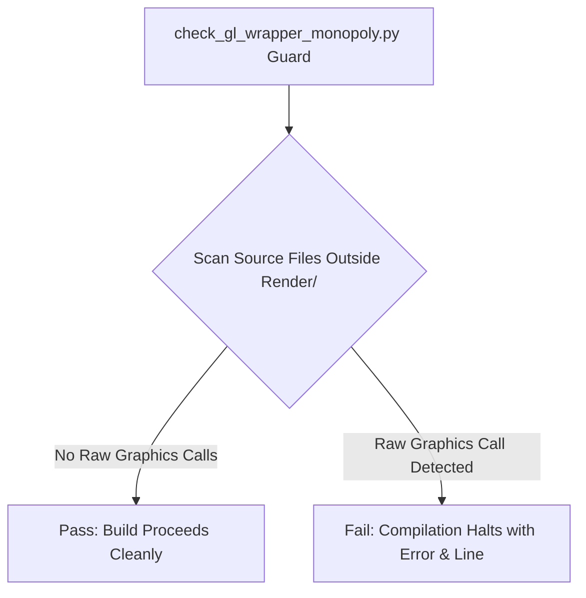

[Transport validation begin: b09c91168c55c8abd3c307e6]

@B 27mr 126
#include <stdlib.h>
#include <string.h>
char *audit_copy(const char *s){char *p=malloc(strlen(s));if(p)strcpy(p,s);return p;}

@B 17hq 1692
$! File: clean_gnv_curl.COM
$!
$! The GNV environment leaves behind some during the configure and build
$! procedure that need to be cleaned up.
$!
$! The default is to remove all the left over stuff from running the
$! configure script and to remove all intermediate binary files.
$!
$! This should be run with no parameters after the gnv_curl_configure.sh
$! script is run.
$!
$! Parameter P1: REALCLEAN
$!   This removes all build products and brings the environment back to
$!   the point where the gnv_curl_configure.sh procedure needs to be run again.
$!
$! Copyright (C) John Malmberg
$!
$! Permission to use, copy, modify, and/or distribute this software for any
$! purpose with or without fee is hereby granted, provided that the above
$! copyright notice and this permission notice appear in all copies.
$!
$! THE SOFTWARE IS PROVIDED "AS IS" AND THE AUTHOR DISCLAIMS ALL WARRANTIES
$! WITH REGARD TO THIS SOFTWARE INCLUDING ALL IMPLIED WARRANTIES OF
$! MERCHANTABILITY AND FITNESS. IN NO EVENT SHALL THE AUTHOR BE LIABLE FOR
$! ANY SPECIAL, DIRECT, INDIRECT, OR CONSEQUENTIAL DAMAGES OR ANY DAMAGES
$! WHATSOEVER RESULTING FROM LOSS OF USE, DATA OR PROFITS, WHETHER IN AN
$! ACTION OF CONTRACT, NEGLIGENCE OR OTHER TORTIOUS ACTION, ARISING OUT
$! OF OR IN CONNECTION WITH THE USE OR PERFORMANCE OF THIS SOFTWARE.
$!
$! SPDX-License-Identifier: ISC
$!
$!============================================================================
$!
$! Save this so we can get back.
$ default_dir = f$environment("default")
$!
$!
$! Move to where the base directory is.
$ set def [--]
$!
$!
$ file = "sys$login:sh*."
$ if f$search(file) .nes. "" then delete 'file';*
$!
$ file = "sys$login:make*."

@B 17hr 2845
$ if f$search(file) .nes. "" then delete 'file';*
$!
$ file = "lcl_root:[]confdefs.h"
$ if f$search(file) .nes. "" then delete 'file';*
$!
$ file = "lcl_root:[]conftest.dsf"
$ if f$search(file) .nes. "" then delete 'file';*
$!
$ file = "lcl_root:[]conftest.lis"
$ if f$search(file) .nes. "" then delete 'file';*
$!
$ file = "lcl_root:[]conftest.sym"
$ if f$search(file) .nes. "" then delete 'file';*
$!
$!
$ file = "lcl_root:[.conf*...]*.*"
$ if f$search(file) .nes. "" then delete 'file';*
$ file = "lcl_root:[]conf*.dir
$ if f$search(file) .nes. "" then delete 'file';*
$!
$!
$ file = "lcl_root:[.lib]*.out"
$ if f$search(file) .nes. "" then delete 'file';*
$ file = "lcl_root:[.lib]*.o"
$ if f$search(file) .nes. "" then delete 'file';*
$!
$!
$ file = "lcl_root:[.lib]*.lis"
$ if f$search(file) .nes. "" then delete 'file';*
$!
$ file = "lcl_root:[.src]*.lis"
$ if f$search(file) .nes. "" then delete 'file';*
$!
$ file = "lcl_root:[.src]cc_temp*."
$ if f$search(file) .nes. "" then delete 'file';*
$!
$ file = "lcl_root:[.src]*.dsf"
$ if f$search(file) .nes. "" then delete 'file';*
$!
$ file = "lcl_root:[.src]*.o"
$ if f$search(file) .nes. "" then delete 'file';*
$!
$ file = "lcl_root:[.lib]ar*."
$ if f$search(file) .nes. "" then delete 'file';*
$!
$ file = "lcl_root:[.lib]cc_temp*."
$ if f$search(file) .nes. "" then delete 'file';*
$!
$ file = "lcl_root:[...]*.lo"
$ if f$search(file) .nes. "" then delete 'file';*
$!
$ file = "lcl_root:[...]*.a"
$ if f$search(file) .nes. "" then delete 'file';*
$!
$ file = "lcl_root:[...]*.la"
$ if f$search(file) .nes. "" then delete 'file';*
$!
$ file = "lcl_root:[...]*.lai"
$ if f$search(file) .nes. "" then delete 'file';*
$!
$ file = "lcl_root:[.projects.vms]curl-*_original_src.bck"
$ if f$search(file) .nes. "" then delete 'file';*
$!
$ file = "lcl_root:[.projects.vms]curl_d-*_original_src.bck"
$ if f$search(file) .nes. "" then delete 'file';*
$!
$ file = "lcl_root:[.projects.vms]curl-*_vms_src.bck"
$ if f$search(file) .nes. "" then delete 'file';*
$!
$ file = "lcl_root:[.projects.vms]curl_d-*_vms_src.bck"
$ if f$search(file) .nes. "" then delete 'file';*
$!
$ file = "lcl_root:[.projects.vms]curl-*.release_notes"
$ if f$search(file) .nes. "" then delete 'file';*
$!
$ file = "lcl_root:[.projects.vms]curl_d-*.release_notes"
$ if f$search(file) .nes. "" then delete 'file';*
$!
$ file = "lcl_root:[.projects.vms]*-curl-*.pcsi$desc"
$ if f$search(file) .nes. "" then delete 'file';*
$!
$ file = "lcl_root:[.projects.vms]*-curl_d-*.pcsi$desc"
$ if f$search(file) .nes. "" then delete 'file';*
$!
$ file = "lcl_root:[.projects.vms]*-curl-*.pcsi$text"
$ if f$search(file) .nes. "" then delete 'file';*
$!
$ file = "lcl_root:[.projects.vms]*-curl_d-*.pcsi$text"
$ if f$search(file) .nes. "" then delete 'file';*
$!
$!======================================================================

@B 17hs 2944
$!
$ if p1 .nes. "REALCLEAN" then goto all_exit
$!
$ file = "lcl_root:[...]*.obj"
$ if f$search(file) .nes. "" then delete 'file';*
$!
$ file = "lcl_root:[...]Makefile."
$ if f$search(file) .nes. "" then delete 'file';*
$!
$ file = "lcl_root:[...]libtool."
$ if f$search(file) .nes. "" then delete 'file';*
$!
$ file = "lcl_root:[...]*.lis"
$ if f$search(file) .nes. "" then delete 'file';*
$!
$ file = "lcl_root:[...]POTFILES."
$ if f$search(file) .nes. "" then delete 'file';*
$!
$ file = "lcl_root:[]libcurl.pc"
$ if f$search(file) .nes. "" then delete 'file';*
$!
$ file = "lcl_root:[]curl-config."
$ if f$search(file) .nes. "" then delete 'file';*
$!
$ file = "lcl_root:[]config.h"
$ if f$search(file) .nes. "" then delete 'file';*
$!
$ file = "lcl_root:[.src]config.h"
$ if f$search(file) .nes. "" then delete 'file';*
$!
$ file = "lcl_root:[.src]curl."
$ if f$search(file) .nes. "" then delete 'file';*
$!
$ file = "lcl_root:[.tests]configurehelp.pm"
$ if f$search(file) .nes. "" then delete 'file';*
$!
$ file = "lcl_root:[.lib]config.h"
$ if f$search(file) .nes. "" then delete 'file';*
$!
$ file = "lcl_root:[.lib]curl_config.h"
$ if f$search(file) .nes. "" then delete 'file';*
$!
$ file = "lcl_root:[.lib]libcurl.vers"
$ if f$search(file) .nes. "" then delete 'file';*
$!
$ file = "lcl_root:[]ca-bundle.h"
$ if f$search(file) .nes. "" then delete 'file';*
$!
$ file = "lcl_root:[]config.log"
$ if f$search(file) .nes. "" then delete 'file';*
$!
$ file = "lcl_root:[]config.status"
$ if f$search(file) .nes. "" then delete 'file';*
$!
$ file = "lcl_root:[]conftest.dangle"
$ if f$search(file) .nes. "" then delete 'file';*
$!
$ file = "lcl_root:[]CXX$DEMANGLER_DB."
$ if f$search(file) .nes. "" then delete 'file';*
$!
$ file = "lcl_root:[]stamp-h1."
$ if f$search(file) .nes. "" then delete 'file';*
$!
$ file = "lcl_root:[...]stamp-h1."
$ if f$search(file) .nes. "" then delete 'file';*
$!
$ file = "lcl_root:[...]stamp-h2."
$ if f$search(file) .nes. "" then delete 'file';*
$!
$ file = "lcl_root:[...]stamp-h3."
$ if f$search(file) .nes. "" then delete 'file';*
$!
$ file = "lcl_root:[.lib]*.a"
$ if f$search(file) .nes. "" then delete 'file';*
$!
$ file = "lcl_root:[...]*.spec"
$ if f$search(file) .nes. "" then delete 'file';*
$!
$ file = "lcl_root:[...]gnv$*.*"
$ if f$search(file) .nes. "" then delete 'file';*
$!
$ file = "lcl_root:[...]gnv*.opt"
$ if f$search(file) .nes. "" then delete 'file';*
$!
$ file = "lcl_root:[.projects.vms]macro32_exactcase.exe"
$ if f$search(file) .nes. "" then delete 'file';*
$!
$ file = "lcl_root:[.projects.vms]report_openssl_version.exe"
$ if f$search(file) .nes. "" then delete 'file';*
$!
$ file = "lcl_root:[.projects.vms]hp_ssl_release_info.txt"
$ if f$search(file) .nes. "" then delete 'file';*
$!
$ file = "lcl_root:[.src]curl.exe"
$ if f$search(file) .nes. "" then delete 'file';*
$!
$all_exit:
$!
$! Put the default back.
$!-----------------------
$ set def 'default_dir'
$!
$ exit

@B 1v2f 4123
// <copyright file="GameConfiguration.cs" company="MUnique">
// Licensed under the MIT License. See LICENSE file in the project root for full license information.
// </copyright>

namespace MUnique.OpenMU.DataModel.Configuration;

using MUnique.OpenMU.Annotations;
using MUnique.OpenMU.AttributeSystem;
using MUnique.OpenMU.DataModel.Configuration.Items;
using MUnique.OpenMU.DataModel.Entities;
using MUnique.OpenMU.PlugIns;

/// <summary>
/// Defines the game configuration.
/// A game configuration contains the whole configuration of a game, directly or indirectly.
/// </summary>
[AggregateRoot]
[Cloneable]
public partial class GameConfiguration
{
    /// <summary>
    /// Gets or sets the maximum reachable level.
    /// </summary>
    public short MaximumLevel { get; set; }

    /// <summary>
    /// Gets or sets the maximum reachable master level.
    /// </summary>
    public short MaximumMasterLevel { get; set; }

    /// <summary>
    /// Gets or sets the experience rate of the game.
    /// </summary>
    public float ExperienceRate { get; set; }

    /// <summary>
    /// Gets or sets the master experience rate of the game.
    /// </summary>
    public float MasterExperienceRate { get; set; } = 1.0f;

    /// <summary>
    /// Gets or sets a value indicating whether experience overflow should be prevented.
    /// When <c>true</c>, if gaining experience would exceed the amount needed for the next level,
    /// only the necessary experience for the next level is gained, and the overflow is discarded.
    /// When <c>false</c>, excess experience is applied to subsequent levels (default behavior).
    /// </summary>
    public bool PreventExperienceOverflow { get; set; }

    /// <summary>
    /// Gets or sets the minimum monster level which are required to be killed
    /// in order to gain master experience for master character classes.
    /// </summary>
    public byte MinimumMonsterLevelForMasterExperience { get; set; }

    /// <summary>
    /// Gets or sets the information range. This defines how far players can see other game objects.
    /// </summary>
    public byte InfoRange { get; set; }

    /// <summary>
    /// Gets or sets a value indicating whether area skills hit players.
    /// </summary>
    /// <remarks>
    /// Usually false, during castle siege this might be true.
    /// </remarks>
    public bool AreaSkillHitsPlayer { get; set; }

    /// <summary>
    /// Gets or sets the maximum inventory money value.
    /// </summary>
    public int MaximumInventoryMoney { get; set; }

    /// <summary>
    /// Gets or sets the maximum vault money value.
    /// </summary>
    public int MaximumVaultMoney { get; set; }

    /// <summary>
    /// Gets or sets a value indicating whether money pickup should be clamped to the maximum inventory money limit instead of failing when the limit would be exceeded.
    /// </summary>
    /// <remarks>
    /// When <c>true</c>, if picking up money would exceed the maximum inventory money, the player will receive as much as possible (up to the limit) instead of the pickup failing completely.
    /// When <c>false</c>, the pickup will fail if it would exceed the maximum (default behavior).
    /// </remarks>
    public bool ClampMoneyOnPickup { get; set; }

    /// <summary>
    /// Gets or sets the level delta used to determine the pool of items eligible for excellent drops.
    /// A monster must be at least this many levels above an item's DropLevel for the item to be eligible as excellent.
    /// </summary>
    public byte ExcellentItemDropLevelDelta { get; set; }

    /// <summary>
    /// Gets or sets the experience formula per level. The variable name for the level is "level".
    /// </summary>
    public string? ExperienceFormula { get; set; }

    /// <summary>
    /// Gets or sets the experience formula per master level. The variable name for the level is "level".
    /// </summary>
    public string? MasterExperienceFormula { get; set; }

    /// <summary>
    /// Gets or sets the interval for attribute recoveries. See also MUnique.OpenMU.GameLogic.Attributes.Stats.Regeneration.

@B 1v2g 1149
    /// </summary>
    public int RecoveryInterval { get; set; }

    /// <summary>
    /// Gets or sets the maximum numbers of letters a player can have in his inbox.
    /// </summary>
    public int MaximumLetters { get; set; }

    /// <summary>
    /// Gets or sets the price of sending a letter.
    /// </summary>
    public int LetterSendPrice { get; set; }

    /// <summary>
    /// Gets or sets the maximum number of characters per account.
    /// </summary>
    public byte MaximumCharactersPerAccount { get; set; }

    /// <summary>
    /// Gets or sets the character name regex.
    /// </summary>
    /// <remarks>
    /// "^[a-zA-Z0-9]{3,10}$";.
    /// </remarks>
    public string? CharacterNameRegex { get; set; }

    /// <summary>
    /// Gets or sets the maximum length of the password.
    /// </summary>
    public int MaximumPasswordLength { get; set; }

    /// <summary>
    /// Gets or sets the maximum size of parties.
    /// </summary>
    public byte MaximumPartySize { get; set; }

    /// <summary>
    /// Gets or sets a value indicating whether if a monster should drop or adds money to the character directly.

@B 1v2h 5902
    /// </summary>
    public bool ShouldDropMoney { get; set; }

    /// <summary>
    /// Gets or sets the duration of item drops on the ground.
    /// </summary>
    public TimeSpan ItemDropDuration { get; set; }

    /// <summary>
    /// Gets or sets the maximum droppable item option level.
    /// </summary>
    public byte MaximumItemOptionLevelDrop { get; set; }

    /// <summary>
    /// Gets or sets the accumulated damage which needs to be done to decrease <see cref="Item.Durability"/> of a defending item by 1.
    /// </summary>
    public double DamagePerOneItemDurability { get; set; }

    /// <summary>
    /// Gets or sets the accumulated damage which needs to be done to decrease <see cref="Item.Durability"/> of a pet item by 1.
    /// </summary>
    public double DamagePerOnePetDurability { get; set; }

    /// <summary>
    /// Gets or sets the number of hits which needs to be done to decrease the <see cref="Item.Durability"/> of an offensive item by 1.
    /// </summary>
    public double HitsPerOneItemDurability { get; set; }

    /// <summary>
    /// Gets or sets the duel configuration.
    /// </summary>
    [MemberOfAggregate]
    public virtual DuelConfiguration? DuelConfiguration { get; set; }

    /// <summary>
    /// Gets or sets the possible jewel mixes.
    /// </summary>
    [MemberOfAggregate]
    public virtual ICollection<JewelMix> JewelMixes { get; protected set; } = null!;

    /// <summary>
    /// Gets or sets the warp list.
    /// </summary>
    [MemberOfAggregate]
    public virtual ICollection<WarpInfo> WarpList { get; protected set; } = null!;

    /// <summary>
    /// Gets or sets the drop item groups which can be assigned to maps and characters.
    /// </summary>
    [MemberOfAggregate]
    public virtual ICollection<DropItemGroup> DropItemGroups { get; protected set; } = null!;

    /// <summary>
    /// Gets or sets the skills of this game configuration.
    /// </summary>
    [MemberOfAggregate]
    public virtual ICollection<Skill> Skills { get; protected set; } = null!;

    /// <summary>
    /// Gets or sets the character classes.
    /// </summary>
    [MemberOfAggregate]
    public virtual ICollection<CharacterClass> CharacterClasses { get; protected set; } = null!;

    /// <summary>
    /// Gets or sets the item definitions.
    /// </summary>
    [MemberOfAggregate]
    public virtual ICollection<ItemDefinition> Items { get; protected set; } = null!;

    /// <summary>
    /// Gets or sets the item level bonus tables.
    /// </summary>
    [MemberOfAggregate]
    public virtual ICollection<ItemLevelBonusTable> ItemLevelBonusTables { get; protected set; } = null!;

    /// <summary>
    /// Gets or sets the item slot types.
    /// </summary>
    [MemberOfAggregate]
    public virtual ICollection<ItemSlotType> ItemSlotTypes { get; protected set; } = null!;

    /// <summary>
    /// Gets or sets the item option definitions.
    /// </summary>
    [MemberOfAggregate]
    public virtual ICollection<ItemOptionDefinition> ItemOptions { get; protected set; } = null!;

    /// <summary>
    /// Gets or sets the item option types.
    /// </summary>
    [MemberOfAggregate]
    public virtual ICollection<ItemOptionType> ItemOptionTypes { get; protected set; } = null!;

    /// <summary>
    /// Gets or sets the item set groups.
    /// </summary>
    [MemberOfAggregate]
    public virtual ICollection<ItemSetGroup> ItemSetGroups { get; protected set; } = null!;

    /// <summary>
    /// Gets or sets the item option combination bonuses.
    /// </summary>
    [MemberOfAggregate]
    public virtual ICollection<ItemOptionCombinationBonus> ItemOptionCombinationBonuses { get; protected set; } = null!;

    /// <summary>
    /// Gets or sets the map definitions.
    /// </summary>
    [MemberOfAggregate]
    public virtual ICollection<GameMapDefinition> Maps { get; protected set; } = null!;

    /// <summary>
    /// Gets or sets the monster definitions.
    /// </summary>
    [MemberOfAggregate]
    public virtual ICollection<MonsterDefinition> Monsters { get; protected set; } = null!;

    /// <summary>
    /// Gets or sets the attributes.
    /// </summary>
    [MemberOfAggregate]
    public virtual ICollection<AttributeDefinition> Attributes { get; protected set; } = null!;

    /// <summary>
    /// Gets or sets the magic effects.
    /// </summary>
    [MemberOfAggregate]
    public virtual ICollection<MagicEffectDefinition> MagicEffects { get; protected set; } = null!;

    /// <summary>
    /// Gets or sets the master skill roots.
    /// </summary>
    [MemberOfAggregate]
    public virtual ICollection<MasterSkillRoot> MasterSkillRoots { get; protected set; } = null!;

    /// <summary>
    /// Gets or sets the attribute combinations.
    /// </summary>
    [MemberOfAggregate]
    public virtual ICollection<AttributeRelationship> GlobalAttributeCombinations { get; protected set; } = null!;

    /// <summary>
    /// Gets or sets the base attribute values.
    /// </summary>
    [MemberOfAggregate]
    public virtual ICollection<ConstValueAttribute> GlobalBaseAttributeValues { get; protected set; } = null!;

    /// <summary>
    /// Gets or sets the plug in configurations.
    /// </summary>
    [MemberOfAggregate]
    public virtual ICollection<PlugInConfiguration> PlugInConfigurations { get; protected set; } = null!;

    /// <summary>
    /// Gets or sets the event definitions.
    /// </summary>
    [MemberOfAggregate]
    public virtual ICollection<MiniGameDefinition> MiniGameDefinitions { get; protected set; } = null!;

    /// <summary>
    /// Gets or sets the castle siege configuration.
    /// </summary>
    [MemberOfAggregate]
    public virtual CastleSiegeConfiguration? CastleSiegeConfiguration { get; set; }

    /// <inheritdoc />
    public override string ToString()
    {
        return "Default Game Configuration";
    }
}
@B 22cm 2155
// <copyright file="Scrolls.cs" company="MUnique">
// Licensed under the MIT License. See LICENSE file in the project root for full license information.
// </copyright>

namespace MUnique.OpenMU.Persistence.Initialization.VersionSeasonSix.Items;

using MUnique.OpenMU.DataModel.Configuration;
using MUnique.OpenMU.DataModel.Configuration.Items;
using MUnique.OpenMU.GameLogic.Attributes;
using MUnique.OpenMU.Persistence.Initialization.CharacterClasses;

/// <summary>
/// Initializer for scroll items which allow a character to learn <see cref="Skill"/>s.
/// </summary>
/// <seealso cref="MUnique.OpenMU.Persistence.Initialization.InitializerBase" />
public class Scrolls : InitializerBase
{
    /// <summary>
    /// Initializes a new instance of the <see cref="Scrolls"/> class.
    /// </summary>
    /// <param name="context">The context.</param>
    /// <param name="gameConfiguration">The game configuration.</param>
    public Scrolls(IContext context, GameConfiguration gameConfiguration)
        : base(context, gameConfiguration)
    {
    }

    /// <summary>
    /// Initializes the scroll data.
    /// </summary>
    /// <remarks>
    /// Regex: (?m)^\s*(\d+)\s+(-*\d+)\s+(\d+)\s+(\d+)\s+(\d+)\s+(\d+)\s+(\d+)\s+(\d+)\s+\"(.+?)\"\s+(\d+)\s+(\d+)\s+(\d+)\s+(\d+)\s+(\d+)\s+(\d+)\s+(\d+)\s+(\d+)\s+(\d+)\s+(\d+)\s+(\d+).*$
    /// Replace by: this.CreateScroll($1, TODO, $5, "$9", $10, $13, $14, $15, $16, $17, $18, $19, $20);.
    /// </remarks>
    public override void Initialize()
    {
        this.CreateScroll(0, 1, "Scroll of Poison", 30, 0, 140, 17000, 1, 0, 0, 1, 0, 0, 0);
        this.CreateScroll(1, 2, "Scroll of Meteorite", 21, 0, 104, 11000, 1, 0, 0, 1, 0, 1, 0);
        this.CreateScroll(2, 3, "Scroll of Lighting", 13, 0, 72, 3000, 1, 0, 0, 1, 0, 0, 0);
        this.CreateScroll(3, 4, "Scroll of Fire Ball", 5, 0, 40, 300, 1, 0, 0, 1, 0, 1, 0);
        this.CreateScroll(4, 5, "Scroll of Flame", 35, 0, 160, 21000, 1, 0, 0, 1, 0, 0, 0);
        this.CreateScroll(5, 6, "Scroll of Teleport", 17, 0, 88, 5000, 1, 0, 0, 0, 0, 0, 0);
        this.CreateScroll(6, 7, "Scroll of Ice", 25, 0, 120, 14000, 1, 0, 0, 1, 0, 1, 0);

@B 22cn 1280
        this.CreateScroll(7, 8, "Scroll of Twister", 40, 0, 180, 25000, 1, 0, 0, 1, 0, 0, 0);
        this.CreateScroll(8, 9, "Scroll of Evil Spirit", 50, 0, 220, 35000, 1, 0, 0, 1, 0, 0, 0);
        this.CreateScroll(9, 10, "Scroll of Hellfire", 60, 0, 260, 60000, 1, 0, 0, 1, 0, 0, 0);
        this.CreateScroll(10, 11, "Scroll of Power Wave", 9, 0, 56, 1100, 1, 0, 0, 1, 0, 1, 0);
        this.CreateScroll(11, 12, "Scroll of Aqua Beam", 74, 0, 345, 100000, 1, 0, 0, 1, 0, 0, 0);
        this.CreateScroll(12, 13, "Scroll of Cometfall", 80, 0, 436, 175000, 1, 0, 0, 1, 0, 0, 0);
        this.CreateScroll(13, 14, "Scroll of Inferno", 88, 0, 578, 265000, 1, 0, 0, 1, 0, 0, 0);
        this.CreateScroll(14, 15, "Scroll of Teleport Ally", 83, 0, 644, 245000, 2, 0, 0, 0, 0, 0, 0);
        this.CreateScroll(15, 16, "Scroll of Soul Barrier", 77, 0, 408, 135000, 1, 0, 0, 0, 0, 0, 0);
        this.CreateScroll(16, 38, "Scroll of Decay", 96, 0, 953, 345000, 2, 0, 0, 0, 0, 0, 0);
        this.CreateScroll(17, 39, "Scroll of Ice Storm", 93, 0, 849, 315000, 2, 0, 0, 0, 0, 0, 0);
        this.CreateScroll(18, 40, "Scroll of Nova", 100, 0, 1052, 410000, 2, 0, 0, 0, 0, 0, 0);
        this.CreateScroll(19, 215, "Chain Lightning Parchment", 75, 0, 245, 175000, 0, 0, 0, 0, 0, 1, 0);

@B 22co 1032
        this.CreateScroll(20, 214, "Drain Life Parchment", 35, 0, 150, 100000, 0, 0, 0, 0, 0, 1, 0);
        this.CreateScroll(21, 230, "Lightning Shock Parchment", 93, 0, 823, 315000, 0, 0, 0, 0, 0, 1, 0);
        this.CreateScroll(22, 217, "Damage Reflection Parchment", 80, 0, 375, 245000, 0, 0, 0, 0, 0, 1, 0);
        this.CreateScroll(23, 218, "Berserker Parchment", 83, 0, 620, 265000, 0, 0, 0, 0, 0, 1, 0);
        this.CreateScroll(24, 219, "Sleep Parchment", 40, 0, 180, 135000, 0, 0, 0, 0, 0, 1, 0);
        this.CreateScroll(26, 221, "Weakness Parchment", 93, 0, 663, 410000, 0, 0, 0, 0, 0, 2, 0);
        this.CreateScroll(27, 222, "Innovation Parchment", 111, 0, 912, 450000, 0, 0, 0, 0, 0, 2, 0);
        this.CreateScroll(28, 233, "Scroll of Wizardry Enhance", 100, 220, 118, 425000, 2, 0, 0, 0, 0, 0, 0);
        this.CreateScroll(29, 237, "Scroll of Gigantic Storm", 100, 220, 118, 380000, 0, 0, 0, 1, 0, 0, 0);
        this.CreateScroll(30, 262, "Chain Drive Parchment", 80, 150, 0, 175000, 0, 0, 0, 0, 0, 0, 1);

@B 22cp 2052
        this.CreateScroll(31, 263, "Dark Side Parchment", 100, 180, 0, 345000, 0, 0, 0, 0, 0, 0, 1);
        this.CreateScroll(32, 264, "Dragon Roar Parchment", 90, 150, 0, 265000, 0, 0, 0, 0, 0, 0, 1);
        this.CreateScroll(33, 265, "Dragon Slasher Parchment", 100, 200, 0, 345000, 0, 0, 0, 0, 0, 0, 1);
        this.CreateScroll(34, 266, "Ignore Defense Parchment", 100, 120, 404, 345000, 0, 0, 0, 0, 0, 0, 1);
        this.CreateScroll(35, 267, "Increase Health Parchment", 90, 80, 132, 265000, 0, 0, 0, 0, 0, 0, 1);
        this.CreateScroll(36, 268, "Increase Block Parchment", 70, 50, 80, 60000, 0, 0, 0, 0, 0, 0, 1);
    }

    private void CreateScroll(byte number, int skillNumber, string name, byte dropLevel, int levelRequirement, int energyRequirement, int money, int darkWizardClassLevel, int darkKnightClassLevel, int elfClassLevel, int magicGladiatorClassLevel, int darkLordClassLevel, int summonerClassLevel, int ragefighterClassLevel)
    {
        var scroll = this.Context.CreateNew<ItemDefinition>();
        this.GameConfiguration.Items.Add(scroll);
        scroll.Group = 15;
        scroll.Number = number;
        scroll.Skill = this.GameConfiguration.Skills.First(skill => skill.Number == skillNumber);
        scroll.Width = 1;
        scroll.Height = 2;
        scroll.Name = name;
        scroll.DropLevel = dropLevel;
        scroll.DropsFromMonsters = true;
        scroll.Durability = 1;

        this.CreateItemRequirementIfNeeded(scroll, Stats.Level, levelRequirement);
        this.CreateItemRequirementIfNeeded(scroll, Stats.TotalEnergyRequirementValue, energyRequirement);

        scroll.Value = money;
        scroll.SetGuid(scroll.Group, scroll.Number);
        var classes = this.GameConfiguration.DetermineCharacterClasses(darkWizardClassLevel, darkKnightClassLevel, elfClassLevel, magicGladiatorClassLevel, darkLordClassLevel, summonerClassLevel, ragefighterClassLevel);
        foreach (var characterClass in classes)
        {
            scroll.QualifiedCharacters.Add(characterClass);
        }
    }
}
@B eni 1364
/*
  Simple DirectMedia Layer
  Copyright (C) 2017 BlackBerry Limited

  This software is provided 'as-is', without any express or implied
  warranty.  In no event will the authors be held liable for any damages
  arising from the use of this software.

  Permission is granted to anyone to use this software for any purpose,
  including commercial applications, and to alter it and redistribute it
  freely, subject to the following restrictions:

  1. The origin of this software must not be misrepresented; you must not
     claim that you wrote the original software. If you use this software
     in a product, an acknowledgment in the product documentation would be
     appreciated but is not required.
  2. Altered source versions must be plainly marked as such, and must not be
     misrepresented as being the original software.
  3. This notice may not be removed or altered from any source distribution.
*/
#include "../../SDL_internal.h"
#include "../SDL_sysvideo.h"
#include "../../events/SDL_keyboard_c.h"
#include "../../events/SDL_mouse_c.h"
#include "SDL_qnx.h"

static screen_context_t context;
static screen_event_t   event;

/**
 * Initializes the QNX video plugin.
 * Creates the Screen context and event handles used for all window operations
 * by the plugin.
 * @param   SDL_VideoDevice *_this
 * @return  0 if successful, -1 on error
 */

@B enj 764
static bool videoInit(SDL_VideoDevice *_this)
{
    SDL_VideoDisplay display;

    if (screen_create_context(&context, 0) < 0) {
        return false;
    }

    if (screen_create_event(&event) < 0) {
        return false;
    }

    SDL_zero(display);

    if (SDL_AddVideoDisplay(&display, false) == 0) {
        return false;
    }

    // Assume we have a mouse and keyboard
    SDL_AddKeyboard(SDL_DEFAULT_KEYBOARD_ID, NULL);
    SDL_AddMouse(SDL_DEFAULT_MOUSE_ID, NULL);

    return true;
}

static void videoQuit(SDL_VideoDevice *_this)
{
}

/**
 * Creates a new native Screen window and associates it with the given SDL
 * window.
 * @param   SDL_VideoDevice *_this
 * @param   window  SDL window to initialize
 * @return  0 if successful, -1 on error
 */

@B enk 2251
static bool createWindow(SDL_VideoDevice *_this, SDL_Window *window)
{
    window_impl_t   *impl;
    int             size[2];
    int             numbufs;
    int             format;
    int             usage;

    impl = SDL_calloc(1, sizeof(*impl));
    if (!impl) {
        return false;
    }

    // Create a native window.
    if (screen_create_window(&impl->window, context) < 0) {
        goto fail;
    }

    // Set the native window's size to match the SDL window.
    size[0] = window->w;
    size[1] = window->h;

    if (screen_set_window_property_iv(impl->window, SCREEN_PROPERTY_SIZE,
                                      size) < 0) {
        goto fail;
    }

    if (screen_set_window_property_iv(impl->window, SCREEN_PROPERTY_SOURCE_SIZE,
                                      size) < 0) {
        goto fail;
    }

    // Create window buffer(s).
    if (window->flags & SDL_WINDOW_OPENGL) {
        if (glGetConfig(&impl->conf, &format) < 0) {
            goto fail;
        }
        numbufs = 2;

        usage = SCREEN_USAGE_OPENGL_ES2;
        if (screen_set_window_property_iv(impl->window, SCREEN_PROPERTY_USAGE,
                                          &usage) < 0) {
            return false;
        }
    } else {
        format = SCREEN_FORMAT_RGBX8888;
        numbufs = 1;
    }

    // Set pixel format.
    if (screen_set_window_property_iv(impl->window, SCREEN_PROPERTY_FORMAT,
                                      &format) < 0) {
        goto fail;
    }

    // Create buffer(s).
    if (screen_create_window_buffers(impl->window, numbufs) < 0) {
        goto fail;
    }

    window->internal = impl;
    return true;

fail:
    if (impl->window) {
        screen_destroy_window(impl->window);
    }

    SDL_free(impl);
    return false;
}

/**
 * Gets a pointer to the Screen buffer associated with the given window. Note
 * that the buffer is actually created in createWindow().
 * @param       SDL_VideoDevice *_this
 * @param       window  SDL window to get the buffer for
 * @param[out]  pixles  Holds a pointer to the window's buffer
 * @param[out]  format  Holds the pixel format for the buffer
 * @param[out]  pitch   Holds the number of bytes per line
 * @return  0 if successful, -1 on error
 */

@B enl 1118
static bool createWindowFramebuffer(SDL_VideoDevice *_this, SDL_Window * window, SDL_PixelFormat * format,
                        void ** pixels, int *pitch)
{
    window_impl_t   *impl = (window_impl_t *)window->internal;
    screen_buffer_t buffer;

    // Get a pointer to the buffer's memory.
    if (screen_get_window_property_pv(impl->window, SCREEN_PROPERTY_BUFFERS,
                                      (void **)&buffer) < 0) {
        return false;
    }

    if (screen_get_buffer_property_pv(buffer, SCREEN_PROPERTY_POINTER,
                                      pixels) < 0) {
        return false;
    }

    // Set format and pitch.
    if (screen_get_buffer_property_iv(buffer, SCREEN_PROPERTY_STRIDE,
                                      pitch) < 0) {
        return false;
    }

    *format = SDL_PIXELFORMAT_XRGB8888;
    return true;
}

/**
 * Informs the window manager that the window needs to be updated.
 * @param   SDL_VideoDevice *_this
 * @param   window      The window to update
 * @param   rects       An array of reectangular areas to update
 * @param   numrects    Rect array length

@B enm 652
 * @return  0 if successful, -1 on error
 */
static bool updateWindowFramebuffer(SDL_VideoDevice *_this, SDL_Window *window, const SDL_Rect *rects,
                        int numrects)
{
    window_impl_t   *impl = (window_impl_t *)window->internal;
    screen_buffer_t buffer;

    if (screen_get_window_property_pv(impl->window, SCREEN_PROPERTY_BUFFERS,
                                      (void **)&buffer) < 0) {
        return false;
    }

    screen_post_window(impl->window, buffer, numrects, (int *)rects, 0);
    screen_flush_context(context, 0);
    return true;
}

/**
 * Runs the main event loop.
 * @param   SDL_VideoDevice *_this
 */

@B enn 711
static void pumpEvents(SDL_VideoDevice *_this)
{
    int             type;

    for (;;) {
        if (screen_get_event(context, event, 0) < 0) {
            break;
        }

        if (screen_get_event_property_iv(event, SCREEN_PROPERTY_TYPE, &type)
            < 0) {
            break;
        }

        if (type == SCREEN_EVENT_NONE) {
            break;
        }

        switch (type) {
        case SCREEN_EVENT_KEYBOARD:
            handleKeyboardEvent(event);
            break;

        default:
            break;
        }
    }
}

/**
 * Updates the size of the native window using the geometry of the SDL window.
 * @param   SDL_VideoDevice *_this
 * @param   window  SDL window to update
 */

@B eno 553
static void setWindowSize(SDL_VideoDevice *_this, SDL_Window *window)
{
    window_impl_t   *impl = (window_impl_t *)window->internal;
    int             size[2];

    size[0] = window->pending.w;
    size[1] = window->pending.h;

    screen_set_window_property_iv(impl->window, SCREEN_PROPERTY_SIZE, size);
    screen_set_window_property_iv(impl->window, SCREEN_PROPERTY_SOURCE_SIZE, size);
}

/**
 * Makes the native window associated with the given SDL window visible.
 * @param   SDL_VideoDevice *_this
 * @param   window  SDL window to update
 */

@B enp 873
static void showWindow(SDL_VideoDevice *_this, SDL_Window *window)
{
    window_impl_t   *impl = (window_impl_t *)window->internal;
    const int       visible = 1;

    screen_set_window_property_iv(impl->window, SCREEN_PROPERTY_VISIBLE,
                                  &visible);
}

/**
 * Makes the native window associated with the given SDL window invisible.
 * @param   SDL_VideoDevice *_this
 * @param   window  SDL window to update
 */
static void hideWindow(SDL_VideoDevice *_this, SDL_Window *window)
{
    window_impl_t   *impl = (window_impl_t *)window->internal;
    const int       visible = 0;

    screen_set_window_property_iv(impl->window, SCREEN_PROPERTY_VISIBLE,
        &visible);
}

/**
 * Destroys the native window associated with the given SDL window.
 * @param   SDL_VideoDevice *_this
 * @param   window  SDL window that is being destroyed
 */

@B enq 534
static void destroyWindow(SDL_VideoDevice *_this, SDL_Window *window)
{
    window_impl_t   *impl = (window_impl_t *)window->internal;

    if (impl) {
        screen_destroy_window(impl->window);
        window->internal = NULL;
    }
}

/**
 * Frees the plugin object created by createDevice().
 * @param   device  Plugin object to free
 */
static void deleteDevice(SDL_VideoDevice *device)
{
    SDL_free(device);
}

/**
 * Creates the QNX video plugin used by SDL.
 * @return  Initialized device if successful, NULL otherwise
 */

@B enr 617
static SDL_VideoDevice *createDevice(void)
{
    SDL_VideoDevice *device;

    device = (SDL_VideoDevice *)SDL_calloc(1, sizeof(SDL_VideoDevice));
    if (!device) {
        return NULL;
    }

    device->internal = NULL;
    device->VideoInit = videoInit;
    device->VideoQuit = videoQuit;
    device->CreateSDLWindow = createWindow;
    device->CreateWindowFramebuffer = createWindowFramebuffer;
    device->UpdateWindowFramebuffer = updateWindowFramebuffer;
    device->SetWindowSize = setWindowSize;
    device->ShowWindow = showWindow;
    device->HideWindow = hideWindow;
    device->PumpEvents = pumpEvents;

@B ens 612
    device->DestroyWindow = destroyWindow;

    device->GL_LoadLibrary = glLoadLibrary;
    device->GL_GetProcAddress = glGetProcAddress;
    device->GL_CreateContext = glCreateContext;
    device->GL_SetSwapInterval = glSetSwapInterval;
    device->GL_SwapWindow = glSwapWindow;
    device->GL_MakeCurrent = glMakeCurrent;
    device->GL_DestroyContext = glDeleteContext;
    device->GL_UnloadLibrary = glUnloadLibrary;

    device->free = deleteDevice;
    return device;
}

VideoBootStrap QNX_bootstrap = {
    "qnx", "QNX Screen",
    createDevice,
    NULL, // no ShowMessageBox implementation
    false
};

@B 1ex8 1196
<?xml version="1.0" encoding="utf-8"?>
<Project DefaultTargets="Build" ToolsVersion="14.0" xmlns="http://schemas.microsoft.com/developer/msbuild/2003">
  <ItemGroup Label="ProjectConfigurations">
    <ProjectConfiguration Include="Debug|Win32">
      <Configuration>Debug</Configuration>
      <Platform>Win32</Platform>
    </ProjectConfiguration>
    <ProjectConfiguration Include="Debug|x64">
      <Configuration>Debug</Configuration>
      <Platform>x64</Platform>
    </ProjectConfiguration>
    <ProjectConfiguration Include="Release|Win32">
      <Configuration>Release</Configuration>
      <Platform>Win32</Platform>
    </ProjectConfiguration>
    <ProjectConfiguration Include="Release|x64">
      <Configuration>Release</Configuration>
      <Platform>x64</Platform>
    </ProjectConfiguration>
  </ItemGroup>
  <PropertyGroup Label="Globals">
    <ProjectGuid>{9E1987E3-1F19-45CA-B9C9-D31E791836D8}</ProjectGuid>
    <RootNamespace>example_sdl2_directx11</RootNamespace>
    <WindowsTargetPlatformVersion>8.1</WindowsTargetPlatformVersion>
    <ProjectName>example_sdl2_directx11</ProjectName>
  </PropertyGroup>
  <Import Project="$(VCTargetsPath)\Microsoft.Cpp.Default.props" />

@B 1ex9 8200
  <PropertyGroup Condition="'$(Configuration)|$(Platform)'=='Debug|Win32'" Label="Configuration">
    <ConfigurationType>Application</ConfigurationType>
    <UseDebugLibraries>true</UseDebugLibraries>
    <CharacterSet>MultiByte</CharacterSet>
    <PlatformToolset>v140</PlatformToolset>
  </PropertyGroup>
  <PropertyGroup Condition="'$(Configuration)|$(Platform)'=='Debug|x64'" Label="Configuration">
    <ConfigurationType>Application</ConfigurationType>
    <UseDebugLibraries>true</UseDebugLibraries>
    <CharacterSet>MultiByte</CharacterSet>
    <PlatformToolset>v140</PlatformToolset>
  </PropertyGroup>
  <PropertyGroup Condition="'$(Configuration)|$(Platform)'=='Release|Win32'" Label="Configuration">
    <ConfigurationType>Application</ConfigurationType>
    <UseDebugLibraries>false</UseDebugLibraries>
    <WholeProgramOptimization>true</WholeProgramOptimization>
    <CharacterSet>MultiByte</CharacterSet>
    <PlatformToolset>v140</PlatformToolset>
  </PropertyGroup>
  <PropertyGroup Condition="'$(Configuration)|$(Platform)'=='Release|x64'" Label="Configuration">
    <ConfigurationType>Application</ConfigurationType>
    <UseDebugLibraries>false</UseDebugLibraries>
    <WholeProgramOptimization>true</WholeProgramOptimization>
    <CharacterSet>MultiByte</CharacterSet>
    <PlatformToolset>v140</PlatformToolset>
  </PropertyGroup>
  <Import Project="$(VCTargetsPath)\Microsoft.Cpp.props" />
  <ImportGroup Label="ExtensionSettings">
  </ImportGroup>
  <ImportGroup Label="PropertySheets" Condition="'$(Configuration)|$(Platform)'=='Debug|Win32'">
    <Import Project="$(UserRootDir)\Microsoft.Cpp.$(Platform).user.props" Condition="exists('$(UserRootDir)\Microsoft.Cpp.$(Platform).user.props')" Label="LocalAppDataPlatform" />
  </ImportGroup>
  <ImportGroup Condition="'$(Configuration)|$(Platform)'=='Debug|x64'" Label="PropertySheets">
    <Import Project="$(UserRootDir)\Microsoft.Cpp.$(Platform).user.props" Condition="exists('$(UserRootDir)\Microsoft.Cpp.$(Platform).user.props')" Label="LocalAppDataPlatform" />
  </ImportGroup>
  <ImportGroup Label="PropertySheets" Condition="'$(Configuration)|$(Platform)'=='Release|Win32'">
    <Import Project="$(UserRootDir)\Microsoft.Cpp.$(Platform).user.props" Condition="exists('$(UserRootDir)\Microsoft.Cpp.$(Platform).user.props')" Label="LocalAppDataPlatform" />
  </ImportGroup>
  <ImportGroup Condition="'$(Configuration)|$(Platform)'=='Release|x64'" Label="PropertySheets">
    <Import Project="$(UserRootDir)\Microsoft.Cpp.$(Platform).user.props" Condition="exists('$(UserRootDir)\Microsoft.Cpp.$(Platform).user.props')" Label="LocalAppDataPlatform" />
  </ImportGroup>
  <PropertyGroup Label="UserMacros" />
  <PropertyGroup Condition="'$(Configuration)|$(Platform)'=='Debug|Win32'">
    <OutDir>$(ProjectDir)$(Configuration)\</OutDir>
    <IntDir>$(ProjectDir)$(Configuration)\</IntDir>
    <IncludePath>$(IncludePath)</IncludePath>
  </PropertyGroup>
  <PropertyGroup Condition="'$(Configuration)|$(Platform)'=='Debug|x64'">
    <OutDir>$(ProjectDir)$(Configuration)\</OutDir>
    <IntDir>$(ProjectDir)$(Configuration)\</IntDir>
    <IncludePath>$(IncludePath)</IncludePath>
  </PropertyGroup>
  <PropertyGroup Condition="'$(Configuration)|$(Platform)'=='Release|Win32'">
    <OutDir>$(ProjectDir)$(Configuration)\</OutDir>
    <IntDir>$(ProjectDir)$(Configuration)\</IntDir>
    <IncludePath>$(IncludePath)</IncludePath>
  </PropertyGroup>
  <PropertyGroup Condition="'$(Configuration)|$(Platform)'=='Release|x64'">
    <OutDir>$(ProjectDir)$(Configuration)\</OutDir>
    <IntDir>$(ProjectDir)$(Configuration)\</IntDir>
    <IncludePath>$(IncludePath)</IncludePath>
  </PropertyGroup>
  <ItemDefinitionGroup Condition="'$(Configuration)|$(Platform)'=='Debug|Win32'">
    <ClCompile>
      <WarningLevel>Level4</WarningLevel>
      <Optimization>Disabled</Optimization>
      <AdditionalIncludeDirectories>..\..;..\..\backends;%SDL2_DIR%\include;$(VcpkgCurrentInstalledDir)include\SDL2;%(AdditionalIncludeDirectories)</AdditionalIncludeDirectories>
      <AdditionalOptions>/utf-8 %(AdditionalOptions)</AdditionalOptions>
    </ClCompile>
    <Link>
      <GenerateDebugInformation>true</GenerateDebugInformation>
      <AdditionalLibraryDirectories>%SDL2_DIR%\lib\x86;$(DXSDK_DIR)/Lib/x86;%(AdditionalLibraryDirectories)</AdditionalLibraryDirectories>
      <AdditionalDependencies>SDL2.lib;SDL2main.lib;d3d11.lib;d3dcompiler.lib;dxgi.lib;%(AdditionalDependencies)</AdditionalDependencies>
      <SubSystem>Console</SubSystem>
      <IgnoreSpecificDefaultLibraries>msvcrt.lib</IgnoreSpecificDefaultLibraries>
    </Link>
  </ItemDefinitionGroup>
  <ItemDefinitionGroup Condition="'$(Configuration)|$(Platform)'=='Debug|x64'">
    <ClCompile>
      <WarningLevel>Level4</WarningLevel>
      <Optimization>Disabled</Optimization>
      <AdditionalIncludeDirectories>..\..;..\..\backends;%SDL2_DIR%\include;$(VcpkgCurrentInstalledDir)include\SDL2;%(AdditionalIncludeDirectories)</AdditionalIncludeDirectories>
      <AdditionalOptions>/utf-8 %(AdditionalOptions)</AdditionalOptions>
    </ClCompile>
    <Link>
      <GenerateDebugInformation>true</GenerateDebugInformation>
      <AdditionalLibraryDirectories>%SDL2_DIR%\lib\x64;$(DXSDK_DIR)/Lib/x64;%(AdditionalLibraryDirectories)</AdditionalLibraryDirectories>
      <AdditionalDependencies>SDL2.lib;SDL2main.lib;d3d11.lib;d3dcompiler.lib;dxgi.lib;%(AdditionalDependencies)</AdditionalDependencies>
      <SubSystem>Console</SubSystem>
      <IgnoreSpecificDefaultLibraries>msvcrt.lib</IgnoreSpecificDefaultLibraries>
    </Link>
  </ItemDefinitionGroup>
  <ItemDefinitionGroup Condition="'$(Configuration)|$(Platform)'=='Release|Win32'">
    <ClCompile>
      <WarningLevel>Level4</WarningLevel>
      <Optimization>MaxSpeed</Optimization>
      <FunctionLevelLinking>true</FunctionLevelLinking>
      <IntrinsicFunctions>true</IntrinsicFunctions>
      <AdditionalIncludeDirectories>..\..;..\..\backends;%SDL2_DIR%\include;$(VcpkgCurrentInstalledDir)include\SDL2;%(AdditionalIncludeDirectories)</AdditionalIncludeDirectories>
      <BufferSecurityCheck>false</BufferSecurityCheck>
      <AdditionalOptions>/utf-8 %(AdditionalOptions)</AdditionalOptions>
    </ClCompile>
    <Link>
      <GenerateDebugInformation>true</GenerateDebugInformation>
      <EnableCOMDATFolding>true</EnableCOMDATFolding>
      <OptimizeReferences>true</OptimizeReferences>
      <AdditionalLibraryDirectories>%SDL2_DIR%\lib\x86;$(DXSDK_DIR)/Lib/x86;%(AdditionalLibraryDirectories)</AdditionalLibraryDirectories>
      <AdditionalDependencies>SDL2.lib;SDL2main.lib;d3d11.lib;d3dcompiler.lib;dxgi.lib;%(AdditionalDependencies)</AdditionalDependencies>
      <SubSystem>Console</SubSystem>
      <IgnoreSpecificDefaultLibraries>
      </IgnoreSpecificDefaultLibraries>
    </Link>
  </ItemDefinitionGroup>
  <ItemDefinitionGroup Condition="'$(Configuration)|$(Platform)'=='Release|x64'">
    <ClCompile>
      <WarningLevel>Level4</WarningLevel>
      <Optimization>MaxSpeed</Optimization>
      <FunctionLevelLinking>true</FunctionLevelLinking>
      <IntrinsicFunctions>true</IntrinsicFunctions>
      <AdditionalIncludeDirectories>..\..;..\..\backends;%SDL2_DIR%\include;$(VcpkgCurrentInstalledDir)include\SDL2;%(AdditionalIncludeDirectories)</AdditionalIncludeDirectories>
      <BufferSecurityCheck>false</BufferSecurityCheck>
      <AdditionalOptions>/utf-8 %(AdditionalOptions)</AdditionalOptions>
    </ClCompile>
    <Link>
      <GenerateDebugInformation>true</GenerateDebugInformation>
      <EnableCOMDATFolding>true</EnableCOMDATFolding>
      <OptimizeReferences>true</OptimizeReferences>
      <AdditionalLibraryDirectories>%SDL2_DIR%\lib\x64;$(DXSDK_DIR)/Lib/x64;%(AdditionalLibraryDirectories)</AdditionalLibraryDirectories>
      <AdditionalDependencies>SDL2.lib;SDL2main.lib;d3d11.lib;d3dcompiler.lib;dxgi.lib;%(AdditionalDependencies)</AdditionalDependencies>
      <SubSystem>Console</SubSystem>
      <IgnoreSpecificDefaultLibraries>
      </IgnoreSpecificDefaultLibraries>
    </Link>
  </ItemDefinitionGroup>
  <ItemGroup>
    <ClCompile Include="..\..\imgui.cpp" />
    <ClCompile Include="..\..\imgui_demo.cpp" />
    <ClCompile Include="..\..\imgui_draw.cpp" />

@B 1exa 887
    <ClCompile Include="..\..\imgui_tables.cpp" />
    <ClCompile Include="..\..\imgui_widgets.cpp" />
    <ClCompile Include="..\..\backends\imgui_impl_sdl2.cpp" />
    <ClCompile Include="..\..\backends\imgui_impl_dx11.cpp" />
    <ClCompile Include="main.cpp" />
  </ItemGroup>
  <ItemGroup>
    <ClInclude Include="..\..\imconfig.h" />
    <ClInclude Include="..\..\imgui.h" />
    <ClInclude Include="..\..\imgui_internal.h" />
    <ClInclude Include="..\..\backends\imgui_impl_sdl2.h" />
    <ClInclude Include="..\..\backends\imgui_impl_dx11.h" />
  </ItemGroup>
  <ItemGroup>
    <None Include="..\..\misc\debuggers\imgui.natstepfilter" />
    <None Include="..\..\misc\debuggers\imgui.natvis" />
    <None Include="..\README.txt" />
  </ItemGroup>
  <Import Project="$(VCTargetsPath)\Microsoft.Cpp.targets" />
  <ImportGroup Label="ExtensionTargets">
  </ImportGroup>
</Project>
@B 27an 858
{
 "results": [
  {
   "id": 3327,
   "zh": "感谢你协助完成结界强化任务。怪物们攻击结界失败后，如今正频繁袭击驻守失落之塔的守护者。无论如何都必须削减怪物的数量。你愿意接受这个任务吗？（等级202-205）"
  },
  {
   "id": 3328,
   "zh": "谢谢你！"
  },
  {
   "id": 3329,
   "zh": "谢谢你。最近族里的生意频频受阻，伏尔甘那边的情况尤其糟糕。我们派人前去调查，结果派去的人都被暗杀者杀害了。请前往伏尔甘，消灭20只血腥杀戮者和10只凶暴血腥杀戮者。"
  },
  {
   "id": 3330,
   "zh": "谢谢你把我从法场上救了出来。第二个任务，是帮我取回艾达的女巫女王随身携带的稀有宝石。它如此美丽，那璀璨的光芒连女巫女王都为之着迷。自然，它在市场上也价值连城。（等级350-400）"
  },
  {
   "id": 3331,
   "zh": "多亏了你，我们侦察队的情况稳定了许多。然而，侦察队报告说出现了一个可怕的敌人，他们不知该如何应对。我想请你前去协助侦察队。你愿意接受这个任务吗？（等级180-185）"
  },
  {
   "id": 3332,
   "zh": "多亏你之前协助完成了多次侦察任务，各个地区似乎都日趋稳定。暗影幻影护卫队的队长注意到了你的功绩，想请你帮助我们在各地区的队员。你愿意接受这个任务吗？（等级166-170）"
  },
  {
   "id": 3333,
   "zh": "和平终于到来后，那个习俗几乎销声匿迹。然而，昆顿以及他带来的混乱，促使在位的精灵女王艾琳·古斯蒂夫重新恢复了它。"
  },
  {
   "id": 3334,
   "zh": "没错！如果你打猎时不想收到组队邀请，只需在聊天窗口输入 '/Request off'。想重新接收组队邀请时，在聊天窗口输入 '/Request on' 即可。"

@B 27ao 1411
  },
  {
   "id": 3335,
   "zh": "没错！在MU世界里，只要你的等级足够高，又有足够的金币支付旅费，就可以按M键轻松出行。;去探索与你等级相符的地区并在那里打猎，也会很有乐趣。"
  },
  {
   "id": 3336,
   "zh": "没错！按下D键就能使用各种指令，包括交易、组队、购买和跟随。好好运用这些指令吧。"
  },
  {
   "id": 3337,
   "zh": "没错！当你想和认识ID的朋友交谈，或是想传递私密消息时，可以在聊天窗口按Tab键发送悄悄话。"
  },
  {
   "id": 3338,
   "zh": "没错！借助城镇里NPC的帮助，你不仅可以合成道具，还能把宝石镶嵌到防具上进行强化，还有更多妙用。记得都去拜访一下。"
  },
  {
   "id": 3339,
   "zh": "没错！你可以找罗林西亚的铁匠汉佐（117,140）、埃尔贝兰的瑞亚（30, 235），或仙踪林的工匠伊奥（194, 123）修理装备。要常去光顾他们哦。"
  },
  {
   "id": 3340,
   "zh": "那肯定会省事不少。你还有其他诀窍吗？"
  },
  {
   "id": 3341,
   "zh": "小事一桩。"
  },
  {
   "id": 3342,
   "zh": "说得对。要与其他旅行者一较高下，你确实需要精良的装备和高等级。但仅凭这些，还不足以让你成为MU的英雄。我会交给你一系列任务，帮你赢得英雄的认可。这些任务你可以随意反复完成。"
  },
  {
   "id": 3343,
   "zh": "真是遗憾，等你有空时请再来吧。（接收委托书失败。）"
  },
  {
   "id": 3344,
   "zh": "真是遗憾，奖励可是相当丰厚的。如果你改变主意，请再回来。（免费佣兵注册已取消。）"
  },
  {
   "id": 3345,
   "zh": "真是遗憾。等你与同伴之间的羁绊更加深厚时，再来找我吧。（任务已取消。）"
  },
  {
   "id": 3346,
   "zh": "真是遗憾。等你找到能与你并肩作战的合适勇士时，再来找我吧。（任务已取消。）"
  },
  {
   "id": 3347,
   "zh": "真是遗憾。如果你改变主意，请在达到190级之前回来。（任务已取消。）"
  },
  {
   "id": 3348,
   "zh": "真是遗憾。如果你改变主意，请在达到194级之前回来。（任务已取消。）"
  },
  {
   "id": 3349,
   "zh": "真是遗憾。如果你改变主意，请在达到206级之前回来。（任务已取消。）"
  },
  {
   "id": 3350,
   "zh": "真是遗憾。如果你改变主意，请在达到210级之前回来。（任务已取消。）"
  },
  {
   "id": 3351,
   "zh": "真是遗憾。如果你改变主意，请在达到101级之前回来。（任务已取消。）"
  },
  {
   "id": 3352,
   "zh": "真是遗憾。如果你改变主意，请在达到111级之前回来。（任务已取消。）"
  },
  {
   "id": 3353,

@B 27ap 905
   "zh": "真是遗憾。如果你改变主意，请在达到121级之前回来。（任务已取消。）"
  },
  {
   "id": 3354,
   "zh": "真是遗憾。如果你改变主意，请在达到131级之前回来。（任务已取消。）"
  },
  {
   "id": 3355,
   "zh": "真是遗憾。如果你改变主意，请在达到141级之前回来。（任务已取消。）"
  },
  {
   "id": 3356,
   "zh": "真是遗憾。如果你改变主意，请在达到161级之前回来。（任务已取消。）"
  },
  {
   "id": 3357,
   "zh": "真是遗憾。如果你改变主意，请在达到166级之前回来。（任务已取消。）"
  },
  {
   "id": 3358,
   "zh": "真是遗憾。如果你改变主意，请在达到171级之前回来。（任务已取消。）"
  },
  {
   "id": 3359,
   "zh": "真是遗憾。如果你改变主意，请在达到180级之前回来。（任务已取消。）"
  },
  {
   "id": 3360,
   "zh": "真是遗憾。如果你改变主意，请在达到186级之前回来。（任务已取消。）"
  },
  {
   "id": 3361,
   "zh": "真是遗憾。如果你改变主意，请在达到198级之前回来。（任务已取消。）"
  },
  {
   "id": 3362,
   "zh": "真是遗憾。如果你改变主意，请在达到202级之前回来。（任务已取消。）"
  },
  {
   "id": 3363,
   "zh": "真是遗憾。如果你改变主意，请在达到91级之前回来。（任务已取消。）"
  },
  {
   "id": 3364,
   "zh": "真是遗憾。这花不了多少时间……如果你改变主意，请在达到290级之前回来。（任务已取消。）"
  },
  {
   "id": 3365,
   "zh": "真是遗憾。这花不了多少时间……如果你改变主意，请在达到320级之前回来。（任务已取消。）"

@B 27aq 907
  },
  {
   "id": 3366,
   "zh": "真是遗憾。这花不了多少时间……如果你改变主意，请在达到350级之前回来。（任务已取消。）"
  },
  {
   "id": 3367,
   "zh": "真是遗憾。如果你改变主意，请再回来。（任务已取消。）"
  },
  {
   "id": 3368,
   "zh": "真是遗憾。这个任务的奖励相当丰厚……如果你改变主意，请在达到290级之前回来。（任务已取消。）"
  },
  {
   "id": 3369,
   "zh": "真是遗憾。这个任务的奖励相当丰厚……如果你改变主意，请在达到320级之前回来。（任务已取消。）"
  },
  {
   "id": 3370,
   "zh": "真是遗憾。这个任务的奖励相当丰厚……如果你改变主意，请在达到350级之前回来。（任务已取消。）"
  },
  {
   "id": 3371,
   "zh": "真是遗憾。如果你想快速成长，可不该错过这个机会……想接受任务的话，请在达到15级之前再来找我。（任务已取消。）"
  },
  {
   "id": 3372,
   "zh": "真是遗憾。如果你想快速成长，可不该错过这个机会……（任务已取消。）"
  },
  {
   "id": 3373,
   "zh": "真是遗憾。如果你想快速成长，可不该错过这个机会……（任务已取消。）"
  },
  {
   "id": 3374,
   "zh": "真是遗憾。如果你想快速成长，可不该错过这个机会……如果你改变主意，请在达到230级之前回来。（任务已取消。）"
  },
  {
   "id": 3375,
   "zh": "真是遗憾。如果你想快速成长，可不该错过这个机会……如果你决定接受任务，请在达到235级之前再来找我。（任务已取消。）"
  },
  {
   "id": 3376,
   "zh": "真是遗憾。如果你想快速成长，可不该错过这个机会……如果你决定接受任务，请在达到240级之前再来找我。（任务已取消。）"
  }
 ]
}

@B vuf 2166
/* Copyright (c) 2014-2015 Xiph.Org Foundation
   Written by Viswanath Puttagunta */
/**
   @file celt_neon_intr.c
   @brief ARM Neon Intrinsic optimizations for celt
 */

/*
   Redistribution and use in source and binary forms, with or without
   modification, are permitted provided that the following conditions
   are met:

   - Redistributions of source code must retain the above copyright
   notice, this list of conditions and the following disclaimer.

   - Redistributions in binary form must reproduce the above copyright
   notice, this list of conditions and the following disclaimer in the
   documentation and/or other materials provided with the distribution.

   THIS SOFTWARE IS PROVIDED BY THE COPYRIGHT HOLDERS AND CONTRIBUTORS
   ``AS IS'' AND ANY EXPRESS OR IMPLIED WARRANTIES, INCLUDING, BUT NOT
   LIMITED TO, THE IMPLIED WARRANTIES OF MERCHANTABILITY AND FITNESS FOR
   A PARTICULAR PURPOSE ARE DISCLAIMED. IN NO EVENT SHALL THE COPYRIGHT OWNER
   OR CONTRIBUTORS BE LIABLE FOR ANY DIRECT, INDIRECT, INCIDENTAL, SPECIAL,
   EXEMPLARY, OR CONSEQUENTIAL DAMAGES (INCLUDING, BUT NOT LIMITED TO,
   PROCUREMENT OF SUBSTITUTE GOODS OR SERVICES; LOSS OF USE, DATA, OR
   PROFITS; OR BUSINESS INTERRUPTION) HOWEVER CAUSED AND ON ANY THEORY OF
   LIABILITY, WHETHER IN CONTRACT, STRICT LIABILITY, OR TORT (INCLUDING
   NEGLIGENCE OR OTHERWISE) ARISING IN ANY WAY OUT OF THE USE OF THIS
   SOFTWARE, EVEN IF ADVISED OF THE POSSIBILITY OF SUCH DAMAGE.
*/

#ifdef HAVE_CONFIG_H
#include "config.h"
#endif

#include <arm_neon.h>
#include "../pitch.h"

#if defined(FIXED_POINT)
void xcorr_kernel_neon_fixed(const opus_val16 * x, const opus_val16 * y, opus_val32 sum[4], int len)
{
   int j;
   int32x4_t a = vld1q_s32(sum);
   /* Load y[0...3] */
   /* This requires len>0 to always be valid (which we assert in the C code). */
   int16x4_t y0 = vld1_s16(y);
   y += 4;

   for (j = 0; j + 8 <= len; j += 8)
   {
      /* Load x[0...7] */
      int16x8_t xx = vld1q_s16(x);
      int16x4_t x0 = vget_low_s16(xx);
      int16x4_t x4 = vget_high_s16(xx);
      /* Load y[4...11] */
      int16x8_t yy = vld1q_s16(y);
      int16x4_t y4 = vget_low_s16(yy);

@B vug 860
      int16x4_t y8 = vget_high_s16(yy);
      int32x4_t a0 = vmlal_lane_s16(a, y0, x0, 0);
      int32x4_t a1 = vmlal_lane_s16(a0, y4, x4, 0);

      int16x4_t y1 = vext_s16(y0, y4, 1);
      int16x4_t y5 = vext_s16(y4, y8, 1);
      int32x4_t a2 = vmlal_lane_s16(a1, y1, x0, 1);
      int32x4_t a3 = vmlal_lane_s16(a2, y5, x4, 1);

      int16x4_t y2 = vext_s16(y0, y4, 2);
      int16x4_t y6 = vext_s16(y4, y8, 2);
      int32x4_t a4 = vmlal_lane_s16(a3, y2, x0, 2);
      int32x4_t a5 = vmlal_lane_s16(a4, y6, x4, 2);

      int16x4_t y3 = vext_s16(y0, y4, 3);
      int16x4_t y7 = vext_s16(y4, y8, 3);
      int32x4_t a6 = vmlal_lane_s16(a5, y3, x0, 3);
      int32x4_t a7 = vmlal_lane_s16(a6, y7, x4, 3);

      y0 = y8;
      a = a7;
      x += 8;
      y += 8;
   }

   for (; j < len; j++)
   {
      int16x4_t x0 = vld1_dup_s16(x);  /* load next x */

@B vuh 1885
      int32x4_t a0 = vmlal_s16(a, y0, x0);

      int16x4_t y4 = vld1_dup_s16(y);  /* load next y */
      y0 = vext_s16(y0, y4, 1);
      a = a0;
      x++;
      y++;
   }

   vst1q_s32(sum, a);
}

#else
/*
 * Function: xcorr_kernel_neon_float
 * ---------------------------------
 * Computes 4 correlation values and stores them in sum[4]
 */
static void xcorr_kernel_neon_float(const float32_t *x, const float32_t *y,
      float32_t sum[4], int len) {
   float32x4_t YY[3];
   float32x4_t YEXT[3];
   float32x4_t XX[2];
   float32x2_t XX_2;
   float32x4_t SUMM;
   const float32_t *xi = x;
   const float32_t *yi = y;

   celt_assert(len>0);

   YY[0] = vld1q_f32(yi);
   SUMM = vdupq_n_f32(0);

   /* Consume 8 elements in x vector and 12 elements in y
    * vector. However, the 12'th element never really gets
    * touched in this loop. So, if len == 8, then we only
    * must access y[0] to y[10]. y[11] must not be accessed
    * hence make sure len > 8 and not len >= 8
    */
   while (len > 8) {
      yi += 4;
      YY[1] = vld1q_f32(yi);
      yi += 4;
      YY[2] = vld1q_f32(yi);

      XX[0] = vld1q_f32(xi);
      xi += 4;
      XX[1] = vld1q_f32(xi);
      xi += 4;

      SUMM = vmlaq_lane_f32(SUMM, YY[0], vget_low_f32(XX[0]), 0);
      YEXT[0] = vextq_f32(YY[0], YY[1], 1);
      SUMM = vmlaq_lane_f32(SUMM, YEXT[0], vget_low_f32(XX[0]), 1);
      YEXT[1] = vextq_f32(YY[0], YY[1], 2);
      SUMM = vmlaq_lane_f32(SUMM, YEXT[1], vget_high_f32(XX[0]), 0);
      YEXT[2] = vextq_f32(YY[0], YY[1], 3);
      SUMM = vmlaq_lane_f32(SUMM, YEXT[2], vget_high_f32(XX[0]), 1);

      SUMM = vmlaq_lane_f32(SUMM, YY[1], vget_low_f32(XX[1]), 0);
      YEXT[0] = vextq_f32(YY[1], YY[2], 1);
      SUMM = vmlaq_lane_f32(SUMM, YEXT[0], vget_low_f32(XX[1]), 1);
      YEXT[1] = vextq_f32(YY[1], YY[2], 2);
      SUMM = vmlaq_lane_f32(SUMM, YEXT[1], vget_high_f32(XX[1]), 0);

@B vui 1875
      YEXT[2] = vextq_f32(YY[1], YY[2], 3);
      SUMM = vmlaq_lane_f32(SUMM, YEXT[2], vget_high_f32(XX[1]), 1);

      YY[0] = YY[2];
      len -= 8;
   }

   /* Consume 4 elements in x vector and 8 elements in y
    * vector. However, the 8'th element in y never really gets
    * touched in this loop. So, if len == 4, then we only
    * must access y[0] to y[6]. y[7] must not be accessed
    * hence make sure len>4 and not len>=4
    */
   if (len > 4) {
      yi += 4;
      YY[1] = vld1q_f32(yi);

      XX[0] = vld1q_f32(xi);
      xi += 4;

      SUMM = vmlaq_lane_f32(SUMM, YY[0], vget_low_f32(XX[0]), 0);
      YEXT[0] = vextq_f32(YY[0], YY[1], 1);
      SUMM = vmlaq_lane_f32(SUMM, YEXT[0], vget_low_f32(XX[0]), 1);
      YEXT[1] = vextq_f32(YY[0], YY[1], 2);
      SUMM = vmlaq_lane_f32(SUMM, YEXT[1], vget_high_f32(XX[0]), 0);
      YEXT[2] = vextq_f32(YY[0], YY[1], 3);
      SUMM = vmlaq_lane_f32(SUMM, YEXT[2], vget_high_f32(XX[0]), 1);

      YY[0] = YY[1];
      len -= 4;
   }

   while (--len > 0) {
      XX_2 = vld1_dup_f32(xi++);
      SUMM = vmlaq_lane_f32(SUMM, YY[0], XX_2, 0);
      YY[0]= vld1q_f32(++yi);
   }

   XX_2 = vld1_dup_f32(xi);
   SUMM = vmlaq_lane_f32(SUMM, YY[0], XX_2, 0);

   vst1q_f32(sum, SUMM);
}

void celt_pitch_xcorr_float_neon(const opus_val16 *_x, const opus_val16 *_y,
                        opus_val32 *xcorr, int len, int max_pitch, int arch) {
   int i;
   (void)arch;
   celt_assert(max_pitch > 0);
   celt_sig_assert((((unsigned char *)_x-(unsigned char *)NULL)&3)==0);

   for (i = 0; i < (max_pitch-3); i += 4) {
      xcorr_kernel_neon_float((const float32_t *)_x, (const float32_t *)_y+i,
            (float32_t *)xcorr+i, len);
   }

   /* In case max_pitch isn't a multiple of 4, do non-unrolled version. */
   for (; i < max_pitch; i++) {
      xcorr[i] = celt_inner_prod_neon(_x, _y+i, len);
   }
}
#endif

@B 21rm 1689
// <copyright file="SoloBalanceInitializer.cs" company="MUnique">
// Licensed under the MIT License. See LICENSE file in the project root for full license information.
// </copyright>

namespace MUnique.OpenMU.Persistence.Initialization;

using System.Text.Json.Nodes;
using MUnique.OpenMU.AttributeSystem;
using MUnique.OpenMU.DataModel.Configuration;
using MUnique.OpenMU.DataModel.Configuration.Items;
using MUnique.OpenMU.DataModel.Entities;
using MUnique.OpenMU.GameLogic;
using MUnique.OpenMU.GameLogic.Attributes;
using MUnique.OpenMU.GameLogic.PlayerActions.ItemConsumeActions;

/// <summary>
/// One-time, opt-in conversion of a Season 6 configuration to a solo progression profile.
/// Character inventories, currency, experience and allocated stats are not rewritten.
/// </summary>
public sealed class SoloBalanceInitializer : InitializerBase
{
    private const float ExperienceMultiplier = 8;
    private const float MasterExperienceMultiplier = 5;
    private const int StoreWidth = 8;
    private const int StoreHeight = 15;

    /// <summary>Initializes a new instance of the <see cref="SoloBalanceInitializer"/> class.</summary>
    /// <param name="context">The writable configuration context.</param>
    /// <param name="gameConfiguration">The complete Season 6 configuration.</param>
    public SoloBalanceInitializer(IContext context, GameConfiguration gameConfiguration)
        : base(context, gameConfiguration)
    {
    }

    /// <inheritdoc />
    public override void Initialize()
    {
        if (SoloBalance.IsEnabled(this.GameConfiguration))
        {
            return;
        }

        this.ConfigureProgression();
        this.ConfigureMonsters();

@B 21rn 699
        this.ConfigureDrops();
        this.ConfigureCraftingAndQuests();
        this.ConfigureSupplies();
        this.ConfigureJewelUpgrades();

        // Written last and saved with the same configuration transaction.
        var marker = this.Context.CreateNew<AttributeDefinition>(
            SoloBalance.ProfileAttributeId, "Solo profile version", "Local solo balance, version 1.");
        this.GameConfiguration.Attributes.Add(marker);
        this.GameConfiguration.GlobalBaseAttributeValues.Add(
            this.Context.CreateNew<ConstValueAttribute>(1f, marker, AggregateType.AddRaw));
    }

    private void ConfigureProgression()
    {
        var config = this.GameConfiguration;

@B 21ro 4402
        config.ExperienceRate = ExperienceMultiplier;
        config.MasterExperienceRate = MasterExperienceMultiplier;
        config.PreventExperienceOverflow = false;
        config.ClampMoneyOnPickup = true;
        config.ShouldDropMoney = false;
        config.RecoveryInterval = 2000;
        config.ItemDropDuration = TimeSpan.FromMinutes(3);
        config.ExcellentItemDropLevelDelta = 10;
        config.LetterSendPrice = (int)SoloBalance.ScalePrice(config.LetterSendPrice);
        config.DamagePerOneItemDurability *= 5;
        config.DamagePerOnePetDurability *= 10;
        config.HitsPerOneItemDurability *= 5;
        var levelPointBonus = this.Context.CreateNew<AttributeDefinition>(
            SoloBalance.LevelUpPointBonusAttributeId, "Solo level point bonus", "Additional points per normal level in the solo profile.");
        config.Attributes.Add(levelPointBonus);
        this.AddBaseAttribute(levelPointBonus, 3);
        this.AddBaseAttribute(Stats.MaximumHealth, 100);
        this.AddBaseAttribute(Stats.HealthAfterMonsterKillMultiplier, 0.03f);
        this.AddBaseAttribute(Stats.ManaAfterMonsterKillMultiplier, 0.03f);
        var moneyRate = config.GlobalBaseAttributeValues.Single(a => a.Definition == Stats.MoneyAmountRate);
        config.GlobalBaseAttributeValues.Remove(moneyRate);
        this.AddBaseAttribute(Stats.MoneyAmountRate, 0.25f);

        foreach (var characterClass in config.CharacterClasses.Where(c => c.CanGetCreated))
        {
            characterClass.LevelRequirementByCreation = 0;
        }

        foreach (var npc in config.Monsters)
        {
            foreach (var buff in npc.Buffs)
            {
                buff.MaximumLevel = config.MaximumLevel;
            }
        }
    }

    private void AddBaseAttribute(AttributeDefinition attribute, float value) =>
        this.GameConfiguration.GlobalBaseAttributeValues.Add(
            this.Context.CreateNew<ConstValueAttribute>(value, attribute.GetPersistent(this.GameConfiguration), AggregateType.AddRaw));

    private void ConfigureMonsters()
    {
        foreach (var monster in this.GameConfiguration.Monsters.Where(m =>
                     m.ObjectKind is NpcObjectKind.Monster or NpcObjectKind.Trap or NpcObjectKind.Destructible))
        {
            foreach (var attribute in monster.Attributes)
            {
                var definition = attribute.AttributeDefinition;
                if (definition == Stats.MaximumHealth)
                {
                    attribute.Value = Compress(attribute.Value, 0.45f, 20000, 300000);
                }
                else if (definition == Stats.MinimumPhysBaseDmg || definition == Stats.MaximumPhysBaseDmg)
                {
                    attribute.Value = Compress(attribute.Value, 0.40f, 400, 1500);
                }
                else if (definition == Stats.DefenseBase || definition == Stats.DefenseRatePvm)
                {
                    attribute.Value = Compress(attribute.Value, 0.45f, 300, 1000);
                }
                else if (definition == Stats.AttackRatePvm)
                {
                    attribute.Value = Compress(attribute.Value, 0.7f, 1500, 4000);
                }
            }
        }
    }

    private static float Compress(float value, float multiplier, float knee, float maximum)
    {
        if (value <= 0)
        {
            return value;
        }

        var scaled = value * multiplier;
        return Math.Clamp(scaled <= knee ? scaled : knee + MathF.Sqrt((scaled - knee) * knee), 1, maximum);
    }

    private void ConfigureDrops()
    {
        // Groups are shared by maps, monsters and quests: visit each definition only once.
        foreach (var group in this.GameConfiguration.DropItemGroups)
        {
            group.Chance = group.ItemType switch
            {
                SpecialItemType.Excellent => Math.Max(group.Chance, 0.02),
                SpecialItemType.Jewel => Math.Max(group.Chance, 0.03),
                SpecialItemType.Ancient => Math.Max(group.Chance, 0.10),
                SpecialItemType.SocketItem => Math.Max(group.Chance, 0.02),
                _ when group.Chance > 0 && group.Chance < 0.01 => Math.Min(0.10, group.Chance * 10),
                _ => group.Chance,
            };
        }
    }

    private void ConfigureCraftingAndQuests()
    {
        var config = this.GameConfiguration;

@B 21rp 1193
        foreach (var settings in config.Monsters.SelectMany(m => m.ItemCraftings)
                     .Select(c => c.SimpleCraftingSettings).OfType<DataModel.Configuration.ItemCrafting.SimpleCraftingSettings>().Distinct())
        {
            settings.SuccessPercent = 100;
            settings.MaximumSuccessPercent = 100;
            settings.SuccessPercentageAdditionForAncientItem = 0;
            settings.SuccessPercentageAdditionForGuardianItem = 0;
            settings.SuccessPercentageAdditionForSocketItem = 0;
        }

        foreach (var quest in config.Monsters.SelectMany(m => m.Quests).Distinct())
        {
            quest.RequiredStartMoney = (int)SoloBalance.ScalePrice(quest.RequiredStartMoney);
        }

        foreach (var warp in config.WarpList)
        {
            warp.Costs = (int)SoloBalance.ScalePrice(warp.Costs);
        }

        foreach (var miniGame in config.MiniGameDefinitions)
        {
            miniGame.EntranceFee = (int)SoloBalance.ScalePrice(miniGame.EntranceFee);
            miniGame.EnterDuration = TimeSpan.FromSeconds(30);
        }
    }

    private void ConfigureSupplies()
    {
        var config = this.GameConfiguration;

@B 21rq 1032
        var supplies = config.Monsters.Single(m => m.Number == 253).MerchantStore!;
        (byte Group, short Number)[] materials =
        [
            (14, 13), (14, 14), (12, 15), (14, 16), (14, 22), (14, 31),
            (14, 41), (14, 42), (14, 43), (14, 44), (13, 14), (13, 31),
            (13, 32), (13, 33), (13, 34), (13, 35), (13, 36), (13, 52),
            (13, 53), (13, 2), (13, 3), (13, 37),
        ];
        foreach (var id in materials)
        {
            this.AddStoreItem(supplies, config.Items.Single(i => i.Group == id.Group && i.Number == id.Number), 0);
        }

        this.AddStoreItem(supplies, config.Items.Single(i => i.Group == 13 && i.Number == 31), 1);

        var bar = config.Monsters.Single(m => m.Number == 255).MerchantStore!;
        foreach (var game in config.MiniGameDefinitions.Where(g => g.TicketItem is not null))
        {
            this.AddStoreItem(bar, game.TicketItem!, (byte)game.TicketItemLevel);
        }

        var skillStores = new short[] { 254, 255, 253, 230 }

@B 21rr 2471
            .Select(number => config.Monsters.Single(m => m.Number == number).MerchantStore!).ToArray();
        foreach (var skillItem in config.Items.Where(i => i.Skill is not null && i.Group is 12 or 15 && i.ItemSlot is null))
        {
            if (!skillStores.Any(store => store.Items.Any(i => i.Definition == skillItem))
                && !skillStores.Any(store => this.TryAddStoreItem(store, skillItem, 0)))
            {
                throw new InvalidOperationException($"Solo skill stores are full; cannot add {skillItem}.");
            }
        }
    }

    private void AddStoreItem(ItemStorage store, ItemDefinition definition, byte level)
    {
        if (!this.TryAddStoreItem(store, definition, level))
        {
            throw new InvalidOperationException($"Solo supply store is full; cannot add {definition}.");
        }
    }

    private bool TryAddStoreItem(ItemStorage store, ItemDefinition definition, byte level)
    {
        if (store.Items.Any(i => i.Definition == definition && i.Level == level))
        {
            return true;
        }

        for (var slot = 0; slot < StoreWidth * StoreHeight; slot++)
        {
            var x = slot % StoreWidth;
            var y = slot / StoreWidth;
            if (x + definition.Width > StoreWidth || y + definition.Height > StoreHeight
                || store.Items.Any(i => i.ItemSlot % StoreWidth < x + definition.Width
                    && i.ItemSlot % StoreWidth + i.Definition!.Width > x
                    && i.ItemSlot / StoreWidth < y + definition.Height
                    && i.ItemSlot / StoreWidth + i.Definition.Height > y))
            {
                continue;
            }

            var item = this.Context.CreateNew<Item>();
            item.Definition = definition;
            item.Level = level;
            item.ItemSlot = (byte)slot;
            item.Durability = Math.Max((byte)1, definition.Durability);
            store.Items.Add(item);
            return true;
        }

        return false;
    }

    private void ConfigureJewelUpgrades()
    {
        foreach (var plugin in this.GameConfiguration.PlugInConfigurations.Where(p =>
                     p.TypeId == typeof(SoulJewelConsumeHandlerPlugIn).GUID))
        {
            var json = JsonNode.Parse(plugin.CustomConfiguration ?? "{}")!.AsObject();
            json["SuccessRatePercentage"] = 100;
            plugin.CustomConfiguration = json.ToJsonString();
        }
    }
}

@B 22ye 756
// <copyright file="AdminUserStore.cs" company="MUnique">
// Licensed under the MIT License. See LICENSE file in the project root for full license information.
// </copyright>

namespace MUnique.OpenMU.Web.AdminPanel.Auth;

using System.Security.Cryptography;
using System.Threading;
using Microsoft.AspNetCore.Identity;
using MUnique.OpenMU.Persistence.AdminAuth;

/// <summary>
/// An ASP.NET Core Identity user store which is backed by the <see cref="IAdminUserRepository"/>
/// and by the optionally configured bootstrap user.
/// </summary>
/// <remarks>
/// Only the parts of Identity which are actually needed are implemented, so the whole user
/// management fits into one table instead of the eight tables of the Identity EF store.
/// </remarks>

@B 22yf 1152
public class AdminUserStore :
    IUserStore<AdminUser>,
    IUserPasswordStore<AdminUser>,
    IUserSecurityStampStore<AdminUser>,
    IUserTwoFactorStore<AdminUser>,
    IUserAuthenticatorKeyStore<AdminUser>,
    IUserTwoFactorRecoveryCodeStore<AdminUser>,
    IUserLockoutStore<AdminUser>,
    IUserRoleStore<AdminUser>
{
    private const char RecoveryCodeSeparator = ';';

    private readonly IAdminUserRepository _repository;
    private readonly BootstrapAdminUserProvider _bootstrapUserProvider;
    private readonly AdminUserSecretProtector _secretProtector;

    /// <summary>
    /// Initializes a new instance of the <see cref="AdminUserStore"/> class.
    /// </summary>
    /// <param name="repository">The repository of the stored users.</param>
    /// <param name="bootstrapUserProvider">The provider of the bootstrap user.</param>
    /// <param name="secretProtector">The protector of the user secrets.</param>
    public AdminUserStore(
        IAdminUserRepository repository,
        BootstrapAdminUserProvider bootstrapUserProvider,
        AdminUserSecretProtector secretProtector)
    {
        this._repository = repository;

@B 22yg 2763
        this._bootstrapUserProvider = bootstrapUserProvider;
        this._secretProtector = secretProtector;
    }

    /// <inheritdoc />
    public Task<string> GetUserIdAsync(AdminUser user, CancellationToken cancellationToken)
        => Task.FromResult(user.Id.ToString());

    /// <inheritdoc />
    public Task<string?> GetUserNameAsync(AdminUser user, CancellationToken cancellationToken)
        => Task.FromResult<string?>(user.LoginName);

    /// <inheritdoc />
    public Task SetUserNameAsync(AdminUser user, string? userName, CancellationToken cancellationToken)
    {
        user.LoginName = userName ?? string.Empty;
        return Task.CompletedTask;
    }

    /// <inheritdoc />
    public Task<string?> GetNormalizedUserNameAsync(AdminUser user, CancellationToken cancellationToken)
        => Task.FromResult<string?>(user.NormalizedLoginName);

    /// <inheritdoc />
    public Task SetNormalizedUserNameAsync(AdminUser user, string? normalizedName, CancellationToken cancellationToken)
    {
        user.NormalizedLoginName = normalizedName ?? string.Empty;
        return Task.CompletedTask;
    }

    /// <inheritdoc />
    public async Task<IdentityResult> CreateAsync(AdminUser user, CancellationToken cancellationToken)
    {
        if (user.Id == Guid.Empty)
        {
            user.Id = Guid.NewGuid();
        }

        await this._repository.AddAsync(user, cancellationToken).ConfigureAwait(false);
        return IdentityResult.Success;
    }

    /// <inheritdoc />
    public async Task<IdentityResult> UpdateAsync(AdminUser user, CancellationToken cancellationToken)
    {
        if (BootstrapAdminUserProvider.IsBootstrapUser(user))
        {
            // The bootstrap user only exists in the configuration - its state is kept in memory.
            return IdentityResult.Success;
        }

        await this._repository.UpdateAsync(user, cancellationToken).ConfigureAwait(false);
        return IdentityResult.Success;
    }

    /// <inheritdoc />
    public async Task<IdentityResult> DeleteAsync(AdminUser user, CancellationToken cancellationToken)
    {
        if (BootstrapAdminUserProvider.IsBootstrapUser(user))
        {
            return IdentityResult.Failed(new IdentityError
            {
                Code = "BootstrapUserNotDeletable",
                Description = "The bootstrap user is defined by the configuration and can't be deleted here.",
            });
        }

        await this._repository.DeleteAsync(user, cancellationToken).ConfigureAwait(false);
        return IdentityResult.Success;
    }

    /// <inheritdoc />
    public async Task<AdminUser?> FindByIdAsync(string userId, CancellationToken cancellationToken)
    {
        if (!Guid.TryParse(userId, out var id))

@B 22yh 3669
        {
            return null;
        }

        if (this._bootstrapUserProvider.User is { } bootstrapUser && bootstrapUser.Id == id)
        {
            return bootstrapUser;
        }

        return await this._repository.GetByIdAsync(id, cancellationToken).ConfigureAwait(false);
    }

    /// <inheritdoc />
    public async Task<AdminUser?> FindByNameAsync(string normalizedUserName, CancellationToken cancellationToken)
    {
        if (this._bootstrapUserProvider.User is { } bootstrapUser
            && string.Equals(bootstrapUser.NormalizedLoginName, normalizedUserName, StringComparison.Ordinal))
        {
            return bootstrapUser;
        }

        return await this._repository.GetByNormalizedLoginNameAsync(normalizedUserName, cancellationToken).ConfigureAwait(false);
    }

    /// <inheritdoc />
    public Task SetPasswordHashAsync(AdminUser user, string? passwordHash, CancellationToken cancellationToken)
    {
        user.PasswordHash = passwordHash ?? string.Empty;
        return Task.CompletedTask;
    }

    /// <inheritdoc />
    public Task<string?> GetPasswordHashAsync(AdminUser user, CancellationToken cancellationToken)
        => Task.FromResult<string?>(user.PasswordHash);

    /// <inheritdoc />
    public Task<bool> HasPasswordAsync(AdminUser user, CancellationToken cancellationToken)
        => Task.FromResult(!string.IsNullOrEmpty(user.PasswordHash));

    /// <inheritdoc />
    public Task SetSecurityStampAsync(AdminUser user, string stamp, CancellationToken cancellationToken)
    {
        user.SecurityStamp = stamp;
        return Task.CompletedTask;
    }

    /// <inheritdoc />
    public Task<string?> GetSecurityStampAsync(AdminUser user, CancellationToken cancellationToken)
        => Task.FromResult<string?>(user.SecurityStamp);

    /// <inheritdoc />
    public Task SetTwoFactorEnabledAsync(AdminUser user, bool enabled, CancellationToken cancellationToken)
    {
        user.IsTwoFactorEnabled = enabled;
        return Task.CompletedTask;
    }

    /// <inheritdoc />
    public Task<bool> GetTwoFactorEnabledAsync(AdminUser user, CancellationToken cancellationToken)
        => Task.FromResult(user.IsTwoFactorEnabled);

    /// <inheritdoc />
    public Task SetAuthenticatorKeyAsync(AdminUser user, string key, CancellationToken cancellationToken)
    {
        user.ProtectedAuthenticatorKey = this._secretProtector.Protect(key);
        return Task.CompletedTask;
    }

    /// <inheritdoc />
    public Task<string?> GetAuthenticatorKeyAsync(AdminUser user, CancellationToken cancellationToken)
        => Task.FromResult(this._secretProtector.Unprotect(user.ProtectedAuthenticatorKey));

    /// <inheritdoc />
    public Task ReplaceCodesAsync(AdminUser user, IEnumerable<string> recoveryCodes, CancellationToken cancellationToken)
    {
        var hashes = recoveryCodes.Select(HashRecoveryCode);
        user.RecoveryCodeHashes = string.Join(RecoveryCodeSeparator, hashes);
        return Task.CompletedTask;
    }

    /// <inheritdoc />
    public Task<bool> RedeemCodeAsync(AdminUser user, string code, CancellationToken cancellationToken)
    {
        var hashes = SplitRecoveryCodeHashes(user).ToList();
        var codeHash = HashRecoveryCode(code);
        var expected = Encoding.ASCII.GetBytes(codeHash);
        var index = hashes.FindIndex(hash =>
        {
            var actual = Encoding.ASCII.GetBytes(hash);
            return actual.Length == expected.Length && CryptographicOperations.FixedTimeEquals(actual, expected);
        });
        if (index < 0)
        {
            return Task.FromResult(false);
        }

        hashes.RemoveAt(index);

@B 22yi 2059
        user.RecoveryCodeHashes = string.Join(RecoveryCodeSeparator, hashes);
        return Task.FromResult(true);
    }

    /// <inheritdoc />
    public Task<int> CountCodesAsync(AdminUser user, CancellationToken cancellationToken)
        => Task.FromResult(SplitRecoveryCodeHashes(user).Count());

    /// <inheritdoc />
    public Task<DateTimeOffset?> GetLockoutEndDateAsync(AdminUser user, CancellationToken cancellationToken)
        => Task.FromResult(user.LockoutEnd);

    /// <inheritdoc />
    public Task SetLockoutEndDateAsync(AdminUser user, DateTimeOffset? lockoutEnd, CancellationToken cancellationToken)
    {
        user.LockoutEnd = lockoutEnd;
        return Task.CompletedTask;
    }

    /// <inheritdoc />
    public Task<int> IncrementAccessFailedCountAsync(AdminUser user, CancellationToken cancellationToken)
    {
        user.AccessFailedCount++;
        return Task.FromResult(user.AccessFailedCount);
    }

    /// <inheritdoc />
    public Task ResetAccessFailedCountAsync(AdminUser user, CancellationToken cancellationToken)
    {
        user.AccessFailedCount = 0;
        return Task.CompletedTask;
    }

    /// <inheritdoc />
    public Task<int> GetAccessFailedCountAsync(AdminUser user, CancellationToken cancellationToken)
        => Task.FromResult(user.AccessFailedCount);

    /// <inheritdoc />
    public Task<bool> GetLockoutEnabledAsync(AdminUser user, CancellationToken cancellationToken)
        => Task.FromResult(true);

    /// <inheritdoc />
    public Task SetLockoutEnabledAsync(AdminUser user, bool enabled, CancellationToken cancellationToken)
    {
        // Lockout is always enabled for admin panel users.
        return Task.CompletedTask;
    }

    /// <inheritdoc />
    public Task AddToRoleAsync(AdminUser user, string roleName, CancellationToken cancellationToken)
    {
        var roles = SplitRoles(user).ToList();
        if (!roles.Contains(roleName, StringComparer.OrdinalIgnoreCase))
        {
            roles.Add(roleName);
            user.Roles = string.Join(',', roles);

@B 22yj 2144
        }

        return Task.CompletedTask;
    }

    /// <inheritdoc />
    public Task RemoveFromRoleAsync(AdminUser user, string roleName, CancellationToken cancellationToken)
    {
        var roles = SplitRoles(user).Where(r => !string.Equals(r, roleName, StringComparison.OrdinalIgnoreCase));
        user.Roles = string.Join(',', roles);
        return Task.CompletedTask;
    }

    /// <inheritdoc />
    public Task<IList<string>> GetRolesAsync(AdminUser user, CancellationToken cancellationToken)
        => Task.FromResult<IList<string>>(SplitRoles(user).ToList());

    /// <inheritdoc />
    public Task<bool> IsInRoleAsync(AdminUser user, string roleName, CancellationToken cancellationToken)
        => Task.FromResult(SplitRoles(user).Contains(roleName, StringComparer.OrdinalIgnoreCase));

    /// <inheritdoc />
    public async Task<IList<AdminUser>> GetUsersInRoleAsync(string roleName, CancellationToken cancellationToken)
    {
        var users = await this._repository.GetAllAsync(cancellationToken).ConfigureAwait(false);
        if (this._bootstrapUserProvider.User is { } bootstrapUser)
        {
            users.Add(bootstrapUser);
        }

        return users.Where(u => SplitRoles(u).Contains(roleName, StringComparer.OrdinalIgnoreCase)).ToList();
    }

    /// <inheritdoc />
    public void Dispose()
    {
        // Nothing to dispose - the repository is managed by the dependency injection container.
        GC.SuppressFinalize(this);
    }

    private static string HashRecoveryCode(string code)
    {
        var normalized = code.Replace("-", string.Empty).Replace(" ", string.Empty).ToUpperInvariant();
        return Convert.ToHexString(SHA256.HashData(Encoding.UTF8.GetBytes(normalized)));
    }

    private static IEnumerable<string> SplitRecoveryCodeHashes(AdminUser user)
        => (user.RecoveryCodeHashes ?? string.Empty).Split(RecoveryCodeSeparator, StringSplitOptions.RemoveEmptyEntries);

    private static IEnumerable<string> SplitRoles(AdminUser user)
        => (user.Roles ?? string.Empty).Split(',', StringSplitOptions.RemoveEmptyEntries | StringSplitOptions.TrimEntries);
}

@B 1xyk 512
// <copyright file="PacketTwister48.cs" company="MUnique">
// Licensed under the MIT License. See LICENSE file in the project root for full license information.
// </copyright>

namespace MUnique.OpenMU.Network.PacketTwister;

/// <summary>
/// PacketTwister implementation for packets of an unknown type.
/// </summary>
internal class PacketTwister48 : IPacketTwister
{
    /// <inheritdoc/>
    public void Twist(Span<byte> data)
    {
        if (data.Length >= 4)
        {
            if (data.Length >= 8)

@B 1xyl 1616
            {
                if (data.Length >= 16)
                {
                    if (data.Length >= 32)
                    {
                        data[27] = data[27];
                        var v13 = (byte)((data[13] >> 7) & 1);
                        if (((data[13] >> 6) & 1) != 0)
                        {
                            data[13] |= 0x80;
                        }
                        else
                        {
                            data[13] &= 0x7F;
                        }

                        if (v13 != 0)
                        {
                            data[13] |= 0x40;
                        }
                        else
                        {
                            data[13] &= 0xBF;
                        }

                        data[11] ^= 0xD3;
                        var v11 = (byte)(data[1] >> 1);
                        data[1] <<= 7;
                        data[1] |= v11;
                        var v12 = (byte)((data[2] >> 6) & 1);
                        if (((data[2] >> 7) & 1) != 0)
                        {
                            data[2] |= 0x40;
                        }
                        else
                        {
                            data[2] &= 0xBF;
                        }

                        if (v12 != 0)
                        {
                            data[2] |= 0x80;
                        }
                        else
                        {
                            data[2] &= 0x7F;
                        }
                    }
                    else

@B 1xym 1171
                    {
                        var v8 = (byte)(data[2] >> 5);
                        data[2] *= 8;
                        data[2] |= v8;
                        data[7] ^= 0x3C;
                        var v9 = data[3];
                        data[3] = data[11];
                        data[11] = v9;
                        data[12] ^= 0xF9;
                        var v14 = (byte)((data[2] >> 6) & 1);
                        if (((data[2] >> 2) & 1) != 0)
                        {
                            data[2] |= 0x40;
                        }
                        else
                        {
                            data[2] &= 0xBF;
                        }

                        if (v14 != 0)
                        {
                            data[2] |= 4;
                        }
                        else
                        {
                            data[2] &= 0xFB;
                        }

                        var v10 = data[15];
                        data[15] = data[7];
                        data[7] = v10;
                        data[11] ^= 0xB;
                        data[0] ^= 0x2A;

@B 1xyn 1245
                    }
                }
                else
                {
                    data[5] ^= 0xC1;
                    var v7 = data[0];
                    data[0] = data[2];
                    data[2] = v7;
                    data[7] ^= 0x34;
                }
            }
            else
            {
                var v3 = data[2];
                data[2] = data[3];
                data[3] = v3;
                data[2] ^= 0x95;
                data[0] ^= 0xDA;
                var v4 = data[0];
                data[0] = data[0];
                data[0] = v4;
                var v5 = (byte)(data[2] >> 2);
                data[2] <<= 6;
                data[2] |= v5;
                var v6 = data[3];
                data[3] = data[3];
                data[3] = v6;
                var v2 = (byte)((data[0] >> 5) & 1);
                if (((data[0] >> 7) & 1) != 0)
                {
                    data[0] |= 0x20;
                }
                else
                {
                    data[0] &= 0xDF;
                }

                if (v2 != 0)
                {
                    data[0] |= 0x80;
                }
                else
                {
                    data[0] &= 0x7F;

@B 1xyo 1153
                }

                data[1] ^= 0x89;
                var v16 = (byte)((data[3] >> 2) & 1);
                if (((data[3] >> 4) & 1) != 0)
                {
                    data[3] |= 4;
                }
                else
                {
                    data[3] &= 0xFB;
                }

                if (v16 != 0)
                {
                    data[3] |= 0x10;
                }
                else
                {
                    data[3] &= 0xEF;
                }

                var v15 = (byte)((data[1] >> 2) & 1);
                if (((data[1] >> 6) & 1) != 0)
                {
                    data[1] |= 4;
                }
                else
                {
                    data[1] &= 0xFB;
                }

                if (v15 != 0)
                {
                    data[1] |= 0x40;
                }
                else
                {
                    data[1] &= 0xBF;
                }
            }
        }
    }

    /// <inheritdoc/>
    public void Correct(Span<byte> data)
    {
        if (data.Length >= 4)
        {
            if (data.Length >= 8)

@B 1xyp 1616
            {
                if (data.Length >= 16)
                {
                    if (data.Length >= 32)
                    {
                        var v13 = (byte)((data[2] >> 6) & 1);
                        if (((data[2] >> 7) & 1) != 0)
                        {
                            data[2] |= 0x40;
                        }
                        else
                        {
                            data[2] &= 0xBF;
                        }

                        if (v13 != 0)
                        {
                            data[2] |= 0x80;
                        }
                        else
                        {
                            data[2] &= 0x7F;
                        }

                        var v11 = (byte)(data[1] >> 7);
                        data[1] *= 2;
                        data[1] |= v11;
                        data[11] ^= 0xD3;
                        var v12 = (byte)((data[13] >> 7) & 1);
                        if (((data[13] >> 6) & 1) != 0)
                        {
                            data[13] |= 0x80;
                        }
                        else
                        {
                            data[13] &= 0x7F;
                        }

                        if (v12 != 0)
                        {
                            data[13] |= 0x40;
                        }
                        else
                        {
                            data[13] &= 0xBF;
                        }

                        data[27] = data[27];
                    }
                    else

@B 1xyq 1485
                    {
                        data[0] ^= 0x2A;
                        data[11] ^= 0xB;
                        var v8 = data[15];
                        data[15] = data[7];
                        data[7] = v8;
                        var v14 = (byte)((data[2] >> 6) & 1);
                        if (((data[2] >> 2) & 1) != 0)
                        {
                            data[2] |= 0x40;
                        }
                        else
                        {
                            data[2] &= 0xBF;
                        }

                        if (v14 != 0)
                        {
                            data[2] |= 4;
                        }
                        else
                        {
                            data[2] &= 0xFB;
                        }

                        data[12] ^= 0xF9;
                        var v9 = data[3];
                        data[3] = data[11];
                        data[11] = v9;
                        data[7] ^= 0x3C;
                        var v10 = (byte)(data[2] >> 3);
                        data[2] *= 32;
                        data[2] |= v10;
                    }
                }
                else
                {
                    data[7] ^= 0x34;
                    var v7 = data[0];
                    data[0] = data[2];
                    data[2] = v7;
                    data[5] ^= 0xC1;
                }
            }
            else

@B 1xyr 1421
            {
                var v2 = (byte)((data[1] >> 2) & 1);
                if (((data[1] >> 6) & 1) != 0)
                {
                    data[1] |= 4;
                }
                else
                {
                    data[1] &= 0xFB;
                }

                if (v2 != 0)
                {
                    data[1] |= 0x40;
                }
                else
                {
                    data[1] &= 0xBF;
                }

                var v16 = (byte)((data[3] >> 2) & 1);
                if (((data[3] >> 4) & 1) != 0)
                {
                    data[3] |= 4;
                }
                else
                {
                    data[3] &= 0xFB;
                }

                if (v16 != 0)
                {
                    data[3] |= 0x10;
                }
                else
                {
                    data[3] &= 0xEF;
                }

                data[1] ^= 0x89;
                var v15 = (byte)((data[0] >> 5) & 1);
                if (((data[0] >> 7) & 1) != 0)
                {
                    data[0] |= 0x20;
                }
                else
                {
                    data[0] &= 0xDF;
                }

                if (v15 != 0)
                {
                    data[0] |= 0x80;
                }
                else
                {
                    data[0] &= 0x7F;

@B 1xys 521
                }

                var v3 = data[3];
                data[3] = data[3];
                data[3] = v3;
                var v4 = (byte)(data[2] >> 6);
                data[2] *= 4;
                data[2] |= v4;
                var v5 = data[0];
                data[0] = data[0];
                data[0] = v5;
                data[0] ^= 0xDA;
                data[2] ^= 0x95;
                var v6 = data[2];
                data[2] = data[3];
                data[3] = v6;
            }
        }
    }
}
@B g1i 623
/*
  Copyright (C) 1997-2026 Sam Lantinga <slouken@libsdl.org>

  This software is provided 'as-is', without any express or implied
  warranty.  In no event will the authors be held liable for any damages
  arising from the use of this software.

  Permission is granted to anyone to use this software for any purpose,
  including commercial applications, and to alter it and redistribute it
  freely.
*/

/* Gamepad image */

#ifndef gamepadutils_h_
#define gamepadutils_h_

typedef struct GamepadImage GamepadImage;

typedef enum
{
    CONTROLLER_MODE_TESTING,
    CONTROLLER_MODE_BINDING,
} ControllerDisplayMode;

enum

@B g1j 1241
{
    SDL_GAMEPAD_ELEMENT_INVALID = -1,

    /* ... SDL_GamepadButton ... */

    SDL_GAMEPAD_ELEMENT_AXIS_LEFTX_NEGATIVE = SDL_GAMEPAD_BUTTON_COUNT,
    SDL_GAMEPAD_ELEMENT_AXIS_LEFTX_POSITIVE,
    SDL_GAMEPAD_ELEMENT_AXIS_LEFTY_NEGATIVE,
    SDL_GAMEPAD_ELEMENT_AXIS_LEFTY_POSITIVE,
    SDL_GAMEPAD_ELEMENT_AXIS_RIGHTX_NEGATIVE,
    SDL_GAMEPAD_ELEMENT_AXIS_RIGHTX_POSITIVE,
    SDL_GAMEPAD_ELEMENT_AXIS_RIGHTY_NEGATIVE,
    SDL_GAMEPAD_ELEMENT_AXIS_RIGHTY_POSITIVE,
    SDL_GAMEPAD_ELEMENT_AXIS_LEFT_TRIGGER,
    SDL_GAMEPAD_ELEMENT_AXIS_RIGHT_TRIGGER,
    SDL_GAMEPAD_ELEMENT_AXIS_MAX,

    SDL_GAMEPAD_ELEMENT_NAME = SDL_GAMEPAD_ELEMENT_AXIS_MAX,
    SDL_GAMEPAD_ELEMENT_TYPE,
    SDL_GAMEPAD_ELEMENT_MAX,
};

#define HIGHLIGHT_COLOR         224, 255, 255, SDL_ALPHA_OPAQUE
#define HIGHLIGHT_TEXTURE_MOD   224, 255, 255
#define PRESSED_COLOR           175, 238, 238, SDL_ALPHA_OPAQUE
#define PRESSED_TEXTURE_MOD     175, 238, 238
#define SELECTED_COLOR          224, 255, 224, SDL_ALPHA_OPAQUE
#define GYRO_COLOR_RED          255, 0, 0, SDL_ALPHA_OPAQUE
#define GYRO_COLOR_GREEN        0, 255, 0, SDL_ALPHA_OPAQUE
#define GYRO_COLOR_BLUE         0, 0, 255, SDL_ALPHA_OPAQUE
#define GYRO_COLOR_ORANGE       255, 128, 0, SDL_ALPHA_OPAQUE

@B g1k 2248

/* Shared layout constants */
#define BUTTON_PADDING          12.0f
#define MINIMUM_BUTTON_WIDTH 96.0f

/*  Symbol */
#define DEGREE_UTF8 "\xC2\xB0"
#define SQUARED_UTF8 "\xC2\xB2"
#define MICRO_UTF8   "\xC2\xB5"
/* Gamepad image display */

extern GamepadImage *CreateGamepadImage(SDL_Renderer *renderer);
extern void SetGamepadImagePosition(GamepadImage *ctx, float x, float y);
extern void GetGamepadImageArea(GamepadImage *ctx, SDL_FRect *area);
extern void GetGamepadTouchpadArea(GamepadImage *ctx, SDL_FRect *area);
extern void SetGamepadImageShowingFront(GamepadImage *ctx, bool showing_front);
extern SDL_GamepadType GetGamepadImageType(GamepadImage *ctx);
extern void SetGamepadImageDisplayMode(GamepadImage *ctx, ControllerDisplayMode display_mode);
extern float GetGamepadImageButtonWidth(GamepadImage *ctx);
extern float GetGamepadImageButtonHeight(GamepadImage *ctx);
extern float GetGamepadImageAxisWidth(GamepadImage *ctx);
extern float GetGamepadImageAxisHeight(GamepadImage *ctx);
extern int GetGamepadImageElementAt(GamepadImage *ctx, float x, float y);

extern void ClearGamepadImage(GamepadImage *ctx);
extern void SetGamepadImageElement(GamepadImage *ctx, int element, bool active);

extern void UpdateGamepadImageFromGamepad(GamepadImage *ctx, SDL_Gamepad *gamepad);
extern void RenderGamepadImage(GamepadImage *ctx);
extern void DestroyGamepadImage(GamepadImage *ctx);

/* Gamepad element display */

typedef struct GamepadDisplay GamepadDisplay;

extern GamepadDisplay *CreateGamepadDisplay(SDL_Renderer *renderer);
extern void SetGamepadDisplayDisplayMode(GamepadDisplay *ctx, ControllerDisplayMode display_mode);
extern void SetGamepadDisplayArea(GamepadDisplay *ctx, const SDL_FRect *area);
extern void SetGamepadDisplayGyroDriftCorrection(GamepadDisplay *ctx, float *gyro_drift_correction);
extern int GetGamepadDisplayElementAt(GamepadDisplay *ctx, SDL_Gamepad *gamepad, float x, float y);
extern void SetGamepadDisplayHighlight(GamepadDisplay *ctx, int element, bool pressed);
extern void SetGamepadDisplaySelected(GamepadDisplay *ctx, int element);
extern void RenderGamepadDisplay(GamepadDisplay *ctx, SDL_Gamepad *gamepad);
extern void DestroyGamepadDisplay(GamepadDisplay *ctx);

/* Gamepad type display */

enum

@B g1l 665
{
    SDL_GAMEPAD_TYPE_UNSELECTED = -1
};

typedef struct GamepadTypeDisplay GamepadTypeDisplay;

extern GamepadTypeDisplay *CreateGamepadTypeDisplay(SDL_Renderer *renderer);
extern void SetGamepadTypeDisplayArea(GamepadTypeDisplay *ctx, const SDL_FRect *area);
extern int GetGamepadTypeDisplayAt(GamepadTypeDisplay *ctx, float x, float y);
extern void SetGamepadTypeDisplayHighlight(GamepadTypeDisplay *ctx, int type, bool pressed);
extern void SetGamepadTypeDisplaySelected(GamepadTypeDisplay *ctx, int type);
extern void SetGamepadTypeDisplayRealType(GamepadTypeDisplay *ctx, SDL_GamepadType type);
extern void RenderGamepadTypeDisplay(GamepadTypeDisplay *ctx);

@B g1m 2141
extern void DestroyGamepadTypeDisplay(GamepadTypeDisplay *ctx);

/* Joystick element display */

typedef struct JoystickDisplay JoystickDisplay;

extern JoystickDisplay *CreateJoystickDisplay(SDL_Renderer *renderer);
extern void SetJoystickDisplayArea(JoystickDisplay *ctx, const SDL_FRect *area);
extern char *GetJoystickDisplayElementAt(JoystickDisplay *ctx, SDL_Joystick *joystick, float x, float y);
extern void SetJoystickDisplayHighlight(JoystickDisplay *ctx, const char *element, bool pressed);
extern void RenderJoystickDisplay(JoystickDisplay *ctx, SDL_Joystick *joystick);
extern void DestroyJoystickDisplay(JoystickDisplay *ctx);

/* Simple buttons */

typedef struct GamepadButton GamepadButton;

extern GamepadButton *CreateGamepadButton(SDL_Renderer *renderer, const char *label);
extern void SetGamepadButtonLabel(GamepadButton *ctx, const char *label);
extern void SetGamepadButtonArea(GamepadButton *ctx, const SDL_FRect *area);
extern void GetGamepadButtonArea(GamepadButton *ctx, SDL_FRect *area);
extern void SetGamepadButtonHighlight(GamepadButton *ctx, bool highlight, bool pressed);
extern float GetGamepadButtonLabelWidth(GamepadButton *ctx);
extern float GetGamepadButtonLabelHeight(GamepadButton *ctx);
extern bool GamepadButtonContains(GamepadButton *ctx, float x, float y);
extern void RenderGamepadButton(GamepadButton *ctx);
extern void DestroyGamepadButton(GamepadButton *ctx);

/* Gyro element Display */

/* This is used as the initial noise tolerance threshold. It's set very close to zero to avoid divide by zero while we're evaluating the noise profile. Each controller may have a very different noise profile.*/
#define ACCELEROMETER_NOISE_THRESHOLD 1e-6f
/* The value below is based on observation of a Dualshock controller. Of all gamepads observed, the Dualshock (PS4) tends to have one of the noisiest accelerometers. Increase this threshold if a controller is failing to pass the noise profiling stage while stationary on a table. */
#define ACCELEROMETER_MAX_NOISE_G 0.075f
#define ACCELEROMETER_MAX_NOISE_G_SQ (ACCELEROMETER_MAX_NOISE_G * ACCELEROMETER_MAX_NOISE_G)

/* Gyro Calibration Phases */

@B g1n 3280
typedef enum
{
    GYRO_CALIBRATION_PHASE_OFF,              /* Calibration has not yet been evaluated - signal to the user to put the controller on a flat surface before beginning the calibration process */
    GYRO_CALIBRATION_PHASE_NOISE_PROFILING,  /* Find the max accelerometer noise for a fixed period */
    GYRO_CALIBRATION_PHASE_DRIFT_PROFILING,  /* Find the drift while the accelerometer is below the accelerometer noise tolerance */
    GYRO_CALIBRATION_PHASE_COMPLETE,         /* Calibration has finished */
} EGyroCalibrationPhase;

typedef struct Quaternion Quaternion;
typedef struct GyroDisplay GyroDisplay;

extern void InitCirclePoints3D(void);
extern GyroDisplay *CreateGyroDisplay(SDL_Renderer *renderer);
extern void SetGyroDisplayArea(GyroDisplay *ctx, const SDL_FRect *area);
extern void SetGamepadDisplayIMUValues(GyroDisplay *ctx, float *gyro_drift_solution, float *euler_displacement_angles, Quaternion *gyro_quaternion, int reported_senor_rate_hz, int estimated_sensor_rate_hz, EGyroCalibrationPhase calibration_phase, float drift_calibration_progress_frac, float accelerometer_noise_sq, float accelerometer_noise_tolerance_sq);
extern GamepadButton *GetGyroResetButton(GyroDisplay *ctx);
extern GamepadButton *GetGyroCalibrateButton(GyroDisplay *ctx);
extern void RenderGyroDisplay(GyroDisplay *ctx, GamepadDisplay *gamepadElements, SDL_Gamepad *gamepad);
extern void DestroyGyroDisplay(GyroDisplay *ctx);

/* Working with mappings and bindings */

/* Return whether a mapping has any bindings */
extern bool MappingHasBindings(const char *mapping);

/* Return true if the mapping has a controller name */
extern bool MappingHasName(const char *mapping);

/* Return the name from a mapping, which should be freed using SDL_free(), or NULL if there is no name specified */
extern char *GetMappingName(const char *mapping);

/* Set the name in a mapping, freeing the mapping passed in and returning a new mapping */
extern char *SetMappingName(char *mapping, const char *name);

/* Get the friendly string for an SDL_GamepadType */
extern const char *GetGamepadTypeString(SDL_GamepadType type);

/* Return the type from a mapping, which should be freed using SDL_free(), or NULL if there is no type specified */
extern SDL_GamepadType GetMappingType(const char *mapping);

/* Set the type in a mapping, freeing the mapping passed in and returning a new mapping */
extern char *SetMappingType(char *mapping, SDL_GamepadType type);

/* Return true if a mapping has this element bound */
extern bool MappingHasElement(const char *mapping, int element);

/* Get the binding for an element, which should be freed using SDL_free(), or NULL if the element isn't bound */
extern char *GetElementBinding(const char *mapping, int element);

/* Set the binding for an element, or NULL to clear it, freeing the mapping passed in and returning a new mapping */
extern char *SetElementBinding(char *mapping, int element, const char *binding);

/* Get the element for a binding, or SDL_GAMEPAD_ELEMENT_INVALID if that binding isn't used */
extern int GetElementForBinding(char *mapping, const char *binding);

/* Return true if a mapping contains this binding */
extern bool MappingHasBinding(const char *mapping, const char *binding);

/* Clear any previous binding */

@B g1o 100
extern char *ClearMappingBinding(char *mapping, const char *binding);

#endif /* gamepadutils_h_ */

@B 26h7 5538
{"results": [{"id": 114, "tx": "Znieś Magii"}, {"id": 146, "tx": "Agnis"}, {"id": 179, "tx": "Amis"}, {"id": 188, "tx": "Anonymous"}, {"id": 190, "tx": "Anubis"}, {"id": 191, "tx": "Apollo"}, {"id": 195, "tx": "Wodny Promień"}, {"id": 203, "tx": "Argo"}, {"id": 211, "tx": "Aruan"}, {"id": 319, "tx": "Barnake"}, {"id": 327, "tx": "Beast GórnyCios"}, {"id": 342, "tx": "Berserk"}, {"id": 363, "tx": "Oślepienie"}, {"id": 383, "tx": "Krwi Wyj"}, {"id": 384, "tx": "Krwi Wycie"}, {"id": 387, "tx": "Krwi Burzy"}, {"id": 436, "tx": "Broy"}, {"id": 463, "tx": "Castol"}, {"id": 466, "tx": "Ceto"}, {"id": 467, "tx": "Łańcuch Napęd"}, {"id": 471, "tx": "Łańcuch Błyskawica"}, {"id": 476, "tx": "Chamer"}, {"id": 507, "tx": "Chaos Zamek13"}, {"id": 508, "tx": "Chaos Zamek14"}, {"id": 520, "tx": "Szarża"}, {"id": 547, "tx": "Cloud"}, {"id": 557, "tx": "UpadekKomety"}, {"id": 605, "tx": "Crescent Moon Cięcie"}, {"id": 641, "tx": "Leczenie"}, {"id": 651, "tx": "Cyklon"}, {"id": 725, "tx": "Ciemny Stinger"}, {"id": 743, "tx": "Death Pchnięcie"}, {"id": 750, "tx": "Rozkład"}, {"id": 809, "tx": "Bies"}, {"id": 859, "tx": "Dione"}, {"id": 906, "tx": "Smoczy Ryk"}, {"id": 911, "tx": "Smoczy Siekacz"}, {"id": 918, "tx": "Drain Życia"}, {"id": 925, "tx": "Drake"}, {"id": 929, "tx": "Loch"}, {"id": 938, "tx": "Loch2"}, {"id": 939, "tx": "Loch3"}, {"id": 956, "tx": "Ziemi Więzienie"}, {"id": 958, "tx": "TrzęsienieZiemi"}, {"id": 975, "tx": "Elektryczny Kolec"}, {"id": 1031, "tx": "Elvian"}, {"id": 1037, "tx": "Energia Kula"}, {"id": 1071, "tx": "Eplete"}, {"id": 1092, "tx": "Zła Duch"}, {"id": 1096, "tx": "Evis"}, {"id": 1117, "tx": "Falcjon"}, {"id": 1118, "tx": "Opadające Cięcie"}, {"id": 1121, "tx": "Fase"}, {"id": 1144, "tx": "Ognia Kula"}, {"id": 1145, "tx": "Ognia Podmuch"}, {"id": 1146, "tx": "Ognia Oddech"}, {"id": 1147, "tx": "Ognia Wybuch"}, {"id": 1153, "tx": "Ognia Krzyk"}, {"id": 1157, "tx": "Ognia Cięcie"}, {"id": 1171, "tx": "Płomień"}, {"id": 1179, "tx": "Flamberge"}, {"id": 1180, "tx": "Siła"}, {"id": 1181, "tx": "Siła Fala"}, {"id": 1201, "tx": "Gaia"}, {"id": 1205, "tx": "Gaion"}, {"id": 1209, "tx": "Garuda"}, {"id": 1493, "tx": "Gywen"}, {"id": 1505, "tx": "Hades"}, {"id": 1520, "tx": "Leczenie"}, {"id": 1533, "tx": "Hegaton"}, {"id": 1539, "tx": "PiekielnyOgień"}, {"id": 1544, "tx": "Heras"}, {"id": 1598, "tx": "Hyon"}, {"id": 1599, "tx": "Hyperion"}, {"id": 1685, "tx": "Lodu"}, {"id": 1686, "tx": "Lodu Strzała"}, {"id": 1695, "tx": "Lodu Burzy"}, {"id": 1735, "tx": "Iluzja Temple..."}, {"id": 1742, "tx": "Przebicie"}, {"id": 1867, "tx": "Niewidzialność"}, {"id": 1875, "tx": "Żelazna Obrona"}, {"id": 1949, "tx": "Kantata"}, {"id": 1950, "tx": "RelikwieKanturu"}, {"id": 1951, "tx": "RuinyKanturu1"}, {"id": 1952, "tx": "RuinyKanturu2"}, {"id": 1953, "tx": "RuinyKanturu3"}, {"id": 1955, "tx": "Kanturu_Zguby1"}, {"id": 1956, "tx": "Kanturu_Zguby2"}, {"id": 1957, "tx": "Kanturu_Zguby_island"}, {"id": 1958, "tx": "Karis"}, {"id": 1968, "tx": "Zabójczy Cios"}, {"id": 2067, "tx": "Błyskawica"}, {"id": 2097, "tx": "ZagubionaWieża"}, {"id": 2098, "tx": "ZagubionaWieża2"}, {"id": 2099, "tx": "ZagubionaWieża3"}, {"id": 2100, "tx": "ZagubionaWieża4"}, {"id": 2101, "tx": "ZagubionaWieża5"}, {"id": 2102, "tx": "ZagubionaWieża6"}, {"id": 2103, "tx": "ZagubionaWieża7"}, {"id": 2114, "tx": "Pchnięcie"}, {"id": 2134, "tx": "Many Promienie"}, {"id": 2206, "tx": "Meter"}, {"id": 2211, "tx": "Minet"}, {"id": 2222, "tx": "Mist"}, {"id": 2236, "tx": "Potwora7"}, {"id": 2245, "tx": "Moros"}, {"id": 2248, "tx": "Multi-Strzał"}, {"id": 2251, "tx": "Muren"}, {"id": 2260, "tx": "Nemesis"}, {"id": 2282, "tx": "Odin"}, {"id": 2321, "tx": "Ophion"}, {"id": 2369, "tx": "Drużynowe Leczenie"}, {"id": 2374, "tx": "BagnoSpokoju"}, {"id": 2382, "tx": "Penetracja"}, {"id": 2400, "tx": "Phoenix Strzał"}, {"id": 2419, "tx": "Plazma Burzy"}, {"id": 2436, "tx": "Trucizna"}, {"id": 2437, "tx": "Trucizna Strzała"}, {"id": 2449, "tx": "Zanieczyszczenie"}, {"id": 2456, "tx": "Moc Cięcie"}, {"id": 2459, "tx": "Moc Fala"}, {"id": 2516, "tx": "Gniewny Cios"}, {"id": 2559, "tx": "Rave"}, {"id": 2923, "tx": "Święty Obrona"}, {"id": 2924, "tx": "Święty Fortuna"}, {"id": 2925, "tx": "Święty Leczenie"}, {"id": 2926, "tx": "Święty Ochrona"}, {"id": 2927, "tx": "Święty Szybkość"}, {"id": 2928, "tx": "Święty Wzmocnienie"}, {"id": 3043, "tx": "Shied-Spalenie"}, {"id": 3087, "tx": "Cięcie"}, {"id": 3091, "tx": "Sen"}, {"id": 3123, "tx": "Duszy Bariera"}, {"id": 3133, "tx": "Zaklęcie Ochrona"}, {"id": 3135, "tx": "Zaklęcie Ograniczenie"}, {"id": 3149, "tx": "Spiralne Cięcie"}, {"id": 3155, "tx": "Duch Lord"}, {"id": 3169, "tx": "Gwiazdopad"}, {"id": 3202, "tx": "Uderzenie Destruction"}, {"id": 3208, "tx": "Ogłuszenie"}, {"id": 3209, "tx": "Przywołanie"}, {"id": 3210, "tx": "Przywołanie Skrytobójcę"}, {"id": 3211, "tx": "Przywołanie Bali"}, {"id": 3212, "tx": "Przywołanie Ciemny Knight"}, {"id": 3213, "tx": "Przywołanie Elite Yeti"}, {"id": 3214, "tx": "Przywołanie Goblin"}, {"id": 3215, "tx": "Przywołanie Potwora"}, {"id": 3216, "tx": "Przywołanie Satyros"}, {"id": 3217, "tx": "Przywołanie Żołnierza"}, {"id": 3218, "tx": "Przywołanie Kamienny Golem"}, {"id": 3263, "tx": "Bagno__Calmness"}, {"id": 3277, "tx": "Sylion"}, {"id": 3320, "tx": "Taros"}, {"id": 3598, "tx": "Potrójny Strzał"}, {"id": 3603, "tx": "Trite"}, {"id": 3661, "tx": "Wirujące Cięcie"}, {"id": 3696, "tx": "Vega"}, {"id": 3697, "tx": "Zemsta"}, {"id": 3715, "tx": "Vicious"}, {"id": 3742, "tx": "Warrior"}, {"id": 3753, "tx": "Słabość"}]}
@B x6l 5995
/* Copyright (c) 2014-2020, Cisco Systems, INC
   Written by XiangMingZhu WeiZhou MinPeng YanWang FrancisQuiers

   Redistribution and use in source and binary forms, with or without
   modification, are permitted provided that the following conditions
   are met:

   - Redistributions of source code must retain the above copyright
   notice, this list of conditions and the following disclaimer.

   - Redistributions in binary form must reproduce the above copyright
   notice, this list of conditions and the following disclaimer in the
   documentation and/or other materials provided with the distribution.

   THIS SOFTWARE IS PROVIDED BY THE COPYRIGHT HOLDERS AND CONTRIBUTORS
   ``AS IS'' AND ANY EXPRESS OR IMPLIED WARRANTIES, INCLUDING, BUT NOT
   LIMITED TO, THE IMPLIED WARRANTIES OF MERCHANTABILITY AND FITNESS FOR
   A PARTICULAR PURPOSE ARE DISCLAIMED. IN NO EVENT SHALL THE COPYRIGHT OWNER
   OR CONTRIBUTORS BE LIABLE FOR ANY DIRECT, INDIRECT, INCIDENTAL, SPECIAL,
   EXEMPLARY, OR CONSEQUENTIAL DAMAGES (INCLUDING, BUT NOT LIMITED TO,
   PROCUREMENT OF SUBSTITUTE GOODS OR SERVICES; LOSS OF USE, DATA, OR
   PROFITS; OR BUSINESS INTERRUPTION) HOWEVER CAUSED AND ON ANY THEORY OF
   LIABILITY, WHETHER IN CONTRACT, STRICT LIABILITY, OR TORT (INCLUDING
   NEGLIGENCE OR OTHERWISE) ARISING IN ANY WAY OUT OF THE USE OF THIS
   SOFTWARE, EVEN IF ADVISED OF THE POSSIBILITY OF SUCH DAMAGE.
*/

#ifdef HAVE_CONFIG_H
#include "config.h"
#endif

#include <xmmintrin.h>
#include <emmintrin.h>
#include <smmintrin.h>
#include "main.h"
#include "celt/x86/x86cpu.h"

/* Entropy constrained matrix-weighted VQ, hard-coded to 5-element vectors, for a single input data vector */
void silk_VQ_WMat_EC_sse4_1(
    opus_int8                   *ind,                           /* O    index of best codebook vector               */
    opus_int32                  *res_nrg_Q15,                   /* O    best residual energy                        */
    opus_int32                  *rate_dist_Q8,                  /* O    best total bitrate                          */
    opus_int                    *gain_Q7,                       /* O    sum of absolute LTP coefficients            */
    const opus_int32            *XX_Q17,                        /* I    correlation matrix                          */
    const opus_int32            *xX_Q17,                        /* I    correlation vector                          */
    const opus_int8             *cb_Q7,                         /* I    codebook                                    */
    const opus_uint8            *cb_gain_Q7,                    /* I    codebook effective gain                     */
    const opus_uint8            *cl_Q5,                         /* I    code length for each codebook vector        */
    const opus_int              subfr_len,                      /* I    number of samples per subframe              */
    const opus_int32            max_gain_Q7,                    /* I    maximum sum of absolute LTP coefficients    */
    const opus_int              L                               /* I    number of vectors in codebook               */
)
{
    opus_int   k, gain_tmp_Q7;
    const opus_int8 *cb_row_Q7;
    opus_int32 neg_xX_Q24[ 5 ];
    opus_int32 sum1_Q15, sum2_Q24;
    opus_int32 bits_res_Q8, bits_tot_Q8;
    __m128i v_XX_31_Q17, v_XX_42_Q17, v_cb_row_31_Q7, v_cb_row_42_Q7, v_acc1_Q24, v_acc2_Q24;

    /* Negate and convert to new Q domain */
    neg_xX_Q24[ 0 ] = -silk_LSHIFT32( xX_Q17[ 0 ], 7 );
    neg_xX_Q24[ 1 ] = -silk_LSHIFT32( xX_Q17[ 1 ], 7 );
    neg_xX_Q24[ 2 ] = -silk_LSHIFT32( xX_Q17[ 2 ], 7 );
    neg_xX_Q24[ 3 ] = -silk_LSHIFT32( xX_Q17[ 3 ], 7 );
    neg_xX_Q24[ 4 ] = -silk_LSHIFT32( xX_Q17[ 4 ], 7 );

    v_XX_31_Q17 = _mm_loadu_si128( (__m128i *)(&XX_Q17[ 1 ] ) );
    v_XX_42_Q17 = _mm_shuffle_epi32( v_XX_31_Q17, _MM_SHUFFLE( 0, 3, 2, 1 ) );

    /* Loop over codebook */
    *rate_dist_Q8 = silk_int32_MAX;
    *res_nrg_Q15 = silk_int32_MAX;
    cb_row_Q7 = cb_Q7;
    /* If things go really bad, at least *ind is set to something safe. */
    *ind = 0;
    for( k = 0; k < L; k++ ) {
        opus_int32 penalty;
        gain_tmp_Q7 = cb_gain_Q7[k];
        /* Weighted rate */
        /* Quantization error: 1 - 2 * xX * cb + cb' * XX * cb */
        sum1_Q15 = SILK_FIX_CONST( 1.001, 15 );

        /* Penalty for too large gain */
        penalty = silk_LSHIFT32( silk_max( silk_SUB32( gain_tmp_Q7, max_gain_Q7 ), 0 ), 11 );

        /* first row of XX_Q17 */
        v_cb_row_31_Q7 = OP_CVTEPI8_EPI32_M32( &cb_row_Q7[ 1 ] );
        v_cb_row_42_Q7 = _mm_shuffle_epi32( v_cb_row_31_Q7, _MM_SHUFFLE( 0, 3, 2, 1 ) );
        v_cb_row_31_Q7 = _mm_mul_epi32( v_XX_31_Q17, v_cb_row_31_Q7 );
        v_cb_row_42_Q7 = _mm_mul_epi32( v_XX_42_Q17, v_cb_row_42_Q7 );
        v_acc1_Q24 = _mm_add_epi64( v_cb_row_31_Q7, v_cb_row_42_Q7);
        v_acc2_Q24 = _mm_shuffle_epi32( v_acc1_Q24, _MM_SHUFFLE( 1, 0, 3, 2 ) );
        v_acc1_Q24 = _mm_add_epi64( v_acc1_Q24, v_acc2_Q24);
        sum2_Q24 = _mm_cvtsi128_si32( v_acc1_Q24 );
        sum2_Q24 = silk_ADD32( neg_xX_Q24[ 0 ], sum2_Q24 );
        sum2_Q24 = silk_LSHIFT32( sum2_Q24, 1 );
        sum2_Q24 = silk_MLA( sum2_Q24,        XX_Q17[  0 ], cb_row_Q7[ 0 ] );
        sum1_Q15 = silk_SMLAWB( sum1_Q15,        sum2_Q24,  cb_row_Q7[ 0 ] );

        /* second row of XX_Q17 */
        sum2_Q24 = silk_MLA( neg_xX_Q24[ 1 ], XX_Q17[  7 ], cb_row_Q7[ 2 ] );
        sum2_Q24 = silk_MLA( sum2_Q24,        XX_Q17[  8 ], cb_row_Q7[ 3 ] );
        sum2_Q24 = silk_MLA( sum2_Q24,        XX_Q17[  9 ], cb_row_Q7[ 4 ] );
        sum2_Q24 = silk_LSHIFT32( sum2_Q24, 1 );
        sum2_Q24 = silk_MLA( sum2_Q24,        XX_Q17[  6 ], cb_row_Q7[ 1 ] );
        sum1_Q15 = silk_SMLAWB( sum1_Q15,        sum2_Q24,  cb_row_Q7[ 1 ] );

        /* third row of XX_Q17 */
        sum2_Q24 = silk_MLA( neg_xX_Q24[ 2 ], XX_Q17[ 13 ], cb_row_Q7[ 3 ] );
        sum2_Q24 = silk_MLA( sum2_Q24,        XX_Q17[ 14 ], cb_row_Q7[ 4 ] );

@B wqm 1512
        sum2_Q24 = silk_LSHIFT32( sum2_Q24, 1 );
        sum2_Q24 = silk_MLA( sum2_Q24,        XX_Q17[ 12 ], cb_row_Q7[ 2 ] );
        sum1_Q15 = silk_SMLAWB( sum1_Q15,        sum2_Q24,  cb_row_Q7[ 2 ] );

        /* fourth row of XX_Q17 */
        sum2_Q24 = silk_MLA( neg_xX_Q24[ 3 ], XX_Q17[ 19 ], cb_row_Q7[ 4 ] );
        sum2_Q24 = silk_LSHIFT32( sum2_Q24, 1 );
        sum2_Q24 = silk_MLA( sum2_Q24,        XX_Q17[ 18 ], cb_row_Q7[ 3 ] );
        sum1_Q15 = silk_SMLAWB( sum1_Q15,        sum2_Q24,  cb_row_Q7[ 3 ] );

        /* last row of XX_Q17 */
        sum2_Q24 = silk_LSHIFT32( neg_xX_Q24[ 4 ], 1 );
        sum2_Q24 = silk_MLA( sum2_Q24,        XX_Q17[ 24 ], cb_row_Q7[ 4 ] );
        sum1_Q15 = silk_SMLAWB( sum1_Q15,        sum2_Q24,  cb_row_Q7[ 4 ] );

        /* find best */
        if( sum1_Q15 >= 0 ) {
            /* Translate residual energy to bits using high-rate assumption (6 dB ==> 1 bit/sample) */
            bits_res_Q8 = silk_SMULBB( subfr_len, silk_lin2log( sum1_Q15 + penalty) - (15 << 7) );
            /* In the following line we reduce the codelength component by half ("-1"); seems to slightly improve quality */
            bits_tot_Q8 = silk_ADD_LSHIFT32( bits_res_Q8, cl_Q5[ k ], 3-1 );
            if( bits_tot_Q8 <= *rate_dist_Q8 ) {
                *rate_dist_Q8 = bits_tot_Q8;
                *res_nrg_Q15 = sum1_Q15 + penalty;
                *ind = (opus_int8)k;
                *gain_Q7 = gain_tmp_Q7;
            }
        }

        /* Go to next cbk vector */

@B x6m 722
        cb_row_Q7 += LTP_ORDER;
    }

#ifdef OPUS_CHECK_ASM
    {
        opus_int8  ind_c = 0;
        opus_int32 res_nrg_Q15_c = 0;
        opus_int32 rate_dist_Q8_c = 0;
        opus_int   gain_Q7_c = 0;

        silk_VQ_WMat_EC_c(
            &ind_c,
            &res_nrg_Q15_c,
            &rate_dist_Q8_c,
            &gain_Q7_c,
            XX_Q17,
            xX_Q17,
            cb_Q7,
            cb_gain_Q7,
            cl_Q5,
            subfr_len,
            max_gain_Q7,
            L
        );

        silk_assert( *ind == ind_c );
        silk_assert( *res_nrg_Q15 == res_nrg_Q15_c );
        silk_assert( *rate_dist_Q8 == rate_dist_Q8_c );
        silk_assert( *gain_Q7 == gain_Q7_c );
    }
#endif
}

@B ybh 897
<!DOCTYPE html PUBLIC "-//W3C//DTD XHTML 1.0 Strict//EN" "http://www.w3.org/TR/xhtml1/DTD/xhtml1-strict.dtd">
<html>
<head>

<meta http-equiv="Content-Type" content="text/html; charset=iso-8859-15"/>
<title>Ogg Vorbis Documentation</title>

<style type="text/css">
body {
  margin: 0 18px 0 18px;
  padding-bottom: 30px;
  font-family: Verdana, Arial, Helvetica, sans-serif;
  color: #333333;
  font-size: .8em;
}

a {
  color: #3366cc;
}

img {
  border: 0;
}

#xiphlogo {
  margin: 30px 0 16px 0;
}

#content p {
  line-height: 1.4;
}

h1, h1 a, h2, h2 a, h3, h3 a {
  font-weight: bold;
  color: #ff9900;
  margin: 1.3em 0 8px 0;
}

h1 {
  font-size: 1.3em;
}

h2 {
  font-size: 1.2em;
}

h3 {
  font-size: 1.1em;
}

li {
  line-height: 1.4;
}

#copyright {
  margin-top: 30px;
  line-height: 1.5em;
  text-align: center;
  font-size: .8em;
  color: #888888;
  clear: both;
}
</style>

</head>

@B yfw 1135

<body>

<div id="xiphlogo">
  <a href="https://xiph.org/"></a>
</div>

<h1>Ogg Vorbis I format specification: comment field and header specification</h1>

<h1 id="overview">Overview</h1>

<p>The Vorbis text comment header is the second (of three) header
packets that begin a Vorbis bitstream. It is meant for short, text
comments, not arbitrary metadata; arbitrary metadata belongs in a
separate logical bitstream (usually an XML stream type) that provides
greater structure and machine parseability.</p>

<p>The comment field is meant to be used much like someone jotting a
quick note on the bottom of a CDR. It should be a little information to
remember the disc by and explain it to others; a short, to-the-point
text note that need not only be a couple words, but isn't going to be
more than a short paragraph. The essentials, in other words, whatever
they turn out to be, eg:</p>

<blockquote><p>
"Honest Bob and the Factory-to-Dealer-Incentives, _I'm Still Around_,
opening for Moxy Fr&uuml;vous, 1997"
</p></blockquote>

<h1 id="commentencoding">Comment encoding</h1>

@B yfx 703

<h2 id="structure">Structure</h2>

<p>The comment header logically is a list of eight-bit-clean vectors; the
number of vectors is bounded to 2^32-1 and the length of each vector
is limited to 2^32-1 bytes. The vector length is encoded; the vector
contents themselves are not null terminated. In addition to the vector
list, there is a single vector for vendor name (also 8 bit clean,
length encoded in 32 bits). For example, the 1.0 release of libvorbis 
set the vendor string to "Xiph.Org libVorbis I 20020717".</p>

<p>The comment header is decoded as follows:</p>

<pre>
  1) [vendor_length] = read an unsigned integer of 32 bits
  2) [vendor_string] = read a UTF-8 vector as [vendor_length] octets

@B yfy 777
  3) [user_comment_list_length] = read an unsigned integer of 32 bits
  4) iterate [user_comment_list_length] times {

       5) [length] = read an unsigned integer of 32 bits
       6) this iteration's user comment = read a UTF-8 vector as [length] octets

     }

  7) [framing_bit] = read a single bit as boolean
  8) if ( [framing_bit] unset or end of packet ) then ERROR
  9) done.
</pre>

<h2 id="vectorformat">Content vector format</h2>

<p>The comment vectors are structured similarly to a UNIX environment variable.
That is, comment fields consist of a field name and a corresponding value and
look like:</p>

<pre>
comment[0]="ARTIST=me"; 
comment[1]="TITLE=the sound of Vorbis"; 
</pre>

<ul>
<li>A case-insensitive field name that may consist of ASCII 0x20 through

@B yfz 856
0x7D, 0x3D ('=') excluded. ASCII 0x41 through 0x5A inclusive (A-Z) is
to be considered equivalent to ASCII 0x61 through 0x7A inclusive
(a-z).</li>
<li>The field name is immediately followed by ASCII 0x3D ('='); 
this equals sign is used to terminate the field name.</li>
<li>0x3D is followed by the 8 bit clean UTF-8 encoded value of the 
field contents to the end of the field.</li>
</ul>

<h3 id="fieldnames">Field names</h3>

<p>Below is a proposed, minimal list of standard field names with a
description of intended use. No single or group of field names is
mandatory; a comment header may contain one, all or none of the names
in this list.</p>

<dl>

<dt>TITLE</dt>
<dd>Track/Work name</dd>

<dt>VERSION</dt>
<dd>The version field may be used to differentiate multiple
versions of the same track title in a single collection.
(e.g. remix info)</dd>

@B yg0 4680

<dt>ALBUM</dt>
<dd>The collection name to which this track belongs</dd>

<dt>TRACKNUMBER</dt>
<dd>The track number of this piece if part of a specific larger collection or album</dd>

<dt>ARTIST</dt>
<dd>The artist generally considered responsible for the work. In popular music
this is usually the performing band or singer. For classical music it would be
the composer. For an audio book it would be the author of the original text.</dd>

<dt>PERFORMER</dt>
<dd>The artist(s) who performed the work. In classical music this would be the
conductor, orchestra, soloists. In an audio book it would be the actor who did
the reading. In popular music this is typically the same as the ARTIST and
is omitted.</dd>

<dt>COPYRIGHT</dt>
<dd>Copyright attribution, e.g., '2001 Nobody's Band' or '1999 Jack Moffitt'</dd>

<dt>LICENSE</dt>
<dd>License information, for example, 'All Rights Reserved', 'Any
Use Permitted', a URL to a license such as a Creative Commons license
(e.g. "creativecommons.org/licenses/by/4.0/"), or similar.</dd>

<dt>ORGANIZATION</dt>
<dd>Name of the organization producing the track (i.e.
the 'record label')</dd>

<dt>DESCRIPTION</dt>
<dd>A short text description of the contents</dd>

<dt>GENRE</dt>
<dd>A short text indication of music genre</dd>

<dt>DATE</dt>
<dd>Date the track was recorded</dd>

<dt>LOCATION</dt>
<dd>Location where track was recorded</dd>

<dt>CONTACT</dt>
<dd>Contact information for the creators or distributors of the track.
This could be a URL, an email address, the physical address of
the producing label.</dd>

<dt>ISRC</dt>
<dd>ISRC number for the track; see <a href="https://isrc.ifpi.org/">the
ISRC intro page</a> for more information on ISRC numbers.</dd>

</dl>

<h3 id="implications">Implications</h3>

<ul>
<li>Field names should not be 'internationalized'; this is a
concession to simplicity not an attempt to exclude the majority of
the world that doesn't speak English. Field <emph>contents</emph>, 
however, use the UTF-8 character encoding to allow easy representation 
of any language.</li>
<li>We have the length of the entirety of the field and restrictions on
the field name so that the field name is bounded in a known way. Thus
we also have the length of the field contents.</li>
<li>Individual 'vendors' may use non-standard field names within
reason. The proper use of comment fields should be clear through
context at this point. Abuse will be discouraged.</li>
<li>There is no vendor-specific prefix to 'nonstandard' field names.
Vendors should make some effort to avoid arbitrarily polluting the
common namespace. We will generally collect the more useful tags
here to help with standardization.</li>
<li>Field names are not required to be unique (occur once) within a
comment header. As an example, assume a track was recorded by three
well know artists; the following is permissible, and encouraged:
<pre>
              ARTIST=Dizzy Gillespie 
              ARTIST=Sonny Rollins 
              ARTIST=Sonny Stitt 
</pre></li>
</ul>

<h2 id="encoding">Encoding</h2>

<p>The comment header comprises the entirety of the second bitstream
header packet. Unlike the first bitstream header packet, it is not
generally the only packet on the second page and may not be restricted
to within the second bitstream page. The length of the comment header
packet is (practically) unbounded. The comment header packet is not
optional; it must be present in the bitstream even if it is
effectively empty.</p>

<p>The comment header is encoded as follows (as per Ogg's standard
bitstream mapping which renders least-significant-bit of the word to be
coded into the least significant available bit of the current
bitstream octet first):</p>

<ol>
<li>Vendor string length (32 bit unsigned quantity specifying number of octets)</li>
<li>Vendor string ([vendor string length] octets coded from beginning of string
to end of string, not null terminated)</li>
<li>Number of comment fields (32 bit unsigned quantity specifying number of fields)</li>
<li>Comment field 0 length (if [Number of comment fields]>0; 32 bit unsigned
quantity specifying number of octets)</li>
<li>Comment field 0 ([Comment field 0 length] octets coded from beginning of
string to end of string, not null terminated)</li>
<li>Comment field 1 length (if [Number of comment fields]>1...)...</li>
</ol>

<p>This is actually somewhat easier to describe in code; implementation of the above
can be found in vorbis/lib/info.c:_vorbis_pack_comment(),_vorbis_unpack_comment()</p>

<div id="copyright">
  The Xiph Fish Logo is a
  trademark (&trade;) of Xiph.Org.<br/>

  These pages &copy; 1994 - 2005 Xiph.Org. All rights reserved.
</div>

</body>
</html>

@B 9ok 1558
/*
  Simple DirectMedia Layer
  Copyright (C) 1997-2026 Sam Lantinga <slouken@libsdl.org>

  This software is provided 'as-is', without any express or implied
  warranty.  In no event will the authors be held liable for any damages
  arising from the use of this software.

  Permission is granted to anyone to use this software for any purpose,
  including commercial applications, and to alter it and redistribute it
  freely, subject to the following restrictions:

  1. The origin of this software must not be misrepresented; you must not
     claim that you wrote the original software. If you use this software
     in a product, an acknowledgment in the product documentation would be
     appreciated but is not required.
  2. Altered source versions must be plainly marked as such, and must not be
     misrepresented as being the original software.
  3. This notice may not be removed or altered from any source distribution.
*/
#include "SDL_internal.h"

#ifndef SDL_sysjoystick_h_
#define SDL_sysjoystick_h_

// This is the system specific header for the SDL joystick API
#include "SDL_joystick_c.h"

// Set up for C function definitions, even when using C++
#ifdef __cplusplus
extern "C" {
#endif

// The SDL joystick structure

typedef struct SDL_JoystickAxisInfo
{
    Sint16 initial_value;           // Initial axis state
    Sint16 value;                   // Current axis state
    Sint16 zero;                    // Zero point on the axis (-32768 for triggers)
    bool has_initial_value;     // Whether we've seen a value on the axis yet

@B 9ol 1881
    bool has_second_value;      // Whether we've seen a second value on the axis yet
    bool sent_initial_value;    // Whether we've sent the initial axis value
    bool sending_initial_value; // Whether we are sending the initial axis value
} SDL_JoystickAxisInfo;

typedef struct SDL_JoystickBallData
{
    int dx;
    int dy;
} SDL_JoystickBallData;

typedef struct SDL_JoystickTouchpadFingerInfo
{
    bool down;
    float x;
    float y;
    float pressure;
} SDL_JoystickTouchpadFingerInfo;

typedef struct SDL_JoystickTouchpadInfo
{
    int nfingers;
    SDL_JoystickTouchpadFingerInfo *fingers;
} SDL_JoystickTouchpadInfo;

typedef struct SDL_JoystickSensorInfo
{
    SDL_SensorType type;
    bool enabled;
    float rate;
    float data[3]; // If this needs to expand, update SDL_GamepadSensorEvent
} SDL_JoystickSensorInfo;

#define _guarded SDL_GUARDED_BY(SDL_joystick_lock)

struct SDL_Joystick
{
    SDL_JoystickID instance_id _guarded; // Device instance, monotonically increasing from 0
    char *name _guarded;                 // Joystick name - system dependent
    char *path _guarded;                 // Joystick path - system dependent
    char *serial _guarded;               // Joystick serial
    SDL_GUID guid _guarded;      // Joystick guid
    Uint16 firmware_version _guarded;    // Firmware version, if available
    Uint64 steam_handle _guarded;        // Steam controller API handle
    bool swap_face_buttons _guarded;     // Whether we should swap face buttons
    bool is_virtual _guarded;            // Whether this is a virtual joystick

    int naxes _guarded; // Number of axis controls on the joystick
    SDL_JoystickAxisInfo *axes _guarded;

    int nballs _guarded; // Number of trackballs on the joystick
    SDL_JoystickBallData *balls _guarded; // Current ball motion deltas

    int nhats _guarded;   // Number of hats on the joystick

@B 9om 1958
    Uint8 *hats _guarded; // Current hat states

    int nbuttons _guarded;   // Number of buttons on the joystick
    bool *buttons _guarded; // Current button states

    int ntouchpads _guarded;                      // Number of touchpads on the joystick
    SDL_JoystickTouchpadInfo *touchpads _guarded; // Current touchpad states

    int nsensors _guarded; // Number of sensors on the joystick
    int nsensors_enabled _guarded;
    SDL_JoystickSensorInfo *sensors _guarded;

    Uint16 low_frequency_rumble _guarded;
    Uint16 high_frequency_rumble _guarded;
    Uint64 rumble_expiration _guarded;
    Uint64 rumble_resend _guarded;

    Uint16 left_trigger_rumble _guarded;
    Uint16 right_trigger_rumble _guarded;
    Uint64 trigger_rumble_expiration _guarded;
    Uint64 trigger_rumble_resend _guarded;

    Uint8 led_red _guarded;
    Uint8 led_green _guarded;
    Uint8 led_blue _guarded;
    Uint64 led_expiration _guarded;

    bool attached _guarded;
    SDL_JoystickConnectionState connection_state _guarded;
    SDL_PowerState battery_state _guarded;
    int battery_percent _guarded;

    bool delayed_guide_button _guarded;      // true if this device has the guide button event delayed

    SDL_SensorID accel_sensor _guarded;
    SDL_Sensor *accel _guarded;
    SDL_SensorID gyro_sensor _guarded;
    SDL_Sensor *gyro _guarded;
    float sensor_transform[3][3] _guarded;

    Uint64 update_complete _guarded;

    struct SDL_JoystickDriver *driver _guarded;

    struct joystick_hwdata *hwdata _guarded; // Driver dependent information

    SDL_PropertiesID props _guarded;

    int ref_count _guarded; // Reference count for multiple opens

    struct SDL_Joystick *next _guarded; // pointer to next joystick we have allocated
};

#undef _guarded

// Device bus definitions
#define SDL_HARDWARE_BUS_UNKNOWN   0x00
#define SDL_HARDWARE_BUS_USB       0x03
#define SDL_HARDWARE_BUS_BLUETOOTH 0x05
#define SDL_HARDWARE_BUS_VIRTUAL   0xFF

@B 9on 677

// Macro to combine a USB vendor ID and product ID into a single Uint32 value
#define MAKE_VIDPID(VID, PID) (((Uint32)(VID)) << 16 | (PID))

typedef struct SDL_JoystickDriver
{
    /* Function to scan the system for joysticks.
     * Joystick 0 should be the system default joystick.
     * This function should return 0, or -1 on an unrecoverable error.
     */
    bool (*Init)(void);

    // Function to return the number of joystick devices plugged in right now
    int (*GetCount)(void);

    // Function to cause any queued joystick insertions to be processed
    void (*Detect)(void);

    // Function to determine whether a device is currently detected by this driver

@B 9oo 4004
    bool (*IsDevicePresent)(Uint16 vendor_id, Uint16 product_id, Uint16 version, const char *name);

    // Function to get the device-dependent name of a joystick
    const char *(*GetDeviceName)(int device_index);

    // Function to get the device-dependent path of a joystick
    const char *(*GetDevicePath)(int device_index);

    // Function to get the Steam virtual gamepad slot of a joystick
    int (*GetDeviceSteamVirtualGamepadSlot)(int device_index);

    // Function to get the player index of a joystick
    int (*GetDevicePlayerIndex)(int device_index);

    // Function to set the player index of a joystick
    void (*SetDevicePlayerIndex)(int device_index, int player_index);

    // Function to return the stable GUID for a plugged in device
    SDL_GUID (*GetDeviceGUID)(int device_index);

    // Function to get the current instance id of the joystick located at device_index
    SDL_JoystickID (*GetDeviceInstanceID)(int device_index);

    /* Function to open a joystick for use.
       The joystick to open is specified by the device index.
       This should fill the nbuttons and naxes fields of the joystick structure.
       It returns 0, or -1 if there is an error.
     */
    bool (*Open)(SDL_Joystick *joystick, int device_index);

    // Rumble functionality
    bool (*Rumble)(SDL_Joystick *joystick, Uint16 low_frequency_rumble, Uint16 high_frequency_rumble);
    bool (*RumbleTriggers)(SDL_Joystick *joystick, Uint16 left_rumble, Uint16 right_rumble);

    // LED functionality
    bool (*SetLED)(SDL_Joystick *joystick, Uint8 red, Uint8 green, Uint8 blue);

    // General effects
    bool (*SendEffect)(SDL_Joystick *joystick, const void *data, int size);

    // Sensor functionality
    bool (*SetSensorsEnabled)(SDL_Joystick *joystick, bool enabled);

    /* Function to update the state of a joystick - called as a device poll.
     * This function shouldn't update the joystick structure directly,
     * but instead should call SDL_PrivateJoystick*() to deliver events
     * and update joystick device state.
     */
    void (*Update)(SDL_Joystick *joystick);

    // Function to close a joystick after use
    void (*Close)(SDL_Joystick *joystick);

    // Function to perform any system-specific joystick related cleanup
    void (*Quit)(void);

    // Function to get the autodetected controller mapping; returns false if there isn't any.
    bool (*GetGamepadMapping)(int device_index, SDL_GamepadMapping *out);

} SDL_JoystickDriver;

// Windows and Mac OSX has a limit of MAX_DWORD / 1000, Linux kernel has a limit of 0xFFFF
#define SDL_MAX_RUMBLE_DURATION_MS 0xFFFF

/* Dualshock4 only rumbles for about 5 seconds max, resend rumble command every 2 seconds
 * to make long rumble work. */
#define SDL_RUMBLE_RESEND_MS 2000

#define SDL_LED_MIN_REPEAT_MS 5000

// The available joystick drivers
extern SDL_JoystickDriver SDL_PRIVATE_JoystickDriver;
extern SDL_JoystickDriver SDL_ANDROID_JoystickDriver;
extern SDL_JoystickDriver SDL_BSD_JoystickDriver;
extern SDL_JoystickDriver SDL_DARWIN_JoystickDriver;
extern SDL_JoystickDriver SDL_DUMMY_JoystickDriver;
extern SDL_JoystickDriver SDL_EMSCRIPTEN_JoystickDriver;
extern SDL_JoystickDriver SDL_HAIKU_JoystickDriver;
extern SDL_JoystickDriver SDL_HIDAPI_JoystickDriver;
extern SDL_JoystickDriver SDL_RAWINPUT_JoystickDriver;
extern SDL_JoystickDriver SDL_IOS_JoystickDriver;
extern SDL_JoystickDriver SDL_LINUX_JoystickDriver;
extern SDL_JoystickDriver SDL_VIRTUAL_JoystickDriver;
extern SDL_JoystickDriver SDL_WGI_JoystickDriver;
extern SDL_JoystickDriver SDL_WINDOWS_JoystickDriver;
extern SDL_JoystickDriver SDL_WINMM_JoystickDriver;
extern SDL_JoystickDriver SDL_PS2_JoystickDriver;
extern SDL_JoystickDriver SDL_PSP_JoystickDriver;
extern SDL_JoystickDriver SDL_VITA_JoystickDriver;
extern SDL_JoystickDriver SDL_N3DS_JoystickDriver;
extern SDL_JoystickDriver SDL_GAMEINPUT_JoystickDriver;

// Ends C function definitions when using C++
#ifdef __cplusplus
}
#endif

#endif // SDL_sysjoystick_h_

@B 21y4 697
// <copyright file="FixItemOptionsAndAttackSpeedPlugInSeason6.cs" company="MUnique">
// Licensed under the MIT License. See LICENSE file in the project root for full license information.
// </copyright>

namespace MUnique.OpenMU.Persistence.Initialization.Updates;

using System.Runtime.InteropServices;
using MUnique.OpenMU.AttributeSystem;
using MUnique.OpenMU.DataModel.Configuration;
using MUnique.OpenMU.DataModel.Configuration.Items;
using MUnique.OpenMU.GameLogic.Attributes;
using MUnique.OpenMU.Persistence.Initialization.Items;
using MUnique.OpenMU.Persistence.Initialization.Skills;
using MUnique.OpenMU.Persistence.Initialization.VersionSeasonSix.Items;
using MUnique.OpenMU.PlugIns;

@B 21y5 1892

/// <summary>
/// This update fixes some item options (damage, defense rate), weapons attack speed, third wings defense, and some AA weapon values.
/// It also refactors attack speed attributes for simplification.
/// </summary>
[PlugIn]
[Display(Name = PlugInName, Description = PlugInDescription)]
[Guid("EEEAA884-4704-48DE-825A-8E588A47E2CC")]
public class FixItemOptionsAndAttackSpeedPlugInSeason6 : FixItemOptionsAndAttackSpeedPlugInBase
{
    /// <summary>
    /// The plug in description.
    /// </summary>
    internal new const string PlugInDescription = "This update fixes some item options (damage, defense rate), weapons attack speed, third wings defense, and some AA weapon values.";

    /// <inheritdoc />
    public override string Description => PlugInDescription;

    /// <inheritdoc />
    public override string DataInitializationKey => VersionSeasonSix.DataInitialization.Id;

    /// <inheritdoc />
    public override UpdateVersion Version => UpdateVersion.FixItemOptionsAndAttackSpeedSeason6;

    /// <inheritdoc />
    protected override async ValueTask ApplyAsync(IContext context, GameConfiguration gameConfiguration)
    {
        await base.ApplyAsync(context, gameConfiguration).ConfigureAwait(false);
        this.ChangeDinorantAttackSpeedOption(gameConfiguration);
        this.UpdateExcellentAttackSpeedAndBaseDmgOptions(gameConfiguration);

        var attackSpeedAny = Stats.AttackSpeedAny.GetPersistent(gameConfiguration);

        // Add CurseBaseDmg stat
        var curseBaseDmg = context.CreateNew<AttributeDefinition>(Stats.CurseBaseDmg.Id, Stats.CurseBaseDmg.Designation, Stats.CurseBaseDmg.Description);
        gameConfiguration.Attributes.Add(curseBaseDmg);

        // Fix Curse Dmg Item Options (all weapon and wing damage options)
        var itemOptions = gameConfiguration.ItemOptions.Where(io =>
            io.PossibleOptions.Any(po =>

@B 21y6 8216
                po.OptionType == ItemOptionTypes.Option
                && po.PowerUpDefinition?.TargetAttribute == Stats.MaximumCurseBaseDmg));
        foreach (var itemOption in itemOptions)
        {
            if (itemOption.PossibleOptions.First().PowerUpDefinition is { } curseDmgOpt)
            {
                curseDmgOpt.TargetAttribute = curseBaseDmg;
            }
        }

        gameConfiguration.ItemOptions
            .First(iod => iod.PossibleOptions.Any(o => o.OptionType == ItemOptionTypes.Option && o.PowerUpDefinition?.TargetAttribute == curseBaseDmg))
            .Name = curseBaseDmg.Designation + " Option";

        // Change attack speed magic effects
        if (gameConfiguration.MagicEffects.FirstOrDefault(me => me.Number == (short)MagicEffectNumber.PotionOfSoul) is { } soulPotionMagicEffect
            && soulPotionMagicEffect.PowerUpDefinitions.FirstOrDefault(pu => pu.TargetAttribute == Stats.AttackSpeed) is { } soulPotionAttackSpeed
            && soulPotionMagicEffect.PowerUpDefinitions.FirstOrDefault(pu => pu.TargetAttribute == Stats.MagicSpeed) is { } soulPotionMagicSpeed)
        {
            soulPotionAttackSpeed.TargetAttribute = attackSpeedAny;
            soulPotionMagicEffect.PowerUpDefinitions.Remove(soulPotionMagicSpeed);
        }

        if (gameConfiguration.MagicEffects.FirstOrDefault(me => me.Number == (short)MagicEffectNumber.JackOlanternBlessing) is { } jackMagicEffect
            && jackMagicEffect.PowerUpDefinitions.FirstOrDefault(pu => pu.TargetAttribute == Stats.AttackSpeed) is { } jackAttackSpeed
            && jackMagicEffect.PowerUpDefinitions.FirstOrDefault(pu => pu.TargetAttribute == Stats.MagicSpeed) is { } jackMagicSpeed)
        {
            jackAttackSpeed.TargetAttribute = attackSpeedAny;
            jackMagicEffect.PowerUpDefinitions.Remove(jackMagicSpeed);
        }

        // Change wizard's ring, and fire socket attack speed option
        var wizardsRingOption = gameConfiguration.ItemOptions.FirstOrDefault(io => io.GetId() == new Guid("00000083-0073-0000-0000-000000000000"));
        if (wizardsRingOption is not null
            && wizardsRingOption.PossibleOptions.FirstOrDefault(opt => opt.PowerUpDefinition?.TargetAttribute == Stats.AttackSpeed) is { } wizardsRingAttackSpeed)
        {
            wizardsRingAttackSpeed.PowerUpDefinition!.TargetAttribute = attackSpeedAny;
        }

        var fireSocketOption = gameConfiguration.ItemOptions.FirstOrDefault(io => io.GetId() == new Guid("00000083-0032-0000-0000-000000000000"));
        if (fireSocketOption is not null
            && fireSocketOption.PossibleOptions.FirstOrDefault(opt => opt.PowerUpDefinition?.TargetAttribute == Stats.AttackSpeed) is { } fireSocketAttackSpeed)
        {
            fireSocketAttackSpeed.PowerUpDefinition!.TargetAttribute = attackSpeedAny;
        }

        // Add physical and attack damage item option
        gameConfiguration.ItemOptions.Add(this.CreateOptionDefinition(context, gameConfiguration, Stats.BaseDamageBonus, ItemOptionDefinitionNumbers.PhysicalAndWizardryAttack, 4));

        // Fix magic swords options
        var magicSwords = gameConfiguration.Items.Where(i => i.Group == (int)ItemGroups.Swords
            && (i.Number == 21 // Dark Reign Blade
                || i.Number == 23 // Explosion Blade
                || i.Number == 25 // Sword Dancer
                || i.Number == 28 // Imperial Sword
                || i.Number == 31)); // Rune Blade
        var wizItemOption = gameConfiguration.WizardryDamageOption();
        var physAndWizItemOption = gameConfiguration.PhysicalAndWizardryDamageOption();
        var excWizAttackOption = gameConfiguration.ExcellentWizardryAttackOptions();
        var excPhysAttackOption = gameConfiguration.ExcellentPhysicalAttackOptions();
        var harmonyWizAttackOption = gameConfiguration.ItemOptions.First(o => o.Name == HarmonyOptions.WizardryAttackOptionsName);
        var harmonyPhysAttackOption = gameConfiguration.ItemOptions.First(o => o.Name == HarmonyOptions.PhysicalAttackOptionsName);
        foreach (var magicSword in magicSwords)
        {
            magicSword.PossibleItemOptions.Remove(wizItemOption);
            magicSword.PossibleItemOptions.Remove(excWizAttackOption);
            magicSword.PossibleItemOptions.Remove(harmonyWizAttackOption);
            magicSword.PossibleItemOptions.Add(physAndWizItemOption);
            magicSword.PossibleItemOptions.Add(excPhysAttackOption);
            magicSword.PossibleItemOptions.Add(harmonyPhysAttackOption);
        }

        // Remove staffs two handed weapon powerup & add missing powerup for soul master/mg staffs
        var staffs = gameConfiguration.Items.Where(i => i.Group == (int)ItemGroups.Staff);
        foreach (var staff in staffs)
        {
            if (staff.BasePowerUpAttributes.FirstOrDefault(pua => pua.TargetAttribute == Stats.IsTwoHandedWeaponEquipped) is { } twoHandedWeapon)
            {
                staff.BasePowerUpAttributes.Remove(twoHandedWeapon);
            }

            // Dragon Soul Staff, Kundun Staff, Grand Viper Staff, Platina Staff, Deadly Staff, Imperial Staff, Chromatic Staff.
            if (staff.Number == 9
                || staff.Number == 11
                || staff.Number == 12
                || staff.Number == 13
                || staff.Number == 30
                || staff.Number == 31
                || staff.Number == 33)
            {
                staff.BasePowerUpAttributes.Add(CreateNewBasePowerUpDefinition(Stats.IsOneHandedStaffEquipped));
            }
        }

        ItemBasePowerUpDefinition CreateNewBasePowerUpDefinition(AttributeDefinition attribute)
        {
            var powerUpDefinition = context.CreateNew<ItemBasePowerUpDefinition>();
            powerUpDefinition.TargetAttribute = attribute.GetPersistent(gameConfiguration);
            powerUpDefinition.BaseValue = 1;
            powerUpDefinition.AggregateType = AggregateType.AddRaw;
            return powerUpDefinition;
        }

        // Add crystal sword two handed sword powerup
        var crystalSword = gameConfiguration.Items.FirstOrDefault(i => i.Group == (int)ItemGroups.Scepters && i.Number == 5);
        if (crystalSword is not null)
        {
            crystalSword.BasePowerUpAttributes.Add(CreateNewBasePowerUpDefinition(Stats.IsTwoHandedSwordEquipped));
        }

        // Fix AA weapons values
        var archangelSword = gameConfiguration.Items.FirstOrDefault(i => i.Group == (int)ItemGroups.Swords && i.Number == 19);
        var archangelScepter = gameConfiguration.Items.FirstOrDefault(i => i.Group == (int)ItemGroups.Scepters && i.Number == 13);
        var archangelCrossbow = gameConfiguration.Items.FirstOrDefault(i => i.Group == (int)ItemGroups.Bows && i.Number == 18);

        if (archangelSword is not null)
        {
            if (archangelSword.BasePowerUpAttributes.FirstOrDefault(pu => pu.TargetAttribute == Stats.MinimumPhysBaseDmgByWeapon) is { } minPhysDmg)
            {
                minPhysDmg.BaseValue = 220;
            }

            if (archangelSword.BasePowerUpAttributes.FirstOrDefault(pu => pu.TargetAttribute == Stats.MaximumPhysBaseDmgByWeapon) is { } maxPhysDmg)
            {
                maxPhysDmg.BaseValue = 230;
            }

            if (archangelSword.BasePowerUpAttributes.FirstOrDefault(pu => pu.TargetAttribute == Stats.AttackSpeedByWeapon) is { } attackSpeed)
            {
                attackSpeed.BaseValue = 45;
            }
        }

        if (archangelScepter is not null)
        {
            if (archangelScepter.BasePowerUpAttributes.FirstOrDefault(pu => pu.TargetAttribute == Stats.MinimumPhysBaseDmgByWeapon) is { } minPhysDmg)
            {
                minPhysDmg.BaseValue = 200;
            }

            if (archangelScepter.BasePowerUpAttributes.FirstOrDefault(pu => pu.TargetAttribute == Stats.MaximumPhysBaseDmgByWeapon) is { } maxPhysDmg)
            {
                maxPhysDmg.BaseValue = 223;
            }

            if (archangelScepter.BasePowerUpAttributes.FirstOrDefault(pu => pu.TargetAttribute == Stats.ScepterRise) is { } rise)
            {
                rise.BaseValue = 138 / 2.0f;

@B 21y7 763
            }
        }

        if (archangelCrossbow is not null)
        {
            if (archangelCrossbow.BasePowerUpAttributes.FirstOrDefault(pu => pu.TargetAttribute == Stats.MinimumPhysBaseDmgByWeapon) is { } minPhysDmg)
            {
                minPhysDmg.BaseValue = 224;
            }

            if (archangelCrossbow.BasePowerUpAttributes.FirstOrDefault(pu => pu.TargetAttribute == Stats.MaximumPhysBaseDmgByWeapon) is { } maxPhysDmg)
            {
                maxPhysDmg.BaseValue = 246;
            }

            if (archangelCrossbow.BasePowerUpAttributes.FirstOrDefault(pu => pu.TargetAttribute == Stats.AttackSpeedByWeapon) is { } attackSpeed)
            {
                attackSpeed.BaseValue = 45;
            }
        }
    }
}
@B kr5 1634
/* libFLAC - Free Lossless Audio Codec
 * Copyright (C) 2002-2009  Josh Coalson
 * Copyright (C) 2011-2016  Xiph.Org Foundation
 *
 * Redistribution and use in source and binary forms, with or without
 * modification, are permitted provided that the following conditions
 * are met:
 *
 * - Redistributions of source code must retain the above copyright
 * notice, this list of conditions and the following disclaimer.
 *
 * - Redistributions in binary form must reproduce the above copyright
 * notice, this list of conditions and the following disclaimer in the
 * documentation and/or other materials provided with the distribution.
 *
 * - Neither the name of the Xiph.org Foundation nor the names of its
 * contributors may be used to endorse or promote products derived from
 * this software without specific prior written permission.
 *
 * THIS SOFTWARE IS PROVIDED BY THE COPYRIGHT HOLDERS AND CONTRIBUTORS
 * ``AS IS'' AND ANY EXPRESS OR IMPLIED WARRANTIES, INCLUDING, BUT NOT
 * LIMITED TO, THE IMPLIED WARRANTIES OF MERCHANTABILITY AND FITNESS FOR
 * A PARTICULAR PURPOSE ARE DISCLAIMED.  IN NO EVENT SHALL THE FOUNDATION OR
 * CONTRIBUTORS BE LIABLE FOR ANY DIRECT, INDIRECT, INCIDENTAL, SPECIAL,
 * EXEMPLARY, OR CONSEQUENTIAL DAMAGES (INCLUDING, BUT NOT LIMITED TO,
 * PROCUREMENT OF SUBSTITUTE GOODS OR SERVICES; LOSS OF USE, DATA, OR
 * PROFITS; OR BUSINESS INTERRUPTION) HOWEVER CAUSED AND ON ANY THEORY OF
 * LIABILITY, WHETHER IN CONTRACT, STRICT LIABILITY, OR TORT (INCLUDING
 * NEGLIGENCE OR OTHERWISE) ARISING IN ANY WAY OUT OF THE USE OF THIS
 * SOFTWARE, EVEN IF ADVISED OF THE POSSIBILITY OF SUCH DAMAGE.
 */

@B ky4 1015

#ifdef HAVE_CONFIG_H
#  include <config.h>
#endif

#include <string.h> /* for memcpy() */
#include "FLAC/assert.h"
#include "private/ogg_decoder_aspect.h"
#include "private/ogg_mapping.h"
#include "private/macros.h"


/***********************************************************************
 *
 * Public class methods
 *
 ***********************************************************************/

FLAC__bool FLAC__ogg_decoder_aspect_init(FLAC__OggDecoderAspect *aspect)
{
	/* we will determine the serial number later if necessary */
	if(ogg_stream_init(&aspect->stream_state, aspect->serial_number) != 0)
		return false;

	if(ogg_sync_init(&aspect->sync_state) != 0)
		return false;

	aspect->version_major = ~(0u);
	aspect->version_minor = ~(0u);

	aspect->need_serial_number = aspect->use_first_serial_number;

	aspect->end_of_stream = false;
	aspect->have_working_page = false;

	return true;
}

void FLAC__ogg_decoder_aspect_finish(FLAC__OggDecoderAspect *aspect)
{
	(void)ogg_sync_clear(&aspect->sync_state);

@B ky5 1826
	(void)ogg_stream_clear(&aspect->stream_state);
}

void FLAC__ogg_decoder_aspect_set_serial_number(FLAC__OggDecoderAspect *aspect, long value)
{
	aspect->use_first_serial_number = false;
	aspect->serial_number = value;
}

void FLAC__ogg_decoder_aspect_set_defaults(FLAC__OggDecoderAspect *aspect)
{
	aspect->use_first_serial_number = true;
}

void FLAC__ogg_decoder_aspect_flush(FLAC__OggDecoderAspect *aspect)
{
	(void)ogg_stream_reset(&aspect->stream_state);
	(void)ogg_sync_reset(&aspect->sync_state);
	aspect->end_of_stream = false;
	aspect->have_working_page = false;
}

void FLAC__ogg_decoder_aspect_reset(FLAC__OggDecoderAspect *aspect)
{
	FLAC__ogg_decoder_aspect_flush(aspect);

	if(aspect->use_first_serial_number)
		aspect->need_serial_number = true;
}

FLAC__OggDecoderAspectReadStatus FLAC__ogg_decoder_aspect_read_callback_wrapper(FLAC__OggDecoderAspect *aspect, FLAC__byte buffer[], size_t *bytes, FLAC__OggDecoderAspectReadCallbackProxy read_callback, const FLAC__StreamDecoder *decoder, void *client_data)
{
	static const size_t OGG_BYTES_CHUNK = 8192;
	const size_t bytes_requested = *bytes;

	/*
	 * The FLAC decoding API uses pull-based reads, whereas Ogg decoding
	 * is push-based.  In libFLAC, when you ask to decode a frame, the
	 * decoder will eventually call the read callback to supply some data,
	 * but how much it asks for depends on how much free space it has in
	 * its internal buffer.  It does not try to grow its internal buffer
	 * to accommodate a whole frame because then the internal buffer size
	 * could not be limited, which is necessary in embedded applications.
	 *
	 * Ogg however grows its internal buffer until a whole page is present;
	 * only then can you get decoded data out.  So we can't just ask for
	 * the same number of bytes from Ogg, then pass what's decoded down to

@B ky6 4860
	 * libFLAC.  If what libFLAC is asking for will not contain a whole
	 * page, then we will get no data from ogg_sync_pageout(), and at the
	 * same time cannot just read more data from the client for the purpose
	 * of getting a whole decoded page because the decoded size might be
	 * larger than libFLAC's internal buffer.
	 *
	 * Instead, whenever this read callback wrapper is called, we will
	 * continually request data from the client until we have at least one
	 * page, and manage pages internally so that we can send pieces of
	 * pages down to libFLAC in such a way that we obey its size
	 * requirement.  To limit the amount of callbacks, we will always try
	 * to read in enough pages to return the full number of bytes
	 * requested.
	 */
	*bytes = 0;
	while (*bytes < bytes_requested && !aspect->end_of_stream) {
		if (aspect->have_working_page) {
			if (aspect->have_working_packet) {
				size_t n = bytes_requested - *bytes;
				if ((size_t)aspect->working_packet.bytes <= n) {
					/* the rest of the packet will fit in the buffer */
					n = aspect->working_packet.bytes;
					memcpy(buffer, aspect->working_packet.packet, n);
					*bytes += n;
					buffer += n;
					aspect->have_working_packet = false;
				}
				else {
					/* only n bytes of the packet will fit in the buffer */
					memcpy(buffer, aspect->working_packet.packet, n);
					*bytes += n;
					buffer += n;
					aspect->working_packet.packet += n;
					aspect->working_packet.bytes -= n;
				}
			}
			else {
				/* try and get another packet */
				const int ret = ogg_stream_packetout(&aspect->stream_state, &aspect->working_packet);
				if (ret > 0) {
					aspect->have_working_packet = true;
					/* if it is the first header packet, check for magic and a supported Ogg FLAC mapping version */
					if (aspect->working_packet.bytes > 0 && aspect->working_packet.packet[0] == FLAC__OGG_MAPPING_FIRST_HEADER_PACKET_TYPE) {
						const FLAC__byte *b = aspect->working_packet.packet;
						const uint32_t header_length =
							FLAC__OGG_MAPPING_PACKET_TYPE_LENGTH +
							FLAC__OGG_MAPPING_MAGIC_LENGTH +
							FLAC__OGG_MAPPING_VERSION_MAJOR_LENGTH +
							FLAC__OGG_MAPPING_VERSION_MINOR_LENGTH +
							FLAC__OGG_MAPPING_NUM_HEADERS_LENGTH;
						if (aspect->working_packet.bytes < (long)header_length)
							return FLAC__OGG_DECODER_ASPECT_READ_STATUS_NOT_FLAC;
						b += FLAC__OGG_MAPPING_PACKET_TYPE_LENGTH;
						if (memcmp(b, FLAC__OGG_MAPPING_MAGIC, FLAC__OGG_MAPPING_MAGIC_LENGTH))
							return FLAC__OGG_DECODER_ASPECT_READ_STATUS_NOT_FLAC;
						b += FLAC__OGG_MAPPING_MAGIC_LENGTH;
						aspect->version_major = (uint32_t)(*b);
						b += FLAC__OGG_MAPPING_VERSION_MAJOR_LENGTH;
						aspect->version_minor = (uint32_t)(*b);
						if (aspect->version_major != 1)
							return FLAC__OGG_DECODER_ASPECT_READ_STATUS_UNSUPPORTED_MAPPING_VERSION;
						aspect->working_packet.packet += header_length;
						aspect->working_packet.bytes -= header_length;
					}
				}
				else if (ret == 0) {
					aspect->have_working_page = false;
				}
				else { /* ret < 0 */
					/* lost sync, we'll leave the working page for the next call */
					return FLAC__OGG_DECODER_ASPECT_READ_STATUS_LOST_SYNC;
				}
			}
		}
		else {
			/* try and get another page */
			const int ret = ogg_sync_pageout(&aspect->sync_state, &aspect->working_page);
			if (ret > 0) {
				/* got a page, grab the serial number if necessary */
				if(aspect->need_serial_number) {
					aspect->stream_state.serialno = aspect->serial_number = ogg_page_serialno(&aspect->working_page);
					aspect->need_serial_number = false;
				}
				if(ogg_stream_pagein(&aspect->stream_state, &aspect->working_page) == 0) {
					aspect->have_working_page = true;
					aspect->have_working_packet = false;
				}
				/* else do nothing, could be a page from another stream */
			}
			else if (ret == 0) {
				/* need more data */
				const size_t ogg_bytes_to_read = flac_max(bytes_requested - *bytes, OGG_BYTES_CHUNK);
				char *oggbuf = ogg_sync_buffer(&aspect->sync_state, ogg_bytes_to_read);

				if(0 == oggbuf) {
					return FLAC__OGG_DECODER_ASPECT_READ_STATUS_MEMORY_ALLOCATION_ERROR;
				}
				else {
					size_t ogg_bytes_read = ogg_bytes_to_read;

					switch(read_callback(decoder, (FLAC__byte*)oggbuf, &ogg_bytes_read, client_data)) {
						case FLAC__OGG_DECODER_ASPECT_READ_STATUS_OK:
							break;
						case FLAC__OGG_DECODER_ASPECT_READ_STATUS_END_OF_STREAM:
							aspect->end_of_stream = true;
							break;
						case FLAC__OGG_DECODER_ASPECT_READ_STATUS_ABORT:
							return FLAC__OGG_DECODER_ASPECT_READ_STATUS_ABORT;
						default:
							FLAC__ASSERT(0);
					}

					if(ogg_sync_wrote(&aspect->sync_state, ogg_bytes_read) < 0) {
						/* double protection; this will happen if the read callback returns more bytes than the max requested, which would overflow Ogg's internal buffer */

@B ky7 385
						FLAC__ASSERT(0);
						return FLAC__OGG_DECODER_ASPECT_READ_STATUS_ERROR;
					}
				}
			}
			else { /* ret < 0 */
				/* lost sync, bail out */
				return FLAC__OGG_DECODER_ASPECT_READ_STATUS_LOST_SYNC;
			}
		}
	}

	if (aspect->end_of_stream && *bytes == 0) {
		return FLAC__OGG_DECODER_ASPECT_READ_STATUS_END_OF_STREAM;
	}

	return FLAC__OGG_DECODER_ASPECT_READ_STATUS_OK;
}

@B 1br2 4446
#!/usr/bin/env perl
#***************************************************************************
#                                  _   _ ____  _
#  Project                     ___| | | |  _ \| |
#                             / __| | | | |_) | |
#                            | (__| |_| |  _ <| |___
#                             \___|\___/|_| \_\_____|
#
# Copyright (C) Daniel Stenberg, <daniel@haxx.se>, et al.
#
# This software is licensed as described in the file COPYING, which
# you should have received as part of this distribution. The terms
# are also available at https://curl.se/docs/copyright.html.
#
# You may opt to use, copy, modify, merge, publish, distribute and/or sell
# copies of the Software, and permit persons to whom the Software is
# furnished to do so, under the terms of the COPYING file.
#
# This software is distributed on an "AS IS" basis, WITHOUT WARRANTY OF ANY
# KIND, either express or implied.
#
# SPDX-License-Identifier: curl
#
###########################################################################
#
# Scan symbols-in-version (which is verified to be correct by test 1119), then
# verify that each option mention in there that should have its own man page
# actually does.
#
# In addition, make sure that every current option to curl_easy_setopt,
# curl_easy_getinfo and curl_multi_setopt are also mentioned in their
# corresponding main (index) man page.
#
# src/tool_getparam.c lists all options curl can parse
# docs/curl.1 documents all command line options
# src/tool_listhelp.c outputs all options with curl -h
# - make sure they are all in sync
#
# Output all deviances to stderr.

use strict;
use warnings;

# we may get the directory roots pointed out
my $root = $ARGV[0] || ".";
my $buildroot = $ARGV[1] || ".";
my $syms = "$root/docs/libcurl/symbols-in-versions";
my $curlh = "$root/include/curl/curl.h";
my $errors = 0;

# the prepopulated alias list is the CURLINFO_* defines that are used for the
# debug function callback and the fact that they use the same prefix as the
# curl_easy_getinfo options was a mistake.
my %alias = (
    'CURLINFO_DATA_IN' => 'none',
    'CURLINFO_DATA_OUT' => 'none',
    'CURLINFO_END' => 'none',
    'CURLINFO_HEADER_IN' => 'none',
    'CURLINFO_HEADER_OUT' => 'none',
    'CURLINFO_LASTONE' => 'none',
    'CURLINFO_NONE' => 'none',
    'CURLINFO_SSL_DATA_IN' => 'none',
    'CURLINFO_SSL_DATA_OUT' => 'none',
    'CURLINFO_TEXT' => 'none'
    );

sub scanmdpage {
    my ($file, @words) = @_;

    open(my $mh, "<", $file) or die "could not open $file";
    my @m;
    while(<$mh>) {
        if($_ =~ /^## (.*)/) {
            my $w = $1;
            # "unquote" minuses
            $w =~ s/\\-/-/g;
            push @m, $w;
        }
    }
    close($mh);

    my @ms = sort @m;
    for my $i (0 .. $#m) {
        if($ms[$i] ne $m[$i]) {
            print STDERR "$file:1:ERROR: $m[$i] is not alphabetical (expected $ms[$i])\n";
            $errors++;
            # no point in reporting many
            last;
        }
    }
    foreach my $m (@words) {
        my @g = grep(/$m\b/, @m);
        if(!$g[0]) {
            print STDERR "Missing mention of $m in $file\n";
            $errors++;
        }
    }
}

my $r;

# check for define aliases
open($r, "<", $curlh) or die "no curl.h";
while(<$r>) {
    if(/^\#define (CURL(OPT|INFO|MOPT)_\w+) (.*)/) {
        $alias{$1} = $3;
    }
}
close($r);

my @curlopt;
my @curlinfo;
my @curlmopt;
open($r, "<", $syms) or die "no input file";
while(<$r>) {
    chomp;
    my $l = $_;
    if($l =~ /(CURL(OPT|INFO|MOPT)_\w+) *([0-9.]*) *([0-9.-]*) *([0-9.]*)/) {
        my ($opt, $type, $add, $dep, $rem) = ($1, $2, $3, $4, $5);

        if($alias{$opt}) {
            #print "$opt => $alias{$opt}\n";
        }
        elsif($rem) {
            # $opt was removed in $rem
            # so do not check for that
        }
        else {
            if($type eq "OPT") {
                push @curlopt, $opt,
            }
            elsif($type eq "INFO") {
                push @curlinfo, $opt,
            }
            elsif($type eq "MOPT") {
                push @curlmopt, $opt,
            }
            if(! -f "$root/docs/libcurl/opts/$opt.md") {
                print STDERR "Missing $opt.md\n";
                $errors++;
            }
        }
    }
}
close($r);

scanmdpage("$root/docs/libcurl/curl_easy_setopt.md", @curlopt);
scanmdpage("$root/docs/libcurl/curl_easy_getinfo.md", @curlinfo);

@B 1br3 551
scanmdpage("$root/docs/libcurl/curl_multi_setopt.md", @curlmopt);

# using this hash array, we can skip specific options
my %opts = (
    # pretend these --no options exists in tool_getparam.c
    '--no-alpn' => 1,
    '--no-npn' => 1,
    '-N, --no-buffer' => 1,
    '--no-sessionid' => 1,
    '--no-keepalive' => 1,
    '--no-progress-meter' => 1,
    '--no-clobber' => 1,

    # pretend these options without -no exist in curl.1 and tool_listhelp.c
    '--alpn' => 6,
    '--npn' => 6,
    '--eprt' => 6,
    '--epsv' => 6,
    '--keepalive' => 6,

@B 1br4 3918
    '-N, --buffer' => 6,
    '--sessionid' => 6,
    '--progress-meter' => 6,
    '--clobber' => 6,

    # deprecated options do not need to be in tool_help.c nor curl.1
    '--krb4' => 6,
    '--ftp-ssl' => 6,
    '--ftp-ssl-reqd' => 6,
    '--include' => 6,

    # for tests and debug only, can remain hidden
    '--test-duphandle' => 6,
    '--test-event' => 6,
    '--wdebug' => 6,
    );

#########################################################################
# parse the curl code that parses the command line arguments!
open($r, "<", "$root/src/tool_getparam.c") or die "no input file";
my $list;
my @getparam; # store all parsed parameters

my $prevlong = "";
my $no = 0;
while(<$r>) {
    $no++;
    chomp;
    if(/struct LongShort aliases/) {
        $list = 1;
    }
    elsif($list) {
        if(/^  \{(\"[^,]*\").*\'(.)\',/) {
            my ($l, $s) = ($1, $2);
            my $sh;
            my $lo;
            my $title;
            if(($l cmp $prevlong) < 0) {
                print STDERR "tool_getparam.c:$no: '$l' is NOT placed in alpha-order\n";
            }
            if($l =~ /\"(.*)\"/) {
                # long option
                $lo = $1;
                $title = "--$lo";
            }
            if($s ne " ") {
                # a short option
                $sh = $s;
                $title = "-$sh, $title";
            }
            push @getparam, $title;
            $opts{$title} |= 1;
            $prevlong = $l;
        }
    }
}
close($r);

#########################################################################
# parse the curl.1 man page, extract all documented command line options
# The man page may or may not be rebuilt, so check both possible locations
open($r, "<", "$buildroot/docs/cmdline-opts/curl.1") or
    open($r, "<", "$root/docs/cmdline-opts/curl.1") or
    die "failed getting curl.1";
my @manpage; # store all parsed parameters
while(<$r>) {
    chomp;
    my $l = $_;
    $l =~ s/\\-/-/g;
    if($l =~ /^\.IP \"(-[^\"]*)\"/) {
        my $str = $1;
        my $combo;
        if($str =~ /^-(.), --([a-z0-9.-]*)/) {
            # figure out the -short, --long combo
            $combo = "-$1, --$2";
        }
        elsif($str =~ /^--([a-z0-9.-]*)/) {
            # figure out the --long name
            $combo = "--$1";
        }
        if($combo) {
            push @manpage, $combo;
            $opts{$combo} |= 2;
        }
    }
}
close($r);

#########################################################################
# parse the curl code that outputs the curl -h list
open($r, "<", "$root/src/tool_listhelp.c") or die "no input file";
my @toolhelp; # store all parsed parameters
while(<$r>) {
    chomp;
    my $l = $_;
    if(/^  \{ \" *(.*)/) {
        my $str = $1;
        my $combo;
        if($str =~ /^-(.), --([a-z0-9.-]*)/) {
            # figure out the -short, --long combo
            $combo = "-$1, --$2";
        }
        elsif($str =~ /^--([a-z0-9.-]*)/) {
            # figure out the --long name
            $combo = "--$1";
        }
        if($combo) {
            push @toolhelp, $combo;
            $opts{$combo} |= 4;
        }
    }
}
close($r);

#
# Now we have three arrays with options to cross-reference.

foreach my $o (keys %opts) {
    my $where = $opts{$o};

    if($where != 7) {
        # this is not in all three places
        $errors++;
        my $exists;
        my $missing;
        if($where & 1) {
            $exists = " tool_getparam.c";
        }
        else {
            $missing = " tool_getparam.c";
        }
        if($where & 2) {
            $exists.= " curl.1";
        }
        else {
            $missing.= " curl.1";
        }
        if($where & 4) {
            $exists .= " tool_listhelp.c";
        }
        else {
            $missing .= " tool_listhelp.c";
        }

        print STDERR "$o is not in$missing (but in$exists)\n";
    }
}

print STDERR "$errors\n";

@B kbc 823
# lib-prefix.m4 serial 7 (gettext-0.18)
dnl Copyright (C) 2001-2005, 2008-2012 Free Software Foundation, Inc.
dnl This file is free software; the Free Software Foundation
dnl gives unlimited permission to copy and/or distribute it,
dnl with or without modifications, as long as this notice is preserved.

dnl From Bruno Haible.

dnl AC_LIB_ARG_WITH is synonymous to AC_ARG_WITH in autoconf-2.13, and
dnl similar to AC_ARG_WITH in autoconf 2.52...2.57 except that is doesn't
dnl require excessive bracketing.
ifdef([AC_HELP_STRING],
[AC_DEFUN([AC_LIB_ARG_WITH], [AC_ARG_WITH([$1],[[$2]],[$3],[$4])])],
[AC_DEFUN([AC_][LIB_ARG_WITH], [AC_ARG_WITH([$1],[$2],[$3],[$4])])])

dnl AC_LIB_PREFIX adds to the CPPFLAGS and LDFLAGS the flags that are needed
dnl to access previously installed libraries. The basic assumption is that

@B kbd 889
dnl a user will want packages to use other packages he previously installed
dnl with the same --prefix option.
dnl This macro is not needed if only AC_LIB_LINKFLAGS is used to locate
dnl libraries, but is otherwise very convenient.
AC_DEFUN([AC_LIB_PREFIX],
[
  AC_BEFORE([$0], [AC_LIB_LINKFLAGS])
  AC_REQUIRE([AC_PROG_CC])
  AC_REQUIRE([AC_CANONICAL_HOST])
  AC_REQUIRE([AC_LIB_PREPARE_MULTILIB])
  AC_REQUIRE([AC_LIB_PREPARE_PREFIX])
  dnl By default, look in $includedir and $libdir.
  use_additional=yes
  AC_LIB_WITH_FINAL_PREFIX([
    eval additional_includedir=\"$includedir\"
    eval additional_libdir=\"$libdir\"
  ])
  AC_LIB_ARG_WITH([lib-prefix],
[  --with-lib-prefix[=DIR] search for libraries in DIR/include and DIR/lib
  --without-lib-prefix    don't search for libraries in includedir and libdir],
[
    if test "X$withval" = "Xno"; then
      use_additional=no
    else

@B kbe 908
      if test "X$withval" = "X"; then
        AC_LIB_WITH_FINAL_PREFIX([
          eval additional_includedir=\"$includedir\"
          eval additional_libdir=\"$libdir\"
        ])
      else
        additional_includedir="$withval/include"
        additional_libdir="$withval/$acl_libdirstem"
      fi
    fi
])
  if test $use_additional = yes; then
    dnl Potentially add $additional_includedir to $CPPFLAGS.
    dnl But don't add it
    dnl   1. if it's the standard /usr/include,
    dnl   2. if it's already present in $CPPFLAGS,
    dnl   3. if it's /usr/local/include and we are using GCC on Linux,
    dnl   4. if it doesn't exist as a directory.
    if test "X$additional_includedir" != "X/usr/include"; then
      haveit=
      for x in $CPPFLAGS; do
        AC_LIB_WITH_FINAL_PREFIX([eval x=\"$x\"])
        if test "X$x" = "X-I$additional_includedir"; then
          haveit=yes
          break

@B kbf 550
        fi
      done
      if test -z "$haveit"; then
        if test "X$additional_includedir" = "X/usr/local/include"; then
          if test -n "$GCC"; then
            case $host_os in
              linux* | gnu* | k*bsd*-gnu) haveit=yes;;
            esac
          fi
        fi
        if test -z "$haveit"; then
          if test -d "$additional_includedir"; then
            dnl Really add $additional_includedir to $CPPFLAGS.
            CPPFLAGS="${CPPFLAGS}${CPPFLAGS:+ }-I$additional_includedir"
          fi
        fi
      fi
    fi

@B kbg 541
    dnl Potentially add $additional_libdir to $LDFLAGS.
    dnl But don't add it
    dnl   1. if it's the standard /usr/lib,
    dnl   2. if it's already present in $LDFLAGS,
    dnl   3. if it's /usr/local/lib and we are using GCC on Linux,
    dnl   4. if it doesn't exist as a directory.
    if test "X$additional_libdir" != "X/usr/$acl_libdirstem"; then
      haveit=
      for x in $LDFLAGS; do
        AC_LIB_WITH_FINAL_PREFIX([eval x=\"$x\"])
        if test "X$x" = "X-L$additional_libdir"; then
          haveit=yes
          break

@B kbh 518
        fi
      done
      if test -z "$haveit"; then
        if test "X$additional_libdir" = "X/usr/local/$acl_libdirstem"; then
          if test -n "$GCC"; then
            case $host_os in
              linux*) haveit=yes;;
            esac
          fi
        fi
        if test -z "$haveit"; then
          if test -d "$additional_libdir"; then
            dnl Really add $additional_libdir to $LDFLAGS.
            LDFLAGS="${LDFLAGS}${LDFLAGS:+ }-L$additional_libdir"
          fi
        fi
      fi
    fi

@B kbi 547
  fi
])

dnl AC_LIB_PREPARE_PREFIX creates variables acl_final_prefix,
dnl acl_final_exec_prefix, containing the values to which $prefix and
dnl $exec_prefix will expand at the end of the configure script.
AC_DEFUN([AC_LIB_PREPARE_PREFIX],
[
  dnl Unfortunately, prefix and exec_prefix get only finally determined
  dnl at the end of configure.
  if test "X$prefix" = "XNONE"; then
    acl_final_prefix="$ac_default_prefix"
  else
    acl_final_prefix="$prefix"
  fi
  if test "X$exec_prefix" = "XNONE"; then
    acl_final_exec_prefix='${prefix}'

@B kbj 2392
  else
    acl_final_exec_prefix="$exec_prefix"
  fi
  acl_save_prefix="$prefix"
  prefix="$acl_final_prefix"
  eval acl_final_exec_prefix=\"$acl_final_exec_prefix\"
  prefix="$acl_save_prefix"
])

dnl AC_LIB_WITH_FINAL_PREFIX([statement]) evaluates statement, with the
dnl variables prefix and exec_prefix bound to the values they will have
dnl at the end of the configure script.
AC_DEFUN([AC_LIB_WITH_FINAL_PREFIX],
[
  acl_save_prefix="$prefix"
  prefix="$acl_final_prefix"
  acl_save_exec_prefix="$exec_prefix"
  exec_prefix="$acl_final_exec_prefix"
  $1
  exec_prefix="$acl_save_exec_prefix"
  prefix="$acl_save_prefix"
])

dnl AC_LIB_PREPARE_MULTILIB creates
dnl - a variable acl_libdirstem, containing the basename of the libdir, either
dnl   "lib" or "lib64" or "lib/64",
dnl - a variable acl_libdirstem2, as a secondary possible value for
dnl   acl_libdirstem, either the same as acl_libdirstem or "lib/sparcv9" or
dnl   "lib/amd64".
AC_DEFUN([AC_LIB_PREPARE_MULTILIB],
[
  dnl There is no formal standard regarding lib and lib64.
  dnl On glibc systems, the current practice is that on a system supporting
  dnl 32-bit and 64-bit instruction sets or ABIs, 64-bit libraries go under
  dnl $prefix/lib64 and 32-bit libraries go under $prefix/lib. We determine
  dnl the compiler's default mode by looking at the compiler's library search
  dnl path. If at least one of its elements ends in /lib64 or points to a
  dnl directory whose absolute pathname ends in /lib64, we assume a 64-bit ABI.
  dnl Otherwise we use the default, namely "lib".
  dnl On Solaris systems, the current practice is that on a system supporting
  dnl 32-bit and 64-bit instruction sets or ABIs, 64-bit libraries go under
  dnl $prefix/lib/64 (which is a symlink to either $prefix/lib/sparcv9 or
  dnl $prefix/lib/amd64) and 32-bit libraries go under $prefix/lib.
  AC_REQUIRE([AC_CANONICAL_HOST])
  acl_libdirstem=lib
  acl_libdirstem2=
  case "$host_os" in
    solaris*)
      dnl See Solaris 10 Software Developer Collection > Solaris 64-bit Developer's Guide > The Development Environment
      dnl <http://docs.sun.com/app/docs/doc/816-5138/dev-env?l=en&a=view>.
      dnl "Portable Makefiles should refer to any library directories using the 64 symbolic link."
      dnl But we want to recognize the sparcv9 or amd64 subdirectory also if the
      dnl symlink is missing, so we set acl_libdirstem2 too.

@B kbk 1298
      AC_CACHE_CHECK([for 64-bit host], [gl_cv_solaris_64bit],
        [AC_EGREP_CPP([sixtyfour bits], [
#ifdef _LP64
sixtyfour bits
#endif
           ], [gl_cv_solaris_64bit=yes], [gl_cv_solaris_64bit=no])
        ])
      if test $gl_cv_solaris_64bit = yes; then
        acl_libdirstem=lib/64
        case "$host_cpu" in
          sparc*)        acl_libdirstem2=lib/sparcv9 ;;
          i*86 | x86_64) acl_libdirstem2=lib/amd64 ;;
        esac
      fi
      ;;
    *)
      searchpath=`(LC_ALL=C $CC -print-search-dirs) 2>/dev/null | sed -n -e 's,^libraries: ,,p' | sed -e 's,^=,,'`
      if test -n "$searchpath"; then
        acl_save_IFS="${IFS= 	}"; IFS=":"
        for searchdir in $searchpath; do
          if test -d "$searchdir"; then
            case "$searchdir" in
              */lib64/ | */lib64 ) acl_libdirstem=lib64 ;;
              */../ | */.. )
                # Better ignore directories of this form. They are misleading.
                ;;
              *) searchdir=`cd "$searchdir" && pwd`
                 case "$searchdir" in
                   */lib64 ) acl_libdirstem=lib64 ;;
                 esac ;;
            esac
          fi
        done
        IFS="$acl_save_IFS"
      fi
      ;;
  esac
  test -n "$acl_libdirstem2" || acl_libdirstem2="$acl_libdirstem"
])

@B 1vaw 906
<?xml version="1.0" encoding="utf-8"?>
<root>
	<!-- 
		Microsoft ResX Schema

		Version 1.3

		The primary goals of this format is to allow a simple XML format 
		that is mostly human readable. The generation and parsing of the 
		various data types are done through the TypeConverter classes 
		associated with the data types.

		Example:

		... ado.net/XML headers & schema ...
		<resheader name="resmimetype">text/microsoft-resx</resheader>
		<resheader name="version">1.3</resheader>
		<resheader name="reader">System.Resources.ResXResourceReader, System.Windows.Forms, ...</resheader>
		<resheader name="writer">System.Resources.ResXResourceWriter, System.Windows.Forms, ...</resheader>
		<data name="Name1">this is my long string</data>
		<data name="Color1" type="System.Drawing.Color, System.Drawing">Blue</data>
		<data name="Bitmap1" mimetype="application/x-microsoft.net.object.binary.base64">

@B 1vax 1665
			[base64 mime encoded serialized .NET Framework object]
		</data>
		<data name="Icon1" type="System.Drawing.Icon, System.Drawing" mimetype="application/x-microsoft.net.object.bytearray.base64">
			[base64 mime encoded string representing a byte array form of the .NET Framework object]
		</data>

		There are any number of "resheader" rows that contain simple 
		name/value pairs.

		Each data row contains a name, and value. The row also contains a 
		type or mimetype. Type corresponds to a .NET class that support 
		text/value conversion through the TypeConverter architecture. 
		Classes that don't support this are serialized and stored with the 
		mimetype set.

		The mimetype is used for serialized objects, and tells the 
		ResXResourceReader how to depersist the object. This is currently not 
		extensible. For a given mimetype the value must be set accordingly:

		Note - application/x-microsoft.net.object.binary.base64 is the format 
		that the ResXResourceWriter will generate, however the reader can 
		read any of the formats listed below.

		mimetype: application/x-microsoft.net.object.binary.base64
		value   : The object must be serialized with 
			: System.Serialization.Formatters.Binary.BinaryFormatter
			: and then encoded with base64 encoding.

		mimetype: application/x-microsoft.net.object.soap.base64
		value   : The object must be serialized with 
			: System.Runtime.Serialization.Formatters.Soap.SoapFormatter
			: and then encoded with base64 encoding.

		mimetype: application/x-microsoft.net.object.bytearray.base64
		value   : The object must be serialized into a byte array 
			: using a System.ComponentModel.TypeConverter

@B 21op 3184
			: and then encoded with base64 encoding.
	-->
	
	<xsd:schema id="root" xmlns="" xmlns:xsd="http://www.w3.org/2001/XMLSchema" xmlns:msdata="urn:schemas-microsoft-com:xml-msdata">
		<xsd:element name="root" msdata:IsDataSet="true">
			<xsd:complexType>
				<xsd:choice maxOccurs="unbounded">
					<xsd:element name="data">
						<xsd:complexType>
							<xsd:sequence>
								<xsd:element name="value" type="xsd:string" minOccurs="0" msdata:Ordinal="1" />
								<xsd:element name="comment" type="xsd:string" minOccurs="0" msdata:Ordinal="2" />
							</xsd:sequence>
							<xsd:attribute name="name" type="xsd:string" msdata:Ordinal="1" />
							<xsd:attribute name="type" type="xsd:string" msdata:Ordinal="3" />
							<xsd:attribute name="mimetype" type="xsd:string" msdata:Ordinal="4" />
						</xsd:complexType>
					</xsd:element>
					<xsd:element name="resheader">
						<xsd:complexType>
							<xsd:sequence>
								<xsd:element name="value" type="xsd:string" minOccurs="0" msdata:Ordinal="1" />
							</xsd:sequence>
							<xsd:attribute name="name" type="xsd:string" use="required" />
						</xsd:complexType>
					</xsd:element>
				</xsd:choice>
			</xsd:complexType>
		</xsd:element>
	</xsd:schema>
	<resheader name="resmimetype">
		<value>text/microsoft-resx</value>
	</resheader>
	<resheader name="version">
		<value>1.3</value>
	</resheader>
	<resheader name="reader">
		<value>System.Resources.ResXResourceReader, System.Windows.Forms, Version=2.0.3500.0, Culture=neutral, PublicKeyToken=b77a5c561934e089</value>
	</resheader>
	<resheader name="writer">
		<value>System.Resources.ResXResourceWriter, System.Windows.Forms, Version=2.0.3500.0, Culture=neutral, PublicKeyToken=b77a5c561934e089</value>
	</resheader>
  <data name="DataInitialization075_Name" xml:space="preserve">
    <value>Version 0.75 Initialization</value>
  </data>
  <data name="DataInitialization075_Description" xml:space="preserve">
    <value>Provides initial data for Version 0.75</value>
  </data>
  <data name="DataInitialization095d_Name" xml:space="preserve">
    <value>Version 0.95d Initialization</value>
  </data>
  <data name="DataInitialization095d_Description" xml:space="preserve">
    <value>Provides initial data for Version 0.95d</value>
  </data>
  <data name="DataInitialization_Name" xml:space="preserve">
    <value>Season 6 Episode 3 Initialization</value>
  </data>
  <data name="DataInitialization_Description" xml:space="preserve">
    <value>Provides initial data for Season 6 Episode 3.</value>
  </data>
  <data name="AddArrowsForFairyElf_Name" xml:space="preserve">
    <value>AddArrowsForFairyElf</value>
  </data>
  <data name="AddArrowsForFairyElf_Description" xml:space="preserve">
    <value>Adds arrows to a created fairy elf character.</value>
  </data>
  <data name="AddChargeForRageFighter_Name" xml:space="preserve">
    <value>AddChargeForRageFighter</value>
  </data>
  <data name="AddChargeForRageFighter_Description" xml:space="preserve">
    <value>Adds the Charge skill to a created rage fighter character.</value>
  </data>
  <data name="AddEnergyBallForDarkWizard_Name" xml:space="preserve">
    <value>AddEnergyBallForDarkWizard</value>

@B 21oq 2533
  </data>
  <data name="AddEnergyBallForDarkWizard_Description" xml:space="preserve">
    <value>Adds the energy ball skill to a created dark wizard character.</value>
  </data>
  <data name="AddForceForDarkLord_Name" xml:space="preserve">
    <value>AddForceForDarkLord</value>
  </data>
  <data name="AddForceForDarkLord_Description" xml:space="preserve">
    <value>Adds the Force skill to a created dark lord character.</value>
  </data>
  <data name="AddLanceForSummoner_Name" xml:space="preserve">
    <value>AddLanceForSummoner</value>
  </data>
  <data name="AddLanceForSummoner_Description" xml:space="preserve">
    <value>Adds the Lance skill to a created summoner character.</value>
  </data>
  <data name="AddRingOfWarriorLevel40ForNewCharacters_Name" xml:space="preserve">
    <value>AddRingOfWarriorLevel40ForNewCharacters</value>
  </data>
  <data name="AddRingOfWarriorLevel40ForNewCharacters_Description" xml:space="preserve">
    <value>Adds the ring, which can be dropped at level 40.</value>
  </data>
  <data name="AddRingOfWarriorLevel80ForNewCharacters_Name" xml:space="preserve">
    <value>AddRingOfWarriorLevel80ForNewCharacters</value>
  </data>
  <data name="AddRingOfWarriorLevel80ForNewCharacters_Description" xml:space="preserve">
    <value>Adds the ring, which can be dropped at level 80.</value>
  </data>
  <data name="AddShortBowForFairyElf_Name" xml:space="preserve">
    <value>AddShortBowForFairyElf</value>
  </data>
  <data name="AddShortBowForFairyElf_Description" xml:space="preserve">
    <value>Adds a short bow to a created fairy elf character.</value>
  </data>
  <data name="AddShortSwordForDarkLord_Name" xml:space="preserve">
    <value>AddShortSwordForDarkLord</value>
  </data>
  <data name="AddShortSwordForDarkLord_Description" xml:space="preserve">
    <value>Adds a short sword to a created dark lord character.</value>
  </data>
  <data name="AddShortSwordForMagicGladiator_Name" xml:space="preserve">
    <value>AddShortSwordForMagicGladiator</value>
  </data>
  <data name="AddShortSwordForMagicGladiator_Description" xml:space="preserve">
    <value>Adds a short sword to a created magic gladiator character.</value>
  </data>
  <data name="AddSmallAxeForDarkKnight_Name" xml:space="preserve">
    <value>AddSmallAxeForDarkKnight</value>
  </data>
  <data name="AddSmallAxeForDarkKnight_Description" xml:space="preserve">
    <value>Adds a small axe to a created dark knight character.</value>
  </data>
  <data name="AddSmallShieldForDarkLord_Name" xml:space="preserve">

@B 21or 526
    <value>AddSmallShieldForDarkLord</value>
  </data>
  <data name="AddSmallShieldForDarkLord_Description" xml:space="preserve">
    <value>Adds a small shield to a created dark lord character.</value>
  </data>
  <data name="AddSmallShieldForMagicGladiator_Name" xml:space="preserve">
    <value>AddSmallShieldForMagicGladiator</value>
  </data>
  <data name="AddSmallShieldForMagicGladiator_Description" xml:space="preserve">
    <value>Adds a small shield to a created magic gladiator character.</value>
  </data>
</root>

@B 1lrz 2068
#include "Core/Haptics/Haptics.h"

#include <algorithm>
#include <array>
#include <cmath>
#include <limits>

namespace Core::Haptics
{
    namespace
    {
        constexpr std::uint32_t MaximumPulseMs = 500;
        constexpr std::uint32_t MaximumPatternMs = 1000;
        constexpr float MaximumStrength = 1.0f;

        HapticPattern MakePattern(
            HapticCategory category,
            int priority,
            std::initializer_list<HapticPulse> pulses)
        {
            return { category, priority, pulses };
        }

        const std::array<HapticPattern, 18> Patterns = {
            MakePattern(HapticCategory::UserInterface, 10, {{0.00f, 0.12f, 18, 0}}),
            MakePattern(HapticCategory::UserInterface, 10, {{0.00f, 0.18f, 22, 0}}),
            MakePattern(HapticCategory::UserInterface, 20, {{0.10f, 0.25f, 35, 0}}),
            MakePattern(HapticCategory::UserInterface, 20, {{0.18f, 0.06f, 45, 0}}),
            MakePattern(HapticCategory::Transaction, 30, {{0.12f, 0.24f, 40, 0}}),
            MakePattern(HapticCategory::Transaction, 30, {{0.12f, 0.24f, 40, 0}}),
            MakePattern(HapticCategory::Transaction, 70, {
                {0.25f, 0.45f, 55, 0},
                {0.15f, 0.35f, 45, 55},
            }),
            MakePattern(HapticCategory::Transaction, 60, {{0.20f, 0.35f, 55, 0}}),
            MakePattern(HapticCategory::Transaction, 80, {{0.45f, 0.12f, 160, 0}}),
            MakePattern(HapticCategory::Combat, 40, {{0.18f, 0.32f, 45, 0}}),
            MakePattern(HapticCategory::Combat, 75, {{0.55f, 0.68f, 95, 0}}),
            MakePattern(HapticCategory::Combat, 80, {{0.70f, 0.80f, 120, 0}}),
            MakePattern(HapticCategory::Combat, 85, {{0.65f, 0.25f, 110, 0}}),
            MakePattern(HapticCategory::Combat, 100, {{0.75f, 0.55f, 300, 0}}),
            MakePattern(HapticCategory::Combat, 90, {{0.70f, 0.50f, 220, 0}}),
            MakePattern(HapticCategory::UserInterface, 15, {{0.25f, 0.35f, 80, 0}}),
            MakePattern(HapticCategory::UserInterface, 15, {{0.45f, 0.45f, 500, 0}}),

@B 1ls0 2181
            MakePattern(HapticCategory::UserInterface, 1, {{0.06f, 0.14f, 18, 0}}),
        };

        std::size_t Index(HapticEvent event)
        {
            return static_cast<std::size_t>(event);
        }

        std::uint16_t ToMotorValue(float strength, float intensity)
        {
            const float scaled = std::clamp(strength * intensity, 0.0f, MaximumStrength);
            return static_cast<std::uint16_t>(std::lround(scaled * std::numeric_limits<std::uint16_t>::max()));
        }
    }

    HapticScheduler::HapticScheduler(IHapticOutput& output)
        : m_output(output)
    {
    }

    void HapticScheduler::SetSettings(const HapticSettings& settings)
    {
        const HapticSettings previous = m_settings;
        m_settings = settings;
        m_settings.intensityPercent = std::clamp(m_settings.intensityPercent, 0, 100);
        const bool categoryDisabled =
            (previous.combatEnabled && !m_settings.combatEnabled)
            || (previous.uiEnabled && !m_settings.uiEnabled)
            || (previous.transactionEnabled && !m_settings.transactionEnabled);
        if ((previous.enabled && !m_settings.enabled)
            || m_settings.intensityPercent == 0
            || categoryDisabled)
        {
            Stop();
        }
    }

    bool HapticScheduler::Publish(HapticEvent event, double nowMs)
    {
        if (!m_settings.enabled || m_settings.intensityPercent <= 0 || !m_output.SupportsRumble())
        {
            return false;
        }

        const HapticPattern& pattern = PatternFor(event);
        const bool isTestPulse = event == HapticEvent::ShortTest || event == HapticEvent::LongTest;
        if ((!isTestPulse && !IsCategoryEnabled(pattern.category)) || IsRateLimited(event, nowMs))
        {
            return false;
        }

        double cursorMs = nowMs;
        const double patternEndsAt = nowMs + MaximumPatternMs;
        for (const HapticPulse& pulse : pattern.pulses)
        {
            cursorMs += pulse.delayBeforeMs;
            const std::uint32_t duration = std::min(pulse.durationMs, MaximumPulseMs);
            const double endsAt = std::min(cursorMs + duration, patternEndsAt);

@B 1ls1 4014
            if (endsAt > cursorMs)
            {
                m_pulses.push_back({
                    cursorMs,
                    endsAt,
                    std::clamp(pulse.lowFrequency, 0.0f, MaximumStrength),
                    std::clamp(pulse.highFrequency, 0.0f, MaximumStrength),
                    pattern.priority,
                });
            }
            cursorMs = endsAt;
            if (cursorMs >= patternEndsAt) break;
        }

        m_lastPublished[event] = nowMs;
        Update(nowMs);
        return true;
    }

    void HapticScheduler::Update(double nowMs)
    {
        std::erase_if(m_pulses, [nowMs](const ScheduledPulse& pulse) {
            return pulse.endsAtMs <= nowMs;
        });

        float low = 0.0f;
        float high = 0.0f;
        int activePriority = std::numeric_limits<int>::min();
        for (const ScheduledPulse& pulse : m_pulses)
        {
            if (pulse.startsAtMs <= nowMs && pulse.endsAtMs > nowMs)
                activePriority = std::max(activePriority, pulse.priority);
        }

        for (const ScheduledPulse& pulse : m_pulses)
        {
            if (pulse.startsAtMs <= nowMs && pulse.endsAtMs > nowMs)
            {
                if (pulse.priority == activePriority)
                {
                    low = std::max(low, pulse.lowFrequency);
                    high = std::max(high, pulse.highFrequency);
                }
            }
        }

        if (low == 0.0f && high == 0.0f)
        {
            if (m_outputActive)
            {
                m_output.Stop();
                m_outputActive = false;
                m_lastLow = 0;
                m_lastHigh = 0;
                m_outputScheduledUntilMs = 0.0;
            }
            return;
        }

        const auto sampleOutput = [this](double sampleMs, int& priority, float& sampleLow, float& sampleHigh)
        {
            priority = std::numeric_limits<int>::min();
            sampleLow = 0.0f;
            sampleHigh = 0.0f;
            for (const ScheduledPulse& pulse : m_pulses)
            {
                if (pulse.startsAtMs <= sampleMs && pulse.endsAtMs > sampleMs)
                    priority = std::max(priority, pulse.priority);
            }
            for (const ScheduledPulse& pulse : m_pulses)
            {
                if (pulse.priority == priority
                    && pulse.startsAtMs <= sampleMs
                    && pulse.endsAtMs > sampleMs)
                {
                    sampleLow = std::max(sampleLow, pulse.lowFrequency);
                    sampleHigh = std::max(sampleHigh, pulse.highFrequency);
                }
            }
        };

        double nextChangeMs = std::numeric_limits<double>::infinity();
        const auto considerChangeAt = [&](double candidateMs)
        {
            if (candidateMs <= nowMs || candidateMs >= nextChangeMs)
                return;

            int candidatePriority = 0;
            float candidateLow = 0.0f;
            float candidateHigh = 0.0f;
            sampleOutput(candidateMs, candidatePriority, candidateLow, candidateHigh);
            if (candidatePriority != activePriority
                || candidateLow != low
                || candidateHigh != high)
            {
                nextChangeMs = candidateMs;
            }
        };
        for (const ScheduledPulse& pulse : m_pulses)
        {
            considerChangeAt(pulse.startsAtMs);
            considerChangeAt(pulse.endsAtMs);
        }

        const float intensity = m_settings.intensityPercent / 100.0f;
        const std::uint16_t lowValue = ToMotorValue(low, intensity);
        const std::uint16_t highValue = ToMotorValue(high, intensity);
        const double remainingMs = std::isfinite(nextChangeMs)
            ? std::max(1.0, std::ceil(nextChangeMs - nowMs))
            : 1.0;
        if (m_outputActive
            && lowValue == m_lastLow
            && highValue == m_lastHigh
            && m_outputScheduledUntilMs >= nextChangeMs)

@B 1ls2 1847
        {
            return;
        }

        m_output.Play(lowValue, highValue, static_cast<std::uint32_t>(remainingMs));
        m_outputActive = true;
        m_lastLow = lowValue;
        m_lastHigh = highValue;
        m_outputScheduledUntilMs = nowMs + remainingMs;
    }

    void HapticScheduler::Stop()
    {
        m_pulses.clear();
        m_lastPublished.clear();
        m_output.Stop();
        m_outputActive = false;
        m_lastLow = 0;
        m_lastHigh = 0;
        m_outputScheduledUntilMs = 0.0;
    }

    const HapticPattern& HapticScheduler::PatternFor(HapticEvent event)
    {
        return Patterns.at(Index(event));
    }

    bool HapticScheduler::IsCategoryEnabled(HapticCategory category) const
    {
        switch (category)
        {
        case HapticCategory::UserInterface: return m_settings.uiEnabled;
        case HapticCategory::Combat: return m_settings.combatEnabled;
        case HapticCategory::Transaction: return m_settings.transactionEnabled;
        }

        return false;
    }

    bool HapticScheduler::IsRateLimited(HapticEvent event, double nowMs)
    {
        const std::uint32_t limitMs = RateLimitMs(event);
        if (limitMs == 0) return false;

        const auto previous = m_lastPublished.find(event);
        return previous != m_lastPublished.end() && nowMs - previous->second < limitMs;
    }

    std::uint32_t HapticScheduler::RateLimitMs(HapticEvent event)
    {
        switch (event)
        {
        case HapticEvent::FocusMoved: return 70;
        case HapticEvent::SettingChanged: return 55;
        case HapticEvent::InputAcknowledged: return 35;
        case HapticEvent::NormalHit: return 40;
        case HapticEvent::CriticalHit:
        case HapticEvent::HeavyHit:
        case HapticEvent::Injured: return 60;
        default: return 0;
        }
    }
}

@B o1n 1212
/* ProWizard
 * Copyright (C) 1997 Asle / ReDoX
 * Modified in 2006,2007,2014 by Claudio Matsuoka
 * Modified in 2021 by Alice Rowan
 *
 * Permission is hereby granted, free of charge, to any person obtaining a
 * copy of this software and associated documentation files (the "Software"),
 * to deal in the Software without restriction, including without limitation
 * the rights to use, copy, modify, merge, publish, distribute, sublicense,
 * and/or sell copies of the Software, and to permit persons to whom the
 * Software is furnished to do so, subject to the following conditions:
 *
 * The above copyright notice and this permission notice shall be included in
 * all copies or substantial portions of the Software.
 *
 * THE SOFTWARE IS PROVIDED "AS IS", WITHOUT WARRANTY OF ANY KIND, EXPRESS OR
 * IMPLIED, INCLUDING BUT NOT LIMITED TO THE WARRANTIES OF MERCHANTABILITY,
 * FITNESS FOR A PARTICULAR PURPOSE AND NONINFRINGEMENT. IN NO EVENT SHALL THE
 * AUTHORS OR COPYRIGHT HOLDERS BE LIABLE FOR ANY CLAIM, DAMAGES OR OTHER
 * LIABILITY, WHETHER IN AN ACTION OF CONTRACT, TORT OR OTHERWISE, ARISING FROM,
 * OUT OF OR IN CONNECTION WITH THE SOFTWARE OR THE USE OR OTHER DEALINGS IN
 * THE SOFTWARE.
 */

@B o4d 517

/*
 * Promizer_10c.c
 *
 * Converts PM10c packed MODs back to PTK MODs
 */

#include "prowiz.h"


static int depack_p10c(HIO_HANDLE *in, FILE *out)
{
	uint8 c1, c2;
	int pat_max;
	int tmp1, tmp2;
	int refmax;
	int refsize;
	uint8 pnum[128];
	uint8 pnum1[128];
	int paddr[128];
	int paddr1[128];
	int paddr2[128];
	short pptr[64][256];
	int num_pat;
	uint8 *reftab;
	uint8 pat[128][1024];
	int i, j, k, l;
	int size, ssize;
	int psize;
	int smp_ofs;
	uint8 fin[31];
	uint8 oldins[4];

	memset(pnum, 0, sizeof(pnum));

@B o4e 934
	memset(pnum1, 0, sizeof(pnum1));
	memset(pptr, 0, sizeof(pptr));
	memset(pat, 0, sizeof(pat));
	memset(fin, 0, sizeof(fin));
	memset(oldins, 0, sizeof(oldins));
	memset(paddr, 0, sizeof(paddr));
	memset(paddr1, 0, sizeof(paddr1));

	for (i = 0; i < 128; i++)
		paddr2[i] = 9999L;

	pw_write_zero(out, 20);				/* title */

	/* bypass replaycode routine */
	hio_seek(in, 4460, SEEK_SET);

	ssize = 0;
	for (i = 0; i < 31; i++) {
		pw_write_zero(out, 22);			/*sample name */
		write16b(out, size = hio_read16b(in));	/* size */
		ssize += size * 2;
		write8(out, fin[i] = hio_read8(in));	/* fin */
		write8(out, hio_read8(in));			/* volume */
		write16b(out, hio_read16b(in));		/* loop start */
		write16b(out, hio_read16b(in));		/* loop size */
	}

	num_pat = hio_read16b(in) / 4;			/* pat table length */

	/* Sanity check */
	if (num_pat > 128) {
		return -1;
	}

	write8(out, num_pat);
	write8(out, 0x7f);				/* NoiseTracker byte */

@B o4f 1656

	for (i = 0; i < 128; i++)
		paddr[i] = hio_read32b(in);

	/* ordering of patterns addresses */

	pat_max = 0;
	for (i = 0; i < num_pat; i++) {
		if (i == 0) {
			pnum[0] = 0;
			continue;
		}

		for (j = 0; j < i; j++) {
			if (paddr[i] == paddr[j]) {
				pnum[i] = pnum[j];
				break;
			}
		}
		if (j == i)
			pnum[i] = (++pat_max);
	}

	/* correct re-order */
	for (i = 0; i < num_pat; i++)
		paddr1[i] = paddr[i];

restart:
	for (i = 0; i < num_pat; i++) {
		for (j = 0; j < i; j++) {
			if (paddr1[i] < paddr1[j]) {
				tmp2 = pnum[j];
				pnum[j] = pnum[i];
				pnum[i] = tmp2;
				tmp1 = paddr1[j];
				paddr1[j] = paddr1[i];
				paddr1[i] = tmp1;
				goto restart;
			}
		}
	}

	for (j = i = 0; i < num_pat; i++) {
		if (i == 0) {
			paddr2[j] = paddr1[i];
			continue;
		}

		if (paddr1[i] == paddr2[j])
			continue;
		paddr2[++j] = paddr1[i];
	}

	for (c1 = 0; c1 < num_pat; c1++) {
		for (c2 = 0; c2 < num_pat; c2++) {
			if (paddr[c1] == paddr2[c2])
				pnum1[c1] = c2;
		}
	}

	for (i = 0; i < num_pat; i++)
		pnum[i] = pnum1[i];

	/* write pattern table */
	fwrite(pnum, 128, 1, out);

	write32b(out, PW_MOD_MAGIC);

	/* a little pre-calc code ... no other way to deal with these unknown
	 * pattern data sizes ! :(
	 */
	hio_seek(in, 4456, SEEK_SET);
	psize = hio_read32b(in);

	/* go back to pattern data starting address */
	hio_seek(in, 5222, SEEK_SET);

	/* now, reading all pattern data to get the max value of note */
	refmax = 0;
	for (j = 0; j < psize; j += 2) {
		int x = hio_read16b(in);
		if (x > refmax)
			refmax = x;
		if (hio_error(in))
			return -1;
	}

	/* read "reference Table" */
	refmax++;		/* coz 1st value is 0 ! */

@B o4g 1732
	refsize = refmax * 4;	/* coz each block is 4 bytes long */
	if ((reftab = (uint8 *)malloc(refsize)) == NULL) {
		return -1;
	}

	if (hio_read(reftab, refsize, 1, in) < 1) {
		goto err;
	}

	/* go back to pattern data starting address */
	hio_seek(in, 5222, SEEK_SET);

	for (j = 0; j <= pat_max; j++) {
		int flag = 0;
		for (i = 0; i < 64; i++) {
			for (k = 0; k < 4; k++) {
				uint8 *p = &pat[j][i * 16 + k * 4];
				int x = hio_read16b(in) << 2;
				int fine, ins, per, fxt;

				/* Sanity check */
				if (x >= refsize || hio_error(in)) {
					goto err;
				}

				memcpy(p, &reftab[x], 4);

				ins = ((p[2] >> 4) & 0x0f) | (p[0] & 0xf0);
				if (ins != 0) {
					oldins[k] = ins;
				}

				per = ((p[0] & 0x0f) << 8) | p[1];
				fxt = p[2] & 0x0f;
				if (oldins[k] > 0 && oldins[k] < 32) {
					fine = fin[oldins[k] - 1];
				} else {
					fine = 0;
				}

				/* Sanity check */
				if (fine >= 16) {
					goto err;
				}

				if (per != 0 && oldins[k] > 0 && fine != 0) {
					for (l = 0; l < 36; l++) {
						if (tun_table[fine][l] == per) {
							p[0] &= 0xf0;
							p[0] |=
						     	    ptk_table[l + 1][0];
							p[1] =
							    ptk_table[l + 1][1];
							break;
						}
					}
				}

				if (fxt == 0x0d || fxt == 0x0b) {
					flag = 1;
				}
			}

			if (flag == 1) {
				break;
			}
		}
		fwrite(pat[j], 1024, 1, out);
	}

	free(reftab);

	hio_seek(in, 4452, SEEK_SET);
	smp_ofs = hio_read32b(in);
	hio_seek(in, 4456 + smp_ofs, SEEK_SET);

	pw_move_data(out, in, ssize);

	return 0;

    err:
	free(reftab);
	return -1;
}

static int test_p10c(const uint8 *data, char *t, int s)
{
	uint8 magic[] = {
		0x60, 0x38, 0x60, 0x00, 0x00, 0xa0, 0x60, 0x00,
		0x01, 0x3e, 0x60, 0x00, 0x01, 0x0c, 0x48, 0xe7
	};

@B o4h 557

	/* test 1 */
	PW_REQUEST_DATA(s, 22);

	if (memcmp(data, magic, 16) != 0)
		return -1;

	/* test 2 */
	if (data[21] != 0xce)
		return -1;

	PW_REQUEST_DATA(s, 4714);

#if 0
	/* test 3 */
	j = readmem32b(data + 4452);
	if (j + 4452 > in_size)
		return -1;
#endif

	/* test 4 */
	if (readmem16b(data + 4712) & 0x03)
		return -1;

	/* test 5 */
	if (data[36] != 0x10)
		return -1;

	/* test 6 */
	if (data[37] != 0xfc)
		return -1;

	pw_read_title(NULL, t, 0);

	return 0;
}

const struct pw_format pw_p10c = {
	"Promizer 1.0c",
	test_p10c,
	depack_p10c
};


@B 1p5r 1327
//*****************************************************************************
// File: UIMapName.cpp
//*****************************************************************************

#include "stdafx.h"
#include "UIMapName.h"
#include "World/MapInfra/MapManager.h"
#include "Render/Textures/ZzzOpenglUtil.h"
#include "Render/Textures/ZzzTexture.h"

#include "UIWindows.h"
#ifdef ASG_ADD_GENS_SYSTEM
#include "Engine/Object/ZzzInventory.h"
#endif	// ASG_ADD_GENS_SYSTEM


#define	UIMN_SHOW_TIME			5000
#define	UIMN_ALPHA_VARIATION	0.015f

#define	UIMN_IMG_WIDTH			166.0f
#define	UIMN_IMG_HEIGHT			90.0f

#ifdef ASG_ADD_GENS_SYSTEM
#define UIMN_STRIFE_HEIGHT		28.0f
#endif	// ASG_ADD_GENS_SYSTEM

#define	UIMN_IMG_POS_X		((::GetScreenWidth() * g_fScreenRate_x - UIMN_IMG_WIDTH) / 2.0f)
#define	UIMN_IMG_POS_Y		(220.0f * g_fScreenRate_y)

#ifdef ASG_ADD_GENS_SYSTEM
#define UIMN_STRIFE_POS_Y	(UIMN_IMG_POS_Y - UIMN_STRIFE_HEIGHT)
#endif	// ASG_ADD_GENS_SYSTEM

CUIMapName::CUIMapName()
{
    InitImgPathMap();
}

CUIMapName::~CUIMapName()
{
}

void CUIMapName::InitImgPathMap()
{
    std::wstring strFolderName = L"Local\\" + g_strSelectedML + L"\\ImgsMapName\\";

    m_mapImgPath[0] = strFolderName + L"lorencia.tga";
    m_mapImgPath[1] = strFolderName + L"dungeun.tga";
    m_mapImgPath[2] = strFolderName + L"devias.tga";

@B 1p5s 3595
    m_mapImgPath[3] = strFolderName + L"noria.tga";
    m_mapImgPath[4] = strFolderName + L"losttower.tga";
    m_mapImgPath[6] = strFolderName + L"stadium.tga";
    m_mapImgPath[7] = strFolderName + L"atlans.tga";
    m_mapImgPath[8] = strFolderName + L"tarcan.tga";
    m_mapImgPath[9] = strFolderName + L"devilsquare.tga";
    m_mapImgPath[10] = strFolderName + L"Icarus.tga";
    m_mapImgPath[11] = strFolderName + L"bloodcastle.tga";
    m_mapImgPath[12] = strFolderName + L"bloodcastle.tga";
    m_mapImgPath[13] = strFolderName + L"bloodcastle.tga";
    m_mapImgPath[14] = strFolderName + L"bloodcastle.tga";
    m_mapImgPath[15] = strFolderName + L"bloodcastle.tga";
    m_mapImgPath[16] = strFolderName + L"bloodcastle.tga";
    m_mapImgPath[17] = strFolderName + L"bloodcastle.tga";
    m_mapImgPath[18] = strFolderName + L"chaoscastle.tga";
    m_mapImgPath[19] = strFolderName + L"chaoscastle.tga";
    m_mapImgPath[20] = strFolderName + L"chaoscastle.tga";
    m_mapImgPath[21] = strFolderName + L"chaoscastle.tga";
    m_mapImgPath[22] = strFolderName + L"chaoscastle.tga";
    m_mapImgPath[23] = strFolderName + L"chaoscastle.tga";
    m_mapImgPath[24] = strFolderName + L"Kalima.tga";
    m_mapImgPath[25] = strFolderName + L"Kalima.tga";
    m_mapImgPath[26] = strFolderName + L"Kalima.tga";
    m_mapImgPath[27] = strFolderName + L"Kalima.tga";
    m_mapImgPath[28] = strFolderName + L"Kalima.tga";
    m_mapImgPath[29] = strFolderName + L"Kalima.tga";
    m_mapImgPath[30] = strFolderName + L"loren.tga";
    m_mapImgPath[31] = strFolderName + L"ordeal.tga";

    m_mapImgPath[33] = strFolderName + L"aida.tga";
    m_mapImgPath[34] = strFolderName + L"crywolffortress.tga";

    m_mapImgPath[36] = strFolderName + L"lostkalima.tga";
    m_mapImgPath[37] = strFolderName + L"kantru.tga";
    m_mapImgPath[38] = strFolderName + L"kantru.tga";
    m_mapImgPath[39] = strFolderName + L"kantru.tga";

    m_mapImgPath[41] = strFolderName + L"BalgasBarrack.tga";
    m_mapImgPath[42] = strFolderName + L"BalgasRefuge.tga";

    m_mapImgPath[45] = strFolderName + L"IllusionTemple.tga";
    m_mapImgPath[46] = strFolderName + L"IllusionTemple.tga";
    m_mapImgPath[47] = strFolderName + L"IllusionTemple.tga";
    m_mapImgPath[48] = strFolderName + L"IllusionTemple.tga";
    m_mapImgPath[49] = strFolderName + L"IllusionTemple.tga";
    m_mapImgPath[50] = strFolderName + L"IllusionTemple.tga";

    m_mapImgPath[51] = strFolderName + L"Elbeland.tga";
    m_mapImgPath[52] = strFolderName + L"bloodcastle.tga";
    m_mapImgPath[53] = strFolderName + L"chaoscastle.tga";

    m_mapImgPath[56] = strFolderName + L"SwampOfCalmness.tga";
    m_mapImgPath[57] = strFolderName + L"mapname_raklion.tga";
    m_mapImgPath[58] = strFolderName + L"mapname_raklionboss.tga";

    m_mapImgPath[62] = strFolderName + L"santatown.tga";
    m_mapImgPath[63] = strFolderName + L"pkfield.tga";
    m_mapImgPath[64] = strFolderName + L"duelarena.tga";
    m_mapImgPath[65] = strFolderName + L"doppelganger.tga";
    m_mapImgPath[66] = strFolderName + L"doppelganger.tga";
    m_mapImgPath[67] = strFolderName + L"doppelganger.tga";
    m_mapImgPath[68] = strFolderName + L"doppelganger.tga";
    m_mapImgPath[69] = strFolderName + L"EmpireGuardian.tga";
    m_mapImgPath[70] = strFolderName + L"EmpireGuardian.tga";
    m_mapImgPath[71] = strFolderName + L"EmpireGuardian.tga";
    m_mapImgPath[72] = strFolderName + L"EmpireGuardian.tga";
    m_mapImgPath[79] = strFolderName + L"MapName_MarketRolen.tga";

#ifdef ASG_ADD_MAP_KARUTAN
    m_mapImgPath[80] = strFolderName + L"MapName_Karutan.tga";

@B 1p5t 2494
    m_mapImgPath[81] = strFolderName + L"MapName_Karutan.tga";
#endif	// ASG_ADD_MAP_KARUTAN
}

void CUIMapName::Init()
{
    m_eState = HIDE;
    m_nOldWorld = -1;
    m_dwOldTime = ::timeGetTime();
    m_dwDeltaTickSum = 0;
    m_fAlpha = 1.0f;
#ifdef ASG_ADD_GENS_SYSTEM
    m_bStrife = false;
#endif	// ASG_ADD_GENS_SYSTEM
}

void CUIMapName::ShowMapName()
{
    m_eState = FADEIN;
    m_fAlpha = 0.2f;
    m_dwDeltaTickSum = 0;

    if (gMapManager.WorldActive == WD_40AREA_FOR_GM)
    {
        m_eState = HIDE;
        return;
    }

    if (m_nOldWorld != gMapManager.WorldActive)
    {
        wchar_t szImgPath[128];
        ::wcscpy(szImgPath, m_mapImgPath[gMapManager.WorldActive].data());

        DeleteBitmap(BITMAP_INTERFACE_EX + 45);
        LoadBitmap(szImgPath, BITMAP_INTERFACE_EX + 45);

        m_nOldWorld = gMapManager.WorldActive;

#ifdef ASG_ADD_GENS_SYSTEM
        m_bStrife = ::IsStrifeMap(gMapManager.WorldActive);
#endif	// ASG_ADD_GENS_SYSTEM
    }
}

void CUIMapName::Update()
{
    DWORD dwNowTime = ::timeGetTime();
    DWORD dwDeltaTick = dwNowTime - m_dwOldTime;

    switch (m_eState)
    {
    case FADEIN:
        m_fAlpha += UIMN_ALPHA_VARIATION * FPS_ANIMATION_FACTOR;
        if (1.0f <= m_fAlpha)
        {
            m_eState = SHOW;
            m_fAlpha = 1.0f;
        }
        break;

    case SHOW:
        m_dwDeltaTickSum += dwDeltaTick;
        if (m_dwDeltaTickSum > UIMN_SHOW_TIME)
        {
            m_eState = FADEOUT;
            m_dwDeltaTickSum = 0;
        }
        break;

    case FADEOUT:
        m_fAlpha -= UIMN_ALPHA_VARIATION * FPS_ANIMATION_FACTOR;
        if (0.0f >= m_fAlpha)
        {
            m_eState = HIDE;
            m_fAlpha = 0.0f;
        }
        break;
    }

    m_dwOldTime = dwNowTime;
}

void CUIMapName::Render()
{
    Update();

    if (HIDE == m_eState)
        return;

    ::EnableAlphaTest();
    ::glColor4f(1.0f, 1.0f, 1.0f, m_fAlpha);

#ifdef ASG_ADD_GENS_SYSTEM
    if (m_bStrife)
        ::RenderBitmap(BITMAP_INTERFACE_EX + 47, UIMN_IMG_POS_X, UIMN_STRIFE_POS_Y,
            UIMN_IMG_WIDTH, UIMN_STRIFE_HEIGHT, 0.0f, 0.0f, UIMN_IMG_WIDTH / 256.0f, UIMN_STRIFE_HEIGHT / 32.0f, false, false);
#endif	// ASG_ADD_GENS_SYSTEM
    ::RenderBitmap(BITMAP_INTERFACE_EX + 45, UIMN_IMG_POS_X, UIMN_IMG_POS_Y,
        UIMN_IMG_WIDTH, UIMN_IMG_HEIGHT, 0.0f, 0.0f, UIMN_IMG_WIDTH / 256.0f, UIMN_IMG_HEIGHT / 128.0f, false, false);

    ::glColor4f(1.0f, 1.0f, 1.0f, 1.0f);
    ::DisableAlphaBlend();

@B 1p5u 1
}
@B h49 775
/*
  Copyright (C) 1997-2026 Sam Lantinga <slouken@libsdl.org>

  This software is provided 'as-is', without any express or implied
  warranty.  In no event will the authors be held liable for any damages
  arising from the use of this software.

  Permission is granted to anyone to use this software for any purpose,
  including commercial applications, and to alter it and redistribute it
  freely.
*/

#define SDL_MAIN_USE_CALLBACKS 1  /* use the callbacks instead of main() */
#include <SDL3/SDL.h>
#include <SDL3/SDL_main.h>
#include <SDL3/SDL_test.h>

#include "testutils.h"

/* This font was created with:
 * ./msdf-atlas-gen.exe -font OpenSans-VariableFont_wdth,wght.ttf -chars '[32,126]' -type msdf -potr -yorigin top -imageout msdf_font.png -csv msdf_font.csv
 */

@B h4a 4542

/* This is the distance field range in pixels used when generating the font atlas, defaults to 2 */
#define DISTANCE_FIELD_RANGE 2.0f

/* MSDF shaders */
#include "testgpurender_msdf.frag.dxil.h"
#include "testgpurender_msdf.frag.msl.h"
#include "testgpurender_msdf.frag.spv.h"

typedef struct
{
    float distance_field_range;
    float texture_width;
    float texture_height;
    float padding;
} MSDFShaderUniforms;

static SDLTest_CommonState *state = NULL;
static SDL_Window *window = NULL;
static SDL_Renderer *renderer = NULL;
static SDL_Texture *font_texture = NULL;
static SDL_GPUDevice *device = NULL;
static SDL_GPUShader *shader = NULL;
static SDL_GPURenderState *render_state = NULL;

typedef struct
{
    bool loaded;
    SDL_FRect src;
    SDL_FRect dst;
    float advance;
} GlyphInfo;

static GlyphInfo glyphs[128];

static bool LoadFontTexture(void)
{
    font_texture = LoadTexture(renderer, "msdf_font.png", false);
    if (!font_texture) {
        SDL_Log("Failed to create font texture: %s", SDL_GetError());
        return false;
    }
    SDL_SetTextureBlendMode(font_texture, SDL_BLENDMODE_BLEND);

    /* Set the font color, doesn't need to be done every frame */
    SDL_SetTextureColorMod(font_texture, 0, 0, 0);

    return true;
}

static bool LoadFontLayout(void)
{
    const char *file = "msdf_font.csv";
    char *path;
    int offset = 0, len, codepoint;
    float src_left, src_top, src_right, src_bottom;
    float dst_left, dst_top, dst_right, dst_bottom;
    float advance;
    char *font_layout;

    path = GetNearbyFilename(file);
    if (path) {
        font_layout = (char *)SDL_LoadFile(path, NULL);
        SDL_free(path);
    } else {
        font_layout = (char *)SDL_LoadFile(file, NULL);
    }
    if (!font_layout) {
        SDL_Log("Failed to load font layout: %s", SDL_GetError());
        return false;
    }

    while (SDL_sscanf(&font_layout[offset], "%d,%f,%f,%f,%f,%f,%f,%f,%f,%f%n",
                      &codepoint, &advance,
                      &dst_left, &dst_top, &dst_right, &dst_bottom,
                      &src_left, &src_top, &src_right, &src_bottom, &len) == 10) {
        if (codepoint >= 0 && codepoint < SDL_arraysize(glyphs)) {
            GlyphInfo *glyph = &glyphs[codepoint];
            glyph->loaded = true;
            glyph->src.x = src_left;
            glyph->src.y = src_top;
            glyph->src.w = src_right - src_left;
            glyph->src.h = src_bottom - src_top;
            glyph->dst.x = dst_left;
            glyph->dst.y = dst_top;
            glyph->dst.w = dst_right - dst_left;
            glyph->dst.h = dst_bottom - dst_top;
            glyph->advance = advance;
        }
        offset += len;
    }
    SDL_free(font_layout);
    return true;
}

static float MeasureText(const char *text, float font_size)
{
    float width = 0.0f;

    while (*text) {
        GlyphInfo *glyph;
        Uint32 codepoint = SDL_StepUTF8(&text, NULL);
        if (codepoint >= SDL_arraysize(glyphs)) {
            continue;
        }

        glyph = &glyphs[codepoint];
        if (!glyph->loaded) {
            continue;
        }
        width += (glyph->advance * font_size);
    }
    return width;
}

static void RenderText(const char *text, float font_size, float x, float y)
{
    SDL_FRect dst;

    /* The y coordinate is actually the baseline for the text */

    while (*text) {
        GlyphInfo *glyph;
        Uint32 codepoint = SDL_StepUTF8(&text, NULL);
        if (codepoint >= SDL_arraysize(glyphs)) {
            continue;
        }

        glyph = &glyphs[codepoint];
        if (!glyph->loaded) {
            continue;
        }

        dst.x = x + glyph->dst.x * font_size;
        dst.y = y + glyph->dst.y * font_size;
        dst.w = glyph->dst.w * font_size;
        dst.h = glyph->dst.h * font_size;
        SDL_RenderTexture(renderer, font_texture, &glyph->src, &dst);
        x += (glyph->advance * font_size);
    }
}

static bool InitGPURenderState(void)
{
    SDL_GPUShaderFormat formats;
    SDL_GPUShaderCreateInfo info;
    SDL_GPURenderStateCreateInfo createinfo;
    MSDFShaderUniforms uniforms;

    device = SDL_GetGPURendererDevice(renderer);
    if (!device) {
        SDL_Log("Couldn't get GPU device");
        return false;
    }

    formats = SDL_GetGPUShaderFormats(device);
    if (formats == SDL_GPU_SHADERFORMAT_INVALID) {
        SDL_Log("Couldn't get supported shader formats: %s", SDL_GetError());
        return false;
    }

    SDL_zero(info);
    if (formats & SDL_GPU_SHADERFORMAT_SPIRV) {

@B h4b 4520
        info.format = SDL_GPU_SHADERFORMAT_SPIRV;
        info.code = testgpurender_msdf_frag_spv;
        info.code_size = testgpurender_msdf_frag_spv_len;
    } else if (formats & SDL_GPU_SHADERFORMAT_DXIL) {
        info.format = SDL_GPU_SHADERFORMAT_DXIL;
        info.code = testgpurender_msdf_frag_dxil;
        info.code_size = testgpurender_msdf_frag_dxil_len;
    } else if (formats & SDL_GPU_SHADERFORMAT_MSL) {
        info.format = SDL_GPU_SHADERFORMAT_MSL;
        info.code = testgpurender_msdf_frag_msl;
        info.code_size = testgpurender_msdf_frag_msl_len;
    } else {
        SDL_Log("No supported shader format found");
        return false;
    }
    info.num_samplers = 1;
    info.num_uniform_buffers = 1;
    info.stage = SDL_GPU_SHADERSTAGE_FRAGMENT;
    shader = SDL_CreateGPUShader(device, &info);
    if (!shader) {
        SDL_Log("Couldn't create shader: %s", SDL_GetError());
        return false;
    }

    SDL_zero(createinfo);
    createinfo.fragment_shader = shader;
    render_state = SDL_CreateGPURenderState(renderer, &createinfo);
    if (!render_state) {
        SDL_Log("Couldn't create render state: %s", SDL_GetError());
        return false;
    }

    SDL_zero(uniforms);
    uniforms.distance_field_range = DISTANCE_FIELD_RANGE;
    uniforms.texture_width = (float)font_texture->w;
    uniforms.texture_height = (float)font_texture->h;
    if (!SDL_SetGPURenderStateFragmentUniforms(render_state, 0, &uniforms, sizeof(uniforms))) {
        SDL_Log("Couldn't set uniform data: %s", SDL_GetError());
        return false;
    }

    return true;
}

static void QuitGPURenderState(void)
{
    if (render_state) {
        SDL_DestroyGPURenderState(render_state);
        render_state = NULL;
    }
    if (shader) {
        SDL_ReleaseGPUShader(device, shader);
        shader = NULL;
    }
}

/* This function runs once at startup. */
SDL_AppResult SDL_AppInit(void **appstate, int argc, char *argv[])
{
    const char *description = "GPU render MSDF example";

    SDL_SetAppMetadata(description, "1.0", "com.example.testgpurender_msdf");

    state = SDLTest_CommonCreateState(argv, 0);
    if (!state) {
        return SDL_APP_FAILURE;
    }
    if (!SDLTest_CommonDefaultArgs(state, argc, argv)) {
        return SDL_APP_FAILURE;
    }

    if (!SDL_Init(SDL_INIT_VIDEO)) {
        SDL_Log("Couldn't initialize SDL: %s", SDL_GetError());
        return SDL_APP_FAILURE;
    }

    window = SDL_CreateWindow(description, 640, 480, 0);
    if (!window) {
        SDL_Log("Couldn't create window: %s", SDL_GetError());
        return SDL_APP_FAILURE;
    }

    renderer = SDL_CreateRenderer(window, SDL_GPU_RENDERER);
    if (!renderer) {
        SDL_Log("Couldn't create renderer: %s", SDL_GetError());
        return SDL_APP_FAILURE;
    }
    SDL_SetRenderVSync(renderer, 1);

    if (!LoadFontTexture() || !LoadFontLayout()) {
        return SDL_APP_FAILURE;
    }

    if (!InitGPURenderState()) {
        return SDL_APP_FAILURE;
    }

    return SDL_APP_CONTINUE;  /* carry on with the program! */
}

/* This function runs when a new event (mouse input, keypresses, etc) occurs. */
SDL_AppResult SDL_AppEvent(void *appstate, SDL_Event *event)
{
    if (event->type == SDL_EVENT_QUIT ||
        (event->type == SDL_EVENT_KEY_DOWN && event->key.key == SDLK_ESCAPE)) {
        return SDL_APP_SUCCESS;  /* end the program, reporting success to the OS. */
    }
    return SDL_APP_CONTINUE;  /* carry on with the program! */
}

/* This function runs once per frame, and is the heart of the program. */
SDL_AppResult SDL_AppIterate(void *appstate)
{
    const char *text = "Hello world!";
    float text_width;
    float text_height;
    float x, y;
    int output_width, output_height;

    SDL_SetRenderDrawColor(renderer, 255, 255, 255, SDL_ALPHA_OPAQUE);
    SDL_RenderClear(renderer);

    text_height = 72.0f;
    text_width = MeasureText(text, text_height);
    SDL_GetCurrentRenderOutputSize(renderer, &output_width, &output_height);
    x = (output_width - text_width) / 2;
    y = (output_height - text_height) / 2;
    SDL_SetGPURenderState(renderer, render_state);
    RenderText("Hello World!", text_height, x, y);
    SDL_SetGPURenderState(renderer, NULL);

    SDL_RenderPresent(renderer);

    return SDL_APP_CONTINUE;  /* carry on with the program! */
}

/* This function runs once at shutdown. */
void SDL_AppQuit(void *appstate, SDL_AppResult result)
{
    /* SDL will clean up the window/renderer for us. */
    QuitGPURenderState();
    SDL_Quit();

@B g68 42
    SDLTest_CommonDestroyState(state);
}


@B 21lt 735
// <copyright file="DataInitializationBase.cs" company="MUnique">
// Licensed under the MIT License. See LICENSE file in the project root for full license information.
// </copyright>

namespace MUnique.OpenMU.Persistence.Initialization;

using System.ComponentModel.Design;
using System.Text.Json.Serialization;
using Microsoft.Extensions.Logging;
using MUnique.OpenMU.DataModel.Configuration;
using MUnique.OpenMU.GameLogic;
using MUnique.OpenMU.GameLogic.PlayerActions.ItemConsumeActions;
using MUnique.OpenMU.GameLogic.Resets;
using MUnique.OpenMU.GameServer.MessageHandler;
using MUnique.OpenMU.Network;
using MUnique.OpenMU.Network.PlugIns;
using MUnique.OpenMU.Persistence.Initialization.Updates;
using MUnique.OpenMU.PlugIns;

@B 21lu 1691

/// <summary>
/// Class to manage data initialization.
/// </summary>
public abstract class DataInitializationBase : IDataInitializationPlugIn
{
    private readonly IPersistenceContextProvider _persistenceContextProvider;

    private readonly ILoggerFactory _loggerFactory;
    private GameConfiguration? _gameConfiguration;
    private IContext? _context;

    /// <summary>
    /// Initializes a new instance of the <see cref="DataInitializationBase" /> class.
    /// </summary>
    /// <param name="persistenceContextProvider">The persistence context provider.</param>
    /// <param name="loggerFactory">The logger factory.</param>
    protected DataInitializationBase(IPersistenceContextProvider persistenceContextProvider, ILoggerFactory loggerFactory)
    {
        this._persistenceContextProvider = persistenceContextProvider;
        this._loggerFactory = loggerFactory;
    }

    /// <inheritdoc />
    public abstract string Key { get; }

    /// <inheritdoc />
    public abstract string Caption { get; }

    /// <summary>
    /// Gets or sets the game configuration.
    /// </summary>
    /// <exception cref="InvalidOperationException">not initialized yet.</exception>
    protected GameConfiguration GameConfiguration
    {
        get => this._gameConfiguration ?? throw new InvalidOperationException("not initialized yet.");
        set => this._gameConfiguration = value;
    }

    /// <summary>
    /// Gets or sets the context.
    /// </summary>
    /// <exception cref="InvalidOperationException">not initialized yet.</exception>
    protected IContext Context
    {
        get => this._context ?? throw new InvalidOperationException("not initialized yet.");

@B 21lv 1618
        set => this._context = value;
    }

    /// <summary>
    /// Gets the game configuration initializer.
    /// </summary>
    protected abstract IInitializer GameConfigurationInitializer { get; }

    /// <summary>
    /// Gets the maps initializer.
    /// </summary>
    protected abstract IGameMapsInitializer GameMapsInitializer { get; }

    /// <summary>
    /// Gets the test accounts initializer.
    /// </summary>
    protected abstract IInitializer? TestAccountsInitializer { get; }

    /// <summary>
    /// Creates the initial data for a server.
    /// </summary>
    /// <param name="numberOfGameServers">The number of game servers.</param>
    /// <param name="createTestAccounts">If set to <c>true</c>, test accounts should be created.</param>
    public async Task CreateInitialDataAsync(byte numberOfGameServers, bool createTestAccounts)
    {
        BaseMapInitializer.ClearDefaultDropItemGroups();
        using (var temporaryContext = this._persistenceContextProvider.CreateNewContext())
        {
            this.GameConfiguration = temporaryContext.CreateNew<GameConfiguration>();
            this.GameConfiguration.SetGuid(1);
            this.CreateSystemConfiguration(temporaryContext);
            using var tempSuspension = temporaryContext.SuspendChangeNotifications();
            await temporaryContext.SaveChangesAsync().ConfigureAwait(false);
        }

        using var contextWithConfiguration = this._persistenceContextProvider.CreateNewContext(this.GameConfiguration);
        using var notificationSuspension = contextWithConfiguration.SuspendChangeNotifications();

@B 21lw 5419
        this.Context = contextWithConfiguration;
        this.CreateGameClientDefinition();
        await this.CreateChatServerDefinitionAsync().ConfigureAwait(false);
        this.GameConfigurationInitializer.Initialize();

        var gameServerConfiguration = this.CreateGameServerConfiguration(this.GameConfiguration.Maps);
        await this.CreateGameServerDefinitionsAsync(gameServerConfiguration, numberOfGameServers).ConfigureAwait(false);
        await this.CreateConnectServerDefinitionAsync().ConfigureAwait(false);
        await this.Context.SaveChangesAsync().ConfigureAwait(false);

        this.GameMapsInitializer.SetSafezoneMaps();

        if (createTestAccounts)
        {
            this.TestAccountsInitializer?.Initialize();
        }

        if (!AppDomain.CurrentDomain.GetAssemblies().Contains(typeof(GameServer.GameServer).Assembly))
        {
            // should never happen, but the access to the GameServer type is a trick to load the assembly into the current domain.
        }

        var dataSource = new GameConfigurationDataSource(this._loggerFactory.CreateLogger<GameConfigurationDataSource>(), this._persistenceContextProvider);
        await dataSource.GetOwnerAsync(this.GameConfiguration.GetId()).ConfigureAwait(false);
        var referenceHandler = new ByDataSourceReferenceHandler(dataSource);
        var serviceContainer = new ServiceContainer();
        serviceContainer.AddService(typeof(IPersistenceContextProvider), this._persistenceContextProvider);
        var plugInManager = new PlugInManager(null, this._loggerFactory, serviceContainer, referenceHandler);
        plugInManager.DiscoverAndRegisterPlugIns();
        plugInManager.KnownPlugInTypes.ForEach(plugInType =>
        {
            var plugInConfiguration = this.Context.CreateNew<PlugInConfiguration>();
            plugInConfiguration.SetGuid(plugInType.GUID);
            plugInConfiguration.TypeId = plugInType.GUID;
            plugInConfiguration.IsActive = !plugInType.IsAssignableTo(typeof(IDisabledByDefault));
            this.GameConfiguration.PlugInConfigurations.Add(plugInConfiguration);

            if (plugInType.GetInterfaces().Contains(typeof(ISupportDefaultCustomConfiguration)))
            {
                this.CreateDefaultPlugInConfiguration(plugInType, plugInConfiguration, referenceHandler);
            }

            if (plugInType == typeof(BlessJewelConsumeHandlerPlugIn))
            {
                var config = new BlessJewelConsumeHandlerPlugInConfiguration
                {
                    MaximumLevel = 5,
                    MinimumLevel = 0,
                    SuccessRatePercentage = 100,
                    SuccessRateBonusWithLuckPercentage = 0,
                    ResetToLevel0WhenFailMinLevel = 0,
                };

                if (this.GameConfiguration.Items.FirstOrDefault(item => item is { Group: 13, Number: 37 }) is { } fenrir)
                {
                    config.RepairTargetItems.Add(fenrir);
                }

                plugInConfiguration.SetConfiguration(config, referenceHandler);
            }

            // We don't move the player anymore by his request. This was usually requested after a player performed a skill.
            // However, it adds way for cheaters to move through the map.
            // The plugin is therefore deactivated by default.
            if (plugInType.IsAssignableTo(typeof(CharacterMoveBaseHandlerPlugIn)))
            {
                plugInConfiguration.IsActive = false;
            }

            // Disable plugins marked as disabled by default.
            if (plugInType.IsAssignableTo(typeof(IDisabledByDefault)))
            {
                plugInConfiguration.IsActive = false;
            }
        });

        this.AddAllUpdateEntries(plugInManager);

        await this.Context.SaveChangesAsync().ConfigureAwait(false);
    }

    /// <summary>
    /// Creates the game client definition.
    /// </summary>
    protected abstract void CreateGameClientDefinition();

    private void CreateDefaultPlugInConfiguration(Type plugInType, PlugInConfiguration plugInConfiguration, ReferenceHandler referenceHandler)
    {
        try
        {
            var plugin = (ISupportDefaultCustomConfiguration)Activator.CreateInstance(plugInType)!;
            var defaultConfig = plugin.CreateDefaultConfig();
            plugInConfiguration.SetConfiguration(defaultConfig, referenceHandler);
        }
        catch (Exception ex)
        {
            this._loggerFactory.CreateLogger(this.GetType()).LogWarning(ex, "Could not create custom default configuration for plugin type {plugInType}", plugInType);
        }
    }

    private void AddAllUpdateEntries(PlugInManager plugInManager)
    {
        var updates = plugInManager.GetStrategyProvider<int, IConfigurationUpdatePlugIn>()
                          ?.AvailableStrategies.Where(up => up.DataInitializationKey == this.Key)
                          .OrderBy(up => up.Version)
                          .ToList();
        if (updates is not { Count: > 0 })
        {
            return;
        }

        foreach (var update in updates)
        {
            var entry = this.Context.CreateNew<ConfigurationUpdate>();
            entry.Version = (int)update.Version;
            entry.Name = update.Name;
            entry.Description = update.Description;
            entry.CreatedAt = update.CreatedAt;

@B 21lx 3657
            entry.InstalledAt = DateTime.UtcNow;
        }

        var updateState = this.Context.CreateNew<ConfigurationUpdateState>();
        updateState.InitializationKey = this.Key;
        updateState.CurrentInstalledVersion = updates.Max(u => (int)u.Version);
    }

    private async ValueTask CreateConnectServerDefinitionAsync()
    {
        var port = 44405;
        var clients = await this.Context.GetAsync<GameClientDefinition>().ConfigureAwait(false);
        foreach (var client in clients.OrderBy(c => c.Season))
        {
            var connectServer = this.Context.CreateNew<ConnectServerDefinition>();
            connectServer.InitializeDefaults();
            connectServer.SetGuid(client.Season, client.Episode);
            connectServer.Client = client;
            connectServer.ClientListenerPort = port;
            connectServer.Description = $"Connect Server ({client.Description})";
            port++;
        }
    }

    private async ValueTask CreateGameServerDefinitionsAsync(GameServerConfiguration gameServerConfiguration, int numberOfServers)
    {
        var port = 55901;
        for (int i = 0; i < numberOfServers; i++)
        {
            var server = this.Context!.CreateNew<GameServerDefinition>();
            server.SetGuid((short)i);
            server.ServerID = (byte)i;
            server.Description = $"Server {i}";
            server.ExperienceRate = 1.0f;
            server.GameConfiguration = this.GameConfiguration;
            server.ServerConfiguration = gameServerConfiguration;

            foreach (var client in await this.Context.GetAsync<GameClientDefinition>().ConfigureAwait(false))
            {
                var endPoint = this.Context.CreateNew<GameServerEndpoint>();
                endPoint.SetGuid((short)i, (short)server.Endpoints.Count);
                endPoint.Client = client;
                endPoint.NetworkPort = port;
                server.Endpoints.Add(endPoint);
                port++;
            }
        }
    }

    private async ValueTask CreateChatServerDefinitionAsync()
    {
        var server = this.Context!.CreateNew<ChatServerDefinition>();
        server.SetGuid(0);
        server.ServerId = 0;
        server.Description = "Chat Server";

        var client = (await this.Context!.GetAsync<GameClientDefinition>().ConfigureAwait(false)).First();
        var endPoint = this.Context.CreateNew<ChatServerEndpoint>();
        server.SetGuid(0);
        endPoint.Client = client;
        endPoint.NetworkPort = 55980;
        server.Endpoints.Add(endPoint);
    }

    private GameServerConfiguration CreateGameServerConfiguration(ICollection<GameMapDefinition> maps)
    {
        var gameServerConfiguration = this.Context.CreateNew<GameServerConfiguration>();
        gameServerConfiguration.SetGuid(0);
        gameServerConfiguration.MaximumPlayers = 1000;

        // by default we add every map to a server configuration
        foreach (var map in maps)
        {
            gameServerConfiguration.Maps.Add(map);
        }

        return gameServerConfiguration;
    }

    private void CreateSystemConfiguration(IContext context)
    {
        var systemConfiguration = context.CreateNew<SystemConfiguration>();
        systemConfiguration.SetGuid(0);
        systemConfiguration.AutoStart = true;
        systemConfiguration.AutoUpdateSchema = true;
        systemConfiguration.ReadConsoleInput = false;

        var (type, param) = IpAddressResolverFactory.DetermineBestFittingResolver(Environment.GetCommandLineArgs());
        systemConfiguration.IpResolver = type;
        systemConfiguration.IpResolverParameter = param;
    }
}

@B 12sc 825
<!--
Copyright (C) Daniel Stenberg, <daniel@haxx.se>, et al.

SPDX-License-Identifier: curl
-->

# curl C code style

Source code that has a common style is easier to read than code that uses
different styles in different places. It helps making the code feel like one
single code base. Easy-to-read is an important property of code and helps
making it easier to review when new things are added and it helps debugging
code when developers are trying to figure out why things go wrong. A unified
style is more important than individual contributors having their own personal
tastes satisfied.

Our C code has a few style rules. Most of them are verified and upheld by the
`scripts/checksrc.pl` script. Invoked with `make checksrc` or even by default
by the build system when built after `./configure --enable-debug` has been

@B 12sd 2061
used.

It is normally not a problem for anyone to follow the guidelines, copy
the style already used in the source code and there are no particularly
unusual rules in our set of rules.

We also work hard on writing code that are warning-free on all the major
platforms and in general on as many platforms as possible. Code that causes
warnings is not accepted as-is.

## Readability

A primary characteristic for code is readability. The intent and meaning of
the code should be visible to the reader. Being clear and unambiguous beats
being clever and saving two lines of code. Write simple code. You and others
who come back to this code over the coming decades want to be able to quickly
understand it when debugging.

## Naming

Try using a non-confusing naming scheme for your new functions and variable
names. It does not necessarily have to mean that you should use the same as in
other places of the code, only that the names should be logical,
understandable and be named according to what they are used for. File-local
functions should be made static. We like lower case names.

See the [INTERNALS](https://curl.se/dev/internals.html#symbols) document on
how we name non-exported library-global symbols.

## Indenting

We use only spaces for indentation, never TABs. We use two spaces for each new
open brace.

```c
if(something_is_true) {
  while(second_statement == fine) {
    moo();
  }
}
```

## Comments

Since we write C89 code, **//** comments are not allowed. They were not
introduced in the C standard until C99. We use only __/* comments */__.

```c
/* this is a comment */
```

## Long lines

Source code in curl may never be wider than 79 columns and there are two
reasons for maintaining this even in the modern era of large and high
resolution screens:

1. Narrower columns are easier to read than wide ones. There is a reason
   newspapers have used columns for decades or centuries.

2. Narrower columns allow developers to easier show multiple pieces of code
   next to each other in different windows. It allows two or three source

@B 12se 806
   code windows next to each other on the same screen - as well as multiple
   terminal and debugging windows.

## Braces

In if/while/do/for expressions, we write the open brace on the same line as
the keyword and we then set the closing brace on the same indentation level as
the initial keyword. Like this:

```c
if(age < 40) {
  /* clearly a youngster */
}
```

You may omit the braces if they would contain only a one-line statement:

```c
if(!x)
  continue;
```

For functions the opening brace should be on a separate line:

```c
int main(int argc, char *argv[])
{
  return 1;
}
```

## 'else' on the following line

When adding an **else** clause to a conditional expression using braces, we
add it on a new line after the closing brace. Like this:

```c
if(age < 40) {
  /* clearly a youngster */

@B 12sf 4590
}
else {
  /* probably grumpy */
}
```

## No space before parentheses

When writing expressions using if/while/do/for, there shall be no space
between the keyword and the open parenthesis. Like this:

```c
while(1) {
  /* loop forever */
}
```

## Use boolean conditions

Rather than test a conditional value such as a bool against TRUE or FALSE, a
pointer against NULL or != NULL and an int against zero or not zero in
if/while conditions we prefer:

```c
result = do_something();
if(!result) {
  /* something went wrong */
  return result;
}
```

## No assignments in conditions

To increase readability and reduce complexity of conditionals, we avoid
assigning variables within if/while conditions. We frown upon this style:

```c
if((ptr = malloc(100)) == NULL)
  return NULL;
```

and instead we encourage the above version to be spelled out more clearly:

```c
ptr = malloc(100);
if(!ptr)
  return NULL;
```

## New block on a new line

We never write multiple statements on the same source line, even for short
if() conditions.

```c
if(a)
  return TRUE;
else if(b)
  return FALSE;
```

and NEVER:

```c
if(a) return TRUE;
else if(b) return FALSE;
```

## Space around operators

Please use spaces on both sides of operators in C expressions. Postfix **(),
[], ->, ., ++, --** and Unary **+, -, !, ~, &** operators excluded they should
have no space.

Examples:

```c
bla = func();
who = name[0];
age += 1;
true = !false;
size += -2 + 3 * (a + b);
ptr->member = a++;
struct.field = b--;
ptr = &address;
contents = *pointer;
complement = ~bits;
empty = (!*string) ? TRUE : FALSE;
```

## No space following typecasts

As far as possible, we write code to avoid typecasts. When we do use them, We
write typecasts "glued" to the following expression, with no space after the
closing parenthesis:

```c
int value = (int)foobar;
char *ptr = (char *)random_func();
```

## No parentheses for return values

We use the 'return' statement without extra parentheses around the value:

```c
int works(void)
{
  return TRUE;
}
```

## Parentheses for sizeof arguments

When using the sizeof operator in code, we prefer it to be written with
parentheses around its argument:

```c
int size = sizeof(int);
```

## Column alignment

Some statements cannot be completed on a single line because the line would be
too long, the statement too hard to read, or due to other style guidelines
above. In such a case the statement spans multiple lines.

If a continuation line is part of an expression or sub-expression then you
should align on the appropriate column so that it is easy to tell what part of
the statement it is. Operators should not start continuation lines. In other
cases follow the 2-space indent guideline. Here are some examples from
libcurl:

```c
if(Curl_pipeline_wanted(handle->multi, CURLPIPE_HTTP1) &&
   (handle->set.httpversion != CURL_HTTP_VERSION_1_0) &&
   (handle->set.httpreq == HTTPREQ_GET ||
    handle->set.httpreq == HTTPREQ_HEAD))
  /* did not ask for HTTP/1.0 and a GET or HEAD */
  return TRUE;
```

If no parenthesis, use the default indent:

```c
data->set.http_disable_hostname_check_before_authentication =
  va_arg(param, long) ? TRUE : FALSE;
```

Function invoke with an open parenthesis:

```c
if(option) {
  result = parse_login_details(option, strlen(option),
                               (userp ? &user : NULL),
                               (passwdp ? &passwd : NULL),
                               NULL);
}
```

Align with the "current open" parenthesis:

```c
DEBUGF(infof(data, "Curl_pp_readresp_ %d bytes of trailing "
             "server response left\n",
             (int)clipamount));
```

## Platform dependent code

Use **#ifdef HAVE_FEATURE** to do conditional code. We avoid checking for
particular operating systems or hardware in the #ifdef lines. The HAVE_FEATURE
shall be generated by the configure script for Unix-like systems and they are
hard-coded in the `config-[system].h` files for the others.

We also encourage use of macros/functions that possibly are empty or defined
to constants when libcurl is built without that feature, to make the code
seamless. Like this example where the **magic()** function works differently
depending on a build-time conditional:

```c
#ifdef HAVE_MAGIC
void magic(int a)
{
  return a + 2;
}
#else
#define magic(x) 1
#endif

int content = magic(3);
```

## No typedefed structs

Use structs by all means, but do not typedef them. Use the `struct name` way
of identifying them:

```c
struct something {
   void *valid;
   size_t way_to_write;
};
struct something instance;
```

**Not okay**:

@B 12sg 1093

```c
typedef struct {
   void *wrong;
   size_t way_to_write;
} something;
something instance;
```

## Banned functions

To avoid footguns and unintended consequences we forbid the use of a number of
C functions. The `checksrc` script finds and yells about them if used. This
makes us write better code.

This is the full list of functions generally banned.

    _access
    _fstati64
    _lseeki64
    _mbscat
    _mbsncat
    _open
    _tcscat
    _tcsdup
    _tcsncat
    _tcsncpy
    _waccess
    _wcscat
    _wcsdup
    _wcsncat
    _wfopen
    _wfreopen
    _wopen
    abort
    accept
    accept4
    access
    aprintf
    assert
    atoi
    atol
    calloc
    close
    CreateFile
    CreateFileA
    CreateFileW
    fclose
    fdopen
    fopen
    fprintf
    free
    freeaddrinfo
    freopen
    fstat
    getaddrinfo
    gets
    gmtime
    inet_ntop
    inet_pton
    llseek
    LoadLibrary
    LoadLibraryA
    LoadLibraryEx
    LoadLibraryExA
    LoadLibraryExW
    LoadLibraryW
    localtime
    lseek
    malloc
    mbstowcs
    MoveFileEx
    MoveFileExA
    MoveFileExW

@B 12sh 434
    msnprintf
    mvsnprintf
    open
    printf
    realloc
    recv
    rename
    send
    snprintf
    socket
    socketpair
    sprintf
    sscanf
    stat
    strcat
    strcpy
    strdup
    strerror
    strncat
    strncpy
    strtok
    strtok_r
    strtol
    strtoul
    vaprintf
    vfprintf
    vprintf
    vsnprintf
    vsprintf
    wcscpy
    wcsdup
    wcsncpy
    wcstombs
    WSASocket
    WSASocketA
    WSASocketW

@B 22y1 552
// <copyright file="AdminPanelAuthExtensions.cs" company="MUnique">
// Licensed under the MIT License. See LICENSE file in the project root for full license information.
// </copyright>

namespace MUnique.OpenMU.Web.AdminPanel.Auth;

using System.IO;
using Microsoft.AspNetCore.Authentication;
using Microsoft.AspNetCore.Authentication.Cookies;
using Microsoft.AspNetCore.Authorization;
using Microsoft.AspNetCore.Builder;
using Microsoft.AspNetCore.Components.Authorization;
using Microsoft.AspNetCore.DataProtection;
using Microsoft.AspNetCore.Http;

@B 22y2 3631
using Microsoft.AspNetCore.Identity;
using Microsoft.Extensions.Configuration;
using Microsoft.Extensions.DependencyInjection;
using Microsoft.Extensions.DependencyInjection.Extensions;
using Microsoft.Extensions.Logging;
using MUnique.OpenMU.Persistence.AdminAuth;
using MUnique.OpenMU.Web.AdminPanel.Services;

/// <summary>
/// Extensions which add the authentication of the admin panel.
/// </summary>
public static class AdminPanelAuthExtensions
{
    /// <summary>
    /// Gets the environment variable which defines the login name of the bootstrap user.
    /// </summary>
    public static string BootstrapUserVariableName => "OPENMU_ADMIN_USER";

    /// <summary>
    /// Gets the environment variable which defines the password of the bootstrap user.
    /// </summary>
    public static string BootstrapPasswordVariableName => "OPENMU_ADMIN_PASSWORD";

    /// <summary>
    /// Gets the environment variable which defines the base32 authenticator key of the bootstrap user.
    /// </summary>
    public static string BootstrapAuthenticatorKeyVariableName => "OPENMU_ADMIN_TOTP_SECRET";

    /// <summary>
    /// Adds the authentication of the admin panel to the service collection.
    /// </summary>
    /// <param name="services">The service collection.</param>
    /// <param name="configuration">The configuration.</param>
    /// <returns>The same instance, to allow chaining of further calls.</returns>
    public static IServiceCollection AddAdminPanelAuth(this IServiceCollection services, IConfiguration configuration)
    {
        var authOptions = new AdminPanelAuthOptions();
        configuration.GetSection(AdminPanelAuthOptions.SectionName).Bind(authOptions);
        ApplyEnvironmentVariables(authOptions);
        services.Configure<AdminPanelAuthOptions>(options =>
        {
            options.RequireTwoFactor = authOptions.RequireTwoFactor;
            options.SessionTimeout = authOptions.SessionTimeout;
            options.MaxFailedAccessAttempts = authOptions.MaxFailedAccessAttempts;
            options.LockoutDuration = authOptions.LockoutDuration;
            options.BootstrapUser = authOptions.BootstrapUser;
        });

        services.AddSingleton<ApiKeyRegistry>();
        services.AddScoped<ApiKeyManagementService>();

        services.AddSingleton(ConfigureDataProtection(services, configuration));

        // The hosting application registers the real storage; this is just a fallback which lets
        // the panel start in its initial setup mode instead of failing to resolve its services.
        services.TryAddSingleton<IAdminUserRepository, UnavailableAdminUserRepository>();
        services.TryAddSingleton<IApiKeyRepository, UnavailableApiKeyRepository>();

        services.AddSingleton<AdminUserSecretProtector>();
        services.AddSingleton<IPasswordHasher<AdminUser>, BCryptPasswordHasher>();
        services.AddSingleton<BootstrapAdminUserProvider>();
        services.AddSingleton<SignInTicketService>();
        services.AddSingleton<AdminUserAvailabilityService>();
        services.AddScoped<IUserStore<AdminUser>, AdminUserStore>();
        services.AddScoped<AdminLoginService>();
        services.AddScoped<AuthenticatorSetupService>();
        services.AddScoped<CurrentAdminUserService>();

        services.AddIdentityCore<AdminUser>(options =>
            {
                options.User.RequireUniqueEmail = false;
                options.Password.RequiredLength = 12;
                options.Password.RequireDigit = false;
                options.Password.RequireLowercase = false;
                options.Password.RequireUppercase = false;

@B 22y3 1505
                options.Password.RequireNonAlphanumeric = false;
                options.Lockout.AllowedForNewUsers = true;
                options.Lockout.MaxFailedAccessAttempts = authOptions.MaxFailedAccessAttempts;
                options.Lockout.DefaultLockoutTimeSpan = authOptions.LockoutDuration;
            })
            .AddDefaultTokenProviders();

        services.AddAuthentication(CookieAuthenticationDefaults.AuthenticationScheme)
            .AddCookie(options =>
            {
                options.Cookie.Name = AdminAuthenticationDefaults.CookieName;
                options.Cookie.HttpOnly = true;
                options.Cookie.SameSite = SameSiteMode.Lax;

                // The panel is usually run behind a reverse proxy which terminates TLS.
                options.Cookie.SecurePolicy = CookieSecurePolicy.SameAsRequest;
                options.ExpireTimeSpan = authOptions.SessionTimeout;
                options.SlidingExpiration = true;
                options.LoginPath = AdminAuthenticationDefaults.LoginPath;
                options.LogoutPath = AdminAuthenticationDefaults.SignOutEndpointPath;
                options.AccessDeniedPath = AdminAuthenticationDefaults.AccessDeniedPath;

                // An API client can't do anything with the login page, so it gets a status code
                // instead of a redirect to it.
                options.Events.OnRedirectToLogin = context => RespondWithStatusCodeOnApiPath(context, StatusCodes.Status401Unauthorized);

@B 22y4 8119
                options.Events.OnRedirectToAccessDenied = context => RespondWithStatusCodeOnApiPath(context, StatusCodes.Status403Forbidden);
            })
            .AddScheme<AuthenticationSchemeOptions, ApiKeyAuthenticationHandler>(
                ApiKeyAuthenticationDefaults.AuthenticationScheme,
                configureOptions: null)
            .AddScheme<MobileGmAuthenticationOptions, MobileGmAuthenticationHandler>(
                MobileGmAuthenticationDefaults.AuthenticationScheme,
                options => options.PackageKey = Environment.GetEnvironmentVariable(
                    MobileGmAuthenticationDefaults.PackageKeyEnvironmentVariable) ?? string.Empty);

        services.AddSingleton<IAuthorizationHandler, AdminAccessRequirementHandler>();
        services.AddAuthorizationBuilder()
            .SetDefaultPolicy(new AuthorizationPolicyBuilder().AddRequirements(new AdminAccessRequirement()).Build())
            .AddPolicy(AdminPolicies.Viewer, policy => policy.AddRequirements(new AdminAccessRequirement(AdminRoles.Viewer)))
            .AddPolicy(AdminPolicies.Operator, policy => policy.AddRequirements(new AdminAccessRequirement(AdminRoles.Operator)))
            .AddPolicy(AdminPolicies.Administrator, policy => policy.AddRequirements(new AdminAccessRequirement(AdminRoles.Administrator)))
            .AddPolicy(MobileGmAuthenticationDefaults.Policy, policy =>
            {
                policy.AddAuthenticationSchemes(MobileGmAuthenticationDefaults.AuthenticationScheme);
                policy.RequireAuthenticatedUser();
                policy.RequireClaim(
                    MobileGmAuthenticationDefaults.MarkerClaimType,
                    MobileGmAuthenticationDefaults.MarkerClaimValue);
            });
        services.AddCascadingAuthenticationState();
        services.AddScoped<AdminAuthenticationStateProvider>();
        services.AddScoped<AuthenticationStateProvider>(sp => sp.GetRequiredService<AdminAuthenticationStateProvider>());
        services.AddScoped<IHostEnvironmentAuthenticationStateProvider>(sp => sp.GetRequiredService<AdminAuthenticationStateProvider>());

        return services;
    }

    /// <summary>
    /// Adds the authentication middlewares to the request pipeline.
    /// </summary>
    /// <param name="app">The application builder.</param>
    /// <returns>The same instance, to allow chaining of further calls.</returns>
    public static IApplicationBuilder UseAdminPanelAuth(this IApplicationBuilder app)
    {
        if (app.ApplicationServices.GetService<DataProtectionKeyStorageStatus>() is { Error: { } error } status)
        {
            app.ApplicationServices.GetRequiredService<ILoggerFactory>()
                .CreateLogger(typeof(AdminPanelAuthExtensions))
                .LogWarning(
                    error,
                    "The data protection keys can't be stored at '{Path}', so they are only kept in memory: "
                    + "everybody is signed out when the application restarts, and stored authenticator keys "
                    + "become unreadable. Make sure the directory exists and is writable by the user which runs the application.",
                    status.Path);
        }

        app.UseAuthentication();
        app.UseAuthorization();
        return app;
    }

    /// <summary>
    /// Requires the default authorization policy for all requests below the specified path.
    /// </summary>
    /// <param name="app">The application builder.</param>
    /// <param name="path">The path, e.g. <c>/logs</c>.</param>
    /// <returns>The same instance, to allow chaining of further calls.</returns>
    /// <remarks>
    /// Static files are served by a middleware and not by an endpoint, so they are not covered by
    /// the authorization of the endpoint routing. The log files must not be readable by anyone.
    /// </remarks>
    public static IApplicationBuilder UseAuthorizedPath(this IApplicationBuilder app, string path)
    {
        return app.Use(async (context, next) =>
        {
            if (!context.Request.Path.StartsWithSegments(path, StringComparison.OrdinalIgnoreCase))
            {
                await next(context).ConfigureAwait(false);
                return;
            }

            var policyProvider = context.RequestServices.GetRequiredService<IAuthorizationPolicyProvider>();
            var authorizationService = context.RequestServices.GetRequiredService<IAuthorizationService>();
            var policy = await policyProvider.GetDefaultPolicyAsync().ConfigureAwait(false);
            var result = await authorizationService.AuthorizeAsync(context.User, null, policy).ConfigureAwait(false);
            if (!result.Succeeded)
            {
                await context.ChallengeAsync().ConfigureAwait(false);
                return;
            }

            await next(context).ConfigureAwait(false);
        });
    }

    private static Task RespondWithStatusCodeOnApiPath(RedirectContext<CookieAuthenticationOptions> context, int statusCode)
    {
        if (context.Request.Path.StartsWithSegments(ApiKeyAuthenticationDefaults.ApiPathPrefix, StringComparison.OrdinalIgnoreCase))
        {
            context.Response.StatusCode = statusCode;
            return Task.CompletedTask;
        }

        context.Response.Redirect(context.RedirectUri);
        return Task.CompletedTask;
    }

    /// <summary>
    /// Sets the storage of the data protection key ring up.
    /// </summary>
    /// <param name="services">The service collection.</param>
    /// <param name="configuration">The configuration.</param>
    /// <returns>The result, which is logged when the request pipeline is built.</returns>
    /// <remarks>
    /// The key ring protects the authentication cookies and the authenticator keys, so it has to be
    /// persisted - otherwise a restart invalidates all sessions and makes all stored authenticator
    /// keys unreadable. In docker, the directory should be a mounted volume.
    /// It's deliberately not fatal when the directory can't be used: the containers run as a
    /// non-root user, so a directory which wasn't prepared in the image would otherwise make every
    /// page of the panel fail with an error as soon as a key is needed.
    /// </remarks>
    private static DataProtectionKeyStorageStatus ConfigureDataProtection(IServiceCollection services, IConfiguration configuration)
    {
        var keyPath = configuration["AdminPanel:Auth:DataProtectionKeyPath"] ?? "data-protection-keys";
        var directory = new DirectoryInfo(Path.Combine(Directory.GetCurrentDirectory(), keyPath));
        var dataProtection = services.AddDataProtection().SetApplicationName("MUnique.OpenMU.AdminPanel");

        try
        {
            directory.Create();

            // Creating an existing directory succeeds even without write access to it, so the
            // access is checked explicitly - a mounted volume may belong to another user.
            var probeFilePath = Path.Combine(directory.FullName, ".write-probe");
            File.WriteAllBytes(probeFilePath, Array.Empty<byte>());
            File.Delete(probeFilePath);

            dataProtection.PersistKeysToFileSystem(directory);
            return new DataProtectionKeyStorageStatus(directory.FullName, null);
        }
        catch (Exception ex)
        {
            return new DataProtectionKeyStorageStatus(directory.FullName, ex);
        }
    }

    private static void ApplyEnvironmentVariables(AdminPanelAuthOptions options)
    {
        var loginName = Environment.GetEnvironmentVariable(BootstrapUserVariableName);
        var password = Environment.GetEnvironmentVariable(BootstrapPasswordVariableName);
        if (string.IsNullOrWhiteSpace(loginName) || string.IsNullOrWhiteSpace(password))
        {
            return;
        }

        options.BootstrapUser = new BootstrapAdminUserOptions
        {
            LoginName = loginName,
            Password = password,
            AuthenticatorKey = Environment.GetEnvironmentVariable(BootstrapAuthenticatorKeyVariableName),
        };
    }
}

@B 25 3038
// Offline, fixed-snapshot planning. No model or paid action is called here.
import {readFileSync,writeFileSync,mkdirSync,existsSync} from 'node:fs';
import {execFileSync} from 'node:child_process';
import {getEncoding} from 'js-tiktoken';
import {snapshot,hash} from './worker.mjs';
import {reusableBlocks,reconstruct,renderCompactBlocks,compactBlockInstructions} from './lossless-blocks.mjs';
import {nativeInputs,MODEL} from './native-sdk.mjs';
const target=Number(process.argv[2]||850000),start=Number(process.argv[3]||18);
if(target<100000||target>950000||start<18)throw Error('Invalid bounded audit plan');
const root='.luna-output/validation',audit='.luna-output/full-audit';
const job=process.env.LUNA_JOB_CONFIG?JSON.parse(readFileSync(process.env.LUNA_JOB_CONFIG,'utf8')):null;
if(existsSync(`${audit}/schedule.json`))throw Error('Do not overwrite a fixed audit schedule');
mkdirSync(audit,{recursive:true});
const commit=execFileSync('git',['rev-parse','HEAD']).toString().trim();
const encoder=getEncoding('o200k_base'),count=s=>encoder.encode(s,[],[]).length;
const promptReserve=14000+count(job?job.policy+job.issue.title+(job.issue.body||''):'');
const {files,inventory,errors}=await snapshot();if(errors.length)throw Error(errors.join('\n'));
console.log(JSON.stringify({phase:'snapshot',commit,textFiles:files.size,inventory:inventory.length}));
const blocks=new Map(),byHash=new Map(),segments=[],empty=[];let rawTokens=0,processed=0;
const blockId=text=>{const h=hash(text);if(byHash.has(h)){const id=byHash.get(h);if(blocks.get(id).text!==text)throw Error('Hash collision');return id;}const id=blocks.size.toString(36),tokens=count(text);blocks.set(id,{id,text,tokens,bytes:Buffer.byteLength(text)});byHash.set(h,id);return id;};
for(const f of files.values()){
  if(!f.text){empty.push(f.path);continue;}
  const firstSegment=segments.length;
  const pieces=reusableBlocks(f.text).flatMap(piece=>{
    const out=[];for(let at=0;at<piece.length;){let end=Math.min(at+24000,piece.length);if(end<piece.length&&/[\uD800-\uDBFF]/.test(piece[end-1]))end--;out.push(piece.slice(at,end));at=end;}return out;
  });
  let offset=0,line=1,current=null;
  for(const text of pieces){
    const id=blockId(text),b=blocks.get(id);rawTokens+=b.tokens;
    if(current&&current.cost+b.tokens+18>target-90000){segments.push(current);current=null;}
    if(!current)current={file:f.path,sha256:f.sha256,encoding:f.encoding,start_char:offset,start_line:line,block_ids:[],cost:0};
    current.block_ids.push(id);current.cost+=b.tokens+18;
    offset+=text.length;line+=(text.match(/\n/g)||[]).length;
    current.end_char=offset;current.end_line=line-(text.endsWith('\n')?1:0);
  }
  if(current)segments.push(current);
  const rebuilt=segments.slice(firstSegment).map(s=>reconstruct(s,blocks)).join('');
  if(rebuilt!==f.text)throw Error('File coverage reconstruction mismatch: '+f.path);
  if(++processed%2000===0)console.log(JSON.stringify({phase:'dictionary',files:processed,blocks:blocks.size}));

@B 26 7380
}
const items=segments.map(({cost,...m})=>({m,ids:[...new Set(m.block_ids)],meta:count(JSON.stringify(m))+24}));
for(const item of items)item.cost=item.meta+item.ids.reduce((n,id)=>n+blocks.get(id).tokens+18,0);
const bins=[];
for(const item of items.sort((a,b)=>b.cost-a.cost||a.m.file.localeCompare(b.m.file))){
  let best=null,delta=0,score=Infinity;
  for(const bin of bins){
    const add=item.meta+item.ids.filter(id=>!bin.ids.has(id)).reduce((n,id)=>n+blocks.get(id).tokens+18,0);
    if(bin.cost+add>target-promptReserve)continue;
    const rank=(add<item.cost?-target:0)+(target-bin.cost-add);
    if(rank<score){best=bin;delta=add;score=rank;}
  }
  if(!best){if(item.cost>target-promptReserve)throw Error('Oversize dictionary segment');best={entries:[],ids:new Set(),cost:0};bins.push(best);delta=item.cost;}
  best.entries.push(item.m);item.ids.forEach(id=>best.ids.add(id));best.cost+=delta;
}
console.log(JSON.stringify({phase:'packed',batches:bins.length,rawTokens,dictionaryTokens:[...blocks.values()].reduce((n,b)=>n+b.tokens,0)}));
// Place simple positive controls at beginning/middle/end. They are not repo findings.
const controls=job?[
  {file:'validation-fixtures/overflow.c',category:'heap overflow',text:'#include <stdlib.h>\n#include <string.h>\nchar *audit_copy(const char *s){char *p=malloc(strlen(s));if(p)strcpy(p,s);return p;}\n'},
  {file:'validation-fixtures/null.c',category:'null dereference',text:'#include <stddef.h>\nint audit_null(void){int *p=NULL;return *p;}\n'},
  {file:'validation-fixtures/double.c',category:'double free',text:'#include <stdlib.h>\nvoid audit_free(void){char *p=malloc(16);if(!p)return;free(p);free(p);}\n'}
]:JSON.parse(readFileSync(`${root}/010-quality/expected-quality.json`,'utf8')).filter((_,i)=>[0,5,6].includes(i));
const controlEntries=controls.map(f=>({file:f.file,start_line:1,end_line:(f.text.match(/\n/g)||[]).length,start_char:0,end_char:f.text.length,sha256:hash(f.text),encoding:'utf-8',block_ids:[blockId(f.text)]}));
const schedule=[];
for(let i=0;i<bins.length;i++){
  const id=String(start+i).padStart(3,'0')+'-audit',dir=`${root}/${id}`;
  if(existsSync(`${dir}/inputs.json`)||existsSync(`${dir}/source.md`))throw Error('Existing audit batch');
  const original=bins[i].entries,mid=Math.floor(original.length/2),entries=[controlEntries[0],...original.slice(0,mid),controlEntries[1],...original.slice(mid),controlEntries[2]];
  const view=renderCompactBlocks(entries,blocks);
  const inputs={...nativeInputs({mode:'review',repo:'Glace678/3',commit,manifest:entries,source:view.source,issue:{title:'[review] Complete repository audit, fixed snapshot batch '+(i+1),body:'Audit all supplied original code including third-party, generated source, tests and config. Do not omit any supplied file or line. Report independently actionable correctness/security defects with exact evidence; do not invent caller behavior. This is one batch of a larger full repository audit. Request exact missing paths if needed. validation-fixtures are isolated quality checks, not repository changes. In transport_checks_json return the exact begin/middle/end values read in the attachment. If input or findings cannot be processed completely return incomplete.'}}),tools:'[]',knowledgeSources:'[]'};
  inputs.instructions+=compactBlockInstructions+' Also return transport_checks_json. Each finding must include evidence: an exact contiguous source substring, preserving whitespace, unique within its file. Evidence anchors claims; it does not prove correctness. Report all actionable findings, not a top-N list.';
  if(job){
    Object.assign(inputs.inputFields,{mode:job.mode,issue_title:job.issue.title,issue_body:job.issue.body||''});
    inputs.instructions+=' This is one internally scheduled portion of a complete repository job. Other portions are processed automatically. If the Issue names a target file absent from this portion, audit the supplied files normally and do not request that target merely because it is absent. Request context only when required to understand the supplied code. Owner configuration: '+job.policy+' Respond in Chinese. All JSON must parse: escape quotation marks inside code strings; line is an integer or null, never an approximate numeric literal. Always provide separate exact evidence strings. Validation fixtures are isolated checks and must never be patched.';
  }
  inputs.inputFields.manifest_entry_count=String(entries.length);inputs.inputFields.last_manifest_index=String(entries.length-1);
  inputs.instructions+=` There are exactly ${entries.length} manifest entries, inclusive indices 0 through ${entries.length-1}. Full coverage, only after actual review, is [[0,${entries.length-1}]]. Copy manifest_sha256 ${inputs.inputFields.manifest_sha256} exactly.`;
  inputs.outputFields=JSON.stringify([...JSON.parse(inputs.outputFields),{name:'transport_checks_json',type:'text',isRequired:true,description:'JSON object with exact begin, middle, end transport markers.'}]);
  const rawInputTokens=count(view.source)+count(inputs.inputFields.manifest_json)+count(inputs.instructions)+count(inputs.inputFields.issue_title+inputs.inputFields.issue_body)+5000;
  if(rawInputTokens>target)throw Error(`Exact rendered input exceeds target: ${id} ${rawInputTokens}`);
  mkdirSync(dir,{recursive:true});writeFileSync(`${dir}/source.md`,view.source);writeFileSync(`${dir}/pending-inputs.json`,JSON.stringify(inputs));
  writeFileSync(`${dir}/expected-transport.json`,JSON.stringify(view.checks));writeFileSync(`${dir}/expected-quality.json`,JSON.stringify(controls));
  const plan={id,model:MODEL,commit,files:entries.length,repositorySegments:original.length,rawInputTokens,estimatedInputTokens:rawInputTokens,targetTokens:target,representation:'compact lossless source block dictionary',attachmentPath:'source.md',attachmentBytes:Buffer.byteLength(view.source),attachmentSha256:hash(view.source),manifestSha256:inputs.inputFields.manifest_sha256,purpose:'Review a complete nonoverlapping fixed-snapshot repository batch while checking compact lossless transport and simple defect recall.',scope:'Full text inventory partition; no text file types excluded',batchIndex:i+1,batchCount:bins.length};
  writeFileSync(`${dir}/plan.json`,JSON.stringify(plan,null,2));schedule.push({id,...plan});
  console.log(JSON.stringify({phase:'rendered',id,rawInputTokens,segments:original.length}));
}
// Independent total character coverage: every nonempty text file exactly once.
for(const f of files.values()){
  const own=segments.filter(s=>s.file===f.path).sort((a,b)=>a.start_char-b.start_char);let next=0;
  for(const s of own){if(s.start_char!==next)throw Error('Missing/overlapping source chars');next=s.end_char;}
  if(next!==f.text.length)throw Error('Incomplete source partition');
}
writeFileSync(`${audit}/inventory.json`,JSON.stringify({commit,inventory,emptyTextFiles:empty,sourceReconstructionVerified:true},null,2));
writeFileSync(`${audit}/schedule.json`,JSON.stringify({commit,rawTokens,uniqueBlockTokens:[...blocks.values()].reduce((n,b)=>n+b.tokens,0),target,emptyTextFiles:empty.length,totalBatches:bins.length,schedule},null,2));
console.log(JSON.stringify({phase:'complete',batches:bins.length,textFiles:files.size,binaryFiles:inventory.filter(f=>f.kind==='binary').length,emptyTextFiles:empty.length,modelRequests:0}));

@B zlw 663
<?xml version="1.0" encoding="Windows-1252"?>
<VisualStudioProject ProjectType="Visual C++" Version="9,00" Name="libvorbisfile" ProjectGUID="{CEBDE98B-A6AA-46E6-BC79-FAAF823DB9EC}" RootNamespace="libvorbisfile" Keyword="Win32Proj">
	<Platforms>
		<Platform Name="Win32"/>
		<Platform Name="x64"/>
	</Platforms>
	<ToolFiles>
	</ToolFiles>
	<Configurations>
		<Configuration Name="Debug|Win32" OutputDirectory="$(SolutionDir)$(PlatformName)\$(ConfigurationName)" IntermediateDirectory="$(PlatformName)\$(ConfigurationName)" ConfigurationType="2" InheritedPropertySheets="$(VCInstallDir)VCProjectDefaults\UpgradeFromVC71.vsprops;..\libogg.vsprops" CharacterSet="1">

@B zlx 1984
			<Tool Name="VCPreBuildEventTool"/>
			<Tool Name="VCCustomBuildTool"/>
			<Tool Name="VCXMLDataGeneratorTool"/>
			<Tool Name="VCWebServiceProxyGeneratorTool"/>
			<Tool Name="VCMIDLTool"/>
			<Tool Name="VCCLCompilerTool" Optimization="0" AdditionalIncludeDirectories="..\..\..\include;..\..\..\..\libogg\include" PreprocessorDefinitions="WIN32;_DEBUG;_WINDOWS;_USRDLL;LIBVORBISFILE_EXPORTS" MinimalRebuild="true" BasicRuntimeChecks="3" RuntimeLibrary="3" UsePrecompiledHeader="0" WarningLevel="3" Detect64BitPortabilityProblems="false" DebugInformationFormat="4" CallingConvention="0"/>
			<Tool Name="VCManagedResourceCompilerTool"/>
			<Tool Name="VCResourceCompilerTool"/>
			<Tool Name="VCPreLinkEventTool"/>
			<Tool Name="VCLinkerTool" AdditionalDependencies="libogg.lib libvorbis.lib" OutputFile="$(OutDir)/libvorbisfile.dll" LinkIncremental="2" AdditionalLibraryDirectories="&quot;..\..\..\..\libogg\win32\VS2008\$(PlatformName)\$(ConfigurationName)&quot;;&quot;..\$(PlatformName)\$(ConfigurationName)&quot;" ModuleDefinitionFile="..\..\vorbisfile.def" GenerateDebugInformation="true" ProgramDatabaseFile="$(OutDir)/libvorbisfile.pdb" SubSystem="2" ImportLibrary="$(OutDir)/libvorbisfile.lib" TargetMachine="1"/>
			<Tool Name="VCALinkTool"/>
			<Tool Name="VCManifestTool"/>
			<Tool Name="VCXDCMakeTool"/>
			<Tool Name="VCBscMakeTool"/>
			<Tool Name="VCFxCopTool"/>
			<Tool Name="VCAppVerifierTool"/>
			<Tool Name="VCWebDeploymentTool"/>
			<Tool Name="VCPostBuildEventTool"/>
		</Configuration>
		<Configuration Name="Debug|x64" OutputDirectory="$(SolutionDir)$(PlatformName)\$(ConfigurationName)" IntermediateDirectory="$(PlatformName)\$(ConfigurationName)" ConfigurationType="2" InheritedPropertySheets="$(VCInstallDir)VCProjectDefaults\UpgradeFromVC71.vsprops;..\libogg.vsprops" CharacterSet="1">
			<Tool Name="VCPreBuildEventTool"/>
			<Tool Name="VCCustomBuildTool"/>
			<Tool Name="VCXMLDataGeneratorTool"/>
			<Tool Name="VCWebServiceProxyGeneratorTool"/>

@B zly 1847
			<Tool Name="VCMIDLTool" TargetEnvironment="3"/>
			<Tool Name="VCCLCompilerTool" Optimization="0" AdditionalIncludeDirectories="..\..\..\include;..\..\..\..\libogg\include" PreprocessorDefinitions="WIN32;_DEBUG;_WINDOWS;_USRDLL;LIBVORBISFILE_EXPORTS" MinimalRebuild="true" BasicRuntimeChecks="3" RuntimeLibrary="3" UsePrecompiledHeader="0" WarningLevel="3" Detect64BitPortabilityProblems="false" DebugInformationFormat="3" CallingConvention="0"/>
			<Tool Name="VCManagedResourceCompilerTool"/>
			<Tool Name="VCResourceCompilerTool"/>
			<Tool Name="VCPreLinkEventTool"/>
			<Tool Name="VCLinkerTool" AdditionalDependencies="libogg.lib libvorbis.lib" OutputFile="$(OutDir)/libvorbisfile.dll" LinkIncremental="2" AdditionalLibraryDirectories="&quot;..\..\..\..\libogg\win32\VS2008\$(PlatformName)\$(ConfigurationName)&quot;;&quot;..\$(PlatformName)\$(ConfigurationName)&quot;" ModuleDefinitionFile="..\..\vorbisfile.def" GenerateDebugInformation="true" ProgramDatabaseFile="$(OutDir)/libvorbisfile.pdb" SubSystem="2" ImportLibrary="$(OutDir)/libvorbisfile.lib" TargetMachine="17"/>
			<Tool Name="VCALinkTool"/>
			<Tool Name="VCManifestTool"/>
			<Tool Name="VCXDCMakeTool"/>
			<Tool Name="VCBscMakeTool"/>
			<Tool Name="VCFxCopTool"/>
			<Tool Name="VCAppVerifierTool"/>
			<Tool Name="VCWebDeploymentTool"/>
			<Tool Name="VCPostBuildEventTool"/>
		</Configuration>
		<Configuration Name="Release|Win32" OutputDirectory="$(SolutionDir)$(PlatformName)\$(ConfigurationName)" IntermediateDirectory="$(PlatformName)\$(ConfigurationName)" ConfigurationType="2" InheritedPropertySheets="$(VCInstallDir)VCProjectDefaults\UpgradeFromVC71.vsprops;..\libogg.vsprops" CharacterSet="1">
			<Tool Name="VCPreBuildEventTool"/>
			<Tool Name="VCCustomBuildTool"/>
			<Tool Name="VCXMLDataGeneratorTool"/>
			<Tool Name="VCWebServiceProxyGeneratorTool"/>

@B zlz 1758
			<Tool Name="VCMIDLTool"/>
			<Tool Name="VCCLCompilerTool" AdditionalIncludeDirectories="..\..\..\include;..\..\..\..\libogg\include" PreprocessorDefinitions="WIN32;NDEBUG;_WINDOWS;_USRDLL;LIBVORBISFILE_EXPORTS" RuntimeLibrary="2" UsePrecompiledHeader="0" WarningLevel="3" Detect64BitPortabilityProblems="false" DebugInformationFormat="3" CallingConvention="0"/>
			<Tool Name="VCManagedResourceCompilerTool"/>
			<Tool Name="VCResourceCompilerTool"/>
			<Tool Name="VCPreLinkEventTool"/>
			<Tool Name="VCLinkerTool" AdditionalDependencies="libogg.lib libvorbis.lib" OutputFile="$(OutDir)/libvorbisfile.dll" LinkIncremental="1" AdditionalLibraryDirectories="&quot;..\..\..\..\libogg\win32\VS2008\$(PlatformName)\$(ConfigurationName)&quot;;&quot;..\$(PlatformName)\$(ConfigurationName)&quot;" ModuleDefinitionFile="..\..\vorbisfile.def" GenerateDebugInformation="false" SubSystem="2" OptimizeReferences="2" EnableCOMDATFolding="2" ImportLibrary="$(OutDir)/libvorbisfile.lib" TargetMachine="1"/>
			<Tool Name="VCALinkTool"/>
			<Tool Name="VCManifestTool"/>
			<Tool Name="VCXDCMakeTool"/>
			<Tool Name="VCBscMakeTool"/>
			<Tool Name="VCFxCopTool"/>
			<Tool Name="VCAppVerifierTool"/>
			<Tool Name="VCWebDeploymentTool"/>
			<Tool Name="VCPostBuildEventTool"/>
		</Configuration>
		<Configuration Name="Release|x64" OutputDirectory="$(SolutionDir)$(PlatformName)\$(ConfigurationName)" IntermediateDirectory="$(PlatformName)\$(ConfigurationName)" ConfigurationType="2" InheritedPropertySheets="$(VCInstallDir)VCProjectDefaults\UpgradeFromVC71.vsprops;..\libogg.vsprops" CharacterSet="1">
			<Tool Name="VCPreBuildEventTool"/>
			<Tool Name="VCCustomBuildTool"/>
			<Tool Name="VCXMLDataGeneratorTool"/>
			<Tool Name="VCWebServiceProxyGeneratorTool"/>

@B zm0 1329
			<Tool Name="VCMIDLTool" TargetEnvironment="3"/>
			<Tool Name="VCCLCompilerTool" AdditionalIncludeDirectories="..\..\..\include;..\..\..\..\libogg\include" PreprocessorDefinitions="WIN32;NDEBUG;_WINDOWS;_USRDLL;LIBVORBISFILE_EXPORTS" RuntimeLibrary="2" UsePrecompiledHeader="0" WarningLevel="3" Detect64BitPortabilityProblems="false" DebugInformationFormat="3" CallingConvention="0"/>
			<Tool Name="VCManagedResourceCompilerTool"/>
			<Tool Name="VCResourceCompilerTool"/>
			<Tool Name="VCPreLinkEventTool"/>
			<Tool Name="VCLinkerTool" AdditionalDependencies="libogg.lib libvorbis.lib" OutputFile="$(OutDir)/libvorbisfile.dll" LinkIncremental="1" AdditionalLibraryDirectories="&quot;..\..\..\..\libogg\win32\VS2008\$(PlatformName)\$(ConfigurationName)&quot;;&quot;..\$(PlatformName)\$(ConfigurationName)&quot;" ModuleDefinitionFile="..\..\vorbisfile.def" GenerateDebugInformation="false" SubSystem="2" OptimizeReferences="2" EnableCOMDATFolding="2" ImportLibrary="$(OutDir)/libvorbisfile.lib" TargetMachine="17"/>
			<Tool Name="VCALinkTool"/>
			<Tool Name="VCManifestTool"/>
			<Tool Name="VCXDCMakeTool"/>
			<Tool Name="VCBscMakeTool"/>
			<Tool Name="VCFxCopTool"/>
			<Tool Name="VCAppVerifierTool"/>
			<Tool Name="VCWebDeploymentTool"/>
			<Tool Name="VCPostBuildEventTool"/>
		</Configuration>
	</Configurations>

@B zkc 773
	<References>
		<ProjectReference ReferencedProjectIdentifier="{3A214E06-B95E-4D61-A291-1F8DF2EC10FD}"/>
	</References>
	<Files>
		<Filter Name="Source Files" Filter="cpp;c;cxx;def;odl;idl;hpj;bat;asm;asmx" UniqueIdentifier="{4FC737F1-C7A5-4376-A066-2A32D752A2FF}">
			<File RelativePath="..\..\..\lib\vorbisfile.c">
			</File>
		</Filter>
		<Filter Name="Header Files" Filter="h;hpp;hxx;hm;inl;inc;xsd" UniqueIdentifier="{93995380-89BD-4b04-88EB-625FBE52EBFB}">
			<File RelativePath="..\..\..\include\vorbis\vorbisfile.h">
			</File>
		</Filter>
		<Filter Name="Resource Files" Filter="rc;ico;cur;bmp;dlg;rc2;rct;bin;rgs;gif;jpg;jpeg;jpe;resx" UniqueIdentifier="{67DA6AB6-F800-4c08-8B7A-83BB121AAD01}">
		</Filter>
	</Files>
	<Globals>
	</Globals>
</VisualStudioProject>

@B 1ezf 1196
<?xml version="1.0" encoding="utf-8"?>
<Project DefaultTargets="Build" ToolsVersion="14.0" xmlns="http://schemas.microsoft.com/developer/msbuild/2003">
  <ItemGroup Label="ProjectConfigurations">
    <ProjectConfiguration Include="Debug|Win32">
      <Configuration>Debug</Configuration>
      <Platform>Win32</Platform>
    </ProjectConfiguration>
    <ProjectConfiguration Include="Debug|x64">
      <Configuration>Debug</Configuration>
      <Platform>x64</Platform>
    </ProjectConfiguration>
    <ProjectConfiguration Include="Release|Win32">
      <Configuration>Release</Configuration>
      <Platform>Win32</Platform>
    </ProjectConfiguration>
    <ProjectConfiguration Include="Release|x64">
      <Configuration>Release</Configuration>
      <Platform>x64</Platform>
    </ProjectConfiguration>
  </ItemGroup>
  <PropertyGroup Label="Globals">
    <ProjectGuid>{009DAC16-1A9C-47BE-9770-A30A046E8090}</ProjectGuid>
    <RootNamespace>example_sdl3_directx11</RootNamespace>
    <WindowsTargetPlatformVersion>8.1</WindowsTargetPlatformVersion>
    <ProjectName>example_sdl3_directx11</ProjectName>
  </PropertyGroup>
  <Import Project="$(VCTargetsPath)\Microsoft.Cpp.Default.props" />

@B 1ezg 8231
  <PropertyGroup Condition="'$(Configuration)|$(Platform)'=='Debug|Win32'" Label="Configuration">
    <ConfigurationType>Application</ConfigurationType>
    <UseDebugLibraries>true</UseDebugLibraries>
    <CharacterSet>MultiByte</CharacterSet>
    <PlatformToolset>v140</PlatformToolset>
  </PropertyGroup>
  <PropertyGroup Condition="'$(Configuration)|$(Platform)'=='Debug|x64'" Label="Configuration">
    <ConfigurationType>Application</ConfigurationType>
    <UseDebugLibraries>true</UseDebugLibraries>
    <CharacterSet>MultiByte</CharacterSet>
    <PlatformToolset>v140</PlatformToolset>
  </PropertyGroup>
  <PropertyGroup Condition="'$(Configuration)|$(Platform)'=='Release|Win32'" Label="Configuration">
    <ConfigurationType>Application</ConfigurationType>
    <UseDebugLibraries>false</UseDebugLibraries>
    <WholeProgramOptimization>true</WholeProgramOptimization>
    <CharacterSet>MultiByte</CharacterSet>
    <PlatformToolset>v140</PlatformToolset>
  </PropertyGroup>
  <PropertyGroup Condition="'$(Configuration)|$(Platform)'=='Release|x64'" Label="Configuration">
    <ConfigurationType>Application</ConfigurationType>
    <UseDebugLibraries>false</UseDebugLibraries>
    <WholeProgramOptimization>true</WholeProgramOptimization>
    <CharacterSet>MultiByte</CharacterSet>
    <PlatformToolset>v140</PlatformToolset>
  </PropertyGroup>
  <Import Project="$(VCTargetsPath)\Microsoft.Cpp.props" />
  <ImportGroup Label="ExtensionSettings">
  </ImportGroup>
  <ImportGroup Label="PropertySheets" Condition="'$(Configuration)|$(Platform)'=='Debug|Win32'">
    <Import Project="$(UserRootDir)\Microsoft.Cpp.$(Platform).user.props" Condition="exists('$(UserRootDir)\Microsoft.Cpp.$(Platform).user.props')" Label="LocalAppDataPlatform" />
  </ImportGroup>
  <ImportGroup Condition="'$(Configuration)|$(Platform)'=='Debug|x64'" Label="PropertySheets">
    <Import Project="$(UserRootDir)\Microsoft.Cpp.$(Platform).user.props" Condition="exists('$(UserRootDir)\Microsoft.Cpp.$(Platform).user.props')" Label="LocalAppDataPlatform" />
  </ImportGroup>
  <ImportGroup Label="PropertySheets" Condition="'$(Configuration)|$(Platform)'=='Release|Win32'">
    <Import Project="$(UserRootDir)\Microsoft.Cpp.$(Platform).user.props" Condition="exists('$(UserRootDir)\Microsoft.Cpp.$(Platform).user.props')" Label="LocalAppDataPlatform" />
  </ImportGroup>
  <ImportGroup Condition="'$(Configuration)|$(Platform)'=='Release|x64'" Label="PropertySheets">
    <Import Project="$(UserRootDir)\Microsoft.Cpp.$(Platform).user.props" Condition="exists('$(UserRootDir)\Microsoft.Cpp.$(Platform).user.props')" Label="LocalAppDataPlatform" />
  </ImportGroup>
  <PropertyGroup Label="UserMacros" />
  <PropertyGroup Condition="'$(Configuration)|$(Platform)'=='Debug|Win32'">
    <OutDir>$(ProjectDir)$(Configuration)\</OutDir>
    <IntDir>$(ProjectDir)$(Configuration)\</IntDir>
    <IncludePath>$(IncludePath)</IncludePath>
  </PropertyGroup>
  <PropertyGroup Condition="'$(Configuration)|$(Platform)'=='Debug|x64'">
    <OutDir>$(ProjectDir)$(Configuration)\</OutDir>
    <IntDir>$(ProjectDir)$(Configuration)\</IntDir>
    <IncludePath>$(IncludePath)</IncludePath>
  </PropertyGroup>
  <PropertyGroup Condition="'$(Configuration)|$(Platform)'=='Release|Win32'">
    <OutDir>$(ProjectDir)$(Configuration)\</OutDir>
    <IntDir>$(ProjectDir)$(Configuration)\</IntDir>
    <IncludePath>$(IncludePath)</IncludePath>
  </PropertyGroup>
  <PropertyGroup Condition="'$(Configuration)|$(Platform)'=='Release|x64'">
    <OutDir>$(ProjectDir)$(Configuration)\</OutDir>
    <IntDir>$(ProjectDir)$(Configuration)\</IntDir>
    <IncludePath>$(IncludePath)</IncludePath>
  </PropertyGroup>
  <ItemDefinitionGroup Condition="'$(Configuration)|$(Platform)'=='Debug|Win32'">
    <ClCompile>
      <WarningLevel>Level4</WarningLevel>
      <Optimization>Disabled</Optimization>
      <AdditionalIncludeDirectories>..\..;..\..\backends;%SDL3_DIR%\include;$(VcpkgCurrentInstalledDir)include;%(AdditionalIncludeDirectories)</AdditionalIncludeDirectories>
      <AdditionalOptions>/utf-8 %(AdditionalOptions)</AdditionalOptions>
    </ClCompile>
    <Link>
      <GenerateDebugInformation>true</GenerateDebugInformation>
      <AdditionalLibraryDirectories>%SDL3_DIR%\lib\x86;$(DXSDK_DIR)/Lib/x86;%(AdditionalLibraryDirectories)</AdditionalLibraryDirectories>
      <AdditionalDependencies>SDL3.lib;d3d11.lib;d3dcompiler.lib;dxgi.lib;%(AdditionalDependencies)</AdditionalDependencies>
      <SubSystem>Console</SubSystem>
      <IgnoreSpecificDefaultLibraries>msvcrt.lib</IgnoreSpecificDefaultLibraries>
    </Link>
  </ItemDefinitionGroup>
  <ItemDefinitionGroup Condition="'$(Configuration)|$(Platform)'=='Debug|x64'">
    <ClCompile>
      <WarningLevel>Level4</WarningLevel>
      <Optimization>Disabled</Optimization>
      <AdditionalIncludeDirectories>..\..;..\..\backends;%SDL3_DIR%\include;$(VcpkgCurrentInstalledDir)include;%(AdditionalIncludeDirectories)</AdditionalIncludeDirectories>
      <AdditionalOptions>/utf-8 %(AdditionalOptions)</AdditionalOptions>
    </ClCompile>
    <Link>
      <GenerateDebugInformation>true</GenerateDebugInformation>
      <AdditionalLibraryDirectories>%SDL3_DIR%\lib\x64;$(DXSDK_DIR)/Lib/x64;%(AdditionalLibraryDirectories)</AdditionalLibraryDirectories>
      <AdditionalDependencies>SDL3.lib;d3d11.lib;d3dcompiler.lib;dxgi.lib;%(AdditionalDependencies)</AdditionalDependencies>
      <SubSystem>Console</SubSystem>
      <IgnoreSpecificDefaultLibraries>msvcrt.lib</IgnoreSpecificDefaultLibraries>
    </Link>
  </ItemDefinitionGroup>
  <ItemDefinitionGroup Condition="'$(Configuration)|$(Platform)'=='Release|Win32'">
    <ClCompile>
      <WarningLevel>Level4</WarningLevel>
      <Optimization>MaxSpeed</Optimization>
      <FunctionLevelLinking>true</FunctionLevelLinking>
      <IntrinsicFunctions>true</IntrinsicFunctions>
      <AdditionalIncludeDirectories>..\..;..\..\backends;%SDL3_DIR%\include;$(VcpkgCurrentInstalledDir)include;%(AdditionalIncludeDirectories)</AdditionalIncludeDirectories>
      <BufferSecurityCheck>false</BufferSecurityCheck>
      <AdditionalOptions>/utf-8 %(AdditionalOptions)</AdditionalOptions>
    </ClCompile>
    <Link>
      <GenerateDebugInformation>true</GenerateDebugInformation>
      <EnableCOMDATFolding>true</EnableCOMDATFolding>
      <OptimizeReferences>true</OptimizeReferences>
      <AdditionalLibraryDirectories>%SDL3_DIR%\lib\x86;$(DXSDK_DIR)/Lib/x86;%(AdditionalLibraryDirectories)</AdditionalLibraryDirectories>
      <AdditionalDependencies>SDL3.lib;d3d11.lib;d3dcompiler.lib;dxgi.lib;%(AdditionalDependencies)</AdditionalDependencies>
      <SubSystem>Console</SubSystem>
      <IgnoreSpecificDefaultLibraries>
      </IgnoreSpecificDefaultLibraries>
    </Link>
  </ItemDefinitionGroup>
  <ItemDefinitionGroup Condition="'$(Configuration)|$(Platform)'=='Release|x64'">
    <ClCompile>
      <WarningLevel>Level4</WarningLevel>
      <Optimization>MaxSpeed</Optimization>
      <FunctionLevelLinking>true</FunctionLevelLinking>
      <IntrinsicFunctions>true</IntrinsicFunctions>
      <AdditionalIncludeDirectories>..\..;..\..\backends;%SDL3_DIR%\include;$(VcpkgCurrentInstalledDir)include;%(AdditionalIncludeDirectories)</AdditionalIncludeDirectories>
      <BufferSecurityCheck>false</BufferSecurityCheck>
      <AdditionalOptions>/utf-8 %(AdditionalOptions)</AdditionalOptions>
    </ClCompile>
    <Link>
      <GenerateDebugInformation>true</GenerateDebugInformation>
      <EnableCOMDATFolding>true</EnableCOMDATFolding>
      <OptimizeReferences>true</OptimizeReferences>
      <AdditionalLibraryDirectories>%SDL3_DIR%\lib\x64;$(DXSDK_DIR)/Lib/x64;%(AdditionalLibraryDirectories)</AdditionalLibraryDirectories>
      <AdditionalDependencies>SDL3.lib;d3d11.lib;d3dcompiler.lib;dxgi.lib;%(AdditionalDependencies)</AdditionalDependencies>
      <SubSystem>Console</SubSystem>
      <IgnoreSpecificDefaultLibraries>
      </IgnoreSpecificDefaultLibraries>
    </Link>
  </ItemDefinitionGroup>
  <ItemGroup>
    <ClCompile Include="..\..\imgui.cpp" />
    <ClCompile Include="..\..\imgui_demo.cpp" />
    <ClCompile Include="..\..\imgui_draw.cpp" />
    <ClCompile Include="..\..\imgui_tables.cpp" />
    <ClCompile Include="..\..\imgui_widgets.cpp" />

@B 1ezh 784
    <ClCompile Include="..\..\backends\imgui_impl_sdl3.cpp" />
    <ClCompile Include="..\..\backends\imgui_impl_dx11.cpp" />
    <ClCompile Include="main.cpp" />
  </ItemGroup>
  <ItemGroup>
    <ClInclude Include="..\..\imconfig.h" />
    <ClInclude Include="..\..\imgui.h" />
    <ClInclude Include="..\..\imgui_internal.h" />
    <ClInclude Include="..\..\backends\imgui_impl_sdl3.h" />
    <ClInclude Include="..\..\backends\imgui_impl_dx11.h" />
  </ItemGroup>
  <ItemGroup>
    <None Include="..\..\misc\debuggers\imgui.natstepfilter" />
    <None Include="..\..\misc\debuggers\imgui.natvis" />
    <None Include="..\README.txt" />
  </ItemGroup>
  <Import Project="$(VCTargetsPath)\Microsoft.Cpp.targets" />
  <ImportGroup Label="ExtensionTargets">
  </ImportGroup>
</Project>
@B gvn 3928
/*
  Copyright (C) 1997-2026 Sam Lantinga <slouken@libsdl.org>

  This software is provided 'as-is', without any express or implied
  warranty.  In no event will the authors be held liable for any damages
  arising from the use of this software.

  Permission is granted to anyone to use this software for any purpose,
  including commercial applications, and to alter it and redistribute it
  freely.
*/

/* Simple program:  draw as many random objects on the screen as possible */

#include <SDL3/SDL.h>
#include <SDL3/SDL_main.h>
#include <SDL3/SDL_test.h>

#ifdef SDL_PLATFORM_EMSCRIPTEN
#include <emscripten/emscripten.h>
#endif

#define NUM_OBJECTS 100

static SDLTest_CommonState *state;
static int num_objects;
static bool cycle_color;
static bool cycle_alpha;
static int cycle_direction = 1;
static int current_alpha = 255;
static int current_color = 255;
static SDL_BlendMode blendMode = SDL_BLENDMODE_NONE;
static Uint64 next_fps_check;
static Uint32 frames;
static const int fps_check_delay = 5000;

static int done;

static void DrawPoints(SDL_Renderer *renderer)
{
    int i;
    float x, y;
    SDL_Rect viewport;

    /* Query the sizes */
    SDL_GetRenderViewport(renderer, &viewport);

    for (i = 0; i < num_objects * 4; ++i) {
        /* Cycle the color and alpha, if desired */
        if (cycle_color) {
            current_color += cycle_direction;
            if (current_color < 0) {
                current_color = 0;
                cycle_direction = -cycle_direction;
            }
            if (current_color > 255) {
                current_color = 255;
                cycle_direction = -cycle_direction;
            }
        }
        if (cycle_alpha) {
            current_alpha += cycle_direction;
            if (current_alpha < 0) {
                current_alpha = 0;
                cycle_direction = -cycle_direction;
            }
            if (current_alpha > 255) {
                current_alpha = 255;
                cycle_direction = -cycle_direction;
            }
        }
        SDL_SetRenderDrawColor(renderer, 255, (Uint8)current_color,
                               (Uint8)current_color, (Uint8)current_alpha);

        x = (float)SDL_rand(viewport.w);
        y = (float)SDL_rand(viewport.h);
        SDL_RenderPoint(renderer, x, y);
    }
}

static void DrawLines(SDL_Renderer *renderer)
{
    int i;
    float x1, y1, x2, y2;
    SDL_Rect viewport;

    /* Query the sizes */
    SDL_GetRenderViewport(renderer, &viewport);

    for (i = 0; i < num_objects; ++i) {
        /* Cycle the color and alpha, if desired */
        if (cycle_color) {
            current_color += cycle_direction;
            if (current_color < 0) {
                current_color = 0;
                cycle_direction = -cycle_direction;
            }
            if (current_color > 255) {
                current_color = 255;
                cycle_direction = -cycle_direction;
            }
        }
        if (cycle_alpha) {
            current_alpha += cycle_direction;
            if (current_alpha < 0) {
                current_alpha = 0;
                cycle_direction = -cycle_direction;
            }
            if (current_alpha > 255) {
                current_alpha = 255;
                cycle_direction = -cycle_direction;
            }
        }
        SDL_SetRenderDrawColor(renderer, 255, (Uint8)current_color,
                               (Uint8)current_color, (Uint8)current_alpha);

        if (i == 0) {
            SDL_RenderLine(renderer, 0.0f, 0.0f, (float)(viewport.w - 1), (float)(viewport.h - 1));
            SDL_RenderLine(renderer, 0.0f, (float)(viewport.h - 1), (float)(viewport.w - 1), 0.0f);
            SDL_RenderLine(renderer, 0.0f, (float)(viewport.h / 2), (float)(viewport.w - 1), (float)(viewport.h / 2));
            SDL_RenderLine(renderer, (float)(viewport.w / 2), 0.0f, (float)(viewport.w / 2), (float)(viewport.h - 1));
        } else {

@B gvo 1819
            x1 = (float)(SDL_rand(viewport.w * 2) - viewport.w);
            x2 = (float)(SDL_rand(viewport.w * 2) - viewport.w);
            y1 = (float)(SDL_rand(viewport.h * 2) - viewport.h);
            y2 = (float)(SDL_rand(viewport.h * 2) - viewport.h);
            SDL_RenderLine(renderer, x1, y1, x2, y2);
        }
    }
}

static void DrawRects(SDL_Renderer *renderer)
{
    int i;
    SDL_FRect rect;
    SDL_Rect viewport;

    /* Query the sizes */
    SDL_GetRenderViewport(renderer, &viewport);

    for (i = 0; i < num_objects / 4; ++i) {
        /* Cycle the color and alpha, if desired */
        if (cycle_color) {
            current_color += cycle_direction;
            if (current_color < 0) {
                current_color = 0;
                cycle_direction = -cycle_direction;
            }
            if (current_color > 255) {
                current_color = 255;
                cycle_direction = -cycle_direction;
            }
        }
        if (cycle_alpha) {
            current_alpha += cycle_direction;
            if (current_alpha < 0) {
                current_alpha = 0;
                cycle_direction = -cycle_direction;
            }
            if (current_alpha > 255) {
                current_alpha = 255;
                cycle_direction = -cycle_direction;
            }
        }
        SDL_SetRenderDrawColor(renderer, 255, (Uint8)current_color,
                               (Uint8)current_color, (Uint8)current_alpha);

        rect.w = (float)SDL_rand(viewport.h / 2);
        rect.h = (float)SDL_rand(viewport.h / 2);
        rect.x = (SDL_rand(viewport.w * 2) - viewport.w) - (rect.w / 2);
        rect.y = (SDL_rand(viewport.h * 2) - viewport.h) - (rect.h / 2);
        SDL_RenderFillRect(renderer, &rect);
    }
}

static void loop(void)
{
    Uint64 now;

@B gvp 1415
    int i;
    SDL_Event event;

    /* Check for events */
    while (SDL_PollEvent(&event)) {
        SDLTest_CommonEvent(state, &event, &done);
    }
    for (i = 0; i < state->num_windows; ++i) {
        SDL_Renderer *renderer = state->renderers[i];
        if (state->windows[i] == NULL) {
            continue;
        }
        SDL_SetRenderDrawColor(renderer, 0xA0, 0xA0, 0xA0, 0xFF);
        SDL_RenderClear(renderer);

        DrawRects(renderer);
        DrawLines(renderer);
        DrawPoints(renderer);

        SDL_RenderPresent(renderer);
    }
#ifdef SDL_PLATFORM_EMSCRIPTEN
    if (done) {
        emscripten_cancel_main_loop();
    }
#endif
    frames++;
    now = SDL_GetTicks();
    if (now >= next_fps_check) {
        /* Print out some timing information */
        const Uint64 then = next_fps_check - fps_check_delay;
        const double fps = ((double)frames * 1000) / (now - then);
        SDL_Log("%2.2f frames per second", fps);
        next_fps_check = now + fps_check_delay;
        frames = 0;
    }
}

int main(int argc, char *argv[])
{
    int i;
    /* Initialize parameters */
    num_objects = NUM_OBJECTS;

    /* Initialize test framework */
    state = SDLTest_CommonCreateState(argv, SDL_INIT_VIDEO);
    if (!state) {
        return 1;
    }

    for (i = 1; i < argc;) {
        int consumed;

        consumed = SDLTest_CommonArg(state, i);
        if (consumed == 0) {

@B gvq 2458
            consumed = -1;
            if (SDL_strcasecmp(argv[i], "--blend") == 0) {
                if (argv[i + 1]) {
                    if (SDL_strcasecmp(argv[i + 1], "none") == 0) {
                        blendMode = SDL_BLENDMODE_NONE;
                        consumed = 2;
                    } else if (SDL_strcasecmp(argv[i + 1], "blend") == 0) {
                        blendMode = SDL_BLENDMODE_BLEND;
                        consumed = 2;
                    } else if (SDL_strcasecmp(argv[i + 1], "blend_premultiplied") == 0) {
                        blendMode = SDL_BLENDMODE_BLEND_PREMULTIPLIED;
                        consumed = 2;
                    } else if (SDL_strcasecmp(argv[i + 1], "add") == 0) {
                        blendMode = SDL_BLENDMODE_ADD;
                        consumed = 2;
                    } else if (SDL_strcasecmp(argv[i + 1], "add_premultiplied") == 0) {
                        blendMode = SDL_BLENDMODE_ADD_PREMULTIPLIED;
                        consumed = 2;
                    } else if (SDL_strcasecmp(argv[i + 1], "mod") == 0) {
                        blendMode = SDL_BLENDMODE_MOD;
                        consumed = 2;
                    } else if (SDL_strcasecmp(argv[i + 1], "mul") == 0) {
                        blendMode = SDL_BLENDMODE_MUL;
                        consumed = 2;
                    }
                }
            } else if (SDL_strcasecmp(argv[i], "--cyclecolor") == 0) {
                cycle_color = true;
                consumed = 1;
            } else if (SDL_strcasecmp(argv[i], "--cyclealpha") == 0) {
                cycle_alpha = true;
                consumed = 1;
            } else if (SDL_isdigit(*argv[i])) {
                num_objects = SDL_atoi(argv[i]);
                consumed = 1;
            }
        }
        if (consumed < 0) {
            static const char *options[] = {
                "[--blend none|blend|blend_premultiplied|add|add_premultiplied|mod|mul]",
                "[--cyclecolor]",
                "[--cyclealpha]",
                "[num_objects]",
                NULL
            };
            SDLTest_CommonLogUsage(state, argv[0], options);
            return 1;
        }
        i += consumed;
    }
    if (!SDLTest_CommonInit(state)) {
        return 2;
    }

    /* Create the windows and initialize the renderers */
    for (i = 0; i < state->num_windows; ++i) {
        SDL_Renderer *renderer = state->renderers[i];

@B gvr 489
        SDL_SetRenderDrawBlendMode(renderer, blendMode);
        SDL_SetRenderDrawColor(renderer, 0xA0, 0xA0, 0xA0, 0xFF);
        SDL_RenderClear(renderer);
    }

    /* Main render loop */
    frames = 0;
    next_fps_check = SDL_GetTicks() + fps_check_delay;
    done = 0;

#ifdef SDL_PLATFORM_EMSCRIPTEN
    emscripten_set_main_loop(loop, 0, 1);
#else
    while (!done) {
        loop();
    }
#endif

    SDLTest_CleanupTextDrawing();
    SDLTest_CommonQuit(state);

    return 0;
}

@B zk7 663
<?xml version="1.0" encoding="Windows-1252"?>
<VisualStudioProject ProjectType="Visual C++" Version="8,00" Name="libvorbisfile" ProjectGUID="{CEBDE98B-A6AA-46E6-BC79-FAAF823DB9EC}" RootNamespace="libvorbisfile" Keyword="Win32Proj">
	<Platforms>
		<Platform Name="Win32"/>
		<Platform Name="x64"/>
	</Platforms>
	<ToolFiles>
	</ToolFiles>
	<Configurations>
		<Configuration Name="Debug|Win32" OutputDirectory="$(SolutionDir)$(PlatformName)\$(ConfigurationName)" IntermediateDirectory="$(PlatformName)\$(ConfigurationName)" ConfigurationType="2" InheritedPropertySheets="$(VCInstallDir)VCProjectDefaults\UpgradeFromVC71.vsprops;..\libogg.vsprops" CharacterSet="1">

@B zk8 1984
			<Tool Name="VCPreBuildEventTool"/>
			<Tool Name="VCCustomBuildTool"/>
			<Tool Name="VCXMLDataGeneratorTool"/>
			<Tool Name="VCWebServiceProxyGeneratorTool"/>
			<Tool Name="VCMIDLTool"/>
			<Tool Name="VCCLCompilerTool" Optimization="0" AdditionalIncludeDirectories="..\..\..\include;..\..\..\..\libogg\include" PreprocessorDefinitions="WIN32;_DEBUG;_WINDOWS;_USRDLL;LIBVORBISFILE_EXPORTS" MinimalRebuild="true" BasicRuntimeChecks="3" RuntimeLibrary="3" UsePrecompiledHeader="0" WarningLevel="3" Detect64BitPortabilityProblems="false" DebugInformationFormat="4" CallingConvention="0"/>
			<Tool Name="VCManagedResourceCompilerTool"/>
			<Tool Name="VCResourceCompilerTool"/>
			<Tool Name="VCPreLinkEventTool"/>
			<Tool Name="VCLinkerTool" AdditionalDependencies="libogg.lib libvorbis.lib" OutputFile="$(OutDir)/libvorbisfile.dll" LinkIncremental="2" AdditionalLibraryDirectories="&quot;..\..\..\..\libogg\win32\VS2005\$(PlatformName)\$(ConfigurationName)&quot;;&quot;..\$(PlatformName)\$(ConfigurationName)&quot;" ModuleDefinitionFile="..\..\vorbisfile.def" GenerateDebugInformation="true" ProgramDatabaseFile="$(OutDir)/libvorbisfile.pdb" SubSystem="2" ImportLibrary="$(OutDir)/libvorbisfile.lib" TargetMachine="1"/>
			<Tool Name="VCALinkTool"/>
			<Tool Name="VCManifestTool"/>
			<Tool Name="VCXDCMakeTool"/>
			<Tool Name="VCBscMakeTool"/>
			<Tool Name="VCFxCopTool"/>
			<Tool Name="VCAppVerifierTool"/>
			<Tool Name="VCWebDeploymentTool"/>
			<Tool Name="VCPostBuildEventTool"/>
		</Configuration>
		<Configuration Name="Debug|x64" OutputDirectory="$(SolutionDir)$(PlatformName)\$(ConfigurationName)" IntermediateDirectory="$(PlatformName)\$(ConfigurationName)" ConfigurationType="2" InheritedPropertySheets="$(VCInstallDir)VCProjectDefaults\UpgradeFromVC71.vsprops;..\libogg.vsprops" CharacterSet="1">
			<Tool Name="VCPreBuildEventTool"/>
			<Tool Name="VCCustomBuildTool"/>
			<Tool Name="VCXMLDataGeneratorTool"/>
			<Tool Name="VCWebServiceProxyGeneratorTool"/>

@B zk9 1847
			<Tool Name="VCMIDLTool" TargetEnvironment="3"/>
			<Tool Name="VCCLCompilerTool" Optimization="0" AdditionalIncludeDirectories="..\..\..\include;..\..\..\..\libogg\include" PreprocessorDefinitions="WIN32;_DEBUG;_WINDOWS;_USRDLL;LIBVORBISFILE_EXPORTS" MinimalRebuild="true" BasicRuntimeChecks="3" RuntimeLibrary="3" UsePrecompiledHeader="0" WarningLevel="3" Detect64BitPortabilityProblems="false" DebugInformationFormat="3" CallingConvention="0"/>
			<Tool Name="VCManagedResourceCompilerTool"/>
			<Tool Name="VCResourceCompilerTool"/>
			<Tool Name="VCPreLinkEventTool"/>
			<Tool Name="VCLinkerTool" AdditionalDependencies="libogg.lib libvorbis.lib" OutputFile="$(OutDir)/libvorbisfile.dll" LinkIncremental="2" AdditionalLibraryDirectories="&quot;..\..\..\..\libogg\win32\VS2005\$(PlatformName)\$(ConfigurationName)&quot;;&quot;..\$(PlatformName)\$(ConfigurationName)&quot;" ModuleDefinitionFile="..\..\vorbisfile.def" GenerateDebugInformation="true" ProgramDatabaseFile="$(OutDir)/libvorbisfile.pdb" SubSystem="2" ImportLibrary="$(OutDir)/libvorbisfile.lib" TargetMachine="17"/>
			<Tool Name="VCALinkTool"/>
			<Tool Name="VCManifestTool"/>
			<Tool Name="VCXDCMakeTool"/>
			<Tool Name="VCBscMakeTool"/>
			<Tool Name="VCFxCopTool"/>
			<Tool Name="VCAppVerifierTool"/>
			<Tool Name="VCWebDeploymentTool"/>
			<Tool Name="VCPostBuildEventTool"/>
		</Configuration>
		<Configuration Name="Release|Win32" OutputDirectory="$(SolutionDir)$(PlatformName)\$(ConfigurationName)" IntermediateDirectory="$(PlatformName)\$(ConfigurationName)" ConfigurationType="2" InheritedPropertySheets="$(VCInstallDir)VCProjectDefaults\UpgradeFromVC71.vsprops;..\libogg.vsprops" CharacterSet="1">
			<Tool Name="VCPreBuildEventTool"/>
			<Tool Name="VCCustomBuildTool"/>
			<Tool Name="VCXMLDataGeneratorTool"/>
			<Tool Name="VCWebServiceProxyGeneratorTool"/>

@B zka 1758
			<Tool Name="VCMIDLTool"/>
			<Tool Name="VCCLCompilerTool" AdditionalIncludeDirectories="..\..\..\include;..\..\..\..\libogg\include" PreprocessorDefinitions="WIN32;NDEBUG;_WINDOWS;_USRDLL;LIBVORBISFILE_EXPORTS" RuntimeLibrary="2" UsePrecompiledHeader="0" WarningLevel="3" Detect64BitPortabilityProblems="false" DebugInformationFormat="3" CallingConvention="0"/>
			<Tool Name="VCManagedResourceCompilerTool"/>
			<Tool Name="VCResourceCompilerTool"/>
			<Tool Name="VCPreLinkEventTool"/>
			<Tool Name="VCLinkerTool" AdditionalDependencies="libogg.lib libvorbis.lib" OutputFile="$(OutDir)/libvorbisfile.dll" LinkIncremental="1" AdditionalLibraryDirectories="&quot;..\..\..\..\libogg\win32\VS2005\$(PlatformName)\$(ConfigurationName)&quot;;&quot;..\$(PlatformName)\$(ConfigurationName)&quot;" ModuleDefinitionFile="..\..\vorbisfile.def" GenerateDebugInformation="false" SubSystem="2" OptimizeReferences="2" EnableCOMDATFolding="2" ImportLibrary="$(OutDir)/libvorbisfile.lib" TargetMachine="1"/>
			<Tool Name="VCALinkTool"/>
			<Tool Name="VCManifestTool"/>
			<Tool Name="VCXDCMakeTool"/>
			<Tool Name="VCBscMakeTool"/>
			<Tool Name="VCFxCopTool"/>
			<Tool Name="VCAppVerifierTool"/>
			<Tool Name="VCWebDeploymentTool"/>
			<Tool Name="VCPostBuildEventTool"/>
		</Configuration>
		<Configuration Name="Release|x64" OutputDirectory="$(SolutionDir)$(PlatformName)\$(ConfigurationName)" IntermediateDirectory="$(PlatformName)\$(ConfigurationName)" ConfigurationType="2" InheritedPropertySheets="$(VCInstallDir)VCProjectDefaults\UpgradeFromVC71.vsprops;..\libogg.vsprops" CharacterSet="1">
			<Tool Name="VCPreBuildEventTool"/>
			<Tool Name="VCCustomBuildTool"/>
			<Tool Name="VCXMLDataGeneratorTool"/>
			<Tool Name="VCWebServiceProxyGeneratorTool"/>

@B zkb 1329
			<Tool Name="VCMIDLTool" TargetEnvironment="3"/>
			<Tool Name="VCCLCompilerTool" AdditionalIncludeDirectories="..\..\..\include;..\..\..\..\libogg\include" PreprocessorDefinitions="WIN32;NDEBUG;_WINDOWS;_USRDLL;LIBVORBISFILE_EXPORTS" RuntimeLibrary="2" UsePrecompiledHeader="0" WarningLevel="3" Detect64BitPortabilityProblems="false" DebugInformationFormat="3" CallingConvention="0"/>
			<Tool Name="VCManagedResourceCompilerTool"/>
			<Tool Name="VCResourceCompilerTool"/>
			<Tool Name="VCPreLinkEventTool"/>
			<Tool Name="VCLinkerTool" AdditionalDependencies="libogg.lib libvorbis.lib" OutputFile="$(OutDir)/libvorbisfile.dll" LinkIncremental="1" AdditionalLibraryDirectories="&quot;..\..\..\..\libogg\win32\VS2005\$(PlatformName)\$(ConfigurationName)&quot;;&quot;..\$(PlatformName)\$(ConfigurationName)&quot;" ModuleDefinitionFile="..\..\vorbisfile.def" GenerateDebugInformation="false" SubSystem="2" OptimizeReferences="2" EnableCOMDATFolding="2" ImportLibrary="$(OutDir)/libvorbisfile.lib" TargetMachine="17"/>
			<Tool Name="VCALinkTool"/>
			<Tool Name="VCManifestTool"/>
			<Tool Name="VCXDCMakeTool"/>
			<Tool Name="VCBscMakeTool"/>
			<Tool Name="VCFxCopTool"/>
			<Tool Name="VCAppVerifierTool"/>
			<Tool Name="VCWebDeploymentTool"/>
			<Tool Name="VCPostBuildEventTool"/>
		</Configuration>
	</Configurations>

@B 24iv 1102
// <copyright file="BotJewelHandlerTest.cs" company="MUnique">
// Licensed under the MIT License. See LICENSE file in the project root for full license information.
// </copyright>

namespace MUnique.OpenMU.Tests;

using Moq;
using MUnique.OpenMU.DataModel;
using MUnique.OpenMU.DataModel.Configuration.Items;
using MUnique.OpenMU.DataModel.Entities;
using MUnique.OpenMU.GameLogic;
using MUnique.OpenMU.GameLogic.Bots;

/// <summary>
/// Tests the jewel usage policy of <see cref="BotJewelHandler"/> - which jewel a bot picks for which
/// equipped item; the actual consumption goes through the regular consume handlers and is covered by
/// <see cref="ItemConsumptionTest"/>.
/// </summary>
[TestFixture]
public class BotJewelHandlerTest
{
    private const byte FirstBackpackSlot = 12;

    /// <summary>
    /// A Bless in stock and an equipped piece below +6: the weakest piece is chosen for the Bless.
    /// </summary>
    [Test]
    public async ValueTask PrefersBlessOnWeakestUpgradeableItemAsync()
    {
        var player = await PlayerTestHelper.CreatePlayerAsync().ConfigureAwait(false);

@B 24iw 706

        // The stronger piece is the one the bot must NOT pick, so it only has to be there.
        await AddEquippedItemAsync(player, InventoryConstants.LeftHandSlot, 4).ConfigureAwait(false);
        var weakPiece = await AddEquippedItemAsync(player, InventoryConstants.RightHandSlot, 2).ConfigureAwait(false);
        var bless = await AddJewelAsync(player, FirstBackpackSlot, ItemConstants.JewelOfBless).ConfigureAwait(false);
        await AddJewelAsync(player, FirstBackpackSlot + 1, ItemConstants.JewelOfSoul).ConfigureAwait(false);

        var plan = BotJewelHandler.PlanNextUse(player, 2, 1, 1);

        Assert.That(plan, Is.Not.Null);
        Assert.That(plan!.Value.Jewel, Is.SameAs(bless));

@B 24ix 569
        Assert.That(plan.Value.Target, Is.SameAs(weakPiece));
    }

    /// <summary>
    /// All gear at +6 or above: a Soul is only risked with a spare in stock.
    /// </summary>
    /// <param name="soulCount">The number of souls in the backpack.</param>
    /// <param name="expectsUse">Whether a jewel use is expected.</param>
    [TestCase(1, false)]
    [TestCase(2, true)]
    public async ValueTask RisksSoulOnlyWithSpareStockAsync(int soulCount, bool expectsUse)
    {
        var player = await PlayerTestHelper.CreatePlayerAsync().ConfigureAwait(false);

@B 24iy 714
        await AddEquippedItemAsync(player, InventoryConstants.LeftHandSlot, 6).ConfigureAwait(false);
        for (var i = 0; i < soulCount; i++)
        {
            await AddJewelAsync(player, (byte)(FirstBackpackSlot + i), ItemConstants.JewelOfSoul).ConfigureAwait(false);
        }

        var plan = BotJewelHandler.PlanNextUse(player, 2, 1, 1);

        Assert.That(plan.HasValue, Is.EqualTo(expectsUse));
    }

    /// <summary>
    /// The Soul prefers a lucky target (its success bonus) over a lower-level one without luck.
    /// </summary>
    [Test]
    public async ValueTask SoulPrefersLuckyItemAsync()
    {
        var player = await PlayerTestHelper.CreatePlayerAsync().ConfigureAwait(false);

@B 24iz 1156
        await AddEquippedItemAsync(player, InventoryConstants.LeftHandSlot, 6).ConfigureAwait(false);
        var luckyPiece = await AddEquippedItemAsync(player, InventoryConstants.RightHandSlot, 7, withLuck: true).ConfigureAwait(false);
        await AddJewelAsync(player, FirstBackpackSlot, ItemConstants.JewelOfSoul).ConfigureAwait(false);
        await AddJewelAsync(player, FirstBackpackSlot + 1, ItemConstants.JewelOfSoul).ConfigureAwait(false);

        var plan = BotJewelHandler.PlanNextUse(player, 2, 1, 1);

        Assert.That(plan, Is.Not.Null);
        Assert.That(plan!.Value.Target, Is.SameAs(luckyPiece));
    }

    /// <summary>
    /// Without luck the Soul risk stops at +6 (a failure from +7 on resets the item to +0), so only
    /// lucky items may be pushed further - up to the jewel ceiling of +9.
    /// </summary>
    /// <param name="itemLevel">The level of the equipped item.</param>
    /// <param name="withLuck">Whether the equipped item has luck.</param>
    /// <param name="expectsUse">Whether a jewel use is expected.</param>
    [TestCase(7, false, false)]
    [TestCase(7, true, true)]
    [TestCase(8, true, true)]

@B 24j0 1228
    [TestCase(9, true, false)]
    public async ValueTask RisksSoulAbovePlusSixOnlyWithLuckAsync(byte itemLevel, bool withLuck, bool expectsUse)
    {
        var player = await PlayerTestHelper.CreatePlayerAsync().ConfigureAwait(false);
        await AddEquippedItemAsync(player, InventoryConstants.LeftHandSlot, itemLevel, withLuck).ConfigureAwait(false);
        await AddJewelAsync(player, FirstBackpackSlot, ItemConstants.JewelOfSoul).ConfigureAwait(false);
        await AddJewelAsync(player, FirstBackpackSlot + 1, ItemConstants.JewelOfSoul).ConfigureAwait(false);

        var plan = BotJewelHandler.PlanNextUse(player, 2, 1, 1);

        Assert.That(plan.HasValue, Is.EqualTo(expectsUse));
    }

    /// <summary>
    /// Life is the last resort and is planned at most once per trip.
    /// </summary>
    /// <param name="lifeAlreadyUsed">Whether a life was already used within the trip.</param>
    /// <param name="expectsUse">Whether a jewel use is expected.</param>
    [TestCase(false, true)]
    [TestCase(true, false)]
    public async ValueTask UsesLifeAtMostOncePerTripAsync(bool lifeAlreadyUsed, bool expectsUse)
    {
        var player = await PlayerTestHelper.CreatePlayerAsync().ConfigureAwait(false);

@B 24j1 1174
        var target = await AddEquippedItemAsync(player, InventoryConstants.LeftHandSlot, 9).ConfigureAwait(false);
        var life = await AddJewelAsync(player, FirstBackpackSlot, ItemConstants.JewelOfLife).ConfigureAwait(false);
        await AddJewelAsync(player, FirstBackpackSlot + 1, ItemConstants.JewelOfLife).ConfigureAwait(false);

        var plan = BotJewelHandler.PlanNextUse(player, 2, 1, lifeAlreadyUsed ? 0 : 1);

        Assert.That(plan.HasValue, Is.EqualTo(expectsUse));
        if (expectsUse)
        {
            Assert.That(plan!.Value.Target, Is.SameAs(target));
            Assert.That(plan.Value.Jewel, Is.SameAs(life));
        }
    }

    /// <summary>
    /// Each jewel kind has its own budget: a spent Bless budget must not keep the Soul rule from
    /// being reached. With one shared budget the Bless rule - which has a target whenever any equipped
    /// piece is below +6 - consumed every use of every trip, and Souls and Lifes piled up unused.
    /// </summary>
    [Test]
    public async ValueTask SpentBlessBudgetDoesNotStarveSoulAsync()
    {
        var player = await PlayerTestHelper.CreatePlayerAsync().ConfigureAwait(false);

@B 24j2 716

        // A Bless target (below +6) and a Soul target (+6) are available at the same time.
        await AddEquippedItemAsync(player, InventoryConstants.RightHandSlot, 2).ConfigureAwait(false);
        var soulTarget = await AddEquippedItemAsync(player, InventoryConstants.LeftHandSlot, 6).ConfigureAwait(false);
        await AddJewelAsync(player, FirstBackpackSlot, ItemConstants.JewelOfBless).ConfigureAwait(false);
        var soul = await AddJewelAsync(player, FirstBackpackSlot + 1, ItemConstants.JewelOfSoul).ConfigureAwait(false);
        await AddJewelAsync(player, FirstBackpackSlot + 2, ItemConstants.JewelOfSoul).ConfigureAwait(false);

        var plan = BotJewelHandler.PlanNextUse(player, 0, 1, 1);

@B 24j3 904

        Assert.That(plan, Is.Not.Null);
        Assert.That(plan!.Value.Jewel, Is.SameAs(soul));
        Assert.That(plan.Value.Target, Is.SameAs(soulTarget));
    }

    /// <summary>
    /// Without any applicable jewel or target, nothing is planned.
    /// </summary>
    [Test]
    public async ValueTask PlansNothingWithoutJewelsAsync()
    {
        var player = await PlayerTestHelper.CreatePlayerAsync().ConfigureAwait(false);
        await AddEquippedItemAsync(player, InventoryConstants.LeftHandSlot, 2).ConfigureAwait(false);

        var plan = BotJewelHandler.PlanNextUse(player, 2, 1, 1);

        Assert.That(plan, Is.Null);
    }

    private static async ValueTask<Item> AddEquippedItemAsync(Player player, byte slot, byte level, bool withLuck = false)
    {
        var item = new Mock<Item>();
        item.SetupAllProperties();
        var itemOptions = new List<ItemOptionLink>();

@B 24j4 661
        item.Setup(i => i.ItemOptions).Returns(itemOptions);
        item.Setup(i => i.ItemSetGroups).Returns(new List<ItemOfItemSet>());
        var definition = new Mock<ItemDefinition>();
        definition.SetupAllProperties();
        var itemSlot = new Mock<ItemSlotType>();
        itemSlot.Setup(s => s.ItemSlots).Returns(new List<int> { slot });
        definition.Setup(d => d.ItemSlot).Returns(itemSlot.Object);
        item.Object.Definition = definition.Object;
        item.Object.Definition.Width = 1;
        item.Object.Definition.Height = 1;
        item.Object.Definition.MaximumItemLevel = 15;
        item.Object.Definition.Durability = 1;

@B 24j5 1134
        item.Object.Durability = 1;
        item.Object.Level = level;

        if (withLuck)
        {
            var optionLink = new Mock<ItemOptionLink>();
            optionLink.SetupAllProperties();
            var option = new Mock<IncreasableItemOption>();
            option.SetupAllProperties();
            option.Object.OptionType = ItemOptionTypes.Luck;
            optionLink.Object.ItemOption = option.Object;
            itemOptions.Add(optionLink.Object);
        }

        await player.Inventory!.AddItemAsync(slot, item.Object).ConfigureAwait(false);
        return item.Object;
    }

    private static async ValueTask<Item> AddJewelAsync(Player player, int slot, ItemIdentifier identifier)
    {
        var jewel = new Item
        {
            Definition = new ItemDefinition
            {
                Number = identifier.Number ?? 0,
                Group = identifier.Group,
                Width = 1,
                Height = 1,
            },
            Durability = 1,
        };
        await player.Inventory!.AddItemAsync((byte)slot, jewel).ConfigureAwait(false);
        return jewel;
    }
}

@B 1duq 1100
#ifndef _GL4ES_STATE_H_
#define _GL4ES_STATE_H_

#include "khash.h"
#include "buffers.h"
#include "eval.h"
#include "gles.h"
#include "list.h"
#include "program.h"
#include "raster.h"
#include "shader.h"
#include "texenv.h"
#include "texture.h"
#include "oldprogram.h"

typedef struct {
    GLboolean line_stipple,
              auto_normal,
              normalize,
              normal_rescale,
              lighting,
              alpha_test,
              fog,
              color_material,
              blend,
              cull_face,
              color_sum,
              depth_test,
              stencil_test,
              pointsprite,
              point_size,
              texgen_s[MAX_TEX],
              texgen_t[MAX_TEX],
              texgen_r[MAX_TEX],
              texgen_q[MAX_TEX],
              plane[MAX_CLIP_PLANES],
              light[MAX_LIGHT],
              map1_color4,
              map1_index,
              map1_normal,
              map1_texture1,
              map1_texture2,
              map1_texture3,
              map1_texture4,
              map1_vertex3,

@B 1dur 722
              map1_vertex4,
              map2_color4,
              map2_index,
              map2_normal,
              map2_texture1,
              map2_texture2,
              map2_texture3,
              map2_texture4,
              map2_vertex3,
              map2_vertex4,
              color_logic_op,
              line_smooth,
              point_smooth,
              polyfill_offset,
              vertex_arb,
              vertex_two_side_arb,
              fragment_arb,
              multisample,
              sample_coverage,
              sample_alpha_to_one,
              sample_alpha_to_coverage;
    GLuint    texture[MAX_TEX]; // flag
} enable_state_t;

typedef struct {
    GLenum S;
    GLenum T;

@B 1dus 1324
    GLenum R;
    GLenum Q;
    GLfloat S_E[4]; // Eye Plane
    GLfloat T_E[4];
    GLfloat R_E[4];
    GLfloat Q_E[4];
    GLfloat S_O[4]; // Object Plane
    GLfloat T_O[4];
    GLfloat R_O[4];
    GLfloat Q_O[4];
} texgen_state_t;

typedef struct {
    texenv_t        env;
    texfilter_t     filter;
} texenv_state_t;

typedef struct {
    GLuint unpack_row_length,
           unpack_skip_pixels,
           unpack_skip_rows,
           unpack_image_height;
    GLboolean unpack_lsb_first;
    // TODO: use those values
    GLuint pack_row_length,
           pack_skip_pixels,
           pack_skip_rows,
           pack_image_height;
    GLuint  pack_align,
            unpack_align;            
    GLboolean pack_lsb_first;
    gltexture_t *bound[MAX_TEX][ENABLED_TEXTURE_LAST];  //TODO: this should be shared
    gltexture_t *zero;  // this is texture 0...
    GLboolean pscoordreplace[MAX_TEX];
    khash_t(tex) *list;     // this is shared among glstate
    GLuint active;	// active texture
	GLuint client;	// client active texture
} texture_state_t;

typedef struct {
    renderlist_t *active;
    GLboolean compiling;
    GLboolean pending;
    GLboolean begin;
    GLuint base;
    GLuint name;
    GLenum mode;

    GLuint count;
    GLuint cap;
} displaylist_state_t;

typedef struct {
    rasterpos_t rPos;

@B 1dut 757
    viewport_t viewport;
    viewport_t scissor;
    GLfloat raster_scale[4];
    GLfloat raster_bias[4];
    GLfloat raster_zoomx;
    GLfloat raster_zoomy;
    GLint index_shift;
    GLint index_offset;
    int     map_color;
    int     map_i2i_size;
    int     map_i2r_size;
    int     map_i2g_size;
    int     map_i2b_size;
    int     map_i2a_size;
    /*
    int     map_s2s_size;
    int     map_r2r_size;
    int     map_g2g_size;
    int     map_b2b_size;
    int     map_a2a_size;
    */
    GLuint  map_i2i[MAX_MAP_SIZE];
    GLubyte map_i2r[MAX_MAP_SIZE];
    GLubyte map_i2g[MAX_MAP_SIZE];
    GLubyte map_i2b[MAX_MAP_SIZE];
    GLubyte map_i2a[MAX_MAP_SIZE];
    /*
    GLuint  map_s2s[MAX_MAP_SIZE];   
    GLubyte map_r2r[MAX_MAP_SIZE];

@B 1duu 735
    GLubyte map_g2g[MAX_MAP_SIZE];
    GLubyte map_b2b[MAX_MAP_SIZE];
    GLubyte map_a2a[MAX_MAP_SIZE];
    */
    GLubyte *data;
    rasterlist_t immediate;
    GLsizei raster_width;
    GLsizei raster_height;
    GLsizei raster_nwidth;
    GLsizei raster_nheight;
    GLint	raster_x1, raster_x2, raster_y1, raster_y2;
    // bitmap specific datas
    int     bm_drawing; // flag if some bitmap are there
    int     bm_x1, bm_y1;
    int     bm_x2, bm_y2;
    GLubyte *bitmap;
    GLsizei bm_alloc;
    GLsizei bm_width, bm_height;
    GLuint  bm_texture;
    int     bm_tnwidth, bm_tnheight;

} raster_state_t;


typedef struct {
    map_state_t *vertex3,
                *vertex4,
                *index,
                *color4,

@B 1duv 2747
                *normal,
                *texture1,
                *texture2,
                *texture3,
                *texture4;
} map_states_t;

typedef struct {
	int		top;
	GLuint	*names;
} namestack_t;

typedef struct {
	GLuint  count;
    GLuint *buffer;
    GLuint  size;
    GLfloat zmin;
    GLfloat zmax;
    GLfloat zminoverall;
    GLfloat zmaxoverall;
    GLuint  overflow;
    GLuint  pos;
    GLboolean  hit;
} selectbuf_t;

typedef struct {
	int		top;
    int     identity;
	GLfloat	*stack;
} matrixstack_t;

typedef struct glsl_s {
    float                  vtx_env_params[MAX_VTX_PROG_ENV_PARAMS*4];  // ARB_vertex_program Program Env Parameters
    float                  frg_env_params[MAX_FRG_PROG_ENV_PARAMS*4];  // ARB_fragment_program Program Env Parameters
    khash_t(shaderlist)    *shaders;
    khash_t(programlist)   *programs;
    GLuint                 program;
    program_t              *glprogram;
    int                    es2; // context is es2
    // old ARB_vertex_program & ARB_fragment_program states
    khash_t(oldprograms)   *oldprograms;
    int                    error_ptr;   // error position from last "Old" program compile
    char*                  error_msg;   // error msg from last "Old" program compile
    oldprogram_t           *vtx_prog;
    oldprogram_t           *frg_prog;
} glsl_t;

typedef struct {
    GLuint          program;
    program_t       *glprogram;
    GLuint          active; // active texture (is it shared?)
    vertexattrib_t  vertexattrib[MAX_VATTRIB];
    GLfloat         vavalue[MAX_VATTRIB][4];
} gleshard_t;

typedef struct {
    GLuint          vertexshader;
    GLuint          pixelshader;
    GLuint          vertexshader_alpha;
    GLuint          pixelshader_alpha;
    GLuint          program;
    GLuint          program_alpha;
    GLfloat         vert[8], tex[8];
} glesblit_t;

typedef struct {
    char*           shadersource; // scrach buffer for fpe shader construction
    int             shadersize;
} fpestatus_t;

typedef struct {
    GLint factor;
    GLushort pattern;
    GLubyte *data;
    GLuint texture;
} linestipple_t;

// FBO structures
typedef struct {
    GLuint      renderbuffer;
    GLenum      attachment;         // can be color0 or depth_stencil for example
    GLuint      secondarybuffer;    // secondary renderbuffer, if depth_stencil is not possible for example
    GLuint      secondarytexture;   // the texture, in case of a color0 attachement...
    GLenum      format;             // requested format
    GLenum      actual;             // actual formal
    int         width;
    int         height;
} glrenderbuffer_t;

KHASH_MAP_DECLARE_INT(renderbufferlist_t, glrenderbuffer_t *);

typedef struct {
    GLuint id;

@B 1duw 812
    GLenum target;
    GLuint color[MAX_DRAW_BUFFERS];   // attachement_color0..9
    GLuint depth;
    GLuint stencil;
    GLuint t_color[MAX_DRAW_BUFFERS]; // type for attachement_0 (GL_NONE, GL_TEXTUREXX, GL_RENDERBUFFER)
    GLuint t_depth;
    GLuint t_stencil;
    int    l_color[MAX_DRAW_BUFFERS]; // level of attachment
    int    l_depth;
    int    l_stencil;
    int    width;
    int    height;
    GLenum read_format;
    GLenum read_type;
    int    n_draw;
    GLenum drawbuff[MAX_DRAW_BUFFERS];    //TODO: define a MAX_DRAWBUFF?
} glframebuffer_t;

typedef struct {
    GLuint *fbos;
    int     nbr;
    int     cap;
} oldfbos_t;

KHASH_MAP_DECLARE_INT(framebufferlist_t, glframebuffer_t *);

typedef struct {
    khash_t(renderbufferlist_t) *renderbufferlist;
    glrenderbuffer_t *default_rb;

@B 1dux 733
    glrenderbuffer_t *current_rb;
    
    GLuint mainfbo_fbo; // The MainFBO
    GLuint mainfbo_tex; // Texture Attachment
    GLuint mainfbo_dep; // Depth attachment
    GLuint mainfbo_ste; // Stencil attachement
    int mainfbo_width;
    int mainfbo_height;
    int mainfbo_nwidth;
    int mainfbo_nheight;
    
    khash_t(framebufferlist_t) *framebufferlist;
    glframebuffer_t *fbo_0;
    glframebuffer_t *fbo_read;
    glframebuffer_t *fbo_draw;
    glframebuffer_t *current_fb;

    GLenum fb_status;
    int    internal;

    oldfbos_t   *old;
} fbo_t;

typedef struct {
    GLenum      func;
    GLboolean   mask;
    GLfloat     Near, Far;
    GLfloat     clear;
} depth_state_t;

typedef struct {
    GLenum      cull;

@B 1duy 712
    GLenum      front;
} face_state_t;

//glsampler_t define in texture.h

KHASH_MAP_DECLARE_INT(samplerlist_t, glsampler_t *);

typedef struct {
    khash_t(samplerlist_t) *samplerlist;
    glsampler_t*    sampler[MAX_TEX];
    GLuint          last_sampler;
} samplers_t;

// queries

typedef struct {
    GLuint id;
    GLenum target;
    int num;
    int active;
    GLuint start;
} glquery_t;

KHASH_MAP_DECLARE_INT(queries, glquery_t *)

typedef struct {
    khash_t(queries) *querylist;
    GLuint          last_query;
    unsigned long long start;
} queries_t;

typedef struct {
    GLuint  array;
    GLuint  index;
    GLuint  want_index;
    int     used;
} bind_buffers_t;


#endif // _GL4ES_STATE_H_

@B 8ox 1460
/*
  Simple DirectMedia Layer
  Copyright (C) 1997-2026 Sam Lantinga <slouken@libsdl.org>

  This software is provided 'as-is', without any express or implied
  warranty.  In no event will the authors be held liable for any damages
  arising from the use of this software.

  Permission is granted to anyone to use this software for any purpose,
  including commercial applications, and to alter it and redistribute it
  freely, subject to the following restrictions:

  1. The origin of this software must not be misrepresented; you must not
     claim that you wrote the original software. If you use this software
     in a product, an acknowledgment in the product documentation would be
     appreciated but is not required.
  2. Altered source versions must be plainly marked as such, and must not be
     misrepresented as being the original software.
  3. This notice may not be removed or altered from any source distribution.
*/
#include "SDL_internal.h"

#ifdef SDL_HAPTIC_DINPUT

#include "../SDL_syshaptic.h"
#include "../../joystick/SDL_sysjoystick.h"               // For the real SDL_Joystick
#include "../../joystick/windows/SDL_windowsjoystick_c.h" // For joystick hwdata
#include "../../joystick/windows/SDL_xinputjoystick_c.h"  // For xinput rumble

#include "SDL_windowshaptic_c.h"
#include "SDL_dinputhaptic_c.h"

// Set up for C function definitions, even when using C++
#ifdef __cplusplus
extern "C" {
#endif

/*
 * Internal stuff.
 */

@B 8oy 2515
SDL_hapticlist_item *SDL_hapticlist = NULL;
static SDL_hapticlist_item *SDL_hapticlist_tail = NULL;
static int numhaptics = 0;

/*
 * Initializes the haptic subsystem.
 */
bool SDL_SYS_HapticInit(void)
{
    JoyStick_DeviceData *device;

    if (!SDL_DINPUT_HapticInit()) {
        return false;
    }

    /* The joystick subsystem will usually be initialized before haptics,
     * so the initial HapticMaybeAddDevice() calls from the joystick
     * subsystem will arrive too early to create haptic devices. We will
     * invoke those callbacks again here to pick up any joysticks that
     * were added prior to haptics initialization. */
    for (device = SYS_Joystick; device; device = device->pNext) {
        SDL_DINPUT_HapticMaybeAddDevice(&device->dxdevice);
    }

    return true;
}

bool SDL_SYS_AddHapticDevice(SDL_hapticlist_item *item)
{
    if (!SDL_hapticlist_tail) {
        SDL_hapticlist = SDL_hapticlist_tail = item;
    } else {
        SDL_hapticlist_tail->next = item;
        SDL_hapticlist_tail = item;
    }

    // Device has been added.
    ++numhaptics;

    return true;
}

bool SDL_SYS_RemoveHapticDevice(SDL_hapticlist_item *prev, SDL_hapticlist_item *item)
{
    const bool result = item->haptic ? true : false;
    if (prev) {
        prev->next = item->next;
    } else {
        SDL_assert(SDL_hapticlist == item);
        SDL_hapticlist = item->next;
    }
    if (item == SDL_hapticlist_tail) {
        SDL_hapticlist_tail = prev;
    }
    --numhaptics;
    // !!! TODO: Send a haptic remove event?
    SDL_free(item);
    return result;
}

int SDL_SYS_NumHaptics(void)
{
    return numhaptics;
}

static SDL_hapticlist_item *HapticByDevIndex(int device_index)
{
    SDL_hapticlist_item *item = SDL_hapticlist;

    if ((device_index < 0) || (device_index >= numhaptics)) {
        return NULL;
    }

    while (device_index > 0) {
        SDL_assert(item != NULL);
        --device_index;
        item = item->next;
    }
    return item;
}

static SDL_hapticlist_item *HapticByInstanceID(SDL_HapticID instance_id)
{
    SDL_hapticlist_item *item;
    for (item = SDL_hapticlist; item; item = item->next) {
        if (instance_id == item->instance_id) {
            return item;
        }
    }
    return NULL;
}

SDL_HapticID SDL_SYS_HapticInstanceID(int index)
{
    SDL_hapticlist_item *item = HapticByDevIndex(index);
    if (item) {
        return item->instance_id;
    }
    return 0;
}

/*
 * Return the name of a haptic device, does not need to be opened.
 */

@B 8oz 694
const char *SDL_SYS_HapticName(int index)
{
    SDL_hapticlist_item *item = HapticByDevIndex(index);
    return item->name;
}

/*
 * Opens a haptic device for usage.
 */
bool SDL_SYS_HapticOpen(SDL_Haptic *haptic)
{
    SDL_hapticlist_item *item = HapticByInstanceID(haptic->instance_id);
    return SDL_DINPUT_HapticOpen(haptic, item);
}

/*
 * Opens a haptic device from first mouse it finds for usage.
 */
int SDL_SYS_HapticMouse(void)
{
#ifdef SDL_HAPTIC_DINPUT
    SDL_hapticlist_item *item;
    int index = 0;

    // Grab the first mouse haptic device we find.
    for (item = SDL_hapticlist; item; item = item->next) {
        if (item->capabilities.dwDevType == DI8DEVCLASS_POINTER) {

@B 8p0 787
            return index;
        }
        ++index;
    }
#endif // SDL_HAPTIC_DINPUT
    return -1;
}

/*
 * Checks to see if a joystick has haptic features.
 */
bool SDL_SYS_JoystickIsHaptic(SDL_Joystick *joystick)
{
    if (joystick->driver != &SDL_WINDOWS_JoystickDriver) {
        return false;
    }
    if (joystick->hwdata->Capabilities.dwFlags & DIDC_FORCEFEEDBACK) {
        return true;
    }
    return false;
}

/*
 * Checks to see if the haptic device and joystick are in reality the same.
 */
bool SDL_SYS_JoystickSameHaptic(SDL_Haptic *haptic, SDL_Joystick *joystick)
{
    if (joystick->driver != &SDL_WINDOWS_JoystickDriver) {
        return false;
    }
    return SDL_DINPUT_JoystickSameHaptic(haptic, joystick);
}

/*
 * Opens a SDL_Haptic from a SDL_Joystick.
 */

@B 8p1 653
bool SDL_SYS_HapticOpenFromJoystick(SDL_Haptic *haptic, SDL_Joystick *joystick)
{
    SDL_assert(joystick->driver == &SDL_WINDOWS_JoystickDriver);

    return SDL_DINPUT_HapticOpenFromJoystick(haptic, joystick);
}

/*
 * Closes the haptic device.
 */
void SDL_SYS_HapticClose(SDL_Haptic *haptic)
{
    if (haptic->hwdata) {

        // Free effects.
        SDL_free(haptic->effects);
        haptic->effects = NULL;
        haptic->neffects = 0;

        // Clean up
        SDL_DINPUT_HapticClose(haptic);

        // Free
        SDL_free(haptic->hwdata);
        haptic->hwdata = NULL;
    }
}

/*
 * Clean up after system specific haptic stuff
 */

@B 8p2 603
void SDL_SYS_HapticQuit(void)
{
    SDL_hapticlist_item *item;
    SDL_hapticlist_item *next = NULL;

    for (item = SDL_hapticlist; item; item = next) {
        /* Opened and not closed haptics are leaked, this is on purpose.
         * Close your haptic devices after usage. */
        // !!! FIXME: (...is leaking on purpose a good idea?) - No, of course not.
        next = item->next;
        SDL_free(item->name);
        SDL_free(item);
    }

    SDL_DINPUT_HapticQuit();

    numhaptics = 0;
    SDL_hapticlist = NULL;
    SDL_hapticlist_tail = NULL;
}

/*
 * Creates a new haptic effect.
 */

@B 8p3 545
bool SDL_SYS_HapticNewEffect(SDL_Haptic *haptic, struct haptic_effect *effect,
                            const SDL_HapticEffect *base)
{
    bool result;

    // Alloc the effect.
    effect->hweffect = (struct haptic_hweffect *) SDL_calloc(1, sizeof(struct haptic_hweffect));
    if (!effect->hweffect) {
        return false;
    }

    result = SDL_DINPUT_HapticNewEffect(haptic, effect, base);
    if (!result) {
        SDL_free(effect->hweffect);
        effect->hweffect = NULL;
    }
    return result;
}

/*
 * Updates an effect.
 */

@B 8p4 573
bool SDL_SYS_HapticUpdateEffect(SDL_Haptic *haptic, struct haptic_effect *effect, const SDL_HapticEffect *data)
{
    return SDL_DINPUT_HapticUpdateEffect(haptic, effect, data);
}

/*
 * Runs an effect.
 */
bool SDL_SYS_HapticRunEffect(SDL_Haptic *haptic, struct haptic_effect *effect, Uint32 iterations)
{
    return SDL_DINPUT_HapticRunEffect(haptic, effect, iterations);
}

/*
 * Stops an effect.
 */
bool SDL_SYS_HapticStopEffect(SDL_Haptic *haptic, struct haptic_effect *effect)
{
    return SDL_DINPUT_HapticStopEffect(haptic, effect);
}

/*
 * Frees the effect.
 */

@B 8p5 569
void SDL_SYS_HapticDestroyEffect(SDL_Haptic *haptic, struct haptic_effect *effect)
{
    SDL_DINPUT_HapticDestroyEffect(haptic, effect);
    SDL_free(effect->hweffect);
    effect->hweffect = NULL;
}

/*
 * Gets the status of a haptic effect.
 */
int SDL_SYS_HapticGetEffectStatus(SDL_Haptic *haptic, struct haptic_effect *effect)
{
    return SDL_DINPUT_HapticGetEffectStatus(haptic, effect);
}

/*
 * Sets the gain.
 */
bool SDL_SYS_HapticSetGain(SDL_Haptic *haptic, int gain)
{
    return SDL_DINPUT_HapticSetGain(haptic, gain);
}

/*
 * Sets the autocentering.
 */

@B 8p6 638
bool SDL_SYS_HapticSetAutocenter(SDL_Haptic *haptic, int autocenter)
{
    return SDL_DINPUT_HapticSetAutocenter(haptic, autocenter);
}

/*
 * Pauses the device.
 */
bool SDL_SYS_HapticPause(SDL_Haptic *haptic)
{
    return SDL_DINPUT_HapticPause(haptic);
}

/*
 * Pauses the device.
 */
bool SDL_SYS_HapticResume(SDL_Haptic *haptic)
{
    return SDL_DINPUT_HapticResume(haptic);
}

/*
 * Stops all the playing effects on the device.
 */
bool SDL_SYS_HapticStopAll(SDL_Haptic *haptic)
{
    return SDL_DINPUT_HapticStopAll(haptic);
}

// Ends C function definitions when using C++
#ifdef __cplusplus
}
#endif

#endif // SDL_HAPTIC_DINPUT

@B rr3 684
140 1 0 1 332507 89 0 0 0 0 0
160 1 1 1 332507 89 0 0 0 881 0
180 1 2 1 332507 89 0 0 0 1763 0
200 1 3 1 332507 89 0 0 0 2645 0
220 1 4 1 332507 89 0 0 0 3527 0
240 1 5 1 332507 89 0 0 0 4409 0
260 2 0 1 332507 89 0 0 0 5291 0
280 2 1 1 332507 89 0 0 0 6172 0
300 2 2 1 332507 89 0 0 0 7054 0
320 2 3 1 332507 89 0 0 0 7936 0
340 2 4 1 332507 89 0 0 0 8818 0
360 2 5 1 332507 89 0 0 0 9700 0
380 3 0 1 332507 89 0 0 0 10582 0
400 3 1 1 332507 89 0 0 0 11464 0
1460 12 0 1 332507 89 1 1024 0 0 0
1480 12 1 1 332507 89 1 1024 0 881 0
1500 12 2 1 332507 89 1 1024 0 1763 0
1520 12 3 1 332507 89 1 1024 0 2645 0
1540 12 4 1 332507 89 1 1024 0 3527 0
1560 12 5 1 332507 89 1 1024 0 4409 0

@B rr4 556
1580 13 0 1 332507 89 1 1024 0 5291 0
1600 13 1 1 332507 89 1 1024 0 6172 0
1620 13 2 1 332507 89 1 1024 0 7054 0
1640 13 3 1 332507 89 1 1024 0 7936 0
1660 13 4 1 332507 89 1 1024 0 8818 0
1940 0 0 1 332507 89 2 1024 0 0 0
1960 0 1 1 332507 89 2 1024 0 881 0
1980 0 2 1 332507 89 2 1024 0 1763 0
2000 0 3 1 332507 89 2 1024 0 2645 0
2020 0 4 1 332507 89 2 1024 0 3527 0
2040 0 5 1 332507 89 2 1024 0 4409 0
2060 1 0 1 332507 89 2 1024 0 5291 0
2080 1 1 1 332507 89 2 1024 0 6172 0
2100 1 2 1 332507 89 2 1024 0 7054 0
2120 1 3 1 332507 89 2 1024 0 7936 0

@B rr5 1292
2420 12 0 1 332507 89 3 1024 0 0 0
2440 12 1 1 332507 89 3 1024 0 881 0
2460 12 2 1 332507 89 3 1024 0 1763 0
2480 12 3 1 332507 89 3 1024 0 2645 0
2500 12 4 1 332507 89 3 1024 0 3527 0
2520 12 5 1 332507 89 3 1024 0 4409 0
2540 13 0 1 332507 89 3 1024 0 5291 0
2560 13 1 1 332507 89 3 1024 0 6172 0
2580 13 2 1 332507 89 3 1024 0 7054 0
2600 13 3 1 332507 89 3 1024 0 7936 0
2620 13 4 1 332507 89 3 1024 0 8818 0
2640 13 5 1 332507 89 3 1024 0 9700 0
2660 14 0 1 332507 89 3 1024 0 10582 0
2680 14 1 1 332507 89 3 1024 0 11464 0
2700 14 2 1 332507 89 3 1024 0 12345 0
2720 14 3 1 332507 89 3 1024 0 13227 0
140 1 0 1 332507 89 0 0 0 0 0
160 1 1 1 332507 89 0 0 0 881 0
180 1 2 1 332507 89 0 0 0 1763 0
200 1 3 1 332507 89 0 0 0 2645 0
220 1 4 1 332507 89 0 0 0 3527 0
240 1 5 1 332507 89 0 0 0 4409 0
260 2 0 1 332507 89 0 0 0 5291 0
280 2 1 1 332507 89 0 0 0 6172 0
300 2 2 1 332507 89 0 0 0 7054 0
320 2 3 1 332507 89 0 0 0 7936 0
340 2 4 1 332507 89 0 0 0 8818 0
360 2 5 1 332507 89 0 0 0 9700 0
380 3 0 1 332507 89 0 0 0 10582 0
400 3 1 1 332507 89 0 0 0 11464 0
1460 12 0 1 332507 89 1 1024 0 0 0
1480 12 1 1 332507 89 1 1024 0 881 0
1500 12 2 1 332507 89 1 1024 0 1763 0
1520 12 3 1 332507 89 1 1024 0 2645 0
1540 12 4 1 332507 89 1 1024 0 3527 0
1560 12 5 1 332507 89 1 1024 0 4409 0

@B rr6 699
2420 4 0 1 332507 89 3 1024 0 0 0
2440 4 1 1 332507 89 3 1024 0 881 0
2460 4 2 1 332507 89 3 1024 0 1763 0
2480 4 3 1 332507 89 3 1024 0 2645 0
2500 4 4 1 332507 89 3 1024 0 3527 0
2520 4 5 1 332507 89 3 1024 0 4409 0
2540 5 0 1 332507 89 3 1024 0 5291 0
2560 5 1 1 332507 89 3 1024 0 6172 0
2580 5 2 1 332507 89 3 1024 0 7054 0
2600 5 3 1 332507 89 3 1024 0 7936 0
2620 5 4 1 332507 89 3 1024 0 8818 0
2640 5 5 1 332507 89 3 1024 0 9700 0
2660 6 0 1 332507 89 3 1024 0 10582 0
2680 6 1 1 332507 89 3 1024 0 11464 0
2700 6 2 1 332507 89 3 1024 0 12345 0
2720 6 3 1 332507 89 3 1024 0 13227 0
2900 8 0 1 332507 89 2 1024 0 0 0
2920 8 1 1 332507 89 2 1024 0 881 0
2940 8 2 1 332507 89 2 1024 0 1763 0

@B rr7 259
2960 8 3 1 332507 89 2 1024 0 2645 0
2980 8 4 1 332507 89 2 1024 0 3527 0
3000 8 5 1 332507 89 2 1024 0 4409 0
3020 9 0 1 332507 89 2 1024 0 5291 0
3040 9 1 1 332507 89 2 1024 0 6172 0
3060 9 2 1 332507 89 2 1024 0 7054 0
3080 9 3 1 332507 89 2 1024 0 7936 0

@B 1nju 1239
// MsgBoxIGSUseBuffConfirm.cpp: implementation of the CMsgBoxIGSUseBuffConfirm class.
//////////////////////////////////////////////////////////////////////
#include "stdafx.h"
#include "I18N/All.h"

#ifdef KJH_ADD_INGAMESHOP_UI_SYSTEM
#include "MsgBoxIGSUseBuffConfirm.h"

#include "Audio/DSPlaySound.h"

CMsgBoxIGSUseBuffConfirm::CMsgBoxIGSUseBuffConfirm()
{
    m_iMiddleCount = 5;

    for (int i = 0; i < UIMAX_TEXT_LINE; i++)
    {
        m_szDescription[i][0] = '\0';
    }

    m_iStorageSeq = 0;
    m_iStorageItemSeq = 0;
    m_wItemCode = -1;
    m_szItemType = '\0';
}

CMsgBoxIGSUseBuffConfirm::~CMsgBoxIGSUseBuffConfirm()
{
    Release();
}

bool CMsgBoxIGSUseBuffConfirm::Create(float fPriority)
{
    LoadImages();

    SetAddCallbackFunc();

    CNewUIMessageBoxBase::Create((IMAGE_IGS_WINDOW_WIDTH / 2) - (IMAGE_IGS_FRAME_WIDTH / 2), (IMAGE_IGS_WINDOW_HEIGHT / 2) - (IMAGE_IGS_FRAME_HEIGHT / 2), IMAGE_IGS_FRAME_WIDTH, IMAGE_IGS_FRAME_HEIGHT, fPriority);

    SetButtonInfo();

    SetMsgBackOpacity();

    return true;
}

void CMsgBoxIGSUseBuffConfirm::Initialize(int iStorageSeq, int iStorageItemSeq, WORD wItemCode, wchar_t szItemType, wchar_t* pszItemName, wchar_t* pszBuffName)
{
    wchar_t szText[256] = { 0, };

@B 1njv 3261

    m_iStorageSeq = iStorageSeq;
    m_iStorageItemSeq = iStorageItemSeq;
    m_wItemCode = wItemCode;
    m_szItemType = szItemType;
    wcscpy(m_szCurrentBuffName, pszBuffName);

    mu_swprintf(szText, I18N::Game::UsingTheSItemWillNegate, pszItemName, pszBuffName, pszItemName);
    m_iDesciptionLine = ::DivideStringByPixel(&m_szDescription[0][0], UIMAX_TEXT_LINE, MAX_TEXT_LENGTH, szText, IGS_TEXT_DIVIDE_WIDTH, false, '#');
}

void CMsgBoxIGSUseBuffConfirm::Release()
{
    CNewUIMessageBoxBase::Release();

    UnloadImages();
}

bool CMsgBoxIGSUseBuffConfirm::Update()
{
    m_BtnOk.Update();
    m_BtnCancel.Update();

    return true;
}

bool CMsgBoxIGSUseBuffConfirm::Render()
{
    EnableAlphaTest();
    glColor4f(1.0f, 1.0f, 1.0f, 1.0f);
    RenderMsgBackColor(true);
    RenderFrame();
    RenderTexts();
    RenderButtons();
    DisableAlphaBlend();
    return true;
}

CALLBACK_RESULT CMsgBoxIGSUseBuffConfirm::LButtonUp(class CNewUIMessageBoxBase* pOwner, const leaf::xstreambuf& xParam)
{
    auto* pOwnMsgBox = dynamic_cast<CMsgBoxIGSUseBuffConfirm*>(pOwner);

    if (pOwnMsgBox)
    {
        if (pOwnMsgBox->m_BtnOk.IsMouseIn() == true)
        {
            g_MessageBox->SendEvent(pOwner, MSGBOX_EVENT_USER_COMMON_OK);
            return CALLBACK_BREAK;
        }

        if (pOwnMsgBox->m_BtnCancel.IsMouseIn() == true)
        {
            g_MessageBox->SendEvent(pOwner, MSGBOX_EVENT_USER_COMMON_CANCEL);
            return CALLBACK_BREAK;
        }
    }

    return CALLBACK_CONTINUE;
}

CALLBACK_RESULT CMsgBoxIGSUseBuffConfirm::OKButtonDown(class CNewUIMessageBoxBase* pOwner, const leaf::xstreambuf& xParam)
{
    auto* pOwnMsgBox = dynamic_cast<CMsgBoxIGSUseBuffConfirm*>(pOwner);

    SocketClient->ToGameServer()->SendCashShopStorageItemConsumeRequest(pOwnMsgBox->m_iStorageSeq, pOwnMsgBox->m_iStorageItemSeq, pOwnMsgBox->m_wItemCode, pOwnMsgBox->m_szItemType);
    SocketClient->ToGameServer()->SendCashShopPointInfoRequest();

    PlayBuffer(SOUND_CLICK01);
    g_MessageBox->SendEvent(pOwner, MSGBOX_EVENT_DESTROY);

    return CALLBACK_BREAK;
}

CALLBACK_RESULT CMsgBoxIGSUseBuffConfirm::CancelButtonDown(class CNewUIMessageBoxBase* pOwner, const leaf::xstreambuf& xParam)
{
    PlayBuffer(SOUND_CLICK01);
    g_MessageBox->SendEvent(pOwner, MSGBOX_EVENT_DESTROY);

    return CALLBACK_BREAK;
}

void CMsgBoxIGSUseBuffConfirm::SetAddCallbackFunc()
{
    AddCallbackFunc(CMsgBoxIGSUseBuffConfirm::LButtonUp, MSGBOX_EVENT_MOUSE_LBUTTON_UP);
    AddCallbackFunc(CMsgBoxIGSUseBuffConfirm::OKButtonDown, MSGBOX_EVENT_USER_COMMON_OK);
    AddCallbackFunc(CMsgBoxIGSUseBuffConfirm::CancelButtonDown, MSGBOX_EVENT_USER_COMMON_CANCEL);
}

void CMsgBoxIGSUseBuffConfirm::SetButtonInfo()
{
    m_BtnOk.SetInfo(IMAGE_IGS_BUTTON, GetPos().x + IGS_BTN_OK_POS_X, GetPos().y + IGS_BTN_POS_Y, IMAGE_IGS_BTN_WIDTH, IMAGE_IGS_BTN_HEIGHT, CNewUIMessageBoxButton::MSGBOX_BTN_CUSTOM, true);
    m_BtnOk.MoveTextPos(0, -1);
    m_BtnOk.SetText(I18N::Game::OK);

    m_BtnCancel.SetInfo(IMAGE_IGS_BUTTON, GetPos().x + IGS_BTN_CANCEL_POS_X, GetPos().y + IGS_BTN_POS_Y, IMAGE_IGS_BTN_WIDTH, IMAGE_IGS_BTN_HEIGHT, CNewUIMessageBoxButton::MSGBOX_BTN_CUSTOM, true);
    m_BtnCancel.MoveTextPos(0, -1);
    m_BtnCancel.SetText(I18N::Game::Cancel);

@B 1njw 1509
}

void CMsgBoxIGSUseBuffConfirm::RenderFrame()
{
    int iY;

    RenderImage(IMAGE_IGS_BACK, GetPos().x, GetPos().y, IMAGE_IGS_FRAME_WIDTH, IMAGE_IGS_FRAME_HEIGHT);
    RenderImage(IMAGE_IGS_UP, GetPos().x, GetPos().y, IMAGE_IGS_FRAME_WIDTH, IMAGE_IGS_UP_HEIGHT);

    iY = GetPos().y + IMAGE_IGS_UP_HEIGHT;

    for (int i = 0; i < m_iMiddleCount; ++i)
    {
        RenderImage(IMAGE_IGS_LEFTLINE, GetPos().x, iY, IMAGE_IGS_LINE_WIDTH, IMAGE_IGS_LINE_HEIGHT);
        RenderImage(IMAGE_IGS_RIGHTLINE, GetPos().x + IMAGE_IGS_FRAME_WIDTH - IMAGE_IGS_LINE_WIDTH, iY, IMAGE_IGS_LINE_WIDTH, IMAGE_IGS_LINE_HEIGHT);
        iY += IMAGE_IGS_LINE_HEIGHT;
    }

    RenderImage(IMAGE_IGS_DOWN, GetPos().x, iY, IMAGE_IGS_FRAME_WIDTH, IMAGE_IGS_DOWN_HEIGHT);
}

void CMsgBoxIGSUseBuffConfirm::RenderTexts()
{
    g_pRenderText->SetBgColor(0, 0, 0, 0);
    g_pRenderText->SetTextColor(255, 255, 255, 255);
    g_pRenderText->SetFont(g_hFontBold);

    g_pRenderText->RenderText(GetPos().x, GetPos().y + IGS_TEXT_TITLE_Y, I18N::Game::BuffItemUseConfirmation, IMAGE_IGS_FRAME_WIDTH, 0, RT3_SORT_CENTER);

    g_pRenderText->SetFont(g_hFont);

    // Decription
    for (int i = 0; i < m_iDesciptionLine; ++i)
    {
        g_pRenderText->RenderText(GetPos().x + IGS_TEXT_DESCRIPTION_POS_X, GetPos().y + IGS_TEXT_DESCRIPTION_POS_Y + (i * IGS_TEXT_DESCRIPTION_INTERVAL), m_szDescription[i], IGS_TEXT_DESCRIPTION_WIDTH, 0, RT3_SORT_LEFT);
    }

#if defined(FOR_WORK) && defined(_DEBUG)
    wchar_t szText[256] = { 0, };

@B 1njx 1660
    g_pRenderText->SetTextColor(255, 0, 0, 255);
    mu_swprintf(szText, L"m_iStorageSeq : %d", m_iStorageSeq);
    g_pRenderText->RenderText(GetPos().x + IMAGE_IGS_FRAME_WIDTH, GetPos().y + 10, szText, 150, 0, RT3_SORT_LEFT);
    mu_swprintf(szText, L"m_iStorageItemSeq : %d", m_iStorageItemSeq);
    g_pRenderText->RenderText(GetPos().x + IMAGE_IGS_FRAME_WIDTH, GetPos().y + 20, szText, 150, 0, RT3_SORT_LEFT);
    mu_swprintf(szText, L"m_wItemCode : %d", m_wItemCode);
    g_pRenderText->RenderText(GetPos().x + IMAGE_IGS_FRAME_WIDTH, GetPos().y + 30, szText, 150, 0, RT3_SORT_LEFT);
    mu_swprintf(szText, L"m_szItemType : %c", m_szItemType);
    g_pRenderText->RenderText(GetPos().x + IMAGE_IGS_FRAME_WIDTH, GetPos().y + 40, szText, 150, 0, RT3_SORT_LEFT);
#endif // FOR_WORK
}

void CMsgBoxIGSUseBuffConfirm::RenderButtons()
{
    m_BtnOk.Render();
    m_BtnCancel.Render();
}

void CMsgBoxIGSUseBuffConfirm::LoadImages()
{
    LoadBitmap(L"Interface\\InGameShop\\Ingame_Bt03.tga", IMAGE_IGS_BUTTON, GL_LINEAR);
    LoadBitmap(L"Interface\\newui_msgbox_back.jpg", IMAGE_IGS_BACK, GL_LINEAR);
    LoadBitmap(L"Interface\\newui_item_back03.tga", IMAGE_IGS_DOWN, GL_LINEAR);
    LoadBitmap(L"Interface\\newui_option_top.tga", IMAGE_IGS_UP, GL_LINEAR);
    LoadBitmap(L"Interface\\newui_option_back06(L).tga", IMAGE_IGS_LEFTLINE, GL_LINEAR);
    LoadBitmap(L"Interface\\newui_option_back06(R).tga", IMAGE_IGS_RIGHTLINE, GL_LINEAR);
}

void CMsgBoxIGSUseBuffConfirm::UnloadImages()
{
    DeleteBitmap(IMAGE_IGS_BUTTON);
    DeleteBitmap(IMAGE_IGS_BACK);
    DeleteBitmap(IMAGE_IGS_DOWN);
    DeleteBitmap(IMAGE_IGS_UP);
    DeleteBitmap(IMAGE_IGS_LEFTLINE);

@B 1njy 315
    DeleteBitmap(IMAGE_IGS_RIGHTLINE);
}

bool CMsgBoxIGSUseBuffConfirmLayout::SetLayout()
{
    CMsgBoxIGSUseBuffConfirm* pMsgBox = GetMsgBox();
    if (pMsgBox == nullptr)
        return false;

    if (false == pMsgBox->Create())
        return false;

    return true;
}

#endif // KJH_ADD_INGAMESHOP_UI_SYSTEM

@B oqo 2443
25 0 0 0 876544 72 0 967 0 0 0 0
50 0 1 0 876544 72 0 911 0 158 0 0
75 0 2 0 876544 72 0 855 0 60 0 0
100 0 3 0 876544 72 0 799 0 218 0 0
125 1 0 0 876544 72 0 742 0 120 0 0
150 1 1 0 876544 72 0 686 0 22 0 0
175 1 2 0 876544 72 0 630 0 180 0 0
200 1 3 0 876544 72 0 574 0 83 0 0
225 2 0 0 876544 72 0 518 0 241 0 0
250 2 1 0 876544 72 0 461 0 143 0 0
275 2 2 0 876544 72 0 405 0 45 0 0
300 2 3 0 876544 72 0 349 0 203 0 0
325 3 0 0 876544 72 0 293 0 105 0 0
350 3 1 0 876544 72 0 236 0 8 0 0
375 3 2 0 876544 72 0 180 0 166 0 0
400 3 3 0 876544 72 0 124 0 68 0 0
425 4 0 0 876544 72 0 1024 0 0 0 0
450 4 1 0 876544 72 0 1024 0 158 0 0
475 4 2 0 876544 72 0 1024 0 60 0 0
500 4 3 0 876544 72 0 1024 0 218 0 0
525 5 0 0 876544 72 0 0 0 120 0 0
550 5 1 0 876544 72 0 0 0 22 0 0
575 5 2 0 876544 72 0 0 0 180 0 0
600 5 3 0 876544 72 0 0 0 83 0 0
625 6 0 0 827347 73 0 1024 0 0 0 0
650 6 1 0 827347 73 0 1024 0 182 0 0
675 6 2 0 827347 73 0 1024 0 109 0 0
700 6 3 0 827347 73 0 1024 0 36 0 0
725 7 0 0 827347 73 0 999 0 219 0 0
750 7 1 0 827347 73 0 975 0 145 0 0
775 7 2 0 827347 73 0 951 0 72 0 0
800 7 3 0 827347 73 0 927 0 255 0 0
825 8 0 0 827347 73 1 252 0 0 0 0
850 8 1 0 827347 73 1 252 0 182 0 0
875 8 2 0 827347 73 1 252 0 109 0 0
900 8 3 0 827347 73 1 252 0 36 0 0
925 9 0 0 827347 73 1 309 0 219 0 0
950 9 1 0 827347 73 1 365 0 145 0 0
975 9 2 0 827347 73 1 421 0 72 0 0
1000 9 3 0 827347 73 1 477 0 255 0 0
1025 10 0 0 827347 73 1 252 0 0 0 0
1050 10 1 0 827347 73 1 252 0 182 0 0
1075 10 2 0 827347 73 1 252 0 109 0 0
1100 10 3 0 827347 73 1 252 0 36 0 0
1125 11 0 0 827347 73 1 252 0 219 0 0
1150 11 1 0 827347 73 1 252 0 145 0 0
1175 11 2 0 827347 73 1 252 0 72 0 0
1200 11 3 0 827347 73 1 252 0 255 0 0
1225 12 0 0 876544 72 0 1024 0 0 0 0
1250 12 1 0 876544 72 0 1024 0 158 0 0
1275 12 2 0 876544 72 0 1024 0 60 0 0
1300 12 3 0 876544 72 0 1024 0 218 0 0
1325 13 0 0 876544 72 0 967 0 120 0 0
1350 13 1 0 876544 72 0 911 0 22 0 0
1375 13 2 0 876544 72 0 855 0 180 0 0
1400 13 3 0 876544 72 0 799 0 83 0 0
1425 14 0 0 876544 72 0 1024 0 241 0 0
1450 14 1 0 876544 72 0 1024 0 143 0 0
1475 14 2 0 876544 72 0 1024 0 45 0 0
1500 14 3 0 876544 72 0 1024 0 203 0 0
1525 15 0 0 876544 72 0 1024 0 105 0 0
1550 15 1 0 876544 72 0 1024 0 8 0 0
1575 15 2 0 876544 72 0 1024 0 166 0 0
1600 15 3 0 876544 72 0 1024 0 68 0 0
1625 16 0 0 876544 72 0 1024 0 226 0 0
1650 16 1 0 876544 72 0 1024 0 128 0 0
1675 16 2 0 876544 72 0 1024 0 30 0 0

@B oqp 616
1700 16 3 0 876544 72 0 1024 0 189 0 0
1725 17 0 0 876544 72 0 1024 0 91 0 0
1750 17 1 0 876544 72 0 1024 0 249 0 0
1775 17 2 0 876544 72 0 1024 0 151 0 0
1800 17 3 0 876544 72 0 1024 0 53 0 0
1825 18 0 0 876544 72 0 1024 0 211 0 0
1850 18 1 0 876544 72 0 1024 0 114 0 0
1875 18 2 0 876544 72 0 1024 0 16 0 0
1900 18 3 0 876544 72 0 1024 0 174 0 0
1925 19 0 0 876544 72 0 1024 0 76 0 0
1950 19 1 0 876544 72 0 1024 0 234 0 0
1975 19 2 0 876544 72 0 1024 0 136 0 0
2000 19 3 0 876544 72 0 1024 0 39 0 0
2025 20 0 0 876544 72 0 1024 0 197 0 0
2050 20 1 0 876544 72 0 1024 0 99 0 0
2075 20 2 0 876544 72 0 1024 0 1 0 0

@B oqq 489
2100 20 3 0 876544 72 0 1024 0 159 0 0
2125 21 0 0 876544 72 0 1024 0 61 0 0
2150 21 1 0 876544 72 0 1024 0 219 0 0
2175 21 2 0 876544 72 0 1024 0 122 0 0
2200 21 3 0 876544 72 0 1024 0 24 0 0
2225 22 0 0 876544 72 0 1024 0 182 0 0
2250 22 1 0 876544 72 0 1024 0 84 0 0
2275 22 2 0 876544 72 0 1024 0 242 0 0
2300 22 3 0 876544 72 0 1024 0 144 0 0
2325 23 0 0 876544 72 0 0 0 47 0 0
2350 23 1 0 876544 72 0 0 0 205 0 0
2375 23 2 0 876544 72 0 0 0 107 0 0
2400 23 3 0 876544 72 0 0 0 9 0 0

@B qm3 1814
Stereo Samples
OctaMED Soundstudio MMD3
4 4 1 4 4 2 111 4 0 64
0 1 2 3
64 1 0 8bit.wav
0 0 0 0 0 0 0
0 0 0 0 0 0 0
0 0 0 0 0 0 0
0 0 0 0 0 0 0 0 0 0 0 0 0 0 0 0 0 0 0 0 0 0 0 0 0 0 0 0 0 0 0 0 0 0 0 0 0 0 0 0 0 0 0 0 0 0 0 0 0 0 0 0 0 0 0 0 0 0 0 0 0 0 0 0 0 0 0 0 0 0 0 0 0 0 0 0 0 0 0 0 0 0 0 0 0 0 0 0 0 0 0 0 0 0 0 0 0 0 0 0 0 0 0 0 0 0 0 0 0 0 0 0 0 0 0 0 0 0 0 0 0
0 0 0 0 0 0 0 0 0 0 0 0 53 0 0 0 0 0 0 0 0 0 0 0 0 0 0 0 0 0 0 0 0 0 0 0 0 0 0 0 0 0 0 0 0 0 0 0 0 0 0 0 0 0 0 0 0 0 0 0 0 0 0 0 0 0 0 0 0 0 0 0 0 0 0 0 0 0 0 0 0 0 0 0 0 0 0 0 0 0 0 0 0 0 0 0 0 0 0 0 0 0 0 0 0 0 0 0 0 0 0 0 0 0 0 0 0 0 0 0 0
64 64 -1 12 0 0 0 0 0 0 0 0 0 0 0 0
64 1 0 16bit.wav
0 0 0 0 0 0 0
0 0 0 0 0 0 0
0 0 0 0 0 0 0
0 0 0 0 0 0 0 0 0 0 0 0 0 0 0 0 0 0 0 0 0 0 0 0 0 0 0 0 0 0 0 0 0 0 0 0 0 0 0 0 0 0 0 0 0 0 0 0 0 0 0 0 0 0 0 0 0 0 0 0 0 0 0 0 0 0 0 0 0 0 0 0 0 0 0 0 0 0 0 0 0 0 0 0 0 0 0 0 0 0 0 0 0 0 0 0 0 0 0 0 0 0 0 0 0 0 0 0 0 0 0 0 0 0 0 0 0 0 0 0 0
0 0 0 0 0 0 0 0 0 0 0 0 53 0 0 0 0 0 0 0 0 0 0 0 0 0 0 0 0 0 0 0 0 0 0 0 0 0 0 0 0 0 0 0 0 0 0 0 0 0 0 0 0 0 0 0 0 0 0 0 0 0 0 0 0 0 0 0 0 0 0 0 0 0 0 0 0 0 0 0 0 0 0 0 0 0 0 0 0 0 0 0 0 0 0 0 0 0 0 0 0 0 0 0 0 0 0 0 0 0 0 0 0 0 0 0 0 0 0 0 0
64 64 -1 12 0 0 0 0 0 0 1 0 0 0 0 0
64 1 0 8bit-mono.wav
0 0 0 0 0 0 0
0 0 0 0 0 0 0
0 0 0 0 0 0 0
0 0 0 0 0 0 0 0 0 0 0 0 0 0 0 0 0 0 0 0 0 0 0 0 0 0 0 0 0 0 0 0 0 0 0 0 0 0 0 0 0 0 0 0 0 0 0 0 0 0 0 0 0 0 0 0 0 0 0 0 0 0 0 0 0 0 0 0 0 0 0 0 0 0 0 0 0 0 0 0 0 0 0 0 0 0 0 0 0 0 0 0 0 0 0 0 0 0 0 0 0 0 0 0 0 0 0 0 0 0 0 0 0 0 0 0 0 0 0 0 0
0 0 0 0 0 0 0 0 0 0 0 0 53 0 0 0 0 0 0 0 0 0 0 0 0 0 0 0 0 0 0 0 0 0 0 0 0 0 0 0 0 0 0 0 0 0 0 0 0 0 0 0 0 0 0 0 0 0 0 0 0 0 0 0 0 0 0 0 0 0 0 0 0 0 0 0 0 0 0 0 0 0 0 0 0 0 0 0 0 0 0 0 0 0 0 0 0 0 0 0 0 0 0 0 0 0 0 0 0 0 0 0 0 0 0 0 0 0 0 0 0
64 64 -1 12 0 0 0 0 0 0 2 0 0 0 0 0

@B qm4 946
64 1 0 16bit-mono.wav
0 0 0 0 0 0 0
0 0 0 0 0 0 0
0 0 0 0 0 0 0
0 0 0 0 0 0 0 0 0 0 0 0 0 0 0 0 0 0 0 0 0 0 0 0 0 0 0 0 0 0 0 0 0 0 0 0 0 0 0 0 0 0 0 0 0 0 0 0 0 0 0 0 0 0 0 0 0 0 0 0 0 0 0 0 0 0 0 0 0 0 0 0 0 0 0 0 0 0 0 0 0 0 0 0 0 0 0 0 0 0 0 0 0 0 0 0 0 0 0 0 0 0 0 0 0 0 0 0 0 0 0 0 0 0 0 0 0 0 0 0 0
0 0 0 0 0 0 0 0 0 0 0 0 53 0 0 0 0 0 0 0 0 0 0 0 0 0 0 0 0 0 0 0 0 0 0 0 0 0 0 0 0 0 0 0 0 0 0 0 0 0 0 0 0 0 0 0 0 0 0 0 0 0 0 0 0 0 0 0 0 0 0 0 0 0 0 0 0 0 0 0 0 0 0 0 0 0 0 0 0 0 0 0 0 0 0 0 0 0 0 0 0 0 0 0 0 0 0 0 0 0 0 0 0 0 0 0 0 0 0 0 0
64 64 -1 12 0 0 0 0 0 0 3 0 0 0 0 0
64 0
64 1
64 2
64 3
64 107bfa8696fb18fa094fba22fa9dae67
64 a0e754ff81903f5a3059d2503add8cd5
64 15f36dc13e8001121f31a6d7374ede4c
64 63981d85407bf84248c64cda07e39887
128 0 128 130 5b36a61b111456ddc6606229b81a9c9f 
128 0 128 131 d863939ecca3ee836236d888a6227fb5 
128 0 128 2 ad2b6c2a63e4da8e946d78d3a303fb3b 
128 0 128 3 7d0c220f4962a576ca338c57c801906f 
128 64 0

@B 17ba 2089
#!/bin/sh
#***************************************************************************
#                                  _   _ ____  _
#  Project                     ___| | | |  _ \| |
#                             / __| | | | |_) | |
#                            | (__| |_| |  _ <| |___
#                             \___|\___/|_| \_\_____|
#
# Copyright (C) Daniel Stenberg, <daniel@haxx.se>, et al.
#
# This software is licensed as described in the file COPYING, which
# you should have received as part of this distribution. The terms
# are also available at https://curl.se/docs/copyright.html.
#
# You may opt to use, copy, modify, merge, publish, distribute and/or sell
# copies of the Software, and permit persons to whom the Software is
# furnished to do so, under the terms of the COPYING file.
#
# This software is distributed on an "AS IS" basis, WITHOUT WARRANTY OF ANY
# KIND, either express or implied.
#
# SPDX-License-Identifier: curl
#
###########################################################################

CLcommand()
{
        /usr/bin/system "${@}" || exit 1
}

setenv()

{
        #       Define and export.

        eval "${1}=${2}"
        export "${1?}"
}


case "${SCRIPTDIR}" in
/*)     ;;
*)      SCRIPTDIR="$(pwd)/${SCRIPTDIR}"
esac

while true
do      case "${SCRIPTDIR}" in
        */.)    SCRIPTDIR="${SCRIPTDIR%/.}";;
        *)      break;;
        esac
done

#  The script directory is supposed to be in $TOPDIR/projects/os400.

TOPDIR=$(dirname "${SCRIPTDIR}")
TOPDIR=$(dirname "${TOPDIR}")
export SCRIPTDIR TOPDIR

#  Extract the SONAME from the library makefile.

SONAME="$(sed -e '/^VERSIONCHANGE=/!d;s/^.*=\([0-9]*\).*/\1/'           \
                                        < "${TOPDIR}/lib/Makefile.soname")"
export SONAME

#       Get OS/400 configuration parameters.

. "${SCRIPTDIR}/config400.default"
if [ -f "${SCRIPTDIR}/config400.override" ]
then    . "${SCRIPTDIR}/config400.override"
fi

#       Check if perl available.
{ [ -n "${PASEPERL}" ] && [ -x "${PASEPERL}" ]; } || PASEPERL=

#       Need to get the version definitions.

@B 17bb 3860

LIBCURL_VERSION=$(grep '^#define  *LIBCURL_VERSION '                    \
                        "${TOPDIR}/include/curl/curlver.h"              |
                sed 's/.*"\(.*\)".*/\1/')
LIBCURL_VERSION_MAJOR=$(grep '^#define  *LIBCURL_VERSION_MAJOR '        \
                        "${TOPDIR}/include/curl/curlver.h"              |
                sed 's/^#define  *LIBCURL_VERSION_MAJOR  *\([^ ]*\).*/\1/')
LIBCURL_VERSION_MINOR=$(grep '^#define  *LIBCURL_VERSION_MINOR '        \
                        "${TOPDIR}/include/curl/curlver.h"              |
                sed 's/^#define  *LIBCURL_VERSION_MINOR  *\([^ ]*\).*/\1/')
LIBCURL_VERSION_PATCH=$(grep '^#define  *LIBCURL_VERSION_PATCH '        \
                        "${TOPDIR}/include/curl/curlver.h"              |
                sed 's/^#define  *LIBCURL_VERSION_PATCH  *\([^ ]*\).*/\1/')
LIBCURL_VERSION_NUM=$(grep '^#define  *LIBCURL_VERSION_NUM '            \
                        "${TOPDIR}/include/curl/curlver.h"              |
                sed 's/^#define  *LIBCURL_VERSION_NUM  *0x\([^ ]*\).*/\1/')
LIBCURL_TIMESTAMP=$(grep '^#define  *LIBCURL_TIMESTAMP '                \
                        "${TOPDIR}/include/curl/curlver.h"              |
                sed 's/.*"\(.*\)".*/\1/')
export LIBCURL_VERSION
export LIBCURL_VERSION_MAJOR LIBCURL_VERSION_MINOR LIBCURL_VERSION_PATCH
export LIBCURL_VERSION_NUM LIBCURL_TIMESTAMP

################################################################################
#
#                       OS/400 specific definitions.
#
################################################################################

LIBIFSNAME="/QSYS.LIB/${TARGETLIB}.LIB"


################################################################################
#
#                               Procedures.
#
################################################################################

#       action_needed dest [src]
#
#       dest is an object to build
#       if specified, src is an object on which dest depends.
#
#       exit 0 (succeeds) if some action has to be taken, else 1.

action_needed()

{
        [ ! -e "${1}" ] && return 0
        [ -n "${2}" ] || return 1
        # shellcheck disable=SC3013
        [ "${1}" -ot "${2}" ] && return 0
        return 1
}


#       canonicalize_path path
#
#       Return canonicalized path as:
#       - Absolute
#       - No . or .. component.

canonicalize_path()

{
        if expr "${1}" : '^/' > /dev/null
        then    P="${1}"
        else    P="$(pwd)/${1}"
        fi

        R=
        IFSSAVE="${IFS}"
        IFS="/"

        for C in ${P}
        do      IFS="${IFSSAVE}"
                case "${C}" in
                .)      ;;
                ..)     R="$(expr "${R}" : '^\(.*/\)..*')"
                        ;;
                ?*)     R="${R}${C}/"
                        ;;
                *)      ;;
                esac
        done

        IFS="${IFSSAVE}"
        echo "/$(expr "${R}" : '^\(.*\)/')"
}


#       make_module module_name source_name [additional_definitions]
#
#       Compile source name into ASCII module if needed.
#       As side effect, append the module name to variable MODULES.
#       Set LINK to "YES" if the module has been compiled.

make_module()

{
        MODULES="${MODULES} ${1}"
        MODIFSNAME="${LIBIFSNAME}/${1}.MODULE"
        action_needed "${MODIFSNAME}" "${2}" || return 0;
        SRCDIR="$(dirname "$(canonicalize_path "${2}")")"

        #       #pragma convert has to be in the source file itself, i.e.
        #               putting it in an include file makes it only active
        #               for that include file.
        #       Thus we build a temporary file with the pragma prepended to
        #               the source file and we compile that temporary file.

        {
                echo "#line 1 \"${2}\""

@B 17bc 2824
                echo "#pragma convert(819)"
                echo "#line 1"
                cat "${2}"
        } > "${1}"__819.c
        CMD="CRTCMOD MODULE(${TARGETLIB}/${1}) SRCSTMF('${1}__819.c')"
        CMD="${CMD} SYSIFCOPT(*IFS64IO *ASYNCSIGNAL)"
#       CMD="${CMD} OPTION(*INCDIRFIRST *SHOWINC *SHOWSYS)"
        CMD="${CMD} OPTION(*INCDIRFIRST)"
        CMD="${CMD} LOCALETYPE(*LOCALE) FLAG(10)"
        CMD="${CMD} INCDIR('${QADRTDIR}/include'"
        CMD="${CMD} '${TOPDIR}/include/curl' '${TOPDIR}/include' '${SRCDIR}'"
        CMD="${CMD} '${TOPDIR}/projects/OS400'"

        if [ "${WITH_ZLIB}" != "0" ]
        then    CMD="${CMD} '${ZLIB_INCLUDE}'"
        fi

        if [ "${WITH_LIBSSH2}" != "0" ]
        then    CMD="${CMD} '${LIBSSH2_INCLUDE}'"
        fi

        CMD="${CMD} ${INCLUDES})"
        CMD="${CMD} TGTCCSID(${TGTCCSID}) TGTRLS(${TGTRLS})"
        CMD="${CMD} OUTPUT(${OUTPUT})"
        CMD="${CMD} OPTIMIZE(${OPTIMIZE})"
        CMD="${CMD} DBGVIEW(${DEBUG})"

        DEFINES="${3} 'qadrt_use_inline'"

        if [ "${WITH_ZLIB}" != "0" ]
        then    DEFINES="${DEFINES} HAVE_LIBZ"
        fi

        if [ "${WITH_LIBSSH2}" != "0" ]
        then    DEFINES="${DEFINES} USE_LIBSSH2"
        fi

        if [ -n "${DEFINES}" ]
        then    CMD="${CMD} DEFINE(${DEFINES})"
        fi

        CLcommand "${CMD}"
        if [ "${DEBUG}" = "*NONE" ]
        then    rm -f "${1}"__819.c
        fi
        # shellcheck disable=SC2034
        LINK=YES
}


#       Determine DB2 object name from IFS name.

db2_name()

{
        if [ "${2}" = 'nomangle' ]
        then    basename "${1}"                                         |
                tr 'a-z-' 'A-Z_'                                        |
                sed -e 's/\..*//'                                       \
                    -e 's/^\(.\).*\(.........\)$/\1\2/'
        else    basename "${1}"                                         |
                tr 'a-z-' 'A-Z_'                                        |
                sed -e 's/\..*//'                                       \
                    -e 's/^CURL_*/C/'                                   \
                    -e 's/^TOOL_*/T/'                                   \
                    -e 's/^\(.\).*\(.........\)$/\1\2/'
        fi
}


#       Copy IFS file replacing version info.

versioned_copy()

{
        sed -e "s/@LIBCURL_VERSION@/${LIBCURL_VERSION}/g"               \
            -e "s/@LIBCURL_VERSION_MAJOR@/${LIBCURL_VERSION_MAJOR}/g"   \
            -e "s/@LIBCURL_VERSION_MINOR@/${LIBCURL_VERSION_MINOR}/g"   \
            -e "s/@LIBCURL_VERSION_PATCH@/${LIBCURL_VERSION_PATCH}/g"   \
            -e "s/@LIBCURL_VERSION_NUM@/${LIBCURL_VERSION_NUM}/g"       \
            -e "s/@LIBCURL_TIMESTAMP@/${LIBCURL_TIMESTAMP}/g"           \

@B 17bd 1288
                < "${1}" > "${2}"
}


#       Get definitions from a make file.
#       The `sed' statement works as follows:
#       - Join \nl-separated lines.
#       - Retain only lines that begins with "identifier =".
#       - Replace @...@ substitutions by shell variable references.
#       - Turn these lines into shell variable assignments.

get_make_vars()

{
        eval "$(sed -e ': begin'                                        \
                -e '/\\$/{'                                             \
                -e 'N'                                                  \
                -e 's/\\\n/ /'                                          \
                -e 'b begin'                                            \
                -e '}'                                                  \
                -e 's/[[:space:]][[:space:]]*/ /g'                      \
                -e '/^[A-Za-z_][A-Za-z0-9_]* *=/!d'                     \
                -e 's/@\([A-Za-z0-9_]*\)@/${\1}/g'                      \
                -e 's/ *= */=/'                                         \
                -e 's/=\(.*[^ ]\) *$/="\1"/'                            \
                -e 's/\$(\([^)]*\))/${\1}/g'                            \
                < "${1}")"
}

@B edl 1146
/*
  Simple DirectMedia Layer
  Copyright (C) 1997-2026 Sam Lantinga <slouken@libsdl.org>

  This software is provided 'as-is', without any express or implied
  warranty.  In no event will the authors be held liable for any damages
  arising from the use of this software.

  Permission is granted to anyone to use this software for any purpose,
  including commercial applications, and to alter it and redistribute it
  freely, subject to the following restrictions:

  1. The origin of this software must not be misrepresented; you must not
     claim that you wrote the original software. If you use this software
     in a product, an acknowledgment in the product documentation would be
     appreciated but is not required.
  2. Altered source versions must be plainly marked as such, and must not be
     misrepresented as being the original software.
  3. This notice may not be removed or altered from any source distribution.
*/

/* *INDENT-OFF* */ // clang-format off

#ifndef SDL_KMSDRM_MODULE
#define SDL_KMSDRM_MODULE(modname)
#endif

#ifndef SDL_KMSDRM_SYM
#define SDL_KMSDRM_SYM(rc,fn,params)
#endif

#ifndef SDL_KMSDRM_SYM_CONST

@B edm 1320
#define SDL_KMSDRM_SYM_CONST(type, name)
#endif

#ifndef SDL_KMSDRM_SYM_OPT
#define SDL_KMSDRM_SYM_OPT(rc,fn,params)
#endif


SDL_KMSDRM_MODULE(LIBDRM)
SDL_KMSDRM_SYM(void,drmModeFreeResources,(drmModeResPtr ptr))
SDL_KMSDRM_SYM(void,drmModeFreeFB,(drmModeFBPtr ptr))
SDL_KMSDRM_SYM(void,drmModeFreeCrtc,(drmModeCrtcPtr ptr))
SDL_KMSDRM_SYM(void,drmModeFreeConnector,(drmModeConnectorPtr ptr))
SDL_KMSDRM_SYM(void,drmModeFreeEncoder,(drmModeEncoderPtr ptr))
SDL_KMSDRM_SYM(int,drmGetCap,(int fd, uint64_t capability, uint64_t *value))
SDL_KMSDRM_SYM(int,drmSetMaster,(int fd))
SDL_KMSDRM_SYM(int,drmDropMaster,(int fd))
SDL_KMSDRM_SYM(int,drmAuthMagic,(int fd, drm_magic_t magic))
SDL_KMSDRM_SYM(drmModeResPtr,drmModeGetResources,(int fd))
SDL_KMSDRM_SYM(int,drmModeAddFB,(int fd, uint32_t width, uint32_t height, uint8_t depth,
                         uint8_t bpp, uint32_t pitch, uint32_t bo_handle,
                         uint32_t *buf_id))

SDL_KMSDRM_SYM_OPT(int,drmModeAddFB2,(int fd, uint32_t width, uint32_t height,
                         uint32_t pixel_format, const uint32_t bo_handles[4],
                         const uint32_t pitches[4], const uint32_t offsets[4],
                         uint32_t *buf_id, uint32_t flags))

SDL_KMSDRM_SYM_OPT(int,drmModeAddFB2WithModifiers,(int fd, uint32_t width,

@B edn 3528
                         uint32_t height, uint32_t pixel_format, const uint32_t bo_handles[4],
                         const uint32_t pitches[4], const uint32_t offsets[4],
                         const uint64_t modifier[4], uint32_t *buf_id, uint32_t flags))

SDL_KMSDRM_SYM_OPT(const char *,drmModeGetConnectorTypeName,(uint32_t connector_type))

SDL_KMSDRM_SYM(int,drmModeRmFB,(int fd, uint32_t bufferId))
SDL_KMSDRM_SYM(drmModeFBPtr,drmModeGetFB,(int fd, uint32_t buf))
SDL_KMSDRM_SYM(drmModeCrtcPtr,drmModeGetCrtc,(int fd, uint32_t crtcId))
SDL_KMSDRM_SYM(int,drmModeSetCrtc,(int fd, uint32_t crtcId, uint32_t bufferId,
                                   uint32_t x, uint32_t y, uint32_t *connectors, int count,
                                   drmModeModeInfoPtr mode))
SDL_KMSDRM_SYM(int,drmModeSetCursor,(int fd, uint32_t crtcId, uint32_t bo_handle,
                                     uint32_t width, uint32_t height))
SDL_KMSDRM_SYM(int,drmModeSetCursor2,(int fd, uint32_t crtcId, uint32_t bo_handle,
                                      uint32_t width, uint32_t height,
                                      int32_t hot_x, int32_t hot_y))
SDL_KMSDRM_SYM(int,drmModeMoveCursor,(int fd, uint32_t crtcId, int x, int y))
SDL_KMSDRM_SYM(drmModeEncoderPtr,drmModeGetEncoder,(int fd, uint32_t encoder_id))
SDL_KMSDRM_SYM(drmModeConnectorPtr,drmModeGetConnector,(int fd, uint32_t connector_id))
SDL_KMSDRM_SYM(int,drmHandleEvent,(int fd,drmEventContextPtr evctx))
SDL_KMSDRM_SYM(int,drmModePageFlip,(int fd, uint32_t crtc_id, uint32_t fb_id,
                                    uint32_t flags, void *user_data))

// Planes stuff.
SDL_KMSDRM_SYM(int,drmSetClientCap,(int fd, uint64_t capability, uint64_t value))
SDL_KMSDRM_SYM(drmModePlaneResPtr,drmModeGetPlaneResources,(int fd))
SDL_KMSDRM_SYM(drmModePlanePtr,drmModeGetPlane,(int fd, uint32_t plane_id))
SDL_KMSDRM_SYM(drmModeObjectPropertiesPtr,drmModeObjectGetProperties,(int fd,uint32_t object_id,uint32_t object_type))
SDL_KMSDRM_SYM(int,drmModeObjectSetProperty,(int fd, uint32_t object_id,
                                             uint32_t object_type, uint32_t property_id,
                                             uint64_t value))
SDL_KMSDRM_SYM(drmModePropertyPtr,drmModeGetProperty,(int fd, uint32_t propertyId))

SDL_KMSDRM_SYM(void,drmModeFreeProperty,(drmModePropertyPtr ptr))
SDL_KMSDRM_SYM(void,drmModeFreeObjectProperties,(drmModeObjectPropertiesPtr ptr))
SDL_KMSDRM_SYM(void,drmModeFreePlane,(drmModePlanePtr ptr))
SDL_KMSDRM_SYM(void,drmModeFreePlaneResources,(drmModePlaneResPtr ptr))
SDL_KMSDRM_SYM(int,drmModeSetPlane,(int fd, uint32_t plane_id, uint32_t crtc_id,
                                    uint32_t fb_id, uint32_t flags,
                                    int32_t crtc_x, int32_t crtc_y,
                                    uint32_t crtc_w, uint32_t crtc_h,
                                    uint32_t src_x, uint32_t src_y,
                                    uint32_t src_w, uint32_t src_h))
// Planes stuff ends.

SDL_KMSDRM_MODULE(GBM)
SDL_KMSDRM_SYM(int,gbm_device_is_format_supported,(struct gbm_device *gbm,
                                                   uint32_t format, uint32_t usage))
SDL_KMSDRM_SYM(void,gbm_device_destroy,(struct gbm_device *gbm))
SDL_KMSDRM_SYM(struct gbm_device *,gbm_create_device,(int fd))
SDL_KMSDRM_SYM(unsigned int,gbm_bo_get_width,(struct gbm_bo *bo))
SDL_KMSDRM_SYM(unsigned int,gbm_bo_get_height,(struct gbm_bo *bo))
SDL_KMSDRM_SYM(uint32_t,gbm_bo_get_stride,(struct gbm_bo *bo))

@B edo 2355
SDL_KMSDRM_SYM(uint32_t,gbm_bo_get_format,(struct gbm_bo *bo))
SDL_KMSDRM_SYM(union gbm_bo_handle,gbm_bo_get_handle,(struct gbm_bo *bo))
SDL_KMSDRM_SYM(int,gbm_bo_write,(struct gbm_bo *bo, const void *buf, size_t count))
SDL_KMSDRM_SYM(struct gbm_device *,gbm_bo_get_device,(struct gbm_bo *bo))
SDL_KMSDRM_SYM(void,gbm_bo_set_user_data,(struct gbm_bo *bo, void *data,
                                          void (*destroy_user_data)(struct gbm_bo *, void *)))
SDL_KMSDRM_SYM(void *,gbm_bo_get_user_data,(struct gbm_bo *bo))
SDL_KMSDRM_SYM(void,gbm_bo_destroy,(struct gbm_bo *bo))
SDL_KMSDRM_SYM(struct gbm_bo *,gbm_bo_create,(struct gbm_device *gbm,
                                              uint32_t width, uint32_t height,
                                              uint32_t format, uint32_t usage))
SDL_KMSDRM_SYM(struct gbm_surface *,gbm_surface_create,(struct gbm_device *gbm,
                                                        uint32_t width, uint32_t height,
                                                        uint32_t format, uint32_t flags))
SDL_KMSDRM_SYM(void,gbm_surface_destroy,(struct gbm_surface *surf))
SDL_KMSDRM_SYM(struct gbm_bo *,gbm_surface_lock_front_buffer,(struct gbm_surface *surf))
SDL_KMSDRM_SYM(void,gbm_surface_release_buffer,(struct gbm_surface *surf, struct gbm_bo *bo))

SDL_KMSDRM_SYM_OPT(uint64_t,gbm_bo_get_modifier,(struct gbm_bo *bo))
SDL_KMSDRM_SYM_OPT(int,gbm_bo_get_plane_count,(struct gbm_bo *bo))
SDL_KMSDRM_SYM_OPT(uint32_t,gbm_bo_get_offset,(struct gbm_bo *bo, int plane))
SDL_KMSDRM_SYM_OPT(uint32_t,gbm_bo_get_stride_for_plane,(struct gbm_bo *bo, int plane))
SDL_KMSDRM_SYM_OPT(union gbm_bo_handle,gbm_bo_get_handle_for_plane,(struct gbm_bo *bo, int plane))


SDL_KMSDRM_MODULE(ATOMIC)
SDL_KMSDRM_SYM(int,drmIoctl,(int fd, unsigned long request, void *arg))
SDL_KMSDRM_SYM(drmModeAtomicReqPtr,drmModeAtomicAlloc,(void))
SDL_KMSDRM_SYM(void,drmModeAtomicFree,(drmModeAtomicReqPtr req))
SDL_KMSDRM_SYM(int,drmModeAtomicCommit,(int fd,drmModeAtomicReqPtr req,uint32_t flags,void *user_data))
SDL_KMSDRM_SYM(int,drmModeAtomicAddProperty,(drmModeAtomicReqPtr req,uint32_t object_id,uint32_t property_id,uint64_t value))
SDL_KMSDRM_SYM(int,drmModeCreatePropertyBlob,(int fd,const void *data,size_t size,uint32_t *id))


#undef SDL_KMSDRM_MODULE
#undef SDL_KMSDRM_SYM
#undef SDL_KMSDRM_SYM_CONST

@B edp 64
#undef SDL_KMSDRM_SYM_OPT

/* *INDENT-ON* */ // clang-format on

@B 21ki 7323
// <copyright file="CharacterClassHelper.cs" company="MUnique">
// Licensed under the MIT License. See LICENSE file in the project root for full license information.
// </copyright>

namespace MUnique.OpenMU.Persistence.Initialization.CharacterClasses;

using MUnique.OpenMU.AttributeSystem;
using MUnique.OpenMU.DataModel.Configuration;

/// <summary>
/// Helper class related to <see cref="CharacterClass"/>.
/// </summary>
public static class CharacterClassHelper
{
    private static readonly (CharacterClasses Classes, CharacterClassNumber Number)[] NumberMapping =
    {
        (CharacterClasses.GrandMaster, CharacterClassNumber.GrandMaster),
        (CharacterClasses.SoulMaster, CharacterClassNumber.SoulMaster),
        (CharacterClasses.DarkWizard, CharacterClassNumber.DarkWizard),
        (CharacterClasses.BladeMaster, CharacterClassNumber.BladeMaster),
        (CharacterClasses.BladeKnight, CharacterClassNumber.BladeKnight),
        (CharacterClasses.DarkKnight, CharacterClassNumber.DarkKnight),
        (CharacterClasses.HighElf, CharacterClassNumber.HighElf),
        (CharacterClasses.MuseElf, CharacterClassNumber.MuseElf),
        (CharacterClasses.FairyElf, CharacterClassNumber.FairyElf),
        (CharacterClasses.DuelMaster, CharacterClassNumber.DuelMaster),
        (CharacterClasses.MagicGladiator, CharacterClassNumber.MagicGladiator),
        (CharacterClasses.LordEmperor, CharacterClassNumber.LordEmperor),
        (CharacterClasses.DarkLord, CharacterClassNumber.DarkLord),
        (CharacterClasses.DimensionMaster, CharacterClassNumber.DimensionMaster),
        (CharacterClasses.BloodySummoner, CharacterClassNumber.BloodySummoner),
        (CharacterClasses.Summoner, CharacterClassNumber.Summoner),
        (CharacterClasses.FistMaster, CharacterClassNumber.FistMaster),
        (CharacterClasses.RageFighter, CharacterClassNumber.RageFighter),
    };

    /// <summary>
    /// Determines the <see cref="CharacterClass"/>es, depending on the given class ranks which are provided by original configuration files.
    /// </summary>
    /// <param name="gameConfiguration">The game configuration which contains the character classes.</param>
    /// <param name="wizardClass">Class rank of the wizard class.</param>
    /// <param name="knightClass">Class rank of the knight class.</param>
    /// <param name="elfClass">Class rank of the elf class.</param>
    /// <param name="magicGladiatorClass">Class rank of the magic gladiator class.</param>
    /// <param name="darkLordClass">Class rank of the dark lord class.</param>
    /// <param name="summonerClass">Class rank of the summoner class.</param>
    /// <param name="ragefighterClass">Class rank of the ragefighter class.</param>
    /// <returns>The corresponding <see cref="CharacterClass"/>es of the provided class ranks.</returns>
    [Obsolete("Use the overload with the CharacterClasses enum instead.")]
    public static IEnumerable<CharacterClass> DetermineCharacterClasses(this GameConfiguration gameConfiguration, int wizardClass, int knightClass, int elfClass, int magicGladiatorClass, int darkLordClass, int summonerClass, int ragefighterClass)
    {
        var characterClasses = gameConfiguration.CharacterClasses;
        IEnumerable<CharacterClass> DetermineClass(int classValue, CharacterClassNumber masterClass, CharacterClassNumber? secondClass, CharacterClassNumber firstClass)
        {
            if (classValue > 0)
            {
                if (characterClasses.FirstOrDefault(c => c.Number == (int)masterClass) is { } master)
                {
                    yield return master;
                }

                if (classValue < 3)
                {
                    if (secondClass is { } && characterClasses.FirstOrDefault(c => c.Number == (int)secondClass) is { } second)
                    {
                        yield return second;
                    }

                    if (characterClasses.FirstOrDefault(c => c.Number == (int)firstClass) is { } first)
                    {
                        yield return first;
                    }
                }
            }
        }

        var result = new List<CharacterClass>();
        result.AddRange(DetermineClass(wizardClass, CharacterClassNumber.GrandMaster, CharacterClassNumber.SoulMaster, CharacterClassNumber.DarkWizard));
        result.AddRange(DetermineClass(knightClass, CharacterClassNumber.BladeMaster, CharacterClassNumber.BladeKnight, CharacterClassNumber.DarkKnight));
        result.AddRange(DetermineClass(elfClass, CharacterClassNumber.HighElf, CharacterClassNumber.MuseElf, CharacterClassNumber.FairyElf));
        result.AddRange(DetermineClass(magicGladiatorClass, CharacterClassNumber.DuelMaster, null, CharacterClassNumber.MagicGladiator));
        result.AddRange(DetermineClass(darkLordClass, CharacterClassNumber.LordEmperor, null, CharacterClassNumber.DarkLord));
        result.AddRange(DetermineClass(summonerClass, CharacterClassNumber.DimensionMaster, CharacterClassNumber.BloodySummoner, CharacterClassNumber.Summoner));
        result.AddRange(DetermineClass(ragefighterClass, CharacterClassNumber.FistMaster, null, CharacterClassNumber.RageFighter));
        return result;
    }

    /// <summary>
    /// Determines the <see cref="CharacterClass" />es, depending on the given class ranks which are provided by original configuration files.
    /// </summary>
    /// <param name="gameConfiguration">The game configuration which contains the character classes.</param>
    /// <param name="classes">The flags enum of character classes.</param>
    /// <param name="ignoreMissing">If set to <c>true</c>, missing classes are ignored and throw no exception.</param>
    /// <returns>
    /// The corresponding <see cref="CharacterClass" />es of the provided class ranks.
    /// </returns>
    public static IEnumerable<CharacterClass> DetermineCharacterClasses(this GameConfiguration gameConfiguration, CharacterClasses classes, bool ignoreMissing = false)
    {
        var characterClasses = gameConfiguration.CharacterClasses;
        foreach (var characterClassNumber in NumberMapping.Where(c => classes.HasFlag(c.Classes)).Select(c => c.Number))
        {
            yield return characterClasses.First(c => c.Number == (int)characterClassNumber);
        }
    }

    /// <summary>
    /// Determines the <see cref="CharacterClass"/>es, depending on the given classes which are provided by original configuration files.
    /// </summary>
    /// <param name="gameConfiguration">The game configuration which contains the character classes.</param>
    /// <param name="wizardClass">Class of the wizard class.</param>
    /// <param name="knightClass">Class of the knight class.</param>
    /// <param name="elfClass">Class of the elf class.</param>
    /// <returns>The corresponding <see cref="CharacterClass"/>es of the provided class ranks.</returns>
    public static IEnumerable<CharacterClass> DetermineCharacterClasses(this GameConfiguration gameConfiguration, bool wizardClass, bool knightClass, bool elfClass)
    {
        var characterClasses = gameConfiguration.CharacterClasses;
        if (wizardClass)
        {
            yield return characterClasses.First(c => c.Number == (int)CharacterClassNumber.DarkWizard);
        }

        if (knightClass)

@B 21kj 605
        {
            yield return characterClasses.First(c => c.Number == (int)CharacterClassNumber.DarkKnight);
        }

        if (elfClass)
        {
            yield return characterClasses.First(c => c.Number == (int)CharacterClassNumber.FairyElf);
        }
    }

    /// <summary>
    /// Creates the attribute relationship.
    /// </summary>
    /// <param name="context">The context.</param>
    /// <param name="gameConfiguration">The game configuration.</param>
    /// <param name="targetAttribute">The target attribute.</param>
    /// <param name="multiplier">The multiplier.</param>

@B 21kk 998
    /// <param name="sourceAttribute">The source attribute.</param>
    /// <param name="inputOperator">The input operator.</param>
    /// <param name="aggregateType">The aggregate type with which the relationship will effect the <paramref name="targetAttribute"/>.</param>
    /// <returns>The attribute relationship.</returns>
    public static AttributeRelationship CreateAttributeRelationship(IContext context, GameConfiguration gameConfiguration, AttributeDefinition targetAttribute, float multiplier, AttributeDefinition sourceAttribute, InputOperator inputOperator = InputOperator.Multiply, AggregateType aggregateType = AggregateType.AddRaw)
    {
        return context.CreateNew<AttributeRelationship>(
            targetAttribute.GetPersistent(gameConfiguration) ?? targetAttribute,
            multiplier,
            sourceAttribute.GetPersistent(gameConfiguration) ?? sourceAttribute,
            inputOperator,
            default(AttributeDefinition?),
            aggregateType);

@B 21kl 1414
    }

    /// <summary>
    /// Creates the attribute relationship.
    /// </summary>
    /// <param name="context">The context.</param>
    /// <param name="gameConfiguration">The game configuration.</param>
    /// <param name="targetAttribute">The target attribute.</param>
    /// <param name="multiplierAttribute">The multiplier attribute.</param>
    /// <param name="sourceAttribute">The source attribute.</param>
    /// <param name="inputOperator">The input operator.</param>
    /// <param name="aggregateType">The aggregate type with which the relationship will effect the <paramref name="targetAttribute"/>.</param>
    /// <returns>The attribute relationship.</returns>
    public static AttributeRelationship CreateAttributeRelationship(IContext context, GameConfiguration gameConfiguration, AttributeDefinition targetAttribute, AttributeDefinition multiplierAttribute, AttributeDefinition sourceAttribute, InputOperator inputOperator = InputOperator.Multiply, AggregateType aggregateType = AggregateType.AddRaw)
    {
        return context.CreateNew<AttributeRelationship>(
            targetAttribute.GetPersistent(gameConfiguration) ?? targetAttribute,
            0f,
            sourceAttribute.GetPersistent(gameConfiguration) ?? sourceAttribute,
            inputOperator,
            multiplierAttribute.GetPersistent(gameConfiguration) ?? multiplierAttribute,
            aggregateType);

@B 21km 1281
    }

    /// <summary>
    /// Creates the conditional relationship between attributes.
    /// </summary>
    /// <param name="context">The context.</param>
    /// <param name="gameConfiguration">The game configuration.</param>
    /// <param name="targetAttribute">The target attribute.</param>
    /// <param name="conditionalAttribute">The conditional attribute.</param>
    /// <param name="sourceAttribute">The source attribute.</param>
    /// <param name="aggregateType">The aggregate type with which the relationship will effect the <paramref name="targetAttribute"/>.</param>
    /// <returns>The attribute relationship.</returns>
    public static AttributeRelationship CreateConditionalRelationship(IContext context, GameConfiguration gameConfiguration, AttributeDefinition targetAttribute, AttributeDefinition conditionalAttribute, AttributeDefinition sourceAttribute, AggregateType aggregateType = AggregateType.AddRaw)
    {
        return context.CreateNew<AttributeRelationship>(
            targetAttribute.GetPersistent(gameConfiguration) ?? targetAttribute,
            conditionalAttribute.GetPersistent(gameConfiguration) ?? conditionalAttribute,
            sourceAttribute.GetPersistent(gameConfiguration) ?? sourceAttribute,
            aggregateType);

@B 21kn 785
    }

    /// <summary>
    /// Creates the constant value attribute.
    /// </summary>
    /// <param name="context">The context.</param>
    /// <param name="gameConfiguration">The game configuration.</param>
    /// <param name="value">The value.</param>
    /// <param name="attribute">The attribute.</param>
    /// <param name="aggregateType">The aggregate type.</param>
    /// <returns>The constant value attribute.</returns>
    public static ConstValueAttribute CreateConstValueAttribute(IContext context, GameConfiguration gameConfiguration, float value, AttributeDefinition attribute, AggregateType aggregateType = AggregateType.AddRaw)
    {
        return context.CreateNew<ConstValueAttribute>(value, attribute.GetPersistent(gameConfiguration), aggregateType);
    }
}
@B 11mp 602
/***************************************************************************
 *                                  _   _ ____  _
 *  Project                     ___| | | |  _ \| |
 *                             / __| | | | |_) | |
 *                            | (__| |_| |  _ <| |___
 *                             \___|\___/|_| \_\_____|
 *
 * Copyright (C) Daniel Stenberg, <daniel@haxx.se>, et al.
 *
 * This software is licensed as described in the file COPYING, which
 * you should have received as part of this distribution. The terms
 * are also available at https://curl.se/docs/copyright.html.

@B 16li 991
 *
 * You may opt to use, copy, modify, merge, publish, distribute and/or sell
 * copies of the Software, and permit persons to whom the Software is
 * furnished to do so, under the terms of the COPYING file.
 *
 * This software is distributed on an "AS IS" basis, WITHOUT WARRANTY OF ANY
 * KIND, either express or implied.
 *
 * SPDX-License-Identifier: curl
 *
 ***************************************************************************/

/* This file is for implementing all "generic" SSL functions that all libcurl
   internals should use. It is then responsible for calling the proper
   "backend" function.

   SSL-functions in libcurl should call functions in this source file, and not
   to any specific SSL-layer.

   Curl_ssl_ - prefix for generic ones

   Note that this source code uses the functions of the configured SSL
   backend via the global Curl_ssl instance.

   "SSL/TLS Strong Encryption: An Introduction"
   https://httpd.apache.org/docs/2.0/ssl/ssl_intro.html
 */

@B 16lj 553

#include "curl_setup.h"

#ifdef USE_APPLE_SECTRUST

#include "urldata.h"
#include "cfilters.h"
#include "curl_trc.h"
#include "vtls/vtls.h"
#include "vtls/apple.h"

#include <Security/Security.h>

#if (defined(MAC_OS_X_VERSION_MAX_ALLOWED) &&   \
     MAC_OS_X_VERSION_MAX_ALLOWED >= 101400) || \
  (defined(__IPHONE_OS_VERSION_MAX_ALLOWED) &&  \
   __IPHONE_OS_VERSION_MAX_ALLOWED >= 120000)
#define SUPPORTS_SecTrustEvaluateWithError 1
#endif

#if defined(SUPPORTS_SecTrustEvaluateWithError) && \
  ((defined(MAC_OS_X_VERSION_MIN_REQUIRED) &&      \

@B 16lk 1700
    MAC_OS_X_VERSION_MIN_REQUIRED >= 101400) ||    \
   (defined(__IPHONE_OS_VERSION_MIN_REQUIRED) &&   \
    __IPHONE_OS_VERSION_MIN_REQUIRED >= 120000))
#define REQUIRES_SecTrustEvaluateWithError 1
#endif

#if defined(SUPPORTS_SecTrustEvaluateWithError) && \
  !defined(HAVE_BUILTIN_AVAILABLE) &&              \
  !defined(REQUIRES_SecTrustEvaluateWithError)
#undef SUPPORTS_SecTrustEvaluateWithError
#endif

#if (defined(MAC_OS_X_VERSION_MAX_ALLOWED) &&   \
     MAC_OS_X_VERSION_MAX_ALLOWED >= 100900) || \
  (defined(__IPHONE_OS_VERSION_MAX_ALLOWED) &&  \
   __IPHONE_OS_VERSION_MAX_ALLOWED >= 70000)
#define SUPPORTS_SecOCSP 1
#endif

CURLcode Curl_vtls_apple_verify(struct Curl_cfilter *cf,
                                struct Curl_easy *data,
                                struct ssl_peer *peer,
                                size_t num_certs,
                                Curl_vtls_get_cert_der *der_cb,
                                void *cb_user_data,
                                const unsigned char *ocsp_buf,
                                size_t ocsp_len)
{
  struct ssl_primary_config *conn_config = Curl_ssl_cf_get_primary_config(cf);
  CURLcode result = CURLE_OK;
  SecTrustRef trust = NULL;
  SecPolicyRef policy = NULL;
  CFMutableArrayRef policies = NULL;
  CFMutableArrayRef cert_array = NULL;
  CFStringRef host_str = NULL;
  CFErrorRef error = NULL;
  OSStatus status = noErr;
  CFStringRef error_ref = NULL;
  char *err_desc = NULL;
  size_t i;

  if(conn_config->verifyhost) {
    host_str = CFStringCreateWithCString(NULL,
      peer->sni ? peer->sni : peer->origin->hostname, kCFStringEncodingUTF8);
    if(!host_str) {
      result = CURLE_OUT_OF_MEMORY;

@B 16ll 1850
      goto out;
    }
  }

  policies = CFArrayCreateMutable(NULL, 2, &kCFTypeArrayCallBacks);
  if(!policies) {
    result = CURLE_OUT_OF_MEMORY;
    goto out;
  }

  policy = SecPolicyCreateSSL(true, host_str);
  if(!policy) {
    result = CURLE_OUT_OF_MEMORY;
    goto out;
  }

  CFArrayAppendValue(policies, policy);
  CFRelease(policy);
  policy = NULL;

#if defined(HAVE_BUILTIN_AVAILABLE) && defined(SUPPORTS_SecOCSP)
  {
    struct ssl_config_data *ssl_config = Curl_ssl_cf_get_config(cf, data);
    if(!ssl_config->no_revoke) {
      if(__builtin_available(macOS 10.9, iOS 7, tvOS 9, watchOS 2, *)) {
        /* Even without this set, validation seemingly-unavoidably fails
         * for certificates that trustd already knows to be revoked.
         * This policy further allows trustd to consult CRLs and OCSP data
         * to determine revocation status (which it may then cache). */
        CFOptionFlags revocation_flags = kSecRevocationUseAnyAvailableMethod;
#if 0
        /* `revoke_best_effort` is off by default in libcurl. When we
         * add `kSecRevocationRequirePositiveResponse` to the Apple
         * Trust policies, it interprets this as it NEEDs a confirmation
         * of a cert being NOT REVOKED. Which not in general available for
         * certificates on the Internet.
         * It seems that applications using this policy are expected to PIN
         * their certificate public keys or verification fails.
         * This does not seem to be what we want here. */
        if(!ssl_config->revoke_best_effort) {
          revocation_flags |= kSecRevocationRequirePositiveResponse;
        }
#endif
        policy = SecPolicyCreateRevocation(revocation_flags);
        if(!policy) {
          result = CURLE_OUT_OF_MEMORY;
          goto out;
        }

        CFArrayAppendValue(policies, policy);
      }

@B 16lm 668
    }
  }
#endif

  cert_array = CFArrayCreateMutable(NULL, num_certs, &kCFTypeArrayCallBacks);
  if(!cert_array) {
    result = CURLE_OUT_OF_MEMORY;
    goto out;
  }

  for(i = 0; i < num_certs; i++) {
    SecCertificateRef cert;
    CFDataRef certdata;
    unsigned char *der;
    size_t der_len;

    result = der_cb(cf, data, cb_user_data, i, &der, &der_len);
    if(result)
      goto out;

    certdata = CFDataCreate(NULL, der, (CFIndex)der_len);
    if(!certdata) {
      result = CURLE_OUT_OF_MEMORY;
      goto out;
    }

    cert = SecCertificateCreateWithData(NULL, certdata);
    CFRelease(certdata);
    if(!cert) {
      result = CURLE_OUT_OF_MEMORY;

@B 16ln 878
      goto out;
    }

    CFArrayAppendValue(cert_array, cert);
    CFRelease(cert);
  }

  status = SecTrustCreateWithCertificates(cert_array, policies, &trust);
  if(status != noErr || !trust) {
    failf(data, "Apple SecTrust: failed to create validation trust");
    result = CURLE_PEER_FAILED_VERIFICATION;
    goto out;
  }

  if(ocsp_len > 0) {
    bool checked = FALSE;
#if defined(HAVE_BUILTIN_AVAILABLE) && defined(SUPPORTS_SecOCSP)
    if(__builtin_available(macOS 10.9, iOS 7, tvOS 9, watchOS 2, *)) {
      CFDataRef ocspdata = CFDataCreate(NULL, ocsp_buf, (CFIndex)ocsp_len);

      status = SecTrustSetOCSPResponse(trust, ocspdata);
      CFRelease(ocspdata);
      if(status != noErr) {
        failf(data, "Apple SecTrust: failed to set OCSP response: %d",
              (int)status);
        result = CURLE_PEER_FAILED_VERIFICATION;
        goto out;
      }

@B 16lo 989
      checked = TRUE;
    }
#endif
    if(!checked) {
      (void)ocsp_buf;
      failf(data, "Apple SecTrust: OCSP verification not supported");
      result = CURLE_NOT_BUILT_IN;
      goto out;
    }
  }

#ifdef SUPPORTS_SecTrustEvaluateWithError
#ifdef HAVE_BUILTIN_AVAILABLE
  if(__builtin_available(macOS 10.14, iOS 12, tvOS 12, watchOS 5, *)) {
#else
  if(1) {
#endif
    result = SecTrustEvaluateWithError(trust, &error) ?
             CURLE_OK : CURLE_PEER_FAILED_VERIFICATION;
    if(error) {
      VERBOSE(CFIndex code = CFErrorGetCode(error));
      error_ref = CFErrorCopyDescription(error);

      if(error_ref) {
        CFIndex size = CFStringGetMaximumSizeForEncoding(
          CFStringGetLength(error_ref), kCFStringEncodingUTF8);
        err_desc = curlx_malloc(size + 1);
        if(err_desc) {
          if(!CFStringGetCString(error_ref, err_desc, size,
                                 kCFStringEncodingUTF8))
            curlx_safefree(err_desc);
        }
      }

@B 16lp 1242
      infof(data, "Apple SecTrust failure %ld%s%s", code,
            err_desc ? ": " : "", err_desc ? err_desc : "");
    }
  }
  else
#endif /* SUPPORTS_SecTrustEvaluateWithError */
  {
#ifndef REQUIRES_SecTrustEvaluateWithError
    SecTrustResultType sec_result;
    status = SecTrustEvaluate(trust, &sec_result);

    if(status != noErr) {
      failf(data, "Apple SecTrust verification failed: error %d", (int)status);
      result = CURLE_PEER_FAILED_VERIFICATION;
    }
    else if((sec_result == kSecTrustResultUnspecified) ||
            (sec_result == kSecTrustResultProceed)) {
      /* "unspecified" means system-trusted with no explicit user setting */
      result = CURLE_OK;
    }
    else {
      /* Any other trust result is a verification failure in this context */
      result = CURLE_PEER_FAILED_VERIFICATION;
    }
#endif /* REQUIRES_SecTrustEvaluateWithError */
  }

out:
  curlx_free(err_desc);
  if(error_ref)
    CFRelease(error_ref);
  if(error)
    CFRelease(error);
  if(host_str)
    CFRelease(host_str);
  if(policies)
    CFRelease(policies);
  if(policy)
    CFRelease(policy);
  if(cert_array)
    CFRelease(cert_array);
  if(trust)
    CFRelease(trust);
  return result;
}

#endif /* USE_APPLE_SECTRUST */

@B 234o 2332
// <copyright file="NetworkAnalyzer.razor.cs" company="MUnique">
// Licensed under the MIT License. See LICENSE file in the project root for full license information.
// </copyright>

namespace MUnique.OpenMU.Web.AdminPanel.Pages;

using System.Threading;
using Microsoft.AspNetCore.Components;
using MUnique.OpenMU.Network.Analyzer;

/// <summary>
/// The page which shows the network traffic of the connections of our servers.
/// </summary>
public partial class NetworkAnalyzer : IAsyncDisposable
{
    /// <summary>
    /// The interval in which the list of the connections is refreshed.
    /// </summary>
    private static readonly TimeSpan ConnectionRefreshInterval = TimeSpan.FromSeconds(5);

    /// <summary>
    /// The interval in which the view of the captured packets is refreshed. The packets are
    /// captured on the network threads, so the view is updated with a fixed rate instead of
    /// rendering on each packet.
    /// </summary>
    private static readonly TimeSpan PacketRefreshInterval = TimeSpan.FromMilliseconds(250);

    private readonly CancellationTokenSource _disposeCts = new();

    private IReadOnlyList<ICapturedConnectionInfo> _connections = [];

    private ICapturedConnectionInfo? _selectedConnection;

    private ILiveCapturedConnection? _capture;

    private PacketAnalyzer? _analyzer;

    private Packet? _selectedPacket;

    private IReadOnlyList<Packet> _packets = [];

    private IReadOnlyList<Packet> _filteredPackets = [];

    private string? _packetFilter;

    private DirectionFilter _directionFilter = DirectionFilter.All;

    private bool _isFollowing = true;

    private bool _isSidebarCollapsed;

    private IPacketCaptureService? _captureService;

    /// <summary>
    /// The direction of the packets which should be shown.
    /// </summary>
    private enum DirectionFilter
    {
        /// <summary>
        /// All packets are shown.
        /// </summary>
        All,

        /// <summary>
        /// Only the packets which were sent to the server are shown.
        /// </summary>
        ToServer,

        /// <summary>
        /// Only the packets which were sent to the client are shown.
        /// </summary>
        ToClient,
    }

    /// <summary>
    /// Gets or sets the identifier of the connection which should be selected initially.

@B 234p 2040
    /// </summary>
    [Parameter]
    public Guid? ConnectionId { get; set; }

    /// <summary>
    /// Gets or sets the service provider, used to resolve the capture service optionally:
    /// it's only registered in the all-in-one deployment, because it needs the servers in the
    /// same process.
    /// </summary>
    [Inject]
    public IServiceProvider ServiceProvider { get; set; } = null!;

    /// <summary>
    /// Gets or sets the provider of the packet analyzers.
    /// </summary>
    [Inject]
    public PacketAnalyzerProvider AnalyzerProvider { get; set; } = null!;

    private IPacketCaptureService? CaptureService => this._captureService;

    private string TableColClass => this._isSidebarCollapsed ? "col-12" : "col-10";

    private void UpdateFilteredPackets()
    {
        IEnumerable<Packet> packets = this._packets;
        packets = this._directionFilter switch
        {
            DirectionFilter.ToServer => packets.Where(packet => packet.ToServer),
            DirectionFilter.ToClient => packets.Where(packet => !packet.ToServer),
            _ => packets,
        };

        if (!string.IsNullOrWhiteSpace(this._packetFilter))
        {
            var filter = this._packetFilter;
            packets = packets.Where(packet => packet.PacketData.Contains(filter, StringComparison.OrdinalIgnoreCase)
                                              || packet.DisplayCode.ToString("X2").Contains(filter, StringComparison.OrdinalIgnoreCase)
                                              || this.GetMessageForFilter(packet).Contains(filter, StringComparison.OrdinalIgnoreCase));
        }

        this._filteredPackets = packets.ToList();
    }

    /// <inheritdoc />
    public async ValueTask DisposeAsync()
    {
        await this._disposeCts.CancelAsync().ConfigureAwait(false);
        this.StopCapture();
        this._disposeCts.Dispose();
    }

    /// <inheritdoc />
    protected override async Task OnInitializedAsync()
    {
        await base.OnInitializedAsync().ConfigureAwait(true);

@B 234q 1069
        this._captureService = this.ServiceProvider.GetService(typeof(IPacketCaptureService)) as IPacketCaptureService;
        if (this._captureService is null)
        {
            return;
        }

        _ = await this.RefreshConnectionsAsync().ConfigureAwait(true);
        if (this.ConnectionId is { } connectionId
            && this._connections.FirstOrDefault(connection => connection.Id == connectionId) is { } preselected)
        {
            await this.OnConnectionSelectedAsync(preselected).ConfigureAwait(true);
        }

        _ = this.RefreshPeriodicallyAsync();
    }

    /// <summary>
    /// Refreshes the list of the connections.
    /// </summary>
    /// <returns><see langword="true"/>, if the listed connections changed.</returns>
    /// <remarks>
    /// The servers create the information about their connections on each request, so the
    /// list is only replaced when it actually differs - otherwise the sidebar would be
    /// rendered again and again.
    /// </remarks>
    private async Task<bool> RefreshConnectionsAsync()

@B 234r 3524
    {
        if (this._captureService is not { } captureService)
        {
            return false;
        }

        var connections = await captureService.GetConnectionsAsync().ConfigureAwait(true);
        if (!HasChanged(this._connections, connections))
        {
            return false;
        }

        this._connections = connections;
        return true;
    }

    private static bool HasChanged(IReadOnlyList<ICapturedConnectionInfo> current, IReadOnlyList<ICapturedConnectionInfo> updated)
    {
        if (current.Count != updated.Count)
        {
            return true;
        }

        for (int i = 0; i < current.Count; i++)
        {
            if (current[i].Id != updated[i].Id
                || current[i].DisplayName != updated[i].DisplayName)
            {
                return true;
            }
        }

        return false;
    }

    private async Task OnConnectionSelectedAsync(ICapturedConnectionInfo connection)
    {
        if (this._captureService is not { } captureService || this._selectedConnection?.Id == connection.Id)
        {
            return;
        }

        this.StopCapture();

        this._selectedConnection = connection;
        this._capture = await captureService.StartCaptureAsync(connection.Id).ConfigureAwait(true);
        this._analyzer = this.AnalyzerProvider.GetAnalyzer(connection.DefinitionSet);
        this._packets = this._capture?.GetPackets() ?? [];
        this._selectedPacket = null;

        // The grid starts at the newest packet of the new connection, so it follows the
        // traffic again - even when the view of the previous connection was scrolled up.
        this._isFollowing = true;
        this.UpdateFilteredPackets();
    }

    private async Task OnDisconnectAsync(ICapturedConnectionInfo connection)
    {
        await connection.DisconnectAsync().ConfigureAwait(true);
        _ = await this.RefreshConnectionsAsync().ConfigureAwait(true);
    }

    private Task OnClearAsync()
    {
        this._capture?.Clear();
        this._packets = [];
        this._selectedPacket = null;

        // An empty view has nothing to scroll away from, so it follows the traffic again.
        this._isFollowing = true;
        this.UpdateFilteredPackets();
        return Task.CompletedTask;
    }

    private void StopCapture()
    {
        if (this._selectedConnection is { } connection && this._capture is not null)
        {
            this._captureService?.StopCapture(connection.Id);
        }

        this._capture = null;
        this._selectedConnection = null;
        this._packets = [];
        this.UpdateFilteredPackets();
    }

    /// <summary>
    /// Toggles the following of the newest packets. While it's turned off, the view keeps
    /// showing the packets which are currently in it, so that the user can look at them in
    /// peace.
    /// </summary>
    private void ToggleFollowing()
    {
        this._isFollowing = !this._isFollowing;
        if (this._isFollowing)
        {
            this.UpdatePackets();
        }
    }

    /// <summary>
    /// Is called when the packet grid got scrolled to its bottom, or away from it. Scrolling
    /// up is a good indication that the user wants to look at the packets which are currently
    /// shown, so the view stops taking new ones until it's scrolled down again.
    /// </summary>
    /// <param name="isAtBottom">If set to <c>true</c>, the grid is scrolled to its bottom.</param>
    private void OnAtBottomChanged(bool isAtBottom)

@B 234s 1899
    {
        if (this._isFollowing == isAtBottom)
        {
            return;
        }

        this._isFollowing = isAtBottom;
        if (isAtBottom)
        {
            this.UpdatePackets();
        }
    }

    private void OnPacketFilterChanged(string? filter)
    {
        this._packetFilter = filter;
        this.UpdateFilteredPackets();
    }

    private void OnDirectionFilterChanged()
    {
        this.UpdateFilteredPackets();
    }

    private string GetMessageForFilter(Packet packet)
    {
        if (this._analyzer is not { } analyzer || this._capture is not { } capture)
        {
            return string.Empty;
        }

        try
        {
            return analyzer.ExtractShortInformation(packet, capture.ConnectionInfo.ClientVersion).Data;
        }
        catch
        {
            // A packet which can't be analyzed simply doesn't match the filter.
            return string.Empty;
        }
    }

    private async Task RefreshPeriodicallyAsync()
    {
        var token = this._disposeCts.Token;
        using var packetTimer = new PeriodicTimer(PacketRefreshInterval);
        var lastConnectionRefresh = DateTime.UtcNow;

        try
        {
            while (await packetTimer.WaitForNextTickAsync(token).ConfigureAwait(false))
            {
                var refreshConnections = DateTime.UtcNow - lastConnectionRefresh >= ConnectionRefreshInterval;
                if (refreshConnections)
                {
                    lastConnectionRefresh = DateTime.UtcNow;
                }

                await this.InvokeAsync(async () =>
                {
                    var hasChanged = false;
                    if (refreshConnections)
                    {
                        hasChanged = await this.RefreshConnectionsAsync().ConfigureAwait(true);
                    }

                    hasChanged |= this.UpdatePackets();

@B 234t 1259

                    // Rendering without a change would just make the grid flicker, which is
                    // especially annoying while the user scrolls through the packets.
                    if (hasChanged)
                    {
                        this.StateHasChanged();
                    }
                }).ConfigureAwait(false);
            }
        }
        catch (OperationCanceledException)
        {
            // The page has been disposed.
        }
    }

    /// <summary>
    /// Takes the newly captured packets, as long as the view follows them.
    /// </summary>
    /// <returns><see langword="true"/>, if the shown packets changed.</returns>
    /// <remarks>
    /// The capture keeps running when the view doesn't follow it, so the missed packets are
    /// simply taken over as soon as it does again.
    /// </remarks>
    private bool UpdatePackets()
    {
        if (!this._isFollowing || this._capture is not { } capture)
        {
            return false;
        }

        var packets = capture.GetPackets();
        if (packets.Count == this._packets.Count)
        {
            return false;
        }

        this._packets = packets;
        this.UpdateFilteredPackets();
        return true;
    }
}

@B 1zht 8193
// <copyright file="PacketHeaders.cs" company="MUnique">
// Licensed under the MIT License. See LICENSE file in the project root for full license information.
// </copyright>

//------------------------------------------------------------------------------
// <auto-generated>
//     This source code was auto-generated by an XSL transformation.
//     Do not change this file. Instead, change the XML data which contains
//     the packet definitions and re-run the transformation (rebuild this project).
// </auto-generated>
//------------------------------------------------------------------------------

namespace MUnique.OpenMU.Network.Packets;

using System;
using static System.Buffers.Binary.BinaryPrimitives;

/// <summary>
/// The structure for a C1 packet header. Usually encrypted by Xor32..
/// </summary>
public readonly struct C1Header
{
    private readonly Memory<byte> _data;

    /// <summary>
    /// Initializes a new instance of the <see cref="C1Header"/> struct.
    /// </summary>
    /// <param name="data">The underlying data.</param>
    public C1Header(Memory<byte> data)
    {
        this._data = data;
    }

    /// <summary>
    /// Gets or sets the type.
    /// </summary>
    public byte Type
    {
        get => this._data.Span[0];
        set => this._data.Span[0] = value;
    }

    /// <summary>
    /// Gets or sets the length.
    /// </summary>
    public byte Length
    {
        get => this._data.Span[1];
        set => this._data.Span[1] = value;
    }

    /// <summary>
    /// Gets or sets the code.
    /// </summary>
    public byte Code
    {
        get => this._data.Span[2];
        set => this._data.Span[2] = value;
    }
}


/// <summary>
/// The structure for a C1 packet header with sub code. Usually encrypted by Xor32..
/// </summary>
public readonly struct C1HeaderWithSubCode
{
    private readonly Memory<byte> _data;

    /// <summary>
    /// Initializes a new instance of the <see cref="C1HeaderWithSubCode"/> struct.
    /// </summary>
    /// <param name="data">The underlying data.</param>
    public C1HeaderWithSubCode(Memory<byte> data)
    {
        this._data = data;
    }

    /// <summary>
    /// Gets or sets the type.
    /// </summary>
    public byte Type
    {
        get => this._data.Span[0];
        set => this._data.Span[0] = value;
    }

    /// <summary>
    /// Gets or sets the length.
    /// </summary>
    public byte Length
    {
        get => this._data.Span[1];
        set => this._data.Span[1] = value;
    }

    /// <summary>
    /// Gets or sets the code.
    /// </summary>
    public byte Code
    {
        get => this._data.Span[2];
        set => this._data.Span[2] = value;
    }

    /// <summary>
    /// Gets or sets the sub code.
    /// </summary>
    public byte SubCode
    {
        get => this._data.Span[3];
        set => this._data.Span[3] = value;
    }
}


/// <summary>
/// The structure for a C2 packet header. Usually encrypted by Xor32..
/// </summary>
public readonly struct C2Header
{
    private readonly Memory<byte> _data;

    /// <summary>
    /// Initializes a new instance of the <see cref="C2Header"/> struct.
    /// </summary>
    /// <param name="data">The underlying data.</param>
    public C2Header(Memory<byte> data)
    {
        this._data = data;
    }

    /// <summary>
    /// Gets or sets the type.
    /// </summary>
    public byte Type
    {
        get => this._data.Span[0];
        set => this._data.Span[0] = value;
    }

    /// <summary>
    /// Gets or sets the length.
    /// </summary>
    public ushort Length
    {
        get => ReadUInt16BigEndian(this._data.Span[1..]);
        set => WriteUInt16BigEndian(this._data.Span[1..], value);
    }

    /// <summary>
    /// Gets or sets the code.
    /// </summary>
    public byte Code
    {
        get => this._data.Span[3];
        set => this._data.Span[3] = value;
    }
}


/// <summary>
/// The structure for a C2 packet header. Usually encrypted by Xor32..
/// </summary>
public readonly struct C2HeaderWithSubCode
{
    private readonly Memory<byte> _data;

    /// <summary>
    /// Initializes a new instance of the <see cref="C2HeaderWithSubCode"/> struct.
    /// </summary>
    /// <param name="data">The underlying data.</param>
    public C2HeaderWithSubCode(Memory<byte> data)
    {
        this._data = data;
    }

    /// <summary>
    /// Gets or sets the type.
    /// </summary>
    public byte Type
    {
        get => this._data.Span[0];
        set => this._data.Span[0] = value;
    }

    /// <summary>
    /// Gets or sets the length.
    /// </summary>
    public ushort Length
    {
        get => ReadUInt16BigEndian(this._data.Span[1..]);
        set => WriteUInt16BigEndian(this._data.Span[1..], value);
    }

    /// <summary>
    /// Gets or sets the code.
    /// </summary>
    public byte Code
    {
        get => this._data.Span[3];
        set => this._data.Span[3] = value;
    }

    /// <summary>
    /// Gets or sets the sub code.
    /// </summary>
    public byte SubCode
    {
        get => this._data.Span[4];
        set => this._data.Span[4] = value;
    }
}


/// <summary>
/// The structure for a C3 packet header. Usually encrypted by Xor32 and SimpleModulus..
/// </summary>
public readonly struct C3Header
{
    private readonly Memory<byte> _data;

    /// <summary>
    /// Initializes a new instance of the <see cref="C3Header"/> struct.
    /// </summary>
    /// <param name="data">The underlying data.</param>
    public C3Header(Memory<byte> data)
    {
        this._data = data;
    }

    /// <summary>
    /// Gets or sets the type.
    /// </summary>
    public byte Type
    {
        get => this._data.Span[0];
        set => this._data.Span[0] = value;
    }

    /// <summary>
    /// Gets or sets the length.
    /// </summary>
    public byte Length
    {
        get => this._data.Span[1];
        set => this._data.Span[1] = value;
    }

    /// <summary>
    /// Gets or sets the code.
    /// </summary>
    public byte Code
    {
        get => this._data.Span[2];
        set => this._data.Span[2] = value;
    }
}


/// <summary>
/// The structure for a C3 packet header with sub code. Usually encrypted by Xor32 and SimpleModulus..
/// </summary>
public readonly struct C3HeaderWithSubCode
{
    private readonly Memory<byte> _data;

    /// <summary>
    /// Initializes a new instance of the <see cref="C3HeaderWithSubCode"/> struct.
    /// </summary>
    /// <param name="data">The underlying data.</param>
    public C3HeaderWithSubCode(Memory<byte> data)
    {
        this._data = data;
    }

    /// <summary>
    /// Gets or sets the type.
    /// </summary>
    public byte Type
    {
        get => this._data.Span[0];
        set => this._data.Span[0] = value;
    }

    /// <summary>
    /// Gets or sets the length.
    /// </summary>
    public byte Length
    {
        get => this._data.Span[1];
        set => this._data.Span[1] = value;
    }

    /// <summary>
    /// Gets or sets the code.
    /// </summary>
    public byte Code
    {
        get => this._data.Span[2];
        set => this._data.Span[2] = value;
    }

    /// <summary>
    /// Gets or sets the sub code.
    /// </summary>
    public byte SubCode
    {
        get => this._data.Span[3];
        set => this._data.Span[3] = value;
    }
}


/// <summary>
/// The structure for a C4 packet header. Usually encrypted by Xor32 and SimpleModulus..
/// </summary>
public readonly struct C4Header
{
    private readonly Memory<byte> _data;

    /// <summary>
    /// Initializes a new instance of the <see cref="C4Header"/> struct.
    /// </summary>
    /// <param name="data">The underlying data.</param>
    public C4Header(Memory<byte> data)
    {
        this._data = data;
    }

    /// <summary>
    /// Gets or sets the type.
    /// </summary>
    public byte Type
    {
        get => this._data.Span[0];
        set => this._data.Span[0] = value;
    }

    /// <summary>
    /// Gets or sets the length.
    /// </summary>
    public ushort Length
    {
        get => ReadUInt16BigEndian(this._data.Span[1..]);
        set => WriteUInt16BigEndian(this._data.Span[1..], value);

@B 1zhu 1456
    }

    /// <summary>
    /// Gets or sets the code.
    /// </summary>
    public byte Code
    {
        get => this._data.Span[3];
        set => this._data.Span[3] = value;
    }
}


/// <summary>
/// The structure for a C4 packet header with sub code. Usually encrypted by Xor32 and SimpleModulus..
/// </summary>
public readonly struct C4HeaderWithSubCode
{
    private readonly Memory<byte> _data;

    /// <summary>
    /// Initializes a new instance of the <see cref="C4HeaderWithSubCode"/> struct.
    /// </summary>
    /// <param name="data">The underlying data.</param>
    public C4HeaderWithSubCode(Memory<byte> data)
    {
        this._data = data;
    }

    /// <summary>
    /// Gets or sets the type.
    /// </summary>
    public byte Type
    {
        get => this._data.Span[0];
        set => this._data.Span[0] = value;
    }

    /// <summary>
    /// Gets or sets the length.
    /// </summary>
    public ushort Length
    {
        get => ReadUInt16BigEndian(this._data.Span[1..]);
        set => WriteUInt16BigEndian(this._data.Span[1..], value);
    }

    /// <summary>
    /// Gets or sets the code.
    /// </summary>
    public byte Code
    {
        get => this._data.Span[3];
        set => this._data.Span[3] = value;
    }

    /// <summary>
    /// Gets or sets the sub code.
    /// </summary>
    public byte SubCode
    {
        get => this._data.Span[4];
        set => this._data.Span[4] = value;
    }
}

@B mrf 1498

Useful excerpts from the user manual
====================================

 - First of all, the song needs a title. You can type in your name (which
   can be up to 19 characters long), and use the song's filename as title.
   After that you can choose the song format, which can be either four or
   eight channels.

 - Well, let's begin. You can now define some instruments to use in your
   composition (for an explanation of what an instrument actually is, see
   the paragraph headed "Samples"). They are labelled from "a" to "z",
   resulting in a total instrument pool of 26 samples at once (although
   future versions of Coconizer may allow the use of more samples at once).
   It is not possible to create a pattern without at least one instrument
   loaded in.

 - A song consists of several patterns, each of which is 64 lines deep and
   four or eight rows wide, depending on the selected channel format.
   Patterns are used to allow you to repeat several parts in your song, to
   keep and/or beat the time, and to keep a good overview of the whole song.
   The patterns hold the information about the tones and how to play them.

 Let's see an example of how a tone information word (32 bits) is build up:

       C#1 a F 05
       / | |  \ \\_ Info Byte (left and right nibble)
      /  | |   \
     /   | |    \Command (or Effect)
    /    | |
   Note  | Instrument number
         |
    Octave number


 - And last but not least we come to the stereo positions of the channels.

@B mrg 1036
   When a song is started, they are set in a quite logical way: it begins
   with channel one at the furthest left stereo position, and ends with
   channel eight at the furthest right position. In four channel mode the
   two furthest stereo positions on the left and right are not set.
   For finer control, there's also a command available which allows the
   setting of all the stereo positions whilst playing.


======================================
=  COCONIZER'S COMMANDS AND EFFECTS  =
======================================

The following effects/commands are currently available (indeed, they could
be expanded to a theoretical number of &FF) :

 * EFFECT &00 :
   Use arpeggio playing. That is, swap the note value 5 times whilst
   playing, which is the default. Or more exactly: swap it <speed-1> times.
   During these <speed-1> steps the following is performed:
   1) Add left nibble of infobyte to the note value (and play).
   2) Add right nibble to the original note (and play this).
   3) Play original (base) note.

@B mrh 1641
   4) Repeat step 1, ie add left nibble, etc.
   5) Repeat step 2, ie add right nibble, etc.

 * EFFECT &01 :
   Slide up tone, ie add infobyte*64 to the output frequency. This is
   usually done 5 times (depending on speed) while playing a note, until a
   certain frequency is achieved. This limit comes from the Amiga.

 * EFFECT &02 :
   Slide down tone, ie subtract infobyte*64 from frequency, <speed-1> times
   per "play", until a certain frequency (the Amiga limit) is achieved.

 * EFFECT &03 :
   Slide up volume. Every first interrupt, the infobyte is added to the
   current volume of the current instrument. Because of the LSB (lower sign
   bit) format of the sample system, only even infobytes are allowed, to
   achieve smooth sliding.

 * EFFECT &04 :
   Slide down volume. Subtract infobyte every first interrupt, for allowing
   slow sliding.

 * EFFECT &05 :
   Fine slide pitch up. Add infobyte*16 to frequency. There is no maximum.
   This is the preferred method of sliding the pitch.

 * EFFECT &06 :
   Fine slide pitch down. Subtract infobyte*16. The minimum is zero. This is
   the preferred pitch sliding.

 * COMMAND &07 :
   Set the stereo position of the current channel to infobyte value. Each
   used channel may have its own stereo position. The infobyte can indicate
   one of the following 7 positions:

          01 100% Left Channel
          02  83% Left Channel
          03  67% Left Channel
          04      Centre
          05  67% Right Channel
          06  83% Right Channel
          07 100% Right Channel

 * COMMAND &08 :
   Start auto volume up. That is, slide up the volume of the current

@B mri 1192
   instrument in this channel by the infobyte every first interrupt, from
   now on. This will be done automatically. In order to clear this automatic
   flag, you have to use command effect &08 with a zero infobyte.

 * COMMAND &09 :
   Start auto volume down. Opposite to &08.
   Clear this automatic flag by selecting same the command with the infobyte
   as zero.

 * COMMAND &0A :
   Start auto sliding up. That is, slide up the pitch (frequency) every
   interrupt automatically by the infobyte value.
   Clear this automatic flag by selecting same command with a zero infobyte.

 * COMMAND &0B :
   Start auto sliding down. Opposite to &0A.
   Clear this automatic flag by selecting same command with a zero infobyte.

 * COMMAND &0C :
   Set the volume of the current instrument (on current channel) to the
   infobyte value. The volume is in the range from &00 to &FF, where 0 is
   loudest and 255 totally quiet. Please note the LSB sample format (ie
   use only even numbers) and that the values have a logarithmic effect.

 * COMMAND &0D :
   Pattern break. When this command is set then the whole pattern is
   terminated, and the next one in the sequence is started. It doesn't

@B mrj 986
   matter which channel activates it.

 * COMMAND &0E :
   Position jump. The (hex!) info byte gives the sequence number where to
   jump to. Please use with caution. (NB: Tom, is the max seq nr checked?)
   Useful for several tunes in the same song which all use the same (sub-)
   set of instruments. You could have a game over tune, a title tune and so
   on, in the same song (file). When the end of one part is reached, it
   jumps with this command to its start sequence number. You'll then have
   to remember the sequence number of each part's start and use the command
   or SWI Coco_PositionJump <Number> of the player module.

 * COMMAND &0F :
   Set the play speed to value contained in the infobyte. The default speed
   is 6. That is, if the interrupt counter achieves the selected speed, then
   the next pattern information is interpreted (a new note row is played)
   and the counter is reset.

An additional note to the auto commands: Although these auto commands are

@B mrk 3757
executed as commands, they actually make their appropriate effects be
started. They are included to allow you to use multiple effects at the same
time. All four auto effects may even be active at the same time (or rather:
after setting one, the next may be set too). Please don't "forget" an auto
effect once set. Clear it by setting the command together with the infobyte
as zero. Like the other effects, the auto fx are performed in the time
between two new notes, that is <speed-1> times, and only if a tone for this
channel is (still) active.


===============================================
=  TECHNICAL INFO ABOUT SAMPLES AND SAMPLING  =
===============================================

A sample file contains digitised data bytes. But what are they? Well, let's
see what the manual says...
 The sound DMA system of the Archimedes systematically outputs the data
 bytes at a programmed sample rate; each (16-byte) load of DMA data from
 memory is synchronized to the first stereo image position. Each byte must
 be stored as an eight bit signed logarithm, ready for direct output to the
 VIDC chip:
 Multiple channel operations are possible with two, four or eight channels.
 When output the channels are multiplexed into what is effectively one half,
 one quarter or one eight of the sample period, so the signal level per
 channel is scaled down by the same amount. Thus the signal level per
 channel is scaled, depending on the number of channels; but the overall
 signal level remains the same for all multi channel modes.

Well, why tell us this? There are some things resulting from the VIDC 8-bit
logarithmic LSB (lower sign bit) format: If you digitise or create a new
sample then the resulting file is often a (signed) linear one and therefore
not ready for direct VIDC sound output. It first has to be converted to the
correct signed logarithm format. Several nice PD tools exist which will do
this for you.

And last but not least some technical details as to the maximum and default
sample rate.
 A high sample rate will give the best sound quality. If too high a rate is
 sought then DMA request conflicts will occur, especially when high band-
 widths are also required from the Video Controller by high resolution
 screen modes. To avoid such contentions the output period must not be less
 than 4 \xb5s. Outputting a byte to one of eight channels every 4 \xb5s results in
 a sample period of 32 \xb5s, which gives a maximum sample rate of 31.25 kHz
 with eight active channels. With one active channel even 250 kHz. Today CD
 players usually have about 42 kHz.
 The clock for the Sound system is derived from the system clock for the
 video controller, which is then derived by a multiple of 24. Current ARM
 based computers use a VIDC system clock of 24 MHz, 25.175 MHz or 36 MHz,
 depending on the screen mode and monitor type selected. The default output
 period is 6 \xb5s, which is compatible with VIDC system clocks running at
 multiples of 4 MHz from 12 MHz upwards (ie 12 MHz, 16 MHz, 20 MHz..). The
 6 \xb5s can't be matched with the VIDC system clock of 25.175 MHz (used for
 those stupid VGA monitors on the PC - Perfect Cr*p). In this case the
 divider used is the same as for a 24 MHz VIDC system clock) which results
 in a slightly shorter output period, and so sounds are approximately a
 semitone higher.

Outputting a byte to one of eight every 6 \xb5s results in a sample period of
48 \xb5s, which gives a default sample rate of 20.833 kHz. Coconizer plays
either four or eight channels, so we decided to keep the default sample
rate, ie its sample period of 48 \xb5s. The sound of the Archimedes is 8 bit
logarithmic, which is vaguely equivalent to 12 bit linear. NB: The Amiga
for example has 8 bit linear sound.


@B 1drd 1524
#ifndef _WIN32
#ifdef USE_CLOCK
#include <time.h>
#else
#include <sys/time.h>
#endif
#endif

#include "queries.h"

#include "khash.h"
#include "gl4es.h"
#include "glstate.h"
#include "loader.h"
#ifdef _WIN32
#ifdef _WINBASE_
#define GSM_CAST(c) ((LPFILETIME)c)
#else
__declspec(dllimport)
void __stdcall GetSystemTimeAsFileTime(unsigned __int64*);
#define GSM_CAST(c) ((__int64*)c)
#endif
#endif

KHASH_MAP_IMPL_INT(queries, glquery_t *);

static GLuint new_query(GLuint base) {
    khint_t k;
    khash_t(queries) *list = glstate->queries.querylist;
    while(1) {
        k = kh_get(queries, list, base);
        if (k == kh_end(list))
            return base;
        ++base;
    }
}

static glquery_t* find_query(GLuint querie) {
    khint_t k;
    khash_t(queries) *list = glstate->queries.querylist;
    k = kh_get(queries, list, querie);
    
    if (k != kh_end(list)){
        return kh_value(list, k);
    }
    return NULL;
}

static glquery_t* find_query_target(GLenum target) {
    khash_t(queries) *list = glstate->queries.querylist;
	glquery_t *q;
    kh_foreach_value(list, q,
		if(q->active && q->target==target)
			return q;
	);
    return NULL;
}


void del_querie(GLuint querie) {
    khint_t k;
    khash_t(queries) *list = glstate->queries.querylist;
    k = kh_get(queries, list, querie);
    glquery_t* s = NULL;
    if (k != kh_end(list)){
        s = kh_value(list, k);
        kh_del(queries, list, k);
    }
    if(s)
        free(s);
}

unsigned long long get_clock() {
	unsigned long long now;

@B 1dre 1299
	#ifdef _WIN32
        GetSystemTimeAsFileTime(GSM_CAST(&now));
	#elif defined(USE_CLOCK)
	struct timespec out;
	clock_gettime(CLOCK_MONOTONIC_RAW, &out);
	now = ((unsigned long long)out.tv_sec)*1000000000LL + out.tv_nsec;
	#else
	struct timeval out;
	gettimeofday(&out, NULL);
	now = ((unsigned long long)out.tv_sec)*1000000LL + out.tv_usec;
	#endif
	return now;
}

void APIENTRY_GL4ES gl4es_glGenQueries(GLsizei n, GLuint * ids) {
    FLUSH_BEGINEND;
	noerrorShim();
    if (n<1) {
		errorShim(GL_INVALID_VALUE);
        return;
    }
    for (int i=0; i<n; i++) {
        ids[i] = new_query(++glstate->queries.last_query);
    }
}

GLboolean APIENTRY_GL4ES gl4es_glIsQuery(GLuint id) {
	if(glstate->list.compiling) {errorShim(GL_INVALID_OPERATION); return GL_FALSE;}
	FLUSH_BEGINEND;
	glquery_t *querie = find_query(id);
	if(querie)
		return GL_TRUE;
	return GL_FALSE;
}

void APIENTRY_GL4ES gl4es_glDeleteQueries(GLsizei n, const GLuint* ids) {
    FLUSH_BEGINEND;
    if(n<0) {
        errorShim(GL_INVALID_VALUE);
        return;
    }
    noerrorShim();
    if(!n)
        return;
    for(int i=0; i<n; ++i)
        del_querie(ids[i]);
}

void APIENTRY_GL4ES gl4es_glBeginQuery(GLenum target, GLuint id) {
    FLUSH_BEGINEND;
    glquery_t *query = find_query(id);
	if(!query) {
		khint_t k;

@B 1drf 1275
		int ret;
		khash_t(queries) *list = glstate->queries.querylist;
        k = kh_put(queries, list, id, &ret);
        query = kh_value(list, k) = calloc(1, sizeof(glquery_t));
	}
	if(query->active || find_query_target(target)) {
		errorShim(GL_INVALID_OPERATION);
		return;
	}
	switch(target) {
		case GL_SAMPLES_PASSED:
		case GL_ANY_SAMPLES_PASSED:
		case GL_ANY_SAMPLES_PASSED_CONSERVATIVE:
		case GL_PRIMITIVES_GENERATED:
		case GL_TRANSFORM_FEEDBACK_PRIMITIVES_WRITTEN:
		case GL_TIME_ELAPSED:
			break;
		default:
			errorShim(GL_INVALID_ENUM);
			return;
	}
    query->target = target;
    query->num = 0;
	query->active = 1;
	query->start = get_clock() - glstate->queries.start;
    noerrorShim();
}

void APIENTRY_GL4ES gl4es_glEndQuery(GLenum target) {
    FLUSH_BEGINEND;
	glquery_t *query = find_query_target(target);
	if(!query) {
		errorShim(GL_INVALID_OPERATION);
		return;
	}
	switch(target) {
		case GL_SAMPLES_PASSED:
		case GL_ANY_SAMPLES_PASSED:
		case GL_ANY_SAMPLES_PASSED_CONSERVATIVE:
		case GL_PRIMITIVES_GENERATED:
		case GL_TRANSFORM_FEEDBACK_PRIMITIVES_WRITTEN:
		case GL_TIME_ELAPSED:
			break;
		default:
			errorShim(GL_INVALID_ENUM);
			return;
	}
    query->active = 0;
	query->start = (get_clock() - glstate->queries.start) - query->start;

@B 1drg 1815
	noerrorShim();
}

void APIENTRY_GL4ES gl4es_glGetQueryiv(GLenum target, GLenum pname, GLint* params) {
    FLUSH_BEGINEND;

	glquery_t *q = find_query_target(target);
	if(!q) {
		errorShim(GL_INVALID_OPERATION);
		return;
	}

	noerrorShim();
	switch (pname) {
		case GL_CURRENT_QUERY:
			*params = (q->target==GL_TIME_ELAPSED)?q->start:q->num;
			break;
		case GL_QUERY_COUNTER_BITS:
			*params = (q->target==GL_TIME_ELAPSED)?32:0;	//no counter...
			break;
		default:
			errorShim(GL_INVALID_ENUM);
	}
}

void APIENTRY_GL4ES gl4es_glGetQueryObjectiv(GLuint id, GLenum pname, GLint* params) {
    FLUSH_BEGINEND;

	glquery_t *query = find_query(id);
	if(!query) {
		errorShim(GL_INVALID_OPERATION);
		return;
	}
    switch (pname) {
    	case GL_QUERY_RESULT_AVAILABLE:
    		*params = GL_TRUE;//GL_FALSE;
    		break;
		case GL_QUERY_RESULT_NO_WAIT:
    	case GL_QUERY_RESULT:
    		*params = (query->target==GL_TIME_ELAPSED)?query->start:query->num;
    		break;
    	default:
    		errorShim(GL_INVALID_ENUM);
			return;
    }
    noerrorShim();
}

void APIENTRY_GL4ES gl4es_glGetQueryObjectuiv(GLuint id, GLenum pname, GLuint* params) {
    FLUSH_BEGINEND;
		
	glquery_t *query = find_query(id);
	if(!query) {
		errorShim(GL_INVALID_OPERATION);
		return;
	}

    switch (pname) {
    	case GL_QUERY_RESULT_AVAILABLE:
    		*params = GL_TRUE;//GL_FALSE;
    		break;
		case GL_QUERY_RESULT_NO_WAIT:
    	case GL_QUERY_RESULT:
    		*params = (query->target==GL_TIME_ELAPSED)?query->start:query->num;
    		break;
    	default:
    		errorShim(GL_INVALID_ENUM);
			return;
    }
    noerrorShim();
}

void APIENTRY_GL4ES gl4es_glQueryCounter(GLuint id, GLenum target)
{
    FLUSH_BEGINEND;
		
	glquery_t *query = find_query(id);
	if(!query) {
		errorShim(GL_INVALID_OPERATION);
		return;
	}
	if(query->active) {

@B 1drh 2733
		errorShim(GL_INVALID_OPERATION);
		return;
	}
	if(target!=GL_TIMESTAMP) {
		errorShim(GL_INVALID_ENUM);
		return;
	}
	query->target = target;
	// should finish first?
	query->start = get_clock() - glstate->queries.start;
}


void APIENTRY_GL4ES gl4es_glGetQueryObjecti64v(GLuint id, GLenum pname, GLint64 * params)
{
	FLUSH_BEGINEND;
		
	glquery_t *query = find_query(id);
	if(!query) {
		errorShim(GL_INVALID_OPERATION);
		return;
	}

    switch (pname) {
    	case GL_QUERY_RESULT_AVAILABLE:
    		*params = GL_TRUE;//GL_FALSE;
    		break;
		case GL_QUERY_RESULT_NO_WAIT:
    	case GL_QUERY_RESULT:
    		*params = (query->target==GL_TIME_ELAPSED)?query->start:query->num;
    		break;
    	default:
    		errorShim(GL_INVALID_ENUM);
			return;
    }
    noerrorShim();
}
	
void APIENTRY_GL4ES gl4es_glGetQueryObjectui64v(GLuint id, GLenum pname, GLuint64 * params)
{
    FLUSH_BEGINEND;
		
	glquery_t *query = find_query(id);
	if(!query) {
		errorShim(GL_INVALID_OPERATION);
		return;
	}

    switch (pname) {
    	case GL_QUERY_RESULT_AVAILABLE:
    		*params = GL_TRUE;//GL_FALSE;
    		break;
		case GL_QUERY_RESULT_NO_WAIT:
    	case GL_QUERY_RESULT:
    		*params = (query->target==GL_TIME_ELAPSED)?query->start:query->num;
    		break;
    	default:
    		errorShim(GL_INVALID_ENUM);
			return;
    }
    noerrorShim();
}
 


//Direct wrapper
AliasExport(void,glGenQueries,,(GLsizei n, GLuint * ids));
AliasExport(GLboolean,glIsQuery,,(GLuint id));
AliasExport(void,glDeleteQueries,,(GLsizei n, const GLuint* ids));
AliasExport(void,glBeginQuery,,(GLenum target, GLuint id));
AliasExport(void,glEndQuery,,(GLenum target));
AliasExport(void,glGetQueryiv,,(GLenum target, GLenum pname, GLint* params));
AliasExport(void,glGetQueryObjectiv,,(GLuint id, GLenum pname, GLint* params));
AliasExport(void,glGetQueryObjectuiv,,(GLuint id, GLenum pname, GLuint* params));
AliasExport(void,glQueryCounter,,(GLuint id, GLenum target));
AliasExport(void,glGetQueryObjecti64v,,(GLuint id, GLenum pname, GLint64 * params));
AliasExport(void,glGetQueryObjectui64v,,(GLuint id, GLenum pname, GLuint64 * params));

// ARB wrapper
AliasExport(void,glGenQueries,ARB,(GLsizei n, GLuint * ids));
AliasExport(GLboolean,glIsQuery,ARB,(GLuint id));
AliasExport(void,glDeleteQueries,ARB,(GLsizei n, const GLuint* ids));
AliasExport(void,glBeginQuery,ARB,(GLenum target, GLuint id));
AliasExport(void,glEndQuery,ARB,(GLenum target));
AliasExport(void,glGetQueryiv,ARB,(GLenum target, GLenum pname, GLint* params));
AliasExport(void,glGetQueryObjectiv,ARB,(GLuint id, GLenum pname, GLint* params));
AliasExport(void,glGetQueryObjectuiv,ARB,(GLuint id, GLenum pname, GLuint* params));
AliasExport(void,glQueryCounter,ARB,(GLuint id, GLenum target));
@B 21n9 1555
<Project Sdk="Microsoft.NET.Sdk">

  <PropertyGroup>
    <TargetFramework>net10.0</TargetFramework>
    <Nullable>enable</Nullable>
    <WarningsAsErrors>nullable;CS4014;VSTHRD110;VSTHRD100</WarningsAsErrors>
    <AppendTargetFrameworkToOutputPath>false</AppendTargetFrameworkToOutputPath>
    <GenerateAssemblyInfo>false</GenerateAssemblyInfo>
  </PropertyGroup>

  <PropertyGroup Condition="'$(Configuration)|$(Platform)'=='Debug|AnyCPU'">
    <OutputPath>..\..\..\bin\Debug\</OutputPath>
    <DocumentationFile>..\..\..\bin\Debug\MUnique.OpenMU.Persistence.Initialization.xml</DocumentationFile>
  </PropertyGroup>
  <PropertyGroup Condition="'$(Configuration)|$(Platform)'=='Release|AnyCPU'">
    <OutputPath>..\..\bin\Release\</OutputPath>
    <DocumentationFile>..\..\bin\Release\MUnique.OpenMU.Persistence.Initialization.xml</DocumentationFile>
  </PropertyGroup>
  <ItemGroup>
    <None Remove="Resources\075_Terrain1.att" />
    <None Remove="Resources\075_Terrain2.att" />
    <None Remove="Resources\075_Terrain3.att" />
    <None Remove="Resources\075_Terrain4.att" />
    <None Remove="Resources\075_Terrain5.att" />
    <None Remove="Resources\075_Terrain8.att" />
    <None Remove="Resources\Terrain1.att" />
    <None Remove="Resources\Terrain10_1.att" />
    <None Remove="Resources\Terrain10_2.att" />
    <None Remove="Resources\Terrain10_3.att" />
    <None Remove="Resources\Terrain10_4.att" />
    <None Remove="Resources\Terrain11.att" />
    <None Remove="Resources\Terrain12.att" />
    <None Remove="Resources\Terrain19.att" />

@B 21na 1602
    <None Remove="Resources\Terrain2.att" />
    <None Remove="Resources\Terrain25.att" />
    <None Remove="Resources\Terrain3.att" />
    <None Remove="Resources\Terrain31.att" />
    <None Remove="Resources\Terrain32.att" />
    <None Remove="Resources\Terrain33_5.att" />
    <None Remove="Resources\Terrain33_6.att" />
    <None Remove="Resources\Terrain33_7.att" />
    <None Remove="Resources\Terrain34.att" />
    <None Remove="Resources\Terrain34_Close.att" />
    <None Remove="Resources\Terrain35.att" />
    <None Remove="Resources\Terrain35_OCCUPIED.att" />
    <None Remove="Resources\Terrain35_PEACE.att" />
    <None Remove="Resources\Terrain35_WAR.att" />
    <None Remove="Resources\Terrain36.att" />
    <None Remove="Resources\Terrain37.att" />
    <None Remove="Resources\Terrain38.att" />
    <None Remove="Resources\Terrain39.att" />
    <None Remove="Resources\Terrain4.att" />
    <None Remove="Resources\Terrain40.att" />
    <None Remove="Resources\Terrain40_CLOSE.att" />
    <None Remove="Resources\Terrain40_OPEN.att" />
    <None Remove="Resources\Terrain41.att" />
    <None Remove="Resources\Terrain42.att" />
    <None Remove="Resources\Terrain43.att" />
    <None Remove="Resources\Terrain44.att" />
    <None Remove="Resources\Terrain46.att" />
    <None Remove="Resources\Terrain47.att" />
    <None Remove="Resources\Terrain5.att" />
    <None Remove="Resources\Terrain51.att" />
    <None Remove="Resources\Terrain52.att" />
    <None Remove="Resources\Terrain53.att" />
    <None Remove="Resources\Terrain54.att" />
    <None Remove="Resources\Terrain55.att" />

@B 21nb 3256
    <None Remove="Resources\Terrain56.att" />
    <None Remove="Resources\Terrain57.att" />
    <None Remove="Resources\Terrain58.att" />
    <None Remove="Resources\Terrain59.att" />
    <None Remove="Resources\Terrain6.att" />
    <None Remove="Resources\Terrain61.att" />
    <None Remove="Resources\Terrain62.att" />
    <None Remove="Resources\Terrain63.att" />
    <None Remove="Resources\Terrain64.att" />
    <None Remove="Resources\Terrain65.att" />
    <None Remove="Resources\Terrain66.att" />
    <None Remove="Resources\Terrain67.att" />
    <None Remove="Resources\Terrain68.att" />
    <None Remove="Resources\Terrain69.att" />
    <None Remove="Resources\Terrain7.att" />
    <None Remove="Resources\Terrain70.att" />
    <None Remove="Resources\Terrain71.att" />
    <None Remove="Resources\Terrain72.att" />
    <None Remove="Resources\Terrain73.att" />
    <None Remove="Resources\Terrain74.att" />
    <None Remove="Resources\Terrain75.att" />
    <None Remove="Resources\Terrain78.att" />
    <None Remove="Resources\Terrain79.att" />
    <None Remove="Resources\Terrain8.att" />
    <None Remove="Resources\Terrain80.att" />
    <None Remove="Resources\Terrain81.att" />
    <None Remove="Resources\Terrain82.att" />
    <None Remove="Resources\Terrain9.att" />
  </ItemGroup>

  <ItemGroup>
    <EmbeddedResource Include="Resources\075_Terrain1.att" />
    <EmbeddedResource Include="Resources\075_Terrain2.att" />
    <EmbeddedResource Include="Resources\075_Terrain3.att" />
    <EmbeddedResource Include="Resources\075_Terrain4.att" />
    <EmbeddedResource Include="Resources\075_Terrain5.att" />
    <EmbeddedResource Include="Resources\075_Terrain8.att" />
    <EmbeddedResource Include="Resources\Terrain1.att" />
    <EmbeddedResource Include="Resources\Terrain10_4.att" />
    <EmbeddedResource Include="Resources\Terrain10_3.att" />
    <EmbeddedResource Include="Resources\Terrain10_2.att" />
    <EmbeddedResource Include="Resources\Terrain10_1.att" />
    <EmbeddedResource Include="Resources\Terrain11.att" />
    <EmbeddedResource Include="Resources\Terrain12.att" />
    <EmbeddedResource Include="Resources\Terrain19.att" />
    <EmbeddedResource Include="Resources\Terrain2.att" />
    <EmbeddedResource Include="Resources\Terrain25.att" />
    <EmbeddedResource Include="Resources\Terrain3.att" />
    <EmbeddedResource Include="Resources\Terrain31.att" />
    <EmbeddedResource Include="Resources\Terrain32.att" />
    <EmbeddedResource Include="Resources\Terrain33_7.att" />
    <EmbeddedResource Include="Resources\Terrain33_6.att" />
    <EmbeddedResource Include="Resources\Terrain33_5.att" />
    <EmbeddedResource Include="Resources\Terrain34.att" />
    <EmbeddedResource Include="Resources\Terrain34_Close.att" />
    <EmbeddedResource Include="Resources\Terrain35.att" />
    <EmbeddedResource Include="Resources\Terrain35_OCCUPIED.att" />
    <EmbeddedResource Include="Resources\Terrain35_PEACE.att" />
    <EmbeddedResource Include="Resources\Terrain35_WAR.att" />
    <EmbeddedResource Include="Resources\Terrain36.att" />
    <EmbeddedResource Include="Resources\Terrain37.att" />
    <EmbeddedResource Include="Resources\Terrain38.att" />
    <EmbeddedResource Include="Resources\Terrain39.att" />

@B 21nc 2190
    <EmbeddedResource Include="Resources\Terrain4.att" />
    <EmbeddedResource Include="Resources\Terrain40.att" />
    <EmbeddedResource Include="Resources\Terrain40_CLOSE.att" />
    <EmbeddedResource Include="Resources\Terrain40_OPEN.att" />
    <EmbeddedResource Include="Resources\Terrain41.att" />
    <EmbeddedResource Include="Resources\Terrain42.att" />
    <EmbeddedResource Include="Resources\Terrain43.att" />
    <EmbeddedResource Include="Resources\Terrain44.att" />
    <EmbeddedResource Include="Resources\Terrain46.att" />
    <EmbeddedResource Include="Resources\Terrain47.att" />
    <EmbeddedResource Include="Resources\Terrain5.att" />
    <EmbeddedResource Include="Resources\Terrain51.att" />
    <EmbeddedResource Include="Resources\Terrain52.att" />
    <EmbeddedResource Include="Resources\Terrain53.att" />
    <EmbeddedResource Include="Resources\Terrain54.att" />
    <EmbeddedResource Include="Resources\Terrain55.att" />
    <EmbeddedResource Include="Resources\Terrain56.att" />
    <EmbeddedResource Include="Resources\Terrain57.att" />
    <EmbeddedResource Include="Resources\Terrain58.att" />
    <EmbeddedResource Include="Resources\Terrain59.att" />
    <EmbeddedResource Include="Resources\Terrain6.att" />
    <EmbeddedResource Include="Resources\Terrain61.att" />
    <EmbeddedResource Include="Resources\Terrain62.att" />
    <EmbeddedResource Include="Resources\Terrain63.att" />
    <EmbeddedResource Include="Resources\Terrain64.att" />
    <EmbeddedResource Include="Resources\Terrain65.att" />
    <EmbeddedResource Include="Resources\Terrain66.att" />
    <EmbeddedResource Include="Resources\Terrain67.att" />
    <EmbeddedResource Include="Resources\Terrain68.att" />
    <EmbeddedResource Include="Resources\Terrain69.att" />
    <EmbeddedResource Include="Resources\Terrain7.att" />
    <EmbeddedResource Include="Resources\Terrain70.att" />
    <EmbeddedResource Include="Resources\Terrain71.att" />
    <EmbeddedResource Include="Resources\Terrain72.att" />
    <EmbeddedResource Include="Resources\Terrain73.att" />
    <EmbeddedResource Include="Resources\Terrain74.att" />
    <EmbeddedResource Include="Resources\Terrain75.att" />

@B 21nd 1438
    <EmbeddedResource Include="Resources\Terrain78.att" />
    <EmbeddedResource Include="Resources\Terrain79.att" />
    <EmbeddedResource Include="Resources\Terrain8.att" />
    <EmbeddedResource Include="Resources\Terrain80.att" />
    <EmbeddedResource Include="Resources\Terrain81.att" />
    <EmbeddedResource Include="Resources\Terrain82.att" />
    <EmbeddedResource Include="Resources\Terrain9.att" />
  </ItemGroup>

  <ItemGroup>
    <PackageReference Include="BCrypt.Net-Next" />
  </ItemGroup>

  <ItemGroup>
    <ProjectReference Include="..\..\AttributeSystem\MUnique.OpenMU.AttributeSystem.csproj" />
    <ProjectReference Include="..\..\DataModel\MUnique.OpenMU.DataModel.csproj" />
    <ProjectReference Include="..\..\GameLogic\MUnique.OpenMU.GameLogic.csproj" />
    <ProjectReference Include="..\..\GameServer\MUnique.OpenMU.GameServer.csproj" />
    <ProjectReference Include="..\MUnique.OpenMU.Persistence.csproj" />
  </ItemGroup>

  <ItemGroup>
    <Compile Update="Properties\PlugInResources.Designer.cs">
      <DesignTime>True</DesignTime>
      <AutoGen>True</AutoGen>
      <DependentUpon>PlugInResources.resx</DependentUpon>
    </Compile>
  </ItemGroup>

  <ItemGroup>
    <EmbeddedResource Update="Properties\PlugInResources.resx">
      <Generator>PublicResXFileCodeGenerator</Generator>
      <LastGenOutput>PlugInResources.Designer.cs</LastGenOutput>
    </EmbeddedResource>
  </ItemGroup>

</Project>

@B 1nir 576
// MsgBoxIGSDeleteItemConfirm.cpp: implementation of the CMsgBoxIGSDeleteItemConfirm class.
//
//////////////////////////////////////////////////////////////////////

#include "stdafx.h"
#include "I18N/All.h"

#ifdef KJH_ADD_INGAMESHOP_UI_SYSTEM

#include "MsgBoxIGSDeleteItemConfirm.h"


#include "Audio/DSPlaySound.h"

//////////////////////////////////////////////////////////////////////
// Construction/Destruction
//////////////////////////////////////////////////////////////////////
CMsgBoxIGSDeleteItemConfirm::CMsgBoxIGSDeleteItemConfirm()
{
    m_iMiddleCount = 4;

@B 1nis 2095

    m_iStorageSeq = 0;			// ������ ����
    m_iStorageItemSeq = 0;		// ������ ��ǰ ����
    m_szItemType = '\0';		// ��ǰ���� (C : ij��, P : ��ǰ)

    for (int i = 0; i < UIMAX_TEXT_LINE; i++)
    {
        m_szDescription[i][0] = '\0';
    }

    m_iDesciptionLine = 0;
}

CMsgBoxIGSDeleteItemConfirm::~CMsgBoxIGSDeleteItemConfirm()
{
    Release();
}

//--------------------------------------------
// Create
bool CMsgBoxIGSDeleteItemConfirm::Create(float fPriority)
{
    LoadImages();

    SetAddCallbackFunc();

    CNewUIMessageBoxBase::Create((IMAGE_IGS_WINDOW_WIDTH / 2) - (IMAGE_IGS_FRAME_WIDTH / 2),
        (IMAGE_IGS_WINDOW_HEIGHT / 2) - (IMAGE_IGS_FRAME_HEIGHT / 2),
        IMAGE_IGS_FRAME_WIDTH, IMAGE_IGS_FRAME_HEIGHT, fPriority);

    SetButtonInfo();

    SetMsgBackOpacity();

    return true;
}

//--------------------------------------------
// Initialize
void CMsgBoxIGSDeleteItemConfirm::Initialize(int iStorageSeq, int iStorageItemSeq, wchar_t szItemType)
{
    m_iStorageSeq = iStorageSeq;
    m_iStorageItemSeq = iStorageItemSeq;
    m_szItemType = szItemType;

    m_iDesciptionLine = ::DivideStringByPixel(&m_szDescription[0][0], UIMAX_TEXT_LINE, MAX_TEXT_LENGTH, I18N::Game::ThisWillDeleteTheSelectedItem, IGS_TEXT_DIVIDE_WIDTH, false, '#');
}

//--------------------------------------------
// Release
void CMsgBoxIGSDeleteItemConfirm::Release()
{
    CNewUIMessageBoxBase::Release();

    UnloadImages();
}

//--------------------------------------------
// Update
bool CMsgBoxIGSDeleteItemConfirm::Update()
{
    m_BtnDelete.Update();
    m_BtnCancel.Update();

    return true;
}

//--------------------------------------------
// Render
bool CMsgBoxIGSDeleteItemConfirm::Render()
{
    EnableAlphaTest();
    glColor4f(1.0f, 1.0f, 1.0f, 1.0f);

    RenderMsgBackColor(true);

    RenderFrame();
    RenderTexts();
    RenderButtons();
    DisableAlphaBlend();
    return true;
}

//--------------------------------------------
// LButtonUp
CALLBACK_RESULT CMsgBoxIGSDeleteItemConfirm::LButtonUp(class CNewUIMessageBoxBase* pOwner, const leaf::xstreambuf& xParam)

@B 1nit 2252
{
    auto* pOwnMsgBox = dynamic_cast<CMsgBoxIGSDeleteItemConfirm*>(pOwner);

    if (pOwnMsgBox)
    {
        if (pOwnMsgBox->m_BtnDelete.IsMouseIn() == true)
        {
            g_MessageBox->SendEvent(pOwner, MSGBOX_EVENT_USER_COMMON_OK);
            return CALLBACK_BREAK;
        }

        if (pOwnMsgBox->m_BtnCancel.IsMouseIn() == true)
        {
            g_MessageBox->SendEvent(pOwner, MSGBOX_EVENT_USER_COMMON_CANCEL);
            return CALLBACK_BREAK;
        }
    }

    return CALLBACK_CONTINUE;
}

//--------------------------------------------
// OKButtonDown
CALLBACK_RESULT CMsgBoxIGSDeleteItemConfirm::OKButtonDown(class CNewUIMessageBoxBase* pOwner, const leaf::xstreambuf& xParam)
{
    auto* pOwnMsgBox = dynamic_cast<CMsgBoxIGSDeleteItemConfirm*>(pOwner);

    SocketClient->ToGameServer()->SendCashShopDeleteStorageItemRequest(pOwnMsgBox->m_iStorageSeq, pOwnMsgBox->m_iStorageItemSeq, pOwnMsgBox->m_szItemType);

    PlayBuffer(SOUND_CLICK01);
    g_MessageBox->SendEvent(pOwner, MSGBOX_EVENT_DESTROY);

    return CALLBACK_BREAK;
}

//--------------------------------------------
// CancelButtonDown
CALLBACK_RESULT CMsgBoxIGSDeleteItemConfirm::CancelButtonDown(class CNewUIMessageBoxBase* pOwner, const leaf::xstreambuf& xParam)
{
    PlayBuffer(SOUND_CLICK01);
    g_MessageBox->SendEvent(pOwner, MSGBOX_EVENT_DESTROY);

    return CALLBACK_BREAK;
}

//--------------------------------------------
// SetAddCallbackFunc
void CMsgBoxIGSDeleteItemConfirm::SetAddCallbackFunc()
{
    AddCallbackFunc(CMsgBoxIGSDeleteItemConfirm::LButtonUp, MSGBOX_EVENT_MOUSE_LBUTTON_UP);
    AddCallbackFunc(CMsgBoxIGSDeleteItemConfirm::OKButtonDown, MSGBOX_EVENT_USER_COMMON_OK);
    AddCallbackFunc(CMsgBoxIGSDeleteItemConfirm::CancelButtonDown, MSGBOX_EVENT_USER_COMMON_CANCEL);
}

//--------------------------------------------
// SetButtonInfo
void CMsgBoxIGSDeleteItemConfirm::SetButtonInfo()
{
    // Ȯ�� ��ư
    m_BtnDelete.SetInfo(IMAGE_IGS_BUTTON, GetPos().x + IGS_BTN_DEL_POS_X, GetPos().y + IGS_BTN_POS_Y,
        IMAGE_IGS_BTN_WIDTH, IMAGE_IGS_BTN_HEIGHT);
    m_BtnDelete.SetText(I18N::Game::Delete);

    // ��� ��ư
    m_BtnCancel.SetInfo(IMAGE_IGS_BUTTON, GetPos().x + IGS_BTN_CANCEL_POS_X, GetPos().y + IGS_BTN_POS_Y,

@B 1niu 1349
        IMAGE_IGS_BTN_WIDTH, IMAGE_IGS_BTN_HEIGHT);
    m_BtnCancel.SetText(I18N::Game::Cancel);
}

//--------------------------------------------
// RenderFrame
void CMsgBoxIGSDeleteItemConfirm::RenderFrame()
{
    int iY;

    RenderImage(IMAGE_IGS_BACK, GetPos().x, GetPos().y, IMAGE_IGS_FRAME_WIDTH, IMAGE_IGS_FRAME_HEIGHT);
    RenderImage(IMAGE_IGS_UP, GetPos().x, GetPos().y, IMAGE_IGS_FRAME_WIDTH, IMAGE_IGS_UP_HEIGHT);

    iY = GetPos().y + IMAGE_IGS_UP_HEIGHT;

    for (int i = 0; i < m_iMiddleCount; ++i)
    {
        RenderImage(IMAGE_IGS_LEFTLINE, GetPos().x, iY, IMAGE_IGS_LINE_WIDTH, IMAGE_IGS_LINE_HEIGHT);
        RenderImage(IMAGE_IGS_RIGHTLINE, GetPos().x + IMAGE_IGS_FRAME_WIDTH - IMAGE_IGS_LINE_WIDTH, iY,
            IMAGE_IGS_LINE_WIDTH, IMAGE_IGS_LINE_HEIGHT);
        iY += IMAGE_IGS_LINE_HEIGHT;
    }
    RenderImage(IMAGE_IGS_DOWN, GetPos().x, iY, IMAGE_IGS_FRAME_WIDTH, IMAGE_IGS_DOWN_HEIGHT);
}

//--------------------------------------------
// RenderTexts
void CMsgBoxIGSDeleteItemConfirm::RenderTexts()
{
    g_pRenderText->SetBgColor(0, 0, 0, 0);
    g_pRenderText->SetTextColor(255, 255, 255, 255);
    g_pRenderText->SetFont(g_hFontBold);

    // Title - "������ ����"
    g_pRenderText->RenderText(GetPos().x, GetPos().y + IGS_TEXT_TITLE_Y, I18N::Game::DeleteItem, IMAGE_IGS_FRAME_WIDTH, 0, RT3_SORT_CENTER);

@B 1niv 653

    g_pRenderText->SetFont(g_hFont);

    // Decription
    for (int i = 0; i < m_iDesciptionLine; ++i)
    {
        g_pRenderText->RenderText(GetPos().x + IGS_TEXT_DESCRIPTION_POS_X, GetPos().y + IGS_TEXT_DESCRIPTION_POS_Y + (i * IGS_TEXT_DESCRIPTION_INTERVAL),
            m_szDescription[i], IGS_TEXT_DESCRIPTION_WIDTH, 0, RT3_SORT_LEFT);
    }

#if defined(FOR_WORK) && defined(_DEBUG)
    wchar_t szText[256] = { 0, };
    g_pRenderText->SetTextColor(255, 0, 0, 255);
    mu_swprintf(szText, L"m_iStorageSeq : %d", m_iStorageSeq);
    g_pRenderText->RenderText(GetPos().x + IMAGE_IGS_FRAME_WIDTH, GetPos().y + 10, szText, 150, 0, RT3_SORT_LEFT);

@B 1niw 1235
    mu_swprintf(szText, L"m_iStorageItemSeq : %d", m_iStorageItemSeq);
    g_pRenderText->RenderText(GetPos().x + IMAGE_IGS_FRAME_WIDTH, GetPos().y + 20, szText, 150, 0, RT3_SORT_LEFT);
    mu_swprintf(szText, L"m_szItemType : %c", m_szItemType);
    g_pRenderText->RenderText(GetPos().x + IMAGE_IGS_FRAME_WIDTH, GetPos().y + 30, szText, 150, 0, RT3_SORT_LEFT);
#endif // FOR_WORK
}

//--------------------------------------------
// RenderButtons
void CMsgBoxIGSDeleteItemConfirm::RenderButtons()
{
    m_BtnDelete.Render();
    m_BtnCancel.Render();
}

//--------------------------------------------
// LoadImages
void CMsgBoxIGSDeleteItemConfirm::LoadImages()
{
    LoadBitmap(L"Interface\\InGameShop\\Ingame_Bt03.tga", IMAGE_IGS_BUTTON, GL_LINEAR);
    LoadBitmap(L"Interface\\newui_msgbox_back.jpg", IMAGE_IGS_BACK, GL_LINEAR);
    LoadBitmap(L"Interface\\newui_item_back03.tga", IMAGE_IGS_DOWN, GL_LINEAR);
    LoadBitmap(L"Interface\\newui_option_top.tga", IMAGE_IGS_UP, GL_LINEAR);
    LoadBitmap(L"Interface\\newui_option_back06(L).tga", IMAGE_IGS_LEFTLINE, GL_LINEAR);
    LoadBitmap(L"Interface\\newui_option_back06(R).tga", IMAGE_IGS_RIGHTLINE, GL_LINEAR);
}

//--------------------------------------------
// UnloadImages

@B 1nix 694
void CMsgBoxIGSDeleteItemConfirm::UnloadImages()
{
    DeleteBitmap(IMAGE_IGS_BUTTON);
    DeleteBitmap(IMAGE_IGS_BACK);
    DeleteBitmap(IMAGE_IGS_DOWN);
    DeleteBitmap(IMAGE_IGS_UP);
    DeleteBitmap(IMAGE_IGS_LEFTLINE);
    DeleteBitmap(IMAGE_IGS_RIGHTLINE);
}

////////////////////////////////////////////////////////////////////
// LayOut
////////////////////////////////////////////////////////////////////
bool CMsgBoxIGSDeleteItemConfirmLayout::SetLayout()
{
    CMsgBoxIGSDeleteItemConfirm* pMsgBox = GetMsgBox();
    if (pMsgBox == nullptr)
        return false;

    if (false == pMsgBox->Create())
        return false;

    return true;
}

#endif // KJH_ADD_INGAMESHOP_UI_SYSTEM

@B 16bj 699
 *
 * You may opt to use, copy, modify, merge, publish, distribute and/or sell
 * copies of the Software, and permit persons to whom the Software is
 * furnished to do so, under the terms of the COPYING file.
 *
 * This software is distributed on an "AS IS" basis, WITHOUT WARRANTY OF ANY
 * KIND, either express or implied.
 *
 * SPDX-License-Identifier: curl
 *
 ***************************************************************************/

#include "curl_setup.h"

#if !defined(CURL_DISABLE_PROXY) && !defined(CURL_DISABLE_HTTP)

#ifdef HAVE_ARPA_INET_H
#include <arpa/inet.h>  /* for htons() */
#endif

#include <curl/curl.h>
#include "urldata.h"
#include "curlx/dynbuf.h"
#include "cfilters.h"

@B 16bk 617
#include "curl_trc.h"
#include "bufq.h"
#include "vquic/capsule.h"


/**
 * Convert 64-bit value from network byte order to host byte order
 */
static uint64_t capsule_ntohll(uint64_t value)
{
#if defined(__BYTE_ORDER__) && (__BYTE_ORDER__ == __ORDER_BIG_ENDIAN__)
  return value;
#elif (defined(__GNUC__) || defined(__clang__)) && \
  defined(__BYTE_ORDER__) && (__BYTE_ORDER__ == __ORDER_LITTLE_ENDIAN__)
  return __builtin_bswap64(value);
#else
  union {
    uint64_t u64;
    uint32_t u32[2];
  } src, dst;

  src.u64 = value;
  dst.u32[0] = ntohl(src.u32[1]);
  dst.u32[1] = ntohl(src.u32[0]);
  return dst.u64;

@B 16bl 1411
#endif
}

/**
 * Encode a variable-length integer into a plain buffer.
 * @param buf   Output buffer (must have at least 8 bytes)
 * @param value Value to encode (must be <= 0x3FFFFFFFFFFFFFFF)
 * @return Number of bytes written
 */
static size_t capsule_encode_varint_buf(uint8_t *buf, uint64_t value)
{
  DEBUGASSERT(value <= 0x3FFFFFFFFFFFFFFF);

  if(value <= 0x3F) {
    buf[0] = (uint8_t)value;
    return 1;
  }
  else if(value <= 0x3FFF) {
    uint16_t encoded = (uint16_t)value & 0x3FFF;
    encoded = ntohs(encoded | 0x4000);
    memcpy(buf, &encoded, 2);
    return 2;
  }
  else if(value <= 0x3FFFFFFF) {
    uint32_t encoded = (uint32_t)value & 0x3FFFFFFF;
    encoded = ntohl(encoded | 0x80000000);
    memcpy(buf, &encoded, 4);
    return 4;
  }
  else {
    uint64_t encoded = (uint64_t)value & 0x3FFFFFFFFFFFFFFF;
    encoded = capsule_ntohll(encoded | 0xC000000000000000);
    memcpy(buf, &encoded, 8);
    return 8;
  }
}

static CURLcode capsule_peek_u8(struct bufq *recvbufq,
                                size_t offset,
                                uint8_t *pbyte)
{
  const unsigned char *peek = NULL;
  size_t peeklen = 0;

  if(!Curl_bufq_peek_at(recvbufq, offset, &peek, &peeklen) || !peeklen)
    return CURLE_AGAIN;
  *pbyte = peek[0];
  return CURLE_OK;
}

static CURLcode capsule_decode_varint_at(struct bufq *recvbufq,
                                         size_t offset,

@B 16bm 981
                                         uint64_t *pvalue,
                                         size_t *pconsumed)
{
  uint8_t first_byte, byte;
  uint64_t value;
  size_t nbytes;
  size_t i;
  CURLcode result;

  result = capsule_peek_u8(recvbufq, offset, &first_byte);
  if(result)
    return result;

  nbytes = (size_t)1 << (first_byte >> 6); /* 1, 2, 4 or 8 bytes */
  value = first_byte & 0x3F;

  for(i = 1; i < nbytes; ++i) {
    result = capsule_peek_u8(recvbufq, offset + i, &byte);
    if(result)
      return result;
    value = (value << 8) | byte;
  }

  *pvalue = value;
  *pconsumed = nbytes;
  return CURLE_OK;
}

/**
 * Write the capsule header (type + varint length + context ID) into `hdr`.
 * @param hdr         Output buffer (must be >= HTTP_CAPSULE_HEADER_MAX_SIZE)
 * @param hdrlen      Size of `hdr` in bytes
 * @param payload_len Length of the UDP payload that follows
 * @return Number of header bytes written, or 0 on error
 *
 * @unittest 3400
 */

@B 16bn 1811
UNITTEST size_t capsule_encap_udp_hdr(uint8_t *hdr, size_t hdrlen,
                                      size_t payload_len);
UNITTEST size_t capsule_encap_udp_hdr(uint8_t *hdr, size_t hdrlen,
                                      size_t payload_len)
{
  size_t off = 0;
  DEBUGASSERT(hdrlen >= HTTP_CAPSULE_HEADER_MAX_SIZE);
  if(hdrlen < HTTP_CAPSULE_HEADER_MAX_SIZE)
    return 0;
  hdr[off++] = 0; /* capsule type: HTTP Datagram */
  off += capsule_encode_varint_buf(hdr + off, (uint64_t)payload_len + 1);
  hdr[off++] = 0; /* context ID */
  return off;
}

CURLcode Curl_capsule_encap_udp_datagram(struct bufq *q,
                                         const void *buf, size_t blen)
{
  CURLcode result;
  uint8_t hdr[HTTP_CAPSULE_HEADER_MAX_SIZE];
  size_t hdr_len, nwritten;

  hdr_len = capsule_encap_udp_hdr(hdr, sizeof(hdr), blen);
  DEBUGASSERT(hdr_len);
  if(!hdr_len)
    return CURLE_FAILED_INIT;

  result = Curl_bufq_write(q, hdr, hdr_len, &nwritten);
  if(!result && (nwritten != hdr_len))
    return CURLE_WRITE_ERROR;
  if(!result) {
    result = Curl_bufq_write(q, buf, blen, &nwritten);
    if(!result && (nwritten != blen))
      return CURLE_WRITE_ERROR;
  }
  if(result == CURLE_AGAIN)
    return CURLE_WRITE_ERROR;
  return result;
}

size_t Curl_capsule_process_udp_raw(struct Curl_cfilter *cf,
                                    struct Curl_easy *data,
                                    struct bufq *recvbufq,
                                    unsigned char *buf, size_t len,
                                    CURLcode *err)
{
  const unsigned char *context_id, *capsule_type;
  size_t read_size, varint_len;
  uint64_t capsule_length;
  size_t offset, payload_len;
  size_t bytes_read = 0;
  CURLcode result = CURLE_OK;

  if(!len) {
    *err = CURLE_BAD_FUNCTION_ARGUMENT;

@B 16bo 2372
    return 0;
  }

  if(Curl_bufq_is_empty(recvbufq)) {
    *err = CURLE_AGAIN;
    return 0;
  }

  if(!Curl_bufq_peek(recvbufq, &capsule_type, &read_size) || !read_size) {
    *err = CURLE_AGAIN;
    return 0;
  }

  if(capsule_type[0]) {
    infof(data, "Error! Invalid capsule type: %d", capsule_type[0]);
    Curl_bufq_skip(recvbufq, 1);
    *err = CURLE_RECV_ERROR;
    return 0;
  }

  offset = 1;
  result = capsule_decode_varint_at(recvbufq, offset, &capsule_length,
                                    &varint_len);
  if(result == CURLE_AGAIN) {
    *err = CURLE_AGAIN;
    return 0;
  }
  else if(result) {
    *err = CURLE_RECV_ERROR;
    return 0;
  }
  offset += varint_len;

  if(!Curl_bufq_peek_at(recvbufq, offset, &context_id, &read_size) ||
     !read_size) {
    *err = CURLE_AGAIN;
    return 0;
  }

  if(*context_id) {
    infof(data, "Error! Invalid context ID: %02x", *context_id);
    Curl_bufq_skip(recvbufq, offset + 1);
    *err = CURLE_RECV_ERROR;
    return 0;
  }
  offset += 1;

  if(!capsule_length) {
    infof(data, "Error! Invalid capsule length: 0");
    Curl_bufq_skip(recvbufq, offset);
    *err = CURLE_RECV_ERROR;
    return 0;
  }
  if(capsule_length - 1 >= (uint64_t)SIZE_MAX) {
    infof(data, "Error! Capsule length too large: %" CURL_FORMAT_CURL_OFF_T,
          (curl_off_t)capsule_length);
    *err = CURLE_RECV_ERROR;
    return 0;
  }
  payload_len = (size_t)(capsule_length - 1);

  if(Curl_bufq_len(recvbufq) < offset + payload_len) {
    *err = CURLE_AGAIN;
    return 0;
  }

  if(payload_len > len) {
    infof(data, "UDP payload does not fit destination buffer: %zu > %zu",
          payload_len, len);
    Curl_bufq_skip(recvbufq, offset + payload_len);
    *err = CURLE_RECV_ERROR;
    return 0;
  }

  Curl_bufq_skip(recvbufq, offset);
  if(!payload_len) {
    *err = CURLE_OK;
    return 0;
  }
  result = Curl_bufq_read(recvbufq, buf, payload_len, &bytes_read);
  if(result || (bytes_read != payload_len)) {
    infof(data, "Error! Read less than expected %zu %zu",
          payload_len, bytes_read);
    *err = CURLE_RECV_ERROR;
    return 0;
  }

  if(cf && data) {
    CURL_TRC_CF(data, cf, "Processed UDP capsule raw: size=%zu "
                "length_left %zu", payload_len, Curl_bufq_len(recvbufq));
  }
  *err = CURLE_OK;
  return bytes_read;
}

#endif /* !CURL_DISABLE_PROXY && !CURL_DISABLE_HTTP */

@B 1f08 927
<?xml version="1.0" encoding="utf-8"?>
<Project DefaultTargets="Build" ToolsVersion="14.0" xmlns="http://schemas.microsoft.com/developer/msbuild/2003">
  <ItemGroup Label="ProjectConfigurations">
    <ProjectConfiguration Include="Debug|Win32">
      <Configuration>Debug</Configuration>
      <Platform>Win32</Platform>
    </ProjectConfiguration>
    <ProjectConfiguration Include="Debug|x64">
      <Configuration>Debug</Configuration>
      <Platform>x64</Platform>
    </ProjectConfiguration>
    <ProjectConfiguration Include="Release|Win32">
      <Configuration>Release</Configuration>
      <Platform>Win32</Platform>
    </ProjectConfiguration>
    <ProjectConfiguration Include="Release|x64">
      <Configuration>Release</Configuration>
      <Platform>x64</Platform>
    </ProjectConfiguration>
  </ItemGroup>
  <PropertyGroup Label="Globals">
    <ProjectGuid>{c22cb6f8-39a5-4dda-90ed-4aca4e81e1e5}</ProjectGuid>

@B 1f09 8224
    <RootNamespace>example_sdl3_sdlgpu3</RootNamespace>
    <WindowsTargetPlatformVersion>8.1</WindowsTargetPlatformVersion>
  </PropertyGroup>
  <Import Project="$(VCTargetsPath)\Microsoft.Cpp.Default.props" />
  <PropertyGroup Condition="'$(Configuration)|$(Platform)'=='Debug|Win32'" Label="Configuration">
    <ConfigurationType>Application</ConfigurationType>
    <UseDebugLibraries>true</UseDebugLibraries>
    <CharacterSet>MultiByte</CharacterSet>
    <PlatformToolset>v140</PlatformToolset>
  </PropertyGroup>
  <PropertyGroup Condition="'$(Configuration)|$(Platform)'=='Debug|x64'" Label="Configuration">
    <ConfigurationType>Application</ConfigurationType>
    <UseDebugLibraries>true</UseDebugLibraries>
    <CharacterSet>MultiByte</CharacterSet>
    <PlatformToolset>v140</PlatformToolset>
  </PropertyGroup>
  <PropertyGroup Condition="'$(Configuration)|$(Platform)'=='Release|Win32'" Label="Configuration">
    <ConfigurationType>Application</ConfigurationType>
    <UseDebugLibraries>false</UseDebugLibraries>
    <WholeProgramOptimization>true</WholeProgramOptimization>
    <CharacterSet>MultiByte</CharacterSet>
    <PlatformToolset>v140</PlatformToolset>
  </PropertyGroup>
  <PropertyGroup Condition="'$(Configuration)|$(Platform)'=='Release|x64'" Label="Configuration">
    <ConfigurationType>Application</ConfigurationType>
    <UseDebugLibraries>false</UseDebugLibraries>
    <WholeProgramOptimization>true</WholeProgramOptimization>
    <CharacterSet>MultiByte</CharacterSet>
    <PlatformToolset>v140</PlatformToolset>
  </PropertyGroup>
  <Import Project="$(VCTargetsPath)\Microsoft.Cpp.props" />
  <ImportGroup Label="ExtensionSettings">
  </ImportGroup>
  <ImportGroup Label="PropertySheets" Condition="'$(Configuration)|$(Platform)'=='Debug|Win32'">
    <Import Project="$(UserRootDir)\Microsoft.Cpp.$(Platform).user.props" Condition="exists('$(UserRootDir)\Microsoft.Cpp.$(Platform).user.props')" Label="LocalAppDataPlatform" />
  </ImportGroup>
  <ImportGroup Condition="'$(Configuration)|$(Platform)'=='Debug|x64'" Label="PropertySheets">
    <Import Project="$(UserRootDir)\Microsoft.Cpp.$(Platform).user.props" Condition="exists('$(UserRootDir)\Microsoft.Cpp.$(Platform).user.props')" Label="LocalAppDataPlatform" />
  </ImportGroup>
  <ImportGroup Label="PropertySheets" Condition="'$(Configuration)|$(Platform)'=='Release|Win32'">
    <Import Project="$(UserRootDir)\Microsoft.Cpp.$(Platform).user.props" Condition="exists('$(UserRootDir)\Microsoft.Cpp.$(Platform).user.props')" Label="LocalAppDataPlatform" />
  </ImportGroup>
  <ImportGroup Condition="'$(Configuration)|$(Platform)'=='Release|x64'" Label="PropertySheets">
    <Import Project="$(UserRootDir)\Microsoft.Cpp.$(Platform).user.props" Condition="exists('$(UserRootDir)\Microsoft.Cpp.$(Platform).user.props')" Label="LocalAppDataPlatform" />
  </ImportGroup>
  <PropertyGroup Label="UserMacros" />
  <PropertyGroup Condition="'$(Configuration)|$(Platform)'=='Debug|Win32'">
    <OutDir>$(ProjectDir)$(Configuration)\</OutDir>
    <IntDir>$(ProjectDir)$(Configuration)\</IntDir>
    <IncludePath>$(IncludePath)</IncludePath>
  </PropertyGroup>
  <PropertyGroup Condition="'$(Configuration)|$(Platform)'=='Debug|x64'">
    <OutDir>$(ProjectDir)$(Configuration)\</OutDir>
    <IntDir>$(ProjectDir)$(Configuration)\</IntDir>
    <IncludePath>$(IncludePath)</IncludePath>
  </PropertyGroup>
  <PropertyGroup Condition="'$(Configuration)|$(Platform)'=='Release|Win32'">
    <OutDir>$(ProjectDir)$(Configuration)\</OutDir>
    <IntDir>$(ProjectDir)$(Configuration)\</IntDir>
    <IncludePath>$(IncludePath)</IncludePath>
  </PropertyGroup>
  <PropertyGroup Condition="'$(Configuration)|$(Platform)'=='Release|x64'">
    <OutDir>$(ProjectDir)$(Configuration)\</OutDir>
    <IntDir>$(ProjectDir)$(Configuration)\</IntDir>
    <IncludePath>$(IncludePath)</IncludePath>
  </PropertyGroup>
  <ItemDefinitionGroup Condition="'$(Configuration)|$(Platform)'=='Debug|Win32'">
    <ClCompile>
      <WarningLevel>Level4</WarningLevel>
      <Optimization>Disabled</Optimization>
      <AdditionalIncludeDirectories>..\..;..\..\backends;%SDL3_DIR%\include;$(VcpkgCurrentInstalledDir)include\SDL3;%(AdditionalIncludeDirectories)</AdditionalIncludeDirectories>
      <PreprocessorDefinitions>_MBCS;%(PreprocessorDefinitions)</PreprocessorDefinitions>
      <AdditionalOptions>/utf-8 %(AdditionalOptions)</AdditionalOptions>
    </ClCompile>
    <Link>
      <GenerateDebugInformation>true</GenerateDebugInformation>
      <AdditionalLibraryDirectories>%SDL3_DIR%\lib\x86;%(AdditionalLibraryDirectories)</AdditionalLibraryDirectories>
      <AdditionalDependencies>SDL3.lib;%(AdditionalDependencies)</AdditionalDependencies>
      <SubSystem>Console</SubSystem>
      <IgnoreSpecificDefaultLibraries>msvcrt.lib</IgnoreSpecificDefaultLibraries>
    </Link>
  </ItemDefinitionGroup>
  <ItemDefinitionGroup Condition="'$(Configuration)|$(Platform)'=='Debug|x64'">
    <ClCompile>
      <WarningLevel>Level4</WarningLevel>
      <Optimization>Disabled</Optimization>
      <AdditionalIncludeDirectories>..\..;..\..\backends;%SDL3_DIR%\include;$(VcpkgCurrentInstalledDir)include\SDL3;%(AdditionalIncludeDirectories)</AdditionalIncludeDirectories>
      <PreprocessorDefinitions>_MBCS;%(PreprocessorDefinitions)</PreprocessorDefinitions>
      <AdditionalOptions>/utf-8 %(AdditionalOptions)</AdditionalOptions>
    </ClCompile>
    <Link>
      <GenerateDebugInformation>true</GenerateDebugInformation>
      <AdditionalLibraryDirectories>%SDL3_DIR%\lib\x64;%(AdditionalLibraryDirectories)</AdditionalLibraryDirectories>
      <AdditionalDependencies>SDL3.lib;%(AdditionalDependencies)</AdditionalDependencies>
      <SubSystem>Console</SubSystem>
      <IgnoreSpecificDefaultLibraries>msvcrt.lib</IgnoreSpecificDefaultLibraries>
    </Link>
  </ItemDefinitionGroup>
  <ItemDefinitionGroup Condition="'$(Configuration)|$(Platform)'=='Release|Win32'">
    <ClCompile>
      <WarningLevel>Level4</WarningLevel>
      <Optimization>MaxSpeed</Optimization>
      <FunctionLevelLinking>true</FunctionLevelLinking>
      <IntrinsicFunctions>true</IntrinsicFunctions>
      <AdditionalIncludeDirectories>..\..;..\..\backends;%SDL3_DIR%\include;$(VcpkgCurrentInstalledDir)include\SDL3;%(AdditionalIncludeDirectories)</AdditionalIncludeDirectories>
      <BufferSecurityCheck>false</BufferSecurityCheck>
      <PreprocessorDefinitions>_MBCS;%(PreprocessorDefinitions)</PreprocessorDefinitions>
      <AdditionalOptions>/utf-8 %(AdditionalOptions)</AdditionalOptions>
    </ClCompile>
    <Link>
      <GenerateDebugInformation>true</GenerateDebugInformation>
      <EnableCOMDATFolding>true</EnableCOMDATFolding>
      <OptimizeReferences>true</OptimizeReferences>
      <AdditionalLibraryDirectories>%SDL3_DIR%\lib\x86;%(AdditionalLibraryDirectories)</AdditionalLibraryDirectories>
      <AdditionalDependencies>SDL3.lib;%(AdditionalDependencies)</AdditionalDependencies>
      <SubSystem>Console</SubSystem>
      <IgnoreSpecificDefaultLibraries>
      </IgnoreSpecificDefaultLibraries>
    </Link>
  </ItemDefinitionGroup>
  <ItemDefinitionGroup Condition="'$(Configuration)|$(Platform)'=='Release|x64'">
    <ClCompile>
      <WarningLevel>Level4</WarningLevel>
      <Optimization>MaxSpeed</Optimization>
      <FunctionLevelLinking>true</FunctionLevelLinking>
      <IntrinsicFunctions>true</IntrinsicFunctions>
      <AdditionalIncludeDirectories>..\..;..\..\backends;%SDL3_DIR%\include;$(VcpkgCurrentInstalledDir)include\SDL3;%(AdditionalIncludeDirectories)</AdditionalIncludeDirectories>
      <BufferSecurityCheck>false</BufferSecurityCheck>
      <PreprocessorDefinitions>_MBCS;%(PreprocessorDefinitions)</PreprocessorDefinitions>
      <AdditionalOptions>/utf-8 %(AdditionalOptions)</AdditionalOptions>
    </ClCompile>
    <Link>
      <GenerateDebugInformation>true</GenerateDebugInformation>
      <EnableCOMDATFolding>true</EnableCOMDATFolding>
      <OptimizeReferences>true</OptimizeReferences>
      <AdditionalLibraryDirectories>%SDL3_DIR%\lib\x64;%(AdditionalLibraryDirectories)</AdditionalLibraryDirectories>
      <AdditionalDependencies>SDL3.lib;%(AdditionalDependencies)</AdditionalDependencies>
      <SubSystem>Console</SubSystem>

@B 1f0a 1117
      <IgnoreSpecificDefaultLibraries>
      </IgnoreSpecificDefaultLibraries>
    </Link>
  </ItemDefinitionGroup>
  <ItemGroup>
    <ClCompile Include="..\..\backends\imgui_impl_sdlgpu3.cpp" />
    <ClCompile Include="..\..\imgui.cpp" />
    <ClCompile Include="..\..\imgui_demo.cpp" />
    <ClCompile Include="..\..\imgui_draw.cpp" />
    <ClCompile Include="..\..\imgui_tables.cpp" />
    <ClCompile Include="..\..\imgui_widgets.cpp" />
    <ClCompile Include="..\..\backends\imgui_impl_sdl3.cpp" />
    <ClCompile Include="main.cpp" />
  </ItemGroup>
  <ItemGroup>
    <ClInclude Include="..\..\backends\imgui_impl_sdlgpu3.h" />
    <ClInclude Include="..\..\backends\imgui_impl_sdlgpu3_shaders.h" />
    <ClInclude Include="..\..\imconfig.h" />
    <ClInclude Include="..\..\imgui.h" />
    <ClInclude Include="..\..\imgui_internal.h" />
    <ClInclude Include="..\..\backends\imgui_impl_sdl3.h" />
  </ItemGroup>
  <ItemGroup>
    <None Include="..\README.txt" />
  </ItemGroup>
  <Import Project="$(VCTargetsPath)\Microsoft.Cpp.targets" />
  <ImportGroup Label="ExtensionTargets">
  </ImportGroup>
</Project>

@B 1ahb 1353
#***************************************************************************
#                                  _   _ ____  _
#  Project                     ___| | | |  _ \| |
#                             / __| | | | |_) | |
#                            | (__| |_| |  _ <| |___
#                             \___|\___/|_| \_\_____|
#
# Copyright (C) Daniel Stenberg, <daniel@haxx.se>, et al.
#
# This software is licensed as described in the file COPYING, which
# you should have received as part of this distribution. The terms
# are also available at https://curl.se/docs/copyright.html.
#
# You may opt to use, copy, modify, merge, publish, distribute and/or sell
# copies of the Software, and permit persons to whom the Software is
# furnished to do so, under the terms of the COPYING file.
#
# This software is distributed on an "AS IS" basis, WITHOUT WARRANTY OF ANY
# KIND, either express or implied.
#
# SPDX-License-Identifier: curl
#
###########################################################################
#
import difflib
import filecmp
import logging
import os

import pytest
from testenv import CurlClient, Env, Sshd

log = logging.getLogger(__name__)


@pytest.mark.skipif(condition=not Env.curl_has_protocol('sftp'), reason="curl built without sfto:")
@pytest.mark.skipif(condition=not Env.has_sftpd(), reason="missing sftp server")

@B 1ahc 2754
class TestSftp:

    @pytest.fixture(autouse=True, scope='class')
    def _class_scope(self, env, sshd):
        env.make_data_file(indir=sshd.home_dir, fname="data-10k", fsize=10 * 1024)
        env.make_data_file(indir=sshd.home_dir, fname="data-10m", fsize=10 * 1024 * 1024)
        env.make_data_file(indir=env.gen_dir, fname="data-10k", fsize=10 * 1024)
        env.make_data_file(indir=env.gen_dir, fname="data-10m", fsize=10 * 1024 * 1024)

    def test_51_01_insecure(self, env: Env, sshd: Sshd):
        curl = CurlClient(env=env)
        doc_file = os.path.join(sshd.home_dir, 'data')
        url = f'sftp://{env.domain1}:{sshd.port}/{doc_file}'
        r = curl.ssh_download(urls=[url], extra_args=[
            '--insecure',
            '--pubkey', sshd.user1_pubkey_file,
            '--key', sshd.user1_privkey_file,
            '--user', f'{os.environ["USER"]}:',
        ])
        r.check_exit_code(0)

    def test_51_02_unknown_hosts(self, env: Env, sshd: Sshd):
        curl = CurlClient(env=env)
        doc_file = os.path.join(sshd.home_dir, 'data')
        url = f'sftp://{env.domain1}:{sshd.port}/{doc_file}'
        r = curl.ssh_download(urls=[url], extra_args=[
            '--knownhosts', sshd.unknown_hosts,
            '--pubkey', sshd.user1_pubkey_file,
            '--key', sshd.user1_privkey_file,
            '--user', f'{os.environ["USER"]}:',
        ])
        r.check_exit_code(60)  # CURLE_PEER_FAILED_VERIFICATION

    def test_51_03_known_hosts(self, env: Env, sshd: Sshd):
        curl = CurlClient(env=env)
        doc_file = os.path.join(sshd.home_dir, 'data')
        url = f'sftp://{env.domain1}:{sshd.port}/{doc_file}'
        r = curl.ssh_download(urls=[url], extra_args=[
            '--knownhosts', sshd.known_hosts,
            '--pubkey', sshd.user1_pubkey_file,
            '--key', sshd.user1_privkey_file,
            '--user', f'{os.environ["USER"]}:',
        ])
        r.check_exit_code(0)

    # use key not in authorized_keys file
    def test_51_04_unauth_user(self, env: Env, sshd: Sshd):
        curl = CurlClient(env=env)
        doc_file = os.path.join(sshd.home_dir, 'data')
        url = f'sftp://{env.domain1}:{sshd.port}/{doc_file}'
        r = curl.ssh_download(urls=[url], extra_args=[
            '--knownhosts', sshd.known_hosts,
            '--pubkey', sshd.user2_pubkey_file,
            '--key', sshd.user2_privkey_file,
            '--user', f'{os.environ["USER"]}:',
        ])
        r.check_exit_code(67)  # CURLE_LOGIN_DENIED

    def test_51_10_dl_single(self, env: Env, sshd: Sshd):
        count = 1
        curl = CurlClient(env=env)
        doc_file = os.path.join(sshd.home_dir, 'data-10k')
        url = f'sftp://{env.domain1}:{sshd.port}/{doc_file}?[0-{count-1}]'

@B 1ahd 581
        r = curl.ssh_download(urls=[url], extra_args=[
            '--knownhosts', sshd.known_hosts,
            '--pubkey', sshd.user1_pubkey_file,
            '--key', sshd.user1_privkey_file,
            '--user', f'{os.environ["USER"]}:',
        ])
        r.check_exit_code(0)
        self.check_downloads(curl, doc_file, count)

    def test_51_11_dl_serial(self, env: Env, sshd: Sshd):
        count = 5
        curl = CurlClient(env=env)
        doc_file = os.path.join(sshd.home_dir, 'data-10k')
        url = f'sftp://{env.domain1}:{sshd.port}/{doc_file}?[0-{count-1}]'

@B 1ahe 583
        r = curl.ssh_download(urls=[url], extra_args=[
            '--knownhosts', sshd.known_hosts,
            '--pubkey', sshd.user1_pubkey_file,
            '--key', sshd.user1_privkey_file,
            '--user', f'{os.environ["USER"]}:',
        ])
        r.check_exit_code(0)
        self.check_downloads(curl, doc_file, count)

    def test_51_12_dl_parallel(self, env: Env, sshd: Sshd):
        count = 5
        curl = CurlClient(env=env)
        doc_file = os.path.join(sshd.home_dir, 'data-10k')
        url = f'sftp://{env.domain1}:{sshd.port}/{doc_file}?[0-{count-1}]'

@B 1ahf 3528
        r = curl.http_download(urls=[url], extra_args=[
            '--parallel',
            '--knownhosts', sshd.known_hosts,
            '--pubkey', sshd.user1_pubkey_file,
            '--key', sshd.user1_privkey_file,
            '--user', f'{os.environ["USER"]}:',
        ])
        r.check_exit_code(0)
        self.check_downloads(curl, doc_file, count)

    def test_51_20_ul_single(self, env: Env, sshd: Sshd):
        srcfile = os.path.join(env.gen_dir, 'data-10k')
        destfile = os.path.join(sshd.home_dir, 'upload_20.data')
        curl = CurlClient(env=env)
        url = f'sftp://{env.domain1}:{sshd.port}/{destfile}'
        r = curl.ssh_upload(urls=[url], fupload=srcfile, extra_args=[
            '--knownhosts', sshd.known_hosts,
            '--pubkey', sshd.user1_pubkey_file,
            '--key', sshd.user1_privkey_file,
            '--user', f'{os.environ["USER"]}:',
        ])
        r.check_exit_code(0)
        self.check_upload(sshd, srcfile, destfile)

    def test_51_21_ul_serial(self, env: Env, sshd: Sshd):
        count = 5
        srcfile = os.path.join(env.gen_dir, 'data-10k')
        destfile = os.path.join(sshd.home_dir, 'upload_21.data')
        curl = CurlClient(env=env)
        url = f'sftp://{env.domain1}:{sshd.port}/{destfile}.[0-{count-1}]'
        r = curl.ssh_upload(urls=[url], fupload=srcfile, extra_args=[
            '--knownhosts', sshd.known_hosts,
            '--pubkey', sshd.user1_pubkey_file,
            '--key', sshd.user1_privkey_file,
            '--user', f'{os.environ["USER"]}:',
        ])
        r.check_exit_code(0)
        for i in range(count):
            self.check_upload(sshd, srcfile, f'{destfile}.{i}')

    def test_51_22_ul_parallel(self, env: Env, sshd: Sshd):
        count = 5
        srcfile = os.path.join(env.gen_dir, 'data-10k')
        destfile = os.path.join(sshd.home_dir, 'upload_22.data')
        curl = CurlClient(env=env)
        url = f'sftp://{env.domain1}:{sshd.port}/{destfile}.[0-{count-1}]'
        r = curl.ssh_upload(urls=[url], fupload=srcfile, extra_args=[
            '--parallel',
            '--knownhosts', sshd.known_hosts,
            '--pubkey', sshd.user1_pubkey_file,
            '--key', sshd.user1_privkey_file,
            '--user', f'{os.environ["USER"]}:',
        ])
        r.check_exit_code(0)
        for i in range(count):
            self.check_upload(sshd, srcfile, f'{destfile}.{i}')

    def check_downloads(self, client, srcfile: str, count: int,
                        complete: bool = True):
        for i in range(count):
            dfile = client.download_file(i)
            assert os.path.exists(dfile)
            if complete and not filecmp.cmp(srcfile, dfile, shallow=False):
                with open(srcfile) as fa, open(dfile) as fb:
                    a = fa.readlines()
                    b = fb.readlines()
                diff = "".join(difflib.unified_diff(a=a, b=b,
                                                    fromfile=srcfile,
                                                    tofile=dfile,
                                                    n=1))
                assert False, f'download {dfile} differs:\n{diff}'

    def check_upload(self, sshd: Sshd, srcfile, destfile, binary=True):
        assert os.path.exists(srcfile)
        assert os.path.exists(destfile)
        if not filecmp.cmp(srcfile, destfile, shallow=False):
            with open(srcfile) as fa, open(destfile) as fb:
                a = fa.readlines()
                b = fb.readlines()

@B 1aha 331
            diff = "".join(difflib.unified_diff(a=a, b=b,
                                                fromfile=srcfile,
                                                tofile=destfile,
                                                n=1))
            assert not binary and len(diff) == 0, f'upload {destfile} differs:\n{diff}'

@B qlz 658
20 0 0 0 656666 77 0 1024 0 0 0 0
40 0 1 0 656666 77 0 1024 0 62 0 0
60 0 2 0 656666 77 0 1024 0 61 0 0
80 0 3 0 656666 77 0 1024 0 59 0 0
100 0 4 0 656666 77 0 1024 0 58 0 0
120 0 5 0 656666 77 0 1024 0 56 0 0
140 1 0 0 656666 77 0 1024 0 55 0 0
160 1 1 0 656666 77 0 1024 0 53 0 0
180 1 2 0 656666 77 0 1024 0 52 0 0
200 1 3 0 656666 77 0 1024 0 50 0 0
220 1 4 0 656666 77 0 1024 0 49 0 0
240 1 5 0 656666 77 0 1024 0 47 0 0
260 2 0 0 656666 77 0 0 0 46 0 0
280 2 1 0 656666 77 0 0 0 44 0 0
300 2 2 0 656666 77 0 0 0 43 0 0
320 2 3 0 656666 77 0 0 0 41 0 0
340 2 4 0 656666 77 0 0 0 40 0 0
360 2 5 0 656666 77 0 0 0 39 0 0
380 3 0 0 656666 77 0 0 0 37 0 0

@B qm0 2624
400 3 1 0 656666 77 0 0 0 36 0 0
420 3 2 0 656666 77 0 0 0 34 0 0
440 3 3 0 656666 77 0 0 0 33 0 0
460 3 4 0 656666 77 0 0 0 31 0 0
480 3 5 0 656666 77 0 0 0 30 0 0
500 4 0 0 656666 77 0 1024 0 0 0 0
520 4 1 0 656666 77 0 1024 0 62 0 0
540 4 2 0 656666 77 0 1024 0 61 0 0
560 4 3 0 656666 77 0 1024 0 59 0 0
580 4 4 0 656666 77 0 1024 0 58 0 0
600 4 5 0 656666 77 0 1024 0 56 0 0
620 5 0 0 656666 77 0 1024 0 55 0 0
640 5 1 0 656666 77 0 1024 0 53 0 0
660 5 2 0 656666 77 0 1024 0 52 0 0
680 5 3 0 656666 77 0 1024 0 50 0 0
700 5 4 0 656666 77 0 1024 0 49 0 0
720 5 5 0 656666 77 0 1024 0 47 0 0
740 6 0 0 656666 77 0 0 0 46 0 0
760 6 1 0 656666 77 0 0 0 44 0 0
780 6 2 0 656666 77 0 0 0 43 0 0
800 6 3 0 656666 77 0 0 0 41 0 0
820 6 4 0 656666 77 0 0 0 40 0 0
840 6 5 0 656666 77 0 0 0 39 0 0
860 7 0 0 656666 77 0 0 0 37 0 0
880 7 1 0 656666 77 0 0 0 36 0 0
900 7 2 0 656666 77 0 0 0 34 0 0
920 7 3 0 656666 77 0 0 0 33 0 0
940 7 4 0 656666 77 0 0 0 31 0 0
960 7 5 0 656666 77 0 0 0 30 0 0
980 8 0 0 656666 77 1 1024 0 0 0 0
1000 8 1 0 656666 77 1 1024 0 62 0 0
1020 8 2 0 656666 77 1 1024 0 61 0 0
1040 8 3 0 656666 77 1 1024 0 59 0 0
1060 8 4 0 656666 77 1 1024 0 58 0 0
1080 8 5 0 656666 77 1 1024 0 56 0 0
1100 9 0 0 656666 77 1 1024 0 55 0 0
1120 9 1 0 656666 77 1 1024 0 53 0 0
1140 9 2 0 656666 77 1 1024 0 52 0 0
1160 9 3 0 656666 77 1 1024 0 50 0 0
1180 9 4 0 656666 77 1 1024 0 49 0 0
1200 9 5 0 656666 77 1 1024 0 47 0 0
1220 10 0 0 656666 77 1 0 0 46 0 0
1240 10 1 0 656666 77 1 0 0 44 0 0
1260 10 2 0 656666 77 1 0 0 43 0 0
1280 10 3 0 656666 77 1 0 0 41 0 0
1300 10 4 0 656666 77 1 0 0 40 0 0
1320 10 5 0 656666 77 1 0 0 39 0 0
1340 11 0 0 656666 77 1 0 0 37 0 0
1360 11 1 0 656666 77 1 0 0 36 0 0
1380 11 2 0 656666 77 1 0 0 34 0 0
1400 11 3 0 656666 77 1 0 0 33 0 0
1420 11 4 0 656666 77 1 0 0 31 0 0
1440 11 5 0 656666 77 1 0 0 30 0 0
1460 12 0 0 656666 77 2 1024 0 0 0 0
1480 12 1 0 656666 77 2 1024 0 62 0 0
1500 12 2 0 656666 77 2 1024 0 61 0 0
1520 12 3 0 656666 77 2 1024 0 59 0 0
1540 12 4 0 656666 77 2 1024 0 58 0 0
1560 12 5 0 656666 77 2 1024 0 56 0 0
1580 13 0 0 656666 77 2 1024 0 55 0 0
1600 13 1 0 656666 77 2 1024 0 53 0 0
1620 13 2 0 656666 77 2 1024 0 52 0 0
1640 13 3 0 656666 77 2 1024 0 50 0 0
1660 13 4 0 656666 77 2 1024 0 49 0 0
1680 13 5 0 656666 77 2 1024 0 47 0 0
1700 14 0 0 656666 77 2 0 0 46 0 0
1720 14 1 0 656666 77 2 0 0 44 0 0
1740 14 2 0 656666 77 2 0 0 43 0 0
1760 14 3 0 656666 77 2 0 0 41 0 0
1780 14 4 0 656666 77 2 0 0 40 0 0
1800 14 5 0 656666 77 2 0 0 39 0 0
1820 15 0 0 656666 77 2 0 0 37 0 0
1840 15 1 0 656666 77 2 0 0 36 0 0
1860 15 2 0 656666 77 2 0 0 34 0 0

@B qm1 105
1880 15 3 0 656666 77 2 0 0 33 0 0
1900 15 4 0 656666 77 2 0 0 31 0 0
1920 15 5 0 656666 77 2 0 0 30 0 0

@B lm5 1092
<?xml version="1.0" encoding="utf-8"?>
<Project DefaultTargets="Build" ToolsVersion="12.0" xmlns="http://schemas.microsoft.com/developer/msbuild/2003">
  <ItemGroup Label="ProjectConfigurations">
    <ProjectConfiguration Include="Debug|Win32">
      <Configuration>Debug</Configuration>
      <Platform>Win32</Platform>
    </ProjectConfiguration>
    <ProjectConfiguration Include="Debug|x64">
      <Configuration>Debug</Configuration>
      <Platform>x64</Platform>
    </ProjectConfiguration>
    <ProjectConfiguration Include="Release|Win32">
      <Configuration>Release</Configuration>
      <Platform>Win32</Platform>
    </ProjectConfiguration>
    <ProjectConfiguration Include="Release|x64">
      <Configuration>Release</Configuration>
      <Platform>x64</Platform>
    </ProjectConfiguration>
  </ItemGroup>
  <PropertyGroup Label="Globals">
    <ProjectGuid>{4cefbc93-c215-11db-8314-0800200c9a66}</ProjectGuid>
    <RootNamespace>flacdiff</RootNamespace>
    <Keyword>Win32Proj</Keyword>
  </PropertyGroup>
  <Import Project="$(VCTargetsPath)\Microsoft.Cpp.Default.props" />

@B lm6 8221
  <PropertyGroup Condition="'$(Configuration)|$(Platform)'=='Release|Win32'" Label="Configuration">
    <ConfigurationType>Application</ConfigurationType>
    <WholeProgramOptimization>true</WholeProgramOptimization>
  </PropertyGroup>
  <PropertyGroup Condition="'$(Configuration)|$(Platform)'=='Release|x64'" Label="Configuration">
    <ConfigurationType>Application</ConfigurationType>
    <WholeProgramOptimization>true</WholeProgramOptimization>
  </PropertyGroup>
  <PropertyGroup Condition="'$(Configuration)|$(Platform)'=='Debug|Win32'" Label="Configuration">
    <ConfigurationType>Application</ConfigurationType>
  </PropertyGroup>
  <PropertyGroup Condition="'$(Configuration)|$(Platform)'=='Debug|x64'" Label="Configuration">
    <ConfigurationType>Application</ConfigurationType>
  </PropertyGroup>
  <Import Project="$(VCTargetsPath)\Microsoft.Cpp.props" />
  <ImportGroup Label="ExtensionSettings">
  </ImportGroup>
  <ImportGroup Condition="'$(Configuration)|$(Platform)'=='Release|Win32'" Label="PropertySheets">
    <Import Project="$(UserRootDir)\Microsoft.Cpp.$(Platform).user.props" Condition="exists('$(UserRootDir)\Microsoft.Cpp.$(Platform).user.props')" Label="LocalAppDataPlatform" />
  </ImportGroup>
  <ImportGroup Condition="'$(Configuration)|$(Platform)'=='Release|x64'" Label="PropertySheets">
    <Import Project="$(UserRootDir)\Microsoft.Cpp.$(Platform).user.props" Condition="exists('$(UserRootDir)\Microsoft.Cpp.$(Platform).user.props')" Label="LocalAppDataPlatform" />
  </ImportGroup>
  <ImportGroup Condition="'$(Configuration)|$(Platform)'=='Debug|Win32'" Label="PropertySheets">
    <Import Project="$(UserRootDir)\Microsoft.Cpp.$(Platform).user.props" Condition="exists('$(UserRootDir)\Microsoft.Cpp.$(Platform).user.props')" Label="LocalAppDataPlatform" />
  </ImportGroup>
  <ImportGroup Condition="'$(Configuration)|$(Platform)'=='Debug|x64'" Label="PropertySheets">
    <Import Project="$(UserRootDir)\Microsoft.Cpp.$(Platform).user.props" Condition="exists('$(UserRootDir)\Microsoft.Cpp.$(Platform).user.props')" Label="LocalAppDataPlatform" />
  </ImportGroup>
  <PropertyGroup Label="UserMacros" />
  <PropertyGroup>
    <_ProjectFileVersion>12.0.30501.0</_ProjectFileVersion>
  </PropertyGroup>
  <PropertyGroup Condition="'$(Configuration)|$(Platform)'=='Debug|Win32'">
    <OutDir>$(SolutionDir)objs\$(Configuration)\bin\</OutDir>
    <LinkIncremental>true</LinkIncremental>
  </PropertyGroup>
  <PropertyGroup Condition="'$(Configuration)|$(Platform)'=='Debug|x64'">
    <LinkIncremental>true</LinkIncremental>
    <OutDir>$(SolutionDir)objs\$(Platform)\$(Configuration)\bin\</OutDir>
  </PropertyGroup>
  <PropertyGroup Condition="'$(Configuration)|$(Platform)'=='Release|Win32'">
    <OutDir>$(SolutionDir)objs\$(Configuration)\bin\</OutDir>
    <LinkIncremental>false</LinkIncremental>
  </PropertyGroup>
  <PropertyGroup Condition="'$(Configuration)|$(Platform)'=='Release|x64'">
    <LinkIncremental>false</LinkIncremental>
    <OutDir>$(SolutionDir)objs\$(Platform)\$(Configuration)\bin\</OutDir>
  </PropertyGroup>
  <ItemDefinitionGroup Condition="'$(Configuration)|$(Platform)'=='Debug|Win32'">
    <ClCompile>
      <Optimization>Disabled</Optimization>
      <AdditionalIncludeDirectories>.;..\..\..\include;%(AdditionalIncludeDirectories)</AdditionalIncludeDirectories>
      <PreprocessorDefinitions>WIN32;_DEBUG;_CONSOLE;FLAC__NO_DLL;DEBUG;%(PreprocessorDefinitions)</PreprocessorDefinitions>
      <MinimalRebuild>true</MinimalRebuild>
      <BasicRuntimeChecks>EnableFastChecks</BasicRuntimeChecks>
      <RuntimeLibrary>MultiThreadedDebug</RuntimeLibrary>
      <WarningLevel>Level3</WarningLevel>
      <DebugInformationFormat>ProgramDatabase</DebugInformationFormat>
      <DisableSpecificWarnings>4267;4996;%(DisableSpecificWarnings)</DisableSpecificWarnings>
    </ClCompile>
    <Link>
      <AdditionalDependencies>$(SolutionDir)objs\$(Configuration)\lib\libogg_static.lib;%(AdditionalDependencies)</AdditionalDependencies>
      <IgnoreSpecificDefaultLibraries>uuid.lib;%(IgnoreSpecificDefaultLibraries)</IgnoreSpecificDefaultLibraries>
      <GenerateDebugInformation>true</GenerateDebugInformation>
      <SubSystem>Console</SubSystem>
      <TargetMachine>MachineX86</TargetMachine>
    </Link>
  </ItemDefinitionGroup>
  <ItemDefinitionGroup Condition="'$(Configuration)|$(Platform)'=='Debug|x64'">
    <ClCompile>
      <Optimization>Disabled</Optimization>
      <AdditionalIncludeDirectories>.;..\..\..\include;%(AdditionalIncludeDirectories)</AdditionalIncludeDirectories>
      <PreprocessorDefinitions>WIN32;_DEBUG;_CONSOLE;FLAC__NO_DLL;DEBUG;%(PreprocessorDefinitions)</PreprocessorDefinitions>
      <BasicRuntimeChecks>EnableFastChecks</BasicRuntimeChecks>
      <RuntimeLibrary>MultiThreadedDebug</RuntimeLibrary>
      <WarningLevel>Level3</WarningLevel>
      <DebugInformationFormat>ProgramDatabase</DebugInformationFormat>
      <DisableSpecificWarnings>4267;4996;%(DisableSpecificWarnings)</DisableSpecificWarnings>
    </ClCompile>
    <Link>
      <AdditionalDependencies>$(SolutionDir)objs\$(Platform)\$(Configuration)\lib\libogg_static.lib;%(AdditionalDependencies)</AdditionalDependencies>
      <IgnoreSpecificDefaultLibraries>uuid.lib;%(IgnoreSpecificDefaultLibraries)</IgnoreSpecificDefaultLibraries>
      <GenerateDebugInformation>true</GenerateDebugInformation>
      <SubSystem>Console</SubSystem>
    </Link>
  </ItemDefinitionGroup>
  <ItemDefinitionGroup Condition="'$(Configuration)|$(Platform)'=='Release|Win32'">
    <ClCompile>
      <IntrinsicFunctions>true</IntrinsicFunctions>
      <FavorSizeOrSpeed>Speed</FavorSizeOrSpeed>
      <OmitFramePointers>true</OmitFramePointers>
      <WholeProgramOptimization>true</WholeProgramOptimization>
      <AdditionalIncludeDirectories>.;..\..\..\include;%(AdditionalIncludeDirectories)</AdditionalIncludeDirectories>
      <PreprocessorDefinitions>WIN32;NDEBUG;_CONSOLE;FLAC__NO_DLL;%(PreprocessorDefinitions)</PreprocessorDefinitions>
      <RuntimeLibrary>MultiThreaded</RuntimeLibrary>
      <BufferSecurityCheck>false</BufferSecurityCheck>
      <WarningLevel>Level3</WarningLevel>
      <DebugInformationFormat>ProgramDatabase</DebugInformationFormat>
      <DisableSpecificWarnings>4267;4996;%(DisableSpecificWarnings)</DisableSpecificWarnings>
    </ClCompile>
    <Link>
      <AdditionalDependencies>$(SolutionDir)objs\$(Configuration)\lib\libogg_static.lib;%(AdditionalDependencies)</AdditionalDependencies>
      <IgnoreSpecificDefaultLibraries>uuid.lib;%(IgnoreSpecificDefaultLibraries)</IgnoreSpecificDefaultLibraries>
      <GenerateDebugInformation>true</GenerateDebugInformation>
      <SubSystem>Console</SubSystem>
      <OptimizeReferences>true</OptimizeReferences>
      <EnableCOMDATFolding>true</EnableCOMDATFolding>
      <LinkTimeCodeGeneration>UseLinkTimeCodeGeneration</LinkTimeCodeGeneration>
      <TargetMachine>MachineX86</TargetMachine>
    </Link>
  </ItemDefinitionGroup>
  <ItemDefinitionGroup Condition="'$(Configuration)|$(Platform)'=='Release|x64'">
    <ClCompile>
      <IntrinsicFunctions>true</IntrinsicFunctions>
      <FavorSizeOrSpeed>Speed</FavorSizeOrSpeed>
      <OmitFramePointers>true</OmitFramePointers>
      <WholeProgramOptimization>true</WholeProgramOptimization>
      <AdditionalIncludeDirectories>.;..\..\..\include;%(AdditionalIncludeDirectories)</AdditionalIncludeDirectories>
      <PreprocessorDefinitions>WIN32;NDEBUG;_CONSOLE;FLAC__NO_DLL;%(PreprocessorDefinitions)</PreprocessorDefinitions>
      <RuntimeLibrary>MultiThreaded</RuntimeLibrary>
      <BufferSecurityCheck>false</BufferSecurityCheck>
      <WarningLevel>Level3</WarningLevel>
      <DebugInformationFormat>ProgramDatabase</DebugInformationFormat>
      <DisableSpecificWarnings>4267;4996;%(DisableSpecificWarnings)</DisableSpecificWarnings>
    </ClCompile>
    <Link>
      <AdditionalDependencies>$(SolutionDir)objs\$(Platform)\$(Configuration)\lib\libogg_static.lib;%(AdditionalDependencies)</AdditionalDependencies>
      <IgnoreSpecificDefaultLibraries>uuid.lib;%(IgnoreSpecificDefaultLibraries)</IgnoreSpecificDefaultLibraries>
      <GenerateDebugInformation>true</GenerateDebugInformation>
      <SubSystem>Console</SubSystem>

@B lm7 529
      <OptimizeReferences>true</OptimizeReferences>
      <EnableCOMDATFolding>true</EnableCOMDATFolding>
      <LinkTimeCodeGeneration>UseLinkTimeCodeGeneration</LinkTimeCodeGeneration>
    </Link>
  </ItemDefinitionGroup>
  <ItemGroup>
    <ClCompile Include="main.cpp" />
  </ItemGroup>
  <ItemGroup>
    <ProjectReference Include="..\..\libFLAC++\libFLAC++_static.vcxproj">
      <Project>{4cefbc86-c215-11db-8314-0800200c9a66}</Project>
      <ReferenceOutputAssembly>false</ReferenceOutputAssembly>
    </ProjectReference>

@B lm8 538
    <ProjectReference Include="..\..\libFLAC\libFLAC_static.vcxproj">
      <Project>{4cefbc84-c215-11db-8314-0800200c9a66}</Project>
    </ProjectReference>
    <ProjectReference Include="..\..\share\win_utf8_io\win_utf8_io_static.vcxproj">
      <Project>{4cefbe02-c215-11db-8314-0800200c9a66}</Project>
      <ReferenceOutputAssembly>false</ReferenceOutputAssembly>
    </ProjectReference>
  </ItemGroup>
  <Import Project="$(VCTargetsPath)\Microsoft.Cpp.targets" />
  <ImportGroup Label="ExtensionTargets">
  </ImportGroup>
</Project>
@B 1ezo 3257
// Dear ImGui: standalone example application for SDL3 + Metal
// (SDL is a cross-platform general purpose library for handling windows, inputs, OpenGL/Vulkan/Metal graphics context creation, etc.)

// Learn about Dear ImGui:
// - FAQ                  https://dearimgui.com/faq
// - Getting Started      https://dearimgui.com/getting-started
// - Documentation        https://dearimgui.com/docs (same as your local docs/ folder).
// - Introduction, links and more at the top of imgui.cpp

#include "imgui.h"
#include "imgui_impl_sdl3.h"
#include "imgui_impl_metal.h"
#include <stdio.h>          // printf, fprintf
#include <SDL3/SDL.h>

#import <Metal/Metal.h>
#import <QuartzCore/QuartzCore.h>

// Main code
int main(int, char**)
{
    // Setup SDL
    // [If using SDL_MAIN_USE_CALLBACKS: all code below until the main loop starts would likely be your SDL_AppInit() function]
    if (!SDL_Init(SDL_INIT_VIDEO | SDL_INIT_GAMEPAD))
    {
        printf("Error: SDL_Init(): %s\n", SDL_GetError());
        return 1;
    }

    // Create SDL window graphics context
    float main_scale = SDL_GetDisplayContentScale(SDL_GetPrimaryDisplay());
    SDL_WindowFlags window_flags = SDL_WINDOW_METAL | SDL_WINDOW_RESIZABLE | SDL_WINDOW_HIDDEN | SDL_WINDOW_HIGH_PIXEL_DENSITY;
    SDL_Window* window = SDL_CreateWindow("Dear ImGui SDL3+Metal example", (int)(1280 * main_scale), (int)(800 * main_scale), window_flags);
    if (window == nullptr)
    {
        printf("Error: SDL_CreateWindow(): %s\n", SDL_GetError());
        return 1;
    }
    SDL_SetWindowPosition(window, SDL_WINDOWPOS_CENTERED, SDL_WINDOWPOS_CENTERED);
    SDL_ShowWindow(window);

    // Create Metal device _before_ creating the view/layer
    id<MTLDevice> metalDevice = MTLCreateSystemDefaultDevice();
    if (!metalDevice)
    {
        printf("Error: failed to create Metal device.\n");
        SDL_DestroyWindow(window);
        SDL_Quit();
        return 1;
    }
    SDL_MetalView view = SDL_Metal_CreateView(window);
    CAMetalLayer* layer = (__bridge CAMetalLayer*)SDL_Metal_GetLayer(view);
    layer.device = metalDevice;
    layer.pixelFormat = MTLPixelFormatBGRA8Unorm;

    id<MTLCommandQueue> commandQueue = [layer.device newCommandQueue];
    MTLRenderPassDescriptor* renderPassDescriptor = [MTLRenderPassDescriptor new];

    // Setup Dear ImGui context
    IMGUI_CHECKVERSION();
    ImGui::CreateContext();
    ImGuiIO& io = ImGui::GetIO(); (void)io;
    io.ConfigFlags |= ImGuiConfigFlags_NavEnableKeyboard;     // Enable Keyboard Controls
    io.ConfigFlags |= ImGuiConfigFlags_NavEnableGamepad;      // Enable Gamepad Controls

    // Setup Dear ImGui style
    ImGui::StyleColorsDark();
    //ImGui::StyleColorsLight();

    // Setup scaling
    ImGuiStyle& style = ImGui::GetStyle();
    style.ScaleAllSizes(main_scale);        // Bake a fixed style scale. (until we have a solution for dynamic style scaling, changing this requires resetting Style + calling this again)
    style.FontScaleDpi = main_scale;        // Set initial font scale. (using io.ConfigDpiScaleFonts=true makes this unnecessary. We leave both here for documentation purpose)

    // Setup Platform/Renderer backends
    ImGui_ImplMetal_Init(layer.device);
    ImGui_ImplSDL3_InitForMetal(window);

@B 1ezp 1432

    // Load Fonts
    // - If fonts are not explicitly loaded, Dear ImGui will call AddFontDefault() to select an embedded font: either AddFontDefaultVector() or AddFontDefaultBitmap().
    //   This selection is based on (style.FontSizeBase * style.FontScaleMain * style.FontScaleDpi) reaching a small threshold.
    // - You can load multiple fonts and use ImGui::PushFont()/PopFont() to select them.
    // - If a file cannot be loaded, AddFont functions will return a nullptr. Please handle those errors in your code (e.g. use an assertion, display an error and quit).
    // - Read 'docs/FONTS.md' for more instructions and details.
    // - Use '#define IMGUI_ENABLE_FREETYPE' in your imconfig file to use FreeType for higher quality font rendering.
    // - Remember that in C/C++ if you want to include a backslash \ in a string literal you need to write a double backslash \\ !
    //style.FontSizeBase = 20.0f;
    //io.Fonts->AddFontDefaultVector();
    //io.Fonts->AddFontDefaultBitmap();
    //io.Fonts->AddFontFromFileTTF("c:\\Windows\\Fonts\\segoeui.ttf");
    //io.Fonts->AddFontFromFileTTF("../../misc/fonts/DroidSans.ttf");
    //io.Fonts->AddFontFromFileTTF("../../misc/fonts/Roboto-Medium.ttf");
    //io.Fonts->AddFontFromFileTTF("../../misc/fonts/Cousine-Regular.ttf");
    //ImFont* font = io.Fonts->AddFontFromFileTTF("c:\\Windows\\Fonts\\ArialUni.ttf");
    //IM_ASSERT(font != nullptr);

    // Our state

@B 1ezq 754
    bool show_demo_window = true;
    bool show_another_window = false;
    float clear_color[4] = { 0.45f, 0.55f, 0.60f, 1.00f };

    // Main loop
    bool done = false;
    while (!done)
    {
        @autoreleasepool
        {
            // Poll and handle events (inputs, window resize, etc.)
            // You can read the io.WantCaptureMouse, io.WantCaptureKeyboard flags to tell if dear imgui wants to use your inputs.
            // - When io.WantCaptureMouse is true, do not dispatch mouse input data to your main application, or clear/overwrite your copy of the mouse data.
            // - When io.WantCaptureKeyboard is true, do not dispatch keyboard input data to your main application, or clear/overwrite your copy of the keyboard data.

@B 1ezr 1574
            // Generally you may always pass all inputs to dear imgui, and hide them from your application based on those two flags.
            // [If using SDL_MAIN_USE_CALLBACKS: call ImGui_ImplSDL3_ProcessEvent() from your SDL_AppEvent() function]
            SDL_Event event;
            while (SDL_PollEvent(&event))
            {
                ImGui_ImplSDL3_ProcessEvent(&event);
                if (event.type == SDL_EVENT_QUIT)
                    done = true;
                if (event.type == SDL_EVENT_WINDOW_CLOSE_REQUESTED && event.window.windowID == SDL_GetWindowID(window))
                    done = true;
            }

            // [If using SDL_MAIN_USE_CALLBACKS: all code below would likely be your SDL_AppIterate() function]
            if (SDL_GetWindowFlags(window) & SDL_WINDOW_MINIMIZED)
            {
                SDL_Delay(10);
                continue;
            }

            int width, height;
            SDL_GetWindowSizeInPixels(window, &width, &height);

            layer.drawableSize = CGSizeMake(width, height);
            id<CAMetalDrawable> drawable = [layer nextDrawable];

            id<MTLCommandBuffer> commandBuffer = [commandQueue commandBuffer];
            renderPassDescriptor.colorAttachments[0].clearColor = MTLClearColorMake(clear_color[0] * clear_color[3], clear_color[1] * clear_color[3], clear_color[2] * clear_color[3], clear_color[3]);
            renderPassDescriptor.colorAttachments[0].texture = drawable.texture;
            renderPassDescriptor.colorAttachments[0].loadAction = MTLLoadActionClear;

@B 1ezs 815
            renderPassDescriptor.colorAttachments[0].storeAction = MTLStoreActionStore;
            id <MTLRenderCommandEncoder> renderEncoder = [commandBuffer renderCommandEncoderWithDescriptor:renderPassDescriptor];
            [renderEncoder pushDebugGroup:@"ImGui demo"];

            // Start the Dear ImGui frame
            ImGui_ImplMetal_NewFrame(renderPassDescriptor);
            ImGui_ImplSDL3_NewFrame();
            ImGui::NewFrame();

            // 1. Show the big demo window (Most of the sample code is in ImGui::ShowDemoWindow()! You can browse its code to learn more about Dear ImGui!).
            if (show_demo_window)
                ImGui::ShowDemoWindow(&show_demo_window);

            // 2. Show a simple window that we create ourselves. We use a Begin/End pair to create a named window.

@B 1ezt 2355
            {
                static float f = 0.0f;
                static int counter = 0;

                ImGui::Begin("Hello, world!");                          // Create a window called "Hello, world!" and append into it.

                ImGui::Text("This is some useful text.");               // Display some text (you can use a format strings too)
                ImGui::Checkbox("Demo Window", &show_demo_window);      // Edit bools storing our window open/close state
                ImGui::Checkbox("Another Window", &show_another_window);

                ImGui::SliderFloat("float", &f, 0.0f, 1.0f);            // Edit 1 float using a slider from 0.0f to 1.0f
                ImGui::ColorEdit3("clear color", (float*)&clear_color); // Edit 3 floats representing a color

                if (ImGui::Button("Button"))                            // Buttons return true when clicked (most widgets return true when edited/activated)
                    counter++;
                ImGui::SameLine();
                ImGui::Text("counter = %d", counter);

                ImGui::Text("Application average %.3f ms/frame (%.1f FPS)", 1000.0f / io.Framerate, io.Framerate);
                ImGui::End();
            }

            // 3. Show another simple window.
            if (show_another_window)
            {
                ImGui::Begin("Another Window", &show_another_window);   // Pass a pointer to our bool variable (the window will have a closing button that will clear the bool when clicked)
                ImGui::Text("Hello from another window!");
                if (ImGui::Button("Close Me"))
                    show_another_window = false;
                ImGui::End();
            }

            // Rendering
            ImGui::Render();
            ImDrawData* draw_data = ImGui::GetDrawData();
            ImGui_ImplMetal_RenderDrawData(draw_data, commandBuffer, renderEncoder);

            [renderEncoder popDebugGroup];
            [renderEncoder endEncoding];

            [commandBuffer presentDrawable:drawable];
            [commandBuffer commit];
        }
    }

    // Cleanup
    // [If using SDL_MAIN_USE_CALLBACKS: all code below would likely be your SDL_AppQuit() function]
    ImGui_ImplMetal_Shutdown();
    ImGui_ImplSDL3_Shutdown();
    ImGui::DestroyContext();

    SDL_DestroyWindow(window);
    SDL_Quit();

@B h5e 17

    return 0;
}

@B tte 2419
Control interface to generic frontends

The generic remote interface allows frontends to easily control
mpg123 by commands through stdin/stdout. To start the generic
remote interface, start mpg123 with parameter -R.

In case of a frontend that starts mpg123 with the -s option to read the audio from stdout, the --remote-err option is automatically activated to send responses to stderr so that stdout stays clean for audio.

(Still the case?)
As an example it's used by IRMP3, a tool that allows you to
control mpg123 with a standard infrared remote control. See
http://www.fasta.fh-dortmund.de/users/andy/irmp3/ for more
information.

You can also specify --fifo <path> to create a named pipe at <path> and listen on that for commands instead stdin.
That way, you can deliberately control mpg123 by echoing into the named pipe from any terminal / program.
The command respones are still sent to standard out or standard error (depending on -s or --remote-err switches).


COMMAND CODES
-------------

You can get this info via the control command "help".


HELP/H: command listing (LONG/SHORT forms), command case insensitve

LOAD/L <trackname>: load and start playing resource <trackname>

LOADPAUSED/LP <trackname>: load but do not start playing resource <trackname>

LOADLIST/LL <entry> <url>: load a playlist from given <url>, and display its entries, optionally load and play one of these specificed by the integer <entry> (<0: just list, 0: play last track, >0:play track with that position in list)

PAUSE/P: pause playback

STOP/S: stop playback (closes file)

JUMP/J <frame>|<+offset>|<-offset>|<[+|-]seconds>s: jump to mpeg frame <frame> or change position by offset, same in seconds if number followed by "s"

VOLUME/V <percent>: set volume in % (0..100...); float value

MUTE: turn on software mute in output

UNMUTE: turn off software mute in output

RVA off|(mix|radio)|(album|audiophile): set rva mode

EQ/E <channel> <band> <value>: set equalizer value for frequency band 0 to 31 on channel 1 (left) or 2 (right) or 3 (both)

EQFILE <filename>: load EQ settings from a file

SHOWEQ: show all equalizer settings (as <channel> <band> <value> lines in a SHOWEQ block (like TAG))

SEEK/K <sample>|<+offset>|<-offset>: jump to output sample position <samples> or change position by offset

SCAN: scan through the file, building seek index

SAMPLE: print out the sample position and total number of samples

@B ttf 818

FORMAT: print out sampling rate in Hz and channel count

SEQ <bass> <mid> <treble>: simple eq setting...

PITCH <[+|-]value>: adjust playback speed (+0.01 is 1 % faster)

SILENCE: be silent during playback (no progress info, opposite of PROGRESS)

PROGRESS: turn on progress display (opposite of SILENCE)

STATE: Print auxiliary state info in several lines (just try it to see what info is there).

TAG/T: Print all available (ID3) tag info, for ID3v2 that gives output of all collected text fields, using the ID3v2.3/4 4-character names. NOTE: ID3v2 data will be deleted on non-forward seeks.

   The output is multiple lines, begin marked by "@T {", end by "@T }".

   ID3v1 data is like in the @I info lines (see below), just with "@T" in front.

   An ID3v2 data field is introduced via ([ ... ] means optional):

@B ttg 962

    @T ID3v2.<NAME>[ [lang(<LANG>)] desc(<description>)]:

   The lines of data follow with "=" prefixed:

    @T =<one line of content in UTF-8 encoding>

meaning of the @S stream info:

S <mpeg-version> <layer> <sampling freq> <mode(stereo/mono/...)> <mode_ext> <framesize> <stereo> <copyright> <error_protected> <emphasis> <bitrate> <extension> <vbr(0/1=yes/no)>

The @I lines after loading a track give some ID3 info, the format:

     @I ID3:artist  album  year  comment genretext
    where artist,album and comment are exactly 30 characters each, year is 4 characters, genre text unspecified.
    You will encounter "@I ID3.genre:<number>" and "@I ID3.track:<number>".
    Then, there is an excerpt of ID3v2 info in the structure
     @I ID3v2.title:Blabla bla Bla
    for every line of the "title" data field. Likewise for other fields (author, album, etc).


RESPONSE CODES
--------------

Note: mpg123 returns errors on stderr, so your frontend should

@B tth 2583
      look not only at stdout but also at stderr for responses.
      It is a good idea to use --remote-err and just look at stderr.

@R MPG123 (ThOr) v10
	Startup version message. Everything after MPG123 is auxilliary information about behaviour and command support, ID3v2 tag support is new in v3.

@I ID3:<a><b><c>
	Status message after loading a song (ID3 song info)
	a = title (exactly 30 chars)
	b = artist (exactly 30 chars)
	c = album (exactly 30 chars)
	d = year (exactly 4 chars)
	e = comment (exactly 30 chars)
	f = genre (string)

@I ID3.genre:<number>
@I ID3.track:<number>
	Optional lines with additional ID3v1 info (if present): Genre ID and track number in set.

@I ID3v2.title:<text>
	After loading a track with ID3v2 info, such lines occur for every line of the "title" data field and likewise for other fields (author, album, etc).

Since version 9, ID3 info is wrapped in

@I {
...
@I }

to guide parsers.

@I <a>
			Status message after loading a song (no ID3 song info)
			a = filename without path and extension

@I LISTENTRY <n>: <url>
	printout of playlists loaded with LOADLIST

Since version 9, list printout is wrapped in

@I {
...
@I }

to help parsers decide if they got the whole list.

@S <a> <b> ...
	Stream info at beginning of playback, meaning
	S <mpeg-version> <layer> <sampling freq> <mode(stereo/mono/...)> <mode_ext> <framesize> <stereo> <copyright> <error_protected> <emphasis> <bitrate> <extension> <vbr(0/1=yes/no)>

@S <a> <b> <c> <d> <e> <f> <g> <h> <i> <j> <k> <l>
	Status message after loading a song (stream info)
	a = mpeg type (string)
	b = layer (int)
	c = sampling frequency (int)
	d = mode (string)
	e = mode extension (int)
	f = framesize (int)
	g = stereo (int)
	h = copyright (int)
	i = error protection (int)
	j = emphasis (int)
	k = bitrate (int)
	l = extension (int)

@F <a> <b> <c> <d>
	Status message during playing (frame info)
	a = framecount (int)
	b = frames left this song (int)
	c = seconds (float)
	d = seconds left (float)

@P <a>
	Playing status
	a = 0: playing stopped
	a = 1: playing paused
	a = 2: playing unpaused
	a = 3: end of track reached (followed by another status response)

@DRAIN <s>
	Output buffer of s seconds is being drained, without chance of interruption.
	(since v11)

@E <a>
	An error occured
	Errors may be also reported by mpg123 through
	stderr (without @E)
	a = error message (string)

@J <n>
	Jumped to frame n.

@RVA <mode>
	Switched to specified RVA mode.

@V <volume>%
	Set volume to specified value (float, percent).

@<x> : <y> : <z>
	Set equalizer value z for band y of channel x.

@B tti 1885

@bass: <b> mid: <m> treble: <t>
	Set simple equalizer control for bass, mid, treble.

@T <response from TAG command>
	The output is multiple lines, begin marked by "@T {", end by "@T }".
	ID3v1 data is like in the @I info lines, just with "@T" in front.
	An ID3v2 data field is introduced via ([ ... ] means optional):
		@T ID3v2.<NAME>[ [lang(<LANG>)] desc(<description>)]:
	The lines of data follow with "=" prefixed:
		@T =<one line of content in UTF-8 encoding>


EQUALIZER CONTROL (History)
---------------------------

WARNING: The interpretation of the command arguments changed. The channel is either 1 or 2 or 3 (left, right, both).
It used to be 0 or 1 for left or right but the change slipped through during libmpg123 work and now it is a fact.
Sorry.

Cold Feet Audio Patch for MPG123

10.07.2002

This is a dirty little hack to enable the equalizer in mpg123's
generic_control interface.  It works like this, there are two
different channels on the equalizer and 32 frequencys.

The hack just enables mpg123's built in equalizer to run real-time.
We haven't built in any capability to save the eq, you're frontend
will have to handle that part, and init the eq on the startup of
mpg123.

K, it works like this:

#./mpg123 -R -  <---- This command will start mpg123 in 'frontend' mode.

If you want to send it some eq values you'd send it:
eq X Y V[ENTER]

X = The channel.  It can be either 0 or 1.  I haven't put any error checking
    in, so it probably wouldn't be a good idea to go out of bounds. (integer)
Y = This is the frequency, it can be 0 to 31.  0 being closer to treble and
    31 being closer to bass. (integer)
V = The raw value of your equalizer setting.  I've found that the values work 
    best between 0.00 and 3.00.  When mpg123 starts up, all of them are set
    to 1.00.

OK, have fun!  If you have any questions or found some bugs, please contact

@B ttj 85
nutcase@dtmf.org

Thanks,
nut

Note by Thomas Orgis: The contact appears to be dead.

@B 15st 2642
 *
 * You may opt to use, copy, modify, merge, publish, distribute and/or sell
 * copies of the Software, and permit persons to whom the Software is
 * furnished to do so, under the terms of the COPYING file.
 *
 * This software is distributed on an "AS IS" basis, WITHOUT WARRANTY OF ANY
 * KIND, either express or implied.
 *
 * SPDX-License-Identifier: curl
 *
 ***************************************************************************/
#include "curl_setup.h"

#include "strcase.h"

/* Mapping table to go from lowercase to uppercase for plain ASCII.*/
const unsigned char Curl_touppermap[256] = {
  0,   1,   2,   3,   4,   5,   6,   7,   8,   9,   10,  11,  12,  13,  14,
  15,  16,  17,  18,  19,  20,  21,  22,  23,  24,  25,  26,  27,  28,  29,
  30,  31,  32,  33,  34,  35,  36,  37,  38,  39,  40,  41,  42,  43,  44,
  45,  46,  47,  48,  49,  50,  51,  52,  53,  54,  55,  56,  57,  58,  59,
  60,  61,  62,  63,  64,  65,  66,  67,  68,  69,  70,  71,  72,  73,  74,
  75,  76,  77,  78,  79,  80,  81,  82,  83,  84,  85,  86,  87,  88,  89,
  90,  91,  92,  93,  94,  95,  96,  65,  66,  67,  68,  69,  70,  71,  72,
  73,  74,  75,  76,  77,  78,  79,  80,  81,  82,  83,  84,  85,  86,  87,
  88,  89,  90,  123, 124, 125, 126, 127, 128, 129, 130, 131, 132, 133, 134,
  135, 136, 137, 138, 139, 140, 141, 142, 143, 144, 145, 146, 147, 148, 149,
  150, 151, 152, 153, 154, 155, 156, 157, 158, 159, 160, 161, 162, 163, 164,
  165, 166, 167, 168, 169, 170, 171, 172, 173, 174, 175, 176, 177, 178, 179,
  180, 181, 182, 183, 184, 185, 186, 187, 188, 189, 190, 191, 192, 193, 194,
  195, 196, 197, 198, 199, 200, 201, 202, 203, 204, 205, 206, 207, 208, 209,
  210, 211, 212, 213, 214, 215, 216, 217, 218, 219, 220, 221, 222, 223, 224,
  225, 226, 227, 228, 229, 230, 231, 232, 233, 234, 235, 236, 237, 238, 239,
  240, 241, 242, 243, 244, 245, 246, 247, 248, 249, 250, 251, 252, 253, 254,
  255
};

/* Mapping table to go from uppercase to lowercase for plain ASCII.*/
const unsigned char Curl_tolowermap[256] = {
  0,   1,   2,   3,   4,   5,   6,   7,   8,   9,   10,  11,  12,  13,  14,
  15,  16,  17,  18,  19,  20,  21,  22,  23,  24,  25,  26,  27,  28,  29,
  30,  31,  32,  33,  34,  35,  36,  37,  38,  39,  40,  41,  42,  43,  44,
  45,  46,  47,  48,  49,  50,  51,  52,  53,  54,  55,  56,  57,  58,  59,
  60,  61,  62,  63,  64,  97,  98,  99,  100, 101, 102, 103, 104, 105, 106,
  107, 108, 109, 110, 111, 112, 113, 114, 115, 116, 117, 118, 119, 120, 121,
  122, 91,  92,  93,  94,  95,  96,  97,  98,  99,  100, 101, 102, 103, 104,
  105, 106, 107, 108, 109, 110, 111, 112, 113, 114, 115, 116, 117, 118, 119,

@B 15su 955
  120, 121, 122, 123, 124, 125, 126, 127, 128, 129, 130, 131, 132, 133, 134,
  135, 136, 137, 138, 139, 140, 141, 142, 143, 144, 145, 146, 147, 148, 149,
  150, 151, 152, 153, 154, 155, 156, 157, 158, 159, 160, 161, 162, 163, 164,
  165, 166, 167, 168, 169, 170, 171, 172, 173, 174, 175, 176, 177, 178, 179,
  180, 181, 182, 183, 184, 185, 186, 187, 188, 189, 190, 191, 192, 193, 194,
  195, 196, 197, 198, 199, 200, 201, 202, 203, 204, 205, 206, 207, 208, 209,
  210, 211, 212, 213, 214, 215, 216, 217, 218, 219, 220, 221, 222, 223, 224,
  225, 226, 227, 228, 229, 230, 231, 232, 233, 234, 235, 236, 237, 238, 239,
  240, 241, 242, 243, 244, 245, 246, 247, 248, 249, 250, 251, 252, 253, 254,
  255
};

/* Copy an upper case version of the string from src to dest. The
 * strings may overlap. No more than n characters of the string are copied
 * (including any NUL) and the destination string will NOT be
 * null-terminated if that limit is reached.
 */

@B 15sv 650
void Curl_strntoupper(char *dest, const char *src, size_t n)
{
  if(n < 1)
    return;

  do {
    *dest++ = Curl_raw_toupper(*src);
  } while(*src++ && --n);
}

/* Copy a lower case version of the string from src to dest. The
 * strings may overlap. No more than n characters of the string are copied
 * (including any NUL) and the destination string will NOT be
 * null-terminated if that limit is reached.
 */
void Curl_strntolower(char *dest, const char *src, size_t n)
{
  if(n < 1)
    return;

  do {
    *dest++ = Curl_raw_tolower(*src);
  } while(*src++ && --n);
}

/* Compare case-sensitive null-terminated strings, taking care of possible

@B 15sw 575
 * null pointers. Return true if arguments match.
 */
bool Curl_safecmp(const char *a, const char *b)
{
  if(a && b)
    return !strcmp(a, b);
  return !a && !b;
}

/*
 * Curl_timestrcmp() returns 0 if the two strings are identical. The time this
 * function spends is a function of the shortest string, not of the contents.
 */
int Curl_timestrcmp(const char *a, const char *b)
{
  int match = 0;
  int i = 0;

  if(a && b) {
    while(1) {
      match |= a[i] ^ b[i];
      if(!a[i] || !b[i])
        break;
      i++;
    }
  }
  else
    return a || b;
  return match;
}

@B dv1 2223
/*
  Simple DirectMedia Layer
  Copyright (C) 1997-2026 Sam Lantinga <slouken@libsdl.org>

  This software is provided 'as-is', without any express or implied
  warranty.  In no event will the authors be held liable for any damages
  arising from the use of this software.

  Permission is granted to anyone to use this software for any purpose,
  including commercial applications, and to alter it and redistribute it
  freely, subject to the following restrictions:

  1. The origin of this software must not be misrepresented; you must not
     claim that you wrote the original software. If you use this software
     in a product, an acknowledgment in the product documentation would be
     appreciated but is not required.
  2. Altered source versions must be plainly marked as such, and must not be
     misrepresented as being the original software.
  3. This notice may not be removed or altered from any source distribution.
*/
/*
  Screen keyboard and text input backend
  for GDK platforms.
*/
#include "SDL_internal.h"
#include "SDL_gdktextinput.h"

#ifdef SDL_GDK_TEXTINPUT

// GDK headers are weird here
#ifndef WIN32_LEAN_AND_MEAN
#define WIN32_LEAN_AND_MEAN
#endif
#include <Windows.h>
#include <XGameUI.h>
#include <XUser.h>

#ifdef __cplusplus
extern "C" {
#endif

#include "../../events/SDL_keyboard_c.h"
#include "../windows/SDL_windowsvideo.h"

// TODO: Have a separate task queue for text input perhaps?
static XTaskQueueHandle g_TextTaskQueue = NULL;
// Global because there can be only one text entry shown at once.
static XAsyncBlock *g_TextBlock = NULL;

// Creation parameters
static bool g_DidRegisterHints = false;
static char *g_TitleText = NULL;
static char *g_DescriptionText = NULL;
static char *g_DefaultText = NULL;
static const Sint32 g_DefaultTextInputScope = (Sint32)XGameUiTextEntryInputScope::Default;
static Sint32 g_TextInputScope = g_DefaultTextInputScope;
static const Sint32 g_DefaultMaxTextLength = 1024; // as per doc: maximum allowed amount on consoles
static Sint32 g_MaxTextLength = g_DefaultMaxTextLength;

static void SDLCALL GDK_InternalHintCallback(
    void *userdata,
    const char *name,
    const char *oldValue,
    const char *newValue)
{
    if (!userdata) {

@B dv2 849
        return;
    }

    // oldValue is ignored because we store it ourselves.
    // name is ignored because we deduce it from userdata

    if (userdata == &g_TextInputScope || userdata == &g_MaxTextLength) {
        // int32 hint
        Sint32 intValue = (!newValue || newValue[0] == '\0') ? 0 : SDL_atoi(newValue);
        if (userdata == &g_MaxTextLength && intValue <= 0) {
            intValue = g_DefaultMaxTextLength;
        } else if (userdata == &g_TextInputScope && intValue < 0) {
            intValue = g_DefaultTextInputScope;
        }

        *(Sint32 *)userdata = intValue;
    } else {
        // string hint
        if (!newValue || newValue[0] == '\0') {
            // treat empty or NULL strings as just NULL for this impl
            SDL_free(*(char **)userdata);
            *(char **)userdata = NULL;
        } else {

@B dv3 1002
            char *newString = SDL_strdup(newValue);
            if (newString) {
                // free previous value and write the new one
                SDL_free(*(char **)userdata);
                *(char **)userdata = newString;
            }
        }
    }
}

static bool GDK_InternalEnsureTaskQueue(void)
{
    if (!g_TextTaskQueue) {
        if (!SDL_GetGDKTaskQueue(&g_TextTaskQueue)) {
            // SetError will be done for us.
            return false;
        }
    }
    return true;
}

static void CALLBACK GDK_InternalTextEntryCallback(XAsyncBlock *asyncBlock)
{
    HRESULT hR = S_OK;
    Uint32 resultSize = 0;
    Uint32 resultUsed = 0;
    char *resultBuffer = NULL;

    // The keyboard will be already hidden when we reach this code

    if (FAILED(hR = XGameUiShowTextEntryResultSize(
                   asyncBlock,
                   &resultSize))) {
        SDL_SetError("XGameUiShowTextEntryResultSize failure with HRESULT of %08X", hR);
    } else if (resultSize > 0) {

@B dv4 924
        // +1 to be super sure that the buffer will be null terminated
        resultBuffer = (char *)SDL_calloc(1 + (size_t)resultSize, sizeof(*resultBuffer));
        if (resultBuffer) {
            // still pass the original size that we got from ResultSize
            if (FAILED(hR = XGameUiShowTextEntryResult(
                           asyncBlock,
                           resultSize,
                           resultBuffer,
                           &resultUsed))) {
                SDL_SetError("XGameUiShowTextEntryResult failure with HRESULT of %08X", hR);
            }
            // check that we have some text and that we weren't cancelled
            else if (resultUsed > 0 && resultBuffer[0] != '\0') {
                // it's null terminated so it's fine
                SDL_SendKeyboardText(resultBuffer);
            }
            // we're done with the buffer
            SDL_free(resultBuffer);

@B dv5 1339
            resultBuffer = NULL;
        }
    }

    // free the async block after we're done
    SDL_free(asyncBlock);
    asyncBlock = NULL;
    g_TextBlock = NULL; // once we do this we're fully done with the keyboard

    SDL_SendScreenKeyboardHidden();
}

void GDK_EnsureHints(void)
{
    if (g_DidRegisterHints == false) {
        SDL_AddHintCallback(
            SDL_HINT_GDK_TEXTINPUT_TITLE,
            GDK_InternalHintCallback,
            &g_TitleText);
        SDL_AddHintCallback(
            SDL_HINT_GDK_TEXTINPUT_DESCRIPTION,
            GDK_InternalHintCallback,
            &g_DescriptionText);
        SDL_AddHintCallback(
            SDL_HINT_GDK_TEXTINPUT_DEFAULT_TEXT,
            GDK_InternalHintCallback,
            &g_DefaultText);
        SDL_AddHintCallback(
            SDL_HINT_GDK_TEXTINPUT_SCOPE,
            GDK_InternalHintCallback,
            &g_TextInputScope);
        SDL_AddHintCallback(
            SDL_HINT_GDK_TEXTINPUT_MAX_LENGTH,
            GDK_InternalHintCallback,
            &g_MaxTextLength);
        g_DidRegisterHints = true;
    }
}

bool GDK_StartTextInput(SDL_VideoDevice *_this, SDL_Window *window, SDL_PropertiesID props)
{
    /*
     * Currently a stub, since all input is handled by the virtual keyboard,
     * but perhaps when implementing XGameUiTextEntryOpen in the future

@B dv6 1077
     * you will need this.
     *
     * Also XGameUiTextEntryOpen docs say that it is
     * "not implemented on desktop" so... no thanks.
     *
     * Right now this function isn't implemented on Desktop
     * and seems to be present only in the docs? So I didn't bother.
     */
    return true;
}

bool GDK_StopTextInput(SDL_VideoDevice *_this, SDL_Window *window)
{
    // See notice in GDK_StartTextInput
    return true;
}

bool GDK_UpdateTextInputArea(SDL_VideoDevice *_this, SDL_Window *window)
{
    /*
     * XGameUiShowTextEntryAsync does not allow you to set
     * the position of the virtual keyboard window.
     *
     * However, XGameUiTextEntryOpen seems to allow that,
     * but again, see notice in GDK_StartTextInput.
     *
     * Right now it's a stub which may be useful later.
     */
    return true;
}

bool GDK_ClearComposition(SDL_VideoDevice *_this, SDL_Window *window)
{
    // See notice in GDK_StartTextInput
    return true;
}

bool GDK_HasScreenKeyboardSupport(SDL_VideoDevice *_this)
{
    // Currently always true for this input method

@B dv7 2815
    return true;
}

void GDK_ShowScreenKeyboard(SDL_VideoDevice *_this, SDL_Window *window, SDL_PropertiesID props)
{
    /*
     * There is XGameUiTextEntryOpen but it's only in online docs,
     * My October Update 1 GDKX installation does not have this function defined
     * and as such I decided not to use it at all, since some folks might use even older GDKs.
     *
     * That means the only text input option for us is a simple virtual keyboard widget.
     */

    HRESULT hR = S_OK;

    if (g_TextBlock) {
        // already showing the keyboard
        return;
    }

    if (!GDK_InternalEnsureTaskQueue()) {
        // unable to obtain the SDL GDK queue
        return;
    }

    g_TextBlock = (XAsyncBlock *)SDL_calloc(1, sizeof(*g_TextBlock));
    if (!g_TextBlock) {
        return;
    }

    XGameUiTextEntryInputScope scope;
    switch (SDL_GetTextInputType(props)) {
    default:
    case SDL_TEXTINPUT_TYPE_TEXT:
        scope = (XGameUiTextEntryInputScope)g_TextInputScope;
        break;
    case SDL_TEXTINPUT_TYPE_TEXT_NAME:
        scope = XGameUiTextEntryInputScope::Default;
        break;
    case SDL_TEXTINPUT_TYPE_TEXT_EMAIL:
        scope = XGameUiTextEntryInputScope::EmailSmtpAddress;
        break;
    case SDL_TEXTINPUT_TYPE_TEXT_USERNAME:
        scope = XGameUiTextEntryInputScope::Default;
        break;
    case SDL_TEXTINPUT_TYPE_TEXT_PASSWORD_HIDDEN:
        scope = XGameUiTextEntryInputScope::Password;
        break;
    case SDL_TEXTINPUT_TYPE_TEXT_PASSWORD_VISIBLE:
        scope = XGameUiTextEntryInputScope::Default;
        break;
    case SDL_TEXTINPUT_TYPE_NUMBER:
        scope = XGameUiTextEntryInputScope::Number;
        break;
    case SDL_TEXTINPUT_TYPE_NUMBER_PASSWORD_HIDDEN:
        // FIXME: Password or number scope?
        scope = XGameUiTextEntryInputScope::Number;
        break;
    case SDL_TEXTINPUT_TYPE_NUMBER_PASSWORD_VISIBLE:
        scope = XGameUiTextEntryInputScope::Number;
        break;
    }

    g_TextBlock->queue = g_TextTaskQueue;
    g_TextBlock->context = _this;
    g_TextBlock->callback = GDK_InternalTextEntryCallback;
    if (SUCCEEDED(hR = XGameUiShowTextEntryAsync(
                   g_TextBlock,
                   g_TitleText,
                   g_DescriptionText,
                   g_DefaultText,
                   scope,
                   (uint32_t)g_MaxTextLength))) {
        SDL_SendScreenKeyboardShown();
    } else {
        SDL_free(g_TextBlock);
        g_TextBlock = NULL;
        SDL_SetError("XGameUiShowTextEntryAsync failure with HRESULT of %08X", hR);
    }
}

void GDK_HideScreenKeyboard(SDL_VideoDevice *_this, SDL_Window *window)
{
    if (g_TextBlock) {
        XAsyncCancel(g_TextBlock);
        // the completion callback will free the block
    }
}

#ifdef __cplusplus
}
#endif

#endif

@B 11mq 3631
 *
 * You may opt to use, copy, modify, merge, publish, distribute and/or sell
 * copies of the Software, and permit persons to whom the Software is
 * furnished to do so, under the terms of the COPYING file.
 *
 * This software is distributed on an "AS IS" basis, WITHOUT WARRANTY OF ANY
 * KIND, either express or implied.
 *
 * SPDX-License-Identifier: curl
 *
 ***************************************************************************/

#ifdef HAVE_FCNTL_O_NONBLOCK
/* headers for FCNTL_O_NONBLOCK test */
#include <sys/types.h>
#include <unistd.h>
#include <fcntl.h>

#if defined(sun) || defined(__sun__) || \
  defined(__SUNPRO_C) || defined(__SUNPRO_CC)
#  if defined(__SVR4) || defined(__srv4__)
#    define PLATFORM_SOLARIS
#  else
#    define PLATFORM_SUNOS4
#  endif
#endif
#if (defined(_AIX) || defined(__xlC__)) && !defined(_AIX41)
#  define PLATFORM_AIX_V3
#endif

#if defined(PLATFORM_SUNOS4) || defined(PLATFORM_AIX_V3)
#error "O_NONBLOCK does not work on this platform"
#endif

int main(void)
{
  /* O_NONBLOCK source test */
  int flags = 0;
  if(fcntl(0, F_SETFL, flags | O_NONBLOCK))
    return 1;
  return 0;
}
#endif

/* tests for gethostbyname_r */
#if defined(HAVE_GETHOSTBYNAME_R_3) || \
    defined(HAVE_GETHOSTBYNAME_R_3_REENTRANT) || \
    defined(HAVE_GETHOSTBYNAME_R_5) || \
    defined(HAVE_GETHOSTBYNAME_R_5_REENTRANT) || \
    defined(HAVE_GETHOSTBYNAME_R_6) || \
    defined(HAVE_GETHOSTBYNAME_R_6_REENTRANT)
#include <sys/types.h>
#include <netdb.h>
int main(void)
{
  static const char address[] = "localhost";
  struct hostent h;
  int rc = 0;
#if   defined(HAVE_GETHOSTBYNAME_R_3) || \
      defined(HAVE_GETHOSTBYNAME_R_3_REENTRANT)
  struct hostent_data hdata;
#elif defined(HAVE_GETHOSTBYNAME_R_5) || \
      defined(HAVE_GETHOSTBYNAME_R_5_REENTRANT) || \
      defined(HAVE_GETHOSTBYNAME_R_6) || \
      defined(HAVE_GETHOSTBYNAME_R_6_REENTRANT)
  char buffer[8192];
  struct hostent *hp;
  int h_errnop;
#endif

#if   defined(HAVE_GETHOSTBYNAME_R_3) || \
      defined(HAVE_GETHOSTBYNAME_R_3_REENTRANT)
  rc = gethostbyname_r(address, &h, &hdata);
  (void)hdata;
#elif defined(HAVE_GETHOSTBYNAME_R_5) || \
      defined(HAVE_GETHOSTBYNAME_R_5_REENTRANT)
  rc = gethostbyname_r(address, &h, buffer, 8192, &h_errnop);
  (void)hp;
  (void)h_errnop;
#elif defined(HAVE_GETHOSTBYNAME_R_6) || \
      defined(HAVE_GETHOSTBYNAME_R_6_REENTRANT)
  rc = gethostbyname_r(address, &h, buffer, 8192, &hp, &h_errnop);
  (void)hp;
  (void)h_errnop;
#endif
  (void)h;
  (void)rc;
  return 0;
}
#endif

#ifdef HAVE_BOOL_T
#ifdef HAVE_SYS_TYPES_H
#include <sys/types.h>
#endif
#ifdef HAVE_STDBOOL_H
#include <stdbool.h>
#endif
int main(void)
{
  return (int)sizeof(bool *);
}
#endif

#ifdef HAVE_FILE_OFFSET_BITS
#include <sys/types.h>
/* Check that off_t can represent 2**63 - 1 correctly.
   We cannot define LARGE_OFF_T to be 9223372036854775807,
   since some C++ compilers masquerading as C compilers
   incorrectly reject 9223372036854775807. */
#define LARGE_OFF_T (((off_t)1 << 62) - 1 + ((off_t)1 << 62))
static int off_t_is_large[(LARGE_OFF_T % 2147483629 == 721 &&
                           LARGE_OFF_T % 2147483647 == 1)
                          ? 1 : -1];
int main(void)
{
  (void)off_t_is_large;
  return 0;
}
#endif

#ifdef HAVE_IOCTLSOCKET
#ifdef _WIN32
#include <winsock2.h>
#endif
int main(void)
{
  /* ioctlsocket source code */
  int socket = -1;
  unsigned long flags = ioctlsocket(socket, FIONBIO, &flags);
  (void)flags;
  return 0;
}

#endif

#ifdef HAVE_IOCTLSOCKET_CAMEL
#include <proto/bsdsocket.h>
int main(void)
{
  /* IoctlSocket source code */
  if(IoctlSocket(0, 0, 0))

@B 11mr 2867
    return 1;
  return 0;
}
#endif

#ifdef HAVE_IOCTLSOCKET_CAMEL_FIONBIO
#include <proto/bsdsocket.h>
#ifdef HAVE_SYS_IOCTL_H
#include <sys/ioctl.h>
#endif
int main(void)
{
  /* IoctlSocket source code */
  long flags = 0;
  if(IoctlSocket(0, FIONBIO, &flags))
    return 1;
  (void)flags;
  return 0;
}
#endif

#ifdef HAVE_IOCTLSOCKET_FIONBIO
#ifdef _WIN32
#include <winsock2.h>
#endif
int main(void)
{
  unsigned long flags = 0;
  if(ioctlsocket(0, FIONBIO, &flags))
    return 1;
  (void)flags;
  return 0;
}
#endif

#ifdef HAVE_IOCTL_FIONBIO
/* headers for FIONBIO test */
#ifdef HAVE_SYS_TYPES_H
#include <sys/types.h>
#endif
#ifdef HAVE_UNISTD_H
#include <unistd.h>
#endif
#ifndef _WIN32
#include <sys/socket.h>
#endif
#ifdef HAVE_SYS_IOCTL_H
#include <sys/ioctl.h>
#endif
#ifdef HAVE_STROPTS_H
#include <stropts.h>
#endif
int main(void)
{
  int flags = 0;
  if(ioctl(0, FIONBIO, &flags))
    return 1;
  (void)flags;
  return 0;
}
#endif

#ifdef HAVE_IOCTL_SIOCGIFADDR
/* headers for SIOCGIFADDR test */
#ifdef HAVE_SYS_TYPES_H
#include <sys/types.h>
#endif
#ifdef HAVE_UNISTD_H
#include <unistd.h>
#endif
#ifndef _WIN32
#include <sys/socket.h>
#endif
#ifdef HAVE_SYS_IOCTL_H
#include <sys/ioctl.h>
#endif
#ifdef HAVE_STROPTS_H
#include <stropts.h>
#endif
#include <net/if.h>
int main(void)
{
  struct ifreq ifr;
  if(ioctl(0, SIOCGIFADDR, &ifr))
    return 1;
  (void)ifr;
  return 0;
}
#endif

#ifdef HAVE_SETSOCKOPT_SO_NONBLOCK
#ifdef _WIN32
#include <winsock2.h>
#endif
#ifdef HAVE_SYS_TYPES_H
#include <sys/types.h>
#endif
#ifndef _WIN32
#include <sys/socket.h>
#endif
int main(void)
{
  if(setsockopt(0, SOL_SOCKET, SO_NONBLOCK, 0, 0))
    return 1;
  return 0;
}
#endif

#ifdef HAVE_GLIBC_STRERROR_R
#include <string.h>
#include <errno.h>

static void check(char c)
{
  (void)c;
}

int main(void)
{
  char buffer[1024];
  /* This does not compile if strerror_r does not return a char* */
  /* !checksrc! disable ERRNOVAR 1 */
  check(strerror_r(EACCES, buffer, sizeof(buffer))[0]);
  return 0;
}
#endif

#ifdef HAVE_POSIX_STRERROR_R
#include <string.h>
#include <errno.h>

/* Float, because a pointer cannot be implicitly cast to float */
static void check(float f)
{
  (void)f;
}

int main(void)
{
  char buffer[1024];
  /* This does not compile if strerror_r does not return an int */
  /* !checksrc! disable ERRNOVAR 1 */
  check(strerror_r(EACCES, buffer, sizeof(buffer)));
  return 0;
}
#endif

#ifdef HAVE_FSETXATTR_6
#include <sys/xattr.h> /* header from libc, not from libattr */
int main(void)
{
  fsetxattr(0, 0, 0, 0, 0, 0);
  return 0;
}
#endif

#ifdef HAVE_FSETXATTR_5
#include <sys/xattr.h> /* header from libc, not from libattr */
int main(void)
{
  fsetxattr(0, "", 0, 0, 0);
  return 0;
}
#endif

#ifdef HAVE_CLOCK_GETTIME_MONOTONIC
#include <time.h>
int main(void)
{
  struct timespec ts;
  (void)clock_gettime(CLOCK_MONOTONIC, &ts);

@B 11ms 960
  (void)ts;
  return 0;
}
#endif

#ifdef HAVE_BUILTIN_AVAILABLE
int main(void)
{
  if(__builtin_available(macOS 10.12, iOS 5.0, *)) {}
  return 0;
}
#endif

#ifdef HAVE_ATOMIC
#ifdef HAVE_SYS_TYPES_H
#include <sys/types.h>
#endif
#ifdef HAVE_UNISTD_H
#include <unistd.h>
#endif
#ifdef HAVE_STDATOMIC_H
#include <stdatomic.h>
#endif
int main(void)
{
  _Atomic int i = 1;
  i = 0;  /* Force an atomic-write operation. */
  return i;
}
#endif

#ifdef HAVE_WIN32_WINNT
#ifdef _WIN32
#ifndef NOGDI
#define NOGDI
#endif
#include <windows.h>
#endif

#define enquote(x) #x
#define expand(x) enquote(x)
#pragma message("_WIN32_WINNT=" expand(_WIN32_WINNT))

int main(void)
{
  return 0;
}
#endif

#ifdef MINGW64_VERSION
#ifdef __MINGW32__
#include <_mingw.h>
#endif

#define enquote(x) #x
#define expand(x) enquote(x)
#pragma message("MINGW64_VERSION=" \
  expand(__MINGW64_VERSION_MAJOR) "." \
  expand(__MINGW64_VERSION_MINOR))

int main(void)
{
  return 0;
}
#endif

@B 272v 855
# -*- coding: utf-8 -*-
import json, io, os, re, sys

BASE = os.path.dirname(os.path.abspath(__file__))
chunk_path = os.path.join(BASE, 'chunks', 'option_00.json')
out_path = os.path.join(BASE, 'out', 'option_00.json')

T = {
0: "%0.2%%概率无视敌人防御。",
1: "%0.2%%概率造成双倍伤害。",
2: "%0.2%%概率造成三倍伤害。",
3: "%0.2%%概率完全恢复HP。",
4: "%0.2%%概率完全恢复魔法值。",
5: "每%0.2f点HP，防御成功率提升1点。",
6: "装备双手剑时，PvP攻击力额外提升 %0.2f。",
7: "%0.2f%%概率在10秒内每秒造成相当于力量值10%%的伤害。",
8: "%0.2f%%概率完全恢复SD。",
9: "%0.2f%%概率受击时反弹等量伤害。",
10: "%0.2f%%概率使目标一件防具的耐久度降低10%%。",
11: "%0.2f%%概率攻击目标时完全恢复SD。",
12: "%0.2f%%概率使毁灭一击的目标定身3秒。",
13: "%0.2f%%概率受击时生成无敌盾墙。#持续5秒。",
14: "%0.2f%%概率击退目标。",
15: "%0.2f%%概率使毁灭一击目标移动速度降低50%%，持续5秒。",
16: "装备战锤时，%0.2f%%概率使目标眩晕2秒。",
17: "%0.2f%%概率使目标眩晕2秒。",
18: "%0.2f%%概率使破坏一击的目标眩晕2秒。",
19: "阶级%d，技能等级：%d/10",
20: "阶级%d，技能等级：%d/20",
21: "需要5阶「最小攻击力增加」10级以上",
22: "需要7阶「HP完全恢复」10级以上",

@B 272w 757
25: "(等级类)攻击/魔力提升",
26: "+3%%生命回复/+100生命值",
49: "0级以上",
52: "10级以上",
54: "100%%EXP提升/100%%道具掉落率/一定时间内体力不会下降",
70: "50%%EXP提升/0%%道具掉落率",
71: "50%%EXP提升/50%%道具掉落率",
109: "AG消耗减少",
110: "AG恢复速度提升",
111: "AG恢复速度提升+10",
112: "AG恢复速度提升+8/雷冰抗性提升/攻击速度提升+20",
113: "AG值提升",
144: "敏捷状态+50",
145: "敏捷属性提升 %0.2f。",
146: "阿格尼斯的",
172: "狼魂祭坛围攻状态",
173: "狼魂祭坛契约状态",
174: "狼魂祭坛契约尝试",
175: "狼魂祭坛契约已禁用",
176: "狼魂祭坛契约已启用",
177: "狼魂祭坛英雄契约状态",
179: "阿米斯的",
188: "无名者的",
190: "阿努比斯的",
191: "阿波罗的",
203: "阿尔戈的",
209: "不消耗箭矢，/并提升伤害。",
210: "箭矢不会被消耗。",
211: "阿鲁安的",
213: "升华",
269: "攻击提升技能效果提升%0.2f%%，持续时间随技能等级增加。",
272: "攻击力提升(最小,最大)",
274: "攻击力提升20%%",
275: "攻击力+30",
276: "攻击力与防御力提升",
277: "攻击力提升",
278: "攻击力提升+25",
279: "攻击力提升+30",
280: "攻击力提升+40",
281: "装备毁灭之翼时，攻击力提升 %0.2f。",

@B 272x 1146
282: "装备权杖时，攻击力提升 %0.2f。",
283: "装备帝王披风时，攻击力提升 %0.2f。",
284: "装备幻影之翼时，攻击力提升 %0.2f。",
285: "攻击力提升 %0.2f#装备风暴之翼时。",
286: "攻击力提升 %0.2f。",
287: "攻击力提升。",
288: "攻击力降低",
289: "攻击成功率提升",
290: "攻击速度+15",
291: "攻击速度提升",
292: "攻击速度提升+10",
293: "攻击速度提升+15",
294: "装备弓时，攻击速度提升 %0.2f。",
295: "装备单手法杖时，攻击速度提升 %0.2f。",
296: "装备单手剑时，攻击速度提升 %0.2f。",
297: "装备异界古书时，攻击速度提升 %0.2f。",
298: "攻击成功率提升(PvP)",
299: "攻击成功率提升 %0.2f。",
300: "攻击成功率提升(PvP)",
301: "攻击/魔力提升",
303: "AG自动恢复速度提升%0.2f%%。",
305: "HP自动恢复速度提升%0.2f%%。",
306: "生命自动回复提升",
308: "魔法自动回复提升",
309: "魔法自动恢复速度提升%0.2f%%。",
310: "SD自动恢复速度提升%0.2f%%。",
319: "巴纳克的",
339: "狂战士技能额外提升攻击速度与魔力%0.2f%%。",
340: "狂战士技能使治愈、魔力与攻击力提升 %0.2f。",
341: "狂战士技能使诅咒伤害额外提升%0.2f%%。",
342: "狂战士的",
343: "围攻公会1",
344: "围攻公会2",
345: "围攻公会3",
357: "流血",
361: "祝福技能使全属性提升 %0.2f。",
362: "圣诞祝福",
366: "格挡率提升",
383: "血嚎",
389: "血风暴技能伤害提升%0.2f。",
436: "布罗伊的",
463: "卡斯托尔的",
466: "刻托的",
474: "连锁闪电技能伤害提升%0.2f。",
476: "查默尔的",
477: "无视敌人防御并造成伤害的几率提升%0.2f%%。",
515: "混乱灾祸技能伤害提升%0.2f。",
537: "克罗诺的",
547: "克劳德的",
548: "寒冷",
552: "连击技能伤害提升%0.2f%%。",
558: "彗星陨落技能伤害提升%0.2f。",
560: "统率属性提升 %0.2f。",
601: "控制状态+50",
612: "致命伤害提升技能使致命伤害几率额外增加%0.2f%%。",

@B 272y 1271
613: "致命伤害提升技能使卓越伤害几率额外增加%0.2f%%。",
614: "致命伤害提升技能使致命伤害增加 %0.2f。",
}

with io.open(chunk_path, encoding='utf-8') as f:
    chunk = json.load(f)
items = chunk['items']

results = [{"id": it["id"], "zh": T[it["id"]]} for it in items]
with io.open(out_path, 'w', encoding='utf-8') as f:
    json.dump({"results": results}, f, ensure_ascii=False, indent=1)

# ---------------- verification ----------------
errors = []
# 1. count / ids
src_ids = [it["id"] for it in items]
out_ids = [r["id"] for r in results]
if len(results) != len(items):
    errors.append("count mismatch: %d vs %d" % (len(results), len(items)))
if out_ids != src_ids:
    errors.append("id order/match mismatch")
missing = set(src_ids) - set(T.keys())
extra = set(T.keys()) - set(src_ids)
if missing: errors.append("missing ids: %s" % sorted(missing))
if extra: errors.append("extra ids: %s" % sorted(extra))

# traditional-character blacklist
trad = set("劍師裝備遊戲傷禦戰擊護經驗獲寶靈創亞峽穀場鬥導喚術槍騎羅倫蹤貝魯遺廢達爾澤據競惡廣廟國誕試煉長錘權鎧鋒銳龍階級態狀約壇圍會鮮閃電鎖連隕禍災統項鏈製暈續牆敵雙視點時當於內標獸風雲聖導喚書")

for it in items:
    i = it["id"]; en = it["en"]; zh = T[i]; budget = it["budget"]
    b = len(zh.encode('utf-8'))
    if b >= budget:
        errors.append("id %d: bytes %d >= budget %d | %s" % (i, b, budget, zh))
    for ch_name, cnt_en, cnt_zh in [

@B 272z 693
        ("%", en.count('%'), zh.count('%')),
        ("{", en.count('{'), zh.count('{')),
        ("#", en.count('#'), zh.count('#')),
        ("/", en.count('/'), zh.count('/')),
    ]:
        if cnt_en != cnt_zh:
            errors.append("id %d: '%s' count en=%d zh=%d | %s" % (i, ch_name, cnt_en, cnt_zh, zh))
    # placeholder token multiset
    pat = re.compile(r'%\d*\.\d*[fF%]?|%[sdufx%]|\{[0-9]+\}')
    te = pat.findall(en); tz = pat.findall(zh)
    if sorted(te) != sorted(tz):
        errors.append("id %d: placeholder tokens %s vs %s" % (i, te, tz))
    bad = [c for c in zh if c in trad]
    if bad:
        errors.append("id %d: traditional chars %s | %s" % (i, set(bad), zh))

@B 2730 203

print("items:", len(items), "results:", len(results))
print("output:", out_path)
if errors:
    print("FAILURES:")
    for e in errors:
        print(" -", e)
    sys.exit(1)
print("ALL CHECKS PASSED")

@B zkx 793
<?xml version="1.0" encoding="Windows-1252"?>
<VisualStudioProject ProjectType="Visual C++" Version="8,00" Name="vorbisenc" ProjectGUID="{E48B6A8B-F7FE-4DA8-8248-E64DBAC4F56C}" Keyword="Win32Proj">
	<Platforms>
		<Platform Name="Win32"/>
		<Platform Name="x64"/>
	</Platforms>
	<ToolFiles>
	</ToolFiles>
	<Configurations>
		<Configuration Name="Debug|Win32" OutputDirectory="$(SolutionDir)$(PlatformName)\$(ConfigurationName)" IntermediateDirectory="$(PlatformName)\$(ConfigurationName)" ConfigurationType="1" InheritedPropertySheets="$(VCInstallDir)VCProjectDefaults\UpgradeFromVC71.vsprops;..\libogg.vsprops" CharacterSet="1">
			<Tool Name="VCPreBuildEventTool"/>
			<Tool Name="VCCustomBuildTool"/>
			<Tool Name="VCXMLDataGeneratorTool"/>
			<Tool Name="VCWebServiceProxyGeneratorTool"/>

@B zl3 1751
			<Tool Name="VCMIDLTool"/>
			<Tool Name="VCCLCompilerTool" Optimization="0" AdditionalIncludeDirectories="..\..\..\include;..\..\..\..\libogg\include" PreprocessorDefinitions="WIN32;_DEBUG;_CONSOLE" MinimalRebuild="true" ExceptionHandling="0" BasicRuntimeChecks="3" RuntimeLibrary="3" UsePrecompiledHeader="0" WarningLevel="4" Detect64BitPortabilityProblems="false" DebugInformationFormat="4" CompileAs="1" CallingConvention="0"/>
			<Tool Name="VCManagedResourceCompilerTool"/>
			<Tool Name="VCResourceCompilerTool"/>
			<Tool Name="VCPreLinkEventTool"/>
			<Tool Name="VCLinkerTool" AdditionalDependencies="libogg_static.lib libvorbis_static.lib" OutputFile="$(OutDir)/vorbisenc_static.exe" LinkIncremental="2" AdditionalLibraryDirectories="&quot;..\..\..\..\libogg\win32\VS2005\$(PlatformName)\$(ConfigurationName)&quot;;&quot;..\$(PlatformName)\$(ConfigurationName)&quot;" GenerateDebugInformation="true" ProgramDatabaseFile="$(OutDir)/vorbisenc.pdb" SubSystem="1" TargetMachine="1"/>
			<Tool Name="VCALinkTool"/>
			<Tool Name="VCManifestTool"/>
			<Tool Name="VCXDCMakeTool"/>
			<Tool Name="VCBscMakeTool"/>
			<Tool Name="VCFxCopTool"/>
			<Tool Name="VCAppVerifierTool"/>
			<Tool Name="VCWebDeploymentTool"/>
			<Tool Name="VCPostBuildEventTool"/>
		</Configuration>
		<Configuration Name="Debug|x64" OutputDirectory="$(SolutionDir)$(PlatformName)\$(ConfigurationName)" IntermediateDirectory="$(PlatformName)\$(ConfigurationName)" ConfigurationType="1" InheritedPropertySheets="$(VCInstallDir)VCProjectDefaults\UpgradeFromVC71.vsprops;..\libogg.vsprops" CharacterSet="1">
			<Tool Name="VCPreBuildEventTool"/>
			<Tool Name="VCCustomBuildTool"/>
			<Tool Name="VCXMLDataGeneratorTool"/>
			<Tool Name="VCWebServiceProxyGeneratorTool"/>

@B zl4 1807
			<Tool Name="VCMIDLTool" TargetEnvironment="3"/>
			<Tool Name="VCCLCompilerTool" Optimization="0" AdditionalIncludeDirectories="..\..\..\include;..\..\..\..\libogg\include" PreprocessorDefinitions="WIN32;_DEBUG;_CONSOLE" MinimalRebuild="true" ExceptionHandling="0" BasicRuntimeChecks="3" RuntimeLibrary="3" UsePrecompiledHeader="0" WarningLevel="4" Detect64BitPortabilityProblems="false" DebugInformationFormat="3" CompileAs="1" CallingConvention="0"/>
			<Tool Name="VCManagedResourceCompilerTool"/>
			<Tool Name="VCResourceCompilerTool"/>
			<Tool Name="VCPreLinkEventTool"/>
			<Tool Name="VCLinkerTool" AdditionalDependencies="libogg_static.lib libvorbis_static.lib" OutputFile="$(OutDir)/vorbisenc_static.exe" LinkIncremental="2" AdditionalLibraryDirectories="&quot;..\..\..\..\libogg\win32\VS2005\$(PlatformName)\$(ConfigurationName)&quot;;&quot;..\$(PlatformName)\$(ConfigurationName)&quot;" GenerateDebugInformation="true" ProgramDatabaseFile="$(OutDir)/vorbisenc.pdb" SubSystem="1" TargetMachine="17"/>
			<Tool Name="VCALinkTool"/>
			<Tool Name="VCManifestTool"/>
			<Tool Name="VCXDCMakeTool"/>
			<Tool Name="VCBscMakeTool"/>
			<Tool Name="VCFxCopTool"/>
			<Tool Name="VCAppVerifierTool"/>
			<Tool Name="VCWebDeploymentTool"/>
			<Tool Name="VCPostBuildEventTool"/>
		</Configuration>
		<Configuration Name="Release|Win32" OutputDirectory="$(SolutionDir)$(PlatformName)\$(ConfigurationName)" IntermediateDirectory="$(PlatformName)\$(ConfigurationName)" ConfigurationType="1" InheritedPropertySheets="$(VCInstallDir)VCProjectDefaults\UpgradeFromVC71.vsprops;..\libogg.vsprops" CharacterSet="1" WholeProgramOptimization="1">
			<Tool Name="VCPreBuildEventTool"/>
			<Tool Name="VCCustomBuildTool"/>
			<Tool Name="VCXMLDataGeneratorTool"/>
			<Tool Name="VCWebServiceProxyGeneratorTool"/>

@B zl5 1894
			<Tool Name="VCMIDLTool"/>
			<Tool Name="VCCLCompilerTool" Optimization="3" InlineFunctionExpansion="2" EnableIntrinsicFunctions="true" FavorSizeOrSpeed="1" AdditionalIncludeDirectories="..\..\..\include;..\..\..\..\libogg\include" PreprocessorDefinitions="WIN32;NDEBUG;_CONSOLE" StringPooling="true" ExceptionHandling="0" RuntimeLibrary="2" BufferSecurityCheck="false" UsePrecompiledHeader="0" WarningLevel="4" Detect64BitPortabilityProblems="false" DebugInformationFormat="3" CompileAs="1" CallingConvention="0"/>
			<Tool Name="VCManagedResourceCompilerTool"/>
			<Tool Name="VCResourceCompilerTool"/>
			<Tool Name="VCPreLinkEventTool"/>
			<Tool Name="VCLinkerTool" AdditionalDependencies="libogg_static.lib libvorbis_static.lib" OutputFile="$(OutDir)/vorbisenc_static.exe" LinkIncremental="1" AdditionalLibraryDirectories="&quot;..\..\..\..\libogg\win32\VS2005\$(PlatformName)\$(ConfigurationName)&quot;;&quot;..\$(PlatformName)\$(ConfigurationName)&quot;" GenerateDebugInformation="false" SubSystem="1" OptimizeReferences="2" EnableCOMDATFolding="2" OptimizeForWindows98="1" TargetMachine="1"/>
			<Tool Name="VCALinkTool"/>
			<Tool Name="VCManifestTool"/>
			<Tool Name="VCXDCMakeTool"/>
			<Tool Name="VCBscMakeTool"/>
			<Tool Name="VCFxCopTool"/>
			<Tool Name="VCAppVerifierTool"/>
			<Tool Name="VCWebDeploymentTool"/>
			<Tool Name="VCPostBuildEventTool"/>
		</Configuration>
		<Configuration Name="Release|x64" OutputDirectory="$(SolutionDir)$(PlatformName)\$(ConfigurationName)" IntermediateDirectory="$(PlatformName)\$(ConfigurationName)" ConfigurationType="1" InheritedPropertySheets="$(VCInstallDir)VCProjectDefaults\UpgradeFromVC71.vsprops;..\libogg.vsprops" CharacterSet="1" WholeProgramOptimization="1">
			<Tool Name="VCPreBuildEventTool"/>
			<Tool Name="VCCustomBuildTool"/>
			<Tool Name="VCXMLDataGeneratorTool"/>
			<Tool Name="VCWebServiceProxyGeneratorTool"/>

@B zl6 1436
			<Tool Name="VCMIDLTool" TargetEnvironment="3"/>
			<Tool Name="VCCLCompilerTool" Optimization="3" InlineFunctionExpansion="2" EnableIntrinsicFunctions="true" FavorSizeOrSpeed="1" AdditionalIncludeDirectories="..\..\..\include;..\..\..\..\libogg\include" PreprocessorDefinitions="WIN32;NDEBUG;_CONSOLE" StringPooling="true" ExceptionHandling="0" RuntimeLibrary="2" BufferSecurityCheck="false" UsePrecompiledHeader="0" WarningLevel="4" Detect64BitPortabilityProblems="false" DebugInformationFormat="3" CompileAs="1" CallingConvention="0"/>
			<Tool Name="VCManagedResourceCompilerTool"/>
			<Tool Name="VCResourceCompilerTool"/>
			<Tool Name="VCPreLinkEventTool"/>
			<Tool Name="VCLinkerTool" AdditionalDependencies="libogg_static.lib libvorbis_static.lib" OutputFile="$(OutDir)/vorbisenc_static.exe" LinkIncremental="1" AdditionalLibraryDirectories="&quot;..\..\..\..\libogg\win32\VS2005\$(PlatformName)\$(ConfigurationName)&quot;;&quot;..\$(PlatformName)\$(ConfigurationName)&quot;" GenerateDebugInformation="false" SubSystem="1" OptimizeReferences="2" EnableCOMDATFolding="2" OptimizeForWindows98="1" TargetMachine="17"/>
			<Tool Name="VCALinkTool"/>
			<Tool Name="VCManifestTool"/>
			<Tool Name="VCXDCMakeTool"/>
			<Tool Name="VCBscMakeTool"/>
			<Tool Name="VCFxCopTool"/>
			<Tool Name="VCAppVerifierTool"/>
			<Tool Name="VCWebDeploymentTool"/>
			<Tool Name="VCPostBuildEventTool"/>
		</Configuration>
	</Configurations>

@B zl2 710
	<References>
		<ProjectReference ReferencedProjectIdentifier="{3A214E06-B95E-4D61-A291-1F8DF2EC10FD}"/>
	</References>
	<Files>
		<Filter Name="Source Files" Filter="cpp;c;cxx;def;odl;idl;hpj;bat;asm;asmx" UniqueIdentifier="{4FC737F1-C7A5-4376-A066-2A32D752A2FF}">
			<File RelativePath="..\..\..\examples\encoder_example.c">
			</File>
		</Filter>
		<Filter Name="Header Files" Filter="h;hpp;hxx;hm;inl;inc;xsd" UniqueIdentifier="{93995380-89BD-4b04-88EB-625FBE52EBFB}">
		</Filter>
		<Filter Name="Resource Files" Filter="rc;ico;cur;bmp;dlg;rc2;rct;bin;rgs;gif;jpg;jpeg;jpe;resx" UniqueIdentifier="{67DA6AB6-F800-4c08-8B7A-83BB121AAD01}">
		</Filter>
	</Files>
	<Globals>
	</Globals>
</VisualStudioProject>

@B zmg 793
<?xml version="1.0" encoding="Windows-1252"?>
<VisualStudioProject ProjectType="Visual C++" Version="9,00" Name="vorbisenc" ProjectGUID="{E48B6A8B-F7FE-4DA8-8248-E64DBAC4F56C}" Keyword="Win32Proj">
	<Platforms>
		<Platform Name="Win32"/>
		<Platform Name="x64"/>
	</Platforms>
	<ToolFiles>
	</ToolFiles>
	<Configurations>
		<Configuration Name="Debug|Win32" OutputDirectory="$(SolutionDir)$(PlatformName)\$(ConfigurationName)" IntermediateDirectory="$(PlatformName)\$(ConfigurationName)" ConfigurationType="1" InheritedPropertySheets="$(VCInstallDir)VCProjectDefaults\UpgradeFromVC71.vsprops;..\libogg.vsprops" CharacterSet="1">
			<Tool Name="VCPreBuildEventTool"/>
			<Tool Name="VCCustomBuildTool"/>
			<Tool Name="VCXMLDataGeneratorTool"/>
			<Tool Name="VCWebServiceProxyGeneratorTool"/>

@B zml 1751
			<Tool Name="VCMIDLTool"/>
			<Tool Name="VCCLCompilerTool" Optimization="0" AdditionalIncludeDirectories="..\..\..\include;..\..\..\..\libogg\include" PreprocessorDefinitions="WIN32;_DEBUG;_CONSOLE" MinimalRebuild="true" ExceptionHandling="0" BasicRuntimeChecks="3" RuntimeLibrary="3" UsePrecompiledHeader="0" WarningLevel="4" Detect64BitPortabilityProblems="false" DebugInformationFormat="4" CompileAs="1" CallingConvention="0"/>
			<Tool Name="VCManagedResourceCompilerTool"/>
			<Tool Name="VCResourceCompilerTool"/>
			<Tool Name="VCPreLinkEventTool"/>
			<Tool Name="VCLinkerTool" AdditionalDependencies="libogg_static.lib libvorbis_static.lib" OutputFile="$(OutDir)/vorbisenc_static.exe" LinkIncremental="2" AdditionalLibraryDirectories="&quot;..\..\..\..\libogg\win32\VS2008\$(PlatformName)\$(ConfigurationName)&quot;;&quot;..\$(PlatformName)\$(ConfigurationName)&quot;" GenerateDebugInformation="true" ProgramDatabaseFile="$(OutDir)/vorbisenc.pdb" SubSystem="1" TargetMachine="1"/>
			<Tool Name="VCALinkTool"/>
			<Tool Name="VCManifestTool"/>
			<Tool Name="VCXDCMakeTool"/>
			<Tool Name="VCBscMakeTool"/>
			<Tool Name="VCFxCopTool"/>
			<Tool Name="VCAppVerifierTool"/>
			<Tool Name="VCWebDeploymentTool"/>
			<Tool Name="VCPostBuildEventTool"/>
		</Configuration>
		<Configuration Name="Debug|x64" OutputDirectory="$(SolutionDir)$(PlatformName)\$(ConfigurationName)" IntermediateDirectory="$(PlatformName)\$(ConfigurationName)" ConfigurationType="1" InheritedPropertySheets="$(VCInstallDir)VCProjectDefaults\UpgradeFromVC71.vsprops;..\libogg.vsprops" CharacterSet="1">
			<Tool Name="VCPreBuildEventTool"/>
			<Tool Name="VCCustomBuildTool"/>
			<Tool Name="VCXMLDataGeneratorTool"/>
			<Tool Name="VCWebServiceProxyGeneratorTool"/>

@B zmm 1807
			<Tool Name="VCMIDLTool" TargetEnvironment="3"/>
			<Tool Name="VCCLCompilerTool" Optimization="0" AdditionalIncludeDirectories="..\..\..\include;..\..\..\..\libogg\include" PreprocessorDefinitions="WIN32;_DEBUG;_CONSOLE" MinimalRebuild="true" ExceptionHandling="0" BasicRuntimeChecks="3" RuntimeLibrary="3" UsePrecompiledHeader="0" WarningLevel="4" Detect64BitPortabilityProblems="false" DebugInformationFormat="3" CompileAs="1" CallingConvention="0"/>
			<Tool Name="VCManagedResourceCompilerTool"/>
			<Tool Name="VCResourceCompilerTool"/>
			<Tool Name="VCPreLinkEventTool"/>
			<Tool Name="VCLinkerTool" AdditionalDependencies="libogg_static.lib libvorbis_static.lib" OutputFile="$(OutDir)/vorbisenc_static.exe" LinkIncremental="2" AdditionalLibraryDirectories="&quot;..\..\..\..\libogg\win32\VS2008\$(PlatformName)\$(ConfigurationName)&quot;;&quot;..\$(PlatformName)\$(ConfigurationName)&quot;" GenerateDebugInformation="true" ProgramDatabaseFile="$(OutDir)/vorbisenc.pdb" SubSystem="1" TargetMachine="17"/>
			<Tool Name="VCALinkTool"/>
			<Tool Name="VCManifestTool"/>
			<Tool Name="VCXDCMakeTool"/>
			<Tool Name="VCBscMakeTool"/>
			<Tool Name="VCFxCopTool"/>
			<Tool Name="VCAppVerifierTool"/>
			<Tool Name="VCWebDeploymentTool"/>
			<Tool Name="VCPostBuildEventTool"/>
		</Configuration>
		<Configuration Name="Release|Win32" OutputDirectory="$(SolutionDir)$(PlatformName)\$(ConfigurationName)" IntermediateDirectory="$(PlatformName)\$(ConfigurationName)" ConfigurationType="1" InheritedPropertySheets="$(VCInstallDir)VCProjectDefaults\UpgradeFromVC71.vsprops;..\libogg.vsprops" CharacterSet="1" WholeProgramOptimization="1">
			<Tool Name="VCPreBuildEventTool"/>
			<Tool Name="VCCustomBuildTool"/>
			<Tool Name="VCXMLDataGeneratorTool"/>
			<Tool Name="VCWebServiceProxyGeneratorTool"/>

@B zmn 1894
			<Tool Name="VCMIDLTool"/>
			<Tool Name="VCCLCompilerTool" Optimization="3" InlineFunctionExpansion="2" EnableIntrinsicFunctions="true" FavorSizeOrSpeed="1" AdditionalIncludeDirectories="..\..\..\include;..\..\..\..\libogg\include" PreprocessorDefinitions="WIN32;NDEBUG;_CONSOLE" StringPooling="true" ExceptionHandling="0" RuntimeLibrary="2" BufferSecurityCheck="false" UsePrecompiledHeader="0" WarningLevel="4" Detect64BitPortabilityProblems="false" DebugInformationFormat="3" CompileAs="1" CallingConvention="0"/>
			<Tool Name="VCManagedResourceCompilerTool"/>
			<Tool Name="VCResourceCompilerTool"/>
			<Tool Name="VCPreLinkEventTool"/>
			<Tool Name="VCLinkerTool" AdditionalDependencies="libogg_static.lib libvorbis_static.lib" OutputFile="$(OutDir)/vorbisenc_static.exe" LinkIncremental="1" AdditionalLibraryDirectories="&quot;..\..\..\..\libogg\win32\VS2008\$(PlatformName)\$(ConfigurationName)&quot;;&quot;..\$(PlatformName)\$(ConfigurationName)&quot;" GenerateDebugInformation="false" SubSystem="1" OptimizeReferences="2" EnableCOMDATFolding="2" OptimizeForWindows98="1" TargetMachine="1"/>
			<Tool Name="VCALinkTool"/>
			<Tool Name="VCManifestTool"/>
			<Tool Name="VCXDCMakeTool"/>
			<Tool Name="VCBscMakeTool"/>
			<Tool Name="VCFxCopTool"/>
			<Tool Name="VCAppVerifierTool"/>
			<Tool Name="VCWebDeploymentTool"/>
			<Tool Name="VCPostBuildEventTool"/>
		</Configuration>
		<Configuration Name="Release|x64" OutputDirectory="$(SolutionDir)$(PlatformName)\$(ConfigurationName)" IntermediateDirectory="$(PlatformName)\$(ConfigurationName)" ConfigurationType="1" InheritedPropertySheets="$(VCInstallDir)VCProjectDefaults\UpgradeFromVC71.vsprops;..\libogg.vsprops" CharacterSet="1" WholeProgramOptimization="1">
			<Tool Name="VCPreBuildEventTool"/>
			<Tool Name="VCCustomBuildTool"/>
			<Tool Name="VCXMLDataGeneratorTool"/>
			<Tool Name="VCWebServiceProxyGeneratorTool"/>

@B zmo 1436
			<Tool Name="VCMIDLTool" TargetEnvironment="3"/>
			<Tool Name="VCCLCompilerTool" Optimization="3" InlineFunctionExpansion="2" EnableIntrinsicFunctions="true" FavorSizeOrSpeed="1" AdditionalIncludeDirectories="..\..\..\include;..\..\..\..\libogg\include" PreprocessorDefinitions="WIN32;NDEBUG;_CONSOLE" StringPooling="true" ExceptionHandling="0" RuntimeLibrary="2" BufferSecurityCheck="false" UsePrecompiledHeader="0" WarningLevel="4" Detect64BitPortabilityProblems="false" DebugInformationFormat="3" CompileAs="1" CallingConvention="0"/>
			<Tool Name="VCManagedResourceCompilerTool"/>
			<Tool Name="VCResourceCompilerTool"/>
			<Tool Name="VCPreLinkEventTool"/>
			<Tool Name="VCLinkerTool" AdditionalDependencies="libogg_static.lib libvorbis_static.lib" OutputFile="$(OutDir)/vorbisenc_static.exe" LinkIncremental="1" AdditionalLibraryDirectories="&quot;..\..\..\..\libogg\win32\VS2008\$(PlatformName)\$(ConfigurationName)&quot;;&quot;..\$(PlatformName)\$(ConfigurationName)&quot;" GenerateDebugInformation="false" SubSystem="1" OptimizeReferences="2" EnableCOMDATFolding="2" OptimizeForWindows98="1" TargetMachine="17"/>
			<Tool Name="VCALinkTool"/>
			<Tool Name="VCManifestTool"/>
			<Tool Name="VCXDCMakeTool"/>
			<Tool Name="VCBscMakeTool"/>
			<Tool Name="VCFxCopTool"/>
			<Tool Name="VCAppVerifierTool"/>
			<Tool Name="VCWebDeploymentTool"/>
			<Tool Name="VCPostBuildEventTool"/>
		</Configuration>
	</Configurations>

@B 17pr 1309
#!/usr/bin/env perl
#***************************************************************************
#                                  _   _ ____  _
#  Project                     ___| | | |  _ \| |
#                             / __| | | | |_) | |
#                            | (__| |_| |  _ <| |___
#                             \___|\___/|_| \_\_____|
#
# Copyright (C) Viktor Szakats
#
# This software is licensed as described in the file COPYING, which
# you should have received as part of this distribution. The terms
# are also available at https://curl.se/docs/copyright.html.
#
# You may opt to use, copy, modify, merge, publish, distribute and/or sell
# copies of the Software, and permit persons to whom the Software is
# furnished to do so, under the terms of the COPYING file.
#
# This software is distributed on an "AS IS" basis, WITHOUT WARRANTY OF ANY
# KIND, either express or implied.
#
# SPDX-License-Identifier: curl
#
###########################################################################

use strict;
use warnings;

use File::Basename;

my @tabs = (
    '^m4/zz40-xc-ovr\.m4$',
    'Makefile\.(am|example)$',
    '\.sln$',
    '^tests/data/data1706-stdout\.txt',
    '^tests/data/test',
);

my @need_crlf = (
    '\.(bat|sln)$',
);

my @double_empty_lines = (
    '^RELEASE-NOTES$',

@B 17ps 579
    '^lib/.+\.(c|h)$',
    '^projects/OS400/',
    '^projects/vms/',
    '^tests/data/test',
    '\.(m4|py)$',
);

my @longline = (
    '\.github/workflows/windows\.yml$',
    '^renovate\.json$',
    '^docs/DISTROS\.md$',
    '^projects/Windows/tmpl/.+\.vcxproj$',
    '^tests/data/test',
);

my @non_ascii_allowed = (
    '\xC3\xB6',  # UTF-8 for https://codepoints.net/U+00F6 LATIN SMALL LETTER O WITH DIAERESIS
);

my $non_ascii_allowed = join(', ', @non_ascii_allowed);

my @non_ascii = (
    '^\.github/scripts/pyspelling\.words$',
    '^\.mailmap$',
    '^RELEASE-NOTES$',

@B 17pt 3428
    '^docs/BINDINGS\.md$',
    '^docs/THANKS$',
    '^docs/THANKS-filter$',
);

sub fn_match {
    my ($filename, @masklist) = @_;

    foreach my $mask (@masklist) {
        if($filename =~ $mask) {
            return 1;
        }
    }
    return 0;
}

sub eol_detect {
    my ($cr, $lf) = @_;

    if($cr > 0 && $lf == 0) {
        return 'cr';
    }
    elsif($cr == 0 && $lf > 0) {
        return 'lf';
    }
    elsif($cr == 0 && $lf == 0) {
        return 'bin';
    }
    elsif($cr == $lf) {
        return 'crlf';
    }

    return '';
}

my $max_repeat_space = 79;
my $max_line_len = 192;
my $max_lines = 10000;
my $max_path_len = 64;
my $max_filename_len = 48;

my $issues = 0;

open(my $git_ls_files, '-|', 'git', 'ls-files') or die "Failed running git ls-files: $!";
while(my $filename = <$git_ls_files>) {
    chomp $filename;

    my @err = ();

    if(length($filename) > $max_path_len) {
        push @err, sprintf('long (%d > %d) path', length($filename), $max_path_len);
    }

    my $bn = basename($filename);
    if(length($bn) > $max_filename_len) {
        push @err, sprintf('long (%d > %d) filename', length($bn), $max_filename_len);
    }

    if($filename !~ /^[A-Za-z0-9\/._-]+$/) {
        push @err, sprintf("filename contains character(s) outside [A-Za-z0-9/._-]");
    }

    open(my $fh, '<', $filename) or die "Cannot open '$filename': $!";
    my $content = do { local $/; <$fh> };
    close $fh;

    if(!fn_match($filename, @tabs) &&
       $content =~ /\t/) {
        push @err, 'content: has tab';
    }

    my $cnt_cr = () = $content =~ /\r/g;
    my $cnt_lf = () = $content =~ /\n/g;

    my $eol = eol_detect($cnt_cr, $cnt_lf);

    if($eol eq '') {
        push @err, 'content: has mixed EOL types';
    }

    if($eol ne 'crlf' &&
       fn_match($filename, @need_crlf)) {
        push @err, 'content: must use CRLF EOL for this file type';
    }

    if($eol ne 'lf' && $content ne '' &&
       !fn_match($filename, @need_crlf)) {
        push @err, 'content: must use LF EOL for this file type';
    }

    if($cnt_cr > $max_lines) {
        push @err, sprintf('content: too many lines (%d > %d)', $cnt_cr, $max_lines);
    }
    elsif($cnt_lf > $max_lines) {
        push @err, sprintf('content: too many lines (%d > %d)', $cnt_lf, $max_lines);
    }

    if($content =~ /[ \t]\n/) {
        my $line;
        for my $l (split(/\n/, $content)) {
            $line++;
            if($l =~ /[ \t]$/) {
                push @err, "line $line: trailing whitespace";
            }
        }
    }

    if($content ne '' &&
       $content !~ /\n\z/) {
        push @err, 'content: has no EOL at EOF';
    }

    if($content =~ /\n\n\z/ ||
       $content =~ /\r\n\r\n\z/) {
        push @err, 'content: has multiple EOL at EOF';
    }

    if((!fn_match($filename, @double_empty_lines) &&
        ($content =~ /\n\n\n/ ||
         $content =~ /\r\n\r\n\r\n/)) ||
       $content =~ />\n\n\n+[<#]/) {
        my $line = 0;
        my $blank = 0;
        for my $l (split(/\n/, $content)) {
            chomp $l;
            $line++;
            if($l =~ /^$/) {
                if($blank) {
                    my $lineno = sprintf('duplicate empty line @ line %d', $line);
                    push @err, $lineno;
                }
                $blank = 1;
            }
            else {
                $blank = 0;
            }
        }
    }

    if($content =~ /\n\n\n\n/ ||

@B 17pu 681
       $content =~ /\r\n\r\n\r\n\r\n/) {
        my $line = 0;
        my $blank = 0;
        for my $l (split(/\n/, $content)) {
            chomp $l;
            $line++;
            if($l =~ /^$/) {
                if($blank > 1) {
                    my $lineno = sprintf('3 or more consecutive empty lines @ line %d', $line);
                    push @err, $lineno;
                }
                $blank++;
            }
            else {
                $blank = 0;
            }
        }
    }

    if(!fn_match($filename, @longline)) {
        my $line = 0;
        for my $l (split(/\n/, $content)) {
            $line++;
            if(length($l) > $max_line_len) {

@B 17pv 2273
                push @err, sprintf('line %d: long (%d > %d) line', $line, length($l), $max_line_len);
            }
        }
    }

    my $line = 0;
    for my $l (split(/\n/, $content)) {
        $line++;
        if($l =~ /( {$max_repeat_space,})/) {
            push @err, sprintf('line %d: repeat spaces (%d >= %d)', $line, length($1), $max_repeat_space);
        }
    }

    my $search = $content;
    my $linepos = 0;
    while($search =~ /[^ ] "\n *" [^ ]/) {
        my $part = substr($search, 0, $+[0]);
        $search = substr($search, $+[0]);
        my $line = ($part =~ tr/\n//);
        push @err, sprintf('line %d: double spaces in folded string', $linepos + $line);
        $linepos += $line;
    }

    $search = $content;
    $linepos = 0;
    while($search =~ /\n\n *}\n/) {
        my $part = substr($search, 0, $+[0] - 1);
        $search = substr($search, $+[0]);
        my $line = ($part =~ tr/\n//);
        push @err, sprintf("line %d: '}' preceded by empty line", $linepos + $line);
        $linepos += $line + 1;
    }

    $search = $content;
    $linepos = 0;
    while($search =~ /\n\{\n\n/) {
        my $part = substr($search, 0, $+[0]);
        $search = substr($search, $+[0]);
        my $line = ($part =~ tr/\n//);
        push @err, sprintf("line %d: top-level '{' followed by empty line", $linepos + $line);
        $linepos += $line;
    }

    if($content =~ /([\x00-\x08\x0b\x0c\x0e-\x1f\x7f])/) {
        push @err, 'content: has binary contents';
    }

    if($filename !~ /tests\/data/) {
        # the tests have no allowed UTF bytes
        $content =~ s/[$non_ascii_allowed]//g;
    }

    if(!fn_match($filename, @non_ascii) &&
       ($content =~ /([\x80-\xff]+)/)) {
        my $non = $1;
        my $hex;
        for my $e (split(//, $non)) {
            $hex .= sprintf('%s%02x', $hex ? ' ': '', ord($e));
        }
        my $line;
        for my $l (split(/\n/, $content)) {
            $line++;
            if($l =~ /([\x80-\xff]+)/) {
                push @err, "line $line: has non-ASCII: '$non' ($hex)";
            }
        }
    }

    if(@err) {
        $issues++;
        foreach my $err (@err) {
            print "$filename: $err\n";
        }
    }
}
close $git_ls_files;

if($issues) {
    exit 1;
}

@B 1iof 941
/*
 * jcomapi.c
 *
 * This file was part of the Independent JPEG Group's software:
 * Copyright (C) 1994-1997, Thomas G. Lane.
 * libjpeg-turbo Modifications:
 * Copyright (C) 2024-2026, D. R. Commander.
 * For conditions of distribution and use, see the accompanying README.ijg
 * file.
 *
 * This file contains application interface routines that are used for both
 * compression and decompression.
 */

#define JPEG_INTERNALS
#include "jinclude.h"
#include "jpeglib.h"
#ifdef WITH_PROFILE
#include <stdio.h>
#include "tjutil.h"
#endif


/*
 * Abort processing of a JPEG compression or decompression operation,
 * but don't destroy the object itself.
 *
 * For this, we merely clean up all the nonpermanent memory pools.
 * Note that temp files (virtual arrays) are not allowed to belong to
 * the permanent pool, so we will be able to close all temp files here.
 * Closing a data source or destination, if necessary, is the application's

@B 1iog 1736
 * responsibility.
 */

GLOBAL(void)
jpeg_abort(j_common_ptr cinfo)
{
  int pool;

  /* Do nothing if called on a not-initialized or destroyed JPEG object. */
  if (cinfo->mem == NULL)
    return;

  /* Releasing pools in reverse order might help avoid fragmentation
   * with some (brain-damaged) malloc libraries.
   */
  for (pool = JPOOL_NUMPOOLS - 1; pool > JPOOL_PERMANENT; pool--) {
    (*cinfo->mem->free_pool) (cinfo, pool);
  }

  /* Reset overall state for possible reuse of object */
  if (cinfo->is_decompressor) {
    cinfo->global_state = DSTATE_START;
    /* Try to keep application from accessing now-deleted marker list.
     * A bit kludgy to do it here, but this is the most central place.
     */
    ((j_decompress_ptr)cinfo)->marker_list = NULL;
    ((j_decompress_ptr)cinfo)->master->marker_list_end = NULL;
  } else {
    cinfo->global_state = CSTATE_START;
  }

#ifdef WITH_PROFILE
  if (cinfo->is_decompressor) {
    if (((j_decompress_ptr)cinfo)->master->total_start > 0.0)
      ((j_decompress_ptr)cinfo)->master->total_elapsed +=
        getTime() - ((j_decompress_ptr)cinfo)->master->total_start;
  } else {
    if (((j_compress_ptr)cinfo)->master->total_start > 0.0)
      ((j_compress_ptr)cinfo)->master->total_elapsed +=
        getTime() - ((j_compress_ptr)cinfo)->master->total_start;
  }
#endif
}


/*
 * Destruction of a JPEG object.
 *
 * Everything gets deallocated except the master jpeg_compress_struct itself
 * and the error manager struct.  Both of these are supplied by the application
 * and must be freed, if necessary, by the application.  (Often they are on
 * the stack and so don't need to be freed anyway.)
 * Closing a data source or destination, if necessary, is the application's

@B 1ioh 734
 * responsibility.
 */

GLOBAL(void)
jpeg_destroy(j_common_ptr cinfo)
{
#ifdef WITH_PROFILE
  if (cinfo->is_decompressor) {
    j_decompress_ptr dinfo = (j_decompress_ptr)cinfo;

    if (dinfo->master->entropy_mcoeffs > 0.0) {
      fprintf(stderr, "Entropy decoding:    %14.6f Mcoefficients/sec",
              dinfo->master->entropy_mcoeffs / dinfo->master->entropy_elapsed);
      if (dinfo->master->total_elapsed > 0.0)
        fprintf(stderr, "  (%5.2f%% of total time)",
                dinfo->master->entropy_elapsed * 100.0 /
                  dinfo->master->total_elapsed);
      fprintf(stderr, "\n");
    }
    if (dinfo->master->idct_mcoeffs > 0.0) {
      fprintf(stderr, "Inverse DCT:         %14.6f Mcoefficients/sec",

@B 1ioi 5041
              dinfo->master->idct_mcoeffs / dinfo->master->idct_elapsed);
      if (dinfo->master->total_elapsed > 0.0)
        fprintf(stderr, "  (%5.2f%% of total time)",
                dinfo->master->idct_elapsed * 100.0 /
                  dinfo->master->total_elapsed);
      fprintf(stderr, "\n");
    }
    if (dinfo->master->merged_upsample_mpixels > 0.0) {
      fprintf(stderr, "Merged upsampling:   %14.6f Mpixels/sec",
              dinfo->master->merged_upsample_mpixels /
                dinfo->master->merged_upsample_elapsed);
      if (dinfo->master->total_elapsed > 0.0)
        fprintf(stderr, "        (%5.2f%% of total time)",
                dinfo->master->merged_upsample_elapsed * 100.0 /
                  dinfo->master->total_elapsed);
      fprintf(stderr, "\n");
    }
    if (dinfo->master->upsample_msamples > 0.0) {
      fprintf(stderr, "Upsampling:          %14.6f Msamples/sec",
              dinfo->master->upsample_msamples /
                dinfo->master->upsample_elapsed);
      if (dinfo->master->total_elapsed > 0.0)
        fprintf(stderr, "       (%5.2f%% of total time)",
                dinfo->master->upsample_elapsed * 100.0 /
                  dinfo->master->total_elapsed);
      fprintf(stderr, "\n");
    }
    if (dinfo->master->cconvert_mpixels > 0.0) {
      fprintf(stderr, "Color deconversion:  %14.6f Mpixels/sec",
              dinfo->master->cconvert_mpixels /
                dinfo->master->cconvert_elapsed);
      if (dinfo->master->total_elapsed > 0.0)
        fprintf(stderr, "        (%5.2f%% of total time)",
                dinfo->master->cconvert_elapsed * 100.0 /
                  dinfo->master->total_elapsed);
      fprintf(stderr, "\n");
    }
  } else {
    j_compress_ptr _cinfo = (j_compress_ptr)cinfo;

    if (_cinfo->master->cconvert_mpixels > 0.0) {
      fprintf(stderr, "Color conversion:    %14.6f Mpixels/sec",
              _cinfo->master->cconvert_mpixels /
                _cinfo->master->cconvert_elapsed);
      if (_cinfo->master->total_elapsed > 0.0)
        fprintf(stderr, "        (%5.2f%% of total time)",
                _cinfo->master->cconvert_elapsed * 100.0 /
                  _cinfo->master->total_elapsed);
      fprintf(stderr, "\n");
    }
    if (_cinfo->master->downsample_msamples > 0.0) {
      fprintf(stderr, "Downsampling:        %14.6f Msamples/sec",
              _cinfo->master->downsample_msamples /
                _cinfo->master->downsample_elapsed);
      if (_cinfo->master->total_elapsed > 0.0)
        fprintf(stderr, "       (%5.2f%% of total time)",
                _cinfo->master->downsample_elapsed * 100.0 /
                  _cinfo->master->total_elapsed);
      fprintf(stderr, "\n");
    }
    if (_cinfo->master->convsamp_msamples > 0.0) {
      fprintf(stderr, "Sample conversion:   %14.6f Msamples/sec",
              _cinfo->master->convsamp_msamples /
                _cinfo->master->convsamp_elapsed);
      if (_cinfo->master->total_elapsed > 0.0)
        fprintf(stderr, "       (%5.2f%% of total time)",
                _cinfo->master->convsamp_elapsed * 100.0 /
                  _cinfo->master->total_elapsed);
      fprintf(stderr, "\n");
    }
    if (_cinfo->master->fdct_mcoeffs > 0.0) {
      fprintf(stderr, "Forward DCT:         %14.6f Mcoefficients/sec",
              _cinfo->master->fdct_mcoeffs / _cinfo->master->fdct_elapsed);
      if (_cinfo->master->total_elapsed > 0.0)
        fprintf(stderr, "  (%5.2f%% of total time)",
                _cinfo->master->fdct_elapsed * 100.0 /
                  _cinfo->master->total_elapsed);
      fprintf(stderr, "\n");
    }
    if (_cinfo->master->quantize_mcoeffs > 0.0) {
      fprintf(stderr, "Quantization:        %14.6f Mcoefficients/sec",
              _cinfo->master->quantize_mcoeffs /
                _cinfo->master->quantize_elapsed);
      if (_cinfo->master->total_elapsed > 0.0)
        fprintf(stderr, "  (%5.2f%% of total time)",
                _cinfo->master->quantize_elapsed * 100.0 /
                  _cinfo->master->total_elapsed);
      fprintf(stderr, "\n");
    }
    if (_cinfo->master->entropy_mcoeffs > 0.0) {
      fprintf(stderr, "Entropy encoding:    %14.6f Mcoefficients/sec",
              _cinfo->master->entropy_mcoeffs /
                _cinfo->master->entropy_elapsed);
      if (_cinfo->master->total_elapsed > 0.0)
        fprintf(stderr, "  (%5.2f%% of total time)",
                _cinfo->master->entropy_elapsed * 100.0 /
                  _cinfo->master->total_elapsed);
      fprintf(stderr, "\n");
    }
  }
#endif

  /* We need only tell the memory manager to release everything. */
  /* NB: mem pointer is NULL if memory mgr failed to initialize. */
  if (cinfo->mem != NULL)
    (*cinfo->mem->self_destruct) (cinfo);
  cinfo->mem = NULL;            /* be safe if jpeg_destroy is called twice */
  cinfo->global_state = 0;      /* mark it destroyed */
}


/*
 * Convenience routines for allocating quantization and Huffman tables.
 * (Would jutils.c be a more reasonable place to put these?)
 */

@B 1ioj 560

GLOBAL(JQUANT_TBL *)
jpeg_alloc_quant_table(j_common_ptr cinfo)
{
  JQUANT_TBL *tbl;

  tbl = (JQUANT_TBL *)
    (*cinfo->mem->alloc_small) (cinfo, JPOOL_PERMANENT, sizeof(JQUANT_TBL));
  tbl->sent_table = FALSE;      /* make sure this is false in any new table */
  return tbl;
}


GLOBAL(JHUFF_TBL *)
jpeg_alloc_huff_table(j_common_ptr cinfo)
{
  JHUFF_TBL *tbl;

  tbl = (JHUFF_TBL *)
    (*cinfo->mem->alloc_small) (cinfo, JPOOL_PERMANENT, sizeof(JHUFF_TBL));
  tbl->sent_table = FALSE;      /* make sure this is false in any new table */
  return tbl;
}

@B 279e 1191
{
 "results": [
  {
   "id": 224,
   "zh": "燃烧熔岩巨人的袭击"
  },
  {
   "id": 225,
   "zh": "在冰风谷2，你会遇到四处游荡、发出怪笑的寒冰怪。击败30只寒冰怪后回来找我领取奖励。"
  },
  {
   "id": 226,
   "zh": "在冰风谷2，你会遇到浑身雪白皮毛的雪人。击败30只雪人后回来找我领取奖励。"
  },
  {
   "id": 227,
   "zh": "在冰风谷2，你会遇到手持利刃的暗杀者。击败30名暗杀者后回来找我领取奖励。"
  },
  {
   "id": 228,
   "zh": "在冰风谷2，你会遇到半透明的冰怪。击败25只冰怪后回来找我领取奖励。"
  },
  {
   "id": 229,
   "zh": "在冰风谷2，你会遇到半透明的冰怪。击败30只冰怪后回来找我领取奖励。"
  },
  {
   "id": 230,
   "zh": "在冰风谷4，你会遇到尖啸的寒冰怪物。击败3只冰后后回来找我领取奖励。"
  },
  {
   "id": 231,
   "zh": "在地下城1层入口附近，你会遇到骚扰过往旅人的幼虫。击败40只幼虫后回来找我领取奖励。"
  },
  {
   "id": 232,
   "zh": "在地下城1层，你会遇到手持巨斧的独眼巨人。击败40只独眼巨人后回来找我领取奖励。"
  },
  {
   "id": 233,
   "zh": "在地下城1层，你会遇到手持巨斧的独眼巨人。击败50只独眼巨人后回来找我领取奖励。"
  },
  {
   "id": 234,
   "zh": "在地下城2层，你会遇到施展锐利魔法的地狱猎犬。击败50只地狱蜘蛛后回来找我领取奖励。"
  },
  {
   "id": 235,
   "zh": "在地下城2层，你会遇到躲在暗处放箭的骷髅弓箭手。击败50名骷髅弓箭手后回来找我领取奖励。"
  },
  {
   "id": 236,
   "zh": "在地下城2层，你会遇到使用雷电魔法的雷电巫妖。击败50只雷电巫妖后回来找我领取奖励。"
  },
  {
   "id": 237,
   "zh": "在地下城2层，你会遇到口吐毒液的地狱猎犬。击败50只地狱猎犬后回来找我领取奖励。"
  },
  {
   "id": 238,
   "zh": "在地下城2层，你会遇到口吐毒液的毒牛怪。击败50头毒牛怪后回来找我领取奖励。"
  },
  {
   "id": 239,
   "zh": "在地下城3层，你会遇到被称为戈耳工的首领级怪物。击败15只戈耳工后回来找我领取奖励。"
  },
  {
   "id": 240,

@B 279f 2466
   "zh": "在地下城2层和3层，你会遇到所经之处笼罩着黑暗的黑骑士。击败50名黑骑士后回来找我领取奖励。"
  },
  {
   "id": 241,
   "zh": "在埃尔贝兰2，你会遇到手持燃烧法杖的诅咒巫妖。击败50只诅咒巫妖后回来找我领取奖励。"
  },
  {
   "id": 242,
   "zh": "在埃尔贝兰3（179, 81），你会遇到污秽的毛茸茸生物。击败50只灰熊后回来找我领取奖励。"
  },
  {
   "id": 243,
   "zh": "在埃尔贝兰3（203, 37），你会遇到污秽毛茸茸生物灰熊的队长。击败50只灰熊队长后回来找我领取奖励。"
  },
  {
   "id": 244,
   "zh": "在埃尔贝兰3，你会遇到由图腾诞生的图腾石巨人。击败50只图腾石巨人后回来找我领取奖励。"
  },
  {
   "id": 245,
   "zh": "在天空之城，你会遇到比阿尔卡莫斯更可怕的巨甲兽。击败80只巨甲兽后回来找我领取奖励。"
  },
  {
   "id": 246,
   "zh": "在天空之城，你会遇到以美貌掩盖死亡气息的雷尼尔女王。击败80只雷尼尔女王后回来找我领取奖励。"
  },
  {
   "id": 247,
   "zh": "在天空之城，你会遇到身披星尘的阿尔卡莫斯。击败80只阿尔卡莫斯后回来找我领取奖励。"
  },
  {
   "id": 248,
   "zh": "在死亡沙漠1，你会遇到浑身散发死亡气息的嗜血狼。击败60只嗜血狼后回来找我领取奖励。"
  },
  {
   "id": 249,
   "zh": "在死亡沙漠1，你会遇到挥舞巨斧的突变者。击败60个突变者后回来找我领取奖励。"
  },
  {
   "id": 252,
   "zh": "在失落之塔1层，你会遇到邪念化身而成的暗影。击败50只暗影后回来找我领取奖励。"
  },
  {
   "id": 253,
   "zh": "在失落之塔7层，你会遇到挥舞巨大镰刀、把守入口的炎魔。击败15只炎魔后回来找我领取奖励。"
  },
  {
   "id": 254,
   "zh": "在失落之塔7层，你会遇到因死亡而变得更强大的死亡戈耳工。击败60只死亡戈耳工后回来找我领取奖励。"
  },
  {
   "id": 255,
   "zh": "在失落之塔1层和2层，你会遇到喷吐毒液的邪念化身——毒影。击败50只毒影后回来找我领取奖励。"
  },
  {
   "id": 256,
   "zh": "在失落之塔2层和3层，你会遇到被称为诅咒巫师的堕落生物。击败50名诅咒巫师后回来找我领取奖励。"
  },
  {
   "id": 257,
   "zh": "在失落之塔3层和4层，你会遇到被邪恶能量笼罩的死神牛。击败50头死神牛后回来找我领取奖励。"
  },
  {
   "id": 258,
   "zh": "在失落之塔5层和6层，你会遇到由邪恶孕育而生的死亡骑士。击败50名死亡骑士后回来找我领取奖励。"
  },
  {
   "id": 259,
   "zh": "在失落之塔5层和6层，你会遇到由邪恶孕育而生的死亡骑士。击败60名死亡骑士后回来找我领取奖励。"
  },
  {
   "id": 273,
   "zh": "补给队遇袭！"
  },
  {
   "id": 320,
   "zh": "设在怪物频繁出没地区的结界正遭到攻击。我们必须击杀它们的首领，给这些怪物一个教训。你愿意接受这个任务吗？（等级198-201）"
  },
  {
   "id": 324,
   "zh": "在混沌城堡中战到最后，在血色城堡中将武器交给大天使，并在恶魔广场中存活到最后。完成这三项后，回到幻影士兵处领取奖励。"
  },
  {
   "id": 326,
   "zh": "光束骑士似乎在死亡沙漠策划着什么。前往死亡沙漠2，猎杀100名光束骑士。完成后回来找我，可获得恶魔邀请函+5作为奖励。它们实力强大，最好与他人结伴猎杀。"
  },
  {
   "id": 331,
   "zh": "在进攻补给仓库之前，我们计划先击败守卫仓库的怪物。解决掉这些怪物后，侦察队会负责攻打仓库。你愿意接受这个任务吗？（等级56-65）"
  },
  {
   "id": 346,
   "zh": "机会难得，别等到后悔。好吧，改变主意的话随时回来。（任务已取消。）"
  },
  {
   "id": 370,
   "zh": "血色城堡适应（1）"
  },
  {
   "id": 371,
   "zh": "血色城堡适应（2）"
  },
  {
   "id": 372,
   "zh": "血色城堡适应（3）"
  },
  {
   "id": 373,
   "zh": "血色城堡适应（4）"
  },
  {
   "id": 374,
   "zh": "血色城堡挑战（1）"
  },
  {
   "id": 375,
   "zh": "血色城堡挑战（2）"
  },
  {
   "id": 376,
   "zh": "血色城堡挑战（3）"
  },
  {
   "id": 377,
   "zh": "血色城堡挑战（4）"
  },
  {
   "id": 379,
   "zh": "血色城堡能够培养并考验你与战友之间的情谊。不过，要进入那里并非易事。去找幻影士兵接受任务，获得进入血色城堡所需的透明披风。"
  },
  {
   "id": 380,
   "zh": "血色城堡能够培养并考验你与战友之间的情谊。若想知道你与队伍之间的羁绊有多深，就去找幻影士兵打听血色城堡的事吧。"
  }
 ]
}

@B jy7 1107
<?xml version="1.0" encoding="utf-8"?>
<Project DefaultTargets="Build" ToolsVersion="12.0" xmlns="http://schemas.microsoft.com/developer/msbuild/2003">
  <ItemGroup Label="ProjectConfigurations">
    <ProjectConfiguration Include="Debug|Win32">
      <Configuration>Debug</Configuration>
      <Platform>Win32</Platform>
    </ProjectConfiguration>
    <ProjectConfiguration Include="Debug|x64">
      <Configuration>Debug</Configuration>
      <Platform>x64</Platform>
    </ProjectConfiguration>
    <ProjectConfiguration Include="Release|Win32">
      <Configuration>Release</Configuration>
      <Platform>Win32</Platform>
    </ProjectConfiguration>
    <ProjectConfiguration Include="Release|x64">
      <Configuration>Release</Configuration>
      <Platform>x64</Platform>
    </ProjectConfiguration>
  </ItemGroup>
  <PropertyGroup Label="Globals">
    <ProjectGuid>{4cefbe00-c215-11db-8314-0800200c9a66}</ProjectGuid>
    <RootNamespace>example_cpp_decode_file</RootNamespace>
    <Keyword>Win32Proj</Keyword>
  </PropertyGroup>
  <Import Project="$(VCTargetsPath)\Microsoft.Cpp.Default.props" />

@B jxh 8272
  <PropertyGroup Condition="'$(Configuration)|$(Platform)'=='Release|Win32'" Label="Configuration">
    <ConfigurationType>Application</ConfigurationType>
    <WholeProgramOptimization>true</WholeProgramOptimization>
  </PropertyGroup>
  <PropertyGroup Condition="'$(Configuration)|$(Platform)'=='Release|x64'" Label="Configuration">
    <ConfigurationType>Application</ConfigurationType>
    <WholeProgramOptimization>true</WholeProgramOptimization>
  </PropertyGroup>
  <PropertyGroup Condition="'$(Configuration)|$(Platform)'=='Debug|Win32'" Label="Configuration">
    <ConfigurationType>Application</ConfigurationType>
  </PropertyGroup>
  <PropertyGroup Condition="'$(Configuration)|$(Platform)'=='Debug|x64'" Label="Configuration">
    <ConfigurationType>Application</ConfigurationType>
  </PropertyGroup>
  <Import Project="$(VCTargetsPath)\Microsoft.Cpp.props" />
  <ImportGroup Label="ExtensionSettings">
  </ImportGroup>
  <ImportGroup Condition="'$(Configuration)|$(Platform)'=='Release|Win32'" Label="PropertySheets">
    <Import Project="$(UserRootDir)\Microsoft.Cpp.$(Platform).user.props" Condition="exists('$(UserRootDir)\Microsoft.Cpp.$(Platform).user.props')" Label="LocalAppDataPlatform" />
  </ImportGroup>
  <ImportGroup Condition="'$(Configuration)|$(Platform)'=='Release|x64'" Label="PropertySheets">
    <Import Project="$(UserRootDir)\Microsoft.Cpp.$(Platform).user.props" Condition="exists('$(UserRootDir)\Microsoft.Cpp.$(Platform).user.props')" Label="LocalAppDataPlatform" />
  </ImportGroup>
  <ImportGroup Condition="'$(Configuration)|$(Platform)'=='Debug|Win32'" Label="PropertySheets">
    <Import Project="$(UserRootDir)\Microsoft.Cpp.$(Platform).user.props" Condition="exists('$(UserRootDir)\Microsoft.Cpp.$(Platform).user.props')" Label="LocalAppDataPlatform" />
  </ImportGroup>
  <ImportGroup Condition="'$(Configuration)|$(Platform)'=='Debug|x64'" Label="PropertySheets">
    <Import Project="$(UserRootDir)\Microsoft.Cpp.$(Platform).user.props" Condition="exists('$(UserRootDir)\Microsoft.Cpp.$(Platform).user.props')" Label="LocalAppDataPlatform" />
  </ImportGroup>
  <PropertyGroup Label="UserMacros" />
  <PropertyGroup>
    <_ProjectFileVersion>12.0.30501.0</_ProjectFileVersion>
  </PropertyGroup>
  <PropertyGroup Condition="'$(Configuration)|$(Platform)'=='Debug|Win32'">
    <OutDir>$(SolutionDir)objs\$(Configuration)\bin\</OutDir>
    <LinkIncremental>true</LinkIncremental>
  </PropertyGroup>
  <PropertyGroup Condition="'$(Configuration)|$(Platform)'=='Debug|x64'">
    <LinkIncremental>true</LinkIncremental>
    <OutDir>$(SolutionDir)objs\$(Platform)\$(Configuration)\bin\</OutDir>
  </PropertyGroup>
  <PropertyGroup Condition="'$(Configuration)|$(Platform)'=='Release|Win32'">
    <OutDir>$(SolutionDir)objs\$(Configuration)\bin\</OutDir>
    <LinkIncremental>false</LinkIncremental>
  </PropertyGroup>
  <PropertyGroup Condition="'$(Configuration)|$(Platform)'=='Release|x64'">
    <LinkIncremental>false</LinkIncremental>
    <OutDir>$(SolutionDir)objs\$(Platform)\$(Configuration)\bin\</OutDir>
  </PropertyGroup>
  <ItemDefinitionGroup Condition="'$(Configuration)|$(Platform)'=='Debug|Win32'">
    <ClCompile>
      <Optimization>Disabled</Optimization>
      <AdditionalIncludeDirectories>..\..\..\..\include;%(AdditionalIncludeDirectories)</AdditionalIncludeDirectories>
      <PreprocessorDefinitions>WIN32;_DEBUG;_CONSOLE;FLAC__NO_DLL;DEBUG;%(PreprocessorDefinitions)</PreprocessorDefinitions>
      <MinimalRebuild>true</MinimalRebuild>
      <BasicRuntimeChecks>EnableFastChecks</BasicRuntimeChecks>
      <RuntimeLibrary>MultiThreadedDebug</RuntimeLibrary>
      <WarningLevel>Level3</WarningLevel>
      <DebugInformationFormat>ProgramDatabase</DebugInformationFormat>
      <CompileAs>Default</CompileAs>
      <DisableSpecificWarnings>4267;4996;%(DisableSpecificWarnings)</DisableSpecificWarnings>
    </ClCompile>
    <Link>
      <AdditionalDependencies>$(SolutionDir)objs\$(Configuration)\lib\libogg_static.lib;%(AdditionalDependencies)</AdditionalDependencies>
      <IgnoreSpecificDefaultLibraries>uuid.lib;%(IgnoreSpecificDefaultLibraries)</IgnoreSpecificDefaultLibraries>
      <GenerateDebugInformation>true</GenerateDebugInformation>
      <SubSystem>Console</SubSystem>
      <TargetMachine>MachineX86</TargetMachine>
    </Link>
  </ItemDefinitionGroup>
  <ItemDefinitionGroup Condition="'$(Configuration)|$(Platform)'=='Debug|x64'">
    <ClCompile>
      <Optimization>Disabled</Optimization>
      <AdditionalIncludeDirectories>..\..\..\..\include;%(AdditionalIncludeDirectories)</AdditionalIncludeDirectories>
      <PreprocessorDefinitions>WIN32;_DEBUG;_CONSOLE;FLAC__NO_DLL;DEBUG;%(PreprocessorDefinitions)</PreprocessorDefinitions>
      <BasicRuntimeChecks>EnableFastChecks</BasicRuntimeChecks>
      <RuntimeLibrary>MultiThreadedDebug</RuntimeLibrary>
      <WarningLevel>Level3</WarningLevel>
      <DebugInformationFormat>ProgramDatabase</DebugInformationFormat>
      <CompileAs>Default</CompileAs>
      <DisableSpecificWarnings>4267;4996;%(DisableSpecificWarnings)</DisableSpecificWarnings>
    </ClCompile>
    <Link>
      <AdditionalDependencies>$(SolutionDir)objs\$(Platform)\$(Configuration)\lib\libogg_static.lib;%(AdditionalDependencies)</AdditionalDependencies>
      <IgnoreSpecificDefaultLibraries>uuid.lib;%(IgnoreSpecificDefaultLibraries)</IgnoreSpecificDefaultLibraries>
      <GenerateDebugInformation>true</GenerateDebugInformation>
      <SubSystem>Console</SubSystem>
    </Link>
  </ItemDefinitionGroup>
  <ItemDefinitionGroup Condition="'$(Configuration)|$(Platform)'=='Release|Win32'">
    <ClCompile>
      <IntrinsicFunctions>true</IntrinsicFunctions>
      <FavorSizeOrSpeed>Speed</FavorSizeOrSpeed>
      <OmitFramePointers>true</OmitFramePointers>
      <WholeProgramOptimization>true</WholeProgramOptimization>
      <AdditionalIncludeDirectories>..\..\..\..\include;%(AdditionalIncludeDirectories)</AdditionalIncludeDirectories>
      <PreprocessorDefinitions>WIN32;NDEBUG;_CONSOLE;FLAC__NO_DLL;%(PreprocessorDefinitions)</PreprocessorDefinitions>
      <RuntimeLibrary>MultiThreaded</RuntimeLibrary>
      <BufferSecurityCheck>false</BufferSecurityCheck>
      <WarningLevel>Level3</WarningLevel>
      <DebugInformationFormat>ProgramDatabase</DebugInformationFormat>
      <CompileAs>Default</CompileAs>
      <DisableSpecificWarnings>4267;4996;%(DisableSpecificWarnings)</DisableSpecificWarnings>
    </ClCompile>
    <Link>
      <AdditionalDependencies>$(SolutionDir)objs\$(Configuration)\lib\libogg_static.lib;%(AdditionalDependencies)</AdditionalDependencies>
      <IgnoreSpecificDefaultLibraries>uuid.lib;%(IgnoreSpecificDefaultLibraries)</IgnoreSpecificDefaultLibraries>
      <GenerateDebugInformation>true</GenerateDebugInformation>
      <SubSystem>Console</SubSystem>
      <OptimizeReferences>true</OptimizeReferences>
      <EnableCOMDATFolding>true</EnableCOMDATFolding>
      <LinkTimeCodeGeneration>UseLinkTimeCodeGeneration</LinkTimeCodeGeneration>
      <TargetMachine>MachineX86</TargetMachine>
    </Link>
  </ItemDefinitionGroup>
  <ItemDefinitionGroup Condition="'$(Configuration)|$(Platform)'=='Release|x64'">
    <ClCompile>
      <IntrinsicFunctions>true</IntrinsicFunctions>
      <FavorSizeOrSpeed>Speed</FavorSizeOrSpeed>
      <OmitFramePointers>true</OmitFramePointers>
      <WholeProgramOptimization>true</WholeProgramOptimization>
      <AdditionalIncludeDirectories>..\..\..\..\include;%(AdditionalIncludeDirectories)</AdditionalIncludeDirectories>
      <PreprocessorDefinitions>WIN32;NDEBUG;_CONSOLE;FLAC__NO_DLL;%(PreprocessorDefinitions)</PreprocessorDefinitions>
      <RuntimeLibrary>MultiThreaded</RuntimeLibrary>
      <BufferSecurityCheck>false</BufferSecurityCheck>
      <WarningLevel>Level3</WarningLevel>
      <DebugInformationFormat>ProgramDatabase</DebugInformationFormat>
      <CompileAs>Default</CompileAs>
      <DisableSpecificWarnings>4267;4996;%(DisableSpecificWarnings)</DisableSpecificWarnings>
    </ClCompile>
    <Link>
      <AdditionalDependencies>$(SolutionDir)objs\$(Platform)\$(Configuration)\lib\libogg_static.lib;%(AdditionalDependencies)</AdditionalDependencies>
      <IgnoreSpecificDefaultLibraries>uuid.lib;%(IgnoreSpecificDefaultLibraries)</IgnoreSpecificDefaultLibraries>

@B jy8 640
      <GenerateDebugInformation>true</GenerateDebugInformation>
      <SubSystem>Console</SubSystem>
      <OptimizeReferences>true</OptimizeReferences>
      <EnableCOMDATFolding>true</EnableCOMDATFolding>
      <LinkTimeCodeGeneration>UseLinkTimeCodeGeneration</LinkTimeCodeGeneration>
    </Link>
  </ItemDefinitionGroup>
  <ItemGroup>
    <ClCompile Include="main.cpp" />
  </ItemGroup>
  <ItemGroup>
    <ProjectReference Include="..\..\..\..\src\libFLAC++\libFLAC++_static.vcxproj">
      <Project>{4cefbc86-c215-11db-8314-0800200c9a66}</Project>
      <ReferenceOutputAssembly>false</ReferenceOutputAssembly>
    </ProjectReference>

@B jy9 376
    <ProjectReference Include="..\..\..\..\src\libFLAC\libFLAC_static.vcxproj">
      <Project>{4cefbc84-c215-11db-8314-0800200c9a66}</Project>
      <ReferenceOutputAssembly>false</ReferenceOutputAssembly>
    </ProjectReference>
  </ItemGroup>
  <Import Project="$(VCTargetsPath)\Microsoft.Cpp.targets" />
  <ImportGroup Label="ExtensionTargets">
  </ImportGroup>
</Project>
@B 1bo9 2314
#***************************************************************************
#                                  _   _ ____  _
#  Project                     ___| | | |  _ \| |
#                             / __| | | | |_) | |
#                            | (__| |_| |  _ <| |___
#                             \___|\___/|_| \_\_____|
#
# Copyright (C) Daniel Stenberg, <daniel@haxx.se>, et al.
#
# This software is licensed as described in the file COPYING, which
# you should have received as part of this distribution. The terms
# are also available at https://curl.se/docs/copyright.html.
#
# You may opt to use, copy, modify, merge, publish, distribute and/or sell
# copies of the Software, and permit persons to whom the Software is
# furnished to do so, under the terms of the COPYING file.
#
# This software is distributed on an "AS IS" basis, WITHOUT WARRANTY OF ANY
# KIND, either express or implied.
#
# SPDX-License-Identifier: curl
#
#***************************************************************************

# This perl module contains functions useful in writing test servers.

package serverhelp;

use strict;
use warnings;

use Time::HiRes;

BEGIN {
    use base qw(Exporter);

    our @EXPORT_OK = qw(
        logmsg
        $logfile
        serverfactors
        servername_id
        servername_str
        servername_canon
        server_pidfilename
        server_portfilename
        server_logfilename
        server_cmdfilename
        server_inputfilename
        server_outputfilename
        server_exe
        server_exe_args
        mainsockf_pidfilename
        mainsockf_logfilename
        datasockf_pidfilename
        datasockf_logfilename
    );
}

use globalconfig;
use pathhelp qw(
    exe_ext
    );
use testutil qw(
    exerunner
    );

our $logfile;  # server log filename, for logmsg

#***************************************************************************
# For convenience, test harness uses 'https' literal as values for 'proto'
# variable in order to differentiate different servers. 'https' literal is
# used for stunnel based https test servers.

#**********************************************************************
# logmsg is general message logging subroutine for our test servers.
#
sub logmsg {
    my ($seconds, $usec) = Time::HiRes::gettimeofday();

@B 1boa 744
    my ($sec, $min, $hour, $mday, $mon, $year, $wday, $yday, $isdst) = localtime($seconds);
    my $now = sprintf("%02d:%02d:%02d.%06d ", $hour, $min, $sec, $usec);
    # we see warnings on Windows run that $logfile is used uninitialized
    # TODO: not found yet where this comes from
    $logfile = "serverhelp_uninitialized.log" if(!$logfile);
    if(open(my $logfilefh, ">>", $logfile)) {
        print $logfilefh $now;
        print $logfilefh @_;
        close($logfilefh);
    }
}

#***************************************************************************
# Return server characterization factors given a server id string.
#
sub serverfactors {
    my $server = $_[0];
    my $proto;
    my $ipvnum;
    my $idnum;

    if($server =~

@B 1bob 6539
        /^((ftp|http|imap|pop3|smtp)s?)(\d*)(-ipv6|)$/) {
        $proto  = $1;
        $idnum  = ($3 && ($3 > 1)) ? $3 : 1;
        $ipvnum = ($4 && ($4 =~ /6$/)) ? 6 : 4;
    }
    elsif($server =~
        /^(dns|tftp|sftp|socks|ssh|rtsp|gopher)(\d*)(-ipv6|)$/) {
        $proto  = $1;
        $idnum  = ($2 && ($2 > 1)) ? $2 : 1;
        $ipvnum = ($3 && ($3 =~ /6$/)) ? 6 : 4;
    }
    else {
        die "invalid server id: '$server'"
    }
    return($proto, $ipvnum, $idnum);
}

#***************************************************************************
# Return server name string formatted for presentation purposes
#
sub servername_str {
    my ($proto, $ipver, $idnum) = @_;

    $proto = uc($proto) if($proto);
    die "unsupported protocol: '$proto'" unless($proto &&
        ($proto =~ /^(((DNS|FTP|HTTP|HTTP\/2|HTTP\/3|IMAP|POP3|GOPHER|SMTP|HTTPS-MTLS)S?)|(TFTP|SFTP|SOCKS|SSH|RTSP|DICT|SMB|SMBS|TELNET|MQTT|MQTTS))$/));

    $ipver = (not $ipver) ? 'ipv4' : lc($ipver);
    die "unsupported IP version: '$ipver'" unless($ipver &&
        ($ipver =~ /^(4|6|ipv4|ipv6|-ipv4|-ipv6|unix)$/));
    $ipver = ($ipver =~ /6$/) ? '-IPv6' : (($ipver =~ /unix$/) ? '-unix' : '');

    $idnum = 1 if(not $idnum);
    die "unsupported ID number: '$idnum'" unless($idnum &&
        ($idnum =~ /^(\d+)$/));
    $idnum = '' if($idnum <= 1);

    return "${proto}${idnum}${ipver}";
}

#***************************************************************************
# Return server name string formatted for identification purposes
#
sub servername_id {
    my ($proto, $ipver, $idnum) = @_;
    return lc(servername_str($proto, $ipver, $idnum));
}

#***************************************************************************
# Return server name string formatted for filename purposes
#
sub servername_canon {
    my ($proto, $ipver, $idnum) = @_;
    my $string = lc(servername_str($proto, $ipver, $idnum));
    $string =~ tr/-/_/;
    $string =~ s/\//_v/;
    return $string;
}

#***************************************************************************
# Return filename for server pid file.
#
sub server_pidfilename {
    my ($piddir, $proto, $ipver, $idnum) = @_;
    my $trailer = '_server.pid';
    return "${piddir}/". servername_canon($proto, $ipver, $idnum) . $trailer;
}

#***************************************************************************
# Return filename for server port file.
#
sub server_portfilename {
    my ($piddir, $proto, $ipver, $idnum) = @_;
    my $trailer = '_server.port';
    return "${piddir}/". servername_canon($proto, $ipver, $idnum) . $trailer;
}

#***************************************************************************
# Return filename for server log file.
#
sub server_logfilename {
    my ($logdir, $proto, $ipver, $idnum) = @_;
    my $trailer = '_server.log';
    $trailer = '_stunnel.log' if(lc($proto) =~ /^(ftp|http|imap|pop3|smtp)s$/);
    return "${logdir}/". servername_canon($proto, $ipver, $idnum) . $trailer;
}

#***************************************************************************
# Return filename for server commands file.
#
sub server_cmdfilename {
    my ($logdir, $proto, $ipver, $idnum) = @_;
    my $trailer = '_server.cmd';
    return "${logdir}/". servername_canon($proto, $ipver, $idnum) . $trailer;
}

#***************************************************************************
# Return filename for server input file.
#
sub server_inputfilename {
    my ($logdir, $proto, $ipver, $idnum) = @_;
    my $trailer = '_server.input';
    return "${logdir}/". servername_canon($proto, $ipver, $idnum) . $trailer;
}

#***************************************************************************
# Return filename for server output file.
#
sub server_outputfilename {
    my ($logdir, $proto, $ipver, $idnum) = @_;
    my $trailer = '_server.output';
    return "${logdir}/". servername_canon($proto, $ipver, $idnum) . $trailer;
}

#***************************************************************************
# Return filename for a server executable
#
sub server_exe {
    my ($name, $ext) = @_;
    if(!defined $ext) {
        $ext = 'SRV';
    }
    return exerunner() . $SRVDIR . "servers" . exe_ext($ext) . " $name";
}

#***************************************************************************
# Return filename for a server executable as an argument list
#
sub server_exe_args {
    my ($name, $ext) = @_;
    if(!defined $ext) {
        $ext = 'SRV';
    }
    my @cmd = ($SRVDIR . "servers" . exe_ext($ext), $name);
    if($ENV{'CURL_TEST_EXE_RUNNER'}) {
        unshift @cmd, $ENV{'CURL_TEST_EXE_RUNNER'};
    }
    return @cmd;
}

#***************************************************************************
# Return filename for main or primary sockfilter pid file.
#
sub mainsockf_pidfilename {
    my ($piddir, $proto, $ipver, $idnum) = @_;
    die "unsupported protocol: '$proto'" unless($proto &&
        (lc($proto) =~ /^(ftp|imap|pop3|smtp)s?$/));
    my $trailer = (lc($proto) =~ /^ftps?$/) ? '_sockctrl.pid' : '_sockfilt.pid';
    return "${piddir}/". servername_canon($proto, $ipver, $idnum) . $trailer;
}

#***************************************************************************
# Return filename for main or primary sockfilter log file.
#
sub mainsockf_logfilename {
    my ($logdir, $proto, $ipver, $idnum) = @_;
    die "unsupported protocol: '$proto'" unless($proto &&
        (lc($proto) =~ /^(ftp|imap|pop3|smtp)s?$/));
    my $trailer = (lc($proto) =~ /^ftps?$/) ? '_sockctrl.log' : '_sockfilt.log';
    return "${logdir}/". servername_canon($proto, $ipver, $idnum) . $trailer;
}

#***************************************************************************
# Return filename for data or secondary sockfilter pid file.
#
sub datasockf_pidfilename {
    my ($piddir, $proto, $ipver, $idnum) = @_;
    die "unsupported protocol: '$proto'" unless($proto &&
        (lc($proto) =~ /^ftps?$/));
    my $trailer = '_sockdata.pid';
    return "${piddir}/". servername_canon($proto, $ipver, $idnum) . $trailer;
}

#***************************************************************************
# Return filename for data or secondary sockfilter log file.
#
sub datasockf_logfilename {
    my ($logdir, $proto, $ipver, $idnum) = @_;
    die "unsupported protocol: '$proto'" unless($proto &&
        (lc($proto) =~ /^ftps?$/));
    my $trailer = '_sockdata.log';
    return "${logdir}/". servername_canon($proto, $ipver, $idnum) . $trailer;
}

#***************************************************************************
# End of library
1;

@B jyl 987
<?xml version="1.0" encoding="utf-8"?>
<Project DefaultTargets="Build" ToolsVersion="12.0" xmlns="http://schemas.microsoft.com/developer/msbuild/2003">
  <ItemGroup Label="ProjectConfigurations">
    <ProjectConfiguration Include="Debug|Win32">
      <Configuration>Debug</Configuration>
      <Platform>Win32</Platform>
    </ProjectConfiguration>
    <ProjectConfiguration Include="Debug|x64">
      <Configuration>Debug</Configuration>
      <Platform>x64</Platform>
    </ProjectConfiguration>
    <ProjectConfiguration Include="Release|Win32">
      <Configuration>Release</Configuration>
      <Platform>Win32</Platform>
    </ProjectConfiguration>
    <ProjectConfiguration Include="Release|x64">
      <Configuration>Release</Configuration>
      <Platform>x64</Platform>
    </ProjectConfiguration>
  </ItemGroup>
  <PropertyGroup Label="Globals">
    <ProjectGuid>{4cefbe01-c215-11db-8314-0800200c9a66}</ProjectGuid>
    <RootNamespace>example_cpp_encode_file</RootNamespace>

@B jxv 8278
    <Keyword>Win32Proj</Keyword>
  </PropertyGroup>
  <Import Project="$(VCTargetsPath)\Microsoft.Cpp.Default.props" />
  <PropertyGroup Condition="'$(Configuration)|$(Platform)'=='Release|Win32'" Label="Configuration">
    <ConfigurationType>Application</ConfigurationType>
    <WholeProgramOptimization>true</WholeProgramOptimization>
  </PropertyGroup>
  <PropertyGroup Condition="'$(Configuration)|$(Platform)'=='Release|x64'" Label="Configuration">
    <ConfigurationType>Application</ConfigurationType>
    <WholeProgramOptimization>true</WholeProgramOptimization>
  </PropertyGroup>
  <PropertyGroup Condition="'$(Configuration)|$(Platform)'=='Debug|Win32'" Label="Configuration">
    <ConfigurationType>Application</ConfigurationType>
  </PropertyGroup>
  <PropertyGroup Condition="'$(Configuration)|$(Platform)'=='Debug|x64'" Label="Configuration">
    <ConfigurationType>Application</ConfigurationType>
  </PropertyGroup>
  <Import Project="$(VCTargetsPath)\Microsoft.Cpp.props" />
  <ImportGroup Label="ExtensionSettings">
  </ImportGroup>
  <ImportGroup Condition="'$(Configuration)|$(Platform)'=='Release|Win32'" Label="PropertySheets">
    <Import Project="$(UserRootDir)\Microsoft.Cpp.$(Platform).user.props" Condition="exists('$(UserRootDir)\Microsoft.Cpp.$(Platform).user.props')" Label="LocalAppDataPlatform" />
  </ImportGroup>
  <ImportGroup Condition="'$(Configuration)|$(Platform)'=='Release|x64'" Label="PropertySheets">
    <Import Project="$(UserRootDir)\Microsoft.Cpp.$(Platform).user.props" Condition="exists('$(UserRootDir)\Microsoft.Cpp.$(Platform).user.props')" Label="LocalAppDataPlatform" />
  </ImportGroup>
  <ImportGroup Condition="'$(Configuration)|$(Platform)'=='Debug|Win32'" Label="PropertySheets">
    <Import Project="$(UserRootDir)\Microsoft.Cpp.$(Platform).user.props" Condition="exists('$(UserRootDir)\Microsoft.Cpp.$(Platform).user.props')" Label="LocalAppDataPlatform" />
  </ImportGroup>
  <ImportGroup Condition="'$(Configuration)|$(Platform)'=='Debug|x64'" Label="PropertySheets">
    <Import Project="$(UserRootDir)\Microsoft.Cpp.$(Platform).user.props" Condition="exists('$(UserRootDir)\Microsoft.Cpp.$(Platform).user.props')" Label="LocalAppDataPlatform" />
  </ImportGroup>
  <PropertyGroup Label="UserMacros" />
  <PropertyGroup>
    <_ProjectFileVersion>12.0.30501.0</_ProjectFileVersion>
  </PropertyGroup>
  <PropertyGroup Condition="'$(Configuration)|$(Platform)'=='Debug|Win32'">
    <OutDir>$(SolutionDir)objs\$(Configuration)\bin\</OutDir>
    <LinkIncremental>true</LinkIncremental>
  </PropertyGroup>
  <PropertyGroup Condition="'$(Configuration)|$(Platform)'=='Debug|x64'">
    <LinkIncremental>true</LinkIncremental>
    <OutDir>$(SolutionDir)objs\$(Platform)\$(Configuration)\bin\</OutDir>
  </PropertyGroup>
  <PropertyGroup Condition="'$(Configuration)|$(Platform)'=='Release|Win32'">
    <OutDir>$(SolutionDir)objs\$(Configuration)\bin\</OutDir>
    <LinkIncremental>false</LinkIncremental>
  </PropertyGroup>
  <PropertyGroup Condition="'$(Configuration)|$(Platform)'=='Release|x64'">
    <LinkIncremental>false</LinkIncremental>
    <OutDir>$(SolutionDir)objs\$(Platform)\$(Configuration)\bin\</OutDir>
  </PropertyGroup>
  <ItemDefinitionGroup Condition="'$(Configuration)|$(Platform)'=='Debug|Win32'">
    <ClCompile>
      <Optimization>Disabled</Optimization>
      <AdditionalIncludeDirectories>..\..\..\..\include;%(AdditionalIncludeDirectories)</AdditionalIncludeDirectories>
      <PreprocessorDefinitions>WIN32;_DEBUG;_CONSOLE;FLAC__NO_DLL;DEBUG;%(PreprocessorDefinitions)</PreprocessorDefinitions>
      <MinimalRebuild>true</MinimalRebuild>
      <BasicRuntimeChecks>EnableFastChecks</BasicRuntimeChecks>
      <RuntimeLibrary>MultiThreadedDebug</RuntimeLibrary>
      <WarningLevel>Level3</WarningLevel>
      <DebugInformationFormat>ProgramDatabase</DebugInformationFormat>
      <CompileAs>Default</CompileAs>
      <DisableSpecificWarnings>4267;4996;%(DisableSpecificWarnings)</DisableSpecificWarnings>
    </ClCompile>
    <Link>
      <AdditionalDependencies>$(SolutionDir)objs\$(Configuration)\lib\libogg_static.lib;%(AdditionalDependencies)</AdditionalDependencies>
      <IgnoreSpecificDefaultLibraries>uuid.lib;%(IgnoreSpecificDefaultLibraries)</IgnoreSpecificDefaultLibraries>
      <GenerateDebugInformation>true</GenerateDebugInformation>
      <SubSystem>Console</SubSystem>
      <TargetMachine>MachineX86</TargetMachine>
    </Link>
  </ItemDefinitionGroup>
  <ItemDefinitionGroup Condition="'$(Configuration)|$(Platform)'=='Debug|x64'">
    <ClCompile>
      <Optimization>Disabled</Optimization>
      <AdditionalIncludeDirectories>..\..\..\..\include;%(AdditionalIncludeDirectories)</AdditionalIncludeDirectories>
      <PreprocessorDefinitions>WIN32;_DEBUG;_CONSOLE;FLAC__NO_DLL;DEBUG;%(PreprocessorDefinitions)</PreprocessorDefinitions>
      <BasicRuntimeChecks>EnableFastChecks</BasicRuntimeChecks>
      <RuntimeLibrary>MultiThreadedDebug</RuntimeLibrary>
      <WarningLevel>Level3</WarningLevel>
      <DebugInformationFormat>ProgramDatabase</DebugInformationFormat>
      <CompileAs>Default</CompileAs>
      <DisableSpecificWarnings>4267;4996;%(DisableSpecificWarnings)</DisableSpecificWarnings>
    </ClCompile>
    <Link>
      <AdditionalDependencies>$(SolutionDir)objs\$(Platform)\$(Configuration)\lib\libogg_static.lib;%(AdditionalDependencies)</AdditionalDependencies>
      <IgnoreSpecificDefaultLibraries>uuid.lib;%(IgnoreSpecificDefaultLibraries)</IgnoreSpecificDefaultLibraries>
      <GenerateDebugInformation>true</GenerateDebugInformation>
      <SubSystem>Console</SubSystem>
    </Link>
  </ItemDefinitionGroup>
  <ItemDefinitionGroup Condition="'$(Configuration)|$(Platform)'=='Release|Win32'">
    <ClCompile>
      <IntrinsicFunctions>true</IntrinsicFunctions>
      <FavorSizeOrSpeed>Speed</FavorSizeOrSpeed>
      <OmitFramePointers>true</OmitFramePointers>
      <WholeProgramOptimization>true</WholeProgramOptimization>
      <AdditionalIncludeDirectories>..\..\..\..\include;%(AdditionalIncludeDirectories)</AdditionalIncludeDirectories>
      <PreprocessorDefinitions>WIN32;NDEBUG;_CONSOLE;FLAC__NO_DLL;%(PreprocessorDefinitions)</PreprocessorDefinitions>
      <RuntimeLibrary>MultiThreaded</RuntimeLibrary>
      <BufferSecurityCheck>false</BufferSecurityCheck>
      <WarningLevel>Level3</WarningLevel>
      <DebugInformationFormat>ProgramDatabase</DebugInformationFormat>
      <CompileAs>Default</CompileAs>
      <DisableSpecificWarnings>4267;4996;%(DisableSpecificWarnings)</DisableSpecificWarnings>
    </ClCompile>
    <Link>
      <AdditionalDependencies>$(SolutionDir)objs\$(Configuration)\lib\libogg_static.lib;%(AdditionalDependencies)</AdditionalDependencies>
      <IgnoreSpecificDefaultLibraries>uuid.lib;%(IgnoreSpecificDefaultLibraries)</IgnoreSpecificDefaultLibraries>
      <GenerateDebugInformation>true</GenerateDebugInformation>
      <SubSystem>Console</SubSystem>
      <OptimizeReferences>true</OptimizeReferences>
      <EnableCOMDATFolding>true</EnableCOMDATFolding>
      <LinkTimeCodeGeneration>UseLinkTimeCodeGeneration</LinkTimeCodeGeneration>
      <TargetMachine>MachineX86</TargetMachine>
    </Link>
  </ItemDefinitionGroup>
  <ItemDefinitionGroup Condition="'$(Configuration)|$(Platform)'=='Release|x64'">
    <ClCompile>
      <IntrinsicFunctions>true</IntrinsicFunctions>
      <FavorSizeOrSpeed>Speed</FavorSizeOrSpeed>
      <OmitFramePointers>true</OmitFramePointers>
      <WholeProgramOptimization>true</WholeProgramOptimization>
      <AdditionalIncludeDirectories>..\..\..\..\include;%(AdditionalIncludeDirectories)</AdditionalIncludeDirectories>
      <PreprocessorDefinitions>WIN32;NDEBUG;_CONSOLE;FLAC__NO_DLL;%(PreprocessorDefinitions)</PreprocessorDefinitions>
      <RuntimeLibrary>MultiThreaded</RuntimeLibrary>
      <BufferSecurityCheck>false</BufferSecurityCheck>
      <WarningLevel>Level3</WarningLevel>
      <DebugInformationFormat>ProgramDatabase</DebugInformationFormat>
      <CompileAs>Default</CompileAs>
      <DisableSpecificWarnings>4267;4996;%(DisableSpecificWarnings)</DisableSpecificWarnings>
    </ClCompile>
    <Link>
      <AdditionalDependencies>$(SolutionDir)objs\$(Platform)\$(Configuration)\lib\libogg_static.lib;%(AdditionalDependencies)</AdditionalDependencies>

@B jym 754
      <IgnoreSpecificDefaultLibraries>uuid.lib;%(IgnoreSpecificDefaultLibraries)</IgnoreSpecificDefaultLibraries>
      <GenerateDebugInformation>true</GenerateDebugInformation>
      <SubSystem>Console</SubSystem>
      <OptimizeReferences>true</OptimizeReferences>
      <EnableCOMDATFolding>true</EnableCOMDATFolding>
      <LinkTimeCodeGeneration>UseLinkTimeCodeGeneration</LinkTimeCodeGeneration>
    </Link>
  </ItemDefinitionGroup>
  <ItemGroup>
    <ClCompile Include="main.cpp" />
  </ItemGroup>
  <ItemGroup>
    <ProjectReference Include="..\..\..\..\src\libFLAC++\libFLAC++_static.vcxproj">
      <Project>{4cefbc86-c215-11db-8314-0800200c9a66}</Project>
      <ReferenceOutputAssembly>false</ReferenceOutputAssembly>
    </ProjectReference>

@B zkm 793
<?xml version="1.0" encoding="Windows-1252"?>
<VisualStudioProject ProjectType="Visual C++" Version="8,00" Name="vorbisdec" ProjectGUID="{5833EEA1-1068-431F-A6E5-316E7DC5D90A}" Keyword="Win32Proj">
	<Platforms>
		<Platform Name="Win32"/>
		<Platform Name="x64"/>
	</Platforms>
	<ToolFiles>
	</ToolFiles>
	<Configurations>
		<Configuration Name="Debug|Win32" OutputDirectory="$(SolutionDir)$(PlatformName)\$(ConfigurationName)" IntermediateDirectory="$(PlatformName)\$(ConfigurationName)" ConfigurationType="1" InheritedPropertySheets="$(VCInstallDir)VCProjectDefaults\UpgradeFromVC71.vsprops;..\libogg.vsprops" CharacterSet="1">
			<Tool Name="VCPreBuildEventTool"/>
			<Tool Name="VCCustomBuildTool"/>
			<Tool Name="VCXMLDataGeneratorTool"/>
			<Tool Name="VCWebServiceProxyGeneratorTool"/>

@B zkn 1708
			<Tool Name="VCMIDLTool"/>
			<Tool Name="VCCLCompilerTool" Optimization="0" AdditionalIncludeDirectories="..\..\..\include;..\..\..\..\libogg\include" PreprocessorDefinitions="WIN32;_DEBUG;_CONSOLE" MinimalRebuild="true" BasicRuntimeChecks="3" RuntimeLibrary="3" UsePrecompiledHeader="0" WarningLevel="4" Detect64BitPortabilityProblems="false" DebugInformationFormat="4" CompileAs="1" CallingConvention="0"/>
			<Tool Name="VCManagedResourceCompilerTool"/>
			<Tool Name="VCResourceCompilerTool"/>
			<Tool Name="VCPreLinkEventTool"/>
			<Tool Name="VCLinkerTool" AdditionalDependencies="libogg.lib libvorbis.lib" OutputFile="$(OutDir)/vorbisdec.exe" LinkIncremental="2" AdditionalLibraryDirectories="&quot;..\..\..\..\libogg\win32\VS2005\$(PlatformName)\$(ConfigurationName)&quot;;&quot;..\$(PlatformName)\$(ConfigurationName)&quot;" GenerateDebugInformation="true" ProgramDatabaseFile="$(OutDir)/vorbisdec.pdb" SubSystem="1" TargetMachine="1"/>
			<Tool Name="VCALinkTool"/>
			<Tool Name="VCManifestTool"/>
			<Tool Name="VCXDCMakeTool"/>
			<Tool Name="VCBscMakeTool"/>
			<Tool Name="VCFxCopTool"/>
			<Tool Name="VCAppVerifierTool"/>
			<Tool Name="VCWebDeploymentTool"/>
			<Tool Name="VCPostBuildEventTool"/>
		</Configuration>
		<Configuration Name="Debug|x64" OutputDirectory="$(SolutionDir)$(PlatformName)\$(ConfigurationName)" IntermediateDirectory="$(PlatformName)\$(ConfigurationName)" ConfigurationType="1" InheritedPropertySheets="$(VCInstallDir)VCProjectDefaults\UpgradeFromVC71.vsprops;..\libogg.vsprops" CharacterSet="1">
			<Tool Name="VCPreBuildEventTool"/>
			<Tool Name="VCCustomBuildTool"/>
			<Tool Name="VCXMLDataGeneratorTool"/>
			<Tool Name="VCWebServiceProxyGeneratorTool"/>

@B zko 1764
			<Tool Name="VCMIDLTool" TargetEnvironment="3"/>
			<Tool Name="VCCLCompilerTool" Optimization="0" AdditionalIncludeDirectories="..\..\..\include;..\..\..\..\libogg\include" PreprocessorDefinitions="WIN32;_DEBUG;_CONSOLE" MinimalRebuild="true" BasicRuntimeChecks="3" RuntimeLibrary="3" UsePrecompiledHeader="0" WarningLevel="4" Detect64BitPortabilityProblems="false" DebugInformationFormat="3" CompileAs="1" CallingConvention="0"/>
			<Tool Name="VCManagedResourceCompilerTool"/>
			<Tool Name="VCResourceCompilerTool"/>
			<Tool Name="VCPreLinkEventTool"/>
			<Tool Name="VCLinkerTool" AdditionalDependencies="libogg.lib libvorbis.lib" OutputFile="$(OutDir)/vorbisdec.exe" LinkIncremental="2" AdditionalLibraryDirectories="&quot;..\..\..\..\libogg\win32\VS2005\$(PlatformName)\$(ConfigurationName)&quot;;&quot;..\$(PlatformName)\$(ConfigurationName)&quot;" GenerateDebugInformation="true" ProgramDatabaseFile="$(OutDir)/vorbisdec.pdb" SubSystem="1" TargetMachine="17"/>
			<Tool Name="VCALinkTool"/>
			<Tool Name="VCManifestTool"/>
			<Tool Name="VCXDCMakeTool"/>
			<Tool Name="VCBscMakeTool"/>
			<Tool Name="VCFxCopTool"/>
			<Tool Name="VCAppVerifierTool"/>
			<Tool Name="VCWebDeploymentTool"/>
			<Tool Name="VCPostBuildEventTool"/>
		</Configuration>
		<Configuration Name="Release|Win32" OutputDirectory="$(SolutionDir)$(PlatformName)\$(ConfigurationName)" IntermediateDirectory="$(PlatformName)\$(ConfigurationName)" ConfigurationType="1" InheritedPropertySheets="$(VCInstallDir)VCProjectDefaults\UpgradeFromVC71.vsprops;..\libogg.vsprops" CharacterSet="1" WholeProgramOptimization="1">
			<Tool Name="VCPreBuildEventTool"/>
			<Tool Name="VCCustomBuildTool"/>
			<Tool Name="VCXMLDataGeneratorTool"/>
			<Tool Name="VCWebServiceProxyGeneratorTool"/>

@B zkp 1084
			<Tool Name="VCMIDLTool"/>
			<Tool Name="VCCLCompilerTool" Optimization="3" InlineFunctionExpansion="2" EnableIntrinsicFunctions="true" FavorSizeOrSpeed="1" AdditionalIncludeDirectories="..\..\..\include;..\..\..\..\libogg\include" PreprocessorDefinitions="WIN32;NDEBUG;_CONSOLE" StringPooling="true" ExceptionHandling="0" RuntimeLibrary="2" BufferSecurityCheck="false" UsePrecompiledHeader="0" WarningLevel="4" Detect64BitPortabilityProblems="false" DebugInformationFormat="3" CompileAs="1" CallingConvention="0"/>
			<Tool Name="VCManagedResourceCompilerTool"/>
			<Tool Name="VCResourceCompilerTool"/>
			<Tool Name="VCPreLinkEventTool"/>
			<Tool Name="VCLinkerTool" AdditionalDependencies="libogg.lib libvorbis.lib" OutputFile="$(OutDir)/vorbisdec.exe" LinkIncremental="1" AdditionalLibraryDirectories="&quot;..\..\..\..\libogg\win32\VS2005\$(PlatformName)\$(ConfigurationName)&quot;;&quot;..\$(PlatformName)\$(ConfigurationName)&quot;" GenerateDebugInformation="false" SubSystem="1" OptimizeReferences="2" EnableCOMDATFolding="2" OptimizeForWindows98="1" TargetMachine="1"/>

@B zkq 789
			<Tool Name="VCALinkTool"/>
			<Tool Name="VCManifestTool"/>
			<Tool Name="VCXDCMakeTool"/>
			<Tool Name="VCBscMakeTool"/>
			<Tool Name="VCFxCopTool"/>
			<Tool Name="VCAppVerifierTool"/>
			<Tool Name="VCWebDeploymentTool"/>
			<Tool Name="VCPostBuildEventTool"/>
		</Configuration>
		<Configuration Name="Release|x64" OutputDirectory="$(SolutionDir)$(PlatformName)\$(ConfigurationName)" IntermediateDirectory="$(PlatformName)\$(ConfigurationName)" ConfigurationType="1" InheritedPropertySheets="$(VCInstallDir)VCProjectDefaults\UpgradeFromVC71.vsprops;..\libogg.vsprops" CharacterSet="1" WholeProgramOptimization="1">
			<Tool Name="VCPreBuildEventTool"/>
			<Tool Name="VCCustomBuildTool"/>
			<Tool Name="VCXMLDataGeneratorTool"/>
			<Tool Name="VCWebServiceProxyGeneratorTool"/>

@B zkr 1415
			<Tool Name="VCMIDLTool" TargetEnvironment="3"/>
			<Tool Name="VCCLCompilerTool" Optimization="3" InlineFunctionExpansion="2" EnableIntrinsicFunctions="true" FavorSizeOrSpeed="1" AdditionalIncludeDirectories="..\..\..\include;..\..\..\..\libogg\include" PreprocessorDefinitions="WIN32;NDEBUG;_CONSOLE" StringPooling="true" ExceptionHandling="0" RuntimeLibrary="2" BufferSecurityCheck="false" UsePrecompiledHeader="0" WarningLevel="4" Detect64BitPortabilityProblems="false" DebugInformationFormat="3" CompileAs="1" CallingConvention="0"/>
			<Tool Name="VCManagedResourceCompilerTool"/>
			<Tool Name="VCResourceCompilerTool"/>
			<Tool Name="VCPreLinkEventTool"/>
			<Tool Name="VCLinkerTool" AdditionalDependencies="libogg.lib libvorbis.lib" OutputFile="$(OutDir)/vorbisdec.exe" LinkIncremental="1" AdditionalLibraryDirectories="&quot;..\..\..\..\libogg\win32\VS2005\$(PlatformName)\$(ConfigurationName)&quot;;&quot;..\$(PlatformName)\$(ConfigurationName)&quot;" GenerateDebugInformation="false" SubSystem="1" OptimizeReferences="2" EnableCOMDATFolding="2" OptimizeForWindows98="1" TargetMachine="17"/>
			<Tool Name="VCALinkTool"/>
			<Tool Name="VCManifestTool"/>
			<Tool Name="VCXDCMakeTool"/>
			<Tool Name="VCBscMakeTool"/>
			<Tool Name="VCFxCopTool"/>
			<Tool Name="VCAppVerifierTool"/>
			<Tool Name="VCWebDeploymentTool"/>
			<Tool Name="VCPostBuildEventTool"/>
		</Configuration>
	</Configurations>

@B zks 710
	<References>
		<ProjectReference ReferencedProjectIdentifier="{3A214E06-B95E-4D61-A291-1F8DF2EC10FD}"/>
	</References>
	<Files>
		<Filter Name="Source Files" Filter="cpp;c;cxx;def;odl;idl;hpj;bat;asm;asmx" UniqueIdentifier="{4FC737F1-C7A5-4376-A066-2A32D752A2FF}">
			<File RelativePath="..\..\..\examples\decoder_example.c">
			</File>
		</Filter>
		<Filter Name="Header Files" Filter="h;hpp;hxx;hm;inl;inc;xsd" UniqueIdentifier="{93995380-89BD-4b04-88EB-625FBE52EBFB}">
		</Filter>
		<Filter Name="Resource Files" Filter="rc;ico;cur;bmp;dlg;rc2;rct;bin;rgs;gif;jpg;jpeg;jpe;resx" UniqueIdentifier="{67DA6AB6-F800-4c08-8B7A-83BB121AAD01}">
		</Filter>
	</Files>
	<Globals>
	</Globals>
</VisualStudioProject>

@B crr 6270
/*
  Simple DirectMedia Layer
  Copyright (C) 1997-2026 Sam Lantinga <slouken@libsdl.org>

  This software is provided 'as-is', without any express or implied
  warranty.  In no event will the authors be held liable for any damages
  arising from the use of this software.

  Permission is granted to anyone to use this software for any purpose,
  including commercial applications, and to alter it and redistribute it
  freely, subject to the following restrictions:

  1. The origin of this software must not be misrepresented; you must not
     claim that you wrote the original software. If you use this software
     in a product, an acknowledgment in the product documentation would be
     appreciated but is not required.
  2. Altered source versions must be plainly marked as such, and must not be
     misrepresented as being the original software.
  3. This notice may not be removed or altered from any source distribution.
*/
#include "SDL_internal.h"

#ifndef SDL_egl_h_
#define SDL_egl_h_

#ifdef SDL_VIDEO_OPENGL_EGL

#include <SDL3/SDL_egl.h>

#include "SDL_sysvideo.h"

#define SDL_EGL_MAX_DEVICES 8

// For systems that don't define these
typedef intptr_t EGLAttrib;
typedef void *EGLDeviceEXT;
typedef EGLDisplay (EGLAPIENTRYP PFNEGLGETDISPLAYPROC) (EGLNativeDisplayType display_id);
typedef EGLBoolean (EGLAPIENTRYP PFNEGLINITIALIZEPROC) (EGLDisplay dpy, EGLint *major, EGLint *minor);
typedef EGLBoolean (EGLAPIENTRYP PFNEGLTERMINATEPROC) (EGLDisplay dpy);
typedef __eglMustCastToProperFunctionPointerType (EGLAPIENTRYP PFNEGLGETPROCADDRESSPROC) (const char *procname);
typedef EGLBoolean (EGLAPIENTRYP PFNEGLCHOOSECONFIGPROC) (EGLDisplay dpy, const EGLint *attrib_list, EGLConfig *configs, EGLint config_size, EGLint *num_config);
typedef EGLContext (EGLAPIENTRYP PFNEGLCREATECONTEXTPROC) (EGLDisplay dpy, EGLConfig config, EGLContext share_context, const EGLint *attrib_list);
typedef EGLBoolean (EGLAPIENTRYP PFNEGLDESTROYCONTEXTPROC) (EGLDisplay dpy, EGLContext ctx);
typedef EGLSurface (EGLAPIENTRYP PFNEGLCREATEPBUFFERSURFACEPROC) (EGLDisplay dpy, EGLConfig config, const EGLint *attrib_list);
typedef EGLSurface (EGLAPIENTRYP PFNEGLCREATEWINDOWSURFACEPROC) (EGLDisplay dpy, EGLConfig config, EGLNativeWindowType win, const EGLint *attrib_list);
typedef EGLBoolean (EGLAPIENTRYP PFNEGLDESTROYSURFACEPROC) (EGLDisplay dpy, EGLSurface surface);
typedef EGLBoolean (EGLAPIENTRYP PFNEGLMAKECURRENTPROC) (EGLDisplay dpy, EGLSurface draw, EGLSurface read, EGLContext ctx);
typedef EGLBoolean (EGLAPIENTRYP PFNEGLSWAPBUFFERSPROC) (EGLDisplay dpy, EGLSurface surface);
typedef EGLBoolean (EGLAPIENTRYP PFNEGLSWAPINTERVALPROC) (EGLDisplay dpy, EGLint interval);
typedef const char *(EGLAPIENTRYP PFNEGLQUERYSTRINGPROC) (EGLDisplay dpy, EGLint name);
typedef EGLBoolean (EGLAPIENTRYP PFNEGLGETCONFIGATTRIBPROC) (EGLDisplay dpy, EGLConfig config, EGLint attribute, EGLint *value);
typedef EGLBoolean (EGLAPIENTRYP PFNEGLWAITNATIVEPROC) (EGLint engine);
typedef EGLBoolean (EGLAPIENTRYP PFNEGLWAITGLPROC) (void);
typedef EGLBoolean (EGLAPIENTRYP PFNEGLBINDAPIPROC) (EGLenum api);
typedef EGLint (EGLAPIENTRYP PFNEGLGETERRORPROC) (void);
typedef EGLBoolean (EGLAPIENTRYP PFNEGLQUERYDEVICESEXTPROC) (EGLint max_devices, EGLDeviceEXT *devices, EGLint *num_devices);
typedef EGLDisplay (EGLAPIENTRYP PFNEGLGETPLATFORMDISPLAYPROC) (EGLenum platform, void *native_display, const EGLAttrib *attrib_list);
typedef EGLDisplay (EGLAPIENTRYP PFNEGLGETPLATFORMDISPLAYEXTPROC) (EGLenum platform, void *native_display, const EGLint *attrib_list);
typedef EGLSyncKHR (EGLAPIENTRYP PFNEGLCREATESYNCKHRPROC) (EGLDisplay dpy, EGLenum type, const EGLint *attrib_list);
typedef EGLBoolean (EGLAPIENTRYP PFNEGLDESTROYSYNCKHRPROC) (EGLDisplay dpy, EGLSyncKHR sync);
typedef EGLint (EGLAPIENTRYP PFNEGLDUPNATIVEFENCEFDANDROIDPROC) (EGLDisplay dpy, EGLSyncKHR sync);
typedef EGLint (EGLAPIENTRYP PFNEGLWAITSYNCKHRPROC) (EGLDisplay dpy, EGLSyncKHR sync, EGLint flags);
typedef EGLint (EGLAPIENTRYP PFNEGLCLIENTWAITSYNCKHRPROC) (EGLDisplay dpy, EGLSyncKHR sync, EGLint flags, EGLTimeKHR timeout);

typedef struct SDL_EGL_VideoData
{
    SDL_SharedObject *opengl_dll_handle;
    SDL_SharedObject *egl_dll_handle;
    EGLDisplay egl_display;
    EGLConfig egl_config;
    int egl_swapinterval;
    int egl_surfacetype;
    int egl_version_major, egl_version_minor;
    EGLint egl_required_visual_id;
    bool is_offscreen; // whether EGL display was offscreen
    EGLenum apitype;       // EGL_OPENGL_ES_API, EGL_OPENGL_API, etc

    PFNEGLGETDISPLAYPROC eglGetDisplay;
    PFNEGLINITIALIZEPROC eglInitialize;
    PFNEGLTERMINATEPROC eglTerminate;
    PFNEGLGETPROCADDRESSPROC eglGetProcAddress;
    PFNEGLCHOOSECONFIGPROC eglChooseConfig;
    PFNEGLCREATECONTEXTPROC eglCreateContext;
    PFNEGLDESTROYCONTEXTPROC eglDestroyContext;
    PFNEGLCREATEPBUFFERSURFACEPROC eglCreatePbufferSurface;
    PFNEGLCREATEWINDOWSURFACEPROC eglCreateWindowSurface;
    PFNEGLDESTROYSURFACEPROC eglDestroySurface;
    PFNEGLMAKECURRENTPROC eglMakeCurrent;
    PFNEGLSWAPBUFFERSPROC eglSwapBuffers;
    PFNEGLSWAPINTERVALPROC eglSwapInterval;
    PFNEGLQUERYSTRINGPROC eglQueryString;
    PFNEGLGETCONFIGATTRIBPROC eglGetConfigAttrib;
    PFNEGLWAITNATIVEPROC eglWaitNative;
    PFNEGLWAITGLPROC eglWaitGL;
    PFNEGLBINDAPIPROC eglBindAPI;
    PFNEGLGETERRORPROC eglGetError;
    PFNEGLQUERYDEVICESEXTPROC eglQueryDevicesEXT;
    PFNEGLGETPLATFORMDISPLAYPROC eglGetPlatformDisplay;
    PFNEGLGETPLATFORMDISPLAYEXTPROC eglGetPlatformDisplayEXT;

    // Atomic functions
    PFNEGLCREATESYNCKHRPROC eglCreateSyncKHR;
    PFNEGLDESTROYSYNCKHRPROC eglDestroySyncKHR;
    PFNEGLDUPNATIVEFENCEFDANDROIDPROC eglDupNativeFenceFDANDROID;
    PFNEGLWAITSYNCKHRPROC eglWaitSyncKHR;
    PFNEGLCLIENTWAITSYNCKHRPROC eglClientWaitSyncKHR;

    // Atomic functions end
} SDL_EGL_VideoData;

// OpenGLES functions
typedef enum SDL_EGL_ExtensionType
{
    SDL_EGL_DISPLAY_EXTENSION,
    SDL_EGL_CLIENT_EXTENSION
} SDL_EGL_ExtensionType;

extern bool SDL_EGL_HasExtension(SDL_VideoDevice *_this, SDL_EGL_ExtensionType type, const char *ext);

extern bool SDL_EGL_GetAttribute(SDL_VideoDevice *_this, SDL_GLAttr attrib, int *value);
/* SDL_EGL_LoadLibrary can get a display for a specific platform (EGL_PLATFORM_*)

@B crs 796
 * or, if 0 is passed, let the implementation decide.
 */
extern bool SDL_EGL_LoadLibraryOnly(SDL_VideoDevice *_this, const char *path);
extern bool SDL_EGL_LoadLibrary(SDL_VideoDevice *_this, const char *path, NativeDisplayType native_display, EGLenum platform);
extern SDL_FunctionPointer SDL_EGL_GetProcAddressInternal(SDL_VideoDevice *_this, const char *proc);
extern void SDL_EGL_UnloadLibrary(SDL_VideoDevice *_this);
extern void SDL_EGL_SetRequiredVisualId(SDL_VideoDevice *_this, int visual_id);
extern bool SDL_EGL_ChooseConfig(SDL_VideoDevice *_this);
extern bool SDL_EGL_SetSwapInterval(SDL_VideoDevice *_this, int interval);
extern bool SDL_EGL_GetSwapInterval(SDL_VideoDevice *_this, int *interval);
extern bool SDL_EGL_DestroyContext(SDL_VideoDevice *_this, SDL_GLContext context);

@B crt 1464
extern EGLSurface SDL_EGL_CreateSurface(SDL_VideoDevice *_this, SDL_Window *window, NativeWindowType nw);
extern void SDL_EGL_DestroySurface(SDL_VideoDevice *_this, EGLSurface egl_surface);

extern EGLSurface SDL_EGL_CreateOffscreenSurface(SDL_VideoDevice *_this, int width, int height);
// Assumes that LoadLibraryOnly() has succeeded
extern bool SDL_EGL_InitializeOffscreen(SDL_VideoDevice *_this, int device);

// These need to be wrapped to get the surface for the window by the platform GLES implementation
extern SDL_GLContext SDL_EGL_CreateContext(SDL_VideoDevice *_this, EGLSurface egl_surface);
extern bool SDL_EGL_MakeCurrent(SDL_VideoDevice *_this, EGLSurface egl_surface, SDL_GLContext context);
extern bool SDL_EGL_SwapBuffers(SDL_VideoDevice *_this, EGLSurface egl_surface);

// SDL Error-reporting
extern bool SDL_EGL_SetErrorEx(const char *message, const char *eglFunctionName, EGLint eglErrorCode);
#define SDL_EGL_SetError(message, eglFunctionName) SDL_EGL_SetErrorEx(message, eglFunctionName, _this->egl_data->eglGetError())

// A few of useful macros

#define SDL_EGL_SwapWindow_impl(BACKEND)                                                        \
    bool BACKEND##_GLES_SwapWindow(SDL_VideoDevice *_this, SDL_Window *window)                  \
    {                                                                                           \
        return SDL_EGL_SwapBuffers(_this, window->internal->egl_surface);                       \

@B cru 910
    }

#define SDL_EGL_MakeCurrent_impl(BACKEND)                                                                    \
    bool BACKEND##_GLES_MakeCurrent(SDL_VideoDevice *_this, SDL_Window *window, SDL_GLContext context)       \
    {                                                                                                        \
        return SDL_EGL_MakeCurrent(_this, window ? window->internal->egl_surface : EGL_NO_SURFACE, context); \
    }

#define SDL_EGL_CreateContext_impl(BACKEND)                                                     \
    SDL_GLContext BACKEND##_GLES_CreateContext(SDL_VideoDevice *_this, SDL_Window *window)      \
    {                                                                                           \
        return SDL_EGL_CreateContext(_this, window->internal->egl_surface);                     \
    }

#endif // SDL_VIDEO_OPENGL_EGL

#endif // SDL_egl_h_

@B 1ey3 1140
<?xml version="1.0" encoding="utf-8"?>
<Project DefaultTargets="Build" ToolsVersion="14.0" xmlns="http://schemas.microsoft.com/developer/msbuild/2003">
  <ItemGroup Label="ProjectConfigurations">
    <ProjectConfiguration Include="Debug|Win32">
      <Configuration>Debug</Configuration>
      <Platform>Win32</Platform>
    </ProjectConfiguration>
    <ProjectConfiguration Include="Debug|x64">
      <Configuration>Debug</Configuration>
      <Platform>x64</Platform>
    </ProjectConfiguration>
    <ProjectConfiguration Include="Release|Win32">
      <Configuration>Release</Configuration>
      <Platform>Win32</Platform>
    </ProjectConfiguration>
    <ProjectConfiguration Include="Release|x64">
      <Configuration>Release</Configuration>
      <Platform>x64</Platform>
    </ProjectConfiguration>
  </ItemGroup>
  <PropertyGroup Label="Globals">
    <ProjectGuid>{BBAEB705-1669-40F3-8567-04CF6A991F4C}</ProjectGuid>
    <RootNamespace>example_sdl2_opengl3</RootNamespace>
    <WindowsTargetPlatformVersion>8.1</WindowsTargetPlatformVersion>
  </PropertyGroup>
  <Import Project="$(VCTargetsPath)\Microsoft.Cpp.Default.props" />

@B 1exu 8194
  <PropertyGroup Condition="'$(Configuration)|$(Platform)'=='Debug|Win32'" Label="Configuration">
    <ConfigurationType>Application</ConfigurationType>
    <UseDebugLibraries>true</UseDebugLibraries>
    <CharacterSet>MultiByte</CharacterSet>
    <PlatformToolset>v140</PlatformToolset>
  </PropertyGroup>
  <PropertyGroup Condition="'$(Configuration)|$(Platform)'=='Debug|x64'" Label="Configuration">
    <ConfigurationType>Application</ConfigurationType>
    <UseDebugLibraries>true</UseDebugLibraries>
    <CharacterSet>MultiByte</CharacterSet>
    <PlatformToolset>v140</PlatformToolset>
  </PropertyGroup>
  <PropertyGroup Condition="'$(Configuration)|$(Platform)'=='Release|Win32'" Label="Configuration">
    <ConfigurationType>Application</ConfigurationType>
    <UseDebugLibraries>false</UseDebugLibraries>
    <WholeProgramOptimization>true</WholeProgramOptimization>
    <CharacterSet>MultiByte</CharacterSet>
    <PlatformToolset>v140</PlatformToolset>
  </PropertyGroup>
  <PropertyGroup Condition="'$(Configuration)|$(Platform)'=='Release|x64'" Label="Configuration">
    <ConfigurationType>Application</ConfigurationType>
    <UseDebugLibraries>false</UseDebugLibraries>
    <WholeProgramOptimization>true</WholeProgramOptimization>
    <CharacterSet>MultiByte</CharacterSet>
    <PlatformToolset>v140</PlatformToolset>
  </PropertyGroup>
  <Import Project="$(VCTargetsPath)\Microsoft.Cpp.props" />
  <ImportGroup Label="ExtensionSettings">
  </ImportGroup>
  <ImportGroup Label="PropertySheets" Condition="'$(Configuration)|$(Platform)'=='Debug|Win32'">
    <Import Project="$(UserRootDir)\Microsoft.Cpp.$(Platform).user.props" Condition="exists('$(UserRootDir)\Microsoft.Cpp.$(Platform).user.props')" Label="LocalAppDataPlatform" />
  </ImportGroup>
  <ImportGroup Condition="'$(Configuration)|$(Platform)'=='Debug|x64'" Label="PropertySheets">
    <Import Project="$(UserRootDir)\Microsoft.Cpp.$(Platform).user.props" Condition="exists('$(UserRootDir)\Microsoft.Cpp.$(Platform).user.props')" Label="LocalAppDataPlatform" />
  </ImportGroup>
  <ImportGroup Label="PropertySheets" Condition="'$(Configuration)|$(Platform)'=='Release|Win32'">
    <Import Project="$(UserRootDir)\Microsoft.Cpp.$(Platform).user.props" Condition="exists('$(UserRootDir)\Microsoft.Cpp.$(Platform).user.props')" Label="LocalAppDataPlatform" />
  </ImportGroup>
  <ImportGroup Condition="'$(Configuration)|$(Platform)'=='Release|x64'" Label="PropertySheets">
    <Import Project="$(UserRootDir)\Microsoft.Cpp.$(Platform).user.props" Condition="exists('$(UserRootDir)\Microsoft.Cpp.$(Platform).user.props')" Label="LocalAppDataPlatform" />
  </ImportGroup>
  <PropertyGroup Label="UserMacros" />
  <PropertyGroup Condition="'$(Configuration)|$(Platform)'=='Debug|Win32'">
    <OutDir>$(ProjectDir)$(Configuration)\</OutDir>
    <IntDir>$(ProjectDir)$(Configuration)\</IntDir>
    <IncludePath>$(IncludePath)</IncludePath>
  </PropertyGroup>
  <PropertyGroup Condition="'$(Configuration)|$(Platform)'=='Debug|x64'">
    <OutDir>$(ProjectDir)$(Configuration)\</OutDir>
    <IntDir>$(ProjectDir)$(Configuration)\</IntDir>
    <IncludePath>$(IncludePath)</IncludePath>
  </PropertyGroup>
  <PropertyGroup Condition="'$(Configuration)|$(Platform)'=='Release|Win32'">
    <OutDir>$(ProjectDir)$(Configuration)\</OutDir>
    <IntDir>$(ProjectDir)$(Configuration)\</IntDir>
    <IncludePath>$(IncludePath)</IncludePath>
  </PropertyGroup>
  <PropertyGroup Condition="'$(Configuration)|$(Platform)'=='Release|x64'">
    <OutDir>$(ProjectDir)$(Configuration)\</OutDir>
    <IntDir>$(ProjectDir)$(Configuration)\</IntDir>
    <IncludePath>$(IncludePath)</IncludePath>
  </PropertyGroup>
  <ItemDefinitionGroup Condition="'$(Configuration)|$(Platform)'=='Debug|Win32'">
    <ClCompile>
      <WarningLevel>Level4</WarningLevel>
      <Optimization>Disabled</Optimization>
      <AdditionalIncludeDirectories>..\..;..\..\backends;%SDL2_DIR%\include;$(VcpkgCurrentInstalledDir)include\SDL2;%(AdditionalIncludeDirectories)</AdditionalIncludeDirectories>
      <AdditionalOptions>/utf-8 %(AdditionalOptions)</AdditionalOptions>
    </ClCompile>
    <Link>
      <GenerateDebugInformation>true</GenerateDebugInformation>
      <AdditionalLibraryDirectories>%SDL2_DIR%\lib\x86;%(AdditionalLibraryDirectories)</AdditionalLibraryDirectories>
      <AdditionalDependencies>opengl32.lib;SDL2.lib;SDL2main.lib;%(AdditionalDependencies)</AdditionalDependencies>
      <SubSystem>Console</SubSystem>
      <IgnoreSpecificDefaultLibraries>msvcrt.lib</IgnoreSpecificDefaultLibraries>
    </Link>
  </ItemDefinitionGroup>
  <ItemDefinitionGroup Condition="'$(Configuration)|$(Platform)'=='Debug|x64'">
    <ClCompile>
      <WarningLevel>Level4</WarningLevel>
      <Optimization>Disabled</Optimization>
      <AdditionalIncludeDirectories>..\..;..\..\backends;%SDL2_DIR%\include;$(VcpkgCurrentInstalledDir)include\SDL2;%(AdditionalIncludeDirectories)</AdditionalIncludeDirectories>
      <AdditionalOptions>/utf-8 %(AdditionalOptions)</AdditionalOptions>
    </ClCompile>
    <Link>
      <GenerateDebugInformation>true</GenerateDebugInformation>
      <AdditionalLibraryDirectories>%SDL2_DIR%\lib\x64;%(AdditionalLibraryDirectories)</AdditionalLibraryDirectories>
      <AdditionalDependencies>opengl32.lib;SDL2.lib;SDL2main.lib;%(AdditionalDependencies)</AdditionalDependencies>
      <SubSystem>Console</SubSystem>
      <IgnoreSpecificDefaultLibraries>msvcrt.lib</IgnoreSpecificDefaultLibraries>
    </Link>
  </ItemDefinitionGroup>
  <ItemDefinitionGroup Condition="'$(Configuration)|$(Platform)'=='Release|Win32'">
    <ClCompile>
      <WarningLevel>Level4</WarningLevel>
      <Optimization>MaxSpeed</Optimization>
      <FunctionLevelLinking>true</FunctionLevelLinking>
      <IntrinsicFunctions>true</IntrinsicFunctions>
      <AdditionalIncludeDirectories>..\..;..\..\backends;%SDL2_DIR%\include;$(VcpkgCurrentInstalledDir)include\SDL2;%(AdditionalIncludeDirectories)</AdditionalIncludeDirectories>
      <BufferSecurityCheck>false</BufferSecurityCheck>
      <AdditionalOptions>/utf-8 %(AdditionalOptions)</AdditionalOptions>
    </ClCompile>
    <Link>
      <GenerateDebugInformation>true</GenerateDebugInformation>
      <EnableCOMDATFolding>true</EnableCOMDATFolding>
      <OptimizeReferences>true</OptimizeReferences>
      <AdditionalLibraryDirectories>%SDL2_DIR%\lib\x86;%(AdditionalLibraryDirectories)</AdditionalLibraryDirectories>
      <AdditionalDependencies>opengl32.lib;SDL2.lib;SDL2main.lib;%(AdditionalDependencies)</AdditionalDependencies>
      <SubSystem>Console</SubSystem>
      <IgnoreSpecificDefaultLibraries>
      </IgnoreSpecificDefaultLibraries>
    </Link>
  </ItemDefinitionGroup>
  <ItemDefinitionGroup Condition="'$(Configuration)|$(Platform)'=='Release|x64'">
    <ClCompile>
      <WarningLevel>Level4</WarningLevel>
      <Optimization>MaxSpeed</Optimization>
      <FunctionLevelLinking>true</FunctionLevelLinking>
      <IntrinsicFunctions>true</IntrinsicFunctions>
      <AdditionalIncludeDirectories>..\..;..\..\backends;%SDL2_DIR%\include;$(VcpkgCurrentInstalledDir)include\SDL2;%(AdditionalIncludeDirectories)</AdditionalIncludeDirectories>
      <BufferSecurityCheck>false</BufferSecurityCheck>
      <AdditionalOptions>/utf-8 %(AdditionalOptions)</AdditionalOptions>
    </ClCompile>
    <Link>
      <GenerateDebugInformation>true</GenerateDebugInformation>
      <EnableCOMDATFolding>true</EnableCOMDATFolding>
      <OptimizeReferences>true</OptimizeReferences>
      <AdditionalLibraryDirectories>%SDL2_DIR%\lib\x64;%(AdditionalLibraryDirectories)</AdditionalLibraryDirectories>
      <AdditionalDependencies>opengl32.lib;SDL2.lib;SDL2main.lib;%(AdditionalDependencies)</AdditionalDependencies>
      <SubSystem>Console</SubSystem>
      <IgnoreSpecificDefaultLibraries>
      </IgnoreSpecificDefaultLibraries>
    </Link>
  </ItemDefinitionGroup>
  <ItemGroup>
    <ClCompile Include="..\..\imgui.cpp" />
    <ClCompile Include="..\..\imgui_demo.cpp" />
    <ClCompile Include="..\..\imgui_draw.cpp" />
    <ClCompile Include="..\..\imgui_tables.cpp" />
    <ClCompile Include="..\..\imgui_widgets.cpp" />
    <ClCompile Include="..\..\backends\imgui_impl_sdl2.cpp" />

@B 1ey4 798
    <ClCompile Include="..\..\backends\imgui_impl_opengl3.cpp" />
    <ClCompile Include="main.cpp" />
  </ItemGroup>
  <ItemGroup>
    <ClInclude Include="..\..\imconfig.h" />
    <ClInclude Include="..\..\imgui.h" />
    <ClInclude Include="..\..\imgui_internal.h" />
    <ClInclude Include="..\..\backends\imgui_impl_sdl2.h" />
    <ClInclude Include="..\..\backends\imgui_impl_opengl3.h" />
    <ClInclude Include="..\..\backends\imgui_impl_opengl3_loader.h" />
  </ItemGroup>
  <ItemGroup>
    <None Include="..\..\misc\debuggers\imgui.natstepfilter" />
    <None Include="..\..\misc\debuggers\imgui.natvis" />
    <None Include="..\README.txt" />
  </ItemGroup>
  <Import Project="$(VCTargetsPath)\Microsoft.Cpp.targets" />
  <ImportGroup Label="ExtensionTargets">
  </ImportGroup>
</Project>
@B 21me 5031
// <copyright file="InitializerBase.cs" company="MUnique">
// Licensed under the MIT License. See LICENSE file in the project root for full license information.
// </copyright>

namespace MUnique.OpenMU.Persistence.Initialization;

using MUnique.OpenMU.AttributeSystem;
using MUnique.OpenMU.DataModel.Attributes;
using MUnique.OpenMU.DataModel.Configuration;
using MUnique.OpenMU.DataModel.Configuration.Items;
using MUnique.OpenMU.Persistence.Initialization.CharacterClasses;
using MUnique.OpenMU.Persistence.Initialization.Skills;

/// <summary>
/// Base class for an <see cref="IInitializer"/>.
/// </summary>
/// <seealso cref="MUnique.OpenMU.Persistence.Initialization.IInitializer" />
public abstract class InitializerBase : IInitializer
{
    /// <summary>
    /// Initializes a new instance of the <see cref="InitializerBase"/> class.
    /// </summary>
    /// <param name="context">The context.</param>
    /// <param name="gameConfiguration">The game configuration.</param>
    protected InitializerBase(IContext context, GameConfiguration gameConfiguration)
    {
        this.Context = context;
        this.GameConfiguration = gameConfiguration;
    }

    /// <summary>
    /// Gets the persistence context.
    /// </summary>
    /// <value>
    /// The persistence context.
    /// </value>
    protected IContext Context { get; }

    /// <summary>
    /// Gets the game configuration.
    /// </summary>
    /// <value>
    /// The game configuration.
    /// </value>
    protected GameConfiguration GameConfiguration { get; }

    /// <summary>
    /// Gets the maximum option level.
    /// </summary>
    protected virtual int MaximumOptionLevel => 4;

    /// <inheritdoc />
    public abstract void Initialize();

    /// <summary>
    /// Creates an attribute requirement with the specified minimum value.
    /// </summary>
    /// <param name="attribute">The attribute.</param>
    /// <param name="minimumValue">The minimum value.</param>
    /// <returns>The created requirement.</returns>
    protected AttributeRequirement CreateRequirement(AttributeDefinition attribute, int minimumValue)
    {
        var requirement = this.Context.CreateNew<AttributeRequirement>();
        requirement.Attribute = attribute.GetPersistent(this.GameConfiguration);
        requirement.MinimumValue = minimumValue;
        return requirement;
    }

    /// <summary>
    /// Creates an item requirement, if the required value is greater than 0.
    /// </summary>
    /// <param name="item">The item.</param>
    /// <param name="attribute">The attribute.</param>
    /// <param name="requiredValue">The required value.</param>
    protected void CreateItemRequirementIfNeeded(ItemDefinition item, AttributeDefinition attribute, int requiredValue)
    {
        if (requiredValue == 0)
        {
            return;
        }

        var requirement = this.CreateRequirement(attribute, requiredValue);
        item.Requirements.Add(requirement);
    }

    /// <summary>
    /// Gets the character class of the specified number.
    /// </summary>
    /// <param name="classNumber">The class number.</param>
    /// <returns>The character class of the specified number.</returns>
    protected CharacterClass? GetCharacterClass(CharacterClassNumber classNumber)
    {
        return this.GameConfiguration.CharacterClasses.FirstOrDefault(c => c.Number == (byte)classNumber);
    }

    /// <summary>
    /// Creates the power up definition with the given values.
    /// </summary>
    /// <param name="attributeDefinition">The attribute definition.</param>
    /// <param name="value">The value.</param>
    /// <param name="aggregateType">Type of the aggregate.</param>
    /// <returns>The created power up definition.</returns>
    protected PowerUpDefinition CreatePowerUpDefinition(AttributeDefinition attributeDefinition, float value, AggregateType aggregateType)
    {
        var powerUpDefinition = this.Context.CreateNew<PowerUpDefinition>();
        powerUpDefinition.TargetAttribute = attributeDefinition.GetPersistent(this.GameConfiguration);
        if (value != 0)
        {
            powerUpDefinition.Boost = this.Context.CreateNew<PowerUpDefinitionValue>();
            powerUpDefinition.Boost.ConstantValue.Value = value;
            powerUpDefinition.Boost.ConstantValue.AggregateType = aggregateType;
        }

        return powerUpDefinition;
    }

    /// <summary>
    /// Creates the <see cref="ItemBasePowerUpDefinition" />.
    /// </summary>
    /// <param name="attributeDefinition">The attribute definition.</param>
    /// <param name="value">The value.</param>
    /// <param name="aggregateType">Type of the aggregate.</param>
    /// <returns>
    /// The created <see cref="ItemBasePowerUpDefinition" />.
    /// </returns>
    protected ItemBasePowerUpDefinition CreateItemBasePowerUpDefinition(AttributeDefinition attributeDefinition, float value, AggregateType aggregateType)
    {
        var powerUpDefinition = this.Context.CreateNew<ItemBasePowerUpDefinition>();

@B 21mf 3022
        powerUpDefinition.TargetAttribute = attributeDefinition.GetPersistent(this.GameConfiguration);
        powerUpDefinition.BaseValue = value;
        powerUpDefinition.AggregateType = aggregateType;
        return powerUpDefinition;
    }

    /// <summary>
    /// Creates a new item bonus table and adds it to the <see cref="GameConfiguration"/>.
    /// </summary>
    /// <param name="values">The values, index is the item level.</param>
    /// <param name="name">The name.</param>
    /// <param name="description">The description.</param>
    /// <returns>The created table.</returns>
    protected ItemLevelBonusTable CreateItemBonusTable(float[] values, string name, string description)
    {
        var table = this.Context.CreateNew<ItemLevelBonusTable>();
        this.GameConfiguration.ItemLevelBonusTables.Add(table);
        table.Name = name;
        table.Description = description;
        for (int level = 0; level < values.Length; level++)
        {
            var value = values[level];
            if (value != 0)
            {
                var levelBonus = this.Context.CreateNew<LevelBonus>();
                levelBonus.Level = level;
                levelBonus.AdditionalValue = values[level];
                table.BonusPerLevel.Add(levelBonus);
            }
        }

        return table;
    }

    /// <summary>
    /// Creates a new <see cref="IncreasableItemOption" /> with the specified parameters
    /// with options for multiple option levels until <see cref="MaximumOptionLevel" />.
    /// </summary>
    /// <param name="number">The number.</param>
    /// <param name="attributeDefinition">The attribute definition.</param>
    /// <param name="value">The value.</param>
    /// <param name="aggregateType">Type of the aggregate.</param>
    /// <param name="valueIncrementPerLevel">The value increment per level.</param>
    /// <param name="optionNumber">The option number.</param>
    /// <returns>
    /// The created <see cref="IncreasableItemOption" />.
    /// </returns>
    protected IncreasableItemOption CreateItemOption(int number, AttributeDefinition attributeDefinition, float value, AggregateType aggregateType, float valueIncrementPerLevel, short optionNumber)
    {
        var itemOption = this.Context.CreateNew<IncreasableItemOption>();
        itemOption.SetGuid(optionNumber, attributeDefinition.Id.ExtractFirstTwoBytes());
        itemOption.OptionType = this.GameConfiguration.ItemOptionTypes.First(t => t == ItemOptionTypes.Option);
        itemOption.Number = number;

        itemOption.PowerUpDefinition = this.CreatePowerUpDefinition(attributeDefinition, value, aggregateType);
        float baseValue = aggregateType == AggregateType.Multiplicate ? 1.0f : 0.0f;

        for (int level = 1; level <= this.MaximumOptionLevel; level++)
        {
            var optionOfLevel = this.Context.CreateNew<ItemOptionOfLevel>();
            optionOfLevel.Level = level;
            optionOfLevel.PowerUpDefinition = this.CreatePowerUpDefinition(

@B 21mg 4231
                itemOption.PowerUpDefinition.TargetAttribute!,
                baseValue + (level * valueIncrementPerLevel),
                aggregateType);
            itemOption.LevelDependentOptions.Add(optionOfLevel);
        }

        return itemOption;
    }

    /// <summary>
    /// Register the jewel (or jewel-like item) in the drop item group for jewels.
    /// </summary>
    /// <param name="item">The jewel you want to register.</param>
    protected void AddItemToJewelItemDrop(ItemDefinition item)
    {
        var id = GuidHelper.CreateGuid<DropItemGroup>(4);
        var jewelsItemDrop = this.GameConfiguration.DropItemGroups.First(x => x.GetId() == id);
        jewelsItemDrop.PossibleItems.Add(item);
    }

    /// <summary>
    /// Populates the <paramref name="targetMagicEffect"/> with all values from the source <see cref="MagicEffectDefinition"/> corresponding to <paramref name="sourceMagicEffectNumber"/>.
    /// </summary>
    /// <param name="targetMagicEffect">The target magic effect.</param>
    /// <param name="sourceMagicEffectNumber">The source magic effect number (<see cref="MagicEffectNumber"/>).</param>
    /// <returns>The target magic effect with copied values.</returns>
    protected MagicEffectDefinition CopyMagicEffectValues(MagicEffectDefinition targetMagicEffect, short sourceMagicEffectNumber)
    {
        var sourceMagicEffect = this.GameConfiguration.MagicEffects.First(e => e.Number == sourceMagicEffectNumber);
        targetMagicEffect.InformObservers = sourceMagicEffect.InformObservers;
        targetMagicEffect.SubType = sourceMagicEffect.SubType;
        targetMagicEffect.SendDuration = sourceMagicEffect.SendDuration;
        targetMagicEffect.StopByDeath = sourceMagicEffect.StopByDeath;
        targetMagicEffect.Duration = this.Context.CreateNew<PowerUpDefinitionValue>();
        targetMagicEffect.Duration.ConstantValue.Value = sourceMagicEffect.Duration!.ConstantValue.Value;
        targetMagicEffect.Duration.ConstantValue.AggregateType = sourceMagicEffect.Duration.ConstantValue.AggregateType;
        targetMagicEffect.Duration.MaximumValue = sourceMagicEffect.Duration.MaximumValue;

        foreach (var durationRelatedValue in sourceMagicEffect.Duration.RelatedValues)
        {
            var durationRelatedValueCopy = this.Context.CreateNew<AttributeRelationship>();
            durationRelatedValueCopy.InputAttribute = durationRelatedValue.InputAttribute!.GetPersistent(this.GameConfiguration);
            durationRelatedValueCopy.InputOperator = durationRelatedValue.InputOperator;
            durationRelatedValueCopy.InputOperand = durationRelatedValue.InputOperand;
            durationRelatedValueCopy.AggregateType = durationRelatedValue.AggregateType;
            targetMagicEffect.Duration.RelatedValues.Add(durationRelatedValueCopy);
        }

        foreach (var powerUp in sourceMagicEffect.PowerUpDefinitions)
        {
            var powerUpCopy = this.Context.CreateNew<PowerUpDefinition>();
            targetMagicEffect.PowerUpDefinitions.Add(powerUpCopy);
            powerUpCopy.TargetAttribute = powerUp.TargetAttribute!.GetPersistent(this.GameConfiguration);
            powerUpCopy.Boost = this.Context.CreateNew<PowerUpDefinitionValue>();
            powerUpCopy.Boost.ConstantValue.Value = powerUp.Boost!.ConstantValue.Value;
            powerUpCopy.Boost.ConstantValue.AggregateType = powerUp.Boost.ConstantValue.AggregateType;
            powerUpCopy.Boost.MaximumValue = powerUp.Boost.MaximumValue;

            foreach (var boostRelatedValue in powerUp.Boost.RelatedValues)
            {
                var boostRelatedValueCopy = this.Context.CreateNew<AttributeRelationship>();
                boostRelatedValueCopy.InputAttribute = boostRelatedValue.InputAttribute!.GetPersistent(this.GameConfiguration);
                boostRelatedValueCopy.InputOperator = boostRelatedValue.InputOperator;
                boostRelatedValueCopy.InputOperand = boostRelatedValue.InputOperand;
                boostRelatedValueCopy.AggregateType = boostRelatedValue.AggregateType;
                powerUpCopy.Boost.RelatedValues.Add(boostRelatedValueCopy);
            }
        }

        return targetMagicEffect;
    }
}
@B zm6 793
<?xml version="1.0" encoding="Windows-1252"?>
<VisualStudioProject ProjectType="Visual C++" Version="9,00" Name="vorbisdec" ProjectGUID="{5833EEA1-1068-431F-A6E5-316E7DC5D90A}" Keyword="Win32Proj">
	<Platforms>
		<Platform Name="Win32"/>
		<Platform Name="x64"/>
	</Platforms>
	<ToolFiles>
	</ToolFiles>
	<Configurations>
		<Configuration Name="Debug|Win32" OutputDirectory="$(SolutionDir)$(PlatformName)\$(ConfigurationName)" IntermediateDirectory="$(PlatformName)\$(ConfigurationName)" ConfigurationType="1" InheritedPropertySheets="$(VCInstallDir)VCProjectDefaults\UpgradeFromVC71.vsprops;..\libogg.vsprops" CharacterSet="1">
			<Tool Name="VCPreBuildEventTool"/>
			<Tool Name="VCCustomBuildTool"/>
			<Tool Name="VCXMLDataGeneratorTool"/>
			<Tool Name="VCWebServiceProxyGeneratorTool"/>

@B zm7 950
			<Tool Name="VCMIDLTool"/>
			<Tool Name="VCCLCompilerTool" Optimization="0" AdditionalIncludeDirectories="..\..\..\include;..\..\..\..\libogg\include" PreprocessorDefinitions="WIN32;_DEBUG;_CONSOLE" MinimalRebuild="true" BasicRuntimeChecks="3" RuntimeLibrary="3" UsePrecompiledHeader="0" WarningLevel="4" Detect64BitPortabilityProblems="false" DebugInformationFormat="4" CompileAs="1" CallingConvention="0"/>
			<Tool Name="VCManagedResourceCompilerTool"/>
			<Tool Name="VCResourceCompilerTool"/>
			<Tool Name="VCPreLinkEventTool"/>
			<Tool Name="VCLinkerTool" AdditionalDependencies="libogg.lib libvorbis.lib" OutputFile="$(OutDir)/vorbisdec.exe" LinkIncremental="2" AdditionalLibraryDirectories="&quot;..\..\..\..\libogg\win32\VS2008\$(PlatformName)\$(ConfigurationName)&quot;;&quot;..\$(PlatformName)\$(ConfigurationName)&quot;" GenerateDebugInformation="true" ProgramDatabaseFile="$(OutDir)/vorbisdec.pdb" SubSystem="1" TargetMachine="1"/>

@B zm8 758
			<Tool Name="VCALinkTool"/>
			<Tool Name="VCManifestTool"/>
			<Tool Name="VCXDCMakeTool"/>
			<Tool Name="VCBscMakeTool"/>
			<Tool Name="VCFxCopTool"/>
			<Tool Name="VCAppVerifierTool"/>
			<Tool Name="VCWebDeploymentTool"/>
			<Tool Name="VCPostBuildEventTool"/>
		</Configuration>
		<Configuration Name="Debug|x64" OutputDirectory="$(SolutionDir)$(PlatformName)\$(ConfigurationName)" IntermediateDirectory="$(PlatformName)\$(ConfigurationName)" ConfigurationType="1" InheritedPropertySheets="$(VCInstallDir)VCProjectDefaults\UpgradeFromVC71.vsprops;..\libogg.vsprops" CharacterSet="1">
			<Tool Name="VCPreBuildEventTool"/>
			<Tool Name="VCCustomBuildTool"/>
			<Tool Name="VCXMLDataGeneratorTool"/>
			<Tool Name="VCWebServiceProxyGeneratorTool"/>

@B zm9 1764
			<Tool Name="VCMIDLTool" TargetEnvironment="3"/>
			<Tool Name="VCCLCompilerTool" Optimization="0" AdditionalIncludeDirectories="..\..\..\include;..\..\..\..\libogg\include" PreprocessorDefinitions="WIN32;_DEBUG;_CONSOLE" MinimalRebuild="true" BasicRuntimeChecks="3" RuntimeLibrary="3" UsePrecompiledHeader="0" WarningLevel="4" Detect64BitPortabilityProblems="false" DebugInformationFormat="3" CompileAs="1" CallingConvention="0"/>
			<Tool Name="VCManagedResourceCompilerTool"/>
			<Tool Name="VCResourceCompilerTool"/>
			<Tool Name="VCPreLinkEventTool"/>
			<Tool Name="VCLinkerTool" AdditionalDependencies="libogg.lib libvorbis.lib" OutputFile="$(OutDir)/vorbisdec.exe" LinkIncremental="2" AdditionalLibraryDirectories="&quot;..\..\..\..\libogg\win32\VS2008\$(PlatformName)\$(ConfigurationName)&quot;;&quot;..\$(PlatformName)\$(ConfigurationName)&quot;" GenerateDebugInformation="true" ProgramDatabaseFile="$(OutDir)/vorbisdec.pdb" SubSystem="1" TargetMachine="17"/>
			<Tool Name="VCALinkTool"/>
			<Tool Name="VCManifestTool"/>
			<Tool Name="VCXDCMakeTool"/>
			<Tool Name="VCBscMakeTool"/>
			<Tool Name="VCFxCopTool"/>
			<Tool Name="VCAppVerifierTool"/>
			<Tool Name="VCWebDeploymentTool"/>
			<Tool Name="VCPostBuildEventTool"/>
		</Configuration>
		<Configuration Name="Release|Win32" OutputDirectory="$(SolutionDir)$(PlatformName)\$(ConfigurationName)" IntermediateDirectory="$(PlatformName)\$(ConfigurationName)" ConfigurationType="1" InheritedPropertySheets="$(VCInstallDir)VCProjectDefaults\UpgradeFromVC71.vsprops;..\libogg.vsprops" CharacterSet="1" WholeProgramOptimization="1">
			<Tool Name="VCPreBuildEventTool"/>
			<Tool Name="VCCustomBuildTool"/>
			<Tool Name="VCXMLDataGeneratorTool"/>
			<Tool Name="VCWebServiceProxyGeneratorTool"/>

@B zma 1873
			<Tool Name="VCMIDLTool"/>
			<Tool Name="VCCLCompilerTool" Optimization="3" InlineFunctionExpansion="2" EnableIntrinsicFunctions="true" FavorSizeOrSpeed="1" AdditionalIncludeDirectories="..\..\..\include;..\..\..\..\libogg\include" PreprocessorDefinitions="WIN32;NDEBUG;_CONSOLE" StringPooling="true" ExceptionHandling="0" RuntimeLibrary="2" BufferSecurityCheck="false" UsePrecompiledHeader="0" WarningLevel="4" Detect64BitPortabilityProblems="false" DebugInformationFormat="3" CompileAs="1" CallingConvention="0"/>
			<Tool Name="VCManagedResourceCompilerTool"/>
			<Tool Name="VCResourceCompilerTool"/>
			<Tool Name="VCPreLinkEventTool"/>
			<Tool Name="VCLinkerTool" AdditionalDependencies="libogg.lib libvorbis.lib" OutputFile="$(OutDir)/vorbisdec.exe" LinkIncremental="1" AdditionalLibraryDirectories="&quot;..\..\..\..\libogg\win32\VS2008\$(PlatformName)\$(ConfigurationName)&quot;;&quot;..\$(PlatformName)\$(ConfigurationName)&quot;" GenerateDebugInformation="false" SubSystem="1" OptimizeReferences="2" EnableCOMDATFolding="2" OptimizeForWindows98="1" TargetMachine="1"/>
			<Tool Name="VCALinkTool"/>
			<Tool Name="VCManifestTool"/>
			<Tool Name="VCXDCMakeTool"/>
			<Tool Name="VCBscMakeTool"/>
			<Tool Name="VCFxCopTool"/>
			<Tool Name="VCAppVerifierTool"/>
			<Tool Name="VCWebDeploymentTool"/>
			<Tool Name="VCPostBuildEventTool"/>
		</Configuration>
		<Configuration Name="Release|x64" OutputDirectory="$(SolutionDir)$(PlatformName)\$(ConfigurationName)" IntermediateDirectory="$(PlatformName)\$(ConfigurationName)" ConfigurationType="1" InheritedPropertySheets="$(VCInstallDir)VCProjectDefaults\UpgradeFromVC71.vsprops;..\libogg.vsprops" CharacterSet="1" WholeProgramOptimization="1">
			<Tool Name="VCPreBuildEventTool"/>
			<Tool Name="VCCustomBuildTool"/>
			<Tool Name="VCXMLDataGeneratorTool"/>
			<Tool Name="VCWebServiceProxyGeneratorTool"/>

@B zmb 1415
			<Tool Name="VCMIDLTool" TargetEnvironment="3"/>
			<Tool Name="VCCLCompilerTool" Optimization="3" InlineFunctionExpansion="2" EnableIntrinsicFunctions="true" FavorSizeOrSpeed="1" AdditionalIncludeDirectories="..\..\..\include;..\..\..\..\libogg\include" PreprocessorDefinitions="WIN32;NDEBUG;_CONSOLE" StringPooling="true" ExceptionHandling="0" RuntimeLibrary="2" BufferSecurityCheck="false" UsePrecompiledHeader="0" WarningLevel="4" Detect64BitPortabilityProblems="false" DebugInformationFormat="3" CompileAs="1" CallingConvention="0"/>
			<Tool Name="VCManagedResourceCompilerTool"/>
			<Tool Name="VCResourceCompilerTool"/>
			<Tool Name="VCPreLinkEventTool"/>
			<Tool Name="VCLinkerTool" AdditionalDependencies="libogg.lib libvorbis.lib" OutputFile="$(OutDir)/vorbisdec.exe" LinkIncremental="1" AdditionalLibraryDirectories="&quot;..\..\..\..\libogg\win32\VS2008\$(PlatformName)\$(ConfigurationName)&quot;;&quot;..\$(PlatformName)\$(ConfigurationName)&quot;" GenerateDebugInformation="false" SubSystem="1" OptimizeReferences="2" EnableCOMDATFolding="2" OptimizeForWindows98="1" TargetMachine="17"/>
			<Tool Name="VCALinkTool"/>
			<Tool Name="VCManifestTool"/>
			<Tool Name="VCXDCMakeTool"/>
			<Tool Name="VCBscMakeTool"/>
			<Tool Name="VCFxCopTool"/>
			<Tool Name="VCAppVerifierTool"/>
			<Tool Name="VCWebDeploymentTool"/>
			<Tool Name="VCPostBuildEventTool"/>
		</Configuration>
	</Configurations>

@B 7er 1939
/*
  Simple DirectMedia Layer
  Copyright (C) 1997-2026 Sam Lantinga <slouken@libsdl.org>

  This software is provided 'as-is', without any express or implied
  warranty.  In no event will the authors be held liable for any damages
  arising from the use of this software.

  Permission is granted to anyone to use this software for any purpose,
  including commercial applications, and to alter it and redistribute it
  freely, subject to the following restrictions:

  1. The origin of this software must not be misrepresented; you must not
     claim that you wrote the original software. If you use this software
     in a product, an acknowledgment in the product documentation would be
     appreciated but is not required.
  2. Altered source versions must be plainly marked as such, and must not be
     misrepresented as being the original software.
  3. This notice may not be removed or altered from any source distribution.
*/
#include "SDL_internal.h"

#include "SDL_hid.h"

HidD_GetAttributes_t SDL_HidD_GetAttributes;
HidD_GetString_t SDL_HidD_GetManufacturerString;
HidD_GetString_t SDL_HidD_GetProductString;
HidP_GetCaps_t SDL_HidP_GetCaps;
HidP_GetButtonCaps_t SDL_HidP_GetButtonCaps;
HidP_GetValueCaps_t SDL_HidP_GetValueCaps;
HidP_MaxDataListLength_t SDL_HidP_MaxDataListLength;
HidP_GetData_t SDL_HidP_GetData;

static HMODULE s_pHIDDLL = 0;
static int s_HIDDLLRefCount = 0;


bool WIN_LoadHIDDLL(void)
{
    if (s_pHIDDLL) {
        SDL_assert(s_HIDDLLRefCount > 0);
        s_HIDDLLRefCount++;
        return true; // already loaded
    }

    s_pHIDDLL = LoadLibrary(TEXT("hid.dll"));
    if (!s_pHIDDLL) {
        return false;
    }

    SDL_assert(s_HIDDLLRefCount == 0);
    s_HIDDLLRefCount = 1;

    SDL_HidD_GetAttributes = (HidD_GetAttributes_t)GetProcAddress(s_pHIDDLL, "HidD_GetAttributes");
    SDL_HidD_GetManufacturerString = (HidD_GetString_t)GetProcAddress(s_pHIDDLL, "HidD_GetManufacturerString");

@B 7es 1760
    SDL_HidD_GetProductString = (HidD_GetString_t)GetProcAddress(s_pHIDDLL, "HidD_GetProductString");
    SDL_HidP_GetCaps = (HidP_GetCaps_t)GetProcAddress(s_pHIDDLL, "HidP_GetCaps");
    SDL_HidP_GetButtonCaps = (HidP_GetButtonCaps_t)GetProcAddress(s_pHIDDLL, "HidP_GetButtonCaps");
    SDL_HidP_GetValueCaps = (HidP_GetValueCaps_t)GetProcAddress(s_pHIDDLL, "HidP_GetValueCaps");
    SDL_HidP_MaxDataListLength = (HidP_MaxDataListLength_t)GetProcAddress(s_pHIDDLL, "HidP_MaxDataListLength");
    SDL_HidP_GetData = (HidP_GetData_t)GetProcAddress(s_pHIDDLL, "HidP_GetData");
    if (!SDL_HidD_GetManufacturerString || !SDL_HidD_GetProductString ||
        !SDL_HidP_GetCaps || !SDL_HidP_GetButtonCaps ||
        !SDL_HidP_GetValueCaps || !SDL_HidP_MaxDataListLength || !SDL_HidP_GetData) {
        WIN_UnloadHIDDLL();
        return false;
    }

    return true;
}

void WIN_UnloadHIDDLL(void)
{
    if (s_pHIDDLL) {
        SDL_assert(s_HIDDLLRefCount > 0);
        if (--s_HIDDLLRefCount == 0) {
            FreeLibrary(s_pHIDDLL);
            s_pHIDDLL = NULL;
        }
    } else {
        SDL_assert(s_HIDDLLRefCount == 0);
    }
}

#if !defined(SDL_PLATFORM_XBOXONE) && !defined(SDL_PLATFORM_XBOXSERIES)

// CM_Register_Notification definitions

#define CR_SUCCESS 0

DECLARE_HANDLE(HCMNOTIFICATION);
typedef HCMNOTIFICATION *PHCMNOTIFICATION;

typedef enum _CM_NOTIFY_FILTER_TYPE
{
    CM_NOTIFY_FILTER_TYPE_DEVICEINTERFACE = 0,
    CM_NOTIFY_FILTER_TYPE_DEVICEHANDLE,
    CM_NOTIFY_FILTER_TYPE_DEVICEINSTANCE,
    CM_NOTIFY_FILTER_TYPE_MAX
} CM_NOTIFY_FILTER_TYPE, *PCM_NOTIFY_FILTER_TYPE;

typedef struct _CM_NOTIFY_FILTER
{
    DWORD cbSize;
    DWORD Flags;
    CM_NOTIFY_FILTER_TYPE FilterType;
    DWORD Reserved;
    union
    {
        struct

@B 7et 945
        {
            GUID ClassGuid;
        } DeviceInterface;
        struct
        {
            HANDLE hTarget;
        } DeviceHandle;
        struct
        {
            WCHAR InstanceId[200];
        } DeviceInstance;
    } u;
} CM_NOTIFY_FILTER, *PCM_NOTIFY_FILTER;

typedef enum _CM_NOTIFY_ACTION
{
    CM_NOTIFY_ACTION_DEVICEINTERFACEARRIVAL = 0,
    CM_NOTIFY_ACTION_DEVICEINTERFACEREMOVAL,
    CM_NOTIFY_ACTION_DEVICEQUERYREMOVE,
    CM_NOTIFY_ACTION_DEVICEQUERYREMOVEFAILED,
    CM_NOTIFY_ACTION_DEVICEREMOVEPENDING,
    CM_NOTIFY_ACTION_DEVICEREMOVECOMPLETE,
    CM_NOTIFY_ACTION_DEVICECUSTOMEVENT,
    CM_NOTIFY_ACTION_DEVICEINSTANCEENUMERATED,
    CM_NOTIFY_ACTION_DEVICEINSTANCESTARTED,
    CM_NOTIFY_ACTION_DEVICEINSTANCEREMOVED,
    CM_NOTIFY_ACTION_MAX
} CM_NOTIFY_ACTION, *PCM_NOTIFY_ACTION;

typedef struct _CM_NOTIFY_EVENT_DATA
{
    CM_NOTIFY_FILTER_TYPE FilterType;
    DWORD Reserved;
    union
    {
        struct

@B 7eu 1055
        {
            GUID ClassGuid;
            WCHAR SymbolicLink[ANYSIZE_ARRAY];
        } DeviceInterface;
        struct
        {
            GUID EventGuid;
            LONG NameOffset;
            DWORD DataSize;
            BYTE Data[ANYSIZE_ARRAY];
        } DeviceHandle;
        struct
        {
            WCHAR InstanceId[ANYSIZE_ARRAY];
        } DeviceInstance;
    } u;
} CM_NOTIFY_EVENT_DATA, *PCM_NOTIFY_EVENT_DATA;

typedef DWORD (CALLBACK *PCM_NOTIFY_CALLBACK)(HCMNOTIFICATION hNotify, PVOID Context, CM_NOTIFY_ACTION Action, PCM_NOTIFY_EVENT_DATA EventData, DWORD EventDataSize);

typedef DWORD (WINAPI *CM_Register_NotificationFunc)(PCM_NOTIFY_FILTER pFilter, PVOID pContext, PCM_NOTIFY_CALLBACK pCallback, PHCMNOTIFICATION pNotifyContext);
typedef DWORD (WINAPI *CM_Unregister_NotificationFunc)(HCMNOTIFICATION NotifyContext);

static GUID GUID_DEVINTERFACE_HID = { 0x4D1E55B2L, 0xF16F, 0x11CF, { 0x88, 0xCB, 0x00, 0x11, 0x11, 0x00, 0x00, 0x30 } };

static int s_DeviceNotificationsRequested;
static HMODULE cfgmgr32_lib_handle;

@B 7ev 2438
static CM_Register_NotificationFunc CM_Register_Notification;
static CM_Unregister_NotificationFunc CM_Unregister_Notification;
static HCMNOTIFICATION s_DeviceNotificationFuncHandle;
static Uint64 s_LastDeviceNotification = 1;
static HANDLE s_HotplugEvent = INVALID_HANDLE_VALUE;
static SDL_AtomicInt s_HotplugRunning;
static SDL_Thread *s_HotplugThread;

#ifdef SDL_VIDEO_DRIVER_WINDOWS
// Defined in SDL_windowsevents.c
extern void WIN_CheckKeyboardAndMouseHotplug(bool hid_loaded);
#endif

static int SDLCALL DeviceHotplugThread(void *unused)
{
    bool hid_loaded = WIN_LoadHIDDLL();

    // Always run the initial device detection
    do {
#ifdef SDL_VIDEO_DRIVER_WINDOWS
        WIN_CheckKeyboardAndMouseHotplug(hid_loaded);
#endif
        WaitForSingleObject(s_HotplugEvent, INFINITE);
    } while (SDL_GetAtomicInt(&s_HotplugRunning));

    if (hid_loaded) {
        WIN_UnloadHIDDLL();
    }
    return 0;
}

static DWORD CALLBACK SDL_DeviceNotificationFunc(HCMNOTIFICATION hNotify, PVOID context, CM_NOTIFY_ACTION action, PCM_NOTIFY_EVENT_DATA eventData, DWORD event_data_size)
{
    if (action == CM_NOTIFY_ACTION_DEVICEINTERFACEARRIVAL ||
        action == CM_NOTIFY_ACTION_DEVICEINTERFACEREMOVAL) {
        s_LastDeviceNotification = SDL_GetTicksNS();
        SetEvent(s_HotplugEvent);
    }
    return ERROR_SUCCESS;
}

void WIN_InitDeviceNotification(void)
{
    ++s_DeviceNotificationsRequested;
    if (s_DeviceNotificationsRequested > 1) {
        return;
    }

    // Start the device hotplug thread
    SDL_SetAtomicInt(&s_HotplugRunning, true);
    s_HotplugEvent = CreateEvent(NULL, FALSE, FALSE, NULL);
    s_HotplugThread = SDL_CreateThread(DeviceHotplugThread, "DeviceHotplugThread", NULL);

    cfgmgr32_lib_handle = LoadLibraryA("cfgmgr32.dll");
    if (cfgmgr32_lib_handle) {
        CM_Register_Notification = (CM_Register_NotificationFunc)GetProcAddress(cfgmgr32_lib_handle, "CM_Register_Notification");
        CM_Unregister_Notification = (CM_Unregister_NotificationFunc)GetProcAddress(cfgmgr32_lib_handle, "CM_Unregister_Notification");
        if (CM_Register_Notification && CM_Unregister_Notification) {
            CM_NOTIFY_FILTER notify_filter;

            SDL_zero(notify_filter);
            notify_filter.cbSize = sizeof(notify_filter);
            notify_filter.FilterType = CM_NOTIFY_FILTER_TYPE_DEVICEINTERFACE;
            notify_filter.u.DeviceInterface.ClassGuid = GUID_DEVINTERFACE_HID;

@B 7ew 653
            if (CM_Register_Notification(&notify_filter, NULL, SDL_DeviceNotificationFunc, &s_DeviceNotificationFuncHandle) == CR_SUCCESS) {
                return;
            }
        }
    }

    // FIXME: Should we log errors?
}

Uint64 WIN_GetLastDeviceNotification(void)
{
    return s_LastDeviceNotification;
}

void WIN_QuitDeviceNotification(void)
{
    if (--s_DeviceNotificationsRequested > 0) {
        return;
    }
    // Make sure we have balanced calls to init/quit
    SDL_assert(s_DeviceNotificationsRequested == 0);

    // Stop the device hotplug thread
    SDL_SetAtomicInt(&s_HotplugRunning, false);
    SetEvent(s_HotplugEvent);

@B 7ex 617
    SDL_WaitThread(s_HotplugThread, NULL);
    s_HotplugThread = NULL;

    if (cfgmgr32_lib_handle) {
        if (s_DeviceNotificationFuncHandle && CM_Unregister_Notification) {
            CM_Unregister_Notification(s_DeviceNotificationFuncHandle);
            s_DeviceNotificationFuncHandle = NULL;
        }

        FreeLibrary(cfgmgr32_lib_handle);
        cfgmgr32_lib_handle = NULL;
    }
}

#else

void WIN_InitDeviceNotification(void)
{
}

Uint64 WIN_GetLastDeviceNotification( void )
{
    return 0;
}

void WIN_QuitDeviceNotification(void)
{
}

#endif // !SDL_PLATFORM_XBOXONE && !SDL_PLATFORM_XBOXSERIES

@B zkt 1729
			<Tool Name="VCMIDLTool"/>
			<Tool Name="VCCLCompilerTool" Optimization="0" AdditionalIncludeDirectories="..\..\..\include;..\..\..\..\libogg\include" PreprocessorDefinitions="WIN32;_DEBUG;_CONSOLE" MinimalRebuild="true" BasicRuntimeChecks="3" RuntimeLibrary="3" UsePrecompiledHeader="0" WarningLevel="4" Detect64BitPortabilityProblems="false" DebugInformationFormat="4" CompileAs="1" CallingConvention="0"/>
			<Tool Name="VCManagedResourceCompilerTool"/>
			<Tool Name="VCResourceCompilerTool"/>
			<Tool Name="VCPreLinkEventTool"/>
			<Tool Name="VCLinkerTool" AdditionalDependencies="libogg_static.lib libvorbis_static.lib" OutputFile="$(OutDir)/vorbisdec_static.exe" LinkIncremental="2" AdditionalLibraryDirectories="&quot;..\..\..\..\libogg\win32\VS2005\$(PlatformName)\$(ConfigurationName)&quot;;&quot;..\$(PlatformName)\$(ConfigurationName)&quot;" GenerateDebugInformation="true" ProgramDatabaseFile="$(OutDir)/vorbisdec.pdb" SubSystem="1" TargetMachine="1"/>
			<Tool Name="VCALinkTool"/>
			<Tool Name="VCManifestTool"/>
			<Tool Name="VCXDCMakeTool"/>
			<Tool Name="VCBscMakeTool"/>
			<Tool Name="VCFxCopTool"/>
			<Tool Name="VCAppVerifierTool"/>
			<Tool Name="VCWebDeploymentTool"/>
			<Tool Name="VCPostBuildEventTool"/>
		</Configuration>
		<Configuration Name="Debug|x64" OutputDirectory="$(SolutionDir)$(PlatformName)\$(ConfigurationName)" IntermediateDirectory="$(PlatformName)\$(ConfigurationName)" ConfigurationType="1" InheritedPropertySheets="$(VCInstallDir)VCProjectDefaults\UpgradeFromVC71.vsprops;..\libogg.vsprops" CharacterSet="1">
			<Tool Name="VCPreBuildEventTool"/>
			<Tool Name="VCCustomBuildTool"/>
			<Tool Name="VCXMLDataGeneratorTool"/>
			<Tool Name="VCWebServiceProxyGeneratorTool"/>

@B zku 1785
			<Tool Name="VCMIDLTool" TargetEnvironment="3"/>
			<Tool Name="VCCLCompilerTool" Optimization="0" AdditionalIncludeDirectories="..\..\..\include;..\..\..\..\libogg\include" PreprocessorDefinitions="WIN32;_DEBUG;_CONSOLE" MinimalRebuild="true" BasicRuntimeChecks="3" RuntimeLibrary="3" UsePrecompiledHeader="0" WarningLevel="4" Detect64BitPortabilityProblems="false" DebugInformationFormat="3" CompileAs="1" CallingConvention="0"/>
			<Tool Name="VCManagedResourceCompilerTool"/>
			<Tool Name="VCResourceCompilerTool"/>
			<Tool Name="VCPreLinkEventTool"/>
			<Tool Name="VCLinkerTool" AdditionalDependencies="libogg_static.lib libvorbis_static.lib" OutputFile="$(OutDir)/vorbisdec_static.exe" LinkIncremental="2" AdditionalLibraryDirectories="&quot;..\..\..\..\libogg\win32\VS2005\$(PlatformName)\$(ConfigurationName)&quot;;&quot;..\$(PlatformName)\$(ConfigurationName)&quot;" GenerateDebugInformation="true" ProgramDatabaseFile="$(OutDir)/vorbisdec.pdb" SubSystem="1" TargetMachine="17"/>
			<Tool Name="VCALinkTool"/>
			<Tool Name="VCManifestTool"/>
			<Tool Name="VCXDCMakeTool"/>
			<Tool Name="VCBscMakeTool"/>
			<Tool Name="VCFxCopTool"/>
			<Tool Name="VCAppVerifierTool"/>
			<Tool Name="VCWebDeploymentTool"/>
			<Tool Name="VCPostBuildEventTool"/>
		</Configuration>
		<Configuration Name="Release|Win32" OutputDirectory="$(SolutionDir)$(PlatformName)\$(ConfigurationName)" IntermediateDirectory="$(PlatformName)\$(ConfigurationName)" ConfigurationType="1" InheritedPropertySheets="$(VCInstallDir)VCProjectDefaults\UpgradeFromVC71.vsprops;..\libogg.vsprops" CharacterSet="1" WholeProgramOptimization="1">
			<Tool Name="VCPreBuildEventTool"/>
			<Tool Name="VCCustomBuildTool"/>
			<Tool Name="VCXMLDataGeneratorTool"/>
			<Tool Name="VCWebServiceProxyGeneratorTool"/>

@B zkv 1894
			<Tool Name="VCMIDLTool"/>
			<Tool Name="VCCLCompilerTool" Optimization="3" InlineFunctionExpansion="2" EnableIntrinsicFunctions="true" FavorSizeOrSpeed="1" AdditionalIncludeDirectories="..\..\..\include;..\..\..\..\libogg\include" PreprocessorDefinitions="WIN32;NDEBUG;_CONSOLE" StringPooling="true" ExceptionHandling="0" RuntimeLibrary="2" BufferSecurityCheck="false" UsePrecompiledHeader="0" WarningLevel="4" Detect64BitPortabilityProblems="false" DebugInformationFormat="3" CompileAs="1" CallingConvention="0"/>
			<Tool Name="VCManagedResourceCompilerTool"/>
			<Tool Name="VCResourceCompilerTool"/>
			<Tool Name="VCPreLinkEventTool"/>
			<Tool Name="VCLinkerTool" AdditionalDependencies="libogg_static.lib libvorbis_static.lib" OutputFile="$(OutDir)/vorbisdec_static.exe" LinkIncremental="1" AdditionalLibraryDirectories="&quot;..\..\..\..\libogg\win32\VS2005\$(PlatformName)\$(ConfigurationName)&quot;;&quot;..\$(PlatformName)\$(ConfigurationName)&quot;" GenerateDebugInformation="false" SubSystem="1" OptimizeReferences="2" EnableCOMDATFolding="2" OptimizeForWindows98="1" TargetMachine="1"/>
			<Tool Name="VCALinkTool"/>
			<Tool Name="VCManifestTool"/>
			<Tool Name="VCXDCMakeTool"/>
			<Tool Name="VCBscMakeTool"/>
			<Tool Name="VCFxCopTool"/>
			<Tool Name="VCAppVerifierTool"/>
			<Tool Name="VCWebDeploymentTool"/>
			<Tool Name="VCPostBuildEventTool"/>
		</Configuration>
		<Configuration Name="Release|x64" OutputDirectory="$(SolutionDir)$(PlatformName)\$(ConfigurationName)" IntermediateDirectory="$(PlatformName)\$(ConfigurationName)" ConfigurationType="1" InheritedPropertySheets="$(VCInstallDir)VCProjectDefaults\UpgradeFromVC71.vsprops;..\libogg.vsprops" CharacterSet="1" WholeProgramOptimization="1">
			<Tool Name="VCPreBuildEventTool"/>
			<Tool Name="VCCustomBuildTool"/>
			<Tool Name="VCXMLDataGeneratorTool"/>
			<Tool Name="VCWebServiceProxyGeneratorTool"/>

@B zkw 1436
			<Tool Name="VCMIDLTool" TargetEnvironment="3"/>
			<Tool Name="VCCLCompilerTool" Optimization="3" InlineFunctionExpansion="2" EnableIntrinsicFunctions="true" FavorSizeOrSpeed="1" AdditionalIncludeDirectories="..\..\..\include;..\..\..\..\libogg\include" PreprocessorDefinitions="WIN32;NDEBUG;_CONSOLE" StringPooling="true" ExceptionHandling="0" RuntimeLibrary="2" BufferSecurityCheck="false" UsePrecompiledHeader="0" WarningLevel="4" Detect64BitPortabilityProblems="false" DebugInformationFormat="3" CompileAs="1" CallingConvention="0"/>
			<Tool Name="VCManagedResourceCompilerTool"/>
			<Tool Name="VCResourceCompilerTool"/>
			<Tool Name="VCPreLinkEventTool"/>
			<Tool Name="VCLinkerTool" AdditionalDependencies="libogg_static.lib libvorbis_static.lib" OutputFile="$(OutDir)/vorbisdec_static.exe" LinkIncremental="1" AdditionalLibraryDirectories="&quot;..\..\..\..\libogg\win32\VS2005\$(PlatformName)\$(ConfigurationName)&quot;;&quot;..\$(PlatformName)\$(ConfigurationName)&quot;" GenerateDebugInformation="false" SubSystem="1" OptimizeReferences="2" EnableCOMDATFolding="2" OptimizeForWindows98="1" TargetMachine="17"/>
			<Tool Name="VCALinkTool"/>
			<Tool Name="VCManifestTool"/>
			<Tool Name="VCXDCMakeTool"/>
			<Tool Name="VCBscMakeTool"/>
			<Tool Name="VCFxCopTool"/>
			<Tool Name="VCAppVerifierTool"/>
			<Tool Name="VCWebDeploymentTool"/>
			<Tool Name="VCPostBuildEventTool"/>
		</Configuration>
	</Configurations>

@B zmc 1729
			<Tool Name="VCMIDLTool"/>
			<Tool Name="VCCLCompilerTool" Optimization="0" AdditionalIncludeDirectories="..\..\..\include;..\..\..\..\libogg\include" PreprocessorDefinitions="WIN32;_DEBUG;_CONSOLE" MinimalRebuild="true" BasicRuntimeChecks="3" RuntimeLibrary="3" UsePrecompiledHeader="0" WarningLevel="4" Detect64BitPortabilityProblems="false" DebugInformationFormat="4" CompileAs="1" CallingConvention="0"/>
			<Tool Name="VCManagedResourceCompilerTool"/>
			<Tool Name="VCResourceCompilerTool"/>
			<Tool Name="VCPreLinkEventTool"/>
			<Tool Name="VCLinkerTool" AdditionalDependencies="libogg_static.lib libvorbis_static.lib" OutputFile="$(OutDir)/vorbisdec_static.exe" LinkIncremental="2" AdditionalLibraryDirectories="&quot;..\..\..\..\libogg\win32\VS2008\$(PlatformName)\$(ConfigurationName)&quot;;&quot;..\$(PlatformName)\$(ConfigurationName)&quot;" GenerateDebugInformation="true" ProgramDatabaseFile="$(OutDir)/vorbisdec.pdb" SubSystem="1" TargetMachine="1"/>
			<Tool Name="VCALinkTool"/>
			<Tool Name="VCManifestTool"/>
			<Tool Name="VCXDCMakeTool"/>
			<Tool Name="VCBscMakeTool"/>
			<Tool Name="VCFxCopTool"/>
			<Tool Name="VCAppVerifierTool"/>
			<Tool Name="VCWebDeploymentTool"/>
			<Tool Name="VCPostBuildEventTool"/>
		</Configuration>
		<Configuration Name="Debug|x64" OutputDirectory="$(SolutionDir)$(PlatformName)\$(ConfigurationName)" IntermediateDirectory="$(PlatformName)\$(ConfigurationName)" ConfigurationType="1" InheritedPropertySheets="$(VCInstallDir)VCProjectDefaults\UpgradeFromVC71.vsprops;..\libogg.vsprops" CharacterSet="1">
			<Tool Name="VCPreBuildEventTool"/>
			<Tool Name="VCCustomBuildTool"/>
			<Tool Name="VCXMLDataGeneratorTool"/>
			<Tool Name="VCWebServiceProxyGeneratorTool"/>

@B zmd 1785
			<Tool Name="VCMIDLTool" TargetEnvironment="3"/>
			<Tool Name="VCCLCompilerTool" Optimization="0" AdditionalIncludeDirectories="..\..\..\include;..\..\..\..\libogg\include" PreprocessorDefinitions="WIN32;_DEBUG;_CONSOLE" MinimalRebuild="true" BasicRuntimeChecks="3" RuntimeLibrary="3" UsePrecompiledHeader="0" WarningLevel="4" Detect64BitPortabilityProblems="false" DebugInformationFormat="3" CompileAs="1" CallingConvention="0"/>
			<Tool Name="VCManagedResourceCompilerTool"/>
			<Tool Name="VCResourceCompilerTool"/>
			<Tool Name="VCPreLinkEventTool"/>
			<Tool Name="VCLinkerTool" AdditionalDependencies="libogg_static.lib libvorbis_static.lib" OutputFile="$(OutDir)/vorbisdec_static.exe" LinkIncremental="2" AdditionalLibraryDirectories="&quot;..\..\..\..\libogg\win32\VS2008\$(PlatformName)\$(ConfigurationName)&quot;;&quot;..\$(PlatformName)\$(ConfigurationName)&quot;" GenerateDebugInformation="true" ProgramDatabaseFile="$(OutDir)/vorbisdec.pdb" SubSystem="1" TargetMachine="17"/>
			<Tool Name="VCALinkTool"/>
			<Tool Name="VCManifestTool"/>
			<Tool Name="VCXDCMakeTool"/>
			<Tool Name="VCBscMakeTool"/>
			<Tool Name="VCFxCopTool"/>
			<Tool Name="VCAppVerifierTool"/>
			<Tool Name="VCWebDeploymentTool"/>
			<Tool Name="VCPostBuildEventTool"/>
		</Configuration>
		<Configuration Name="Release|Win32" OutputDirectory="$(SolutionDir)$(PlatformName)\$(ConfigurationName)" IntermediateDirectory="$(PlatformName)\$(ConfigurationName)" ConfigurationType="1" InheritedPropertySheets="$(VCInstallDir)VCProjectDefaults\UpgradeFromVC71.vsprops;..\libogg.vsprops" CharacterSet="1" WholeProgramOptimization="1">
			<Tool Name="VCPreBuildEventTool"/>
			<Tool Name="VCCustomBuildTool"/>
			<Tool Name="VCXMLDataGeneratorTool"/>
			<Tool Name="VCWebServiceProxyGeneratorTool"/>

@B zme 1894
			<Tool Name="VCMIDLTool"/>
			<Tool Name="VCCLCompilerTool" Optimization="3" InlineFunctionExpansion="2" EnableIntrinsicFunctions="true" FavorSizeOrSpeed="1" AdditionalIncludeDirectories="..\..\..\include;..\..\..\..\libogg\include" PreprocessorDefinitions="WIN32;NDEBUG;_CONSOLE" StringPooling="true" ExceptionHandling="0" RuntimeLibrary="2" BufferSecurityCheck="false" UsePrecompiledHeader="0" WarningLevel="4" Detect64BitPortabilityProblems="false" DebugInformationFormat="3" CompileAs="1" CallingConvention="0"/>
			<Tool Name="VCManagedResourceCompilerTool"/>
			<Tool Name="VCResourceCompilerTool"/>
			<Tool Name="VCPreLinkEventTool"/>
			<Tool Name="VCLinkerTool" AdditionalDependencies="libogg_static.lib libvorbis_static.lib" OutputFile="$(OutDir)/vorbisdec_static.exe" LinkIncremental="1" AdditionalLibraryDirectories="&quot;..\..\..\..\libogg\win32\VS2008\$(PlatformName)\$(ConfigurationName)&quot;;&quot;..\$(PlatformName)\$(ConfigurationName)&quot;" GenerateDebugInformation="false" SubSystem="1" OptimizeReferences="2" EnableCOMDATFolding="2" OptimizeForWindows98="1" TargetMachine="1"/>
			<Tool Name="VCALinkTool"/>
			<Tool Name="VCManifestTool"/>
			<Tool Name="VCXDCMakeTool"/>
			<Tool Name="VCBscMakeTool"/>
			<Tool Name="VCFxCopTool"/>
			<Tool Name="VCAppVerifierTool"/>
			<Tool Name="VCWebDeploymentTool"/>
			<Tool Name="VCPostBuildEventTool"/>
		</Configuration>
		<Configuration Name="Release|x64" OutputDirectory="$(SolutionDir)$(PlatformName)\$(ConfigurationName)" IntermediateDirectory="$(PlatformName)\$(ConfigurationName)" ConfigurationType="1" InheritedPropertySheets="$(VCInstallDir)VCProjectDefaults\UpgradeFromVC71.vsprops;..\libogg.vsprops" CharacterSet="1" WholeProgramOptimization="1">
			<Tool Name="VCPreBuildEventTool"/>
			<Tool Name="VCCustomBuildTool"/>
			<Tool Name="VCXMLDataGeneratorTool"/>
			<Tool Name="VCWebServiceProxyGeneratorTool"/>

@B zmf 1436
			<Tool Name="VCMIDLTool" TargetEnvironment="3"/>
			<Tool Name="VCCLCompilerTool" Optimization="3" InlineFunctionExpansion="2" EnableIntrinsicFunctions="true" FavorSizeOrSpeed="1" AdditionalIncludeDirectories="..\..\..\include;..\..\..\..\libogg\include" PreprocessorDefinitions="WIN32;NDEBUG;_CONSOLE" StringPooling="true" ExceptionHandling="0" RuntimeLibrary="2" BufferSecurityCheck="false" UsePrecompiledHeader="0" WarningLevel="4" Detect64BitPortabilityProblems="false" DebugInformationFormat="3" CompileAs="1" CallingConvention="0"/>
			<Tool Name="VCManagedResourceCompilerTool"/>
			<Tool Name="VCResourceCompilerTool"/>
			<Tool Name="VCPreLinkEventTool"/>
			<Tool Name="VCLinkerTool" AdditionalDependencies="libogg_static.lib libvorbis_static.lib" OutputFile="$(OutDir)/vorbisdec_static.exe" LinkIncremental="1" AdditionalLibraryDirectories="&quot;..\..\..\..\libogg\win32\VS2008\$(PlatformName)\$(ConfigurationName)&quot;;&quot;..\$(PlatformName)\$(ConfigurationName)&quot;" GenerateDebugInformation="false" SubSystem="1" OptimizeReferences="2" EnableCOMDATFolding="2" OptimizeForWindows98="1" TargetMachine="17"/>
			<Tool Name="VCALinkTool"/>
			<Tool Name="VCManifestTool"/>
			<Tool Name="VCXDCMakeTool"/>
			<Tool Name="VCBscMakeTool"/>
			<Tool Name="VCFxCopTool"/>
			<Tool Name="VCAppVerifierTool"/>
			<Tool Name="VCWebDeploymentTool"/>
			<Tool Name="VCPostBuildEventTool"/>
		</Configuration>
	</Configurations>

@B 9sj 1123
/*
  Simple DirectMedia Layer
  Copyright (C) 1997-2026 Sam Lantinga <slouken@libsdl.org>

  This software is provided 'as-is', without any express or implied
  warranty.  In no event will the authors be held liable for any damages
  arising from the use of this software.

  Permission is granted to anyone to use this software for any purpose,
  including commercial applications, and to alter it and redistribute it
  freely, subject to the following restrictions:

  1. The origin of this software must not be misrepresented; you must not
     claim that you wrote the original software. If you use this software
     in a product, an acknowledgment in the product documentation would be
     appreciated but is not required.
  2. Altered source versions must be plainly marked as such, and must not be
     misrepresented as being the original software.
  3. This notice may not be removed or altered from any source distribution.
*/
#include "SDL_internal.h"

#ifdef SDL_JOYSTICK_HAIKU

// This is the Haiku implementation of the SDL joystick API

#include <support/String.h>
#include <device/Joystick.h>

extern "C"

@B 9sk 589
{

#include "../SDL_sysjoystick.h"
#include "../SDL_joystick_c.h"


// The maximum number of joysticks we'll detect
#define MAX_JOYSTICKS   16

// A list of available joysticks
    static char *SDL_joyport[MAX_JOYSTICKS];
    static char *SDL_joyname[MAX_JOYSTICKS];

// The private structure used to keep track of a joystick
    struct joystick_hwdata
    {
        BJoystick *stick;
        uint8 *new_hats;
        int16 *new_axes;
    };

    static int numjoysticks = 0;

    static bool HAIKU_JoystickInit(void)
    {
        BJoystick joystick;
        int i;
        int32 nports;

@B 9sl 1384
        char name[B_OS_NAME_LENGTH];

        // Search for attached joysticks
        nports = joystick.CountDevices();
        numjoysticks = 0;
        SDL_memset(SDL_joyport, 0, sizeof(SDL_joyport));
        SDL_memset(SDL_joyname, 0, sizeof(SDL_joyname));
        for (i = 0; (numjoysticks < MAX_JOYSTICKS) && (i < nports); ++i) {
            if (joystick.GetDeviceName(i, name) == B_OK) {
                if (joystick.Open(name) != B_ERROR) {
                    BString stick_name;
                    joystick.GetControllerName(&stick_name);
                    SDL_joyport[numjoysticks] = SDL_strdup(name);
                    SDL_joyname[numjoysticks] = SDL_CreateJoystickName(0, 0, NULL, stick_name.String());
                    numjoysticks++;
                    joystick.Close();

                    SDL_PrivateJoystickAdded(numjoysticks);
                }
            }
        }
        return true;
    }

    static int HAIKU_JoystickGetCount(void)
    {
        return numjoysticks;
    }

    static void HAIKU_JoystickDetect(void)
    {
    }

    static bool HAIKU_JoystickIsDevicePresent(Uint16 vendor_id, Uint16 product_id, Uint16 version, const char *name)
    {
        // We don't override any other drivers
        return false;
    }

    static const char *HAIKU_JoystickGetDeviceName(int device_index)
    {
        return SDL_joyname[device_index];

@B 9sm 2149
    }

    static const char *HAIKU_JoystickGetDevicePath(int device_index)
    {
        return SDL_joyport[device_index];
    }

    static int HAIKU_JoystickGetDeviceSteamVirtualGamepadSlot(int device_index)
    {
        return -1;
    }

    static int HAIKU_JoystickGetDevicePlayerIndex(int device_index)
    {
        return -1;
    }

    static void HAIKU_JoystickSetDevicePlayerIndex(int device_index, int player_index)
    {
    }

    static SDL_JoystickID HAIKU_JoystickGetDeviceInstanceID(int device_index)
    {
        return device_index + 1;
    }

    static void HAIKU_JoystickClose(SDL_Joystick *joystick);

    static bool HAIKU_JoystickOpen(SDL_Joystick *joystick, int device_index)
    {
        BJoystick *stick;

        // Create the joystick data structure
        joystick->hwdata = (struct joystick_hwdata *) SDL_calloc(1, sizeof(*joystick->hwdata));
        if (joystick->hwdata == NULL) {
            return false;
        }
        stick = new BJoystick;
        joystick->hwdata->stick = stick;

        // Open the requested joystick for use
        if (stick->Open(SDL_joyport[device_index]) == B_ERROR) {
            HAIKU_JoystickClose(joystick);
            return SDL_SetError("Unable to open joystick");
        }

        // Set the joystick to calibrated mode
        stick->EnableCalibration();

        // Get the number of buttons, hats, and axes on the joystick
        joystick->nbuttons = stick->CountButtons();
        joystick->naxes = stick->CountAxes();
        joystick->nhats = stick->CountHats();

        joystick->hwdata->new_axes = (int16 *) SDL_calloc(joystick->naxes, sizeof(int16));
        joystick->hwdata->new_hats = (uint8 *) SDL_calloc(joystick->nhats, sizeof(uint8));
        if (!joystick->hwdata->new_hats || !joystick->hwdata->new_axes) {
            HAIKU_JoystickClose(joystick);
            return false;
        }

        // We're done!
        return true;
    }

/* Function to update the state of a joystick - called as a device poll.
 * This function shouldn't update the joystick structure directly,
 * but instead should call SDL_PrivateJoystick*() to deliver events

@B 9sn 1227
 * and update joystick device state.
 */
    static void HAIKU_JoystickUpdate(SDL_Joystick *joystick)
    {
        static const Uint8 hat_map[9] = {
            SDL_HAT_CENTERED,
            SDL_HAT_UP,
            SDL_HAT_RIGHTUP,
            SDL_HAT_RIGHT,
            SDL_HAT_RIGHTDOWN,
            SDL_HAT_DOWN,
            SDL_HAT_LEFTDOWN,
            SDL_HAT_LEFT,
            SDL_HAT_LEFTUP
        };

        BJoystick *stick;
        int i;
        int16 *axes;
        uint8 *hats;
        uint32 buttons;
        Uint64 timestamp = SDL_GetTicksNS();

        // Set up data pointers
        stick = joystick->hwdata->stick;
        axes = joystick->hwdata->new_axes;
        hats = joystick->hwdata->new_hats;

        // Get the new joystick state
        stick->Update();
        stick->GetAxisValues(axes);
        stick->GetHatValues(hats);
        buttons = stick->ButtonValues();

        // Generate axis motion events
        for (i = 0; i < joystick->naxes; ++i) {
            SDL_SendJoystickAxis(timestamp, joystick, i, axes[i]);
        }

        // Generate hat change events
        for (i = 0; i < joystick->nhats; ++i) {
            SDL_SendJoystickHat(timestamp, joystick, i, hat_map[hats[i]]);

@B 9so 3038
        }

        // Generate button events
        for (i = 0; i < joystick->nbuttons; ++i) {
            bool down = ((buttons & 0x01) != 0);
            SDL_SendJoystickButton(timestamp, joystick, i, down);
            buttons >>= 1;
        }
    }

// Function to close a joystick after use
    static void HAIKU_JoystickClose(SDL_Joystick *joystick)
    {
        if (joystick->hwdata) {
            joystick->hwdata->stick->Close();
            delete joystick->hwdata->stick;
            SDL_free(joystick->hwdata->new_hats);
            SDL_free(joystick->hwdata->new_axes);
            SDL_free(joystick->hwdata);
        }
    }

// Function to perform any system-specific joystick related cleanup
    static void HAIKU_JoystickQuit(void)
    {
        int i;

        for (i = 0; i < numjoysticks; ++i) {
            SDL_free(SDL_joyport[i]);
        }
        SDL_joyport[0] = NULL;

        for (i = 0; i < numjoysticks; ++i) {
            SDL_free(SDL_joyname[i]);
        }
        SDL_joyname[0] = NULL;
    }

    static SDL_GUID HAIKU_JoystickGetDeviceGUID(int device_index)
    {
        // the GUID is just the name for now
        const char *name = HAIKU_JoystickGetDeviceName(device_index);
        return SDL_CreateJoystickGUIDForName(name);
    }

    static bool HAIKU_JoystickRumble(SDL_Joystick *joystick, Uint16 low_frequency_rumble, Uint16 high_frequency_rumble)
    {
        return SDL_Unsupported();
    }


    static bool HAIKU_JoystickRumbleTriggers(SDL_Joystick *joystick, Uint16 left_rumble, Uint16 right_rumble)
    {
        return SDL_Unsupported();
    }

    static bool HAIKU_JoystickGetGamepadMapping(int device_index, SDL_GamepadMapping *out)
    {
        return false;
    }

    static bool HAIKU_JoystickSetLED(SDL_Joystick *joystick, Uint8 red, Uint8 green, Uint8 blue)
    {
        return SDL_Unsupported();
    }


    static bool HAIKU_JoystickSendEffect(SDL_Joystick *joystick, const void *data, int size)
    {
        return SDL_Unsupported();
    }

    static bool HAIKU_JoystickSetSensorsEnabled(SDL_Joystick *joystick, bool enabled)
    {
        return SDL_Unsupported();
    }

    SDL_JoystickDriver SDL_HAIKU_JoystickDriver =
    {
        HAIKU_JoystickInit,
        HAIKU_JoystickGetCount,
        HAIKU_JoystickDetect,
        HAIKU_JoystickIsDevicePresent,
        HAIKU_JoystickGetDeviceName,
        HAIKU_JoystickGetDevicePath,
        HAIKU_JoystickGetDeviceSteamVirtualGamepadSlot,
        HAIKU_JoystickGetDevicePlayerIndex,
        HAIKU_JoystickSetDevicePlayerIndex,
        HAIKU_JoystickGetDeviceGUID,
        HAIKU_JoystickGetDeviceInstanceID,
        HAIKU_JoystickOpen,
        HAIKU_JoystickRumble,
        HAIKU_JoystickRumbleTriggers,
        HAIKU_JoystickSetLED,
        HAIKU_JoystickSendEffect,
        HAIKU_JoystickSetSensorsEnabled,
        HAIKU_JoystickUpdate,
        HAIKU_JoystickClose,
        HAIKU_JoystickQuit,
        HAIKU_JoystickGetGamepadMapping
    };

}                              // extern "C"

#endif // SDL_JOYSTICK_HAIKU

@B 1zg1 1799
<?xml version="1.0" encoding="utf-8"?>
<xsl:stylesheet version="1.0" xmlns:xsl="http://www.w3.org/1999/XSL/Transform"
    xmlns:msxsl="urn:schemas-microsoft-com:xslt" exclude-result-prefixes="msxsl"
    xmlns:pd="http://www.munique.net/OpenMU/PacketDefinitions"
>
  <xsl:param name="resultFileName" />
  <xsl:param name="subNamespace" />
  <xsl:output method="text" indent="yes" />
  <xsl:include href="Common.xslt" />

  <xsl:template match="pd:PacketDefinitions">
    <xsl:text>// &lt;copyright file="ConnectionExtensions.cs" company="MUnique"&gt;
// Licensed under the MIT License. See LICENSE file in the project root for full license information.
// &lt;/copyright&gt;

//------------------------------------------------------------------------------
// &lt;auto-generated&gt;
//     This source code was auto-generated by an XSL transformation.
//     Do not change this file. Instead, change the XML data which contains
//     the packet definitions and re-run the transformation (rebuild this project).
// &lt;/auto-generated&gt;
//------------------------------------------------------------------------------

// ReSharper disable RedundantVerbatimPrefix
// ReSharper disable AssignmentIsFullyDiscarded
// ReSharper disable UnusedMember.Global
// ReSharper disable UseObjectOrCollectionInitializer

#nullable enable
namespace MUnique.OpenMU.Network.Packets</xsl:text>
    <xsl:if test="$subNamespace">
      <xsl:text>.</xsl:text>
      <xsl:value-of select="$subNamespace"/>
    </xsl:if>
    <xsl:text>;</xsl:text>
    <xsl:text>

using System;
using System.Threading;
using MUnique.OpenMU.Network;

/// &lt;summary&gt;
/// Extension methods to start writing messages of this namespace on a &lt;see cref="IConnection"/&gt;.
/// &lt;/summary&gt;
public static class ConnectionExtensions

@B 1zg2 1910
{</xsl:text>
    <xsl:apply-templates select="pd:Packets/pd:Packet" mode="ext2" />
    <xsl:text>}</xsl:text>
  </xsl:template>

  <xsl:template match="pd:Packet[not(pd:Fields/pd:Field/pd:Type = 'Structure[]')]" mode="ext2">
    <xsl:value-of select="$newline" />
    <xsl:text>
    /// &lt;summary&gt;
    /// Sends a &lt;see cref="</xsl:text>
    <xsl:apply-templates select="pd:Name" />
    <xsl:text>" /&gt; to this connection.
    /// &lt;/summary&gt;
    /// &lt;param name="connection"&gt;The connection.&lt;/param&gt;</xsl:text>
    <xsl:apply-templates select="pd:Fields/pd:Field" mode="paramdoc">
      <xsl:sort select="pd:DefaultValue"/>
    </xsl:apply-templates>
    <xsl:call-template name="WriteRemarks" />
    <xsl:text>    public static async </xsl:text>
    <xsl:text>ValueTask Send</xsl:text>
    <xsl:apply-templates select="pd:Name" />
    <xsl:text>Async(this IConnection? connection</xsl:text>
    <xsl:if test="count(pd:Fields/pd:Field) > 0">
      <xsl:text>, </xsl:text>
    </xsl:if>
    <xsl:apply-templates select="pd:Fields/pd:Field" mode="params">
      <xsl:sort select="pd:DefaultValue"/>
    </xsl:apply-templates>
    <xsl:text>)</xsl:text>
    <xsl:value-of select="$newline"/>
    <xsl:text>    {
        if (connection is null)
        {
            return;
        }

        int WritePacket(</xsl:text>
    <xsl:text>)
        {
            var length = </xsl:text>
    <xsl:choose>
      <xsl:when test="pd:Length">
        <xsl:apply-templates select="pd:Name" />
        <xsl:text>Ref.Length</xsl:text>
      </xsl:when>
      <xsl:when test="not(pd:Length)">
        <xsl:apply-templates select="pd:Name" />
        <xsl:text>Ref.GetRequiredSize(</xsl:text>
        <xsl:apply-templates select="pd:Fields/pd:Field[(pd:Type = 'Binary' or pd:Type = 'String') and not(pd:Length)]" mode="length"/>
        <xsl:text>)</xsl:text>
      </xsl:when>
      <xsl:otherwise>

@B 1zg3 1167
        throw new NotImplementedException()
      </xsl:otherwise>
    </xsl:choose>
    <xsl:text>;
            var packet = new </xsl:text>
    <xsl:apply-templates select="pd:Name" />
    <xsl:text>Ref(connection.Output.GetSpan(length)[..length]);</xsl:text>
    <xsl:if test="pd:Fields/pd:Field">
      <xsl:value-of select="$newline"/>
      <xsl:apply-templates select="pd:Fields/pd:Field" mode="assignment" />
    </xsl:if>
    <xsl:text>
            return packet.Header.Length;
        }

        await connection.SendAsync(WritePacket).ConfigureAwait(false);
    }</xsl:text>
  </xsl:template>

  <xsl:template match="pd:Field" mode="length">
    <xsl:call-template name="LowerCaseName" />
    <xsl:if test="pd:Type = 'Binary'">
      <xsl:text>.Length</xsl:text>
    </xsl:if>
  </xsl:template>

  <xsl:template match="pd:Field" mode="paramdoc">
    <xsl:value-of select="$newline"/>
    <xsl:text>    /// &lt;param name="</xsl:text>
    <xsl:call-template name="LowerCaseName" />
    <xsl:text>"&gt;</xsl:text>
    <xsl:choose>
      <xsl:when test="pd:Description">
        <xsl:value-of select="pd:Description"/>
      </xsl:when>
      <xsl:otherwise>

@B 1zg4 1386
        <xsl:text>The</xsl:text>
        <xsl:call-template name="splitName">
          <xsl:with-param name="name" select="pd:Name" />
        </xsl:call-template>
        <xsl:text>.</xsl:text>
      </xsl:otherwise>
    </xsl:choose>

    <xsl:text>&lt;/param&gt;</xsl:text>
  </xsl:template>

  <xsl:template match="pd:Type[. = 'Binary']" mode="type">Memory&lt;byte&gt;</xsl:template>

  <xsl:template match="pd:Field" mode="params">
    <xsl:if test="position() > 1">
      <xsl:text>, </xsl:text>
    </xsl:if>
    <xsl:apply-templates select="pd:Type" mode="type"/>
    <xsl:text> @</xsl:text>
    <xsl:call-template name="LowerCaseName" />
    <xsl:if test="pd:DefaultValue">
      <xsl:text> = </xsl:text>
      <xsl:value-of select="pd:DefaultValue"/>
    </xsl:if>
  </xsl:template>

  <xsl:template match="pd:Field" mode="listparams">
    <xsl:if test="position() > 1">
      <xsl:text>, </xsl:text>
    </xsl:if>
    <xsl:text>@</xsl:text>
    <xsl:call-template name="LowerCaseName" />
  </xsl:template>

  <xsl:template match="pd:Field" mode="assignment">
    <xsl:choose>
      <xsl:when test="pd:Type='Binary'">
        <xsl:text>            @</xsl:text>
        <xsl:call-template name="LowerCaseName" />
        <xsl:text>.Span.CopyTo(packet.</xsl:text>
        <xsl:value-of select="pd:Name"/>
        <xsl:text>);</xsl:text>
      </xsl:when>
      <xsl:otherwise>

@B 1zg5 1768
        <xsl:text>            packet.</xsl:text>
        <xsl:value-of select="pd:Name"/>
        <xsl:text> = @</xsl:text>
        <xsl:call-template name="LowerCaseName" />
        <xsl:text>;</xsl:text>
      </xsl:otherwise>
    </xsl:choose>
    <xsl:value-of select="$newline"/>
  </xsl:template>

  <xsl:template name="WriteRemarks">
    <xsl:if test="pd:SentWhen or pd:CausedReaction">
      <xsl:text>
    /// &lt;remarks&gt;
    /// Is sent </xsl:text>
      <xsl:choose>
        <xsl:when test="pd:Direction = 'ClientToServer'">
          <xsl:text>by the client when: </xsl:text>
        </xsl:when>
        <xsl:otherwise>
          <xsl:text>by the server when: </xsl:text>
        </xsl:otherwise>
      </xsl:choose>
      <xsl:value-of select="pd:SentWhen"/>
      <xsl:text>
    /// Causes reaction </xsl:text>
      <xsl:choose>
        <xsl:when test="pd:Direction = 'ClientToServer'">
          <xsl:text>on server side: </xsl:text>
        </xsl:when>
        <xsl:otherwise>
          <xsl:text>on client side: </xsl:text>
        </xsl:otherwise>
      </xsl:choose>
      <xsl:value-of select="pd:CausedReaction"/>
      <xsl:text>
    /// &lt;/remarks&gt;</xsl:text>
      <xsl:value-of select="$newline" />
    </xsl:if>
  </xsl:template>

  <xsl:template match="text()" mode="params"></xsl:template>
  <xsl:template match="text()" mode="listparams"></xsl:template>
  <xsl:template match="text()" mode="paramdoc"></xsl:template>
  <xsl:template match="text()" mode="assignment"></xsl:template>
  <xsl:template match="text()" mode="ext2"></xsl:template>
  <xsl:template match="text()" mode="length"></xsl:template>
  <xsl:template match="text()" mode="writer"></xsl:template>
  <xsl:template match="text()"></xsl:template>

</xsl:stylesheet>

@B 228u 2700
// <copyright file="ChaosCastleInitializer.cs" company="MUnique">
// Licensed under the MIT License. See LICENSE file in the project root for full license information.
// </copyright>

namespace MUnique.OpenMU.Persistence.Initialization.VersionSeasonSix.Events;

using MUnique.OpenMU.DataModel.Configuration;
using MUnique.OpenMU.Persistence.Initialization.VersionSeasonSix.Maps;

/// <summary>
/// The initializer for the chaos castle event.
/// </summary>
internal class ChaosCastleInitializer : InitializerBase
{
    /// <summary>
    /// Initializes a new instance of the <see cref="ChaosCastleInitializer" /> class.
    /// </summary>
    /// <param name="context">The context.</param>
    /// <param name="gameConfiguration">The game configuration.</param>
    public ChaosCastleInitializer(IContext context, GameConfiguration gameConfiguration)
        : base(context, gameConfiguration)
    {
    }

    /// <inheritdoc />
    public override void Initialize()
    {
        var chaosCastle1 = this.CreateChaosCastleDefinition(1, ChaosCastle1.Number, 25000);
        chaosCastle1.MinimumCharacterLevel = 15;
        chaosCastle1.MaximumCharacterLevel = 49;
        chaosCastle1.MinimumSpecialCharacterLevel = 15;
        chaosCastle1.MaximumSpecialCharacterLevel = 29;

        var chaosCastle2 = this.CreateChaosCastleDefinition(2, ChaosCastle2.Number, 80000);
        chaosCastle2.MinimumCharacterLevel = 50;
        chaosCastle2.MaximumCharacterLevel = 119;
        chaosCastle2.MinimumSpecialCharacterLevel = 30;
        chaosCastle2.MaximumSpecialCharacterLevel = 99;

        var chaosCastle3 = this.CreateChaosCastleDefinition(3, ChaosCastle3.Number, 150000);
        chaosCastle3.MinimumCharacterLevel = 120;
        chaosCastle3.MaximumCharacterLevel = 179;
        chaosCastle3.MinimumSpecialCharacterLevel = 100;
        chaosCastle3.MaximumSpecialCharacterLevel = 159;

        var chaosCastle4 = this.CreateChaosCastleDefinition(4, ChaosCastle4.Number, 250000);
        chaosCastle4.MinimumCharacterLevel = 180;
        chaosCastle4.MaximumCharacterLevel = 239;
        chaosCastle4.MinimumSpecialCharacterLevel = 160;
        chaosCastle4.MaximumSpecialCharacterLevel = 219;

        var chaosCastle5 = this.CreateChaosCastleDefinition(5, ChaosCastle5.Number, 400000);
        chaosCastle5.MinimumCharacterLevel = 240;
        chaosCastle5.MaximumCharacterLevel = 299;
        chaosCastle5.MinimumSpecialCharacterLevel = 220;
        chaosCastle5.MaximumSpecialCharacterLevel = 279;

        var chaosCastle6 = this.CreateChaosCastleDefinition(6, ChaosCastle6.Number, 650000);
        chaosCastle6.MinimumCharacterLevel = 300;
        chaosCastle6.MaximumCharacterLevel = 400;

@B 228v 658
        chaosCastle6.MinimumSpecialCharacterLevel = 280;
        chaosCastle6.MaximumSpecialCharacterLevel = 400;

        var chaosCastle7 = this.CreateChaosCastleDefinition(7, ChaosCastle7.Number, 1000000);
        chaosCastle7.RequiresMasterClass = true;
        chaosCastle7.MinimumCharacterLevel = 400;
        chaosCastle7.MaximumCharacterLevel = 400;
        chaosCastle7.MinimumSpecialCharacterLevel = 400;
        chaosCastle7.MaximumSpecialCharacterLevel = 400;
    }

    /// <summary>
    /// Creates a new <see cref="MiniGameDefinition" /> for a blood castle event.
    /// </summary>
    /// <param name="level">The level of the event.</param>

@B 228w 1550
    /// <param name="mapNumber">The map number.</param>
    /// <param name="entranceFee">The entrance fee.</param>
    /// <returns>
    /// The created <see cref="MiniGameDefinition" />.
    /// </returns>
    protected MiniGameDefinition CreateChaosCastleDefinition(byte level, short mapNumber, int entranceFee)
    {
        var chaosCastle = this.Context.CreateNew<MiniGameDefinition>();
        chaosCastle.SetGuid((short)MiniGameType.ChaosCastle, level);
        this.GameConfiguration.MiniGameDefinitions.Add(chaosCastle);
        chaosCastle.Name = $"Chaos Castle {level}";
        chaosCastle.Description = $"Event definition for chaos castle event, level {level}.";
        chaosCastle.EnterDuration = TimeSpan.FromMinutes(5);
        chaosCastle.GameDuration = TimeSpan.FromMinutes(10);
        chaosCastle.ExitDuration = TimeSpan.FromMinutes(1);
        chaosCastle.MaximumPlayerCount = 70;
        chaosCastle.Entrance = this.GameConfiguration.Maps.First(m => m.Number == mapNumber).ExitGates.First();
        chaosCastle.Type = MiniGameType.ChaosCastle;
        chaosCastle.TicketItem = this.GameConfiguration.Items.Single(item => item is { Group: 13, Number: 29 });
        chaosCastle.GameLevel = level;
        chaosCastle.MapCreationPolicy = MiniGameMapCreationPolicy.Shared;
        chaosCastle.SaveRankingStatistics = true;
        chaosCastle.EntranceFee = entranceFee;
        chaosCastle.AllowParty = false;

        this.CreateRewards(level, chaosCastle);
        this.CreateEvents(chaosCastle);

        return chaosCastle;

@B 228x 670
    }

    private void CreateEvents(MiniGameDefinition chaosCastle)
    {
        AddStage(0, 0);
        AddSafezoneToggle(0, 23, 75, 44, 108, false);

        AddStage(1, 60);
        AddStage(2, 10);
        AddStage(3, 10);

        AddTerrainBlocking(1, 0x17, 0x4B, 0x2C, 0x4C);
        AddTerrainBlocking(1, 0x2B, 0x4D, 0x2C, 0x6C);
        AddTerrainBlocking(1, 0x17, 0x6B, 0x2A, 0x6C);
        AddTerrainBlocking(1, 0x17, 0x4D, 0x18, 0x6A);
        AddTerrainBlocking(2, 0x19, 0x4D, 0x2A, 0x4E);
        AddTerrainBlocking(2, 0x29, 0x4F, 0x2A, 0x6A);
        AddTerrainBlocking(2, 0x19, 0x69, 0x28, 0x6A);
        AddTerrainBlocking(2, 0x19, 0x4F, 0x1A, 0x68);

@B 228y 2426
        AddTerrainBlocking(3, 0x1B, 0x4F, 0x28, 0x50);
        AddTerrainBlocking(3, 0x27, 0x51, 0x28, 0x68);
        AddTerrainBlocking(3, 0x1B, 0x67, 0x26, 0x68);
        AddTerrainBlocking(3, 0x1B, 0x51, 0x1C, 0x66);

        void AddStage(int index, short kills)
        {
            var stageChangeEvent = this.Context.CreateNew<MiniGameChangeEvent>();
            chaosCastle.ChangeEvents.Add(stageChangeEvent);
            stageChangeEvent.Index = index;
            stageChangeEvent.Description = "Stage Terrain Change Event";
            stageChangeEvent.NumberOfKills = kills;
            stageChangeEvent.Target = KillTarget.AnyObject;
        }

        void AddTerrainBlocking(int index, byte startX, byte startY, byte endX, byte endY)
            => AddTerrainChange(index, startX, startY, endX, endY, true, TerrainAttributeType.NoGround);

        void AddSafezoneToggle(int index, byte startX, byte startY, byte endX, byte endY, bool makeSafe)
            => AddTerrainChange(index, startX, startY, endX, endY, makeSafe, TerrainAttributeType.Safezone);

        void AddTerrainChange(int index, byte startX, byte startY, byte endX, byte endY, bool setAttribute, TerrainAttributeType attribute)
        {
            var changeEvent = chaosCastle.ChangeEvents.Single(e => e.Index == index);
            var terrainChange = this.Context.CreateNew<MiniGameTerrainChange>();
            changeEvent.TerrainChanges.Add(terrainChange);
            terrainChange.StartX = startX;
            terrainChange.StartY = startY;
            terrainChange.EndX = endX;
            terrainChange.EndY = endY;
            terrainChange.SetTerrainAttribute = setAttribute;
            terrainChange.TerrainAttribute = attribute;

            // Only Safezone-Changes at start and end are required to be sent to the client.
            // The Blockings are automatically done by the client when updating the event state.
            // Unfortunately, these areas are hardcoded at client-side.
            terrainChange.IsClientUpdateRequired = attribute == TerrainAttributeType.Safezone;
        }
    }

    private void CreateRewards(byte level, MiniGameDefinition chaosCastle)
    {
        var jewelDropItemGroup = this.Context.CreateNew<DropItemGroup>();
        jewelDropItemGroup.SetGuid(chaosCastle.Entrance!.Map!.Number, 1, level);
        jewelDropItemGroup.Description = $"Rewarded jewels for Chaos Castle {level}";

@B 228z 1905
        jewelDropItemGroup.PossibleItems.Add(this.GameConfiguration.Items.First(i => i.Name == "Jewel of Chaos"));
        jewelDropItemGroup.PossibleItems.Add(this.GameConfiguration.Items.First(i => i.Name == "Jewel of Bless"));
        jewelDropItemGroup.PossibleItems.Add(this.GameConfiguration.Items.First(i => i.Name == "Jewel of Soul"));
        jewelDropItemGroup.PossibleItems.Add(this.GameConfiguration.Items.First(i => i.Name == "Jewel of Creation"));
        jewelDropItemGroup.PossibleItems.Add(this.GameConfiguration.Items.First(i => i.Name == "Jewel of Life"));
        jewelDropItemGroup.Chance = 0.9;

        this.GameConfiguration.DropItemGroups.Add(jewelDropItemGroup);

        var jewelReward = this.Context.CreateNew<MiniGameReward>();
        jewelReward.ItemReward = jewelDropItemGroup;
        jewelReward.RewardAmount = 1;
        jewelReward.RewardType = MiniGameRewardType.ItemDrop;
        jewelReward.RequiredSuccess = MiniGameSuccessFlags.Winner | MiniGameSuccessFlags.Alive;
        chaosCastle.Rewards.Add(jewelReward);

        if (level > 1)
        {
            var ancientDropItemGroup = this.Context.CreateNew<DropItemGroup>();
            ancientDropItemGroup.SetGuid(chaosCastle.Entrance!.Map!.Number, 2, level);
            ancientDropItemGroup.Description = $"Rewarded ancient items for Chaos Castle {level}";
            ancientDropItemGroup.ItemType = SpecialItemType.Ancient;
            ancientDropItemGroup.Chance = 0.1 * level;

            this.GameConfiguration.DropItemGroups.Add(ancientDropItemGroup);

            var ancientReward = this.Context.CreateNew<MiniGameReward>();
            ancientReward.ItemReward = ancientDropItemGroup;
            ancientReward.RewardAmount = 1;
            ancientReward.RewardType = MiniGameRewardType.ItemDrop;
            ancientReward.RequiredSuccess = MiniGameSuccessFlags.Winner | MiniGameSuccessFlags.Alive;

@B 2290 69
            chaosCastle.Rewards.Add(ancientReward);
        }
    }
}
@B zky 1730
			<Tool Name="VCMIDLTool"/>
			<Tool Name="VCCLCompilerTool" Optimization="0" AdditionalIncludeDirectories="..\..\..\include;..\..\..\..\libogg\include" PreprocessorDefinitions="WIN32;_DEBUG;_CONSOLE" MinimalRebuild="true" ExceptionHandling="0" BasicRuntimeChecks="3" RuntimeLibrary="3" UsePrecompiledHeader="0" WarningLevel="4" Detect64BitPortabilityProblems="false" DebugInformationFormat="4" CompileAs="1" CallingConvention="0"/>
			<Tool Name="VCManagedResourceCompilerTool"/>
			<Tool Name="VCResourceCompilerTool"/>
			<Tool Name="VCPreLinkEventTool"/>
			<Tool Name="VCLinkerTool" AdditionalDependencies="libogg.lib libvorbis.lib" OutputFile="$(OutDir)/vorbisenc.exe" LinkIncremental="2" AdditionalLibraryDirectories="&quot;..\..\..\..\libogg\win32\VS2005\$(PlatformName)\$(ConfigurationName)&quot;;&quot;..\$(PlatformName)\$(ConfigurationName)&quot;" GenerateDebugInformation="true" ProgramDatabaseFile="$(OutDir)/vorbisenc.pdb" SubSystem="1" TargetMachine="1"/>
			<Tool Name="VCALinkTool"/>
			<Tool Name="VCManifestTool"/>
			<Tool Name="VCXDCMakeTool"/>
			<Tool Name="VCBscMakeTool"/>
			<Tool Name="VCFxCopTool"/>
			<Tool Name="VCAppVerifierTool"/>
			<Tool Name="VCWebDeploymentTool"/>
			<Tool Name="VCPostBuildEventTool"/>
		</Configuration>
		<Configuration Name="Debug|x64" OutputDirectory="$(SolutionDir)$(PlatformName)\$(ConfigurationName)" IntermediateDirectory="$(PlatformName)\$(ConfigurationName)" ConfigurationType="1" InheritedPropertySheets="$(VCInstallDir)VCProjectDefaults\UpgradeFromVC71.vsprops;..\libogg.vsprops" CharacterSet="1">
			<Tool Name="VCPreBuildEventTool"/>
			<Tool Name="VCCustomBuildTool"/>
			<Tool Name="VCXMLDataGeneratorTool"/>
			<Tool Name="VCWebServiceProxyGeneratorTool"/>

@B zkz 1786
			<Tool Name="VCMIDLTool" TargetEnvironment="3"/>
			<Tool Name="VCCLCompilerTool" Optimization="0" AdditionalIncludeDirectories="..\..\..\include;..\..\..\..\libogg\include" PreprocessorDefinitions="WIN32;_DEBUG;_CONSOLE" MinimalRebuild="true" ExceptionHandling="0" BasicRuntimeChecks="3" RuntimeLibrary="3" UsePrecompiledHeader="0" WarningLevel="4" Detect64BitPortabilityProblems="false" DebugInformationFormat="3" CompileAs="1" CallingConvention="0"/>
			<Tool Name="VCManagedResourceCompilerTool"/>
			<Tool Name="VCResourceCompilerTool"/>
			<Tool Name="VCPreLinkEventTool"/>
			<Tool Name="VCLinkerTool" AdditionalDependencies="libogg.lib libvorbis.lib" OutputFile="$(OutDir)/vorbisenc.exe" LinkIncremental="2" AdditionalLibraryDirectories="&quot;..\..\..\..\libogg\win32\VS2005\$(PlatformName)\$(ConfigurationName)&quot;;&quot;..\$(PlatformName)\$(ConfigurationName)&quot;" GenerateDebugInformation="true" ProgramDatabaseFile="$(OutDir)/vorbisenc.pdb" SubSystem="1" TargetMachine="17"/>
			<Tool Name="VCALinkTool"/>
			<Tool Name="VCManifestTool"/>
			<Tool Name="VCXDCMakeTool"/>
			<Tool Name="VCBscMakeTool"/>
			<Tool Name="VCFxCopTool"/>
			<Tool Name="VCAppVerifierTool"/>
			<Tool Name="VCWebDeploymentTool"/>
			<Tool Name="VCPostBuildEventTool"/>
		</Configuration>
		<Configuration Name="Release|Win32" OutputDirectory="$(SolutionDir)$(PlatformName)\$(ConfigurationName)" IntermediateDirectory="$(PlatformName)\$(ConfigurationName)" ConfigurationType="1" InheritedPropertySheets="$(VCInstallDir)VCProjectDefaults\UpgradeFromVC71.vsprops;..\libogg.vsprops" CharacterSet="1" WholeProgramOptimization="1">
			<Tool Name="VCPreBuildEventTool"/>
			<Tool Name="VCCustomBuildTool"/>
			<Tool Name="VCXMLDataGeneratorTool"/>
			<Tool Name="VCWebServiceProxyGeneratorTool"/>

@B zl0 1873
			<Tool Name="VCMIDLTool"/>
			<Tool Name="VCCLCompilerTool" Optimization="3" InlineFunctionExpansion="2" EnableIntrinsicFunctions="true" FavorSizeOrSpeed="1" AdditionalIncludeDirectories="..\..\..\include;..\..\..\..\libogg\include" PreprocessorDefinitions="WIN32;NDEBUG;_CONSOLE" StringPooling="true" ExceptionHandling="0" RuntimeLibrary="2" BufferSecurityCheck="false" UsePrecompiledHeader="0" WarningLevel="4" Detect64BitPortabilityProblems="false" DebugInformationFormat="3" CompileAs="1" CallingConvention="0"/>
			<Tool Name="VCManagedResourceCompilerTool"/>
			<Tool Name="VCResourceCompilerTool"/>
			<Tool Name="VCPreLinkEventTool"/>
			<Tool Name="VCLinkerTool" AdditionalDependencies="libogg.lib libvorbis.lib" OutputFile="$(OutDir)/vorbisenc.exe" LinkIncremental="1" AdditionalLibraryDirectories="&quot;..\..\..\..\libogg\win32\VS2005\$(PlatformName)\$(ConfigurationName)&quot;;&quot;..\$(PlatformName)\$(ConfigurationName)&quot;" GenerateDebugInformation="false" SubSystem="1" OptimizeReferences="2" EnableCOMDATFolding="2" OptimizeForWindows98="1" TargetMachine="1"/>
			<Tool Name="VCALinkTool"/>
			<Tool Name="VCManifestTool"/>
			<Tool Name="VCXDCMakeTool"/>
			<Tool Name="VCBscMakeTool"/>
			<Tool Name="VCFxCopTool"/>
			<Tool Name="VCAppVerifierTool"/>
			<Tool Name="VCWebDeploymentTool"/>
			<Tool Name="VCPostBuildEventTool"/>
		</Configuration>
		<Configuration Name="Release|x64" OutputDirectory="$(SolutionDir)$(PlatformName)\$(ConfigurationName)" IntermediateDirectory="$(PlatformName)\$(ConfigurationName)" ConfigurationType="1" InheritedPropertySheets="$(VCInstallDir)VCProjectDefaults\UpgradeFromVC71.vsprops;..\libogg.vsprops" CharacterSet="1" WholeProgramOptimization="1">
			<Tool Name="VCPreBuildEventTool"/>
			<Tool Name="VCCustomBuildTool"/>
			<Tool Name="VCXMLDataGeneratorTool"/>
			<Tool Name="VCWebServiceProxyGeneratorTool"/>

@B zl1 1415
			<Tool Name="VCMIDLTool" TargetEnvironment="3"/>
			<Tool Name="VCCLCompilerTool" Optimization="3" InlineFunctionExpansion="2" EnableIntrinsicFunctions="true" FavorSizeOrSpeed="1" AdditionalIncludeDirectories="..\..\..\include;..\..\..\..\libogg\include" PreprocessorDefinitions="WIN32;NDEBUG;_CONSOLE" StringPooling="true" ExceptionHandling="0" RuntimeLibrary="2" BufferSecurityCheck="false" UsePrecompiledHeader="0" WarningLevel="4" Detect64BitPortabilityProblems="false" DebugInformationFormat="3" CompileAs="1" CallingConvention="0"/>
			<Tool Name="VCManagedResourceCompilerTool"/>
			<Tool Name="VCResourceCompilerTool"/>
			<Tool Name="VCPreLinkEventTool"/>
			<Tool Name="VCLinkerTool" AdditionalDependencies="libogg.lib libvorbis.lib" OutputFile="$(OutDir)/vorbisenc.exe" LinkIncremental="1" AdditionalLibraryDirectories="&quot;..\..\..\..\libogg\win32\VS2005\$(PlatformName)\$(ConfigurationName)&quot;;&quot;..\$(PlatformName)\$(ConfigurationName)&quot;" GenerateDebugInformation="false" SubSystem="1" OptimizeReferences="2" EnableCOMDATFolding="2" OptimizeForWindows98="1" TargetMachine="17"/>
			<Tool Name="VCALinkTool"/>
			<Tool Name="VCManifestTool"/>
			<Tool Name="VCXDCMakeTool"/>
			<Tool Name="VCBscMakeTool"/>
			<Tool Name="VCFxCopTool"/>
			<Tool Name="VCAppVerifierTool"/>
			<Tool Name="VCWebDeploymentTool"/>
			<Tool Name="VCPostBuildEventTool"/>
		</Configuration>
	</Configurations>

@B zmh 1730
			<Tool Name="VCMIDLTool"/>
			<Tool Name="VCCLCompilerTool" Optimization="0" AdditionalIncludeDirectories="..\..\..\include;..\..\..\..\libogg\include" PreprocessorDefinitions="WIN32;_DEBUG;_CONSOLE" MinimalRebuild="true" ExceptionHandling="0" BasicRuntimeChecks="3" RuntimeLibrary="3" UsePrecompiledHeader="0" WarningLevel="4" Detect64BitPortabilityProblems="false" DebugInformationFormat="4" CompileAs="1" CallingConvention="0"/>
			<Tool Name="VCManagedResourceCompilerTool"/>
			<Tool Name="VCResourceCompilerTool"/>
			<Tool Name="VCPreLinkEventTool"/>
			<Tool Name="VCLinkerTool" AdditionalDependencies="libogg.lib libvorbis.lib" OutputFile="$(OutDir)/vorbisenc.exe" LinkIncremental="2" AdditionalLibraryDirectories="&quot;..\..\..\..\libogg\win32\VS2008\$(PlatformName)\$(ConfigurationName)&quot;;&quot;..\$(PlatformName)\$(ConfigurationName)&quot;" GenerateDebugInformation="true" ProgramDatabaseFile="$(OutDir)/vorbisenc.pdb" SubSystem="1" TargetMachine="1"/>
			<Tool Name="VCALinkTool"/>
			<Tool Name="VCManifestTool"/>
			<Tool Name="VCXDCMakeTool"/>
			<Tool Name="VCBscMakeTool"/>
			<Tool Name="VCFxCopTool"/>
			<Tool Name="VCAppVerifierTool"/>
			<Tool Name="VCWebDeploymentTool"/>
			<Tool Name="VCPostBuildEventTool"/>
		</Configuration>
		<Configuration Name="Debug|x64" OutputDirectory="$(SolutionDir)$(PlatformName)\$(ConfigurationName)" IntermediateDirectory="$(PlatformName)\$(ConfigurationName)" ConfigurationType="1" InheritedPropertySheets="$(VCInstallDir)VCProjectDefaults\UpgradeFromVC71.vsprops;..\libogg.vsprops" CharacterSet="1">
			<Tool Name="VCPreBuildEventTool"/>
			<Tool Name="VCCustomBuildTool"/>
			<Tool Name="VCXMLDataGeneratorTool"/>
			<Tool Name="VCWebServiceProxyGeneratorTool"/>

@B zmi 1786
			<Tool Name="VCMIDLTool" TargetEnvironment="3"/>
			<Tool Name="VCCLCompilerTool" Optimization="0" AdditionalIncludeDirectories="..\..\..\include;..\..\..\..\libogg\include" PreprocessorDefinitions="WIN32;_DEBUG;_CONSOLE" MinimalRebuild="true" ExceptionHandling="0" BasicRuntimeChecks="3" RuntimeLibrary="3" UsePrecompiledHeader="0" WarningLevel="4" Detect64BitPortabilityProblems="false" DebugInformationFormat="3" CompileAs="1" CallingConvention="0"/>
			<Tool Name="VCManagedResourceCompilerTool"/>
			<Tool Name="VCResourceCompilerTool"/>
			<Tool Name="VCPreLinkEventTool"/>
			<Tool Name="VCLinkerTool" AdditionalDependencies="libogg.lib libvorbis.lib" OutputFile="$(OutDir)/vorbisenc.exe" LinkIncremental="2" AdditionalLibraryDirectories="&quot;..\..\..\..\libogg\win32\VS2008\$(PlatformName)\$(ConfigurationName)&quot;;&quot;..\$(PlatformName)\$(ConfigurationName)&quot;" GenerateDebugInformation="true" ProgramDatabaseFile="$(OutDir)/vorbisenc.pdb" SubSystem="1" TargetMachine="17"/>
			<Tool Name="VCALinkTool"/>
			<Tool Name="VCManifestTool"/>
			<Tool Name="VCXDCMakeTool"/>
			<Tool Name="VCBscMakeTool"/>
			<Tool Name="VCFxCopTool"/>
			<Tool Name="VCAppVerifierTool"/>
			<Tool Name="VCWebDeploymentTool"/>
			<Tool Name="VCPostBuildEventTool"/>
		</Configuration>
		<Configuration Name="Release|Win32" OutputDirectory="$(SolutionDir)$(PlatformName)\$(ConfigurationName)" IntermediateDirectory="$(PlatformName)\$(ConfigurationName)" ConfigurationType="1" InheritedPropertySheets="$(VCInstallDir)VCProjectDefaults\UpgradeFromVC71.vsprops;..\libogg.vsprops" CharacterSet="1" WholeProgramOptimization="1">
			<Tool Name="VCPreBuildEventTool"/>
			<Tool Name="VCCustomBuildTool"/>
			<Tool Name="VCXMLDataGeneratorTool"/>
			<Tool Name="VCWebServiceProxyGeneratorTool"/>

@B zmj 1873
			<Tool Name="VCMIDLTool"/>
			<Tool Name="VCCLCompilerTool" Optimization="3" InlineFunctionExpansion="2" EnableIntrinsicFunctions="true" FavorSizeOrSpeed="1" AdditionalIncludeDirectories="..\..\..\include;..\..\..\..\libogg\include" PreprocessorDefinitions="WIN32;NDEBUG;_CONSOLE" StringPooling="true" ExceptionHandling="0" RuntimeLibrary="2" BufferSecurityCheck="false" UsePrecompiledHeader="0" WarningLevel="4" Detect64BitPortabilityProblems="false" DebugInformationFormat="3" CompileAs="1" CallingConvention="0"/>
			<Tool Name="VCManagedResourceCompilerTool"/>
			<Tool Name="VCResourceCompilerTool"/>
			<Tool Name="VCPreLinkEventTool"/>
			<Tool Name="VCLinkerTool" AdditionalDependencies="libogg.lib libvorbis.lib" OutputFile="$(OutDir)/vorbisenc.exe" LinkIncremental="1" AdditionalLibraryDirectories="&quot;..\..\..\..\libogg\win32\VS2008\$(PlatformName)\$(ConfigurationName)&quot;;&quot;..\$(PlatformName)\$(ConfigurationName)&quot;" GenerateDebugInformation="false" SubSystem="1" OptimizeReferences="2" EnableCOMDATFolding="2" OptimizeForWindows98="1" TargetMachine="1"/>
			<Tool Name="VCALinkTool"/>
			<Tool Name="VCManifestTool"/>
			<Tool Name="VCXDCMakeTool"/>
			<Tool Name="VCBscMakeTool"/>
			<Tool Name="VCFxCopTool"/>
			<Tool Name="VCAppVerifierTool"/>
			<Tool Name="VCWebDeploymentTool"/>
			<Tool Name="VCPostBuildEventTool"/>
		</Configuration>
		<Configuration Name="Release|x64" OutputDirectory="$(SolutionDir)$(PlatformName)\$(ConfigurationName)" IntermediateDirectory="$(PlatformName)\$(ConfigurationName)" ConfigurationType="1" InheritedPropertySheets="$(VCInstallDir)VCProjectDefaults\UpgradeFromVC71.vsprops;..\libogg.vsprops" CharacterSet="1" WholeProgramOptimization="1">
			<Tool Name="VCPreBuildEventTool"/>
			<Tool Name="VCCustomBuildTool"/>
			<Tool Name="VCXMLDataGeneratorTool"/>
			<Tool Name="VCWebServiceProxyGeneratorTool"/>

@B zmk 1415
			<Tool Name="VCMIDLTool" TargetEnvironment="3"/>
			<Tool Name="VCCLCompilerTool" Optimization="3" InlineFunctionExpansion="2" EnableIntrinsicFunctions="true" FavorSizeOrSpeed="1" AdditionalIncludeDirectories="..\..\..\include;..\..\..\..\libogg\include" PreprocessorDefinitions="WIN32;NDEBUG;_CONSOLE" StringPooling="true" ExceptionHandling="0" RuntimeLibrary="2" BufferSecurityCheck="false" UsePrecompiledHeader="0" WarningLevel="4" Detect64BitPortabilityProblems="false" DebugInformationFormat="3" CompileAs="1" CallingConvention="0"/>
			<Tool Name="VCManagedResourceCompilerTool"/>
			<Tool Name="VCResourceCompilerTool"/>
			<Tool Name="VCPreLinkEventTool"/>
			<Tool Name="VCLinkerTool" AdditionalDependencies="libogg.lib libvorbis.lib" OutputFile="$(OutDir)/vorbisenc.exe" LinkIncremental="1" AdditionalLibraryDirectories="&quot;..\..\..\..\libogg\win32\VS2008\$(PlatformName)\$(ConfigurationName)&quot;;&quot;..\$(PlatformName)\$(ConfigurationName)&quot;" GenerateDebugInformation="false" SubSystem="1" OptimizeReferences="2" EnableCOMDATFolding="2" OptimizeForWindows98="1" TargetMachine="17"/>
			<Tool Name="VCALinkTool"/>
			<Tool Name="VCManifestTool"/>
			<Tool Name="VCXDCMakeTool"/>
			<Tool Name="VCBscMakeTool"/>
			<Tool Name="VCFxCopTool"/>
			<Tool Name="VCAppVerifierTool"/>
			<Tool Name="VCWebDeploymentTool"/>
			<Tool Name="VCPostBuildEventTool"/>
		</Configuration>
	</Configurations>

@B 10x0 1124
/*
  SDL_mixer:  An audio mixer library based on the SDL library
  Copyright (C) 1997-2026 Sam Lantinga <slouken@libsdl.org>

  This software is provided 'as-is', without any express or implied
  warranty.  In no event will the authors be held liable for any damages
  arising from the use of this software.

  Permission is granted to anyone to use this software for any purpose,
  including commercial applications, and to alter it and redistribute it
  freely, subject to the following restrictions:

  1. The origin of this software must not be misrepresented; you must not
     claim that you wrote the original software. If you use this software
     in a product, an acknowledgment in the product documentation would be
     appreciated but is not required.
  2. Altered source versions must be plainly marked as such, and must not be
     misrepresented as being the original software.
  3. This notice may not be removed or altered from any source distribution.
*/

// This code originally came from SDL_sound, and was originally written by
// Mattias Engdegård. It's been heavily modified for SDL3_mixer, so don't

@B 10x1 1288
// bother Mattias about bugs, they're probably not his fault.  :)

// Sun/NeXT .au decoder for SDL_sound.
// Formats supported: 8 and 16 bit linear PCM, 8 bit mu-law.
// Files without valid header are assumed to be 8 bit mu-law, 8kHz, mono.

#ifdef DECODER_AU

#include "SDL_mixer_internal.h"

#define AU_MAGIC 0x2E736E64  // ".snd", in ASCII (bigendian number)

typedef struct AU_file_hdr
{
    Uint32 magic;
    Uint32 hdr_size;
    Uint32 data_size;
    Uint32 encoding;
    Uint32 sample_rate;
    Uint32 channels;
} AU_file_hdr;

typedef enum AU_Encoding
{
    AU_ENC_ULAW_8       = 1,        // 8-bit ISDN mu-law
    AU_ENC_LINEAR_8     = 2,        // 8-bit linear PCM
    AU_ENC_LINEAR_16    = 3,        // 16-bit linear PCM

    // the rest are unsupported (I have never seen them in the wild)
    AU_ENC_LINEAR_24    = 4,        // 24-bit linear PCM
    AU_ENC_LINEAR_32    = 5,        // 32-bit linear PCM 
    AU_ENC_FLOAT        = 6,        // 32-bit IEEE floating point
    AU_ENC_DOUBLE       = 7,        // 64-bit IEEE floating point
    // more Sun formats, not supported either
    AU_ENC_ADPCM_G721   = 23,
    AU_ENC_ADPCM_G722   = 24,
    AU_ENC_ADPCM_G723_3 = 25,
    AU_ENC_ADPCM_G723_5 = 26,
    AU_ENC_ALAW_8       = 27
} AU_Encoding;

typedef struct AU_AudioData

@B 10x2 1435
{
    Uint32 start_offset;
    int framesize;    // encoded frame size! So ulaw will produce float32 samples, but the framesize is 1 byte * channels.
    AU_Encoding encoding;
} AU_AudioData;

typedef struct AU_TrackData
{
    const AU_AudioData *adata;
    SDL_IOStream *io;
} AU_TrackData;

// Read in the AU header from disk. This makes this process safe
//  regardless of the processor's byte order or how the AU_file_hdr
//  structure is packed.
static bool ReadAUHeader(SDL_IOStream *io, AU_file_hdr *hdr)
{
    return SDL_ReadU32BE(io, &hdr->magic) &&
           SDL_ReadU32BE(io, &hdr->hdr_size) &&
           SDL_ReadU32BE(io, &hdr->data_size) &&
           SDL_ReadU32BE(io, &hdr->encoding) &&
           SDL_ReadU32BE(io, &hdr->sample_rate) &&
           SDL_ReadU32BE(io, &hdr->channels);
}

static bool SDLCALL AU_init_audio(SDL_IOStream *io, SDL_AudioSpec *spec, SDL_PropertiesID props, Sint64 *duration_frames, void **audio_userdata)
{
    AU_AudioData adata;
    SDL_zero(adata);

    // ReadAUHeader() will do byte order swapping.
    AU_file_hdr hdr;
    if (!ReadAUHeader(io, &hdr)) {
        return SDL_SetError("AU: bad header");
    }

    Uint32 total_frames = 0;
    if (hdr.magic == AU_MAGIC) {  // valid magic?
        switch (hdr.encoding) {
            case AU_ENC_ULAW_8:
                spec->format = SDL_AUDIO_F32;  // might as well go straight to float...
                total_frames = hdr.data_size;

@B 10x3 790
                adata.framesize = 1;
                break;
            case AU_ENC_LINEAR_8:
                spec->format = SDL_AUDIO_S8;
                total_frames = hdr.data_size;
                adata.framesize = 1;
                break;
            case AU_ENC_LINEAR_16:
                spec->format = SDL_AUDIO_S16BE;
                total_frames = hdr.data_size / 2;
                adata.framesize = 2;
                break;
            default:
                return SDL_SetError("AU: Unsupported .au encoding");
        }

        spec->freq = (int) hdr.sample_rate;
        spec->channels = (int) hdr.channels;

        adata.encoding = hdr.encoding;
        adata.framesize *= hdr.channels;
        total_frames /= hdr.channels;
        adata.start_offset = hdr.hdr_size;

@B 10x4 541
    } else {
        // A number of files in the wild have the .au extension but no valid
        // header; these are traditionally assumed to be 8kHz mu-law. Handle
        // them here only if the extension is recognized or this decoder was
        // explicitly requested.
        bool assume_au_data = false;
        const char *decoder_name = SDL_GetStringProperty(props, MIX_PROP_AUDIO_DECODER_STRING, NULL);
        if (decoder_name && (SDL_strcasecmp(decoder_name, "au") == 0)) {
            assume_au_data = true;
        } else {

@B 10x5 3882
            const char *origpath = SDL_GetStringProperty(props, MIX_PROP_AUDIO_LOAD_PATH_STRING, NULL);
            if (origpath) {
                const char *ext = SDL_strrchr(origpath, '.');
                if (ext) {
                    assume_au_data = (SDL_strcasecmp(ext + 1, "au") == 0);
                }
            }
        }

        if (!assume_au_data) {
            return SDL_SetError("AU: Not .au audio");
        }

        SDL_zero(hdr);

        spec->format = SDL_AUDIO_S16;
        spec->freq = 8000;
        spec->channels = 1;

        total_frames = SDL_GetIOSize(io);
        adata.start_offset = 0;
        adata.framesize = 1;
        adata.encoding = AU_ENC_ULAW_8;
    }

    // skip remaining part of header
    if (SDL_SeekIO(io, (Sint64) hdr.hdr_size, SDL_IO_SEEK_SET) < 0) {
        return false;
    }

    AU_AudioData *padata = (AU_AudioData *) SDL_calloc(1, sizeof (*padata));
    if (!padata) {
        return false;
    }
    SDL_copyp(padata, &adata);

    *audio_userdata = padata;
    *duration_frames = total_frames;

    return true;
}

static bool SDLCALL AU_init_track(void *audio_userdata, SDL_IOStream *io, const SDL_AudioSpec *spec, SDL_PropertiesID props, void **track_userdata)
{
    const AU_AudioData *adata = (const AU_AudioData *) audio_userdata;
    AU_TrackData *tdata = (AU_TrackData *) SDL_calloc(1, sizeof (*tdata));
    if (!tdata) {
        return false;
    }

    tdata->adata = adata;
    tdata->io = io;

    *track_userdata = tdata;

    return true;
}

static bool SDLCALL AU_decode(void *track_userdata, SDL_AudioStream *stream)
{
    AU_TrackData *tdata = (AU_TrackData *) track_userdata;
    const int framesize = tdata->adata->framesize;

    #define MAX_SAMPS 512

    switch (tdata->adata->encoding) {
        case AU_ENC_ULAW_8: {
            float buffer[MAX_SAMPS];
            const int max_read = MAX_SAMPS - (MAX_SAMPS % framesize);
            Uint8 *ulaw_buf = (((Uint8 *) buffer) + sizeof (buffer)) - max_read;
            int br = (int) SDL_ReadIO(tdata->io, ulaw_buf, max_read);
            br -= (br % framesize);
            if (br == 0) {
                return false;  // nothing else to read.
            }
            for (int i = 0; i < br; i++) {
                buffer[i] = MIX_ulawToFloat[ulaw_buf[i]];
            }
            SDL_PutAudioStreamData(stream, buffer, br * sizeof (float));
            return true;
        }

        case AU_ENC_LINEAR_8:
        case AU_ENC_LINEAR_16: {
            Sint16 buffer[MAX_SAMPS];
            int max_read = MAX_SAMPS * ((tdata->adata->encoding == AU_ENC_LINEAR_16) ? 2 : 1);
            max_read -= (max_read % framesize);
            int br = (int) SDL_ReadIO(tdata->io, buffer, sizeof (buffer) - (sizeof (buffer) % framesize));
            br -= (br % framesize);
            if (br == 0) {
                return false;  // nothing else to read.
            }
            SDL_PutAudioStreamData(stream, buffer, br);
            return true;
        }

        default: break;
    }

    #undef MAX_SAMPS

    SDL_assert(!"Unexpected AU encoding!");
    return false;
}

static bool SDLCALL AU_seek(void *track_userdata, Uint64 frame)
{
    AU_TrackData *tdata = (AU_TrackData *) track_userdata;
    const AU_AudioData *adata = tdata->adata;
    return (SDL_SeekIO(tdata->io, adata->start_offset + (frame * adata->framesize), SDL_IO_SEEK_SET) != -1);
}

static void SDLCALL AU_quit_track(void *track_userdata)
{
    AU_TrackData *tdata = (AU_TrackData *) track_userdata;
    SDL_free(tdata);
}

static void SDLCALL AU_quit_audio(void *audio_userdata)
{
    AU_AudioData *adata = (AU_AudioData *) audio_userdata;
    SDL_free(adata);
}

const MIX_Decoder MIX_Decoder_AU = {
    "AU",
    NULL,  // init
    AU_init_audio,
    AU_init_track,
    AU_decode,
    AU_seek,
    AU_quit_track,
    AU_quit_audio,
    NULL  // quit
};

#endif


@B r5g 1027
20 0 0 0 916591 71 0 1024 0 0 255
40 0 1 0 916591 71 0 1024 0 319 255
1940 16 0 0 916591 71 1 1024 0 0 255
1960 16 1 0 916591 71 1 1024 0 319 255
1980 16 2 0 916591 71 1 1024 0 639 255
2000 16 3 0 916591 71 1 1024 0 0 255
2020 16 4 0 916591 71 1 1024 0 319 255
2040 16 5 0 916591 71 1 1024 0 639 255
2060 17 0 0 916591 71 1 1024 0 0 255
2080 17 1 0 916591 71 1 1024 0 319 255
2100 17 2 0 916591 71 1 1024 0 639 255
2120 17 3 0 916591 71 1 1024 0 0 255
2140 17 4 0 916591 71 1 1024 0 319 255
2160 17 5 0 916591 71 1 1024 0 639 255
2180 18 0 0 916591 71 1 1024 0 0 255
2200 18 1 0 916591 71 1 1024 0 319 255
2220 18 2 0 916591 71 1 1024 0 639 255
2240 18 3 0 916591 71 1 1024 0 0 255
2260 18 4 0 916591 71 1 1024 0 319 255
2280 18 5 0 916591 71 1 1024 0 639 255
2300 19 0 0 916591 71 1 1024 0 0 255
2320 19 1 0 916591 71 1 1024 0 319 255
2340 19 2 0 916591 71 1 1024 0 639 255
2360 19 3 0 916591 71 1 1024 0 0 255
2380 19 4 0 916591 71 1 1024 0 319 255
2400 19 5 0 916591 71 1 1024 0 639 255
2420 20 0 0 916591 71 1 1024 0 0 255

@B r5h 1189
2440 20 1 0 916591 71 1 1024 0 319 255
2460 20 2 0 916591 71 1 1024 0 639 255
2480 20 3 0 916591 71 1 1024 0 0 255
2500 20 4 0 916591 71 1 1024 0 319 255
2520 20 5 0 916591 71 1 1024 0 639 255
2540 21 0 0 916591 71 1 1024 0 0 255
2560 21 1 0 916591 71 1 1024 0 319 255
2580 21 2 0 916591 71 1 1024 0 639 255
2600 21 3 0 916591 71 1 1024 0 0 255
2620 21 4 0 916591 71 1 1024 0 319 255
2640 21 5 0 916591 71 1 1024 0 639 255
2660 22 0 0 916591 71 1 1024 0 0 255
2680 22 1 0 916591 71 1 1024 0 319 255
2700 22 2 0 916591 71 1 1024 0 639 255
2720 22 3 0 916591 71 1 1024 0 0 255
2740 22 4 0 916591 71 1 1024 0 319 255
2760 22 5 0 916591 71 1 1024 0 639 255
2780 23 0 0 916591 71 1 1024 0 0 255
2800 23 1 0 916591 71 1 1024 0 319 255
2820 23 2 0 916591 71 1 1024 0 639 255
2840 23 3 0 916591 71 1 1024 0 0 255
2860 23 4 0 916591 71 1 1024 0 319 255
2880 23 5 0 916591 71 1 1024 0 639 255
2900 24 0 0 916591 71 1 1024 0 0 255
2920 24 1 0 916591 71 1 1024 0 319 255
2940 24 2 0 916591 71 1 1024 0 639 255
2960 24 3 0 916591 71 1 1024 0 0 255
2980 24 4 0 916591 71 1 1024 0 319 255
3000 24 5 0 916591 71 1 1024 0 639 255
3020 25 0 0 916591 71 1 1024 0 0 255
3040 25 1 0 916591 71 1 1024 0 319 255

@B r5i 844
3060 25 2 0 916591 71 1 1024 0 639 255
3080 25 3 0 916591 71 1 1024 0 0 255
3100 25 4 0 916591 71 1 1024 0 319 255
3120 25 5 0 916591 71 1 1024 0 639 255
3140 26 0 0 916591 71 1 1024 0 0 255
3160 26 1 0 916591 71 1 1024 0 319 255
3180 26 2 0 916591 71 1 1024 0 639 255
3200 26 3 0 916591 71 1 1024 0 0 255
3220 26 4 0 916591 71 1 1024 0 319 255
3240 26 5 0 916591 71 1 1024 0 639 255
3260 27 0 0 916591 71 1 1024 0 0 255
3280 27 1 0 916591 71 1 1024 0 319 255
3300 27 2 0 916591 71 1 1024 0 639 255
3320 27 3 0 916591 71 1 1024 0 0 255
3340 27 4 0 916591 71 1 1024 0 319 255
3360 27 5 0 916591 71 1 1024 0 639 255
3380 28 0 0 916591 71 1 1024 0 0 255
3400 28 1 0 916591 71 1 1024 0 319 255
3420 28 2 0 916591 71 1 1024 0 639 255
3440 28 3 0 916591 71 1 1024 0 0 255
3460 28 4 0 916591 71 1 1024 0 319 255
3480 28 5 0 916591 71 1 1024 0 639 255

@B r5j 690
3500 29 0 0 916591 71 1 1024 0 0 255
3520 29 1 0 916591 71 1 1024 0 319 255
3540 29 2 0 916591 71 1 1024 0 639 255
3560 29 3 0 916591 71 1 1024 0 0 255
3580 29 4 0 916591 71 1 1024 0 319 255
3600 29 5 0 916591 71 1 1024 0 639 255
3620 30 0 0 916591 71 1 1024 0 0 255
3640 30 1 0 916591 71 1 1024 0 319 255
3660 30 2 0 916591 71 1 1024 0 639 255
3680 30 3 0 916591 71 1 1024 0 0 255
3700 30 4 0 916591 71 1 1024 0 319 255
3720 30 5 0 916591 71 1 1024 0 639 255
3740 31 0 0 916591 71 1 1024 0 0 255
3760 31 1 0 916591 71 1 1024 0 319 255
3780 31 2 0 916591 71 1 1024 0 639 255
3800 31 3 0 916591 71 1 1024 0 0 255
3820 31 4 0 916591 71 1 1024 0 319 255
3840 31 5 0 916591 71 1 1024 0 639 255

@B sy2 3496
LOCAL_PATH := $(call my-dir)

include $(CLEAR_VARS)

LOCAL_MODULE := libmpg123

LOCAL_C_INCLUDES := $(LOCAL_PATH)/android \
                    $(LOCAL_PATH)/src/include

DECODER_CFLAGS_NEON := -DOPT_NEON -DREAL_IS_FLOAT

DECODER_SRC_NEON := \
    src/libmpg123/stringbuf.c \
    src/libmpg123/icy.c \
    src/libmpg123/icy2utf8.c \
    src/libmpg123/ntom.c \
    src/libmpg123/synth.c \
    src/libmpg123/synth_8bit.c \
    src/libmpg123/layer1.c \
    src/libmpg123/layer2.c \
    src/libmpg123/layer3.c \
    src/libmpg123/dct36_neon.S \
    src/libmpg123/dct64_neon_float.S \
    src/libmpg123/synth_neon_float.S \
    src/libmpg123/synth_neon_s32.S \
    src/libmpg123/synth_stereo_neon_float.S \
    src/libmpg123/synth_stereo_neon_s32.S \
    src/libmpg123/dct64_neon.S \
    src/libmpg123/synth_neon.S \
    src/libmpg123/synth_stereo_neon.S \
    src/libmpg123/synth_s32.c \
    src/libmpg123/synth_real.c \
    src/libmpg123/feature.c \

DECODER_CFLAGS_NEON64 := -DOPT_MULTI -DOPT_GENERIC -DOPT_GENERIC_DITHER -DOPT_NEON64 -DREAL_IS_FLOAT

DECODER_SRC_NEON64 := \
    src/libmpg123/stringbuf.c \
    src/libmpg123/icy.c \
    src/libmpg123/icy2utf8.c \
    src/libmpg123/ntom.c \
    src/libmpg123/synth.c \
    src/libmpg123/synth_8bit.c \
    src/libmpg123/layer1.c \
    src/libmpg123/layer2.c \
    src/libmpg123/layer3.c \
    src/libmpg123/dct36_neon64.S \
    src/libmpg123/dct64_neon64_float.S \
    src/libmpg123/synth_neon64_float.S \
    src/libmpg123/synth_neon64_s32.S \
    src/libmpg123/synth_stereo_neon64_float.S \
    src/libmpg123/synth_stereo_neon64_s32.S \
    src/libmpg123/dct64_neon64.S \
    src/libmpg123/synth_neon64.S \
    src/libmpg123/synth_stereo_neon64.S \
    src/libmpg123/synth_s32.c \
    src/libmpg123/synth_real.c \
    src/libmpg123/dither.c \
    src/libmpg123/getcpuflags_arm.c \
    src/libmpg123/check_neon.S \
    src/libmpg123/feature.c \

# Unfortunately the assembly isn't relocatable so doesn't work on modern
# Android devices
DECODER_CFLAGS_X86 := -DOPT_GENERIC -DREAL_IS_FLOAT
DECODER_CFLAGS_X86_ASM := -DOPT_MULTI -DOPT_GENERIC -DOPT_GENERIC_DITHER -DOPT_I386 -DOPT_I586 -DOPT_I586_DITHER -DOPT_MMX -DOPT_3DNOW -DOPT_3DNOW_VINTAGE -DOPT_3DNOWEXT -DOPT_3DNOWEXT_VINTAGE -DOPT_SSE -DOPT_SSE_VINTAGE -DREAL_IS_FLOAT

DECODER_SRC_X86 := \
    src/libmpg123/feature.c \
    src/libmpg123/icy2utf8.c \
    src/libmpg123/icy.c \
    src/libmpg123/layer1.c \
    src/libmpg123/layer2.c \
    src/libmpg123/layer3.c \
    src/libmpg123/ntom.c \
    src/libmpg123/stringbuf.c \
    src/libmpg123/synth_8bit.c \
    src/libmpg123/synth.c \
    src/libmpg123/synth_real.c \
    src/libmpg123/synth_s32.c \
    src/libmpg123/dither.c \

DECODER_SRC_X86_ASM := \
    src/libmpg123/stringbuf.c \
    src/libmpg123/icy.c \
    src/libmpg123/icy2utf8.c \
    src/libmpg123/ntom.c \
    src/libmpg123/synth.c \
    src/libmpg123/synth_8bit.c \
    src/libmpg123/layer1.c \
    src/libmpg123/layer2.c \
    src/libmpg123/layer3.c \
    src/libmpg123/synth_s32.c \
    src/libmpg123/synth_real.c \
    src/libmpg123/dct64_i386.c \
    src/libmpg123/synth_i586.S \
    src/libmpg123/synth_i586_dither.S \
    src/libmpg123/dct64_mmx.S \
    src/libmpg123/tabinit_mmx.S \
    src/libmpg123/synth_mmx.S \
    src/libmpg123/synth_3dnow.S \
    src/libmpg123/dct64_3dnow.S \
    src/libmpg123/equalizer_3dnow.S \
    src/libmpg123/dct36_3dnow.S \
    src/libmpg123/dct64_3dnowext.S \
    src/libmpg123/synth_3dnowext.S \
    src/libmpg123/dct36_3dnowext.S \

@B sy3 3263
    src/libmpg123/dct64_sse_float.S \
    src/libmpg123/synth_sse_float.S \
    src/libmpg123/synth_stereo_sse_float.S \
    src/libmpg123/synth_sse_s32.S \
    src/libmpg123/synth_stereo_sse_s32.S \
    src/libmpg123/dct36_sse.S \
    src/libmpg123/dct64_sse.S \
    src/libmpg123/synth_sse.S \
    src/libmpg123/getcpuflags.S \
    src/libmpg123/dither.c \
    src/libmpg123/feature.c \

DECODER_CFLAGS_X64 := -DOPT_MULTI -DOPT_X86_64 -DOPT_GENERIC -DOPT_GENERIC_DITHER -DREAL_IS_FLOAT -DOPT_AVX

DECODER_SRC_X64 := \
    src/libmpg123/stringbuf.c \
    src/libmpg123/icy.c \
    src/libmpg123/icy2utf8.c \
    src/libmpg123/ntom.c \
    src/libmpg123/synth.c \
    src/libmpg123/synth_8bit.c \
    src/libmpg123/layer1.c \
    src/libmpg123/layer2.c \
    src/libmpg123/layer3.c \
    src/libmpg123/synth_s32.c \
    src/libmpg123/synth_real.c \
    src/libmpg123/dct36_x86_64.S \
    src/libmpg123/dct64_x86_64_float.S \
    src/libmpg123/synth_x86_64_float.S \
    src/libmpg123/synth_x86_64_s32.S \
    src/libmpg123/synth_stereo_x86_64_float.S \
    src/libmpg123/synth_stereo_x86_64_s32.S \
    src/libmpg123/synth_x86_64.S \
    src/libmpg123/dct64_x86_64.S \
    src/libmpg123/synth_stereo_x86_64.S \
    src/libmpg123/dither.c \
    src/libmpg123/getcpuflags_x86_64.S \
    src/libmpg123/dct36_avx.S \
    src/libmpg123/dct64_avx_float.S \
    src/libmpg123/synth_stereo_avx_float.S \
    src/libmpg123/synth_stereo_avx_s32.S \
    src/libmpg123/dct64_avx.S \
    src/libmpg123/synth_stereo_avx.S \
    src/libmpg123/feature.c

DECODER_CFLAGS_MIPS := -DOPT_GENERIC -DREAL_IS_FLOAT

DECODER_SRC_MIPS := \
    src/libmpg123/stringbuf.c \
    src/libmpg123/icy.c \
    src/libmpg123/icy2utf8.c \
    src/libmpg123/ntom.c \
    src/libmpg123/synth.c \
    src/libmpg123/synth_8bit.c \
    src/libmpg123/layer1.c \
    src/libmpg123/layer2.c \
    src/libmpg123/layer3.c \
    src/libmpg123/synth_s32.c \
    src/libmpg123/synth_real.c \
    src/libmpg123/feature.c

ifeq ($(TARGET_ARCH_ABI),armeabi)
DECODER_CFLAGS := $(DECODER_CFLAGS_NEON)
DECODER_SRC := $(DECODER_SRC_NEON)
endif
ifeq ($(TARGET_ARCH_ABI),armeabi-v7a)
DECODER_CFLAGS := $(DECODER_CFLAGS_NEON)
DECODER_SRC := $(DECODER_SRC_NEON)
endif
ifeq ($(TARGET_ARCH_ABI),arm64-v8a)
DECODER_CFLAGS := $(DECODER_CFLAGS_NEON64)
DECODER_SRC := $(DECODER_SRC_NEON64)
endif
ifeq ($(TARGET_ARCH_ABI),x86)
DECODER_CFLAGS := $(DECODER_CFLAGS_X86_ASM)
DECODER_SRC := $(DECODER_SRC_X86_ASM)
endif
ifeq ($(TARGET_ARCH_ABI),x86_64)
DECODER_CFLAGS := $(DECODER_CFLAGS_X64)
DECODER_SRC := $(DECODER_SRC_X64)
endif
ifeq ($(TARGET_ARCH_ABI),mips)
DECODER_CFLAGS := $(DECODER_CFLAGS_MIPS)
DECODER_SRC := $(DECODER_SRC_MIPS)
endif
ifeq ($(TARGET_ARCH_ABI),mips64)
DECODER_CFLAGS := $(DECODER_CFLAGS_MIPS)
DECODER_SRC := $(DECODER_SRC_MIPS)
endif

LOCAL_CFLAGS := $(DECODER_CFLAGS)
LOCAL_CFLAGS += -std=gnu99 -Wall

LOCAL_SRC_FILES := \
    src/libmpg123/parse.c \
    src/libmpg123/frame.c \
    src/libmpg123/format.c \
    src/libmpg123/dct64.c \
    src/libmpg123/equalizer.c \
    src/libmpg123/id3.c \
    src/libmpg123/optimize.c \
    src/libmpg123/readers.c \
    src/libmpg123/tabinit.c \
    src/libmpg123/libmpg123.c \
    src/libmpg123/index.c \
    src/libmpg123/lfs_wrap.c \
    src/compat/compat_str.c \

@B sy4 163
    src/compat/compat.c \
    $(DECODER_SRC)

LOCAL_EXPORT_C_INCLUDES += $(LOCAL_C_INCLUDES)

LOCAL_LDFLAGS := -Wl,--no-undefined

include $(BUILD_SHARED_LIBRARY)

@B 1y7t 555
// <copyright file="PacketTwisterOfFriendAddResponse.cs" company="MUnique">
// Licensed under the MIT License. See LICENSE file in the project root for full license information.
// </copyright>

namespace MUnique.OpenMU.Network.PacketTwister;

/// <summary>
/// PacketTwister implementation for packets of 'FriendAddResponse' type.
/// </summary>
internal class PacketTwisterOfFriendAddResponse : IPacketTwister
{
    /// <inheritdoc/>
    public void Twist(Span<byte> data)
    {
        if (data.Length >= 4)
        {
            if (data.Length >= 8)

@B 1y7u 715
            {
                if (data.Length >= 16)
                {
                    if (data.Length >= 32)
                    {
                        var v15 = (byte)((data[11] >> 6) & 1);
                        if (((data[11] >> 3) & 1) != 0)
                        {
                            data[11] |= 0x40;
                        }
                        else
                        {
                            data[11] &= 0xBF;
                        }

                        if (v15 != 0)
                        {
                            data[11] |= 8;
                        }
                        else
                        {
                            data[11] &= 0xF7;

@B 1y7v 733
                        }

                        var v11 = (byte)(data[17] >> 2);
                        data[17] <<= 6;
                        data[17] |= v11;
                        data[2] ^= 0x73;
                        var v12 = (byte)(data[6] >> 6);
                        data[6] *= 4;
                        data[6] |= v12;
                        data[29] ^= 0xCE;
                        var v13 = (byte)(data[5] >> 6);
                        data[5] *= 4;
                        data[5] |= v13;
                        var v14 = data[27];
                        data[27] = data[30];
                        data[30] = v14;
                        data[5] ^= 0xE9;
                    }
                    else

@B 1y7w 1827
                    {
                        var v9 = data[3];
                        data[3] = data[2];
                        data[2] = v9;
                        var v17 = (byte)((data[13] >> 6) & 1);
                        if (((data[13] >> 6) & 1) != 0)
                        {
                            data[13] |= 0x40;
                        }
                        else
                        {
                            data[13] &= 0xBF;
                        }

                        if (v17 != 0)
                        {
                            data[13] |= 0x40;
                        }
                        else
                        {
                            data[13] &= 0xBF;
                        }

                        var v10 = data[15];
                        data[15] = data[8];
                        data[8] = v10;
                        var v16 = (byte)((data[3] >> 2) & 1);
                        if (((data[3] >> 1) & 1) != 0)
                        {
                            data[3] |= 4;
                        }
                        else
                        {
                            data[3] &= 0xFB;
                        }

                        if (v16 != 0)
                        {
                            data[3] |= 2;
                        }
                        else
                        {
                            data[3] &= 0xFD;
                        }
                    }
                }
                else
                {
                    var v8 = data[3];
                    data[3] = data[6];
                    data[6] = v8;
                    data[3] ^= 0xC1;
                    data[5] ^= 0x29;
                    data[7] ^= 0xA9;
                }
            }
            else

@B 1y7x 1764
            {
                data[1] ^= 0x48;
                var v2 = (byte)((data[2] >> 2) & 1);
                if (((data[2] >> 4) & 1) != 0)
                {
                    data[2] |= 4;
                }
                else
                {
                    data[2] &= 0xFB;
                }

                if (v2 != 0)
                {
                    data[2] |= 0x10;
                }
                else
                {
                    data[2] &= 0xEF;
                }

                data[0] ^= 0xF5;
                var v3 = data[1];
                data[1] = data[1];
                data[1] = v3;
                var v4 = data[1];
                data[1] = data[1];
                data[1] = v4;
                data[2] ^= 0x32;
                data[0] ^= 0x51;
                var v5 = data[0];
                data[0] = data[2];
                data[2] = v5;
                var v18 = (byte)((data[1] >> 4) & 1);
                if (((data[1] >> 4) & 1) != 0)
                {
                    data[1] |= 0x10;
                }
                else
                {
                    data[1] &= 0xEF;
                }

                if (v18 != 0)
                {
                    data[1] |= 0x10;
                }
                else
                {
                    data[1] &= 0xEF;
                }

                var v6 = (byte)(data[1] >> 1);
                data[1] <<= 7;
                data[1] |= v6;
                var v7 = (byte)(data[3] >> 2);
                data[3] <<= 6;
                data[3] |= v7;
            }
        }
    }

    /// <inheritdoc/>
    public void Correct(Span<byte> data)
    {
        if (data.Length >= 4)
        {
            if (data.Length >= 8)

@B 1y7y 1375
            {
                if (data.Length >= 16)
                {
                    if (data.Length >= 32)
                    {
                        data[5] ^= 0xE9;
                        var v11 = data[27];
                        data[27] = data[30];
                        data[30] = v11;
                        var v12 = (byte)(data[5] >> 2);
                        data[5] <<= 6;
                        data[5] |= v12;
                        data[29] ^= 0xCE;
                        var v13 = (byte)(data[6] >> 2);
                        data[6] <<= 6;
                        data[6] |= v13;
                        data[2] ^= 0x73;
                        var v14 = (byte)(data[17] >> 6);
                        data[17] *= 4;
                        data[17] |= v14;
                        var v15 = (byte)((data[11] >> 6) & 1);
                        if (((data[11] >> 3) & 1) != 0)
                        {
                            data[11] |= 0x40;
                        }
                        else
                        {
                            data[11] &= 0xBF;
                        }

                        if (v15 != 0)
                        {
                            data[11] |= 8;
                        }
                        else
                        {
                            data[11] &= 0xF7;

@B 1y7z 1901
                        }
                    }
                    else
                    {
                        var v17 = (byte)((data[3] >> 2) & 1);
                        if (((data[3] >> 1) & 1) != 0)
                        {
                            data[3] |= 4;
                        }
                        else
                        {
                            data[3] &= 0xFB;
                        }

                        if (v17 != 0)
                        {
                            data[3] |= 2;
                        }
                        else
                        {
                            data[3] &= 0xFD;
                        }

                        var v9 = data[15];
                        data[15] = data[8];
                        data[8] = v9;
                        var v16 = (byte)((data[13] >> 6) & 1);
                        if (((data[13] >> 6) & 1) != 0)
                        {
                            data[13] |= 0x40;
                        }
                        else
                        {
                            data[13] &= 0xBF;
                        }

                        if (v16 != 0)
                        {
                            data[13] |= 0x40;
                        }
                        else
                        {
                            data[13] &= 0xBF;
                        }

                        var v10 = data[3];
                        data[3] = data[2];
                        data[2] = v10;
                    }
                }
                else
                {
                    data[7] ^= 0xA9;
                    data[5] ^= 0x29;
                    data[3] ^= 0xC1;
                    var v8 = data[3];
                    data[3] = data[6];
                    data[6] = v8;
                }
            }
            else

@B 1y80 1619
            {
                var v3 = (byte)(data[3] >> 6);
                data[3] *= 4;
                data[3] |= v3;
                var v4 = (byte)(data[1] >> 7);
                data[1] *= 2;
                data[1] |= v4;
                var v2 = (byte)((data[1] >> 4) & 1);
                if (((data[1] >> 4) & 1) != 0)
                {
                    data[1] |= 0x10;
                }
                else
                {
                    data[1] &= 0xEF;
                }

                if (v2 != 0)
                {
                    data[1] |= 0x10;
                }
                else
                {
                    data[1] &= 0xEF;
                }

                var v5 = data[0];
                data[0] = data[2];
                data[2] = v5;
                data[0] ^= 0x51;
                data[2] ^= 0x32;
                var v6 = data[1];
                data[1] = data[1];
                data[1] = v6;
                var v7 = data[1];
                data[1] = data[1];
                data[1] = v7;
                data[0] ^= 0xF5;
                var v18 = (byte)((data[2] >> 2) & 1);
                if (((data[2] >> 4) & 1) != 0)
                {
                    data[2] |= 4;
                }
                else
                {
                    data[2] &= 0xFB;
                }

                if (v18 != 0)
                {
                    data[2] |= 0x10;
                }
                else
                {
                    data[2] &= 0xEF;
                }

                data[1] ^= 0x48;
            }
        }
    }
}
@B 17s4 656
 *
 * You may opt to use, copy, modify, merge, publish, distribute and/or sell
 * copies of the Software, and permit persons to whom the Software is
 * furnished to do so, under the terms of the COPYING file.
 *
 * This software is distributed on an "AS IS" basis, WITHOUT WARRANTY OF ANY
 * KIND, either express or implied.
 *
 * SPDX-License-Identifier: curl
 *
 ***************************************************************************/
#include "tool_setup.h"

#include "tool_cfgable.h"
#include "tool_msgs.h"
#include "tool_cb_dbg.h"
#include "tool_util.h"
#include "toolx/tool_time.h"

/*
 * Return the formatted HH:MM:SS for the tv_sec given.
 */

@B 17s5 1062
static const char *hms_for_sec(time_t tv_sec)
{
  static time_t cached_tv_sec;
  static char hms_buf[12];

  if(tv_sec != cached_tv_sec) {
    struct tm now;
    CURLcode result = toolx_localtime(tv_sec, &now);
    if(result)
      memset(&now, 0, sizeof(now));
    curl_msnprintf(hms_buf, sizeof(hms_buf), "%02d:%02d:%02d",
                   now.tm_hour, now.tm_min, now.tm_sec);
    cached_tv_sec = tv_sec;
  }
  return hms_buf;
}

static void log_line_start(FILE *log, const char *timebuf,
                           const char *idsbuf, curl_infotype type)
{
  /*
   * This is the trace look that is similar to what libcurl makes on its
   * own.
   */
  static const char * const s_infotype[] = {
    "* ", "< ", "> ", "{ ", "} ", "{ ", "} "
  };
  if((timebuf && *timebuf) || (idsbuf && *idsbuf))
    curl_mfprintf(log, "%s%s%s", timebuf, idsbuf, s_infotype[type]);
  else
    fputs(s_infotype[type], log);
}

static void dump(const char *timebuf, const char *idsbuf, const char *text,
                 FILE *stream, const unsigned char *ptr, size_t size,

@B 17s6 964
                 trace tracetype, curl_infotype infotype)
{
  size_t i;
  size_t c;

  unsigned int width = 0x10;

  if(tracetype == TRACE_ASCII)
    /* without the hex output, we can fit more on screen */
    width = 0x40;

  curl_mfprintf(stream, "%s%s%s, %zu bytes (0x%zx)\n", timebuf, idsbuf,
                text, size, size);

  for(i = 0; i < size; i += width) {

    curl_mfprintf(stream, "%04zx: ", i);

    if(tracetype == TRACE_BIN) {
      /* hex not disabled, show it */
      for(c = 0; c < width; c++)
        if(i + c < size)
          curl_mfprintf(stream, "%02x ", ptr[i + c]);
        else
          fputs("   ", stream);
    }

    for(c = 0; (c < width) && (i + c < size); c++) {
      /* check for 0D0A; if found, skip past and start a new line of output */
      if((tracetype == TRACE_ASCII) &&
         (i + c + 1 < size) && (ptr[i + c] == 0x0D) &&
         (ptr[i + c + 1] == 0x0A)) {
        i += (c + 2 - width);
        break;
      }

@B 17s7 745
      (void)infotype;
      curl_mfprintf(stream, "%c",
                    ((ptr[i + c] >= 0x20) && (ptr[i + c] < 0x7F)) ?
                    ptr[i + c] : UNPRINTABLE_CHAR);
      /* check again for 0D0A, to avoid an extra \n if it is at width */
      if((tracetype == TRACE_ASCII) &&
         (i + c + 2 < size) && (ptr[i + c + 1] == 0x0D) &&
         (ptr[i + c + 2] == 0x0A)) {
        i += (c + 3 - width);
        break;
      }
    }
    fputc('\n', stream); /* newline */
  }
  fflush(stream);
}

#define TRC_IDS_FORMAT_IDS_1  "[%" CURL_FORMAT_CURL_OFF_T "-x] "
#define TRC_IDS_FORMAT_IDS_2  "[%" CURL_FORMAT_CURL_OFF_T "-%" \
                                   CURL_FORMAT_CURL_OFF_T "] "
/*
 * callback for CURLOPT_DEBUGFUNCTION
 */

@B 17s8 2297
int tool_debug_cb(CURL *handle, curl_infotype type,
                  char *data, size_t size,
                  void *userdata)
{
  FILE *output = tool_stderr;
  const char *text;
  struct timeval tv;
  char timebuf[20];
  /* largest signed 64-bit is: 9,223,372,036,854,775,807
   * max length in decimal: 1 + (6 * 3) = 19
   * formatted via TRC_IDS_FORMAT_IDS_2 this becomes 2 + 19 + 1 + 19 + 2 = 43
   * negative xfer-id are not printed, negative conn-ids use TRC_IDS_FORMAT_1
   */
  char idsbuf[60];
  curl_off_t xfer_id, conn_id;

  (void)handle;
  (void)userdata;

  if(global->tracetime) {
    tv = tvrealnow();
    curl_msnprintf(timebuf, sizeof(timebuf), "%s.%06ld ",
                   hms_for_sec(tv.tv_sec), (long)tv.tv_usec);
  }
  else
    timebuf[0] = 0;

  if(handle && global->traceids &&
     !curl_easy_getinfo(handle, CURLINFO_XFER_ID, &xfer_id) && xfer_id >= 0) {
    if(!curl_easy_getinfo(handle, CURLINFO_CONN_ID, &conn_id) &&
       conn_id >= 0) {
      curl_msnprintf(idsbuf, sizeof(idsbuf), TRC_IDS_FORMAT_IDS_2,
                     xfer_id, conn_id);
    }
    else {
      curl_msnprintf(idsbuf, sizeof(idsbuf), TRC_IDS_FORMAT_IDS_1, xfer_id);
    }
  }
  else
    idsbuf[0] = 0;

  if(!global->trace_stream) {
    /* open for append */
    if(!strcmp("-", global->trace_dump))
      global->trace_stream = stdout;
    else if(!strcmp("%", global->trace_dump))
      /* Ok, this is somewhat hackish but we do it undocumented for now */
      global->trace_stream = tool_stderr;
    else {
      global->trace_stream = curlx_fopen(global->trace_dump, FOPEN_WRITETEXT);
      global->trace_fopened = TRUE;
    }
  }

  if(global->trace_stream)
    output = global->trace_stream;

  if(!output) {
    warnf("Failed to create/open output");
    return 0;
  }

  if(global->tracetype == TRACE_PLAIN) {
    static bool newl = FALSE;
    static bool traced_data = FALSE;

    switch(type) {
    case CURLINFO_HEADER_OUT:
      if(size > 0) {
        size_t st = 0;
        size_t i;
        for(i = 0; i < size - 1; i++) {
          if(data[i] == '\n') { /* LF */
            if(!newl) {
              log_line_start(output, timebuf, idsbuf, type);
            }
            (void)fwrite(data + st, i - st + 1, 1, output);
            st = i + 1;
            newl = FALSE;

@B 17s9 1168
          }
        }
        if(!newl)
          log_line_start(output, timebuf, idsbuf, type);
        (void)fwrite(data + st, i - st + 1, 1, output);
      }
      newl = (size && (data[size - 1] != '\n'));
      traced_data = FALSE;
      break;
    case CURLINFO_TEXT:
    case CURLINFO_HEADER_IN:
      if(!newl)
        log_line_start(output, timebuf, idsbuf, type);
      (void)fwrite(data, size, 1, output);
      newl = (size && (data[size - 1] != '\n'));
      traced_data = FALSE;
      break;
    case CURLINFO_DATA_OUT:
    case CURLINFO_DATA_IN:
    case CURLINFO_SSL_DATA_IN:
    case CURLINFO_SSL_DATA_OUT:
      if(!traced_data &&
         /* if the data is output to a tty and we are sending this debug trace
            to stderr or stdout, we do not display the alert about the data not
            being shown as the data _is_ shown then not via this function */
         (!global->isatty ||
          ((output != tool_stderr) && (output != stdout)))) {
        if(!newl)
          log_line_start(output, timebuf, idsbuf, type);
        curl_mfprintf(output, "[%zu bytes data]\n", size);
        newl = FALSE;
        traced_data = TRUE;
      }

@B 17sa 856
      break;
    default: /* nada */
      newl = FALSE;
      traced_data = FALSE;
      break;
    }

    return 0;
  }

  switch(type) {
  case CURLINFO_TEXT:
    curl_mfprintf(output, "%s%s* %.*s", timebuf, idsbuf, (int)size, data);
    FALLTHROUGH();
  default: /* in case a new one is introduced to shock us */
    return 0;

  case CURLINFO_HEADER_OUT:
    text = "=> Send header";
    break;
  case CURLINFO_DATA_OUT:
    text = "=> Send data";
    break;
  case CURLINFO_HEADER_IN:
    text = "<= Recv header";
    break;
  case CURLINFO_DATA_IN:
    text = "<= Recv data";
    break;
  case CURLINFO_SSL_DATA_IN:
    text = "<= Recv SSL data";
    break;
  case CURLINFO_SSL_DATA_OUT:
    text = "=> Send SSL data";
    break;
  }

  dump(timebuf, idsbuf, text, output, (unsigned char *)data, size,
       global->tracetype, type);
  return 0;
}

@B 8mf 3598
/*
  Simple DirectMedia Layer
  Copyright (C) 2025 Katharine Chui <katharine.chui@gmail.com>

  This software is provided 'as-is', without any express or implied
  warranty.  In no event will the authors be held liable for any damages
  arising from the use of this software.

  Permission is granted to anyone to use this software for any purpose,
  including commercial applications, and to alter it and redistribute it
  freely, subject to the following restrictions:

  1. The origin of this software must not be misrepresented; you must not
     claim that you wrote the original software. If you use this software
     in a product, an acknowledgment in the product documentation would be
     appreciated but is not required.
  2. Altered source versions must be plainly marked as such, and must not be
     misrepresented as being the original software.
  3. This notice may not be removed or altered from any source distribution.
*/
#include "SDL_internal.h"

#ifdef SDL_JOYSTICK_HIDAPI

#include "SDL_hidapihaptic.h"
#include "SDL_hidapihaptic_c.h"
#include "SDL3/SDL_mutex.h"
#include "SDL3/SDL_error.h"

typedef struct haptic_list_node
{
    SDL_Haptic *haptic;
    struct haptic_list_node *next;
} haptic_list_node;

static haptic_list_node *haptic_list_head = NULL;
static SDL_Mutex *haptic_list_mutex = NULL;

static SDL_HIDAPI_HapticDriver *drivers[] = {
    #ifdef SDL_HAPTIC_HIDAPI_LG4FF
    &SDL_HIDAPI_HapticDriverLg4ff,
    #endif
    NULL
};

bool SDL_HIDAPI_HapticInit(void)
{
    haptic_list_head = NULL;
    haptic_list_mutex = SDL_CreateMutex();
    if (haptic_list_mutex == NULL) {
        return SDL_OutOfMemory();
    }
    return true;
}

bool SDL_HIDAPI_HapticIsHidapi(SDL_Haptic *haptic)
{
    haptic_list_node *cur;
    bool ret = false;

    SDL_LockMutex(haptic_list_mutex);
    cur = haptic_list_head;
    while (cur != NULL) {
        if (cur->haptic == haptic) {
            ret = true;
            break;
        }
        cur = cur->next;
    }

    SDL_UnlockMutex(haptic_list_mutex);

    return ret;
}


bool SDL_HIDAPI_JoystickIsHaptic(SDL_Joystick *joystick)
{
    const int numdrivers = SDL_arraysize(drivers) - 1;
    int i;

    SDL_AssertJoysticksLocked();

    if (joystick->driver != &SDL_HIDAPI_JoystickDriver) {
        return false;
    }

    for (i = 0; i < numdrivers; ++i) {
        if (drivers[i]->JoystickSupported(joystick)) {
            return true;
        }
    }
    return false;
}

bool SDL_HIDAPI_HapticOpenFromJoystick(SDL_Haptic *haptic, SDL_Joystick *joystick)
{
    const int numdrivers = SDL_arraysize(drivers) - 1;
    int i;

    SDL_AssertJoysticksLocked();

    if (joystick->driver != &SDL_HIDAPI_JoystickDriver) {
        return SDL_SetError("Cannot open hidapi haptic from non hidapi joystick");
    }

    for (i = 0; i < numdrivers; ++i) {
        if (drivers[i]->JoystickSupported(joystick)) {
            SDL_HIDAPI_HapticDevice *device;
            haptic_list_node *list_node;
            // the driver is responsible for calling SDL_SetError
            void *ctx = drivers[i]->Open(joystick);
            if (ctx == NULL) {
                return false;
            }

            device = SDL_malloc(sizeof(SDL_HIDAPI_HapticDevice));
            if (device == NULL) {
                SDL_HIDAPI_HapticDevice temp;
                temp.ctx = ctx;
                temp.driver = drivers[i];
                temp.joystick = joystick;
                temp.driver->Close(&temp);
                return SDL_OutOfMemory();
            }

            device->driver = drivers[i];
            device->haptic = haptic;

@B 8mg 5924
            device->joystick = joystick;
            device->ctx = ctx;

            list_node = SDL_malloc(sizeof(haptic_list_node));
            if (list_node == NULL) {
                device->driver->Close(device);
                SDL_free(device);
                return SDL_OutOfMemory();
            }

            haptic->hwdata = (struct haptic_hwdata *)device;

            // this is outside of the syshaptic driver

            haptic->neffects = device->driver->NumEffects(device);
            haptic->nplaying = device->driver->NumEffectsPlaying(device);
            haptic->supported = device->driver->GetFeatures(device);
            haptic->naxes = device->driver->NumAxes(device);
            haptic->neffects = device->driver->NumEffects(device);
            haptic->effects = (struct haptic_effect *)SDL_malloc(sizeof(struct haptic_effect) * haptic->neffects);
            if (haptic->effects == NULL) {
                SDL_free(list_node);
                device->driver->Close(device);
                SDL_free(device);
                return SDL_OutOfMemory();
            }
            SDL_memset(haptic->effects, 0, sizeof(struct haptic_effect) * haptic->neffects);

            // outside of SYS_HAPTIC
            haptic->instance_id = 255;

            list_node->haptic = haptic;
            list_node->next = NULL;
            
            // grab a joystick ref so that it doesn't get fully destroyed before the haptic is closed
            SDL_OpenJoystick(SDL_GetJoystickID(joystick));

            SDL_LockMutex(haptic_list_mutex);
            if (haptic_list_head == NULL) {
                haptic_list_head = list_node;
            } else {
                haptic_list_node *cur = haptic_list_head;
                while(cur->next != NULL) {
                cur = cur->next;
                }
                cur->next = list_node;
            }
            SDL_UnlockMutex(haptic_list_mutex);

            return true;
        }
    }

    return SDL_SetError("No supported HIDAPI haptic driver found for joystick");
}

bool SDL_HIDAPI_JoystickSameHaptic(SDL_Haptic *haptic, SDL_Joystick *joystick)
{
    SDL_HIDAPI_HapticDevice *device;

    SDL_AssertJoysticksLocked();
    if (joystick->driver != &SDL_HIDAPI_JoystickDriver) {
        return false;
    }

    device = (SDL_HIDAPI_HapticDevice *)haptic->hwdata;

    if (joystick == device->joystick) {
        return true;
    }
    return false;
}

void SDL_HIDAPI_HapticClose(SDL_Haptic *haptic)
{
    haptic_list_node *cur, *last;

    SDL_LockMutex(haptic_list_mutex);

    cur = haptic_list_head;
    last = NULL;
    while (cur != NULL) {
        if (cur->haptic == haptic) {
            SDL_HIDAPI_HapticDevice *device = (SDL_HIDAPI_HapticDevice *)haptic->hwdata;

            device->driver->Close(device);
            
            // a reference was grabbed during open, now release it
            SDL_CloseJoystick(device->joystick);

            if (cur == haptic_list_head) {
                haptic_list_head = cur->next;
            } else {
                last->next = cur->next;
            }

            SDL_free(device->ctx);
            SDL_free(device);
            SDL_free(haptic->effects);
            SDL_free(cur);
            SDL_UnlockMutex(haptic_list_mutex);
            return;
        }
        last = cur;
        cur = cur->next;
    }

    SDL_UnlockMutex(haptic_list_mutex);
}

void SDL_HIDAPI_HapticQuit(void)
{
    // the list is cleared in SDL_haptic.c
    if (haptic_list_mutex != NULL) {
        SDL_DestroyMutex(haptic_list_mutex);
        haptic_list_mutex = NULL;
    }
}

SDL_HapticEffectID SDL_HIDAPI_HapticNewEffect(SDL_Haptic *haptic, const SDL_HapticEffect *base)
{
    SDL_HIDAPI_HapticDevice *device = (SDL_HIDAPI_HapticDevice *)haptic->hwdata;
    SDL_HapticEffectID new_id = device->driver->CreateEffect(device, base);
    if (new_id >= 0){
        haptic->effects[new_id].effect = *base;
    }
    return new_id;
}

bool SDL_HIDAPI_HapticUpdateEffect(SDL_Haptic *haptic, SDL_HapticEffectID id, const SDL_HapticEffect *data)
{
    SDL_HIDAPI_HapticDevice *device = (SDL_HIDAPI_HapticDevice *)haptic->hwdata;
    return device->driver->UpdateEffect(device, id, data);
}

bool SDL_HIDAPI_HapticRunEffect(SDL_Haptic *haptic, SDL_HapticEffectID id, Uint32 iterations)
{
    SDL_HIDAPI_HapticDevice *device = (SDL_HIDAPI_HapticDevice *)haptic->hwdata;
    return device->driver->RunEffect(device, id, iterations);
}

bool SDL_HIDAPI_HapticStopEffect(SDL_Haptic *haptic, SDL_HapticEffectID id)
{
    SDL_HIDAPI_HapticDevice *device = (SDL_HIDAPI_HapticDevice *)haptic->hwdata;
    return device->driver->StopEffect(device, id);
}

void SDL_HIDAPI_HapticDestroyEffect(SDL_Haptic *haptic, SDL_HapticEffectID id)
{
    SDL_HIDAPI_HapticDevice *device = (SDL_HIDAPI_HapticDevice *)haptic->hwdata;
    device->driver->DestroyEffect(device, id);
}

bool SDL_HIDAPI_HapticGetEffectStatus(SDL_Haptic *haptic, SDL_HapticEffectID id)
{
    SDL_HIDAPI_HapticDevice *device = (SDL_HIDAPI_HapticDevice *)haptic->hwdata;
    return device->driver->GetEffectStatus(device, id);
}

bool SDL_HIDAPI_HapticSetGain(SDL_Haptic *haptic, int gain)
{
    SDL_HIDAPI_HapticDevice *device = (SDL_HIDAPI_HapticDevice *)haptic->hwdata;
    return device->driver->SetGain(device, gain);
}

bool SDL_HIDAPI_HapticSetAutocenter(SDL_Haptic *haptic, int autocenter)
{
    SDL_HIDAPI_HapticDevice *device = (SDL_HIDAPI_HapticDevice *)haptic->hwdata;
    return device->driver->SetAutocenter(device, autocenter);
}

bool SDL_HIDAPI_HapticPause(SDL_Haptic *haptic)
{
    SDL_HIDAPI_HapticDevice *device = (SDL_HIDAPI_HapticDevice *)haptic->hwdata;
    return device->driver->Pause(device);
}

bool SDL_HIDAPI_HapticResume(SDL_Haptic *haptic)
{
    SDL_HIDAPI_HapticDevice *device = (SDL_HIDAPI_HapticDevice *)haptic->hwdata;
    return device->driver->Resume(device);
}

bool SDL_HIDAPI_HapticStopAll(SDL_Haptic *haptic)

@B 8mh 163
{
    SDL_HIDAPI_HapticDevice *device = (SDL_HIDAPI_HapticDevice *)haptic->hwdata;
    return device->driver->StopEffects(device);
}

#endif //SDL_JOYSTICK_HIDAPI

@B 17jc 1924


 MODULE $CURDEF;

/*
/* This SDL File Generated by VAX-11 Message V04-00 on  3-SEP-2008 13:33:54.09
/*
/* $ID: CURLMSG.MSG,V 1.7 2008-05-30 23:51:09 CURLVMS EXP $
/*
/* THESE VMS ERROR CODES ARE GENERATED BY TAKING APART THE CURL.H
/* FILE AND PUTTING ALL THE CURLE_* ENUM STUFF INTO THIS FILE,
/* CURLMSG.MSG.  AN .SDL FILE IS CREATED FROM THIS FILE WITH
/* MESSAGE/SDL.  THE .H FILE IS CREATED USING THE FREEWARE SDL TOOL
/* AGAINST THE .SDL FILE WITH SDL/ALPHA/LANG=CC COMMAND.
/*
/* WITH THE EXCEPTION OF CURLE_OK, ALL OF THE MESSAGES ARE AT
/* THE ERROR SEVERITY LEVEL.  WITH THE EXCEPTION OF
/* PEER_FAILED_VERIF, WHICH IS A SHORTENED FORM OF
/* PEER_FAILED_VERIFICATION, THESE ARE THE SAME NAMES AS THE
/* CURLE_ ONES IN INCLUDE/CURL.H.  THE MESSAGE UTILITY MANUAL STATES
/* "THE COMBINED LENGTH OF THE PREFIX AND THE MESSAGE SYMBOL NAME CANNOT
/* EXCEED 31 CHARACTERS."  WITH A PREFIX OF FIVE THAT LEAVES US WITH 26
/* FOR THE MESSAGE NAME.
/*
/* IF YOU UPDATE THIS FILE ALSO UPDATE CURLMSG_VMS.H SO THAT THEY ARE IN SYNC
/*
    CONSTANT
        "FACILITY"     EQUALS 3841       PREFIX "CURL" TAG ""
       ,"OK"           EQUALS %X0F018009     PREFIX "CURL" TAG ""
       ,"UNSUPPORTED_PROTOCOL" EQUALS %X0F018012 PREFIX "CURL" TAG ""
       ,"FAILED_INIT"  EQUALS %X0F01801A     PREFIX "CURL" TAG ""
       ,"URL_MALFORMAT" EQUALS %X0F018022    PREFIX "CURL" TAG ""
       ,"OBSOLETE4"    EQUALS %X0F01802A     PREFIX "CURL" TAG ""
       ,"COULDNT_RESOLVE_PROXY" EQUALS %X0F018032 PREFIX "CURL" TAG ""
       ,"COULDNT_RESOLVE_HOST" EQUALS %X0F01803A PREFIX "CURL" TAG ""
       ,"COULDNT_CONNECT" EQUALS %X0F018042  PREFIX "CURL" TAG ""
       ,"WEIRD_SERVER_REPLY" EQUALS %X0F01804A PREFIX "CURL" TAG ""
       ,"FTP_WEIRD_SERVER_REPLY" EQUALS %X0F01804A PREFIX "CURL" TAG ""
       ,"FTP_ACCESS_DENIED" EQUALS %X0F018052 PREFIX "CURL" TAG ""
       ,"OBSOLETE10"   EQUALS %X0F01805A     PREFIX "CURL" TAG ""

@B 17jd 3175
       ,"FTP_WEIRD_PASS_REPLY" EQUALS %X0F018062 PREFIX "CURL" TAG ""
       ,"OBSOLETE12"   EQUALS %X0F01806A     PREFIX "CURL" TAG ""
       ,"FTP_WEIRD_PASV_REPLY" EQUALS %X0F018072 PREFIX "CURL" TAG ""
       ,"FTP_WEIRD_227_FORMAT" EQUALS %X0F01807A PREFIX "CURL" TAG ""
       ,"FTP_CANT_GET_HOST" EQUALS %X0F018082 PREFIX "CURL" TAG ""
       ,"OBSOLETE16"   EQUALS %X0F01808A     PREFIX "CURL" TAG ""
       ,"FTP_COULDNT_SET_TYPE" EQUALS %X0F018092 PREFIX "CURL" TAG ""
       ,"PARTIAL_FILE" EQUALS %X0F01809A     PREFIX "CURL" TAG ""
       ,"FTP_COULDNT_RETR_FILE" EQUALS %X0F0180A2 PREFIX "CURL" TAG ""
       ,"OBSOLETE20"   EQUALS %X0F0180AA     PREFIX "CURL" TAG ""
       ,"QUOTE_ERROR"  EQUALS %X0F0180B2     PREFIX "CURL" TAG ""
       ,"HTTP_RETURNED_ERROR" EQUALS %X0F0180BA PREFIX "CURL" TAG ""
       ,"WRITE_ERROR"  EQUALS %X0F0180C2     PREFIX "CURL" TAG ""
       ,"OBSOLETE24"   EQUALS %X0F0180CA     PREFIX "CURL" TAG ""
       ,"UPLOAD_FAILED" EQUALS %X0F0180D2    PREFIX "CURL" TAG ""
       ,"READ_ERROR"   EQUALS %X0F0180DA     PREFIX "CURL" TAG ""
       ,"OUT_OF_MEMORY" EQUALS %X0F0180E2    PREFIX "CURL" TAG ""
       ,"OPERATION_TIMEOUTED" EQUALS %X0F0180EA PREFIX "CURL" TAG ""
       ,"OBSOLETE29"   EQUALS %X0F0180F2     PREFIX "CURL" TAG ""
       ,"FTP_PORT_FAILED" EQUALS %X0F0180FA  PREFIX "CURL" TAG ""
       ,"FTP_COULDNT_USE_REST" EQUALS %X0F018102 PREFIX "CURL" TAG ""
       ,"OBSOLETE32"   EQUALS %X0F01810A     PREFIX "CURL" TAG ""
       ,"RANGE_ERROR"  EQUALS %X0F018112     PREFIX "CURL" TAG ""
       ,"HTTP_POST_ERROR" EQUALS %X0F01811A  PREFIX "CURL" TAG ""
       ,"SSL_CONNECT_ERROR" EQUALS %X0F018122 PREFIX "CURL" TAG ""
       ,"BAD_DOWNLOAD_RESUME" EQUALS %X0F01812A PREFIX "CURL" TAG ""
       ,"FILE_COULDNT_READ_FILE" EQUALS %X0F018132 PREFIX "CURL" TAG ""
       ,"LDAP_CANNOT_BIND" EQUALS %X0F01813A PREFIX "CURL" TAG ""
       ,"LDAP_SEARCH_FAILED" EQUALS %X0F018142 PREFIX "CURL" TAG ""
       ,"OBSOLETE40"   EQUALS %X0F01814A     PREFIX "CURL" TAG ""
       ,"FUNCTION_NOT_FOUND" EQUALS %X0F018152 PREFIX "CURL" TAG ""
       ,"ABORTED_BY_CALLBACK" EQUALS %X0F01815A PREFIX "CURL" TAG ""
       ,"BAD_FUNCTION_ARGUMENT" EQUALS %X0F018162 PREFIX "CURL" TAG ""
       ,"OBSOLETE44"   EQUALS %X0F01816A     PREFIX "CURL" TAG ""
       ,"INTERFACE_FAILED" EQUALS %X0F018172 PREFIX "CURL" TAG ""
       ,"OBSOLETE46"   EQUALS %X0F01817A     PREFIX "CURL" TAG ""
       ,"TOO_MANY_REDIRECTS" EQUALS %X0F018182 PREFIX "CURL" TAG ""
       ,"UNKNOWN_TELNET_OPTION" EQUALS %X0F01818A PREFIX "CURL" TAG ""
       ,"TELNET_OPTION_SYNTAX" EQUALS %X0F018192 PREFIX "CURL" TAG ""
       ,"OBSOLETE50"   EQUALS %X0F01819A     PREFIX "CURL" TAG ""
       ,"PEER_FAILED_VERIF" EQUALS %X0F0181A2 PREFIX "CURL" TAG ""
       ,"GOT_NOTHING"  EQUALS %X0F0181AA     PREFIX "CURL" TAG ""
       ,"SSL_ENGINE_NOTFOUND" EQUALS %X0F0181B2 PREFIX "CURL" TAG ""
       ,"SSL_ENGINE_SETFAILED" EQUALS %X0F0181BA PREFIX "CURL" TAG ""
       ,"SEND_ERROR"   EQUALS %X0F0181C2     PREFIX "CURL" TAG ""
       ,"RECV_ERROR"   EQUALS %X0F0181CA     PREFIX "CURL" TAG ""
       ,"OBSOLETE57"   EQUALS %X0F0181D2     PREFIX "CURL" TAG ""

@B 17je 1826
       ,"SSL_CERTPROBLEM" EQUALS %X0F0181DA  PREFIX "CURL" TAG ""
       ,"SSL_CIPHER"   EQUALS %X0F0181E2     PREFIX "CURL" TAG ""
       ,"SSL_CACERT"   EQUALS %X0F0181EA     PREFIX "CURL" TAG ""
       ,"BAD_CONTENT_ENCODING" EQUALS %X0F0181F2 PREFIX "CURL" TAG ""
       ,"LDAP_INVALID_URL" EQUALS %X0F0181FA PREFIX "CURL" TAG ""
       ,"FILESIZE_EXCEEDED" EQUALS %X0F018202 PREFIX "CURL" TAG ""
       ,"USE_SSL_FAILED" EQUALS %X0F01820A   PREFIX "CURL" TAG ""
       ,"SEND_FAIL_REWIND" EQUALS %X0F018212 PREFIX "CURL" TAG ""
       ,"SSL_ENGINE_INITFAILED" EQUALS %X0F01821A PREFIX "CURL" TAG ""
       ,"LOGIN_DENIED" EQUALS %X0F018222     PREFIX "CURL" TAG ""
       ,"TFTP_NOTFOUND" EQUALS %X0F01822A    PREFIX "CURL" TAG ""
       ,"TFTP_PERM"    EQUALS %X0F018232     PREFIX "CURL" TAG ""
       ,"REMOTE_DISK_FULL" EQUALS %X0F01823A PREFIX "CURL" TAG ""
       ,"TFTP_ILLEGAL" EQUALS %X0F018242     PREFIX "CURL" TAG ""
       ,"TFTP_UNKNOWNID" EQUALS %X0F01824A   PREFIX "CURL" TAG ""
       ,"REMOTE_FILE_EXISTS" EQUALS %X0F018252 PREFIX "CURL" TAG ""
       ,"TFTP_NOSUCHUSER" EQUALS %X0F01825A  PREFIX "CURL" TAG ""
       ,"CONV_FAILED"  EQUALS %X0F018262     PREFIX "CURL" TAG ""
       ,"CONV_REQD"    EQUALS %X0F01826A     PREFIX "CURL" TAG ""
       ,"SSL_CACERT_BADFILE" EQUALS %X0F018272 PREFIX "CURL" TAG ""
       ,"REMOTE_FILE_NOT_FOUND" EQUALS %X0F01827A PREFIX "CURL" TAG ""
       ,"SSH"          EQUALS %X0F018282     PREFIX "CURL" TAG ""
       ,"SSL_SHUTDOWN_FAILED" EQUALS %X0F01828A PREFIX "CURL" TAG ""
       ,"AGAIN"        EQUALS %X0F018292     PREFIX "CURL" TAG ""
       ,"SSL_CRL_BADFILE" EQUALS %X0F01829A  PREFIX "CURL" TAG ""
       ,"SSL_ISSUER_ERROR" EQUALS %X0F0182A2 PREFIX "CURL" TAG ""
       ,"CURL_LAST"    EQUALS %X0F0182AA     PREFIX "CURL" TAG ""
       ;
 END_MODULE;

@B 26u9 2490
{
"locale": "id",
"language": "Indonesian (Bahasa Indonesia)",
"chunk": "g4",
"out": "D:\\openmu自用\\_locwork\\out_data\\id\\id_g4_p3.json",
"strings": [
{
"id": 1867,
"en": "Invisibility",
"budget": 31,
"kinds": [
"buff",
"skill"
]
},
{
"id": 1875,
"en": "Iron Defense",
"budget": 31,
"kinds": [
"buff",
"skill"
]
},
{
"id": 1916,
"en": "Item gain increase at 150%%/Automatic Mana recovery at 5%%",
"budget": 99,
"kinds": [
"buff"
]
},
{
"id": 1964,
"en": "Keeps item durable",
"budget": 99,
"kinds": [
"buff"
]
},
{
"id": 2069,
"en": "Lightning Shock",
"budget": 31,
"kinds": [
"buff",
"skill"
]
},
{
"id": 2105,
"en": "Low Vitality",
"budget": 49,
"kinds": [
"buff"
]
},
{
"id": 2128,
"en": "Magic Defense",
"budget": 49,
"kinds": [
"buff"
]
},
{
"id": 2138,
"en": "Mana increase +300",
"budget": 99,
"kinds": [
"buff"
]
},
{
"id": 2139,
"en": "Mana stat increases to maximum.",
"budget": 99,
"kinds": [
"buff"
]
},
{
"id": 2140,
"en": "Manna absorbs the damage.",
"budget": 99,
"kinds": [
"buff"
]
},
{
"id": 2170,
"en": "Maximum Life increase +500",
"budget": 99,
"kinds": [
"buff"
]
},
{
"id": 2171,
"en": "Maximum Life increase +700",
"budget": 99,
"kinds": [
"buff"
]
},
{
"id": 2174,
"en": "Maximum Mana increase +500",
"budget": 99,
"kinds": [
"buff"
]
},
{
"id": 2175,
"en": "Maximum Mana increase +700",
"budget": 99,
"kinds": [
"buff"
]
},
{
"id": 2189,
"en": "Medium Vitality",
"budget": 49,
"kinds": [
"buff"
]
},
{
"id": 2213,
"en": "Minimum Vitality",
"budget": 49,
"kinds": [
"buff"
]
},
{
"id": 2217,
"en": "Minimum Wizardry increases.",
"budget": 99,
"kinds": [
"buff"
]
},
{
"id": 2223,
"en": "Mobility disabled",
"budget": 99,
"kinds": [
"buff"
]
},
{
"id": 2224,
"en": "Mobility enabled",
"budget": 99,
"kinds": [
"buff"
]
},
{
"id": 2225,
"en": "Mobility speed decreases.",
"budget": 99,
"kinds": [
"buff"
]
},
{
"id": 2230,
"en": "Monster Chemistry Attack Resistance",
"budget": 49,
"kinds": [
"buff"
]
},
{
"id": 2231,
"en": "Monster Magic Attack Resistance",
"budget": 49,
"kinds": [
"buff"
]
},
{
"id": 2265,
"en": "No penalty for dying.",
"budget": 99,
"kinds": [
"buff"
]
},
{
"id": 2348,
"en": "PK Penalty",
"budget": 49,
"kinds": [
"buff"
]
},
{
"id": 2365,
"en": "Partial damage reflected out.",
"budget": 99,
"kinds": [
"buff"
]
},
{
"id": 2366,

@B 26qo 2046
"en": "Party EXP Bonus Item",
"budget": 49,
"kinds": [
"buff"
]
},
{
"id": 2381,
"en": "Penetrate Armor",
"budget": 49,
"kinds": [
"buff"
]
},
{
"id": 2436,
"en": "Poison",
"budget": 31,
"kinds": [
"buff",
"skill"
]
},
{
"id": 2447,
"en": "Poisoned status of condition",
"budget": 99,
"kinds": [
"buff"
]
},
{
"id": 2453,
"en": "Potion of Blessing",
"budget": 49,
"kinds": [
"buff"
]
},
{
"id": 2454,
"en": "Potion of Soul",
"budget": 31,
"kinds": [
"buff",
"skill"
]
},
{
"id": 2488,
"en": "Punishment for Illicit Software Use",
"budget": 49,
"kinds": [
"buff"
]
},
{
"id": 2521,
"en": "Random defensibility decreases at 10%%.",
"budget": 99,
"kinds": [
"buff"
]
},
{
"id": 2607,
"en": "Reduce attack speed",
"budget": 49,
"kinds": [
"buff"
]
},
{
"id": 2608,
"en": "Reduces Attack speed.",
"budget": 99,
"kinds": [
"buff"
]
},
{
"id": 2634,
"en": "Requiem",
"budget": 31,
"kinds": [
"buff",
"skill"
]
},
{
"id": 2923,
"en": "Santa Defense",
"budget": 49,
"kinds": [
"buff"
]
},
{
"id": 2924,
"en": "Santa Fortune",
"budget": 49,
"kinds": [
"buff"
]
},
{
"id": 2925,
"en": "Santa Healing",
"budget": 49,
"kinds": [
"buff"
]
},
{
"id": 2926,
"en": "Santa Protection",
"budget": 49,
"kinds": [
"buff"
]
},
{
"id": 2927,
"en": "Santa Quickness",
"budget": 49,
"kinds": [
"buff"
]
},
{
"id": 2928,
"en": "Santa Strengthener",
"budget": 49,
"kinds": [
"buff"
]
},
{
"id": 3040,
"en": "Shadow Phantom effect",
"budget": 49,
"kinds": [
"buff"
]
},
{
"id": 3053,
"en": "Short period of nap",
"budget": 99,
"kinds": [
"buff"
]
},
{
"id": 3054,
"en": "Shortened view and the attack accuracy decreases.",
"budget": 99,
"kinds": [
"buff"
]
},
{
"id": 3058,
"en": "Significantly increases defense and HP.",
"budget": 99,
"kinds": [
"buff"
]
},
{
"id": 3059,
"en": "Significantly increases defense rate and HP.",
"budget": 99,
"kinds": [
"buff"
]
},
{
"id": 3091,
"en": "Sleep",

@B 26qp 1445
"budget": 31,
"kinds": [
"buff",
"skill"
]
},
{
"id": 3123,
"en": "Soul Barrier",
"budget": 31,
"kinds": [
"buff",
"skill"
]
},
{
"id": 3133,
"en": "Spell of Protection",
"budget": 31,
"kinds": [
"buff",
"skill"
]
},
{
"id": 3135,
"en": "Spell of Restriction",
"budget": 31,
"kinds": [
"buff",
"skill"
]
},
{
"id": 3200,
"en": "Strength Status +50",
"budget": 99,
"kinds": [
"buff"
]
},
{
"id": 3208,
"en": "Stun",
"budget": 31,
"kinds": [
"buff",
"skill"
]
},
{
"id": 3226,
"en": "Summoner Neil attack",
"budget": 99,
"kinds": [
"buff"
]
},
{
"id": 3227,
"en": "Summoner Shamut attack",
"budget": 99,
"kinds": [
"buff"
]
},
{
"id": 3264,
"en": "Swell Life",
"budget": 31,
"kinds": [
"buff",
"skill"
]
},
{
"id": 3270,
"en": "Swell Mana",
"budget": 31,
"kinds": [
"buff",
"skill"
]
},
{
"id": 3324,
"en": "Temple - Spell of Quickness",
"budget": 49,
"kinds": [
"buff"
]
},
{
"id": 3325,
"en": "Temple - Spell of Sublimation",
"budget": 49,
"kinds": [
"buff"
]
},
{
"id": 3595,
"en": "Transparency Status",
"budget": 99,
"kinds": [
"buff"
]
},
{
"id": 3675,
"en": "Up to 170% EXP gain, depending on the number of members in the party.",
"budget": 99,
"kinds": [
"buff"
]
},
{
"id": 3682,
"en": "Uses Mana to absorb damage,/ and increases max Mana.",
"budget": 99,
"kinds": [
"buff"
]
},
{
"id": 3691,
"en": "Vampiric",

@B 26qq 1161
"budget": 49,
"kinds": [
"buff"
]
},
{
"id": 3740,
"en": "Warp Command Window access restricted for five minutes.",
"budget": 99,
"kinds": [
"buff"
]
},
{
"id": 3743,
"en": "Watch",
"budget": 49,
"kinds": [
"buff"
]
},
{
"id": 3747,
"en": "Watching over the castle.",
"budget": 99,
"kinds": [
"buff"
]
},
{
"id": 3748,
"en": "Watchtower",
"budget": 49,
"kinds": [
"buff"
]
},
{
"id": 3752,
"en": "Weaken",
"budget": 49,
"kinds": [
"buff"
]
},
{
"id": 3753,
"en": "Weakness",
"budget": 31,
"kinds": [
"buff",
"skill"
]
},
{
"id": 3841,
"en": "Wizardry increase +30",
"budget": 99,
"kinds": [
"buff"
]
},
{
"id": 3842,
"en": "Wizardry increase reduction",
"budget": 49,
"kinds": [
"buff"
]
},
{
"id": 3873,
"en": "You are blinded./Decreases attack success rate.",
"budget": 99,
"kinds": [
"buff"
]
},
{
"id": 3891,
"en": "You feel exhausted.",
"budget": 49,
"kinds": [
"buff"
]
},
{
"id": 3892,
"en": "You feel tired.",
"budget": 49,
"kinds": [
"buff"
]
},
{
"id": 3909,
"en": "You may enter and watch a duel in Arena.",
"budget": 99,
"kinds": [
"buff"
]
}
]
}
@B 10ol 1088
<?xml version="1.0" encoding="utf-8"?>
<Project DefaultTargets="Build" ToolsVersion="15.0" xmlns="http://schemas.microsoft.com/developer/msbuild/2003">
  <ItemGroup Label="ProjectConfigurations">
    <ProjectConfiguration Include="Debug|Win32">
      <Configuration>Debug</Configuration>
      <Platform>Win32</Platform>
    </ProjectConfiguration>
    <ProjectConfiguration Include="Debug|x64">
      <Configuration>Debug</Configuration>
      <Platform>x64</Platform>
    </ProjectConfiguration>
    <ProjectConfiguration Include="Release|Win32">
      <Configuration>Release</Configuration>
      <Platform>Win32</Platform>
    </ProjectConfiguration>
    <ProjectConfiguration Include="Release|x64">
      <Configuration>Release</Configuration>
      <Platform>x64</Platform>
    </ProjectConfiguration>
  </ItemGroup>
  <PropertyGroup Label="Globals">
    <ProjectGuid>{E902ADAD-C567-4AB7-A480-1AE7396C7AF7}</ProjectGuid>
    <RootNamespace>wvtag</RootNamespace>
    <Keyword>Win32Proj</Keyword>
  </PropertyGroup>
  <Import Project="$(VCTargetsPath)\Microsoft.Cpp.Default.props" />

@B 10om 8199
  <PropertyGroup Condition="'$(Configuration)|$(Platform)'=='Release|Win32'" Label="Configuration">
    <ConfigurationType>Application</ConfigurationType>
    <PlatformToolset>v142</PlatformToolset>
  </PropertyGroup>
  <PropertyGroup Condition="'$(Configuration)|$(Platform)'=='Debug|Win32'" Label="Configuration">
    <ConfigurationType>Application</ConfigurationType>
    <PlatformToolset>v142</PlatformToolset>
  </PropertyGroup>
  <PropertyGroup Condition="'$(Configuration)|$(Platform)'=='Release|x64'" Label="Configuration">
    <ConfigurationType>Application</ConfigurationType>
    <PlatformToolset>v142</PlatformToolset>
  </PropertyGroup>
  <PropertyGroup Condition="'$(Configuration)|$(Platform)'=='Debug|x64'" Label="Configuration">
    <ConfigurationType>Application</ConfigurationType>
    <PlatformToolset>v142</PlatformToolset>
  </PropertyGroup>
  <Import Project="$(VCTargetsPath)\Microsoft.Cpp.props" />
  <ImportGroup Label="ExtensionSettings">
  </ImportGroup>
  <ImportGroup Condition="'$(Configuration)|$(Platform)'=='Release|Win32'" Label="PropertySheets">
    <Import Project="$(UserRootDir)\Microsoft.Cpp.$(Platform).user.props" Condition="exists('$(UserRootDir)\Microsoft.Cpp.$(Platform).user.props')" Label="LocalAppDataPlatform" />
  </ImportGroup>
  <ImportGroup Condition="'$(Configuration)|$(Platform)'=='Debug|Win32'" Label="PropertySheets">
    <Import Project="$(UserRootDir)\Microsoft.Cpp.$(Platform).user.props" Condition="exists('$(UserRootDir)\Microsoft.Cpp.$(Platform).user.props')" Label="LocalAppDataPlatform" />
  </ImportGroup>
  <ImportGroup Condition="'$(Configuration)|$(Platform)'=='Release|x64'" Label="PropertySheets">
    <Import Project="$(UserRootDir)\Microsoft.Cpp.$(Platform).user.props" Condition="exists('$(UserRootDir)\Microsoft.Cpp.$(Platform).user.props')" Label="LocalAppDataPlatform" />
  </ImportGroup>
  <ImportGroup Condition="'$(Configuration)|$(Platform)'=='Debug|x64'" Label="PropertySheets">
    <Import Project="$(UserRootDir)\Microsoft.Cpp.$(Platform).user.props" Condition="exists('$(UserRootDir)\Microsoft.Cpp.$(Platform).user.props')" Label="LocalAppDataPlatform" />
  </ImportGroup>
  <PropertyGroup Label="UserMacros" />
  <PropertyGroup>
    <_ProjectFileVersion>16.0.30804.86</_ProjectFileVersion>
  </PropertyGroup>
  <PropertyGroup Condition="'$(Configuration)|$(Platform)'=='Debug|Win32'">
    <OutDir>$(SolutionDir)$(Configuration)\</OutDir>
    <IntDir>$(Configuration)\</IntDir>
    <LinkIncremental>true</LinkIncremental>
  </PropertyGroup>
  <PropertyGroup Condition="'$(Configuration)|$(Platform)'=='Debug|x64'">
    <OutDir>$(SolutionDir)$(Platform)\$(Configuration)\</OutDir>
    <IntDir>$(Platform)\$(Configuration)\</IntDir>
    <LinkIncremental>true</LinkIncremental>
  </PropertyGroup>
  <PropertyGroup Condition="'$(Configuration)|$(Platform)'=='Release|Win32'">
    <OutDir>$(SolutionDir)$(Configuration)\</OutDir>
    <IntDir>$(Configuration)\</IntDir>
    <LinkIncremental>false</LinkIncremental>
  </PropertyGroup>
  <PropertyGroup Condition="'$(Configuration)|$(Platform)'=='Release|x64'">
    <OutDir>$(SolutionDir)$(Platform)\$(Configuration)\</OutDir>
    <IntDir>$(Platform)\$(Configuration)\</IntDir>
    <LinkIncremental>false</LinkIncremental>
  </PropertyGroup>
  <ItemDefinitionGroup Condition="'$(Configuration)|$(Platform)'=='Debug|Win32'">
    <ClCompile>
      <Optimization>Disabled</Optimization>
      <AdditionalIncludeDirectories>..\include;%(AdditionalIncludeDirectories)</AdditionalIncludeDirectories>
      <PreprocessorDefinitions>WIN32;_DEBUG;_CONSOLE;_CRT_SECURE_NO_DEPRECATE;%(PreprocessorDefinitions)</PreprocessorDefinitions>
      <MinimalRebuild>true</MinimalRebuild>
      <BasicRuntimeChecks>EnableFastChecks</BasicRuntimeChecks>
      <RuntimeLibrary>MultiThreadedDebug</RuntimeLibrary>
      <PrecompiledHeader />
      <WarningLevel>Level3</WarningLevel>
      <DebugInformationFormat>EditAndContinue</DebugInformationFormat>
    </ClCompile>
    <Link>
      <GenerateDebugInformation>true</GenerateDebugInformation>
      <SubSystem>Console</SubSystem>
      <RandomizedBaseAddress>false</RandomizedBaseAddress>
      <DataExecutionPrevention />
      <TargetMachine>MachineX86</TargetMachine>
    </Link>
  </ItemDefinitionGroup>
  <ItemDefinitionGroup Condition="'$(Configuration)|$(Platform)'=='Debug|x64'">
    <Midl>
      <TargetEnvironment>X64</TargetEnvironment>
    </Midl>
    <ClCompile>
      <Optimization>Disabled</Optimization>
      <AdditionalIncludeDirectories>..\include;%(AdditionalIncludeDirectories)</AdditionalIncludeDirectories>
      <PreprocessorDefinitions>WIN32;_DEBUG;_CONSOLE;_CRT_SECURE_NO_DEPRECATE;%(PreprocessorDefinitions)</PreprocessorDefinitions>
      <MinimalRebuild>true</MinimalRebuild>
      <BasicRuntimeChecks>EnableFastChecks</BasicRuntimeChecks>
      <RuntimeLibrary>MultiThreadedDebug</RuntimeLibrary>
      <PrecompiledHeader />
      <WarningLevel>Level3</WarningLevel>
      <DebugInformationFormat>ProgramDatabase</DebugInformationFormat>
    </ClCompile>
    <Link>
      <GenerateDebugInformation>true</GenerateDebugInformation>
      <SubSystem>Console</SubSystem>
      <RandomizedBaseAddress>false</RandomizedBaseAddress>
      <DataExecutionPrevention />
      <TargetMachine>MachineX64</TargetMachine>
    </Link>
  </ItemDefinitionGroup>
  <ItemDefinitionGroup Condition="'$(Configuration)|$(Platform)'=='Release|Win32'">
    <ClCompile>
      <Optimization>MaxSpeed</Optimization>
      <InlineFunctionExpansion>AnySuitable</InlineFunctionExpansion>
      <IntrinsicFunctions>true</IntrinsicFunctions>
      <FavorSizeOrSpeed>Speed</FavorSizeOrSpeed>
      <OmitFramePointers>true</OmitFramePointers>
      <AdditionalIncludeDirectories>..\include;%(AdditionalIncludeDirectories)</AdditionalIncludeDirectories>
      <PreprocessorDefinitions>WIN32;NDEBUG;_CONSOLE;_CRT_SECURE_NO_DEPRECATE;%(PreprocessorDefinitions)</PreprocessorDefinitions>
      <StringPooling>true</StringPooling>
      <ExceptionHandling />
      <RuntimeLibrary>MultiThreaded</RuntimeLibrary>
      <BufferSecurityCheck>false</BufferSecurityCheck>
      <FunctionLevelLinking>true</FunctionLevelLinking>
      <RuntimeTypeInfo>false</RuntimeTypeInfo>
      <PrecompiledHeader />
      <WarningLevel>Level3</WarningLevel>
      <DebugInformationFormat />
      <CompileAs>Default</CompileAs>
    </ClCompile>
    <Link>
      <GenerateDebugInformation>false</GenerateDebugInformation>
      <SubSystem>Console</SubSystem>
      <OptimizeReferences>true</OptimizeReferences>
      <EnableCOMDATFolding>true</EnableCOMDATFolding>
      <RandomizedBaseAddress>false</RandomizedBaseAddress>
      <DataExecutionPrevention />
      <TargetMachine>MachineX86</TargetMachine>
    </Link>
  </ItemDefinitionGroup>
  <ItemDefinitionGroup Condition="'$(Configuration)|$(Platform)'=='Release|x64'">
    <Midl>
      <TargetEnvironment>X64</TargetEnvironment>
    </Midl>
    <ClCompile>
      <Optimization>MaxSpeed</Optimization>
      <InlineFunctionExpansion>AnySuitable</InlineFunctionExpansion>
      <IntrinsicFunctions>true</IntrinsicFunctions>
      <FavorSizeOrSpeed>Speed</FavorSizeOrSpeed>
      <OmitFramePointers>true</OmitFramePointers>
      <AdditionalIncludeDirectories>..\include;%(AdditionalIncludeDirectories)</AdditionalIncludeDirectories>
      <PreprocessorDefinitions>WIN32;NDEBUG;_CONSOLE;_CRT_SECURE_NO_DEPRECATE;%(PreprocessorDefinitions)</PreprocessorDefinitions>
      <StringPooling>true</StringPooling>
      <ExceptionHandling />
      <RuntimeLibrary>MultiThreaded</RuntimeLibrary>
      <BufferSecurityCheck>false</BufferSecurityCheck>
      <FunctionLevelLinking>true</FunctionLevelLinking>
      <RuntimeTypeInfo>false</RuntimeTypeInfo>
      <PrecompiledHeader />
      <WarningLevel>Level3</WarningLevel>
      <DebugInformationFormat />
      <CompileAs>Default</CompileAs>
    </ClCompile>
    <Link>
      <GenerateDebugInformation>false</GenerateDebugInformation>
      <SubSystem>Console</SubSystem>
      <OptimizeReferences>true</OptimizeReferences>
      <EnableCOMDATFolding>true</EnableCOMDATFolding>
      <RandomizedBaseAddress>false</RandomizedBaseAddress>
      <DataExecutionPrevention />

@B 10on 868
      <TargetMachine>MachineX64</TargetMachine>
    </Link>
  </ItemDefinitionGroup>
  <ItemGroup>
    <ProjectReference Include="..\src\libwavpack.vcxproj">
      <Project>{5cccb9cf-0384-458f-ba08-72b73866840f}</Project>
      <CopyLocalSatelliteAssemblies>true</CopyLocalSatelliteAssemblies>
      <ReferenceOutputAssembly>true</ReferenceOutputAssembly>
    </ProjectReference>
  </ItemGroup>
  <ItemGroup>
    <ClInclude Include="..\cli\utils.h" />
    <ClInclude Include="..\include\wavpack.h" />
  </ItemGroup>
  <ItemGroup>
    <ClCompile Include="..\cli\import_id3.c" />
    <ClCompile Include="..\cli\utils.c" />
    <ClCompile Include="..\cli\win32_unicode_support.c" />
    <ClCompile Include="..\cli\wvtag.c" />
  </ItemGroup>
  <Import Project="$(VCTargetsPath)\Microsoft.Cpp.targets" />
  <ImportGroup Label="ExtensionTargets">
  </ImportGroup>
</Project>
@B ls6 1623
#!/usr/bin/perl -w

use strict;

require Math::BigInt;

my $usage = "
$0 <format> <bps> <channels> <sample-rate> <#samples> <sample-type>

     <format> is one of aiff,wave,wave64,rf64
        <bps> is 8,16,24,32
   <channels> is 1-8
<sample-rate> is any 32-bit value
   <#samples> is 0-2^64-1
<sample-type> is one of zero,rand

";

die $usage unless @ARGV == 6;

my %formats = ( 'aiff'=>1, 'wave'=>1, 'wave64'=>1, 'rf64'=>1 );
my %sampletypes = ( 'zero'=>1, 'rand'=>1 );
my @channelmask = ( 0, 1, 3, 7, 0x33, 0x607, 0x60f, 0, 0 ); #@@@@@@ need proper masks for 7,8

my ($format, $bps, $channels, $samplerate, $samples, $sampletype) = @ARGV;
my $bigsamples = new Math::BigInt $samples;

die $usage unless defined $formats{$format};
die $usage unless $bps == 8 || $bps == 16 || $bps == 24 || $bps == 32;
die $usage unless $channels >= 1 && $channels <= 8;
die $usage unless $samplerate >= 0 && $samplerate <= 4294967295;
die $usage unless defined $sampletypes{$sampletype};

# convert bits-per-sample to bytes-per-sample
$bps /= 8;

my $datasize = $samples * $bps * $channels;
my $bigdatasize = $bigsamples * $bps * $channels;

my $padding = int($bigdatasize & 1); # for aiff/wave/rf64 chunk alignment
my $padding8 = 8 - int($bigdatasize & 7); $padding8 = 0 if $padding8 == 8; # for wave64 alignment
# wave-ish file needs to be WAVEFORMATEXTENSIBLE?
my $wavx = ($format eq 'wave' || $format eq 'wave64' || $format eq 'rf64') && ($channels > 2 || ($bps != 8 && $bps != 16));

# write header

if ($format eq 'aiff') {
	die "sample data too big for format\n" if 46 + $datasize + $padding > 4294967295;
	# header
	print "FORM";

@B ls7 1081
	print pack('N', 46 + $datasize + $padding);
	print "AIFF";
	# COMM chunk
	print "COMM";
	print pack('N', 18); # chunk size = 18
	print pack('n', $channels);
	print pack('N', $samples);
	print pack('n', $bps * 8);
	print pack_sane_extended($samplerate);
	# SSND header
	print "SSND";
	print pack('N', $datasize + 8); # chunk size
	print pack('N', 0); # ssnd_offset_size
	print pack('N', 0); # blocksize
}
elsif ($format eq 'wave' || $format eq 'wave64' || $format eq 'rf64') {
	die "sample data too big for format\n" if $format eq 'wave' && ($wavx?60:36) + $datasize + $padding > 4294967295;
	# header
	if ($format eq 'wave') {
		print "RIFF";
		# +4 for WAVE
		# +8+{40,16} for fmt chunk
		# +8 for data chunk header
		print pack('V', 4 + 8+($wavx?40:16) + 8 + $datasize + $padding);
		print "WAVE";
	}
	elsif ($format eq 'wave64') {
		# RIFF GUID 66666972-912E-11CF-A5D6-28DB04C10000
		print "\x72\x69\x66\x66\x2E\x91\xCF\x11\xD6\xA5\x28\xDB\x04\xC1\x00\x00";
		# +(16+8) for RIFF GUID + size
		# +16 for WAVE GUID
		# +16+8+{40,16} for fmt chunk
		# +16+8 for data chunk header

@B ls8 1515
		my $bigriffsize = $bigdatasize + (16+8) + 16 + 16+8+($wavx?40:16) + (16+8) + $padding8;
		print pack_64('V', $bigriffsize);
		# WAVE GUID 65766177-ACF3-11D3-8CD1-00C04F8EDB8A
		print "\x77\x61\x76\x65\xF3\xAC\xD3\x11\xD1\x8C\x00\xC0\x4F\x8E\xDB\x8A";
	}
	else {
		print "RF64";
		print pack('V', 0xffffffff);
		print "WAVE";
		# ds64 chunk
		print "ds64";
		print pack('V', 28); # chunk size
		# +4 for WAVE
		# +(8+28) for ds64 chunk
		# +8+{40,16} for fmt chunk
		# +8 for data chunk header
		my $bigriffsize = $bigdatasize + 4 + (8+28) + 8+($wavx?40:16) + 8 + $padding;
		print pack_64('V', $bigriffsize);
		print pack_64('V', $bigdatasize);
		print pack_64('V', $bigsamples);
		print pack('V', 0); # table size
	}
	# fmt chunk
	if ($format ne 'wave64') {
		print "fmt ";
		print pack('V', $wavx?40:16); # chunk size
	}
	else { # wave64
		# fmt GUID 20746D66-ACF3-11D3-8CD1-00C04F8EDB8A
		print "\x66\x6D\x74\x20\xF3\xAC\xD3\x11\xD1\x8C\x00\xC0\x4F\x8E\xDB\x8A";
		print pack('V', 16+8+($wavx?40:16)); # chunk size (+16+8 for GUID and size fields)
		print pack('V', 0);                  # ...is 8 bytes for wave64
	}
	print pack('v', $wavx?65534:1); # compression code
	print pack('v', $channels);
	print pack('V', $samplerate);
	print pack('V', $samplerate * $channels * $bps);
	print pack('v', $channels * $bps); # block align = channels*((bps+7)/8)
	print pack('v', $bps * 8); # bits per sample = ((bps+7)/8)*8
	if ($wavx) {
		print pack('v', 22); # cbSize
		print pack('v', $bps * 8); # validBitsPerSample

@B ls9 645
		print pack('V', $channelmask[$channels]);
		# GUID = {0x00000001, 0x0000, 0x0010, {0x80, 0x00, 0x00, 0xaa, 0x00, 0x38, 0x9b, 0x71}}
		print "\x01\x00\x00\x00\x00\x00\x10\x00\x80\x00\x00\xaa\x00\x38\x9b\x71";
	}
	# data header
	if ($format ne 'wave64') {
		print "data";
		print pack('V', $format eq 'wave'? $datasize : 0xffffffff);
	}
	else { # wave64
		# data GUID 61746164-ACF3-11D3-8CD1-00C04F8EDB8A
		print "\x64\x61\x74\x61\xF3\xAC\xD3\x11\xD1\x8C\x00\xC0\x4F\x8E\xDB\x8A";
		print pack_64('V', $bigdatasize+16+8); # +16+8 for GUID and size fields
	}
}
else {
	die;
}

# write sample data

if ($sampletype eq 'zero') {
	my $chunk = 4096;

@B lsa 882
	my $buf = pack("x[".($channels*$bps*$chunk)."]");
	for (my $s = $samples; $s > 0; $s -= $chunk) {
		if ($s < $chunk) {
			print substr($buf, 0, $channels*$bps*$s);
		}
		else {
			print $buf;
		}
	}
}
elsif ($sampletype eq 'rand') {
	for (my $s = 0; $s < $samples; $s++) {
		for (my $c = 0; $c < $channels; $c++) {
			for (my $b = 0; $b < $bps; $b++) {
				print pack('C', int(rand(256)));
			}
		}
	}
}
else {
	die;
}

# write padding
if ($format eq 'wave64') {
	print pack("x[$padding8]") if $padding8;
}
else {
	print "\x00" if $padding;
}

exit 0;

sub pack_sane_extended
{
	my $val = shift;
	die unless $val > 0;
	my $shift;
	for ($shift = 0; ($val>>(31-$shift)) == 0; ++$shift) {
	}
	$val <<= $shift;
	my $exponent = 63 - ($shift + 32);
	return pack('nNN', $exponent + 16383, $val, 0);
}

sub pack_64
{
	my $c = shift; # 'N' for big-endian, 'V' for little-endian, ala pack()

@B lsb 273
	my $v1 = shift; # value, must be Math::BigInt
	my $v2 = $v1->copy();
	if ($c eq 'V') {
		$v1->band(0xffffffff);
		$v2->brsft(32);
	}
	elsif ($c eq 'N') {
		$v2->band(0xffffffff);
		$v1->brsft(32);
	}
	else {
		die;
	}
	return pack("$c$c", 0+$v1->bstr(), 0+$v2->bstr());
}

@B 26ww 2488
{
"locale": "tl",
"language": "Tagalog/Filipino (Filipino)",
"chunk": "g4",
"out": "D:\\openmu自用\\_locwork\\out_data\\tl\\tl_g4_p3.json",
"strings": [
{
"id": 1867,
"en": "Invisibility",
"budget": 31,
"kinds": [
"buff",
"skill"
]
},
{
"id": 1875,
"en": "Iron Defense",
"budget": 31,
"kinds": [
"buff",
"skill"
]
},
{
"id": 1916,
"en": "Item gain increase at 150%%/Automatic Mana recovery at 5%%",
"budget": 99,
"kinds": [
"buff"
]
},
{
"id": 1964,
"en": "Keeps item durable",
"budget": 99,
"kinds": [
"buff"
]
},
{
"id": 2069,
"en": "Lightning Shock",
"budget": 31,
"kinds": [
"buff",
"skill"
]
},
{
"id": 2105,
"en": "Low Vitality",
"budget": 49,
"kinds": [
"buff"
]
},
{
"id": 2128,
"en": "Magic Defense",
"budget": 49,
"kinds": [
"buff"
]
},
{
"id": 2138,
"en": "Mana increase +300",
"budget": 99,
"kinds": [
"buff"
]
},
{
"id": 2139,
"en": "Mana stat increases to maximum.",
"budget": 99,
"kinds": [
"buff"
]
},
{
"id": 2140,
"en": "Manna absorbs the damage.",
"budget": 99,
"kinds": [
"buff"
]
},
{
"id": 2170,
"en": "Maximum Life increase +500",
"budget": 99,
"kinds": [
"buff"
]
},
{
"id": 2171,
"en": "Maximum Life increase +700",
"budget": 99,
"kinds": [
"buff"
]
},
{
"id": 2174,
"en": "Maximum Mana increase +500",
"budget": 99,
"kinds": [
"buff"
]
},
{
"id": 2175,
"en": "Maximum Mana increase +700",
"budget": 99,
"kinds": [
"buff"
]
},
{
"id": 2189,
"en": "Medium Vitality",
"budget": 49,
"kinds": [
"buff"
]
},
{
"id": 2213,
"en": "Minimum Vitality",
"budget": 49,
"kinds": [
"buff"
]
},
{
"id": 2217,
"en": "Minimum Wizardry increases.",
"budget": 99,
"kinds": [
"buff"
]
},
{
"id": 2223,
"en": "Mobility disabled",
"budget": 99,
"kinds": [
"buff"
]
},
{
"id": 2224,
"en": "Mobility enabled",
"budget": 99,
"kinds": [
"buff"
]
},
{
"id": 2225,
"en": "Mobility speed decreases.",
"budget": 99,
"kinds": [
"buff"
]
},
{
"id": 2230,
"en": "Monster Chemistry Attack Resistance",
"budget": 49,
"kinds": [
"buff"
]
},
{
"id": 2231,
"en": "Monster Magic Attack Resistance",
"budget": 49,
"kinds": [
"buff"
]
},
{
"id": 2265,
"en": "No penalty for dying.",
"budget": 99,
"kinds": [
"buff"
]
},
{
"id": 2348,
"en": "PK Penalty",
"budget": 49,
"kinds": [
"buff"
]
},
{
"id": 2365,
"en": "Partial damage reflected out.",
"budget": 99,
"kinds": [
"buff"
]
},
{
"id": 2366,

@B 978 3876
macOS USB Prober about 0x047F/0xC056 "Plantronics Blackwire 3220 Series"
06 A0 FF 09 03 A1 01 85 03 09 30 75  
08 95 20 91 02 85 03 09 30 75 08 95 20 81 02 85  
14 09 B1 09 B2 09 B5 09 B7 09 B3 15 00 25 01 75  
01 95 05 81 06 95 03 81 01 85 15 09 8C 15 00 27  
FF FF 00 00 75 10 95 01 81 22 85 19 09 8D 09 8F  
09 9E 09 DC 15 00 25 01 75 01 95 04 91 22 09 D2  
09 D9 15 00 25 01 75 01 95 02 91 06 95 02 91 01  
85 1A 09 B5 15 00 25 01 75 01 95 01 91 22 95 07  
91 01 85 1B 09 CF 09 B5 75 01 95 02 B1 22 09 DE  
75 01 95 01 B1 23 09 D8 95 01 B1 22 95 04 B1 01  
09 09 09 17 09 18 09 1E 09 20 09 2A 75 01 95 06  
B1 22 95 02 B1 01 85 1F 09 9C 75 01 95 01 81 06  
95 07 81 01 C0 

Parser output:
0x06, 0xA0, 0xFF,  // Usage Page (Vendor Defined 0xFFA0)
0x09, 0x03,        // Usage (0x03)
0xA1, 0x01,        // Collection (Application)
0x85, 0x03,        //   Report ID (3)
0x09, 0x30,        //   Usage (0x30)
0x75, 0x08,        //   Report Size (8)
0x95, 0x20,        //   Report Count (32)
0x91, 0x02,        //   Output (Data,Var,Abs,No Wrap,Linear,Preferred State,No Null Position,Non-volatile)
0x85, 0x03,        //   Report ID (3)
0x09, 0x30,        //   Usage (0x30)
0x75, 0x08,        //   Report Size (8)
0x95, 0x20,        //   Report Count (32)
0x81, 0x02,        //   Input (Data,Var,Abs,No Wrap,Linear,Preferred State,No Null Position)
0x85, 0x14,        //   Report ID (20)
0x09, 0xB1,        //   Usage (0xB1)
0x09, 0xB2,        //   Usage (0xB2)
0x09, 0xB5,        //   Usage (0xB5)
0x09, 0xB7,        //   Usage (0xB7)
0x09, 0xB3,        //   Usage (0xB3)
0x15, 0x00,        //   Logical Minimum (0)
0x25, 0x01,        //   Logical Maximum (1)
0x75, 0x01,        //   Report Size (1)
0x95, 0x05,        //   Report Count (5)
0x81, 0x06,        //   Input (Data,Var,Rel,No Wrap,Linear,Preferred State,No Null Position)
0x95, 0x03,        //   Report Count (3)
0x81, 0x01,        //   Input (Const,Array,Abs,No Wrap,Linear,Preferred State,No Null Position)
0x85, 0x15,        //   Report ID (21)
0x09, 0x8C,        //   Usage (0x8C)
0x15, 0x00,        //   Logical Minimum (0)
0x27, 0xFF, 0xFF, 0x00, 0x00,  //   Logical Maximum (65534)
0x75, 0x10,        //   Report Size (16)
0x95, 0x01,        //   Report Count (1)
0x81, 0x22,        //   Input (Data,Var,Abs,No Wrap,Linear,No Preferred State,No Null Position)
0x85, 0x19,        //   Report ID (25)
0x09, 0x8D,        //   Usage (0x8D)
0x09, 0x8F,        //   Usage (0x8F)
0x09, 0x9E,        //   Usage (0x9E)
0x09, 0xDC,        //   Usage (0xDC)
0x15, 0x00,        //   Logical Minimum (0)
0x25, 0x01,        //   Logical Maximum (1)
0x75, 0x01,        //   Report Size (1)
0x95, 0x04,        //   Report Count (4)
0x91, 0x22,        //   Output (Data,Var,Abs,No Wrap,Linear,No Preferred State,No Null Position,Non-volatile)
0x09, 0xD2,        //   Usage (0xD2)
0x09, 0xD9,        //   Usage (0xD9)
0x15, 0x00,        //   Logical Minimum (0)
0x25, 0x01,        //   Logical Maximum (1)
0x75, 0x01,        //   Report Size (1)
0x95, 0x02,        //   Report Count (2)
0x91, 0x06,        //   Output (Data,Var,Rel,No Wrap,Linear,Preferred State,No Null Position,Non-volatile)
0x95, 0x02,        //   Report Count (2)
0x91, 0x01,        //   Output (Const,Array,Abs,No Wrap,Linear,Preferred State,No Null Position,Non-volatile)
0x85, 0x1A,        //   Report ID (26)
0x09, 0xB5,        //   Usage (0xB5)
0x15, 0x00,        //   Logical Minimum (0)
0x25, 0x01,        //   Logical Maximum (1)
0x75, 0x01,        //   Report Size (1)
0x95, 0x01,        //   Report Count (1)
0x91, 0x22,        //   Output (Data,Var,Abs,No Wrap,Linear,No Preferred State,No Null Position,Non-volatile)
0x95, 0x07,        //   Report Count (7)
0x91, 0x01,        //   Output (Const,Array,Abs,No Wrap,Linear,Preferred State,No Null Position,Non-volatile)
0x85, 0x1B,        //   Report ID (27)
0x09, 0xCF,        //   Usage (0xCF)

@B 979 911
0x09, 0xB5,        //   Usage (0xB5)
0x75, 0x01,        //   Report Size (1)
0x95, 0x02,        //   Report Count (2)
0xB1, 0x22,        //   Feature (Data,Var,Abs,No Wrap,Linear,No Preferred State,No Null Position,Non-volatile)
0x09, 0xDE,        //   Usage (0xDE)
0x75, 0x01,        //   Report Size (1)
0x95, 0x01,        //   Report Count (1)
0xB1, 0x23,        //   Feature (Const,Var,Abs,No Wrap,Linear,No Preferred State,No Null Position,Non-volatile)
0x09, 0xD8,        //   Usage (0xD8)
0x95, 0x01,        //   Report Count (1)
0xB1, 0x22,        //   Feature (Data,Var,Abs,No Wrap,Linear,No Preferred State,No Null Position,Non-volatile)
0x95, 0x04,        //   Report Count (4)
0xB1, 0x01,        //   Feature (Const,Array,Abs,No Wrap,Linear,Preferred State,No Null Position,Non-volatile)
0x09, 0x09,        //   Usage (0x09)
0x09, 0x17,        //   Usage (0x17)
0x09, 0x18,        //   Usage (0x18)

@B 97a 893
0x09, 0x1E,        //   Usage (0x1E)
0x09, 0x20,        //   Usage (0x20)
0x09, 0x2A,        //   Usage (0x2A)
0x75, 0x01,        //   Report Size (1)
0x95, 0x06,        //   Report Count (6)
0xB1, 0x22,        //   Feature (Data,Var,Abs,No Wrap,Linear,No Preferred State,No Null Position,Non-volatile)
0x95, 0x02,        //   Report Count (2)
0xB1, 0x01,        //   Feature (Const,Array,Abs,No Wrap,Linear,Preferred State,No Null Position,Non-volatile)
0x85, 0x1F,        //   Report ID (31)
0x09, 0x9C,        //   Usage (0x9C)
0x75, 0x01,        //   Report Size (1)
0x95, 0x01,        //   Report Count (1)
0x81, 0x06,        //   Input (Data,Var,Rel,No Wrap,Linear,Preferred State,No Null Position)
0x95, 0x07,        //   Report Count (7)
0x81, 0x01,        //   Input (Const,Array,Abs,No Wrap,Linear,Preferred State,No Null Position)
0xC0,              // End Collection

// 193 bytes

@B 1s5o 1528
// ArkTS port of Android's MobileIdentity.java (HMAC-SHA256 over the pairing
// key). Identical computation to the phone build so auto-login targets the same
// account.
const LOGIN_NAME_CONTEXT = 'OpenMU-Mobile.LoginName.v1';
const LOGIN_PASSWORD_CONTEXT = 'OpenMU-Mobile.LoginPassword.v1';

export interface Credentials {
  username: string;
  password: string;
}

function utf8(text: string): Uint8Array {
  return new TextEncoder().encode(text);
}

const K: number[] = [
  0x428a2f98, 0x71374491, 0xb5c0fbcf, 0xe9b5dba5, 0x3956c25b, 0x59f111f1, 0x923f82a4, 0xab1c5ed5,
  0xd807aa98, 0x12835b01, 0x243185be, 0x550c7dc3, 0x72be5d74, 0x80deb1fe, 0x9bdc06a7, 0xc19bf174,
  0xe49b69c1, 0xefbe4786, 0x0fc19dc6, 0x240ca1cc, 0x2de92c6f, 0x4a7484aa, 0x5cb0a9dc, 0x76f988da,
  0x983e5152, 0xa831c66d, 0xb00327c8, 0xbf597fc7, 0xc6e00bf3, 0xd5a79147, 0x06ca6351, 0x14292967,
  0x27b70a85, 0x2e1b2138, 0x4d2c6dfc, 0x53380d13, 0x650a7354, 0x766a0abb, 0x81c2c92e, 0x92722c85,
  0xa2bfe8a1, 0xa81a664b, 0xc24b8b70, 0xc76c51a3, 0xd192e819, 0xd6990624, 0xf40e3585, 0x106aa070,
  0x19a4c116, 0x1e376c08, 0x2748774c, 0x34b0bcb5, 0x391c0cb3, 0x4ed8aa4a, 0x5b9cca4f, 0x682e6ff3,
  0x748f82ee, 0x78a5636f, 0x84c87814, 0x8cc70208, 0x90befffa, 0xa4506ceb, 0xbef9a3f7, 0xc67178f2
];

function rotr(x: number, n: number): number {
  return ((x >>> n) | (x << (32 - n))) >>> 0;
}

function sha256(message: Uint8Array): Uint8Array {
  const h: number[] = [0x6a09e667, 0xbb67ae85, 0x3c6ef372, 0xa54ff53a, 0x510e527f, 0x9b05688c, 0x1f83d9ab, 0x5be0cd19];

@B 1s5p 1774
  const bitLen = message.length * 8;
  const paddedLen = (((message.length + 8) >> 6) + 1) * 64;
  const data = new Uint8Array(paddedLen);
  data.set(message);
  data[message.length] = 0x80;
  const view = new DataView(data.buffer);
  view.setUint32(paddedLen - 4, bitLen >>> 0, false);
  view.setUint32(paddedLen - 8, Math.floor(bitLen / 0x100000000), false);

  const w = new Int32Array(64);
  for (let offset = 0; offset < paddedLen; offset += 64) {
    for (let i = 0; i < 16; i++) {
      w[i] = view.getInt32(offset + i * 4, false);
    }
    for (let i = 16; i < 64; i++) {
      const s0 = rotr(w[i - 15], 7) ^ rotr(w[i - 15], 18) ^ (w[i - 15] >>> 3);
      const s1 = rotr(w[i - 2], 17) ^ rotr(w[i - 2], 19) ^ (w[i - 2] >>> 10);
      w[i] = (w[i - 16] + s0 + w[i - 7] + s1) | 0;
    }
    let a = h[0], b = h[1], c = h[2], d = h[3];
    let e = h[4], f = h[5], g = h[6], hh = h[7];
    for (let i = 0; i < 64; i++) {
      const S1 = rotr(e, 6) ^ rotr(e, 11) ^ rotr(e, 25);
      const ch = (e & f) ^ (~e & g);
      const t1 = (hh + S1 + ch + K[i] + w[i]) | 0;
      const S0 = rotr(a, 2) ^ rotr(a, 13) ^ rotr(a, 22);
      const maj = (a & b) ^ (a & c) ^ (b & c);
      const t2 = (S0 + maj) | 0;
      hh = g; g = f; f = e; e = (d + t1) | 0; d = c; c = b; b = a; a = (t1 + t2) | 0;
    }
    h[0] = (h[0] + a) | 0; h[1] = (h[1] + b) | 0; h[2] = (h[2] + c) | 0; h[3] = (h[3] + d) | 0;
    h[4] = (h[4] + e) | 0; h[5] = (h[5] + f) | 0; h[6] = (h[6] + g) | 0; h[7] = (h[7] + hh) | 0;
  }
  const out = new Uint8Array(32);
  const outView = new DataView(out.buffer);
  for (let i = 0; i < 8; i++) {
    outView.setUint32(i * 4, h[i] >>> 0, false);
  }
  return out;
}

function hmacSha256(key: Uint8Array, message: Uint8Array): Uint8Array {
  const blockSize = 64;

@B 1s5q 2362
  let normKey = key;
  if (key.length > blockSize) {
    normKey = sha256(key);
  }
  const padded = new Uint8Array(blockSize);
  padded.set(normKey);
  const ipad = new Uint8Array(blockSize + message.length);
  const opad = new Uint8Array(blockSize);
  for (let i = 0; i < blockSize; i++) {
    ipad[i] = padded[i] ^ 0x36;
    opad[i] = padded[i] ^ 0x5c;
  }
  ipad.set(message, blockSize);
  const inner = sha256(ipad);
  const outer = new Uint8Array(blockSize + inner.length);
  outer.set(opad, 0);
  outer.set(inner, blockSize);
  return sha256(outer);
}

function toUpperHex(bytes: Uint8Array): string {
  const digits = '0123456789ABCDEF';
  let result = '';
  for (let i = 0; i < bytes.length; i++) {
    result += digits[(bytes[i] >>> 4) & 0x0f] + digits[bytes[i] & 0x0f];
  }
  return result;
}

function toBase64UrlNoPad(bytes: Uint8Array): string {
  const alphabet = 'ABCDEFGHIJKLMNOPQRSTUVWXYZabcdefghijklmnopqrstuvwxyz0123456789-_';
  let result = '';
  let i = 0;
  for (; i + 2 < bytes.length; i += 3) {
    const n = (bytes[i] << 16) | (bytes[i + 1] << 8) | bytes[i + 2];
    result += alphabet[(n >>> 18) & 0x3f] + alphabet[(n >>> 12) & 0x3f] + alphabet[(n >>> 6) & 0x3f] + alphabet[n & 0x3f];
  }
  const remaining = bytes.length - i;
  if (remaining === 1) {
    const n = bytes[i] << 16;
    result += alphabet[(n >>> 18) & 0x3f] + alphabet[(n >>> 12) & 0x3f];
  } else if (remaining === 2) {
    const n = (bytes[i] << 16) | (bytes[i + 1] << 8);
    result += alphabet[(n >>> 18) & 0x3f] + alphabet[(n >>> 12) & 0x3f] + alphabet[(n >>> 6) & 0x3f];
  }
  return result;
}

export function deriveCredentials(packageKey: string): Credentials {
  if (!/^[A-Za-z0-9_-]{43}$/.test(packageKey)) {
    throw new Error('Invalid mobile package key');
  }
  // The committed build-profile placeholder is 43 'A' characters. It passes the
  // format check above, so without this guard a debug build silently derives a
  // *different* account from the one the server holds -- auto-login then fails
  // with no hint about the cause. Fail loudly instead. The real key is injected
  // into build-profile.json5 at build time (see BUILD-鸿蒙构建说明.md).
  if (packageKey === 'A'.repeat(43)) {
    throw new Error('Mobile package key is the debug placeholder. Set the real ' +
      '43-character key in entry/build-profile.json5 (MOBILE_PACKAGE_KEY) so it ' +

@B 1s3r 342
      'matches the server.');
  }
  const key = utf8(packageKey);
  const usernameHex = toUpperHex(hmacSha256(key, utf8(LOGIN_NAME_CONTEXT)));
  const passwordB64 = toBase64UrlNoPad(hmacSha256(key, utf8(LOGIN_PASSWORD_CONTEXT)));
  return {
    username: 'mob' + usernameHex.substring(0, 7),
    password: passwordB64.substring(0, 20)
  };
}

@B 1pb8 835
// NewUINameWindow.cpp: implementation of the CNewUINameWindow class.
//
//////////////////////////////////////////////////////////////////////

#include "stdafx.h"
#include "UI/Chat/Chat.h"
#include "UI/NewUI/Character/NewUINameWindow.h"
#include "Render/Models/ZzzBMD.h"
#include "Engine/Object/ZzzObject.h"
#include "Engine/Object/ZzzCharacter.h"
#include "Engine/Object/ZzzInterface.h"
#include "Engine/Object/ZzzInventory.h"
#include "UI/Legacy/UIControls.h"
#include "GameLogic/Events/CSChaosCastle.h"
#include "GameLogic/Items/PersonalShopTitleImp.h"
#include "GameLogic/Events/MatchEvent.h"
#include "World/MapInfra/MapManager.h"
#include "Camera/CameraProjection.h"
#include "Camera/CameraState.h"

// DevEditor forward declarations (must be at global scope)
#ifdef _EDITOR
extern "C" bool DevEditor_ShouldRenderItemLabels();

@B 1pb9 1866
#endif

using namespace SEASON3B;

namespace
{
constexpr int GROUND_ITEM_LABEL_BUILD_BUDGET_PER_FRAME = 32;

// Draws a segmented monster HP bar, horizontally centered on centerX with its
// top edge at topY. `steps` is the segment count (HP granularity); `scale`
// horizontally compresses the bar (1.0 == original width).
void DrawHealthBar(int centerX, int topY, float health, int steps, float scale)
{
    const float borderHeight = 2.f;                  // vertical inset (unscaled)
    const float borderWidth = 2.f * scale;           // horizontal inset
    const float stepSeparatorWidth = 1.f * scale;    // gap between segments
    const float segmentSpan = 80.f * scale;          // total span of the segment track
    const float widthPerStep = segmentSpan / steps;  // derived: fewer steps -> wider segments
    const float stepsWidth = segmentSpan - 2.f * stepSeparatorWidth;
    const float totalWidth = stepsWidth + borderWidth * 2.f;

    const int x = centerX - (int)(totalWidth / 2);
    const int y = topY;

    // Drop shadow.
    EnableAlphaTest();
    glColor4f(0.f, 0.f, 0.f, 0.5f);
    RenderColor((float)(x + 1), (float)(y + 1), totalWidth, 5.f);

    // Dark backing.
    EnableAlphaBlend();
    glColor3f(0.2f, 0.0f, 0.0f);
    RenderColor((float)x, (float)y, totalWidth, 5.f);

    // Inner track.
    glColor3f(50.f / 255.f, 10.f / 255.f, 0.f);
    RenderColor((float)(x + borderWidth), (float)(y + borderHeight), stepsWidth, 1.f);

    // HealthStatus < 0 is the "HP unknown" sentinel (server sends 0xFF -> -1, and
    // the field is initialized to -1), so render a full bar instead of an empty one.
    const float clampedHealth = (health < 0.f) ? 1.f : health;
    const int stepHP = (int)(clampedHealth * steps);

    // Filled health segments.
    glColor3f(250.f / 255.f, 10.f / 255.f, 0.f);
    for (int k = 0; k < stepHP; ++k)

@B 1pba 1213
    {
        RenderColor(
            (float)(x + borderWidth + (k * widthPerStep)),
            (float)(y + borderHeight),
            widthPerStep - stepSeparatorWidth,
            2.f);
    }
    DisableAlphaBlend();
}
}

//////////////////////////////////////////////////////////////////////
// Construction/Destruction
//////////////////////////////////////////////////////////////////////

SEASON3B::CNewUINameWindow::CNewUINameWindow()
{
    m_pNewUIMng = NULL;
    m_Pos.x = m_Pos.y = 0;

    m_bShowItemName = false;
    m_bShowMonsterHealthBar = false;
}

SEASON3B::CNewUINameWindow::~CNewUINameWindow()
{
    Release();
}

bool SEASON3B::CNewUINameWindow::Create(CNewUIManager* pNewUIMng, int x, int y)
{
    if (NULL == pNewUIMng)
        return false;

    m_pNewUIMng = pNewUIMng;
    m_pNewUIMng->AddUIObj(SEASON3B::INTERFACE_NAME_WINDOW, this);

    SetPos(x, y);

    Show(true);

    return true;
}

void SEASON3B::CNewUINameWindow::Release()
{
    if (m_pNewUIMng)
    {
        m_pNewUIMng->RemoveUIObj(this);
        m_pNewUIMng = NULL;
    }
}

void SEASON3B::CNewUINameWindow::SetPos(int x, int y)
{
    m_Pos.x = x;
    m_Pos.y = y;
}

bool SEASON3B::CNewUINameWindow::UpdateMouseEvent()

@B 1pbb 2249
{
    return true;
}

bool SEASON3B::CNewUINameWindow::UpdateKeyEvent()
{
    if (SEASON3B::IsPress(VK_MENU) == true)
    {
        m_bShowItemName = !m_bShowItemName;
    }

    if (SEASON3B::IsPress(VK_F8) == true)
    {
        m_bShowMonsterHealthBar = !m_bShowMonsterHealthBar;
    }

    return true;
}

bool SEASON3B::CNewUINameWindow::Update()
{
    return true;
}

bool SEASON3B::CNewUINameWindow::Render()
{
    EnableAlphaTest();
    glColor4f(1.0f, 1.0f, 1.0f, 1.0f);
    RenderName();
    RenderTimes();
    matchEvent::RenderMatchTimes();
    UI::Chat::RenderBooleans();
    RenderMonsterHealthBars();
    DrawPersonalShopTitleImp();
    DisableAlphaBlend();
    return true;
}

void SEASON3B::CNewUINameWindow::RenderName()
{
    if (g_bGMObservation == true)
    {
        for (int i = 0; i < MAX_CHARACTERS_CLIENT; i++)
        {
            CHARACTER* c = &CharactersClient[i];
            OBJECT* o = &c->Object;
            if (o->Live && o->Kind == KIND_PLAYER)
            {
                if (IsShopTitleVisible(c) == false)
                {
                    UI::Chat::CreateChat(c->ID, L"", c);
                }
            }
        }
    }

#ifndef GUILD_WAR_EVENT
    if (gMapManager.InChaosCastle() == true && (SelectedNpc != -1 || SelectedCharacter != -1))
    {
        return;
    }
#endif//GUILD_WAR_EVENT

    if (SelectedItem != -1 || SelectedNpc != -1 || SelectedCharacter != -1)
    {
        if (SelectedNpc != -1)
        {
            CHARACTER* c = &CharactersClient[SelectedNpc];
            OBJECT* o = &c->Object;
            UI::Chat::CreateChat(c->ID, L"", c);
        }
        else if (SelectedCharacter != -1)
        {
            CHARACTER* c = &CharactersClient[SelectedCharacter];

            OBJECT* o = &c->Object;
            if (o->Kind == KIND_MONSTER)
            {
                g_pRenderText->SetTextColor(255, 230, 200, 255);
                g_pRenderText->SetBgColor(100, 0, 0, 255);
                g_pRenderText->RenderText(320, 2, c->ID, 0, 0, RT3_WRITE_CENTER);

                if (c->HealthStatus > 0)
                {
                    // Full-width bar centered under the selected monster's name.
                    DrawHealthBar(320, 15, c->HealthStatus, 20, 1.f);

@B 1pbc 2579
                }
            }
            else
#ifdef ASG_ADD_GENS_SYSTEM
#ifndef PBG_MOD_STRIFE_GENSMARKRENDER
                if (!::IsStrifeMap(World) || Hero->m_byGensInfluence == c->m_byGensInfluence)
#endif //PBG_MOD_STRIFE_GENSMARKRENDER
#endif	// ASG_ADD_GENS_SYSTEM
                {
                    if (IsShopTitleVisible(c) == false)
                    {
                        UI::Chat::CreateChat(c->ID, L"", c);
                    }
                }
        }
        else if (SelectedItem != -1)
        {
#ifdef _EDITOR
            if (DevEditor_ShouldRenderItemLabels())
#endif
                RenderItemName(SelectedItem, &Items[SelectedItem].Object, &Items[SelectedItem].Item, false);
        }
    }

    if (m_bShowItemName || SEASON3B::IsRepeat(VK_MENU))
    {
        SetGroundItemLabelBuildBudget(GROUND_ITEM_LABEL_BUILD_BUDGET_PER_FRAME);

#ifdef _EDITOR
        bool renderLabels = DevEditor_ShouldRenderItemLabels();
#else
        bool renderLabels = true;
#endif

        if (renderLabels)
        {
            for (int i = 0; i < MAX_ITEMS; i++)
            {
                OBJECT* o = &Items[i].Object;
                if (o->Live)
                {
                    if (o->Visible && i != SelectedItem)
                    {
                        RenderItemName(i, o, &Items[i].Item, true);
                    }
                }
            }
        }
    }
}

void SEASON3B::CNewUINameWindow::RenderMonsterHealthBars()
{
    if (!m_bShowMonsterHealthBar)
        return;

    for (int i = 0; i < MAX_CHARACTERS_CLIENT; i++)
    {
        CHARACTER* c = &CharactersClient[i];
        OBJECT* o = &c->Object;

        if (!o->Live || !o->Visible || o->Alpha <= 0.f || c->Dead > 0 || o->Kind != KIND_MONSTER)
            continue;

        vec3_t Position;
        Vector(o->Position[0], o->Position[1], o->Position[2] + o->BoundingBoxMax[2] + 60.f, Position);

        int ScreenX, ScreenY;
        vec3_t transformPos;
        VectorTransform(Position, g_Camera.Matrix, transformPos);
        if (transformPos[2] >= 0)
            continue;

        CameraProjection::WorldToScreen(g_Camera, Position, &ScreenX, &ScreenY);

        if (ScreenX < -100 || ScreenY < -100
            || ScreenX > (REFERENCE_WIDTH + 100)
            || ScreenY > (REFERENCE_HEIGHT + 100))
            continue;

        // Bar fixed at ~3/7 of the original width, with 8 segments so each one
        // stays close to the original thickness (see DrawHealthBar for geometry).
        DrawHealthBar(ScreenX, ScreenY, c->HealthStatus, 8, 3.f / 7.f);

@B 1pbd 80
    }
}

float SEASON3B::CNewUINameWindow::GetLayerDepth()
{
    return 1.0f;
}

@B 1ezz 1140
<?xml version="1.0" encoding="utf-8"?>
<Project DefaultTargets="Build" ToolsVersion="14.0" xmlns="http://schemas.microsoft.com/developer/msbuild/2003">
  <ItemGroup Label="ProjectConfigurations">
    <ProjectConfiguration Include="Debug|Win32">
      <Configuration>Debug</Configuration>
      <Platform>Win32</Platform>
    </ProjectConfiguration>
    <ProjectConfiguration Include="Debug|x64">
      <Configuration>Debug</Configuration>
      <Platform>x64</Platform>
    </ProjectConfiguration>
    <ProjectConfiguration Include="Release|Win32">
      <Configuration>Release</Configuration>
      <Platform>Win32</Platform>
    </ProjectConfiguration>
    <ProjectConfiguration Include="Release|x64">
      <Configuration>Release</Configuration>
      <Platform>x64</Platform>
    </ProjectConfiguration>
  </ItemGroup>
  <PropertyGroup Label="Globals">
    <ProjectGuid>{84AAA301-84FE-428B-9E3E-817BC8123C0C}</ProjectGuid>
    <RootNamespace>example_sdl3_opengl3</RootNamespace>
    <WindowsTargetPlatformVersion>8.1</WindowsTargetPlatformVersion>
  </PropertyGroup>
  <Import Project="$(VCTargetsPath)\Microsoft.Cpp.Default.props" />

@B 1f00 8208
  <PropertyGroup Condition="'$(Configuration)|$(Platform)'=='Debug|Win32'" Label="Configuration">
    <ConfigurationType>Application</ConfigurationType>
    <UseDebugLibraries>true</UseDebugLibraries>
    <CharacterSet>MultiByte</CharacterSet>
    <PlatformToolset>v140</PlatformToolset>
  </PropertyGroup>
  <PropertyGroup Condition="'$(Configuration)|$(Platform)'=='Debug|x64'" Label="Configuration">
    <ConfigurationType>Application</ConfigurationType>
    <UseDebugLibraries>true</UseDebugLibraries>
    <CharacterSet>MultiByte</CharacterSet>
    <PlatformToolset>v140</PlatformToolset>
  </PropertyGroup>
  <PropertyGroup Condition="'$(Configuration)|$(Platform)'=='Release|Win32'" Label="Configuration">
    <ConfigurationType>Application</ConfigurationType>
    <UseDebugLibraries>false</UseDebugLibraries>
    <WholeProgramOptimization>true</WholeProgramOptimization>
    <CharacterSet>MultiByte</CharacterSet>
    <PlatformToolset>v140</PlatformToolset>
  </PropertyGroup>
  <PropertyGroup Condition="'$(Configuration)|$(Platform)'=='Release|x64'" Label="Configuration">
    <ConfigurationType>Application</ConfigurationType>
    <UseDebugLibraries>false</UseDebugLibraries>
    <WholeProgramOptimization>true</WholeProgramOptimization>
    <CharacterSet>MultiByte</CharacterSet>
    <PlatformToolset>v140</PlatformToolset>
  </PropertyGroup>
  <Import Project="$(VCTargetsPath)\Microsoft.Cpp.props" />
  <ImportGroup Label="ExtensionSettings">
  </ImportGroup>
  <ImportGroup Label="PropertySheets" Condition="'$(Configuration)|$(Platform)'=='Debug|Win32'">
    <Import Project="$(UserRootDir)\Microsoft.Cpp.$(Platform).user.props" Condition="exists('$(UserRootDir)\Microsoft.Cpp.$(Platform).user.props')" Label="LocalAppDataPlatform" />
  </ImportGroup>
  <ImportGroup Condition="'$(Configuration)|$(Platform)'=='Debug|x64'" Label="PropertySheets">
    <Import Project="$(UserRootDir)\Microsoft.Cpp.$(Platform).user.props" Condition="exists('$(UserRootDir)\Microsoft.Cpp.$(Platform).user.props')" Label="LocalAppDataPlatform" />
  </ImportGroup>
  <ImportGroup Label="PropertySheets" Condition="'$(Configuration)|$(Platform)'=='Release|Win32'">
    <Import Project="$(UserRootDir)\Microsoft.Cpp.$(Platform).user.props" Condition="exists('$(UserRootDir)\Microsoft.Cpp.$(Platform).user.props')" Label="LocalAppDataPlatform" />
  </ImportGroup>
  <ImportGroup Condition="'$(Configuration)|$(Platform)'=='Release|x64'" Label="PropertySheets">
    <Import Project="$(UserRootDir)\Microsoft.Cpp.$(Platform).user.props" Condition="exists('$(UserRootDir)\Microsoft.Cpp.$(Platform).user.props')" Label="LocalAppDataPlatform" />
  </ImportGroup>
  <PropertyGroup Label="UserMacros" />
  <PropertyGroup Condition="'$(Configuration)|$(Platform)'=='Debug|Win32'">
    <OutDir>$(ProjectDir)$(Configuration)\</OutDir>
    <IntDir>$(ProjectDir)$(Configuration)\</IntDir>
    <IncludePath>$(IncludePath)</IncludePath>
  </PropertyGroup>
  <PropertyGroup Condition="'$(Configuration)|$(Platform)'=='Debug|x64'">
    <OutDir>$(ProjectDir)$(Configuration)\</OutDir>
    <IntDir>$(ProjectDir)$(Configuration)\</IntDir>
    <IncludePath>$(IncludePath)</IncludePath>
  </PropertyGroup>
  <PropertyGroup Condition="'$(Configuration)|$(Platform)'=='Release|Win32'">
    <OutDir>$(ProjectDir)$(Configuration)\</OutDir>
    <IntDir>$(ProjectDir)$(Configuration)\</IntDir>
    <IncludePath>$(IncludePath)</IncludePath>
  </PropertyGroup>
  <PropertyGroup Condition="'$(Configuration)|$(Platform)'=='Release|x64'">
    <OutDir>$(ProjectDir)$(Configuration)\</OutDir>
    <IntDir>$(ProjectDir)$(Configuration)\</IntDir>
    <IncludePath>$(IncludePath)</IncludePath>
  </PropertyGroup>
  <ItemDefinitionGroup Condition="'$(Configuration)|$(Platform)'=='Debug|Win32'">
    <ClCompile>
      <WarningLevel>Level4</WarningLevel>
      <Optimization>Disabled</Optimization>
      <AdditionalIncludeDirectories>..\..;..\..\backends;%SDL3_DIR%\include;$(VcpkgCurrentInstalledDir)include\SDL3;%(AdditionalIncludeDirectories)</AdditionalIncludeDirectories>
      <AdditionalOptions>/utf-8 %(AdditionalOptions)</AdditionalOptions>
    </ClCompile>
    <Link>
      <GenerateDebugInformation>true</GenerateDebugInformation>
      <AdditionalLibraryDirectories>%SDL3_DIR%\lib\x86;%(AdditionalLibraryDirectories)</AdditionalLibraryDirectories>
      <AdditionalDependencies>opengl32.lib;SDL3.lib;%(AdditionalDependencies)</AdditionalDependencies>
      <SubSystem>Console</SubSystem>
      <IgnoreSpecificDefaultLibraries>msvcrt.lib</IgnoreSpecificDefaultLibraries>
    </Link>
  </ItemDefinitionGroup>
  <ItemDefinitionGroup Condition="'$(Configuration)|$(Platform)'=='Debug|x64'">
    <ClCompile>
      <WarningLevel>Level4</WarningLevel>
      <Optimization>Disabled</Optimization>
      <AdditionalIncludeDirectories>..\..;..\..\backends;%SDL3_DIR%\include;$(VcpkgCurrentInstalledDir)include\SDL3;%(AdditionalIncludeDirectories)</AdditionalIncludeDirectories>
      <AdditionalOptions>/utf-8 %(AdditionalOptions)</AdditionalOptions>
    </ClCompile>
    <Link>
      <GenerateDebugInformation>true</GenerateDebugInformation>
      <AdditionalLibraryDirectories>%SDL3_DIR%\lib\x64;%(AdditionalLibraryDirectories)</AdditionalLibraryDirectories>
      <AdditionalDependencies>opengl32.lib;SDL3.lib;%(AdditionalDependencies)</AdditionalDependencies>
      <SubSystem>Console</SubSystem>
      <IgnoreSpecificDefaultLibraries>msvcrt.lib</IgnoreSpecificDefaultLibraries>
    </Link>
  </ItemDefinitionGroup>
  <ItemDefinitionGroup Condition="'$(Configuration)|$(Platform)'=='Release|Win32'">
    <ClCompile>
      <WarningLevel>Level4</WarningLevel>
      <Optimization>MaxSpeed</Optimization>
      <FunctionLevelLinking>true</FunctionLevelLinking>
      <IntrinsicFunctions>true</IntrinsicFunctions>
      <AdditionalIncludeDirectories>..\..;..\..\backends;%SDL3_DIR%\include;$(VcpkgCurrentInstalledDir)include\SDL3;%(AdditionalIncludeDirectories)</AdditionalIncludeDirectories>
      <BufferSecurityCheck>false</BufferSecurityCheck>
      <AdditionalOptions>/utf-8 %(AdditionalOptions)</AdditionalOptions>
    </ClCompile>
    <Link>
      <GenerateDebugInformation>true</GenerateDebugInformation>
      <EnableCOMDATFolding>true</EnableCOMDATFolding>
      <OptimizeReferences>true</OptimizeReferences>
      <AdditionalLibraryDirectories>%SDL3_DIR%\lib\x86;%(AdditionalLibraryDirectories)</AdditionalLibraryDirectories>
      <AdditionalDependencies>opengl32.lib;SDL3.lib;%(AdditionalDependencies)</AdditionalDependencies>
      <SubSystem>Console</SubSystem>
      <IgnoreSpecificDefaultLibraries>
      </IgnoreSpecificDefaultLibraries>
    </Link>
  </ItemDefinitionGroup>
  <ItemDefinitionGroup Condition="'$(Configuration)|$(Platform)'=='Release|x64'">
    <ClCompile>
      <WarningLevel>Level4</WarningLevel>
      <Optimization>MaxSpeed</Optimization>
      <FunctionLevelLinking>true</FunctionLevelLinking>
      <IntrinsicFunctions>true</IntrinsicFunctions>
      <AdditionalIncludeDirectories>..\..;..\..\backends;%SDL3_DIR%\include;$(VcpkgCurrentInstalledDir)include\SDL3;%(AdditionalIncludeDirectories)</AdditionalIncludeDirectories>
      <BufferSecurityCheck>false</BufferSecurityCheck>
      <AdditionalOptions>/utf-8 %(AdditionalOptions)</AdditionalOptions>
    </ClCompile>
    <Link>
      <GenerateDebugInformation>true</GenerateDebugInformation>
      <EnableCOMDATFolding>true</EnableCOMDATFolding>
      <OptimizeReferences>true</OptimizeReferences>
      <AdditionalLibraryDirectories>%SDL3_DIR%\lib\x64;%(AdditionalLibraryDirectories)</AdditionalLibraryDirectories>
      <AdditionalDependencies>opengl32.lib;SDL3.lib;%(AdditionalDependencies)</AdditionalDependencies>
      <SubSystem>Console</SubSystem>
      <IgnoreSpecificDefaultLibraries>
      </IgnoreSpecificDefaultLibraries>
    </Link>
  </ItemDefinitionGroup>
  <ItemGroup>
    <ClCompile Include="..\..\imgui.cpp" />
    <ClCompile Include="..\..\imgui_demo.cpp" />
    <ClCompile Include="..\..\imgui_draw.cpp" />
    <ClCompile Include="..\..\imgui_tables.cpp" />
    <ClCompile Include="..\..\imgui_widgets.cpp" />
    <ClCompile Include="..\..\backends\imgui_impl_sdl3.cpp" />
    <ClCompile Include="..\..\backends\imgui_impl_opengl3.cpp" />

@B 1f01 732
    <ClCompile Include="main.cpp" />
  </ItemGroup>
  <ItemGroup>
    <ClInclude Include="..\..\imconfig.h" />
    <ClInclude Include="..\..\imgui.h" />
    <ClInclude Include="..\..\imgui_internal.h" />
    <ClInclude Include="..\..\backends\imgui_impl_sdl3.h" />
    <ClInclude Include="..\..\backends\imgui_impl_opengl3.h" />
    <ClInclude Include="..\..\backends\imgui_impl_opengl3_loader.h" />
  </ItemGroup>
  <ItemGroup>
    <None Include="..\..\misc\debuggers\imgui.natstepfilter" />
    <None Include="..\..\misc\debuggers\imgui.natvis" />
    <None Include="..\README.txt" />
  </ItemGroup>
  <Import Project="$(VCTargetsPath)\Microsoft.Cpp.targets" />
  <ImportGroup Label="ExtensionTargets">
  </ImportGroup>
</Project>
@B cdt 1371
/*
  Simple DirectMedia Layer
  Copyright (C) 1997-2026 Sam Lantinga <slouken@libsdl.org>

  This software is provided 'as-is', without any express or implied
  warranty.  In no event will the authors be held liable for any damages
  arising from the use of this software.

  Permission is granted to anyone to use this software for any purpose,
  including commercial applications, and to alter it and redistribute it
  freely, subject to the following restrictions:

  1. The origin of this software must not be misrepresented; you must not
     claim that you wrote the original software. If you use this software
     in a product, an acknowledgment in the product documentation would be
     appreciated but is not required.
  2. Altered source versions must be plainly marked as such, and must not be
     misrepresented as being the original software.
  3. This notice may not be removed or altered from any source distribution.
*/
#include "SDL_internal.h"

#ifdef SDL_THREAD_WINDOWS

/**
 * Semaphore functions using the Win32 API
 * There are two implementations available based on:
 * - Kernel Semaphores. Available on all OS versions. (kern)
 *   Heavy-weight inter-process kernel objects.
 * - Atomics and WaitOnAddress API. (atom)
 *   Faster due to significantly less context switches.
 *   Requires Windows 8 or newer.
 * which are chosen at runtime.
 */

@B cdu 782

#include "../../core/windows/SDL_windows.h"

typedef SDL_Semaphore *(*pfnSDL_CreateSemaphore)(Uint32);
typedef void (*pfnSDL_DestroySemaphore)(SDL_Semaphore *);
typedef bool (*pfnSDL_WaitSemaphoreTimeoutNS)(SDL_Semaphore *, Sint64);
typedef Uint32 (*pfnSDL_GetSemaphoreValue)(SDL_Semaphore *);
typedef void (*pfnSDL_SignalSemaphore)(SDL_Semaphore *);

typedef struct SDL_semaphore_impl_t
{
    pfnSDL_CreateSemaphore Create;
    pfnSDL_DestroySemaphore Destroy;
    pfnSDL_WaitSemaphoreTimeoutNS WaitTimeoutNS;
    pfnSDL_GetSemaphoreValue Value;
    pfnSDL_SignalSemaphore Signal;
} SDL_sem_impl_t;

// Implementation will be chosen at runtime based on available Kernel features
static SDL_sem_impl_t SDL_sem_impl_active = { 0 };

/**
 * Atomic + WaitOnAddress implementation
 */

@B cdv 902

// APIs not available on WinPhone 8.1
// https://www.microsoft.com/en-us/download/details.aspx?id=47328

typedef BOOL (WINAPI *pfnWaitOnAddress)(volatile VOID *, PVOID, SIZE_T, DWORD);
typedef VOID (WINAPI *pfnWakeByAddressSingle)(PVOID);

static pfnWaitOnAddress pWaitOnAddress = NULL;
static pfnWakeByAddressSingle pWakeByAddressSingle = NULL;

typedef struct SDL_semaphore_atom
{
    LONG count;
} SDL_sem_atom;

static SDL_Semaphore *SDL_CreateSemaphore_atom(Uint32 initial_value)
{
    SDL_sem_atom *sem;

    sem = (SDL_sem_atom *)SDL_malloc(sizeof(*sem));
    if (sem) {
        sem->count = initial_value;
    }
    return (SDL_Semaphore *)sem;
}

static void SDL_DestroySemaphore_atom(SDL_Semaphore *sem)
{
    SDL_free(sem);
}

static bool SDL_WaitSemaphoreTimeoutNS_atom(SDL_Semaphore *_sem, Sint64 timeoutNS)
{
    SDL_sem_atom *sem = (SDL_sem_atom *)_sem;
    LONG count;
    Uint64 now;

@B cdw 2466
    Uint64 deadline;
    DWORD timeout_eff;

    if (!sem) {
        return true;
    }

    if (timeoutNS == 0) {
        count = sem->count;
        if (count == 0) {
            return false;
        }

        if (InterlockedCompareExchange(&sem->count, count - 1, count) == count) {
            return true;
        }

        return false;
    }

    if (timeoutNS < 0) {
        for (;;) {
            count = sem->count;
            while (count == 0) {
                if (!pWaitOnAddress(&sem->count, &count, sizeof(sem->count), INFINITE)) {
                    return false;
                }
                count = sem->count;
            }

            if (InterlockedCompareExchange(&sem->count, count - 1, count) == count) {
                return true;
            }
        }
    }

    /**
     * WaitOnAddress is subject to spurious and stolen wakeups so we
     * need to recalculate the effective timeout before every wait
     */
    now = SDL_GetTicksNS();
    deadline = now + timeoutNS;

    for (;;) {
        count = sem->count;
        // If no semaphore is available we need to wait
        while (count == 0) {
            now = SDL_GetTicksNS();
            if (deadline > now) {
                timeout_eff = (DWORD)SDL_NS_TO_MS(deadline - now);
            } else {
                return false;
            }
            if (!pWaitOnAddress(&sem->count, &count, sizeof(count), timeout_eff)) {
                return false;
            }
            count = sem->count;
        }

        // Actually the semaphore is only consumed if this succeeds
        // If it doesn't we need to do everything again
        if (InterlockedCompareExchange(&sem->count, count - 1, count) == count) {
            return true;
        }
    }
}

static Uint32 SDL_GetSemaphoreValue_atom(SDL_Semaphore *_sem)
{
    SDL_sem_atom *sem = (SDL_sem_atom *)_sem;

    if (!sem) {
        return 0;
    }

    return (Uint32)sem->count;
}

static void SDL_SignalSemaphore_atom(SDL_Semaphore *_sem)
{
    SDL_sem_atom *sem = (SDL_sem_atom *)_sem;

    if (!sem) {
        return;
    }

    InterlockedIncrement(&sem->count);
    pWakeByAddressSingle(&sem->count);
}

static const SDL_sem_impl_t SDL_sem_impl_atom = {
    &SDL_CreateSemaphore_atom,
    &SDL_DestroySemaphore_atom,
    &SDL_WaitSemaphoreTimeoutNS_atom,
    &SDL_GetSemaphoreValue_atom,
    &SDL_SignalSemaphore_atom,
};

/**
 * Fallback Semaphore implementation using Kernel Semaphores
 */

@B cdx 2240

typedef struct SDL_semaphore_kern
{
    HANDLE id;
    LONG count;
} SDL_sem_kern;

// Create a semaphore
static SDL_Semaphore *SDL_CreateSemaphore_kern(Uint32 initial_value)
{
    SDL_sem_kern *sem;

    // Allocate sem memory
    sem = (SDL_sem_kern *)SDL_malloc(sizeof(*sem));
    if (sem) {
        // Create the semaphore, with max value 32K
        sem->id = CreateSemaphore(NULL, initial_value, 32 * 1024, NULL);
        sem->count = initial_value;
        if (!sem->id) {
            SDL_SetError("Couldn't create semaphore");
            SDL_free(sem);
            sem = NULL;
        }
    }
    return (SDL_Semaphore *)sem;
}

// Free the semaphore
static void SDL_DestroySemaphore_kern(SDL_Semaphore *_sem)
{
    SDL_sem_kern *sem = (SDL_sem_kern *)_sem;
    if (sem) {
        if (sem->id) {
            CloseHandle(sem->id);
            sem->id = 0;
        }
        SDL_free(sem);
    }
}

static bool SDL_WaitSemaphoreTimeoutNS_kern(SDL_Semaphore *_sem, Sint64 timeoutNS)
{
    SDL_sem_kern *sem = (SDL_sem_kern *)_sem;
    DWORD dwMilliseconds;

    if (!sem) {
        return true;
    }

    if (timeoutNS < 0) {
        dwMilliseconds = INFINITE;
    } else {
        dwMilliseconds = (DWORD)SDL_NS_TO_MS(timeoutNS);
    }
    switch (WaitForSingleObjectEx(sem->id, dwMilliseconds, FALSE)) {
    case WAIT_OBJECT_0:
        InterlockedDecrement(&sem->count);
        return true;
    default:
        return false;
    }
}

// Returns the current count of the semaphore
static Uint32 SDL_GetSemaphoreValue_kern(SDL_Semaphore *_sem)
{
    SDL_sem_kern *sem = (SDL_sem_kern *)_sem;
    if (!sem) {
        return 0;
    }
    return (Uint32)sem->count;
}

static void SDL_SignalSemaphore_kern(SDL_Semaphore *_sem)
{
    SDL_sem_kern *sem = (SDL_sem_kern *)_sem;

    if (!sem) {
        return;
    }

    /* Increase the counter in the first place, because
     * after a successful release the semaphore may
     * immediately get destroyed by another thread which
     * is waiting for this semaphore.
     */
    InterlockedIncrement(&sem->count);
    if (ReleaseSemaphore(sem->id, 1, NULL) == FALSE) {
        InterlockedDecrement(&sem->count); // restore
    }
}

static const SDL_sem_impl_t SDL_sem_impl_kern = {

@B cdy 2047
    &SDL_CreateSemaphore_kern,
    &SDL_DestroySemaphore_kern,
    &SDL_WaitSemaphoreTimeoutNS_kern,
    &SDL_GetSemaphoreValue_kern,
    &SDL_SignalSemaphore_kern,
};

/**
 * Runtime selection and redirection
 */

SDL_Semaphore *SDL_CreateSemaphore(Uint32 initial_value)
{
    if (!SDL_sem_impl_active.Create) {
        // Default to fallback implementation
        const SDL_sem_impl_t *impl = &SDL_sem_impl_kern;

        if (!SDL_GetHintBoolean(SDL_HINT_WINDOWS_FORCE_SEMAPHORE_KERNEL, false)) {
            /* We already statically link to features from this Api
             * Set (e.g. WaitForSingleObject). Dynamically loading
             * API Sets is not explicitly documented but according to
             * Microsoft our specific use case is legal and correct:
             * https://github.com/microsoft/STL/pull/593#issuecomment-655799859
             */
            HMODULE synch120 = GetModuleHandle(TEXT("api-ms-win-core-synch-l1-2-0.dll"));
            if (synch120) {
                // Try to load required functions provided by Win 8 or newer
                pWaitOnAddress = (pfnWaitOnAddress)GetProcAddress(synch120, "WaitOnAddress");
                pWakeByAddressSingle = (pfnWakeByAddressSingle)GetProcAddress(synch120, "WakeByAddressSingle");

                if (pWaitOnAddress && pWakeByAddressSingle) {
                    impl = &SDL_sem_impl_atom;
                }
            }
        }

        // Copy instead of using pointer to save one level of indirection
        SDL_copyp(&SDL_sem_impl_active, impl);
    }
    return SDL_sem_impl_active.Create(initial_value);
}

void SDL_DestroySemaphore(SDL_Semaphore *sem)
{
    SDL_sem_impl_active.Destroy(sem);
}

bool SDL_WaitSemaphoreTimeoutNS(SDL_Semaphore *sem, Sint64 timeoutNS)
{
    return SDL_sem_impl_active.WaitTimeoutNS(sem, timeoutNS);
}

Uint32 SDL_GetSemaphoreValue(SDL_Semaphore *sem)
{
    return SDL_sem_impl_active.Value(sem);
}

void SDL_SignalSemaphore(SDL_Semaphore *sem)
{
    SDL_sem_impl_active.Signal(sem);
}

#endif // SDL_THREAD_WINDOWS

@B 17k0 1435
! File GNV$LIBCURL_SYMBOLS.OPT
!
! This file must be manually maintained to allow upward compatibility
! The SYMBOL_VECTORs are set up so that applications can be compiled
! with either case sensitive symbol names or the default of uppercase.
! This is because many of the Open Source applications that would call
! the LIBCURL library need to be built with case sensitive names.
!
! Automatic generation is currently not practical because the order of
! the entries are important for upward compatibility.
!
! The GSMATCH is manually set to the major version of 1, with the minor
! version being the next two sections multiplied by a power of 10 to
! become the minor version.
! So LIBCURL 7.18.1 becomes 1,718010.
! And a future LIBCURL of 7.18.2 would be 1,718020 if new routines were added.
!
! This leaves some spare digits for minor patches.
!
! Note that the GSMATCH does not need to have any real relationship to the
! actual package version number.
!
! New SYMBOL_VECTORs must be added to the end of this list, and added
! in pairs for both exact and with an uppercase alias.
! If the public symbol is more than 31 characters long, then a special
! shortened symbol will be exported, and three aliases should be created,
! The aliases will be the special shortened uppercase alias, and both
! upper and lowercase versions of a truncated name (preferred) or a
! modified manually shortened name if a truncated name will not be

@B 17k1 1379
! unique.
!
! Routines can not be removed, the functionality must be maintained.
! If a new routine is supplied where the arguments are incompatible with
! the older version, both versions are needed to be maintained.
! The old version can be given a different name, but must be in the same
! SYMBOL_VECTOR positions in this file.
!
! Changing the number of parameters for an existing routine does not require
! maintaining multiple versions as long as the routine can be called with
! the old number of parameters.
!
! Copyright (C) John Malmberg
!
! Permission to use, copy, modify, and/or distribute this software for any
! purpose with or without fee is hereby granted, provided that the above
! copyright notice and this permission notice appear in all copies.
!
! THE SOFTWARE IS PROVIDED "AS IS" AND THE AUTHOR DISCLAIMS ALL WARRANTIES
! WITH REGARD TO THIS SOFTWARE INCLUDING ALL IMPLIED WARRANTIES OF
! MERCHANTABILITY AND FITNESS. IN NO EVENT SHALL THE AUTHOR BE LIABLE FOR
! ANY SPECIAL, DIRECT, INDIRECT, OR CONSEQUENTIAL DAMAGES OR ANY DAMAGES
! WHATSOEVER RESULTING FROM LOSS OF USE, DATA OR PROFITS, WHETHER IN AN
! ACTION OF CONTRACT, NEGLIGENCE OR OTHER TORTIOUS ACTION, ARISING OUT
! OF OR IN CONNECTION WITH THE USE OR PERFORMANCE OF THIS SOFTWARE.
!
! SPDX-License-Identifier: ISC
!============================================================================

@B 17k2 1539
GSMATCH=LEQUAL,1,719050
CASE_SENSITIVE=YES
SYMBOL_VECTOR=(curl_strequal=PROCEDURE)
SYMBOL_VECTOR=(CURL_STREQUAL/curl_strequal=PROCEDURE)
SYMBOL_VECTOR=(curl_strnequal=PROCEDURE)
SYMBOL_VECTOR=(CURL_STRNEQUAL/curl_strnequal=PROCEDURE)
SYMBOL_VECTOR=(curl_formadd=PROCEDURE)
SYMBOL_VECTOR=(CURL_FORMADD/curl_formadd=PROCEDURE)
SYMBOL_VECTOR=(curl_formget=PROCEDURE)
SYMBOL_VECTOR=(CURL_FORMGET/curl_formget=PROCEDURE)
SYMBOL_VECTOR=(curl_formfree=PROCEDURE)
SYMBOL_VECTOR=(CURL_FORMFREE/curl_formfree=PROCEDURE)
SYMBOL_VECTOR=(curl_getenv=PROCEDURE)
SYMBOL_VECTOR=(CURL_GETENV/curl_getenv=PROCEDURE)
SYMBOL_VECTOR=(curl_version=PROCEDURE)
SYMBOL_VECTOR=(CURL_VERSION/curl_version=PROCEDURE)
SYMBOL_VECTOR=(curl_easy_escape=PROCEDURE)
SYMBOL_VECTOR=(CURL_EASY_ESCAPE/curl_easy_escape=PROCEDURE)
SYMBOL_VECTOR=(curl_escape=PROCEDURE)
SYMBOL_VECTOR=(CURL_ESCAPE/curl_escape=PROCEDURE)
SYMBOL_VECTOR=(curl_easy_unescape=PROCEDURE)
SYMBOL_VECTOR=(CURL_EASY_UNESCAPE/curl_easy_unescape=PROCEDURE)
SYMBOL_VECTOR=(curl_unescape=PROCEDURE)
SYMBOL_VECTOR=(CURL_UNESCAPE/curl_unescape=PROCEDURE)
SYMBOL_VECTOR=(curl_free=PROCEDURE)
SYMBOL_VECTOR=(CURL_FREE/curl_free=PROCEDURE)
SYMBOL_VECTOR=(curl_global_init=PROCEDURE)
SYMBOL_VECTOR=(CURL_GLOBAL_INIT/curl_global_init=PROCEDURE)
SYMBOL_VECTOR=(curl_global_init_mem=PROCEDURE)
SYMBOL_VECTOR=(CURL_GLOBAL_INIT_MEM/curl_global_init_mem=PROCEDURE)
SYMBOL_VECTOR=(curl_global_cleanup=PROCEDURE)
SYMBOL_VECTOR=(CURL_GLOBAL_CLEANUP/curl_global_cleanup=PROCEDURE)
SYMBOL_VECTOR=(curl_slist_append=PROCEDURE)

@B 17k3 4488
SYMBOL_VECTOR=(CURL_SLIST_APPEND/curl_slist_append=PROCEDURE)
SYMBOL_VECTOR=(curl_slist_free_all=PROCEDURE)
SYMBOL_VECTOR=(CURL_SLIST_FREE_ALL/curl_slist_free_all=PROCEDURE)
SYMBOL_VECTOR=(curl_getdate=PROCEDURE)
SYMBOL_VECTOR=(CURL_GETDATE/curl_getdate=PROCEDURE)
SYMBOL_VECTOR=(curl_share_init=PROCEDURE)
SYMBOL_VECTOR=(CURL_SHARE_INIT/curl_share_init=PROCEDURE)
SYMBOL_VECTOR=(curl_share_setopt=PROCEDURE)
SYMBOL_VECTOR=(CURL_SHARE_SETOPT/curl_share_setopt=PROCEDURE)
SYMBOL_VECTOR=(curl_share_cleanup=PROCEDURE)
SYMBOL_VECTOR=(CURL_SHARE_CLEANUP/curl_share_cleanup=PROCEDURE)
SYMBOL_VECTOR=(curl_version_info=PROCEDURE)
SYMBOL_VECTOR=(CURL_VERSION_INFO/curl_version_info=PROCEDURE)
SYMBOL_VECTOR=(curl_easy_strerror=PROCEDURE)
SYMBOL_VECTOR=(CURL_EASY_STRERROR/curl_easy_strerror=PROCEDURE)
SYMBOL_VECTOR=(curl_share_strerror=PROCEDURE)
SYMBOL_VECTOR=(CURL_SHARE_STRERROR/curl_share_strerror=PROCEDURE)
SYMBOL_VECTOR=(curl_easy_pause=PROCEDURE)
SYMBOL_VECTOR=(CURL_EASY_PAUSE/curl_easy_pause=PROCEDURE)
!
! easy.h
SYMBOL_VECTOR=(curl_easy_init=PROCEDURE)
SYMBOL_VECTOR=(CURL_EASY_INIT/curl_easy_init=PROCEDURE)
SYMBOL_VECTOR=(curl_easy_setopt=PROCEDURE)
SYMBOL_VECTOR=(CURL_EASY_SETOPT/curl_easy_setopt=PROCEDURE)
SYMBOL_VECTOR=(curl_easy_perform=PROCEDURE)
SYMBOL_VECTOR=(CURL_EASY_PERFORM/curl_easy_perform=PROCEDURE)
SYMBOL_VECTOR=(curl_easy_cleanup=PROCEDURE)
SYMBOL_VECTOR=(CURL_EASY_CLEANUP/curl_easy_cleanup=PROCEDURE)
SYMBOL_VECTOR=(curl_easy_getinfo=PROCEDURE)
SYMBOL_VECTOR=(CURL_EASY_GETINFO/curl_easy_getinfo=PROCEDURE)
SYMBOL_VECTOR=(curl_easy_duphandle=PROCEDURE)
SYMBOL_VECTOR=(CURL_EASY_DUPHANDLE/curl_easy_duphandle=PROCEDURE)
SYMBOL_VECTOR=(curl_easy_reset=PROCEDURE)
SYMBOL_VECTOR=(CURL_EASY_RESET/curl_easy_reset=PROCEDURE)
SYMBOL_VECTOR=(curl_easy_recv=PROCEDURE)
SYMBOL_VECTOR=(CURL_EASY_RECV/curl_easy_recv=PROCEDURE)
SYMBOL_VECTOR=(curl_easy_send=PROCEDURE)
SYMBOL_VECTOR=(CURL_EASY_SEND/curl_easy_send=PROCEDURE)
!
! multi.h
SYMBOL_VECTOR=(curl_multi_init=PROCEDURE)
SYMBOL_VECTOR=(CURL_MULTI_INIT/curl_multi_init=PROCEDURE)
SYMBOL_VECTOR=(curl_multi_add_handle=PROCEDURE)
SYMBOL_VECTOR=(CURL_MULTI_ADD_HANDLE/curl_multi_add_handle=PROCEDURE)
SYMBOL_VECTOR=(curl_multi_remove_handle=PROCEDURE)
SYMBOL_VECTOR=(CURL_MULTI_REMOVE_HANDLE/curl_multi_remove_handle=PROCEDURE)
SYMBOL_VECTOR=(curl_multi_fdset=PROCEDURE)
SYMBOL_VECTOR=(CURL_MULTI_FDSET/curl_multi_fdset=PROCEDURE)
SYMBOL_VECTOR=(curl_multi_perform=PROCEDURE)
SYMBOL_VECTOR=(CURL_MULTI_PERFORM/curl_multi_perform=PROCEDURE)
SYMBOL_VECTOR=(curl_multi_cleanup=PROCEDURE)
SYMBOL_VECTOR=(CURL_MULTI_CLEANUP/curl_multi_cleanup=PROCEDURE)
SYMBOL_VECTOR=(curl_multi_info_read=PROCEDURE)
SYMBOL_VECTOR=(CURL_MULTI_INFO_READ/curl_multi_info_read=PROCEDURE)
SYMBOL_VECTOR=(curl_multi_strerror=PROCEDURE)
SYMBOL_VECTOR=(CURL_MULTI_STRERROR/curl_multi_strerror=PROCEDURE)
SYMBOL_VECTOR=(curl_multi_socket=PROCEDURE)
SYMBOL_VECTOR=(CURL_MULTI_SOCKET/curl_multi_socket=PROCEDURE)
SYMBOL_VECTOR=(curl_multi_socket_action=PROCEDURE)
SYMBOL_VECTOR=(CURL_MULTI_SOCKET_ACTION/curl_multi_socket_action=PROCEDURE)
SYMBOL_VECTOR=(curl_multi_socket_all=PROCEDURE)
SYMBOL_VECTOR=(CURL_MULTI_SOCKET_ALL/curl_multi_socket_all=PROCEDURE)
SYMBOL_VECTOR=(curl_multi_timeout=PROCEDURE)
SYMBOL_VECTOR=(CURL_MULTI_TIMEOUT/curl_multi_timeout=PROCEDURE)
SYMBOL_VECTOR=(curl_multi_setopt=PROCEDURE)
SYMBOL_VECTOR=(CURL_MULTI_SETOPT/curl_multi_setopt=PROCEDURE)
SYMBOL_VECTOR=(curl_multi_assign=PROCEDURE)
SYMBOL_VECTOR=(CURL_MULTI_ASSIGN/curl_multi_assign=PROCEDURE)
!
! mprintf.h
SYMBOL_VECTOR=(curl_mprintf=PROCEDURE)
SYMBOL_VECTOR=(CURL_MPRINTF/curl_mprintf=PROCEDURE)
SYMBOL_VECTOR=(curl_mfprintf=PROCEDURE)
SYMBOL_VECTOR=(CURL_MFPRINTF/curl_mfprintf=PROCEDURE)
SYMBOL_VECTOR=(curl_msprintf=PROCEDURE)
SYMBOL_VECTOR=(CURL_MSPRINTF/curl_msprintf=PROCEDURE)
SYMBOL_VECTOR=(curl_msnprintf=PROCEDURE)
SYMBOL_VECTOR=(CURL_MSNPRINTF/curl_msnprintf=PROCEDURE)
SYMBOL_VECTOR=(curl_mvprintf=PROCEDURE)
SYMBOL_VECTOR=(CURL_MVPRINTF/curl_mvprintf=PROCEDURE)
SYMBOL_VECTOR=(curl_mvfprintf=PROCEDURE)
SYMBOL_VECTOR=(CURL_MVFPRINTF/curl_mvfprintf=PROCEDURE)
SYMBOL_VECTOR=(curl_mvsprintf=PROCEDURE)
SYMBOL_VECTOR=(CURL_MVSPRINTF/curl_mvsprintf=PROCEDURE)
SYMBOL_VECTOR=(curl_mvsnprintf=PROCEDURE)
SYMBOL_VECTOR=(CURL_MVSNPRINTF/curl_mvsnprintf=PROCEDURE)
SYMBOL_VECTOR=(curl_maprintf=PROCEDURE)
SYMBOL_VECTOR=(CURL_MAPRINTF/curl_maprintf=PROCEDURE)
SYMBOL_VECTOR=(curl_mvaprintf=PROCEDURE)
SYMBOL_VECTOR=(CURL_MVAPRINTF/curl_mvaprintf=PROCEDURE)

@B 26xa 2483
{
"locale": "uk",
"language": "Ukrainian (українська)",
"chunk": "g4",
"out": "D:\\openmu自用\\_locwork\\out_data\\uk\\uk_g4_p3.json",
"strings": [
{
"id": 1867,
"en": "Invisibility",
"budget": 31,
"kinds": [
"buff",
"skill"
]
},
{
"id": 1875,
"en": "Iron Defense",
"budget": 31,
"kinds": [
"buff",
"skill"
]
},
{
"id": 1916,
"en": "Item gain increase at 150%%/Automatic Mana recovery at 5%%",
"budget": 99,
"kinds": [
"buff"
]
},
{
"id": 1964,
"en": "Keeps item durable",
"budget": 99,
"kinds": [
"buff"
]
},
{
"id": 2069,
"en": "Lightning Shock",
"budget": 31,
"kinds": [
"buff",
"skill"
]
},
{
"id": 2105,
"en": "Low Vitality",
"budget": 49,
"kinds": [
"buff"
]
},
{
"id": 2128,
"en": "Magic Defense",
"budget": 49,
"kinds": [
"buff"
]
},
{
"id": 2138,
"en": "Mana increase +300",
"budget": 99,
"kinds": [
"buff"
]
},
{
"id": 2139,
"en": "Mana stat increases to maximum.",
"budget": 99,
"kinds": [
"buff"
]
},
{
"id": 2140,
"en": "Manna absorbs the damage.",
"budget": 99,
"kinds": [
"buff"
]
},
{
"id": 2170,
"en": "Maximum Life increase +500",
"budget": 99,
"kinds": [
"buff"
]
},
{
"id": 2171,
"en": "Maximum Life increase +700",
"budget": 99,
"kinds": [
"buff"
]
},
{
"id": 2174,
"en": "Maximum Mana increase +500",
"budget": 99,
"kinds": [
"buff"
]
},
{
"id": 2175,
"en": "Maximum Mana increase +700",
"budget": 99,
"kinds": [
"buff"
]
},
{
"id": 2189,
"en": "Medium Vitality",
"budget": 49,
"kinds": [
"buff"
]
},
{
"id": 2213,
"en": "Minimum Vitality",
"budget": 49,
"kinds": [
"buff"
]
},
{
"id": 2217,
"en": "Minimum Wizardry increases.",
"budget": 99,
"kinds": [
"buff"
]
},
{
"id": 2223,
"en": "Mobility disabled",
"budget": 99,
"kinds": [
"buff"
]
},
{
"id": 2224,
"en": "Mobility enabled",
"budget": 99,
"kinds": [
"buff"
]
},
{
"id": 2225,
"en": "Mobility speed decreases.",
"budget": 99,
"kinds": [
"buff"
]
},
{
"id": 2230,
"en": "Monster Chemistry Attack Resistance",
"budget": 49,
"kinds": [
"buff"
]
},
{
"id": 2231,
"en": "Monster Magic Attack Resistance",
"budget": 49,
"kinds": [
"buff"
]
},
{
"id": 2265,
"en": "No penalty for dying.",
"budget": 99,
"kinds": [
"buff"
]
},
{
"id": 2348,
"en": "PK Penalty",
"budget": 49,
"kinds": [
"buff"
]
},
{
"id": 2365,
"en": "Partial damage reflected out.",
"budget": 99,
"kinds": [
"buff"
]
},
{
"id": 2366,

@B v36 691
/*
	aix: Driver for IBM RS/6000 with AIX Ultimedia Services

	copyright ?-2020 by the mpg123 project - free software under the terms of the LGPL 2.1
	see COPYING and AUTHORS files in distribution or http://mpg123.org
	initially written by Juergen Schoew and Tomas Oegren

	untested since quite some years now ...
*/

#include "../out123_int.h"

#include <stdio.h>
#include <unistd.h>
#include <stdlib.h>

#include <errno.h>
#include <fcntl.h>
#include <sys/audio.h>
#include <stropts.h>
#include <sys/types.h>
#include <sys/file.h>
#include <sys/stat.h>
#include <sys/param.h>

#include "../../common/debug.h"

/* use AUDIO_BSIZE to set the msec for audio buffering in Ultimedia library
 */

@B v37 1315
/* #define AUDIO_BSIZE AUDIO_IGNORE */
#define AUDIO_BSIZE ( ao->device_buffer > 0. \
? (long)(ao->device_buffer*1000) \
: 200 )

static int rate_best_match(out123_handle *ao)
{
	static long valid [ ] = {  5510,  6620,  8000,  9600, 11025, 16000, 18900,
							22050, 27420, 32000, 33075, 37800, 44100, 48000, 0 };
	int  i = 0;
	long best = 8000;

	if(!ao || ao->fn < 0 || ao->rate < 0) {
		return -1;
	} 
	
	while (valid [i]) {
		if (abs(valid[i] - ao->rate) < abs(best - ao->rate))
		{
			best = valid [i];
		}
		i = i + 1;
	}
	
	ao->rate = best;
	return best;
}

static int reset_parameters(out123_handle *ao)
{
	audio_control  acontrol;
	audio_change   achange;
	audio_init     ainit;
	int ret;

	memset ( & achange, '\0', sizeof (achange));
	memset ( & acontrol, '\0', sizeof (acontrol));
	
	achange.balance        = 0x3fff0000;
	achange.balance_delay  = 0;
	achange.volume         = (long) (0x7fff << 16);
	achange.volume_delay   = 0;
	achange.input          = AUDIO_IGNORE;
	if (ao->flags == -1) achange.output = INTERNAL_SPEAKER;
	else achange.output      = 0;
	
	if(ao->flags & OUT123_INTERNAL_SPEAKER)
	achange.output     |= INTERNAL_SPEAKER;
	if(ao->flags & OUT123_HEADPHONES)
	achange.output     |= EXTERNAL_SPEAKER;
	if(ao->flags & OUT123_LINE_OUT)
	achange.output     |= OUTPUT_1;
	if(ao->flags == 0)

@B v38 2534
	achange.output      = AUDIO_IGNORE;

	achange.treble         = AUDIO_IGNORE;
	achange.bass          = AUDIO_IGNORE;
	achange.pitch          = AUDIO_IGNORE;
	achange.monitor        = AUDIO_IGNORE;
	achange.dev_info       = (char *) NULL;
	
	acontrol.ioctl_request = AUDIO_CHANGE;
	acontrol.position      = 0;
	acontrol.request_info  = (char *) & achange;
	
	ret = ioctl (ao->fn, AUDIO_CONTROL, & acontrol);
	if (ret < 0)
	return ret;
	
	/* Init Device for new values */
	if (ao->rate >0) {
		memset ( & ainit, '\0', sizeof (ainit));
		ainit.srate                 = rate_best_match(ao);
		if (ao->channels > 0)
		ainit.channels          = ao->channels;
		else
		ainit.channels           = 1;
		switch (ao->format) {
			default :
				ainit.mode             = PCM;
				ainit.bits_per_sample  = 8;
				ainit.flags            = BIG_ENDIAN | TWOS_COMPLEMENT;
			break;
			case MPG123_ENC_SIGNED_16:
				ainit.mode             = PCM;
				ainit.bits_per_sample  = 16;
				ainit.flags            = BIG_ENDIAN | TWOS_COMPLEMENT;
			break;
			case MPG123_ENC_SIGNED_8:
				ainit.mode             = PCM;
				ainit.bits_per_sample  = 8;
				ainit.flags            = BIG_ENDIAN | TWOS_COMPLEMENT;
			break;
			case MPG123_ENC_UNSIGNED_16:
				ainit.mode             = PCM;
				ainit.bits_per_sample  = 16;
				ainit.flags            = BIG_ENDIAN | TWOS_COMPLEMENT | SIGNED;
			break;
			case MPG123_ENC_UNSIGNED_8:
				ainit.mode             = PCM;
				ainit.bits_per_sample  = 8;
				ainit.flags            = BIG_ENDIAN | TWOS_COMPLEMENT | SIGNED;
			break;
			case MPG123_ENC_ULAW_8:
				ainit.mode             = MU_LAW;
				ainit.bits_per_sample  = 8;
				ainit.flags            = BIG_ENDIAN | TWOS_COMPLEMENT;
			break;
			case MPG123_ENC_ALAW_8:
				ainit.mode             = A_LAW;
				ainit.bits_per_sample  = 8;
				ainit.flags            = BIG_ENDIAN | TWOS_COMPLEMENT;
			break;
		}
		ainit.operation            = PLAY;
		ainit.bsize                = AUDIO_BSIZE;
		
		ret = ioctl (ao->fn, AUDIO_INIT, & ainit);
		if (ret < 0) {
			if (!AOQUIET)
				error("Can't set new audio parameters!");
			return ret;
		}
	}
	
	acontrol.ioctl_request   = AUDIO_START;
	acontrol.request_info    = NULL;
	acontrol.position        = 0;
	
	ret = ioctl (ao->fn, AUDIO_CONTROL, & acontrol);
	if (ret < 0) {
		if (!AOQUIET)
			error("Can't reset audio!");
		return ret;
	}
	return 0;
}

static int open_aix(out123_handle *ao)
{
	audio_init ainit;
	int ret;
	const char *dev = ao->device;

	if(!dev) {
		if(getenv("AUDIODEV")) {
			dev = getenv("AUDIODEV");

@B v39 3188
			ao->fn = open(dev,O_WRONLY);
		} else {
			dev = "/dev/paud0/1";                   /* paud0 for PCI */
			ao->fn = open(dev,O_WRONLY);
			if ((ao->fn == -1) & (errno == ENOENT)) {
				dev = "/dev/baud0/1";                 /* baud0 for MCA */
				ao->fn = open(dev,O_WRONLY);
			}  
		}
	} else ao->fn = open(dev,O_WRONLY);
	
	if(ao->fn < 0) {
		if(!AOQUIET)
			error("Can't open audio device!");
		return ao->fn;
	}
	
	/* Init to default values */
	memset ( & ainit, '\0', sizeof (ainit));
	ainit.srate            = 44100;
	ainit.channels         = 2;
	ainit.mode             = PCM;
	ainit.bits_per_sample  = 16;
	ainit.flags            = BIG_ENDIAN | TWOS_COMPLEMENT;
	ainit.operation        = PLAY;
	ainit.bsize            = AUDIO_BSIZE;
	
	ret = ioctl (ao->fn, AUDIO_INIT, & ainit);
	if (ret < 0) return ret;
	
	reset_parameters(ao);
	return ao->fn;
}


static int get_formats_aix(out123_handle *ao)
{
	/* ULTIMEDIA DOCUMENTATION SAYS:
	The Ultimedia Audio Adapter supports fourteen sample rates you can use to
	capture and playback audio data. The rates are (in kHz): 5.51, 6.62, 8.0,
	9.6, 11.025, 16.0, 18.9, 22.050, 27.42, 32.0, 33.075, 37.8, 44.1, and 48.0.
	These rates are supported for mono and stereo PCM (8- and 16-bit), mu-law,
	and A-law. 
	*/
	
	long rate;
	
	rate = ao->rate;
	rate_best_match(ao);
	if (ao->rate == rate)
		return (MPG123_ENC_SIGNED_16|MPG123_ENC_UNSIGNED_16|
			MPG123_ENC_UNSIGNED_8|MPG123_ENC_SIGNED_8|
			MPG123_ENC_ULAW_8|MPG123_ENC_ALAW_8);
	else
		return 0;
}

static int write_aix(out123_handle *ao,unsigned char *buf,int len)
{
	return write(ao->fn,buf,len);
}

static int close_aix(out123_handle *ao)
{
	audio_control acontrol;
	audio_buffer  abuffer;
	int           ret,i;
	
	/* Don't close the audio-device until it's played all its contents */
	memset ( & acontrol, '\0', sizeof ( acontrol ) );
	acontrol.request_info = &abuffer;
	acontrol.position = 0;
	i=50;   /* Don't do this forever on a bad day :-) */
	
	while (i-- > 0) {
		if ((ioctl(ao->fn, AUDIO_BUFFER, &acontrol))< 0) {
			if (!AOQUIET)
				error1("buffer read failed: %d", errno);
			break;
		} else {
			if (abuffer.flags <= 0) break;
		}
		usleep(200000); /* sleep 0.2 sec */
	}
	
	memset ( & acontrol, '\0', sizeof ( acontrol ) );
	acontrol.ioctl_request = AUDIO_STOP;
	acontrol.request_info  = NULL;
	acontrol.position      = 0;
	
	ret = ioctl ( ao->fn, AUDIO_CONTROL, & acontrol );
	if (ret < 0 && !AOQUIET)
		error("Can't close audio!");
	ret = close (ao->fn);
	if (ret < 0 && !AOQUIET)
		error("Can't close audio!");
	return 0;
}

static void flush_aix(out123_handle *ao)
{
}

static int init_aix(out123_handle* ao)
{
	if (ao==NULL) return -1;

	/* Set callbacks */
	ao->open = open_aix;
	ao->flush = flush_aix;
	ao->write = write_aix;
	ao->get_formats = get_formats_aix;
	ao->close = close_aix;

	/* Success */
	return 0;
}


/* 
	Module information data structure
*/
mpg123_module_t mpg123_output_module_info = {
	/* api_version */	MPG123_MODULE_API_VERSION,
	/* name */			"aix",						
	/* description */	"Output audio on IBM RS/6000 with AIX Ultimedia Services.",
	/* revision */		"$Rev: 932 $",						
	/* handle */		NULL,
	
	/* init_output */	init_aix,						
};


@B 1alg 2628
#***************************************************************************
#                                  _   _ ____  _
#  Project                     ___| | | |  _ \| |
#                             / __| | | | |_) | |
#                            | (__| |_| |  _ <| |___
#                             \___|\___/|_| \_\_____|
#
# Copyright (C) Daniel Stenberg, <daniel@haxx.se>, et al.
#
# This software is licensed as described in the file COPYING, which
# you should have received as part of this distribution. The terms
# are also available at https://curl.se/docs/copyright.html.
#
# You may opt to use, copy, modify, merge, publish, distribute and/or sell
# copies of the Software, and permit persons to whom the Software is
# furnished to do so, under the terms of the COPYING file.
#
# This software is distributed on an "AS IS" basis, WITHOUT WARRANTY OF ANY
# KIND, either express or implied.
#
# SPDX-License-Identifier: curl
#
###########################################################################
#
import logging
import os
import socket
import stat
import subprocess
import time
from datetime import datetime, timedelta, timezone
from typing import Dict

from . import CurlClient
from .env import Env
from .ports import alloc_ports_and_do

log = logging.getLogger(__name__)


class Sshd:

    def __init__(self, env: Env):
        self.env = env
        self._cmd = Env.CONFIG.sshd
        self._sftpd = Env.CONFIG.sftpd
        self._keygen = 'ssh-keygen'
        self._port = 0
        self.name = 'sshd'
        self._port_skey = 'sshd'
        self._port_specs = {
            'sshd': socket.SOCK_STREAM,
        }
        self._sshd_dir = os.path.join(env.gen_dir, self.name)
        self._home_dir = os.path.join(self._sshd_dir, 'home')
        self._run_dir = os.path.join(self._sshd_dir, 'run')
        self._tmp_dir = os.path.join(self._sshd_dir, 'tmp')
        self._conf_file = os.path.join(self._sshd_dir, 'test.conf')
        self._auth_keys = os.path.join(self._sshd_dir, 'authorized_keys')
        self._known_hosts = os.path.join(self._sshd_dir, 'known_hosts')
        self._unknown_hosts = os.path.join(self._sshd_dir, 'unknown_hosts')
        self._sshd_log = os.path.join(self._sshd_dir, 'sshd.log')
        self._pid_file = os.path.join(self._sshd_dir, 'sshd.pid')
        self._key_algs = [
            'rsa', 'ecdsa', 'ed25519',
        ]
        self._host_key_files = []
        self._host_pub_files = []
        self._users = [
            'user1',
            'user2',
        ]
        self._user_key_files = []
        self._user_pub_files = []
        self._error_fd = None

@B 1alh 2383
        self._process = None

        self.clear_logs()
        self._mkpath(self._home_dir)
        env.make_data_file(indir=self._home_dir, fname="data", fsize=1024)
        self._mkpath(self._tmp_dir)

    @property
    def port(self) -> int:
        return self._port

    @property
    def home_dir(self):
        return self._home_dir

    @property
    def known_hosts(self):
        return self._known_hosts

    @property
    def unknown_hosts(self):
        return self._unknown_hosts

    @property
    def user1_pubkey_file(self):
        return self._user_pub_files[0]

    @property
    def user1_privkey_file(self):
        return self._user_key_files[0]

    @property
    def user2_pubkey_file(self):
        return self._user_pub_files[1]

    @property
    def user2_privkey_file(self):
        return self._user_key_files[1]

    def mk_host_keys(self):
        self._host_key_files = []
        self._host_pub_files = []
        # a known_host file that knows all our test host pubkeys
        with open(self._unknown_hosts, 'w') as fd_unknown, \
             open(self._known_hosts, 'w') as fd_known:
            os.chmod(self._unknown_hosts, stat.S_IRUSR | stat.S_IWUSR)
            os.chmod(self._known_hosts, stat.S_IRUSR | stat.S_IWUSR)
            for alg in self._key_algs:
                key_file = os.path.join(self._sshd_dir, f'ssh_host_{alg}_key')
                if not os.path.exists(key_file):
                    subprocess.run(args=[
                        self._keygen, '-q', '-N', '', '-t', alg, '-f', key_file
                    ], capture_output=True, text=True, check=True)
                self._host_key_files.append(key_file)
                pub_file = f'{key_file}.pub'
                self._host_pub_files.append(pub_file)
                with open(pub_file) as fp:
                    pubkey = fp.read()
                # fd_known.write(f'[127.0.0.1]:{self.port} {pubkey}')
                fd_known.write(f'[{self.env.domain1.lower()}]:{self.port} {pubkey}')
                fd_unknown.write(f'dummy.invalid {pubkey}')
        # hash the known_hosts file, libssh requires it
        subprocess.run(args=[
            self._keygen, '-H', '-f', self._known_hosts
        ], capture_output=True, text=True, check=True)

    def mk_user_keys(self):
        self._user_key_files = []
        self._user_pub_files = []
        alg = 'rsa'

@B 1ali 1563
        for user in self._users:
            key_file = os.path.join(self._sshd_dir, f'id_{user}_user_{alg}_key')
            if not os.path.exists(key_file):
                subprocess.run(args=[
                    self._keygen, '-q', '-N', '', '-t', alg, '-f', key_file
                ], capture_output=True, text=True, check=True)
            self._user_key_files.append(key_file)
            self._user_pub_files.append(f'{key_file}.pub')
        with open(self._auth_keys, 'w') as fd:
            os.chmod(self._auth_keys, stat.S_IRUSR | stat.S_IWUSR)
            with open(self._user_pub_files[0]) as fp:
                pubkey = fp.read()
            fd.write(pubkey)

    def close_log(self):
        if self._error_fd:
            self._error_fd.close()
            self._error_fd = None

    def clear_logs(self):
        self._rmf(self._sshd_log)

    def dump_log(self):
        lines = ['>>--sshd log ----------------------------------------------\n']
        with open(self._sshd_log) as fd:
            lines.extend(fd.readlines())
        lines.extend(['>>--curl log ----------------------------------------------\n'])
        with open(os.path.join(self._tmp_dir, 'curl.stderr')) as fd:
            lines.extend(fd.readlines())
        lines.append('<<-------------------------------------------------------\n')
        return ''.join(lines)

    def exists(self):
        return os.path.exists(self._cmd)

    def is_running(self):
        if self._process:
            self._process.poll()
            return self._process.returncode is None

@B 1alj 631
        return False

    def start_if_needed(self):
        if not self.is_running():
            return self.start()
        return True

    def stop(self, wait_dead=True):
        self._mkpath(self._tmp_dir)
        if self._process:
            self._process.terminate()
            self._process.wait(timeout=2)
            self._process = None
        self.close_log()
        return True

    def restart(self):
        self.stop()
        return self.start()

    def initial_start(self):

        def startup(ports: Dict[str, int]) -> bool:
            self._port = ports[self._port_skey]
            self.mk_host_keys()

@B 1alk 561
            self.mk_user_keys()
            if self.start():
                self.env.update_ports(ports)
                return True
            self.stop()
            self._port = 0
            return False

        return alloc_ports_and_do(self._port_specs, startup,
                                  self.env.gen_root, max_tries=3)

    def start(self, wait_live=True):
        assert self._port > 0
        self._mkpath(self._tmp_dir)
        if self._process:
            self.stop()
        self._write_config()
        args = [
            self._cmd,

@B 1all 1420
            '-D',
            '-f', f'{self._conf_file}',
            '-E', f'{self._sshd_log}',
        ]
        run_env = os.environ.copy()
        # does not have any effect, sadly
        # run_env['HOME'] = f'{self._home_dir}'
        self._error_fd = open(self._sshd_log, 'a')  # noqa: SIM115
        self._process = subprocess.Popen(args=args, stderr=self._error_fd, env=run_env)
        if self._process.returncode is not None:
            return False
        return self.wait_live(timeout=timedelta(seconds=Env.SERVER_TIMEOUT))

    def wait_live(self, timeout: timedelta):
        curl = CurlClient(env=self.env, run_dir=self._tmp_dir,
                          timeout=timeout.total_seconds())
        try_until = datetime.now(timezone.utc) + timeout
        while datetime.now(timezone.utc) < try_until:
            r = curl.http_get(url=f'scp://{self.env.domain1}:{self._port}/{self.home_dir}/data',
                              extra_args=[
                                  '--insecure',
                                  '--pubkey', self.user1_pubkey_file,
                                  '--key', self.user1_privkey_file,
                                  '--user', f'{os.environ["USER"]}:',
                              ])
            if r.exit_code == 0:
                return True
            time.sleep(.1)
        log.error(f"sshd still not responding after {timeout}")
        return False

@B 1alm 585

    def _rmf(self, path):
        if os.path.exists(path):
            os.remove(path)

    def _mkpath(self, path):
        if not os.path.exists(path):
            os.makedirs(path)

    def _write_config(self):
        conf = [
            f'ListenAddress 127.0.0.1:{self._port}',
            'AllowTcpForwarding yes',
            'AuthenticationMethods publickey',
            'PasswordAuthentication no',
            # in CI, we might run as root, allow this
            'PermitRootLogin yes',
            'LogLevel VERBOSE',
            f'AuthorizedKeysFile {self._auth_keys}',

@B 1aln 325
            f'PidFile {self._pid_file}',
        ]
        conf.extend([f'HostKey {key_file}' for key_file in self._host_key_files])
        if self._sftpd:
            conf.append(f'Subsystem sftp {self._sftpd}')
        conf.append('\n')
        with open(self._conf_file, 'w') as fd:
            fd.write("\n".join(conf))

@B 1ext 1140
<?xml version="1.0" encoding="utf-8"?>
<Project DefaultTargets="Build" ToolsVersion="14.0" xmlns="http://schemas.microsoft.com/developer/msbuild/2003">
  <ItemGroup Label="ProjectConfigurations">
    <ProjectConfiguration Include="Debug|Win32">
      <Configuration>Debug</Configuration>
      <Platform>Win32</Platform>
    </ProjectConfiguration>
    <ProjectConfiguration Include="Debug|x64">
      <Configuration>Debug</Configuration>
      <Platform>x64</Platform>
    </ProjectConfiguration>
    <ProjectConfiguration Include="Release|Win32">
      <Configuration>Release</Configuration>
      <Platform>Win32</Platform>
    </ProjectConfiguration>
    <ProjectConfiguration Include="Release|x64">
      <Configuration>Release</Configuration>
      <Platform>x64</Platform>
    </ProjectConfiguration>
  </ItemGroup>
  <PropertyGroup Label="Globals">
    <ProjectGuid>{2AE17FDE-F7F3-4CAC-ADAB-0710EDA4F741}</ProjectGuid>
    <RootNamespace>example_sdl2_opengl2</RootNamespace>
    <WindowsTargetPlatformVersion>8.1</WindowsTargetPlatformVersion>
  </PropertyGroup>
  <Import Project="$(VCTargetsPath)\Microsoft.Cpp.Default.props" />

@B 1exv 727
    <ClCompile Include="..\..\backends\imgui_impl_opengl2.cpp" />
    <ClCompile Include="main.cpp" />
  </ItemGroup>
  <ItemGroup>
    <ClInclude Include="..\..\imconfig.h" />
    <ClInclude Include="..\..\imgui.h" />
    <ClInclude Include="..\..\imgui_internal.h" />
    <ClInclude Include="..\..\backends\imgui_impl_sdl2.h" />
    <ClInclude Include="..\..\backends\imgui_impl_opengl2.h" />
  </ItemGroup>
  <ItemGroup>
    <None Include="..\..\misc\debuggers\imgui.natstepfilter" />
    <None Include="..\..\misc\debuggers\imgui.natvis" />
    <None Include="..\README.txt" />
  </ItemGroup>
  <Import Project="$(VCTargetsPath)\Microsoft.Cpp.targets" />
  <ImportGroup Label="ExtensionTargets">
  </ImportGroup>
</Project>
@B v4b 808
/*
	nas: audio output via NAS

	copyright ?-2016 by the mpg123 project - free software under the terms of the LGPL 2.1
	see COPYING and AUTHORS files in distribution or http://mpg123.org
	initially written by Martin Denn
*/

#include "../out123_int.h"
#include <fcntl.h>
#include <audio/audiolib.h>
#include <audio/soundlib.h>
#include "../../common/debug.h"

typedef struct
{
	AuServer            *aud;
	AuFlowID            flow;
	AuDeviceAttributes  *da;
	int                 numDevices;
	char                *buf;
	AuUint32            buf_size;
	AuUint32            buf_cnt;
	AuBool              data_sent;
	AuBool              finished;
} InfoRec, *InfoPtr;

/* seconds */
#define NAS_SOUND_PORT_DURATION (ao->device_buffer > 0. ? ao->device_buffer : 5)
#define NAS_SOUND_LOW_WATER_MARK 25 /* percent */

@B v4c 2029
#define NAS_MAX_FORMAT 10 /* currently, there are 7 supported formats */


/* FIXME: stick this inside userptr inside out123_handle instead */
static InfoRec info;

/* NAS specific routines */

static void nas_sendData(AuServer *aud, InfoPtr i, AuUint32 numBytes)
{
    if (numBytes < i->buf_cnt) {
        AuWriteElement(aud, i->flow, 0, numBytes, i->buf, AuFalse, NULL);
        memmove(i->buf, i->buf + numBytes, i->buf_cnt - numBytes);
        i->buf_cnt = i->buf_cnt - numBytes;
    }
    else {
         AuWriteElement(aud, i->flow, 0, i->buf_cnt, i->buf,
                        (numBytes > i->buf_cnt), NULL);
         i->buf_cnt = 0;
    }
    i->data_sent = AuTrue;
}

static AuBool nas_eventHandler(AuServer *aud, AuEvent *ev, AuEventHandlerRec *handler)
{
    InfoPtr         i = (InfoPtr) handler->data;

    switch (ev->type)
    {
        case AuEventTypeMonitorNotify:
            i->finished = AuTrue;
            break;
       case AuEventTypeElementNotify:
           {
               AuElementNotifyEvent *event = (AuElementNotifyEvent *) ev;

               switch (event->kind)
               {
                   case AuElementNotifyKindLowWater:
                       nas_sendData(aud, i, event->num_bytes);
                       break;
                   case AuElementNotifyKindState:
                       switch (event->cur_state)
                       {
                           case AuStatePause:
                               if (event->reason != AuReasonUser)
                                   nas_sendData(aud, i, event->num_bytes);
                               break;
                            case AuStateStop:
                                i->finished = AuTrue;
                                break;
                       }
               }
           }
    }
    return AuTrue;
}

/* 0 on error */
static int nas_createFlow(out123_handle *ao)
{
    AuDeviceID      device = AuNone;
    AuElement       elements[2];
    unsigned char   format;
    AuUint32        buf_samples;

@B v4d 1323
    int             i;
 

    switch(ao->format) {
    case MPG123_ENC_SIGNED_16:
    default:
		if (((char) *(short *)"x")=='x') /* ugly, but painless */
			format = AuFormatLinearSigned16LSB; /* little endian */
		else
		format = AuFormatLinearSigned16MSB; /* big endian */
        break;
    case MPG123_ENC_UNSIGNED_8:
        format = AuFormatLinearUnsigned8;
        break;
    case MPG123_ENC_SIGNED_8:
        format = AuFormatLinearSigned8;
        break;
    case MPG123_ENC_ULAW_8:
        format = AuFormatULAW8;
        break;
    }
    /* look for an output device */
    for (i = 0; i < AuServerNumDevices(info.aud); i++)
       if (((AuDeviceKind(AuServerDevice(info.aud, i)) ==
              AuComponentKindPhysicalOutput) &&
             AuDeviceNumTracks(AuServerDevice(info.aud, i))
             ==  ao->channels )) {
            device = AuDeviceIdentifier(AuServerDevice(info.aud, i));
            break;
       }
    if (device == AuNone) {
       if(!AOQUIET)
         error1( "Couldn't find an output device providing %d channels."
               , ao->channels );
       return 0;
    }

    /* set gain */
    if(ao->gain >= 0) {
        info.da = AuGetDeviceAttributes(info.aud, device, NULL);
        if ((info.da)!=NULL) {
            AuDeviceGain(info.da) = AuFixedPointFromSum(ao->gain, 0);

@B v4e 2153
            AuSetDeviceAttributes(info.aud, AuDeviceIdentifier(info.da),
                                  AuCompDeviceGainMask, info.da, NULL);
        }
        else if(!AOQUIET)
            error("audio/gain: setable Volume/PCM-Level not supported");
    }
    
    if (!(info.flow = AuCreateFlow(info.aud, NULL))) {
        if(!AOQUIET)
          error("Couldn't create flow");
        return 0;
    }

    buf_samples = ao->rate * NAS_SOUND_PORT_DURATION;

    AuMakeElementImportClient(&elements[0],        /* element */
                              (unsigned short) ao->rate,
                                                   /* rate */
                              format,              /* format */
                              ao->channels,        /* channels */
                              AuTrue,              /* ??? */
                              buf_samples,         /* max samples */
                              (AuUint32) (buf_samples / 100
                                  * NAS_SOUND_LOW_WATER_MARK),
                                                   /* low water mark */
                              0,                   /* num actions */
                              NULL);               /* actions */
    AuMakeElementExportDevice(&elements[1],        /* element */
                              0,                   /* input */
                              device,              /* device */
                              (unsigned short) ao->rate,
                                                   /* rate */
                              AuUnlimitedSamples,  /* num samples */
                              0,                   /* num actions */
                              NULL);               /* actions */
    AuSetElements(info.aud,                        /* Au server */
                  info.flow,                       /* flow ID */
                  AuTrue,                          /* clocked */
                  2,                               /* num elements */
                  elements,                        /* elements */
                  NULL);                           /* return status */

@B v4f 627

    AuRegisterEventHandler(info.aud,               /* Au server */
                           AuEventHandlerIDMask,   /* value mask */
                           0,                      /* type */
                           info.flow,              /* id */
                           nas_eventHandler,       /* callback */
                           (AuPointer) &info);     /* data */

    info.buf_size = buf_samples * ao->channels * AuSizeofFormat(format);
    info.buf = (char *) malloc(info.buf_size);
    if (info.buf == NULL) {
        if(!AOQUIET)
          error1("Unable to allocate input/output buffer of size %ld",

@B v4g 3242
            (long)info.buf_size);
        return 0;
    }
    info.buf_cnt = 0;
    info.data_sent = AuFalse;
    info.finished = AuFalse;
    
    AuStartFlow(info.aud,                          /* Au server */
                info.flow,                         /* id */
                NULL);                             /* status */
    return 1; /* success */
}


static void flush_nas(out123_handle *ao)
{
    AuEvent         ev;
    
    while ((!info.data_sent) && (!info.finished)) {
        AuNextEvent(info.aud, AuTrue, &ev);
        AuDispatchEvent(info.aud, &ev);
    }
    info.data_sent = AuFalse;
}


/* returning -1 on error, 0 on success... */
static int open_nas(out123_handle *ao)
{
	if(!ao) return -1;

	if (!(info.aud = AuOpenServer(ao->device, 0, NULL, 0, NULL, NULL)))
	{
		if (ao->device==NULL)
		{
			if(!AOQUIET)
				error("could not open default NAS server");
		} else
		{
			if(!AOQUIET)
				error1("could not open NAS server %s\n", ao->device);
		}
		return -1;
	}
	info.buf_size = 0;

	return 0;
}


static int get_formats_nas(out123_handle *ao)
{
    int i, j, k, ret;

    ret=0;
    j = AuServerNumFormats(info.aud);
    for (i=0; i<j; i++) {
        k=AuServerFormat(info.aud,i);
        switch (k)
        {
        case AuFormatULAW8:
            ret |= MPG123_ENC_ULAW_8;
            break;
        case AuFormatLinearUnsigned8:
            ret |= MPG123_ENC_UNSIGNED_8;
            break;
        case AuFormatLinearSigned8:
            ret |= MPG123_ENC_SIGNED_8;
            break;
        case AuFormatLinearSigned16LSB:
            ret |= MPG123_ENC_SIGNED_16;
            break;
        }
    }
    return ret;
}

static int write_nas(out123_handle *ao,unsigned char *buf,int len)
{
    int buf_cnt = 0;

    if (info.buf_size == 0)
    if(!nas_createFlow(ao)) return -1;
    
    while ((info.buf_cnt + (len - buf_cnt)) >  info.buf_size) {
        memcpy(info.buf + info.buf_cnt,
               buf + buf_cnt,
               (info.buf_size - info.buf_cnt));
        buf_cnt += (info.buf_size - info.buf_cnt);
        info.buf_cnt += (info.buf_size - info.buf_cnt);
		flush_nas(ao);
    }
    memcpy(info.buf + info.buf_cnt,
           buf + buf_cnt,
           (len - buf_cnt));
    info.buf_cnt += (len - buf_cnt);
    
    return len;
}

static int close_nas(out123_handle *ao)
{
    if (info.aud == NULL) {
        return 0;
    }
    
    if (info.buf_size == 0) {
        /* Au server opened, but not yet initialized */
        AuCloseServer(info.aud);
        return 0;
    }
        
    while (!info.finished) {
        flush_nas(ao);
    }
    AuCloseServer(info.aud);
    free(info.buf);
    
    return 0;
}


static int init_nas(out123_handle* ao)
{
	if (ao==NULL) return -1;

	/* Set callbacks */
	ao->open = open_nas;
	ao->flush = flush_nas;
	ao->write = write_nas;
	ao->get_formats = get_formats_nas;
	ao->close = close_nas;
	
	/* Success */
	return 0;
}


/* 
	Module information data structure
*/
mpg123_module_t mpg123_output_module_info = {
	/* api_version */	MPG123_MODULE_API_VERSION,
	/* name */			"nas",						
	/* description */	"Output audio using NAS (Network Audio System)",
	/* revision */		"$Rev:$",						
	/* handle */		NULL,
	
	/* init_output */	init_nas,						
};


@B 1vno 2571
// <copyright file="DroppedItem.cs" company="MUnique">
// Licensed under the MIT License. See LICENSE file in the project root for full license information.
// </copyright>

namespace MUnique.OpenMU.GameLogic;

using System.Threading;
using MUnique.OpenMU.GameLogic.PlugIns;
using MUnique.OpenMU.Pathfinding;
using Nito.AsyncEx;

/// <summary>
/// An item that got dropped on the ground of a map.
/// </summary>
public sealed class DroppedItem : AsyncDisposable, ILocateable
{
    private static readonly TimeSpan TimeUntilDropIsFree = TimeSpan.FromSeconds(10);

    /// <summary>
    /// Gets the pickup lock. Used to synchronize pickup requests from the players.
    /// </summary>
    private readonly AsyncLock _pickupLock = new();

    private readonly DateTime _dropTimestamp = DateTime.UtcNow;

    /// <summary>
    /// Indicates if the item was persistent (exists on the database) when it was dropped.
    /// If it wasn't and we clean it up, then we don't need to delete it.
    /// </summary>
    private readonly bool _wasItemPersisted;

    private Player? _dropper;

    private IEnumerable<object>? _owners;

    private Timer? _removeTimer;

    private bool _availableToPick = true;

    /// <summary>
    /// Initializes a new instance of the <see cref="DroppedItem" /> class.
    /// </summary>
    /// <param name="item">The item.</param>
    /// <param name="position">The position where the item was dropped on the map.</param>
    /// <param name="map">The map.</param>
    /// <param name="dropper">The dropper.</param>
    public DroppedItem(Item item, Point position, GameMap map, Player dropper)
        : this(item, position, map, dropper, null)
    {
    }

    /// <summary>
    /// Initializes a new instance of the <see cref="DroppedItem" /> class.
    /// </summary>
    /// <param name="item">The item, which should be detached from any player persistence context.</param>
    /// <param name="position">The position where the item was dropped on the map.</param>
    /// <param name="map">The map.</param>
    /// <param name="dropper">The dropper.</param>
    /// <param name="owners">The owners.</param>
    /// <param name="wasItemPersisted">If set to <c>true</c>, the item was persisted before and exists on the database.</param>
    public DroppedItem(Item item, Point position, GameMap map, Player? dropper, IEnumerable<object>? owners, bool wasItemPersisted = false)
    {
        this.Item = item;
        this.Position = position;
        this.CurrentMap = map;
        this._dropper = dropper;
        this._owners = owners;

@B 1vnp 8244
        this._wasItemPersisted = wasItemPersisted;
        this._removeTimer = new Timer(this.DisposeAndDelete, null, (int)map.ItemDropDuration.TotalMilliseconds, Timeout.Infinite);
    }

    /// <summary>
    /// Gets the item.
    /// </summary>
    public Item Item { get; }

    /// <inheritdoc />
    public Point Position { get; set; }

    /// <summary>
    /// Gets or sets the identifier.
    /// </summary>
    public ushort Id { get; set; }

    /// <inheritdoc/>
    public GameMap CurrentMap { get; }

    /// <summary>
    /// Gets a value indicating whether the owner-pickup priority period is still active.
    /// </summary>
    public bool IsOwnerPickupPriorityActive => DateTime.UtcNow < this._dropTimestamp.Add(TimeUntilDropIsFree);

    /// <summary>
    /// Tries to pick the item up by the specified player.
    /// </summary>
    /// <param name="player">The player.</param>
    /// <returns>
    /// The success.
    /// StackTarget: If the success is <c>true</c>, and this is not <c>null</c>, this dropped item was stacked on an existing item of the player inventory.
    /// </returns>
    /// <remarks>
    /// Can be overwritten, for example, for quest items which dropped only for a specific player.
    /// </remarks>
    public async ValueTask<(bool Success, Item? StackTarget)> TryPickUpByAsync(Player player)
    {
        Item? stackTarget = null;
        if (!this._availableToPick)
        {
            return (false, stackTarget);
        }

        if (this.Item.IsStackable())
        {
            stackTarget = player.Inventory?.Items.FirstOrDefault(i => i.CanCompletelyStackOn(this.Item));
        }

        if (stackTarget != null)
        {
            if (await this.TryStackOnItemAsync(player, stackTarget).ConfigureAwait(false))
            {
                return (true, stackTarget);
            }

            return (false, stackTarget);
        }

        if (this.Item.Definition!.IsBoundToCharacter && !this.IsPlayerAnOwner(player))
        {
            return (false, stackTarget);
        }

        if (!this.IsPlayerAnOwner(player)
            && DateTime.UtcNow < this._dropTimestamp.Add(TimeUntilDropIsFree))
        {
            return (false, stackTarget);
        }

        return (await this.TryPickUpAsync(player).ConfigureAwait(false), stackTarget);
    }

    /// <summary>
    /// Determines whether the specified player is an owner of this dropped item.
    /// </summary>
    /// <param name="player">The player.</param>
    /// <returns><c>true</c> if the player is an owner; otherwise, <c>false</c>.</returns>
    public bool IsPlayerAnOwner(Player player)
    {
        return this._owners?.Contains(player) ?? true;
    }

    /// <inheritdoc/>
    public override string ToString()
    {
        return $"{this.Id}: {this.Item} at {this.CurrentMap.Definition.Name} ({this.Position})";
    }

    /// <inheritdoc/>
    protected override async ValueTask DisposeAsyncCore()
    {
        var timer = this._removeTimer;
        if (timer != null)
        {
            this._removeTimer = null;
            await timer.DisposeAsync().ConfigureAwait(false);
            await this.CurrentMap.RemoveAsync(this).ConfigureAwait(false);
            this._dropper = null;
            this._owners = null;
        }

        await base.DisposeAsyncCore().ConfigureAwait(false);
    }

    [System.Diagnostics.CodeAnalysis.SuppressMessage("Usage", "VSTHRD100:Avoid async void methods", Justification = "Catching all Exceptions.")]
    private async void DisposeAndDelete(object? state)
    {
        var player = this._dropper;
        try
        {
            await this.DisposeAsync().ConfigureAwait(false);
            if (player != null)
            {
                await this.DeleteItemAsync(player).ConfigureAwait(false);
            }
        }
        catch (Exception ex)
        {
            // we have to catch all errors, because it runs under a pooled thread without an additional safety net ;-)
            player?.Logger.LogError(ex, "Error during DroppedItem.DisposeAndDeleteAsync");
        }
    }

    private async ValueTask<bool> TryPickUpAsync(Player player)
    {
        player.Logger.LogDebug("Player {0} tries to pick up {1}", player, this);
        var slot = player.Inventory?.CheckInvSpace(this.Item);
        if (!slot.HasValue || slot < InventoryConstants.LastEquippableItemSlotIndex)
        {
            player.Logger.LogDebug("Inventory full, Player {0}, Item {1}", player, this);
            return false;
        }

        var itemWasTemporary = this.Item is TemporaryItem;
        using (await this._pickupLock.LockAsync())
        {
            if (!this._availableToPick)
            {
                player.Logger.LogDebug("Picked up by another player in the mean time, Player {0}, Item {1}", player, this);
                return false;
            }

            if (!itemWasTemporary)
            {
                // We already attach it here so that the next changes are in the context.
                player.PersistenceContext.Attach(this.Item);
            }

            if (!await player.Inventory!.AddItemAsync((byte)slot, this.Item).ConfigureAwait(false))
            {
                player.Logger.LogDebug("Item could not be added to the inventory, Player {0}, Item {1}", player, this);

                if (!itemWasTemporary)
                {
                    player.PersistenceContext.Detach(this.Item);
                }

                return false;
            }

            if (itemWasTemporary)
            {
                // We set the item slot in a temporary item manually, so the further logic can report to the client where the item has been added.
                // If it's temporary, it has been converted into a persistent item before it was added to the inventory. So it's different instance.
                // If it's not temporary, this step is not required because the inventory already set the ItemSlot in the same instance we're holding here.
                this.Item.ItemSlot = (byte)slot;
            }

            this._availableToPick = false;
        }

        player.Logger.LogDebug("Item '{0}' was picked up by player '{1}' and added to his inventory.", this, player);
        await this.DisposeAsync().ConfigureAwait(false);

        return true;
    }

    private async ValueTask<bool> TryStackOnItemAsync(Player player, Item stackTarget)
    {
        player.Logger.LogDebug("Player {0} tries to pick up {1}, trying to add to an existing item at slot {2}", player, this, stackTarget.ItemSlot);
        using (await this._pickupLock.LockAsync())
        {
            if (!this._availableToPick)
            {
                player.Logger.LogDebug("Picked up by another player in the mean time, Player {0}, Item {1}", player, this);
                return false;
            }

            stackTarget.Durability += this.Item.Durability;
            this._availableToPick = false;
        }

        player.Logger.LogInformation("Item '{0}' got picked up by player '{1}'. Durability of available stack {2} increased to {3}", this, player, stackTarget, stackTarget.Durability);
        this.DisposeAndDelete(null);
        if (player.GameContext.PlugInManager.GetPlugInPoint<PlugIns.IItemStackedPlugIn>() is { } itemStackedPlugIn)
        {
            await itemStackedPlugIn.ItemStackedAsync(player, this.Item, stackTarget).ConfigureAwait(false);
        }

        return true;
    }

    private async ValueTask DeleteItemAsync(Player player)
    {
        player.Logger.LogDebug("Item '{0}' which was dropped by player '{1}' is getting deleted.", this, player);
        if (!this._wasItemPersisted)
        {
            return;
        }

        try
        {
            var repositoryManager = player.GameContext.PersistenceContextProvider;

            // We could use here the persistence context of the dropper - but if it logged out and is not saving anymore, the deletion would not be saved.
            // So we use a new temporary persistence context instead.
            // We use a trade-context as it just focuses on the items. Otherwise, we would track a lot more items.
            using var context = repositoryManager.CreateNewTradeContext();

@B 1vnq 476
            context.Attach(this.Item);
            await context.DeleteAsync(this.Item).ConfigureAwait(false);
            await context.SaveChangesAsync().ConfigureAwait(false);
        }
        catch (Exception e)
        {
            player.Logger.LogWarning("Exception during deleting of the item {0}: {1}\n{2}", this, e.Message, e.StackTrace);
        }

        player.GameContext.PlugInManager.GetPlugInPoint<IItemDestroyedPlugIn>()?.ItemDestroyed(this.Item);
    }
}
@B 26w2 2476
{
"locale": "pl",
"language": "Polish (polski)",
"chunk": "g4",
"out": "D:\\openmu自用\\_locwork\\out_data\\pl\\pl_g4_p3.json",
"strings": [
{
"id": 1867,
"en": "Invisibility",
"budget": 31,
"kinds": [
"buff",
"skill"
]
},
{
"id": 1875,
"en": "Iron Defense",
"budget": 31,
"kinds": [
"buff",
"skill"
]
},
{
"id": 1916,
"en": "Item gain increase at 150%%/Automatic Mana recovery at 5%%",
"budget": 99,
"kinds": [
"buff"
]
},
{
"id": 1964,
"en": "Keeps item durable",
"budget": 99,
"kinds": [
"buff"
]
},
{
"id": 2069,
"en": "Lightning Shock",
"budget": 31,
"kinds": [
"buff",
"skill"
]
},
{
"id": 2105,
"en": "Low Vitality",
"budget": 49,
"kinds": [
"buff"
]
},
{
"id": 2128,
"en": "Magic Defense",
"budget": 49,
"kinds": [
"buff"
]
},
{
"id": 2138,
"en": "Mana increase +300",
"budget": 99,
"kinds": [
"buff"
]
},
{
"id": 2139,
"en": "Mana stat increases to maximum.",
"budget": 99,
"kinds": [
"buff"
]
},
{
"id": 2140,
"en": "Manna absorbs the damage.",
"budget": 99,
"kinds": [
"buff"
]
},
{
"id": 2170,
"en": "Maximum Life increase +500",
"budget": 99,
"kinds": [
"buff"
]
},
{
"id": 2171,
"en": "Maximum Life increase +700",
"budget": 99,
"kinds": [
"buff"
]
},
{
"id": 2174,
"en": "Maximum Mana increase +500",
"budget": 99,
"kinds": [
"buff"
]
},
{
"id": 2175,
"en": "Maximum Mana increase +700",
"budget": 99,
"kinds": [
"buff"
]
},
{
"id": 2189,
"en": "Medium Vitality",
"budget": 49,
"kinds": [
"buff"
]
},
{
"id": 2213,
"en": "Minimum Vitality",
"budget": 49,
"kinds": [
"buff"
]
},
{
"id": 2217,
"en": "Minimum Wizardry increases.",
"budget": 99,
"kinds": [
"buff"
]
},
{
"id": 2223,
"en": "Mobility disabled",
"budget": 99,
"kinds": [
"buff"
]
},
{
"id": 2224,
"en": "Mobility enabled",
"budget": 99,
"kinds": [
"buff"
]
},
{
"id": 2225,
"en": "Mobility speed decreases.",
"budget": 99,
"kinds": [
"buff"
]
},
{
"id": 2230,
"en": "Monster Chemistry Attack Resistance",
"budget": 49,
"kinds": [
"buff"
]
},
{
"id": 2231,
"en": "Monster Magic Attack Resistance",
"budget": 49,
"kinds": [
"buff"
]
},
{
"id": 2265,
"en": "No penalty for dying.",
"budget": 99,
"kinds": [
"buff"
]
},
{
"id": 2348,
"en": "PK Penalty",
"budget": 49,
"kinds": [
"buff"
]
},
{
"id": 2365,
"en": "Partial damage reflected out.",
"budget": 99,
"kinds": [
"buff"
]
},
{
"id": 2366,

@B 26ui 2475
{
"locale": "ja",
"language": "Japanese (日本語)",
"chunk": "g4",
"out": "D:\\openmu自用\\_locwork\\out_data\\ja\\ja_g4_p3.json",
"strings": [
{
"id": 1867,
"en": "Invisibility",
"budget": 31,
"kinds": [
"buff",
"skill"
]
},
{
"id": 1875,
"en": "Iron Defense",
"budget": 31,
"kinds": [
"buff",
"skill"
]
},
{
"id": 1916,
"en": "Item gain increase at 150%%/Automatic Mana recovery at 5%%",
"budget": 99,
"kinds": [
"buff"
]
},
{
"id": 1964,
"en": "Keeps item durable",
"budget": 99,
"kinds": [
"buff"
]
},
{
"id": 2069,
"en": "Lightning Shock",
"budget": 31,
"kinds": [
"buff",
"skill"
]
},
{
"id": 2105,
"en": "Low Vitality",
"budget": 49,
"kinds": [
"buff"
]
},
{
"id": 2128,
"en": "Magic Defense",
"budget": 49,
"kinds": [
"buff"
]
},
{
"id": 2138,
"en": "Mana increase +300",
"budget": 99,
"kinds": [
"buff"
]
},
{
"id": 2139,
"en": "Mana stat increases to maximum.",
"budget": 99,
"kinds": [
"buff"
]
},
{
"id": 2140,
"en": "Manna absorbs the damage.",
"budget": 99,
"kinds": [
"buff"
]
},
{
"id": 2170,
"en": "Maximum Life increase +500",
"budget": 99,
"kinds": [
"buff"
]
},
{
"id": 2171,
"en": "Maximum Life increase +700",
"budget": 99,
"kinds": [
"buff"
]
},
{
"id": 2174,
"en": "Maximum Mana increase +500",
"budget": 99,
"kinds": [
"buff"
]
},
{
"id": 2175,
"en": "Maximum Mana increase +700",
"budget": 99,
"kinds": [
"buff"
]
},
{
"id": 2189,
"en": "Medium Vitality",
"budget": 49,
"kinds": [
"buff"
]
},
{
"id": 2213,
"en": "Minimum Vitality",
"budget": 49,
"kinds": [
"buff"
]
},
{
"id": 2217,
"en": "Minimum Wizardry increases.",
"budget": 99,
"kinds": [
"buff"
]
},
{
"id": 2223,
"en": "Mobility disabled",
"budget": 99,
"kinds": [
"buff"
]
},
{
"id": 2224,
"en": "Mobility enabled",
"budget": 99,
"kinds": [
"buff"
]
},
{
"id": 2225,
"en": "Mobility speed decreases.",
"budget": 99,
"kinds": [
"buff"
]
},
{
"id": 2230,
"en": "Monster Chemistry Attack Resistance",
"budget": 49,
"kinds": [
"buff"
]
},
{
"id": 2231,
"en": "Monster Magic Attack Resistance",
"budget": 49,
"kinds": [
"buff"
]
},
{
"id": 2265,
"en": "No penalty for dying.",
"budget": 99,
"kinds": [
"buff"
]
},
{
"id": 2348,
"en": "PK Penalty",
"budget": 49,
"kinds": [
"buff"
]
},
{
"id": 2365,
"en": "Partial damage reflected out.",
"budget": 99,
"kinds": [
"buff"
]
},
{
"id": 2366,

@B 26wh 2478
{
"locale": "ru",
"language": "Russian (русский)",
"chunk": "g4",
"out": "D:\\openmu自用\\_locwork\\out_data\\ru\\ru_g4_p3.json",
"strings": [
{
"id": 1867,
"en": "Invisibility",
"budget": 31,
"kinds": [
"buff",
"skill"
]
},
{
"id": 1875,
"en": "Iron Defense",
"budget": 31,
"kinds": [
"buff",
"skill"
]
},
{
"id": 1916,
"en": "Item gain increase at 150%%/Automatic Mana recovery at 5%%",
"budget": 99,
"kinds": [
"buff"
]
},
{
"id": 1964,
"en": "Keeps item durable",
"budget": 99,
"kinds": [
"buff"
]
},
{
"id": 2069,
"en": "Lightning Shock",
"budget": 31,
"kinds": [
"buff",
"skill"
]
},
{
"id": 2105,
"en": "Low Vitality",
"budget": 49,
"kinds": [
"buff"
]
},
{
"id": 2128,
"en": "Magic Defense",
"budget": 49,
"kinds": [
"buff"
]
},
{
"id": 2138,
"en": "Mana increase +300",
"budget": 99,
"kinds": [
"buff"
]
},
{
"id": 2139,
"en": "Mana stat increases to maximum.",
"budget": 99,
"kinds": [
"buff"
]
},
{
"id": 2140,
"en": "Manna absorbs the damage.",
"budget": 99,
"kinds": [
"buff"
]
},
{
"id": 2170,
"en": "Maximum Life increase +500",
"budget": 99,
"kinds": [
"buff"
]
},
{
"id": 2171,
"en": "Maximum Life increase +700",
"budget": 99,
"kinds": [
"buff"
]
},
{
"id": 2174,
"en": "Maximum Mana increase +500",
"budget": 99,
"kinds": [
"buff"
]
},
{
"id": 2175,
"en": "Maximum Mana increase +700",
"budget": 99,
"kinds": [
"buff"
]
},
{
"id": 2189,
"en": "Medium Vitality",
"budget": 49,
"kinds": [
"buff"
]
},
{
"id": 2213,
"en": "Minimum Vitality",
"budget": 49,
"kinds": [
"buff"
]
},
{
"id": 2217,
"en": "Minimum Wizardry increases.",
"budget": 99,
"kinds": [
"buff"
]
},
{
"id": 2223,
"en": "Mobility disabled",
"budget": 99,
"kinds": [
"buff"
]
},
{
"id": 2224,
"en": "Mobility enabled",
"budget": 99,
"kinds": [
"buff"
]
},
{
"id": 2225,
"en": "Mobility speed decreases.",
"budget": 99,
"kinds": [
"buff"
]
},
{
"id": 2230,
"en": "Monster Chemistry Attack Resistance",
"budget": 49,
"kinds": [
"buff"
]
},
{
"id": 2231,
"en": "Monster Magic Attack Resistance",
"budget": 49,
"kinds": [
"buff"
]
},
{
"id": 2265,
"en": "No penalty for dying.",
"budget": 99,
"kinds": [
"buff"
]
},
{
"id": 2348,
"en": "PK Penalty",
"budget": 49,
"kinds": [
"buff"
]
},
{
"id": 2365,
"en": "Partial damage reflected out.",
"budget": 99,
"kinds": [
"buff"
]
},
{
"id": 2366,

@B 1hx2 1160
;
; Integer Sample Conversion and Quantization (32-bit AVX2)
;
; Copyright 2009 Pierre Ossman <ossman@cendio.se> for Cendio AB
; Copyright (C) 2016, 2018, 2024-2025, D. R. Commander.
; Copyright (C) 2016, Matthieu Darbois.
;
; Based on the x86 SIMD extension for IJG JPEG library
; Copyright (C) 1999-2006, MIYASAKA Masaru.
; For conditions of distribution and use, see copyright notice in jsimdext.inc
;
; This file should be assembled with NASM (Netwide Assembler) or Yasm.

%include "jsimdext.inc"
%include "jdct.inc"

; --------------------------------------------------------------------------
    SECTION     SEG_TEXT
    BITS        32

; Load data into workspace, applying unsigned->signed conversion
;
; GLOBAL(void)
; jsimd_convsamp_avx2(JSAMPARRAY sample_data, JDIMENSION start_col,
;                     DCTELEM *workspace)

%define sample_data  ebp + 8            ; JSAMPARRAY sample_data
%define start_col    ebp + 12           ; JDIMENSION start_col
%define workspace    ebp + 16           ; DCTELEM *workspace

    align       32
    GLOBAL_FUNCTION(jsimd_convsamp_avx2)

EXTN(jsimd_convsamp_avx2):
    push        ebp
    mov         ebp, esp

@B 1hx3 573
    push        ebx
;   push        ecx                     ; need not be preserved
;   push        edx                     ; need not be preserved
    push        esi
    push        edi

    mov         esi, JSAMPARRAY [sample_data]  ; (JSAMPROW *)
    mov         eax, JDIMENSION [start_col]
    mov         edi, POINTER [workspace]       ; (DCTELEM *)

    mov         ebx, JSAMPROW [esi + 0 * SIZEOF_JSAMPROW]      ; (JSAMPLE *)
    mov         edx, JSAMPROW [esi + 1 * SIZEOF_JSAMPROW]      ; (JSAMPLE *)
    movq        xmm0, XMM_MMWORD [ebx + eax * SIZEOF_JSAMPLE]

@B 1hx4 936
    movq        xmm1, XMM_MMWORD [edx + eax * SIZEOF_JSAMPLE]

    mov         ebx, JSAMPROW [esi + 2 * SIZEOF_JSAMPROW]      ; (JSAMPLE *)
    mov         edx, JSAMPROW [esi + 3 * SIZEOF_JSAMPROW]      ; (JSAMPLE *)
    movq        xmm2, XMM_MMWORD [ebx + eax * SIZEOF_JSAMPLE]
    movq        xmm3, XMM_MMWORD [edx + eax * SIZEOF_JSAMPLE]

    mov         ebx, JSAMPROW [esi + 4 * SIZEOF_JSAMPROW]      ; (JSAMPLE *)
    mov         edx, JSAMPROW [esi + 5 * SIZEOF_JSAMPROW]      ; (JSAMPLE *)
    movq        xmm4, XMM_MMWORD [ebx + eax * SIZEOF_JSAMPLE]
    movq        xmm5, XMM_MMWORD [edx + eax * SIZEOF_JSAMPLE]

    mov         ebx, JSAMPROW [esi + 6 * SIZEOF_JSAMPROW]      ; (JSAMPLE *)
    mov         edx, JSAMPROW [esi + 7 * SIZEOF_JSAMPROW]      ; (JSAMPLE *)
    movq        xmm6, XMM_MMWORD [ebx + eax * SIZEOF_JSAMPLE]
    movq        xmm7, XMM_MMWORD [edx + eax * SIZEOF_JSAMPLE]

    vinserti128 ymm0, ymm0, xmm1, 1

@B 1hx5 2075
    vinserti128 ymm2, ymm2, xmm3, 1
    vinserti128 ymm4, ymm4, xmm5, 1
    vinserti128 ymm6, ymm6, xmm7, 1

    vpxor       ymm1, ymm1, ymm1        ; ymm1 = (all 0's)
    vpunpcklbw  ymm0, ymm0, ymm1
    vpunpcklbw  ymm2, ymm2, ymm1
    vpunpcklbw  ymm4, ymm4, ymm1
    vpunpcklbw  ymm6, ymm6, ymm1

    vpcmpeqw    ymm7, ymm7, ymm7
    vpsllw      ymm7, ymm7, 7       ; ymm7 = { 0xFF80 0xFF80 0xFF80 0xFF80 .. }

    vpaddw      ymm0, ymm0, ymm7
    vpaddw      ymm2, ymm2, ymm7
    vpaddw      ymm4, ymm4, ymm7
    vpaddw      ymm6, ymm6, ymm7

    vmovdqu     YMMWORD [YMMBLOCK(0, 0, edi, SIZEOF_DCTELEM)], ymm0
    vmovdqu     YMMWORD [YMMBLOCK(2, 0, edi, SIZEOF_DCTELEM)], ymm2
    vmovdqu     YMMWORD [YMMBLOCK(4, 0, edi, SIZEOF_DCTELEM)], ymm4
    vmovdqu     YMMWORD [YMMBLOCK(6, 0, edi, SIZEOF_DCTELEM)], ymm6

    vzeroupper
    pop         edi
    pop         esi
;   pop         edx                     ; need not be preserved
;   pop         ecx                     ; need not be preserved
    pop         ebx
    pop         ebp
    ret

; --------------------------------------------------------------------------
;
; Quantize/descale the coefficients, and store into coef_block
;
; This implementation is based on an algorithm described in
;   "Optimizing subroutines in assembly language:
;   An optimization guide for x86 platforms" (https://agner.org/optimize).
;
; GLOBAL(void)
; jsimd_quantize_avx2(JCOEFPTR coef_block, DCTELEM *divisors,
;                     DCTELEM *workspace)

%define RECIPROCAL(m, n, b) \
  YMMBLOCK(DCTSIZE * 0 + (m), (n), (b), SIZEOF_DCTELEM)
%define CORRECTION(m, n, b) \
  YMMBLOCK(DCTSIZE * 1 + (m), (n), (b), SIZEOF_DCTELEM)
%define SCALE(m, n, b) \
  YMMBLOCK(DCTSIZE * 2 + (m), (n), (b), SIZEOF_DCTELEM)

%define coef_block  ebp + 8             ; JCOEFPTR coef_block
%define divisors    ebp + 12            ; DCTELEM *divisors
%define workspace   ebp + 16            ; DCTELEM *workspace

    align       32
    GLOBAL_FUNCTION(jsimd_quantize_avx2)

EXTN(jsimd_quantize_avx2):
    push        ebp
    mov         ebp, esp

@B 1hx6 2120
;   push        ebx                     ; unused
;   push        ecx                     ; unused
;   push        edx                     ; need not be preserved
    push        esi
    push        edi

    mov         esi, POINTER [workspace]
    mov         edx, POINTER [divisors]
    mov         edi, JCOEFPTR [coef_block]

    vmovdqu     ymm4, [YMMBLOCK(0, 0, esi, SIZEOF_DCTELEM)]
    vmovdqu     ymm5, [YMMBLOCK(2, 0, esi, SIZEOF_DCTELEM)]
    vmovdqu     ymm6, [YMMBLOCK(4, 0, esi, SIZEOF_DCTELEM)]
    vmovdqu     ymm7, [YMMBLOCK(6, 0, esi, SIZEOF_DCTELEM)]
    vpabsw      ymm0, ymm4
    vpabsw      ymm1, ymm5
    vpabsw      ymm2, ymm6
    vpabsw      ymm3, ymm7

    vpaddw      ymm0, YMMWORD [CORRECTION(0, 0, edx)]
                ; correction + roundfactor
    vpaddw      ymm1, YMMWORD [CORRECTION(2, 0, edx)]
    vpaddw      ymm2, YMMWORD [CORRECTION(4, 0, edx)]
    vpaddw      ymm3, YMMWORD [CORRECTION(6, 0, edx)]
    vpmulhuw    ymm0, YMMWORD [RECIPROCAL(0, 0, edx)]  ; reciprocal
    vpmulhuw    ymm1, YMMWORD [RECIPROCAL(2, 0, edx)]
    vpmulhuw    ymm2, YMMWORD [RECIPROCAL(4, 0, edx)]
    vpmulhuw    ymm3, YMMWORD [RECIPROCAL(6, 0, edx)]
    vpmulhuw    ymm0, YMMWORD [SCALE(0, 0, edx)]       ; scale
    vpmulhuw    ymm1, YMMWORD [SCALE(2, 0, edx)]
    vpmulhuw    ymm2, YMMWORD [SCALE(4, 0, edx)]
    vpmulhuw    ymm3, YMMWORD [SCALE(6, 0, edx)]

    vpsignw     ymm0, ymm0, ymm4
    vpsignw     ymm1, ymm1, ymm5
    vpsignw     ymm2, ymm2, ymm6
    vpsignw     ymm3, ymm3, ymm7

    vmovdqu     [YMMBLOCK(0, 0, edi, SIZEOF_DCTELEM)], ymm0
    vmovdqu     [YMMBLOCK(2, 0, edi, SIZEOF_DCTELEM)], ymm1
    vmovdqu     [YMMBLOCK(4, 0, edi, SIZEOF_DCTELEM)], ymm2
    vmovdqu     [YMMBLOCK(6, 0, edi, SIZEOF_DCTELEM)], ymm3

    vzeroupper
    pop         edi
    pop         esi
;   pop         edx                     ; need not be preserved
;   pop         ecx                     ; unused
;   pop         ebx                     ; unused
    pop         ebp
    ret

; For some reason, the OS X linker does not honor the request to align the
; segment unless we do this.
    align       32

@B ymw 630
/********************************************************************
 *                                                                  *
 * THIS FILE IS PART OF THE OggVorbis SOFTWARE CODEC SOURCE CODE.   *
 * USE, DISTRIBUTION AND REPRODUCTION OF THIS LIBRARY SOURCE IS     *
 * GOVERNED BY A BSD-STYLE SOURCE LICENSE INCLUDED WITH THIS SOURCE *
 * IN 'COPYING'. PLEASE READ THESE TERMS BEFORE DISTRIBUTING.       *
 *                                                                  *
 * THE OggVorbis SOURCE CODE IS (C) COPYRIGHT 1994-2001             *
 * by the Xiph.Org Foundation https://xiph.org/                     *

@B zis 2405
 *                                                                  *
 ********************************************************************

 function: function calls to collect codebook metrics

 ********************************************************************/


#include <stdlib.h>
#include <unistd.h>
#include <math.h>
#include "bookutil.h"

/* collect the following metrics:

   mean and mean squared amplitude
   mean and mean squared error
   mean and mean squared error (per sample) by entry
   worst case fit by entry
   entry cell size
   hits by entry
   total bits
   total samples
   (average bits per sample)*/


/* set up metrics */

float meanamplitude_acc=0.f;
float meanamplitudesq_acc=0.f;
float meanerror_acc=0.f;
float meanerrorsq_acc=0.f;

float **histogram=NULL;
float **histogram_error=NULL;
float **histogram_errorsq=NULL;
float **histogram_hi=NULL;
float **histogram_lo=NULL;
float bits=0.f;
float count=0.f;

static float *_now(codebook *c, int i){
  return c->valuelist+i*c->c->dim;
}

int books=0;

void process_preprocess(codebook **bs,char *basename){
  int i;
  while(bs[books])books++;

  if(books){
    histogram=_ogg_calloc(books,sizeof(float *));
    histogram_error=_ogg_calloc(books,sizeof(float *));
    histogram_errorsq=_ogg_calloc(books,sizeof(float *));
    histogram_hi=_ogg_calloc(books,sizeof(float *));
    histogram_lo=_ogg_calloc(books,sizeof(float *));
  }else{
    fprintf(stderr,"Specify at least one codebook\n");
    exit(1);
  }

  for(i=0;i<books;i++){
    codebook *b=bs[i];
    histogram[i]=_ogg_calloc(b->entries,sizeof(float));
    histogram_error[i]=_ogg_calloc(b->entries*b->dim,sizeof(float));
    histogram_errorsq[i]=_ogg_calloc(b->entries*b->dim,sizeof(float));
    histogram_hi[i]=_ogg_calloc(b->entries*b->dim,sizeof(float));
    histogram_lo[i]=_ogg_calloc(b->entries*b->dim,sizeof(float));
  }
}

static float _dist(int el,float *a, float *b){
  int i;
  float acc=0.f;
  for(i=0;i<el;i++){
    float val=(a[i]-b[i]);
    acc+=val*val;
  }
  return acc;
}

void cell_spacing(codebook *c){
  int j,k;
  float min=-1.f,max=-1.f,mean=0.f,meansq=0.f;
  long total=0;

  /* minimum, maximum, mean, ms cell spacing */
  for(j=0;j<c->c->entries;j++){
    if(c->c->lengthlist[j]>0){
      float localmin=-1.;
      for(k=0;k<c->c->entries;k++){
        if(c->c->lengthlist[k]>0){
          float this=_dist(c->c->dim,_now(c,j),_now(c,k));

@B zit 1841
          if(j!=k &&
             (localmin==-1 || this<localmin))
            localmin=this;
        }
      }

      if(min==-1 || localmin<min)min=localmin;
      if(max==-1 || localmin>max)max=localmin;
      mean+=sqrt(localmin);
      meansq+=localmin;
      total++;
    }
  }

  fprintf(stderr,"\tminimum cell spacing (closest side): %g\n",sqrt(min));
  fprintf(stderr,"\tmaximum cell spacing (closest side): %g\n",sqrt(max));
  fprintf(stderr,"\tmean closest side spacing: %g\n",mean/total);
  fprintf(stderr,"\tmean sq closest side spacing: %g\n",sqrt(meansq/total));
}

void process_postprocess(codebook **bs,char *basename){
  int i,k,book;
  char *buffer=alloca(strlen(basename)+80);

  fprintf(stderr,"Done.  Processed %ld data points:\n\n",
          (long)count);

  fprintf(stderr,"Global statistics:******************\n\n");

  fprintf(stderr,"\ttotal samples: %ld\n",(long)count);
  fprintf(stderr,"\ttotal bits required to code: %ld\n",(long)bits);
  fprintf(stderr,"\taverage bits per sample: %g\n\n",bits/count);

  fprintf(stderr,"\tmean sample amplitude: %g\n",
          meanamplitude_acc/count);
  fprintf(stderr,"\tmean squared sample amplitude: %g\n\n",
          sqrt(meanamplitudesq_acc/count));

  fprintf(stderr,"\tmean code error: %g\n",
          meanerror_acc/count);
  fprintf(stderr,"\tmean squared code error: %g\n\n",
          sqrt(meanerrorsq_acc/count));

  for(book=0;book<books;book++){
    FILE *out;
    codebook *b=bs[book];
    int n=b->c->entries;
    int dim=b->c->dim;

    fprintf(stderr,"Book %d statistics:------------------\n",book);

    cell_spacing(b);

    sprintf(buffer,"%s-%d-mse.m",basename,book);
    out=fopen(buffer,"w");
    if(!out){
      fprintf(stderr,"Could not open file %s for writing\n",buffer);
      exit(1);
    }

    for(i=0;i<n;i++){
      for(k=0;k<dim;k++){

@B ziu 586
        fprintf(out,"%d, %g, %g\n",
                i*dim+k,(b->valuelist+i*dim)[k],
                sqrt((histogram_errorsq[book]+i*dim)[k]/histogram[book][i]));
      }
    }
    fclose(out);

    sprintf(buffer,"%s-%d-me.m",basename,book);
    out=fopen(buffer,"w");
    if(!out){
      fprintf(stderr,"Could not open file %s for writing\n",buffer);
      exit(1);
    }

    for(i=0;i<n;i++){
      for(k=0;k<dim;k++){
        fprintf(out,"%d, %g, %g\n",
                i*dim+k,(b->valuelist+i*dim)[k],
                (histogram_error[book]+i*dim)[k]/histogram[book][i]);
      }

@B ziv 709
    }
    fclose(out);

    sprintf(buffer,"%s-%d-worst.m",basename,book);
    out=fopen(buffer,"w");
    if(!out){
      fprintf(stderr,"Could not open file %s for writing\n",buffer);
      exit(1);
    }

    for(i=0;i<n;i++){
      for(k=0;k<dim;k++){
        fprintf(out,"%d, %g, %g, %g\n",
                i*dim+k,(b->valuelist+i*dim)[k],
                (b->valuelist+i*dim)[k]+(histogram_lo[book]+i*dim)[k],
                (b->valuelist+i*dim)[k]+(histogram_hi[book]+i*dim)[k]);
      }
    }
    fclose(out);
  }
}

float process_one(codebook *b,int book,float *a,int dim,int step,int addmul,
                   float base){
  int j,entry;
  float amplitude=0.f;

  if(book==0){
    float last=base;

@B ziw 670
    for(j=0;j<dim;j++){
      amplitude=a[j*step]-(b->c->q_sequencep?last:0);
      meanamplitude_acc+=fabs(amplitude);
      meanamplitudesq_acc+=amplitude*amplitude;
      count++;
      last=a[j*step];
    }
  }

  if(b->c->q_sequencep){
    float temp;
    for(j=0;j<dim;j++){
      temp=a[j*step];
      a[j*step]-=base;
    }
    base=temp;
  }

  entry=vorbis_book_besterror(b,a,step,addmul);

  if(entry==-1){
    fprintf(stderr,"Internal error: _best returned -1.\n");
    exit(1);
  }

  histogram[book][entry]++;
  bits+=vorbis_book_codelen(b,entry);

  for(j=0;j<dim;j++){
    float error=a[j*step];

    if(book==books-1){
      meanerror_acc+=fabs(error);

@B zix 1003
      meanerrorsq_acc+=error*error;
    }
    histogram_errorsq[book][entry*dim+j]+=error*error;
    histogram_error[book][entry*dim+j]+=fabs(error);
    if(histogram[book][entry]==0 || histogram_hi[book][entry*dim+j]<error)
      histogram_hi[book][entry*dim+j]=error;
    if(histogram[book][entry]==0 || histogram_lo[book][entry*dim+j]>error)
      histogram_lo[book][entry*dim+j]=error;
  }
  return base;
}


void process_vector(codebook **bs,int *addmul,int inter,float *a,int n){
  int bi;
  int i;

  for(bi=0;bi<books;bi++){
    codebook *b=bs[bi];
    int dim=b->dim;
    float base=0.f;

    if(inter){
      for(i=0;i<n/dim;i++)
        base=process_one(b,bi,a+i,dim,n/dim,addmul[bi],base);
    }else{
      for(i=0;i<=n-dim;i+=dim)
        base=process_one(b,bi,a+i,dim,1,addmul[bi],base);
    }
  }

  if((long)(count)%100)spinnit("working.... samples: ",count);
}

void process_usage(void){
  fprintf(stderr,
          "usage: vqmetrics [-i] +|*<codebook>.vqh [ +|*<codebook.vqh> ]... \n"

@B ziy 520
          "                 datafile.vqd [datafile.vqd]...\n\n"
          "       data can be taken on stdin.  -i indicates interleaved coding.\n"
          "       Output goes to output files:\n"
          "       basename-me.m:       gnuplot: mean error by entry value\n"
          "       basename-mse.m:      gnuplot: mean square error by entry value\n"
          "       basename-worst.m:    gnuplot: worst error by entry value\n"
          "       basename-distance.m: gnuplot file showing distance probability\n"

@B ziz 20
          "\n");

}

@B 14hd 1038
 *
 * You may opt to use, copy, modify, merge, publish, distribute and/or sell
 * copies of the Software, and permit persons to whom the Software is
 * furnished to do so, under the terms of the COPYING file.
 *
 * This software is distributed on an "AS IS" basis, WITHOUT WARRANTY OF ANY
 * KIND, either express or implied.
 *
 * SPDX-License-Identifier: curl
 *
 ***************************************************************************/
#include "curl_setup.h"
#include "urldata.h"
#include "dict.h"

#ifndef CURL_DISABLE_DICT

#ifdef HAVE_NETINET_IN_H
#include <netinet/in.h>
#endif
#ifdef HAVE_NETDB_H
#include <netdb.h>
#endif
#ifdef HAVE_ARPA_INET_H
#include <arpa/inet.h>
#endif
#ifdef HAVE_NET_IF_H
#include <net/if.h>
#endif
#ifdef HAVE_SYS_IOCTL_H
#include <sys/ioctl.h>
#endif

#ifdef HAVE_SYS_PARAM_H
#include <sys/param.h>
#endif

#ifdef HAVE_SYS_SELECT_H
#include <sys/select.h>
#elif defined(HAVE_UNISTD_H)
#include <unistd.h>
#endif

#include "transfer.h"
#include "curl_trc.h"
#include "connect.h"
#include "select.h"

@B 14he 1909
#include "escape.h"

#define DICT_MATCH   "/MATCH:"
#define DICT_MATCH2  "/M:"
#define DICT_MATCH3  "/FIND:"
#define DICT_DEFINE  "/DEFINE:"
#define DICT_DEFINE2 "/D:"
#define DICT_DEFINE3 "/LOOKUP:"

#define DYN_DICT_WORD 10000
static char *unescape_word(const char *input)
{
  struct dynbuf out;
  const char *ptr;
  CURLcode result = CURLE_OK;
  curlx_dyn_init(&out, DYN_DICT_WORD);

  /* According to RFC2229 section 2.2, these letters need to be escaped with
     \[letter] */
  for(ptr = input; *ptr; ptr++) {
    char ch = *ptr;
    if((ch <= 32) || (ch == 127) ||
       (ch == '\'') || (ch == '\"') || (ch == '\\'))
      result = curlx_dyn_addn(&out, "\\", 1);
    if(!result)
      result = curlx_dyn_addn(&out, ptr, 1);
    if(result)
      return NULL;
  }
  return curlx_dyn_ptr(&out);
}

/* sendf() sends formatted data to the server */
static CURLcode sendf(struct Curl_easy *data,
                      const char *fmt, ...) CURL_PRINTF(2, 3);

static CURLcode sendf(struct Curl_easy *data, const char *fmt, ...)
{
  curl_socket_t sockfd = data->conn->sock[FIRSTSOCKET];
  size_t bytes_written;
  size_t write_len;
  CURLcode result = CURLE_OK;
  timediff_t timeout_ms;
  int what;
  char *s;
  char *sptr;
  va_list ap;
  va_start(ap, fmt);
  s = curl_mvaprintf(fmt, ap); /* returns an allocated string */
  va_end(ap);
  if(!s)
    return CURLE_OUT_OF_MEMORY; /* failure */

  bytes_written = 0;
  write_len = strlen(s);
  sptr = s;

  for(;;) {
    /* Write the buffer to the socket */
    result = Curl_xfer_send(data, sptr, write_len, FALSE, &bytes_written);

    if(result)
      break;

    Curl_debug(data, CURLINFO_DATA_OUT, sptr, bytes_written);

    if(bytes_written != write_len) {
      /* if not all was written at once, we must advance the pointer, decrease
         the size left and try again! */
      write_len -= bytes_written;
      sptr += bytes_written;
    }
    else

@B 14hf 788
      break;

    timeout_ms = Curl_timeleft_ms(data);
    if(timeout_ms < 0) {
      result = CURLE_OPERATION_TIMEDOUT;
      break;
    }
    if(!timeout_ms)
      timeout_ms = TIMEDIFF_T_MAX;

    /* Do not busyloop. The entire loop thing is a workaround as it causes a
       BLOCKING behavior which is a NO-NO. This function should rather be
       split up in a do and a doing piece where the pieces that are not
       possible to send now will be sent in the doing function repeatedly
       until the entire request is sent. */
    what = SOCKET_WRITABLE(sockfd, timeout_ms);
    if(what < 0) {
      result = CURLE_SEND_ERROR;
      break;
    }
    else if(!what) {
      result = CURLE_OPERATION_TIMEDOUT;
      break;
    }
  }

  curlx_free(s); /* free the output string */

@B 14hg 1109

  return result;
}

static CURLcode dict_do(struct Curl_easy *data, bool *done)
{
  char *word;
  char *eword = NULL;
  char *ppath;
  char *database = NULL;
  char *strategy = NULL;
  char *nthdef = NULL; /* This is not part of the protocol, but required
                          by RFC 2229 */
  CURLcode result;

  char *path;

  *done = TRUE; /* unconditionally */

  /* URL-decode path before further evaluation */
  result = Curl_urldecode(data->state.up.path, 0, &path, NULL, REJECT_CTRL);
  if(result)
    return result;

  if(curl_strnequal(path, DICT_MATCH, CURL_CSTRLEN(DICT_MATCH)) ||
     curl_strnequal(path, DICT_MATCH2, CURL_CSTRLEN(DICT_MATCH2)) ||
     curl_strnequal(path, DICT_MATCH3, CURL_CSTRLEN(DICT_MATCH3))) {

    word = strchr(path, ':');
    if(word) {
      word++;
      database = strchr(word, ':');
      if(database) {
        *database++ = (char)0;
        strategy = strchr(database, ':');
        if(strategy) {
          *strategy++ = (char)0;
          nthdef = strchr(strategy, ':');
          if(nthdef) {
            *nthdef = (char)0;
          }
        }
      }

@B 14hh 1001
    }

    if(!word || (*word == (char)0)) {
      infof(data, "lookup word is missing");
    }
    eword = unescape_word((!word || (*word == (char)0)) ? "default" : word);
    if(!eword) {
      result = CURLE_OUT_OF_MEMORY;
      goto error;
    }

    result = sendf(data,
                   "CLIENT " LIBCURL_NAME " " LIBCURL_VERSION "\r\n"
                   "MATCH "
                   "%s "    /* database */
                   "%s "    /* strategy */
                   "%s\r\n" /* word */
                   "QUIT\r\n",
                   (!database || (*database == (char)0)) ? "!" : database,
                   (!strategy || (*strategy == (char)0)) ? "." : strategy,
                   eword);

    if(result) {
      failf(data, "Failed sending DICT request");
      goto error;
    }
    Curl_xfer_setup_recv(data, FIRSTSOCKET, -1);
  }
  else if(curl_strnequal(path, DICT_DEFINE, CURL_CSTRLEN(DICT_DEFINE)) ||
          curl_strnequal(path, DICT_DEFINE2, CURL_CSTRLEN(DICT_DEFINE2)) ||

@B 14hi 558
          curl_strnequal(path, DICT_DEFINE3, CURL_CSTRLEN(DICT_DEFINE3))) {

    word = strchr(path, ':');
    if(word) {
      word++;
      database = strchr(word, ':');
      if(database) {
        *database++ = (char)0;
        nthdef = strchr(database, ':');
        if(nthdef) {
          *nthdef = (char)0;
        }
      }
    }

    if(!word || (*word == (char)0)) {
      infof(data, "lookup word is missing");
    }
    eword = unescape_word((!word || (*word == (char)0)) ? "default" : word);
    if(!eword) {
      result = CURLE_OUT_OF_MEMORY;

@B 14hj 692
      goto error;
    }

    result = sendf(data,
                   "CLIENT " LIBCURL_NAME " " LIBCURL_VERSION "\r\n"
                   "DEFINE "
                   "%s "     /* database */
                   "%s\r\n"  /* word */
                   "QUIT\r\n",
                   (!database || (*database == (char)0)) ? "!" : database,
                   eword);

    if(result) {
      failf(data, "Failed sending DICT request");
      goto error;
    }
    Curl_xfer_setup_recv(data, FIRSTSOCKET, -1);
  }
  else {

    ppath = strchr(path, '/');
    if(ppath) {
      int i;

      ppath++;
      for(i = 0; ppath[i]; i++) {
        if(ppath[i] == ':')
          ppath[i] = ' ';
      }

@B 14hk 1405
      result = sendf(data,
                     "CLIENT " LIBCURL_NAME " " LIBCURL_VERSION "\r\n"
                     "%s\r\n"
                     "QUIT\r\n", ppath);
      if(result) {
        failf(data, "Failed sending DICT request");
        goto error;
      }

      Curl_xfer_setup_recv(data, FIRSTSOCKET, -1);
    }
  }

error:
  curlx_free(eword);
  curlx_free(path);
  return result;
}

/*
 * DICT protocol
 */
const struct Curl_protocol Curl_protocol_dict = {
  ZERO_NULL,                            /* setup_connection */
  dict_do,                              /* do_it */
  ZERO_NULL,                            /* done */
  ZERO_NULL,                            /* do_more */
  ZERO_NULL,                            /* connect_it */
  ZERO_NULL,                            /* connecting */
  ZERO_NULL,                            /* doing */
  ZERO_NULL,                            /* proto_pollset */
  ZERO_NULL,                            /* doing_pollset */
  ZERO_NULL,                            /* domore_pollset */
  ZERO_NULL,                            /* perform_pollset */
  ZERO_NULL,                            /* disconnect */
  ZERO_NULL,                            /* write_resp */
  ZERO_NULL,                            /* write_resp_hd */
  ZERO_NULL,                            /* connection_is_dead */
  ZERO_NULL,                            /* attach connection */

@B 14hl 88
  ZERO_NULL,                            /* follow */
};

#endif /* CURL_DISABLE_DICT */

@B 22e0 2770
// <copyright file="BarracksOfBalgass.cs" company="MUnique">
// Licensed under the MIT License. See LICENSE file in the project root for full license information.
// </copyright>

namespace MUnique.OpenMU.Persistence.Initialization.VersionSeasonSix.Maps;

using MUnique.OpenMU.AttributeSystem;
using MUnique.OpenMU.DataModel.Configuration;
using MUnique.OpenMU.GameLogic.Attributes;

/// <summary>
/// The initialization for the Barracks of Balgass map.
/// </summary>
internal class BarracksOfBalgass : BaseMapInitializer
{
    /// <summary>
    /// The Number of the Map.
    /// </summary>
    internal const byte Number = 41;

    /// <summary>
    /// The Name of the Map.
    /// </summary>
    internal const string Name = "Barracks of Balgass";

    /// <summary>
    /// Initializes a new instance of the <see cref="BarracksOfBalgass"/> class.
    /// </summary>
    /// <param name="context">The context.</param>
    /// <param name="gameConfiguration">The game configuration.</param>
    public BarracksOfBalgass(IContext context, GameConfiguration gameConfiguration)
        : base(context, gameConfiguration)
    {
    }

    /// <inheritdoc/>
    protected override byte MapNumber => Number;

    /// <inheritdoc/>
    protected override string MapName => Name;

    /// <inheritdoc />
    protected override void InitializeDropItemGroups()
    {
        base.InitializeDropItemGroups();

        var flameOfCondor = this.Context.CreateNew<DropItemGroup>();
        flameOfCondor.SetGuid(this.MapNumber, 1);
        flameOfCondor.Chance = 0.001;
        flameOfCondor.Description = "Flame of Condor";
        flameOfCondor.PossibleItems.Add(this.GameConfiguration.Items.First(item => item.Group == 13 && item.Number == 52));
        this.MapDefinition!.DropItemGroups.Add(flameOfCondor);
        this.GameConfiguration.DropItemGroups.Add(flameOfCondor);
    }

    /// <inheritdoc/>
    protected override IEnumerable<MonsterSpawnArea> CreateNpcSpawns()
    {
        yield return this.CreateMonsterSpawn(1, this.NpcDictionary[408], 119, 168, Direction.South); // Gatekeeper
    }

    /// <inheritdoc/>
    protected override IEnumerable<MonsterSpawnArea> CreateMonsterSpawns()
    {
        yield return this.CreateMonsterSpawn(100, this.NpcDictionary[409], 039, 101); // Balram (Trainee Soldier)
        yield return this.CreateMonsterSpawn(101, this.NpcDictionary[409], 044, 110); // Balram (Trainee Soldier)
        yield return this.CreateMonsterSpawn(102, this.NpcDictionary[409], 052, 134); // Balram (Trainee Soldier)
        yield return this.CreateMonsterSpawn(103, this.NpcDictionary[409], 067, 112); // Balram (Trainee Soldier)
        yield return this.CreateMonsterSpawn(104, this.NpcDictionary[409], 087, 090); // Balram (Trainee Soldier)

@B 22e1 811
        yield return this.CreateMonsterSpawn(105, this.NpcDictionary[409], 090, 067); // Balram (Trainee Soldier)
        yield return this.CreateMonsterSpawn(106, this.NpcDictionary[409], 090, 078); // Balram (Trainee Soldier)
        yield return this.CreateMonsterSpawn(107, this.NpcDictionary[409], 071, 101); // Balram (Trainee Soldier)
        yield return this.CreateMonsterSpawn(108, this.NpcDictionary[409], 064, 132); // Balram (Trainee Soldier)
        yield return this.CreateMonsterSpawn(109, this.NpcDictionary[409], 109, 101); // Balram (Trainee Soldier)

        yield return this.CreateMonsterSpawn(200, this.NpcDictionary[410], 098, 096); // Death Spirit (Trainee Soldier)
        yield return this.CreateMonsterSpawn(201, this.NpcDictionary[410], 122, 090); // Death Spirit (Trainee Soldier)

@B 22e2 4726
        yield return this.CreateMonsterSpawn(202, this.NpcDictionary[410], 125, 099); // Death Spirit (Trainee Soldier)
        yield return this.CreateMonsterSpawn(203, this.NpcDictionary[410], 137, 140); // Death Spirit (Trainee Soldier)
        yield return this.CreateMonsterSpawn(204, this.NpcDictionary[410], 140, 150); // Death Spirit (Trainee Soldier)
        yield return this.CreateMonsterSpawn(205, this.NpcDictionary[410], 044, 127); // Death Spirit (Trainee Soldier)
        yield return this.CreateMonsterSpawn(206, this.NpcDictionary[410], 057, 123); // Death Spirit (Trainee Soldier)
        yield return this.CreateMonsterSpawn(207, this.NpcDictionary[410], 079, 086); // Death Spirit (Trainee Soldier)
        yield return this.CreateMonsterSpawn(208, this.NpcDictionary[410], 101, 069); // Death Spirit (Trainee Soldier)
        yield return this.CreateMonsterSpawn(209, this.NpcDictionary[410], 121, 118); // Death Spirit (Trainee Soldier)

        yield return this.CreateMonsterSpawn(300, this.NpcDictionary[411], 127, 127); // Soram (Trainee Soldier)
        yield return this.CreateMonsterSpawn(301, this.NpcDictionary[411], 126, 166, 164, 164); // Soram (Trainee Soldier)
        yield return this.CreateMonsterSpawn(302, this.NpcDictionary[411], 123, 160); // Soram (Trainee Soldier)
        yield return this.CreateMonsterSpawn(303, this.NpcDictionary[411], 132, 156); // Soram (Trainee Soldier)
        yield return this.CreateMonsterSpawn(304, this.NpcDictionary[411], 132, 136); // Soram (Trainee Soldier)
        yield return this.CreateMonsterSpawn(305, this.NpcDictionary[411], 116, 103); // Soram (Trainee Soldier)
        yield return this.CreateMonsterSpawn(306, this.NpcDictionary[411], 129, 146); // Soram (Trainee Soldier)
        yield return this.CreateMonsterSpawn(307, this.NpcDictionary[411], 117, 098); // Soram (Trainee Soldier)
        yield return this.CreateMonsterSpawn(308, this.NpcDictionary[411], 113, 109); // Soram (Trainee Soldier)
    }

    /// <inheritdoc/>
    protected override void CreateMonsters()
    {
        {
            var monster = this.Context.CreateNew<MonsterDefinition>();
            this.GameConfiguration.Monsters.Add(monster);
            monster.Number = 409;
            monster.Designation = "Balram (Trainee Soldier)";
            monster.MoveRange = 6;
            monster.AttackRange = 4;
            monster.ViewRange = 7;
            monster.MoveDelay = new TimeSpan(500 * TimeSpan.TicksPerMillisecond);
            monster.AttackDelay = new TimeSpan(1700 * TimeSpan.TicksPerMillisecond);
            monster.RespawnDelay = new TimeSpan(10 * TimeSpan.TicksPerSecond);
            monster.Attribute = 2;
            monster.NumberOfMaximumItemDrops = 1;
            var attributes = new Dictionary<AttributeDefinition, float>
            {
                { Stats.Level, 117 },
                { Stats.MaximumHealth, 75000 },
                { Stats.MinimumPhysBaseDmg, 550 },
                { Stats.MaximumPhysBaseDmg, 650 },
                { Stats.DefenseBase, 480 },
                { Stats.AttackRatePvm, 1200 },
                { Stats.DefenseRatePvm, 370 },
                { Stats.PoisonResistance, 23f / 255 },
                { Stats.IceResistance, 23f / 255 },
                { Stats.LightningResistance, 23f / 255 },
                { Stats.FireResistance, 23f / 255 },
            };

            monster.AddAttributes(attributes, this.Context, this.GameConfiguration);
            monster.SetGuid(monster.Number);
        }

        {
            var monster = this.Context.CreateNew<MonsterDefinition>();
            this.GameConfiguration.Monsters.Add(monster);
            monster.Number = 410;
            monster.Designation = "Death Spirit (Trainee Soldier)";
            monster.MoveRange = 6;
            monster.AttackRange = 4;
            monster.ViewRange = 7;
            monster.MoveDelay = new TimeSpan(500 * TimeSpan.TicksPerMillisecond);
            monster.AttackDelay = new TimeSpan(1700 * TimeSpan.TicksPerMillisecond);
            monster.RespawnDelay = new TimeSpan(10 * TimeSpan.TicksPerSecond);
            monster.Attribute = 2;
            monster.NumberOfMaximumItemDrops = 1;
            var attributes = new Dictionary<AttributeDefinition, float>
            {
                { Stats.Level, 119 },
                { Stats.MaximumHealth, 85000 },
                { Stats.MinimumPhysBaseDmg, 580 },
                { Stats.MaximumPhysBaseDmg, 680 },
                { Stats.DefenseBase, 490 },
                { Stats.AttackRatePvm, 1200 },
                { Stats.DefenseRatePvm, 390 },
                { Stats.PoisonResistance, 25f / 255 },
                { Stats.IceResistance, 25f / 255 },

@B 22e3 1459
                { Stats.LightningResistance, 25f / 255 },
                { Stats.FireResistance, 25f / 255 },
            };

            monster.AddAttributes(attributes, this.Context, this.GameConfiguration);
            monster.SetGuid(monster.Number);
        }

        {
            var monster = this.Context.CreateNew<MonsterDefinition>();
            this.GameConfiguration.Monsters.Add(monster);
            monster.Number = 411;
            monster.Designation = "Soram (Trainee Soldier)";
            monster.MoveRange = 6;
            monster.AttackRange = 2;
            monster.ViewRange = 7;
            monster.MoveDelay = new TimeSpan(500 * TimeSpan.TicksPerMillisecond);
            monster.AttackDelay = new TimeSpan(1700 * TimeSpan.TicksPerMillisecond);
            monster.RespawnDelay = new TimeSpan(10 * TimeSpan.TicksPerSecond);
            monster.Attribute = 2;
            monster.NumberOfMaximumItemDrops = 1;
            var attributes = new Dictionary<AttributeDefinition, float>
            {
                { Stats.Level, 119 },
                { Stats.MaximumHealth, 90000 },
                { Stats.MinimumPhysBaseDmg, 600 },
                { Stats.MaximumPhysBaseDmg, 700 },
                { Stats.DefenseBase, 500 },
                { Stats.AttackRatePvm, 1200 },
                { Stats.DefenseRatePvm, 390 },
                { Stats.PoisonResistance, 25f / 255 },
                { Stats.IceResistance, 25f / 255 },

@B 22e4 274
                { Stats.LightningResistance, 25f / 255 },
                { Stats.FireResistance, 25f / 255 },
            };

            monster.AddAttributes(attributes, this.Context, this.GameConfiguration);
            monster.SetGuid(monster.Number);
        }
    }
}
@B 1wa4 579
// <copyright file="PlayerMovement.cs" company="MUnique">
// Licensed under the MIT License. See LICENSE file in the project root for full license information.
// </copyright>

namespace MUnique.OpenMU.GameLogic;

using MUnique.OpenMU.GameLogic.Attributes;
using MUnique.OpenMU.GameLogic.PlugIns;
using MUnique.OpenMU.GameLogic.Views.World;
using MUnique.OpenMU.Pathfinding;
using Nito.AsyncEx;

/// <summary>
/// The movement of a <see cref="Player"/>. It owns the <see cref="Walker"/> of the player,
/// determines its speed and validates the walk requests of the game client.

@B 1wa5 6050
/// </summary>
internal sealed class PlayerMovement : IDisposable
{
    /// <summary>
    /// The movement speed of a walking (not running) character, in the unit which is used by the
    /// game client. It's the lower limit of the speed, e.g. at the safe zone.
    /// </summary>
    private const double WalkMovementSpeed = 12.0;

    private readonly Player _player;

    private readonly AsyncLock _moveLock = new();

    private readonly Walker _walker;

    /// <summary>
    /// Initializes a new instance of the <see cref="PlayerMovement"/> class.
    /// </summary>
    /// <param name="player">The player.</param>
    public PlayerMovement(Player player)
    {
        this._player = player;
        this._walker = new Walker(player, this.GetStepDelay);
    }

    /// <summary>
    /// Gets a value indicating whether the player is currently walking.
    /// </summary>
    public bool IsWalking => this._walker.CurrentTarget != default;

    /// <summary>
    /// Gets the current target of the walk.
    /// </summary>
    public Point WalkTarget => this._walker.CurrentTarget;

    /// <summary>
    /// Gets the delay between two steps, based on the current movement speed.
    /// </summary>
    public TimeSpan StepDelay => this.GetStepDelay(null);

    /// <summary>
    /// Moves the player instantly to the specified coordinate.
    /// </summary>
    /// <param name="target">The target.</param>
    public async ValueTask MoveAsync(Point target)
    {
        this._player.Logger.LogDebug("MoveAsync: Player is moving to {0}", target);
        await this._walker.StopAsync().ConfigureAwait(false);
        await this.ResetMovementStateAsync().ConfigureAwait(false);

        await this.MoveOnMapAsync(this._player.CurrentMap!, target, MoveType.Instant).ConfigureAwait(false);
        this._player.Logger.LogDebug("MoveAsync: Observer Count: {0}", this._player.Observers.Count);
    }

    /// <summary>
    /// Walks to the specified target coordinates using the specified steps.
    /// </summary>
    /// <param name="target">The target.</param>
    /// <param name="steps">The steps.</param>
    public async ValueTask WalkToAsync(Point target, Memory<WalkingStep> steps)
    {
        var currentMap = this._player.CurrentMap;
        if (currentMap is null)
        {
            return;
        }

        if (this._player.Attributes is not { } attributes)
        {
            return;
        }

        if (attributes[Stats.IsFrozen] > 0 || attributes[Stats.IsStunned] > 0 || attributes[Stats.IsAsleep] > 0)
        {
            return;
        }

        if (steps.IsEmpty)
        {
            return;
        }

        await this._walker.StopAsync().ConfigureAwait(false);

        if (!await this.IsWalkRequestValidAsync(steps).ConfigureAwait(false))
        {
            return;
        }

        var requestedTarget = target;
        var walkableStepCount = GetWalkableStepCount(currentMap.Terrain, steps.Span);
        if (walkableStepCount == 0)
        {
            this._player.Logger.LogDebug(
                "WalkToAsync: Player requested to walk to {0}, but the first path step is blocked. Resynchronizing client.",
                requestedTarget);
            await this.ResynchronizeClientAsync().ConfigureAwait(false);
            return;
        }

        if (walkableStepCount < steps.Length)
        {
            steps = steps[..walkableStepCount];
            target = steps.Span[^1].To;
            this._player.Logger.LogDebug(
                "WalkToAsync: Truncated path from {0} to the last reachable position {1} because a later step is blocked.",
                requestedTarget,
                target);
        }

        this._player.Logger.LogDebug("WalkToAsync: Player is walking to {0}", target);

        var token = await this._walker.InitializeWalkToAsync(target, steps).ConfigureAwait(false);
        await this.MoveOnMapAsync(currentMap, target, MoveType.Walk).ConfigureAwait(false);
        await this._walker.StartWalkAsync(token).ConfigureAwait(false);

        this._player.Logger.LogDebug("WalkToAsync: Observer Count: {0}", this._player.Observers.Count);
    }

    /// <summary>
    /// Moves the player on the specified map, without stopping a running walk.
    /// </summary>
    /// <param name="map">The map on which the player is moved.</param>
    /// <param name="target">The target coordinates.</param>
    /// <param name="moveType">Type of the move.</param>
    public ValueTask MoveOnMapAsync(GameMap map, Point target, MoveType moveType)
    {
        return map.MoveAsync(this._player, target, this._moveLock, moveType);
    }

    /// <summary>
    /// Gets the directions of the next steps.
    /// </summary>
    /// <param name="directions">The directions.</param>
    /// <returns>The number of written directions.</returns>
    public ValueTask<int> GetDirectionsAsync(Memory<Direction> directions) => this._walker.GetDirectionsAsync(directions);

    /// <summary>
    /// Gets the next steps.
    /// </summary>
    /// <param name="steps">The steps.</param>
    /// <returns>The number of written steps.</returns>
    public ValueTask<int> GetStepsAsync(Memory<WalkingStep> steps) => this._walker.GetStepsAsync(steps);

    /// <summary>
    /// Stops the currently running walk.
    /// </summary>
    public ValueTask StopWalkingAsync() => this._walker.StopAsync();

    /// <summary>
    /// Resets the movement state of the anti-cheat plugins, e.g. after a teleport.
    /// </summary>
    public async ValueTask ResetMovementStateAsync()
    {
        if (this._player.GameContext.PlugInManager.GetPlugInPoint<ISpeedHackCheatCheckPlugIn>() is { } speedCheck)
        {
            await speedCheck.ResetMovementStateAsync(this._player).ConfigureAwait(false);
        }
    }

    /// <inheritdoc />
    public void Dispose()
    {
        this._walker.Dispose();
    }

    private static int GetWalkableStepCount(GameMapTerrain terrain, ReadOnlySpan<WalkingStep> steps)
    {
        for (var index = 0; index < steps.Length; index++)

@B 1wa6 989
        {
            var target = steps[index].To;
            if (!terrain.WalkMap[target.X, target.Y])
            {
                return index;
            }
        }

        return steps.Length;
    }

    /// <summary>
    /// Determines whether the walk request of the game client is valid, that means it's neither
    /// detected as a cheat, nor does it start too far away from the current position.
    /// </summary>
    /// <param name="steps">The requested steps.</param>
    /// <returns><c>True</c>, if the walk may be performed; Otherwise, <c>false</c>.</returns>
    private async ValueTask<bool> IsWalkRequestValidAsync(Memory<WalkingStep> steps)
    {
        var speedCheck = this._player.GameContext.PlugInManager.GetPlugInPoint<ISpeedHackCheatCheckPlugIn>();
        if (speedCheck is { })
        {
            var eventArgs = new SpeedHackCheckEventArgs();
            await speedCheck.WalkCheatCheckAsync(this._player, steps, eventArgs).ConfigureAwait(false);

@B 1wa7 2630
            if (eventArgs.IsCheatDetected)
            {
                return false;
            }
        }

        var config = this._player.GameContext.FeaturePlugIns.GetPlugIn<SpeedHackDetectPlugIn>()?.Configuration;
        var maxAllowedWalkStartOffset = config?.MaxAllowedWalkStartOffset ?? 5;

        var startPoint = steps.Span[0].From;
        var currentPosition = this._player.Position;
        var startOffset = startPoint.EuclideanDistanceTo(currentPosition);
        if (startOffset <= maxAllowedWalkStartOffset)
        {
            return true;
        }

        this._player.Logger.LogWarning("WalkToAsync: Player requested to walk from {0}, but it's currently at {1} (offset {2} > {3}). Resynchronizing client.", startPoint, currentPosition, startOffset, maxAllowedWalkStartOffset);
        if (speedCheck is { })
        {
            await speedCheck.ResetMovementStateAsync(this._player).ConfigureAwait(false);
        }

        await this.ResynchronizeClientAsync().ConfigureAwait(false);
        return false;
    }

    /// <summary>
    /// Sends the current position back to the client, so that it can re-synchronize (rubberband).
    /// </summary>
    private ValueTask ResynchronizeClientAsync()
    {
        return this._player.InvokeViewPlugInAsync<IObjectMovedPlugIn>(p => p.ObjectMovedAsync(this._player, MoveType.Instant));
    }

    /// <summary>
    /// Gets the step delay depending on the equipped items and current movement effects.
    /// </summary>
    /// <param name="step">The walking step for which the delay is calculated.</param>
    /// <returns>The current step delay, depending on equipped items.</returns>
    private TimeSpan GetStepDelay(WalkingStep? step)
    {
        const double referenceFrameTimeMilliseconds = 40.0;
        const double terrainScale = 100.0;

        var speed = this.GetClientMovementSpeed(step?.From);
        var tileDistance = step is { } walkingStep ? walkingStep.From.EuclideanDistanceTo(walkingStep.To) : 1.0;
        var movementMilliseconds = terrainScale * Math.Max(1.0, tileDistance) / speed * referenceFrameTimeMilliseconds;

        return TimeSpan.FromMilliseconds(movementMilliseconds);
    }

    private double GetClientMovementSpeed(Point? position = null)
    {
        if (this.IsInClientSafezone(position))
        {
            return this.ApplyMovementSpeedFactor(WalkMovementSpeed);
        }

        var speedAttribute = this._player.Attributes?[Stats.IsUnderwater] > 0
            ? Stats.MovementSpeedUnderwater
            : Stats.MovementSpeed;
        var speed = this._player.Attributes?[speedAttribute] ?? 0;

@B 1wa8 581

        return this.ApplyMovementSpeedFactor(Math.Max(WalkMovementSpeed, speed));
    }

    private double ApplyMovementSpeedFactor(double speed)
    {
        var movementSpeedFactor = this._player.Attributes?[Stats.MovementSpeedFactor] ?? 1.0;

        return speed * (movementSpeedFactor > 0 ? movementSpeedFactor : 1.0);
    }

    private bool IsInClientSafezone(Point? position = null)
    {
        var checkedPosition = position ?? this._player.Position;
        return this._player.CurrentMap?.Terrain.SafezoneMap[checkedPosition.X, checkedPosition.Y] ?? false;
    }
}

@B 26qn 2477
{
"locale": "de",
"language": "German (Deutsch)",
"chunk": "g4",
"out": "D:\\openmu自用\\_locwork\\out_data\\de\\de_g4_p3.json",
"strings": [
{
"id": 1867,
"en": "Invisibility",
"budget": 31,
"kinds": [
"buff",
"skill"
]
},
{
"id": 1875,
"en": "Iron Defense",
"budget": 31,
"kinds": [
"buff",
"skill"
]
},
{
"id": 1916,
"en": "Item gain increase at 150%%/Automatic Mana recovery at 5%%",
"budget": 99,
"kinds": [
"buff"
]
},
{
"id": 1964,
"en": "Keeps item durable",
"budget": 99,
"kinds": [
"buff"
]
},
{
"id": 2069,
"en": "Lightning Shock",
"budget": 31,
"kinds": [
"buff",
"skill"
]
},
{
"id": 2105,
"en": "Low Vitality",
"budget": 49,
"kinds": [
"buff"
]
},
{
"id": 2128,
"en": "Magic Defense",
"budget": 49,
"kinds": [
"buff"
]
},
{
"id": 2138,
"en": "Mana increase +300",
"budget": 99,
"kinds": [
"buff"
]
},
{
"id": 2139,
"en": "Mana stat increases to maximum.",
"budget": 99,
"kinds": [
"buff"
]
},
{
"id": 2140,
"en": "Manna absorbs the damage.",
"budget": 99,
"kinds": [
"buff"
]
},
{
"id": 2170,
"en": "Maximum Life increase +500",
"budget": 99,
"kinds": [
"buff"
]
},
{
"id": 2171,
"en": "Maximum Life increase +700",
"budget": 99,
"kinds": [
"buff"
]
},
{
"id": 2174,
"en": "Maximum Mana increase +500",
"budget": 99,
"kinds": [
"buff"
]
},
{
"id": 2175,
"en": "Maximum Mana increase +700",
"budget": 99,
"kinds": [
"buff"
]
},
{
"id": 2189,
"en": "Medium Vitality",
"budget": 49,
"kinds": [
"buff"
]
},
{
"id": 2213,
"en": "Minimum Vitality",
"budget": 49,
"kinds": [
"buff"
]
},
{
"id": 2217,
"en": "Minimum Wizardry increases.",
"budget": 99,
"kinds": [
"buff"
]
},
{
"id": 2223,
"en": "Mobility disabled",
"budget": 99,
"kinds": [
"buff"
]
},
{
"id": 2224,
"en": "Mobility enabled",
"budget": 99,
"kinds": [
"buff"
]
},
{
"id": 2225,
"en": "Mobility speed decreases.",
"budget": 99,
"kinds": [
"buff"
]
},
{
"id": 2230,
"en": "Monster Chemistry Attack Resistance",
"budget": 49,
"kinds": [
"buff"
]
},
{
"id": 2231,
"en": "Monster Magic Attack Resistance",
"budget": 49,
"kinds": [
"buff"
]
},
{
"id": 2265,
"en": "No penalty for dying.",
"budget": 99,
"kinds": [
"buff"
]
},
{
"id": 2348,
"en": "PK Penalty",
"budget": 49,
"kinds": [
"buff"
]
},
{
"id": 2365,
"en": "Partial damage reflected out.",
"budget": 99,
"kinds": [
"buff"
]
},
{
"id": 2366,

@B 10oj 1047
<?xml version="1.0" encoding="utf-8"?>
<Project DefaultTargets="Build" ToolsVersion="15.0" xmlns="http://schemas.microsoft.com/developer/msbuild/2003">
  <ItemGroup Label="ProjectConfigurations">
    <ProjectConfiguration Include="Debug|Win32">
      <Configuration>Debug</Configuration>
      <Platform>Win32</Platform>
    </ProjectConfiguration>
    <ProjectConfiguration Include="Debug|x64">
      <Configuration>Debug</Configuration>
      <Platform>x64</Platform>
    </ProjectConfiguration>
    <ProjectConfiguration Include="Release|Win32">
      <Configuration>Release</Configuration>
      <Platform>Win32</Platform>
    </ProjectConfiguration>
    <ProjectConfiguration Include="Release|x64">
      <Configuration>Release</Configuration>
      <Platform>x64</Platform>
    </ProjectConfiguration>
  </ItemGroup>
  <PropertyGroup Label="Globals">
    <ProjectGuid>{02B378EB-AAFF-4344-8275-C6ECE7BADEE4}</ProjectGuid>
    <Keyword>Win32Proj</Keyword>
  </PropertyGroup>
  <Import Project="$(VCTargetsPath)\Microsoft.Cpp.Default.props" />

@B 10jq 8225
  <PropertyGroup Condition="'$(Configuration)|$(Platform)'=='Release|Win32'" Label="Configuration">
    <ConfigurationType>Application</ConfigurationType>
    <PlatformToolset>v142</PlatformToolset>
  </PropertyGroup>
  <PropertyGroup Condition="'$(Configuration)|$(Platform)'=='Debug|Win32'" Label="Configuration">
    <ConfigurationType>Application</ConfigurationType>
    <PlatformToolset>v142</PlatformToolset>
  </PropertyGroup>
  <PropertyGroup Condition="'$(Configuration)|$(Platform)'=='Release|x64'" Label="Configuration">
    <ConfigurationType>Application</ConfigurationType>
    <PlatformToolset>v142</PlatformToolset>
  </PropertyGroup>
  <PropertyGroup Condition="'$(Configuration)|$(Platform)'=='Debug|x64'" Label="Configuration">
    <ConfigurationType>Application</ConfigurationType>
    <PlatformToolset>v142</PlatformToolset>
  </PropertyGroup>
  <Import Project="$(VCTargetsPath)\Microsoft.Cpp.props" />
  <ImportGroup Label="ExtensionSettings">
  </ImportGroup>
  <ImportGroup Condition="'$(Configuration)|$(Platform)'=='Release|Win32'" Label="PropertySheets">
    <Import Project="$(UserRootDir)\Microsoft.Cpp.$(Platform).user.props" Condition="exists('$(UserRootDir)\Microsoft.Cpp.$(Platform).user.props')" Label="LocalAppDataPlatform" />
  </ImportGroup>
  <ImportGroup Condition="'$(Configuration)|$(Platform)'=='Debug|Win32'" Label="PropertySheets">
    <Import Project="$(UserRootDir)\Microsoft.Cpp.$(Platform).user.props" Condition="exists('$(UserRootDir)\Microsoft.Cpp.$(Platform).user.props')" Label="LocalAppDataPlatform" />
  </ImportGroup>
  <ImportGroup Condition="'$(Configuration)|$(Platform)'=='Release|x64'" Label="PropertySheets">
    <Import Project="$(UserRootDir)\Microsoft.Cpp.$(Platform).user.props" Condition="exists('$(UserRootDir)\Microsoft.Cpp.$(Platform).user.props')" Label="LocalAppDataPlatform" />
  </ImportGroup>
  <ImportGroup Condition="'$(Configuration)|$(Platform)'=='Debug|x64'" Label="PropertySheets">
    <Import Project="$(UserRootDir)\Microsoft.Cpp.$(Platform).user.props" Condition="exists('$(UserRootDir)\Microsoft.Cpp.$(Platform).user.props')" Label="LocalAppDataPlatform" />
  </ImportGroup>
  <PropertyGroup Label="UserMacros" />
  <PropertyGroup>
    <_ProjectFileVersion>16.0.30804.86</_ProjectFileVersion>
  </PropertyGroup>
  <PropertyGroup Condition="'$(Configuration)|$(Platform)'=='Debug|Win32'">
    <OutDir>$(SolutionDir)$(Configuration)\</OutDir>
    <IntDir>$(Configuration)\</IntDir>
    <LinkIncremental>true</LinkIncremental>
  </PropertyGroup>
  <PropertyGroup Condition="'$(Configuration)|$(Platform)'=='Release|Win32'">
    <OutDir>$(SolutionDir)$(Configuration)\</OutDir>
    <IntDir>$(Configuration)\</IntDir>
    <LinkIncremental>false</LinkIncremental>
  </PropertyGroup>
  <PropertyGroup Condition="'$(Configuration)|$(Platform)'=='Debug|x64'">
    <OutDir>$(SolutionDir)$(Platform)\$(Configuration)\</OutDir>
    <IntDir>$(Platform)\$(Configuration)\</IntDir>
    <LinkIncremental>true</LinkIncremental>
  </PropertyGroup>
  <PropertyGroup Condition="'$(Configuration)|$(Platform)'=='Release|x64'">
    <OutDir>$(SolutionDir)$(Platform)\$(Configuration)\</OutDir>
    <IntDir>$(Platform)\$(Configuration)\</IntDir>
    <LinkIncremental>false</LinkIncremental>
  </PropertyGroup>
  <ItemDefinitionGroup Condition="'$(Configuration)|$(Platform)'=='Debug|Win32'">
    <ClCompile>
      <Optimization>Disabled</Optimization>
      <AdditionalIncludeDirectories>..\include;%(AdditionalIncludeDirectories)</AdditionalIncludeDirectories>
      <PreprocessorDefinitions>WIN32;_DEBUG;_CONSOLE;ENABLE_THREADS;_CRT_SECURE_NO_DEPRECATE;%(PreprocessorDefinitions)</PreprocessorDefinitions>
      <MinimalRebuild>true</MinimalRebuild>
      <BasicRuntimeChecks>EnableFastChecks</BasicRuntimeChecks>
      <RuntimeLibrary>MultiThreadedDebug</RuntimeLibrary>
      <PrecompiledHeader />
      <WarningLevel>Level3</WarningLevel>
      <DebugInformationFormat>EditAndContinue</DebugInformationFormat>
    </ClCompile>
    <Link>
      <GenerateDebugInformation>true</GenerateDebugInformation>
      <SubSystem>Console</SubSystem>
      <RandomizedBaseAddress>false</RandomizedBaseAddress>
      <DataExecutionPrevention />
      <TargetMachine>MachineX86</TargetMachine>
    </Link>
  </ItemDefinitionGroup>
  <ItemDefinitionGroup Condition="'$(Configuration)|$(Platform)'=='Release|Win32'">
    <ClCompile>
      <Optimization>MaxSpeed</Optimization>
      <InlineFunctionExpansion>AnySuitable</InlineFunctionExpansion>
      <IntrinsicFunctions>true</IntrinsicFunctions>
      <FavorSizeOrSpeed>Speed</FavorSizeOrSpeed>
      <OmitFramePointers>true</OmitFramePointers>
      <AdditionalIncludeDirectories>..\include;%(AdditionalIncludeDirectories)</AdditionalIncludeDirectories>
      <PreprocessorDefinitions>WIN32;NDEBUG;_CONSOLE;ENABLE_THREADS;_CRT_SECURE_NO_DEPRECATE;%(PreprocessorDefinitions)</PreprocessorDefinitions>
      <StringPooling>true</StringPooling>
      <ExceptionHandling />
      <RuntimeLibrary>MultiThreaded</RuntimeLibrary>
      <BufferSecurityCheck>false</BufferSecurityCheck>
      <FunctionLevelLinking>true</FunctionLevelLinking>
      <RuntimeTypeInfo>false</RuntimeTypeInfo>
      <PrecompiledHeader />
      <WarningLevel>Level3</WarningLevel>
      <DebugInformationFormat />
      <CompileAs>Default</CompileAs>
    </ClCompile>
    <Link>
      <GenerateDebugInformation>false</GenerateDebugInformation>
      <SubSystem>Console</SubSystem>
      <OptimizeReferences>true</OptimizeReferences>
      <EnableCOMDATFolding>true</EnableCOMDATFolding>
      <RandomizedBaseAddress>false</RandomizedBaseAddress>
      <DataExecutionPrevention />
      <TargetMachine>MachineX86</TargetMachine>
    </Link>
  </ItemDefinitionGroup>
  <ItemDefinitionGroup Condition="'$(Configuration)|$(Platform)'=='Debug|x64'">
    <Midl>
      <TargetEnvironment>X64</TargetEnvironment>
    </Midl>
    <ClCompile>
      <Optimization>Disabled</Optimization>
      <AdditionalIncludeDirectories>..\include;%(AdditionalIncludeDirectories)</AdditionalIncludeDirectories>
      <PreprocessorDefinitions>WIN32;_DEBUG;_CONSOLE;ENABLE_THREADS;_CRT_SECURE_NO_DEPRECATE;%(PreprocessorDefinitions)</PreprocessorDefinitions>
      <MinimalRebuild>true</MinimalRebuild>
      <BasicRuntimeChecks>EnableFastChecks</BasicRuntimeChecks>
      <RuntimeLibrary>MultiThreadedDebug</RuntimeLibrary>
      <PrecompiledHeader />
      <WarningLevel>Level3</WarningLevel>
      <DebugInformationFormat>ProgramDatabase</DebugInformationFormat>
    </ClCompile>
    <Link>
      <GenerateDebugInformation>true</GenerateDebugInformation>
      <SubSystem>Console</SubSystem>
      <RandomizedBaseAddress>false</RandomizedBaseAddress>
      <DataExecutionPrevention />
      <TargetMachine>MachineX64</TargetMachine>
    </Link>
  </ItemDefinitionGroup>
  <ItemDefinitionGroup Condition="'$(Configuration)|$(Platform)'=='Release|x64'">
    <Midl>
      <TargetEnvironment>X64</TargetEnvironment>
    </Midl>
    <ClCompile>
      <Optimization>MaxSpeed</Optimization>
      <InlineFunctionExpansion>AnySuitable</InlineFunctionExpansion>
      <IntrinsicFunctions>true</IntrinsicFunctions>
      <FavorSizeOrSpeed>Speed</FavorSizeOrSpeed>
      <OmitFramePointers>true</OmitFramePointers>
      <AdditionalIncludeDirectories>..\include;%(AdditionalIncludeDirectories)</AdditionalIncludeDirectories>
      <PreprocessorDefinitions>WIN32;NDEBUG;_CONSOLE;ENABLE_THREADS;_CRT_SECURE_NO_DEPRECATE;%(PreprocessorDefinitions)</PreprocessorDefinitions>
      <StringPooling>true</StringPooling>
      <ExceptionHandling />
      <RuntimeLibrary>MultiThreaded</RuntimeLibrary>
      <BufferSecurityCheck>false</BufferSecurityCheck>
      <FunctionLevelLinking>true</FunctionLevelLinking>
      <RuntimeTypeInfo>false</RuntimeTypeInfo>
      <PrecompiledHeader />
      <WarningLevel>Level3</WarningLevel>
      <DebugInformationFormat />
      <CompileAs>Default</CompileAs>
    </ClCompile>
    <Link>
      <GenerateDebugInformation>false</GenerateDebugInformation>
      <SubSystem>Console</SubSystem>
      <OptimizeReferences>true</OptimizeReferences>
      <EnableCOMDATFolding>true</EnableCOMDATFolding>
      <RandomizedBaseAddress>false</RandomizedBaseAddress>

@B 10ok 856
      <DataExecutionPrevention />
      <TargetMachine>MachineX64</TargetMachine>
    </Link>
  </ItemDefinitionGroup>
  <ItemGroup>
    <ProjectReference Include="..\src\libwavpack.vcxproj">
      <Project>{5cccb9cf-0384-458f-ba08-72b73866840f}</Project>
      <CopyLocalSatelliteAssemblies>true</CopyLocalSatelliteAssemblies>
      <ReferenceOutputAssembly>true</ReferenceOutputAssembly>
    </ProjectReference>
  </ItemGroup>
  <ItemGroup>
    <ClInclude Include="..\cli\utils.h" />
    <ClInclude Include="..\include\wavpack.h" />
  </ItemGroup>
  <ItemGroup>
    <ClCompile Include="..\cli\utils.c" />
    <ClCompile Include="..\cli\win32_unicode_support.c" />
    <ClCompile Include="..\cli\wvgain.c" />
  </ItemGroup>
  <Import Project="$(VCTargetsPath)\Microsoft.Cpp.targets" />
  <ImportGroup Label="ExtensionTargets">
  </ImportGroup>
</Project>

@B 923 1058
<?xml version="1.0" encoding="utf-8"?>
<Project DefaultTargets="Build" ToolsVersion="14.0" xmlns="http://schemas.microsoft.com/developer/msbuild/2003">
  <ItemGroup Label="ProjectConfigurations">
    <ProjectConfiguration Include="Debug|Win32">
      <Configuration>Debug</Configuration>
      <Platform>Win32</Platform>
    </ProjectConfiguration>
    <ProjectConfiguration Include="Debug|x64">
      <Configuration>Debug</Configuration>
      <Platform>x64</Platform>
    </ProjectConfiguration>
    <ProjectConfiguration Include="Release|Win32">
      <Configuration>Release</Configuration>
      <Platform>Win32</Platform>
    </ProjectConfiguration>
    <ProjectConfiguration Include="Release|x64">
      <Configuration>Release</Configuration>
      <Platform>x64</Platform>
    </ProjectConfiguration>
  </ItemGroup>
  <PropertyGroup Label="Globals">
    <ProjectGuid>{23E9FF6A-49D1-4993-B2B5-BBB992C6C712}</ProjectGuid>
    <RootNamespace>hidtest</RootNamespace>
  </PropertyGroup>
  <Import Project="$(VCTargetsPath)\Microsoft.Cpp.Default.props" />

@B 924 8214
  <PropertyGroup Condition="'$(Configuration)|$(Platform)'=='Release|Win32'" Label="Configuration">
    <ConfigurationType>Application</ConfigurationType>
      <PlatformToolset Condition="'$(VisualStudioVersion)'=='11'">v110</PlatformToolset>
      <PlatformToolset Condition="'$(VisualStudioVersion)'=='12'">v120</PlatformToolset>
      <PlatformToolset Condition="'$(VisualStudioVersion)'=='14'">v140</PlatformToolset>
      <PlatformToolset Condition="'$(VisualStudioVersion)'=='15'">v141</PlatformToolset>
      <PlatformToolset Condition="'$(VisualStudioVersion)'=='16'">v142</PlatformToolset>
      <PlatformToolset Condition="'$(VisualStudioVersion)'=='17'">v143</PlatformToolset>
    <CharacterSet>MultiByte</CharacterSet>
    <WholeProgramOptimization>true</WholeProgramOptimization>
  </PropertyGroup>
  <PropertyGroup Condition="'$(Configuration)|$(Platform)'=='Release|x64'" Label="Configuration">
    <ConfigurationType>Application</ConfigurationType>
    <PlatformToolset Condition="'$(VisualStudioVersion)'=='11'">v110</PlatformToolset>
    <PlatformToolset Condition="'$(VisualStudioVersion)'=='12'">v120</PlatformToolset>
    <PlatformToolset Condition="'$(VisualStudioVersion)'=='14'">v140</PlatformToolset>
    <PlatformToolset Condition="'$(VisualStudioVersion)'=='15'">v141</PlatformToolset>
    <PlatformToolset Condition="'$(VisualStudioVersion)'=='16'">v142</PlatformToolset>
    <PlatformToolset Condition="'$(VisualStudioVersion)'=='17'">v143</PlatformToolset>
    <CharacterSet>MultiByte</CharacterSet>
    <WholeProgramOptimization>true</WholeProgramOptimization>
  </PropertyGroup>
  <PropertyGroup Condition="'$(Configuration)|$(Platform)'=='Debug|Win32'" Label="Configuration">
    <ConfigurationType>Application</ConfigurationType>
    <PlatformToolset Condition="'$(VisualStudioVersion)'=='11'">v110</PlatformToolset>
    <PlatformToolset Condition="'$(VisualStudioVersion)'=='12'">v120</PlatformToolset>
    <PlatformToolset Condition="'$(VisualStudioVersion)'=='14'">v140</PlatformToolset>
    <PlatformToolset Condition="'$(VisualStudioVersion)'=='15'">v141</PlatformToolset>
    <PlatformToolset Condition="'$(VisualStudioVersion)'=='16'">v142</PlatformToolset>
    <PlatformToolset Condition="'$(VisualStudioVersion)'=='17'">v143</PlatformToolset>
    <CharacterSet>MultiByte</CharacterSet>
  </PropertyGroup>
  <PropertyGroup Condition="'$(Configuration)|$(Platform)'=='Debug|x64'" Label="Configuration">
    <ConfigurationType>Application</ConfigurationType>
    <PlatformToolset Condition="'$(VisualStudioVersion)'=='11'">v110</PlatformToolset>
    <PlatformToolset Condition="'$(VisualStudioVersion)'=='12'">v120</PlatformToolset>
    <PlatformToolset Condition="'$(VisualStudioVersion)'=='14'">v140</PlatformToolset>
    <PlatformToolset Condition="'$(VisualStudioVersion)'=='15'">v141</PlatformToolset>
    <PlatformToolset Condition="'$(VisualStudioVersion)'=='16'">v142</PlatformToolset>
    <PlatformToolset Condition="'$(VisualStudioVersion)'=='17'">v143</PlatformToolset>
    <CharacterSet>MultiByte</CharacterSet>
  </PropertyGroup>
  <Import Project="$(VCTargetsPath)\Microsoft.Cpp.props" />
  <ImportGroup Label="ExtensionSettings">
  </ImportGroup>
  <ImportGroup Condition="'$(Configuration)|$(Platform)'=='Release|Win32'" Label="PropertySheets">
    <Import Project="$(UserRootDir)\Microsoft.Cpp.$(Platform).user.props" Condition="exists('$(UserRootDir)\Microsoft.Cpp.$(Platform).user.props')" Label="LocalAppDataPlatform" />
  </ImportGroup>
  <ImportGroup Condition="'$(Configuration)|$(Platform)'=='Release|x64'" Label="PropertySheets">
    <Import Project="$(UserRootDir)\Microsoft.Cpp.$(Platform).user.props" Condition="exists('$(UserRootDir)\Microsoft.Cpp.$(Platform).user.props')" Label="LocalAppDataPlatform" />
  </ImportGroup>
  <ImportGroup Condition="'$(Configuration)|$(Platform)'=='Debug|Win32'" Label="PropertySheets">
    <Import Project="$(UserRootDir)\Microsoft.Cpp.$(Platform).user.props" Condition="exists('$(UserRootDir)\Microsoft.Cpp.$(Platform).user.props')" Label="LocalAppDataPlatform" />
  </ImportGroup>
  <ImportGroup Condition="'$(Configuration)|$(Platform)'=='Debug|x64'" Label="PropertySheets">
    <Import Project="$(UserRootDir)\Microsoft.Cpp.$(Platform).user.props" Condition="exists('$(UserRootDir)\Microsoft.Cpp.$(Platform).user.props')" Label="LocalAppDataPlatform" />
  </ImportGroup>
  <PropertyGroup Label="UserMacros" />
  <PropertyGroup>
    <_ProjectFileVersion>14.0.25431.1</_ProjectFileVersion>
  </PropertyGroup>
  <PropertyGroup Condition="'$(Configuration)|$(Platform)'=='Debug|Win32'" />
  <PropertyGroup Condition="'$(Configuration)|$(Platform)'=='Debug|x64'" />
  <PropertyGroup Condition="'$(Configuration)|$(Platform)'=='Release|Win32'" />
  <PropertyGroup Condition="'$(Configuration)|$(Platform)'=='Release|x64'" />
  <ItemDefinitionGroup Condition="'$(Configuration)|$(Platform)'=='Debug|Win32'">
    <ClCompile>
      <Optimization>Disabled</Optimization>
      <AdditionalIncludeDirectories>..\hidapi;.;%(AdditionalIncludeDirectories)</AdditionalIncludeDirectories>
      <MinimalRebuild>true</MinimalRebuild>
      <BasicRuntimeChecks>EnableFastChecks</BasicRuntimeChecks>
      <RuntimeLibrary>MultiThreadedDebugDLL</RuntimeLibrary>
      <WarningLevel>Level3</WarningLevel>
      <DebugInformationFormat>EditAndContinue</DebugInformationFormat>
    </ClCompile>
    <Link>
      <AdditionalDependencies>hidapi.lib;%(AdditionalDependencies)</AdditionalDependencies>
      <AdditionalLibraryDirectories>$(SolutionDir)$(Configuration);%(AdditionalLibraryDirectories)</AdditionalLibraryDirectories>
      <GenerateDebugInformation>true</GenerateDebugInformation>
      <SubSystem>Console</SubSystem>
      <TargetMachine>MachineX86</TargetMachine>
    </Link>
  </ItemDefinitionGroup>
  <ItemDefinitionGroup Condition="'$(Configuration)|$(Platform)'=='Debug|x64'">
    <ClCompile>
      <Optimization>Disabled</Optimization>
      <AdditionalIncludeDirectories>..\hidapi;.;%(AdditionalIncludeDirectories)</AdditionalIncludeDirectories>
      <BasicRuntimeChecks>EnableFastChecks</BasicRuntimeChecks>
      <RuntimeLibrary>MultiThreadedDebugDLL</RuntimeLibrary>
      <WarningLevel>Level3</WarningLevel>
      <DebugInformationFormat>EditAndContinue</DebugInformationFormat>
    </ClCompile>
    <Link>
      <AdditionalDependencies>hidapi.lib;%(AdditionalDependencies)</AdditionalDependencies>
      <AdditionalLibraryDirectories>$(SolutionDir)$(Platform)\$(Configuration);%(AdditionalLibraryDirectories)</AdditionalLibraryDirectories>
      <GenerateDebugInformation>true</GenerateDebugInformation>
      <SubSystem>Console</SubSystem>
    </Link>
  </ItemDefinitionGroup>
  <ItemDefinitionGroup Condition="'$(Configuration)|$(Platform)'=='Release|Win32'">
    <ClCompile>
      <Optimization>MaxSpeed</Optimization>
      <IntrinsicFunctions>true</IntrinsicFunctions>
      <AdditionalIncludeDirectories>..\hidapi;.;%(AdditionalIncludeDirectories)</AdditionalIncludeDirectories>
      <RuntimeLibrary>MultiThreaded</RuntimeLibrary>
      <FunctionLevelLinking>true</FunctionLevelLinking>
      <WarningLevel>Level3</WarningLevel>
      <DebugInformationFormat>ProgramDatabase</DebugInformationFormat>
    </ClCompile>
    <Link>
      <AdditionalDependencies>hidapi.lib;%(AdditionalDependencies)</AdditionalDependencies>
      <AdditionalLibraryDirectories>$(SolutionDir)$(Configuration);%(AdditionalLibraryDirectories)</AdditionalLibraryDirectories>
      <GenerateDebugInformation>true</GenerateDebugInformation>
      <SubSystem>Console</SubSystem>
      <OptimizeReferences>true</OptimizeReferences>
      <EnableCOMDATFolding>true</EnableCOMDATFolding>
      <TargetMachine>MachineX86</TargetMachine>
    </Link>
  </ItemDefinitionGroup>
  <ItemDefinitionGroup Condition="'$(Configuration)|$(Platform)'=='Release|x64'">
    <ClCompile>
      <Optimization>MaxSpeed</Optimization>
      <IntrinsicFunctions>true</IntrinsicFunctions>
      <AdditionalIncludeDirectories>..\hidapi;.;%(AdditionalIncludeDirectories)</AdditionalIncludeDirectories>
      <RuntimeLibrary>MultiThreaded</RuntimeLibrary>
      <FunctionLevelLinking>true</FunctionLevelLinking>
      <WarningLevel>Level3</WarningLevel>

@B 925 865
      <DebugInformationFormat>ProgramDatabase</DebugInformationFormat>
    </ClCompile>
    <Link>
      <AdditionalDependencies>hidapi.lib;%(AdditionalDependencies)</AdditionalDependencies>
      <AdditionalLibraryDirectories>$(SolutionDir)$(Platform)\$(Configuration);%(AdditionalLibraryDirectories)</AdditionalLibraryDirectories>
      <GenerateDebugInformation>true</GenerateDebugInformation>
      <SubSystem>Console</SubSystem>
      <OptimizeReferences>true</OptimizeReferences>
      <EnableCOMDATFolding>true</EnableCOMDATFolding>
    </Link>
  </ItemDefinitionGroup>
  <ItemGroup>
    <ClCompile Include="..\hidtest\test.c" />
  </ItemGroup>
  <ItemGroup>
    <ProjectReference Include="hidapi.vcxproj">
      <Project>{a107c21c-418a-4697-bb10-20c3aa60e2e4}</Project>
      <ReferenceOutputAssembly>false</ReferenceOutputAssembly>
    </ProjectReference>

@B 37e 146
  </ItemGroup>
  <Import Project="$(VCTargetsPath)\Microsoft.Cpp.targets" />
  <ImportGroup Label="ExtensionTargets">
  </ImportGroup>
</Project>

@B 1h9a 599
/*
 * Copyright (C) 2021-2024, 2026 D. R. Commander
 * Copyright (C) 2025 Leslie P. Polzer
 *
 * Redistribution and use in source and binary forms, with or without
 * modification, are permitted provided that the following conditions are met:
 *
 * - Redistributions of source code must retain the above copyright notice,
 *   this list of conditions and the following disclaimer.
 * - Redistributions in binary form must reproduce the above copyright notice,
 *   this list of conditions and the following disclaimer in the documentation
 *   and/or other materials provided with the distribution.

@B 1h8h 1007
 * - Neither the name of the libjpeg-turbo Project nor the names of its
 *   contributors may be used to endorse or promote products derived from this
 *   software without specific prior written permission.
 *
 * THIS SOFTWARE IS PROVIDED BY THE COPYRIGHT HOLDERS AND CONTRIBUTORS "AS IS",
 * AND ANY EXPRESS OR IMPLIED WARRANTIES, INCLUDING, BUT NOT LIMITED TO, THE
 * IMPLIED WARRANTIES OF MERCHANTABILITY AND FITNESS FOR A PARTICULAR PURPOSE
 * ARE DISCLAIMED.  IN NO EVENT SHALL THE COPYRIGHT HOLDERS OR CONTRIBUTORS BE
 * LIABLE FOR ANY DIRECT, INDIRECT, INCIDENTAL, SPECIAL, EXEMPLARY, OR
 * CONSEQUENTIAL DAMAGES (INCLUDING, BUT NOT LIMITED TO, PROCUREMENT OF
 * SUBSTITUTE GOODS OR SERVICES; LOSS OF USE, DATA, OR PROFITS; OR BUSINESS
 * INTERRUPTION) HOWEVER CAUSED AND ON ANY THEORY OF LIABILITY, WHETHER IN
 * CONTRACT, STRICT LIABILITY, OR TORT (INCLUDING NEGLIGENCE OR OTHERWISE)
 * ARISING IN ANY WAY OUT OF THE USE OF THIS SOFTWARE, EVEN IF ADVISED OF THE
 * POSSIBILITY OF SUCH DAMAGE.
 */

@B 1h9b 1364

/* This fuzzer uses the libjpeg API to exercise code paths that are not covered
 * by the other fuzzers (or by the TurboJPEG API in general):
 *
 * - JCS_UNKNOWN (NULL color conversion with a component count other than 3 or
 *   4)
 * - Floating point IDCT
 * - Buffered-image mode
 * - Interstitial line skipping
 * - jpeg_save_markers() with a length limit
 * - Custom marker processor
 * - JCS_RGB565
 * - Color quantization
 */

#include <stdint.h>
#include <stdio.h>
#include <stdlib.h>
#include <string.h>
#include <setjmp.h>

extern "C" {
#include "../src/jpeglib.h"
#include "../src/jerror.h"
}


struct fuzzer_error_mgr {
  struct jpeg_error_mgr pub;
  jmp_buf setjmp_buffer;
};


static void fuzzer_error_exit(j_common_ptr cinfo)
{
  struct fuzzer_error_mgr *fuzz_err = (struct fuzzer_error_mgr *)cinfo->err;

  longjmp(fuzz_err->setjmp_buffer, 1);
}


static void fuzzer_emit_message(j_common_ptr cinfo, int msg_level)
{
}


static int64_t marker_sum = 0;

static boolean custom_marker_processor(j_decompress_ptr cinfo)
{
  struct jpeg_source_mgr *src = cinfo->src;
  INT32 length;

  /* Read and consume the 2-byte length field. */
  if (src->bytes_in_buffer < 2)
    return FALSE;

  length = ((INT32)src->next_input_byte[0] << 8) +
            (INT32)src->next_input_byte[1];
  src->next_input_byte += 2;
  src->bytes_in_buffer -= 2;
  length -= 2;

@B 1h9c 939

  if (length < 0)
    return FALSE;

  /* Consume and touch all marker data in order to catch uninitialized reads
     when using MemorySanitizer. */
  while (length > 0) {
    if (src->bytes_in_buffer == 0) {
      if (!(*src->fill_input_buffer) (cinfo))
        return FALSE;
    }

    size_t available = (size_t)length < src->bytes_in_buffer ?
                       (size_t)length : src->bytes_in_buffer;

    for (size_t i = 0; i < available; i++)
      marker_sum += src->next_input_byte[i];

    src->next_input_byte += available;
    src->bytes_in_buffer -= available;
    length -= (INT32)available;
  }

  return TRUE;
}


#define NUMTESTS  7


struct test {
  J_COLOR_SPACE out_color_space;
  boolean quantize_colors;
  boolean two_pass_quantize;
  J_DITHER_MODE dither_mode;
};


extern "C" int LLVMFuzzerTestOneInput(const uint8_t *data, size_t size)
{
  struct jpeg_decompress_struct cinfo;
  struct fuzzer_error_mgr jerr;

@B 1h9d 2304
  JSAMPARRAY buffer = NULL;
  int row_stride;
  int numTests = 1;
  struct test tests[NUMTESTS] = {
    /*
      Output       Quantize 2-Pass Dither
      Colorspace   Colors   Quant  Mode
    */
    { JCS_RGB565,  FALSE,   FALSE, JDITHER_NONE    },
    { JCS_RGB565,  FALSE,   FALSE, JDITHER_ORDERED },
    { JCS_UNKNOWN, TRUE,    FALSE, JDITHER_NONE    },
    { JCS_UNKNOWN, TRUE,    FALSE, JDITHER_ORDERED },
    { JCS_UNKNOWN, TRUE,    FALSE, JDITHER_FS      },
    { JCS_UNKNOWN, TRUE,    TRUE,  JDITHER_NONE    },
    { JCS_UNKNOWN, TRUE,    TRUE,  JDITHER_FS      }
  };

  /* Reject too-small input. */
  if (size < 2)
    return 0;

  cinfo.err = jpeg_std_error(&jerr.pub);
  jerr.pub.error_exit = fuzzer_error_exit;
  jerr.pub.emit_message = fuzzer_emit_message;

  jpeg_create_decompress(&cinfo);

  for (int ti = 0; ti < numTests; ti++) {
    int64_t sum = 0;

    marker_sum = 0;

    if (setjmp(jerr.setjmp_buffer)) {
      jpeg_abort_decompress(&cinfo);
      continue;
    }

    jpeg_mem_src(&cinfo, data, (unsigned long)size);

    for (int m = JPEG_APP0; m <= JPEG_APP0 + 15; m++) {
      if (m != JPEG_APP0 + 3)
        jpeg_save_markers(&cinfo, m, 256);
    }
    jpeg_set_marker_processor(&cinfo, JPEG_APP0 + 3, custom_marker_processor);

    jpeg_read_header(&cinfo, TRUE);

    /* Sanity check dimensions to avoid memory exhaustion.  Casting width to
       (uint64_t) prevents integer overflow if width * height > INT_MAX. */
    if (cinfo.image_width < 1 || cinfo.image_height < 1 ||
        (uint64_t)cinfo.image_width * cinfo.image_height > 1048576)
      goto bailout;

    cinfo.dct_method = JDCT_FLOAT;
    cinfo.buffered_image = jpeg_has_multiple_scans(&cinfo);
    if (((cinfo.jpeg_color_space == JCS_YCbCr ||
          cinfo.jpeg_color_space == JCS_RGB) && cinfo.num_components == 3) ||
        (cinfo.jpeg_color_space == JCS_GRAYSCALE &&
         cinfo.num_components == 1)) {
      cinfo.out_color_space = tests[ti].out_color_space;
      if (cinfo.jpeg_color_space == JCS_GRAYSCALE) {
        numTests = 5;
        if (cinfo.out_color_space == JCS_UNKNOWN)
          cinfo.out_color_space = JCS_GRAYSCALE;
      } else {
        numTests = 7;
        if (cinfo.out_color_space == JCS_UNKNOWN)
          cinfo.out_color_space = ti % 2 ? JCS_RGB : JCS_EXT_BGR;
      }

@B 1h9e 1079
      cinfo.quantize_colors = tests[ti].quantize_colors;
      cinfo.two_pass_quantize = tests[ti].two_pass_quantize;
      cinfo.dither_mode = tests[ti].dither_mode;
    }

    if (!jpeg_start_decompress(&cinfo)) {
      jpeg_abort_decompress(&cinfo);
      continue;
    }

    row_stride = cinfo.output_width * cinfo.output_components;
    buffer = (*cinfo.mem->alloc_sarray)
      ((j_common_ptr)&cinfo, JPOOL_IMAGE, row_stride, 1);

    if (cinfo.buffered_image) {
      /* Process all scans. */
      while (!jpeg_input_complete(&cinfo) &&
             cinfo.input_scan_number != cinfo.output_scan_number) {
        int retval;

        if (cinfo.input_scan_number > 100) {
          jpeg_abort_decompress(&cinfo);
          goto bailout;
        }

        /* Consume input data until we have a complete scan or reach the end
           of input. */
        do {
          retval = jpeg_consume_input(&cinfo);
        } while (retval != JPEG_SUSPENDED && retval != JPEG_REACHED_SOS &&
                 retval != JPEG_REACHED_EOI);

        if (retval == JPEG_REACHED_EOI)

@B 1h9f 962
          break;

        /* Start outputting the current scan. */
        if (!jpeg_start_output(&cinfo, cinfo.input_scan_number))
          break;

        while (cinfo.output_scanline < cinfo.output_height) {
          if (!cinfo.two_pass_quantize &&
              (cinfo.output_scanline == 0 || cinfo.output_scanline == 16)) {
            JDIMENSION output_scanline = cinfo.output_scanline;

            jpeg_skip_scanlines(&cinfo, 8);
            if (cinfo.output_scanline == output_scanline)
              break;
          } else {
            if (jpeg_read_scanlines(&cinfo, buffer, 1) != 1)
              break;
            /* Touch all of the output pixels in order to catch uninitialized
               reads when using MemorySanitizer. */
            for (int i = 0; i < row_stride; i++)
              sum += buffer[0][i];
          }
        }

        /* Finish this output pass. */
        if (!jpeg_finish_output(&cinfo))
          break;
      }

@B 1h9g 745

    } else {

      while (cinfo.output_scanline < cinfo.output_height) {
        if (!cinfo.two_pass_quantize &&
            (cinfo.output_scanline == 0 || cinfo.output_scanline == 16))
          jpeg_skip_scanlines(&cinfo, 8);
        else {
          jpeg_read_scanlines(&cinfo, buffer, 1);
          for (int i = 0; i < row_stride; i++)
            sum += buffer[0][i];
        }
      }

    }

    jpeg_finish_decompress(&cinfo);

    /* Prevent the sums above from being optimized out.  This test should never
       be true, but the compiler doesn't know that. */
    if (sum > (int64_t)255 * 1048576 * 4 ||
        marker_sum > (int64_t)255 * 1048576)
      goto bailout;
  }

bailout:
  jpeg_destroy_decompress(&cinfo);
  return 0;
}

@B 4au 2752
/*
 * This example code looks for joystick input in the event handler, and
 * reports any changes as a flood of info.
 *
 * This code is public domain. Feel free to use it for any purpose!
 */

/* Joysticks are low-level interfaces: there's something with a bunch of
   buttons, axes and hats, in no understood order or position. This is
   a flexible interface, but you'll need to build some sort of configuration
   UI to let people tell you what button, etc, does what. On top of this
   interface, SDL offers the "gamepad" API, which works with lots of devices,
   and knows how to map arbitrary buttons and such to look like an
   Xbox/PlayStation/etc gamepad. This is easier, and better, for many games,
   but isn't necessarily a good fit for complex apps and hardware. A flight
   simulator, a realistic racing game, etc, might want the joystick interface
   instead of gamepads. */

#define SDL_MAIN_USE_CALLBACKS 1  /* use the callbacks instead of main() */
#include <SDL3/SDL.h>
#include <SDL3/SDL_main.h>

/* We will use this renderer to draw into this window every frame. */
static SDL_Window *window = NULL;
static SDL_Renderer *renderer = NULL;
static SDL_Color colors[64];

#define MOTION_EVENT_COOLDOWN 40

typedef struct EventMessage
{
    char *str;
    SDL_Color color;
    Uint64 start_ticks;
    struct EventMessage *next;
} EventMessage;

static EventMessage messages;
static EventMessage *messages_tail = &messages;

static const char *hat_state_string(Uint8 state)
{
    switch (state) {
        case SDL_HAT_CENTERED: return "CENTERED";
        case SDL_HAT_UP: return "UP";
        case SDL_HAT_RIGHT: return "RIGHT";
        case SDL_HAT_DOWN: return "DOWN";
        case SDL_HAT_LEFT: return "LEFT";
        case SDL_HAT_RIGHTUP: return "RIGHT+UP";
        case SDL_HAT_RIGHTDOWN: return "RIGHT+DOWN";
        case SDL_HAT_LEFTUP: return "LEFT+UP";
        case SDL_HAT_LEFTDOWN: return "LEFT+DOWN";
        default: break;
    }
    return "UNKNOWN";
}

static const char *battery_state_string(SDL_PowerState state)
{
    switch (state) {
        case SDL_POWERSTATE_ERROR: return "ERROR";
        case SDL_POWERSTATE_UNKNOWN: return "UNKNOWN";
        case SDL_POWERSTATE_ON_BATTERY: return "ON BATTERY";
        case SDL_POWERSTATE_NO_BATTERY: return "NO BATTERY";
        case SDL_POWERSTATE_CHARGING: return "CHARGING";
        case SDL_POWERSTATE_CHARGED: return "CHARGED";
        default: break;
    }
    return "UNKNOWN";
}

static void add_message(SDL_JoystickID jid, const char *fmt, ...)
{
    const SDL_Color *color = &colors[((size_t) jid) % SDL_arraysize(colors)];
    EventMessage *msg = NULL;
    char *str = NULL;
    va_list ap;

    msg = (EventMessage *) SDL_calloc(1, sizeof (*msg));
    if (!msg) {

@B 4av 2077
        return;  // oh well.
    }

    va_start(ap, fmt);
    SDL_vasprintf(&str, fmt, ap);
    va_end(ap);
    if (!str) {
        SDL_free(msg);
        return;  // oh well.
    }

    msg->str = str;
    SDL_copyp(&msg->color, color);
    msg->start_ticks = SDL_GetTicks();
    msg->next = NULL;

    messages_tail->next = msg;
    messages_tail = msg;
}


/* This function runs once at startup. */
SDL_AppResult SDL_AppInit(void **appstate, int argc, char *argv[])
{
    int i;

    SDL_SetAppMetadata("Example Input Joystick Events", "1.0", "com.example.input-joystick-events");

    if (!SDL_Init(SDL_INIT_VIDEO | SDL_INIT_JOYSTICK)) {
        SDL_Log("Couldn't initialize SDL: %s", SDL_GetError());
        return SDL_APP_FAILURE;
    }

    if (!SDL_CreateWindowAndRenderer("examples/input/joystick-events", 640, 480, SDL_WINDOW_RESIZABLE, &window, &renderer)) {
        SDL_Log("Couldn't create window/renderer: %s", SDL_GetError());
        return SDL_APP_FAILURE;
    }

    colors[0].r = colors[0].g = colors[0].b = colors[0].a = 255;
    for (i = 1; i < SDL_arraysize(colors); i++) {
        colors[i].r = SDL_rand(255);
        colors[i].g = SDL_rand(255);
        colors[i].b = SDL_rand(255);
        colors[i].a = 255;
    }

    add_message(0, "Please plug in a joystick.");

    return SDL_APP_CONTINUE;  /* carry on with the program! */
}

/* This function runs when a new event (mouse input, keypresses, etc) occurs. */
SDL_AppResult SDL_AppEvent(void *appstate, SDL_Event *event)
{
    if (event->type == SDL_EVENT_QUIT) {
        return SDL_APP_SUCCESS;  /* end the program, reporting success to the OS. */
    } else if (event->type == SDL_EVENT_JOYSTICK_ADDED) {
        /* this event is sent for each hotplugged stick, but also each already-connected joystick during SDL_Init(). */
        const SDL_JoystickID which = event->jdevice.which;
        SDL_Joystick *joystick = SDL_OpenJoystick(which);
        if (!joystick) {
            add_message(which, "Joystick #%u add, but not opened: %s", (unsigned int) which, SDL_GetError());
        } else {

@B 4aw 2850
            add_message(which, "Joystick #%u ('%s') added", (unsigned int) which, SDL_GetJoystickName(joystick));
        }
    } else if (event->type == SDL_EVENT_JOYSTICK_REMOVED) {
        const SDL_JoystickID which = event->jdevice.which;
        SDL_Joystick *joystick = SDL_GetJoystickFromID(which);
        if (joystick) {
            SDL_CloseJoystick(joystick);  /* the joystick was unplugged. */
        }
        add_message(which, "Joystick #%u removed", (unsigned int) which);
    } else if (event->type == SDL_EVENT_JOYSTICK_AXIS_MOTION) {
        static Uint64 axis_motion_cooldown_time = 0;  /* these are spammy, only show every X milliseconds. */
        const Uint64 now = SDL_GetTicks();
        if (now >= axis_motion_cooldown_time) {
            const SDL_JoystickID which = event->jaxis.which;
            axis_motion_cooldown_time = now + MOTION_EVENT_COOLDOWN;
            add_message(which, "Joystick #%u axis %d -> %d", (unsigned int) which, (int) event->jaxis.axis, (int) event->jaxis.value);
        }
    } else if (event->type == SDL_EVENT_JOYSTICK_BALL_MOTION) {
        static Uint64 ball_motion_cooldown_time = 0;  /* these are spammy, only show every X milliseconds. */
        const Uint64 now = SDL_GetTicks();
        if (now >= ball_motion_cooldown_time) {
            const SDL_JoystickID which = event->jball.which;
            ball_motion_cooldown_time = now + MOTION_EVENT_COOLDOWN;
            add_message(which, "Joystick #%u ball %d -> %d, %d", (unsigned int) which, (int) event->jball.ball, (int) event->jball.xrel, (int) event->jball.yrel);
        }
    } else if (event->type == SDL_EVENT_JOYSTICK_HAT_MOTION) {
        const SDL_JoystickID which = event->jhat.which;
        add_message(which, "Joystick #%u hat %d -> %s", (unsigned int) which, (int) event->jhat.hat, hat_state_string(event->jhat.value));
    } else if ((event->type == SDL_EVENT_JOYSTICK_BUTTON_UP) || (event->type == SDL_EVENT_JOYSTICK_BUTTON_DOWN)) {
        const SDL_JoystickID which = event->jbutton.which;
        add_message(which, "Joystick #%u button %d -> %s", (unsigned int) which, (int) event->jbutton.button, event->jbutton.down ? "PRESSED" : "RELEASED");
    } else if (event->type == SDL_EVENT_JOYSTICK_BATTERY_UPDATED) {
        const SDL_JoystickID which = event->jbattery.which;
        add_message(which, "Joystick #%u battery -> %s - %d%%", (unsigned int) which, battery_state_string(event->jbattery.state), event->jbattery.percent);
    }

    return SDL_APP_CONTINUE;  /* carry on with the program! */
}

/* This function runs once per frame, and is the heart of the program. */
SDL_AppResult SDL_AppIterate(void *appstate)
{
    const Uint64 now = SDL_GetTicks();
    const float msg_lifetime = 3500.0f;  /* milliseconds a message lives for. */
    EventMessage *msg = messages.next;
    float prev_y = 0.0f;

@B 4ax 1501
    int winw = 640, winh = 480;

    SDL_SetRenderDrawColor(renderer, 0, 0, 0, 255);
    SDL_RenderClear(renderer);
    SDL_GetWindowSize(window, &winw, &winh);

    while (msg) {
        float x, y;
        const float life_percent = ((float) (now - msg->start_ticks)) / msg_lifetime;
        if (life_percent >= 1.0f) {  /* msg is done. */
            messages.next = msg->next;
            if (messages_tail == msg) {
                messages_tail = &messages;
            }
            SDL_free(msg->str);
            SDL_free(msg);
            msg = messages.next;
            continue;
        }
        x = (((float) winw) - (SDL_strlen(msg->str) * SDL_DEBUG_TEXT_FONT_CHARACTER_SIZE)) / 2.0f;
        y = ((float) winh) * life_percent;
        if ((prev_y != 0.0f) && ((prev_y - y) < ((float) SDL_DEBUG_TEXT_FONT_CHARACTER_SIZE))) {
            msg->start_ticks = now;
            break;  // wait for the previous message to tick up a little.
        }

        SDL_SetRenderDrawColor(renderer, msg->color.r, msg->color.g, msg->color.b, (Uint8) (((float) msg->color.a) * (1.0f - life_percent)));
        SDL_RenderDebugText(renderer, x, y, msg->str);

        prev_y = y;
        msg = msg->next;
    }
    
    SDL_RenderPresent(renderer);

    return SDL_APP_CONTINUE;  /* carry on with the program! */
}

/* This function runs once at shutdown. */
void SDL_AppQuit(void *appstate, SDL_AppResult result)
{
    /* SDL will clean up the window/renderer for us. We let the joysticks leak. */
}

@B owv 2675

Galaxy Music System 4.0
1 1 1 4 4 6 125 1 0 64
0
64 1 0 setpan:left
0 1 0 0 0 0 0
0 0
0 0 0 0 0 0 0
0 1 0 0 0 0 0
0 0
0 0 0 0 0 0 0 0 0 0 0 0 0 0 0 0 0 0 0 0 0 0 0 0 0 0 0 0 0 0 0 0 0 0 0 0 0 0 0 0 0 0 0 0 0 0 0 0 0 0 0 0 0 0 0 0 0 0 0 0 0 0 0 0 0 0 0 0 0 0 0 0 0 0 0 0 0 0 0 0 0 0 0 0 0 0 0 0 0 0 0 0 0 0 0 0 0 0 0 0 0 0 0 0 0 0 0 0 0 0 0 0 0 0 0 0 0 0 0 0 0
0 0 0 0 0 0 0 0 0 0 0 0 0 0 0 0 0 0 0 0 0 0 0 0 0 0 0 0 0 0 0 0 0 0 0 0 0 0 0 0 0 0 0 0 0 0 0 0 0 0 0 0 0 0 0 0 0 0 0 0 0 0 0 0 0 0 0 0 0 0 0 0 0 0 0 0 0 0 0 0 0 0 0 0 0 0 0 0 0 0 0 0 0 0 0 0 0 0 0 0 0 0 0 0 0 0 0 0 0 0 0 0 0 0 0 0 0 0 0 0 0
64 64 0 0 0 0 0 0 0 0 0 0 0 0 0 0
64 1 0 setpan:center
0 1 0 0 0 0 0
0 0
0 0 0 0 0 0 0
0 1 0 0 0 0 0
0 0
0 0 0 0 0 0 0 0 0 0 0 0 0 0 0 0 0 0 0 0 0 0 0 0 0 0 0 0 0 0 0 0 0 0 0 0 0 0 0 0 0 0 0 0 0 0 0 0 0 0 0 0 0 0 0 0 0 0 0 0 0 0 0 0 0 0 0 0 0 0 0 0 0 0 0 0 0 0 0 0 0 0 0 0 0 0 0 0 0 0 0 0 0 0 0 0 0 0 0 0 0 0 0 0 0 0 0 0 0 0 0 0 0 0 0 0 0 0 0 0 0
0 0 0 0 0 0 0 0 0 0 0 0 0 0 0 0 0 0 0 0 0 0 0 0 0 0 0 0 0 0 0 0 0 0 0 0 0 0 0 0 0 0 0 0 0 0 0 0 0 0 0 0 0 0 0 0 0 0 0 0 0 0 0 0 0 0 0 0 0 0 0 0 0 0 0 0 0 0 0 0 0 0 0 0 0 0 0 0 0 0 0 0 0 0 0 0 0 0 0 0 0 0 0 0 0 0 0 0 0 0 0 0 0 0 0 0 0 0 0 0 0
64 64 128 0 0 0 0 0 0 0 1 0 0 0 0 0
64 1 0 setpan:right
0 1 0 0 0 0 0
0 0
0 0 0 0 0 0 0
0 1 0 0 0 0 0
0 0
0 0 0 0 0 0 0 0 0 0 0 0 0 0 0 0 0 0 0 0 0 0 0 0 0 0 0 0 0 0 0 0 0 0 0 0 0 0 0 0 0 0 0 0 0 0 0 0 0 0 0 0 0 0 0 0 0 0 0 0 0 0 0 0 0 0 0 0 0 0 0 0 0 0 0 0 0 0 0 0 0 0 0 0 0 0 0 0 0 0 0 0 0 0 0 0 0 0 0 0 0 0 0 0 0 0 0 0 0 0 0 0 0 0 0 0 0 0 0 0 0
0 0 0 0 0 0 0 0 0 0 0 0 0 0 0 0 0 0 0 0 0 0 0 0 0 0 0 0 0 0 0 0 0 0 0 0 0 0 0 0 0 0 0 0 0 0 0 0 0 0 0 0 0 0 0 0 0 0 0 0 0 0 0 0 0 0 0 0 0 0 0 0 0 0 0 0 0 0 0 0 0 0 0 0 0 0 0 0 0 0 0 0 0 0 0 0 0 0 0 0 0 0 0 0 0 0 0 0 0 0 0 0 0 0 0 0 0 0 0 0 0
64 64 255 0 0 0 0 0 0 0 2 0 0 0 0 0
64 1 0 no setpan
0 1 0 0 0 0 0
0 0
0 0 0 0 0 0 0
0 1 0 0 0 0 0
0 0
0 0 0 0 0 0 0 0 0 0 0 0 0 0 0 0 0 0 0 0 0 0 0 0 0 0 0 0 0 0 0 0 0 0 0 0 0 0 0 0 0 0 0 0 0 0 0 0 0 0 0 0 0 0 0 0 0 0 0 0 0 0 0 0 0 0 0 0 0 0 0 0 0 0 0 0 0 0 0 0 0 0 0 0 0 0 0 0 0 0 0 0 0 0 0 0 0 0 0 0 0 0 0 0 0 0 0 0 0 0 0 0 0 0 0 0 0 0 0 0 0
0 0 0 0 0 0 0 0 0 0 0 0 0 0 0 0 0 0 0 0 0 0 0 0 0 0 0 0 0 0 0 0 0 0 0 0 0 0 0 0 0 0 0 0 0 0 0 0 0 0 0 0 0 0 0 0 0 0 0 0 0 0 0 0 0 0 0 0 0 0 0 0 0 0 0 0 0 0 0 0 0 0 0 0 0 0 0 0 0 0 0 0 0 0 0 0 0 0 0 0 0 0 0 0 0 0 0 0 0 0 0 0 0 0 0 0 0 0 0 0 0
64 64 -1 0 0 0 0 0 0 0 3 0 0 0 0 0
16 0
16 e3cf697980ba0f10641bc72b4a1cd347
32 0 32 2 c4d00919efd6c37cadb840a917a5dfb1 setpan:left
32 0 32 2 88aead0a3e2b186682fb55ae787eb0e2 setpan:center
32 0 32 2 28b72c9fdf15149f15abb16c4d31251f setpan:right
32 0 32 2 9074691db9a0c7a0c95f35b3d4fe91cd no setpan
128 64 0

@B wm9 1549
/***********************************************************************
Copyright (c) 2006-2011, Skype Limited. All rights reserved.
Redistribution and use in source and binary forms, with or without
modification, are permitted provided that the following conditions
are met:
- Redistributions of source code must retain the above copyright notice,
this list of conditions and the following disclaimer.
- Redistributions in binary form must reproduce the above copyright
notice, this list of conditions and the following disclaimer in the
documentation and/or other materials provided with the distribution.
- Neither the name of Internet Society, IETF or IETF Trust, nor the
names of specific contributors, may be used to endorse or promote
products derived from this software without specific prior written
permission.
THIS SOFTWARE IS PROVIDED BY THE COPYRIGHT HOLDERS AND CONTRIBUTORS "AS IS"
AND ANY EXPRESS OR IMPLIED WARRANTIES, INCLUDING, BUT NOT LIMITED TO, THE
IMPLIED WARRANTIES OF MERCHANTABILITY AND FITNESS FOR A PARTICULAR PURPOSE
ARE DISCLAIMED. IN NO EVENT SHALL THE COPYRIGHT OWNER OR CONTRIBUTORS BE
LIABLE FOR ANY DIRECT, INDIRECT, INCIDENTAL, SPECIAL, EXEMPLARY, OR
CONSEQUENTIAL DAMAGES (INCLUDING, BUT NOT LIMITED TO, PROCUREMENT OF
SUBSTITUTE GOODS OR SERVICES; LOSS OF USE, DATA, OR PROFITS; OR BUSINESS
INTERRUPTION) HOWEVER CAUSED AND ON ANY THEORY OF LIABILITY, WHETHER IN
CONTRACT, STRICT LIABILITY, OR TORT (INCLUDING NEGLIGENCE OR OTHERWISE)
ARISING IN ANY WAY OUT OF THE USE OF THIS SOFTWARE, EVEN IF ADVISED OF THE

@B wys 8214
POSSIBILITY OF SUCH DAMAGE.
***********************************************************************/

#ifdef HAVE_CONFIG_H
#include "config.h"
#endif

#include <stdlib.h>
#include "main_FLP.h"

/************************************************/
/* LPC analysis filter                          */
/* NB! State is kept internally and the         */
/* filter always starts with zero state         */
/* first Order output samples are set to zero   */
/************************************************/

/* 16th order LPC analysis filter, does not write first 16 samples */
static OPUS_INLINE void silk_LPC_analysis_filter16_FLP(
          silk_float                 r_LPC[],            /* O    LPC residual signal                     */
    const silk_float                 PredCoef[],         /* I    LPC coefficients                        */
    const silk_float                 s[],                /* I    Input signal                            */
    const opus_int                   length              /* I    Length of input signal                  */
)
{
    opus_int   ix;
    silk_float LPC_pred;
    const silk_float *s_ptr;

    for( ix = 16; ix < length; ix++ ) {
        s_ptr = &s[ix - 1];

        /* short-term prediction */
        LPC_pred = s_ptr[  0 ]  * PredCoef[ 0 ]  +
                   s_ptr[ -1 ]  * PredCoef[ 1 ]  +
                   s_ptr[ -2 ]  * PredCoef[ 2 ]  +
                   s_ptr[ -3 ]  * PredCoef[ 3 ]  +
                   s_ptr[ -4 ]  * PredCoef[ 4 ]  +
                   s_ptr[ -5 ]  * PredCoef[ 5 ]  +
                   s_ptr[ -6 ]  * PredCoef[ 6 ]  +
                   s_ptr[ -7 ]  * PredCoef[ 7 ]  +
                   s_ptr[ -8 ]  * PredCoef[ 8 ]  +
                   s_ptr[ -9 ]  * PredCoef[ 9 ]  +
                   s_ptr[ -10 ] * PredCoef[ 10 ] +
                   s_ptr[ -11 ] * PredCoef[ 11 ] +
                   s_ptr[ -12 ] * PredCoef[ 12 ] +
                   s_ptr[ -13 ] * PredCoef[ 13 ] +
                   s_ptr[ -14 ] * PredCoef[ 14 ] +
                   s_ptr[ -15 ] * PredCoef[ 15 ];

        /* prediction error */
        r_LPC[ix] = s_ptr[ 1 ] - LPC_pred;
    }
}

/* 12th order LPC analysis filter, does not write first 12 samples */
static OPUS_INLINE void silk_LPC_analysis_filter12_FLP(
          silk_float                 r_LPC[],            /* O    LPC residual signal                     */
    const silk_float                 PredCoef[],         /* I    LPC coefficients                        */
    const silk_float                 s[],                /* I    Input signal                            */
    const opus_int                   length              /* I    Length of input signal                  */
)
{
    opus_int   ix;
    silk_float LPC_pred;
    const silk_float *s_ptr;

    for( ix = 12; ix < length; ix++ ) {
        s_ptr = &s[ix - 1];

        /* short-term prediction */
        LPC_pred = s_ptr[  0 ]  * PredCoef[ 0 ]  +
                   s_ptr[ -1 ]  * PredCoef[ 1 ]  +
                   s_ptr[ -2 ]  * PredCoef[ 2 ]  +
                   s_ptr[ -3 ]  * PredCoef[ 3 ]  +
                   s_ptr[ -4 ]  * PredCoef[ 4 ]  +
                   s_ptr[ -5 ]  * PredCoef[ 5 ]  +
                   s_ptr[ -6 ]  * PredCoef[ 6 ]  +
                   s_ptr[ -7 ]  * PredCoef[ 7 ]  +
                   s_ptr[ -8 ]  * PredCoef[ 8 ]  +
                   s_ptr[ -9 ]  * PredCoef[ 9 ]  +
                   s_ptr[ -10 ] * PredCoef[ 10 ] +
                   s_ptr[ -11 ] * PredCoef[ 11 ];

        /* prediction error */
        r_LPC[ix] = s_ptr[ 1 ] - LPC_pred;
    }
}

/* 10th order LPC analysis filter, does not write first 10 samples */
static OPUS_INLINE void silk_LPC_analysis_filter10_FLP(
          silk_float                 r_LPC[],            /* O    LPC residual signal                     */
    const silk_float                 PredCoef[],         /* I    LPC coefficients                        */
    const silk_float                 s[],                /* I    Input signal                            */
    const opus_int                   length              /* I    Length of input signal                  */
)
{
    opus_int   ix;
    silk_float LPC_pred;
    const silk_float *s_ptr;

    for( ix = 10; ix < length; ix++ ) {
        s_ptr = &s[ix - 1];

        /* short-term prediction */
        LPC_pred = s_ptr[  0 ] * PredCoef[ 0 ]  +
                   s_ptr[ -1 ] * PredCoef[ 1 ]  +
                   s_ptr[ -2 ] * PredCoef[ 2 ]  +
                   s_ptr[ -3 ] * PredCoef[ 3 ]  +
                   s_ptr[ -4 ] * PredCoef[ 4 ]  +
                   s_ptr[ -5 ] * PredCoef[ 5 ]  +
                   s_ptr[ -6 ] * PredCoef[ 6 ]  +
                   s_ptr[ -7 ] * PredCoef[ 7 ]  +
                   s_ptr[ -8 ] * PredCoef[ 8 ]  +
                   s_ptr[ -9 ] * PredCoef[ 9 ];

        /* prediction error */
        r_LPC[ix] = s_ptr[ 1 ] - LPC_pred;
    }
}

/* 8th order LPC analysis filter, does not write first 8 samples */
static OPUS_INLINE void silk_LPC_analysis_filter8_FLP(
          silk_float                 r_LPC[],            /* O    LPC residual signal                     */
    const silk_float                 PredCoef[],         /* I    LPC coefficients                        */
    const silk_float                 s[],                /* I    Input signal                            */
    const opus_int                   length              /* I    Length of input signal                  */
)
{
    opus_int   ix;
    silk_float LPC_pred;
    const silk_float *s_ptr;

    for( ix = 8; ix < length; ix++ ) {
        s_ptr = &s[ix - 1];

        /* short-term prediction */
        LPC_pred = s_ptr[  0 ] * PredCoef[ 0 ]  +
                   s_ptr[ -1 ] * PredCoef[ 1 ]  +
                   s_ptr[ -2 ] * PredCoef[ 2 ]  +
                   s_ptr[ -3 ] * PredCoef[ 3 ]  +
                   s_ptr[ -4 ] * PredCoef[ 4 ]  +
                   s_ptr[ -5 ] * PredCoef[ 5 ]  +
                   s_ptr[ -6 ] * PredCoef[ 6 ]  +
                   s_ptr[ -7 ] * PredCoef[ 7 ];

        /* prediction error */
        r_LPC[ix] = s_ptr[ 1 ] - LPC_pred;
    }
}

/* 6th order LPC analysis filter, does not write first 6 samples */
static OPUS_INLINE void silk_LPC_analysis_filter6_FLP(
          silk_float                 r_LPC[],            /* O    LPC residual signal                     */
    const silk_float                 PredCoef[],         /* I    LPC coefficients                        */
    const silk_float                 s[],                /* I    Input signal                            */
    const opus_int                   length              /* I    Length of input signal                  */
)
{
    opus_int   ix;
    silk_float LPC_pred;
    const silk_float *s_ptr;

    for( ix = 6; ix < length; ix++ ) {
        s_ptr = &s[ix - 1];

        /* short-term prediction */
        LPC_pred = s_ptr[  0 ] * PredCoef[ 0 ]  +
                   s_ptr[ -1 ] * PredCoef[ 1 ]  +
                   s_ptr[ -2 ] * PredCoef[ 2 ]  +
                   s_ptr[ -3 ] * PredCoef[ 3 ]  +
                   s_ptr[ -4 ] * PredCoef[ 4 ]  +
                   s_ptr[ -5 ] * PredCoef[ 5 ];

        /* prediction error */
        r_LPC[ix] = s_ptr[ 1 ] - LPC_pred;
    }
}

/************************************************/
/* LPC analysis filter                          */
/* NB! State is kept internally and the         */
/* filter always starts with zero state         */
/* first Order output samples are set to zero   */
/************************************************/
void silk_LPC_analysis_filter_FLP(
    silk_float                      r_LPC[],                            /* O    LPC residual signal                         */
    const silk_float                PredCoef[],                         /* I    LPC coefficients                            */
    const silk_float                s[],                                /* I    Input signal                                */
    const opus_int                  length,                             /* I    Length of input signal                      */
    const opus_int                  Order                               /* I    LPC order                                   */

@B wyt 776
)
{
    celt_assert( Order <= length );

    switch( Order ) {
        case 6:
            silk_LPC_analysis_filter6_FLP(  r_LPC, PredCoef, s, length );
        break;

        case 8:
            silk_LPC_analysis_filter8_FLP(  r_LPC, PredCoef, s, length );
        break;

        case 10:
            silk_LPC_analysis_filter10_FLP( r_LPC, PredCoef, s, length );
        break;

        case 12:
            silk_LPC_analysis_filter12_FLP( r_LPC, PredCoef, s, length );
        break;

        case 16:
            silk_LPC_analysis_filter16_FLP( r_LPC, PredCoef, s, length );
        break;

        default:
            celt_assert( 0 );
        break;
    }

    /* Set first Order output samples to zero */
    silk_memset( r_LPC, 0, Order * sizeof( silk_float ) );
}


@B 23b5 2628
import * as THREE from "three";

import { Attacks } from "./Attack";
import { terrainShader } from "./TerrainShader";
import { Player } from "./Player";
import { Attackable, attackableAlphaMapTexture } from "./Attackable";
import { GameObject } from "./GameObject";
import { NonPlayerCharacter as NPC } from "./NonPlayerCharacter";

import { NpcData, PlayerData, ObjectData, Step } from "./Types";

export class World extends THREE.Object3D {
    private static readonly sideLength: number = 256;
    private static readonly rotationAnimationId: number = 122;

    private objects:
        {
            [id: number]: GameObject,
        };
    private attacks: Attacks;
    private lastLabelObjectId: number | null = null;

    /**
     * Constructs a new World object. Automatically initializes and updates
     * its containing objects using the WorldUpdater which communicates with the server via SignalR.
     * @param serverId - The id of the server where the map is hosted.
     * @param mapId - The id of the map (GUID string).
     */
    constructor(serverId: number, mapId: string) {
        super();
        this.objects = {};

        const attacksZ = 100;
        this.attacks = new Attacks();
        this.attacks.position.z = attacksZ;
        this.add(this.attacks);

        const segments = 1;

        const planeMesh = new THREE.Mesh(
            new THREE.PlaneGeometry(World.sideLength, World.sideLength, segments, segments),
            new THREE.ShaderMaterial(terrainShader));
        this.add(planeMesh);

        const textureLoader = new THREE.TextureLoader();
        textureLoader.load("terrain/" + serverId + "/" + mapId, (texture: THREE.Texture) => {
            texture.magFilter = THREE.NearestFilter;
            terrainShader.uniforms.tColor.value = texture;
        });
    }

    /**
     * Updates attacks and player animations each frame.
     */
    public update(): void {
        this.attacks.update();
        const objects = this.objects;
        for (const o in objects) {
            if (objects.hasOwnProperty(o)) {
                const object = objects[o];
                if (object instanceof Player) {
                    object.update();
                }
            }
        }
    }

    /**
     * Adds a new NPC or updates an existing one.
     * @param npcData - The NPC data from the server.
     */
    public async addOrUpdateNpc(npcData: NpcData): Promise<void> {
        const obj = this.getObjectById(npcData.id);
        if (obj === undefined || obj === null) {
            const waitTimeMs = 50;
            while (attackableAlphaMapTexture === undefined) {

@B 23b6 706
                await new Promise((resolve) => setTimeout(resolve, waitTimeMs));
            }

            console.debug("Adding npc", npcData);
            this.addNpc(npcData);
        } else {
            console.debug("Updating npc", npcData);
            obj.respawn(npcData);
        }
    }

    /**
     * Adds a new player or updates an existing one.
     * @param playerData - The player data from the server.
     */
    public async addOrUpdatePlayer(playerData: PlayerData): Promise<void> {
        const obj = this.getObjectById(playerData.id);
        if (obj === undefined || obj === null) {
            const waitTimeMs = 50;
            while (attackableAlphaMapTexture === undefined) {

@B 23b7 1013
                await new Promise((resolve) => setTimeout(resolve, waitTimeMs));
            }

            console.debug("Adding player", playerData);
            this.addPlayer(playerData);
        } else {
            console.debug("Updating player", playerData, obj.data);
            obj.respawn(playerData);
        }
    }

    /**
     * Marks an object as killed and plays its death animation.
     * @param killedObjectId - The id of the killed object.
     * @param killerObjectId - The id of the killer.
     */
    public killObject(killedObjectId: number, killerObjectId: number): void {
        const killedObject = this.getObjectById(killedObjectId);
        killedObject?.gotKilled();
    }

    /**
     * Moves an object to a new position with optional walking animation.
     * @param id - The object id.
     * @param newX - The target X coordinate.
     * @param newY - The target Y coordinate.
     * @param moveType - The movement type.
     * @param walkDelay - Delay between walk steps.

@B 23b8 2251
     * @param steps - Array of walk steps.
     */
    public objectMoved(id: number, newX: number, newY: number, moveType: any, walkDelay: number, steps: Step[]): void {
        const obj = this.getObjectById(id);
        obj?.moveTo(newX, newY, moveType, walkDelay, steps);
    }

    /**
     * Plays a skill animation from one object to another.
     * @param playerId - The id of the player casting the skill.
     * @param targetId - The id of the target.
     * @param skill - The skill identifier.
     */
    public addSkillAnimation(playerId: number, targetId: number, skill: number): void {
        const animating = this.getObjectById(playerId);
        const target = this.getObjectById(targetId);
        this.attacks.addAttack(animating, target);
        // todo add effect
    }

    /**
     * Plays an area skill animation at the specified coordinates.
     * @param playerId - The id of the player casting the skill.
     * @param skill - The skill identifier.
     * @param x - The target X coordinate.
     * @param y - The target Y coordinate.
     * @param rotation - The rotation of the area effect.
     */
    public addAreaSkillAnimation(playerId: number, skill: number, x: number, y: number, rotation: number): void {
        const animating = this.getObjectById(playerId);
        if (animating !== undefined && animating !== null) {
            const rotationMultiplier = 0x10;
            animating.rotateTo(rotation / rotationMultiplier);
            // todo add effect
        }
    }

    /**
     * Plays a generic animation on an object, optionally targeting another.
     * @param animatingId - The id of the object playing the animation.
     * @param animation - The animation identifier.
     * @param targetId - The id of the target, or null.
     * @param direction - The direction to rotate to.
     */
    public addAnimation(animatingId: number, animation: number, targetId: number, direction: number): void {
        const animating = this.getObjectById(animatingId);
        if (animating !== undefined && animating !== null) {
            if (animation === World.rotationAnimationId) {
                animating.rotateTo(direction);
            } else {
                const rotationMultiplier = 0x10;

@B 23b9 4233
                animating.rotateTo(direction / rotationMultiplier);
            }
        }

        if (targetId !== null) {
            const target = this.getObjectById(targetId);
            this.attacks.addAttack(animating, target);
            // todo add effect instead of attack
        }
    }

    /**
     * Cleans up all objects and releases resources.
     */
    public dispose(): void {
        delete this.objects;
    }

    /**
     * Highlights a player by their character name.
     * @param playerName - The character name to search for.
     * @returns True if the player was found and highlighted, false otherwise.
     */
    public highlightPlayerByName(playerName: string): boolean {
        for (const id in this.objects) {
            if (this.objects.hasOwnProperty(id)) {
                const obj = this.objects[id];
                if (obj instanceof Player && obj.data.name.includes(`Character:[${playerName}]`)) {
                    this.highlightOn(obj.data.id);
                    return true;
                }
            }
        }
        return false;
    }

    /**
     * Highlights the object with the specified id.
     * @param objectId - The id of the object to highlight.
     */
    public highlightOn(objectId: number): void {
        const player = this.getObjectById(objectId) as Player;
        if (player != null) {
            player.data = { ... player.data, isHighlighted: true };
        }
    }

    /**
     * Removes the highlight from the object with the specified id.
     * @param objectId - The id of the object to unhighlight.
     */
    public highlightOff(objectId: number): void {
        const player = this.getObjectById(objectId) as Player;
        if (player != null) {
            player.data = { ... player.data, isHighlighted: false };
        }
    }

    /**
     * Shows an info label above the object with the specified id.
     * @param objectId - The id of the object.
     */
    public showLabel(objectId: number): void {
        this.hideLastLabel();
        const obj = this.getObjectById(objectId) as Attackable<ObjectData>;
        if (obj) {
            obj.showLabel();
            this.lastLabelObjectId = objectId;
        }
    }

    /**
     * Hides the last shown info label.
     */
    public hideLastLabel(): void {
        if (this.lastLabelObjectId !== null) {
            const obj = this.getObjectById(this.lastLabelObjectId) as Attackable<ObjectData>;
            obj?.hideLabel();
            this.lastLabelObjectId = null;
        }
    }

    /**
     * Called when the render target size changes. Updates the terrain shader pixel size.
     * @param newSize - The new render size in pixels.
     */
    public onSizeChanged(newSize: number): void {
        terrainShader.uniforms.tPixelSize.value = World.sideLength / newSize;
    }

    /**
     * Adds a new non-player-character to the map with the specified data.
     * @param data - The NPC data.
     */
    public addNpc(data: NpcData): void {
        const npc = new NPC(data);
        this.addObjectMesh(npc);
        npc.respawn(data);
    }

    /**
     * Adds a new player to the map with the specified data.
     * @param data - The player data.
     */
    public addPlayer(data: PlayerData): void {
        const player = new Player(data);
        this.addObjectMesh(player);
        player.respawn(data);
    }

    /**
     * Removes the object with the specified id from the map.
     * @param objectId - The id of the object to remove.
     */
    public removeObject(objectId: number): void {
        const mesh = this.objects[objectId];
        if (mesh === undefined || mesh === null) {
            return;
        }

        console.debug("Removing object", mesh.data);
        this.remove(mesh as THREE.Object3D);
        delete this.objects[objectId];
    }

    /**
     * Gets an object by its id.
     * @param objectId - The id of the object.
     * @returns The game object, or undefined if not found.
     */
    public getObjectById(objectId: number): GameObject {
        return this.objects[objectId];
    }

    private addObjectMesh(mesh: GameObject): void {
        this.add(mesh);
        this.objects[mesh.data.id] = mesh;
    }
}

@B 24xx 1299
// <copyright file="NetworkAnalyzerPageTests.cs" company="MUnique">
// Licensed under the MIT License. See LICENSE file in the project root for full license information.
// </copyright>

namespace MUnique.OpenMU.Web.Tests.NetworkAnalyzer;

using Bunit;
using MUnique.OpenMU.Web.AdminPanel.Properties;
using Microsoft.Extensions.DependencyInjection;
using MUnique.OpenMU.Network.Analyzer;
using MUnique.OpenMU.Web.AdminPanel.Components.NetworkAnalyzer;
using MUnique.OpenMU.Web.AdminPanel.Pages;
using MUnique.OpenMU.Web.Shared.Services;

/// <summary>
/// Tests for the <see cref="NetworkAnalyzer"/> page.
/// </summary>
[TestFixture]
public class NetworkAnalyzerPageTests
{
    /// <summary>
    /// Tests if a note is shown when the capture service is not registered, which is the case
    /// in the distributed deployment.
    /// </summary>
    [Test]
    public void ShowsNoteWhenCaptureServiceIsNotAvailable()
    {
        using var context = CreateContext();

        var component = context.Render<NetworkAnalyzer>();

        Assert.That(component.Find(".alert-info").TextContent, Is.EqualTo(Resources.NetworkAnalyzerNotAvailable));
        Assert.That(component.FindAll(".list-group-item"), Is.Empty);
    }

    /// <summary>
    /// Tests if the connections of the service are listed.

@B 24xy 8193
    /// </summary>
    [Test]
    public void ConnectionsOfTheServiceAreListed()
    {
        var connection = new TestConnectionInfo { CharacterName = "TestCharacter" };
        using var context = CreateContext(new TestCaptureService(connection));

        var component = context.Render<NetworkAnalyzer>();

        Assert.That(component.Markup, Does.Contain("TestCharacter"));
        Assert.That(component.Find("em").TextContent, Is.EqualTo(Resources.SelectAConnection));
    }

    /// <summary>
    /// Tests if the selection of a connection starts its capture.
    /// </summary>
    [Test]
    public void SelectingAConnectionStartsItsCapture()
    {
        var connection = new TestConnectionInfo { CharacterName = "TestCharacter" };
        using var context = CreateContext(new TestCaptureService(connection));

        var component = context.Render<NetworkAnalyzer>();
        component.Find(".list-group-item").Click();

        Assert.That(connection.Sinks, Has.Count.EqualTo(1), "The capture should be registered at the connection.");
        Assert.That(component.Find("em").TextContent, Is.EqualTo(Resources.NoPacketsCaptured));
    }

    /// <summary>
    /// Tests if a preselected connection of the route is captured immediately.
    /// </summary>
    [Test]
    public void PreselectedConnectionIsCaptured()
    {
        var connection = new TestConnectionInfo { CharacterName = "TestCharacter" };
        using var context = CreateContext(new TestCaptureService(connection));

        context.Render<NetworkAnalyzer>(parameters => parameters
            .Add(page => page.ConnectionId, connection.Id));

        Assert.That(connection.Sinks, Has.Count.EqualTo(1));
    }

    /// <summary>
    /// Tests if the packets are shown in chronological order, and that the grid scrolls to
    /// the newest one while the traffic is followed.
    /// </summary>
    [Test]
    public void PacketsAreShownInChronologicalOrder()
    {
        var connection = new TestConnectionInfo { CharacterName = "TestCharacter" };
        var service = new TestCaptureService(connection);
        using var context = CreateContext(service);

        var component = context.Render<NetworkAnalyzer>();
        component.Find(".list-group-item").Click();

        var capture = (LiveCapturedConnection)service.GetRunningCapture(connection.Id)!;
        capture.PacketCaptured(new byte[] { 0xC1, 0x04, 0xF1, 0x01 }, false);
        capture.PacketCaptured(new byte[] { 0xC1, 0x04, 0xF1, 0x02 }, false);

        // The view is updated by the refresh timer of the page. Following is active by
        // default, so it takes the new packets automatically.
        component.WaitForState(
            () => component.FindComponent<PacketGrid>().Instance.Packets.Count == 2,
            TimeSpan.FromSeconds(10));

        var grid = component.FindComponent<PacketGrid>().Instance;
        Assert.That(grid.Packets[0].PacketData, Is.EqualTo("C1 04 F1 01"), "The oldest packet comes first.");
        Assert.That(grid.Packets[1].PacketData, Is.EqualTo("C1 04 F1 02"), "The newest packet comes last.");
        Assert.That(grid.AutoScroll, Is.True, "The traffic is followed by default.");

        component.FindAll("button").Single(button => button.GetAttribute("title") == Resources.FollowNewPacketsHint).Click();

        Assert.That(component.FindComponent<PacketGrid>().Instance.AutoScroll, Is.False);
    }

    /// <summary>
    /// Tests if a view which doesn't follow the traffic anymore keeps its packets, and takes
    /// the missed ones when it follows again.
    /// </summary>
    /// <returns>The async task.</returns>
    [Test]
    public async Task ViewWhichDoesNotFollowDoesNotTakeNewPackets()
    {
        var connection = new TestConnectionInfo { CharacterName = "TestCharacter" };
        var service = new TestCaptureService(connection);
        using var context = CreateContext(service);

        var component = context.Render<NetworkAnalyzer>();
        component.Find(".list-group-item").Click();
        component.FindAll("button").Single(button => button.GetAttribute("title") == Resources.FollowNewPacketsHint).Click(); // stop following

        var capture = (LiveCapturedConnection)service.GetRunningCapture(connection.Id)!;
        var renderCount = component.RenderCount;
        capture.PacketCaptured(new byte[] { 0xC1, 0x04, 0xF1, 0x01 }, false);
        await Task.Delay(1000).ConfigureAwait(false);

        Assert.That(component.FindComponent<PacketGrid>().Instance.Packets, Is.Empty, "A view which doesn't follow should not take the new packet.");
        Assert.That(component.RenderCount, Is.EqualTo(renderCount), "Such a view should not be rendered again, it would just flicker.");

        component.FindAll("button").Single(button => button.GetAttribute("title") == Resources.FollowNewPacketsHint).Click(); // follow again
        component.WaitForState(
            () => component.FindComponent<PacketGrid>().Instance.Packets.Count == 1,
            TimeSpan.FromSeconds(10));
    }

    /// <summary>
    /// Tests if the view stops taking new packets when the user scrolls up in the grid, so
    /// that the packets they're looking at don't move away under their mouse pointer.
    /// </summary>
    /// <returns>The async task.</returns>
    [Test]
    public async Task ScrollingUpStopsTheViewFromTakingNewPackets()
    {
        var connection = new TestConnectionInfo { CharacterName = "TestCharacter" };
        var service = new TestCaptureService(connection);
        using var context = CreateContext(service);

        var component = context.Render<NetworkAnalyzer>();
        component.Find(".list-group-item").Click();

        // The javascript of the grid reports the scrolling of the user like this.
        var grid = component.FindComponent<PacketGrid>().Instance;
        await component.InvokeAsync(() => grid.SetAtBottomAsync(false)).ConfigureAwait(false);
        Assert.That(component.FindComponent<PacketGrid>().Instance.AutoScroll, Is.False, "Scrolling up should stop the following.");

        var capture = (LiveCapturedConnection)service.GetRunningCapture(connection.Id)!;
        capture.PacketCaptured(new byte[] { 0xC1, 0x04, 0xF1, 0x01 }, false);
        await Task.Delay(1000).ConfigureAwait(false);
        Assert.That(component.FindComponent<PacketGrid>().Instance.Packets, Is.Empty, "The new packet should not move the view of the user.");

        await component.InvokeAsync(() => grid.SetAtBottomAsync(true)).ConfigureAwait(false);
        component.WaitForState(
            () => component.FindComponent<PacketGrid>().Instance.Packets.Count == 1,
            TimeSpan.FromSeconds(10));
        Assert.That(component.FindComponent<PacketGrid>().Instance.AutoScroll, Is.True, "Scrolling back to the bottom should follow the traffic again.");
    }

    /// <summary>
    /// Tests if the view follows the traffic again after it has been cleared - there is
    /// nothing left to look at, so it would just stay empty otherwise.
    /// </summary>
    [Test]
    public void ClearingTheViewFollowsTheTrafficAgain()
    {
        var connection = new TestConnectionInfo { CharacterName = "TestCharacter" };
        var service = new TestCaptureService(connection);
        using var context = CreateContext(service);

        var component = context.Render<NetworkAnalyzer>();
        component.Find(".list-group-item").Click();
        component.FindAll("button").Single(button => button.GetAttribute("title") == Resources.FollowNewPacketsHint).Click(); // stop following
        Assert.That(component.FindComponent<PacketGrid>().Instance.AutoScroll, Is.False);

        component.FindAll("button").Single(button => button.TextContent.Trim() == Resources.ClearPackets).Click();

        Assert.That(component.FindComponent<PacketGrid>().Instance.AutoScroll, Is.True);
    }

    /// <summary>
    /// Tests if the page is not rendered again when nothing changed. Rendering the grid
    /// without a change makes it flicker, especially while the user scrolls through it.
    /// </summary>
    /// <returns>The async task.</returns>
    [Test]
    public async Task NothingIsRenderedWithoutAChange()

@B 24xz 2265
    {
        var connection = new TestConnectionInfo { CharacterName = "TestCharacter" };
        var service = new TestCaptureService(connection);
        using var context = CreateContext(service);

        var component = context.Render<NetworkAnalyzer>();
        component.Find(".list-group-item").Click();

        var renderCount = component.RenderCount;
        await Task.Delay(1000).ConfigureAwait(false);

        Assert.That(component.RenderCount, Is.EqualTo(renderCount), "Without new packets, there is nothing to render.");
    }

    /// <summary>
    /// Tests if the periodic refresh of the connections doesn't render the page when the
    /// connections didn't change. The servers create the information about their connections
    /// on each request, so they are different objects every time.
    /// </summary>
    /// <returns>The async task.</returns>
    /// <remarks>
    /// This test takes a couple of seconds, because it has to wait for the refresh of the
    /// connections.
    /// </remarks>
    [Test]
    public async Task UnchangedConnectionsDoNotRenderThePage()
    {
        var connection = new TestConnectionInfo { CharacterName = "TestCharacter" };
        var service = new TestCaptureService(connection);
        using var context = CreateContext(service);

        var component = context.Render<NetworkAnalyzer>();
        component.Find(".list-group-item").Click();

        var renderCount = component.RenderCount;
        await Task.Delay(TimeSpan.FromSeconds(6.5)).ConfigureAwait(false);

        Assert.That(service.RequestedConnectionsCount, Is.GreaterThan(0), "The connections should have been refreshed.");
        Assert.That(component.RenderCount, Is.EqualTo(renderCount), "The unchanged connections should not render the page.");
    }

    private static BunitContext CreateContext(IPacketCaptureService? captureService = null)
    {
        var context = new BunitContext();
        context.JSInterop.Mode = JSRuntimeMode.Loose;
        context.Services.AddSingleton<PacketAnalyzerProvider>();
        context.Services.AddSingleton<NavigationHistory>();
        if (captureService is not null)
        {
            context.Services.AddSingleton(captureService);
        }

        return context;
    }
}

@B y4n 3892
% -*- mode: latex; TeX-master: "Vorbis_I_spec"; -*-
%!TEX root = Vorbis_I_spec.tex
\section{Tables} \label{vorbis:spec:tables}

\subsection{floor1\_inverse\_dB\_table} \label{vorbis:spec:floor1:inverse:dB:table}

The vector \varname{[floor1\_inverse\_dB\_table]} is a 256 element static
lookup table consisting of the following values (read left to right
then top to bottom):

\begin{Verbatim}
  1.0649863e-07, 1.1341951e-07, 1.2079015e-07, 1.2863978e-07,
  1.3699951e-07, 1.4590251e-07, 1.5538408e-07, 1.6548181e-07,
  1.7623575e-07, 1.8768855e-07, 1.9988561e-07, 2.1287530e-07,
  2.2670913e-07, 2.4144197e-07, 2.5713223e-07, 2.7384213e-07,
  2.9163793e-07, 3.1059021e-07, 3.3077411e-07, 3.5226968e-07,
  3.7516214e-07, 3.9954229e-07, 4.2550680e-07, 4.5315863e-07,
  4.8260743e-07, 5.1396998e-07, 5.4737065e-07, 5.8294187e-07,
  6.2082472e-07, 6.6116941e-07, 7.0413592e-07, 7.4989464e-07,
  7.9862701e-07, 8.5052630e-07, 9.0579828e-07, 9.6466216e-07,
  1.0273513e-06, 1.0941144e-06, 1.1652161e-06, 1.2409384e-06,
  1.3215816e-06, 1.4074654e-06, 1.4989305e-06, 1.5963394e-06,
  1.7000785e-06, 1.8105592e-06, 1.9282195e-06, 2.0535261e-06,
  2.1869758e-06, 2.3290978e-06, 2.4804557e-06, 2.6416497e-06,
  2.8133190e-06, 2.9961443e-06, 3.1908506e-06, 3.3982101e-06,
  3.6190449e-06, 3.8542308e-06, 4.1047004e-06, 4.3714470e-06,
  4.6555282e-06, 4.9580707e-06, 5.2802740e-06, 5.6234160e-06,
  5.9888572e-06, 6.3780469e-06, 6.7925283e-06, 7.2339451e-06,
  7.7040476e-06, 8.2047000e-06, 8.7378876e-06, 9.3057248e-06,
  9.9104632e-06, 1.0554501e-05, 1.1240392e-05, 1.1970856e-05,
  1.2748789e-05, 1.3577278e-05, 1.4459606e-05, 1.5399272e-05,
  1.6400004e-05, 1.7465768e-05, 1.8600792e-05, 1.9809576e-05,
  2.1096914e-05, 2.2467911e-05, 2.3928002e-05, 2.5482978e-05,
  2.7139006e-05, 2.8902651e-05, 3.0780908e-05, 3.2781225e-05,
  3.4911534e-05, 3.7180282e-05, 3.9596466e-05, 4.2169667e-05,
  4.4910090e-05, 4.7828601e-05, 5.0936773e-05, 5.4246931e-05,
  5.7772202e-05, 6.1526565e-05, 6.5524908e-05, 6.9783085e-05,
  7.4317983e-05, 7.9147585e-05, 8.4291040e-05, 8.9768747e-05,
  9.5602426e-05, 0.00010181521, 0.00010843174, 0.00011547824,
  0.00012298267, 0.00013097477, 0.00013948625, 0.00014855085,
  0.00015820453, 0.00016848555, 0.00017943469, 0.00019109536,
  0.00020351382, 0.00021673929, 0.00023082423, 0.00024582449,
  0.00026179955, 0.00027881276, 0.00029693158, 0.00031622787,
  0.00033677814, 0.00035866388, 0.00038197188, 0.00040679456,
  0.00043323036, 0.00046138411, 0.00049136745, 0.00052329927,
  0.00055730621, 0.00059352311, 0.00063209358, 0.00067317058,
  0.00071691700, 0.00076350630, 0.00081312324, 0.00086596457,
  0.00092223983, 0.00098217216, 0.0010459992,  0.0011139742,
  0.0011863665,  0.0012634633,  0.0013455702,  0.0014330129,
  0.0015261382,  0.0016253153,  0.0017309374,  0.0018434235,
  0.0019632195,  0.0020908006,  0.0022266726,  0.0023713743,
  0.0025254795,  0.0026895994,  0.0028643847,  0.0030505286,
  0.0032487691,  0.0034598925,  0.0036847358,  0.0039241906,
  0.0041792066,  0.0044507950,  0.0047400328,  0.0050480668,
  0.0053761186,  0.0057254891,  0.0060975636,  0.0064938176,
  0.0069158225,  0.0073652516,  0.0078438871,  0.0083536271,
  0.0088964928,  0.009474637,   0.010090352,   0.010746080,
  0.011444421,   0.012188144,   0.012980198,   0.013823725,
  0.014722068,   0.015678791,   0.016697687,   0.017782797,
  0.018938423,   0.020169149,   0.021479854,   0.022875735,
  0.024362330,   0.025945531,   0.027631618,   0.029427276,
  0.031339626,   0.033376252,   0.035545228,   0.037855157,
  0.040315199,   0.042935108,   0.045725273,   0.048696758,
  0.051861348,   0.055231591,   0.058820850,   0.062643361,
  0.066714279,   0.071049749,   0.075666962,   0.080584227,
  0.085821044,   0.091398179,   0.097337747,   0.10366330,
  0.11039993,    0.11757434,    0.12521498,    0.13335215,
  0.14201813,    0.15124727,    0.16107617,    0.17154380,

@B y4o 419
  0.18269168,    0.19456402,    0.20720788,    0.22067342,
  0.23501402,    0.25028656,    0.26655159,    0.28387361,
  0.30232132,    0.32196786,    0.34289114,    0.36517414,
  0.38890521,    0.41417847,    0.44109412,    0.46975890,
  0.50028648,    0.53279791,    0.56742212,    0.60429640,
  0.64356699,    0.68538959,    0.72993007,    0.77736504,
  0.82788260,    0.88168307,    0.9389798,     1.
\end{Verbatim}

@B yls 630
/********************************************************************
 *                                                                  *
 * THIS FILE IS PART OF THE OggVorbis SOFTWARE CODEC SOURCE CODE.   *
 * USE, DISTRIBUTION AND REPRODUCTION OF THIS LIBRARY SOURCE IS     *
 * GOVERNED BY A BSD-STYLE SOURCE LICENSE INCLUDED WITH THIS SOURCE *
 * IN 'COPYING'. PLEASE READ THESE TERMS BEFORE DISTRIBUTING.       *
 *                                                                  *
 * THE OggVorbis SOURCE CODE IS (C) COPYRIGHT 1994-2009             *
 * by the Xiph.Org Foundation https://xiph.org/                     *

@B yo3 1490
 *                                                                  *
 ********************************************************************

 function: bitrate tracking and management

 ********************************************************************/

#include <stdlib.h>
#include <string.h>
#include <math.h>
#include <ogg/ogg.h>
#include "vorbis/codec.h"
#include "codec_internal.h"
#include "os.h"
#include "misc.h"
#include "bitrate.h"

/* compute bitrate tracking setup  */
void vorbis_bitrate_init(vorbis_info *vi,bitrate_manager_state *bm){
  codec_setup_info *ci=vi->codec_setup;
  bitrate_manager_info *bi=&ci->bi;

  memset(bm,0,sizeof(*bm));

  if(bi && (bi->reservoir_bits>0)){
    long ratesamples=vi->rate;
    int  halfsamples=ci->blocksizes[0]>>1;

    bm->short_per_long=ci->blocksizes[1]/ci->blocksizes[0];
    bm->managed=1;

    bm->avg_bitsper= rint(1.*bi->avg_rate*halfsamples/ratesamples);
    bm->min_bitsper= rint(1.*bi->min_rate*halfsamples/ratesamples);
    bm->max_bitsper= rint(1.*bi->max_rate*halfsamples/ratesamples);

    bm->avgfloat=PACKETBLOBS/2;

    /* not a necessary fix, but one that leads to a more balanced
       typical initialization */
    {
      long desired_fill=bi->reservoir_bits*bi->reservoir_bias;
      bm->minmax_reservoir=desired_fill;
      bm->avg_reservoir=desired_fill;
    }

  }
}

void vorbis_bitrate_clear(bitrate_manager_state *bm){
  memset(bm,0,sizeof(*bm));
  return;
}

int vorbis_bitrate_managed(vorbis_block *vb){

@B yo4 1445
  vorbis_dsp_state      *vd=vb->vd;
  private_state         *b=vd->backend_state;
  bitrate_manager_state *bm=&b->bms;

  if(bm && bm->managed)return(1);
  return(0);
}

/* finish taking in the block we just processed */
int vorbis_bitrate_addblock(vorbis_block *vb){
  vorbis_block_internal *vbi=vb->internal;
  vorbis_dsp_state      *vd=vb->vd;
  private_state         *b=vd->backend_state;
  bitrate_manager_state *bm=&b->bms;
  vorbis_info           *vi=vd->vi;
  codec_setup_info      *ci=vi->codec_setup;
  bitrate_manager_info  *bi=&ci->bi;

  int  choice=rint(bm->avgfloat);
  long this_bits=oggpack_bytes(vbi->packetblob[choice])*8;
  long min_target_bits=(vb->W?bm->min_bitsper*bm->short_per_long:bm->min_bitsper);
  long max_target_bits=(vb->W?bm->max_bitsper*bm->short_per_long:bm->max_bitsper);
  int  samples=ci->blocksizes[vb->W]>>1;
  long desired_fill=bi->reservoir_bits*bi->reservoir_bias;
  if(!bm->managed){
    /* not a bitrate managed stream, but for API simplicity, we'll
       buffer the packet to keep the code path clean */

    if(bm->vb)return(-1); /* one has been submitted without
                             being claimed */
    bm->vb=vb;
    return(0);
  }

  bm->vb=vb;

  /* look ahead for avg floater */
  if(bm->avg_bitsper>0){
    double slew=0.;
    long avg_target_bits=(vb->W?bm->avg_bitsper*bm->short_per_long:bm->avg_bitsper);
    double slewlimit= 15./bi->slew_damp;

    /* choosing a new floater:

@B yo5 636
       if we're over target, we slew down
       if we're under target, we slew up

       choose slew as follows: look through packetblobs of this frame
       and set slew as the first in the appropriate direction that
       gives us the slew we want.  This may mean no slew if delta is
       already favorable.

       Then limit slew to slew max */

    if(bm->avg_reservoir+(this_bits-avg_target_bits)>desired_fill){
      while(choice>0 && this_bits>avg_target_bits &&
            bm->avg_reservoir+(this_bits-avg_target_bits)>desired_fill){
        choice--;
        this_bits=oggpack_bytes(vbi->packetblob[choice])*8;
      }

@B yo6 911
    }else if(bm->avg_reservoir+(this_bits-avg_target_bits)<desired_fill){
      while(choice+1<PACKETBLOBS && this_bits<avg_target_bits &&
            bm->avg_reservoir+(this_bits-avg_target_bits)<desired_fill){
        choice++;
        this_bits=oggpack_bytes(vbi->packetblob[choice])*8;
      }
    }

    slew=rint(choice-bm->avgfloat)/samples*vi->rate;
    if(slew<-slewlimit)slew=-slewlimit;
    if(slew>slewlimit)slew=slewlimit;
    choice=rint(bm->avgfloat+= slew/vi->rate*samples);
    this_bits=oggpack_bytes(vbi->packetblob[choice])*8;
  }


  /* enforce min(if used) on the current floater (if used) */
  if(bm->min_bitsper>0){
    /* do we need to force the bitrate up? */
    if(this_bits<min_target_bits){
      while(bm->minmax_reservoir-(min_target_bits-this_bits)<0){
        choice++;
        if(choice>=PACKETBLOBS)break;
        this_bits=oggpack_bytes(vbi->packetblob[choice])*8;
      }

@B yo7 1210
    }
  }

  /* enforce max (if used) on the current floater (if used) */
  if(bm->max_bitsper>0){
    /* do we need to force the bitrate down? */
    if(this_bits>max_target_bits){
      while(bm->minmax_reservoir+(this_bits-max_target_bits)>bi->reservoir_bits){
        choice--;
        if(choice<0)break;
        this_bits=oggpack_bytes(vbi->packetblob[choice])*8;
      }
    }
  }

  /* Choice of packetblobs now made based on floater, and min/max
     requirements. Now boundary check extreme choices */

  if(choice<0){
    /* choosing a smaller packetblob is insufficient to trim bitrate.
       frame will need to be truncated */
    long maxsize=(max_target_bits+(bi->reservoir_bits-bm->minmax_reservoir))/8;
    bm->choice=choice=0;

    if(oggpack_bytes(vbi->packetblob[choice])>maxsize){

      oggpack_writetrunc(vbi->packetblob[choice],maxsize*8);
      this_bits=oggpack_bytes(vbi->packetblob[choice])*8;
    }
  }else{
    long minsize=(min_target_bits-bm->minmax_reservoir+7)/8;
    if(choice>=PACKETBLOBS)
      choice=PACKETBLOBS-1;

    bm->choice=choice;

    /* prop up bitrate according to demand. pad this frame out with zeroes */
    minsize-=oggpack_bytes(vbi->packetblob[choice]);

@B yo8 747
    while(minsize-->0)oggpack_write(vbi->packetblob[choice],0,8);
    this_bits=oggpack_bytes(vbi->packetblob[choice])*8;

  }

  /* now we have the final packet and the final packet size.  Update statistics */
  /* min and max reservoir */
  if(bm->min_bitsper>0 || bm->max_bitsper>0){

    if(max_target_bits>0 && this_bits>max_target_bits){
      bm->minmax_reservoir+=(this_bits-max_target_bits);
    }else if(min_target_bits>0 && this_bits<min_target_bits){
      bm->minmax_reservoir+=(this_bits-min_target_bits);
    }else{
      /* inbetween; we want to take reservoir toward but not past desired_fill */
      if(bm->minmax_reservoir>desired_fill){
        if(max_target_bits>0){ /* logical bulletproofing against initialization state */

@B yo9 536
          bm->minmax_reservoir+=(this_bits-max_target_bits);
          if(bm->minmax_reservoir<desired_fill)bm->minmax_reservoir=desired_fill;
        }else{
          bm->minmax_reservoir=desired_fill;
        }
      }else{
        if(min_target_bits>0){ /* logical bulletproofing against initialization state */
          bm->minmax_reservoir+=(this_bits-min_target_bits);
          if(bm->minmax_reservoir>desired_fill)bm->minmax_reservoir=desired_fill;
        }else{
          bm->minmax_reservoir=desired_fill;
        }
      }

@B yoa 873
    }
  }

  /* avg reservoir */
  if(bm->avg_bitsper>0){
    long avg_target_bits=(vb->W?bm->avg_bitsper*bm->short_per_long:bm->avg_bitsper);
    bm->avg_reservoir+=this_bits-avg_target_bits;
  }

  return(0);
}

int vorbis_bitrate_flushpacket(vorbis_dsp_state *vd,ogg_packet *op){
  private_state         *b=vd->backend_state;
  bitrate_manager_state *bm=&b->bms;
  vorbis_block          *vb=bm->vb;
  int                    choice=PACKETBLOBS/2;
  if(!vb)return 0;

  if(op){
    vorbis_block_internal *vbi=vb->internal;

    if(vorbis_bitrate_managed(vb))
      choice=bm->choice;

    op->packet=oggpack_get_buffer(vbi->packetblob[choice]);
    op->bytes=oggpack_bytes(vbi->packetblob[choice]);
    op->b_o_s=0;
    op->e_o_s=vb->eofflag;
    op->granulepos=vb->granulepos;
    op->packetno=vb->sequence; /* for sake of completeness */
  }

  bm->vb=0;
  return(1);
}

@B 14cp 1755
 *
 * You may opt to use, copy, modify, merge, publish, distribute and/or sell
 * copies of the Software, and permit persons to whom the Software is
 * furnished to do so, under the terms of the COPYING file.
 *
 * This software is distributed on an "AS IS" basis, WITHOUT WARRANTY OF ANY
 * KIND, either express or implied.
 *
 * SPDX-License-Identifier: curl
 *
 ***************************************************************************/

/* Base64 encoding/decoding */

#include "curl_setup.h"

#include "curlx/base64.h"

/* ---- Base64 Encoding/Decoding Table --- */
const char curlx_base64encdec[] =
  "ABCDEFGHIJKLMNOPQRSTUVWXYZabcdefghijklmnopqrstuvwxyz0123456789+/";

/* The Base 64 encoding with a URL and filename safe alphabet, RFC 4648
   section 5 */
static const char base64url[] =
  "ABCDEFGHIJKLMNOPQRSTUVWXYZabcdefghijklmnopqrstuvwxyz0123456789-_";

static const unsigned char decodetable[] = {
  62,  255, 255, 255, 63,  52,  53, 54, 55, 56, 57, 58, 59, 60, 61, 255,
  255, 255, 255, 255, 255, 255, 0,  1,  2,  3,  4,  5,  6,  7,  8,  9,
  10,  11,  12,  13,  14,  15,  16, 17, 18, 19, 20, 21, 22, 23, 24, 25,
  255, 255, 255, 255, 255, 255, 26, 27, 28, 29, 30, 31, 32, 33, 34, 35,
  36,  37,  38,  39,  40,  41,  42, 43, 44, 45, 46, 47, 48, 49, 50, 51
};
/*
 * curlx_base64_decode()
 *
 * Given a base64 null-terminated string at src, decode it and return a
 * pointer in *outptr to a newly allocated memory area holding decoded data.
 * Size of decoded data is returned in variable pointed by outlen.
 *
 * Returns CURLE_OK on success, otherwise specific error code. Function
 * output shall not be considered valid unless CURLE_OK is returned.
 *
 * When decoded data length is 0, returns NULL in *outptr.
 *
 * @unittest: 1302
 */

@B 14cq 1956
CURLcode curlx_base64_decode(const char *src,
                             uint8_t **outptr, size_t *outlen)
{
  size_t srclen = 0;
  size_t padding = 0;
  size_t i;
  size_t numQuantums;
  size_t fullQuantums;
  size_t rawlen = 0;
  unsigned char *pos;
  unsigned char *newstr;
  unsigned char lookup[256];

  *outptr = NULL;
  *outlen = 0;
  srclen = strlen(src);

  /* Check the length of the input string is valid */
  if(!srclen || srclen % 4)
    return CURLE_BAD_CONTENT_ENCODING;

  /* srclen is at least 4 here */
  while(src[srclen - 1 - padding] == '=') {
    /* count padding characters */
    padding++;
    /* A maximum of two = padding characters is allowed */
    if(padding > 2)
      return CURLE_BAD_CONTENT_ENCODING;
  }

  /* Calculate the number of quantums */
  numQuantums = srclen / 4;
  fullQuantums = numQuantums - (padding ? 1 : 0);

  /* Calculate the size of the decoded string */
  rawlen = (numQuantums * 3) - padding;

  /* Allocate our buffer including room for a null-terminator */
  newstr = curlx_malloc(rawlen + 1);
  if(!newstr)
    return CURLE_OUT_OF_MEMORY;

  pos = newstr;

  memset(lookup, 0xff, sizeof(lookup));
  memcpy(&lookup['+'], decodetable, sizeof(decodetable));

  /* Decode the complete quantums first */
  for(i = 0; i < fullQuantums; i++) {
    unsigned char val;
    unsigned int x = 0;
    int j;

    for(j = 0; j < 4; j++) {
      val = lookup[(unsigned char)*src++];
      if(val == 0xff) /* bad symbol */
        goto bad;
      x = (x << 6) | val;
    }
    pos[2] = x & 0xff;
    pos[1] = (x >> 8) & 0xff;
    pos[0] = (x >> 16) & 0xff;
    pos += 3;
  }
  if(padding) {
    /* this means either 8 or 16 bits output */
    unsigned char val;
    unsigned int x = 0;
    int j;
    size_t padc = 0;
    for(j = 0; j < 4; j++) {
      if(*src == '=') {
        x <<= 6;
        src++;
        if(++padc > padding)
          /* this is a badly placed '=' symbol! */
          goto bad;
      }

@B 14cr 1648
      else {
        val = lookup[(unsigned char)*src++];
        if(val == 0xff) /* bad symbol */
          goto bad;
        x = (x << 6) | val;
      }
    }
    if(padding == 1)
      pos[1] = (x >> 8) & 0xff;
    pos[0] = (x >> 16) & 0xff;
    pos += 3 - padding;
  }

  /* null-terminate */
  *pos = '\0';

  /* Return the decoded data */
  *outptr = newstr;
  *outlen = rawlen;

  return CURLE_OK;
bad:
  curlx_free(newstr);
  return CURLE_BAD_CONTENT_ENCODING;
}

static CURLcode base64_encode(const char *table64,
                              uint8_t padbyte,
                              const uint8_t *inputbuff, size_t insize,
                              char **outptr, size_t *outlen)
{
  char *output;
  char *base64data;
  const unsigned char *in = (const unsigned char *)inputbuff;

  *outptr = NULL;
  *outlen = 0;

  if(!insize)
    return CURLE_OK;

  /* safety precaution */
  DEBUGASSERT(insize <= CURL_MAX_BASE64_INPUT);
  if(insize > CURL_MAX_BASE64_INPUT)
    return CURLE_TOO_LARGE;

  base64data = output = curlx_malloc(((insize + 2) / 3 * 4) + 1);
  if(!output)
    return CURLE_OUT_OF_MEMORY;

  while(insize >= 3) {
    *output++ = table64[in[0] >> 2];
    *output++ = table64[((in[0] & 0x03) << 4) | (in[1] >> 4)];
    *output++ = table64[((in[1] & 0x0F) << 2) | ((in[2] & 0xC0) >> 6)];
    *output++ = table64[in[2] & 0x3F];
    insize -= 3;
    in += 3;
  }
  if(insize) {
    /* this is only one or two bytes now */
    *output++ = table64[in[0] >> 2];
    if(insize == 1) {
      *output++ = table64[((in[0] & 0x03) << 4)];
      if(padbyte) {
        *output++ = padbyte;
        *output++ = padbyte;
      }

@B 14cs 888
    }
    else {
      /* insize == 2 */
      *output++ = table64[((in[0] & 0x03) << 4) | ((in[1] & 0xF0) >> 4)];
      *output++ = table64[((in[1] & 0x0F) << 2)];
      if(padbyte)
        *output++ = padbyte;
    }
  }

  /* null-terminate */
  *output = '\0';

  /* Return the pointer to the new data (allocated memory) */
  *outptr = base64data;

  /* Return the length of the new data */
  *outlen = (size_t)(output - base64data);

  return CURLE_OK;
}

/*
 * curlx_base64_encode()
 *
 * Given a pointer to an input buffer and an input size, encode it and
 * return a pointer in *outptr to a newly allocated memory area holding
 * encoded data. Size of encoded data is returned in variable pointed by
 * outlen.
 *
 * Returns CURLE_OK on success, otherwise specific error code. Function
 * output shall not be considered valid unless CURLE_OK is returned.
 *
 * @unittest: 1302
 */

@B 14ct 752
CURLcode curlx_base64_encode(const uint8_t *inputbuff, size_t insize,
                             char **outptr, size_t *outlen)
{
  return base64_encode(curlx_base64encdec, '=',
                       inputbuff, insize, outptr, outlen);
}

/*
 * curlx_base64url_encode()
 *
 * Given a pointer to an input buffer and an input size, encode it and
 * return a pointer in *outptr to a newly allocated memory area holding
 * encoded data. Size of encoded data is returned in variable pointed by
 * outlen.
 *
 * Input length of 0 indicates input buffer holds a null-terminated string.
 *
 * Returns CURLE_OK on success, otherwise specific error code. Function
 * output shall not be considered valid unless CURLE_OK is returned.
 *
 * @unittest: 1302
 */

@B 14cu 213
CURLcode curlx_base64url_encode(const uint8_t *inputbuff, size_t insize,
                                char **outptr, size_t *outlen)
{
  return base64_encode(base64url, 0, inputbuff, insize, outptr, outlen);
}

@B 17qh 2255
#***************************************************************************
#                                  _   _ ____  _
#  Project                     ___| | | |  _ \| |
#                             / __| | | | |_) | |
#                            | (__| |_| |  _ <| |___
#                             \___|\___/|_| \_\_____|
#
# Copyright (C) Daniel Stenberg, <daniel@haxx.se>, et al.
#
# This software is licensed as described in the file COPYING, which
# you should have received as part of this distribution. The terms
# are also available at https://curl.se/docs/copyright.html.
#
# You may opt to use, copy, modify, merge, publish, distribute and/or sell
# copies of the Software, and permit persons to whom the Software is
# furnished to do so, under the terms of the COPYING file.
#
# This software is distributed on an "AS IS" basis, WITHOUT WARRANTY OF ANY
# KIND, either express or implied.
#
# SPDX-License-Identifier: curl
#
###########################################################################
AUTOMAKE_OPTIONS = foreign nostdinc

# remove targets if the command fails
.DELETE_ON_ERROR:

# Get CURL_CFILES, CURL_HFILES, CURLX_CFILES, CURLX_HFILES, CURL_RCFILES variables
include Makefile.inc

EXTRA_DIST = CMakeLists.txt .checksrc mk-file-embed.pl mkhelp.pl $(CURL_RCFILES)

# Specify our include paths here, and do it relative to $(top_srcdir) and
# $(top_builddir), to ensure that these paths which belong to the library
# being currently built and tested are searched before the library which
# might possibly already be installed in the system.
#
# $(top_srcdir)/include is for libcurl's external include files
# $(top_builddir)/lib is for libcurl's generated lib/curl_config.h file
# $(top_srcdir)/lib for libcurl's lib/curl_setup.h and other "borrowed" files
# $(srcdir) for generated sources to find included sources

AM_CPPFLAGS = -I$(top_srcdir)/include        \
              -I$(top_builddir)/lib          \
              -I$(top_srcdir)/lib            \
              -I$(srcdir)

bin_PROGRAMS = curl

curlinfo_SOURCES = curlinfo.c
noinst_PROGRAMS = curlinfo

if USE_CPPFLAG_CURL_STATICLIB
AM_CPPFLAGS += -DCURL_STATICLIB
endif
if DEBUGBUILD
AM_CPPFLAGS += -DDEBUGBUILD
endif

if USE_UNICODE
UNICODEFLAG = -municode

@B 17qi 534
endif

curl_cfiles_gen =
curl_hfiles_gen =
CLEANFILES =

if USE_CPPFLAG_CURL_STATICLIB
curlx_csrc =
curlx_hsrc =
else
# These are part of the libcurl static lib. Add them here when linking shared.
curlx_csrc = $(CURLX_CFILES)
curlx_hsrc = $(CURLX_HFILES)
endif

if USE_UNITY
curltool_unity.c: $(top_srcdir)/scripts/mk-unity.pl $(CURL_CFILES) $(curl_cfiles_gen) $(curlx_csrc)
	@PERL@ $(top_srcdir)/scripts/mk-unity.pl --include $(CURL_CFILES) $(curl_cfiles_gen) $(curlx_csrc) > curltool_unity.c

nodist_curl_SOURCES = curltool_unity.c

@B 17qj 1498
curl_SOURCES =
CLEANFILES += curltool_unity.c
else
curl_SOURCES = $(CURL_CFILES) $(CURL_HFILES) $(curl_cfiles_gen) $(curl_hfiles_gen) $(curlx_csrc) $(curlx_hsrc)
endif
if HAVE_WINDRES
curl_SOURCES += $(CURL_RCFILES)
$(CURL_RCFILES): tool_version.h
endif

curl_LDFLAGS = $(CURL_LDFLAGS_BIN) $(UNICODEFLAG)

# This might hold -Werror
CFLAGS += @CURL_CFLAG_EXTRAS@

# Prevent LIBS from being used for all link targets
LIBS = $(BLANK_AT_MAKETIME)

curl_LDADD = $(top_builddir)/lib/libcurl.la @LIBCURL_PC_LIBS_PRIVATE@

# if unit tests are enabled, build a static library to link them with
if BUILD_UNITTESTS
noinst_LTLIBRARIES = libcurltool.la
libcurltool_la_CPPFLAGS = $(AM_CPPFLAGS) -DCURL_STATICLIB -DUNITTESTS
libcurltool_la_CFLAGS =
libcurltool_la_LDFLAGS = -static $(LIBCURL_PC_LIBS_PRIVATE)
if USE_UNITY
libcurltool_unity.c: $(top_srcdir)/scripts/mk-unity.pl $(CURL_CFILES) $(curlx_csrc)
	@PERL@ $(top_srcdir)/scripts/mk-unity.pl --include $(CURL_CFILES) $(curlx_csrc) > libcurltool_unity.c

nodist_libcurltool_la_SOURCES = libcurltool_unity.c
libcurltool_la_SOURCES =
CLEANFILES += libcurltool_unity.c
else
libcurltool_la_SOURCES = $(CURL_CFILES) $(CURL_HFILES) $(curlx_csrc) $(curlx_hsrc)
endif
endif

# Use absolute directory to disable VPATH
ASCIIPAGE=$(top_builddir)/docs/cmdline-opts/curl.txt
MKHELP=$(top_srcdir)/src/mkhelp.pl
HUGE=tool_hugehelp.c

HUGECMD = $(HUGEIT_$(V))
HUGEIT_0 = @echo "  HUGE    " $@;
HUGEIT_1 =
HUGEIT_ = $(HUGEIT_0)

curl_CPPFLAGS = $(AM_CPPFLAGS)

if USE_MANUAL

@B 17qk 2740
# Here are the stuff to create a built-in manual
curl_CPPFLAGS += -DUSE_MANUAL

$(ASCIIPAGE):
	cd $(top_builddir)/docs && $(MAKE)

if PERL
if HAVE_LIBZ
# This generates the tool_hugehelp.c file in both uncompressed and
# compressed formats.
$(HUGE): $(ASCIIPAGE) $(MKHELP)
	$(HUGECMD)(                                                \
	echo '/* !checksrc! disable COPYRIGHT all */' > $(HUGE);   \
	echo '/* !checksrc! disable INCLUDEDUP all */' >> $(HUGE); \
	echo '/* !checksrc! disable LONGLINE all */' >> $(HUGE);   \
	echo '#include "tool_setup.h"' >> $(HUGE);                 \
	echo '#ifndef HAVE_LIBZ' >> $(HUGE);                       \
	@PERL@ $(MKHELP) < $(ASCIIPAGE) >> $(HUGE);                \
	echo '#else' >> $(HUGE);                                   \
	@PERL@ $(MKHELP) -c < $(ASCIIPAGE) >> $(HUGE);             \
	echo '#endif /* HAVE_LIBZ */' >> $(HUGE) )
else # HAVE_LIBZ
# This generates the tool_hugehelp.c file uncompressed only
$(HUGE): $(ASCIIPAGE) $(MKHELP)
	$(HUGECMD)(                                                \
	echo '/* !checksrc! disable COPYRIGHT all */' > $(HUGE);   \
	echo '#include "tool_setup.h"' >> $(HUGE);                 \
	@PERL@ $(MKHELP) < $(ASCIIPAGE) >> $(HUGE) )
endif
else # PERL
$(HUGE):
	$(HUGECMD)(                                                \
	if test ! -f "$(srcdir)/$(HUGE)"; then                     \
	  echo '/* !checksrc! disable COPYRIGHT all */' > $(HUGE); \
	  echo '#include "tool_hugehelp.h"' >> $(HUGE);            \
	  echo 'void hugehelp(void) {}' >> $(HUGE);                \
	  echo 'void showhelp(const char *trigger, const char *arg, const char *endarg)' >> $(HUGE); \
	  echo '{' >> $(HUGE);                                     \
	  echo '  (void)trigger; (void)arg; (void)endarg;' >> $(HUGE); \
	  echo '}' >> $(HUGE);                                     \
	fi)
endif

else # USE_MANUAL
# built-in manual has been disabled, make a blank file
$(HUGE):
	echo '/* !checksrc! disable COPYRIGHT all */' > $(HUGE);   \
	echo '#include "tool_hugehelp.h"' >> $(HUGE)
endif

curl_cfiles_gen += $(HUGE)
curl_hfiles_gen += tool_hugehelp.h
CLEANFILES += $(HUGE)

CA_EMBED_CSOURCE = tool_ca_embed.c
curl_cfiles_gen += $(CA_EMBED_CSOURCE)
CLEANFILES += $(CA_EMBED_CSOURCE)
if CURL_CA_EMBED_SET
curl_CPPFLAGS += -DCURL_CA_EMBED
MK_FILE_EMBED = $(top_srcdir)/src/mk-file-embed.pl
$(CA_EMBED_CSOURCE): $(MK_FILE_EMBED) $(CURL_CA_EMBED)
	@PERL@ $(MK_FILE_EMBED) --var curl_ca_embed < $(CURL_CA_EMBED) > $(CA_EMBED_CSOURCE)
else
$(CA_EMBED_CSOURCE):
	echo '/* !checksrc! disable COPYRIGHT all */' > $(CA_EMBED_CSOURCE)
	echo 'extern const void *curl_ca_embed; const void *curl_ca_embed;' >> $(CA_EMBED_CSOURCE)
endif

CHECKSRC = $(CS_$(V))
CS_0 = @echo "  RUN     " $@;
CS_1 =

@B 17ql 573
CS_ = $(CS_0)

# ignore generated C files since they play by slightly different rules!
checksrc:
	$(CHECKSRC)(@PERL@ $(top_srcdir)/scripts/checksrc.pl -D$(srcdir) $(CURL_CFILES) $(CURL_HFILES))

if NOT_CURL_CI
if DEBUGBUILD
# for debug builds, we scan the sources on all regular make invokes
all-local: checksrc
endif
endif

_tidy_cflags =
TIDYFLAGS =
if CURL_WERROR
TIDYFLAGS += '--warnings-as-errors=*'
endif
if CLANG
_tidy_cflags += $(CFLAGS)
endif

tidy: $(HUGE) $(CA_EMBED_CSOURCE)
	(_curl_cfiles=`echo ' $(CURL_CFILES)' | sed -e 's/ +/ /g' -e 's| | $(srcdir)/|g'`; \

@B 17qm 414
	@CLANG_TIDY@ --config-file=$(top_srcdir)/.clang-tidy.yml $(TIDYFLAGS) $(CURL_CLANG_TIDYFLAGS) $$_curl_cfiles $(curl_cfiles_gen) \
	  -- $(curl_CPPFLAGS) $(CPPFLAGS) $(AM_CPPFLAGS) -DHAVE_CONFIG_H $(_tidy_cflags))

listhelp:
	(cd $(top_srcdir)/docs/cmdline-opts && make listhelp)

if HAVE_WINDRES
.rc.o:
	$(RC) -I$(top_srcdir)/include $(RCFLAGS) -i $< -o $@
endif

dist-hook:
	rm -f $(distdir)/$(CA_EMBED_CSOURCE)

@B 1ev5 1140
<?xml version="1.0" encoding="utf-8"?>
<Project DefaultTargets="Build" ToolsVersion="14.0" xmlns="http://schemas.microsoft.com/developer/msbuild/2003">
  <ItemGroup Label="ProjectConfigurations">
    <ProjectConfiguration Include="Debug|Win32">
      <Configuration>Debug</Configuration>
      <Platform>Win32</Platform>
    </ProjectConfiguration>
    <ProjectConfiguration Include="Debug|x64">
      <Configuration>Debug</Configuration>
      <Platform>x64</Platform>
    </ProjectConfiguration>
    <ProjectConfiguration Include="Release|Win32">
      <Configuration>Release</Configuration>
      <Platform>Win32</Platform>
    </ProjectConfiguration>
    <ProjectConfiguration Include="Release|x64">
      <Configuration>Release</Configuration>
      <Platform>x64</Platform>
    </ProjectConfiguration>
  </ItemGroup>
  <PropertyGroup Label="Globals">
    <ProjectGuid>{4a1fb5ea-22f5-42a8-ab92-1d2df5d47fb9}</ProjectGuid>
    <RootNamespace>example_glfw_opengl3</RootNamespace>
    <WindowsTargetPlatformVersion>8.1</WindowsTargetPlatformVersion>
  </PropertyGroup>
  <Import Project="$(VCTargetsPath)\Microsoft.Cpp.Default.props" />

@B 1ev6 8203
  <PropertyGroup Condition="'$(Configuration)|$(Platform)'=='Debug|Win32'" Label="Configuration">
    <ConfigurationType>Application</ConfigurationType>
    <UseDebugLibraries>true</UseDebugLibraries>
    <CharacterSet>MultiByte</CharacterSet>
    <PlatformToolset>v140</PlatformToolset>
  </PropertyGroup>
  <PropertyGroup Condition="'$(Configuration)|$(Platform)'=='Debug|x64'" Label="Configuration">
    <ConfigurationType>Application</ConfigurationType>
    <UseDebugLibraries>true</UseDebugLibraries>
    <CharacterSet>MultiByte</CharacterSet>
    <PlatformToolset>v140</PlatformToolset>
  </PropertyGroup>
  <PropertyGroup Condition="'$(Configuration)|$(Platform)'=='Release|Win32'" Label="Configuration">
    <ConfigurationType>Application</ConfigurationType>
    <UseDebugLibraries>false</UseDebugLibraries>
    <WholeProgramOptimization>true</WholeProgramOptimization>
    <CharacterSet>MultiByte</CharacterSet>
    <PlatformToolset>v140</PlatformToolset>
  </PropertyGroup>
  <PropertyGroup Condition="'$(Configuration)|$(Platform)'=='Release|x64'" Label="Configuration">
    <ConfigurationType>Application</ConfigurationType>
    <UseDebugLibraries>false</UseDebugLibraries>
    <WholeProgramOptimization>true</WholeProgramOptimization>
    <CharacterSet>MultiByte</CharacterSet>
    <PlatformToolset>v140</PlatformToolset>
  </PropertyGroup>
  <Import Project="$(VCTargetsPath)\Microsoft.Cpp.props" />
  <ImportGroup Label="ExtensionSettings">
  </ImportGroup>
  <ImportGroup Label="PropertySheets" Condition="'$(Configuration)|$(Platform)'=='Debug|Win32'">
    <Import Project="$(UserRootDir)\Microsoft.Cpp.$(Platform).user.props" Condition="exists('$(UserRootDir)\Microsoft.Cpp.$(Platform).user.props')" Label="LocalAppDataPlatform" />
  </ImportGroup>
  <ImportGroup Condition="'$(Configuration)|$(Platform)'=='Debug|x64'" Label="PropertySheets">
    <Import Project="$(UserRootDir)\Microsoft.Cpp.$(Platform).user.props" Condition="exists('$(UserRootDir)\Microsoft.Cpp.$(Platform).user.props')" Label="LocalAppDataPlatform" />
  </ImportGroup>
  <ImportGroup Label="PropertySheets" Condition="'$(Configuration)|$(Platform)'=='Release|Win32'">
    <Import Project="$(UserRootDir)\Microsoft.Cpp.$(Platform).user.props" Condition="exists('$(UserRootDir)\Microsoft.Cpp.$(Platform).user.props')" Label="LocalAppDataPlatform" />
  </ImportGroup>
  <ImportGroup Condition="'$(Configuration)|$(Platform)'=='Release|x64'" Label="PropertySheets">
    <Import Project="$(UserRootDir)\Microsoft.Cpp.$(Platform).user.props" Condition="exists('$(UserRootDir)\Microsoft.Cpp.$(Platform).user.props')" Label="LocalAppDataPlatform" />
  </ImportGroup>
  <PropertyGroup Label="UserMacros" />
  <PropertyGroup Condition="'$(Configuration)|$(Platform)'=='Debug|Win32'">
    <OutDir>$(ProjectDir)$(Configuration)\</OutDir>
    <IntDir>$(ProjectDir)$(Configuration)\</IntDir>
    <IncludePath>$(IncludePath)</IncludePath>
  </PropertyGroup>
  <PropertyGroup Condition="'$(Configuration)|$(Platform)'=='Debug|x64'">
    <OutDir>$(ProjectDir)$(Configuration)\</OutDir>
    <IntDir>$(ProjectDir)$(Configuration)\</IntDir>
    <IncludePath>$(IncludePath)</IncludePath>
  </PropertyGroup>
  <PropertyGroup Condition="'$(Configuration)|$(Platform)'=='Release|Win32'">
    <OutDir>$(ProjectDir)$(Configuration)\</OutDir>
    <IntDir>$(ProjectDir)$(Configuration)\</IntDir>
    <IncludePath>$(IncludePath)</IncludePath>
  </PropertyGroup>
  <PropertyGroup Condition="'$(Configuration)|$(Platform)'=='Release|x64'">
    <OutDir>$(ProjectDir)$(Configuration)\</OutDir>
    <IntDir>$(ProjectDir)$(Configuration)\</IntDir>
    <IncludePath>$(IncludePath)</IncludePath>
  </PropertyGroup>
  <ItemDefinitionGroup Condition="'$(Configuration)|$(Platform)'=='Debug|Win32'">
    <ClCompile>
      <WarningLevel>Level4</WarningLevel>
      <Optimization>Disabled</Optimization>
      <AdditionalIncludeDirectories>..\..;..\..\backends;..\libs\glfw\include;%(AdditionalIncludeDirectories)</AdditionalIncludeDirectories>
      <AdditionalOptions>/utf-8 %(AdditionalOptions)</AdditionalOptions>
    </ClCompile>
    <Link>
      <GenerateDebugInformation>true</GenerateDebugInformation>
      <AdditionalLibraryDirectories>..\libs\glfw\lib-vc2010-32;%(AdditionalLibraryDirectories)</AdditionalLibraryDirectories>
      <AdditionalDependencies>opengl32.lib;glfw3.lib;%(AdditionalDependencies)</AdditionalDependencies>
      <SubSystem>Console</SubSystem>
      <IgnoreSpecificDefaultLibraries>msvcrt.lib</IgnoreSpecificDefaultLibraries>
    </Link>
  </ItemDefinitionGroup>
  <ItemDefinitionGroup Condition="'$(Configuration)|$(Platform)'=='Debug|x64'">
    <ClCompile>
      <WarningLevel>Level4</WarningLevel>
      <Optimization>Disabled</Optimization>
      <AdditionalIncludeDirectories>..\..;..\..\backends;..\libs\glfw\include;%(AdditionalIncludeDirectories)</AdditionalIncludeDirectories>
      <AdditionalOptions>/utf-8 %(AdditionalOptions)</AdditionalOptions>
    </ClCompile>
    <Link>
      <GenerateDebugInformation>true</GenerateDebugInformation>
      <AdditionalLibraryDirectories>..\libs\glfw\lib-vc2010-64;%(AdditionalLibraryDirectories)</AdditionalLibraryDirectories>
      <AdditionalDependencies>opengl32.lib;glfw3.lib;%(AdditionalDependencies)</AdditionalDependencies>
      <SubSystem>Console</SubSystem>
      <IgnoreSpecificDefaultLibraries>msvcrt.lib</IgnoreSpecificDefaultLibraries>
    </Link>
  </ItemDefinitionGroup>
  <ItemDefinitionGroup Condition="'$(Configuration)|$(Platform)'=='Release|Win32'">
    <ClCompile>
      <WarningLevel>Level4</WarningLevel>
      <Optimization>MaxSpeed</Optimization>
      <FunctionLevelLinking>true</FunctionLevelLinking>
      <IntrinsicFunctions>true</IntrinsicFunctions>
      <AdditionalIncludeDirectories>..\..;..\..\backends;..\libs\glfw\include;%(AdditionalIncludeDirectories)</AdditionalIncludeDirectories>
      <BufferSecurityCheck>false</BufferSecurityCheck>
      <AdditionalOptions>/utf-8 %(AdditionalOptions)</AdditionalOptions>
    </ClCompile>
    <Link>
      <GenerateDebugInformation>true</GenerateDebugInformation>
      <EnableCOMDATFolding>true</EnableCOMDATFolding>
      <OptimizeReferences>true</OptimizeReferences>
      <AdditionalLibraryDirectories>..\libs\glfw\lib-vc2010-32;%(AdditionalLibraryDirectories)</AdditionalLibraryDirectories>
      <AdditionalDependencies>opengl32.lib;glfw3.lib;%(AdditionalDependencies)</AdditionalDependencies>
      <SubSystem>Console</SubSystem>
      <IgnoreSpecificDefaultLibraries>
      </IgnoreSpecificDefaultLibraries>
    </Link>
  </ItemDefinitionGroup>
  <ItemDefinitionGroup Condition="'$(Configuration)|$(Platform)'=='Release|x64'">
    <ClCompile>
      <WarningLevel>Level4</WarningLevel>
      <Optimization>MaxSpeed</Optimization>
      <FunctionLevelLinking>true</FunctionLevelLinking>
      <IntrinsicFunctions>true</IntrinsicFunctions>
      <AdditionalIncludeDirectories>..\..;..\..\backends;..\libs\glfw\include;%(AdditionalIncludeDirectories)</AdditionalIncludeDirectories>
      <BufferSecurityCheck>false</BufferSecurityCheck>
      <AdditionalOptions>/utf-8 %(AdditionalOptions)</AdditionalOptions>
    </ClCompile>
    <Link>
      <GenerateDebugInformation>true</GenerateDebugInformation>
      <EnableCOMDATFolding>true</EnableCOMDATFolding>
      <OptimizeReferences>true</OptimizeReferences>
      <AdditionalLibraryDirectories>..\libs\glfw\lib-vc2010-64;%(AdditionalLibraryDirectories)</AdditionalLibraryDirectories>
      <AdditionalDependencies>opengl32.lib;glfw3.lib;%(AdditionalDependencies)</AdditionalDependencies>
      <SubSystem>Console</SubSystem>
      <IgnoreSpecificDefaultLibraries>
      </IgnoreSpecificDefaultLibraries>
    </Link>
  </ItemDefinitionGroup>
  <ItemGroup>
    <ClCompile Include="..\..\imgui.cpp" />
    <ClCompile Include="..\..\imgui_demo.cpp" />
    <ClCompile Include="..\..\imgui_draw.cpp" />
    <ClCompile Include="..\..\imgui_tables.cpp" />
    <ClCompile Include="..\..\imgui_widgets.cpp" />
    <ClCompile Include="..\..\backends\imgui_impl_glfw.cpp" />
    <ClCompile Include="..\..\backends\imgui_impl_opengl3.cpp" />
    <ClCompile Include="main.cpp" />
  </ItemGroup>
  <ItemGroup>
    <ClInclude Include="..\..\imconfig.h" />

@B 1ev7 621
    <ClInclude Include="..\..\imgui.h" />
    <ClInclude Include="..\..\imgui_internal.h" />
    <ClInclude Include="..\..\backends\imgui_impl_glfw.h" />
    <ClInclude Include="..\..\backends\imgui_impl_opengl3.h" />
    <ClInclude Include="..\..\backends\imgui_impl_opengl3_loader.h" />
  </ItemGroup>
  <ItemGroup>
    <None Include="..\..\misc\debuggers\imgui.natstepfilter" />
    <None Include="..\..\misc\debuggers\imgui.natvis" />
    <None Include="..\README.txt" />
  </ItemGroup>
  <Import Project="$(VCTargetsPath)\Microsoft.Cpp.targets" />
  <ImportGroup Label="ExtensionTargets">
  </ImportGroup>
</Project>
@B 1f0i 1140
<?xml version="1.0" encoding="utf-8"?>
<Project DefaultTargets="Build" ToolsVersion="14.0" xmlns="http://schemas.microsoft.com/developer/msbuild/2003">
  <ItemGroup Label="ProjectConfigurations">
    <ProjectConfiguration Include="Debug|Win32">
      <Configuration>Debug</Configuration>
      <Platform>Win32</Platform>
    </ProjectConfiguration>
    <ProjectConfiguration Include="Debug|x64">
      <Configuration>Debug</Configuration>
      <Platform>x64</Platform>
    </ProjectConfiguration>
    <ProjectConfiguration Include="Release|Win32">
      <Configuration>Release</Configuration>
      <Platform>Win32</Platform>
    </ProjectConfiguration>
    <ProjectConfiguration Include="Release|x64">
      <Configuration>Release</Configuration>
      <Platform>x64</Platform>
    </ProjectConfiguration>
  </ItemGroup>
  <PropertyGroup Label="Globals">
    <ProjectGuid>{C0290D21-3AD2-4A35-ABBC-A2F5F48326DA}</ProjectGuid>
    <RootNamespace>example_sdl3_opengl3</RootNamespace>
    <WindowsTargetPlatformVersion>8.1</WindowsTargetPlatformVersion>
  </PropertyGroup>
  <Import Project="$(VCTargetsPath)\Microsoft.Cpp.Default.props" />

@B 1f0j 8213
  <PropertyGroup Condition="'$(Configuration)|$(Platform)'=='Debug|Win32'" Label="Configuration">
    <ConfigurationType>Application</ConfigurationType>
    <UseDebugLibraries>true</UseDebugLibraries>
    <CharacterSet>MultiByte</CharacterSet>
    <PlatformToolset>v140</PlatformToolset>
  </PropertyGroup>
  <PropertyGroup Condition="'$(Configuration)|$(Platform)'=='Debug|x64'" Label="Configuration">
    <ConfigurationType>Application</ConfigurationType>
    <UseDebugLibraries>true</UseDebugLibraries>
    <CharacterSet>MultiByte</CharacterSet>
    <PlatformToolset>v140</PlatformToolset>
  </PropertyGroup>
  <PropertyGroup Condition="'$(Configuration)|$(Platform)'=='Release|Win32'" Label="Configuration">
    <ConfigurationType>Application</ConfigurationType>
    <UseDebugLibraries>false</UseDebugLibraries>
    <WholeProgramOptimization>true</WholeProgramOptimization>
    <CharacterSet>MultiByte</CharacterSet>
    <PlatformToolset>v140</PlatformToolset>
  </PropertyGroup>
  <PropertyGroup Condition="'$(Configuration)|$(Platform)'=='Release|x64'" Label="Configuration">
    <ConfigurationType>Application</ConfigurationType>
    <UseDebugLibraries>false</UseDebugLibraries>
    <WholeProgramOptimization>true</WholeProgramOptimization>
    <CharacterSet>MultiByte</CharacterSet>
    <PlatformToolset>v140</PlatformToolset>
  </PropertyGroup>
  <Import Project="$(VCTargetsPath)\Microsoft.Cpp.props" />
  <ImportGroup Label="ExtensionSettings">
  </ImportGroup>
  <ImportGroup Label="PropertySheets" Condition="'$(Configuration)|$(Platform)'=='Debug|Win32'">
    <Import Project="$(UserRootDir)\Microsoft.Cpp.$(Platform).user.props" Condition="exists('$(UserRootDir)\Microsoft.Cpp.$(Platform).user.props')" Label="LocalAppDataPlatform" />
  </ImportGroup>
  <ImportGroup Condition="'$(Configuration)|$(Platform)'=='Debug|x64'" Label="PropertySheets">
    <Import Project="$(UserRootDir)\Microsoft.Cpp.$(Platform).user.props" Condition="exists('$(UserRootDir)\Microsoft.Cpp.$(Platform).user.props')" Label="LocalAppDataPlatform" />
  </ImportGroup>
  <ImportGroup Label="PropertySheets" Condition="'$(Configuration)|$(Platform)'=='Release|Win32'">
    <Import Project="$(UserRootDir)\Microsoft.Cpp.$(Platform).user.props" Condition="exists('$(UserRootDir)\Microsoft.Cpp.$(Platform).user.props')" Label="LocalAppDataPlatform" />
  </ImportGroup>
  <ImportGroup Condition="'$(Configuration)|$(Platform)'=='Release|x64'" Label="PropertySheets">
    <Import Project="$(UserRootDir)\Microsoft.Cpp.$(Platform).user.props" Condition="exists('$(UserRootDir)\Microsoft.Cpp.$(Platform).user.props')" Label="LocalAppDataPlatform" />
  </ImportGroup>
  <PropertyGroup Label="UserMacros" />
  <PropertyGroup Condition="'$(Configuration)|$(Platform)'=='Debug|Win32'">
    <OutDir>$(ProjectDir)$(Configuration)\</OutDir>
    <IntDir>$(ProjectDir)$(Configuration)\</IntDir>
    <IncludePath>$(IncludePath)</IncludePath>
  </PropertyGroup>
  <PropertyGroup Condition="'$(Configuration)|$(Platform)'=='Debug|x64'">
    <OutDir>$(ProjectDir)$(Configuration)\</OutDir>
    <IntDir>$(ProjectDir)$(Configuration)\</IntDir>
    <IncludePath>$(IncludePath)</IncludePath>
  </PropertyGroup>
  <PropertyGroup Condition="'$(Configuration)|$(Platform)'=='Release|Win32'">
    <OutDir>$(ProjectDir)$(Configuration)\</OutDir>
    <IntDir>$(ProjectDir)$(Configuration)\</IntDir>
    <IncludePath>$(IncludePath)</IncludePath>
  </PropertyGroup>
  <PropertyGroup Condition="'$(Configuration)|$(Platform)'=='Release|x64'">
    <OutDir>$(ProjectDir)$(Configuration)\</OutDir>
    <IntDir>$(ProjectDir)$(Configuration)\</IntDir>
    <IncludePath>$(IncludePath)</IncludePath>
  </PropertyGroup>
  <ItemDefinitionGroup Condition="'$(Configuration)|$(Platform)'=='Debug|Win32'">
    <ClCompile>
      <WarningLevel>Level4</WarningLevel>
      <Optimization>Disabled</Optimization>
      <AdditionalIncludeDirectories>..\..;..\..\backends;%SDL3_DIR%\include;$(VcpkgCurrentInstalledDir)include\SDL3;%(AdditionalIncludeDirectories)</AdditionalIncludeDirectories>
      <AdditionalOptions>/utf-8 %(AdditionalOptions)</AdditionalOptions>
    </ClCompile>
    <Link>
      <GenerateDebugInformation>true</GenerateDebugInformation>
      <AdditionalLibraryDirectories>%SDL3_DIR%\lib\x86;%(AdditionalLibraryDirectories)</AdditionalLibraryDirectories>
      <AdditionalDependencies>opengl32.lib;SDL3.lib;%(AdditionalDependencies)</AdditionalDependencies>
      <SubSystem>Console</SubSystem>
      <IgnoreSpecificDefaultLibraries>msvcrt.lib</IgnoreSpecificDefaultLibraries>
    </Link>
  </ItemDefinitionGroup>
  <ItemDefinitionGroup Condition="'$(Configuration)|$(Platform)'=='Debug|x64'">
    <ClCompile>
      <WarningLevel>Level4</WarningLevel>
      <Optimization>Disabled</Optimization>
      <AdditionalIncludeDirectories>..\..;..\..\backends;%SDL3_DIR%\include;$(VcpkgCurrentInstalledDir)include\SDL3;%(AdditionalIncludeDirectories)</AdditionalIncludeDirectories>
      <AdditionalOptions>/utf-8 %(AdditionalOptions)</AdditionalOptions>
    </ClCompile>
    <Link>
      <GenerateDebugInformation>true</GenerateDebugInformation>
      <AdditionalLibraryDirectories>%SDL3_DIR%\lib\x64;%(AdditionalLibraryDirectories)</AdditionalLibraryDirectories>
      <AdditionalDependencies>opengl32.lib;SDL3.lib;%(AdditionalDependencies)</AdditionalDependencies>
      <SubSystem>Console</SubSystem>
      <IgnoreSpecificDefaultLibraries>msvcrt.lib</IgnoreSpecificDefaultLibraries>
    </Link>
  </ItemDefinitionGroup>
  <ItemDefinitionGroup Condition="'$(Configuration)|$(Platform)'=='Release|Win32'">
    <ClCompile>
      <WarningLevel>Level4</WarningLevel>
      <Optimization>MaxSpeed</Optimization>
      <FunctionLevelLinking>true</FunctionLevelLinking>
      <IntrinsicFunctions>true</IntrinsicFunctions>
      <AdditionalIncludeDirectories>..\..;..\..\backends;%SDL3_DIR%\include;$(VcpkgCurrentInstalledDir)include\SDL3;%(AdditionalIncludeDirectories)</AdditionalIncludeDirectories>
      <BufferSecurityCheck>false</BufferSecurityCheck>
      <AdditionalOptions>/utf-8 %(AdditionalOptions)</AdditionalOptions>
    </ClCompile>
    <Link>
      <GenerateDebugInformation>true</GenerateDebugInformation>
      <EnableCOMDATFolding>true</EnableCOMDATFolding>
      <OptimizeReferences>true</OptimizeReferences>
      <AdditionalLibraryDirectories>%SDL3_DIR%\lib\x86;%(AdditionalLibraryDirectories)</AdditionalLibraryDirectories>
      <AdditionalDependencies>opengl32.lib;SDL3.lib;%(AdditionalDependencies)</AdditionalDependencies>
      <SubSystem>Console</SubSystem>
      <IgnoreSpecificDefaultLibraries>
      </IgnoreSpecificDefaultLibraries>
    </Link>
  </ItemDefinitionGroup>
  <ItemDefinitionGroup Condition="'$(Configuration)|$(Platform)'=='Release|x64'">
    <ClCompile>
      <WarningLevel>Level4</WarningLevel>
      <Optimization>MaxSpeed</Optimization>
      <FunctionLevelLinking>true</FunctionLevelLinking>
      <IntrinsicFunctions>true</IntrinsicFunctions>
      <AdditionalIncludeDirectories>..\..;..\..\backends;%SDL3_DIR%\include;$(VcpkgCurrentInstalledDir)include\SDL3;%(AdditionalIncludeDirectories)</AdditionalIncludeDirectories>
      <BufferSecurityCheck>false</BufferSecurityCheck>
      <AdditionalOptions>/utf-8 %(AdditionalOptions)</AdditionalOptions>
    </ClCompile>
    <Link>
      <GenerateDebugInformation>true</GenerateDebugInformation>
      <EnableCOMDATFolding>true</EnableCOMDATFolding>
      <OptimizeReferences>true</OptimizeReferences>
      <AdditionalLibraryDirectories>%SDL3_DIR%\lib\x64;%(AdditionalLibraryDirectories)</AdditionalLibraryDirectories>
      <AdditionalDependencies>opengl32.lib;SDL3.lib;%(AdditionalDependencies)</AdditionalDependencies>
      <SubSystem>Console</SubSystem>
      <IgnoreSpecificDefaultLibraries>
      </IgnoreSpecificDefaultLibraries>
    </Link>
  </ItemDefinitionGroup>
  <ItemGroup>
    <ClCompile Include="..\..\backends\imgui_impl_sdlrenderer3.cpp" />
    <ClCompile Include="..\..\imgui.cpp" />
    <ClCompile Include="..\..\imgui_demo.cpp" />
    <ClCompile Include="..\..\imgui_draw.cpp" />
    <ClCompile Include="..\..\imgui_tables.cpp" />
    <ClCompile Include="..\..\imgui_widgets.cpp" />
    <ClCompile Include="..\..\backends\imgui_impl_sdl3.cpp" />

@B 1f0k 666
    <ClCompile Include="main.cpp" />
  </ItemGroup>
  <ItemGroup>
    <ClInclude Include="..\..\backends\imgui_impl_sdlrenderer3.h" />
    <ClInclude Include="..\..\imconfig.h" />
    <ClInclude Include="..\..\imgui.h" />
    <ClInclude Include="..\..\imgui_internal.h" />
    <ClInclude Include="..\..\backends\imgui_impl_sdl3.h" />
  </ItemGroup>
  <ItemGroup>
    <None Include="..\..\misc\debuggers\imgui.natstepfilter" />
    <None Include="..\..\misc\debuggers\imgui.natvis" />
    <None Include="..\README.txt" />
  </ItemGroup>
  <Import Project="$(VCTargetsPath)\Microsoft.Cpp.targets" />
  <ImportGroup Label="ExtensionTargets">
  </ImportGroup>
</Project>
@B h77 1772
/*
  Copyright (C) 1997-2026 Sam Lantinga <slouken@libsdl.org>

  This software is provided 'as-is', without any express or implied
  warranty.  In no event will the authors be held liable for any damages
  arising from the use of this software.

  Permission is granted to anyone to use this software for any purpose,
  including commercial applications, and to alter it and redistribute it
  freely.
*/

#include <SDL3/SDL.h>
#include <SDL3/SDL_main.h>
#include <SDL3/SDL_test.h>

#ifdef SDL_PLATFORM_EMSCRIPTEN
#include <emscripten/emscripten.h>
#endif

#include <stdlib.h> /* exit() */

#ifdef SDL_PLATFORM_3DS
/* For mouse-based tests, we want to have the window on the touch screen */
#define SCREEN_X 40
#define SCREEN_Y 240
#define SCREEN_WIDTH    320
#define SCREEN_HEIGHT   240
#elif defined(SDL_PLATFORM_IOS)
#define SCREEN_WIDTH    320
#define SCREEN_HEIGHT   480
#else
#define SCREEN_WIDTH  640
#define SCREEN_HEIGHT 480
#endif

static SDL_Window *window;

typedef struct _Object
{
    struct _Object *next;

    float x1, y1, x2, y2;
    Uint8 r, g, b;

    bool isRect;
} Object;

static Object *active = NULL;
static Object *objects = NULL;
static int buttons = 0;
static bool isRect = false;

static bool wheel_x_active = false;
static bool wheel_y_active = false;
static float wheel_x = SCREEN_WIDTH * 0.5f;
static float wheel_y = SCREEN_HEIGHT * 0.5f;

struct mouse_loop_data {
    bool done;
    SDL_Renderer *renderer;
};

static void DrawObject(SDL_Renderer *renderer, Object *object)
{
    SDL_SetRenderDrawColor(renderer, object->r, object->g, object->b, 255);

    if (object->isRect) {
        SDL_FRect rect;

        if (object->x1 > object->x2) {
            rect.x = object->x2;
            rect.w = object->x1 - object->x2;
        } else {

@B h78 695
            rect.x = object->x1;
            rect.w = object->x2 - object->x1;
        }

        if (object->y1 > object->y2) {
            rect.y = object->y2;
            rect.h = object->y1 - object->y2;
        } else {
            rect.y = object->y1;
            rect.h = object->y2 - object->y1;
        }

        SDL_RenderFillRect(renderer, &rect);
    } else {
        SDL_RenderLine(renderer, object->x1, object->y1, object->x2, object->y2);
    }
}

static void DrawObjects(SDL_Renderer *renderer)
{
    Object *next = objects;
    while (next) {
        DrawObject(renderer, next);
        next = next->next;
    }
}

static void AppendObject(Object *object)
{
    if (objects) {

@B h79 766
        Object *next = objects;
        while (next->next) {
            next = next->next;
        }
        next->next = object;
    } else {
        objects = object;
    }
}

static void loop(void *arg)
{
    struct mouse_loop_data *loop_data = (struct mouse_loop_data *)arg;
    SDL_Event event;
    SDL_Renderer *renderer = loop_data->renderer;
    float fx, fy;
    SDL_MouseButtonFlags flags;

    /* Check for events */
    while (SDL_PollEvent(&event)) {
        switch (event.type) {
        case SDL_EVENT_MOUSE_WHEEL:
            if (event.wheel.direction == SDL_MOUSEWHEEL_FLIPPED) {
                event.wheel.x *= -1;
                event.wheel.y *= -1;
            }
            if (event.wheel.x != 0.0f) {
                wheel_x_active = true;

@B h7a 2917
                /* "positive to the right and negative to the left"  */
                wheel_x += event.wheel.x * 10.0f;
            }
            if (event.wheel.y != 0.0f) {
                wheel_y_active = true;
                /* "positive away from the user and negative towards the user" */
                wheel_y -= event.wheel.y * 10.0f;
            }
            break;

        case SDL_EVENT_MOUSE_MOTION:
            if (!active) {
                break;
            }

            active->x2 = event.motion.x;
            active->y2 = event.motion.y;
            break;

        case SDL_EVENT_MOUSE_BUTTON_DOWN:
            if (!active) {
                active = SDL_calloc(1, sizeof(*active));
                active->x1 = active->x2 = event.button.x;
                active->y1 = active->y2 = event.button.y;
                active->isRect = isRect;
            }

            switch (event.button.button) {
            case SDL_BUTTON_LEFT:
                active->r = 255;
                buttons |= SDL_BUTTON_LMASK;
                break;
            case SDL_BUTTON_MIDDLE:
                active->g = 255;
                buttons |= SDL_BUTTON_MMASK;
                break;
            case SDL_BUTTON_RIGHT:
                active->b = 255;
                buttons |= SDL_BUTTON_RMASK;
                break;
            case SDL_BUTTON_X1:
                active->r = 255;
                active->b = 255;
                buttons |= SDL_BUTTON_X1MASK;
                break;
            case SDL_BUTTON_X2:
                active->g = 255;
                active->b = 255;
                buttons |= SDL_BUTTON_X2MASK;
                break;
            }
            break;

        case SDL_EVENT_MOUSE_BUTTON_UP:
            if (!active) {
                break;
            }

            switch (event.button.button) {
            case SDL_BUTTON_LEFT:
                buttons &= ~SDL_BUTTON_LMASK;
                break;
            case SDL_BUTTON_MIDDLE:
                buttons &= ~SDL_BUTTON_MMASK;
                break;
            case SDL_BUTTON_RIGHT:
                buttons &= ~SDL_BUTTON_RMASK;
                break;
            case SDL_BUTTON_X1:
                buttons &= ~SDL_BUTTON_X1MASK;
                break;
            case SDL_BUTTON_X2:
                buttons &= ~SDL_BUTTON_X2MASK;
                break;
            }

            if (buttons == 0) {
                AppendObject(active);
                active = NULL;
            }
            break;

        case SDL_EVENT_KEY_DOWN:
            if (event.key.scancode == SDL_SCANCODE_ESCAPE) {
                loop_data->done = true;
                break;
            }
            if (event.key.key == SDLK_C) {
                int x, y, w, h;
                SDL_GetWindowPosition(window, &x, &y);
                SDL_GetWindowSize(window, &w, &h);
                w /= 2;
                h /= 2;

@B h7b 3812

                if (event.key.mod & SDL_KMOD_ALT) {
                    SDL_WarpMouseGlobal((float)(x + w), (float)(y + h));
                } else {
                    SDL_WarpMouseInWindow(window, (float)w, (float)h);
                }
            }
            SDL_FALLTHROUGH;
        case SDL_EVENT_KEY_UP:
            switch (event.key.key) {
            case SDLK_LSHIFT:
                isRect = event.key.down;
                if (active) {
                    active->isRect = isRect;
                }
                break;
            default:
                break;
            }
            break;

        case SDL_EVENT_QUIT:
            loop_data->done = true;
            break;

        default:
            break;
        }
    }

    SDL_SetRenderDrawColor(renderer, 0, 0, 0, 255);
    SDL_RenderClear(renderer);

    /* Mouse wheel */
    SDL_SetRenderDrawColor(renderer, 0, 255, 128, 255);
    if (wheel_x_active) {
        SDL_RenderLine(renderer, wheel_x, 0.0f, wheel_x, (float)SCREEN_HEIGHT);
    }
    if (wheel_y_active) {
        SDL_RenderLine(renderer, 0.0f, wheel_y, (float)SCREEN_WIDTH, wheel_y);
    }

    /* Objects from mouse clicks */
    DrawObjects(renderer);
    if (active) {
        DrawObject(renderer, active);
    }

    flags = SDL_GetGlobalMouseState(&fx, &fy);
    SDL_SetRenderDrawColor(renderer, 255, 255, 255, 255);
    SDL_RenderDebugTextFormat(renderer, 0, 0, "Global Mouse State: x=%f y=%f flags=%" SDL_PRIu32, fx, fy, flags);

    SDL_RenderPresent(renderer);

#ifdef SDL_PLATFORM_EMSCRIPTEN
    if (loop_data->done) {
        emscripten_cancel_main_loop();
    }
#endif
}

int main(int argc, char *argv[])
{
    struct mouse_loop_data loop_data;
    SDLTest_CommonState *state;
#ifdef SDL_PLATFORM_3DS
    SDL_PropertiesID props;
#endif

    /* Initialize test framework */
    state = SDLTest_CommonCreateState(argv, 0);
    if (!state) {
        return 1;
    }

    /* Parse commandline */
    if (!SDLTest_CommonDefaultArgs(state, argc, argv)) {
        return 1;
    }

    /* Initialize SDL (Note: video is required to start event loop) */
    if (!SDL_Init(SDL_INIT_VIDEO)) {
        SDL_LogError(SDL_LOG_CATEGORY_APPLICATION, "Couldn't initialize SDL: %s", SDL_GetError());
        exit(1);
    }

    /* Create a window to display joystick axis position */
#ifdef SDL_PLATFORM_3DS
    props = SDL_CreateProperties();
    SDL_SetStringProperty(props, SDL_PROP_WINDOW_CREATE_TITLE_STRING, "Mouse Test");
    SDL_SetNumberProperty(props, SDL_PROP_WINDOW_CREATE_X_NUMBER, SCREEN_X);
    SDL_SetNumberProperty(props, SDL_PROP_WINDOW_CREATE_Y_NUMBER, SCREEN_Y);
    SDL_SetNumberProperty(props, SDL_PROP_WINDOW_CREATE_WIDTH_NUMBER, SCREEN_WIDTH);
    SDL_SetNumberProperty(props, SDL_PROP_WINDOW_CREATE_HEIGHT_NUMBER, SCREEN_HEIGHT);
    SDL_SetNumberProperty(props, "flags", 0);
    window = SDL_CreateWindowWithProperties(props);
#else
    window = SDL_CreateWindow("Mouse Test", SCREEN_WIDTH, SCREEN_HEIGHT, 0);
#endif
    if (!window) {
        SDL_LogError(SDL_LOG_CATEGORY_APPLICATION, "Couldn't create window: %s", SDL_GetError());
        return 0;
    }

    loop_data.done = false;

    loop_data.renderer = SDL_CreateRenderer(window, NULL);
    if (!loop_data.renderer) {
        SDL_LogError(SDL_LOG_CATEGORY_APPLICATION, "Couldn't create renderer: %s", SDL_GetError());
        SDL_DestroyWindow(window);
        return 0;
    }

    /* Main render loop */
#ifdef SDL_PLATFORM_EMSCRIPTEN
    emscripten_set_main_loop_arg(loop, &loop_data, 0, 1);
#else
    while (loop_data.done == false) {
        loop(&loop_data);
    }
#endif

    while (active) {
        Object *next = active->next;
        SDL_free(active);
        active = next;
    }
    SDL_DestroyRenderer(loop_data.renderer);
    SDL_DestroyWindow(window);

    SDL_Quit();

@B h7c 56
    SDLTest_CommonDestroyState(state);

    return 0;
}

@B t6s 1789
#! /bin/sh
# Wrapper for compilers which do not understand '-c -o'.

scriptversion=2018-03-07.03; # UTC

# Copyright (C) 1999-2021 Free Software Foundation, Inc.
# Written by Tom Tromey <tromey@cygnus.com>.
#
# This program is free software; you can redistribute it and/or modify
# it under the terms of the GNU General Public License as published by
# the Free Software Foundation; either version 2, or (at your option)
# any later version.
#
# This program is distributed in the hope that it will be useful,
# but WITHOUT ANY WARRANTY; without even the implied warranty of
# MERCHANTABILITY or FITNESS FOR A PARTICULAR PURPOSE.  See the
# GNU General Public License for more details.
#
# You should have received a copy of the GNU General Public License
# along with this program.  If not, see <https://www.gnu.org/licenses/>.

# As a special exception to the GNU General Public License, if you
# distribute this file as part of a program that contains a
# configuration script generated by Autoconf, you may include it under
# the same distribution terms that you use for the rest of that program.

# This file is maintained in Automake, please report
# bugs to <bug-automake@gnu.org> or send patches to
# <automake-patches@gnu.org>.

nl='
'

# We need space, tab and new line, in precisely that order.  Quoting is
# there to prevent tools from complaining about whitespace usage.
IFS=" ""	$nl"

file_conv=

# func_file_conv build_file lazy
# Convert a $build file to $host form and store it in $file
# Currently only supports Windows hosts. If the determined conversion
# type is listed in (the comma separated) LAZY, no conversion will
# take place.
func_file_conv ()
{
  file=$1
  case $file in
    / | /[!/]*) # absolute file, and not a UNC file
      if test -z "$file_conv"; then

@B t6t 633
	# lazily determine how to convert abs files
	case `uname -s` in
	  MINGW*)
	    file_conv=mingw
	    ;;
	  CYGWIN* | MSYS*)
	    file_conv=cygwin
	    ;;
	  *)
	    file_conv=wine
	    ;;
	esac
      fi
      case $file_conv/,$2, in
	*,$file_conv,*)
	  ;;
	mingw/*)
	  file=`cmd //C echo "$file " | sed -e 's/"\(.*\) " *$/\1/'`
	  ;;
	cygwin/* | msys/*)
	  file=`cygpath -m "$file" || echo "$file"`
	  ;;
	wine/*)
	  file=`winepath -w "$file" || echo "$file"`
	  ;;
      esac
      ;;
  esac
}

# func_cl_dashL linkdir
# Make cl look for libraries in LINKDIR
func_cl_dashL ()
{
  func_file_conv "$1"
  if test -z "$lib_path"; then

@B t6u 599
    lib_path=$file
  else
    lib_path="$lib_path;$file"
  fi
  linker_opts="$linker_opts -LIBPATH:$file"
}

# func_cl_dashl library
# Do a library search-path lookup for cl
func_cl_dashl ()
{
  lib=$1
  found=no
  save_IFS=$IFS
  IFS=';'
  for dir in $lib_path $LIB
  do
    IFS=$save_IFS
    if $shared && test -f "$dir/$lib.dll.lib"; then
      found=yes
      lib=$dir/$lib.dll.lib
      break
    fi
    if test -f "$dir/$lib.lib"; then
      found=yes
      lib=$dir/$lib.lib
      break
    fi
    if test -f "$dir/lib$lib.a"; then
      found=yes
      lib=$dir/lib$lib.a
      break
    fi

@B t6v 1598
  done
  IFS=$save_IFS

  if test "$found" != yes; then
    lib=$lib.lib
  fi
}

# func_cl_wrapper cl arg...
# Adjust compile command to suit cl
func_cl_wrapper ()
{
  # Assume a capable shell
  lib_path=
  shared=:
  linker_opts=
  for arg
  do
    if test -n "$eat"; then
      eat=
    else
      case $1 in
	-o)
	  # configure might choose to run compile as 'compile cc -o foo foo.c'.
	  eat=1
	  case $2 in
	    *.o | *.[oO][bB][jJ])
	      func_file_conv "$2"
	      set x "$@" -Fo"$file"
	      shift
	      ;;
	    *)
	      func_file_conv "$2"
	      set x "$@" -Fe"$file"
	      shift
	      ;;
	  esac
	  ;;
	-I)
	  eat=1
	  func_file_conv "$2" mingw
	  set x "$@" -I"$file"
	  shift
	  ;;
	-I*)
	  func_file_conv "${1#-I}" mingw
	  set x "$@" -I"$file"
	  shift
	  ;;
	-l)
	  eat=1
	  func_cl_dashl "$2"
	  set x "$@" "$lib"
	  shift
	  ;;
	-l*)
	  func_cl_dashl "${1#-l}"
	  set x "$@" "$lib"
	  shift
	  ;;
	-L)
	  eat=1
	  func_cl_dashL "$2"
	  ;;
	-L*)
	  func_cl_dashL "${1#-L}"
	  ;;
	-static)
	  shared=false
	  ;;
	-Wl,*)
	  arg=${1#-Wl,}
	  save_ifs="$IFS"; IFS=','
	  for flag in $arg; do
	    IFS="$save_ifs"
	    linker_opts="$linker_opts $flag"
	  done
	  IFS="$save_ifs"
	  ;;
	-Xlinker)
	  eat=1
	  linker_opts="$linker_opts $2"
	  ;;
	-*)
	  set x "$@" "$1"
	  shift
	  ;;
	*.cc | *.CC | *.cxx | *.CXX | *.[cC]++)
	  func_file_conv "$1"
	  set x "$@" -Tp"$file"
	  shift
	  ;;
	*.c | *.cpp | *.CPP | *.lib | *.LIB | *.Lib | *.OBJ | *.obj | *.[oO])
	  func_file_conv "$1" mingw
	  set x "$@" "$file"
	  shift
	  ;;
	*)
	  set x "$@" "$1"
	  shift
	  ;;
      esac
    fi

@B t6w 881
    shift
  done
  if test -n "$linker_opts"; then
    linker_opts="-link$linker_opts"
  fi
  exec "$@" $linker_opts
  exit 1
}

eat=

case $1 in
  '')
     echo "$0: No command.  Try '$0 --help' for more information." 1>&2
     exit 1;
     ;;
  -h | --h*)
    cat <<\EOF
Usage: compile [--help] [--version] PROGRAM [ARGS]

Wrapper for compilers which do not understand '-c -o'.
Remove '-o dest.o' from ARGS, run PROGRAM with the remaining
arguments, and rename the output as expected.

If you are trying to build a whole package this is not the
right script to run: please start by reading the file 'INSTALL'.

Report bugs to <bug-automake@gnu.org>.
EOF
    exit $?
    ;;
  -v | --v*)
    echo "compile $scriptversion"
    exit $?
    ;;
  cl | *[/\\]cl | cl.exe | *[/\\]cl.exe | \
  icl | *[/\\]icl | icl.exe | *[/\\]icl.exe )
    func_cl_wrapper "$@"      # Doesn't return...

@B t6x 1900
    ;;
esac

ofile=
cfile=

for arg
do
  if test -n "$eat"; then
    eat=
  else
    case $1 in
      -o)
	# configure might choose to run compile as 'compile cc -o foo foo.c'.
	# So we strip '-o arg' only if arg is an object.
	eat=1
	case $2 in
	  *.o | *.obj)
	    ofile=$2
	    ;;
	  *)
	    set x "$@" -o "$2"
	    shift
	    ;;
	esac
	;;
      *.c)
	cfile=$1
	set x "$@" "$1"
	shift
	;;
      *)
	set x "$@" "$1"
	shift
	;;
    esac
  fi
  shift
done

if test -z "$ofile" || test -z "$cfile"; then
  # If no '-o' option was seen then we might have been invoked from a
  # pattern rule where we don't need one.  That is ok -- this is a
  # normal compilation that the losing compiler can handle.  If no
  # '.c' file was seen then we are probably linking.  That is also
  # ok.
  exec "$@"
fi

# Name of file we expect compiler to create.
cofile=`echo "$cfile" | sed 's|^.*[\\/]||; s|^[a-zA-Z]:||; s/\.c$/.o/'`

# Create the lock directory.
# Note: use '[/\\:.-]' here to ensure that we don't use the same name
# that we are using for the .o file.  Also, base the name on the expected
# object file name, since that is what matters with a parallel build.
lockdir=`echo "$cofile" | sed -e 's|[/\\:.-]|_|g'`.d
while true; do
  if mkdir "$lockdir" >/dev/null 2>&1; then
    break
  fi
  sleep 1
done
# FIXME: race condition here if user kills between mkdir and trap.
trap "rmdir '$lockdir'; exit 1" 1 2 15

# Run the compile.
"$@"
ret=$?

if test -f "$cofile"; then
  test "$cofile" = "$ofile" || mv "$cofile" "$ofile"
elif test -f "${cofile}bj"; then
  test "${cofile}bj" = "$ofile" || mv "${cofile}bj" "$ofile"
fi

rmdir "$lockdir"
exit $ret

# Local Variables:
# mode: shell-script
# sh-indentation: 2
# eval: (add-hook 'before-save-hook 'time-stamp)
# time-stamp-start: "scriptversion="
# time-stamp-format: "%:y-%02m-%02d.%02H"
# time-stamp-time-zone: "UTC0"
# time-stamp-end: "; # UTC"
# End:

@B 6l4 2457
/*
  Simple DirectMedia Layer
  Copyright (C) 1997-2026 Sam Lantinga <slouken@libsdl.org>

  This software is provided 'as-is', without any express or implied
  warranty.  In no event will the authors be held liable for any damages
  arising from the use of this software.

  Permission is granted to anyone to use this software for any purpose,
  including commercial applications, and to alter it and redistribute it
  freely, subject to the following restrictions:

  1. The origin of this software must not be misrepresented; you must not
     claim that you wrote the original software. If you use this software
     in a product, an acknowledgment in the product documentation would be
     appreciated but is not required.
  2. Altered source versions must be plainly marked as such, and must not be
     misrepresented as being the original software.
  3. This notice may not be removed or altered from any source distribution.
*/

#ifndef SDL_build_config_windows_h_
#define SDL_build_config_windows_h_
#define SDL_build_config_h_

#include <SDL3/SDL_platform_defines.h>

/* winsdkver.h defines _WIN32_MAXVER for SDK version detection. It is present since at least the Windows 7 SDK,
 * but out of caution we'll only use it if the compiler supports __has_include() to confirm its presence.
 * If your compiler doesn't support __has_include() but you have winsdkver.h, define HAVE_WINSDKVER_H.  */
#if !defined(HAVE_WINSDKVER_H) && defined(__has_include)
#if __has_include(<winsdkver.h>)
#define HAVE_WINSDKVER_H 1
#endif
#endif

#ifdef HAVE_WINSDKVER_H
#include <winsdkver.h>
#endif

/* sdkddkver.h defines more specific SDK version numbers. This is needed because older versions of the
 * Windows 10 SDK have broken declarations for the C API for DirectX 12. */
#if !defined(HAVE_SDKDDKVER_H) && defined(__has_include)
#if __has_include(<sdkddkver.h>)
#define HAVE_SDKDDKVER_H 1
#endif
#endif

#ifdef HAVE_SDKDDKVER_H
#include <sdkddkver.h>
#endif

/* This is a set of defines to configure the SDL features */

#if !defined(HAVE_STDINT_H) && !defined(_STDINT_H_)
/* Most everything except Visual Studio 2008 and earlier has stdint.h now */
#if defined(_MSC_VER) && (_MSC_VER < 1600)
typedef signed __int8 int8_t;
typedef unsigned __int8 uint8_t;
typedef signed __int16 int16_t;
typedef unsigned __int16 uint16_t;
typedef signed __int32 int32_t;
typedef unsigned __int32 uint32_t;
typedef signed __int64 int64_t;
typedef unsigned __int64 uint64_t;

@B 6l5 3131
#ifndef _UINTPTR_T_DEFINED
#ifdef  _WIN64
typedef unsigned __int64 uintptr_t;
#else
typedef unsigned int uintptr_t;
#endif
#endif
#else
#define HAVE_STDINT_H 1
#endif /* Visual Studio 2008 */
#endif /* !_STDINT_H_ && !HAVE_STDINT_H */

#ifdef __clang__
# define HAVE_GCC_ATOMICS 1
#endif

#define HAVE_DDRAW_H 1
#define HAVE_DINPUT_H 1
#define HAVE_DSOUND_H 1
#define HAVE_DXGI_H 1
#define HAVE_XINPUT_H 1
#if defined(_WIN32_MAXVER) && _WIN32_MAXVER >= 0x0A00  /* Windows 10 SDK */
#define HAVE_DXGI1_5_H 1
#define HAVE_DXGI1_6_H 1
#define HAVE_WINDOWS_GAMING_INPUT_H 1
#endif
#if defined(_WIN32_MAXVER) && _WIN32_MAXVER >= 0x0602  /* Windows 8 SDK */
#define HAVE_D3D11_H 1
#define HAVE_ROAPI_H 1
#endif
#if defined(_WIN32_MAXVER) && _WIN32_MAXVER >= 0x0603  /* Windows 8.1 SDK */
#define HAVE_SHELLSCALINGAPI_H 1
#endif
#define HAVE_MMDEVICEAPI_H 1
#define HAVE_AUDIOCLIENT_H 1
#define HAVE_TPCSHRD_H 1
#define HAVE_SENSORSAPI_H 1
#if defined(__has_include) && __has_include(<gameinput.h>)
#define HAVE_GAMEINPUT_H 1
#endif
#if (defined(_M_IX86) || defined(_M_X64) || defined(_M_AMD64)) && (defined(_MSC_VER) && _MSC_VER >= 1600)
#elif defined(__has_include) && (defined(__i386__) || defined(__x86_64))
# if !__has_include(<immintrin.h>)
#   define SDL_DISABLE_AVX 1
# endif
#else
# define SDL_DISABLE_AVX 1
#endif

#define HAVE_STDARG_H 1
#define HAVE_STDDEF_H 1

/* This can be disabled to avoid C runtime dependencies and manifest requirements */
#ifndef HAVE_LIBC
#define HAVE_LIBC 1
#endif

#if HAVE_LIBC
/* Useful headers */
#define HAVE_FLOAT_H 1
#define HAVE_LIMITS_H 1
#define HAVE_MATH_H 1
#define HAVE_SIGNAL_H 1
#define HAVE_STDIO_H 1
#define HAVE_STDLIB_H 1
#define HAVE_STRING_H 1
#define HAVE_WCHAR_H 1

/* C library functions */
#define HAVE_MALLOC 1
#define HAVE_ABS 1
#define HAVE_MEMSET 1
#define HAVE_MEMCPY 1
#define HAVE_MEMMOVE 1
#define HAVE_MEMCMP 1
#define HAVE_STRLEN 1
#define HAVE__STRREV 1
#define HAVE_STRCHR 1
#define HAVE_STRRCHR 1
#define HAVE_STRSTR 1
/* #undef HAVE_STRTOK_R */
/* These functions have security warnings, so we won't use them */
/* #undef HAVE__LTOA */
/* #undef HAVE__ULTOA */
#define HAVE_STRTOL 1
#define HAVE_STRTOUL 1
#define HAVE_STRTOD 1
#define HAVE_ATOI 1
#define HAVE_ATOF 1
#define HAVE_STRCMP 1
#define HAVE_STRNCMP 1
#define HAVE_STRPBRK 1
#define HAVE_VSNPRINTF 1
#define HAVE_ACOS 1
#define HAVE_ASIN 1
#define HAVE_ATAN 1
#define HAVE_ATAN2 1
#define HAVE_CEIL 1
#define HAVE_COS 1
#define HAVE_EXP 1
#define HAVE_FABS 1
#define HAVE_FLOOR 1
#define HAVE_FMOD 1
#define HAVE_ISINF 1
#define HAVE_ISINF_FLOAT_MACRO 1
#define HAVE_ISNAN 1
#define HAVE_ISNAN_FLOAT_MACRO 1
#define HAVE_LOG 1
#define HAVE_LOG10 1
#define HAVE_POW 1
#define HAVE_SIN 1
#define HAVE_SQRT 1
#define HAVE_TAN 1
#define HAVE_ACOSF 1
#define HAVE_ASINF 1
#define HAVE_ATANF 1
#define HAVE_ATAN2F 1
#define HAVE_CEILF 1
#define HAVE__COPYSIGN 1
#define HAVE_COSF 1
#define HAVE_EXPF 1
#define HAVE_FABSF 1
#define HAVE_FLOORF 1
#define HAVE_FMODF 1
#define HAVE_LOGF 1
#define HAVE_LOG10F 1
#define HAVE_POWF 1
#define HAVE_SINF 1
#define HAVE_SQRTF 1
#define HAVE_TANF 1
#ifdef _MSC_VER

@B 6l6 744
/* These functions were added with the VC++ 2013 C runtime library */
#if _MSC_VER >= 1800
#define HAVE_STRTOLL 1
#define HAVE_STRTOULL 1
#define HAVE_VSSCANF 1
#define HAVE_LROUND 1
#define HAVE_LROUNDF 1
#define HAVE_ROUND 1
#define HAVE_ROUNDF 1
#define HAVE_SCALBN 1
#define HAVE_SCALBNF 1
#define HAVE_TRUNC 1
#define HAVE_TRUNCF 1
#endif
/* This function is available with at least the VC++ 2008 C runtime library */
#if _MSC_VER >= 1400
#define HAVE__FSEEKI64 1
#endif
#endif /* _MSC_VER */
#endif

/* Enable various audio drivers */
#if defined(HAVE_MMDEVICEAPI_H) && defined(HAVE_AUDIOCLIENT_H)
#define SDL_AUDIO_DRIVER_WASAPI 1
#endif
#define SDL_AUDIO_DRIVER_DSOUND 1
#define SDL_AUDIO_DRIVER_DISK 1
#define SDL_AUDIO_DRIVER_DUMMY 1

@B 6l7 811

/* Enable various input drivers */
#define SDL_JOYSTICK_DINPUT 1
#ifdef HAVE_GAMEINPUT_H
#define SDL_JOYSTICK_GAMEINPUT 1
#endif
#define SDL_JOYSTICK_HIDAPI 1
#define SDL_JOYSTICK_RAWINPUT 1
#define SDL_JOYSTICK_VIRTUAL 1
#ifdef HAVE_WINDOWS_GAMING_INPUT_H
#define SDL_JOYSTICK_WGI 1
#endif
#define SDL_JOYSTICK_XINPUT 1
#define SDL_HAPTIC_DINPUT 1

/* Enable various process implementations */
#define SDL_PROCESS_WINDOWS 1

/* Enable the sensor driver */
#ifdef HAVE_SENSORSAPI_H
#define SDL_SENSOR_WINDOWS 1
#else
#define SDL_SENSOR_DUMMY 1
#endif

/* Enable various shared object loading systems */
#define SDL_LOADSO_WINDOWS 1

/* Enable various threading systems */
#define SDL_THREAD_GENERIC_COND_SUFFIX 1
#define SDL_THREAD_GENERIC_RWLOCK_SUFFIX 1
#define SDL_THREAD_WINDOWS 1

/* Enable RTC system */

@B 6l8 1127
#define SDL_TIME_WINDOWS 1

/* Enable various timer systems */
#define SDL_TIMER_WINDOWS 1

/* Enable various video drivers */
#define SDL_VIDEO_DRIVER_DUMMY 1
#define SDL_VIDEO_DRIVER_OFFSCREEN 1
#define SDL_VIDEO_DRIVER_WINDOWS 1
#define SDL_VIDEO_RENDER_D3D 1
#ifdef HAVE_D3D11_H
#define SDL_VIDEO_RENDER_D3D11 1
#endif
#define SDL_VIDEO_RENDER_D3D12 1

/* Enable OpenGL support */
#define SDL_VIDEO_OPENGL 1
#define SDL_VIDEO_OPENGL_WGL 1
#define SDL_VIDEO_RENDER_OGL 1
#define SDL_VIDEO_RENDER_OGL_ES2 1
#define SDL_VIDEO_OPENGL_ES2 1
#define SDL_VIDEO_OPENGL_EGL 1

/* Enable Vulkan support */
#define SDL_VIDEO_VULKAN 1
#define SDL_VIDEO_RENDER_VULKAN 1

/* Enable GPU support */
#ifdef HAVE_D3D11_H
#define SDL_GPU_D3D11 1
#endif
#define SDL_GPU_D3D12 1
#define SDL_GPU_VULKAN 1
#define SDL_VIDEO_RENDER_GPU 1

/* Enable system power support */
#define SDL_POWER_WINDOWS 1

/* Enable filesystem support */
#define SDL_FILESYSTEM_WINDOWS 1
#define SDL_FSOPS_WINDOWS 1

/* Enable the camera driver */
#define SDL_CAMERA_DRIVER_MEDIAFOUNDATION 1
#define SDL_CAMERA_DRIVER_DUMMY 1

#endif /* SDL_build_config_windows_h_ */

@B 1nh1 613
//************************************************************************
//
// Decompiled by @myheart, @synth3r
// <https://forum.ragezone.com/members/2000236254.html>
//
//
// FILE: FileDownloader.cpp
//
//

#include "stdafx.h"
#ifdef KJH_ADD_INGAMESHOP_UI_SYSTEM
#include "GameShop/ShopListManager/interface/FileDownloader.h"
#include "HTTPConnecter.h"
#include "FTPConnecter.h"
#include <GameShop/ShopListManager/interface/PathMethod/Path.h>

#include <process.h>

FileDownloader::FileDownloader(IDownloaderStateEvent* pStateEvent,
    DownloadServerInfo* pServerInfo,
    DownloadFileInfo* pFileInfo) // OK

@B 1nh2 1146
{
    this->m_bBreak = 0;
    this->m_pStateEvent = pStateEvent;
    this->m_pServerInfo = pServerInfo;
    this->m_pFileInfo = pFileInfo;
    this->m_pConnecter = 0;
    this->m_hLocalFile = INVALID_HANDLE_VALUE;
    this->m_nFileLength = 0;
}

FileDownloader::~FileDownloader() // OK
{
    this->Release();
}

void FileDownloader::Break()
{
    this->m_bBreak = 1;
}

WZResult FileDownloader::DownloadFile() // OK
{
    this->m_bBreak = 0;
    this->m_nFileLength = 0;
    this->Release();
    this->m_pConnecter = this->CreateConnecter();
    this->m_Result = this->m_pConnecter->CreateSession(this->m_hSession);

    if (!this->CanBeContinue())
        goto JUMP_END;

    this->m_Result = this->CreateConnection();
    if (!this->CanBeContinue())
        goto JUMP_END;

    this->m_Result = this->m_pConnecter->OpenRemoteFile(m_hConnection, m_hRemoteFile, m_nFileLength);

    if (!this->CanBeContinue())
        goto JUMP_END;

    this->m_Result = this->CreateLocalFile();

    if (!this->CanBeContinue())
        goto JUMP_END;

    this->m_pFileInfo->SetFileLength(this->m_nFileLength);
    this->m_Result = this->TransferRemoteFile();

@B 1nh3 1027

JUMP_END:
    return this->m_Result;
}

BOOL FileDownloader::CanBeContinue() // OK
{
    if (this->m_bBreak)
        this->m_Result.SetResult(WZ_USER_BREAK, WZ_SUCCESS, L"[FileDownloader] User Break");
    return this->m_Result.IsSuccess();
}

void FileDownloader::Release() // OK
{
    if (this->m_hLocalFile != INVALID_HANDLE_VALUE)
    {
        CloseHandle(this->m_hLocalFile);
        this->m_hLocalFile = INVALID_HANDLE_VALUE;
    }
    if (this->m_hRemoteFile)
    {
        InternetCloseHandle(this->m_hRemoteFile);
        this->m_hRemoteFile = 0;
    }
    if (this->m_hConnection)
    {
        InternetCloseHandle(this->m_hConnection);
        this->m_hConnection = 0;
    }
    if (this->m_hSession)
    {
        InternetCloseHandle(this->m_hSession);
        this->m_hSession = 0;
    }

    SAFE_DELETE(m_pConnecter);
}

IConnecter* FileDownloader::CreateConnecter() // OK
{
    if (m_pServerInfo->GetDownloaderType() == HTTP)
    {
        return new HTTPConnecter(m_pServerInfo, m_pFileInfo);
    }
    else

@B 1nh4 1156
    {
        return new FTPConnecter(m_pServerInfo, m_pFileInfo);
    }
}

WZResult 			FileDownloader::CreateConnection()
{
    DWORD dwMilliseconds = this->m_pServerInfo->GetConnectTimeout();

    if (dwMilliseconds > 0)
    {
        unsigned int ThreadID = 0;

        auto hHandle = (HANDLE)_beginthreadex(0, 0, FileDownloader::RunConnectThread, this, 0, &ThreadID);

        if (hHandle == INVALID_HANDLE_VALUE)
        {
            this->m_Result.SetResult(DL_BEGIN_THREAD_CONNECTION, GetLastError(), L"[FileDownloader::CreateConnection] Fail : _beginthreadex, FileName = %ls", this->m_pFileInfo->GetRemoteFilePath());
        }
        else
        {
            if (WaitForSingleObject(hHandle, dwMilliseconds) == WAIT_TIMEOUT)
            {
                InternetCloseHandle(this->m_hSession);
                this->m_hSession = 0;

                WaitForSingleObject(hHandle, INFINITE);

                CloseHandle(hHandle);

                this->m_Result.SetResult(DL_CONNECTION_TIMEOUT, 0, L"[FileDownloader::CreateConnection] Fail : WAIT_TIMEOUT, FileName = %ls", this->m_pFileInfo->GetRemoteFilePath());
            }
            else

@B 1nh5 1036
            {
                CloseHandle(hHandle);
            }
        }
    }
    else
    {
        this->m_Result = this->Connection();
    }

    return this->m_Result;
}

unsigned int WINAPI FileDownloader::RunConnectThread(LPVOID pParam)
{
    auto* p = reinterpret_cast<FileDownloader*>(pParam);

    if (p)
    {
        p->m_Result = p->Connection();
    }

    return 0;
}

WZResult 			FileDownloader::Connection()
{
    this->m_Result = this->m_pConnecter->CreateConnection(this->m_hSession, this->m_hConnection);

    return this->m_Result;
}

WZResult 			FileDownloader::TransferRemoteFile()
{
    DWORD CbSize = this->m_pServerInfo->GetReadBufferSize();

    BYTE* buffer = new BYTE[CbSize];

    DWORD TotalSize = 0;
    DWORD ReadSize = 0;

    this->SendStartedDownloadFileEvent(this->m_nFileLength);

    ReadSize = 0;
    this->m_Result = this->m_pConnecter->ReadRemoteFile(this->m_hRemoteFile, buffer, &ReadSize);

    if (this->CanBeContinue())
    {
        while (true)
        {
            if (ReadSize > 0)

@B 1nh6 588
            {
                this->m_Result = this->WriteLocalFile(buffer, ReadSize);

                if (!this->CanBeContinue())
                    break;

                TotalSize += ReadSize;
                this->SendProgressDownloadFileEvent(TotalSize);
            }

            if (ReadSize == 0 || this->m_bBreak)
            {
                if (this->CanBeContinue())
                {
                    if (TotalSize >= this->m_nFileLength)
                    {
                        this->m_Result.SetSuccessResult();
                    }
                    else

@B 1nh7 1342
                    {
                        this->m_Result.SetResult(DL_DIFFERENT_FILE_LENGTH, 0, L"[FileDownloader::TransferRemoteFile] Fail : Different Down File Size, FileName = %ls", this->m_pFileInfo->GetRemoteFilePath());
                    }
                }

                break;
            }
        }
    }

    this->SendCompletedDownloadFileEvent(this->m_Result);

    delete[] buffer;

    return this->m_Result;
}

WZResult 			FileDownloader::CreateLocalFile()
{
    TCHAR* path = this->m_pFileInfo->GetLocalFilePath();

    if (GetFileAttributes(path) == INVALID_FILE_ATTRIBUTES || this->m_pServerInfo->IsOverWrite())
    {
        Path::CreateDirectorys(path, 1);

        path = this->m_pFileInfo->GetLocalFilePath();

        DWORD attr = GetFileAttributes(path);
        if ((attr & 1) != 0)
        {
            SetFileAttributes(path, attr & 0xFFFFFFFE);
        }
        this->m_hLocalFile = CreateFile(path, 0x40000000, 0, 0, CREATE_ALWAYS, 0x80, 0);

        if (this->m_hLocalFile == INVALID_HANDLE_VALUE)
        {
            this->m_Result.SetResult(DL_CREATE_LOCALFILE, GetLastError(), L"[FileDownloader::CreateLocalFile] Fail : CreateFile, FileName = %ls", this->m_pFileInfo->GetRemoteFilePath());
        }
        else
        {
            this->m_Result.SetSuccessResult();
        }
    }
    else

@B 1nh8 995
    {
        this->m_Result.SetResult(DL_LOCALFILE_EXISTS, 0, L"[FileDownloader::CreateLocalFile] Fail : Local File Exists, FileName = %ls", this->m_pFileInfo->GetRemoteFilePath());
    }

    return this->m_Result;
}

WZResult 			FileDownloader::ReadRemoteFile(BYTE* byReadBuffer, DWORD* dwBytesRead)
{
    if (this->m_hRemoteFile)
    {
        this->m_Result = this->m_pConnecter->ReadRemoteFile(this->m_hRemoteFile, byReadBuffer, dwBytesRead);
    }
    else
    {
        this->m_Result.SetResult(DL_READ_REMOTEFILE, 0, L"[FileDownloader::ReadRemoteFile] Fail : ReadRemoteFile, FileName = %ls", this->m_pFileInfo->GetRemoteFilePath());
    }

    return this->m_Result;
}

WZResult 			FileDownloader::WriteLocalFile(BYTE* byReadBuffer, DWORD dwBytesRead)
{
    DWORD NumberOfBytesWritten = 0;

    if (WriteFile(this->m_hLocalFile, byReadBuffer, dwBytesRead, &NumberOfBytesWritten, 0) && dwBytesRead == NumberOfBytesWritten)
    {
        this->m_Result.SetSuccessResult();
    }
    else

@B 1nh9 669
    {
        this->m_Result.SetResult(DL_WRITE_LOCALFILE, GetLastError(), L"[FileDownloader::WriteLocalFile] Fail : WriteFile, FileName = %ls", this->m_pFileInfo->GetRemoteFilePath());
    }

    return this->m_Result;
}

void				FileDownloader::SendStartedDownloadFileEvent(ULONGLONG nFileLength)
{
    if (this->m_pStateEvent != NULL)
    {
        this->m_pStateEvent->OnStartedDownloadFile(this->m_pFileInfo->GetFileName(), nFileLength);
    }
}

void				FileDownloader::SendCompletedDownloadFileEvent(WZResult wzResult)
{
    if (this->m_pStateEvent != NULL)
    {
        this->m_pStateEvent->OnCompletedDownloadFile(this->m_pFileInfo->GetFileName(), wzResult);

@B 1nha 254
    }
}

void				FileDownloader::SendProgressDownloadFileEvent(ULONGLONG nTotalBytesRead)
{
    if (this->m_pStateEvent != NULL)
    {
        this->m_pStateEvent->OnProgressDownloadFile(this->m_pFileInfo->GetFileName(), nTotalBytesRead);
    }
}

#endif
@B 101d 846
.Dd January 16, 2026
.Dt WAVPACK 1
.Os
.Sh NAME
.Nm wavpack
.Nd encode audio files to wavpack
.Sh SYNOPSIS
.Nm wavpack
.Op Fl options
.Op Fl o Ar output
.Ar
.Sh DESCRIPTION
.Nm wavpack
encodes the specified source files into WavPack files.
The source files may be any of the file format types listed below,
and the audio data may be either uncompressed PCM or DSD,
depending on the format.
Raw audio may also be specified (see
.Fl -raw-pcm ) .
.Pp
Unless overridden with the
.Fl o
option, the output filename will be the source filename
with the filename extension replaced by
.Dq .wv .
Multiple input files may be specified,
resulting in multiple WavPack files,
and in that case
.Fl o
may be used to specify an alternate target directory.
A filename of
.Dq -
specifies
.Pa stdin
or
.Pa stdout .
.Pp
When transcoding from existing WavPack files,

@B 101e 540
all tags are copied, and may be modified with additional args;
unless an alternate output file or directory is specified,
the source files are safely overwritten.
.Pp
On multicore machines
.Nm wavpack
will attempt to use several threads to speed up the operation,
often significantly.
This does not apply to the hybrid mode
(except with multichannel files).
To force single-threaded operation use the
.Fl -no-threads
option, or use the
.Fl -threads
option to fine-tune the number of threads utilized.
.Ss INPUT FORMATS
.Bl -bullet -compact

@B 101f 1153
.It
Microsoft RIFF, extension
.Dq .wav ,
including BWF and RF64 variants
.It
WavPack, extension
.Dq .wv ,
transcode operation, tags copied
.It
Apple AIFF, extension
.Dq .aif
.It
Apple Core Audio, extension
.Dq .caf
.It
Sony Wave64, extension
.Dq .w64
.It
Philips DSDIFF, extension
.Dq .dff
.It
Sony DSD Stream, extension
.Dq .dsf
.El
.Ss OPTIONS
.Bl -tag -width Ds
.It Fl a
Adobe Audition (CoolEdit) mode for 32-bit floats
.It Fl -allow-huge-tags
Allow tag data up to 16 MB.
Embedding > 1 MB is not recommended for portable devices
and may not work with some programs, including older WavPack versions.
.It Fl b Ns Ar n
Enable hybrid compression,
.Ar n
= 2.0 to 23.9 bits/sample, or
.Ar n
= 24-9600 kbits/second (kbps). If this option is specified
.Em without
the
.Fl c
option, then the operation is lossy.
The hybrid mode is not applicable to DSD audio (only PCM).
.It Fl -blocksize= Ns Ar n
specify block size in samples (max = 131072 and min = 16 with
.Fl -merge-blocks ,
otherwise 128)
.It Fl c
Create correction file (.wvc) for hybrid mode resulting in 2-file lossless
compression.
The bitrate is specified with the
.Fl b Ns Ar n
option.
.It Fl cc

@B 101g 3460
maximum hybrid compression (hurts lossy quality & decode speed)
.It Fl c Ns Ar n
Enable hybrid lossless (i.e., 2-file) compression,
.Ar n
= 2.0 to 23.9 bits/sample, or
.Ar n
= 24-9600 kbits/second (kbps). This is a shortcut combining the
.Fl b Ns Ar n
and
.Fl c
options.
The hybrid mode is not applicable to DSD audio (only PCM).
.It Fl -channel-order= Ns Ar list
Specify comma separated channel order if not the Microsoft standard,
which is FL,FR,FC,LFE,BL,BR,FLC,FRC,BC,SL,SR,TC,TFL,TFC,TFR,TBL,TBC,TBR;
specify
.Dq ...
to indicate that channels are not assigned to specific speakers,
or terminate list with
.Dq ...
to indicate that any channels beyond those specified are unassigned.
.It Fl -cross-decorr
Use cross-channel correlation in hybrid mode.
On by default in lossless mode and with the
.Fl cc
option.
.It Fl d
delete source file if successful;
.Sy use with caution!
.It Fl f
fast mode; introduces a compromise in compression ratio
.It Fl -force-even-byte-depth
Round the bit depth specified in the source file up
to the next whole byte (e.g., 20-bit is rounded up to 24-bit)
to handle cases where the value specified is not correct
(i.e., padding bits are non-zero).
.It Fl g
general/normal mode, cancels previously specified -f and -h options
.It Fl h
high quality; better compression ratio, but slightly slower
.It Fl hh
very high quality; best compression, but slowest;
not recommended on vintage playback devices
.It Fl -help
display extended help
.It Fl i
Ignore length in wav header and allow WAV files greater than 4 GB.
This will attempt to fix the WAV header stored in the WavPack file;
combine with
.Fl r
to create a fresh header instead.
.It Fl -import-id3
import applicable tag items from an ID3v2.3 or ID3v2.4 tag present
in DSF and other files into the APEv2 tag.
If there are > 1 MB cover images present, add
.Fl -allow-huge-tags
to include them, and
.Fl r
if you do not want large images appearing twice in the WavPack file,
although this will remove the entire original ID3v2 tag.
.It Fl j Ns Ar n
joint-stereo override (0 = left/right, 1 = mid/side)
.It Fl m
compute & store MD5 signature of raw audio data
.It Fl -merge-blocks
merge consecutive blocks with equal redundancy (used with
.Fl -blocksize
option and is useful for files generated
by the lossyWAV program or decoded HDCD files)
.It Fl n
calculate average and peak quantization noise
(hybrid only, reference fullscale sine)
.It Fl -no-overwrite
Never overwrite, nor ask to overwrite, an existing file.
This is handy for resuming a cancelled batch operation
and obviously cannot be mixed with the
.Fl y
option.
.It Fl -no-threads
force single-threaded operation, equivalent to
.Fl -threads=1
.It Fl -no-utf8-convert
Don't recode passed tags from local encoding to UTF-8,
assume they are in UTF-8 already.
.It Fl o Ar outfile
Specify an output filename for a single source file
or a target directory (must already exist) for multiple files.
.It Fl -optimize-int32
New optimization targeting 32-bit integer audio files that were originally
sourced from 32-bit float audio.
Can improve compression by 10%, but is only applicable in lossless modes.
Resulting files will only decode with 24-bit resolution on older decoders
(i.e., technically lossy).
.It Fl -pair-unassigned-chans
encode unassigned channels into stereo pairs
.It Fl -pre-quantize= Ns Ar bits
pre-quantize samples to
.Ar bits
depth BEFORE encoding and MD5 calculation
(common use would be
.Fl -pre-quantize=20

@B 101h 2866
for 24-bit or float material recorded with typical converters)
.It Fl q
quiet (keep console output to a minimum)
.It Fl r
parse headers to determine audio format and length
but do not store the headers in the resulting WavPack file
(a minimum header will be generated by
.Nm wvunpack ,
but some non-audio metadata might be lost)
.It Fl -raw-pcm
input data is raw pcm (44,100 Hz, 16-bit, 2-channels)
.It Fl -raw-pcm= Ns Ar sr , Ns Ar bits Ns [f|s|u], Ns Ar chans , Ns [le|be]
Input data is raw pcm with specified sample-rate,
bit-depth (float, unsigned, signed), number of channels, and endianness.
Defaulted parameters may be omitted, specify
.Ar bits Ns =1
for DSD.
.It Fl -raw-pcm-skip= Ns Ar begin Ns [, Ns Ar end ]
skip
.Ar begin
bytes before encoding raw PCM (header) and skip
.Ar end
bytes at the EOF (trailer)
.It Fl s Ns Ar n
Override default hybrid mode noise shaping where
.Ar n
is a float value between -1.0 and 1.0.
Negative values move noise lower in freq,
positive values move noise higher in freq;
use 0 for no shaping (white noise).
.It Fl t
Copy input file's time stamp to output files.
.It Fl -threads= Ns Ar n
Enable (or disable) multithreaded operation with
.Ar n=1
(no threading) to
.Ar n=12
(max threads).
Significantly improves the speed of lossless compression on multicore CPUs.
In the hybrid modes, only multichannel files can utilize multithreading.
Omitting the parameter will select an optimum number of threads.
.It Fl -use-dns
force use of dynamic noise shaping (hybrid mode only)
.It Fl v
verify output file integrity after write (not for piped output)
.It Fl -version
write program version to
.Pa stdout
.It Fl w Encoder
write encoder metadata to APEv2 tag (e.g.,
.Dq Encoder=WavPack 5.8.0 )
.It Fl w Settings
write user settings metadata to APEv2 tag (e.g.,
.Dq Settings=-hb384cx3 )
.It Fl w Do Ar Field Ns = Ns Ar Value Dc
write the specified text metadata to APEv2 tag
.It Fl w Do Ar Field Ns =@ Ns Ar file.ext Dc
Write specified text metadata from file to APEv2 tag;
normally used for embedded cuesheets and logs
(field names
.Dq Cuesheet
and
.Dq Log ) .
.It Fl -write-binary-tag Do Ar Field Ns =@ Ns Ar file.ext Dc
Write the specified binary metadata file to APEv2 tag;
normally used for cover art with the field name
.Dq Cover Art (Front) .
.It Fl x[ Ns Ar n ]
extra encode processing, n = 0 to 6, default=1;
-x0 for no extra processing,
-x1 to -x3 to choose best of predefined filters,
-x4 to -x6 to generate custom filters (very slow!)
.It Fl y
yes to all warnings;
.Sy use with caution!
.It Fl z[ Ns Ar n ]
don't set (n=0 or omitted) or set (n=1) console title
to indicate progress (leaves "WavPack Completed")
.El
.Sh SEE ALSO
.Xr wvgain 1 ,
.Xr wvtag 1 ,
.Xr wvunpack 1 ,
.Lk www.wavpack.com
.Sh AUTHORS
.An David Bryant Aq Mt david@wavpack.com
.An Sebastian Dröge Aq Mt slomo@debian.org
.An Jan Starý Aq Mt hans@stare.cz

@B chr 1650
/*
  Simple DirectMedia Layer
  Copyright (C) 1997-2026 Sam Lantinga <slouken@libsdl.org>

  This software is provided 'as-is', without any express or implied
  warranty.  In no event will the authors be held liable for any damages
  arising from the use of this software.

  Permission is granted to anyone to use this software for any purpose,
  including commercial applications, and to alter it and redistribute it
  freely, subject to the following restrictions:

  1. The origin of this software must not be misrepresented; you must not
     claim that you wrote the original software. If you use this software
     in a product, an acknowledgment in the product documentation would be
     appreciated but is not required.
  2. Altered source versions must be plainly marked as such, and must not be
     misrepresented as being the original software.
  3. This notice may not be removed or altered from any source distribution.
*/
#include "SDL_internal.h"

#include "SDL_sysvideo.h"
#include "SDL_surface_c.h"
#include "SDL_blit_auto.h"
#include "SDL_blit_copy.h"
#include "SDL_blit_slow.h"
#include "SDL_RLEaccel_c.h"
#include "SDL_pixels_c.h"

// The general purpose software blit routine
static bool SDLCALL SDL_SoftBlit(SDL_Surface *src, const SDL_Rect *srcrect,
                                SDL_Surface *dst, const SDL_Rect *dstrect)
{
    bool okay;
    int src_locked;
    int dst_locked;

    // Everything is okay at the beginning...
    okay = true;

    // Lock the destination if it's in hardware
    dst_locked = 0;
    if (SDL_MUSTLOCK(dst)) {
        if (!SDL_LockSurface(dst)) {
            okay = false;
        } else {

@B chs 689
            dst_locked = 1;
        }
    }
    // Lock the source if it's in hardware
    src_locked = 0;
    if (SDL_MUSTLOCK(src)) {
        if (!SDL_LockSurface(src)) {
            okay = false;
        } else {
            src_locked = 1;
        }
    }

    // Set up source and destination buffer pointers, and BLIT!
    if (okay) {
        SDL_BlitFunc RunBlit;
        SDL_BlitInfo *info = &src->map.info;

        // Set up the blit information
        if (info->src_fmt->bits_per_pixel >= 8) {
            info->src = (Uint8 *)src->pixels +
                        srcrect->y * src->pitch +
                        srcrect->x * info->src_fmt->bytes_per_pixel;
        } else {

@B cht 741
            info->src = (Uint8 *)src->pixels +
                        srcrect->y * src->pitch +
                        (srcrect->x * info->src_fmt->bits_per_pixel) / 8;
            info->leading_skip =
                        ((srcrect->x * info->src_fmt->bits_per_pixel) % 8) /
                        info->src_fmt->bits_per_pixel;
        }
        info->src_w = srcrect->w;
        info->src_h = srcrect->h;
        info->src_pitch = src->pitch;
        info->src_skip =
            info->src_pitch - info->src_w * info->src_fmt->bytes_per_pixel;
        info->dst = (Uint8 *)dst->pixels +
                    dstrect->y * dst->pitch +
                    dstrect->x * info->dst_fmt->bytes_per_pixel;
        info->dst_w = dstrect->w;

@B chu 696
        info->dst_h = dstrect->h;
        info->dst_pitch = dst->pitch;
        info->dst_skip =
            info->dst_pitch - info->dst_w * info->dst_fmt->bytes_per_pixel;
        RunBlit = (SDL_BlitFunc)src->map.data;

        // Run the actual software blit
        RunBlit(info);
    }

    // We need to unlock the surfaces if they're locked
    if (dst_locked) {
        SDL_UnlockSurface(dst);
    }
    if (src_locked) {
        SDL_UnlockSurface(src);
    }
    // Blit is done!
    return okay;
}

#ifdef SDL_HAVE_BLIT_AUTO

#ifdef SDL_PLATFORM_MACOS
#include <sys/sysctl.h>

static bool SDL_UseAltivecPrefetch(void)
{
    const char key[] = "hw.l3cachesize";
    u_int64_t result = 0;

@B chv 680
    size_t typeSize = sizeof(result);

    if (sysctlbyname(key, &result, &typeSize, NULL, 0) == 0 && result > 0) {
        return true;
    } else {
        return false;
    }
}
#else
static bool SDL_UseAltivecPrefetch(void)
{
    // Just guess G4
    return true;
}
#endif // SDL_PLATFORM_MACOS

static SDL_BlitFunc SDL_ChooseBlitFunc(SDL_PixelFormat src_format, SDL_PixelFormat dst_format, int flags,
                                       SDL_BlitFuncEntry *entries)
{
    int i, flagcheck = (flags & (SDL_COPY_MODULATE_MASK | SDL_COPY_BLEND_MASK | SDL_COPY_COLORKEY | SDL_COPY_NEAREST));
    static unsigned int features = 0x7fffffff;

    // Get the available CPU features

@B chw 1302
    if (features == 0x7fffffff) {
        features = SDL_CPU_ANY;
        if (SDL_HasMMX()) {
            features |= SDL_CPU_MMX;
        }
        if (SDL_HasSSE()) {
            features |= SDL_CPU_SSE;
        }
        if (SDL_HasSSE2()) {
            features |= SDL_CPU_SSE2;
        }
        if (SDL_HasAltiVec()) {
            if (SDL_UseAltivecPrefetch()) {
                features |= SDL_CPU_ALTIVEC_PREFETCH;
            } else {
                features |= SDL_CPU_ALTIVEC_NOPREFETCH;
            }
        }
    }

    for (i = 0; entries[i].func; ++i) {
        // Check for matching pixel formats
        if (src_format != entries[i].src_format) {
            continue;
        }
        if (dst_format != entries[i].dst_format) {
            continue;
        }

        // Check flags
        if ((flagcheck & entries[i].flags) != flagcheck) {
            continue;
        }

        // Check CPU features
        if ((entries[i].cpu & features) != entries[i].cpu) {
            continue;
        }

        // We found the best one!
        return entries[i].func;
    }
    return NULL;
}
#endif // SDL_HAVE_BLIT_AUTO

// Figure out which of many blit routines to set up on a surface
bool SDL_CalculateBlit(SDL_Surface *surface, SDL_Surface *dst)
{
    SDL_BlitFunc blit = NULL;

@B chx 2039
    SDL_BlitMap *map = &surface->map;
    SDL_Colorspace src_colorspace = surface->colorspace;
    SDL_Colorspace dst_colorspace = dst->colorspace;

    // We don't currently support blitting to < 8 bpp surfaces
    if (SDL_BITSPERPIXEL(dst->format) < 8) {
        SDL_InvalidateMap(map);
        return SDL_SetError("Blit combination not supported");
    }

    // We should have cleared out RLE at this point
    SDL_assert(!(surface->internal_flags & SDL_INTERNAL_SURFACE_RLEACCEL));

    map->blit = SDL_SoftBlit;
    map->info.src_surface = surface;
    map->info.src_fmt = surface->fmt;
    map->info.src_pal = surface->palette;
    map->info.dst_surface = dst;
    map->info.dst_fmt = dst->fmt;
    map->info.dst_pal = dst->palette;

#ifdef SDL_HAVE_RLE
    // See if we can do RLE acceleration
    if (map->info.flags & SDL_COPY_RLE_DESIRED) {
        if (SDL_RLESurface(surface)) {
            return true;
        }
    }
#endif

    // Choose a standard blit function
    if (!blit) {
        if (src_colorspace != dst_colorspace ||
            SDL_BYTESPERPIXEL(surface->format) > 4 ||
            SDL_BYTESPERPIXEL(dst->format) > 4) {
            blit = SDL_Blit_Slow_Float;
        }
    }
    if (!blit) {
        if (map->identity && !(map->info.flags & ~SDL_COPY_RLE_DESIRED)) {
            blit = SDL_BlitCopy;
        } else if (SDL_ISPIXELFORMAT_10BIT(surface->format) ||
                   SDL_ISPIXELFORMAT_10BIT(dst->format)) {
            blit = SDL_Blit_Slow;
        }
#ifdef SDL_HAVE_BLIT_0
        else if (SDL_BITSPERPIXEL(surface->format) < 8 &&
                 SDL_ISPIXELFORMAT_INDEXED(surface->format)) {
            blit = SDL_CalculateBlit0(surface);
        }
#endif
#ifdef SDL_HAVE_BLIT_1
        else if (SDL_BYTESPERPIXEL(surface->format) == 1 &&
                 SDL_ISPIXELFORMAT_INDEXED(surface->format)) {
            blit = SDL_CalculateBlit1(surface);
        }
#endif
#ifdef SDL_HAVE_BLIT_A
        else if (map->info.flags & SDL_COPY_BLEND) {
            blit = SDL_CalculateBlitA(surface);

@B chy 722
        }
#endif
#ifdef SDL_HAVE_BLIT_N
        else {
            blit = SDL_CalculateBlitN(surface);
        }
#endif
    }
#ifdef SDL_HAVE_BLIT_AUTO
    if (!blit) {
        SDL_PixelFormat src_format = surface->format;
        SDL_PixelFormat dst_format = dst->format;

        blit =
            SDL_ChooseBlitFunc(src_format, dst_format, map->info.flags,
                               SDL_GeneratedBlitFuncTable);
    }
#endif

#ifndef TEST_SLOW_BLIT
    if (!blit)
#endif
    {
        SDL_PixelFormat src_format = surface->format;
        SDL_PixelFormat dst_format = dst->format;

        if ((!SDL_ISPIXELFORMAT_INDEXED(src_format) ||
             (src_format == SDL_PIXELFORMAT_INDEX8 && surface->palette)) &&

@B chz 493
            !SDL_ISPIXELFORMAT_FOURCC(src_format) &&
            (!SDL_ISPIXELFORMAT_INDEXED(dst_format) ||
             (dst_format == SDL_PIXELFORMAT_INDEX8 && dst->palette)) &&
            !SDL_ISPIXELFORMAT_FOURCC(dst_format)) {
            blit = SDL_Blit_Slow;
        }
    }
    map->data = (void *)blit;

    // Make sure we have a blit function
    if (!blit) {
        SDL_InvalidateMap(map);
        return SDL_SetError("Blit combination not supported");
    }

    return true;
}

@B hdp 4238
/*
  Copyright (C) 1997-2026 Sam Lantinga <slouken@libsdl.org>

  This software is provided 'as-is', without any express or implied
  warranty.  In no event will the authors be held liable for any damages
  arising from the use of this software.

  Permission is granted to anyone to use this software for any purpose,
  including commercial applications, and to alter it and redistribute it
  freely.
*/

/* Test program to check the resolution of the SDL timer on the current
   platform
*/
#include <SDL3/SDL.h>
#include <SDL3/SDL_main.h>
#include <SDL3/SDL_test.h>

#define DEFAULT_RESOLUTION 1

static int test_sdl_delay_within_bounds(void) {
    const int testDelay = 100;
    const int marginOfError = 25;
    Uint64 result;
    Uint64 result2;
    Sint64 difference;

    SDLTest_ResetAssertSummary();

    /* Get ticks count - should be non-zero by now */
    result = SDL_GetTicks();
    SDLTest_AssertPass("Call to SDL_GetTicks()");
    SDLTest_AssertCheck(result > 0, "Check result value, expected: >0, got: %" SDL_PRIu64, result);

    /* Delay a bit longer and measure ticks and verify difference */
    SDL_Delay(testDelay);
    SDLTest_AssertPass("Call to SDL_Delay(%d)", testDelay);
    result2 = SDL_GetTicks();
    SDLTest_AssertPass("Call to SDL_GetTicks()");
    SDLTest_AssertCheck(result2 > 0, "Check result value, expected: >0, got: %" SDL_PRIu64, result2);
    difference = result2 - result;
    SDLTest_AssertCheck(difference > (testDelay - marginOfError), "Check difference, expected: >%d, got: %" SDL_PRIu64, testDelay - marginOfError, difference);
    /* Disabled because this might fail on non-interactive systems. */
    SDLTest_AssertCheck(difference < (testDelay + marginOfError), "Check difference, expected: <%d, got: %" SDL_PRIu64, testDelay + marginOfError, difference);

    return SDLTest_AssertSummaryToTestResult() == TEST_RESULT_PASSED ? 0 : 1;
}

static int ticks = 0;

static Uint32 SDLCALL
ticktock(void *param, SDL_TimerID timerID, Uint32 interval)
{
    ++ticks;
    return interval;
}

static Uint64 SDLCALL
ticktockNS(void *param, SDL_TimerID timerID, Uint64 interval)
{
    ++ticks;
    return interval;
}

static Uint32 SDLCALL
callback(void *param, SDL_TimerID timerID, Uint32 interval)
{
    int value = (int)(uintptr_t)param;
    SDL_assert( value == 1 || value == 2 || value == 3 );
    SDL_Log("Timer %" SDL_PRIu32 " : param = %d", interval, value);
    return interval;
}

int main(int argc, char *argv[])
{
    int i;
    int desired = -1;
    SDL_TimerID t1, t2, t3;
    Uint64 start, now;
    Uint64 start_perf, now_perf;
    SDLTest_CommonState  *state;
    bool run_interactive_tests = true;
    int return_code = 0;

    /* Initialize test framework */
    state = SDLTest_CommonCreateState(argv, 0);
    if (!state) {
        return 1;
    }

    /* Parse commandline */
    for (i = 1; i < argc;) {
        int consumed;

        consumed = SDLTest_CommonArg(state, i);
        if (!consumed) {
            if (SDL_strcmp(argv[i], "--no-interactive") == 0) {
                run_interactive_tests = false;
                consumed = 1;
            } else if (desired < 0) {
                char *endptr;

                desired = SDL_strtoul(argv[i], &endptr, 0);
                if (desired != 0 && endptr != argv[i] && *endptr == '\0') {
                    consumed = 1;
                }
            }
        }
        if (consumed <= 0) {
            static const char *options[] = { "[--no-interactive]", "[interval]", NULL };
            SDLTest_CommonLogUsage(state, argv[0], options);
            return 1;
        }

        i += consumed;
    }

    if (SDL_GetEnvironmentVariable(SDL_GetEnvironment(), "SDL_TESTS_QUICK") != NULL) {
        SDL_Log("Not running slower tests");
        SDL_Quit();
        return 0;
    }

    /* Verify SDL_GetTicks* acts monotonically increasing, and not erratic. */
    SDL_Log("Sanity-checking GetTicks");
    for (i = 0; i < 1000; ++i) {
        start = SDL_GetTicks();
        SDL_Delay(1);
        now = SDL_GetTicks() - start;
        if (now > 100) {
            SDL_LogError(SDL_LOG_CATEGORY_APPLICATION, "testtimer.c: Delta time erratic at iter %d. Delay 1ms = %d ms in ticks", i, (int)now);
            SDL_Quit();

@B hdq 726
            return 1;
        }
    }

    /* Start the millisecond timer */
    if (desired < 0) {
        desired = DEFAULT_RESOLUTION;
    }
    ticks = 0;
    t1 = SDL_AddTimer(desired, ticktock, NULL);

    /* Wait 1 seconds */
    SDL_Log("Waiting 1 seconds for millisecond timer");
    SDL_Delay(1 * 1000);

    /* Stop the timer */
    SDL_RemoveTimer(t1);

    /* Print the results */
    if (ticks) {
        SDL_Log("Millisecond timer resolution: desired = %d ms, actual = %f ms",
                desired, (double)(10 * 1000) / ticks);
    }

    /* Wait for the results to be seen */
    SDL_Delay(1 * 1000);

    /* Start the nanosecond timer */
    ticks = 0;
    t1 = SDL_AddTimerNS(desired, ticktockNS, NULL);

@B hdr 3139

    /* Wait 1 seconds */
    SDL_Log("Waiting 1 seconds for nanosecond timer");
    SDL_Delay(1 * 1000);

    /* Stop the timer */
    SDL_RemoveTimer(t1);

    /* Print the results */
    if (ticks) {
        SDL_Log("Nanosecond timer resolution: desired = %d ns, actual = %f ns",
                desired, (double)(10 * 1000000) / ticks);
    }

    /* Wait for the results to be seen */
    SDL_Delay(1 * 1000);

    /* Check accuracy of nanosecond delay */
    {
        Uint64 desired_delay = SDL_NS_PER_SECOND / 60;
        Uint64 actual_delay;
        Uint64 total_overslept = 0;

        start = SDL_GetTicksNS();
        SDL_DelayNS(1);
        now = SDL_GetTicksNS();
        actual_delay = (now - start);
        SDL_Log("Minimum nanosecond delay: %" SDL_PRIu64 " ns", actual_delay);

        SDL_Log("Timing 100 frames at 60 FPS");
        for (i = 0; i < 100; ++i) {
            start = SDL_GetTicksNS();
            SDL_DelayNS(desired_delay);
            now = SDL_GetTicksNS();
            actual_delay = (now - start);
            if (actual_delay > desired_delay) {
                total_overslept += (actual_delay - desired_delay);
            }
        }
        SDL_Log("Overslept %.2f ms", (double)total_overslept / SDL_NS_PER_MS);
    }

    /* Wait for the results to be seen */
    SDL_Delay(1 * 1000);

    /* Check accuracy of precise delay */
    {
        Uint64 desired_delay = SDL_NS_PER_SECOND / 60;
        Uint64 actual_delay;
        Uint64 total_overslept = 0;

        start = SDL_GetTicksNS();
        SDL_DelayPrecise(1);
        now = SDL_GetTicksNS();
        actual_delay = (now - start);
        SDL_Log("Minimum precise delay: %" SDL_PRIu64 " ns", actual_delay);

        SDL_Log("Timing 100 frames at 60 FPS");
        for (i = 0; i < 100; ++i) {
            start = SDL_GetTicksNS();
            SDL_DelayPrecise(desired_delay);
            now = SDL_GetTicksNS();
            actual_delay = (now - start);
            if (actual_delay > desired_delay) {
                total_overslept += (actual_delay - desired_delay);
            }
        }
        SDL_Log("Overslept %.2f ms", (double)total_overslept / SDL_NS_PER_MS);
    }

    /* Wait for the results to be seen */
    SDL_Delay(1 * 1000);

    /* Test multiple timers */
    SDL_Log("Testing multiple timers...");
    t1 = SDL_AddTimer(100, callback, (void *)1);
    if (!t1) {
        SDL_LogError(SDL_LOG_CATEGORY_APPLICATION, "Could not create timer 1: %s", SDL_GetError());
    }
    t2 = SDL_AddTimer(50, callback, (void *)2);
    if (!t2) {
        SDL_LogError(SDL_LOG_CATEGORY_APPLICATION, "Could not create timer 2: %s", SDL_GetError());
    }
    t3 = SDL_AddTimer(233, callback, (void *)3);
    if (!t3) {
        SDL_LogError(SDL_LOG_CATEGORY_APPLICATION, "Could not create timer 3: %s", SDL_GetError());
    }

    /* Wait 3 seconds */
    SDL_Log("Waiting 3 seconds");
    SDL_Delay(3 * 1000);

    SDL_Log("Removing timer 1 and waiting 3 more seconds");
    SDL_RemoveTimer(t1);

    SDL_Delay(3 * 1000);

    SDL_RemoveTimer(t2);
    SDL_RemoveTimer(t3);

    ticks = 0;
    start_perf = SDL_GetPerformanceCounter();

@B hds 800
    for (i = 0; i < 1000000; ++i) {
        ticktock(NULL, 0, 0);
    }
    now_perf = SDL_GetPerformanceCounter();
    SDL_Log("1 million iterations of ticktock took %f ms", (double)((now_perf - start_perf) * 1000) / SDL_GetPerformanceFrequency());

    SDL_Log("Performance counter frequency: %" SDL_PRIu64, SDL_GetPerformanceFrequency());
    start = SDL_GetTicks();
    start_perf = SDL_GetPerformanceCounter();
    SDL_Delay(1000);
    now_perf = SDL_GetPerformanceCounter();
    now = SDL_GetTicks();
    SDL_Log("Delay 1 second = %d ms in ticks, %f ms according to performance counter", (int)(now - start), (double)((now_perf - start_perf) * 1000) / SDL_GetPerformanceFrequency());

    if (run_interactive_tests) {
        return_code = test_sdl_delay_within_bounds();
    }

    SDL_Quit();

@B gy3 65
    SDLTest_CommonDestroyState(state);
    return return_code;
}

@B bwa 886
	// 1113.1.1
	 #pragma once
static const uint32_t VULKAN_VertexShader[] = {
	0x07230203,0x00010000,0x0008000b,0x000000af,0x00000000,0x00020011,0x00000001,0x0006000b,
	0x00000001,0x4c534c47,0x6474732e,0x3035342e,0x00000000,0x0003000e,0x00000000,0x00000001,
	0x000c000f,0x00000000,0x00000004,0x6e69616d,0x00000000,0x0000003f,0x00000043,0x00000047,
	0x00000058,0x0000005b,0x0000005e,0x00000062,0x00030003,0x00000005,0x000001f4,0x00040005,
	0x00000004,0x6e69616d,0x00000000,0x00060005,0x0000001e,0x68737570,0x736e6f43,0x746e6174,
	0x00000073,0x00050006,0x0000001e,0x00000000,0x65646f6d,0x0000006c,0x00080006,0x0000001e,
	0x00000001,0x6a6f7270,0x69746365,0x6e416e6f,0x65695664,0x00000077,0x00060005,0x00000020,
	0x68737570,0x736e6f43,0x746e6174,0x00000073,0x00050005,0x0000003f,0x75706e69,0x6f702e74,
	0x00000073,0x00050005,0x00000043,0x75706e69,0x65742e74,0x00000078,0x00050005,0x00000047,

@B bwb 3389
	0x75706e69,0x6f632e74,0x00726f6c,0x00080005,0x00000058,0x746e6540,0x6f507972,0x4f746e69,
	0x75707475,0x6f702e74,0x00000073,0x00080005,0x0000005b,0x746e6540,0x6f507972,0x4f746e69,
	0x75707475,0x65742e74,0x00000078,0x00080005,0x0000005e,0x746e6540,0x6f507972,0x4f746e69,
	0x75707475,0x6f632e74,0x00726f6c,0x00090005,0x00000062,0x746e6540,0x6f507972,0x4f746e69,
	0x75707475,0x6f702e74,0x53746e69,0x00657a69,0x00040048,0x0000001e,0x00000000,0x00000005,
	0x00050048,0x0000001e,0x00000000,0x00000023,0x00000000,0x00050048,0x0000001e,0x00000000,
	0x00000007,0x00000010,0x00040048,0x0000001e,0x00000001,0x00000005,0x00050048,0x0000001e,
	0x00000001,0x00000023,0x00000040,0x00050048,0x0000001e,0x00000001,0x00000007,0x00000010,
	0x00030047,0x0000001e,0x00000002,0x00040047,0x0000003f,0x0000001e,0x00000000,0x00040047,
	0x00000043,0x0000001e,0x00000001,0x00040047,0x00000047,0x0000001e,0x00000002,0x00040047,
	0x00000058,0x0000000b,0x00000000,0x00040047,0x0000005b,0x0000001e,0x00000000,0x00040047,
	0x0000005e,0x0000001e,0x00000001,0x00040047,0x00000062,0x0000000b,0x00000001,0x00020013,
	0x00000002,0x00030021,0x00000003,0x00000002,0x00030016,0x00000006,0x00000020,0x00040017,
	0x00000007,0x00000006,0x00000003,0x00040017,0x00000008,0x00000006,0x00000002,0x00040017,
	0x00000009,0x00000006,0x00000004,0x00040015,0x00000013,0x00000020,0x00000001,0x0004002b,
	0x00000013,0x00000014,0x00000000,0x0004002b,0x00000006,0x00000018,0x3f800000,0x00040018,
	0x0000001d,0x00000009,0x00000004,0x0004001e,0x0000001e,0x0000001d,0x0000001d,0x00040020,
	0x0000001f,0x00000009,0x0000001e,0x0004003b,0x0000001f,0x00000020,0x00000009,0x00040020,
	0x00000021,0x00000009,0x0000001d,0x0004002b,0x00000013,0x00000026,0x00000001,0x00040020,
	0x0000003e,0x00000001,0x00000007,0x0004003b,0x0000003e,0x0000003f,0x00000001,0x00040020,
	0x00000042,0x00000001,0x00000008,0x0004003b,0x00000042,0x00000043,0x00000001,0x00040020,
	0x00000046,0x00000001,0x00000009,0x0004003b,0x00000046,0x00000047,0x00000001,0x00040020,
	0x00000057,0x00000003,0x00000009,0x0004003b,0x00000057,0x00000058,0x00000003,0x00040020,
	0x0000005a,0x00000003,0x00000008,0x0004003b,0x0000005a,0x0000005b,0x00000003,0x0004003b,
	0x00000057,0x0000005e,0x00000003,0x00040020,0x00000061,0x00000003,0x00000006,0x0004003b,
	0x00000061,0x00000062,0x00000003,0x00050036,0x00000002,0x00000004,0x00000000,0x00000003,
	0x000200f8,0x00000005,0x0004003d,0x00000007,0x00000040,0x0000003f,0x0004003d,0x00000008,
	0x00000044,0x00000043,0x0004003d,0x00000009,0x00000048,0x00000047,0x00050051,0x00000006,
	0x0000006b,0x00000040,0x00000000,0x00050051,0x00000006,0x0000006c,0x00000040,0x00000001,
	0x00050051,0x00000006,0x0000006d,0x00000040,0x00000002,0x00070050,0x00000009,0x0000006e,
	0x0000006b,0x0000006c,0x0000006d,0x00000018,0x00050041,0x00000021,0x0000006f,0x00000020,
	0x00000014,0x0004003d,0x0000001d,0x00000070,0x0000006f,0x00050091,0x00000009,0x00000072,
	0x00000070,0x0000006e,0x00050041,0x00000021,0x00000073,0x00000020,0x00000026,0x0004003d,
	0x0000001d,0x00000074,0x00000073,0x00050091,0x00000009,0x00000076,0x00000074,0x00000072,
	0x00050051,0x00000006,0x00000054,0x00000076,0x00000001,0x0004007f,0x00000006,0x00000055,
	0x00000054,0x00060052,0x00000009,0x000000ae,0x00000055,0x00000076,0x00000001,0x0003003e,
	0x00000058,0x000000ae,0x0003003e,0x0000005b,0x00000044,0x0003003e,0x0000005e,0x00000048,
	0x0003003e,0x00000062,0x00000018,0x000100fd,0x00010038
};

@B ejh 1261
/*
  Simple DirectMedia Layer
  Copyright (C) 1997-2026 Sam Lantinga <slouken@libsdl.org>

  This software is provided 'as-is', without any express or implied
  warranty.  In no event will the authors be held liable for any damages
  arising from the use of this software.

  Permission is granted to anyone to use this software for any purpose,
  including commercial applications, and to alter it and redistribute it
  freely, subject to the following restrictions:

  1. The origin of this software must not be misrepresented; you must not
     claim that you wrote the original software. If you use this software
     in a product, an acknowledgment in the product documentation would be
     appreciated but is not required.
  2. Altered source versions must be plainly marked as such, and must not be
     misrepresented as being the original software.
  3. This notice may not be removed or altered from any source distribution.
*/
#include "SDL_internal.h"

#if defined(SDL_VIDEO_VULKAN) && defined(SDL_VIDEO_DRIVER_OFFSCREEN)

#include "../SDL_vulkan_internal.h"
#include "../SDL_sysvideo.h"


static const char *s_defaultPaths[] = {
#if defined(SDL_PLATFORM_WINDOWS)
    "vulkan-1.dll"
#elif defined(SDL_PLATFORM_APPLE)
    "vulkan.framework/vulkan",

@B eji 2076
    "libvulkan.1.dylib",
    "libvulkan.dylib",
    "MoltenVK.framework/MoltenVK",
    "libMoltenVK.dylib"
#elif defined(SDL_PLATFORM_OPENBSD)
    "libvulkan.so"
#else
    "libvulkan.so.1"
#endif
};

SDL_ELF_NOTE_DLOPEN(
    "offscreen-vulkan",
    "Support for offscreen Vulkan",
    SDL_ELF_NOTE_DLOPEN_PRIORITY_SUGGESTED,
    "libvulkan.so.1"
)

#if defined( SDL_PLATFORM_APPLE )
#include <dlfcn.h>

// Since libSDL is most likely a .dylib, need RTLD_DEFAULT not RTLD_SELF.
#define DEFAULT_HANDLE RTLD_DEFAULT
#endif

/*Should the whole driver fail if it can't create a surface? Rendering to an offscreen buffer is still possible without a surface.
    At the time of writing. I need the driver to minimally work even if the surface extension isn't present.
    And account for the inability to create a surface on the consumer side.
    So for now I'm targeting my specific use case -Dave Kircher*/
#define HEADLESS_SURFACE_EXTENSION_REQUIRED_TO_LOAD 0


bool OFFSCREEN_Vulkan_LoadLibrary(SDL_VideoDevice *_this, const char *path)
{
    VkExtensionProperties *extensions = NULL;
    Uint32 extensionCount = 0;
    bool hasSurfaceExtension = false;
    bool hasHeadlessSurfaceExtension = false;
    PFN_vkGetInstanceProcAddr vkGetInstanceProcAddr = NULL;
    Uint32 i;
    const char **paths;
    const char *foundPath = NULL;
    Uint32 numPaths;

    if (_this->vulkan_config.loader_handle) {
        return SDL_SetError("Vulkan already loaded");
    }

    // Load the Vulkan loader library
    if (!path) {
        path = SDL_GetHint(SDL_HINT_VULKAN_LIBRARY);
    }

#if defined(SDL_PLATFORM_APPLE)
    if (!path) {
        // Handle the case where Vulkan Portability is linked statically.
        vkGetInstanceProcAddr =
            (PFN_vkGetInstanceProcAddr)dlsym(DEFAULT_HANDLE,
                                             "vkGetInstanceProcAddr");
    }

    if (vkGetInstanceProcAddr) {
        _this->vulkan_config.loader_handle = DEFAULT_HANDLE;
    } else
#endif
    {
        if (path) {
            paths = &path;
            numPaths = 1;
        } else {

@B ejj 521
            paths = s_defaultPaths;
            numPaths = SDL_arraysize(s_defaultPaths);
        }

        for (i = 0; i < numPaths && _this->vulkan_config.loader_handle == NULL; i++) {
            foundPath = paths[i];
            _this->vulkan_config.loader_handle = SDL_LoadObject(foundPath);
        }

        if (_this->vulkan_config.loader_handle == NULL) {
            return SDL_SetError("Failed to load Vulkan Portability library");
        }

        SDL_strlcpy(_this->vulkan_config.loader_path, foundPath,

@B ejk 1716
                    SDL_arraysize(_this->vulkan_config.loader_path));
        vkGetInstanceProcAddr = (PFN_vkGetInstanceProcAddr)SDL_LoadFunction(
            _this->vulkan_config.loader_handle, "vkGetInstanceProcAddr");

        if (!vkGetInstanceProcAddr) {
            SDL_SetError("Failed to load vkGetInstanceProcAddr from Vulkan Portability library");
            goto fail;
        }
    }

    _this->vulkan_config.vkGetInstanceProcAddr = (SDL_FunctionPointer)vkGetInstanceProcAddr;
    _this->vulkan_config.vkEnumerateInstanceExtensionProperties =
        (SDL_FunctionPointer)((PFN_vkGetInstanceProcAddr)_this->vulkan_config.vkGetInstanceProcAddr)(
            VK_NULL_HANDLE, "vkEnumerateInstanceExtensionProperties");
    if (!_this->vulkan_config.vkEnumerateInstanceExtensionProperties) {
        goto fail;
    }
    extensions = SDL_Vulkan_CreateInstanceExtensionsList(
        (PFN_vkEnumerateInstanceExtensionProperties)
            _this->vulkan_config.vkEnumerateInstanceExtensionProperties,
        &extensionCount);
    if (!extensions) {
        goto fail;
    }
    for (i = 0; i < extensionCount; i++) {
        if (SDL_strcmp(VK_KHR_SURFACE_EXTENSION_NAME, extensions[i].extensionName) == 0) {
            hasSurfaceExtension = true;
        } else if (SDL_strcmp(VK_EXT_HEADLESS_SURFACE_EXTENSION_NAME, extensions[i].extensionName) == 0) {
            hasHeadlessSurfaceExtension = true;
        }
    }
    SDL_free(extensions);
    if (!hasSurfaceExtension) {
        SDL_SetError("Installed Vulkan doesn't implement the " VK_KHR_SURFACE_EXTENSION_NAME " extension");
        goto fail;
    }
    if (!hasHeadlessSurfaceExtension) {
#if (HEADLESS_SURFACE_EXTENSION_REQUIRED_TO_LOAD != 0)

@B ejl 561
        SDL_SetError("Installed Vulkan doesn't implement the " VK_EXT_HEADLESS_SURFACE_EXTENSION_NAME " extension");
        goto fail;
#else
        // Let's at least leave a breadcrumb for people to find if they have issues
        SDL_Log("Installed Vulkan doesn't implement the " VK_EXT_HEADLESS_SURFACE_EXTENSION_NAME " extension");
#endif
    }
    return true;

fail:
    SDL_UnloadObject(_this->vulkan_config.loader_handle);
    _this->vulkan_config.loader_handle = NULL;
    return false;
}

void OFFSCREEN_Vulkan_UnloadLibrary(SDL_VideoDevice *_this)

@B ejm 3838
{
    if (_this->vulkan_config.loader_handle) {
        SDL_UnloadObject(_this->vulkan_config.loader_handle);
        _this->vulkan_config.loader_handle = NULL;
    }
}

char const *const *OFFSCREEN_Vulkan_GetInstanceExtensions(SDL_VideoDevice *_this,
                                                          Uint32 *count)
{
#if (HEADLESS_SURFACE_EXTENSION_REQUIRED_TO_LOAD == 0)
    VkExtensionProperties *enumerateExtensions = NULL;
    Uint32 enumerateExtensionCount = 0;
    bool hasHeadlessSurfaceExtension = false;
    Uint32 i;
#endif

    static const char *const returnExtensions[] = { VK_KHR_SURFACE_EXTENSION_NAME, VK_EXT_HEADLESS_SURFACE_EXTENSION_NAME };
    if (count) {
#       if (HEADLESS_SURFACE_EXTENSION_REQUIRED_TO_LOAD == 0)
        {
            /* In optional mode, only return VK_EXT_HEADLESS_SURFACE_EXTENSION_NAME if it's already supported by the instance
                There's probably a better way to cache the presence of the extension during OFFSCREEN_Vulkan_LoadLibrary().
                But both SDL_VideoData and SDL_VideoDevice::vulkan_config seem like I'd need to touch a bunch of code to do properly.
                And I want a smaller footprint for the first pass*/
            if ( _this->vulkan_config.vkEnumerateInstanceExtensionProperties ) {
                enumerateExtensions = SDL_Vulkan_CreateInstanceExtensionsList(
                    (PFN_vkEnumerateInstanceExtensionProperties)
                        _this->vulkan_config.vkEnumerateInstanceExtensionProperties,
                    &enumerateExtensionCount);
                for (i = 0; i < enumerateExtensionCount; i++) {
                    if (SDL_strcmp(VK_EXT_HEADLESS_SURFACE_EXTENSION_NAME, enumerateExtensions[i].extensionName) == 0) {
                        hasHeadlessSurfaceExtension = true;
                    }
                }
                SDL_free(enumerateExtensions);
            }
            if ( hasHeadlessSurfaceExtension == true ) {
                *count = SDL_arraysize(returnExtensions);
            } else {
                *count = SDL_arraysize(returnExtensions) - 1; // assumes VK_EXT_HEADLESS_SURFACE_EXTENSION_NAME is last
            }
        }
#       else
        {
            *count = SDL_arraysize(returnExtensions);
        }
#       endif
    }
    return returnExtensions;
}

bool OFFSCREEN_Vulkan_CreateSurface(SDL_VideoDevice *_this,
                                   SDL_Window *window,
                                   VkInstance instance,
                                   const struct VkAllocationCallbacks *allocator,
                                   VkSurfaceKHR *surface)
{
    *surface = VK_NULL_HANDLE;

    if (!_this->vulkan_config.loader_handle) {
        return SDL_SetError("Vulkan is not loaded");
    }

    PFN_vkGetInstanceProcAddr vkGetInstanceProcAddr = (PFN_vkGetInstanceProcAddr)_this->vulkan_config.vkGetInstanceProcAddr;
    PFN_vkCreateHeadlessSurfaceEXT vkCreateHeadlessSurfaceEXT =
        (PFN_vkCreateHeadlessSurfaceEXT)vkGetInstanceProcAddr(instance, "vkCreateHeadlessSurfaceEXT");
    VkHeadlessSurfaceCreateInfoEXT createInfo;
    VkResult result;
    if (!vkCreateHeadlessSurfaceEXT) {
        /* This may be surprising to the consumer when HEADLESS_SURFACE_EXTENSION_REQUIRED_TO_LOAD == 0
           But this is the tradeoff for allowing offscreen rendering to a buffer to continue working without requiring the extension during driver load */
        return SDL_SetError(VK_EXT_HEADLESS_SURFACE_EXTENSION_NAME
                            " extension is not enabled in the Vulkan instance.");
    }
    SDL_zero(createInfo);
    createInfo.sType = VK_STRUCTURE_TYPE_HEADLESS_SURFACE_CREATE_INFO_EXT;
    createInfo.pNext = NULL;
    createInfo.flags = 0;
    result = vkCreateHeadlessSurfaceEXT(instance, &createInfo, allocator, surface);

@B ejn 608
    if (result != VK_SUCCESS) {
        return SDL_SetError("vkCreateHeadlessSurfaceEXT failed: %s", SDL_Vulkan_GetResultString(result));
    }
    return true;
}

void OFFSCREEN_Vulkan_DestroySurface(SDL_VideoDevice *_this,
                                     VkInstance instance,
                                     VkSurfaceKHR surface,
                                     const struct VkAllocationCallbacks *allocator)
{
    if (_this->vulkan_config.loader_handle) {
        SDL_Vulkan_DestroySurface_Internal(_this->vulkan_config.vkGetInstanceProcAddr, instance, surface, allocator);
    }
}

#endif

@B 1eua 3467
// Dear ImGui: standalone example application for OSX + OpenGL2, using legacy fixed pipeline

// Learn about Dear ImGui:
// - FAQ                  https://dearimgui.com/faq
// - Getting Started      https://dearimgui.com/getting-started
// - Documentation        https://dearimgui.com/docs (same as your local docs/ folder).
// - Introduction, links and more at the top of imgui.cpp

#import <Cocoa/Cocoa.h>
#import <OpenGL/gl.h>
#import <OpenGL/glu.h>

#include "imgui.h"
#include "imgui_impl_opengl2.h"
#include "imgui_impl_osx.h"

//-----------------------------------------------------------------------------------
// AppView
//-----------------------------------------------------------------------------------

@interface AppView : NSOpenGLView
{
    NSTimer*    animationTimer;
}
@end

@implementation AppView

-(void)prepareOpenGL
{
    [super prepareOpenGL];

#ifndef DEBUG
    GLint swapInterval = 1;
    [[self openGLContext] setValues:&swapInterval forParameter:NSOpenGLCPSwapInterval];
    if (swapInterval == 0)
        NSLog(@"Error: Cannot set swap interval.");
#endif
}

-(void)initialize
{
    // Setup Dear ImGui context
    // FIXME: This example doesn't have proper cleanup...
    IMGUI_CHECKVERSION();
    ImGui::CreateContext();
    ImGuiIO& io = ImGui::GetIO(); (void)io;
    io.ConfigFlags |= ImGuiConfigFlags_NavEnableKeyboard;     // Enable Keyboard Controls
    io.ConfigFlags |= ImGuiConfigFlags_NavEnableGamepad;      // Enable Gamepad Controls

    // Setup Dear ImGui style
    ImGui::StyleColorsDark();
    //ImGui::StyleColorsLight();

    // Setup Platform/Renderer backends
    ImGui_ImplOSX_Init(self);
    ImGui_ImplOpenGL2_Init();

    // Load Fonts
    // - If fonts are not explicitly loaded, Dear ImGui will call AddFontDefault() to select an embedded font: either AddFontDefaultVector() or AddFontDefaultBitmap().
    //   This selection is based on (style.FontSizeBase * style.FontScaleMain * style.FontScaleDpi) reaching a small threshold.
    // - You can load multiple fonts and use ImGui::PushFont()/PopFont() to select them.
    // - If a file cannot be loaded, AddFont functions will return a nullptr. Please handle those errors in your code (e.g. use an assertion, display an error and quit).
    // - Read 'docs/FONTS.md' for more instructions and details.
    // - Use '#define IMGUI_ENABLE_FREETYPE' in your imconfig file to use FreeType for higher quality font rendering.
    // - Remember that in C/C++ if you want to include a backslash \ in a string literal you need to write a double backslash \\ !
    //style.FontSizeBase = 20.0f;
    //io.Fonts->AddFontDefaultVector();
    //io.Fonts->AddFontDefaultBitmap();
    //io.Fonts->AddFontFromFileTTF("c:\\Windows\\Fonts\\segoeui.ttf");
    //io.Fonts->AddFontFromFileTTF("../../misc/fonts/DroidSans.ttf");
    //io.Fonts->AddFontFromFileTTF("../../misc/fonts/Roboto-Medium.ttf");
    //io.Fonts->AddFontFromFileTTF("../../misc/fonts/Cousine-Regular.ttf");
    //ImFont* font = io.Fonts->AddFontFromFileTTF("c:\\Windows\\Fonts\\ArialUni.ttf");
    //IM_ASSERT(font != nullptr);
}

-(void)updateAndDrawDemoView
{
    // Start the Dear ImGui frame
    ImGuiIO& io = ImGui::GetIO();
    ImGui_ImplOpenGL2_NewFrame();
    ImGui_ImplOSX_NewFrame(self);
    ImGui::NewFrame();

    // Our state (make them static = more or less global) as a convenience to keep the example terse.
    static bool show_demo_window = true;
    static bool show_another_window = false;

@B 1etu 719
    static ImVec4 clear_color = ImVec4(0.45f, 0.55f, 0.60f, 1.00f);

    // 1. Show the big demo window (Most of the sample code is in ImGui::ShowDemoWindow()! You can browse its code to learn more about Dear ImGui!).
    if (show_demo_window)
        ImGui::ShowDemoWindow(&show_demo_window);

    // 2. Show a simple window that we create ourselves. We use a Begin/End pair to create a named window.
    {
        static float f = 0.0f;
        static int counter = 0;

        ImGui::Begin("Hello, world!");                          // Create a window called "Hello, world!" and append into it.

        ImGui::Text("This is some useful text.");               // Display some text (you can use a format strings too)

@B 1eub 1755
        ImGui::Checkbox("Demo Window", &show_demo_window);      // Edit bools storing our window open/close state
        ImGui::Checkbox("Another Window", &show_another_window);

        ImGui::SliderFloat("float", &f, 0.0f, 1.0f);            // Edit 1 float using a slider from 0.0f to 1.0f
        ImGui::ColorEdit3("clear color", (float*)&clear_color); // Edit 3 floats representing a color

        if (ImGui::Button("Button"))                            // Buttons return true when clicked (most widgets return true when edited/activated)
            counter++;
        ImGui::SameLine();
        ImGui::Text("counter = %d", counter);

        ImGui::Text("Application average %.3f ms/frame (%.1f FPS)", 1000.0f / io.Framerate, io.Framerate);
        ImGui::End();
    }

    // 3. Show another simple window.
    if (show_another_window)
    {
        ImGui::Begin("Another Window", &show_another_window);   // Pass a pointer to our bool variable (the window will have a closing button that will clear the bool when clicked)
        ImGui::Text("Hello from another window!");
        if (ImGui::Button("Close Me"))
            show_another_window = false;
        ImGui::End();
    }

    // Rendering
    ImGui::Render();
    ImDrawData* draw_data = ImGui::GetDrawData();

    [[self openGLContext] makeCurrentContext];
    GLsizei width  = (GLsizei)(draw_data->DisplaySize.x * draw_data->FramebufferScale.x);
    GLsizei height = (GLsizei)(draw_data->DisplaySize.y * draw_data->FramebufferScale.y);
    glViewport(0, 0, width, height);
    glClearColor(clear_color.x * clear_color.w, clear_color.y * clear_color.w, clear_color.z * clear_color.w, clear_color.w);
    glClear(GL_COLOR_BUFFER_BIT);

    ImGui_ImplOpenGL2_RenderDrawData(draw_data);

@B 1euc 3227

    // Present
    [[self openGLContext] flushBuffer];

    if (!animationTimer)
        animationTimer = [NSTimer scheduledTimerWithTimeInterval:0.017 target:self selector:@selector(animationTimerFired:) userInfo:nil repeats:YES];
}

-(void)reshape                              { [super reshape]; [[self openGLContext] update]; [self updateAndDrawDemoView]; }
-(void)drawRect:(NSRect)bounds              { [self updateAndDrawDemoView]; }
-(void)animationTimerFired:(NSTimer*)timer  { [self setNeedsDisplay:YES]; }
-(void)dealloc                              { animationTimer = nil; }

@end

//-----------------------------------------------------------------------------------
// AppDelegate
//-----------------------------------------------------------------------------------

@interface AppDelegate : NSObject <NSApplicationDelegate>
@property (nonatomic, readonly) NSWindow* window;
@end

@implementation AppDelegate
@synthesize window = _window;

-(BOOL)applicationShouldTerminateAfterLastWindowClosed:(NSApplication *)theApplication
{
    return YES;
}

-(NSWindow*)window
{
    if (_window != nil)
        return _window;

    NSRect viewRect = NSMakeRect(100.0, 100.0, 100.0 + 1280.0, 100 + 800.0);

    _window = [[NSWindow alloc] initWithContentRect:viewRect styleMask:NSWindowStyleMaskTitled|NSWindowStyleMaskMiniaturizable|NSWindowStyleMaskResizable|NSWindowStyleMaskClosable backing:NSBackingStoreBuffered defer:YES];
    [_window setTitle:@"Dear ImGui OSX+OpenGL2 Example"];
    [_window setAcceptsMouseMovedEvents:YES];
    [_window setOpaque:YES];
    [_window makeKeyAndOrderFront:NSApp];

    return _window;
}

-(void)setupMenu
{
    NSMenu* mainMenuBar = [[NSMenu alloc] init];
    NSMenu* appMenu;
    NSMenuItem* menuItem;

    appMenu = [[NSMenu alloc] initWithTitle:@"Dear ImGui OSX+OpenGL2 Example"];
    menuItem = [appMenu addItemWithTitle:@"Quit Dear ImGui OSX+OpenGL2 Example" action:@selector(terminate:) keyEquivalent:@"q"];
    [menuItem setKeyEquivalentModifierMask:NSEventModifierFlagCommand];

    menuItem = [[NSMenuItem alloc] init];
    [menuItem setSubmenu:appMenu];

    [mainMenuBar addItem:menuItem];

    appMenu = nil;
    [NSApp setMainMenu:mainMenuBar];
}

-(void)dealloc
{
    _window = nil;
}

-(void)applicationDidFinishLaunching:(NSNotification *)aNotification
{
    // Make the application a foreground application (else it won't receive keyboard events)
    ProcessSerialNumber psn = {0, kCurrentProcess};
    TransformProcessType(&psn, kProcessTransformToForegroundApplication);

    // Menu
    [self setupMenu];

    NSOpenGLPixelFormatAttribute attrs[] =
    {
        NSOpenGLPFADoubleBuffer,
        NSOpenGLPFADepthSize, 32,
        0
    };

    NSOpenGLPixelFormat* format = [[NSOpenGLPixelFormat alloc] initWithAttributes:attrs];
    AppView* view = [[AppView alloc] initWithFrame:self.window.frame pixelFormat:format];
    format = nil;
#if MAC_OS_X_VERSION_MAX_ALLOWED >= 1070
    if (floor(NSAppKitVersionNumber) > NSAppKitVersionNumber10_6)
        [view setWantsBestResolutionOpenGLSurface:YES];
#endif // MAC_OS_X_VERSION_MAX_ALLOWED >= 1070
    [self.window setContentView:view];

    if ([view openGLContext] == nil)
        NSLog(@"No OpenGL Context!");

@B 1eud 553

    [view initialize];
}

@end

//-----------------------------------------------------------------------------------
// Application main() function
//-----------------------------------------------------------------------------------

int main(int argc, const char* argv[])
{
    @autoreleasepool
    {
        NSApp = [NSApplication sharedApplication];
        AppDelegate* delegate = [[AppDelegate alloc] init];
        [[NSApplication sharedApplication] setDelegate:delegate];
        [NSApp run];
    }
    return NSApplicationMain(argc, argv);
}

@B v5b 1388
/*
	sdl: audio output via SDL cross-platform API

	copyright 2006-2016 by the mpg123 project - free software under the terms of the LGPL 2.1
	see COPYING and AUTHORS files in distribution or http://mpg123.org
	initially written by Nicholas J. Humfrey
*/

/* Want usleep */
#define _XOPEN_SOURCE 500
#define _DEFAULT_SOURCE

#include "../out123_int.h"
#include <math.h>

#include <SDL.h>

#ifdef WIN32
#include <windows.h>
#endif

/* Including the sfifo code locally, to avoid module linkage issues. */
#define SFIFO_STATIC
#include "../sfifo.c"

#include "../../common/debug.h"


#define SAMPLE_SIZE			(2)
#define FRAMES_PER_BUFFER	(256)
/* Performance of SDL with ALSA is a bit of a mystery to me. Regardless
   of buffer size here, I just cannot avoid buffer underruns on my system.
   SDL always chooses 1024x2 periods, which seems to be just not quite
   enough on the Thinkpad:-/ Choosing 0.2 s as a plentiful default instead
   of 0.5 s which is just a lie. */
#define FIFO_DURATION		(ao->device_buffer > 0. ? ao->device_buffer : 0.2)
#define BUFFER_SAMPLES		((FIFO_DURATION*ao->rate)/2)

struct handle
{
	int finished; /* A flag for communicating end, one-way. */
	sfifo_t fifo;
};

/* Some busy waiting. Proper stuff like semaphores might add
   dependencies (POSIX) that the platform does not know. */
static void ms_sleep(int milliseconds)
{
#ifdef WIN32
		Sleep(milliseconds);

@B v5c 1096
#else
		usleep(milliseconds*1000);
#endif
}

/* The audio function callback takes the following parameters:
       stream:  A pointer to the audio buffer to be filled
       len:     The length (in bytes) of the audio buffer
*/
static void audio_callback_sdl(void *udata, Uint8 *stream, int len)
{
	out123_handle *ao = (out123_handle*)udata;
	struct handle *sh = (struct handle*)ao->userptr;
	sfifo_t *fifo = &sh->fifo;
	int bytes_read;
	int bytes_avail;

	/* Until the finished flag is set, we will wait for more.
	   As the exact value does not matter and late detection of
	   a change is kindof OK, I do not see a thread safety problem here. */
	while((bytes_avail = sfifo_used(fifo)) < len && !sh->finished)
	{
		int ms = (len-bytes_avail)/ao->framesize*1000/ao->rate;
		debug1("waiting for more input, %d ms missing", ms);
		ms_sleep(ms/10);
	}
	/* Read audio from FIFO to SDL's buffer */
	if(bytes_avail > len)
		bytes_avail = len;
	bytes_read = sfifo_read( fifo, stream, bytes_avail );
	if(bytes_read != bytes_avail)
		warning2("Error reading from the FIFO (wanted=%d, bytes_read=%d).\n"

@B v5d 3158
		,	bytes_avail, bytes_read);
	if(bytes_read < 0)
		bytes_read = 0;
	/* Ensure that any remaining space is filled with zero bytes. */
	if(bytes_read < len)
		memset(stream+bytes_read, 0, len-bytes_read);
}

static int open_sdl(out123_handle *ao)
{
	struct handle *sh = (struct handle*)ao->userptr;
	sfifo_t *fifo = &sh->fifo;

	/* Open an audio I/O stream. */
	if (ao->rate > 0 && ao->channels >0 ) {
		size_t ringbuffer_len;
		SDL_AudioSpec wanted;
	
		/* L16 uncompressed audio data, using 16-bit signed representation in twos 
		   complement notation - system endian-ness. */
		wanted.format = AUDIO_S16SYS;
		/* Seems reasonable to demand a buffer size related to the device
		   buffer. */
		wanted.samples = BUFFER_SAMPLES;
		wanted.callback = audio_callback_sdl; 
		wanted.userdata = ao; 
		wanted.channels = ao->channels; 
		wanted.freq = ao->rate; 

		sh->finished = 0;
		/* Open the audio device, forcing the desired format
		   Actually, it is still subject to constraints by hardware.
		   Need to have sample rate checked beforehand! SDL will
		   happily play 22 kHz files with 44 kHz hardware rate!
		   Same with channel count. No conversion. The manual is a bit
		   misleading on that (only talking about sample format, I guess). */
		if ( SDL_OpenAudio(&wanted, NULL) )
		{
			if(!AOQUIET)
				error1("Couldn't open SDL audio: %s\n", SDL_GetError());
			return -1;
		}
		
		/* Initialise FIFO */
		ringbuffer_len = ao->rate * FIFO_DURATION * SAMPLE_SIZE *ao->channels;
		debug2( "Allocating %d byte ring-buffer (%f seconds)", (int)ringbuffer_len, (float)FIFO_DURATION);
		if (sfifo_init( fifo, ringbuffer_len ) && !AOQUIET)
			error1( "Failed to initialise FIFO of size %d bytes", (int)ringbuffer_len );
	}
	
	return(0);
}


static int get_formats_sdl(out123_handle *ao)
{
	/* Got no better idea than to just take 16 bit and run with it */
	return MPG123_ENC_SIGNED_16;
#if 0
	/*
		This code would "properly" test audio format support.
		But thing is, SDL will always say yes and amen to everything, but it takes
		an awful amount of time to get all the variants tested (about 2 seconds,
		for example). I have seen SDL builds that do proper format conversion
		behind your back, I have seen builds that do not. Every build seems to
		claim that it does, though. Just hope you're lucky and your SDL works.
		Otherwise, use a proper audio output API.
	*/
	SDL_AudioSpec wanted, got;

	/* Only implemented Signed 16-bit audio for now.
	   The SDL manual doesn't suggest more interesting formats
	   like S24 or S32 anyway. */
	wanted.format = AUDIO_S16SYS;
	wanted.samples = BUFFER_SAMPLES;
	wanted.callback = audio_callback_sdl;
	wanted.userdata = ao;
	wanted.channels = ao->channels;
	wanted.freq = ao->rate;

	if(SDL_OpenAudio(&wanted, &got)) return 0;
	SDL_CloseAudio();
fprintf(stderr, "wanted rate: %li got rate %li\n", (long)wanted.freq, (long)got.freq);
	return (got.freq == ao->rate && got.channels == ao->channels)
		? MPG123_ENC_SIGNED_16
		: 0;
#endif
}


static int write_sdl(out123_handle *ao, unsigned char *buf, int len)
{
	struct handle *sh = (struct handle*)ao->userptr;
	sfifo_t *fifo = &sh->fifo;
	int len_remain = len;

@B v5e 2862

	/* Some busy waiting, but feed what is possible. */
	while(len_remain) /* Note: input len is multiple of framesize! */
	{
		int block = sfifo_space(fifo);
		block -= block % ao->framesize;
		if(block > len_remain)
			block = len_remain;
		if(block)
		{
			sfifo_write(fifo, buf, block);
			len_remain -= block;
			buf += block;
			/* Unpause once the buffer is 50% full */
			if (sfifo_used(fifo) > (sfifo_size(fifo)/2) )
				SDL_PauseAudio(0);
		}
		if(len_remain)
		{
			debug1("Still need to write %d bytes, sleeping a bit.", len_remain);
			ms_sleep(0.1*FIFO_DURATION*1000);
		}
	}
	return len;
}

static int close_sdl(out123_handle *ao)
{
	int stuff;
	struct handle *sh = (struct handle*)ao->userptr;
	sfifo_t *fifo = &sh->fifo;

	debug1("close_sdl with %d", sfifo_used(fifo));
	sh->finished = 1;
	/* Wait at least until SDL emptied the FIFO. */
	while((stuff = sfifo_used(fifo))>0)
	{
		int ms = stuff/ao->framesize*1000/ao->rate;
		debug1("still stuff for about %i ms there", ms);
		ms_sleep(ms/2);
	}

	SDL_CloseAudio();
	
	/* Free up the memory used by the FIFO */
	sfifo_close( fifo );
	
	return 0;
}

static void flush_sdl(out123_handle *ao)
{
	struct handle *sh = (struct handle*)ao->userptr;

	SDL_PauseAudio(1);
	sfifo_flush(&sh->fifo);
}

/* You can only rely on that being called after successful init_sdl()!
   And sdl_close() should be called before to free the sfifo. */
static void deinit_sdl(out123_handle* ao)
{
	/* Free up memory */
	if (ao->userptr) {
		free( ao->userptr );
		ao->userptr = NULL;
	}

	/* Shut down SDL */
	SDL_Quit();
}

/* Remember: If this returns failure, no additional cleanup happens.
   Resources must be freed here. */
static int init_sdl(out123_handle* ao)
{
	struct handle *sh;

	if (ao==NULL) return -1;
	
	/* Set callbacks */
	ao->open = open_sdl;
	ao->flush = flush_sdl;
	ao->write = write_sdl;
	ao->get_formats = get_formats_sdl;
	ao->close = close_sdl;
	ao->deinit = deinit_sdl;

	/* Initialise SDL */
	if (SDL_Init( SDL_INIT_AUDIO ) )
	{
		if(!AOQUIET)
			error1("Failed to initialise SDL: %s\n", SDL_GetError());
		return -1;
	}
	/* Allocate memory _after_ checking that SDL is available, so we do not
	   have to free after failure. */
	ao->userptr = sh = malloc( sizeof(struct handle) );
	if (ao->userptr==NULL)
	{
		if(!AOQUIET)
			error( "Failed to allocated memory for FIFO structure" );
		return -1;
	}
	sh->finished = 0;
	/* Not exactly necessary; only for somewhat safe sdl_close after a fake
	   sdl_open(). */
	memset( &sh->fifo, 0, sizeof(sfifo_t) );

	/* Success */
	return 0;
}


/* 
	Module information data structure
*/
mpg123_module_t mpg123_output_module_info = {
	/* api_version */	MPG123_MODULE_API_VERSION,
	/* name */			"sdl",
	/* description */	"Output audio using SDL (Simple DirectMedia Layer).",
	/* revision */		"$Rev:$",
	/* handle */		NULL,
	
	/* init_output */	init_sdl,
};

@B feb 4852
/*
  Simple DirectMedia Layer
  Copyright (C) 1997-2026 Sam Lantinga <slouken@libsdl.org>

  This software is provided 'as-is', without any express or implied
  warranty.  In no event will the authors be held liable for any damages
  arising from the use of this software.

  Permission is granted to anyone to use this software for any purpose,
  including commercial applications, and to alter it and redistribute it
  freely, subject to the following restrictions:

  1. The origin of this software must not be misrepresented; you must not
     claim that you wrote the original software. If you use this software
     in a product, an acknowledgment in the product documentation would be
     appreciated but is not required.
  2. Altered source versions must be plainly marked as such, and must not be
     misrepresented as being the original software.
  3. This notice may not be removed or altered from any source distribution.
*/
#include "SDL_internal.h"

#if defined(SDL_VIDEO_DRIVER_WINDOWS)

#include "SDL_windowsvideo.h"

#if !defined(SDL_PLATFORM_XBOXONE) && !defined(SDL_PLATFORM_XBOXSERIES)

#include "SDL_windowsevents.h"

#include "../../joystick/usb_ids.h"
#include "../../events/SDL_events_c.h"
#include "../../thread/SDL_systhread.h"

#define ENABLE_RAW_MOUSE_INPUT      0x01
#define ENABLE_RAW_KEYBOARD_INPUT   0x02
#define RAW_KEYBOARD_FLAG_NOHOTKEYS 0x04
#define RAW_KEYBOARD_FLAG_INPUTSINK 0x08

typedef struct
{
    bool done;
    Uint32 flags;
    HANDLE ready_event;
    HANDLE done_event;
    HANDLE thread;
} RawInputThreadData;

static RawInputThreadData thread_data = {
    false,
    0,
    INVALID_HANDLE_VALUE,
    INVALID_HANDLE_VALUE,
    INVALID_HANDLE_VALUE
};

static DWORD WINAPI WIN_RawInputThread(LPVOID param)
{
    SDL_VideoDevice *_this = SDL_GetVideoDevice();
    RawInputThreadData *data = (RawInputThreadData *)param;
    RAWINPUTDEVICE devices[2];
    HWND window;
    UINT count = 0;

    SDL_SYS_SetupThread("SDLRawInput");

    window = CreateWindowEx(0, TEXT("Message"), NULL, 0, 0, 0, 0, 0, HWND_MESSAGE, NULL, NULL, NULL);
    if (!window) {
        return 0;
    }

    SDL_zeroa(devices);

    if (data->flags & ENABLE_RAW_MOUSE_INPUT) {
        devices[count].usUsagePage = USB_USAGEPAGE_GENERIC_DESKTOP;
        devices[count].usUsage = USB_USAGE_GENERIC_MOUSE;
        devices[count].dwFlags = 0;
        devices[count].hwndTarget = window;
        ++count;
    }

    if (data->flags & ENABLE_RAW_KEYBOARD_INPUT) {
        devices[count].usUsagePage = USB_USAGEPAGE_GENERIC_DESKTOP;
        devices[count].usUsage = USB_USAGE_GENERIC_KEYBOARD;
        devices[count].dwFlags = 0;
        if (data->flags & RAW_KEYBOARD_FLAG_NOHOTKEYS) {
            devices[count].dwFlags |= RIDEV_NOHOTKEYS;
        }
        if (data->flags & RAW_KEYBOARD_FLAG_INPUTSINK) {
            devices[count].dwFlags |= RIDEV_INPUTSINK;
        }
        devices[count].hwndTarget = window;
        ++count;
    }

    if (!RegisterRawInputDevices(devices, count, sizeof(devices[0]))) {
        DestroyWindow(window);
        return 0;
    }

    // Make sure we get events as soon as possible
    SetThreadPriority(GetCurrentThread(), THREAD_PRIORITY_TIME_CRITICAL);

    // Tell the parent we're ready to go!
    SetEvent(data->ready_event);

    Uint64 idle_begin = SDL_GetTicksNS();
    while (!data->done &&
            // The high-order word of GetQueueStatus() will let us know if there's currently raw input to be processed.
            // If there isn't, then we'll wait for new data to arrive with MsgWaitForMultipleObjects().
           ((HIWORD(GetQueueStatus(QS_RAWINPUT)) & QS_RAWINPUT) ||
            (MsgWaitForMultipleObjects(1, &data->done_event, FALSE, INFINITE, QS_RAWINPUT) == WAIT_OBJECT_0 + 1))) {

        Uint64 idle_end = SDL_GetTicksNS();
        Uint64 idle_time = idle_end - idle_begin;
        Uint64 usb_8khz_interval = SDL_US_TO_NS(125);
        Uint64 poll_start = idle_time < usb_8khz_interval ? _this->internal->last_rawinput_poll : idle_end;

        WIN_PollRawInput(_this, poll_start);

        // Reset idle_begin for the next go-around
        idle_begin = SDL_GetTicksNS();
    }

    if (_this->internal->raw_input_fake_pen_id) {
        SDL_RemovePenDevice(0, SDL_GetKeyboardFocus(), _this->internal->raw_input_fake_pen_id);
        _this->internal->raw_input_fake_pen_id = 0;
    }

    devices[0].dwFlags |= RIDEV_REMOVE;
    devices[0].hwndTarget = NULL;
    devices[1].dwFlags |= RIDEV_REMOVE;
    devices[1].hwndTarget = NULL;
    RegisterRawInputDevices(devices, count, sizeof(devices[0]));

    DestroyWindow(window);

    return 0;
}

static void CleanupRawInputThreadData(RawInputThreadData *data)
{
    if (data->thread != INVALID_HANDLE_VALUE) {
        data->done = true;
        SetEvent(data->done_event);
        WaitForSingleObject(data->thread, 3000);

@B fec 1262
        CloseHandle(data->thread);
        data->thread = INVALID_HANDLE_VALUE;
    }

    if (data->ready_event != INVALID_HANDLE_VALUE) {
        CloseHandle(data->ready_event);
        data->ready_event = INVALID_HANDLE_VALUE;
    }

    if (data->done_event != INVALID_HANDLE_VALUE) {
        CloseHandle(data->done_event);
        data->done_event = INVALID_HANDLE_VALUE;
    }
}

static bool WIN_SetRawInputEnabled(SDL_VideoDevice *_this, Uint32 flags)
{
    bool result = false;

    CleanupRawInputThreadData(&thread_data);

    if (flags) {
        HANDLE handles[2];

        thread_data.flags = flags;
        thread_data.ready_event = CreateEvent(NULL, FALSE, FALSE, NULL);
        if (thread_data.ready_event == INVALID_HANDLE_VALUE) {
            WIN_SetError("CreateEvent");
            goto done;
        }

        thread_data.done = false;
        thread_data.done_event = CreateEvent(NULL, FALSE, FALSE, NULL);
        if (thread_data.done_event == INVALID_HANDLE_VALUE) {
            WIN_SetError("CreateEvent");
            goto done;
        }

        thread_data.thread = CreateThread(NULL, 0, WIN_RawInputThread, &thread_data, 0, NULL);
        if (thread_data.thread == INVALID_HANDLE_VALUE) {
            WIN_SetError("CreateThread");

@B fed 1200
            goto done;
        }

        // Wait for the thread to signal ready or exit
        handles[0] = thread_data.ready_event;
        handles[1] = thread_data.thread;
        if (WaitForMultipleObjects(2, handles, FALSE, INFINITE) != WAIT_OBJECT_0) {
            SDL_SetError("Couldn't set up raw input handling");
            goto done;
        }
        result = true;
    } else {
        result = true;
    }

done:
    if (!result) {
        CleanupRawInputThreadData(&thread_data);
    }
    return result;
}

static bool WIN_UpdateRawInputEnabled(SDL_VideoDevice *_this)
{
    SDL_VideoData *data = _this->internal;
    Uint32 flags = 0;
    if (data->raw_mouse_enabled) {
        flags |= ENABLE_RAW_MOUSE_INPUT;
    }
    if (data->raw_keyboard_enabled) {
        flags |= ENABLE_RAW_KEYBOARD_INPUT;
        if (data->raw_keyboard_flag_nohotkeys) {
            flags |= RAW_KEYBOARD_FLAG_NOHOTKEYS;
        }
        if (data->raw_keyboard_flag_inputsink) {
            flags |= RAW_KEYBOARD_FLAG_INPUTSINK;
        }
    }
    if (flags != data->raw_input_enabled) {
        if (WIN_SetRawInputEnabled(_this, flags)) {
            data->raw_input_enabled = flags;
        } else {

@B fee 1091
            return false;
        }
    }
    return true;
}

bool WIN_SetRawMouseEnabled(SDL_VideoDevice *_this, bool enabled)
{
    SDL_VideoData *data = _this->internal;
    data->raw_mouse_enabled = enabled;
    if (data->gameinput_context) {
        if (!WIN_UpdateGameInputEnabled(_this)) {
            data->raw_mouse_enabled = !enabled;
            return false;
        }
    } else {
        if (!WIN_UpdateRawInputEnabled(_this)) {
            data->raw_mouse_enabled = !enabled;
            return false;
        }
    }
    return true;
}

bool WIN_SetRawKeyboardEnabled(SDL_VideoDevice *_this, bool enabled)
{
    SDL_VideoData *data = _this->internal;
    data->raw_keyboard_enabled = enabled;
    if (data->gameinput_context) {
        if (!WIN_UpdateGameInputEnabled(_this)) {
            data->raw_keyboard_enabled = !enabled;
            return false;
        }
    } else {
        if (!WIN_UpdateRawInputEnabled(_this)) {
            data->raw_keyboard_enabled = !enabled;
            return false;
        }
    }
    return true;
}

typedef enum WIN_RawKeyboardFlag {

@B fef 938
    NOHOTKEYS,
    INPUTSINK,
} WIN_RawKeyboardFlag;

static bool WIN_SetRawKeyboardFlag(SDL_VideoDevice *_this, WIN_RawKeyboardFlag flag, bool enabled)
{
    SDL_VideoData *data = _this->internal;

    switch(flag) {
        case NOHOTKEYS:
            data->raw_keyboard_flag_nohotkeys = enabled;
            break;
        case INPUTSINK:
            data->raw_keyboard_flag_inputsink = enabled;
            break;
        default:
            return false;
    }

    if (data->gameinput_context) {
        return true;
    }

    return WIN_UpdateRawInputEnabled(_this);
}

bool WIN_SetRawKeyboardFlag_NoHotkeys(SDL_VideoDevice *_this, bool enabled)
{
    return WIN_SetRawKeyboardFlag(_this, NOHOTKEYS, enabled);
}

bool WIN_SetRawKeyboardFlag_Inputsink(SDL_VideoDevice *_this, bool enabled)
{
    return WIN_SetRawKeyboardFlag(_this, INPUTSINK, enabled);
}

#else

bool WIN_SetRawMouseEnabled(SDL_VideoDevice *_this, bool enabled)

@B feg 457
{
    return SDL_Unsupported();
}

bool WIN_SetRawKeyboardEnabled(SDL_VideoDevice *_this, bool enabled)
{
    return SDL_Unsupported();
}

bool WIN_SetRawKeyboardFlag_NoHotkeys(SDL_VideoDevice *_this, bool enabled)
{
    return SDL_Unsupported();
}

bool WIN_SetRawKeyboardFlag_Inputsink(SDL_VideoDevice *_this, bool enabled)
{
    return SDL_Unsupported();
}

#endif // !SDL_PLATFORM_XBOXONE && !SDL_PLATFORM_XBOXSERIES

#endif // SDL_VIDEO_DRIVER_WINDOWS

@B 1v4t 976
// <copyright file="Skill.cs" company="MUnique">
// Licensed under the MIT License. See LICENSE file in the project root for full license information.
// </copyright>

namespace MUnique.OpenMU.DataModel.Configuration;

using MUnique.OpenMU.Annotations;
using MUnique.OpenMU.AttributeSystem;
using MUnique.OpenMU.DataModel.Configuration.Items;

/// <summary>
/// Defines the damage type of a skill.
/// </summary>
public enum DamageType
{
    /// <summary>
    /// No damage type.
    /// </summary>
    None = -1,

    /// <summary>
    /// The physical damage type.
    /// </summary>
    Physical = 0,

    /// <summary>
    /// The wizardry damage type.
    /// </summary>
    Wizardry = 1,

    /// <summary>
    /// The curse damage type.
    /// </summary>
    Curse = 2,

    /// <summary>
    /// The summoned monster damage type.
    /// </summary>
    SummonedMonster = 3,

    /// <summary>
    /// The damage of the fenrir pet.
    /// </summary>
    Fenrir = 4,

@B 1v4u 1832

    /// <summary>
    /// All damage types.
    /// </summary>
    All = 5,
}

/// <summary>
/// The skill types.
/// </summary>
public enum SkillType
{
    /// <summary>
    /// The skill hits its target directly.
    /// </summary>
    DirectHit = 0,

    /// <summary>
    /// The castle siege special skill.
    /// </summary>
    CastleSiegeSpecial = 1,

    /// <summary>
    /// Same as <see cref="DirectHit"/> but only appliable during castle siege event.
    /// </summary>
    CastleSiegeSkill = 2,

    /// <summary>
    /// Area skill damage, which automatically hit all targets in its target area. No declaration of hits by the client.
    /// </summary>
    AreaSkillAutomaticHits = 3,

    /// <summary>
    /// Area skill damage, but the hits have to be declared by the client.
    /// </summary>
    AreaSkillExplicitHits = 4,

    /// <summary>
    /// Area skill, which only hits the explicit target. No declaration of hits by the client.
    /// </summary>
    AreaSkillExplicitTarget = 5,

    /// <summary>
    /// The buff skill type. Applies magic effects on players.
    /// </summary>
    Buff = 10,

    /// <summary>
    /// The regeneration skill type. Regenerates the target attribute of the defined effect.
    /// </summary>
    Regeneration = 11,

    /// <summary>
    /// The passive boost skill type. Applies boosts to the player who has learned this skill, without the need to be casted.
    /// </summary>
    PassiveBoost = 20,

    /// <summary>
    /// The skill type for monster summoning.
    /// </summary>
    SummonMonster = 30,

    /// <summary>
    /// Other skill type.
    /// </summary>
    Other = 40,
}

/// <summary>
/// Defines how the target(s) of a skill are determined.
/// </summary>
public enum SkillTarget
{
    /// <summary>
    /// The target selection is undefined.

@B 1v4v 1478
    /// </summary>
    Undefined = 0,

    /// <summary>
    /// The skill target is stated explicitly.
    /// </summary>
    Explicit = 1,

    /// <summary>
    /// The targets are implicitly all party member which are in view range of the attacker.
    /// </summary>
    ImplicitParty = 2,

    /// <summary>
    /// The targets are implicitly all players which are in <see cref="Skill.ImplicitTargetRange"/> of the attacker.
    /// </summary>
    ImplicitPlayersInRange = 3,

    /// <summary>
    /// The targets are implicitly all non-player-characters in <see cref="Skill.ImplicitTargetRange"/> of the attacker.
    /// </summary>
    ImplicitNpcsInRange = 4,

    /// <summary>
    /// The targets are implicitly all objects in <see cref="Skill.ImplicitTargetRange"/> of the attacker.
    /// </summary>
    ImplicitAllInRange = 5,

    /// <summary>
    /// The primary target is stated explicitly, additional targets are all objects in the <see cref="Skill.ImplicitTargetRange"/> of the primary target.
    /// </summary>
    ExplicitWithImplicitInRange = 6,

    /// <summary>
    /// The skill target is only the own player implicitly.
    /// </summary>
    ImplicitPlayer = 7,
}

/// <summary>
/// Defines how a skill is restricted to specific targets.
/// </summary>
public enum SkillTargetRestriction
{
    /// <summary>
    /// Undefined restriction. Skill can be applied to all possible entities (players, NPCs, etc.).
    /// </summary>
    Undefined = 0,

@B 1v4w 5957

    /// <summary>
    /// The skill can only be applied to the executor.
    /// </summary>
    Self = 1,

    /// <summary>
    /// The skill can only be applied to the executor or its party members.
    /// </summary>
    Party = 2,

    /// <summary>
    /// The skill can only be applied to players (and summoned monsters of a player).
    /// </summary>
    Player = 3,
}

/// <summary>
/// Defines a skill.
/// </summary>
[Cloneable]
public partial class Skill
{
    /// <summary>
    /// Gets or sets the skill number.
    /// </summary>
    /// <remarks>
    /// The client is referencing skills by this number.
    /// </remarks>
    public short Number { get; set; }

    /// <summary>
    /// Gets or sets the name.
    /// </summary>
    public LocalizedString Name { get; set; }

    /// <summary>
    /// Gets or sets the attack damage. Only relevant for attack skills.
    /// </summary>
    public int AttackDamage { get; set; }

    /// <summary>
    /// Gets or sets the requirements to execute the skill.
    /// </summary>
    [MemberOfAggregate]
    public virtual ICollection<AttributeRequirement> Requirements { get; protected set; } = null!;

    /// <summary>
    /// Gets or sets the attributes which values will be consumed by executing this skill.
    /// </summary>
    [MemberOfAggregate]
    public virtual ICollection<AttributeRequirement> ConsumeRequirements { get; protected set; } = null!;

    /// <summary>
    /// Gets or sets the attribute relationships which are applied during damage calculations.
    /// </summary>
    /// <remarks>
    /// For example, horse skill:
    ///  * new AttributeRelationship(Stats.SkillBaseDamageBonus, 1.0f / 10, Stats.TotalStrength)
    ///  * new AttributeRelationship(Stats.SkillBaseDamageBonus, 1.0f / 5, Stats.TotalLeadership)
    ///  * new AttributeRelationship(Stats.SkillBaseDamageBonus, 10, Stats.HorseLevel).
    /// </remarks>
    [MemberOfAggregate]
    public virtual ICollection<AttributeRelationship> AttributeRelationships { get; protected set; } = null!;

    /// <summary>
    /// Gets or sets the maximum range between executor of the skill and the target object.
    /// </summary>
    public short Range { get; set; }

    /// <summary>
    /// Gets or sets the type of the damage.
    /// </summary>
    public DamageType DamageType { get; set; }

    /// <summary>
    /// Gets or sets the type of the skill.
    /// </summary>
    public SkillType SkillType { get; set; }

    /// <summary>
    /// Gets or sets the <see cref="SkillTarget"/> which defines how the target(s) of a skill are determined.
    /// </summary>
    public SkillTarget Target { get; set; }

    /// <summary>
    /// Gets or sets the range for automatic targeting of additional target.
    /// Has only effect if greater than <c>0</c>.
    /// </summary>
    /// <remarks>
    /// Possible use cases: Additional hits for the "Fireburst" or "Deathstab" skills. They use direct targeting, but also hit nearby enemies.
    /// </remarks>
    public short ImplicitTargetRange { get; set; }

    /// <summary>
    /// Gets or sets the target restriction.
    /// </summary>
    public SkillTargetRestriction TargetRestriction { get; set; }

    /// <summary>
    /// Gets or sets a value indicating whether the skill moves the attacker to the target.
    /// </summary>
    /// <remarks>Used by dark knight weapon skills, e.g. Slash.</remarks>
    public bool MovesToTarget { get; set; }

    /// <summary>
    /// Gets or sets a value indicating whether the skill moves the target.
    /// </summary>
    /// <remarks>
    /// Used by dark knight weapon physical attack skills, e.g. Slash. The target gets pushed around randomly.
    /// This is not a use case for the lightning skill, since resistances play a role there.
    /// </remarks>
    public bool MovesTarget { get; set; }

    /// <summary>
    /// Gets or sets the elemental modifier target attribute.
    /// If this is set, hitting the target (successfully or not) may apply additional effects.
    /// A value of <c>255</c> means, the target is immune to effects of this element.
    /// </summary>
    public virtual AttributeDefinition? ElementalModifierTarget { get; set; }

    /// <summary>
    /// Gets or sets a value indicating whether the elemental modifier resistance should be ignored, which means the skill uses a specific logic.
    /// </summary>
    /// <remarks>
    /// Not all skills have magic effects corresponding to their element,
    /// e.g. Pollution (book of lagle, lightning) has a 100% chance iceing effect.
    /// Other skills have magic effects which may or may not be related to their element, but which apply regardless of resistance,
    /// e.g. Explosion (book of samut, fire) and Requiem (book of neil, wind) have 100% bleeding effects.
    /// </remarks>
    public bool SkipElementalModifier { get; set; }

    /// <summary>
    /// Gets or sets the magic effect definition. It will be applied for buff skills.
    /// </summary>
    public virtual MagicEffectDefinition? MagicEffectDef { get; set; }

    /// <summary>
    /// Gets or sets the character classes which are qualified to learn and use this skill.
    /// </summary>
    public virtual ICollection<CharacterClass> QualifiedCharacters { get; protected set; } = null!;

    /// <summary>
    /// Gets or sets the master skill definition. Only relevant for master skills.
    /// </summary>
    [MemberOfAggregate]
    public virtual MasterSkillDefinition? MasterDefinition { get; set; }

    /// <summary>
    /// Gets or sets the area skill settings.
    /// </summary>
    [MemberOfAggregate]
    public virtual AreaSkillSettings? AreaSkillSettings { get; set; }

    /// <summary>
    /// Gets or sets the number of hits per attack.
    /// </summary>
    public short NumberOfHitsPerAttack { get; set; }

    /// <inheritdoc />
    public override string? ToString()
    {
        return this.Name.ToString();
    }
}
@B 22qu 810
// <copyright file="Ancient.cs" company="MUnique">
// Licensed under the MIT License. See LICENSE file in the project root for full license information.
// </copyright>

namespace MUnique.OpenMU.Persistence.Initialization.VersionSeasonSix.TestAccounts;

using MUnique.OpenMU.DataModel;
using MUnique.OpenMU.DataModel.Configuration;
using MUnique.OpenMU.DataModel.Configuration.Items;
using MUnique.OpenMU.DataModel.Entities;
using MUnique.OpenMU.GameLogic.Attributes;
using MUnique.OpenMU.Persistence.Initialization.CharacterClasses;
using MUnique.OpenMU.Persistence.Initialization.Items;

/// <summary>
/// Creates an account equipped with ancient sets.
/// </summary>
internal class Ancient : AccountInitializerBase
{
    /// <summary>
    /// Initializes a new instance of the <see cref="Ancient"/> class.

@B 22qv 2276
    /// </summary>
    /// <param name="context">The context.</param>
    /// <param name="gameConfiguration">The game configuration.</param>
    public Ancient(IContext context, GameConfiguration gameConfiguration)
        : base(context, gameConfiguration, "ancient", 330)
    {
    }

    /// <inheritdoc />
    protected override Character CreateDarkLord()
    {
        var character = this.CreateDarkLord(CharacterClassNumber.DarkLord);
        character.Attributes.First(a => a.Definition == Stats.BaseStrength).Value += 560;
        character.Attributes.First(a => a.Definition == Stats.BaseAgility).Value += 300;
        character.Attributes.First(a => a.Definition == Stats.BaseEnergy).Value += 200;
        character.LevelUpPoints -= 1060; // for the added strength and agility
        character.Inventory!.Items.Add(this.CreateWeapon(InventoryConstants.LeftHandSlot, 2, 12, 13, 4, true, true, Stats.ExcellentDamageChance)); // Exc Great Lord Scepter+13+16+L+ExcDmg
        character.Inventory.Items.Add(this.CreateFullAncient(InventoryConstants.ArmorSlot, ItemGroups.Armor, 26, 13, "Agnis")); // Agnis Armor+13+16+L
        character.Inventory.Items.Add(this.CreateFullAncient(InventoryConstants.HelmSlot, ItemGroups.Helm, 26, 13, "Agnis")); // Agnis Helm+13+16+L
        character.Inventory.Items.Add(this.CreateFullAncient(InventoryConstants.PantsSlot, ItemGroups.Pants, 26, 13, "Broy")); // Broy Pants+13+16+L
        character.Inventory.Items.Add(this.CreateFullAncient(InventoryConstants.GlovesSlot, ItemGroups.Gloves, 26, 13, "Broy")); // Broy Gloves+13+16+L
        character.Inventory.Items.Add(this.CreateFullAncient(InventoryConstants.BootsSlot, ItemGroups.Boots, 26, 13, "Broy")); // Broy Boots+13+16+L
        character.Inventory.Items.Add(this.CreateFullAncient(InventoryConstants.PendantSlot, ItemGroups.Misc1, 25, 0, "Broy")); // Broy Pendant of Ice
        character.Inventory.Items.Add(this.CreateFullAncient(InventoryConstants.Ring1Slot, ItemGroups.Misc1, 9, 0, "Agnis")); // Agnis Ring of Poison
        character.Inventory.Items.Add(this.CreateWings(InventoryConstants.WingsSlot, 30, 13, 13)); // Cape +13
        character.Inventory.Items.Add(this.CreateHorse(InventoryConstants.PetSlot));

        this.AddDarkLordItems(character.Inventory);

@B 22qw 4167
        this.AddTestJewelsAndPotions(character.Inventory);
        return character;
    }

    /// <inheritdoc />
    protected override Character CreateKnight()
    {
        var character = this.CreateKnight(CharacterClassNumber.BladeKnight);

        character.Attributes.First(a => a.Definition == Stats.BaseStrength).Value += 500;
        character.Attributes.First(a => a.Definition == Stats.BaseAgility).Value += 300;
        character.Attributes.First(a => a.Definition == Stats.BaseEnergy).Value += 190;
        character.LevelUpPoints -= 990; // for the added strength, agility and energy
        character.LevelUpPoints += 110; // after level 220, one point more

        character.Inventory!.Items.Add(this.CreateFullAncient(InventoryConstants.LeftHandSlot, ItemGroups.Swords, 14, 13, "Hyon")); // Hyon LS+13+16+S+L
        character.Inventory.Items.Add(this.CreateWeapon(InventoryConstants.RightHandSlot, 0, 5, 13, 4, true, true, Stats.ExcellentDamageChance)); // Exc Blade+13+16+L+ExcDmg
        character.Inventory.Items.Add(this.CreateFullAncient(InventoryConstants.ArmorSlot, ItemGroups.Armor, 1, 13, "Vicious")); // Vicious Dragon Armor+13+16+L
        character.Inventory.Items.Add(this.CreateFullAncient(InventoryConstants.HelmSlot, ItemGroups.Helm, 1, 13, "Vicious")); // Vicious Dragon Helm+13+16+L
        character.Inventory.Items.Add(this.CreateFullAncient(InventoryConstants.PantsSlot, ItemGroups.Pants, 1, 13, "Vicious")); // Vicious Dragon Pants+13+16+L
        character.Inventory.Items.Add(this.CreateFullAncient(InventoryConstants.GlovesSlot, ItemGroups.Gloves, 1, 13, "Hyon")); // Hyon Dragon Gloves+13+16+L
        character.Inventory.Items.Add(this.CreateFullAncient(InventoryConstants.BootsSlot, ItemGroups.Boots, 1, 13, "Hyon")); // Hyon Dragon Boots+13+16+L
        character.Inventory.Items.Add(this.CreateWings(InventoryConstants.WingsSlot, 5, 13)); // Dragon Wings +13
        character.Inventory.Items.Add(this.CreateFenrir(InventoryConstants.PetSlot));
        character.Inventory.Items.Add(this.CreateFullAncient(InventoryConstants.Ring1Slot, ItemGroups.Misc1, 22, 0, "Vicious")); // Vicious Ring of Earth

        this.AddDarkKnightItems(character.Inventory);
        this.AddTestJewelsAndPotions(character.Inventory);
        this.AddPets(character.Inventory);
        return character;
    }

    /// <inheritdoc />
    protected override Character CreateElf()
    {
        var character = this.CreateElf(CharacterClassNumber.MuseElf);
        character.Attributes.First(a => a.Definition == Stats.BaseStrength).Value += 200;
        character.Attributes.First(a => a.Definition == Stats.BaseAgility).Value += 1000;
        character.Attributes.First(a => a.Definition == Stats.BaseEnergy).Value += 200;
        character.LevelUpPoints -= 1400; // for the added strength, agility and energy
        character.LevelUpPoints += 110; // after level 220, one point more

        character.Inventory!.Items.Add(this.CreateArrows(0));
        character.Inventory.Items.Add(this.CreateFullAncient(InventoryConstants.RightHandSlot, ItemGroups.Bows, 5, 13, "Gywen")); // Gywen Silver Bow+13+16+S+L
        character.Inventory.Items.Add(this.CreateFullAncient(InventoryConstants.ArmorSlot, ItemGroups.Armor, 14, 13, "Aruan")); // Gywen Armor+13+16+L
        character.Inventory.Items.Add(this.CreateFullAncient(InventoryConstants.HelmSlot, ItemGroups.Helm, 14, 13, "Aruan")); // Aruan Helm+13+16+L
        character.Inventory.Items.Add(this.CreateFullAncient(InventoryConstants.PantsSlot, ItemGroups.Pants, 14, 13, "Aruan")); // Aruan Pants+13+16+L
        character.Inventory.Items.Add(this.CreateFullAncient(InventoryConstants.GlovesSlot, ItemGroups.Gloves, 14, 13, "Gywen")); // Gywen Gloves+13+16+L
        character.Inventory.Items.Add(this.CreateFullAncient(InventoryConstants.BootsSlot, ItemGroups.Boots, 14, 13, "Aruan")); // Aruan Boots+13+16+L
        character.Inventory.Items.Add(this.CreateFullAncient(InventoryConstants.PendantSlot, ItemGroups.Misc1, 28, 0, "Gywen")); // Gywen Pendant of Ability
        character.Inventory.Items.Add(this.CreateWings(InventoryConstants.WingsSlot, 3, 13)); // Wings of Spirits +13

@B 22qx 2408
        character.Inventory.Items.Add(this.CreateFenrir(InventoryConstants.PetSlot, ItemOptionTypes.BlueFenrir));

        this.AddTestJewelsAndPotions(character.Inventory);
        return character;
    }

    /// <inheritdoc />
    protected override Character CreateWizard()
    {
        var character = this.CreateWizard(CharacterClassNumber.SoulMaster);

        character.Attributes.First(a => a.Definition == Stats.BaseStrength).Value += 300;
        character.Attributes.First(a => a.Definition == Stats.BaseAgility).Value += 300;
        character.Attributes.First(a => a.Definition == Stats.BaseEnergy).Value += 1200;
        character.LevelUpPoints -= 1600; // for the added strength, agility, energy
        character.LevelUpPoints += 110; // after level 220, one point more

        character.Inventory!.Items.Add(this.CreateWeapon(InventoryConstants.LeftHandSlot, 5, 11, 13, 4, true, false, Stats.ExcellentDamageChance)); // Exc Staff of Kundun+13+16+L+ExcDmg
        character.Inventory.Items.Add(this.CreateFullAncient(InventoryConstants.RightHandSlot, ItemGroups.Shields, 6, 13, "Heras")); // Heras Skull Shield+13+16+S+L
        character.Inventory.Items.Add(this.CreateFullAncient(InventoryConstants.ArmorSlot, ItemGroups.Armor, 3, 13, "Enis")); // Enis Legendary Armor+13+16+L
        character.Inventory.Items.Add(this.CreateFullAncient(InventoryConstants.HelmSlot, ItemGroups.Helm, 3, 13, "Enis")); // Enis Legendary Helm+13+16+L
        character.Inventory.Items.Add(this.CreateFullAncient(InventoryConstants.PantsSlot, ItemGroups.Pants, 3, 13, "Enis")); // Enis Legendary Pants+13+16+L
        character.Inventory.Items.Add(this.CreateFullAncient(InventoryConstants.GlovesSlot, ItemGroups.Gloves, 3, 13, "Anubis")); // Anubis Legendary Gloves+13+16+L
        character.Inventory.Items.Add(this.CreateFullAncient(InventoryConstants.BootsSlot, ItemGroups.Boots, 3, 13, "Enis")); // Enis Legendary Boots+13+16+L
        character.Inventory.Items.Add(this.CreateWings(InventoryConstants.WingsSlot, 4, 13)); // Wings of Soul +13
        character.Inventory.Items.Add(this.CreateFenrir(InventoryConstants.PetSlot, ItemOptionTypes.BlackFenrir));
        character.Inventory.Items.Add(this.CreateFullAncient(InventoryConstants.Ring1Slot, ItemGroups.Misc1, 21, 0, "Anubis")); // Anubis Ring of Fire

        this.AddTestJewelsAndPotions(character.Inventory);
        return character;
    }
}
@B 1hec 2100
!include x64.nsh
Name "@CMAKE_PROJECT_NAME@ SDK for @INST_PLATFORM@"
OutFile "@CMAKE_CURRENT_BINARY_DIR@\${BUILDDIR}@INST_NAME@.exe"
InstallDir "@INST_DIR@"

SetCompressor bzip2

Page directory
Page instfiles

UninstPage uninstConfirm
UninstPage instfiles

Section "@CMAKE_PROJECT_NAME@ SDK for @INST_PLATFORM@ (required)"
!ifdef WIN64
	${If} ${RunningX64}
	${DisableX64FSRedirection}
	${Endif}
!endif
	SectionIn RO
!ifdef GCC
	IfFileExists $SYSDIR/libturbojpeg.dll exists 0
!else
	IfFileExists $SYSDIR/turbojpeg.dll exists 0
!endif
	goto notexists
	exists:
!ifdef GCC
	MessageBox MB_OK "An existing version of the @CMAKE_PROJECT_NAME@ SDK for @INST_PLATFORM@ is already installed.  Please uninstall it first."
!else
	MessageBox MB_OK "An existing version of the @CMAKE_PROJECT_NAME@ SDK for @INST_PLATFORM@ or the TurboJPEG SDK is already installed.  Please uninstall it first."
!endif
	quit

	notexists:
	SetOutPath $SYSDIR
!ifdef GCC
	File "@CMAKE_CURRENT_BINARY_DIR@\libturbojpeg.dll"
!else
	File "@CMAKE_CURRENT_BINARY_DIR@\${BUILDDIR}turbojpeg.dll"
!endif
	SetOutPath $INSTDIR\bin
!ifdef GCC
	File "@CMAKE_CURRENT_BINARY_DIR@\libturbojpeg.dll"
!else
	File "@CMAKE_CURRENT_BINARY_DIR@\${BUILDDIR}turbojpeg.dll"
!endif
!ifdef GCC
	File "@CMAKE_CURRENT_BINARY_DIR@\libjpeg-@SO_MAJOR_VERSION@.dll"
!else
	File "@CMAKE_CURRENT_BINARY_DIR@\${BUILDDIR}jpeg@SO_MAJOR_VERSION@.dll"
!endif
	File "@CMAKE_CURRENT_BINARY_DIR@\${BUILDDIR}cjpeg.exe"
	File "@CMAKE_CURRENT_BINARY_DIR@\${BUILDDIR}djpeg.exe"
	File "@CMAKE_CURRENT_BINARY_DIR@\${BUILDDIR}jpegtran.exe"
	File "@CMAKE_CURRENT_BINARY_DIR@\${BUILDDIR}tjbench.exe"
	File "@CMAKE_CURRENT_BINARY_DIR@\${BUILDDIR}rdjpgcom.exe"
	File "@CMAKE_CURRENT_BINARY_DIR@\${BUILDDIR}wrjpgcom.exe"
	SetOutPath $INSTDIR\lib
!ifdef GCC
	File "@CMAKE_CURRENT_BINARY_DIR@\libturbojpeg.dll.a"
	File "@CMAKE_CURRENT_BINARY_DIR@\libturbojpeg.a"
	File "@CMAKE_CURRENT_BINARY_DIR@\libjpeg.dll.a"
	File "@CMAKE_CURRENT_BINARY_DIR@\libjpeg.a"
!else
	File "@CMAKE_CURRENT_BINARY_DIR@\${BUILDDIR}turbojpeg.lib"
	File "@CMAKE_CURRENT_BINARY_DIR@\${BUILDDIR}turbojpeg-static.lib"

@B 1hed 2849
	File "@CMAKE_CURRENT_BINARY_DIR@\${BUILDDIR}jpeg.lib"
	File "@CMAKE_CURRENT_BINARY_DIR@\${BUILDDIR}jpeg-static.lib"
!endif
	SetOutPath $INSTDIR\lib\pkgconfig
	File "@CMAKE_CURRENT_BINARY_DIR@\pkgscripts\libjpeg.pc"
	File "@CMAKE_CURRENT_BINARY_DIR@\pkgscripts\libturbojpeg.pc"
	SetOutPath $INSTDIR\lib\cmake\@CMAKE_PROJECT_NAME@
	File "@CMAKE_CURRENT_BINARY_DIR@\pkgscripts\@CMAKE_PROJECT_NAME@Config.cmake"
	File "@CMAKE_CURRENT_BINARY_DIR@\pkgscripts\@CMAKE_PROJECT_NAME@ConfigVersion.cmake"
	File "@CMAKE_CURRENT_BINARY_DIR@\win\@CMAKE_PROJECT_NAME@Targets.cmake"
	File "@CMAKE_CURRENT_BINARY_DIR@\win\@CMAKE_PROJECT_NAME@Targets-release.cmake"
!ifdef JNA
	SetOutPath $INSTDIR\classes
	File "@CMAKE_CURRENT_BINARY_DIR@\jna\turbojpeg-jna.jar"
!endif
	SetOutPath $INSTDIR\include
	File "@CMAKE_CURRENT_BINARY_DIR@\jconfig.h"
	File "@CMAKE_CURRENT_SOURCE_DIR@\src\jerror.h"
	File "@CMAKE_CURRENT_SOURCE_DIR@\src\jmorecfg.h"
	File "@CMAKE_CURRENT_SOURCE_DIR@\src\jpeglib.h"
	File "@CMAKE_CURRENT_SOURCE_DIR@\src\turbojpeg.h"
	SetOutPath $INSTDIR\doc
	File "@CMAKE_CURRENT_SOURCE_DIR@\README.ijg"
	File "@CMAKE_CURRENT_SOURCE_DIR@\README.md"
	File "@CMAKE_CURRENT_SOURCE_DIR@\LICENSE.md"
	File "@CMAKE_CURRENT_SOURCE_DIR@\src\example.c"
	File "@CMAKE_CURRENT_SOURCE_DIR@\doc\libjpeg.txt"
	File "@CMAKE_CURRENT_SOURCE_DIR@\doc\structure.txt"
	File "@CMAKE_CURRENT_SOURCE_DIR@\doc\usage.txt"
	File "@CMAKE_CURRENT_SOURCE_DIR@\doc\wizard.txt"
	File "@CMAKE_CURRENT_SOURCE_DIR@\src\tjcomp.c"
	File "@CMAKE_CURRENT_SOURCE_DIR@\src\tjdecomp.c"
	File "@CMAKE_CURRENT_SOURCE_DIR@\src\tjtran.c"
	SetOutPath $INSTDIR\doc\jna
	File "@CMAKE_CURRENT_SOURCE_DIR@\jna\TJ.java"
	File "@CMAKE_CURRENT_SOURCE_DIR@\jna\TJComp.java"
	File "@CMAKE_CURRENT_SOURCE_DIR@\jna\TJDecomp.java"
	File "@CMAKE_CURRENT_SOURCE_DIR@\jna\TJTran.java"
!ifdef GCC
	SetOutPath $INSTDIR\man\man1
	File "@CMAKE_CURRENT_SOURCE_DIR@\doc\cjpeg.1"
	File "@CMAKE_CURRENT_SOURCE_DIR@\doc\djpeg.1"
	File "@CMAKE_CURRENT_SOURCE_DIR@\doc\jpegtran.1"
	File "@CMAKE_CURRENT_SOURCE_DIR@\doc\rdjpgcom.1"
	File "@CMAKE_CURRENT_SOURCE_DIR@\doc\wrjpgcom.1"
!endif

	WriteRegStr HKLM "SOFTWARE\@INST_REG_NAME@ @VERSION@" "Install_Dir" "$INSTDIR"

	WriteRegStr HKLM "Software\Microsoft\Windows\CurrentVersion\Uninstall\@INST_REG_NAME@ @VERSION@" "DisplayName" "@CMAKE_PROJECT_NAME@ SDK v@VERSION@ for @INST_PLATFORM@"
	WriteRegStr HKLM "Software\Microsoft\Windows\CurrentVersion\Uninstall\@INST_REG_NAME@ @VERSION@" "UninstallString" '"$INSTDIR\uninstall_@VERSION@.exe"'
	WriteRegDWORD HKLM "Software\Microsoft\Windows\CurrentVersion\Uninstall\@INST_REG_NAME@ @VERSION@" "NoModify" 1
	WriteRegDWORD HKLM "Software\Microsoft\Windows\CurrentVersion\Uninstall\@INST_REG_NAME@ @VERSION@" "NoRepair" 1
	WriteUninstaller "uninstall_@VERSION@.exe"
SectionEnd

Section "Uninstall"
!ifdef WIN64
	${If} ${RunningX64}

@B 1hee 557
	${DisableX64FSRedirection}
	${Endif}
!endif

	SetShellVarContext all

	DeleteRegKey HKLM "Software\Microsoft\Windows\CurrentVersion\Uninstall\@INST_REG_NAME@ @VERSION@"
	DeleteRegKey HKLM "SOFTWARE\@INST_REG_NAME@ @VERSION@"

!ifdef GCC
	Delete $INSTDIR\bin\libjpeg-@SO_MAJOR_VERSION@.dll
	Delete $INSTDIR\bin\libturbojpeg.dll
	Delete $SYSDIR\libturbojpeg.dll
	Delete $INSTDIR\lib\libturbojpeg.dll.a
	Delete $INSTDIR\lib\libturbojpeg.a
	Delete $INSTDIR\lib\libjpeg.dll.a
	Delete $INSTDIR\lib\libjpeg.a
!else
	Delete $INSTDIR\bin\jpeg@SO_MAJOR_VERSION@.dll

@B 1hef 2183
	Delete $INSTDIR\bin\turbojpeg.dll
	Delete $SYSDIR\turbojpeg.dll
	Delete $INSTDIR\lib\jpeg.lib
	Delete $INSTDIR\lib\jpeg-static.lib
	Delete $INSTDIR\lib\turbojpeg.lib
	Delete $INSTDIR\lib\turbojpeg-static.lib
!endif
	Delete $INSTDIR\lib\pkgconfig\libjpeg.pc
	Delete $INSTDIR\lib\pkgconfig\libturbojpeg.pc
	Delete $INSTDIR\lib\cmake\@CMAKE_PROJECT_NAME@\@CMAKE_PROJECT_NAME@Config.cmake
	Delete $INSTDIR\lib\cmake\@CMAKE_PROJECT_NAME@\@CMAKE_PROJECT_NAME@ConfigVersion.cmake
	Delete $INSTDIR\lib\cmake\@CMAKE_PROJECT_NAME@\@CMAKE_PROJECT_NAME@Targets.cmake
	Delete $INSTDIR\lib\cmake\@CMAKE_PROJECT_NAME@\@CMAKE_PROJECT_NAME@Targets-release.cmake
!ifdef JNA
	Delete $INSTDIR\classes\turbojpeg-jna.jar
!endif
	Delete $INSTDIR\bin\cjpeg.exe
	Delete $INSTDIR\bin\djpeg.exe
	Delete $INSTDIR\bin\jpegtran.exe
	Delete $INSTDIR\bin\tjbench.exe
	Delete $INSTDIR\bin\rdjpgcom.exe
	Delete $INSTDIR\bin\wrjpgcom.exe
	Delete $INSTDIR\include\jconfig.h
	Delete $INSTDIR\include\jerror.h
	Delete $INSTDIR\include\jmorecfg.h
	Delete $INSTDIR\include\jpeglib.h
	Delete $INSTDIR\include\turbojpeg.h
	Delete $INSTDIR\uninstall_@VERSION@.exe
	Delete $INSTDIR\doc\README.ijg
	Delete $INSTDIR\doc\README.md
	Delete $INSTDIR\doc\LICENSE.md
	Delete $INSTDIR\doc\example.c
	Delete $INSTDIR\doc\libjpeg.txt
	Delete $INSTDIR\doc\structure.txt
	Delete $INSTDIR\doc\usage.txt
	Delete $INSTDIR\doc\wizard.txt
	Delete $INSTDIR\doc\tjcomp.c
	Delete $INSTDIR\doc\tjdecomp.c
	Delete $INSTDIR\doc\tjtran.c
	Delete $INSTDIR\doc\jna\TJ.java
	Delete $INSTDIR\doc\jna\TJComp.java
	Delete $INSTDIR\doc\jna\TJDecomp.java
	Delete $INSTDIR\doc\jna\TJTran.java
!ifdef GCC
	Delete $INSTDIR\man\man1\cjpeg.1
	Delete $INSTDIR\man\man1\djpeg.1
	Delete $INSTDIR\man\man1\jpegtran.1
	Delete $INSTDIR\man\man1\rdjpgcom.1
	Delete $INSTDIR\man\man1\wrjpgcom.1
!endif

	RMDir "$INSTDIR\include"
	RMDir "$INSTDIR\lib\pkgconfig"
	RMDir "$INSTDIR\lib\cmake\@CMAKE_PROJECT_NAME@"
	RMDir "$INSTDIR\lib\cmake"
	RMDir "$INSTDIR\lib"
	RMDir "$INSTDIR\doc\jna"
	RMDir "$INSTDIR\doc"
!ifdef GCC
	RMDir "$INSTDIR\man\man1"
	RMDir "$INSTDIR\man"
!endif
!ifdef JNA
	RMDir "$INSTDIR\classes"
!endif
	RMDir "$INSTDIR\bin"
	RMDir "$INSTDIR"

SectionEnd

@B 21my 1170
// <copyright file="ItemHelper.cs" company="MUnique">
// Licensed under the MIT License. See LICENSE file in the project root for full license information.
// </copyright>

namespace MUnique.OpenMU.Persistence.Initialization.Items;

using MUnique.OpenMU.AttributeSystem;
using MUnique.OpenMU.DataModel.Configuration;
using MUnique.OpenMU.DataModel.Configuration.Items;
using MUnique.OpenMU.DataModel.Entities;

/// <summary>
/// A helper class which contains some convenient methods to create items.
/// </summary>
internal class ItemHelper
{
    private readonly IContext _context;

    private readonly GameConfiguration _gameConfiguration;

    /// <summary>
    /// Initializes a new instance of the <see cref="ItemHelper"/> class.
    /// </summary>
    /// <param name="context">The context.</param>
    /// <param name="gameConfiguration">The game configuration.</param>
    public ItemHelper(IContext context, GameConfiguration gameConfiguration)
    {
        this._context = context;
        this._gameConfiguration = gameConfiguration;
    }

    /// <summary>
    /// Creates an orb.
    /// </summary>
    /// <param name="itemSlot">The item slot.</param>

@B 21mz 685
    /// <param name="learnableId">The learnable identifier.</param>
    /// <returns>The orb.</returns>
    public Item CreateOrb(byte itemSlot, byte learnableId)
    {
        return this.CreateLearnable(itemSlot, learnableId, ItemGroups.Orbs);
    }

    /// <summary>
    /// Creates an summon orb.
    /// </summary>
    /// <param name="itemSlot">The item slot.</param>
    /// <param name="level">The level of the orb - indirectly defines the skill which will be learned.</param>
    /// <returns>The orb.</returns>
    public Item CreateSummonOrb(byte itemSlot, byte level)
    {
        var orb = this.CreateLearnable(itemSlot, 11, ItemGroups.Orbs);
        orb.Level = level;

@B 21n0 528
        return orb;
    }

    /// <summary>
    /// Creates a scroll.
    /// </summary>
    /// <param name="itemSlot">The item slot.</param>
    /// <param name="learnableId">The learnable identifier.</param>
    /// <returns>The scroll.</returns>
    public Item CreateScroll(byte itemSlot, byte learnableId)
    {
        return this.CreateLearnable(itemSlot, learnableId, ItemGroups.Scrolls);
    }

    /// <summary>
    /// Creates the learnable.
    /// </summary>
    /// <param name="itemSlot">The item slot.</param>

@B 21n1 632
    /// <param name="learnableId">The learnable identifier.</param>
    /// <param name="group">The group.</param>
    /// <returns>The learnable.</returns>
    public Item CreateLearnable(byte itemSlot, byte learnableId, ItemGroups group)
    {
        var item = this._context.CreateNew<Item>();
        item.Definition = this._gameConfiguration.Items.First(def => def.Group == (byte)group && def.Number == learnableId);
        item.ItemSlot = itemSlot;
        item.Durability = 1;

        return item;
    }

    /// <summary>
    /// Creates a potion.
    /// </summary>
    /// <param name="itemSlot">The item slot.</param>

@B 21n2 709
    /// <param name="potionId">The potion identifier.</param>
    /// <param name="stackSize">Size of the stack.</param>
    /// <param name="level">The level.</param>
    /// <returns>The potion.</returns>
    public Item CreatePotion(byte itemSlot, byte potionId, byte stackSize, byte level)
    {
        var item = this._context.CreateNew<Item>();
        item.Definition = this._gameConfiguration.Items.First(def => def.Group == 14 && def.Number == potionId);
        item.ItemSlot = itemSlot;
        item.Durability = stackSize;
        item.Level = level;

        return item;
    }

    /// <summary>
    /// Creates an item.
    /// </summary>
    /// <param name="itemSlot">The item slot.</param>

@B 21n3 802
    /// <param name="itemId">The item identifier.</param>
    /// <param name="itemGroup">The item group.</param>
    /// <param name="stackSize">Size of the stak.</param>
    /// <param name="level">The level.</param>
    /// <returns>The created item.</returns>
    public Item CreateItem(byte itemSlot, byte itemId, byte itemGroup, byte stackSize, byte level)
    {
        var item = this._context.CreateNew<Item>();
        item.Definition = this._gameConfiguration.Items.First(def => def.Group == itemGroup && def.Number == itemId);
        item.ItemSlot = itemSlot;
        item.Durability = stackSize;
        item.Level = level;

        return item;
    }

    /// <summary>
    /// Creates a new item of an armor set.
    /// </summary>
    /// <param name="itemSlot">The item slot.</param>

@B 21n4 866
    /// <param name="setNumber">The set number.</param>
    /// <param name="group">The group.</param>
    /// <param name="targetExcellentOption">The target excellent option.</param>
    /// <param name="level">The level.</param>
    /// <param name="optionLevel">The option level.</param>
    /// <param name="luck">if set to <c>true</c>, the item has luck option.</param>
    /// <returns>The created armor set item.</returns>
    public Item CreateSetItem(byte itemSlot, byte setNumber, ItemGroups group, AttributeDefinition? targetExcellentOption = null, byte level = 0, byte optionLevel = 0, bool luck = false)
    {
        return this.CreateEquippableItem(itemSlot, group, setNumber, level, optionLevel, luck, targetExcellentOption);
    }

    /// <summary>
    /// Creates a shield.
    /// </summary>
    /// <param name="itemSlot">The item slot.</param>

@B 21n5 962
    /// <param name="setNumber">The set number.</param>
    /// <param name="skill">if set to <c>true</c>, the item has skill.</param>
    /// <param name="targetExcellentOption">The target excellent option.</param>
    /// <param name="level">The level.</param>
    /// <param name="optionLevel">The option level.</param>
    /// <param name="luck">if set to <c>true</c>, the item has luck option.</param>
    /// <returns>The created shield.</returns>
    public Item CreateShield(byte itemSlot, byte setNumber, bool skill, AttributeDefinition? targetExcellentOption = null, byte level = 0, byte optionLevel = 0, bool luck = false)
    {
        var item = this.CreateEquippableItem(itemSlot, ItemGroups.Shields, setNumber, level, optionLevel, luck, targetExcellentOption);
        item.HasSkill = skill;
        return item;
    }

    /// <summary>
    /// Creates an equippable item.
    /// </summary>
    /// <param name="itemSlot">The item slot.</param>

@B 21n6 2054
    /// <param name="group">The group.</param>
    /// <param name="number">The number.</param>
    /// <param name="level">The level.</param>
    /// <param name="optionLevel">The option level.</param>
    /// <param name="luck">if set to <c>true</c>, the item has luck option.</param>
    /// <param name="targetExcellentOption">The target excellent option.</param>
    /// <returns>The created item.</returns>
    public Item CreateEquippableItem(byte itemSlot, ItemGroups group, byte number, byte level, byte optionLevel, bool luck, AttributeDefinition? targetExcellentOption)
    {
        var item = this._context.CreateNew<Item>();
        item.Definition = this._gameConfiguration.Items.First(def => def.Group == (byte)group && def.Number == number);
        item.Durability = item.Definition.Durability;
        item.ItemSlot = itemSlot;
        item.Level = level;
        var excellentOption = this.GetExcellentOption(targetExcellentOption, item);
        if (excellentOption != null)
        {
            var optionLink = this._context.CreateNew<ItemOptionLink>();
            optionLink.ItemOption = excellentOption;
            item.ItemOptions.Add(optionLink);
        }

        if (optionLevel > 0)
        {
            var optionLink = this._context.CreateNew<ItemOptionLink>();
            optionLink.ItemOption = item.Definition.PossibleItemOptions.SelectMany(o => o.PossibleOptions)
                .First(o => o.OptionType == ItemOptionTypes.Option);
            optionLink.Level = optionLevel;
            item.ItemOptions.Add(optionLink);
        }

        if (luck)
        {
            var optionLink = this._context.CreateNew<ItemOptionLink>();
            optionLink.ItemOption = item.Definition.PossibleItemOptions.SelectMany(o => o.PossibleOptions)
                .First(o => o.OptionType == ItemOptionTypes.Luck);
            item.ItemOptions.Add(optionLink);
        }

        return item;
    }

    /// <summary>
    /// Creates the weapon.
    /// </summary>
    /// <param name="itemSlot">The item slot.</param>

@B 21n7 1310
    /// <param name="group">The group.</param>
    /// <param name="number">The number.</param>
    /// <param name="level">The level.</param>
    /// <param name="optionLevel">The option level.</param>
    /// <param name="luck">if set to <c>true</c>, the item has luck option.</param>
    /// <param name="skill">if set to <c>true</c>, the item has skill.</param>
    /// <param name="targetExcellentOption">The target excellent option.</param>
    /// <returns>The created weapon.</returns>
    public Item CreateWeapon(byte itemSlot, ItemGroups group, byte number, byte level, byte optionLevel, bool luck, bool skill, AttributeDefinition? targetExcellentOption)
    {
        var weapon = this.CreateEquippableItem(itemSlot, group, number, level, optionLevel, luck, targetExcellentOption);
        weapon.HasSkill = skill;
        return weapon;
    }

    private IncreasableItemOption? GetExcellentOption(AttributeDefinition? targetExcellentOption, Item item)
    {
        if (targetExcellentOption is null)
        {
            return null;
        }

        return item.Definition!.PossibleItemOptions.SelectMany(o => o.PossibleOptions)
            .Where(o => o.OptionType == ItemOptionTypes.Excellent)
            .First(o => o.PowerUpDefinition?.TargetAttribute == targetExcellentOption);
    }
}
@B 1tcr 6570
{
  "version": "1.0.0-candidate",
  "status": "design-budgets-not-installed-runtime-effects",
  "skillTypeBudgets": {
    "DirectHit": { "totalCastCoefficient": 1.15, "actionSeconds": 1.2, "manaFraction": 0.012, "maxTargets": 1 },
    "AreaSkillAutomaticHits": { "totalCastCoefficient": 0.95, "actionSeconds": 1.3, "manaFraction": 0.023, "targetWeights": [1,0.75,0.55,0.35] },
    "AreaSkillExplicitTarget": { "totalCastCoefficient": 1.15, "actionSeconds": 1.2, "manaFraction": 0.014, "maxTargets": 1 },
    "Buff": { "durationSeconds": 60, "cooldownSeconds": 12, "manaFraction": 0.08, "sameEffectStacking": "strongest-only" },
    "Regeneration": { "targetMaxHealthFraction": 0.12, "casterPowerCoefficient": 0.15, "cooldownSeconds": 5, "manaFraction": 0.10 },
    "PassiveBoost": { "maxNodeRanks": 5, "rankValueFraction": [0,0.005,0.009,0.012,0.014,0.015], "mustRespectMasterBranchCap": true },
    "SummonMonster": { "ownerTotalDamageShare": 0.22, "healthOwnerFraction": 0.75, "activeSummonsCap": 1, "resummonSeconds": 20, "manaFraction": 0.15 },
    "Other": { "directDamage": 0, "preserveTargetingAndEventSemantics": true, "requiresExplicitUtilityHandler": true }
  },
  "utilitySkills": [
    { "engineIds": [16], "effect": "mana_barrier", "damageReductionCap": 0.15, "manaPaidPerAbsorbedDamage": 0.5, "emptyManaDisablesEffect": true },
    { "engineIds": [18], "effect": "guard", "damageReductionCap": 0.20, "moveSpeedMultiplier": 0.70, "durationSeconds": 3, "cooldownSeconds": 8 },
    { "engineIds": [26,234], "effect": "heal", "targetMaxHealthFraction": 0.12, "casterPowerCoefficient": 0.15, "cooldownSeconds": 5, "pvpMultiplier": 0.5 },
    { "engineIds": [27,268], "effect": "defense_buff", "damageReductionCap": 0.12, "stackRule": "strongest-only" },
    { "engineIds": [28,233], "effect": "attack_buff", "damageIncreaseCap": 0.12, "stackRule": "strongest-only" },
    { "engineIds": [48,267], "effect": "health_buff", "maximumHealthIncreaseCap": 0.15, "healOnRefresh": false },
    { "engineIds": [64], "effect": "critical_buff", "criticalChanceAddition": 0.05, "respectsGlobalCritCap": true },
    { "engineIds": [77], "effect": "infinite_arrow", "arrowConsumptionMultiplier": 0, "damageIncrease": 0 },
    { "engineIds": [217], "effect": "reflection", "reflectedDamageFraction": 0.08, "bossReflectionCapOfTargetHealthPerSecond": 0.001, "canReflectReflectedDamage": false },
    { "engineIds": [218], "effect": "berserker", "damageIncrease": 0.10, "damageTakenIncrease": 0.08, "durationSeconds": 20, "cooldownSeconds": 30 },
    { "engineIds": [219], "effect": "sleep", "pvmDurationSeconds": 3, "pvpDurationSeconds": 1.5, "bossDurationSeconds": 0, "breakOnDamage": true },
    { "engineIds": [221], "effect": "weakness", "attackReduction": 0.10, "bossMultiplier": 0.5, "stackRule": "strongest-only" },
    { "engineIds": [222,266], "effect": "armor_break", "armorReduction": 0.15, "bossMultiplier": 0.5, "globalPenetrationCap": 0.25 },
    { "engineIds": [6,15,63], "effect": "teleport", "cooldownSeconds": 4, "manaFraction": 0.06, "noDamageIframes": true },
    { "engineIds": [68], "effect": "cleanse", "cooldownSeconds": 15, "postCleanseImmunitySeconds": 2 },
    { "engineIds": [58], "effect": "nova_charge", "chargeSecondsCap": 3, "totalCastCoefficientCap": 3.2, "chargeStartDealsDamage": false },
    { "engineIds": [150], "effect": "monster_special", "usesEncounterAttackBudget": true, "requiresTelegraphForDamageAboveNormalAttack": 2 }
  ],
  "equipment": {
    "rarityFactors": { "common": 1, "excellent": 1.12, "ancient": 1.16, "socket": 1.16 },
    "enhancementFactor": "1 + 0.022 * itemLevel",
    "totalLoadoutFactorCap": 1.55,
    "dualWieldTotalWeaponBudgetMultiplier": 1,
    "oneHandAndShieldWeaponBudgetMultiplier": 0.92,
    "shieldBonusReduction": 0.04,
    "armorSlotWeights": { "helm": 0.18, "chest": 0.30, "pants": 0.22, "gloves": 0.15, "boots": 0.15 },
    "missingSlots": { "MG": ["helm"], "RF": ["gloves"] },
    "redistributeMissingSlotBudget": true,
    "minimumMainStatFractionOfRecommendedBuild": 0.65,
    "minimumSecondaryStatFractionOfRecommendedBuild": 0.40,
    "fullSetOffenseCapInsideRarityBudget": 0.08,
    "fullSetDefenseCapInsideRarityBudget": 0.08,
    "excellentOptionsMax": 2,
    "socketCountMax": 3,
    "duplicateOffensiveSocketCap": 1,
    "setWingPetBonusesAreNotAdditionalMultipliersBeyondLoadoutCap": true
  },
  "wingsAndPets": {
    "wingTiers": [
      { "tier": 1, "unlockLevel": 150, "offensiveBudgetShare": 0.04, "defensiveBudgetShare": 0.03 },
      { "tier": 2, "unlockLevel": 250, "offensiveBudgetShare": 0.07, "defensiveBudgetShare": 0.05 },
      { "tier": 3, "unlockLevel": 400, "offensiveBudgetShare": 0.10, "defensiveBudgetShare": 0.07 }
    ],
    "darkRavenDamageShareInsideOwnerBudget": 0.22,
    "darkHorseAoeUsesWholeCastEarthshakeBudget": true,
    "petDeathDestroysItem": false,
    "petOutOfCombatRecoverySeconds": 30,
    "petMaximumLevel": 50,
    "petTotalTrainingHoursReference": 12,
    "mountDamageMultiplierOutsideEquipmentBudget": 1
  },
  "recipes": [
    { "id": "wing_1", "unlockLevel": 150, "successChance": 1, "pityAttempts": 1, "zenInNormalMonsterUnits": 70, "materials": { "chaos": 1, "bless": 2, "soul": 2 }, "failureKeepsBaseItem": true },
    { "id": "wing_2", "unlockLevel": 250, "successChance": 0.75, "pityAttempts": 3, "zenInNormalMonsterUnits": 180, "materials": { "chaos": 2, "creation": 1, "feather": 1 }, "failureKeepsBaseItem": true },
    { "id": "wing_3", "unlockLevel": 400, "successChance": 0.40, "pityAttempts": 5, "zenInNormalMonsterUnits": 600, "materials": { "chaos": 3, "creation": 3, "wing_fragment": 10 }, "failureKeepsBaseItem": true },
    { "id": "socket_insert", "unlockLevel": 300, "successChance": 1, "pityAttempts": 1, "zenInNormalMonsterUnits": 150, "materials": { "bless": 3, "soul": 3, "creation": 1 }, "failureKeepsBaseItem": true },
    { "id": "harmony_reroll", "unlockLevel": 250, "successChance": 1, "pityAttempts": 1, "zenInNormalMonsterUnits": 80, "materials": { "harmony": 1 }, "failureKeepsBaseItem": true }
  ],
  "materialDropWeights": { "bless": 0.30, "soul": 0.27, "chaos": 0.18, "life": 0.10, "creation": 0.07, "harmony": 0.08 },
  "quests": {
    "advancementLevels": [150,220,400],
    "freeExtraAttributePoints": 0,
    "completionXpInCurrentLevelFractions": [0.5,0.5,0.25],
    "failedQuestDestroysProgress": false,
    "questItemGuaranteedAfterEligibleKills": 40,
    "masterUnlockBossContentRank": 390,
    "dailyQuestXpMinutesOfNormalFarming": 15,
    "dailyQuestTokens": 2,
    "dailyTokensShareGlobalCap": true,

@B 1tcs 845
    "respecRefundFraction": 1
  },
  "deathAndAutomation": {
    "normalExperienceLost": 0,
    "masterExperienceLost": 0,
    "equipmentLost": false,
    "zenLost": 0,
    "respawnDelaySeconds": 10,
    "muHelperZenPerHour": 0,
    "offlineExperience": 0,
    "paidPowerOrDropBoosts": false,
    "resetCountStatBonuses": false
  },
  "multiplayer": {
    "partyMaxMembers": 5,
    "equalLevelContributionXpShare": "total encounter XP divided among eligible active participants",
    "minimumActiveContributionFraction": 0.05,
    "supportContributionEligible": true,
    "dungeonMonsterHealthAddedPerExtraPlayer": 0.75,
    "dungeonMonsterAttackAddedPerExtraPlayer": 0.12,
    "encounterXpAddedPerExtraPlayer": 0.90,
    "castleSiegeEnabledByDefault": false,
    "tradingEnabledByDefault": false,
    "multiplayerEconomyValidated": false
  }
}

@B bw8 4340
	// 1113.1.1
	 #pragma once
static const uint32_t VULKAN_PixelShader_Textures[] = {
	0x07230203,0x00010000,0x0008000b,0x000000ac,0x00000000,0x00020011,0x00000001,0x0006000b,
	0x00000001,0x4c534c47,0x6474732e,0x3035342e,0x00000000,0x0003000e,0x00000000,0x00000001,
	0x0008000f,0x00000004,0x00000004,0x6e69616d,0x00000000,0x0000004c,0x0000004f,0x00000053,
	0x00030010,0x00000004,0x00000007,0x00030003,0x00000005,0x000001f4,0x00040005,0x00000004,
	0x6e69616d,0x00000000,0x00050005,0x00000018,0x736e6f43,0x746e6174,0x00000073,0x00070006,
	0x00000018,0x00000000,0x47526373,0x756f5f42,0x74757074,0x00000000,0x00070006,0x00000018,
	0x00000001,0x74786574,0x5f657275,0x65707974,0x00000000,0x00060006,0x00000018,0x00000002,
	0x75706e69,0x79745f74,0x00006570,0x00060006,0x00000018,0x00000003,0x6f6c6f63,0x63735f72,
	0x00656c61,0x00060006,0x00000018,0x00000004,0x65786574,0x69735f6c,0x0000657a,0x00070006,
	0x00000018,0x00000005,0x656e6f74,0x5f70616d,0x6874656d,0x0000646f,0x00070006,0x00000018,
	0x00000006,0x656e6f74,0x5f70616d,0x74636166,0x0031726f,0x00070006,0x00000018,0x00000007,
	0x656e6f74,0x5f70616d,0x74636166,0x0032726f,0x00070006,0x00000018,0x00000008,0x5f726473,
	0x74696877,0x6f705f65,0x00746e69,0x00030005,0x0000001a,0x00000000,0x00050005,0x00000036,
	0x74786574,0x30657275,0x00000000,0x00050005,0x0000004c,0x75706e69,0x65742e74,0x00000078,
	0x00050005,0x0000004f,0x75706e69,0x6f632e74,0x00726f6c,0x00070005,0x00000053,0x746e6540,
	0x6f507972,0x4f746e69,0x75707475,0x00000074,0x00050048,0x00000018,0x00000000,0x00000023,
	0x00000000,0x00050048,0x00000018,0x00000001,0x00000023,0x00000004,0x00050048,0x00000018,
	0x00000002,0x00000023,0x00000008,0x00050048,0x00000018,0x00000003,0x00000023,0x0000000c,
	0x00050048,0x00000018,0x00000004,0x00000023,0x00000010,0x00050048,0x00000018,0x00000005,
	0x00000023,0x00000020,0x00050048,0x00000018,0x00000006,0x00000023,0x00000024,0x00050048,
	0x00000018,0x00000007,0x00000023,0x00000028,0x00050048,0x00000018,0x00000008,0x00000023,
	0x0000002c,0x00030047,0x00000018,0x00000002,0x00040047,0x0000001a,0x00000022,0x00000000,
	0x00040047,0x0000001a,0x00000021,0x00000000,0x00040047,0x00000036,0x00000022,0x00000000,
	0x00040047,0x00000036,0x00000021,0x00000001,0x00040047,0x0000004c,0x0000001e,0x00000000,
	0x00040047,0x0000004f,0x0000001e,0x00000001,0x00040047,0x00000053,0x0000001e,0x00000000,
	0x00020013,0x00000002,0x00030021,0x00000003,0x00000002,0x00030016,0x00000006,0x00000020,
	0x00040017,0x00000007,0x00000006,0x00000004,0x00040017,0x0000000d,0x00000006,0x00000002,
	0x00040017,0x00000015,0x00000006,0x00000003,0x000b001e,0x00000018,0x00000006,0x00000006,
	0x00000006,0x00000006,0x00000007,0x00000006,0x00000006,0x00000006,0x00000006,0x00040020,
	0x00000019,0x00000002,0x00000018,0x0004003b,0x00000019,0x0000001a,0x00000002,0x00040015,
	0x0000001b,0x00000020,0x00000001,0x0004002b,0x0000001b,0x0000001c,0x00000003,0x00040020,
	0x0000001d,0x00000002,0x00000006,0x00090019,0x00000033,0x00000006,0x00000001,0x00000000,
	0x00000000,0x00000000,0x00000001,0x00000000,0x0003001b,0x00000034,0x00000033,0x00040020,
	0x00000035,0x00000000,0x00000034,0x0004003b,0x00000035,0x00000036,0x00000000,0x00040020,
	0x00000047,0x00000001,0x00000007,0x00040020,0x0000004b,0x00000001,0x0000000d,0x0004003b,
	0x0000004b,0x0000004c,0x00000001,0x0004003b,0x00000047,0x0000004f,0x00000001,0x00040020,
	0x00000052,0x00000003,0x00000007,0x0004003b,0x00000052,0x00000053,0x00000003,0x00050036,
	0x00000002,0x00000004,0x00000000,0x00000003,0x000200f8,0x00000005,0x0004003d,0x0000000d,
	0x0000004d,0x0000004c,0x0004003d,0x00000007,0x00000050,0x0000004f,0x0004003d,0x00000034,
	0x0000007c,0x00000036,0x00050057,0x00000007,0x0000007f,0x0000007c,0x0000004d,0x0008004f,
	0x00000015,0x00000088,0x0000007f,0x0000007f,0x00000000,0x00000001,0x00000002,0x00050041,
	0x0000001d,0x00000089,0x0000001a,0x0000001c,0x0004003d,0x00000006,0x0000008a,0x00000089,
	0x0005008e,0x00000015,0x0000008b,0x00000088,0x0000008a,0x00050051,0x00000006,0x0000008d,
	0x0000008b,0x00000000,0x00050051,0x00000006,0x0000008f,0x0000008b,0x00000001,0x00050051,
	0x00000006,0x00000091,0x0000008b,0x00000002,0x00050051,0x00000006,0x00000093,0x0000007f,
	0x00000003,0x00070050,0x00000007,0x000000ab,0x0000008d,0x0000008f,0x00000091,0x00000093,
	0x00050085,0x00000007,0x00000083,0x000000ab,0x00000050,0x0003003e,0x00000053,0x00000083,
	0x000100fd,0x00010038
};

@B 10oo 1088
<?xml version="1.0" encoding="utf-8"?>
<Project DefaultTargets="Build" ToolsVersion="15.0" xmlns="http://schemas.microsoft.com/developer/msbuild/2003">
  <ItemGroup Label="ProjectConfigurations">
    <ProjectConfiguration Include="Debug|Win32">
      <Configuration>Debug</Configuration>
      <Platform>Win32</Platform>
    </ProjectConfiguration>
    <ProjectConfiguration Include="Debug|x64">
      <Configuration>Debug</Configuration>
      <Platform>x64</Platform>
    </ProjectConfiguration>
    <ProjectConfiguration Include="Release|Win32">
      <Configuration>Release</Configuration>
      <Platform>Win32</Platform>
    </ProjectConfiguration>
    <ProjectConfiguration Include="Release|x64">
      <Configuration>Release</Configuration>
      <Platform>x64</Platform>
    </ProjectConfiguration>
  </ItemGroup>
  <PropertyGroup Label="Globals">
    <ProjectGuid>{D243A896-F253-4955-BDFB-F94DADEF5A18}</ProjectGuid>
    <RootNamespace>wvtag</RootNamespace>
    <Keyword>Win32Proj</Keyword>
  </PropertyGroup>
  <Import Project="$(VCTargetsPath)\Microsoft.Cpp.Default.props" />

@B 10op 711
      <TargetMachine>MachineX64</TargetMachine>
    </Link>
  </ItemDefinitionGroup>
  <ItemGroup>
    <ProjectReference Include="..\src\libwavpack.vcxproj">
      <Project>{5cccb9cf-0384-458f-ba08-72b73866840f}</Project>
      <CopyLocalSatelliteAssemblies>true</CopyLocalSatelliteAssemblies>
      <ReferenceOutputAssembly>true</ReferenceOutputAssembly>
    </ProjectReference>
  </ItemGroup>
  <ItemGroup>
    <ClInclude Include="..\cli\utils.h" />
  </ItemGroup>
  <ItemGroup>
    <ClCompile Include="..\cli\md5.c" />
    <ClCompile Include="..\cli\wvtest.c" />
  </ItemGroup>
  <Import Project="$(VCTargetsPath)\Microsoft.Cpp.targets" />
  <ImportGroup Label="ExtensionTargets">
  </ImportGroup>
</Project>
@B 4bc 779
/*
 * This example code lets the user copy and paste with the system clipboard.
 *
 * This only handles text, but SDL supports other data types, too.
 *
 * This code is public domain. Feel free to use it for any purpose!
 */

#define SDL_MAIN_USE_CALLBACKS 1  /* use the callbacks instead of main() */
#include <SDL3/SDL.h>
#include <SDL3/SDL_main.h>

/* We will use this renderer to draw into this window every frame. */
static SDL_Window *window = NULL;
static SDL_Renderer *renderer = NULL;
static const char *copybuttonstr = "Click here to copy!";
static const char *pastebuttonstr = "Click here to paste!";
static SDL_FRect currenttimerect;
static SDL_FRect copybuttonrect;
static SDL_FRect pastetextrect;
static SDL_FRect pastebuttonrect;
static bool copy_pressed = false;

@B 4bd 1869
static bool paste_pressed = false;
static char current_time[64];
static char *pasted_str = NULL;

static void CalculateCurrentTimeString(void)
{
    SDL_Time ticks = 0;
    SDL_DateTime dt;
    if (!SDL_GetCurrentTime(&ticks) || !SDL_TimeToDateTime(ticks, &dt, true)) {
        SDL_snprintf(current_time, sizeof (current_time), "(Don't know the current time, sorry.)");
    } else {
        static const char *month[12] = { "January", "February", "March", "April", "May", "June", "July", "August", "September", "October", "November", "December" };
        static const char *day[7] = { "Sunday", "Monday", "Tuesday", "Wednesday", "Thursday", "Friday", "Saturday" };
        SDL_snprintf(current_time, sizeof (current_time), "%s, %s %d, %d   %02d:%02d:%02d", day[dt.day_of_week], month[dt.month-1], dt.day, dt.year, dt.hour, dt.minute, dt.second);
    }
}

/* This function runs once at startup. */
SDL_AppResult SDL_AppInit(void **appstate, int argc, char *argv[])
{
    SDL_SetAppMetadata("Example Misc Clipboard", "1.0", "com.example.misc-clipboard");

    if (!SDL_Init(SDL_INIT_VIDEO)) {
        SDL_Log("Couldn't initialize SDL: %s", SDL_GetError());
        return SDL_APP_FAILURE;
    }

    if (!SDL_CreateWindowAndRenderer("examples/misc/clipboard", 640, 480, SDL_WINDOW_RESIZABLE, &window, &renderer)) {
        SDL_Log("Couldn't create window/renderer: %s", SDL_GetError());
        return SDL_APP_FAILURE;
    }
    SDL_SetRenderLogicalPresentation(renderer, 640, 480, SDL_LOGICAL_PRESENTATION_LETTERBOX);

    CalculateCurrentTimeString();

    /* set up the locations where we'll draw stuff. */
    currenttimerect.x = 30;
    currenttimerect.y = 10;
    currenttimerect.w = 390;
    currenttimerect.h = SDL_DEBUG_TEXT_FONT_CHARACTER_SIZE + 10;

    copybuttonrect.x = currenttimerect.x + currenttimerect.w + 30;
    copybuttonrect.y = currenttimerect.y;

@B 4be 6477
    copybuttonrect.w = (float) ((SDL_DEBUG_TEXT_FONT_CHARACTER_SIZE * SDL_strlen(copybuttonstr)) + 10);
    copybuttonrect.h = currenttimerect.h;

    pastetextrect.x = 10;
    pastetextrect.y = currenttimerect.y + currenttimerect.h + 10;
    pastetextrect.w = 620;
    pastetextrect.h = ((480 - pastetextrect.y) - copybuttonrect.h) - 20;

    pastebuttonrect.w = (float) ((SDL_DEBUG_TEXT_FONT_CHARACTER_SIZE * SDL_strlen(pastebuttonstr)) + 10);
    pastebuttonrect.x = (640 - pastebuttonrect.w) / 2.0f;
    pastebuttonrect.y = pastetextrect.y + pastetextrect.h + 10;
    pastebuttonrect.h = copybuttonrect.h;

    return SDL_APP_CONTINUE;  /* carry on with the program! */
}

/* This function runs when a new event (mouse input, keypresses, etc) occurs. */
SDL_AppResult SDL_AppEvent(void *appstate, SDL_Event *event)
{
    SDL_ConvertEventToRenderCoordinates(renderer, event);
    if (event->type == SDL_EVENT_QUIT) {
        return SDL_APP_SUCCESS;  /* end the program, reporting success to the OS. */
    } else if (event->type == SDL_EVENT_MOUSE_BUTTON_DOWN) {
        if (event->button.button == SDL_BUTTON_LEFT) {
            const SDL_FPoint p = { event->button.x, event->button.y };
            copy_pressed = SDL_PointInRectFloat(&p, &copybuttonrect);
            paste_pressed = SDL_PointInRectFloat(&p, &pastebuttonrect);
        }
    } else if (event->type == SDL_EVENT_MOUSE_BUTTON_UP) {
        if (event->button.button == SDL_BUTTON_LEFT) {
            const SDL_FPoint p = { event->button.x, event->button.y };
            if (copy_pressed && SDL_PointInRectFloat(&p, &copybuttonrect)) {
                SDL_SetClipboardText(current_time);
            } else if (paste_pressed && SDL_PointInRectFloat(&p, &pastebuttonrect)) {
                SDL_free(pasted_str);
                pasted_str = SDL_GetClipboardText();
            }
            copy_pressed = paste_pressed = false;
        }
    }

    return SDL_APP_CONTINUE;  /* carry on with the program! */
}

static void RenderPastedText(void)
{
    char *str = pasted_str;
    if (str) {
        float x = pastetextrect.x + 5;
        float y = pastetextrect.y + 5;
        const float w = pastetextrect.w - 10;
        const float h = pastetextrect.h;
        const size_t max_chars_per_line = (size_t) (w / SDL_DEBUG_TEXT_FONT_CHARACTER_SIZE);
        char *newline;
        size_t slen;
        char ch;

        /* this doesn't wordwrap, or deal with Unicode....this is just a simple example app! */
        while ((newline = SDL_strchr(str, '\n')) != NULL) {
            const bool ignore_cr = ((newline > str) && (newline[-1] == '\r'));

            if (ignore_cr) {
                newline[-1] = '\0';
            }
            *newline = '\0';

            slen = SDL_strlen(str);  /* length to end of line. */
            slen = SDL_min(slen, max_chars_per_line);
            ch = str[slen];
            str[slen] = '\0';
            SDL_RenderDebugText(renderer, x, y, str);
            str[slen] = ch;

            if (ignore_cr) {
                newline[-1] = '\r';
            }
            *newline = '\n';

            str = newline + 1;
            y += (SDL_DEBUG_TEXT_FONT_CHARACTER_SIZE + 2);
            if ((h - y) < SDL_DEBUG_TEXT_FONT_CHARACTER_SIZE) {
                break;  // no space for another line, stop here.
            }
        }

        /* last text after newline, if there's room. */
        if ((h - y) >= SDL_DEBUG_TEXT_FONT_CHARACTER_SIZE) {
            slen = SDL_strlen(str);  /* length to end of line. */
            slen = SDL_min(slen, max_chars_per_line);
            ch = str[slen];
            str[slen] = '\0';
            SDL_RenderDebugText(renderer, x, y, str);
            str[slen] = ch;
        }
    }
}

/* This function runs once per frame, and is the heart of the program. */
SDL_AppResult SDL_AppIterate(void *appstate)
{
    float x, y;

    CalculateCurrentTimeString();

    SDL_SetRenderDrawColor(renderer, 0, 0, 0, 255);  /* black */
    SDL_RenderClear(renderer);

    /* draw a frame around the current time. */
    SDL_SetRenderDrawColor(renderer, 0, 0, 255, 255);
    SDL_RenderFillRect(renderer, &currenttimerect);
    SDL_SetRenderDrawColor(renderer, 255, 255, 255, 255);
    SDL_RenderRect(renderer, &currenttimerect);

    /* draw the current time inside the frame. */
    x = currenttimerect.x + ((currenttimerect.w - (SDL_DEBUG_TEXT_FONT_CHARACTER_SIZE * SDL_strlen(current_time))) / 2.0f);
    y = currenttimerect.y + 5;
    SDL_SetRenderDrawColor(renderer, 255, 255, 0, 255);
    SDL_RenderDebugText(renderer, x, y, current_time);

    /* draw a frame for the "copy the current time to the clipboard" button. */
    if (copy_pressed) {
        SDL_SetRenderDrawColor(renderer, 0, 255, 0, 255);
    } else {
        SDL_SetRenderDrawColor(renderer, 255, 0, 0, 255);
    }
    SDL_RenderFillRect(renderer, &copybuttonrect);
    SDL_SetRenderDrawColor(renderer, 255, 255, 255, 255);
    SDL_RenderRect(renderer, &copybuttonrect);

    /* draw the "copy this text" button string. */
    SDL_SetRenderDrawColor(renderer, 255, 255, 255, 255);
    SDL_RenderDebugText(renderer, copybuttonrect.x + 5, copybuttonrect.y + 5, copybuttonstr);

    /* draw a frame for the pasted text area. */
    SDL_SetRenderDrawColor(renderer, 0, 53, 25, 255);
    SDL_RenderFillRect(renderer, &pastetextrect);
    SDL_SetRenderDrawColor(renderer, 255, 255, 255, 255);
    SDL_RenderRect(renderer, &pastetextrect);

    /* draw pasted text. */
    SDL_SetRenderDrawColor(renderer, 0, 219, 107, 255);
    RenderPastedText();

    /* draw a frame for the "paste from the clipboard" button. */
    if (paste_pressed) {
        SDL_SetRenderDrawColor(renderer, 0, 255, 0, 255);
    } else {
        SDL_SetRenderDrawColor(renderer, 255, 0, 0, 255);
    }
    SDL_RenderFillRect(renderer, &pastebuttonrect);
    SDL_SetRenderDrawColor(renderer, 255, 255, 255, 255);
    SDL_RenderRect(renderer, &pastebuttonrect);

    /* draw the "paste some text" button string. */
    SDL_SetRenderDrawColor(renderer, 255, 255, 255, 255);
    SDL_RenderDebugText(renderer, pastebuttonrect.x + 5, pastebuttonrect.y + 5, pastebuttonstr);

    /* put the new rendering on the screen. */
    SDL_RenderPresent(renderer);

    return SDL_APP_CONTINUE;  /* carry on with the program! */
}

/* This function runs once at shutdown. */
void SDL_AppQuit(void *appstate, SDL_AppResult result)
{
    SDL_free(pasted_str);
    /* SDL will clean up the window/renderer for us. */
}


@B 1kdk 602
/*
 * wrtarga.c
 *
 * This file was part of the Independent JPEG Group's software:
 * Copyright (C) 1991-1996, Thomas G. Lane.
 * libjpeg-turbo Modifications:
 * Copyright (C) 2017, 2019, 2022, 2026, D. R. Commander.
 * For conditions of distribution and use, see the accompanying README.ijg
 * file.
 *
 * This file contains routines to write output images in Targa format.
 *
 * These routines may need modification for non-Unix environments or
 * specialized applications.  As they stand, they assume output to
 * an ordinary stdio stream.
 *
 * Based on code contributed by Lee Daniel Crocker.
 */

@B 1kdl 586

#include "cdjpeg.h"             /* Common decls for cjpeg/djpeg applications */

#ifdef TARGA_SUPPORTED


/*
 * To support 12-bit JPEG data, we'd have to scale output down to 8 bits.
 * This is not yet implemented.
 */

#if BITS_IN_JSAMPLE != 8
  Sorry, this code only copes with 8-bit JSAMPLEs. /* deliberate syntax err */
#endif


/* Private version of data destination object */

typedef struct {
  struct djpeg_dest_struct pub; /* public fields */

  char *iobuffer;               /* physical I/O buffer */
  JDIMENSION buffer_width;      /* width of one row */
} tga_dest_struct;

@B 1kdm 1466

typedef tga_dest_struct *tga_dest_ptr;


LOCAL(void)
write_header(j_decompress_ptr cinfo, djpeg_dest_ptr dinfo, int num_colors)
/* Create and write a Targa header */
{
  char targaheader[18];

  /* Set unused fields of header to 0 */
  memset(targaheader, 0, sizeof(targaheader));

  if (num_colors > 0) {
    targaheader[1] = 1;         /* color map type 1 */
    targaheader[5] = (char)(num_colors & 0xFF);
    targaheader[6] = (char)(num_colors >> 8);
    targaheader[7] = 24;        /* 24 bits per cmap entry */
  }

  targaheader[12] = (char)(cinfo->output_width & 0xFF);
  targaheader[13] = (char)(cinfo->output_width >> 8);
  targaheader[14] = (char)(cinfo->output_height & 0xFF);
  targaheader[15] = (char)(cinfo->output_height >> 8);
  targaheader[17] = 0x20;       /* Top-down, non-interlaced */

  if (cinfo->out_color_space == JCS_GRAYSCALE) {
    targaheader[2] = 3;         /* image type = uncompressed grayscale */
    targaheader[16] = 8;        /* bits per pixel */
  } else {                      /* must be RGB */
    if (num_colors > 0) {
      targaheader[2] = 1;       /* image type = colormapped RGB */
      targaheader[16] = 8;
    } else {
      targaheader[2] = 2;       /* image type = uncompressed RGB */
      targaheader[16] = 24;
    }
  }

  if (fwrite(targaheader, 1, 18, dinfo->output_file) != (size_t)18)
    ERREXIT(cinfo, JERR_FILE_WRITE);
}


/*
 * Write some pixel data.
 * In this module rows_supplied will always be 1.
 */

@B 1kdn 1186

METHODDEF(void)
put_pixel_rows(j_decompress_ptr cinfo, djpeg_dest_ptr dinfo,
               JDIMENSION rows_supplied)
/* used for unquantized full-color output */
{
  tga_dest_ptr dest = (tga_dest_ptr)dinfo;
  register JSAMPROW inptr;
  register char *outptr;
  register JDIMENSION col;

  inptr = dest->pub.buffer[0];
  outptr = dest->iobuffer;
  for (col = cinfo->output_width; col > 0; col--) {
    outptr[0] = inptr[2]; /* RGB to BGR order */
    outptr[1] = inptr[1];
    outptr[2] = inptr[0];
    inptr += 3, outptr += 3;
  }
  fwrite(dest->iobuffer, 1, dest->buffer_width, dest->pub.output_file);
}

METHODDEF(void)
put_gray_rows(j_decompress_ptr cinfo, djpeg_dest_ptr dinfo,
              JDIMENSION rows_supplied)
/* used for grayscale OR quantized color output */
{
  tga_dest_ptr dest = (tga_dest_ptr)dinfo;
  register JSAMPROW inptr;
  register char *outptr;

  inptr = dest->pub.buffer[0];
  outptr = dest->iobuffer;
  memcpy(outptr, inptr, cinfo->output_width);
  fwrite(dest->iobuffer, 1, dest->buffer_width, dest->pub.output_file);
}


/*
 * Write some demapped pixel data when color quantization is in effect.
 * For Targa, this is only applied to grayscale data.
 */

@B 1kdo 573

METHODDEF(void)
put_demapped_gray(j_decompress_ptr cinfo, djpeg_dest_ptr dinfo,
                  JDIMENSION rows_supplied)
{
  tga_dest_ptr dest = (tga_dest_ptr)dinfo;
  register JSAMPROW inptr;
  register char *outptr;
  register JSAMPROW color_map0 = cinfo->colormap[0];
  register JDIMENSION col;

  inptr = dest->pub.buffer[0];
  outptr = dest->iobuffer;
  for (col = cinfo->output_width; col > 0; col--) {
    *outptr++ = color_map0[*inptr++];
  }
  fwrite(dest->iobuffer, 1, dest->buffer_width, dest->pub.output_file);
}


/*
 * Startup: write the file header.
 */

@B 1kdp 1148

METHODDEF(void)
start_output_tga(j_decompress_ptr cinfo, djpeg_dest_ptr dinfo)
{
  tga_dest_ptr dest = (tga_dest_ptr)dinfo;
  int num_colors, i;
  FILE *outfile;

  if (cinfo->out_color_space == JCS_GRAYSCALE) {
    /* Targa doesn't have a mapped grayscale format, so we will */
    /* demap quantized gray output.  Never emit a colormap. */
    write_header(cinfo, dinfo, 0);
    if (cinfo->quantize_colors)
      dest->pub.put_pixel_rows = put_demapped_gray;
    else
      dest->pub.put_pixel_rows = put_gray_rows;
  } else if (cinfo->out_color_space == JCS_RGB) {
    if (cinfo->quantize_colors) {
      /* We only support 8-bit colormap indexes, so only 256 colors */
      num_colors = cinfo->actual_number_of_colors;
      if (num_colors > 256)
        ERREXIT1(cinfo, JERR_TOO_MANY_COLORS, num_colors);
      write_header(cinfo, dinfo, num_colors);
      /* Write the colormap.  Note Targa uses BGR byte order */
      outfile = dest->pub.output_file;
      for (i = 0; i < num_colors; i++) {
        putc(cinfo->colormap[2][i], outfile);
        putc(cinfo->colormap[1][i], outfile);
        putc(cinfo->colormap[0][i], outfile);
      }

@B 1kdq 727
      dest->pub.put_pixel_rows = put_gray_rows;
    } else {
      write_header(cinfo, dinfo, 0);
      dest->pub.put_pixel_rows = put_pixel_rows;
    }
  } else {
    ERREXIT(cinfo, JERR_TGA_COLORSPACE);
  }
}


METHODDEF(void)
write_icc_profile_tga(j_decompress_ptr cinfo, djpeg_dest_ptr dinfo,
                      const JOCTET *icc_data_ptr, unsigned int icc_data_len)
{
}


/*
 * Finish up at the end of the file.
 */

METHODDEF(void)
finish_output_tga(j_decompress_ptr cinfo, djpeg_dest_ptr dinfo)
{
  /* Make sure we wrote the output file OK */
  fflush(dinfo->output_file);
  if (ferror(dinfo->output_file))
    ERREXIT(cinfo, JERR_FILE_WRITE);
}


/*
 * Re-calculate buffer dimensions based on output dimensions.
 */

@B 1kdr 1180

METHODDEF(void)
calc_buffer_dimensions_tga(j_decompress_ptr cinfo, djpeg_dest_ptr dinfo)
{
  tga_dest_ptr dest = (tga_dest_ptr)dinfo;

  dest->buffer_width = cinfo->output_width * cinfo->output_components;
}


/*
 * The module selection routine for Targa format output.
 */

GLOBAL(djpeg_dest_ptr)
jinit_write_targa(j_decompress_ptr cinfo)
{
  tga_dest_ptr dest;

  if (cinfo->data_precision != 8)
    ERREXIT1(cinfo, JERR_BAD_PRECISION, cinfo->data_precision);

  /* Create module interface object, fill in method pointers */
  dest = (tga_dest_ptr)
    (*cinfo->mem->alloc_small) ((j_common_ptr)cinfo, JPOOL_IMAGE,
                                sizeof(tga_dest_struct));
  dest->pub.start_output = start_output_tga;
  dest->pub.write_icc_profile = write_icc_profile_tga;
  dest->pub.finish_output = finish_output_tga;
  dest->pub.calc_buffer_dimensions = calc_buffer_dimensions_tga;

  /* Calculate output image dimensions so we can allocate space */
  if (cinfo->image_width > JPEG_MAX_DIMENSION ||
      cinfo->image_height > JPEG_MAX_DIMENSION)
    ERREXIT1(cinfo, JERR_IMAGE_TOO_BIG, JPEG_MAX_DIMENSION);
  jpeg_calc_output_dimensions(cinfo);

  /* Create I/O buffer. */

@B 1kds 483
  dest->pub.calc_buffer_dimensions(cinfo, (djpeg_dest_ptr)dest);
  dest->iobuffer = (char *)
    (*cinfo->mem->alloc_small) ((j_common_ptr)cinfo, JPOOL_IMAGE,
                                (size_t)dest->buffer_width);

  /* Create decompressor output buffer. */
  dest->pub.buffer = (*cinfo->mem->alloc_sarray)
    ((j_common_ptr)cinfo, JPOOL_IMAGE, dest->buffer_width, (JDIMENSION)1);
  dest->pub.buffer_height = 1;

  return (djpeg_dest_ptr)dest;
}

#endif /* TARGA_SUPPORTED */

@B 14ve 656
#ifndef HEADER_CURL_HTTP_H
#define HEADER_CURL_HTTP_H
/***************************************************************************
 *                                  _   _ ____  _
 *  Project                     ___| | | |  _ \| |
 *                             / __| | | | |_) | |
 *                            | (__| |_| |  _ <| |___
 *                             \___|\___/|_| \_\_____|
 *
 * Copyright (C) Daniel Stenberg, <daniel@haxx.se>, et al.
 *
 * This software is licensed as described in the file COPYING, which
 * you should have received as part of this distribution. The terms
 * are also available at https://curl.se/docs/copyright.html.

@B 14vf 1697
 *
 * You may opt to use, copy, modify, merge, publish, distribute and/or sell
 * copies of the Software, and permit persons to whom the Software is
 * furnished to do so, under the terms of the COPYING file.
 *
 * This software is distributed on an "AS IS" basis, WITHOUT WARRANTY OF ANY
 * KIND, either express or implied.
 *
 * SPDX-License-Identifier: curl
 *
 ***************************************************************************/
#include "curl_setup.h"

#include "bufq.h"
#include "dynhds.h"

typedef enum {
  HTTPREQ_GET,
  HTTPREQ_POST,
  HTTPREQ_POST_FORM, /* we make a difference internally */
  HTTPREQ_POST_MIME, /* we make a difference internally */
  HTTPREQ_PUT,
  HTTPREQ_HEAD
} Curl_HttpReq;

#define CURL_HTTP_V1x   (1 << 0)
#define CURL_HTTP_V2x   (1 << 1)
#define CURL_HTTP_V3x   (1 << 2)
/* bitmask of CURL_HTTP_V* values */
typedef unsigned char http_majors;

#ifndef CURL_DISABLE_HTTP

extern const struct Curl_protocol Curl_protocol_http;

struct dynhds;

struct http_negotiation {
  unsigned char rcvd_min; /* minimum version seen in responses, 09, 10, 11 */
  http_majors wanted;  /* wanted major versions when talking to server */
  http_majors allowed; /* allowed major versions when talking to server */
  http_majors preferred; /* preferred major version when talking to server */
  BIT(h2_upgrade);  /* Do HTTP Upgrade from 1.1 to 2 */
  BIT(h2_prior_knowledge); /* Directly do HTTP/2 without ALPN/SSL */
  BIT(accept_09); /* Accept an HTTP/0.9 response */
  BIT(only_10); /* When using major version 1x, use only 1.0 */
};

void Curl_http_neg_init(struct Curl_easy *data, struct http_negotiation *neg);

CURLcode Curl_bump_headersize(struct Curl_easy *data,

@B 14vg 2877
                              size_t delta,
                              bool connect_only);

/* Header specific functions */
bool Curl_compareheader(const char *headerline,  /* line to check */
                        const char *header,   /* header keyword _with_ colon */
                        const size_t hlen,   /* len of the keyword in bytes */
                        const char *content, /* content string to find */
                        const size_t clen);   /* len of the content in bytes */

char *Curl_copy_header_value(const char *header);

char *Curl_checkProxyheaders(struct Curl_easy *data,
                             const struct connectdata *conn,
                             const char *thisheader,
                             const size_t thislen);

CURLcode Curl_add_timecondition(struct Curl_easy *data, struct dynbuf *req);
CURLcode Curl_add_custom_headers(struct Curl_easy *data, bool is_connect,
                                 int httpversion, struct dynbuf *req);

void Curl_http_to_fold(struct dynbuf *bf);

void Curl_http_method(struct Curl_easy *data,
                      const char **method, Curl_HttpReq *reqp);

/* protocol-specific functions set up to be called by the main engine */
CURLcode Curl_http_setup_conn(struct Curl_easy *data,
                              struct connectdata *conn);
CURLcode Curl_http(struct Curl_easy *data, bool *done);
CURLcode Curl_http_done(struct Curl_easy *data,
                        CURLcode status, bool premature);
CURLcode Curl_http_doing_pollset(struct Curl_easy *data,
                                 struct easy_pollset *ps);
CURLcode Curl_http_perform_pollset(struct Curl_easy *data,
                                   struct easy_pollset *ps);
CURLcode Curl_http_write_resp(struct Curl_easy *data,
                              const char *buf, size_t blen,
                              bool is_eos);
CURLcode Curl_http_write_resp_hd(struct Curl_easy *data,
                                 const char *hd, size_t hdlen,
                                 bool is_eos);

/* check a received header line for forbidden bytes/format, the same checks
   applied to regular response headers */
CURLcode Curl_verify_header(struct Curl_easy *data,
                            const char *hd, size_t hdlen);

/* These functions are in http.c */
CURLcode Curl_http_input_auth(struct Curl_easy *data, bool proxy,
                              const char *auth);

CURLcode Curl_http_auth_act(struct Curl_easy *data);

/* follow a redirect or not */
CURLcode Curl_http_follow(struct Curl_easy *data, const char *newurl,
                          followtype type);

/* If only the PICKNONE bit is set, there has been a round-trip and we
   selected to use no auth at all. Ie, we actively select no auth, as opposed
   to not having one selected. The other CURLAUTH_* defines are present in the

@B 14vh 694
   public curl/curl.h header. */
#define CURLAUTH_PICKNONE (1 << 30) /* do not use auth */

/* MAX_INITIAL_POST_SIZE indicates the number of bytes that will make the POST
   data get included in the initial data chunk sent to the server. If the
   data is larger than this, it will automatically get split up in multiple
   system calls.

   This value used to be fairly big (100K), but we must take into account that
   if the server rejects the POST due for authentication reasons, this data
   will always be unconditionally sent and thus it may not be larger than can
   always be afforded to send twice.

   It must not be greater than 64K to work on VMS. */
#ifndef MAX_INITIAL_POST_SIZE

@B 14vi 1001
#define MAX_INITIAL_POST_SIZE (64 * 1024)
#endif

/* EXPECT_100_THRESHOLD is the request body size limit for when libcurl will
 * automatically add an "Expect: 100-continue" header in HTTP requests. When
 * the size is unknown, it will always add it.
 *
 */
#ifndef EXPECT_100_THRESHOLD
#define EXPECT_100_THRESHOLD (1024 * 1024)
#endif

/* MAX_HTTP_RESP_HEADER_SIZE is the maximum size of all response headers
   combined that libcurl allows for a single HTTP response, any HTTP
   version. This count includes CONNECT response headers. */
#define MAX_HTTP_RESP_HEADER_SIZE (300 * 1024)

/* MAX_HTTP_RESP_HEADER_COUNT is the maximum number of response headers that
   libcurl allows for a single HTTP response, including CONNECT and
   redirects. */
#define MAX_HTTP_RESP_HEADER_COUNT 5000

#endif /* CURL_DISABLE_HTTP */

/****************************************************************************
 * HTTP unique setup
 ***************************************************************************/

@B 14vj 844

CURLcode Curl_http_write_resp_hds(struct Curl_easy *data,
                                  const char *buf, size_t blen,
                                  size_t *pconsumed);

/**
 * Curl_http_output_auth() setups the authentication headers for the
 * host/proxy and the correct authentication
 * method. data->state.authdone is set to TRUE when authentication is
 * done.
 *
 * @param data all information about the current transfer
 * @param conn all information about the current connection
 * @param request pointer to the request keyword
 * @param httpreq is the request type
 * @param path pointer to the requested path
 * @param query pointer to the requested query or NULL
 * @param is_connect boolean if this is a CONNECT request
 *        (where httpreq is HTTPREQ_GET since there is no HTTPREQ_CONNECT)
 *
 * @returns CURLcode
 */

@B 14vk 550
CURLcode Curl_http_output_auth(struct Curl_easy *data,
                               struct connectdata *conn,
                               const char *request,
                               Curl_HttpReq httpreq,
                               const char *path,
                               const char *query,
                               bool is_connect);

/* Decode HTTP status code string. */
CURLcode Curl_http_decode_status(int *pstatus, const char *s, size_t len);

/**
 * All about a core HTTP request, excluding body and trailers
 */

@B 14vl 1563
struct httpreq {
  struct dynhds headers;
  struct dynhds trailers;
  char *scheme;
  char *authority;
  char *path;
  char method[1];
};

/**
 * Create an HTTP request struct.
 */
CURLcode Curl_http_req_make(struct httpreq **preq,
                            const char *method, size_t m_len,
                            const char *scheme, size_t s_len,
                            const char *authority, size_t a_len,
                            const char *path, size_t p_len);

CURLcode Curl_http_req_make2(struct httpreq **preq,
                             const char *method, size_t m_len,
                             CURLU *url, const char *scheme_default);

void Curl_http_req_free(struct httpreq *req);

#define HTTP_PSEUDO_METHOD    ":method"
#define HTTP_PSEUDO_SCHEME    ":scheme"
#define HTTP_PSEUDO_AUTHORITY ":authority"
#define HTTP_PSEUDO_PATH      ":path"
#define HTTP_PSEUDO_STATUS    ":status"

/**
 * Create the list of HTTP/2 headers which represent the request,
 * using HTTP/2 pseudo headers preceding the `req->headers`.
 *
 * Applies the following transformations:
 * - if `authority` is set, any "Host" header is removed.
 * - if `authority` is unset and a "Host" header is present, use
 *   that as `authority` and remove "Host"
 * - removes and Connection header fields as defined in rfc9113 ch. 8.2.2
 * - lower-cases the header field names
 *
 * @param h2_headers will contain the HTTP/2 headers on success
 * @param req        the request to transform
 * @param data       the handle to lookup defaults like ' :scheme' from
 */

@B 14vm 583
CURLcode Curl_http_req_to_h2(struct dynhds *h2_headers,
                             struct httpreq *req, struct Curl_easy *data);

/**
 * All about a core HTTP response, excluding body and trailers
 */
struct http_resp {
  int status;
  char *description;
  struct dynhds headers;
  struct dynhds trailers;
  struct http_resp *prev;
};

/**
 * Create an HTTP response struct.
 */
CURLcode Curl_http_resp_make(struct http_resp **presp,
                             int status,
                             const char *description);

void Curl_http_resp_free(struct http_resp *resp);

@B 14vn 33

#endif /* HEADER_CURL_HTTP_H */

@B jxu 985
<?xml version="1.0" encoding="utf-8"?>
<Project DefaultTargets="Build" ToolsVersion="12.0" xmlns="http://schemas.microsoft.com/developer/msbuild/2003">
  <ItemGroup Label="ProjectConfigurations">
    <ProjectConfiguration Include="Debug|Win32">
      <Configuration>Debug</Configuration>
      <Platform>Win32</Platform>
    </ProjectConfiguration>
    <ProjectConfiguration Include="Debug|x64">
      <Configuration>Debug</Configuration>
      <Platform>x64</Platform>
    </ProjectConfiguration>
    <ProjectConfiguration Include="Release|Win32">
      <Configuration>Release</Configuration>
      <Platform>Win32</Platform>
    </ProjectConfiguration>
    <ProjectConfiguration Include="Release|x64">
      <Configuration>Release</Configuration>
      <Platform>x64</Platform>
    </ProjectConfiguration>
  </ItemGroup>
  <PropertyGroup Label="Globals">
    <ProjectGuid>{4cefbd01-c215-11db-8314-0800200c9a66}</ProjectGuid>
    <RootNamespace>example_c_encode_file</RootNamespace>

@B jxw 748
      <IgnoreSpecificDefaultLibraries>uuid.lib;%(IgnoreSpecificDefaultLibraries)</IgnoreSpecificDefaultLibraries>
      <GenerateDebugInformation>true</GenerateDebugInformation>
      <SubSystem>Console</SubSystem>
      <OptimizeReferences>true</OptimizeReferences>
      <EnableCOMDATFolding>true</EnableCOMDATFolding>
      <LinkTimeCodeGeneration>UseLinkTimeCodeGeneration</LinkTimeCodeGeneration>
    </Link>
  </ItemDefinitionGroup>
  <ItemGroup>
    <ClCompile Include="main.c" />
  </ItemGroup>
  <ItemGroup>
    <ProjectReference Include="..\..\..\..\src\libFLAC\libFLAC_static.vcxproj">
      <Project>{4cefbc84-c215-11db-8314-0800200c9a66}</Project>
      <ReferenceOutputAssembly>false</ReferenceOutputAssembly>
    </ProjectReference>

@B j2y 145
  </ItemGroup>
  <Import Project="$(VCTargetsPath)\Microsoft.Cpp.targets" />
  <ImportGroup Label="ExtensionTargets">
  </ImportGroup>
</Project>
@B n86 1173
/* Extended Module Player
 * Copyright (C) 1996-2026 Claudio Matsuoka and Hipolito Carraro Jr
 *
 * Permission is hereby granted, free of charge, to any person obtaining a
 * copy of this software and associated documentation files (the "Software"),
 * to deal in the Software without restriction, including without limitation
 * the rights to use, copy, modify, merge, publish, distribute, sublicense,
 * and/or sell copies of the Software, and to permit persons to whom the
 * Software is furnished to do so, subject to the following conditions:
 *
 * The above copyright notice and this permission notice shall be included in
 * all copies or substantial portions of the Software.
 *
 * THE SOFTWARE IS PROVIDED "AS IS", WITHOUT WARRANTY OF ANY KIND, EXPRESS OR
 * IMPLIED, INCLUDING BUT NOT LIMITED TO THE WARRANTIES OF MERCHANTABILITY,
 * FITNESS FOR A PARTICULAR PURPOSE AND NONINFRINGEMENT. IN NO EVENT SHALL THE
 * AUTHORS OR COPYRIGHT HOLDERS BE LIABLE FOR ANY CLAIM, DAMAGES OR OTHER
 * LIABILITY, WHETHER IN AN ACTION OF CONTRACT, TORT OR OTHERWISE, ARISING FROM,
 * OUT OF OR IN CONNECTION WITH THE SOFTWARE OR THE USE OR OTHER DEALINGS IN
 * THE SOFTWARE.
 */

@B nr9 1227

#include "loader.h"


static int c669_test (HIO_HANDLE *, char *, const int);
static int c669_load (struct module_data *, HIO_HANDLE *, const int);

const struct format_loader libxmp_loader_669 = {
    "Composer 669",
    c669_test,
    c669_load
};

static int c669_test(HIO_HANDLE *f, char *t, const int start)
{
    uint16 id;

    id = hio_read16b(f);
    if (id != 0x6966 && id != 0x4a4e)
	return -1;

    hio_seek(f, 110, SEEK_SET);
    if (hio_read8(f) > 64)
	return -1;
    if (hio_read8(f) > 128)
	return -1;

    hio_seek(f, 240, SEEK_SET);
    if (hio_read8(f) != 0xff)
	return -1;

    hio_seek(f, start + 2, SEEK_SET);
    libxmp_read_title(f, t, 36);

    return 0;
}


struct c669_file_header {
    uint8 marker[2];		/* 'if'=standard, 'JN'=extended */
    uint8 message[108];		/* Song message */
    uint8 nos;			/* Number of samples (0-64) */
    uint8 nop;			/* Number of patterns (0-128) */
    uint8 loop;			/* Loop order number */
    uint8 order[128];		/* Order list */
    uint8 speed[128];		/* Tempo list for patterns */
    uint8 pbrk[128];		/* Break list for patterns */
};

struct c669_instrument_header {
    uint8 name[13];		/* ASCIIZ instrument name */
    uint32 length;		/* Instrument length */

@B nra 588
    uint32 loop_start;		/* Instrument loop start */
    uint32 loopend;		/* Instrument loop end */
};


#define NONE 0xff

/* Effects bug fixed by Miod Vallat <miodrag@multimania.com> */

static const uint8 fx[6] = {
    FX_669_PORTA_UP,
    FX_669_PORTA_DN,
    FX_669_TPORTA,
    FX_669_FINETUNE,
    FX_669_VIBRATO,
    FX_SPEED_CP
};


static int c669_load(struct module_data *m, HIO_HANDLE *f, const int start)
{
    struct xmp_module *mod = &m->mod;
    int i, j;
    struct xmp_event *event;
    struct c669_file_header sfh;
    struct c669_instrument_header sih;
    uint8 ev[3];

@B nrb 3324

    LOAD_INIT();

    hio_read(sfh.marker, 2, 1, f);	/* 'if'=standard, 'JN'=extended */
    hio_read(sfh.message, 108, 1, f);	/* Song message */
    sfh.nos = hio_read8(f);		/* Number of samples (0-64) */
    sfh.nop = hio_read8(f);		/* Number of patterns (0-128) */

    /* Sanity check */
    if (sfh.nos > 64 || sfh.nop > 128)
	return -1;

    sfh.loop = hio_read8(f);		/* Loop order number */
    if (hio_read(sfh.order, 1, 128, f) != 128)	/* Order list */
	return -1;
    if (hio_read(sfh.speed, 1, 128, f) != 128)	/* Tempo list for patterns */
	return -1;
    if (hio_read(sfh.pbrk, 1, 128, f) != 128) 	/* Break list for patterns */
	return -1;

    mod->chn = 8;
    mod->ins = sfh.nos;
    mod->pat = sfh.nop;
    mod->trk = mod->chn * mod->pat;
    for (i = 0; i < 128; i++) {
	if (sfh.order[i] > sfh.nop)
	    break;
    }
    mod->len = i;
    memcpy (mod->xxo, sfh.order, mod->len);
    mod->spd = 6;
    mod->bpm = 78;
    mod->smp = mod->ins;

    m->period_type = PERIOD_CSPD;
    m->c4rate = C4_NTSC_RATE;

    libxmp_copy_adjust(mod->name, sfh.message, 36);
    libxmp_set_type(m, strncmp((char *)sfh.marker, "if", 2) ?
				"UNIS 669" : "Composer 669");

    MODULE_INFO();

    m->comment = (char *) malloc(109);
    memcpy(m->comment, sfh.message, 108);
    m->comment[108] = 0;

    /* Read and convert instruments and samples */

    if (libxmp_init_instrument(m) < 0)
	return -1;

    D_(D_INFO "Instruments: %d", mod->pat);

    for (i = 0; i < mod->ins; i++) {
	struct xmp_instrument *xxi = &mod->xxi[i];
	struct xmp_sample *xxs = &mod->xxs[i];
	struct xmp_subinstrument *sub;

	if (libxmp_alloc_subinstrument(mod, i, 1) < 0)
	    return -1;

	sub = &xxi->sub[0];

	hio_read (sih.name, 13, 1, f);		/* ASCIIZ instrument name */
	sih.length = hio_read32l(f);		/* Instrument size */
	sih.loop_start = hio_read32l(f);	/* Instrument loop start */
	sih.loopend = hio_read32l(f);		/* Instrument loop end */

	/* Sanity check */
	if (sih.length > MAX_SAMPLE_SIZE)
	    return -1;

	xxs->len = sih.length;
	xxs->lps = sih.loop_start;
	xxs->lpe = sih.loopend >= 0xfffff ? 0 : sih.loopend;
	xxs->flg = xxs->lpe ? XMP_SAMPLE_LOOP : 0;	/* 1 == Forward loop */

	sub->vol = 0x40;
	sub->pan = XMP_INST_NO_DEFAULT_PAN;
	sub->sid = i;

	if (xxs->len > 0)
		xxi->nsm = 1;

	libxmp_instrument_name(mod, i, sih.name, 13);

	D_(D_INFO "[%2X] %-14.14s %04x %04x %04x %c", i,
		xxi->name, xxs->len, xxs->lps, xxs->lpe,
		xxs->flg & XMP_SAMPLE_LOOP ? 'L' : ' ');
    }

    if (libxmp_init_pattern(mod) < 0)
	return -1;

    /* Read and convert patterns */
    D_(D_INFO "Stored patterns: %d", mod->pat);
    for (i = 0; i < mod->pat; i++) {
	int pbrk;

	if (libxmp_alloc_pattern_tracks(mod, i, 64) < 0)
	    return -1;

	event = &EVENT(i, 0, 0);
	event->f2t = FX_SPEED_CP;
	event->f2p = sfh.speed[i];

	pbrk = sfh.pbrk[i];
	if (pbrk >= 64)
	    return -1;

	event = &EVENT(i, 1, pbrk);
	event->f2t = FX_BREAK;
	event->f2p = 0;

	for (j = 0; j < 64 * 8; j++) {
	    event = &EVENT(i, j % 8, j / 8);
	    if(hio_read(ev, 1, 3, f) < 3) {
		D_(D_CRIT "read error at pat %d", i);
		return -1;
	    }

	    if ((ev[0] & 0xfe) != 0xfe) {
		event->note = 1 + 36 + (ev[0] >> 2);
		event->ins = 1 + MSN(ev[1]) + ((ev[0] & 0x03) << 4);
	    }

	    if (ev[0] != 0xff)
		event->vol = (LSN(ev[1]) << 2) + 1;

	    if (ev[2] != 0xff) {

@B nrc 593
		if (MSN(ev[2]) >= ARRAY_SIZE(fx))
		    continue;

		event->fxt = fx[MSN(ev[2])];
		event->fxp = LSN(ev[2]);

		if (event->fxt == FX_SPEED_CP) {
		    event->f2t = FX_PER_CANCEL;
		}
	    }
	}
    }

    /* Read samples */
    D_(D_INFO "Stored samples: %d", mod->smp);

    for (i = 0; i < mod->ins; i++) {
	if (mod->xxs[i].len <= 2)
	    continue;
	if (libxmp_load_sample(m, f, SAMPLE_FLAG_UNS, &mod->xxs[i], NULL) < 0)
	    return -1;
    }

    for (i = 0; i < mod->chn; i++) {
	mod->xxc[i].pan = DEFPAN((i % 2) * 0xff);
    }

    m->quirk |= QUIRK_PBALL|QUIRK_PERPAT;

    return 0;
}

@B o85 762

/* Reverse engineered from the two SFX files in the Delitracker mods disk
 * and music from Future Wars, Twinworld and Operation Stealth. Effects
 * must be verified/implemented.
 */

/* From the ExoticRipper docs:
 * [SoundFX 2.0 is] simply the same as SoundFX 1.3, except that it
 * uses 31 samples [instead of 15].
 */

#include "loader.h"
#include "../period.h"

#define MAGIC_SONG	MAGIC4('S','O','N','G')

static int sfx_test(HIO_HANDLE *, char *, const int);
static int sfx_load(struct module_data *, HIO_HANDLE *, const int);

const struct format_loader libxmp_loader_sfx = {
	"SoundFX v1.3/2.0",
	sfx_test,
	sfx_load
};

static int sfx_test(HIO_HANDLE * f, char *t, const int start)
{
	uint32 a, b;

	hio_seek(f, 4 * 15, SEEK_CUR);
	a = hio_read32b(f);

@B o86 1579
	hio_seek(f, 4 * 15, SEEK_CUR);
	b = hio_read32b(f);

	if (a != MAGIC_SONG && b != MAGIC_SONG)
		return -1;

	libxmp_read_title(f, t, 0);

	return 0;
}

struct sfx_ins {
	uint8 name[22];		/* Instrument name */
	uint16 len;		/* Sample length in words */
	uint8 finetune;		/* Finetune */
	uint8 volume;		/* Volume (0-63) */
	uint16 loop_start;	/* Sample loop start in bytes */
	uint16 loop_length;	/* Sample loop length in words */
};

struct sfx_header {
	uint32 magic;		/* 'SONG' */
	uint16 delay;		/* Delay value (tempo), default is 0x38e5 */
	uint16 unknown[7];	/* ? */
};

struct sfx_header2 {
	uint8 len;		/* Song length */
	uint8 restart;		/* Restart pos (?) */
	uint8 order[128];	/* Order list */
};

static void sfx_translate_effect(struct xmp_event *event, int fxt, int fxp)
{
	event->fxp = fxp;

	switch (fxt) {
	case 0x01:	/* Arpeggio */
		event->fxt = FX_ARPEGGIO;
		break;
	case 0x02:	/* Pitch bend */
		if (event->fxp >> 4) {
			event->fxt = FX_PORTA_DN;
			event->fxp >>= 4;
		} else if (event->fxp & 0x0f) {
			event->fxt = FX_PORTA_UP;
			event->fxp &= 0x0f;
		}
		break;
	case 0x5:	/* Add to volume */
		event->fxt = FX_VOL_ADD;
		break;
	case 0x6:	/* Subtract from volume */
		event->fxt = FX_VOL_SUB;
		break;
	case 0x7:	/* Add semitones to period */
		event->fxt = FX_PITCH_ADD;
		break;
	case 0x8:	/* Subtract semitones from period */
		event->fxt = FX_PITCH_SUB;
		break;
	case 0x3:	/* LED on */
	case 0x4:	/* LED off */
	default:
		event->fxt = event->fxp = 0;
		break;
	}
}

static int sfx_13_20_load(struct module_data *m, HIO_HANDLE *f, const int nins,

@B o87 945
			  const int start)
{
	struct xmp_module *mod = &m->mod;
	int i, j, k;
	struct xmp_event *event;
	struct sfx_header sfx;
	struct sfx_header2 sfx2;
	uint8 ev[4];
	int ins_size[31];
	struct sfx_ins ins[31];	/* Instruments */

	LOAD_INIT();

	for (i = 0; i < nins; i++)
		ins_size[i] = hio_read32b(f);

	sfx.magic = hio_read32b(f);
	sfx.delay = hio_read16b(f);
	if (sfx.delay < 178)	/* min value for 10000bpm */
		return -1;

	hio_read(sfx.unknown, 14, 1, f);

	if (sfx.magic != MAGIC_SONG)
		return -1;

	mod->chn = 4;
	mod->ins = nins;
	mod->smp = mod->ins;
	mod->bpm = 14565 * 122 / sfx.delay;

	for (i = 0; i < mod->ins; i++) {
		hio_read(ins[i].name, 22, 1, f);
		ins[i].len = hio_read16b(f);
		ins[i].finetune = hio_read8(f);
		ins[i].volume = hio_read8(f);
		ins[i].loop_start = hio_read16b(f);
		ins[i].loop_length = hio_read16b(f);
	}

	sfx2.len = hio_read8(f);
	sfx2.restart = hio_read8(f);
	if (hio_read(sfx2.order, 1, 128, f) != 128)

@B o88 1174
		return -1;

	mod->len = sfx2.len;
	if (mod->len > 0x7f)
		return -1;

	memcpy(mod->xxo, sfx2.order, mod->len);
	for (mod->pat = i = 0; i < mod->len; i++)
		if (mod->xxo[i] > mod->pat)
			mod->pat = mod->xxo[i];
	mod->pat++;

	mod->trk = mod->chn * mod->pat;

	if (mod->ins == 15) {
		libxmp_set_type(m, "SoundFX 1.3");
	} else {
		libxmp_set_type(m, "SoundFX 2.0");
	}

	MODULE_INFO();

	if (libxmp_init_instrument(m) < 0)
		return -1;

	for (i = 0; i < mod->ins; i++) {
		struct xmp_instrument *xxi;
		struct xmp_subinstrument *sub;
		struct xmp_sample *xxs;

		if (libxmp_alloc_subinstrument(mod, i, 1) < 0)
			return -1;

		xxi = &mod->xxi[i];
		xxs = &mod->xxs[i];
		sub = &xxi->sub[0];

		xxs->len = ins_size[i];
		xxs->lps = ins[i].loop_start;
		xxs->lpe = xxs->lps + 2 * ins[i].loop_length;
		xxs->flg = ins[i].loop_length > 1 ? XMP_SAMPLE_LOOP : 0;
		xxi->nsm = 1;
		sub->vol = ins[i].volume;
		sub->fin = (int8) (ins[i].finetune << 4);	/* unsure */
		sub->pan = XMP_INST_NO_DEFAULT_PAN;
		sub->sid = i;

		libxmp_instrument_name(mod, i, ins[i].name, 22);

		D_(D_INFO "[%2X] %-22.22s %04x %04x %04x %c  %02x %+d",
		   i, xxi->name, xxs->len, xxs->lps, xxs->lpe,

@B o89 1122
		   xxs->flg & XMP_SAMPLE_LOOP ? 'L' : ' ', sub->vol,
		   sub->fin >> 4);
	}

	if (libxmp_init_pattern(mod) < 0)
		return -1;

	D_(D_INFO "Stored patterns: %d", mod->pat);

	for (i = 0; i < mod->pat; i++) {
		if (libxmp_alloc_pattern_tracks(mod, i, 64) < 0)
			return -1;

		for (j = 0; j < 64; j++) {
			for (k = 0; k < mod->chn; k++) {
				event = &EVENT(i, k, j);
				if (hio_read(ev, 1, 4, f) < 4) {
					D_(D_CRIT "read error at pat %d", i);
					return -1;
				}

				event->note = libxmp_period_to_note((LSN(ev[0]) << 8) | ev[1]);
				event->ins = (MSN(ev[0]) << 4) | MSN(ev[2]);

				sfx_translate_effect(event, LSN(ev[2]), ev[3]);
			}
		}
	}

	m->quirk |= QUIRK_PBALL;
	m->period_type = PERIOD_MODRNG;

	/* Read samples */

	D_(D_INFO "Stored samples: %d", mod->smp);

	for (i = 0; i < mod->ins; i++) {
		if (mod->xxs[i].len <= 2)
			continue;
		if (libxmp_load_sample(m, f, 0, &mod->xxs[i], NULL) < 0)
			return -1;
	}

	return 0;
}

static int sfx_load(struct module_data *m, HIO_HANDLE *f, const int start)
{
	if (sfx_13_20_load(m, f, 15, start) < 0)
		return sfx_13_20_load(m, f, 31, start);

	return 0;
}

@B 1bzm 838
 *
 * You may opt to use, copy, modify, merge, publish, distribute and/or sell
 * copies of the Software, and permit persons to whom the Software is
 * furnished to do so, under the terms of the COPYING file.
 *
 * This software is distributed on an "AS IS" basis, WITHOUT WARRANTY OF ANY
 * KIND, either express or implied.
 *
 * SPDX-License-Identifier: curl
 *
 ***************************************************************************/
#include "unitcheck.h"
#include "urldata.h"
#include "bufq.h"
#include "curl_trc.h"

static const char *tail_err(struct bufq *q)
{
  struct buf_chunk *chunk;

  if(!q->tail) {
    return q->head ? "tail is NULL, but head is not" : NULL;
  }

  chunk = q->head;
  while(chunk) {
    if(chunk == q->tail) {
      if(chunk->next) {
        return "tail points to queue, but not at the end";
      }

@B 1bzn 1447
      return NULL;
    }
    chunk = chunk->next;
  }
  return "tail not part of queue";
}

static void dump_bufq(struct bufq *q, const char *msg)
{
  struct buf_chunk *chunk;
  const char *terr;
  size_t n;

  curl_mfprintf(stderr, "bufq[chunk_size=%zu, max_chunks=%zu] %s\n",
                q->chunk_size, q->max_chunks, msg);
  curl_mfprintf(stderr, "- queue[\n");
  chunk = q->head;
  while(chunk) {
    curl_mfprintf(stderr, "    chunk[len=%zu, roff=%zu, woff=%zu]\n",
                  chunk->dlen, chunk->r_offset, chunk->w_offset);
    chunk = chunk->next;
  }
  curl_mfprintf(stderr, "  ]\n");
  terr = tail_err(q);
  curl_mfprintf(stderr, "- tail: %s\n", terr ? terr : "ok");
  n = 0;
  chunk = q->spare;
  while(chunk) {
    ++n;
    chunk = chunk->next;
  }
  curl_mfprintf(stderr, "- chunks: %zu\n", q->chunk_count);
  curl_mfprintf(stderr, "- spares: %zu\n", n);
}

static void check_bufq(size_t pool_spares,
                       size_t chunk_size, size_t max_chunks,
                       size_t wsize, size_t rsize, int opts)
{
  static unsigned char test_data[32 * 1024];

  struct bufq q;
  struct bufc_pool pool;
  size_t max_len = chunk_size * max_chunks;
  CURLcode result;
  ssize_t i;
  size_t n2;
  size_t nwritten, nread;

  if(pool_spares > 0) {
    Curl_bufcp_init(&pool, chunk_size, pool_spares);
    Curl_bufq_initp(&q, &pool, max_chunks, opts);
  }
  else {
    Curl_bufq_init2(&q, chunk_size, max_chunks, opts);

@B 1bzo 577
  }

  fail_unless(q.chunk_size == chunk_size, "chunk_size init wrong");
  fail_unless(q.max_chunks == max_chunks, "max_chunks init wrong");
  fail_unless(!q.head, "init: head not NULL");
  fail_unless(!q.tail, "init: tail not NULL");
  fail_unless(!q.spare, "init: spare not NULL");
  fail_unless(Curl_bufq_len(&q) == 0, "init: bufq length != 0");

  result = Curl_bufq_write(&q, test_data, wsize, &n2);
  fail_unless(n2 <= wsize, "write: wrong size returned");
  fail_unless(result == CURLE_OK, "write: wrong result returned");

  /* write empty bufq full */
  nwritten = 0;

@B 1bzp 818
  Curl_bufq_reset(&q);
  while(!Curl_bufq_is_full(&q)) {
    result = Curl_bufq_write(&q, test_data, wsize, &n2);
    if(!result) {
      nwritten += n2;
    }
    else if(result != CURLE_AGAIN) {
      fail_unless(result == CURLE_AGAIN, "write-loop: unexpected result");
      break;
    }
  }
  if(nwritten != max_len) {
    curl_mfprintf(stderr, "%zu bytes written, but max_len=%zu\n",
                  nwritten, max_len);
    dump_bufq(&q, "after writing full");
    fail_if(TRUE, "write: bufq full but nwritten wrong");
  }

  /* read full bufq empty */
  nread = 0;
  while(!Curl_bufq_is_empty(&q)) {
    result = Curl_bufq_read(&q, test_data, rsize, &n2);
    if(!result) {
      nread += n2;
    }
    else if(result != CURLE_AGAIN) {
      fail_unless(result == CURLE_AGAIN, "read-loop: unexpected result");

@B 1bzq 938
      break;
    }
  }
  if(nread != max_len) {
    curl_mfprintf(stderr, "%zu bytes read, but max_len=%zu\n",
                  nwritten, max_len);
    dump_bufq(&q, "after reading empty");
    fail_if(TRUE, "read: bufq empty but nread wrong");
  }
  if(q.tail) {
    dump_bufq(&q, "after reading empty");
    fail_if(TRUE, "read empty, but tail is not NULL");
  }

  for(i = 0; i < 1000; ++i) {
    result = Curl_bufq_write(&q, test_data, wsize, &n2);
    if(result && result != CURLE_AGAIN) {
      fail_unless(result == CURLE_AGAIN, "rw-loop: unexpected write result");
      break;
    }
    result = Curl_bufq_read(&q, test_data, rsize, &n2);
    if(result && result != CURLE_AGAIN) {
      fail_unless(result == CURLE_AGAIN, "rw-loop: unexpected read result");
      break;
    }
  }

  /* Test SOFT_LIMIT option */
  Curl_bufq_free(&q);
  Curl_bufq_init2(&q, chunk_size, max_chunks, (opts | BUFQ_OPT_SOFT_LIMIT));
  nwritten = 0;

@B 1bzr 1029
  while(!Curl_bufq_is_full(&q)) {
    result = Curl_bufq_write(&q, test_data, wsize, &n2);
    if(result || n2 != wsize) {
      fail_unless(!result && n2 == wsize, "write should be complete");
      break;
    }
    nwritten += n2;
  }
  if(nwritten < max_len) {
    curl_mfprintf(stderr, "%zu bytes written, but max_len=%zu\n",
                  nwritten, max_len);
    dump_bufq(&q, "after writing full");
    fail_if(TRUE, "write: bufq full but nwritten wrong");
  }
  /* do one more write on a full bufq, should work */
  result = Curl_bufq_write(&q, test_data, wsize, &n2);
  fail_unless(!result && n2 == wsize, "write should be complete");
  nwritten += n2;
  /* see that we get all out again */
  nread = 0;
  while(!Curl_bufq_is_empty(&q)) {
    result = Curl_bufq_read(&q, test_data, rsize, &n2);
    if(result) {
      fail_unless(result, "read-loop: unexpected fail");
      break;
    }
    nread += n2;
  }
  fail_unless(nread == nwritten, "did not get the same out as put in");

  dump_bufq(&q, "at end of test");

@B 1bzs 1011
  Curl_bufq_free(&q);
  if(pool_spares > 0)
    Curl_bufcp_free(&pool);
}

static CURLcode test_unit2601(const char *arg)
{
  UNITTEST_BEGIN_SIMPLE

  struct bufq q;
  size_t n;
  CURLcode result;
  unsigned char buf[16 * 1024];

  Curl_bufq_init(&q, 8 * 1024, 12);
  result = Curl_bufq_read(&q, buf, 128, &n);
  fail_unless(result && result == CURLE_AGAIN, "read empty fail");
  Curl_bufq_free(&q);

  check_bufq(0, 1024, 4, 128, 128, BUFQ_OPT_NONE);
  check_bufq(0, 1024, 4, 129, 127, BUFQ_OPT_NONE);
  check_bufq(0, 1024, 4, 2000, 16000, BUFQ_OPT_NONE);
  check_bufq(0, 1024, 4, 16000, 3000, BUFQ_OPT_NONE);

  check_bufq(0, 8000, 10, 1234, 1234, BUFQ_OPT_NONE);
  check_bufq(0, 8000, 10, 8 * 1024, 4 * 1024, BUFQ_OPT_NONE);

  check_bufq(0, 1024, 4, 128, 128, BUFQ_OPT_NO_SPARES);
  check_bufq(0, 1024, 4, 129, 127, BUFQ_OPT_NO_SPARES);
  check_bufq(0, 1024, 4, 2000, 16000, BUFQ_OPT_NO_SPARES);
  check_bufq(0, 1024, 4, 16000, 3000, BUFQ_OPT_NO_SPARES);

  check_bufq(8, 1024, 4, 128, 128, BUFQ_OPT_NONE);

@B 1bzt 135
  check_bufq(8, 8000, 10, 1234, 1234, BUFQ_OPT_NONE);
  check_bufq(8, 1024, 4, 129, 127, BUFQ_OPT_NO_SPARES);

  UNITTEST_END_SIMPLE
}

@B 1njp 4897
// MsgBoxIGSStorageItemInfo.cpp: implementation of the MsgBoxIGSUseItem class.
//////////////////////////////////////////////////////////////////////

#include "stdafx.h"
#include "I18N/All.h"

#include "UI/NewUI/NewUISystem.h"
#ifdef KJH_ADD_INGAMESHOP_UI_SYSTEM
#include "MsgBoxIGSStorageItemInfo.h"

#include "Audio/DSPlaySound.h"
#include "MsgBoxIGSUseItemConfirm.h"

CMsgBoxIGSStorageItemInfo::CMsgBoxIGSStorageItemInfo()
{
    m_iStorageSeq = 0;
    m_iStorageItemSeq = 0;
    m_wItemCode = -1;

    m_szName[0] = '\0';
    m_szNum[0] = '\0';
    m_szPeriod[0] = '\0';
    m_szItemType = '\0';
}

CMsgBoxIGSStorageItemInfo::~CMsgBoxIGSStorageItemInfo()
{
    Release();
}

bool CMsgBoxIGSStorageItemInfo::Create(float fPriority)
{
    LoadImages();

    SetAddCallbackFunc();

    CNewUIMessageBoxBase::Create((IMAGE_IGS_WINDOW_WIDTH / 2) - (IMAGE_IGS_FRAME_WIDTH / 2), (IMAGE_IGS_WINDOW_HEIGHT / 2) - (IMAGE_IGS_FRAME_HEIGHT / 2), IMAGE_IGS_FRAME_WIDTH, IMAGE_IGS_FRAME_HEIGHT, fPriority);

    if (g_pNewUI3DRenderMng)
    {
        g_pNewUI3DRenderMng->Add3DRenderObj(this);
    }

    SetButtonInfo();

    SetMsgBackOpacity();

    return true;
}

bool CMsgBoxIGSStorageItemInfo::IsVisible() const
{
    return true;
}

void CMsgBoxIGSStorageItemInfo::Initialize(int iStorageSeq, int iStorageItemSeq, WORD wItemCode, char szItemType, wchar_t* pszName, wchar_t* pszNum, wchar_t* pszPeriod)
{
    m_iStorageSeq = iStorageSeq;
    m_iStorageItemSeq = iStorageItemSeq;
    m_wItemCode = wItemCode;
    m_szItemType = szItemType;

    wcscpy(m_szName, pszName);
    mu_swprintf(m_szNum, I18N::Game::QuantityS, pszNum);
    mu_swprintf(m_szPeriod, I18N::Game::DurationS, pszPeriod);
}

void CMsgBoxIGSStorageItemInfo::Release()
{
    CNewUIMessageBoxBase::Release();

    if (g_pNewUI3DRenderMng)
        g_pNewUI3DRenderMng->Remove3DRenderObj(this);

    UnloadImages();
}

bool CMsgBoxIGSStorageItemInfo::Update()
{
    m_BtnUse.Update();
    m_BtnCancel.Update();
    return true;
}

bool CMsgBoxIGSStorageItemInfo::Render()
{
    EnableAlphaTest();
    glColor4f(1.0f, 1.0f, 1.0f, 1.0f);
    RenderMsgBackColor(true);
    RenderFrame();
    RenderTexts();
    RenderButtons();
    DisableAlphaBlend();
    return true;
}

void CMsgBoxIGSStorageItemInfo::Render3D()
{
    if (m_wItemCode == 65535)
        return;

    RenderItem3D(GetPos().x + IGS_3DITEM_POS_X, GetPos().y + IGS_3DITEM_POS_Y, IGS_3DITEM_WIDTH, IGS_3DITEM_HEIGHT, m_wItemCode, 0, 0, 0, true);
}

void CMsgBoxIGSStorageItemInfo::SetAddCallbackFunc()
{
    AddCallbackFunc(CMsgBoxIGSStorageItemInfo::LButtonUp, MSGBOX_EVENT_MOUSE_LBUTTON_UP);
    AddCallbackFunc(CMsgBoxIGSStorageItemInfo::OKButtonDown, MSGBOX_EVENT_USER_COMMON_OK);
    AddCallbackFunc(CMsgBoxIGSStorageItemInfo::CancelButtonDown, MSGBOX_EVENT_USER_COMMON_CANCEL);
}

CALLBACK_RESULT CMsgBoxIGSStorageItemInfo::LButtonUp(class CNewUIMessageBoxBase* pOwner, const leaf::xstreambuf& xParam)
{
    auto* pOwnMsgBox = dynamic_cast<CMsgBoxIGSStorageItemInfo*>(pOwner);

    if (pOwnMsgBox)
    {
        if (pOwnMsgBox->m_BtnUse.IsMouseIn() == true)
        {
            g_MessageBox->SendEvent(pOwner, MSGBOX_EVENT_USER_COMMON_OK);
            return CALLBACK_BREAK;
        }

        if (pOwnMsgBox->m_BtnCancel.IsMouseIn() == true)
        {
            g_MessageBox->SendEvent(pOwner, MSGBOX_EVENT_USER_COMMON_CANCEL);
            return CALLBACK_BREAK;
        }
    }

    return CALLBACK_CONTINUE;
}

CALLBACK_RESULT CMsgBoxIGSStorageItemInfo::OKButtonDown(class CNewUIMessageBoxBase* pOwner, const leaf::xstreambuf& xParam)
{
    auto* pOwnMsgBox = dynamic_cast<CMsgBoxIGSStorageItemInfo*>(pOwner);

    CMsgBoxIGSUseItemConfirm* pMsgBox = NULL;
    CreateMessageBox(MSGBOX_LAYOUT_CLASS(CMsgBoxIGSUseItemConfirmLayout), &pMsgBox);
    pMsgBox->Initialize(pOwnMsgBox->m_iStorageSeq, pOwnMsgBox->m_iStorageItemSeq, pOwnMsgBox->m_wItemCode, pOwnMsgBox->m_szItemType, pOwnMsgBox->m_szName);

    PlayBuffer(SOUND_CLICK01);
    g_MessageBox->SendEvent(pOwner, MSGBOX_EVENT_DESTROY);

    return CALLBACK_BREAK;
}

CALLBACK_RESULT CMsgBoxIGSStorageItemInfo::CancelButtonDown(class CNewUIMessageBoxBase* pOwner, const leaf::xstreambuf& xParam)
{
    PlayBuffer(SOUND_CLICK01);
    g_MessageBox->SendEvent(pOwner, MSGBOX_EVENT_DESTROY);

    return CALLBACK_BREAK;
}

void CMsgBoxIGSStorageItemInfo::SetButtonInfo()
{
    m_BtnUse.SetInfo(IMAGE_IGS_BUTTON, GetPos().x + IGS_BTN_OK_POS_X, GetPos().y + IGS_BTN_POS_Y, IMAGE_IGS_BTN_WIDTH, IMAGE_IGS_BTN_HEIGHT, CNewUIMessageBoxButton::MSGBOX_BTN_CUSTOM, true);
    m_BtnUse.MoveTextPos(0, -1);
    m_BtnUse.SetText(I18N::Game::OK);
    m_BtnCancel.SetInfo(IMAGE_IGS_BUTTON, GetPos().x + IGS_BTN_CANCEL_POS_X, GetPos().y + IGS_BTN_POS_Y, IMAGE_IGS_BTN_WIDTH, IMAGE_IGS_BTN_HEIGHT, CNewUIMessageBoxButton::MSGBOX_BTN_CUSTOM, true);
    m_BtnCancel.MoveTextPos(0, -1);
    m_BtnCancel.SetText(I18N::Game::Cancel);

@B 1njq 1247
}

void CMsgBoxIGSStorageItemInfo::RenderFrame()
{
    if (m_wItemCode == 65535)
        return;

    RenderImage(IMAGE_IGS_FRAME, GetPos().x, GetPos().y, IMAGE_IGS_FRAME_WIDTH, IMAGE_IGS_FRAME_HEIGHT);
}

void CMsgBoxIGSStorageItemInfo::RenderTexts()
{
    g_pRenderText->SetBgColor(0, 0, 0, 0);
    g_pRenderText->SetTextColor(255, 255, 255, 255);
    g_pRenderText->SetFont(g_hFontBold);

    g_pRenderText->RenderText(GetPos().x, GetPos().y + IGS_TEXT_TITLE_POS_Y, I18N::Game::ItemInfoWindow, IMAGE_IGS_FRAME_WIDTH, 0, RT3_SORT_CENTER);

    g_pRenderText->SetTextColor(255, 255, 0, 255);
    g_pRenderText->RenderText(GetPos().x, GetPos().y + IGS_TEXT_ITEM_NAME_POS_Y, m_szName, IMAGE_IGS_FRAME_WIDTH, 0, RT3_SORT_CENTER);

    g_pRenderText->SetFont(g_hFont);
    g_pRenderText->SetTextColor(255, 255, 255, 255);

    g_pRenderText->RenderText(GetPos().x + IGS_TEXT_ITEM_INFO_POS_X, GetPos().y + IGS_TEXT_ITEM_INFO_NUM_POS_Y, m_szNum, IGS_TEXT_ITEM_INFO_WIDTH, 0, RT3_SORT_LEFT);
    g_pRenderText->RenderText(GetPos().x + IGS_TEXT_ITEM_INFO_POS_X, GetPos().y + IGS_TEXT_ITEM_INFO_PERIOD_POS_Y, m_szPeriod, IGS_TEXT_ITEM_INFO_WIDTH, 0, RT3_SORT_LEFT);

#if defined(FOR_WORK) && defined(_DEBUG)
    // debug
    wchar_t szText[256] = { 0, };

@B 1njr 1116
    g_pRenderText->SetTextColor(255, 0, 0, 255);
    if (m_wItemCode == 65535)
    {
        mu_swprintf(szText, L"Bad Item Index");
    }
    else
    {
        mu_swprintf(szText, L"ItemCode : %d (%d, %d)", m_wItemCode, m_wItemCode / MAX_ITEM_INDEX, m_wItemCode % MAX_ITEM_INDEX);
    }
    g_pRenderText->RenderText(GetPos().x + IMAGE_IGS_FRAME_WIDTH, GetPos().y + 10, szText, 150, 0, RT3_SORT_LEFT);
    mu_swprintf(szText, L"Storage Seq : %d", m_iStorageSeq);
    g_pRenderText->RenderText(GetPos().x + IMAGE_IGS_FRAME_WIDTH, GetPos().y + 20, szText, 150, 0, RT3_SORT_LEFT);
    mu_swprintf(szText, L"Storage ItemSeq : %d", m_iStorageItemSeq);
    g_pRenderText->RenderText(GetPos().x + IMAGE_IGS_FRAME_WIDTH, GetPos().y + 30, szText, 150, 0, RT3_SORT_LEFT);
#endif // FOR_WORK
}

void CMsgBoxIGSStorageItemInfo::RenderButtons()
{
    m_BtnUse.Render();
    m_BtnCancel.Render();
}

void CMsgBoxIGSStorageItemInfo::LoadImages()
{
    LoadBitmap(L"Interface\\InGameShop\\Ingame_Bt03.tga", IMAGE_IGS_BUTTON, GL_LINEAR);
    LoadBitmap(L"Interface\\InGameShop\\ingame_Box_List_A.tga", IMAGE_IGS_FRAME, GL_LINEAR);

@B 1njs 401
}

void CMsgBoxIGSStorageItemInfo::UnloadImages()
{
    DeleteBitmap(IMAGE_IGS_BUTTON);
    DeleteBitmap(IMAGE_IGS_FRAME);
}

bool CMsgBoxIGSStorageItemInfoLayout::SetLayout()
{
    CMsgBoxIGSStorageItemInfo* pMsgBox = GetMsgBox();
    if (pMsgBox == nullptr)
        return false;

    if (false == pMsgBox->Create())
        return false;

    return true;
}

#endif // KJH_ADD_INGAMESHOP_UI_SYSTEM

@B 1ah8 1447
#***************************************************************************
#                                  _   _ ____  _
#  Project                     ___| | | |  _ \| |
#                             / __| | | | |_) | |
#                            | (__| |_| |  _ <| |___
#                             \___|\___/|_| \_\_____|
#
# Copyright (C) Daniel Stenberg, <daniel@haxx.se>, et al.
#
# This software is licensed as described in the file COPYING, which
# you should have received as part of this distribution. The terms
# are also available at https://curl.se/docs/copyright.html.
#
# You may opt to use, copy, modify, merge, publish, distribute and/or sell
# copies of the Software, and permit persons to whom the Software is
# furnished to do so, under the terms of the COPYING file.
#
# This software is distributed on an "AS IS" basis, WITHOUT WARRANTY OF ANY
# KIND, either express or implied.
#
# SPDX-License-Identifier: curl
#
###########################################################################
#
import difflib
import filecmp
import logging
import os

import pytest
from testenv import CurlClient, Env, Sshd

log = logging.getLogger(__name__)


@pytest.mark.skipif(condition=not Env.curl_has_protocol('scp'), reason="curl built without scp:")
@pytest.mark.skipif(condition=not Env.has_sshd(), reason="missing sshd")
class TestScp:

    @pytest.fixture(autouse=True, scope='class')
    def _class_scope(self, env, sshd):

@B 1ah9 7331
        env.make_data_file(indir=sshd.home_dir, fname="data-10k", fsize=10 * 1024)
        env.make_data_file(indir=sshd.home_dir, fname="data-10m", fsize=10 * 1024 * 1024)
        env.make_data_file(indir=env.gen_dir, fname="data-10k", fsize=10 * 1024)
        env.make_data_file(indir=env.gen_dir, fname="data-10m", fsize=10 * 1024 * 1024)

    def test_50_01_insecure(self, env: Env, sshd: Sshd):
        curl = CurlClient(env=env)
        doc_file = os.path.join(sshd.home_dir, 'data')
        url = f'scp://{env.domain1}:{sshd.port}/{doc_file}'
        r = curl.ssh_download(urls=[url], extra_args=[
            '--insecure',
            '--pubkey', sshd.user1_pubkey_file,
            '--key', sshd.user1_privkey_file,
            '--user', f'{os.environ["USER"]}:',
        ])
        r.check_exit_code(0)

    def test_50_02_unknown_hosts(self, env: Env, sshd: Sshd):
        curl = CurlClient(env=env)
        doc_file = os.path.join(sshd.home_dir, 'data')
        url = f'scp://{env.domain1}:{sshd.port}/{doc_file}'
        r = curl.ssh_download(urls=[url], extra_args=[
            '--knownhosts', sshd.unknown_hosts,
            '--pubkey', sshd.user1_pubkey_file,
            '--key', sshd.user1_privkey_file,
            '--user', f'{os.environ["USER"]}:',
        ])
        r.check_exit_code(60)  # CURLE_PEER_FAILED_VERIFICATION

    def test_50_03_known_hosts(self, env: Env, sshd: Sshd):
        curl = CurlClient(env=env)
        doc_file = os.path.join(sshd.home_dir, 'data')
        url = f'scp://{env.domain1}:{sshd.port}/{doc_file}'
        r = curl.ssh_download(urls=[url], extra_args=[
            '--knownhosts', sshd.known_hosts,
            '--pubkey', sshd.user1_pubkey_file,
            '--key', sshd.user1_privkey_file,
            '--user', f'{os.environ["USER"]}:',
        ])
        r.check_exit_code(0)

    # use key not in authorized_keys file
    def test_50_04_unauth_user(self, env: Env, sshd: Sshd):
        curl = CurlClient(env=env)
        doc_file = os.path.join(sshd.home_dir, 'data')
        url = f'scp://{env.domain1}:{sshd.port}/{doc_file}'
        r = curl.ssh_download(urls=[url], extra_args=[
            '--knownhosts', sshd.known_hosts,
            '--pubkey', sshd.user2_pubkey_file,
            '--key', sshd.user2_privkey_file,
            '--user', f'{os.environ["USER"]}:',
        ])
        r.check_exit_code(67)  # CURLE_LOGIN_DENIED

    def test_50_10_dl_single(self, env: Env, sshd: Sshd):
        count = 1
        curl = CurlClient(env=env)
        doc_file = os.path.join(sshd.home_dir, 'data-10k')
        url = f'scp://{env.domain1}:{sshd.port}/{doc_file}?[0-{count-1}]'
        r = curl.ssh_download(urls=[url], extra_args=[
            '--knownhosts', sshd.known_hosts,
            '--pubkey', sshd.user1_pubkey_file,
            '--key', sshd.user1_privkey_file,
            '--user', f'{os.environ["USER"]}:',
        ])
        r.check_exit_code(0)
        self.check_downloads(curl, doc_file, count)

    def test_50_11_dl_serial(self, env: Env, sshd: Sshd):
        count = 5
        curl = CurlClient(env=env)
        doc_file = os.path.join(sshd.home_dir, 'data-10k')
        url = f'scp://{env.domain1}:{sshd.port}/{doc_file}?[0-{count-1}]'
        r = curl.ssh_download(urls=[url], extra_args=[
            '--knownhosts', sshd.known_hosts,
            '--pubkey', sshd.user1_pubkey_file,
            '--key', sshd.user1_privkey_file,
            '--user', f'{os.environ["USER"]}:',
        ])
        r.check_exit_code(0)
        self.check_downloads(curl, doc_file, count)

    def test_50_12_dl_parallel(self, env: Env, sshd: Sshd):
        count = 5
        curl = CurlClient(env=env)
        doc_file = os.path.join(sshd.home_dir, 'data-10k')
        url = f'scp://{env.domain1}:{sshd.port}/{doc_file}?[0-{count-1}]'
        r = curl.http_download(urls=[url], extra_args=[
            '--parallel',
            '--knownhosts', sshd.known_hosts,
            '--pubkey', sshd.user1_pubkey_file,
            '--key', sshd.user1_privkey_file,
            '--user', f'{os.environ["USER"]}:',
        ])
        r.check_exit_code(0)
        self.check_downloads(curl, doc_file, count)

    def test_50_20_ul_single(self, env: Env, sshd: Sshd):
        srcfile = os.path.join(env.gen_dir, 'data-10k')
        destfile = os.path.join(sshd.home_dir, 'upload_20.data')
        curl = CurlClient(env=env)
        url = f'scp://{env.domain1}:{sshd.port}/{destfile}'
        r = curl.ssh_upload(urls=[url], fupload=srcfile, extra_args=[
            '--knownhosts', sshd.known_hosts,
            '--pubkey', sshd.user1_pubkey_file,
            '--key', sshd.user1_privkey_file,
            '--user', f'{os.environ["USER"]}:',
        ])
        r.check_exit_code(0)
        self.check_upload(sshd, srcfile, destfile)

    def test_50_21_ul_serial(self, env: Env, sshd: Sshd):
        count = 5
        srcfile = os.path.join(env.gen_dir, 'data-10k')
        destfile = os.path.join(sshd.home_dir, 'upload_21.data')
        curl = CurlClient(env=env)
        url = f'scp://{env.domain1}:{sshd.port}/{destfile}.[0-{count-1}]'
        r = curl.ssh_upload(urls=[url], fupload=srcfile, extra_args=[
            '--knownhosts', sshd.known_hosts,
            '--pubkey', sshd.user1_pubkey_file,
            '--key', sshd.user1_privkey_file,
            '--user', f'{os.environ["USER"]}:',
        ])
        r.check_exit_code(0)
        for i in range(count):
            self.check_upload(sshd, srcfile, f'{destfile}.{i}')

    def test_50_22_ul_parallel(self, env: Env, sshd: Sshd):
        count = 5
        srcfile = os.path.join(env.gen_dir, 'data-10k')
        destfile = os.path.join(sshd.home_dir, 'upload_22.data')
        curl = CurlClient(env=env)
        url = f'scp://{env.domain1}:{sshd.port}/{destfile}.[0-{count-1}]'
        r = curl.ssh_upload(urls=[url], fupload=srcfile, extra_args=[
            '--parallel',
            '--knownhosts', sshd.known_hosts,
            '--pubkey', sshd.user1_pubkey_file,
            '--key', sshd.user1_privkey_file,
            '--user', f'{os.environ["USER"]}:',
        ])
        r.check_exit_code(0)
        for i in range(count):
            self.check_upload(sshd, srcfile, f'{destfile}.{i}')

    def check_downloads(self, client, srcfile: str, count: int,
                        complete: bool = True):
        for i in range(count):
            dfile = client.download_file(i)
            assert os.path.exists(dfile)
            if complete and not filecmp.cmp(srcfile, dfile, shallow=False):
                with open(srcfile) as fa, open(dfile) as fb:
                    a = fa.readlines()
                    b = fb.readlines()
                diff = "".join(difflib.unified_diff(a=a, b=b,
                                                    fromfile=srcfile,
                                                    tofile=dfile,
                                                    n=1))
                assert False, f'download {dfile} differs:\n{diff}'

    def check_upload(self, sshd: Sshd, srcfile, destfile, binary=True):
        assert os.path.exists(srcfile)
        assert os.path.exists(destfile)
        if not filecmp.cmp(srcfile, destfile, shallow=False):
            with open(srcfile) as fa, open(destfile) as fb:
                a = fa.readlines()
                b = fb.readlines()

@B 1euq 1140
<?xml version="1.0" encoding="utf-8"?>
<Project DefaultTargets="Build" ToolsVersion="14.0" xmlns="http://schemas.microsoft.com/developer/msbuild/2003">
  <ItemGroup Label="ProjectConfigurations">
    <ProjectConfiguration Include="Debug|Win32">
      <Configuration>Debug</Configuration>
      <Platform>Win32</Platform>
    </ProjectConfiguration>
    <ProjectConfiguration Include="Debug|x64">
      <Configuration>Debug</Configuration>
      <Platform>x64</Platform>
    </ProjectConfiguration>
    <ProjectConfiguration Include="Release|Win32">
      <Configuration>Release</Configuration>
      <Platform>Win32</Platform>
    </ProjectConfiguration>
    <ProjectConfiguration Include="Release|x64">
      <Configuration>Release</Configuration>
      <Platform>x64</Platform>
    </ProjectConfiguration>
  </ItemGroup>
  <PropertyGroup Label="Globals">
    <ProjectGuid>{9CDA7840-B7A5-496D-A527-E95571496D18}</ProjectGuid>
    <RootNamespace>example_glfw_opengl2</RootNamespace>
    <WindowsTargetPlatformVersion>8.1</WindowsTargetPlatformVersion>
  </PropertyGroup>
  <Import Project="$(VCTargetsPath)\Microsoft.Cpp.Default.props" />

@B 1eur 8203
  <PropertyGroup Condition="'$(Configuration)|$(Platform)'=='Debug|Win32'" Label="Configuration">
    <ConfigurationType>Application</ConfigurationType>
    <UseDebugLibraries>true</UseDebugLibraries>
    <CharacterSet>MultiByte</CharacterSet>
    <PlatformToolset>v140</PlatformToolset>
  </PropertyGroup>
  <PropertyGroup Condition="'$(Configuration)|$(Platform)'=='Debug|x64'" Label="Configuration">
    <ConfigurationType>Application</ConfigurationType>
    <UseDebugLibraries>true</UseDebugLibraries>
    <CharacterSet>MultiByte</CharacterSet>
    <PlatformToolset>v140</PlatformToolset>
  </PropertyGroup>
  <PropertyGroup Condition="'$(Configuration)|$(Platform)'=='Release|Win32'" Label="Configuration">
    <ConfigurationType>Application</ConfigurationType>
    <UseDebugLibraries>false</UseDebugLibraries>
    <WholeProgramOptimization>true</WholeProgramOptimization>
    <CharacterSet>MultiByte</CharacterSet>
    <PlatformToolset>v140</PlatformToolset>
  </PropertyGroup>
  <PropertyGroup Condition="'$(Configuration)|$(Platform)'=='Release|x64'" Label="Configuration">
    <ConfigurationType>Application</ConfigurationType>
    <UseDebugLibraries>false</UseDebugLibraries>
    <WholeProgramOptimization>true</WholeProgramOptimization>
    <CharacterSet>MultiByte</CharacterSet>
    <PlatformToolset>v140</PlatformToolset>
  </PropertyGroup>
  <Import Project="$(VCTargetsPath)\Microsoft.Cpp.props" />
  <ImportGroup Label="ExtensionSettings">
  </ImportGroup>
  <ImportGroup Label="PropertySheets" Condition="'$(Configuration)|$(Platform)'=='Debug|Win32'">
    <Import Project="$(UserRootDir)\Microsoft.Cpp.$(Platform).user.props" Condition="exists('$(UserRootDir)\Microsoft.Cpp.$(Platform).user.props')" Label="LocalAppDataPlatform" />
  </ImportGroup>
  <ImportGroup Condition="'$(Configuration)|$(Platform)'=='Debug|x64'" Label="PropertySheets">
    <Import Project="$(UserRootDir)\Microsoft.Cpp.$(Platform).user.props" Condition="exists('$(UserRootDir)\Microsoft.Cpp.$(Platform).user.props')" Label="LocalAppDataPlatform" />
  </ImportGroup>
  <ImportGroup Label="PropertySheets" Condition="'$(Configuration)|$(Platform)'=='Release|Win32'">
    <Import Project="$(UserRootDir)\Microsoft.Cpp.$(Platform).user.props" Condition="exists('$(UserRootDir)\Microsoft.Cpp.$(Platform).user.props')" Label="LocalAppDataPlatform" />
  </ImportGroup>
  <ImportGroup Condition="'$(Configuration)|$(Platform)'=='Release|x64'" Label="PropertySheets">
    <Import Project="$(UserRootDir)\Microsoft.Cpp.$(Platform).user.props" Condition="exists('$(UserRootDir)\Microsoft.Cpp.$(Platform).user.props')" Label="LocalAppDataPlatform" />
  </ImportGroup>
  <PropertyGroup Label="UserMacros" />
  <PropertyGroup Condition="'$(Configuration)|$(Platform)'=='Debug|Win32'">
    <OutDir>$(ProjectDir)$(Configuration)\</OutDir>
    <IntDir>$(ProjectDir)$(Configuration)\</IntDir>
    <IncludePath>$(IncludePath)</IncludePath>
  </PropertyGroup>
  <PropertyGroup Condition="'$(Configuration)|$(Platform)'=='Debug|x64'">
    <OutDir>$(ProjectDir)$(Configuration)\</OutDir>
    <IntDir>$(ProjectDir)$(Configuration)\</IntDir>
    <IncludePath>$(IncludePath)</IncludePath>
  </PropertyGroup>
  <PropertyGroup Condition="'$(Configuration)|$(Platform)'=='Release|Win32'">
    <OutDir>$(ProjectDir)$(Configuration)\</OutDir>
    <IntDir>$(ProjectDir)$(Configuration)\</IntDir>
    <IncludePath>$(IncludePath)</IncludePath>
  </PropertyGroup>
  <PropertyGroup Condition="'$(Configuration)|$(Platform)'=='Release|x64'">
    <OutDir>$(ProjectDir)$(Configuration)\</OutDir>
    <IntDir>$(ProjectDir)$(Configuration)\</IntDir>
    <IncludePath>$(IncludePath)</IncludePath>
  </PropertyGroup>
  <ItemDefinitionGroup Condition="'$(Configuration)|$(Platform)'=='Debug|Win32'">
    <ClCompile>
      <WarningLevel>Level4</WarningLevel>
      <Optimization>Disabled</Optimization>
      <AdditionalIncludeDirectories>..\..;..\..\backends;..\libs\glfw\include;%(AdditionalIncludeDirectories)</AdditionalIncludeDirectories>
      <AdditionalOptions>/utf-8 %(AdditionalOptions)</AdditionalOptions>
    </ClCompile>
    <Link>
      <GenerateDebugInformation>true</GenerateDebugInformation>
      <AdditionalLibraryDirectories>..\libs\glfw\lib-vc2010-32;%(AdditionalLibraryDirectories)</AdditionalLibraryDirectories>
      <AdditionalDependencies>opengl32.lib;glfw3.lib;%(AdditionalDependencies)</AdditionalDependencies>
      <SubSystem>Console</SubSystem>
      <IgnoreSpecificDefaultLibraries>msvcrt.lib</IgnoreSpecificDefaultLibraries>
    </Link>
  </ItemDefinitionGroup>
  <ItemDefinitionGroup Condition="'$(Configuration)|$(Platform)'=='Debug|x64'">
    <ClCompile>
      <WarningLevel>Level4</WarningLevel>
      <Optimization>Disabled</Optimization>
      <AdditionalIncludeDirectories>..\..;..\..\backends;..\libs\glfw\include;%(AdditionalIncludeDirectories)</AdditionalIncludeDirectories>
      <AdditionalOptions>/utf-8 %(AdditionalOptions)</AdditionalOptions>
    </ClCompile>
    <Link>
      <GenerateDebugInformation>true</GenerateDebugInformation>
      <AdditionalLibraryDirectories>..\libs\glfw\lib-vc2010-64;%(AdditionalLibraryDirectories)</AdditionalLibraryDirectories>
      <AdditionalDependencies>opengl32.lib;glfw3.lib;%(AdditionalDependencies)</AdditionalDependencies>
      <SubSystem>Console</SubSystem>
      <IgnoreSpecificDefaultLibraries>msvcrt.lib</IgnoreSpecificDefaultLibraries>
    </Link>
  </ItemDefinitionGroup>
  <ItemDefinitionGroup Condition="'$(Configuration)|$(Platform)'=='Release|Win32'">
    <ClCompile>
      <WarningLevel>Level4</WarningLevel>
      <Optimization>MaxSpeed</Optimization>
      <FunctionLevelLinking>true</FunctionLevelLinking>
      <IntrinsicFunctions>true</IntrinsicFunctions>
      <AdditionalIncludeDirectories>..\..;..\..\backends;..\libs\glfw\include;%(AdditionalIncludeDirectories)</AdditionalIncludeDirectories>
      <BufferSecurityCheck>false</BufferSecurityCheck>
      <AdditionalOptions>/utf-8 %(AdditionalOptions)</AdditionalOptions>
    </ClCompile>
    <Link>
      <GenerateDebugInformation>true</GenerateDebugInformation>
      <EnableCOMDATFolding>true</EnableCOMDATFolding>
      <OptimizeReferences>true</OptimizeReferences>
      <AdditionalLibraryDirectories>..\libs\glfw\lib-vc2010-32;%(AdditionalLibraryDirectories)</AdditionalLibraryDirectories>
      <AdditionalDependencies>opengl32.lib;glfw3.lib;%(AdditionalDependencies)</AdditionalDependencies>
      <SubSystem>Console</SubSystem>
      <IgnoreSpecificDefaultLibraries>
      </IgnoreSpecificDefaultLibraries>
    </Link>
  </ItemDefinitionGroup>
  <ItemDefinitionGroup Condition="'$(Configuration)|$(Platform)'=='Release|x64'">
    <ClCompile>
      <WarningLevel>Level4</WarningLevel>
      <Optimization>MaxSpeed</Optimization>
      <FunctionLevelLinking>true</FunctionLevelLinking>
      <IntrinsicFunctions>true</IntrinsicFunctions>
      <AdditionalIncludeDirectories>..\..;..\..\backends;..\libs\glfw\include;%(AdditionalIncludeDirectories)</AdditionalIncludeDirectories>
      <BufferSecurityCheck>false</BufferSecurityCheck>
      <AdditionalOptions>/utf-8 %(AdditionalOptions)</AdditionalOptions>
    </ClCompile>
    <Link>
      <GenerateDebugInformation>true</GenerateDebugInformation>
      <EnableCOMDATFolding>true</EnableCOMDATFolding>
      <OptimizeReferences>true</OptimizeReferences>
      <AdditionalLibraryDirectories>..\libs\glfw\lib-vc2010-64;%(AdditionalLibraryDirectories)</AdditionalLibraryDirectories>
      <AdditionalDependencies>opengl32.lib;glfw3.lib;%(AdditionalDependencies)</AdditionalDependencies>
      <SubSystem>Console</SubSystem>
      <IgnoreSpecificDefaultLibraries>
      </IgnoreSpecificDefaultLibraries>
    </Link>
  </ItemDefinitionGroup>
  <ItemGroup>
    <ClCompile Include="..\..\imgui.cpp" />
    <ClCompile Include="..\..\imgui_demo.cpp" />
    <ClCompile Include="..\..\imgui_draw.cpp" />
    <ClCompile Include="..\..\imgui_tables.cpp" />
    <ClCompile Include="..\..\imgui_widgets.cpp" />
    <ClCompile Include="..\..\backends\imgui_impl_glfw.cpp" />
    <ClCompile Include="..\..\backends\imgui_impl_opengl2.cpp" />
    <ClCompile Include="main.cpp" />
  </ItemGroup>
  <ItemGroup>
    <ClInclude Include="..\..\imconfig.h" />

@B 1eus 550
    <ClInclude Include="..\..\imgui.h" />
    <ClInclude Include="..\..\imgui_internal.h" />
    <ClInclude Include="..\..\backends\imgui_impl_glfw.h" />
    <ClInclude Include="..\..\backends\imgui_impl_opengl2.h" />
  </ItemGroup>
  <ItemGroup>
    <None Include="..\..\misc\debuggers\imgui.natstepfilter" />
    <None Include="..\..\misc\debuggers\imgui.natvis" />
    <None Include="..\README.txt" />
  </ItemGroup>
  <Import Project="$(VCTargetsPath)\Microsoft.Cpp.targets" />
  <ImportGroup Label="ExtensionTargets">
  </ImportGroup>
</Project>
@B ja3 1178
/*
  Simple DirectMedia Layer
  Copyright (C) 1997-2025 Sam Lantinga <slouken@libsdl.org>

  This software is provided 'as-is', without any express or implied
  warranty.  In no event will the authors be held liable for any damages
  arising from the use of this software.

  Permission is granted to anyone to use this software for any purpose,
  including commercial applications, and to alter it and redistribute it
  freely, subject to the following restrictions:

  1. The origin of this software must not be misrepresented; you must not
     claim that you wrote the original software. If you use this software
     in a product, an acknowledgment in the product documentation would be
     appreciated but is not required.
  2. Altered source versions must be plainly marked as such, and must not be
     misrepresented as being the original software.
  3. This notice may not be removed or altered from any source distribution.
*/

/**
 * # CategoryBlendmode
 *
 * Blend modes decide how two colors will mix together. There are both
 * standard modes for basic needs and a means to create custom modes,
 * dictating what sort of math to do on what color components.
 */

@B 4ix 1657

#ifndef SDL_blendmode_h_
#define SDL_blendmode_h_

#include <SDL3/SDL_stdinc.h>

#include <SDL3/SDL_begin_code.h>
/* Set up for C function definitions, even when using C++ */
#ifdef __cplusplus
extern "C" {
#endif

/**
 * A set of blend modes used in drawing operations.
 *
 * These predefined blend modes are supported everywhere.
 *
 * Additional values may be obtained from SDL_ComposeCustomBlendMode.
 *
 * \since This datatype is available since SDL 3.2.0.
 *
 * \sa SDL_ComposeCustomBlendMode
 */
typedef Uint32 SDL_BlendMode;

#define SDL_BLENDMODE_NONE                  0x00000000u /**< no blending: dstRGBA = srcRGBA */
#define SDL_BLENDMODE_BLEND                 0x00000001u /**< alpha blending: dstRGB = (srcRGB * srcA) + (dstRGB * (1-srcA)), dstA = srcA + (dstA * (1-srcA)) */
#define SDL_BLENDMODE_BLEND_PREMULTIPLIED   0x00000010u /**< pre-multiplied alpha blending: dstRGBA = srcRGBA + (dstRGBA * (1-srcA)) */
#define SDL_BLENDMODE_ADD                   0x00000002u /**< additive blending: dstRGB = (srcRGB * srcA) + dstRGB, dstA = dstA */
#define SDL_BLENDMODE_ADD_PREMULTIPLIED     0x00000020u /**< pre-multiplied additive blending: dstRGB = srcRGB + dstRGB, dstA = dstA */
#define SDL_BLENDMODE_MOD                   0x00000004u /**< color modulate: dstRGB = srcRGB * dstRGB, dstA = dstA */
#define SDL_BLENDMODE_MUL                   0x00000008u /**< color multiply: dstRGB = (srcRGB * dstRGB) + (dstRGB * (1-srcA)), dstA = dstA */
#define SDL_BLENDMODE_INVALID               0x7FFFFFFFu

/**
 * The blend operation used when combining source and destination pixel
 * components.
 *
 * \since This enum is available since SDL 3.2.0.
 */

@B 4iy 1019
typedef enum SDL_BlendOperation
{
    SDL_BLENDOPERATION_ADD              = 0x1,  /**< dst + src: supported by all renderers */
    SDL_BLENDOPERATION_SUBTRACT         = 0x2,  /**< src - dst : supported by D3D, OpenGL, OpenGLES, and Vulkan */
    SDL_BLENDOPERATION_REV_SUBTRACT     = 0x3,  /**< dst - src : supported by D3D, OpenGL, OpenGLES, and Vulkan */
    SDL_BLENDOPERATION_MINIMUM          = 0x4,  /**< min(dst, src) : supported by D3D, OpenGL, OpenGLES, and Vulkan */
    SDL_BLENDOPERATION_MAXIMUM          = 0x5   /**< max(dst, src) : supported by D3D, OpenGL, OpenGLES, and Vulkan */
} SDL_BlendOperation;

/**
 * The normalized factor used to multiply pixel components.
 *
 * The blend factors are multiplied with the pixels from a drawing operation
 * (src) and the pixels from the render target (dst) before the blend
 * operation. The comma-separated factors listed above are always applied in
 * the component order red, green, blue, and alpha.
 *
 * \since This enum is available since SDL 3.2.0.
 */

@B 4iz 1795
typedef enum SDL_BlendFactor
{
    SDL_BLENDFACTOR_ZERO                = 0x1,  /**< 0, 0, 0, 0 */
    SDL_BLENDFACTOR_ONE                 = 0x2,  /**< 1, 1, 1, 1 */
    SDL_BLENDFACTOR_SRC_COLOR           = 0x3,  /**< srcR, srcG, srcB, srcA */
    SDL_BLENDFACTOR_ONE_MINUS_SRC_COLOR = 0x4,  /**< 1-srcR, 1-srcG, 1-srcB, 1-srcA */
    SDL_BLENDFACTOR_SRC_ALPHA           = 0x5,  /**< srcA, srcA, srcA, srcA */
    SDL_BLENDFACTOR_ONE_MINUS_SRC_ALPHA = 0x6,  /**< 1-srcA, 1-srcA, 1-srcA, 1-srcA */
    SDL_BLENDFACTOR_DST_COLOR           = 0x7,  /**< dstR, dstG, dstB, dstA */
    SDL_BLENDFACTOR_ONE_MINUS_DST_COLOR = 0x8,  /**< 1-dstR, 1-dstG, 1-dstB, 1-dstA */
    SDL_BLENDFACTOR_DST_ALPHA           = 0x9,  /**< dstA, dstA, dstA, dstA */
    SDL_BLENDFACTOR_ONE_MINUS_DST_ALPHA = 0xA   /**< 1-dstA, 1-dstA, 1-dstA, 1-dstA */
} SDL_BlendFactor;

/**
 * Compose a custom blend mode for renderers.
 *
 * The functions SDL_SetRenderDrawBlendMode and SDL_SetTextureBlendMode accept
 * the SDL_BlendMode returned by this function if the renderer supports it.
 *
 * A blend mode controls how the pixels from a drawing operation (source) get
 * combined with the pixels from the render target (destination). First, the
 * components of the source and destination pixels get multiplied with their
 * blend factors. Then, the blend operation takes the two products and
 * calculates the result that will get stored in the render target.
 *
 * Expressed in pseudocode, it would look like this:
 *
 * ```c
 * dstRGB = colorOperation(srcRGB * srcColorFactor, dstRGB * dstColorFactor);
 * dstA = alphaOperation(srcA * srcAlphaFactor, dstA * dstAlphaFactor);
 * ```
 *
 * Where the functions `colorOperation(src, dst)` and `alphaOperation(src,
 * dst)` can return one of the following:
 *
 * - `src + dst`

@B 4j0 2764
 * - `src - dst`
 * - `dst - src`
 * - `min(src, dst)`
 * - `max(src, dst)`
 *
 * The red, green, and blue components are always multiplied with the first,
 * second, and third components of the SDL_BlendFactor, respectively. The
 * fourth component is not used.
 *
 * The alpha component is always multiplied with the fourth component of the
 * SDL_BlendFactor. The other components are not used in the alpha
 * calculation.
 *
 * Support for these blend modes varies for each renderer. To check if a
 * specific SDL_BlendMode is supported, create a renderer and pass it to
 * either SDL_SetRenderDrawBlendMode or SDL_SetTextureBlendMode. They will
 * return with an error if the blend mode is not supported.
 *
 * This list describes the support of custom blend modes for each renderer.
 * All renderers support the four blend modes listed in the SDL_BlendMode
 * enumeration.
 *
 * - **direct3d**: Supports all operations with all factors. However, some
 *   factors produce unexpected results with `SDL_BLENDOPERATION_MINIMUM` and
 *   `SDL_BLENDOPERATION_MAXIMUM`.
 * - **direct3d11**: Same as Direct3D 9.
 * - **opengl**: Supports the `SDL_BLENDOPERATION_ADD` operation with all
 *   factors. OpenGL versions 1.1, 1.2, and 1.3 do not work correctly here.
 * - **opengles2**: Supports the `SDL_BLENDOPERATION_ADD`,
 *   `SDL_BLENDOPERATION_SUBTRACT`, `SDL_BLENDOPERATION_REV_SUBTRACT`
 *   operations with all factors.
 * - **psp**: No custom blend mode support.
 * - **software**: No custom blend mode support.
 *
 * Some renderers do not provide an alpha component for the default render
 * target. The `SDL_BLENDFACTOR_DST_ALPHA` and
 * `SDL_BLENDFACTOR_ONE_MINUS_DST_ALPHA` factors do not have an effect in this
 * case.
 *
 * \param srcColorFactor the SDL_BlendFactor applied to the red, green, and
 *                       blue components of the source pixels.
 * \param dstColorFactor the SDL_BlendFactor applied to the red, green, and
 *                       blue components of the destination pixels.
 * \param colorOperation the SDL_BlendOperation used to combine the red,
 *                       green, and blue components of the source and
 *                       destination pixels.
 * \param srcAlphaFactor the SDL_BlendFactor applied to the alpha component of
 *                       the source pixels.
 * \param dstAlphaFactor the SDL_BlendFactor applied to the alpha component of
 *                       the destination pixels.
 * \param alphaOperation the SDL_BlendOperation used to combine the alpha
 *                       component of the source and destination pixels.
 * \returns an SDL_BlendMode that represents the chosen factors and
 *          operations.
 *
 * \threadsafety It is safe to call this function from any thread.

@B 4j1 929
 *
 * \since This function is available since SDL 3.2.0.
 *
 * \sa SDL_SetRenderDrawBlendMode
 * \sa SDL_GetRenderDrawBlendMode
 * \sa SDL_SetTextureBlendMode
 * \sa SDL_GetTextureBlendMode
 */
extern SDL_DECLSPEC SDL_BlendMode SDLCALL SDL_ComposeCustomBlendMode(SDL_BlendFactor srcColorFactor,
                                                                 SDL_BlendFactor dstColorFactor,
                                                                 SDL_BlendOperation colorOperation,
                                                                 SDL_BlendFactor srcAlphaFactor,
                                                                 SDL_BlendFactor dstAlphaFactor,
                                                                 SDL_BlendOperation alphaOperation);

/* Ends C function definitions when using C++ */
#ifdef __cplusplus
}
#endif
#include <SDL3/SDL_close_code.h>

#endif /* SDL_blendmode_h_ */

@B na0 1204
/* ProWizard
 * Copyright (C) 1998 Sylvain "Asle" Chipaux
 * Modified by Claudio Matsuoka
 * Modified in 2020 by Alice Rowan
 *
 * Permission is hereby granted, free of charge, to any person obtaining a
 * copy of this software and associated documentation files (the "Software"),
 * to deal in the Software without restriction, including without limitation
 * the rights to use, copy, modify, merge, publish, distribute, sublicense,
 * and/or sell copies of the Software, and to permit persons to whom the
 * Software is furnished to do so, subject to the following conditions:
 *
 * The above copyright notice and this permission notice shall be included in
 * all copies or substantial portions of the Software.
 *
 * THE SOFTWARE IS PROVIDED "AS IS", WITHOUT WARRANTY OF ANY KIND, EXPRESS OR
 * IMPLIED, INCLUDING BUT NOT LIMITED TO THE WARRANTIES OF MERCHANTABILITY,
 * FITNESS FOR A PARTICULAR PURPOSE AND NONINFRINGEMENT. IN NO EVENT SHALL THE
 * AUTHORS OR COPYRIGHT HOLDERS BE LIABLE FOR ANY CLAIM, DAMAGES OR OTHER
 * LIABILITY, WHETHER IN AN ACTION OF CONTRACT, TORT OR OTHERWISE, ARISING FROM,
 * OUT OF OR IN CONNECTION WITH THE SOFTWARE OR THE USE OR OTHER DEALINGS IN
 * THE SOFTWARE.
 */

@B na1 894

/*
 * STIM_Packer.c
 *
 * STIM Packer to Protracker.
 ********************************************************
 * 13 april 1999 : Update
 *   - no more open() of input file ... so no more hio_read() !.
 *     It speeds-up the process quite a bit :).
 *
 * Currently deadcode due to libxmp having a dedicated Slamtilt loader.
 */

#include "prowiz.h"

static int test_stim (uint8 *, int);
static int depack_stim (uint8 *, FILE *);

const struct pw_format pw_stim = {
	"Slamtilt",
	test_stim,
	depack_stim,
	NULL
};

static int depack_stim (uint8 *data, FILE * out)
{
	uint8 tmp[1025];
	uint8 c1, c2, c3, c4;
	uint8 ptable[128];
	uint8 max = 0x00;
	uint8 note, ins, fxt, fxp;
	uint8 pat[1025];
	short taddr[4];
	int i = 0, j = 0, k = 0;
	int ssize = 0;
	int iaddr = 0;
	int paddr[64];
	int idata_addr[31];
	int isize[31];
	int start = 0;
	int w = start;	/* main pointer to prevent hio_read() */

@B na2 1635

	memset(tmp, 0, sizeof(tmp));
	memset(ptable, 0, sizeof(ptable));
	memset(pat, 0, sizeof(pat));
	memset(paddr, 0, sizeof(paddr));
	memset(idata_addr, 0, sizeof(idata_addr));
	memset(isize, 0, sizeof(isize));

	/* write title */
	for (i = 0; i < 20; i++)
		fwrite (&c1, 1, 1, out);

	/* bypass ID */
	w += 4;

	/* read $ of sample description */
	c1 = data[w++];
	c2 = data[w++];
	c3 = data[w++];
	c4 = data[w];
	iaddr = (c1 << 24) + (c2 << 16) + (c3 << 8) + c4;
	/*printf ( "iaddr : %ld\n" , iaddr ); */

	/* convert and write header */
	for (i = 0; i < 31; i++) {
		w = start + iaddr + i * 4;
		c1 = data[w++];
		c2 = data[w++];
		c3 = data[w++];
		c4 = data[w++];
		idata_addr[i] = (c1 << 24) + (c2 << 16) + (c3 << 8) + c4;
		idata_addr[i] += iaddr;
		w = start + idata_addr[i];
		idata_addr[i] += 8;

		/* write sample name */
		fwrite (tmp, 22, 1, out);

		/* sample size */
		c1 = data[w++];
		c2 = data[w++];
		fwrite (&c1, 1, 1, out);
		fwrite (&c2, 1, 1, out);
		isize[i] = (((c1 << 8) + c2) * 2);
		ssize += (((c1 << 8) + c2) * 2);

		/* finetune */
		fwrite (&data[w++], 1, 1, out);

		/* volume */
		fwrite (&data[w++], 1, 1, out);

		/* loop start */
		fwrite (&data[w++], 1, 1, out);
		fwrite (&data[w++], 1, 1, out);

		/* loop size */
		fwrite (&data[w++], 1, 1, out);
		fwrite (&data[w++], 1, 1, out);
	}

	/* size of the pattern list */
	w = start + 19;
	fwrite (&data[w++], 1, 1, out);
	c1 = 0x7f;
	fwrite (&c1, 1, 1, out);

	/* pattern table */
	w += 1;
	max = data[w++];
	for (i = 0; i < 128; i++)
		ptable[i] = data[w++];
	fwrite (&data[w - 128], 128, 1, out);

	/*printf ( "number of pattern : %d\n" , max ); */

@B na3 676

	/* write Protracker's ID */
	c1 = 'M';
	c2 = '.';
	c3 = 'K';
	fwrite (&c1, 1, 1, out);
	fwrite (&c2, 1, 1, out);
	fwrite (&c3, 1, 1, out);
	fwrite (&c2, 1, 1, out);

	/* read pattern addresses */
	for (i = 0; i < 64; i++) {
		c1 = data[w++];
		c2 = data[w++];
		c3 = data[w++];
		c4 = data[w++];
		paddr[i] = (c1 << 24) + (c2 << 16) + (c3 << 8) + c4;
		paddr[i] += 0x0c;
	}

	/* pattern data */
	for (i = 0; i < max; i++) {
		w = start + paddr[i];
		for (k = 0; k < 4; k++) {
			c1 = data[w++];
			c2 = data[w++];
			taddr[k] = (c1 << 8) + c2;
		}

		memset(pat, 0, sizeof(pat));
		for (k = 0; k < 4; k++) {
			w = start + paddr[i] + taddr[k];
			for (j = 0; j < 64; j++) {

@B na4 1247
				c1 = data[w++];
				if ((c1 & 0x80) == 0x80) {
					j += (c1 & 0x7F);
					continue;
				}
				c2 = data[w++];
				c3 = data[w++];

				ins = c1 & 0x1F;
				note = c2 & 0x3F;
				fxt = ((c1 >> 5) & 0x03);
				c4 = ((c2 >> 4) & 0x0C);
				fxt |= c4;
				fxp = c3;

				pat[j * 16 + k * 4] = (ins & 0xf0);

				if (note != 0 && PTK_IS_VALID_NOTE(note - 1)) {
					pat[j * 16 + k * 4] |=
						ptk_table[note - 1][0];
					pat[j * 16 + k * 4 + 1] =
						ptk_table[note - 1][1];
				}

				pat[j * 16 + k * 4 + 2] = (ins << 4) & 0xf0;
				pat[j * 16 + k * 4 + 2] |= fxt;
				pat[j * 16 + k * 4 + 3] = fxp;
			}
		}
		fwrite (pat, 1024, 1, out);
	}

	/* sample data */
	for (i = 0; i < 31; i++) {
		w = start + idata_addr[i];
		fwrite (&data[w], isize[i], 1, out);
	}

	return 0;
}


static int test_stim (uint8 *data, int s)
{
	int j, k, l;
	int start = 0;

	PW_REQUEST_DATA (s, 150);

	if (data[0]!='S' || data[1]!= 'T' || data[2]!='I' || data[3]!='M')
		return -1;

	/*  */
	j = ((data[start + 4] << 24) + (data[start + 5] << 16) +
		(data[start + 6] << 8) + data[start + 7]);
	if (j < 406)
		return -1;

	/* size of the pattern list */
	k = ((data[start + 18] << 8) + data[start + 19]);
	if (k > 128)
		return -1;

	/* nbr of pattern saved */

@B na5 671
	k = ((data[start + 18] << 8) + data[start + 19]);
	if (k > 64 || k == 0)
		return -1;

	/* pattern list */
	for (l = 0; l < 128; l++) {
		if (data[start + 22 + l] > k)
			return -1;
	}

#if 0
	/* test sample sizes */
	ssize = 0;
	for (l = 0; l < 31; l++) {
		/* addresse de la table */
		o = start + j + l * 4;

		/* address du sample */
		k = ((data[o] << 24) + (data[o + 1] << 16) +
			(data[o + 2] << 8) + data[o + 3]);

		/* taille du smp */
		m = ((data[o + k - l * 4] << 8) + data[o + k + 1 - l * 4]) * 2;

		ssize += m;
	}

	if (ssize <= 4)
		return -1;
#endif

	/* ssize is the size of the sample data */
	/* j is the address of the sample desc */

	return 0;
}

@B 4iw 1178
/*
  Simple DirectMedia Layer
  Copyright (C) 1997-2026 Sam Lantinga <slouken@libsdl.org>

  This software is provided 'as-is', without any express or implied
  warranty.  In no event will the authors be held liable for any damages
  arising from the use of this software.

  Permission is granted to anyone to use this software for any purpose,
  including commercial applications, and to alter it and redistribute it
  freely, subject to the following restrictions:

  1. The origin of this software must not be misrepresented; you must not
     claim that you wrote the original software. If you use this software
     in a product, an acknowledgment in the product documentation would be
     appreciated but is not required.
  2. Altered source versions must be plainly marked as such, and must not be
     misrepresented as being the original software.
  3. This notice may not be removed or altered from any source distribution.
*/

/**
 * # CategoryBlendmode
 *
 * Blend modes decide how two colors will mix together. There are both
 * standard modes for basic needs and a means to create custom modes,
 * dictating what sort of math to do on what color components.
 */

@B h93 684
/*
Copyright (C) 1997-2026 Sam Lantinga <slouken@libsdl.org>

This software is provided 'as-is', without any express or implied
warranty.  In no event will the authors be held liable for any damages
arising from the use of this software.

Permission is granted to anyone to use this software for any purpose,
including commercial applications, and to alter it and redistribute it
freely.
*/
/* Simple program:  Move N sprites around on the screen as fast as possible */

#include <SDL3/SDL_main.h>
#include <SDL3/SDL_test_common.h>
#include <SDL3/SDL_test_font.h>

#ifdef SDL_PLATFORM_EMSCRIPTEN
#include <emscripten/emscripten.h>
#endif

#include <stdlib.h>

#define MENU_WIDTH  120

@B h94 1221
#define MENU_HEIGHT 300

#define TOOLTIP_DELAY  500
#define TOOLTIP_WIDTH  175
#define TOOLTIP_HEIGHT 32

static SDLTest_CommonState *state;
static int num_menus;
static Uint64 tooltip_timer;
static int done;
static const SDL_Color colors[] = {
    { 0x7F, 0x00, 0x00, 0xFF },
    { 0x00, 0x7F, 0x00, 0xFF },
    { 0x00, 0x00, 0x7F, 0xFF }
};

struct PopupWindow
{
    SDL_Window *win;
    SDL_Window *parent;
    SDL_Renderer *renderer;
    int idx;
};

static struct PopupWindow *menus;
static struct PopupWindow tooltip;

static bool no_constraints;
static bool no_grab;

/* Call this instead of exit(), so we can clean up SDL: atexit() is evil. */
static void quit(int rc)
{
    SDL_free(menus);
    menus = NULL;

    SDLTest_CleanupTextDrawing();
    SDLTest_CommonQuit(state);
    /* Let 'main()' return normally */
    if (rc != 0) {
        exit(rc);
    }
}

static int get_menu_index_by_window(SDL_Window *window)
{
    int i;
    for (i = 0; i < num_menus; ++i) {
        if (menus[i].win == window) {
            return i;
        }
    }

    return -1;
}

static bool window_is_root(SDL_Window *window)
{
    int i;
    for (i = 0; i < state->num_windows; ++i) {
        if (window == state->windows[i]) {

@B h95 1634
            return true;
        }
    }

    return false;
}

static bool create_popup(struct PopupWindow *new_popup, bool is_menu)
{
    SDL_Window *focus;
    SDL_Window *new_win;
    SDL_Renderer *new_renderer;
    const int w = is_menu ? MENU_WIDTH : TOOLTIP_WIDTH;
    const int h = is_menu ? MENU_HEIGHT : TOOLTIP_HEIGHT;
    const int v_off = is_menu ? 0 : 32;
    float x, y;

    focus = SDL_GetMouseFocus();

    SDL_GetMouseState(&x, &y);

    SDL_PropertiesID props = SDL_CreateProperties();
    SDL_SetPointerProperty(props, SDL_PROP_WINDOW_CREATE_PARENT_POINTER, focus);
    SDL_SetBooleanProperty(props, SDL_PROP_WINDOW_CREATE_CONSTRAIN_POPUP_BOOLEAN, !no_constraints);
    SDL_SetBooleanProperty(props, SDL_PROP_WINDOW_CREATE_FOCUSABLE_BOOLEAN, !no_grab);
    if (is_menu) {
        SDL_SetBooleanProperty(props, SDL_PROP_WINDOW_CREATE_MENU_BOOLEAN, true);
    } else {
        SDL_SetBooleanProperty(props, SDL_PROP_WINDOW_CREATE_TOOLTIP_BOOLEAN, true);
    }
    SDL_SetNumberProperty(props, SDL_PROP_WINDOW_CREATE_WIDTH_NUMBER, w);
    SDL_SetNumberProperty(props, SDL_PROP_WINDOW_CREATE_HEIGHT_NUMBER, h);
    SDL_SetNumberProperty(props, SDL_PROP_WINDOW_CREATE_X_NUMBER, (int)x);
    SDL_SetNumberProperty(props, SDL_PROP_WINDOW_CREATE_Y_NUMBER, (int)y + v_off);
    new_win = SDL_CreateWindowWithProperties(props);
    SDL_DestroyProperties(props);

    if (new_win) {
        new_renderer = SDL_CreateRenderer(new_win, state->renderdriver);

        new_popup->win = new_win;
        new_popup->renderer = new_renderer;
        new_popup->parent = focus;

        return true;
    }

    SDL_zerop(new_popup);

@B h96 2732
    return false;
}

static void close_popups(void)
{
    int i;

    for (i = 0; i < num_menus; ++i) {
        /* Destroying the lowest level window recursively destroys the child windows */
        if (window_is_root(menus[i].parent)) {
            SDL_DestroyWindow(menus[i].win);
        }
    }
    SDL_free(menus);
    menus = NULL;
    num_menus = 0;

    /* If the tooltip was a child of a popup, it was recursively destroyed with the popup */
    if (!window_is_root(tooltip.parent)) {
        SDL_zero(tooltip);
    }
}

static void loop(void)
{
    int i;
    char fmt_str[128];
    SDL_Event event;

    /* Check for events */
    while (SDL_PollEvent(&event)) {
        if (event.type == SDL_EVENT_MOUSE_MOTION) {
            /* Hide the tooltip and restart the timer if the mouse is moved */
            if (tooltip.win) {
                SDL_DestroyWindow(tooltip.win);
                SDL_zero(tooltip);
            }
            tooltip_timer = SDL_GetTicks() + TOOLTIP_DELAY;

            if (num_menus > 0 && event.motion.windowID == SDL_GetWindowID(menus[0].parent)) {
                int x = (int)event.motion.x;
                int y = (int)event.motion.y;

                SDL_SetWindowPosition(menus[0].win, x, y);
            }
        } else if (event.type == SDL_EVENT_MOUSE_BUTTON_DOWN) {
            /* Left click closes the popup menus */
            if (event.button.button == SDL_BUTTON_LEFT) {
                close_popups();
            } else if (event.button.button == SDL_BUTTON_RIGHT) {
                /* Create a new popup menu */
                menus = SDL_realloc(menus, sizeof(struct PopupWindow) * (num_menus + 1));
                if (create_popup(&menus[num_menus], true)) {
                    ++num_menus;
                }
            }
        } else if (event.type == SDL_EVENT_KEY_DOWN) {
            if (event.key.key == SDLK_SPACE) {
                for (i = 0; i < num_menus; ++i) {
                    if (SDL_GetWindowFlags(menus[i].win) & SDL_WINDOW_HIDDEN) {
                        SDL_ShowWindow(menus[i].win);
                    } else {
                        SDL_HideWindow(menus[i].win);
                    }
                }
                /* Don't process this event in SDLTest_CommonEvent() */
                continue;
            }
        }

        SDLTest_CommonEvent(state, &event, &done);
    }

    if (done) {
        return;
    }

    /* Show the tooltip if the delay period has elapsed */
    if (SDL_GetTicks() > tooltip_timer) {
        if (!tooltip.win) {
            create_popup(&tooltip, false);
        }
    }

    /* Draw the window */
    for (i = 0; i < state->num_windows; ++i) {
        SDL_Renderer *renderer = state->renderers[i];

@B h97 1080
        SDL_RenderClear(renderer);
        SDL_RenderPresent(renderer);
    }

    /* Draw the menus in alternating colors */
    for (i = 0; i < num_menus; ++i) {
        const SDL_Color *c = &colors[i % SDL_arraysize(colors)];
        SDL_Renderer *renderer = menus[i].renderer;

        SDL_SetRenderDrawColor(renderer, c->r, c->g, c->b, c->a);
        SDL_RenderClear(renderer);
        SDL_SetRenderDrawColor(renderer, 0xFF, 0xFF, 0xFF, 0xFF);
        SDL_snprintf(fmt_str, sizeof(fmt_str), "Popup Menu %i", i);
        SDLTest_DrawString(renderer, 10.0f, 10.0f, fmt_str);
        SDL_RenderPresent(renderer);
    }

    /* Draw the tooltip */
    if (tooltip.win) {
        int menu_idx;

        SDL_SetRenderDrawColor(tooltip.renderer, 0x00, 0x00, 0x00, 0xFF);
        SDL_RenderClear(tooltip.renderer);
        SDL_SetRenderDrawColor(tooltip.renderer, 0xFF, 0xFF, 0xFF, 0xFF);

        menu_idx = get_menu_index_by_window(tooltip.parent);
        if (menu_idx >= 0) {
            SDL_snprintf(fmt_str, sizeof(fmt_str), "Tooltip for popup %i", menu_idx);
        } else {

@B h98 562
            SDL_snprintf(fmt_str, sizeof(fmt_str), "Toplevel tooltip");
        }
        SDLTest_DrawString(tooltip.renderer, 10.0f, TOOLTIP_HEIGHT / 2, fmt_str);
        SDL_RenderPresent(tooltip.renderer);
    }
}

int main(int argc, char *argv[])
{
    int i;

    /* Initialize test framework */
    state = SDLTest_CommonCreateState(argv, SDL_INIT_VIDEO);
    if (!state) {
        return 1;
    }

    /* Parse commandline */
    for (i = 1; i < argc;) {
        int consumed;

        consumed = SDLTest_CommonArg(state, i);
        if (consumed == 0) {

@B h99 692
            consumed = -1;
            if (SDL_strcasecmp(argv[i], "--no-constraints") == 0) {
                no_constraints = true;
                consumed = 1;
            } else if (SDL_strcasecmp(argv[i], "--no-grab") == 0) {
                no_grab = true;
                consumed = 1;
            }
        }
        if (consumed < 0) {
            static const char *options[] = {
                "[--no-constraints]",
                "[--no-grab]",
                NULL
            };
            SDLTest_CommonLogUsage(state, argv[0], options);
            return 1;
        }
        i += consumed;
    }

    if (!SDLTest_CommonInit(state)) {
        SDLTest_CommonQuit(state);

@B h9a 469
        quit(2);
    }

    for (i = 0; i < state->num_windows; ++i) {
        SDL_Renderer *renderer = state->renderers[i];
        SDL_SetRenderDrawColor(renderer, 0xA0, 0xA0, 0xA0, 0xFF);
        SDL_RenderClear(renderer);
    }

    /* Main render loop */
    done = 0;
#ifdef SDL_PLATFORM_EMSCRIPTEN
    emscripten_set_main_loop(loop, 0, 1);
#else
    while (!done) {
        loop();
    }
#endif
    quit(0);
    /* keep the compiler happy ... */
    return 0;
}

@B 21m4 545
// <copyright file="GuidHelper.cs" company="MUnique">
// Licensed under the MIT License. See LICENSE file in the project root for full license information.
// </copyright>

namespace MUnique.OpenMU.Persistence.Initialization;

using System.Diagnostics;
using MUnique.OpenMU.AttributeSystem;
using MUnique.OpenMU.DataModel.Attributes;
using MUnique.OpenMU.DataModel.Configuration;
using MUnique.OpenMU.DataModel.Configuration.ItemCrafting;
using MUnique.OpenMU.DataModel.Configuration.Items;
using MUnique.OpenMU.DataModel.Configuration.Quests;

@B 21m5 2216
using MUnique.OpenMU.DataModel.Entities;
using MUnique.OpenMU.Network;
using MUnique.OpenMU.PlugIns;

/// <summary>
/// This class helps to create the same GUIDs for the same initial configuration data.
/// </summary>
internal static class GuidHelper
{
    private static readonly Dictionary<Type, short> TypeIds = new();

    /// <summary>
    /// Initializes static members of the <see cref="GuidHelper"/> class.
    /// </summary>
    static GuidHelper()
    {
        TypeIds.Add(typeof(GameConfiguration), 1);
        TypeIds.Add(typeof(GameClientDefinition), 2);
        TypeIds.Add(typeof(GameServerDefinition), 3);
        TypeIds.Add(typeof(GameServerConfiguration), 4);
        TypeIds.Add(typeof(GameServerEndpoint), 5);
        TypeIds.Add(typeof(ConnectServerDefinition), 6);

        TypeIds.Add(typeof(ChatServerDefinition), 8);
        TypeIds.Add(typeof(ChatServerEndpoint), 9);

        TypeIds.Add(typeof(SystemConfiguration), 0x10);

        TypeIds.Add(typeof(AttributeDefinition), 0x20);
        TypeIds.Add(typeof(AttributeRelationship), 0x21);
        TypeIds.Add(typeof(AttributeRequirement), 0x22);
        TypeIds.Add(typeof(ConstValueAttribute), 0x23);
        TypeIds.Add(typeof(PowerUpDefinition), 0x24);
        TypeIds.Add(typeof(PowerUpDefinitionValue), 0x25);

        TypeIds.Add(typeof(CharacterClass), 0x40);
        TypeIds.Add(typeof(StatAttributeDefinition), 0x41);

        TypeIds.Add(typeof(ItemDefinition), 0x80);
        TypeIds.Add(typeof(ItemOption), 0x81);
        TypeIds.Add(typeof(ItemOptionCombinationBonus), 0x82);
        TypeIds.Add(typeof(ItemOptionDefinition), 0x83);
        TypeIds.Add(typeof(ItemOptionOfLevel), 0x84);
        TypeIds.Add(typeof(ItemOptionType), 0x85);
        TypeIds.Add(typeof(ItemSlotType), 0x86);
        TypeIds.Add(typeof(CombinationBonusRequirement), 0x87);
        TypeIds.Add(typeof(IncreasableItemOption), 0x88);
        TypeIds.Add(typeof(ItemBasePowerUpDefinition), 0x89);
        TypeIds.Add(typeof(ItemLevelBonusTable), 0x90);
        TypeIds.Add(typeof(LevelBonus), 0x91);
        TypeIds.Add(typeof(ItemSetGroup), 0x92);
        TypeIds.Add(typeof(ItemOfItemSet), 0x93);

        TypeIds.Add(typeof(ItemCrafting), 0x100);

@B 21m6 2452
        TypeIds.Add(typeof(ItemCraftingRequiredItem), 0x101);
        TypeIds.Add(typeof(ItemCraftingResultItem), 0x102);
        TypeIds.Add(typeof(SimpleCraftingSettings), 0x103);
        TypeIds.Add(typeof(JewelMix), 0x104);

        TypeIds.Add(typeof(DropItemGroup), 0x200);
        TypeIds.Add(typeof(ItemDropItemGroup), 0x201);

        TypeIds.Add(typeof(GameMapDefinition), 0x300);
        TypeIds.Add(typeof(EnterGate), 0x301);
        TypeIds.Add(typeof(ExitGate), 0x302);
        TypeIds.Add(typeof(BattleZoneDefinition), 0x310);
        TypeIds.Add(typeof(WarpInfo), 0x320);

        TypeIds.Add(typeof(Skill), 0x400);
        TypeIds.Add(typeof(SkillComboDefinition), 0x401);
        TypeIds.Add(typeof(SkillComboStep), 0x402);
        TypeIds.Add(typeof(MagicEffectDefinition), 0x410);
        TypeIds.Add(typeof(MasterSkillDefinition), 0x420);
        TypeIds.Add(typeof(MasterSkillRoot), 0x421);

        TypeIds.Add(typeof(MiniGameDefinition), 0x500);
        TypeIds.Add(typeof(MiniGameChangeEvent), 0x501);
        TypeIds.Add(typeof(MiniGameReward), 0x502);
        TypeIds.Add(typeof(MiniGameSpawnWave), 0x503);
        TypeIds.Add(typeof(MiniGameTerrainChange), 0x504);
        TypeIds.Add(typeof(Rectangle), 0x505);

        TypeIds.Add(typeof(MonsterDefinition), 0x600);
        TypeIds.Add(typeof(MonsterAttribute), 0x601);
        TypeIds.Add(typeof(MonsterSpawnArea), 0x602);

        TypeIds.Add(typeof(QuestDefinition), 0x700);
        TypeIds.Add(typeof(QuestItemRequirement), 0x701);
        TypeIds.Add(typeof(QuestMonsterKillRequirement), 0x702);
        TypeIds.Add(typeof(QuestReward), 0x703);

        TypeIds.Add(typeof(PlugInConfiguration), 0x800);

        TypeIds.Add(typeof(ItemStorage), 0x1000);
        TypeIds.Add(typeof(Item), 0x1001);
    }

    /// <summary>
    /// Sets the unique identifier for a <see cref="IIdentifiable"/> object.
    /// </summary>
    /// <typeparam name="T">The type of object which should get the id.</typeparam>
    /// <param name="obj">The object.</param>
    /// <param name="guid">The unique identifier.</param>
    /// <exception cref="System.InvalidOperationException">Object is not identifiable.</exception>
    public static void SetGuid<T>(this T obj, Guid guid)
    {
        if (obj is IIdentifiable identifiable)
        {
            identifiable.Id = guid;
            return;
        }

        throw new InvalidOperationException("Object is not identifiable");

@B 21m7 722
    }

    /// <summary>
    /// Gets an item identifier.
    /// </summary>
    /// <param name="item">The item.</param>
    /// <returns>The item identifier.</returns>
    public static short GetItemId(this ItemDefinition item)
    {
        return ((ushort)((item.Group << 12) | (ushort)item.Number)).ToSigned();
    }

    /// <summary>
    /// Creates and sets the unique identifier based on a single number.
    /// </summary>
    /// <typeparam name="T">The type of object which should get the id.</typeparam>
    /// <param name="obj">The object.</param>
    /// <param name="number">The number.</param>
    public static void SetGuid<T>(this T obj, short number)
    {
        obj.SetGuid(CreateGuid<T>(number));

@B 21m8 1594
    }

    /// <summary>
    /// Creates and sets the unique identifier based on a parent and child number.
    /// </summary>
    /// <typeparam name="T">The type of object which should get the id.</typeparam>
    /// <param name="obj">The object.</param>
    /// <param name="parentNumber">The parent number.</param>
    /// <param name="number">The child number.</param>
    public static void SetGuid<T>(this T obj, short parentNumber, short number)
    {
        obj.SetGuid(CreateGuid<T>(parentNumber, number));
    }

    /// <summary>
    /// Creates and sets the unique identifier based on three numbers.
    /// </summary>
    /// <typeparam name="T">The type of object which should get the id.</typeparam>
    /// <param name="obj">The object.</param>
    /// <param name="parentNumber">The parent number.</param>
    /// <param name="number">The child number.</param>
    /// <param name="subNumber">The sub number.</param>
    public static void SetGuid<T>(this T obj, short parentNumber, short number, byte subNumber)
    {
        obj.SetGuid(CreateGuid<T>(parentNumber, number, subNumber));
    }

    /// <summary>
    /// Extracts the first two bytes of a guid.
    /// </summary>
    /// <param name="guid">The unique identifier.</param>
    /// <returns>The first two bytes of a guid.</returns>
    public static short ExtractFirstTwoBytes(this Guid guid)
    {
        var bytes = guid.ToByteArray();
        return NumberConversionExtensions.MakeWord(bytes[0], bytes[1]).ToSigned();
    }

    /// <summary>
    /// Creates the unique identifier based on a single number.

@B 21m9 2019
    /// </summary>
    /// <typeparam name="T">The type of object which should get the id.</typeparam>
    /// <param name="number">The number.</param>
    /// <returns>The created unique identifier.</returns>
    public static Guid CreateGuid<T>(short number)
    {
        if (!TypeIds.TryGetValue(typeof(T), out var typeId))
        {
            Debug.Fail($"unregistered type {typeof(T)}");
            return Guid.NewGuid();
        }

        return new Guid(typeId, number, 0, 0, 0, 0, 0, 0, 0, 0, 0);
    }

    /// <summary>
    /// Creates the unique identifier based on a parent and child number.
    /// </summary>
    /// <typeparam name="T">The type of object which should get the id.</typeparam>
    /// <param name="parentNumber">The parent number.</param>
    /// <param name="number">The child number.</param>
    /// <returns>The created unique identifier.</returns>
    public static Guid CreateGuid<T>(short parentNumber, short number)
    {
        if (!TypeIds.TryGetValue(typeof(T), out var typeId))
        {
            Debug.Fail($"unregistered type {typeof(T)}");
            return Guid.NewGuid();
        }

        return new Guid(typeId, parentNumber, number, 0, 0, 0, 0, 0, 0, 0, 0);
    }

    /// <summary>
    /// Creates the unique identifier based on three numbers.
    /// </summary>
    /// <typeparam name="T">The type of object which should get the id.</typeparam>
    /// <param name="parentNumber">The parent number.</param>
    /// <param name="number">The child number.</param>
    /// <param name="subNumber">The sub number.</param>
    /// <returns>
    /// The created unique identifier.
    /// </returns>
    public static Guid CreateGuid<T>(short parentNumber, short number, byte subNumber)
    {
        if (!TypeIds.TryGetValue(typeof(T), out var typeId))
        {
            Debug.Fail($"unregistered type {typeof(T)}");
            return Guid.NewGuid();
        }

        return new Guid(typeId, parentNumber, number, subNumber, 0, 0, 0, 0, 0, 0, 0);
    }
}
@B 1e8w 1135
/*
	Helper fonctions for Streaming textures
*/
#ifdef TEXSTREAM

#include <bc_cat.h>
#include <sys/ioctl.h>
#include <unistd.h>
#include <fcntl.h>
#include <sys/mman.h>

#include "streaming.h"

#include "../gl/loader.h"
#include "../gl/gles.h"

PFNGLTEXBINDSTREAMIMGPROC *glTexBindStreamIMG = NULL;
PFNGLGETTEXSTREAMDEVICEATTRIBUTEIVIMGPROC *glGetTexAttrIMG = NULL;
PFNGLGETTEXSTREAMDEVICENAMEIMGPROC *glGetTexDeviceIMG = NULL;

//extern void* eglGetProcAddress(const char*);

int gl_streaming = 0;
int gl_streaming_initialized = 0;
int bc_cat[10];
int tex_free[10];
const GLubyte * bcdev[10];
int bcdev_w, bcdev_h, bcdev_n;
int bcdev_fmt;
unsigned long buf_paddr[10];    // physical address
char *buf_vaddr[10];            // virtual address

void Streaming_Initialize() {
    LOAD_EGL(eglGetProcAddress);
	if (gl_streaming_initialized)
		return;
	// get the extension functions
	gl_streaming_initialized = 1;
    glTexBindStreamIMG =(PFNGLTEXBINDSTREAMIMGPROC*)egl_eglGetProcAddress("glTexBindStreamIMG");
    glGetTexAttrIMG = (PFNGLGETTEXSTREAMDEVICEATTRIBUTEIVIMGPROC*)egl_eglGetProcAddress("glGetTexStreamDeviceAttributeivIMG");

@B 1e8x 844
    glGetTexDeviceIMG = (PFNGLGETTEXSTREAMDEVICENAMEIMGPROC*)egl_eglGetProcAddress("glGetTexStreamDeviceNameIMG");

	if (!glTexBindStreamIMG || !glGetTexAttrIMG || !glGetTexDeviceIMG) {
		gl_streaming = 0;
		return;
	}
	gl_streaming = 1;
	// initialise the bc_cat ids
	for (int i=0; i<10; i++) {
		bc_cat[i] = -1;
		tex_free[i] = 1;
	}
}

int open_bccat(int i) {
	if (bc_cat[i]>-1)
		return bc_cat[i];
	char buff[]="/dev/bccat0";
	buff[strlen(buff)-1]='0'+i;
	bc_cat[i] = open(buff, O_RDWR|O_NDELAY);
    return bc_cat[i];
}
void close_bccat(int i) {
    if (bc_cat[i]==-1)
        return;
    close(bc_cat[i]);
    bc_cat[i]=-1;
    return;
}

int alloc_buff(int buff, int width, int height) {
	if (!gl_streaming_initialized)
		Streaming_Initialize;
	if (!gl_streaming)
		return 0;
	if ((buff<0) || (buff>9))
		return 0;
	if (!tex_free[buff])

@B 1e8y 832
		return 0;
	if (open_bccat(buff)<0)
		return 0;
    BCIO_package ioctl_var;
    bc_buf_params_t buf_param;
	buf_param.count = 1;	// only 1 buffer?
	buf_param.width = width;
	buf_param.height = height;
	buf_param.fourcc = BC_PIX_FMT_RGB565;	// only RGB565 here (other choices are only some YUV formats)
	buf_param.type = BC_MEMORY_MMAP;
	if (ioctl(bc_cat[buff], BCIOREQ_BUFFERS, &buf_param) != 0) {
		printf("LIBGL: BCIOREQ_BUFFERS failed\n");
		return 0;
	}
	if (ioctl(bc_cat[buff], BCIOGET_BUFFERCOUNT, &ioctl_var) != 0) {
		printf("LIBGL: BCIOREQ_BUFFERCOUNT failed\n");
		return 0;
	}
	if (ioctl_var.output == 0) {
		printf("LIBGL: Streaming, no texture buffer available\n");
		return 0;
	}
	const char *bcdev = glGetTexDeviceIMG(buff);
	if (!bcdev) {
		printf("LIBGL: problem with getting the GL_IMG_texture_stream device\n");

@B 1e8z 1336
		return 0;
	} else {
		bcdev_w = width;
		bcdev_h = height;
		bcdev_n = 1;
		glGetTexAttrIMG(buff, GL_TEXTURE_STREAM_DEVICE_NUM_BUFFERS_IMG, &bcdev_n);
		glGetTexAttrIMG(buff, GL_TEXTURE_STREAM_DEVICE_WIDTH_IMG, &bcdev_w);
		glGetTexAttrIMG(buff, GL_TEXTURE_STREAM_DEVICE_HEIGHT_IMG, &bcdev_h);
		glGetTexAttrIMG(buff, GL_TEXTURE_STREAM_DEVICE_FORMAT_IMG, &bcdev_fmt);
		printf("LIBGL: Streaming device = %s num: %d, width: %d, height: %d, format: 0x%x\n",
			bcdev, bcdev_n, bcdev_w, bcdev_h, bcdev_fmt);
		if (bcdev_w!=width) {
			printf("LIBGL: Streaming not activate, buffer width != asked width\n");
			return 0;
		}
	}
/*	LOAD_GLES(glTexParameterf);
    gles_glTexParameterf(GL_TEXTURE_STREAM_IMG, GL_TEXTURE_MIN_FILTER, GL_LINEAR);
    gles_glTexParameterf(GL_TEXTURE_STREAM_IMG, GL_TEXTURE_MAG_FILTER, GL_LINEAR);*/
	
	ioctl_var.input = 0;
	if (ioctl(bc_cat[buff], BCIOGET_BUFFERPHYADDR, &ioctl_var) != 0) {
		printf("LIBGL: BCIOGET_BUFFERADDR failed\n");
		return 0;
	} else {
		buf_paddr[buff] = ioctl_var.output;
		buf_vaddr[buff] = (char *)mmap(NULL, width*height*2,
						  PROT_READ | PROT_WRITE, MAP_SHARED,
						  bc_cat[buff], buf_paddr[buff]);

		if (buf_vaddr[buff] == MAP_FAILED) {
			printf("LIBGL: mmap failed\n");
			return 0;
		}
	}
	
	// All done!
	tex_free[buff] = 0;
	return 1;
}

int free_buff(int buff) {

@B 1e90 1492
	if (!gl_streaming)
		return 0;
	if ((buff<0) || (buff>9))
		return 0;
    close_bccat(buff);
	tex_free[buff] = 1;
	return 1;
}


/* 
	Streaming Cache functions
*/

int streaming_inited = 0;

typedef struct {
	int	active;
	unsigned int last;	// to get the age of last update
	unsigned int texID;	// ID of texture
} glstreaming_t;
glstreaming_t stream_cache[10];
unsigned int frame_number;

// Function to start the Streaming texture Cache
int InitStreamingCache() {
//printf("InitStreamingCache\n");
	if (streaming_inited)
		return gl_streaming;
	Streaming_Initialize();
	for (int i=0; i<10; i++) {
		stream_cache[i].active = 0;
		stream_cache[i].last = 0;
		stream_cache[i].texID = 0;
	}
	frame_number = 0;
	streaming_inited = 1;
	return gl_streaming;
}

// Function to get a Streaming buffer address
void* GetStreamingBuffer(int buff) {
//printf("GetStreamingBuffer(%i)\n", buff);
	if (!gl_streaming)
		return NULL;
	if ((buff<0) || (buff>9))
		return NULL;
	if (tex_free[buff])
		return NULL;
	stream_cache[buff].last = frame_number;
	return buf_vaddr[buff];
}

// Function to add a new texture of size Width*Height, with fake Texture ID "ID". Return the ID or -1 if failed.
int AddStreamed(int width, int height, unsigned int ID) {
//printf("AddStreamed(%i, %i, %u)\n", width, height, ID);
	if (!gl_streaming)
		return -1;
	static int i =0;
    int j=0;
	while (j<10) {
        int k = (i+j)%10;
		if (tex_free[k]) {
			if (alloc_buff(k, width, height)) {
				stream_cache[k].active = 1;

@B 1e91 1887
				stream_cache[k].last = frame_number;
				stream_cache[k].texID = ID;
                i = (i+j+1)%10;
				return k;
			} else {                
                return -1;	// Probably useless to try again and again
            }
		}
        j++;
	}
	return -1;
}

// Function to free a streamed texture ID
void FreeStreamed(int ID) {
//printf("FreeStreamed(%i)", ID);
	if (!gl_streaming)
		return;
	if ((ID<0) || (ID>9))
		return;
	if (tex_free[ID])
		return;
	if (!stream_cache[ID].active)
		return;
		
	free_buff(ID);
	stream_cache[ID].active = 0;
	stream_cache[ID].texID = 0;
}

// Function to find a StreamingID with a TextureID. G-1 if not found
int FindTexID(unsigned int ID) {
//printf("FindTexID(%u)\n", ID);
	if (!gl_streaming)
		return -1;
	int i =0;
	while (i<10) {
		if (stream_cache[i].texID==ID)
			return i;
		i++;
	}
	return -1;
}

// Function to apply Min& Mag filter to Streaming texture
void ApplyFilterID(int ID, GLenum min_filter, GLenum mag_filter) {
//printf("ApplyFilterID(%i, 0x%04X, 0x%04X)\n", ID, min_filter, mag_filter);
	if (!gl_streaming)
		return;
	if ((ID<0) || (ID>9))
		return;
	if (tex_free[ID])
		return;
	if (!stream_cache[ID].active)
		return;
    gl4es_glTexParameterf(GL_TEXTURE_STREAM_IMG, GL_TEXTURE_MIN_FILTER, min_filter);
    gl4es_glTexParameterf(GL_TEXTURE_STREAM_IMG, GL_TEXTURE_MAG_FILTER, mag_filter);
}

// Function to activate the Steaming texture ID on current tex...
void ActivateStreaming(int ID) {
//printf("ActivateStreaming(%i)\n", ID);
    LOAD_GLES(glEnable);
	if (!gl_streaming)
		return;
	if ((ID<0) || (ID>9))
		return;
	if (tex_free[ID])
		return;
	if (!stream_cache[ID].active)
		return;

//	gles_glEnable(GL_TEXTURE_STREAM_IMG);
	glTexBindStreamIMG(ID, 0);
}

// Function to deactivate the Streaming texture on current tex...
void DeactivateStreaming() {
//printf("DeactivateStreaming()\n");
    LOAD_GLES(glDisable);

@B 1e92 94
	if (!gl_streaming)
		return;
//	gles_glDisable(GL_TEXTURE_STREAM_IMG);
}
#endif  //TEXSTREAM

@B 1eyd 1202
<?xml version="1.0" encoding="utf-8"?>
<Project DefaultTargets="Build" ToolsVersion="14.0" xmlns="http://schemas.microsoft.com/developer/msbuild/2003">
  <ItemGroup Label="ProjectConfigurations">
    <ProjectConfiguration Include="Debug|Win32">
      <Configuration>Debug</Configuration>
      <Platform>Win32</Platform>
    </ProjectConfiguration>
    <ProjectConfiguration Include="Debug|x64">
      <Configuration>Debug</Configuration>
      <Platform>x64</Platform>
    </ProjectConfiguration>
    <ProjectConfiguration Include="Release|Win32">
      <Configuration>Release</Configuration>
      <Platform>Win32</Platform>
    </ProjectConfiguration>
    <ProjectConfiguration Include="Release|x64">
      <Configuration>Release</Configuration>
      <Platform>x64</Platform>
    </ProjectConfiguration>
  </ItemGroup>
  <PropertyGroup Label="Globals">
    <ProjectGuid>{0C0B2BEA-311F-473C-9652-87923EF639E3}</ProjectGuid>
    <RootNamespace>example_sdl2_sdlrenderer2</RootNamespace>
    <WindowsTargetPlatformVersion>8.1</WindowsTargetPlatformVersion>
    <ProjectName>example_sdl2_sdlrenderer2</ProjectName>
  </PropertyGroup>
  <Import Project="$(VCTargetsPath)\Microsoft.Cpp.Default.props" />

@B 1eye 8206
  <PropertyGroup Condition="'$(Configuration)|$(Platform)'=='Debug|Win32'" Label="Configuration">
    <ConfigurationType>Application</ConfigurationType>
    <UseDebugLibraries>true</UseDebugLibraries>
    <CharacterSet>MultiByte</CharacterSet>
    <PlatformToolset>v140</PlatformToolset>
  </PropertyGroup>
  <PropertyGroup Condition="'$(Configuration)|$(Platform)'=='Debug|x64'" Label="Configuration">
    <ConfigurationType>Application</ConfigurationType>
    <UseDebugLibraries>true</UseDebugLibraries>
    <CharacterSet>MultiByte</CharacterSet>
    <PlatformToolset>v140</PlatformToolset>
  </PropertyGroup>
  <PropertyGroup Condition="'$(Configuration)|$(Platform)'=='Release|Win32'" Label="Configuration">
    <ConfigurationType>Application</ConfigurationType>
    <UseDebugLibraries>false</UseDebugLibraries>
    <WholeProgramOptimization>true</WholeProgramOptimization>
    <CharacterSet>MultiByte</CharacterSet>
    <PlatformToolset>v140</PlatformToolset>
  </PropertyGroup>
  <PropertyGroup Condition="'$(Configuration)|$(Platform)'=='Release|x64'" Label="Configuration">
    <ConfigurationType>Application</ConfigurationType>
    <UseDebugLibraries>false</UseDebugLibraries>
    <WholeProgramOptimization>true</WholeProgramOptimization>
    <CharacterSet>MultiByte</CharacterSet>
    <PlatformToolset>v140</PlatformToolset>
  </PropertyGroup>
  <Import Project="$(VCTargetsPath)\Microsoft.Cpp.props" />
  <ImportGroup Label="ExtensionSettings">
  </ImportGroup>
  <ImportGroup Label="PropertySheets" Condition="'$(Configuration)|$(Platform)'=='Debug|Win32'">
    <Import Project="$(UserRootDir)\Microsoft.Cpp.$(Platform).user.props" Condition="exists('$(UserRootDir)\Microsoft.Cpp.$(Platform).user.props')" Label="LocalAppDataPlatform" />
  </ImportGroup>
  <ImportGroup Condition="'$(Configuration)|$(Platform)'=='Debug|x64'" Label="PropertySheets">
    <Import Project="$(UserRootDir)\Microsoft.Cpp.$(Platform).user.props" Condition="exists('$(UserRootDir)\Microsoft.Cpp.$(Platform).user.props')" Label="LocalAppDataPlatform" />
  </ImportGroup>
  <ImportGroup Label="PropertySheets" Condition="'$(Configuration)|$(Platform)'=='Release|Win32'">
    <Import Project="$(UserRootDir)\Microsoft.Cpp.$(Platform).user.props" Condition="exists('$(UserRootDir)\Microsoft.Cpp.$(Platform).user.props')" Label="LocalAppDataPlatform" />
  </ImportGroup>
  <ImportGroup Condition="'$(Configuration)|$(Platform)'=='Release|x64'" Label="PropertySheets">
    <Import Project="$(UserRootDir)\Microsoft.Cpp.$(Platform).user.props" Condition="exists('$(UserRootDir)\Microsoft.Cpp.$(Platform).user.props')" Label="LocalAppDataPlatform" />
  </ImportGroup>
  <PropertyGroup Label="UserMacros" />
  <PropertyGroup Condition="'$(Configuration)|$(Platform)'=='Debug|Win32'">
    <OutDir>$(ProjectDir)$(Configuration)\</OutDir>
    <IntDir>$(ProjectDir)$(Configuration)\</IntDir>
    <IncludePath>$(IncludePath)</IncludePath>
  </PropertyGroup>
  <PropertyGroup Condition="'$(Configuration)|$(Platform)'=='Debug|x64'">
    <OutDir>$(ProjectDir)$(Configuration)\</OutDir>
    <IntDir>$(ProjectDir)$(Configuration)\</IntDir>
    <IncludePath>$(IncludePath)</IncludePath>
  </PropertyGroup>
  <PropertyGroup Condition="'$(Configuration)|$(Platform)'=='Release|Win32'">
    <OutDir>$(ProjectDir)$(Configuration)\</OutDir>
    <IntDir>$(ProjectDir)$(Configuration)\</IntDir>
    <IncludePath>$(IncludePath)</IncludePath>
  </PropertyGroup>
  <PropertyGroup Condition="'$(Configuration)|$(Platform)'=='Release|x64'">
    <OutDir>$(ProjectDir)$(Configuration)\</OutDir>
    <IntDir>$(ProjectDir)$(Configuration)\</IntDir>
    <IncludePath>$(IncludePath)</IncludePath>
  </PropertyGroup>
  <ItemDefinitionGroup Condition="'$(Configuration)|$(Platform)'=='Debug|Win32'">
    <ClCompile>
      <WarningLevel>Level4</WarningLevel>
      <Optimization>Disabled</Optimization>
      <AdditionalIncludeDirectories>..\..;..\..\backends;%SDL2_DIR%\include;%(AdditionalIncludeDirectories)</AdditionalIncludeDirectories>
      <AdditionalOptions>/utf-8 %(AdditionalOptions)</AdditionalOptions>
    </ClCompile>
    <Link>
      <GenerateDebugInformation>true</GenerateDebugInformation>
      <AdditionalLibraryDirectories>%SDL2_DIR%\lib\x86;%(AdditionalLibraryDirectories)</AdditionalLibraryDirectories>
      <AdditionalDependencies>SDL2.lib;SDL2main.lib;%(AdditionalDependencies)</AdditionalDependencies>
      <SubSystem>Console</SubSystem>
      <IgnoreSpecificDefaultLibraries>msvcrt.lib</IgnoreSpecificDefaultLibraries>
    </Link>
  </ItemDefinitionGroup>
  <ItemDefinitionGroup Condition="'$(Configuration)|$(Platform)'=='Debug|x64'">
    <ClCompile>
      <WarningLevel>Level4</WarningLevel>
      <Optimization>Disabled</Optimization>
      <AdditionalIncludeDirectories>..\..;..\..\backends;%SDL2_DIR%\include;%(AdditionalIncludeDirectories)</AdditionalIncludeDirectories>
      <AdditionalOptions>/utf-8 %(AdditionalOptions)</AdditionalOptions>
    </ClCompile>
    <Link>
      <GenerateDebugInformation>true</GenerateDebugInformation>
      <AdditionalLibraryDirectories>%SDL2_DIR%\lib\x64;%(AdditionalLibraryDirectories)</AdditionalLibraryDirectories>
      <AdditionalDependencies>SDL2.lib;SDL2main.lib;%(AdditionalDependencies)</AdditionalDependencies>
      <SubSystem>Console</SubSystem>
      <IgnoreSpecificDefaultLibraries>msvcrt.lib</IgnoreSpecificDefaultLibraries>
    </Link>
  </ItemDefinitionGroup>
  <ItemDefinitionGroup Condition="'$(Configuration)|$(Platform)'=='Release|Win32'">
    <ClCompile>
      <WarningLevel>Level4</WarningLevel>
      <Optimization>MaxSpeed</Optimization>
      <FunctionLevelLinking>true</FunctionLevelLinking>
      <IntrinsicFunctions>true</IntrinsicFunctions>
      <AdditionalIncludeDirectories>..\..;..\..\backends;%SDL2_DIR%\include;%(AdditionalIncludeDirectories)</AdditionalIncludeDirectories>
      <BufferSecurityCheck>false</BufferSecurityCheck>
      <AdditionalOptions>/utf-8 %(AdditionalOptions)</AdditionalOptions>
    </ClCompile>
    <Link>
      <GenerateDebugInformation>true</GenerateDebugInformation>
      <EnableCOMDATFolding>true</EnableCOMDATFolding>
      <OptimizeReferences>true</OptimizeReferences>
      <AdditionalLibraryDirectories>%SDL2_DIR%\lib\x86;%(AdditionalLibraryDirectories)</AdditionalLibraryDirectories>
      <AdditionalDependencies>SDL2.lib;SDL2main.lib;%(AdditionalDependencies)</AdditionalDependencies>
      <SubSystem>Console</SubSystem>
      <IgnoreSpecificDefaultLibraries>
      </IgnoreSpecificDefaultLibraries>
    </Link>
  </ItemDefinitionGroup>
  <ItemDefinitionGroup Condition="'$(Configuration)|$(Platform)'=='Release|x64'">
    <ClCompile>
      <WarningLevel>Level4</WarningLevel>
      <Optimization>MaxSpeed</Optimization>
      <FunctionLevelLinking>true</FunctionLevelLinking>
      <IntrinsicFunctions>true</IntrinsicFunctions>
      <AdditionalIncludeDirectories>..\..;..\..\backends;%SDL2_DIR%\include;%(AdditionalIncludeDirectories)</AdditionalIncludeDirectories>
      <BufferSecurityCheck>false</BufferSecurityCheck>
      <AdditionalOptions>/utf-8 %(AdditionalOptions)</AdditionalOptions>
    </ClCompile>
    <Link>
      <GenerateDebugInformation>true</GenerateDebugInformation>
      <EnableCOMDATFolding>true</EnableCOMDATFolding>
      <OptimizeReferences>true</OptimizeReferences>
      <AdditionalLibraryDirectories>%SDL2_DIR%\lib\x64;%(AdditionalLibraryDirectories)</AdditionalLibraryDirectories>
      <AdditionalDependencies>SDL2.lib;SDL2main.lib;%(AdditionalDependencies)</AdditionalDependencies>
      <SubSystem>Console</SubSystem>
      <IgnoreSpecificDefaultLibraries>
      </IgnoreSpecificDefaultLibraries>
    </Link>
  </ItemDefinitionGroup>
  <ItemGroup>
    <ClCompile Include="..\..\imgui.cpp" />
    <ClCompile Include="..\..\imgui_demo.cpp" />
    <ClCompile Include="..\..\imgui_draw.cpp" />
    <ClCompile Include="..\..\imgui_tables.cpp" />
    <ClCompile Include="..\..\imgui_widgets.cpp" />
    <ClCompile Include="..\..\backends\imgui_impl_sdl2.cpp" />
    <ClCompile Include="..\..\backends\imgui_impl_sdlrenderer2.cpp" />
    <ClCompile Include="main.cpp" />
  </ItemGroup>
  <ItemGroup>
    <ClInclude Include="..\..\imconfig.h" />
    <ClInclude Include="..\..\imgui.h" />

@B 1eyf 514
    <ClInclude Include="..\..\imgui_internal.h" />
    <ClInclude Include="..\..\backends\imgui_impl_sdl2.h" />
    <ClInclude Include="..\..\backends\imgui_impl_sdlrenderer2.h" />
  </ItemGroup>
  <ItemGroup>
    <None Include="..\..\misc\debuggers\imgui.natstepfilter" />
    <None Include="..\..\misc\debuggers\imgui.natvis" />
    <None Include="..\README.txt" />
  </ItemGroup>
  <Import Project="$(VCTargetsPath)\Microsoft.Cpp.targets" />
  <ImportGroup Label="ExtensionTargets">
  </ImportGroup>
</Project>

@B jxg 1105
<?xml version="1.0" encoding="utf-8"?>
<Project DefaultTargets="Build" ToolsVersion="12.0" xmlns="http://schemas.microsoft.com/developer/msbuild/2003">
  <ItemGroup Label="ProjectConfigurations">
    <ProjectConfiguration Include="Debug|Win32">
      <Configuration>Debug</Configuration>
      <Platform>Win32</Platform>
    </ProjectConfiguration>
    <ProjectConfiguration Include="Debug|x64">
      <Configuration>Debug</Configuration>
      <Platform>x64</Platform>
    </ProjectConfiguration>
    <ProjectConfiguration Include="Release|Win32">
      <Configuration>Release</Configuration>
      <Platform>Win32</Platform>
    </ProjectConfiguration>
    <ProjectConfiguration Include="Release|x64">
      <Configuration>Release</Configuration>
      <Platform>x64</Platform>
    </ProjectConfiguration>
  </ItemGroup>
  <PropertyGroup Label="Globals">
    <ProjectGuid>{4cefbd00-c215-11db-8314-0800200c9a66}</ProjectGuid>
    <RootNamespace>example_c_decode_file</RootNamespace>
    <Keyword>Win32Proj</Keyword>
  </PropertyGroup>
  <Import Project="$(VCTargetsPath)\Microsoft.Cpp.Default.props" />

@B jxi 634
      <GenerateDebugInformation>true</GenerateDebugInformation>
      <SubSystem>Console</SubSystem>
      <OptimizeReferences>true</OptimizeReferences>
      <EnableCOMDATFolding>true</EnableCOMDATFolding>
      <LinkTimeCodeGeneration>UseLinkTimeCodeGeneration</LinkTimeCodeGeneration>
    </Link>
  </ItemDefinitionGroup>
  <ItemGroup>
    <ClCompile Include="main.c" />
  </ItemGroup>
  <ItemGroup>
    <ProjectReference Include="..\..\..\..\src\libFLAC\libFLAC_static.vcxproj">
      <Project>{4cefbc84-c215-11db-8314-0800200c9a66}</Project>
      <ReferenceOutputAssembly>false</ReferenceOutputAssembly>
    </ProjectReference>

@B uty 6872
/*
	synth.h: generic synth functions 

	copyright 1995-2008 by the mpg123 project - free software under the terms of the LGPL 2.1
	see COPYING and AUTHORS files in distribution or http://mpg123.org
	initially written by Michael Hipp, generalized by Thomas Orgis

	This header is used multiple times to create different variants of these functions.
	See decode.c and friends.
	Hint: BLOCK, MONO_NAME, MONO2STEREO_NAME, SYNTH_NAME and SAMPLE_T as well as WRITE_SAMPLE do vary.

	Thomas looked closely at the decode_1to1, decode_2to1 and decode_4to1 contents, seeing that they are too similar to be separate files.
	This is what resulted...

	Basically, you need one set of these functions for each output sample type.
	That currently means signed short, 8bit or float/double; though unsigned short may come, too.

	Define NO_AUTOINCREMENT i386 code that shall not rely on autoincrement.
	Actual benefit of this has to be examined; may apply to specific (old) compilers, only.
*/


/* Main synth function, uses the plain INT123_dct64 or INT123_dct64_i386. */
int SYNTH_NAME(real *bandPtr, int channel, mpg123_handle *fr, int final)
{
#ifndef NO_AUTOINCREMENT
#define BACKPEDAL 0x10 /* We use autoincrement and thus need this re-adjustment for window/b0. */
#define MY_DCT64 INT123_dct64
#else
#define BACKPEDAL 0x00 /* i386 code does not need that. */
#define MY_DCT64 INT123_dct64_i386
#endif
	static const int step = 2;
	SAMPLE_T *samples = (SAMPLE_T *) (fr->buffer.data + fr->buffer.fill);

	real *b0, **buf; /* (*buf)[0x110]; */
	int clip = 0; 
	int bo1;
#ifndef NO_EQUALIZER
	if(fr->have_eq_settings) INT123_do_equalizer(bandPtr,channel,fr->equalizer);
#endif
	if(!channel)
	{
		fr->bo--;
		fr->bo &= 0xf;
		buf = fr->real_buffs[0];
	}
	else
	{
#ifdef USE_DITHER
		/* We always go forward 32 dither points (and back again for the second channel),
		   (re)sampling the noise the same way as the original signal. */
		fr->ditherindex -= 32;
#endif
		samples++;
		buf = fr->real_buffs[1];
	}
#ifdef USE_DITHER
	/* We check only once for the overflow of dither index here ...
	   this wraps differently than the original i586 dither code, in theory (but when DITHERSIZE % BLOCK/2 == 0 it's the same). */
	if(DITHERSIZE-fr->ditherindex < 32) fr->ditherindex = 0;
	/* And we define a macro for the dither action... */
	#define ADD_DITHER(fr,sum) sum+=fr->dithernoise[fr->ditherindex]; fr->ditherindex += 64/BLOCK;
#else
	#define ADD_DITHER(fr,sum)
#endif

	if(fr->bo & 0x1)
	{
		b0 = buf[0];
		bo1 = fr->bo;
		MY_DCT64(buf[1]+((fr->bo+1)&0xf),buf[0]+fr->bo,bandPtr);
	}
	else
	{
		b0 = buf[1];
		bo1 = fr->bo+1;
		MY_DCT64(buf[0]+fr->bo,buf[1]+fr->bo+1,bandPtr);
	}

	{
		register int j;
		real *window = fr->decwin + 16 - bo1;

		for(j=(BLOCK/4); j; j--, b0+=0x400/BLOCK-BACKPEDAL, window+=0x800/BLOCK-BACKPEDAL, samples+=step)
		{
			real sum;
#ifndef NO_AUTOINCREMENT
			sum  = REAL_MUL_SYNTH(*window++, *b0++);
			sum -= REAL_MUL_SYNTH(*window++, *b0++);
			sum += REAL_MUL_SYNTH(*window++, *b0++);
			sum -= REAL_MUL_SYNTH(*window++, *b0++);
			sum += REAL_MUL_SYNTH(*window++, *b0++);
			sum -= REAL_MUL_SYNTH(*window++, *b0++);
			sum += REAL_MUL_SYNTH(*window++, *b0++);
			sum -= REAL_MUL_SYNTH(*window++, *b0++);
			sum += REAL_MUL_SYNTH(*window++, *b0++);
			sum -= REAL_MUL_SYNTH(*window++, *b0++);
			sum += REAL_MUL_SYNTH(*window++, *b0++);
			sum -= REAL_MUL_SYNTH(*window++, *b0++);
			sum += REAL_MUL_SYNTH(*window++, *b0++);
			sum -= REAL_MUL_SYNTH(*window++, *b0++);
			sum += REAL_MUL_SYNTH(*window++, *b0++);
			sum -= REAL_MUL_SYNTH(*window++, *b0++);
#else
			sum  = REAL_MUL_SYNTH(window[0x0], b0[0x0]);
			sum -= REAL_MUL_SYNTH(window[0x1], b0[0x1]);
			sum += REAL_MUL_SYNTH(window[0x2], b0[0x2]);
			sum -= REAL_MUL_SYNTH(window[0x3], b0[0x3]);
			sum += REAL_MUL_SYNTH(window[0x4], b0[0x4]);
			sum -= REAL_MUL_SYNTH(window[0x5], b0[0x5]);
			sum += REAL_MUL_SYNTH(window[0x6], b0[0x6]);
			sum -= REAL_MUL_SYNTH(window[0x7], b0[0x7]);
			sum += REAL_MUL_SYNTH(window[0x8], b0[0x8]);
			sum -= REAL_MUL_SYNTH(window[0x9], b0[0x9]);
			sum += REAL_MUL_SYNTH(window[0xA], b0[0xA]);
			sum -= REAL_MUL_SYNTH(window[0xB], b0[0xB]);
			sum += REAL_MUL_SYNTH(window[0xC], b0[0xC]);
			sum -= REAL_MUL_SYNTH(window[0xD], b0[0xD]);
			sum += REAL_MUL_SYNTH(window[0xE], b0[0xE]);
			sum -= REAL_MUL_SYNTH(window[0xF], b0[0xF]);
#endif

			ADD_DITHER(fr,sum)
			WRITE_SAMPLE(samples,sum,clip);
		}

		{
			real sum;
			sum  = REAL_MUL_SYNTH(window[0x0], b0[0x0]);
			sum += REAL_MUL_SYNTH(window[0x2], b0[0x2]);
			sum += REAL_MUL_SYNTH(window[0x4], b0[0x4]);
			sum += REAL_MUL_SYNTH(window[0x6], b0[0x6]);
			sum += REAL_MUL_SYNTH(window[0x8], b0[0x8]);
			sum += REAL_MUL_SYNTH(window[0xA], b0[0xA]);
			sum += REAL_MUL_SYNTH(window[0xC], b0[0xC]);
			sum += REAL_MUL_SYNTH(window[0xE], b0[0xE]);

			ADD_DITHER(fr,sum)
			WRITE_SAMPLE(samples,sum,clip);
			samples += step;
			b0-=0x400/BLOCK;
			window-=0x800/BLOCK;
		}
		window += bo1<<1;

		for(j=(BLOCK/4)-1; j; j--, b0-=0x400/BLOCK+BACKPEDAL, window-=0x800/BLOCK-BACKPEDAL, samples+=step)
		{
			real sum;
#ifndef NO_AUTOINCREMENT
			sum = -REAL_MUL_SYNTH(*(--window), *b0++);
			sum -= REAL_MUL_SYNTH(*(--window), *b0++);
			sum -= REAL_MUL_SYNTH(*(--window), *b0++);
			sum -= REAL_MUL_SYNTH(*(--window), *b0++);
			sum -= REAL_MUL_SYNTH(*(--window), *b0++);
			sum -= REAL_MUL_SYNTH(*(--window), *b0++);
			sum -= REAL_MUL_SYNTH(*(--window), *b0++);
			sum -= REAL_MUL_SYNTH(*(--window), *b0++);
			sum -= REAL_MUL_SYNTH(*(--window), *b0++);
			sum -= REAL_MUL_SYNTH(*(--window), *b0++);
			sum -= REAL_MUL_SYNTH(*(--window), *b0++);
			sum -= REAL_MUL_SYNTH(*(--window), *b0++);
			sum -= REAL_MUL_SYNTH(*(--window), *b0++);
			sum -= REAL_MUL_SYNTH(*(--window), *b0++);
			sum -= REAL_MUL_SYNTH(*(--window), *b0++);
			sum -= REAL_MUL_SYNTH(*(--window), *b0++);
#else
			sum = -REAL_MUL_SYNTH(window[-0x1], b0[0x0]);
			sum -= REAL_MUL_SYNTH(window[-0x2], b0[0x1]);
			sum -= REAL_MUL_SYNTH(window[-0x3], b0[0x2]);
			sum -= REAL_MUL_SYNTH(window[-0x4], b0[0x3]);
			sum -= REAL_MUL_SYNTH(window[-0x5], b0[0x4]);
			sum -= REAL_MUL_SYNTH(window[-0x6], b0[0x5]);
			sum -= REAL_MUL_SYNTH(window[-0x7], b0[0x6]);
			sum -= REAL_MUL_SYNTH(window[-0x8], b0[0x7]);
			sum -= REAL_MUL_SYNTH(window[-0x9], b0[0x8]);
			sum -= REAL_MUL_SYNTH(window[-0xA], b0[0x9]);
			sum -= REAL_MUL_SYNTH(window[-0xB], b0[0xA]);
			sum -= REAL_MUL_SYNTH(window[-0xC], b0[0xB]);
			sum -= REAL_MUL_SYNTH(window[-0xD], b0[0xC]);
			sum -= REAL_MUL_SYNTH(window[-0xE], b0[0xD]);
			sum -= REAL_MUL_SYNTH(window[-0xF], b0[0xE]);
			sum -= REAL_MUL_SYNTH(window[-0x0], b0[0xF]); /* Is that right? 0x0? Just wondering... */
#endif
			ADD_DITHER(fr,sum)
			WRITE_SAMPLE(samples,sum,clip);
		}
	}

	if(final) fr->buffer.fill += BLOCK*sizeof(SAMPLE_T);

	return clip;
#undef ADD_DITHER
#undef BACKPEDAL
#undef MY_DCT64
}

@B 22xv 1046
// <copyright file="AdminLoginService.cs" company="MUnique">
// Licensed under the MIT License. See LICENSE file in the project root for full license information.
// </copyright>

namespace MUnique.OpenMU.Web.AdminPanel.Auth;

using System.Security.Claims;
using Microsoft.AspNetCore.Identity;
using Microsoft.Extensions.Logging;
using MUnique.OpenMU.Persistence.AdminAuth;

/// <summary>
/// The result status of a login attempt.
/// </summary>
public enum AdminLoginStatus
{
    /// <summary>
    /// The credentials were wrong or the user is not allowed to log in.
    /// </summary>
    Failed,

    /// <summary>
    /// The user is locked out because of too many failed attempts.
    /// </summary>
    LockedOut,

    /// <summary>
    /// The password was correct, but a second factor is required now.
    /// </summary>
    TwoFactorRequired,

    /// <summary>
    /// The login succeeded.
    /// </summary>
    Succeeded,
}

/// <summary>
/// The result of a login attempt.
/// </summary>
/// <param name="Status">The status.</param>

@B 22xw 674
/// <param name="Ticket">The sign in ticket, in case the login succeeded.</param>
/// <param name="Claims">The claims of the authenticated user, in case the login succeeded.</param>
public record AdminLoginResult(AdminLoginStatus Status, string? Ticket = null, IReadOnlyList<Claim>? Claims = null);

/// <summary>
/// Validates the credentials of an admin panel user.
/// </summary>
/// <remarks>
/// This service runs inside the blazor circuit, so the whole login - including the second factor -
/// happens without leaving the page. Only when everything checked out, a sign in ticket is issued
/// which the browser exchanges for the authentication cookie.
/// </remarks>

@B 22xx 640
public class AdminLoginService
{
    private const int TotpTimeStepSeconds = 30;

    private readonly UserManager<AdminUser> _userManager;
    private readonly SignInTicketService _ticketService;
    private readonly ILogger<AdminLoginService> _logger;

    private AdminUser? _pendingTwoFactorUser;
    private bool _pendingIsPersistent;

    /// <summary>
    /// Initializes a new instance of the <see cref="AdminLoginService"/> class.
    /// </summary>
    /// <param name="userManager">The user manager.</param>
    /// <param name="ticketService">The sign in ticket service.</param>
    /// <param name="logger">The logger.</param>

@B 22xy 1673
    public AdminLoginService(UserManager<AdminUser> userManager, SignInTicketService ticketService, ILogger<AdminLoginService> logger)
    {
        this._userManager = userManager;
        this._ticketService = ticketService;
        this._logger = logger;
    }

    /// <summary>
    /// Gets the login name of the user which has to provide its second factor now.
    /// </summary>
    public string? PendingTwoFactorLoginName => this._pendingTwoFactorUser?.LoginName;

    /// <summary>
    /// Checks the specified password and either finishes the login or asks for the second factor.
    /// </summary>
    /// <param name="loginName">The login name.</param>
    /// <param name="password">The password.</param>
    /// <param name="isPersistent">If set to <c>true</c>, the session survives a browser restart.</param>
    /// <returns>The result of the attempt.</returns>
    public async Task<AdminLoginResult> CheckPasswordAsync(string loginName, string password, bool isPersistent)
    {
        this._pendingTwoFactorUser = null;

        var user = await this._userManager.FindByNameAsync(loginName).ConfigureAwait(false);
        if (user is null || user.IsDisabled)
        {
            this._logger.LogWarning("Failed admin panel login attempt for unknown or disabled user '{LoginName}'.", loginName);
            return new AdminLoginResult(AdminLoginStatus.Failed);
        }

        if (await this._userManager.IsLockedOutAsync(user).ConfigureAwait(false))
        {
            this._logger.LogWarning("Admin panel login attempt for locked out user '{LoginName}'.", user.LoginName);
            return new AdminLoginResult(AdminLoginStatus.LockedOut);

@B 22xz 1540
        }

        if (!await this._userManager.CheckPasswordAsync(user, password).ConfigureAwait(false))
        {
            await this._userManager.AccessFailedAsync(user).ConfigureAwait(false);
            this._logger.LogWarning("Failed admin panel login attempt for user '{LoginName}' (wrong password).", user.LoginName);
            return await this.GetFailedResultAsync(user).ConfigureAwait(false);
        }

        if (user.IsTwoFactorEnabled)
        {
            this._pendingTwoFactorUser = user;
            this._pendingIsPersistent = isPersistent;
            return new AdminLoginResult(AdminLoginStatus.TwoFactorRequired);
        }

        return await this.CompleteLoginAsync(user, usedSecondFactor: false, isPersistent).ConfigureAwait(false);
    }

    /// <summary>
    /// Checks the second factor of the user which passed the password check before.
    /// </summary>
    /// <param name="code">The authenticator code or recovery code.</param>
    /// <param name="isRecoveryCode">If set to <c>true</c>, the code is treated as a recovery code.</param>
    /// <returns>The result of the attempt.</returns>
    public async Task<AdminLoginResult> CheckTwoFactorAsync(string code, bool isRecoveryCode)
    {
        if (this._pendingTwoFactorUser is not { } user)
        {
            return new AdminLoginResult(AdminLoginStatus.Failed);
        }

        if (await this._userManager.IsLockedOutAsync(user).ConfigureAwait(false))
        {
            return new AdminLoginResult(AdminLoginStatus.LockedOut);

@B 22y0 5610
        }

        var normalizedCode = code.Replace(" ", string.Empty).Replace("-", string.Empty);
        bool isValid;
        if (isRecoveryCode)
        {
            var result = await this._userManager.RedeemTwoFactorRecoveryCodeAsync(user, normalizedCode).ConfigureAwait(false);
            isValid = result.Succeeded;
        }
        else
        {
            isValid = await this._userManager
                .VerifyTwoFactorTokenAsync(user, TokenOptions.DefaultAuthenticatorProvider, normalizedCode)
                .ConfigureAwait(false)
                && await this.TryConsumeTimeStepAsync(user).ConfigureAwait(false);
        }

        if (!isValid)
        {
            await this._userManager.AccessFailedAsync(user).ConfigureAwait(false);
            this._logger.LogWarning("Failed second factor for admin panel user '{LoginName}'.", user.LoginName);
            return await this.GetFailedResultAsync(user).ConfigureAwait(false);
        }

        this._pendingTwoFactorUser = null;
        return await this.CompleteLoginAsync(user, usedSecondFactor: true, this._pendingIsPersistent).ConfigureAwait(false);
    }

    /// <summary>
    /// Issues a new sign in ticket for an already authenticated user.
    /// </summary>
    /// <param name="user">The user.</param>
    /// <param name="usedSecondFactor">If set to <c>true</c>, the user authenticated with a second factor.</param>
    /// <returns>The ticket and the claims it carries.</returns>
    /// <remarks>
    /// This is needed after a security relevant change of the own user: such a change rotates the
    /// security stamp, which would invalidate the running session. Re-issuing the cookie keeps the
    /// user signed in without a reload.
    /// </remarks>
    public (string Ticket, IReadOnlyList<Claim> Claims) IssueSessionTicket(AdminUser user, bool usedSecondFactor)
    {
        var claims = CreateClaims(user, usedSecondFactor);
        return (this._ticketService.Issue(claims, false), claims);
    }

    /// <summary>
    /// Builds the claims which describe the specified authenticated user.
    /// </summary>
    /// <param name="user">The user.</param>
    /// <param name="usedSecondFactor">If set to <c>true</c>, the user authenticated with a second factor.</param>
    /// <returns>The claims of the user.</returns>
    public static IReadOnlyList<Claim> CreateClaims(AdminUser user, bool usedSecondFactor)
    {
        var claims = new List<Claim>
        {
            new(ClaimTypes.NameIdentifier, user.Id.ToString()),
            new(ClaimTypes.Name, user.LoginName),
            new(AdminAuthenticationDefaults.SecurityStampClaimType, user.SecurityStamp),
            new(
                AdminAuthenticationDefaults.AuthenticationMethodClaimType,
                usedSecondFactor
                    ? AdminAuthenticationDefaults.MultiFactorAuthenticationMethod
                    : AdminAuthenticationDefaults.PasswordAuthenticationMethod),
        };

        var assignedRoles = (user.Roles ?? string.Empty)
            .Split(',', StringSplitOptions.RemoveEmptyEntries | StringSplitOptions.TrimEntries);
        var effectiveRoles = assignedRoles
            .SelectMany(AdminRoles.GetEffectiveRoles)
            .Distinct(StringComparer.OrdinalIgnoreCase);
        claims.AddRange(effectiveRoles.Select(role => new Claim(ClaimTypes.Role, role)));

        return claims;
    }

    private async Task<AdminLoginResult> GetFailedResultAsync(AdminUser user)
    {
        return await this._userManager.IsLockedOutAsync(user).ConfigureAwait(false)
            ? new AdminLoginResult(AdminLoginStatus.LockedOut)
            : new AdminLoginResult(AdminLoginStatus.Failed);
    }

    private async Task<AdminLoginResult> CompleteLoginAsync(AdminUser user, bool usedSecondFactor, bool isPersistent)
    {
        await this._userManager.ResetAccessFailedCountAsync(user).ConfigureAwait(false);
        user.LastLoginAt = DateTime.UtcNow;
        await this._userManager.UpdateAsync(user).ConfigureAwait(false);

        this._logger.LogInformation(
            "Admin panel user '{LoginName}' logged in (second factor: {UsedSecondFactor}).",
            user.LoginName,
            usedSecondFactor);

        var claims = CreateClaims(user, usedSecondFactor);
        var ticket = this._ticketService.Issue(claims, isPersistent);
        return new AdminLoginResult(AdminLoginStatus.Succeeded, ticket, claims);
    }

    /// <summary>
    /// Makes sure that an observed authenticator code can't be used a second time within its validation window.
    /// </summary>
    /// <remarks>
    /// The token provider of ASP.NET Core Identity accepts a code of the current and of the adjacent
    /// time steps, but it doesn't tell which step matched and it doesn't remember used codes.
    /// Remembering the time step of the last successful validation at least prevents that the same
    /// code is accepted twice within the same time step.
    /// </remarks>
    private async Task<bool> TryConsumeTimeStepAsync(AdminUser user)
    {
        var currentStep = DateTimeOffset.UtcNow.ToUnixTimeSeconds() / TotpTimeStepSeconds;
        if (currentStep <= user.LastAcceptedTotpStep)
        {
            this._logger.LogWarning(
                "Rejected an authenticator code of admin panel user '{LoginName}', because a code of the same time step was already used.",
                user.LoginName);
            return false;
        }

        user.LastAcceptedTotpStep = currentStep;
        await this._userManager.UpdateAsync(user).ConfigureAwait(false);
        return true;
    }
}

@B 27bx 536
{
  "results": [
    {"id": 2351, "zh": "礼包盒B"},
    {"id": 2352, "zh": "礼包盒C"},
    {"id": 2353, "zh": "礼包盒D"},
    {"id": 2354, "zh": "礼包盒E"},
    {"id": 2355, "zh": "礼包盒F"},
    {"id": 2357, "zh": "帕德铠甲"},
    {"id": 2358, "zh": "帕德之靴"},
    {"id": 2359, "zh": "帕德护手"},
    {"id": 2360, "zh": "帕德头盔"},
    {"id": 2361, "zh": "帕德护腿"},
    {"id": 2362, "zh": "付费频道入场券"},
    {"id": 2364, "zh": "熊猫戒指"},
    {"id": 2367, "zh": "组队经验卷轴"},
    {"id": 2369, "zh": "群体治疗"},
    {"id": 2370, "zh": "群体治疗强化"},
    {"id": 2374, "zh": "寂静沼泽"},

@B 27by 713
    {"id": 2375, "zh": "能力项链"},
    {"id": 2376, "zh": "火之项链"},
    {"id": 2377, "zh": "冰之项链"},
    {"id": 2378, "zh": "雷之项链"},
    {"id": 2379, "zh": "水之项链"},
    {"id": 2380, "zh": "风之项链"},
    {"id": 2382, "zh": "穿透"},
    {"id": 2383, "zh": "穿透强化"},
    {"id": 2386, "zh": "宠物耐久强化"},
    {"id": 2387, "zh": "宠物熊猫"},
    {"id": 2388, "zh": "宠物鲁道夫"},
    {"id": 2389, "zh": "宠物骷髅"},
    {"id": 2391, "zh": "宠物独角兽"},
    {"id": 2393, "zh": "幻影铠甲"},
    {"id": 2394, "zh": "幻影护手"},
    {"id": 2395, "zh": "幻影护腿"},
    {"id": 2396, "zh": "幻影之靴"},
    {"id": 2400, "zh": "凤凰之击"},
    {"id": 2401, "zh": "凤凰之魂铠甲"},
    {"id": 2402, "zh": "凤凰之魂靴"},
    {"id": 2403, "zh": "凤凰之魂头盔"},
    {"id": 2404, "zh": "凤凰之魂护腿"},

@B 27bz 758
    {"id": 2405, "zh": "凤凰之魂之星"},
    {"id": 2407, "zh": "物理攻击免疫"},
    {"id": 2413, "zh": "穿刺之刃护手"},
    {"id": 2414, "zh": "穿刺凹槽铠甲"},
    {"id": 2415, "zh": "穿刺凹槽之靴"},
    {"id": 2416, "zh": "穿刺凹槽头盔"},
    {"id": 2417, "zh": "穿刺凹槽护腿"},
    {"id": 2418, "zh": "粉色巧克力盒"},
    {"id": 2419, "zh": "等离子风暴"},
    {"id": 2420, "zh": "板甲铠甲"},
    {"id": 2421, "zh": "板甲之靴"},
    {"id": 2422, "zh": "板甲护手"},
    {"id": 2423, "zh": "板甲头盔"},
    {"id": 2424, "zh": "板甲护腿"},
    {"id": 2425, "zh": "板甲盾牌"},
    {"id": 2426, "zh": "白金法杖"},
    {"id": 2434, "zh": "所需点数 : %d"},
    {"id": 2435, "zh": "所需点数: %d"},
    {"id": 2436, "zh": "毒"},
    {"id": 2437, "zh": "毒箭"},
    {"id": 2438, "zh": "毒箭强化"},
    {"id": 2442, "zh": "毒抗性提升"},
    {"id": 2444, "zh": "毒咒强化"},

@B 27c0 1665
    {"id": 2449, "zh": "污染"},
    {"id": 2452, "zh": "祝福药水"},
    {"id": 2454, "zh": "灵魂药水"},
    {"id": 2456, "zh": "强力斩击"},
    {"id": 2457, "zh": "强力斩击强化"},
    {"id": 2459, "zh": "力量波动"},
    {"id": 2461, "zh": "高级礼包"},
    {"id": 2487, "zh": "幸运南瓜"},
    {"id": 2491, "zh": "紫色宝箱"},
    {"id": 2492, "zh": "紫色混沌之盒"},
    {"id": 2502, "zh": "PvP防御成功率提升"},
    {"id": 2515, "zh": "格斗家角色卡"},
    {"id": 2516, "zh": "愤怒一击"},
    {"id": 2517, "zh": "愤怒一击精通"},
    {"id": 2518, "zh": "愤怒一击强化"},
    {"id": 2520, "zh": "冰霜之城"},
    {"id": 2546, "zh": "西洋剑"},
    {"id": 2547, "zh": "稀有道具入场券"},
    {"id": 2548, "zh": "稀有道具入场券 10"},
    {"id": 2549, "zh": "稀有道具入场券 11"},
    {"id": 2550, "zh": "稀有道具入场券 12"},
    {"id": 2551, "zh": "稀有道具入场券 7"},
    {"id": 2552, "zh": "稀有道具入场券 8"},
    {"id": 2553, "zh": "稀有道具入场券 9"},
    {"id": 2554, "zh": "稀有道具入场券1"},
    {"id": 2555, "zh": "稀有道具入场券2"},
    {"id": 2556, "zh": "稀有道具入场券3"},
    {"id": 2557, "zh": "稀有道具入场券4"},
    {"id": 2558, "zh": "稀有道具入场券5"},
    {"id": 2560, "zh": "渡鸦权杖"},
    {"id": 2576, "zh": "击杀怪物后回复生命"},
    {"id": 2577, "zh": "完全恢复魔法值"},
    {"id": 2578, "zh": "击杀怪物后回复魔法"},
    {"id": 2579, "zh": "击杀怪物后回复SD"},
    {"id": 2580, "zh": "完全恢复生命值"},
    {"id": 2582, "zh": "完全恢复SD"},
    {"id": 2584, "zh": "恢复"},
    {"id": 2585, "zh": "红色宝箱"},
    {"id": 2586, "zh": "红色混沌之盒"},
    {"id": 2587, "zh": "红色樱花枝"},
    {"id": 2588, "zh": "红色巧克力盒"},
    {"id": 2590, "zh": "红魂之靴"},
    {"id": 2591, "zh": "红魂护手"},
    {"id": 2592, "zh": "红魂头盔"},
    {"id": 2593, "zh": "红魂护腿"},
    {"id": 2594, "zh": "红魂铠甲"},
    {"id": 2595, "zh": "红翼铠甲"},
    {"id": 2596, "zh": "红翼铠甲-J"},
    {"id": 2597, "zh": "红翼之靴"},

@B 27c1 677
    {"id": 2598, "zh": "红翼之靴-J"},
    {"id": 2599, "zh": "红翼护手"},
    {"id": 2600, "zh": "红翼护手-J"},
    {"id": 2601, "zh": "红翼头盔"},
    {"id": 2602, "zh": "红翼头盔-J"},
    {"id": 2603, "zh": "红翼护腿"},
    {"id": 2604, "zh": "红翼护腿-J"},
    {"id": 2605, "zh": "红翼权杖"},
    {"id": 2606, "zh": "红翼权杖-J"},
    {"id": 2614, "zh": "王者披风吸收强化"},
    {"id": 2615, "zh": "王者披风攻击强化"},
    {"id": 2616, "zh": "王者披风防御强化"},
    {"id": 2617, "zh": "爱情灵药"},
    {"id": 2618, "zh": "瑞纳"},
    {"id": 2634, "zh": "安魂曲"},
    {"id": 2635, "zh": "所需点数: %d点"},
    {"id": 2821, "zh": "统率重置果实"},
    {"id": 2822, "zh": "智力重置果实"},
    {"id": 2823, "zh": "体力重置果实"},
    {"id": 2824, "zh": "敏捷重置果实"}
  ]
}

@B 279q 2181
{
 "results": [
  {
   "id": 1042,
   "zh": "进入恶魔广场第1层，击败出现的怪物，坚持活到最后。之后回来找我，我会给你10万经验值和20万金币作为奖励。不过，这仅限于恶魔广场第1层。"
  },
  {
   "id": 1043,
   "zh": "进入恶魔广场第2层，击败出现的怪物，坚持活到最后。之后回来找我，我会给你40万经验值和30万金币作为奖励。不过，这仅限于恶魔广场第2层。"
  },
  {
   "id": 1044,
   "zh": "进入恶魔广场第3层，击败出现的怪物，坚持活到最后。之后回来找我，我会给你100万经验值和1颗玛雅宝石作为奖励。不过，这仅限于恶魔广场第3层。"
  },
  {
   "id": 1045,
   "zh": "进入恶魔广场第4层，击败出现的怪物，坚持活到最后。你回来时我会给你1颗灵魂宝石作为奖励。不过，这仅限于恶魔广场第4层。"
  },
  {
   "id": 1046,
   "zh": "进入恶魔广场第5层，击败出现的怪物，坚持活到最后。你回来时我会给你1颗祝福宝石作为奖励。不过，这仅限于恶魔广场第5层。"
  },
  {
   "id": 1047,
   "zh": "进入恶魔广场第6层，击败出现的怪物，坚持活到最后。你回来时我会给你1颗生命宝石作为奖励。不过，这仅限于恶魔广场第6层。"
  },
  {
   "id": 1048,
   "zh": "进入恶魔广场第7层，击败出现的怪物，坚持活到最后。你回来时我会给你2颗祝福宝石作为奖励。不过，这仅限于恶魔广场第7层。"
  },
  {
   "id": 1049,
   "zh": "进入艾达2，你就会遇到女巫女王。她们身上总是带着「卡尔特石」，消灭她们，把宝石从她们手中夺过来。给我带回10块卡尔特石。（可组队）"
  },
  {
   "id": 1095,
   "zh": "邪恶的气息从失落之塔逸出，正在侵蚀冰风谷居民的灵魂，将他们变成怪物。我想请你净化他们的灵魂，让他们得到永恒的安息。你愿意接受这个任务吗？（等级186-189）"
  },
  {
   "id": 1103,
   "zh": "太好了！尽管放马过来吧！"
  },
  {
   "id": 1104,
   "zh": "太好了！我去去就回。"
  },
  {
   "id": 1105,
   "zh": "太好了！是时候接下一个任务了。既然你已经熟悉了狩猎，那就去挑战更强的怪物吧。"
  },
  {
   "id": 1106,
   "zh": "太好了！那我们开始新手教学吧。"
  },
  {
   "id": 1107,
   "zh": "太好了！你想让我去猎杀的怪物叫什么名字？"
  },
  {
   "id": 1108,
   "zh": "拓展业务"
  },
  {
   "id": 1114,
   "zh": "再给我讲一遍药水的用法吧。"
  },
  {
   "id": 1122,
   "zh": "快速成长……"
  },
  {
   "id": 1123,
   "zh": "最快修炼之路（1）"
  },
  {
   "id": 1124,
   "zh": "最快修炼之路（2）"
  },
  {
   "id": 1125,
   "zh": "最快修炼之路（3）"
  },
  {
   "id": 1126,
   "zh": "最快修炼之路（4）"
  },
  {
   "id": 1127,
   "zh": "最快修炼之路（5）"
  },
  {
   "id": 1130,
   "zh": "成为英雄的最终考验"
  },
  {
   "id": 1131,
   "zh": "终于有任务了！你要我去商人那里买5个苹果？"
  },
  {
   "id": 1132,
   "zh": "找到2页「失落的地图 Lv.4」，然后回到「暗影幻影士兵」那里。"
  },
  {
   "id": 1133,
   "zh": "找到2页「失落的地图 Lv.5」，然后回到「暗影幻影士兵」那里。"
  },
  {
   "id": 1134,
   "zh": "找到3页「失落的地图 Lv.3」，然后回到「暗影幻影士兵」那里。"
  },
  {
   "id": 1135,
   "zh": "找到杂货商人齐罗"
  },
  {
   "id": 1136,
   "zh": "找到杂货商人齐罗，查看他向佣兵公会提出的委托详情。"
  },
  {
   "id": 1137,
   "zh": "找到往返于仙踪林、埃尔贝兰、罗林西亚和冰风谷四处售货的杂货商人齐罗。"
  },
  {
   "id": 1138,

@B 279r 1681
   "zh": "找到卡利玛6水下神殿的女祭司贝娜，查看委托信息。"
  },
  {
   "id": 1139,
   "zh": "找到往返于仙踪林、埃尔贝兰、罗林西亚和冰风谷四处售货的商人齐罗。"
  },
  {
   "id": 1141,
   "zh": "找到公会事务官特西亚，支付50万金币作为押金，领取记载着当日任务的1级委托书。"
  },
  {
   "id": 1142,
   "zh": "找到你的家族执事。"
  },
  {
   "id": 1168,
   "zh": "第一个任务是收集星尘，它是畅销化妆品黛拉的基础原料。排队的女士们催得我没办法，只好向佣兵公会求助。你可以从天空之城的女王雷尼尔身上提取少量星尘。请给我带回20份星尘。（可组队）"
  },
  {
   "id": 1169,
   "zh": "首先，你要消灭进攻神殿入口的昆顿部下，然后除掉对封印石施法的敌人。等你完成第一个目标回来找我，我再把第二个目标交给你。第一个目标如下;前往卡利玛6，消灭昆顿的部下——30个神盾兵和20个叛军百夫长。（可组队）"
  },
  {
   "id": 1188,
   "zh": "自由佣兵其实并不隶属于佣兵公会;只要缴纳一笔注册费用，任何人都可以接受委托并领取奖励。每份委托我们都会收取押金，但只要你完成委托，押金就会全额退还。放心吧，我们只会委托你力所能及的事。"
  },
  {
   "id": 1191,
   "zh": "在聊天窗口中，使用 Ctrl 键。"
  },
  {
   "id": 1192,
   "zh": "在聊天窗口中，使用 Shift 键。"
  },
  {
   "id": 1193,
   "zh": "在聊天窗口中，使用 Tab 键。"
  },
  {
   "id": 1202,
   "zh": "获取经验值即可升级。;你可以通过查看角色属性窗口，或是屏幕底部的经验条，来了解升到下一级还需要多少经验值。;经验条分为十格，全部填满后你就会升到下一级。"
  },
  {
   "id": 1218,
   "zh": "杜普瑞恩家族是由阿尔卡最伟大的英雄们组成的公会，其核心是MU最强大的贵族血脉——杜普瑞恩氏族。我们的领袖是杜普瑞恩·温斯顿，他是整个MU帝国无人能敌的骑士。"
  },
  {
   "id": 1219,
   "zh": "家族排名奖励"
  },
  {
   "id": 1221,
   "zh": "瓦纳特家族是由瓦纳特·莱希特领导的贵族世家，他是整个MU帝国最负盛名的社交名流。家主日夜操劳，只为阻止杜普瑞恩·温斯顿实现其独霸帝国的野心。"
  },
  {
   "id": 1222,
   "zh": "家族纷争？倒不如说是瓦纳特家族的叛乱。这场家族纷争源于瓦纳特家族骑士统领瓦纳特·莱希特的贪婪。整整五年前，一队英雄在拉克里昂寻找能够封印昆顿的石头时惨遭屠杀。当时我们以为是拉克里昂的统治者、巨蛛塞卢潘所为，但很快便查明真凶其实是瓦纳特家族。奋起反击、英勇作战，正是我们骄傲的杜普瑞恩家族勇士们的职责。"
  },
  {
   "id": 1223,
   "zh": "家族排名奖励于每月的第一周发放。"
  },
  {
   "id": 1224,
   "zh": "消灭卡利玛6最深处的昆顿和10名施赖克守卫，然后回来找我领取奖励。（可组队）"
  },
  {
   "id": 1243,
   "zh": "给我一份委托书。"
  },
  {
   "id": 1244,
   "zh": "再给我点时间准备。（拒绝）"
  },
  {
   "id": 1252,
   "zh": "家族荣耀"
  }
 ]
}
@B 16wz 656
#ifndef HEADER_CURL_VTLS_H
#define HEADER_CURL_VTLS_H
/***************************************************************************
 *                                  _   _ ____  _
 *  Project                     ___| | | |  _ \| |
 *                             / __| | | | |_) | |
 *                            | (__| |_| |  _ <| |___
 *                             \___|\___/|_| \_\_____|
 *
 * Copyright (C) Daniel Stenberg, <daniel@haxx.se>, et al.
 *
 * This software is licensed as described in the file COPYING, which
 * you should have received as part of this distribution. The terms
 * are also available at https://curl.se/docs/copyright.html.

@B 16x0 1704
 *
 * You may opt to use, copy, modify, merge, publish, distribute and/or sell
 * copies of the Software, and permit persons to whom the Software is
 * furnished to do so, under the terms of the COPYING file.
 *
 * This software is distributed on an "AS IS" basis, WITHOUT WARRANTY OF ANY
 * KIND, either express or implied.
 *
 * SPDX-License-Identifier: curl
 *
 ***************************************************************************/
#include "curl_setup.h"

struct connectdata;
struct ssl_config_data;
struct ssl_primary_config;
struct Curl_cfilter;
struct Curl_easy;
struct dynbuf;

#define SSLSUPP_CA_PATH      (1 << 0) /* supports CAPATH */
#define SSLSUPP_CERTINFO     (1 << 1) /* supports CURLOPT_CERTINFO */
#define SSLSUPP_PINNEDPUBKEY (1 << 2) /* supports CURLOPT_PINNEDPUBLICKEY */
#define SSLSUPP_SSL_CTX      (1 << 3) /* supports CURLOPT_SSL_CTX */
#define SSLSUPP_HTTPS_PROXY  (1 << 4) /* supports access via HTTPS proxies */
#define SSLSUPP_TLS13_CIPHERSUITES (1 << 5) /* supports TLS 1.3 ciphersuites */
#define SSLSUPP_CAINFO_BLOB  (1 << 6)
#define SSLSUPP_ECH          (1 << 7)
#define SSLSUPP_CA_CACHE     (1 << 8)
#define SSLSUPP_CIPHER_LIST  (1 << 9) /* supports TLS 1.0-1.2 ciphersuites */
#define SSLSUPP_SIGNATURE_ALGORITHMS (1 << 10) /* supports TLS sigalgs */
#define SSLSUPP_ISSUERCERT   (1 << 11) /* supports CURLOPT_ISSUERCERT */
#define SSLSUPP_SSL_EC_CURVES (1 << 12) /* supports CURLOPT_SSL_EC_CURVES */
#define SSLSUPP_CRLFILE      (1 << 13) /* supports CURLOPT_CRLFILE */
#define SSLSUPP_ISSUERCERT_BLOB (1 << 14) /* CURLOPT_ISSUERCERT_BLOB */

#ifdef USE_ECH
/* CURLECH_ values for the tls_ech option */
#define CURLECH_DISABLE    0
#define CURLECH_GREASE     1

@B 16x1 1860
#define CURLECH_ENABLE     2
#define CURLECH_HARD       3

#define CURLECH_ENABLED(data) ((data)->set.tls_ech)
#endif /* USE_ECH */

#define ALPN_ACCEPTED "ALPN: server accepted "

#define VTLS_INFOF_NO_ALPN            \
  "ALPN: server did not agree on a protocol. Uses default."
#define VTLS_INFOF_ALPN_OFFER_1STR    \
  "ALPN: curl offers %s"
#define VTLS_INFOF_ALPN_ACCEPTED      \
  ALPN_ACCEPTED "%.*s"

#define VTLS_INFOF_NO_ALPN_DEFERRED   \
  "ALPN: deferred handshake for early data without specific protocol."
#define VTLS_INFOF_ALPN_DEFERRED      \
  "ALPN: deferred handshake for early data using '%.*s'."

/* IETF defined version numbers used in TLS protocol negotiation */
#define CURL_IETF_PROTO_UNKNOWN       0x0
#define CURL_IETF_PROTO_SSL3          0x0300
#define CURL_IETF_PROTO_TLS1          0x0301
#define CURL_IETF_PROTO_TLS1_1        0x0302
#define CURL_IETF_PROTO_TLS1_2        0x0303
#define CURL_IETF_PROTO_TLS1_3        0x0304
#define CURL_IETF_PROTO_DTLS1         0xFEFF
#define CURL_IETF_PROTO_DTLS1_2       0xFEFD

typedef enum {
  CURL_SSL_PEER_DNS,
  CURL_SSL_PEER_IPV4,
  CURL_SSL_PEER_IPV6
} ssl_peer_type;

struct ssl_peer {
  struct Curl_peer *origin; /* the authority we talk to */
  struct Curl_peer *peer;   /* the machine we are connected to */
  char *sni;             /* SNI version of hostname or NULL if not usable */
  char *scache_key;      /* for lookups in session cache */
  ssl_peer_type type;    /* type of the peer information */
  uint8_t transport;     /* one of TRNSPRT_* defines */
};

CURLsslset Curl_init_sslset_nolock(curl_sslbackend id, const char *name,
                                   const curl_ssl_backend ***avail);

#define MAX_PINNED_PUBKEY_SIZE (1024 * 1024) /* 1 MiB */

curl_sslbackend Curl_ssl_backend(void);

/**
 * Init SSL peer information for filter. Can be called repeatedly.
 */

@B 16x2 2107
CURLcode Curl_ssl_peer_init(struct ssl_peer *ssl_peer,
                            struct Curl_peer *origin,
                            struct Curl_peer *peer,
                            struct ssl_primary_config *sslc,
                            const char *tls_id,
                            uint8_t transport);
/**
 * Free all allocated data and reset peer information.
 */
void Curl_ssl_peer_cleanup(struct ssl_peer *peer);

#ifdef USE_SSL
int Curl_ssl_init(void);
void Curl_ssl_cleanup(void);
/* tell the SSL stuff to close down all open information regarding
   connections (and thus session ID caching etc) */
void Curl_ssl_close_all(struct Curl_easy *data);
CURLcode Curl_ssl_set_engine(struct Curl_easy *data, const char *engine);
/* Sets engine as default for all SSL operations */
CURLcode Curl_ssl_set_engine_default(struct Curl_easy *data);
struct curl_slist *Curl_ssl_engines_list(struct Curl_easy *data);

void Curl_ssl_version(char *buffer, size_t size);

/* Certificate information list handling. */
#define CURL_X509_STR_MAX  100000
#define MAX_ALLOWED_CERT_AMOUNT 100

void Curl_ssl_free_certinfo(struct Curl_easy *data);
CURLcode Curl_ssl_init_certinfo(struct Curl_easy *data, int num);
CURLcode Curl_ssl_push_certinfo_len(struct Curl_easy *data, int certnum,
                                    const char *label, const char *value,
                                    size_t valuelen);
CURLcode Curl_ssl_push_certinfo(struct Curl_easy *data, int certnum,
                                const char *label, const char *value);

/* Functions to be used by SSL library adaptation functions */

/* get N random bytes into the buffer */
CURLcode Curl_ssl_random(struct Curl_easy *data,
                         unsigned char *buffer, size_t length);
/* Check pinned public key. */
CURLcode Curl_pin_peer_pubkey(struct Curl_easy *data,
                              const char *pinnedpubkey,
                              const unsigned char *pubkey, size_t pubkeylen);

bool Curl_ssl_cert_status_request(void);

/* The maximum size of the SSL channel binding is 85 bytes, as defined in

@B 16x3 678
 * RFC 5929, Section 4.1. The 'tls-server-end-point:' prefix is 21 bytes,
 * and SHA-512 is the longest supported hash algorithm, with a digest length of
 * 64 bytes.
 * The maximum size of the channel binding is therefore 21 + 64 = 85 bytes.
 */
#define SSL_CB_MAX_SIZE 85

/* Return the tls-server-end-point channel binding, including the
 * 'tls-server-end-point:' prefix.
 * If successful, the data is written to the dynbuf, and CURLE_OK is returned.
 * The dynbuf MUST HAVE a minimum toobig size of SSL_CB_MAX_SIZE.
 * If the dynbuf is too small, CURLE_OUT_OF_MEMORY is returned.
 * If channel binding is not supported, binding stays empty and CURLE_OK is
 * returned.
 */

@B 16x4 1227
CURLcode Curl_ssl_get_channel_binding(struct Curl_easy *data, int8_t sockindex,
                                      struct dynbuf *binding);

#define SSL_SHUTDOWN_TIMEOUT 10000 /* ms */

CURLcode Curl_ssl_cfilter_add(struct Curl_easy *data,
                              struct Curl_peer *origin,
                              struct connectdata *conn,
                              int8_t sockindex);

CURLcode Curl_cf_ssl_insert_after(struct Curl_cfilter *cf_at,
                                  struct Curl_easy *data,
                                  struct Curl_peer *origin,
                                  struct Curl_peer *peer);

CURLcode Curl_ssl_cfilter_remove(struct Curl_easy *data,
                                 int8_t sockindex, bool send_shutdown);

#ifndef CURL_DISABLE_PROXY
CURLcode Curl_cf_ssl_proxy_insert_after(struct Curl_cfilter *cf_at,
                                        struct Curl_easy *data,
                                        struct Curl_peer *peer);
#endif /* !CURL_DISABLE_PROXY */

/**
 * True iff the underlying SSL implementation supports the option.
 * Option is one of the defined SSLSUPP_* values.
 * `data` maybe NULL for the features of the default implementation.
 */

@B 16x5 1382
bool Curl_ssl_supports(struct Curl_easy *data, unsigned int ssl_option);

/**
 * Get the ssl_config_data in `data` that is relevant for cfilter `cf`.
 */
struct ssl_config_data *Curl_ssl_cf_get_config(struct Curl_cfilter *cf,
                                               struct Curl_easy *data);

/**
 * Get the primary config relevant for the filter from its connection.
 */
struct ssl_primary_config *Curl_ssl_cf_get_primary_config(
  struct Curl_cfilter *cf);

extern struct Curl_cftype Curl_cft_ssl;
#ifndef CURL_DISABLE_PROXY
extern struct Curl_cftype Curl_cft_ssl_proxy;
#endif

#else /* if not USE_SSL */

/* When SSL support is not present, define away these function calls */
#define Curl_ssl_init() 1
#define Curl_ssl_cleanup() Curl_nop_stmt
#define Curl_ssl_close_all(x) Curl_nop_stmt
#define Curl_ssl_set_engine(x, y) CURLE_NOT_BUILT_IN
#define Curl_ssl_set_engine_default(x) CURLE_NOT_BUILT_IN
#define Curl_ssl_engines_list(x) NULL
#define Curl_ssl_free_certinfo(x) Curl_nop_stmt
#define Curl_ssl_random(x, y, z) ((void)(x), CURLE_NOT_BUILT_IN)
#define Curl_ssl_cert_status_request() FALSE
#define Curl_ssl_supports(a, b) FALSE
#define Curl_ssl_cfilter_add(a, b, c, d) CURLE_NOT_BUILT_IN
#define Curl_ssl_cfilter_remove(a, b, c) CURLE_OK
#define Curl_ssl_cf_get_config(a, b) NULL
#define Curl_ssl_cf_get_primary_config(a) NULL
#endif

#endif /* HEADER_CURL_VTLS_H */

@B 1bso 1261
#***************************************************************************
#                                  _   _ ____  _
#  Project                     ___| | | |  _ \| |
#                             / __| | | | |_) | |
#                            | (__| |_| |  _ <| |___
#                             \___|\___/|_| \_\_____|
#
# Copyright (C) Daniel Stenberg, <daniel@haxx.se>, et al.
#
# This software is licensed as described in the file COPYING, which
# you should have received as part of this distribution. The terms
# are also available at https://curl.se/docs/copyright.html.
#
# You may opt to use, copy, modify, merge, publish, distribute and/or sell
# copies of the Software, and permit persons to whom the Software is
# furnished to do so, under the terms of the COPYING file.
#
# This software is distributed on an "AS IS" basis, WITHOUT WARRANTY OF ANY
# KIND, either express or implied.
#
# SPDX-License-Identifier: curl
#
###########################################################################

# This module contains miscellaneous functions needed in several parts of
# the test suite.

package testutil;

use strict;
use warnings;

BEGIN {
    use base qw(Exporter);

    our @EXPORT = qw(
        runclient
        runclientoutput

@B 1bsp 3474
        setlogfunc
        exerunner
        subtextfile
        subchars
        subbase64
        subnewlines
        subsha256base64file
        substrippemfile
    );

    our @EXPORT_OK = qw(
        clearlogs
        logmsg
    );
}

use Digest::SHA qw(sha256);
use MIME::Base64;

use globalconfig qw(
    $torture
    $verbose
    $dev_null
    );

my $logfunc;      # optional reference to function for logging
my @logmessages;  # array holding logged messages

#######################################################################
# Log an informational message
# If a log callback function was set in setlogfunc, it is called. If not,
# then the log message is buffered until retrieved by clearlogs.
#
# logmsg must only be called by one of the runner_* entry points and functions
# called by them, or else logs risk being lost, since those are the only
# functions that know about and return buffered logs.
sub logmsg {
    if(!scalar(@_)) {
        return;
    }
    if(defined $logfunc) {
        &$logfunc(@_);
        return;
    }
    push @logmessages, @_;
}

#######################################################################
# Set the function to use for logging
sub setlogfunc {
    ($logfunc) = @_;
}

#######################################################################
# Clear the buffered log messages after returning them
sub clearlogs {
    my $loglines = join('', @logmessages);
    undef @logmessages;
    return $loglines;
}

#######################################################################

sub includefile {
    my ($f, $text) = @_;
    open(F, "<", $f);
    if($text) {
        binmode F, ':crlf';
    }
    my @a = <F>;
    close(F);
    return join("", @a);
}

sub subtextfile {
    my ($thing) = @_;

    my $count = ($$thing =~ s/%includetext ([^%]*)%[\n\r]+/includefile($1, 1)/ge);

    return $count > 0;
}

sub subchars {
    my ($thing) = @_;

    $$thing =~ s/%SP/ /g;    # space
    $$thing =~ s/%TAB/\t/g;  # horizontal tab
    $$thing =~ s/%CR/\r/g;   # carriage return aka \r aka 0x0d
    $$thing =~ s/%LT/</g;
    $$thing =~ s/%GT/>/g;
    $$thing =~ s/%AMP/&/g;
}

sub subbase64 {
    my ($thing) = @_;

    # cut out the base64 piece
    while($$thing =~ s/%b64\[(.*?)\]b64%/%%B64%%/i) {
        my $d = $1;
        # encode %NN characters
        $d =~ s/%([0-9A-Fa-f]{2})/chr(hex($1))/eg;
        my $enc = encode_base64($d, "");
        # put the result into there
        $$thing =~ s/%%B64%%/$enc/;
    }
    # hex decode
    while($$thing =~ s/%hex\[(.*?)\]hex%/%%HEX%%/i) {
        # decode %NN characters
        my $d = $1;
        $d =~ s/%([0-9A-Fa-f]{2})/chr(hex($1))/eg;
        $$thing =~ s/%%HEX%%/$d/;
    }
    # repeat
    while($$thing =~ s/%repeat\[(\d+) x (.*?)\]%/%%REPEAT%%/i) {
        # decode %NN characters
        my ($d, $n) = ($2, $1);
        $d =~ s/%([0-9A-Fa-f]{2})/chr(hex($1))/eg;
        $n =~ s/%([0-9A-Fa-f]{2})/chr(hex($1))/eg;
        my $all = $d x $n;
        $$thing =~ s/%%REPEAT%%/$all/;
    }

    # days
    while($$thing =~ s/%days\[(.*?)\]/%%DAYS%%/i) {
        # convert to now + given days in epoch seconds, align to a 60 second
        # boundary. Then provide two alternatives.
        my $now = time();
        my $d = ($1 * 24 * 3600) + $now + 30;
        $d = int($d / 60) * 60;
        my $d2 = $d + 60;
        $$thing =~ s/%%DAYS%%/%alternatives[$d,$d2]/;
    }

    # include a file
    $$thing =~ s/%include ([^%]*)%[\n\r]+/includefile($1, 0)/ge;

@B 1bsq 768
}

my $prevupdate;  # module scope so it remembers the last value
sub subnewlines {
    my ($force, $thing) = @_;

    if($force) {
        # enforce CRLF newline
        $$thing =~ s/\x0d*\x0a/\x0d\x0a/;
        return;
    }

    if(($$thing =~ /^HTTP\/(1.1|1.0|2|3) ([1-5]|9)[^\x0d]*\z/) ||
       ($$thing =~ /^(GET|HEAD|POST|PUT|DELETE|CONNECT) \S+ HTTP\/\d+(\.\d+)?/) ||
       ($$thing =~ /^(SETUP|GET_PARAMETER|OPTIONS|ANNOUNCE|DESCRIBE) \S+ RTSP\/\d+(\.\d+)?/) ||
       (($$thing =~ /^[a-z0-9_-]+: [^\x0d]*\z/i) &&
        # skip curl error messages
        ($$thing !~ /^curl: \(\d+\) /))) {
        # enforce CRLF newline
        $$thing =~ s/\x0d*\x0a/\x0d\x0a/;
        $prevupdate = 1;
    }
    else {
        if(($$thing =~ /^\n\z/) && $prevupdate) {

@B 1bsr 1371
            # if there is a blank line after a line we update, we hope it is
            # the empty line following headers
            $$thing =~ s/\x0a/\x0d\x0a/;
        }
        $prevupdate = 0;
    }
}

#######################################################################
# Run the application under test and return its return code
#
sub runclient {
    my ($cmd) = @_;
    my $ret = system($cmd);
    print "CMD ($ret): $cmd\n" if($verbose && !$torture);
    return $ret;

# This is one way to test curl on a remote machine
#    my $out = system("ssh $CLIENTIP cd \'$pwd\' \\; \'$cmd\'");
#    sleep 2;    # time to allow the NFS server to be updated
#    return $out;
}

#######################################################################
# Run the application under test and return its stdout
#
sub runclientoutput {
    my ($cmd) = @_;
    return qx($cmd 2>$dev_null);

# This is one way to test curl on a remote machine
#    my @out = qx(ssh $CLIENTIP cd \'$pwd\' \\; \'$cmd\');
#    sleep 2;    # time to allow the NFS server to be updated
#    return @out;
}

#######################################################################
# Return custom tool (e.g. wine or qemu) to run curl binaries.
#
sub exerunner {
    if($ENV{'CURL_TEST_EXE_RUNNER'}) {
        return $ENV{'CURL_TEST_EXE_RUNNER'} . ' ';
    }
    return '';
}

sub get_sha256_base64 {

@B 1bss 1132
    my ($file_path) = @_;
    return encode_base64(sha256(do { local $/; open(my $fh, '<:raw', $file_path) or die $!; <$fh> }), "");
}

sub subsha256base64file {
    my ($thing) = @_;

    # SHA-256 base64
    while($$thing =~ s/%sha256b64file\[(.*?)\]sha256b64file%/%%SHA256B64FILE%%/i) {
        my $file_path = $1;
        $file_path =~ s/%([0-9A-Fa-f]{2})/chr(hex($1))/eg;
        my $hash_b64 = get_sha256_base64($file_path);
        $$thing =~ s/%%SHA256B64FILE%%/$hash_b64/;
    }
}

sub get_file_content {
    my ($file_path) = @_;
    my $content = do { local $/; open(my $fh, '<', $file_path) or die $!; <$fh> };
    $content =~ s/(^|-----END .*?-----[\r\n]?)(.*?)(-----BEGIN .*?-----|$)/$1$3/gs;
    $content =~ s/\r\n/\n/g;
    chomp($content);
    return $content;
}

sub substrippemfile {
    my ($thing) = @_;

    # File content substitution
    while($$thing =~ s/%strippemfile\[(.*?)\]strippemfile%/%%FILE%%/i) {
        my $file_path = $1;
        $file_path =~ s/%([0-9A-Fa-f]{2})/chr(hex($1))/eg;
        my $file_content = get_file_content($file_path);
        $$thing =~ s/%%FILE%%/$file_content/;
    }
}
1;

@B nej 626
/*

Copyright (c) 2011, 2012, Simon Howard

Permission to use, copy, modify, and/or distribute this software
for any purpose with or without fee is hereby granted, provided
that the above copyright notice and this permission notice appear
in all copies.

THE SOFTWARE IS PROVIDED "AS IS" AND THE AUTHOR DISCLAIMS ALL
WARRANTIES WITH REGARD TO THIS SOFTWARE INCLUDING ALL IMPLIED
WARRANTIES OF MERCHANTABILITY AND FITNESS. IN NO EVENT SHALL THE
AUTHOR BE LIABLE FOR ANY SPECIAL, DIRECT, INDIRECT, OR
CONSEQUENTIAL DAMAGES OR ANY DAMAGES WHATSOEVER RESULTING FROM
LOSS OF USE, DATA OR PROFITS, WHETHER IN AN ACTION OF CONTRACT,

@B ngg 1015
NEGLIGENCE OR OTHER TORTIOUS ACTION, ARISING OUT OF OR IN
CONNECTION WITH THE USE OR PERFORMANCE OF THIS SOFTWARE.

 */

#include "../../common.h"
#include "lhasa.h"
#include "lha_decoder.h"
#include "lha_basic_reader.h"
#include "macbinary.h"

typedef enum {

	// Initial state at start of stream:

	CURR_FILE_START,

	// Current file is a "normal" file (or directory) read from
	// the input stream.

	CURR_FILE_NORMAL,

	// Current file is a directory that has been popped from the
	// directory stack.

	CURR_FILE_FAKE_DIR,

	// Current file is a deferred symbolic link that has been left
	// to the end of the input stream to be created.

	CURR_FILE_DEFERRED_SYMLINK,

	// End of input stream has been reached.

	CURR_FILE_EOF,
} CurrFileType;

struct _LHAReader {
	LHABasicReader *reader;

	// The current file that we are processing (last file returned
	// by lha_reader_next_file).

	LHAFileHeader *curr_file;
	CurrFileType curr_file_type;

	// Pointer to decoder being used to decompress the current file,

@B ngh 603
	// or NULL if we have not yet started decompression.

	LHADecoder *decoder;

	// Pointer to "inner" decoder. Most of the time,
	// decoder == inner_decoder, but when decoding an archive
	// generated by MacLHA, inner_decoder points to the actual
	// decompressor.

	LHADecoder *inner_decoder;

	// Policy used to extract directories.

	LHAReaderDirPolicy dir_policy;

	// Directories that have been created by lha_reader_extract but
	// have not yet had their metadata set. This is a linked list
	// using the _next field in LHAFileHeader.
	// In the case of LHA_READER_DIR_END_OF_DIR this is a stack;

@B ngi 604
	// in the case of LHA_READER_DIR_END_OF_FILE it is a list.

	LHAFileHeader *dir_stack;

	// Symbolic links containing absolute paths or '..' are not
	// created immediately - instead, "placeholder" files are created
	// in their place, and the symbolic links created at the end
	// of extraction.

	LHAFileHeader *deferred_symlinks;
};

/**
 * Free the current decoder structure.
 *
 * If the reader has an allocated decoder being used to decompress the
 * current file, the decoder is freed and the decoder pointer reset
 * to NULL.
 *
 * @param reader         Pointer to the LHA reader structure.
 */

@B ngj 573

static void close_decoder(LHAReader *reader)
{
	if (reader->decoder != NULL) {
		if (reader->inner_decoder == reader->decoder) {
			reader->inner_decoder = NULL;
		}

		lha_decoder_free(reader->decoder);
		reader->decoder = NULL;
	}

	if (reader->inner_decoder != NULL) {
		lha_decoder_free(reader->inner_decoder);
		reader->inner_decoder = NULL;
	}
}

/**
 * Create the decoder structure to decompress the data from the
 * current file.
 *
 * @param reader         Pointer to the LHA reader structure.
 * @return               Non-zero for success, zero for failure.
 */

@B ngk 2242

static int open_decoder(LHAReader *reader)
{
	// Can only read from a normal file.

	if (reader->curr_file_type != CURR_FILE_NORMAL) {
		return 0;
	}

	reader->inner_decoder = lha_basic_reader_decode(reader->reader);

	if (reader->inner_decoder == NULL) {
		return 0;
	}

	// Some archives generated by MacLHA have a MacBinary header
	// attached to the start, which contains MacOS-specific
	// metadata about the compressed file. These are identified
	// and stripped off, using a "passthrough" decoder.

	if (reader->curr_file->os_type == LHA_OS_TYPE_MACOS) {
		reader->decoder = lha_macbinary_passthrough(
		    reader->inner_decoder, reader->curr_file);

		if (reader->decoder == NULL) {
			return 0;
		}
	} else {
		reader->decoder = reader->inner_decoder;
	}

	return 1;
}

LHAReader *lha_reader_new(LHAInputStream *stream)
{
	LHABasicReader *basic_reader;
	LHAReader *reader;

	reader = (LHAReader *) calloc(1, sizeof(LHAReader));

	if (reader == NULL) {
		return NULL;
	}

	basic_reader = lha_basic_reader_new(stream);

	if (basic_reader == NULL) {
		free(reader);
		return NULL;
	}

	reader->reader = basic_reader;
	reader->curr_file = NULL;
	reader->curr_file_type = CURR_FILE_START;
	reader->decoder = NULL;
	reader->inner_decoder = NULL;
	reader->dir_stack = NULL;
	reader->dir_policy = LHA_READER_DIR_END_OF_DIR;
	reader->deferred_symlinks = NULL;

	return reader;
}

void lha_reader_free(LHAReader *reader)
{
	LHAFileHeader *header;

	// Shut down the current decoder, if there is one.

	close_decoder(reader);

	// Free any file headers in the stack.

	while (reader->dir_stack != NULL) {
		header = reader->dir_stack;
		reader->dir_stack = header->_next;
		lha_file_header_free(header);
	}

	lha_basic_reader_free(reader->reader);
	free(reader);
}

/**
 * Check if the directory at the top of the stack should be popped.
 *
 * Extracting a directory is a two stage process; after the directory
 * is created, it is pushed onto the directory stack. Later the
 * directory must be popped off the stack and its metadata applied.
 *
 * @param reader         Pointer to the LHA reader structure.
 * @return               Non-zero if there is a directory at the top of
 *                       the stack that should be popped.
 */

@B ngl 2226

static int end_of_top_dir(LHAReader *reader)
{
	LHAFileHeader *input;

	// No directories to pop?

	if (reader->dir_stack == NULL) {
		return 0;
	}

	// Once the end of the input stream is reached, all that is
	// left to do is pop off the remaining directories.

	input = lha_basic_reader_curr_file(reader->reader);

	if (input == NULL) {
		return 1;
	}

	switch (reader->dir_policy) {

		// Shouldn't happen?

		case LHA_READER_DIR_PLAIN:
		default:
			return 1;

		// Don't process directories until we reach the end of
		// the input stream.

		case LHA_READER_DIR_END_OF_FILE:
			return 0;

		// Once we reach a file from the input that is not within
		// the directory at the top of the stack, we have reached
		// the end of that directory, so we can pop it off.

		case LHA_READER_DIR_END_OF_DIR:
			return input->path == NULL
			    || strncmp(input->path,
			               reader->dir_stack->path,
			               strlen(reader->dir_stack->path)) != 0;
	}
}

// Read the next file from the input stream.

LHAFileHeader *lha_reader_next_file(LHAReader *reader)
{
	// Free the current decoder if there is one.

	close_decoder(reader);

	// No point continuing once the end of the input stream has
	// been reached.

	if (reader->curr_file_type == CURR_FILE_EOF) {
		return NULL;
	}

	// Advance to the next file from the input stream?
	// Don't advance until we've done the fake directories first.

	if (reader->curr_file_type == CURR_FILE_START
	 || reader->curr_file_type == CURR_FILE_NORMAL) {
		lha_basic_reader_next_file(reader->reader);
	}

	// If the last file we returned was a 'fake' directory, we must
	// now unreference it.

	if (reader->curr_file_type == CURR_FILE_FAKE_DIR) {
		lha_file_header_free(reader->curr_file);
	}

	// Pop off all appropriate directories from the stack first.

	if (end_of_top_dir(reader)) {
		reader->curr_file = reader->dir_stack;
		reader->dir_stack = reader->dir_stack->_next;
		reader->curr_file_type = CURR_FILE_FAKE_DIR;
	} else {
		reader->curr_file = lha_basic_reader_curr_file(reader->reader);
		reader->curr_file_type = CURR_FILE_NORMAL;
	}

	// Once we reach the end of the file, there may be deferred
	// symbolic links still to extract, so process those before

@B ngm 636
	// giving up and declaring end of file.

	if (reader->curr_file == NULL) {
		if (reader->deferred_symlinks != NULL) {
			reader->curr_file = reader->deferred_symlinks;
			reader->curr_file_type = CURR_FILE_DEFERRED_SYMLINK;

			reader->deferred_symlinks =
			    reader->deferred_symlinks->_next;
			reader->curr_file->_next = NULL;
		} else {
			reader->curr_file_type = CURR_FILE_EOF;
		}
	}

	return reader->curr_file;
}

size_t lha_reader_read(LHAReader *reader, void *buf, size_t buf_len)
{
	// The first time that we try to read the current file, we
	// must create the decoder to decompress it.

	if (reader->decoder == NULL) {

@B ngn 336
		if (!open_decoder(reader)) {
			return 0;
		}
	}

	// Read from decoder and return the result.

	return lha_decoder_read(reader->decoder, (uint8 *)buf, buf_len);
}

int lha_reader_current_is_fake(LHAReader *reader)
{
	return reader->curr_file_type == CURR_FILE_FAKE_DIR
	    || reader->curr_file_type == CURR_FILE_DEFERRED_SYMLINK;
}

@B 1yov 534
// <copyright file="PacketTwisterOfVaultMoney.cs" company="MUnique">
// Licensed under the MIT License. See LICENSE file in the project root for full license information.
// </copyright>

namespace MUnique.OpenMU.Network.PacketTwister;

/// <summary>
/// PacketTwister implementation for packets of 'VaultMoney' type.
/// </summary>
internal class PacketTwisterOfVaultMoney : IPacketTwister
{
    /// <inheritdoc/>
    public void Twist(Span<byte> data)
    {
        if (data.Length >= 4)
        {
            if (data.Length >= 8)

@B 1yow 1457
            {
                if (data.Length >= 16)
                {
                    if (data.Length >= 32)
                    {
                        var v16 = (byte)((data[6] >> 7) & 1);
                        if (((data[6] >> 4) & 1) != 0)
                        {
                            data[6] |= 0x80;
                        }
                        else
                        {
                            data[6] &= 0x7F;
                        }

                        if (v16 != 0)
                        {
                            data[6] |= 0x10;
                        }
                        else
                        {
                            data[6] &= 0xEF;
                        }

                        var v12 = (byte)(data[26] >> 2);
                        data[26] <<= 6;
                        data[26] |= v12;
                        var v13 = (byte)(data[1] >> 3);
                        data[1] *= 32;
                        data[1] |= v13;
                        var v14 = (byte)(data[9] >> 3);
                        data[9] *= 32;
                        data[9] |= v14;
                        data[13] ^= 0x26;
                        data[10] ^= 0xC8;
                        data[10] ^= 0xD7;
                        var v15 = (byte)(data[27] >> 6);
                        data[27] *= 4;
                        data[27] |= v15;
                    }
                    else

@B 1yox 640
                    {
                        var v7 = (byte)(data[5] >> 3);
                        data[5] *= 32;
                        data[5] |= v7;
                        data[14] ^= 0x24;
                        var v8 = (byte)(data[2] >> 2);
                        data[2] <<= 6;
                        data[2] |= v8;
                        data[1] ^= 0x55;
                        var v9 = (byte)(data[7] >> 6);
                        data[7] *= 4;
                        data[7] |= v9;
                        var v10 = (byte)(data[13] >> 6);
                        data[13] *= 4;
                        data[13] |= v10;

@B 1yoy 650
                        var v11 = data[3];
                        data[3] = data[1];
                        data[1] = v11;
                    }
                }
                else
                {
                    var v18 = (byte)((data[0] >> 1) & 1);
                    if (((data[0] >> 6) & 1) != 0)
                    {
                        data[0] |= 2;
                    }
                    else
                    {
                        data[0] &= 0xFD;
                    }

                    if (v18 != 0)
                    {
                        data[0] |= 0x40;
                    }
                    else

@B 1yoz 572
                    {
                        data[0] &= 0xBF;
                    }

                    data[2] ^= 0xE4;
                    var v17 = (byte)((data[2] >> 5) & 1);
                    if (((data[2] >> 6) & 1) != 0)
                    {
                        data[2] |= 0x20;
                    }
                    else
                    {
                        data[2] &= 0xDF;
                    }

                    if (v17 != 0)
                    {
                        data[2] |= 0x40;
                    }
                    else

@B 1yp0 1095
                    {
                        data[2] &= 0xBF;
                    }

                    var v6 = (byte)(data[4] >> 6);
                    data[4] *= 4;
                    data[4] |= v6;
                }
            }
            else
            {
                data[0] ^= 0x3C;
                var v3 = (byte)(data[1] >> 4);
                data[1] *= 16;
                data[1] |= v3;
                data[0] ^= 0xEE;
                var v4 = (byte)(data[3] >> 3);
                data[3] *= 32;
                data[3] |= v4;
                var v5 = data[1];
                data[1] = data[2];
                data[2] = v5;
                var v2 = (byte)((data[0] >> 2) & 1);
                if (((data[0] >> 7) & 1) != 0)
                {
                    data[0] |= 4;
                }
                else
                {
                    data[0] &= 0xFB;
                }

                if (v2 != 0)
                {
                    data[0] |= 0x80;
                }
                else
                {
                    data[0] &= 0x7F;

@B 1yp1 1646
                }
            }
        }
    }

    /// <inheritdoc/>
    public void Correct(Span<byte> data)
    {
        if (data.Length >= 4)
        {
            if (data.Length >= 8)
            {
                if (data.Length >= 16)
                {
                    if (data.Length >= 32)
                    {
                        var v12 = (byte)(data[27] >> 2);
                        data[27] <<= 6;
                        data[27] |= v12;
                        data[10] ^= 0xD7;
                        data[10] ^= 0xC8;
                        data[13] ^= 0x26;
                        var v13 = (byte)(data[9] >> 5);
                        data[9] *= 8;
                        data[9] |= v13;
                        var v14 = (byte)(data[1] >> 5);
                        data[1] *= 8;
                        data[1] |= v14;
                        var v15 = (byte)(data[26] >> 6);
                        data[26] *= 4;
                        data[26] |= v15;
                        var v16 = (byte)((data[6] >> 7) & 1);
                        if (((data[6] >> 4) & 1) != 0)
                        {
                            data[6] |= 0x80;
                        }
                        else
                        {
                            data[6] &= 0x7F;
                        }

                        if (v16 != 0)
                        {
                            data[6] |= 0x10;
                        }
                        else
                        {
                            data[6] &= 0xEF;
                        }
                    }
                    else

@B 1yp2 1184
                    {
                        var v7 = data[3];
                        data[3] = data[1];
                        data[1] = v7;
                        var v8 = (byte)(data[13] >> 2);
                        data[13] <<= 6;
                        data[13] |= v8;
                        var v9 = (byte)(data[7] >> 2);
                        data[7] <<= 6;
                        data[7] |= v9;
                        data[1] ^= 0x55;
                        var v10 = (byte)(data[2] >> 6);
                        data[2] *= 4;
                        data[2] |= v10;
                        data[14] ^= 0x24;
                        var v11 = (byte)(data[5] >> 5);
                        data[5] *= 8;
                        data[5] |= v11;
                    }
                }
                else
                {
                    var v6 = (byte)(data[4] >> 2);
                    data[4] <<= 6;
                    data[4] |= v6;
                    var v18 = (byte)((data[2] >> 5) & 1);
                    if (((data[2] >> 6) & 1) != 0)
                    {
                        data[2] |= 0x20;
                    }
                    else

@B 1yp3 569
                    {
                        data[2] &= 0xDF;
                    }

                    if (v18 != 0)
                    {
                        data[2] |= 0x40;
                    }
                    else
                    {
                        data[2] &= 0xBF;
                    }

                    data[2] ^= 0xE4;
                    var v17 = (byte)((data[0] >> 1) & 1);
                    if (((data[0] >> 6) & 1) != 0)
                    {
                        data[0] |= 2;
                    }
                    else

@B 1yp4 821
                    {
                        data[0] &= 0xFD;
                    }

                    if (v17 != 0)
                    {
                        data[0] |= 0x40;
                    }
                    else
                    {
                        data[0] &= 0xBF;
                    }
                }
            }
            else
            {
                var v2 = (byte)((data[0] >> 2) & 1);
                if (((data[0] >> 7) & 1) != 0)
                {
                    data[0] |= 4;
                }
                else
                {
                    data[0] &= 0xFB;
                }

                if (v2 != 0)
                {
                    data[0] |= 0x80;
                }
                else
                {
                    data[0] &= 0x7F;

@B 1yp5 432
                }

                var v3 = data[1];
                data[1] = data[2];
                data[2] = v3;
                var v4 = (byte)(data[3] >> 5);
                data[3] *= 8;
                data[3] |= v4;
                data[0] ^= 0xEE;
                var v5 = (byte)(data[1] >> 4);
                data[1] *= 16;
                data[1] |= v5;
                data[0] ^= 0x3C;
            }
        }
    }
}
@B 27c7 596
{
  "results": [
    {"id": 3063, "zh": "丝绸头盔"},
    {"id": 3064, "zh": "丝绸护腿"},
    {"id": 3065, "zh": "银弓"},
    {"id": 3066, "zh": "银-J弓"},
    {"id": 3067, "zh": "白银宝箱"},
    {"id": 3068, "zh": "白银钥匙"},
    {"id": 3079, "zh": "塞克罗米肯碎片6"},
    {"id": 3082, "zh": "骷髅变身戒指"},
    {"id": 3085, "zh": "骷髅之盾"},
    {"id": 3086, "zh": "骷髅之杖"},
    {"id": 3087, "zh": "斩击"},
    {"id": 3088, "zh": "斩击强化"},
    {"id": 3091, "zh": "睡眠"},
    {"id": 3092, "zh": "睡眠羊皮纸"},
    {"id": 3093, "zh": "睡眠强化"},
    {"id": 3097, "zh": "小手斧"},
    {"id": 3098, "zh": "小帝王披风"},
    {"id": 3099, "zh": "小型综合药水"},

@B 27c8 1896
    {"id": 3100, "zh": "小型治疗药水"},
    {"id": 3101, "zh": "小型魔法药水"},
    {"id": 3102, "zh": "小型SD药水"},
    {"id": 3103, "zh": "小型盾牌"},
    {"id": 3104, "zh": "小诅咒之翼"},
    {"id": 3105, "zh": "小精灵之翼"},
    {"id": 3106, "zh": "小天使之翼"},
    {"id": 3107, "zh": "小恶魔之翼"},
    {"id": 3109, "zh": "雪人变身戒指"},
    {"id": 3119, "zh": "索莱尔权杖"},
    {"id": 3123, "zh": "灵魂屏障"},
    {"id": 3124, "zh": "灵魂屏障精通"},
    {"id": 3125, "zh": "灵魂屏障熟练"},
    {"id": 3126, "zh": "灵魂屏障强化"},
    {"id": 3128, "zh": "魔法师灵魂碎片"},
    {"id": 3129, "zh": "长矛"},
    {"id": 3130, "zh": "长矛精通"},
    {"id": 3131, "zh": "长矛强化"},
    {"id": 3133, "zh": "防护咒术"},
    {"id": 3134, "zh": "追击咒术"},
    {"id": 3135, "zh": "束缚咒术"},
    {"id": 3136, "zh": "法球(Di)"},
    {"id": 3137, "zh": "法球(Mono)"},
    {"id": 3138, "zh": "法球(Tri)"},
    {"id": 3139, "zh": "斯芬克斯铠甲"},
    {"id": 3140, "zh": "斯芬克斯靴子"},
    {"id": 3141, "zh": "斯芬克斯护手"},
    {"id": 3142, "zh": "斯芬克斯头盔"},
    {"id": 3143, "zh": "斯芬克斯面具"},
    {"id": 3144, "zh": "斯芬克斯护腿"},
    {"id": 3148, "zh": "尖刺之盾"},
    {"id": 3149, "zh": "螺旋斩"},
    {"id": 3150, "zh": "精灵"},
    {"id": 3151, "zh": "精灵铠甲"},
    {"id": 3152, "zh": "精灵靴子"},
    {"id": 3153, "zh": "精灵护手"},
    {"id": 3154, "zh": "精灵头盔"},
    {"id": 3155, "zh": "灵魂领主"},
    {"id": 3156, "zh": "精灵护腿"},
    {"id": 3157, "zh": "守护之魂"},
    {"id": 3159, "zh": "铠甲裂片"},
    {"id": 3160, "zh": "法杖"},
    {"id": 3161, "zh": "毁灭之杖"},
    {"id": 3162, "zh": "昆顿之杖"},
    {"id": 3163, "zh": "复活之杖"},
    {"id": 3164, "zh": "体力提升"},
    {"id": 3165, "zh": "体力提升强化"},
    {"id": 3168, "zh": "星尘"},
    {"id": 3169, "zh": "星辰陨落"},
    {"id": 3170, "zh": "属性重置"},
    {"id": 3172, "zh": "钢铁首饰盒"},
    {"id": 3173, "zh": "棒"},
    {"id": 3174, "zh": "棒精通"},
    {"id": 3175, "zh": "棒强化"},
    {"id": 3180, "zh": "暴风闪击铠甲"},
    {"id": 3181, "zh": "暴风闪击靴子"},
    {"id": 3182, "zh": "暴风闪击护手"},
    {"id": 3183, "zh": "暴风闪击头盔"},

@B 27c9 733
    {"id": 3184, "zh": "暴风闪击护腿"},
    {"id": 3185, "zh": "暴风闪击之棒"},
    {"id": 3186, "zh": "暴风乌鸦铠甲"},
    {"id": 3187, "zh": "暴风乌鸦靴子"},
    {"id": 3188, "zh": "暴风乌鸦护手"},
    {"id": 3189, "zh": "暴风乌鸦护腿"},
    {"id": 3190, "zh": "暴风贾哈德铠甲"},
    {"id": 3191, "zh": "暴风贾哈德靴子"},
    {"id": 3192, "zh": "暴风贾哈德头盔"},
    {"id": 3193, "zh": "暴风贾哈德护腿"},
    {"id": 3199, "zh": "力量提升"},
    {"id": 3202, "zh": "毁灭打击"},
    {"id": 3203, "zh": "毁灭打击精通"},
    {"id": 3204, "zh": "毁灭打击熟练"},
    {"id": 3205, "zh": "毁灭打击强化"},
    {"id": 3207, "zh": "强击权杖"},
    {"id": 3208, "zh": "眩晕"},
    {"id": 3209, "zh": "召唤"},
    {"id": 3210, "zh": "召唤刺客"},
    {"id": 3211, "zh": "召唤巴里"},
    {"id": 3212, "zh": "召唤黑骑士"},
    {"id": 3213, "zh": "召唤精英雪人"},

@B 27ca 668
    {"id": 3214, "zh": "召唤哥布林"},
    {"id": 3215, "zh": "召唤怪物"},
    {"id": 3216, "zh": "召唤萨提罗斯"},
    {"id": 3217, "zh": "召唤士兵"},
    {"id": 3218, "zh": "召唤石巨人"},
    {"id": 3219, "zh": "召唤怪物强化(1)"},
    {"id": 3220, "zh": "召唤怪物强化(2)"},
    {"id": 3221, "zh": "召唤怪物强化(3)"},
    {"id": 3225, "zh": "召唤术士角色卡"},
    {"id": 3230, "zh": "日光铠甲"},
    {"id": 3231, "zh": "日光靴子"},
    {"id": 3232, "zh": "日光护手"},
    {"id": 3233, "zh": "日光面具"},
    {"id": 3234, "zh": "日光护腿"},
    {"id": 3258, "zh": "可疑纸片"},
    {"id": 3263, "zh": "寂静沼泽"},
    {"id": 3264, "zh": "生命增强"},
    {"id": 3265, "zh": "生命增强精通"},
    {"id": 3266, "zh": "生命增强熟练"},
    {"id": 3267, "zh": "生命增强强化"},

@B 27cb 389
    {"id": 3270, "zh": "魔法增强"},
    {"id": 3271, "zh": "破剑者"},
    {"id": 3272, "zh": "剑舞者"},
    {"id": 3273, "zh": "刺客之剑"},
    {"id": 3274, "zh": "毁灭之剑"},
    {"id": 3275, "zh": "火蜥蜴之剑"},
    {"id": 3276, "zh": "剑/锤/矛"},
    {"id": 3278, "zh": "风精之弓"},
    {"id": 3279, "zh": "风灵铠甲"},
    {"id": 3280, "zh": "风灵靴子"},
    {"id": 3281, "zh": "风灵护手"},
    {"id": 3282, "zh": "风灵头盔"}
  ]
}

@B 17cr 1583
      * curl SMTP send source member as attachment
      *
     h DFTACTGRP(*NO) ACTGRP(*NEW)
     h OPTION(*NOSHOWCPY)
     h BNDDIR('CURL')
      *
      **************************************************************************
      *                                  _   _ ____  _
      *  Project                     ___| | | |  _ \| |
      *                             / __| | | | |_) | |
      *                            | (__| |_| |  _ <| |___
      *                             \___|\___/|_| \_\_____|
      *
      * Copyright (C) Daniel Stenberg, <daniel@haxx.se>, et al.
      *
      * This software is licensed as described in the file COPYING, which
      * you should have received as part of this distribution. The terms
      * are also available at https://curl.se/docs/copyright.html.
      *
      * You may opt to use, copy, modify, merge, publish, distribute and/or sell
      * copies of the Software, and permit persons to whom the Software is
      * furnished to do so, under the terms of the COPYING file.
      *
      * This software is distributed on an "AS IS" basis, WITHOUT WARRANTY OF
      * ANY KIND, either express or implied.
      *
      * SPDX-License-Identifier: curl
      *
      **************************************************************************
      *
      /include H,CURL.INC
      *
      * Example to SMTP send source member as attachment via SMTP.
      *
     fRPGXAMPLESif   e             disk    extmbr(program_name)
     f                                     rename(RPGXAMPLES: record)
     d                 pi

@B 17cs 1168
     d url                           60                                         SMTP server URL
     d recipient_mail                40                                         Recipient mail addr
      *
     d program_name    c                   'SMTPSRCMBR'                         Member name to send
     d sender_name     c                   'Curl'                               Sender name
     d sender_mail     c                   'curl@example.com'                   Sender e-mail
     d recipient_name  c                   'WIMC'                               Recipient name
     d crlf            c                   X'0D25'
      *
     d urllen          s             10u 0                                      URL length
     d rcptmlen        s             10u 0                                      Recipient mail len
      *
      **************************************************************************

        urllen = trimmed_length(url: %len(url));
        rcptmlen = trimmed_length(recipient_mail: %len(recipient_mail));

        // Do the curl stuff.

        curl_global_init(CURL_GLOBAL_ALL);
        main();
        curl_global_cleanup();

@B 17ct 1840
        *inlr = *on;            // Exit
      *
      **************************************************************************
      * Main procedure: do the curl job.
      **************************************************************************
      *
     p main            b
     d main            pi
      *
     d h               s               *                                        Easy handle
     d result          s                   like(CURLcode)                       Curl return code
     d                                     inz(CURLE_OUT_OF_MEMORY)
     d errmsgp         s               *                                        Error string pointer
     d response        s             52                                         For error display
     d headers         s               *   inz(*NULL)                           Mail headers
     d rcpts           s               *   inz(*NULL)                           List of recipients
     d mime            s               *                                        Mail MIME structure
     d mimepart        s               *                                        Mail part

            // Create and fill curl handle.

        h = curl_easy_init();
        if h <> *NULL;
            rcpts = curl_slist_append_ccsid(rcpts:
                                        %subst(recipient_mail: 1: rcptmlen): 0);
            headers = curl_slist_append_ccsid(headers: 'From: ' + sender_name +
                                                       ' <' + sender_mail + '>':
                                              0);
            headers = curl_slist_append_ccsid(headers: 'To: ' + recipient_name +
                           ' <' + %subst(recipient_mail: 1: rcptmlen) + '>': 0);
            headers = curl_slist_append_ccsid(headers: 'Subject: An ILE/RPG ' +

@B 17cu 1578
                                              'source program': 0);
            headers = curl_slist_append_ccsid(headers: 'Date: ' + mail_date():
                                              0);
            curl_easy_setopt_ccsid(h: CURLOPT_URL: %subst(url: 1: urllen): 0);
            curl_easy_setopt_ccsid(h: CURLOPT_MAIL_FROM: sender_mail: 0);
            curl_easy_setopt(h: CURLOPT_MAIL_RCPT: rcpts);
            curl_easy_setopt(h: CURLOPT_HTTPHEADER: headers);
            mime = curl_mime_init(h);
            mimepart = curl_mime_addpart(mime);
            curl_mime_data_ccsid(mimepart: 'Please find the ILE/RPG program ' +
                                           program_name + ' source code in ' +
                                           'attachment.' + crlf:
                                 CURL_ZERO_TERMINATED: 0);
            mimepart = curl_mime_addpart(mime);
            curl_mime_data_cb(mimepart: -1: %paddr(out_data_cb): *NULL: *NULL:
                              *NULL);
            curl_mime_filename_ccsid(mimepart: program_name: 0);
            curl_mime_encoder_ccsid(mimepart: 'quoted-printable': 0);
            curl_easy_setopt(h: CURLOPT_MIMEPOST: mime);

            // Perform the request.

            setll *start RPGXAMPLES;
            result = curl_easy_perform(h);

            // Cleanup.

            curl_mime_free(mime);
            curl_slist_free_all(headers);
            curl_slist_free_all(rcpts);
            curl_easy_cleanup(h);       // Release handle
        endif;

        // Check for error and report if some.

@B 17cv 5120

        if result <> CURLE_OK;
            errmsgp = curl_easy_strerror_ccsid(result: 0);
            response = %str(errmsgp);
            dsply '' '*EXT' response;
        else;
            response = 'Mail sent';
            dsply '' '*EXT' response;
        endif;
     p main            e
      *
      **************************************************************************
      * Attachment data callback procedure.
      **************************************************************************
      *
     p out_data_cb     b
     d out_data_cb     pi            10u 0
     d  ptr                            *   value                                Output data pointer
     d  size                         10u 0 value                                Data element size
     d  nmemb                        10u 0 value                                Data element count
     d  userdata                       *   value                                User data pointer
      *
     d buffer          s        9999999    based(ptr)                           Output buffer
     d line            s        9999999    based(lineptr)                       ASCII line pointer
     d linelen         s             10u 0
     d i               s             10u 0                                      Buffer position
      *
        size = size * nmemb;                                   // The size in bytes.
        i = 0;
        dow size - i >= %len(SRCDTA) + %len(crlf) and not %eof(RPGXAMPLES);
            read record;
            lineptr = curl_from_ccsid(%trimr(SRCDTA) + crlf: 0);
            linelen = %scan(X'00': line) - 1;
            %subst(buffer: i + 1: linelen) = %str(lineptr);
            curl_free(lineptr);
            i = i + linelen;
        enddo;
        return i;
     p out_data_cb     e
      *
      **************************************************************************
      * Mail-formatted date procedure.
      **************************************************************************
      *
     p mail_date       b
     d mail_date       pi            50    varying
      *
     d sysval          ds                  qualified                            To retrieve timezone
     d  numsysval                    10u 0
     d  offset                       10u 0
     d                              100
      *
     d get_sysval      pr                  extpgm('QWCRSVAL')
     d  outdata                            likeds(sysval)
     d  outsize                      10u 0 const
     d  numsysval                    10u 0 const
     d  name                         10    const
     d  errcode                   10000    options(*varsize)
      *
     d now             ds                  qualified
     d  ts                             z
     d  year                          4s 0 overlay(ts: 1)
     d  month                         2s 0 overlay(ts: 6)
     d  day                           2s 0 overlay(ts: 9)
     d  hour                          2s 0 overlay(ts: 12)
     d  minute                        2    overlay(ts: 15)
     d  second                        2    overlay(ts: 18)
      *
     d sysvalinfo      ds                  qualified based(sysvalinfoptr)
     d  name                         10
     d  type                          1
     d  status                        1
     d  length                       10u 0
     d  value                     99999
      *
     d qusec           ds                  qualified
     d                               10u 0 inz(0)
      *
     d weekday         s             10u 0
      *
        now.ts = %timestamp(*SYS);
        get_sysval(sysval: %len(sysval): 1: 'QUTCOFFSET': qusec);
        sysvalinfoptr = %addr(sysval) + sysval.offset;
        weekday = %rem(%diff(now.ts: %timestamp('2001-01-01-00.00.00.000000'):
                                                *DAYS): 7);
        return %subst('MonTueWedThuFriSatSun': 3 * weekday + 1: 3) + ', ' +
               %char(now.day) + ' ' +
               %subst('JanFebMarAprMayJunJulAugSepOctNovDec':
                      3 * now.month - 2: 3) + ' ' +
               %char(now.year) + ' ' +
               %char(now.hour) + ':' + now.minute + ':' + now.second + ' ' +
               %subst(sysvalinfo.value: 1: sysvalinfo.length);
     p mail_date       e
      *
      **************************************************************************
      * Get the length of right-trimmed string
      **************************************************************************
      *
     p trimmed_length  b
     d trimmed_length  pi            10u 0
     d  string                   999999    const options(*varsize)
     d  length                       10u 0 value
      *
     d addrdiff        s             10i 0
     d len             s             10u 0
      *
        len = %scan(X'00': string: 1: length); // Limit to null-terminated string
        if len = 0;
            len = length + 1;
        endif;
        if len <= 1;
            return 0;
        endif;
        return %checkr(' ': string: len - 1);  // Trim right
     p trimmed_length  e

@B 6nt 5842
/*
  Simple DirectMedia Layer
  Copyright (C) 1997-2026 Sam Lantinga <slouken@libsdl.org>

  This software is provided 'as-is', without any express or implied
  warranty.  In no event will the authors be held liable for any damages
  arising from the use of this software.

  Permission is granted to anyone to use this software for any purpose,
  including commercial applications, and to alter it and redistribute it
  freely, subject to the following restrictions:

  1. The origin of this software must not be misrepresented; you must not
     claim that you wrote the original software. If you use this software
     in a product, an acknowledgment in the product documentation would be
     appreciated but is not required.
  2. Altered source versions must be plainly marked as such, and must not be
     misrepresented as being the original software.
  3. This notice may not be removed or altered from any source distribution.
*/
#ifndef SDL_internal_h_
#define SDL_internal_h_

// Many of SDL's features require _GNU_SOURCE on various platforms
#ifndef _GNU_SOURCE
#define _GNU_SOURCE
#endif

// Need this so Linux systems define fseek64o, ftell64o and off64_t
#ifndef _LARGEFILE64_SOURCE
#define _LARGEFILE64_SOURCE 1
#endif

/* This is for a variable-length array at the end of a struct:
    struct x { int y; char z[SDL_VARIABLE_LENGTH_ARRAY]; };
   Use this because GCC 2 needs different magic than other compilers. */
#if (defined(__GNUC__) && (__GNUC__ <= 2)) || defined(__CC_ARM) || defined(__cplusplus)
#define SDL_VARIABLE_LENGTH_ARRAY 1
#else
#define SDL_VARIABLE_LENGTH_ARRAY
#endif

#if (defined(__GNUC__) && (__GNUC__ > 4 || (__GNUC__ == 4 && __GNUC_MINOR__ >= 6))) || defined(__clang__)
#define HAVE_GCC_DIAGNOSTIC_PRAGMA 1
#endif

#ifdef _MSC_VER // We use constant comparison for generated code
#pragma warning(disable : 6326)
#endif

#ifdef _MSC_VER // SDL_MAX_SMALL_ALLOC_STACKSIZE is smaller than _ALLOCA_S_THRESHOLD and should be generally safe
#pragma warning(disable : 6255)
#endif
#define SDL_MAX_SMALL_ALLOC_STACKSIZE          128
#define SDL_small_alloc(type, count, pisstack) ((*(pisstack) = ((sizeof(type) * (count)) < SDL_MAX_SMALL_ALLOC_STACKSIZE)), (*(pisstack) ? SDL_stack_alloc(type, count) : (type *)SDL_malloc(sizeof(type) * (count))))
#define SDL_small_free(ptr, isstack) \
    if ((isstack)) {                 \
        SDL_stack_free(ptr);         \
    } else {                         \
        SDL_free(ptr);               \
    }

#include "SDL_build_config.h"

#include "dynapi/SDL_dynapi.h"

#if SDL_DYNAMIC_API
#include "dynapi/SDL_dynapi_overrides.h"
/* force SDL_DECLSPEC off...it's all internal symbols now.
   These will have actual #defines during SDL_dynapi.c only */
#ifdef SDL_DECLSPEC
#undef SDL_DECLSPEC
#endif
#define SDL_DECLSPEC
#endif

#ifdef SDL_PLATFORM_APPLE
#ifndef _DARWIN_C_SOURCE
#define _DARWIN_C_SOURCE 1 // for memset_pattern4()
#endif
#include <Availability.h>

#ifndef __IPHONE_OS_VERSION_MAX_ALLOWED
#define __IPHONE_OS_VERSION_MAX_ALLOWED 0
#endif
#ifndef __APPLETV_OS_VERSION_MAX_ALLOWED
#define __APPLETV_OS_VERSION_MAX_ALLOWED 0
#endif
#ifndef __MAC_OS_X_VERSION_MAX_ALLOWED
#define __MAC_OS_X_VERSION_MAX_ALLOWED 0
#endif
#endif // SDL_PLATFORM_APPLE

#ifdef HAVE_SYS_TYPES_H
#include <sys/types.h>
#endif
#ifdef HAVE_STDIO_H
#include <stdio.h>
#endif
#ifdef HAVE_STDLIB_H
#include <stdlib.h>
#elif defined(HAVE_MALLOC_H)
#include <malloc.h>
#endif
#ifdef HAVE_STDDEF_H
#include <stddef.h>
#endif
#ifdef HAVE_STDARG_H
#include <stdarg.h>
#endif
#ifdef HAVE_STRING_H
#ifdef HAVE_MEMORY_H
#include <memory.h>
#endif
#include <string.h>
#endif
#ifdef HAVE_STRINGS_H
#include <strings.h>
#endif
#ifdef HAVE_WCHAR_H
#include <wchar.h>
#endif
#ifdef HAVE_INTTYPES_H
#include <inttypes.h>
#elif defined(HAVE_STDINT_H)
#include <stdint.h>
#endif
#ifdef HAVE_MATH_H
#include <math.h>
#endif
#ifdef HAVE_FLOAT_H
#include <float.h>
#endif

// If you run into a warning that O_CLOEXEC is redefined, update the SDL configuration header for your platform to add HAVE_O_CLOEXEC
#ifndef HAVE_O_CLOEXEC
#define O_CLOEXEC 0
#endif

/* A few #defines to reduce SDL footprint.
   Only effective when library is statically linked. */

/* Optimized functions from 'SDL_blit_0.c'
   - blit with source bits_per_pixel < 8, palette */
#if !defined(SDL_HAVE_BLIT_0) && !defined(SDL_LEAN_AND_MEAN)
#define SDL_HAVE_BLIT_0 1
#endif

/* Optimized functions from 'SDL_blit_1.c'
   - blit with source bytes_per_pixel == 1, palette */
#if !defined(SDL_HAVE_BLIT_1) && !defined(SDL_LEAN_AND_MEAN)
#define SDL_HAVE_BLIT_1 1
#endif

/* Optimized functions from 'SDL_blit_A.c'
   - blit with 'SDL_BLENDMODE_BLEND' blending mode */
#if !defined(SDL_HAVE_BLIT_A) && !defined(SDL_LEAN_AND_MEAN)
#define SDL_HAVE_BLIT_A 1
#endif

/* Optimized functions from 'SDL_blit_N.c'
   - blit with COLORKEY mode, or nothing */
#if !defined(SDL_HAVE_BLIT_N) && !defined(SDL_LEAN_AND_MEAN)
#define SDL_HAVE_BLIT_N 1
#endif

/* Optimized functions from 'SDL_blit_N.c'
   - RGB565 conversion with Lookup tables */
#if !defined(SDL_HAVE_BLIT_N_RGB565) && !defined(SDL_LEAN_AND_MEAN)
#define SDL_HAVE_BLIT_N_RGB565 1
#endif

/* Optimized functions from 'SDL_blit_AUTO.c'
   - blit with modulate color, modulate alpha, any blending mode
   - scaling or not */
#if !defined(SDL_HAVE_BLIT_AUTO) && !defined(SDL_LEAN_AND_MEAN)
#define SDL_HAVE_BLIT_AUTO 1
#endif

/* Run-Length-Encoding
   - SDL_SetSurfaceColorKey() called with SDL_RLEACCEL flag */
#if !defined(SDL_HAVE_RLE) && !defined(SDL_LEAN_AND_MEAN)
#define SDL_HAVE_RLE 1
#endif

/* Software SDL_Renderer
   - creation of software renderer
   - *not* general blitting functions
   - {blend,draw}{fillrect,line,point} internal functions */
#if !defined(SDL_VIDEO_RENDER_SW) && !defined(SDL_LEAN_AND_MEAN)
#define SDL_VIDEO_RENDER_SW 1
#endif

/* YUV formats

@B 6nu 815
   - handling of YUV surfaces
   - blitting and conversion functions */
#if !defined(SDL_HAVE_YUV) && !defined(SDL_LEAN_AND_MEAN)
#define SDL_HAVE_YUV 1
#endif

#ifdef SDL_CAMERA_DISABLED
#undef SDL_CAMERA_DRIVER_ANDROID
#undef SDL_CAMERA_DRIVER_COREMEDIA
#undef SDL_CAMERA_DRIVER_DUMMY
#undef SDL_CAMERA_DRIVER_EMSCRIPTEN
#undef SDL_CAMERA_DRIVER_MEDIAFOUNDATION
#undef SDL_CAMERA_DRIVER_PIPEWIRE
#undef SDL_CAMERA_DRIVER_V4L2
#undef SDL_CAMERA_DRIVER_VITA
#endif

#ifdef SDL_RENDER_DISABLED
#undef SDL_VIDEO_RENDER_SW
#undef SDL_VIDEO_RENDER_D3D
#undef SDL_VIDEO_RENDER_D3D11
#undef SDL_VIDEO_RENDER_D3D12
#undef SDL_VIDEO_RENDER_GPU
#undef SDL_VIDEO_RENDER_METAL
#undef SDL_VIDEO_RENDER_OGL
#undef SDL_VIDEO_RENDER_OGL_ES2
#undef SDL_VIDEO_RENDER_PS2
#undef SDL_VIDEO_RENDER_PSP
#undef SDL_VIDEO_RENDER_VITA_GXM

@B 6nv 3077
#undef SDL_VIDEO_RENDER_VULKAN
#endif // SDL_RENDER_DISABLED

#ifdef SDL_GPU_DISABLED
#undef SDL_GPU_D3D12
#undef SDL_GPU_METAL
#undef SDL_GPU_VULKAN
#undef SDL_VIDEO_RENDER_GPU
#endif // SDL_GPU_DISABLED

#if !defined(HAVE_LIBC)
// If not using _any_ C runtime, these have to be defined before SDL_thread.h
// gets included, so internal SDL_CreateThread calls will not try to reference
// the (unavailable and unneeded) _beginthreadex/_endthreadex functions.
#define SDL_BeginThreadFunction NULL
#define SDL_EndThreadFunction NULL
#endif

#ifdef SDL_NOLONGLONG
#error We cannot build a valid SDL3 library without long long support
#endif

/* Enable internal definitions in SDL API headers */
#define SDL_INTERNAL

#include <SDL3/SDL.h>
#include <SDL3/SDL_intrin.h>

#define SDL_MAIN_NOIMPL // don't drag in header-only implementation of SDL_main
#include <SDL3/SDL_main.h>

// Set up for C function definitions, even when using C++
#ifdef __cplusplus
extern "C" {
#endif

#include "SDL_utils_c.h"
#include "SDL_hashtable.h"


/* SDL_ExitProcess is not declared in any public header, although
   it is shared between some parts of SDL, because we don't want
   anything calling it without an extremely good reason. */
extern SDL_NORETURN void SDL_ExitProcess(int exitcode);

#ifdef HAVE_LIBC
#define SDL_abort() abort()
#else
#define SDL_abort() do {                                        \
        SDL_TriggerBreakpoint();                                \
        SDL_ExitProcess(42);                                    \
    } while (0)
#endif

#define PUSH_SDL_ERROR() \
    { char *_error = SDL_strdup(SDL_GetError());

#define POP_SDL_ERROR() \
    SDL_SetError("%s", _error); SDL_free(_error); }

#if defined(SDL_DISABLE_INVALID_PARAMS)
#ifdef DEBUG
// If you define SDL_DISABLE_INVALID_PARAMS, you're promising that you'll
// never pass an invalid parameter to SDL, since it may crash or lead to
// hard to diagnose bugs. Let's assert that this is true in debug builds.
#define OBJECT_VALIDATION_REQUIRED
#define CHECK_PARAM(invalid) SDL_assert_always(!(invalid)); if (false)
#else
#define CHECK_PARAM(invalid) if (false)
#endif
#elif defined(SDL_ASSERT_INVALID_PARAMS)
#define OBJECT_VALIDATION_REQUIRED
#define CHECK_PARAM(invalid) SDL_assert_always(!(invalid)); if (invalid)
#else
#define CHECK_PARAM(invalid) if (invalid)
#endif

// Do any initialization that needs to happen before threads are started
extern void SDL_InitMainThread(void);

// Return true if this thread has initialized video
extern bool SDL_IsVideoThread(void);

/* The internal implementations of these functions have up to nanosecond precision.
   We can expose these functions as part of the API if we want to later.
*/
extern bool SDLCALL SDL_WaitSemaphoreTimeoutNS(SDL_Semaphore *sem, Sint64 timeoutNS);
extern bool SDLCALL SDL_WaitConditionTimeoutNS(SDL_Condition *cond, SDL_Mutex *mutex, Sint64 timeoutNS);
extern bool SDLCALL SDL_WaitEventTimeoutNS(SDL_Event *event, Sint64 timeoutNS);

// Ends C function definitions when using C++
#ifdef __cplusplus
}
#endif

#endif // SDL_internal_h_

@B 131x 2518
---
c: Copyright (C) Daniel Stenberg, <daniel@haxx.se>, et al.
SPDX-License-Identifier: curl
Title: libcurl
Section: 3
Source: libcurl
See-also:
  - libcurl-easy (3)
  - libcurl-multi (3)
  - libcurl-security (3)
  - libcurl-thread (3)
Protocol:
  - All
Added-in: n/a
---

# NAME

libcurl - client-side URL transfers

# DESCRIPTION

This is a short overview on how to use libcurl in your C programs. There are
specific man pages for each function mentioned in here. See
libcurl-easy(3), libcurl-multi(3), libcurl-share(3),
libcurl-url(3), libcurl-ws(3) and libcurl-tutorial(3) for
in-depth understanding on how to program with libcurl.

There are many bindings available that bring libcurl access to your favorite
language. Look elsewhere for documentation on those.

# TRANSFERS

To transfer files, you create an "easy handle" using curl_easy_init(3)
for a single individual transfer (in either direction). You then set your
desired set of options in that handle with curl_easy_setopt(3). Options
you set with curl_easy_setopt(3) stick. They are then used for every
repeated use of this handle until you either change the option, or you reset
them all with curl_easy_reset(3).

To actually transfer data you have the option of using the "easy" interface,
or the "multi" interface.

The easy interface is a synchronous interface with which you call
curl_easy_perform(3) and let it perform the transfer. When it is
completed, the function returns and you can continue. More details are found in
the libcurl-easy(3) man page.

The multi interface on the other hand is an asynchronous interface, that you
call and that performs only a little piece of the transfer on each invoke. It
is perfect if you want to do things while the transfer is in progress, or
similar. The multi interface allows you to select() on libcurl action, and
even to easily download multiple files simultaneously using a single
thread. See further details in the libcurl-multi(3) man page.

# SUPPORT INTERFACES

There is also a series of other helpful functions and interface families to
use, including these:

## curl_version_info()

gets detailed libcurl (and other used libraries) version info. See
curl_version_info(3)

## curl_getdate()

converts a date string to time_t. See curl_getdate(3)

## curl_easy_getinfo()

get information about a performed transfer. See curl_easy_getinfo(3)

## curl_mime_addpart()

helps building an HTTP form POST. See curl_mime_addpart(3)

## curl_slist_append()

builds a linked list. See curl_slist_append(3)

@B 131y 2503

## Sharing data between transfers

You can have multiple easy handles share certain data, even if they are used
in different threads. Set that up using the share interface, as described in
the libcurl-share(3) man page.

## URL Parsing

URL parsing and manipulations. See libcurl-url(3)

## WebSocket communication

See libcurl-ws(3)

# LINKING WITH LIBCURL

On Unix-like machines, there is a tool named curl-config that gets installed
with the rest of the curl stuff when 'make install' is performed.

curl-config is added to make it easier for applications to link with libcurl
and developers to learn about libcurl and how to use it.

Run 'curl-config --libs' to get the (additional) linker options you need to
link with the particular version of libcurl you have installed. See the
*curl-config(1)* man page for further details.

Unix-like operating system that ship libcurl as part of their distributions
often do not provide the curl-config tool, but only install the library and
headers in the common path for this purpose.

Many Linux and similar systems use pkg-config to provide build and link
options about libraries and libcurl supports that as well.

# LIBCURL SYMBOL NAMES

All public functions in the libcurl interface are prefixed with 'curl_' (with
a lowercase c). You can find other functions in the library source code, but
other prefixes indicate that the functions are private and may change without
further notice in the next release.

Only use documented functions and functionality.

# PORTABILITY

libcurl works
**exactly**
the same, on any of the platforms it compiles and builds on.

# THREADS

libcurl is thread-safe but there are a few exceptions. Refer to
libcurl-thread(3) for more information.

# PERSISTENT CONNECTIONS

Persistent connections means that libcurl can reuse the same connection for
several transfers, if the conditions are right.

libcurl always attempts to use persistent connections. Whenever you use
curl_easy_perform(3) or curl_multi_perform(3) etc, libcurl
attempts to use an existing connection to do the transfer, and if none exists
it opens a new one that is subject for reuse on a possible following call to
curl_easy_perform(3) or curl_multi_perform(3).

To allow libcurl to take full advantage of persistent connections, you should
do as many of your file transfers as possible using the same handle.

If you use the easy interface, and you call curl_easy_cleanup(3), all
the possibly open connections held by libcurl are closed and forgotten.

@B 131z 1347

When you have created a multi handle and are using the multi interface, the
connection pool is instead kept in the multi handle so closing and creating
new easy handles to do transfers do not affect them. Instead all added easy
handles can take advantage of the single shared pool.

# GLOBAL CONSTANTS

There are a variety of constants that libcurl uses, mainly through its
internal use of other libraries, which are too complicated for the
library loader to set up. Therefore, a program must call a library
function after the program is loaded and running to finish setting up
the library code. For example, when libcurl is built for SSL
capability via the GNU TLS library, there is an elaborate tree inside
that library that describes the SSL protocol.

curl_global_init(3) is the function that you must call. This may
allocate resources (e.g. the memory for the GNU TLS tree mentioned above), so
the companion function curl_global_cleanup(3) releases them.

If libcurl was compiled with support for multiple SSL backends, the function
curl_global_sslset(3) can be called before curl_global_init(3)
to select the active SSL backend.

The global constant functions are thread-safe since libcurl 7.84.0 if
curl_version_info(3) has the CURL_VERSION_THREADSAFE feature bit set
(most platforms). Read libcurl-thread(3) for thread-safety guidelines.

@B 1320 4159

If the global constant functions are *not thread-safe*, then you must
not call them when any other thread in the program is running. It
is not good enough that no other thread is using libcurl at the time,
because these functions internally call similar functions of other
libraries, and those functions are similarly thread-unsafe. You cannot
generally know what these libraries are, or whether other threads are
using them.

If the global constant functions are *not thread-safe*, then the basic rule
for constructing a program that uses libcurl is this: Call
curl_global_init(3), with a *CURL_GLOBAL_ALL* argument, immediately
after the program starts, while it is still only one thread and before it uses
libcurl at all. Call curl_global_cleanup(3) immediately before the
program exits, when the program is again only one thread and after its last
use of libcurl.

It is not actually required that the functions be called at the beginning and
end of the program -- that is usually the easiest way to do it.

You can call both of these multiple times, as long as all calls meet
these requirements and the number of calls to each is the same.

The global constant situation merits special consideration when the code you
are writing to use libcurl is not the main program, but rather a modular piece
of a program, e.g. another library. As a module, your code does not know about
other parts of the program -- it does not know whether they use libcurl or
not. Its code does not necessarily run at the start and end of the whole
program.

A module like this must have global constant functions of its own, like
curl_global_init(3) and curl_global_cleanup(3). The module thus has control at
the beginning and end of the program and has a place to call the libcurl
functions. If multiple modules in the program use libcurl, they all separately
call the libcurl functions, and that is OK because only the first
curl_global_init(3) and the last curl_global_cleanup(3) in a program change
anything. (libcurl uses a reference count in static memory).

In a C++ module, it is common to deal with the global constant situation by
defining a special class that represents the global constant environment of
the module. A program always has exactly one object of the class, in static
storage. That way, the program automatically calls the constructor of the
object as the program starts up and the destructor as it terminates. As the
author of this libcurl-using module, you can make the constructor call
curl_global_init(3) and the destructor call curl_global_cleanup(3)
and satisfy libcurl's requirements without your user having to think about it.
(Caveat: If you are initializing libcurl from a Windows DLL you should not
initialize it from *DllMain* or a static initializer because Windows holds
the loader lock during that time and it could cause a deadlock.)

curl_global_init(3) has an argument that tells what particular parts of
the global constant environment to set up. In order to successfully use any
value except *CURL_GLOBAL_ALL* (which says to set up the whole thing), you
must have specific knowledge of internal workings of libcurl and all other
parts of the program of which it is part.

A special part of the global constant environment is the identity of the
memory allocator. curl_global_init(3) selects the system default memory
allocator, but you can use curl_global_init_mem(3) to supply one of your own.
There is no way to use curl_global_init_mem(3) in a modular program -- all
modules in the program that might use libcurl would have to agree on one
allocator.

There is a failsafe in libcurl that makes it usable in simple situations
without you having to worry about the global constant environment at all:
curl_easy_init(3) sets up the environment itself if it has not been done
yet. The resources it acquires to do so get released by the operating system
automatically when the program exits.

This failsafe feature exists mainly for backward compatibility because there
was a time when the global functions did not exist. Because it is sufficient
only in the simplest of programs, it is not recommended for any program to
rely on it.

@B 1i63 512
/*
 * YCbCr-to-RGB Color Conversion (64-bit RVV 1.0)
 *
 * Copyright (C) 2022-2023, Institute of Software, Chinese Academy of Sciences.
 *                          Author:  Zhiyuan Tan
 * Copyright (C) 2025, Samsung Electronics Co., Ltd.
 *                     Author:  Filip Wasil
 * Copyright (C) 2025-2026, Olaf Bernstein.
 * Copyright (C) 2026, D. R. Commander.
 *
 * This software is provided 'as-is', without any express or implied
 * warranty.  In no event will the authors be held liable for any damages

@B 1hys 723
 * arising from the use of this software.
 *
 * Permission is granted to anyone to use this software for any purpose,
 * including commercial applications, and to alter it and redistribute it
 * freely, subject to the following restrictions:
 *
 * 1. The origin of this software must not be misrepresented; you must not
 *    claim that you wrote the original software. If you use this software
 *    in a product, an acknowledgment in the product documentation would be
 *    appreciated but is not required.
 * 2. Altered source versions must be plainly marked as such, and must not be
 *    misrepresented as being the original software.
 * 3. This notice may not be removed or altered from any source distribution.
 */

@B 1i64 530

/* This file is included by jdcolor-rvv.c */


HIDDEN void
jsimd_ycc_rgb_convert_rvv(JDIMENSION out_width, JSAMPIMAGE input_buf,
                          JDIMENSION input_row, JSAMPARRAY output_buf,
                          int num_rows)
{
  JSAMPROW outptr, inptr0, inptr1, inptr2;

  vuint8m2_t y, cb, cr;
  vint16m4_t y16, cb16, cb16_2, cr16, r16, g16, b16;
  vint32m8_t g32;
  vuint8m2_t r, g, b;
#if RGB_PIXELSIZE == 3
  vuint8m2x3_t rgb;
#else
  vuint8m2_t a = __riscv_vmv_v_x_u8m2(0xFF, out_width);
  vuint8m2x4_t rgba;

@B 1i65 987
#endif

  while (--num_rows >= 0) {
    JDIMENSION cols_remaining = out_width;

    inptr0 = input_buf[0][input_row];
    inptr1 = input_buf[1][input_row];
    inptr2 = input_buf[2][input_row];
    input_row++;
    outptr = *output_buf++;

    while (cols_remaining > 0) {
      /* vl = the number of 16-bit elements that can be stored in a 4-deep
       * RVV register group, up to a maximum of cols_remaining.  For example,
       * this will be 64 if the register width (VLEN) is 256 and there are at
       * least 64 samples left in the input row.
       */
      size_t vl = __riscv_vsetvl_e16m4(cols_remaining);

      /* Load Y, Cb, and Cr components into 2-deep 8-bit-element register
       * groups, and widen each component register group to a 4-deep signed
       * 16-bit-element register group.
       */
      y = __riscv_vle8_v_u8m2(inptr0, vl);
      y16 = __riscv_vreinterpret_v_u16m4_i16m4(__riscv_vzext_vf2_u16m4(y, vl));
      cb = __riscv_vle8_v_u8m2(inptr1, vl);

@B 1i66 3708
      cb16 =
        __riscv_vreinterpret_v_u16m4_i16m4(__riscv_vzext_vf2_u16m4(cb, vl));
      cb16 = __riscv_vsub_vx_i16m4(cb16, CENTERJSAMPLE, vl);
      cr = __riscv_vle8_v_u8m2(inptr2, vl);
      cr16 =
        __riscv_vreinterpret_v_u16m4_i16m4(__riscv_vzext_vf2_u16m4(cr, vl));
      cr16 = __riscv_vsub_vx_i16m4(cr16, CENTERJSAMPLE, vl);

      /* (128 has already been subtracted from Cb and Cr.)
       *
       * (Original)
       * R = Y                + 1.40200 * Cr
       * G = Y - 0.34414 * Cb - 0.71414 * Cr
       * B = Y + 1.77200 * Cb
       *
       * (This implementation)
       * R = Y                + 0.40200 * Cr + Cr
       * G = Y - 0.34414 * Cb + 0.28586 * Cr - Cr
       * B = Y - 0.22800 * Cb + Cb + Cb
       */

      r16 = __riscv_vsll_vx_i16m4(cr16, 1, vl);                    /* 2 * Cr */
      r16 = __riscv_vmulh_vx_i16m4(r16, F_0_402, vl);
                                                      /* 2 * Cr * FIX(0.402) */
      r16 = __riscv_vadd_vx_i16m4(r16, 1, vl);    /* 2 * Cr * FIX(0.402) + 1 */
      r16 = __riscv_vsra_vx_i16m4(r16, 1, vl);            /* Cr * FIX(0.402) */
      r16 = __riscv_vadd_vv_i16m4(r16, cr16, vl);         /* Cr * FIX(1.402) */
      r16 = __riscv_vadd_vv_i16m4(r16, y16, vl);      /* Y + Cr * FIX(1.402) */
      /* Range limit and narrow to 8-bit. */
      r16 = __riscv_vmax_vx_i16m4(r16, 0, vl);
      r = __riscv_vnclipu_wx_u8m2(__riscv_vreinterpret_v_i16m4_u16m4(r16), 0,
                                  __RISCV_VXRM_RDN, vl);

      cb16_2 = __riscv_vsll_vx_i16m4(cb16, 1, vl);                 /* 2 * Cb */
      b16 = __riscv_vmulh_vx_i16m4(cb16_2, -F_0_228, vl);
                                                     /* 2 * Cb * -FIX(0.228) */
      b16 = __riscv_vadd_vx_i16m4(b16, 1, vl);
                                                 /* 2 * Cb * -FIX(0.228) + 1 */
      b16 = __riscv_vsra_vx_i16m4(b16, 1, vl);           /* Cb * -FIX(0.228) */
      b16 = __riscv_vadd_vv_i16m4(b16, cb16_2, vl);       /* Cb * FIX(1.772) */
      b16 = __riscv_vadd_vv_i16m4(b16, y16, vl);      /* Y + Cb * FIX(1.772) */
      /* Range limit and narrow to 8-bit. */
      b16 = __riscv_vmax_vx_i16m4(b16, 0, vl);
      b = __riscv_vnclipu_wx_u8m2(__riscv_vreinterpret_v_i16m4_u16m4(b16), 0,
                                  __RISCV_VXRM_RDN, vl);

      g32 = __riscv_vwmul_vx_i32m8(cb16, -F_0_344, vl);
      g32 = __riscv_vwmacc_vx_i32m8(g32, F_0_285, cr16, vl);
      g16 = __riscv_vnclip_wx_i16m4(g32, SCALEBITS, __RISCV_VXRM_RNU, vl);
      g16 = __riscv_vadd_vv_i16m4(g16, y16, vl);
      g16 = __riscv_vsub_vv_i16m4(g16, cr16, vl);
      /* Range limit and narrow to 8-bit. */
      g16 = __riscv_vmax_vx_i16m4(g16, 0, vl);
      g = __riscv_vnclipu_wx_u8m2(__riscv_vreinterpret_v_i16m4_u16m4(g16), 0,
                                  __RISCV_VXRM_RDN, vl);

#if RGB_PIXELSIZE == 3
      /* Combine components into three 2-deep 8-bit-element register groups
       * (one group per component.)
       */
      rgb = __riscv_vset_v_u8m2_u8m2x3(rgb, RGB_RED, r);
      rgb = __riscv_vset_v_u8m2_u8m2x3(rgb, RGB_GREEN, g);
      rgb = __riscv_vset_v_u8m2_u8m2x3(rgb, RGB_BLUE, b);
      /* Pack vl pixels into memory. */
      __riscv_vsseg3e8_v_u8m2x3(outptr, rgb, vl);
#else
      /* Combine components into four 2-deep 8-bit-element register groups (one
       * group per component.)
       */
      rgba = __riscv_vset_v_u8m2_u8m2x4(rgba, RGB_RED, r);
      rgba = __riscv_vset_v_u8m2_u8m2x4(rgba, RGB_GREEN, g);
      rgba = __riscv_vset_v_u8m2_u8m2x4(rgba, RGB_BLUE, b);
      rgba = __riscv_vset_v_u8m2_u8m2x4(rgba, RGB_ALPHA, a);
      /* Pack vl pixels into memory. */
      __riscv_vsseg4e8_v_u8m2x4(outptr, rgba, vl);

@B 1i67 144
#endif

      outptr += vl * RGB_PIXELSIZE;
      inptr0 += vl;
      inptr1 += vl;
      inptr2 += vl;
      cols_remaining -= vl;
    }
  }
}

@B vwx 1643
/* Copyright (c) 2007-2008 CSIRO
   Copyright (c) 2007-2009 Xiph.Org Foundation
   Copyright (c) 2008 Gregory Maxwell
   Written by Jean-Marc Valin and Gregory Maxwell */
/**
  @file celt.h
  @brief Contains all the functions for encoding and decoding audio
 */

/*
   Redistribution and use in source and binary forms, with or without
   modification, are permitted provided that the following conditions
   are met:

   - Redistributions of source code must retain the above copyright
   notice, this list of conditions and the following disclaimer.

   - Redistributions in binary form must reproduce the above copyright
   notice, this list of conditions and the following disclaimer in the
   documentation and/or other materials provided with the distribution.

   THIS SOFTWARE IS PROVIDED BY THE COPYRIGHT HOLDERS AND CONTRIBUTORS
   ``AS IS'' AND ANY EXPRESS OR IMPLIED WARRANTIES, INCLUDING, BUT NOT
   LIMITED TO, THE IMPLIED WARRANTIES OF MERCHANTABILITY AND FITNESS FOR
   A PARTICULAR PURPOSE ARE DISCLAIMED. IN NO EVENT SHALL THE COPYRIGHT OWNER
   OR CONTRIBUTORS BE LIABLE FOR ANY DIRECT, INDIRECT, INCIDENTAL, SPECIAL,
   EXEMPLARY, OR CONSEQUENTIAL DAMAGES (INCLUDING, BUT NOT LIMITED TO,
   PROCUREMENT OF SUBSTITUTE GOODS OR SERVICES; LOSS OF USE, DATA, OR
   PROFITS; OR BUSINESS INTERRUPTION) HOWEVER CAUSED AND ON ANY THEORY OF
   LIABILITY, WHETHER IN CONTRACT, STRICT LIABILITY, OR TORT (INCLUDING
   NEGLIGENCE OR OTHERWISE) ARISING IN ANY WAY OUT OF THE USE OF THIS
   SOFTWARE, EVEN IF ADVISED OF THE POSSIBILITY OF SUCH DAMAGE.
*/

#ifndef CELT_H
#define CELT_H

#include "opus_types.h"
#include "opus_defines.h"

@B vwy 668
#include "opus_custom.h"
#include "entenc.h"
#include "entdec.h"
#include "arch.h"

#ifdef __cplusplus
extern "C" {
#endif

#define CELTEncoder OpusCustomEncoder
#define CELTDecoder OpusCustomDecoder
#define CELTMode OpusCustomMode

#define LEAK_BANDS 19

typedef struct {
   int valid;
   float tonality;
   float tonality_slope;
   float noisiness;
   float activity;
   float music_prob;
   float music_prob_min;
   float music_prob_max;
   int   bandwidth;
   float activity_probability;
   float max_pitch_ratio;
   /* Store as Q6 char to save space. */
   unsigned char leak_boost[LEAK_BANDS];
} AnalysisInfo;

typedef struct {
   int signalType;
   int offset;

@B vwz 2882
} SILKInfo;

#define __celt_check_mode_ptr_ptr(ptr) ((ptr) + ((ptr) - (const CELTMode**)(ptr)))

#define __celt_check_analysis_ptr(ptr) ((ptr) + ((ptr) - (const AnalysisInfo*)(ptr)))

#define __celt_check_silkinfo_ptr(ptr) ((ptr) + ((ptr) - (const SILKInfo*)(ptr)))

/* Encoder/decoder Requests */


#define CELT_SET_PREDICTION_REQUEST    10002
/** Controls the use of interframe prediction.
    0=Independent frames
    1=Short term interframe prediction allowed
    2=Long term prediction allowed
 */
#define CELT_SET_PREDICTION(x) CELT_SET_PREDICTION_REQUEST, __opus_check_int(x)

#define CELT_SET_INPUT_CLIPPING_REQUEST    10004
#define CELT_SET_INPUT_CLIPPING(x) CELT_SET_INPUT_CLIPPING_REQUEST, __opus_check_int(x)

#define CELT_GET_AND_CLEAR_ERROR_REQUEST   10007
#define CELT_GET_AND_CLEAR_ERROR(x) CELT_GET_AND_CLEAR_ERROR_REQUEST, __opus_check_int_ptr(x)

#define CELT_SET_CHANNELS_REQUEST    10008
#define CELT_SET_CHANNELS(x) CELT_SET_CHANNELS_REQUEST, __opus_check_int(x)


/* Internal */
#define CELT_SET_START_BAND_REQUEST    10010
#define CELT_SET_START_BAND(x) CELT_SET_START_BAND_REQUEST, __opus_check_int(x)

#define CELT_SET_END_BAND_REQUEST    10012
#define CELT_SET_END_BAND(x) CELT_SET_END_BAND_REQUEST, __opus_check_int(x)

#define CELT_GET_MODE_REQUEST    10015
/** Get the CELTMode used by an encoder or decoder */
#define CELT_GET_MODE(x) CELT_GET_MODE_REQUEST, __celt_check_mode_ptr_ptr(x)

#define CELT_SET_SIGNALLING_REQUEST    10016
#define CELT_SET_SIGNALLING(x) CELT_SET_SIGNALLING_REQUEST, __opus_check_int(x)

#define CELT_SET_TONALITY_REQUEST    10018
#define CELT_SET_TONALITY(x) CELT_SET_TONALITY_REQUEST, __opus_check_int(x)
#define CELT_SET_TONALITY_SLOPE_REQUEST    10020
#define CELT_SET_TONALITY_SLOPE(x) CELT_SET_TONALITY_SLOPE_REQUEST, __opus_check_int(x)

#define CELT_SET_ANALYSIS_REQUEST    10022
#define CELT_SET_ANALYSIS(x) CELT_SET_ANALYSIS_REQUEST, __celt_check_analysis_ptr(x)

#define OPUS_SET_LFE_REQUEST    10024
#define OPUS_SET_LFE(x) OPUS_SET_LFE_REQUEST, __opus_check_int(x)

#define OPUS_SET_ENERGY_MASK_REQUEST    10026
#define OPUS_SET_ENERGY_MASK(x) OPUS_SET_ENERGY_MASK_REQUEST, __opus_check_val16_ptr(x)

#define CELT_SET_SILK_INFO_REQUEST    10028
#define CELT_SET_SILK_INFO(x) CELT_SET_SILK_INFO_REQUEST, __celt_check_silkinfo_ptr(x)

/* Encoder stuff */

int celt_encoder_get_size(int channels);

int celt_encode_with_ec(OpusCustomEncoder * OPUS_RESTRICT st, const opus_val16 * pcm, int frame_size, unsigned char *compressed, int nbCompressedBytes, ec_enc *enc);

int celt_encoder_init(CELTEncoder *st, opus_int32 sampling_rate, int channels,
                      int arch);


/* Decoder stuff */

int celt_decoder_get_size(int channels);


int celt_decoder_init(CELTDecoder *st, opus_int32 sampling_rate, int channels);

int celt_decode_with_ec(OpusCustomDecoder * OPUS_RESTRICT st, const unsigned char *data,

@B vx0 599
      int len, opus_val16 * OPUS_RESTRICT pcm, int frame_size, ec_dec *dec, int accum);

#define celt_encoder_ctl opus_custom_encoder_ctl
#define celt_decoder_ctl opus_custom_decoder_ctl


#ifdef CUSTOM_MODES
#define OPUS_CUSTOM_NOSTATIC
#else
#define OPUS_CUSTOM_NOSTATIC static OPUS_INLINE
#endif

static const unsigned char trim_icdf[11] = {126, 124, 119, 109, 87, 41, 19, 9, 4, 2, 0};
/* Probs: NONE: 21.875%, LIGHT: 6.25%, NORMAL: 65.625%, AGGRESSIVE: 6.25% */
static const unsigned char spread_icdf[4] = {25, 23, 2, 0};

static const unsigned char tapset_icdf[3]={2,1,0};

#ifdef CUSTOM_MODES

@B vx1 2290
static const unsigned char toOpusTable[20] = {
      0xE0, 0xE8, 0xF0, 0xF8,
      0xC0, 0xC8, 0xD0, 0xD8,
      0xA0, 0xA8, 0xB0, 0xB8,
      0x00, 0x00, 0x00, 0x00,
      0x80, 0x88, 0x90, 0x98,
};

static const unsigned char fromOpusTable[16] = {
      0x80, 0x88, 0x90, 0x98,
      0x40, 0x48, 0x50, 0x58,
      0x20, 0x28, 0x30, 0x38,
      0x00, 0x08, 0x10, 0x18
};

static OPUS_INLINE int toOpus(unsigned char c)
{
   int ret=0;
   if (c<0xA0)
      ret = toOpusTable[c>>3];
   if (ret == 0)
      return -1;
   else
      return ret|(c&0x7);
}

static OPUS_INLINE int fromOpus(unsigned char c)
{
   if (c<0x80)
      return -1;
   else
      return fromOpusTable[(c>>3)-16] | (c&0x7);
}
#endif /* CUSTOM_MODES */

#define COMBFILTER_MAXPERIOD 1024
#define COMBFILTER_MINPERIOD 15

extern const signed char tf_select_table[4][8];

#if defined(ENABLE_HARDENING) || defined(ENABLE_ASSERTIONS)
void validate_celt_decoder(CELTDecoder *st);
#define VALIDATE_CELT_DECODER(st) validate_celt_decoder(st)
#else
#define VALIDATE_CELT_DECODER(st)
#endif

int resampling_factor(opus_int32 rate);

void celt_preemphasis(const opus_val16 * OPUS_RESTRICT pcmp, celt_sig * OPUS_RESTRICT inp,
                        int N, int CC, int upsample, const opus_val16 *coef, celt_sig *mem, int clip);

void comb_filter(opus_val32 *y, opus_val32 *x, int T0, int T1, int N,
      opus_val16 g0, opus_val16 g1, int tapset0, int tapset1,
      const opus_val16 *window, int overlap, int arch);

#ifdef NON_STATIC_COMB_FILTER_CONST_C
void comb_filter_const_c(opus_val32 *y, opus_val32 *x, int T, int N,
                         opus_val16 g10, opus_val16 g11, opus_val16 g12);
#endif

#ifndef OVERRIDE_COMB_FILTER_CONST
# define comb_filter_const(y, x, T, N, g10, g11, g12, arch) \
    ((void)(arch),comb_filter_const_c(y, x, T, N, g10, g11, g12))
#endif

void init_caps(const CELTMode *m,int *cap,int LM,int C);

#ifdef RESYNTH
void deemphasis(celt_sig *in[], opus_val16 *pcm, int N, int C, int downsample, const opus_val16 *coef, celt_sig *mem);
void celt_synthesis(const CELTMode *mode, celt_norm *X, celt_sig * out_syn[],
      opus_val16 *oldBandE, int start, int effEnd, int C, int CC, int isTransient,
      int LM, int downsample, int silence);
#endif

#ifdef __cplusplus
}
#endif

#endif /* CELT_H */

@B 8u7 560
/*******************************************************
 HIDAPI - Multi-Platform library for
 communication with HID devices.

 Alan Ott
 Signal 11 Software

 libusb/hidapi Team

 Copyright 2022.

 This contents of this file may be used by anyone
 for any reason without any conditions and may be
 used as a starting point for your own applications
 which use HIDAPI.
********************************************************/

#include <stdio.h>
#include <wchar.h>
#include <string.h>
#include <stdlib.h>

#include <hidapi.h>

// Headers needed for sleeping.

@B 8u8 604
#ifdef _WIN32
	#include <windows.h>
#else
	#include <unistd.h>
#endif

// Fallback/example
#ifndef HID_API_MAKE_VERSION
#define HID_API_MAKE_VERSION(mj, mn, p) (((mj) << 24) | ((mn) << 8) | (p))
#endif
#ifndef HID_API_VERSION
#define HID_API_VERSION HID_API_MAKE_VERSION(HID_API_VERSION_MAJOR, HID_API_VERSION_MINOR, HID_API_VERSION_PATCH)
#endif

//
// Sample using platform-specific headers
#if defined(__APPLE__) && HID_API_VERSION >= HID_API_MAKE_VERSION(0, 12, 0)
#include <hidapi_darwin.h>
#endif

#if defined(_WIN32) && HID_API_VERSION >= HID_API_MAKE_VERSION(0, 12, 0)
#include <hidapi_winapi.h>

@B 8u9 6900
#endif

#if defined(USING_HIDAPI_LIBUSB) && HID_API_VERSION >= HID_API_MAKE_VERSION(0, 12, 0)
#include <hidapi_libusb.h>
#endif
//

const char *hid_bus_name(hid_bus_type bus_type) {
	static const char *const HidBusTypeName[] = {
		"Unknown",
		"USB",
		"Bluetooth",
		"I2C",
		"SPI",
	};

	if ((int)bus_type < 0)
		bus_type = HID_API_BUS_UNKNOWN;
	if ((int)bus_type >= (int)(sizeof(HidBusTypeName) / sizeof(HidBusTypeName[0])))
		bus_type = HID_API_BUS_UNKNOWN;

	return HidBusTypeName[bus_type];
}

void print_device(struct hid_device_info *cur_dev) {
	printf("Device Found\n  type: %04hx %04hx\n  path: %s\n  serial_number: %ls", cur_dev->vendor_id, cur_dev->product_id, cur_dev->path, cur_dev->serial_number);
	printf("\n");
	printf("  Manufacturer: %ls\n", cur_dev->manufacturer_string);
	printf("  Product:      %ls\n", cur_dev->product_string);
	printf("  Release:      %hx\n", cur_dev->release_number);
	printf("  Interface:    %d\n",  cur_dev->interface_number);
	printf("  Usage (page): 0x%hx (0x%hx)\n", cur_dev->usage, cur_dev->usage_page);
	printf("  Bus type: %u (%s)\n", (unsigned)cur_dev->bus_type, hid_bus_name(cur_dev->bus_type));
	printf("\n");
}

void print_hid_report_descriptor_from_device(hid_device *device) {
	unsigned char descriptor[HID_API_MAX_REPORT_DESCRIPTOR_SIZE];
	int res = 0;

	printf("  Report Descriptor: ");
	res = hid_get_report_descriptor(device, descriptor, sizeof(descriptor));
	if (res < 0) {
		printf("error getting: %ls", hid_error(device));
	}
	else {
		printf("(%d bytes)", res);
	}
	for (int i = 0; i < res; i++) {
		if (i % 10 == 0) {
			printf("\n");
		}
		printf("0x%02x, ", descriptor[i]);
	}
	printf("\n");
}

void print_hid_report_descriptor_from_path(const char *path) {
	hid_device *device = hid_open_path(path);
	if (device) {
		print_hid_report_descriptor_from_device(device);
		hid_close(device);
	}
	else {
		printf("  Report Descriptor: Unable to open device by path\n");
	}
}

void print_devices(struct hid_device_info *cur_dev) {
	for (; cur_dev; cur_dev = cur_dev->next) {
		print_device(cur_dev);
	}
}

void print_devices_with_descriptor(struct hid_device_info *cur_dev) {
	for (; cur_dev; cur_dev = cur_dev->next) {
		print_device(cur_dev);
		print_hid_report_descriptor_from_path(cur_dev->path);
	}
}

int main(int argc, char* argv[])
{
	(void)argc;
	(void)argv;

	int res;
	unsigned char buf[256];
	#define MAX_STR 255
	wchar_t wstr[MAX_STR];
	hid_device *handle;
	int i;

	struct hid_device_info *devs;

	printf("hidapi test/example tool. Compiled with hidapi version %s, runtime version %s.\n", HID_API_VERSION_STR, hid_version_str());
	if (HID_API_VERSION == HID_API_MAKE_VERSION(hid_version()->major, hid_version()->minor, hid_version()->patch)) {
		printf("Compile-time version matches runtime version of hidapi.\n\n");
	}
	else {
		printf("Compile-time version is different than runtime version of hidapi.\n]n");
	}

	if (hid_init())
		return -1;

#if defined(__APPLE__) && HID_API_VERSION >= HID_API_MAKE_VERSION(0, 12, 0)
	// To work properly needs to be called before hid_open/hid_open_path after hid_init.
	// Best/recommended option - call it right after hid_init.
	hid_darwin_set_open_exclusive(0);
#endif

	devs = hid_enumerate(0x0, 0x0);
	print_devices_with_descriptor(devs);
	hid_free_enumeration(devs);

	// Set up the command buffer.
	memset(buf,0x00,sizeof(buf));
	buf[0] = 0x01;
	buf[1] = 0x81;


	// Open the device using the VID, PID,
	// and optionally the Serial number.
	////handle = hid_open(0x4d8, 0x3f, L"12345");
	handle = hid_open(0x4d8, 0x3f, NULL);
	if (!handle) {
		printf("unable to open device\n");
		hid_exit();
 		return 1;
	}

	// Read the Manufacturer String
	wstr[0] = 0x0000;
	res = hid_get_manufacturer_string(handle, wstr, MAX_STR);
	if (res < 0)
		printf("Unable to read manufacturer string\n");
	printf("Manufacturer String: %ls\n", wstr);

	// Read the Product String
	wstr[0] = 0x0000;
	res = hid_get_product_string(handle, wstr, MAX_STR);
	if (res < 0)
		printf("Unable to read product string\n");
	printf("Product String: %ls\n", wstr);

	// Read the Serial Number String
	wstr[0] = 0x0000;
	res = hid_get_serial_number_string(handle, wstr, MAX_STR);
	if (res < 0)
		printf("Unable to read serial number string\n");
	printf("Serial Number String: (%d) %ls\n", wstr[0], wstr);

	print_hid_report_descriptor_from_device(handle);

	struct hid_device_info* info = hid_get_device_info(handle);
	if (info == NULL) {
		printf("Unable to get device info\n");
	} else {
		print_devices(info);
	}

	// Read Indexed String 1
	wstr[0] = 0x0000;
	res = hid_get_indexed_string(handle, 1, wstr, MAX_STR);
	if (res < 0)
		printf("Unable to read indexed string 1\n");
	printf("Indexed String 1: %ls\n", wstr);

	// Set the hid_read() function to be non-blocking.
	hid_set_nonblocking(handle, 1);

	// Try to read from the device. There should be no
	// data here, but execution should not block.
	res = hid_read(handle, buf, 17);

	// Send a Feature Report to the device
	buf[0] = 0x2;
	buf[1] = 0xa0;
	buf[2] = 0x0a;
	buf[3] = 0x00;
	buf[4] = 0x00;
	res = hid_send_feature_report(handle, buf, 17);
	if (res < 0) {
		printf("Unable to send a feature report.\n");
	}

	memset(buf,0,sizeof(buf));

	// Read a Feature Report from the device
	buf[0] = 0x2;
	res = hid_get_feature_report(handle, buf, sizeof(buf));
	if (res < 0) {
		printf("Unable to get a feature report: %ls\n", hid_error(handle));
	}
	else {
		// Print out the returned buffer.
		printf("Feature Report\n   ");
		for (i = 0; i < res; i++)
			printf("%02x ", (unsigned int) buf[i]);
		printf("\n");
	}

	memset(buf,0,sizeof(buf));

	// Toggle LED (cmd 0x80). The first byte is the report number (0x1).
	buf[0] = 0x1;
	buf[1] = 0x80;
	res = hid_write(handle, buf, 17);
	if (res < 0) {
		printf("Unable to write(): %ls\n", hid_error(handle));
	}


	// Request state (cmd 0x81). The first byte is the report number (0x1).
	buf[0] = 0x1;
	buf[1] = 0x81;
	hid_write(handle, buf, 17);
	if (res < 0) {
		printf("Unable to write()/2: %ls\n", hid_error(handle));
	}

	// Read requested state. hid_read() has been set to be
	// non-blocking by the call to hid_set_nonblocking() above.
	// This loop demonstrates the non-blocking nature of hid_read().
	res = 0;
	i = 0;
	while (res == 0) {
		res = hid_read(handle, buf, sizeof(buf));
		if (res == 0) {
			printf("waiting...\n");
		}
		if (res < 0) {
			printf("Unable to read(): %ls\n", hid_error(handle));
			break;
		}

		i++;
		if (i >= 10) { /* 10 tries by 500 ms - 5 seconds of waiting*/
			printf("read() timeout\n");
			break;
		}

#ifdef _WIN32
		Sleep(500);
#else
		usleep(500*1000);
#endif
	}

	if (res > 0) {
		printf("Data read:\n   ");
		// Print out the returned buffer.
		for (i = 0; i < res; i++)
			printf("%02x ", (unsigned int) buf[i]);
		printf("\n");
	}

	hid_close(handle);

	/* Free static HIDAPI objects. */
	hid_exit();

#ifdef _WIN32
	system("pause");
#endif

	return 0;
}

@B jwl 1172
<!DOCTYPE html PUBLIC "-//W3C//DTD XHTML 1.0 Transitional//EN" "http://www.w3.org/TR/xhtml1/DTD/xhtml1-transitional.dtd">
<!-- Copyright (c) 2004-2009  Josh Coalson -->
<!-- Copyright (c) 2011-2016  Xiph.Org Foundation -->
<!-- Permission is granted to copy, distribute and/or modify this document -->
<!-- under the terms of the GNU Free Documentation License, Version 1.1 -->
<!-- or any later version published by the Free Software Foundation; -->
<!-- with no invariant sections. -->
<!-- A copy of the license can be found at http://www.gnu.org/copyleft/fdl.html -->
<html xmlns="http://www.w3.org/1999/xhtml">
<head>
	<meta http-equiv="Content-Type" content="text/html; charset=ISO-8859-1" />
	<meta name="author" content="Josh Coalson" />
	<meta name="description" content="A free, open source codec for lossless audio compression and decompression" />
	<meta name="keywords" content="free,lossless,audio,codec,encoder,decoder,compression,compressor,archival,archive,archiving,backup,music" />
	<link rel="shortcut icon" type="image/x-icon" href="favicon.ico" />
	<link rel="stylesheet" type="text/css" href="flac.css" />
	<title>FLAC - ogg mapping</title>
</head>

@B jwm 6478

<body>

<div class="logo">
	<a href="index.html"></a>
</div>

<div class="above_nav"></div>

<div class="navbar">
	&nbsp;<a href="index.html">home</a>&nbsp;&nbsp;|
	&nbsp;<a href="faq.html">faq</a>&nbsp;&nbsp;|
	&nbsp;<a href="documentation.html">documentation</a>&nbsp;&nbsp;|
	&nbsp;<a href="developers.html">developers</a>&nbsp;&nbsp;|
	&nbsp;<a href="changelog.html">changelog</a>&nbsp;&nbsp;|
	&nbsp;<a href="http://xiph.org/flac">more</a>
</div>

<div class="below_nav"></div>

<div class="box">
	<div class="box_title">
		ogg mapping
	</div>
	<div class="box_header"></div>
	<div class="box_body">
		This page specifies the way in which compressed FLAC data is encapsulated in an Ogg transport layer.  It assumes basic knowledge of the <a href="format.html">FLAC format</a> and <a href="http://xiph.org/vorbis/doc/oggstream.html">Ogg structure</a> and <a href="http://xiph.org/vorbis/doc/framing.html">framing</a>.<br />
		<br />
		The original FLAC format includes a very thin transport system.  This system of compressed FLAC audio data mixed with a thin transport has come to be known as 'native FLAC'.  The transport consists of audio frame headers and footers which contain synchronization patterns, timecodes, and checksums (but notably not frame lengths), and a metadata system.  It is very lightweight and does not support more elaborate transport mechanisms such as multiple logical streams, but it has served its purpose well.<br />
		<br />
		The native FLAC transport is not a transport "layer" in the way of standard codec design because it cannot be entirely separated from the payload.  Though the metadata system can be separated, the frame header includes both data that belongs in the transport (sync pattern, timecode, checksum) and data that belongs in the compressed packets (audio parameters like channel assignments, sample rate, etc).<br />
		<br />
		This presents a problem when trying to encapsulate FLAC in other true transport layers; the choice has to be made between redundancy and complexity.  In pursuit of correctness, a mapping could be created that removed from native FLAC the transport data, and merged the remaining frame header information into the audio packets.  The disadvantage is that current native FLAC decoder software could not be used to decode because of the tight coupling with the transport.  Either a separate decoding implementation would have to be created and maintained, or an Ogg FLAC decoder would have to synthesize native FLAC frames from Ogg FLAC packets and feed them to a native FLAC decoder.<br />
		<br />
		The alternative is to treat native FLAC frames as Ogg packets and accept the transport redundancy.  It turns out that this is not much of a penalty; a maximum of 12 bytes per frame will be wasted.  Given the common case of stereo CD audio encoded with a blocksize of 4096 samples, a compressed frame will be 4-16 Kbytes.  The redundancy amounts to a fraction of a percent.<br />
		<br />
		In the interest of simplicity and expediency, the second method was chosen for the first official FLAC-&gt;Ogg mapping.  A mapping version is included in the first packet so that a less redundant mapping can be defined in the future.<br />
		<br />
		It should also be noted that support for encapsulating FLAC in Ogg has been present in the FLAC tools since version 1.0.1.  However, the mappings used were never formalized and have insurmountable problems.  For that reason, Ogg FLAC streams created with <span class="commandname">flac</span> versions before 1.1.1 should be decoded and re-encoded with <span class="commandname">flac</span> 1.1.1 or later (<span class="commandname">flac</span> 1.1.1 can decode all previous Ogg FLAC files, but files made prior to 1.1.0 don't support seeking).  Since the support for Ogg FLAC before FLAC 1.1.1 was limited, we hope this will not result in too much inconvenience.<br />
		<br />
		Version 1.0 of the FLAC-to-Ogg mapping then is a simple identifying header followed by pure native FLAC data, as follows:
		<ul>
			<li>
				The first packet of a stream consists of:
				<ul>
					<li>The one-byte packet type 0x7F</li>
					<li>The four-byte ASCII signature "FLAC", i.e. 0x46, 0x4C, 0x41, 0x43</li>
					<li>A one-byte binary major version number for the mapping, e.g. 0x01 for mapping version 1.0</li>
					<li>A one-byte binary minor version number for the mapping, e.g. 0x00 for mapping version 1.0</li>
					<li>A two-byte, big-endian binary number signifying the number of header (non-audio) packets, not including this one.  This number may be zero (0x0000) to signify 'unknown' but be aware that some decoders may not be able to handle such streams.</li>
					<li>The four-byte ASCII native FLAC signature "fLaC" according to the <a href="format.html#stream">FLAC format specification</a></li>
					<li>The <a href="format.html#metadata_block">STREAMINFO</a> metadata block for the stream.</li>
				</ul>
				This first packet is the only packet in the first page of the stream.  This results in a first Ogg page of exactly 79 bytes at the very beginning of the logical stream.
			</li>
			<li>
				This first page is marked 'beginning of stream' in the page flags.
			</li>
			<li>
				The first packet is followed by one or more header packets.  Each such packet will contain a single <a href="format.html#metadata_block">native FLAC metadata block</a>.  The first of these must be a VORBIS_COMMENT block.  These packets may span page boundaries but the last will finish the page on which it ends, so that the first audio packet begins a page.  The first byte of these metadata packets serves also as the packet type, and has a legal range of (0x01-0x7E,0x81-0xFE).
			</li>
			<li>
				The granule position of these first pages containing only headers is zero.
			</li>
			<li>
				The first audio packet of the logical stream begins a fresh Ogg page.
			</li>
			<li>
				Native FLAC audio frames appear as subsequent packets in the stream.  Each packet corresponds to one FLAC audio frame.  The first byte of each packet serves as the packet type.  Since audio packets are native FLAC frames, this first byte will be always 0xFF according to the <a href="format.html#frame_header">native FLAC format specification</a>.
			</li>
			<li>
				The last page is marked 'end of stream' in the page flags.
			</li>
			<li>
				FLAC packets may span page boundaries.

@B jwn 1499
			</li>
			<li>
				The granule position of pages containing FLAC audio follows the same semantics as that for Ogg-encapsulated Vorbis as described <a href="http://xiph.org/vorbis/doc/Vorbis_I_spec.html#x1-126000A">here</a>.
			</li>
			<li>
				Redundant fields in the STREAMINFO packet may be set to zero (indicating "unknown" in native FLAC), which also facilitates single-pass encoding.  These fields are: the minimum and maximum frame sizes, the total samples count, and the MD5 signature.  "Unknown" values for these fields will not prevent a compliant native FLAC or Ogg FLAC decoder from decoding the stream.
			</li>
		</ul>
		It is intended that the first six bytes of any version of FLAC-to-Ogg mapping will share the same structure, namely, the four-byte signature and two-byte version number.<br />
		<br />
		There is an implicit hint to the decoder in the mapping version number; mapping versions which share the same major version number should be decodable by decoders of the same major version number, e.g. a 1.x Ogg FLAC decoder should be able to decode any 1.y Ogg FLAC stream, even when x&lt;y.  If a mapping breaks this forward compatibility the major version number will be incremented.
	</div>
	<div class="box_footer"></div>
</div>


<div class="copyright">
	<!-- @@@ oh so hacky -->
	<table>
		<tr>
			<td align="left">
				Copyright (c) 2004-2009  Josh Coalson
				<br/>
				Copyright (c) 2011-2016  Xiph.Org Foundation
			</td>
		</tr>
	</table>
</div>

</body>
</html>

@B lxg 1458
// Gb_Snd_Emu 0.1.5. http://www.slack.net/~ant/

#include "Gb_Apu.h"

#include <string.h>

/* Copyright (C) 2003-2006 Shay Green. This module is free software; you
can redistribute it and/or modify it under the terms of the GNU Lesser
General Public License as published by the Free Software Foundation; either
version 2.1 of the License, or (at your option) any later version. This
module is distributed in the hope that it will be useful, but WITHOUT ANY
WARRANTY; without even the implied warranty of MERCHANTABILITY or FITNESS
FOR A PARTICULAR PURPOSE. See the GNU Lesser General Public License for more
details. You should have received a copy of the GNU Lesser General Public
License along with this module; if not, write to the Free Software Foundation,
Inc., 51 Franklin Street, Fifth Floor, Boston, MA 02110-1301 USA */

#include "blargg_source.h"

// Gb_Osc

void Gb_Osc::reset()
{
	delay = 0;
	last_amp = 0;
	length = 0;
	output_select = 3;
	output = outputs [output_select];
}

void Gb_Osc::clock_length()
{
	if ( (regs [4] & len_enabled_mask) && length )
		length--;
}

// Gb_Env

void Gb_Env::clock_envelope()
{
	if ( env_delay && !--env_delay )
	{
		env_delay = regs [2] & 7;
		int v = volume - 1 + (regs [2] >> 2 & 2);
		if ( (unsigned) v < 15 )
			volume = v;
	}
}

bool Gb_Env::write_register( int reg, int data )
{
	switch ( reg )
	{
	case 1:
		length = 64 - (regs [1] & 0x3F);
		break;

	case 2:
		if ( !(data >> 4) )
			enabled = false;

@B lxh 572
		break;

	case 4:
		if ( data & trigger )
		{
			env_delay = regs [2] & 7;
			volume = regs [2] >> 4;
			enabled = true;
			if ( length == 0 )
				length = 64;
			return true;
		}
	}
	return false;
}

// Gb_Square

void Gb_Square::reset()
{
	phase = 0;
	sweep_freq = 0;
	sweep_delay = 0;
	Gb_Env::reset();
}

void Gb_Square::clock_sweep()
{
	int sweep_period = (regs [0] & period_mask) >> 4;
	if ( sweep_period && sweep_delay && !--sweep_delay )
	{
		sweep_delay = sweep_period;
		regs [3] = sweep_freq & 0xFF;
		regs [4] = (regs [4] & ~0x07) | (sweep_freq >> 8 & 0x07);

@B lxi 741

		int offset = sweep_freq >> (regs [0] & shift_mask);
		if ( regs [0] & 0x08 )
			offset = -offset;
		sweep_freq += offset;

		if ( sweep_freq < 0 )
		{
			sweep_freq = 0;
		}
		else if ( sweep_freq >= 2048 )
		{
			sweep_delay = 0; // don't modify channel frequency any further
			sweep_freq = 2048; // silence sound immediately
		}
	}
}

void Gb_Square::run( blip_time_t time, blip_time_t end_time, int playing )
{
	if ( sweep_freq == 2048 )
		playing = false;

	static unsigned char const table [4] = { 1, 2, 4, 6 };
	int const duty = table [regs [1] >> 6];
	int amp = volume & playing;
	if ( phase >= duty )
		amp = -amp;

	int frequency = this->frequency();
	if ( unsigned (frequency - 1) > 2040 ) // frequency < 1 || frequency > 2041

@B lxj 648
	{
		// really high frequency results in DC at half volume
		amp = volume >> 1;
		playing = false;
	}

	{
		int delta = amp - last_amp;
		if ( delta )
		{
			last_amp = amp;
			synth->offset( time, delta, output );
		}
	}

	time += delay;
	if ( !playing )
		time = end_time;

	if ( time < end_time )
	{
		int const period = (2048 - frequency) * 4;
		Blip_Buffer* const output = this->output;
		int phase = this->phase;
		int delta = amp * 2;
		do
		{
			phase = (phase + 1) & 7;
			if ( phase == 0 || phase == duty )
			{
				delta = -delta;
				synth->offset_inline( time, delta, output );
			}
			time += period;
		}
		while ( time < end_time );

@B lxk 814

		this->phase = phase;
		last_amp = delta >> 1;
	}
	delay = time - end_time;
}

// Gb_Noise

void Gb_Noise::run( blip_time_t time, blip_time_t end_time, int playing )
{
	int amp = volume & playing;
	int tap = 13 - (regs [3] & 8);
	if ( bits >> tap & 2 )
		amp = -amp;

	{
		int delta = amp - last_amp;
		if ( delta )
		{
			last_amp = amp;
			synth->offset( time, delta, output );
		}
	}

	time += delay;
	if ( !playing )
		time = end_time;

	if ( time < end_time )
	{
		static unsigned char const table [8] = { 8, 16, 32, 48, 64, 80, 96, 112 };
		int period = table [regs [3] & 7] << (regs [3] >> 4);

		// keep parallel resampled time to eliminate time conversion in the loop
		Blip_Buffer* const output = this->output;
		const blip_resampled_time_t resampled_period =
				output->resampled_duration( period );

@B lxl 634
		blip_resampled_time_t resampled_time = output->resampled_time( time );
		unsigned bits = this->bits;
		int delta = amp * 2;

		do
		{
			unsigned changed = (bits >> tap) + 1;
			time += period;
			bits <<= 1;
			if ( changed & 2 )
			{
				delta = -delta;
				bits |= 1;
				synth->offset_resampled( resampled_time, delta, output );
			}
			resampled_time += resampled_period;
		}
		while ( time < end_time );

		this->bits = bits;
		last_amp = delta >> 1;
	}
	delay = time - end_time;
}

// Gb_Wave

inline void Gb_Wave::write_register( int reg, int data )
{
	switch ( reg )
	{
	case 0:
		if ( !(data & 0x80) )
			enabled = false;

@B lxm 748
		break;

	case 1:
		length = 256 - regs [1];
		break;

	case 2:
		volume = data >> 5 & 3;
		break;

	case 4:
		if ( data & trigger & regs [0] )
		{
			wave_pos = 0;
			enabled = true;
			if ( length == 0 )
				length = 256;
		}
	}
}

void Gb_Wave::run( blip_time_t time, blip_time_t end_time, int playing )
{
	int volume_shift = (volume - 1) & 7; // volume = 0 causes shift = 7
	int frequency;
	{
		int amp = (wave [wave_pos] >> volume_shift & playing) * 2;

		frequency = this->frequency();
		if ( unsigned (frequency - 1) > 2044 ) // frequency < 1 || frequency > 2045
		{
			amp = 30 >> volume_shift & playing;
			playing = false;
		}

		int delta = amp - last_amp;
		if ( delta )
		{
			last_amp = amp;
			synth->offset( time, delta, output );

@B lxn 523
		}
	}

	time += delay;
	if ( !playing )
		time = end_time;

	if ( time < end_time )
	{
		Blip_Buffer* const output = this->output;
		int const period = (2048 - frequency) * 2;
	 	int wave_pos = (this->wave_pos + 1) & (wave_size - 1);

		do
		{
			int amp = (wave [wave_pos] >> volume_shift) * 2;
			wave_pos = (wave_pos + 1) & (wave_size - 1);
			int delta = amp - last_amp;
			if ( delta )
			{
				last_amp = amp;
				synth->offset_inline( time, delta, output );
			}
			time += period;
		}
		while ( time < end_time );

@B lxo 703

		this->wave_pos = (wave_pos - 1) & (wave_size - 1);
	}
	delay = time - end_time;
}

// Gb_Apu::write_osc

void Gb_Apu::write_osc( int index, int reg, int data )
{
	reg -= index * 5;
	Gb_Square* sq = &square2;
	switch ( index )
	{
	case 0:
		sq = &square1; // FALLTHRU
	case 1:
		if ( sq->write_register( reg, data ) && index == 0 )
		{
			square1.sweep_freq = square1.frequency();
			if ( (regs [0] & sq->period_mask) && (regs [0] & sq->shift_mask) )
			{
				square1.sweep_delay = 1; // cause sweep to recalculate now
				square1.clock_sweep();
			}
		}
		break;

	case 2:
		wave.write_register( reg, data );
		break;

	case 3:
		if ( noise.write_register( reg, data ) )
			noise.bits = 0x7FFF;
	}
}

@B xq4 6642
# NOTE: This Makefile requires GNU make
# Location to put the targets.
TARGETBINDIR = .
TESTBINDIR = tests
TARGETLIBDIR = .
# Name of the targets
LIBOPUSFILE_TARGET = libopusfile.a
LIBOPUSURL_TARGET = libopusurl.a
OPUSFILE_EXAMPLE_TARGET = opusfile_example
SEEKING_EXAMPLE_TARGET = seeking_example
# Test targets
#TODO: tests
FOO_TARGET = foo
# The command to use to generate dependency information
MAKEDEPEND = ${CC} -MM
#MAKEDEPEND = makedepend -f- -Y --
# Optional features to enable
#CFLAGS := $(CFLAGS) -DOP_HAVE_LRINTF
CFLAGS := $(CFLAGS) -DOP_ENABLE_HTTP
# Extra compilation flags.
# You may get speed increases by including flags such as -O2 or -O3 or
#  -ffast-math, or additional flags, depending on your system and compiler.
# The -g flag will generally include debugging information.
CFLAGS := -g $(CFLAGS)
CFLAGS := -DOP_ENABLE_ASSERTIONS $(CFLAGS)
# These are gcc-only, but not actually critical.
CFLAGS := -fPIC $(CFLAGS)
CFLAGS := -std=c89 -pedantic $(CFLAGS)
CFLAGS := -fvisibility=hidden $(CFLAGS)
CFLAGS := -Wextra -Wno-parentheses -Wno-long-long $(CFLAGS)
CFLAGS := -Wall $(CFLAGS)
# The list of pkg-config packages we depend on.
PACKAGES := ogg opus
ifeq ($(findstring -DOP_ENABLE_HTTP,${CFLAGS}),-DOP_ENABLE_HTTP)
PACKAGES += openssl
endif
# The location of include files.
# Modify these to point to your Ogg and Opus include directories if they are
#  not installed in a standard location.
CINCLUDE := `pkg-config --cflags ${PACKAGES}`

# Libraries to link with, and the location of library files.
LIBS := `pkg-config --libs ${PACKAGES}`
ifeq ($(findstring -DOP_HAVE_LRINTF,${CFLAGS}),-DOP_HAVE_LRINTF)
LIBS := -lm $(LIBS)
endif

# Extras for the MS target
ifneq ($(findstring mingw,${CC}),)
LIBS += -lwsock32 -lws2_32 -lgdi32 -lcrypt32
EXEEXT := .exe
endif

RANLIB ?= ranlib

#TODO: tests
FOO_LIBS =

# ANYTHING BELOW THIS LINE PROBABLY DOES NOT NEED EDITING
CINCLUDE := -I../include ${CINCLUDE}
LIBSRCDIR = ../src
BINSRCDIR = ../examples
TESTSRCDIR = ${LIBSRCDIR}
WORKDIR = objs

# C source file lists
LIBOPUSFILE_CSOURCES = \
http.c \
info.c \
internal.c \
opusfile.c \
stream.c \

LIBOPUSFILE_CHEADERS = \
internal.h \

LIBOPUSURL_CSOURCES = \
internal.c \
http.c \

ifneq ($(findstring mingw,${CC}),)
LIBOPUSURL_CSOURCES += wincerts.c
endif

LIBOPUSURL_CHEADERS = \
internal.h \

OPUSFILE_EXAMPLE_CSOURCES = opusfile_example.c

SEEKING_EXAMPLE_CSOURCES = seeking_example.c

ifneq ($(findstring mingw,${CC}),)
OPUSFILE_EXAMPLE_CSOURCES += win32utf8.c
SEEKING_EXAMPLE_CSOURCES += win32utf8.c
endif

FOO_CSOURCES = tests/foo.c

# Create object file list.
LIBOPUSFILE_OBJS:= ${LIBOPUSFILE_CSOURCES:%.c=${WORKDIR}/%.o}
LIBOPUSFILE_ASMS:= ${LIBOPUSFILE_OBJS:%.o=%.s}
LIBOPUSFILE_DEPS:= ${LIBOPUSFILE_OBJS:%.o=%.d}
LIBOPUSURL_OBJS:= ${LIBOPUSURL_CSOURCES:%.c=${WORKDIR}/%.o}
LIBOPUSURL_ASMS:= ${LIBOPUSURL_OBJS:%.o=%.s}
LIBOPUSURL_DEPS:= ${LIBOPUSURL_OBJS:%.o=%.d}
OPUSFILE_EXAMPLE_OBJS:= ${OPUSFILE_EXAMPLE_CSOURCES:%.c=${WORKDIR}/%.o}
SEEKING_EXAMPLE_OBJS:= ${SEEKING_EXAMPLE_CSOURCES:%.c=${WORKDIR}/%.o}
#TODO: tests
FOO_OBJS:= ${FOO_CSOURCES:%.c=${WORKDIR}/%.o}
ALL_OBJS:= \
 ${LIBOPUSFILE_OBJS} \
 ${LIBOPUSURL_OBJS} \
 ${OPUSFILE_EXAMPLE_OBJS} \
 ${SEEKING_EXAMPLE_OBJS} \

#TODO: tests
# ${FOO_OBJS}

# Create the dependency file list
ALL_DEPS:= ${ALL_OBJS:%.o=%.d}
# Prepend source path to file names.
LIBOPUSFILE_CSOURCES:= ${LIBOPUSFILE_CSOURCES:%=${LIBSRCDIR}/%}
LIBOPUSFILE_CHEADERS:= ${LIBOPUSFILE_CHEADERS:%=${LIBSRCDIR}/%}
LIBOPUSURL_CSOURCES:= ${LIBOPUSURL_CSOURCES:%=${LIBSRCDIR}/%}
LIBOPUSURL_CHEADERS:= ${LIBOPUSURL_CHEADERS:%=${LIBSRCDIR}/%}
OPUSFILE_EXAMPLE_CSOURCES:= ${OPUSFILE_EXAMPLE_CSOURCES:%=${BINSRCDIR}/%}
SEEKING_EXAMPLE_CSOURCES:= ${SEEKING_EXAMPLE_CSOURCES:%=${BINSRCDIR}/%}
#TODO: tests
FOO_CSOURCES:= ${FOO_CSOURCES:%=${TESTSRCDIR}/%}
ALL_CSOURCES:= \
 ${LIBOPUSFILE_CSOURCES} \
 ${LIBOPUSURL_CSOURCES} \
 ${OPUSFILE_EXAMPLE_CSOURCES} \
 ${SEEKING_EXAMPLE_CSOURCES} \

#TODO: tests
# ${FOO_CSOURCES} \
# Prepand target path to file names.
LIBOPUSFILE_TARGET:= ${TARGETLIBDIR}/${LIBOPUSFILE_TARGET}
LIBOPUSURL_TARGET:= ${TARGETLIBDIR}/${LIBOPUSURL_TARGET}
OPUSFILE_EXAMPLE_TARGET:= ${TARGETBINDIR}/${OPUSFILE_EXAMPLE_TARGET}${EXEEXT}
SEEKING_EXAMPLE_TARGET:= ${TARGETBINDIR}/${SEEKING_EXAMPLE_TARGET}${EXEEXT}
# Prepend test path to file names.
#TODO: tests
FOO_TARGET:= ${TESTBINDIR}/${FOO_TARGET}
# Complete set of targets
ALL_TARGETS:= \
 ${LIBOPUSFILE_TARGET} \
 ${LIBOPUSURL_TARGET} \
 ${OPUSFILE_EXAMPLE_TARGET} \
 ${SEEKING_EXAMPLE_TARGET} \

#TODO: tests
# ${FOO_TARGET} \

# Targets:
# Everything (default)
all: ${ALL_TARGETS}

# libopusfile
${LIBOPUSFILE_TARGET}: ${LIBOPUSFILE_OBJS}
	mkdir -p ${TARGETLIBDIR}
	$(AR) cqs $@ ${LIBOPUSFILE_OBJS}
	-$(RANLIB) $@

# libopusurl
${LIBOPUSURL_TARGET}: ${LIBOPUSURL_OBJS}
	mkdir -p ${TARGETLIBDIR}
	$(AR) cqs $@ ${LIBOPUSURL_OBJS}
	-$(RANLIB) $@

# opusfile_example
${OPUSFILE_EXAMPLE_TARGET}: ${OPUSFILE_EXAMPLE_OBJS} ${LIBOPUSFILE_TARGET} \
 ${LIBOPUSURL_TARGET}
	mkdir -p ${TARGETBINDIR}
	${CC} ${CFLAGS} ${OPUSFILE_EXAMPLE_OBJS} ${LIBOPUSFILE_TARGET} \
         ${LIBOPUSURL_TARGET} ${LIBS} -o $@

# seeking_example
${SEEKING_EXAMPLE_TARGET}: ${SEEKING_EXAMPLE_OBJS} ${LIBOPUSFILE_TARGET} \
 ${LIBOPUSURL_TARGET}
	mkdir -p ${TARGETBINDIR}
	${CC} ${CFLAGS} ${SEEKING_EXAMPLE_OBJS} ${LIBOPUSFILE_TARGET} \
         ${LIBOPUSURL_TARGET} ${LIBS} -o $@

#TODO:
#tests: foo
#
#${FOO_TARGET}: ${FOO_OBJS}
#	mkdir -p ${TESTBINDIR}
#	${CC} ${CFLAGS} ${FOO_OBJS} ${FOO_LIBS} -o $@
#
#tests-clean:
#	-rmdir ${TESTBINDIR}

# Assembly listing
ALL_ASM := ${ALL_OBJS:%.o=%.s}
asm: ${ALL_ASM}

# Check that build is complete.
check: all

# Remove all targets.
clean:
	${RM} ${ALL_ASM} ${ALL_OBJS} ${ALL_DEPS}
	${RM} ${ALL_TARGETS}
	-rmdir ${WORKDIR}

# Make everything depend on changes in the Makefile
# This vpath directive needs to be before any include statements
vpath Makefile $(dir $(lastword $(MAKEFILE_LIST)))
${ALL_ASM} ${ALL_OBJS} ${ALL_DEPS} ${ALL_TARGETS} : Makefile

# Specify which targets are phony for GNU make
.PHONY : all clean check

# Rules
${WORKDIR}/%.d: ${LIBSRCDIR}/%.c
	mkdir -p ${dir $@}
	${MAKEDEPEND} ${CINCLUDE} ${CFLAGS} $< -MT ${@:%.d=%.o} > $@
	${MAKEDEPEND} ${CINCLUDE} ${CFLAGS} $< -MT ${@:%.d=%.s} >> $@
	${MAKEDEPEND} ${CINCLUDE} ${CFLAGS} $< -MT $@ >> $@
${WORKDIR}/%.s: ${LIBSRCDIR}/%.c
	mkdir -p ${dir $@}
	${CC} ${CINCLUDE} ${CFLAGS} -S -o $@ $<
${WORKDIR}/%.o: ${LIBSRCDIR}/%.c
	mkdir -p ${dir $@}
	${CC} ${CINCLUDE} ${CFLAGS} -c -o $@ $<

${WORKDIR}/%.d : ${BINSRCDIR}/%.c
	mkdir -p ${dir $@}
	${MAKEDEPEND} ${CINCLUDE} ${CFLAGS} $< -MT ${@:%.d=%.o} > $@
${WORKDIR}/%.s : ${BINSRCDIR}/%.c ${WORKDIR}/%.o

@B xq5 270
	mkdir -p ${dir $@}
	${CC} ${CINCLUDE} ${CFLAGS} -S -o $@ $<
${WORKDIR}/%.o : ${BINSRCDIR}/%.c
	mkdir -p ${dir $@}
	${CC} ${CINCLUDE} ${CFLAGS} -c -o $@ $<

# Include header file dependencies, except when cleaning
ifneq ($(MAKECMDGOALS),clean)
include ${ALL_DEPS}
endif

@B 17jr 2355
$! File: generate_vax_transfer.com
$!
$! File to generate and compile the VAX transfer vectors from reading in the
$! Alpha/Itanium gnv_libcurl_symbols.opt file.
$!
$! This procedure patches the VAX Macro32 assembler to be case sensitive
$! and then compiles the generated
$!
$! The output of this procedure is:
$!     gnv_libcurl_xfer.mar_exact
$!     gnv_libcurl_xfer.obj
$!     gnv_libcurl_xfer.opt
$!     macro32_exactcase.exe
$!
$! Copyright (C) John Malmberg
$!
$! Permission to use, copy, modify, and/or distribute this software for any
$! purpose with or without fee is hereby granted, provided that the above
$! copyright notice and this permission notice appear in all copies.
$!
$! THE SOFTWARE IS PROVIDED "AS IS" AND THE AUTHOR DISCLAIMS ALL WARRANTIES
$! WITH REGARD TO THIS SOFTWARE INCLUDING ALL IMPLIED WARRANTIES OF
$! MERCHANTABILITY AND FITNESS. IN NO EVENT SHALL THE AUTHOR BE LIABLE FOR
$! ANY SPECIAL, DIRECT, INDIRECT, OR CONSEQUENTIAL DAMAGES OR ANY DAMAGES
$! WHATSOEVER RESULTING FROM LOSS OF USE, DATA OR PROFITS, WHETHER IN AN
$! ACTION OF CONTRACT, NEGLIGENCE OR OTHER TORTIOUS ACTION, ARISING OUT
$! OF OR IN CONNECTION WITH THE USE OR PERFORMANCE OF THIS SOFTWARE.
$!
$! SPDX-License-Identifier: ISC
$!
$!============================================================================
$!
$! Save this so we can get back.
$ default_dir = f$environment("default")
$!
$ on warning then goto all_exit
$!
$! Want hard tabs in the generated file.
$ tab[0,8] = 9
$!
$! This procedure is used on VAX only
$ if (f$getsyi("HW_MODEL") .ge. 1024)
$ then
$   write sys$output "This procedure is only used on VAX."
$   goto all_exit
$ endif
$!
$!
$! Get the libcurl version to generate the ident string.
$! ident string is max of 31 characters.
$!
$ ident_string = "unknown"
$ open/read cver [-.-.include.curl]curlver.h
$cver_loop:
$ read/end=cver_loop_end cver line_in
$ line_in = f$edit(line_in, "COMPRESS,TRIM")
$ if line_in .eqs. "" then goto cver_loop
$ code = f$extract(0, 1, line_in)
$ if code .nes. "#" then goto cver_loop
$ directive = f$element(0, " ", line_in)
$ if directive .nes. "#define" then goto cver_loop
$ name = f$element(1, " ", line_in)
$ if name .nes. "LIBCURL_VERSION" then goto cver_loop
$ ident_string = f$element(2, " ", line_in) - "" - ""
$cver_loop_end:
$ close cver
$!
$ open/read aopt gnv_libcurl_symbols.opt

@B 17js 2252
$!
$! Write out the header
$ gosub do_header
$!
$ open/append vopt gnv_libcurl_xfer.mar_exact
$ write vopt tab,".IDENT /", ident_string, "/"
$!
$ write vopt tab, ".PSECT LIBCURL_XFERVECTORS  -"
$ write vopt tab,tab,tab, "PIC,USR,CON,REL,GBL,SHR,EXE,RD,NOWRT,QUAD"
$ write vopt ""
$ write vopt tab, "SPARE", tab, "; never delete this spare"
$ write vopt ";"
$ write vopt ";", tab, "Exact case and upper case transfer vectors"
$!
$ alias_count = 0
$vector_loop:
$!
$!  Read in symbol_vector
$!
$   read/end=vector_loop_end aopt line_in
$   line = f$edit(line_in, "UNCOMMENT,COMPRESS,TRIM")
$   if line .eqs. "" then goto vector_loop
$!
$   line_u = f$edit(line, "UPCASE")
$   key = f$element(0, "=", line_u)
$   if (key .eqs. "SYMBOL_VECTOR")
$   then
$       symbol_string = f$element(1, "=", line) - "("
$       symbol_type = f$element(2, "=", line_u) - ")"
$       symbol_name = f$element(1, "/", symbol_string)
$       if symbol_type .nes. "PROCEDURE"
$       then
$           write sys$output "%CURLBUILD-W-NOTPROC, " + -
$                            "This procedure can only handle procedure vectors"
$           write sys$output -
"Data vectors require manual construction for which this procedure or"
$           write sys$output -
"the shared library needs to be updated to resolve."
$           write sys$output -
"the preferred solution is to have a procedure return the address of the "
$           write sys$output -
"the variable instead of having a variable, as if the size of the variable "
            write sys$output -
"changes, the symbol vector is no longer backwards compatible."
$       endif
$       if (symbol_name .eqs. "/")
$       then
$           symbol_name = symbol_string
$           write vopt tab, symbol_type, tab, symbol_name
$       else
$           alias_count = alias_count + 1
$           symbol_alias = f$element(0, "/", symbol_string)
$           write vopt -
                  tab, "''symbol_type_U", tab, symbol_name, tab, symbol_alias
$       endif
$   endif
$   goto vector_loop
$vector_loop_end:
$!
$! End of pass one, second pass needed if aliases exist
$ close aopt
$!
$ if alias_count .eq. 0 then goto finish_file
$!
$! Start pass 2, write stub routine header
$!
$ open/read aopt gnv_libcurl_symbols.opt

@B 17jt 916
$!
$alias_loop:
$!
$!  Read in symbol_vector
$!
$   read/end=alias_loop_end aopt line_in
$   line = f$edit(line_in, "UNCOMMENT,COMPRESS,TRIM")
$   if line .eqs. "" then goto alias_loop
$!
$   line_u = f$edit(line, "UPCASE")
$   key = f$element(0, "=", line_u)
$   if (key .eqs. "SYMBOL_VECTOR")
$   then
$       symbol_string = f$element(1, "=", line) - "("
$       symbol_type = f$element(2, "=", line_u) - ")"
$       symbol_name = f$element(1, "/", symbol_string)
$       if (symbol_name .eqs. "/")
$       then
$           symbol_name = symbol_string
$       else
$           alias_count = alias_count + 1
$           symbol_alias = f$element(0, "/", symbol_string)
$           write vopt tab, ".ENTRY", tab, symbol_alias, ", ^M<>"
$       endif
$   endif
$   goto alias_loop
$! read in symbol_vector
$! if not alias, then loop
$! write out subroutine name
$!
$alias_loop_end:
$!
$ write vopt tab, "MOVL #1, R0"

@B 17ju 1982
$ write vopt tab, "RET"
$!
$finish_file:
$!
$ write vopt ""
$ write vopt tab, ".END"
$!
$ close aopt
$ close vopt
$!
$! Patch the Macro32 compiler
$!----------------------------
$ patched_macro = "sys$disk:[]macro32_exactcase.exe"
$ if f$search(patched_macro) .eqs. ""
$ then
$   copy sys$system:macro32.exe 'patched_macro'
$   patch @macro32_exactcase.patch
$ endif
$ define/user macro32 'patched_macro'
$ macro/object=gnv_libcurl_xfer.obj gnv_libcurl_xfer.mar_exact
$!
$! Create the option file for linking the shared image.
$ create gnv_libcurl_xfer.opt
$ open/append lco gnv_libcurl_xfer.opt
$ write lco "gsmatch=lequal,1,1"
$ write lco "cluster=transfer_vector,,,''default_dir'gnv_libcurl_xfer"
$ write lco "collect=libcurl_global, libcurl_xfervectors"
$ close lco
$!
$!
$ goto all_exit
$!
$! Process the header
$do_header:
$!
$! Force the mode of the file to same as text editor generated.
$ create gnv_libcurl_xfer.mar_exact
$deck
; File: gnv_libcurl_xfer.mar_exact
;
; VAX transfer vectors
;
; This needs to be compiled with a specialized patch on Macro32 to make it
; preserve the case of symbols instead of converting it to uppercase.
;
; This patched Macro32 requires all directives to be in upper case.
;
; There are three sets of symbols for transfer vectors here.
;
; The first for upper case which matches the tradition method of generating
; VAX transfer vectors.
;
; The second is the exact case for compatibility with open source C programs
; that expect exact case symbols in images.  These are separated because a
; previous kit had only upper case symbols.
;
; The third is the routine stub that is used to resolve part of the upper
; case transfer vectors, with exact case entry symbols.
;
; When you add routines, you need to add them after the second set of transfer
; vectors for both upper and exact case, and then additional entry points
; in upper case added to stub routines.
;
;*************************************************************************

@B 17jv 740

        .TITLE libcurl_xfer - Transfer vector for libcurl
        .DISABLE GLOBAL

;
; Macro to generate a transfer vector entry
;
        .MACRO  PROCEDURE       NAME
        .EXTRN          'NAME
        .ALIGN  QUAD
        .TRANSFER       'NAME
        .MASK           'NAME
        JMP             'NAME+2
        .ENDM

        .MACRO  PROCEDUREU      NAME    NAMEU
        .EXTRN          'NAME
        .ALIGN  QUAD
        .TRANSFER       'NAMEU
        .MASK           'NAME
        JMP             'NAME+2

        .ENDM
;
;
; Macro to reserve a spare entry.
;
        .MACRO  SPARE
        .ALIGN QUAD
        .ALIGN QUAD
        .QUAD   0
        .ENDM

$EOD
$!
$!
$ return
$!
$all_exit:
$set def 'default_dir'
$exit '$status'

@B 1na5 1721
#ifndef _PERSONALSHOPTITLEIMP_H_
#define _PERSONALSHOPTITLEIMP_H_

// - ����

#include "Engine/Object/ZzzInfomation.h"
#include "Render/Models/ZzzBMD.h"
#include "Engine/Object/ZzzObject.h"
#include "Engine/Object/ZzzCharacter.h"

inline POINT MakePos(long x, long y)
{
    return Core::Platform::MakePoint(x, y);
}
inline SIZE MakeSize(int cx, int cy)
{
    SIZE size = { cx, cy };
    return size;
}

//. CPersonalShopTitleImp
class CPersonalShopTitleImp
{
    class CShopTitleDrawObj
    {
    public:
        enum { EXTRA_SPACE = 25 };

        CShopTitleDrawObj();
        ~CShopTitleDrawObj();

        bool Create(int key, const std::wstring& name, const std::wstring& title, POINT pos);
        void Release();

        int	GetKey() const;

        void SetBoxContent(const std::wstring& name, const std::wstring& title);
        void SetBoxPos(POINT pos);
        void GetFullTitle(std::wstring& title);

        void GetBoxSize(SIZE& size);
        void GetBoxPos(POINT& pos);
        void GetBoxRect(RECT& rect);

        void EnableDraw();
        void DisableDraw();
        bool IsVisible() const;

        void EnableHighlight();
        void DisableHighlight();
        bool IsHighlight() const;
        void Draw(int iPkLevel);

    private:
        void Init();
        void SeparateShopTitle(IN const std::wstring& title, OUT std::wstring& topTitle, OUT std::wstring& bottomTitle);
        void CalculateBooleanSize(IN const std::wstring& name, IN const std::wstring& topTitle, IN const std::wstring& bottomTitle, OUT SIZE& size);

    private:
        std::wstring	m_fullname;
        std::wstring	m_fulltitle;
        std::wstring	m_topTitle;
        std::wstring	m_bottomTitle;

        int		m_key;

@B 1na6 869
        bool	m_bDraw;
        POINT	m_pos;
        SIZE	m_size, m_icon;
        bool	m_bHighlight;
    };

public:
    ~CPersonalShopTitleImp();

    bool AddShopTitle(int key, CHARACTER* pPlayer, const std::wstring& title);
    void RemoveShopTitle(CHARACTER* pPlayer);
    void RemoveAllShopTitle();
    void RemoveAllShopTitleExceptHero();

    CHARACTER* FindCharacter(int key) const;

    void ShowShopTitles();
    void HideShopTitles();
    bool IsShowShopTitles() const;

    void EnableShopTitleDraw(CHARACTER* pPlayer);
    void DisableShopTitleDraw(CHARACTER* pPlayer);
    bool IsShopTitleVisible(CHARACTER* pPlayer);

    bool IsShopTitleHighlight(CHARACTER* pPlayer) const;

    bool IsInViewport(CHARACTER* pPlayer);
    void GetShopTitle(CHARACTER* pPlayer, std::wstring& title);
    void GetShopTitleSummary(CHARACTER* pPlayer, std::wstring& summary);

@B 1na7 1333

    DWORD GetShopTextColor(CHARACTER* pPlayer);
    DWORD GetShopText2Color(CHARACTER* pPlayer);
    DWORD GetShopBGColor(CHARACTER* pPlayer);

    void Update();
    void Draw();

    static CPersonalShopTitleImp* GetObjPtr();		//. singleton obj pointer

protected:
    CPersonalShopTitleImp();	//. ban create instance

    void UpdatePosition();
    void RevisionPosition();
    void CheckKeyIntegrity();

    void CalculateBooleanPos(IN CHARACTER* pPlayer, IN const SIZE& size, OUT POINT& pos);

private:
    typedef std::map<CHARACTER*, CShopTitleDrawObj*> type_drawobj_map;
    type_drawobj_map m_listShopTitleDrawObj;

    int	m_iHighlightFrame;
    bool m_bShow;
};

//. wrapping to C-style function
inline bool AddShopTitle(int key, CHARACTER* pPlayer, const std::wstring& title) {
    return CPersonalShopTitleImp::GetObjPtr()->AddShopTitle(key, pPlayer, title);
}
inline void RemoveShopTitle(CHARACTER* pPlayer) {
    CPersonalShopTitleImp::GetObjPtr()->RemoveShopTitle(pPlayer);
}
inline void RemoveAllShopTitle() {
    CPersonalShopTitleImp::GetObjPtr()->RemoveAllShopTitle();
}
inline void RemoveAllShopTitleExceptHero() {
    CPersonalShopTitleImp::GetObjPtr()->RemoveAllShopTitleExceptHero();
}
inline CHARACTER* FindCharacterTagShopTitle(int key) {
    return CPersonalShopTitleImp::GetObjPtr()->FindCharacter(key);

@B 1na8 809
}

inline void ShowShopTitles()
{
    CPersonalShopTitleImp::GetObjPtr()->ShowShopTitles();
}

inline void HideShopTitles()
{
    CPersonalShopTitleImp::GetObjPtr()->HideShopTitles();
}

inline bool IsShowShopTitles() {
    return CPersonalShopTitleImp::GetObjPtr()->IsShowShopTitles();
}

inline void EnableShopTitleDraw(CHARACTER* pPlayer) {
    CPersonalShopTitleImp::GetObjPtr()->EnableShopTitleDraw(pPlayer);
}
inline void DisableShopTitleDraw(CHARACTER* pPlayer) {
    CPersonalShopTitleImp::GetObjPtr()->DisableShopTitleDraw(pPlayer);
}
inline bool IsShopTitleVisible(CHARACTER* pPlayer) {
    return CPersonalShopTitleImp::GetObjPtr()->IsShopTitleVisible(pPlayer);
}

inline bool IsShopTitleHighlight(CHARACTER* pPlayer) {
    return CPersonalShopTitleImp::GetObjPtr()->IsShopTitleHighlight(pPlayer);

@B 1na9 4595
}

inline bool IsShopInViewport(CHARACTER* pPlayer) {
    return CPersonalShopTitleImp::GetObjPtr()->IsInViewport(pPlayer);
}
inline void GetShopTitle(CHARACTER* pPlayer, std::wstring& title) {
    CPersonalShopTitleImp::GetObjPtr()->GetShopTitle(pPlayer, title);
}
inline void GetShopTitleSummary(CHARACTER* pPlayer, std::wstring& summary) {
    CPersonalShopTitleImp::GetObjPtr()->GetShopTitleSummary(pPlayer, summary);
}

inline DWORD GetShopTextColor(CHARACTER* pPlayer)
{
    return CPersonalShopTitleImp::GetObjPtr()->GetShopTextColor(pPlayer);
}

inline DWORD GetShopText2Color(CHARACTER* pPlayer)
{
    return CPersonalShopTitleImp::GetObjPtr()->GetShopText2Color(pPlayer);
}

inline DWORD GetShopBGColor(CHARACTER* pPlayer)
{
    return CPersonalShopTitleImp::GetObjPtr()->GetShopBGColor(pPlayer);
}

inline void UpdatePersonalShopTitleImp()
{
    CPersonalShopTitleImp::GetObjPtr()->Update();
}

inline void DrawPersonalShopTitleImp()
{
    CPersonalShopTitleImp::GetObjPtr()->Draw();
}

//. CPersonalItemPriceTable
class CPersonalItemPriceTable
{
    std::map<int, int>	m_mapTable;

    static CPersonalItemPriceTable* ms_pSeller;
    static CPersonalItemPriceTable* ms_pBuyer;

public:
    enum { TYPE_NONE = -1, TYPE_SELLER = 1, TYPE_BUYER };

    CPersonalItemPriceTable()
    {
    }
    ~CPersonalItemPriceTable()
    {
        RemoveAllItemPrice();
    }

    void AddItemPrice(int index, int price)
    {
        auto mi = m_mapTable.find(index);
        if (mi != m_mapTable.end())
        {
            m_mapTable.erase(mi);
        }
        m_mapTable.insert(std::map<int, int>::value_type(index, price));
    }
    void RemoveItemPrice(int index)
    {
        auto mi = m_mapTable.find(index);
        if (mi != m_mapTable.end())
        {
            m_mapTable.erase(mi);
        }
    }
    void RemoveAllItemPrice()
    {
        m_mapTable.clear();
    }

    bool GetItemPrice(int index, int& price)
    {
        auto mi = m_mapTable.find(index);
        if (mi != m_mapTable.end())
        {
            price = (*mi).second;
            return true;
        }
        return false;
    }

    static bool CreatePersonalItemTable()
    {
        if (ms_pSeller != NULL || ms_pBuyer != NULL)
            return false;	//. error

        ms_pSeller = new CPersonalItemPriceTable;
        ms_pBuyer = new CPersonalItemPriceTable;

        return true;
    }
    static void ReleasePersonalItemTable()
    {
        if (ms_pSeller)
        {
            delete ms_pSeller;
            ms_pSeller = NULL;
        }
        if (ms_pBuyer)
        {
            delete ms_pBuyer;
            ms_pBuyer = NULL;
        }
    }
    static CPersonalItemPriceTable* GetObjPtr(int type)
    {
        CPersonalItemPriceTable* pPersonalItemTable = NULL;
        switch (type)
        {
        case TYPE_SELLER:
            pPersonalItemTable = ms_pSeller; break;
        case TYPE_BUYER:
            pPersonalItemTable = ms_pBuyer; break;
        }

        return pPersonalItemTable;
    }
};

//. wrapping to C-style function
inline bool CreatePersonalItemTable()
{
    return CPersonalItemPriceTable::CreatePersonalItemTable();
}

inline void ReleasePersonalItemTable()
{
    CPersonalItemPriceTable::ReleasePersonalItemTable();
}

inline void AddPersonalItemPrice(int index, int price, int type)
{
    CPersonalItemPriceTable* pPersonalItemTable = CPersonalItemPriceTable::GetObjPtr(type);
    if (pPersonalItemTable)
    {
        pPersonalItemTable->AddItemPrice(index, price);
    }
}

inline void RemovePersonalItemPrice(int index, int type)
{
    CPersonalItemPriceTable* pPersonalItemTable = CPersonalItemPriceTable::GetObjPtr(type);
    if (pPersonalItemTable)
    {
        pPersonalItemTable->RemoveItemPrice(index);
    }
}

inline void RemoveAllPerosnalItemPrice(int type)
{
    CPersonalItemPriceTable* pPersonalItemTable = CPersonalItemPriceTable::GetObjPtr(type);
    if (pPersonalItemTable)
    {
        pPersonalItemTable->RemoveAllItemPrice();
    }
}

inline bool GetPersonalItemPrice(int index, int& price, int type)
{
    CPersonalItemPriceTable* pPersonalItemTable = CPersonalItemPriceTable::GetObjPtr(type);
    if (!pPersonalItemTable)
        return false;

    return pPersonalItemTable->GetItemPrice(index, price);
}

inline bool CheckPriceIntegrity(const wchar_t* szZen, int size)
{
    if (size > 255) return false;
    for (int i = 0; i < size; i++)
    {
        if (szZen[i] == '\0')
            break;
        if (szZen[i] & 0x80)
        {
            return false;
        }
    }
    return true;
}

#endif // _PERSONALSHOPTITLEIMP_H_

@B 1ewo 1140
<?xml version="1.0" encoding="utf-8"?>
<Project DefaultTargets="Build" ToolsVersion="14.0" xmlns="http://schemas.microsoft.com/developer/msbuild/2003">
  <ItemGroup Label="ProjectConfigurations">
    <ProjectConfiguration Include="Debug|Win32">
      <Configuration>Debug</Configuration>
      <Platform>Win32</Platform>
    </ProjectConfiguration>
    <ProjectConfiguration Include="Debug|x64">
      <Configuration>Debug</Configuration>
      <Platform>x64</Platform>
    </ProjectConfiguration>
    <ProjectConfiguration Include="Release|Win32">
      <Configuration>Release</Configuration>
      <Platform>Win32</Platform>
    </ProjectConfiguration>
    <ProjectConfiguration Include="Release|x64">
      <Configuration>Release</Configuration>
      <Platform>x64</Platform>
    </ProjectConfiguration>
  </ItemGroup>
  <PropertyGroup Label="Globals">
    <ProjectGuid>{F90D0333-5FB1-440D-918D-DD39A1B5187E}</ProjectGuid>
    <RootNamespace>example_glut_opengl2</RootNamespace>
    <WindowsTargetPlatformVersion>8.1</WindowsTargetPlatformVersion>
  </PropertyGroup>
  <Import Project="$(VCTargetsPath)\Microsoft.Cpp.Default.props" />

@B 1ewp 8199
  <PropertyGroup Condition="'$(Configuration)|$(Platform)'=='Debug|Win32'" Label="Configuration">
    <ConfigurationType>Application</ConfigurationType>
    <UseDebugLibraries>true</UseDebugLibraries>
    <CharacterSet>MultiByte</CharacterSet>
    <PlatformToolset>v140</PlatformToolset>
  </PropertyGroup>
  <PropertyGroup Condition="'$(Configuration)|$(Platform)'=='Debug|x64'" Label="Configuration">
    <ConfigurationType>Application</ConfigurationType>
    <UseDebugLibraries>true</UseDebugLibraries>
    <CharacterSet>MultiByte</CharacterSet>
    <PlatformToolset>v140</PlatformToolset>
  </PropertyGroup>
  <PropertyGroup Condition="'$(Configuration)|$(Platform)'=='Release|Win32'" Label="Configuration">
    <ConfigurationType>Application</ConfigurationType>
    <UseDebugLibraries>false</UseDebugLibraries>
    <WholeProgramOptimization>true</WholeProgramOptimization>
    <CharacterSet>MultiByte</CharacterSet>
    <PlatformToolset>v140</PlatformToolset>
  </PropertyGroup>
  <PropertyGroup Condition="'$(Configuration)|$(Platform)'=='Release|x64'" Label="Configuration">
    <ConfigurationType>Application</ConfigurationType>
    <UseDebugLibraries>false</UseDebugLibraries>
    <WholeProgramOptimization>true</WholeProgramOptimization>
    <CharacterSet>MultiByte</CharacterSet>
    <PlatformToolset>v140</PlatformToolset>
  </PropertyGroup>
  <Import Project="$(VCTargetsPath)\Microsoft.Cpp.props" />
  <ImportGroup Label="ExtensionSettings">
  </ImportGroup>
  <ImportGroup Label="PropertySheets" Condition="'$(Configuration)|$(Platform)'=='Debug|Win32'">
    <Import Project="$(UserRootDir)\Microsoft.Cpp.$(Platform).user.props" Condition="exists('$(UserRootDir)\Microsoft.Cpp.$(Platform).user.props')" Label="LocalAppDataPlatform" />
  </ImportGroup>
  <ImportGroup Condition="'$(Configuration)|$(Platform)'=='Debug|x64'" Label="PropertySheets">
    <Import Project="$(UserRootDir)\Microsoft.Cpp.$(Platform).user.props" Condition="exists('$(UserRootDir)\Microsoft.Cpp.$(Platform).user.props')" Label="LocalAppDataPlatform" />
  </ImportGroup>
  <ImportGroup Label="PropertySheets" Condition="'$(Configuration)|$(Platform)'=='Release|Win32'">
    <Import Project="$(UserRootDir)\Microsoft.Cpp.$(Platform).user.props" Condition="exists('$(UserRootDir)\Microsoft.Cpp.$(Platform).user.props')" Label="LocalAppDataPlatform" />
  </ImportGroup>
  <ImportGroup Condition="'$(Configuration)|$(Platform)'=='Release|x64'" Label="PropertySheets">
    <Import Project="$(UserRootDir)\Microsoft.Cpp.$(Platform).user.props" Condition="exists('$(UserRootDir)\Microsoft.Cpp.$(Platform).user.props')" Label="LocalAppDataPlatform" />
  </ImportGroup>
  <PropertyGroup Label="UserMacros" />
  <PropertyGroup Condition="'$(Configuration)|$(Platform)'=='Debug|Win32'">
    <OutDir>$(ProjectDir)$(Configuration)\</OutDir>
    <IntDir>$(ProjectDir)$(Configuration)\</IntDir>
    <IncludePath>$(IncludePath)</IncludePath>
  </PropertyGroup>
  <PropertyGroup Condition="'$(Configuration)|$(Platform)'=='Debug|x64'">
    <OutDir>$(ProjectDir)$(Configuration)\</OutDir>
    <IntDir>$(ProjectDir)$(Configuration)\</IntDir>
    <IncludePath>$(IncludePath)</IncludePath>
  </PropertyGroup>
  <PropertyGroup Condition="'$(Configuration)|$(Platform)'=='Release|Win32'">
    <OutDir>$(ProjectDir)$(Configuration)\</OutDir>
    <IntDir>$(ProjectDir)$(Configuration)\</IntDir>
    <IncludePath>$(IncludePath)</IncludePath>
  </PropertyGroup>
  <PropertyGroup Condition="'$(Configuration)|$(Platform)'=='Release|x64'">
    <OutDir>$(ProjectDir)$(Configuration)\</OutDir>
    <IntDir>$(ProjectDir)$(Configuration)\</IntDir>
    <IncludePath>$(IncludePath)</IncludePath>
  </PropertyGroup>
  <ItemDefinitionGroup Condition="'$(Configuration)|$(Platform)'=='Debug|Win32'">
    <ClCompile>
      <WarningLevel>Level4</WarningLevel>
      <Optimization>Disabled</Optimization>
      <AdditionalIncludeDirectories>$(GLUT_INCLUDE_DIR);..\..;..\..\backends;%(AdditionalIncludeDirectories)</AdditionalIncludeDirectories>
      <AdditionalOptions>/utf-8 %(AdditionalOptions)</AdditionalOptions>
    </ClCompile>
    <Link>
      <GenerateDebugInformation>true</GenerateDebugInformation>
      <AdditionalLibraryDirectories>$(GLUT_ROOT_PATH)/lib;%(AdditionalLibraryDirectories)</AdditionalLibraryDirectories>
      <AdditionalDependencies>opengl32.lib;freeglut.lib;%(AdditionalDependencies)</AdditionalDependencies>
      <SubSystem>Console</SubSystem>
      <IgnoreSpecificDefaultLibraries>msvcrt.lib</IgnoreSpecificDefaultLibraries>
    </Link>
  </ItemDefinitionGroup>
  <ItemDefinitionGroup Condition="'$(Configuration)|$(Platform)'=='Debug|x64'">
    <ClCompile>
      <WarningLevel>Level4</WarningLevel>
      <Optimization>Disabled</Optimization>
      <AdditionalIncludeDirectories>$(GLUT_INCLUDE_DIR);..\..;..\..\backends;%(AdditionalIncludeDirectories)</AdditionalIncludeDirectories>
      <AdditionalOptions>/utf-8 %(AdditionalOptions)</AdditionalOptions>
    </ClCompile>
    <Link>
      <GenerateDebugInformation>true</GenerateDebugInformation>
      <AdditionalLibraryDirectories>$(GLUT_ROOT_PATH)/lib/x64;%(AdditionalLibraryDirectories)</AdditionalLibraryDirectories>
      <AdditionalDependencies>opengl32.lib;freeglut.lib;%(AdditionalDependencies)</AdditionalDependencies>
      <SubSystem>Console</SubSystem>
      <IgnoreSpecificDefaultLibraries>msvcrt.lib</IgnoreSpecificDefaultLibraries>
    </Link>
  </ItemDefinitionGroup>
  <ItemDefinitionGroup Condition="'$(Configuration)|$(Platform)'=='Release|Win32'">
    <ClCompile>
      <WarningLevel>Level4</WarningLevel>
      <Optimization>MaxSpeed</Optimization>
      <FunctionLevelLinking>true</FunctionLevelLinking>
      <IntrinsicFunctions>true</IntrinsicFunctions>
      <AdditionalIncludeDirectories>$(GLUT_INCLUDE_DIR);..\..;..\..\backends;%(AdditionalIncludeDirectories)</AdditionalIncludeDirectories>
      <BufferSecurityCheck>false</BufferSecurityCheck>
      <AdditionalOptions>/utf-8 %(AdditionalOptions)</AdditionalOptions>
    </ClCompile>
    <Link>
      <GenerateDebugInformation>true</GenerateDebugInformation>
      <EnableCOMDATFolding>true</EnableCOMDATFolding>
      <OptimizeReferences>true</OptimizeReferences>
      <AdditionalLibraryDirectories>$(GLUT_ROOT_PATH)/lib;%(AdditionalLibraryDirectories)</AdditionalLibraryDirectories>
      <AdditionalDependencies>opengl32.lib;freeglut.lib;%(AdditionalDependencies)</AdditionalDependencies>
      <SubSystem>Console</SubSystem>
      <IgnoreSpecificDefaultLibraries>
      </IgnoreSpecificDefaultLibraries>
    </Link>
  </ItemDefinitionGroup>
  <ItemDefinitionGroup Condition="'$(Configuration)|$(Platform)'=='Release|x64'">
    <ClCompile>
      <WarningLevel>Level4</WarningLevel>
      <Optimization>MaxSpeed</Optimization>
      <FunctionLevelLinking>true</FunctionLevelLinking>
      <IntrinsicFunctions>true</IntrinsicFunctions>
      <AdditionalIncludeDirectories>$(GLUT_INCLUDE_DIR);..\..;..\..\backends;%(AdditionalIncludeDirectories)</AdditionalIncludeDirectories>
      <BufferSecurityCheck>false</BufferSecurityCheck>
      <AdditionalOptions>/utf-8 %(AdditionalOptions)</AdditionalOptions>
    </ClCompile>
    <Link>
      <GenerateDebugInformation>true</GenerateDebugInformation>
      <EnableCOMDATFolding>true</EnableCOMDATFolding>
      <OptimizeReferences>true</OptimizeReferences>
      <AdditionalLibraryDirectories>$(GLUT_ROOT_PATH)/lib/x64;%(AdditionalLibraryDirectories)</AdditionalLibraryDirectories>
      <AdditionalDependencies>opengl32.lib;freeglut.lib;%(AdditionalDependencies)</AdditionalDependencies>
      <SubSystem>Console</SubSystem>
      <IgnoreSpecificDefaultLibraries>
      </IgnoreSpecificDefaultLibraries>
    </Link>
  </ItemDefinitionGroup>
  <ItemGroup>
    <ClCompile Include="..\..\imgui.cpp" />
    <ClCompile Include="..\..\imgui_demo.cpp" />
    <ClCompile Include="..\..\imgui_draw.cpp" />
    <ClCompile Include="..\..\imgui_tables.cpp" />
    <ClCompile Include="..\..\imgui_widgets.cpp" />
    <ClCompile Include="..\..\backends\imgui_impl_glut.cpp" />
    <ClCompile Include="..\..\backends\imgui_impl_opengl2.cpp" />
    <ClCompile Include="main.cpp" />
  </ItemGroup>
  <ItemGroup>
    <ClInclude Include="..\..\imconfig.h" />

@B 1ewq 550
    <ClInclude Include="..\..\imgui.h" />
    <ClInclude Include="..\..\imgui_internal.h" />
    <ClInclude Include="..\..\backends\imgui_impl_glut.h" />
    <ClInclude Include="..\..\backends\imgui_impl_opengl2.h" />
  </ItemGroup>
  <ItemGroup>
    <None Include="..\..\misc\debuggers\imgui.natstepfilter" />
    <None Include="..\..\misc\debuggers\imgui.natvis" />
    <None Include="..\README.txt" />
  </ItemGroup>
  <Import Project="$(VCTargetsPath)\Microsoft.Cpp.targets" />
  <ImportGroup Label="ExtensionTargets">
  </ImportGroup>
</Project>
@B 21lb 877
// <copyright file="ClassFairyElf.cs" company="MUnique">
// Licensed under the MIT License. See LICENSE file in the project root for full license information.
// </copyright>

namespace MUnique.OpenMU.Persistence.Initialization.CharacterClasses;

using MUnique.OpenMU.AttributeSystem;
using MUnique.OpenMU.DataModel.Configuration;
using MUnique.OpenMU.GameLogic.Attributes;

/// <summary>
/// Initialization of character classes data.
/// </summary>
internal partial class CharacterClassInitialization
{
    /// <summary>
    /// Creates the fairy elf.
    /// </summary>
    /// <param name="number">The number.</param>
    /// <param name="name">The name.</param>
    /// <param name="isMaster">if set to <c>true</c>, the class is a master class which has access to the master skill tree.</param>
    /// <param name="nextGenerationClass">The next generation class.</param>

@B 21lc 3041
    /// <param name="canGetCreated">If set to <c>true</c>, it can get created by the player.</param>
    /// <returns>The created character class.</returns>
    protected CharacterClass CreateFairyElf(CharacterClassNumber number, string name, bool isMaster, CharacterClass? nextGenerationClass, bool canGetCreated)
    {
        var ammunitionDmgIncrease = this.Context.CreateNew<AttributeDefinition>(Guid.NewGuid(), "Ammunition damage increase", string.Empty);
        this.GameConfiguration.Attributes.Add(ammunitionDmgIncrease);

        var result = this.Context.CreateNew<CharacterClass>();
        result.SetGuid((byte)number);
        this.GameConfiguration.CharacterClasses.Add(result);
        result.CanGetCreated = canGetCreated;
        result.HomeMap = this.GameConfiguration.Maps.FirstOrDefault(map => map.Number == NoriaMapId);
        result.Number = (byte)number;
        result.Name = name;
        result.IsMasterClass = isMaster;
        result.NextGenerationClass = nextGenerationClass;
        result.StatAttributes.Add(this.CreateStatAttributeDefinition(Stats.Level, 1, false));
        result.StatAttributes.Add(this.CreateStatAttributeDefinition(Stats.PointsPerLevelUp, 5, false));
        result.StatAttributes.Add(this.CreateStatAttributeDefinition(Stats.BaseStrength, 22, true));
        result.StatAttributes.Add(this.CreateStatAttributeDefinition(Stats.BaseAgility, 25, true));
        result.StatAttributes.Add(this.CreateStatAttributeDefinition(Stats.BaseVitality, 20, true));
        result.StatAttributes.Add(this.CreateStatAttributeDefinition(Stats.BaseEnergy, 15, true));
        result.StatAttributes.Add(this.CreateStatAttributeDefinition(Stats.CurrentHealth, 80, false));
        result.StatAttributes.Add(this.CreateStatAttributeDefinition(Stats.CurrentMana, 30, false));
        result.StatAttributes.Add(this.CreateStatAttributeDefinition(Stats.CurrentAbility, 1, false));
        result.StatAttributes.Add(this.CreateStatAttributeDefinition(Stats.AmmunitionAmount, 0, false));
        result.StatAttributes.Add(this.CreateStatAttributeDefinition(Stats.IsInSafezone, 1, false));
        result.StatAttributes.Add(this.CreateStatAttributeDefinition(Stats.IsResting, 0, false));
        result.StatAttributes.Add(this.CreateStatAttributeDefinition(Stats.Resets, 0, false));
        result.StatAttributes.Add(this.CreateStatAttributeDefinition(Stats.NearbyPartyMemberCount, 0, false));

        this.AddCommonAttributeRelationships(result.AttributeCombinations);

        result.AttributeCombinations.Add(this.CreateAttributeRelationship(Stats.TotalStrengthAndAgility, Stats.TotalAgility, Stats.TotalStrength, InputOperator.Add));

        result.AttributeCombinations.Add(this.CreateAttributeRelationship(Stats.DefenseBase, 1.0f / 10, Stats.TotalAgility));
        result.AttributeCombinations.Add(this.CreateAttributeRelationship(Stats.DefenseRatePvm, 0.25f, Stats.TotalAgility));

        result.AttributeCombinations.Add(this.CreateAttributeRelationship(Stats.AttackRatePvm, 5, Stats.TotalLevel));

@B 21ld 2440
        result.AttributeCombinations.Add(this.CreateAttributeRelationship(Stats.AttackRatePvm, 1.5f, Stats.TotalAgility));
        result.AttributeCombinations.Add(this.CreateAttributeRelationship(Stats.AttackRatePvm, 0.25f, Stats.TotalStrength));

        result.AttributeCombinations.Add(this.CreateAttributeRelationship(Stats.AttackSpeed, 1.0f / 50, Stats.TotalAgility));
        result.AttributeCombinations.Add(this.CreateAttributeRelationship(Stats.MagicSpeed, 1.0f / 50, Stats.TotalAgility));

        result.AttributeCombinations.Add(this.CreateAttributeRelationship(Stats.MaximumAbility, 0.2f, Stats.TotalEnergy));
        result.AttributeCombinations.Add(this.CreateAttributeRelationship(Stats.MaximumAbility, 0.3f, Stats.TotalVitality));
        result.AttributeCombinations.Add(this.CreateAttributeRelationship(Stats.MaximumAbility, 0.2f, Stats.TotalAgility));
        result.AttributeCombinations.Add(this.CreateAttributeRelationship(Stats.MaximumAbility, 0.3f, Stats.TotalStrength));

        result.AttributeCombinations.Add(this.CreateAttributeRelationship(Stats.MaximumMana, 1.5f, Stats.TotalEnergy));
        result.AttributeCombinations.Add(this.CreateAttributeRelationship(Stats.MaximumMana, 1.5f, Stats.TotalLevel));
        result.AttributeCombinations.Add(this.CreateAttributeRelationship(Stats.MaximumHealth, 1, Stats.TotalLevel));
        result.AttributeCombinations.Add(this.CreateAttributeRelationship(Stats.MaximumHealth, 2, Stats.TotalVitality));
        result.AttributeCombinations.Add(this.CreateAttributeRelationship(Stats.ArcheryMinDmg, 1.0f / 7, Stats.TotalAgility));
        result.AttributeCombinations.Add(this.CreateAttributeRelationship(Stats.ArcheryMaxDmg, 1.0f / 4, Stats.TotalAgility));
        result.AttributeCombinations.Add(this.CreateAttributeRelationship(Stats.ArcheryMinDmg, 1.0f / 14, Stats.TotalStrength));
        result.AttributeCombinations.Add(this.CreateAttributeRelationship(Stats.ArcheryMaxDmg, 1.0f / 8, Stats.TotalStrength));
        result.AttributeCombinations.Add(this.CreateAttributeRelationship(Stats.MeleeMinDmg, 1.0f / 7, Stats.TotalStrengthAndAgility));
        result.AttributeCombinations.Add(this.CreateAttributeRelationship(Stats.MeleeMaxDmg, 1.0f / 4, Stats.TotalStrengthAndAgility));
        result.AttributeCombinations.Add(this.CreateAttributeRelationship(Stats.PhysicalBaseDmgIncrease, 1, ammunitionDmgIncrease, InputOperator.Add, AggregateType.Multiplicate));

@B 21le 627

        result.AttributeCombinations.Add(this.CreateAttributeRelationship(Stats.ArcheryAttackMode, 1, Stats.IsBowEquipped));
        result.AttributeCombinations.Add(this.CreateAttributeRelationship(Stats.ArcheryAttackMode, 1, Stats.IsCrossBowEquipped));
        result.AttributeCombinations.Add(this.CreateAttributeRelationship(Stats.MeleeAttackMode, 0, Stats.ArcheryAttackMode, InputOperator.ExponentiateByAttribute));
        result.AttributeCombinations.Add(this.CreateAttributeRelationship(Stats.SkillExtraManaCost, 0, Stats.AmmunitionConsumptionRate, InputOperator.ExponentiateByAttribute, AggregateType.Multiplicate));

@B 21lf 3975

        result.AttributeCombinations.Add(this.CreateConditionalRelationship(Stats.MinimumPhysBaseDmg, Stats.ArcheryAttackMode, Stats.ArcheryMinDmg));
        result.AttributeCombinations.Add(this.CreateConditionalRelationship(Stats.MaximumPhysBaseDmg, Stats.ArcheryAttackMode, Stats.ArcheryMaxDmg));
        result.AttributeCombinations.Add(this.CreateConditionalRelationship(ammunitionDmgIncrease, Stats.ArcheryAttackMode, Stats.AmmunitionDamageBonus));
        result.AttributeCombinations.Add(this.CreateConditionalRelationship(Stats.MinimumPhysBaseDmg, Stats.MeleeAttackMode, Stats.MeleeMinDmg));
        result.AttributeCombinations.Add(this.CreateConditionalRelationship(Stats.MaximumPhysBaseDmg, Stats.MeleeAttackMode, Stats.MeleeMaxDmg));
        result.AttributeCombinations.Add(this.CreateConditionalRelationship(Stats.AttackSpeedAny, Stats.IsBowEquipped, Stats.WeaponMasteryAttackSpeed));

        result.AttributeCombinations.Add(this.CreateAttributeRelationship(Stats.FenrirBaseDmg, 1.0f / 5, Stats.TotalStrength));
        result.AttributeCombinations.Add(this.CreateAttributeRelationship(Stats.FenrirBaseDmg, 1.0f / 3, Stats.TotalAgility));
        result.AttributeCombinations.Add(this.CreateAttributeRelationship(Stats.FenrirBaseDmg, 1.0f / 7, Stats.TotalVitality));
        result.AttributeCombinations.Add(this.CreateAttributeRelationship(Stats.FenrirBaseDmg, 1.0f / 5, Stats.TotalEnergy));

        if (!this.UseClassicPvp)
        {
            result.StatAttributes.Add(this.CreateStatAttributeDefinition(Stats.CurrentShield, 1, false));

            result.AttributeCombinations.Add(this.CreateAttributeRelationship(Stats.MaximumShield, 1.2f, Stats.TotalEnergy));
            result.AttributeCombinations.Add(this.CreateAttributeRelationship(Stats.MaximumShield, 1.2f, Stats.TotalVitality));
            result.AttributeCombinations.Add(this.CreateAttributeRelationship(Stats.MaximumShield, 1.2f, Stats.TotalAgility));
            result.AttributeCombinations.Add(this.CreateAttributeRelationship(Stats.MaximumShield, 1.2f, Stats.TotalStrength));
            result.AttributeCombinations.Add(this.CreateAttributeRelationship(Stats.MaximumShield, 1f, Stats.DefenseFinal));
            result.AttributeCombinations.Add(this.CreateAttributeRelationship(Stats.MaximumShieldTemp, 2f, Stats.TotalLevel, InputOperator.Exponentiate));
            result.AttributeCombinations.Add(this.CreateAttributeRelationship(Stats.MaximumShield, 1f / 30f, Stats.MaximumShieldTemp));

            result.AttributeCombinations.Add(this.CreateAttributeRelationship(Stats.DefenseRatePvp, 0.1f, Stats.TotalAgility));
            result.AttributeCombinations.Add(this.CreateAttributeRelationship(Stats.DefenseRatePvp, 2, Stats.TotalLevel));

            result.AttributeCombinations.Add(this.CreateAttributeRelationship(Stats.AttackRatePvp, 0.6f, Stats.TotalAgility));
            result.AttributeCombinations.Add(this.CreateAttributeRelationship(Stats.AttackRatePvp, 3, Stats.TotalLevel));
        }

        result.BaseAttributeValues.Add(this.CreateConstValueAttribute(39, Stats.MaximumHealth));
        result.BaseAttributeValues.Add(this.CreateConstValueAttribute(6, Stats.MaximumMana));
        result.BaseAttributeValues.Add(this.CreateConstValueAttribute(1, Stats.SkillMultiplier));
        result.BaseAttributeValues.Add(this.CreateConstValueAttribute(0.03f, Stats.AbilityRecoveryMultiplier));

        this.AddCommonBaseAttributeValues(result.BaseAttributeValues, isMaster);

        return result;
    }

    private CharacterClass CreateMuseElf(CharacterClass highElf)
    {
        return this.CreateFairyElf(CharacterClassNumber.MuseElf, "Muse Elf", false, highElf, false);
    }

    private CharacterClass CreateHighElf()
    {
        var result = this.CreateFairyElf(CharacterClassNumber.HighElf, "High Elf", true, null, false);
        result.StatAttributes.Add(this.CreateStatAttributeDefinition(Stats.MasterLevel, 0, false));
        return result;
    }
}
@B 1vom 531
// <copyright file="GameMap.cs" company="MUnique">
// Licensed under the MIT License. See LICENSE file in the project root for full license information.
// </copyright>

namespace MUnique.OpenMU.GameLogic;

using System.Collections.Concurrent;
using System.Threading;
using MUnique.OpenMU.GameLogic.NPC;
using MUnique.OpenMU.GameLogic.PlayerActions;
using MUnique.OpenMU.GameLogic.Views;
using MUnique.OpenMU.GameLogic.Views.World;
using MUnique.OpenMU.Pathfinding;
using MUnique.OpenMU.Persistence;
using MUnique.OpenMU.PlugIns;

@B 1von 929
using Nito.AsyncEx;

/// <summary>
/// The game map which contains instances of players, npcs, drops, and more.
/// </summary>
public class GameMap
{
    private readonly IDictionary<ushort, ILocateable> _objectsInMap = new ConcurrentDictionary<ushort, ILocateable>();

    private readonly IAreaOfInterestManager _areaOfInterestManager;

    private readonly IdGenerator _objectIdGenerator;

    private readonly IdGenerator _dropIdGenerator;

    private readonly ExitGate? _safezoneSpawnGate;

    private int _playerCount;

    /// <summary>
    /// Initializes a new instance of the <see cref="GameMap" /> class.
    /// </summary>
    /// <param name="mapDefinition">The map definition.</param>
    /// <param name="itemDropDuration">Duration of the item drop.</param>
    /// <param name="chunkSize">Size of the chunk.</param>
    public GameMap(GameMapDefinition mapDefinition, TimeSpan itemDropDuration, byte chunkSize)

@B 1voo 2673
    {
        this.Id = Guid.NewGuid();
        this.Definition = mapDefinition;
        this.ItemDropDuration = itemDropDuration;
        this.Terrain = new GameMapTerrain(this.Definition);

        this._areaOfInterestManager = new BucketAreaOfInterestManager(chunkSize);
        this._objectIdGenerator = new IdGenerator(ViewExtensions.ConstantPlayerId + 1, 0x7FFF);
        this._dropIdGenerator = new IdGenerator(0, ViewExtensions.ConstantPlayerId - 1);

        this._safezoneSpawnGate = this.Definition.GetSafezoneGate(this.Terrain);
    }

    /// <summary>
    /// Occurs when an object was added to the map.
    /// </summary>
    public event AsyncEventHandler<(GameMap Map, ILocateable Object)>? ObjectAdded;

    /// <summary>
    /// Occurs when an object was removed from the map.
    /// </summary>
    public event AsyncEventHandler<(GameMap Map, ILocateable Object)>? ObjectRemoved;

    /// <summary>
    /// Gets the map identifier.
    /// </summary>
    public ushort MapId => this.Definition.Number.ToUnsigned();

    /// <summary>
    /// Gets the terrain of the map.
    /// </summary>
    public GameMapTerrain Terrain { get; }

    /// <summary>
    /// Gets the safe zone spawn gate.
    /// </summary>
    public ExitGate? SafeZoneSpawnGate => this._safezoneSpawnGate;

    /// <summary>
    /// Gets the duration about how long drops are laying on the ground until they are disappearing.
    /// </summary>
    public TimeSpan ItemDropDuration { get; }

    /// <summary>
    /// Gets the definition of the map.
    /// </summary>
    public GameMapDefinition Definition { get; }

    /// <summary>
    /// Gets the unique identifier of this map instance.
    /// </summary>
    public Guid Id { get; }

    /// <summary>
    /// Gets the object with the specified identifier.
    /// </summary>
    /// <param name="id">The identifier.</param>
    /// <returns>The object with the specified identifier.</returns>
    public ILocateable? GetObject(ushort id)
    {
        this._objectsInMap.TryGetValue(id, out var result);
        return result;
    }

    /// <summary>
    /// Gets the attackables in range of the specified coordinates.
    /// </summary>
    /// <param name="point">The coordinates.</param>
    /// <param name="range">The range.</param>
    /// <returns>The attackables in range of the specified coordinate.</returns>
    public IList<IAttackable> GetAttackablesInRange(Point point, int range)
    {
        return this._areaOfInterestManager.GetInRange(point, range).OfType<IAttackable>().ToList();
    }

    /// <summary>
    /// Gets all non-player characters (e.g. merchants) within the specified range of a point.

@B 1vop 1430
    /// </summary>
    /// <param name="point">The coordinates.</param>
    /// <param name="range">The range.</param>
    /// <returns>The non-player characters in range of the specified coordinate.</returns>
    public IList<NonPlayerCharacter> GetNpcsInRange(Point point, int range)
    {
        return this._areaOfInterestManager.GetInRange(point, range).OfType<NonPlayerCharacter>().ToList();
    }

    /// <summary>
    /// Gets all dropped items and money within the specified range of a point.
    /// </summary>
    /// <param name="point">The coordinates.</param>
    /// <param name="range">The range.</param>
    /// <returns>Dropped items and money in range.</returns>
    public IList<ILocateable> GetDropsInRange(Point point, int range)
    {
        return this._areaOfInterestManager.GetInRange(point, range)
            .Where(l => l is DroppedItem or DroppedMoney)
            .ToList();
    }

    /// <summary>
    /// Gets the drop by id.
    /// </summary>
    /// <param name="dropId">The drop identifier.</param>
    /// <returns>The dropped item.</returns>
    public ILocateable? GetDrop(ushort dropId)
    {
        this._objectsInMap.TryGetValue(dropId, out var item);
        return item;
    }

    /// <summary>
    /// Removes the locateable from the map.
    /// </summary>
    /// <param name="locateable">The locateable.</param>
    public async ValueTask RemoveAsync(ILocateable locateable)

@B 1voq 1841
    {
        await this._areaOfInterestManager.RemoveObjectAsync(locateable).ConfigureAwait(false);
        if (this._objectsInMap.Remove(locateable.Id) && locateable.Id != 0)
        {
            if (locateable is DroppedItem
                || locateable is DroppedMoney)
            {
                this._dropIdGenerator.GiveBack(locateable.Id);
            }
            else
            {
                this._objectIdGenerator.GiveBack(locateable.Id);
            }

            if (locateable is Player player)
            {
                player.Id = 0;
                Interlocked.Decrement(ref this._playerCount);
            }

            if (this.ObjectRemoved is { } eventHandler)
            {
                await eventHandler((this, locateable)).ConfigureAwait(false);
            }
        }
    }

    /// <summary>
    /// Adds the locateable to the map.
    /// </summary>
    /// <param name="locateable">The locateable object.</param>
    public async ValueTask AddAsync(ILocateable locateable)
    {
        if (!this._objectsInMap.TryGetValue(locateable.Id, out var existing)
            || existing != locateable)
        {
            switch (locateable)
            {
                case DroppedItem droppedItem:
                    droppedItem.Id = (ushort)this._dropIdGenerator.GenerateId();
                    break;
                case DroppedMoney droppedMoney:
                    droppedMoney.Id = (ushort)this._dropIdGenerator.GenerateId();
                    break;
                case Player player:
                    player.Id = (ushort)this._objectIdGenerator.GenerateId();
                    Interlocked.Increment(ref this._playerCount);
                    break;
                case NonPlayerCharacter npc:
                    npc.Id = (ushort)this._objectIdGenerator.GenerateId();

@B 1vor 1064
                    break;
                case ISupportIdUpdate idUpdate:
                    idUpdate.Id = (ushort)this._objectIdGenerator.GenerateId();
                    break;
                default:
                    throw new ArgumentException($"Adding an object of type {locateable.GetType()} is not supported.");
            }

            this._objectsInMap.Add(locateable.Id, locateable);
        }

        await this._areaOfInterestManager.AddObjectAsync(locateable).ConfigureAwait(false);
        if (this.ObjectAdded is { } eventHandler)
        {
            await eventHandler((this, locateable)).ConfigureAwait(false);
        }
    }

    /// <summary>
    /// Moves the locatable on the map.
    /// </summary>
    /// <param name="locatable">The monster.</param>
    /// <param name="target">The new coordinates.</param>
    /// <param name="moveLock">The move lock.</param>
    /// <param name="moveType">Type of the move.</param>
    public ValueTask MoveAsync(ILocateable locatable, Point target, AsyncLock moveLock, MoveType moveType)

@B 1vos 1807
    {
        return this._areaOfInterestManager.MoveObjectAsync(locatable, target, moveLock, moveType);
    }

    /// <summary>
    /// Initializes a respawn for the specified locateable.
    /// </summary>
    /// <param name="locateable">The locateable.</param>
    public async ValueTask InitRespawnAsync(ILocateable locateable)
    {
        await this._areaOfInterestManager.RemoveObjectAsync(locateable).ConfigureAwait(false);
    }

    /// <summary>
    /// Respawns the specified locateable.
    /// </summary>
    /// <param name="locateable">The locateable.</param>
    public async ValueTask RespawnAsync(ILocateable locateable)
    {
        await this._areaOfInterestManager.RemoveObjectAsync(locateable).ConfigureAwait(false);
        await this._areaOfInterestManager.AddObjectAsync(locateable).ConfigureAwait(false);
    }

    /// <summary>
    /// Clears event NPCs.
    /// </summary>
    public async ValueTask ClearEventSpawnedNpcsAsync()
    {
        var eventMonsters = this._objectsInMap.Values
            .OfType<NonPlayerCharacter>()
            .Where(n => n.SpawnArea.SpawnTrigger is not SpawnTrigger.Automatic)
            .ToList();
        foreach (var monster in eventMonsters)
        {
            await monster.CurrentMap.RemoveAsync(monster).ConfigureAwait(false);
            monster.Dispose();
        }
    }

    /// <summary>
    /// Clears the drops on invalid terrain.
    /// </summary>
    public async ValueTask ClearDropsOnInvalidTerrainAsync()
    {
        var drops = this._objectsInMap.Values
            .OfType<DroppedItem>()
            .Where(d => !this.Terrain.WalkMap[d.Position.X, d.Position.Y])
            .ToList();

        foreach (var drop in drops)
        {
            await drop.DisposeAsync().ConfigureAwait(false);
        }
    }
}
@B 16ky 664
#ifndef HEADER_CURL_VSSH_SSH_H
#define HEADER_CURL_VSSH_SSH_H
/***************************************************************************
 *                                  _   _ ____  _
 *  Project                     ___| | | |  _ \| |
 *                             / __| | | | |_) | |
 *                            | (__| |_| |  _ <| |___
 *                             \___|\___/|_| \_\_____|
 *
 * Copyright (C) Daniel Stenberg, <daniel@haxx.se>, et al.
 *
 * This software is licensed as described in the file COPYING, which
 * you should have received as part of this distribution. The terms
 * are also available at https://curl.se/docs/copyright.html.

@B 16kz 1239
 *
 * You may opt to use, copy, modify, merge, publish, distribute and/or sell
 * copies of the Software, and permit persons to whom the Software is
 * furnished to do so, under the terms of the COPYING file.
 *
 * This software is distributed on an "AS IS" basis, WITHOUT WARRANTY OF ANY
 * KIND, either express or implied.
 *
 * SPDX-License-Identifier: curl
 *
 ***************************************************************************/
#include "curl_setup.h"
#include "urldata.h"

extern const struct Curl_protocol Curl_protocol_sftp;
extern const struct Curl_protocol Curl_protocol_scp;

#ifdef USE_SSH

#ifdef USE_LIBSSH2
#include <libssh2.h>
#include <libssh2_sftp.h>
#elif defined(USE_LIBSSH)
/* in 0.10.0 or later, ignore deprecated warnings */
#define SSH_SUPPRESS_DEPRECATED
#include <libssh/libssh.h>
#include <libssh/sftp.h>
#endif

/* meta key for storing protocol meta at easy handle */
#define CURL_META_SSH_EASY   "meta:proto:ssh:easy"
/* meta key for storing protocol meta at connection */
#define CURL_META_SSH_CONN   "meta:proto:ssh:conn"

/****************************************************************************
 * SSH unique setup
 ***************************************************************************/

@B 16l0 673
typedef enum {
  SSH_NO_STATE = -1,  /* Used for "nextState" so say there is none */
  SSH_STOP = 0,       /* do nothing state, stops the state machine */

  SSH_INIT,           /* First state in SSH-CONNECT */
  SSH_S_STARTUP,      /* Session startup */
  SSH_HOSTKEY,        /* verify hostkey */
  SSH_AUTHLIST,
  SSH_AUTH_PKEY_INIT,
  SSH_AUTH_PKEY,
  SSH_AUTH_PASS_INIT,
  SSH_AUTH_PASS,
  SSH_AUTH_AGENT_INIT, /* initialize then wait for connection to agent */
  SSH_AUTH_AGENT_LIST, /* ask for list then wait for entire list to come */
  SSH_AUTH_AGENT,      /* attempt one key at a time */
  SSH_AUTH_HOST_INIT,
  SSH_AUTH_HOST,
  SSH_AUTH_KEY_INIT,
  SSH_AUTH_KEY,

@B 16l1 894
  SSH_AUTH_GSSAPI,
  SSH_AUTH_DONE,
  SSH_SFTP_INIT,
  SSH_SFTP_REALPATH,   /* Last state in SSH-CONNECT */

  SSH_SFTP_QUOTE_INIT, /* First state in SFTP-DO */
  SSH_SFTP_POSTQUOTE_INIT, /* (Possibly) First state in SFTP-DONE */
  SSH_SFTP_QUOTE,
  SSH_SFTP_NEXT_QUOTE,
  SSH_SFTP_QUOTE_STAT,
  SSH_SFTP_QUOTE_SETSTAT,
  SSH_SFTP_QUOTE_SYMLINK,
  SSH_SFTP_QUOTE_MKDIR,
  SSH_SFTP_QUOTE_RENAME,
  SSH_SFTP_QUOTE_RMDIR,
  SSH_SFTP_QUOTE_UNLINK,
  SSH_SFTP_QUOTE_STATVFS,
  SSH_SFTP_GETINFO,
  SSH_SFTP_FILETIME,
  SSH_SFTP_TRANS_INIT,
  SSH_SFTP_UPLOAD_INIT,
  SSH_SFTP_CREATE_DIRS_INIT,
  SSH_SFTP_CREATE_DIRS,
  SSH_SFTP_CREATE_DIRS_MKDIR,
  SSH_SFTP_READDIR_INIT,
  SSH_SFTP_READDIR,
  SSH_SFTP_READDIR_LINK,
  SSH_SFTP_READDIR_BOTTOM,
  SSH_SFTP_READDIR_DONE,
  SSH_SFTP_DOWNLOAD_INIT,
  SSH_SFTP_DOWNLOAD_STAT, /* Last state in SFTP-DO */
  SSH_SFTP_CLOSE,    /* Last state in SFTP-DONE */

@B 16l2 1861
  SSH_SFTP_SHUTDOWN, /* First state in SFTP-DISCONNECT */
  SSH_SCP_TRANS_INIT, /* First state in SCP-DO */
  SSH_SCP_UPLOAD_INIT,
  SSH_SCP_DOWNLOAD_INIT,
  SSH_SCP_DOWNLOAD,
  SSH_SCP_DONE,
  SSH_SCP_SEND_EOF,
  SSH_SCP_WAIT_EOF,
  SSH_SCP_WAIT_CLOSE,
  SSH_SCP_CHANNEL_FREE,   /* Last state in SCP-DONE */
  SSH_SESSION_DISCONNECT, /* First state in SCP-DISCONNECT */
  SSH_SESSION_FREE,       /* Last state in SCP/SFTP-DISCONNECT */
  SSH_QUIT,
  SSH_LAST  /* never used */
} sshstate;

#define CURL_PATH_MAX 1024

/* this struct is used in the HandleData struct which is part of the
   Curl_easy, which means this is used on a per-easy handle basis.
   Everything that is strictly related to a connection is banned from this
   struct. */
struct SSHPROTO {
  char *path;        /* the path we operate on, at least one byte long */
#ifdef USE_LIBSSH2
  struct dynbuf readdir_link;
  struct dynbuf readdir;
  char readdir_filename[CURL_PATH_MAX + 1];
  char readdir_longentry[CURL_PATH_MAX + 1];

  LIBSSH2_SFTP_ATTRIBUTES quote_attrs; /* used by the SFTP_QUOTE state */

  /* Here's a set of struct members used by the SFTP_READDIR state */
  LIBSSH2_SFTP_ATTRIBUTES readdir_attrs;
#endif
};

/* ssh_conn is used for struct connection-oriented data in the connectdata
   struct */
struct ssh_conn {
  const char *authlist;       /* List of auth. methods, managed by libssh2 */

  /* common */
  const char *passphrase;     /* pass-phrase to use */
  char *pub_key;              /* strdup'ed public key file */
  char *priv_key;             /* strdup'ed private key file */
  sshstate state;             /* always use ssh.c:state() to change state! */
  sshstate nextstate;         /* the state to goto after stopping */
  struct curl_slist *quote_item; /* for the quote option */
  char *quote_path1;          /* two generic pointers for the QUOTE stuff */

@B 16l3 677
  char *quote_path2;

  char *homedir;              /* when doing SFTP we figure out home directory
                                 in the connect phase */
  /* end of READDIR stuff */

  int secondCreateDirs;         /* counter use by the code to see if the
                                   second attempt has been made to change
                                   to/create a directory */
  int waitfor;                  /* REQ_IO_RECV/REQ_IO_SEND bits overriding
                                   pollset given flags */
  char *slash_pos;              /* used by the SFTP_CREATE_DIRS state */

#ifdef USE_LIBSSH
  CURLcode actualcode;        /* the actual error code */

@B 16l4 2140
  char *readdir_linkPath;
  size_t readdir_len;
  struct dynbuf readdir_buf;
/* our variables */
  unsigned kbd_state; /* 0 or 1 */
  ssh_key privkey;
  ssh_key pubkey;
  unsigned int auth_methods;
  ssh_session ssh_session;
  ssh_scp scp_session;
  sftp_session sftp_session;
  sftp_file sftp_file;
  sftp_dir sftp_dir;

  unsigned sftp_recv_state; /* 0 or 1 */
#if LIBSSH_VERSION_INT > SSH_VERSION_INT(0, 11, 0)
  sftp_aio sftp_recv_aio;

  sftp_aio sftp_send_aio;
  unsigned sftp_send_state; /* 0 or 1 */
#else
  int sftp_file_index; /* for async read */
#endif
  sftp_attributes readdir_attrs; /* used by the SFTP readdir actions */
  sftp_attributes readdir_link_attrs; /* used by the SFTP readdir actions */
  sftp_attributes quote_attrs; /* used by the SFTP_QUOTE state */

  const char *readdir_filename; /* points within readdir_attrs */
  const char *readdir_longentry;
  char *readdir_tmp;
  BIT(initialized);
#elif defined(USE_LIBSSH2)
  LIBSSH2_SESSION *ssh_session; /* Secure Shell session */
  LIBSSH2_CHANNEL *ssh_channel; /* Secure Shell channel handle */
  LIBSSH2_SFTP *sftp_session;   /* SFTP handle */
  LIBSSH2_SFTP_HANDLE *sftp_handle;

#ifndef CURL_DISABLE_PROXY
  /* for HTTPS proxy storage */
  Curl_recv *tls_recv;
  Curl_send *tls_send;
#endif

  LIBSSH2_AGENT *ssh_agent;     /* proxy to ssh-agent/pageant */
  struct libssh2_agent_publickey *sshagent_identity;
  struct libssh2_agent_publickey *sshagent_prev_identity;
  LIBSSH2_KNOWNHOSTS *kh;
#endif /* USE_LIBSSH */
  BIT(authed);                /* the connection has been authenticated fine */
  BIT(acceptfail);            /* used by the SFTP_QUOTE (continue if
                                 quote command fails) */
};

#ifdef USE_LIBSSH
#if LIBSSH_VERSION_INT < SSH_VERSION_INT(0, 9, 0)
#error "SCP/SFTP protocols require libssh 0.9.0 or greater"
#endif
#endif

#ifdef USE_LIBSSH2

/* Feature detection based on version numbers to better work with
   non-configure platforms */

#if !defined(LIBSSH2_VERSION_NUM) || (LIBSSH2_VERSION_NUM < 0x010900)
#error "SCP/SFTP protocols require libssh2 1.9.0 or greater"
/* 1.9.0 was released on June 20 2019 */

@B 16l5 739
#endif

#endif /* USE_LIBSSH2 */

#ifdef CURLVERBOSE
const char *Curl_ssh_statename(sshstate state);
#else
#define Curl_ssh_statename(x) ""
#endif
void Curl_ssh_set_state(struct Curl_easy *data,
                        struct ssh_conn *sshc,
                        sshstate nowstate);

#define myssh_to(x, y, z) Curl_ssh_set_state(x, y, z)

/* generic SSH backend functions */
CURLcode Curl_ssh_init(void);
void Curl_ssh_cleanup(void);
void Curl_ssh_version(char *buffer, size_t buflen);
void Curl_ssh_attach(struct Curl_easy *data,
                     struct connectdata *conn);
#else /* !USE_SSH */
#define Curl_ssh_cleanup()
#define Curl_ssh_attach(x, y)
#define Curl_ssh_init() 0
#endif /* USE_SSH */

#endif /* HEADER_CURL_SSH_H */

@B 1ltq 2075
#include "stdafx.h"
#include "Core/Input/RimePinyinEngine.h"
#include "Core/Input/RimeRuntimeInitialization.h"

#include "rime_api.h"

#include <SDL3/SDL.h>
#include <algorithm>
#include <cstdlib>
#include <filesystem>
#include <utility>

#ifdef _WIN32
#include <windows.h>
#else
#include <codecvt>
#include <locale>
#endif

namespace Core::Input
{
    namespace
    {
        std::wstring Utf8ToWide(const char* value)
        {
            if (value == nullptr || *value == '\0')
                return {};
#ifdef _WIN32
            const int length = MultiByteToWideChar(CP_UTF8, MB_ERR_INVALID_CHARS, value, -1, nullptr, 0);
            if (length <= 1)
                return {};
            std::wstring result(static_cast<std::size_t>(length), L'\0');
            MultiByteToWideChar(CP_UTF8, MB_ERR_INVALID_CHARS, value, -1, result.data(), length);
            result.pop_back();
            return result;
#else
            std::wstring_convert<std::codecvt_utf8<wchar_t>> converter;
            return converter.from_bytes(value);
#endif
        }

        std::string PathToUtf8(const std::filesystem::path& path)
        {
#ifdef _WIN32
            const std::wstring wide = path.wstring();
            const int length = WideCharToMultiByte(CP_UTF8, 0, wide.c_str(), -1, nullptr, 0, nullptr, nullptr);
            if (length <= 1)
                return {};
            std::string result(static_cast<std::size_t>(length), '\0');
            WideCharToMultiByte(CP_UTF8, 0, wide.c_str(), -1, result.data(), length, nullptr, nullptr);
            result.pop_back();
            return result;
#else
            return path.string();
#endif
        }
    }

    class RimePinyinEngine::Impl
    {
    public:
        ~Impl()
        {
            Shutdown();
        }

        bool Initialize()
        {
            if (m_available)
                return true;

            const char* basePathValue = SDL_GetBasePath();
            const std::filesystem::path basePath = basePathValue && *basePathValue
                ? std::filesystem::u8path(basePathValue)

[Transport validation middle: ea6f6b0fe171626f97f4832f]

@B 1ltr 2304
                : std::filesystem::current_path();

#ifdef _WIN32
            constexpr const char* LibraryName = "rime.dll";
#elif defined(__APPLE__)
            constexpr const char* LibraryName = "librime.dylib";
#else
            constexpr const char* LibraryName = "librime.so";
#endif
            const std::filesystem::path libraryCandidates[] = {
                basePath / LibraryName,
                basePath / "rime" / LibraryName,
            };
            for (const auto& candidate : libraryCandidates)
            {
                if (!std::filesystem::exists(candidate))
                    continue;
                m_library = SDL_LoadObject(PathToUtf8(candidate).c_str());
                if (m_library != nullptr)
                    break;
            }

            if (m_library == nullptr)
            {
                m_reason = "rime runtime is not installed next to the game";
                return false;
            }

            using GetApi = RimeApi* (*)();
            auto getApi = reinterpret_cast<GetApi>(SDL_LoadFunction(m_library, "rime_get_api"));
            if (getApi == nullptr || (m_api = getApi()) == nullptr)
            {
                m_reason = "rime_get_api is unavailable";
                Shutdown();
                return false;
            }
            if (!RIME_API_AVAILABLE(m_api, setup)
                || !RIME_API_AVAILABLE(m_api, initialize)
                || !RIME_API_AVAILABLE(m_api, finalize)
                || !RIME_API_AVAILABLE(m_api, create_session)
                || !RIME_API_AVAILABLE(m_api, destroy_session)
                || !RIME_API_AVAILABLE(m_api, process_key)
                || !RIME_API_AVAILABLE(m_api, get_commit)
                || !RIME_API_AVAILABLE(m_api, free_commit)
                || !RIME_API_AVAILABLE(m_api, get_context)
                || !RIME_API_AVAILABLE(m_api, free_context)
                || !RIME_API_AVAILABLE(m_api, select_schema)
                || !RIME_API_AVAILABLE(m_api, clear_composition)
                || !RIME_API_AVAILABLE(m_api, set_option)
                || !RIME_API_AVAILABLE(m_api, select_candidate_on_current_page)
                || !RIME_API_AVAILABLE(m_api, change_page))
            {
                m_reason = "rime runtime is missing required API functions";

@B 1lts 1335
                Shutdown();
                return false;
            }

            const std::filesystem::path sharedData = basePath / "rime" / "share";
            std::filesystem::path userData;
            if (const char* localData = std::getenv("OPENMU_LOCAL_DATA_DIR"); localData && *localData)
                userData = std::filesystem::u8path(localData) / "Rime";
            else
                userData = basePath / "userdata" / "rime";

            std::error_code error;
            std::filesystem::create_directories(userData, error);
            if (error)
            {
                m_reason = "rime user data directory cannot be created";
                Shutdown();
                return false;
            }

            m_sharedData = PathToUtf8(sharedData);
            m_userData = PathToUtf8(userData);
            InitializeRimeRuntime(m_api, m_sharedData.c_str(), m_userData.c_str(), "rime.mumain", false);
            m_initialized = true;

            m_session = m_api->create_session();
            if (m_session == 0 || !m_api->select_schema(m_session, "pinyin_simp_game"))
            {
                m_reason = "pinyin_simp_game schema could not be loaded";
                Shutdown();
                return false;
            }

            m_api->set_option(m_session, "ascii_mode", False);

@B 1ltt 1029
            m_available = true;
            Refresh();
            return true;
        }

        void Shutdown()
        {
            m_available = false;
            m_composition = {};
            m_committed.clear();
            if (m_api && m_session != 0)
                m_api->destroy_session(m_session);
            m_session = 0;
            if (m_api && m_initialized)
                m_api->finalize();
            m_initialized = false;
            m_api = nullptr;
            if (m_library)
                SDL_UnloadObject(m_library);
            m_library = nullptr;
        }

        bool ProcessLetter(char letter)
        {
            if (!m_available || letter < 'a' || letter > 'z')
                return false;
            return ProcessKey(letter, 0);
        }

        bool Backspace()
        {
            constexpr int XKeyBackspace = 0xff08;
            return ProcessKey(XKeyBackspace, 0);
        }

        bool SelectCandidate(int indexOnCurrentPage)
        {
            if (!m_available

@B 1ltu 4045
                || indexOnCurrentPage < 0
                || indexOnCurrentPage >= static_cast<int>(m_composition.candidates.size()))
            {
                return false;
            }
            const bool handled = m_api->select_candidate_on_current_page(
                m_session,
                static_cast<std::size_t>(indexOnCurrentPage)) != False;
            ReadCommit();
            Refresh();
            return handled;
        }

        bool ChangePage(bool backward)
        {
            if (!m_available)
                return false;
            const bool handled = m_api->change_page(m_session, backward ? True : False) != False;
            Refresh();
            return handled;
        }

        void Clear()
        {
            if (m_available)
                m_api->clear_composition(m_session);
            m_composition = {};
            m_committed.clear();
        }

        bool ProcessKey(int keyCode, int modifiers)
        {
            if (!m_available)
                return false;
            const bool handled = m_api->process_key(m_session, keyCode, modifiers) != False;
            ReadCommit();
            Refresh();
            return handled;
        }

        void ReadCommit()
        {
            RIME_STRUCT(RimeCommit, commit);
            if (m_api->get_commit(m_session, &commit))
            {
                m_committed += Utf8ToWide(commit.text);
                m_api->free_commit(&commit);
            }
        }

        void Refresh()
        {
            m_composition = {};
            if (!m_available)
                return;

            RIME_STRUCT(RimeContext, context);
            if (!m_api->get_context(m_session, &context))
                return;

            m_composition.preedit = Utf8ToWide(context.composition.preedit);
            m_composition.highlightedCandidate = std::max(0, context.menu.highlighted_candidate_index);
            m_composition.pageNumber = std::max(0, context.menu.page_no);
            m_composition.hasPreviousPage = context.menu.page_no > 0;
            m_composition.hasNextPage = context.menu.is_last_page == False;
            const int count = std::max(0, context.menu.num_candidates);
            m_composition.candidates.reserve(static_cast<std::size_t>(count));
            for (int i = 0; i < count; ++i)
                m_composition.candidates.push_back(Utf8ToWide(context.menu.candidates[i].text));
            m_api->free_context(&context);
        }

        std::wstring TakeCommittedText()
        {
            return std::exchange(m_committed, {});
        }

        SDL_SharedObject* m_library = nullptr;
        RimeApi* m_api = nullptr;
        RimeSessionId m_session = 0;
        bool m_initialized = false;
        bool m_available = false;
        std::string m_reason;
        std::string m_sharedData;
        std::string m_userData;
        PinyinComposition m_composition;
        std::wstring m_committed;
    };

    RimePinyinEngine::RimePinyinEngine()
        : m_impl(std::make_unique<Impl>())
    {
    }

    RimePinyinEngine::~RimePinyinEngine() = default;
    bool RimePinyinEngine::Initialize() { return m_impl->Initialize(); }
    void RimePinyinEngine::Shutdown() { m_impl->Shutdown(); }
    bool RimePinyinEngine::IsAvailable() const { return m_impl->m_available; }
    const std::string& RimePinyinEngine::GetUnavailableReason() const { return m_impl->m_reason; }
    bool RimePinyinEngine::ProcessLetter(char letter) { return m_impl->ProcessLetter(letter); }
    bool RimePinyinEngine::Backspace() { return m_impl->Backspace(); }
    bool RimePinyinEngine::SelectCandidate(int index) { return m_impl->SelectCandidate(index); }
    bool RimePinyinEngine::ChangePage(bool backward) { return m_impl->ChangePage(backward); }
    void RimePinyinEngine::Clear() { m_impl->Clear(); }
    const PinyinComposition& RimePinyinEngine::GetComposition() const { return m_impl->m_composition; }
    std::wstring RimePinyinEngine::TakeCommittedText() { return m_impl->TakeCommittedText(); }
}

@B a9x 1125
/*
  Simple DirectMedia Layer
  Copyright (C) 1997-2026 Sam Lantinga <slouken@libsdl.org>

  This software is provided 'as-is', without any express or implied
  warranty.  In no event will the authors be held liable for any damages
  arising from the use of this software.

  Permission is granted to anyone to use this software for any purpose,
  including commercial applications, and to alter it and redistribute it
  freely, subject to the following restrictions:

  1. The origin of this software must not be misrepresented; you must not
     claim that you wrote the original software. If you use this software
     in a product, an acknowledgment in the product documentation would be
     appreciated but is not required.
  2. Altered source versions must be plainly marked as such, and must not be
     misrepresented as being the original software.
  3. This notice may not be removed or altered from any source distribution.
*/
#include "SDL_internal.h"

#ifdef SDL_JOYSTICK_N3DS

// This is the N3DS implementation of the SDL joystick API

#include <3ds.h>

#include "../SDL_sysjoystick.h"

#define NB_BUTTONS 23

@B a9y 824

/*
  N3DS sticks values are roughly within +/-160
  which is too small to pass the jitter tolerance.
  This correction is applied to axis values
  so they fit better in SDL's value range.
*/
static inline int Correct_Axis_X(int X) {
    if (X > 160) {
        return SDL_JOYSTICK_AXIS_MAX;
    }
    else if (X < -160) {
        return -SDL_JOYSTICK_AXIS_MAX;
    }
    return (X * SDL_JOYSTICK_AXIS_MAX) / 160;
}

/*
  The Y axis needs to be flipped because SDL's "up"
  is reversed compared to libctru's "up"
*/
static inline int Correct_Axis_Y(int Y) {
    return Correct_Axis_X(-Y);
}

static void UpdateN3DSPressedButtons(Uint64 timestamp, SDL_Joystick *joystick);
static void UpdateN3DSReleasedButtons(Uint64 timestamp, SDL_Joystick *joystick);
static void UpdateN3DSCircle(Uint64 timestamp, SDL_Joystick *joystick);

@B a9z 944
static void UpdateN3DSCStick(Uint64 timestamp, SDL_Joystick *joystick);

static bool N3DS_JoystickInit(void)
{
    hidInit();
    SDL_PrivateJoystickAdded(1);
    return true;
}

static const char *N3DS_JoystickGetDeviceName(int device_index)
{
    return "Nintendo 3DS";
}

static int N3DS_JoystickGetCount(void)
{
    return 1;
}

static SDL_GUID N3DS_JoystickGetDeviceGUID(int device_index)
{
    SDL_GUID guid = SDL_CreateJoystickGUIDForName("Nintendo 3DS");
    return guid;
}

static SDL_JoystickID N3DS_JoystickGetDeviceInstanceID(int device_index)
{
    return device_index + 1;
}

static bool N3DS_JoystickOpen(SDL_Joystick *joystick, int device_index)
{
    joystick->nbuttons = NB_BUTTONS;
    joystick->naxes = 4;
    joystick->nhats = 0;

    return true;
}

static bool N3DS_JoystickSetSensorsEnabled(SDL_Joystick *joystick, bool enabled)
{
    return SDL_Unsupported();
}

static void N3DS_JoystickUpdate(SDL_Joystick *joystick)

@B aa0 5244
{
    Uint64 timestamp = SDL_GetTicksNS();

    UpdateN3DSPressedButtons(timestamp, joystick);
    UpdateN3DSReleasedButtons(timestamp, joystick);
    UpdateN3DSCircle(timestamp, joystick);
    UpdateN3DSCStick(timestamp, joystick);
}

static void UpdateN3DSPressedButtons(Uint64 timestamp, SDL_Joystick *joystick)
{
    static u32 previous_state = 0;
    u32 updated_down;
    u32 current_state = hidKeysDown();
    updated_down = previous_state ^ current_state;
    if (updated_down) {
        for (Uint8 i = 0; i < joystick->nbuttons; i++) {
            if (current_state & BIT(i) & updated_down) {
                SDL_SendJoystickButton(timestamp, joystick, i, true);
            }
        }
    }
    previous_state = current_state;
}

static void UpdateN3DSReleasedButtons(Uint64 timestamp, SDL_Joystick *joystick)
{
    static u32 previous_state = 0;
    u32 updated_up;
    u32 current_state = hidKeysUp();
    updated_up = previous_state ^ current_state;
    if (updated_up) {
        for (Uint8 i = 0; i < joystick->nbuttons; i++) {
            if (current_state & BIT(i) & updated_up) {
                SDL_SendJoystickButton(timestamp, joystick, i, false);
            }
        }
    }
    previous_state = current_state;
}

static void UpdateN3DSCircle(Uint64 timestamp, SDL_Joystick *joystick)
{
    static circlePosition previous_state = { 0, 0 };
    circlePosition current_state;
    hidCircleRead(&current_state);
    if (previous_state.dx != current_state.dx) {
        SDL_SendJoystickAxis(timestamp, joystick,
                                0,
                                Correct_Axis_X(current_state.dx));
    }
    if (previous_state.dy != current_state.dy) {
        SDL_SendJoystickAxis(timestamp, joystick,
                                1,
                                Correct_Axis_Y(current_state.dy));
    }
    previous_state = current_state;
}

static void UpdateN3DSCStick(Uint64 timestamp, SDL_Joystick *joystick)
{
    static circlePosition previous_state = { 0, 0 };
    circlePosition current_state;
    hidCstickRead(&current_state);
    if (previous_state.dx != current_state.dx) {
        SDL_SendJoystickAxis(timestamp, joystick,
                                2,
                                Correct_Axis_X(current_state.dx));
    }
    if (previous_state.dy != current_state.dy) {
        SDL_SendJoystickAxis(timestamp, joystick,
                                3,
                                Correct_Axis_Y(current_state.dy));
    }
    previous_state = current_state;
}

static void N3DS_JoystickClose(SDL_Joystick *joystick)
{
}

static void N3DS_JoystickQuit(void)
{
    hidExit();
}

static bool N3DS_JoystickGetGamepadMapping(int device_index, SDL_GamepadMapping *out)
{
    // There is only one possible mapping.
    *out = (SDL_GamepadMapping){
        .a = { EMappingKind_Button, 0 },
        .b = { EMappingKind_Button, 1 },
        .x = { EMappingKind_Button, 10 },
        .y = { EMappingKind_Button, 11 },
        .back = { EMappingKind_Button, 2 },
        .guide = { EMappingKind_None, 255 },
        .start = { EMappingKind_Button, 3 },
        .leftstick = { EMappingKind_None, 255 },
        .rightstick = { EMappingKind_None, 255 },
        .leftshoulder = { EMappingKind_Button, 9 },
        .rightshoulder = { EMappingKind_Button, 8 },
        .dpup = { EMappingKind_Button, 6 },
        .dpdown = { EMappingKind_Button, 7 },
        .dpleft = { EMappingKind_Button, 5 },
        .dpright = { EMappingKind_Button, 4 },
        .misc1 = { EMappingKind_None, 255 },
        .right_paddle1 = { EMappingKind_None, 255 },
        .left_paddle1 = { EMappingKind_None, 255 },
        .right_paddle2 = { EMappingKind_None, 255 },
        .left_paddle2 = { EMappingKind_None, 255 },
        .leftx = { EMappingKind_Axis, 0 },
        .lefty = { EMappingKind_Axis, 1 },
        .rightx = { EMappingKind_Axis, 2 },
        .righty = { EMappingKind_Axis, 3 },
        .lefttrigger = { EMappingKind_Button, 14 },
        .righttrigger = { EMappingKind_Button, 15 },
    };
    return true;
}

static void N3DS_JoystickDetect(void)
{
}

static bool N3DS_JoystickIsDevicePresent(Uint16 vendor_id, Uint16 product_id, Uint16 version, const char *name)
{
    // We don't override any other drivers
    return false;
}

static const char *N3DS_JoystickGetDevicePath(int device_index)
{
    return NULL;
}

static int N3DS_JoystickGetDeviceSteamVirtualGamepadSlot(int device_index)
{
    return -1;
}

static int N3DS_JoystickGetDevicePlayerIndex(int device_index)
{
    return -1;
}

static void N3DS_JoystickSetDevicePlayerIndex(int device_index, int player_index)
{
}

static bool N3DS_JoystickRumble(SDL_Joystick *joystick, Uint16 low_frequency_rumble, Uint16 high_frequency_rumble)
{
    return SDL_Unsupported();
}

static bool N3DS_JoystickRumbleTriggers(SDL_Joystick *joystick, Uint16 left_rumble, Uint16 right_rumble)
{
    return SDL_Unsupported();
}

static bool N3DS_JoystickSetLED(SDL_Joystick *joystick, Uint8 red, Uint8 green, Uint8 blue)
{
    return SDL_Unsupported();
}

static bool N3DS_JoystickSendEffect(SDL_Joystick *joystick, const void *data, int size)
{
    return SDL_Unsupported();
}

SDL_JoystickDriver SDL_N3DS_JoystickDriver = {
    N3DS_JoystickInit,

@B aa1 659
    N3DS_JoystickGetCount,
    N3DS_JoystickDetect,
    N3DS_JoystickIsDevicePresent,
    N3DS_JoystickGetDeviceName,
    N3DS_JoystickGetDevicePath,
    N3DS_JoystickGetDeviceSteamVirtualGamepadSlot,
    N3DS_JoystickGetDevicePlayerIndex,
    N3DS_JoystickSetDevicePlayerIndex,
    N3DS_JoystickGetDeviceGUID,
    N3DS_JoystickGetDeviceInstanceID,
    N3DS_JoystickOpen,
    N3DS_JoystickRumble,
    N3DS_JoystickRumbleTriggers,
    N3DS_JoystickSetLED,
    N3DS_JoystickSendEffect,
    N3DS_JoystickSetSensorsEnabled,
    N3DS_JoystickUpdate,
    N3DS_JoystickClose,
    N3DS_JoystickQuit,
    N3DS_JoystickGetGamepadMapping
};

#endif // SDL_JOYSTICK_N3DS

@B ccr 1066
/*
  Simple DirectMedia Layer
  Copyright (C) 1997-2026 Sam Lantinga <slouken@libsdl.org>

  This software is provided 'as-is', without any express or implied
  warranty.  In no event will the authors be held liable for any damages
  arising from the use of this software.

  Permission is granted to anyone to use this software for any purpose,
  including commercial applications, and to alter it and redistribute it
  freely, subject to the following restrictions:

  1. The origin of this software must not be misrepresented; you must not
     claim that you wrote the original software. If you use this software
     in a product, an acknowledgment in the product documentation would be
     appreciated but is not required.
  2. Altered source versions must be plainly marked as such, and must not be
     misrepresented as being the original software.
  3. This notice may not be removed or altered from any source distribution.
*/
#include "SDL_internal.h"

#include <pthread.h>

#ifdef HAVE_PTHREAD_NP_H
#include <pthread_np.h>
#endif

#ifdef HAVE_SIGNAL_H

@B ccs 527
#include <signal.h>
#endif
#include <errno.h>

#ifdef SDL_PLATFORM_LINUX
#include <sys/time.h>
#include <sys/resource.h>
#include <sys/syscall.h>
#include <unistd.h>

#include "../../core/linux/SDL_dbus.h"
#endif // SDL_PLATFORM_LINUX

#if (defined(SDL_PLATFORM_LINUX) || defined(SDL_PLATFORM_ANDROID) || defined(SDL_PLATFORM_MACOS) || defined(SDL_PLATFORM_IOS)) && defined(HAVE_DLOPEN)
#include <dlfcn.h>
#ifndef RTLD_DEFAULT
#define RTLD_DEFAULT NULL
#endif
#endif

#include "../SDL_thread_c.h"
#include "../SDL_systhread.h"

@B cct 1331
#ifdef SDL_PLATFORM_ANDROID
#include "../../core/android/SDL_android.h"
#endif

#ifdef SDL_PLATFORM_HAIKU
#include <kernel/OS.h>
#endif

#ifdef HAVE_SIGNAL_H
// List of signals to mask in the subthreads
static const int sig_list[] = {
    SIGHUP, SIGINT, SIGQUIT, SIGPIPE, SIGALRM, SIGTERM, SIGWINCH,
    SIGVTALRM, SIGPROF, 0
};
#endif

static void *RunThread(void *data)
{
#ifdef SDL_PLATFORM_ANDROID
    Android_JNI_SetupThread();
#endif
    SDL_RunThread((SDL_Thread *)data);
    return NULL;
}

#if (defined(SDL_PLATFORM_MACOS) || defined(SDL_PLATFORM_IOS)) && defined(HAVE_DLOPEN)
static bool checked_setname = false;
static int (*ppthread_setname_np)(const char *) = NULL;
#elif (defined(SDL_PLATFORM_LINUX) || defined(SDL_PLATFORM_ANDROID)) && defined(HAVE_DLOPEN)
static bool checked_setname = false;
static int (*ppthread_setname_np)(pthread_t, const char *) = NULL;
#endif
bool SDL_SYS_CreateThread(SDL_Thread *thread,
                          SDL_FunctionPointer pfnBeginThread,
                          SDL_FunctionPointer pfnEndThread)
{
    pthread_attr_t type;

// do this here before any threads exist, so there's no race condition.
#if (defined(SDL_PLATFORM_MACOS) || defined(SDL_PLATFORM_IOS) || defined(SDL_PLATFORM_LINUX) || defined(SDL_PLATFORM_ANDROID)) && defined(HAVE_DLOPEN)
    if (!checked_setname) {

@B ccu 1031
        void *fn = dlsym(RTLD_DEFAULT, "pthread_setname_np");
#if defined(SDL_PLATFORM_MACOS) || defined(SDL_PLATFORM_IOS)
        ppthread_setname_np = (int (*)(const char *))fn;
#elif defined(SDL_PLATFORM_LINUX) || defined(SDL_PLATFORM_ANDROID)
        ppthread_setname_np = (int (*)(pthread_t, const char *))fn;
#endif
        checked_setname = true;
    }
    #endif

    // Set the thread attributes
    if (pthread_attr_init(&type) != 0) {
        return SDL_SetError("Couldn't initialize pthread attributes");
    }
    pthread_attr_setdetachstate(&type, PTHREAD_CREATE_JOINABLE);

    // Set caller-requested stack size. Otherwise: use the system default.
    if (thread->stacksize) {
        pthread_attr_setstacksize(&type, thread->stacksize);
    }

    // Create the thread and go!
    if (pthread_create(&thread->handle, &type, RunThread, thread) != 0) {
        return SDL_SetError("Not enough resources to create thread");
    }

    return true;
}

void SDL_SYS_SetupThread(const char *name)
{
#ifdef HAVE_SIGNAL_H

@B ccv 1485
    int i;
    sigset_t mask;
#endif

    if (name) {
#if (defined(SDL_PLATFORM_MACOS) || defined(SDL_PLATFORM_IOS) || defined(SDL_PLATFORM_LINUX) || defined(SDL_PLATFORM_ANDROID)) && defined(HAVE_DLOPEN)
        SDL_assert(checked_setname);
        if (ppthread_setname_np) {
#if defined(SDL_PLATFORM_MACOS) || defined(SDL_PLATFORM_IOS)
            ppthread_setname_np(name);
#elif defined(SDL_PLATFORM_LINUX) || defined(SDL_PLATFORM_ANDROID)
            if (ppthread_setname_np(pthread_self(), name) == ERANGE) {
                char namebuf[16]; // Limited to 16 char
                SDL_strlcpy(namebuf, name, sizeof(namebuf));
                ppthread_setname_np(pthread_self(), namebuf);
            }
#endif
        }
#elif defined(HAVE_PTHREAD_SETNAME_NP)
#ifdef SDL_PLATFORM_NETBSD
        pthread_setname_np(pthread_self(), "%s", name);
#else
        if (pthread_setname_np(pthread_self(), name) == ERANGE) {
            char namebuf[16]; // Limited to 16 char
            SDL_strlcpy(namebuf, name, sizeof(namebuf));
            pthread_setname_np(pthread_self(), namebuf);
        }
#endif
#elif defined(HAVE_PTHREAD_SET_NAME_NP)
        pthread_set_name_np(pthread_self(), name);
#elif defined(SDL_PLATFORM_HAIKU)
        // The docs say the thread name can't be longer than B_OS_NAME_LENGTH.
        char namebuf[B_OS_NAME_LENGTH];
        SDL_strlcpy(namebuf, name, sizeof(namebuf));
        rename_thread(find_thread(NULL), namebuf);
#endif
    }

#ifdef HAVE_SIGNAL_H

@B ccw 2427
    // Mask asynchronous signals for this thread
    sigemptyset(&mask);
    for (i = 0; sig_list[i]; ++i) {
        sigaddset(&mask, sig_list[i]);
    }
    pthread_sigmask(SIG_BLOCK, &mask, NULL);
#endif

#ifdef PTHREAD_CANCEL_ASYNCHRONOUS
    // Allow ourselves to be asynchronously cancelled
    {
        int oldstate;
        pthread_setcanceltype(PTHREAD_CANCEL_ASYNCHRONOUS, &oldstate);
    }
#endif
}

SDL_ThreadID SDL_GetCurrentThreadID(void)
{
    return (SDL_ThreadID)pthread_self();
}

bool SDL_SYS_SetThreadPriority(SDL_ThreadPriority priority)
{
#ifdef SDL_PLATFORM_RISCOS
    // FIXME: Setting thread priority does not seem to be supported
    return true;
#else
    struct sched_param sched;
    int policy;
    int pri_policy;
    pthread_t thread = pthread_self();
    const char *policyhint = SDL_GetHint(SDL_HINT_THREAD_PRIORITY_POLICY);
    const bool timecritical_realtime_hint = SDL_GetHintBoolean(SDL_HINT_THREAD_FORCE_REALTIME_TIME_CRITICAL, false);

    if (pthread_getschedparam(thread, &policy, &sched) != 0) {
        return SDL_SetError("pthread_getschedparam() failed");
    }

    /* Higher priority levels may require changing the pthread scheduler policy
     * for the thread.  SDL will make such changes by default but there is
     * also a hint allowing that behavior to be overridden. */
    switch (priority) {
    case SDL_THREAD_PRIORITY_LOW:
    case SDL_THREAD_PRIORITY_NORMAL:
        pri_policy = SCHED_OTHER;
        break;
    case SDL_THREAD_PRIORITY_HIGH:
    case SDL_THREAD_PRIORITY_TIME_CRITICAL:
#if defined(SDL_PLATFORM_MACOS) || defined(SDL_PLATFORM_IOS) || defined(SDL_PLATFORM_TVOS)
        // Apple requires SCHED_RR for high priority threads
        pri_policy = SCHED_RR;
        break;
#else
        pri_policy = SCHED_OTHER;
        break;
#endif
    default:
        pri_policy = policy;
        break;
    }

    if (timecritical_realtime_hint && priority == SDL_THREAD_PRIORITY_TIME_CRITICAL) {
        pri_policy = SCHED_RR;
    }

    if (policyhint) {
        if (SDL_strcmp(policyhint, "current") == 0) {
            // Leave current thread scheduler policy unchanged
        } else if (SDL_strcmp(policyhint, "other") == 0) {
            policy = SCHED_OTHER;
        } else if (SDL_strcmp(policyhint, "rr") == 0) {
            policy = SCHED_RR;
        } else if (SDL_strcmp(policyhint, "fifo") == 0) {
            policy = SCHED_FIFO;
        } else {

@B ccx 1737
            policy = pri_policy;
        }
    } else {
        policy = pri_policy;
    }

#ifdef SDL_PLATFORM_LINUX
    {
        pid_t linuxTid = syscall(SYS_gettid);
        return SDL_SetLinuxThreadPriorityAndPolicy(linuxTid, priority, policy);
    }
#else
    if (priority == SDL_THREAD_PRIORITY_LOW) {
        sched.sched_priority = sched_get_priority_min(policy);
    } else if (priority == SDL_THREAD_PRIORITY_TIME_CRITICAL) {
        sched.sched_priority = sched_get_priority_max(policy);
    } else {
        int min_priority = sched_get_priority_min(policy);
        int max_priority = sched_get_priority_max(policy);

#if defined(SDL_PLATFORM_MACOS) || defined(SDL_PLATFORM_IOS) || defined(SDL_PLATFORM_TVOS)
        if (min_priority == 15 && max_priority == 47) {
            // Apple has a specific set of thread priorities
            if (priority == SDL_THREAD_PRIORITY_HIGH) {
                sched.sched_priority = 45;
            } else {
                sched.sched_priority = 37;
            }
        } else
#endif // SDL_PLATFORM_MACOS || SDL_PLATFORM_IOS || SDL_PLATFORM_TVOS
        {
            sched.sched_priority = (min_priority + (max_priority - min_priority) / 2);
            if (priority == SDL_THREAD_PRIORITY_HIGH) {
                sched.sched_priority += ((max_priority - min_priority) / 4);
            }
        }
    }
    if (pthread_setschedparam(thread, policy, &sched) != 0) {
        return SDL_SetError("pthread_setschedparam() failed");
    }
    return true;
#endif // linux
#endif // #if SDL_PLATFORM_RISCOS
}

void SDL_SYS_WaitThread(SDL_Thread *thread)
{
    pthread_join(thread->handle, NULL);
}

void SDL_SYS_DetachThread(SDL_Thread *thread)
{
    pthread_detach(thread->handle);
}

@B 1zfm 1117
// <copyright file="ConnectionExtensions.cs" company="MUnique">
// Licensed under the MIT License. See LICENSE file in the project root for full license information.
// </copyright>

//------------------------------------------------------------------------------
// <auto-generated>
//     This source code was auto-generated by an XSL transformation.
//     Do not change this file. Instead, change the XML data which contains
//     the packet definitions and re-run the transformation (rebuild this project).
// </auto-generated>
//------------------------------------------------------------------------------

// ReSharper disable RedundantVerbatimPrefix
// ReSharper disable AssignmentIsFullyDiscarded
// ReSharper disable UnusedMember.Global
// ReSharper disable UseObjectOrCollectionInitializer

#nullable enable
namespace MUnique.OpenMU.Network.Packets.ConnectServer;

using System;
using System.Threading;
using MUnique.OpenMU.Network;

/// <summary>
/// Extension methods to start writing messages of this namespace on a <see cref="IConnection"/>.
/// </summary>
public static class ConnectionExtensions

@B 1zfn 1219
{

    /// <summary>
    /// Sends a <see cref="ConnectionInfoRequest075" /> to this connection.
    /// </summary>
    /// <param name="connection">The connection.</param>
    /// <param name="serverId">The server id.</param>
    /// <remarks>
    /// Is sent by the client when: This packet is sent by the client after the user clicked on an entry of the server list.
    /// Causes reaction on server side: The server will send a ConnectionInfo back to the client.
    /// </remarks>
    public static async ValueTask SendConnectionInfoRequest075Async(this IConnection? connection, byte @serverId)
    {
        if (connection is null)
        {
            return;
        }

        int WritePacket()
        {
            var length = ConnectionInfoRequest075Ref.Length;
            var packet = new ConnectionInfoRequest075Ref(connection.Output.GetSpan(length)[..length]);
            packet.ServerId = @serverId;

            return packet.Header.Length;
        }

        await connection.SendAsync(WritePacket).ConfigureAwait(false);
    }

    /// <summary>
    /// Sends a <see cref="ConnectionInfoRequest" /> to this connection.
    /// </summary>
    /// <param name="connection">The connection.</param>

@B 1zfo 1032
    /// <param name="serverId">The server id.</param>
    /// <remarks>
    /// Is sent by the client when: This packet is sent by the client after the user clicked on an entry of the server list.
    /// Causes reaction on server side: The server will send a ConnectionInfo back to the client.
    /// </remarks>
    public static async ValueTask SendConnectionInfoRequestAsync(this IConnection? connection, ushort @serverId)
    {
        if (connection is null)
        {
            return;
        }

        int WritePacket()
        {
            var length = ConnectionInfoRequestRef.Length;
            var packet = new ConnectionInfoRequestRef(connection.Output.GetSpan(length)[..length]);
            packet.ServerId = @serverId;

            return packet.Header.Length;
        }

        await connection.SendAsync(WritePacket).ConfigureAwait(false);
    }

    /// <summary>
    /// Sends a <see cref="ConnectionInfo" /> to this connection.
    /// </summary>
    /// <param name="connection">The connection.</param>

@B 1zfp 1191
    /// <param name="ipAddress">The ip address.</param>
    /// <param name="port">The port.</param>
    /// <remarks>
    /// Is sent by the server when: This packet is sent by the server after the client requested the connection information of a server. This happens after the user clicked on a server.
    /// Causes reaction on client side: The client will try to connect to the server with the specified information.
    /// </remarks>
    public static async ValueTask SendConnectionInfoAsync(this IConnection? connection, string @ipAddress, ushort @port)
    {
        if (connection is null)
        {
            return;
        }

        int WritePacket()
        {
            var length = ConnectionInfoRef.Length;
            var packet = new ConnectionInfoRef(connection.Output.GetSpan(length)[..length]);
            packet.IpAddress = @ipAddress;
            packet.Port = @port;

            return packet.Header.Length;
        }

        await connection.SendAsync(WritePacket).ConfigureAwait(false);
    }

    /// <summary>
    /// Sends a <see cref="ServerListRequest" /> to this connection.
    /// </summary>
    /// <param name="connection">The connection.</param>

@B 1zfq 914
    /// <remarks>
    /// Is sent by the client when: This packet is sent by the client after it connected and received the 'Hello' message.
    /// Causes reaction on server side: The server will send a ServerListResponse back to the client.
    /// </remarks>
    public static async ValueTask SendServerListRequestAsync(this IConnection? connection)
    {
        if (connection is null)
        {
            return;
        }

        int WritePacket()
        {
            var length = ServerListRequestRef.Length;
            var packet = new ServerListRequestRef(connection.Output.GetSpan(length)[..length]);
            return packet.Header.Length;
        }

        await connection.SendAsync(WritePacket).ConfigureAwait(false);
    }

    /// <summary>
    /// Sends a <see cref="ServerListRequestOld" /> to this connection.
    /// </summary>
    /// <param name="connection">The connection.</param>

@B 1zfr 928
    /// <remarks>
    /// Is sent by the client when: This packet is sent by the client (below season 1) after it connected and received the 'Hello' message.
    /// Causes reaction on server side: The server will send a ServerListResponseOld back to the client.
    /// </remarks>
    public static async ValueTask SendServerListRequestOldAsync(this IConnection? connection)
    {
        if (connection is null)
        {
            return;
        }

        int WritePacket()
        {
            var length = ServerListRequestOldRef.Length;
            var packet = new ServerListRequestOldRef(connection.Output.GetSpan(length)[..length]);
            return packet.Header.Length;
        }

        await connection.SendAsync(WritePacket).ConfigureAwait(false);
    }

    /// <summary>
    /// Sends a <see cref="Hello" /> to this connection.
    /// </summary>
    /// <param name="connection">The connection.</param>

@B 1zfs 890
    /// <remarks>
    /// Is sent by the server when: This packet is sent by the server after the client connected to the server.
    /// Causes reaction on client side: A game client will request the server list. The launcher would request the patch state.
    /// </remarks>
    public static async ValueTask SendHelloAsync(this IConnection? connection)
    {
        if (connection is null)
        {
            return;
        }

        int WritePacket()
        {
            var length = HelloRef.Length;
            var packet = new HelloRef(connection.Output.GetSpan(length)[..length]);
            return packet.Header.Length;
        }

        await connection.SendAsync(WritePacket).ConfigureAwait(false);
    }

    /// <summary>
    /// Sends a <see cref="PatchCheckRequest" /> to this connection.
    /// </summary>
    /// <param name="connection">The connection.</param>

@B 1zft 1388
    /// <param name="majorVersion">The major version.</param>
    /// <param name="minorVersion">The minor version.</param>
    /// <param name="patchVersion">The patch version.</param>
    /// <remarks>
    /// Is sent by the client when: This packet is sent by the client (launcher) to check if the patch version is high enough to be able to connect to the server.
    /// Causes reaction on server side: The connect server will check the version and sends a 'PatchVersionOkay' or a 'ClientNeedsPatch' message.
    /// </remarks>
    public static async ValueTask SendPatchCheckRequestAsync(this IConnection? connection, byte @majorVersion, byte @minorVersion, byte @patchVersion)
    {
        if (connection is null)
        {
            return;
        }

        int WritePacket()
        {
            var length = PatchCheckRequestRef.Length;
            var packet = new PatchCheckRequestRef(connection.Output.GetSpan(length)[..length]);
            packet.MajorVersion = @majorVersion;
            packet.MinorVersion = @minorVersion;
            packet.PatchVersion = @patchVersion;

            return packet.Header.Length;
        }

        await connection.SendAsync(WritePacket).ConfigureAwait(false);
    }

    /// <summary>
    /// Sends a <see cref="PatchVersionOkay" /> to this connection.
    /// </summary>
    /// <param name="connection">The connection.</param>

@B 1zfu 930
    /// <remarks>
    /// Is sent by the server when: This packet is sent by the server after the client (launcher) requested the to check the patch version and it was high enough.
    /// Causes reaction on client side: The launcher will activate its start button.
    /// </remarks>
    public static async ValueTask SendPatchVersionOkayAsync(this IConnection? connection)
    {
        if (connection is null)
        {
            return;
        }

        int WritePacket()
        {
            var length = PatchVersionOkayRef.Length;
            var packet = new PatchVersionOkayRef(connection.Output.GetSpan(length)[..length]);
            return packet.Header.Length;
        }

        await connection.SendAsync(WritePacket).ConfigureAwait(false);
    }

    /// <summary>
    /// Sends a <see cref="ClientNeedsPatch" /> to this connection.
    /// </summary>
    /// <param name="connection">The connection.</param>

@B 1zfv 1166
    /// <param name="patchVersion">The patch version.</param>
    /// <param name="patchAddress">The patch address, usually to a ftp server. The address is usually "encrypted" with the 3-byte XOR key (FC CF AB).</param>
    /// <remarks>
    /// Is sent by the server when: This packet is sent by the server after the client (launcher) requested to check the patch version and it requires an update.
    /// Causes reaction on client side: The launcher will download the required patches and then activate the start button.
    /// </remarks>
    public static async ValueTask SendClientNeedsPatchAsync(this IConnection? connection, byte @patchVersion, string @patchAddress)
    {
        if (connection is null)
        {
            return;
        }

        int WritePacket()
        {
            var length = ClientNeedsPatchRef.Length;
            var packet = new ClientNeedsPatchRef(connection.Output.GetSpan(length)[..length]);
            packet.PatchVersion = @patchVersion;
            packet.PatchAddress = @patchAddress;

            return packet.Header.Length;
        }

        await connection.SendAsync(WritePacket).ConfigureAwait(false);
    }}
@B 27ms 65
#include <stddef.h>
int audit_null(void){int *p=NULL;return *p;}

@B 1jeh 1031
/*
 * rdcolmap.c
 *
 * This file was part of the Independent JPEG Group's software:
 * Copyright (C) 1994-1996, Thomas G. Lane.
 * libjpeg-turbo Modifications:
 * Copyright (C) 2022, 2026, D. R. Commander.
 * For conditions of distribution and use, see the accompanying README.ijg
 * file.
 *
 * This file implements djpeg's "-map file" switch.  It reads a source image
 * and constructs a colormap to be supplied to the JPEG decompressor.
 *
 * Currently, these file formats are supported for the map file:
 *   GIF: the contents of the GIF's global colormap are used.
 *   PPM (either text or raw flavor): the entire file is read and
 *      each unique pixel value is entered in the map.
 * Note that reading a large PPM file will be horrendously slow.
 * Typically, a PPM-format map file should contain just one pixel
 * of each desired color.  Such a file can be extracted from an
 * ordinary image PPM file with ppmtomap(1).
 *
 * Rescaling a PPM that has a maxval unequal to _MAXJSAMPLE is not
 * currently implemented.
 */

@B 1jei 810

#include "cdjpeg.h"             /* Common decls for cjpeg/djpeg applications */
#include "jsamplecomp.h"

#ifdef QUANT_2PASS_SUPPORTED    /* otherwise can't quantize to supplied map */
#if BITS_IN_JSAMPLE != 16 || defined(D_LOSSLESS_SUPPORTED)

/* Portions of this code are based on the PBMPLUS library, which is:
**
** Copyright (C) 1988 by Jef Poskanzer.
**
** Permission to use, copy, modify, and distribute this software and its
** documentation for any purpose and without fee is hereby granted, provided
** that the above copyright notice appear in all copies and that both that
** copyright notice and this permission notice appear in supporting
** documentation.  This software is provided "as is" without express or
** implied warranty.
*/


/*
 * Add a (potentially) new color to the color map.
 */

@B 1jej 906

LOCAL(void)
add_map_entry(j_decompress_ptr cinfo, int R, int G, int B)
{
  _JSAMPROW colormap0 = ((_JSAMPARRAY)cinfo->colormap)[0];
  _JSAMPROW colormap1 = ((_JSAMPARRAY)cinfo->colormap)[1];
  _JSAMPROW colormap2 = ((_JSAMPARRAY)cinfo->colormap)[2];
  int ncolors = cinfo->actual_number_of_colors;
  int index;

  /* Check for duplicate color. */
  for (index = 0; index < ncolors; index++) {
    if (colormap0[index] == R && colormap1[index] == G &&
        colormap2[index] == B)
      return;                   /* color is already in map */
  }

  /* Check for map overflow. */
  if (ncolors >= (_MAXJSAMPLE + 1))
    ERREXIT1(cinfo, JERR_QUANT_MANY_COLORS, (_MAXJSAMPLE + 1));

  /* OK, add color to map. */
  colormap0[ncolors] = (_JSAMPLE)R;
  colormap1[ncolors] = (_JSAMPLE)G;
  colormap2[ncolors] = (_JSAMPLE)B;
  cinfo->actual_number_of_colors++;
}


/*
 * Extract color map from a GIF file.
 */

@B 1jek 722

LOCAL(void)
read_gif_map(j_decompress_ptr cinfo, FILE *infile)
{
  int header[13];
  int i, colormaplen;
  int R, G, B;

  /* Initial 'G' has already been read by read_color_map */
  /* Read the rest of the GIF header and logical screen descriptor */
  for (i = 1; i < 13; i++) {
    if ((header[i] = getc(infile)) == EOF)
      ERREXIT(cinfo, JERR_BAD_CMAP_FILE);
  }

  /* Verify GIF Header */
  if (header[1] != 'I' || header[2] != 'F')
    ERREXIT(cinfo, JERR_BAD_CMAP_FILE);

  /* There must be a global color map. */
  if ((header[10] & 0x80) == 0)
    ERREXIT(cinfo, JERR_BAD_CMAP_FILE);

  /* OK, fetch it. */
  colormaplen = 2 << (header[10] & 0x07);

  for (i = 0; i < colormaplen; i++) {
    R = getc(infile);

@B 1jel 1530
    G = getc(infile);
    B = getc(infile);
    if (R == EOF || G == EOF || B == EOF)
      ERREXIT(cinfo, JERR_BAD_CMAP_FILE);
    add_map_entry(cinfo,
                  R << (BITS_IN_JSAMPLE - 8),
                  G << (BITS_IN_JSAMPLE - 8),
                  B << (BITS_IN_JSAMPLE - 8));
  }
}


/* Support routines for reading PPM */


LOCAL(int)
pbm_getc(FILE *infile)
/* Read next char, skipping over any comments */
/* A comment/newline sequence is returned as a newline */
{
  register int ch;

  ch = getc(infile);
  if (ch == '#') {
    do {
      ch = getc(infile);
    } while (ch != '\n' && ch != EOF);
  }
  return ch;
}


LOCAL(unsigned int)
read_pbm_integer(j_decompress_ptr cinfo, FILE *infile, unsigned int maxval)
/* Read an unsigned decimal integer from the PPM file */
/* Swallows one trailing character after the integer */
/* Note that on a 16-bit-int machine, only values up to 64k can be read. */
/* This should not be a problem in practice. */
{
  register int ch;
  register unsigned int val;

  /* Skip any leading whitespace */
  do {
    ch = pbm_getc(infile);
    if (ch == EOF)
      ERREXIT(cinfo, JERR_BAD_CMAP_FILE);
  } while (ch == ' ' || ch == '\t' || ch == '\n' || ch == '\r');

  if (ch < '0' || ch > '9')
    ERREXIT(cinfo, JERR_BAD_CMAP_FILE);

  val = ch - '0';
  while ((ch = pbm_getc(infile)) >= '0' && ch <= '9') {
    val *= 10;
    val += ch - '0';
    if (val > maxval)
      ERREXIT(cinfo, JERR_PPM_OUTOFRANGE);
  }
  return val;
}


/*
 * Extract color map from a PPM file.
 */

@B 1jem 741

LOCAL(void)
read_ppm_map(j_decompress_ptr cinfo, FILE *infile)
{
  int c;
  unsigned int w, h, maxval, row, col;
  int R, G, B;

  /* Initial 'P' has already been read by read_color_map */
  c = getc(infile);             /* save format discriminator for a sec */

  /* while we fetch the remaining header info */
  w = read_pbm_integer(cinfo, infile, 65535);
  h = read_pbm_integer(cinfo, infile, 65535);
  maxval = read_pbm_integer(cinfo, infile, 65535);

  if (w <= 0 || h <= 0 || maxval <= 0) /* error check */
    ERREXIT(cinfo, JERR_BAD_CMAP_FILE);
  if (w > JPEG_MAX_DIMENSION || h > JPEG_MAX_DIMENSION)
    ERREXIT1(cinfo, JERR_IMAGE_TOO_BIG, JPEG_MAX_DIMENSION);

  /* For now, we don't support rescaling from an unusual maxval. */

@B 1jen 680
  if (maxval != (unsigned int)_MAXJSAMPLE)
    ERREXIT(cinfo, JERR_BAD_CMAP_FILE);

  switch (c) {
  case '3':                     /* it's a text-format PPM file */
    for (row = 0; row < h; row++) {
      for (col = 0; col < w; col++) {
        R = read_pbm_integer(cinfo, infile, maxval);
        G = read_pbm_integer(cinfo, infile, maxval);
        B = read_pbm_integer(cinfo, infile, maxval);
        add_map_entry(cinfo, R, G, B);
      }
    }
    break;

  case '6':                     /* it's a raw-format PPM file */
    for (row = 0; row < h; row++) {
      for (col = 0; col < w; col++) {
        R = getc(infile);
        G = getc(infile);
        B = getc(infile);

@B 1jeo 1230
        if (R == EOF || G == EOF || B == EOF)
          ERREXIT(cinfo, JERR_BAD_CMAP_FILE);
        add_map_entry(cinfo, R, G, B);
      }
    }
    break;

  default:
    ERREXIT(cinfo, JERR_BAD_CMAP_FILE);
    break;
  }
}


/*
 * Main entry point from djpeg.c.
 *  Input: opened input file (from file name argument on command line).
 *  Output: colormap and actual_number_of_colors fields are set in cinfo.
 */

GLOBAL(void)
_read_color_map(j_decompress_ptr cinfo, FILE *infile)
{
  if (cinfo->data_precision != BITS_IN_JSAMPLE)
    ERREXIT1(cinfo, JERR_BAD_PRECISION, cinfo->data_precision);

  /* Allocate space for a color map of maximum supported size. */
  cinfo->colormap = (*cinfo->mem->alloc_sarray)
    ((j_common_ptr)cinfo, JPOOL_IMAGE,
     (JDIMENSION)(_MAXJSAMPLE + 1), (JDIMENSION)3);
  cinfo->actual_number_of_colors = 0; /* initialize map to empty */

  /* Read first byte to determine file format */
  switch (getc(infile)) {
  case 'G':
    read_gif_map(cinfo, infile);
    break;
  case 'P':
    read_ppm_map(cinfo, infile);
    break;
  default:
    ERREXIT(cinfo, JERR_BAD_CMAP_FILE);
    break;
  }
}

#endif /* BITS_IN_JSAMPLE != 16 || defined(D_LOSSLESS_SUPPORTED) */
#endif /* QUANT_2PASS_SUPPORTED */

@B 1ke3 857
#/bin/bash

set -u
set -e
trap onexit INT
trap onexit TERM
trap onexit EXIT

onexit()
{
	if [ -d $OUTDIR ]; then
		rm -rf $OUTDIR
	fi
}

runme()
{
	echo \*\*\* $* | sed "s@$EXEDIR@\$EXEDIR@g" | sed "s@$IMGDIR@\$IMGDIR@g" |
		sed "s@$JAVA@\$JAVA@g" | sed "s@:@WITH_JNA@@@g" |
		sed "s@$OUTDIR@\$OUTDIR@g"
	"$@"
}

IMGDIR=@CMAKE_SOURCE_DIR@/testimages
OUTDIR=`mktemp -d /tmp/__tjcomptest_output.XXXXXX`
EXEDIR=@CMAKE_BINARY_DIR@
JAVA="@Java_JAVA_EXECUTABLE@"
if [ -z "$JAVA" ]; then
	JAVA=java
fi
JNAARGS="-cp $EXEDIR/jna/turbojpeg-jna.jar:@WITH_JNA@ -Djna.library.path=$EXEDIR"
TJCOMP=$EXEDIR/tjcomp
JAVAARG=

if [ -d $OUTDIR ]; then
	rm -rf $OUTDIR
fi
mkdir -p $OUTDIR

while [ $# -gt 0 ]; do
	case "$1" in
	-jna)
		JAVAARG=-jna
		TJCOMP="$JAVA $JNAARGS TJComp"
		;;
	esac
	shift
done

exec >$EXEDIR/test/tjcomptest$JAVAARG.log 2>&1

echo "EXEDIR: $EXEDIR"

@B 1ke4 865
echo "IMGDIR: $IMGDIR"
echo "OUTDIR: $OUTDIR"
echo

SUBSAMPOPT=(444 422 440 420 411 441 410 24)
SAMPOPT=(1x1 2x1 1x2 2x2 4x1 1x4 4x2 2x4)

for precision in 8 12; do
	if [ $precision -le 8 ]; then
		RGBIMG=$IMGDIR/testorig.ppm
		GRAYIMG=$IMGDIR/testorig.png
		basename=testorig
	else
		RGBIMG=$IMGDIR/monkey16.png
		GRAYIMG=$IMGDIR/monkey16.pgm
		basename=monkey16
	fi
	RGBEXT=${RGBIMG##*.}
	GRAYEXT=${GRAYIMG##*.}
	if [ $precision -eq 8 ]; then
		prearg=
	else
		prearg="-pre $precision"
	fi
	for restartarg in "" "-r 1 -icc $IMGDIR/test3.icc" "-r 1b"; do
		for ariarg in "" "-a"; do
			for dctarg in "" "-dc fa"; do
				for optarg in "" "-o"; do
					if [ "$optarg" = "-o" ]; then
						if [[ "$ariarg" = "-a" || $precision -eq 12 ]]; then
							continue
						fi
					fi
					for progarg in "" "-p"; do
						if [[ "$progarg" = "-p" && "$optarg" = "-o" ]]; then

@B 1ke5 2038
							continue
						fi
						for qualarg in "" "-q 1" "-q 100"; do
							blarg=
							if [ "$qualarg" = "-q 1" ]; then
								blarg=-baseline
							fi
							for sampi in {0..7}; do
								noiccarg=
								if [ $sampi = 4 -a "$RGBEXT" = "png" ]; then
									noiccarg=-noicc
								fi

								runme $TJCOMP $prearg $restartarg $ariarg $dctarg \
									$optarg $progarg $qualarg -s ${SUBSAMPOPT[$sampi]} \
									$noiccarg $RGBIMG $OUTDIR/${basename}-tjcomp.jpg
								runme $EXEDIR/cjpeg $prearg $restartarg $ariarg $dctarg \
									$optarg $progarg $qualarg $blarg -sa ${SAMPOPT[$sampi]} \
									$noiccarg -outf $OUTDIR/${basename}-cjpeg.jpg $RGBIMG
								$EXEDIR/test/md5sum $OUTDIR/${basename}-tjcomp.jpg \
									$OUTDIR/${basename}-cjpeg.jpg | sed "s@$OUTDIR@\$OUTDIR@g"
								cmp $OUTDIR/${basename}-tjcomp.jpg \
									$OUTDIR/${basename}-cjpeg.jpg
								rm $OUTDIR/${basename}-tjcomp.jpg $OUTDIR/${basename}-cjpeg.jpg
								echo

								runme $TJCOMP $prearg $restartarg $ariarg $dctarg \
									$optarg $progarg $qualarg -s ${SUBSAMPOPT[$sampi]} \
									$noiccarg -g $RGBIMG $OUTDIR/${basename}-tjcomp.jpg
								runme $EXEDIR/cjpeg $prearg $restartarg $ariarg $dctarg \
									$optarg $progarg $qualarg $blarg -sa ${SAMPOPT[$sampi]} \
									$noiccarg -gr -outf $OUTDIR/${basename}-cjpeg.jpg $RGBIMG
								$EXEDIR/test/md5sum $OUTDIR/${basename}-tjcomp.jpg \
									$OUTDIR/${basename}-cjpeg.jpg | sed "s@$OUTDIR@\$OUTDIR@g"
								cmp $OUTDIR/${basename}-tjcomp.jpg \
									$OUTDIR/${basename}-cjpeg.jpg
								rm $OUTDIR/${basename}-tjcomp.jpg $OUTDIR/${basename}-cjpeg.jpg
								echo

								runme $TJCOMP $prearg $restartarg $ariarg $dctarg \
									$optarg $progarg $qualarg -s ${SUBSAMPOPT[$sampi]} \
									$noiccarg -rg $RGBIMG $OUTDIR/${basename}-tjcomp.jpg
								runme $EXEDIR/cjpeg $prearg $restartarg $ariarg $dctarg \
									$optarg $progarg $qualarg $blarg -sa ${SAMPOPT[$sampi]} \
									$noiccarg -rgb -outf $OUTDIR/${basename}-cjpeg.jpg $RGBIMG

@B 1ke6 1622
								$EXEDIR/test/md5sum $OUTDIR/${basename}-tjcomp.jpg \
									$OUTDIR/${basename}-cjpeg.jpg | sed "s@$OUTDIR@\$OUTDIR@g"
								cmp $OUTDIR/${basename}-tjcomp.jpg \
									$OUTDIR/${basename}-cjpeg.jpg
								rm $OUTDIR/${basename}-tjcomp.jpg $OUTDIR/${basename}-cjpeg.jpg
								echo

								noiccarg=
								if [ $sampi = 4 -a "$GRAYEXT" = "png" ]; then
									noiccarg=-noicc
								fi

								runme $TJCOMP $prearg $restartarg $ariarg $dctarg \
									$optarg $progarg $qualarg -s ${SUBSAMPOPT[$sampi]} \
									$noiccarg $GRAYIMG $OUTDIR/${basename}-tjcomp.jpg
								runme $EXEDIR/cjpeg $prearg $restartarg $ariarg $dctarg \
									$optarg $progarg $qualarg $blarg -sa ${SAMPOPT[$sampi]} \
									$noiccarg -outf $OUTDIR/${basename}-cjpeg.jpg $GRAYIMG
								$EXEDIR/test/md5sum $OUTDIR/${basename}-tjcomp.jpg \
									$OUTDIR/${basename}-cjpeg.jpg | sed "s@$OUTDIR@\$OUTDIR@g"
								cmp $OUTDIR/${basename}-tjcomp.jpg \
									$OUTDIR/${basename}-cjpeg.jpg
								rm $OUTDIR/${basename}-tjcomp.jpg $OUTDIR/${basename}-cjpeg.jpg
								echo
							done
						done
					done
				done
			done
		done
	done
done

for precision in {2..16}; do
	if [ $precision -le 8 ]; then
		RGBIMG=$IMGDIR/testorig.ppm
		GRAYIMG=$IMGDIR/testorig.png
		basename=testorig
	else
		RGBIMG=$IMGDIR/monkey16.png
		GRAYIMG=$IMGDIR/monkey16.pgm
		basename=monkey16
	fi
	if [ $precision -eq 8 ]; then
		prearg=
	else
		prearg="-pre $precision"
	fi
	for psv in {1..7}; do
		for pt in {0..15}; do
			if [ $pt -ge $precision ]; then
				continue
			fi
			for restartarg in "" "-r 1 -icc $IMGDIR/test3.icc"; do

@B 1ke7 934
				runme $TJCOMP $prearg -l $psv,$pt $restartarg \
					$RGBIMG $OUTDIR/${basename}-tjcomp.jpg
				runme $EXEDIR/cjpeg $prearg -l $psv,$pt $restartarg \
					-outf $OUTDIR/${basename}-cjpeg.jpg $RGBIMG
				$EXEDIR/test/md5sum $OUTDIR/${basename}-tjcomp.jpg \
					$OUTDIR/${basename}-cjpeg.jpg | sed "s@$OUTDIR@\$OUTDIR@g"
				cmp $OUTDIR/${basename}-tjcomp.jpg $OUTDIR/${basename}-cjpeg.jpg
				rm $OUTDIR/${basename}-tjcomp.jpg $OUTDIR/${basename}-cjpeg.jpg
				echo

				runme $TJCOMP $prearg -l $psv,$pt $restartarg \
					$GRAYIMG $OUTDIR/${basename}-tjcomp.jpg
				runme $EXEDIR/cjpeg $prearg -l $psv,$pt $restartarg \
					-outf $OUTDIR/${basename}-cjpeg.jpg $GRAYIMG
				$EXEDIR/test/md5sum $OUTDIR/${basename}-tjcomp.jpg \
					$OUTDIR/${basename}-cjpeg.jpg | sed "s@$OUTDIR@\$OUTDIR@g"
				cmp $OUTDIR/${basename}-tjcomp.jpg $OUTDIR/${basename}-cjpeg.jpg
				rm $OUTDIR/${basename}-tjcomp.jpg $OUTDIR/${basename}-cjpeg.jpg

@B 1ke8 58
				echo
			done
		done
	done
done

echo "GREAT SUCCESS!"

@B jab 2000
/*
  Simple DirectMedia Layer
  Copyright (C) 1997-2025 Sam Lantinga <slouken@libsdl.org>

  This software is provided 'as-is', without any express or implied
  warranty.  In no event will the authors be held liable for any damages
  arising from the use of this software.

  Permission is granted to anyone to use this software for any purpose,
  including commercial applications, and to alter it and redistribute it
  freely, subject to the following restrictions:

  1. The origin of this software must not be misrepresented; you must not
     claim that you wrote the original software. If you use this software
     in a product, an acknowledgment in the product documentation would be
     appreciated but is not required.
  2. Altered source versions must be plainly marked as such, and must not be
     misrepresented as being the original software.
  3. This notice may not be removed or altered from any source distribution.
*/

/* WIKI CATEGORY: DlopenNotes */

/**
 * # CategoryDlopenNotes
 *
 * This header allows you to annotate your code so external tools know about
 * dynamic shared library dependencies.
 *
 * If you determine that your toolchain doesn't support dlopen notes, you can
 * disable this feature by defining `SDL_DISABLE_DLOPEN_NOTES`. You can use
 * this CMake snippet to check for support:
 *
 * ```cmake
 * include(CheckCSourceCompiles)
 * find_package(SDL3 REQUIRED CONFIG COMPONENTS Headers)
 * list(APPEND CMAKE_REQUIRED_LIBRARIES SDL3::Headers)
 * check_c_source_compiles([==[
 *   #include <SDL3/SDL_dlopennote.h>
 *   SDL_ELF_NOTE_DLOPEN("sdl-video",
 *     "Support for video through SDL",
 *     SDL_ELF_NOTE_DLOPEN_PRIORITY_SUGGESTED,
 *     "libSDL-1.2.so.0", "libSDL-2.0.so.0", "libSDL3.so.0"
 *   )
 *   int main(int argc, char *argv[]) {
 *     return argc + argv[0][1];
 *   }
 * ]==] COMPILER_SUPPORTS_SDL_ELF_NOTE_DLOPEN)
 * if(NOT COMPILER_SUPPORTS_SDL_ELF_NOTE_DLOPEN)
 *   add_compile_definitions(-DSDL_DISABLE_DLOPEN_NOTE)
 * endif()
 * ```
 */

@B 4kr 975

#ifndef SDL_dlopennote_h
#define SDL_dlopennote_h

/**
 * Use this macro with SDL_ELF_NOTE_DLOPEN() to note that a dynamic shared
 * library dependency is optional.
 *
 * Optional functionality uses the dependency, the binary will work and the
 * dependency is only needed for full-featured installations.
 *
 * \since This macro is available since SDL 3.4.0.
 *
 * \sa SDL_ELF_NOTE_DLOPEN
 * \sa SDL_ELF_NOTE_DLOPEN_PRIORITY_RECOMMENDED
 * \sa SDL_ELF_NOTE_DLOPEN_PRIORITY_REQUIRED
 */
#define SDL_ELF_NOTE_DLOPEN_PRIORITY_SUGGESTED   "suggested"

/**
 * Use this macro with SDL_ELF_NOTE_DLOPEN() to note that a dynamic shared
 * library dependency is recommended.
 *
 * Important functionality needs the dependency, the binary will work but in
 * most cases the dependency should be provided.
 *
 * \since This macro is available since SDL 3.4.0.
 *
 * \sa SDL_ELF_NOTE_DLOPEN
 * \sa SDL_ELF_NOTE_DLOPEN_PRIORITY_SUGGESTED
 * \sa SDL_ELF_NOTE_DLOPEN_PRIORITY_REQUIRED
 */

@B 4ks 1017
#define SDL_ELF_NOTE_DLOPEN_PRIORITY_RECOMMENDED "recommended"

/**
 * Use this macro with SDL_ELF_NOTE_DLOPEN() to note that a dynamic shared
 * library dependency is required.
 *
 * Core functionality needs the dependency, the binary will not work if it
 * cannot be found.
 *
 * \since This macro is available since SDL 3.4.0.
 *
 * \sa SDL_ELF_NOTE_DLOPEN
 * \sa SDL_ELF_NOTE_DLOPEN_PRIORITY_SUGGESTED
 * \sa SDL_ELF_NOTE_DLOPEN_PRIORITY_RECOMMENDED
 */
#define SDL_ELF_NOTE_DLOPEN_PRIORITY_REQUIRED    "required"


#if !defined(SDL_PLATFORM_UNIX) || defined(SDL_PLATFORM_ANDROID)
/* The dlopen note functionality isn't used on this platform */
#ifndef SDL_DISABLE_DLOPEN_NOTES
#define SDL_DISABLE_DLOPEN_NOTES
#endif
#elif defined(__GNUC__) && (__GNUC__ < 3 || (__GNUC__ == 3 && __GNUC_MINOR__ < 1))
/* gcc < 3.1 too old */
#ifndef SDL_DISABLE_DLOPEN_NOTES
#define SDL_DISABLE_DLOPEN_NOTES
#endif
#endif /* SDL_PLATFORM_UNIX || SDL_PLATFORM_ANDROID */

#if defined(__ELF__) && !defined(SDL_DISABLE_DLOPEN_NOTES)

@B 4kt 1028

#include <SDL3/SDL_stdinc.h>

#define SDL_ELF_NOTE_DLOPEN_VENDOR "FDO"
#define SDL_ELF_NOTE_DLOPEN_TYPE 0x407c0c0aU

#define SDL_ELF_NOTE_INTERNAL2(json, variable_name)                 \
    __attribute__((aligned(4), used, section(".note.dlopen")))      \
    static const struct {                                           \
        struct {                                                    \
            Uint32 n_namesz;                                        \
            Uint32 n_descsz;                                        \
            Uint32 n_type;                                          \
        } nhdr;                                                     \
        char name[4];                                               \
        __attribute__((aligned(4))) char dlopen_json[sizeof(json)]; \
    } variable_name = {                                             \
        {                                                           \
             sizeof(SDL_ELF_NOTE_DLOPEN_VENDOR),                    \

@B 4ku 1869
             sizeof(json),                                          \
             SDL_ELF_NOTE_DLOPEN_TYPE                               \
        },                                                          \
        SDL_ELF_NOTE_DLOPEN_VENDOR,                                 \
        json                                                        \
    }

#define SDL_ELF_NOTE_INTERNAL(json, variable_name) \
    SDL_ELF_NOTE_INTERNAL2(json, variable_name)

#define SDL_DLNOTE_JSON_ARRAY1(N1) "[\"" N1 "\"]"
#define SDL_DLNOTE_JSON_ARRAY2(N1,N2) "[\"" N1 "\",\"" N2 "\"]"
#define SDL_DLNOTE_JSON_ARRAY3(N1,N2,N3) "[\"" N1 "\",\"" N2 "\",\"" N3 "\"]"
#define SDL_DLNOTE_JSON_ARRAY4(N1,N2,N3,N4) "[\"" N1 "\",\"" N2 "\",\"" N3 "\",\"" N4 "\"]"
#define SDL_DLNOTE_JSON_ARRAY5(N1,N2,N3,N4,N5) "[\"" N1 "\",\"" N2 "\",\"" N3 "\",\"" N4 "\",\"" N5 "\"]"
#define SDL_DLNOTE_JSON_ARRAY6(N1,N2,N3,N4,N5,N6) "[\"" N1 "\",\"" N2 "\",\"" N3 "\",\"" N4 "\",\"" N5 "\",\"" N6 "\"]"
#define SDL_DLNOTE_JSON_ARRAY7(N1,N2,N3,N4,N5,N6,N7) "[\"" N1 "\",\"" N2 "\",\"" N3 "\",\"" N4 "\",\"" N5 "\",\"" N6 "\",\"" N7 "\"]"
#define SDL_DLNOTE_JSON_ARRAY8(N1,N2,N3,N4,N5,N6,N7,N8) "[\"" N1 "\",\"" N2 "\",\"" N3 "\",\"" N4 "\",\"" N5 "\",\"" N6 "\",\"" N7 "\",\"" N8 "\"]"
#define SDL_DLNOTE_JSON_ARRAY_GET(N1,N2,N3,N4,N5,N6,N7,N8,NAME,...) NAME
#define SDL_DLNOTE_JSON_ARRAY(...) \
    SDL_DLNOTE_JSON_ARRAY_GET(     \
         __VA_ARGS__,           \
         SDL_DLNOTE_JSON_ARRAY8,   \
         SDL_DLNOTE_JSON_ARRAY7,   \
         SDL_DLNOTE_JSON_ARRAY6,   \
         SDL_DLNOTE_JSON_ARRAY5,   \
         SDL_DLNOTE_JSON_ARRAY4,   \
         SDL_DLNOTE_JSON_ARRAY3,   \
         SDL_DLNOTE_JSON_ARRAY2,   \
         SDL_DLNOTE_JSON_ARRAY1    \
    )(__VA_ARGS__)

/* Create "unique" variable name using __LINE__,
 * so creating multiple elf notes on the same line is not supported
 */

@B 4kv 1215
#define SDL_DLNOTE_JOIN2(A,B) A##B
#define SDL_DLNOTE_JOIN(A,B) SDL_DLNOTE_JOIN2(A,B)
#define SDL_DLNOTE_UNIQUE_NAME SDL_DLNOTE_JOIN(s_SDL_dlopen_note_, __LINE__)

/**
 * Add a note that your application has dynamic shared library dependencies.
 *
 * You can do this by adding the following to the global scope:
 *
 * ```c
 * SDL_ELF_NOTE_DLOPEN(
 *     "png",
 *     "Support for loading PNG images using libpng (required for APNG)",
 *     SDL_ELF_NOTE_DLOPEN_PRIORITY_RECOMMENDED,
 *     "libpng12.so.0"
 * )
 * ```
 *
 * A trailing semicolon is not needed.
 *
 * Or if you support multiple versions of a library, you can list them:
 *
 * ```c
 * // Our app supports SDL1, SDL2, and SDL3 by dynamically loading them
 * SDL_ELF_NOTE_DLOPEN(
 *     "SDL",
 *     "Create windows through SDL video backend",
 *     SDL_ELF_NOTE_DLOPEN_PRIORITY_REQUIRED
 *     "libSDL-1.2.so.0", "libSDL2-2.0.so.0", "libSDL3.so.0"
 * )
 * ```
 *
 * This macro is not available for compilers that do not support variadic
 * macro's.
 *
 * \since This macro is available since SDL 3.4.0.
 *
 * \sa SDL_ELF_NOTE_DLOPEN_PRIORITY_SUGGESTED
 * \sa SDL_ELF_NOTE_DLOPEN_PRIORITY_RECOMMENDED
 * \sa SDL_ELF_NOTE_DLOPEN_PRIORITY_REQUIRED
 */

@B 4kw 682
#define SDL_ELF_NOTE_DLOPEN(feature, description, priority, ...) \
    SDL_ELF_NOTE_INTERNAL(                                       \
        "[{\"feature\":\"" feature                               \
        "\",\"description\":\"" description                      \
        "\",\"priority\":\"" priority                            \
        "\",\"soname\":" SDL_DLNOTE_JSON_ARRAY(__VA_ARGS__) "}]",   \
        SDL_DLNOTE_UNIQUE_NAME);

#elif defined(__GNUC__) && __GNUC__ < 3

#define SDL_ELF_NOTE_DLOPEN(args...)

#elif defined(_MSC_VER) && _MSC_VER < 1400

/* Variadic macros are not supported */

#else

#define SDL_ELF_NOTE_DLOPEN(...)

#endif

#endif /* SDL_dlopennote_h */

@B nsw 2024

/* Based on the DIGI Booster player v1.6 by Tap (Tomasz Piasta), with the
 * help of Louise Heimann <louise.heimann@softhome.net>. The following
 * DIGI Booster effects are _NOT_ recognized by this player:
 *
 * 8xx robot
 * e00 filter off
 * e01 filter on
 * e30 backwd play sample
 * e31 backwd play sample+loop
 * e50 channel off
 * e51 channel on
 * e8x sample offset 2
 * e9x retrace
 */

#include "loader.h"

static int digi_test (HIO_HANDLE *, char *, const int);
static int digi_load (struct module_data *, HIO_HANDLE *, const int);

const struct format_loader libxmp_loader_digi = {
    "DIGI Booster",
    digi_test,
    digi_load
};

static int digi_test(HIO_HANDLE *f, char *t, const int start)
{
    char buf[20];

    if (hio_read(buf, 1, 20, f) < 20)
	return -1;

    if (memcmp(buf, "DIGI Booster module", 19))
	return -1;

    hio_seek(f, 156, SEEK_CUR);
    hio_seek(f, 3 * 4 * 32, SEEK_CUR);
    hio_seek(f, 2 * 1 * 32, SEEK_CUR);

    libxmp_read_title(f, t, 32);

    return 0;
}


struct digi_header {
    uint8 id[20];		/* ID: "DIGI Booster module\0" */
    uint8 vstr[4];		/* Version string: "Vx.y" */
    uint8 ver;			/* Version hi-nibble.lo-nibble */
    uint8 chn;			/* Number of channels */
    uint8 pack;			/* PackEnable */
    uint8 unknown[19];		/* ?! */
    uint8 pat;			/* Number of patterns */
    uint8 len;			/* Song length */
    uint8 ord[128];		/* Orders */
    uint32 slen[31];		/* Sample length for 31 samples */
    uint32 sloop[31];		/* Sample loop start for 31 samples */
    uint32 sllen[31];		/* Sample loop length for 31 samples */
    uint8 vol[31];		/* Instrument volumes */
    int8 fin[31];		/* Finetunes */
    uint8 title[32];		/* Song name */
    uint8 insname[31][30];	/* Instrument names */
};

static int digi_load(struct module_data *m, HIO_HANDLE *f, const int start)
{
    struct xmp_module *mod = &m->mod;
    struct xmp_event *event = NULL;
    struct digi_header dh;
    uint8 digi_event[4], chn_table[64];
    uint16 w;
    int i, j, k, c;

    LOAD_INIT();

@B nsx 768

    hio_read(dh.id, 20, 1, f);

    hio_read(dh.vstr, 4, 1, f);
    dh.ver = hio_read8(f);
    dh.chn = hio_read8(f);
    dh.pack = hio_read8(f);
    hio_read(dh.unknown, 19, 1, f);
    dh.pat = hio_read8(f);
    dh.len = hio_read8(f);

    /* Sanity check */
    if (dh.len > 127) {
        return -1;
    }

    hio_read(dh.ord, 128, 1, f);

    for (i = 0; i < 31; i++)
	dh.slen[i] = hio_read32b(f);
    for (i = 0; i < 31; i++)
	dh.sloop[i] = hio_read32b(f);
    for (i = 0; i < 31; i++)
	dh.sllen[i] = hio_read32b(f);
    for (i = 0; i < 31; i++)
	dh.vol[i] = hio_read8(f);
    for (i = 0; i < 31; i++)
	dh.fin[i] = hio_read8s(f);

    if (hio_read(dh.title, 1, 32, f) < 32) {
	D_(D_CRIT "read error at title");
	return -1;
    }

    for (i = 0; i < 31; i++) {

@B nsy 2821
	if (hio_read(dh.insname[i], 1, 30, f) < 30) {
	    D_(D_CRIT "read error at instrument name %d", i);
	    return -1;
	}
    }

    mod->ins = 31;
    mod->smp = mod->ins;
    mod->pat = dh.pat + 1;
    mod->chn = dh.chn;
    mod->trk = mod->pat * mod->chn;
    mod->len = dh.len + 1;

    m->period_type = PERIOD_MODRNG;

    libxmp_copy_adjust(mod->name, dh.title, 32);
    libxmp_set_type(m, "DIGI Booster %-4.4s", dh.vstr);

    MODULE_INFO();

    for (i = 0; i < mod->len; i++)
	mod->xxo[i] = dh.ord[i];

    if (libxmp_init_instrument(m) < 0)
	return -1;

    /* Read and convert instruments and samples */

    for (i = 0; i < mod->ins; i++) {
	if (libxmp_alloc_subinstrument(mod, i, 1) < 0)
	    return -1;

	mod->xxs[i].len = dh.slen[i];
	mod->xxs[i].lps = dh.sloop[i];
	mod->xxs[i].lpe = dh.sloop[i] + dh.sllen[i];
	mod->xxs[i].flg = mod->xxs[i].lpe > 0 ? XMP_SAMPLE_LOOP : 0;
	mod->xxi[i].sub[0].vol = dh.vol[i];
	mod->xxi[i].sub[0].fin = dh.fin[i];
	mod->xxi[i].sub[0].pan = XMP_INST_NO_DEFAULT_PAN;
	mod->xxi[i].sub[0].sid = i;

	if (mod->xxs[i].len > 0)
	    mod->xxi[i].nsm = 1;

	libxmp_instrument_name(mod, i, dh.insname[i], 30);

	D_(D_INFO "[%2X] %-30.30s %04x %04x %04x %c V%02x", i,
		mod->xxi[i].name, mod->xxs[i].len, mod->xxs[i].lps, mod->xxs[i].lpe,
		mod->xxs[i].flg & XMP_SAMPLE_LOOP ? 'L' : ' ', mod->xxi[i].sub[0].vol);
    }

    if (libxmp_init_pattern(mod) < 0)
	return -1;

    /* Read and convert patterns */
    D_(D_INFO "Stored patterns: %d", mod->pat);

    for (i = 0; i < mod->pat; i++) {
	if (libxmp_alloc_pattern_tracks(mod, i, 64) < 0)
	    return -1;

	if (dh.pack) {
	    w = (hio_read16b(f) - 64) >> 2;
	    if (hio_read(chn_table, 1, 64, f) < 64) {
		D_(D_CRIT "read error at channel table %d", i);
		return -1;
	    }
	} else {
	    w = 64 * mod->chn;
	    memset(chn_table, 0xff, sizeof(chn_table));
	}

	for (j = 0; j < 64; j++) {
	    for (c = 0, k = 0x80; c < mod->chn; c++, k >>= 1) {
	        if (chn_table[j] & k) {
		    if (hio_read(digi_event, 1, 4, f) < 4) {
			D_(D_CRIT "read error at pat %d", i);
			return -1;
		    }
		    event = &EVENT (i, c, j);
	            libxmp_decode_protracker_event(event, digi_event);
		    switch (event->fxt) {
		    case 0x08:		/* Robot */
			event->fxt = event->fxp = 0;
			break;
		    case 0x0e:
			switch (MSN (event->fxp)) {
			case 0x00:
			case 0x03:
			case 0x08:
			case 0x09:
			    event->fxt = event->fxp = 0;
			    break;
			case 0x04:
			    event->fxt = 0x0c;
			    event->fxp = 0x00;
			    break;
			}
		    }
		    w--;
		}
	    }
	}

	if (w) {
	    D_(D_CRIT "Corrupted file (w = %d)", w);
	}
    }

    /* Read samples */
    D_(D_INFO "Stored samples: %d", mod->smp);
    for (i = 0; i < mod->ins; i++) {
	if (libxmp_load_sample(m, f, 0, &mod->xxs[i], NULL) < 0)
	    return -1;
    }

    return 0;
}

@B wx7 1609
POSSIBILITY OF SUCH DAMAGE.
***********************************************************************/

#ifndef __WARPED_AUTOCORRELATION_FIX_MIPSR1_H__
#define __WARPED_AUTOCORRELATION_FIX_MIPSR1_H__

#ifdef HAVE_CONFIG_H
#include "config.h"
#endif

#include "main_FIX.h"

#undef QC
#define QC  10

#undef QS
#define QS  14

/* Autocorrelations for a warped frequency axis */
#define OVERRIDE_silk_warped_autocorrelation_FIX_c
void silk_warped_autocorrelation_FIX_c(
          opus_int32                *corr,                                  /* O    Result [order + 1]                                                          */
          opus_int                  *scale,                                 /* O    Scaling of the correlation vector                                           */
    const opus_int16                *input,                                 /* I    Input data to correlate                                                     */
    const opus_int                  warping_Q16,                            /* I    Warping coefficient                                                         */
    const opus_int                  length,                                 /* I    Length of input                                                             */
    const opus_int                  order                                   /* I    Correlation order (even)                                                    */
)
{
    opus_int   n, i, lsh;
    opus_int32 tmp1_QS=0, tmp2_QS=0, tmp3_QS=0, tmp4_QS=0, tmp5_QS=0, tmp6_QS=0, tmp7_QS=0, tmp8_QS=0, start_1=0, start_2=0, start_3=0;

@B wx8 2098
    opus_int32 state_QS[ MAX_SHAPE_LPC_ORDER + 1 ] = { 0 };
    opus_int64 corr_QC[  MAX_SHAPE_LPC_ORDER + 1 ] = { 0 };
    opus_int64 temp64;

    opus_int32 val;
    val = 2 * QS - QC;

    /* Order must be even */
    silk_assert( ( order & 1 ) == 0 );
    silk_assert( 2 * QS - QC >= 0 );

    /* Loop over samples */
    for( n = 0; n < length; n=n+4 ) {

        tmp1_QS = silk_LSHIFT32( (opus_int32)input[ n ], QS );
        start_1 = tmp1_QS;
        tmp3_QS = silk_LSHIFT32( (opus_int32)input[ n+1], QS );
        start_2 = tmp3_QS;
        tmp5_QS = silk_LSHIFT32( (opus_int32)input[ n+2], QS );
        start_3 = tmp5_QS;
        tmp7_QS = silk_LSHIFT32( (opus_int32)input[ n+3], QS );

        /* Loop over allpass sections */
        for( i = 0; i < order; i += 2 ) {
            /* Output of allpass section */
            tmp2_QS = silk_SMLAWB( state_QS[ i ], state_QS[ i + 1 ] - tmp1_QS, warping_Q16 );
            corr_QC[  i ] = __builtin_mips_madd( corr_QC[  i ], tmp1_QS,  start_1);

            tmp4_QS = silk_SMLAWB( tmp1_QS, tmp2_QS - tmp3_QS, warping_Q16 );
            corr_QC[  i ] = __builtin_mips_madd( corr_QC[  i ], tmp3_QS,  start_2);

            tmp6_QS = silk_SMLAWB( tmp3_QS, tmp4_QS - tmp5_QS, warping_Q16 );
            corr_QC[  i ] = __builtin_mips_madd( corr_QC[  i ], tmp5_QS,  start_3);

            tmp8_QS = silk_SMLAWB( tmp5_QS, tmp6_QS - tmp7_QS, warping_Q16 );
            state_QS[ i ]  = tmp7_QS;
            corr_QC[  i ] = __builtin_mips_madd( corr_QC[  i ], tmp7_QS, state_QS[0]);

            /* Output of allpass section */
            tmp1_QS = silk_SMLAWB( state_QS[ i + 1 ], state_QS[ i + 2 ] - tmp2_QS, warping_Q16 );
            corr_QC[  i+1 ] = __builtin_mips_madd( corr_QC[  i+1 ], tmp2_QS,  start_1);

            tmp3_QS = silk_SMLAWB( tmp2_QS, tmp1_QS - tmp4_QS, warping_Q16 );
            corr_QC[  i+1 ] = __builtin_mips_madd( corr_QC[  i+1 ], tmp4_QS,  start_2);

            tmp5_QS = silk_SMLAWB( tmp4_QS, tmp3_QS - tmp6_QS, warping_Q16 );
            corr_QC[  i+1 ] = __builtin_mips_madd( corr_QC[  i+1 ], tmp6_QS,  start_3);

@B wx9 2588

            tmp7_QS = silk_SMLAWB( tmp6_QS, tmp5_QS - tmp8_QS, warping_Q16 );
            state_QS[ i + 1 ]  = tmp8_QS;
            corr_QC[  i+1 ] = __builtin_mips_madd( corr_QC[  i+1 ], tmp8_QS,  state_QS[ 0 ]);

        }
        state_QS[ order ] = tmp7_QS;

        corr_QC[  order ] = __builtin_mips_madd( corr_QC[  order ], tmp1_QS,  start_1);
        corr_QC[  order ] = __builtin_mips_madd( corr_QC[  order ], tmp3_QS,  start_2);
        corr_QC[  order ] = __builtin_mips_madd( corr_QC[  order ], tmp5_QS,  start_3);
        corr_QC[  order ] = __builtin_mips_madd( corr_QC[  order ], tmp7_QS,  state_QS[ 0 ]);
    }

    for(;n< length; n++ ) {

        tmp1_QS = silk_LSHIFT32( (opus_int32)input[ n ], QS );

        /* Loop over allpass sections */
        for( i = 0; i < order; i += 2 ) {

            /* Output of allpass section */
            tmp2_QS = silk_SMLAWB( state_QS[ i ], state_QS[ i + 1 ] - tmp1_QS, warping_Q16 );
            state_QS[ i ] = tmp1_QS;
            corr_QC[  i ] = __builtin_mips_madd( corr_QC[  i ], tmp1_QS,   state_QS[ 0 ]);

            /* Output of allpass section */
            tmp1_QS = silk_SMLAWB( state_QS[ i + 1 ], state_QS[ i + 2 ] - tmp2_QS, warping_Q16 );
            state_QS[ i + 1 ]  = tmp2_QS;
            corr_QC[  i+1 ] = __builtin_mips_madd( corr_QC[  i+1 ], tmp2_QS,   state_QS[ 0 ]);
        }
        state_QS[ order ] = tmp1_QS;
        corr_QC[  order ] = __builtin_mips_madd( corr_QC[  order ], tmp1_QS,   state_QS[ 0 ]);
    }

    temp64 =  corr_QC[ 0 ];
    temp64 = __builtin_mips_shilo(temp64, val);

    lsh = silk_CLZ64( temp64 ) - 35;
    lsh = silk_LIMIT( lsh, -12 - QC, 30 - QC );
    *scale = -( QC + lsh );
    silk_assert( *scale >= -30 && *scale <= 12 );
    if( lsh >= 0 ) {
        for( i = 0; i < order + 1; i++ ) {
            temp64 = corr_QC[ i ];
            //temp64 = __builtin_mips_shilo(temp64, val);
            temp64 = (val >= 0) ? (temp64 >> val) : (temp64 << -val);
            corr[ i ] = (opus_int32)silk_CHECK_FIT32( __builtin_mips_shilo( temp64, -lsh ) );
        }
    } else {
        for( i = 0; i < order + 1; i++ ) {
            temp64 = corr_QC[ i ];
            //temp64 = __builtin_mips_shilo(temp64, val);
            temp64 = (val >= 0) ? (temp64 >> val) : (temp64 << -val);
            corr[ i ] = (opus_int32)silk_CHECK_FIT32( __builtin_mips_shilo( temp64, -lsh ) );
        }
    }

     corr_QC[ 0 ] = __builtin_mips_shilo(corr_QC[ 0 ], val);

     silk_assert( corr_QC[ 0 ] >= 0 ); /* If breaking, decrease QC*/
}
#endif /* __WARPED_AUTOCORRELATION_FIX_MIPSR1_H__ */

@B 1if7 4647
;
; Integer Sample Conversion and Quantization (64-bit SSE2)
;
; Copyright 2009 Pierre Ossman <ossman@cendio.se> for Cendio AB
; Copyright (C) 2009, 2016, 2024-2025, D. R. Commander.
; Copyright (C) 2018, Matthias Räncker.
;
; Based on the x86 SIMD extension for IJG JPEG library
; Copyright (C) 1999-2006, MIYASAKA Masaru.
; For conditions of distribution and use, see copyright notice in jsimdext.inc
;
; This file should be assembled with NASM (Netwide Assembler) or Yasm.

%include "jsimdext.inc"
%include "jdct.inc"

; --------------------------------------------------------------------------
    SECTION     SEG_TEXT
    BITS        64

; Load data into workspace, applying unsigned->signed conversion
;
; GLOBAL(void)
; jsimd_convsamp_sse2(JSAMPARRAY sample_data, JDIMENSION start_col,
;                     DCTELEM *workspace)
;
; r10 = JSAMPARRAY sample_data
; r11d = JDIMENSION start_col
; r12 = DCTELEM *workspace

    align       32
    GLOBAL_FUNCTION(jsimd_convsamp_sse2)

EXTN(jsimd_convsamp_sse2):
    ENDBR64
    push        rbp
    mov         rbp, rsp
    COLLECT_ARGS 3
    push        rbx

    pxor        xmm6, xmm6              ; xmm6 = (all 0's)
    pcmpeqw     xmm7, xmm7
    psllw       xmm7, 7             ; xmm7 = { 0xFF80 0xFF80 0xFF80 0xFF80 .. }

    mov         rsi, r10
    mov         eax, r11d
    mov         rdi, r12
    mov         rcx, DCTSIZE / 4
.convloop:
    mov         rbxp, JSAMPROW [rsi + 0 * SIZEOF_JSAMPROW]  ; (JSAMPLE *)
    mov         rdxp, JSAMPROW [rsi + 1 * SIZEOF_JSAMPROW]  ; (JSAMPLE *)

    movq        xmm0, XMM_MMWORD [rbx + rax * SIZEOF_JSAMPLE]
                ; xmm0 = (01234567)
    movq        xmm1, XMM_MMWORD [rdx + rax * SIZEOF_JSAMPLE]
                ; xmm1 = (89abcdef)

    mov         rbxp, JSAMPROW [rsi + 2 * SIZEOF_JSAMPROW]  ; (JSAMPLE *)
    mov         rdxp, JSAMPROW [rsi + 3 * SIZEOF_JSAMPROW]  ; (JSAMPLE *)

    movq        xmm2, XMM_MMWORD [rbx + rax * SIZEOF_JSAMPLE]
                ; xmm2 = (ghijklmn)
    movq        xmm3, XMM_MMWORD [rdx + rax * SIZEOF_JSAMPLE]
                ; xmm3 = (opqrstuv)

    punpcklbw   xmm0, xmm6              ; xmm0 = (01234567)
    punpcklbw   xmm1, xmm6              ; xmm1 = (89abcdef)
    paddw       xmm0, xmm7
    paddw       xmm1, xmm7
    punpcklbw   xmm2, xmm6              ; xmm2 = (ghijklmn)
    punpcklbw   xmm3, xmm6              ; xmm3 = (opqrstuv)
    paddw       xmm2, xmm7
    paddw       xmm3, xmm7

    movdqa      XMMWORD [XMMBLOCK(0, 0, rdi, SIZEOF_DCTELEM)], xmm0
    movdqa      XMMWORD [XMMBLOCK(1, 0, rdi, SIZEOF_DCTELEM)], xmm1
    movdqa      XMMWORD [XMMBLOCK(2, 0, rdi, SIZEOF_DCTELEM)], xmm2
    movdqa      XMMWORD [XMMBLOCK(3, 0, rdi, SIZEOF_DCTELEM)], xmm3

    add         rsi, byte 4 * SIZEOF_JSAMPROW
    add         rdi, byte 4 * DCTSIZE * SIZEOF_DCTELEM
    dec         rcx
    jnz         short .convloop

    pop         rbx
    UNCOLLECT_ARGS 3
    pop         rbp
    ret

; --------------------------------------------------------------------------
;
; Quantize/descale the coefficients, and store into coef_block
;
; This implementation is based on an algorithm described in
;   "Optimizing subroutines in assembly language:
;   An optimization guide for x86 platforms" (https://agner.org/optimize).
;
; GLOBAL(void)
; jsimd_quantize_sse2(JCOEFPTR coef_block, DCTELEM *divisors,
;                     DCTELEM *workspace)

%define RECIPROCAL(m, n, b) \
  XMMBLOCK(DCTSIZE * 0 + (m), (n), (b), SIZEOF_DCTELEM)
%define CORRECTION(m, n, b) \
  XMMBLOCK(DCTSIZE * 1 + (m), (n), (b), SIZEOF_DCTELEM)
%define SCALE(m, n, b) \
  XMMBLOCK(DCTSIZE * 2 + (m), (n), (b), SIZEOF_DCTELEM)

; r10 = JCOEFPTR coef_block
; r11 = DCTELEM *divisors
; r12 = DCTELEM *workspace

    align       32
    GLOBAL_FUNCTION(jsimd_quantize_sse2)

EXTN(jsimd_quantize_sse2):
    ENDBR64
    push        rbp
    mov         rbp, rsp
    COLLECT_ARGS 3

    mov         rsi, r12
    mov         rdx, r11
    mov         rdi, r10
    mov         rax, DCTSIZE2 / 32
.quantloop:
    movdqa      xmm4, XMMWORD [XMMBLOCK(0, 0, rsi, SIZEOF_DCTELEM)]
    movdqa      xmm5, XMMWORD [XMMBLOCK(1, 0, rsi, SIZEOF_DCTELEM)]
    movdqa      xmm6, XMMWORD [XMMBLOCK(2, 0, rsi, SIZEOF_DCTELEM)]
    movdqa      xmm7, XMMWORD [XMMBLOCK(3, 0, rsi, SIZEOF_DCTELEM)]
    movdqa      xmm0, xmm4
    movdqa      xmm1, xmm5
    movdqa      xmm2, xmm6
    movdqa      xmm3, xmm7
    psraw       xmm4, (WORD_BIT - 1)
    psraw       xmm5, (WORD_BIT - 1)
    psraw       xmm6, (WORD_BIT - 1)
    psraw       xmm7, (WORD_BIT - 1)
    pxor        xmm0, xmm4
    pxor        xmm1, xmm5
    pxor        xmm2, xmm6
    pxor        xmm3, xmm7

@B 1if8 1089
    psubw       xmm0, xmm4              ; if (xmm0 < 0) xmm0 = -xmm0;
    psubw       xmm1, xmm5              ; if (xmm1 < 0) xmm1 = -xmm1;
    psubw       xmm2, xmm6              ; if (xmm2 < 0) xmm2 = -xmm2;
    psubw       xmm3, xmm7              ; if (xmm3 < 0) xmm3 = -xmm3;

    paddw       xmm0, XMMWORD [CORRECTION(0, 0, rdx)]
                ; correction + roundfactor
    paddw       xmm1, XMMWORD [CORRECTION(1, 0, rdx)]
    paddw       xmm2, XMMWORD [CORRECTION(2, 0, rdx)]
    paddw       xmm3, XMMWORD [CORRECTION(3, 0, rdx)]
    pmulhuw     xmm0, XMMWORD [RECIPROCAL(0, 0, rdx)]  ; reciprocal
    pmulhuw     xmm1, XMMWORD [RECIPROCAL(1, 0, rdx)]
    pmulhuw     xmm2, XMMWORD [RECIPROCAL(2, 0, rdx)]
    pmulhuw     xmm3, XMMWORD [RECIPROCAL(3, 0, rdx)]
    pmulhuw     xmm0, XMMWORD [SCALE(0, 0, rdx)]       ; scale
    pmulhuw     xmm1, XMMWORD [SCALE(1, 0, rdx)]
    pmulhuw     xmm2, XMMWORD [SCALE(2, 0, rdx)]
    pmulhuw     xmm3, XMMWORD [SCALE(3, 0, rdx)]

    pxor        xmm0, xmm4
    pxor        xmm1, xmm5
    pxor        xmm2, xmm6
    pxor        xmm3, xmm7

@B 1if9 743
    psubw       xmm0, xmm4
    psubw       xmm1, xmm5
    psubw       xmm2, xmm6
    psubw       xmm3, xmm7
    movdqa      XMMWORD [XMMBLOCK(0, 0, rdi, SIZEOF_DCTELEM)], xmm0
    movdqa      XMMWORD [XMMBLOCK(1, 0, rdi, SIZEOF_DCTELEM)], xmm1
    movdqa      XMMWORD [XMMBLOCK(2, 0, rdi, SIZEOF_DCTELEM)], xmm2
    movdqa      XMMWORD [XMMBLOCK(3, 0, rdi, SIZEOF_DCTELEM)], xmm3

    add         rsi, byte 32 * SIZEOF_DCTELEM
    add         rdx, byte 32 * SIZEOF_DCTELEM
    add         rdi, byte 32 * SIZEOF_JCOEF
    dec         rax
    jnz         near .quantloop

    UNCOLLECT_ARGS 3
    pop         rbp
    ret

; For some reason, the OS X linker does not honor the request to align the
; segment unless we do this.
    align       32

@B 27a7 2397
{
 "results": [
  {
   "id": 2194,
   "zh": "比阿尔卡莫斯更高阶的巨型甲壳怪，正在天空之城策划着什么。无论它们在谋划什么，恐怕都会危及我们的侦察队。你能帮忙多消灭一些巨型甲壳怪吗？（等级 250-254）"
  },
  {
   "id": 2195,
   "zh": "我们侦察队的成员不断丧命于钢铁巨轮之下。你能帮忙多消灭一些钢铁巨轮吗？（等级 240-244）"
  },
  {
   "id": 2196,
   "zh": "我们侦察队的成员不断被嗜血狂狼的利爪夺去性命。你能帮忙多消灭一些嗜血狂狼吗？（等级 235-239）"
  },
  {
   "id": 2198,
   "zh": "佣兵公会办事处？"
  },
  {
   "id": 2199,
   "zh": "佣兵的委托会根据星期几而有所不同。开始前请先确认地点和任务内容。（等级 350 - 400）"
  },
  {
   "id": 2232,
   "zh": "冰风谷的怪物补给线！"
  },
  {
   "id": 2235,
   "zh": "猎杀怪物可是我的拿手好戏……"
  },
  {
   "id": 2237,
   "zh": "怪物仍在阻挠我们向天空之城进军。去找暗影幻影士兵吧。"
  },
  {
   "id": 2238,
   "zh": "怪物再次对安全区构成了威胁。去找暗影幻影士兵吧。"
  },
  {
   "id": 2239,
   "zh": "怪物仍在集结调动，企图封锁通往天空之城的道路。你能帮忙多消灭一些这些怪物吗？（等级 220-229）"
  },
  {
   "id": 2240,
   "zh": "怪物再次占领了罗林西亚的地下城。我们的侦察队忙于应付怪物，无法及时汇报情况。我想请你帮忙处理此事，你愿意接受这个任务吗？（等级 91-100）"
  },
  {
   "id": 2241,
   "zh": "怪物又开始袭击士兵们了。去找暗影幻影士兵吧。"
  },
  {
   "id": 2242,
   "zh": "然而，怪物仍不断从那棵大树曾经矗立之处定期涌出。经过深思熟虑，精灵女王决定将此地辟为供冒险者们修炼的训练场。"
  },
  {
   "id": 2247,
   "zh": "失落之塔的邪气已消退大半，但塔中的守卫们正苦于应付突然增多的怪物。我这里有一个能帮上他们的任务，你愿意接受吗？（等级 190-193）"
  },
  {
   "id": 2254,
   "zh": "我叫奥尔加。我与暗影幻影护卫队的同伴们一同侍奉精灵女王艾琳·古斯蒂夫。很高兴认识你。"
  },
  {
   "id": 2256,
   "zh": "NPC 对话脚本错误！"
  },
  {
   "id": 2261,
   "zh": "给你的新委托还没有送到。完成一项委托后，需经过 24 小时才能接取新的委托，请到时再来吧。"
  },
  {
   "id": 2264,
   "zh": "不行了，再往前走我实在力不从心。（拒绝）"
  },
  {
   "id": 2266,
   "zh": "不，我不想去。（拒绝）"
  },
  {
   "id": 2267,
   "zh": "不，我得先休息一下。（拒绝）"
  },
  {
   "id": 2268,
   "zh": "不了，我再考虑考虑。"
  },
  {
   "id": 2270,
   "zh": "哪里的话，为家族效力本就是理所应当的。（接受）"
  },
  {
   "id": 2275,
   "zh": "既然补给线的防御已经削弱，是时候进一步搅乱敌人的指挥体系了。我想请你去击败那些控制着补给线头目的高阶怪物，你愿意接受这个任务吗？（等级 46-55）"
  },
  {
   "id": 2276,
   "zh": "现在，请按下 I 键，或点击右下角的背包（I/V）按钮，打开你的背包窗口。"
  },
  {
   "id": 2278,
   "zh": "在伏尔甘从焦炎凶徒身上取得 10 根棍棒，带给兹罗即可领取奖励。"
  },
  {
   "id": 2279,
   "zh": "在艾达从女巫女王身上取得 10 块卡尔特石，带给兹罗即可领取奖励。"
  },
  {
   "id": 2280,
   "zh": "在死亡沙漠2从坦塔罗斯身上取得 20 件坦塔罗斯铠甲，然后回到兹罗处领取奖励。"
  },
  {
   "id": 2281,
   "zh": "取得稀有宝石"
  },
  {
   "id": 2283,
   "zh": "那当然。"
  },
  {
   "id": 2284,
   "zh": "我当然知道。下一个任务是什么？"
  },
  {
   "id": 2285,
   "zh": "猎杀怪物我当然没问题……"
  },
  {
   "id": 2286,
   "zh": "当然。我很乐意接受大天使的任务。"
  },
  {
   "id": 2287,
   "zh": "当然……"
  },
  {
   "id": 2289,
   "zh": "哦！多亏了你的英勇，我们再次击溃了那些不中用的杜普瑞恩家伙。这是瓦纳特·赖希特亲自赐予你的奖励，以表彰你在战斗中的功绩。希望下个月还能看到你大展身手。"
  },
  {
   "id": 2290,
   "zh": "哦！这肯定能派上用场！"
  },
  {
   "id": 2291,

@B 27a8 1210
   "zh": "哦！你想成为杜普瑞恩家族的一员？那就秉持我们荣誉与敬意的美德，助我们击垮瓦纳特家族的贪欲，并找到能封印昆顿的宝石吧。"
  },
  {
   "id": 2292,
   "zh": "哦，我没看出你这么强，给错了你委托。能把 Lv. 1 委托书还给我吗？"
  },
  {
   "id": 2293,
   "zh": "哦，我还没自我介绍呢。我叫奥尔加。我与暗影幻影护卫队的同伴们一同侍奉仙踪林的女王艾琳·古斯蒂夫。"
  },
  {
   "id": 2294,
   "zh": "哦，已经走了……"
  },
  {
   "id": 2295,
   "zh": "哦，根据星期几的不同，委托内容也不一样哦。"
  },
  {
   "id": 2296,
   "zh": "哦，这是天空之城暗影幻影部队的委托，请求帮忙击退阿尔卡莫斯，并寻找新兵的训练器材。前往天空之城，击杀 20 只阿尔卡莫斯，并找到 1 把水晶剑（攻击力 +12）。把剑带给我，我会给你奖励。"
  },
  {
   "id": 2297,
   "zh": "哦，这是天空之城暗影幻影部队的委托，请求帮忙击退阿尔卡莫斯，并寻找新兵的训练器材。前往天空之城，击杀 20 只阿尔卡莫斯，并找到 1 把毁灭之剑（攻击力 +12）。把剑带给我，我会给你奖励。"
  },
  {
   "id": 2298,
   "zh": "哦，这是坎特鲁废墟暗影幻影部队的委托，请求帮忙击退碎木狼，并寻找新兵的训练器材。击杀 20 只碎木狼，并找到 1 根古代法杖（魔法攻击力 +12）。把杖带给我，我会给你奖励。"
  },
  {
   "id": 2299,
   "zh": "哦，这是死亡沙漠暗影幻影部队的委托，请求帮忙击退变异怪，并寻找新兵的训练器材。前往死亡沙漠，击杀 20 只变异怪，并找到 1 根复活之杖（魔法攻击力 +12）。把杖带给我，我会给你奖励。"
  },
  {
   "id": 2300,
   "zh": "哦，这是死亡沙漠暗影幻影部队的委托，请求帮忙击退变异怪，并寻找新兵的训练器材。前往死亡沙漠，击杀 20 只变异怪，并找到 10 匹独角兽。把独角兽带给我，我会给你奖励。"
  },
  {
   "id": 2301,
   "zh": "好，我立刻前往艾达。（接受）"
  },
  {
   "id": 2302,
   "zh": "好，我马上去收拾他。（接受）"
  },
  {
   "id": 2303,
   "zh": "好，我来试试看。（接受）"
  },
  {
   "id": 2304,
   "zh": "好，我试试。（接受）"
  },
  {
   "id": 2305,
   "zh": "好，我准备好了。（接受）"
  }
 ]
}

@B 1v0l 874
// <copyright file="GuildServer.cs" company="MUnique">
// Licensed under the MIT License. See LICENSE file in the project root for full license information.
// </copyright>

namespace MUnique.OpenMU.ServerClients;

using System.Collections.Immutable;
using Dapr.Client;
using Microsoft.Extensions.Logging;
using MUnique.OpenMU.Interfaces;

/// <summary>
/// Implementation of an <see cref="IGuildServer"/> which accesses the guild server remotely over Dapr.
/// </summary>
public class GuildServer : IGuildServer
{
    private readonly DaprClient _daprClient;
    private readonly ILogger<GuildServer> _logger;
    private readonly string _targetAppId;

    /// <summary>
    /// Initializes a new instance of the <see cref="GuildServer"/> class.
    /// </summary>
    /// <param name="daprClient">The dapr client.</param>
    /// <param name="logger">The logger.</param>

@B 1v0m 4062
    public GuildServer(DaprClient daprClient, ILogger<GuildServer> logger)
    {
        this._daprClient = daprClient;
        this._logger = logger;
        this._targetAppId = "guildServer";
    }

    /// <inheritdoc />
    public async ValueTask<bool> GuildExistsAsync(string guildName)
    {
        try
        {
            return await this._daprClient.InvokeMethodAsync<string, bool>(this._targetAppId, nameof(this.GuildExistsAsync), guildName).ConfigureAwait(false);
        }
        catch (Exception ex)
        {
            this._logger.LogError(ex, "Unexpected error when checking a guild existence.");
            throw;
        }
    }

    /// <inheritdoc />
    public async ValueTask<Guild?> GetGuildAsync(uint guildId)
    {
        try
        {
            return await this._daprClient.InvokeMethodAsync<uint, Guild?>(this._targetAppId, nameof(this.GetGuildAsync), guildId).ConfigureAwait(false);
        }
        catch (Exception ex)
        {
            this._logger.LogError(ex, "Unexpected error when sending a guild retrieval message.");
            return null;
        }
    }

    /// <inheritdoc />
    public async ValueTask<Guid?> GetPersistentGuildIdAsync(uint guildId)
    {
        try
        {
            return await this._daprClient.InvokeMethodAsync<uint, Guid?>(this._targetAppId, nameof(this.GetPersistentGuildIdAsync), guildId).ConfigureAwait(false);
        }
        catch (Exception ex)
        {
            this._logger.LogError(ex, "Unexpected error when retrieving a persistent guild identifier.");
            return null;
        }
    }

    /// <inheritdoc />
    public async ValueTask<uint> GetGuildIdAsync(Guid guildId)
    {
        try
        {
            return await this._daprClient.InvokeMethodAsync<Guid, uint>(this._targetAppId, nameof(this.GetGuildIdAsync), guildId).ConfigureAwait(false);
        }
        catch (Exception ex)
        {
            this._logger.LogError(ex, "Unexpected error when retrieving a runtime guild identifier.");
            throw;
        }
    }

    /// <inheritdoc />
    public async ValueTask<Guid?> GetPersistentAllianceMasterGuildIdAsync(uint guildId)
    {
        try
        {
            return await this._daprClient.InvokeMethodAsync<uint, Guid?>(this._targetAppId, nameof(this.GetPersistentAllianceMasterGuildIdAsync), guildId).ConfigureAwait(false);
        }
        catch (Exception ex)
        {
            this._logger.LogError(ex, "Unexpected error when retrieving a persistent alliance master guild identifier.");
            return null;
        }
    }

    /// <inheritdoc />
    public async ValueTask<uint> GetGuildIdByNameAsync(string guildName)
    {
        try
        {
            return await this._daprClient.InvokeMethodAsync<string, uint>(this._targetAppId, nameof(this.GetGuildIdByNameAsync), guildName).ConfigureAwait(false);
        }
        catch (Exception ex)
        {
            this._logger.LogError(ex, "Unexpected error when getting the id by guild name.");
            return 0;
        }
    }

    /// <inheritdoc />
    public async ValueTask<bool> CreateGuildAsync(string name, string masterName, Guid masterId, byte[] logo, byte serverId)
    {
        try
        {
            return await this._daprClient.InvokeMethodAsync<GuildCreationArguments, bool>(this._targetAppId, nameof(this.CreateGuildAsync), new GuildCreationArguments(name, masterName, masterId, logo, serverId)).ConfigureAwait(false);
        }
        catch (Exception ex)
        {
            this._logger.LogError(ex, "Unexpected error when sending a guild creation message.");
            return false;
        }
    }

    /// <inheritdoc />
    public async ValueTask CreateGuildMemberAsync(uint guildId, Guid characterId, string characterName, GuildPosition role, byte serverId)
    {
        try
        {
            await this._daprClient.InvokeMethodAsync(this._targetAppId, nameof(this.CreateGuildMemberAsync), new GuildMemberCreationArguments(guildId, characterId, characterName, role, serverId)).ConfigureAwait(false);

@B 1v0n 6295
        }
        catch (Exception ex)
        {
            this._logger.LogError(ex, "Unexpected error when sending a guild member creation.");
        }
    }

    /// <inheritdoc />
    public async ValueTask ChangeGuildMemberPositionAsync(uint guildId, Guid characterId, GuildPosition role)
    {
        try
        {
            await this._daprClient.InvokeMethodAsync(this._targetAppId, nameof(this.ChangeGuildMemberPositionAsync), new GuildMemberRoleChangeArguments(guildId, characterId, role)).ConfigureAwait(false);
        }
        catch (Exception ex)
        {
            this._logger.LogError(ex, "Unexpected error when sending a guild member position change.");
        }
    }

    /// <inheritdoc />
    public ValueTask PlayerEnteredGameAsync(Guid characterId, string characterName, byte serverId)
    {
        // Handled by EventPublisher, through pub/sub component.
        return ValueTask.CompletedTask;
    }

    /// <inheritdoc />
    public ValueTask GuildMemberLeftGameAsync(uint guildId, Guid guildMemberId, byte serverId)
    {
        // Handled by EventPublisher, through pub/sub component.
        return ValueTask.CompletedTask;
    }

    /// <inheritdoc />
    public async ValueTask<IImmutableList<GuildListEntry>> GetGuildListAsync(uint guildId)
    {
        try
        {
            return await this._daprClient.InvokeMethodAsync<uint, IImmutableList<GuildListEntry>>(this._targetAppId, nameof(this.GetGuildListAsync), guildId).ConfigureAwait(false);
        }
        catch (Exception ex)
        {
            this._logger.LogError(ex, "Unexpected error when getting a guild list.");
            return ImmutableList<GuildListEntry>.Empty;
        }
    }

    /// <inheritdoc />
    public async ValueTask KickMemberAsync(uint guildId, string playerName)
    {
        try
        {
            await this._daprClient.InvokeMethodAsync(this._targetAppId, nameof(this.KickMemberAsync), new GuildMemberArguments(guildId, playerName)).ConfigureAwait(false);
        }
        catch (Exception ex)
        {
            this._logger.LogError(ex, "Unexpected error when kicking a guild member.");
        }
    }

    /// <inheritdoc />
    public async ValueTask<GuildPosition> GetGuildPositionAsync(Guid characterId)
    {
        try
        {
            return await this._daprClient.InvokeMethodAsync<Guid, GuildPosition>(this._targetAppId, nameof(this.GetGuildPositionAsync), characterId).ConfigureAwait(false);
        }
        catch (Exception ex)
        {
            this._logger.LogError(ex, "Unexpected error when retrieving a guild position.");
            return GuildPosition.Undefined;
        }
    }

    /// <inheritdoc />
    public async ValueTask IncreaseGuildScoreAsync(uint guildId, int amount)
    {
        try
        {
            await this._daprClient.InvokeMethodAsync(
                    this._targetAppId,
                    nameof(this.IncreaseGuildScoreAsync),
                    new GuildScoreIncreaseArguments(guildId, amount))
                .ConfigureAwait(false);
        }
        catch (Exception ex)
        {
            this._logger.LogError(ex, "Unexpected error when sending a guild score increase.");
        }
    }

    /// <inheritdoc />
    public async ValueTask<AllianceCreationResult> CreateAllianceAsync(uint masterGuildId, uint targetGuildId)
    {
        try
        {
            return await this._daprClient.InvokeMethodAsync<(uint, uint), AllianceCreationResult>(this._targetAppId, nameof(this.CreateAllianceAsync), (masterGuildId, targetGuildId)).ConfigureAwait(false);
        }
        catch (Exception ex)
        {
            this._logger.LogError(ex, "Unexpected error when creating an alliance.");
            return AllianceCreationResult.Error;
        }
    }

    /// <inheritdoc />
    public async ValueTask<bool> RemoveAllianceAsync(uint targetGuildId)
    {
        try
        {
            return await this._daprClient.InvokeMethodAsync<uint, bool>(this._targetAppId, nameof(this.RemoveAllianceAsync), targetGuildId).ConfigureAwait(false);
        }
        catch (Exception ex)
        {
            this._logger.LogError(ex, "Unexpected error when removing a guild from alliance.");
            return false;
        }
    }

    /// <inheritdoc />
    public async ValueTask<IImmutableList<AllianceGuildEntry>> GetAllianceGuildsAsync(uint guildId)
    {
        try
        {
            return await this._daprClient.InvokeMethodAsync<uint, IImmutableList<AllianceGuildEntry>>(this._targetAppId, nameof(this.GetAllianceGuildsAsync), guildId).ConfigureAwait(false);
        }
        catch (Exception ex)
        {
            this._logger.LogError(ex, "Unexpected error when getting alliance guilds.");
            return [];
        }
    }

    /// <inheritdoc />
    public async ValueTask<bool> IsAllianceMasterAsync(uint guildId)
    {
        try
        {
            return await this._daprClient.InvokeMethodAsync<uint, bool>(this._targetAppId, nameof(this.IsAllianceMasterAsync), guildId).ConfigureAwait(false);
        }
        catch (Exception ex)
        {
            this._logger.LogError(ex, "Unexpected error when checking alliance master.");
            return false;
        }
    }

    /// <inheritdoc />
    public async ValueTask<bool> SetHostilityAsync(uint guildIdA, uint guildIdB, bool create)
    {
        try
        {
            return await this._daprClient.InvokeMethodAsync<(uint, uint, bool), bool>(this._targetAppId, nameof(this.SetHostilityAsync), (guildIdA, guildIdB, create)).ConfigureAwait(false);
        }
        catch (Exception ex)
        {
            this._logger.LogError(ex, "Unexpected error when setting hostility.");
            return false;
        }
    }

    /// <inheritdoc />
    public async ValueTask<GuildRelationship> GetGuildRelationshipAsync(uint guild1, uint guild2)
    {
        try
        {
            return await this._daprClient.InvokeMethodAsync<(uint, uint), GuildRelationship>(this._targetAppId, nameof(this.GetGuildRelationshipAsync), (guild1, guild2)).ConfigureAwait(false);
        }
        catch (Exception ex)
        {
            this._logger.LogError(ex, "Unexpected error when getting guild relationship.");
            return GuildRelationship.None;
        }
    }
}

@B xhy 2445
<?xml version="1.0" encoding="utf-8"?>
<Project DefaultTargets="Build" ToolsVersion="4.0" xmlns="http://schemas.microsoft.com/developer/msbuild/2003">
  <ItemGroup Label="ProjectConfigurations">
    <ProjectConfiguration Include="DebugDLL_fixed|Win32">
      <Configuration>DebugDLL_fixed</Configuration>
      <Platform>Win32</Platform>
    </ProjectConfiguration>
    <ProjectConfiguration Include="DebugDLL_fixed|x64">
      <Configuration>DebugDLL_fixed</Configuration>
      <Platform>x64</Platform>
    </ProjectConfiguration>
    <ProjectConfiguration Include="DebugDLL|Win32">
      <Configuration>DebugDLL</Configuration>
      <Platform>Win32</Platform>
    </ProjectConfiguration>
    <ProjectConfiguration Include="DebugDLL|x64">
      <Configuration>DebugDLL</Configuration>
      <Platform>x64</Platform>
    </ProjectConfiguration>
    <ProjectConfiguration Include="Debug|Win32">
      <Configuration>Debug</Configuration>
      <Platform>Win32</Platform>
    </ProjectConfiguration>
    <ProjectConfiguration Include="Debug|x64">
      <Configuration>Debug</Configuration>
      <Platform>x64</Platform>
    </ProjectConfiguration>
    <ProjectConfiguration Include="ReleaseDLL_fixed|Win32">
      <Configuration>ReleaseDLL_fixed</Configuration>
      <Platform>Win32</Platform>
    </ProjectConfiguration>
    <ProjectConfiguration Include="ReleaseDLL_fixed|x64">
      <Configuration>ReleaseDLL_fixed</Configuration>
      <Platform>x64</Platform>
    </ProjectConfiguration>
    <ProjectConfiguration Include="ReleaseDLL|Win32">
      <Configuration>ReleaseDLL</Configuration>
      <Platform>Win32</Platform>
    </ProjectConfiguration>
    <ProjectConfiguration Include="ReleaseDLL|x64">
      <Configuration>ReleaseDLL</Configuration>
      <Platform>x64</Platform>
    </ProjectConfiguration>
    <ProjectConfiguration Include="Release|Win32">
      <Configuration>Release</Configuration>
      <Platform>Win32</Platform>
    </ProjectConfiguration>
    <ProjectConfiguration Include="Release|x64">
      <Configuration>Release</Configuration>
      <Platform>x64</Platform>
    </ProjectConfiguration>
  </ItemGroup>
  <ItemGroup>
    <ClCompile Include="..\..\tests\opus_encode_regressions.c" />
    <ClCompile Include="..\..\tests\test_opus_encode.c" />
  </ItemGroup>
  <ItemGroup>
    <ProjectReference Include="opus.vcxproj">
      <Project>{219ec965-228a-1824-174d-96449d05f88a}</Project>
    </ProjectReference>

@B xhz 2585
  </ItemGroup>
  <PropertyGroup Label="Globals">
    <ProjectGuid>{84DAA768-1A38-4312-BB61-4C78BB59E5B8}</ProjectGuid>
    <Keyword>Win32Proj</Keyword>
    <RootNamespace>test_opus_api</RootNamespace>
  </PropertyGroup>
  <Import Project="$(VCTargetsPath)\Microsoft.Cpp.Default.props" />
  <PropertyGroup Condition="'$(Configuration)|$(Platform)'=='Debug|Win32'" Label="Configuration">
    <ConfigurationType>Application</ConfigurationType>
    <PlatformToolset>v140</PlatformToolset>
  </PropertyGroup>
  <PropertyGroup Condition="'$(Configuration)|$(Platform)'=='DebugDLL|Win32'" Label="Configuration">
    <ConfigurationType>Application</ConfigurationType>
    <PlatformToolset>v140</PlatformToolset>
  </PropertyGroup>
  <PropertyGroup Condition="'$(Configuration)|$(Platform)'=='DebugDLL_fixed|Win32'" Label="Configuration">
    <ConfigurationType>Application</ConfigurationType>
    <PlatformToolset>v140</PlatformToolset>
  </PropertyGroup>
  <PropertyGroup Condition="'$(Configuration)|$(Platform)'=='Debug|x64'" Label="Configuration">
    <ConfigurationType>Application</ConfigurationType>
    <PlatformToolset>v140</PlatformToolset>
  </PropertyGroup>
  <PropertyGroup Condition="'$(Configuration)|$(Platform)'=='DebugDLL|x64'" Label="Configuration">
    <ConfigurationType>Application</ConfigurationType>
    <PlatformToolset>v140</PlatformToolset>
  </PropertyGroup>
  <PropertyGroup Condition="'$(Configuration)|$(Platform)'=='DebugDLL_fixed|x64'" Label="Configuration">
    <ConfigurationType>Application</ConfigurationType>
    <PlatformToolset>v140</PlatformToolset>
  </PropertyGroup>
  <PropertyGroup Condition="'$(Configuration)|$(Platform)'=='Release|Win32'" Label="Configuration">
    <ConfigurationType>Application</ConfigurationType>
    <PlatformToolset>v140</PlatformToolset>
  </PropertyGroup>
  <PropertyGroup Condition="'$(Configuration)|$(Platform)'=='ReleaseDLL|Win32'" Label="Configuration">
    <ConfigurationType>Application</ConfigurationType>
    <PlatformToolset>v140</PlatformToolset>
  </PropertyGroup>
  <PropertyGroup Condition="'$(Configuration)|$(Platform)'=='ReleaseDLL_fixed|Win32'" Label="Configuration">
    <ConfigurationType>Application</ConfigurationType>
    <PlatformToolset>v140</PlatformToolset>
  </PropertyGroup>
  <PropertyGroup Condition="'$(Configuration)|$(Platform)'=='Release|x64'" Label="Configuration">
    <ConfigurationType>Application</ConfigurationType>
    <PlatformToolset>v140</PlatformToolset>
  </PropertyGroup>
  <PropertyGroup Condition="'$(Configuration)|$(Platform)'=='ReleaseDLL|x64'" Label="Configuration">

@B xhq 4689
    <ConfigurationType>Application</ConfigurationType>
    <PlatformToolset>v140</PlatformToolset>
  </PropertyGroup>
  <PropertyGroup Condition="'$(Configuration)|$(Platform)'=='ReleaseDLL_fixed|x64'" Label="Configuration">
    <ConfigurationType>Application</ConfigurationType>
    <PlatformToolset>v140</PlatformToolset>
  </PropertyGroup>
  <Import Project="$(VCTargetsPath)\Microsoft.Cpp.props" />
  <ImportGroup Label="ExtensionSettings">
  </ImportGroup>
  <ImportGroup Label="PropertySheets" Condition="'$(Configuration)|$(Platform)'=='Debug|Win32'">
    <Import Project="$(UserRootDir)\Microsoft.Cpp.$(Platform).user.props" Condition="exists('$(UserRootDir)\Microsoft.Cpp.$(Platform).user.props')" Label="LocalAppDataPlatform" />
    <Import Project="common.props" />
  </ImportGroup>
  <ImportGroup Condition="'$(Configuration)|$(Platform)'=='DebugDLL|Win32'" Label="PropertySheets">
    <Import Project="$(UserRootDir)\Microsoft.Cpp.$(Platform).user.props" Condition="exists('$(UserRootDir)\Microsoft.Cpp.$(Platform).user.props')" Label="LocalAppDataPlatform" />
    <Import Project="common.props" />
  </ImportGroup>
  <ImportGroup Condition="'$(Configuration)|$(Platform)'=='DebugDLL_fixed|Win32'" Label="PropertySheets">
    <Import Project="$(UserRootDir)\Microsoft.Cpp.$(Platform).user.props" Condition="exists('$(UserRootDir)\Microsoft.Cpp.$(Platform).user.props')" Label="LocalAppDataPlatform" />
    <Import Project="common.props" />
  </ImportGroup>
  <ImportGroup Condition="'$(Configuration)|$(Platform)'=='Debug|x64'" Label="PropertySheets">
    <Import Project="$(UserRootDir)\Microsoft.Cpp.$(Platform).user.props" Condition="exists('$(UserRootDir)\Microsoft.Cpp.$(Platform).user.props')" Label="LocalAppDataPlatform" />
    <Import Project="common.props" />
  </ImportGroup>
  <ImportGroup Condition="'$(Configuration)|$(Platform)'=='DebugDLL|x64'" Label="PropertySheets">
    <Import Project="$(UserRootDir)\Microsoft.Cpp.$(Platform).user.props" Condition="exists('$(UserRootDir)\Microsoft.Cpp.$(Platform).user.props')" Label="LocalAppDataPlatform" />
    <Import Project="common.props" />
  </ImportGroup>
  <ImportGroup Condition="'$(Configuration)|$(Platform)'=='DebugDLL_fixed|x64'" Label="PropertySheets">
    <Import Project="$(UserRootDir)\Microsoft.Cpp.$(Platform).user.props" Condition="exists('$(UserRootDir)\Microsoft.Cpp.$(Platform).user.props')" Label="LocalAppDataPlatform" />
    <Import Project="common.props" />
  </ImportGroup>
  <ImportGroup Label="PropertySheets" Condition="'$(Configuration)|$(Platform)'=='Release|Win32'">
    <Import Project="$(UserRootDir)\Microsoft.Cpp.$(Platform).user.props" Condition="exists('$(UserRootDir)\Microsoft.Cpp.$(Platform).user.props')" Label="LocalAppDataPlatform" />
    <Import Project="common.props" />
  </ImportGroup>
  <ImportGroup Condition="'$(Configuration)|$(Platform)'=='ReleaseDLL|Win32'" Label="PropertySheets">
    <Import Project="$(UserRootDir)\Microsoft.Cpp.$(Platform).user.props" Condition="exists('$(UserRootDir)\Microsoft.Cpp.$(Platform).user.props')" Label="LocalAppDataPlatform" />
    <Import Project="common.props" />
  </ImportGroup>
  <ImportGroup Condition="'$(Configuration)|$(Platform)'=='ReleaseDLL_fixed|Win32'" Label="PropertySheets">
    <Import Project="$(UserRootDir)\Microsoft.Cpp.$(Platform).user.props" Condition="exists('$(UserRootDir)\Microsoft.Cpp.$(Platform).user.props')" Label="LocalAppDataPlatform" />
    <Import Project="common.props" />
  </ImportGroup>
  <ImportGroup Condition="'$(Configuration)|$(Platform)'=='Release|x64'" Label="PropertySheets">
    <Import Project="$(UserRootDir)\Microsoft.Cpp.$(Platform).user.props" Condition="exists('$(UserRootDir)\Microsoft.Cpp.$(Platform).user.props')" Label="LocalAppDataPlatform" />
    <Import Project="common.props" />
  </ImportGroup>
  <ImportGroup Condition="'$(Configuration)|$(Platform)'=='ReleaseDLL|x64'" Label="PropertySheets">
    <Import Project="$(UserRootDir)\Microsoft.Cpp.$(Platform).user.props" Condition="exists('$(UserRootDir)\Microsoft.Cpp.$(Platform).user.props')" Label="LocalAppDataPlatform" />
    <Import Project="common.props" />
  </ImportGroup>
  <ImportGroup Condition="'$(Configuration)|$(Platform)'=='ReleaseDLL_fixed|x64'" Label="PropertySheets">
    <Import Project="$(UserRootDir)\Microsoft.Cpp.$(Platform).user.props" Condition="exists('$(UserRootDir)\Microsoft.Cpp.$(Platform).user.props')" Label="LocalAppDataPlatform" />
    <Import Project="common.props" />
  </ImportGroup>
  <PropertyGroup Label="UserMacros" />
  <ItemDefinitionGroup />
  <Import Project="$(VCTargetsPath)\Microsoft.Cpp.targets" />
  <ImportGroup Label="ExtensionTargets">
  </ImportGroup>
</Project>
@B 1qy8 878

                                 Apache License
                           Version 2.0, January 2004
                        http://www.apache.org/licenses/

   TERMS AND CONDITIONS FOR USE, REPRODUCTION, AND DISTRIBUTION

   1. Definitions.

      "License" shall mean the terms and conditions for use, reproduction,
      and distribution as defined by Sections 1 through 9 of this document.

      "Licensor" shall mean the copyright owner or entity authorized by
      the copyright owner that is granting the License.

      "Legal Entity" shall mean the union of the acting entity and all
      other entities that control, are controlled by, or are under common
      control with that entity. For the purposes of this definition,
      "control" means (i) the power, direct or indirect, to cause the
      direction or management of such entity, whether by contract or

@B 1qy9 1903
      otherwise, or (ii) ownership of fifty percent (50%) or more of the
      outstanding shares, or (iii) beneficial ownership of such entity.

      "You" (or "Your") shall mean an individual or Legal Entity
      exercising permissions granted by this License.

      "Source" form shall mean the preferred form for making modifications,
      including but not limited to software source code, documentation
      source, and configuration files.

      "Object" form shall mean any form resulting from mechanical
      transformation or translation of a Source form, including but
      not limited to compiled object code, generated documentation,
      and conversions to other media types.

      "Work" shall mean the work of authorship, whether in Source or
      Object form, made available under the License, as indicated by a
      copyright notice that is included in or attached to the work
      (an example is provided in the Appendix below).

      "Derivative Works" shall mean any work, whether in Source or Object
      form, that is based on (or derived from) the Work and for which the
      editorial revisions, annotations, elaborations, or other modifications
      represent, as a whole, an original work of authorship. For the purposes
      of this License, Derivative Works shall not include works that remain
      separable from, or merely link (or bind by name) to the interfaces of,
      the Work and Derivative Works thereof.

      "Contribution" shall mean any work of authorship, including
      the original version of the Work and any modifications or additions
      to that Work or Derivative Works thereof, that is intentionally
      submitted to Licensor for inclusion in the Work by the copyright owner
      or by an individual or Legal Entity authorized to submit on behalf of
      the copyright owner. For the purposes of this definition, "submitted"

@B 1qya 721
      means any form of electronic, verbal, or written communication sent
      to the Licensor or its representatives, including but not limited to
      communication on electronic mailing lists, source code control systems,
      and issue tracking systems that are managed by, or on behalf of, the
      Licensor for the purpose of discussing and improving the Work, but
      excluding communication that is conspicuously marked or otherwise
      designated in writing by the copyright owner as "Not a Contribution."

      "Contributor" shall mean Licensor and any individual or Legal Entity
      on behalf of whom a Contribution has been received by Licensor and
      subsequently incorporated within the Work.

@B 1qyb 1592

   2. Grant of Copyright License. Subject to the terms and conditions of
      this License, each Contributor hereby grants to You a perpetual,
      worldwide, non-exclusive, no-charge, royalty-free, irrevocable
      copyright license to reproduce, prepare Derivative Works of,
      publicly display, publicly perform, sublicense, and distribute the
      Work and such Derivative Works in Source or Object form.

   3. Grant of Patent License. Subject to the terms and conditions of
      this License, each Contributor hereby grants to You a perpetual,
      worldwide, non-exclusive, no-charge, royalty-free, irrevocable
      (except as stated in this section) patent license to make, have made,
      use, offer to sell, sell, import, and otherwise transfer the Work,
      where such license applies only to those patent claims licensable
      by such Contributor that are necessarily infringed by their
      Contribution(s) alone or by combination of their Contribution(s)
      with the Work to which such Contribution(s) was submitted. If You
      institute patent litigation against any entity (including a
      cross-claim or counterclaim in a lawsuit) alleging that the Work
      or a Contribution incorporated within the Work constitutes direct
      or contributory patent infringement, then any patent licenses
      granted to You under this License for that Work shall terminate
      as of the date such litigation is filed.

   4. Redistribution. You may reproduce and distribute copies of the
      Work or Derivative Works thereof in any medium, with or without

@B 1qyc 1225
      modifications, and in Source or Object form, provided that You
      meet the following conditions:

      (a) You must give any other recipients of the Work or
          Derivative Works a copy of this License; and

      (b) You must cause any modified files to carry prominent notices
          stating that You changed the files; and

      (c) You must retain, in the Source form of any Derivative Works
          that You distribute, all copyright, patent, trademark, and
          attribution notices from the Source form of the Work,
          excluding those notices that do not pertain to any part of
          the Derivative Works; and

      (d) If the Work includes a "NOTICE" text file as part of its
          distribution, then any Derivative Works that You distribute must
          include a readable copy of the attribution notices contained
          within such NOTICE file, excluding those notices that do not
          pertain to any part of the Derivative Works, in at least one
          of the following places: within a NOTICE text file distributed
          as part of the Derivative Works; within the Source form or
          documentation, if provided along with the Derivative Works; or,

@B 1qyd 3915
          within a display generated by the Derivative Works, if and
          wherever such third-party notices normally appear. The contents
          of the NOTICE file are for informational purposes only and
          do not modify the License. You may add Your own attribution
          notices within Derivative Works that You distribute, alongside
          or as an addendum to the NOTICE text from the Work, provided
          that such additional attribution notices cannot be construed
          as modifying the License.

      You may add Your own copyright statement to Your modifications and
      may provide additional or different license terms and conditions
      for use, reproduction, or distribution of Your modifications, or
      for any such Derivative Works as a whole, provided Your use,
      reproduction, and distribution of the Work otherwise complies with
      the conditions stated in this License.

   5. Submission of Contributions. Unless You explicitly state otherwise,
      any Contribution intentionally submitted for inclusion in the Work
      by You to the Licensor shall be under the terms and conditions of
      this License, without any additional terms or conditions.
      Notwithstanding the above, nothing herein shall supersede or modify
      the terms of any separate license agreement you may have executed
      with Licensor regarding such Contributions.

   6. Trademarks. This License does not grant permission to use the trade
      names, trademarks, service marks, or product names of the Licensor,
      except as required for reasonable and customary use in describing the
      origin of the Work and reproducing the content of the NOTICE file.

   7. Disclaimer of Warranty. Unless required by applicable law or
      agreed to in writing, Licensor provides the Work (and each
      Contributor provides its Contributions) on an "AS IS" BASIS,
      WITHOUT WARRANTIES OR CONDITIONS OF ANY KIND, either express or
      implied, including, without limitation, any warranties or conditions
      of TITLE, NON-INFRINGEMENT, MERCHANTABILITY, or FITNESS FOR A
      PARTICULAR PURPOSE. You are solely responsible for determining the
      appropriateness of using or redistributing the Work and assume any
      risks associated with Your exercise of permissions under this License.

   8. Limitation of Liability. In no event and under no legal theory,
      whether in tort (including negligence), contract, or otherwise,
      unless required by applicable law (such as deliberate and grossly
      negligent acts) or agreed to in writing, shall any Contributor be
      liable to You for damages, including any direct, indirect, special,
      incidental, or consequential damages of any character arising as a
      result of this License or out of the use or inability to use the
      Work (including but not limited to damages for loss of goodwill,
      work stoppage, computer failure or malfunction, or any and all
      other commercial damages or losses), even if such Contributor
      has been advised of the possibility of such damages.

   9. Accepting Warranty or Additional Liability. While redistributing
      the Work or Derivative Works thereof, You may choose to offer,
      and charge a fee for, acceptance of support, warranty, indemnity,
      or other liability obligations and/or rights consistent with this
      License. However, in accepting such obligations, You may act only
      on Your own behalf and on Your sole responsibility, not on behalf
      of any other Contributor, and only if You agree to indemnify,
      defend, and hold each Contributor harmless for any liability
      incurred by, or claims asserted against, such Contributor by reason
      of your accepting any such warranty or additional liability.

   END OF TERMS AND CONDITIONS

   APPENDIX: How to apply the Apache License to your work.

@B 1qye 708

      To apply the Apache License to your work, attach the following
      boilerplate notice, with the fields enclosed by brackets "[]"
      replaced with your own identifying information. (Don't include
      the brackets!)  The text should be enclosed in the appropriate
      comment syntax for the file format. We also recommend that a
      file or class name and description of purpose be included on the
      same "printed page" as the copyright notice for easier
      identification within third-party archives.

   Copyright [yyyy] [name of copyright owner]

   Licensed under the Apache License, Version 2.0 (the "License");
   you may not use this file except in compliance with the License.

@B 1qyf 416
   You may obtain a copy of the License at

       http://www.apache.org/licenses/LICENSE-2.0

   Unless required by applicable law or agreed to in writing, software
   distributed under the License is distributed on an "AS IS" BASIS,
   WITHOUT WARRANTIES OR CONDITIONS OF ANY KIND, either express or implied.
   See the License for the specific language governing permissions and
   limitations under the License.

@B kk1 1101
<?xml version="1.0" encoding="utf-8"?>
<Project DefaultTargets="Build" ToolsVersion="12.0" xmlns="http://schemas.microsoft.com/developer/msbuild/2003">
  <ItemGroup Label="ProjectConfigurations">
    <ProjectConfiguration Include="Debug|Win32">
      <Configuration>Debug</Configuration>
      <Platform>Win32</Platform>
    </ProjectConfiguration>
    <ProjectConfiguration Include="Debug|x64">
      <Configuration>Debug</Configuration>
      <Platform>x64</Platform>
    </ProjectConfiguration>
    <ProjectConfiguration Include="Release|Win32">
      <Configuration>Release</Configuration>
      <Platform>Win32</Platform>
    </ProjectConfiguration>
    <ProjectConfiguration Include="Release|x64">
      <Configuration>Release</Configuration>
      <Platform>x64</Platform>
    </ProjectConfiguration>
  </ItemGroup>
  <PropertyGroup Label="Globals">
    <ProjectGuid>{4cefbc85-c215-11db-8314-0800200c9a66}</ProjectGuid>
    <RootNamespace>libFLAC++_dynamic</RootNamespace>
    <Keyword>Win32Proj</Keyword>
  </PropertyGroup>
  <Import Project="$(VCTargetsPath)\Microsoft.Cpp.Default.props" />

@B kk2 8193
  <PropertyGroup Condition="'$(Configuration)|$(Platform)'=='Release|Win32'" Label="Configuration">
    <ConfigurationType>DynamicLibrary</ConfigurationType>
    <WholeProgramOptimization>true</WholeProgramOptimization>
  </PropertyGroup>
  <PropertyGroup Condition="'$(Configuration)|$(Platform)'=='Release|x64'" Label="Configuration">
    <ConfigurationType>DynamicLibrary</ConfigurationType>
    <WholeProgramOptimization>true</WholeProgramOptimization>
  </PropertyGroup>
  <PropertyGroup Condition="'$(Configuration)|$(Platform)'=='Debug|Win32'" Label="Configuration">
    <ConfigurationType>DynamicLibrary</ConfigurationType>
  </PropertyGroup>
  <PropertyGroup Condition="'$(Configuration)|$(Platform)'=='Debug|x64'" Label="Configuration">
    <ConfigurationType>DynamicLibrary</ConfigurationType>
  </PropertyGroup>
  <Import Project="$(VCTargetsPath)\Microsoft.Cpp.props" />
  <ImportGroup Label="ExtensionSettings">
  </ImportGroup>
  <ImportGroup Condition="'$(Configuration)|$(Platform)'=='Release|Win32'" Label="PropertySheets">
    <Import Project="$(UserRootDir)\Microsoft.Cpp.$(Platform).user.props" Condition="exists('$(UserRootDir)\Microsoft.Cpp.$(Platform).user.props')" Label="LocalAppDataPlatform" />
  </ImportGroup>
  <ImportGroup Condition="'$(Configuration)|$(Platform)'=='Release|x64'" Label="PropertySheets">
    <Import Project="$(UserRootDir)\Microsoft.Cpp.$(Platform).user.props" Condition="exists('$(UserRootDir)\Microsoft.Cpp.$(Platform).user.props')" Label="LocalAppDataPlatform" />
  </ImportGroup>
  <ImportGroup Condition="'$(Configuration)|$(Platform)'=='Debug|Win32'" Label="PropertySheets">
    <Import Project="$(UserRootDir)\Microsoft.Cpp.$(Platform).user.props" Condition="exists('$(UserRootDir)\Microsoft.Cpp.$(Platform).user.props')" Label="LocalAppDataPlatform" />
  </ImportGroup>
  <ImportGroup Condition="'$(Configuration)|$(Platform)'=='Debug|x64'" Label="PropertySheets">
    <Import Project="$(UserRootDir)\Microsoft.Cpp.$(Platform).user.props" Condition="exists('$(UserRootDir)\Microsoft.Cpp.$(Platform).user.props')" Label="LocalAppDataPlatform" />
  </ImportGroup>
  <PropertyGroup Label="UserMacros" />
  <PropertyGroup>
    <_ProjectFileVersion>12.0.30501.0</_ProjectFileVersion>
  </PropertyGroup>
  <PropertyGroup Condition="'$(Configuration)|$(Platform)'=='Debug|Win32'">
    <OutDir>$(SolutionDir)objs\$(Configuration)\lib\</OutDir>
    <IntDir>$(Configuration)_dynamic\</IntDir>
    <LinkIncremental>true</LinkIncremental>
  </PropertyGroup>
  <PropertyGroup Condition="'$(Configuration)|$(Platform)'=='Debug|x64'">
    <LinkIncremental>true</LinkIncremental>
    <OutDir>$(SolutionDir)objs\$(Platform)\$(Configuration)\lib\</OutDir>
    <IntDir>$(Platform)\$(Configuration)_dynamic\</IntDir>
  </PropertyGroup>
  <PropertyGroup Condition="'$(Configuration)|$(Platform)'=='Release|Win32'">
    <OutDir>$(SolutionDir)objs\$(Configuration)\lib\</OutDir>
    <IntDir>$(Configuration)_dynamic\</IntDir>
    <LinkIncremental>false</LinkIncremental>
  </PropertyGroup>
  <PropertyGroup Condition="'$(Configuration)|$(Platform)'=='Release|x64'">
    <LinkIncremental>false</LinkIncremental>
    <OutDir>$(SolutionDir)objs\$(Platform)\$(Configuration)\lib\</OutDir>
    <IntDir>$(Platform)\$(Configuration)_dynamic\</IntDir>
  </PropertyGroup>
  <ItemDefinitionGroup Condition="'$(Configuration)|$(Platform)'=='Debug|Win32'">
    <ClCompile>
      <Optimization>Disabled</Optimization>
      <AdditionalIncludeDirectories>.\include;..\..\include;%(AdditionalIncludeDirectories)</AdditionalIncludeDirectories>
      <PreprocessorDefinitions>WIN32;_DEBUG;_WINDOWS;_USRDLL;FLACPP_API_EXPORTS;DEBUG;%(PreprocessorDefinitions)</PreprocessorDefinitions>
      <MinimalRebuild>true</MinimalRebuild>
      <BasicRuntimeChecks>EnableFastChecks</BasicRuntimeChecks>
      <RuntimeLibrary>MultiThreadedDebug</RuntimeLibrary>
      <WarningLevel>Level3</WarningLevel>
      <DebugInformationFormat>ProgramDatabase</DebugInformationFormat>
      <DisableSpecificWarnings>4267;4996;%(DisableSpecificWarnings)</DisableSpecificWarnings>
    </ClCompile>
    <Link>
      <GenerateDebugInformation>true</GenerateDebugInformation>
      <SubSystem>Windows</SubSystem>
      <TargetMachine>MachineX86</TargetMachine>
    </Link>
  </ItemDefinitionGroup>
  <ItemDefinitionGroup Condition="'$(Configuration)|$(Platform)'=='Debug|x64'">
    <ClCompile>
      <Optimization>Disabled</Optimization>
      <AdditionalIncludeDirectories>.\include;..\..\include;%(AdditionalIncludeDirectories)</AdditionalIncludeDirectories>
      <PreprocessorDefinitions>WIN32;_DEBUG;_WINDOWS;_USRDLL;FLACPP_API_EXPORTS;DEBUG;%(PreprocessorDefinitions)</PreprocessorDefinitions>
      <BasicRuntimeChecks>EnableFastChecks</BasicRuntimeChecks>
      <RuntimeLibrary>MultiThreadedDebug</RuntimeLibrary>
      <WarningLevel>Level3</WarningLevel>
      <DebugInformationFormat>ProgramDatabase</DebugInformationFormat>
      <DisableSpecificWarnings>4267;4996;%(DisableSpecificWarnings)</DisableSpecificWarnings>
    </ClCompile>
    <Link>
      <GenerateDebugInformation>true</GenerateDebugInformation>
      <SubSystem>Windows</SubSystem>
    </Link>
  </ItemDefinitionGroup>
  <ItemDefinitionGroup Condition="'$(Configuration)|$(Platform)'=='Release|Win32'">
    <ClCompile>
      <IntrinsicFunctions>true</IntrinsicFunctions>
      <FavorSizeOrSpeed>Speed</FavorSizeOrSpeed>
      <OmitFramePointers>true</OmitFramePointers>
      <WholeProgramOptimization>true</WholeProgramOptimization>
      <AdditionalIncludeDirectories>.\include;..\..\include;%(AdditionalIncludeDirectories)</AdditionalIncludeDirectories>
      <PreprocessorDefinitions>WIN32;NDEBUG;_WINDOWS;_USRDLL;FLACPP_API_EXPORTS;%(PreprocessorDefinitions)</PreprocessorDefinitions>
      <RuntimeLibrary>MultiThreaded</RuntimeLibrary>
      <BufferSecurityCheck>false</BufferSecurityCheck>
      <WarningLevel>Level3</WarningLevel>
      <DebugInformationFormat>ProgramDatabase</DebugInformationFormat>
      <DisableSpecificWarnings>4267;4996;%(DisableSpecificWarnings)</DisableSpecificWarnings>
    </ClCompile>
    <Link>
      <GenerateDebugInformation>true</GenerateDebugInformation>
      <SubSystem>Windows</SubSystem>
      <OptimizeReferences>true</OptimizeReferences>
      <EnableCOMDATFolding>true</EnableCOMDATFolding>
      <LinkTimeCodeGeneration>UseLinkTimeCodeGeneration</LinkTimeCodeGeneration>
      <TargetMachine>MachineX86</TargetMachine>
    </Link>
  </ItemDefinitionGroup>
  <ItemDefinitionGroup Condition="'$(Configuration)|$(Platform)'=='Release|x64'">
    <ClCompile>
      <IntrinsicFunctions>true</IntrinsicFunctions>
      <FavorSizeOrSpeed>Speed</FavorSizeOrSpeed>
      <OmitFramePointers>true</OmitFramePointers>
      <WholeProgramOptimization>true</WholeProgramOptimization>
      <AdditionalIncludeDirectories>.\include;..\..\include;%(AdditionalIncludeDirectories)</AdditionalIncludeDirectories>
      <PreprocessorDefinitions>WIN32;NDEBUG;_WINDOWS;_USRDLL;FLACPP_API_EXPORTS;%(PreprocessorDefinitions)</PreprocessorDefinitions>
      <RuntimeLibrary>MultiThreaded</RuntimeLibrary>
      <BufferSecurityCheck>false</BufferSecurityCheck>
      <WarningLevel>Level3</WarningLevel>
      <DebugInformationFormat>ProgramDatabase</DebugInformationFormat>
      <DisableSpecificWarnings>4267;4996;%(DisableSpecificWarnings)</DisableSpecificWarnings>
    </ClCompile>
    <Link>
      <GenerateDebugInformation>true</GenerateDebugInformation>
      <SubSystem>Windows</SubSystem>
      <OptimizeReferences>true</OptimizeReferences>
      <EnableCOMDATFolding>true</EnableCOMDATFolding>
      <LinkTimeCodeGeneration>UseLinkTimeCodeGeneration</LinkTimeCodeGeneration>
    </Link>
  </ItemDefinitionGroup>
  <ItemGroup>
    <ClCompile Include="metadata.cpp" />
    <ClCompile Include="stream_decoder.cpp" />
    <ClCompile Include="stream_encoder.cpp" />
  </ItemGroup>
  <ItemGroup>
    <ClInclude Include="..\..\include\FLAC++\all.h" />
    <ClInclude Include="..\..\include\FLAC++\decoder.h" />
    <ClInclude Include="..\..\include\FLAC++\encoder.h" />
    <ClInclude Include="..\..\include\FLAC++\export.h" />
    <ClInclude Include="..\..\include\FLAC++\metadata.h" />
  </ItemGroup>

@B kk3 378
  <ItemGroup>
    <ProjectReference Include="..\libFLAC\libFLAC_dynamic.vcxproj">
      <Project>{4cefbc83-c215-11db-8314-0800200c9a66}</Project>
      <ReferenceOutputAssembly>false</ReferenceOutputAssembly>
    </ProjectReference>
  </ItemGroup>
  <Import Project="$(VCTargetsPath)\Microsoft.Cpp.targets" />
  <ImportGroup Label="ExtensionTargets">
  </ImportGroup>
</Project>
@B ky8 1106

#ifdef HAVE_CONFIG_H
#  include <config.h>
#endif

#include <string.h> /* for memset() */
#include "FLAC/assert.h"
#include "private/ogg_encoder_aspect.h"
#include "private/ogg_mapping.h"

static const FLAC__byte FLAC__OGG_MAPPING_VERSION_MAJOR = 1;
static const FLAC__byte FLAC__OGG_MAPPING_VERSION_MINOR = 0;

/***********************************************************************
 *
 * Public class methods
 *
 ***********************************************************************/

FLAC__bool FLAC__ogg_encoder_aspect_init(FLAC__OggEncoderAspect *aspect)
{
	/* we will determine the serial number later if necessary */
	if(ogg_stream_init(&aspect->stream_state, aspect->serial_number) != 0)
		return false;

	aspect->seen_magic = false;
	aspect->is_first_packet = true;
	aspect->samples_written = 0;

	return true;
}

void FLAC__ogg_encoder_aspect_finish(FLAC__OggEncoderAspect *aspect)
{
	(void)ogg_stream_clear(&aspect->stream_state);
	/*@@@ what about the page? */
}

void FLAC__ogg_encoder_aspect_set_serial_number(FLAC__OggEncoderAspect *aspect, long value)
{
	aspect->serial_number = value;

@B ky9 1245
}

FLAC__bool FLAC__ogg_encoder_aspect_set_num_metadata(FLAC__OggEncoderAspect *aspect, uint32_t value)
{
	if(value < (1u << FLAC__OGG_MAPPING_NUM_HEADERS_LEN)) {
		aspect->num_metadata = value;
		return true;
	}
	else
		return false;
}

void FLAC__ogg_encoder_aspect_set_defaults(FLAC__OggEncoderAspect *aspect)
{
	aspect->serial_number = 0;
	aspect->num_metadata = 0;
}

/*
 * The basic FLAC -> Ogg mapping goes like this:
 *
 * - 'fLaC' magic and STREAMINFO block get combined into the first
 *   packet.  The packet is prefixed with
 *   + the one-byte packet type 0x7F
 *   + 'FLAC' magic
 *   + the 2 byte Ogg FLAC mapping version number
 *   + tne 2 byte big-endian # of header packets
 * - The first packet is flushed to the first page.
 * - Each subsequent metadata block goes into its own packet.
 * - Each metadata packet is flushed to page (this is not required,
 *   the mapping only requires that a flush must occur after all
 *   metadata is written).
 * - Each subsequent FLAC audio frame goes into its own packet.
 *
 * WATCHOUT:
 * This depends on the behavior of FLAC__StreamEncoder that we get a
 * separate write callback for the fLaC magic, and then separate write
 * callbacks for each metadata block and audio frame.
 */

@B kya 565
FLAC__StreamEncoderWriteStatus FLAC__ogg_encoder_aspect_write_callback_wrapper(FLAC__OggEncoderAspect *aspect, const FLAC__byte buffer[], size_t bytes, uint32_t samples, uint32_t current_frame, FLAC__bool is_last_block, FLAC__OggEncoderAspectWriteCallbackProxy write_callback, void *encoder, void *client_data)
{
	/* WATCHOUT:
	 * This depends on the behavior of FLAC__StreamEncoder that 'samples'
	 * will be 0 for metadata writes.
	 */
	const FLAC__bool is_metadata = (samples == 0);

	/*
	 * Treat fLaC magic packet specially.  We will note when we see it, then

@B kyb 1389
	 * wait until we get the STREAMINFO and prepend it in that packet
	 */
	if(aspect->seen_magic) {
		ogg_packet packet;
		FLAC__byte synthetic_first_packet_body[
			FLAC__OGG_MAPPING_PACKET_TYPE_LENGTH +
			FLAC__OGG_MAPPING_MAGIC_LENGTH +
			FLAC__OGG_MAPPING_VERSION_MAJOR_LENGTH +
			FLAC__OGG_MAPPING_VERSION_MINOR_LENGTH +
			FLAC__OGG_MAPPING_NUM_HEADERS_LENGTH +
			FLAC__STREAM_SYNC_LENGTH +
			FLAC__STREAM_METADATA_HEADER_LENGTH +
			FLAC__STREAM_METADATA_STREAMINFO_LENGTH
		];

		memset(&packet, 0, sizeof(packet));
		packet.granulepos = aspect->samples_written + samples;

		if(aspect->is_first_packet) {
			FLAC__byte *b = synthetic_first_packet_body;
			if(bytes != FLAC__STREAM_METADATA_HEADER_LENGTH + FLAC__STREAM_METADATA_STREAMINFO_LENGTH) {
				/*
				 * If we get here, our assumption about the way write callbacks happen
				 * (explained above) is wrong
				 */
				FLAC__ASSERT(0);
				return FLAC__STREAM_ENCODER_WRITE_STATUS_FATAL_ERROR;
			}
			/* add first header packet type */
			*b = FLAC__OGG_MAPPING_FIRST_HEADER_PACKET_TYPE;
			b += FLAC__OGG_MAPPING_PACKET_TYPE_LENGTH;
			/* add 'FLAC' mapping magic */
			memcpy(b, FLAC__OGG_MAPPING_MAGIC, FLAC__OGG_MAPPING_MAGIC_LENGTH);
			b += FLAC__OGG_MAPPING_MAGIC_LENGTH;
			/* add Ogg FLAC mapping major version number */
			memcpy(b, &FLAC__OGG_MAPPING_VERSION_MAJOR, FLAC__OGG_MAPPING_VERSION_MAJOR_LENGTH);

@B kyc 2943
			b += FLAC__OGG_MAPPING_VERSION_MAJOR_LENGTH;
			/* add Ogg FLAC mapping minor version number */
			memcpy(b, &FLAC__OGG_MAPPING_VERSION_MINOR, FLAC__OGG_MAPPING_VERSION_MINOR_LENGTH);
			b += FLAC__OGG_MAPPING_VERSION_MINOR_LENGTH;
			/* add number of header packets */
			*b = (FLAC__byte)(aspect->num_metadata >> 8);
			b++;
			*b = (FLAC__byte)(aspect->num_metadata);
			b++;
			/* add native FLAC 'fLaC' magic */
			memcpy(b, FLAC__STREAM_SYNC_STRING, FLAC__STREAM_SYNC_LENGTH);
			b += FLAC__STREAM_SYNC_LENGTH;
			/* add STREAMINFO */
			memcpy(b, buffer, bytes);
			FLAC__ASSERT(b + bytes - synthetic_first_packet_body == sizeof(synthetic_first_packet_body));
			packet.packet = (uint8_t *)synthetic_first_packet_body;
			packet.bytes = sizeof(synthetic_first_packet_body);

			packet.b_o_s = 1;
			aspect->is_first_packet = false;
		}
		else {
			packet.packet = (uint8_t *)buffer;
			packet.bytes = bytes;
		}

		if(is_last_block) {
			/* we used to check:
			 * FLAC__ASSERT(total_samples_estimate == 0 || total_samples_estimate == aspect->samples_written + samples);
			 * but it's really not useful since total_samples_estimate is an estimate and can be inexact
			 */
			packet.e_o_s = 1;
		}

		if(ogg_stream_packetin(&aspect->stream_state, &packet) != 0)
			return FLAC__STREAM_ENCODER_WRITE_STATUS_FATAL_ERROR;

		/*@@@ can't figure out a way to pass a useful number for 'samples' to the write_callback, so we'll just pass 0 */
		if(is_metadata) {
			while(ogg_stream_flush(&aspect->stream_state, &aspect->page) != 0) {
				if(write_callback(encoder, aspect->page.header, aspect->page.header_len, 0, current_frame, client_data) != FLAC__STREAM_ENCODER_WRITE_STATUS_OK)
					return FLAC__STREAM_ENCODER_WRITE_STATUS_FATAL_ERROR;
				if(write_callback(encoder, aspect->page.body, aspect->page.body_len, 0, current_frame, client_data) != FLAC__STREAM_ENCODER_WRITE_STATUS_OK)
					return FLAC__STREAM_ENCODER_WRITE_STATUS_FATAL_ERROR;
			}
		}
		else {
			while(ogg_stream_pageout(&aspect->stream_state, &aspect->page) != 0) {
				if(write_callback(encoder, aspect->page.header, aspect->page.header_len, 0, current_frame, client_data) != FLAC__STREAM_ENCODER_WRITE_STATUS_OK)
					return FLAC__STREAM_ENCODER_WRITE_STATUS_FATAL_ERROR;
				if(write_callback(encoder, aspect->page.body, aspect->page.body_len, 0, current_frame, client_data) != FLAC__STREAM_ENCODER_WRITE_STATUS_OK)
					return FLAC__STREAM_ENCODER_WRITE_STATUS_FATAL_ERROR;
			}
		}
	}
	else if(is_metadata && current_frame == 0 && samples == 0 && bytes == 4 && 0 == memcmp(buffer, FLAC__STREAM_SYNC_STRING, sizeof(FLAC__STREAM_SYNC_STRING))) {
		aspect->seen_magic = true;
	}
	else {
		/*
		 * If we get here, our assumption about the way write callbacks happen
		 * explained above is wrong
		 */
		FLAC__ASSERT(0);
		return FLAC__STREAM_ENCODER_WRITE_STATUS_FATAL_ERROR;
	}

	aspect->samples_written += samples;

	return FLAC__STREAM_ENCODER_WRITE_STATUS_OK;

@B 7h1 2
}

@B 1dzf 2799
#include "vertexattrib.h"

#include "../glx/hardext.h"
#include "buffers.h"
#include "enum_info.h"
#include "gl4es.h"
#include "glstate.h"

//#define DEBUG
#ifdef DEBUG
#define DBG(a) a
#else
#define DBG(a)
#endif

void APIENTRY_GL4ES gl4es_glVertexAttribPointer(GLuint index, GLint size, GLenum type, GLboolean normalized, GLsizei stride, const GLvoid * pointer) {
    DBG(printf("glVertexAttribPointer(%d, %d, %s, %d, %d, %p), vertex %p buffer = %p\n", index, size, PrintEnum(type), normalized, stride, pointer, glstate->vao->vertex, (glstate->vao->vertex)?glstate->vao->vertex->data:0);)
    FLUSH_BEGINEND;
    // sanity test
    if(index>=hardext.maxvattrib) {
        errorShim(GL_INVALID_VALUE);
        return;
    }
    if(size<1 || (size>4 && size!=GL_BGRA)) {
        errorShim(GL_INVALID_VALUE);
        return;
    }
    // TODO: test Type also
    vertexattrib_t *v = &glstate->vao->vertexattrib[index];
    noerrorShim();
    if(stride==0) stride=((size==GL_BGRA)?4:size)*gl_sizeof(type);
    v->size = size;
    v->type = type;
    v->normalized = normalized;
    v->integer = 0;
    v->stride = stride;
    v->pointer = pointer;
    v->buffer = glstate->vao->vertex;
    if( v->buffer ) {
		v->real_buffer = v->buffer->real_buffer;
		v->real_pointer = pointer;
	} else {
        v->real_buffer = 0;
        v->real_pointer = 0;
    }
}
void APIENTRY_GL4ES gl4es_glVertexAttribIPointer(GLuint index, GLint size, GLenum type, GLsizei stride, const GLvoid * pointer) {
    DBG(printf("glVertexAttribIPointer(%d, %d, %s, %d, %p), vertex buffer = %p\n", index, size, PrintEnum(type), stride, pointer, (glstate->vao->vertex)?glstate->vao->vertex->data:0);)
    FLUSH_BEGINEND;
    // sanity test
    if(index>=hardext.maxvattrib) {
        errorShim(GL_INVALID_VALUE);
        return;
    }
    if(size<1 || (size>4 && size!=GL_BGRA)) {
        errorShim(GL_INVALID_VALUE);
        return;
    }
    // TODO: test Type also
    vertexattrib_t *v = &glstate->vao->vertexattrib[index];
    noerrorShim();
    if(stride==0) stride=((size==GL_BGRA)?4:size)*gl_sizeof(type);
    v->size = size;
    v->type = type;
    v->normalized = 0;
    v->integer = 1;
    v->stride = stride;
    v->pointer = pointer;
    v->buffer = glstate->vao->vertex;
    if( v->buffer ) {
		v->real_buffer = v->buffer->real_buffer;
		v->real_pointer = pointer;
	} else {
        v->real_buffer = 0;
        v->real_pointer = 0;
    }
}
void APIENTRY_GL4ES gl4es_glEnableVertexAttribArray(GLuint index) {
    DBG(printf("glEnableVertexAttrib(%d)\n", index);)
    FLUSH_BEGINEND;
    // sanity test
    if(index>=hardext.maxvattrib) {
        errorShim(GL_INVALID_VALUE);
        return;
    }
    glstate->vao->vertexattrib[index].enabled = 1;
}
void APIENTRY_GL4ES gl4es_glDisableVertexAttribArray(GLuint index) {

@B 1dzg 5525
    DBG(printf("glDisableVertexAttrib(%d)\n", index);)
    FLUSH_BEGINEND;
    // sanity test
    if(index>=hardext.maxvattrib) {
        errorShim(GL_INVALID_VALUE);
        return;
    }
    glstate->vao->vertexattrib[index].enabled = 0;
}

// TODO: move the sending of the data to the Hardware when drawing, to cache change of state
void APIENTRY_GL4ES gl4es_glVertexAttrib4f(GLuint index, GLfloat v0, GLfloat v1, GLfloat v2, GLfloat v3) {
    DBG(printf("glVertexAttrib4f(%d, %f, %f, %f, %f)\n", index, v0, v1, v2, v3);)
    FLUSH_BEGINEND;
    static GLfloat f[4];
    f[0] = v0; f[1] = v1; f[2] = v2; f[3] = v3;
    gl4es_glVertexAttrib4fv(index, f);
}
void APIENTRY_GL4ES gl4es_glVertexAttrib4fv(GLuint index, const GLfloat *v) {
    DBG(printf("glVertexAttrib4fv(%d, %p)\n", index, v);)
    FLUSH_BEGINEND;
    // sanity test
    if(index<0 || index>=hardext.maxvattrib) {
        errorShim(GL_INVALID_VALUE);
        return;
    }
    // test if changed
    if(memcmp(glstate->vavalue[index], v, 4*sizeof(GLfloat))==0) {
        noerrorShim();
        return;
    }
    memcpy(glstate->vavalue[index], v, 4*sizeof(GLfloat));
}

#define GetVertexAttrib(suffix, Type, factor) \
void APIENTRY_GL4ES gl4es_glGetVertexAttrib##suffix##v(GLuint index, GLenum pname, Type *params) { \
    FLUSH_BEGINEND; \
    if(index<0 || index>=hardext.maxvattrib) { \
        errorShim(GL_INVALID_VALUE); \
        return; \
    } \
    noerrorShim(); \
    switch(pname) { \
        case GL_VERTEX_ATTRIB_ARRAY_BUFFER_BINDING: \
            *params=(glstate->vao->vertexattrib[index].buffer)?glstate->vao->vertexattrib[index].buffer->buffer:0; \
            return; \
        case GL_VERTEX_ATTRIB_ARRAY_ENABLED: \
            *params=(glstate->vao->vertexattrib[index].enabled)?1:0; \
            return; \
        case GL_VERTEX_ATTRIB_ARRAY_SIZE: \
            *params=glstate->vao->vertexattrib[index].size; \
            return; \
        case GL_VERTEX_ATTRIB_ARRAY_STRIDE: \
            *params=glstate->vao->vertexattrib[index].stride; \
            return; \
        case GL_VERTEX_ATTRIB_ARRAY_TYPE: \
            *params=glstate->vao->vertexattrib[index].type; \
            return; \
        case GL_VERTEX_ATTRIB_ARRAY_NORMALIZED: \
            *params=glstate->vao->vertexattrib[index].normalized; \
            return; \
        case GL_CURRENT_VERTEX_ATTRIB: \
            if(glstate->vao->vertexattrib[index].normalized) \
                for (int i=0; i<4; i++) \
                    *params=glstate->vavalue[index][i]*factor; \
            else    \
                for (int i=0; i<4; i++) \
                    *params=glstate->vavalue[index][i]; \
            return; \
        case GL_VERTEX_ATTRIB_ARRAY_DIVISOR: \
            *params=glstate->vao->vertexattrib[index].divisor; \
            return; \
    } \
    errorShim(GL_INVALID_ENUM); \
}

GetVertexAttrib(d, GLdouble, 1.0);
GetVertexAttrib(f, GLfloat, 1.0f);
GetVertexAttrib(i, GLint, 2147483647.0f);
#undef GetVertexAttrib

void APIENTRY_GL4ES gl4es_glGetVertexAttribPointerv(GLuint index, GLenum pname, GLvoid **pointer) {
    FLUSH_BEGINEND;
    // sanity test
    if(index<0 || index>=hardext.maxvattrib) {
        errorShim(GL_INVALID_VALUE);
        return;
    }
    if (pname!=GL_VERTEX_ATTRIB_ARRAY_POINTER) {
        errorShim(GL_INVALID_ENUM);
        return;
    }
    *pointer = (GLvoid*)glstate->vao->vertexattrib[index].pointer;
    noerrorShim();
}

void APIENTRY_GL4ES gl4es_glVertexAttribDivisor(GLuint index, GLuint divisor) {
    FLUSH_BEGINEND;
    // sanity test
    if(index<0 || index>=hardext.maxvattrib) {
        errorShim(GL_INVALID_VALUE);
        return;
    }
    glstate->vao->vertexattrib[index].divisor = divisor;
}

AliasExport(void,glVertexAttribPointer,,(GLuint index, GLint size, GLenum type, GLboolean normalized, GLsizei stride, const GLvoid * pointer));
AliasExport(void,glVertexAttribIPointer,,(GLuint index, GLint size, GLenum type, GLsizei stride, const GLvoid * pointer));
AliasExport(void,glEnableVertexAttribArray,,(GLuint index));
AliasExport(void,glDisableVertexAttribArray,,(GLuint index));
AliasExport(void,glVertexAttrib4f,,(GLuint index, GLfloat v0, GLfloat v1, GLfloat v2, GLfloat v3));
AliasExport(void,glVertexAttrib4fv,,(GLuint index, const GLfloat *v));
AliasExport(void,glGetVertexAttribdv,,(GLuint index, GLenum pname, GLdouble *params));
AliasExport(void,glGetVertexAttribfv,,(GLuint index, GLenum pname, GLfloat *params));
AliasExport(void,glGetVertexAttribiv,,(GLuint index, GLenum pname, GLint *params));
AliasExport(void,glGetVertexAttribPointerv,,(GLuint index, GLenum pname, GLvoid **pointer));

// ============= GL_ARB_vertex_shader =================
AliasExport(GLvoid,glVertexAttrib4f,ARB,(GLuint index, GLfloat v0, GLfloat v1, GLfloat v2, GLfloat v3));
AliasExport(GLvoid,glVertexAttrib4fv,ARB,(GLuint index, const GLfloat *v));

AliasExport(GLvoid,glVertexAttribPointer,ARB,(GLuint index, GLint size, GLenum type, GLboolean normalized, GLsizei stride, const GLvoid *pointer));

AliasExport(GLvoid,glEnableVertexAttribArray,ARB,(GLuint index));
AliasExport(GLvoid,glDisableVertexAttribArray,ARB,(GLuint index));

AliasExport(GLvoid,glGetVertexAttribdv,ARB,(GLuint index, GLenum pname, GLdouble *params));
AliasExport(GLvoid,glGetVertexAttribfv,ARB,(GLuint index, GLenum pname, GLfloat *params));
AliasExport(GLvoid,glGetVertexAttribiv,ARB,(GLuint index, GLenum pname, GLint *params));
AliasExport(GLvoid,glGetVertexAttribPointerv,ARB,(GLuint index, GLenum pname, GLvoid **pointer));

@B 1dzh 209

// ============== GL_ARB_instanced_arrays =================
AliasExport(void,glVertexAttribDivisor,,(GLuint index, GLuint divisor));
AliasExport(void,glVertexAttribDivisor,ARB,(GLuint index, GLuint divisor));
@B 270j 4115
# -*- coding: utf-8 -*-
# One-shot migration: replace hardcoded absolute paths with config.* lookups.
#
# Rules, longest literal first so prefixes never shadow longer matches:
#
#   D:\openmu自用\_locwork / _zhwork   -> own directory (W), since these scripts
#                                       always live in that directory
#   D:\openmu自用\_locwork\...deep    -> os.path.join(W, '<relative>')
#   D:\openmu自用\loc\strings.json    -> config.STRINGS_JSON
#   D:\openmu自用\loc\chunks          -> config.LOC_CHUNKS
#   D:\openmu自用\loc\out             -> config.LOC_OUT
#   D:\openmu自用\loc                 -> config.LOC
#   D:\openmu自用\MuMain\...          -> config.* equivalents
#   D:\openmu自用                     -> config.WORKSPACE
#   C:\Users\Glace\AppData\Local\Temp -> W  (gap scripts imported gap_engine from
#                                       there; it actually lives alongside them)
#   C:\OpenMU-Local\...               -> config.SERVER.* (lazy)
#
# Injects a sys.path bootstrap + `import config` where the result references
# config, and a `W =` definition where a rewritten expression uses W without one.

import ast
import os
import re

WORKSPACE = os.path.dirname(os.path.abspath(__file__))
WORKSPACE_LIT = r'D:\openmu自用'
SERVER_LIT = r'C:\OpenMU-Local'
TEMP_LIT = r'C:\Users\Glace\AppData\Local\Temp'

# Workspace literals -> replacement expression, longest first.
WORKSPACE_RULES = [
    (r'\loc\strings.json', 'config.STRINGS_JSON'),
    (r'\loc\chunks', 'config.LOC_CHUNKS'),
    (r'\loc\out', 'config.LOC_OUT'),
    (r'\loc', 'config.LOC'),
    (r'\MuMain\src\Localization', 'config.LOCALIZATION'),
    (r'\MuMain\out\build\windows-x86\src\Release\Main.exe', 'config.MAIN_EXE'),
    (r'\MuMain\out\build\windows-x86\Generated\I18N', 'config.GENERATED_I18N'),
    (r'\MuMain\out\build\windows-x86', 'config.BUILD_OUT'),
    (r'\MuMain\src\bin', 'config.DEV_TREE'),
    (r'\MuMain\src', 'config.MU_MAIN_SRC'),
    (r'\MuMain', 'config.MU_MAIN'),
    (r'\发布包', 'config.PUBLISH'),
    ('', 'config.WORKSPACE'),
]

SERVER_RULES = [
    (r'\manifest.json', 'config.SERVER.manifest'),
    (r'\App\Game\Data\Local\Chs', 'config.SERVER.chs'),
    (r'\App\Game\Data\Local\Eng', 'config.SERVER.eng'),
    (r'\App\Game', 'config.SERVER.game'),
    ('', 'config.SERVER()'),
]

STRING_RE = re.compile(r'''([rbuRBU]{0,2})(['"])((?:D:\\openmu[^'"]*|C:\\OpenMU-Local[^'"]*|C:\\Users\\Glace\\AppData\\Local\\Temp))\2''')


def _join(expr, rest):
    """os.path.join(expr, 'a', 'b', ...) for a backslash-separated tail."""
    parts = [p for p in rest.split('\\') if p]
    if not parts:
        return expr
    args = ', '.join("'%s'" % p for p in parts)
    return 'os.path.join(%s, %s)' % (expr, args)


def _lookup(rules, rest):
    """Longest-prefix match on a rule table; suffixes are component-aligned.

    Each rule suffix starts with a backslash except the catch-all ''. A match is
    either exact or a full component longer, so the LOC_OUT rule never swallows a
    deeper "loc/output" path.
    """
    for suffix, expr in rules:
        if rest == suffix:
            return expr
        if suffix and rest.startswith(suffix + '\\'):
            return _join(expr, rest[len(suffix):])
    return None


def replacement(path):
    """Return the Python expression replacing the literal `path`, or None."""
    if path == TEMP_LIT:
        return 'W'
    if path.startswith(WORKSPACE_LIT):
        rest = path[len(WORKSPACE_LIT):]
        own_dir = os.path.join(WORKSPACE, '_locwork'), os.path.join(WORKSPACE, '_zhwork')
        for d in own_dir:
            if path == d:
                return 'W'
            if path.startswith(d + '\\'):
                return _join('W', path[len(d) + 1:])
        return _lookup(WORKSPACE_RULES, rest)
    if path.startswith(SERVER_LIT):
        return _lookup(SERVER_RULES, path[len(SERVER_LIT):])
    return None


def rewrite_source(src, own_subdir):
    """Apply literal substitutions; returns (new_src, uses_config, uses_W)."""
    uses_config = [False]
    uses_W = [False]

    def sub(m):
        prefix, quote, path = m.group(1), m.group(2), m.group(3)

@B 270k 589
        expr = replacement(path)
        if expr is None:
            return m.group(0)
        # Nested forms like os.path.join(config.X, ...) do not start with 'config'.
        if 'config' in expr:
            uses_config[0] = True
        if 'W' in expr:
            uses_W[0] = True
        return expr

    out = STRING_RE.sub(sub, src)
    # A file that defined `W = r'...its own dir...'` now reads `W = W`. The
    # bootstrap supplies that definition, so drop the tautology -- and it must
    # go before module_level_names(), or "W" would look already defined.
    if uses_W[0]:

@B 270l 1266
        out = re.sub(r'(?m)^W[ \t]*=[ \t]*W[ \t]*\r?\n', '', out)
    return out, uses_config[0], uses_W[0]


def module_level_names(tree):
    """Names assigned or imported at module level."""
    names = set()
    for node in tree.body:
        if isinstance(node, (ast.Import, ast.ImportFrom)):
            for a in node.names:
                names.add((a.asname or a.name).split('.')[0])
        elif isinstance(node, ast.Assign):
            for t in node.targets:
                if isinstance(t, ast.Name):
                    names.add(t.id)
        elif isinstance(node, (ast.FunctionDef, ast.AsyncFunctionDef, ast.ClassDef)):
            names.add(node.name)
    return names


def bootstrap_for(rel_depth, needs_config, needs_W):
    lines = []
    # The W line uses _os too, so the alias import is needed in both cases.
    if needs_config or needs_W:
        lines.append('import os as _os' + (', sys as _sys' if needs_config else ''))
    if needs_config:
        if rel_depth > 0:
            lines.append(
                '_sys.path.insert(0, _os.path.dirname(_os.path.dirname(_os.path.abspath(__file__))))'
            )
        lines.append('import config')
    if needs_W:
        lines.append('W = _os.path.dirname(_os.path.abspath(__file__))')

@B 270m 1534
    return lines


def migrate(path, apply_changes):
    # newline='' keeps \r\n intact; text-mode translation would rewrite every
    # line in the file.
    with open(path, encoding='utf-8', newline='') as fh:
        src = fh.read()
    rel = os.path.relpath(path, WORKSPACE)
    depth = 0 if os.path.dirname(rel) in ('', '.') else 1
    new_src, uses_config, uses_W = rewrite_source(src, depth)
    if new_src == src:
        return None

    tree = ast.parse(new_src)
    defined = module_level_names(tree)
    needs_import = uses_config and 'config' not in defined
    needs_W = uses_W and 'W' not in defined
    if not needs_import and not needs_W:
        if apply_changes:
            with open(path, 'w', encoding='utf-8', newline='') as fh:
                fh.write(new_src)
        return ('rewritten', rel) if apply_changes else ('would-rewrite', rel)

    lines = bootstrap_for(depth, needs_import, needs_W)
    body = new_src.split('\n')
    # Insert after a coding cookie / shebang, which must stay first.
    insert_at = 0
    for i, line in enumerate(body[:3]):
        if line.startswith('#!') or 'coding:' in line:
            insert_at = i + 1
        else:
            break
    body[insert_at:insert_at] = lines
    new_src = '\n'.join(body)
    ast.parse(new_src)  # safety: still syntactically valid
    if apply_changes:
        with open(path, 'w', encoding='utf-8', newline='') as fh:
            fh.write(new_src)
    return ('rewritten+bootstrapped' if apply_changes else 'would-rewrite+bootstrap', rel)

@B 270n 660


TARGET_DIRS = ['loc', '_locwork', '_zhwork']
TARGET_FILES = ['patch_manifest.py', 'wakeup_claude.py']

if __name__ == '__main__':
    import sys

    apply_changes = '--apply' in sys.argv
    files = []
    for name in TARGET_FILES:
        p = os.path.join(WORKSPACE, name)
        if os.path.isfile(p):
            files.append(p)
    for sub in TARGET_DIRS:
        d = os.path.join(WORKSPACE, sub)
        if not os.path.isdir(d):
            continue
        for fn in sorted(os.listdir(d)):
            if fn.endswith('.py'):
                files.append(os.path.join(d, fn))
    own = os.path.join(WORKSPACE, '_migrate_paths.py')
    if own in files:

@B 270o 461
        files.remove(own)

    changed = []
    for p in files:
        try:
            result = migrate(p, apply_changes)
        except SyntaxError as exc:
            print(f'SYNTAX-ERROR {p}: {exc}')
            continue
        if result:
            changed.append((p, result[0]))
    print(f'\n{"APPLIED" if apply_changes else "DRY RUN"}: {len(changed)} files')
    for p, kind in changed:
        print(f'  {kind:22s} {os.path.relpath(p, WORKSPACE)}')

@B 4kq 2000
/*
  Simple DirectMedia Layer
  Copyright (C) 1997-2026 Sam Lantinga <slouken@libsdl.org>

  This software is provided 'as-is', without any express or implied
  warranty.  In no event will the authors be held liable for any damages
  arising from the use of this software.

  Permission is granted to anyone to use this software for any purpose,
  including commercial applications, and to alter it and redistribute it
  freely, subject to the following restrictions:

  1. The origin of this software must not be misrepresented; you must not
     claim that you wrote the original software. If you use this software
     in a product, an acknowledgment in the product documentation would be
     appreciated but is not required.
  2. Altered source versions must be plainly marked as such, and must not be
     misrepresented as being the original software.
  3. This notice may not be removed or altered from any source distribution.
*/

/* WIKI CATEGORY: DlopenNotes */

/**
 * # CategoryDlopenNotes
 *
 * This header allows you to annotate your code so external tools know about
 * dynamic shared library dependencies.
 *
 * If you determine that your toolchain doesn't support dlopen notes, you can
 * disable this feature by defining `SDL_DISABLE_DLOPEN_NOTES`. You can use
 * this CMake snippet to check for support:
 *
 * ```cmake
 * include(CheckCSourceCompiles)
 * find_package(SDL3 REQUIRED CONFIG COMPONENTS Headers)
 * list(APPEND CMAKE_REQUIRED_LIBRARIES SDL3::Headers)
 * check_c_source_compiles([==[
 *   #include <SDL3/SDL_dlopennote.h>
 *   SDL_ELF_NOTE_DLOPEN("sdl-video",
 *     "Support for video through SDL",
 *     SDL_ELF_NOTE_DLOPEN_PRIORITY_SUGGESTED,
 *     "libSDL-1.2.so.0", "libSDL-2.0.so.0", "libSDL3.so.0"
 *   )
 *   int main(int argc, char *argv[]) {
 *     return argc + argv[0][1];
 *   }
 * ]==] COMPILER_SUPPORTS_SDL_ELF_NOTE_DLOPEN)
 * if(NOT COMPILER_SUPPORTS_SDL_ELF_NOTE_DLOPEN)
 *   add_compile_definitions(-DSDL_DISABLE_DLOPEN_NOTE)
 * endif()
 * ```
 */

@B ylp 630
/********************************************************************
 *                                                                  *
 * THIS FILE IS PART OF THE OggVorbis SOFTWARE CODEC SOURCE CODE.   *
 * USE, DISTRIBUTION AND REPRODUCTION OF THIS LIBRARY SOURCE IS     *
 * GOVERNED BY A BSD-STYLE SOURCE LICENSE INCLUDED WITH THIS SOURCE *
 * IN 'COPYING'. PLEASE READ THESE TERMS BEFORE DISTRIBUTING.       *
 *                                                                  *
 * THE OggVorbis SOURCE CODE IS (C) COPYRIGHT 1994-2007             *
 * by the Xiph.Org Foundation https://xiph.org/                     *

@B ymj 1859
 *                                                                  *
 ********************************************************************

 function: illustrate seeking, and test it too

 ********************************************************************/

#include <stdlib.h>
#include <stdio.h>
#include "vorbis/codec.h"
#include "vorbis/vorbisfile.h"

#ifdef _WIN32 /* We need the following two to set stdin/stdout to binary */
# include <io.h>
# include <fcntl.h>
#endif

void _verify(OggVorbis_File *ov,
             ogg_int64_t val,ogg_int64_t pcmval,double timeval,
             ogg_int64_t pcmlength,
             char *bigassbuffer){
  off_t i;
  int j;
  long bread;
  char buffer[4096];
  int dummy;
  ogg_int64_t pos;
  int hs = ov_halfrate_p(ov);

  /* verify the raw position, the pcm position and position decode */
  if(val!=-1 && ov_raw_tell(ov)<val){
    fprintf(stderr,"raw position out of tolerance: requested %ld, got %ld\n",
           (long)val,(long)ov_raw_tell(ov));
    exit(1);
  }
  if(pcmval!=-1 && ov_pcm_tell(ov)>pcmval){
    fprintf(stderr,"pcm position out of tolerance: requested %ld, got %ld\n",
           (long)pcmval,(long)ov_pcm_tell(ov));
    exit(1);
  }
  if(timeval!=-1 && ov_time_tell(ov)>timeval){
    fprintf(stderr,"time position out of tolerance: requested %f, got %f\n",
           timeval,ov_time_tell(ov));
    exit(1);
  }
  pos=ov_pcm_tell(ov);
  if(pos<0 || pos>pcmlength){
    fprintf(stderr,"pcm position out of bounds: got %ld\n",(long)pos);
    exit(1);
  }
  bread=ov_read(ov,buffer,4096,1,1,1,&dummy);
  for(j=0;j<bread;j++){
    if(buffer[j]!=bigassbuffer[j+((pos>>hs)*2)]){
      fprintf(stderr,"data after seek doesn't match declared pcm position %ld\n",(long)pos);

      for(i=0;i<(pcmlength>>hs)*2-bread;i++){
        for(j=0;j<bread;j++)
          if(buffer[j] != bigassbuffer[i+j])break;

@B ymk 562
        if(j==bread){
          fprintf(stderr,"data after seek appears to match position %ld\n",(long)((i/2)<<hs));
        }
      }
      {
        FILE *f=fopen("a.m","w");
        for(j=0;j<bread;j++)fprintf(f,"%d %d\n",j,(int)buffer[j]);
        fclose(f);
        f=fopen("b.m","w");
        for(j=-4096;j<bread+4096;j++)
          if(j+((pos*2)>>hs)>=0 && (j+((pos*2)>>hs))<(pcmlength>>hs)*2)
             fprintf(f,"%d %d\n",j,(int)bigassbuffer[j+((pos*2)>>hs)]);
        fclose(f);
      }

      exit(1);
    }
  }
}

int main(){
  OggVorbis_File ov;

@B yml 1096
  int i,ret;
  ogg_int64_t pcmlength;
  double timelength;
  char *bigassbuffer;
  int dummy;
  int hs=0;

#ifdef _WIN32 /* We need to set stdin/stdout to binary mode. Damn windows. */
  _setmode( _fileno( stdin ), _O_BINARY );
#endif


  /* open the file/pipe on stdin */
  if(ov_open_callbacks(stdin,&ov,NULL,-1,OV_CALLBACKS_NOCLOSE)<0){
    fprintf(stderr,"Could not open input as an OggVorbis file.\n\n");
    exit(1);
  }

#if 0 /*enable this code to test seeking with halfrate decode */
  if(ov_halfrate(&ov,1)){
    fprintf(stderr,"Sorry; unable to set half-rate decode.\n\n");
    exit(1);
  }else
    hs=1;
#endif

  if(ov_seekable(&ov)){

    /* to simplify our own lives, we want to assume the whole file is
       stereo.  Verify this to avoid potentially mystifying users
       (pissing them off is OK, just don't confuse them) */
    for(i=0;i<ov.links;i++){
      vorbis_info *vi=ov_info(&ov,i);
      if(vi->channels!=2){
        fprintf(stderr,"Sorry; right now seeking_test can only use Vorbis files\n"
               "that are entirely stereo.\n\n");
        exit(1);
      }

@B ymm 563
    }

    /* because we want to do sample-level verification that the seek
       does what it claimed, decode the entire file into memory */
    pcmlength=ov_pcm_total(&ov,-1);
    timelength=ov_time_total(&ov,-1);
    bigassbuffer=malloc((pcmlength>>hs)*2); /* w00t */
    i=0;
    while(i<(pcmlength>>hs)*2){
      int ret=ov_read(&ov,bigassbuffer+i,((pcmlength>>hs)*2)-i,1,1,1,&dummy);
      if(ret<0){
        fprintf(stderr,"Error reading file.\n");
        exit(1);
      }
      if(ret){
        i+=ret;
      }else{
        pcmlength=(i/2)<<hs;
      }

@B ymn 619
      fprintf(stderr,"\rloading.... [%ld left]              ",
              (long)((pcmlength>>hs)*2-i));
    }

    {
      ogg_int64_t length=ov.end;
      fprintf(stderr,"\rtesting raw seeking to random places in %ld bytes....\n",
             (long)length);

      for(i=0;i<1000;i++){
        ogg_int64_t val=(double)rand()/RAND_MAX*length;
        fprintf(stderr,"\r\t%d [raw position %ld]...     ",i,(long)val);
        ret=ov_raw_seek(&ov,val);
        if(ret<0){
          fprintf(stderr,"seek failed: %d\n",ret);
          exit(1);
        }

        _verify(&ov,val,-1,-1.,pcmlength,bigassbuffer);

      }

@B ymo 542
    }

    fprintf(stderr,"\r");
    {
      fprintf(stderr,"testing pcm page seeking to random places in %ld samples....\n",
             (long)pcmlength);

      for(i=0;i<1000;i++){
        ogg_int64_t val= i==0?(ogg_int64_t)0:(double)rand()/RAND_MAX*pcmlength;
        fprintf(stderr,"\r\t%d [pcm position %ld]...     ",i,(long)val);
        ret=ov_pcm_seek_page(&ov,val);
        if(ret<0){
          fprintf(stderr,"seek failed: %d\n",ret);
          exit(1);
        }

        _verify(&ov,-1,val,-1.,pcmlength,bigassbuffer);

      }

@B ymp 750
    }

    fprintf(stderr,"\r");
    {
      fprintf(stderr,"testing pcm exact seeking to random places in %f seconds....\n",
             timelength);
      for(i=0;i<1000;i++){
        ogg_int64_t val= i==0?(ogg_int64_t)0:(double)rand()/RAND_MAX*pcmlength;
        fprintf(stderr,"\r\t%d [pcm position %ld]...     ",i,(long)val);
        ret=ov_pcm_seek(&ov,val);
        if(ret<0){
          fprintf(stderr,"seek failed: %d\n",ret);
          exit(1);
        }
        if(ov_pcm_tell(&ov)!=((val>>hs)<<hs)){
          fprintf(stderr,"Declared position didn't perfectly match request: %ld != %ld\n",
                 (long)val,(long)ov_pcm_tell(&ov));
          exit(1);
        }

        _verify(&ov,-1,val,-1.,pcmlength,bigassbuffer);

      }

@B ymq 1231
    }

    fprintf(stderr,"\r");
    {
      fprintf(stderr,"testing time page seeking to random places in %f seconds....\n",
             timelength);

      for(i=0;i<1000;i++){
        double val=(double)rand()/RAND_MAX*timelength;
        fprintf(stderr,"\r\t%d [time position %f]...     ",i,val);
        ret=ov_time_seek_page(&ov,val);
        if(ret<0){
          fprintf(stderr,"seek failed: %d\n",ret);
          exit(1);
        }

        _verify(&ov,-1,-1,val,pcmlength,bigassbuffer);

      }
    }

    fprintf(stderr,"\r");
    {
      fprintf(stderr,"testing time exact seeking to random places in %f seconds....\n",
             timelength);

      for(i=0;i<1000;i++){
        double val=(double)rand()/RAND_MAX*timelength;
        fprintf(stderr,"\r\t%d [time position %f]...     ",i,val);
        ret=ov_time_seek(&ov,val);
        if(ret<0){
          fprintf(stderr,"seek failed: %d\n",ret);
          exit(1);
        }
        if(ov_time_tell(&ov)<val-1 || ov_time_tell(&ov)>val+1){
          fprintf(stderr,"Declared position didn't perfectly match request: %f != %f\n",
                 val,ov_time_tell(&ov));
          exit(1);
        }

        _verify(&ov,-1,-1,val,pcmlength,bigassbuffer);

      }

@B ymr 203
    }

    fprintf(stderr,"\r                                           \nOK.\n\n");


  }else{
    fprintf(stderr,"Standard input was not seekable.\n");
  }

  ov_clear(&ov);
  return 0;
}


@B 1q37 2437
// NewUICommon.cpp: implementation of the CNewUICommon class.
//
//////////////////////////////////////////////////////////////////////

#include "stdafx.h"
#include "Core/Input/KeyState.h"

#include "UI/NewUI/NewUICommon.h"
#include "UI/NewUI/Widgets/NewUIRenderNumber.h"
#include "UI/NewUI/NewUISystem.h"
#include "UI/NewUI/Dialogs/NewUICommonMessageBox.h"
#include "Render/Textures/ZzzTexture.h"
#include "Render/Textures/ZzzOpenglUtil.h"

#ifdef _EDITOR
#include "../MuEditor/Core/MuEditorCore.h"
#include "imgui.h"
#include "../MuEditor/Core/MuEditorCore.h"
#endif

extern int MouseX, MouseY;
extern bool g_bWndActive;

bool SEASON3B::CreateOkMessageBox(const std::wstring& strMsg, DWORD dwColor, float fPriority)
{
    CNewUICommonMessageBox* pMsgBox = g_MessageBox->NewMessageBox(MSGBOX_CLASS(CNewUICommonMessageBox));
    if (pMsgBox)
    {
        return pMsgBox->Create(MSGBOX_COMMON_TYPE_OK, strMsg, dwColor);
    }
    return false;
}

int SEASON3B::IsPurchaseShop()
{
    if (g_pMyShopInventory->IsVisible())
    {
        return 1;
    }
    else if (g_pPurchaseShopInventory->IsVisible())
    {
        return 2;
    }

    return -1;
}

bool SEASON3B::CheckMouseIn(int x, int y, int width, int height)
{
    if (MouseX >= x && MouseX < x + width && MouseY >= y && MouseY < y + height)
        return true;
    return false;
}

void SEASON3B::RenderImage(GLuint uiImageType, float x, float y, float width, float height)
{
    BITMAP_t* pImage = &Bitmaps[uiImageType];

    float u, v, uw, vh;

    u = 0.5f / (float)pImage->Width;
    v = 0.5f / (float)pImage->Height;
    uw = (width - 0.5f) / (float)pImage->Width;
    vh = (height - 0.5f) / (float)pImage->Height;

    RenderBitmap(uiImageType, x, y, width, height, u, v, uw - u, vh - v);
}

void SEASON3B::RenderImage(GLuint uiImageType, float x, float y, float width, float height, float su, float sv, float uw, float vh, DWORD color)
{
    RenderColorBitmap(uiImageType, x, y, width, height, su, sv, uw, vh, color);
}

void SEASON3B::RenderImageStretch(GLuint uiImageType, float x, float y, float width, float height,
                                  float sx, float sy, float sw, float sh, DWORD color)
{
    BITMAP_t* pImage = &Bitmaps[uiImageType];

    // Normalize the source texel region to UV. Extent is independent of the dest
    // size, so GL scales the (sw x sh) source onto the (width x height) quad.
    float u  = (sx + 0.5f) / (float)pImage->Width;

@B 1q38 1914
    float v  = (sy + 0.5f) / (float)pImage->Height;
    float uw = (sw - 1.0f) / (float)pImage->Width;
    float vh = (sh - 1.0f) / (float)pImage->Height;

    RenderColorBitmap(uiImageType, x, y, width, height, u, v, uw, vh, color);
}

void SEASON3B::RenderImage(GLuint uiImageType, float x, float y, float width, float height, float su, float sv)
{
    BITMAP_t* pImage = &Bitmaps[uiImageType];

    float u, v, uw, vh;
    u = ((su + 0.5f) / (float)pImage->Width);
    v = ((sv + 0.5f) / (float)pImage->Height);
    uw = (width - 0.5f) / (float)pImage->Width - (0.5f / (float)pImage->Width);
    vh = (height - 0.5f) / (float)pImage->Height - (0.5f / (float)pImage->Height);

    RenderBitmap(uiImageType, x, y, width, height, u, v, uw, vh);
}

void SEASON3B::RenderImage(GLuint uiImageType, float x, float y, float width, float height, float su, float sv, DWORD color)
{
    BITMAP_t* pImage = &Bitmaps[uiImageType];

    float u, v, uw, vh;
    u = ((su + 0.5f) / (float)pImage->Width);
    v = ((sv + 0.5f) / (float)pImage->Height);
    uw = (width - 0.5f) / (float)pImage->Width - (0.5f / (float)pImage->Width);
    vh = (height - 0.5f) / (float)pImage->Height - (0.5f / (float)pImage->Height);

    RenderColorBitmap(uiImageType, x, y, width, height, u, v, uw, vh, color);
}

float SEASON3B::RenderNumber(float x, float y, int iNum, float fScale)
{
    return g_RenderNumber->RenderNumber(x, y, iNum, fScale);
}

bool SEASON3B::IsNone(int iVirtKey)
{
    return g_pNewKeyInput->IsNone(iVirtKey);
}

bool SEASON3B::IsRelease(int iVirtKey)
{
    return g_pNewKeyInput->IsRelease(iVirtKey);
}

bool SEASON3B::IsPress(int iVirtKey)
{
    return g_pNewKeyInput->IsPress(iVirtKey);
}

bool SEASON3B::IsRepeat(int iVirtKey)
{
    return g_pNewKeyInput->IsRepeat(iVirtKey);
}

SEASON3B::CNewKeyInput::CNewKeyInput()
{
    Init();
}

SEASON3B::CNewKeyInput::~CNewKeyInput()
{
}

void SEASON3B::CNewKeyInput::Init()

@B 1q39 1971
{
    memset(&m_pInputInfo, 0, sizeof(INPUTSTATEINFO) * 256);
}

void SEASON3B::CNewKeyInput::ResetKeyStates()
{
    Init();
}

SEASON3B::CNewKeyInput* SEASON3B::CNewKeyInput::GetInstance()
{
    static SEASON3B::CNewKeyInput s_Instance;
    return &s_Instance;
}

void SEASON3B::CNewKeyInput::ScanAsyncKeyState()
{
    if (!g_bWndActive)
        return;

#ifdef _EDITOR
    // EDITOR KEYBOARD BLOCKING:
    // When ImGui wants to capture keyboard (user is typing in text fields),
    // we prevent scanning keyboard state entirely and clear all existing states.
    // This ensures keyboard input doesn't leak through to the game when typing.
    // This is the primary keyboard blocking mechanism - it blocks at the source
    // by preventing GetAsyncKeyState() from being polled.
    if (g_MuEditorCore.IsEnabled())
    {
        ImGuiIO& io = ImGui::GetIO();
        if (io.WantCaptureKeyboard)
        {
            // Clear all key states and return early without scanning
            for (int key = 0; key < 256; key++)
            {
                m_pInputInfo[key].byKeyState = KEY_NONE;
            }
            return;
        }
    }
#endif // _EDITOR

    for (int key = 0; key < 256; key++)
    {
        if (Core::Input::IsKeyDown(key))
        {
            if (m_pInputInfo[key].byKeyState == KEY_NONE || m_pInputInfo[key].byKeyState == KEY_RELEASE)
            {
                // press event (key was up before but down now)
                m_pInputInfo[key].byKeyState = KEY_PRESS;
            }
            else if (m_pInputInfo[key].byKeyState == KEY_PRESS)
            {
                // drag event (key is still down)
                m_pInputInfo[key].byKeyState = KEY_REPEAT;
            }
        }
        else // Key is not currently pressed
        {
            if (m_pInputInfo[key].byKeyState == KEY_REPEAT || m_pInputInfo[key].byKeyState == KEY_PRESS)
            {
                // release event (key was down before but up now)

@B 1q3a 728
                m_pInputInfo[key].byKeyState = KEY_RELEASE;
            }
            else if (m_pInputInfo[key].byKeyState == KEY_RELEASE)
            {
                m_pInputInfo[key].byKeyState = KEY_NONE;
            }
        }
    }

    if (IsPress(VK_RETURN) && IsEnterPressed() == false) {
        m_pInputInfo[VK_RETURN].byKeyState = KEY_NONE;
    }
    SetEnterPressed(false);
}

bool SEASON3B::CNewKeyInput::IsNone(int iVirtKey)
{
#ifdef ASG_FIX_ACTIVATE_APP_INPUT
    if (!g_bWndActive)
        return false;
#endif	// ASG_FIX_ACTIVATE_APP_INPUT
    return (m_pInputInfo[iVirtKey].byKeyState == KEY_NONE) ? true : false;
}

bool SEASON3B::CNewKeyInput::IsRelease(int iVirtKey)
{
#ifdef ASG_FIX_ACTIVATE_APP_INPUT

@B 1q3b 790
    if (!g_bWndActive)
        return false;
#endif	// ASG_FIX_ACTIVATE_APP_INPUT
    return (m_pInputInfo[iVirtKey].byKeyState == KEY_RELEASE) ? true : false;
}

bool SEASON3B::CNewKeyInput::IsPress(int iVirtKey)
{
#ifdef ASG_FIX_ACTIVATE_APP_INPUT
    if (!g_bWndActive)
        return false;
#endif	// ASG_FIX_ACTIVATE_APP_INPUT
    return (m_pInputInfo[iVirtKey].byKeyState == KEY_PRESS) ? true : false;
}

bool SEASON3B::CNewKeyInput::IsRepeat(int iVirtKey)
{
#ifdef ASG_FIX_ACTIVATE_APP_INPUT
    if (!g_bWndActive)
        return false;
#endif	// ASG_FIX_ACTIVATE_APP_INPUT
    return (m_pInputInfo[iVirtKey].byKeyState == KEY_REPEAT) ? true : false;
}

void SEASON3B::CNewKeyInput::SetKeyState(int iVirtKey, KEY_STATE KeyState)
{
    m_pInputInfo[iVirtKey].byKeyState = KeyState;
}

@B n0d 1436

 ######################         ################      #####################  
  ############      #####    #############    #####    #############     #####
  ######################    ########################   #############      #####
  ############      #####   #############      #####   #############      #####
 ##############    ####### ###############    ####### #########################
 ##############    ####### ###############    ####### ########################
 ##############    ####### ###############    ####### #####################  

 ,---------- -- - -:| Reality ADlib Tracker - Version 1.1a |:- - -- ----------.
 |                                                                            |
 |                      (c)1995 by Shayde, Rogue, & Void.                     |
 |                            -REALITY PRODUCTIONS-                           |
 :                                                                            |
                                                                              :
                                                                              :
       RAD has the following features:                                        |
                                                                              |
 .                 * Up to 31 separate instruments                            |
 .                 * Up to 32 separate patterns                               |

@B n0e 2895
 :                 * Up to 128 patterns in the order                          |
 |                 * 9 channels                                               |
 |                 * Compact tune file size.                                  |
 |                  (A fraction of the size of OTHER trackers!)               |
 |                 * Easy to use                                              |
 |                                                                            |
 +=====-===-==-=------ - -. .                                     . . - -- ---+
                                                                              |
   To add/alter special effects, cursor over to the special effects           :
   column and use one of the following numbers/letters:                       .
                                                                              .
       0       - No effect

       1       - Slide note down (pitch bend).  Parameter gives speed of
                 slide.

 .     2       - Slide note up (pitch bend).  Parameter gives speed of slide.
 .
 .     3       - Slide to note.  This slides the LAST note played till it
 :               reaches the note given with this effect.  The parameter
 |               gives the speed of the slide.  Use parameter "00" in
 |               subsequent lines to continue the slide.
 :
 |     5       - Combined slide to note & Volume slide.  This command has
 |               the same functionality as effect 3 with parameter "00" but
 .               in this case, the parameter details a volume slide.
 |               1-49 fades the volume of the instrument down.
 |               51-99 fades the volume of the instrument up.
 |
 |     A       - Volume slide.  1-49 fades the volume of the instrument down
 |               at the given speed.  51-99 fades the volume of the
 |               instrument up at the given speed.
 |
 |     C       - Set volume.  Sets the absolute volume of the instrument.
 |               Values range from 0 (silent) to 64 (loudest).
 |
 |     D       - Break.  When RAD encounters this command it skips the rest
 |               of the pattern and moves to the next pattern as specified
 |               in the Order List.  The parameter, if given, specifies a
 |               line in the next pattern to start from.
 |               eg.  Effect "D12" would break to line 12 of the next pattern
 |                    in the Order List.
 |               This command is handy for "cutting short" a pattern if
 |               you don't want to use all 64 lines.  Just place a D00 on the
 |               last line you used and the rest will be ignored.
 |
 |     F       - Set speed.  By default RAD starts up with a speed of 6 but
 |               you can use this command to slow down and speed up the
 |               playback rate of your tune.  To understand the speed value,

@B n0f 868
 |               know that RAD uses a 50Hz timer which is delayed by the
 |               speed value between each line of the pattern.                .
 |               What this means is that, say, if you set the speed to 50,
 :               (using "F50"), then each line will play at the rate of one   .
 .               per second.  Special effects, however, are modified          .
 .               50 times a second.                                           .
 |                                                                            |
 +-=-==-===-=--- --- -- -- - - . .                             . . - -- --- -=+
 .                                                                            |
 .                                                                            |
                            TECHNICAL SPECIFICATIONS                          :

@B n0g 8252
                         = ========================== =                       .

     RAD V1.0+ file format is as follows: (values in hex)

   |========================================================================|
   | HEADER                                                                 |
   |------------------------------------------------------------------------|
   | Offset  00..0F:"RAD by REALiTY!!" - Use this to recognize a RAD tune.  |
   |                                     Just detecting the initial "RAD"   |
   |                                     should be sufficient though! ;-)   |
   |                                                                        |
   | Offset      10:BCD                - Version of RAD file (not RAD ver.) |
   |                                     Currently 10h for v1.0.            |
   |                                                                        |
   | Offset      11:Bit 7              - Set if a description follows.      |
   |                Bit 6              - Set if it's a "slow-timer" tune.   |
   |                Bits 4..0          - The initial speed of the tune.     |
   |                                                                        |
   |========================================================================|
   | DESCRIPTION                                                            |
   |------------------------------------------------------------------------|
   | The description follows the header if Bit 7 of Offset 11h is set.  The |
   | description is a null-terminated string.  To save some space in the    |
   | tune file, the characters mean:                                        |
   |                                                                        |
   | Char 00      - End of description (null-terminator)                    |
   | Char 01      - Move to start of next line (Carriage return)            |
   | Char 02..1F  - Output this many spaces                                 |
   | Char 20..FF  - Output this character                                   |
   |                                                                        |
   |========================================================================|
   | INSTRUMENTS                                                            |
   |------------------------------------------------------------------------|
   | Next come the instruments:                                             |
   |                                                                        |
   | Offset      00:No. of Adlib instrument that follows (or 0 for no more) |
   | Offset  01..0B:The instrument definition in HSC .INS format:           |
   |                                                                        |
   |          ,======+===================+=======================.          |
   |          |      |                   | Adlib Register        |          |
   |          | Byte | Carrier/Modulator | (Relative to Chan. 0) |          |
   |          +======+===================+=======================+          |
   |          |  00  |  Carrier          |   23h                 |          |
   |          |  01  |  Modulator        |   20h                 |          |
   |          |  02  |  Carrier          |   43h - Instr. Volume |          |
   |          |  03  |  Modulator        |   40h                 |          |
   |          |  04  |  Carrier          |   63h                 |          |
   |          |  05  |  Modulator        |   60h                 |          |
   |          |  06  |  Carrier          |   83h                 |          |
   |          |  07  |  Modulator        |   80h                 |          |
   |          |  08  |  Both             |   C0h                 |          |
   |          |  09  |  Carrier          |   E3h                 |          |
   |          |  0A  |  Modulator        |   E0h                 |          |
   |          `=================================================='          |
   |                                                                        |
   |========================================================================|
   | ORDER LIST                                                             |
   |------------------------------------------------------------------------|
   | The Order List follows the instruments:                                |
   |                                                                        |
   | Offset      00:Length of Order List (up to 128)                        |
   |                                                                        |
   | Offset  01..nn:List of orders, one byte for each line:                 |
   |                                                                        |
   |                00..1F:The pattern to play.                             |
   |                80..FF:The line to jump to minus 80h (Jump Marker)      |
   |                                                                        |
   |========================================================================|
   | PATTERN OFFSET TABLE                                                   |
   |------------------------------------------------------------------------|
   |  For all 32 patterns there is a word in this table which gives the     |
   |  offset from the start of the file of the pattern data.                |
   |  If a pattern is empty then the offset is zero.                        |
   |                                                                        |
   |========================================================================|
   | PATTERNS                                                               |
   |------------------------------------------------------------------------|
   | Offset      00:Line number whose notes follow.  Bit 7 set means that   |
   |                this is the last line.  Note, lines that have no notes  |
   |                or effects on do not appear.                            |
   |                                                                        |
   | Offset  01....:List of notes for that line:                            |
   |                                                                        |
   |              Offset     00:Channel no. note appears in (0 to 8).       |
   |                            Bit 7 set means this is the last note for   |
   |                            this line.                                  |
   |              Offset 01..02:The note/effect for this channel.           |
   |                            If the effect nibble is non-zero then       |
   |                            Offset 03 contains the parameter, otherwise |
   |                            the next channel starts at Offset 03.       |
   |                                                                        |
   |========================================================================|
   | NOTES                                                                  |
   |------------------------------------------------------------------------|
   | Notes occupy three bytes (two if the effect nibble is zero):           |
   |                                                                        |
   |           Byte 00:Bit    7:  Bit 4 of the instrument number.           |
   |                   Bit 6..4:  Octave of note.                           |
   |                   Bit 3..0:  Note (1-12) in this order:                |
   |                              C#, D, D#, E, F, F#, G, G#, A, A#, B, C   |
   |                              A zero denotes no note and 15 denotes a   |
   |                              KEY-OFF.                                  |
   |                                                                        |
   |           Byte 01:Bit 7..4:  Bits 3 to 0 of the instrument number.     |
   |                   Bit 3..0:  The effect nibble (the effect column      |
   |                              in RAD is the hex equivalent of this      |
   |                              nibble).                                  |
   |                                                                        |

@B n0h 391
   |           Byte 02:The parameter to the effect (if any).                |
   |                   Because parameters only go from 0 to 99, bit 7 is    |
   |                   not used, but may be used in a later version of RAD. |
   |                                                                        |
   |________________________________________________________________________|


@B o2z 1217
/* ProWizard
 * Copyright (C) 1997 Asle / ReDoX
 * Modified in 2006,2007,2014,2015 by Claudio Matsuoka
 * Modified in 2020 by Alice Rowan
 *
 * Permission is hereby granted, free of charge, to any person obtaining a
 * copy of this software and associated documentation files (the "Software"),
 * to deal in the Software without restriction, including without limitation
 * the rights to use, copy, modify, merge, publish, distribute, sublicense,
 * and/or sell copies of the Software, and to permit persons to whom the
 * Software is furnished to do so, subject to the following conditions:
 *
 * The above copyright notice and this permission notice shall be included in
 * all copies or substantial portions of the Software.
 *
 * THE SOFTWARE IS PROVIDED "AS IS", WITHOUT WARRANTY OF ANY KIND, EXPRESS OR
 * IMPLIED, INCLUDING BUT NOT LIMITED TO THE WARRANTIES OF MERCHANTABILITY,
 * FITNESS FOR A PARTICULAR PURPOSE AND NONINFRINGEMENT. IN NO EVENT SHALL THE
 * AUTHORS OR COPYRIGHT HOLDERS BE LIABLE FOR ANY CLAIM, DAMAGES OR OTHER
 * LIABILITY, WHETHER IN AN ACTION OF CONTRACT, TORT OR OTHERWISE, ARISING FROM,
 * OUT OF OR IN CONNECTION WITH THE SOFTWARE OR THE USE OR OTHER DEALINGS IN
 * THE SOFTWARE.
 */

@B o30 2732

/*
 * NoisePacker_v1.c
 *
 * Converts NoisePacked MODs back to ptk
 */

#include "prowiz.h"


static int depack_np1(HIO_HANDLE *in, FILE *out)
{
	uint8 tmp[1024];
	uint8 c1, c2, c3, c4;
	uint8 ptable[128];
	int len, nins, npat;
	int max_addr;
	int size, ssize = 0;
	/*int tsize;*/
	int trk_addr[128][4];
	int i, j, k;
	int trk_start;

	memset(ptable, 0, sizeof(ptable));
	memset(trk_addr, 0, sizeof(trk_addr));

	c1 = hio_read8(in);			/* read number of samples */
	c2 = hio_read8(in);
	nins = ((c1 << 4) & 0xf0) | ((c2 >> 4) & 0x0f);

	pw_write_zero(out, 20);			/* write title */

	len = hio_read16b(in) >> 1;		/* size of pattern list */

	/* Sanity check */
	if (len > 128) {
		return -1;
	}

	hio_read16b(in);			/* 2 unknown bytes */
	/*tsize =*/ hio_read16b(in);		/* read track data size */

	/* read sample descriptions */
	for (i = 0; i < nins; i++) {
		hio_read32b(in);		/* bypass 4 unknown bytes */
		pw_write_zero(out, 22);		/* sample name */
		write16b(out, size = hio_read16b(in));	/* size */
		ssize += size * 2;
		write8(out, hio_read8(in));	/* finetune */
		write8(out, hio_read8(in));	/* volume */
		hio_read32b(in);		/* bypass 4 unknown bytes */
		size = hio_read16b(in);		/* read loop size */
		write16b(out, hio_read16b(in) / 2);	/* loop start */
		write16b(out, size);		/* write loop size */
	}

	/* fill up to 31 samples */
	memset(tmp, 0, 30);
	tmp[29] = 0x01;
	for (; i < 31; i++) {
		fwrite(tmp, 30, 1, out);
	}

	write8(out, len);		/* write size of pattern list */
	write8(out, 0x7f);		/* write noisetracker byte */

	hio_seek(in, 2, SEEK_CUR);	/* always $02? */
	hio_seek(in, 2, SEEK_CUR);	/* unknown */

	/* read pattern table */
	npat = 0;
	for (i = 0; i < len; i++) {
		ptable[i] = hio_read16b(in) >> 3;
		if (ptable[i] > npat)
			npat = ptable[i];
	}
	npat++;

	fwrite(ptable, 128, 1, out);	/* write pattern table */
	write32b(out, PW_MOD_MAGIC);	/* write ptk ID */

	/* read tracks addresses per pattern */
	max_addr = 0;
	for (i = 0; i < npat; i++) {
		if ((trk_addr[i][0] = hio_read16b(in)) > max_addr)
			max_addr = trk_addr[i][0];
		if ((trk_addr[i][1] = hio_read16b(in)) > max_addr)
			max_addr = trk_addr[i][1];
		if ((trk_addr[i][2] = hio_read16b(in)) > max_addr)
			max_addr = trk_addr[i][2];
		if ((trk_addr[i][3] = hio_read16b(in)) > max_addr)
			max_addr = trk_addr[i][3];
	}
	trk_start = hio_tell(in);

	/* the track data now ... */
	for (i = 0; i < npat; i++) {
		memset(tmp, 0, sizeof(tmp));
		for (j = 0; j < 4; j++) {
			hio_seek(in, trk_start + trk_addr[i][3 - j], SEEK_SET);
			for (k = 0; k < 64; k++) {
				int x = k * 16 + j * 4;

				c1 = hio_read8(in);
				c2 = hio_read8(in);
				c3 = hio_read8(in);
				c4 = (c1 & 0xfe) / 2;

				if (hio_error(in) || !PTK_IS_VALID_NOTE(c4)) {

@B o31 2035
					return -1;
				}

				tmp[x] = ((c1 << 4) & 0x10) | ptk_table[c4][0];
				tmp[x + 1] = ptk_table[c4][1];

				switch (c2 & 0x0f) {
				case 0x08:
					c2 &= 0xf0;
					break;
				case 0x07:
					c2 = (c2 & 0xf0) + 0x0a;
					/* fall through */
				case 0x06:
				case 0x05:
					c3 = c3 > 0x80 ? 0x100 - c3 :
							(c3 << 4) & 0xf0;
					break;
				case 0x0b:
					c3 = (c3 + 4) / 2;
					break;
				}

				tmp[x + 2] = c2;
				tmp[x + 3] = c3;
			}
		}
		fwrite(tmp, 1024, 1, out);
	}

	/* sample data */
	hio_seek(in, max_addr + 192 + trk_start, SEEK_SET);
	pw_move_data(out, in, ssize);

	return 0;
}

static int test_np1(const uint8 *data, char *t, int s)
{
	int num_ins, ssize, hdr_size, ptab_size, trk_size, max_pptr;
	int i;

	PW_REQUEST_DATA(s, 10);

	/* size of the pattern table */
	ptab_size = readmem16b(data + 2);
	if (ptab_size == 0 || ptab_size & 1 || ptab_size > 0xff)
		return -1;

	/* test number of samples */
	if ((data[1] & 0x0f) != 0x0c)
		return -1;

	/* number of samples */
	num_ins = ((data[0] << 4) & 0xf0) | ((data[1] >> 4) & 0x0f);
	if (num_ins == 0 || num_ins > 0x1f)
		return -1;

	PW_REQUEST_DATA(s, 15 + num_ins * 16);

	/* test volumes */
	for (i = 0; i < num_ins; i++) {
		if (data[15 + i * 16] > 0x40)
			return -1;
	}

	/* test sample sizes */
	ssize = 0;
	for (i = 0; i < num_ins; i++) {
		const uint8 *d = data + i * 16;

		int len = readmem16b(d + 12) << 1;
		int start = readmem16b(d + 20) << 1;
		int lsize = readmem16b(d + 22);

		if (len > 0xffff || start > 0xffff || lsize > 0xffff)
			return -1;

		if (start + lsize > len + 2)
			return -1;

		if (start == 0 && lsize != 0)
			return -1;

		ssize += len;
	}

	if (ssize <= 4)
		return -1;

	/* size of the header til the end of sample descriptions */
	hdr_size = num_ins * 16 + 8 + 4;

	PW_REQUEST_DATA(s, hdr_size + ptab_size + 2);

	/* test pattern table */
	max_pptr = 0;
	for (i = 0; i < ptab_size; i += 2) {
		int pptr = readmem16b(data + hdr_size + i);
		if (pptr & 0x07 || pptr >= 0x400)
			return -1;
		if (pptr > max_pptr)

@B o32 564
			max_pptr = pptr;
	}

	/* paske on a que l'address du dernier pattern .. */
	/* size of the header 'til the end of the track list */
	hdr_size += ptab_size + max_pptr + 8;

	/* test track data size */
	trk_size = readmem16b(data + 6);
	if (trk_size < 192 || (trk_size & 0x3f))
		return -1;

	PW_REQUEST_DATA(s, hdr_size + trk_size);

	/* test notes */
	for (i = 0; i < trk_size; i += 3) {
		if (data[hdr_size + i] > 0x49)
			return -1;
	}

	pw_read_title(NULL, t, 0);

	return 0;
}

const struct pw_format pw_np1 = {
	"NoisePacker v1",
	test_np1,
	depack_np1
};

@B 1w9m 4042
// <copyright file="PlayerExperience.cs" company="MUnique">
// Licensed under the MIT License. See LICENSE file in the project root for full license information.
// </copyright>

namespace MUnique.OpenMU.GameLogic;

using MUnique.OpenMU.GameLogic.Attributes;
using MUnique.OpenMU.GameLogic.PlugIns;
using MUnique.OpenMU.GameLogic.Views.Character;
using MUnique.OpenMU.GameLogic.Views.World;
using Nito.AsyncEx;

/// <summary>
/// The experience and the leveling of a <see cref="Player"/>.
/// </summary>
internal sealed class PlayerExperience
{
    private readonly Player _player;

    private readonly AsyncLock _lock = new();

    /// <summary>
    /// Initializes a new instance of the <see cref="PlayerExperience"/> class.
    /// </summary>
    /// <param name="player">The player.</param>
    public PlayerExperience(Player player)
    {
        this._player = player;
    }

    /// <summary>
    /// Adds experience points after killing the target object.
    /// </summary>
    /// <param name="killedObject">The killed object.</param>
    /// <returns>The gained experience.</returns>
    public async ValueTask<int> AddAfterKillAsync(IAttackable killedObject)
    {
        if (!this.TryGetExperienceKind(out var isMasterExperience))
        {
            return 0;
        }

        var experience = await this.CalculateAfterKillAsync(killedObject).ConfigureAwait(false);
        if (experience == 0)
        {
            return 0;
        }

        if (isMasterExperience)
        {
            await this.AddMasterExperienceAsync(experience, killedObject).ConfigureAwait(false);
        }
        else
        {
            await this.AddExperienceAsync(experience, killedObject).ConfigureAwait(false);
        }

        if (this._player.GameContext.PlugInManager.GetPlugInPoint<IPlayerGainedExperiencePlugIn>() is { } plugInPoint)
        {
            await plugInPoint.PlayerGainedExperienceAsync(this._player, experience, killedObject, isMasterExperience).ConfigureAwait(false);
        }

        return experience;
    }

    /// <summary>
    /// Calculates the amount of experience gained after a kill, without applying it to the character.
    /// </summary>
    /// <param name="killedObject">The killed monster.</param>
    /// <returns>The calculated experience amount.</returns>
    public async ValueTask<int> CalculateAfterKillAsync(IAttackable killedObject)
    {
        if (!this.TryGetExperienceKind(out var isMasterExperience)
            || this._player.Attributes is not { } attributes)
        {
            return 0;
        }

        var expRateAttribute = isMasterExperience ? Stats.MasterExperienceRate : Stats.ExperienceRate;
        var gameRate = isMasterExperience ? this._player.GameContext.MasterExperienceRate : this._player.GameContext.ExperienceRate;

        var experience = killedObject.CalculateBaseExperience(attributes[Stats.TotalLevel]);
        experience *= gameRate;
        experience *= attributes[expRateAttribute] + attributes[Stats.BonusExperienceRate];
        experience *= this._player.CurrentMap?.Definition.ExpMultiplier ?? 1;

        if (this._player.GameContext.PlugInManager.GetPlugInPoint<IExperienceCalculationPlugIn>() is { } plugInPoint)
        {
            var args = new ExperienceCalculationArgs(killedObject, isMasterExperience, experience);
            await plugInPoint.CalculateExperienceAsync(this._player, args).ConfigureAwait(false);
            experience = args.Experience;
        }

        var minMultiplier = attributes[Stats.RandomExperienceMinMultiplier];
        var maxMultiplier = attributes[Stats.RandomExperienceMaxMultiplier];
        if (minMultiplier > 0 && maxMultiplier > 0)
        {
            var minimumExperience = (int)(experience * minMultiplier);
            var maximumExperience = (int)(experience * maxMultiplier);
            if (minimumExperience < maximumExperience)
            {
                return Rand.NextInt(minimumExperience, maximumExperience);
            }
        }

        return (int)experience;

@B 1w9n 2711
    }

    /// <summary>
    /// Adds the master experience to the current character.
    /// </summary>
    /// <param name="experience">The experience that should be added.</param>
    /// <param name="killedObject">The killed object that caused the experience gain.</param>
    public async ValueTask AddMasterExperienceAsync(int experience, IAttackable? killedObject)
    {
        using var d = await this._lock.LockAsync().ConfigureAwait(false);
        await this.AddMasterExperienceCoreAsync(experience, killedObject).ConfigureAwait(false);
    }

    /// <summary>
    /// Adds the experience to the current character.
    /// </summary>
    /// <param name="experience">The experience that should be added.</param>
    /// <param name="killedObject">The killed object that caused the experience gain.</param>
    public async ValueTask AddExperienceAsync(int experience, IAttackable? killedObject)
    {
        using var d = await this._lock.LockAsync().ConfigureAwait(false);
        await this.AddExperienceCoreAsync(experience, killedObject).ConfigureAwait(false);
    }

    /// <summary>
    /// Determines whether the player gains master experience instead of normal experience.
    /// </summary>
    /// <param name="isMasterExperience">If set to <c>true</c>, master experience is gained.</param>
    /// <returns><c>True</c>, if the player can gain experience at all; Otherwise, <c>false</c>.</returns>
    private bool TryGetExperienceKind(out bool isMasterExperience)
    {
        isMasterExperience = false;
        if (this._player.SelectedCharacter?.CharacterClass is not { } characterClass
            || this._player.Attributes is not { } attributes)
        {
            return false;
        }

        var currentLevel = (short)attributes[Stats.Level];
        var isMaxLevel = currentLevel == this._player.GameContext.Configuration.MaximumLevel;
        isMasterExperience = characterClass.IsMasterClass && isMaxLevel;
        return true;
    }

    private async ValueTask AddMasterExperienceCoreAsync(int experience, IAttackable? killedObject)
    {
        var player = this._player;
        if (killedObject is not null && killedObject.Attributes[Stats.Level] < player.GameContext.Configuration.MinimumMonsterLevelForMasterExperience)
        {
            await player.InvokeViewPlugInAsync<IAddExperiencePlugIn>(p => p.AddExperienceAsync(0, killedObject, ExperienceType.MonsterLevelTooLowForMasterExperience)).ConfigureAwait(false);
            return;
        }

        long remainingExperience = experience;
        while (remainingExperience > 0)
        {
            if (player.Attributes![Stats.MasterLevel] >= player.GameContext.Configuration.MaximumMasterLevel)

@B 1w9o 576
            {
                await player.InvokeViewPlugInAsync<IAddExperiencePlugIn>(p => p.AddExperienceAsync(0, killedObject, ExperienceType.MaxMasterLevelReached)).ConfigureAwait(false);
                return;
            }

            var expTable = player.GameContext.MasterExperienceTable;
            var expForNextLevel = expTable[(int)player.Attributes[Stats.MasterLevel] + 1];
            var requiredExperience = expForNextLevel - player.SelectedCharacter!.MasterExperience;
            var gainedExperience = Math.Min(remainingExperience, requiredExperience);

@B 1w9p 1869
            var isLevelUp = requiredExperience <= remainingExperience;

            player.SelectedCharacter.MasterExperience += gainedExperience;
            await player.InvokeViewPlugInAsync<IAddExperiencePlugIn>(
                p => p.AddExperienceAsync((int)gainedExperience, killedObject, ExperienceType.Master)).ConfigureAwait(false);

            if (!isLevelUp)
            {
                return;
            }

            player.Attributes[Stats.MasterLevel]++;
            player.SelectedCharacter.MasterLevelUpPoints += (int)player.Attributes[Stats.MasterPointsPerLevelUp];
            player.SetReclaimableAttributesToMaximum();
            player.Logger.LogDebug("Character {0} leveled up to master level {1}", player.SelectedCharacter.Name, player.Attributes[Stats.MasterLevel]);

            if (player.GameContext.PlugInManager.GetPlugInPoint<ICharacterMasterLevelUpPlugIn>() is { } plugInPoint)
            {
                await plugInPoint.CharacterMasterLeveledUpAsync(player).ConfigureAwait(false);
            }

            await player.InvokeViewPlugInAsync<IUpdateLevelPlugIn>(p => p.UpdateMasterLevelAsync()).ConfigureAwait(false);
            await player.ForEachWorldObserverAsync<IShowEffectPlugIn>(p => p.ShowEffectAsync(player, IShowEffectPlugIn.EffectType.LevelUp), true).ConfigureAwait(false);

            remainingExperience -= gainedExperience;
            if (remainingExperience <= 0
                || player.Attributes[Stats.MasterLevel] >= player.GameContext.Configuration.MaximumMasterLevel
                || player.GameContext.Configuration.PreventExperienceOverflow)
            {
                return;
            }
        }
    }

    private async ValueTask AddExperienceCoreAsync(int experience, IAttackable? killedObject)
    {
        var player = this._player;
        var remainingExperience = experience;

@B 1w9q 2365
        while (remainingExperience > 0)
        {
            if (player.Attributes![Stats.Level] >= player.GameContext.Configuration.MaximumLevel)
            {
                await player.InvokeViewPlugInAsync<IAddExperiencePlugIn>(p => p.AddExperienceAsync(0, killedObject, ExperienceType.MaxLevelReached)).ConfigureAwait(false);
                return;
            }

            long gainedExperience = remainingExperience;
            bool isLevelUp = false;
            var expTable = player.GameContext.ExperienceTable;
            var expForNextLevel = expTable[(int)player.Attributes[Stats.Level] + 1];
            if (expForNextLevel - player.SelectedCharacter!.Experience <= gainedExperience)
            {
                gainedExperience = expForNextLevel - player.SelectedCharacter.Experience;
                isLevelUp = true;
            }

            player.SelectedCharacter.Experience += gainedExperience;

            await player.InvokeViewPlugInAsync<IAddExperiencePlugIn>(p => p.AddExperienceAsync((int)gainedExperience, killedObject, ExperienceType.Normal)).ConfigureAwait(false);

            if (!isLevelUp)
            {
                return;
            }

            player.Attributes[Stats.Level]++;
            player.SelectedCharacter.LevelUpPoints += (int)player.Attributes[Stats.PointsPerLevelUp]
                + SoloBalance.GetLevelUpPointBonus(player.GameContext.Configuration);
            player.SetReclaimableAttributesToMaximum();
            player.Logger.LogDebug("Character {0} leveled up to {1}", player.SelectedCharacter.Name, player.Attributes[Stats.Level]);

            player.GameContext.PlugInManager.GetPlugInPoint<ICharacterLevelUpPlugIn>()?.CharacterLeveledUp(player);

            await player.InvokeViewPlugInAsync<IUpdateLevelPlugIn>(p => p.UpdateLevelAsync()).ConfigureAwait(false);
            await player.ForEachWorldObserverAsync<IShowEffectPlugIn>(p => p.ShowEffectAsync(player, IShowEffectPlugIn.EffectType.LevelUp), true).ConfigureAwait(false);

            remainingExperience -= (int)gainedExperience;
            if (remainingExperience <= 0
                || player.Attributes[Stats.Level] >= player.GameContext.Configuration.MaximumLevel
                || player.GameContext.Configuration.PreventExperienceOverflow)
            {
                return;
            }
        }
    }
}

@B gz7 1575
/*
  Copyright (C) 1997-2026 Sam Lantinga <slouken@libsdl.org>

  This software is provided 'as-is', without any express or implied
  warranty.  In no event will the authors be held liable for any damages
  arising from the use of this software.

  Permission is granted to anyone to use this software for any purpose,
  including commercial applications, and to alter it and redistribute it
  freely.
*/

/* Simple program:  draw a RGB triangle, with texture  */

#include <stdlib.h>

#include "testutils.h"
#include <SDL3/SDL.h>
#include <SDL3/SDL_main.h>
#include <SDL3/SDL_test_common.h>

#ifdef SDL_PLATFORM_EMSCRIPTEN
#include <emscripten/emscripten.h>
#endif

static SDLTest_CommonState *state;
static bool use_texture = false;
static SDL_Texture **sprites;
static SDL_BlendMode blendMode = SDL_BLENDMODE_NONE;
static float angle = 0.0f;
static int translate_cx = 0;
static int translate_cy = 0;
static float pinch_scale = 1.0f;

static int done;

/* Call this instead of exit(), so we can clean up SDL: atexit() is evil. */
static void
quit(int rc)
{
    SDL_free(sprites);
    SDLTest_CommonQuit(state);
    /* Let 'main()' return normally */
    if (rc != 0) {
        exit(rc);
    }
}

static int LoadSprite(const char *file)
{
    int i;

    for (i = 0; i < state->num_windows; ++i) {
        /* This does the SDL_LoadPNG step repeatedly, but that's OK for test code. */
        sprites[i] = LoadTexture(state->renderers[i], file, true);
        if (!sprites[i]) {
            return -1;
        }
        if (!SDL_SetTextureBlendMode(sprites[i], blendMode)) {

@B gz8 817
            SDL_LogError(SDL_LOG_CATEGORY_APPLICATION, "Couldn't set blend mode: %s", SDL_GetError());
            SDL_DestroyTexture(sprites[i]);
            return -1;
        }
    }

    /* We're ready to roll. :) */
    return 0;
}

static void loop(void)
{
    int i;
    SDL_Event event;

    /* Check for events */
    while (SDL_PollEvent(&event)) {

        if (event.type == SDL_EVENT_MOUSE_MOTION) {
            if (event.motion.state) {
                float xrel, yrel;
                int window_w, window_h;
                SDL_Window *window = SDL_GetWindowFromID(event.motion.windowID);
                SDL_GetWindowSize(window, &window_w, &window_h);
                xrel = event.motion.xrel;
                yrel = event.motion.yrel;
                if (event.motion.y < (float)window_h / 2.0f) {

@B gz9 1126
                    angle += xrel;
                } else {
                    angle -= xrel;
                }
                if (event.motion.x < (float)window_w / 2.0f) {
                    angle -= yrel;
                } else {
                    angle += yrel;
                }
            }
        } else if (event.type == SDL_EVENT_KEY_DOWN) {
            if (event.key.key == SDLK_LEFT) {
                translate_cx -= 1;
            } else if (event.key.key == SDLK_RIGHT) {
                translate_cx += 1;
            } else if (event.key.key == SDLK_UP) {
                translate_cy -= 1;
            } else if (event.key.key == SDLK_DOWN) {
                translate_cy += 1;
            } else {

            }
        } else if (event.type == SDL_EVENT_PINCH_BEGIN) {
        } else if (event.type == SDL_EVENT_PINCH_UPDATE) {
            pinch_scale *= event.pinch.scale;
        } else if (event.type == SDL_EVENT_PINCH_END) {
        }
        SDLTest_CommonEvent(state, &event, &done);
    }

    for (i = 0; i < state->num_windows; ++i) {
        SDL_Renderer *renderer = state->renderers[i];

@B gza 2592
        if (state->windows[i] == NULL) {
            continue;
        }
        SDL_SetRenderDrawColor(renderer, 0xA0, 0xA0, 0xA0, 0xFF);
        SDL_RenderClear(renderer);

        {
            SDL_Rect viewport;
            SDL_Vertex verts[3];
            float a;
            float d;
            int cx, cy;

            /* Query the sizes */
            SDL_GetRenderViewport(renderer, &viewport);
            SDL_zeroa(verts);
            cx = viewport.x + viewport.w / 2;
            cy = viewport.y + viewport.h / 2;
            d = (viewport.w + viewport.h) / 5.f;

            cx += translate_cx;
            cy += translate_cy;

            a = (angle * SDL_PI_F) / 180.0f;
            verts[0].position.x = cx + (d * SDL_cosf(a)) * pinch_scale;
            verts[0].position.y = cy + (d * SDL_sinf(a)) * pinch_scale;
            verts[0].color.r = 1.0f;
            verts[0].color.g = 0;
            verts[0].color.b = 0;
            verts[0].color.a = 1.0f;

            a = ((angle + 120) * SDL_PI_F) / 180.0f;
            verts[1].position.x = cx + (d * SDL_cosf(a)) * pinch_scale;
            verts[1].position.y = cy + (d * SDL_sinf(a)) * pinch_scale;
            verts[1].color.r = 0;
            verts[1].color.g = 1.0f;
            verts[1].color.b = 0;
            verts[1].color.a = 1.0f;

            a = ((angle + 240) * SDL_PI_F) / 180.0f;
            verts[2].position.x = cx + (d * SDL_cosf(a)) * pinch_scale;
            verts[2].position.y = cy + (d * SDL_sinf(a)) * pinch_scale;
            verts[2].color.r = 0;
            verts[2].color.g = 0;
            verts[2].color.b = 1.0f;
            verts[2].color.a = 1.0f;

            if (use_texture) {
                verts[0].tex_coord.x = 0.5f;
                verts[0].tex_coord.y = 0.0f;
                verts[1].tex_coord.x = 1.0f;
                verts[1].tex_coord.y = 1.0f;
                verts[2].tex_coord.x = 0.0f;
                verts[2].tex_coord.y = 1.0f;
            }

            SDL_RenderGeometry(renderer, sprites[i], verts, 3, NULL, 0);
        }

        SDL_RenderPresent(renderer);
    }
#ifdef SDL_PLATFORM_EMSCRIPTEN
    if (done) {
        emscripten_cancel_main_loop();
    }
#endif
}

int main(int argc, char *argv[])
{
    int i;
    const char *icon = "icon.png";
    Uint64 then, now;
    Uint32 frames;

    /* Initialize test framework */
    state = SDLTest_CommonCreateState(argv, SDL_INIT_VIDEO);
    if (!state) {
        return 1;
    }

    for (i = 1; i < argc;) {
        int consumed;

        consumed = SDLTest_CommonArg(state, i);
        if (consumed == 0) {

@B gzb 1556
            consumed = -1;
            if (SDL_strcasecmp(argv[i], "--blend") == 0) {
                if (argv[i + 1]) {
                    if (SDL_strcasecmp(argv[i + 1], "none") == 0) {
                        blendMode = SDL_BLENDMODE_NONE;
                        consumed = 2;
                    } else if (SDL_strcasecmp(argv[i + 1], "blend") == 0) {
                        blendMode = SDL_BLENDMODE_BLEND;
                        consumed = 2;
                    } else if (SDL_strcasecmp(argv[i + 1], "add") == 0) {
                        blendMode = SDL_BLENDMODE_ADD;
                        consumed = 2;
                    } else if (SDL_strcasecmp(argv[i + 1], "mod") == 0) {
                        blendMode = SDL_BLENDMODE_MOD;
                        consumed = 2;
                    } else if (SDL_strcasecmp(argv[i + 1], "mul") == 0) {
                        blendMode = SDL_BLENDMODE_MUL;
                        consumed = 2;
                    }
                }
            } else if (SDL_strcasecmp(argv[i], "--use-texture") == 0) {
                use_texture = true;
                consumed = 1;
            }
        }
        if (consumed < 0) {
            static const char *options[] = { "[--blend none|blend|add|mod|mul]", "[--use-texture]", NULL };
            SDLTest_CommonLogUsage(state, argv[0], options);
            return 1;
        }
        i += consumed;
    }
    if (!SDLTest_CommonInit(state)) {
        return 2;
    }

    /* Create the windows, initialize the renderers, and load the textures */

@B gzc 1120
    sprites =
        (SDL_Texture **)SDL_malloc(state->num_windows * sizeof(*sprites));
    if (!sprites) {
        SDL_LogError(SDL_LOG_CATEGORY_APPLICATION, "Out of memory!");
        quit(2);
    }
    /* Create the windows and initialize the renderers */
    for (i = 0; i < state->num_windows; ++i) {
        SDL_Renderer *renderer = state->renderers[i];
        SDL_SetRenderDrawBlendMode(renderer, blendMode);
        SDL_SetRenderDrawColor(renderer, 0xA0, 0xA0, 0xA0, 0xFF);
        SDL_RenderClear(renderer);
        sprites[i] = NULL;
    }
    if (use_texture) {
        if (LoadSprite(icon) < 0) {
            quit(2);
        }
    }

    /* Main render loop */
    frames = 0;
    then = SDL_GetTicks();
    done = 0;

#ifdef SDL_PLATFORM_EMSCRIPTEN
    emscripten_set_main_loop(loop, 0, 1);
#else
    while (!done) {
        ++frames;
        loop();
    }
#endif

    /* Print out some timing information */
    now = SDL_GetTicks();
    if (now > then) {
        double fps = ((double)frames * 1000) / (now - then);
        SDL_Log("%2.2f frames per second", fps);
    }

    quit(0);

    return 0;
}

@B m4g 1285
// Sms_Snd_Emu 0.1.4. http://www.slack.net/~ant/

#include "Sms_Apu.h"

/* Copyright (C) 2003-2006 Shay Green. This module is free software; you
can redistribute it and/or modify it under the terms of the GNU Lesser
General Public License as published by the Free Software Foundation; either
version 2.1 of the License, or (at your option) any later version. This
module is distributed in the hope that it will be useful, but WITHOUT ANY
WARRANTY; without even the implied warranty of MERCHANTABILITY or FITNESS
FOR A PARTICULAR PURPOSE. See the GNU Lesser General Public License for more
details. You should have received a copy of the GNU Lesser General Public
License along with this module; if not, write to the Free Software Foundation,
Inc., 51 Franklin Street, Fifth Floor, Boston, MA 02110-1301 USA */

#include "blargg_source.h"

// Sms_Osc

Sms_Osc::Sms_Osc()
{
	output = 0;
	outputs [0] = 0; // always stays NULL
	outputs [1] = 0;
	outputs [2] = 0;
	outputs [3] = 0;
}

void Sms_Osc::reset()
{
	delay = 0;
	last_amp = 0;
	volume = 0;
	output_select = 3;
	output = outputs [3];
}

// Sms_Square

inline void Sms_Square::reset()
{
	period = 0;
	phase = 0;
	Sms_Osc::reset();
}

void Sms_Square::run( blip_time_t time, blip_time_t end_time )
{
	if ( !volume || period <= 128 )

@B m4h 966
	{
		// ignore 16kHz and higher
		if ( last_amp )
		{
			synth->offset( time, -last_amp, output );
			last_amp = 0;
		}
		time += delay;
		if ( !period )
		{
			time = end_time;
		}
		else if ( time < end_time )
		{
			// keep calculating phase
			int count = (end_time - time + period - 1) / period;
			phase = (phase + count) & 1;
			time += count * period;
		}
	}
	else
	{
		int amp = phase ? volume : -volume;
		{
			int delta = amp - last_amp;
			if ( delta )
			{
				last_amp = amp;
				synth->offset( time, delta, output );
			}
		}

		time += delay;
		if ( time < end_time )
		{
			Blip_Buffer* const output = this->output;
			int delta = amp * 2;
			do
			{
				delta = -delta;
				synth->offset_inline( time, delta, output );
				time += period;
				phase ^= 1;
			}
			while ( time < end_time );
			this->last_amp = phase ? volume : -volume;
		}
	}
	delay = time - end_time;
}

// Sms_Noise

static int const noise_periods [3] = { 0x100, 0x200, 0x400 };

@B m4i 898

inline void Sms_Noise::reset()
{
	period = &noise_periods [0];
	shifter = 0x8000;
	feedback = 0x9000;
	Sms_Osc::reset();
}

void Sms_Noise::run( blip_time_t time, blip_time_t end_time )
{
	int amp = volume;
	if ( shifter & 1 )
		amp = -amp;

	{
		int delta = amp - last_amp;
		if ( delta )
		{
			last_amp = amp;
			synth.offset( time, delta, output );
		}
	}

	time += delay;
	if ( !volume )
		time = end_time;

	if ( time < end_time )
	{
		Blip_Buffer* const output = this->output;
		unsigned shifter = this->shifter;
		int delta = amp * 2;
		int period = *this->period * 2;
		if ( !period )
			period = 16;

		do
		{
			int changed = shifter + 1;
			shifter = (feedback & uMinus(shifter & 1)) ^ (shifter >> 1);
			if ( changed & 2 ) // true if bits 0 and 1 differ
			{
				delta = -delta;
				synth.offset_inline( time, delta, output );
			}
			time += period;
		}
		while ( time < end_time );

@B m4j 1209

		this->shifter = shifter;
		this->last_amp = delta >> 1;
	}
	delay = time - end_time;
}

// Sms_Apu

Sms_Apu::Sms_Apu()
{
	for ( int i = 0; i < 3; i++ )
	{
		squares [i].synth = &square_synth;
		oscs [i] = &squares [i];
	}
	oscs [3] = &noise;

	volume( 1.0 );
	reset();
}

Sms_Apu::~Sms_Apu()
{
}

void Sms_Apu::volume( double vol )
{
	vol *= 0.85 / (osc_count * 64 * 2);
	square_synth.volume( vol );
	noise.synth.volume( vol );
}

void Sms_Apu::treble_eq( const blip_eq_t& eq )
{
	square_synth.treble_eq( eq );
	noise.synth.treble_eq( eq );
}

void Sms_Apu::osc_output( int index, Blip_Buffer* center, Blip_Buffer* left, Blip_Buffer* right )
{
	require( (unsigned) index < osc_count );
	require( (center && left && right) || (!center && !left && !right) );
	Sms_Osc& osc = *oscs [index];
	osc.outputs [1] = right;
	osc.outputs [2] = left;
	osc.outputs [3] = center;
	osc.output = osc.outputs [osc.output_select];
}

void Sms_Apu::output( Blip_Buffer* center, Blip_Buffer* left, Blip_Buffer* right )
{
	for ( int i = 0; i < osc_count; i++ )
		osc_output( i, center, left, right );
}

void Sms_Apu::reset( unsigned feedback, int noise_width )
{
	last_time = 0;
	latch = 0;

	if ( !feedback || !noise_width )

@B m4k 1034
	{
		feedback = 0x0009;
		noise_width = 16;
	}
	// convert to "Galios configuration"
	looped_feedback = 1 << (noise_width - 1);
	noise_feedback  = 0;
	while ( noise_width-- )
	{
		noise_feedback = (noise_feedback << 1) | (feedback & 1);
		feedback >>= 1;
	}

	squares [0].reset();
	squares [1].reset();
	squares [2].reset();
	noise.reset();
}

void Sms_Apu::run_until( blip_time_t end_time )
{
	require( end_time >= last_time ); // end_time must not be before previous time

	if ( end_time > last_time )
	{
		// run oscillators
		for ( int i = 0; i < osc_count; ++i )
		{
			Sms_Osc& osc = *oscs [i];
			if ( osc.output )
			{
				osc.output->set_modified();
				if ( i < 3 )
					squares [i].run( last_time, end_time );
				else
					noise.run( last_time, end_time );
			}
		}

		last_time = end_time;
	}
}

void Sms_Apu::end_frame( blip_time_t end_time )
{
	if ( end_time > last_time )
		run_until( end_time );

	assert( last_time >= end_time );
	last_time -= end_time;
}

void Sms_Apu::write_ggstereo( blip_time_t time, int data )

@B m4l 1384
{
	require( (unsigned) data <= 0xFF );

	run_until( time );

	for ( int i = 0; i < osc_count; i++ )
	{
		Sms_Osc& osc = *oscs [i];
		int flags = data >> i;
		Blip_Buffer* old_output = osc.output;
		osc.output_select = (flags >> 3 & 2) | (flags & 1);
		osc.output = osc.outputs [osc.output_select];
		if ( osc.output != old_output && osc.last_amp )
		{
			if ( old_output )
			{
				old_output->set_modified();
				square_synth.offset( time, -osc.last_amp, old_output );
			}
			osc.last_amp = 0;
		}
	}
}

// volumes [i] = 64 * pow( 1.26, 15 - i ) / pow( 1.26, 15 )
static unsigned char const volumes [16] = {
	64, 50, 39, 31, 24, 19, 15, 12, 9, 7, 5, 4, 3, 2, 1, 0
};

void Sms_Apu::write_data( blip_time_t time, int data )
{
	require( (unsigned) data <= 0xFF );

	run_until( time );

	if ( data & 0x80 )
		latch = data;

	int index = (latch >> 5) & 3;
	if ( latch & 0x10 )
	{
		oscs [index]->volume = volumes [data & 15];
	}
	else if ( index < 3 )
	{
		Sms_Square& sq = squares [index];
		if ( data & 0x80 )
			sq.period = (sq.period & 0xFF00) | (data << 4 & 0x00FF);
		else
			sq.period = (sq.period & 0x00FF) | (data << 8 & 0x3F00);
	}
	else
	{
		int select = data & 3;
		if ( select < 3 )
			noise.period = &noise_periods [select];
		else
			noise.period = &squares [2].period;

		noise.feedback = (data & 0x04) ? noise_feedback : looped_feedback;
		noise.shifter = 0x8000;
	}
}

@B 24ig 1266
// <copyright file="BalanceV1RuntimeTests.cs" company="MUnique">
// Licensed under the MIT License. See LICENSE file in the project root for full license information.
// </copyright>

namespace MUnique.OpenMU.Tests;

using Moq;
using MUnique.OpenMU.AttributeSystem;
using MUnique.OpenMU.DataModel;
using MUnique.OpenMU.DataModel.Configuration;
using MUnique.OpenMU.DataModel.Configuration.Items;
using MUnique.OpenMU.DataModel.Entities;
using MUnique.OpenMU.GameLogic;
using MUnique.OpenMU.GameLogic.Attributes;
using MUnique.OpenMU.GameLogic.PlayerActions.ItemConsumeActions;

/// <summary>
/// Tests the isolated balance-v1 runtime rules.
/// </summary>
[TestFixture]
public class BalanceV1RuntimeTests
{
    private const byte SourceSlot = 12;

    /// <summary>Verifies the explicit launch option and its supported variants.</summary>
    [Test]
    public void ExplicitProfileOptionIsStrict()
    {
        Assert.Multiple(() =>
        {
            Assert.That(BalanceV1.GetRequestedProfile([]), Is.Null);
            Assert.That(BalanceV1.GetRequestedProfile(["-balance-v1"]), Is.EqualTo(BalanceV1.ExperienceProfile.Standard));
            Assert.That(BalanceV1.GetRequestedProfile(["-BALANCE-V1:RELAXED"]), Is.EqualTo(BalanceV1.ExperienceProfile.Relaxed));

@B 24ih 1221
            Assert.That(BalanceV1.GetRequestedProfile(["-balance-v1:journey"]), Is.EqualTo(BalanceV1.ExperienceProfile.Journey));
            Assert.That(
                () => BalanceV1.GetRequestedProfile(["-balance-v1:unknown"]),
                Throws.TypeOf<ArgumentException>());
            Assert.That(
                () => BalanceV1.GetRequestedProfile(["-balance-v1", "-balance-v1:standard"]),
                Throws.TypeOf<ArgumentException>());
        });
    }

    /// <summary>Verifies that the Solo and balance-v1 markers cannot coexist.</summary>
    [Test]
    public void MixedProfileMarkersAreRejected()
    {
        var configuration = CreateConfiguration();
        AddProfileMarker(configuration, SoloBalance.ProfileAttributeId, "Solo");
        AddProfileMarker(configuration, BalanceV1.ProfileAttributeId, "balance-v1");

        Assert.That(
            () => BalanceV1.ValidateProfileMarkers(configuration),
            Throws.TypeOf<InvalidOperationException>().With.Message.Contains("mutually exclusive"));
    }

    /// <summary>Verifies the generated normal and master tables against the design artifact.</summary>
    [Test]
    public void ExactExperienceTablesMatchDesignEndpoints()

@B 24ii 1291
    {
        var normal = BalanceV1.CreateExperienceTable(master: false);
        var master = BalanceV1.CreateExperienceTable(master: true);

        Assert.Multiple(() =>
        {
            Assert.That(normal, Has.Length.EqualTo(BalanceV1.NormalLevelCap + 1));
            Assert.That(normal[1], Is.Zero);
            Assert.That(normal[2], Is.EqualTo(126));
            Assert.That(normal[400], Is.EqualTo(1_049_799_678));
            Assert.That(normal.Zip(normal.Skip(1), (left, right) => right >= left), Is.All.True);

            Assert.That(master, Has.Length.EqualTo(BalanceV1.MasterLevelCap + 1));
            Assert.That(master[1], Is.EqualTo(8_911_201));
            Assert.That(master[200], Is.EqualTo(3_425_281_421));
            Assert.That(master.Zip(master.Skip(1), (left, right) => right > left), Is.All.True);
        });
    }

    /// <summary>Verifies independent channel thresholds and low-rank rare-item protection.</summary>
    [Test]
    public void CandidateLootChannelsAreIndependent()
    {
        var highRank = BalanceV1.RollLoot(100, 0.9996, 0.64, 0.034);
        var lowRank = BalanceV1.RollLoot(79, 0.9999, 0.99, 0.99);

        Assert.Multiple(() =>
        {
            Assert.That(highRank.Equipment, Is.EqualTo(BalanceV1.EquipmentDrop.Ancient));

@B 24ij 5528
            Assert.That(highRank.Money, Is.True);
            Assert.That(highRank.Jewel, Is.True);
            Assert.That(lowRank.Equipment, Is.EqualTo(BalanceV1.EquipmentDrop.Common));
            Assert.That(lowRank.Money, Is.False);
            Assert.That(lowRank.Jewel, Is.False);
        });
    }

    /// <summary>Verifies Zen amounts are rank-based and include elite and boss multipliers.</summary>
    [Test]
    public void ZenFormulaUsesContentRankAndMonsterTier()
    {
        Assert.Multiple(() =>
        {
            Assert.That(BalanceV1.CalculateZen(100, 1), Is.EqualTo(158));
            Assert.That(BalanceV1.CalculateZen(100, 43), Is.EqualTo(632));
            Assert.That(BalanceV1.CalculateZen(100, 38), Is.EqualTo(4740));
        });
    }

    /// <summary>Verifies the live drop generator does not use awarded experience to calculate Zen.</summary>
    [Test]
    public async ValueTask GeneratedZenDoesNotDependOnAwardedExperienceAsync()
    {
        var player = await CreateBalancePlayerAsync().ConfigureAwait(false);
        var randomizer = new Mock<IRandomizer>();
        randomizer.Setup(value => value.NextDouble()).Returns(0.5);
        var generator = new DefaultDropGenerator(player.GameContext.Configuration, randomizer.Object);
        var monster = new Mock<MonsterDefinition>();
        monster.SetupAllProperties();
        monster.Setup(value => value.Attributes).Returns(
            new List<MonsterAttribute> { new() { AttributeDefinition = Stats.Level, Value = 100 } });
        monster.Setup(value => value.DropItemGroups).Returns(new List<DropItemGroup>());
        monster.Object.Number = 1;
        monster.Object.ObjectKind = NpcObjectKind.Monster;

        var lowExperience = await generator.GenerateItemDropsAsync(monster.Object, 1, player).ConfigureAwait(false);
        var highExperience = await generator.GenerateItemDropsAsync(monster.Object, 1_000_000, player).ConfigureAwait(false);

        Assert.Multiple(() =>
        {
            Assert.That(lowExperience.Money, Is.EqualTo(158));
            Assert.That(highExperience.Money, Is.EqualTo(lowExperience.Money));
        });
    }

    /// <summary>Verifies health and mana use separate cooldown groups.</summary>
    [Test]
    public async ValueTask PotionCooldownsAreSeparatedByResourceAsync()
    {
        var player = await CreateBalancePlayerAsync().ConfigureAwait(false);
        player.Attributes![Stats.Level] = 100;
        player.Attributes[Stats.CurrentHealth] = 0;
        player.Attributes[Stats.CurrentMana] = 0;

        var health = CreateConsumable(14, 1, 2);
        var mana = CreateConsumable(14, 4, 1);
        await player.Inventory!.AddItemAsync(SourceSlot, health).ConfigureAwait(false);
        await player.Inventory.AddItemAsync(SourceSlot + 1, mana).ConfigureAwait(false);

        var healthHandler = new SmallHealthPotionConsumeHandlerPlugIn();
        var manaHandler = new SmallManaPotionConsumeHandler();
        var firstHealth = await healthHandler.ConsumeItemAsync(player, health, null, FruitUsage.Undefined).ConfigureAwait(false);
        var secondHealth = await healthHandler.ConsumeItemAsync(player, health, null, FruitUsage.Undefined).ConfigureAwait(false);
        var firstMana = await manaHandler.ConsumeItemAsync(player, mana, null, FruitUsage.Undefined).ConfigureAwait(false);

        Assert.Multiple(() =>
        {
            Assert.That(firstHealth, Is.True);
            Assert.That(secondHealth, Is.False);
            Assert.That(firstMana, Is.True);
            Assert.That(player.Attributes[Stats.CurrentHealth], Is.GreaterThan(0));
            Assert.That(player.Attributes[Stats.CurrentMana], Is.GreaterThan(0));
        });
    }

    /// <summary>Verifies a failed level-jewel attempt consumes the jewel but preserves the target.</summary>
    [Test]
    public async ValueTask FailedLevelUpgradePreservesTargetLevelAsync()
    {
        var randomizer = new Mock<IRandomizer>();
        randomizer.Setup(value => value.NextRandomBool(85)).Returns(false);
        var handler = new SoulJewelConsumeHandlerPlugIn(randomizer.Object);
        var player = await CreateBalancePlayerAsync().ConfigureAwait(false);
        var target = CreateUpgradeableItem(level: 6);
        var jewel = CreateConsumable(14, 14, 1);
        await player.Inventory!.AddItemAsync(SourceSlot, jewel).ConfigureAwait(false);
        await player.Inventory.AddItemAsync(SourceSlot + 1, target).ConfigureAwait(false);

        var consumed = await handler.ConsumeItemAsync(player, jewel, target, FruitUsage.Undefined).ConfigureAwait(false);

        Assert.Multiple(() =>
        {
            Assert.That(consumed, Is.True);
            Assert.That(target.Level, Is.EqualTo(6));
            randomizer.Verify(value => value.NextRandomBool(85), Times.Once);
        });
    }

    private static GameConfiguration CreateConfiguration()
    {
        var configuration = new Mock<GameConfiguration>();
        configuration.Setup(value => value.GlobalBaseAttributeValues).Returns(new List<ConstValueAttribute>());
        return configuration.Object;
    }

    private static void AddProfileMarker(GameConfiguration configuration, Guid id, string name)
    {
        configuration.GlobalBaseAttributeValues.Add(
            new ConstValueAttribute(1, new AttributeDefinition(id, name, string.Empty)));
    }

    private static async ValueTask<Player> CreateBalancePlayerAsync()
    {
        var player = await PlayerTestHelper.CreatePlayerAsync().ConfigureAwait(false);

@B 24ik 1527
        AddProfileMarker(player.GameContext.Configuration, BalanceV1.ProfileAttributeId, "balance-v1");
        return player;
    }

    private static Item CreateConsumable(byte group, short number, float durability)
    {
        return new Item
        {
            Definition = new ItemDefinition
            {
                Group = group,
                Number = number,
                Width = 1,
                Height = 1,
            },
            Durability = durability,
        };
    }

    private static Item CreateUpgradeableItem(byte level)
    {
        var itemSlot = new Mock<ItemSlotType>();
        itemSlot.Setup(value => value.ItemSlots).Returns(new List<int> { InventoryConstants.LeftHandSlot });
        var definition = new Mock<ItemDefinition>();
        definition.SetupAllProperties();
        definition.Setup(value => value.ItemSlot).Returns(itemSlot.Object);
        definition.Setup(value => value.PossibleItemOptions).Returns(new List<ItemOptionDefinition>());
        definition.Object.MaximumItemLevel = 15;
        definition.Object.Width = 1;
        definition.Object.Height = 2;

        var item = new Mock<Item>();
        item.SetupAllProperties();
        item.Setup(value => value.ItemOptions).Returns(new List<ItemOptionLink>());
        item.Setup(value => value.ItemSetGroups).Returns(new List<ItemOfItemSet>());
        item.Object.Definition = definition.Object;
        item.Object.Durability = 1;
        item.Object.Level = level;
        return item.Object;
    }
}

@B 27a5 2267
{
 "results": [
  {
   "id": 1901,
   "zh": "不会占用你太多时间。我只是简单讲解一下基本操作和狩猎技巧。;你确定不需要我们的帮助吗？"
  },
  {
   "id": 1902,
   "zh": "要对付躲在瓦尔卡的盖翁可不容易。你最好先除掉雷蒙德和埃尔坎，削弱他的力量。没了这两人，盖翁就不会那么无敌了。前往瓦尔卡，击杀雷蒙德和埃尔坎，然后回来找我领取公会的奖励。"
  },
  {
   "id": 1903,
   "zh": "任务越来越艰难了。我接受任务。（接受）"
  },
  {
   "id": 1904,
   "zh": "比预想的要容易。"
  },
  {
   "id": 1905,
   "zh": "这次考验的是斗志吗？我接受任务。（接受）"
  },
  {
   "id": 1906,
   "zh": "很高兴见到你。;请问你是哪位？"
  },
  {
   "id": 1907,
   "zh": "用坐标就能知道自己和他人所在的位置？太神奇了！"
  },
  {
   "id": 1908,
   "zh": "那是军需部队的差事。（拒绝）"
  },
  {
   "id": 1909,
   "zh": "是时候去混沌城堡考验你的极限了。去找暗影幻影士兵，测试自己的极限，然后接受混沌城堡的挑战。"
  },
  {
   "id": 1910,
   "zh": "现在想抽身已经太晚了……"
  },
  {
   "id": 1911,
   "zh": "进入血色城堡非常简单。战斗活动从凌晨0:30开始，每两小时举行一次。要进入的话，在血色城堡活动开始前五分钟，带上符合你等级的隐形斗篷，去找冰风谷的大天使的使者申请参加，大天使的使者便会将你送入城堡。"
  },
  {
   "id": 1912,
   "zh": "进入混沌城堡非常简单。只需在指定时间（0:00、14:00、16:00、18:00、20:00、22:00）右键点击你的卫兵之铠即可进入。在指定场所（如网吧）的玩家将获得更多进入机会。"
  },
  {
   "id": 1913,
   "zh": "进入恶魔广场非常简单。从凌晨3:00起每四小时可进入一次（凌晨3:00、早上7:00、上午11:00、下午3:00、晚上7:00、晚上11:00）。要进入的话，在预定进入时间前五分钟，带上符合你等级的恶魔邀请函，去找仙踪林的卡隆申请参加，卡隆便会将你送到恶魔广场。"
  },
  {
   "id": 1914,
   "zh": "进入幻影神庙非常简单。从凌晨01:00起每四小时可进入一次：凌晨01:00、早上05:00、上午09:00、下午01:00、下午05:00、晚上09:00。要进入的话，在幻影神庙活动开始前五分钟，带上符合你等级的血色卷轴，去找埃尔贝兰的米拉吉申请参加，米拉吉便会将你送入神庙。"
  },
  {
   "id": 1944,
   "zh": "加入杜普瑞恩家族。"
  },
  {
   "id": 1945,
   "zh": "加入瓦纳特家族。"
  },
  {
   "id": 1946,
   "zh": "有话尽管吩咐！"
  },
  {
   "id": 1963,
   "zh": "守护勇者的安宁"
  },
  {
   "id": 1977,
   "zh": "然而，昆顿的亲卫队仍在不断攻击结界，使其日渐衰弱。为了阻止结界继续衰弱，我们需要大天使的武器，也正因如此，我们现在正在寻求冒险者们的帮助。"
  },
  {
   "id": 1978,
   "zh": "然而，昆顿想必早已料到这一着。他躲在结界的范围之外，结界刚一形成便除掉了十二圣者。幸运的是，大天使躲过了那场危难，并为结界牺牲了自己。"
  },
  {
   "id": 1979,
   "zh": "昆顿……他可是个难对付的目标……"
  },
  {
   "id": 1982,
   "zh": "女士们的收集爱好"
  },
  {
   "id": 2013,
   "zh": "退出杜普瑞恩家族。"
  },
  {
   "id": 2014,
   "zh": "退出瓦纳特家族。"
  },
  {
   "id": 2033,
   "zh": "让我试试看。（接受）"
  },
  {
   "id": 2034,
   "zh": "我给你一把剑士的武器用用，这样你能更好地理解。"
  },
  {
   "id": 2035,
   "zh": "我给你一本魔法师的卷轴用用，这样你能更好地理解。"
  },
  {
   "id": 2036,
   "zh": "我给你一本召唤术士的卷轴用用，这样你能更好地理解。"
  },
  {
   "id": 2037,
   "zh": "我给你一把敏捷弓箭手的武器用用，这样你能更好地理解技能的运作方式。"
  },
  {
   "id": 2038,
   "zh": "我给你一颗智力弓箭手的宝珠用用，这样你能更好地理解技能的运作方式。"
  },
  {
   "id": 2039,
   "zh": "来让你积累一些真正的战斗经验吧。"
  },
  {
   "id": 2040,

@B 27a6 1404
   "zh": "说来听听。"
  },
  {
   "id": 2041,
   "zh": "我们先从简单的开始。;关闭任务窗口，按 C 键，或点击屏幕右下角的角色（C）按钮，即可打开角色属性窗口。"
  },
  {
   "id": 2043,
   "zh": "等级10和2,000金币"
  },
  {
   "id": 2044,
   "zh": "等级30"
  },
  {
   "id": 2045,
   "zh": "等级30和3,000金币"
  },
  {
   "id": 2046,
   "zh": "等级50"
  },
  {
   "id": 2047,
   "zh": "等级50和4,000金币"
  },
  {
   "id": 2048,
   "zh": "等级75"
  },
  {
   "id": 2049,
   "zh": "升级会获得属性点。这些点数可用来强化力量、敏捷、体力和智力，从而分别影响你的伤害、防御、HP和MP。;请谨慎使用这些点数，因为角色的培养方式将决定其战斗特性，以及能够使用的武器和技能类型。"
  },
  {
   "id": 2085,
   "zh": "看屏幕右侧。看到你刚买的苹果了吗？把药水放入背包后会自动登记。;按 Q 键可使用苹果、药水等HP恢复道具，按 W 键可使用MP恢复道具。"
  },
  {
   "id": 2104,
   "zh": "听得一清二楚！给我下一个任务吧！"
  },
  {
   "id": 2117,
   "zh": "黑暗中的潜伏者"
  },
  {
   "id": 2141,
   "zh": "攻击我们结界的怪物大多已被解决，但它们的头目如今正在直接攻击结界。你能替我们除掉这些怪物吗？（等级200-209）"
  },
  {
   "id": 2142,
   "zh": "许多冒险者因暗影骑士而在寂静沼泽失踪。前往寂静沼泽击败140名暗影骑士，完成后回来找我，可获得+7恶魔邀请函作为奖励。它们是强大的敌人，你最好借助他人的力量结伴狩猎。"
  },
  {
   "id": 2181,
   "zh": "需要点什么吗？我的藏品可比普通商人丰富得多。这就是我成功的秘诀，哈哈。"
  },
  {
   "id": 2182,
   "zh": "愿荣耀与你同在……干得好。一定是敌对家族在操控这些勇者怪物。我们必须立刻出兵反击复仇。你愿意接下这份差事吗？（Lv. 350 - 400）"
  },
  {
   "id": 2183,
   "zh": "愿荣耀与你同在……干得好。我们在调查中发现了敌对家族的证据。我们必须立刻出兵反击复仇。你愿意接下这份差事吗？（Lv. 350 - 400）"
  },
  {
   "id": 2184,
   "zh": "愿卢加德的恩典与你同在……这里是海底神殿的入口。昆顿的军队被封印之石困在这座神殿之中。"
  },
  {
   "id": 2193,
   "zh": "天空之城的巨型甲壳怪对冒险者造成了极大危害。前往天空之城击败80只巨型甲壳怪，完成后回来找我，可获得+4隐形斗篷作为奖励。以你现在的等级，独自狩猎这些怪物太过危险，最好组队前往。"
  }
 ]
}

@B 27bs 667
{
 "results": [
  {"id": 2018, "zh": "传说之靴-J"},
  {"id": 2019, "zh": "传说护手"},
  {"id": 2020, "zh": "传说护手-J"},
  {"id": 2021, "zh": "传说头盔"},
  {"id": 2022, "zh": "传说头盔-J"},
  {"id": 2023, "zh": "传说护腿"},
  {"id": 2024, "zh": "传说护腿-J"},
  {"id": 2025, "zh": "传说之盾"},
  {"id": 2026, "zh": "传说之盾-J"},
  {"id": 2027, "zh": "传说之杖"},
  {"id": 2028, "zh": "传说之杖-J"},
  {"id": 2029, "zh": "传说之剑"},
  {"id": 2042, "zh": "致命法师戒指"},
  {"id": 2052, "zh": "轻型十字弩"},
  {"id": 2053, "zh": "轻板之铠"},
  {"id": 2054, "zh": "轻板之铠-J"},
  {"id": 2055, "zh": "轻板之靴"},
  {"id": 2056, "zh": "轻板之靴-J"},
  {"id": 2057, "zh": "轻板护手"},
  {"id": 2058, "zh": "轻板护手-J"},
  {"id": 2059, "zh": "轻板面甲"},

@B 27bt 1103
  {"id": 2060, "zh": "轻板面甲-J"},
  {"id": 2061, "zh": "轻板护腿"},
  {"id": 2062, "zh": "轻板护腿-J"},
  {"id": 2063, "zh": "轻型军刀"},
  {"id": 2064, "zh": "轻型长枪"},
  {"id": 2065, "zh": "闪电之剑"},
  {"id": 2066, "zh": "闪电之剑-J"},
  {"id": 2067, "zh": "闪电"},
  {"id": 2068, "zh": "雷抗提升"},
  {"id": 2069, "zh": "闪电冲击"},
  {"id": 2070, "zh": "闪电冲击卷轴"},
  {"id": 2071, "zh": "闪电冲击强化"},
  {"id": 2073, "zh": "闪电强化"},
  {"id": 2074, "zh": "闪电魔典精通"},
  {"id": 2075, "zh": "闪电魔典强化"},
  {"id": 2081, "zh": "小战士披风"},
  {"id": 2084, "zh": "洛克之羽"},
  {"id": 2086, "zh": "君主权杖"},
  {"id": 2087, "zh": "罗林西亚"},
  {"id": 2090, "zh": "失落地图"},
  {"id": 2097, "zh": "失落之塔"},
  {"id": 2098, "zh": "失落之塔2"},
  {"id": 2099, "zh": "失落之塔3"},
  {"id": 2100, "zh": "失落之塔4"},
  {"id": 2101, "zh": "失落之塔5"},
  {"id": 2102, "zh": "失落之塔6"},
  {"id": 2103, "zh": "失落之塔7"},
  {"id": 2106, "zh": "低级体力药水"},
  {"id": 2107, "zh": "低级提炼石袋"},
  {"id": 2108, "zh": "低级提炼石"},
  {"id": 2109, "zh": "幸运金币"},
  {"id": 2114, "zh": "突刺"},
  {"id": 2115, "zh": "突刺强化"},
  {"id": 2118, "zh": "1级结业证书"},
  {"id": 2119, "zh": "1级委托书"},
  {"id": 2123, "zh": "战锤"},

@B 27bu 855
  {"id": 2124, "zh": "战锤精通"},
  {"id": 2125, "zh": "战锤强化"},
  {"id": 2126, "zh": "魔法攻击免疫"},
  {"id": 2127, "zh": "魔法背包"},
  {"id": 2129, "zh": "魔法精通"},
  {"id": 2133, "zh": "魔法药水"},
  {"id": 2134, "zh": "魔法射线"},
  {"id": 2135, "zh": "魔法消耗减少"},
  {"id": 2143, "zh": "枫叶护符"},
  {"id": 2148, "zh": "大师权杖"},
  {"id": 2149, "zh": "大师权杖-J"},
  {"id": 2150, "zh": "大师升华印章"},
  {"id": 2151, "zh": "大师财富印章"},
  {"id": 2152, "zh": "大师技能重置"},
  {"id": 2153, "zh": "最大AG提升光环"},
  {"id": 2157, "zh": "最大SD提升光环"},
  {"id": 2165, "zh": "最大AG提升"},
  {"id": 2167, "zh": "最大攻击力提升"},
  {"id": 2168, "zh": "最大生命提升"},
  {"id": 2172, "zh": "最大魔法值提升"},
  {"id": 2176, "zh": "最大SD提升"},
  {"id": 2177, "zh": "最大魔力提升"},
  {"id": 2179, "zh": "最大魔力/诅咒提升"},
  {"id": 2188, "zh": "中级精英治疗药水"},
  {"id": 2190, "zh": "中级体力药水"},
  {"id": 2202, "zh": "陨石精通"},
  {"id": 2203, "zh": "陨石强化"},

@B 27bv 689
  {"id": 2205, "zh": "陨石术"},
  {"id": 2212, "zh": "最小攻击力提升"},
  {"id": 2214, "zh": "最低级体力药水"},
  {"id": 2215, "zh": "最小魔力提升"},
  {"id": 2218, "zh": "最小魔力/诅咒提升"},
  {"id": 2221, "zh": "次元之镜"},
  {"id": 2227, "zh": "击杀怪物回复生命"},
  {"id": 2228, "zh": "击杀怪物回复魔法"},
  {"id": 2229, "zh": "击杀怪物回复SD"},
  {"id": 2243, "zh": "月光石项链"},
  {"id": 2244, "zh": "流星锤"},
  {"id": 2248, "zh": "多重射击"},
  {"id": 2249, "zh": "多重射击精通"},
  {"id": 2250, "zh": "多重射击强化"},
  {"id": 2255, "zh": "神秘之杖"},
  {"id": 2263, "zh": "尼凯亚之斧"},
  {"id": 2269, "zh": "仙踪林"},
  {"id": 2271, "zh": "新星"},
  {"id": 2272, "zh": "新星施放强化"},
  {"id": 2273, "zh": "新星强化"},
  {"id": 2277, "zh": "橡木护符"},
  {"id": 2306, "zh": "古老首饰盒"},

@B 27bw 766
  {"id": 2307, "zh": "古老卷轴"},
  {"id": 2311, "zh": "单手杖精通"},
  {"id": 2312, "zh": "单手杖强化"},
  {"id": 2313, "zh": "单手剑精通"},
  {"id": 2314, "zh": "单手剑强化"},
  {"id": 2317, "zh": "混沌城堡自由入场券"},
  {"id": 2318, "zh": "幻象迷宫自由入场券"},
  {"id": 2319, "zh": "瓦尔卡自由入场券"},
  {"id": 2320, "zh": "瓦尔卡高级入场券"},
  {"id": 2324, "zh": "破坏一击宝珠"},
  {"id": 2325, "zh": "火焰斩宝珠"},
  {"id": 2326, "zh": "伤害增强宝珠"},
  {"id": 2327, "zh": "生命增强宝珠"},
  {"id": 2328, "zh": "冰箭宝珠"},
  {"id": 2329, "zh": "穿刺宝珠"},
  {"id": 2330, "zh": "穿透宝珠"},
  {"id": 2331, "zh": "愤怒一击宝珠"},
  {"id": 2332, "zh": "召唤宝珠"},
  {"id": 2333, "zh": "回旋斩宝珠"},
  {"id": 2335, "zh": "指令(守护石/生命石)"},
  {"id": 2337, "zh": "异界魔典精通"},
  {"id": 2338, "zh": "异界魔典强化"},
  {"id": 2349, "zh": "礼包盒"},
  {"id": 2350, "zh": "礼包盒A"}
 ]
}

@B 1ur5 4404
// <copyright file="AttributeSystem.cs" company="MUnique">
// Licensed under the MIT License. See LICENSE file in the project root for full license information.
// </copyright>

namespace MUnique.OpenMU.AttributeSystem;

using System.Collections;

/// <summary>
/// The attribute system which holds all attributes of a character.
/// </summary>
public class AttributeSystem : IAttributeSystem, IEnumerable<IAttribute>
{
    private readonly IDictionary<AttributeDefinition, IAttribute> _attributes = new Dictionary<AttributeDefinition, IAttribute>();

    /// <summary>
    /// Synchronizes every access to <see cref="_attributes"/>. The dictionary is read on the game logic
    /// thread (damage calculations, stat lookups) while an attribute can be removed from a thread pool
    /// thread when a magic effect expires on its timer (see <see cref="RemoveElement"/>). Concurrent
    /// mutation of a plain <see cref="Dictionary{TKey,TValue}"/> during reads is undefined - wrong
    /// results, exceptions, or an infinite spin inside a resizing lookup. Only the dictionary operations
    /// are guarded; element aggregation and value-changed dispatch run outside this lock, so it never
    /// nests into another attribute system's lock and cannot deadlock.
    /// </summary>
    private readonly object _attributesLock = new();

    /// <summary>
    /// Initializes a new instance of the <see cref="AttributeSystem" /> class.
    /// </summary>
    /// <param name="statAttributes">The stat attributes. These attributes are added just as-is and are not wrapped by a <see cref="ComposableAttribute"/>.</param>
    /// <param name="baseAttributes">The initial base attributes. These attributes contain the base values which will be wrapped by a <see cref="ComposableAttribute"/>, so additional elements can contribute to the attributes value. Instead of providing them here, you could also add them to the system by calling <see cref="AddElement"/> later.</param>
    /// <param name="attributeRelationships">The initial attribute relationships. Instead of providing them here, you could also add them to the system by calling <see cref="AddAttributeRelationship(AttributeRelationship, IAttributeSystem, AggregateType)"/> later.</param>
    public AttributeSystem(IEnumerable<IAttribute> statAttributes, IEnumerable<IAttribute> baseAttributes, IEnumerable<AttributeRelationship> attributeRelationships)
    {
        foreach (var statAttribute in statAttributes)
        {
            this._attributes.Add(statAttribute.Definition, statAttribute);
        }

        foreach (var baseAttribute in baseAttributes)
        {
            this.AddElement(baseAttribute, baseAttribute.Definition);
        }

        foreach (var combination in attributeRelationships)
        {
            this.AddAttributeRelationship(combination);
        }
    }

    /// <inheritdoc/>
    public float this[AttributeDefinition? attributeDefinition]
    {
        get => this.GetValueOfAttribute(attributeDefinition);

        set => this.SetStatAttribute(attributeDefinition, value);
    }

    /// <inheritdoc/>
    public void AddAttributeRelationship(AttributeRelationship relationship, IAttributeSystem sourceAttributeHolder, AggregateType aggregateType)
    {
        if (this.GetOrCreateAttribute(relationship.GetTargetAttribute()) is IComposableAttribute targetAttribute)
        {
            var relatedElement = this.CreateRelatedAttribute(relationship, sourceAttributeHolder, aggregateType);
            targetAttribute.AddElement(relatedElement);
        }
    }

    /// <summary>
    /// Creates the related attribute.
    /// </summary>
    /// <param name="relationship">The relationship.</param>
    /// <param name="sourceAttributeHolder">The source attribute holder. This may be the attribute system of another player.</param>
    /// <param name="aggregateType">Type of the aggregate.</param>
    /// <returns>
    /// The newly created relationship element.
    /// </returns>
    public IElement CreateRelatedAttribute(AttributeRelationship relationship, IAttributeSystem sourceAttributeHolder, AggregateType aggregateType)
    {
        var inputElements = new[] { sourceAttributeHolder.GetOrCreateAttribute(relationship.GetInputAttribute()) };
        return new AttributeRelationshipElement(inputElements, relationship.GetOperandElement(sourceAttributeHolder), relationship.InputOperator)

@B 1ur6 718
        {
            AggregateType = aggregateType,
        };
    }

    /// <summary>
    /// Sets the stat attribute, if the <paramref name="attributeDefinition"/> is a stat attribute.
    /// </summary>
    /// <param name="attributeDefinition">The attribute definition.</param>
    /// <param name="newValue">The new value.</param>
    /// <returns>The success.</returns>
    public bool SetStatAttribute(AttributeDefinition? attributeDefinition, float newValue)
    {
        if (attributeDefinition is null)
        {
            return false;
        }

        IAttribute? attribute;
        lock (this._attributesLock)
        {
            this._attributes.TryGetValue(attributeDefinition, out attribute);

@B 1ur7 1721
        }

        if (attribute is StatAttribute statAttribute)
        {
            statAttribute.Value = newValue;

            return true;
        }

        return false;
    }

    /// <summary>
    /// Gets the composable attribute.
    /// </summary>
    /// <param name="attributeDefinition">The attribute definition.</param>
    /// <returns>The composable attribute.</returns>
    public ComposableAttribute? GetComposableAttribute(AttributeDefinition attributeDefinition)
    {
        return this.GetOrCreateAttribute(attributeDefinition) as ComposableAttribute;
    }

    /// <inheritdoc/>
    public float GetValueOfAttribute(AttributeDefinition? attributeDefinition)
    {
        var element = this.GetAttribute(attributeDefinition);
        if (element != null)
        {
            var actualDefinition = (element as BaseAttribute)?.Definition ?? attributeDefinition;
            if (actualDefinition?.MaximumValue is { } maximumValue && element.Value > maximumValue)
            {
                return maximumValue;
            }

            return element.Value;
        }

        return 0;
    }

    /// <inheritdoc/>
    public void AddElement(IElement element, AttributeDefinition targetAttribute)
    {
        // The get-or-create is atomic under the lock so two threads racing the first add of the same
        // attribute cannot both create it (which would make the second Dictionary.Add throw). The
        // element is then added - and its ValueChanged dispatched - outside the lock, so the lock is
        // never held across a call that could reach another attribute system's lock.
        IComposableAttribute composableAttribute;
        ComposableAttribute? created = null;

@B 1ur8 3303
        lock (this._attributesLock)
        {
            if (this._attributes.TryGetValue(targetAttribute, out var attribute))
            {
                composableAttribute = attribute as IComposableAttribute
                    ?? throw new ArgumentException($"Attribute {targetAttribute} is not a composable attribute.");
            }
            else
            {
                var composable = new ComposableAttribute(targetAttribute);
                this._attributes.Add(targetAttribute, composable);
                composableAttribute = composable;
                created = composable;
            }
        }

        if (created is not null)
        {
            this.OnAttributeAdded(created);
        }

        composableAttribute.AddElement(element);
    }

    /// <inheritdoc/>
    public void RemoveElement(IElement element, AttributeDefinition targetAttribute)
    {
        IComposableAttribute composableAttribute;
        lock (this._attributesLock)
        {
            if (!this._attributes.TryGetValue(targetAttribute, out var attribute))
            {
                return;
            }

            composableAttribute = attribute as IComposableAttribute
                ?? throw new ArgumentException($"Attribute {targetAttribute} is not a composable attribute.");
        }

        composableAttribute.RemoveElement(element);

        lock (this._attributesLock)
        {
            // Only drop the attribute when it is still empty and still the very instance we just mutated,
            // so a concurrent AddElement that repopulated it does not get its element discarded (TOCTOU).
            if (!composableAttribute.Elements.Any()
                && this._attributes.TryGetValue(targetAttribute, out var current)
                && ReferenceEquals(current, composableAttribute))
            {
                this._attributes.Remove(targetAttribute);
            }
        }
    }

    /// <inheritdoc/>
    public override string ToString()
    {
        var snapshot = this.GetAttributeSnapshot();
        var stringBuilder = new StringBuilder();
        stringBuilder.AppendLine("Stat Attributes:");
        foreach (var statAttribute in snapshot.OfType<StatAttribute>())
        {
            stringBuilder.AppendLine($"  {statAttribute.Definition}: {statAttribute.Value}");
        }

        stringBuilder.AppendLine("Others:");
        foreach (var attribute in snapshot.OfType<IComposableAttribute>())
        {
            stringBuilder.AppendLine($"  {attribute.Definition}: {attribute.Value}");
        }

        return stringBuilder.ToString();
    }

    /// <inheritdoc />
    public IEnumerator<IAttribute> GetEnumerator()
    {
        return ((IEnumerable<IAttribute>)this.GetAttributeSnapshot()).GetEnumerator();
    }

    /// <inheritdoc />
    IEnumerator IEnumerable.GetEnumerator()
    {
        return this.GetEnumerator();
    }

    /// <summary>
    /// Gets or creates the element with the specified attribute.
    /// </summary>
    /// <param name="attributeDefinition">The attribute definition.</param>
    /// <returns>The element of the attribute.</returns>
    public IElement GetOrCreateAttribute(AttributeDefinition attributeDefinition)
    {
        IElement element;
        ComposableAttribute? created = null;

@B 1ur9 1588
        lock (this._attributesLock)
        {
            if (this._attributes.TryGetValue(attributeDefinition, out var existing))
            {
                element = existing;
            }
            else
            {
                var composableAttribute = new ComposableAttribute(attributeDefinition);
                this._attributes.Add(attributeDefinition, composableAttribute);
                element = composableAttribute;
                created = composableAttribute;
            }
        }

        if (created is not null)
        {
            this.OnAttributeAdded(created);
        }

        return element;
    }

    /// <summary>
    /// Called when an attribute was added to the system after the initial construction.
    /// </summary>
    /// <param name="attribute">The attribute.</param>
    protected virtual void OnAttributeAdded(IAttribute attribute)
    {
        // can be overwritten.
    }

    /// <summary>
    /// Called when an attribute was removed from the system.
    /// </summary>
    /// <param name="attribute">The attribute.</param>
    protected virtual void OnAttributeRemoved(IAttribute attribute)
    {
        // can be overwritten.
    }

    /// <summary>
    /// Adds the attribute relationship.
    /// </summary>
    /// <param name="combination">The combination.</param>
    private void AddAttributeRelationship(AttributeRelationship combination)
    {
        this.AddAttributeRelationship(combination, this, combination.AggregateType);
    }

    private IElement? GetAttribute(AttributeDefinition? attributeDefinition)

@B 1ura 435
    {
        if (attributeDefinition is null)
        {
            return null;
        }

        lock (this._attributesLock)
        {
            return this._attributes.TryGetValue(attributeDefinition, out var attribute) ? attribute : null;
        }
    }

    private IAttribute[] GetAttributeSnapshot()
    {
        lock (this._attributesLock)
        {
            return this._attributes.Values.ToArray();
        }
    }
}
@B 27c2 783
{
 "results": [
  {"id": 2825, "zh": "力量重置果实"},
  {"id": 2827, "zh": "恢复全部生命"},
  {"id": 2828, "zh": "恢复全部魔法"},
  {"id": 2829, "zh": "恢复全部SD"},
  {"id": 2880, "zh": "大地戒指"},
  {"id": 2881, "zh": "火焰戒指"},
  {"id": 2882, "zh": "GM戒指"},
  {"id": 2884, "zh": "寒冰戒指"},
  {"id": 2885, "zh": "魔法戒指"},
  {"id": 2886, "zh": "剧毒戒指"},
  {"id": 2887, "zh": "疾风戒指"},
  {"id": 2892, "zh": "皇家铠甲"},
  {"id": 2893, "zh": "皇家靴子"},
  {"id": 2894, "zh": "皇家护手"},
  {"id": 2896, "zh": "皇家面具"},
  {"id": 2897, "zh": "皇家护腿"},
  {"id": 2898, "zh": "红宝石项链"},
  {"id": 2899, "zh": "红宝石戒指"},
  {"id": 2900, "zh": "符文双手剑"},
  {"id": 2901, "zh": "符文之刃"},
  {"id": 2903, "zh": "SD药水"},
  {"id": 2904, "zh": "SD恢复速度提升"},
  {"id": 2908, "zh": "圣火铠甲"},
  {"id": 2909, "zh": "圣火-J铠甲"},
  {"id": 2910, "zh": "圣火靴子"},

@B 27c3 612
  {"id": 2911, "zh": "圣火-J靴子"},
  {"id": 2912, "zh": "圣火头盔"},
  {"id": 2913, "zh": "圣火-J头盔"},
  {"id": 2914, "zh": "圣火护腿"},
  {"id": 2915, "zh": "圣火-J护腿"},
  {"id": 2916, "zh": "神圣护手"},
  {"id": 2917, "zh": "神圣-J护手"},
  {"id": 2919, "zh": "圣者十字弩"},
  {"id": 2920, "zh": "火蜥蜴之盾"},
  {"id": 2933, "zh": "蓝宝石项链"},
  {"id": 2934, "zh": "蓝宝石戒指"},
  {"id": 2936, "zh": "鳞片铠甲"},
  {"id": 2937, "zh": "鳞片靴子"},
  {"id": 2938, "zh": "鳞片护手"},
  {"id": 2939, "zh": "鳞片头盔"},
  {"id": 2940, "zh": "鳞片护腿"},
  {"id": 2942, "zh": "权杖"},
  {"id": 2943, "zh": "权杖精通"},
  {"id": 2944, "zh": "权杖强化"},
  {"id": 2947, "zh": "水之光束卷轴"},

@B 27c4 1442
  {"id": 2948, "zh": "大天使卷轴"},
  {"id": 2949, "zh": "战斗卷轴"},
  {"id": 2950, "zh": "鲜血卷轴"},
  {"id": 2951, "zh": "混沌灾祸卷轴"},
  {"id": 2952, "zh": "彗星陨落卷轴"},
  {"id": 2953, "zh": "致命伤害卷轴"},
  {"id": 2954, "zh": "腐蚀卷轴"},
  {"id": 2955, "zh": "防御卷轴"},
  {"id": 2956, "zh": "电火花卷轴"},
  {"id": 2957, "zh": "恶灵卷轴"},
  {"id": 2958, "zh": "火球术卷轴"},
  {"id": 2959, "zh": "鲜血嚎叫卷轴"},
  {"id": 2960, "zh": "火焰爆发卷轴"},
  {"id": 2961, "zh": "火焰卷轴"},
  {"id": 2962, "zh": "鲜血风暴卷轴"},
  {"id": 2963, "zh": "治愈卷轴"},
  {"id": 2964, "zh": "生命卷轴"},
  {"id": 2965, "zh": "地狱火卷轴"},
  {"id": 2966, "zh": "冰封卷轴"},
  {"id": 2967, "zh": "冰风暴卷轴"},
  {"id": 2968, "zh": "烈焰卷轴"},
  {"id": 2969, "zh": "闪电卷轴"},
  {"id": 2970, "zh": "魔法卷轴"},
  {"id": 2971, "zh": "陨石术卷轴"},
  {"id": 2972, "zh": "新星卷轴"},
  {"id": 2973, "zh": "剧毒卷轴"},
  {"id": 2974, "zh": "能量波卷轴"},
  {"id": 2975, "zh": "敏捷卷轴"},
  {"id": 2976, "zh": "灵魂屏障卷轴"},
  {"id": 2977, "zh": "力量卷轴"},
  {"id": 2978, "zh": "召唤卷轴"},
  {"id": 2979, "zh": "瞬间移动卷轴"},
  {"id": 2980, "zh": "队友传送卷轴"},
  {"id": 2981, "zh": "龙卷风卷轴"},
  {"id": 2982, "zh": "魔力卷轴"},
  {"id": 2983, "zh": "魔力增强卷轴"},
  {"id": 2984, "zh": "愤怒卷轴"},
  {"id": 2985, "zh": "帝王卷轴"},
  {"id": 2988, "zh": "升华印章"},
  {"id": 2989, "zh": "神圣印章"},
  {"id": 2990, "zh": "治愈印章"},
  {"id": 2991, "zh": "疾风印章"},
  {"id": 2992, "zh": "力量印章"},
  {"id": 2993, "zh": "补给印章"},
  {"id": 2994, "zh": "财富印章"},
  {"id": 2995, "zh": "封印黄金宝箱"},
  {"id": 2996, "zh": "封印白银宝箱"},

@B 27c5 618
  {"id": 2998, "zh": "第二死灵之书碎片"},
  {"id": 2999, "zh": "“暗石”之谜"},
  {"id": 3002, "zh": "地之种子"},
  {"id": 3003, "zh": "火之种子"},
  {"id": 3004, "zh": "冰之种子"},
  {"id": 3005, "zh": "雷之种子"},
  {"id": 3006, "zh": "水之种子"},
  {"id": 3007, "zh": "风之种子"},
  {"id": 3010, "zh": "地之种子球"},
  {"id": 3011, "zh": "火之种子球"},
  {"id": 3012, "zh": "冰之种子球"},
  {"id": 3013, "zh": "雷之种子球"},
  {"id": 3014, "zh": "水之种子球"},
  {"id": 3015, "zh": "风之种子球"},
  {"id": 3020, "zh": "炽天使铠甲"},
  {"id": 3021, "zh": "炽天使靴子"},
  {"id": 3022, "zh": "炽天使护手"},
  {"id": 3023, "zh": "炽天使头盔"},
  {"id": 3024, "zh": "炽天使护腿"},
  {"id": 3025, "zh": "毒蛇十字弩"},

@B 27c6 546
  {"id": 3026, "zh": "毒蛇之盾"},
  {"id": 3027, "zh": "毒蛇-J之盾"},
  {"id": 3028, "zh": "毒蛇之枪"},
  {"id": 3029, "zh": "毒蛇之杖"},
  {"id": 3030, "zh": "毒蛇之剑"},
  {"id": 3031, "zh": "服务器转移服务"},
  {"id": 3043, "zh": "盾牌灼烧"},
  {"id": 3046, "zh": "盾牌精通"},
  {"id": 3047, "zh": "盾牌强化"},
  {"id": 3049, "zh": "闪耀首饰盒"},
  {"id": 3050, "zh": "闪耀权杖"},
  {"id": 3051, "zh": "短弓"},
  {"id": 3052, "zh": "短剑"},
  {"id": 3056, "zh": "攻城药水"},
  {"id": 3057, "zh": "次元印记"},
  {"id": 3060, "zh": "丝绸铠甲"},
  {"id": 3061, "zh": "丝绸靴子"},
  {"id": 3062, "zh": "丝绸护手"}
 ]
}

@B ao 8587
# Gotchas, Technical Invariants & Architectural Patterns

This document catalogues critical technical gotchas, thread safety rules, cache invalidation pitfalls, and performance invariants established during the implementation of the GPU skinning engine and modern graphics subsystem.

---

## 1. Skeletal Skinning & Memory Invariants

### 1.1 `MAX_BONES = 200` Allocation & Upload Rule
- **Gotcha**: Equipped armor models (`bmdArmor`) store small internal `NumBones` counts (e.g. 12 to 15), but armor vertices reference bone indices across the entire character skeleton (0 to 199).
- **Rule**: `BoneUBO::UploadBones()` must upload all `MAX_BONES` (200) matrices. Heap allocations for `BoneTransform` across all character, pet, and object structures must allocate `new vec34_t[MAX_BONES]` to prevent out-of-bounds heap reads during upload.

### 1.2 Version-Stamped Palette Deduplication vs. Stack-Local Pointer Hazard
- **Gotcha**: Sub-item rendering (e.g., wings, attached effect meshes) allocates `BoneTransform` arrays on the CPU execution stack. Consecutive rendering calls frequently receive the *exact same stack memory address* populated with *different matrix data*.
- **Rule**: Never use pointer-only comparison (`pTransform == g_pLastTransform`) to skip uploading bone matrix uniform buffers. Updates MUST bump a version stamp (`g_BoneTransformVersion++`), and cache checks must validate both `(ptr, version)` pairs.

### 1.3 `TransformCheap` Lazy Materialization & Ambient Global State Snapshotting
- **Pattern**: `BMD::TransformCheap()` defers CPU vertex skinning calculations until a consumer explicitly requests CPU vertex/normal positions via `EnsureCpuVertices()`.
- **Gotcha**: Ambient global state (such as `BoneScale`) set prior to `Transform()` and reset immediately after will be lost if read later during deferred materialization.
- **Rule**: Deferred computations depending on ambient global state **MUST** snapshot that state into instance variables (e.g., `m_LastBoneScale`) at the moment the request is made.

### 1.4 Planar Shadow Division Explosion & Dummy Bones
- **Gotcha**: Planar shadow projection applies a GPU skew matrix involving division: $\text{skewX} = \frac{z_{\text{rel}} \cdot (x_{\text{rel}} + s_x)}{z_{\text{rel}} - s_y}$. Models with uninitialized or Dummy bone slots carry stale memory into `u_Bones`, causing division near zero and stretching shadows across billions of world units ("infinity shadow").
- **Rule**: `BoneTransform` arrays must be fully initialized/zeroed, including Dummy bone slots that do not contain mesh vertex weights.

---

## 2. Rendering, Shaders & Color Pipeline Gotchas

### 2.1 Vertex Color Clamping in GLSL Shaders
- **Gotcha**: Fixed-function OpenGL clamped vertex colors `glColor3fv()` to `[0, 1]` automatically before texture modulation. In GLSL shaders, unclamped vertex color values $> 1.0$ (from intense point lights) multiply texture colors to pure blown-out white.
- **Rule**: All fragment shaders modulating vertex colors must explicitly clamp input colors: `clamp(v_Color, 0.0, 1.0)`.

### 2.2 Collapsed/Aliased Render-Mode Enum Dispatch
- **Gotcha**: `BMD::RenderMesh()` evaluates GPU skinning eligibility against `finalRenderFlags`. Multiple distinct visual flags (CHROME2, CHROME3, CHROME5, CHROME6, CHROME7, METAL) collapse into the single enum value `RENDER_CHROME`.
- **Rule**: When adding GPU shader eligibility checks keyed on an enum, verify every flag that maps to that bucket shares identical downstream shader mathematics.

### 2.3 Bind Cache Invalidation on Resource Deletion (`glDelete*`)
- **Gotcha**: Driver resource deletion functions (`glDeleteVertexArrays`, `glDeleteTextures`) silently reset active driver bindings to 0 when deleting the currently bound resource. A driver bind cache unaware of deletion retains stale resource IDs, causing subsequent `Bind*(id)` calls to falsely hit the cache and skip real binding.
- **Rule**: Every deletion call site must explicitly invalidate binding caches via `InvalidateVAOCache()`, `InvalidateTextureCache()`, etc.

---

## 3. Concurrency, Animation & Frame Decoupled Sync

### 3.1 `AnimationTaskPool` Thread Safety & Read Barriers
- **Gotcha**: `AnimationTaskPool` computes character skeletal animations asynchronously across background worker threads. `WaitCharactersAnimation()` provides the mandatory synchronization barrier.
- **Rule**: Code executing outside the main render pass (e.g., logic ticks or mouse updates) **MUST NEVER** read `o->BoneTransform` matrices directly while worker threads are actively mutating them.

### 3.2 Decoupled Render FPS & Fixed-Timestep Animation Acceleration
- **Gotcha**: Functions advancing state by a fixed per-call increment scaled by `FPS_ANIMATION_FACTOR` (cloth physics `Move2()`, wing flap animation, tour cameras) will speed up proportionally when render FPS increases from 60 FPS to 250+ FPS if invoked from a render-frequency call site.
- **Rule**: All render-frequency animation/physics updates must be throttled using real-time timers (`std::chrono::steady_clock`) to maintain a constant ~60 Hz simulation rate independent of rendering frame rate.

### 3.3 One-Shot UI Render Flags
- **Gotcha**: UI flags that are set by logic ticks and immediately cleared on the first render frame (e.g., `m_bRenderSkillInfo`) cause visual flickering/strobing when rendering uncapped above the 50 Hz/60 Hz logic tick rate.
- **Rule**: Render pass code must only **read** UI state flags; logic tick handlers remain the sole authority responsible for clearing interaction flags.

---

## 4. Profiling & Instrumentation Gotchas

### 4.1 GPU Timer Scope Must Not Exceed the Real Draw Submission
- **Gotcha**: `FrameProfiler::Scope`'s default `GL_TIMESTAMP` pair brackets the *entire* CPU-scope lifetime (`FRAME_PROFILE(Pass)`), not just the GL draw calls inside it. `GL_TIMESTAMP` measures wall-clock time between two points in the GPU's command stream — if the CPU does real work (gather, sort, culling) between pushing the begin-marker and submitting the actual draw, and the GPU finishes the begin-marker before the CPU finishes that work, the resulting "GPU time" reading includes that CPU-bound idle wait. This produced a false ~3-5ms "GPU regression" for [GLP-16](glperf/README.md#glp-16--bucket-terrain-tiles-by-texture-pair)'s terrain bucketing, when the terrain draws themselves cost <0.01ms (confirmed via Nsight Graphics GPU Trace) — three code-change attempts chased a cost that didn't exist before the measurement bug itself was found.
- **Rule**: For any pass whose `FRAME_PROFILE` scope spans non-trivial CPU work *before* its GL draw calls, use `FRAME_PROFILE_CPU_ONLY(Pass)` instead of `FRAME_PROFILE(Pass)`, and call `FrameProfiler::GpuTimerBegin(Pass)` / `GpuTimerEnd(Pass)` manually, tightly around just the real draw submission. CPU-ms accounting (`AccumulatorMs`) is unaffected either way — the CPU scope should still cover the whole pass; only the GPU timer's bracket needs narrowing. Trust an outlier GPU-ms reading only as far as the code that produced it — cross-check with an external GPU profiler (Nsight Graphics, RenderDoc) before spending implementation effort chasing it.
- **Corollary — which direction the artifact runs.** It inflates GPU *toward* CPU; it cannot invent GPU time that exceeds the CPU scope. So `GPU ≈ CPU` on a pass that dribbles out many small draws is probably starvation, not GPU work — but `GPU ≫ CPU` (e.g. `Chars` at GPU 1.51 ms against CPU 0.24 ms) is the one shape the artifact **cannot** manufacture, and can be trusted as real GPU cost.
- **Related discriminator, not a GPU-timer issue**: GPU work is build-independent, CPU work is not. If a cost is roughly equal in Debug and Release it is GPU or driver; if it shrinks ~3× in Release it was MSVC Debug instrumentation (`_ITERATOR_DEBUG_LEVEL=2` inflates every `std::vector` operation frame-wide). Several apparent wins in the GLP series evaporated on that test — check it *before* acting on a Debug measurement, not after.

### 4.2 State Writers Flush IR *Before* Mutating — So the Batch Key Never Sees the Mismatch
- **Gotcha**: `IR::Flush()` is called from inside each state writer's dirty check, **before** the state actually changes (`EnableAlphaBlend()` flushes, *then* sets `AlphaBlendType = 3`). This ordering is correct and required — the pending batch must be drawn under the state it was built with. But it means the batch is already gone by the time the next `IR::Begin()` compares `IRBatchKey` against live state, so `Begin()` records **no key mismatch**, only "nothing was pending."

@B ap 1489
- **Why this misleads**: instrumenting `Begin()`'s merge decision on a frame with 2,918 unbatched particle draws reported `key mismatches: 0`, which reads as "render state never changes" — the exact opposite of the truth. It was read that way, and a correct earlier finding (that `RenderParticles()` churns blend mode per particle) was retracted on the strength of it. The real answer only appeared after tagging the flush *call sites*: `blend: 2,940` against 2,918 particles, i.e. one blend change per particle.
- **Rule**: `Begin()`'s key comparison can only explain batch breaks that `Begin()` itself causes. To find out why a pass is not batching, attribute the **`IR::Flush()` call sites**, not the key fields. A `key mismatch: 0` reading is evidence about `Begin()`, and about nothing else.
- **Related — fixed, but read the history**: `$glstats` used to have **no blend-mode counter**. `TexBind`/`ProgBind`/`UniWr` staying flat across a burst does not mean state is stable — blend is the state that churns in the particle path, and none of those three counters could see it. Absence of a counter was twice misread here as absence of change. The `IRbreak` row now carries the flush-site attribution described in this rule permanently (`Tex/Blend/Depth/Prog/Uni/Mtx/Draw/Other`), so the ad-hoc tagging that produced the `blend: 2,940` finding no longer has to be re-added by hand. The general lesson stands: a counter that does not exist reads exactly like a counter that reads zero.

@B kdi 4275
#include <cstddef>
#include <cstdint>

#include <fuzzing/datasource/datasource.hpp>
#include <fuzzing/memory.hpp>

#include "FLAC++/decoder.h"

template <> FLAC__MetadataType fuzzing::datasource::Base::Get<FLAC__MetadataType>(const uint64_t id) {
    (void)id;
    switch ( Get<uint8_t>() ) {
        case 0:
            return FLAC__METADATA_TYPE_STREAMINFO;
        case 1:
            return FLAC__METADATA_TYPE_PADDING;
        case 2:
            return FLAC__METADATA_TYPE_APPLICATION;
        case 3:
            return FLAC__METADATA_TYPE_SEEKTABLE;
        case 4:
            return FLAC__METADATA_TYPE_VORBIS_COMMENT;
        case 5:
            return FLAC__METADATA_TYPE_CUESHEET;
        case 6:
            return FLAC__METADATA_TYPE_PICTURE;
        case 7:
            return FLAC__METADATA_TYPE_UNDEFINED;
        case 8:
            return FLAC__MAX_METADATA_TYPE;
        default:
            return FLAC__METADATA_TYPE_STREAMINFO;
    }
}

namespace FLAC {
	namespace Decoder {
        class FuzzerStream : public Stream {
            private:
                fuzzing::datasource::Datasource& ds;
            public:
                FuzzerStream(fuzzing::datasource::Datasource& dsrc) :
                    Stream(), ds(dsrc) { }

                ::FLAC__StreamDecoderReadStatus read_callback(FLAC__byte buffer[], size_t *bytes)  override {
                    try {
                        const size_t maxCopySize = *bytes;

                        if ( maxCopySize > 0 ) {
                            /* memset just to test if this overwrites anything, and triggers ASAN */
                            memset(buffer, 0, maxCopySize);
                        }

                        const auto data = ds.GetData(0);
                        const auto dataSize = data.size();
                        const auto copySize = std::min(maxCopySize, dataSize);

                        if ( copySize > 0 ) {
                            memcpy(buffer, data.data(), copySize);
                        }

                        *bytes = copySize;

                        return FLAC__STREAM_DECODER_READ_STATUS_CONTINUE;
                    } catch ( ... ) {
	                    return FLAC__STREAM_DECODER_READ_STATUS_ABORT;
                    }
                }

                ::FLAC__StreamDecoderWriteStatus write_callback(const ::FLAC__Frame *frame, const FLAC__int32 * const buffer[])  override {
                    {
                        fuzzing::memory::memory_test(&(frame->header), sizeof(frame->header));
                        fuzzing::memory::memory_test(&(frame->footer), sizeof(frame->footer));
                    }

                    {
                        const auto numChannels = get_channels();
                        const size_t bytesPerChannel = frame->header.blocksize * sizeof(FLAC__int32);
                        for (size_t i = 0; i < numChannels; i++) {
                            fuzzing::memory::memory_test(buffer[i], bytesPerChannel);
                        }
                    }

                    try {
                        if ( ds.Get<bool>() == true ) {
	                        return FLAC__STREAM_DECODER_WRITE_STATUS_ABORT;
                        }
                    } catch ( ... ) { }
                    return FLAC__STREAM_DECODER_WRITE_STATUS_CONTINUE;
                }

                void error_callback(::FLAC__StreamDecoderErrorStatus status)  override {
                    fuzzing::memory::memory_test(status);
                }

                void metadata_callback(const ::FLAC__StreamMetadata *metadata) override {
                    fuzzing::memory::memory_test(metadata->type);
                    fuzzing::memory::memory_test(metadata->is_last);
                    fuzzing::memory::memory_test(metadata->length);
                    fuzzing::memory::memory_test(metadata->data);
                }

                ::FLAC__StreamDecoderSeekStatus seek_callback(FLAC__uint64 absolute_byte_offset) override {
                    fuzzing::memory::memory_test(absolute_byte_offset);

                    try {
                        if ( ds.Get<bool>() == true ) {
                            return FLAC__STREAM_DECODER_SEEK_STATUS_OK;
                        } else {

@B kdj 623
                            return FLAC__STREAM_DECODER_SEEK_STATUS_ERROR;
                        }
                    } catch ( ... ) {
                        return FLAC__STREAM_DECODER_SEEK_STATUS_OK;
                    }
                }
#if 0
                ::FLAC__StreamDecoderTellStatus tell_callback(FLAC__uint64 *absolute_byte_offset) override {
                    fuzzing::memory::memory_test(*absolute_byte_offset);

                    try {
                        if ( ds.Get<bool>() == true ) {
                            return FLAC__STREAM_DECODER_TELL_STATUS_OK;
                        } else {

@B kdk 610
                            return FLAC__STREAM_DECODER_TELL_STATUS_ERROR;
                        }
                    } catch ( ... ) {
                        return FLAC__STREAM_DECODER_TELL_STATUS_OK;
                    }
                }

                ::FLAC__StreamDecoderLengthStatus length_callback(FLAC__uint64 *stream_length) override {
                    fuzzing::memory::memory_test(*stream_length);

                    try {
                        if ( ds.Get<bool>() == true ) {
                            return FLAC__STREAM_DECODER_LENGTH_STATUS_OK;
                        } else {

@B kdl 6874
                            return FLAC__STREAM_DECODER_LENGTH_STATUS_ERROR;
                        }
                    } catch ( ... ) {
                        return FLAC__STREAM_DECODER_LENGTH_STATUS_OK;
                    }
                }
#endif
        };
    }
}

extern "C" int LLVMFuzzerTestOneInput(const uint8_t *data, size_t size) {
    fuzzing::datasource::Datasource ds(data, size);
    FLAC::Decoder::FuzzerStream decoder(ds);

    try {
        {
            ::FLAC__StreamDecoderInitStatus ret;

            if ( ds.Get<bool>() ) {
                ret = decoder.init();
            } else {
                ret = decoder.init_ogg();
            }

            if ( ret != FLAC__STREAM_DECODER_INIT_STATUS_OK ) {
                goto end;
            }
        }

        if ( ds.Get<bool>() ) {
#ifdef FUZZER_DEBUG
            printf("set_ogg_serial_number\n");
#endif
            decoder.set_ogg_serial_number(ds.Get<long>());
        }
        if ( ds.Get<bool>() ) {
#ifdef FUZZER_DEBUG
            printf("set_md5_checking\n");
#endif
            decoder.set_md5_checking(ds.Get<bool>());
        }
        if ( ds.Get<bool>() ) {
#ifdef FUZZER_DEBUG
            printf("set_metadata_respond\n");
#endif
            decoder.set_metadata_respond(ds.Get<::FLAC__MetadataType>());
        }
        if ( ds.Get<bool>() ) {
            const auto idVector = ds.GetData(0);
            unsigned char id[4];
            if ( idVector.size() >= sizeof(id) ) {
                memcpy(id, idVector.data(), sizeof(id));
#ifdef FUZZER_DEBUG
                printf("set_metadata_respond_application\n");
#endif
                decoder.set_metadata_respond_application(id);
            }
        }
        if ( ds.Get<bool>() ) {
#ifdef FUZZER_DEBUG
            printf("set_metadata_respond_all\n");
#endif
            decoder.set_metadata_respond_all();
        }
        if ( ds.Get<bool>() ) {
#ifdef FUZZER_DEBUG
            printf("set_metadata_ignore\n");
#endif
            decoder.set_metadata_ignore(ds.Get<::FLAC__MetadataType>());
        }
        if ( ds.Get<bool>() ) {
            const auto idVector = ds.GetData(0);
            unsigned char id[4];
            if ( idVector.size() >= sizeof(id) ) {
                memcpy(id, idVector.data(), sizeof(id));
#ifdef FUZZER_DEBUG
                printf("set_metadata_ignore_application\n");
#endif
                decoder.set_metadata_ignore_application(id);
            }
        }
        if ( ds.Get<bool>() ) {
#ifdef FUZZER_DEBUG
            printf("set_metadata_ignore_all\n");
#endif
            decoder.set_metadata_ignore_all();
        }

        while ( ds.Get<bool>() ) {
            switch ( ds.Get<uint8_t>() ) {
                case    0:
                    {
#ifdef FUZZER_DEBUG
                        printf("flush\n");
#endif
                        const bool res = decoder.flush();
                        fuzzing::memory::memory_test(res);
                    }
                    break;
                case    1:
                    {
#ifdef FUZZER_DEBUG
                        printf("reset\n");
#endif
                        const bool res = decoder.reset();
                        fuzzing::memory::memory_test(res);
                    }
                    break;
                case    2:
                    {
#ifdef FUZZER_DEBUG
                        printf("process_single\n");
#endif
                        const bool res = decoder.process_single();
                        fuzzing::memory::memory_test(res);
                    }
                    break;
                case    3:
                    {
#ifdef FUZZER_DEBUG
                        printf("process_until_end_of_metadata\n");
#endif
                        const bool res = decoder.process_until_end_of_metadata();
                        fuzzing::memory::memory_test(res);
                    }
                    break;
                case    4:
                    {
#ifdef FUZZER_DEBUG
                        printf("process_until_end_of_stream\n");
#endif
                        const bool res = decoder.process_until_end_of_stream();
                        fuzzing::memory::memory_test(res);
                    }
                    break;
                case    5:
                    {
#ifdef FUZZER_DEBUG
                        printf("skip_single_frame\n");
#endif
                        const bool res = decoder.skip_single_frame();
                        fuzzing::memory::memory_test(res);
                    }
                    break;
                case    6:
                    {
#ifdef FUZZER_DEBUG
                        printf("seek_absolute\n");
#endif
                        const bool res = decoder.seek_absolute(ds.Get<uint64_t>());
                        fuzzing::memory::memory_test(res);
                    }
                    break;
                case    7:
                    {
#ifdef FUZZER_DEBUG
                        printf("get_md5_checking\n");
#endif
                        const bool res = decoder.get_md5_checking();
                        fuzzing::memory::memory_test(res);
                    }
                    break;
                case    8:
                    {
#ifdef FUZZER_DEBUG
                        printf("get_total_samples\n");
#endif
                        const bool res = decoder.get_total_samples();
                        fuzzing::memory::memory_test(res);
                    }
                    break;
                case    9:
                    {
#ifdef FUZZER_DEBUG
                        printf("get_channels\n");
#endif
                        const bool res = decoder.get_channels();
                        fuzzing::memory::memory_test(res);
                    }
                    break;
                case    10:
                    {
#ifdef FUZZER_DEBUG
                        printf("get_bits_per_sample\n");
#endif
                        const bool res = decoder.get_bits_per_sample();
                        fuzzing::memory::memory_test(res);
                    }
                    break;
                case    11:
                    {
#ifdef FUZZER_DEBUG
                        printf("get_sample_rate\n");
#endif
                        const bool res = decoder.get_sample_rate();
                        fuzzing::memory::memory_test(res);
                    }
                    break;
                case    12:
                    {
#ifdef FUZZER_DEBUG
                        printf("get_blocksize\n");
#endif
                        const bool res = decoder.get_blocksize();
                        fuzzing::memory::memory_test(res);
                    }
                    break;
            }
        }
    } catch ( ... ) { }

end:
    {
        const bool res = decoder.finish();
        fuzzing::memory::memory_test(res);
    }
    return 0;
}

@B v4y 1116
/*
	portaudio: audio output via PortAudio cross-platform audio API

	copyright 2006-2020 by the mpg123 project - free software under the terms of the LGPL 2.1
	see COPYING and AUTHORS files in distribution or http://mpg123.org
	initially written by Nicholas J. Humfrey
*/

/* Need usleep(). */
#define _DEFAULT_SOURCE
#define _BSD_SOURCE
#include "../out123_int.h"
#include <math.h>
#include <portaudio.h>

#ifdef WIN32
#include <windows.h>
#endif

/* Including the sfifo code locally, to avoid module linkage issues. */
#define SFIFO_STATIC
#include "../sfifo.c"

#include "../../common/debug.h"

#define SAMPLE_SIZE			(2)
#define FRAMES_PER_BUFFER	(256)
#define FIFO_DURATION		(ao->device_buffer > 0. ? ao->device_buffer : 0.5f)


typedef struct {
	PaStream *stream;
	sfifo_t fifo;
	int finished;
} mpg123_portaudio_t;

#ifdef PORTAUDIO18
#define PaTime PaTimestamp
#define Pa_IsStreamActive Pa_StreamActive
#endif

/* Some busy waiting. Proper stuff like semaphores might add
   dependencies (POSIX) that the platform does not know. */
static void ms_sleep(int milliseconds)
{
#ifdef WIN32
		Sleep(milliseconds);

@B v4z 621
#else
		usleep(milliseconds*1000);
#endif
}

#ifdef PORTAUDIO18
static int paCallback( void *inputBuffer, void *outputBuffer,
			 unsigned long framesPerBuffer,
			 PaTime outTime, void *userData )
#else
static int paCallback(
    const void *inputBuffer, void *outputBuffer,
    unsigned long framesPerBuffer,
    const PaStreamCallbackTimeInfo* timeInfo,
    PaStreamCallbackFlags statusFlags,
    void *userData )
#endif
{
	out123_handle *ao = userData;
	mpg123_portaudio_t *pa = (mpg123_portaudio_t*)ao->userptr;
	unsigned long bytes = framesPerBuffer * SAMPLE_SIZE * ao->channels;
	int bytes_avail;
	int bytes_read;

@B v50 2040

	while((bytes_avail=sfifo_used(&pa->fifo))<bytes && !pa->finished)
	{
		int ms = (bytes-bytes_avail)/ao->framesize*1000/ao->rate;
		debug3("waiting for more input, %d ms missing (%i < %lu)"
		,	ms, bytes_avail, bytes);
		ms_sleep(ms/10);
	}
	if(bytes_avail > bytes)
		bytes_avail = bytes;
	bytes_read = sfifo_read(&pa->fifo, outputBuffer, bytes_avail);
	if(bytes_read != bytes_avail && !AOQUIET)
		warning2("Error reading from the FIFO (wanted=%d, bytes_read=%d).\n"
		,	bytes_avail, bytes_read);
	if(bytes_read < 0)
		bytes_read = 0;
	/* Ensure that any remaining space is filled with zero bytes. */
	if(bytes_read >= 0 && bytes_read < bytes)
		memset((char*)outputBuffer+bytes_read, 0, bytes-bytes_read);

	debug1("callback successfully passed along %i B", bytes_read);
	return 0;
}


static int open_portaudio(out123_handle *ao)
{
	mpg123_portaudio_t *pa = (mpg123_portaudio_t*)ao->userptr;
	PaError err;

	pa->finished = 0;
	/* Open an audio I/O stream. */
	if (ao->rate > 0 && ao->channels >0 ) {
	
		err = Pa_OpenDefaultStream(
					&pa->stream,
					0,          	/* no input channels */
					ao->channels,	/* number of output channels */
					paInt16,		/* signed 16-bit samples */
					ao->rate,		/* sample rate */
					FRAMES_PER_BUFFER,	/* frames per buffer */
#ifdef PORTAUDIO18
					0,				/* number of buffers, if zero then use default minimum */
#endif
					paCallback,		/* no callback - use blocking IO */
					ao );
			
		if( err != paNoError ) {
			if(!AOQUIET)
				error1( "Failed to open PortAudio default stream: %s"
				,	Pa_GetErrorText(err) );
			return -1;
		}
		
		/* Initialise FIFO */
		sfifo_init( &pa->fifo, ao->rate * FIFO_DURATION * SAMPLE_SIZE *ao->channels );
									   
	}
	
	return(0);
}


static int get_formats_portaudio(out123_handle *ao)
{
	/* Only implemented Signed 16-bit audio for now */
	return MPG123_ENC_SIGNED_16;
}


static int write_portaudio(out123_handle *ao, unsigned char *buf, int len)
{
	mpg123_portaudio_t *pa = (mpg123_portaudio_t*)ao->userptr;
	PaError err;
	int len_remain = len;

@B v51 649

	/* Some busy waiting, but feed what is possible. */
	while(len_remain) /* Note: input len is multiple of framesize! */
	{
		int block = sfifo_space(&pa->fifo);
		block -= block % ao->framesize;
		debug1("space for writing: %i", block);
		if(block > len_remain)
			block = len_remain;
		if(block)
		{
			sfifo_write(&pa->fifo, buf, block);
			len_remain -= block;
			buf += block;
			/* Start stream if not ative and 50 % full.*/
			if(sfifo_used(&pa->fifo) > (sfifo_size(&pa->fifo)/2))
			{
				pa->finished = 0;
				err = Pa_IsStreamActive( pa->stream );
				if (err == 0) {
					err = Pa_StartStream( pa->stream );
					if( err != paNoError ) {

@B v52 3319
						if(!AOQUIET)
							error1( "Failed to start PortAudio stream: %s"
							,	Pa_GetErrorText(err) );
						return -1; /* triggering exit here is not good, better handle that somehow... */
					}
					else
						debug("started stream");
				} else if (err < 0)
				{
					if(!AOQUIET)
						error1( "Failed to check state of PortAudio stream: %s"
						,	Pa_GetErrorText(err) );
					return -1;
				}
				else
					debug("stream already active");
			}
		}
		if(len_remain)
		{
			debug1("Still need to write %d bytes, sleeping a bit.", len_remain);
			ms_sleep(0.1*FIFO_DURATION*1000);
		}
	}

	return len;
}

static int close_portaudio(out123_handle *ao)
{
	mpg123_portaudio_t *pa = (mpg123_portaudio_t*)ao->userptr;
	PaError err;
	int stuff;

	debug1("close_portaudio with %d", sfifo_used(&pa->fifo));
	pa->finished = 1;
	/* Wait at least until the FIFO is empty. */
	while((stuff = sfifo_used(&pa->fifo))>0)
	{
		int ms = stuff/ao->framesize*1000/ao->rate;
		debug1("still stuff for about %i ms there", ms);
		ms_sleep(ms/2);
	}

	if (pa->stream) {
		/* stop the stream if it is active */
		if (Pa_IsStreamActive( pa->stream ) == 1) {
			err = Pa_StopStream( pa->stream );
			if( err != paNoError )
			{
				if(!AOQUIET)
					error1( "Failed to stop PortAudio stream: %s"
					,	Pa_GetErrorText(err) );
				return -1;
			}
		}
	
		/* and then close the stream */
		err = Pa_CloseStream( pa->stream );
		if( err != paNoError )
		{
			if(!AOQUIET)
				error1( "Failed to close PortAudio stream: %s"
				,	Pa_GetErrorText(err) );
			return -1;
		}
		
		pa->stream = NULL;
	}
	
	/* and free memory used by fifo */
	sfifo_close( &pa->fifo );
    
	return 0;
}


static void flush_portaudio(out123_handle *ao)
{
	mpg123_portaudio_t *pa = (mpg123_portaudio_t*)ao->userptr;
	/*PaError err;*/
	
	/* throw away contents of FIFO */
	sfifo_flush( &pa->fifo );

	/* and empty out PortAudio buffers */
	/*err = */
	Pa_AbortStream( pa->stream );
}


static void deinit_portaudio(out123_handle* ao)
{
	/* Free up memory */
	if (ao->userptr) {
		free( ao->userptr );
		ao->userptr = NULL;
	}

	/* Shut down PortAudio */
	Pa_Terminate();
}


static int init_portaudio(out123_handle* ao)
{
	int err = paNoError;
	mpg123_portaudio_t *handle;

	if (ao==NULL) return -1;
	
	/* Set callbacks */
	ao->open = open_portaudio;
	ao->flush = flush_portaudio;
	ao->write = write_portaudio;
	ao->get_formats = get_formats_portaudio;
	ao->close = close_portaudio;
	ao->deinit = deinit_portaudio;

	/* Initialise PortAudio */
	err = Pa_Initialize();
	if( err != paNoError )
	{
		if(!AOQUIET)
			error1( "Failed to initialise PortAudio: %s"
			,	Pa_GetErrorText(err) );
		return -1;
	}

	/* Allocate memory for handle */
	ao->userptr = handle = malloc( sizeof(mpg123_portaudio_t) );
	if (ao->userptr==NULL)
	{
		if(!AOQUIET)
			error( "Failed to allocated memory for driver structure" );
		return -1;
	}
	handle->finished = 0;
	handle->stream = NULL;
	memset(&handle->fifo, 0, sizeof(sfifo_t));

	/* Success */
	return 0;
}


/* 
	Module information data structure
*/
mpg123_module_t mpg123_output_module_info = {
	/* api_version */	MPG123_MODULE_API_VERSION,
	/* name */			"portaudio",						
	/* description */	"Output audio using PortAudio",
	/* revision */		"$Rev:$",						
	/* handle */		NULL,
	
	/* init_output */	init_portaudio,						
};


@B 22bx 4206
// <copyright file="Orbs.cs" company="MUnique">
// Licensed under the MIT License. See LICENSE file in the project root for full license information.
// </copyright>

namespace MUnique.OpenMU.Persistence.Initialization.VersionSeasonSix.Items;

using MUnique.OpenMU.DataModel.Configuration;
using MUnique.OpenMU.DataModel.Configuration.Items;
using MUnique.OpenMU.GameLogic.Attributes;
using MUnique.OpenMU.Persistence.Initialization.CharacterClasses;
using MUnique.OpenMU.Persistence.Initialization.Skills;

/// <summary>
/// Initializes orb items which are used to learn skills.
/// </summary>
public class Orbs : InitializerBase
{
    /// <summary>
    /// Initializes a new instance of the <see cref="Orbs"/> class.
    /// </summary>
    /// <param name="context">The persistence context.</param>
    /// <param name="gameConfiguration">The game configuration.</param>
    public Orbs(IContext context, GameConfiguration gameConfiguration)
        : base(context, gameConfiguration)
    {
    }

    /// <summary>
    /// Initializes all orbs.
    /// </summary>
    /// <remarks>
    /// Regex: (?m)^\s*(\d+)\s+(-*\d+)\s+(\d+)\s+(\d+)\s+(\d+)\s+(\d+)\s+(\d+)\s+(\d+)\s+\"(.+?)\"\s+(\d+)\s+(\d+)\s+(\d+)\s+(\d+)\s+(\d+)\s+(\d+)\s+(\d+)\s+(\d+)\s+(\d+)\s+(\d+)\s+(\d+)\s+(\d+)\s+(\d+)\s+(\d+)\s+(\d+).*$
    /// Replace by: this.CreateOrb($1, SkillNumber.TODO, $5, "$9", $10, $13, $14, $15, $16, $17, $18, $19, $20, $21, $22, $23, $24, 0);.
    /// </remarks>
    public override void Initialize()
    {
        this.CreateOrb(7, SkillNumber.TwistingSlash, 1, "Orb of Twisting Slash", 47, 80, 0, 0, 0, 0, 29000, 0, 1, 0, 1, 0, 0, 0);
        this.CreateOrb(8, SkillNumber.Heal, 1, "Orb of Healing", 8, 0, 100, 0, 0, 0, 800, 0, 0, 1, 0, 0, 0, 0);
        this.CreateOrb(9, SkillNumber.GreaterDefense, 1, "Orb of Greater Defense", 13, 0, 100, 0, 0, 0, 3000, 0, 0, 1, 0, 0, 0, 0);
        this.CreateOrb(10, SkillNumber.GreaterDamage, 1, "Orb of Greater Damage", 18, 0, 100, 0, 0, 0, 7000, 0, 0, 1, 0, 0, 0, 0);
        var summonOrb = this.CreateOrb(11, SkillNumber.SummonGoblin, 1, "Orb of Summoning", 3, 0, 0, 0, 0, 0, 150, 0, 0, 1, 0, 0, 0, 0);
        summonOrb.MaximumItemLevel = 6;
        this.CreateOrb(12, SkillNumber.RagefulBlow, 1, "Orb of Rageful Blow", 78, 170, 0, 0, 0, 0, 150000, 0, 2, 0, 0, 0, 0, 0);
        this.CreateOrb(13, SkillNumber.Impale, 1, "Orb of Impale", 20, 28, 0, 0, 0, 0, 10000, 0, 1, 0, 1, 0, 0, 0);
        this.CreateOrb(14, SkillNumber.SwellLife, 1, "Orb of Greater Fortitude", 60, 120, 0, 0, 0, 0, 43000, 0, 1, 0, 0, 0, 0, 0);
        this.CreateOrb(16, SkillNumber.FireSlash, 1, "Orb of Fire Slash", 60, 0, 0, 320, 0, 0, 51000, 0, 0, 0, 1, 0, 0, 0);
        this.CreateOrb(17, SkillNumber.Penetration, 1, "Orb of Penetration", 64, 130, 0, 0, 0, 0, 72000, 0, 0, 1, 0, 0, 0, 0);
        this.CreateOrb(18, SkillNumber.IceArrow, 1, "Orb of Ice Arrow", 81, 0, 0, 0, 258, 0, 195000, 0, 0, 2, 0, 0, 0, 0);
        this.CreateOrb(19, SkillNumber.DeathStab, 1, "Orb of Death Stab", 72, 160, 0, 0, 0, 0, 85000, 0, 2, 0, 0, 0, 0, 0);
        var strikeOfDestruction = this.CreateOrb(44, SkillNumber.StrikeofDestruction, 1, "Crystal of Destruction", 100, 220, 0, 0, 0, 0, 380000, 0, 2, 0, 0, 0, 0, 0);
        this.CreateItemRequirementIfNeeded(strikeOfDestruction, Stats.GainHeroStatusQuestCompleted, 1);
        this.CreateOrb(45, SkillNumber.MultiShot, 1, "Crystal of Multi-Shot", 100, 220, 0, 0, 0, 0, 380000, 0, 0, 2, 0, 0, 0, 0);
        this.CreateOrb(46, SkillNumber.Recovery, 1, "Crystal of Recovery", 100, 220, 37, 0, 0, 0, 250000, 0, 0, 2, 0, 0, 0, 0);
        this.CreateOrb(47, SkillNumber.FlameStrike, 1, "Crystal of Flame Strike", 100, 220, 0, 0, 0, 0, 380000, 0, 0, 0, 1, 0, 0, 0);

        // The next ones are actually no "Orbs", but are defined in the same group
        this.CreateOrb(21, SkillNumber.FireBurst, 2, "Scroll of FireBurst", 74, 0, 20, 0, 0, 0, 115000, 0, 0, 0, 0, 1, 0, 0);
        this.CreateOrb(22, SkillNumber.Summon, 2, "Scroll of Summon", 98, 0, 34, 0, 0, 400, 375000, 0, 0, 0, 0, 1, 0, 0);
        this.CreateOrb(23, SkillNumber.IncreaseCriticalDamage, 2, "Scroll of Critical Damage", 82, 0, 25, 0, 0, 300, 220000, 0, 0, 0, 0, 1, 0, 0);

@B 22by 977
        this.CreateOrb(24, SkillNumber.ElectricSpike, 2, "Scroll of Electric Spark", 92, 0, 29, 0, 0, 340, 295000, 0, 0, 0, 0, 1, 0, 0);
        this.CreateOrb(35, SkillNumber.FireScream, 2, "Scroll of Fire Scream", 102, 0, 32, 0, 0, 70, 300000, 0, 0, 0, 0, 1, 0, 0);
        this.CreateOrb(48, SkillNumber.ChaoticDiseier, 2, "Scroll of Chaotic Diseier", 100, 220, 16, 0, 0, 0, 380000, 0, 0, 0, 0, 1, 0, 0);
    }

    private ItemDefinition CreateOrb(byte number, SkillNumber skillNumber, byte height, string name, byte dropLevel, int levelRequirement, int energyRequirement, int strengthRequirement, int agilityRequirement, int leadershipRequirement, int money, int darkWizardClassLevel, int darkKnightClassLevel, int elfClassLevel, int magicGladiatorClassLevel, int darkLordClassLevel, int summonerClassLevel, int ragefighterClassLevel)
    {
        var orb = this.Context.CreateNew<ItemDefinition>();
        this.GameConfiguration.Items.Add(orb);
        orb.Group = 12;

@B 22bz 752
        orb.Number = number;
        orb.Skill = this.GameConfiguration.Skills.First(skill => skill.Number == (short)skillNumber);
        orb.Width = 1;
        orb.Height = height;
        orb.Name = name;
        orb.DropLevel = dropLevel;
        orb.DropsFromMonsters = true;
        orb.Durability = 1;

        this.CreateItemRequirementIfNeeded(orb, Stats.Level, levelRequirement);
        this.CreateItemRequirementIfNeeded(orb, Stats.TotalEnergy, energyRequirement);
        this.CreateItemRequirementIfNeeded(orb, Stats.TotalStrength, strengthRequirement);
        this.CreateItemRequirementIfNeeded(orb, Stats.TotalAgility, agilityRequirement);
        this.CreateItemRequirementIfNeeded(orb, Stats.TotalLeadership, leadershipRequirement);

@B 22c0 445

        orb.Value = money;
        var classes = this.GameConfiguration.DetermineCharacterClasses(darkWizardClassLevel, darkKnightClassLevel, elfClassLevel, magicGladiatorClassLevel, darkLordClassLevel, summonerClassLevel, ragefighterClassLevel);
        foreach (var characterClass in classes)
        {
            orb.QualifiedCharacters.Add(characterClass);
        }

        orb.SetGuid(orb.Group, orb.Number);
        return orb;
    }
}
@B 120h 2890
<!--
Copyright (C) Daniel Stenberg, <daniel@haxx.se>, et al.

SPDX-License-Identifier: curl
-->

# Mail etiquette

## About the lists

### Mailing Lists

The mailing lists we have are all listed and described on the [curl
website](https://curl.se/mail/).

Each mailing list is targeted to a specific set of users and subjects, please
use the one or the ones that suit you the most.

Each mailing list has hundreds up to thousands of readers, meaning that each
mail sent is received and read by a large number of people. People from
various cultures, regions, religions and continents.

### Netiquette

Netiquette is a common term for how to behave on the Internet. Of course, in
each particular group and subculture there are differences in what is
acceptable and what is considered good manners.

This document outlines what we in the curl project consider to be good
etiquette, and primarily this focus on how to behave on and how to use our
mailing lists.

### Do Not Mail a Single Individual

Many people send one question to one person. One person gets many mails, and
there is only one person who can give you a reply. The question may be
something that other people would also like to ask. These other people have no
way to read the reply, but to ask the one person the question. The one person
consequently gets overloaded with mail.

If you really want to contact an individual and perhaps pay for his or her
services, by all means go ahead, but if it is another curl question, take it
to a suitable list instead.

### Subscription Required

All curl mailing lists require that you are subscribed to allow a mail to go
through to all the subscribers.

If you post without being subscribed (or from a different mail address than
the one you are subscribed with), your mail is silently discarded. You
have to subscribe first, then post.

The reason for this unfortunate and strict subscription policy is of course to
stop spam from pestering the lists.

### Moderation of new posters

Several of the curl mailing lists automatically make all posts from new
subscribers be moderated. After you have subscribed and sent your first mail
to a list, that mail is not let through to the list until a mailing list
administrator has verified that it is OK and permits it to get posted.

Once a first post has been made that proves the sender is actually talking
about curl-related subjects, the moderation "flag" is switched off and future
posts go through without being moderated.

The reason for this moderation policy is that we do suffer from spammers who
actually subscribe and send spam to our lists.

### Handling trolls and spam

Despite our good intentions and hard work to keep spam off the lists and to
maintain a friendly and positive atmosphere, there are times when spam and or
trolls get through.

Troll - "someone who posts inflammatory, extraneous, or off-topic messages in

@B 120i 2458
an online community"

Spam - "use of electronic messaging systems to send unsolicited bulk messages"

No matter what, we NEVER EVER respond to trolls or spammers on the list. If
you believe the list admin should do something in particular, contact them
off-list. The subject is taken care of as much as possible to prevent repeated
offenses, but responding on the list to such messages never leads to anything
good and only puts the light even more on the offender: which was the entire
purpose of it getting sent to the list in the first place.

Do not feed the trolls.

### How to unsubscribe

You can unsubscribe the same way you subscribed in the first place. You go to
the page for the particular mailing list you are subscribed to and you enter
your email address and password and press the unsubscribe button.

Also, the instructions to unsubscribe are included in the headers of every
mail that is sent out to all curl related mailing lists and there is a footer
in each mail that links to the "admin" page on which you can unsubscribe and
change other options.

You NEVER EVER email the mailing list requesting someone else to take you off
the list.

### I posted, now what?

If you are not subscribed with the same email address that you used to send
the email, your post is silently discarded.

If you posted for the first time to the mailing list, you first need to wait
for an administrator to allow your email to go through (moderated). This
normally happens quickly but in case we are asleep, you may have to wait a few
hours.

Once your email goes through it is sent out to several hundred or even
thousands of recipients. Your email may cover an area that not that many
people know about or are interested in. Or possibly the person who knows about
it is on vacation or under a heavy work load right now. You may have to wait
for a response and you should not expect to get a response at all. Ideally,
you get an answer within a couple of days.

You do yourself and all of us a service when you include as many details as
possible already in your first email. Mention your operating system and
environment. Tell us which curl version you are using and tell us what you
did, what happened and what you expected would happen. Preferably, show us
what you did with details enough to allow others to help point out the problem
or repeat the steps in their locations.

Failing to include details only delays responses and make people respond and

@B 120j 1421
ask for more details and you have to send follow-up emails that include them.

Expect the responses to primarily help YOU debug the issue, or ask YOU
questions that can lead you or others towards a solution or explanation to
whatever you experience.

If you are a repeat offender to the guidelines outlined in this document,
chances are that people ignore you and your chances to get responses in the
future greatly diminish.

### Your emails are public

Your email, its contents and all its headers and the details in those headers
are received by every subscriber of the mailing list that you send your email
to.

Your email as sent to a curl mailing list ends up in mail archives, on the
curl website and elsewhere, for others to see and read. Today and in the
future. In addition to the archives, the mail is sent out to thousands of
individuals. There is no way to undo a sent email.

When sending emails to a curl mailing list, do not include sensitive
information such as usernames and passwords; use fake ones, temporary ones or
remove them completely from the mail. Note that this includes base64 encoded
HTTP Basic auth headers.

This public nature of the curl mailing lists makes automatically inserted mail
footers about mails being "private" or "only meant for the recipient" or
similar even more silly than usual. Because they are absolutely not private
when sent to a public mailing list.

## Sending mail

@B 120k 1098

### Reply or New Mail

Please do not reply to an existing message as a short-cut to post a message to
the lists.

Many mail programs and web archivers use information within mails to keep them
together as "threads", as collections of posts that discuss a certain subject.
If you do not intend to reply on the same or similar subject, do not hit reply
on an existing mail and change the subject, create a new mail.

### Reply to the List

When replying to a message from the list, make sure that you do "group reply"
or "reply to all", and not reply to the author of the single mail you reply
to.

We are actively discouraging replying to the single person by setting the
correct field in outgoing mails back asking for replies to get sent to the
mailing list address, making it harder for people to reply to the author only
by mistake.

### Use a Sensible Subject

Please use a subject of the mail that makes sense and that is related to the
contents of your mail. It makes it a lot easier to find your mail afterwards
and it makes it easier to track mail threads and topics.

### Do Not Top-Post

@B 120l 2773

If you reply to a message, do not use top-posting. Top-posting is when you
write the new text at the top of a mail and you insert the previous quoted
mail conversation below. It forces users to read the mail in a backwards order
to properly understand it.

This is why top posting is so bad (in top posting order):

    A: Because it messes up the order in which people normally read text.
    Q: Why is top-posting such a bad thing?
    A: Top-posting.
    Q: What is the most annoying thing in email?

Apart from the screwed up read order (especially when mixed together in a
thread when someone responds using the mandated bottom-posting style), it also
makes it impossible to quote only parts of the original mail.

When you reply to a mail. You let the mail client insert the previous mail
quoted. Then you put the cursor on the first line of the mail and you move
down through the mail, deleting all parts of the quotes that do not add
context for your comments. When you want to add a comment you do so, inline,
right after the quotes that relate to your comment. Then you continue
downwards again.

When most of the quotes have been removed and you have added your own words,
you are done.

### HTML is not for mails

Please switch off those HTML encoded messages. You can mail all those funny
mails to your friends. We speak plain text mails.

### Quoting

Quote as little as possible. Enough to provide the context you cannot leave
out.

### Digest

We allow subscribers to subscribe to the "digest" version of the mailing
lists. A digest is a collection of mails lumped together in one single mail.

Should you decide to reply to a mail sent out as a digest, there are two
things you MUST consider if you really, really cannot subscribe normally
instead:

Cut off all mails and chatter that is not related to the mail you want to
reply to.

Change the subject name to something sensible and related to the subject,
preferably even the actual subject of the single mail you wanted to reply to

### Please Tell Us How You Solved The Problem

Many people mail questions to the list, people spend some of their time and
make an effort in providing good answers to these questions.

If you are the one who asks, please consider responding once more in case one
of the hints was what solved your problems. The guys who write answers feel
good to know that they provided a good answer and that you fixed the problem.
Far too often, the person who asked the question is never heard from again,
and we never get to know if they are gone because the problem was solved or
perhaps because the problem was unsolvable.

Getting the solution posted also helps other users that experience the same
problem(s). They get to see (possibly in the web archives) that the suggested

@B 120m 48
fixes actually have helped at least one person.

@B d2s 996
/*
  Simple DirectMedia Layer
  Copyright (C) 1997-2026 Sam Lantinga <slouken@libsdl.org>

  This software is provided 'as-is', without any express or implied
  warranty.  In no event will the authors be held liable for any damages
  arising from the use of this software.

  Permission is granted to anyone to use this software for any purpose,
  including commercial applications, and to alter it and redistribute it
  freely, subject to the following restrictions:

  1. The origin of this software must not be misrepresented; you must not
     claim that you wrote the original software. If you use this software
     in a product, an acknowledgment in the product documentation would be
     appreciated but is not required.
  2. Altered source versions must be plainly marked as such, and must not be
     misrepresented as being the original software.
  3. This notice may not be removed or altered from any source distribution.
*/
#include "SDL_internal.h"

#ifdef SDL_VIDEO_DRIVER_COCOA

@B d2t 2642

#include "SDL_cocoavideo.h"
#include "../../events/SDL_events_c.h"
#include "../../events/SDL_clipboardevents_c.h"

#include <UniformTypeIdentifiers/UniformTypeIdentifiers.h>

@interface Cocoa_PasteboardDataProvider : NSObject<NSPasteboardItemDataProvider>
{
    SDL_ClipboardDataCallback m_callback;
    void *m_userdata;
}
@end

@implementation Cocoa_PasteboardDataProvider

- (nullable instancetype)initWith:(SDL_ClipboardDataCallback)callback
                         userData:(void *)userdata
{
    self = [super init];
    if (!self) {
        return self;
    }
    m_callback = callback;
    m_userdata = userdata;
    return self;
}

- (void)pasteboard:(NSPasteboard *)pasteboard
              item:(NSPasteboardItem *)item
provideDataForType:(NSPasteboardType)type
{
    @autoreleasepool {
        size_t size = 0;
        CFStringRef mimeType;
        const void *callbackData;
        NSData *data;
        mimeType = UTTypeCopyPreferredTagWithClass((__bridge CFStringRef)type, kUTTagClassMIMEType);
        callbackData = m_callback(m_userdata, [(__bridge NSString *)mimeType UTF8String], &size);
        CFRelease(mimeType);
        if (callbackData == NULL || size == 0) {
            return;
        }
        data = [NSData dataWithBytes: callbackData length: size];
        [item setData: data forType: type];
    }
}

@end

static char **GetMimeTypes(int *pnformats)
{
    char **new_mime_types = NULL;

    *pnformats = 0;

    int nformats = 0;
    int formatsSz = 0;
    NSArray<NSPasteboardItem *> *items = [[NSPasteboard generalPasteboard] pasteboardItems];
    NSUInteger nitems = [items count];
    if (nitems > 0) {
        for (NSPasteboardItem *item in items) {
            NSArray<NSString *> *types = [item types];
            for (NSString *type in types) {
                if (@available(macOS 11.0, *)) {
                    UTType *uttype = [UTType typeWithIdentifier:type];
                    NSString *mime_type = [uttype preferredMIMEType];
                    if (mime_type) {
                        NSUInteger len = [mime_type lengthOfBytesUsingEncoding:NSUTF8StringEncoding] + 1;
                        formatsSz += len;
                        ++nformats;
                    }
                }
                NSUInteger len = [type lengthOfBytesUsingEncoding:NSUTF8StringEncoding] + 1;
                formatsSz += len;
                ++nformats;
            }
        }

        new_mime_types = SDL_AllocateTemporaryMemory((nformats + 1) * sizeof(char *) + formatsSz);
        if (new_mime_types) {
            int i = 0;
            char *strPtr = (char *)(new_mime_types + nformats + 1);

@B d2u 1488
            for (NSPasteboardItem *item in items) {
                NSArray<NSString *> *types = [item types];
                for (NSString *type in types) {
                    if (@available(macOS 11.0, *)) {
                        UTType *uttype = [UTType typeWithIdentifier:type];
                        NSString *mime_type = [uttype preferredMIMEType];
                        if (mime_type) {
                            NSUInteger len = [mime_type lengthOfBytesUsingEncoding:NSUTF8StringEncoding] + 1;
                            SDL_memcpy(strPtr, [mime_type UTF8String], len);
                            new_mime_types[i++] = strPtr;
                            strPtr += len;
                        }
                    }
                    NSUInteger len = [type lengthOfBytesUsingEncoding:NSUTF8StringEncoding] + 1;
                    SDL_memcpy(strPtr, [type UTF8String], len);
                    new_mime_types[i++] = strPtr;
                    strPtr += len;
                }
            }

            new_mime_types[nformats] = NULL;
            *pnformats = nformats;
        }
    }
    return new_mime_types;
}


void Cocoa_CheckClipboardUpdate(SDL_CocoaVideoData *data)
{
    @autoreleasepool {
        NSPasteboard *pasteboard;
        NSInteger count;

        pasteboard = [NSPasteboard generalPasteboard];
        count = [pasteboard changeCount];
        if (count != data.clipboard_count) {
            if (count) {
                int nformats = 0;

@B d2v 958
                char **new_mime_types = GetMimeTypes(&nformats);
                if (new_mime_types) {
                    SDL_SendClipboardUpdate(false, new_mime_types, nformats);
                }
            }
            data.clipboard_count = count;
        }
    }
}

bool Cocoa_SetClipboardData(SDL_VideoDevice *_this)
{
    @autoreleasepool {
        SDL_CocoaVideoData *data = (__bridge SDL_CocoaVideoData *)_this->internal;
        NSPasteboard *pasteboard = [NSPasteboard generalPasteboard];

        // SetClipboardText specialization so text is available after the app quits
        if (_this->clipboard_callback && _this->num_clipboard_mime_types == 1) {
            if (SDL_strncmp(_this->clipboard_mime_types[0], "text/plain;charset=utf-8", 24) == 0) {
                [pasteboard declareTypes:@[ NSPasteboardTypeString ] owner:nil];
                [pasteboard setString:@((char *)_this->clipboard_userdata) forType:NSPasteboardTypeString];

@B d2w 1224
                data.clipboard_count = [pasteboard changeCount];
                return true;
            }
        }

        NSPasteboardItem *newItem = [NSPasteboardItem new];
        NSMutableArray *utiTypes = [NSMutableArray new];
        Cocoa_PasteboardDataProvider *provider = [[Cocoa_PasteboardDataProvider alloc] initWith: _this->clipboard_callback userData: _this->clipboard_userdata];
        BOOL itemResult = FALSE;
        BOOL writeResult = FALSE;

        if (_this->clipboard_callback) {
            for (int i = 0; i < _this->num_clipboard_mime_types; i++) {
                CFStringRef mimeType = CFStringCreateWithCString(NULL, _this->clipboard_mime_types[i], kCFStringEncodingUTF8);
                CFStringRef utiType = UTTypeCreatePreferredIdentifierForTag(kUTTagClassMIMEType, mimeType, NULL);
                CFRelease(mimeType);

                [utiTypes addObject: (__bridge NSString *)utiType];
                CFRelease(utiType);
            }
            itemResult = [newItem setDataProvider: provider forTypes: utiTypes];
            if (itemResult == FALSE) {
                return SDL_SetError("Unable to set clipboard item data");
            }

            [pasteboard clearContents];

@B d2x 1330
            writeResult = [pasteboard writeObjects: @[newItem]];
            if (writeResult == FALSE) {
                return SDL_SetError("Unable to set clipboard data");
            }
        } else {
            [pasteboard clearContents];
        }
        data.clipboard_count = [pasteboard changeCount];
    }
    return true;
}

static bool IsMimeType(const char *tag)
{
    if (SDL_strchr(tag, '/')) {
        // MIME types have slashes
        return true;
    } else if (SDL_strchr(tag, '.')) {
        // UTI identifiers have periods
        return false;
    } else {
        // Not sure, but it's not a UTI identifier
        return true;
    }
}

static CFStringRef GetUTIType(const char *tag)
{
    CFStringRef utiType;
    if (IsMimeType(tag)) {
        CFStringRef mimeType = CFStringCreateWithCString(NULL, tag, kCFStringEncodingUTF8);
        utiType = UTTypeCreatePreferredIdentifierForTag(kUTTagClassMIMEType, mimeType, NULL);
        CFRelease(mimeType);
    } else {
        utiType = CFStringCreateWithCString(NULL, tag, kCFStringEncodingUTF8);
    }
    return utiType;
}

void *Cocoa_GetClipboardData(SDL_VideoDevice *_this, const char *mime_type, size_t *size)
{
    @autoreleasepool {
        NSPasteboard *pasteboard = [NSPasteboard generalPasteboard];
        void *data = NULL;
        *size = 0;

@B d2y 1184
        for (NSPasteboardItem *item in [pasteboard pasteboardItems]) {
            NSData *itemData;
            CFStringRef utiType = GetUTIType(mime_type);
            itemData = [item dataForType: (__bridge NSString *)utiType];
            CFRelease(utiType);
            if (itemData != nil) {
                NSUInteger length = [itemData length];
                *size = (size_t)length;
                data = SDL_malloc(*size + sizeof(Uint32));
                if (data) {
                    [itemData getBytes: data length: length];
                    SDL_memset((Uint8 *)data + length, 0, sizeof(Uint32));
                }
                break;
            }
        }
        return data;
    }
}

bool Cocoa_HasClipboardData(SDL_VideoDevice *_this, const char *mime_type)
{
    bool result = false;
    @autoreleasepool {
        NSPasteboard *pasteboard = [NSPasteboard generalPasteboard];
        CFStringRef utiType = GetUTIType(mime_type);
        if ([pasteboard canReadItemWithDataConformingToTypes: @[(__bridge NSString *)utiType]]) {
            result = true;
        }
        CFRelease(utiType);
    }
    return result;

}

#endif // SDL_VIDEO_DRIVER_COCOA

@B h1l 2048
static const unsigned char overlay_frag_msl[] = {
  0x23, 0x69, 0x6e, 0x63, 0x6c, 0x75, 0x64, 0x65, 0x20, 0x3c, 0x6d, 0x65,
  0x74, 0x61, 0x6c, 0x5f, 0x73, 0x74, 0x64, 0x6c, 0x69, 0x62, 0x3e, 0x0a,
  0x23, 0x69, 0x6e, 0x63, 0x6c, 0x75, 0x64, 0x65, 0x20, 0x3c, 0x73, 0x69,
  0x6d, 0x64, 0x2f, 0x73, 0x69, 0x6d, 0x64, 0x2e, 0x68, 0x3e, 0x0a, 0x0a,
  0x75, 0x73, 0x69, 0x6e, 0x67, 0x20, 0x6e, 0x61, 0x6d, 0x65, 0x73, 0x70,
  0x61, 0x63, 0x65, 0x20, 0x6d, 0x65, 0x74, 0x61, 0x6c, 0x3b, 0x0a, 0x0a,
  0x73, 0x74, 0x72, 0x75, 0x63, 0x74, 0x20, 0x6d, 0x61, 0x69, 0x6e, 0x30,
  0x5f, 0x6f, 0x75, 0x74, 0x0a, 0x7b, 0x0a, 0x20, 0x20, 0x20, 0x20, 0x66,
  0x6c, 0x6f, 0x61, 0x74, 0x34, 0x20, 0x6f, 0x75, 0x74, 0x5f, 0x76, 0x61,
  0x72, 0x5f, 0x53, 0x56, 0x5f, 0x54, 0x61, 0x72, 0x67, 0x65, 0x74, 0x30,
  0x20, 0x5b, 0x5b, 0x63, 0x6f, 0x6c, 0x6f, 0x72, 0x28, 0x30, 0x29, 0x5d,
  0x5d, 0x3b, 0x0a, 0x7d, 0x3b, 0x0a, 0x0a, 0x73, 0x74, 0x72, 0x75, 0x63,
  0x74, 0x20, 0x6d, 0x61, 0x69, 0x6e, 0x30, 0x5f, 0x69, 0x6e, 0x0a, 0x7b,
  0x0a, 0x20, 0x20, 0x20, 0x20, 0x66, 0x6c, 0x6f, 0x61, 0x74, 0x32, 0x20,
  0x69, 0x6e, 0x5f, 0x76, 0x61, 0x72, 0x5f, 0x54, 0x45, 0x58, 0x43, 0x4f,
  0x4f, 0x52, 0x44, 0x30, 0x20, 0x5b, 0x5b, 0x75, 0x73, 0x65, 0x72, 0x28,
  0x6c, 0x6f, 0x63, 0x6e, 0x30, 0x29, 0x5d, 0x5d, 0x3b, 0x0a, 0x7d, 0x3b,
  0x0a, 0x0a, 0x66, 0x72, 0x61, 0x67, 0x6d, 0x65, 0x6e, 0x74, 0x20, 0x6d,
  0x61, 0x69, 0x6e, 0x30, 0x5f, 0x6f, 0x75, 0x74, 0x20, 0x6d, 0x61, 0x69,
  0x6e, 0x30, 0x28, 0x6d, 0x61, 0x69, 0x6e, 0x30, 0x5f, 0x69, 0x6e, 0x20,
  0x69, 0x6e, 0x20, 0x5b, 0x5b, 0x73, 0x74, 0x61, 0x67, 0x65, 0x5f, 0x69,
  0x6e, 0x5d, 0x5d, 0x2c, 0x20, 0x74, 0x65, 0x78, 0x74, 0x75, 0x72, 0x65,
  0x32, 0x64, 0x3c, 0x66, 0x6c, 0x6f, 0x61, 0x74, 0x3e, 0x20, 0x74, 0x30,
  0x20, 0x5b, 0x5b, 0x74, 0x65, 0x78, 0x74, 0x75, 0x72, 0x65, 0x28, 0x30,
  0x29, 0x5d, 0x5d, 0x2c, 0x20, 0x73, 0x61, 0x6d, 0x70, 0x6c, 0x65, 0x72,
  0x20, 0x73, 0x30, 0x20, 0x5b, 0x5b, 0x73, 0x61, 0x6d, 0x70, 0x6c, 0x65,
  0x72, 0x28, 0x30, 0x29, 0x5d, 0x5d, 0x29, 0x0a, 0x7b, 0x0a, 0x20, 0x20,

@B h1m 710
  0x20, 0x20, 0x6d, 0x61, 0x69, 0x6e, 0x30, 0x5f, 0x6f, 0x75, 0x74, 0x20,
  0x6f, 0x75, 0x74, 0x20, 0x3d, 0x20, 0x7b, 0x7d, 0x3b, 0x0a, 0x20, 0x20,
  0x20, 0x20, 0x6f, 0x75, 0x74, 0x2e, 0x6f, 0x75, 0x74, 0x5f, 0x76, 0x61,
  0x72, 0x5f, 0x53, 0x56, 0x5f, 0x54, 0x61, 0x72, 0x67, 0x65, 0x74, 0x30,
  0x20, 0x3d, 0x20, 0x74, 0x30, 0x2e, 0x73, 0x61, 0x6d, 0x70, 0x6c, 0x65,
  0x28, 0x73, 0x30, 0x2c, 0x20, 0x69, 0x6e, 0x2e, 0x69, 0x6e, 0x5f, 0x76,
  0x61, 0x72, 0x5f, 0x54, 0x45, 0x58, 0x43, 0x4f, 0x4f, 0x52, 0x44, 0x30,
  0x29, 0x3b, 0x0a, 0x20, 0x20, 0x20, 0x20, 0x72, 0x65, 0x74, 0x75, 0x72,
  0x6e, 0x20, 0x6f, 0x75, 0x74, 0x3b, 0x0a, 0x7d, 0x0a, 0x0a
};
static const unsigned int overlay_frag_msl_len = 430;

@B nyu 558

/*
 * A module packer created by Shaun Southern. Samples are stored in a
 * separate file. File prefixes are mfp for song and smp for samples. For
 * more information see http://www.exotica.org.uk/wiki/Magnetic_Fields_Packer
 */

#include "loader.h"
#include "../path.h"

static int mfp_test(HIO_HANDLE *, char *, const int);
static int mfp_load(struct module_data *, HIO_HANDLE *, const int);

const struct format_loader libxmp_loader_mfp = {
	"Magnetic Fields Packer",
	mfp_test,
	mfp_load
};

static int mfp_test(HIO_HANDLE *f, char *t, const int start)

@B nyv 1932
{
	uint8 buf[384];
	int i, len, lps, lsz;

	if (HIO_HANDLE_TYPE(f) != HIO_HANDLE_TYPE_FILE)
		return -1;

	if (hio_read(buf, 1, 384, f) < 384)
		return -1;

	/* check restart byte */
	if (buf[249] != 0x7f)
		return -1;

	for (i = 0; i < 31; i++) {
		/* check size */
		len = readmem16b(buf + i * 8);
		if (len > 0x7fff)
			return -1;

		/* check finetune */
		if (buf[i * 8 + 2] & 0xf0)
			return -1;

		/* check volume */
		if (buf[i * 8 + 3] > 0x40)
			return -1;

		/* check loop start */
		lps = readmem16b(buf + i * 8 + 4);
		if (lps > len)
			return -1;

		/* check loop size */
		lsz = readmem16b(buf + i * 8 + 6);
		if (lps + lsz - 1 > len)
			return -1;

		if (len > 0 && lsz == 0)
			return -1;
	}

	if (buf[248] != readmem16b(buf + 378))
		return -1;

	if (readmem16b(buf + 378) != readmem16b(buf + 380))
		return -1;

	libxmp_read_title(f, t, 0);

	return 0;
}

static int mfp_load(struct module_data *m, HIO_HANDLE *f, const int start)
{
	struct xmp_module *mod = &m->mod;
	int i, j, k, x, y;
	struct xmp_event *event;
	struct libxmp_path sp;
	HIO_HANDLE *s;
	int size1 /*, size2*/;
	int pat_addr, pat_table[128][4];
	uint8 buf[1024], mod_event[4];
	int row;

	LOAD_INIT();

	libxmp_set_type(m, "Magnetic Fields Packer");
	MODULE_INFO();

	mod->chn = 4;
	mod->ins = mod->smp = 31;

	if (libxmp_init_instrument(m) < 0)
		return -1;

	for (i = 0; i < 31; i++) {
		int loop_size;

		if (libxmp_alloc_subinstrument(mod, i, 1) < 0)
			return -1;

		mod->xxs[i].len = 2 * hio_read16b(f);
		mod->xxi[i].sub[0].fin = (int8)(hio_read8(f) << 4);
		mod->xxi[i].sub[0].vol = hio_read8(f);
		mod->xxs[i].lps = 2 * hio_read16b(f);
		loop_size = hio_read16b(f);

		mod->xxs[i].lpe = mod->xxs[i].lps + 2 * loop_size;
		mod->xxs[i].flg = loop_size > 1 ? XMP_SAMPLE_LOOP : 0;
		mod->xxi[i].sub[0].pan = XMP_INST_NO_DEFAULT_PAN;
		mod->xxi[i].sub[0].sid = i;
		mod->xxi[i].rls = 0xfff;

		if (mod->xxs[i].len > 0)
			mod->xxi[i].nsm = 1;

@B nyw 2138

		D_(D_INFO "[%2X] %04x %04x %04x %c V%02x %+d",
			i, mod->xxs[i].len, mod->xxs[i].lps,
			mod->xxs[i].lpe,
			loop_size > 1 ? 'L' : ' ',
			mod->xxi[i].sub[0].vol, mod->xxi[i].sub[0].fin >> 4);
	}

	mod->len = mod->pat = hio_read8(f);
	hio_read8(f);		/* restart */

	for (i = 0; i < 128; i++) {
		mod->xxo[i] = hio_read8(f);
	}

	if (hio_error(f)) {
		return -1;
	}

	mod->trk = mod->pat * mod->chn;

	/* Read and convert patterns */

	if (libxmp_init_pattern(mod) < 0)
		return -1;

	size1 = hio_read16b(f);
	/* size2 = */ hio_read16b(f);

	for (i = 0; i < size1; i++) {		/* Read pattern table */
		for (j = 0; j < 4; j++) {
			pat_table[i][j] = hio_read16b(f);
		}
	}

	D_(D_INFO "Stored patterns: %d ", mod->pat);

	pat_addr = hio_tell(f);

	for (i = 0; i < mod->pat; i++) {
		if (libxmp_alloc_pattern_tracks(mod, i, 64) < 0)
			return -1;

		for (j = 0; j < 4; j++) {
			size_t len;
			hio_seek(f, pat_addr + pat_table[i][j], SEEK_SET);

			len = hio_read(buf, 1, 1024, f);

			for (row = k = 0; k < 4; k++) {
				for (x = 0; x < 4; x++) {
					for (y = 0; y < 4; y++, row++) {
						event = &EVENT(i, j, row);

						if (k >= len ||
						    buf[k] + x >= len ||
						    buf[buf[k] + x] + y >= len ||
						    buf[buf[buf[k] + x] + y] * 2 + 4 > len) {
							D_(D_CRIT "read error at pat %d", i);
							return -1;
						}
						memcpy(mod_event, &buf[buf[buf[buf[k] + x] + y] * 2], 4);
						libxmp_decode_protracker_event(event, mod_event);
					}
				}
			}
		}
	}

	/* Read samples */
	D_(D_INFO "Loading samples: %d", mod->ins);

	libxmp_path_init(&sp);

	/* first check smp.filename */
	if (strlen(m->basename) < 5 || m->basename[3] != '.') {
		D_(D_CRIT "invalid filename %s", m->basename);
		goto err;
	}

	m->basename[0] = 's';
	m->basename[1] = 'm';
	m->basename[2] = 'p';

	if (libxmp_path_join(&sp, m->dirname, m->basename) != 0) {
		D_(D_CRIT "failed to join path %s", m->basename);
		goto err;
	}

	if ((s = hio_open(sp.path, "rb")) == NULL) {
		/* handle .set filenames like in Kid Chaos*/
		if (strchr(m->basename, '-')) {
			char *p = strrchr(sp.path, '-');
			if (p != NULL) {
				size_t ppos = p - sp.path;

@B nyx 539
				if (libxmp_path_suffix_at(&sp, ppos, ".set") != 0) {
					D_(D_CRIT "failed to append .set");
					goto err;
				}
			}
		}
		if ((s = hio_open(sp.path, "rb")) == NULL) {
			D_(D_CRIT "can't open sample file %s", sp.path);
			goto err;
		}
	}
	libxmp_path_free(&sp);

	for (i = 0; i < mod->ins; i++) {
		if (libxmp_load_sample(m, s, SAMPLE_FLAG_FULLREP,
				&mod->xxs[mod->xxi[i].sub[0].sid], NULL) < 0) {
			free(s);
			return -1;
		}
	}

	hio_close(s);

	m->period_type = PERIOD_MODRNG;

	return 0;

    err:
	libxmp_path_free(&sp);

@B nyy 128
	for (i = 0; i < mod->ins; i++) {
		mod->xxi[i].nsm = 0;
		memset(&mod->xxs[i], 0, sizeof(struct xmp_sample));
	}

	return 0;
}

@B qw0 1218
31 0 0 0 332507 88 0 1024 -128 0 255
31 0 0 1 332507 88 1 1024 127 0 255
62 0 1 0 332507 88 0 1024 -128 575 255
62 0 1 1 332507 88 1 1024 127 1377 255
93 0 2 0 332507 88 0 1024 -128 750 255
93 0 2 1 332507 88 1 1024 127 2755 255
125 0 3 0 332507 88 0 1024 -128 925 255
125 0 3 1 332507 88 1 1024 127 4133 255
156 0 4 0 332507 88 0 1024 -128 699 255
156 0 4 1 332507 88 1 1024 127 5511 255
187 0 5 0 332507 88 0 1024 -128 873 255
187 0 5 1 332507 88 1 1024 127 6888 255
218 1 0 0 332507 88 0 1024 -128 647 255
218 1 0 1 332507 88 1 1024 127 8266 255
250 1 1 0 332507 88 0 32 -128 822 255
250 1 1 1 332507 88 1 1024 127 9644 255
281 1 2 0 332507 88 0 32 -128 596 255
281 1 2 1 332507 88 1 1024 127 11022 255
312 1 3 0 332507 88 0 48 -128 770 255
312 1 3 1 332507 88 1 1024 127 12399 255
343 1 4 0 332507 88 0 48 -128 544 255
343 1 4 1 332507 88 1 1024 127 13777 255
375 1 5 0 332507 88 0 64 -128 719 255
375 1 5 1 332507 88 1 1024 127 15155 255
406 2 0 0 332507 88 0 64 -128 894 255
406 2 0 1 332507 88 1 1024 127 16533 255
437 2 1 0 373227 88 0 80 -128 667 255
437 2 1 1 332507 88 1 1024 127 17910 255
468 2 2 0 418933 88 0 80 -128 692 255
468 2 2 1 332507 88 1 1024 127 19288 255
500 2 3 0 470237 88 0 96 -128 582 255

@B qw1 719
500 2 3 1 332507 88 1 1024 127 20666 255
531 2 4 0 527823 88 0 96 -128 755 255
531 2 4 1 332507 88 1 1024 127 22044 255
562 2 5 0 592461 88 0 112 -128 821 255
562 2 5 1 332507 88 1 1024 127 23421 255
593 3 0 0 592461 88 0 128 -128 792 255
593 3 0 1 332507 88 1 1024 127 24799 255
625 3 1 0 592461 88 0 128 -128 763 255
625 3 1 1 332507 88 1 1024 127 26177 255
656 3 2 0 592461 88 0 144 -128 734 255
656 3 2 1 332507 88 1 1024 127 27555 255
687 3 3 0 592461 88 0 144 -128 706 255
687 3 3 1 332507 88 1 1024 127 28933 255
718 3 4 0 592461 88 0 160 -128 677 255
718 3 4 1 332507 88 1 1024 127 30310 255
750 3 5 0 592461 88 0 160 -128 648 255
750 3 5 1 332507 88 1 1024 127 31688 255
781 4 0 0 592461 88 0 176 -128 619 255

@B qw2 1915
781 4 0 1 332507 88 1 1024 127 33066 255
812 4 1 0 665015 88 0 176 -128 590 255
812 4 1 1 332507 88 1 1024 127 34444 255
843 4 2 0 665015 88 0 192 -128 878 255
843 4 2 1 332507 88 1 1024 127 35821 255
875 4 3 0 665015 88 0 192 -128 765 255
875 4 3 1 332507 88 1 1024 127 37199 255
906 4 4 0 665015 88 0 208 -128 652 255
906 4 4 1 332507 88 1 1024 127 38577 255
937 4 5 0 665015 88 0 224 -128 940 255
937 4 5 1 332507 88 1 1024 127 39955 255
968 5 0 0 665015 88 0 220 -128 827 255
968 5 0 1 332507 88 1 1024 127 41332 255
1000 5 1 0 665015 88 0 217 -128 714 255
1000 5 1 1 332507 88 1 1024 127 42710 255
1031 5 2 0 665015 88 0 213 -128 601 255
1031 5 2 1 332507 88 1 1024 127 44088 255
1062 5 3 0 665015 88 0 210 -128 889 255
1062 5 3 1 332507 88 1 1024 127 45466 255
1093 5 4 0 665015 88 0 206 -128 775 255
1093 5 4 1 332507 88 1 1024 127 46843 255
1125 5 5 0 665015 88 0 203 -128 662 255
1125 5 5 1 332507 88 1 1024 127 48221 255
1156 6 0 0 665015 88 0 199 -128 256 255
1156 6 0 1 332507 88 1 1024 127 49599 255
1187 6 1 0 592461 88 0 196 -128 944 255
1187 6 1 1 332507 88 1 1024 127 50977 255
1218 6 2 0 527823 88 0 192 -128 916 255
1218 6 2 1 332507 88 1 1024 127 52354 255
1250 6 3 0 470237 88 0 189 -128 581 255
1250 6 3 1 332507 88 1 1024 127 53732 255
1281 6 4 0 418933 88 0 185 -128 753 255
1281 6 4 1 332507 88 1 1024 127 55110 255
1312 6 5 0 373227 88 0 182 -128 643 255
1312 6 5 1 332507 88 1 1024 127 56488 255
1343 7 0 0 373227 88 0 178 -128 668 255
1343 7 0 1 332507 88 1 1024 127 57866 255
1375 7 1 0 373227 88 0 175 -128 692 255
1375 7 1 1 332507 88 1 1024 127 59243 255
1406 7 2 0 373227 88 0 171 -128 717 255
1406 7 2 1 332507 88 1 1024 127 60621 255
1437 7 3 0 373227 88 0 168 -128 741 255
1437 7 3 1 332507 88 1 1024 127 61999 255
1468 7 4 0 373227 88 0 164 -128 766 255
1468 7 4 1 332507 88 1 1024 127 63377 255
1500 7 5 0 373227 88 0 161 -128 790 255
1500 7 5 1 332507 88 1 1024 127 64754 255

@B xhs 2376
<?xml version="1.0" encoding="utf-8"?>
<Project DefaultTargets="Build" ToolsVersion="4.0" xmlns="http://schemas.microsoft.com/developer/msbuild/2003">
  <ItemGroup Label="ProjectConfigurations">
    <ProjectConfiguration Include="DebugDLL_fixed|Win32">
      <Configuration>DebugDLL_fixed</Configuration>
      <Platform>Win32</Platform>
    </ProjectConfiguration>
    <ProjectConfiguration Include="DebugDLL_fixed|x64">
      <Configuration>DebugDLL_fixed</Configuration>
      <Platform>x64</Platform>
    </ProjectConfiguration>
    <ProjectConfiguration Include="DebugDLL|Win32">
      <Configuration>DebugDLL</Configuration>
      <Platform>Win32</Platform>
    </ProjectConfiguration>
    <ProjectConfiguration Include="DebugDLL|x64">
      <Configuration>DebugDLL</Configuration>
      <Platform>x64</Platform>
    </ProjectConfiguration>
    <ProjectConfiguration Include="Debug|Win32">
      <Configuration>Debug</Configuration>
      <Platform>Win32</Platform>
    </ProjectConfiguration>
    <ProjectConfiguration Include="Debug|x64">
      <Configuration>Debug</Configuration>
      <Platform>x64</Platform>
    </ProjectConfiguration>
    <ProjectConfiguration Include="ReleaseDLL_fixed|Win32">
      <Configuration>ReleaseDLL_fixed</Configuration>
      <Platform>Win32</Platform>
    </ProjectConfiguration>
    <ProjectConfiguration Include="ReleaseDLL_fixed|x64">
      <Configuration>ReleaseDLL_fixed</Configuration>
      <Platform>x64</Platform>
    </ProjectConfiguration>
    <ProjectConfiguration Include="ReleaseDLL|Win32">
      <Configuration>ReleaseDLL</Configuration>
      <Platform>Win32</Platform>
    </ProjectConfiguration>
    <ProjectConfiguration Include="ReleaseDLL|x64">
      <Configuration>ReleaseDLL</Configuration>
      <Platform>x64</Platform>
    </ProjectConfiguration>
    <ProjectConfiguration Include="Release|Win32">
      <Configuration>Release</Configuration>
      <Platform>Win32</Platform>
    </ProjectConfiguration>
    <ProjectConfiguration Include="Release|x64">
      <Configuration>Release</Configuration>
      <Platform>x64</Platform>
    </ProjectConfiguration>
  </ItemGroup>
  <ItemGroup>
    <ClCompile Include="..\..\tests\test_opus_api.c" />
  </ItemGroup>
  <ItemGroup>
    <ProjectReference Include="opus.vcxproj">
      <Project>{219ec965-228a-1824-174d-96449d05f88a}</Project>
    </ProjectReference>

@B xht 2585
  </ItemGroup>
  <PropertyGroup Label="Globals">
    <ProjectGuid>{1D257A17-D254-42E5-82D6-1C87A6EC775A}</ProjectGuid>
    <Keyword>Win32Proj</Keyword>
    <RootNamespace>test_opus_api</RootNamespace>
  </PropertyGroup>
  <Import Project="$(VCTargetsPath)\Microsoft.Cpp.Default.props" />
  <PropertyGroup Condition="'$(Configuration)|$(Platform)'=='Debug|Win32'" Label="Configuration">
    <ConfigurationType>Application</ConfigurationType>
    <PlatformToolset>v140</PlatformToolset>
  </PropertyGroup>
  <PropertyGroup Condition="'$(Configuration)|$(Platform)'=='DebugDLL|Win32'" Label="Configuration">
    <ConfigurationType>Application</ConfigurationType>
    <PlatformToolset>v140</PlatformToolset>
  </PropertyGroup>
  <PropertyGroup Condition="'$(Configuration)|$(Platform)'=='DebugDLL_fixed|Win32'" Label="Configuration">
    <ConfigurationType>Application</ConfigurationType>
    <PlatformToolset>v140</PlatformToolset>
  </PropertyGroup>
  <PropertyGroup Condition="'$(Configuration)|$(Platform)'=='Debug|x64'" Label="Configuration">
    <ConfigurationType>Application</ConfigurationType>
    <PlatformToolset>v140</PlatformToolset>
  </PropertyGroup>
  <PropertyGroup Condition="'$(Configuration)|$(Platform)'=='DebugDLL|x64'" Label="Configuration">
    <ConfigurationType>Application</ConfigurationType>
    <PlatformToolset>v140</PlatformToolset>
  </PropertyGroup>
  <PropertyGroup Condition="'$(Configuration)|$(Platform)'=='DebugDLL_fixed|x64'" Label="Configuration">
    <ConfigurationType>Application</ConfigurationType>
    <PlatformToolset>v140</PlatformToolset>
  </PropertyGroup>
  <PropertyGroup Condition="'$(Configuration)|$(Platform)'=='Release|Win32'" Label="Configuration">
    <ConfigurationType>Application</ConfigurationType>
    <PlatformToolset>v140</PlatformToolset>
  </PropertyGroup>
  <PropertyGroup Condition="'$(Configuration)|$(Platform)'=='ReleaseDLL|Win32'" Label="Configuration">
    <ConfigurationType>Application</ConfigurationType>
    <PlatformToolset>v140</PlatformToolset>
  </PropertyGroup>
  <PropertyGroup Condition="'$(Configuration)|$(Platform)'=='ReleaseDLL_fixed|Win32'" Label="Configuration">
    <ConfigurationType>Application</ConfigurationType>
    <PlatformToolset>v140</PlatformToolset>
  </PropertyGroup>
  <PropertyGroup Condition="'$(Configuration)|$(Platform)'=='Release|x64'" Label="Configuration">
    <ConfigurationType>Application</ConfigurationType>
    <PlatformToolset>v140</PlatformToolset>
  </PropertyGroup>
  <PropertyGroup Condition="'$(Configuration)|$(Platform)'=='ReleaseDLL|x64'" Label="Configuration">

@B r2z 914
20 0 0 0 916591 71 0 1008 -128 0 255
20 0 0 1 332507 88 1 1024 127 0 255
40 0 1 0 916591 71 0 1008 -128 319 255
40 0 1 1 332507 88 1 1024 127 881 255
60 0 2 0 916591 71 0 1008 -128 639 255
60 0 2 1 332507 88 1 1024 127 1763 255
80 0 3 0 916591 71 0 1008 -128 959 255
80 0 3 1 332507 88 1 1024 127 2645 255
100 0 4 0 916591 71 0 1008 -128 1279 255
100 0 4 1 332507 88 1 1024 127 3527 255
120 0 5 0 916591 71 0 1008 -128 1599 255
120 0 5 1 332507 88 1 1024 127 4409 255
140 1 0 0 916591 71 0 1008 -128 1919 255
140 1 0 1 332507 88 1 1024 127 5291 255
160 1 1 0 816590 71 0 1008 -128 2239 255
160 1 1 1 332507 88 1 1024 127 6172 255
180 1 2 0 816590 71 0 1008 -128 2598 255
180 1 2 1 332507 88 1 1024 127 7054 255
200 1 3 0 816590 71 0 1008 -128 2957 255
200 1 3 1 332507 88 1 1024 127 7936 255
220 1 4 0 816590 71 0 1008 -128 3316 255
220 1 4 1 332507 88 1 1024 127 8818 255
240 1 5 0 816590 71 0 1008 -128 3675 255

@B r30 2962
240 1 5 1 332507 88 1 1024 127 9700 255
260 2 0 0 816590 71 0 1008 -128 4034 255
260 2 0 1 332507 88 1 1024 127 10582 255
280 2 1 0 816590 71 0 1008 -128 4393 255
280 2 1 1 332507 88 1 1024 127 11464 255
300 2 2 0 816590 71 0 1008 -128 4752 255
300 2 2 1 332507 88 1 1024 127 12345 255
320 2 3 0 816590 71 0 1008 -128 5111 255
320 2 3 1 332507 88 1 1024 127 13227 255
340 2 4 0 816590 71 0 1008 -128 5471 255
340 2 4 1 332507 88 1 1024 127 14109 255
360 2 5 0 816590 71 0 1008 -128 5830 255
360 2 5 1 332507 88 1 1024 127 14991 255
380 3 0 0 816590 71 0 1008 -128 6189 255
380 3 0 1 332507 88 1 1024 127 15873 255
400 3 1 0 816590 71 0 1008 -128 6548 255
400 3 1 1 332507 88 1 1024 127 16755 255
420 3 2 0 816590 71 0 1008 -128 6907 255
420 3 2 1 332507 88 1 1024 127 17636 255
440 3 3 0 816590 71 0 1008 -128 7266 255
440 3 3 1 332507 88 1 1024 127 18518 255
460 3 4 0 816590 71 0 1008 -128 7625 255
460 3 4 1 332507 88 1 1024 127 19400 255
480 3 5 0 816590 71 0 1008 -128 7984 255
480 3 5 1 332507 88 1 1024 127 20282 255
500 4 0 0 916591 71 0 992 -128 0 255
500 4 0 1 332507 88 1 1024 127 21164 255
520 4 1 0 916591 71 0 992 -128 319 255
520 4 1 1 332507 88 1 1024 127 22046 255
540 4 2 0 916591 71 0 992 -128 639 255
540 4 2 1 332507 88 1 1024 127 22928 255
560 4 3 0 916591 71 0 992 -128 959 255
560 4 3 1 332507 88 1 1024 127 23809 255
580 4 4 0 916591 71 0 992 -128 1279 255
580 4 4 1 332507 88 1 1024 127 24691 255
600 4 5 0 916591 71 0 992 -128 1599 255
600 4 5 1 332507 88 1 1024 127 25573 255
620 5 0 0 916591 71 0 992 -128 1919 255
620 5 0 1 332507 88 1 1024 127 26455 255
640 5 1 0 916591 71 0 992 -128 2239 255
640 5 1 1 332507 88 1 1024 127 27337 255
660 5 2 0 916591 71 0 992 -128 2559 255
660 5 2 1 332507 88 1 1024 127 28219 255
680 5 3 0 916591 71 0 992 -128 2879 255
680 5 3 1 332507 88 1 1024 127 29100 255
700 5 4 0 916591 71 0 992 -128 3199 255
700 5 4 1 332507 88 1 1024 127 29982 255
720 5 5 0 916591 71 0 992 -128 3518 255
720 5 5 1 332507 88 1 1024 127 30864 255
740 6 0 0 916591 71 0 992 -128 3838 255
740 6 0 1 332507 88 1 1024 127 31746 255
760 6 1 0 916591 71 0 992 -128 4158 255
760 6 1 1 332507 88 1 1024 127 32628 255
780 6 2 0 916591 71 0 992 -128 4478 255
780 6 2 1 332507 88 1 1024 127 33510 255
800 6 3 0 916591 71 0 992 -128 4798 255
800 6 3 1 332507 88 1 1024 127 34392 255
820 6 4 0 916591 71 0 992 -128 5118 255
820 6 4 1 332507 88 1 1024 127 35273 255
840 6 5 0 916591 71 0 992 -128 5438 255
840 6 5 1 332507 88 1 1024 127 36155 255
860 7 0 0 916591 71 0 992 -128 5758 255
860 7 0 1 332507 88 1 1024 127 37037 255
880 7 1 0 916591 71 0 992 -128 6078 255
880 7 1 1 332507 88 1 1024 127 37919 255
900 7 2 0 916591 71 0 992 -128 6398 255
900 7 2 1 332507 88 1 1024 127 38801 255
920 7 3 0 916591 71 0 992 -128 6717 255
920 7 3 1 332507 88 1 1024 127 39683 255
940 7 4 0 916591 71 0 992 -128 7037 255
940 7 4 1 332507 88 1 1024 127 40565 255
960 7 5 0 916591 71 0 992 -128 7357 255
960 7 5 1 332507 88 1 1024 127 41446 255

@B ruk 740
40 0 1 0 665015 77 0 1024 0 0 0
40 0 1 1 665015 77 0 1024 0 0 0
60 0 2 0 665015 77 0 1024 0 440 0
60 0 2 1 665015 77 0 1024 0 440 0
80 0 3 0 665015 77 0 1024 0 881 0
80 0 3 1 665015 77 0 1024 0 881 0
100 0 4 0 665015 77 0 1024 0 1322 0
100 0 4 1 665015 77 0 1024 0 1322 0
120 0 5 0 665015 77 0 1024 0 1763 0
120 0 5 1 665015 77 0 1024 0 1763 0
140 1 0 0 665015 77 0 1024 0 2204 0
140 1 0 1 665015 77 0 1024 0 2204 0
160 1 1 0 665015 77 0 1024 0 2645 0
160 1 1 1 665015 77 0 1024 0 2645 0
180 1 2 0 665015 77 0 1024 0 3086 0
180 1 2 1 665015 77 0 1024 0 3086 0
200 1 3 0 665015 77 0 1024 0 3527 0
200 1 3 1 665015 77 0 1024 0 3527 0
220 1 4 0 665015 77 0 1024 0 3968 0
220 1 4 1 665015 77 0 1024 0 3968 0
240 1 5 0 665015 77 0 1024 0 4409 0

@B rul 854
240 1 5 1 665015 77 0 1024 0 4409 0
260 2 0 0 665015 77 0 1024 0 4850 0
260 2 0 1 665015 77 0 1024 0 4850 0
280 2 1 0 665015 77 0 1024 0 0 0
280 2 1 1 665015 77 0 1024 0 0 0
300 2 2 0 665015 77 0 1024 0 440 0
300 2 2 1 665015 77 0 1024 0 440 0
320 2 3 0 665015 77 0 1024 0 881 0
320 2 3 1 665015 77 0 1024 0 881 0
340 2 4 0 665015 77 0 1024 0 1322 0
340 2 4 1 665015 77 0 1024 0 1322 0
360 2 5 0 665015 77 0 1024 0 1763 0
360 2 5 1 665015 77 0 1024 0 1763 0
380 3 0 0 665015 77 0 1024 0 2204 0
380 3 0 1 665015 77 0 1024 0 2204 0
400 3 1 0 665015 77 0 1024 0 2645 0
400 3 1 1 665015 77 0 1024 0 2645 0
420 3 2 0 665015 77 0 1024 0 3086 0
420 3 2 1 665015 77 0 1024 0 3086 0
440 3 3 0 665015 77 0 1024 0 3527 0
440 3 3 1 665015 77 0 1024 0 3527 0
460 3 4 0 665015 77 0 1024 0 3968 0
460 3 4 1 665015 77 0 1024 0 3968 0
480 3 5 0 665015 77 0 1024 0 4409 0

@B rum 1492
480 3 5 1 665015 77 0 1024 0 4409 0
500 4 0 0 665015 77 0 1024 0 4850 0
500 4 0 1 665015 77 0 1024 0 4850 0
520 4 1 0 665015 77 0 1024 0 0 0
520 4 1 1 665015 77 0 1024 0 0 0
540 4 2 0 665015 77 0 1024 0 440 0
540 4 2 1 665015 77 0 1024 0 440 0
560 4 3 0 665015 77 0 1024 0 881 0
560 4 3 1 665015 77 0 1024 0 881 0
580 4 4 0 665015 77 0 1024 0 1322 0
580 4 4 1 665015 77 0 1024 0 1322 0
600 4 5 0 665015 77 0 1024 0 1763 0
600 4 5 1 665015 77 0 1024 0 1763 0
620 5 0 0 665015 77 0 1024 0 2204 0
620 5 0 1 665015 77 0 1024 0 2204 0
640 5 1 0 665015 77 0 1024 0 2645 0
640 5 1 1 665015 77 0 1024 0 2645 0
660 5 2 0 665015 77 0 1024 0 3086 0
660 5 2 1 665015 77 0 1024 0 3086 0
680 5 3 0 665015 77 0 1024 0 3527 0
680 5 3 1 665015 77 0 1024 0 3527 0
700 5 4 0 665015 77 0 1024 0 3968 0
700 5 4 1 665015 77 0 1024 0 3968 0
720 5 5 0 665015 77 0 1024 0 4409 0
720 5 5 1 665015 77 0 1024 0 4409 0
740 6 0 0 665015 77 0 1024 0 4850 0
740 6 0 1 665015 77 0 1024 0 4850 0
760 6 1 0 867493 72 1 1024 0 0 0
760 6 1 1 867493 72 1 1024 0 0 0
780 6 2 0 867493 72 1 1024 0 338 0
780 6 2 1 867493 72 1 1024 0 338 0
800 6 3 0 867493 72 1 1024 0 676 0
800 6 3 1 867493 72 1 1024 0 676 0
820 6 4 0 867493 72 1 1024 0 1014 0
820 6 4 1 867493 72 1 1024 0 1014 0
840 6 5 0 867493 72 1 1024 0 1352 0
840 6 5 1 867493 72 1 1024 0 1352 0
860 7 0 0 867493 72 1 1024 0 1690 0
860 7 0 1 867493 72 1 1024 0 1690 0
880 7 1 0 867493 72 1 1024 0 2028 0
880 7 1 1 867493 72 1 1024 0 2028 0
900 7 2 0 867493 72 1 1024 0 2366 0

@B run 252
900 7 2 1 867493 72 1 1024 0 2366 0
920 7 3 0 867493 72 1 1024 0 2704 0
920 7 3 1 867493 72 1 1024 0 2704 0
940 7 4 0 867493 72 1 1024 0 3042 0
940 7 4 1 867493 72 1 1024 0 3042 0
960 7 5 0 867493 72 1 1024 0 3380 0
960 7 5 1 867493 72 1 1024 0 3380 0

@B 27ie 1350
# -*- coding: utf-8 -*-
"""Inspect and unpack the self-contained pack format used by OpenMU-Local.exe.

The pack is a chain of fixed-layout records laid out at the end of the exe:

    [ offset:8 ][ size:8 ][ c:8 ][ type:1 ][ name-len:varint ][ name:bytes ]

walked *backwards* from the file tail. There is no central directory or magic
signature, so the only reliable entry point is the last record: the name field
is self-describing enough that each step can be validated, and a broken link
stops the walk instead of emitting garbage.

Subcommands:
    list     print the record table
    probe    print a summary plus hex dumps around boundary records
    extract  write the embedded files to a directory

The historical scripts (analyze_pack / parse_manifest / extract_pack /
extract_one / _extract_core) each hard-coded a different subset of this
behaviour, and two of them pinned a magic start offset that was really
"size of the backup exe - 24" -- it silently went stale the moment the exe
was rebuilt. This tool always starts at the file tail, so it cannot rot.
"""

import argparse
import os
import re
import struct
import sys

NAME_RE = re.compile(
    rb"^[A-Za-z0-9_\-./]+\.(dll|json|exe|dat|db|pdb|config|xml|so|dylib|bin)$"
)

# Runtime/framework files that every pack contains; --app-files filters these out.
RUNTIME_RE = re.compile(

@B 27if 3124
    r"^(System\.|Microsoft\.|WinRT|zh-|api-|hostfxr|hostpolicy|coreclr|clrjit|clr|"
    r"mscor|ucrt|vcruntime|api-ms)",
    re.I,
)

RECORD_HEADER_SIZE = 24  # offset, size, c  (three little-endian uint64)
MIN_NAME_LEN = 4
MAX_NAME_LEN = 100


class Record:
    __slots__ = ("name", "offset", "size", "extra", "type", "header_pos")

    def __init__(self, name, offset, size, extra, type_, header_pos):
        self.name = name
        self.offset = offset
        self.size = size
        self.extra = extra
        self.type = type_
        self.header_pos = header_pos

    @property
    def end(self):
        return self.offset + self.size


def _read_header(data, pos):
    """Validate one [type][len][name] header at `pos`; return (type, name, end)."""
    if pos + 2 >= len(data):
        return None
    type_ = data[pos]
    name_len = data[pos + 1]
    if not (0 <= type_ <= 10 and MIN_NAME_LEN <= name_len <= MAX_NAME_LEN):
        return None
    name = data[pos + 2 : pos + 2 + name_len]
    if not NAME_RE.match(name):
        return None
    return type_, name.decode(), pos + 2 + name_len


def parse(data):
    """Walk the record chain backwards from the file tail; returns records in file order."""
    records = []
    pos = len(data) - RECORD_HEADER_SIZE
    while pos > 0:
        header = _read_header(data, pos)
        if header is None:
            break
        type_, name, _name_end = header
        fixed_pos = pos - RECORD_HEADER_SIZE
        if fixed_pos < 0:
            break
        try:
            offset, size, extra = struct.unpack_from("<QQQ", data, fixed_pos)
        except struct.error:
            break
        records.append(Record(name, offset, size, extra, type_, pos))

        # The next header sits immediately before this record's fixed fields.
        # Its length is unknown, so probe every plausible length until the
        # candidate's name ends exactly where the fixed fields begin.
        pos = None
        for name_len in range(MIN_NAME_LEN, MAX_NAME_LEN + 1):
            candidate = fixed_pos - (2 + name_len)
            probe = _read_header(data, candidate)
            if probe is not None and probe[2] == fixed_pos:
                pos = candidate
                break
        if pos is None:
            print(
                f"warning: record chain stops before '{name}' "
                f"(fixed fields at {fixed_pos:#x}); "
                f"preceding bytes: {data[fixed_pos - 32 : fixed_pos].hex(' ')}",
                file=sys.stderr,
            )
            break

    records.reverse()
    return records


def _bytes_at(data, pos, count=4):
    if pos < 0 or pos + count > len(data):
        return b"<OOB>"
    return data[pos : pos + count]


def cmd_list(args, data):
    records = parse(data)
    if not records:
        sys.exit("no records found; not a pack file?")
    print(f"records: {len(records)}; first header @ {records[0].header_pos:#x}")
    print(
        f"\n{'#':>3} {'type':>4} {'name':45s} {'offset':>12s} "
        f"{'size':>10s} {'extra':>10s}  magic@offset"
    )
    for i, r in enumerate(records):
        print(

@B 27ig 1533
            f"{i:3d} {r.type:4d} {r.name[:44]:45s} {r.offset:12d} "
            f"{r.size:10d} {r.extra:10d}  {_bytes_at(data, r.offset)}"
        )

    ordered = sorted(records, key=lambda r: r.offset)
    print("\nlowest payload offset:", hex(ordered[0].offset))
    highest = ordered[-1]
    print(
        f"highest payload end: {highest.end:#x} (file size {len(data)}, "
        f"slack {len(data) - highest.end})"
    )
    return 0


def cmd_probe(args, data):
    records = parse(data)
    print("file size:", len(data))
    print("records found:", len(records))
    if not records:
        return 1
    for r in records[: args.records]:
        print(f"  @{r.header_pos} type={r.type} size={r.size} {r.name}")
    if len(records) > args.records * 2:
        print("  ...")
        for r in records[-args.records :]:
            print(f"  @{r.header_pos} type={r.type} size={r.size} {r.name}")

    for r in records[: 2] + records[-2 :]:
        print(f"\n--- {r.name} @{r.header_pos} ---")
        chunk = data[r.header_pos - 8 : r.header_pos + args.bytes]
        base = r.header_pos - 8
        for row in range(0, len(chunk), 16):
            line = chunk[row : row + 16]
            hexs = " ".join(f"{b:02x}" for b in line)
            text = "".join(chr(b) if 32 <= b < 127 else "." for b in line)
            print(f"{base + row:12d} ({base + row:#010x}): {hexs:<48} {text}")
    return 0


def _want(record, only, exact, app_files):
    if exact and os.path.basename(record.name) not in exact:
        return False

@B 27ih 2723
    if only and not any(record.name.endswith(suf) for suf in only):
        return False
    if app_files and RUNTIME_RE.match(record.name):
        return False
    return True


def cmd_extract(args, data):
    records = parse(data)
    only = [s for s in args.only.split(",") if s] if args.only else None
    exact = {s for s in args.exact.split(",") if s} if args.exact else None
    wanted = [r for r in records if _want(r, only, exact, args.app_files)]
    print(f"extracting {len(wanted)} of {len(records)} files -> {args.outdir}")
    os.makedirs(args.outdir, exist_ok=True)
    written = 0
    for r in wanted:
        if r.offset + r.size > len(data):
            print(f"  SKIP out-of-range {r.name} @{r.offset} size={r.size}", file=sys.stderr)
            continue
        dest = os.path.join(args.outdir, r.name.replace("/", os.sep))
        os.makedirs(os.path.dirname(dest) or args.outdir, exist_ok=True)
        with open(dest, "wb") as handle:
            handle.write(data[r.offset : r.end])
        written += 1
        if args.verbose:
            print(f"  t{r.type} {r.size:>9d}  {r.name}")
    print(f"wrote {written} files")
    return 0 if written else 1


def main(argv=None):
    parser = argparse.ArgumentParser(description=__doc__)
    sub = parser.add_subparsers(dest="command", required=True)

    common = argparse.ArgumentParser(add_help=False)
    common.add_argument("exe", help="path to the packed executable")

    p_list = sub.add_parser("list", parents=[common], help="print the record table")
    p_list.set_defaults(func=cmd_list)

    p_probe = sub.add_parser("probe", parents=[common], help="summary + hex dumps")
    p_probe.add_argument("--records", type=int, default=6, help="records to list (default 6)")
    p_probe.add_argument("--bytes", type=int, default=80, help="bytes to dump per record")
    p_probe.set_defaults(func=cmd_probe)

    p_extract = sub.add_parser("extract", parents=[common], help="write embedded files to a dir")
    p_extract.add_argument("outdir")
    p_extract.add_argument(
        "--only", help="comma-separated path suffixes to keep (e.g. .dll,.json)"
    )
    p_extract.add_argument(
        "--exact", help="comma-separated file basenames to keep (e.g. OpenMU-Local.dll)"
    )
    p_extract.add_argument(
        "--app-files", action="store_true", help="skip .NET/runtime framework files"
    )
    p_extract.add_argument("-v", "--verbose", action="store_true")
    p_extract.set_defaults(func=cmd_extract)

    args = parser.parse_args(argv)
    try:
        with open(args.exe, "rb") as handle:
            data = handle.read()
    except OSError as exc:
        sys.exit(f"cannot read {args.exe}: {exc}")
    return args.func(args, data)

@B 27ii 50


if __name__ == "__main__":
    sys.exit(main())

@B 1vec 6969
// <copyright file="BotConfiguration.cs" company="MUnique">
// Licensed under the MIT License. See LICENSE file in the project root for full license information.
// </copyright>

namespace MUnique.OpenMU.GameLogic.Bots;

using System.ComponentModel.DataAnnotations;

/// <summary>
/// The admin-panel editable configuration of the <see cref="BotFeaturePlugIn"/>.
/// </summary>
public class BotConfiguration
{
    /// <summary>
    /// The hard limit of characters a single account can hold in the game.
    /// </summary>
    public const int MaxCharactersPerAccountLimit = 5;

    /// <summary>
    /// Gets or sets a value indicating whether the bot feature is enabled.
    /// Disabled by default so that enabling bots is always an explicit, deliberate action.
    /// </summary>
    [Display(Name = "Enabled", Description = "If enabled, bots are spawned after the server has started.")]
    public bool Enabled { get; set; }

    /// <summary>
    /// Gets or sets a value indicating whether all bot accounts and characters should be deleted.
    /// When set, the feature purges every bot account on the next startup before generating fresh
    /// ones, and then automatically clears this flag again. Use it to reset the bot population.
    /// </summary>
    [Display(Name = "Reset bots", Description = "Deletes all bot accounts and characters on the next start, then regenerates them. Clears itself afterwards.")]
    public bool ResetBots { get; set; }

    /// <summary>
    /// Gets or sets a value indicating whether all bot accounts and characters should be deleted
    /// WITHOUT being regenerated. Unlike <see cref="ResetBots"/> this also turns <see cref="Enabled"/>
    /// off - otherwise the very same pass would generate the population again - so it is the single
    /// switch for "I do not want bots on this server anymore". Clears itself afterwards.
    /// </summary>
    [Display(Name = "Purge bots", Description = "Deletes all bot accounts and characters and turns the bot feature off, without generating new ones. Clears itself afterwards.")]
    public bool PurgeBots { get; set; }

    /// <summary>
    /// Gets or sets a value indicating whether newly generated bot characters start as fresh
    /// characters, the way a player who just created one does: at level 1 with level-0 starter
    /// equipment, no reset history and only the skills its level-1 stats allow. This only affects
    /// characters which are generated from now on - an existing bot population keeps its state
    /// until it is regenerated (<see cref="ResetBots"/>).
    /// </summary>
    [Display(Name = "Start as fresh characters", Description = "Newly generated bots start at level 1 with level-0 starter equipment, like a freshly created player character, instead of with a random level, reset history and upgraded gear.")]
    public bool StartAsFreshCharacters { get; set; }

    /// <summary>
    /// Gets or sets a value indicating whether the bot population rotates its presence over the day:
    /// fewer bots are online at night, most in the evening, with bots smoothly logging in and out -
    /// like a real player base, instead of the same characters being online 24/7.
    /// </summary>
    [Display(Name = "Presence rotation", Description = "Bots log in and out over the day (fewest at night, most in the evening) instead of all being online 24/7.")]
    public bool PresenceRotation { get; set; } = true;

    /// <summary>
    /// Gets or sets the share (in percent) of bots which stays online at the quietest time of day.
    /// 100 effectively disables the rotation effect.
    /// </summary>
    [Display(Name = "Min. online share %", Description = "Percentage of the bot population which stays online at the quietest hour (100 = no rotation effect).")]
    public int MinOnlineSharePercent { get; set; } = 60;

    /// <summary>
    /// Gets or sets the number of bot accounts. Together with <see cref="MaxCharactersPerAccount"/>
    /// this defines the generated bot population, e.g. 10 accounts × 5 characters = 50 bot characters.
    /// </summary>
    [Display(Name = "Number of accounts", Description = "How many bot accounts to maintain.")]
    [Range(0, 1000)]
    public int NumberOfAccounts { get; set; } = 10;

    /// <summary>
    /// Gets or sets the number of characters per bot account. An account can hold at most
    /// <see cref="MaxCharactersPerAccountLimit"/> (5) characters, so this value is clamped on use.
    /// </summary>
    [Display(Name = "Characters per account", Description = "How many characters each bot account holds (max 5).")]
    [Range(1, MaxCharactersPerAccountLimit)]
    public int MaxCharactersPerAccount { get; set; } = MaxCharactersPerAccountLimit;

    /// <summary>
    /// Gets or sets the share (in percent) of a game server's maximum player count which its bots may
    /// occupy. Bots count towards that limit like players do, and a full server turns new clients away -
    /// so the rest of the capacity stays reserved for real players, who must never be denied a slot by a
    /// bot. The population is split over all configured game servers accordingly (see
    /// <see cref="BotServerPartition"/>); accounts which do not fit stay offline until the servers offer
    /// the room for them.
    /// </summary>
    [Display(Name = "Bot capacity %", Description = "Share of a game server's maximum player count which its bots may occupy; the rest stays reserved for real players.")]
    [Range(1, 100)]
    public int BotCapacityPercent { get; set; } = 60;

    /// <summary>
    /// Gets or sets a value indicating whether bots pay the configured reset costs (zen, reset items)
    /// when they reset their character on a server with the reset feature enabled. Off by default:
    /// bots don't take part in the player economy the costs are balanced for, so charging them only
    /// stalls their progression (a bot can't farm zen for a billion-zen reset the way players trade).
    /// </summary>
    [Display(Name = "Bots pay reset costs", Description = "If enabled, bots consume the configured zen/item costs for their resets like human players (default: free bot resets).")]
    public bool BotsPayResetCosts { get; set; }

    /// <summary>
    /// Gets or sets how many Jewels of Bless, Soul and Life a bot keeps of each kind. Bots only pick up
    /// the jewels they can actually spend on their own gear (see <c>BotJewelHandler</c>) and stop
    /// collecting a kind once they hold this many; whatever they carry above it is sold on the next
    /// merchant visit. The sensible value depends entirely on the server's drop rates - on a high rate
    /// server a bot refills a big stock within hours, so a low limit keeps its backpack usable.
    /// </summary>
    [Display(Name = "Jewel stock per kind", Description = "How many Jewels of Bless/Soul/Life a bot keeps of each kind; above this it stops picking them up and sells the surplus.")]
    [Range(0, 100)]

@B 1ved 3514
    public int JewelStockPerKind { get; set; } = 10;

    /// <summary>
    /// Gets or sets the number of potion charges (per healing and per mana potions) a bot stocks up to
    /// at a merchant. Merchants sell potions in stacks of different sizes, so this is the target the bot
    /// buys towards, not a stack count.
    /// </summary>
    [Display(Name = "Potion stock (charges)", Description = "How many healing and mana potion charges a bot buys up to at a merchant.")]
    [Range(10, 255)]
    public int PotionStockCharges { get; set; } = 60;

    /// <summary>
    /// Gets or sets a comma separated list of login names of existing accounts to animate as bots.
    /// This is an optional extra hook alongside the generated population (see
    /// <see cref="NumberOfAccounts"/>): every listed account gets a bot driving its first character.
    /// These accounts are animated as-is and are not part of the partitioned, capacity-limited
    /// population, so leave it empty unless you specifically want to drive existing accounts.
    /// </summary>
    [Display(Name = "Extra accounts to animate", Description = "Comma separated login names of existing accounts to animate as bots, in addition to the generated population.")]
    public string ProofOfConceptAccounts { get; set; } = string.Empty;

    /// <summary>
    /// Gets the effective, clamped number of characters per account.
    /// </summary>
    /// <returns>A value between 1 and <see cref="MaxCharactersPerAccountLimit"/>.</returns>
    /// <remarks>Deliberately a method: a get-only property would end up in the serialized plugin configuration JSON.</remarks>
    public int GetEffectiveCharactersPerAccount()
        => Math.Clamp(this.MaxCharactersPerAccount, 1, MaxCharactersPerAccountLimit);

    /// <summary>
    /// Gets the effective, clamped share of a server's player capacity which its bots may occupy.
    /// </summary>
    /// <returns>A value between 1 and 100.</returns>
    /// <remarks>Deliberately a method, like <see cref="GetEffectiveCharactersPerAccount"/>.</remarks>
    public int GetEffectiveBotCapacityPercent()
        => Math.Clamp(this.BotCapacityPercent, 1, 100);

    /// <summary>
    /// Gets the effective, clamped jewel stock a bot keeps of each usable kind.
    /// </summary>
    /// <returns>A value between 0 and 100.</returns>
    /// <remarks>Deliberately a method, like <see cref="GetEffectiveCharactersPerAccount"/>.</remarks>
    public int GetEffectiveJewelStockPerKind()
        => Math.Clamp(this.JewelStockPerKind, 0, 100);

    /// <summary>
    /// Gets the effective, clamped potion charges a bot stocks up to.
    /// </summary>
    /// <returns>A value between 10 and 255.</returns>
    /// <remarks>Deliberately a method, like <see cref="GetEffectiveCharactersPerAccount"/>.</remarks>
    public int GetEffectivePotionStockCharges()
        => Math.Clamp(this.PotionStockCharges, 10, 255);

    /// <summary>
    /// Parses <see cref="ProofOfConceptAccounts"/> into the distinct, trimmed login names.
    /// </summary>
    /// <returns>The list of login names.</returns>
    /// <remarks>Deliberately a method: a get-only property would end up in the serialized plugin configuration JSON.</remarks>
    public IReadOnlyList<string> ParseProofOfConceptAccounts()
        => this.ProofOfConceptAccounts
            .Split(',', StringSplitOptions.RemoveEmptyEntries | StringSplitOptions.TrimEntries)
            .Distinct(StringComparer.OrdinalIgnoreCase)
            .ToList();
}

@B xhv 2379
<?xml version="1.0" encoding="utf-8"?>
<Project DefaultTargets="Build" ToolsVersion="4.0" xmlns="http://schemas.microsoft.com/developer/msbuild/2003">
  <ItemGroup Label="ProjectConfigurations">
    <ProjectConfiguration Include="DebugDLL_fixed|Win32">
      <Configuration>DebugDLL_fixed</Configuration>
      <Platform>Win32</Platform>
    </ProjectConfiguration>
    <ProjectConfiguration Include="DebugDLL_fixed|x64">
      <Configuration>DebugDLL_fixed</Configuration>
      <Platform>x64</Platform>
    </ProjectConfiguration>
    <ProjectConfiguration Include="DebugDLL|Win32">
      <Configuration>DebugDLL</Configuration>
      <Platform>Win32</Platform>
    </ProjectConfiguration>
    <ProjectConfiguration Include="DebugDLL|x64">
      <Configuration>DebugDLL</Configuration>
      <Platform>x64</Platform>
    </ProjectConfiguration>
    <ProjectConfiguration Include="Debug|Win32">
      <Configuration>Debug</Configuration>
      <Platform>Win32</Platform>
    </ProjectConfiguration>
    <ProjectConfiguration Include="Debug|x64">
      <Configuration>Debug</Configuration>
      <Platform>x64</Platform>
    </ProjectConfiguration>
    <ProjectConfiguration Include="ReleaseDLL_fixed|Win32">
      <Configuration>ReleaseDLL_fixed</Configuration>
      <Platform>Win32</Platform>
    </ProjectConfiguration>
    <ProjectConfiguration Include="ReleaseDLL_fixed|x64">
      <Configuration>ReleaseDLL_fixed</Configuration>
      <Platform>x64</Platform>
    </ProjectConfiguration>
    <ProjectConfiguration Include="ReleaseDLL|Win32">
      <Configuration>ReleaseDLL</Configuration>
      <Platform>Win32</Platform>
    </ProjectConfiguration>
    <ProjectConfiguration Include="ReleaseDLL|x64">
      <Configuration>ReleaseDLL</Configuration>
      <Platform>x64</Platform>
    </ProjectConfiguration>
    <ProjectConfiguration Include="Release|Win32">
      <Configuration>Release</Configuration>
      <Platform>Win32</Platform>
    </ProjectConfiguration>
    <ProjectConfiguration Include="Release|x64">
      <Configuration>Release</Configuration>
      <Platform>x64</Platform>
    </ProjectConfiguration>
  </ItemGroup>
  <ItemGroup>
    <ClCompile Include="..\..\tests\test_opus_decode.c" />
  </ItemGroup>
  <ItemGroup>
    <ProjectReference Include="opus.vcxproj">
      <Project>{219ec965-228a-1824-174d-96449d05f88a}</Project>
    </ProjectReference>

@B xhw 2585
  </ItemGroup>
  <PropertyGroup Label="Globals">
    <ProjectGuid>{8578322A-1883-486B-B6FA-E0094B65C9F2}</ProjectGuid>
    <Keyword>Win32Proj</Keyword>
    <RootNamespace>test_opus_api</RootNamespace>
  </PropertyGroup>
  <Import Project="$(VCTargetsPath)\Microsoft.Cpp.Default.props" />
  <PropertyGroup Condition="'$(Configuration)|$(Platform)'=='Debug|Win32'" Label="Configuration">
    <ConfigurationType>Application</ConfigurationType>
    <PlatformToolset>v140</PlatformToolset>
  </PropertyGroup>
  <PropertyGroup Condition="'$(Configuration)|$(Platform)'=='DebugDLL|Win32'" Label="Configuration">
    <ConfigurationType>Application</ConfigurationType>
    <PlatformToolset>v140</PlatformToolset>
  </PropertyGroup>
  <PropertyGroup Condition="'$(Configuration)|$(Platform)'=='DebugDLL_fixed|Win32'" Label="Configuration">
    <ConfigurationType>Application</ConfigurationType>
    <PlatformToolset>v140</PlatformToolset>
  </PropertyGroup>
  <PropertyGroup Condition="'$(Configuration)|$(Platform)'=='Debug|x64'" Label="Configuration">
    <ConfigurationType>Application</ConfigurationType>
    <PlatformToolset>v140</PlatformToolset>
  </PropertyGroup>
  <PropertyGroup Condition="'$(Configuration)|$(Platform)'=='DebugDLL|x64'" Label="Configuration">
    <ConfigurationType>Application</ConfigurationType>
    <PlatformToolset>v140</PlatformToolset>
  </PropertyGroup>
  <PropertyGroup Condition="'$(Configuration)|$(Platform)'=='DebugDLL_fixed|x64'" Label="Configuration">
    <ConfigurationType>Application</ConfigurationType>
    <PlatformToolset>v140</PlatformToolset>
  </PropertyGroup>
  <PropertyGroup Condition="'$(Configuration)|$(Platform)'=='Release|Win32'" Label="Configuration">
    <ConfigurationType>Application</ConfigurationType>
    <PlatformToolset>v140</PlatformToolset>
  </PropertyGroup>
  <PropertyGroup Condition="'$(Configuration)|$(Platform)'=='ReleaseDLL|Win32'" Label="Configuration">
    <ConfigurationType>Application</ConfigurationType>
    <PlatformToolset>v140</PlatformToolset>
  </PropertyGroup>
  <PropertyGroup Condition="'$(Configuration)|$(Platform)'=='ReleaseDLL_fixed|Win32'" Label="Configuration">
    <ConfigurationType>Application</ConfigurationType>
    <PlatformToolset>v140</PlatformToolset>
  </PropertyGroup>
  <PropertyGroup Condition="'$(Configuration)|$(Platform)'=='Release|x64'" Label="Configuration">
    <ConfigurationType>Application</ConfigurationType>
    <PlatformToolset>v140</PlatformToolset>
  </PropertyGroup>
  <PropertyGroup Condition="'$(Configuration)|$(Platform)'=='ReleaseDLL|x64'" Label="Configuration">

@B 1c2g 843
Version history
----
##### v1.1.6
* Improve glGetError() handling
* Improve LIBGL_FB=3 handling
* Added some ShaderHacks
* Better Renderbuffer handling
* Fixed many issues with VAO and VBO
* Improved ARB shader support
* optimized some format conversion
* Improve mipmap handling
* Improve Android support
* Added sampler handling
* Improve texture format handling
* some fixes to a few matrix computation
* Added support for a new platform: Windows (thx to @yjh-styx)
* Added some more extension to GLES2 backend

##### v1.1.4
* Fixed some regression, and foobillard++ is working fine now
* Set default GL version to 2.1 (instead of 2.0) for GLES2.0 backend
* Added ARB_vertex_program and ARB_fragment_program
* Improved fpe with more compatibility fixes
* Improved Handling of DXTc textures
* Improve handling of partially mipmap'd textures

@B 1c2h 5476
* Added PYRA Profile
* Added support for Texture LOD access in Fragment Shaders
* Increased maximum Texture Unit support to 16 (from 8)
* Added support for program without Vertex Shader
* Some fixes for program that switch GLX Context frequently.
* Fixes and improvements in fpe_shaders (less array access)
* Added support for Clipping Plane in custom shaders (help OpenMW water reflection)
* Added support for multiple FBO attachement (if hardware support it)

##### v1.1.2
* Improved a bit the merger (which merge subsequent `glBegin(...)`/`glEnd()`) efficiency
* Removed LIBGL_BEGINEND=2 (that was not working correctly, and it complexify the code too much)
* Added some Direct Access function (from EXT_direct_access)
* Fixes and Improvements on depth (and depth_Stencil) Texture handling
* Handling of GL_BGRA color size in VA (for HumandRessourceMachine)
* Some fixes to fpe_shader (for Neverwinter Night)
* Rework of Header structure (from @rajdakin)
* Better test, using "make test" (from @rajdakin, still using apitrace for replay)
* Added PSA: Precompiled Shader Archive, to store (and fast retrieve) FPE shader (and avoid some pauses when complex FPE shaders are computed)
* Numerous optimization and changes in Batch mode.
* Fixes to GL_BGRA handling
* Improvement in texture format handling, to limit number of conversions
* Added handling of VBO. Real VBO are used (in GLES2+ only) for GL_ARRAY_BUFFER and GL_ELEMENT_ARRAY_BUFFER
* Added VBO when processing glList (only in GLES2+)
* Added a few more GL3.x functions (like glTexStorage). No real GL3.0 support yet
* Can now use GBM/DRM, using LIBGL_FB=4. Still WIP, but now it start to work (thanks to @icecream95)
* Preliminary Emscripten support (thanks to @CecilHarvey)
* AmigaOS4 support is now live (thanks to @kas1e)
* Some fixes to texture handling, when uploading (or modifying) a texture in a multi-texture context
* Small optimization some of the FPE Generated program (many fragment shaders that do texturing)
* Added support to glGetProgramBinary extension
* GL4ES has a logo now :) !
* AmigaOS4 is now fully supported! And SDK (with libs and samples) is available on os4depot
* Emscripten is now supported! A first example of a game using gl4es in a web build can be found [here](http://ptitseb.github.io/stuntcarremake/) with [Stunt Car Remake](https://github.com/ptitSeb/stuntcarremake)


##### v1.1.0
* Default backend is now GLES2 (but not on Pandora, still GLES1.1 for compatibility reasons)
* Added LIBGL_SHADERNOGLES to remove the GLES part of shaders (if any).
* Various RPi improvements, mainly in the context creation.
* Various AmigaOS4 improvement and workaround (but still in a beta state)
* Various improvement in GLX function, with a more accurate way to emulate GLXFBConfig
* Improved the way eglSurface are created in glx.c, to avoid try to create 2 on the same window (EGL doesn't allow that)
* Added LIBGL_GLXRECYCLE to not delete eglSurface and recycle them
* Added tracking of Framebuffers Object and Renderbuffers Objects
* Added (real) support for Float and Half-float Texture (including has attachement to FBO, emulating it if not supported in Hardware)
* Added support for Depth Stencil texture when attached to an FBO
* Added LIBGL_FBO=WxH for all platform
* Fixed some issue when resized textures attached to an FBO
* Added LIBGL_NODEPTHTEX to avoid using Depth Texture when available (using renderbuffer can be faster)
* Added support for Depth Texture when attached to an FBO (if supported by Hardware)
* Fixes some isue with blitting of FBO when size of Main Framebuffer changed
* Added option LIBGL_LOGSHADERERROR to get Shader compiler log and error
* Added support for (emulated) Hardware Instancing
* Added support for GL_ARB_draw_elements_base_vertex

##### v1.0.8
* Fixes and improvements to avoid unnecessary GLES state changes
* Fixes some memory issues with glBitmap
* Fixes to FPE (when using multitexture and GL_COMBINE)
* Added some TexEnv extension for GLES2 backend
* Fixes to Batch / Merger on GL_POLYGON primitives
* Fixes to LineStipple
* Pandora only: Fixed use of Texture Streaming on GLES2 backend

##### v1.0.6
* Factorised "Blit" function, and implemented `glBlitFramebuffer`
* Optimized `glBitmap`
* Added (limited) direct support to `GL_UNSIGNED_INT` for `glDrawElements` for hardware that support it
* Improved (a lot) `glBegin`/`glEnd` merger
* Added Anisotropic filtering support, for hardware that support it.
* Changed `LIBGL_BATCH`. It will now try to merge small (parametrable) subsequent `glDrawXXXX`
* Changed (simplified) the way texture "0" is handled
* Improvement to `glDrawArrays` and `glDrawElement`, with less copy of data
* WIP AmigaOS4 support (and BigEndian architecture)
* Improved NPOT support for "Limited NPOT" hardware
* Lots of FPE fixes
* Improve the way multi glX Context are handled
* Added basic pre-proc (only handle comments for now)
* Small optimization on when using `glDrawArrays` with GL_QUADS
* Improvement to GL_RENDER
* Improvement to line stipple
* Improvement to glPolygonMode(GL_LINE)
 
##### v1.0.4
 * FPE is now usable. Most function are implemented
 * ShaderConv in now usable. Basic GL 2 shader are supported
 * Refactored Texture cache and handling, for better Tex1D/Tex3D/TexRectangle handling

##### v1.0.2
 * Added GLES2 backend infrastructure
 * Begin GLES2 backend
 * Infrastructure for FPE (Fixed Pipeline Emulator)
 * Basic and Crude Shader convertor
 * Added blit function for GLES2 backend

@B 1c2i 2957
 * Added some OpenGL Builtin VAs and Uniforms

##### 1.0.0
 * Removed old ES2 defines (ES2 will be dynamic later)

##### 0.9.8
 * Added TravisCI build on github
 * Added some optimization when to discard call to glBindTexture if useless (same texture) between 2 glBegin/glEnd blocks
 * Stubbed glGet with GL_DRAW_BUFFER
 * Improvement to Raster operations
 * Factorised Blit function (only 1 function for that now)
 * Tracking ShadeModel
 * Tracking TexEnv
 
##### 0.9.7
 * Tracking Clip Planes
 * Refactor Blitting function, and use glDrawTex extension if present
 * Restructured README and split in several files
 * Some improvements and fixes to LIBGL_BEGINEND=2 mode
 * Some improvements to some LIBGL_SHRINK mode
 * Proper support for DOT3 extension
 * Some fixes to Read/Draw Buffer handling
 * Some fix with the PixMap glX context creation
 
##### 0.9.6
 * Some fixes in GL_TEXTURE_RECTANGLE_ARB handling
 * Some other fixes in texture handling (unpack and glList related)
 * Some fix with the PBuffer glX context creation
 * Tracking of glFog
 * Exposed glBlendEquation if supported
 * New LIBGL_AVOID16BITS parameter to prefer 32bits texture (useful on ODroid)
 * Some optimisations in texture conversion

##### 0.9.5
 * Added some optimizations for sequential glBegin/glEnd blocks, with a switch to control them
 * Fixed many issue with Lights introduced with 0.9.4
 * Fixed Android build introduced with 0.9.4

##### 0.9.4
 * Fixed some extended functions (like glBlendFuncSeparate) not working inside list (fixing some issues with Batch mode)
 * Added back GL_TEXTURE_RECTANGLE_ARB handling (and using npot texture, even limited, if available)
 * Added tracking of Lights and Materials
 * Fixed (Added in fact) support for Multisampling on the GLX Context creation (a bit hacky, but seems to works)
 * Added LIBGL_NODOWNSAMPLING and associated Hint
 * Try to implement some caching on VAO to avoid some memcpy in renderlist (with a way to disable it just in case)

##### 0.9.3
 * Added support for Cube Mapping (with hardware support)
 * Improved Texture state tracking
 * Added LIBGL_NOTEXMAT env. var. switch for Texture Matrix handling
 * Added GL_EXT_vertex_array_bgra (and NEONinzed some loop)
 * Finished GL_EXT_direct_state_access extension
 * Mangled glX function (to be able to use apitrace to capture GL frames)
 * Return some values in glXQueryServerString, coherent with glXGetClientString

##### 0.9.2
 * All matrix are tracked now
 * Texture Matrix are 100% handled by gl4es. GLES Hardware keep an Identity matrix (TexCoord are transformed if needed). This allows a better handling of NPOT texture on hardware that doesn't support Full NPOT (fixed movies being horizontally shifted in openmw with LIBGL_NPOT=1 for example)

##### 0.9.1
 * Added gl4es specifics glHint capabilities. If the extension GL_GL4ES_hint is present, than a few Hint are accessible. Look in include/gl4eshint.h for the list.

##### 0.9.0
 * New name: gl4es

@B m4w 1367
// SNES SPC-700 APU emulator

// Game_Music_Emu https://bitbucket.org/mpyne/game-music-emu/
#ifndef SNES_SPC_H
#define SNES_SPC_H

#include "Spc_Dsp.h"
#include "blargg_endian.h"

#include <stdint.h>

struct Snes_Spc {
public:
	// Must be called once before using
	blargg_err_t init();

	// Sample pairs generated per second
	enum { sample_rate = 32000 };

// Emulator use

	// Sets IPL ROM data. Library does not include ROM data. Most SPC music files
	// don't need ROM, but a full emulator must provide this.
	enum { rom_size = 0x40 };
	void init_rom( uint8_t const rom [rom_size] );

	// Sets destination for output samples
	typedef short sample_t;
	void set_output( sample_t* out, int out_size );

	// Number of samples written to output since last set
	int sample_count() const;

	// Resets SPC to power-on state. This resets your output buffer, so you must
	// call set_output() after this.
	void reset();

	// Emulates pressing reset switch on SNES. This resets your output buffer, so
	// you must call set_output() after this.
	void soft_reset();

	// 1024000 SPC clocks per second, sample pair every 32 clocks
	typedef int time_t;
	enum { clock_rate = 1024000 };
	enum { clocks_per_sample = 32 };

	// Emulated port read/write at specified time
	enum { port_count = 4 };
	int  read_port ( time_t, int port );
	void write_port( time_t, int port, int data );

@B m4x 2049

	// Runs SPC to end_time and starts a new time frame at 0
	void end_frame( time_t end_time );

// Sound control

	// Mutes voices corresponding to non-zero bits in mask (issues repeated KOFF events).
	// Reduces emulation accuracy.
	enum { voice_count = 8 };
	void mute_voices( int mask );

	// If true, prevents channels and global volumes from being phase-negated.
	// Only supported by fast DSP.
	void disable_surround( bool disable = true );

	void disable_echo( bool disable = true );

	// Sets tempo, where tempo_unit = normal, tempo_unit / 2 = half speed, etc.
	static const unsigned int tempo_unit = 0x100;
	void set_tempo( int );

// SPC music files

	// Loads SPC data into emulator
	enum { spc_min_file_size = 0x10180 };
	enum { spc_file_size     = 0x10200 };
	blargg_err_t load_spc( void const* in, long size );

	// Clears echo region. Useful after loading an SPC as many have garbage in echo.
	void clear_echo();

	// Plays for count samples and write samples to out. Discards samples if out
	// is NULL. Count must be a multiple of 2 since output is stereo.
	blargg_err_t play( int count, sample_t* out );

	// Skips count samples. Several times faster than play() when using fast DSP.
	blargg_err_t skip( int count );

// State save/load (only available with accurate DSP)

#if !SPC_NO_COPY_STATE_FUNCS
	// Saves/loads state
	enum { state_size = 67 * 1024L }; // maximum space needed when saving
	typedef Spc_Dsp::copy_func_t copy_func_t;
	void copy_state( unsigned char** io, copy_func_t );

	// Writes minimal header to spc_out
	static void init_header( void* spc_out );

	// Saves emulator state as SPC file data. Writes spc_file_size bytes to spc_out.
	// Does not set up SPC header; use init_header() for that.
	void save_spc( void* spc_out );

	// Returns true if new key-on events occurred since last check. Useful for
	// trimming silence while saving an SPC.
	bool check_kon();
#endif

public:
	// TODO: document
	struct regs_t
	{
		uint16_t pc;
		uint8_t  a;
		uint8_t  x;
		uint8_t  y;
		uint8_t  psw;
		uint8_t  sp;
	};

@B m4y 560
	regs_t& smp_regs() { return m.cpu_regs; }

	uint8_t* smp_ram() { return m.ram.ram; }

	void run_until( time_t t ) { run_until_( t ); }
public:
	BLARGG_DISABLE_NOTHROW

	// Time relative to m_spc_time. Speeds up code a bit by eliminating need to
	// constantly add m_spc_time to time from CPU. CPU uses time that ends at
	// 0 to eliminate reloading end time every instruction. It pays off.
	typedef int rel_time_t;

	struct Timer
	{
		rel_time_t next_time; // time of next event
		int prescaler;
		int period;
		int divider;
		int enabled;
		int counter;
	};

@B m4z 525
	enum { reg_count = 0x10 };
	enum { timer_count = 3 };
	enum { extra_size = Spc_Dsp::extra_size };

	enum { signature_size = 35 };

private:
	Spc_Dsp dsp;

	#if SPC_LESS_ACCURATE
		static signed char const reg_times_ [256];
		signed char reg_times [256];
	#endif

	struct state_t
	{
		Timer timers [timer_count];

		uint8_t smp_regs [2] [reg_count];

		regs_t cpu_regs;

		rel_time_t  dsp_time;
		time_t      spc_time;
		bool        echo_accessed;

		int         tempo;
		int         skipped_kon;
		int         skipped_koff;

@B m50 575
		const char* cpu_error;

		int         extra_clocks;
		sample_t*   buf_begin;
		sample_t const* buf_end;
		sample_t*   extra_pos;
		sample_t    extra_buf [extra_size];

		int         rom_enabled;
		uint8_t     rom    [rom_size];
		uint8_t     hi_ram [rom_size];

		unsigned char cycle_table [256];

		struct
		{
			// padding to neutralize address overflow -- but this is
			// still undefined behavior! TODO: remove and instead properly
			// guard usage of emulated memory
			uint8_t padding1 [0x100];
			alignas(uint16_t) uint8_t ram      [0x10000 + 0x100];
		} ram;
	};

@B m51 531
	state_t m;

	enum { rom_addr = 0xFFC0 };

	enum { skipping_time = 127 };

	// Value that padding should be filled with
	enum { cpu_pad_fill = 0xFF };

	enum {
        r_test     = 0x0, r_control  = 0x1,
        r_dspaddr  = 0x2, r_dspdata  = 0x3,
        r_cpuio0   = 0x4, r_cpuio1   = 0x5,
        r_cpuio2   = 0x6, r_cpuio3   = 0x7,
        r_f8       = 0x8, r_f9       = 0x9,
        r_t0target = 0xA, r_t1target = 0xB, r_t2target = 0xC,
        r_t0out    = 0xD, r_t1out    = 0xE, r_t2out    = 0xF
	};

	void timers_loaded();

@B m52 1214
	void enable_rom( int enable );
	void reset_buf();
	void save_extra();
	void load_regs( uint8_t const in [reg_count] );
	void ram_loaded();
	void regs_loaded();
	void reset_time_regs();
	void reset_common( int timer_counter_init );

	Timer* run_timer_      ( Timer* t, rel_time_t );
	Timer* run_timer       ( Timer* t, rel_time_t );
	int dsp_read           ( rel_time_t );
	void dsp_write         ( int data, rel_time_t );
	void cpu_write_smp_reg_( int data, rel_time_t, uint16_t addr );
	void cpu_write_smp_reg ( int data, rel_time_t, uint16_t addr );
	void cpu_write_high    ( int data, uint8_t i );
	void cpu_write         ( int data, uint16_t addr, rel_time_t );
	int cpu_read_smp_reg   ( int i, rel_time_t );
	int cpu_read           ( uint16_t addr, rel_time_t );
	unsigned CPU_mem_bit   ( uint16_t pc, rel_time_t );

	bool check_echo_access ( int addr );
	uint8_t* run_until_( time_t end_time );

	struct spc_file_t
	{
		char    signature [signature_size];
		uint8_t has_id666;
		uint8_t version;
		uint8_t pcl, pch;
		uint8_t a;
		uint8_t x;
		uint8_t y;
		uint8_t psw;
		uint8_t sp;
		char    text [212];
		uint8_t ram [0x10000];
		uint8_t dsp [128];
		uint8_t unused [0x40];
		uint8_t ipl_rom [0x40];
	};

@B m53 844

	static char const signature [signature_size + 1];

	void save_regs( uint8_t out [reg_count] );
};

#include <assert.h>

inline int Snes_Spc::sample_count() const { return (m.extra_clocks >> 5) * 2; }

inline int Snes_Spc::read_port( time_t t, int port )
{
	assert( (unsigned) port < port_count );
	return run_until_( t ) [port];
}

inline void Snes_Spc::write_port( time_t t, int port, int data )
{
	assert( (unsigned) port < port_count );
	run_until_( t ) [0x10 + port] = data;
}

inline void Snes_Spc::mute_voices( int mask ) { dsp.mute_voices( mask ); }

inline void Snes_Spc::disable_surround( bool disable ) { dsp.disable_surround( disable ); }

inline void Snes_Spc::disable_echo( bool disable ) { dsp.disable_echo( disable ); }

#if !SPC_NO_COPY_STATE_FUNCS
inline bool Snes_Spc::check_kon() { return dsp.check_kon(); }
#endif

#endif

@B wuv 2559
POSSIBILITY OF SUCH DAMAGE.
***********************************************************************/

#ifdef HAVE_CONFIG_H
#include "config.h"
#endif

#include "main.h"
#include "stack_alloc.h"

/*********************************************/
/* Encode quantization indices of excitation */
/*********************************************/

static OPUS_INLINE opus_int combine_and_check(    /* return ok                           */
    opus_int         *pulses_comb,           /* O                                   */
    const opus_int   *pulses_in,             /* I                                   */
    opus_int         max_pulses,             /* I    max value for sum of pulses    */
    opus_int         len                     /* I    number of output values        */
)
{
    opus_int k, sum;

    for( k = 0; k < len; k++ ) {
        sum = pulses_in[ 2 * k ] + pulses_in[ 2 * k + 1 ];
        if( sum > max_pulses ) {
            return 1;
        }
        pulses_comb[ k ] = sum;
    }

    return 0;
}

/* Encode quantization indices of excitation */
void silk_encode_pulses(
    ec_enc                      *psRangeEnc,                    /* I/O  compressor data structure                   */
    const opus_int              signalType,                     /* I    Signal type                                 */
    const opus_int              quantOffsetType,                /* I    quantOffsetType                             */
    opus_int8                   pulses[],                       /* I    quantization indices                        */
    const opus_int              frame_length                    /* I    Frame length                                */
)
{
    opus_int   i, k, j, iter, bit, nLS, scale_down, RateLevelIndex = 0;
    opus_int32 abs_q, minSumBits_Q5, sumBits_Q5;
    VARDECL( opus_int, abs_pulses );
    VARDECL( opus_int, sum_pulses );
    VARDECL( opus_int, nRshifts );
    opus_int   pulses_comb[ 8 ];
    opus_int   *abs_pulses_ptr;
    const opus_int8 *pulses_ptr;
    const opus_uint8 *cdf_ptr;
    const opus_uint8 *nBits_ptr;
    SAVE_STACK;

    silk_memset( pulses_comb, 0, 8 * sizeof( opus_int ) ); /* Fixing Valgrind reported problem*/

    /****************************/
    /* Prepare for shell coding */
    /****************************/
    /* Calculate number of shell blocks */
    silk_assert( 1 << LOG2_SHELL_CODEC_FRAME_LENGTH == SHELL_CODEC_FRAME_LENGTH );
    iter = silk_RSHIFT( frame_length, LOG2_SHELL_CODEC_FRAME_LENGTH );
    if( iter * SHELL_CODEC_FRAME_LENGTH < frame_length ) {

@B wuw 882
        celt_assert( frame_length == 12 * 10 ); /* Make sure only happens for 10 ms @ 12 kHz */
        iter++;
        silk_memset( &pulses[ frame_length ], 0, SHELL_CODEC_FRAME_LENGTH * sizeof(opus_int8));
    }

    /* Take the absolute value of the pulses */
    ALLOC( abs_pulses, iter * SHELL_CODEC_FRAME_LENGTH, opus_int );
    silk_assert( !( SHELL_CODEC_FRAME_LENGTH & 3 ) );
    for( i = 0; i < iter * SHELL_CODEC_FRAME_LENGTH; i+=4 ) {
        abs_pulses[i+0] = ( opus_int )silk_abs( pulses[ i + 0 ] );
        abs_pulses[i+1] = ( opus_int )silk_abs( pulses[ i + 1 ] );
        abs_pulses[i+2] = ( opus_int )silk_abs( pulses[ i + 2 ] );
        abs_pulses[i+3] = ( opus_int )silk_abs( pulses[ i + 3 ] );
    }

    /* Calc sum pulses per shell code frame */
    ALLOC( sum_pulses, iter, opus_int );
    ALLOC( nRshifts, iter, opus_int );
    abs_pulses_ptr = abs_pulses;

@B wux 2340
    for( i = 0; i < iter; i++ ) {
        nRshifts[ i ] = 0;

        while( 1 ) {
            /* 1+1 -> 2 */
            scale_down = combine_and_check( pulses_comb, abs_pulses_ptr, silk_max_pulses_table[ 0 ], 8 );
            /* 2+2 -> 4 */
            scale_down += combine_and_check( pulses_comb, pulses_comb, silk_max_pulses_table[ 1 ], 4 );
            /* 4+4 -> 8 */
            scale_down += combine_and_check( pulses_comb, pulses_comb, silk_max_pulses_table[ 2 ], 2 );
            /* 8+8 -> 16 */
            scale_down += combine_and_check( &sum_pulses[ i ], pulses_comb, silk_max_pulses_table[ 3 ], 1 );

            if( scale_down ) {
                /* We need to downscale the quantization signal */
                nRshifts[ i ]++;
                for( k = 0; k < SHELL_CODEC_FRAME_LENGTH; k++ ) {
                    abs_pulses_ptr[ k ] = silk_RSHIFT( abs_pulses_ptr[ k ], 1 );
                }
            } else {
                /* Jump out of while(1) loop and go to next shell coding frame */
                break;
            }
        }
        abs_pulses_ptr += SHELL_CODEC_FRAME_LENGTH;
    }

    /**************/
    /* Rate level */
    /**************/
    /* find rate level that leads to fewest bits for coding of pulses per block info */
    minSumBits_Q5 = silk_int32_MAX;
    for( k = 0; k < N_RATE_LEVELS - 1; k++ ) {
        nBits_ptr  = silk_pulses_per_block_BITS_Q5[ k ];
        sumBits_Q5 = silk_rate_levels_BITS_Q5[ signalType >> 1 ][ k ];
        for( i = 0; i < iter; i++ ) {
            if( nRshifts[ i ] > 0 ) {
                sumBits_Q5 += nBits_ptr[ SILK_MAX_PULSES + 1 ];
            } else {
                sumBits_Q5 += nBits_ptr[ sum_pulses[ i ] ];
            }
        }
        if( sumBits_Q5 < minSumBits_Q5 ) {
            minSumBits_Q5 = sumBits_Q5;
            RateLevelIndex = k;
        }
    }
    ec_enc_icdf( psRangeEnc, RateLevelIndex, silk_rate_levels_iCDF[ signalType >> 1 ], 8 );

    /***************************************************/
    /* Sum-Weighted-Pulses Encoding                    */
    /***************************************************/
    cdf_ptr = silk_pulses_per_block_iCDF[ RateLevelIndex ];
    for( i = 0; i < iter; i++ ) {
        if( nRshifts[ i ] == 0 ) {
            ec_enc_icdf( psRangeEnc, sum_pulses[ i ], cdf_ptr, 8 );
        } else {

@B wuy 618
            ec_enc_icdf( psRangeEnc, SILK_MAX_PULSES + 1, cdf_ptr, 8 );
            for( k = 0; k < nRshifts[ i ] - 1; k++ ) {
                ec_enc_icdf( psRangeEnc, SILK_MAX_PULSES + 1, silk_pulses_per_block_iCDF[ N_RATE_LEVELS - 1 ], 8 );
            }
            ec_enc_icdf( psRangeEnc, sum_pulses[ i ], silk_pulses_per_block_iCDF[ N_RATE_LEVELS - 1 ], 8 );
        }
    }

    /******************/
    /* Shell Encoding */
    /******************/
    for( i = 0; i < iter; i++ ) {
        if( sum_pulses[ i ] > 0 ) {
            silk_shell_encoder( psRangeEnc, &abs_pulses[ i * SHELL_CODEC_FRAME_LENGTH ] );

@B wuz 553
        }
    }

    /****************/
    /* LSB Encoding */
    /****************/
    for( i = 0; i < iter; i++ ) {
        if( nRshifts[ i ] > 0 ) {
            pulses_ptr = &pulses[ i * SHELL_CODEC_FRAME_LENGTH ];
            nLS = nRshifts[ i ] - 1;
            for( k = 0; k < SHELL_CODEC_FRAME_LENGTH; k++ ) {
                abs_q = (opus_int8)silk_abs( pulses_ptr[ k ] );
                for( j = nLS; j > 0; j-- ) {
                    bit = silk_RSHIFT( abs_q, j ) & 1;
                    ec_enc_icdf( psRangeEnc, bit, silk_lsb_iCDF, 8 );

@B wv0 338
                }
                bit = abs_q & 1;
                ec_enc_icdf( psRangeEnc, bit, silk_lsb_iCDF, 8 );
            }
        }
    }

    /****************/
    /* Encode signs */
    /****************/
    silk_encode_signs( psRangeEnc, pulses, frame_length, signalType, quantOffsetType, sum_pulses );
    RESTORE_STACK;
}

@B xho 2291
<?xml version="1.0" encoding="utf-8"?>
<Project DefaultTargets="Build" ToolsVersion="4.0" xmlns="http://schemas.microsoft.com/developer/msbuild/2003">
  <ItemGroup Label="ProjectConfigurations">
    <ProjectConfiguration Include="DebugDLL_fixed|Win32">
      <Configuration>DebugDLL_fixed</Configuration>
      <Platform>Win32</Platform>
    </ProjectConfiguration>
    <ProjectConfiguration Include="DebugDLL_fixed|x64">
      <Configuration>DebugDLL_fixed</Configuration>
      <Platform>x64</Platform>
    </ProjectConfiguration>
    <ProjectConfiguration Include="DebugDLL|Win32">
      <Configuration>DebugDLL</Configuration>
      <Platform>Win32</Platform>
    </ProjectConfiguration>
    <ProjectConfiguration Include="DebugDLL|x64">
      <Configuration>DebugDLL</Configuration>
      <Platform>x64</Platform>
    </ProjectConfiguration>
    <ProjectConfiguration Include="Debug|Win32">
      <Configuration>Debug</Configuration>
      <Platform>Win32</Platform>
    </ProjectConfiguration>
    <ProjectConfiguration Include="Debug|x64">
      <Configuration>Debug</Configuration>
      <Platform>x64</Platform>
    </ProjectConfiguration>
    <ProjectConfiguration Include="ReleaseDLL_fixed|Win32">
      <Configuration>ReleaseDLL_fixed</Configuration>
      <Platform>Win32</Platform>
    </ProjectConfiguration>
    <ProjectConfiguration Include="ReleaseDLL_fixed|x64">
      <Configuration>ReleaseDLL_fixed</Configuration>
      <Platform>x64</Platform>
    </ProjectConfiguration>
    <ProjectConfiguration Include="ReleaseDLL|Win32">
      <Configuration>ReleaseDLL</Configuration>
      <Platform>Win32</Platform>
    </ProjectConfiguration>
    <ProjectConfiguration Include="ReleaseDLL|x64">
      <Configuration>ReleaseDLL</Configuration>
      <Platform>x64</Platform>
    </ProjectConfiguration>
    <ProjectConfiguration Include="Release|Win32">
      <Configuration>Release</Configuration>
      <Platform>Win32</Platform>
    </ProjectConfiguration>
    <ProjectConfiguration Include="Release|x64">
      <Configuration>Release</Configuration>
      <Platform>x64</Platform>
    </ProjectConfiguration>
  </ItemGroup>
  <ItemGroup>
    <ProjectReference Include="opus.vcxproj">
      <Project>{219ec965-228a-1824-174d-96449d05f88a}</Project>
    </ProjectReference>

@B xhp 2660
  </ItemGroup>
  <ItemGroup>
    <ClCompile Include="..\..\src\opus_demo.c" />
  </ItemGroup>
  <PropertyGroup Label="Globals">
    <ProjectGuid>{016C739D-6389-43BF-8D88-24B2BF6F620F}</ProjectGuid>
    <Keyword>Win32Proj</Keyword>
    <RootNamespace>opus_demo</RootNamespace>
  </PropertyGroup>
  <Import Project="$(VCTargetsPath)\Microsoft.Cpp.Default.props" />
  <PropertyGroup Condition="'$(Configuration)|$(Platform)'=='Debug|Win32'" Label="Configuration">
    <ConfigurationType>Application</ConfigurationType>
    <PlatformToolset>v140</PlatformToolset>
  </PropertyGroup>
  <PropertyGroup Condition="'$(Configuration)|$(Platform)'=='DebugDLL|Win32'" Label="Configuration">
    <ConfigurationType>Application</ConfigurationType>
    <PlatformToolset>v140</PlatformToolset>
  </PropertyGroup>
  <PropertyGroup Condition="'$(Configuration)|$(Platform)'=='DebugDLL_fixed|Win32'" Label="Configuration">
    <ConfigurationType>Application</ConfigurationType>
    <PlatformToolset>v140</PlatformToolset>
  </PropertyGroup>
  <PropertyGroup Condition="'$(Configuration)|$(Platform)'=='Debug|x64'" Label="Configuration">
    <ConfigurationType>Application</ConfigurationType>
    <PlatformToolset>v140</PlatformToolset>
  </PropertyGroup>
  <PropertyGroup Condition="'$(Configuration)|$(Platform)'=='DebugDLL|x64'" Label="Configuration">
    <ConfigurationType>Application</ConfigurationType>
    <PlatformToolset>v140</PlatformToolset>
  </PropertyGroup>
  <PropertyGroup Condition="'$(Configuration)|$(Platform)'=='DebugDLL_fixed|x64'" Label="Configuration">
    <ConfigurationType>Application</ConfigurationType>
    <PlatformToolset>v140</PlatformToolset>
  </PropertyGroup>
  <PropertyGroup Condition="'$(Configuration)|$(Platform)'=='Release|Win32'" Label="Configuration">
    <ConfigurationType>Application</ConfigurationType>
    <PlatformToolset>v140</PlatformToolset>
  </PropertyGroup>
  <PropertyGroup Condition="'$(Configuration)|$(Platform)'=='ReleaseDLL|Win32'" Label="Configuration">
    <ConfigurationType>Application</ConfigurationType>
    <PlatformToolset>v140</PlatformToolset>
  </PropertyGroup>
  <PropertyGroup Condition="'$(Configuration)|$(Platform)'=='ReleaseDLL_fixed|Win32'" Label="Configuration">
    <ConfigurationType>Application</ConfigurationType>
    <PlatformToolset>v140</PlatformToolset>
  </PropertyGroup>
  <PropertyGroup Condition="'$(Configuration)|$(Platform)'=='Release|x64'" Label="Configuration">
    <ConfigurationType>Application</ConfigurationType>
    <PlatformToolset>v140</PlatformToolset>
  </PropertyGroup>
  <PropertyGroup Condition="'$(Configuration)|$(Platform)'=='ReleaseDLL|x64'" Label="Configuration">

@B 12z7 1181
---
c: Copyright (C) Daniel Stenberg, <daniel@haxx.se>, et al.
SPDX-License-Identifier: curl
Title: curl_url_set
Section: 3
Source: libcurl
See-also:
  - CURLOPT_CURLU (3)
  - curl_url (3)
  - curl_url_cleanup (3)
  - curl_url_dup (3)
  - curl_url_get (3)
  - curl_url_strerror (3)
Protocol:
  - All
Added-in: 7.62.0
---

# NAME

curl_url_set - set a URL part

# SYNOPSIS

~~~c
#include <curl/curl.h>

CURLUcode curl_url_set(CURLU *url,
                       CURLUPart part,
                       const char *content,
                       unsigned int flags);
~~~

# DESCRIPTION

The *url* handle to work on, passed in as the first argument, must be a
handle previously created by curl_url(3) or curl_url_dup(3).

This function sets or updates individual URL components, or parts, held by the
URL object the handle identifies.

The *part* argument should identify the particular URL part (see list below)
to set or change, with *content* pointing to a null-terminated string with the
new contents for that URL part. The contents should be in the form and
encoding they would use in a URL: URL encoded.

When setting a part in the URL object that was previously already set, it

@B 12z8 8045
replaces the data that was previously stored for that part with the new
*content*.

The caller does not have to keep *content* around after a successful call
as this function copies the content.

Setting a part to a NULL pointer removes that part's contents from the *CURLU*
handle.

This function has an 8 MB maximum length limit for all provided input strings.
In the real world, excessively long fields in URLs cause problems even if this
function accepts them.

When setting or updating contents of individual URL parts, curl_url_set(3)
might accept data that would not be otherwise possible to set in the string
when it gets populated as a result of a full URL parse. Beware. If done so,
extracting a full URL later on from such components might render an invalid
URL.

The *flags* argument is a bitmask with independent features.

# PARTS

## CURLUPART_URL

Allows the full URL of the handle to be replaced. If the handle already is
populated with a URL, the new URL can be relative to the previous.

When successfully setting a new URL, relative or absolute, the handle contents
is replaced with the components of the newly set URL.

Pass a pointer to a null-terminated string to the *url* parameter. The string
must point to a correctly formatted "RFC 3986+" URL or be a NULL pointer. The
URL parser only understands and parses the subset of URLS that are
"hierarchical" and therefore contain a `://` separator - not the ones that are
normally specified with only a colon separator.

By default this API only parses URLs using schemes for protocols that are
supported built-in. To make libcurl parse URLs generically even for schemes it
does not know about, the **CURLU_NON_SUPPORT_SCHEME** flags bit must be set.
Otherwise, this function returns *CURLUE_UNSUPPORTED_SCHEME* for URL schemes
it does not recognize.

Unless *CURLU_NO_AUTHORITY* is set, a blank hostname is not allowed in
the URL.

When a full URL is set (parsed), the hostname component is stored URL decoded.

It is considered fine to set a blank URL ("") as a redirect, but not as a
normal URL. Therefore, setting a "" URL works fine if the handle already holds
a URL, otherwise it triggers an error.

## CURLUPART_SCHEME

Scheme cannot be URL decoded on set. libcurl only accepts setting schemes up
to 40 bytes long.

## CURLUPART_USER

If only the user part is set and not the password, the URL is represented with
a blank password.

## CURLUPART_PASSWORD

If only the password part is set and not the user, the URL is represented with
a blank user.

## CURLUPART_OPTIONS

The options field is an optional field that might follow the password in the
userinfo part. It is only recognized/used when parsing URLs for the following
schemes: pop3, smtp and imap. This function however allows users to
independently set this field.

## CURLUPART_HOST

The hostname. If it is International Domain Name (IDN) the string must then be
encoded as your locale says or UTF-8 (when WinIDN is used). If it is a
bracketed IPv6 numeric address it may contain a zone id (or you can use
*CURLUPART_ZONEID*).

Note that if you set an IPv6 address, it gets ruined and causes an error if
you also set the CURLU_URLENCODE flag.

Unless *CURLU_NO_AUTHORITY* is set, a blank hostname is not allowed to set.

## CURLUPART_ZONEID

If the hostname is a numeric IPv6 address, this field can also be set.

## CURLUPART_PORT

The port number cannot be URL encoded on set. The given port number is
provided as a string and the decimal number in it must be between 0 and
65535. Anything else returns an error.

## CURLUPART_PATH

If a path is set in the URL without a leading slash, a slash is prepended
automatically.

## CURLUPART_QUERY

The query part gets spaces converted to pluses when asked to URL encode on set
with the *CURLU_URLENCODE* bit.

If used together with the *CURLU_APPENDQUERY* bit, the provided part is
appended on the end of the existing query.

The question mark in the URL is not part of the actual query contents.

## CURLUPART_FRAGMENT

The hash sign in the URL is not part of the actual fragment contents.

# FLAGS

The flags argument is zero, one or more bits set in a bitmask.

## CURLU_APPENDQUERY

Can be used when setting the *CURLUPART_QUERY* component. The provided new
part is then appended at the end of the existing query - and if the previous
part did not end with an ampersand (&), an ampersand gets inserted before the
new appended part.

When *CURLU_APPENDQUERY* is used together with *CURLU_URLENCODE*, the
first '=' symbol is not URL encoded.

## CURLU_NON_SUPPORT_SCHEME

If set, allows curl_url_set(3) to set a non-supported scheme. It then of
course cannot know if the provided scheme is a valid one or not.

## CURLU_URLENCODE

When set, curl_url_set(3) URL encodes the part on entry, except for
**scheme**, **port** and **URL**.

When setting the path component with URL encoding enabled, the following
characters are left as-is if present:

    ! $ & ' ( ) { } [ ] * + , ; = : @

The query part gets space-to-plus converted before the URL conversion is
applied.

This URL encoding is charset unaware and converts the input in a byte-by-byte
manner.

## CURLU_DEFAULT_SCHEME

If set, allows the URL to be set without a scheme and then sets that to the
default scheme: HTTPS. Overrides the *CURLU_GUESS_SCHEME* option if both are
set.

## CURLU_GUESS_SCHEME

If set, allows the URL to be set without a scheme and it instead "guesses"
which scheme that was intended based on the hostname. If the outermost
subdomain name matches DICT, FTP, IMAP, LDAP, POP3 or SMTP then that scheme is
used, otherwise it picks HTTP. Conflicts with the *CURLU_DEFAULT_SCHEME*
option which takes precedence if both are set.

If guessing is not allowed and there is no default scheme set, trying to parse
a URL without a scheme returns error.

If the scheme ends up set as a result of guessing, i.e. it is not actually
present in the parsed URL, it can later be figured out by using the
**CURLU_NO_GUESS_SCHEME** flag when subsequently getting the URL or the scheme
with curl_url_get(3).

## CURLU_NO_AUTHORITY

If set, skips authority checks. The RFC allows individual schemes to omit the
host part (normally the only mandatory part of the authority), but libcurl
cannot know whether this is permitted for custom schemes. Specifying the flag
permits empty authority sections, similar to how file scheme is handled.

This option also makes libcurl accept and parse URLs with known schemes even
when they have no hostnames. URLs such as `https://` and `ftp://` otherwise
cause parse errors by default.

## CURLU_PATH_AS_IS

When set for **CURLUPART_URL**, this skips the normalization of the
path. That is the procedure where libcurl otherwise removes sequences of
dot-slash and dot-dot etc. The same option used for transfers is called
CURLOPT_PATH_AS_IS(3).

## CURLU_ALLOW_SPACE

If set, the URL parser allows space (ASCII 32) where possible. The URL syntax
does normally not allow spaces anywhere, but they should be encoded as %20
or '+'. When spaces are allowed, they are still not allowed in the scheme.
When space is used and allowed in a URL, it is stored as-is unless
*CURLU_URLENCODE* is also set, which then makes libcurl URL encode the
space before stored. This affects how the URL is constructed when
curl_url_get(3) is subsequently used to extract the full URL or
individual parts. (Added in 7.78.0)

## CURLU_DISALLOW_USER

If set, the URL parser does not accept embedded credentials for the
**CURLUPART_URL**, and instead returns **CURLUE_USER_NOT_ALLOWED** for
such URLs.

# %PROTOCOLS%

# EXAMPLE

~~~c
int main(void)
{
  CURLUcode rc;
  CURLU *url = curl_url();
  rc = curl_url_set(url, CURLUPART_URL, "https://example.com", 0);
  if(!rc) {
    /* change it to an FTP URL */
    rc = curl_url_set(url, CURLUPART_SCHEME, "ftp", 0);
  }
  curl_url_cleanup(url);
}
~~~

# %AVAILABILITY%

# RETURN VALUE

Returns a *CURLUcode* error value, which is CURLUE_OK (0) if everything
went fine. See the libcurl-errors(3) man page for the full list with
descriptions.

@B 12z9 202

The input string passed to curl_url_set(3) must be shorter than eight
million bytes. Otherwise this function returns **CURLUE_MALFORMED_INPUT**.

If this function returns an error, no URL part is set.

@B dw7 2217
/*
  Simple DirectMedia Layer
  Copyright (C) 1997-2026 Sam Lantinga <slouken@libsdl.org>

  This software is provided 'as-is', without any express or implied
  warranty.  In no event will the authors be held liable for any damages
  arising from the use of this software.

  Permission is granted to anyone to use this software for any purpose,
  including commercial applications, and to alter it and redistribute it
  freely, subject to the following restrictions:

  1. The origin of this software must not be misrepresented; you must not
     claim that you wrote the original software. If you use this software
     in a product, an acknowledgment in the product documentation would be
     appreciated but is not required.
  2. Altered source versions must be plainly marked as such, and must not be
     misrepresented as being the original software.
  3. This notice may not be removed or altered from any source distribution.
*/
#include "SDL_internal.h"

#ifdef SDL_VIDEO_DRIVER_HAIKU

#include <AppKit.h>
#include <InterfaceKit.h>
#include "SDL_bmodes.h"
#include "SDL_BWin.h"

#ifdef SDL_VIDEO_OPENGL
#include "SDL_bopengl.h"
#endif

#include "../../core/haiku/SDL_BApp.h"

#ifdef __cplusplus
extern "C" {
#endif


#define WRAP_BMODE 1 // FIXME: Some debate as to whether this is necessary

#if WRAP_BMODE
/* This wrapper is here so that the internal can be freed without freeing
   the display_mode structure */
struct SDL_DisplayModeData {
    display_mode *bmode;
};
#endif

static SDL_INLINE SDL_BWin *_ToBeWin(SDL_Window *window)
{
    return (SDL_BWin *)(window->internal);
}

static SDL_INLINE SDL_BLooper *_GetBeLooper()
{
    return SDL_Looper;
}

static SDL_INLINE display_mode * _ExtractBMode(SDL_DisplayMode *mode)
{
#if WRAP_BMODE
    return mode->internal->bmode;
#else
    return (display_mode *)mode->internal;
#endif
}

// Copied from haiku/trunk/src/preferences/screen/ScreenMode.cpp
static void get_refresh_rate(display_mode &mode, int *numerator, int *denominator)
{
    *numerator = (mode.timing.pixel_clock * 1000);
    *denominator = (mode.timing.h_total * mode.timing.v_total);
}


#if 0
/* TODO:
 * This is a useful debugging tool.  Uncomment and insert into code as needed.
 */

@B dw8 889
void _SpoutModeData(display_mode *bmode)
{
    printf("BMode:\n");
    printf("\tw,h = (%i,%i)\n", bmode->virtual_width, bmode->virtual_height);
    printf("\th,v = (%i,%i)\n", bmode->h_display_start,
            bmode->v_display_start);
    if (bmode->flags) {
        printf("\tFlags:\n");
        if (bmode->flags & B_SCROLL) {
            printf("\t\tB_SCROLL\n");
        }
        if (bmode->flags & B_8_BIT_DAC) {
            printf("\t\tB_8_BIT_DAC\n");
        }
        if (bmode->flags & B_HARDWARE_CURSOR) {
            printf("\t\tB_HARDWARE_CURSOR\n");
        }
        if (bmode->flags & B_PARALLEL_ACCESS) {
            printf("\t\tB_PARALLEL_ACCESS\n");
        }
        if (bmode->flags & B_DPMS) {
            printf("\t\tB_DPMS\n");
        }
        if (bmode->flags & B_IO_FB_NA) {
            printf("\t\tB_IO_FB_NA\n");
        }
    }
    printf("\tTiming:\n");

@B dw9 1600
    printf("\t\tpx clock: %i\n", bmode->timing.pixel_clock);
    printf("\t\th - display: %i sync start: %i sync end: %i total: %i\n",
        bmode->timing.h_display, bmode->timing.h_sync_start,
        bmode->timing.h_sync_end, bmode->timing.h_total);
    printf("\t\tv - display: %i sync start: %i sync end: %i total: %i\n",
        bmode->timing.v_display, bmode->timing.v_sync_start,
        bmode->timing.v_sync_end, bmode->timing.v_total);
    if (bmode->timing.flags) {
        printf("\t\tFlags:\n");
        if (bmode->timing.flags & B_BLANK_PEDESTAL) {
            printf("\t\t\tB_BLANK_PEDESTAL\n");
        }
        if (bmode->timing.flags & B_TIMING_INTERLACED) {
            printf("\t\t\tB_TIMING_INTERLACED\n");
        }
        if (bmode->timing.flags & B_POSITIVE_HSYNC) {
            printf("\t\t\tB_POSITIVE_HSYNC\n");
        }
        if (bmode->timing.flags & B_POSITIVE_VSYNC) {
            printf("\t\t\tB_POSITIVE_VSYNC\n");
        }
        if (bmode->timing.flags & B_SYNC_ON_GREEN) {
            printf("\t\t\tB_SYNC_ON_GREEN\n");
        }
    }
}
#endif


SDL_PixelFormat HAIKU_ColorSpaceToSDLPxFormat(uint32 colorspace)
{
    switch (colorspace) {
    case B_CMAP8:
        return SDL_PIXELFORMAT_INDEX8;
        break;
    case B_RGB15:
    case B_RGBA15:
    case B_RGB15_BIG:
    case B_RGBA15_BIG:
        return SDL_PIXELFORMAT_XRGB1555;
        break;
    case B_RGB16:
    case B_RGB16_BIG:
        return SDL_PIXELFORMAT_RGB565;
        break;
    case B_RGB24:
    case B_RGB24_BIG:
        return SDL_PIXELFORMAT_BGR24;
        break;
    case B_RGB32:

@B dwa 847
    case B_RGBA32:
    case B_RGB32_BIG:
    case B_RGBA32_BIG:
        return SDL_PIXELFORMAT_XRGB8888;
        break;
    }

    // May never get here, but safer and needed to shut up compiler
    SDL_SetError("Invalid color space");
    return SDL_PIXELFORMAT_UNKNOWN;
}

static void _BDisplayModeToSdlDisplayMode(display_mode *bmode, SDL_DisplayMode *mode)
{
    SDL_zerop(mode);
    mode->w = bmode->virtual_width;
    mode->h = bmode->virtual_height;
    get_refresh_rate(*bmode, &mode->refresh_rate_numerator, &mode->refresh_rate_denominator);

#if WRAP_BMODE
    SDL_DisplayModeData *data = (SDL_DisplayModeData *)SDL_calloc(1, sizeof(SDL_DisplayModeData));
    data->bmode = bmode;

    mode->internal = data;
#else
    mode->internal = bmode;
#endif

    // Set the format
    mode->format = HAIKU_ColorSpaceToSDLPxFormat(bmode->space);

@B dwb 746
}

// Later, there may be more than one monitor available
static void _AddDisplay(BScreen *screen)
{
    SDL_DisplayMode mode;
    display_mode bmode;
    screen->GetMode(&bmode);

    _BDisplayModeToSdlDisplayMode(&bmode, &mode);

    SDL_AddBasicVideoDisplay(&mode);
}

/*
 * Functions called by SDL
 */

bool HAIKU_InitModes(SDL_VideoDevice *_this)
{
    BScreen screen;

    /* TODO: When Haiku supports multiple display screens, call
       _AddDisplayScreen() for each of them. */
    _AddDisplay(&screen);
    return true;
}

void HAIKU_QuitModes(SDL_VideoDevice *_this)
{
    return;
}


bool HAIKU_GetDisplayBounds(SDL_VideoDevice *_this, SDL_VideoDisplay *display, SDL_Rect *rect)
{
    BScreen bscreen;
    BRect rc = bscreen.Frame();

@B dwc 2092
    rect->x = (int)rc.left;
    rect->y = (int)rc.top;
    rect->w = (int)rc.Width() + 1;
    rect->h = (int)rc.Height() + 1;
    return true;
}

bool HAIKU_GetDisplayModes(SDL_VideoDevice *_this, SDL_VideoDisplay *display)
{
    // Get the current screen
    BScreen bscreen;

    // Iterate through all of the modes
    SDL_DisplayMode mode;
    display_mode this_bmode;
    display_mode *bmodes;
    uint32 count, i;

    // Get graphics-hardware supported modes
    bscreen.GetModeList(&bmodes, &count);
    bscreen.GetMode(&this_bmode);

    for (i = 0; i < count; ++i) {
        // FIXME: Apparently there are errors with colorspace changes
        if (bmodes[i].space == this_bmode.space) {
            _BDisplayModeToSdlDisplayMode(&bmodes[i], &mode);
            SDL_AddFullscreenDisplayMode(display, &mode);
        }
    }
    free(bmodes); // This should NOT be SDL_free()
    return true;
}


bool HAIKU_SetDisplayMode(SDL_VideoDevice *_this, SDL_VideoDisplay *display, SDL_DisplayMode *mode)
{
    // Get the current screen
    BScreen bscreen;
    if (!bscreen.IsValid()) {
        return SDL_SetError("Invalid screen");
    }

    // Set the mode using the driver data
    display_mode *bmode = _ExtractBMode(mode);


    // FIXME: Is the first option always going to be the right one?
    uint32 c = 0, i;
    display_mode *bmode_list;
    bscreen.GetModeList(&bmode_list, &c);
    for (i = 0; i < c; ++i) {
        if (    bmode_list[i].space == bmode->space &&
            bmode_list[i].virtual_width == bmode->virtual_width &&
            bmode_list[i].virtual_height == bmode->virtual_height ) {
                bmode = &bmode_list[i];
                break;
        }
    }

    if (bscreen.SetMode(bmode) != B_OK) {
        return SDL_SetError("Bad video mode");
    }

    free(bmode_list); // This should NOT be SDL_free()

#ifdef SDL_VIDEO_OPENGL
    /* FIXME: Is there some way to reboot the OpenGL context?  This doesn't
       help */
//    HAIKU_GL_RebootContexts(_this);
#endif

    return true;
}

#ifdef __cplusplus
}
#endif

#endif // SDL_VIDEO_DRIVER_HAIKU

@B 1p0x 2647
#include "stdafx.h"
#include "UI/ControllerKeyboard/ControllerShortcuts.h"
#include "Core/Input/GamepadService.h"
#include "Core/Input/KeyState.h"
#include "Render/Textures/ZzzOpenglUtil.h"
#include "Scenes/SceneCore.h"
#include "UI/Legacy/UIControls.h"

#include <array>
#include <cmath>

namespace UI::Controller
{
    namespace
    {
        constexpr int Columns = 10;
        constexpr int WheelUp = -1;
        constexpr int WheelDown = -2;
        constexpr double KeyPulseMs = 120.0;
        constexpr double NavigationRepeatMs = 150.0;
        constexpr float AxisThreshold = 0.55f;
        struct Shortcut { const wchar_t* label; int key; };
        constexpr auto Keys = std::to_array<Shortcut>({
            {L"F1", VK_F1}, {L"F2", VK_F2}, {L"F3", VK_F3}, {L"F4", VK_F4},
            {L"F5", VK_F5}, {L"F6", VK_F6}, {L"F7", VK_F7}, {L"F8", VK_F8},
            {L"F9", VK_F9}, {L"F10", VK_F10},
            {L"1", '1'}, {L"2", '2'}, {L"3", '3'}, {L"4", '4'}, {L"5", '5'},
            {L"6", '6'}, {L"7", '7'}, {L"8", '8'}, {L"9", '9'}, {L"0", '0'},
            {L"Q", 'Q'}, {L"W", 'W'}, {L"E", 'E'}, {L"R", 'R'}, {L"T", 'T'},
            {L"Y", 'Y'}, {L"U", 'U'}, {L"I", 'I'}, {L"O", 'O'}, {L"P", 'P'},
            {L"A", 'A'}, {L"S", 'S'}, {L"D", 'D'}, {L"F", 'F'}, {L"G", 'G'},
            {L"H", 'H'}, {L"J", 'J'}, {L"K", 'K'}, {L"L", 'L'}, {L"Enter", VK_RETURN},
            {L"Z", 'Z'}, {L"X", 'X'}, {L"C", 'C'}, {L"V", 'V'}, {L"B", 'B'},
            {L"N", 'N'}, {L"M", 'M'}, {L"Space", VK_SPACE}, {L"Tab", VK_TAB}, {L"Esc", VK_ESCAPE},
            {L"Ctrl", VK_CONTROL}, {L"Shift", VK_SHIFT}, {L"Alt", VK_MENU},
            {L"Back", VK_BACK}, {L"Del", VK_DELETE}, {L"Ins", VK_INSERT},
            {L"Home", VK_HOME}, {L"End", VK_END}, {L"PgUp", VK_PRIOR}, {L"PgDn", VK_NEXT},
            {L"Left", VK_LEFT}, {L"Up", VK_UP}, {L"Right", VK_RIGHT}, {L"Down", VK_DOWN},
            {L"F11", VK_F11}, {L"F12", VK_F12}, {L"Scroll+", WheelUp}, {L"Scroll-", WheelDown},
            {L"Num+", VK_ADD}, {L"Num-", VK_SUBTRACT},
            {L"Num0", VK_NUMPAD0}, {L"Num1", VK_NUMPAD1}, {L"Num2", VK_NUMPAD2}, {L"Num3", VK_NUMPAD3},
            {L"Num4", VK_NUMPAD4}, {L"Num5", VK_NUMPAD5}, {L"Num6", VK_NUMPAD6}, {L"Num7", VK_NUMPAD7},
            {L"Num8", VK_NUMPAD8}, {L"Num9", VK_NUMPAD9}
        });

        const Core::Input::InputActionState& Action(const Core::Input::GamepadFrameState& frame, Core::Input::InputAction action)
        {
            return frame.actions[static_cast<std::size_t>(action)];
        }
    }

    ControllerShortcuts& ControllerShortcuts::Instance()
    {
        static ControllerShortcuts instance;

@B 1p0y 734
        return instance;
    }

    void ControllerShortcuts::Reset()
    {
        m_visible = false;
        m_control = m_shift = m_alt = false;
        m_emittedKey = 0;
        m_direction = 0;
    }

    void ControllerShortcuts::EmitModifiers() const
    {
        Core::Input::SetVirtualKeyDown(VK_CONTROL, m_control);
        Core::Input::SetVirtualKeyDown(VK_SHIFT, m_shift);
        Core::Input::SetVirtualKeyDown(VK_MENU, m_alt);
    }

    bool ControllerShortcuts::Update(const Core::Input::GamepadFrameState& frame,
        Core::Input::InputContext context, double nowMs, bool inputAvailable)
    {
        using Core::Input::InputAction;
        if (!inputAvailable || context == Core::Input::InputContext::TextEntry

@B 1p0z 2478
            || context == Core::Input::InputContext::Editor)
        {
            Reset();
            return false;
        }
        if (m_emittedKey != 0 && nowMs < m_releaseAtMs)
        {
            EmitModifiers();
            Core::Input::SetVirtualKeyDown(m_emittedKey, true);
            return true;
        }
        m_emittedKey = 0;

        const bool openChord = Action(frame, InputAction::Map).down && Action(frame, InputAction::Menu).pressed;
        const bool worldShortcut = context == Core::Input::InputContext::World && Action(frame, InputAction::ContextAction).pressed;
        if (!m_visible && (openChord || worldShortcut))
        {
            m_visible = true;
            return true;
        }
        if (!m_visible)
        {
            EmitModifiers();
            return false;
        }
        if (Action(frame, InputAction::Cancel).pressed)
        {
            Reset();
            Core::Input::GamepadService::Instance().RequireNeutralInput();
            return true;
        }
        int direction = 0;
        if (Action(frame, InputAction::QuickItem1).down || frame.moveX < -AxisThreshold) direction = -1;
        else if (Action(frame, InputAction::QuickItem3).down || frame.moveX > AxisThreshold) direction = 1;
        else if (Action(frame, InputAction::QuickItem2).down || frame.moveY < -AxisThreshold) direction = -Columns;
        else if (Action(frame, InputAction::QuickItem4).down || frame.moveY > AxisThreshold) direction = Columns;
        if (direction != 0 && (direction != m_direction || nowMs >= m_nextNavigationMs))
        {
            m_selected = (m_selected + direction + static_cast<int>(Keys.size())) % static_cast<int>(Keys.size());
            m_nextNavigationMs = nowMs + NavigationRepeatMs;
            Core::Input::GamepadService::Instance().PublishHaptic(Core::Haptics::HapticEvent::FocusMoved, nowMs);
        }
        m_direction = direction;
        if (Action(frame, InputAction::Confirm).pressed)
            Activate(nowMs);
        return true;
    }

    void ControllerShortcuts::Activate(double nowMs)
    {
        const int key = Keys[m_selected].key;
        if (key == VK_CONTROL) m_control = !m_control;
        else if (key == VK_SHIFT) m_shift = !m_shift;
        else if (key == VK_MENU) m_alt = !m_alt;
        else
        {
            m_visible = false;
            if (key == WheelUp || key == WheelDown)
                MouseWheel = key == WheelUp ? 1 : -1;
            else

@B 1p10 1247
            {
                m_emittedKey = key;
                m_releaseAtMs = nowMs + KeyPulseMs;
                EmitModifiers();
                Core::Input::SetVirtualKeyDown(key, true);
                if (key == VK_RETURN)
                    SetEnterPressed(true);
            }
        }
        Core::Input::GamepadService::Instance().PublishHaptic(Core::Haptics::HapticEvent::Confirmed, nowMs);
    }

    void ControllerShortcuts::Render()
    {
        if (!m_visible)
        {
            if (m_control || m_shift || m_alt)
            {
                g_pRenderText->SetFont(g_hFixFont);
                g_pRenderText->SetBgColor(0, 0, 0, 190);
                g_pRenderText->SetTextColor(255, 225, 120, 255);
                wchar_t label[48]{};
                mu_swprintf(label, L"%ls%ls%ls", m_control ? L"Ctrl " : L"",
                    m_shift ? L"Shift " : L"", m_alt ? L"Alt " : L"");
                g_pRenderText->RenderText(20, 96, label);
                g_pRenderText->SetBgColor(0);
            }
            return;
        }
        constexpr float Left = 20.0f;
        constexpr float Top = 112.0f;
        constexpr float Width = 60.0f;
        constexpr float Height = 32.0f;
        EnableAlphaTestRaw();

@B 1p11 927
        g_pRenderText->SetFont(g_hFixFont);
        g_pRenderText->SetBgColor(0);
        for (int i = 0; i < static_cast<int>(Keys.size()); ++i)
        {
            const auto& entry = Keys[i];
            const bool toggled = (entry.key == VK_CONTROL && m_control)
                || (entry.key == VK_SHIFT && m_shift) || (entry.key == VK_MENU && m_alt);
            const float x = Left + (i % Columns) * Width;
            const float y = Top + (i / Columns) * Height;
            glColor4f(i == m_selected ? 0.38f : 0.06f, toggled ? 0.40f : 0.08f, 0.10f, 0.97f);
            RenderColor(x, y, Width - 2, Height - 2);
            EndRenderColor();
            g_pRenderText->SetTextColor(235, 238, 240, 255);
            g_pRenderText->RenderText(static_cast<int>(x), static_cast<int>(y + 9),
                entry.label, static_cast<int>(Width - 2), 0, RT3_SORT_CENTER);
        }
        glColor4f(1, 1, 1, 1);
    }
}

@B nen 1028
NEGLIGENCE OR OTHER TORTIOUS ACTION, ARISING OUT OF OR IN
CONNECTION WITH THE USE OR PERFORMANCE OF THIS SOFTWARE.

 */

#include "../../common.h"
#include "ext_header.h"

//
// Extended header parsing.
//
// Extended headers were introduced with LHA v2 - various different
// tools support different extended headers. Some are operating system
// specific.
//

// Extended header types:

#define LHA_EXT_HEADER_COMMON              0x00
#define LHA_EXT_HEADER_FILENAME            0x01
#define LHA_EXT_HEADER_PATH                0x02
#define LHA_EXT_HEADER_MULTI_DISC          0x39
#define LHA_EXT_HEADER_COMMENT             0x3f

#define LHA_EXT_HEADER_WINDOWS_TIMESTAMPS  0x41

#define LHA_EXT_HEADER_UNIX_PERMISSION     0x50
#define LHA_EXT_HEADER_UNIX_UID_GID        0x51
#define LHA_EXT_HEADER_UNIX_GROUP          0x52
#define LHA_EXT_HEADER_UNIX_USER           0x53
#define LHA_EXT_HEADER_UNIX_TIMESTAMP      0x54

#define LHA_EXT_HEADER_OS9                 0xcc

/**
 * Structure representing an extended header type.
 */

@B neo 721
typedef struct {

	/**
	 * Header number.
	 *
	 * Each extended header type has a unique byte value that represents
	 * it.
	 */
	uint8 num;

	/**
	 * Callback function for parsing an extended header block.
	 *
	 * @param header     The file header structure in which to store
	 *                   decoded data.
	 * @param data       Pointer to the header data to decode.
	 * @param data_len   Size of the header data, in bytes.
	 * @return           Non-zero if successful, or zero for failure.
	 */
	int (*decoder)(LHAFileHeader *header, uint8 *data, size_t data_len);

	/** Minimum length for a header of this type. */
	size_t min_len;

} LHAExtHeaderType;

static int ext_header_dummy_decoder(LHAFileHeader *header,

@B nep 1500
                            uint8 *data, size_t data_len)
{
	return 1;
}

// Common header (0x00).
//
// This contains a 16-bit CRC of the entire LHA header.

static int ext_header_common_decoder(LHAFileHeader *header,
                                     uint8 *data,
                                     size_t data_len)
{
	header->extra_flags |= LHA_FILE_COMMON_CRC;
	header->common_crc = readmem16l(data);

	// There is a catch-22 in calculating the CRC, because the field
	// containing the CRC is part of the data being CRC'd. The solution
	// is that the CRC is calculated with the CRC field set to zero.
	// Therefore, now that the CRC has been read, set the field to
	// zero in the raw_data array so that the CRC can be calculated
	// correctly.

	data[0] = 0x00;
	data[1] = 0x00;

	// TODO: Some platforms (OS/2, Unix) put extra data in the common
	// header which might also be decoded.

	return 1;
}

static const LHAExtHeaderType lha_ext_header_common = {
	LHA_EXT_HEADER_COMMON,
	ext_header_common_decoder,
	2
};

// Filename header (0x01).
//
// This stores the filename for the file. This is essential on level 2/3
// headers, as the filename field is no longer part of the standard
// header.

static int ext_header_filename_decoder(LHAFileHeader *header,
                                       uint8 *data,
                                       size_t data_len)
{
	char *new_filename;
	unsigned int i;

	new_filename = (char *) malloc(data_len + 1);

	if (new_filename == NULL) {

@B neq 1159
		return 0;
	}

	memcpy(new_filename, data, data_len);
	new_filename[data_len] = '\0';

	// Sanitize the filename that was read. It is not allowed to
	// contain a path separator, which could potentially be used
	// to do something malicious.

	for (i = 0; new_filename[i] != '\0'; ++i) {
		if (new_filename[i] == '/') {
			new_filename[i] = '_';
		}
	}

	free(header->filename);
	header->filename = new_filename;

	return 1;
}

static const LHAExtHeaderType lha_ext_header_filename = {
	LHA_EXT_HEADER_FILENAME,
	ext_header_filename_decoder,
	1
};

// Path header (0x02).
//
// This stores the directory path of the file. A value of 0xff is used
// as the path separator. It is supposed to include a terminating path
// separator as the last character.

static int ext_header_path_decoder(LHAFileHeader *header,
                                   uint8 *data,
                                   size_t data_len)
{
	unsigned int i;
	uint8 *new_path;

	new_path = (uint8 *) malloc(data_len + 2);

	if (new_path == NULL) {
		return 0;
	}

	memcpy(new_path, data, data_len);
	new_path[data_len] = '\0';

	// Amiga LHA v1.22 generates path headers without a path

@B ner 622
	// separator at the end of the string. This is broken (and
	// was fixed in a later version), but handle it correctly.

	if (new_path[data_len - 1] != 0xff) {
		new_path[data_len] = 0xff;
		new_path[data_len + 1] = '\0';
		++data_len;
	}

	free(header->path);
	header->path = (char *) new_path;

	for (i = 0; i < data_len; ++i) {
		if (new_path[i] == 0xff) {
			new_path[i] = '/';
		}
	}

	return 1;
}

static const LHAExtHeaderType lha_ext_header_path = {
	LHA_EXT_HEADER_PATH,
	ext_header_path_decoder,
	1
};

// Windows timestamp header (0x41).
//
// This is a Windows-specific header that stores 64-bit timestamps in

@B nes 1107
// Windows FILETIME format. The timestamps have 100ns accuracy, which is
// much more accurate than the normal Unix time_t format.

static const LHAExtHeaderType lha_ext_header_windows_timestamps = {
	LHA_EXT_HEADER_WINDOWS_TIMESTAMPS,
	ext_header_dummy_decoder,
	24
};


// Unix permissions header (0x50).

static const LHAExtHeaderType lha_ext_header_unix_perms = {
	LHA_EXT_HEADER_UNIX_PERMISSION,
	ext_header_dummy_decoder,
	2
};

// Unix UID/GID header (0x51).

static const LHAExtHeaderType lha_ext_header_unix_uid_gid = {
	LHA_EXT_HEADER_UNIX_UID_GID,
	ext_header_dummy_decoder,
	4
};

// Unix username header (0x53).
//
// This stores a string containing the username. There don't seem to be
// any tools that actually generate archives containing this header.

static const LHAExtHeaderType lha_ext_header_unix_username = {
	LHA_EXT_HEADER_UNIX_USER,
	ext_header_dummy_decoder,
	1
};

// Unix group header (0x52).
//
// This stores a string containing the Unix group name. As with the
// username header, there don't seem to be  any tools that actually
// generate archives containing this header.

@B net 1534

static const LHAExtHeaderType lha_ext_header_unix_group = {
	LHA_EXT_HEADER_UNIX_GROUP,
	ext_header_dummy_decoder,
	1
};

// Unix timestamp header (0x54).
//
// This stores a 32-bit Unix time_t timestamp representing the
// modification time of the file.

static int ext_header_unix_timestamp_decoder(LHAFileHeader *header,
                                             uint8 *data,
                                             size_t data_len)
{
	header->timestamp = readmem32l(data);

	return 1;
}

static const LHAExtHeaderType lha_ext_header_unix_timestamp = {
	LHA_EXT_HEADER_UNIX_TIMESTAMP,
	ext_header_unix_timestamp_decoder,
	4
};

// OS-9 (6809) header (0xcc)
//
// This stores OS-9 filesystem metadata.

static const LHAExtHeaderType lha_ext_header_os9 = {
	LHA_EXT_HEADER_OS9,
	ext_header_dummy_decoder,
	12
};

// Table of extended headers.

static const LHAExtHeaderType *const ext_header_types[] = {
	&lha_ext_header_common,
	&lha_ext_header_filename,
	&lha_ext_header_path,
	&lha_ext_header_unix_perms,
	&lha_ext_header_unix_uid_gid,
	&lha_ext_header_unix_username,
	&lha_ext_header_unix_group,
	&lha_ext_header_unix_timestamp,
	&lha_ext_header_windows_timestamps,
	&lha_ext_header_os9,
};

#define NUM_HEADER_TYPES (sizeof(ext_header_types) / sizeof(*ext_header_types))

/**
 * Look up the extended header parser for the specified header code.
 *
 * @param num       Extended header type.
 * @return          Matching @ref LHAExtHeaderType structure, or NULL if
 *                  not found for this header type.
 */

@B neu 597

static const LHAExtHeaderType *ext_header_for_num(uint8 num)
{
	unsigned int i;

	for (i = 0; i < NUM_HEADER_TYPES; ++i) {
		if (ext_header_types[i]->num == num) {
			return ext_header_types[i];
		}
	}

	return NULL;
}

int lha_ext_header_decode(LHAFileHeader *header,
                          uint8 num,
                          uint8 *data,
                          size_t data_len)
{
	const LHAExtHeaderType *htype;

	htype = ext_header_for_num(num);

	if (htype == NULL) {
		return 0;
	}

	if (data_len < htype->min_len) {
		return 0;
	}

	return htype->decoder(header, data, data_len);
}

@B 21z5 613
// <copyright file="FixSummonerCurseSkillsPlugIn.cs" company="MUnique">
// Licensed under the MIT License. See LICENSE file in the project root for full license information.
// </copyright>

namespace MUnique.OpenMU.Persistence.Initialization.Updates;

using System.Runtime.InteropServices;
using MUnique.OpenMU.AttributeSystem;
using MUnique.OpenMU.DataModel.Attributes;
using MUnique.OpenMU.DataModel.Configuration;
using MUnique.OpenMU.GameLogic.Attributes;
using MUnique.OpenMU.Persistence.Initialization.CharacterClasses;
using MUnique.OpenMU.Persistence.Initialization.Skills;
using MUnique.OpenMU.PlugIns;

@B 21z6 2453

/// <summary>
/// This update adds missing area skill settings for summoner curse (book) and lightning shock skills.
/// </summary>
[PlugIn]
[Display(Name = PlugInName, Description = PlugInDescription)]
[Guid("A3B4C8DB-2F39-4C81-A2D9-5E4FA5B9E004")]
public class FixSummonerCurseSkillsPlugIn : UpdatePlugInBase
{
    /// <summary>
    /// The plug in name.
    /// </summary>
    internal const string PlugInName = "Fix Summoner Curse Skills";

    /// <summary>
    /// The plug in description.
    /// </summary>
    internal const string PlugInDescription = "This update adds missing area skill settings for summoner curse (book) and lightning shock skills.";

    /// <inheritdoc />
    public override UpdateVersion Version => UpdateVersion.FixSummonerCurseSkills;

    /// <inheritdoc />
    public override string DataInitializationKey => VersionSeasonSix.DataInitialization.Id;

    /// <inheritdoc />
    public override string Name => PlugInName;

    /// <inheritdoc />
    public override string Description => PlugInDescription;

    /// <inheritdoc />
    public override bool IsMandatory => true;

    /// <inheritdoc />
    public override DateTime CreatedAt => new(2026, 3, 30, 16, 0, 0, DateTimeKind.Utc);

    /// <inheritdoc />
    protected override async ValueTask ApplyAsync(IContext context, GameConfiguration gameConfiguration)
    {
        // Add new attributes
        this.AddStatIfNotExists(context, gameConfiguration, Stats.BleedingDamageMultiplier);
        var bleedingDamageMultiplier = Stats.BleedingDamageMultiplier.GetPersistent(gameConfiguration);
        this.AddStatIfNotExists(context, gameConfiguration, Stats.IsBleeding);
        var isBleeding = Stats.IsBleeding.GetPersistent(gameConfiguration);
        this.AddStatIfNotExists(context, gameConfiguration, Stats.MasteryStunChance);
        var stunChance = Stats.MasteryStunChance.GetPersistent(gameConfiguration);
        this.AddStatIfNotExists(context, gameConfiguration, Stats.MasteryMoveTargetChance);
        var masteryMoveTargetChance = Stats.MasteryMoveTargetChance.GetPersistent(gameConfiguration);

        // Add new base attribute to summoner classes
        var summonerClassNumbers = new[] { (int)CharacterClassNumber.Summoner, (int)CharacterClassNumber.BloodySummoner, (int)CharacterClassNumber.DimensionMaster };
        foreach (var characterClass in gameConfiguration.CharacterClasses.Where(c => summonerClassNumbers.Contains(c.Number)))

@B 21z7 6402
        {
            characterClass.BaseAttributeValues.Add(context.CreateNew<ConstValueAttribute>(0.6f, bleedingDamageMultiplier));
        }

        // Create new magic effects
        var explosionEffect = this.CreateMagicEffect(context, gameConfiguration, MagicEffectNumber.Explosion, "Explosion Effect", isBleeding, duration: 5);
        var requiemEffect = this.CreateMagicEffect(context, gameConfiguration, MagicEffectNumber.Requiem, "Requiem Effect", isBleeding, duration: 5);
        this.CreateMagicEffect(context, gameConfiguration, MagicEffectNumber.Stunned, "Stun Effect", Stats.IsStunned.GetPersistent(gameConfiguration));

        this.MapSkillToEffect(gameConfiguration, SkillNumber.Explosion223, explosionEffect);
        this.MapSkillToEffect(gameConfiguration, SkillNumber.Requiem, requiemEffect);

        // Set elemental modifiers
        if (gameConfiguration.Skills.FirstOrDefault(s => s.Number == (short)SkillNumber.Pollution) is { } pollution)
        {
            pollution.SkipElementalModifier = true;
            pollution.MagicEffectDef = this.CreateMagicEffect(context, gameConfiguration, MagicEffectNumber.Iced, "Iced", Stats.IsIced.GetPersistent(gameConfiguration), duration: 2);
        }

        foreach (var skillNumber in new[]
            {
                SkillNumber.ChainDrive, SkillNumber.ChainDriveStrengthener,
                SkillNumber.LightningShock, SkillNumber.LightningShockStr,
                SkillNumber.Earthshake, SkillNumber.EarthshakeStreng, SkillNumber.EarthshakeMastery,
                SkillNumber.Explosion223, SkillNumber.Requiem,
            })
        {
            if (gameConfiguration.Skills.FirstOrDefault(s => s.Number == (short)skillNumber) is { } skill)
            {
                skill.SkipElementalModifier = true;
            }
        }

        // Update AreaSkillSettings
        this.AddAreaSkillSettings(gameConfiguration, context, SkillNumber.Explosion223, false, 0, 0, 0, effectRange: 2);
        this.AddAreaSkillSettings(gameConfiguration, context, SkillNumber.Requiem, false, 0, 0, 0, effectRange: 2);
        this.AddAreaSkillSettings(gameConfiguration, context, SkillNumber.Pollution, false, 0, 0, 0, minimumHitsPerAttack: 4, maximumHitsPerAttack: 8, effectRange: 3);
        this.AddAreaSkillSettings(gameConfiguration, context, SkillNumber.LightningShock, false, 0, 0, 0, minimumHitsPerAttack: 5, maximumHitsPerAttack: 12, useTargetAreaFilter: true, targetAreaDiameter: 14);
        this.AddAreaSkillSettings(gameConfiguration, context, SkillNumber.LightningShockStr, false, 0, 0, 0, minimumHitsPerAttack: 5, maximumHitsPerAttack: 12, useTargetAreaFilter: true, targetAreaDiameter: 14);

        // Update master skills
        if (gameConfiguration.Skills.FirstOrDefault(s => s.Number == (short)SkillNumber.FireTomeMastery)?.MasterDefinition is { } fireTomeMastery)
        {
            fireTomeMastery.TargetAttribute = bleedingDamageMultiplier;
            fireTomeMastery.Aggregation = AggregateType.AddRaw;
            fireTomeMastery.ValueFormula = $"{fireTomeMastery.ValueFormula} / 100";
        }

        if (gameConfiguration.Skills.FirstOrDefault(s => s.Number == (short)SkillNumber.WindTomeMastery)?.MasterDefinition is { } windTomeMastery)
        {
            windTomeMastery.TargetAttribute = stunChance;
            windTomeMastery.Aggregation = AggregateType.AddRaw;
            windTomeMastery.ValueFormula = $"{windTomeMastery.ValueFormula} / 100";
        }

        if (gameConfiguration.Skills.FirstOrDefault(s => s.Number == (short)SkillNumber.LightningTomeMastery)?.MasterDefinition is { } lightningTomeMastery)
        {
            lightningTomeMastery.TargetAttribute = masteryMoveTargetChance;
            lightningTomeMastery.Aggregation = AggregateType.AddRaw;
            lightningTomeMastery.ValueFormula = $"{lightningTomeMastery.ValueFormula} / 100";
        }
    }

    private MagicEffectDefinition CreateMagicEffect(IContext context, GameConfiguration gameConfiguration, MagicEffectNumber effectNumber, string name, AttributeDefinition targetAttribute, int? duration = null)
    {
        var magicEffect = context.CreateNew<MagicEffectDefinition>();
        gameConfiguration.MagicEffects.Add(magicEffect);
        magicEffect.Number = (short)effectNumber;
        magicEffect.Name = name;
        magicEffect.InformObservers = true;
        magicEffect.SendDuration = false;
        magicEffect.StopByDeath = true;

        if (duration is not null)
        {
            magicEffect.Duration = context.CreateNew<PowerUpDefinitionValue>();
            magicEffect.Duration.ConstantValue.Value = duration.Value;
        }

        var powerUpDefinition = context.CreateNew<PowerUpDefinition>();
        magicEffect.PowerUpDefinitions.Add(powerUpDefinition);
        powerUpDefinition.TargetAttribute = targetAttribute;
        powerUpDefinition.Boost = context.CreateNew<PowerUpDefinitionValue>();
        powerUpDefinition.Boost.ConstantValue.Value = 1;

        return magicEffect;
    }

    private void MapSkillToEffect(GameConfiguration gameConfiguration, SkillNumber skillNumber, MagicEffectDefinition magicEffect)
    {
        if (gameConfiguration.Skills.FirstOrDefault(s => s.Number == (short)skillNumber) is { } skill)
        {
            skill.MagicEffectDef = magicEffect;
        }
    }

    private void AddAreaSkillSettings(
        GameConfiguration gameConfiguration,
        IContext context,
        SkillNumber skillNumber,
        bool useFrustumFilter,
        float frustumStartWidth,
        float frustumEndWidth,
        float frustumDistance,
        bool useDeferredHits = false,
        TimeSpan delayPerOneDistance = default,
        TimeSpan delayBetweenHits = default,
        int minimumHitsPerTarget = 1,
        int maximumHitsPerTarget = 1,
        int minimumHitsPerAttack = default,
        int maximumHitsPerAttack = default,
        float hitChancePerDistanceMultiplier = 1.0f,
        bool useTargetAreaFilter = false,
        float targetAreaDiameter = default,
        int projectileCount = 1,
        int effectRange = default)
    {
        if (gameConfiguration.Skills.FirstOrDefault(s => s.Number == (short)skillNumber) is not { } skill)
        {
            return;
        }

        skill.SkillType = SkillType.AreaSkillAutomaticHits;
        var areaSkillSettings = context.CreateNew<AreaSkillSettings>();

@B 21uf 1162
        skill.AreaSkillSettings = areaSkillSettings;

        areaSkillSettings.UseFrustumFilter = useFrustumFilter;
        areaSkillSettings.FrustumStartWidth = frustumStartWidth;
        areaSkillSettings.FrustumEndWidth = frustumEndWidth;
        areaSkillSettings.FrustumDistance = frustumDistance;
        areaSkillSettings.UseTargetAreaFilter = useTargetAreaFilter;
        areaSkillSettings.TargetAreaDiameter = targetAreaDiameter;
        areaSkillSettings.UseDeferredHits = useDeferredHits;
        areaSkillSettings.DelayPerOneDistance = delayPerOneDistance;
        areaSkillSettings.DelayBetweenHits = delayBetweenHits;
        areaSkillSettings.MinimumNumberOfHitsPerTarget = minimumHitsPerTarget;
        areaSkillSettings.MaximumNumberOfHitsPerTarget = maximumHitsPerTarget;
        areaSkillSettings.MinimumNumberOfHitsPerAttack = minimumHitsPerAttack;
        areaSkillSettings.MaximumNumberOfHitsPerAttack = maximumHitsPerAttack;
        areaSkillSettings.HitChancePerDistanceMultiplier = hitChancePerDistanceMultiplier;
        areaSkillSettings.ProjectileCount = projectileCount;
        areaSkillSettings.EffectRange = effectRange;
    }
}

@B wt9 3857
POSSIBILITY OF SUCH DAMAGE.
***********************************************************************/

#ifndef SILK_DEBUG_H
#define SILK_DEBUG_H

/* Set to 1 to enable DEBUG_STORE_DATA() macros for dumping
 * intermediate signals from the codec.
 */
#define SILK_DEBUG 0

/* Flag for using timers */
#define SILK_TIC_TOC 0

#if SILK_DEBUG || SILK_TIC_TOC
#include "typedef.h"
#include <string.h>     /* strcpy, strcmp */
#include <stdio.h>      /* file writing */
#endif

#ifdef  __cplusplus
extern "C"
{
#endif

#if SILK_TIC_TOC

unsigned long GetHighResolutionTime(void); /* O  time in usec*/

#if (defined(_WIN32) || defined(_WINCE))
#include <windows.h>    /* timer */
#else   /* Linux or Mac*/
#include <sys/time.h>
#endif

/*********************************/
/* timer functions for profiling */
/*********************************/
/* example:                                                         */
/*                                                                  */
/* TIC(LPC)                                                         */
/* do_LPC(in_vec, order, acoef);    // do LPC analysis              */
/* TOC(LPC)                                                         */
/*                                                                  */
/* and call the following just before exiting (from main)           */
/*                                                                  */
/* silk_TimerSave("silk_TimingData.txt");                           */
/*                                                                  */
/* results are now in silk_TimingData.txt                           */

void silk_TimerSave(char *file_name);

/* max number of timers (in different locations) */
#define silk_NUM_TIMERS_MAX                  50
/* max length of name tags in TIC(..), TOC(..) */
#define silk_NUM_TIMERS_MAX_TAG_LEN          30

extern int           silk_Timer_nTimers;
extern int           silk_Timer_depth_ctr;
extern char          silk_Timer_tags[silk_NUM_TIMERS_MAX][silk_NUM_TIMERS_MAX_TAG_LEN];
#ifdef _WIN32
extern LARGE_INTEGER silk_Timer_start[silk_NUM_TIMERS_MAX];
#else
extern unsigned long silk_Timer_start[silk_NUM_TIMERS_MAX];
#endif
extern unsigned int  silk_Timer_cnt[silk_NUM_TIMERS_MAX];
extern opus_int64    silk_Timer_sum[silk_NUM_TIMERS_MAX];
extern opus_int64    silk_Timer_max[silk_NUM_TIMERS_MAX];
extern opus_int64    silk_Timer_min[silk_NUM_TIMERS_MAX];
extern opus_int64    silk_Timer_depth[silk_NUM_TIMERS_MAX];

/* WARNING: TIC()/TOC can measure only up to 0.1 seconds at a time */
#ifdef _WIN32
#define TIC(TAG_NAME) {                                     \
    static int init = 0;                                    \
    static int ID = -1;                                     \
    if( init == 0 )                                         \
    {                                                       \
        int k;                                              \
        init = 1;                                           \
        for( k = 0; k < silk_Timer_nTimers; k++ ) {         \
            if( strcmp(silk_Timer_tags[k], #TAG_NAME) == 0 ) { \
                ID = k;                                     \
                break;                                      \
            }                                               \
        }                                                   \
        if (ID == -1) {                                     \
            ID = silk_Timer_nTimers;                        \
            silk_Timer_nTimers++;                           \
            silk_Timer_depth[ID] = silk_Timer_depth_ctr;    \
            strcpy(silk_Timer_tags[ID], #TAG_NAME);         \
            silk_Timer_cnt[ID] = 0;                         \
            silk_Timer_sum[ID] = 0;                         \
            silk_Timer_min[ID] = 0xFFFFFFFF;                \

@B wta 1620
            silk_Timer_max[ID] = 0;                         \
        }                                                   \
    }                                                       \
    silk_Timer_depth_ctr++;                                 \
    QueryPerformanceCounter(&silk_Timer_start[ID]);         \
}
#else
#define TIC(TAG_NAME) {                                     \
    static int init = 0;                                    \
    static int ID = -1;                                     \
    if( init == 0 )                                         \
    {                                                       \
        int k;                                              \
        init = 1;                                           \
        for( k = 0; k < silk_Timer_nTimers; k++ ) {         \
        if( strcmp(silk_Timer_tags[k], #TAG_NAME) == 0 ) {  \
                ID = k;                                     \
                break;                                      \
            }                                               \
        }                                                   \
        if (ID == -1) {                                     \
            ID = silk_Timer_nTimers;                        \
            silk_Timer_nTimers++;                           \
            silk_Timer_depth[ID] = silk_Timer_depth_ctr;    \
            strcpy(silk_Timer_tags[ID], #TAG_NAME);         \
            silk_Timer_cnt[ID] = 0;                         \
            silk_Timer_sum[ID] = 0;                         \
            silk_Timer_min[ID] = 0xFFFFFFFF;                \

@B wtb 5756
            silk_Timer_max[ID] = 0;                         \
        }                                                   \
    }                                                       \
    silk_Timer_depth_ctr++;                                 \
    silk_Timer_start[ID] = GetHighResolutionTime();         \
}
#endif

#ifdef _WIN32
#define TOC(TAG_NAME) {                                             \
    LARGE_INTEGER lpPerformanceCount;                               \
    static int init = 0;                                            \
    static int ID = 0;                                              \
    if( init == 0 )                                                 \
    {                                                               \
        int k;                                                      \
        init = 1;                                                   \
        for( k = 0; k < silk_Timer_nTimers; k++ ) {                 \
            if( strcmp(silk_Timer_tags[k], #TAG_NAME) == 0 ) {      \
                ID = k;                                             \
                break;                                              \
            }                                                       \
        }                                                           \
    }                                                               \
    QueryPerformanceCounter(&lpPerformanceCount);                   \
    lpPerformanceCount.QuadPart -= silk_Timer_start[ID].QuadPart;   \
    if((lpPerformanceCount.QuadPart < 100000000) &&                 \
        (lpPerformanceCount.QuadPart >= 0)) {                       \
        silk_Timer_cnt[ID]++;                                       \
        silk_Timer_sum[ID] += lpPerformanceCount.QuadPart;          \
        if( lpPerformanceCount.QuadPart > silk_Timer_max[ID] )      \
            silk_Timer_max[ID] = lpPerformanceCount.QuadPart;       \
        if( lpPerformanceCount.QuadPart < silk_Timer_min[ID] )      \
            silk_Timer_min[ID] = lpPerformanceCount.QuadPart;       \
    }                                                               \
    silk_Timer_depth_ctr--;                                         \
}
#else
#define TOC(TAG_NAME) {                                             \
    unsigned long endTime;                                          \
    static int init = 0;                                            \
    static int ID = 0;                                              \
    if( init == 0 )                                                 \
    {                                                               \
        int k;                                                      \
        init = 1;                                                   \
        for( k = 0; k < silk_Timer_nTimers; k++ ) {                 \
            if( strcmp(silk_Timer_tags[k], #TAG_NAME) == 0 ) {      \
                ID = k;                                             \
                break;                                              \
            }                                                       \
        }                                                           \
    }                                                               \
    endTime = GetHighResolutionTime();                              \
    endTime -= silk_Timer_start[ID];                                \
    if((endTime < 100000000) &&                                     \
        (endTime >= 0)) {                                           \
        silk_Timer_cnt[ID]++;                                       \
        silk_Timer_sum[ID] += endTime;                              \
        if( endTime > silk_Timer_max[ID] )                          \
            silk_Timer_max[ID] = endTime;                           \
        if( endTime < silk_Timer_min[ID] )                          \
            silk_Timer_min[ID] = endTime;                           \
    }                                                               \
        silk_Timer_depth_ctr--;                                     \
}
#endif

#else /* SILK_TIC_TOC */

/* define macros as empty strings */
#define TIC(TAG_NAME)
#define TOC(TAG_NAME)
#define silk_TimerSave(FILE_NAME)

#endif /* SILK_TIC_TOC */


#if SILK_DEBUG
/************************************/
/* write data to file for debugging */
/************************************/
/* Example: DEBUG_STORE_DATA(testfile.pcm, &RIN[0], 160*sizeof(opus_int16)); */

#define silk_NUM_STORES_MAX                                  100
extern FILE *silk_debug_store_fp[ silk_NUM_STORES_MAX ];
extern int silk_debug_store_count;

/* Faster way of storing the data */
#define DEBUG_STORE_DATA( FILE_NAME, DATA_PTR, N_BYTES ) {          \
    static opus_int init = 0, cnt = 0;                              \
    static FILE **fp;                                               \
    if (init == 0) {                                                \
        init = 1;                                                   \
        cnt = silk_debug_store_count++;                             \
        silk_debug_store_fp[ cnt ] = fopen(#FILE_NAME, "wb");       \
    }                                                               \
    fwrite((DATA_PTR), (N_BYTES), 1, silk_debug_store_fp[ cnt ]);   \
}

/* Call this at the end of main() */
#define SILK_DEBUG_STORE_CLOSE_FILES {                              \
    opus_int i;                                                     \
    for( i = 0; i < silk_debug_store_count; i++ ) {                 \
        fclose( silk_debug_store_fp[ i ] );                         \
    }                                                               \
}

#else /* SILK_DEBUG */

@B wtc 212

/* define macros as empty strings */
#define DEBUG_STORE_DATA(FILE_NAME, DATA_PTR, N_BYTES)
#define SILK_DEBUG_STORE_CLOSE_FILES

#endif /* SILK_DEBUG */

#ifdef  __cplusplus
}
#endif

#endif /* SILK_DEBUG_H */

@B tsp 542
The state from 1.32.0 on:
=========================

Yet again, things had to change. The previous state works fine for Unix (adjacent)
sytems, also MinGW stuff on Windows, but it still suffers from off_t being shifty
and not behaving as I expect, even, when people try to build mpg123 with rogue
compilers like MSVC, where off_t is always 32 bits, no largefile support, the whole
idea falls flat. I was pushed to introduce API without off_t where the user can
provide I/O and ensure largefile support and whatnot without being encumbered by

@B tsq 1312
offsets possibly limited to 32 bits.

So this is a new set of API functions with the explicit suffix 64 (not _64), notably
simple functions like

	int64_t mpg123_tell64()

but also

	int mpg123_reader64()

which takes callbacks that work on int64_t, always. The internal reader code path
in libmpg123 uses either 32 bit or 64 bit offsets, but throughout the library,
it is 64 bits being used as if we supported large files everywhere. And in fact,
we do, if the user provides callbacks that are smart enough.

All existing offset-sensitive code paths are to be rephrased in terms of the new
portable API (portable, because the platform specifics of off_t implementation are
not present). All old API entry points in that regard become wrappers over this
portable API.

The build of libmpg123 needs explicit awareness of largefile support to properly
reason about which wrapper uses which types. It makes use of off_t at default
size and explicit off64_t if available. This results in this for a typical 32 bit
Linux system:

	int64_t mpg123_tell64();  // passing on the internal int64_t value
	off_t   mpg123_tell();    // converting to 32 bit off_t (overflow check)
	off_t   mpg123_tell_32(); // converting to 32 bit off_t (overflow check)
	off64_t mpg123_tell_64(); // converting to 64 bit off_t (no overflow)

@B tsr 877

A 64 bit Linux would have only these:

	int64_t mpg123_tell64();  // passing on the internal int64_t value
	off_t   mpg123_tell();    // converting to 64 bit off_t (no overflow)
	off_t   mpg123_tell_64(); // converting to 64 bit off_t (no overflow)

This would look the same on a 32 bit system that also went for fixed 64 bit offsets,
or if you

	#define _FILE_OFFSET_BITS 64

during build on a sensitive system. On a funny system that has 64 bit native integers
but still 32 bit off_t, this would also be:

	int64_t mpg123_tell64();  // passing on the internal int64_t value
	off_t   mpg123_tell();    // converting to 32 bit off_t (overflow check)
	off_t   mpg123_tell_32(); // converting to 32 bit off_t (overflow check)

If this weird system would be also largefile-sensitive, you get the additional

	off64_t mpg123_tell_64(); // converting to 64 bit off_t (no overflow)

@B tss 1631

entry point.

The whole point here: If you stick to mpg123_tell64(), you always can assume
64 bit offsets on any platform. If you also provide your own reader functions, you
can ensure it. Even if we don't properly do large file I/O in libmpg123 itself in
an MSVC build, users can provide it with their application. Providing a full mpg123
program binary along with it in that environment is not a current target. You want
the library.

The point that every platform gets the _64 suffix means that the header can still
do the renaming of function calls if client code defines _FILE_OFFSET_BITS and not
depend on any build-time switches for that. This is what we do officially now with
headers that are not preprocessed anymore, independent of platform.

The build, just assuming int64 is available, needs to know some bits:

- SIZEOF_OFF_T==8:  Is the system 64 bit clean, anyway, with 64 bit off_t?
- LFS_LARGEFILE_64: Is there explicit 64 bit I/O for the 32 bit system?
  This includes availability of off64_t.

If SIZEOF_OFF_T==8, there will be all 64 bit internal code and two wrappers:

	off_t   mpg123_tell();    // converting to 64 bit off_t (no overflow)
	off_t   mpg123_tell_64(); // converting to 64 bit off_t (no overflow)

The second question isn't even needed. If SIZEOF_OFF_T==4, you get

	off_t   mpg123_tell();    // converting to 32 bit off_t (overflow check)
	off_t   mpg123_tell_32(); // converting to 32 bit off_t (overflow check)
	
and the additional decision of LFS_LARGEFILE_64 gives actual 64 bit internal
reader code and the wrapper

	off64_t mpg123_tell_64(); // converting to 64 bit off_t (no overflow)

@B tst 568

along with that. There is nothing more to know about a system. I do not care how
large your long is. I only ask

1. How big is your off_t?
2. If small, can you give me some off64_t?

That's all what there is to it. The build is not even interested in whether off_t
changes size. This is a detail on the client side that it then gets the off64_t
versions. I do not support a system that allows changing off_t size _without_
off64_t being available.


The state from 1.15.4 on:
=========================

Regarding largefile setup, client apps can be built three ways:

@B tsu 769

1. _FILE_OFFSET_BITS == 64        (header maps to mpg123_open_64)
2. _FILE_OFFSET_BITS == 32        (header maps to mpg123_open_32)
3. _FILE_OFFSET_BITS == <nothing> (header maps to mpg123_open)

The libmpg123 build needs to be prepared for everything. Also, it needs to keep
in mind the days before introducing large file support --- binaries should still
work with updated libmpg123. So, mpg123_open should always match what is the
default build on a platform without added settings. Those are the platform
variants:

1. 64 bit native system, long == off_t
libmpg123: mpg123_open
lfs_alias: mpg123_open_64 -> mpg123_open
lfs_wrap:  <none>

2. largefile-sensitive, long = 32, off_t = 64 (if enabled)
libmpg123: mpg123_open_64
lfs_alias: mpg123_open_32 -> mpg123_open

@B tsv 551
lfs_wrap:  mpg123_open -> mpg123_open_64

3. largefile, long = 32, off_t = 64 (FreeBSD)
libmpg123: mpg123_open
lfs_alias: mpg123_open_64 -> mpg123_open
lfs_wrap:  <none>

This is what mpg123 does in version 1.15.4 and it works. Well, for cases 1
(Linux/Solaris x86-64) and 2 (Linux/Solaris x86). Case 3 needs to be added
properly. Actually, let's have a second look at case 2: When mpg123 is built
with --disable-largefile:

2a. largefile-sensitive, mpg123 built with off_t = 32 == long
libmpg123: mpg123_open
lfs_alias: mpg123_open_32 -> mpg123_open

@B tsw 2074
lfs_wrap:  <none>

So, this is still correct. Now, what about case 3? What does mpg123 do
currently, as of 1.15.4?

3a. largefile, long = 32, off_t = 64 (... and mpg123 not really aware of that)
libmpg123: mpg123_open
lfs_alias: mpg123_open_32(long) -> mpg123_open(off_t)
lfs_wrap:  <none>

This is _wrong_. Luckily, this does not cause binary compatibility issues, as
mpg123_open_32 won't be called by anyone unless that someone tries to define
_FILE_OFFSET_BITS=32, which is nonsense. Perhaps old FreeBSD binaries before
LFS times? Well, back then, there was no libmpg123. So let's ignore that case.
The issue at hand is that the alias should be from mpg123_open_64 to
mpg123_open, for clients that insist on defining _FILE_OFFSET_BITS=64.

The change needed now is to fix the naming and also change the type the
alias functions use: It is not long int anymore!

Let's revisit case 1 for a moment: My old lfs_alias.c provides for the case
lfs_alias: mpg123_open -> mpg123_open_64. Is that actually possible?
What means enforcing _FILE_OFFSET_BITS=64 from the outside, which _could_
happen when libmpg123 is included someplace and folks are on the wrong side
of paranoid regarding this. So, there is

1a. 64 bit native system, long == off_t = 64 and _FILE_OFFSET_BITS=64
libmpg123: mpg123_open_64
lfs_alias: mpg123_open -> mpg123_open_64
lfs_wrap:  <none>

(Works also for any system with long == off_t in any width)
Likewise, there is largefile-sensitive system with enforced 32 bits:

2b. largefile-sensitive, mpg123 with enforced _FILE_OFFSET_BITS=32
libmpg123: mpg123_open_32
lfs_alias: mpg123_open -> mpg123_open_32
lfs_wrap:  <none>

All cases are supported with this significant change from 1.15.4:
Make the aliases use a defined lfs_alias_t, which can be long or off_t,
depending on what is the default type for offsets on the platform.
Folks who try _FILE_OFFSET_BITS=32 on a system that only supports
64 bit get a linking error during mpg123 build (from the _64 aliases),
which I consider to be a feature.

I salute anyone who is not confused after reading this.

@B 23m3 1129
// <copyright file="InvasionSpawnTable.razor.cs" company="MUnique">
// Licensed under the MIT License. See LICENSE file in the project root for full license information.
// </copyright>

namespace MUnique.OpenMU.Web.Shared.Components.Form;

using System.Diagnostics.CodeAnalysis;
using System.Text.Json;
using Microsoft.AspNetCore.Components;
using Microsoft.AspNetCore.Components.Forms;
using MUnique.OpenMU.DataModel.Configuration;
using MUnique.OpenMU.GameLogic.PlugIns.InvasionEvents;
using MUnique.OpenMU.Persistence;

/// <summary>
/// A component which shows a collection of <see cref="InvasionSpawnConfiguration"/> in a table.
/// </summary>
public partial class InvasionSpawnTable : InputBase<IList<InvasionSpawnConfiguration>>
{
    private static readonly JsonSerializerOptions JsonOptions = new() { PropertyNameCaseInsensitive = true };

    private List<SpawnViewModel> _viewModels = new();
    private IEnumerable<MonsterDefinition>? _allMonsters;
    private IEnumerable<GameMapDefinition>? _allMaps;
    private bool _parsing;

    /// <summary>
    /// Gets or sets the label.
    /// </summary>
    [Parameter]

@B 23m4 763
    public string Label { get; set; } = string.Empty;

    /// <summary>
    /// Gets or sets the persistence context.
    /// </summary>
    [CascadingParameter]
    public IContext PersistenceContext { get; set; } = null!;

    [Inject]
    private IDataSource<GameConfiguration> GameConfigurationSource { get; set; } = null!;

    /// <inheritdoc />
    protected override async Task OnInitializedAsync()
    {
        await base.OnInitializedAsync().ConfigureAwait(false);
        if (this.Value is null)
        {
            this.Value = new List<InvasionSpawnConfiguration>();
        }

        await this.GameConfigurationSource.GetOwnerAsync().ConfigureAwait(false);
        this._allMonsters = this.GameConfigurationSource.GetAll<MonsterDefinition>();

@B 23m5 2343
        this._allMaps = this.GameConfigurationSource.GetAll<GameMapDefinition>();

        this._viewModels = this.Value.Select(v => new SpawnViewModel(v, this)).ToList();
    }

    /// <inheritdoc />
    protected override bool TryParseValueFromString(string? value, [MaybeNullWhen(false)] out IList<InvasionSpawnConfiguration> result, [NotNullWhen(false)] out string? validationErrorMessage)
    {
        if (this._parsing)
        {
            result = this.Value ?? new List<InvasionSpawnConfiguration>();
            validationErrorMessage = null;
            return true;
        }

        this._parsing = true;
        try
        {
            result = JsonSerializer.Deserialize<IList<InvasionSpawnConfiguration>>(value ?? "[]", JsonOptions) ?? new List<InvasionSpawnConfiguration>();
            validationErrorMessage = null;
            return true;
        }
        catch (Exception ex)
        {
            result = this.Value ?? new List<InvasionSpawnConfiguration>();
            validationErrorMessage = ex.Message;
            return true;
        }
        finally
        {
            this._parsing = false;
        }
    }

    /// <inheritdoc />
    protected override string FormatValueAsString(IList<InvasionSpawnConfiguration>? value)
    {
        return JsonSerializer.Serialize(value ?? new List<InvasionSpawnConfiguration>(), JsonOptions);
    }

    private void OnAddClick()
    {
        var newSpawn = new InvasionSpawnConfiguration();
        this.Value?.Add(newSpawn);
        this._viewModels.Add(new SpawnViewModel(newSpawn, this));
    }

    private void OnRemoveClick(SpawnViewModel viewModel)
    {
        this.Value?.Remove(viewModel.Model);
        this._viewModels.Remove(viewModel);
    }

    private MonsterDefinition? GetMonster(ushort monsterId)
    {
        if (monsterId == 0)
        {
            return null;
        }

        return this._allMonsters?.FirstOrDefault(m => m.Number == monsterId);
    }

    private IList<GameMapDefinition> GetMaps(IList<ushort> mapIds)
    {
        if (mapIds.Count == 0 || this._allMaps is null)
        {
            return new List<GameMapDefinition>();
        }

        return mapIds.Select(id => this._allMaps.FirstOrDefault(m => m.Number == (short)id))
            .Where(map => map is not null)
            .Cast<GameMapDefinition>()

@B 23m6 1574
            .ToList();
    }

    private void SetMaps(InvasionSpawnConfiguration spawn, IList<GameMapDefinition> maps)
    {
        spawn.MapIds = maps.Select(m => (ushort)m.Number).ToList();
    }

    /// <summary>
    /// View model for a single invasion spawn configuration to facilitate better Blazor data binding.
    /// </summary>
    public class SpawnViewModel
    {
        private readonly InvasionSpawnConfiguration _model;
        private readonly InvasionSpawnTable _parent;
        private SyncedMapList _cachedMaps;

        /// <summary>
        /// Initializes a new instance of the <see cref="SpawnViewModel"/> class.
        /// </summary>
        /// <param name="model">The model.</param>
        /// <param name="parent">The parent component.</param>
        public SpawnViewModel(InvasionSpawnConfiguration model, InvasionSpawnTable parent)
        {
            this._model = model;
            this._parent = parent;
            var initialMaps = parent.GetMaps(model.MapIds);
            this._cachedMaps = new SyncedMapList(initialMaps, this);
        }

        /// <summary>
        /// Gets the underlying model.
        /// </summary>
        public InvasionSpawnConfiguration Model => this._model;

        /// <summary>
        /// Gets or sets the maps where the monster can spawn.
        /// </summary>
        public IList<GameMapDefinition> Maps
        {
            get => this._cachedMaps;
            set
            {
                this._cachedMaps = new SyncedMapList(value, this);
                this.SyncMapIdsToModel();

@B 23m7 2041
            }
        }

        /// <summary>
        /// Gets or sets the monster definition.
        /// </summary>
        public MonsterDefinition? Monster
        {
            get => this._parent.GetMonster(this._model.MonsterId);
            set => this._model.MonsterId = (ushort)(value?.Number ?? 0);
        }

        /// <summary>
        /// Gets or sets the quantity of monsters to spawn.
        /// </summary>
        public int Count
        {
            get => this._model.Count;
            set => this._model.Count = (byte)value;
        }

        /// <summary>
        /// Gets or sets a value indicating whether to spawn on all maps or just a random one.
        /// Delegates to <see cref="InvasionSpawnConfiguration.MapStrategy"/> via the
        /// <see cref="InvasionSpawnConfiguration.IsSpawnOnAllMaps"/> bridge property.
        /// </summary>
        public bool IsSpawnOnAllMaps
        {
            get => this._model.IsSpawnOnAllMaps;
            set => this._model.IsSpawnOnAllMaps = value;
        }

        /// <summary>
        /// Gets or sets a value indicating whether to announce the death of this monster type globally.
        /// Delegates to <see cref="InvasionSpawnConfiguration.AnnounceDeath"/>.
        /// </summary>
        public bool AnnounceDeath
        {
            get => this._model.AnnounceDeath;
            set => this._model.AnnounceDeath = value;
        }

        /// <summary>
        /// Gets or sets the fixed X coordinate.
        /// </summary>
        public int? X
        {
            get => this._model.X;
            set => this._model.X = (byte?)value;
        }

        /// <summary>
        /// Gets or sets the fixed Y coordinate.
        /// </summary>
        public int? Y
        {
            get => this._model.Y;
            set => this._model.Y = (byte?)value;
        }

        private void SyncMapIdsToModel()
        {
            this._model.MapIds = this._cachedMaps
                .Select(m => (ushort)m.Number)
                .ToList();

@B 23m8 536
        }

        /// <summary>
        /// A list wrapper that automatically syncs changes back to the model's MapIds.
        /// </summary>
        private class SyncedMapList : IList<GameMapDefinition>
        {
            private readonly List<GameMapDefinition> _inner;
            private readonly SpawnViewModel _owner;

            /// <summary>
            /// Initializes a new instance of the <see cref="SyncedMapList"/> class.
            /// </summary>
            /// <param name="items">The initial map items.</param>

@B 23m9 2578
            /// <param name="owner">The owning view model to sync back to.</param>
            public SyncedMapList(IEnumerable<GameMapDefinition> items, SpawnViewModel owner)
            {
                this._inner = new List<GameMapDefinition>(items);
                this._owner = owner;
            }

            /// <inheritdoc />
            public int Count => this._inner.Count;

            /// <inheritdoc />
            public bool IsReadOnly => false;

            /// <inheritdoc />
            public GameMapDefinition this[int index]
            {
                get => this._inner[index];
                set
                {
                    this._inner[index] = value;
                    this._owner.SyncMapIdsToModel();
                }
            }

            /// <inheritdoc />
            public void Add(GameMapDefinition item)
            {
                this._inner.Add(item);
                this._owner.SyncMapIdsToModel();
            }

            /// <inheritdoc />
            public bool Remove(GameMapDefinition item)
            {
                var result = this._inner.Remove(item);
                if (result)
                {
                    this._owner.SyncMapIdsToModel();
                }

                return result;
            }

            /// <inheritdoc />
            public void Clear()
            {
                this._inner.Clear();
                this._owner.SyncMapIdsToModel();
            }

            /// <inheritdoc />
            public void Insert(int index, GameMapDefinition item)
            {
                this._inner.Insert(index, item);
                this._owner.SyncMapIdsToModel();
            }

            /// <inheritdoc />
            public void RemoveAt(int index)
            {
                this._inner.RemoveAt(index);
                this._owner.SyncMapIdsToModel();
            }

            /// <inheritdoc />
            public bool Contains(GameMapDefinition item) => this._inner.Contains(item);

            /// <inheritdoc />
            public void CopyTo(GameMapDefinition[] array, int arrayIndex) => this._inner.CopyTo(array, arrayIndex);

            /// <inheritdoc />
            public int IndexOf(GameMapDefinition item) => this._inner.IndexOf(item);

            /// <inheritdoc />
            public IEnumerator<GameMapDefinition> GetEnumerator() => this._inner.GetEnumerator();

            /// <inheritdoc />
            System.Collections.IEnumerator System.Collections.IEnumerable.GetEnumerator() => this.GetEnumerator();
        }
    }
}
@B 24jk 1187
// <copyright file="BotWingHandlerTest.cs" company="MUnique">
// Licensed under the MIT License. See LICENSE file in the project root for full license information.
// </copyright>

namespace MUnique.OpenMU.Tests;

using Moq;
using MUnique.OpenMU.AttributeSystem;
using MUnique.OpenMU.DataModel;
using MUnique.OpenMU.DataModel.Attributes;
using MUnique.OpenMU.DataModel.Configuration;
using MUnique.OpenMU.DataModel.Configuration.Items;
using MUnique.OpenMU.DataModel.Entities;
using MUnique.OpenMU.GameLogic;
using MUnique.OpenMU.GameLogic.Attributes;
using MUnique.OpenMU.GameLogic.Bots;

/// <summary>
/// Tests the wing milestone policy of <see cref="BotWingHandler"/> - which wings a bot has earned
/// at which level; the creation and equipping go through the regular persistence context and
/// <see cref="MUnique.OpenMU.GameLogic.PlayerActions.Items.MoveItemAction"/>.
/// </summary>
[TestFixture]
public class BotWingHandlerTest
{
    private const short FirstTierWingNumber = 2;
    private const short SecondTierWingNumber = 5;
    private const short ThirdTierWingNumber = 36;

    /// <summary>The Cape of Lord lives in group 13, unlike all other wings (group 12).</summary>

@B 24jl 1384
    private const short CapeNumber = 30;
    private const byte CapeGroup = 13;

    /// <summary>
    /// Below the first milestone no wings are due.
    /// </summary>
    [Test]
    public async ValueTask PlansNothingBelowFirstMilestoneAsync()
    {
        var player = await PlayerTestHelper.CreatePlayerAsync().ConfigureAwait(false);
        AddWingDefinition(player, FirstTierWingNumber, Stats.PhysicalBaseDmg);
        player.Attributes![Stats.Level] = 179;

        var plan = BotWingHandler.PlanNextGrant(player);

        Assert.That(plan, Is.Null);
    }

    /// <summary>
    /// At the milestones the earned tier is granted with the agreed item level and option level.
    /// </summary>
    /// <param name="level">The character level.</param>
    /// <param name="expectedNumber">The expected wing number.</param>
    /// <param name="expectedItemLevel">The expected item level of the grant.</param>
    /// <param name="expectedOptionLevel">The expected level of the wing option.</param>
    [TestCase(180, FirstTierWingNumber, 0, 3)]
    [TestCase(280, SecondTierWingNumber, 9, 4)]
    [TestCase(400, ThirdTierWingNumber, 15, 4)]
    public async ValueTask GrantsEarnedTierAtMilestoneAsync(int level, short expectedNumber, byte expectedItemLevel, int expectedOptionLevel)
    {
        var player = await PlayerTestHelper.CreatePlayerAsync().ConfigureAwait(false);

@B 24jm 737
        AddWingDefinition(player, FirstTierWingNumber, Stats.PhysicalBaseDmg);
        AddWingDefinition(player, SecondTierWingNumber, Stats.PhysicalBaseDmg);
        AddWingDefinition(player, ThirdTierWingNumber, Stats.PhysicalBaseDmg);
        player.Attributes![Stats.Level] = level;

        var plan = BotWingHandler.PlanNextGrant(player);

        Assert.That(plan, Is.Not.Null);
        Assert.That(plan!.Value.Definition.Number, Is.EqualTo(expectedNumber));
        Assert.That(plan.Value.ItemLevel, Is.EqualTo(expectedItemLevel));
        Assert.That(plan.Value.OptionLevel, Is.EqualTo(expectedOptionLevel));
    }

    /// <summary>
    /// A bot re-levelling through the lower milestones after a reset keeps its better wings.

@B 24jn 846
    /// </summary>
    [Test]
    public async ValueTask NeverDowngradesWornWingsAsync()
    {
        var player = await PlayerTestHelper.CreatePlayerAsync().ConfigureAwait(false);
        AddWingDefinition(player, FirstTierWingNumber, Stats.PhysicalBaseDmg);
        var secondTier = AddWingDefinition(player, SecondTierWingNumber, Stats.PhysicalBaseDmg);
        await WearWingsAsync(player, secondTier, 9).ConfigureAwait(false);
        player.Attributes![Stats.Level] = 200;

        var plan = BotWingHandler.PlanNextGrant(player);

        Assert.That(plan, Is.Null);
    }

    /// <summary>
    /// Wearing the earned tier already: nothing to do.
    /// </summary>
    [Test]
    public async ValueTask PlansNothingWhenEarnedTierIsWornAsync()
    {
        var player = await PlayerTestHelper.CreatePlayerAsync().ConfigureAwait(false);

@B 24jo 687
        var secondTier = AddWingDefinition(player, SecondTierWingNumber, Stats.PhysicalBaseDmg);
        await WearWingsAsync(player, secondTier, 9).ConfigureAwait(false);
        player.Attributes![Stats.Level] = 300;

        var plan = BotWingHandler.PlanNextGrant(player);

        Assert.That(plan, Is.Null);
    }

    /// <summary>
    /// A bot which did not evolve into its master class yet is not qualified for the third tier
    /// wings and falls back to the best qualified tier.
    /// </summary>
    [Test]
    public async ValueTask FallsBackWhenThirdTierIsNotQualifiedAsync()
    {
        var player = await PlayerTestHelper.CreatePlayerAsync().ConfigureAwait(false);

@B 24jp 1109
        AddWingDefinition(player, SecondTierWingNumber, Stats.PhysicalBaseDmg);
        var thirdTier = AddWingDefinition(player, ThirdTierWingNumber, Stats.PhysicalBaseDmg);
        thirdTier.QualifiedCharacters.Clear();
        player.Attributes![Stats.Level] = 400;

        var plan = BotWingHandler.PlanNextGrant(player);

        Assert.That(plan, Is.Not.Null);
        Assert.That(plan!.Value.Definition.Number, Is.EqualTo(SecondTierWingNumber));
        Assert.That(plan.Value.Tier, Is.EqualTo(2));
    }

    /// <summary>
    /// The capes are the only pre-master wing of their classes: granted at the first milestone at +0
    /// and re-granted as a fresh +9 cape at the second one.
    /// </summary>
    /// <param name="wornCapeLevel">The item level of the worn cape.</param>
    /// <param name="expectsGrant">Whether a new cape is expected.</param>
    [TestCase(0, true)]
    [TestCase(9, false)]
    public async ValueTask RegrantsCapeAtSecondMilestoneAsync(byte wornCapeLevel, bool expectsGrant)
    {
        var player = await PlayerTestHelper.CreatePlayerAsync().ConfigureAwait(false);

@B 24jq 1137
        var cape = AddWingDefinition(player, CapeNumber, Stats.PhysicalBaseDmg, CapeGroup);
        await WearWingsAsync(player, cape, wornCapeLevel).ConfigureAwait(false);
        player.Attributes![Stats.Level] = 280;

        var plan = BotWingHandler.PlanNextGrant(player);

        Assert.That(plan.HasValue, Is.EqualTo(expectsGrant));
        if (expectsGrant)
        {
            Assert.That(plan!.Value.Definition, Is.SameAs(cape));
            Assert.That(plan.Value.ItemLevel, Is.EqualTo(9));
        }
    }

    /// <summary>
    /// When a class qualifies for more than one pair (the Magic Gladiator may wear both Wings of
    /// Heaven and Satan), the pair whose option matches the fighting style wins.
    /// </summary>
    /// <param name="baseEnergy">The bot's base energy (base strength is 28).</param>
    /// <param name="expectedNumber">The expected wing number.</param>
    [TestCase(200, 1)]
    [TestCase(0, 2)]
    public async ValueTask PrefersWingsMatchingFightingStyleAsync(int baseEnergy, short expectedNumber)
    {
        var player = await PlayerTestHelper.CreatePlayerAsync().ConfigureAwait(false);

@B 24jr 2100
        AddWingDefinition(player, 1, Stats.WizardryBaseDmg);
        AddWingDefinition(player, 2, Stats.PhysicalBaseDmg);
        player.Attributes![Stats.BaseEnergy] = baseEnergy;
        player.Attributes[Stats.Level] = 180;

        var plan = BotWingHandler.PlanNextGrant(player);

        Assert.That(plan, Is.Not.Null);
        Assert.That(plan!.Value.Definition.Number, Is.EqualTo(expectedNumber));
    }

    private static ItemDefinition AddWingDefinition(Player player, short number, AttributeDefinition optionTarget, byte group = 12)
    {
        var definitionMock = new Mock<ItemDefinition>();
        definitionMock.SetupAllProperties();
        definitionMock.Setup(d => d.QualifiedCharacters).Returns(new List<CharacterClass>());
        definitionMock.Setup(d => d.PossibleItemOptions).Returns(new List<ItemOptionDefinition>());
        var slotType = new Mock<ItemSlotType>();
        slotType.Setup(s => s.ItemSlots).Returns(new List<int> { InventoryConstants.WingsSlot });
        definitionMock.Setup(d => d.ItemSlot).Returns(slotType.Object);

        var definition = definitionMock.Object;
        definition.Group = group;
        definition.Number = number;
        definition.Width = 5;
        definition.Height = 3;
        definition.Durability = 200;
        definition.MaximumItemLevel = 15;
        definition.QualifiedCharacters.Add(player.SelectedCharacter!.CharacterClass!);

        var optionDefinitionMock = new Mock<ItemOptionDefinition>();
        optionDefinitionMock.SetupAllProperties();
        optionDefinitionMock.Setup(o => o.PossibleOptions).Returns(new List<IncreasableItemOption>());
        var optionMock = new Mock<IncreasableItemOption>();
        optionMock.SetupAllProperties();
        var powerUpMock = new Mock<PowerUpDefinition>();
        powerUpMock.SetupAllProperties();
        powerUpMock.Object.TargetAttribute = optionTarget;
        optionMock.Object.OptionType = ItemOptionTypes.Option;
        optionMock.Object.PowerUpDefinition = powerUpMock.Object;
        optionDefinitionMock.Object.PossibleOptions.Add(optionMock.Object);

@B 24js 814
        definition.PossibleItemOptions.Add(optionDefinitionMock.Object);

        player.GameContext.Configuration.Items.Add(definition);
        return definition;
    }

    private static async ValueTask<Item> WearWingsAsync(Player player, ItemDefinition definition, byte level)
    {
        var itemMock = new Mock<Item>();
        itemMock.SetupAllProperties();
        itemMock.Setup(i => i.ItemOptions).Returns(new List<ItemOptionLink>());
        itemMock.Setup(i => i.ItemSetGroups).Returns(new List<ItemOfItemSet>());
        var item = itemMock.Object;
        item.Definition = definition;
        item.Level = level;
        item.Durability = definition.Durability;

        await player.Inventory!.AddItemAsync(InventoryConstants.WingsSlot, item).ConfigureAwait(false);
        return item;
    }
}

@B 1qe7 1664
//*****************************************************************************
// File: OptionWin.cpp
//*****************************************************************************

#include "stdafx.h"
#include "UI/Windows/OptionWin.h"
#include "Core/Input/Input.h"
#include "UI/Legacy/UIMng.h"
#include "Render/Models/ZzzBMD.h"
#include "Engine/Object/ZzzInfomation.h"
#include "Engine/Object/ZzzObject.h"
#include "Engine/Object/ZzzCharacter.h"
#include "Engine/Object/ZzzInterface.h"
#include "Scenes/SceneCore.h"
#include "Audio/DSPlaySound.h"
#include "UI/Legacy/UIControls.h"
#include "UI/NewUI/NewUISystem.h"
#include "I18N/All.h"

#define	OW_BTN_GAP		25
#define	OW_SLD_GAP		48


COptionWin::COptionWin()
{
}

COptionWin::~COptionWin()
{
}

void COptionWin::Create()
{
    CInput rInput = CInput::Instance();
    CWin::Create(rInput.GetScreenWidth(), rInput.GetScreenHeight());

    SImgInfo aiiBack[WE_BG_MAX] =
    {
        { BITMAP_SYS_WIN, 0, 0, 128, 128 },
        { BITMAP_OPTION_WIN, 0, 0, 213, 65 },
        { BITMAP_SYS_WIN + 2, 0, 0, 213, 43 },
        { BITMAP_SYS_WIN + 3, 0, 0, 5, 8 },
        { BITMAP_SYS_WIN + 4, 0, 0, 5, 8 }
    };
    m_winBack.Create(aiiBack, 1, 30);
    m_winBack.SetLine(30);

    for (int i = 0; i <= OW_BTN_SLIDE_HELP; ++i)
    {
        m_aBtn[i].Create(16, 16, BITMAP_CHECK_BTN, 2, 0, 0, -1, 1, 1, 1);
        CWin::RegisterButton(&m_aBtn[i]);
    }

    DWORD adwBtnClr[4] = { CLRDW_BR_GRAY, CLRDW_BR_GRAY, CLRDW_WHITE, 0 };
    m_aBtn[OW_BTN_CLOSE].Create(108, 30, BITMAP_TEXT_BTN, 4, 2, 1);
    m_aBtn[OW_BTN_CLOSE].SetText(I18N::Game::Close388, adwBtnClr);
    CWin::RegisterButton(&m_aBtn[OW_BTN_CLOSE]);

@B 1qe8 3995

    SImgInfo iiThumb = { BITMAP_SLIDER, 0, 0, 13, 13 };
    SImgInfo iiBack = { BITMAP_SLIDER + 2, 0, 0, 98, 13 };
    SImgInfo iiGauge = { BITMAP_SLIDER + 1, 0, 0, 4, 7 };
    RECT rcGauge = { 3, 3, 95, 10 };

    for (int i = 0; i < OW_SLD_MAX; ++i)
        m_aSlider[i].Create(&iiThumb, &iiBack, &iiGauge, &rcGauge);

    m_aSlider[OW_SLD_EFFECT_VOL].SetSlideRange(9);
    m_aSlider[OW_SLD_RENDER_LV].SetSlideRange(4);

    SetPosition((rInput.GetScreenWidth() - m_winBack.GetWidth()) / 2,
        (rInput.GetScreenHeight() - m_winBack.GetHeight()) / 2);

    UpdateDisplay();
}

void COptionWin::PreRelease()
{
    m_winBack.Release();
    for (int i = 0; i < OW_SLD_MAX; ++i)
        m_aSlider[i].Release();
}

void COptionWin::SetPosition(int nXCoord, int nYCoord)
{
    m_winBack.SetPosition(nXCoord, nYCoord);

    int nBtnPosX = m_winBack.GetXPos() + 52;
    int nBtnGap = OW_BTN_GAP + m_aBtn[0].GetHeight();
    int nBtnPosBaseTop = m_winBack.GetYPos() + 52;
    for (int i = 0; i <= OW_BTN_SLIDE_HELP; ++i)
        m_aBtn[i].SetPosition(nBtnPosX, nBtnPosBaseTop + i * nBtnGap);

    m_aBtn[OW_BTN_CLOSE].SetPosition(m_winBack.GetXPos() + (m_winBack.GetWidth() - m_aBtn[OW_BTN_CLOSE].GetWidth()) / 2, m_winBack.GetYPos() + 301);

    //	int nSldPosX = m_winBack.GetXPos()
    //		+ (m_winBack.GetWidth() - m_aSlider[0].GetWidth()) / 2;
    int nSldGap = OW_SLD_GAP + m_aSlider[0].GetHeight();
    int nSldPosBaseTop = m_aBtn[OW_BTN_SLIDE_HELP].GetYPos()
        + m_aBtn[0].GetHeight() + OW_SLD_GAP;
    for (int i = 0; i < OW_SLD_MAX; ++i)
        m_aSlider[i].SetPosition(nBtnPosX, nSldPosBaseTop + i * nSldGap);
}

void COptionWin::Show(bool bShow)
{
    CWin::Show(bShow);

    m_winBack.Show(bShow);
    for (int i = 0; i < OW_BTN_MAX; ++i)
        m_aBtn[i].Show(bShow);
    for (int i = 0; i < OW_SLD_MAX; ++i)
        m_aSlider[i].Show(bShow);
}

bool COptionWin::CursorInWin(int nArea)
{
    if (!CWin::m_bShow)
        return false;

    switch (nArea)
    {
    case WA_MOVE:
        return false;
    }

    return CWin::CursorInWin(nArea);
}

void COptionWin::UpdateDisplay()
{
    m_aBtn[OW_BTN_AUTO_ATTACK].SetCheck(g_pOption->IsAutoAttack());
    m_aBtn[OW_BTN_WHISPER_ALARM].SetCheck(g_pOption->IsWhisperSound());
    m_aBtn[OW_BTN_SLIDE_HELP].SetCheck(g_pOption->IsSlideHelp());
    m_aSlider[OW_SLD_EFFECT_VOL].SetSlidePos(g_pOption->GetVolumeLevel());
    m_aSlider[OW_SLD_RENDER_LV].SetSlidePos(g_pOption->GetRenderLevel());
}

void COptionWin::UpdateWhileActive(double dDeltaTick)
{
    for (int i = 0; i < OW_SLD_MAX; ++i)
        m_aSlider[i].Update(dDeltaTick);

    if (m_aBtn[OW_BTN_AUTO_ATTACK].IsClick())
    {
        g_pOption->SetAutoAttack(m_aBtn[OW_BTN_AUTO_ATTACK].IsCheck());
    }
    else if (m_aBtn[OW_BTN_WHISPER_ALARM].IsClick())
    {
        g_pOption->SetWhisperSound(m_aBtn[OW_BTN_WHISPER_ALARM].IsCheck());
    }
    else if (m_aBtn[OW_BTN_SLIDE_HELP].IsClick())
    {
        g_pOption->SetSlideHelp(m_aBtn[OW_BTN_SLIDE_HELP].IsCheck());
    }
    else if (m_aBtn[OW_BTN_CLOSE].IsClick())
    {
        CUIMng::Instance().HideWin(this);
        CUIMng::Instance().SetSysMenuWinShow(false);
    }
    else if (m_aSlider[OW_SLD_EFFECT_VOL].GetState())
    {
        int nSlidePos = m_aSlider[OW_SLD_EFFECT_VOL].GetSlidePos();

        if (g_pOption->GetVolumeLevel() != nSlidePos)
        {
            g_pOption->SetVolumeLevel(nSlidePos);
            ::SetEffectVolumeLevel(g_pOption->GetVolumeLevel());
        }
    }
    else if (m_aSlider[OW_SLD_RENDER_LV].GetState())
    {
        int nSlidePos = m_aSlider[OW_SLD_RENDER_LV].GetSlidePos();
        if (g_pOption->GetRenderLevel() != nSlidePos)
        {
            g_pOption->SetRenderLevel(nSlidePos);
        }
    }
    else if (CInput::Instance().IsKeyDown(VK_ESCAPE))
    {
        ::PlayBuffer(SOUND_CLICK01);
        CUIMng::Instance().HideWin(this);
        CUIMng::Instance().SetSysMenuWinShow(false);
    }
}

void COptionWin::RenderControls()
{
    m_winBack.Render();

@B 1qe9 1388

    g_pRenderText->SetFont(g_hFixFont);
    g_pRenderText->SetTextColor(CLRDW_WHITE);
    g_pRenderText->SetBgColor(0);
    g_pRenderText->RenderText(int(m_winBack.GetXPos() / g_fScreenRate_x),
        int((m_winBack.GetYPos() + 10) / g_fScreenRate_y),
        I18N::Game::Option385, m_winBack.GetWidth() / g_fScreenRate_x, 0, RT3_SORT_CENTER);

    const wchar_t* apszBtnText[3] =
    { I18N::Game::AutomaticAttack, I18N::Game::BeepSoundForWhispering, I18N::Game::SlideHelp };
    for (int i = 0; i <= OW_BTN_SLIDE_HELP; ++i)
    {
        g_pRenderText->RenderText(int((m_aBtn[i].GetXPos() + 24) / g_fScreenRate_x),
            int((m_aBtn[i].GetYPos() + 4) / g_fScreenRate_y), apszBtnText[i]);
    }

    int nTextPosY;
    const wchar_t* apszSldText[OW_SLD_MAX] = { I18N::Game::Volume, I18N::Game::EffectLimitation };
    int anVal[OW_SLD_MAX] = { g_pOption->GetVolumeLevel(), g_pOption->GetRenderLevel() * 2 + 5 };

    wchar_t szVal[3];

    for (int i = 0; i < OW_SLD_MAX; ++i)
    {
        nTextPosY = int((m_aSlider[i].GetYPos() - 18) / g_fScreenRate_y);
        g_pRenderText->RenderText(int(m_aSlider[i].GetXPos() / g_fScreenRate_x), nTextPosY, apszSldText[i]);

        ::_itow(anVal[i], szVal, 10);
        g_pRenderText->RenderText(int((m_aSlider[i].GetXPos() + 85) / g_fScreenRate_x), nTextPosY, szVal);

        m_aSlider[i].Render();
    }

    CWin::RenderButtons();
}
@B 1jyo 2410
/* zutil.c -- target dependent utility functions for the compression library
 * Copyright (C) 1995-2026 Jean-loup Gailly
 * For conditions of distribution and use, see copyright notice in zlib.h
 */

/* @(#) $Id$ */

#include "zutil.h"
#ifndef Z_SOLO
#  include "gzguts.h"
#endif

z_const char * const z_errmsg[10] = {
    (z_const char *)"need dictionary",     /* Z_NEED_DICT       2  */
    (z_const char *)"stream end",          /* Z_STREAM_END      1  */
    (z_const char *)"",                    /* Z_OK              0  */
    (z_const char *)"file error",          /* Z_ERRNO         (-1) */
    (z_const char *)"stream error",        /* Z_STREAM_ERROR  (-2) */
    (z_const char *)"data error",          /* Z_DATA_ERROR    (-3) */
    (z_const char *)"insufficient memory", /* Z_MEM_ERROR     (-4) */
    (z_const char *)"buffer error",        /* Z_BUF_ERROR     (-5) */
    (z_const char *)"incompatible version",/* Z_VERSION_ERROR (-6) */
    (z_const char *)""
};


const char * ZEXPORT zlibVersion(void) {
    return ZLIB_VERSION;
}

uLong ZEXPORT zlibCompileFlags(void) {
    uLong flags;

    flags = 0;
    switch ((int)(sizeof(uInt))) {
    case 2:     break;
    case 4:     flags += 1;     break;
    case 8:     flags += 2;     break;
    default:    flags += 3;
    }
    switch ((int)(sizeof(uLong))) {
    case 2:     break;
    case 4:     flags += 1 << 2;        break;
    case 8:     flags += 2 << 2;        break;
    default:    flags += 3 << 2;
    }
    switch ((int)(sizeof(voidpf))) {
    case 2:     break;
    case 4:     flags += 1 << 4;        break;
    case 8:     flags += 2 << 4;        break;
    default:    flags += 3 << 4;
    }
    switch ((int)(sizeof(z_off_t))) {
    case 2:     break;
    case 4:     flags += 1 << 6;        break;
    case 8:     flags += 2 << 6;        break;
    default:    flags += 3 << 6;
    }
#ifdef ZLIB_DEBUG
    flags += 1 << 8;
#endif
    /*
#if defined(ASMV) || defined(ASMINF)
    flags += 1 << 9;
#endif
     */
#ifdef ZLIB_WINAPI
    flags += 1 << 10;
#endif
#ifdef BUILDFIXED
    flags += 1 << 12;
#endif
#ifdef DYNAMIC_CRC_TABLE
    flags += 1 << 13;
#endif
#ifdef NO_GZCOMPRESS
    flags += 1L << 16;
#endif
#ifdef NO_GZIP
    flags += 1L << 17;
#endif
#ifdef PKZIP_BUG_WORKAROUND
    flags += 1L << 20;
#endif
#ifdef FASTEST
    flags += 1L << 21;
#endif
#if defined(STDC) || defined(Z_HAVE_STDARG_H)
#   ifdef NO_vsnprintf

@B 1jyp 954
#       ifdef ZLIB_INSECURE
            flags += 1L << 25;
#       else
            flags += 1L << 27;
#       endif
#       ifdef HAS_vsprintf_void
            flags += 1L << 26;
#       endif
#   else
#       ifdef HAS_vsnprintf_void
            flags += 1L << 26;
#       endif
#   endif
#else
    flags += 1L << 24;
#   ifdef NO_snprintf
#       ifdef ZLIB_INSECURE
            flags += 1L << 25;
#       else
            flags += 1L << 27;
#       endif
#       ifdef HAS_sprintf_void
            flags += 1L << 26;
#       endif
#   else
#       ifdef HAS_snprintf_void
            flags += 1L << 26;
#       endif
#   endif
#endif
    return flags;
}

#ifdef ZLIB_DEBUG
#include <stdlib.h>
#  ifndef verbose
#    define verbose 0
#  endif
int ZLIB_INTERNAL z_verbose = verbose;

void ZLIB_INTERNAL z_error(char *m) {
    fprintf(stderr, "%s\n", m);
    exit(1);
}
#endif

/* exported to allow conversion of error code to string for compress() and

@B 1jyq 557
 * uncompress()
 */
const char * ZEXPORT zError(int err) {
    return ERR_MSG(err);
}

#if defined(_WIN32_WCE) && _WIN32_WCE < 0x800
    /* The older Microsoft C Run-Time Library for Windows CE doesn't have
     * errno.  We define it as a global variable to simplify porting.
     * Its value is always 0 and should not be used.
     */
    int errno = 0;
#endif

#ifndef HAVE_MEMCPY

void ZLIB_INTERNAL zmemcpy(void FAR *dst, const void FAR *src, z_size_t n) {
    uchf *p = dst;
    const uchf *q = src;
    while (n) {
        *p++ = *q++;
        n--;

@B 1jyr 775
    }
}

int ZLIB_INTERNAL zmemcmp(const void FAR *s1, const void FAR *s2, z_size_t n) {
    const uchf *p = s1, *q = s2;
    while (n) {
        if (*p++ != *q++)
            return (int)p[-1] - (int)q[-1];
        n--;
    }
    return 0;
}

void ZLIB_INTERNAL zmemzero(void FAR *b, z_size_t len) {
    uchf *p = b;
    if (len == 0) return;
    while (len) {
        *p++ = 0;
        len--;
    }
}

#endif

#ifndef Z_SOLO

#ifdef SYS16BIT

#ifdef __TURBOC__
/* Turbo C in 16-bit mode */

#  define MY_ZCALLOC

/* Turbo C malloc() does not allow dynamic allocation of 64K bytes
 * and farmalloc(64K) returns a pointer with an offset of 8, so we
 * must fix the pointer. Warning: the pointer must be put back to its
 * original form in order to free it, use zcfree().
 */

@B 1jys 523

#define MAX_PTR 10
/* 10*64K = 640K */

local int next_ptr = 0;

typedef struct ptr_table_s {
    voidpf org_ptr;
    voidpf new_ptr;
} ptr_table;

local ptr_table table[MAX_PTR];
/* This table is used to remember the original form of pointers
 * to large buffers (64K). Such pointers are normalized with a zero offset.
 * Since MSDOS is not a preemptive multitasking OS, this table is not
 * protected from concurrent access. This hack doesn't work anyway on
 * a protected system like OS/2. Use Microsoft C instead.
 */

@B 1jyt 1486

voidpf ZLIB_INTERNAL zcalloc(voidpf opaque, unsigned items, unsigned size) {
    voidpf buf;
    ulg bsize = (ulg)items*size;

    (void)opaque;

    /* If we allocate less than 65520 bytes, we assume that farmalloc
     * will return a usable pointer which doesn't have to be normalized.
     */
    if (bsize < 65520L) {
        buf = farmalloc(bsize);
        if (*(ush*)&buf != 0) return buf;
    } else {
        buf = farmalloc(bsize + 16L);
    }
    if (buf == NULL || next_ptr >= MAX_PTR) return NULL;
    table[next_ptr].org_ptr = buf;

    /* Normalize the pointer to seg:0 */
    *((ush*)&buf+1) += ((ush)((uch*)buf-0) + 15) >> 4;
    *(ush*)&buf = 0;
    table[next_ptr++].new_ptr = buf;
    return buf;
}

void ZLIB_INTERNAL zcfree(voidpf opaque, voidpf ptr) {
    int n;

    (void)opaque;

    if (*(ush*)&ptr != 0) { /* object < 64K */
        farfree(ptr);
        return;
    }
    /* Find the original pointer */
    for (n = 0; n < next_ptr; n++) {
        if (ptr != table[n].new_ptr) continue;

        farfree(table[n].org_ptr);
        while (++n < next_ptr) {
            table[n-1] = table[n];
        }
        next_ptr--;
        return;
    }
    Assert(0, "zcfree: ptr not found");
}

#endif /* __TURBOC__ */


#ifdef M_I86
/* Microsoft C in 16-bit mode */

#  define MY_ZCALLOC

#if (!defined(_MSC_VER) || (_MSC_VER <= 600))
#  define _halloc  halloc
#  define _hfree   hfree
#endif

voidpf ZLIB_INTERNAL zcalloc(voidpf opaque, uInt items, uInt size) {

@B 1jyu 749
    (void)opaque;
    return _halloc((long)items, size);
}

void ZLIB_INTERNAL zcfree(voidpf opaque, voidpf ptr) {
    (void)opaque;
    _hfree(ptr);
}

#endif /* M_I86 */

#endif /* SYS16BIT */


#ifndef MY_ZCALLOC /* Any system without a special alloc function */

#ifndef STDC
extern voidp malloc(uInt size);
extern voidp calloc(uInt items, uInt size);
extern void free(voidpf ptr);
#endif

voidpf ZLIB_INTERNAL zcalloc(voidpf opaque, unsigned items, unsigned size) {
    (void)opaque;
    return sizeof(uInt) > 2 ? (voidpf)malloc(items * size) :
                              (voidpf)calloc(items, size);
}

void ZLIB_INTERNAL zcfree(voidpf opaque, voidpf ptr) {
    (void)opaque;
    free(ptr);
}

#endif /* MY_ZCALLOC */

#endif /* !Z_SOLO */

@B 224h 8234
// <copyright file="NpcInitialization.cs" company="MUnique">
// Licensed under the MIT License. See LICENSE file in the project root for full license information.
// </copyright>

namespace MUnique.OpenMU.Persistence.Initialization.Version075;

using MUnique.OpenMU.AttributeSystem;
using MUnique.OpenMU.DataModel.Configuration;
using MUnique.OpenMU.GameLogic.Attributes;
using MUnique.OpenMU.GameLogic.NPC;
using MUnique.OpenMU.Persistence.Initialization.Items;

/// <summary>
/// The initialization of all NPCs, which are no monsters.
/// </summary>
internal partial class NpcInitialization : InitializerBase
{
    /// <summary>
    /// Initializes a new instance of the <see cref="NpcInitialization" /> class.
    /// </summary>
    /// <param name="context">The persistence context.</param>
    /// <param name="gameConfiguration">The game configuration.</param>
    public NpcInitialization(IContext context, GameConfiguration gameConfiguration)
        : base(context, gameConfiguration)
    {
        this.ItemHelper = new ItemHelper(this.Context, this.GameConfiguration);
    }

    /// <summary>
    /// Gets the item helper.
    /// </summary>
    protected ItemHelper ItemHelper { get; }

    /// <summary>
    /// Creates all NPCs.
    /// </summary>
    /// <remarks>
    /// Extracted from Monsters.txt by Regex: (?m)^(\d+)\t1\t"(.*?)".*?$
    /// Replace by: yield return new MonsterDefinition() { Number = $1, Designation="$2" };
    /// yield return new (\w*) { Number = (\d+), Designation = (".*?").*?(, NpcWindow = (.*) ){0,1}};
    /// Replace by: <![CDATA[ {\n    var def = this.Context.CreateNew<$1>();\n    def.Number = $2;\n    def.Designation = $3;\n    def.NpcWindow = $5;\n    this.GameConfiguration.Monsters.Add(def);\n}\n ]]>.
    /// </remarks>
    public override void Initialize()
    {
        {
            var def = this.Context.CreateNew<MonsterDefinition>();
            def.Number = 238;
            def.Designation = "Chaos Goblin";
            def.NpcWindow = NpcWindow.ChaosMachine;
            def.ObjectKind = NpcObjectKind.PassiveNpc;
            def.SetGuid(def.Number);
            this.GameConfiguration.Monsters.Add(def);
        }

        {
            var def = this.Context.CreateNew<MonsterDefinition>();
            def.Number = 239;
            def.Designation = "Arena Guard";
            def.ObjectKind = NpcObjectKind.PassiveNpc;
            def.SetGuid(def.Number);
            this.GameConfiguration.Monsters.Add(def);
        }

        {
            var def = this.Context.CreateNew<MonsterDefinition>();
            def.Number = 240;
            def.Designation = "Baz The Vault Keeper";
            def.NpcWindow = NpcWindow.VaultStorage;
            def.ObjectKind = NpcObjectKind.PassiveNpc;
            def.SetGuid(def.Number);
            this.GameConfiguration.Monsters.Add(def);
        }

        {
            var def = this.Context.CreateNew<MonsterDefinition>();
            def.Number = 241;
            def.Designation = "Guild Master";
            def.NpcWindow = NpcWindow.GuildMaster;
            def.ObjectKind = NpcObjectKind.PassiveNpc;
            def.SetGuid(def.Number);
            this.GameConfiguration.Monsters.Add(def);
        }

        {
            var def = this.Context.CreateNew<MonsterDefinition>();
            def.Number = 242;
            def.Designation = "Elf Lala";
            def.NpcWindow = NpcWindow.Merchant;
            def.ObjectKind = NpcObjectKind.PassiveNpc;
            def.MerchantStore = this.CreateElfLalaStore(def.Number);
            def.SetGuid(def.Number);
            this.GameConfiguration.Monsters.Add(def);
        }

        {
            var def = this.Context.CreateNew<MonsterDefinition>();
            def.Number = 243;
            def.Designation = "Eo the Craftsman";
            def.NpcWindow = NpcWindow.Merchant;
            def.ObjectKind = NpcObjectKind.PassiveNpc;
            def.MerchantStore = this.CreateEoTheCraftsmanStore(def.Number);
            def.SetGuid(def.Number);
            this.GameConfiguration.Monsters.Add(def);
        }

        {
            var def = this.Context.CreateNew<MonsterDefinition>();
            def.Number = 244;
            def.Designation = "Caren the Barmaid";
            def.NpcWindow = NpcWindow.Merchant;
            def.ObjectKind = NpcObjectKind.PassiveNpc;
            def.MerchantStore = this.CreateCarenTheBarmaidStore(def.Number);
            def.SetGuid(def.Number);
            this.GameConfiguration.Monsters.Add(def);
        }

        {
            var def = this.Context.CreateNew<MonsterDefinition>();
            def.Number = 245;
            def.Designation = "Izabel The Wizard";
            def.NpcWindow = NpcWindow.Merchant;
            def.ObjectKind = NpcObjectKind.PassiveNpc;
            def.MerchantStore = this.CreateIzabelTheWizardStore(def.Number);
            def.SetGuid(def.Number);
            this.GameConfiguration.Monsters.Add(def);
        }

        {
            var def = this.Context.CreateNew<MonsterDefinition>();
            def.Number = 246;
            def.Designation = "Zienna The Weapons Merchant";
            def.NpcWindow = NpcWindow.Merchant;
            def.ObjectKind = NpcObjectKind.PassiveNpc;
            def.MerchantStore = this.CreateZiennaStore(def.Number);
            def.SetGuid(def.Number);
            this.GameConfiguration.Monsters.Add(def);
        }

        {
            var def = this.Context.CreateNew<MonsterDefinition>();
            def.Number = 247;
            def.Designation = "Crossbow Guard";
            def.ObjectKind = NpcObjectKind.Guard;
            def.MoveRange = 3;
            def.AttackRange = 5;
            def.ViewRange = 7;
            def.IntelligenceTypeName = typeof(GuardIntelligence).FullName;
            def.MoveDelay = new TimeSpan(400 * TimeSpan.TicksPerMillisecond);
            def.AttackDelay = new TimeSpan(1500 * TimeSpan.TicksPerMillisecond);
            def.RespawnDelay = new TimeSpan(3 * TimeSpan.TicksPerSecond);
            def.NumberOfMaximumItemDrops = 0;
            def.Attribute = 1;
            var attributes = new Dictionary<AttributeDefinition, float>
            {
                { Stats.Level, 90 },
                { Stats.MaximumHealth, 10000 },
                { Stats.MinimumPhysBaseDmg, 180 },
                { Stats.MaximumPhysBaseDmg, 195 },
                { Stats.AttackRatePvm, 300 },
                { Stats.DefenseRatePvm, 100 },
                { Stats.DefenseBase, 70 },
            };
            def.AddAttributes(attributes, this.Context, this.GameConfiguration);
            def.SetGuid(def.Number);
            this.GameConfiguration.Monsters.Add(def);
        }

        {
            var def = this.Context.CreateNew<MonsterDefinition>();
            def.Number = 248;
            def.Designation = "Wandering Merchant Martin";
            def.NpcWindow = NpcWindow.Merchant;
            def.ObjectKind = NpcObjectKind.PassiveNpc;
            def.MerchantStore = this.CreateWanderingMerchant(def.Number);
            def.SetGuid(def.Number);
            this.GameConfiguration.Monsters.Add(def);
        }

        {
            var def = this.Context.CreateNew<MonsterDefinition>();
            def.Number = 249;
            def.Designation = "Berdysh Guard";
            def.ObjectKind = NpcObjectKind.Guard;
            def.MoveRange = 3;
            def.AttackRange = 2;
            def.ViewRange = 7;
            def.IntelligenceTypeName = typeof(GuardIntelligence).FullName;
            def.MoveDelay = new TimeSpan(400 * TimeSpan.TicksPerMillisecond);
            def.AttackDelay = new TimeSpan(1500 * TimeSpan.TicksPerMillisecond);
            def.RespawnDelay = new TimeSpan(3 * TimeSpan.TicksPerSecond);
            def.NumberOfMaximumItemDrops = 0;
            def.Attribute = 1;
            var attributes = new Dictionary<AttributeDefinition, float>
            {
                { Stats.Level, 90 },
                { Stats.MaximumHealth, 10000 },
                { Stats.MinimumPhysBaseDmg, 180 },
                { Stats.MaximumPhysBaseDmg, 195 },
                { Stats.AttackRatePvm, 300 },
                { Stats.DefenseRatePvm, 100 },
                { Stats.DefenseBase, 70 },

@B 224i 2709
            };
            def.AddAttributes(attributes, this.Context, this.GameConfiguration);
            def.SetGuid(def.Number);
            this.GameConfiguration.Monsters.Add(def);
        }

        {
            var def = this.Context.CreateNew<MonsterDefinition>();
            def.Number = 250;
            def.Designation = "Wandering Merchant Harold";
            def.NpcWindow = NpcWindow.Merchant;
            def.ObjectKind = NpcObjectKind.PassiveNpc;
            def.MerchantStore = this.CreateWanderingMerchant(def.Number);
            def.SetGuid(def.Number);
            this.GameConfiguration.Monsters.Add(def);
        }

        {
            var def = this.Context.CreateNew<MonsterDefinition>();
            def.Number = 251;
            def.Designation = "Hanzo The Blacksmith";
            def.NpcWindow = NpcWindow.Merchant;
            def.ObjectKind = NpcObjectKind.PassiveNpc;
            def.MerchantStore = this.CreateHanzoTheBlacksmith(def.Number);
            def.SetGuid(def.Number);
            this.GameConfiguration.Monsters.Add(def);
        }

        {
            var def = this.Context.CreateNew<MonsterDefinition>();
            def.Number = 253;
            def.Designation = "Potion Girl Amy";
            def.NpcWindow = NpcWindow.Merchant;
            def.ObjectKind = NpcObjectKind.PassiveNpc;
            def.MerchantStore = this.CreatePotionGirlItemStorage(def.Number);
            def.SetGuid(def.Number);
            this.GameConfiguration.Monsters.Add(def);
        }

        {
            var def = this.Context.CreateNew<MonsterDefinition>();
            def.Number = 254;
            def.Designation = "Pasi The Mage";
            def.NpcWindow = NpcWindow.Merchant;
            def.ObjectKind = NpcObjectKind.PassiveNpc;
            def.MerchantStore = this.CreatePasiTheMageStore(def.Number);
            def.SetGuid(def.Number);
            this.GameConfiguration.Monsters.Add(def);
        }

        {
            var def = this.Context.CreateNew<MonsterDefinition>();
            def.Number = 255;
            def.Designation = "Lumen the Barmaid";
            def.NpcWindow = NpcWindow.Merchant;
            def.ObjectKind = NpcObjectKind.PassiveNpc;
            def.MerchantStore = this.CreateLumenTheBarmaidStore(def.Number);
            def.SetGuid(def.Number);
            this.GameConfiguration.Monsters.Add(def);
        }

        {
            var def = this.Context.CreateNew<MonsterDefinition>();
            def.Number = 200;
            def.Designation = "Soccerball";
            def.ObjectKind = NpcObjectKind.SoccerBall;
            def.SetGuid(def.Number);
            this.GameConfiguration.Monsters.Add(def);
        }
    }
}
@B lcv 1097
<?xml version="1.0" encoding="utf-8"?>
<Project DefaultTargets="Build" ToolsVersion="12.0" xmlns="http://schemas.microsoft.com/developer/msbuild/2003">
  <ItemGroup Label="ProjectConfigurations">
    <ProjectConfiguration Include="Debug|Win32">
      <Configuration>Debug</Configuration>
      <Platform>Win32</Platform>
    </ProjectConfiguration>
    <ProjectConfiguration Include="Debug|x64">
      <Configuration>Debug</Configuration>
      <Platform>x64</Platform>
    </ProjectConfiguration>
    <ProjectConfiguration Include="Release|Win32">
      <Configuration>Release</Configuration>
      <Platform>Win32</Platform>
    </ProjectConfiguration>
    <ProjectConfiguration Include="Release|x64">
      <Configuration>Release</Configuration>
      <Platform>x64</Platform>
    </ProjectConfiguration>
  </ItemGroup>
  <PropertyGroup Label="Globals">
    <ProjectGuid>{4cefbc8b-c215-11db-8314-0800200c9a66}</ProjectGuid>
    <RootNamespace>test_cuesheet</RootNamespace>
    <Keyword>Win32Proj</Keyword>
  </PropertyGroup>
  <Import Project="$(VCTargetsPath)\Microsoft.Cpp.Default.props" />

@B lcw 8225
  <PropertyGroup Condition="'$(Configuration)|$(Platform)'=='Release|Win32'" Label="Configuration">
    <ConfigurationType>Application</ConfigurationType>
    <WholeProgramOptimization>true</WholeProgramOptimization>
  </PropertyGroup>
  <PropertyGroup Condition="'$(Configuration)|$(Platform)'=='Release|x64'" Label="Configuration">
    <ConfigurationType>Application</ConfigurationType>
    <WholeProgramOptimization>true</WholeProgramOptimization>
  </PropertyGroup>
  <PropertyGroup Condition="'$(Configuration)|$(Platform)'=='Debug|Win32'" Label="Configuration">
    <ConfigurationType>Application</ConfigurationType>
  </PropertyGroup>
  <PropertyGroup Condition="'$(Configuration)|$(Platform)'=='Debug|x64'" Label="Configuration">
    <ConfigurationType>Application</ConfigurationType>
  </PropertyGroup>
  <Import Project="$(VCTargetsPath)\Microsoft.Cpp.props" />
  <ImportGroup Label="ExtensionSettings">
  </ImportGroup>
  <ImportGroup Condition="'$(Configuration)|$(Platform)'=='Release|Win32'" Label="PropertySheets">
    <Import Project="$(UserRootDir)\Microsoft.Cpp.$(Platform).user.props" Condition="exists('$(UserRootDir)\Microsoft.Cpp.$(Platform).user.props')" Label="LocalAppDataPlatform" />
  </ImportGroup>
  <ImportGroup Condition="'$(Configuration)|$(Platform)'=='Release|x64'" Label="PropertySheets">
    <Import Project="$(UserRootDir)\Microsoft.Cpp.$(Platform).user.props" Condition="exists('$(UserRootDir)\Microsoft.Cpp.$(Platform).user.props')" Label="LocalAppDataPlatform" />
  </ImportGroup>
  <ImportGroup Condition="'$(Configuration)|$(Platform)'=='Debug|Win32'" Label="PropertySheets">
    <Import Project="$(UserRootDir)\Microsoft.Cpp.$(Platform).user.props" Condition="exists('$(UserRootDir)\Microsoft.Cpp.$(Platform).user.props')" Label="LocalAppDataPlatform" />
  </ImportGroup>
  <ImportGroup Condition="'$(Configuration)|$(Platform)'=='Debug|x64'" Label="PropertySheets">
    <Import Project="$(UserRootDir)\Microsoft.Cpp.$(Platform).user.props" Condition="exists('$(UserRootDir)\Microsoft.Cpp.$(Platform).user.props')" Label="LocalAppDataPlatform" />
  </ImportGroup>
  <PropertyGroup Label="UserMacros" />
  <PropertyGroup>
    <_ProjectFileVersion>12.0.30501.0</_ProjectFileVersion>
  </PropertyGroup>
  <PropertyGroup Condition="'$(Configuration)|$(Platform)'=='Debug|Win32'">
    <OutDir>$(SolutionDir)objs\$(Configuration)\bin\</OutDir>
    <LinkIncremental>true</LinkIncremental>
  </PropertyGroup>
  <PropertyGroup Condition="'$(Configuration)|$(Platform)'=='Debug|x64'">
    <LinkIncremental>true</LinkIncremental>
    <OutDir>$(SolutionDir)objs\$(Platform)\$(Configuration)\bin\</OutDir>
  </PropertyGroup>
  <PropertyGroup Condition="'$(Configuration)|$(Platform)'=='Release|Win32'">
    <OutDir>$(SolutionDir)objs\$(Configuration)\bin\</OutDir>
    <LinkIncremental>false</LinkIncremental>
  </PropertyGroup>
  <PropertyGroup Condition="'$(Configuration)|$(Platform)'=='Release|x64'">
    <LinkIncremental>false</LinkIncremental>
    <OutDir>$(SolutionDir)objs\$(Platform)\$(Configuration)\bin\</OutDir>
  </PropertyGroup>
  <ItemDefinitionGroup Condition="'$(Configuration)|$(Platform)'=='Debug|Win32'">
    <ClCompile>
      <Optimization>Disabled</Optimization>
      <AdditionalIncludeDirectories>.;..\..\..\include;%(AdditionalIncludeDirectories)</AdditionalIncludeDirectories>
      <PreprocessorDefinitions>WIN32;_DEBUG;_CONSOLE;FLAC__NO_DLL;DEBUG;%(PreprocessorDefinitions)</PreprocessorDefinitions>
      <MinimalRebuild>true</MinimalRebuild>
      <BasicRuntimeChecks>EnableFastChecks</BasicRuntimeChecks>
      <RuntimeLibrary>MultiThreadedDebug</RuntimeLibrary>
      <WarningLevel>Level3</WarningLevel>
      <DebugInformationFormat>ProgramDatabase</DebugInformationFormat>
      <CompileAs>Default</CompileAs>
      <DisableSpecificWarnings>4267;4996;%(DisableSpecificWarnings)</DisableSpecificWarnings>
    </ClCompile>
    <Link>
      <IgnoreSpecificDefaultLibraries>uuid.lib;%(IgnoreSpecificDefaultLibraries)</IgnoreSpecificDefaultLibraries>
      <GenerateDebugInformation>true</GenerateDebugInformation>
      <SubSystem>Console</SubSystem>
      <TargetMachine>MachineX86</TargetMachine>
    </Link>
  </ItemDefinitionGroup>
  <ItemDefinitionGroup Condition="'$(Configuration)|$(Platform)'=='Debug|x64'">
    <ClCompile>
      <Optimization>Disabled</Optimization>
      <AdditionalIncludeDirectories>.;..\..\..\include;%(AdditionalIncludeDirectories)</AdditionalIncludeDirectories>
      <PreprocessorDefinitions>WIN32;_DEBUG;_CONSOLE;FLAC__NO_DLL;DEBUG;%(PreprocessorDefinitions)</PreprocessorDefinitions>
      <BasicRuntimeChecks>EnableFastChecks</BasicRuntimeChecks>
      <RuntimeLibrary>MultiThreadedDebug</RuntimeLibrary>
      <WarningLevel>Level3</WarningLevel>
      <DebugInformationFormat>ProgramDatabase</DebugInformationFormat>
      <CompileAs>Default</CompileAs>
      <DisableSpecificWarnings>4267;4996;%(DisableSpecificWarnings)</DisableSpecificWarnings>
    </ClCompile>
    <Link>
      <IgnoreSpecificDefaultLibraries>uuid.lib;%(IgnoreSpecificDefaultLibraries)</IgnoreSpecificDefaultLibraries>
      <GenerateDebugInformation>true</GenerateDebugInformation>
      <SubSystem>Console</SubSystem>
    </Link>
  </ItemDefinitionGroup>
  <ItemDefinitionGroup Condition="'$(Configuration)|$(Platform)'=='Release|Win32'">
    <ClCompile>
      <IntrinsicFunctions>true</IntrinsicFunctions>
      <FavorSizeOrSpeed>Speed</FavorSizeOrSpeed>
      <OmitFramePointers>true</OmitFramePointers>
      <WholeProgramOptimization>true</WholeProgramOptimization>
      <AdditionalIncludeDirectories>.;..\..\..\include;%(AdditionalIncludeDirectories)</AdditionalIncludeDirectories>
      <PreprocessorDefinitions>WIN32;NDEBUG;_CONSOLE;FLAC__NO_DLL;%(PreprocessorDefinitions)</PreprocessorDefinitions>
      <RuntimeLibrary>MultiThreaded</RuntimeLibrary>
      <BufferSecurityCheck>false</BufferSecurityCheck>
      <WarningLevel>Level3</WarningLevel>
      <DebugInformationFormat>ProgramDatabase</DebugInformationFormat>
      <CompileAs>Default</CompileAs>
      <DisableSpecificWarnings>4267;4996;%(DisableSpecificWarnings)</DisableSpecificWarnings>
    </ClCompile>
    <Link>
      <IgnoreSpecificDefaultLibraries>uuid.lib;%(IgnoreSpecificDefaultLibraries)</IgnoreSpecificDefaultLibraries>
      <GenerateDebugInformation>true</GenerateDebugInformation>
      <SubSystem>Console</SubSystem>
      <OptimizeReferences>true</OptimizeReferences>
      <EnableCOMDATFolding>true</EnableCOMDATFolding>
      <LinkTimeCodeGeneration>UseLinkTimeCodeGeneration</LinkTimeCodeGeneration>
      <TargetMachine>MachineX86</TargetMachine>
    </Link>
  </ItemDefinitionGroup>
  <ItemDefinitionGroup Condition="'$(Configuration)|$(Platform)'=='Release|x64'">
    <ClCompile>
      <IntrinsicFunctions>true</IntrinsicFunctions>
      <FavorSizeOrSpeed>Speed</FavorSizeOrSpeed>
      <OmitFramePointers>true</OmitFramePointers>
      <WholeProgramOptimization>true</WholeProgramOptimization>
      <AdditionalIncludeDirectories>.;..\..\..\include;%(AdditionalIncludeDirectories)</AdditionalIncludeDirectories>
      <PreprocessorDefinitions>WIN32;NDEBUG;_CONSOLE;FLAC__NO_DLL;%(PreprocessorDefinitions)</PreprocessorDefinitions>
      <RuntimeLibrary>MultiThreaded</RuntimeLibrary>
      <BufferSecurityCheck>false</BufferSecurityCheck>
      <WarningLevel>Level3</WarningLevel>
      <DebugInformationFormat>ProgramDatabase</DebugInformationFormat>
      <CompileAs>Default</CompileAs>
      <DisableSpecificWarnings>4267;4996;%(DisableSpecificWarnings)</DisableSpecificWarnings>
    </ClCompile>
    <Link>
      <IgnoreSpecificDefaultLibraries>uuid.lib;%(IgnoreSpecificDefaultLibraries)</IgnoreSpecificDefaultLibraries>
      <GenerateDebugInformation>true</GenerateDebugInformation>
      <SubSystem>Console</SubSystem>
      <OptimizeReferences>true</OptimizeReferences>
      <EnableCOMDATFolding>true</EnableCOMDATFolding>
      <LinkTimeCodeGeneration>UseLinkTimeCodeGeneration</LinkTimeCodeGeneration>
    </Link>
  </ItemDefinitionGroup>
  <ItemGroup>
    <ClCompile Include="main.c" />
  </ItemGroup>
  <ItemGroup>
    <ProjectReference Include="..\..\libFLAC\libFLAC_static.vcxproj">
      <Project>{4cefbc84-c215-11db-8314-0800200c9a66}</Project>

@B lcx 396
    </ProjectReference>
    <ProjectReference Include="..\..\share\grabbag\grabbag_static.vcxproj">
      <Project>{4cefbc81-c215-11db-8314-0800200c9a66}</Project>
      <ReferenceOutputAssembly>false</ReferenceOutputAssembly>
    </ProjectReference>
  </ItemGroup>
  <Import Project="$(VCTargetsPath)\Microsoft.Cpp.targets" />
  <ImportGroup Label="ExtensionTargets">
  </ImportGroup>
</Project>
@B ld7 1096
<?xml version="1.0" encoding="utf-8"?>
<Project DefaultTargets="Build" ToolsVersion="12.0" xmlns="http://schemas.microsoft.com/developer/msbuild/2003">
  <ItemGroup Label="ProjectConfigurations">
    <ProjectConfiguration Include="Debug|Win32">
      <Configuration>Debug</Configuration>
      <Platform>Win32</Platform>
    </ProjectConfiguration>
    <ProjectConfiguration Include="Debug|x64">
      <Configuration>Debug</Configuration>
      <Platform>x64</Platform>
    </ProjectConfiguration>
    <ProjectConfiguration Include="Release|Win32">
      <Configuration>Release</Configuration>
      <Platform>Win32</Platform>
    </ProjectConfiguration>
    <ProjectConfiguration Include="Release|x64">
      <Configuration>Release</Configuration>
      <Platform>x64</Platform>
    </ProjectConfiguration>
  </ItemGroup>
  <PropertyGroup Label="Globals">
    <ProjectGuid>{4cefbc8f-c215-11db-8314-0800200c9a66}</ProjectGuid>
    <RootNamespace>test_picture</RootNamespace>
    <Keyword>Win32Proj</Keyword>
  </PropertyGroup>
  <Import Project="$(VCTargetsPath)\Microsoft.Cpp.Default.props" />

@B 1vgx 2104
// <copyright file="BotPartyHandler.cs" company="MUnique">
// Licensed under the MIT License. See LICENSE file in the project root for full license information.
// </copyright>

namespace MUnique.OpenMU.GameLogic.Bots;

using MUnique.OpenMU.GameLogic.Offline;

/// <summary>
/// Lets a server-side bot party up with players who invite it (enabled by
/// <see cref="BotMuHelperSettings.AutoAcceptAnyone"/>): the invitation is accepted after a short
/// human-like delay, and the bot then follows the leader like any party member (see the follow logic
/// in <see cref="BotNavigator"/>). A bot stays in the party with its human companion for as long as
/// the party exists and the companion is reachable - a player who groups a bot keeps a companion for
/// the whole session, and the bot only leaves on the engine's own terms: the party disbands, it is
/// kicked, it can no longer legally follow the leader to another map, every human companion has been
/// disconnected without reconnecting for longer than the grace period, or before its own logout, as
/// when the presence rotation or a fault restart stops it. Safeguards keep it believable: no acceptance while
/// the bot is on an errand (shopping trip) or has unfinished business (revenge), and
/// the invitation is re-validated when the delay has passed - the inviter may have joined another
/// party or left. There is no level gate, matching OpenMU's own party action: it is the player who
/// invites.
/// </summary>
internal static class BotPartyHandler
{
    /// <summary>Lower bound of the human-like delay before the bot answers an invitation.</summary>
    private static readonly TimeSpan MinAcceptDelay = TimeSpan.FromSeconds(2);

    /// <summary>Upper bound of the human-like delay before the bot answers an invitation.</summary>
    private static readonly TimeSpan MaxAcceptDelay = TimeSpan.FromSeconds(5);

    /// <summary>
    /// How long a bot waits in a dead party before leaving (grace for reconnect/off-level).
    /// </summary>
    private static readonly TimeSpan PartyDisconnectGracePeriod = TimeSpan.FromMinutes(10);

@B 1vgy 3998

    /// <summary>
    /// Schedules the acceptance of a party invitation to a bot, if the bot is available for it.
    /// Called from the auto-accept criteria of <see cref="MuHelper.PartyRequestHandler"/>.
    /// </summary>
    /// <param name="receiver">The invited player; only server-side bots schedule an accept.</param>
    /// <param name="requester">The player who sent the party request.</param>
    /// <param name="acceptDelay">Overrides the human-like random delay (used by tests).</param>
    /// <returns>True, if the invitation was taken and will be answered; false, if no criteria matched.</returns>
    internal static async ValueTask<bool> TryScheduleAcceptAsync(Player receiver, Player requester, TimeSpan? acceptDelay = null)
    {
        if (receiver is not OfflinePlayer bot
            || bot.Account?.IsBot != true
            || HasHumanCompanion(bot)
            || bot.PendingPartyInvite is not null)
        {
            return false;
        }

        if (bot.IsOnShoppingTrip || bot.IsOnBuffTrip || bot.HasRevengeIntent || bot.CurrentMiniGame is not null)
        {
            // Busy - a player in the middle of an errand, a grudge or an event would not group up either.
            return false;
        }

        if (!IsRequesterEligible(requester))
        {
            return false;
        }

        var delay = acceptDelay
            ?? MinAcceptDelay + TimeSpan.FromMilliseconds(Rand.NextInt(0, (int)(MaxAcceptDelay - MinAcceptDelay).TotalMilliseconds + 1));

        // Blocks a second concurrent inviter (the request action treats a set requester like a busy
        // player) and is cleared again when the invitation is answered or dropped.
        bot.LastPartyRequester = requester;
        bot.PendingPartyInvite = new PendingPartyInvite(requester, DateTime.UtcNow + delay);

        // The same feedback a human invitee's request flow gives, so the inviter knows it went out.
        await requester.ShowLocalizedBlueMessageAsync(nameof(PlayerMessage.RequestedPlayerForParty), bot.Name).ConfigureAwait(false);
        bot.Logger.LogDebug("Bot '{Name}' accepts the party invitation of '{Requester}' in {Delay}.", bot.Name, requester.Name, delay);
        return true;
    }

    /// <summary>
    /// Drives the bot's party behavior; called from the bot's regular evaluation tick. Answers a
    /// pending invitation once its delay passed, and walks the bot out of a dead party once the
    /// disconnect grace period has elapsed.
    /// </summary>
    /// <param name="bot">The bot.</param>
    /// <param name="utcNow">Overrides the current time used for the grace-period check (used by tests).</param>
    internal static async ValueTask ProcessAsync(OfflinePlayer bot, DateTime? utcNow = null)
    {
        var now = utcNow ?? DateTime.UtcNow;

        if (bot.PendingPartyInvite is { } invite && now >= invite.AcceptAtUtc)
        {
            bot.PendingPartyInvite = null;
            try
            {
                await AcceptInvitationAsync(bot, invite.Requester).ConfigureAwait(false);
            }
            finally
            {
                bot.LastPartyRequester = null;
            }
        }

        // No live human is left in the party: every human slot still present is an offline snapshot,
        // kept by the engine to reserve the spot for reconnection. Wait out the grace period (they may
        // reconnect or be off-leveling) before leaving. This is independent of who currently holds the
        // master slot, since mastership moves to a live bot when the previous master leaves properly.
        // A bot-only party carries no such snapshot, since bots kick themselves before stopping - which
        // is also the common case this loop must stay cheap for, so it avoids allocating an iterator or
        // sorting the list just to find out there is nothing to find.
        if (bot.Party is { } party && !HasHumanCompanion(bot))
        {
            DateTime? mostRecentDisconnect = null;

@B 1vgz 1290
            string? mostRecentlyDisconnectedMemberName = null;
            foreach (var member in party.PartyList)
            {
                if (member is OfflinePartyMember snapshot
                    && (mostRecentDisconnect is null || snapshot.DisconnectedAtUtc > mostRecentDisconnect))
                {
                    mostRecentDisconnect = snapshot.DisconnectedAtUtc;
                    mostRecentlyDisconnectedMemberName = snapshot.Name;
                }
            }

            if (mostRecentDisconnect is null || now - mostRecentDisconnect < PartyDisconnectGracePeriod)
            {
                return;
            }

            bot.Logger.LogDebug(
                "Bot '{Name}' leaves the party of the disconnected player '{Player}'.",
                bot.Name,
                mostRecentlyDisconnectedMemberName);
            await party.KickMySelfAsync(bot).ConfigureAwait(false);
        }
    }

    /// <summary>
    /// Determines whether the bot's party contains a human player (any live member which is not a
    /// server-side <see cref="OfflinePlayer"/>).
    /// </summary>
    /// <param name="bot">The bot.</param>
    /// <returns>True, if a human player is in the bot's party.</returns>
    internal static bool HasHumanCompanion(Player bot)

@B 1vh0 747
    {
        return bot.Party is { } party
            && party.PartyList.OfType<Player>().Any(member => member is not OfflinePlayer);
    }

    private static async ValueTask AcceptInvitationAsync(OfflinePlayer bot, Player requester)
    {
        // Re-validate: between the invitation and this answer, the bot may have joined a human's party
        // and the inviter may have died, left the game or joined another party.
        if (HasHumanCompanion(bot) || !IsRequesterEligible(requester))
        {
            bot.Logger.LogDebug("Bot '{Name}' dropped the party invitation of '{Requester}' - the situation changed.", bot.Name, requester.Name);
            return;
        }

        await LeaveBotPartyAsync(bot).ConfigureAwait(false);

@B 1vh1 996
        if (bot.Party is not null)
        {
            bot.Logger.LogDebug("Bot '{Name}' could not leave its bot party for '{Requester}'.", bot.Name, requester.Name);
            return;
        }

        bool success;
        if (requester.Party is { } requesterParty)
        {
            if (!Equals(requesterParty.PartyMaster, requester))
            {
                // The inviter joined another party as a plain member in the meantime; it can no
                // longer take the bot in.
                return;
            }

            success = await requesterParty.AddAsync(bot).ConfigureAwait(false);
        }
        else
        {
            // Like the regular party response: the requester becomes the master of the new party.
            var party = bot.GameContext.PartyManager.CreateParty();
            success = await party.AddAsync(requester).ConfigureAwait(false)
                && await party.AddAsync(bot).ConfigureAwait(false);
        }

        if (success)

@B 1vh2 816
        {
            bot.Logger.LogDebug("Bot '{Name}' joined the party of '{Requester}'.", bot.Name, requester.Name);
        }
    }

    /// <summary>
    /// Lets the bot leave the bot-only party it hunts in, so it can join the player who invited it: a
    /// living player takes precedence over the bot's own company. When the bot LEADS that party, the
    /// group is broken up instead - the engine does not hand the mastership over to another member when
    /// the master leaves (it only removes them from the member list), which would leave the remaining
    /// bots following a leader who is not in their party anymore. Their next hourly re-formation groups
    /// them again (see <see cref="BotManager"/>).
    /// </summary>
    private static async ValueTask LeaveBotPartyAsync(OfflinePlayer bot)

@B 1vh3 685
    {
        if (bot.Party is not { } party)
        {
            return;
        }

        if (Equals(party.PartyMaster, bot))
        {
            bot.Logger.LogDebug("Bot '{Name}' breaks up its bot party to join a player.", bot.Name);
            foreach (var member in party.PartyList.ToList())
            {
                await party.KickMySelfAsync(member).ConfigureAwait(false);
            }

            return;
        }

        await party.KickMySelfAsync(bot).ConfigureAwait(false);
    }

    private static bool IsRequesterEligible(Player requester)
    {
        return requester.IsAlive && requester.PlayerState.CurrentState == PlayerState.EnteredWorld;
    }
}

@B 14ft 1157
 *
 * You may opt to use, copy, modify, merge, publish, distribute and/or sell
 * copies of the Software, and permit persons to whom the Software is
 * furnished to do so, under the terms of the COPYING file.
 *
 * This software is distributed on an "AS IS" basis, WITHOUT WARRANTY OF ANY
 * KIND, either express or implied.
 *
 * SPDX-License-Identifier: curl
 *
 ***************************************************************************/
#include "curlx/timeval.h"

#ifdef _WIN32

static LARGE_INTEGER s_time_freq;

/* For tool or tests, we must initialize before calling curlx_now().
   Providing this function here is wrong. */
void curlx_now_init(void)
{
  QueryPerformanceFrequency(&s_time_freq);
}

/* In case of bug fix this function has a counterpart in tool_util.c */
void curlx_pnow(struct curltime *pnow)
{
  LARGE_INTEGER count;
  DEBUGASSERT(s_time_freq.QuadPart);
  QueryPerformanceCounter(&count);
  pnow->tv_sec = (time_t)(count.QuadPart / s_time_freq.QuadPart);
  pnow->tv_usec = (int)((count.QuadPart % s_time_freq.QuadPart) * 1000000 /
                        s_time_freq.QuadPart);
}

#elif defined(HAVE_CLOCK_GETTIME_MONOTONIC) || \

@B 14fu 3167
  defined(HAVE_CLOCK_GETTIME_MONOTONIC_RAW)

void curlx_pnow(struct curltime *pnow)
{
  /*
   * clock_gettime() is granted to be increased monotonically when the
   * monotonic clock is queried. Time starting point is unspecified, it
   * could be the system start-up time, the Epoch, or something else,
   * in any case the time starting point does not change once that the
   * system has started up.
   */
  struct timespec tsnow;

  /*
   * clock_gettime() may be defined by Apple's SDK as weak symbol thus
   * code compiles but fails during runtime if clock_gettime() is
   * called on unsupported OS version.
   */
#if defined(__APPLE__) && defined(HAVE_BUILTIN_AVAILABLE) && \
  (HAVE_BUILTIN_AVAILABLE == 1)
  bool have_clock_gettime = FALSE;
  if(__builtin_available(macOS 10.12, iOS 10, tvOS 10, watchOS 3, *))
    have_clock_gettime = TRUE;
#endif

#ifdef HAVE_CLOCK_GETTIME_MONOTONIC_RAW
  if(
#if defined(__APPLE__) && defined(HAVE_BUILTIN_AVAILABLE) && \
  (HAVE_BUILTIN_AVAILABLE == 1)
    have_clock_gettime &&
#endif
    (clock_gettime(CLOCK_MONOTONIC_RAW, &tsnow) == 0)) {
    pnow->tv_sec = tsnow.tv_sec;
    pnow->tv_usec = (int)(tsnow.tv_nsec / 1000);
  }
  else
#endif

  if(
#if defined(__APPLE__) && defined(HAVE_BUILTIN_AVAILABLE) && \
  (HAVE_BUILTIN_AVAILABLE == 1)
    have_clock_gettime &&
#endif
    (clock_gettime(CLOCK_MONOTONIC, &tsnow) == 0)) {
    pnow->tv_sec = tsnow.tv_sec;
    pnow->tv_usec = (int)(tsnow.tv_nsec / 1000);
  }
  /*
   * Even when the configure process has truly detected monotonic clock
   * availability, it might happen that it is not actually available at
   * runtime. When this occurs, fallback to other time source.
   */
#ifdef HAVE_GETTIMEOFDAY
  else {
    struct timeval now;
    (void)gettimeofday(&now, NULL);
    pnow->tv_sec = now.tv_sec;
    pnow->tv_usec = (int)now.tv_usec;
  }
#else
  else {
    pnow->tv_sec = time(NULL);
    pnow->tv_usec = 0;
  }
#endif
}

#elif defined(HAVE_MACH_ABSOLUTE_TIME)

#include <mach/mach_time.h>

void curlx_pnow(struct curltime *pnow)
{
  /*
   * Monotonic timer on macOS is provided by mach_absolute_time(), which
   * returns time in Mach "absolute time units," which are platform-dependent.
   * To convert to nanoseconds, one must use conversion factors specified by
   * mach_timebase_info().
   */
  static mach_timebase_info_data_t timebase;
  uint64_t usecs;

  if(timebase.denom == 0)
    (void)mach_timebase_info(&timebase);

  usecs = mach_absolute_time();
  usecs *= timebase.numer; /* spellchecker:disable-line */
  usecs /= timebase.denom;
  usecs /= 1000;

  pnow->tv_sec = usecs / 1000000;
  pnow->tv_usec = (int)(usecs % 1000000);
}

#elif defined(HAVE_GETTIMEOFDAY)

void curlx_pnow(struct curltime *pnow)
{
  /*
   * gettimeofday() is not granted to be increased monotonically, due to
   * clock drifting and external source time synchronization it can jump
   * forward or backward in time.
   */
  struct timeval now;
  (void)gettimeofday(&now, NULL);
  pnow->tv_sec = now.tv_sec;
  pnow->tv_usec = (int)now.tv_usec;
}

#else

void curlx_pnow(struct curltime *pnow)
{
  /*
   * time() returns the value of time in seconds since the Epoch.

@B 14fv 1000
   */
  pnow->tv_sec = time(NULL);
  pnow->tv_usec = 0;
  if(!pnow->tv_sec) /* avoid a `now` fully zero */
    pnow->tv_usec = 1;
}

#endif

struct curltime curlx_now(void)
{
  struct curltime now;
  curlx_pnow(&now);
  return now;
}

/*
 * Returns: time difference in number of milliseconds. For too large diffs it
 * returns max value.
 *
 * @unittest: 1323
 */
timediff_t curlx_ptimediff_ms(const struct curltime *newer,
                              const struct curltime *older)
{
  timediff_t diff = (timediff_t)newer->tv_sec - older->tv_sec;
  if(diff >= (TIMEDIFF_T_MAX / 1000))
    return TIMEDIFF_T_MAX;
  else if(diff <= (TIMEDIFF_T_MIN / 1000))
    return TIMEDIFF_T_MIN;
  return (diff * 1000) + ((newer->tv_usec - older->tv_usec) / 1000);
}

timediff_t curlx_timediff_ms(struct curltime newer, struct curltime older)
{
  return curlx_ptimediff_ms(&newer, &older);
}

/*
 * Returns: time difference in number of milliseconds, rounded up.
 * For too large diffs it returns max value.
 */

@B 14fw 596
timediff_t curlx_timediff_ceil_ms(struct curltime newer,
                                  struct curltime older)
{
  timediff_t diff = (timediff_t)newer.tv_sec - older.tv_sec;
  if(diff >= (TIMEDIFF_T_MAX / 1000))
    return TIMEDIFF_T_MAX;
  else if(diff <= (TIMEDIFF_T_MIN / 1000))
    return TIMEDIFF_T_MIN;
  return (diff * 1000) + ((newer.tv_usec - older.tv_usec + 999) / 1000);
}

timediff_t curlx_us_to_ceil_ms(timediff_t us)
{
  return (us / 1000) + ((us > 0) && (us % 1000));
}

/*
 * Returns: time difference in number of microseconds. For too large diffs it
 * returns max value.
 */

@B 14fx 901
timediff_t curlx_ptimediff_us(const struct curltime *newer,
                              const struct curltime *older)
{
  timediff_t diff = (timediff_t)newer->tv_sec - older->tv_sec;
  if(diff >= (TIMEDIFF_T_MAX / 1000000))
    return TIMEDIFF_T_MAX;
  else if(diff <= (TIMEDIFF_T_MIN / 1000000))
    return TIMEDIFF_T_MIN;
  return (diff * 1000000) + newer->tv_usec - older->tv_usec;
}

timediff_t curlx_timediff_us(struct curltime newer, struct curltime older)
{
  return curlx_ptimediff_us(&newer, &older);
}

#if defined(__MINGW32__) && (__MINGW64_VERSION_MAJOR <= 3)
#include <sec_api/time_s.h>  /* for _gmtime32_s(), _gmtime64_s() */
#ifdef _USE_32BIT_TIME_T
#define gmtime_s _gmtime32_s
#else
#define gmtime_s _gmtime64_s
#endif
#endif

/*
 * curlx_gmtime() is a gmtime() replacement for portability. Do not use
 * the gmtime_s(), gmtime_r() or gmtime() functions anywhere else but here.
 */

@B 14fy 579
CURLcode curlx_gmtime(time_t intime, struct tm *store)
{
#ifdef _WIN32
  if(gmtime_s(store, &intime)) /* thread-safe */
    return CURLE_BAD_FUNCTION_ARGUMENT;
#elif defined(HAVE_GMTIME_R)
  const struct tm *tm;
  tm = gmtime_r(&intime, store); /* thread-safe */
  if(!tm)
    return CURLE_BAD_FUNCTION_ARGUMENT;
#else
  const struct tm *tm;
  /* !checksrc! disable BANNEDFUNC 1 */
  tm = gmtime(&intime); /* not thread-safe */
  if(tm)
    *store = *tm; /* copy the pointed struct to the local copy */
  else
    return CURLE_BAD_FUNCTION_ARGUMENT;
#endif

  return CURLE_OK;
}

@B 1f2w 1074
<?xml version="1.0" encoding="utf-8"?>
<Project DefaultTargets="Build" ToolsVersion="14.0" xmlns="http://schemas.microsoft.com/developer/msbuild/2003">
  <ItemGroup Label="ProjectConfigurations">
    <ProjectConfiguration Include="Debug|Win32">
      <Configuration>Debug</Configuration>
      <Platform>Win32</Platform>
    </ProjectConfiguration>
    <ProjectConfiguration Include="Debug|x64">
      <Configuration>Debug</Configuration>
      <Platform>x64</Platform>
    </ProjectConfiguration>
    <ProjectConfiguration Include="Release|Win32">
      <Configuration>Release</Configuration>
      <Platform>Win32</Platform>
    </ProjectConfiguration>
    <ProjectConfiguration Include="Release|x64">
      <Configuration>Release</Configuration>
      <Platform>x64</Platform>
    </ProjectConfiguration>
  </ItemGroup>
  <PropertyGroup Label="Globals">
    <ProjectGuid>{0A1E32DF-E0F4-4CCE-B3DC-9644C503BD88}</ProjectGuid>
    <RootNamespace>example_win32_directx11</RootNamespace>
  </PropertyGroup>
  <Import Project="$(VCTargetsPath)\Microsoft.Cpp.Default.props" />

@B 1f2x 8195
  <PropertyGroup Condition="'$(Configuration)|$(Platform)'=='Debug|Win32'" Label="Configuration">
    <ConfigurationType>Application</ConfigurationType>
    <UseDebugLibraries>true</UseDebugLibraries>
    <CharacterSet>Unicode</CharacterSet>
    <PlatformToolset>v140</PlatformToolset>
  </PropertyGroup>
  <PropertyGroup Condition="'$(Configuration)|$(Platform)'=='Debug|x64'" Label="Configuration">
    <ConfigurationType>Application</ConfigurationType>
    <UseDebugLibraries>true</UseDebugLibraries>
    <CharacterSet>Unicode</CharacterSet>
    <PlatformToolset>v140</PlatformToolset>
  </PropertyGroup>
  <PropertyGroup Condition="'$(Configuration)|$(Platform)'=='Release|Win32'" Label="Configuration">
    <ConfigurationType>Application</ConfigurationType>
    <UseDebugLibraries>false</UseDebugLibraries>
    <WholeProgramOptimization>true</WholeProgramOptimization>
    <CharacterSet>Unicode</CharacterSet>
    <PlatformToolset>v140</PlatformToolset>
  </PropertyGroup>
  <PropertyGroup Condition="'$(Configuration)|$(Platform)'=='Release|x64'" Label="Configuration">
    <ConfigurationType>Application</ConfigurationType>
    <UseDebugLibraries>false</UseDebugLibraries>
    <WholeProgramOptimization>true</WholeProgramOptimization>
    <CharacterSet>Unicode</CharacterSet>
    <PlatformToolset>v140</PlatformToolset>
  </PropertyGroup>
  <Import Project="$(VCTargetsPath)\Microsoft.Cpp.props" />
  <ImportGroup Label="ExtensionSettings">
  </ImportGroup>
  <ImportGroup Label="PropertySheets" Condition="'$(Configuration)|$(Platform)'=='Debug|Win32'">
    <Import Project="$(UserRootDir)\Microsoft.Cpp.$(Platform).user.props" Condition="exists('$(UserRootDir)\Microsoft.Cpp.$(Platform).user.props')" Label="LocalAppDataPlatform" />
  </ImportGroup>
  <ImportGroup Condition="'$(Configuration)|$(Platform)'=='Debug|x64'" Label="PropertySheets">
    <Import Project="$(UserRootDir)\Microsoft.Cpp.$(Platform).user.props" Condition="exists('$(UserRootDir)\Microsoft.Cpp.$(Platform).user.props')" Label="LocalAppDataPlatform" />
  </ImportGroup>
  <ImportGroup Label="PropertySheets" Condition="'$(Configuration)|$(Platform)'=='Release|Win32'">
    <Import Project="$(UserRootDir)\Microsoft.Cpp.$(Platform).user.props" Condition="exists('$(UserRootDir)\Microsoft.Cpp.$(Platform).user.props')" Label="LocalAppDataPlatform" />
  </ImportGroup>
  <ImportGroup Condition="'$(Configuration)|$(Platform)'=='Release|x64'" Label="PropertySheets">
    <Import Project="$(UserRootDir)\Microsoft.Cpp.$(Platform).user.props" Condition="exists('$(UserRootDir)\Microsoft.Cpp.$(Platform).user.props')" Label="LocalAppDataPlatform" />
  </ImportGroup>
  <PropertyGroup Label="UserMacros" />
  <PropertyGroup Condition="'$(Configuration)|$(Platform)'=='Debug|Win32'">
    <OutDir>$(ProjectDir)$(Configuration)\</OutDir>
    <IntDir>$(ProjectDir)$(Configuration)\</IntDir>
  </PropertyGroup>
  <PropertyGroup Condition="'$(Configuration)|$(Platform)'=='Debug|x64'">
    <OutDir>$(ProjectDir)$(Configuration)\</OutDir>
    <IntDir>$(ProjectDir)$(Configuration)\</IntDir>
  </PropertyGroup>
  <PropertyGroup Condition="'$(Configuration)|$(Platform)'=='Release|Win32'">
    <OutDir>$(ProjectDir)$(Configuration)\</OutDir>
    <IntDir>$(ProjectDir)$(Configuration)\</IntDir>
  </PropertyGroup>
  <PropertyGroup Condition="'$(Configuration)|$(Platform)'=='Release|x64'">
    <OutDir>$(ProjectDir)$(Configuration)\</OutDir>
    <IntDir>$(ProjectDir)$(Configuration)\</IntDir>
  </PropertyGroup>
  <ItemDefinitionGroup Condition="'$(Configuration)|$(Platform)'=='Debug|Win32'">
    <ClCompile>
      <WarningLevel>Level4</WarningLevel>
      <Optimization>Disabled</Optimization>
      <AdditionalIncludeDirectories>..\..;..\..\backends;%VULKAN_SDK%\include;%(AdditionalIncludeDirectories)</AdditionalIncludeDirectories>
      <PreprocessorDefinitions>_UNICODE;UNICODE;%(PreprocessorDefinitions)</PreprocessorDefinitions>
      <AdditionalOptions>/utf-8 %(AdditionalOptions)</AdditionalOptions>
    </ClCompile>
    <Link>
      <GenerateDebugInformation>true</GenerateDebugInformation>
      <AdditionalDependencies>vulkan-1.lib;%(AdditionalDependencies)</AdditionalDependencies>
      <AdditionalLibraryDirectories>%VULKAN_SDK%\lib32;%(AdditionalLibraryDirectories)</AdditionalLibraryDirectories>
      <SubSystem>Console</SubSystem>
    </Link>
  </ItemDefinitionGroup>
  <ItemDefinitionGroup Condition="'$(Configuration)|$(Platform)'=='Debug|x64'">
    <ClCompile>
      <WarningLevel>Level4</WarningLevel>
      <Optimization>Disabled</Optimization>
      <AdditionalIncludeDirectories>..\..;..\..\backends;%VULKAN_SDK%\include;%(AdditionalIncludeDirectories)</AdditionalIncludeDirectories>
      <PreprocessorDefinitions>_UNICODE;UNICODE;%(PreprocessorDefinitions)</PreprocessorDefinitions>
      <AdditionalOptions>/utf-8 %(AdditionalOptions)</AdditionalOptions>
    </ClCompile>
    <Link>
      <GenerateDebugInformation>true</GenerateDebugInformation>
      <AdditionalDependencies>vulkan-1.lib;%(AdditionalDependencies)</AdditionalDependencies>
      <AdditionalLibraryDirectories>%VULKAN_SDK%\lib;%(AdditionalLibraryDirectories)</AdditionalLibraryDirectories>
      <SubSystem>Console</SubSystem>
    </Link>
  </ItemDefinitionGroup>
  <ItemDefinitionGroup Condition="'$(Configuration)|$(Platform)'=='Release|Win32'">
    <ClCompile>
      <WarningLevel>Level4</WarningLevel>
      <Optimization>MaxSpeed</Optimization>
      <FunctionLevelLinking>true</FunctionLevelLinking>
      <IntrinsicFunctions>true</IntrinsicFunctions>
      <AdditionalIncludeDirectories>..\..;..\..\backends;%VULKAN_SDK%\include;%(AdditionalIncludeDirectories)</AdditionalIncludeDirectories>
      <PreprocessorDefinitions>_UNICODE;UNICODE;%(PreprocessorDefinitions)</PreprocessorDefinitions>
      <BufferSecurityCheck>false</BufferSecurityCheck>
      <AdditionalOptions>/utf-8 %(AdditionalOptions)</AdditionalOptions>
    </ClCompile>
    <Link>
      <GenerateDebugInformation>true</GenerateDebugInformation>
      <EnableCOMDATFolding>true</EnableCOMDATFolding>
      <OptimizeReferences>true</OptimizeReferences>
      <AdditionalDependencies>vulkan-1.lib;%(AdditionalDependencies)</AdditionalDependencies>
      <AdditionalLibraryDirectories>%VULKAN_SDK%\lib32;%(AdditionalLibraryDirectories)</AdditionalLibraryDirectories>
      <SubSystem>Console</SubSystem>
    </Link>
  </ItemDefinitionGroup>
  <ItemDefinitionGroup Condition="'$(Configuration)|$(Platform)'=='Release|x64'">
    <ClCompile>
      <WarningLevel>Level4</WarningLevel>
      <Optimization>MaxSpeed</Optimization>
      <FunctionLevelLinking>true</FunctionLevelLinking>
      <IntrinsicFunctions>true</IntrinsicFunctions>
      <AdditionalIncludeDirectories>..\..;..\..\backends;%VULKAN_SDK%\include;%(AdditionalIncludeDirectories)</AdditionalIncludeDirectories>
      <PreprocessorDefinitions>_UNICODE;UNICODE;%(PreprocessorDefinitions)</PreprocessorDefinitions>
      <AdditionalOptions>/utf-8 %(AdditionalOptions)</AdditionalOptions>
    </ClCompile>
    <Link>
      <GenerateDebugInformation>true</GenerateDebugInformation>
      <EnableCOMDATFolding>true</EnableCOMDATFolding>
      <OptimizeReferences>true</OptimizeReferences>
      <AdditionalDependencies>vulkan-1.lib;%(AdditionalDependencies)</AdditionalDependencies>
      <AdditionalLibraryDirectories>%VULKAN_SDK%\lib;%(AdditionalLibraryDirectories)</AdditionalLibraryDirectories>
      <SubSystem>Console</SubSystem>
    </Link>
  </ItemDefinitionGroup>
  <ItemGroup>
    <ClInclude Include="..\..\imconfig.h" />
    <ClInclude Include="..\..\imgui.h" />
    <ClInclude Include="..\..\imgui_internal.h" />
    <ClInclude Include="..\..\backends\imgui_impl_vulkan.h" />
    <ClInclude Include="..\..\backends\imgui_impl_win32.h" />
  </ItemGroup>
  <ItemGroup>
    <ClCompile Include="..\..\imgui.cpp" />
    <ClCompile Include="..\..\imgui_demo.cpp" />
    <ClCompile Include="..\..\imgui_draw.cpp" />
    <ClCompile Include="..\..\imgui_tables.cpp" />
    <ClCompile Include="..\..\imgui_widgets.cpp" />
    <ClCompile Include="..\..\backends\imgui_impl_vulkan.cpp" />
    <ClCompile Include="..\..\backends\imgui_impl_win32.cpp" />
    <ClCompile Include="main.cpp" />
  </ItemGroup>

@B 1f2y 317
  <ItemGroup>
    <None Include="..\..\misc\debuggers\imgui.natstepfilter" />
    <None Include="..\..\misc\debuggers\imgui.natvis" />
    <None Include="..\README.txt" />
  </ItemGroup>
  <Import Project="$(VCTargetsPath)\Microsoft.Cpp.targets" />
  <ImportGroup Label="ExtensionTargets">
  </ImportGroup>
</Project>
@B ryl 2964
20 0 0 0 1753088 60 0 1024 0 0 0
40 0 1 0 1753088 60 0 1024 0 7 0
60 0 2 0 1753088 60 0 1024 0 14 0
80 0 3 0 1753088 60 0 1024 0 21 0
100 0 4 0 1753088 60 0 1024 0 29 0
120 0 5 0 1753088 60 0 1024 0 4 0
140 1 0 0 1561823 62 0 1024 0 0 0
160 1 1 0 1561823 62 0 1024 0 27 0
180 1 2 0 1561823 62 0 1024 0 23 0
200 1 3 0 1561823 62 0 1024 0 19 0
220 1 4 0 1561823 62 0 1024 0 14 0
240 1 5 0 1561823 62 0 1024 0 10 0
260 2 0 0 1391426 64 0 1024 0 0 0
280 2 1 0 1391426 64 0 1024 0 18 0
300 2 2 0 1391426 64 0 1024 0 5 0
320 2 3 0 1391426 64 0 1024 0 24 0
340 2 4 0 1391426 64 0 1024 0 10 0
360 2 5 0 1391426 64 0 1024 0 29 0
380 3 0 0 1313332 65 0 1024 0 0 0
400 3 1 0 1313332 65 0 1024 0 31 0
420 3 2 0 1313332 65 0 1024 0 30 0
440 3 3 0 1313332 65 0 1024 0 29 0
460 3 4 0 1313332 65 0 1024 0 29 0
480 3 5 0 1313332 65 0 1024 0 28 0
500 4 0 0 1170045 67 0 1024 0 0 0
520 4 1 0 1170045 67 0 1024 0 26 0
540 4 2 0 1170045 67 0 1024 0 21 0
560 4 3 0 1170045 67 0 1024 0 15 0
580 4 4 0 1170045 67 0 1024 0 10 0
600 4 5 0 1170045 67 0 1024 0 5 0
620 5 0 0 1042392 69 0 1024 0 0 0
640 5 1 0 1042392 69 0 1024 0 25 0
660 5 2 0 1042392 69 0 1024 0 18 0
680 5 3 0 1042392 69 0 1024 0 11 0
700 5 4 0 1042392 69 0 1024 0 5 0
720 5 5 0 1042392 69 0 1024 0 30 0
740 6 0 0 928666 71 0 1024 0 0 0
760 6 1 0 928666 71 0 1024 0 27 0
780 6 2 0 928666 71 0 1024 0 23 0
800 6 3 0 928666 71 0 1024 0 19 0
820 6 4 0 928666 71 0 1024 0 14 0
840 6 5 0 928666 71 0 1024 0 10 0
860 7 0 0 876544 72 0 1024 0 0 0
880 7 1 0 876544 72 0 1024 0 14 0
900 7 2 0 876544 72 0 1024 0 29 0
920 7 3 0 876544 72 0 1024 0 11 0
940 7 4 0 876544 72 0 1024 0 26 0
960 7 5 0 876544 72 0 1024 0 8 0
980 8 0 0 876544 72 0 1024 0 23 0
1000 8 1 0 876544 72 0 1024 0 5 0
1020 8 2 0 876544 72 0 1024 0 20 0
1040 8 3 0 876544 72 0 1024 0 2 0
1060 8 4 0 876544 72 0 1024 0 17 0
1080 8 5 0 876544 72 0 1024 0 31 0
1100 9 0 0 876544 72 0 0 0 14 0
1120 9 1 0 876544 72 0 0 0 28 0
1140 9 2 0 876544 72 0 0 0 11 0
1160 9 3 0 876544 72 0 0 0 25 0
1180 9 4 0 876544 72 0 0 0 8 0
1200 9 5 0 876544 72 0 0 0 22 0
1220 10 0 0 876544 72 0 0 0 5 0
1240 10 1 0 876544 72 0 0 0 19 0
1260 10 2 0 876544 72 0 0 0 2 0
1280 10 3 0 876544 72 0 0 0 16 0
1300 10 4 0 876544 72 0 0 0 31 0
1320 10 5 0 876544 72 0 0 0 13 0
1340 11 0 0 876544 72 0 0 0 28 0
1360 11 1 0 876544 72 0 0 0 11 0
1380 11 2 0 876544 72 0 0 0 25 0
1400 11 3 0 876544 72 0 0 0 8 0
1420 11 4 0 876544 72 0 0 0 22 0
1440 11 5 0 876544 72 0 0 0 5 0
1460 12 0 0 876544 72 0 0 0 19 0
1480 12 1 0 876544 72 0 0 0 2 0
1500 12 2 0 876544 72 0 0 0 16 0
1520 12 3 0 876544 72 0 0 0 31 0
1540 12 4 0 876544 72 0 0 0 13 0
1560 12 5 0 876544 72 0 0 0 28 0
1580 13 0 0 876544 72 0 0 0 10 0
1600 13 1 0 876544 72 0 0 0 25 0
1620 13 2 0 876544 72 0 0 0 7 0
1640 13 3 0 876544 72 0 0 0 22 0
1660 13 4 0 876544 72 0 0 0 4 0
1680 13 5 0 876544 72 0 0 0 19 0
1700 14 0 0 876544 72 0 0 0 1 0
1720 14 1 0 876544 72 0 0 0 16 0
1740 14 2 0 876544 72 0 0 0 30 0
1760 14 3 0 876544 72 0 0 0 13 0

@B rym 261
1780 14 4 0 876544 72 0 0 0 27 0
1800 14 5 0 876544 72 0 0 0 10 0
1820 15 0 0 876544 72 0 0 0 24 0
1840 15 1 0 876544 72 0 0 0 7 0
1860 15 2 0 876544 72 0 0 0 22 0
1880 15 3 0 876544 72 0 0 0 4 0
1900 15 4 0 876544 72 0 0 0 19 0
1920 15 5 0 876544 72 0 0 0 1 0

@B aey 2254
#include "SDL_internal.h"
/*
 * ====================================================
 * Copyright (C) 1993 by Sun Microsystems, Inc. All rights reserved.
 *
 * Developed at SunPro, a Sun Microsystems, Inc. business.
 * Permission to use, copy, modify, and distribute this
 * software is freely granted, provided that this notice
 * is preserved.
 * ====================================================
 */

/* __ieee754_exp(x)
 * Returns the exponential of x.
 *
 * Method
 *   1. Argument reduction:
 *      Reduce x to an r so that |r| <= 0.5*ln2 ~ 0.34658.
 *	Given x, find r and integer k such that
 *
 *               x = k*ln2 + r,  |r| <= 0.5*ln2.
 *
 *      Here r will be represented as r = hi-lo for better
 *	accuracy.
 *
 *   2. Approximation of exp(r) by a special rational function on
 *	the interval [0,0.34658]:
 *	Write
 *	    R(r**2) = r*(exp(r)+1)/(exp(r)-1) = 2 + r*r/6 - r**4/360 + ...
 *      We use a special Remez algorithm on [0,0.34658] to generate
 * 	a polynomial of degree 5 to approximate R. The maximum error
 *	of this polynomial approximation is bounded by 2**-59. In
 *	other words,
 *	    R(z) ~ 2.0 + P1*z + P2*z**2 + P3*z**3 + P4*z**4 + P5*z**5
 *  	(where z=r*r, and the values of P1 to P5 are listed below)
 *	and
 *	    |                  5          |     -59
 *	    | 2.0+P1*z+...+P5*z   -  R(z) | <= 2
 *	    |                             |
 *	The computation of exp(r) thus becomes
 *                             2*r
 *		exp(r) = 1 + -------
 *		              R - r
 *                                 r*R1(r)
 *		       = 1 + r + ----------- (for better accuracy)
 *		                  2 - R1(r)
 *	where
 *			         2       4             10
 *		R1(r) = r - (P1*r  + P2*r  + ... + P5*r   ).
 *
 *   3. Scale back to obtain exp(x):
 *	From step 1, we have
 *	   exp(x) = 2^k * exp(r)
 *
 * Special cases:
 *	exp(INF) is INF, exp(NaN) is NaN;
 *	exp(-INF) is 0, and
 *	for finite argument, only exp(0)=1 is exact.
 *
 * Accuracy:
 *	according to an error analysis, the error is always less than
 *	1 ulp (unit in the last place).
 *
 * Misc. info.
 *	For IEEE double
 *	    if x >  7.09782712893383973096e+02 then exp(x) overflow
 *	    if x < -7.45133219101941108420e+02 then exp(x) underflow
 *
 * Constants:

@B aez 2006
 * The hexadecimal values are the intended ones for the following
 * constants. The decimal values may be used, provided that the
 * compiler will convert from decimal to binary accurately enough
 * to produce the hexadecimal values shown.
 */

#include "math_libm.h"
#include "math_private.h"

static const double
one	= 1.0,
halF[2]	= {0.5,-0.5,},
huge	= 1.0e+300,
twom1000= 9.33263618503218878990e-302,     /* 2**-1000=0x01700000,0*/
o_threshold=  7.09782712893383973096e+02,  /* 0x40862E42, 0xFEFA39EF */
u_threshold= -7.45133219101941108420e+02,  /* 0xc0874910, 0xD52D3051 */
ln2HI[2]   ={ 6.93147180369123816490e-01,  /* 0x3fe62e42, 0xfee00000 */
	     -6.93147180369123816490e-01,},/* 0xbfe62e42, 0xfee00000 */
ln2LO[2]   ={ 1.90821492927058770002e-10,  /* 0x3dea39ef, 0x35793c76 */
	     -1.90821492927058770002e-10,},/* 0xbdea39ef, 0x35793c76 */
invln2 =  1.44269504088896338700e+00, /* 0x3ff71547, 0x652b82fe */
P1   =  1.66666666666666019037e-01, /* 0x3FC55555, 0x5555553E */
P2   = -2.77777777770155933842e-03, /* 0xBF66C16C, 0x16BEBD93 */
P3   =  6.61375632143793436117e-05, /* 0x3F11566A, 0xAF25DE2C */
P4   = -1.65339022054652515390e-06, /* 0xBEBBBD41, 0xC5D26BF1 */
P5   =  4.13813679705723846039e-08; /* 0x3E663769, 0x72BEA4D0 */

union {
	Uint64 u64;
	double d;
} inf_union = {
	SDL_UINT64_C(0x7ff0000000000000)  /* Binary representation of a 64-bit infinite double (sign=0, exponent=2047, mantissa=0) */
};

double __ieee754_exp(double x)	/* default IEEE double exp */
{
	double y;
	double hi = 0.0;
	double lo = 0.0;
	double c;
	double t;
	int32_t k=0;
	int32_t xsb;
	u_int32_t hx;

	GET_HIGH_WORD(hx,x);
	xsb = (hx>>31)&1;		/* sign bit of x */
	hx &= 0x7fffffff;		/* high word of |x| */

    /* filter out non-finite argument */
	if(hx >= 0x40862E42) {			/* if |x|>=709.78... */
            if(hx>=0x7ff00000) {
	        u_int32_t lx;
		GET_LOW_WORD(lx,x);
		if(((hx&0xfffff)|lx)!=0)
		     return x+x; 		/* NaN */
		else return (xsb==0)? x:0.0;	/* exp(+-inf)={inf,0} */
	    }
		#if 1

@B af0 819
		if(x > o_threshold) return inf_union.d; /* overflow */
		#elif 1
		if(x > o_threshold) return huge*huge; /* overflow */
		#else  /* !!! FIXME: check this: "huge * huge" is a compiler warning, maybe they wanted +Inf? */
		if(x > o_threshold) return INFINITY; /* overflow */
		#endif

	    if(x < u_threshold) return twom1000*twom1000; /* underflow */
	}

    /* argument reduction */
	if(hx > 0x3fd62e42) {		/* if  |x| > 0.5 ln2 */
	    if(hx < 0x3FF0A2B2) {	/* and |x| < 1.5 ln2 */
		hi = x-ln2HI[xsb]; lo=ln2LO[xsb]; k = 1-xsb-xsb;
	    } else {
		k  = (int32_t) (invln2*x+halF[xsb]);
		t  = k;
		hi = x - t*ln2HI[0];	/* t*ln2HI is exact here */
		lo = t*ln2LO[0];
	    }
	    x  = hi - lo;
	}
	else if(hx < 0x3e300000)  {	/* when |x|<2**-28 */
	    if(huge+x>one) return one+x;/* trigger inexact */
	}
	else k = 0;

@B af1 512

    /* x is now in primary range */
	t  = x*x;
	c  = x - t*(P1+t*(P2+t*(P3+t*(P4+t*P5))));
	if(k==0) 	return one-((x*c)/(c-2.0)-x);
	else 		y = one-((lo-(x*c)/(2.0-c))-hi);
	if(k >= -1021) {
	    u_int32_t hy;
	    GET_HIGH_WORD(hy,y);
	    SET_HIGH_WORD(y,hy+(k<<20));	/* add k to y's exponent */
	    return y;
	} else {
	    u_int32_t hy;
	    GET_HIGH_WORD(hy,y);
	    SET_HIGH_WORD(y,hy+((k+1000)<<20));	/* add k to y's exponent */
	    return y*twom1000;
	}
}

/*
 * wrapper exp(x)
 */
#ifndef _IEEE_LIBM

@B af2 545
double exp(double x)
{
	static const double o_threshold =  7.09782712893383973096e+02; /* 0x40862E42, 0xFEFA39EF */
	static const double u_threshold = -7.45133219101941108420e+02; /* 0xc0874910, 0xD52D3051 */

	double z = __ieee754_exp(x);
	if (_LIB_VERSION == _IEEE_)
		return z;
	if (isfinite(x)) {
		if (x > o_threshold)
			return __kernel_standard(x, x, 6); /* exp overflow */
		if (x < u_threshold)
			return __kernel_standard(x, x, 7); /* exp underflow */
	}
	return z;
}
#else
strong_alias(__ieee754_exp, exp)
#endif
libm_hidden_def(exp)

@B hb1 1901
/*
  Copyright (C) 1997-2026 Sam Lantinga <slouken@libsdl.org>

  This software is provided 'as-is', without any express or implied
  warranty.  In no event will the authors be held liable for any damages
  arising from the use of this software.

  Permission is granted to anyone to use this software for any purpose,
  including commercial applications, and to alter it and redistribute it
  freely.
*/
/* Simple program:  Move N sprites around on the screen as fast as possible */

#include <SDL3/SDL_test_common.h>
#include <SDL3/SDL_main.h>
#include "testutils.h"

#ifdef SDL_PLATFORM_EMSCRIPTEN
#include <emscripten/emscripten.h>
#endif

#include <stdlib.h>

static SDLTest_CommonState *state;

typedef struct
{
    SDL_Window *window;
    SDL_Renderer *renderer;
    SDL_Texture *background;
    SDL_Texture *sprite;
    SDL_FRect sprite_rect;
    int scale_direction;
} DrawState;

static DrawState *drawstates;
static int done;
static bool test_composite = false;

/* Call this instead of exit(), so we can clean up SDL: atexit() is evil. */
static void
quit(int rc)
{
    SDLTest_CommonQuit(state);
    /* Let 'main()' return normally */
    if (rc != 0) {
        exit(rc);
    }
}

static bool
DrawComposite(DrawState *s)
{
    SDL_Rect viewport;
    SDL_FRect R;
    SDL_Texture *target;
    SDL_Surface *surface;

    static bool blend_tested = false;
    if (!blend_tested) {
        SDL_Texture *A, *B;

        A = SDL_CreateTexture(s->renderer, SDL_PIXELFORMAT_ARGB8888, SDL_TEXTUREACCESS_TARGET, 1, 1);
        SDL_SetTextureBlendMode(A, SDL_BLENDMODE_BLEND);

        B = SDL_CreateTexture(s->renderer, SDL_PIXELFORMAT_ARGB8888, SDL_TEXTUREACCESS_TARGET, 1, 1);
        SDL_SetTextureBlendMode(B, SDL_BLENDMODE_BLEND);

        SDL_SetRenderTarget(s->renderer, A);
        SDL_SetRenderDrawColor(s->renderer, 0x00, 0x00, 0x00, 0x80);
        SDL_RenderFillRect(s->renderer, NULL);

@B hb2 603

        SDL_SetRenderTarget(s->renderer, B);
        SDL_SetRenderDrawColor(s->renderer, 0x00, 0x00, 0x00, 0x00);
        SDL_RenderFillRect(s->renderer, NULL);
        SDL_RenderTexture(s->renderer, A, NULL, NULL);

        surface = SDL_RenderReadPixels(s->renderer, NULL);
        if (surface) {
            Uint8 r, g, b, a;
            if (SDL_ReadSurfacePixel(surface, 0, 0, &r, &g, &b, &a)) {
                SDL_Log("Blended pixel: 0x%.2x%.2x%.2x%.2x", r, g, b, a);
            }
            SDL_DestroySurface(surface);
        }

        SDL_DestroyTexture(A);
        SDL_DestroyTexture(B);

@B hb3 603
        blend_tested = true;
    }

    SDL_GetRenderViewport(s->renderer, &viewport);

    target = SDL_CreateTexture(s->renderer, SDL_PIXELFORMAT_ARGB8888, SDL_TEXTUREACCESS_TARGET, viewport.w, viewport.h);
    SDL_SetTextureBlendMode(target, SDL_BLENDMODE_BLEND);
    SDL_SetRenderTarget(s->renderer, target);

    /* Draw the background.
       This is solid black so when the sprite is copied to it, any per-pixel alpha will be blended through.
     */
    SDL_SetRenderDrawColor(s->renderer, 0x00, 0x00, 0x00, 0x00);
    SDL_RenderFillRect(s->renderer, NULL);

    /* Scale and draw the sprite */

@B hb4 1748
    s->sprite_rect.w += s->scale_direction;
    s->sprite_rect.h += s->scale_direction;
    if (s->scale_direction > 0) {
        if (s->sprite_rect.w >= viewport.w || s->sprite_rect.h >= viewport.h) {
            s->scale_direction = -1;
        }
    } else {
        if (s->sprite_rect.w <= 1 || s->sprite_rect.h <= 1) {
            s->scale_direction = 1;
        }
    }
    s->sprite_rect.x = (viewport.w - s->sprite_rect.w) / 2;
    s->sprite_rect.y = (viewport.h - s->sprite_rect.h) / 2;

    SDL_RenderTexture(s->renderer, s->sprite, NULL, &s->sprite_rect);

    SDL_SetRenderTarget(s->renderer, NULL);
    SDL_RenderTexture(s->renderer, s->background, NULL, NULL);

    SDL_SetRenderDrawBlendMode(s->renderer, SDL_BLENDMODE_BLEND);
    SDL_SetRenderDrawColor(s->renderer, 0xff, 0x00, 0x00, 0x80);
    R.x = 0.0f;
    R.y = 0.0f;
    R.w = 100.0f;
    R.h = 100.0f;
    SDL_RenderFillRect(s->renderer, &R);
    SDL_SetRenderDrawBlendMode(s->renderer, SDL_BLENDMODE_NONE);

    SDL_RenderTexture(s->renderer, target, NULL, NULL);
    SDL_DestroyTexture(target);

    /* Update the screen! */
    SDL_RenderPresent(s->renderer);
    return true;
}

static bool
Draw(DrawState *s)
{
    SDL_Rect viewport;
    SDL_Texture *target;

    SDL_GetRenderViewport(s->renderer, &viewport);

    target = SDL_CreateTexture(s->renderer, SDL_PIXELFORMAT_ARGB8888, SDL_TEXTUREACCESS_TARGET, viewport.w, viewport.h);
    if (!target) {
        SDL_LogError(SDL_LOG_CATEGORY_APPLICATION, "Couldn't create render target texture: %s", SDL_GetError());
        return false;
    }
    SDL_SetRenderTarget(s->renderer, target);

    /* Draw the background */
    SDL_RenderTexture(s->renderer, s->background, NULL, NULL);

    /* Scale and draw the sprite */

@B hb5 1221
    s->sprite_rect.w += s->scale_direction;
    s->sprite_rect.h += s->scale_direction;
    if (s->scale_direction > 0) {
        if (s->sprite_rect.w >= viewport.w || s->sprite_rect.h >= viewport.h) {
            s->scale_direction = -1;
        }
    } else {
        if (s->sprite_rect.w <= 1 || s->sprite_rect.h <= 1) {
            s->scale_direction = 1;
        }
    }
    s->sprite_rect.x = (viewport.w - s->sprite_rect.w) / 2;
    s->sprite_rect.y = (viewport.h - s->sprite_rect.h) / 2;

    SDL_RenderTexture(s->renderer, s->sprite, NULL, &s->sprite_rect);

    SDL_SetRenderTarget(s->renderer, NULL);
    SDL_RenderTexture(s->renderer, target, NULL, NULL);
    SDL_DestroyTexture(target);

    /* Update the screen! */
    SDL_RenderPresent(s->renderer);
    return true;
}

static void loop(void)
{
    int i;
    SDL_Event event;

    /* Check for events */
    while (SDL_PollEvent(&event)) {
        SDLTest_CommonEvent(state, &event, &done);
    }
    for (i = 0; i < state->num_windows; ++i) {
        if (state->windows[i] == NULL) {
            continue;
        }
        if (test_composite) {
            if (!DrawComposite(&drawstates[i])) {
                done = 1;
            }
        } else {

@B hb6 553
            if (!Draw(&drawstates[i])) {
                done = 1;
            }
        }
    }
#ifdef SDL_PLATFORM_EMSCRIPTEN
    if (done) {
        emscripten_cancel_main_loop();
    }
#endif
}

int main(int argc, char *argv[])
{
    int i;
    int frames;
    Uint64 then, now;

    /* Initialize test framework */
    state = SDLTest_CommonCreateState(argv, SDL_INIT_VIDEO);
    if (!state) {
        return 1;
    }

    for (i = 1; i < argc;) {
        int consumed;

        consumed = SDLTest_CommonArg(state, i);
        if (consumed == 0) {

@B hb7 1733
            consumed = -1;
            if (SDL_strcasecmp(argv[i], "--composite") == 0) {
                test_composite = true;
                consumed = 1;
            }
        }
        if (consumed < 0) {
            static const char *options[] = { "[--composite]", NULL };
            SDLTest_CommonLogUsage(state, argv[0], options);
            quit(1);
        }
        i += consumed;
    }
    if (!SDLTest_CommonInit(state)) {
        quit(2);
    }

    drawstates = SDL_stack_alloc(DrawState, state->num_windows);
    for (i = 0; i < state->num_windows; ++i) {
        DrawState *drawstate = &drawstates[i];

        drawstate->window = state->windows[i];
        drawstate->renderer = state->renderers[i];
        drawstate->sprite = LoadTexture(drawstate->renderer, "icon.png", true);
        drawstate->background = LoadTexture(drawstate->renderer, "sample.png", false);
        if (!drawstate->sprite || !drawstate->background) {
            quit(2);
        }
        SDL_GetTextureSize(drawstate->sprite, &drawstate->sprite_rect.w, &drawstate->sprite_rect.h);
        drawstate->scale_direction = 1;

        if (test_composite) {
            SDL_SetTextureAlphaMod(drawstate->sprite, 0x80);
        }
    }

    /* Main render loop */
    frames = 0;
    then = SDL_GetTicks();
    done = 0;

#ifdef SDL_PLATFORM_EMSCRIPTEN
    emscripten_set_main_loop(loop, 0, 1);
#else
    while (!done) {
        ++frames;
        loop();
    }
#endif

    /* Print out some timing information */
    now = SDL_GetTicks();
    if (now > then) {
        double fps = ((double)frames * 1000) / (now - then);
        SDL_Log("%2.2f frames per second", fps);
    }

    SDL_stack_free(drawstates);

    quit(0);
    return 0;
}

@B y2h 2485
libvorbis (1.2.0.dfsg-3.1) unstable; urgency=high

  * Non-maintainer upload by the security team
  * Fix integer overflows (and possible DoS attacks) via crafted
    OGG files (Closes: #482518)
    Fixes: CVE-2008-1423, CVE-2008-1420, CVE-2008-1419

 -- Steffen Joeris <white@debian.org>  Mon, 26 May 2008 12:48:06 +0000

libvorbis (1.2.0.dfsg-3) unstable; urgency=low

  * Use dpkg-gensymbols, with symbol files obtained from Mole (stripping
    debian revision and .dfsg suffix).

  * Install upstream CHANGES file as changelog.gz. (Closes: #302037)

  * Bump debian/compat to 5, and Standards-Version to 3.7.3 (no changes
    needed).

  * Use quilt.make in debian/rules.

 -- Adeodato Simó <dato@net.com.org.es>  Thu, 27 Dec 2007 14:33:45 +0100

libvorbis (1.2.0.dfsg-2) unstable; urgency=high

  * Bump shlibs for libvorbis0a due to new vorbis_synthesis_idheader header.
    (Closes: #436083)

 -- Adeodato Simó <dato@net.com.org.es>  Tue, 14 Aug 2007 20:55:54 +0200

libvorbis (1.2.0.dfsg-1) unstable; urgency=low

  [ Adeodato Simó ]
  * Use ${binary:Version} instead of ${Source-Version}.

  [ Clint Adams ]
  * New upstream release.
    - Remove upstream_r13198-fix_segfault_in_ov_time_seek.diff .
  * Bump shlibs for libvorbisfile3 to >= 1.2.0 due to new ov_fopen
    function.

 -- Clint Adams <schizo@debian.org>  Fri, 27 Jul 2007 02:57:44 -0400

libvorbis (1.1.2.dfsg-2) unstable; urgency=low

  * Bump to Standards-Version 3.7.2. 
  * Add upstream_r13198-fix_segfault_in_ov_time_seek.diff. closes: #281995.

 -- Clint Adams <schizo@debian.org>  Fri, 29 Jun 2007 09:46:12 -0400

libvorbis (1.1.2.dfsg-1.2) unstable; urgency=high

  * Fix shlibs files for libvorbisenc and libvorbisfile, which were broken
    by my first NMU to have dependencies for libvorbis0a. Closes: #395048

 -- Joey Hess <joeyh@debian.org>  Tue, 24 Oct 2006 19:55:19 -0400

libvorbis (1.1.2.dfsg-1.1) unstable; urgency=low

  * NMU
  * Remove draft RFC files, as they are not under a free license.
    Closes: #390660
  * Repackage the source package without these files.
  * Add README.Source documenting how the upstream source is repackaged.
  * Modify dh_makeshlibs call to avoid generating a shlibs file that has
    an unncessarily tight versioned dependency on this new pseudo-version
    of libvorbis.

 -- Joey Hess <joeyh@debian.org>  Sun, 15 Oct 2006 17:21:37 -0400

libvorbis (1.1.2-1) unstable; urgency=low

  * Switch maintenance to the Debian Xiph.org Maintainers (alioth/pkg-xiph).

@B y2i 1188

  * New upstream release packaged. (Closes: #327586)

  * Move HTML documentation from /usr/share/doc/libvorbis-dev itself to an
    html/ subdirectory of it.

  * Update debian/control:
    + drop unnecessary build-dependency on devscripts.
    + drop version restriction on debhelper and libogg-dev build-dependencies,
      since they're already satisfied with stable.

  * Overhaul debian/rules, and switch to quilt for patch management.

  * Add debian/compat file, instead of exporting DH_COMPAT.

  * Update download URL in debian/copyright.

  * Add debian/watch file.

  * Bumped Standards-Version to 3.6.2 (no changes required).

 -- Adeodato Simó <dato@net.com.org.es>  Thu, 26 Jan 2006 01:35:39 +0100

libvorbis (1.1.0-1) unstable; urgency=low

  * New upstream.

 -- Christopher L Cheney <ccheney@debian.org>  Thu, 17 Mar 2005 21:30:00 -0600

libvorbis (1.0.1-1) unstable; urgency=low

  * New upstream.
  * Improved descriptions. (Closes: #166649)
  * Updated DEB_BUILD_OPTIONS support. (Closes: #188464)

 -- Christopher L Cheney <ccheney@debian.org>  Tue,  9 Dec 2003 01:00:00 -0600

libvorbis (1.0.0-3) unstable; urgency=low

  * Add libvorbis0 conflict to libvorbis0a.

@B y2j 618

 -- Christopher L Cheney <ccheney@debian.org>  Wed, 12 Mar 2003 17:00:00 -0600

libvorbis (1.0.0-2) unstable; urgency=low

  * Rename libvorbis0 -> libvorbis0a to keep packages from upgrading to it
    by mistake. (Closes: #156227, #156365, #161961, #171548, #172466,
    #172469, #178756)
  * GNU config automated update: config.sub (20020621 to 20030103),
    config.guess (20020529 to 20030110)

 -- Christopher L Cheney <ccheney@debian.org>  Sat,  8 Mar 2003 13:00:00 -0600

libvorbis (1.0.0-1) unstable; urgency=low

  * New upstream.
  * Split libvorbis package into libvorbis libvorbisenc libvorbisfile due to

@B y2k 2465
    shared object major versions going out of sync.

 -- Christopher L Cheney <ccheney@debian.org>  Fri, 19 Jul 2002 09:00:00 -0500

libvorbis (1.0rc3-1) unstable; urgency=low

  * New upstream. (Closes: #121995, #123472)
  * added autotools target (config.* updater) to rules

 -- Christopher L Cheney <ccheney@debian.org>  Mon, 24 Dec 2001 11:00:00 -0600

libvorbis (1.0rc2-1) unstable; urgency=low

  * New upstream.

 -- Christopher L Cheney <ccheney@debian.org>  Sun, 12 Aug 2001 22:00:00 -0500

libvorbis (1.0rc1-1) unstable; urgency=low

  * New upstream. (Closes: #84977, #95330)
  * Upstream says lame at fault. See bug details. (Closes: #98010)
  * Fixed versioned depends.
  * Changed clean method to distclean.

 -- Christopher L Cheney <ccheney@debian.org>  Sun, 17 Jun 2001 20:00:00 -0500

libvorbis (1.0beta4-1) unstable; urgency=low

  * New upstream.
  * Appears to be fixed, can't reproduce bug (closes: #78848)

 -- Christopher L Cheney <ccheney@debian.org>  Mon, 26 Feb 2001 08:00:00 -0600

libvorbis (1.0beta3-3) unstable; urgency=low

  * Fixed Build-Depends libogg-dev version dependency.
  * Fixed Sections.
  * Updated to Standards-Version to 3.5.1.0

 -- Christopher L Cheney <ccheney@debian.org>  Sat, 17 Feb 2001 18:14:53 -0600

libvorbis (1.0beta3-2) unstable; urgency=low

  * Added dependency for libogg-dev (closes: #78262)
  * Added dependency for libogg-dev (closes: #81432)
  * Corrected development library package name (closes: #82464)

 -- Christopher L Cheney <ccheney@debian.org>  Sat,  3 Feb 2001 13:29:30 -0600

libvorbis (1.0beta3-1) unstable; urgency=low

  * New Maintainer.
  * Upstream source was reorganized.
  * Package split according to the upstream reorganization.

 -- Christopher L Cheney <ccheney@debian.org>  Tue, 31 Oct 2000 15:08:22 -0600

vorbis (1.0beta2-1) unstable; urgency=low

  * New upstream version. Closes: #67326, #68416
  * Changed xmms-vorbis to Architechture: any.  Closes: #67395
  * Added Build-deps. Closes: #66628
  * Moved vorbize to vorbis-tools along with oggenc and vorbiscomment

 -- Michael Beattie <mjb@debian.org>  Wed,  9 Aug 2000 00:30:15 +1200

vorbis (1.0beta1-1) unstable; urgency=low

  * First Beta, Ready for debian release.

 -- Michael Beattie <mickyb@es.co.nz>  Fri, 30 Jun 2000 19:26:59 +1200

vorbis (0.0-1) unstable; urgency=low

  * Initial Release.
  * Initial package, not placed in archive.

 -- Michael Beattie <mickyb@es.co.nz>  Mon, 26 Jun 2000 18:59:56 +1200

@B 1ylk 552
// <copyright file="PacketTwisterOfQuestInfoRequest.cs" company="MUnique">
// Licensed under the MIT License. See LICENSE file in the project root for full license information.
// </copyright>

namespace MUnique.OpenMU.Network.PacketTwister;

/// <summary>
/// PacketTwister implementation for packets of 'QuestInfoRequest' type.
/// </summary>
internal class PacketTwisterOfQuestInfoRequest : IPacketTwister
{
    /// <inheritdoc/>
    public void Twist(Span<byte> data)
    {
        if (data.Length >= 4)
        {
            if (data.Length >= 8)

@B 1yll 1683
            {
                if (data.Length >= 16)
                {
                    if (data.Length >= 32)
                    {
                        var v15 = (byte)(data[23] >> 5);
                        data[23] *= 8;
                        data[23] |= v15;
                        var v17 = (byte)((data[5] >> 2) & 1);
                        if (((data[5] >> 2) & 1) != 0)
                        {
                            data[5] |= 4;
                        }
                        else
                        {
                            data[5] &= 0xFB;
                        }

                        if (v17 != 0)
                        {
                            data[5] |= 4;
                        }
                        else
                        {
                            data[5] &= 0xFB;
                        }

                        var v16 = (byte)((data[24] >> 3) & 1);
                        if (((data[24] >> 1) & 1) != 0)
                        {
                            data[24] |= 8;
                        }
                        else
                        {
                            data[24] &= 0xF7;
                        }

                        if (v16 != 0)
                        {
                            data[24] |= 2;
                        }
                        else
                        {
                            data[24] &= 0xFD;
                        }

                        data[19] ^= 4;
                        data[12] ^= 0xB3;
                        data[0] ^= 0xC4;
                        data[3] ^= 0x39;
                    }
                    else

@B 1ylm 1397
                    {
                        var v10 = (byte)(data[14] >> 4);
                        data[14] *= 16;
                        data[14] |= v10;
                        data[4] ^= 0xE3;
                        var v11 = (byte)(data[4] >> 3);
                        data[4] *= 32;
                        data[4] |= v11;
                        data[4] ^= 0xE0;
                        var v12 = data[7];
                        data[7] = data[1];
                        data[1] = v12;
                        var v13 = (byte)(data[4] >> 2);
                        data[4] <<= 6;
                        data[4] |= v13;
                        var v14 = data[11];
                        data[11] = data[6];
                        data[6] = v14;
                        data[14] ^= 0x68;
                    }
                }
                else
                {
                    data[7] ^= 0xC2;
                    data[1] ^= 0xEA;
                    var v8 = data[3];
                    data[3] = data[7];
                    data[7] = v8;
                    var v9 = data[2];
                    data[2] = data[1];
                    data[1] = v9;
                    var v18 = (byte)((data[0] >> 1) & 1);
                    if (((data[0] >> 2) & 1) != 0)
                    {
                        data[0] |= 2;
                    }
                    else

@B 1yln 1618
                    {
                        data[0] &= 0xFD;
                    }

                    if (v18 != 0)
                    {
                        data[0] |= 4;
                    }
                    else
                    {
                        data[0] &= 0xFB;
                    }
                }
            }
            else
            {
                data[1] ^= 0xD0;
                var v3 = data[1];
                data[1] = data[2];
                data[2] = v3;
                var v4 = data[1];
                data[1] = data[1];
                data[1] = v4;
                data[3] ^= 0xE8;
                var v5 = data[2];
                data[2] = data[1];
                data[1] = v5;
                var v2 = (byte)((data[0] >> 4) & 1);
                if (((data[0] >> 5) & 1) != 0)
                {
                    data[0] |= 0x10;
                }
                else
                {
                    data[0] &= 0xEF;
                }

                if (v2 != 0)
                {
                    data[0] |= 0x20;
                }
                else
                {
                    data[0] &= 0xDF;
                }

                var v6 = data[1];
                data[1] = data[2];
                data[2] = v6;
                var v7 = (byte)(data[3] >> 4);
                data[3] *= 16;
                data[3] |= v7;
                data[0] ^= 0xEE;
            }
        }
    }

    /// <inheritdoc/>
    public void Correct(Span<byte> data)
    {
        if (data.Length >= 4)
        {
            if (data.Length >= 8)

@B 1ylo 1684
            {
                if (data.Length >= 16)
                {
                    if (data.Length >= 32)
                    {
                        data[3] ^= 0x39;
                        data[0] ^= 0xC4;
                        data[12] ^= 0xB3;
                        data[19] ^= 4;
                        var v17 = (byte)((data[24] >> 3) & 1);
                        if (((data[24] >> 1) & 1) != 0)
                        {
                            data[24] |= 8;
                        }
                        else
                        {
                            data[24] &= 0xF7;
                        }

                        if (v17 != 0)
                        {
                            data[24] |= 2;
                        }
                        else
                        {
                            data[24] &= 0xFD;
                        }

                        var v16 = (byte)((data[5] >> 2) & 1);
                        if (((data[5] >> 2) & 1) != 0)
                        {
                            data[5] |= 4;
                        }
                        else
                        {
                            data[5] &= 0xFB;
                        }

                        if (v16 != 0)
                        {
                            data[5] |= 4;
                        }
                        else
                        {
                            data[5] &= 0xFB;
                        }

                        var v15 = (byte)(data[23] >> 3);
                        data[23] *= 32;
                        data[23] |= v15;
                    }
                    else

@B 1ylp 1099
                    {
                        data[14] ^= 0x68;
                        var v10 = data[11];
                        data[11] = data[6];
                        data[6] = v10;
                        var v11 = (byte)(data[4] >> 6);
                        data[4] *= 4;
                        data[4] |= v11;
                        var v12 = data[7];
                        data[7] = data[1];
                        data[1] = v12;
                        data[4] ^= 0xE0;
                        var v13 = (byte)(data[4] >> 5);
                        data[4] *= 8;
                        data[4] |= v13;
                        data[4] ^= 0xE3;
                        var v14 = (byte)(data[14] >> 4);
                        data[14] *= 16;
                        data[14] |= v14;
                    }
                }
                else
                {
                    var v18 = (byte)((data[0] >> 1) & 1);
                    if (((data[0] >> 2) & 1) != 0)
                    {
                        data[0] |= 2;
                    }
                    else

@B 1ylq 658
                    {
                        data[0] &= 0xFD;
                    }

                    if (v18 != 0)
                    {
                        data[0] |= 4;
                    }
                    else
                    {
                        data[0] &= 0xFB;
                    }

                    var v8 = data[2];
                    data[2] = data[1];
                    data[1] = v8;
                    var v9 = data[3];
                    data[3] = data[7];
                    data[7] = v9;
                    data[1] ^= 0xEA;
                    data[7] ^= 0xC2;
                }
            }
            else

@B 1ylr 1114
            {
                data[0] ^= 0xEE;
                var v3 = (byte)(data[3] >> 4);
                data[3] *= 16;
                data[3] |= v3;
                var v4 = data[1];
                data[1] = data[2];
                data[2] = v4;
                var v2 = (byte)((data[0] >> 4) & 1);
                if (((data[0] >> 5) & 1) != 0)
                {
                    data[0] |= 0x10;
                }
                else
                {
                    data[0] &= 0xEF;
                }

                if (v2 != 0)
                {
                    data[0] |= 0x20;
                }
                else
                {
                    data[0] &= 0xDF;
                }

                var v5 = data[2];
                data[2] = data[1];
                data[1] = v5;
                data[3] ^= 0xE8;
                var v6 = data[1];
                data[1] = data[1];
                data[1] = v6;
                var v7 = data[1];
                data[1] = data[2];
                data[2] = v7;
                data[1] ^= 0xD0;
            }
        }
    }
}
@B 1owi 1573
///////////////////////////////////////////////////////////////////////////////
///////////////////////////////////////////////////////////////////////////////

#include "stdafx.h"
#include <setjmp.h>
#include <array>
#include <cstdio>
#include <memory>
#include <string>
#include <vector>
#include "ZzzTexture.h"

#include "Network/Server/WSclient.h"
#include "turbojpeg.h"

CGlobalBitmap Bitmaps;

bool WriteJpeg(wchar_t* filename, int Width, int Height, unsigned char* Buffer, int quality, bool bottomUp)
{
    const auto fileCloser = [](FILE* fp) { if (fp != nullptr) { fclose(fp); } };
    std::unique_ptr<FILE, decltype(fileCloser)> outfile(_wfopen(filename, L"wb"), fileCloser);
    if (!outfile)
    {
        return false;
    }

    const auto jpegDestroyer = [](tjhandle handle) { if (handle != nullptr) { tjDestroy(handle); } };
    std::unique_ptr<void, decltype(jpegDestroyer)> handle(tjInitCompress(), jpegDestroyer);
    if (!handle)
    {
        return false;
    }

    const auto maxSize = tjBufSize(Width, Height, TJSAMP_444);
    std::vector<unsigned char> outputBuffer(maxSize);
    unsigned long jpegSize = maxSize;
    unsigned char* jpegPtr = outputBuffer.data();
    const int flags = (bottomUp ? TJFLAG_BOTTOMUP : 0) | TJFLAG_NOREALLOC;
    const auto result = tjCompress2(handle.get(), Buffer, Width, 0, Height, TJPF_RGB, &jpegPtr, &jpegSize, TJSAMP_444, quality, flags);

    if (result != 0)
    {
        return false;
    }

    const auto written = fwrite(jpegPtr, 1, jpegSize, outfile.get());
    return written == jpegSize;
}

namespace

@B 1owj 1729
{
std::wstring NormalizeExtension(const wchar_t* Ext)
{
    if (Ext == nullptr || Ext[0] == L'\0')
    {
        return {};
    }
    std::wstring result = Ext;
    if (result.front() != L'.')
    {
        result.insert(result.begin(), L'.');
    }
    return result;
}
} // namespace

void SaveImage(int HeaderSize, wchar_t* Ext, wchar_t* filename, BYTE* PakBuffer, int Size)
{
    if (filename == nullptr || Ext == nullptr)
    {
        return;
    }

    const bool hasExternalBuffer = (PakBuffer != nullptr && Size > 0);
    std::vector<unsigned char> localBuffer;
    if (!hasExternalBuffer)
    {
        std::wstring openFileName = L"Data2\\";
        openFileName += filename;
        const auto fileCloser = [](FILE* f) { if (f != nullptr) { fclose(f); } };
        std::unique_ptr<FILE, decltype(fileCloser)> fp(_wfopen(openFileName.c_str(), L"rb"), fileCloser);
        if (!fp)
        {
            return;
        }
        fseek(fp.get(), 0, SEEK_END);
        const auto fileSize = ftell(fp.get());
        if (fileSize <= 0)
        {
            return;
        }
        fseek(fp.get(), 0, SEEK_SET);
        localBuffer.resize(static_cast<size_t>(fileSize));
        const auto read = fread(localBuffer.data(), 1, localBuffer.size(), fp.get());
        if (read != localBuffer.size())
        {
            return;
        }
    }

    const unsigned char* buffer = hasExternalBuffer ? PakBuffer : localBuffer.data();
    const size_t bufferSize = hasExternalBuffer ? static_cast<size_t>(Size) : localBuffer.size();
    if (buffer == nullptr || bufferSize == 0 || bufferSize < static_cast<size_t>(HeaderSize))
    {
        return;
    }

    std::vector<unsigned char> header(buffer, buffer + HeaderSize);

@B 1owk 1050

    std::wstring newFileName = filename;
    const auto normalizedExt = NormalizeExtension(Ext);
    const auto dotPos = newFileName.find_last_of(L'.');
    if (dotPos != std::wstring::npos)
    {
        newFileName = newFileName.substr(0, dotPos);
    }
    newFileName += normalizedExt;

    std::wstring saveFileName = L"Data\\";
    saveFileName += newFileName;

    const auto fileCloser = [](FILE* f) { if (f != nullptr) { fclose(f); } };
    std::unique_ptr<FILE, decltype(fileCloser)> fp(_wfopen(saveFileName.c_str(), L"wb"), fileCloser);
    if (!fp)
    {
        return;
    }

    const auto headerWritten = fwrite(header.data(), 1, HeaderSize, fp.get());
    const auto dataWritten = fwrite(buffer, 1, bufferSize, fp.get());
    if (headerWritten != static_cast<size_t>(HeaderSize) || dataWritten != bufferSize)
    {
        return;
    }
}

bool OpenJpegBuffer(wchar_t* filename, float* BufferFloat)
{
    if (filename == nullptr || BufferFloat == nullptr)
    {
        return false;
    }

    std::wstring newFileName = filename;

@B 1owl 760
    const auto dotPos = newFileName.find_last_of(L'.');
    if (dotPos != std::wstring::npos)
    {
        newFileName = newFileName.substr(0, dotPos);
    }
    std::wstring fileName = L"Data\\";
    fileName += newFileName;
    fileName += L".OZJ";

    auto compressedFile = _wfopen(fileName.c_str(), L"rb");
    if (compressedFile == nullptr)
    {
        wchar_t Text[256];
        mu_swprintf(Text, L"%ls - File not exist.", fileName.c_str());
        g_ErrorReport.Write(Text);
        g_ErrorReport.Write(L"\r\n");
        MessageBox(g_hWnd, Text, NULL, MB_OK);
        SendMessage(g_hWnd, WM_DESTROY, 0, 0);
        return false;
    }

    fseek(compressedFile, 0, SEEK_END);
    const auto fileSize = ftell(compressedFile);
    if (fileSize < 24)

@B 1owm 1786
    {
        fclose(compressedFile);
        return false;
    }

    fseek(compressedFile, 24, SEEK_SET);
    const auto jpegSize = fileSize - 24;
    std::vector<unsigned char> jpegBuf(static_cast<size_t>(jpegSize));
    fread(jpegBuf.data(), 1, jpegBuf.size(), compressedFile);
    fclose(compressedFile);

    int jpegWidth = 0;
    int jpegHeight = 0;
    int jpegSubsamp = TJSAMP_444;
    int jpegColorspace = TJCS_RGB;

    auto tjhandle = tjInitDecompress();
    if (tjhandle == nullptr)
    {
        return false;
    }

    auto result = tjDecompressHeader3(tjhandle, jpegBuf.data(), jpegBuf.size(), &jpegWidth, &jpegHeight, &jpegSubsamp, &jpegColorspace);
    if (result != 0)
    {
        tjDestroy(tjhandle);
        return false;
    }

    const auto bufferSize = static_cast<size_t>(jpegWidth) * static_cast<size_t>(jpegHeight) * 3;
    std::vector<unsigned char> buffer(bufferSize);
    result = tjDecompress2(tjhandle, jpegBuf.data(), jpegBuf.size(), buffer.data(), jpegWidth, 0, jpegHeight, TJPF_RGB, TJFLAG_BOTTOMUP);
    tjDestroy(tjhandle);
    if (result != 0)
    {
        return false;
    }

    for (size_t i = 0; i < bufferSize; ++i)
    {
        BufferFloat[i] = static_cast<float>(buffer[i]) / 255.f;
    }

    return true;
}

#ifdef KJH_ADD_INGAMESHOP_UI_SYSTEM
bool LoadBitmap(const wchar_t* szFileName, GLuint uiTextureIndex, GLuint uiFilter, GLuint uiWrapMode, bool bCheck, bool bFullPath)
#else // KJH_ADD_INGAMESHOP_UI_SYSTEM
bool LoadBitmap(const wchar_t* szFileName, GLuint uiTextureIndex, GLuint uiFilter, GLuint uiWrapMode, bool bCheck)
#endif // KJH_ADD_INGAMESHOP_UI_SYSTEM
{
    wchar_t szFullPath[256] = { 0, };
#ifdef KJH_ADD_INGAMESHOP_UI_SYSTEM
    if (bFullPath == true)
    {
        wcscpy(szFullPath, szFileName);
    }
    else

@B 1own 1154
    {
        wcscpy(szFullPath, L"Data\\");
        wcscat(szFullPath, szFileName);
    }
#else // KJH_ADD_INGAMESHOP_UI_SYSTEM
    wcscpy(szFullPath, L"Data\\");
    wcscat(szFullPath, szFileName);
#endif // KJH_ADD_INGAMESHOP_UI_SYSTEM
    if (bCheck)
    {
        if (false == Bitmaps.LoadImage(uiTextureIndex, szFullPath, uiFilter, uiWrapMode))
        {
            wchar_t szErrorMsg[256] = { 0, };
            mu_swprintf(szErrorMsg, L"LoadBitmap Failed: %ls", szFullPath);
#ifdef FOR_WORK
            PopUpErrorCheckMsgBox(szErrorMsg);
#else // FOR_WORK
            PopUpErrorCheckMsgBox(szErrorMsg, true);
#endif // FOR_WORK
            return false;
        }
        return true;
    }
    return Bitmaps.LoadImage(uiTextureIndex, szFullPath, uiFilter, uiWrapMode);
}
void DeleteBitmap(GLuint uiTextureIndex, bool bForce)
{
    Bitmaps.UnloadImage(uiTextureIndex, bForce);
}
void PopUpErrorCheckMsgBox(const wchar_t* szErrorMsg, bool bForceDestroy)
{
    wchar_t szMsg[1024] = { 0, };
    wcscpy(szMsg, szErrorMsg);

    if (bForceDestroy)
    {
        MessageBox(g_hWnd, szErrorMsg, L"ErrorCheckBox", MB_OK | MB_ICONERROR);
    }
    else

@B 1owo 334
    {
        int iResult = MessageBox(g_hWnd, szMsg, L"ErrorCheckBox", MB_YESNO | MB_ICONERROR);
        if (IDYES == iResult)
        {
            return;
        }
    }

    if (SocketClient != nullptr)
    {
        SocketClient->Close();
    }

    KillGLWindow();
    DestroySound();
    DestroyWindow();
    ExitProcess(0);
}
@B m16 7582
// Common interface to game music file emulators

// Game_Music_Emu https://bitbucket.org/mpyne/game-music-emu/
#ifndef MUSIC_EMU_H
#define MUSIC_EMU_H

#include "Gme_File.h"
class Multi_Buffer;

struct Music_Emu : public Gme_File {
public:
// Basic functionality (see Gme_File.h for file loading/track info functions)

	// Set output sample rate. Must be called only once before loading file.
	blargg_err_t set_sample_rate( long sample_rate );

	// specifies if all 8 voices get rendered to their own stereo channel
	// default implementation of Music_Emu always returns not supported error (i.e. no multichannel support by default)
	// derived emus must override this if they support multichannel rendering
	virtual blargg_err_t set_multi_channel( bool is_enabled );

	// Start a track, where 0 is the first track. Also clears warning string.
	blargg_err_t start_track( int );

	// Generate 'count' samples info 'buf'. Output is in stereo. Any emulation
	// errors set warning string, and major errors also end track.
	typedef short sample_t;
	blargg_err_t play( long count, sample_t* buf );

// Informational

	// Sample rate sound is generated at
	long sample_rate() const;

	// Index of current track or -1 if one hasn't been started
	int current_track() const;

	// Number of voices used by currently loaded file
	int voice_count() const;

	// Names of voices
	const char** voice_names() const;

	bool multi_channel() const;

// Track status/control

	// Number of milliseconds (1000 msec = 1 second) played since beginning of track
	long tell() const;

	// Number of samples generated since beginning of track
	long tell_samples() const;

	// Seek to new time in track. Seeking backwards or far forward can take a while.
	blargg_err_t seek( long msec );

	// Equivalent to restarting track then skipping n samples
	blargg_err_t seek_samples( long n );

	// Skip n samples
	blargg_err_t skip( long n );

	// True if a track has reached its end
	bool track_ended() const;

	// Set start time and length of track fade out. Once fade ends track_ended() returns
	// true. Fade time can be changed while track is playing.
	void set_fade( long start_msec, long length_msec = 8000 );

	// Controls whether or not to automatically load and obey track length
	// metadata for supported emulators.
	//
	// @since 0.6.2.
	bool autoload_playback_limit() const;
	void set_autoload_playback_limit( bool do_autoload_limit );

	// Disable automatic end-of-track detection and skipping of silence at beginning
	void ignore_silence( bool disable = true );

	// Info for current track
	using Gme_File::track_info;
	blargg_err_t track_info( track_info_t* out ) const;

// Sound customization

	// Adjust song tempo, where 1.0 = normal, 0.5 = half speed, 2.0 = double speed.
	// Track length as returned by track_info() assumes a tempo of 1.0.
	void set_tempo( double );

	// Mute/unmute voice i, where voice 0 is first voice
	void mute_voice( int index, bool mute = true );

	// Set muting state of all voices at once using a bit mask, where -1 mutes them all,
	// 0 unmutes them all, 0x01 mutes just the first voice, etc.
	void mute_voices( int mask );

	// Disables echo effect at SPC files
	void disable_echo( bool disable );

	// Change overall output amplitude, where 1.0 results in minimal clamping.
	// Must be called before set_sample_rate().
	void set_gain( double );

	// Request use of custom multichannel buffer. Only supported by "classic" emulators;
	// on others this has no effect. Should be called only once *before* set_sample_rate().
	virtual void set_buffer( Multi_Buffer* ) { }

	// Enables/disables accurate emulation options, if any are supported. Might change
	// equalizer settings.
	void enable_accuracy( bool enable = true );

// Sound equalization (treble/bass)

	// Frequency equalizer parameters (see gme.txt)
	// See gme.h for definition of struct gme_equalizer_t.
	typedef gme_equalizer_t equalizer_t;

	// Current frequency equalizater parameters
	equalizer_t const& equalizer() const;

	// Set frequency equalizer parameters
	void set_equalizer( equalizer_t const& );

	// Construct equalizer of given treble/bass settings
	static const equalizer_t make_equalizer( double treble, double bass )
	{
	    const Music_Emu::equalizer_t e = { treble, bass,
		0.0, 0.0, 0.0, 0.0, 0.0, 0.0, 0.0, 0.0 };
	    return e;
	}

	// Equalizer settings for TV speaker
	static equalizer_t const tv_eq;

public:
	Music_Emu();
	~Music_Emu();
protected:
	void set_max_initial_silence( int n )       { max_initial_silence = n; }
	void set_silence_lookahead( int n )         { silence_lookahead = n; }
	void set_voice_count( int n )               { voice_count_ = n; }
	void set_voice_names( const char* const* names );
	void set_track_ended()                      { emu_track_ended_ = true; }
	double gain() const                         { return gain_; }
	double tempo() const                        { return tempo_; }
	void remute_voices();
	blargg_err_t set_multi_channel_( bool is_enabled );

	virtual blargg_err_t set_sample_rate_( long sample_rate ) = 0;
	virtual void set_equalizer_( equalizer_t const& ) { }
	virtual void enable_accuracy_( bool /* enable */ ) { }
	virtual void mute_voices_( int mask );
	virtual void disable_echo_( bool /* disable */);
	virtual void set_tempo_( double );
	virtual blargg_err_t start_track_( int ); // tempo is set before this
	virtual blargg_err_t play_( long count, sample_t* out ) = 0;
	virtual blargg_err_t skip_( long count );
protected:
	virtual void unload();
	virtual void pre_load();
	virtual void post_load_();
private:
	// general
	equalizer_t equalizer_;
	int max_initial_silence;
	const char** voice_names_;
	int voice_count_;
	int mute_mask_;
	double tempo_;
	double gain_;
	bool multi_channel_;

	// returns the number of output channels, i.e. usually 2 for stereo, unlesss multi_channel_ == true
	int out_channels() const { return this->multi_channel() ? 2*8 : 2; }

	long sample_rate_;
	blargg_long msec_to_samples( blargg_long msec ) const;

	// track-specific
	int current_track_;
	blargg_long out_time;  // number of samples played since start of track
	blargg_long emu_time;  // number of samples emulator has generated since start of track
	bool emu_track_ended_; // emulator has reached end of track
	bool emu_autoload_playback_limit_; // whether to load and obey track length by default
	volatile bool track_ended_;
	void clear_track_vars();
	void end_track_if_error( blargg_err_t );

	// fading
	blargg_long fade_start;
	int fade_step;
	void handle_fade( long count, sample_t* out );

	// silence detection
	int silence_lookahead; // speed to run emulator when looking ahead for silence
	bool ignore_silence_;
	long silence_time;     // number of samples where most recent silence began
	long silence_count;    // number of samples of silence to play before using buf
	long buf_remain;       // number of samples left in silence buffer
	enum { buf_size = 2048 };
	blargg_vector<sample_t> buf;
	void fill_buf();
	void emu_play( long count, sample_t* out );

	Multi_Buffer* effects_buffer;
	friend Music_Emu* gme_internal_new_emu_( gme_type_t, int, bool );
	friend void gme_set_stereo_depth( Music_Emu*, double );
};

// base class for info-only derivations
struct Gme_Info_ : Music_Emu
{
	virtual blargg_err_t set_sample_rate_( long sample_rate );
	virtual void set_equalizer_( equalizer_t const& );
	virtual void enable_accuracy_( bool );
	virtual void mute_voices_( int mask );
	virtual void set_tempo_( double );
	virtual blargg_err_t start_track_( int );
	virtual blargg_err_t play_( long count, sample_t* out );

@B m17 1581
	virtual void pre_load();
	virtual void post_load_();
};

inline blargg_err_t Music_Emu::track_info( track_info_t* out ) const
{
	return track_info( out, current_track_ );
}

inline long Music_Emu::sample_rate() const          { return sample_rate_; }
inline const char** Music_Emu::voice_names() const  { return voice_names_; }
inline int Music_Emu::voice_count() const           { return voice_count_; }
inline int Music_Emu::current_track() const         { return current_track_; }
inline bool Music_Emu::track_ended() const          { return track_ended_; }
inline const Music_Emu::equalizer_t& Music_Emu::equalizer() const { return equalizer_; }

inline void Music_Emu::enable_accuracy( bool b )    { enable_accuracy_( b ); }
inline void Music_Emu::set_tempo_( double t )       { tempo_ = t; }
inline void Music_Emu::remute_voices()              { mute_voices( mute_mask_ ); }
inline void Music_Emu::ignore_silence( bool b )     { ignore_silence_ = b; }
inline blargg_err_t Music_Emu::start_track_( int track )
{
	if ( type()->track_count == 1 )
		return load_mem_( track_pos( track ), track_size( track ) );
	return 0;
}

inline void Music_Emu::set_voice_names( const char* const* names )
{
	// Intentional removal of const, so users don't have to remember obscure const in middle
	voice_names_ = const_cast<const char**> (names);
}

inline void Music_Emu::mute_voices_( int ) { }

inline void Music_Emu::disable_echo_( bool ) { }

inline void Music_Emu::set_gain( double g )
{
	assert( !sample_rate() ); // you must set gain before setting sample rate
	gain_ = g;
}

#endif

@B 1tct 2324
# 接入清单与发布门槛

本文件是下一阶段的工程任务清单，不是已经执行过的操作说明。本次交付没有启用新数值、没有迁移已有角色，也没有连接数据库。

## 1. 先隔离版本

新配置标识应为独立的 `balance-v1`，使用全新的配置聚合与测试数据库。不得对正在使用的 S6 配置原地重初始化。

现有工作区存在 `SoloBalance` / `SoloBalanceInitializer` 及相关未提交改动：普通经验 8×、大师 5×、价格除以 1000、每级额外点数、怪物压缩和概率强化等。它们与新系统必须互斥。

入口需要满足：

```text
旧配置：保持旧逻辑，旧档正常使用
新配置：只加载 balance-v1 对应的数值、公式和处理器
同时出现旧 Solo 标记与 balance-v1 标记：拒绝启动该配置，记录明确错误
配置或内容覆盖不完整：拒绝激活，不静默回退到部分旧公式
```

不允许通过环境变量让已有存档在下次启动时被悄悄改为新数值。

## 2. 引擎接点

| 模块 | 现有位置 | 必须实现的变化 | 关键验收 |
|---|---|---|---|
| 战斗公式 | `src/GameLogic/AttackableExtensions.cs` | 明确的新配置分支，替换命中、防御压制、减伤、技能乘区 | 旧配置完全不变，新配置不重复扣防或叠乘 |
| 属性网络 | `src/Persistence/Initialization/CharacterClasses/` | 18 个职业阶段对应新属性预算；移除旧额外点数和关系 | 用实际 `AttributeSystem` 验证加点、装备、buff 后属性 |
| 动作时序 | 施法、普攻及命中处理器 | 服务端每次施法预算、最小间隔、命中段数和目标数 | 重复包、重复目标、乱序包不能重复造成完整伤害 |
| 经验表 | `GameConfigurationInitializerBase`、经验表构造 | 使用精确 long 表或等价的查表提供器 | 1/400/ML0/ML200、跨多级、溢出、满级边界 |
| 经验发放 | `PlayerExperience.cs`、`Party.cs` | 内容阶、精英/Boss 奖励和组队份额 | 普通/大师档位一致；召唤物、同一次死亡不发重复经验 |
| 金币 | `DefaultDropGenerator.cs` | 新数量公式，不从 gainedExperience 派生 | 改 XP 率、地图 XP buff 或队伍 XP 不改变金币 |
| 掉落 | `DefaultDropGenerator.cs` | 独立金币/装备/材料/任务通道 | 不经过旧同槽概率归一化；最终分布与设计一致 |
| 价格 | `ItemPriceCalculator.cs` 和买卖/维修处理器 | 最终支付层统一覆盖，不只修改 ItemDefinition.Value | 特殊药水字典不会盖过新价；不再执行旧价格 /1000 |
| 道具消耗 | 各类 ItemConsumeAction | 生命/魔力/SD 分组冷却、恢复上限、不能负资源 | 连续请求、叠放拆分、重登都不能跳过限制 |
| 强化合成 | `BaseItemCraftingHandler` 等 | 扣费、材料、保底计数、结果一次事务提交 | 失败保留基础装备；断线或重试不双扣、不复制 |
| 定向代币 | 新持久化实体/奖励服务 | 账号/赛季作用域的计数与唯一奖励 ID | 已领取、达到日上限、跨日、时钟回退、并发领取 |
| 怪物内容 | 地图初始化与实际出生点 | 以地图定义 GUID + 路线 + 怪物 ID 创建独立变体 | 同编号跨地图不串改；任务机关不改变 |
| 大师内容 | 地图实例/副本分区 | 三档固定内容阶的独立大师实例 | 达到入口条件、覆盖 ML0–200、真实产怪能力足够 |
| Boss 机制 | 对应 AI/技能处理器 | 8 秒预警技能周期及可实际躲避判定 | 避开范围后不受伤，没有预警时不能施加完整爆发 |
| 客户端 | MuMain 数据文件和计算显示 | 价格、装备门槛、技能需求、攻速、数值预览 | 商店显示等于实付；面板、动画与服务端一致 |

上述路径都以 `D:\openmu自用\OpenMU` 为服务端根；MuMain 是单独仓库，不能在一个 Git 根里操作两个项目。

## 3. 内容覆盖不能含糊

本轮实际内存初始化目录：

- 18 个职业阶段；
- 468 个怪物/NPC；
- 73 个地图配置；
- 284 个技能；
- 677 个物品。

实际候选映射已生成 208 个地图/怪物/难度组合，不等于全部 468 个对象都被修改。保护对象和未评审的活动内容在 `protected-content.json` 中列明。

模型的 15 个战斗模板中，1 个为通用普攻，其余直接对应 17 个现有技能编号。剩余 267 个技能已获得类型级/辅助级预算或大师节点上限，但是尚未逐个绑定实际效果。所有条目都在 `skill-coverage.json` 中，不能把类型预算当作已实现的 267 个新处理器。

装备总预算和 9 种药水有明确规则；所有物品有清单。但是物品的原始力量/敏捷需求、职业限制、基础攻防、卓越词条、套装关系、镶嵌关系与客户端显示必须一起落实。

禁止激活条件：

- 配置内还有未映射的可用伤害技能，可能绕过总伤害预算；

@B 1tcu 1090
- 辅助、宠物、套装效果仍能在预算外叠加；
- 现有编号指向了错误技能或物品；
- 地图实例未完成，却把大师内容阶写回普通怪物全局定义；
- 存在“新价格显示、旧金额扣款”或相反的问题。

## 4. 把模型与引擎接起来的测试

不得只校验一份 C# 常量与另一份 JSON 相等。至少需要：

1. 从新配置内存初始化建立实际角色、装备、技能、buff 和怪物。
2. 用真实属性网络算出中间属性，再与 `Rules.Player` 的同条件快照比较。
3. 真实执行施法/攻击处理器，收集 10,000 次命中样本、段数、目标数和最终伤害。
4. 真实执行经验发放、组队、掉落、购买、出售、维修、强化和冷却处理器。
5. 将最终落地值及统计输出与同一版本、同一配置哈希的独立模型比较。
6. 把“原配置不受影响”的回归用例加入 CI，而不是用修改旧断言的方法让测试通过。

实际程序集中读出的目录只能证明内容确实被初始化。它不能证明这些 DLL 与当前所有未提交源文件一致，也不能证明新数值已经经过游戏逻辑。

## 5. 真实路线验收

固定同阶怪的仿真不等于实际地图效率。208 个候选组合必须进一步结合原出生数量、重生间隔、寻路距离和安全点进行检查。

建议每个普通成长区用 20–30 分钟样本，至少覆盖新手、转职附近、刚换区、贫装和成型装备。大师三个区分别采样，并确认地图只被固定难度标记影响，不随玩家等级动态缩放。

每个样本记录：

```text
版本哈希、职业/流派、等级/大师级、装备与词条、技能
有效在线秒数、战斗秒数、走路秒数、等待刷新秒数
击杀数、死亡数、单体/怪群/Boss 时长
金币产出、装备出售、药水、维修、传送、强化消费
经验、宝石、各装备类别、智能掉落结果、保底触发次数
```

确认单人每职业都能完成关键任务/Boss，且无需用未建模的付费 buff、顶级装备或额外小号辅助。

## 6. 存档迁移

默认创建新测试角色，旧角色不动。若以后决定支持迁移：

1. 对数据库、服务端配置和客户端对应数据做备份，并测试恢复。
2. 由用户明确选择“新赛季新档”或“旧档迁移”，不能自行决定。
3. 迁移保留已达等级，按旧单级完成比例映射新单级经验；普通和大师分别处理。
4. 重算可分配点总预算，退款重分配，不能让旧多点职业保留永久优势。
5. 装备逐件映射其内容阶、品质、强化和词条，保留实例 ID；不能直接丢弃不认识的物品。
6. 金币不能简单除以 1000：需先识别角色是否已经处于旧 Solo 计价体系，并确定迁移目标购买力。

@B 1tcv 270
7. 新保底/代币状态初始化一次，幂等标记最后与迁移事务一起提交。
8. 支持回滚整个角色/账号迁移事务，不支持部分成功的混合档。

## 7. 发布门槛

独立内核可复现通过只是第一道门。正式启用前还必须：

- 全部可使用内容完成明确映射；
- 新旧配置互斥与原版回归通过；
- 服务端真实路径测试通过；
- 客户端显示和操作实测通过；
- 7 职业的基础路线、Boss 和资源测试通过；
- 存档策略得到用户确认；
- 至少一轮集中试玩后复查职业差距、材料最坏成本及刷币路径。

本轮没有执行这份清单中的安装、数据库变更或发布操作。

@B 279s 3265
{
 "results": [
  {"id": 1253, "zh": "去学习火球术技能吧。"},
  {"id": 1254, "zh": "返回。"},
  {"id": 1255, "zh": "到埃尔贝兰城外去猎杀3只怪异兔子。"},
  {"id": 1256, "zh": "到埃尔贝兰城外去猎杀3只怪异兔子。;如果遇到危险，就按Q键恢复HP。这点狩猎任务对你来说肯定不在话下。"},
  {"id": 1257, "zh": "到埃尔贝兰城外去猎杀30只污染蝴蝶。"},
  {"id": 1258, "zh": "到埃尔贝兰城外去猎杀30只污染蝴蝶。这点狩猎任务对你来说肯定不在话下。"},
  {"id": 1259, "zh": "到罗林西亚城外去猎杀3只幼龙。"},
  {"id": 1260, "zh": "到罗林西亚城外去猎杀3只幼龙。;如果遇到危险，就按Q键恢复HP。这点狩猎任务对你来说肯定不在话下。"},
  {"id": 1261, "zh": "到罗林西亚城外去猎杀30只猎犬怪。"},
  {"id": 1262, "zh": "到罗林西亚城外去猎杀30只猎犬怪。这点狩猎任务对你来说肯定不在话下。"},
  {"id": 1263, "zh": "到仙踪林城外去猎杀3只链蝎。"},
  {"id": 1264, "zh": "到仙踪林城外去猎杀3只链蝎。;如果遇到危险，就按Q键恢复HP。这点狩猎任务对你来说肯定不在话下。"},
  {"id": 1265, "zh": "到仙踪林城外去猎杀30只甲壳虫。"},
  {"id": 1266, "zh": "到仙踪林城外去猎杀30只甲壳虫。这点狩猎任务对你来说肯定不在话下。"},
  {"id": 1267, "zh": "去找城里的商人，带回5个苹果。"},
  {"id": 1268, "zh": "去找城里的商人，带回5个苹果。;NPC的名字会显示为浅蓝色，当你把鼠标移到他身上时，箭头光标就会变成牙齿形状的图标。"},
  {"id": 1269, "zh": "穿过城堡大门，击败藏起绝对武器的两只红骷髅。这样能为你争取更多时间，并会现出一口装着武器的棺木。打碎棺木，继续击退怪物，把绝对武器交还给大天使，即可成功完成血色城堡任务。"},
  {"id": 1270, "zh": "再去找药水商人，只买1张回城卷轴。"},
  {"id": 1271, "zh": "前往冰风谷4，击败5只冰后。完成后，你就能从幻影士兵那里领取奖励。"},
  {"id": 1272, "zh": "前往冰风谷4，击败5只冰后。回来后，我会送你古代护手+7作为奖励。"},
  {"id": 1273, "zh": "前往冰风谷4，击败5只冰后。回来后，我会送你日蚀护手+7作为奖励。"},
  {"id": 1274, "zh": "前往恶魔广场1层。击败出现的怪物并坚持到最后，就能从幻影士兵那里领取奖励。不过，这仅适用于恶魔广场1层。"},
  {"id": 1275, "zh": "前往恶魔广场2层。击败出现的怪物并坚持到最后，就能从幻影士兵那里领取奖励。不过，这仅适用于恶魔广场2层。"},
  {"id": 1276, "zh": "前往恶魔广场3层。击败出现的怪物并坚持到最后，就能从幻影士兵那里领取奖励。不过，这仅适用于恶魔广场3层。"},
  {"id": 1277, "zh": "前往恶魔广场4层。击败出现的怪物并坚持到最后，就能从幻影士兵那里领取奖励。不过，这仅适用于恶魔广场4层。"},
  {"id": 1278, "zh": "前往恶魔广场5层。击败出现的怪物并坚持到最后，就能从幻影士兵那里领取奖励。不过，这仅适用于恶魔广场5层。"},
  {"id": 1279, "zh": "前往恶魔广场6层。击败出现的怪物并坚持到最后，就能从幻影士兵那里领取奖励。不过，这仅适用于恶魔广场6层。"},
  {"id": 1280, "zh": "前往恶魔广场7层。击败出现的怪物并坚持到最后，就能从幻影士兵那里领取奖励。不过，这仅适用于恶魔广场7层。"},
  {"id": 1281, "zh": "前往地下城2层，击败50只骷髅战士队长和30只雷霆巫妖。完成后，你就能从幻影士兵那里领取奖励。"},
  {"id": 1282, "zh": "前往地下城2层，击败50只地狱猎犬和30只地狱蜘蛛。完成后，你就能从幻影士兵那里领取奖励。"},
  {"id": 1283, "zh": "前往地下城2层，击败50只地狱蜘蛛和30只骷髅战士队长。完成后，你就能从幻影士兵那里领取奖励。"},
  {"id": 1284, "zh": "前往地下城2层，击败50只毒牛怪和30只黑骑士。完成后，你就能从幻影士兵那里领取奖励。"},
  {"id": 1285, "zh": "前往地下城2层，击败50只骷髅弓箭手和30只地狱猎犬。完成后，你就能从幻影士兵那里领取奖励。"},
  {"id": 1286, "zh": "前往地下城2层。击败40只地狱猎犬后回到幻影士兵那里，就能领取+1透明披风，它是进入血色城堡的必需品。"},
  {"id": 1287, "zh": "前往地下城2层。击败50只骷髅战士队长和30只雷霆巫妖，我就送你龙王之盔+8作为奖励。"},
  {"id": 1288, "zh": "前往地下城2层。击败50只骷髅战士队长和30只雷霆巫妖，我就送你守护之盔+8作为奖励。"},
  {"id": 1289, "zh": "前往地下城2层。击败50只骷髅战士队长和30只雷霆巫妖，我就送你传说之铠+8作为奖励。"},
  {"id": 1290, "zh": "前往地下城2层。击败50只骷髅战士队长和30只雷霆巫妖，我就送你红羽之铠+8作为奖励。"},
  {"id": 1291, "zh": "前往地下城2层。击败50只独眼巨人和30只幽灵，我就送你传说护手+8作为奖励。"},
  {"id": 1292, "zh": "前往地下城2层。击败50只独眼巨人和30只幽灵，我就送你红羽护手+8作为奖励。"},
  {"id": 1293, "zh": "前往地下城2层。击败50只地狱猎犬和30只地狱蜘蛛，我就送你龙王之靴+8作为奖励。"},
  {"id": 1294, "zh": "前往地下城2层。击败50只地狱猎犬和30只地狱蜘蛛，我就送你守护之靴+8作为奖励。"},
  {"id": 1295, "zh": "前往地下城2层。击败50只地狱猎犬和30只地狱蜘蛛，我就送你传说之盔+8作为奖励。"},
  {"id": 1296, "zh": "前往地下城2层。击败50只地狱猎犬和30只地狱蜘蛛，我就送你红羽之盔+8作为奖励。"},
  {"id": 1297, "zh": "前往地下城2层。击败50只地狱蜘蛛和30只骷髅战士队长，我就送你传说护腿+8作为奖励。"},
  {"id": 1298, "zh": "前往地下城2层。击败50只地狱蜘蛛和30只骷髅战士队长，我就送你红羽护腿+8作为奖励。"},
  {"id": 1299, "zh": "前往地下城2层。击败50只骷髅弓箭手和30只地狱猎犬，我就送你龙王护手+8作为奖励。"},
  {"id": 1300, "zh": "前往地下城2层。击败50只骷髅弓箭手和30只地狱猎犬，我就送你守护护手+8作为奖励。"},
  {"id": 1301, "zh": "前往地下城2层。击败50只骷髅弓箭手和30只地狱猎犬，我就送你传说之靴+8作为奖励。"},
  {"id": 1302, "zh": "前往地下城2层。击败50只骷髅弓箭手和30只地狱猎犬，我就送你红羽之靴+8作为奖励。"}
 ]
}

@B 1m0o 1344
#pragma once

#ifdef _EDITOR

#include <sstream>
#include <vector>

// Helper: Load original file data for change comparison
// Supports auto-detection of legacy format if convertFromFileLegacy is provided
template<typename TRuntime, typename TFile>
std::unique_ptr<TRuntime[]> LoadOriginalDataForComparison(
    const typename CommonDataSaver::SaveConfig<TRuntime, TFile>& config,
    size_t fileStructSize,
    size_t itemCount)
{
    auto originalData = std::make_unique<TRuntime[]>(itemCount);
    memset(originalData.get(), 0, sizeof(TRuntime) * itemCount);

    FILE* fpOrig = _wfopen(config.fileName, L"rb");
    if (!fpOrig)
    {
        #ifdef _DEBUG
        OutputDebugStringW(L"[LoadOriginalData] File not found: ");
        OutputDebugStringW(config.fileName);
        OutputDebugStringW(L"\n");
        #endif
        return originalData;
    }

    #ifdef _DEBUG
    OutputDebugStringW(L"[LoadOriginalData] Successfully opened: ");
    OutputDebugStringW(config.fileName);
    OutputDebugStringW(L"\n");
    #endif

    // Get file size
    fseek(fpOrig, 0, SEEK_END);
    long fileSize = ftell(fpOrig);
    fseek(fpOrig, 0, SEEK_SET);

    // Calculate expected size for new format
    long expectedSizeNoChecksum = (long)(fileStructSize * itemCount);
    long expectedSizeWithChecksum = expectedSizeNoChecksum + sizeof(DWORD);

@B 1m0p 8196

    // Check if legacy format handler is available and file size matches legacy
    bool isLegacyFormat = false;
    size_t actualStructSize = fileStructSize;

    if (config.legacyFileStructSize > 0 && config.convertFromFileLegacy)
    {
        long expectedLegacySizeNoChecksum = (long)(config.legacyFileStructSize * itemCount);
        long expectedLegacySizeWithChecksum = expectedLegacySizeNoChecksum + sizeof(DWORD);

        if (fileSize == expectedLegacySizeNoChecksum || fileSize == expectedLegacySizeWithChecksum)
        {
            isLegacyFormat = true;
            actualStructSize = config.legacyFileStructSize;
            #ifdef _DEBUG
            OutputDebugStringW(L"[LoadOriginalData] Legacy format detected\n");
            #endif
        }
    }

    #ifdef _DEBUG
    wchar_t debugMsg[256];
    swprintf_s(debugMsg, L"[LoadOriginalData] FileSize=%ld, NewFormat=%ld/%ld, Legacy=%s, ActualStructSize=%zu\n",
               fileSize, expectedSizeNoChecksum, expectedSizeWithChecksum,
               isLegacyFormat ? L"YES" : L"NO", actualStructSize);
    OutputDebugStringW(debugMsg);
    #endif

    // Check if file size matches either format
    long expectedNoChecksum = (long)(actualStructSize * itemCount);
    long expectedWithChecksum = expectedNoChecksum + sizeof(DWORD);

    if (fileSize != expectedNoChecksum && fileSize != expectedWithChecksum)
    {
        #ifdef _DEBUG
        OutputDebugStringW(L"[LoadOriginalData] File size mismatch - unknown format, skipping comparison\n");
        #endif
        fclose(fpOrig);
        return originalData;
    }

    // Read buffer using detected struct size
    auto origBuffer = std::make_unique<BYTE[]>(actualStructSize * itemCount);
    fread(origBuffer.get(), actualStructSize * itemCount, 1, fpOrig);
    fclose(fpOrig);

    // Decrypt entire buffer if needed
    if (config.decryptBuffer)
    {
        config.decryptBuffer(origBuffer.get(), actualStructSize * itemCount);
    }

    // Decrypt and convert per-record
    BYTE* pSeek = origBuffer.get();
    for (size_t i = 0; i < itemCount; i++)
    {
        if (config.decryptRecord)
        {
            config.decryptRecord(pSeek, actualStructSize);
        }

        // Convert file format to runtime format
        if (isLegacyFormat)
        {
            // Use legacy conversion
            config.convertFromFileLegacy(originalData[i], pSeek, actualStructSize);
        }
        else
        {
            // Use standard conversion
            TFile fileStruct;
            memset(&fileStruct, 0, fileStructSize);
            memcpy(&fileStruct, pSeek, actualStructSize);
            config.convertFromFile(originalData[i], fileStruct);
        }

        pSeek += actualStructSize;
    }

    return originalData;
}

// Helper: Convert runtime data to file format and track changes
template<typename TRuntime, typename TFile>
std::unique_ptr<BYTE[]> ConvertToFileFormatAndTrackChanges(
    const typename CommonDataSaver::SaveConfig<TRuntime, TFile>& config,
    const TRuntime* originalData,
    size_t fileStructSize,
    size_t itemCount,
    int& outChangeCount,
    std::stringstream& outChangeLog)
{
    auto buffer = std::make_unique<BYTE[]>(fileStructSize * itemCount);
    BYTE* pSeek = buffer.get();
    outChangeCount = 0;

    for (size_t i = 0; i < itemCount; i++)
    {
        TFile fileStruct;
        memset(&fileStruct, 0, fileStructSize);

        // Convert runtime to file format
        config.convertToFile(fileStruct, config.runtimeData[i]);

        // Track changes if comparison is enabled
        if (originalData && config.compareItems)
        {
            bool changed = false;
            std::stringstream itemChanges;

            config.compareItems(originalData[i], config.runtimeData[i], itemChanges, changed);

            if (changed)
            {
                std::string itemName = config.getItemName ?
                    config.getItemName((int)i, config.runtimeData[i]) :
                    std::to_string(i);
                outChangeLog << "[" << i << "] " << itemName << "\n" << itemChanges.str();
                outChangeCount++;
            }
        }

        // Encrypt per-record if needed (like BuxConvert)
        if (config.encryptRecord)
        {
            config.encryptRecord((BYTE*)&fileStruct, fileStructSize);
        }

        memcpy(pSeek, &fileStruct, fileStructSize);
        pSeek += fileStructSize;
    }

    return buffer;
}

// Helper: Write buffer to file with optional checksum
template<typename TRuntime, typename TFile>
bool WriteBufferToFile(
    const typename CommonDataSaver::SaveConfig<TRuntime, TFile>& config,
    BYTE* buffer,
    size_t bufferSize)
{
    // Encrypt entire buffer if needed
    if (config.encryptBuffer)
    {
        config.encryptBuffer(buffer, bufferSize);
    }

    // Generate checksum if needed
    DWORD checksum = 0;
    if (config.generateChecksum)
    {
        checksum = config.generateChecksum(buffer, bufferSize);
    }

    // Create backup
    CommonDataSaver::CreateBackup(config.fileName);

    // Open file for writing
    FILE* fp = _wfopen(config.fileName, L"wb");
    if (fp == NULL)
    {
        return false;
    }

    // Write buffer
    fwrite(buffer, bufferSize, 1, fp);

    // Write checksum if needed
    if (config.generateChecksum)
    {
        fwrite(&checksum, sizeof(DWORD), 1, fp);
    }

    fclose(fp);
    return true;
}

// Generic helper: Create standard save configuration with BuxConvert encryption
template<typename TRuntime, typename TFile>
typename CommonDataSaver::SaveConfig<TRuntime, TFile> CreateStandardSaveConfig(
    const wchar_t* fileName,
    size_t itemCount,
    const TRuntime* runtimeData,
    std::function<void(TFile&, const TRuntime&)> convertToFile,
    std::function<void(TRuntime&, const TFile&)> convertFromFile,
    std::function<void(const TRuntime&, const TRuntime&, std::stringstream&, bool&)> compareItems,
    std::function<std::string(int, const TRuntime&)> getItemName,
    DWORD checksumKey,
    std::string* outChangeLog)
{
    typename CommonDataSaver::SaveConfig<TRuntime, TFile> config;

    config.fileName = fileName;
    config.itemCount = itemCount;
    config.runtimeData = runtimeData;

    // Conversion functions
    config.convertToFile = convertToFile;
    config.convertFromFile = convertFromFile;

    // Encryption: BuxConvert per-record (standard for all MU data files)
    config.encryptRecord = [](BYTE* buffer, std::size_t size) {
        BuxConvert(buffer, size);
    };

    config.decryptRecord = [](BYTE* buffer, std::size_t size) {
        BuxConvert(buffer, size);
    };

    // Checksum with data-type-specific key
    config.generateChecksum = [checksumKey](BYTE* buffer, std::size_t size) -> DWORD {
        return GenerateCheckSum2(buffer, static_cast<DWORD>(size), checksumKey);
    };

    // Change tracking
    if (outChangeLog)
    {
        config.compareItems = compareItems;
        config.getItemName = getItemName;
        config.outChangeLog = outChangeLog;
    }

    return config;
}

// Main save orchestrator
template<typename TRuntime, typename TFile>
bool CommonDataSaver::SaveData(const SaveConfig<TRuntime, TFile>& config)
{
    const size_t fileStructSize = sizeof(TFile);
    const size_t itemCount = config.itemCount;

    // Load original file for comparison if change tracking is requested
    std::unique_ptr<TRuntime[]> originalData;
    if (config.outChangeLog && config.compareItems)
    {
        originalData = LoadOriginalDataForComparison<TRuntime, TFile>(
            config, fileStructSize, itemCount);
    }

    // Convert runtime data to file format and track changes
    std::stringstream changeLog;
    int changeCount = 0;
    auto buffer = ConvertToFileFormatAndTrackChanges<TRuntime, TFile>(
        config,
        originalData.get(),
        fileStructSize,
        itemCount,
        changeCount,
        changeLog);

    // Skip saving if no changes detected
    if (originalData && changeCount == 0)
    {
        if (config.outChangeLog)
        {
            *config.outChangeLog = "No changes detected.\n";
        }
        return false;
    }

    // Write to file

@B 1m0q 461
    bool success = WriteBufferToFile<TRuntime, TFile>(
        config,
        buffer.get(),
        fileStructSize * itemCount);

    if (!success)
    {
        return false;
    }

    // Generate change log
    if (originalData && config.outChangeLog && changeCount > 0)
    {
        *config.outChangeLog = "=== Changes (" + std::to_string(changeCount) +
            " items modified) ===\n" + changeLog.str();
    }

    return true;
}

#endif // _EDITOR

@B 1f23 1152
<?xml version="1.0" encoding="utf-8"?>
<Project DefaultTargets="Build" ToolsVersion="14.0" xmlns="http://schemas.microsoft.com/developer/msbuild/2003">
  <ItemGroup Label="ProjectConfigurations">
    <ProjectConfiguration Include="Debug|Win32">
      <Configuration>Debug</Configuration>
      <Platform>Win32</Platform>
    </ProjectConfiguration>
    <ProjectConfiguration Include="Debug|x64">
      <Configuration>Debug</Configuration>
      <Platform>x64</Platform>
    </ProjectConfiguration>
    <ProjectConfiguration Include="Release|Win32">
      <Configuration>Release</Configuration>
      <Platform>Win32</Platform>
    </ProjectConfiguration>
    <ProjectConfiguration Include="Release|x64">
      <Configuration>Release</Configuration>
      <Platform>x64</Platform>
    </ProjectConfiguration>
  </ItemGroup>
  <PropertyGroup Label="Globals">
    <ProjectGuid>{b4cf9797-519d-4afe-a8f4-5141a6b521d3}</ProjectGuid>
    <RootNamespace>example_win32_directx12</RootNamespace>
    <WindowsTargetPlatformVersion>10.0.20348.0</WindowsTargetPlatformVersion>
  </PropertyGroup>
  <Import Project="$(VCTargetsPath)\Microsoft.Cpp.Default.props" />

@B 1f24 8198
  <PropertyGroup Condition="'$(Configuration)|$(Platform)'=='Debug|Win32'" Label="Configuration">
    <ConfigurationType>Application</ConfigurationType>
    <UseDebugLibraries>true</UseDebugLibraries>
    <CharacterSet>Unicode</CharacterSet>
    <PlatformToolset>v140</PlatformToolset>
  </PropertyGroup>
  <PropertyGroup Condition="'$(Configuration)|$(Platform)'=='Debug|x64'" Label="Configuration">
    <ConfigurationType>Application</ConfigurationType>
    <UseDebugLibraries>true</UseDebugLibraries>
    <CharacterSet>Unicode</CharacterSet>
    <PlatformToolset>v140</PlatformToolset>
  </PropertyGroup>
  <PropertyGroup Condition="'$(Configuration)|$(Platform)'=='Release|Win32'" Label="Configuration">
    <ConfigurationType>Application</ConfigurationType>
    <UseDebugLibraries>false</UseDebugLibraries>
    <WholeProgramOptimization>true</WholeProgramOptimization>
    <CharacterSet>Unicode</CharacterSet>
    <PlatformToolset>v140</PlatformToolset>
  </PropertyGroup>
  <PropertyGroup Condition="'$(Configuration)|$(Platform)'=='Release|x64'" Label="Configuration">
    <ConfigurationType>Application</ConfigurationType>
    <UseDebugLibraries>false</UseDebugLibraries>
    <WholeProgramOptimization>true</WholeProgramOptimization>
    <CharacterSet>Unicode</CharacterSet>
    <PlatformToolset>v140</PlatformToolset>
  </PropertyGroup>
  <Import Project="$(VCTargetsPath)\Microsoft.Cpp.props" />
  <ImportGroup Label="ExtensionSettings">
  </ImportGroup>
  <ImportGroup Label="PropertySheets" Condition="'$(Configuration)|$(Platform)'=='Debug|Win32'">
    <Import Project="$(UserRootDir)\Microsoft.Cpp.$(Platform).user.props" Condition="exists('$(UserRootDir)\Microsoft.Cpp.$(Platform).user.props')" Label="LocalAppDataPlatform" />
  </ImportGroup>
  <ImportGroup Condition="'$(Configuration)|$(Platform)'=='Debug|x64'" Label="PropertySheets">
    <Import Project="$(UserRootDir)\Microsoft.Cpp.$(Platform).user.props" Condition="exists('$(UserRootDir)\Microsoft.Cpp.$(Platform).user.props')" Label="LocalAppDataPlatform" />
  </ImportGroup>
  <ImportGroup Label="PropertySheets" Condition="'$(Configuration)|$(Platform)'=='Release|Win32'">
    <Import Project="$(UserRootDir)\Microsoft.Cpp.$(Platform).user.props" Condition="exists('$(UserRootDir)\Microsoft.Cpp.$(Platform).user.props')" Label="LocalAppDataPlatform" />
  </ImportGroup>
  <ImportGroup Condition="'$(Configuration)|$(Platform)'=='Release|x64'" Label="PropertySheets">
    <Import Project="$(UserRootDir)\Microsoft.Cpp.$(Platform).user.props" Condition="exists('$(UserRootDir)\Microsoft.Cpp.$(Platform).user.props')" Label="LocalAppDataPlatform" />
  </ImportGroup>
  <PropertyGroup Label="UserMacros" />
  <PropertyGroup Condition="'$(Configuration)|$(Platform)'=='Debug|Win32'">
    <OutDir>$(ProjectDir)$(Configuration)\</OutDir>
    <IntDir>$(ProjectDir)$(Configuration)\</IntDir>
  </PropertyGroup>
  <PropertyGroup Condition="'$(Configuration)|$(Platform)'=='Debug|x64'">
    <OutDir>$(ProjectDir)$(Configuration)\</OutDir>
    <IntDir>$(ProjectDir)$(Configuration)\</IntDir>
  </PropertyGroup>
  <PropertyGroup Condition="'$(Configuration)|$(Platform)'=='Release|Win32'">
    <OutDir>$(ProjectDir)$(Configuration)\</OutDir>
    <IntDir>$(ProjectDir)$(Configuration)\</IntDir>
  </PropertyGroup>
  <PropertyGroup Condition="'$(Configuration)|$(Platform)'=='Release|x64'">
    <OutDir>$(ProjectDir)$(Configuration)\</OutDir>
    <IntDir>$(ProjectDir)$(Configuration)\</IntDir>
  </PropertyGroup>
  <ItemDefinitionGroup Condition="'$(Configuration)|$(Platform)'=='Debug|Win32'">
    <ClCompile>
      <WarningLevel>Level4</WarningLevel>
      <Optimization>Disabled</Optimization>
      <AdditionalIncludeDirectories>..\..;..\..\backends;%(AdditionalIncludeDirectories)</AdditionalIncludeDirectories>
      <PreprocessorDefinitions>_UNICODE;UNICODE;%(PreprocessorDefinitions)</PreprocessorDefinitions>
      <AdditionalOptions>/utf-8 %(AdditionalOptions)</AdditionalOptions>
    </ClCompile>
    <Link>
      <GenerateDebugInformation>true</GenerateDebugInformation>
      <AdditionalDependencies>d3d12.lib;d3dcompiler.lib;dxgi.lib;%(AdditionalDependencies)</AdditionalDependencies>
      <AdditionalLibraryDirectories>%(AdditionalLibraryDirectories)</AdditionalLibraryDirectories>
      <SubSystem>Console</SubSystem>
    </Link>
  </ItemDefinitionGroup>
  <ItemDefinitionGroup Condition="'$(Configuration)|$(Platform)'=='Debug|x64'">
    <ClCompile>
      <WarningLevel>Level4</WarningLevel>
      <Optimization>Disabled</Optimization>
      <AdditionalIncludeDirectories>..\..;..\..\backends;%(AdditionalIncludeDirectories)</AdditionalIncludeDirectories>
      <PreprocessorDefinitions>_UNICODE;UNICODE;%(PreprocessorDefinitions)</PreprocessorDefinitions>
      <AdditionalOptions>/utf-8 %(AdditionalOptions)</AdditionalOptions>
    </ClCompile>
    <Link>
      <GenerateDebugInformation>true</GenerateDebugInformation>
      <AdditionalDependencies>d3d12.lib;d3dcompiler.lib;dxgi.lib;%(AdditionalDependencies)</AdditionalDependencies>
      <AdditionalLibraryDirectories>%(AdditionalLibraryDirectories)</AdditionalLibraryDirectories>
      <SubSystem>Console</SubSystem>
    </Link>
  </ItemDefinitionGroup>
  <ItemDefinitionGroup Condition="'$(Configuration)|$(Platform)'=='Release|Win32'">
    <ClCompile>
      <WarningLevel>Level4</WarningLevel>
      <Optimization>MaxSpeed</Optimization>
      <FunctionLevelLinking>true</FunctionLevelLinking>
      <IntrinsicFunctions>true</IntrinsicFunctions>
      <AdditionalIncludeDirectories>..\..;..\..\backends;%(AdditionalIncludeDirectories)</AdditionalIncludeDirectories>
      <PreprocessorDefinitions>_UNICODE;UNICODE;%(PreprocessorDefinitions)</PreprocessorDefinitions>
      <AdditionalOptions>/utf-8 %(AdditionalOptions)</AdditionalOptions>
    </ClCompile>
    <Link>
      <GenerateDebugInformation>true</GenerateDebugInformation>
      <EnableCOMDATFolding>true</EnableCOMDATFolding>
      <OptimizeReferences>true</OptimizeReferences>
      <AdditionalDependencies>d3d12.lib;d3dcompiler.lib;dxgi.lib;%(AdditionalDependencies)</AdditionalDependencies>
      <AdditionalLibraryDirectories>%(AdditionalLibraryDirectories)</AdditionalLibraryDirectories>
      <SubSystem>Console</SubSystem>
    </Link>
  </ItemDefinitionGroup>
  <ItemDefinitionGroup Condition="'$(Configuration)|$(Platform)'=='Release|x64'">
    <ClCompile>
      <WarningLevel>Level4</WarningLevel>
      <Optimization>MaxSpeed</Optimization>
      <FunctionLevelLinking>true</FunctionLevelLinking>
      <IntrinsicFunctions>true</IntrinsicFunctions>
      <AdditionalIncludeDirectories>..\..;..\..\backends;%(AdditionalIncludeDirectories)</AdditionalIncludeDirectories>
      <PreprocessorDefinitions>_UNICODE;UNICODE;%(PreprocessorDefinitions)</PreprocessorDefinitions>
      <AdditionalOptions>/utf-8 %(AdditionalOptions)</AdditionalOptions>
    </ClCompile>
    <Link>
      <GenerateDebugInformation>true</GenerateDebugInformation>
      <EnableCOMDATFolding>true</EnableCOMDATFolding>
      <OptimizeReferences>true</OptimizeReferences>
      <AdditionalDependencies>d3d12.lib;d3dcompiler.lib;dxgi.lib;%(AdditionalDependencies)</AdditionalDependencies>
      <AdditionalLibraryDirectories>%(AdditionalLibraryDirectories)</AdditionalLibraryDirectories>
      <SubSystem>Console</SubSystem>
    </Link>
  </ItemDefinitionGroup>
  <ItemGroup>
    <ClInclude Include="..\..\imconfig.h" />
    <ClInclude Include="..\..\imgui.h" />
    <ClInclude Include="..\..\imgui_internal.h" />
    <ClInclude Include="..\..\backends\imgui_impl_dx12.h" />
    <ClInclude Include="..\..\backends\imgui_impl_win32.h" />
  </ItemGroup>
  <ItemGroup>
    <ClCompile Include="..\..\imgui.cpp" />
    <ClCompile Include="..\..\imgui_demo.cpp" />
    <ClCompile Include="..\..\imgui_draw.cpp" />
    <ClCompile Include="..\..\imgui_tables.cpp" />
    <ClCompile Include="..\..\imgui_widgets.cpp" />
    <ClCompile Include="..\..\backends\imgui_impl_dx12.cpp" />
    <ClCompile Include="..\..\backends\imgui_impl_win32.cpp" />
    <ClCompile Include="main.cpp" />
  </ItemGroup>
  <ItemGroup>
    <None Include="..\..\misc\debuggers\imgui.natstepfilter" />
    <None Include="..\README.txt" />
  </ItemGroup>

@B 1f25 218
  <ItemGroup>
    <Natvis Include="..\..\misc\debuggers\imgui.natvis" />
  </ItemGroup>
  <Import Project="$(VCTargetsPath)\Microsoft.Cpp.targets" />
  <ImportGroup Label="ExtensionTargets">
  </ImportGroup>
</Project>
@B 1ex1 1074
<?xml version="1.0" encoding="utf-8"?>
<Project DefaultTargets="Build" ToolsVersion="14.0" xmlns="http://schemas.microsoft.com/developer/msbuild/2003">
  <ItemGroup Label="ProjectConfigurations">
    <ProjectConfiguration Include="Debug|Win32">
      <Configuration>Debug</Configuration>
      <Platform>Win32</Platform>
    </ProjectConfiguration>
    <ProjectConfiguration Include="Debug|x64">
      <Configuration>Debug</Configuration>
      <Platform>x64</Platform>
    </ProjectConfiguration>
    <ProjectConfiguration Include="Release|Win32">
      <Configuration>Release</Configuration>
      <Platform>Win32</Platform>
    </ProjectConfiguration>
    <ProjectConfiguration Include="Release|x64">
      <Configuration>Release</Configuration>
      <Platform>x64</Platform>
    </ProjectConfiguration>
  </ItemGroup>
  <PropertyGroup Label="Globals">
    <ProjectGuid>{1A0BF63C-18EF-4BAE-A8DA-055481B11F5D}</ProjectGuid>
    <RootNamespace>example_win32_directx11</RootNamespace>
  </PropertyGroup>
  <Import Project="$(VCTargetsPath)\Microsoft.Cpp.Default.props" />

@B 1ex2 8197
  <PropertyGroup Condition="'$(Configuration)|$(Platform)'=='Debug|Win32'" Label="Configuration">
    <ConfigurationType>Application</ConfigurationType>
    <UseDebugLibraries>true</UseDebugLibraries>
    <CharacterSet>Unicode</CharacterSet>
    <PlatformToolset>v140</PlatformToolset>
  </PropertyGroup>
  <PropertyGroup Condition="'$(Configuration)|$(Platform)'=='Debug|x64'" Label="Configuration">
    <ConfigurationType>Application</ConfigurationType>
    <UseDebugLibraries>true</UseDebugLibraries>
    <CharacterSet>Unicode</CharacterSet>
    <PlatformToolset>v140</PlatformToolset>
  </PropertyGroup>
  <PropertyGroup Condition="'$(Configuration)|$(Platform)'=='Release|Win32'" Label="Configuration">
    <ConfigurationType>Application</ConfigurationType>
    <UseDebugLibraries>false</UseDebugLibraries>
    <WholeProgramOptimization>true</WholeProgramOptimization>
    <CharacterSet>Unicode</CharacterSet>
    <PlatformToolset>v140</PlatformToolset>
  </PropertyGroup>
  <PropertyGroup Condition="'$(Configuration)|$(Platform)'=='Release|x64'" Label="Configuration">
    <ConfigurationType>Application</ConfigurationType>
    <UseDebugLibraries>false</UseDebugLibraries>
    <WholeProgramOptimization>true</WholeProgramOptimization>
    <CharacterSet>Unicode</CharacterSet>
    <PlatformToolset>v140</PlatformToolset>
  </PropertyGroup>
  <Import Project="$(VCTargetsPath)\Microsoft.Cpp.props" />
  <ImportGroup Label="ExtensionSettings">
  </ImportGroup>
  <ImportGroup Label="PropertySheets" Condition="'$(Configuration)|$(Platform)'=='Debug|Win32'">
    <Import Project="$(UserRootDir)\Microsoft.Cpp.$(Platform).user.props" Condition="exists('$(UserRootDir)\Microsoft.Cpp.$(Platform).user.props')" Label="LocalAppDataPlatform" />
  </ImportGroup>
  <ImportGroup Condition="'$(Configuration)|$(Platform)'=='Debug|x64'" Label="PropertySheets">
    <Import Project="$(UserRootDir)\Microsoft.Cpp.$(Platform).user.props" Condition="exists('$(UserRootDir)\Microsoft.Cpp.$(Platform).user.props')" Label="LocalAppDataPlatform" />
  </ImportGroup>
  <ImportGroup Label="PropertySheets" Condition="'$(Configuration)|$(Platform)'=='Release|Win32'">
    <Import Project="$(UserRootDir)\Microsoft.Cpp.$(Platform).user.props" Condition="exists('$(UserRootDir)\Microsoft.Cpp.$(Platform).user.props')" Label="LocalAppDataPlatform" />
  </ImportGroup>
  <ImportGroup Condition="'$(Configuration)|$(Platform)'=='Release|x64'" Label="PropertySheets">
    <Import Project="$(UserRootDir)\Microsoft.Cpp.$(Platform).user.props" Condition="exists('$(UserRootDir)\Microsoft.Cpp.$(Platform).user.props')" Label="LocalAppDataPlatform" />
  </ImportGroup>
  <PropertyGroup Label="UserMacros" />
  <PropertyGroup Condition="'$(Configuration)|$(Platform)'=='Debug|Win32'">
    <OutDir>$(ProjectDir)$(Configuration)\</OutDir>
    <IntDir>$(ProjectDir)$(Configuration)\</IntDir>
  </PropertyGroup>
  <PropertyGroup Condition="'$(Configuration)|$(Platform)'=='Debug|x64'">
    <OutDir>$(ProjectDir)$(Configuration)\</OutDir>
    <IntDir>$(ProjectDir)$(Configuration)\</IntDir>
  </PropertyGroup>
  <PropertyGroup Condition="'$(Configuration)|$(Platform)'=='Release|Win32'">
    <OutDir>$(ProjectDir)$(Configuration)\</OutDir>
    <IntDir>$(ProjectDir)$(Configuration)\</IntDir>
  </PropertyGroup>
  <PropertyGroup Condition="'$(Configuration)|$(Platform)'=='Release|x64'">
    <OutDir>$(ProjectDir)$(Configuration)\</OutDir>
    <IntDir>$(ProjectDir)$(Configuration)\</IntDir>
  </PropertyGroup>
  <ItemDefinitionGroup Condition="'$(Configuration)|$(Platform)'=='Debug|Win32'">
    <ClCompile>
      <WarningLevel>Level4</WarningLevel>
      <Optimization>Disabled</Optimization>
      <AdditionalIncludeDirectories>..\..;..\..\backends;%(AdditionalIncludeDirectories);</AdditionalIncludeDirectories>
      <AdditionalOptions>/utf-8 %(AdditionalOptions)</AdditionalOptions>
    </ClCompile>
    <Link>
      <GenerateDebugInformation>true</GenerateDebugInformation>
      <AdditionalDependencies>d3d11.lib;d3dcompiler.lib;dxgi.lib;%(AdditionalDependencies)</AdditionalDependencies>
      <AdditionalLibraryDirectories>$(DXSDK_DIR)/Lib/x86;%(AdditionalLibraryDirectories)</AdditionalLibraryDirectories>
      <SubSystem>Console</SubSystem>
    </Link>
  </ItemDefinitionGroup>
  <ItemDefinitionGroup Condition="'$(Configuration)|$(Platform)'=='Debug|x64'">
    <ClCompile>
      <WarningLevel>Level4</WarningLevel>
      <Optimization>Disabled</Optimization>
      <AdditionalIncludeDirectories>..\..;..\..\backends;%(AdditionalIncludeDirectories);</AdditionalIncludeDirectories>
      <AdditionalOptions>/utf-8 %(AdditionalOptions)</AdditionalOptions>
    </ClCompile>
    <Link>
      <GenerateDebugInformation>true</GenerateDebugInformation>
      <AdditionalDependencies>d3d11.lib;d3dcompiler.lib;dxgi.lib;%(AdditionalDependencies)</AdditionalDependencies>
      <AdditionalLibraryDirectories>$(DXSDK_DIR)/Lib/x64;%(AdditionalLibraryDirectories)</AdditionalLibraryDirectories>
      <SubSystem>Console</SubSystem>
    </Link>
  </ItemDefinitionGroup>
  <ItemDefinitionGroup Condition="'$(Configuration)|$(Platform)'=='Release|Win32'">
    <ClCompile>
      <WarningLevel>Level4</WarningLevel>
      <Optimization>MaxSpeed</Optimization>
      <FunctionLevelLinking>true</FunctionLevelLinking>
      <IntrinsicFunctions>true</IntrinsicFunctions>
      <AdditionalIncludeDirectories>..\..;..\..\backends;%(AdditionalIncludeDirectories);</AdditionalIncludeDirectories>
      <BufferSecurityCheck>false</BufferSecurityCheck>
      <AdditionalOptions>/utf-8 %(AdditionalOptions)</AdditionalOptions>
    </ClCompile>
    <Link>
      <GenerateDebugInformation>true</GenerateDebugInformation>
      <EnableCOMDATFolding>true</EnableCOMDATFolding>
      <OptimizeReferences>true</OptimizeReferences>
      <AdditionalDependencies>d3d11.lib;d3dcompiler.lib;dxgi.lib;%(AdditionalDependencies)</AdditionalDependencies>
      <AdditionalLibraryDirectories>$(DXSDK_DIR)/Lib/x86;%(AdditionalLibraryDirectories)</AdditionalLibraryDirectories>
      <SubSystem>Console</SubSystem>
    </Link>
  </ItemDefinitionGroup>
  <ItemDefinitionGroup Condition="'$(Configuration)|$(Platform)'=='Release|x64'">
    <ClCompile>
      <WarningLevel>Level4</WarningLevel>
      <Optimization>MaxSpeed</Optimization>
      <FunctionLevelLinking>true</FunctionLevelLinking>
      <IntrinsicFunctions>true</IntrinsicFunctions>
      <AdditionalIncludeDirectories>..\..;..\..\backends;%(AdditionalIncludeDirectories);</AdditionalIncludeDirectories>
      <BufferSecurityCheck>false</BufferSecurityCheck>
      <AdditionalOptions>/utf-8 %(AdditionalOptions)</AdditionalOptions>
    </ClCompile>
    <Link>
      <GenerateDebugInformation>true</GenerateDebugInformation>
      <EnableCOMDATFolding>true</EnableCOMDATFolding>
      <OptimizeReferences>true</OptimizeReferences>
      <AdditionalDependencies>d3d11.lib;d3dcompiler.lib;dxgi.lib;%(AdditionalDependencies)</AdditionalDependencies>
      <AdditionalLibraryDirectories>$(DXSDK_DIR)/Lib/x64;%(AdditionalLibraryDirectories)</AdditionalLibraryDirectories>
      <SubSystem>Console</SubSystem>
    </Link>
  </ItemDefinitionGroup>
  <ItemGroup>
    <ClInclude Include="..\..\backends\imgui_impl_null.h" />
    <ClInclude Include="..\..\imconfig.h" />
    <ClInclude Include="..\..\imgui.h" />
    <ClInclude Include="..\..\imgui_internal.h" />
  </ItemGroup>
  <ItemGroup>
    <ClCompile Include="..\..\backends\imgui_impl_null.cpp">
      <ExcludedFromBuild Condition="'$(Configuration)|$(Platform)'=='Debug|Win32'">true</ExcludedFromBuild>
      <ExcludedFromBuild Condition="'$(Configuration)|$(Platform)'=='Release|Win32'">true</ExcludedFromBuild>
      <ExcludedFromBuild Condition="'$(Configuration)|$(Platform)'=='Debug|x64'">true</ExcludedFromBuild>
      <ExcludedFromBuild Condition="'$(Configuration)|$(Platform)'=='Release|x64'">true</ExcludedFromBuild>
    </ClCompile>
    <ClCompile Include="..\..\imgui.cpp" />
    <ClCompile Include="..\..\imgui_demo.cpp" />
    <ClCompile Include="..\..\imgui_draw.cpp" />
    <ClCompile Include="..\..\imgui_tables.cpp" />
    <ClCompile Include="..\..\imgui_widgets.cpp" />
    <ClCompile Include="main.cpp" />
  </ItemGroup>
  <ItemGroup>

@B 1ex3 303
    <None Include="..\..\misc\debuggers\imgui.natstepfilter" />
    <None Include="..\..\misc\debuggers\imgui.natvis" />
    <None Include="..\README.txt" />
  </ItemGroup>
  <Import Project="$(VCTargetsPath)\Microsoft.Cpp.targets" />
  <ImportGroup Label="ExtensionTargets">
  </ImportGroup>
</Project>
@B 140v 672
#ifndef HEADER_CURL_CONFIG_OS400_H
#define HEADER_CURL_CONFIG_OS400_H
/***************************************************************************
 *                                  _   _ ____  _
 *  Project                     ___| | | |  _ \| |
 *                             / __| | | | |_) | |
 *                            | (__| |_| |  _ <| |___
 *                             \___|\___/|_| \_\_____|
 *
 * Copyright (C) Daniel Stenberg, <daniel@haxx.se>, et al.
 *
 * This software is licensed as described in the file COPYING, which
 * you should have received as part of this distribution. The terms
 * are also available at https://curl.se/docs/copyright.html.

@B 140w 1286
 *
 * You may opt to use, copy, modify, merge, publish, distribute and/or sell
 * copies of the Software, and permit persons to whom the Software is
 * furnished to do so, under the terms of the COPYING file.
 *
 * This software is distributed on an "AS IS" basis, WITHOUT WARRANTY OF ANY
 * KIND, either express or implied.
 *
 * SPDX-License-Identifier: curl
 *
 ***************************************************************************/

/* ================================================================ */
/*                Handcrafted config file for OS/400                */
/* ================================================================ */

#pragma enum(int)

/* ---------------------------------------------------------------- */
/* Global configuration parameters: normally generated by autoconf. */
/* ---------------------------------------------------------------- */

/* Location of default CA bundle */
/* Use the system keyring as the default CA bundle. */
#define CURL_CA_BUNDLE          "/QIBM/UserData/ICSS/Cert/Server/DEFAULT.KDB"

/* Definition to make a library symbol externally visible. */
#define CURL_EXTERN_SYMBOL

/* cpu-machine-OS */
#ifndef CURL_OS
#define CURL_OS                 "OS/400"
#endif

/* Define to 1 if you have the alarm function. */

@B 140x 514
#define HAVE_ALARM              1

/* Define if you have the <arpa/inet.h> header file. */
#define HAVE_ARPA_INET_H        1

/* if you have <dirent.h> */
#define HAVE_DIRENT_H

/* Define to 1 if you have the fcntl function. */
#define HAVE_FCNTL              1

/* Define to 1 if you have the <fcntl.h> header file. */
#define HAVE_FCNTL_H            1

/* Define to 1 if you have a working fcntl O_NONBLOCK function. */
#define HAVE_FCNTL_O_NONBLOCK   1

/* Define to 1 if you have the freeaddrinfo function. */

@B 140y 2464
#define HAVE_FREEADDRINFO       1

/* Define to 1 if you have a working getaddrinfo function. */
#define HAVE_GETADDRINFO                1

/* Define to 1 if the getaddrinfo function is thread-safe. */
#define HAVE_GETADDRINFO_THREADSAFE     1

/* Define to 1 if you have the 'geteuid' function. */
#define HAVE_GETEUID                    1

/* Define to 1 if you have the gethostname function. */
#define HAVE_GETHOSTNAME        1

/* Define to 1 if you have the getpeername function. */
#define HAVE_GETPEERNAME        1

/* Define to 1 if you have the 'getppid' function. */
#define HAVE_GETPPID            1

/* Define to 1 if you have the 'getpwuid' function. */
#define HAVE_GETPWUID           1

/* Define to 1 if you have the getsockname function. */
#define HAVE_GETSOCKNAME        1

/* Define to 1 if you have the 'gettimeofday' function. */
#define HAVE_GETTIMEOFDAY       1

/* if you have GSS-API libraries */
#define HAVE_GSSAPI

/* Define to 1 if you have a working ioctl FIONBIO function. */
#define HAVE_IOCTL_FIONBIO      1

/* Define to 1 if you have a working ioctl SIOCGIFADDR function. */
#define HAVE_IOCTL_SIOCGIFADDR  1

/* Define to 1 if you have the lber.h header file. */
#define HAVE_LBER_H             1

/* Define to 1 if you have the ldap.h header file. */
#define HAVE_LDAP_H             1

/* Define to 1 if you have a working localtime_r function. */
#define HAVE_LOCALTIME_R        1

/* Define to 1 if you have the <netdb.h> header file. */
#define HAVE_NETDB_H            1

/* Define to 1 if you have the <netinet/in.h> header file. */
#define HAVE_NETINET_IN_H       1

/* Define to 1 if you have the <netinet/tcp.h> header file. */
#define HAVE_NETINET_TCP_H      1

/* Define to 1 if you have the <netinet/udp.h> header file. */
#define HAVE_NETINET_UDP_H      1

/* Define to 1 if you have the <net/if.h> header file. */
#define HAVE_NET_IF_H           1

/* if you have opendir */
#define HAVE_OPENDIR

/* Define to 1 if you have the 'pipe' function. */
#define HAVE_PIPE               1

/* Define to 1 if you have the <pwd.h> header file. */
#define HAVE_PWD_H              1

/* Define to 1 if you have the recv function. */
#define HAVE_RECV               1

/* Define to 1 if symbol `sa_family_t' exists */
#define HAVE_SA_FAMILY_T        1

/* Define to 1 if you have the send function. */
#define HAVE_SEND               1

/* Define to 1 if you have the 'sendmsg' function. */
#define HAVE_SENDMSG            1

@B 140z 4444

/* Define to 1 if you have the sigaction function. */
#define HAVE_SIGACTION          1

/* Define to 1 if struct sockaddr_in6 has the sin6_scope_id member */
#define HAVE_SOCKADDR_IN6_SIN6_SCOPE_ID 1

/* Define to 1 if you have the socketpair function. */
#define HAVE_SOCKET             1

/* Define to 1 if you have the <stdbool.h> header file. */
#define HAVE_STDBOOL_H          1

/* Define to 1 if you have the <stdint.h> header file. */
#define HAVE_STDINT_H           1

/* Define to 1 if you have the <stdio.h> header file. */
#define HAVE_STDIO_H            1

/* Define to 1 if you have the <stdlib.h> header file. */
#define HAVE_STDLIB_H           1

/* Define to 1 if you have the stricmp function. */
#define HAVE_STRICMP            1

/* Define to 1 if you have the <strings.h> header file. */
#define HAVE_STRINGS_H          1

/* Define to 1 if you have the <string.h> header file. */
#define HAVE_STRING_H           1

/* if struct sockaddr_storage is defined */
#define HAVE_STRUCT_SOCKADDR_STORAGE

/* Define to 1 if you have the timeval struct. */
#define HAVE_STRUCT_TIMEVAL     1

/* Define to 1 if you have the <sys/ioctl.h> header file. */
#define HAVE_SYS_IOCTL_H        1

/* Define to 1 if you have the <sys/param.h> header file. */
#define HAVE_SYS_PARAM_H        1

/* Define to 1 if you have the <sys/resource.h> header file. */
#define HAVE_SYS_RESOURCE_H     1

/* Define to 1 if you have the <sys/stat.h> header file. */
#define HAVE_SYS_STAT_H         1

/* Define to 1 if you have the <sys/types.h> header file. */
#define HAVE_SYS_TYPES_H        1

/* Define to 1 if you have the <sys/un.h> header file. */
#define HAVE_SYS_UN_H           1

/* Define to 1 if you have the <unicode/uidna.h> header file. */
#define HAVE_UNICODE_UIDNA_H    1

/* Define to 1 if you have the <unistd.h> header file. */
#define HAVE_UNISTD_H           1

/* Define to 1 if you have the 'utime' function. */
#define HAVE_UTIME              1

/* Define to 1 if you have the <utime.h> header file. */
#define HAVE_UTIME_H            1

/* Size of curl_off_t in number of bytes */
#define SIZEOF_CURL_OFF_T       8

/* Size of curl_socket_t in number of bytes */
#define SIZEOF_CURL_SOCKET_T    4

/* Size of int in number of bytes */
#define SIZEOF_INT              4

/* Size of long in number of bytes */
#define SIZEOF_LONG             4

/* Size of off_t in number of bytes */
#define SIZEOF_OFF_T            8       /* _LARGE_FILES (*IFS64IO) version. */

/* Size of size_t in number of bytes */
#define SIZEOF_SIZE_T           4

/* Size of time_t in number of bytes */
#define SIZEOF_TIME_T           4

/* Define if you want to enable IPv6 support */
#define USE_IPV6

/* Use Unix domain sockets */
#define USE_UNIX_SOCKETS

/* Define to 1 if OS is AIX. */
#ifndef _ALL_SOURCE
#  undef _ALL_SOURCE
#endif

/* ---------------------------------------------------------------- */
/*          recv/send parameter types (see lib/functypes.h)         */
/* ---------------------------------------------------------------- */

/* int recv(int, char *, int, int); */
#define RECV_TYPE_ARG1          int
#define RECV_TYPE_ARG2          char *
#define RECV_TYPE_ARG3          int
#define RECV_TYPE_ARG4          int
#define RECV_TYPE_RETV          int

/* int send(int, char *, int, int); */
#define SEND_TYPE_ARG1          int
#define SEND_NONCONST_ARG2
#define SEND_TYPE_ARG2          char *
#define SEND_TYPE_ARG3          int
#define SEND_TYPE_ARG4          int
#define SEND_TYPE_RETV          int

/* ---------------------------------------------------------------- */
/*           Additional definitions specific to OS/400              */
/* ---------------------------------------------------------------- */

/* The <gssapi.h> header file is in the main system include directory. */
#define HAVE_GSSAPI_H

/* Define to use the OS/400 crypto library. */
#define USE_OS400CRYPTO

/* The following definition is required on OS/400 to enable strcmpi(),
   stricmp() and strdup(). */
#define __cplusplus__strings__

/* The following must be defined BEFORE system header files inclusion. */

#define __ptr128                       /* No teraspace. */
#define qadrt_use_fputc_inline         /* Generate fputc() wrapper inline. */
#define qadrt_use_fread_inline         /* Generate fread() wrapper inline. */
#define qadrt_use_fwrite_inline        /* Generate fwrite() wrapper inline. */

#endif /* HEADER_CURL_CONFIG_OS400_H */

@B 21q7 893
// <copyright file="MagicEffectNumber.cs" company="MUnique">
// Licensed under the MIT License. See LICENSE file in the project root for full license information.
// </copyright>

namespace MUnique.OpenMU.Persistence.Initialization.Skills;

/// <summary>
/// This contains all magic effect numbers.
/// </summary>
/// <remarks>Might not be complete. Negative numbers are for internal usage and their effects are not exposed to the game client.</remarks>
internal enum MagicEffectNumber : short
{
    #region Artificial effects which don't end up as an actual magic effect, but regenerate something

    /// <summary>
    /// The Beast Uppercut skill effect number.
    /// </summary>
    /// <remarks>
    /// Internal. Proxy of <see cref="DefenseReduction"/>.
    /// </remarks>
    DefenseReductionBeastUppercut = -5,

    /// <summary>
    /// The Weakness (Summoner) skill effect number.

@B 21q8 551
    /// </summary>
    /// <remarks>
    /// Internal. Proxy of <see cref="Weakness"/>.
    /// </remarks>
    WeaknessSummoner = -4,

    /// <summary>
    /// The shield recover skill effect number.
    /// </summary>
    /// <remarks>
    /// Internal.
    /// </remarks>
    ShieldRecover = -3,

    /// <summary>
    /// The heal skill effect number.
    /// </summary>
    /// <remarks>
    /// Internal.
    /// </remarks>
    Heal = -2,

    #endregion

    /// <summary>
    /// Undefined effect number.
    /// </summary>
    Undefined = 0,

@B 21q9 818

    /// <summary>
    /// The damage buff effect.
    /// </summary>
    GreaterDamage = 1,

    /// <summary>
    /// The defense buff effect.
    /// </summary>
    GreaterDefense = 2,

    /// <summary>
    /// The elf soldier buff effect.
    /// </summary>
    ElfSoldierBuff = 3,

    /// <summary>
    /// The soul barrier effect.
    /// </summary>
    SoulBarrier = 4,

    /// <summary>
    /// The critical damage increase effect.
    /// </summary>
    CriticalDamageIncrease = 5,

    /// <summary>
    /// The infinite arrow effect.
    /// </summary>
    InfiniteArrow = 6,

    /// <summary>
    /// The ability recover speed increase effect.
    /// </summary>
    AbilityRecoverSpeedIncrease = 7,

    /// <summary>
    /// The greater fortitude effect.
    /// </summary>
    GreaterFortitude = 8,

@B 21qa 1475

    /// <summary>
    /// The elite mana potion effect.
    /// </summary>
    EliteManaPotion = 9,

    /// <summary>
    /// The potion of bless effect.
    /// </summary>
    PotionOfBless = 10,

    /// <summary>
    /// The potion of soul effect.
    /// </summary>
    PotionOfSoul = 11,

    /// <summary>
    /// The gate open close status effect.
    /// </summary>
    GateOpenCloseStatus = 0x0D,

    /// <summary>
    /// The watchtower effect.
    /// </summary>
    Watchtower = 0x0E,

    /// <summary>
    /// The transparency effect.
    /// </summary>
    Transparency = 0x12,

    /// <summary>
    /// The game master effect.
    /// </summary>
    GameMaster = 0x1C,

    /// <summary>
    /// The seal ascension effect.
    /// </summary>
    SealAscension = 0x1D,

    /// <summary>
    /// The seal wealth effect.
    /// </summary>
    SealWealth = 0x1E,

    /// <summary>
    /// The seal sustenance effect.
    /// </summary>
    SealSustenance = 0x1F,

    /// <summary>
    /// The spell of quickness effect.
    /// </summary>
    SpellOfQuickness = 0x20,

    /// <summary>
    /// The spell of protection effect.
    /// </summary>
    SpellOfProtection = 0x22,

    /// <summary>
    /// The jack olantern blessing effect.
    /// </summary>
    JackOlanternBlessing = 0x23,

    /// <summary>
    /// The jack olantern wrath effect.
    /// </summary>
    JackOlanternWrath = 0x24,

    /// <summary>
    /// The jack olantern cry effect.

@B 21qb 679
    /// </summary>
    JackOlanternCry = 0x25,

    /// <summary>
    /// The jack olantern food effect.
    /// </summary>
    JackOlanternFood = 0x26,

    /// <summary>
    /// The jack olantern drink effect.
    /// </summary>
    JackOlanternDrink = 0x27,

    /// <summary>
    /// The scroll of quickness effect.
    /// </summary>
    ScrollOfQuickness = 0x2C,

    /// <summary>
    /// The scroll of defense effect.
    /// </summary>
    ScrollOfDefense = 0x2D,

    /// <summary>
    /// The scroll of wrath effect.
    /// </summary>
    ScrollOfWrath = 0x2E,

    /// <summary>
    /// The scroll of wizardry effect.
    /// </summary>
    ScrollOfWizardry = 0x2F,

@B 21qc 3807

    /// <summary>
    /// The scroll of health effect.
    /// </summary>
    ScrollOfHealth = 0x30,

    /// <summary>
    /// The scroll of mana effect.
    /// </summary>
    ScrollOfMana = 0x31,

    /// <summary>
    /// The poisoned effect.
    /// </summary>
    Poisoned = 0x37,

    /// <summary>
    /// The iced effect.
    /// </summary>
    Iced = 0x38,

    /// <summary>
    /// The freeze effect, caused by the ice arrow skill.
    /// </summary>
    Freeze = 0x39,

    /// <summary>
    /// The defense reduction effect.
    /// </summary>
    DefenseReduction = 0x3A,

    /// <summary>
    /// The stunned effect.
    /// </summary>
    Stunned = 0x3D,

    /// <summary>
    /// The spell of restriction effect.
    /// </summary>
    SpellOfRestriction = 0x41,

    /// <summary>
    /// The reflection effect.
    /// </summary>
    Reflection = 0x47,

    /// <summary>
    /// The sleep effect.
    /// </summary>
    Sleep = 0x48,

    /// <summary>
    /// The blind effect.
    /// </summary>
    Blind = 0x49,

    /// <summary>
    /// The requiem (book of neil) effect. Similar to <see cref="Poisoned"/> but damage is every second.
    /// </summary>
    Requiem = 0x4A,

    /// <summary>
    /// The explosion (book of samut) effect. Similar to <see cref="Poisoned"/> but damage is every second.
    /// </summary>
    Explosion = 0x4B,

    /// <summary>
    /// The weakness effect, which decreases the physical damage.
    /// </summary>
    Weakness = 0x4C,

    /// <summary>
    /// The innovation effect, which decreases the defense.
    /// </summary>
    Innovation = 0x4D,

    /// <summary>
    /// The cherry blossom wine effect (+ 700 Mana).
    /// </summary>
    CherryBlossomWine = 0x4E,

    /// <summary>
    /// The cherry blossom rice cake effect (+ 700 Health).
    /// </summary>
    CherryBlossomRiceCake = 0x4F,

    /// <summary>
    /// The cherry blossom flower petal effect (+ 40 dmg).
    /// </summary>
    CherryBlossomFlowerPetal = 0x50,

    /// <summary>
    /// The berserker buff effect.
    /// </summary>
    Berserker = 0x51,

    /// <summary>
    /// The wiz enhance effect.
    /// </summary>
    WizEnhance = 0x52,

    /// <summary>
    /// The cold effect caused by skills such as Chain Drive and Strike of Destruction.
    /// Like <see cref="Iced"/>, it slows down movement, but more so.
    /// </summary>
    Cold = 0x56,

    /// <summary>
    /// The ignore defense effect of the rage fighter.
    /// </summary>
    IgnoreDefense = 129,

    /// <summary>
    /// The increase health (stamina) effect of the rage fighter.
    /// </summary>
    IncreaseHealth = 130,

    /// <summary>
    /// The increase block effect of the rage fighter.
    /// </summary>
    IncreaseBlock = 131,

    /// <summary>
    /// The decrease block effect of the rage fighter.
    /// </summary>
    DecreaseBlock = 132,

    /// <summary>
    /// The greater fortitude (swell life proficiency) effect.
    /// </summary>
    GreaterFortitudeProficiency = 135,

    /// <summary>
    /// The wiz enhance strengthener effect.
    /// </summary>
    WizEnhanceStrengthener = 138,

    /// <summary>
    /// The wiz enhance mastery effect.
    /// </summary>
    WizEnhanceMastery = 139,

    /// <summary>
    /// The critical damage increase mastery effect.
    /// </summary>
    CriticalDamageIncreaseMastery = 148,

    /// <summary>
    /// The increase block power up effect of the rage fighter.
    /// </summary>
    IncreaseBlockPowerUp = 153,

    /// <summary>
    /// The increase block mastery effect of the rage fighter.
    /// </summary>
    IncreaseBlockMastery = 154,

    /// <summary>
    /// The increase health (stamina) strengthener effect of the rage fighter.
    /// </summary>
    IncreaseHealthStrengthener = 155,

@B 21qd 350

    #region Artificial effects which are not sent to the client, starting at 200.

    /// <summary>
    /// The shield skill effect number.
    /// </summary>
    /// <remarks>
    /// Internal.
    /// </remarks>
    ShieldSkill = 200,

    /// <summary>
    /// The alcohol effect number.
    /// </summary>
    Alcohol = 201,

    #endregion

}

@B 2798 2184
{
 "results": [
  {
   "id": 23,
   "zh": "「暗影幻影士兵」正在寻找愿意替暗影幻影部队办事的冒险者。去找他打听一下吧。"
  },
  {
   "id": 24,
   "zh": "「暗影幻影士兵」正在寻找愿意替暗影幻影部队完成任务的冒险者。去找他打听一下吧。"
  },
  {
   "id": 27,
   "zh": "……全部答对就能得到额外奖励？"
  },
  {
   "id": 28,
   "zh": "……新手教程终于结束啦！"
  },
  {
   "id": 29,
   "zh": "……找个商人比我想象中要难啊。"
  },
  {
   "id": 30,
   "zh": "……唔，居然还有这种东西。"
  },
  {
   "id": 31,
   "zh": "……该怎么做呢？"
  },
  {
   "id": 32,
   "zh": "……看来多认识些NPC还是有好处的。"
  },
  {
   "id": 33,
   "zh": "……我想了解一下……"
  },
  {
   "id": 34,
   "zh": "……女王殿下竟下达了这样的命令，真令人感动。"
  },
  {
   "id": 35,
   "zh": "……是吗？那我还想了解一下……"
  },
  {
   "id": 36,
   "zh": "……暗影幻影？;女王的守护者？"
  },
  {
   "id": 37,
   "zh": "……技能攻击？"
  },
  {
   "id": 38,
   "zh": "……太棒了！"
  },
  {
   "id": 39,
   "zh": "……就是1、2、3、4、5号快捷栏旁边的那个图标……"
  },
  {
   "id": 40,
   "zh": "……女王殿下真是体贴！"
  },
  {
   "id": 41,
   "zh": "……这倒没什么难的。不过我还想多了解一些……"
  },
  {
   "id": 42,
   "zh": "……这里就是埃尔贝兰，召唤术士的王国！我的冒险就从这里开始了。;真是令人热血沸腾！"
  },
  {
   "id": 43,
   "zh": "……这里就是罗林西亚，魔法师与剑士的王国！我的冒险就从这里开始了。;太好了！我的冒险开始了！"
  },
  {
   "id": 44,
   "zh": "……这里就是仙踪林，弓箭手的王国！我的冒险就从这里开始了。;真是令人兴奋！"
  },
  {
   "id": 45,
   "zh": "……回城卷轴？"
  },
  {
   "id": 46,
   "zh": "……独角兽？"
  },
  {
   "id": 47,
   "zh": "……低语声……"
  },
  {
   "id": 48,
   "zh": "……交易……"
  },
  {
   "id": 50,
   "zh": "注册自由佣兵需100万金币，另需缴纳50万金币押金。你现在要注册成为自由佣兵吗？（Lv. 350 - 大师等级）"
  },
  {
   "id": 51,
   "zh": "去伏尔甘的焦热屠夫那里收集10根棍棒即可。请注意，焦热屠夫中的「英雄」不会掉落该道具。带着10根焦热屠夫的棍棒回来找我，就能领取奖励。"
  },
  {
   "id": 74,
   "zh": "一伙觊觎封印之石的歹徒正操纵机械战士，在坎特鲁废墟袭击我军。请击败其中最让人头疼的碎脊狼。"
  },
  {
   "id": 75,
   "zh": "能提升伤害和防御的增益效果？听起来真不错！"
  },
  {
   "id": 76,
   "zh": "光凭一腔血气之勇，成不了真正的勇者。（拒绝）"
  },
  {
   "id": 77,
   "zh": "地下城2层和3层出现了一群怪物，正在袭击我们的侦察队。旅行者，我想请你前去剿灭这些怪物。你愿意接受这个任务吗？（等级131-140）"
  },
  {
   "id": 78,
   "zh": "勇者终究也只是凡人，那疯狂的气息……"
  },
  {
   "id": 79,
   "zh": "勇者无所畏惧。我接受。（接受）"
  },
  {
   "id": 80,
   "zh": "没有坚定意志的勇者，与行尸走肉无异。请你坚持挑战自我，直到最后一刻。"
  },
  {
   "id": 81,
   "zh": "即便是身经百战的勇士，一时疏忽也可能招致灭顶之灾。希望你能时刻不忘磨练自己。我负责发放恶魔广场的邀请函——在那片竞技场里，你能用最短的时间获得最多的磨练。想了解更多吗？（所有角色：大师等级）"

@B 2799 751
  },
  {
   "id": 83,
   "zh": "有传言说，一群怪物正在追查封印之石的下落。传言还说这些怪物很可能是幽灵纳宾，但至今无人亲眼见过。或许这只是谣言，但你愿意去消灭这些幽灵纳宾、保护封印之石吗？"
  },
  {
   "id": 84,
   "zh": "派往艾达的搜索队报告说，死亡之树的数量正在急剧增加。前往艾达消灭50棵死亡之树。"
  },
  {
   "id": 85,
   "zh": "派往艾达的搜索队报告称，死亡之树的数量正在急剧增加。前往艾达消灭50棵死亡之树。"
  },
  {
   "id": 86,
   "zh": "疯狂的污染"
  },
  {
   "id": 87,
   "zh": "新手教程？;我很期待！"
  },
  {
   "id": 88,
   "zh": "明智的选择。混沌城堡是天界之神卢加德与冥界之神塞克拉里姆，为维持世间善恶平衡而开辟的战场。然而，旅行者们纷纷进入混沌城堡，站在卢加德一方作战，使得平衡逐渐倒向对塞克拉里姆不利的一边。"
  },
  {
   "id": 89,
   "zh": "明智的选择。去击败埃尔贝兰（2区）的50只诅咒巫妖和冰风谷（2区）的50只雪人。完成后，你将从暗影幻影士兵处获得60,000点经验值、1,500,000金币和1颗玛雅宝石作为奖励。"
  },
  {
   "id": 90,
   "zh": "明智的选择。去击败埃尔贝兰（3区）的50只图腾石魔和冰风谷（3区）的50只精英雪人。完成后，你将从暗影幻影士兵处获得60,000点经验值、1,500,000金币和1颗玛雅宝石作为奖励。"

@B 279a 808
  },
  {
   "id": 91,
   "zh": "明智的选择。给我100万金币，我立刻为你登记报名。"
  },
  {
   "id": 92,
   "zh": "明智的选择。我的考验是：进入恶魔广场2层并获得100分。完成后，我会给你200,000金币作为奖励。不过，这仅限恶魔广场2层有效。"
  },
  {
   "id": 93,
   "zh": "明智的选择。我的考验是：进入恶魔广场3层并获得130分。顺利完成后，我会给你800,000点经验值和500,000金币作为奖励。不过，这仅限恶魔广场3层有效。"
  },
  {
   "id": 94,
   "zh": "明智的选择。我的考验是：进入恶魔广场4层并获得160分。顺利完成后，我会给你1颗玛雅宝石和500,000金币作为奖励。不过，这仅限恶魔广场4层有效。"
  },
  {
   "id": 95,
   "zh": "明智的选择。我的考验是：进入恶魔广场5层并获得190分。顺利完成后，我会给你1颗灵魂宝石作为奖励。不过，这仅限恶魔广场5层有效。"
  },
  {
   "id": 96,
   "zh": "明智的选择。我的考验是：进入恶魔广场6层并获得210分。顺利完成后，我会给你1颗和谐宝石作为奖励。不过，这仅限恶魔广场6层有效。"
  },
  {
   "id": 97,
   "zh": "明智的选择。我的考验是：进入恶魔广场7层并获得240分。顺利完成后，我会给你2颗灵魂宝石作为奖励。不过，这仅限恶魔广场7层有效。"
  },
  {
   "id": 98,
   "zh": "明智的选择。去血色城堡1层试试身手吧。只要摧毁城门，我就给你100,000金币作为奖励。不过，这仅限血色城堡1层有效。"
  }
 ]
}
@B 27bo 540
{
 "results": [
  {"id": 1687, "zh": "冰箭强化"},
  {"id": 1690, "zh": "冰封精通"},
  {"id": 1694, "zh": "冰抗提升"},
  {"id": 1695, "zh": "冰风暴"},
  {"id": 1696, "zh": "冰风暴精通"},
  {"id": 1697, "zh": "冰风暴强化"},
  {"id": 1699, "zh": "冰封强化"},
  {"id": 1712, "zh": "无视防御"},
  {"id": 1713, "zh": "无视防御卷轴"},
  {"id": 1719, "zh": "幻影术士契约"},
  {"id": 1729, "zh": "幻影神庙入场券"},
  {"id": 1736, "zh": "幻影翼吸收强化"},
  {"id": 1737, "zh": "幻影翼攻击强化"},
  {"id": 1738, "zh": "幻影翼防御强化"},
  {"id": 1741, "zh": "小恶魔"},
  {"id": 1742, "zh": "穿刺"},
  {"id": 1754, "zh": "帝王之杖"},

@B 27bp 966
  {"id": 1755, "zh": "敏捷提升"},
  {"id": 1757, "zh": "攻击成功率提升"},
  {"id": 1758, "zh": "格挡提升"},
  {"id": 1759, "zh": "格挡提升卷轴"},
  {"id": 1760, "zh": "致命伤害提升"},
  {"id": 1763, "zh": "防御成功率提升"},
  {"id": 1764, "zh": "双倍伤害概率提升"},
  {"id": 1765, "zh": "智力提升"},
  {"id": 1766, "zh": "卓越伤害概率提升"},
  {"id": 1767, "zh": "HP提升"},
  {"id": 1768, "zh": "HP恢复率提升"},
  {"id": 1769, "zh": "生命提升"},
  {"id": 1770, "zh": "生命提升卷轴"},
  {"id": 1771, "zh": "冰抗提升"},
  {"id": 1772, "zh": "无视防御概率提升"},
  {"id": 1773, "zh": "雷抗提升"},
  {"id": 1774, "zh": "魔法恢复率提升"},
  {"id": 1775, "zh": "最大AG提升"},
  {"id": 1776, "zh": "最大攻击力提升"},
  {"id": 1777, "zh": "最大HP提升"},
  {"id": 1778, "zh": "最大魔法值提升"},
  {"id": 1779, "zh": "最大SD提升"},
  {"id": 1780, "zh": "最小攻击力提升"},
  {"id": 1781, "zh": "毒抗提升"},
  {"id": 1782, "zh": "PvP攻击成功率提升"},
  {"id": 1783, "zh": "PvP防御成功率提升"},
  {"id": 1784, "zh": "SD恢复率提升"},
  {"id": 1785, "zh": "套装防御提升"},
  {"id": 1786, "zh": "力量提升"},
  {"id": 1787, "zh": "三倍伤害概率提升"},

@B 27bq 1874
  {"id": 1788, "zh": "AG恢复率提升"},
  {"id": 1791, "zh": "致命伤害概率提升"},
  {"id": 1792, "zh": "防御提升"},
  {"id": 1807, "zh": "无视防御概率提升"},
  {"id": 1812, "zh": "致命伤害几率提升"},
  {"id": 1819, "zh": "双倍伤害几率提升"},
  {"id": 1822, "zh": "卓越伤害几率提升"},
  {"id": 1845, "zh": "三倍伤害几率提升"},
  {"id": 1849, "zh": "赎罪券"},
  {"id": 1850, "zh": "地狱烈焰"},
  {"id": 1851, "zh": "地狱烈焰强化"},
  {"id": 1853, "zh": "潜入巴尔卡兵营"},
  {"id": 1854, "zh": "无限之箭"},
  {"id": 1855, "zh": "无限之箭强化"},
  {"id": 1859, "zh": "革新"},
  {"id": 1860, "zh": "革新卷轴"},
  {"id": 1861, "zh": "革新强化"},
  {"id": 1864, "zh": "进入'黑暗'区域"},
  {"id": 1867, "zh": "隐身术"},
  {"id": 1868, "zh": "隐身斗篷"},
  {"id": 1869, "zh": "圣诞村邀请函"},
  {"id": 1870, "zh": "艾里斯之铠"},
  {"id": 1871, "zh": "艾里斯之靴"},
  {"id": 1872, "zh": "艾里斯护手"},
  {"id": 1873, "zh": "艾里斯之盔"},
  {"id": 1874, "zh": "艾里斯护腿"},
  {"id": 1875, "zh": "钢铁防御"},
  {"id": 1876, "zh": "钢铁防御强化"},
  {"id": 1918, "zh": "南瓜灯祝福"},
  {"id": 1919, "zh": "南瓜灯哭泣"},
  {"id": 1920, "zh": "南瓜灯饮料"},
  {"id": 1921, "zh": "南瓜灯食物"},
  {"id": 1922, "zh": "南瓜灯愤怒"},
  {"id": 1924, "zh": "南瓜灯戒指"},
  {"id": 1928, "zh": "祝福宝石"},
  {"id": 1929, "zh": "玛雅宝石"},
  {"id": 1930, "zh": "玛雅宝石包"},
  {"id": 1932, "zh": "创造宝石"},
  {"id": 1933, "zh": "创造宝石包"},
  {"id": 1934, "zh": "晋升宝石"},
  {"id": 1935, "zh": "扩展宝石"},
  {"id": 1936, "zh": "守护宝石"},
  {"id": 1937, "zh": "守护宝石包"},
  {"id": 1938, "zh": "和谐宝石"},
  {"id": 1939, "zh": "和谐宝石包"},
  {"id": 1940, "zh": "生命宝石"},
  {"id": 1941, "zh": "生命宝石包"},
  {"id": 1942, "zh": "灵魂宝石"},
  {"id": 1947, "zh": "卡利玛入场券"},
  {"id": 1948, "zh": "卡尔特石"},
  {"id": 1950, "zh": "坎特鲁遗址"},
  {"id": 1951, "zh": "坎特鲁废墟1"},
  {"id": 1952, "zh": "坎特鲁废墟2"},
  {"id": 1953, "zh": "坎特鲁废墟3"},
  {"id": 1954, "zh": "坎特鲁_遗迹"},
  {"id": 1955, "zh": "坎特鲁_废墟1"},
  {"id": 1956, "zh": "坎特鲁_废墟2"},
  {"id": 1957, "zh": "坎特鲁_废墟岛"},
  {"id": 1959, "zh": "卡鲁坦1"},
  {"id": 1960, "zh": "卡鲁坦2"},

@B 27br 696
  {"id": 1961, "zh": "武士刀"},
  {"id": 1968, "zh": "致命一击"},
  {"id": 1969, "zh": "致命一击精通"},
  {"id": 1970, "zh": "致命一击强化"},
  {"id": 1971, "zh": "鸢形盾"},
  {"id": 1972, "zh": "骑士之刃"},
  {"id": 1975, "zh": "波纹剑"},
  {"id": 1981, "zh": "拉克里昂"},
  {"id": 1984, "zh": "兰斯"},
  {"id": 1986, "zh": "大型综合药水"},
  {"id": 1987, "zh": "大型治疗药水"},
  {"id": 1988, "zh": "大型魔法药水"},
  {"id": 1989, "zh": "大型圆盾"},
  {"id": 1990, "zh": "大型SD药水"},
  {"id": 1991, "zh": "拉坎之斧"},
  {"id": 2008, "zh": "皮甲"},
  {"id": 2009, "zh": "皮靴"},
  {"id": 2010, "zh": "皮手套"},
  {"id": 2011, "zh": "皮头盔"},
  {"id": 2012, "zh": "皮护腿"},
  {"id": 2015, "zh": "传说之铠"},
  {"id": 2016, "zh": "传说之铠-J"},
  {"id": 2017, "zh": "传说之靴"}
 ]
}

@B 278d 909
# -*- coding: utf-8 -*-
import os as _os, sys as _sys
_sys.path.insert(0, _os.path.dirname(_os.path.dirname(_os.path.abspath(__file__))))
import config
"""Per-format BMD decode/encode + string-slot extraction for MuMain localization.

Every format provides:
  .slots : list of dicts {id, text}             current UTF-8 text ('' if empty)
  .set_text(slot_id, new_text)                  write Chinese (fits, NUL-padded)
  .encode() -> bytes                            reproduce the file (must round-trip)

Translatable inventory (Chs language folder), formats derived from the C++ loaders:
  item            R=84  N=8192 cs=E2F1  name@0:30
  skill           R=108 N=650  cs=5A18  name@0:32
  quest           R=744 N=200  no cs     name@6:32
  movereq         [count] R=84 N=count no cs  main@4:32 sub@36:32
  socket          R=104 N=150  no cs     name@8:64
  setoption       R=110 N=64   cs=A2F1   name@0:64

@B 278e 2093
  buff            [count=158] R=158 cs=E2F1  name@5:50 desc@58:100 ('/'-sep)
  harmony         R=180 N=30   no cs     name@4:60   (whole-XOR == per-record)
  mastertooltip   R=616 N=512  +4(unverified)  Info1..7 (hardcoded Eng path)
  minimap         R=116 N=100  +45 trailer cs=2BC1  name@16:100
  slide           single 41008 struct, whole-XOR, slots len256
  questwords      variable records [int index][short len][utf8]  (NPC dialogue)
"""
import struct, os
from bmd import bux, gen_checksum2, read_questwords, write_questwords

CHS = config.SERVER.chs
ENG = config.SERVER.eng


def _u8(b):
    e = b.find(b'\x00')
    if e >= 0:
        b = b[:e]
    try:
        return b.decode('utf-8')
    except UnicodeDecodeError:
        return b.decode('latin-1')


class FixedRecs:
    """Generic fixed-record file. records are decrypted bytearrays (per-record XOR)."""
    def __init__(self, path, R, N, key=None, count_prefix=False, trailer=0):
        self.path, self.R, self.N, self.key = path, R, N, key
        self.count_prefix = count_prefix
        self.trailer = trailer
        raw = open(path, 'rb').read()
        self.raw = raw
        pos = 0
        if count_prefix:
            (self.count,) = struct.unpack_from('<I', raw, 0)
            pos = 4
            self.N = self.count
        body_end = pos + R * self.N
        self.body = bytearray(raw[pos:body_end])
        self.trailer_bytes = bytearray(raw[body_end:])  # checksum and/or raw trailer
        # decrypt per record
        self.recs = []
        for i in range(self.N):
            rec = bytearray(self.body[i*R:(i+1)*R])
            bux(rec)
            self.recs.append(rec)

    def field(self, i, off, ln):
        return _u8(bytes(self.recs[i][off:off+ln]))

    def set_field(self, i, off, ln, text):
        b = text.encode('utf-8')
        if len(b) >= ln:
            raise ValueError(f'text {len(b)}B >= field {ln}: {text!r}')
        rec = self.recs[i]
        rec[off:off+ln] = b'\x00'*ln
        rec[off:off+len(b)] = b

    def encode(self):
        prefix = bytearray()
        if self.count_prefix:

@B 278f 2074
            prefix += struct.pack('<I', self.count)
        body = bytearray()
        for rec in self.recs:
            r = bytearray(rec); bux(r); body += r
        raw_trailer = bytes(self.trailer_bytes[:self.trailer])
        if self.key is not None:
            # checksum is computed over everything fread before the checksum DWORD:
            # encrypted body (+ any raw trailer bytes, e.g. minimap's 45)
            cs = gen_checksum2(bytes(body) + raw_trailer, self.key)
            return bytes(prefix) + bytes(body) + raw_trailer + struct.pack('<I', cs)
        return bytes(prefix) + bytes(body) + bytes(self.trailer_bytes)


# ---- per-format slot definitions: (kind, off, ln) for text fields in a record --
FMT = {
    'item':    dict(R=84,  N=8192, key=0xE2F1, fields=[('name',0,30)]),
    'skill':   dict(R=108, N=650,  key=0x5A18, fields=[('name',0,32)]),
    'quest':   dict(R=744, N=200,  key=None,   fields=[('name',6,32)]),
    'movereq': dict(R=84,  N=None, key=None, count_prefix=True,
                    fields=[('main',4,32),('sub',36,32)]),
    'socket':  dict(R=104, N=150,  key=None,   fields=[('name',8,64)]),
    'setoption':dict(R=110,N=64,   key=0xA2F1, fields=[('name',0,64)]),
    'buff':    dict(R=158, N=None, key=0xE2F1, count_prefix=True,
                    fields=[('name',5,50),('desc',58,100)]),
    'harmony': dict(R=180, N=30,   key=None,   fields=[('name',4,60)]),
    'mastertooltip': dict(R=616, N=512, key='KEEP',  # header: int SkillNumber + WORD ClassCode = 6 bytes
                    fields=[('i1',6,64),('i2',70,256),('i3',326,32),
                            ('i4',358,64),('i5',422,64),('i6',486,64),('i7',550,64)]),
    'minimap': dict(R=116, N=100,  key=0x2BC1, trailer=45, fields=[('name',16,100)]),
}

FILES = {
    'item':    f'{CHS}\\item_chs.bmd',
    'skill':   f'{CHS}\\skill_chs.bmd',
    'quest':   f'{CHS}\\Quest_chs.bmd',
    'movereq': f'{CHS}\\MoveReq_chs.bmd',
    'socket':  f'{CHS}\\socketitem_chs.bmd',
    'setoption': f'{CHS}\\itemsetoption_chs.bmd',
    'buff':    f'{CHS}\\BuffEffect_chs.bmd',

@B 278g 679
    'harmony': f'{CHS}\\JewelOfHarmonyOption_chs.bmd',
    'mastertooltip': f'{CHS}\\MasterSkillTooltip_chs.bmd',  # client now loads per-language (was hardcoded Eng)
    'minimap': None,  # 20 files, handled separately
}


def open_fmt(kind, path=None):
    c = FMT[kind]
    path = path or FILES[kind]
    key = c['key']
    if key == 'KEEP':
        key = None  # checksum present but not verified by client; keep trailing bytes
    return FixedRecs(path, c['R'], c['N'] if c['N'] is not None else 0,
                     key=key, count_prefix=c.get('count_prefix', False),
                     trailer=c.get('trailer', 0))


def roundtrip(kind, path=None):
    c = FMT[kind]

@B 278h 1602
    path = path or FILES[kind]
    f = open_fmt(kind, path)
    out = f.encode()
    raw = open(path, 'rb').read()
    return out == raw, len(out), len(raw)


# ---- slide (single whole-XOR struct) ----
SLIDE_SIZE = 41008
def slide_slot_offset(level, j):
    return 8 + level*8200 + 8 + j*256

def open_slide(path=f'{CHS}\\slide_chs.bmd'):
    raw = open(path,'rb').read()
    buf = bytearray(raw); bux(buf)
    return raw, buf

def slide_slots(buf):
    out = []
    for L in range(5):
        base = 8 + L*8200
        iNumber = struct.unpack_from('<i', buf, base+4)[0]
        for j in range(32):
            off = base + 8 + j*256
            txt = _u8(bytes(buf[off:off+256]))
            if txt:
                out.append((L, j, iNumber, off, txt))
    return out

def encode_slide(buf):
    b = bytearray(buf); bux(b); return bytes(b)


if __name__ == '__main__':
    print('=== fixed-record round-trips ===')
    for kind in ['item','skill','quest','movereq','socket','setoption','buff','harmony','mastertooltip']:
        ok,a,b = roundtrip(kind)
        print(f'  {kind:14s} {"OK " if ok else "FAIL"} {a}=={b}')
    # minimap
    import glob
    mm = sorted(glob.glob(f'{CHS}\\Minimap\\*.bmd'))
    oks = all(roundtrip('minimap', p)[0] for p in mm)
    print(f'  {"minimap":14s} {"OK " if oks else "FAIL"} ({len(mm)} files)')
    # slide
    raw,buf = open_slide()
    print(f'  {"slide":14s} {"OK " if encode_slide(buf)==raw else "FAIL"} {len(raw)}')
    # questwords
    qw,sz = read_questwords(f'{CHS}\\QuestWords_chs.bmd')
    print(f'  {"questwords":14s} records={len(qw)} bytes={sz}')

@B 20mf 6556
// <copyright file="PipelinedSimpleModulusEncryptor.cs" company="MUnique">
// Licensed under the MIT License. See LICENSE file in the project root for full license information.
// </copyright>

namespace MUnique.OpenMU.Network.SimpleModulus;

using System.Buffers;
using System.IO.Pipelines;
using System.Runtime.InteropServices;
using static System.Buffers.Binary.BinaryPrimitives;

/// <summary>
/// The standard encryptor (server-side) which encrypts 0xC3 and 0xC4-packets with the "simple modulus" algorithm.
/// </summary>
/// <seealso cref="MUnique.OpenMU.Network.SimpleModulus.PipelinedSimpleModulusBase" />
public class PipelinedSimpleModulusEncryptor : PipelinedSimpleModulusBase, IPipelinedEncryptor
{
    /// <summary>
    /// The default server side encryption key. The corresponding encryption key is <see cref="PipelinedSimpleModulusDecryptor.DefaultClientKey"/>.
    /// </summary>
    public static readonly SimpleModulusKeys DefaultServerKey = SimpleModulusKeys.CreateEncryptionKeys(new uint[] { 73326, 109989, 98843, 171058, 13169, 19036, 35482, 29587, 62004, 64409, 35374, 64599 });

    /// <summary>
    /// The default client side decryption key. The corresponding encryption key is <see cref="PipelinedSimpleModulusDecryptor.DefaultServerKey"/>.
    /// </summary>
    public static readonly SimpleModulusKeys DefaultClientKey = SimpleModulusKeys.CreateEncryptionKeys(new uint[] { 128079, 164742, 70235, 106898, 23489, 11911, 19816, 13647, 48413, 46165, 15171, 37433 });

    private readonly PipeWriter _target;
    private readonly byte[] _inputBuffer;
    private readonly SimpleModulusKeys _encryptionKeys;

    /// <summary>
    /// Initializes a new instance of the <see cref="PipelinedSimpleModulusEncryptor"/> class.
    /// </summary>
    /// <param name="target">The target pipe writer.</param>
    public PipelinedSimpleModulusEncryptor(PipeWriter target)
        : this(target, DefaultServerKey)
    {
    }

    /// <summary>
    /// Initializes a new instance of the <see cref="PipelinedSimpleModulusEncryptor"/> class.
    /// </summary>
    /// <param name="target">The target pipe writer.</param>
    /// <param name="encryptionKeys">The encryption keys.</param>
    public PipelinedSimpleModulusEncryptor(PipeWriter target, uint[] encryptionKeys)
        : this(target, SimpleModulusKeys.CreateEncryptionKeys(encryptionKeys))
    {
    }

    /// <summary>
    /// Initializes a new instance of the <see cref="PipelinedSimpleModulusEncryptor" /> class.
    /// </summary>
    /// <param name="target">The target pipe writer.</param>
    /// <param name="encryptionKeys">The encryption keys.</param>
    public PipelinedSimpleModulusEncryptor(PipeWriter target, SimpleModulusKeys encryptionKeys)
        : base(encryptionKeys.DecryptKey.Length == 4 ? Variant.New : Variant.Old)
    {
        this._target = target;
        this._encryptionKeys = encryptionKeys;
        this.Source = this.Pipe.Reader;
        this._inputBuffer = new byte[this.DecryptedBlockSize];
        _ = this.ReadSourceAsync().ConfigureAwait(false);
    }

    /// <inheritdoc/>
    public PipeWriter Writer => this.Pipe.Writer;

    /// <inheritdoc />
    protected override ValueTask OnCompleteAsync(Exception? exception)
    {
        return this._target.CompleteAsync(exception);
    }

    /// <inheritdoc />
    protected override async ValueTask<bool> ReadPacketAsync(ReadOnlySequence<byte> packet)
    {
        packet.Slice(0, this.HeaderBuffer.Length).CopyTo(this.HeaderBuffer);

        if (this.HeaderBuffer[0] < 0xC3)
        {
            // we just have to write-through
            this.CopyDataIntoWriter(this._target, packet);
            return await this.TryFlushWriterAsync(this._target).ConfigureAwait(false);
        }

        this.EncryptAndWrite(packet);
        return await this.TryFlushWriterAsync(this._target).ConfigureAwait(false);
    }

    /// <summary>
    /// Writes the encryption result into the target span.
    /// It basically squeezes the result (4 bytes) into 2 bytes and 2 bits (=18 bits).
    /// </summary>
    /// <param name="target">The target span.</param>
    /// <param name="resultIndex">Index of the result.</param>
    /// <param name="result">The encryption result value.</param>
    private static void WriteResultToTarget(Span<byte> target, int resultIndex, uint result)
    {
        var byteOffset = GetByteOffset(resultIndex);
        var bitOffset = GetBitOffset(resultIndex);
        var firstMask = GetFirstBitMask(resultIndex);
        var swapped = ReverseEndianness(result);
        target[byteOffset++] |= (byte)(swapped >> (24 + bitOffset) & firstMask);
        target[byteOffset++] = (byte)(swapped >> (16 + bitOffset));
        target[byteOffset] = (byte)((swapped >> (8 + bitOffset)) & (0xFF << (8 - bitOffset)));
        var remainderMask = GetRemainderBitMask(resultIndex);
        var remainder = (result >> 16) << (6 - bitOffset);
        target[byteOffset] |= (byte)(remainder & remainderMask);
    }

    private void EncryptAndWrite(ReadOnlySequence<byte> packet)
    {
        var encryptedSize = this.GetEncryptedSize(this.HeaderBuffer);
        var result = this._target.GetSpan(encryptedSize).Slice(0, encryptedSize);

        // setting up the header (packet type and size) in the result:
        result[0] = this.HeaderBuffer[0];
        result.SetPacketSize();

        // encrypting the content:
        var headerSize = this.HeaderBuffer.GetPacketHeaderSize();
        var input = packet.Slice(headerSize);
        this.EncryptPacketContent(input, result.Slice(headerSize));

        this._target.Advance(result.Length);
    }

    private int GetEncryptedSize(Span<byte> data)
    {
        var contentSize = this.GetContentSize(data, true);
        return (((contentSize / this.DecryptedBlockSize) + (((contentSize % this.DecryptedBlockSize) > 0) ? 1 : 0)) * this.EncryptedBlockSize) + data.GetPacketHeaderSize();
    }

    private void EncryptPacketContent(ReadOnlySequence<byte> input, Span<byte> result)
    {
        var sourceOffset = 0;
        var resultOffset = 0;
        var totalDecryptedSize = (int)input.Length;

        if (this.Counter != null)
        {
            // we process the first input block out of the loop, because we need to add the counter as prefix
            this._inputBuffer[0] = (byte)this.Counter.Count;
            if (totalDecryptedSize + 1 >= this.DecryptedBlockSize)
            {
                input.Slice(0, this.DecryptedBlockSize - 1).CopyTo(this._inputBuffer.AsSpan(1));
            }
            else

@B 20mg 3185
            {
                input.Slice(0, input.Length).CopyTo(this._inputBuffer.AsSpan(1));
                this._inputBuffer.AsSpan(totalDecryptedSize + 1).Clear();
            }

            var firstResultBlock = result.Slice(resultOffset, this.EncryptedBlockSize);
            var contentOfFirstBlockLength = Math.Min(this.DecryptedBlockSize, totalDecryptedSize + 1);
            this.EncryptBlock(firstResultBlock, contentOfFirstBlockLength);
            sourceOffset += this.DecryptedBlockSize - 1;
            resultOffset += this.EncryptedBlockSize;
        }

        // encrypt the rest of the blocks.
        while (sourceOffset < totalDecryptedSize)
        {
            var contentOfBlockLength = Math.Min(this.DecryptedBlockSize, totalDecryptedSize - sourceOffset);
            input.Slice(sourceOffset, contentOfBlockLength).CopyTo(this._inputBuffer);
            this._inputBuffer.AsSpan(contentOfBlockLength).Clear();
            var resultBlock = result.Slice(resultOffset, this.EncryptedBlockSize);
            this.EncryptBlock(resultBlock, contentOfBlockLength);
            sourceOffset += this.DecryptedBlockSize;
            resultOffset += this.EncryptedBlockSize;
        }

        this.Counter?.Increase();
    }

    private void EncryptBlock(Span<byte> outputBuffer, int blockSize)
    {
        outputBuffer.Clear(); // since the memory comes from the shared memory pool, it might not be initialized yet
        this.EncryptContent();
        for (int i = 0; i < this.EncryptionResult.Length; i++)
        {
            WriteResultToTarget(outputBuffer, i, this.EncryptionResult[i]);
        }

        this.EncryptFinalBlockByte(blockSize, outputBuffer);
    }

    /// <summary>
    /// Encodes the final part of the block. It contains a checksum and the length of the block, which is needed for decryption.
    /// </summary>
    /// <param name="blockSize">The size of the block of decrypted data in bytes.</param>
    /// <param name="outputBuffer">The output buffer to which the encrypted result will be written.</param>
    private void EncryptFinalBlockByte(int blockSize, Span<byte> outputBuffer)
    {
        byte size = (byte)(blockSize ^ BlockSizeXorKey);
        byte checksum = BlockCheckSumXorKey;
        for (var i = 0; i < blockSize; i++)
        {
            checksum ^= this._inputBuffer[i];
        }

        size ^= checksum;
        outputBuffer[^2] = size;
        outputBuffer[^1] = checksum;
    }

    private void EncryptContent()
    {
        var keys = this._encryptionKeys;
        var input = MemoryMarshal.Cast<byte, ushort>(this._inputBuffer);

        this.EncryptionResult[0] = ((keys.XorKey[0] ^ input[0]) * keys.EncryptKey[0]) % keys.ModulusKey[0];
        for (int i = 1; i < this.EncryptionResult.Length; i++)
        {
            this.EncryptionResult[i] = ((keys.XorKey[i] ^ (input[i] ^ (this.EncryptionResult[i - 1] & 0xFFFF))) * keys.EncryptKey[i]) % keys.ModulusKey[i];
        }

        for (int i = 0; i < this.EncryptionResult.Length - 1; i++)
        {
            this.EncryptionResult[i] = this.EncryptionResult[i] ^ keys.XorKey[i] ^ (this.EncryptionResult[i + 1] & 0xFFFF);
        }
    }
}
@B y5a 753
 
/* start css.sty */
.cmex-10{font-size:83%;}
.cmssbx-10x-x-120{ font-family: sans-serif; font-weight: bold;}
.cmssbx-10x-x-120{ font-family: sans-serif; font-weight: bold;}
.cmssbx-10x-x-248{font-size:206%; font-family: sans-serif; font-weight: bold;}
.cmssbx-10x-x-248{ font-family: sans-serif; font-weight: bold;}
.cmr-17{font-size:141%;}
.cmmi-12{font-style: italic;}
.cmtt-12{font-family: monospace;}
.cmtt-12{font-family: monospace;}
.cmtt-12{font-family: monospace;}
.cmbx-12{ font-weight: bold;}
.cmti-12{ font-style: italic;}
.cmr-8{font-size:66%;}
.cmr-6{font-size:50%;}
.cmmi-8{font-size:66%;font-style: italic;}
.cmsy-8{font-size:66%;}
.cmsy-6{font-size:50%;}
.cmtt-8{font-size:66%;font-family: monospace;}
.cmtt-8{font-family: monospace;}

@B y5b 706
.cmtt-8{font-family: monospace;}
.cmtt-8x-x-75{font-size:50%;font-family: monospace;}
.cmtt-8x-x-75{font-family: monospace;}
.cmtt-8x-x-75{font-family: monospace;}
p.noindent { text-indent: 0em }
td p.noindent { text-indent: 0em; margin-top:0em; }
p.nopar { text-indent: 0em; }
p.indent{ text-indent: 1.5em }
@media print {div.crosslinks {visibility:hidden;}}
a img { border-top: 0; border-left: 0; border-right: 0; }
center { margin-top:1em; margin-bottom:1em; }
td center { margin-top:0em; margin-bottom:0em; }
.Canvas { position:relative; }
img.math{vertical-align:middle;}
li p.indent { text-indent: 0em }
li p:first-child{ margin-top:0em; }
li p:last-child, li div:last-child { margin-bottom:0.5em; }

@B y5c 1199
li p~ul:last-child, li p~ol:last-child{ margin-bottom:0.5em; }
.enumerate1 {list-style-type:decimal;}
.enumerate2 {list-style-type:lower-alpha;}
.enumerate3 {list-style-type:lower-roman;}
.enumerate4 {list-style-type:upper-alpha;}
div.newtheorem { margin-bottom: 2em; margin-top: 2em;}
.obeylines-h,.obeylines-v {white-space: nowrap; }
div.obeylines-v p { margin-top:0; margin-bottom:0; }
.overline{ text-decoration:overline; }
.overline img{ border-top: 1px solid black; }
td.displaylines {text-align:center; white-space:nowrap;}
.centerline {text-align:center;}
.rightline {text-align:right;}
div.verbatim {font-family: monospace; white-space: nowrap; text-align:left; clear:both; }
.fbox {padding-left:3.0pt; padding-right:3.0pt; text-indent:0pt; border:solid black 0.4pt; }
div.fbox {display:table}
div.center div.fbox {text-align:center; clear:both; padding-left:3.0pt; padding-right:3.0pt; text-indent:0pt; border:solid black 0.4pt; }
div.minipage{width:100%;}
div.center, div.center div.center {text-align: center; margin-left:1em; margin-right:1em;}
div.center div {text-align: left;}
div.flushright, div.flushright div.flushright {text-align: right;}
div.flushright div {text-align: left;}

@B y5d 1615
div.flushleft {text-align: left;}
.underline{ text-decoration:underline; }
.underline img{ border-bottom: 1px solid black; margin-bottom:1pt; }
.framebox-c, .framebox-l, .framebox-r { padding-left:3.0pt; padding-right:3.0pt; text-indent:0pt; border:solid black 0.4pt; }
.framebox-c {text-align:center;}
.framebox-l {text-align:left;}
.framebox-r {text-align:right;}
span.thank-mark{ vertical-align: super }
span.footnote-mark sup.textsuperscript, span.footnote-mark a sup.textsuperscript{ font-size:80%; }
div.tabular, div.center div.tabular {text-align: center; margin-top:0.5em; margin-bottom:0.5em; }
table.tabular td p{margin-top:0em;}
table.tabular {margin-left: auto; margin-right: auto;}
td p:first-child{ margin-top:0em; }
td p:last-child{ margin-bottom:0em; }
div.td00{ margin-left:0pt; margin-right:0pt; }
div.td01{ margin-left:0pt; margin-right:5pt; }
div.td10{ margin-left:5pt; margin-right:0pt; }
div.td11{ margin-left:5pt; margin-right:5pt; }
table[rules] {border-left:solid black 0.4pt; border-right:solid black 0.4pt; }
td.td00{ padding-left:0pt; padding-right:0pt; }
td.td01{ padding-left:0pt; padding-right:5pt; }
td.td10{ padding-left:5pt; padding-right:0pt; }
td.td11{ padding-left:5pt; padding-right:5pt; }
table[rules] {border-left:solid black 0.4pt; border-right:solid black 0.4pt; }
.hline hr, .cline hr{ height : 1px; margin:0px; }
.tabbing-right {text-align:right;}
span.TEX {letter-spacing: -0.125em; }
span.TEX span.E{ position:relative;top:0.5ex;left:-0.0417em;}
a span.TEX span.E {text-decoration: none; }
span.LATEX span.A{ position:relative; top:-0.5ex; left:-0.4em; font-size:85%;}

@B y5e 2293
span.LATEX span.TEX{ position:relative; left: -0.4em; }
div.float, div.figure {margin-left: auto; margin-right: auto;}
div.float img {text-align:center;}
div.figure img {text-align:center;}
.marginpar {width:20%; float:right; text-align:left; margin-left:auto; margin-top:0.5em; font-size:85%; text-decoration:underline;}
.marginpar p{margin-top:0.4em; margin-bottom:0.4em;}
table.equation {width:100%;}
.equation td{text-align:center; }
td.equation { margin-top:1em; margin-bottom:1em; } 
td.equation-label { width:5%; text-align:center; }
td.eqnarray4 { width:5%; white-space: normal; }
td.eqnarray2 { width:5%; }
table.eqnarray-star, table.eqnarray {width:100%;}
div.eqnarray{text-align:center;}
div.array {text-align:center;}
div.pmatrix {text-align:center;}
table.pmatrix {width:100%;}
span.pmatrix img{vertical-align:middle;}
div.pmatrix {text-align:center;}
table.pmatrix {width:100%;}
span.bar-css {text-decoration:overline;}
img.cdots{vertical-align:middle;}
.partToc a, .partToc, .likepartToc a, .likepartToc {line-height: 200%; font-weight:bold; font-size:110%;}
.chapterToc a, .chapterToc, .likechapterToc a, .likechapterToc, .appendixToc a, .appendixToc {line-height: 200%; font-weight:bold;}
.index-item, .index-subitem, .index-subsubitem {display:block}
div.caption {text-indent:-2em; margin-left:3em; margin-right:1em; text-align:left;}
div.caption span.id{font-weight: bold; white-space: nowrap; }
h1.partHead{text-align: center}
p.bibitem { text-indent: -2em; margin-left: 2em; margin-top:0.6em; margin-bottom:0.6em; }
p.bibitem-p { text-indent: 0em; margin-left: 2em; margin-top:0.6em; margin-bottom:0.6em; }
.paragraphHead, .likeparagraphHead { margin-top:2em; font-weight: bold;}
.subparagraphHead, .likesubparagraphHead { font-weight: bold;}
.quote {margin-bottom:0.25em; margin-top:0.25em; margin-left:1em; margin-right:1em; text-align:justify;}
.verse{white-space:nowrap; margin-left:2em}
div.maketitle {text-align:center;}
h2.titleHead{text-align:center;}
div.maketitle{ margin-bottom: 2em; }
div.author, div.date {text-align:center;}
div.thanks{text-align:left; margin-left:10%; font-size:85%; font-style:italic; }
div.author{white-space: nowrap;}
.quotation {margin-bottom:0.25em; margin-top:0.25em; margin-left:1em; }
.abstract p {margin-left:5%; margin-right:5%;}

@B y5f 514
div.abstract {width:100%;}
span.footnote-mark sup.textsuperscript, span.footnote-mark a sup.textsuperscript{ font-size:80%; }
.figure img.graphics {margin-left:10%;}
P.fancyvrb {white-space: nowrap; margin:0em;}
dt.enumerate-enumitem{float:left; clear:left; margin-left:1em; margin-right:1em;}
.uline{ text-decoration:underline; }
.uuline{ text-decoration:underline; }
span.sout {text-decoration: line-through }
span.xout {text-decoration: line-through }
span.uwave {text-decoration:underline }
/* end css.sty */


@B 3uv 1319
#!/usr/bin/env python3
import os
from argparse import ArgumentParser
from pathlib import Path
import re
import shutil
import sys
import textwrap


SDL_ROOT = Path(__file__).resolve().parents[1]

def extract_sdl_version() -> str:
    """
    Extract SDL version from SDL3/SDL_version.h
    """

    with open(SDL_ROOT / "include/SDL3/SDL_version.h") as f:
        data = f.read()

    major = int(next(re.finditer(r"#define\s+SDL_MAJOR_VERSION\s+([0-9]+)", data)).group(1))
    minor = int(next(re.finditer(r"#define\s+SDL_MINOR_VERSION\s+([0-9]+)", data)).group(1))
    micro = int(next(re.finditer(r"#define\s+SDL_MICRO_VERSION\s+([0-9]+)", data)).group(1))
    return f"{major}.{minor}.{micro}"

def replace_in_file(path: Path, regex_what: str, replace_with: str) -> None:
    with path.open("r") as f:
        data = f.read()

    new_data, count = re.subn(regex_what, replace_with, data)

    assert count > 0, f"\"{regex_what}\" did not match anything in \"{path}\""

    with open(path, "w") as f:
        f.write(new_data)


def android_mk_use_prefab(path: Path) -> None:
    """
    Replace relative SDL inclusion with dependency on prefab package
    """

    with path.open() as f:
        data = "".join(line for line in f.readlines() if "# SDL" not in line)

    data, _ = re.subn("[\n]{3,}", "\n\n", data)

@B 3uw 2427

    data, count = re.subn(r"(LOCAL_SHARED_LIBRARIES\s*:=\s*SDL3)", "LOCAL_SHARED_LIBRARIES := SDL3 SDL3-Headers", data)
    assert count == 1, f"Must have injected SDL3-Headers in {path} exactly once"

    newdata = data + textwrap.dedent("""
        # https://google.github.io/prefab/build-systems.html

        # Add the prefab modules to the import path.
        $(call import-add-path,/out)

        # Import SDL3 so we can depend on it.
        $(call import-module,prefab/SDL3)
    """)

    with path.open("w") as f:
        f.write(newdata)


def cmake_mk_no_sdl(path: Path) -> None:
    """
    Don't add the source directories of SDL/SDL_image/SDL_mixer/...
    """

    with path.open() as f:
        lines = f.readlines()

    newlines: list[str] = []
    for line in lines:
        if "add_subdirectory(SDL" in line:
            while newlines[-1].startswith("#"):
                newlines = newlines[:-1]
            continue
        newlines.append(line)

    newdata, _ = re.subn("[\n]{3,}", "\n\n", "".join(newlines))

    with path.open("w") as f:
        f.write(newdata)


def gradle_add_prefab_and_aar(path: Path, aar: str) -> None:
    with path.open() as f:
        data = f.read()

    data, count = re.subn("android {", textwrap.dedent("""
        android {
            buildFeatures {
                prefab true
            }"""), data)
    assert count == 1

    data, count = re.subn("dependencies {", textwrap.dedent(f"""
        dependencies {{
            implementation files('libs/{aar}')"""), data)
    assert count == 1

    with path.open("w") as f:
        f.write(data)


def gradle_add_package_name(path: Path, package_name: str) -> None:
    with path.open() as f:
        data = f.read()

    data, count = re.subn("org.libsdl.app", package_name, data)
    assert count >= 1

    with path.open("w") as f:
        f.write(data)


def main() -> int:
    description = "Create a simple Android gradle project from input sources."
    epilog = textwrap.dedent("""\
        You need to manually copy a prebuilt SDL3 Android archive into the project tree when using the aar variant.

        Any changes you have done to the sources in the Android project will be lost
    """)
    parser = ArgumentParser(description=description, epilog=epilog, allow_abbrev=False)
    parser.add_argument("package_name", metavar="PACKAGENAME", help="Android package name (e.g. com.yourcompany.yourapp)")

@B 3ux 1160
    parser.add_argument("sources", metavar="SOURCE", nargs="*", help="Source code of your application. The files are copied to the output directory.")
    parser.add_argument("--variant", choices=["copy", "symlink", "aar"], default="copy", help="Choose variant of SDL project (copy: copy SDL sources, symlink: symlink SDL sources, aar: use Android aar archive)")
    parser.add_argument("--output", "-o", default=SDL_ROOT / "build", type=Path, help="Location where to store the Android project")
    parser.add_argument("--version", default=None, help="SDL3 version to use as aar dependency (only used for aar variant)")

    args = parser.parse_args()
    if not args.sources:
        print("Reading source file paths from stdin (press CTRL+D to stop)")
        args.sources = [path for path in sys.stdin.read().strip().split() if path]
    if not args.sources:
        parser.error("No sources passed")

    if not os.getenv("ANDROID_HOME"):
        print("WARNING: ANDROID_HOME environment variable not set", file=sys.stderr)
    if not os.getenv("ANDROID_NDK_HOME"):
        print("WARNING: ANDROID_NDK_HOME environment variable not set", file=sys.stderr)

@B 3uy 2251

    args.sources = [Path(src) for src in args.sources]

    build_path = args.output / args.package_name

    # Remove the destination folder
    shutil.rmtree(build_path, ignore_errors=True)

    # Copy the Android project
    shutil.copytree(SDL_ROOT / "android-project", build_path)

    # Add the source files to the ndk-build and cmake projects
    replace_in_file(build_path / "app/jni/src/Android.mk", r"YourSourceHere\.c", " \\\n    ".join(src.name for src in args.sources))
    replace_in_file(build_path / "app/jni/src/CMakeLists.txt", r"YourSourceHere\.c", "\n    ".join(src.name for src in args.sources))

    # Remove placeholder source "YourSourceHere.c"
    (build_path / "app/jni/src/YourSourceHere.c").unlink()

    # Copy sources to output folder
    for src in args.sources:
        if not src.is_file():
            parser.error(f"\"{src}\" is not a file")
        shutil.copyfile(src, build_path / "app/jni/src" / src.name)

    sdl_project_files = (
        SDL_ROOT / "src",
        SDL_ROOT / "include",
        SDL_ROOT / "LICENSE.txt",
        SDL_ROOT / "README.md",
        SDL_ROOT / "Android.mk",
        SDL_ROOT / "CMakeLists.txt",
        SDL_ROOT / "cmake",
    )
    if args.variant == "copy":
        (build_path / "app/jni/SDL").mkdir(exist_ok=True, parents=True)
        for sdl_project_file in sdl_project_files:
            # Copy SDL project files and directories
            if sdl_project_file.is_dir():
                shutil.copytree(sdl_project_file, build_path / "app/jni/SDL" / sdl_project_file.name)
            elif sdl_project_file.is_file():
                shutil.copyfile(sdl_project_file, build_path / "app/jni/SDL" / sdl_project_file.name)
    elif args.variant == "symlink":
        (build_path / "app/jni/SDL").mkdir(exist_ok=True, parents=True)
        # Create symbolic links for all SDL project files
        for sdl_project_file in sdl_project_files:
            os.symlink(sdl_project_file, build_path / "app/jni/SDL" / sdl_project_file.name)
    elif args.variant == "aar":
        if not args.version:
            args.version = extract_sdl_version()

        major = args.version.split(".")[0]
        aar = f"SDL{ major }-{ args.version }.aar"

        # Remove all SDL java classes

@B 3uz 1163
        shutil.rmtree(build_path / "app/src/main/java")

        # Use prefab to generate include-able files
        gradle_add_prefab_and_aar(build_path / "app/build.gradle", aar=aar)

        # Make sure to use the prefab-generated files and not SDL sources
        android_mk_use_prefab(build_path / "app/jni/src/Android.mk")
        cmake_mk_no_sdl(build_path / "app/jni/CMakeLists.txt")

        aar_libs_folder = build_path / "app/libs"
        aar_libs_folder.mkdir(parents=True)
        with (aar_libs_folder / "copy-sdl-aars-here.txt").open("w") as f:
            f.write(f"Copy {aar} to this folder.\n")

        print(f"WARNING: copy { aar } to { aar_libs_folder }", file=sys.stderr)

    # Add the package name to build.gradle
    gradle_add_package_name(build_path / "app/build.gradle", args.package_name)

    # Create entry activity, subclassing SDLActivity
    activity = args.package_name[args.package_name.rfind(".") + 1:].capitalize() + "Activity"
    activity_path = build_path / "app/src/main/java" / args.package_name.replace(".", "/") / f"{activity}.java"
    activity_path.parent.mkdir(parents=True)
    with activity_path.open("w") as f:

@B 3v0 649
        f.write(textwrap.dedent(f"""
            package {args.package_name};

            import org.libsdl.app.SDLActivity;

            public class {activity} extends SDLActivity
            {{
            }}
        """))

    # Add the just-generated activity to the Android manifest
    replace_in_file(build_path / "app/src/main/AndroidManifest.xml", 'name="SDLActivity"', f'name="{activity}"')

    # Update project and build
    print("To build and install to a device for testing, run the following:")
    print(f"cd {build_path}")
    print("./gradlew installDebug")
    return 0

if __name__ == "__main__":
    raise SystemExit(main())

@B 23xp 2173
// Navbar
//
// Provide a static navbar from which we expand to create full-width, fixed, and
// other navbar variations.

.navbar {
  // scss-docs-start navbar-css-vars
  --#{$prefix}navbar-padding-x: #{if($navbar-padding-x == null, 0, $navbar-padding-x)};
  --#{$prefix}navbar-padding-y: #{$navbar-padding-y};
  --#{$prefix}navbar-color: #{$navbar-light-color};
  --#{$prefix}navbar-hover-color: #{$navbar-light-hover-color};
  --#{$prefix}navbar-disabled-color: #{$navbar-light-disabled-color};
  --#{$prefix}navbar-active-color: #{$navbar-light-active-color};
  --#{$prefix}navbar-brand-padding-y: #{$navbar-brand-padding-y};
  --#{$prefix}navbar-brand-margin-end: #{$navbar-brand-margin-end};
  --#{$prefix}navbar-brand-font-size: #{$navbar-brand-font-size};
  --#{$prefix}navbar-brand-color: #{$navbar-light-brand-color};
  --#{$prefix}navbar-brand-hover-color: #{$navbar-light-brand-hover-color};
  --#{$prefix}navbar-nav-link-padding-x: #{$navbar-nav-link-padding-x};
  --#{$prefix}navbar-toggler-padding-y: #{$navbar-toggler-padding-y};
  --#{$prefix}navbar-toggler-padding-x: #{$navbar-toggler-padding-x};
  --#{$prefix}navbar-toggler-font-size: #{$navbar-toggler-font-size};
  --#{$prefix}navbar-toggler-icon-bg: #{escape-svg($navbar-light-toggler-icon-bg)};
  --#{$prefix}navbar-toggler-border-color: #{$navbar-light-toggler-border-color};
  --#{$prefix}navbar-toggler-border-radius: #{$navbar-toggler-border-radius};
  --#{$prefix}navbar-toggler-focus-width: #{$navbar-toggler-focus-width};
  --#{$prefix}navbar-toggler-transition: #{$navbar-toggler-transition};
  // scss-docs-end navbar-css-vars

  position: relative;
  display: flex;
  flex-wrap: wrap; // allow us to do the line break for collapsing content
  align-items: center;
  justify-content: space-between; // space out brand from logo
  padding: var(--#{$prefix}navbar-padding-y) var(--#{$prefix}navbar-padding-x);
  @include gradient-bg();

  // Because flex properties aren't inherited, we need to redeclare these first
  // few properties so that content nested within behave properly.
  // The `flex-wrap` property is inherited to simplify the expanded navbars
  %container-flex-properties {

@B 23xq 2113
    display: flex;
    flex-wrap: inherit;
    align-items: center;
    justify-content: space-between;
  }

  > .container,
  > .container-fluid {
    @extend %container-flex-properties;
  }

  @each $breakpoint, $container-max-width in $container-max-widths {
    > .container#{breakpoint-infix($breakpoint, $container-max-widths)} {
      @extend %container-flex-properties;
    }
  }
}


// Navbar brand
//
// Used for brand, project, or site names.

.navbar-brand {
  padding-top: var(--#{$prefix}navbar-brand-padding-y);
  padding-bottom: var(--#{$prefix}navbar-brand-padding-y);
  margin-right: var(--#{$prefix}navbar-brand-margin-end);
  @include font-size(var(--#{$prefix}navbar-brand-font-size));
  color: var(--#{$prefix}navbar-brand-color);
  text-decoration: if($link-decoration == none, null, none);
  white-space: nowrap;

  &:hover,
  &:focus {
    color: var(--#{$prefix}navbar-brand-hover-color);
    text-decoration: if($link-hover-decoration == underline, none, null);
  }
}


// Navbar nav
//
// Custom navbar navigation (doesn't require `.nav`, but does make use of `.nav-link`).

.navbar-nav {
  // scss-docs-start navbar-nav-css-vars
  --#{$prefix}nav-link-padding-x: 0;
  --#{$prefix}nav-link-padding-y: #{$nav-link-padding-y};
  @include rfs($nav-link-font-size, --#{$prefix}nav-link-font-size);
  --#{$prefix}nav-link-font-weight: #{$nav-link-font-weight};
  --#{$prefix}nav-link-color: var(--#{$prefix}navbar-color);
  --#{$prefix}nav-link-hover-color: var(--#{$prefix}navbar-hover-color);
  --#{$prefix}nav-link-disabled-color: var(--#{$prefix}navbar-disabled-color);
  // scss-docs-end navbar-nav-css-vars

  display: flex;
  flex-direction: column; // cannot use `inherit` to get the `.navbar`s value
  padding-left: 0;
  margin-bottom: 0;
  list-style: none;

  .nav-link {
    &.active,
    &.show {
      color: var(--#{$prefix}navbar-active-color);
    }
  }

  .dropdown-menu {
    position: static;
  }
}


// Navbar text
//
//

.navbar-text {
  padding-top: $nav-link-padding-y;
  padding-bottom: $nav-link-padding-y;
  color: var(--#{$prefix}navbar-color);

  a,
  a:hover,

@B 23xr 1715
  a:focus  {
    color: var(--#{$prefix}navbar-active-color);
  }
}


// Responsive navbar
//
// Custom styles for responsive collapsing and toggling of navbar contents.
// Powered by the collapse Bootstrap JavaScript plugin.

// When collapsed, prevent the toggleable navbar contents from appearing in
// the default flexbox row orientation. Requires the use of `flex-wrap: wrap`
// on the `.navbar` parent.
.navbar-collapse {
  flex-grow: 1;
  flex-basis: 100%;
  // For always expanded or extra full navbars, ensure content aligns itself
  // properly vertically. Can be easily overridden with flex utilities.
  align-items: center;
}

// Button for toggling the navbar when in its collapsed state
.navbar-toggler {
  padding: var(--#{$prefix}navbar-toggler-padding-y) var(--#{$prefix}navbar-toggler-padding-x);
  @include font-size(var(--#{$prefix}navbar-toggler-font-size));
  line-height: 1;
  color: var(--#{$prefix}navbar-color);
  background-color: transparent; // remove default button style
  border: var(--#{$prefix}border-width) solid var(--#{$prefix}navbar-toggler-border-color); // remove default button style
  @include border-radius(var(--#{$prefix}navbar-toggler-border-radius));
  @include transition(var(--#{$prefix}navbar-toggler-transition));

  &:hover {
    text-decoration: none;
  }

  &:focus {
    text-decoration: none;
    outline: 0;
    box-shadow: 0 0 0 var(--#{$prefix}navbar-toggler-focus-width);
  }
}

// Keep as a separate element so folks can easily override it with another icon
// or image file as needed.
.navbar-toggler-icon {
  display: inline-block;
  width: 1.5em;
  height: 1.5em;
  vertical-align: middle;
  background-image: var(--#{$prefix}navbar-toggler-icon-bg);

@B 23xs 2066
  background-repeat: no-repeat;
  background-position: center;
  background-size: 100%;
}

.navbar-nav-scroll {
  max-height: var(--#{$prefix}scroll-height, 75vh);
  overflow-y: auto;
}

// scss-docs-start navbar-expand-loop
// Generate series of `.navbar-expand-*` responsive classes for configuring
// where your navbar collapses.
.navbar-expand {
  @each $breakpoint in map-keys($grid-breakpoints) {
    $next: breakpoint-next($breakpoint, $grid-breakpoints);
    $infix: breakpoint-infix($next, $grid-breakpoints);

    // stylelint-disable-next-line scss/selector-no-union-class-name
    &#{$infix} {
      @include media-breakpoint-up($next) {
        flex-wrap: nowrap;
        justify-content: flex-start;

        .navbar-nav {
          flex-direction: row;

          .dropdown-menu {
            position: absolute;
          }

          .nav-link {
            padding-right: var(--#{$prefix}navbar-nav-link-padding-x);
            padding-left: var(--#{$prefix}navbar-nav-link-padding-x);
          }
        }

        .navbar-nav-scroll {
          overflow: visible;
        }

        .navbar-collapse {
          display: flex !important; // stylelint-disable-line declaration-no-important
          flex-basis: auto;
        }

        .navbar-toggler {
          display: none;
        }

        .offcanvas {
          // stylelint-disable declaration-no-important
          position: static;
          z-index: auto;
          flex-grow: 1;
          width: auto !important;
          height: auto !important;
          visibility: visible !important;
          background-color: transparent !important;
          border: 0 !important;
          transform: none !important;
          @include box-shadow(none);
          @include transition(none);
          // stylelint-enable declaration-no-important

          .offcanvas-header {
            display: none;
          }

          .offcanvas-body {
            display: flex;
            flex-grow: 0;
            padding: 0;
            overflow-y: visible;
          }
        }
      }

@B 23xt 1088
    }
  }
}
// scss-docs-end navbar-expand-loop

// Navbar themes
//
// Styles for switching between navbars with light or dark background.

.navbar-light {
  @include deprecate("`.navbar-light`", "v5.2.0", "v6.0.0", true);
}

.navbar-dark,
.navbar[data-bs-theme="dark"] {
  // scss-docs-start navbar-dark-css-vars
  --#{$prefix}navbar-color: #{$navbar-dark-color};
  --#{$prefix}navbar-hover-color: #{$navbar-dark-hover-color};
  --#{$prefix}navbar-disabled-color: #{$navbar-dark-disabled-color};
  --#{$prefix}navbar-active-color: #{$navbar-dark-active-color};
  --#{$prefix}navbar-brand-color: #{$navbar-dark-brand-color};
  --#{$prefix}navbar-brand-hover-color: #{$navbar-dark-brand-hover-color};
  --#{$prefix}navbar-toggler-border-color: #{$navbar-dark-toggler-border-color};
  --#{$prefix}navbar-toggler-icon-bg: #{escape-svg($navbar-dark-toggler-icon-bg)};
  // scss-docs-end navbar-dark-css-vars
}

@if $enable-dark-mode {
  @include color-mode(dark) {
    .navbar-toggler-icon {
      --#{$prefix}navbar-toggler-icon-bg: #{escape-svg($navbar-dark-toggler-icon-bg)};
    }
  }
}

@B 6ec 1251
/*
Simple DirectMedia Layer
Copyright (C) 1997-2026 Sam Lantinga <slouken@libsdl.org>

This software is provided 'as-is', without any express or implied
warranty.  In no event will the authors be held liable for any damages
arising from the use of this software.

Permission is granted to anyone to use this software for any purpose,
including commercial applications, and to alter it and redistribute it
freely, subject to the following restrictions:

1. The origin of this software must not be misrepresented; you must not
   claim that you wrote the original software. If you use this software
   in a product, an acknowledgment in the product documentation would be
   appreciated but is not required.
2. Altered source versions must be plainly marked as such, and must not be
   misrepresented as being the original software.
3. This notice may not be removed or altered from any source distribution.
*/

#ifndef SDL_time_h_
#define SDL_time_h_

/**
 * # CategoryTime
 *
 * SDL realtime clock and date/time routines.
 *
 * There are two data types that are used in this category: SDL_Time, which
 * represents the nanoseconds since a specific moment (an "epoch"), and
 * SDL_DateTime, which breaks time down into human-understandable components:

@B 6ed 1211
 * years, months, days, hours, etc.
 *
 * Much of the functionality is involved in converting those two types to
 * other useful forms.
 */

#include <SDL3/SDL_error.h>
#include <SDL3/SDL_stdinc.h>

#include <SDL3/SDL_begin_code.h>
/* Set up for C function definitions, even when using C++ */
#ifdef __cplusplus
extern "C" {
#endif

/**
 * A structure holding a calendar date and time broken down into its
 * components.
 *
 * \since This struct is available since SDL 3.2.0.
 */
typedef struct SDL_DateTime
{
    int year;                  /**< Year */
    int month;                 /**< Month [01-12] */
    int day;                   /**< Day of the month [01-31] */
    int hour;                  /**< Hour [0-23] */
    int minute;                /**< Minute [0-59] */
    int second;                /**< Seconds [0-60] */
    int nanosecond;            /**< Nanoseconds [0-999999999] */
    int day_of_week;           /**< Day of the week [0-6] (0 being Sunday) */
    int utc_offset;            /**< Seconds east of UTC */
} SDL_DateTime;

/**
 * The preferred date format of the current system locale.
 *
 * \since This enum is available since SDL 3.2.0.
 *
 * \sa SDL_GetDateTimeLocalePreferences
 */

@B 6ee 1336
typedef enum SDL_DateFormat
{
    SDL_DATE_FORMAT_YYYYMMDD = 0, /**< Year/Month/Day */
    SDL_DATE_FORMAT_DDMMYYYY = 1, /**< Day/Month/Year */
    SDL_DATE_FORMAT_MMDDYYYY = 2  /**< Month/Day/Year */
} SDL_DateFormat;

/**
 * The preferred time format of the current system locale.
 *
 * \since This enum is available since SDL 3.2.0.
 *
 * \sa SDL_GetDateTimeLocalePreferences
 */
typedef enum SDL_TimeFormat
{
    SDL_TIME_FORMAT_24HR = 0, /**< 24 hour time */
    SDL_TIME_FORMAT_12HR = 1  /**< 12 hour time */
} SDL_TimeFormat;

/**
 * Gets the current preferred date and time format for the system locale.
 *
 * This might be a "slow" call that has to query the operating system. It's
 * best to ask for this once and save the results. However, the preferred
 * formats can change, usually because the user has changed a system
 * preference outside of your program.
 *
 * \param dateFormat a pointer to the SDL_DateFormat to hold the returned date
 *                   format, may be NULL.
 * \param timeFormat a pointer to the SDL_TimeFormat to hold the returned time
 *                   format, may be NULL.
 * \returns true on success or false on failure; call SDL_GetError() for more
 *          information.
 *
 * \threadsafety This function is not thread safe.
 *
 * \since This function is available since SDL 3.2.0.
 */

@B 6ef 555
extern SDL_DECLSPEC bool SDLCALL SDL_GetDateTimeLocalePreferences(SDL_DateFormat *dateFormat, SDL_TimeFormat *timeFormat);

/**
 * Gets the current value of the system realtime clock in nanoseconds since
 * Jan 1, 1970 in Universal Coordinated Time (UTC).
 *
 * \param ticks the SDL_Time to hold the returned tick count.
 * \returns true on success or false on failure; call SDL_GetError() for more
 *          information.
 *
 * \threadsafety It is safe to call this function from any thread.
 *
 * \since This function is available since SDL 3.2.0.
 */

@B 6eg 629
extern SDL_DECLSPEC bool SDLCALL SDL_GetCurrentTime(SDL_Time *ticks);

/**
 * Converts an SDL_Time in nanoseconds since the epoch to a calendar time in
 * the SDL_DateTime format.
 *
 * \param ticks the SDL_Time to be converted.
 * \param dt the resulting SDL_DateTime.
 * \param localTime the resulting SDL_DateTime will be expressed in local time
 *                  if true, otherwise it will be in Universal Coordinated
 *                  Time (UTC).
 * \returns true on success or false on failure; call SDL_GetError() for more
 *          information.
 *
 * \threadsafety It is safe to call this function from any thread.

@B 6eh 604
 *
 * \since This function is available since SDL 3.2.0.
 */
extern SDL_DECLSPEC bool SDLCALL SDL_TimeToDateTime(SDL_Time ticks, SDL_DateTime *dt, bool localTime);

/**
 * Converts a calendar time to an SDL_Time in nanoseconds since the epoch.
 *
 * This function ignores the day_of_week member of the SDL_DateTime struct, so
 * it may remain unset.
 *
 * \param dt the source SDL_DateTime.
 * \param ticks the resulting SDL_Time.
 * \returns true on success or false on failure; call SDL_GetError() for more
 *          information.
 *
 * \threadsafety It is safe to call this function from any thread.

@B 6ei 692
 *
 * \since This function is available since SDL 3.2.0.
 */
extern SDL_DECLSPEC bool SDLCALL SDL_DateTimeToTime(const SDL_DateTime *dt, SDL_Time *ticks);

/**
 * Converts an SDL time into a Windows FILETIME (100-nanosecond intervals
 * since January 1, 1601).
 *
 * This function fills in the two 32-bit values of the FILETIME structure.
 *
 * \param ticks the time to convert.
 * \param dwLowDateTime a pointer filled in with the low portion of the
 *                      Windows FILETIME value.
 * \param dwHighDateTime a pointer filled in with the high portion of the
 *                       Windows FILETIME value.
 *
 * \threadsafety It is safe to call this function from any thread.

@B 6ej 625
 *
 * \since This function is available since SDL 3.2.0.
 */
extern SDL_DECLSPEC void SDLCALL SDL_TimeToWindows(SDL_Time ticks, Uint32 *dwLowDateTime, Uint32 *dwHighDateTime);

/**
 * Converts a Windows FILETIME (100-nanosecond intervals since January 1,
 * 1601) to an SDL time.
 *
 * This function takes the two 32-bit values of the FILETIME structure as
 * parameters.
 *
 * \param dwLowDateTime the low portion of the Windows FILETIME value.
 * \param dwHighDateTime the high portion of the Windows FILETIME value.
 * \returns the converted SDL time.
 *
 * \threadsafety It is safe to call this function from any thread.

@B 6ek 543
 *
 * \since This function is available since SDL 3.2.0.
 */
extern SDL_DECLSPEC SDL_Time SDLCALL SDL_TimeFromWindows(Uint32 dwLowDateTime, Uint32 dwHighDateTime);

/**
 * Get the number of days in a month for a given year.
 *
 * \param year the year.
 * \param month the month [1-12].
 * \returns the number of days in the requested month or -1 on failure; call
 *          SDL_GetError() for more information.
 *
 * \threadsafety It is safe to call this function from any thread.
 *
 * \since This function is available since SDL 3.2.0.
 */

@B 6el 526
extern SDL_DECLSPEC int SDLCALL SDL_GetDaysInMonth(int year, int month);

/**
 * Get the day of year for a calendar date.
 *
 * \param year the year component of the date.
 * \param month the month component of the date.
 * \param day the day component of the date.
 * \returns the day of year [0-365] if the date is valid or -1 on failure;
 *          call SDL_GetError() for more information.
 *
 * \threadsafety It is safe to call this function from any thread.
 *
 * \since This function is available since SDL 3.2.0.
 */

@B 6em 550
extern SDL_DECLSPEC int SDLCALL SDL_GetDayOfYear(int year, int month, int day);

/**
 * Get the day of week for a calendar date.
 *
 * \param year the year component of the date.
 * \param month the month component of the date.
 * \param day the day component of the date.
 * \returns a value between 0 and 6 (0 being Sunday) if the date is valid or
 *          -1 on failure; call SDL_GetError() for more information.
 *
 * \threadsafety It is safe to call this function from any thread.
 *
 * \since This function is available since SDL 3.2.0.
 */

@B 6en 217
extern SDL_DECLSPEC int SDLCALL SDL_GetDayOfWeek(int year, int month, int day);

/* Ends C function definitions when using C++ */
#ifdef __cplusplus
}
#endif
#include <SDL3/SDL_close_code.h>

#endif /* SDL_time_h_ */

@B 1pj9 2187
//////////////////////////////////////////////////////////////////////
// NewUIWindowMenu.cpp: implementation of the CNewUIWindowMenu class.
//////////////////////////////////////////////////////////////////////

#include "stdafx.h"
#include "UI/NewUI/Dialogs/NewUIWindowMenu.h"
#include "UI/NewUI/NewUISystem.h"
#include "UI/NewUI/Dialogs/NewUICustomMessageBox.h"
#include "Render/Textures/ZzzTexture.h"
#include "UI/Legacy/UIControls.h"
#include "Audio/DSPlaySound.h"
#include "I18N/All.h"

using namespace SEASON3B;

SEASON3B::CNewUIWindowMenu::CNewUIWindowMenu()
{
    m_pNewUIMng = NULL;
    m_Pos.x = m_Pos.y = 0;
    m_iSelectedIndex = -1;
}

SEASON3B::CNewUIWindowMenu::~CNewUIWindowMenu()
{
    Release();
}

bool SEASON3B::CNewUIWindowMenu::Create(CNewUIManager* pNewUIMng, int x, int y)
{
    if (NULL == pNewUIMng)
        return false;

    m_pNewUIMng = pNewUIMng;
    m_pNewUIMng->AddUIObj(SEASON3B::INTERFACE_WINDOW_MENU, this);

    SetPos(x, y);

    LoadImages();

    Show(false);

    return true;
}

void SEASON3B::CNewUIWindowMenu::Release()
{
    UnloadImages();

    if (m_pNewUIMng)
    {
        m_pNewUIMng->RemoveUIObj(this);
        m_pNewUIMng = NULL;
    }
}

void SEASON3B::CNewUIWindowMenu::SetPos(int x, int y)
{
    m_Pos.x = STANDARD_POS_X;
    m_Pos.y = STANDARD_POS_Y - (20 * (MENU_MAX_INDEX - 4));
}

bool SEASON3B::CNewUIWindowMenu::UpdateMouseEvent()
{
    POINT pt = { m_Pos.x, m_Pos.y + 20 };

    for (int i = 0; i < MENU_MAX_INDEX; ++i)
    {
        if (CheckMouseIn(pt.x, pt.y, 112, 20) == true)
        {
            m_iSelectedIndex = i;
            break;
        }

        pt.y += 20.f;
    }

    if (m_iSelectedIndex > -1 && SEASON3B::IsRelease(VK_LBUTTON))
    {
        switch (m_iSelectedIndex)
        {
        case 0:
        {
            g_pNewUISystem->Hide(SEASON3B::INTERFACE_WINDOW_MENU);
            SEASON3B::CreateMessageBox(MSGBOX_LAYOUT_CLASS(SEASON3B::CSystemMenuMsgBoxLayout));
            return false;
        }
        break;
        case 1:
        {
            if (g_pNewUISystem->IsVisible(SEASON3B::INTERFACE_HELP))
            {
                g_pHelp->AutoUpdateIndex();
            }
            else

@B 1pja 754
            {
                g_pNewUISystem->Show(SEASON3B::INTERFACE_HELP);
            }
            return false;
        }
        break;
        case 2:
        {
            g_pNewUISystem->Show(SEASON3B::INTERFACE_GUILDINFO);
            g_pNewUISystem->Hide(SEASON3B::INTERFACE_WINDOW_MENU);
            return false;
        }
        break;
        case 3:
        {
            g_pNewUISystem->Toggle(SEASON3B::INTERFACE_MOVEMAP);
            return false;
        }
        break;
        case 4:
        {
            g_pNewUISystem->Hide(SEASON3B::INTERFACE_WINDOW_MENU);
            if (g_pNewUIMiniMap->m_bSuccess == false)
            {
                g_pNewUISystem->Hide(SEASON3B::INTERFACE_MINI_MAP);
            }
            else

@B 1pjb 580
                g_pNewUISystem->Toggle(SEASON3B::INTERFACE_MINI_MAP);
            return false;
        }
        break;
        case 5:
        {
            if (g_pNewUIGensRanking->SetGensInfo())
            {
                g_pNewUISystem->Show(SEASON3B::INTERFACE_GENSRANKING);
                g_pNewUISystem->Hide(SEASON3B::INTERFACE_WINDOW_MENU);
            }
            return false;
        }
        break;
        }
    }

    if (CheckMouseIn(m_Pos.x, m_Pos.y + 20, 112, 95 + 20 * (MENU_MAX_INDEX - 5)) == false)
    {
        m_iSelectedIndex = -1;
    }
    else

@B 1pjc 968
    {
        return false;
    }

    return true;
}

bool SEASON3B::CNewUIWindowMenu::UpdateKeyEvent()
{
    if (g_pNewUISystem->IsVisible(SEASON3B::INTERFACE_WINDOW_MENU) == true)
    {
        if (SEASON3B::IsPress(VK_ESCAPE) == true)
        {
            g_pNewUISystem->Hide(SEASON3B::INTERFACE_WINDOW_MENU);
            PlayBuffer(SOUND_CLICK01);

            return false;
        }
    }

    return true;
}

bool SEASON3B::CNewUIWindowMenu::Update()
{
    return true;
}

bool SEASON3B::CNewUIWindowMenu::Render()
{
    EnableAlphaTest();

    glColor4f(1.0f, 1.0f, 1.0f, 1.0f);

    RenderFrame();
    RenderTexts();
    RenderArrow();

    DisableAlphaBlend();

    return true;
}

void SEASON3B::CNewUIWindowMenu::RenderFrame()
{
    float x, y, width, height;

    x = m_Pos.x; y = m_Pos.y; width = 112.f; height = 105 + (MENU_MAX_INDEX - 4) * 20;

    RenderBitmap(IMAGE_WINDOW_MENU_BACK, x, y, width, height, 0.f, 0.f, width / 256.f, height / 512.f);

@B 1pjd 658

    y = m_Pos.y;
    RenderImage(IMAGE_WINDOW_MENU_FRAME_UP, m_Pos.x, y, 112.f, 45.f);
    y += 45.f;

    float Middle_TempCnt = (int)((height - 90) / 15) + 1;

    for (int i = 0; i < Middle_TempCnt; ++i)
    {
        RenderImage(IMAGE_WINDOW_MENU_FRAME_MIDDLE, m_Pos.x, y, 112.f, 15.f);
        y += 15.f;
    }

    y = REFERENCE_HEIGHT - 50 - 45;

    RenderImage(IMAGE_WINDOW_MENU_FRAME_DOWN, m_Pos.x, y, 112.f, 45.f);

    y = m_Pos.y + 33.f;

    for (int i = 0; i < MENU_MAX_INDEX - 1; ++i)
    {
        RenderImage(IMAGE_WINDOW_MENU_LINE, m_Pos.x + 15.f, y, 82.f, 2.f);
        y += 20.f;
    }
}

void SEASON3B::CNewUIWindowMenu::RenderTexts()

@B 1pje 1469
{
    g_pRenderText->SetFont(g_hFont);
    g_pRenderText->SetBgColor(0);
    g_pRenderText->SetTextColor(255, 255, 255, 255);

    int iTextNumber[] = { 1741, 1742, 364, 1743,3055,3103 };
    float y = m_Pos.y + 20.f;
    for (int i = 0; i < MENU_MAX_INDEX; ++i)
    {
        if (m_iSelectedIndex == i)
        {
            g_pRenderText->SetTextColor(255, 255, 0, 255);
        }
        else
        {
            g_pRenderText->SetTextColor(255, 255, 255, 255);
        }
        g_pRenderText->RenderText(m_Pos.x, y, I18N::Game::Lookup(iTextNumber[i]), 112, 0, RT3_SORT_CENTER);
        y += 20.f;
    }
}

void SEASON3B::CNewUIWindowMenu::RenderArrow()
{
    if (m_iSelectedIndex < 0)
    {
        return;
    }

    float x, y;
    x = m_Pos.x + 16.f;
    y = m_Pos.y + 20.f + (m_iSelectedIndex * 20);

    RenderImage(IMAGE_WINDOW_MENU_ARROWL, x, y, 6.f, 9.f);
    x = m_Pos.x + 90.f;
    RenderImage(IMAGE_WINDOW_MENU_ARROWR, x, y, 6.f, 9.f);
}

float SEASON3B::CNewUIWindowMenu::GetLayerDepth()
{
    return 10.4f;
}

float SEASON3B::CNewUIWindowMenu::GetKeyEventOrder()
{
    return 10.f;
}

void SEASON3B::CNewUIWindowMenu::OpenningProcess()
{
    m_iSelectedIndex = -1;
}

void SEASON3B::CNewUIWindowMenu::ClosingProcess()
{
}

void SEASON3B::CNewUIWindowMenu::LoadImages()
{
    LoadBitmap(L"Interface\\newui_msgbox_back.jpg", IMAGE_WINDOW_MENU_BACK, GL_LINEAR);
    LoadBitmap(L"Interface\\newui_commamd01.tga", IMAGE_WINDOW_MENU_FRAME_UP, GL_LINEAR);

@B 1pjf 819
    LoadBitmap(L"Interface\\newui_commamd02.tga", IMAGE_WINDOW_MENU_FRAME_MIDDLE, GL_LINEAR);
    LoadBitmap(L"Interface\\newui_commamd03.tga", IMAGE_WINDOW_MENU_FRAME_DOWN, GL_LINEAR);
    LoadBitmap(L"Interface\\newui_commamd_Line.jpg", IMAGE_WINDOW_MENU_LINE, GL_LINEAR);
    LoadBitmap(L"Interface\\newui_arrow(L).tga", IMAGE_WINDOW_MENU_ARROWL, GL_LINEAR);
    LoadBitmap(L"Interface\\newui_arrow(R).tga", IMAGE_WINDOW_MENU_ARROWR, GL_LINEAR);
}

void SEASON3B::CNewUIWindowMenu::UnloadImages()
{
    DeleteBitmap(IMAGE_WINDOW_MENU_BACK);
    DeleteBitmap(IMAGE_WINDOW_MENU_FRAME_UP);
    DeleteBitmap(IMAGE_WINDOW_MENU_FRAME_MIDDLE);
    DeleteBitmap(IMAGE_WINDOW_MENU_FRAME_DOWN);
    DeleteBitmap(IMAGE_WINDOW_MENU_LINE);
    DeleteBitmap(IMAGE_WINDOW_MENU_ARROWL);
    DeleteBitmap(IMAGE_WINDOW_MENU_ARROWR);
}
@B 22ui 1161
// <copyright file="PlugInProxyTypeGenerator.cs" company="MUnique">
// Licensed under the MIT License. See LICENSE file in the project root for full license information.
// </copyright>

namespace MUnique.OpenMU.PlugIns;

using System.ComponentModel;
using System.Reflection;
using Microsoft.CodeAnalysis;
using Microsoft.CodeAnalysis.CSharp;
using Microsoft.CodeAnalysis.CSharp.Syntax;
using static Microsoft.CodeAnalysis.CSharp.SyntaxFactory;

/// <summary>
/// Generates the implementations of <see cref="IPlugInContainer{TPlugIn}"/> for specific plugin interface types.
/// </summary>
internal class PlugInProxyTypeGenerator
{
    /// <summary>
    /// Generates the proxy for the given <typeparamref name="TPlugIn"/> interface.
    /// </summary>
    /// <typeparam name="TPlugIn">The type of the plug in.</typeparam>
    /// <param name="manager">The manager.</param>
    /// <returns>The generated proxy implementation.</returns>
    /// <exception cref="ArgumentException">
    /// Generic type argument {typeof(TPlugIn)}
    /// or
    /// Generic type argument {typeof(TPlugIn)} is not marked with {typeof(PlugInPointAttribute)}.
    /// </exception>

@B 22uj 3880
    /// <exception cref="T:System.Reflection.AmbiguousMatchException">More than one of the requested attributes was found.</exception>
    public IPlugInContainer<TPlugIn> GenerateProxy<TPlugIn>(PlugInManager manager)
    {
        var type = typeof(TPlugIn);
        if (!type.IsInterface)
        {
            throw new ArgumentException($"Generic type argument {typeof(TPlugIn)} is not an interface.");
        }

        var attribute = type.GetCustomAttribute<PlugInPointAttribute>();
        if (attribute is null)
        {
            throw new ArgumentException($"Generic type argument {typeof(TPlugIn)} is not marked with {typeof(PlugInPointAttribute)}.");
        }

        var syntaxFactory = CompilationUnit();
        var namespaceSyntax = NamespaceDeclaration(ParseName(this.GetType().Namespace + ".Proxies"))
            .AddUsings(
                UsingDirective(ParseName("System")),
                UsingDirective(ParseName("System.Collections.Generic")),
                UsingDirective(ParseName("System.Threading.Tasks")),
                UsingDirective(ParseName("Nito.AsyncEx")),
                UsingDirective(ParseName(typeof(TPlugIn).Namespace!)));
        var referencedNamespaces = this.GetReferencedNamespaces(type).Select(ns => UsingDirective(ParseName(ns)));
        namespaceSyntax = namespaceSyntax.AddUsings(referencedNamespaces.ToArray());
        var typeSyntax = this.ImplementProxyType<TPlugIn>(type);

        namespaceSyntax = namespaceSyntax.AddMembers(typeSyntax);
        syntaxFactory = syntaxFactory.AddMembers(namespaceSyntax).NormalizeWhitespace();
        var proxyAssembly = syntaxFactory.SyntaxTree.CompileAndLoad(typeSyntax.Identifier.Text);
        var proxyType = proxyAssembly.GetType(namespaceSyntax.Name + "." + typeSyntax.Identifier.Text)!;
        return (IPlugInContainer<TPlugIn>)Activator.CreateInstance(proxyType, manager)!;
    }

    private IEnumerable<string> GetReferencedNamespaces(Type type)
    {
        return type.GetMethods()
            .SelectMany(method => method.GetParameters()
                .SelectMany(p => this.GetNamespaces(p.ParameterType)))
            .Distinct();
    }

    private IEnumerable<string> GetNamespaces(Type type)
    {
        if (type.IsArray)
        {
            foreach (var ns in this.GetNamespaces(type.GetElementType()!))
            {
                yield return ns;
            }
        }
        else
        {
            if (!string.IsNullOrWhiteSpace(type.Namespace))
            {
                yield return type.Namespace;
            }

            if (type.IsGenericType)
            {
                foreach (var arg in type.GetGenericArguments())
                {
                    foreach (var ns in this.GetNamespaces(arg))
                    {
                        yield return ns;
                    }
                }
            }
        }
    }

    private string GetTypeName(Type type)
    {
        if (type.IsGenericType)
        {
            var baseName = type.Name.Split('`')[0];
            var genericArguments = string.Join(", ", type.GetGenericArguments().Select(this.GetTypeName));
            if (type.DeclaringType != null)
            {
                return this.GetTypeName(type.DeclaringType) + "." + baseName + "<" + genericArguments + ">";
            }
            return baseName + "<" + genericArguments + ">";
        }

        if (type.DeclaringType != null)
        {
            return this.GetTypeName(type.DeclaringType) + "." + type.Name;
        }

        return type.Name;
    }

    private ClassDeclarationSyntax ImplementProxyType<TPlugIn>(Type type)
    {
        var typeName = this.GetTypeName(type);
        var proxyTypeName = typeof(TPlugIn).Name.Substring(1) + "Proxy";
        var typeSyntax = ClassDeclaration(proxyTypeName)
            .AddModifiers(Token(SyntaxKind.PublicKeyword))

@B 22uk 776
            .AddBaseListTypes(
                SimpleBaseType(ParseTypeName($"{nameof(PlugInContainerBase<>)}<{typeName}>")),
                SimpleBaseType(ParseTypeName(typeName)));
        typeSyntax = typeSyntax.AddMembers(this.ImplementConstructor(proxyTypeName));
        foreach (var method in type.GetMethods().Where(m => m.ReturnType == typeof(void)))
        {
            MethodDeclarationSyntax methodDeclaration = this.ImplementMethod(type, method);
            typeSyntax = typeSyntax.AddMembers(methodDeclaration);
        }

        foreach (var method in type.GetMethods().Where(m => m.ReturnType == typeof(ValueTask) || m.ReturnType == typeof(Task)))
        {
            MethodDeclarationSyntax methodDeclaration = this.ImplementAsyncMethod(type, method);

@B 22ul 1262
            typeSyntax = typeSyntax.AddMembers(methodDeclaration);
        }

        return typeSyntax;
    }

    private ConstructorDeclarationSyntax ImplementConstructor(string proxyTypeName)
    {
        return ConstructorDeclaration(proxyTypeName)
            .WithModifiers(TokenList(Token(SyntaxKind.PublicKeyword)))
            .WithParameterList(ParameterList(SeparatedList(
                new[]
                {
                    Parameter(
                        List<AttributeListSyntax>(),
                        TokenList(),
                        ParseTypeName(nameof(PlugInManager)),
                        ParseToken("manager"),
                        null),
                })))
            .WithInitializer(
                ConstructorInitializer(SyntaxKind.BaseConstructorInitializer)
                    .AddArgumentListArguments(Argument(IdentifierName("manager"))))
            .WithBody(Block()); // empty body
    }

    private MethodDeclarationSyntax ImplementAsyncMethod(Type type, MethodInfo method)
    {
        const string forEachVariableName = "plugIn";

        var methodDeclaration = MethodDeclaration(IdentifierName(method.ReturnType.Name), method.Name)
            .AddModifiers(Token(SyntaxKind.PublicKeyword))

@B 22um 1790
            .AddModifiers(Token(SyntaxKind.AsyncKeyword));

        var methodCallStatement = this.GenerateAsyncMethodCallStatement(method, forEachVariableName, out var cancelEventArgs, ref methodDeclaration);
        var methodCall = ParseStatement(methodCallStatement);
        BlockSyntax forEachBody = Block(methodCall);
        if (cancelEventArgs != null)
        {
            forEachBody = Block(IfStatement(ParseExpression("!" + cancelEventArgs.Name + ".Cancel"), forEachBody));
        }

        BlockSyntax forEachBlock = Block(
            ForEachStatement(
                ParseTypeName(this.GetTypeName(type)),
                forEachVariableName,
                ParseExpression("this.ActivePlugIns"),
                forEachBody));

        BlockSyntax methodBody = Block(
            ParseStatement("using var l = await this.Lock.ReaderLockAsync();"),
            forEachBlock);

        methodDeclaration = methodDeclaration.WithBody(methodBody);
        return methodDeclaration;
    }

    private string GenerateAsyncMethodCallStatement(MethodInfo method, string forEachVariableName, out ParameterInfo? cancelEventArgs, ref MethodDeclarationSyntax methodDeclaration)
    {
        var methodCallStatement = "await " + forEachVariableName + "." + method.Name + "(";
        bool first = true;
        cancelEventArgs = null;
        foreach (var parameter in method.GetParameters().Where(p => !string.IsNullOrWhiteSpace(p.Name)))
        {
            methodDeclaration = methodDeclaration.AddParameterListParameters(Parameter(
                List<AttributeListSyntax>(),
                TokenList(),
                ParseTypeName(this.GetTypeName(parameter.ParameterType)),
                ParseToken(parameter.Name!),
                null));
            if (!first)

@B 22un 2431
            {
                methodCallStatement += ", ";
            }

            methodCallStatement += parameter.Name;
            cancelEventArgs ??= parameter.ParameterType == typeof(CancelEventArgs) || parameter.ParameterType.IsSubclassOf(typeof(CancelEventArgs)) ? parameter : null;

            first = false;
        }

        methodCallStatement += ");";
        return methodCallStatement;
    }

    private MethodDeclarationSyntax ImplementMethod(Type type, MethodInfo method)
    {
        const string forEachVariableName = "plugIn";

        var methodDeclaration = MethodDeclaration(PredefinedType(Token(SyntaxKind.VoidKeyword)), method.Name)
            .AddModifiers(Token(SyntaxKind.PublicKeyword));

        var methodCallStatement = this.GenerateSyncMethodCallStatement(method, forEachVariableName, out var cancelEventArgs, ref methodDeclaration);
        var methodCall = ParseStatement(methodCallStatement);
        BlockSyntax forEachBody = Block(methodCall);
        if (cancelEventArgs != null)
        {
            forEachBody = Block(IfStatement(ParseExpression("!" + cancelEventArgs.Name + ".Cancel"), forEachBody));
        }

        BlockSyntax forEachBlock = Block(
            ForEachStatement(
                ParseTypeName(this.GetTypeName(type)),
                forEachVariableName,
                ParseExpression("this.ActivePlugIns"),
                forEachBody));

        BlockSyntax methodBody = Block(
            ParseStatement("using var l = this.Lock.ReaderLock();"),
            forEachBlock);

        methodDeclaration = methodDeclaration.WithBody(methodBody);
        return methodDeclaration;
    }

    private string GenerateSyncMethodCallStatement(MethodInfo method, string forEachVariableName, out ParameterInfo? cancelEventArgs, ref MethodDeclarationSyntax methodDeclaration)
    {
        var methodCallStatement = forEachVariableName + "." + method.Name + "(";
        bool first = true;
        cancelEventArgs = null;
        foreach (var parameter in method.GetParameters().Where(p => !string.IsNullOrWhiteSpace(p.Name)))
        {
            methodDeclaration = methodDeclaration.AddParameterListParameters(Parameter(
                List<AttributeListSyntax>(),
                TokenList(),
                ParseTypeName(this.GetTypeName(parameter.ParameterType)),
                ParseToken(parameter.Name!),
                null));
            if (!first)

@B 22uo 412
            {
                methodCallStatement += ", ";
            }

            methodCallStatement += parameter.Name;
            cancelEventArgs ??= parameter.ParameterType == typeof(CancelEventArgs) || parameter.ParameterType.IsSubclassOf(typeof(CancelEventArgs)) ? parameter : null;

            first = false;
        }

        methodCallStatement += ");";
        return methodCallStatement;
    }
}
@B mrw 1098
******************************************************************************
*                          Fichier de sauvegarde de                          *
*            DIGITAL TRACKER V2.04 Shareware et V1.00 Commercial             *
*                                                                            *
* Le 12/10/94 , Version FALCON030 @1994                                      *
******************************************************************************

Le format de sauvegarde de Digital Tracker se compose de chunks (blocs)
independant les uns des autres, voici la signification des divers chunks
et de leur champ :


Chunk d'info generale :

Offset    | Longueur             | Signification|       
\xff\xff\xff\xff\xff\xff\xff\xff\xff\xff\xe7\xff\xff\xff\xff\xff\xff\xff\xff\xff\xff\xff\xff\xff\xff\xff\xff\xff\xff\xff\xff\xff\xff\xe7\xff\xff\xff\xff\xff\xff\xff\xff\xff\xff\xff\xff\xff\xff\xff
0         | 4 = "D.T."           | Header
4         | 4                    | Taille du chunk - 4
8         | 2                    | Type de la donn\x82e (Module=0, song, etc...)

@B mrx 1776
10        | 2                    | Reservee
12        | 2                    | Reservee
14        | 2                    | Vitesse
16        | 2                    | Tempo
18        | 20                   | Nom du module
\xff\xff\xff\xff\xff\xff\xff\xff\xff\xff\xff\xff\xff\xff\xff\xff\xff\xff\xff\xff\xff\xff\xff\xff\xff\xff\xff\xff\xff\xff\xff\xff\xff\xff\xff\xff\xff\xff\xff\xff\xff\xff\xff\xff\xff\xff\xff\xff\xff

Chunk d'info d'une sequence :

Offset    | Longueur             | Signification|       
\xff\xff\xff\xff\xff\xff\xff\xff\xff\xff\xe7\xff\xff\xff\xff\xff\xff\xff\xff\xff\xff\xff\xff\xff\xff\xff\xff\xff\xff\xff\xff\xff\xff\xe7\xff\xff\xff\xff\xff\xff\xff\xff\xff\xff\xff\xff\xff\xff\xff
0         | 4 = "S.Q."           | Header
4         | 4                    | Taille du chunk - 4
8         | 2                    | Nombre de position
10        | 2                    | Restart de la sequence
12        | 4                    | Reservee
16        | Taille du chunk-16   | Donn\x82 de la sequence
\xff\xff\xff\xff\xff\xff\xff\xff\xff\xff\xff\xff\xff\xff\xff\xff\xff\xff\xff\xff\xff\xff\xff\xff\xff\xff\xff\xff\xff\xff\xff\xff\xff\xff\xff\xff\xff\xff\xff\xff\xff\xff\xff\xff\xff\xff\xff\xff\xff

Chunk d'info d'un ensemble de patterns :

Offset    | Longueur             | Signification|       
\xff\xff\xff\xff\xff\xff\xff\xff\xff\xff\xe7\xff\xff\xff\xff\xff\xff\xff\xff\xff\xff\xff\xff\xff\xff\xff\xff\xff\xff\xff\xff\xff\xff\xe7\xff\xff\xff\xff\xff\xff\xff\xff\xff\xff\xff\xff\xff\xff\xff
0         | 4 = "PATT"           | Header
4         | 4                    | Taille du chunk - 4
8         | 2                    | Nombre de voies
10        | 2                    | Nombre de patterns
12        | 4 = "2.04"           | Version du codage du pattern

@B mry 2129
\xff\xff\xff\xff\xff\xff\xff\xff\xff\xff\xff\xff\xff\xff\xff\xff\xff\xff\xff\xff\xff\xff\xff\xff\xff\xff\xff\xff\xff\xff\xff\xff\xff\xff\xff\xff\xff\xff\xff\xff\xff\xff\xff\xff\xff\xff\xff\xff\xff

Chunk d'info d'un ensemble d'instruments :

Offset    | Longueur             | Signification|       
\xff\xff\xff\xff\xff\xff\xff\xff\xff\xff\xe7\xff\xff\xff\xff\xff\xff\xff\xff\xff\xff\xff\xff\xff\xff\xff\xff\xff\xff\xff\xff\xff\xff\xe7\xff\xff\xff\xff\xff\xff\xff\xff\xff\xff\xff\xff\xff\xff\xff
0         | 4 = "INST"           | Header
4         | 4                    | Taille du chunk - 4
8         | 2                    | Nombre d'instrument dans ce chunk

10        | 4                    | Reservee
14        | 4                    | Longueur de l'instrument No 1
18        | 1                    | Fine
19        | 1                    | Volume
20        | 4                    | Repeat Start
24        | 4                    | Repeat Length
28        | 22                   | Nom
40        | 1                    | Bit 0 = 1 Stereo, Bit 0 = 0 Mono
41        | 1                    | Precision en bit
42        | 4                    | Note midi
46        | 4                    | Frequence

10        | 4                    | Reservee
14        | 4                    | Longueur de l'instrument No 2
... etc ... etc ...
Suivant le nombre d'instruments
\xff\xff\xff\xff\xff\xff\xff\xff\xff\xff\xff\xff\xff\xff\xff\xff\xff\xff\xff\xff\xff\xff\xff\xff\xff\xff\xff\xff\xff\xff\xff\xff\xff\xff\xff\xff\xff\xff\xff\xff\xff\xff\xff\xff\xff\xff\xff\xff\xff

Chunk de donn\x82 d'un pattern :

Offset    | Longueur             | Signification|       
\xff\xff\xff\xff\xff\xff\xff\xff\xff\xff\xe7\xff\xff\xff\xff\xff\xff\xff\xff\xff\xff\xff\xff\xff\xff\xff\xff\xff\xff\xff\xff\xff\xff\xe7\xff\xff\xff\xff\xff\xff\xff\xff\xff\xff\xff\xff\xff\xff\xff
0         | 4 = "DAPT"           | Header
4         | 4                    | Taille du chunk - 4
8         | 4                    | Voies sauv\x82es (Bit = 1, Bit 31 = voie 0)
12        | 2                    | Numero du pattern
14        | 2                    | Nombre de lignes

@B mrz 1036
16        | Taille du chunk - 16 | Donn\x82e du pattern
\xff\xff\xff\xff\xff\xff\xff\xff\xff\xff\xff\xff\xff\xff\xff\xff\xff\xff\xff\xff\xff\xff\xff\xff\xff\xff\xff\xff\xff\xff\xff\xff\xff\xff\xff\xff\xff\xff\xff\xff\xff\xff\xff\xff\xff\xff\xff\xff\xff

Chunk de donn\x82 d'un instrument :

Offset    | Longueur             | Signification|       
\xff\xff\xff\xff\xff\xff\xff\xff\xff\xff\xe7\xff\xff\xff\xff\xff\xff\xff\xff\xff\xff\xff\xff\xff\xff\xff\xff\xff\xff\xff\xff\xff\xff\xe7\xff\xff\xff\xff\xff\xff\xff\xff\xff\xff\xff\xff\xff\xff\xff
0         | 4 = "DAIT"           | Header
4         | 4                    | Taille du chunk - 4
8         | 2                    | Numero de l'instrument
10        | Taille du chunk - 10 | Donn\x82e de l'instrument
\xff\xff\xff\xff\xff\xff\xff\xff\xff\xff\xff\xff\xff\xff\xff\xff\xff\xff\xff\xff\xff\xff\xff\xff\xff\xff\xff\xff\xff\xff\xff\xff\xff\xff\xff\xff\xff\xff\xff\xff\xff\xff\xff\xff\xff\xff\xff\xff\xff

La sequentialit\x82 des chunks est importante au niveau des chunks patterns,

@B ms0 743
les infos separ\x82es des donn\x82es sont la cause des formats song ou patt
ce qui permet la souplesse du chargement et de la sauvegarde avec
une seule routine !

Notez que les instruments sont toujours sign\x82s et que le player prend en 
compte chaque champ des infos de l'instrument...

Le format des notes sur 4 octets est le suivant (V2.04) :

Octet 0 = nnnnoooo
Octet 1 = vvvvvvii
Octet 2 = iiiicccc
Octet 3 = pppppppp

ou nnnn    = Numero de la note (0..11)
ou oooo    = Octave de la note (2..7)
ou vvvvvv  = Volume interne (0 = pas de changement du volume)
ou iiiiii  = No instrument (0 = pas d'inst)
ou cccc    = Commande
ou pppppppp= Parametre

La commande Cxx prend toujours le pas sur le volume interne...

MC JEE / KAMIKAZES.


@B 45f 872
# Where an SDL program starts running.

## History

SDL has a long, complicated history with starting a program.

In most of the civilized world, an application starts in a C-callable
function named "main". You probably learned it a long time ago:

```c
int main(int argc, char **argv)
{
    printf("Hello world!\n");
    return 0;
}
```

But not all platforms work like this. Windows apps might want a different
function named "WinMain", for example, so SDL set out to paper over this
difference.

Generally how this would work is: your app would always use the "standard"
`main(argc, argv)` function as its entry point, and `#include` the proper
SDL header before that, which did some macro magic. On platforms that used
a standard `main`, it would do nothing and what you saw was what you got.

But those other platforms! If they needed something that _wasn't_ `main`,

@B 45g 1296
SDL's macro magic would quietly rename your function to `SDL_main`, and
provide its own entry point that called it. Your app was none the wiser and
your code worked everywhere without changes.


## The main entry point in SDL3

Previous versions of SDL had a static library, SDLmain, that you would link
your app against. SDL3 still has the same macro tricks, but the static library
is gone. Now it's supplied by a "single-header library," which means you
`#include <SDL3/SDL_main.h>` and that header will insert a small amount of
code into the source file that included it, so you no longer have to worry
about linking against an extra library that you might need on some platforms.
You just build your app and it works.

You should _only_ include SDL_main.h from one file (the umbrella header,
SDL.h, does _not_ include it), and know that it will `#define main` to
something else, so if you use this symbol elsewhere as a variable name, etc,
it can cause you unexpected problems.

SDL_main.h will also include platform-specific code (WinMain or whatnot) that
calls your _actual_ main function. This is compiled directly into your
program.

If for some reason you need to include SDL_main.h in a file but also _don't_
want it to generate this platform-specific code, you should define a special

@B 45h 853
macro before including the header:


```c
#define SDL_MAIN_NOIMPL
```

If you are moving from SDL2, remove any references to the SDLmain static
library from your build system, and you should be done. Things should work as
they always have.

If you have never controlled your process's entry point (you are using SDL
as a module from a general-purpose scripting language interpreter, or you're
using SDL in a plugin for some otherwise-unrelated app), then there is nothing
required of you here; there is no startup code in SDL's entry point code that
is required, so using SDL_main.h is completely optional. Just start using
the SDL API when you are ready.


## Main callbacks in SDL3

There is a second option in SDL3 for how to structure your program. This is
completely optional and you can ignore it if you're happy using a standard
"main" function.

@B 45i 1397

Some platforms would rather your program operate in chunks. Most of the time,
games tend to look like this at the highest level:

```c
int main(int argc, char **argv)
{
    initialize();
    while (keep_running()) {
        handle_new_events();
        do_one_frame_of_stuff();
    }
    deinitialize();
}
```

There are platforms that would rather be in charge of that `while` loop:
iOS would rather you return from main() immediately and then it will let you
know that it's time to update and draw the next frame of video. Emscripten
(programs that run on a web page) absolutely requires this to function at all.
Video targets like Wayland can notify the app when to draw a new frame, to
save battery life and cooperate with the compositor more closely.

In most cases, you can add special-case code to your program to deal with this
on different platforms, but SDL3 offers a system to handle this transparently on
the app's behalf.

To use this, you have to redesign the highest level of your app a little. Once
you do, it'll work on all supported SDL platforms without problems and
`#ifdef`s in your code.

Instead of providing a "main" function, under this system, you would provide
several functions that SDL will call as appropriate.

Using the callback entry points works on every platform, because on platforms
that don't require them, we can fake them with a simple loop in an internal

@B 45j 1689
implementation of the usual SDL_main.

The primary way we expect people to write SDL apps is still with SDL_main, and
this is not intended to replace it. If the app chooses to use this, it just
removes some platform-specific details they might have to otherwise manage,
and maybe removes a barrier to entry on some future platform. And you might
find you enjoy structuring your program like this more!


## How to use main callbacks in SDL3

To enable the callback entry points, you include SDL_main.h with an extra define,
from a single source file in your project:

```c
#define SDL_MAIN_USE_CALLBACKS
#include <SDL3/SDL_main.h>
```

Once you do this, you do not write a "main" function at all (and if you do,
the app will likely fail to link). Instead, you provide the following
functions:

First:

```c
SDL_AppResult SDL_AppInit(void **appstate, int argc, char **argv);
```

This will be called _once_ before anything else. argc/argv work like they
always do. If this returns SDL_APP_CONTINUE, the app runs. If it returns
SDL_APP_FAILURE, the app calls SDL_AppQuit and terminates with an exit
code that reports an error to the platform. If it returns SDL_APP_SUCCESS,
the app calls SDL_AppQuit and terminates with an exit code that reports
success to the platform. This function should not go into an infinite
mainloop; it should do any one-time startup it requires and then return.

If you want to, you can assign a pointer to `*appstate`, and this pointer
will be made available to you in later functions calls in their `appstate`
parameter. This allows you to avoid global variables, but is totally
optional. If you don't set this, the pointer will be NULL in later function
calls.

@B 45k 3799


Then:

```c
SDL_AppResult SDL_AppIterate(void *appstate);
```

This is called over and over, possibly at the refresh rate of the display or
some other metric that the platform dictates. This is where the heart of your
app runs. It should return as quickly as reasonably possible, but it's not a
"run one memcpy and that's all the time you have" sort of thing. The app
should do any game updates, and render a frame of video. If it returns
SDL_APP_FAILURE, SDL will call SDL_AppQuit and terminate the process with an
exit code that reports an error to the platform. If it returns
SDL_APP_SUCCESS, the app calls SDL_AppQuit and terminates with an exit code
that reports success to the platform. If it returns SDL_APP_CONTINUE, then
SDL_AppIterate will be called again at some regular frequency. The platform
may choose to run this more or less (perhaps less in the background, etc),
or it might just call this function in a loop as fast as possible. You do
not check the  event queue in this function (SDL_AppEvent exists for that).

Next:

```c
SDL_AppResult SDL_AppEvent(void *appstate, SDL_Event *event);
```

This will be called whenever an SDL event arrives. Your app should not call
SDL_PollEvent, SDL_PumpEvent, etc, as  SDL will manage all this for you. Return
values are the same as from SDL_AppIterate(), so you can terminate in response
to SDL_EVENT_QUIT, etc.


Finally:

```c
void SDL_AppQuit(void *appstate, SDL_AppResult result);
```

This is called once before terminating the app--assuming the app isn't being
forcibly killed or crashed--as a last chance to clean up. After this returns,
SDL will call SDL_Quit so the app doesn't have to (but it's safe for the app
to call it, too). Process termination proceeds as if the app returned normally
from main(), so atexit handles will run, if your platform supports that.

If you set `*appstate` during SDL_AppInit, this is where you should free that
data, as this pointer will not be provided to your app again.

The SDL_AppResult value that terminated the app is provided here, in case
it's useful to know if this was a successful or failing run of the app.


## Using main functions from other languages

If you're not using C/C++, using SDL's entry points is still possible but is
more complex. Please refer to https://wiki.libsdl.org/SDL3/NonstandardStartup
for the technical details.


## Summary and Best Practices

- **Always Include SDL_main.h in One Source File:** When working with SDL,
  remember that SDL_main.h must only be included in one source file in your
  project. Including it in multiple files will lead to conflicts and undefined
  behavior.

- **Avoid Redefining main:** If you're using SDL's entry point system (which
  renames `main` to `SDL_main`), do not define `main` yourself. SDL takes care
  of this for you, and redefining it can cause issues, especially when linking
  with SDL libraries.

- **Using SDL's Callback System:** If you're working with more complex
  scenarios, such as requiring more control over your application's flow
  (e.g., with games or apps that need extensive event handling), consider
  using SDL's callback system. Define the necessary callbacks and SDL will
  handle initialization, event processing, and cleanup automatically.

- **Platform-Specific Considerations:** On platforms like Windows, SDL handles
  the platform-specific entry point (like `WinMain`) automatically. This means
  you don't need to worry about writing platform-specific entry code when
  using SDL.

- **When to Skip SDL_main.h:** If you do not require SDL's custom entry point
  (for example, if you're integrating SDL into an existing application or a
  scripting environment), you can omit SDL_main.h. However, this will limit
  SDL's ability to abstract away platform-specific entry point details.


@B ttk 2727
The License of mpg123
=====================

	by Thomas Orgis <thomas@orgis.org>

1. Story: The Odyssey, The Decision
-----------------------------------

This is the 17th of July in the year 2006, after half a year of preparation and the contributor email campaign running for over 3 months, I'm going to draw a conclusion about the licensing of the mpg123 project.


The license conditions of mpg123 have been subject to dispute and rejection by parts of the free software world in the past...
We want to have it straight now.
Michael doesn't have much freetime to maintain the code and bother with requests by companies wanting to use mpglib.
So, he already decided to place mpglib under LGPL and mpg123 under GPL in the past.
Now, after I applied for taking over maintainership we decided on placing as much code of the whole project as possible under LGPL to ease future code migration and merging between mpg123 and mpglib.

That decision was followed by a lot of work to track down as many contributors to both Michael's development tree and my -thor one as possible to ask them for explicit LGPL support statements.
I wrote to every Name/eMail address I could track down (including internet search for new addresses), regardless of the question if there indeed is some code left by that person.
I asked them to utter any problem they may have with LGPL license as well as contacting me if there are _no_ issues.

Of course, without having to ask again, supporters of LGPL are the initial author and the two current maintainers:

	Michael Hipp
	Nicholas J. Humfrey
	Thomas Orgis

Also, new stuff was included with explicit LGPL permission from

	Adrian Bacon
	Romain Dolbeau
	Guillaume Outters

Plus there is stuff pending with permission from

	Zuxy Meng

Now for the folks having made suggestions and contributions over the years...
In the first round starting in March 2006 I wrote the initial mail to anyone I could get. That resulted in some positive responses - examples:

	"I don't remember what I did, but LGPL is fine by me."

	"No problem for me."

	"Any code I may have contributed to the mpg123 project at any time in the
past are hereby licensed to you under the GNU Lesser General Public"

	"it's fine with me if mpg123 goes LGPL. 
	However, my contribution to mpg123 was very minor, and I'm not even sure if 
	any of my code is still in the current version."

A good number of eMail addresses is just broken (years have passed...) and another good number of addresses are either totally unknown or not known to be good or bad since no response (not even bounce - thanks, spam!) came back in over 3 months.

Some statistics for the first run: 86 total , 15 positive, 37 broken email, 34 unknown

Positive:

@B ttl 786
	Andreas Neuhaus
	Chris Butler
	Colin Watson
	Daniel Kobras
	Daniel O'Connor
	Daniel Skarda
	Erik B. Andersen
	Helge Deller
	Juergen Schoew
	Martin Denn
	Munechika SUMIKAWA
	Oliver Fromme
	Petr Stehlik
	Robert Bihlmeyer
	Samuel Audet
	Shane Wegner
	Stefan Bieschewski
	Steven Schultz
	Tillmann Steinbrecher
	Tomas Oegren
	Tommi Virtanen

Then, an investigation of the code revealed a core of people having actually left traces in the code.
Some more effort was put in tracking them down, with the partial success of having found some new, working email addresses and thus having some more positive responses .
But also, it showed that the main number of people is not reachable anymore.

Creators (of a whole file, driver...): 16 total, 5 positive, 2 broken email, 9 unknown

Positive:

@B ttm 549
	Andreas Neuhaus
	Juergen Schoew
	Oliver Fromme
	Petr Stehlik
	Samuel Audet

Modders: 7 total, 1 positive, 2 broken mail, 4 unknown

Positive:
	Tomas Oegren


That shows two things:

	1. It's impossible to get a response from everyone having contributed in some way.
	2. Everyone who I reached supports the license change to LGPL


So, for the sake of getting a reasonable step forward, I'm going to close the case.
There are three categories of code:

1. written by Michael or some other contributor who explicitly supports LGPL

	Clear case: LGPL

@B ttn 579

2. contributed years ago without license notice

	The grounded assumption of can be made that the contributor accepted Michael's conditions, esp. the part about the software being available without cost.
	Furthermore they gave the code into Michael's hands or placed patches in the internet without any claims concerning commercial uses - wich were not covered by the old COPYING file.
	Based on the assumption of acceptance for the mpg123 COPYING file and the included rule of Michael's decision for any further use, this code is to be placed under LGPL by Michael's decision.

@B tto 579

3. contributed with notice

	Some code includes a note about it being GPL. Well, one has to respect that.


That results in the bulk of mpg123 being LGPL and possibly some parts GPL only.


2. The Inventory
----------------

I will now examine the files of the mpg123 svn trunk as of 17.07.2006 with their respective legal status:

Stuff added by current maintainers, thus being LGPL:

	scripts/debugdef.pl
	AUTHORS
	autogen.sh
	configure.ac
	Makefile.am
	MakeLegacy.sh
	src/audio_jack.c
	src/audio_libao.c
	src/Makefile.am
	src/audio_alsa09.c
	src/config.h.legacy
	src/debug.h

@B ttp 960
	src/layer3.h

Non-Code files from Michael, maintainers or just trivial content (safely LGPL, then):

	BENCHMARKING
	BUGS
	CHANGES
	equalize.dat
	INSTALL
	mpg123.1
	COPYING
	TODO
	README
	README.3DNOW
	README.cfa
	README.new
	README.remote
	README.thor
	README.WIN32
	test.pl
	BENCHMARKING.thor
	CONTACT

sources under LGPLv2.1:

by Michael:

	audio.c
	audio_dummy.c
	audio.h
	audio_hp.c
	audio_oss.c
	audio_sun.c
	common.c
	common.h
	dct64.c
	dct64_i386.c
	decode_2to1.c
	decode_4to1.c
	decode.c
	decode_i386.c
	decode_ntom.c
	Makefile.legacy
	equalizer.c 
	getbits.c
	getbits.h
	huffman.h
	l2tables.h
	layer1.c
	layer2.c
	layer3.c
	mpg123.c
	mpg123.h
	readers.c
	system.c
	tabinit.c
	term.c
	term.h

by contributors:

	audio_aix.c: Juergen Schoew, Tomas Oegren, Niklas Edmundsson
	audio_alib.c: Erwan Ducroquet
	audio_esd.c: Eric B. Mitchell
	audio_macosx.c: Guillaume Outters
	audio_mint.c: Petr Stehlik
	audio_nas.c: Martin Denn
	audio_os2.c: Samuel Audet

@B ttq 2547
	audio_sgi.c: Thomas Woerner
	audio_win32.c: Tony Million 
	buffer.c: Oliver Fromme
	buffer.h: Daniel Kobras / Oliver Fromme
	control_generic.c: Andreas Neuhaus, Michael Hipp, Thomas Orgis
	dct36_3dnow.s: Syuuhei Kashiyama
	dct64_3dnow.s: Syuuhei Kashiyama
	dct64_altivec.c: Romain Dolbeau
	dct64_i486.c: Fabrice Bellard
	decode_3dnow.s: Syuuhei Kashiyama
	decode_i486.c: Fabrice Bellard
	decode_i586_dither.s: Stefan Bieschewski, Adrian Bacon
	decode_i586.s: Stefan Bieschewski
	decode_MMX.s: higway
	dct64_MMX.s: higway
	tabinit_MMX.s: higway
	equalizer_3dnow.s: KIMURA Takuhiro
	genre.h: Shane Wegner
	getcpuflags.s: KIMURA Takuhiro
	getlopt.c: Oliver Fromme
	getlopt.h: Oliver Fromme
	httpget.c: Oliver Fromme
	wav.c: Samuel Audet
	xfermem.c: Oliver Fromme
	xfermem.h: Oliver Fromme
	Makefile.win32: Michael Hipp / Tony Million

GPLv2

	audio_alsa.c: by Anders Semb Hermansen, Jaroslav Kysela, Ville Syrjala


To be removed from distribution and thus not licensed in any special way:

precompiled/
tools/

The mpglib source is not part of the core mpg123 distribution anymore - it's written by Michael, it's LGPL, it shall become a real library with own distribution and be married to mpg123 again.


3. Conclusion
-------------

The decoder core Michael's work and under LGPL without question.
Oliver Fromme is more of a co-author than "just" a project contributor, but he explicitly agreed to LGPL anyway.
So, the core functionality is really safe without doubt.

Contributors added mainly output drivers (perhaps coming from some freely available reference implementation) and CPU optimizations.
Having explicit permission from a good deal of major contributors, the LGPL is quite comfortable here, too.
I won't hide that there are explicit statements missing for MMX and 3DNow! optimizations (and the i486 opt, for that matter) due to unreachable authors.
But I feel safe to make it LGPL there, too, because of the argument of them having given the code to Michael to incorporate it into mpg123 - without any own terms, implying that they agree to Michael's terms.

There is one file left that carries an explicit GPL (_no_ LGPL) statement: the old alsa output. This file won't work on current Linux systems, anyway.
Alsa is available through libao. There will probably be a new alsa output.
So, even that one GPL exception may vanish in future, but I'll keep it for now as there may be someone who still has an alsa installation for that it works.

For now that means mpg123 is LGPL with the exception of one file that is GPL only.

End.

@B w1l 1509
/* Copyright (c) 2001-2011 Timothy B. Terriberry
   Copyright (c) 2008-2009 Xiph.Org Foundation */
/*
   Redistribution and use in source and binary forms, with or without
   modification, are permitted provided that the following conditions
   are met:

   - Redistributions of source code must retain the above copyright
   notice, this list of conditions and the following disclaimer.

   - Redistributions in binary form must reproduce the above copyright
   notice, this list of conditions and the following disclaimer in the
   documentation and/or other materials provided with the distribution.

   THIS SOFTWARE IS PROVIDED BY THE COPYRIGHT HOLDERS AND CONTRIBUTORS
   ``AS IS'' AND ANY EXPRESS OR IMPLIED WARRANTIES, INCLUDING, BUT NOT
   LIMITED TO, THE IMPLIED WARRANTIES OF MERCHANTABILITY AND FITNESS FOR
   A PARTICULAR PURPOSE ARE DISCLAIMED. IN NO EVENT SHALL THE COPYRIGHT OWNER
   OR CONTRIBUTORS BE LIABLE FOR ANY DIRECT, INDIRECT, INCIDENTAL, SPECIAL,
   EXEMPLARY, OR CONSEQUENTIAL DAMAGES (INCLUDING, BUT NOT LIMITED TO,
   PROCUREMENT OF SUBSTITUTE GOODS OR SERVICES; LOSS OF USE, DATA, OR
   PROFITS; OR BUSINESS INTERRUPTION) HOWEVER CAUSED AND ON ANY THEORY OF
   LIABILITY, WHETHER IN CONTRACT, STRICT LIABILITY, OR TORT (INCLUDING
   NEGLIGENCE OR OTHERWISE) ARISING IN ANY WAY OUT OF THE USE OF THIS
   SOFTWARE, EVEN IF ADVISED OF THE POSSIBILITY OF SUCH DAMAGE.
*/

#ifdef HAVE_CONFIG_H
#include "config.h"
#endif

#include <stddef.h>
#include "os_support.h"
#include "arch.h"

@B w1m 4473
#include "entdec.h"
#include "mfrngcod.h"

/*A range decoder.
  This is an entropy decoder based upon \cite{Mar79}, which is itself a
   rediscovery of the FIFO arithmetic code introduced by \cite{Pas76}.
  It is very similar to arithmetic encoding, except that encoding is done with
   digits in any base, instead of with bits, and so it is faster when using
   larger bases (i.e.: a byte).
  The author claims an average waste of $\frac{1}{2}\log_b(2b)$ bits, where $b$
   is the base, longer than the theoretical optimum, but to my knowledge there
   is no published justification for this claim.
  This only seems true when using near-infinite precision arithmetic so that
   the process is carried out with no rounding errors.

  An excellent description of implementation details is available at
   http://www.arturocampos.com/ac_range.html
  A recent work \cite{MNW98} which proposes several changes to arithmetic
   encoding for efficiency actually re-discovers many of the principles
   behind range encoding, and presents a good theoretical analysis of them.

  End of stream is handled by writing out the smallest number of bits that
   ensures that the stream will be correctly decoded regardless of the value of
   any subsequent bits.
  ec_tell() can be used to determine how many bits were needed to decode
   all the symbols thus far; other data can be packed in the remaining bits of
   the input buffer.
  @PHDTHESIS{Pas76,
    author="Richard Clark Pasco",
    title="Source coding algorithms for fast data compression",
    school="Dept. of Electrical Engineering, Stanford University",
    address="Stanford, CA",
    month=May,
    year=1976
  }
  @INPROCEEDINGS{Mar79,
   author="Martin, G.N.N.",
   title="Range encoding: an algorithm for removing redundancy from a digitised
    message",
   booktitle="Video & Data Recording Conference",
   year=1979,
   address="Southampton",
   month=Jul
  }
  @ARTICLE{MNW98,
   author="Alistair Moffat and Radford Neal and Ian H. Witten",
   title="Arithmetic Coding Revisited",
   journal="{ACM} Transactions on Information Systems",
   year=1998,
   volume=16,
   number=3,
   pages="256--294",
   month=Jul,
   URL="http://www.stanford.edu/class/ee398a/handouts/papers/Moffat98ArithmCoding.pdf"
  }*/

static int ec_read_byte(ec_dec *_this){
  return _this->offs<_this->storage?_this->buf[_this->offs++]:0;
}

static int ec_read_byte_from_end(ec_dec *_this){
  return _this->end_offs<_this->storage?
   _this->buf[_this->storage-++(_this->end_offs)]:0;
}

/*Normalizes the contents of val and rng so that rng lies entirely in the
   high-order symbol.*/
static void ec_dec_normalize(ec_dec *_this){
  /*If the range is too small, rescale it and input some bits.*/
  while(_this->rng<=EC_CODE_BOT){
    int sym;
    _this->nbits_total+=EC_SYM_BITS;
    _this->rng<<=EC_SYM_BITS;
    /*Use up the remaining bits from our last symbol.*/
    sym=_this->rem;
    /*Read the next value from the input.*/
    _this->rem=ec_read_byte(_this);
    /*Take the rest of the bits we need from this new symbol.*/
    sym=(sym<<EC_SYM_BITS|_this->rem)>>(EC_SYM_BITS-EC_CODE_EXTRA);
    /*And subtract them from val, capped to be less than EC_CODE_TOP.*/
    _this->val=((_this->val<<EC_SYM_BITS)+(EC_SYM_MAX&~sym))&(EC_CODE_TOP-1);
  }
}

void ec_dec_init(ec_dec *_this,unsigned char *_buf,opus_uint32 _storage){
  _this->buf=_buf;
  _this->storage=_storage;
  _this->end_offs=0;
  _this->end_window=0;
  _this->nend_bits=0;
  /*This is the offset from which ec_tell() will subtract partial bits.
    The final value after the ec_dec_normalize() call will be the same as in
     the encoder, but we have to compensate for the bits that are added there.*/
  _this->nbits_total=EC_CODE_BITS+1
   -((EC_CODE_BITS-EC_CODE_EXTRA)/EC_SYM_BITS)*EC_SYM_BITS;
  _this->offs=0;
  _this->rng=1U<<EC_CODE_EXTRA;
  _this->rem=ec_read_byte(_this);
  _this->val=_this->rng-1-(_this->rem>>(EC_SYM_BITS-EC_CODE_EXTRA));
  _this->error=0;
  /*Normalize the interval.*/
  ec_dec_normalize(_this);
}

unsigned ec_decode(ec_dec *_this,unsigned _ft){
  unsigned s;
  _this->ext=celt_udiv(_this->rng,_ft);
  s=(unsigned)(_this->val/_this->ext);
  return _ft-EC_MINI(s+1,_ft);
}

unsigned ec_decode_bin(ec_dec *_this,unsigned _bits){
   unsigned s;
   _this->ext=_this->rng>>_bits;
   s=(unsigned)(_this->val/_this->ext);
   return (1U<<_bits)-EC_MINI(s+1U,1U<<_bits);
}

void ec_dec_update(ec_dec *_this,unsigned _fl,unsigned _fh,unsigned _ft){

@B w1n 713
  opus_uint32 s;
  s=IMUL32(_this->ext,_ft-_fh);
  _this->val-=s;
  _this->rng=_fl>0?IMUL32(_this->ext,_fh-_fl):_this->rng-s;
  ec_dec_normalize(_this);
}

/*The probability of having a "one" is 1/(1<<_logp).*/
int ec_dec_bit_logp(ec_dec *_this,unsigned _logp){
  opus_uint32 r;
  opus_uint32 d;
  opus_uint32 s;
  int         ret;
  r=_this->rng;
  d=_this->val;
  s=r>>_logp;
  ret=d<s;
  if(!ret)_this->val=d-s;
  _this->rng=ret?s:r-s;
  ec_dec_normalize(_this);
  return ret;
}

int ec_dec_icdf(ec_dec *_this,const unsigned char *_icdf,unsigned _ftb){
  opus_uint32 r;
  opus_uint32 d;
  opus_uint32 s;
  opus_uint32 t;
  int         ret;
  s=_this->rng;
  d=_this->val;
  r=s>>_ftb;
  ret=-1;
  do{
    t=s;

@B w1o 681
    s=IMUL32(r,_icdf[++ret]);
  }
  while(d<s);
  _this->val=d-s;
  _this->rng=t-s;
  ec_dec_normalize(_this);
  return ret;
}

opus_uint32 ec_dec_uint(ec_dec *_this,opus_uint32 _ft){
  unsigned ft;
  unsigned s;
  int      ftb;
  /*In order to optimize EC_ILOG(), it is undefined for the value 0.*/
  celt_assert(_ft>1);
  _ft--;
  ftb=EC_ILOG(_ft);
  if(ftb>EC_UINT_BITS){
    opus_uint32 t;
    ftb-=EC_UINT_BITS;
    ft=(unsigned)(_ft>>ftb)+1;
    s=ec_decode(_this,ft);
    ec_dec_update(_this,s,s+1,ft);
    t=(opus_uint32)s<<ftb|ec_dec_bits(_this,ftb);
    if(t<=_ft)return t;
    _this->error=1;
    return _ft;
  }
  else{
    _ft++;
    s=ec_decode(_this,(unsigned)_ft);

@B w1p 640
    ec_dec_update(_this,s,s+1,(unsigned)_ft);
    return s;
  }
}

opus_uint32 ec_dec_bits(ec_dec *_this,unsigned _bits){
  ec_window   window;
  int         available;
  opus_uint32 ret;
  window=_this->end_window;
  available=_this->nend_bits;
  if((unsigned)available<_bits){
    do{
      window|=(ec_window)ec_read_byte_from_end(_this)<<available;
      available+=EC_SYM_BITS;
    }
    while(available<=EC_WINDOW_SIZE-EC_SYM_BITS);
  }
  ret=(opus_uint32)window&(((opus_uint32)1<<_bits)-1U);
  window>>=_bits;
  available-=_bits;
  _this->end_window=window;
  _this->nend_bits=available;
  _this->nbits_total+=_bits;
  return ret;
}

@B 93h 2027
# HIDAPI device info struct:
dev->vendor_id           = 0x046D
dev->product_id          = 0xB010
dev->manufacturer_string = "Logitech"
dev->product_string      = "Logitech Bluetooth Wireless Mouse"
dev->release_number      = 0x0000
dev->interface_number    = -1
dev->usage               = 0x0001
dev->usage_page          = 0xFF00
dev->path                = "\\?\hid#{00001124-0000-1000-8000-00805f9b34fb}_vid&0002046d_pid&b010&col03#8&1cf1c1b9&3&0002#{4d1e55b2-f16f-11cf-88cb-001111000030}"

# Preparsed Data struct:
pp_data->MagicKey                             = 0x48696450204B4452
pp_data->Usage                                = 0x0001
pp_data->UsagePage                            = 0xFF00
pp_data->Reserved                             = 0x00000000
# Input caps_info struct:
pp_data->caps_info[0]->FirstCap           = 0
pp_data->caps_info[0]->LastCap            = 1
pp_data->caps_info[0]->NumberOfCaps       = 1
pp_data->caps_info[0]->ReportByteLength   = 7
# Output caps_info struct:
pp_data->caps_info[1]->FirstCap           = 1
pp_data->caps_info[1]->LastCap            = 2
pp_data->caps_info[1]->NumberOfCaps       = 1
pp_data->caps_info[1]->ReportByteLength   = 7
# Feature caps_info struct:
pp_data->caps_info[2]->FirstCap           = 2
pp_data->caps_info[2]->LastCap            = 2
pp_data->caps_info[2]->NumberOfCaps       = 0
pp_data->caps_info[2]->ReportByteLength   = 0
# LinkCollectionArray Offset & Size:
pp_data->FirstByteOfLinkCollectionArray       = 0x00D0
pp_data->NumberLinkCollectionNodes            = 1
# Input hid_pp_cap struct:
pp_data->cap[0]->UsagePage                    = 0xFF00
pp_data->cap[0]->ReportID                     = 0x10
pp_data->cap[0]->BitPosition                  = 0
pp_data->cap[0]->BitSize                      = 8
pp_data->cap[0]->ReportCount                  = 6
pp_data->cap[0]->BytePosition                 = 0x0001
pp_data->cap[0]->BitCount                     = 48
pp_data->cap[0]->BitField                     = 0x00
pp_data->cap[0]->NextBytePosition             = 0x0007

@B 93i 1722
pp_data->cap[0]->LinkCollection               = 0x0000
pp_data->cap[0]->LinkUsagePage                = 0xFF00
pp_data->cap[0]->LinkUsage                    = 0x0001
pp_data->cap[0]->IsMultipleItemsForArray      = 0
pp_data->cap[0]->IsButtonCap                  = 1
pp_data->cap[0]->IsPadding                    = 0
pp_data->cap[0]->IsAbsolute                   = 1
pp_data->cap[0]->IsRange                      = 0
pp_data->cap[0]->IsAlias                      = 0
pp_data->cap[0]->IsStringRange                = 0
pp_data->cap[0]->IsDesignatorRange            = 0
pp_data->cap[0]->Reserved1                    = 0x000000
pp_data->cap[0]->pp_cap->UnknownTokens[0].Token    = 0x00
pp_data->cap[0]->pp_cap->UnknownTokens[0].Reserved = 0x000000
pp_data->cap[0]->pp_cap->UnknownTokens[0].BitField = 0x00000000
pp_data->cap[0]->pp_cap->UnknownTokens[1].Token    = 0x00
pp_data->cap[0]->pp_cap->UnknownTokens[1].Reserved = 0x000000
pp_data->cap[0]->pp_cap->UnknownTokens[1].BitField = 0x00000000
pp_data->cap[0]->pp_cap->UnknownTokens[2].Token    = 0x00
pp_data->cap[0]->pp_cap->UnknownTokens[2].Reserved = 0x000000
pp_data->cap[0]->pp_cap->UnknownTokens[2].BitField = 0x00000000
pp_data->cap[0]->pp_cap->UnknownTokens[3].Token    = 0x00
pp_data->cap[0]->pp_cap->UnknownTokens[3].Reserved = 0x000000
pp_data->cap[0]->pp_cap->UnknownTokens[3].BitField = 0x00000000
pp_data->cap[0]->NotRange.Usage                        = 0x0001
pp_data->cap[0]->NotRange.Reserved1                    = 0x0001
pp_data->cap[0]->NotRange.StringIndex                  = 0
pp_data->cap[0]->NotRange.Reserved2                    = 0
pp_data->cap[0]->NotRange.DesignatorIndex              = 0
pp_data->cap[0]->NotRange.Reserved3                    = 0

@B 93j 2608
pp_data->cap[0]->NotRange.DataIndex                    = 0
pp_data->cap[0]->NotRange.Reserved4                    = 0
pp_data->cap[0]->Button.LogicalMin                   = 0
pp_data->cap[0]->Button.LogicalMax                   = 255
pp_data->cap[0]->Units                    = 0
pp_data->cap[0]->UnitsExp                 = 0

# Output hid_pp_cap struct:
pp_data->cap[1]->UsagePage                    = 0xFF00
pp_data->cap[1]->ReportID                     = 0x10
pp_data->cap[1]->BitPosition                  = 0
pp_data->cap[1]->BitSize                      = 8
pp_data->cap[1]->ReportCount                  = 6
pp_data->cap[1]->BytePosition                 = 0x0001
pp_data->cap[1]->BitCount                     = 48
pp_data->cap[1]->BitField                     = 0x00
pp_data->cap[1]->NextBytePosition             = 0x0007
pp_data->cap[1]->LinkCollection               = 0x0000
pp_data->cap[1]->LinkUsagePage                = 0xFF00
pp_data->cap[1]->LinkUsage                    = 0x0001
pp_data->cap[1]->IsMultipleItemsForArray      = 0
pp_data->cap[1]->IsButtonCap                  = 1
pp_data->cap[1]->IsPadding                    = 0
pp_data->cap[1]->IsAbsolute                   = 1
pp_data->cap[1]->IsRange                      = 0
pp_data->cap[1]->IsAlias                      = 0
pp_data->cap[1]->IsStringRange                = 0
pp_data->cap[1]->IsDesignatorRange            = 0
pp_data->cap[1]->Reserved1                    = 0x000000
pp_data->cap[1]->pp_cap->UnknownTokens[0].Token    = 0x00
pp_data->cap[1]->pp_cap->UnknownTokens[0].Reserved = 0x000000
pp_data->cap[1]->pp_cap->UnknownTokens[0].BitField = 0x00000000
pp_data->cap[1]->pp_cap->UnknownTokens[1].Token    = 0x00
pp_data->cap[1]->pp_cap->UnknownTokens[1].Reserved = 0x000000
pp_data->cap[1]->pp_cap->UnknownTokens[1].BitField = 0x00000000
pp_data->cap[1]->pp_cap->UnknownTokens[2].Token    = 0x00
pp_data->cap[1]->pp_cap->UnknownTokens[2].Reserved = 0x000000
pp_data->cap[1]->pp_cap->UnknownTokens[2].BitField = 0x00000000
pp_data->cap[1]->pp_cap->UnknownTokens[3].Token    = 0x00
pp_data->cap[1]->pp_cap->UnknownTokens[3].Reserved = 0x000000
pp_data->cap[1]->pp_cap->UnknownTokens[3].BitField = 0x00000000
pp_data->cap[1]->NotRange.Usage                        = 0x0001
pp_data->cap[1]->NotRange.Reserved1                    = 0x0001
pp_data->cap[1]->NotRange.StringIndex                  = 0
pp_data->cap[1]->NotRange.Reserved2                    = 0
pp_data->cap[1]->NotRange.DesignatorIndex              = 0
pp_data->cap[1]->NotRange.Reserved3                    = 0
pp_data->cap[1]->NotRange.DataIndex                    = 0

@B 93k 840
pp_data->cap[1]->NotRange.Reserved4                    = 0
pp_data->cap[1]->Button.LogicalMin                   = 0
pp_data->cap[1]->Button.LogicalMax                   = 255
pp_data->cap[1]->Units                    = 0
pp_data->cap[1]->UnitsExp                 = 0

# Feature hid_pp_cap struct:
# Link Collections:
pp_data->LinkCollectionArray[0]->LinkUsage          = 0x0001
pp_data->LinkCollectionArray[0]->LinkUsagePage      = 0xFF00
pp_data->LinkCollectionArray[0]->Parent             = 0
pp_data->LinkCollectionArray[0]->NumberOfChildren   = 0
pp_data->LinkCollectionArray[0]->NextSibling        = 0
pp_data->LinkCollectionArray[0]->FirstChild         = 0
pp_data->LinkCollectionArray[0]->CollectionType     = 1
pp_data->LinkCollectionArray[0]->IsAlias            = 0
pp_data->LinkCollectionArray[0]->Reserved           = 0x00000000

@B qvz 3839
31 0 0 0 332507 88 0 880 -128 0 255
31 0 0 1 332507 88 1 1024 127 0 255
62 0 1 0 332507 88 0 880 -128 575 255
62 0 1 1 332507 88 1 1024 127 1377 255
93 0 2 0 332507 88 0 880 -128 750 255
93 0 2 1 332507 88 1 1024 127 2755 255
125 0 3 0 332507 88 0 880 -128 925 255
125 0 3 1 332507 88 1 1024 127 4133 255
156 0 4 0 332507 88 0 880 -128 699 255
156 0 4 1 332507 88 1 1024 127 5511 255
187 0 5 0 332507 88 0 880 -128 873 255
187 0 5 1 332507 88 1 1024 127 6888 255
218 1 0 0 332507 88 0 880 -128 647 255
218 1 0 1 332507 88 1 1024 127 8266 255
250 1 1 0 332507 88 0 27 -128 822 255
250 1 1 1 332507 88 1 1024 127 9644 255
281 1 2 0 332507 88 0 27 -128 596 255
281 1 2 1 332507 88 1 1024 127 11022 255
312 1 3 0 332507 88 0 41 -128 770 255
312 1 3 1 332507 88 1 1024 127 12399 255
343 1 4 0 332507 88 0 41 -128 544 255
343 1 4 1 332507 88 1 1024 127 13777 255
375 1 5 0 332507 88 0 55 -128 719 255
375 1 5 1 332507 88 1 1024 127 15155 255
406 2 0 0 332507 88 0 880 -128 894 255
406 2 0 1 332507 88 1 1024 127 16533 255
437 2 1 0 373227 88 0 880 -128 667 255
437 2 1 1 332507 88 1 1024 127 17910 255
468 2 2 0 418933 88 0 880 -128 692 255
468 2 2 1 332507 88 1 1024 127 19288 255
500 2 3 0 470237 88 0 880 -128 582 255
500 2 3 1 332507 88 1 1024 127 20666 255
531 2 4 0 527823 88 0 880 -128 755 255
531 2 4 1 332507 88 1 1024 127 22044 255
562 2 5 0 592461 88 0 880 -128 821 255
562 2 5 1 332507 88 1 1024 127 23421 255
593 3 0 0 592461 88 0 880 -128 792 255
593 3 0 1 332507 88 1 1024 127 24799 255
625 3 1 0 592461 88 0 27 -128 763 255
625 3 1 1 332507 88 1 1024 127 26177 255
656 3 2 0 592461 88 0 27 -128 734 255
656 3 2 1 332507 88 1 1024 127 27555 255
687 3 3 0 592461 88 0 41 -128 706 255
687 3 3 1 332507 88 1 1024 127 28933 255
718 3 4 0 592461 88 0 41 -128 677 255
718 3 4 1 332507 88 1 1024 127 30310 255
750 3 5 0 592461 88 0 55 -128 648 255
750 3 5 1 332507 88 1 1024 127 31688 255
781 4 0 0 592461 88 0 55 -128 619 255
781 4 0 1 332507 88 1 1024 127 33066 255
812 4 1 0 665015 88 0 68 -128 590 255
812 4 1 1 332507 88 1 1024 127 34444 255
843 4 2 0 665015 88 0 68 -128 878 255
843 4 2 1 332507 88 1 1024 127 35821 255
875 4 3 0 665015 88 0 82 -128 765 255
875 4 3 1 332507 88 1 1024 127 37199 255
906 4 4 0 665015 88 0 82 -128 652 255
906 4 4 1 332507 88 1 1024 127 38577 255
937 4 5 0 665015 88 0 96 -128 940 255
937 4 5 1 332507 88 1 1024 127 39955 255
968 5 0 0 665015 88 0 110 -128 827 255
968 5 0 1 332507 88 1 1024 127 41332 255
1000 5 1 0 665015 88 0 110 -128 714 255
1000 5 1 1 332507 88 1 1024 127 42710 255
1031 5 2 0 665015 88 0 123 -128 601 255
1031 5 2 1 332507 88 1 1024 127 44088 255
1062 5 3 0 665015 88 0 123 -128 889 255
1062 5 3 1 332507 88 1 1024 127 45466 255
1093 5 4 0 665015 88 0 137 -128 775 255
1093 5 4 1 332507 88 1 1024 127 46843 255
1125 5 5 0 665015 88 0 137 -128 662 255
1125 5 5 1 332507 88 1 1024 127 48221 255
1156 6 0 0 665015 88 0 880 -128 256 255
1156 6 0 1 332507 88 1 1024 127 49599 255
1187 6 1 0 592461 88 0 880 -128 944 255
1187 6 1 1 332507 88 1 1024 127 50977 255
1218 6 2 0 527823 88 0 880 -128 916 255
1218 6 2 1 332507 88 1 1024 127 52354 255
1250 6 3 0 470237 88 0 880 -128 581 255
1250 6 3 1 332507 88 1 1024 127 53732 255
1281 6 4 0 418933 88 0 880 -128 753 255
1281 6 4 1 332507 88 1 1024 127 55110 255
1312 6 5 0 373227 88 0 880 -128 643 255
1312 6 5 1 332507 88 1 1024 127 56488 255
1343 7 0 0 373227 88 0 880 -128 668 255
1343 7 0 1 332507 88 1 1024 127 57866 255
1375 7 1 0 373227 88 0 880 -128 692 255
1375 7 1 1 332507 88 1 1024 127 59243 255
1406 7 2 0 373227 88 0 880 -128 717 255
1406 7 2 1 332507 88 1 1024 127 60621 255
1437 7 3 0 373227 88 0 880 -128 741 255
1437 7 3 1 332507 88 1 1024 127 61999 255
1468 7 4 0 373227 88 0 880 -128 766 255
1468 7 4 1 332507 88 1 1024 127 63377 255
1500 7 5 0 373227 88 0 880 -128 790 255
1500 7 5 1 332507 88 1 1024 127 64754 255

@B 6y1 1625
/*
  Simple DirectMedia Layer
  Copyright (C) 1997-2026 Sam Lantinga <slouken@libsdl.org>

  This software is provided 'as-is', without any express or implied
  warranty.  In no event will the authors be held liable for any damages
  arising from the use of this software.

  Permission is granted to anyone to use this software for any purpose,
  including commercial applications, and to alter it and redistribute it
  freely, subject to the following restrictions:

  1. The origin of this software must not be misrepresented; you must not
     claim that you wrote the original software. If you use this software
     in a product, an acknowledgment in the product documentation would be
     appreciated but is not required.
  2. Altered source versions must be plainly marked as such, and must not be
     misrepresented as being the original software.
  3. This notice may not be removed or altered from any source distribution.
*/
#include "SDL_internal.h"

#ifdef SDL_AUDIO_DRIVER_N3DS

// N3DS Audio driver

#include "../SDL_sysaudio.h"
#include "SDL_n3dsaudio.h"

#define N3DSAUDIO_DRIVER_NAME "n3ds"

static dspHookCookie dsp_hook;
static SDL_AudioDevice *audio_device;

// fully local functions related to the wavebufs / DSP, not the same as the `device->lock` SDL_Mutex!
static SDL_INLINE void contextLock(SDL_AudioDevice *device)
{
    LightLock_Lock(&device->hidden->lock);
}

static SDL_INLINE void contextUnlock(SDL_AudioDevice *device)
{
    LightLock_Unlock(&device->hidden->lock);
}

static void N3DSAUD_DspHook(DSP_HookType hook)
{
    if (hook == DSPHOOK_ONCANCEL) {
        contextLock(audio_device);

@B 6y2 1285
        audio_device->hidden->isCancelled = true;
        SDL_AudioDeviceDisconnected(audio_device);
        CondVar_Broadcast(&audio_device->hidden->cv);
        contextUnlock(audio_device);
    }
}

static void AudioFrameFinished(void *vdevice)
{
    bool shouldBroadcast = false;
    unsigned i;
    SDL_AudioDevice *device = (SDL_AudioDevice *)vdevice;

    contextLock(device);

    for (i = 0; i < NUM_BUFFERS; i++) {
        if (device->hidden->waveBuf[i].status == NDSP_WBUF_DONE) {
            device->hidden->waveBuf[i].status = NDSP_WBUF_FREE;
            shouldBroadcast = true;
        }
    }

    if (shouldBroadcast) {
        CondVar_Broadcast(&device->hidden->cv);
    }

    contextUnlock(device);
}

static bool N3DSAUDIO_OpenDevice(SDL_AudioDevice *device)
{
    Result ndsp_init_res;
    Uint8 *data_vaddr;
    float mix[12];

    device->hidden = (struct SDL_PrivateAudioData *)SDL_calloc(1, sizeof(*device->hidden));
    if (!device->hidden) {
        return false;
    }

    // Initialise the DSP service
    ndsp_init_res = ndspInit();
    if (R_FAILED(ndsp_init_res)) {
        if ((R_SUMMARY(ndsp_init_res) == RS_NOTFOUND) && (R_MODULE(ndsp_init_res) == RM_DSP)) {
            return SDL_SetError("DSP init failed: dspfirm.cdc missing!");
        } else {

@B 6y3 5669
            return SDL_SetError("DSP init failed. Error code: 0x%lX", ndsp_init_res);
        }
    }

    // Initialise internal state
    LightLock_Init(&device->hidden->lock);
    CondVar_Init(&device->hidden->cv);

    if (device->spec.channels > 2) {
        device->spec.channels = 2;
    }

    Uint32 format = 0;
    SDL_AudioFormat test_format;
    const SDL_AudioFormat *closefmts = SDL_ClosestAudioFormats(device->spec.format);
    while ((test_format = *(closefmts++)) != 0) {
        if (test_format == SDL_AUDIO_S8) {  // Signed 8-bit audio supported
            format = (device->spec.channels == 2) ? NDSP_FORMAT_STEREO_PCM8 : NDSP_FORMAT_MONO_PCM8;
            break;
        } else if (test_format == SDL_AUDIO_S16) {  // Signed 16-bit audio supported
            format = (device->spec.channels == 2) ? NDSP_FORMAT_STEREO_PCM16 : NDSP_FORMAT_MONO_PCM16;
            break;
        }
    }

    if (!test_format) {      // shouldn't happen, but just in case...
        return SDL_SetError("No supported audio format found.");
    }

    device->spec.format = test_format;

    // Update the fragment size as size in bytes
    SDL_UpdatedAudioDeviceFormat(device);

    // Allocate mixing buffer
    if (device->buffer_size >= SDL_MAX_UINT32 / 2) {
        return SDL_SetError("Mixing buffer is too large.");
    }

    device->hidden->mixbuf = (Uint8 *)SDL_malloc(device->buffer_size);
    if (!device->hidden->mixbuf) {
        return false;
    }

    SDL_memset(device->hidden->mixbuf, device->silence_value, device->buffer_size);

    data_vaddr = (Uint8 *)linearAlloc(device->buffer_size * NUM_BUFFERS);
    if (!data_vaddr) {
        return SDL_OutOfMemory();
    }

    SDL_memset(data_vaddr, 0, device->buffer_size * NUM_BUFFERS);
    DSP_FlushDataCache(data_vaddr, device->buffer_size * NUM_BUFFERS);

    device->hidden->nextbuf = 0;

    ndspChnReset(0);

    ndspChnSetInterp(0, NDSP_INTERP_LINEAR);
    ndspChnSetRate(0, device->spec.freq);
    ndspChnSetFormat(0, format);

    SDL_zeroa(mix);
    mix[0] = mix[1] = 1.0f;
    ndspChnSetMix(0, mix);

    SDL_memset(device->hidden->waveBuf, 0, sizeof(ndspWaveBuf) * NUM_BUFFERS);

    const int sample_frame_size = SDL_AUDIO_FRAMESIZE(device->spec);
    for (unsigned i = 0; i < NUM_BUFFERS; i++) {
        device->hidden->waveBuf[i].data_vaddr = data_vaddr;
        device->hidden->waveBuf[i].nsamples = device->buffer_size / sample_frame_size;
        data_vaddr += device->buffer_size;
    }

    // Setup callback
    audio_device = device;
    ndspSetCallback(AudioFrameFinished, device);
    dspHook(&dsp_hook, N3DSAUD_DspHook);

    return true;
}

static bool N3DSAUDIO_PlayDevice(SDL_AudioDevice *device, const Uint8 *buffer, int buflen)
{
    contextLock(device);

    const size_t nextbuf = device->hidden->nextbuf;

    if (device->hidden->isCancelled ||
        device->hidden->waveBuf[nextbuf].status != NDSP_WBUF_FREE) {
        contextUnlock(device);
        return true;  // !!! FIXME: is this a fatal error? If so, this should return false.
    }

    device->hidden->nextbuf = (nextbuf + 1) % NUM_BUFFERS;

    contextUnlock(device);

    SDL_memcpy((void *)device->hidden->waveBuf[nextbuf].data_vaddr, buffer, buflen);
    DSP_FlushDataCache(device->hidden->waveBuf[nextbuf].data_vaddr, buflen);

    ndspChnWaveBufAdd(0, &device->hidden->waveBuf[nextbuf]);

    return true;
}

static bool N3DSAUDIO_WaitDevice(SDL_AudioDevice *device)
{
    contextLock(device);
    while (!device->hidden->isCancelled && !SDL_GetAtomicInt(&device->shutdown) &&
           device->hidden->waveBuf[device->hidden->nextbuf].status != NDSP_WBUF_FREE) {
        CondVar_Wait(&device->hidden->cv, &device->hidden->lock);
    }
    contextUnlock(device);
    return true;
}

static Uint8 *N3DSAUDIO_GetDeviceBuf(SDL_AudioDevice *device, int *buffer_size)
{
    return device->hidden->mixbuf;
}

static void N3DSAUDIO_CloseDevice(SDL_AudioDevice *device)
{
    if (!device->hidden) {
        return;
    }

    contextLock(device);

    dspUnhook(&dsp_hook);
    ndspSetCallback(NULL, NULL);

    if (!device->hidden->isCancelled) {
        ndspChnReset(0);
        SDL_memset(device->hidden->waveBuf, 0, sizeof(ndspWaveBuf) * NUM_BUFFERS);
        CondVar_Broadcast(&device->hidden->cv);
    }

    contextUnlock(device);

    ndspExit();

    if (device->hidden->waveBuf[0].data_vaddr) {
        linearFree((void *)device->hidden->waveBuf[0].data_vaddr);
    }

    if (device->hidden->mixbuf) {
        SDL_free(device->hidden->mixbuf);
        device->hidden->mixbuf = NULL;
    }

    SDL_free(device->hidden);
    device->hidden = NULL;
}

static void N3DSAUDIO_ThreadInit(SDL_AudioDevice *device)
{
    s32 current_priority = 0x30;
    svcGetThreadPriority(&current_priority, CUR_THREAD_HANDLE);
    current_priority--;
    // 0x18 is reserved for video, 0x30 is the default for main thread
    current_priority = SDL_clamp(current_priority, 0x19, 0x2F);
    svcSetThreadPriority(CUR_THREAD_HANDLE, current_priority);
}

static bool N3DSAUDIO_Init(SDL_AudioDriverImpl *impl)
{
    impl->OpenDevice = N3DSAUDIO_OpenDevice;
    impl->PlayDevice = N3DSAUDIO_PlayDevice;
    impl->WaitDevice = N3DSAUDIO_WaitDevice;
    impl->GetDeviceBuf = N3DSAUDIO_GetDeviceBuf;
    impl->CloseDevice = N3DSAUDIO_CloseDevice;
    impl->ThreadInit = N3DSAUDIO_ThreadInit;
    impl->OnlyHasDefaultPlaybackDevice = true;

    // Should be possible, but micInit would fail
    impl->HasRecordingSupport = false;

    return true;
}

AudioBootStrap N3DSAUDIO_bootstrap = {
    N3DSAUDIO_DRIVER_NAME,
    "SDL N3DS audio driver",
    N3DSAUDIO_Init,
    false,
    false
};

#endif // SDL_AUDIO_DRIVER_N3DS

@B 93x 2296
# HIDAPI device info struct:
dev->vendor_id           = 0x046D
dev->product_id          = 0xB010
dev->manufacturer_string = "Logitech"
dev->product_string      = "Logitech Bluetooth Wireless Mouse"
dev->release_number      = 0x0000
dev->interface_number    = -1
dev->usage               = 0x0002
dev->usage_page          = 0xFF00
dev->path                = "\\?\hid#{00001124-0000-1000-8000-00805f9b34fb}_vid&0002046d_pid&b010&col04#8&1cf1c1b9&3&0003#{4d1e55b2-f16f-11cf-88cb-001111000030}"

# Preparsed Data struct:
pp_data->MagicKey                             = 0x48696450204B4452
pp_data->Usage                                = 0x0002
pp_data->UsagePage                            = 0xFF00
pp_data->Reserved                             = 0x00000000
# Input caps_info struct:
pp_data->caps_info[0]->FirstCap           = 0
pp_data->caps_info[0]->LastCap            = 1
pp_data->caps_info[0]->NumberOfCaps       = 1
pp_data->caps_info[0]->ReportByteLength   = 20
# Output caps_info struct:
pp_data->caps_info[1]->FirstCap           = 1
pp_data->caps_info[1]->LastCap            = 2
pp_data->caps_info[1]->NumberOfCaps       = 1
pp_data->caps_info[1]->ReportByteLength   = 20
# Feature caps_info struct:
pp_data->caps_info[2]->FirstCap           = 2
pp_data->caps_info[2]->LastCap            = 2
pp_data->caps_info[2]->NumberOfCaps       = 0
pp_data->caps_info[2]->ReportByteLength   = 0
# LinkCollectionArray Offset & Size:
pp_data->FirstByteOfLinkCollectionArray       = 0x00D0
pp_data->NumberLinkCollectionNodes            = 1
# Input hid_pp_cap struct:
pp_data->cap[0]->UsagePage                    = 0xFF00
pp_data->cap[0]->ReportID                     = 0x11
pp_data->cap[0]->BitPosition                  = 0
pp_data->cap[0]->BitSize                      = 8
pp_data->cap[0]->ReportCount                  = 19
pp_data->cap[0]->BytePosition                 = 0x0001
pp_data->cap[0]->BitCount                     = 152
pp_data->cap[0]->BitField                     = 0x00
pp_data->cap[0]->NextBytePosition             = 0x0014
pp_data->cap[0]->LinkCollection               = 0x0000
pp_data->cap[0]->LinkUsagePage                = 0xFF00
pp_data->cap[0]->LinkUsage                    = 0x0002
pp_data->cap[0]->IsMultipleItemsForArray      = 0
pp_data->cap[0]->IsButtonCap                  = 1

@B 93y 1457
pp_data->cap[0]->IsPadding                    = 0
pp_data->cap[0]->IsAbsolute                   = 1
pp_data->cap[0]->IsRange                      = 0
pp_data->cap[0]->IsAlias                      = 0
pp_data->cap[0]->IsStringRange                = 0
pp_data->cap[0]->IsDesignatorRange            = 0
pp_data->cap[0]->Reserved1                    = 0x000000
pp_data->cap[0]->pp_cap->UnknownTokens[0].Token    = 0x00
pp_data->cap[0]->pp_cap->UnknownTokens[0].Reserved = 0x000000
pp_data->cap[0]->pp_cap->UnknownTokens[0].BitField = 0x00000000
pp_data->cap[0]->pp_cap->UnknownTokens[1].Token    = 0x00
pp_data->cap[0]->pp_cap->UnknownTokens[1].Reserved = 0x000000
pp_data->cap[0]->pp_cap->UnknownTokens[1].BitField = 0x00000000
pp_data->cap[0]->pp_cap->UnknownTokens[2].Token    = 0x00
pp_data->cap[0]->pp_cap->UnknownTokens[2].Reserved = 0x000000
pp_data->cap[0]->pp_cap->UnknownTokens[2].BitField = 0x00000000
pp_data->cap[0]->pp_cap->UnknownTokens[3].Token    = 0x00
pp_data->cap[0]->pp_cap->UnknownTokens[3].Reserved = 0x000000
pp_data->cap[0]->pp_cap->UnknownTokens[3].BitField = 0x00000000
pp_data->cap[0]->NotRange.Usage                        = 0x0002
pp_data->cap[0]->NotRange.Reserved1                    = 0x0002
pp_data->cap[0]->NotRange.StringIndex                  = 0
pp_data->cap[0]->NotRange.Reserved2                    = 0
pp_data->cap[0]->NotRange.DesignatorIndex              = 0
pp_data->cap[0]->NotRange.Reserved3                    = 0

@B 93z 2610
pp_data->cap[0]->NotRange.DataIndex                    = 0
pp_data->cap[0]->NotRange.Reserved4                    = 0
pp_data->cap[0]->Button.LogicalMin                   = 0
pp_data->cap[0]->Button.LogicalMax                   = 255
pp_data->cap[0]->Units                    = 0
pp_data->cap[0]->UnitsExp                 = 0

# Output hid_pp_cap struct:
pp_data->cap[1]->UsagePage                    = 0xFF00
pp_data->cap[1]->ReportID                     = 0x11
pp_data->cap[1]->BitPosition                  = 0
pp_data->cap[1]->BitSize                      = 8
pp_data->cap[1]->ReportCount                  = 19
pp_data->cap[1]->BytePosition                 = 0x0001
pp_data->cap[1]->BitCount                     = 152
pp_data->cap[1]->BitField                     = 0x00
pp_data->cap[1]->NextBytePosition             = 0x0014
pp_data->cap[1]->LinkCollection               = 0x0000
pp_data->cap[1]->LinkUsagePage                = 0xFF00
pp_data->cap[1]->LinkUsage                    = 0x0002
pp_data->cap[1]->IsMultipleItemsForArray      = 0
pp_data->cap[1]->IsButtonCap                  = 1
pp_data->cap[1]->IsPadding                    = 0
pp_data->cap[1]->IsAbsolute                   = 1
pp_data->cap[1]->IsRange                      = 0
pp_data->cap[1]->IsAlias                      = 0
pp_data->cap[1]->IsStringRange                = 0
pp_data->cap[1]->IsDesignatorRange            = 0
pp_data->cap[1]->Reserved1                    = 0x000000
pp_data->cap[1]->pp_cap->UnknownTokens[0].Token    = 0x00
pp_data->cap[1]->pp_cap->UnknownTokens[0].Reserved = 0x000000
pp_data->cap[1]->pp_cap->UnknownTokens[0].BitField = 0x00000000
pp_data->cap[1]->pp_cap->UnknownTokens[1].Token    = 0x00
pp_data->cap[1]->pp_cap->UnknownTokens[1].Reserved = 0x000000
pp_data->cap[1]->pp_cap->UnknownTokens[1].BitField = 0x00000000
pp_data->cap[1]->pp_cap->UnknownTokens[2].Token    = 0x00
pp_data->cap[1]->pp_cap->UnknownTokens[2].Reserved = 0x000000
pp_data->cap[1]->pp_cap->UnknownTokens[2].BitField = 0x00000000
pp_data->cap[1]->pp_cap->UnknownTokens[3].Token    = 0x00
pp_data->cap[1]->pp_cap->UnknownTokens[3].Reserved = 0x000000
pp_data->cap[1]->pp_cap->UnknownTokens[3].BitField = 0x00000000
pp_data->cap[1]->NotRange.Usage                        = 0x0002
pp_data->cap[1]->NotRange.Reserved1                    = 0x0002
pp_data->cap[1]->NotRange.StringIndex                  = 0
pp_data->cap[1]->NotRange.Reserved2                    = 0
pp_data->cap[1]->NotRange.DesignatorIndex              = 0
pp_data->cap[1]->NotRange.Reserved3                    = 0
pp_data->cap[1]->NotRange.DataIndex                    = 0

@B 940 840
pp_data->cap[1]->NotRange.Reserved4                    = 0
pp_data->cap[1]->Button.LogicalMin                   = 0
pp_data->cap[1]->Button.LogicalMax                   = 255
pp_data->cap[1]->Units                    = 0
pp_data->cap[1]->UnitsExp                 = 0

# Feature hid_pp_cap struct:
# Link Collections:
pp_data->LinkCollectionArray[0]->LinkUsage          = 0x0002
pp_data->LinkCollectionArray[0]->LinkUsagePage      = 0xFF00
pp_data->LinkCollectionArray[0]->Parent             = 0
pp_data->LinkCollectionArray[0]->NumberOfChildren   = 0
pp_data->LinkCollectionArray[0]->NextSibling        = 0
pp_data->LinkCollectionArray[0]->FirstChild         = 0
pp_data->LinkCollectionArray[0]->CollectionType     = 1
pp_data->LinkCollectionArray[0]->IsAlias            = 0
pp_data->LinkCollectionArray[0]->Reserved           = 0x00000000

@B 272f 788
# Dumps the process environment block of a running target.
#
# Used to verify that the launcher-sidecar variables (MU_LOCAL_GAME_USERNAME etc.)
# actually reach the client process. The PEB layout depends on the *target's*
# bitness, not the host's: pass -Bits 32 for the x86 game client, -Bits 64 for a
# 64-bit process. Defaults to the host process bitness.
#
# The host must match the target's bitness: a 64-bit host cannot walk a WOW64
# process this way (that needs the NtWow64 query path, which the originals
# explicitly punted on -- "simplest: run as x86 powershell"). Run from a
# sysnative/x86 PowerShell accordingly.
#
# Merged from _dumpenv2.ps1 (x86) and _dumpenv3.ps1 (x64); _dumpenv.ps1 was the
# broken first attempt (read the PEB pointer with the host's pointer width and

@B 272g 1618
# ignored WOW64) and is not reproduced here.
param(
    [Parameter(Mandatory = $true)]
    [int] $TargetPid,
    [ValidateSet('32', '64')]
    [string] $Bits = ([IntPtr]::Size * 8).ToString()
)

$cs = @"
using System;
using System.Runtime.InteropServices;
using System.Text;

public static class EnvDump
{
    [StructLayout(LayoutKind.Sequential, Pack = 4)]
    struct PROCESS_BASIC_INFORMATION32
    {
        public uint Reserved1; public uint PebBaseAddress;
        public uint Reserved2_0; public uint Reserved2_1;
        public uint UniqueProcessId; public uint Reserved3;
    }

    [StructLayout(LayoutKind.Sequential)]
    struct PROCESS_BASIC_INFORMATION64
    {
        public ulong Reserved1; public ulong PebBaseAddress;
        public ulong Reserved2_0; public ulong Reserved2_1;
        public ulong UniqueProcessId; public ulong Reserved3;
    }

    [DllImport("ntdll.dll", EntryPoint = "NtQueryInformationProcess")]
    static extern int NtQueryInformationProcess32(IntPtr h, int c, ref PROCESS_BASIC_INFORMATION32 pbi, int len, out int ret);
    [DllImport("ntdll.dll", EntryPoint = "NtQueryInformationProcess")]
    static extern int NtQueryInformationProcess64(IntPtr h, int c, ref PROCESS_BASIC_INFORMATION64 pbi, int len, out int ret);
    [DllImport("kernel32.dll", SetLastError = true)]
    static extern IntPtr OpenProcess(uint access, bool inherit, int pid);
    [DllImport("kernel32.dll", SetLastError = true)]
    static extern bool ReadProcessMemory(IntPtr h, ulong addr, byte[] buf, int size, out int read);
    [DllImport("kernel32.dll")]
    static extern bool CloseHandle(IntPtr h);

@B 272h 2690

    // VM_READ | QUERY_INFORMATION | QUERY_LIMITED_INFORMATION
    const uint Access = 0x0010 | 0x0400 | 0x1000;

    static string ReadEnv(IntPtr h, ulong env, int size, StringBuilder sb)
    {
        byte[] envb = new byte[size > 0 && size <= 0x10000 ? size : 0x8000];
        int read;
        if (!ReadProcessMemory(h, env, envb, envb.Length, out read))
            return "RPM_ENV_FAIL " + Marshal.GetLastWin32Error();
        sb.AppendLine("ENVBEGIN");
        sb.Append(Encoding.Unicode.GetString(envb, 0, read));
        sb.AppendLine("ENVEND");
        return sb.ToString();
    }

    // x64: RTL_USER_PROCESS_PARAMETERS.Environment sits at 0x80 in current builds,
    // but has moved over Windows versions, so probe the plausible range and keep
    // whichever pointer actually resolves to an environment block.
    //
    // Do NOT identify the block by searching for "SystemRoot" -- the original
    // script did, and that heuristic fails both ways: a long command line can
    // contain that literal (false positive on CommandLine.Buffer at 0x78), and
    // a process with many variables can push SystemRoot past the read window
    // (false negative on the real block -- observed on this machine's PowerShell,
    // whose block exceeds 64KB). Instead test the region structurally: an
    // environment block is a sequence of "NAME=VALUE\0" strings ending in a
    // bare NUL, and every name is printable ASCII.
    static bool LooksLikeEnvBlock(string text, out int blockChars)
    {
        int start = 0;
        int vars = 0;
        while (start < text.Length)
        {
            int end = text.IndexOf('\0', start);
            if (end < 0)
                break; // window ended mid-string; block is larger than the read
            if (end == start)
            {
                blockChars = start; // terminating empty entry -> end of block
                return vars >= 8;
            }
            string entry = text.Substring(start, end - start);
            int eq = entry.IndexOf('=');
            if (eq <= 0)
            {
                blockChars = start;
                return false;
            }
            for (int i = 0; i < eq; i++)
                if (entry[i] < ' ' || entry[i] > '~')
                {
                    blockChars = start;
                    return false;
                }
            vars++;
            start = end + 1;
        }
        blockChars = start;
        return vars >= 8; // no terminator in view, but everything seen was clean
    }

    static string Dump64(IntPtr h, ulong peb, StringBuilder sb)
    {
        sb.AppendLine("PEB64=0x" + peb.ToString("X"));
        byte[] buf = new byte[8];

@B 272i 2313
        int read;
        if (!ReadProcessMemory(h, peb + 0x20, buf, buf.Length, out read))
            return "RPM1_FAIL " + Marshal.GetLastWin32Error();
        ulong pp = BitConverter.ToUInt64(buf, 0);
        sb.AppendLine("ProcParams64=0x" + pp.ToString("X"));
        byte[] ppb = new byte[0x4000];
        if (!ReadProcessMemory(h, pp, ppb, ppb.Length, out read))
            return "RPM2_FAIL " + Marshal.GetLastWin32Error();
        for (int off = 0x70; off <= 0x98; off += 8)
        {
            ulong cand = BitConverter.ToUInt64(ppb, off);
            if (cand < 0x10000 || cand > 0x7FFFFFFFFFFF) continue;
            byte[] pb = new byte[0x10000];
            if (!ReadProcessMemory(h, cand, pb, pb.Length, out read)) continue;
            int blockChars;
            if (!LooksLikeEnvBlock(Encoding.Unicode.GetString(pb, 0, read), out blockChars)) continue;
            sb.AppendLine("ENV_CANDIDATE param_off=0x" + off.ToString("X"));
            sb.AppendLine("ENVBEGIN");
            sb.Append(Encoding.Unicode.GetString(pb, 0, blockChars > 0 ? blockChars : read));
            sb.AppendLine("ENVEND");
            return sb.ToString();
        }
        return "NO_ENV_CANDIDATE";
    }

    // x86: ProcessParameters pointer at PEB+0x20, then Environment at 0x44 and
    // EnvironmentSize at 0x48 within RTL_USER_PROCESS_PARAMETERS.
    static string Dump32(IntPtr h, uint peb, StringBuilder sb)
    {
        sb.AppendLine("PEB32=0x" + peb.ToString("X"));
        byte[] buf = new byte[4];
        int read;
        if (!ReadProcessMemory(h, peb + 0x20, buf, buf.Length, out read))
            return "RPM1_FAIL " + Marshal.GetLastWin32Error();
        uint pp = BitConverter.ToUInt32(buf, 0);
        sb.AppendLine("ProcParams32=0x" + pp.ToString("X"));
        byte[] ppb = new byte[0x2000];
        if (!ReadProcessMemory(h, pp, ppb, ppb.Length, out read))
            return "RPM2_FAIL " + Marshal.GetLastWin32Error() + " got=" + read;
        uint env = BitConverter.ToUInt32(ppb, 0x44);
        int envSize = (int)BitConverter.ToUInt32(ppb, 0x48);
        sb.AppendLine("Env=0x" + env.ToString("X") + " EnvSize=" + envSize);
        return ReadEnv(h, env, envSize, sb);
    }

    public static string Dump(int pid, int bits)
    {
        IntPtr h = OpenProcess(Access, false, pid);

@B 272j 559
        if (h == IntPtr.Zero) return "OPEN_FAIL " + Marshal.GetLastWin32Error();
        try
        {
            int ret;
            var sb = new StringBuilder();
            sb.AppendLine("PTR_SIZE=" + bits);
            if (bits == 32)
            {
                var pbi = new PROCESS_BASIC_INFORMATION32();
                int st = NtQueryInformationProcess32(h, 0, ref pbi, Marshal.SizeOf(pbi), out ret);
                if (st != 0) return "NQIP_FAIL " + st;
                return Dump32(h, pbi.PebBaseAddress, sb);
            }
            else

@B 272k 655
            {
                var pbi = new PROCESS_BASIC_INFORMATION64();
                int st = NtQueryInformationProcess64(h, 0, ref pbi, Marshal.SizeOf(pbi), out ret);
                if (st != 0) return "NQIP_FAIL " + st;
                return Dump64(h, pbi.PebBaseAddress, sb);
            }
        }
        finally { CloseHandle(h); }
    }
}
"@
Add-Type -TypeDefinition $cs

$raw = [EnvDump]::Dump($TargetPid, [int]$Bits)
if ($raw -match 'ENVBEGIN') {
    $body = ($raw -split 'ENVBEGIN')[1]
    ($body -split 'ENVEND')[0] -split "`0" |
        Where-Object { $_ -match '^(MU_|OPENMU)' } |
        ForEach-Object { Write-Output $_ }
} else {

@B 272l 24
    Write-Output $raw
}

@B 21xh 580
// <copyright file="FixDefenseCalcsPlugInSeason6.cs" company="MUnique">
// Licensed under the MIT License. See LICENSE file in the project root for full license information.
// </copyright>

namespace MUnique.OpenMU.Persistence.Initialization.Updates;

using System.Runtime.InteropServices;
using MUnique.OpenMU.AttributeSystem;
using MUnique.OpenMU.DataModel.Attributes;
using MUnique.OpenMU.DataModel.Configuration;
using MUnique.OpenMU.GameLogic;
using MUnique.OpenMU.GameLogic.Attributes;
using MUnique.OpenMU.Persistence.Initialization.Skills;
using MUnique.OpenMU.PlugIns;

@B 21xi 528

/// <summary>
/// This update fixes character stats, magic effects, and options related to defense.
/// </summary>
[PlugIn]
[Display(Name = PlugInName, Description = PlugInDescription)]
[Guid("447FA95B-091B-4950-B1F3-F4EB6D20DE19")]
public class FixDefenseCalcsPlugInSeason6 : FixDefenseCalcsPlugInBase
{
    /// <inheritdoc />
    public override string DataInitializationKey => VersionSeasonSix.DataInitialization.Id;

    /// <inheritdoc />
    public override UpdateVersion Version => UpdateVersion.FixDefenseCalcsSeason6;

@B 21xj 523

    /// <inheritdoc />
    protected override async ValueTask ApplyAsync(IContext context, GameConfiguration gameConfiguration)
    {
        // Update Anonymous Leather ancient set obsolete option prior to its removal
        var shieldBlockDamageDecrementId = new Guid("DAC6690B-5922-4446-BCE5-5E701BE62EC1");
        var anonymousLeatherOptsId = new Guid("00000083-0029-0002-0100-000000000000");
        var anonymousLeatherOpts = gameConfiguration.ItemOptions.FirstOrDefault(i => i.GetId() == anonymousLeatherOptsId);

@B 21xk 4287
        if (gameConfiguration.Attributes.FirstOrDefault(a => a.Id == shieldBlockDamageDecrementId) is { } shieldBlockDamageDecrement
            && anonymousLeatherOpts?.PossibleOptions.FirstOrDefault(opt => opt.PowerUpDefinition?.TargetAttribute == shieldBlockDamageDecrement) is { } shieldBlockDamageDecrementOpt)
        {
            shieldBlockDamageDecrementOpt.PowerUpDefinition!.TargetAttribute = Stats.DefenseIncreaseWithEquippedShield.GetPersistent(gameConfiguration);
        }

        await base.ApplyAsync(context, gameConfiguration).ConfigureAwait(false);

        var defenseBase = Stats.DefenseBase.GetPersistent(gameConfiguration);
        var defenseFinal = Stats.DefenseFinal.GetPersistent(gameConfiguration);
        var defensePvm = Stats.DefensePvm.GetPersistent(gameConfiguration);
        var defensePvp = Stats.DefensePvp.GetPersistent(gameConfiguration);
        var shieldItemDefenseIncrease = Stats.ShieldItemDefenseIncrease.GetPersistent(gameConfiguration);
        var bonusDefenseRateWithShield = Stats.BonusDefenseRateWithShield.GetPersistent(gameConfiguration);
        var excellentDamageChance = Stats.ExcellentDamageChance.GetPersistent(gameConfiguration);
        var excellentDamageBonus = Stats.ExcellentDamageBonus.GetPersistent(gameConfiguration);

        // Update attribute combinations
        gameConfiguration.CharacterClasses.ForEach(charClass =>
        {
            if (charClass.AttributeCombinations.FirstOrDefault(attrCombo => attrCombo.TargetAttribute == Stats.MaximumShield && attrCombo.InputAttribute == Stats.DefenseBase) is { } defenseBaseToMaximumShield)
            {
                defenseBaseToMaximumShield.InputOperand = 1;
                defenseBaseToMaximumShield.InputAttribute = defenseFinal;
            }
        });

        // Update magic effects
        var defenseReductionEffect = gameConfiguration.MagicEffects.FirstOrDefault(m => m.Number == (short)MagicEffectNumber.DefenseReduction);
        if (defenseReductionEffect is not null)
        {
            defenseReductionEffect.PowerUpDefinitions.Clear();

            var reducePvmDefenseEffect = context.CreateNew<PowerUpDefinition>();
            defenseReductionEffect.PowerUpDefinitions.Add(reducePvmDefenseEffect);
            reducePvmDefenseEffect.TargetAttribute = defensePvm;
            reducePvmDefenseEffect.Boost = context.CreateNew<PowerUpDefinitionValue>();
            reducePvmDefenseEffect.Boost.ConstantValue.Value = 0.9f;
            reducePvmDefenseEffect.Boost.ConstantValue.AggregateType = AggregateType.Multiplicate;

            var reducePvpDefenseEffect = context.CreateNew<PowerUpDefinition>();
            defenseReductionEffect.PowerUpDefinitions.Add(reducePvpDefenseEffect);
            reducePvpDefenseEffect.TargetAttribute = defensePvp;
            reducePvpDefenseEffect.Boost = context.CreateNew<PowerUpDefinitionValue>();
            reducePvpDefenseEffect.Boost.ConstantValue.Value = 0.9f;
            reducePvpDefenseEffect.Boost.ConstantValue.AggregateType = AggregateType.Multiplicate;
        }

        var jackOlanternCry = gameConfiguration.Items.FirstOrDefault(m => m.Group == 14 && m.Number == 48);
        if (jackOlanternCry?.ConsumeEffect is { } effect)
        {
            foreach (var powerUp in effect.PowerUpDefinitions)
            {
                powerUp.TargetAttribute = defenseFinal;
                powerUp.Boost!.ConstantValue.Value = 100 / 2;
                powerUp.Boost.ConstantValue.AggregateType = AggregateType.AddFinal;
            }
        }

        // Update options
        var ancientSetsOpts = gameConfiguration.ItemOptions.Where(io => io.Name.ValueInNeutralLanguageAsSpan.EndsWith("(Ancient Set)"));
        foreach (var ancientSetOpts in ancientSetsOpts)
        {
            if (ancientSetOpts.PossibleOptions.FirstOrDefault(o => o.PowerUpDefinition?.TargetAttribute == defenseBase) is { } defenseBaseAncOpt)
            {
                defenseBaseAncOpt.PowerUpDefinition!.Boost!.ConstantValue.AggregateType = AggregateType.AddFinal;
            }
        }

        var anubisLegendaryOptsId = new Guid("00000083-0029-0013-0100-000000000000");
        var anubisLegendaryOpts = gameConfiguration.ItemOptions.FirstOrDefault(i => i.GetId() == anubisLegendaryOptsId);

@B 21xl 1432
        if (anubisLegendaryOpts?.PossibleOptions.FirstOrDefault(opt =>
            opt.PowerUpDefinition?.TargetAttribute == excellentDamageChance
            && opt.PowerUpDefinition.Boost?.ConstantValue.Value == 20.0f) is { } excellentDamageChanceOpt)
        {
            excellentDamageChanceOpt.PowerUpDefinition!.TargetAttribute = excellentDamageBonus;
        }

        var pantsGuardianOptions = gameConfiguration.ItemOptions.FirstOrDefault(o => o.Name == "Guardian Option (Pants)");
        if (pantsGuardianOptions is not null
            && pantsGuardianOptions.PossibleOptions.FirstOrDefault(o => o.PowerUpDefinition?.TargetAttribute == defenseBase) is { } defenseOpt)
        {
            defenseOpt.PowerUpDefinition!.TargetAttribute = defensePvp;
            defenseOpt.PowerUpDefinition.Boost!.ConstantValue.Value = 200 / 2;
        }

        var harmonyDefOptions = gameConfiguration.ItemOptions.FirstOrDefault(o => o.Name == "Harmony Defense Options");
        if (harmonyDefOptions is not null
            && harmonyDefOptions.PossibleOptions.FirstOrDefault(o => o.Number == 1) is { } defenseBaseOpt)
        {
            foreach (var level in defenseBaseOpt.LevelDependentOptions)
            {
                level.PowerUpDefinition!.Boost!.ConstantValue.AggregateType = AggregateType.AddFinal;
            }
        }

        var socketOptionsWaterId = new Guid("00000083-0033-0000-0000-000000000000");

@B 21xm 3083
        var waterSocketOptions = gameConfiguration.ItemOptions.FirstOrDefault(o => o.GetId() == socketOptionsWaterId);
        if (waterSocketOptions is not null)
        {
            if (waterSocketOptions.PossibleOptions.FirstOrDefault(o => o.Number == 1) is { } defenseBaseSockOpt)
            {
                foreach (var level in defenseBaseSockOpt.LevelDependentOptions)
                {
                    level.PowerUpDefinition!.TargetAttribute = defenseFinal;
                }
            }

            if (waterSocketOptions.PossibleOptions.FirstOrDefault(o => o.Number == 2) is { } shieldItemdefenseSockOpt)
            {
                foreach (var level in shieldItemdefenseSockOpt.LevelDependentOptions)
                {
                    level.PowerUpDefinition!.TargetAttribute = shieldItemDefenseIncrease;
                }
            }
        }

        var socketBonusOptionsArmorsId = new Guid("00000083-0031-0003-0000-000000000000");
        var socketArmorsBonusOptions = gameConfiguration.ItemOptions.FirstOrDefault(o => o.GetId() == socketBonusOptionsArmorsId);
        if (socketArmorsBonusOptions is not null
            && socketArmorsBonusOptions.PossibleOptions.FirstOrDefault(o => o.Number == 4) is { } defenseBaseSockBonusOpt)
        {
            defenseBaseSockBonusOpt.PowerUpDefinition!.TargetAttribute = defenseFinal;
        }

        // Update master skills
        if (gameConfiguration.Skills.FirstOrDefault(s => s.Number == (short)SkillNumber.DefenseIncrease)?.MasterDefinition is { } defenseIncrease)
        {
            defenseIncrease.Aggregation = AggregateType.AddFinal;
        }

        if (gameConfiguration.Skills.FirstOrDefault(s => s.Number == (short)SkillNumber.IncreasesDefense)?.MasterDefinition is { } increasesDefense)
        {
            increasesDefense.Aggregation = AggregateType.AddFinal;
        }

        if (gameConfiguration.Skills.FirstOrDefault(s => s.Number == (short)SkillNumber.DefenseSuccessRateInc)?.MasterDefinition is { } defenseSuccessRateInc)
        {
            string formula120 = "(1 + (((((((level - 30) ^ 3) + 25000) / 499) / 50) * 100) / 12))";
            defenseSuccessRateInc.ValueFormula = $"1 + {formula120} / 100";
            defenseSuccessRateInc.Aggregation = AggregateType.Multiplicate;
        }

        if (gameConfiguration.Skills.FirstOrDefault(s => s.Number == (short)SkillNumber.ShieldMasteryGrandMaster)?.MasterDefinition is { } shieldMasteryGrandMaster)
        {
            shieldMasteryGrandMaster.TargetAttribute = bonusDefenseRateWithShield;
        }

        if (gameConfiguration.Skills.FirstOrDefault(s => s.Number == (short)SkillNumber.ShieldMasteryHighElf)?.MasterDefinition is { } shieldMasteryHighElf)
        {
            shieldMasteryHighElf.TargetAttribute = bonusDefenseRateWithShield;
        }

        if (gameConfiguration.Skills.FirstOrDefault(s => s.Number == (short)SkillNumber.ShieldMastery)?.MasterDefinition is { } shieldMastery)
        {
            shieldMastery.TargetAttribute = bonusDefenseRateWithShield;
        }
    }
}
@B nkz 1744
/* public domain decompress code */

#include "depacker.h"

#define	MAGIC_1		31	/* First byte of compressed file */
#define	MAGIC_2		157	/* Second byte of compressed file */
#define BIT_MASK	0x1f	/* Mask for 'number of compresssion bits */
				/* Masks 0x20 and 0x40 are free. */
#define BITS		16
#define HSIZE		69001	/* 95% occupancy */
#define FIRST		257	/* first free entry */
#define CLEAR		256	/* table clear output code */
#define INIT_BITS	9	/* initial number of bits/code */
#define BLOCK_MODE	0x80	/* Block compresssion if table is full and */
#define MAXCODE(n)     	(1L << (n))
				/* compression rate is dropping flush tables */
#define IBUFSIZ		BUFSIZ	/* Default input buffer size */
#define OBUFSIZ		BUFSIZ	/* Default output buffer size */

#define	input(b,o,c,n,m) do { \
	char_type *p = &(b)[(o)>>3]; \
	(c) = ((((long)(p[0]))|((long)(p[1])<<8)| \
	      ((long)(p[2])<<16))>>((o)&0x7))&(m); \
	      (o) += (n); \
} while (0)

typedef unsigned char char_type;
typedef long int code_int;
typedef long int count_int;
typedef long int cmp_code_int;


#define	htabof(i)		htab[i]
#define	codetabof(i)		codetab[i]
#define	tab_prefixof(i)		codetabof(i)
#define	tab_suffixof(i)		((char_type *)(htab))[i]
#define	de_stack		((char_type *)&(htab[HSIZE-1]))
#define	clear_htab()		memset(htab, -1, sizeof(htab))
#define	clear_tab_prefixof()	memset(codetab, 0, 256);

static int test_compress(unsigned char *b)
{
	return b[0] == 31 && b[1] == 157;
}

/*
 * Decompress stdin to stdout.  This routine adapts to the codes in the
 * file building the "string" table on-the-fly; requiring no table to
 * be stored in the compressed file.  The tables used herein are shared
 * with those of the compress() routine.  See the definitions above.
 */

@B nl0 540

static int decrunch_compress(HIO_HANDLE * in, void ** out, long * outlen)
{
	char_type *stackp;
	code_int code;
	int finchar;
	code_int oldcode;
	code_int incode;
	int inbits;
	int posbits;
	int outpos;
	int outsize;
	int insize;
	int bitmask;
	code_int free_ent;
	code_int maxcode;
	code_int maxmaxcode;
	int n_bits;
	int rsize;
	int maxbits;
	int block_mode;
	int i;

	/*long bytes_in;*/		/* Total number of byte from input */
	/*long bytes_out;*/		/* Total number of byte to output */
	char_type inbuf[IBUFSIZ + 64];	/* Input buffer */

@B nl1 714
	char_type *outbuf;		/* Output buffer */
	char_type *tmp;
	count_int htab[HSIZE];
	unsigned short codetab[HSIZE];

	insize = 0;
	rsize = hio_read(inbuf, 1, IBUFSIZ, in);
	insize += rsize;

	if (insize < 3 || inbuf[0] != MAGIC_1 || inbuf[1] != MAGIC_2) {
		return -1;
	}

	maxbits = inbuf[2] & BIT_MASK;
	block_mode = inbuf[2] & BLOCK_MODE;
	maxmaxcode = MAXCODE(maxbits);

	if (maxbits < INIT_BITS || maxbits > BITS) {
		/*fprintf(stderr,
		   "%s: compressed with %d bits, can only handle %d bits\n",
		   (*ifname != '\0' ? ifname : "stdin"), maxbits, BITS);
		   exit_code = 4; */
		return -1;
	}

	/*bytes_in = insize;*/
	maxcode = MAXCODE(n_bits = INIT_BITS) - 1;
	bitmask = (1 << n_bits) - 1;
	oldcode = -1;

@B nl2 3878
	finchar = 0;
	outpos = 0;
	outsize = OBUFSIZ;
	posbits = 3 << 3;

	free_ent = ((block_mode) ? FIRST : 256);

	clear_tab_prefixof();	/* As above, initialize the first
				   256 entries in the table. */

	for (code = 255; code >= 0; --code)
		tab_suffixof(code) = (char_type) code;

	outbuf = (char_type *) malloc(outsize + 2048);
	if (!outbuf) {
		return -1;
	}

	do {
	      resetbuf:;
		{
			int idx;
			int e;
			int o;

			o = posbits >> 3;
			e = o <= insize ? insize - o : 0;

			for (idx = 0; idx < e; ++idx)
				inbuf[idx] = inbuf[idx + o];

			insize = e;
			posbits = 0;
		}

		if (insize < sizeof(inbuf) - IBUFSIZ) {
			if ((rsize = hio_read(inbuf + insize, 1, IBUFSIZ, in)) < 0) {
				free(outbuf);
				return -1;
			}

			insize += rsize;
		}

		inbits = ((rsize > 0) ? (insize - insize % n_bits) << 3 :
			  (insize << 3) - (n_bits - 1));

		while (inbits > posbits) {
			if (free_ent > maxcode) {
				posbits = ((posbits - 1) + ((n_bits << 3) -
							    (posbits - 1 +
							     (n_bits << 3)) %
							    (n_bits << 3)));

				++n_bits;
				if (n_bits == maxbits)
					maxcode = maxmaxcode;
				else
					maxcode = MAXCODE(n_bits) - 1;

				bitmask = (1 << n_bits) - 1;
				goto resetbuf;
			}

			input(inbuf, posbits, code, n_bits, bitmask);

			if (oldcode == -1) {
				if (code >= 256) {
					/*
					fprintf(stderr, "oldcode:-1 code:%i\n",
						(int)(code));
					fprintf(stderr, "uncompress: corrupt input\n");
					*/
					/* abort_compress(); */
					free(outbuf);
					return -1;
				}
				outbuf[outpos++] = (char_type)(finchar = (int)(oldcode = code));
				continue;
			}

			if (code == CLEAR && block_mode) {
				clear_tab_prefixof();
				free_ent = FIRST - 1;
				posbits = ((posbits - 1) + ((n_bits << 3) -
					    (posbits - 1 + (n_bits << 3)) %
							   (n_bits << 3)));
				maxcode = MAXCODE(n_bits = INIT_BITS) - 1;
				bitmask = (1 << n_bits) - 1;
				goto resetbuf;
			}

			incode = code;
			stackp = de_stack;

			if (code >= free_ent) {	/* Special case for KwKwK string. */
				if (code > free_ent) {
					/*char_type *p;

					posbits -= n_bits;
					p = &inbuf[posbits >> 3];

					fprintf(stderr,
						"insize:%d posbits:%d inbuf:%02X %02X %02X %02X %02X (%d)\n",
						insize, posbits, p[-1], p[0],
						p[1], p[2], p[3],
						(posbits & 07));
					fprintf(stderr,
						"uncompress: corrupt input\n");
					*/
					/* abort_compress(); */
					free(outbuf);
					return -1;
				}

				*--stackp = (char_type) finchar;
				code = oldcode;
			}

			while ((cmp_code_int) code >= (cmp_code_int) 256) {	/* Generate output characters in reverse order */
				*--stackp = tab_suffixof(code);
				code = tab_prefixof(code);
			}

			*--stackp = (char_type) (finchar = tab_suffixof(code));

			/* And put them out in forward order */

			if (outpos + (i = (de_stack - stackp)) >= outsize) {
				do {
					if (i > outsize - outpos)
						i = outsize - outpos;

					if (i > 0) {
						memcpy(outbuf + outpos, stackp, i);
						outpos += i;
					}

					if (outpos >= outsize) {
						outsize += OBUFSIZ;

						tmp = (char_type *) realloc(outbuf, outsize + 2048);
						if (!tmp) {
							free(outbuf);
							return -1;
						}
						outbuf = tmp;
					}
					stackp += i;
				}
				while ((i = (de_stack - stackp)) > 0);
			} else {
				memcpy(outbuf + outpos, stackp, i);
				outpos += i;
			}

			if ((code = free_ent) < maxmaxcode) {	/* Generate the new entry. */
				tab_prefixof(code) = (unsigned short)oldcode;
				tab_suffixof(code) = (char_type) finchar;
				free_ent = code + 1;
			}

			oldcode = incode;	/* Remember previous code.      */
		}

		/* bytes_in += rsize; */
	}
	while (rsize > 0);

	if ((tmp = (char_type *) realloc(outbuf, outpos)) != NULL)
		outbuf = tmp;

	*out = outbuf;
	*outlen = outpos;

	return 0;
}

const struct depacker libxmp_depacker_compress = {
	test_compress,
	NULL,
	decrunch_compress
};

@B f8d 1539
/*
  Simple DirectMedia Layer
  Copyright (C) 1997-2026 Sam Lantinga <slouken@libsdl.org>

  This software is provided 'as-is', without any express or implied
  warranty.  In no event will the authors be held liable for any damages
  arising from the use of this software.

  Permission is granted to anyone to use this software for any purpose,
  including commercial applications, and to alter it and redistribute it
  freely, subject to the following restrictions:

  1. The origin of this software must not be misrepresented; you must not
     claim that you wrote the original software. If you use this software
     in a product, an acknowledgment in the product documentation would be
     appreciated but is not required.
  2. Altered source versions must be plainly marked as such, and must not be
     misrepresented as being the original software.
  3. This notice may not be removed or altered from any source distribution.
*/

#include "SDL_internal.h"

#ifndef SDL_waylandwindow_h_
#define SDL_waylandwindow_h_

#include "../SDL_sysvideo.h"
#include "../../events/SDL_touch_c.h"

#include "SDL_waylandvideo.h"
#include "SDL_waylandshmbuffer.h"

struct SDL_WindowData
{
    SDL_Window *sdlwindow;
    SDL_VideoData *waylandData;
    struct wl_surface *surface;
    struct wl_callback *gles_swap_frame_callback;
    struct wl_event_queue *gles_swap_frame_event_queue;
    struct wl_surface *gles_swap_frame_surface_wrapper;
    struct wl_callback *surface_frame_callback;

    union
    {
#ifdef HAVE_LIBDECOR_H
        struct

@B f8e 949
        {
            struct libdecor_frame *frame;
        } libdecor;
#endif
        struct
        {
            struct xdg_surface *surface;
            union
            {
                struct
                {
                    struct xdg_toplevel *xdg_toplevel;
                } toplevel;
                struct
                {
                    struct xdg_popup *xdg_popup;
                    struct xdg_positioner *xdg_positioner;
                } popup;
            };

            Uint32 serial;
        } xdg;
    } shell_surface;
    enum
    {
        WAYLAND_SHELL_SURFACE_TYPE_UNKNOWN = 0,
        WAYLAND_SHELL_SURFACE_TYPE_XDG_TOPLEVEL,
        WAYLAND_SHELL_SURFACE_TYPE_XDG_POPUP,
        WAYLAND_SHELL_SURFACE_TYPE_LIBDECOR,
        WAYLAND_SHELL_SURFACE_TYPE_CUSTOM
    } shell_surface_type;
    enum
    {
        WAYLAND_SHELL_SURFACE_STATUS_HIDDEN = 0,
        WAYLAND_SHELL_SURFACE_STATUS_WAITING_FOR_CONFIGURE,

@B f8f 1715
        WAYLAND_SHELL_SURFACE_STATUS_WAITING_FOR_FRAME,
        WAYLAND_SHELL_SURFACE_STATUS_SHOW_PENDING,
        WAYLAND_SHELL_SURFACE_STATUS_SHOWN
    } shell_surface_status;
    enum
    {
        WAYLAND_WM_CAPS_WINDOW_MENU = 0x01,
        WAYLAND_WM_CAPS_MAXIMIZE = 0x02,
        WAYLAND_WM_CAPS_FULLSCREEN = 0x04,
        WAYLAND_WM_CAPS_MINIMIZE = 0x08,

        WAYLAND_WM_CAPS_ALL = WAYLAND_WM_CAPS_WINDOW_MENU |
                              WAYLAND_WM_CAPS_MAXIMIZE |
                              WAYLAND_WM_CAPS_FULLSCREEN |
                              WAYLAND_WM_CAPS_MINIMIZE
    } wm_caps;
    enum
    {
        WAYLAND_TOPLEVEL_CONSTRAINED_LEFT = 0x01,
        WAYLAND_TOPLEVEL_CONSTRAINED_RIGHT = 0x02,
        WAYLAND_TOPLEVEL_CONSTRAINED_TOP = 0x04,
        WAYLAND_TOPLEVEL_CONSTRAINED_BOTTOM = 0x08
    } toplevel_constraints;

    struct wl_egl_window *egl_window;
#ifdef SDL_VIDEO_OPENGL_EGL
    EGLSurface egl_surface;
#endif
    struct zxdg_toplevel_decoration_v1 *server_decoration;
    struct zwp_idle_inhibitor_v1 *idle_inhibitor;
    struct xdg_activation_token_v1 *activation_token;
    struct wp_viewport *viewport;
    struct wp_fractional_scale_v1 *fractional_scale;
    struct zxdg_exported_v2 *exported;
    struct xdg_dialog_v1 *xdg_dialog_v1;
    struct wp_alpha_modifier_surface_v1 *wp_alpha_modifier_surface_v1;
    struct xdg_toplevel_icon_v1 *xdg_toplevel_icon_v1;
    struct frog_color_managed_surface *frog_color_managed_surface;
    struct wp_color_management_surface_feedback_v1 *wp_color_management_surface_feedback;

    struct Wayland_ColorInfoState *color_info_state;

    SDL_AtomicInt swap_interval_ready;

    SDL_DisplayData **outputs;
    int num_outputs;

@B f8g 1125

    char *app_id;
    double scale_factor;

    struct wl_buffer **icon_buffers;
    int icon_buffer_count;

    // Keyboard, pointer, and touch focus refcount.
    int keyboard_focus_count;
    int pointer_focus_count;
    int active_touch_count;

    struct
    {
        double x;
        double y;
    } pointer_scale;

    // The in-flight window size request.
    struct
    {
        // The requested logical window size.
        int logical_width;
        int logical_height;

        // The size of the window in pixels, when using screen space scaling.
        int pixel_width;
        int pixel_height;
    } requested;

    // The current size of the window and drawable backing store.
    struct
    {
        // The size of the underlying window.
        int logical_width;
        int logical_height;

        // The size of the window backbuffer in pixels.
        int pixel_width;
        int pixel_height;
    } current;

    // The last compositor requested parameters; used for deduplication of window geometry configuration.
    struct
    {
        int width;
        int height;
    } last_configure;

@B f8h 2015

    // System enforced window size limits.
    struct
    {
        // Minimum allowed logical window size.
        int min_width;
        int min_height;
    } system_limits;

    struct
    {
        int width;
        int height;
    } toplevel_bounds;

    struct
    {
        int hint;
        int purpose;
        bool active;
    } text_input_props;

    SDL_DisplayID last_displayID;
    int fullscreen_deadline_count;
    int maximized_restored_deadline_count;
    Uint64 last_focus_event_time_ns;
    int icc_fd;
    Uint32 icc_size;
    bool floating;
    bool suspended;
    bool resizing;
    bool active;
    bool pending_config_ack;
    bool is_fullscreen;
    bool fullscreen_exclusive;
    bool drop_fullscreen_requests;
    bool showing_window;
    bool fullscreen_was_positioned;
    bool show_hide_sync_required;
    bool scale_to_display;
    bool reparenting_required;
    bool double_buffer;

    SDL_HitTestResult hit_test_result;

    struct wl_list external_window_list_link;
};

extern void Wayland_ShowWindow(SDL_VideoDevice *_this, SDL_Window *window);
extern void Wayland_HideWindow(SDL_VideoDevice *_this, SDL_Window *window);
extern void Wayland_RaiseWindow(SDL_VideoDevice *_this, SDL_Window *window);
extern SDL_FullscreenResult Wayland_SetWindowFullscreen(SDL_VideoDevice *_this, SDL_Window *window, SDL_VideoDisplay *_display, SDL_FullscreenOp fullscreen);
extern void Wayland_MaximizeWindow(SDL_VideoDevice *_this, SDL_Window *window);
extern void Wayland_MinimizeWindow(SDL_VideoDevice *_this, SDL_Window *window);
extern bool Wayland_SetWindowMouseRect(SDL_VideoDevice *_this, SDL_Window *window);
extern bool Wayland_SetWindowMouseGrab(SDL_VideoDevice *_this, SDL_Window *window, bool grabbed);
extern bool Wayland_SetWindowKeyboardGrab(SDL_VideoDevice *_this, SDL_Window *window, bool grabbed);
extern void Wayland_RestoreWindow(SDL_VideoDevice *_this, SDL_Window *window);
extern void Wayland_SetWindowBordered(SDL_VideoDevice *_this, SDL_Window *window, bool bordered);

@B f8i 2216
extern void Wayland_SetWindowResizable(SDL_VideoDevice *_this, SDL_Window *window, bool resizable);
extern bool Wayland_CreateWindow(SDL_VideoDevice *_this, SDL_Window *window, SDL_PropertiesID create_props);
extern bool Wayland_SetWindowPosition(SDL_VideoDevice *_this, SDL_Window *window);
extern void Wayland_SetWindowSize(SDL_VideoDevice *_this, SDL_Window *window);
extern void Wayland_SetWindowMinimumSize(SDL_VideoDevice *_this, SDL_Window *window);
extern void Wayland_SetWindowMaximumSize(SDL_VideoDevice *_this, SDL_Window *window);
extern void Wayland_GetWindowSizeInPixels(SDL_VideoDevice *_this, SDL_Window *window, int *w, int *h);
extern SDL_DisplayID Wayland_GetDisplayForWindow(SDL_VideoDevice *_this, SDL_Window *window);
extern bool Wayland_SetWindowParent(SDL_VideoDevice *_this, SDL_Window *window, SDL_Window *parent_window);
extern bool Wayland_SetWindowModal(SDL_VideoDevice *_this, SDL_Window *window, bool modal);
extern bool Wayland_SetWindowOpacity(SDL_VideoDevice *_this, SDL_Window *window, float opacity);
extern void Wayland_SetWindowTitle(SDL_VideoDevice *_this, SDL_Window *window);
extern void Wayland_ShowWindowSystemMenu(SDL_Window *window, int x, int y);
extern void Wayland_DestroyWindow(SDL_VideoDevice *_this, SDL_Window *window);
extern bool Wayland_SuspendScreenSaver(SDL_VideoDevice *_this);
extern bool Wayland_SetWindowIcon(SDL_VideoDevice *_this, SDL_Window *window, SDL_Surface *icon);
extern bool Wayland_SetWindowFocusable(SDL_VideoDevice *_this, SDL_Window *window, bool focusable);
extern float Wayland_GetWindowContentScale(SDL_VideoDevice *_this, SDL_Window *window);
extern void *Wayland_GetWindowICCProfile(SDL_VideoDevice *_this, SDL_Window *window, size_t *size);

extern bool Wayland_SetWindowHitTest(SDL_Window *window, bool enabled);
extern bool Wayland_FlashWindow(SDL_VideoDevice *_this, SDL_Window *window, SDL_FlashOperation operation);
extern bool Wayland_SyncWindow(SDL_VideoDevice *_this, SDL_Window *window);
extern bool Wayland_ReconfigureWindow(SDL_VideoDevice *_this, SDL_Window *window, SDL_WindowFlags flags);

extern void Wayland_RemoveOutputFromWindow(SDL_WindowData *window, SDL_DisplayData *display_data);

#endif // SDL_waylandwindow_h_

@B 24wh 688
// <copyright file="ViewPlugInContainerTest.cs" company="MUnique">
// Licensed under the MIT License. See LICENSE file in the project root for full license information.
// </copyright>

namespace MUnique.OpenMU.Tests;

using System.ComponentModel.DataAnnotations;
using System.Runtime.InteropServices;
using Microsoft.Extensions.Logging.Abstractions;
using Moq;
using MUnique.OpenMU.DataModel.Configuration;
using MUnique.OpenMU.GameLogic;
using MUnique.OpenMU.GameLogic.Views;
using MUnique.OpenMU.GameServer;
using MUnique.OpenMU.GameServer.RemoteView;
using MUnique.OpenMU.Network;
using MUnique.OpenMU.Network.PlugIns;
using MUnique.OpenMU.Persistence;
using MUnique.OpenMU.PlugIns;

@B 24wi 8198

/// <summary>
/// Unit tests for the <see cref="ViewPlugInContainer"/>.
/// </summary>
[TestFixture]
public class ViewPlugInContainerTest
{
    private static readonly ClientVersion Season6E3English = new(6, 3, ClientLanguage.English);

    private static readonly ClientVersion Season9E2English = new(9, 2, ClientLanguage.English);

    /// <summary>
    /// A test interface for our test plugin implementations.
    /// </summary>
    public interface ISomeViewPlugIn : IViewPlugIn
    {
    }

    /// <summary>
    /// Tests if the the plug in of correct version is selected when the plugin for the exact version is available.
    /// </summary>
    [Test]
    public void SelectPlugInOfCorrectVersionWhenExactVersionIsAvailable()
    {
        var manager = new PlugInManager(null, new NullLoggerFactory(), null, null);
        manager.RegisterPlugIn<ISomeViewPlugIn, Season1PlugIn>();
        manager.RegisterPlugIn<ISomeViewPlugIn, Season6PlugIn>();
        manager.RegisterPlugIn<ISomeViewPlugIn, Season9PlugIn>();
        var containerForSeason6 = new ViewPlugInContainer(this.CreatePlayer(manager), Season6E3English, manager);
        Assert.That(containerForSeason6.GetPlugIn<ISomeViewPlugIn>()!.GetType(), Is.EqualTo(typeof(Season6PlugIn)));
    }

    /// <summary>
    /// Tests if the the plug in of correct version is selected when only plugins for lower versions are available.
    /// </summary>
    [Test]
    public void SelectPlugInOfCorrectVersionWhenLowerVersionsAreAvailable()
    {
        var manager = new PlugInManager(null, new NullLoggerFactory(), null, null);
        manager.RegisterPlugIn<ISomeViewPlugIn, InvariantSeasonPlugIn>();
        manager.RegisterPlugIn<ISomeViewPlugIn, Season1PlugIn>();
        manager.RegisterPlugIn<ISomeViewPlugIn, Season6PlugIn>();
        var containerForSeason9 = new ViewPlugInContainer(this.CreatePlayer(manager), Season9E2English, manager);
        Assert.That(containerForSeason9.GetPlugIn<ISomeViewPlugIn>()!.GetType(), Is.EqualTo(typeof(Season6PlugIn)));
    }

    /// <summary>
    /// Tests if plugins of the correct language are selected.
    /// </summary>
    [Test]
    public void SelectPlugInOfCorrectLanguage()
    {
        var manager = new PlugInManager(null, new NullLoggerFactory(), null, null);
        manager.RegisterPlugIn<ISomeViewPlugIn, Season6PlugInOfSomeOtherLanguage>();
        manager.RegisterPlugIn<ISomeViewPlugIn, Season6PlugIn>();
        var containerForSeason6English = new ViewPlugInContainer(this.CreatePlayer(manager), Season6E3English, manager);
        Assert.That(containerForSeason6English.GetPlugIn<ISomeViewPlugIn>()!.GetType(), Is.EqualTo(typeof(Season6PlugIn)));
    }

    /// <summary>
    /// Tests if plugins of invariant language and version are selected.
    /// </summary>
    [Test]
    public void SelectInvariantPlugIn()
    {
        var manager = new PlugInManager(null, new NullLoggerFactory(), null, null);
        manager.RegisterPlugIn<ISomeViewPlugIn, InvariantSeasonPlugIn>();
        var containerForSeason6English = new ViewPlugInContainer(this.CreatePlayer(manager), Season6E3English, manager);
        Assert.That(containerForSeason6English.GetPlugIn<ISomeViewPlugIn>()!.GetType(), Is.EqualTo(typeof(InvariantSeasonPlugIn)));
    }

    /// <summary>
    /// Tests if another plugin is getting 'effective' when the currently effective plugin gets deactivated.
    /// </summary>
    [Test]
    public void SelectPlugInAfterDeactivation()
    {
        var manager = new PlugInManager(null, new NullLoggerFactory(), null, null);
        manager.RegisterPlugIn<ISomeViewPlugIn, InvariantSeasonPlugIn>();
        manager.RegisterPlugIn<ISomeViewPlugIn, Season1PlugIn>();
        manager.RegisterPlugIn<ISomeViewPlugIn, Season6PlugIn>();
        var containerForSeason9 = new ViewPlugInContainer(this.CreatePlayer(manager), Season9E2English, manager);

        manager.DeactivatePlugIn<Season6PlugIn>();
        Assert.That(containerForSeason9.GetPlugIn<ISomeViewPlugIn>()!.GetType(), Is.EqualTo(typeof(Season1PlugIn)));
    }

    /// <summary>
    /// Tests if the language specific plugin has priority over the invariant one.
    /// </summary>
    [Test]
    public void SelectLanguageSpecificOverInvariant()
    {
        var manager = new PlugInManager(null, new NullLoggerFactory(), null, null);
        manager.RegisterPlugIn<ISomeViewPlugIn, Season6PlugIn>();
        manager.RegisterPlugIn<ISomeViewPlugIn, Season6PlugInInvariant>();
        var containerForSeason9 = new ViewPlugInContainer(this.CreatePlayer(manager), Season9E2English, manager);

        Assert.That(containerForSeason9.GetPlugIn<ISomeViewPlugIn>()!.GetType(), Is.EqualTo(typeof(Season6PlugIn)));
    }

    private RemotePlayer CreatePlayer(PlugInManager plugInManager)
    {
        var gameContext = new Mock<IGameServerContext>();
        gameContext.Setup(c => c.PersistenceContextProvider).Returns(new Mock<IPersistenceContextProvider>().Object);
        gameContext.Setup(c => c.Configuration).Returns(new GameConfiguration());
        gameContext.Setup(c => c.PlugInManager).Returns(plugInManager);
        gameContext.Setup(c => c.LoggerFactory).Returns(new NullLoggerFactory());
        return new RemotePlayer(gameContext.Object, new Mock<IConnection>().Object, default);
    }

    /// <summary>
    /// A plugin which is version/language invariant.
    /// </summary>
    [PlugIn]
    [Display(Name = "Season Invariant Test PlugIn")]
    [Guid("96A3FED8-0112-4CFC-A717-70EEEEBE859A")]
    public class InvariantSeasonPlugIn : ISomeViewPlugIn
    {
        /// <summary>
        /// Initializes a new instance of the <see cref="InvariantSeasonPlugIn"/> class.
        /// </summary>
        /// <param name="player">The player.</param>
        public InvariantSeasonPlugIn(RemotePlayer player)
        {
        }
    }

    /// <summary>
    /// A test plugin for season 1.
    /// </summary>
    [PlugIn]
    [Display(Name = "Season 1 Test PlugIn")]
    [Guid("8CA21647-85D5-43BB-A8F9-3543D0E02176")]
    [MinimumClient(1, 0, ClientLanguage.English)]
    public class Season1PlugIn : ISomeViewPlugIn
    {
        /// <summary>
        /// Initializes a new instance of the <see cref="Season1PlugIn"/> class.
        /// </summary>
        /// <param name="player">The player.</param>
        public Season1PlugIn(RemotePlayer player)
        {
        }
    }

    /// <summary>
    /// A test plugin for season 6.
    /// </summary>
    [PlugIn]
    [Display(Name = "Season 6 Test PlugIn")]
    [Guid("7C029691-BB22-4B5D-BE96-924537E43EB2")]
    [MinimumClient(6, 3, ClientLanguage.English)]
    public class Season6PlugIn : ISomeViewPlugIn
    {
        /// <summary>
        /// Initializes a new instance of the <see cref="Season6PlugIn"/> class.
        /// </summary>
        /// <param name="player">The player.</param>
        public Season6PlugIn(RemotePlayer player)
        {
        }
    }

    /// <summary>
    /// A test plugin for season 6, with invariant language.
    /// </summary>
    [PlugIn]
    [Display(Name = "Season 6 Test PlugIn, Invariant language")]
    [Guid("D58A6AC6-A804-4321-9422-0911EDC82867")]
    [MinimumClient(6, 3, ClientLanguage.Invariant)]
    public class Season6PlugInInvariant : ISomeViewPlugIn
    {
        /// <summary>
        /// Initializes a new instance of the <see cref="Season6PlugInInvariant"/> class.
        /// </summary>
        /// <param name="player">The player.</param>
        public Season6PlugInInvariant(RemotePlayer player)
        {
        }
    }

    /// <summary>
    /// A test plugin for season 6, but for another client language.
    /// </summary>
    [PlugIn]
    [Display(Name = "Season 6 Test PlugIn")]
    [Guid("05C47D9E-F0A0-48B3-9FFF-22CF43B20494")]
    [MinimumClient(6, 3, (ClientLanguage)42)]
    public class Season6PlugInOfSomeOtherLanguage : ISomeViewPlugIn
    {
        /// <summary>
        /// Initializes a new instance of the <see cref="Season6PlugInOfSomeOtherLanguage"/> class.
        /// </summary>
        /// <param name="player">The player.</param>
        public Season6PlugInOfSomeOtherLanguage(RemotePlayer player)
        {
        }
    }

    /// <summary>

@B 24wj 523
    /// Test plugin for season 9.
    /// </summary>
    [PlugIn]
    [Display(Name = "Season 9 Test PlugIn")]
    [Guid("82AC1C9A-F3D0-4196-A3CD-6CB36AA2D914")]
    [MinimumClient(9, 2, ClientLanguage.English)]
    public class Season9PlugIn : ISomeViewPlugIn
    {
        /// <summary>
        /// Initializes a new instance of the <see cref="Season9PlugIn"/> class.
        /// </summary>
        /// <param name="player">The player.</param>
        public Season9PlugIn(RemotePlayer player)
        {
        }
    }
}
@B 22lp 2389
// <copyright file="RaklionBoss.cs" company="MUnique">
// Licensed under the MIT License. See LICENSE file in the project root for full license information.
// </copyright>

namespace MUnique.OpenMU.Persistence.Initialization.VersionSeasonSix.Maps;

using MUnique.OpenMU.AttributeSystem;
using MUnique.OpenMU.DataModel.Configuration;
using MUnique.OpenMU.GameLogic.Attributes;

/// <summary>
/// Map initialization for the raklion boss map.
/// </summary>
/// <seealso cref="BaseMapInitializer" />
internal class RaklionBoss : BaseMapInitializer
{
    /// <summary>
    /// The Number of the Map.
    /// </summary>
    internal const byte Number = 58;

    /// <summary>
    /// The Name of the Map.
    /// </summary>
    internal const string Name = "LaCleon Boss";

    /// <summary>
    /// Initializes a new instance of the <see cref="RaklionBoss"/> class.
    /// </summary>
    /// <param name="context">The context.</param>
    /// <param name="gameConfiguration">The game configuration.</param>
    public RaklionBoss(IContext context, GameConfiguration gameConfiguration)
        : base(context, gameConfiguration)
    {
    }

    /// <inheritdoc/>
    protected override byte MapNumber => Number;

    /// <inheritdoc />
    protected override string MapName => Name;

    /// <inheritdoc/>
    protected override byte SafezoneMapNumber => Raklion.Number;

    /// <inheritdoc />
    protected override IEnumerable<MonsterSpawnArea> CreateMonsterSpawns()
    {
        yield return this.CreateMonsterSpawn(1, this.GameConfiguration.Monsters.First(m => m.Number == 459), 145, 31); // Selupan (the boss)

        var spiderEggs1 = this.GameConfiguration.Monsters.First(m => m.Number == 460);
        var spiderEggs2 = this.GameConfiguration.Monsters.First(m => m.Number == 461);
        var spiderEggs3 = this.GameConfiguration.Monsters.First(m => m.Number == 462);
        yield return this.CreateMonsterSpawn(100, spiderEggs1, 141, 27);
        yield return this.CreateMonsterSpawn(101, spiderEggs2, 141, 28);
        yield return this.CreateMonsterSpawn(102, spiderEggs3, 142, 28);
        yield return this.CreateMonsterSpawn(103, spiderEggs1, 146, 34);
        yield return this.CreateMonsterSpawn(104, spiderEggs3, 147, 34);
        yield return this.CreateMonsterSpawn(105, spiderEggs2, 146, 33);
        yield return this.CreateMonsterSpawn(106, spiderEggs1, 152, 31);

@B 22lq 4265
        yield return this.CreateMonsterSpawn(107, spiderEggs1, 152, 30);
        yield return this.CreateMonsterSpawn(108, spiderEggs2, 151, 30);
        yield return this.CreateMonsterSpawn(109, spiderEggs3, 146, 29);
        yield return this.CreateMonsterSpawn(110, spiderEggs3, 146, 30);
        yield return this.CreateMonsterSpawn(111, spiderEggs2, 147, 29);
        yield return this.CreateMonsterSpawn(112, spiderEggs1, 145, 24);
        yield return this.CreateMonsterSpawn(113, spiderEggs1, 144, 24);
        yield return this.CreateMonsterSpawn(114, spiderEggs2, 144, 25);

        var coolutin = this.GameConfiguration.Monsters.First(m => m.Number == 457);
        yield return this.CreateMonsterSpawn(200, coolutin, 144, 25);
        yield return this.CreateMonsterSpawn(201, coolutin, 144, 29);
        yield return this.CreateMonsterSpawn(202, coolutin, 144, 32);
        yield return this.CreateMonsterSpawn(203, coolutin, 144, 35);
        yield return this.CreateMonsterSpawn(204, coolutin, 144, 38);
        yield return this.CreateMonsterSpawn(205, coolutin, 153, 24);
        yield return this.CreateMonsterSpawn(206, coolutin, 153, 28);
        yield return this.CreateMonsterSpawn(207, coolutin, 153, 32);
        yield return this.CreateMonsterSpawn(208, coolutin, 153, 35);
        yield return this.CreateMonsterSpawn(209, coolutin, 153, 38);
    }

    /// <inheritdoc />
    protected override void CreateMonsters()
    {
        {
            var monster = this.Context.CreateNew<MonsterDefinition>();
            this.GameConfiguration.Monsters.Add(monster);
            monster.Number = 459;
            monster.Designation = "Selupan";
            monster.MoveRange = 3;
            monster.AttackRange = 10;
            monster.ViewRange = 8;
            monster.MoveDelay = new TimeSpan(800 * TimeSpan.TicksPerMillisecond);
            monster.AttackDelay = new TimeSpan(1800 * TimeSpan.TicksPerMillisecond);
            monster.RespawnDelay = new TimeSpan(10 * TimeSpan.TicksPerSecond);
            monster.Attribute = 2;
            monster.NumberOfMaximumItemDrops = 1;
            var attributes = new Dictionary<AttributeDefinition, float>
            {
                { Stats.Level, 145 },
                { Stats.MaximumHealth, 4800000 },
                { Stats.MinimumPhysBaseDmg, 2500 },
                { Stats.MaximumPhysBaseDmg, 3000 },
                { Stats.DefenseBase, 1250 },
                { Stats.AttackRatePvm, 2200 },
                { Stats.DefenseRatePvm, 1800 },
                { Stats.PoisonResistance, 254f / 255 },
                { Stats.IceResistance, 254f / 255 },
                { Stats.WaterResistance, 150f / 255 },
                { Stats.FireResistance, 150f / 255 },
                { Stats.SkillMultiplier, 2 },
            };
            monster.AddAttributes(attributes, this.Context, this.GameConfiguration);
            monster.SetGuid(monster.Number);
            /*TODO: Selupan appears to have 4 different types of skill attacks, which have different damage multipliers and magic effects.*/
        }

        {
            var monster = this.Context.CreateNew<MonsterDefinition>();
            this.GameConfiguration.Monsters.Add(monster);
            monster.Number = 460;
            monster.Designation = "Spider Eggs 1";
            monster.MoveRange = 3;
            monster.AttackRange = 2;
            monster.ViewRange = 7;
            monster.MoveDelay = new TimeSpan(800 * TimeSpan.TicksPerMillisecond);
            monster.AttackDelay = new TimeSpan(1700 * TimeSpan.TicksPerMillisecond);
            monster.RespawnDelay = new TimeSpan(10 * TimeSpan.TicksPerSecond);
            monster.Attribute = 0;
            monster.NumberOfMaximumItemDrops = 1;
            var attributes = new Dictionary<AttributeDefinition, float>
            {
                { Stats.Level, 10 },
                { Stats.MaximumHealth, 40000 },
                { Stats.MinimumPhysBaseDmg, 500 },
                { Stats.MaximumPhysBaseDmg, 540 },
                { Stats.DefenseBase, 410 },
                { Stats.AttackRatePvm, 750 },
                { Stats.DefenseRatePvm, 280 },
                { Stats.PoisonResistance, 50f / 255 },
                { Stats.IceResistance, 50f / 255 },

@B 22lr 1442
                { Stats.WaterResistance, 50f / 255 },
                { Stats.FireResistance, 50f / 255 },
            };
            monster.AddAttributes(attributes, this.Context, this.GameConfiguration);
            monster.SetGuid(monster.Number);
        }

        {
            var monster = this.Context.CreateNew<MonsterDefinition>();
            this.GameConfiguration.Monsters.Add(monster);
            monster.Number = 461;
            monster.Designation = "Spider Eggs 2";
            monster.MoveRange = 3;
            monster.AttackRange = 2;
            monster.ViewRange = 7;
            monster.MoveDelay = new TimeSpan(800 * TimeSpan.TicksPerMillisecond);
            monster.AttackDelay = new TimeSpan(1700 * TimeSpan.TicksPerMillisecond);
            monster.RespawnDelay = new TimeSpan(10 * TimeSpan.TicksPerSecond);
            monster.Attribute = 0;
            monster.NumberOfMaximumItemDrops = 1;
            var attributes = new Dictionary<AttributeDefinition, float>
            {
                { Stats.Level, 10 },
                { Stats.MaximumHealth, 40000 },
                { Stats.MinimumPhysBaseDmg, 500 },
                { Stats.MaximumPhysBaseDmg, 540 },
                { Stats.DefenseBase, 410 },
                { Stats.AttackRatePvm, 750 },
                { Stats.DefenseRatePvm, 280 },
                { Stats.PoisonResistance, 50f / 255 },
                { Stats.IceResistance, 50f / 255 },

@B 22ls 1442
                { Stats.WaterResistance, 50f / 255 },
                { Stats.FireResistance, 50f / 255 },
            };
            monster.AddAttributes(attributes, this.Context, this.GameConfiguration);
            monster.SetGuid(monster.Number);
        }

        {
            var monster = this.Context.CreateNew<MonsterDefinition>();
            this.GameConfiguration.Monsters.Add(monster);
            monster.Number = 462;
            monster.Designation = "Spider Eggs 3";
            monster.MoveRange = 3;
            monster.AttackRange = 2;
            monster.ViewRange = 7;
            monster.MoveDelay = new TimeSpan(800 * TimeSpan.TicksPerMillisecond);
            monster.AttackDelay = new TimeSpan(1700 * TimeSpan.TicksPerMillisecond);
            monster.RespawnDelay = new TimeSpan(10 * TimeSpan.TicksPerSecond);
            monster.Attribute = 0;
            monster.NumberOfMaximumItemDrops = 1;
            var attributes = new Dictionary<AttributeDefinition, float>
            {
                { Stats.Level, 10 },
                { Stats.MaximumHealth, 40000 },
                { Stats.MinimumPhysBaseDmg, 500 },
                { Stats.MaximumPhysBaseDmg, 540 },
                { Stats.DefenseBase, 410 },
                { Stats.AttackRatePvm, 750 },
                { Stats.DefenseRatePvm, 280 },
                { Stats.PoisonResistance, 50f / 255 },
                { Stats.IceResistance, 50f / 255 },

@B 22lt 269
                { Stats.WaterResistance, 50f / 255 },
                { Stats.FireResistance, 50f / 255 },
            };
            monster.AddAttributes(attributes, this.Context, this.GameConfiguration);
            monster.SetGuid(monster.Number);
        }
    }
}
@B 1lng 754
//*****************************************************************************
// File: CharSelMainWin.cpp
//*****************************************************************************

#include "stdafx.h"
#include "CharSelMainWin.h"
#include "Core/Input/Input.h"
#include "UI/Legacy/UIMng.h"
#include "Render/Models/ZzzBMD.h"
#include "Engine/Object/ZzzInfomation.h"
#include "Engine/Object/ZzzObject.h"
#include "Engine/Object/ZzzCharacter.h"
#include "Engine/Object/ZzzInterface.h"
#include "Guild/UIGuildInfo.h"
#include "Engine/Object/ZzzOpenData.h"
#include "Render/Textures/ZzzOpenglUtil.h"
#include "Network/Server/ServerListManager.h"
#include "I18N/All.h"

#include <algorithm>
#include <utility>

#include "Scenes/SceneCommon.h"

namespace

@B 1lnh 552
{
    constexpr int kCharacterSlotCount = 5;
    constexpr int kButtonSpacing = 1;
    constexpr int kInfoSpacing = 2;
    constexpr int kInfoOffsetY = 5;
    constexpr int kStatPanelBaseXOffset = 346;
    constexpr int kStatPanelOffsetY = 24;
    constexpr int kJobButtonsStartY = 131;
    constexpr int kRageFighterButtonsY = 246;
    constexpr int kSummonerRow = 3;
    constexpr int kActionButtonsRowOffsetY = 325;
    constexpr int kCancelButtonOffsetX = 400;
    constexpr int kInputSpriteOffsetY = 317;
    constexpr int kInputTextOffsetX = 78;

@B 1lni 633
    constexpr int kInputTextOffsetY = 21;
    constexpr int kDescriptionSpriteOffsetY = 355;
    constexpr int kDecorOffsetX = 22;
    constexpr int kDecorOffsetY = 59;
    constexpr int kAccountBlockMsgX = 320;
    constexpr int kAccountBlockPrimaryY = 330;
    constexpr int kAccountBlockSecondaryY = 348;
    constexpr int kWindowAlpha = 143;
    constexpr int kInfoSpriteHeight = 21;

    template <typename Predicate>
    bool AnyCharacter(Predicate&& predicate)
    {
        return std::any_of(
            CharactersClient,
            CharactersClient + kCharacterSlotCount,
            std::forward<Predicate>(predicate));

@B 1lnj 2069
    }

    bool HasAccountBlockedCharacter()
    {
        return AnyCharacter([](const CHARACTER& character)
        {
            return character.Object.Live != 0
                && (character.CtlCode & CTLCODE_10ACCOUNT_BLOCKITEM);
        });
    }

    bool HasEmptyCharacterSlot()
    {
        return AnyCharacter([](const CHARACTER& character)
        {
            return character.Object.Live == 0;
        });
    }

    bool HasLiveCharacter()
    {
        return AnyCharacter([](const CHARACTER& character)
        {
            return character.Object.Live != 0;
        });
    }

    CHARACTER* GetSelectedCharacter()
    {
        if (SelectedHero < 0 || SelectedHero >= kCharacterSlotCount)
            return nullptr;
        return &CharactersClient[SelectedHero];
    }

    void RenderAccountBlockMessage()
    {
        g_pRenderText->SetTextColor(0, 0, 0, 255);
        g_pRenderText->SetBgColor(255, 255, 0, 128);
        g_pRenderText->RenderText(kAccountBlockMsgX, kAccountBlockPrimaryY, I18N::Game::ThisAccountIsItemBlocked, 0, 0, RT3_WRITE_CENTER);
        g_pRenderText->RenderText(kAccountBlockMsgX, kAccountBlockSecondaryY, I18N::Game::PleaseCheckOnHttpMuonlineWebzenComSite, 0, 0, RT3_WRITE_CENTER);
    }
}

CCharSelMainWin::CCharSelMainWin()
{
}

CCharSelMainWin::~CCharSelMainWin()
{
}

void CCharSelMainWin::Create()
{
    CInput& input = CInput::Instance();

    m_asprBack[CSMW_SPR_DECO].Create(189, 103, BITMAP_LOG_IN + 2);
    m_asprBack[CSMW_SPR_INFO].Create(
        input.GetScreenWidth() - 266, kInfoSpriteHeight);
    m_asprBack[CSMW_SPR_INFO].SetColor(0, 0, 0);
    m_asprBack[CSMW_SPR_INFO].SetAlpha(kWindowAlpha);

    m_aBtn[CSMW_BTN_CREATE].Create(54, 30, BITMAP_LOG_IN + 3, 4, 2, 1, 3);
    m_aBtn[CSMW_BTN_MENU].Create(54, 30, BITMAP_LOG_IN + 4, 3, 2, 1);
    m_aBtn[CSMW_BTN_CONNECT].Create(54, 30, BITMAP_LOG_IN + 5, 4, 2, 1, 3);
    m_aBtn[CSMW_BTN_DELETE].Create(54, 30, BITMAP_LOG_IN + 6, 4, 2, 1, 3);

    CWin::Create(
        m_aBtn[0].GetWidth() * CSMW_BTN_MAX + m_asprBack[CSMW_SPR_INFO].GetWidth() + 6,

@B 1lnk 3829
        m_aBtn[0].GetHeight(), -2);

    for (int i = 0; i < CSMW_BTN_MAX; ++i)
        CWin::RegisterButton(&m_aBtn[i]);

    m_bAccountBlockItem = HasAccountBlockedCharacter();
}

void CCharSelMainWin::PreRelease()
{
    for (int i = 0; i < CSMW_SPR_MAX; ++i)
        m_asprBack[i].Release();
}

void CCharSelMainWin::SetPosition(int nXCoord, int nYCoord)
{
    CWin::SetPosition(nXCoord, nYCoord);

    const int buttonWidth = m_aBtn[0].GetWidth();

    m_aBtn[CSMW_BTN_CREATE].SetPosition(nXCoord, nYCoord);
    m_aBtn[CSMW_BTN_MENU].SetPosition(nXCoord + buttonWidth + kButtonSpacing, nYCoord);

    const int infoX = m_aBtn[CSMW_BTN_MENU].GetXPos() + buttonWidth + kInfoSpacing;
    m_asprBack[CSMW_SPR_INFO].SetPosition(infoX, nYCoord + kInfoOffsetY);

    const int windowRightX = nXCoord + CWin::GetWidth();
    m_asprBack[CSMW_SPR_DECO].SetPosition(windowRightX - (m_asprBack[CSMW_SPR_DECO].GetWidth() - kDecorOffsetX), nYCoord - kDecorOffsetY);

    m_aBtn[CSMW_BTN_DELETE].SetPosition(windowRightX - buttonWidth, nYCoord);
    m_aBtn[CSMW_BTN_CONNECT].SetPosition(windowRightX - (buttonWidth * 2 + kButtonSpacing), nYCoord);
}

void CCharSelMainWin::Show(bool bShow)
{
    CWin::Show(bShow);

    for (auto& sprite : m_asprBack)
        sprite.Show(bShow);
    for (auto& button : m_aBtn)
        button.Show(bShow);
}

bool CCharSelMainWin::CursorInWin(int nArea)
{
    if (!CWin::m_bShow)
        return false;

    switch (nArea)
    {
    case WA_MOVE:
        return false;
    }

    return CWin::CursorInWin(nArea);
}

void CCharSelMainWin::UpdateDisplay()
{
    m_aBtn[CSMW_BTN_CREATE].SetEnable(HasEmptyCharacterSlot());

    const bool hasSelection = (SelectedHero > -1);
    m_aBtn[CSMW_BTN_CONNECT].SetEnable(hasSelection);
    m_aBtn[CSMW_BTN_DELETE].SetEnable(hasSelection);

    if (!HasLiveCharacter())
    {
        CUIMng& rUIMng = CUIMng::Instance();
        rUIMng.ShowWin(&rUIMng.m_CharMakeWin);
    }
}

void CCharSelMainWin::UpdateWhileActive(double dDeltaTick)
{
    CUIMng& uiManager = CUIMng::Instance();

    // The world selection is updated on mouse-down, while CButton commits on
    // mouse-up.  Synchronize here as well so Connect cannot remain disabled
    // for one frame when the selection and button event arrive in that order.
    if (SelectedHero < 0 && SelectedCharacter >= 0 && SelectedCharacter < kCharacterSlotCount)
    {
        SelectedHero = SelectedCharacter;
        m_aBtn[CSMW_BTN_CONNECT].SetEnable(true);
        m_aBtn[CSMW_BTN_DELETE].SetEnable(true);
    }

    if (m_aBtn[CSMW_BTN_CONNECT].IsClick())
    {
        ::StartGame();
    }
    else if (m_aBtn[CSMW_BTN_MENU].IsClick())
    {
        uiManager.ShowWin(&uiManager.m_SysMenuWin);
        uiManager.SetSysMenuWinShow(true);
    }
    else if (m_aBtn[CSMW_BTN_CREATE].IsClick())
    {
        uiManager.ShowWin(&uiManager.m_CharMakeWin);
    }
    else if (m_aBtn[CSMW_BTN_DELETE].IsClick())
    {
        DeleteCharacter();
    }
}

void CCharSelMainWin::RenderControls()
{
    for (auto& sprite : m_asprBack)
        sprite.Render();

    ::EnableAlphaTest();
    ::glColor4f(1.0f, 1.0f, 1.0f, 1.0f);

    g_pRenderText->SetFont(g_hFixFont);
    g_pRenderText->SetTextColor(CLRDW_WHITE);
    g_pRenderText->SetBgColor(0);

    if (m_bAccountBlockItem)
        RenderAccountBlockMessage();

    CWin::RenderButtons();
}

void CCharSelMainWin::DeleteCharacter()
{
    CHARACTER* selected = GetSelectedCharacter();
    if (selected == nullptr)
        return;

    CUIMng& uiManager = CUIMng::Instance();

    if (selected->GuildStatus != G_NONE)
    {
        uiManager.PopUpMsgWin(MESSAGE_DELETE_CHARACTER_GUILDWARNING);
    }
    else if (selected->CtlCode & (CTLCODE_02BLOCKITEM | CTLCODE_10ACCOUNT_BLOCKITEM))
    {
        uiManager.PopUpMsgWin(MESSAGE_DELETE_CHARACTER_ID_BLOCK);
    }
    else

@B 1lnl 79
    {
        uiManager.PopUpMsgWin(MESSAGE_DELETE_CHARACTER_CONFIRM);
    }
}

@B 21u2 1984
// <copyright file="FinishDarkKnightMasterTreePlugInBase.cs" company="MUnique">
// Licensed under the MIT License. See LICENSE file in the project root for full license information.
// </copyright>

namespace MUnique.OpenMU.Persistence.Initialization.Updates;

using MUnique.OpenMU.AttributeSystem;
using MUnique.OpenMU.DataModel.Configuration;
using MUnique.OpenMU.GameLogic;
using MUnique.OpenMU.GameLogic.Attributes;

/// <summary>
/// This update completes the dark knight master tree skills and effects. It also fixes the double wield damage calculations.
/// </summary>
public abstract class FinishDarkKnightMasterTreePlugInBase : UpdatePlugInBase
{
    /// <summary>
    /// The plug in name.
    /// </summary>
    internal const string PlugInName = "Fix Double Wield Damage Calculations";

    /// <summary>
    /// The plug in description.
    /// </summary>
    internal const string PlugInDescription = "This update fixes the double wield damage calculations.";

    /// <inheritdoc />
    public override string Name => PlugInName;

    /// <inheritdoc />
    public override string Description => PlugInDescription;

    /// <inheritdoc />
    public override bool IsMandatory => true;

    /// <inheritdoc />
    public override DateTime CreatedAt => new(2026, 6, 22, 16, 0, 0, DateTimeKind.Utc);

    /// <inheritdoc />
    protected override async ValueTask ApplyAsync(IContext context, GameConfiguration gameConfiguration)
    {
        // Create new Stats
        var maceMasteryStunChance = context.CreateNew<AttributeDefinition>(Stats.MaceMasteryStunChance.Id, Stats.MaceMasteryStunChance.Designation, Stats.MaceMasteryStunChance.Description);
        gameConfiguration.Attributes.Add(maceMasteryStunChance);
        var ragefulBlowMasteryDurabilityDecChance = context.CreateNew<AttributeDefinition>(Stats.RagefulBlowMasteryDurabilityDecChance.Id, Stats.RagefulBlowMasteryDurabilityDecChance.Designation, Stats.RagefulBlowMasteryDurabilityDecChance.Description);

@B 21u3 4572
        gameConfiguration.Attributes.Add(ragefulBlowMasteryDurabilityDecChance);
        var durabilityReductionFactor = context.CreateNew<AttributeDefinition>(Stats.DurabilityReductionFactor.Id, Stats.DurabilityReductionFactor.Designation, Stats.DurabilityReductionFactor.Description);
        gameConfiguration.Attributes.Add(durabilityReductionFactor);
        var spearMasteryDoubleDamageChance = context.CreateNew<AttributeDefinition>(Stats.SpearMasteryDoubleDamageChance.Id, Stats.SpearMasteryDoubleDamageChance.Designation, Stats.SpearMasteryDoubleDamageChance.Description);
        gameConfiguration.Attributes.Add(spearMasteryDoubleDamageChance);
        var swellLifeHealthIncrease = context.CreateNew<AttributeDefinition>(Stats.SwellLifeHealthIncrease.Id, Stats.SwellLifeHealthIncrease.Designation, Stats.SwellLifeHealthIncrease.Description);
        gameConfiguration.Attributes.Add(swellLifeHealthIncrease);
        var swellLifeManaIncrease = context.CreateNew<AttributeDefinition>(Stats.SwellLifeManaIncrease.Id, Stats.SwellLifeManaIncrease.Designation, Stats.SwellLifeManaIncrease.Description);
        gameConfiguration.Attributes.Add(swellLifeManaIncrease);

        // Update attribute combinations
        var maximumHealth = Stats.MaximumHealth.GetPersistent(gameConfiguration);
        var maximumMana = Stats.MaximumMana.GetPersistent(gameConfiguration);
        var obsoleteTempDoubleWieldMultipliers = gameConfiguration.Attributes.Where(a => a.Designation == "Temp Double Wield multiplier"); // we remove this later
        var hasDoubleWield = Stats.HasDoubleWield.GetPersistent(gameConfiguration);
        var minimumPhysBaseDmgByWeapon = Stats.MinimumPhysBaseDmgByWeapon.GetPersistent(gameConfiguration);
        var maximumPhysBaseDmgByWeapon = Stats.MaximumPhysBaseDmgByWeapon.GetPersistent(gameConfiguration);
        var physicalBaseDmg = Stats.PhysicalBaseDmg.GetPersistent(gameConfiguration);
        var physicalBaseDmgIncrease = Stats.PhysicalBaseDmgIncrease.GetPersistent(gameConfiguration);
        var masteryStunChance = Stats.MasteryStunChance.GetPersistent(gameConfiguration);
        var isMaceEquipped = Stats.IsMaceEquipped.GetPersistent(gameConfiguration);
        var doubleDamageChance = Stats.DoubleDamageChance.GetPersistent(gameConfiguration);
        var isSpearEquipped = Stats.IsSpearEquipped.GetPersistent(gameConfiguration);

        gameConfiguration.CharacterClasses.ForEach(charClass =>
        {
            // Update common combination attribute
            if (charClass.AttributeCombinations.FirstOrDefault(attrCombo => attrCombo.TargetAttribute == Stats.PhysicalBaseDmg && attrCombo.InputAttribute == Stats.BaseDamageBonus) is { } baseDmgBonusToPhysicalBaseDmg)
            {
                baseDmgBonusToPhysicalBaseDmg.AggregateType = AggregateType.AddFinal;
            }

            // Add new attribute combinations
            var swellLifeHealthIncreaseToMaxHealth = context.CreateNew<AttributeRelationship>(
                maximumHealth,
                1,
                swellLifeHealthIncrease,
                InputOperator.Multiply,
                default(AttributeDefinition?),
                AggregateType.Multiplicate);

            var swellLifeManaIncreaseToMaxMana = context.CreateNew<AttributeRelationship>(
                maximumMana,
                1,
                swellLifeManaIncrease,
                InputOperator.Multiply,
                default(AttributeDefinition?),
                AggregateType.Multiplicate);

            charClass.AttributeCombinations.Add(swellLifeHealthIncreaseToMaxHealth);
            charClass.AttributeCombinations.Add(swellLifeManaIncreaseToMaxMana);
            charClass.BaseAttributeValues.Add(context.CreateNew<ConstValueAttribute>(1, swellLifeHealthIncrease));
            charClass.BaseAttributeValues.Add(context.CreateNew<ConstValueAttribute>(1, swellLifeManaIncrease));
            charClass.BaseAttributeValues.Add(context.CreateNew<ConstValueAttribute>(0.1f, durabilityReductionFactor));

            // Update/add double wield attribute combinations
            // DK classes: 4, 6, 7; MG classes: 12, 13; RF classes: 24, 25
            if (charClass.Number == 4 || charClass.Number == 6 || charClass.Number == 7
                || charClass.Number == 12 || charClass.Number == 13
                || charClass.Number == 24 || charClass.Number == 25)
            {
                if (charClass.AttributeCombinations.FirstOrDefault(attrCombo => attrCombo.InputOperand == -0.45f) is { } hasDoubleWieldToTempDoubleWieldMultiplier)

@B 21u4 933
                {
                    charClass.AttributeCombinations.Remove(hasDoubleWieldToTempDoubleWieldMultiplier);
                }

                if (charClass.AttributeCombinations.FirstOrDefault(attrCombo => attrCombo.TargetAttribute == Stats.PhysicalBaseDmgIncrease
                    && obsoleteTempDoubleWieldMultipliers.Contains(attrCombo.InputAttribute)) is { } tempDoubleWieldToPhysicalBaseDmgIncrease)
                {
                    tempDoubleWieldToPhysicalBaseDmgIncrease.InputAttribute = hasDoubleWield;
                    tempDoubleWieldToPhysicalBaseDmgIncrease.InputOperand = 0.55f;
                    tempDoubleWieldToPhysicalBaseDmgIncrease.InputOperator = InputOperator.ExponentiateByAttribute;
                }

                var hasDoubleWieldToMinimumPhysBaseDmgByWeapon = context.CreateNew<AttributeRelationship>(
                    minimumPhysBaseDmgByWeapon,
                    0.5f,

@B 21u5 732
                    hasDoubleWield,
                    InputOperator.ExponentiateByAttribute,
                    default(AttributeDefinition?),
                    AggregateType.Multiplicate);

                var hasDoubleWieldToMaximumPhysBaseDmgByWeapon = context.CreateNew<AttributeRelationship>(
                    maximumPhysBaseDmgByWeapon,
                    0.5f,
                    hasDoubleWield,
                    InputOperator.ExponentiateByAttribute,
                    default(AttributeDefinition?),
                    AggregateType.Multiplicate);

                var hasDoubleWieldToPhysicalBaseDmg = context.CreateNew<AttributeRelationship>(
                    physicalBaseDmg,
                    0.5f,

@B 21u6 742
                    hasDoubleWield,
                    InputOperator.ExponentiateByAttribute,
                    default(AttributeDefinition?),
                    AggregateType.Multiplicate);

                var hasDoubleWieldToPhysicalBaseDmgIncrease = context.CreateNew<AttributeRelationship>(
                    physicalBaseDmgIncrease,
                    0.5f,
                    hasDoubleWield,
                    InputOperator.ExponentiateByAttribute,
                    default(AttributeDefinition?),
                    AggregateType.Multiplicate);

                var hasDoubleWieldToPhysicalBaseDmgIncreaseRaw = context.CreateNew<AttributeRelationship>(
                    physicalBaseDmgIncrease,
                    1,

@B 21u7 2540
                    hasDoubleWield,
                    InputOperator.Multiply,
                    default(AttributeDefinition?),
                    AggregateType.AddRaw);

                charClass.AttributeCombinations.Add(hasDoubleWieldToMinimumPhysBaseDmgByWeapon);
                charClass.AttributeCombinations.Add(hasDoubleWieldToMaximumPhysBaseDmgByWeapon);
                charClass.AttributeCombinations.Add(hasDoubleWieldToPhysicalBaseDmg);
                charClass.AttributeCombinations.Add(hasDoubleWieldToPhysicalBaseDmgIncrease);
                charClass.AttributeCombinations.Add(hasDoubleWieldToPhysicalBaseDmgIncreaseRaw);

                if (charClass.Number == 4 || charClass.Number == 6 || charClass.Number == 7)
                {
                    var masteryStunChanceToMaceMasteryStunChance = context.CreateNew<AttributeRelationship>(
                        maceMasteryStunChance,
                        isMaceEquipped,
                        masteryStunChance,
                        AggregateType.AddRaw);

                    var spearMasteryDoubleDamageChanceToDoubleDamageChance = context.CreateNew<AttributeRelationship>(
                        doubleDamageChance,
                        isSpearEquipped,
                        spearMasteryDoubleDamageChance,
                        AggregateType.AddRaw);

                    charClass.AttributeCombinations.Add(masteryStunChanceToMaceMasteryStunChance);
                    charClass.AttributeCombinations.Add(spearMasteryDoubleDamageChanceToDoubleDamageChance);
                }
            }
        });

        // Removed obsolete attributes
        foreach (var obsoleteTempDoubleWield in obsoleteTempDoubleWieldMultipliers.ToList())
        {
            gameConfiguration.Attributes.Remove(obsoleteTempDoubleWield);
        }

        // Update wings physical base dmg option
        var wingsSlot = gameConfiguration.ItemSlotTypes.First(st => st.ItemSlots.Contains(InventoryConstants.WingsSlot));
        foreach (var wing in gameConfiguration.Items.Where(i => i.ItemSlot == wingsSlot))
        {
            if (wing.PossibleItemOptions.SelectMany(pio => pio.PossibleOptions).FirstOrDefault(po => po.PowerUpDefinition?.TargetAttribute == physicalBaseDmg) is { } pio)
            {
                foreach (var levelOption in pio.LevelDependentOptions)
                {
                    levelOption.PowerUpDefinition!.Boost!.ConstantValue.AggregateType = AggregateType.AddFinal;
                }
            }
        }
    }
}

@B 1m0g 564
#include "stdafx.h"

#ifdef _EDITOR

#include "CommonDataSaver.h"
#include <climits>  // INT_MAX (pulled in transitively by MSVC headers, not libstdc++)
#include <memory>

#include "UI/Console/MuEditorConsoleUI.h"
#include "Core/Utilities/StringUtils.h"

void CommonDataSaver::SplitPath(const wchar_t* fileName, std::wstring& outDir, std::wstring& outBaseName)
{
    outDir.clear();
    outBaseName.clear();

    if (!fileName)
        return;

    std::wstring full(fileName);
    const size_t pos = full.find_last_of(L"\\/");

    if (pos == std::wstring::npos)

@B 1m0h 1969
    {
        outBaseName = full;
        return;
    }

    outDir = full.substr(0, pos + 1);
    outBaseName = full.substr(pos + 1);
}

// --- helper: does this file name look like a backup of `fileName`?
bool CommonDataSaver::MatchesBackupPattern(const wchar_t* fileName, const WIN32_FIND_DATAW& fd)
{
    // Expected (current theme):
    // "<base>_N<number>_YyyyyMmmDddhHHmMMsSS.bak"
    // NOTE: fd.cFileName is just the file name (no directory)

    if (!fileName || !fd.cFileName[0])
        return false;

    std::wstring dir, base;
    SplitPath(fileName, dir, base);

    const std::wstring candidate = fd.cFileName;

    const std::wstring prefix = base + L"_N";
    if (candidate.rfind(prefix, 0) != 0)
        return false;

    // Skip temp backups (whatever temp naming you use)
    if (candidate.find(L"_TMP_") != std::wstring::npos || candidate.find(L"_TMP") != std::wstring::npos)
        return false;

    // Must end with ".bak"
    const std::wstring suffix = L".bak";
    if (candidate.size() < suffix.size() || candidate.compare(candidate.size() - suffix.size(), suffix.size(), suffix) != 0)
        return false;

    // Must have "_Y" somewhere after the number (helps avoid matching other random *.bak)
    if (candidate.find(L"_Y") == std::wstring::npos)
        return false;

    return true;
}

// --- helper: build backup name with number + local date/time
bool CommonDataSaver::BuildBackupName(const wchar_t* fileName, int backupNumber, wchar_t* outBackupName, size_t outBackupNameChars)
{
    if (!fileName || !outBackupName || outBackupNameChars == 0)
        return false;

    std::wstring dir, base;
    SplitPath(fileName, dir, base);

    SYSTEMTIME st;
    GetLocalTime(&st);

    // Example:
    // "<dir><base>_N02_Y2026M01D25h00m45s03.bak"
    int written = _snwprintf_s(
        outBackupName,
        outBackupNameChars,
        _TRUNCATE,
        L"%ls%ls_N%02d_Y%04dM%02dD%02dh%02dm%02ds%02d.bak",
        dir.c_str(),

@B 1m0i 848
        base.c_str(),
        backupNumber,
        st.wYear, st.wMonth, st.wDay,
        st.wHour, st.wMinute, st.wSecond
    );

    return written > 0;
}

bool CommonDataSaver::BuildTempBackupName(const wchar_t* fileName, wchar_t* outTempBackupName, size_t outTempBackupNameChars)
{
    if (!fileName || !outTempBackupName || outTempBackupNameChars == 0)
        return false;

    std::wstring dir, base;
    SplitPath(fileName, dir, base);

    SYSTEMTIME st;
    GetLocalTime(&st);

    DWORD pid = GetCurrentProcessId();
    DWORD tid = GetCurrentThreadId();

    // Example:
    // "<dir><base>_TMP_Y2026_M01_D25_h00_m45_s03_1234_56.bak"
    int written = _snwprintf_s(
        outTempBackupName,
        outTempBackupNameChars,
        _TRUNCATE,
        L"%ls%ls_TMP_Y%04d_M%02d_D%02d_h%02d_m%02d_s%02d_%lu_%lu.bak",
        dir.c_str(),

@B 1m0j 1130
        base.c_str(),
        st.wYear, st.wMonth, st.wDay,
        st.wHour, st.wMinute, st.wSecond,
        (unsigned long)pid, (unsigned long)tid
    );

    return written > 0;
}

void CommonDataSaver::EnsureMaxBackupsAfterSuccess(const wchar_t* fileName)
{
    std::wstring dir, base;
    SplitPath(fileName, dir, base);

    const std::wstring pattern = dir + base + L"_N*.bak";

    struct BackupEntry
    {
        std::wstring path;   // full path for DeleteFileW
        FILETIME lastWrite{};
    };

    std::vector<BackupEntry> backups;

    WIN32_FIND_DATAW fd{};
    HANDLE hFind = FindFirstFileW(pattern.c_str(), &fd);
    if (hFind == INVALID_HANDLE_VALUE)
        return;

    do
    {
        if (fd.dwFileAttributes & FILE_ATTRIBUTE_DIRECTORY)
            continue;

        if (!MatchesBackupPattern(fileName, fd))
            continue;

        // Build full path for deletion
        backups.push_back(BackupEntry{ dir + fd.cFileName, fd.ftLastWriteTime });

    } while (FindNextFileW(hFind, &fd));

    FindClose(hFind);

    // We are called AFTER temp backup creation but BEFORE publishing final backup.

@B 1m0k 1508
    // Keep room for the new final one: <= MaxBackups - 1.
    while ((int)backups.size() > MaxBackups - 1)
    {
        auto oldestIt = std::min_element(backups.begin(), backups.end(),
            [](const BackupEntry& a, const BackupEntry& b)
            {
                return CompareFileTime(&a.lastWrite, &b.lastWrite) < 0;
            });

        if (oldestIt == backups.end())
            break;

        if (!DeleteFileW(oldestIt->path.c_str()))
        {
            // Best-effort pruning; if deletion fails, stop to avoid infinite loop.
            // (Optional: log warning here)
            break;
        }

        backups.erase(oldestIt);
    }
}

// --- helper: choose next number (1..10...)
int CommonDataSaver::GetNextBackupNumber(const wchar_t* fileName)
{
    std::wstring dir, base;
    SplitPath(fileName, dir, base);

    // Search in directory; fd.cFileName will be base-name only.
    const std::wstring pattern = dir + base + L"_N*.bak";

    WIN32_FIND_DATAW fd{};
    HANDLE hFind = FindFirstFileW(pattern.c_str(), &fd);
    if (hFind == INVALID_HANDLE_VALUE)
        return 1;

    long long maxNum = 0;

    do
    {
        if (fd.dwFileAttributes & FILE_ATTRIBUTE_DIRECTORY)
            continue;

        if (!MatchesBackupPattern(fileName, fd))
            continue;

        // Parse digits after "<base>_N" until first non-digit
        const std::wstring candidate = fd.cFileName;
        const std::wstring prefix = base + L"_N";

        size_t i = prefix.size();

@B 1m0l 2456
        long long n = 0;
        bool hasDigits = false;

        while (i < candidate.size())
        {
            const wchar_t ch = candidate[i];
            if (ch < L'0' || ch > L'9')
                break;

            hasDigits = true;
            n = (n * 10) + (ch - L'0');
            ++i;
        }

        if (hasDigits && n > maxNum)
            maxNum = n;

    } while (FindNextFileW(hFind, &fd));

    FindClose(hFind);

    // Monotonic / unbounded numbering:
    // next = max + 1 (so after deleting N01, if N10 exists -> next is N11)
    if (maxNum < 0)
        maxNum = 0;

    // Clamp to int range if you want; otherwise keep long long internally.
    if (maxNum >= (long long)INT_MAX)
        return INT_MAX;

    return (int)(maxNum + 1);
}

bool CommonDataSaver::CreateBackup(const wchar_t* fileName)
{
    if (!fileName || !fileName[0])
        return false;

    // If original file doesn't exist, nothing to back up
    DWORD attr = GetFileAttributesW(fileName);
    if (attr == INVALID_FILE_ATTRIBUTES || (attr & FILE_ATTRIBUTE_DIRECTORY))
        return true;

    // 1) Create TEMP backup first (no deletion yet)
    wchar_t tempBackupName[1024]{};
    if (!BuildTempBackupName(fileName, tempBackupName, _countof(tempBackupName)))
        return false;

    if (!CopyFileW(fileName, tempBackupName, FALSE))
    {
        g_MuEditorConsoleUI.LogEditor("Warning: Could not create backup file");
        return false;
    }

    // 2) Now that we have a successful new backup, prune old ones
    EnsureMaxBackupsAfterSuccess(fileName);

    // 3) Compute final name (number + date) and "publish" by rename
    const int backupNumber = GetNextBackupNumber(fileName);

    wchar_t finalBackupName[1024]{};
    if (!BuildBackupName(fileName, backupNumber, finalBackupName, _countof(finalBackupName)))
    {
        DeleteFileW(tempBackupName); // don’t leave junk behind
        return false;
    }

    if (!MoveFileExW(tempBackupName, finalBackupName, MOVEFILE_REPLACE_EXISTING | MOVEFILE_WRITE_THROUGH))
    {
        // If rename failed, keep the temp backup rather than deleting older backups again.
        // But we already pruned, so log loudly.
        g_MuEditorConsoleUI.LogEditor("Warning: Backup created but could not be finalized (rename failed)");
        return false;
    }

    g_MuEditorConsoleUI.LogEditor("Backup created " + StringUtils::WideToNarrow(finalBackupName));
    return true;
}

#endif // _EDITOR

@B lgk 814
/* test_libFLAC - Unit tester for libFLAC
 * Copyright (C) 2014-2018  Xiph.Org Foundation
 *
 * This program is free software; you can redistribute it and/or
 * modify it under the terms of the GNU General Public License
 * as published by the Free Software Foundation; either version 2
 * of the License, or (at your option) any later version.
 *
 * This program is distributed in the hope that it will be useful,
 * but WITHOUT ANY WARRANTY; without even the implied warranty of
 * MERCHANTABILITY or FITNESS FOR A PARTICULAR PURPOSE.  See the
 * GNU General Public License for more details.
 *
 * You should have received a copy of the GNU General Public License along
 * with this program; if not, write to the Free Software Foundation, Inc.,
 * 51 Franklin Street, Fifth Floor, Boston, MA 02110-1301 USA.
 */

@B lgl 1508

#ifdef HAVE_CONFIG_H
#  include <config.h>
#endif

#include <stdio.h>

#include "FLAC/assert.h"
#include "share/compat.h"
#include "private/crc.h"
#include "crc.h"

static FLAC__uint8 crc8_update_ref(FLAC__byte byte, FLAC__uint8 crc);
static FLAC__uint16 crc16_update_ref(FLAC__byte byte, FLAC__uint16 crc);

static FLAC__bool test_crc8(const FLAC__byte *data, size_t size);
static FLAC__bool test_crc16(const FLAC__byte *data, size_t size);
static FLAC__bool test_crc16_update(const FLAC__byte *data, size_t size);
static FLAC__bool test_crc16_32bit_words(const FLAC__uint32 *words, size_t size);
static FLAC__bool test_crc16_64bit_words(const FLAC__uint64 *words, size_t size);

#define DATA_SIZE 32768

FLAC__bool test_crc(void)
{
	uint32_t i;
	FLAC__byte data[DATA_SIZE] = { 0 };

	/* Initialize data reproducibly with pseudo-random values. */
	for (i = 1; i < DATA_SIZE; i++)
		data[i] = crc8_update_ref(i % 256, data[i - 1]);

	printf("\n+++ libFLAC unit test: crc\n\n");

	if (! test_crc8(data, DATA_SIZE))
		return false;

	if (! test_crc16(data, DATA_SIZE))
		return false;

	if (! test_crc16_update(data, DATA_SIZE))
		return false;

	if (! test_crc16_32bit_words((FLAC__uint32 *)data, DATA_SIZE / 4))
		return false;

	if (! test_crc16_64bit_words((FLAC__uint64 *)data, DATA_SIZE / 8))
		return false;

	printf("\nPASSED!\n");
	return true;
}

/*----------------------------------------------------------------------------*/

/* Reference implementations of CRC-8 and CRC-16 to check against. */

@B lgm 4637

#define CRC8_POLYNOMIAL 0x07

static FLAC__uint8 crc8_update_ref(FLAC__byte byte, FLAC__uint8 crc)
{
    uint32_t i;

    crc ^= byte;

    for (i = 0; i < 8; i++) {
        crc = (crc << 1) ^ ((crc >> 7) ? CRC8_POLYNOMIAL : 0);
    }

    return crc;
}

#define CRC16_POLYNOMIAL 0x8005

static FLAC__uint16 crc16_update_ref(FLAC__byte byte, FLAC__uint16 crc)
{
    uint32_t i;

    crc ^= byte << 8;

    for (i = 0; i < 8; i++) {
        crc = (crc << 1) ^ ((crc >> 15) ? CRC16_POLYNOMIAL : 0);
    }

    return crc;
}

/*----------------------------------------------------------------------------*/

static FLAC__bool test_crc8(const FLAC__byte *data, size_t size)
{
	uint32_t i;
	FLAC__uint8 crc0,crc1;

	printf("testing FLAC__crc8 ... ");

	crc0 = 0;
	crc1 = FLAC__crc8(data, 0);

	if (crc1 != crc0) {
		printf("FAILED, FLAC__crc8 returned non-zero CRC for zero bytes of data\n");
		return false;
	}

	for (i = 0; i < size; i++) {
		crc0 = crc8_update_ref(data[i], crc0);
		crc1 = FLAC__crc8(data, i + 1);

		if (crc1 != crc0) {
			printf("FAILED, FLAC__crc8 result did not match reference CRC for %u bytes of test data\n", i + 1);
			return false;
		}
	}

	printf("OK\n");

	return true;
}

static FLAC__bool test_crc16(const FLAC__byte *data, size_t size)
{
	uint32_t i;
	FLAC__uint16 crc0,crc1;

	printf("testing FLAC__crc16 ... ");

	crc0 = 0;
	crc1 = FLAC__crc16(data, 0);

	if (crc1 != crc0) {
		printf("FAILED, FLAC__crc16 returned non-zero CRC for zero bytes of data\n");
		return false;
	}

	for (i = 0; i < size; i++) {
		crc0 = crc16_update_ref(data[i], crc0);
		crc1 = FLAC__crc16(data, i + 1);

		if (crc1 != crc0) {
			printf("FAILED, FLAC__crc16 result did not match reference CRC for %u bytes of test data\n", i + 1);
			return false;
		}
	}

	printf("OK\n");

	return true;
}

static FLAC__bool test_crc16_update(const FLAC__byte *data, size_t size)
{
	uint32_t i;
	FLAC__uint16 crc0,crc1;

	printf("testing FLAC__CRC16_UPDATE macro ... ");

	crc0 = 0;
	crc1 = 0;

	for (i = 0; i < size; i++) {
		crc0 = crc16_update_ref(data[i], crc0);
		crc1 = FLAC__CRC16_UPDATE(data[i], crc1);

		if (crc1 != crc0) {
			printf("FAILED, FLAC__CRC16_UPDATE result did not match reference CRC after %u bytes of test data\n", i + 1);
			return false;
		}
	}

	printf("OK\n");

	return true;
}

static FLAC__bool test_crc16_32bit_words(const FLAC__uint32 *words, size_t size)
{
	uint32_t n,i,k;
	FLAC__uint16 crc0,crc1;

	for (n = 1; n <= 16; n++) {
		printf("testing FLAC__crc16_update_words32 (length=%i) ... ", n);

		crc0 = 0;
		crc1 = 0;

		for (i = 0; i <= size - n; i += n) {
			for (k = 0; k < n; k++) {
				crc0 = crc16_update_ref( words[i + k] >> 24,         crc0);
				crc0 = crc16_update_ref((words[i + k] >> 16) & 0xFF, crc0);
				crc0 = crc16_update_ref((words[i + k] >>  8) & 0xFF, crc0);
				crc0 = crc16_update_ref( words[i + k]        & 0xFF, crc0);
			}

			crc1 = FLAC__crc16_update_words32(words + i, n, crc1);

			if (crc1 != crc0) {
				printf("FAILED, FLAC__crc16_update_words32 result did not match reference CRC after %u words of test data\n", i + n);
				return false;
			}
		}

		crc1 = FLAC__crc16_update_words32(words, 0, crc1);

		if (crc1 != crc0) {
			printf("FAILED, FLAC__crc16_update_words32 called with zero bytes changed CRC value\n");
			return false;
		}

		printf("OK\n");
	}

	return true;
}

static FLAC__bool test_crc16_64bit_words(const FLAC__uint64 *words, size_t size)
{
	uint32_t n,i,k;
	FLAC__uint16 crc0,crc1;

	for (n = 1; n <= 16; n++) {
		printf("testing FLAC__crc16_update_words64 (length=%i) ... ", n);

		crc0 = 0;
		crc1 = 0;

		for (i = 0; i <= size - n; i += n) {
			for (k = 0; k < n; k++) {
				crc0 = crc16_update_ref( words[i + k] >> 56,         crc0);
				crc0 = crc16_update_ref((words[i + k] >> 48) & 0xFF, crc0);
				crc0 = crc16_update_ref((words[i + k] >> 40) & 0xFF, crc0);
				crc0 = crc16_update_ref((words[i + k] >> 32) & 0xFF, crc0);
				crc0 = crc16_update_ref((words[i + k] >> 24) & 0xFF, crc0);
				crc0 = crc16_update_ref((words[i + k] >> 16) & 0xFF, crc0);
				crc0 = crc16_update_ref((words[i + k] >>  8) & 0xFF, crc0);
				crc0 = crc16_update_ref( words[i + k]        & 0xFF, crc0);
			}

			crc1 = FLAC__crc16_update_words64(words + i, n, crc1);

			if (crc1 != crc0) {
				printf("FAILED, FLAC__crc16_update_words64 result did not match reference CRC after %u words of test data\n", i + n);
				return false;
			}
		}

		crc1 = FLAC__crc16_update_words64(words, 0, crc1);

		if (crc1 != crc0) {
			printf("FAILED, FLAC__crc16_update_words64 called with zero bytes changed CRC value\n");
			return false;
		}

		printf("OK\n");
	}

	return true;
}

@B kst 1067
<?xml version="1.0" encoding="utf-8"?>
<Project ToolsVersion="4.0" xmlns="http://schemas.microsoft.com/developer/msbuild/2003">
  <ItemGroup>
    <Filter Include="Header Files">
      <UniqueIdentifier>{93995380-89BD-4b04-88EB-625FBE52EBFB}</UniqueIdentifier>
      <Extensions>h;hpp;hxx;hm;inl;inc;xsd</Extensions>
    </Filter>
    <Filter Include="Public Header Files">
      <UniqueIdentifier>{7493d9cf-1406-4a3c-9811-63f0cd6ccd36}</UniqueIdentifier>
    </Filter>
    <Filter Include="Source Files">
      <UniqueIdentifier>{4FC737F1-C7A5-4376-A066-2A32D752A2FF}</UniqueIdentifier>
      <Extensions>cpp;c;cc;cxx;def;odl;idl;hpj;bat;asm;asmx</Extensions>
    </Filter>
  </ItemGroup>
  <ItemGroup>
    <ClInclude Include="include\protected\all.h">
      <Filter>Header Files</Filter>
    </ClInclude>
    <ClInclude Include="include\private\all.h">
      <Filter>Header Files</Filter>
    </ClInclude>
    <ClInclude Include="include\private\bitmath.h">
      <Filter>Header Files</Filter>
    </ClInclude>
    <ClInclude Include="include\private\bitreader.h">

@B ksd 5314
      <Filter>Header Files</Filter>
    </ClInclude>
    <ClInclude Include="include\private\bitwriter.h">
      <Filter>Header Files</Filter>
    </ClInclude>
    <ClInclude Include="include\private\cpu.h">
      <Filter>Header Files</Filter>
    </ClInclude>
    <ClInclude Include="include\private\crc.h">
      <Filter>Header Files</Filter>
    </ClInclude>
    <ClInclude Include="include\private\fixed.h">
      <Filter>Header Files</Filter>
    </ClInclude>
    <ClInclude Include="include\private\float.h">
      <Filter>Header Files</Filter>
    </ClInclude>
    <ClInclude Include="include\private\format.h">
      <Filter>Header Files</Filter>
    </ClInclude>
    <ClInclude Include="include\private\lpc.h">
      <Filter>Header Files</Filter>
    </ClInclude>
    <ClInclude Include="include\private\md5.h">
      <Filter>Header Files</Filter>
    </ClInclude>
    <ClInclude Include="include\private\memory.h">
      <Filter>Header Files</Filter>
    </ClInclude>
    <ClInclude Include="include\private\metadata.h">
      <Filter>Header Files</Filter>
    </ClInclude>
    <ClInclude Include="ia32\nasm.h">
      <Filter>Header Files</Filter>
    </ClInclude>
    <ClInclude Include="include\private\ogg_decoder_aspect.h">
      <Filter>Header Files</Filter>
    </ClInclude>
    <ClInclude Include="include\private\ogg_encoder_aspect.h">
      <Filter>Header Files</Filter>
    </ClInclude>
    <ClInclude Include="include\private\ogg_helper.h">
      <Filter>Header Files</Filter>
    </ClInclude>
    <ClInclude Include="include\private\ogg_mapping.h">
      <Filter>Header Files</Filter>
    </ClInclude>
    <ClInclude Include="include\protected\stream_decoder.h">
      <Filter>Header Files</Filter>
    </ClInclude>
    <ClInclude Include="include\protected\stream_encoder.h">
      <Filter>Header Files</Filter>
    </ClInclude>
    <ClInclude Include="include\private\stream_encoder.h">
      <Filter>Header Files</Filter>
    </ClInclude>
    <ClInclude Include="include\private\stream_encoder_framing.h">
      <Filter>Header Files</Filter>
    </ClInclude>
    <ClInclude Include="include\private\window.h">
      <Filter>Header Files</Filter>
    </ClInclude>
    <ClInclude Include="..\..\include\FLAC\all.h">
      <Filter>Public Header Files</Filter>
    </ClInclude>
    <ClInclude Include="..\..\include\FLAC\assert.h">
      <Filter>Public Header Files</Filter>
    </ClInclude>
    <ClInclude Include="..\..\include\FLAC\callback.h">
      <Filter>Public Header Files</Filter>
    </ClInclude>
    <ClInclude Include="..\..\include\FLAC\export.h">
      <Filter>Public Header Files</Filter>
    </ClInclude>
    <ClInclude Include="..\..\include\FLAC\format.h">
      <Filter>Public Header Files</Filter>
    </ClInclude>
    <ClInclude Include="..\..\include\FLAC\metadata.h">
      <Filter>Public Header Files</Filter>
    </ClInclude>
    <ClInclude Include="..\..\include\FLAC\ordinals.h">
      <Filter>Public Header Files</Filter>
    </ClInclude>
    <ClInclude Include="..\..\include\FLAC\stream_decoder.h">
      <Filter>Public Header Files</Filter>
    </ClInclude>
    <ClInclude Include="..\..\include\FLAC\stream_encoder.h">
      <Filter>Public Header Files</Filter>
    </ClInclude>
    <ClInclude Include="..\..\include\share\alloc.h">
      <Filter>Public Header Files</Filter>
    </ClInclude>
    <ClInclude Include="..\..\include\share\compat.h">
      <Filter>Public Header Files</Filter>
    </ClInclude>
    <ClInclude Include="..\..\include\share\endswap.h">
      <Filter>Public Header Files</Filter>
    </ClInclude>
    <ClInclude Include="..\..\include\share\macros.h">
      <Filter>Public Header Files</Filter>
    </ClInclude>
    <ClInclude Include="..\..\include\share\private.h">
      <Filter>Public Header Files</Filter>
    </ClInclude>
    <ClInclude Include="..\..\include\share\safe_str.h">
      <Filter>Public Header Files</Filter>
    </ClInclude>
    <ClInclude Include="..\..\include\share\windows_unicode_filenames.h">
      <Filter>Public Header Files</Filter>
    </ClInclude>
  </ItemGroup>
  <ItemGroup>
    <ClCompile Include="bitmath.c">
      <Filter>Source Files</Filter>
    </ClCompile>
    <ClCompile Include="bitreader.c">
      <Filter>Source Files</Filter>
    </ClCompile>
    <ClCompile Include="bitwriter.c">
      <Filter>Source Files</Filter>
    </ClCompile>
    <ClCompile Include="cpu.c">
      <Filter>Source Files</Filter>
    </ClCompile>
    <ClCompile Include="crc.c">
      <Filter>Source Files</Filter>
    </ClCompile>
    <ClCompile Include="fixed.c">
      <Filter>Source Files</Filter>
    </ClCompile>
    <ClCompile Include="fixed_intrin_sse2.c">
      <Filter>Source Files</Filter>
    </ClCompile>
    <ClCompile Include="fixed_intrin_ssse3.c">
      <Filter>Source Files</Filter>
    </ClCompile>
    <ClCompile Include="float.c">
      <Filter>Source Files</Filter>
    </ClCompile>
    <ClCompile Include="format.c">
      <Filter>Source Files</Filter>
    </ClCompile>
    <ClCompile Include="lpc.c">
      <Filter>Source Files</Filter>
    </ClCompile>
    <ClCompile Include="lpc_intrin_sse.c">
      <Filter>Source Files</Filter>
    </ClCompile>
    <ClCompile Include="lpc_intrin_sse2.c">
      <Filter>Source Files</Filter>
    </ClCompile>
    <ClCompile Include="lpc_intrin_sse41.c">

@B kse 567
      <Filter>Source Files</Filter>
    </ClCompile>
    <ClCompile Include="lpc_intrin_avx2.c">
      <Filter>Source Files</Filter>
    </ClCompile>
    <ClCompile Include="md5.c">
      <Filter>Source Files</Filter>
    </ClCompile>
    <ClCompile Include="memory.c">
      <Filter>Source Files</Filter>
    </ClCompile>
    <ClCompile Include="metadata_iterators.c">
      <Filter>Source Files</Filter>
    </ClCompile>
    <ClCompile Include="metadata_object.c">
      <Filter>Source Files</Filter>
    </ClCompile>
    <ClCompile Include="ogg_decoder_aspect.c">

@B ksf 1354
      <Filter>Source Files</Filter>
    </ClCompile>
    <ClCompile Include="ogg_encoder_aspect.c">
      <Filter>Source Files</Filter>
    </ClCompile>
    <ClCompile Include="ogg_helper.c">
      <Filter>Source Files</Filter>
    </ClCompile>
    <ClCompile Include="ogg_mapping.c">
      <Filter>Source Files</Filter>
    </ClCompile>
    <ClCompile Include="stream_decoder.c">
      <Filter>Source Files</Filter>
    </ClCompile>
    <ClCompile Include="stream_encoder.c">
      <Filter>Source Files</Filter>
    </ClCompile>
    <ClCompile Include="stream_encoder_framing.c">
      <Filter>Source Files</Filter>
    </ClCompile>
    <ClCompile Include="stream_encoder_intrin_sse2.c">
      <Filter>Source Files</Filter>
    </ClCompile>
    <ClCompile Include="stream_encoder_intrin_ssse3.c">
      <Filter>Source Files</Filter>
    </ClCompile>
    <ClCompile Include="stream_encoder_intrin_avx2.c">
      <Filter>Source Files</Filter>
    </ClCompile>
    <ClCompile Include="window.c">
      <Filter>Source Files</Filter>
    </ClCompile>
    <ClCompile Include="windows_unicode_filenames.c">
      <Filter>Source Files</Filter>
    </ClCompile>
  </ItemGroup>
  <ItemGroup>
    <CustomBuild Include="ia32\cpu_asm.nasm" />
    <CustomBuild Include="ia32\fixed_asm.nasm" />
    <CustomBuild Include="ia32\lpc_asm.nasm" />
  </ItemGroup>
</Project>
@B hfi 2576
/*
  Copyright (C) 1997-2026 Sam Lantinga <slouken@libsdl.org>

  This software is provided 'as-is', without any express or implied
  warranty.  In no event will the authors be held liable for any damages
  arising from the use of this software.

  Permission is granted to anyone to use this software for any purpose,
  including commercial applications, and to alter it and redistribute it
  freely.
*/

#include <SDL3/SDL_test_common.h>
#include <SDL3/SDL_test_font.h>
#include <SDL3/SDL_main.h>

#ifdef SDL_PLATFORM_EMSCRIPTEN
#include <emscripten/emscripten.h>
#endif

static SDLTest_CommonState *state;
static int done;

static const char *cursorNames[] = {
    "arrow",
    "ibeam",
    "wait",
    "crosshair",
    "waitarrow",
    "sizeNWSE",
    "sizeNESW",
    "sizeWE",
    "sizeNS",
    "sizeALL",
    "NO",
    "hand",
    "window top left",
    "window top",
    "window top right",
    "window right",
    "window bottom right",
    "window bottom",
    "window bottom left",
    "window left"
};
SDL_COMPILE_TIME_ASSERT(cursorNames, SDL_arraysize(cursorNames) == SDL_SYSTEM_CURSOR_COUNT);

static int system_cursor = -1;
static SDL_Cursor *cursor = NULL;
static SDL_DisplayMode highlighted_mode;

/* Draws the modes menu, and stores the mode index under the mouse in highlighted_mode */
static void
draw_modes_menu(SDL_Window *window, SDL_Renderer *renderer, SDL_FRect viewport)
{
    SDL_DisplayMode **modes;
    char text[1024];
    const int lineHeight = 10;
    int i, j;
    int column_chars = 0;
    int text_length;
    float x, y;
    float table_top;
    SDL_FPoint mouse_pos = { -1.0f, -1.0f };
    SDL_DisplayID *displays;

    /* Get mouse position */
    if (SDL_GetMouseFocus() == window) {
        float window_x, window_y;
        float logical_x, logical_y;

        SDL_GetMouseState(&window_x, &window_y);
        SDL_RenderCoordinatesFromWindow(renderer, window_x, window_y, &logical_x, &logical_y);

        mouse_pos.x = logical_x;
        mouse_pos.y = logical_y;
    }

    x = 0.0f;
    y = viewport.y;

    y += lineHeight;

    SDL_strlcpy(text, "Click on a mode to set it with SDL_SetWindowFullscreenMode", sizeof(text));
    SDL_SetRenderDrawColor(renderer, 255, 255, 255, 255);
    SDLTest_DrawString(renderer, x, y, text);
    y += lineHeight;

    SDL_strlcpy(text, "Press Ctrl+Enter to toggle SDL_WINDOW_FULLSCREEN", sizeof(text));
    SDL_SetRenderDrawColor(renderer, 255, 255, 255, 255);
    SDLTest_DrawString(renderer, x, y, text);
    y += lineHeight;

    table_top = y;

    /* Clear the cached mode under the mouse */

@B hfj 1444
    if (window == SDL_GetMouseFocus()) {
        SDL_zero(highlighted_mode);
    }

    displays = SDL_GetDisplays(NULL);
    if (displays) {
        for (i = 0; displays[i]; ++i) {
            SDL_DisplayID display = displays[i];
            modes = SDL_GetFullscreenDisplayModes(display, NULL);
            for (j = 0; modes[j]; ++j) {
                SDL_FRect cell_rect;
                const SDL_DisplayMode *mode = modes[j];

                (void)SDL_snprintf(text, sizeof(text), "%s mode %d: %dx%d@%gx %gHz",
                                   SDL_GetDisplayName(display),
                                   j, mode->w, mode->h, mode->pixel_density, mode->refresh_rate);

                /* Update column width */
                text_length = (int)SDL_strlen(text);
                column_chars = SDL_max(column_chars, text_length);

                /* Check if under mouse */
                cell_rect.x = x;
                cell_rect.y = y;
                cell_rect.w = (float)(text_length * FONT_CHARACTER_SIZE);
                cell_rect.h = (float)lineHeight;

                if (SDL_PointInRectFloat(&mouse_pos, &cell_rect)) {
                    SDL_SetRenderDrawColor(renderer, 255, 255, 255, 255);

                    /* Update cached mode under the mouse */
                    if (window == SDL_GetMouseFocus()) {
                        SDL_copyp(&highlighted_mode, mode);
                    }
                } else {

@B hfk 1145
                    SDL_SetRenderDrawColor(renderer, 170, 170, 170, 255);
                }

                SDLTest_DrawString(renderer, x, y, text);
                y += lineHeight;

                if ((y + lineHeight) > (viewport.y + viewport.h)) {
                    /* Advance to next column */
                    x += (column_chars + 1) * FONT_CHARACTER_SIZE;
                    y = table_top;
                    column_chars = 0;
                }
            }
            SDL_free(modes);
        }
        SDL_free(displays);
    }
}

static void loop(void)
{
    int i;
    SDL_Event event;

#ifdef TEST_WAITEVENTTIMEOUT
    /* Wait up to 20 ms for input, as a test */
    Uint64 then = SDL_GetTicks();
    if (SDL_WaitEventTimeout(NULL, 20)) {
        SDL_Log("Got an event!");
    }
    Uint64 now = SDL_GetTicks();
    SDL_Log("Waited %d ms for events", (int)(now - then));
#endif

    while (SDL_PollEvent(&event)) {
        SDLTest_CommonEvent(state, &event, &done);
        SDL_ConvertEventToRenderCoordinates(SDL_GetRenderer(SDL_GetWindowFromEvent(&event)), &event);

        if (event.type == SDL_EVENT_WINDOW_RESIZED) {

@B hfl 1012
            SDL_Window *window = SDL_GetWindowFromEvent(&event);
            if (window) {
                SDL_Log("Window %" SDL_PRIu32 " resized to %" SDL_PRIs32 "x%" SDL_PRIs32,
                        event.window.windowID,
                        event.window.data1,
                        event.window.data2);
            }
        }
        if (event.type == SDL_EVENT_WINDOW_MOVED) {
            SDL_Window *window = SDL_GetWindowFromEvent(&event);
            if (window) {
                SDL_Log("Window %" SDL_PRIu32 " moved to %" SDL_PRIs32 ",%" SDL_PRIs32 " (display %s)",
                        event.window.windowID,
                        event.window.data1,
                        event.window.data2,
                        SDL_GetDisplayName(SDL_GetDisplayForWindow(window)));
            }
        }
        if (event.type == SDL_EVENT_KEY_UP) {
            bool updateCursor = false;

            if (event.key.key == SDLK_A) {
                SDL_assert(!"Keyboard generated assert");

@B hfm 1288
            } else if (event.key.key == SDLK_LEFT) {
                --system_cursor;
                if (system_cursor < 0) {
                    system_cursor = SDL_SYSTEM_CURSOR_COUNT - 1;
                }
                updateCursor = true;
            } else if (event.key.key == SDLK_RIGHT) {
                ++system_cursor;
                if (system_cursor >= SDL_SYSTEM_CURSOR_COUNT) {
                    system_cursor = 0;
                }
                updateCursor = true;
            }
            if (updateCursor) {
                SDL_Log("Changing cursor to \"%s\"", cursorNames[system_cursor]);
                SDL_DestroyCursor(cursor);
                cursor = SDL_CreateSystemCursor((SDL_SystemCursor)system_cursor);
                SDL_SetCursor(cursor);
            }
        }
        if (event.type == SDL_EVENT_MOUSE_BUTTON_UP) {
            SDL_Window *window = SDL_GetMouseFocus();
            if (highlighted_mode.w && window) {
                SDL_copyp(&state->fullscreen_mode, &highlighted_mode);
                SDL_SetWindowFullscreenMode(window, &highlighted_mode);
            }
        }
    }

    for (i = 0; i < state->num_windows; ++i) {
        SDL_Window *window = state->windows[i];
        SDL_Renderer *renderer = state->renderers[i];

@B hfn 1264
        if (window && renderer) {
            float y = 0.0f;
            SDL_Rect viewport;
            SDL_FRect menurect;

            SDL_SetRenderViewport(renderer, NULL);
            SDL_GetRenderSafeArea(renderer, &viewport);
            SDL_SetRenderViewport(renderer, &viewport);

            SDL_SetRenderDrawColor(renderer, 0, 0, 0, 255);
            SDL_RenderClear(renderer);

            SDL_SetRenderDrawColor(renderer, 255, 255, 255, 255);
            SDLTest_CommonDrawWindowInfo(renderer, state->windows[i], &y);

            menurect.x = 0.0f;
            menurect.y = y;
            menurect.w = (float)viewport.w;
            menurect.h = (float)viewport.h - y;
            draw_modes_menu(window, renderer, menurect);

            SDL_Delay(16);
            SDL_RenderPresent(renderer);
        }
    }
#ifdef SDL_PLATFORM_EMSCRIPTEN
    if (done) {
        emscripten_cancel_main_loop();
    }
#endif
}

int main(int argc, char *argv[])
{
    int i;

    /* Initialize test framework */
    state = SDLTest_CommonCreateState(argv, SDL_INIT_VIDEO);
    if (!state) {
        return 1;
    }

    /* Parse commandline */
    if (!SDLTest_CommonDefaultArgs(state, argc, argv) || !SDLTest_CommonInit(state)) {
        SDLTest_CommonQuit(state);

@B hfo 592
        return 1;
    }

    for (i = 0; i < state->num_windows; ++i) {
        SDL_Renderer *renderer = state->renderers[i];
        SDL_SetRenderDrawColor(renderer, 0xA0, 0xA0, 0xA0, 0xFF);
        SDL_RenderClear(renderer);
    }

SDL_StopTextInput(state->windows[0]);
SDL_StopTextInput(state->windows[0]);
    /* Main render loop */
    done = 0;
#ifdef SDL_PLATFORM_EMSCRIPTEN
    emscripten_set_main_loop(loop, 0, 1);
#else
    while (!done) {
        loop();
    }
#endif
    SDL_DestroyCursor(cursor);

    SDLTest_CleanupTextDrawing();
    SDLTest_CommonQuit(state);
    return 0;
}

@B 1vym 3017
// <copyright file="RavenCommandManager.cs" company="MUnique">
// Licensed under the MIT License. See LICENSE file in the project root for full license information.
// </copyright>

namespace MUnique.OpenMU.GameLogic.Pet;

using System.Diagnostics.CodeAnalysis;
using System.Runtime.CompilerServices;
using System.Threading;
using MUnique.OpenMU.GameLogic.Attributes;
using MUnique.OpenMU.GameLogic.NPC;
using MUnique.OpenMU.GameLogic.PlayerActions.Items;
using MUnique.OpenMU.GameLogic.Views.Pet;
using Nito.AsyncEx;

/// <summary>
/// Implementation of the <see cref="IPetCommandManager"/> for the dark raven pet.
/// </summary>
public class RavenCommandManager : Disposable, IPetCommandManager
{
    private const int AttackRange = 7;
    private const int MaxRangeHits = 3;

    private readonly Player _owner;
    private readonly Item _pet;
    private readonly IAttacker _petAttackerSurrogate;
    private readonly List<IAttackable> _targetBuffer = new(MaxRangeHits);
    private readonly AsyncLock _rangeAttackLock = new();

    private CancellationTokenSource? _attackCts;
    private PetBehaviour _currentBehaviour;

    /// <summary>
    /// Initializes a new instance of the <see cref="RavenCommandManager" /> class.
    /// </summary>
    /// <param name="owner">The owner of the pet.</param>
    /// <param name="pet">The pet.</param>
    public RavenCommandManager(Player owner, Item pet)
    {
        this._owner = owner;
        this._pet = pet;
        this._petAttackerSurrogate = new AttackerSurrogate(owner, new RavenAttributeSystem(owner));
    }

    private TimeSpan AttackDelay => TimeSpan.FromMilliseconds(Math.Max(100, 1500 - (this._petAttackerSurrogate.Attributes[Stats.AttackSpeed] * 10)));

    /// <summary>
    /// Sets the behaviour.
    /// </summary>
    /// <param name="newBehaviour">The new behaviour.</param>
    /// <param name="target">The target.</param>
    public async ValueTask SetBehaviourAsync(PetBehaviour newBehaviour, IAttackable? target)
    {
        await (this._attackCts?.CancelAsync() ?? Task.CompletedTask).ConfigureAwait(false);
        this._attackCts?.Dispose();
        this._attackCts = null;

        if (this._pet.Durability == 0.0)
        {
            this._currentBehaviour = PetBehaviour.Idle;
        }

        this._currentBehaviour = newBehaviour;

        await this._owner.InvokeViewPlugInAsync<IPetBehaviourChangedViewPlugIn>(p => p.PetBehaviourChangedAsync(this._pet, this._currentBehaviour, target)).ConfigureAwait(false);
        if (newBehaviour == PetBehaviour.Idle)
        {
            return;
        }

        this._attackCts = new();
        switch (newBehaviour)
        {
            case PetBehaviour.AttackRandom:
                _ = this.AttackRandomAsync(this._attackCts.Token);
                break;
            case PetBehaviour.AttackTarget when target is { }:
                _ = this.AttackTargetUntilDeathAsync(target, this._attackCts.Token);
                break;
            case PetBehaviour.AttackWithOwner:

@B 1vyn 2339
                _ = this.AttackSameAsOwnerAsync(this._attackCts.Token);
                break;
            default:
                throw new ArgumentOutOfRangeException(nameof(newBehaviour), $"Unknown behavior: {newBehaviour}");
        }
    }

    /// <inheritdoc />
    protected override void Dispose(bool disposing)
    {
        base.Dispose(disposing);
        this._attackCts?.Cancel();
        this._attackCts?.Dispose();
        this._attackCts = null;
    }

    private async ValueTask AttackAsync(IAttackable target, CancellationToken cancellationToken)
    {
        if (this._owner.Logger.IsEnabled(LogLevel.Debug))
        {
            this._owner.Logger.LogDebug($"Pet attacks target: {target}");
        }

        if (this._owner.IsAtSafezone())
        {
            return;
        }

        var attackType = Rand.NextRandomBool(0.3) ? PetAttackType.RangeAttack : PetAttackType.SingleTarget;

        await this._owner.ForEachWorldObserverAsync<IPetAttackViewPlugIn>(
            p => p.ShowPetAttackAnimationAsync(this._owner, this._pet, target, attackType),
            true)
            .ConfigureAwait(false);

        if (attackType == PetAttackType.SingleTarget)
        {
            await target.AttackByAsync(this._petAttackerSurrogate, null, false).ConfigureAwait(false);
        }
        else
        {
            _ = this.RangeAttackAsync(target, cancellationToken);
        }
    }

    /// <summary>
    /// Does a range attack on the main target and other targets in the same area, with up to 3 hits.
    /// </summary>
    /// <param name="mainTarget">The main target which was selected to be attacked.</param>
    /// <param name="cancellationToken">The cancellation token.</param>
    private async ValueTask RangeAttackAsync(IAttackable mainTarget, CancellationToken cancellationToken)
    {
        try
        {
            using var l = await this._rangeAttackLock.LockAsync(cancellationToken);
            var delay = this.AttackDelay / 4;
            this._targetBuffer.Clear();
            this._targetBuffer.Add(mainTarget);
            var targets = mainTarget
                .CurrentMap!
                .GetAttackablesInRange(mainTarget.Position, 3)
                .OfType<AttackableNpcBase>()
                .Where(t => t != mainTarget)
                .Where(this.IsValidTarget)

@B 1vyo 4714
                .Take(2);
            this._targetBuffer.AddRange(targets);
            for (int i = 0; i < 3; i++)
            {
                var target = this._targetBuffer[i % this._targetBuffer.Count];
                await this._owner.ForEachWorldObserverAsync<IPetAttackViewPlugIn>(
                        p => p.ShowPetAttackAnimationAsync(this._owner, this._pet, target, PetAttackType.RangeAttack),
                        true)
                    .ConfigureAwait(false);

                await target.AttackByAsync(this._petAttackerSurrogate, null, false).ConfigureAwait(false);
                await Task.Delay(delay, cancellationToken).ConfigureAwait(false);
            }
        }
        catch (OperationCanceledException)
        {
            // We can ignore that.
        }
        catch (Exception ex)
        {
            this._owner.Logger.LogError(ex, "Unexpected error in range attack of the pet.");
        }
    }

    private async Task AttackTargetUntilDeathAsync(IAttackable target, CancellationToken cancellationToken)
    {
        this._owner.Logger.LogDebug($"Starting to attack {target} with the pet, until it's dead.");
        try
        {
            while (true)
            {
                cancellationToken.ThrowIfCancellationRequested();

                if (!target.IsAlive)
                {
                    break;
                }

                if (!this._owner.IsAtSafezone() && this.IsValidTarget(target))
                {
                    await this.AttackAsync(target, cancellationToken).ConfigureAwait(false);
                }

                await Task.Delay(this.AttackDelay, cancellationToken).ConfigureAwait(false);
            }

            this._currentBehaviour = PetBehaviour.Idle;
            await this._owner.InvokeViewPlugInAsync<IPetBehaviourChangedViewPlugIn>(p => p.PetBehaviourChangedAsync(this._pet, this._currentBehaviour, null)).ConfigureAwait(false);
        }
        catch (OperationCanceledException)
        {
            this._owner.Logger.LogDebug("Cancelled attack with the pet.");
        }
        catch (Exception ex)
        {
            this._owner.Logger.LogError(ex, "Unexpected error in attack loop of the pet.");
        }

        this._owner.Logger.LogDebug("Ending attack with the pet.");
    }

    private async Task AttackRandomAsync(CancellationToken cancellationToken)
    {
        this._owner.Logger.LogDebug("Starting random attack with the pet.");
        try
        {
            IAttackable? currentTarget = null;
            while (true)
            {
                cancellationToken.ThrowIfCancellationRequested();

                if (!this._owner.IsAtSafezone())
                {
                    if (!this.IsValidTarget(currentTarget))
                    {
                        var attackablesInRange = this._owner.CurrentMap?
                            .GetAttackablesInRange(this._owner.Position, AttackRange)
                            .OfType<AttackableNpcBase>()
                            .Where(this.IsValidTarget);
                        currentTarget = attackablesInRange?.SelectRandom();
                        if (this._owner.Logger.IsEnabled(LogLevel.Debug))
                        {
                            this._owner.Logger.LogDebug($"Pet selected target: {currentTarget}");
                        }
                    }

                    if (currentTarget is { IsAlive: true })
                    {
                        await this.AttackAsync(currentTarget, cancellationToken).ConfigureAwait(false);
                    }
                }

                await Task.Delay(this.AttackDelay, cancellationToken).ConfigureAwait(false);
            }
        }
        catch (OperationCanceledException)
        {
            this._owner.Logger.LogDebug("Cancelled random attack with the pet.");
        }
        catch (Exception ex)
        {
            this._owner.Logger.LogError(ex, "Unexpected error in random attack loop of the pet.");
        }

        this._owner.Logger.LogDebug("Ending random attack with the pet.");
    }

    private async Task AttackSameAsOwnerAsync(CancellationToken cancellationToken)
    {
        this._owner.Logger.LogDebug("Starting attack with the pet.");
        try
        {
            IAttackable? currentTarget = null;
            while (true)
            {
                cancellationToken.ThrowIfCancellationRequested();

                if (this._owner.LastAttackedTarget.TryGetTarget(out var lastTarget)
                    && lastTarget != currentTarget)
                {
                    currentTarget = lastTarget;
                    if (this._owner.Logger.IsEnabled(LogLevel.Debug))

@B 1vyp 1204
                    {
                        this._owner.Logger.LogDebug($"Pet selected last target of player: {currentTarget}");
                    }
                }

                if (this.IsValidTarget(currentTarget))
                {
                    await this.AttackAsync(currentTarget, cancellationToken).ConfigureAwait(false);
                }

                await Task.Delay(this.AttackDelay, cancellationToken).ConfigureAwait(false);
            }
        }
        catch (OperationCanceledException)
        {
            this._owner.Logger.LogDebug("Cancelled attack with the pet.");
        }
        catch (Exception ex)
        {
            this._owner.Logger.LogError(ex, "Unexpected error in attack loop of the pet.");
        }

        this._owner.Logger.LogDebug("Ending attack with the pet.");
    }

    [MethodImpl(MethodImplOptions.AggressiveInlining)]
    private bool IsValidTarget([NotNullWhen(true)] IAttackable? target)
    {
        return target is not null
               && target is not Monster { Definition.ObjectKind: NpcObjectKind.Guard }
               && target.IsActive()
               && target.IsInRange(this._owner.Position, AttackRange);
    }
}
@B 20xc 691
// <copyright file="JsonQueryBuilder.cs" company="MUnique">
// Licensed under the MIT License. See LICENSE file in the project root for full license information.
// </copyright>

namespace MUnique.OpenMU.Persistence.EntityFramework.Json;

using System.Diagnostics;
using System.Globalization;
using Microsoft.EntityFrameworkCore;
using Microsoft.EntityFrameworkCore.Metadata;
using Microsoft.EntityFrameworkCore.Metadata.Internal;

/// <summary>
/// A query builder which creates a query to return a whole object graph as json by using postgres json functions.
/// </summary>
/// <remarks>
/// TODO: Make the resulting query more readable by adding indenting for subqueries.
/// </remarks>

@B 20xd 8192
public class JsonQueryBuilder
{
    /// <summary>
    /// Builds the json query for the given entity type.
    /// </summary>
    /// <remarks>
    /// It creates a query like this (e.g. for GameConfiguration):
    /// select result."Id" "$id", result."Id", row_to_json(result) as GameConfiguration
    /// from (
    ///     select a."Id", a.*, (
    ///       -- additional subqueries which return json
    ///       ...)
    ///     from config."GameConfiguration" a
    /// ) result;.
    /// </remarks>
    /// <param name="entityType">Type of the entity.</param>
    /// <returns>The query which returns the objects of the given type as json string.</returns>
    public string BuildJsonQueryForEntity(IEntityType entityType)
    {
        // Debug.WriteLine($"Building the json query for {entityType.Name}.");
        var stringBuilder = new StringBuilder();
        stringBuilder.Append("select result.\"Id\" \"$id\", result.\"Id\" id, row_to_json(result) as ").AppendLine(entityType.GetTableName())
            .AppendLine("from (");
        this.AddTypeToQuery(entityType, stringBuilder, "a");
        stringBuilder.AppendLine(") result");
        var result = stringBuilder.ToString();

        // Debug.WriteLine("Finished building the json query for {0}. Result: {1}", entityType.Name, result);
        return result;
    }

    /// <summary>
    /// Gets the navigations of the entity type.
    /// </summary>
    /// <param name="entityType">Type of the entity.</param>
    /// <returns>The navigations of the entity type.</returns>
    /// <remarks>
    /// Can be overwritten to apply sorting.
    /// TODO: Can sorting based on dependencies be done automatically?.
    /// </remarks>
    protected virtual IEnumerable<INavigation> GetNavigations(IEntityType entityType)
    {
        return entityType.GetNavigations();
    }

    private void AddTypeToQuery(IEntityType entityType, StringBuilder stringBuilder, string alias)
    {
        stringBuilder.Append("select ").Append(alias).Append(".\"Id\" as \"$id\", ").Append(alias).Append(".*");
        this.AddNavigationsToQuery(entityType, stringBuilder, alias);
        stringBuilder.Append(" from ").Append(entityType.GetSchema()).Append('.').Append('"').Append(entityType.GetTableName()).Append("\" ").AppendLine(alias);
    }

    private void AddNavigationsToQuery(IEntityType entityType, StringBuilder stringBuilder, string parentAlias)
    {
        var navigationAlias = this.GetNextAlias(parentAlias);
        if (navigationAlias == "i")
        {
            // stopping circular reference
            // Debug.Fail($"Stopping circular reference at entity type {entityType.Name}");
            return;
        }

        var navigations = this.GetNavigations(entityType);

        foreach (var navigation in navigations)
        {
            if (navigation.IsCollection)
            {
                this.AddCollection(navigation, entityType, stringBuilder, parentAlias);
            }
            else //// it's a foreign key
            {
                this.AddNavigation(navigation, stringBuilder, parentAlias);
            }
        }
    }

    private string GetNextAlias(string parentAlias)
    {
        return ((char)(parentAlias[0] + 1)).ToString(CultureInfo.InvariantCulture);
    }

    private void AddNavigation(INavigation navigation, StringBuilder stringBuilder, string parentAlias)
    {
        if (navigation.ForeignKey.DeclaringEntityType != navigation.DeclaringEntityType)
        {
            // inverse property, no data required
            Debug.WriteLine("Inverse property {0}", navigation.Name);
            return;
        }

        var navigationAlias = this.GetNextAlias(parentAlias);
        var targetType = navigation.TargetEntityType;
        var foreignKey = navigation.ForeignKey.Properties[0];
        if (foreignKey.IsShadowProperty())
        {
            // We assume that every important foreign key is mapped to a "real" property
            Debug.WriteLine("Shadow property {0}", navigation.Name);
            return;
        }

        var isBackReference = navigation.ForeignKey.PrincipalToDependent?.IsCollection ?? false;
        if (isBackReference)
        {
            // It's a back reference of a collection - we just have to create a reference json object
            Debug.WriteLine("Back Reference property {0}", navigation.Name);
        }

        stringBuilder.Append(", (");
        if (!navigation.IsMemberOfAggregate() || isBackReference)
        {
            stringBuilder
                .Append($"case when {parentAlias}.\"{foreignKey.Name}\" is null then null else ")
                .Append("json_build_object('$ref', ").Append(parentAlias).Append(".\"").Append(foreignKey.Name).Append("\") end");
        }
        else
        {
            stringBuilder.Append("select row_to_json(").Append(navigationAlias).Append(") from (");
            this.AddTypeToQuery(targetType, stringBuilder, navigationAlias);
            stringBuilder.Append(") ").Append(navigationAlias).Append(" where ").Append(navigationAlias).Append(".\"").Append(targetType.GetPrimaryKeyColumnName()).Append("\" = ").Append(parentAlias).Append(".\"").Append(foreignKey.Name).AppendLine("\"");
        }

        stringBuilder.Append(") as \"").Append(navigation.Name).AppendLine("\"");
    }

    private void AddCollection(INavigation navigation, IEntityType entityType, StringBuilder stringBuilder, string parentAlias)
    {
        var keyProperty = navigation.ForeignKey.Properties[0];
        var navigationType = keyProperty.DeclaringEntityType;
#pragma warning disable EF1001 // Internal EF Core API usage.
        if (navigationType.FindDeclaredPrimaryKey() is not { } primaryKey)
        {
            return;
        }
#pragma warning restore EF1001 // Internal EF Core API usage.

        if (primaryKey.Properties.Count > 1)
        {
            this.AddManyToManyCollection(navigationType, entityType, stringBuilder, parentAlias, keyProperty);
        }
        else
        {
            this.AddOneToManyCollection(navigation, navigationType, stringBuilder, parentAlias, keyProperty);
        }

        stringBuilder.Append(") as \"").Append(navigation.Name.Replace("Joined", string.Empty)).AppendLine("\"");
    }

    private void AddOneToManyCollection(INavigation navigation, IEntityType navigationType, StringBuilder stringBuilder, string parentAlias, IProperty keyProperty)
    {
        var primaryKeyName = navigationType.GetDeclaredPrimaryKeyColumnName();

        var navigationAlias = this.GetNextAlias(parentAlias);

        stringBuilder.AppendLine(", (")
            .Append("select array_to_json(array_agg(row_to_json(").Append(navigationAlias).AppendLine("))) from (");

        if (navigation.IsMemberOfAggregate())
        {
            this.AddTypeToQuery(navigationType, stringBuilder, navigationAlias);
            stringBuilder.Append(") ").AppendLine(navigationAlias)
                .Append("where ").Append(navigationAlias).Append(".\"").Append(keyProperty.Name).Append("\" = ").Append(parentAlias).Append(".\"").Append(primaryKeyName).AppendLine("\"");
        }
        else
        {
            var primaryKeyColumnName = navigationType.GetPrimaryKeyColumnName(); // It's always one property, usually called "Id"
            stringBuilder.Append("select \"").Append(primaryKeyColumnName).AppendLine("\" as \"$ref\"");
            stringBuilder.Append("from ").Append(navigationType.GetSchema()).Append(".\"").Append(navigationType.GetTableName()).AppendLine("\" ")
                .Append("where \"").Append(keyProperty.Name).Append("\" = ").Append(parentAlias).Append(".\"").Append(primaryKeyName).AppendLine("\"")
                .Append(") as ").AppendLine(navigationAlias);
        }
    }

    /// <summary>
    /// Adds the many to many collection to the query.
    /// We assume that every many to many join entity only consists of the both foreign keys.
    /// Additionally we assume that every target entity is referencable.
    /// Therefore we just select the target entities as reference.
    /// When adding an object of the target type, our Ef-Core entity classes would automatically create join entities

@B 20xe 2080
    /// with the right keys, because they use <see cref="ManyToManyCollectionAdapter{T,TJoin}"/>s.
    /// </summary>
    /// <param name="navigationType">Type of the navigation, the join entity type.</param>
    /// <param name="entityType">Type of the entity which is currently getting processed. It holds the collection which is about to be added.</param>
    /// <param name="stringBuilder">The string builder which is used to create the query string.</param>
    /// <param name="parentAlias">The parent alias, required to reference the primary key of the <paramref name="entityType"/>.</param>
    /// <param name="keyProperty">The key property.</param>
    private void AddManyToManyCollection(IEntityType navigationType, IEntityType entityType, StringBuilder stringBuilder, string parentAlias, IProperty keyProperty)
    {
        var navigationAlias = this.GetNextAlias(parentAlias);
        var entityTypePrimaryKeyName = entityType.GetPrimaryKeyColumnName(); // usually "Id"
        var otherEntityTypeForeignKey = navigationType.GetForeignKeys().FirstOrDefault(fk => fk.PrincipalEntityType != entityType);
        var otherEntityTypeKey = navigationType.GetKeys().FirstOrDefault(fk => fk.DeclaringEntityType != entityType);
        var referenceColumnToOtherEntity = otherEntityTypeForeignKey?.GetColumnName() ?? otherEntityTypeKey?.GetColumnName()
            ?? throw new InvalidOperationException("No reference column available.");

        stringBuilder.AppendLine(", (")
            .Append("select array_to_json(array_agg(row_to_json(").Append(navigationAlias).AppendLine("))) from (");

        stringBuilder.Append("select \"").Append(referenceColumnToOtherEntity).AppendLine("\" as \"$ref\"")
            .Append("from ").Append(navigationType.GetSchema()).Append(".\"").Append(navigationType.GetTableName()).AppendLine("\" ")
            .Append("where ").Append('"').Append(keyProperty.Name).Append("\" = ").Append(parentAlias).Append(".\"").Append(entityTypePrimaryKeyName).AppendLine("\"")
            .Append(") as ").AppendLine(navigationAlias);
    }
}
@B w3a 2073
/* Copyright (c) 2002-2008 Jean-Marc Valin
   Copyright (c) 2007-2008 CSIRO
   Copyright (c) 2007-2009 Xiph.Org Foundation
   Written by Jean-Marc Valin */
/**
   @file mathops.h
   @brief Various math functions
*/
/*
   Redistribution and use in source and binary forms, with or without
   modification, are permitted provided that the following conditions
   are met:

   - Redistributions of source code must retain the above copyright
   notice, this list of conditions and the following disclaimer.

   - Redistributions in binary form must reproduce the above copyright
   notice, this list of conditions and the following disclaimer in the
   documentation and/or other materials provided with the distribution.

   THIS SOFTWARE IS PROVIDED BY THE COPYRIGHT HOLDERS AND CONTRIBUTORS
   ``AS IS'' AND ANY EXPRESS OR IMPLIED WARRANTIES, INCLUDING, BUT NOT
   LIMITED TO, THE IMPLIED WARRANTIES OF MERCHANTABILITY AND FITNESS FOR
   A PARTICULAR PURPOSE ARE DISCLAIMED. IN NO EVENT SHALL THE COPYRIGHT OWNER
   OR CONTRIBUTORS BE LIABLE FOR ANY DIRECT, INDIRECT, INCIDENTAL, SPECIAL,
   EXEMPLARY, OR CONSEQUENTIAL DAMAGES (INCLUDING, BUT NOT LIMITED TO,
   PROCUREMENT OF SUBSTITUTE GOODS OR SERVICES; LOSS OF USE, DATA, OR
   PROFITS; OR BUSINESS INTERRUPTION) HOWEVER CAUSED AND ON ANY THEORY OF
   LIABILITY, WHETHER IN CONTRACT, STRICT LIABILITY, OR TORT (INCLUDING
   NEGLIGENCE OR OTHERWISE) ARISING IN ANY WAY OUT OF THE USE OF THIS
   SOFTWARE, EVEN IF ADVISED OF THE POSSIBILITY OF SUCH DAMAGE.
*/

#ifdef HAVE_CONFIG_H
#include "config.h"
#endif

#include "mathops.h"

/*Compute floor(sqrt(_val)) with exact arithmetic.
  _val must be greater than 0.
  This has been tested on all possible 32-bit inputs greater than 0.*/
unsigned isqrt32(opus_uint32 _val){
  unsigned b;
  unsigned g;
  int      bshift;
  /*Uses the second method from
     http://www.azillionmonkeys.com/qed/sqroot.html
    The main idea is to search for the largest binary digit b such that
     (g+b)*(g+b) <= _val, and add it to the solution g.*/
  g=0;
  bshift=(EC_ILOG(_val)-1)>>1;

@B w3b 796
  b=1U<<bshift;
  do{
    opus_uint32 t;
    t=(((opus_uint32)g<<1)+b)<<bshift;
    if(t<=_val){
      g+=b;
      _val-=t;
    }
    b>>=1;
    bshift--;
  }
  while(bshift>=0);
  return g;
}

#ifdef FIXED_POINT

opus_val32 frac_div32(opus_val32 a, opus_val32 b)
{
   opus_val16 rcp;
   opus_val32 result, rem;
   int shift = celt_ilog2(b)-29;
   a = VSHR32(a,shift);
   b = VSHR32(b,shift);
   /* 16-bit reciprocal */
   rcp = ROUND16(celt_rcp(ROUND16(b,16)),3);
   result = MULT16_32_Q15(rcp, a);
   rem = PSHR32(a,2)-MULT32_32_Q31(result, b);
   result = ADD32(result, SHL32(MULT16_32_Q15(rcp, rem),2));
   if (result >= 536870912)       /*  2^29 */
      return 2147483647;          /*  2^31 - 1 */
   else if (result <= -536870912) /* -2^29 */
      return -2147483647;         /* -2^31 */

@B w3c 1291
   else
      return SHL32(result, 2);
}

/** Reciprocal sqrt approximation in the range [0.25,1) (Q16 in, Q14 out) */
opus_val16 celt_rsqrt_norm(opus_val32 x)
{
   opus_val16 n;
   opus_val16 r;
   opus_val16 r2;
   opus_val16 y;
   /* Range of n is [-16384,32767] ([-0.5,1) in Q15). */
   n = x-32768;
   /* Get a rough initial guess for the root.
      The optimal minimax quadratic approximation (using relative error) is
       r = 1.437799046117536+n*(-0.823394375837328+n*0.4096419668459485).
      Coefficients here, and the final result r, are Q14.*/
   r = ADD16(23557, MULT16_16_Q15(n, ADD16(-13490, MULT16_16_Q15(n, 6713))));
   /* We want y = x*r*r-1 in Q15, but x is 32-bit Q16 and r is Q14.
      We can compute the result from n and r using Q15 multiplies with some
       adjustment, carefully done to avoid overflow.
      Range of y is [-1564,1594]. */
   r2 = MULT16_16_Q15(r, r);
   y = SHL16(SUB16(ADD16(MULT16_16_Q15(r2, n), r2), 16384), 1);
   /* Apply a 2nd-order Householder iteration: r += r*y*(y*0.375-0.5).
      This yields the Q14 reciprocal square root of the Q16 x, with a maximum
       relative error of 1.04956E-4, a (relative) RMSE of 2.80979E-5, and a
       peak absolute error of 2.26591/16384. */
   return ADD16(r, MULT16_16_Q15(r, MULT16_16_Q15(y,

@B w3d 1371
              SUB16(MULT16_16_Q15(y, 12288), 16384))));
}

/** Sqrt approximation (QX input, QX/2 output) */
opus_val32 celt_sqrt(opus_val32 x)
{
   int k;
   opus_val16 n;
   opus_val32 rt;
   static const opus_val16 C[5] = {23175, 11561, -3011, 1699, -664};
   if (x==0)
      return 0;
   else if (x>=1073741824)
      return 32767;
   k = (celt_ilog2(x)>>1)-7;
   x = VSHR32(x, 2*k);
   n = x-32768;
   rt = ADD16(C[0], MULT16_16_Q15(n, ADD16(C[1], MULT16_16_Q15(n, ADD16(C[2],
              MULT16_16_Q15(n, ADD16(C[3], MULT16_16_Q15(n, (C[4])))))))));
   rt = VSHR32(rt,7-k);
   return rt;
}

#define L1 32767
#define L2 -7651
#define L3 8277
#define L4 -626

static OPUS_INLINE opus_val16 _celt_cos_pi_2(opus_val16 x)
{
   opus_val16 x2;

   x2 = MULT16_16_P15(x,x);
   return ADD16(1,MIN16(32766,ADD32(SUB16(L1,x2), MULT16_16_P15(x2, ADD32(L2, MULT16_16_P15(x2, ADD32(L3, MULT16_16_P15(L4, x2
                                                                                ))))))));
}

#undef L1
#undef L2
#undef L3
#undef L4

opus_val16 celt_cos_norm(opus_val32 x)
{
   x = x&0x0001ffff;
   if (x>SHL32(EXTEND32(1), 16))
      x = SUB32(SHL32(EXTEND32(1), 17),x);
   if (x&0x00007fff)
   {
      if (x<SHL32(EXTEND32(1), 15))
      {
         return _celt_cos_pi_2(EXTRACT16(x));
      } else {
         return NEG16(_celt_cos_pi_2(EXTRACT16(65536-x)));
      }

@B w3e 613
   } else {
      if (x&0x0000ffff)
         return 0;
      else if (x&0x0001ffff)
         return -32767;
      else
         return 32767;
   }
}

/** Reciprocal approximation (Q15 input, Q16 output) */
opus_val32 celt_rcp(opus_val32 x)
{
   int i;
   opus_val16 n;
   opus_val16 r;
   celt_sig_assert(x>0);
   i = celt_ilog2(x);
   /* n is Q15 with range [0,1). */
   n = VSHR32(x,i-15)-32768;
   /* Start with a linear approximation:
      r = 1.8823529411764706-0.9411764705882353*n.
      The coefficients and the result are Q14 in the range [15420,30840].*/
   r = ADD16(30840, MULT16_16_Q15(-15420, n));

@B w3f 684
   /* Perform two Newton iterations:
      r -= r*((r*n)-1.Q15)
         = r*((r*n)+(r-1.Q15)). */
   r = SUB16(r, MULT16_16_Q15(r,
             ADD16(MULT16_16_Q15(r, n), ADD16(r, -32768))));
   /* We subtract an extra 1 in the second iteration to avoid overflow; it also
       neatly compensates for truncation error in the rest of the process. */
   r = SUB16(r, ADD16(1, MULT16_16_Q15(r,
             ADD16(MULT16_16_Q15(r, n), ADD16(r, -32768)))));
   /* r is now the Q15 solution to 2/(n+1), with a maximum relative error
       of 7.05346E-5, a (relative) RMSE of 2.14418E-5, and a peak absolute
       error of 1.24665/32768. */
   return VSHR32(EXTEND32(r),i-16);
}

#endif

@B mrl 785
                       *** THE D00 FORMAT EXPLAINED ***
                       ***     BY JOACHIM FENKES    ***

  This document describes the D00 music format (used by the AdLib player v4.01
coded by JCH/Vibrants) in more detail than the docs of EdLib (the respective
tracker, also coded by JCH) do.

  This document assumes that you already own EdLib and have some experience
with it. Also, the availability of the EdLib docs as well as of the docs for
the player included with EdLib is assumed. You should know some basics about
AdLib programming and data formats (byte, word etc.) as well as the EdLib
structures (Instruments, SpFX etc.) and with hexadecimal notation.


CONTENTS
========

  1. The D00 header
  2. The Instrument data
  3. The SpFX data
  4. The arrangement data

@B mrm 841
  5. The pattern data
  6. Some more infos
  7. Closing words


1. The D00 header
=================

  A description of the D00 header can be found in the player's docs.  So I
won't show it again here. But JCH gives very cryptic names to the other file
structures, so I'll call them differently:

  JCH's names         | My names

  TPoin tables        = Arrangment data
  SeqPointer tables   = Sequence data
  Instrument data     = Instrument data
  DataInfo text       = Song description
  Special tables      = SpFX data

  Also, I should mention that all the pointers to these tables are
meant relative to the beginning of the D00 file.


2. The Instrument data
======================

  The instrument data simply consists of all instruments used in the song.
Since the number of instruments is stored nowhere inside the file, loaders

@B mrn 1252
should the start offset of the next structure for determining if they have
read enough data.

  The data for each instrument consists of 16 bytes, which occur in the
same order as the corresponding bytes in the EdLib Instrument table:

    xx xx xx xx xx xx xx xx xx xx xx xx xx xx xx xx
    +------------+ +------------+ |  |  |  |  |  |
     Carrier data  Modulator data |  |  |  |  +--\xc1Unused
                                  |  |  |  +Hard restart SR value
                                  |  |  +Hard restart timer
                                  |  +Fine-tune
                                  +AM/FM + Feedback

  For the exact meaning of these bytes, read the EdLib manual.

  Note that in the Carrier and Modulator data the ADSR parts are not stored
word-oriented, but byte-oriented. That means, they aren't stored as a word
whose High byte is the AD part and whose Low byte is the SR part (although the
display in EdLib creates that assumption). Instead they're simply stored as
two bytes of which the first one's the AD part and the second one's the SR
part.


3. The SpFX data
================

  The SpFX data ist stored more or less like the Instrument data, but one
single table entry consists of only 8 bytes arranged like this:

@B mro 1304

    xxxx xx xx xx xx xxxx (note xx's are BYTES and xxxx's are WORDS!)
    |    |  |  |  |  |
    |    |  |  |  |  +Pointer to next SpFX entry
    |    |  |  |  +Duration of SpFX entry in Frames
    |    |  |  +Modulator Level add
    |    |  +New Modulator level
    |    +Note add value
    +Instrument to use

  Again, to really understand the meaning of these parts, you should read the
EdLib docs.


4. The Arrangement data
=======================

  The arrangement data determines which sequence is to be played on which
channel at which moment and in which way, if you understand what I mean :)

  It consists of two parts: The Pointer part and the Data part (I simply call
them that way now :). The Pointer part consists of 16 word pointers and one
endmark (all endmarks are FFFFh, by the way). Only the first nine pointers are
used at the moment: one for each one of the nine AdLib channels. Each one of
these nine pointers points to the part of the Data part which belongs to its
channel.

  The Data part consists, as you'd have guessed before, of nine independent
arrangement streams. Each one of tese streams has the following format:

  First comes a word telling the speed of that stream. Since this information
is stored at the beginning of EVERY stream, I assume that every channel may

@B mrp 2429
have its own unique speed, and EdLib simply doesn't support this.  After that,
the real arrangement data is stored.

  This data is organized like this: If a word below 8000h is read, it's the
number of a sequence to be played. In that case, the saved transpose data is
used.

  But if a word 8XYYh is read, with X and YY being any value, the
transpose data is updated to X and YY (see the EdLib docs for information on
the meaning of X and YY). I have found out that the first arrangement entry
for an arrangement stream that contains at least one sequence is always such
a command to set the internal transpose data. So no default value is required
to be loaded into the transpose data before playing. And looping the
arrangement stream becomes easier.

  If the word FFFFh is read, the arrangement stream has arrived at its looping
point. The word following the FFFFh is an offset into the arrangement stream
telling at which position the stream should be restarted.

  If the word FFFEh is read, the arrangement stream has reached its end.
Unlike the Loop command (FFFFh), the stream mustn't get restarted but halted.
Also, there is no word following the FFFEh command.


5. The Sequence data
====================

(I guess you have been waiting for this :)

  The Sequence data again consists of a pointer part and a data part.  But this
time these two parts aren't stored in different parts of the file, the data
part is stored directly after the pointer part. Therefore, a reference to a
specific pattern should be seen as a reference to a word counted from the
beginning of the Sequence data. This word (e.g. the first word for Pattern
0000h) then points to the offset of the actual sequence data inside the file.
I hope you got my point...

  Then, each sequence is stored as follows:

  Read a word. If it's high byte is below 20h, then it's a note. Note that
RESTs and HOLDs are also counted as notes. In this case, the low byte can
contain the following values:

  00h = REST - The high byte tells the number of rests to insert minus one!
        e.g. a REST with a high byte of 01h means "Two RESTs"

  01h - 7Dh = Note - The value of this note byte tells the amount of
              halfnotes to add to C-0 (e.g. 01h would mean C#0). In this case,
              the high byte tells the number of HOLDs to insert after the
              note.

  7Fh = HOLD - The high byte tells the number of HOLDs minus one again!

@B mrq 2320

  If the high byte is 20h or above, but below 40h, it's a note again, but this
time with Tienote switched on. The high word is used as repetition count
again, but don't forget to substract 20h before evaluating it!!

  If the high bzte is 40h or above, it's an effect. In this case, the
complete word can simply be interpreted like any EdLib effect (set instrument,
set volume etc.). See the EdLib docs for a list of them. The note word this
effect refers to follows directly after the ceffect word.

  If the read word is FFFFh, it indicates the end of that sequence. In that
case, the next sequence to be played should be determined and loaded and the
first effect/note of it should be played.


6. Some more infos
==================

  The Song description (which is referred to as "DataInfo" by JCH) can
contain simply any kind of data, but it's mostly used as a container for a
descriptive text. This data is also terminated by an endmark (FFFFh), even if
it contains no other data.


7. Closing words
================

  Okay, this was it. Now you should know as much about the D00 format as I
know. I hope that you understood my way of describing things and wish you best
luck with your own tracker/player, maybe both...

  I hope that someone finds this text interesting and useful for his purposes.
I will most probably base my own tracker format (if I code a tracker some
day :) on a mixture of D00 and TFMX (which is pretty much the same), maybe
with some bits of XM... In my opinion JCH's sequence system is far superior to
all of the other pattern-oriented tracker formats I know. Even XM can't
compete with this system in terms of pattern size. I hope that someone will
introduce a sequence-based sample tracker system some day (Hope JCH is reading
this... ;).

  Greetings go to:

  -Christoph Brzozowski - Greatest Amiga warrior around

  -Akintunde Omitowoju - Pushed me to make this description

  -Jens Christian Huus alias JCH/Vibrants - Maker of EdLib

  -Chris H\x81lsbeck - Maker of SidPlay on the C64 and TFMX on the Amiga


  If you wanna contact me, send me an E-Mail:

  *** j.fenkes@public.ndh.com ***

Sayonara,
  Joachim Fenkes

---snap---8<------

Be reading you,
  Joachim


-=-=-=-=-=-=-=-=-=-=-=-=-=-=-=-=-=-=-=-=-=-=-=-=-=-=-=-
-=>      Joachim Fenkes     <=-=>  Do *You* Have A  <=-

@B mrr 114
-=> j.fenkes@public.ndh.com <=-=> Little Green Man? <=-
-=-=-=-=-=-=-=-=-=-=-=-=-=-=-=-=-=-=-=-=-=-=-=-=-=-=-=-


@B 24xp 894
// <copyright file="MobileGmServiceTests.cs" company="MUnique">
// Licensed under the MIT License. See LICENSE file in the project root for full license information.
// </copyright>

namespace MUnique.OpenMU.Web.Tests;

using Microsoft.Extensions.DependencyInjection;
using Microsoft.Extensions.Logging.Abstractions;
using MUnique.OpenMU.DataModel.Configuration.Items;
using MUnique.OpenMU.Web.AdminPanel.API;

/// <summary>
/// Tests the context-independent mobile GM request boundary and idempotency behavior.
/// </summary>
[TestFixture]
public class MobileGmServiceTests
{
    /// <summary>Only bits for available option numbers may be requested, including sparse definitions.</summary>
    /// <param name="mask">The requested option bits.</param>
    /// <param name="expected">Whether the request is valid.</param>
    [TestCase(0, true)]
    [TestCase(2, true)]
    [TestCase(8, true)]

@B 24xq 790
    [TestCase(10, true)]
    [TestCase(1, false)]
    [TestCase(4, false)]
    [TestCase(11, false)]
    [TestCase(16, false)]
    [TestCase(-1, false)]
    public void ExcellentOptionsMustExistInTheItemDefinition(int mask, bool expected)
    {
        var options = new[]
        {
            new IncreasableItemOption { Number = 2 },
            new IncreasableItemOption { Number = 4 },
        };

        Assert.That(MobileGmService.HasValidExcellentOptions(mask, options), Is.EqualTo(expected));
    }

    /// <summary>Invalid definition numbers cannot wrap around and enable an unrelated bit.</summary>
    [Test]
    public void InvalidExcellentOptionNumbersCannotEnableOtherBits()
    {
        var options = new[]
        {
            new IncreasableItemOption { Number = 0 },

@B 24xr 2159
            new IncreasableItemOption { Number = 32 },
            new IncreasableItemOption { Number = 33 },
        };

        Assert.That(MobileGmService.HasValidExcellentOptions(1, options), Is.False);
    }

    /// <summary>Valid requests accept the documented limits.</summary>
    [TestCase(1, 0)]
    [TestCase(10, 255)]
    public void ValidRequestIsAccepted(int quantity, int level)
    {
        var request = CreateRequest(quantity: quantity, level: level);

        Assert.That(MobileGmService.ValidateRequest(request, out var requestId, out var characterId), Is.Null);
        Assert.That(requestId, Is.Not.EqualTo(Guid.Empty));
        Assert.That(characterId, Is.Not.EqualTo(Guid.Empty));
    }

    /// <summary>Malformed identifiers and out-of-range fields are rejected before touching a player.</summary>
    [TestCase("bad", "3eb0ac95-fdd2-4b55-bd45-9796b4fc9ba8", 0, 0, 0, 1)]
    [TestCase("0dd5ac9b-8288-4ec1-a129-9b788d0a8a12", "bad", 0, 0, 0, 1)]
    [TestCase("0dd5ac9b-8288-4ec1-a129-9b788d0a8a12", "3eb0ac95-fdd2-4b55-bd45-9796b4fc9ba8", -1, 0, 0, 1)]
    [TestCase("0dd5ac9b-8288-4ec1-a129-9b788d0a8a12", "3eb0ac95-fdd2-4b55-bd45-9796b4fc9ba8", 0, -1, 0, 1)]
    [TestCase("0dd5ac9b-8288-4ec1-a129-9b788d0a8a12", "3eb0ac95-fdd2-4b55-bd45-9796b4fc9ba8", 0, 0, -1, 1)]
    [TestCase("0dd5ac9b-8288-4ec1-a129-9b788d0a8a12", "3eb0ac95-fdd2-4b55-bd45-9796b4fc9ba8", 0, 0, 0, 0)]
    [TestCase("0dd5ac9b-8288-4ec1-a129-9b788d0a8a12", "3eb0ac95-fdd2-4b55-bd45-9796b4fc9ba8", 0, 0, 0, 11)]
    public void InvalidRequestIsRejected(
        string requestId,
        string characterId,
        int group,
        int number,
        int level,
        int quantity)
    {
        var request = new MobileGmGrantRequest(requestId, characterId, group, number, level, quantity, false);

        Assert.That(MobileGmService.ValidateRequest(request, out _, out _), Is.Not.Null.And.Not.Empty);
    }

    /// <summary>Valid Zen requests accept the documented limits.</summary>
    [TestCase(1)]
    [TestCase(2_000_000_000)]
    public void ValidZenRequestIsAccepted(long amount)
    {
        var request = CreateZenRequest(amount: amount);

@B 24xs 2181

        Assert.That(MobileGmService.ValidateZenRequest(request, out var requestId, out var characterId, out var validatedAmount), Is.Null);
        Assert.That(requestId, Is.Not.EqualTo(Guid.Empty));
        Assert.That(characterId, Is.Not.EqualTo(Guid.Empty));
        Assert.That(validatedAmount, Is.EqualTo(amount));
    }

    /// <summary>Malformed identifiers and out-of-range Zen amounts are rejected before touching a player.</summary>
    [TestCase("bad", "3eb0ac95-fdd2-4b55-bd45-9796b4fc9ba8", 1)]
    [TestCase("0dd5ac9b-8288-4ec1-a129-9b788d0a8a12", "bad", 1)]
    [TestCase("0dd5ac9b-8288-4ec1-a129-9b788d0a8a12", "3eb0ac95-fdd2-4b55-bd45-9796b4fc9ba8", 0)]
    [TestCase("0dd5ac9b-8288-4ec1-a129-9b788d0a8a12", "3eb0ac95-fdd2-4b55-bd45-9796b4fc9ba8", -5)]
    [TestCase("0dd5ac9b-8288-4ec1-a129-9b788d0a8a12", "3eb0ac95-fdd2-4b55-bd45-9796b4fc9ba8", 2_000_000_001L)]
    public void InvalidZenRequestIsRejected(string requestId, string characterId, long amount)
    {
        var request = new MobileGmZenRequest(requestId, characterId, amount);

        Assert.That(MobileGmService.ValidateZenRequest(request, out _, out _, out _), Is.Not.Null.And.Not.Empty);
    }

    /// <summary>Out-of-range additional option level is rejected.</summary>
    [Test]
    public void InvalidAdditionalOptionLevelIsRejected()
    {
        var request = CreateRequest() with { AdditionalOptionLevel = 5 };

        Assert.That(MobileGmService.ValidateRequest(request, out _, out _), Is.Not.Null.And.Not.Empty);
    }

    /// <summary>Negative excellent mask is rejected.</summary>
    [Test]
    public void NegativeExcellentMaskIsRejected()
    {
        var request = CreateRequest() with { ExcellentMask = -1 };

        Assert.That(MobileGmService.ValidateRequest(request, out _, out _), Is.Not.Null.And.Not.Empty);
    }

    /// <summary>Repeated identical Zen IDs share one operation and conflicting payloads are rejected.</summary>
    [Test]
    public async Task ZenRequestIsIdempotentAsync()
    {
        using var services = new ServiceCollection().BuildServiceProvider();
        var service = new MobileGmService(services, NullLogger<MobileGmService>.Instance);

@B 24xt 777
        var request = CreateZenRequest();

        var first = service.GrantZenAsync(request);
        var duplicate = service.GrantZenAsync(request);
        var conflict = await service.GrantZenAsync(request with { Amount = 500 }).ConfigureAwait(false);

        Assert.That(duplicate, Is.SameAs(first));
        Assert.That(conflict.Success, Is.False);
        Assert.That(conflict.Message, Does.Contain("requestId"));
    }

    /// <summary>Repeated identical IDs share one operation and conflicting payloads are rejected.</summary>
    [Test]
    public async Task GrantRequestIsIdempotentAsync()
    {
        using var services = new ServiceCollection().BuildServiceProvider();
        var service = new MobileGmService(services, NullLogger<MobileGmService>.Instance);

@B 24xu 951
        var request = CreateRequest();

        var first = service.GrantItemAsync(request);
        var duplicate = service.GrantItemAsync(request);
        var conflict = await service.GrantItemAsync(request with { Quantity = 2 }).ConfigureAwait(false);

        Assert.That(duplicate, Is.SameAs(first));
        Assert.That(conflict.Success, Is.False);
        Assert.That(conflict.Message, Does.Contain("requestId"));
    }

    private static MobileGmGrantRequest CreateRequest(int quantity = 1, int level = 0) =>
        new(
            "0dd5ac9b-8288-4ec1-a129-9b788d0a8a12",
            "3eb0ac95-fdd2-4b55-bd45-9796b4fc9ba8",
            0,
            0,
            level,
            quantity,
            false);

    private static MobileGmZenRequest CreateZenRequest(long amount = 1_000_000) =>
        new(
            "71c1f3a2-9b4d-4e7a-8c2f-5d6e7f8091ab",
            "3eb0ac95-fdd2-4b55-bd45-9796b4fc9ba8",
            amount);
}

@B 1esi 1136
<?xml version="1.0" encoding="utf-8"?>
<Project DefaultTargets="Build" ToolsVersion="14.0" xmlns="http://schemas.microsoft.com/developer/msbuild/2003">
  <ItemGroup Label="ProjectConfigurations">
    <ProjectConfiguration Include="Debug|Win32">
      <Configuration>Debug</Configuration>
      <Platform>Win32</Platform>
    </ProjectConfiguration>
    <ProjectConfiguration Include="Debug|x64">
      <Configuration>Debug</Configuration>
      <Platform>x64</Platform>
    </ProjectConfiguration>
    <ProjectConfiguration Include="Release|Win32">
      <Configuration>Release</Configuration>
      <Platform>Win32</Platform>
    </ProjectConfiguration>
    <ProjectConfiguration Include="Release|x64">
      <Configuration>Release</Configuration>
      <Platform>x64</Platform>
    </ProjectConfiguration>
  </ItemGroup>
  <PropertyGroup Label="Globals">
    <ProjectGuid>{73F235B5-7D31-4FC6-8682-DDC5A097B9C1}</ProjectGuid>
    <RootNamespace>example_allegro5</RootNamespace>
    <WindowsTargetPlatformVersion>8.1</WindowsTargetPlatformVersion>
  </PropertyGroup>
  <Import Project="$(VCTargetsPath)\Microsoft.Cpp.Default.props" />

@B 1esj 8208
  <PropertyGroup Condition="'$(Configuration)|$(Platform)'=='Debug|Win32'" Label="Configuration">
    <ConfigurationType>Application</ConfigurationType>
    <UseDebugLibraries>true</UseDebugLibraries>
    <CharacterSet>MultiByte</CharacterSet>
    <PlatformToolset>v140</PlatformToolset>
  </PropertyGroup>
  <PropertyGroup Condition="'$(Configuration)|$(Platform)'=='Debug|x64'" Label="Configuration">
    <ConfigurationType>Application</ConfigurationType>
    <UseDebugLibraries>true</UseDebugLibraries>
    <CharacterSet>MultiByte</CharacterSet>
    <PlatformToolset>v140</PlatformToolset>
  </PropertyGroup>
  <PropertyGroup Condition="'$(Configuration)|$(Platform)'=='Release|Win32'" Label="Configuration">
    <ConfigurationType>Application</ConfigurationType>
    <UseDebugLibraries>false</UseDebugLibraries>
    <WholeProgramOptimization>true</WholeProgramOptimization>
    <CharacterSet>MultiByte</CharacterSet>
    <PlatformToolset>v140</PlatformToolset>
  </PropertyGroup>
  <PropertyGroup Condition="'$(Configuration)|$(Platform)'=='Release|x64'" Label="Configuration">
    <ConfigurationType>Application</ConfigurationType>
    <UseDebugLibraries>false</UseDebugLibraries>
    <WholeProgramOptimization>true</WholeProgramOptimization>
    <CharacterSet>MultiByte</CharacterSet>
    <PlatformToolset>v140</PlatformToolset>
  </PropertyGroup>
  <Import Project="$(VCTargetsPath)\Microsoft.Cpp.props" />
  <ImportGroup Label="ExtensionSettings">
  </ImportGroup>
  <ImportGroup Label="PropertySheets" Condition="'$(Configuration)|$(Platform)'=='Debug|Win32'">
    <Import Project="$(UserRootDir)\Microsoft.Cpp.$(Platform).user.props" Condition="exists('$(UserRootDir)\Microsoft.Cpp.$(Platform).user.props')" Label="LocalAppDataPlatform" />
  </ImportGroup>
  <ImportGroup Condition="'$(Configuration)|$(Platform)'=='Debug|x64'" Label="PropertySheets">
    <Import Project="$(UserRootDir)\Microsoft.Cpp.$(Platform).user.props" Condition="exists('$(UserRootDir)\Microsoft.Cpp.$(Platform).user.props')" Label="LocalAppDataPlatform" />
  </ImportGroup>
  <ImportGroup Label="PropertySheets" Condition="'$(Configuration)|$(Platform)'=='Release|Win32'">
    <Import Project="$(UserRootDir)\Microsoft.Cpp.$(Platform).user.props" Condition="exists('$(UserRootDir)\Microsoft.Cpp.$(Platform).user.props')" Label="LocalAppDataPlatform" />
  </ImportGroup>
  <ImportGroup Condition="'$(Configuration)|$(Platform)'=='Release|x64'" Label="PropertySheets">
    <Import Project="$(UserRootDir)\Microsoft.Cpp.$(Platform).user.props" Condition="exists('$(UserRootDir)\Microsoft.Cpp.$(Platform).user.props')" Label="LocalAppDataPlatform" />
  </ImportGroup>
  <PropertyGroup Label="UserMacros" />
  <PropertyGroup Condition="'$(Configuration)|$(Platform)'=='Debug|Win32'">
    <OutDir>$(ProjectDir)$(Configuration)\</OutDir>
    <IntDir>$(ProjectDir)$(Configuration)\</IntDir>
    <IncludePath>$(IncludePath)</IncludePath>
  </PropertyGroup>
  <PropertyGroup Condition="'$(Configuration)|$(Platform)'=='Debug|x64'">
    <OutDir>$(ProjectDir)$(Configuration)\</OutDir>
    <IntDir>$(ProjectDir)$(Configuration)\</IntDir>
    <IncludePath>$(IncludePath)</IncludePath>
  </PropertyGroup>
  <PropertyGroup Condition="'$(Configuration)|$(Platform)'=='Release|Win32'">
    <OutDir>$(ProjectDir)$(Configuration)\</OutDir>
    <IntDir>$(ProjectDir)$(Configuration)\</IntDir>
    <IncludePath>$(IncludePath)</IncludePath>
  </PropertyGroup>
  <PropertyGroup Condition="'$(Configuration)|$(Platform)'=='Release|x64'">
    <OutDir>$(ProjectDir)$(Configuration)\</OutDir>
    <IntDir>$(ProjectDir)$(Configuration)\</IntDir>
    <IncludePath>$(IncludePath)</IncludePath>
  </PropertyGroup>
  <ItemDefinitionGroup Condition="'$(Configuration)|$(Platform)'=='Debug|Win32'">
    <ClCompile>
      <WarningLevel>Level4</WarningLevel>
      <Optimization>Disabled</Optimization>
      <AdditionalIncludeDirectories>..\..;..\..\backends;%(AdditionalIncludeDirectories)</AdditionalIncludeDirectories>
      <AdditionalOptions>/utf-8 %(AdditionalOptions)</AdditionalOptions>
    </ClCompile>
    <Link>
      <GenerateDebugInformation>true</GenerateDebugInformation>
      <AdditionalLibraryDirectories>%(AdditionalLibraryDirectories)</AdditionalLibraryDirectories>
      <AdditionalDependencies>opengl32.lib;%(AdditionalDependencies)</AdditionalDependencies>
      <SubSystem>Console</SubSystem>
      <IgnoreSpecificDefaultLibraries>msvcrt.lib</IgnoreSpecificDefaultLibraries>
    </Link>
  </ItemDefinitionGroup>
  <ItemDefinitionGroup Condition="'$(Configuration)|$(Platform)'=='Debug|x64'">
    <ClCompile>
      <WarningLevel>Level4</WarningLevel>
      <Optimization>Disabled</Optimization>
      <AdditionalIncludeDirectories>..\..;..\..\backends;%(AdditionalIncludeDirectories)</AdditionalIncludeDirectories>
      <AdditionalOptions>/utf-8 %(AdditionalOptions)</AdditionalOptions>
    </ClCompile>
    <Link>
      <GenerateDebugInformation>true</GenerateDebugInformation>
      <AdditionalLibraryDirectories>%(AdditionalLibraryDirectories)</AdditionalLibraryDirectories>
      <AdditionalDependencies>opengl32.lib;%(AdditionalDependencies)</AdditionalDependencies>
      <SubSystem>Console</SubSystem>
      <IgnoreSpecificDefaultLibraries>msvcrt.lib</IgnoreSpecificDefaultLibraries>
    </Link>
  </ItemDefinitionGroup>
  <ItemDefinitionGroup Condition="'$(Configuration)|$(Platform)'=='Release|Win32'">
    <ClCompile>
      <WarningLevel>Level4</WarningLevel>
      <Optimization>MaxSpeed</Optimization>
      <FunctionLevelLinking>true</FunctionLevelLinking>
      <IntrinsicFunctions>true</IntrinsicFunctions>
      <AdditionalIncludeDirectories>..\..;..\..\backends;%(AdditionalIncludeDirectories)</AdditionalIncludeDirectories>
      <BufferSecurityCheck>false</BufferSecurityCheck>
      <AdditionalOptions>/utf-8 %(AdditionalOptions)</AdditionalOptions>
    </ClCompile>
    <Link>
      <GenerateDebugInformation>true</GenerateDebugInformation>
      <EnableCOMDATFolding>true</EnableCOMDATFolding>
      <OptimizeReferences>true</OptimizeReferences>
      <AdditionalLibraryDirectories>%(AdditionalLibraryDirectories)</AdditionalLibraryDirectories>
      <AdditionalDependencies>opengl32.lib;%(AdditionalDependencies)</AdditionalDependencies>
      <SubSystem>Console</SubSystem>
      <IgnoreSpecificDefaultLibraries>
      </IgnoreSpecificDefaultLibraries>
    </Link>
  </ItemDefinitionGroup>
  <ItemDefinitionGroup Condition="'$(Configuration)|$(Platform)'=='Release|x64'">
    <ClCompile>
      <WarningLevel>Level4</WarningLevel>
      <Optimization>MaxSpeed</Optimization>
      <FunctionLevelLinking>true</FunctionLevelLinking>
      <IntrinsicFunctions>true</IntrinsicFunctions>
      <AdditionalIncludeDirectories>..\..;..\..\backends;%(AdditionalIncludeDirectories)</AdditionalIncludeDirectories>
      <BufferSecurityCheck>false</BufferSecurityCheck>
      <AdditionalOptions>/utf-8 %(AdditionalOptions)</AdditionalOptions>
    </ClCompile>
    <Link>
      <GenerateDebugInformation>true</GenerateDebugInformation>
      <EnableCOMDATFolding>true</EnableCOMDATFolding>
      <OptimizeReferences>true</OptimizeReferences>
      <AdditionalLibraryDirectories>%(AdditionalLibraryDirectories)</AdditionalLibraryDirectories>
      <AdditionalDependencies>opengl32.lib;%(AdditionalDependencies)</AdditionalDependencies>
      <SubSystem>Console</SubSystem>
      <IgnoreSpecificDefaultLibraries>
      </IgnoreSpecificDefaultLibraries>
    </Link>
  </ItemDefinitionGroup>
  <ItemGroup>
    <ClCompile Include="..\..\imgui.cpp" />
    <ClCompile Include="..\..\imgui_demo.cpp" />
    <ClCompile Include="..\..\imgui_draw.cpp" />
    <ClCompile Include="..\..\imgui_tables.cpp" />
    <ClCompile Include="..\..\imgui_widgets.cpp" />
    <ClCompile Include="..\..\backends\imgui_impl_allegro5.cpp" />
    <ClCompile Include="imconfig_allegro5.h" />
    <ClCompile Include="main.cpp" />
  </ItemGroup>
  <ItemGroup>
    <ClInclude Include="..\..\imconfig.h" />
    <ClInclude Include="..\..\imgui.h" />
    <ClInclude Include="..\..\imgui_internal.h" />
    <ClInclude Include="..\..\backends\imgui_impl_allegro5.h" />
  </ItemGroup>
  <ItemGroup>
    <None Include="..\..\misc\debuggers\imgui.natstepfilter" />

@B 1esk 239
    <None Include="..\..\misc\debuggers\imgui.natvis" />
    <None Include="..\README.txt" />
  </ItemGroup>
  <Import Project="$(VCTargetsPath)\Microsoft.Cpp.targets" />
  <ImportGroup Label="ExtensionTargets">
  </ImportGroup>
</Project>
@B ksc 1067
<?xml version="1.0" encoding="utf-8"?>
<Project ToolsVersion="4.0" xmlns="http://schemas.microsoft.com/developer/msbuild/2003">
  <ItemGroup>
    <Filter Include="Header Files">
      <UniqueIdentifier>{93995380-89BD-4b04-88EB-625FBE52EBFB}</UniqueIdentifier>
      <Extensions>h;hpp;hxx;hm;inl;inc;xsd</Extensions>
    </Filter>
    <Filter Include="Source Files">
      <UniqueIdentifier>{4FC737F1-C7A5-4376-A066-2A32D752A2FF}</UniqueIdentifier>
      <Extensions>cpp;c;cc;cxx;def;odl;idl;hpj;bat;asm;asmx</Extensions>
    </Filter>
    <Filter Include="Public Header Files">
      <UniqueIdentifier>{c048646d-1833-4a52-9849-022db831cc79}</UniqueIdentifier>
    </Filter>
  </ItemGroup>
  <ItemGroup>
    <ClInclude Include="include\private\all.h">
      <Filter>Header Files</Filter>
    </ClInclude>
    <ClInclude Include="include\protected\all.h">
      <Filter>Header Files</Filter>
    </ClInclude>
    <ClInclude Include="include\private\bitmath.h">
      <Filter>Header Files</Filter>
    </ClInclude>
    <ClInclude Include="include\private\bitreader.h">

@B 95a 2237
# HIDAPI device info struct:
dev->vendor_id           = 0x046D
dev->product_id          = 0xC52F
dev->manufacturer_string = "Logitech"
dev->product_string      = "USB Receiver"
dev->release_number      = 0x2200
dev->interface_number    = 1
dev->usage               = 0x0002
dev->usage_page          = 0xFF00
dev->path                = "\\?\hid#vid_046d&pid_c52f&mi_01&col03#8&28ca146b&0&0002#{4d1e55b2-f16f-11cf-88cb-001111000030}"

# Preparsed Data struct:
pp_data->MagicKey                             = 0x48696450204B4452
pp_data->Usage                                = 0x0002
pp_data->UsagePage                            = 0xFF00
pp_data->Reserved                             = 0x00000000
# Input caps_info struct:
pp_data->caps_info[0]->FirstCap           = 0
pp_data->caps_info[0]->LastCap            = 1
pp_data->caps_info[0]->NumberOfCaps       = 1
pp_data->caps_info[0]->ReportByteLength   = 20
# Output caps_info struct:
pp_data->caps_info[1]->FirstCap           = 1
pp_data->caps_info[1]->LastCap            = 2
pp_data->caps_info[1]->NumberOfCaps       = 1
pp_data->caps_info[1]->ReportByteLength   = 20
# Feature caps_info struct:
pp_data->caps_info[2]->FirstCap           = 2
pp_data->caps_info[2]->LastCap            = 2
pp_data->caps_info[2]->NumberOfCaps       = 0
pp_data->caps_info[2]->ReportByteLength   = 0
# LinkCollectionArray Offset & Size:
pp_data->FirstByteOfLinkCollectionArray       = 0x00D0
pp_data->NumberLinkCollectionNodes            = 1
# Input hid_pp_cap struct:
pp_data->cap[0]->UsagePage                    = 0xFF00
pp_data->cap[0]->ReportID                     = 0x11
pp_data->cap[0]->BitPosition                  = 0
pp_data->cap[0]->BitSize                      = 8
pp_data->cap[0]->ReportCount                  = 19
pp_data->cap[0]->BytePosition                 = 0x0001
pp_data->cap[0]->BitCount                     = 152
pp_data->cap[0]->BitField                     = 0x00
pp_data->cap[0]->NextBytePosition             = 0x0014
pp_data->cap[0]->LinkCollection               = 0x0000
pp_data->cap[0]->LinkUsagePage                = 0xFF00
pp_data->cap[0]->LinkUsage                    = 0x0002
pp_data->cap[0]->IsMultipleItemsForArray      = 0
pp_data->cap[0]->IsButtonCap                  = 1

@B aa9 1049
/*
  Simple DirectMedia Layer
  Copyright (C) 1997-2026 Sam Lantinga <slouken@libsdl.org>

  This software is provided 'as-is', without any express or implied
  warranty.  In no event will the authors be held liable for any damages
  arising from the use of this software.

  Permission is granted to anyone to use this software for any purpose,
  including commercial applications, and to alter it and redistribute it
  freely, subject to the following restrictions:

  1. The origin of this software must not be misrepresented; you must not
     claim that you wrote the original software. If you use this software
     in a product, an acknowledgment in the product documentation would be
     appreciated but is not required.
  2. Altered source versions must be plainly marked as such, and must not be
     misrepresented as being the original software.
  3. This notice may not be removed or altered from any source distribution.
*/
#include "SDL_internal.h"

#ifdef SDL_JOYSTICK_PSP

// This is the PSP implementation of the SDL joystick API

@B aaa 986
#include <pspctrl.h>

#include <stdio.h> // For the definition of NULL
#include <stdlib.h>

#include "../SDL_sysjoystick.h"
#include "../SDL_joystick_c.h"

// Current pad state
static SceCtrlData pad = { .Lx = 0, .Ly = 0, .Buttons = 0 };
static const enum PspCtrlButtons button_map[] = {
    PSP_CTRL_TRIANGLE, PSP_CTRL_CIRCLE, PSP_CTRL_CROSS, PSP_CTRL_SQUARE,
    PSP_CTRL_LTRIGGER, PSP_CTRL_RTRIGGER,
    PSP_CTRL_DOWN, PSP_CTRL_LEFT, PSP_CTRL_UP, PSP_CTRL_RIGHT,
    PSP_CTRL_SELECT, PSP_CTRL_START, PSP_CTRL_HOME, PSP_CTRL_HOLD
};
static int analog_map[256]; // Map analog inputs to -32768 -> 32767

// 4 points define the bezier-curve.
static SDL_Point a = { 0, 0 };
static SDL_Point b = { 50, 0 };
static SDL_Point c = { 78, 32767 };
static SDL_Point d = { 128, 32767 };

// simple linear interpolation between two points
static SDL_INLINE void lerp(SDL_Point *dest, const SDL_Point *pt_a, const SDL_Point *pt_b, float t)
{
    dest->x = pt_a->x + (int)((pt_b->x - pt_a->x) * t);

@B aab 762
    dest->y = pt_a->y + (int)((pt_b->y - pt_a->y) * t);
}

// evaluate a point on a bezier-curve. t goes from 0 to 1.0
static int calc_bezier_y(float t)
{
    SDL_Point ab, bc, cd, abbc, bccd, dest;
    lerp(&ab, &a, &b, t);         // point between a and b
    lerp(&bc, &b, &c, t);         // point between b and c
    lerp(&cd, &c, &d, t);         // point between c and d
    lerp(&abbc, &ab, &bc, t);     // point between ab and bc
    lerp(&bccd, &bc, &cd, t);     // point between bc and cd
    lerp(&dest, &abbc, &bccd, t); // point on the bezier-curve
    return dest.y;
}

/* Function to scan the system for joysticks.
 * Joystick 0 should be the system default joystick.
 * It should return number of joysticks, or -1 on an unrecoverable fatal error.

@B aac 1286
 */
static bool PSP_JoystickInit(void)
{
    int i;

    // Setup input
    sceCtrlSetSamplingCycle(0);
    sceCtrlSetSamplingMode(PSP_CTRL_MODE_ANALOG);

    /* Create an accurate map from analog inputs (0 to 255)
       to SDL joystick positions (-32768 to 32767) */
    for (i = 0; i < 128; i++) {
        float t = (float)i / 127.0f;
        analog_map[i + 128] = calc_bezier_y(t);
        analog_map[127 - i] = -1 * analog_map[i + 128];
    }

    SDL_PrivateJoystickAdded(1);

    return 1;
}

static int PSP_JoystickGetCount(void)
{
    return 1;
}

static void PSP_JoystickDetect(void)
{
}

static bool PSP_JoystickIsDevicePresent(Uint16 vendor_id, Uint16 product_id, Uint16 version, const char *name)
{
    // We don't override any other drivers
    return false;
}

// Function to get the device-dependent name of a joystick
static const char *PSP_JoystickGetDeviceName(int device_index)
{
    if (device_index == 0) {
        return "PSP builtin joypad";
    }

    SDL_SetError("No joystick available with that index");
    return NULL;
}

static const char *PSP_JoystickGetDevicePath(int index)
{
    return NULL;
}

static int PSP_JoystickGetDeviceSteamVirtualGamepadSlot(int device_index)
{
    return -1;
}

static int PSP_JoystickGetDevicePlayerIndex(int device_index)

@B aad 741
{
    return -1;
}

static void PSP_JoystickSetDevicePlayerIndex(int device_index, int player_index)
{
}

static SDL_GUID PSP_JoystickGetDeviceGUID(int device_index)
{
    // the GUID is just the name for now
    const char *name = PSP_JoystickGetDeviceName(device_index);
    return SDL_CreateJoystickGUIDForName(name);
}

// Function to perform the mapping from device index to the instance id for this index
static SDL_JoystickID PSP_JoystickGetDeviceInstanceID(int device_index)
{
    return device_index + 1;
}

/* Function to open a joystick for use.
   The joystick to open is specified by the device index.
   This should fill the nbuttons and naxes fields of the joystick structure.
   It returns 0, or -1 if there is an error.
 */

@B aae 1055
static bool PSP_JoystickOpen(SDL_Joystick *joystick, int device_index)
{
    joystick->nbuttons = SDL_arraysize(button_map);
    joystick->naxes = 2;
    joystick->nhats = 0;

    return true;
}

static bool PSP_JoystickRumble(SDL_Joystick *joystick, Uint16 low_frequency_rumble, Uint16 high_frequency_rumble)
{
    return SDL_Unsupported();
}

static bool PSP_JoystickRumbleTriggers(SDL_Joystick *joystick, Uint16 left_rumble, Uint16 right_rumble)
{
    return SDL_Unsupported();
}

static bool PSP_JoystickSetLED(SDL_Joystick *joystick, Uint8 red, Uint8 green, Uint8 blue)
{
    return SDL_Unsupported();
}

static bool PSP_JoystickSendEffect(SDL_Joystick *joystick, const void *data, int size)
{
    return SDL_Unsupported();
}

static bool PSP_JoystickSetSensorsEnabled(SDL_Joystick *joystick, bool enabled)
{
    return SDL_Unsupported();
}

/* Function to update the state of a joystick - called as a device poll.
 * This function shouldn't update the joystick structure directly,
 * but instead should call SDL_PrivateJoystick*() to deliver events

@B aaf 812
 * and update joystick device state.
 */
static void PSP_JoystickUpdate(SDL_Joystick *joystick)
{
    int i;
    enum PspCtrlButtons buttons;
    enum PspCtrlButtons changed;
    unsigned char x, y;
    static enum PspCtrlButtons old_buttons = 0;
    static unsigned char old_x = 0, old_y = 0;
    Uint64 timestamp = SDL_GetTicksNS();

    if (sceCtrlPeekBufferPositive(&pad, 1) <= 0) {
        return;
    }
    buttons = pad.Buttons;
    x = pad.Lx;
    y = pad.Ly;

    // Axes
    if (old_x != x) {
        SDL_SendJoystickAxis(timestamp, joystick, 0, analog_map[x]);
        old_x = x;
    }
    if (old_y != y) {
        SDL_SendJoystickAxis(timestamp, joystick, 1, analog_map[y]);
        old_y = y;
    }

    // Buttons
    changed = old_buttons ^ buttons;
    old_buttons = buttons;
    if (changed) {

@B aag 816
        for (i = 0; i < SDL_arraysize(button_map); i++) {
            if (changed & button_map[i]) {
                bool down = ((buttons & button_map[i]) != 0);
                SDL_SendJoystickButton(timestamp,
                    joystick, i, down);
            }
        }
    }
}

// Function to close a joystick after use
static void PSP_JoystickClose(SDL_Joystick *joystick)
{
}

// Function to perform any system-specific joystick related cleanup
static void PSP_JoystickQuit(void)
{
}

static bool PSP_JoystickGetGamepadMapping(int device_index, SDL_GamepadMapping *out)
{
    return false;
}

SDL_JoystickDriver SDL_PSP_JoystickDriver = {
    PSP_JoystickInit,
    PSP_JoystickGetCount,
    PSP_JoystickDetect,
    PSP_JoystickIsDevicePresent,
    PSP_JoystickGetDeviceName,
    PSP_JoystickGetDevicePath,

@B aah 493
    PSP_JoystickGetDeviceSteamVirtualGamepadSlot,
    PSP_JoystickGetDevicePlayerIndex,
    PSP_JoystickSetDevicePlayerIndex,
    PSP_JoystickGetDeviceGUID,
    PSP_JoystickGetDeviceInstanceID,
    PSP_JoystickOpen,
    PSP_JoystickRumble,
    PSP_JoystickRumbleTriggers,
    PSP_JoystickSetLED,
    PSP_JoystickSendEffect,
    PSP_JoystickSetSensorsEnabled,
    PSP_JoystickUpdate,
    PSP_JoystickClose,
    PSP_JoystickQuit,
    PSP_JoystickGetGamepadMapping
};

#endif // SDL_JOYSTICK_PSP

@B 1n6y 637
// NewUIChaosCastleSystem.cpp: implementation of the CNewUIChaosCastleSystem class.
//
//////////////////////////////////////////////////////////////////////

#include "stdafx.h"
#include "I18N/All.h"

using namespace SEASON3B;

#include "NewChaosCastleSystem.h"
#include "UI/Legacy/UIWindows.h"
#include "Render/Textures/ZzzOpenglUtil.h"
#include "Render/Textures/ZzzTexture.h"
#include "Render/Terrain/ZzzLodTerrain.h"
#include "Scenes/SceneCore.h"
#include "UI/NewUI/Dialogs/NewUICustomMessageBox.h"
#include "World/MapInfra/MapManager.h"
#include "Audio/DSPlaySound.h"
#include "UI/NewUI/NewUISystem.h"

extern int g_iChatInputType;

@B 1n6z 4736
extern int g_iCustomMessageBoxButton[NUM_BUTTON_CMB][NUM_PAR_BUTTON_CMB];
extern  int g_iActionObjectType;
extern  int g_iActionWorld;
extern  int g_iActionTime;
extern  float g_fActionObjectVelocity;

CNewChaosCastleSystem::CNewChaosCastleSystem()
{
    int iChaosCastleLimitArea1[16] = { 23, 75, 44, 76, 43, 77, 44, 108, 23, 107, 42, 108, 23, 77, 24, 106 };
    int iChaosCastleLimitArea2[16] = { 25, 77, 42, 78, 41, 79, 42, 106, 25, 105, 40, 106, 25, 79, 26, 104 };
    int iChaosCastleLimitArea3[16] = { 27, 79, 40, 80, 39, 81, 40, 104, 27, 103, 38, 104, 27, 81, 28, 102 };
    memcpy(m_iChaosCastleLimitArea1, iChaosCastleLimitArea1, sizeof(int) * 16);
    memcpy(m_iChaosCastleLimitArea2, iChaosCastleLimitArea2, sizeof(int) * 16);
    memcpy(m_iChaosCastleLimitArea3, iChaosCastleLimitArea3, sizeof(int) * 16);

    m_byCurrCastleLevel = 255;
    m_bActionMatch = true;
}

CNewChaosCastleSystem::~CNewChaosCastleSystem()
{
}

void CNewChaosCastleSystem::SetMatchResult(const int iNumDevilRank, const int iMyRank, const MatchResult* pMatchResult, const int Success)
{
    if (iNumDevilRank != 254)
    {
        return;
    }

    m_iNumResult = Success;

    memcpy(m_MatchResult, pMatchResult, sizeof(MatchResult));

    SEASON3B::CreateMessageBox(MSGBOX_LAYOUT_CLASS(SEASON3B::CChaosCastleResultMsgBoxLayout));
}

void CNewChaosCastleSystem::SetMatchGameCommand(const LPPRECEIVE_MATCH_GAME_STATE data)
{
    switch (data->m_byPlayState)
    {
    case 5:
        m_bActionMatch = true;
        m_byCurrCastleLevel = 255;

        SetAllAction(PLAYER_RUSH1);
        StopBuffer(SOUND_CHAOS_ENVIR, true);
        PlayBuffer(SOUND_CHAOSCASTLE, NULL, true);
        break;
    case 6:
        SetMatchInfo(data->m_byPlayState + 1, 15 * 60, data->m_wRemainSec, data->m_wMaxKillMonster, data->m_wCurKillMonster);
        break;
    case 7:
        clearMatchInfo();
        StopBuffer(SOUND_CHAOSCASTLE, true);
        if (gMapManager.InChaosCastle() == true)
        {
            PlayBuffer(SOUND_CHAOS_ENVIR, NULL, true);
            PlayBuffer(SOUND_CHAOS_END);
        }
        break;
    case 8:
        if (m_byCurrCastleLevel == 0)
        {
            m_byCurrCastleLevel = 1;
            SetActionObject(gMapManager.WorldActive, 1, 40, 1);
            AddTerrainAttributeRange(23, 75, 22, 2, TW_NOGROUND, 1);
            AddTerrainAttributeRange(43, 77, 2, 32, TW_NOGROUND, 1);
            AddTerrainAttributeRange(23, 107, 20, 2, TW_NOGROUND, 1);
            AddTerrainAttributeRange(23, 77, 2, 30, TW_NOGROUND, 1);

            PlayBuffer(SOUND_CHAOS_FALLING_STONE);
        }
        break;
    case 9:
        if (m_byCurrCastleLevel == 3)
        {
            m_byCurrCastleLevel = 4;
            SetActionObject(gMapManager.WorldActive, 1, 40, 1);
            AddTerrainAttributeRange(25, 77, 18, 2, TW_NOGROUND, 1);
            AddTerrainAttributeRange(41, 79, 2, 28, TW_NOGROUND, 1);
            AddTerrainAttributeRange(25, 105, 16, 2, TW_NOGROUND, 1);
            AddTerrainAttributeRange(25, 79, 2, 26, TW_NOGROUND, 1);

            PlayBuffer(SOUND_CHAOS_FALLING_STONE);
        }
        break;
    case 10:
        if (m_byCurrCastleLevel == 6)
        {
            m_byCurrCastleLevel = 7;
            SetActionObject(gMapManager.WorldActive, 1, 40, 1);
            AddTerrainAttributeRange(27, 79, 14, 2, TW_NOGROUND, 1);
            AddTerrainAttributeRange(39, 81, 2, 24, TW_NOGROUND, 1);
            AddTerrainAttributeRange(27, 103, 12, 2, TW_NOGROUND, 1);
            AddTerrainAttributeRange(27, 81, 2, 22, TW_NOGROUND, 1);

            PlayBuffer(SOUND_CHAOS_FALLING_STONE);
        }
        break;
    }
}

void CNewChaosCastleSystem::RenderMatchTimes(void)
{
    if (m_byMatchType > 0 && gMapManager.InChaosCastle())
    {
        switch (m_byMatchType)
        {
        case 6:
        case 7:
        case 8:
            if (m_iMatchTime > 0)
            {
                if (!g_pNewUISystem->IsVisible(SEASON3B::INTERFACE_CHAOSCASTLE_TIME))
                {
                    g_pNewUISystem->HideAll();
                    g_pNewUISystem->Show(SEASON3B::INTERFACE_CHAOSCASTLE_TIME);
                }

                g_pChaosCastleTime->SetTime(m_iMatchTime);
                g_pChaosCastleTime->SetKillMonsterStatue(m_iKillMonster, m_iMaxKillMonster);

                if (m_iKillMonster <= 46 && m_iKillMonster > 40)
                {
                    m_byCurrCastleLevel = 0;
                }
                else if (m_iKillMonster <= 36 && m_iKillMonster > 30)
                {
                    m_byCurrCastleLevel = 3;
                }
                else if (m_iKillMonster <= 26 && m_iKillMonster > 20)
                {
                    m_byCurrCastleLevel = 6;

@B 1n70 977
                }
            }
            break;

        default:
            break;
        }
    }
    else
    {
        if (g_pNewUISystem->IsVisible(SEASON3B::INTERFACE_CHAOSCASTLE_TIME))
        {
            g_pNewUISystem->Hide(SEASON3B::INTERFACE_CHAOSCASTLE_TIME);
        }
    }
}

void CNewChaosCastleSystem::RenderMatchResult(void)
{
    int x = REFERENCE_WIDTH / 2;
    int yPos = m_PosResult.y + 40;
    wchar_t lpszStr[256] = {};

    EnableAlphaTest();

    g_pRenderText->SetFont(g_hFont);
    g_pRenderText->SetTextColor(128, 255, 128, 255);
    g_pRenderText->SetBgColor(0, 0, 0, 0);

    if (m_iNumResult)
    {
        g_pRenderText->RenderText(x, yPos, I18N::Game::TheSpiritOfTheGuardHasBeenPurified, 0, 0, RT3_WRITE_CENTER);
        yPos += 16;
        mu_swprintf(lpszStr, L"%ls %ls", I18N::Game::TheQuest, I18N::Game::CongratulationsYouHaveSuccessfully);
        g_pRenderText->RenderText(x, yPos, lpszStr, 0, 0, RT3_WRITE_CENTER);
    }
    else

@B 1n71 974
    {
        mu_swprintf(lpszStr, L"%ls %ls", I18N::Game::TheQuest, I18N::Game::UnfortunatelyYouHaveFailed);
        g_pRenderText->RenderText(x, yPos, lpszStr, 0, 0, RT3_WRITE_CENTER);
        yPos += 16;
        g_pRenderText->RenderText(x, yPos, I18N::Game::TryAgainNextTime, 0, 0, RT3_WRITE_CENTER);
    }
    yPos += 30;

    MatchResult* pResult = &m_MatchResult[0];

    g_pRenderText->SetFont(g_hFontBold);
    g_pRenderText->SetTextColor(210, 255, 210, 255);

    mu_swprintf(lpszStr, I18N::Game::RewardedExpD, pResult->m_dwExp);
    g_pRenderText->RenderText(x, yPos, lpszStr, 0, 0, RT3_WRITE_CENTER); yPos += 20;

    mu_swprintf(lpszStr, I18N::Game::MonsterKillCountD, pResult->m_iScore);
    g_pRenderText->RenderText(x, yPos, lpszStr, 0, 0, RT3_WRITE_CENTER); yPos += 20;

    mu_swprintf(lpszStr, I18N::Game::PlayersKillCountD, pResult->m_iZen);
    g_pRenderText->RenderText(x, yPos, lpszStr, 0, 0, RT3_WRITE_CENTER); yPos += 24;

    DisableAlphaBlend();
}
@B 95e 1968
# HIDAPI device info struct:
dev->vendor_id           = 0x046D
dev->product_id          = 0xC534
dev->manufacturer_string = "Logitech"
dev->product_string      = "USB Receiver"
dev->release_number      = 0x2901
dev->interface_number    = 1
dev->usage               = 0x0001
dev->usage_page          = 0xFF00
dev->path                = "\\?\hid#vid_046d&pid_c534&mi_01&col04#7&1ebb799e&0&0003#{4d1e55b2-f16f-11cf-88cb-001111000030}"

# Preparsed Data struct:
pp_data->MagicKey                             = 0x48696450204B4452
pp_data->Usage                                = 0x0001
pp_data->UsagePage                            = 0xFF00
pp_data->Reserved                             = 0x00000000
# Input caps_info struct:
pp_data->caps_info[0]->FirstCap           = 0
pp_data->caps_info[0]->LastCap            = 1
pp_data->caps_info[0]->NumberOfCaps       = 1
pp_data->caps_info[0]->ReportByteLength   = 7
# Output caps_info struct:
pp_data->caps_info[1]->FirstCap           = 1
pp_data->caps_info[1]->LastCap            = 2
pp_data->caps_info[1]->NumberOfCaps       = 1
pp_data->caps_info[1]->ReportByteLength   = 7
# Feature caps_info struct:
pp_data->caps_info[2]->FirstCap           = 2
pp_data->caps_info[2]->LastCap            = 2
pp_data->caps_info[2]->NumberOfCaps       = 0
pp_data->caps_info[2]->ReportByteLength   = 0
# LinkCollectionArray Offset & Size:
pp_data->FirstByteOfLinkCollectionArray       = 0x00D0
pp_data->NumberLinkCollectionNodes            = 1
# Input hid_pp_cap struct:
pp_data->cap[0]->UsagePage                    = 0xFF00
pp_data->cap[0]->ReportID                     = 0x10
pp_data->cap[0]->BitPosition                  = 0
pp_data->cap[0]->BitSize                      = 8
pp_data->cap[0]->ReportCount                  = 6
pp_data->cap[0]->BytePosition                 = 0x0001
pp_data->cap[0]->BitCount                     = 48
pp_data->cap[0]->BitField                     = 0x00
pp_data->cap[0]->NextBytePosition             = 0x0007

@B 279i 844
{
 "results": [
  {
   "id": 582,
   "zh": "恭喜。你已完成第一个任务。那么我这就把第二个任务交给你。你愿意接受这个任务吗？（大师等级）"
  },
  {
   "id": 583,
   "zh": "恭喜。你为家族事业做出的贡献超过了任何其他成员。杜普瑞恩·温斯顿特此嘉奖你的功绩，希望下个月能看到你更辉煌的成就。"
  },
  {
   "id": 584,
   "zh": "恭喜。你已经完成了新手教程。收下这枚英雄之戒和这枚勇士之戒吧，它们是女王赐予你的礼物。"
  },
  {
   "id": 585,
   "zh": "征服地下城！(1)"
  },
  {
   "id": 586,
   "zh": "征服地下城！(2)"
  },
  {
   "id": 587,
   "zh": "征服地下城！(3)"
  },
  {
   "id": 588,
   "zh": "征服地下城！(4)"
  },
  {
   "id": 589,
   "zh": "征服地下城！(5)"
  },
  {
   "id": 590,
   "zh": "征服地下城！(6)"
  },
  {
   "id": 591,
   "zh": "继续倾听。"
  },
  {
   "id": 592,
   "zh": "继续对话。"
  },
  {
   "id": 593,
   "zh": "持续攻击屏障(1)"
  },
  {
   "id": 594,
   "zh": "持续攻击屏障(2)"
  },
  {
   "id": 595,
   "zh": "持续攻击屏障(3)"
  },
  {
   "id": 596,
   "zh": "持续求援(1)"
  },
  {
   "id": 597,
   "zh": "持续求援(2)"
  },
  {
   "id": 598,

@B 279j 1603
   "zh": "持续求援(3)"
  },
  {
   "id": 599,
   "zh": "持续求援(4)"
  },
  {
   "id": 603,
   "zh": "勇气是英雄最重要的品质。若缺乏应有的勇气，你便永远无法重生为真正的英雄。"
  },
  {
   "id": 650,
   "zh": "削弱敌方家族的战力就是最好的复仇。有5名敌人潜入了伏尔甘，去消灭他们，给他们一个教训。在伏尔甘击杀敌方家族成员后，回来找我领取奖励。（仅可在伏尔甘进行）"
  },
  {
   "id": 680,
   "zh": "剑士的独特之处在于，他们是同时依仗武器与魔法球的强大剑士。我给你一件武器去使用，你就能更好地体会了。"
  },
  {
   "id": 681,
   "zh": "剑士可以前往罗林西亚，向魔法师帕西(119,112)购买魔法球来学习更多技能。购买魔法球后，右键点击它即可学习技能。"
  },
  {
   "id": 682,
   "zh": "剑士可以前往罗林西亚，向魔法师帕西(119,112)购买卷轴来学习更多技能。购买卷轴后，右键点击它即可学习技能。"
  },
  {
   "id": 726,
   "zh": "魔法师的独特之处在于，他们能够通过卷轴和羊皮纸掌握各式魔法咒语。我送你一卷卷轴，你就明白我的意思了。"
  },
  {
   "id": 727,
   "zh": "魔法师可以前往罗林西亚，向魔法师帕西(119,112)购买卷轴，或向铁匠汉佐(116,142)购买武器，来学习更多技能。"
  },
  {
   "id": 740,
   "zh": "失落之塔5层至7层的死亡骑士正在那里大肆伤害旅人。前往失落之塔，击败80个死亡骑士。完成后回来找我，可获得+3隐身斗篷作为奖励。以你目前的等级，独自猎杀怪物太过危险，最好组队前往。"
  },
  {
   "id": 762,
   "zh": "在混沌城堡击败10只怪物，在血色城堡把武器交给大天使，并在恶魔广场存活到最后。三项全部完成后，回到幻影士兵处领取奖励。"
  },
  {
   "id": 763,
   "zh": "在天空之城击败100个雷尼尔女王，然后回到暗影幻影士兵处，可在10瓶大型SD药水与30瓶复合药水之间选择一种作为奖励。"
  },
  {
   "id": 764,
   "zh": "去城镇南侧(173, 222)附近击败15只阿贡，然后回来找我领取奖励。"
  },
  {
   "id": 765,
   "zh": "去城镇东侧冰风谷入口(22, 45)附近击败15个巨人，然后回来找我领取奖励。"
  },
  {
   "id": 766,
   "zh": "去城镇西南侧地下城入口(159, 205)附近击败15个巫妖，然后回来找我领取奖励。"
  },
  {
   "id": 767,
   "zh": "去城镇北侧墓碑(121, 156)附近击败15只污染蝴蝶，然后回来找我领取奖励。"
  },
  {
   "id": 768,
   "zh": "去城镇东侧冰风谷入口(22, 45)附近击败20个巨人，然后回来找我领取奖励。"
  },
  {
   "id": 769,
   "zh": "去城镇北侧人面雕像(151, 146)附近击败20只狰狞兔，然后回来找我领取奖励。"
  },
  {
   "id": 770,
   "zh": "去城镇西南侧地下城入口(123, 227)附近击败20个骷髅战士，然后回来找我领取奖励。"
  },
  {
   "id": 771,
   "zh": "去城镇西南侧(30, 214)附近击败20个石巨人，然后回来找我领取奖励。"

@B 279k 1078
  },
  {
   "id": 772,
   "zh": "在混沌城堡击败20只怪物，在血色城堡把武器交给大天使，并在恶魔广场存活到最后。三项全部完成后，回到幻影士兵处领取奖励。"
  },
  {
   "id": 773,
   "zh": "在混沌城堡击败30只怪物，在血色城堡把武器交给大天使，并在恶魔广场存活到最后。三项全部完成后，回到幻影士兵处领取奖励。"
  },
  {
   "id": 774,
   "zh": "在地下城1层击败40只幼虫，然后回到暗影幻影士兵处，可从30瓶治疗药水、30瓶魔法药水和4瓶小型SD药水中任选两种作为奖励。"
  },
  {
   "id": 775,
   "zh": "在混沌城堡击败5只怪物，在血色城堡把武器交给大天使，并在恶魔广场存活到最后。三项全部完成后，回到幻影士兵处领取奖励。"
  },
  {
   "id": 776,
   "zh": "在埃尔贝兰（2区）击败50个诅咒巫妖，在冰风谷（2区）击败50个雪人。完成后，暗影幻影士兵会奖励你60,000经验值、1,500,000金币和1颗玛雅宝石。"
  },
  {
   "id": 777,
   "zh": "在埃尔贝兰（3区）击败50个图腾石巨人，在冰风谷（3区）击败50个精英雪人。完成后，暗影幻影士兵会奖励你60,000经验值、1,500,000金币和1颗玛雅宝石。"
  },
  {
   "id": 778,
   "zh": "在地下城2层击败60只地狱蜘蛛，然后回到暗影幻影士兵处，可从15瓶大型治疗药水、15瓶大型魔法药水和8瓶小型SD药水中任选两种作为奖励。"
  },
  {
   "id": 779,
   "zh": "在地下城3层击败80个黑暗骑士，然后回到暗影幻影士兵处，可从30瓶大型治疗药水、30瓶大型魔法药水和15瓶小型复合药水中任选两种作为奖励。"
  },
  {
   "id": 830,
   "zh": "恶魔广场适应(1)"
  },
  {
   "id": 831,
   "zh": "恶魔广场适应(2)"
  },
  {
   "id": 832,
   "zh": "恶魔广场适应(3)"
  },
  {
   "id": 833,
   "zh": "恶魔广场适应(4)"
  },
  {
   "id": 834,
   "zh": "恶魔广场挑战(1)"
  },
  {
   "id": 835,
   "zh": "恶魔广场挑战(2)"

@B 279l 9
  }
 ]
}

@B 17po 5113
#!/usr/bin/env perl
#***************************************************************************
#                                  _   _ ____  _
#  Project                     ___| | | |  _ \| |
#                             / __| | | | |_) | |
#                            | (__| |_| |  _ <| |___
#                             \___|\___/|_| \_\_____|
#
# Copyright (C) Daniel Stenberg, <daniel@haxx.se>, et al.
#
# This software is licensed as described in the file COPYING, which
# you should have received as part of this distribution. The terms
# are also available at https://curl.se/docs/copyright.html.
#
# You may opt to use, copy, modify, merge, publish, distribute and/or sell
# copies of the Software, and permit persons to whom the Software is
# furnished to do so, under the terms of the COPYING file.
#
# This software is distributed on an "AS IS" basis, WITHOUT WARRANTY OF ANY
# KIND, either express or implied.
#
# SPDX-License-Identifier: curl
#
###########################################################################
#
# This script is aimed to help scan for and detect globally declared functions
# that are not used from other source files.
#
# Use it like this:
#
# $ ./scripts/singleuse.pl [--unit] lib/.libs/libcurl.a
#
# --unit : built to support unit tests
#

use strict;
use warnings;

my @unittests;
if(@ARGV && $ARGV[0] eq "--unit") {
    push @unittests, 'tests/unit';
    shift @ARGV;
}

my $file = $ARGV[0] || '';

my %wl = (
    'Curl_xfer_write_resp' => 'internal api',
    'Curl_creader_def_init' => 'internal api',
    'Curl_creader_def_close' => 'internal api',
    'Curl_creader_def_read' => 'internal api',
    'Curl_creader_def_total_length' => 'internal api',
    'Curl_meta_reset' => 'internal api',
    'Curl_thread_destroy' => 'internal api',
    'Curl_trc_dns' => 'internal api',
    'curlx_base64_decode' => 'internal api',
    'curlx_base64_encode' => 'internal api',
    'curlx_base64url_encode' => 'internal api',
    'Curl_multi_clear_dirty' => 'internal api',
);

my %api = (
    'curl_easy_cleanup' => 'API',
    'curl_easy_duphandle' => 'API',
    'curl_easy_escape' => 'API',
    'curl_easy_getinfo' => 'API',
    'curl_easy_init' => 'API',
    'curl_easy_pause' => 'API',
    'curl_easy_perform' => 'API',
    'curl_easy_recv' => 'API',
    'curl_easy_reset' => 'API',
    'curl_easy_send' => 'API',
    'curl_easy_setopt' => 'API',
    'curl_easy_ssls_export' => 'API',
    'curl_easy_ssls_import' => 'API',
    'curl_easy_strerror' => 'API',
    'curl_easy_unescape' => 'API',
    'curl_easy_upkeep' => 'API',
    'curl_easy_option_by_id' => 'API',
    'curl_easy_option_by_name' => 'API',
    'curl_easy_option_next' => 'API',
    'curl_escape' => 'API',
    'curl_formadd' => 'API',
    'curl_formfree' => 'API',
    'curl_formget' => 'API',
    'curl_free' => 'API',
    'curl_getdate' => 'API',
    'curl_getenv' => 'API',
    'curl_global_cleanup' => 'API',
    'curl_global_init' => 'API',
    'curl_global_init_mem' => 'API',
    'curl_global_sslset' => 'API',
    'curl_global_trace' => 'API',
    'curl_maprintf' => 'API',
    'curl_mfprintf' => 'API',
    'curl_mime_addpart' => 'API',
    'curl_mime_data' => 'API',
    'curl_mime_data_cb' => 'API',
    'curl_mime_encoder' => 'API',
    'curl_mime_filedata' => 'API',
    'curl_mime_filename' => 'API',
    'curl_mime_free' => 'API',
    'curl_mime_headers' => 'API',
    'curl_mime_init' => 'API',
    'curl_mime_name' => 'API',
    'curl_mime_subparts' => 'API',
    'curl_mime_type' => 'API',
    'curl_mprintf' => 'API',
    'curl_msnprintf' => 'API',
    'curl_msprintf' => 'API',
    'curl_multi_add_handle' => 'API',
    'curl_multi_assign' => 'API',
    'curl_multi_cleanup' => 'API',
    'curl_multi_fdset' => 'API',
    'curl_multi_get_handles' => 'API',
    'curl_multi_get_offt' => 'API',
    'curl_multi_info_read' => 'API',
    'curl_multi_init' => 'API',
    'curl_multi_notify_disable' => 'API',
    'curl_multi_notify_enable' => 'API',
    'curl_multi_perform' => 'API',
    'curl_multi_remove_handle' => 'API',
    'curl_multi_setopt' => 'API',
    'curl_multi_socket' => 'API',
    'curl_multi_socket_action' => 'API',
    'curl_multi_socket_all' => 'API',
    'curl_multi_poll' => 'API',
    'curl_multi_strerror' => 'API',
    'curl_multi_timeout' => 'API',
    'curl_multi_wait' => 'API',
    'curl_multi_waitfds' => 'API',
    'curl_multi_wakeup' => 'API',
    'curl_mvaprintf' => 'API',
    'curl_mvfprintf' => 'API',
    'curl_mvprintf' => 'API',
    'curl_mvsnprintf' => 'API',
    'curl_mvsprintf' => 'API',
    'curl_pushheader_byname' => 'API',
    'curl_pushheader_bynum' => 'API',
    'curl_share_cleanup' => 'API',
    'curl_share_init' => 'API',
    'curl_share_setopt' => 'API',
    'curl_share_strerror' => 'API',
    'curl_slist_append' => 'API',
    'curl_slist_free_all' => 'API',
    'curl_strequal' => 'API',
    'curl_strnequal' => 'API',
    'curl_unescape' => 'API',
    'curl_url' => 'API',
    'curl_url_cleanup' => 'API',
    'curl_url_dup' => 'API',
    'curl_url_get' => 'API',
    'curl_url_set' => 'API',
    'curl_url_strerror' => 'API',

@B 17pp 1911
    'curl_version' => 'API',
    'curl_version_info' => 'API',
    'curl_easy_header' => 'API',
    'curl_easy_nextheader' => 'API',
    'curl_ws_meta' => 'API',
    'curl_ws_recv' => 'API',
    'curl_ws_send' => 'API',
    'curl_ws_start_frame' => 'API',

    # the following functions are provided globally in debug builds
    'curl_easy_perform_ev' => 'debug-build',
    );

sub doublecheck {
    my ($f, $used) = @_;
    open(F, '-|', 'git', 'grep', '-Fwl', '--end-of-options', $f, '--', 'lib', @unittests, 'projects');
    my @also;
    while(<F>) {
        my $e = $_;
        chomp $e;
        if($e =~ /\.[c]$/) {
            if($e !~ /^lib\/${used}\.c/) {
                push @also, $e;
            }
        }
    }
    close(F);
    return @also;
}

open(N, '-|', 'nm', $file) or die;

my %exist;
my %uses;
while(<N>) {
    my $l = $_;
    chomp $l;

    if($l =~ /^([0-9a-z_-]+)\.o:/) {
        $file = $1;
    }
    # libcurl.a(unity_0_c.c.o):
    elsif($l =~ /\(([0-9a-z_.-]+)\.o\):/) {  # Apple nm
        $file = $1;
    }
    if($l =~ /^([0-9a-f]+) T _?(.*)/) {
        my ($name) = ($2);
        #print "Define $name in $file\n";
        $file =~ s/^libcurl_la-//;
        $exist{$name} = $file;
    }
    elsif($l =~ /^                 U _?(.*)/) {
        my ($name) = ($1);
        #print "Uses $name in $file\n";
        $uses{$name} .= "$file, ";
    }
}
close(N);

my $err = 0;
for(sort keys %exist) {
    #printf "%s is defined in %s, used by: %s\n", $_, $exist{$_}, $uses{$_};
    if(!$uses{$_}) {
        # this is a symbol with no "global" user
        if($_ =~ /^curl_dbg_/) {
            # we ignore the memdebug symbols
        }
        elsif($_ =~ /^curl_/) {
            if(!$api{$_}) {
                # not present in the API, or for debug-builds
                print STDERR "Bad curl-prefix: $_\n";
                $err++;
            }
        }
        elsif($wl{$_}) {

@B 17pq 736
            #print "$_ is WL\n";
        }
        else {
            my $c = $_;
            my @also = doublecheck($c, $exist{$c});
            if(!scalar(@also)) {
                printf "%s in %s\n", $c, $exist{$c};
                $err++;
            }
            #    foreach my $a (@also) {
            #        print "  $a\n";
            #    }
        }
    }
    elsif($_ =~ /^curl_/) {
        # global prefix, make sure it is "blessed"
        if(!$api{$_}) {
            # not present in the API, or for debug-builds
            if($_ !~ /^curl_dbg_/) {
                # ignore the memdebug symbols
                print STDERR "Bad curl-prefix $_\n";
                $err++;
            }
        }
    }
}

exit $err;

@B 95o 2237
# HIDAPI device info struct:
dev->vendor_id           = 0x046D
dev->product_id          = 0xC534
dev->manufacturer_string = "Logitech"
dev->product_string      = "USB Receiver"
dev->release_number      = 0x2901
dev->interface_number    = 1
dev->usage               = 0x0002
dev->usage_page          = 0xFF00
dev->path                = "\\?\hid#vid_046d&pid_c534&mi_01&col05#7&1ebb799e&0&0004#{4d1e55b2-f16f-11cf-88cb-001111000030}"

# Preparsed Data struct:
pp_data->MagicKey                             = 0x48696450204B4452
pp_data->Usage                                = 0x0002
pp_data->UsagePage                            = 0xFF00
pp_data->Reserved                             = 0x00000000
# Input caps_info struct:
pp_data->caps_info[0]->FirstCap           = 0
pp_data->caps_info[0]->LastCap            = 1
pp_data->caps_info[0]->NumberOfCaps       = 1
pp_data->caps_info[0]->ReportByteLength   = 20
# Output caps_info struct:
pp_data->caps_info[1]->FirstCap           = 1
pp_data->caps_info[1]->LastCap            = 2
pp_data->caps_info[1]->NumberOfCaps       = 1
pp_data->caps_info[1]->ReportByteLength   = 20
# Feature caps_info struct:
pp_data->caps_info[2]->FirstCap           = 2
pp_data->caps_info[2]->LastCap            = 2
pp_data->caps_info[2]->NumberOfCaps       = 0
pp_data->caps_info[2]->ReportByteLength   = 0
# LinkCollectionArray Offset & Size:
pp_data->FirstByteOfLinkCollectionArray       = 0x00D0
pp_data->NumberLinkCollectionNodes            = 1
# Input hid_pp_cap struct:
pp_data->cap[0]->UsagePage                    = 0xFF00
pp_data->cap[0]->ReportID                     = 0x11
pp_data->cap[0]->BitPosition                  = 0
pp_data->cap[0]->BitSize                      = 8
pp_data->cap[0]->ReportCount                  = 19
pp_data->cap[0]->BytePosition                 = 0x0001
pp_data->cap[0]->BitCount                     = 152
pp_data->cap[0]->BitField                     = 0x00
pp_data->cap[0]->NextBytePosition             = 0x0014
pp_data->cap[0]->LinkCollection               = 0x0000
pp_data->cap[0]->LinkUsagePage                = 0xFF00
pp_data->cap[0]->LinkUsage                    = 0x0002
pp_data->cap[0]->IsMultipleItemsForArray      = 0
pp_data->cap[0]->IsButtonCap                  = 1

@B 12s4 2051
<!--
Copyright (C) Daniel Stenberg, <daniel@haxx.se>, et al.

SPDX-License-Identifier: curl
-->

# curl client readers

Client readers is a design in the internals of libcurl, not visible in its
public API. They were started in curl v8.7.0. This document describes
the concepts, its high level implementation and the motivations.

## Naming

`libcurl` operates between clients and servers. A *client* is the application
using libcurl, like the command line tool `curl` itself. Data to be uploaded
to a server is **read** from the client and **sent** to the server, the servers
response is **received** by `libcurl` and then **written** to the client.

With this naming established, client readers are concerned with providing data
from the application to the server. Applications register callbacks via
`CURLOPT_READFUNCTION`, data via `CURLOPT_POSTFIELDS` and other options to be
used by `libcurl` when the request is send.

## Invoking

The transfer loop that sends and receives, is using `Curl_client_read()` to get
more data to send for a transfer. If no specific reader has been installed yet,
the default one that uses `CURLOPT_READFUNCTION` is added. The prototype is

```c
CURLcode Curl_client_read(struct Curl_easy *data, char *buf, size_t blen,
                          size_t *nread, bool *eos);
```
The arguments are the transfer to read for, a buffer to hold the read data, its
length, the actual number of bytes placed into the buffer and the `eos` (*end of
stream*) flag indicating that no more data is available. The `eos` flag may be
set for a read amount, if that amount was the last. That way curl can avoid to
read an additional time.

The implementation of `Curl_client_read()` uses a chain of *client reader*
instances to get the data. This is similar to the design of *client writers*.
The chain of readers allows processing of the data to send.

The definition of a reader is:

```c
struct Curl_crtype {
  const char *name;        /* writer name. */
  CURLcode (*do_init)(struct Curl_easy *data, struct Curl_creader *writer);

@B 12s5 2982
  CURLcode (*do_read)(struct Curl_easy *data, struct Curl_creader *reader,
                      char *buf, size_t blen, size_t *nread, bool *eos);
  void (*do_close)(struct Curl_easy *data, struct Curl_creader *reader);
  bool (*needs_rewind)(struct Curl_easy *data, struct Curl_creader *reader);
  curl_off_t (*total_length)(struct Curl_easy *data,
                             struct Curl_creader *reader);
  CURLcode (*resume_from)(struct Curl_easy *data,
                          struct Curl_creader *reader, curl_off_t offset);
  CURLcode (*rewind)(struct Curl_easy *data, struct Curl_creader *reader);
};

struct Curl_creader {
  const struct Curl_crtype *crt;  /* type implementation */
  struct Curl_creader *next;  /* Downstream reader. */
  Curl_creader_phase phase; /* phase at which it operates */
};
```

`Curl_creader` is a reader instance with a `next` pointer to form the chain.
It as a type `crt` which provides the implementation. The main callback is
`do_read()` which provides the data to the caller. The others are for setup
and tear down. `needs_rewind()` is explained further below.

## Phases and Ordering

Since client readers may transform the data being read through the chain,
the order in which they are called is relevant for the outcome. When a reader
is created, it gets the `phase` property in which it operates. Reader phases
are defined like:

```c
typedef enum {
  CURL_CR_NET,  /* data send to the network (connection filters) */
  CURL_CR_TRANSFER_ENCODE, /* add transfer-encodings */
  CURL_CR_PROTOCOL, /* before transfer, but after content decoding */
  CURL_CR_CONTENT_ENCODE, /* add content-encodings */
  CURL_CR_CLIENT  /* data read from client */
} Curl_creader_phase;
```

If a reader for phase `PROTOCOL` is added to the chain, it is always added
*after* any `NET` or `TRANSFER_ENCODE` readers and *before* and
`CONTENT_ENCODE` and `CLIENT` readers. If there is already a reader for the
same phase, the new reader is added before the existing one(s).

### Example: `chunked` reader

In `http_chunks.c` a client reader for chunked uploads is implemented. This
one operates at phase `CURL_CR_TRANSFER_ENCODE`. Any data coming from the
reader "below" has the HTTP/1.1 chunk handling applied and returned to the
caller.

When this reader sees an `eos` from below, it generates the terminal chunk,
adding trailers if provided by the application. When that last chunk is fully
returned, it also sets `eos` to the caller.

### Example: `lineconv` reader

In `sendf.c` a client reader that does line-end conversions is implemented. It
operates at `CURL_CR_CONTENT_ENCODE` and converts any "\n" to "\r\n". This is
used for FTP ASCII uploads or when the general `crlf` options has been set.

### Example: `null` reader

Implemented in `sendf.c` for phase `CURL_CR_CLIENT`, this reader has the
simple job of providing transfer bytes of length 0 to the caller, immediately
indicating an `eos`. This reader is installed by HTTP for all GET/HEAD

@B 12s6 873
requests and when authentication is being negotiated.

### Example: `buf` reader

Implemented in `sendf.c` for phase `CURL_CR_CLIENT`, this reader get a buffer
pointer and a length and provides exactly these bytes. This one is used in
HTTP for sending `postfields` provided by the application.

## Request retries

Sometimes it is necessary to send a request with client data again. Transfer
handling can inquire via `Curl_client_read_needs_rewind()` if a rewind (e.g. a
reset of the client data) is necessary. This asks all installed readers if
they need it and give `FALSE` of none does.

## Upload Size

Many protocols need to know the amount of bytes delivered by the client
readers in advance. They may invoke `Curl_creader_total_length(data)` to
retrieve that. Not all reader chains know the exact value beforehand. In that
case, the call returns `-1` for "unknown".

@B 12s7 1312

Even if the length of the "raw" data is known, the length that is send may
not. Example: with option `--crlf` the uploaded content undergoes line-end
conversion. The line converting reader does not know in advance how many
newlines it may encounter. Therefore it must return `-1` for any positive raw
content length.

In HTTP, once the correct client readers are installed, the protocol asks the
readers for the total length. If that is known, it can set `Content-Length:`
accordingly. If not, it may choose to add an HTTP "chunked" reader.

In addition, there is `Curl_creader_client_length(data)` which gives the total
length as reported by the reader in phase `CURL_CR_CLIENT` without asking
other readers that may transform the raw data. This is useful in estimating
the size of an upload. The HTTP protocol uses this to determine if `Expect:
100-continue` shall be done.

## Resuming

Uploads can start at a specific offset, if so requested. The "resume from"
that offset. This applies to the reader in phase `CURL_CR_CLIENT` that
delivers the "raw" content. Resumption can fail if the installed reader does
not support it or if the offset is too large.

The total length reported by the reader changes when resuming. Example:
resuming an upload of 100 bytes by 25 reports a total length of 75 afterwards.

@B 12s8 808

If `resume_from()` is invoked twice, it is additive. There is currently no way
to undo a resume.

## Rewinding

When a request is retried, installed client readers are discarded and replaced
by new ones. This works only if the new readers upload the same data. For many
readers, this is not an issue. The "null" reader always does the same. Also
the `buf` reader, initialized with the same buffer, does this.

Readers operating on callbacks to the application need to "rewind" the
underlying content. For example, when reading from a `FILE*`, the reader needs
to `fseek()` to the beginning. The following methods are used:

1. `Curl_creader_needs_rewind(data)`: tells if a rewind is necessary, given
   the current state of the reader chain. If nothing really has been read so
   far, this returns `FALSE`.

@B 12s9 1273
2. `Curl_creader_will_rewind(data)`: tells if the reader chain rewinds at
   the start of the next request.
3. `Curl_creader_set_rewind(data, TRUE)`: marks the reader chain for rewinding
   at the start of the next request.
4. `Curl_client_start(data)`: tells the readers that a new request starts and
   they need to rewind if requested.

## Summary and Outlook

By adding the client reader interface, any protocol can control how/if it wants
the curl transfer to send bytes for a request. The transfer loop becomes then
blissfully ignorant of the specifics.

The protocols on the other hand no longer have to care to package data most
efficiently. At any time, should more data be needed, it can be read from the
client. This is used when sending HTTP requests headers to add as much request
body data to the initial sending as there is room for.

Future enhancements based on the client readers:
* `expect-100` handling: place that into an HTTP specific reader at
  `CURL_CR_PROTOCOL` and eliminate the checks in the generic transfer parts.
* `eos forwarding`: transfer should forward an `eos` flag to the connection
  filters. Filters like HTTP/2 and HTTP/3 can make use of that, terminating
  streams early. This would also eliminate length checks in stream handling.

@B 951 1968
# HIDAPI device info struct:
dev->vendor_id           = 0x046D
dev->product_id          = 0xC52F
dev->manufacturer_string = "Logitech"
dev->product_string      = "USB Receiver"
dev->release_number      = 0x2200
dev->interface_number    = 1
dev->usage               = 0x0001
dev->usage_page          = 0xFF00
dev->path                = "\\?\hid#vid_046d&pid_c52f&mi_01&col02#8&28ca146b&0&0001#{4d1e55b2-f16f-11cf-88cb-001111000030}"

# Preparsed Data struct:
pp_data->MagicKey                             = 0x48696450204B4452
pp_data->Usage                                = 0x0001
pp_data->UsagePage                            = 0xFF00
pp_data->Reserved                             = 0x00000000
# Input caps_info struct:
pp_data->caps_info[0]->FirstCap           = 0
pp_data->caps_info[0]->LastCap            = 1
pp_data->caps_info[0]->NumberOfCaps       = 1
pp_data->caps_info[0]->ReportByteLength   = 7
# Output caps_info struct:
pp_data->caps_info[1]->FirstCap           = 1
pp_data->caps_info[1]->LastCap            = 2
pp_data->caps_info[1]->NumberOfCaps       = 1
pp_data->caps_info[1]->ReportByteLength   = 7
# Feature caps_info struct:
pp_data->caps_info[2]->FirstCap           = 2
pp_data->caps_info[2]->LastCap            = 2
pp_data->caps_info[2]->NumberOfCaps       = 0
pp_data->caps_info[2]->ReportByteLength   = 0
# LinkCollectionArray Offset & Size:
pp_data->FirstByteOfLinkCollectionArray       = 0x00D0
pp_data->NumberLinkCollectionNodes            = 1
# Input hid_pp_cap struct:
pp_data->cap[0]->UsagePage                    = 0xFF00
pp_data->cap[0]->ReportID                     = 0x10
pp_data->cap[0]->BitPosition                  = 0
pp_data->cap[0]->BitSize                      = 8
pp_data->cap[0]->ReportCount                  = 6
pp_data->cap[0]->BytePosition                 = 0x0001
pp_data->cap[0]->BitCount                     = 48
pp_data->cap[0]->BitField                     = 0x00
pp_data->cap[0]->NextBytePosition             = 0x0007

@B 1luv 1993
// Portable shims for the MSVC "secure CRT" (_s) functions the engine uses
// (issue #462, Phase 1). On Windows the real CRT provides these, so this header
// is empty there; elsewhere it maps them onto the standard C library.
//
// Each function is provided in both the explicit-count form
// (`f(buf, count, ...)`) and the MSVC template form that deduces the size from
// a stack array (`f(buf, ...)`), so existing call sites compile unchanged.
#pragma once

#ifndef _WIN32

#include <cstdio>
#include <cstdarg>
#include <cwchar>
#include <cstring>
#include <cstdlib>
#include <cerrno>
#include <cstddef>
#include <ctime>
#include "Core/Platform/PathResolve.h"  // MuResolvePath
#include "Core/Platform/WinNls.h"       // WideCharToMultiByte / CP_UTF8

typedef int errno_t;

#ifndef _TRUNCATE
#define _TRUNCATE (static_cast<size_t>(-1))
#endif

// EINVAL / ERANGE without pulling Windows error codes.
inline errno_t mu__einval() { return EINVAL; }
inline errno_t mu__erange() { return ERANGE; }

// ---- wcscpy_s ----------------------------------------------------------------
inline errno_t wcscpy_s(wchar_t* dst, size_t count, const wchar_t* src)
{
    if (dst == nullptr || count == 0) return mu__einval();
    if (src == nullptr) { dst[0] = L'\0'; return mu__einval(); }
    const size_t len = wcslen(src);
    if (len + 1 > count) { dst[0] = L'\0'; return mu__erange(); }
    wmemcpy(dst, src, len + 1);
    return 0;
}
template <size_t N> inline errno_t wcscpy_s(wchar_t (&dst)[N], const wchar_t* src) { return wcscpy_s(dst, N, src); }

// ---- wcsncpy_s (supports _TRUNCATE) -----------------------------------------
inline errno_t wcsncpy_s(wchar_t* dst, size_t count, const wchar_t* src, size_t n)
{
    if (dst == nullptr || count == 0) return mu__einval();
    if (src == nullptr) { dst[0] = L'\0'; return (n == 0) ? 0 : mu__einval(); }
    const size_t srclen = wcslen(src);
    size_t tocopy = (n == _TRUNCATE) ? srclen : (n < srclen ? n : srclen);
    if (tocopy + 1 > count)

@B 1luw 4046
    {
        if (n == _TRUNCATE) { tocopy = count - 1; }   // truncation explicitly allowed
        else { dst[0] = L'\0'; return mu__erange(); }
    }
    wmemcpy(dst, src, tocopy);
    dst[tocopy] = L'\0';
    return 0;
}
template <size_t N> inline errno_t wcsncpy_s(wchar_t (&dst)[N], const wchar_t* src, size_t n) { return wcsncpy_s(dst, N, src, n); }

// ---- wcscat_s ----------------------------------------------------------------
inline errno_t wcscat_s(wchar_t* dst, size_t count, const wchar_t* src)
{
    if (dst == nullptr || count == 0) return mu__einval();
    if (src == nullptr) { dst[0] = L'\0'; return mu__einval(); }
    const size_t dlen = wcsnlen(dst, count);
    if (dlen == count) { dst[0] = L'\0'; return mu__einval(); }   // not null-terminated
    const size_t slen = wcslen(src);
    if (dlen + slen + 1 > count) { dst[0] = L'\0'; return mu__erange(); }
    wmemcpy(dst + dlen, src, slen + 1);
    return 0;
}
template <size_t N> inline errno_t wcscat_s(wchar_t (&dst)[N], const wchar_t* src) { return wcscat_s(dst, N, src); }

// va_list cores. On error or truncation they return -1 and (unless truncation
// is explicitly allowed) empty the buffer, matching MSVC's non-aborting result.
inline int vsprintf_s(char* buf, size_t count, const char* fmt, va_list argptr)
{
    if (buf == nullptr || count == 0 || fmt == nullptr) return -1;
    const int r = vsnprintf(buf, count, fmt, argptr);
    if (r < 0 || static_cast<size_t>(r) >= count) { buf[0] = '\0'; return -1; }
    return r;
}
inline int vswprintf_s(wchar_t* buf, size_t count, const wchar_t* fmt, va_list argptr)
{
    if (buf == nullptr || count == 0 || fmt == nullptr) return -1;
    const int r = vswprintf(buf, count, fmt, argptr);
    if (r < 0) { buf[0] = L'\0'; return -1; }
    return r;
}
inline int _vsnwprintf_s(wchar_t* buf, size_t count, size_t maxcount, const wchar_t* fmt, va_list argptr)
{
    if (buf == nullptr || count == 0 || fmt == nullptr) return -1;
    const size_t lim = (maxcount == _TRUNCATE || maxcount + 1 > count) ? count : maxcount + 1;
    const int r = vswprintf(buf, lim, fmt, argptr);
    if (r < 0) { if (maxcount != _TRUNCATE) buf[0] = L'\0'; return -1; }
    return r;
}

// Non-secure _vsnwprintf(buf, count, fmt, args) -> bounded C99 vswprintf. On
// failure vswprintf leaves the buffer indeterminate, so null-terminate it
// (callers don't check the return value) to keep later reads in bounds.
inline int _vsnwprintf(wchar_t* buf, size_t count, const wchar_t* fmt, va_list argptr)
{
    if (buf == nullptr || count == 0 || fmt == nullptr) return -1;
    const int r = vswprintf(buf, count, fmt, argptr);
    if (r < 0) buf[count - 1] = L'\0';
    return r;
}

// ---- swprintf_s --------------------------------------------------------------
inline int swprintf_s(wchar_t* buf, size_t count, const wchar_t* fmt, ...)
{
    va_list a; va_start(a, fmt);
    const int r = vswprintf_s(buf, count, fmt, a);
    va_end(a);
    return r;
}
template <size_t N> inline int swprintf_s(wchar_t (&buf)[N], const wchar_t* fmt, ...)
{
    va_list a; va_start(a, fmt);
    const int r = vswprintf_s(buf, N, fmt, a);
    va_end(a);
    return r;
}

// ---- _snwprintf_s(buf, count, maxcount, fmt, ...) ---------------------------
inline int _snwprintf_s(wchar_t* buf, size_t count, size_t maxcount, const wchar_t* fmt, ...)
{
    va_list a; va_start(a, fmt);
    const int r = _vsnwprintf_s(buf, count, maxcount, fmt, a);
    va_end(a);
    return r;
}
template <size_t N> inline int _snwprintf_s(wchar_t (&buf)[N], size_t maxcount, const wchar_t* fmt, ...)
{
    va_list a; va_start(a, fmt);
    const int r = _vsnwprintf_s(buf, N, maxcount, fmt, a);
    va_end(a);
    return r;
}

// ---- sprintf_s (narrow) ------------------------------------------------------
inline int sprintf_s(char* buf, size_t count, const char* fmt, ...)
{
    va_list a; va_start(a, fmt);
    const int r = vsprintf_s(buf, count, fmt, a);
    va_end(a);
    return r;
}
template <size_t N> inline int sprintf_s(char (&buf)[N], const char* fmt, ...)

@B 1lux 1597
{
    va_list a; va_start(a, fmt);
    const int r = vsprintf_s(buf, N, fmt, a);
    va_end(a);
    return r;
}

// ---- localtime_s (MSVC arg order: tm* first, then time_t*) ------------------
inline errno_t localtime_s(struct tm* tmDest, const time_t* sourceTime)
{
    if (!tmDest || !sourceTime) return mu__einval();
    return ::localtime_r(sourceTime, tmDest) != nullptr ? 0 : mu__einval();
}

// ---- wcstok_s -> C11/glibc reentrant wcstok ---------------------------------
inline wchar_t* wcstok_s(wchar_t* str, const wchar_t* delim, wchar_t** context)
{
    return wcstok(str, delim, context);
}

// ---- _wfopen_s ---------------------------------------------------------------
// The path goes through the case-correcting resolver because asset paths are
// Windows-spelled (backslashes, mixed case). Uses the locale-independent UTF-8
// converter (like _wfopen), not wcstombs, which fails on non-ASCII in the "C"
// locale.
inline errno_t _wfopen_s(FILE** pFile, const wchar_t* path, const wchar_t* mode)
{
    if (pFile == nullptr || path == nullptr || mode == nullptr) return mu__einval();
    char narrowPath[4096] = { 0 };  // accommodate Linux PATH_MAX
    char narrowMode[16] = { 0 };
    if (WideCharToMultiByte(CP_UTF8, 0, path, -1, narrowPath, sizeof(narrowPath) - 1, nullptr, nullptr) == 0) return mu__einval();
    if (WideCharToMultiByte(CP_UTF8, 0, mode, -1, narrowMode, sizeof(narrowMode) - 1, nullptr, nullptr) == 0) return mu__einval();
    *pFile = fopen(MuResolvePath(narrowPath).c_str(), narrowMode);
    return (*pFile != nullptr) ? 0 : errno;
}

#endif // !_WIN32

@B 17oh 1867
#!/usr/bin/env perl
#***************************************************************************
#                                  _   _ ____  _
#  Project                     ___| | | |  _ \| |
#                             / __| | | | |_) | |
#                            | (__| |_| |  _ <| |___
#                             \___|\___/|_| \_\_____|
#
# Copyright (C) Daniel Stenberg, <daniel@haxx.se>, et al.
#
# This software is licensed as described in the file COPYING, which
# you should have received as part of this distribution. The terms
# are also available at https://curl.se/docs/copyright.html.
#
# You may opt to use, copy, modify, merge, publish, distribute and/or sell
# copies of the Software, and permit persons to whom the Software is
# furnished to do so, under the terms of the COPYING file.
#
# This software is distributed on an "AS IS" basis, WITHOUT WARRANTY OF ANY
# KIND, either express or implied.
#
# SPDX-License-Identifier: curl
#
###########################################################################

use strict;
use warnings;

my %whitelist = (
    'https://curl.se' => 1,
    'https://curl.se/' => 1,
    'https://curl.se/bug/' => 1,
    'https://curl.se/bug/view.cgi' => 1,
    'https://curl.se/changes.html' => 1,
    'https://curl.se/dev/advisory.html' => 1,
    'https://curl.se/dev/builds.html' => 1,
    'https://curl.se/dev/code-style.html' => 1,
    'https://curl.se/dev/contribute.html' => 1,
    'https://curl.se/dev/internals.html' => 1,
    'https://curl.se/dev/secprocess.html' => 1,
    'https://curl.se/dev/sourceactivity.html' => 1,
    'https://curl.se/docs/' => 1,
    'https://curl.se/docs/caextract.html' => 1,
    'https://curl.se/docs/copyright.html' => 1,
    'https://curl.se/docs/http-cookies.html' => 1,
    'https://curl.se/docs/install.html' => 1,
    'https://curl.se/docs/knownbugs.html' => 1,

@B 17oi 3501
    'https://curl.se/docs/manpage.html' => 1,
    'https://curl.se/docs/releases.html' => 1,
    'https://curl.se/docs/security.html' => 1,
    'https://curl.se/docs/ssl-ciphers.html' => 1,
    'https://curl.se/docs/ssl-compared.html' => 1,
    'https://curl.se/docs/sslcerts.html' => 1,
    'https://curl.se/docs/thanks.html' => 1,
    'https://curl.se/docs/todo.html' => 1,
    'https://curl.se/docs/vulnerabilities.html' => 1,
    'https://curl.se/download.html' => 1,
    'https://curl.se/libcurl/' => 1,
    'https://curl.se/libcurl/c/CURLOPT_SSL_CIPHER_LIST.html' => 1,
    'https://curl.se/libcurl/c/CURLOPT_SSLVERSION.html' => 1,
    'https://curl.se/libcurl/c/CURLOPT_TLS13_CIPHERS.html' => 1,
    'https://curl.se/libcurl/c/libcurl.html' => 1,
    'https://curl.se/libcurl/c/threadsafe.html' => 1,
    'https://curl.se/logo/curl-logo.svg' => 1,
    'https://curl.se/mail/' => 1,
    'https://curl.se/mail/etiquette.html' => 1,
    'https://curl.se/mail/list.cgi?list=curl-distros' => 1,
    'https://curl.se/mail/list.cgi?list=curl-library' => 1,
    'https://curl.se/rfc/cookie_spec.html' => 1,
    'https://curl.se/rfc/rfc2255.txt' => 1,
    'https://curl.se/sponsors.html' => 1,
    'https://curl.se/support.html' => 1,
    'https://curl.se/windows/' => 1,

    'https://testclutch.curl.se/' => 1,

    'https://github.com/curl/curl-fuzzer' => 1,
    'https://github.com/curl/curl-www' => 1,
    'https://github.com/curl/curl/wcurl' => 1,

    );

my %url;
my %flink;

my $dry;
if(defined $ARGV[0] && $ARGV[0] eq "--dry-run") {
    $dry = 1;
    shift @ARGV;
}

# list all files to scan for links
my @files = qx(git ls-files .circleci appveyor.yml docs include lib scripts src);

sub storelink {
    my ($f, $line, $link) = @_;
    my $o = $link;

    if($link =~ /^\#/) {
        # ignore local-only links
        return;
    }
    # cut off any anchor
    $link =~ s:\#.*\z::;

    if($link =~ /^(https|http):/) {
        if($whitelist{$link}) {
            #print "-- whitelisted: $link\n";
            $whitelist{$link}++;
        }
        # example.com is used as example
        elsif($link =~ /^https:\/\/(.*)example.(com|org|net)/) {
            #print "-- example: $link\n";
        }
        # so is using the .example TLD
        elsif($link =~ /^https:\/\/(.*)\.example(\/|$|:)/) {
            #print "-- .example: $link\n";
        }
        # so is using anything on localhost
        elsif($link =~ /^http(s|):\/\/localhost/) {
            #print "-- localhost: $link\n";
        }
        # ignore all links to curl's github repo
        elsif($link =~ /^https:\/\/github.com\/curl\/curl(\/|$)/) {
            #print "-- curl github repo: $link\n";
        }
        elsif($link =~ /^(https|http):\/\/[0-9.]+(\/|$)/) {
            #print "-- IPv4 number: $link\n";
        }
        else {
            #print "ADD '$link'\n";
            $url{$link} .= "$f:$line ";
        }
        return;
    }

    # a file link
    my $dir = $f;
    $dir =~ s:([^/]*\z)::;

    if($link =~ s/(^\/)//) {
        # link starts with a slash, now removed
        $dir = "";
    }
    else {
        while($link =~ s:^\.\.\/::) {
            $dir =~ s:([^/]*)\/\z::;
        }
    }

    $flink{"./$dir$link"} .= "$f:$line ";
}

sub findlinks {
    my ($f) = @_;
    my $line = 1;
    open(F, "<:crlf", $f) or
        return;

    # is it a markdown extension?
    my $md = ($f =~ /\.md$/i);

    while(<F>) {
        chomp;
        if($md && /\]\(([^)]*)/) {
            my $link = $1;

@B 17oj 538
            #print "$f:$line $link\n";
            storelink($f, $line, $link);
        }
        # ignore trailing: dot, double quote, single quote, asterisk, hash,
        # comma, question mark, colon, closing parenthesis, backslash,
        # closing angle bracket, whitespace, pipe, backtick, semicolon
        elsif(/(https:\/\/[a-z0-9.\/:%_+@-]+[^."'*\#,?:\)> \t|`;\\])/i) {
            #print "RAW '$_'\n";
            storelink($f, $line, $1);
        }
        $line++;
    }
    close(F);
}

sub checkurl {
    my ($url) = @_;

@B 17ok 782

    if($whitelist{$url}) {
        #print STDERR "$url is whitelisted\n";
        return 0;
    }

    $url =~ s/\+/%2B/g;
    my @content;
    if(open(my $fh, '-|', 'curl', '-ILfsm10', '--retry', '2', '--retry-delay', '5',
                          '-A', 'Mozilla/curl.se link-probe', $url)) {
        @content = <$fh>;
        close $fh;
    }
    if(!$content[0]) {
        print "FAIL: $url\n";
        return 1; # fail
    }
    print "OK: $url\n";
    return 0; # ok
}

for my $f (@files) {
    chomp $f;
    if($f !~ /\/mdlinkcheck$/) {
        findlinks($f);
    }
}

for my $u (sort keys %whitelist) {
    if($whitelist{$u} == 1) {
        printf STDERR "warning: unused whitelist entry: '$u'\n";
    }
}

if($dry) {
    for my $u (sort keys %url) {
        print "$u\n";

@B 17ol 595
    }
    exit;
}

my $error;
my @errlist;
for my $u (sort keys %url) {
    my $r = checkurl($u);

    if($r) {
        for my $f (split(/ /, $url{$u})) {
            push @errlist, sprintf "%s ERROR links to missing URL %s\n", $f, $u;
            $error++;
        }
    }
}

for my $l (sort keys %flink) {
    if(! -r $l) {
        for my $f (split(/ /, $flink{$l})) {
            push @errlist, sprintf "%s ERROR links to missing file %s\n", $f, $l;
            $error++;
        }
    }
}

printf "Checked %d URLs\n", scalar(keys %url);
if($error) {
    print "$error URLs had problems:\n";

@B 17om 65
    for(@errlist) {
        print $_;
    }
}
exit 1 if($error);

@B 1f0m 3000
// Dear ImGui: standalone example application for SDL3 + SDL_Renderer
// (SDL is a cross-platform general purpose library for handling windows, inputs, OpenGL/Vulkan/Metal graphics context creation, etc.)

// Learn about Dear ImGui:
// - FAQ                  https://dearimgui.com/faq
// - Getting Started      https://dearimgui.com/getting-started
// - Documentation        https://dearimgui.com/docs (same as your local docs/ folder).
// - Introduction, links and more at the top of imgui.cpp

// Important to understand: SDL_Renderer is an _optional_ component of SDL3.
// For a multi-platform app consider using e.g. SDL+DirectX on Windows and SDL+OpenGL on Linux/OSX.

#include "imgui.h"
#include "imgui_impl_sdl3.h"
#include "imgui_impl_sdlrenderer3.h"
#include <stdio.h>
#include <SDL3/SDL.h>

#ifdef __EMSCRIPTEN__
#include "../libs/emscripten/emscripten_mainloop_stub.h"
#endif

// Main code
int main(int, char**)
{
    // Setup SDL
    // [If using SDL_MAIN_USE_CALLBACKS: all code below until the main loop starts would likely be your SDL_AppInit() function]
    if (!SDL_Init(SDL_INIT_VIDEO | SDL_INIT_GAMEPAD))
    {
        printf("Error: SDL_Init(): %s\n", SDL_GetError());
        return 1;
    }

    // Create window with SDL_Renderer graphics context
    float main_scale = SDL_GetDisplayContentScale(SDL_GetPrimaryDisplay());
    SDL_WindowFlags window_flags = SDL_WINDOW_RESIZABLE | SDL_WINDOW_HIDDEN | SDL_WINDOW_HIGH_PIXEL_DENSITY;
    SDL_Window* window = SDL_CreateWindow("Dear ImGui SDL3+SDL_Renderer example", (int)(1280 * main_scale), (int)(800 * main_scale), window_flags);
    if (window == nullptr)
    {
        printf("Error: SDL_CreateWindow(): %s\n", SDL_GetError());
        return 1;
    }
    SDL_Renderer* renderer = SDL_CreateRenderer(window, nullptr);
    SDL_SetRenderVSync(renderer, 1);
    if (renderer == nullptr)
    {
        SDL_Log("Error: SDL_CreateRenderer(): %s\n", SDL_GetError());
        return 1;
    }
    SDL_SetWindowPosition(window, SDL_WINDOWPOS_CENTERED, SDL_WINDOWPOS_CENTERED);
    SDL_ShowWindow(window);

    // Setup Dear ImGui context
    IMGUI_CHECKVERSION();
    ImGui::CreateContext();
    ImGuiIO& io = ImGui::GetIO(); (void)io;
    io.ConfigFlags |= ImGuiConfigFlags_NavEnableKeyboard;     // Enable Keyboard Controls
    io.ConfigFlags |= ImGuiConfigFlags_NavEnableGamepad;      // Enable Gamepad Controls

    // Setup Dear ImGui style
    ImGui::StyleColorsDark();
    //ImGui::StyleColorsLight();

    // Setup scaling
    ImGuiStyle& style = ImGui::GetStyle();
    style.ScaleAllSizes(main_scale);        // Bake a fixed style scale. (until we have a solution for dynamic style scaling, changing this requires resetting Style + calling this again)
    style.FontScaleDpi = main_scale;        // Set initial font scale. (using io.ConfigDpiScaleFonts=true makes this unnecessary. We leave both here for documentation purpose)

    // Setup Platform/Renderer backends
    ImGui_ImplSDL3_InitForSDLRenderer(window, renderer);

@B 1f0n 1475
    ImGui_ImplSDLRenderer3_Init(renderer);

    // Load Fonts
    // - If fonts are not explicitly loaded, Dear ImGui will call AddFontDefault() to select an embedded font: either AddFontDefaultVector() or AddFontDefaultBitmap().
    //   This selection is based on (style.FontSizeBase * style.FontScaleMain * style.FontScaleDpi) reaching a small threshold.
    // - You can load multiple fonts and use ImGui::PushFont()/PopFont() to select them.
    // - If a file cannot be loaded, AddFont functions will return a nullptr. Please handle those errors in your code (e.g. use an assertion, display an error and quit).
    // - Read 'docs/FONTS.md' for more instructions and details.
    // - Use '#define IMGUI_ENABLE_FREETYPE' in your imconfig file to use FreeType for higher quality font rendering.
    // - Remember that in C/C++ if you want to include a backslash \ in a string literal you need to write a double backslash \\ !
    //style.FontSizeBase = 20.0f;
    //io.Fonts->AddFontDefaultVector();
    //io.Fonts->AddFontDefaultBitmap();
    //io.Fonts->AddFontFromFileTTF("c:\\Windows\\Fonts\\segoeui.ttf");
    //io.Fonts->AddFontFromFileTTF("../../misc/fonts/DroidSans.ttf");
    //io.Fonts->AddFontFromFileTTF("../../misc/fonts/Roboto-Medium.ttf");
    //io.Fonts->AddFontFromFileTTF("../../misc/fonts/Cousine-Regular.ttf");
    //ImFont* font = io.Fonts->AddFontFromFileTTF("c:\\Windows\\Fonts\\ArialUni.ttf");
    //IM_ASSERT(font != nullptr);

    // Our state

@B 1f0o 4730
    bool show_demo_window = true;
    bool show_another_window = false;
    ImVec4 clear_color = ImVec4(0.45f, 0.55f, 0.60f, 1.00f);

    // Main loop
    bool done = false;
#ifdef __EMSCRIPTEN__
    // For an Emscripten build we are disabling file-system access, so let's not attempt to do a fopen() of the imgui.ini file.
    // You may manually call LoadIniSettingsFromMemory() to load settings from your own storage.
    io.IniFilename = nullptr;
    EMSCRIPTEN_MAINLOOP_BEGIN
#else
    while (!done)
#endif
    {
        // Poll and handle events (inputs, window resize, etc.)
        // You can read the io.WantCaptureMouse, io.WantCaptureKeyboard flags to tell if dear imgui wants to use your inputs.
        // - When io.WantCaptureMouse is true, do not dispatch mouse input data to your main application, or clear/overwrite your copy of the mouse data.
        // - When io.WantCaptureKeyboard is true, do not dispatch keyboard input data to your main application, or clear/overwrite your copy of the keyboard data.
        // Generally you may always pass all inputs to dear imgui, and hide them from your application based on those two flags.
        // [If using SDL_MAIN_USE_CALLBACKS: call ImGui_ImplSDL3_ProcessEvent() from your SDL_AppEvent() function]
        SDL_Event event;
        while (SDL_PollEvent(&event))
        {
            ImGui_ImplSDL3_ProcessEvent(&event);
            if (event.type == SDL_EVENT_QUIT)
                done = true;
            if (event.type == SDL_EVENT_WINDOW_CLOSE_REQUESTED && event.window.windowID == SDL_GetWindowID(window))
                done = true;
        }

        // [If using SDL_MAIN_USE_CALLBACKS: all code below would likely be your SDL_AppIterate() function]
        if (SDL_GetWindowFlags(window) & SDL_WINDOW_MINIMIZED)
        {
            SDL_Delay(10);
            continue;
        }

        // Start the Dear ImGui frame
        ImGui_ImplSDLRenderer3_NewFrame();
        ImGui_ImplSDL3_NewFrame();
        ImGui::NewFrame();

        // 1. Show the big demo window (Most of the sample code is in ImGui::ShowDemoWindow()! You can browse its code to learn more about Dear ImGui!).
        if (show_demo_window)
            ImGui::ShowDemoWindow(&show_demo_window);

        // 2. Show a simple window that we create ourselves. We use a Begin/End pair to create a named window.
        {
            static float f = 0.0f;
            static int counter = 0;

            ImGui::Begin("Hello, world!");                          // Create a window called "Hello, world!" and append into it.

            ImGui::Text("This is some useful text.");               // Display some text (you can use a format strings too)
            ImGui::Checkbox("Demo Window", &show_demo_window);      // Edit bools storing our window open/close state
            ImGui::Checkbox("Another Window", &show_another_window);

            ImGui::SliderFloat("float", &f, 0.0f, 1.0f);            // Edit 1 float using a slider from 0.0f to 1.0f
            ImGui::ColorEdit3("clear color", (float*)&clear_color); // Edit 3 floats representing a color

            if (ImGui::Button("Button"))                            // Buttons return true when clicked (most widgets return true when edited/activated)
                counter++;
            ImGui::SameLine();
            ImGui::Text("counter = %d", counter);

            ImGui::Text("Application average %.3f ms/frame (%.1f FPS)", 1000.0f / io.Framerate, io.Framerate);
            ImGui::End();
        }

        // 3. Show another simple window.
        if (show_another_window)
        {
            ImGui::Begin("Another Window", &show_another_window);   // Pass a pointer to our bool variable (the window will have a closing button that will clear the bool when clicked)
            ImGui::Text("Hello from another window!");
            if (ImGui::Button("Close Me"))
                show_another_window = false;
            ImGui::End();
        }

        // Rendering
        ImGui::Render();
        SDL_SetRenderScale(renderer, io.DisplayFramebufferScale.x, io.DisplayFramebufferScale.y);
        SDL_SetRenderDrawColorFloat(renderer, clear_color.x, clear_color.y, clear_color.z, clear_color.w);
        SDL_RenderClear(renderer);
        ImGui_ImplSDLRenderer3_RenderDrawData(ImGui::GetDrawData(), renderer);
        SDL_RenderPresent(renderer);
    }
#ifdef __EMSCRIPTEN__
    EMSCRIPTEN_MAINLOOP_END;
#endif

    // Cleanup
    // [If using SDL_MAIN_USE_CALLBACKS: all code below would likely be your SDL_AppQuit() function]
    ImGui_ImplSDLRenderer3_Shutdown();
    ImGui_ImplSDL3_Shutdown();
    ImGui::DestroyContext();

    SDL_DestroyRenderer(renderer);
    SDL_DestroyWindow(window);
    SDL_Quit();

@B 11jd 3669
# Copyright (C) Daniel Fandrich, <dan@coneharvesters.com>, et al.
#
# SPDX-License-Identifier: curl
#
# Compile on an old version of Linux that has barely the minimal build
# requirements for CMake. This tests that curl is still usable on really
# outdated systems.
#
# Debian stretch is chosen as it closely matches some of the oldest major
# versions we support (especially cmake); see docs/DEPENDENCIES.md and it
# is still supported (as of this writing).
# stretch has ELTS support from Freexian until 2027-06-30
# For ELTS info see https://www.freexian.com/lts/extended/docs/how-to-use-extended-lts/
# The Debian key expires 2025-05-20, after which package signature
# verification may need to be disabled.
# httrack is one of the smallest downloaders, needed to bootstrap ELTS,
# and doesn not conflict with the curl we are building.

name: 'Linux Old'

'on':
  push:
    branches:
      - master
      - 'curl-*'
      - '*/ci'
    paths-ignore:
      - '**/*.md'
      - '.circleci/**'
      - 'appveyor.*'
      - 'Dockerfile'
      - 'projects/**'
  pull_request:
    branches:
      - master
      - 'curl-*'
    paths-ignore:
      - '**/*.md'
      - '.circleci/**'
      - 'appveyor.*'
      - 'Dockerfile'
      - 'projects/**'

concurrency:
  group: ${{ github.workflow }}-${{ github.event.pull_request.number || github.sha }}
  cancel-in-progress: true

permissions: {}

env:
  MAKEFLAGS: -j 5
  CURL_CI: github
  CURL_TEST_MIN: 1560
  DEBIAN_FRONTEND: noninteractive
  DO_NOT_TRACK: '1'

jobs:
  cmake-autotools:
    name: 'autotools & cmake'
    runs-on: ubuntu-latest
    container: debian:stretch-20220622-slim@sha256:c5cd3ffceeb25b683bf5111ea89bf8049a177e00fb237235d48076a19cc80097

    steps:
      - name: 'install prereqs'
        # Remember, this shell is dash, not bash
        run: |
          sed -E -i -e s@[a-z]+\.debian\.org/@archive.debian.org/debian-archive/@ -e '/ stretch-updates /d' /etc/apt/sources.list
          apt-get -o Dpkg::Use-Pty=0 update
          # See comment above if this fails after 2025-05-20
          apt-get -o Dpkg::Use-Pty=0 install -y --no-install-suggests --no-install-recommends httrack
          httrack --get https://deb.freexian.com/extended-lts/pool/main/f/freexian-archive-keyring/freexian-archive-keyring_2022.06.08_all.deb
          sha256sum freexian-archive-keyring_2022.06.08_all.deb && dpkg -i freexian-archive-keyring_2022.06.08_all.deb
          echo 'deb http://deb.freexian.com/extended-lts stretch-lts main contrib non-free' | tee /etc/apt/sources.list.d/extended-lts.list
          apt-get -o Dpkg::Use-Pty=0 update
          apt-get -o Dpkg::Use-Pty=0 install -y --no-install-suggests --no-install-recommends \
            make automake autoconf libtool ninja-build gcc pkg-config libpsl-dev libzstd-dev zlib1g-dev libkrb5-dev libldap2-dev stunnel4
          # GitHub's actions/checkout needs newer glibc and libstdc++. The latter also depends on
          # gcc-8-base, but it does not actually seem used in our situation and is not available in
          # the main repo, so force the install.
          httrack --get https://deb.freexian.com/extended-lts/pool/main/g/glibc/libc6_2.28-10+deb10u5_amd64.deb
          httrack --get https://deb.freexian.com/extended-lts/pool/main/g/gcc-8/libstdc++6_8.3.0-6_amd64.deb
          sha256sum libc6_*_amd64.deb libstdc++6_*_amd64.deb && dpkg -i --force-depends libc6_*_amd64.deb libstdc++6_*_amd64.deb

      - name: 'install prereqs (cmake)'
        env:
          CMAKE_VERSION: 3.18.0  # Earliest version supported by curl
          CMAKE_SHA256: 4d9a9d3351161073a67e49366d701b6fa4b0343781982dc5eef08a02a750d403
        run: |
          cd ~

@B 11je 3886
          fn="cmake-${CMAKE_VERSION}-linux-x86_64"
          httrack --get "https://github.com/Kitware/CMake/releases/download/v${CMAKE_VERSION}/${fn}.tar.gz"
          sha256sum "${fn}".tar*.gz | tee /dev/stderr | grep -qwF -- "${CMAKE_SHA256}" && tar -xf "${fn}".tar*.gz && rm -f "${fn}".tar*.gz
          mv "cmake-${CMAKE_VERSION}-Linux-x86_64" cmake

      - uses: actions/checkout@3d3c42e5aac5ba805825da76410c181273ba90b1 # v7.0.1
        with:
          persist-credentials: false

      - name: 'CM build-only configure (out-of-tree)'
        run: |
          ~/cmake/bin/cmake -B bld-1 -G Ninja -DCMAKE_UNITY_BUILD=ON -DCURL_WERROR=ON -DBUILD_SHARED_LIBS=ON \
            -DCURL_ENABLE_SSL=OFF -DENABLE_ARES=OFF -DCURL_ZSTD=OFF -DCURL_USE_GSSAPI=OFF -DCURL_USE_LIBSSH2=OFF -DCURL_USE_LIBSSH=OFF

      - name: 'CM build-only build'
        run: |
          ~/cmake/bin/cmake --build bld-1 --verbose
          ~/cmake/bin/cmake --install bld-1 --verbose

      - name: 'CM build-only curl -V'
        run: bld-1/src/curl --disable --version

      - name: 'CM build-only configure log'
        if: ${{ !cancelled() }}
        run: cat bld-1/CMakeFiles/CMake*.log 2>/dev/null || true

      - name: 'CM build-only curl_config.h'
        run: |
          echo '::group::raw'; cat bld-1/lib/curl_config.h || true; echo '::endgroup::'
          grep -F '#define' bld-1/lib/curl_config.h | sort || true

      # when this job can get libssh 0.9.0 or greater, this should get that enabled again
      # when this job can get c-ares 1.16.0 or greater, this should get that enabled again

      - name: 'CM configure (out-of-tree, zstd, gssapi)'
        run: |
          ~/cmake/bin/cmake -B bld-oldie -G Ninja -DCMAKE_UNITY_BUILD=ON -DCURL_WERROR=ON -DBUILD_SHARED_LIBS=ON \
            -DCURL_ENABLE_SSL=OFF -DENABLE_ARES=OFF -DCURL_USE_GSSAPI=ON -DCURL_USE_LIBSSH2=OFF -DCURL_USE_LIBSSH=OFF \
            -DCURL_LIBCURL_VERSIONED_SYMBOLS=ON

      - name: 'CM configure log'
        if: ${{ !cancelled() }}
        run: cat bld-oldie/CMakeFiles/CMake*.log 2>/dev/null || true

      - name: 'CM curl_config.h'
        run: |
          echo '::group::raw'; cat bld-oldie/lib/curl_config.h || true; echo '::endgroup::'
          grep -F '#define' bld-oldie/lib/curl_config.h | sort || true

      - name: 'CM build'
        run: ~/cmake/bin/cmake --build bld-oldie

      - name: 'CM curl -V'
        run: bld-oldie/src/curl --disable --version

      - name: 'CM install'
        run: ~/cmake/bin/cmake --install bld-oldie

      - name: 'CM build tests'
        run: ~/cmake/bin/cmake --build bld-oldie --target testdeps

      - name: 'CM run tests'
        run: ~/cmake/bin/cmake --build bld-oldie --target test-ci

      - name: 'CM build examples'
        run: ~/cmake/bin/cmake --build bld-oldie --target curl-examples-build

      - name: 'AM autoreconf'
        run: autoreconf -fi

      - name: 'AM configure (out-of-tree, zstd, gssapi)'
        run: |
          mkdir bld-am
          cd bld-am
          ../configure --prefix="$PWD"/../curl-install-am --enable-unity --enable-warnings --enable-werror --disable-shared \
            --disable-dependency-tracking --enable-option-checking=fatal \
            --without-ssl --disable-ares --without-libssh2 --with-zstd --with-gssapi

      - name: 'AM configure log'
        if: ${{ !cancelled() }}
        run: cat bld-am/config.log 2>/dev/null || true

      - name: 'AM curl_config.h'
        run: |
          echo '::group::raw'; cat bld-am/lib/curl_config.h || true; echo '::endgroup::'
          grep -F '#define' bld-am/lib/curl_config.h | sort || true

      - name: 'AM build'
        run: make -C bld-am

      - name: 'AM curl -V'
        run: bld-am/src/curl --disable --version

      - name: 'AM install'
        run: make -C bld-am install

      - name: 'AM build tests'
        run: make -C bld-am/tests all

@B u05 2059
# lt~obsolete.m4 -- aclocal satisfying obsolete definitions.    -*-Autoconf-*-
#
#   Copyright (C) 2004-2005, 2007, 2009, 2011-2015 Free Software
#   Foundation, Inc.
#   Written by Scott James Remnant, 2004.
#
# This file is free software; the Free Software Foundation gives
# unlimited permission to copy and/or distribute it, with or without
# modifications, as long as this notice is preserved.

# serial 5 lt~obsolete.m4

# These exist entirely to fool aclocal when bootstrapping libtool.
#
# In the past libtool.m4 has provided macros via AC_DEFUN (or AU_DEFUN),
# which have later been changed to m4_define as they aren't part of the
# exported API, or moved to Autoconf or Automake where they belong.
#
# The trouble is, aclocal is a bit thick.  It'll see the old AC_DEFUN
# in /usr/share/aclocal/libtool.m4 and remember it, then when it sees us
# using a macro with the same name in our local m4/libtool.m4 it'll
# pull the old libtool.m4 in (it doesn't see our shiny new m4_define
# and doesn't know about Autoconf macros at all.)
#
# So we provide this file, which has a silly filename so it's always
# included after everything else.  This provides aclocal with the
# AC_DEFUNs it wants, but when m4 processes it, it doesn't do anything
# because those macros already exist, or will be overwritten later.
# We use AC_DEFUN over AU_DEFUN for compatibility with aclocal-1.6.
#
# Anytime we withdraw an AC_DEFUN or AU_DEFUN, remember to add it here.
# Yes, that means every name once taken will need to remain here until
# we give up compatibility with versions before 1.7, at which point
# we need to keep only those names which we still refer to.

# This is to help aclocal find these macros, as it can't see m4_define.
AC_DEFUN([LTOBSOLETE_VERSION], [m4_if([1])])

m4_ifndef([AC_LIBTOOL_LINKER_OPTION],	[AC_DEFUN([AC_LIBTOOL_LINKER_OPTION])])
m4_ifndef([AC_PROG_EGREP],		[AC_DEFUN([AC_PROG_EGREP])])
m4_ifndef([_LT_AC_PROG_ECHO_BACKSLASH],	[AC_DEFUN([_LT_AC_PROG_ECHO_BACKSLASH])])
m4_ifndef([_LT_AC_SHELL_INIT],		[AC_DEFUN([_LT_AC_SHELL_INIT])])

@B u06 833
m4_ifndef([_LT_AC_SYS_LIBPATH_AIX],	[AC_DEFUN([_LT_AC_SYS_LIBPATH_AIX])])
m4_ifndef([_LT_PROG_LTMAIN],		[AC_DEFUN([_LT_PROG_LTMAIN])])
m4_ifndef([_LT_AC_TAGVAR],		[AC_DEFUN([_LT_AC_TAGVAR])])
m4_ifndef([AC_LTDL_ENABLE_INSTALL],	[AC_DEFUN([AC_LTDL_ENABLE_INSTALL])])
m4_ifndef([AC_LTDL_PREOPEN],		[AC_DEFUN([AC_LTDL_PREOPEN])])
m4_ifndef([_LT_AC_SYS_COMPILER],	[AC_DEFUN([_LT_AC_SYS_COMPILER])])
m4_ifndef([_LT_AC_LOCK],		[AC_DEFUN([_LT_AC_LOCK])])
m4_ifndef([AC_LIBTOOL_SYS_OLD_ARCHIVE],	[AC_DEFUN([AC_LIBTOOL_SYS_OLD_ARCHIVE])])
m4_ifndef([_LT_AC_TRY_DLOPEN_SELF],	[AC_DEFUN([_LT_AC_TRY_DLOPEN_SELF])])
m4_ifndef([AC_LIBTOOL_PROG_CC_C_O],	[AC_DEFUN([AC_LIBTOOL_PROG_CC_C_O])])
m4_ifndef([AC_LIBTOOL_SYS_HARD_LINK_LOCKS], [AC_DEFUN([AC_LIBTOOL_SYS_HARD_LINK_LOCKS])])
m4_ifndef([AC_LIBTOOL_OBJDIR],		[AC_DEFUN([AC_LIBTOOL_OBJDIR])])

@B u07 597
m4_ifndef([AC_LTDL_OBJDIR],		[AC_DEFUN([AC_LTDL_OBJDIR])])
m4_ifndef([AC_LIBTOOL_PROG_LD_HARDCODE_LIBPATH], [AC_DEFUN([AC_LIBTOOL_PROG_LD_HARDCODE_LIBPATH])])
m4_ifndef([AC_LIBTOOL_SYS_LIB_STRIP],	[AC_DEFUN([AC_LIBTOOL_SYS_LIB_STRIP])])
m4_ifndef([AC_PATH_MAGIC],		[AC_DEFUN([AC_PATH_MAGIC])])
m4_ifndef([AC_PROG_LD_GNU],		[AC_DEFUN([AC_PROG_LD_GNU])])
m4_ifndef([AC_PROG_LD_RELOAD_FLAG],	[AC_DEFUN([AC_PROG_LD_RELOAD_FLAG])])
m4_ifndef([AC_DEPLIBS_CHECK_METHOD],	[AC_DEFUN([AC_DEPLIBS_CHECK_METHOD])])
m4_ifndef([AC_LIBTOOL_PROG_COMPILER_NO_RTTI], [AC_DEFUN([AC_LIBTOOL_PROG_COMPILER_NO_RTTI])])

@B u08 2330
m4_ifndef([AC_LIBTOOL_SYS_GLOBAL_SYMBOL_PIPE], [AC_DEFUN([AC_LIBTOOL_SYS_GLOBAL_SYMBOL_PIPE])])
m4_ifndef([AC_LIBTOOL_PROG_COMPILER_PIC], [AC_DEFUN([AC_LIBTOOL_PROG_COMPILER_PIC])])
m4_ifndef([AC_LIBTOOL_PROG_LD_SHLIBS],	[AC_DEFUN([AC_LIBTOOL_PROG_LD_SHLIBS])])
m4_ifndef([AC_LIBTOOL_POSTDEP_PREDEP],	[AC_DEFUN([AC_LIBTOOL_POSTDEP_PREDEP])])
m4_ifndef([LT_AC_PROG_EGREP],		[AC_DEFUN([LT_AC_PROG_EGREP])])
m4_ifndef([LT_AC_PROG_SED],		[AC_DEFUN([LT_AC_PROG_SED])])
m4_ifndef([_LT_CC_BASENAME],		[AC_DEFUN([_LT_CC_BASENAME])])
m4_ifndef([_LT_COMPILER_BOILERPLATE],	[AC_DEFUN([_LT_COMPILER_BOILERPLATE])])
m4_ifndef([_LT_LINKER_BOILERPLATE],	[AC_DEFUN([_LT_LINKER_BOILERPLATE])])
m4_ifndef([_AC_PROG_LIBTOOL],		[AC_DEFUN([_AC_PROG_LIBTOOL])])
m4_ifndef([AC_LIBTOOL_SETUP],		[AC_DEFUN([AC_LIBTOOL_SETUP])])
m4_ifndef([_LT_AC_CHECK_DLFCN],		[AC_DEFUN([_LT_AC_CHECK_DLFCN])])
m4_ifndef([AC_LIBTOOL_SYS_DYNAMIC_LINKER],	[AC_DEFUN([AC_LIBTOOL_SYS_DYNAMIC_LINKER])])
m4_ifndef([_LT_AC_TAGCONFIG],		[AC_DEFUN([_LT_AC_TAGCONFIG])])
m4_ifndef([AC_DISABLE_FAST_INSTALL],	[AC_DEFUN([AC_DISABLE_FAST_INSTALL])])
m4_ifndef([_LT_AC_LANG_CXX],		[AC_DEFUN([_LT_AC_LANG_CXX])])
m4_ifndef([_LT_AC_LANG_F77],		[AC_DEFUN([_LT_AC_LANG_F77])])
m4_ifndef([_LT_AC_LANG_GCJ],		[AC_DEFUN([_LT_AC_LANG_GCJ])])
m4_ifndef([AC_LIBTOOL_LANG_C_CONFIG],	[AC_DEFUN([AC_LIBTOOL_LANG_C_CONFIG])])
m4_ifndef([_LT_AC_LANG_C_CONFIG],	[AC_DEFUN([_LT_AC_LANG_C_CONFIG])])
m4_ifndef([AC_LIBTOOL_LANG_CXX_CONFIG],	[AC_DEFUN([AC_LIBTOOL_LANG_CXX_CONFIG])])
m4_ifndef([_LT_AC_LANG_CXX_CONFIG],	[AC_DEFUN([_LT_AC_LANG_CXX_CONFIG])])
m4_ifndef([AC_LIBTOOL_LANG_F77_CONFIG],	[AC_DEFUN([AC_LIBTOOL_LANG_F77_CONFIG])])
m4_ifndef([_LT_AC_LANG_F77_CONFIG],	[AC_DEFUN([_LT_AC_LANG_F77_CONFIG])])
m4_ifndef([AC_LIBTOOL_LANG_GCJ_CONFIG],	[AC_DEFUN([AC_LIBTOOL_LANG_GCJ_CONFIG])])
m4_ifndef([_LT_AC_LANG_GCJ_CONFIG],	[AC_DEFUN([_LT_AC_LANG_GCJ_CONFIG])])
m4_ifndef([AC_LIBTOOL_LANG_RC_CONFIG],	[AC_DEFUN([AC_LIBTOOL_LANG_RC_CONFIG])])
m4_ifndef([_LT_AC_LANG_RC_CONFIG],	[AC_DEFUN([_LT_AC_LANG_RC_CONFIG])])
m4_ifndef([AC_LIBTOOL_CONFIG],		[AC_DEFUN([AC_LIBTOOL_CONFIG])])
m4_ifndef([_LT_AC_FILE_LTDLL_C],	[AC_DEFUN([_LT_AC_FILE_LTDLL_C])])
m4_ifndef([_LT_REQUIRED_DARWIN_CHECKS],	[AC_DEFUN([_LT_REQUIRED_DARWIN_CHECKS])])
m4_ifndef([_LT_AC_PROG_CXXCPP],		[AC_DEFUN([_LT_AC_PROG_CXXCPP])])

@B u09 321
m4_ifndef([_LT_PREPARE_SED_QUOTE_VARS],	[AC_DEFUN([_LT_PREPARE_SED_QUOTE_VARS])])
m4_ifndef([_LT_PROG_ECHO_BACKSLASH],	[AC_DEFUN([_LT_PROG_ECHO_BACKSLASH])])
m4_ifndef([_LT_PROG_F77],		[AC_DEFUN([_LT_PROG_F77])])
m4_ifndef([_LT_PROG_FC],		[AC_DEFUN([_LT_PROG_FC])])
m4_ifndef([_LT_PROG_CXX],		[AC_DEFUN([_LT_PROG_CXX])])

@B 1y3j 555
// <copyright file="PacketTwisterOfCastleSiegeWeapon.cs" company="MUnique">
// Licensed under the MIT License. See LICENSE file in the project root for full license information.
// </copyright>

namespace MUnique.OpenMU.Network.PacketTwister;

/// <summary>
/// PacketTwister implementation for packets of 'CastleSiegeWeapon' type.
/// </summary>
internal class PacketTwisterOfCastleSiegeWeapon : IPacketTwister
{
    /// <inheritdoc/>
    public void Twist(Span<byte> data)
    {
        if (data.Length >= 4)
        {
            if (data.Length >= 8)

@B 1y3k 749
            {
                if (data.Length >= 16)
                {
                    if (data.Length >= 32)
                    {
                        var v13 = data[13];
                        data[13] = data[11];
                        data[11] = v13;
                        var v14 = data[18];
                        data[18] = data[11];
                        data[11] = v14;
                        var v15 = (byte)(data[16] >> 5);
                        data[16] *= 8;
                        data[16] |= v15;
                        data[28] ^= 0x11;
                        var v16 = (byte)(data[6] >> 4);
                        data[6] *= 16;
                        data[6] |= v16;
                        data[5] ^= 0xE7;

@B 1y3l 1940
                        data[4] ^= 0x55;
                        var v17 = (byte)(data[15] >> 6);
                        data[15] *= 4;
                        data[15] |= v17;
                    }
                    else
                    {
                        var v18 = (byte)((data[0] >> 3) & 1);
                        if (((data[0] >> 3) & 1) != 0)
                        {
                            data[0] |= 8;
                        }
                        else
                        {
                            data[0] &= 0xF7;
                        }

                        if (v18 != 0)
                        {
                            data[0] |= 8;
                        }
                        else
                        {
                            data[0] &= 0xF7;
                        }

                        var v8 = (byte)(data[5] >> 1);
                        data[5] <<= 7;
                        data[5] |= v8;
                        data[1] ^= 0x4B;
                        data[2] ^= 0x81;
                        var v9 = data[4];
                        data[4] = data[7];
                        data[7] = v9;
                        var v10 = (byte)(data[4] >> 7);
                        data[4] *= 2;
                        data[4] |= v10;
                        var v11 = (byte)(data[7] >> 6);
                        data[7] *= 4;
                        data[7] |= v11;
                        var v12 = (byte)(data[13] >> 3);
                        data[13] *= 32;
                        data[13] |= v12;
                        data[11] ^= 0xAC;
                    }
                }
                else
                {
                    var v6 = (byte)(data[4] >> 5);
                    data[4] *= 8;
                    data[4] |= v6;
                    var v7 = data[0];
                    data[0] = data[6];
                    data[6] = v7;

@B 1y3m 1620
                    data[0] ^= 0xEA;
                    data[6] ^= 2;
                }
            }
            else
            {
                var v2 = (byte)((data[3] >> 7) & 1);
                if (((data[3] >> 1) & 1) != 0)
                {
                    data[3] |= 0x80;
                }
                else
                {
                    data[3] &= 0x7F;
                }

                if (v2 != 0)
                {
                    data[3] |= 2;
                }
                else
                {
                    data[3] &= 0xFD;
                }

                data[1] ^= 0xEB;
                var v3 = data[3];
                data[3] = data[1];
                data[1] = v3;
                var v4 = (byte)(data[3] >> 1);
                data[3] <<= 7;
                data[3] |= v4;
                var v19 = (byte)((data[3] >> 6) & 1);
                if (((data[3] >> 6) & 1) != 0)
                {
                    data[3] |= 0x40;
                }
                else
                {
                    data[3] &= 0xBF;
                }

                if (v19 != 0)
                {
                    data[3] |= 0x40;
                }
                else
                {
                    data[3] &= 0xBF;
                }

                data[3] ^= 0xF6;
                var v5 = (byte)(data[0] >> 4);
                data[0] *= 16;
                data[0] |= v5;
            }
        }
    }

    /// <inheritdoc/>
    public void Correct(Span<byte> data)
    {
        if (data.Length >= 4)
        {
            if (data.Length >= 8)

@B 1y3n 715
            {
                if (data.Length >= 16)
                {
                    if (data.Length >= 32)
                    {
                        var v13 = (byte)(data[15] >> 2);
                        data[15] <<= 6;
                        data[15] |= v13;
                        data[4] ^= 0x55;
                        data[5] ^= 0xE7;
                        var v14 = (byte)(data[6] >> 4);
                        data[6] *= 16;
                        data[6] |= v14;
                        data[28] ^= 0x11;
                        var v15 = (byte)(data[16] >> 3);
                        data[16] *= 32;
                        data[16] |= v15;
                        var v16 = data[18];

@B 1y3o 554
                        data[18] = data[11];
                        data[11] = v16;
                        var v17 = data[13];
                        data[13] = data[11];
                        data[11] = v17;
                    }
                    else
                    {
                        data[11] ^= 0xAC;
                        var v8 = (byte)(data[13] >> 5);
                        data[13] *= 8;
                        data[13] |= v8;
                        var v9 = (byte)(data[7] >> 2);
                        data[7] <<= 6;

@B 1y3p 1299
                        data[7] |= v9;
                        var v10 = (byte)(data[4] >> 1);
                        data[4] <<= 7;
                        data[4] |= v10;
                        var v11 = data[4];
                        data[4] = data[7];
                        data[7] = v11;
                        data[2] ^= 0x81;
                        data[1] ^= 0x4B;
                        var v12 = (byte)(data[5] >> 7);
                        data[5] *= 2;
                        data[5] |= v12;
                        var v18 = (byte)((data[0] >> 3) & 1);
                        if (((data[0] >> 3) & 1) != 0)
                        {
                            data[0] |= 8;
                        }
                        else
                        {
                            data[0] &= 0xF7;
                        }

                        if (v18 != 0)
                        {
                            data[0] |= 8;
                        }
                        else
                        {
                            data[0] &= 0xF7;
                        }
                    }
                }
                else
                {
                    data[6] ^= 2;
                    data[0] ^= 0xEA;
                    var v6 = data[0];

@B 1y3q 1260
                    data[0] = data[6];
                    data[6] = v6;
                    var v7 = (byte)(data[4] >> 3);
                    data[4] *= 32;
                    data[4] |= v7;
                }
            }
            else
            {
                var v3 = (byte)(data[0] >> 4);
                data[0] *= 16;
                data[0] |= v3;
                data[3] ^= 0xF6;
                var v2 = (byte)((data[3] >> 6) & 1);
                if (((data[3] >> 6) & 1) != 0)
                {
                    data[3] |= 0x40;
                }
                else
                {
                    data[3] &= 0xBF;
                }

                if (v2 != 0)
                {
                    data[3] |= 0x40;
                }
                else
                {
                    data[3] &= 0xBF;
                }

                var v4 = (byte)(data[3] >> 7);
                data[3] *= 2;
                data[3] |= v4;
                var v5 = data[3];
                data[3] = data[1];
                data[1] = v5;
                data[1] ^= 0xEB;
                var v19 = (byte)((data[3] >> 7) & 1);
                if (((data[3] >> 1) & 1) != 0)
                {
                    data[3] |= 0x80;

@B 1y3r 338
                }
                else
                {
                    data[3] &= 0x7F;
                }

                if (v19 != 0)
                {
                    data[3] |= 2;
                }
                else
                {
                    data[3] &= 0xFD;
                }
            }
        }
    }
}
@B ce6 1148
/*
  Simple DirectMedia Layer
  Copyright (C) 1997-2026 Sam Lantinga <slouken@libsdl.org>

  This software is provided 'as-is', without any express or implied
  warranty.  In no event will the authors be held liable for any damages
  arising from the use of this software.

  Permission is granted to anyone to use this software for any purpose,
  including commercial applications, and to alter it and redistribute it
  freely, subject to the following restrictions:

  1. The origin of this software must not be misrepresented; you must not
     claim that you wrote the original software. If you use this software
     in a product, an acknowledgment in the product documentation would be
     appreciated but is not required.
  2. Altered source versions must be plainly marked as such, and must not be
     misrepresented as being the original software.
  3. This notice may not be removed or altered from any source distribution.
*/
#include "SDL_internal.h"

#include "SDL_time_c.h"

/* The following algorithms are based on those of Howard Hinnant and are in the public domain.
 *
 * http://howardhinnant.github.io/date_algorithms.html
 */

@B ce7 1049

/* Given a calendar date, returns days since Jan 1 1970, and optionally
 * the day of the week [0-6, 0 is Sunday] and day of the year [0-365].
 */
Sint64 SDL_CivilToDays(int year, int month, int day, int *day_of_week, int *day_of_year)
{
    year -= month <= 2;
    const int era = (year >= 0 ? year : year - 399) / 400;
    const unsigned yoe = (unsigned)(year - era * 400);                                  // [0, 399]
    const unsigned doy = (153 * (month > 2 ? month - 3 : month + 9) + 2) / 5 + day - 1; // [0, 365]
    const unsigned doe = yoe * 365 + yoe / 4 - yoe / 100 + doy;                         // [0, 146096]
    const Sint64 z = (Sint64)(era) * 146097 + (Sint64)(doe)-719468;

    if (day_of_week) {
        *day_of_week = (int)(z >= -4 ? (z + 4) % 7 : (z + 5) % 7 + 6);
    }
    if (day_of_year) {
        // This algorithm considers March 1 to be the first day of the year, so offset by Jan + Feb.
        if (doy > 305) {
            // Day 0 is the first day of the year.
            *day_of_year = doy - 306;
        } else {

@B ce8 4952
            const int doy_offset = 59 + (!(year % 4) && ((year % 100) || !(year % 400)));
            *day_of_year = doy + doy_offset;
        }
    }

    return z;
}

bool SDL_GetDateTimeLocalePreferences(SDL_DateFormat *dateFormat, SDL_TimeFormat *timeFormat)
{
    // Default to ISO 8061 date format, as it is unambiguous, and 24 hour time.
    if (dateFormat) {
        *dateFormat = SDL_DATE_FORMAT_YYYYMMDD;
    }
    if (timeFormat) {
        *timeFormat = SDL_TIME_FORMAT_24HR;
    }

    SDL_GetSystemTimeLocalePreferences(dateFormat, timeFormat);

    return true;
}

int SDL_GetDaysInMonth(int year, int month)
{
    static const int DAYS_IN_MONTH[] = {
        31, 28, 31, 30, 31, 30, 31, 31, 30, 31, 30, 31
    };

    if (month < 1 || month > 12) {
        SDL_SetError("Month out of range [1-12], requested: %i", month);
        return -1;
    }

    int days = DAYS_IN_MONTH[month - 1];

    /* A leap year occurs every 4 years...
     * but not every 100 years...
     * except for every 400 years.
     */
    if (month == 2 && (!(year % 4) && ((year % 100) || !(year % 400)))) {
        ++days;
    }

    return days;
}

int SDL_GetDayOfYear(int year, int month, int day)
{
    int dayOfYear;

    if (month < 1 || month > 12) {
        SDL_SetError("Month out of range [1-12], requested: %i", month);
        return -1;
    }
    if (day < 1 || day > SDL_GetDaysInMonth(year, month)) {
        SDL_SetError("Day out of range [1-%i], requested: %i", SDL_GetDaysInMonth(year, month), month);
        return -1;
    }

    SDL_CivilToDays(year, month, day, NULL, &dayOfYear);
    return dayOfYear;
}

int SDL_GetDayOfWeek(int year, int month, int day)
{
    int dayOfWeek;

    if (month < 1 || month > 12) {
        SDL_SetError("Month out of range [1-12], requested: %i", month);
        return -1;
    }
    if (day < 1 || day > SDL_GetDaysInMonth(year, month)) {
        SDL_SetError("Day out of range [1-%i], requested: %i", SDL_GetDaysInMonth(year, month), month);
        return -1;
    }

    SDL_CivilToDays(year, month, day, &dayOfWeek, NULL);
    return dayOfWeek;
}

static bool SDL_DateTimeIsValid(const SDL_DateTime *dt)
{
    if (dt->month < 1 || dt->month > 12) {
        SDL_SetError("Malformed SDL_DateTime: month out of range [1-12], current: %i", dt->month);
        return false;
    }

    const int daysInMonth = SDL_GetDaysInMonth(dt->year, dt->month);
    if (dt->day < 1 || dt->day > daysInMonth) {
        SDL_SetError("Malformed SDL_DateTime: day of month out of range [1-%i], current: %i", daysInMonth, dt->month);
        return false;
    }
    if (dt->hour < 0 || dt->hour > 23) {
        SDL_SetError("Malformed SDL_DateTime: hour out of range [0-23], current: %i", dt->hour);
        return false;
    }
    if (dt->minute < 0 || dt->minute > 59) {
        SDL_SetError("Malformed SDL_DateTime: minute out of range [0-59], current: %i", dt->minute);
        return false;
    }
    if (dt->second < 0 || dt->second > 60) {
        SDL_SetError("Malformed SDL_DateTime: second out of range [0-60], current: %i", dt->second);
        return false; // 60 accounts for a possible leap second.
    }
    if (dt->nanosecond < 0 || dt->nanosecond >= SDL_NS_PER_SECOND) {
        SDL_SetError("Malformed SDL_DateTime: nanosecond out of range [0-999999999], current: %i", dt->nanosecond);
        return false;
    }

    return true;
}

bool SDL_DateTimeToTime(const SDL_DateTime *dt, SDL_Time *ticks)
{
    static const Sint64 max_seconds = SDL_NS_TO_SECONDS(SDL_MAX_TIME) - 1;
    static const Sint64 min_seconds = SDL_NS_TO_SECONDS(SDL_MIN_TIME) + 1;
    bool result = true;

    CHECK_PARAM(!dt) {
        return SDL_InvalidParamError("dt");
    }
    CHECK_PARAM(!ticks) {
        return SDL_InvalidParamError("ticks");
    }
    CHECK_PARAM(!SDL_DateTimeIsValid(dt)) {
        // The validation function sets the error string.
        return false;
    }

    *ticks = SDL_CivilToDays(dt->year, dt->month, dt->day, NULL, NULL) * SDL_SECONDS_PER_DAY;
    *ticks += (((dt->hour * 60) + dt->minute) * 60) + dt->second - dt->utc_offset;
    if (*ticks > max_seconds || *ticks < min_seconds) {
        *ticks = SDL_clamp(*ticks, min_seconds, max_seconds);
        result = SDL_SetError("Date out of range for SDL_Time representation; SDL_Time value clamped");
    }
    *ticks = SDL_SECONDS_TO_NS(*ticks) + dt->nanosecond;

    return result;
}

#define DELTA_EPOCH_1601_100NS (11644473600ll * 10000000ll) // [100 ns] (100 ns units between 1601-01-01 and 1970-01-01, 11644473600 seconds)

void SDL_TimeToWindows(SDL_Time ticks, Uint32 *dwLowDateTime, Uint32 *dwHighDateTime)
{
    /* Convert nanoseconds to Win32 ticks.
     * SDL_Time has a range of roughly 292 years, so even SDL_MIN_TIME can't underflow the Win32 epoch.
     */
    const Uint64 wtime = (Uint64)((ticks / 100) + DELTA_EPOCH_1601_100NS);

    if (dwLowDateTime) {
        *dwLowDateTime = (Uint32)wtime;
    }

    if (dwHighDateTime) {

@B ce9 575
        *dwHighDateTime = (Uint32)(wtime >> 32);
    }
}

SDL_Time SDL_TimeFromWindows(Uint32 dwLowDateTime, Uint32 dwHighDateTime)
{
    static const Uint64 wintime_min = (Uint64)((SDL_MIN_TIME / 100) + DELTA_EPOCH_1601_100NS);
    static const Uint64 wintime_max = (Uint64)((SDL_MAX_TIME / 100) + DELTA_EPOCH_1601_100NS);

    Uint64 wtime = (((Uint64)dwHighDateTime << 32) | dwLowDateTime);

    // Clamp the windows time range to the SDL_Time min/max
    wtime = SDL_clamp(wtime, wintime_min, wintime_max);

    return (SDL_Time)(wtime - DELTA_EPOCH_1601_100NS) * 100;
}

@B ex6 3309
/*
  Simple DirectMedia Layer
  Copyright (C) 1997-2026 Sam Lantinga <slouken@libsdl.org>

  This software is provided 'as-is', without any express or implied
  warranty.  In no event will the authors be held liable for any damages
  arising from the use of this software.

  Permission is granted to anyone to use this software for any purpose,
  including commercial applications, and to alter it and redistribute it
  freely, subject to the following restrictions:

  1. The origin of this software must not be misrepresented; you must not
     claim that you wrote the original software. If you use this software
     in a product, an acknowledgment in the product documentation would be
     appreciated but is not required.
  2. Altered source versions must be plainly marked as such, and must not be
     misrepresented as being the original software.
  3. This notice may not be removed or altered from any source distribution.
*/
#include "SDL_internal.h"

#ifdef SDL_VIDEO_DRIVER_UIKIT

#include "SDL_uikitevents.h"
#include "SDL_uikitpen.h"
#include "SDL_uikitwindow.h"

#include "../../events/SDL_pen_c.h"

// Fix build errors when using an older SDK by defining these selectors
#if !defined(SDL_PLATFORM_TVOS)

@interface UITouch (SDL)
#if !(__IPHONE_OS_VERSION_MAX_ALLOWED >= 170500)
@property (nonatomic, readonly) CGFloat rollAngle;
#endif
@end

@interface UIHoverGestureRecognizer (SDL)
#if !(__IPHONE_OS_VERSION_MAX_ALLOWED >= 160100)
@property (nonatomic, readonly) CGFloat zOffset;
#endif
#if !(__IPHONE_OS_VERSION_MAX_ALLOWED >= 160400)
- (CGFloat) azimuthAngleInView:(UIView *) view;

@property (nonatomic, readonly) CGFloat altitudeAngle;
#endif
#if !(__IPHONE_OS_VERSION_MAX_ALLOWED >= 170500)
@property (nonatomic, readonly) CGFloat rollAngle;
#endif
@end

#endif // !SDL_PLATFORM_TVOS

static SDL_PenID apple_pencil_id = 0;

bool UIKit_InitPen(SDL_VideoDevice *_this)
{
    return true;
}

// we only have one Apple Pencil at a time, and it must be paired to the iOS device.
// We only know about its existence when it first sends an event, so add an single SDL pen
// device here if we haven't already.
static SDL_PenID UIKit_AddPenIfNecesary(SDL_Window *window)
{
    if (!apple_pencil_id) {
        SDL_PenInfo info;
        SDL_zero(info);
        info.capabilities = SDL_PEN_CAPABILITY_PRESSURE | SDL_PEN_CAPABILITY_XTILT | SDL_PEN_CAPABILITY_YTILT;
        info.max_tilt = 90.0f;
        info.num_buttons = 0;
        info.subtype = SDL_PEN_TYPE_PENCIL;
        info.device_type = SDL_PEN_DEVICE_TYPE_DIRECT;  // Apple Pencil on iOS is always a direct device; it works on the tablet's screen.

        if (@available(iOS 17.5, *)) {  // need rollAngle method.
            info.capabilities |= SDL_PEN_CAPABILITY_ROTATION;
        }

        if (@available(ios 16.1, *)) {  // need zOffset method.
            info.capabilities |= SDL_PEN_CAPABILITY_DISTANCE;
        }

        // Apple Pencil and iOS can report when the pencil is being "squeezed" but it's a boolean thing,
        // so we can't use it for tangential pressure.

        // There's only ever one Apple Pencil at most, so we just pass a non-zero value for the handle.
        apple_pencil_id = SDL_AddPenDevice(0, "Apple Pencil", window, &info, (void *) (size_t) 0x1, true);
    }

    return apple_pencil_id;

@B ex7 519
}

static void UIKit_HandlePenAxes(SDL_Window *window, NSTimeInterval nstimestamp, float zOffset, const CGPoint *point, float force,
                                float maximumPossibleForce, float azimuthAngleInView, float altitudeAngle, float rollAngle)
{
    const SDL_PenID penId = UIKit_AddPenIfNecesary(window);
    if (penId) {
        const Uint64 timestamp = UIKit_GetEventTimestamp(nstimestamp);
        const float radians_to_degrees = 180.0f / SDL_PI_F;

        // Normalize force to 0.0f ... 1.0f range.

@B ex8 4598
        const float pressure = force / maximumPossibleForce;

        // azimuthAngleInView is in radians, with 0 being the pen's back end pointing due east on the screen when the
        // tip is touching the screen, and negative when heading north from there, positive to the south.
        // So convert to degrees, 0 being due east, etc.
        const float azimuth_angle = azimuthAngleInView * radians_to_degrees;

        // altitudeAngle is in radians, with 0 being the pen laying flat on (parallel to) the device
        //  screen and PI/2 being it pointing straight up from (perpendicular to) the device screen.
        // So convert to degrees, 0 being flat and 90 being straight up.
        const float altitude_angle = altitudeAngle * radians_to_degrees;

        // the azimuth_angle goes from -180 to 180 (with abs(angle) moving from 180 to 0, left to right), but SDL wants
        // it from -90 (back facing west) to 90 (back facing east).
        const float xtilt = (180.0f - SDL_fabsf(azimuth_angle)) - 90.0f;

        // the altitude_angle goes from 0 to 90 regardless of which direction the pen is lifting off the device, but SDL wants
        // it from -90 (flat facing north) to 90 (flat facing south).
        const float ytilt = (azimuth_angle < 0.0f) ? -(90.0f - altitude_angle) : (90.0f - altitude_angle);

        // rotation is in radians, and only available on a later iOS.
        const float rotation = rollAngle * radians_to_degrees;  // !!! FIXME: this might need adjustment, I don't have a pencil that supports it.

        if (force == 0.0f && (SDL_GetPenStatus(penId, NULL, 0) & SDL_PEN_INPUT_DOWN)) {
            // The first hover as the pen is being released has a stale position, so ignore it
            return;
        }

        SDL_SendPenMotion(timestamp, penId, window, point->x, point->y);
        SDL_SendPenAxis(timestamp, penId, window, SDL_PEN_AXIS_PRESSURE, pressure);
        SDL_SendPenAxis(timestamp, penId, window, SDL_PEN_AXIS_XTILT, xtilt);
        SDL_SendPenAxis(timestamp, penId, window, SDL_PEN_AXIS_YTILT, ytilt);
        SDL_SendPenAxis(timestamp, penId, window, SDL_PEN_AXIS_ROTATION, rotation);
        SDL_SendPenAxis(timestamp, penId, window, SDL_PEN_AXIS_DISTANCE, zOffset);
    }
}

#if !defined(SDL_PLATFORM_TVOS)
extern void UIKit_HandlePenHover(SDL_uikitview *view, UIHoverGestureRecognizer *recognizer)
{
    float zOffset = 0.0f;
    if (@available(iOS 16.1, *)) {
        zOffset = (float) [recognizer zOffset];
    }

    float azimuthAngleInView = 0.0f;
    if (@available(iOS 16.4, *)) {
        azimuthAngleInView = (float) [recognizer azimuthAngleInView:view];
    }

    float altitudeAngle = 0.0f;
    if (@available(iOS 16.4, *)) {
        altitudeAngle = (float) [recognizer altitudeAngle];
    }

    float rollAngle = 0.0f;
    if (@available(iOS 17.5, *)) {
        rollAngle = (float) [recognizer rollAngle];
    }

    SDL_Window *window = [view getSDLWindow];
    const CGPoint point = [recognizer locationInView:view];

    // force is zero here; if you're here, you're not touching.
    // !!! FIXME: no timestamp on these...?
    UIKit_HandlePenAxes(window, 0, zOffset, &point, 0.0f, 1.0f, azimuthAngleInView, altitudeAngle, rollAngle);
}
#endif

static void UIKit_HandlePenAxesFromUITouch(SDL_uikitview *view, UITouch *pencil)
{
    float rollAngle = 0.0f;
#if !defined(SDL_PLATFORM_TVOS)
    if (@available(iOS 17.5, *)) {
        rollAngle = (float) [pencil rollAngle];
    }
#endif

    SDL_Window *window = [view getSDLWindow];
    const CGPoint point = [pencil locationInView:view];

    // zOffset is zero here; if you're here, you're touching.
    UIKit_HandlePenAxes(window, [pencil timestamp], 0.0f, &point, [pencil force], [pencil maximumPossibleForce], [pencil azimuthAngleInView:view], [pencil altitudeAngle], rollAngle);
}

void UIKit_HandlePenMotion(SDL_uikitview *view, UITouch *pencil)
{
    UIKit_HandlePenAxesFromUITouch(view, pencil);
}

void UIKit_HandlePenPress(SDL_uikitview *view, UITouch *pencil)
{
    SDL_Window *window = [view getSDLWindow];
    const SDL_PenID penId = UIKit_AddPenIfNecesary(window);
    if (penId) {
        UIKit_HandlePenAxesFromUITouch(view, pencil);
        SDL_SendPenTouch(UIKit_GetEventTimestamp([pencil timestamp]), penId, window, false, true);
    }
}

void UIKit_HandlePenRelease(SDL_uikitview *view, UITouch *pencil)
{
    SDL_Window *window = [view getSDLWindow];
    const SDL_PenID penId = UIKit_AddPenIfNecesary(window);
    if (penId) {
        SDL_SendPenTouch(UIKit_GetEventTimestamp([pencil timestamp]), penId, window, false, false);

@B ex9 261
        UIKit_HandlePenAxesFromUITouch(view, pencil);
    }
}

void UIKit_QuitPen(SDL_VideoDevice *_this)
{
    if (apple_pencil_id) {
        SDL_RemovePenDevice(0, NULL, apple_pencil_id);
        apple_pencil_id = 0;
    }
}

#endif // SDL_VIDEO_DRIVER_UIKIT

@B 1f1i 928
<?xml version="1.0" encoding="utf-8"?>
<Project DefaultTargets="Build" ToolsVersion="14.0" xmlns="http://schemas.microsoft.com/developer/msbuild/2003">
  <ItemGroup Label="ProjectConfigurations">
    <ProjectConfiguration Include="Debug|Win32">
      <Configuration>Debug</Configuration>
      <Platform>Win32</Platform>
    </ProjectConfiguration>
    <ProjectConfiguration Include="Debug|x64">
      <Configuration>Debug</Configuration>
      <Platform>x64</Platform>
    </ProjectConfiguration>
    <ProjectConfiguration Include="Release|Win32">
      <Configuration>Release</Configuration>
      <Platform>Win32</Platform>
    </ProjectConfiguration>
    <ProjectConfiguration Include="Release|x64">
      <Configuration>Release</Configuration>
      <Platform>x64</Platform>
    </ProjectConfiguration>
  </ItemGroup>
  <PropertyGroup Label="Globals">
    <ProjectGuid>{345A953E-A004-4648-B442-DC5F9F11068C}</ProjectGuid>

@B 1f1j 8212
    <RootNamespace>example_win32_directx10</RootNamespace>
    <WindowsTargetPlatformVersion>8.1</WindowsTargetPlatformVersion>
  </PropertyGroup>
  <Import Project="$(VCTargetsPath)\Microsoft.Cpp.Default.props" />
  <PropertyGroup Condition="'$(Configuration)|$(Platform)'=='Debug|Win32'" Label="Configuration">
    <ConfigurationType>Application</ConfigurationType>
    <UseDebugLibraries>true</UseDebugLibraries>
    <CharacterSet>Unicode</CharacterSet>
    <PlatformToolset>v140</PlatformToolset>
  </PropertyGroup>
  <PropertyGroup Condition="'$(Configuration)|$(Platform)'=='Debug|x64'" Label="Configuration">
    <ConfigurationType>Application</ConfigurationType>
    <UseDebugLibraries>true</UseDebugLibraries>
    <CharacterSet>Unicode</CharacterSet>
    <PlatformToolset>v140</PlatformToolset>
  </PropertyGroup>
  <PropertyGroup Condition="'$(Configuration)|$(Platform)'=='Release|Win32'" Label="Configuration">
    <ConfigurationType>Application</ConfigurationType>
    <UseDebugLibraries>false</UseDebugLibraries>
    <WholeProgramOptimization>true</WholeProgramOptimization>
    <CharacterSet>Unicode</CharacterSet>
    <PlatformToolset>v140</PlatformToolset>
  </PropertyGroup>
  <PropertyGroup Condition="'$(Configuration)|$(Platform)'=='Release|x64'" Label="Configuration">
    <ConfigurationType>Application</ConfigurationType>
    <UseDebugLibraries>false</UseDebugLibraries>
    <WholeProgramOptimization>true</WholeProgramOptimization>
    <CharacterSet>Unicode</CharacterSet>
    <PlatformToolset>v140</PlatformToolset>
  </PropertyGroup>
  <Import Project="$(VCTargetsPath)\Microsoft.Cpp.props" />
  <ImportGroup Label="ExtensionSettings">
  </ImportGroup>
  <ImportGroup Label="PropertySheets" Condition="'$(Configuration)|$(Platform)'=='Debug|Win32'">
    <Import Project="$(UserRootDir)\Microsoft.Cpp.$(Platform).user.props" Condition="exists('$(UserRootDir)\Microsoft.Cpp.$(Platform).user.props')" Label="LocalAppDataPlatform" />
  </ImportGroup>
  <ImportGroup Condition="'$(Configuration)|$(Platform)'=='Debug|x64'" Label="PropertySheets">
    <Import Project="$(UserRootDir)\Microsoft.Cpp.$(Platform).user.props" Condition="exists('$(UserRootDir)\Microsoft.Cpp.$(Platform).user.props')" Label="LocalAppDataPlatform" />
  </ImportGroup>
  <ImportGroup Label="PropertySheets" Condition="'$(Configuration)|$(Platform)'=='Release|Win32'">
    <Import Project="$(UserRootDir)\Microsoft.Cpp.$(Platform).user.props" Condition="exists('$(UserRootDir)\Microsoft.Cpp.$(Platform).user.props')" Label="LocalAppDataPlatform" />
  </ImportGroup>
  <ImportGroup Condition="'$(Configuration)|$(Platform)'=='Release|x64'" Label="PropertySheets">
    <Import Project="$(UserRootDir)\Microsoft.Cpp.$(Platform).user.props" Condition="exists('$(UserRootDir)\Microsoft.Cpp.$(Platform).user.props')" Label="LocalAppDataPlatform" />
  </ImportGroup>
  <PropertyGroup Label="UserMacros" />
  <PropertyGroup Condition="'$(Configuration)|$(Platform)'=='Debug|Win32'">
    <OutDir>$(ProjectDir)$(Configuration)\</OutDir>
    <IntDir>$(ProjectDir)$(Configuration)\</IntDir>
  </PropertyGroup>
  <PropertyGroup Condition="'$(Configuration)|$(Platform)'=='Debug|x64'">
    <OutDir>$(ProjectDir)$(Configuration)\</OutDir>
    <IntDir>$(ProjectDir)$(Configuration)\</IntDir>
  </PropertyGroup>
  <PropertyGroup Condition="'$(Configuration)|$(Platform)'=='Release|Win32'">
    <OutDir>$(ProjectDir)$(Configuration)\</OutDir>
    <IntDir>$(ProjectDir)$(Configuration)\</IntDir>
  </PropertyGroup>
  <PropertyGroup Condition="'$(Configuration)|$(Platform)'=='Release|x64'">
    <OutDir>$(ProjectDir)$(Configuration)\</OutDir>
    <IntDir>$(ProjectDir)$(Configuration)\</IntDir>
  </PropertyGroup>
  <ItemDefinitionGroup Condition="'$(Configuration)|$(Platform)'=='Debug|Win32'">
    <ClCompile>
      <WarningLevel>Level4</WarningLevel>
      <Optimization>Disabled</Optimization>
      <AdditionalIncludeDirectories>..\..;..\..\backends;%(AdditionalIncludeDirectories);</AdditionalIncludeDirectories>
      <AdditionalOptions>/utf-8 %(AdditionalOptions)</AdditionalOptions>
    </ClCompile>
    <Link>
      <GenerateDebugInformation>true</GenerateDebugInformation>
      <AdditionalDependencies>d3d10.lib;d3dcompiler.lib;dxgi.lib;%(AdditionalDependencies)</AdditionalDependencies>
      <AdditionalLibraryDirectories>$(DXSDK_DIR)/Lib/x86;%(AdditionalLibraryDirectories)</AdditionalLibraryDirectories>
      <SubSystem>Console</SubSystem>
    </Link>
  </ItemDefinitionGroup>
  <ItemDefinitionGroup Condition="'$(Configuration)|$(Platform)'=='Debug|x64'">
    <ClCompile>
      <WarningLevel>Level4</WarningLevel>
      <Optimization>Disabled</Optimization>
      <AdditionalIncludeDirectories>..\..;..\..\backends;%(AdditionalIncludeDirectories);</AdditionalIncludeDirectories>
      <AdditionalOptions>/utf-8 %(AdditionalOptions)</AdditionalOptions>
    </ClCompile>
    <Link>
      <GenerateDebugInformation>true</GenerateDebugInformation>
      <AdditionalDependencies>d3d10.lib;d3dcompiler.lib;dxgi.lib;%(AdditionalDependencies)</AdditionalDependencies>
      <AdditionalLibraryDirectories>$(DXSDK_DIR)/Lib/x64;%(AdditionalLibraryDirectories)</AdditionalLibraryDirectories>
      <SubSystem>Console</SubSystem>
    </Link>
  </ItemDefinitionGroup>
  <ItemDefinitionGroup Condition="'$(Configuration)|$(Platform)'=='Release|Win32'">
    <ClCompile>
      <WarningLevel>Level4</WarningLevel>
      <Optimization>MaxSpeed</Optimization>
      <FunctionLevelLinking>true</FunctionLevelLinking>
      <IntrinsicFunctions>true</IntrinsicFunctions>
      <AdditionalIncludeDirectories>..\..;..\..\backends;%(AdditionalIncludeDirectories);</AdditionalIncludeDirectories>
      <BufferSecurityCheck>false</BufferSecurityCheck>
      <AdditionalOptions>/utf-8 %(AdditionalOptions)</AdditionalOptions>
    </ClCompile>
    <Link>
      <GenerateDebugInformation>true</GenerateDebugInformation>
      <EnableCOMDATFolding>true</EnableCOMDATFolding>
      <OptimizeReferences>true</OptimizeReferences>
      <AdditionalDependencies>d3d10.lib;d3dcompiler.lib;dxgi.lib;%(AdditionalDependencies)</AdditionalDependencies>
      <AdditionalLibraryDirectories>$(DXSDK_DIR)/Lib/x86;%(AdditionalLibraryDirectories)</AdditionalLibraryDirectories>
      <SubSystem>Console</SubSystem>
    </Link>
  </ItemDefinitionGroup>
  <ItemDefinitionGroup Condition="'$(Configuration)|$(Platform)'=='Release|x64'">
    <ClCompile>
      <WarningLevel>Level4</WarningLevel>
      <Optimization>MaxSpeed</Optimization>
      <FunctionLevelLinking>true</FunctionLevelLinking>
      <IntrinsicFunctions>true</IntrinsicFunctions>
      <AdditionalIncludeDirectories>..\..;..\..\backends;%(AdditionalIncludeDirectories);</AdditionalIncludeDirectories>
      <BufferSecurityCheck>false</BufferSecurityCheck>
      <AdditionalOptions>/utf-8 %(AdditionalOptions)</AdditionalOptions>
    </ClCompile>
    <Link>
      <GenerateDebugInformation>true</GenerateDebugInformation>
      <EnableCOMDATFolding>true</EnableCOMDATFolding>
      <OptimizeReferences>true</OptimizeReferences>
      <AdditionalDependencies>d3d10.lib;d3dcompiler.lib;dxgi.lib;%(AdditionalDependencies)</AdditionalDependencies>
      <AdditionalLibraryDirectories>$(DXSDK_DIR)/Lib/x64;%(AdditionalLibraryDirectories)</AdditionalLibraryDirectories>
      <SubSystem>Console</SubSystem>
    </Link>
  </ItemDefinitionGroup>
  <ItemGroup>
    <ClInclude Include="..\..\imconfig.h" />
    <ClInclude Include="..\..\imgui.h" />
    <ClInclude Include="..\..\imgui_internal.h" />
    <ClInclude Include="..\..\backends\imgui_impl_dx10.h" />
    <ClInclude Include="..\..\backends\imgui_impl_win32.h" />
  </ItemGroup>
  <ItemGroup>
    <ClCompile Include="..\..\imgui.cpp" />
    <ClCompile Include="..\..\imgui_demo.cpp" />
    <ClCompile Include="..\..\imgui_draw.cpp" />
    <ClCompile Include="..\..\imgui_tables.cpp" />
    <ClCompile Include="..\..\imgui_widgets.cpp" />
    <ClCompile Include="..\..\backends\imgui_impl_dx10.cpp" />
    <ClCompile Include="..\..\backends\imgui_impl_win32.cpp" />
    <ClCompile Include="main.cpp" />
  </ItemGroup>
  <ItemGroup>
    <None Include="..\..\misc\debuggers\imgui.natstepfilter" />
    <None Include="..\..\misc\debuggers\imgui.natvis" />

@B 1f1k 182
    <None Include="..\README.txt" />
  </ItemGroup>
  <Import Project="$(VCTargetsPath)\Microsoft.Cpp.targets" />
  <ImportGroup Label="ExtensionTargets">
  </ImportGroup>
</Project>
@B d2f 1045
/*
  Simple DirectMedia Layer
  Copyright (C) 1997-2026 Sam Lantinga <slouken@libsdl.org>

  This software is provided 'as-is', without any express or implied
  warranty.  In no event will the authors be held liable for any damages
  arising from the use of this software.

  Permission is granted to anyone to use this software for any purpose,
  including commercial applications, and to alter it and redistribute it
  freely, subject to the following restrictions:

  1. The origin of this software must not be misrepresented; you must not
     claim that you wrote the original software. If you use this software
     in a product, an acknowledgment in the product documentation would be
     appreciated but is not required.
  2. Altered source versions must be plainly marked as such, and must not be
     misrepresented as being the original software.
  3. This notice may not be removed or altered from any source distribution.
*/

/*
 * @author Mark Callow, www.edgewise-consulting.com. Based on Jacob Lifshay's
 * SDL_x11vulkan.c.
 */

@B ey8 1565

#include "SDL_internal.h"

#if defined(SDL_VIDEO_VULKAN) && defined(SDL_VIDEO_DRIVER_UIKIT)

#include "SDL_uikitvideo.h"
#include "SDL_uikitwindow.h"

#include "SDL_uikitvulkan.h"
#include "SDL_uikitmetalview.h"

#include <dlfcn.h>

const char *defaultPaths[] = {
    "libvulkan.dylib",
};

/* Since libSDL is static, could use RTLD_SELF. Using RTLD_DEFAULT is future
 * proofing. */
#define DEFAULT_HANDLE RTLD_DEFAULT

bool UIKit_Vulkan_LoadLibrary(SDL_VideoDevice *_this, const char *path)
{
    VkExtensionProperties *extensions = NULL;
    Uint32 extensionCount = 0;
    bool hasSurfaceExtension = false;
    bool hasMetalSurfaceExtension = false;
    bool hasIOSSurfaceExtension = false;
    PFN_vkGetInstanceProcAddr vkGetInstanceProcAddr = NULL;

    if (_this->vulkan_config.loader_handle) {
        return SDL_SetError("Vulkan Portability library is already loaded.");
    }

    // Load the Vulkan loader library
    if (!path) {
        path = SDL_GetHint(SDL_HINT_VULKAN_LIBRARY);
    }

    if (!path) {
        // Handle the case where Vulkan Portability is linked statically.
        vkGetInstanceProcAddr =
            (PFN_vkGetInstanceProcAddr)dlsym(DEFAULT_HANDLE,
                                             "vkGetInstanceProcAddr");
    }

    if (vkGetInstanceProcAddr) {
        _this->vulkan_config.loader_handle = DEFAULT_HANDLE;
    } else {
        const char **paths;
        const char *foundPath = NULL;
        int numPaths;
        int i;

        if (path) {
            paths = &path;
            numPaths = 1;
        } else {

@B ey9 3215
            // Look for the .dylib packaged with the application instead.
            paths = defaultPaths;
            numPaths = SDL_arraysize(defaultPaths);
        }

        for (i = 0; i < numPaths && _this->vulkan_config.loader_handle == NULL; i++) {
            foundPath = paths[i];
            _this->vulkan_config.loader_handle = SDL_LoadObject(foundPath);
        }

        if (_this->vulkan_config.loader_handle == NULL) {
            return SDL_SetError("Failed to load Vulkan Portability library");
        }

        SDL_strlcpy(_this->vulkan_config.loader_path, path,
                    SDL_arraysize(_this->vulkan_config.loader_path));
        vkGetInstanceProcAddr =
            (PFN_vkGetInstanceProcAddr)SDL_LoadFunction(
                _this->vulkan_config.loader_handle,
                "vkGetInstanceProcAddr");
    }

    if (!vkGetInstanceProcAddr) {
        SDL_SetError("Failed to find %s in either executable or %s: %s",
                     "vkGetInstanceProcAddr",
                     "linked Vulkan Portability library",
                     (const char *)dlerror());
        goto fail;
    }

    _this->vulkan_config.vkGetInstanceProcAddr = (void *)vkGetInstanceProcAddr;
    _this->vulkan_config.vkEnumerateInstanceExtensionProperties =
        (void *)((PFN_vkGetInstanceProcAddr)_this->vulkan_config.vkGetInstanceProcAddr)(
            VK_NULL_HANDLE, "vkEnumerateInstanceExtensionProperties");

    if (!_this->vulkan_config.vkEnumerateInstanceExtensionProperties) {
        SDL_SetError("No vkEnumerateInstanceExtensionProperties found.");
        goto fail;
    }

    extensions = SDL_Vulkan_CreateInstanceExtensionsList(
        (PFN_vkEnumerateInstanceExtensionProperties)
            _this->vulkan_config.vkEnumerateInstanceExtensionProperties,
        &extensionCount);

    if (!extensions) {
        goto fail;
    }

    for (Uint32 i = 0; i < extensionCount; i++) {
        if (SDL_strcmp(VK_KHR_SURFACE_EXTENSION_NAME, extensions[i].extensionName) == 0) {
            hasSurfaceExtension = true;
        } else if (SDL_strcmp(VK_EXT_METAL_SURFACE_EXTENSION_NAME, extensions[i].extensionName) == 0) {
            hasMetalSurfaceExtension = true;
        } else if (SDL_strcmp(VK_MVK_IOS_SURFACE_EXTENSION_NAME, extensions[i].extensionName) == 0) {
            hasIOSSurfaceExtension = true;
        }
    }

    SDL_free(extensions);

    if (!hasSurfaceExtension) {
        SDL_SetError("Installed Vulkan Portability doesn't implement the " VK_KHR_SURFACE_EXTENSION_NAME " extension");
        goto fail;
    } else if (!hasMetalSurfaceExtension && !hasIOSSurfaceExtension) {
        SDL_SetError("Installed Vulkan Portability doesn't implement the " VK_EXT_METAL_SURFACE_EXTENSION_NAME " or " VK_MVK_IOS_SURFACE_EXTENSION_NAME " extensions");
        goto fail;
    }

    return true;

fail:
    _this->vulkan_config.loader_handle = NULL;
    return false;
}

void UIKit_Vulkan_UnloadLibrary(SDL_VideoDevice *_this)
{
    if (_this->vulkan_config.loader_handle) {
        if (_this->vulkan_config.loader_handle != DEFAULT_HANDLE) {
            SDL_UnloadObject(_this->vulkan_config.loader_handle);
        }
        _this->vulkan_config.loader_handle = NULL;

@B eya 2302
    }
}

char const * const *UIKit_Vulkan_GetInstanceExtensions(SDL_VideoDevice *_this, Uint32 *count)
{
    static const char *const extensionsForUIKit[] = {
        VK_KHR_SURFACE_EXTENSION_NAME, VK_EXT_METAL_SURFACE_EXTENSION_NAME
    };
    if(count) {
        *count = SDL_arraysize(extensionsForUIKit);
    }
    return extensionsForUIKit;
}

bool UIKit_Vulkan_CreateSurface(SDL_VideoDevice *_this,
                               SDL_Window *window,
                               VkInstance instance,
                               const struct VkAllocationCallbacks *allocator,
                               VkSurfaceKHR *surface)
{
    PFN_vkGetInstanceProcAddr vkGetInstanceProcAddr =
        (PFN_vkGetInstanceProcAddr)_this->vulkan_config.vkGetInstanceProcAddr;
    PFN_vkCreateMetalSurfaceEXT vkCreateMetalSurfaceEXT =
        (PFN_vkCreateMetalSurfaceEXT)vkGetInstanceProcAddr(
            (VkInstance)instance,
            "vkCreateMetalSurfaceEXT");
    PFN_vkCreateIOSSurfaceMVK vkCreateIOSSurfaceMVK =
        (PFN_vkCreateIOSSurfaceMVK)vkGetInstanceProcAddr(
            (VkInstance)instance,
            "vkCreateIOSSurfaceMVK");
    VkResult result;
    SDL_MetalView metalview;

    if (!_this->vulkan_config.loader_handle) {
        return SDL_SetError("Vulkan is not loaded");
    }

    if (!vkCreateMetalSurfaceEXT && !vkCreateIOSSurfaceMVK) {
        return SDL_SetError(VK_EXT_METAL_SURFACE_EXTENSION_NAME " or " VK_MVK_IOS_SURFACE_EXTENSION_NAME
                            " extensions are not enabled in the Vulkan instance.");
    }

    metalview = UIKit_Metal_CreateView(_this, window);
    if (metalview == NULL) {
        return false;
    }

    if (vkCreateMetalSurfaceEXT) {
        VkMetalSurfaceCreateInfoEXT createInfo = {};
        createInfo.sType = VK_STRUCTURE_TYPE_METAL_SURFACE_CREATE_INFO_EXT;
        createInfo.pNext = NULL;
        createInfo.flags = 0;
        createInfo.pLayer = (__bridge const CAMetalLayer *)
            UIKit_Metal_GetLayer(_this, metalview);
        result = vkCreateMetalSurfaceEXT(instance, &createInfo, allocator, surface);
        if (result != VK_SUCCESS) {
            UIKit_Metal_DestroyView(_this, metalview);
            return SDL_SetError("vkCreateMetalSurfaceEXT failed: %s", SDL_Vulkan_GetResultString(result));

@B eyb 1638
        }
    } else {
        VkIOSSurfaceCreateInfoMVK createInfo = {};
        createInfo.sType = VK_STRUCTURE_TYPE_IOS_SURFACE_CREATE_INFO_MVK;
        createInfo.pNext = NULL;
        createInfo.flags = 0;
        createInfo.pView = (const void *)metalview;
        result = vkCreateIOSSurfaceMVK(instance, &createInfo,
                                       allocator, surface);
        if (result != VK_SUCCESS) {
            UIKit_Metal_DestroyView(_this, metalview);
            return SDL_SetError("vkCreateIOSSurfaceMVK failed: %s", SDL_Vulkan_GetResultString(result));
        }
    }

    /* Unfortunately there's no SDL_Vulkan_DestroySurface function we can call
     * Metal_DestroyView from. Right now the metal view's ref count is +2 (one
     * from returning a new view object in CreateView, and one because it's
     * a subview of the window.) If we release the view here to make it +1, it
     * will be destroyed when the window is destroyed.
     *
     * TODO: Now that we have SDL_Vulkan_DestroySurface someone with enough
     * knowledge of Metal can proceed. */
    CFBridgingRelease(metalview);

    return true;
}

void UIKit_Vulkan_DestroySurface(SDL_VideoDevice *_this,
                                 VkInstance instance,
                                 VkSurfaceKHR surface,
                                 const struct VkAllocationCallbacks *allocator)
{
    if (_this->vulkan_config.loader_handle) {
        SDL_Vulkan_DestroySurface_Internal(_this->vulkan_config.vkGetInstanceProcAddr, instance, surface, allocator);
        // TODO: Add CFBridgingRelease(metalview) here perhaps?
    }
}

#endif

@B o4i 526

/*
 * Promizer_18a.c
 *
 * Converts PM18a packed MODs back to PTK MODs
 * thanks to Gryzor and his ProWizard tool ! ... without it, this prog
 * would not exist !!!
 */

#include "prowiz.h"


static int depack_p18a(HIO_HANDLE *in, FILE *out)
{
	short pat_max;
	int refmax;
	int refsize;
	uint8 pnum[128];
	int paddr[128];
	short pptr[64][256];
	int num_pat;
	uint8 *reftab;
	uint8 pat[128][1024];
	int i, j, k, l;
	int size, ssize;
	int psize;
	int smp_ofs;
	uint8 fin[31];
	uint8 oldins[4];

	memset(pnum, 0, sizeof(pnum));

@B o4j 896
	memset(pptr, 0, sizeof(pptr));
	memset(pat, 0, sizeof(pat));
	memset(fin, 0, sizeof(fin));
	memset(oldins, 0, sizeof(oldins));
	memset(paddr, 0, sizeof(paddr));

	pw_write_zero(out, 20);				/* title */

	/* bypass replaycode routine */
	hio_seek(in, 4460, SEEK_SET);
	psize = hio_read32b(in);

	/* Sanity check */
	if (psize < 0) {
		return -1;
	}

	ssize = 0;
	for (i = 0; i < 31; i++) {
		pw_write_zero(out, 22);			/* sample name */
		write16b(out, size = hio_read16b(in));
		ssize += size * 2;
		write8(out, fin[i] = hio_read8(in));	/* finetune table */
		write8(out, hio_read8(in));		/* volume */
		write16b(out, hio_read16b(in));		/* loop start */
		write16b(out, hio_read16b(in));		/* loop size */
	}

	num_pat = hio_read16b(in) / 4;			/* pat table length */

	/* Sanity check */
	if (num_pat > 128) {
		return -1;
	}

	write8(out, num_pat);
	write8(out, 0x7f);				/* NoiseTracker byte */

@B o4k 1447

	for (i = 0; i < 128; i++) {
		paddr[i] = hio_read32b(in);

		/* Sanity check */
		if (paddr[i] < 0 || paddr[i] - 5226 > psize) {
			return -1;
		}
	}
	/* At 5226 now, the start of the pattern data. */

	/* ordering of patterns addresses */

	pat_max = 0;
	for (i = 0; i < num_pat; i++) {
		if (i == 0) {
			pnum[0] = 0;
			continue;
		}
		for (j = 0; j < i; j++) {
			if (paddr[i] == paddr[j]) {
				pnum[i] = pnum[j];
				break;
			}
		}
		if (j == i)
			pnum[i] = (++pat_max);
	}

	fwrite(pnum, 128, 1, out);		/* pattern table */
	write32b(out, PW_MOD_MAGIC);		/* M.K. */


	/* a little pre-calc code ... no other way to deal with these unknown
	 * pattern data sizes ! :(
	 */

	/* now, reading all pattern data to get the max value of note */
	refmax = 0;
	for (j = 0; j < psize; j += 2) {
		int x = hio_read16b(in);
		if (hio_error(in)) {
			return -1;
		}
		if (x > refmax)
			refmax = x;
	}

	/* read "reference table" */
	refmax += 1;			/* 1st value is 0 ! */
	refsize = refmax * 4;		/* each block is 4 bytes long */
	if ((reftab = (uint8 *)malloc(refsize)) == NULL) {
		return -1;
	}

	if (hio_read(reftab, refsize, 1, in) < 1) {
		goto err;
	}

	hio_seek(in, 5226, SEEK_SET);	/* back to pattern data start */

	for (j = 0; j <= pat_max; j++) {
		int flag = 0;
		hio_seek(in, paddr[j] + 5226, SEEK_SET);
		for (i = 0; i < 64; i++) {
			for (k = 0; k < 4; k++) {
				uint8 *p = &pat[j][i * 16 + k * 4];
				int x = hio_read16b(in) << 2;

@B o4l 1409
				int fine, ins, per, fxt;

				/* Sanity check */
				if (x >= refsize || hio_error(in)) {
					goto err;
				}

				memcpy(p, &reftab[x], 4);

				ins = ((p[2] >> 4) & 0x0f) | (p[0] & 0xf0);
				if (ins != 0) {
					oldins[k] = ins;
				}

				per = ((p[0] & 0x0f) << 8) | p[1];
				fxt = p[2] & 0x0f;
				if (oldins[k] > 0 && oldins[k] < 32) {
					fine = fin[oldins[k] - 1];
				} else {
					fine = 0;
				}

				/* Sanity check */
				if (fine >= 16) {
					goto err;
				}

				if (per != 0 && oldins[k] > 0 && fine != 0) {
					for (l = 0; l < 36; l++) {
						if (tun_table[fine][l] == per) {
							p[0] &= 0xf0;
							p[0] |=
							    ptk_table[l + 1][0];
							p[1] =
							    ptk_table[l + 1][1];
							break;
						}
					}
				}

				if (fxt == 0x0d || fxt == 0x0b) {
					flag = 1;
				}
			}

			if (flag == 1) {
				break;
			}
		}
		fwrite(pat[j], 1024, 1, out);
	}

	/* printf ( "Highest value in pattern data : %d\n" , refmax ); */

	free(reftab);

	hio_seek(in, 4456, SEEK_SET);
	smp_ofs = hio_read32b(in);
	hio_seek(in, 4460 + smp_ofs, SEEK_SET);

	/* Now, it's sample data ... though, VERY quickly handled :) */
	pw_move_data(out, in, ssize);

	return 0;

    err:
	free(reftab);
	return -1;
}

static int test_p18a(const uint8 * data, char *t, int s)
{
	uint8 magic[] = {
		0x60, 0x38, 0x60, 0x00, 0x00, 0xa0, 0x60, 0x00,
		0x01, 0x3e, 0x60, 0x00, 0x01, 0x0c, 0x48, 0xe7
	};

@B o4m 609

	/* test 1 */
	PW_REQUEST_DATA(s, 22);

	if (memcmp(data, magic, 16) != 0)
		return -1;

	/* test 2 */
	if (data[21] != 0xd2)
		return -1;

#if 0
	/* test 3 */
	PW_REQUEST_DATA(s, 4460);
	j = readmem32b(data + 4456);

	if ((start + j + 4456) > in_size) {
		Test = BAD;
		return;
	}
#endif

	/* test 4 */
	PW_REQUEST_DATA(s, 4714);
	if (readmem16b(data + 4712) & 0x03)
		return -1;

	/* test 5 */
	if (data[36] != 0x11)
		return -1;

	/* test 6 */
	if (data[37] != 0x00)
		return -1;

	pw_read_title(NULL, t, 0);

	return 0;
}

const struct pw_format pw_p18a = {
	"Promizer 1.8a",
	test_p18a,
	depack_p18a
};

@B 1if4 2189
;
; Integer Sample Conversion and Quantization (64-bit AVX2)
;
; Copyright 2009 Pierre Ossman <ossman@cendio.se> for Cendio AB
; Copyright (C) 2009, 2016, 2018, 2024-2025, D. R. Commander.
; Copyright (C) 2016, Matthieu Darbois.
; Copyright (C) 2018, Matthias Räncker.
;
; Based on the x86 SIMD extension for IJG JPEG library
; Copyright (C) 1999-2006, MIYASAKA Masaru.
; For conditions of distribution and use, see copyright notice in jsimdext.inc
;
; This file should be assembled with NASM (Netwide Assembler) or Yasm.

%include "jsimdext.inc"
%include "jdct.inc"

; --------------------------------------------------------------------------
    SECTION     SEG_TEXT
    BITS        64

; Load data into workspace, applying unsigned->signed conversion
;
; GLOBAL(void)
; jsimd_convsamp_avx2(JSAMPARRAY sample_data, JDIMENSION start_col,
;                     DCTELEM *workspace)
;
; r10 = JSAMPARRAY sample_data
; r11d = JDIMENSION start_col
; r12 = DCTELEM *workspace

    align       32
    GLOBAL_FUNCTION(jsimd_convsamp_avx2)

EXTN(jsimd_convsamp_avx2):
    ENDBR64
    push        rbp
    mov         rbp, rsp
    COLLECT_ARGS 3

    mov         eax, r11d

    mov         rsip, JSAMPROW [r10 + 0 * SIZEOF_JSAMPROW]        ; (JSAMPLE *)
    mov         rdip, JSAMPROW [r10 + 1 * SIZEOF_JSAMPROW]        ; (JSAMPLE *)
    movq        xmm0, XMM_MMWORD [rsi + rax * SIZEOF_JSAMPLE]
    pinsrq      xmm0, XMM_MMWORD [rdi + rax * SIZEOF_JSAMPLE], 1

    mov         rsip, JSAMPROW [r10 + 2 * SIZEOF_JSAMPROW]        ; (JSAMPLE *)
    mov         rdip, JSAMPROW [r10 + 3 * SIZEOF_JSAMPROW]        ; (JSAMPLE *)
    movq        xmm1, XMM_MMWORD [rsi + rax * SIZEOF_JSAMPLE]
    pinsrq      xmm1, XMM_MMWORD [rdi + rax * SIZEOF_JSAMPLE], 1

    mov         rsip, JSAMPROW [r10 + 4 * SIZEOF_JSAMPROW]        ; (JSAMPLE *)
    mov         rdip, JSAMPROW [r10 + 5 * SIZEOF_JSAMPROW]        ; (JSAMPLE *)
    movq        xmm2, XMM_MMWORD [rsi + rax * SIZEOF_JSAMPLE]
    pinsrq      xmm2, XMM_MMWORD [rdi + rax * SIZEOF_JSAMPLE], 1

    mov         rsip, JSAMPROW [r10 + 6 * SIZEOF_JSAMPROW]        ; (JSAMPLE *)
    mov         rdip, JSAMPROW [r10 + 7 * SIZEOF_JSAMPROW]        ; (JSAMPLE *)

@B 1if5 3496
    movq        xmm3, XMM_MMWORD [rsi + rax * SIZEOF_JSAMPLE]
    pinsrq      xmm3, XMM_MMWORD [rdi + rax * SIZEOF_JSAMPLE], 1

    vpmovzxbw   ymm0, xmm0
                ; ymm0 = (00 01 02 03 04 05 06 07 10 11 12 13 14 15 16 17)
    vpmovzxbw   ymm1, xmm1
                ; ymm1 = (20 21 22 23 24 25 26 27 30 31 32 33 34 35 36 37)
    vpmovzxbw   ymm2, xmm2
                ; ymm2 = (40 41 42 43 44 45 46 47 50 51 52 53 54 55 56 57)
    vpmovzxbw   ymm3, xmm3
                ; ymm3 = (60 61 62 63 64 65 66 67 70 71 72 73 74 75 76 77)

    vpcmpeqw    ymm7, ymm7, ymm7
    vpsllw      ymm7, ymm7, 7       ; ymm7 = { 0xFF80 0xFF80 0xFF80 0xFF80 .. }

    vpaddw      ymm0, ymm0, ymm7
    vpaddw      ymm1, ymm1, ymm7
    vpaddw      ymm2, ymm2, ymm7
    vpaddw      ymm3, ymm3, ymm7

    vmovdqu     YMMWORD [YMMBLOCK(0, 0, r12, SIZEOF_DCTELEM)], ymm0
    vmovdqu     YMMWORD [YMMBLOCK(2, 0, r12, SIZEOF_DCTELEM)], ymm1
    vmovdqu     YMMWORD [YMMBLOCK(4, 0, r12, SIZEOF_DCTELEM)], ymm2
    vmovdqu     YMMWORD [YMMBLOCK(6, 0, r12, SIZEOF_DCTELEM)], ymm3

    vzeroupper
    UNCOLLECT_ARGS 3
    pop         rbp
    ret

; --------------------------------------------------------------------------
;
; Quantize/descale the coefficients, and store into coef_block
;
; This implementation is based on an algorithm described in
;   "Optimizing subroutines in assembly language:
;   An optimization guide for x86 platforms" (https://agner.org/optimize).
;
; GLOBAL(void)
; jsimd_quantize_avx2(JCOEFPTR coef_block, DCTELEM *divisors,
;                     DCTELEM *workspace)

%define RECIPROCAL(m, n, b) \
  YMMBLOCK(DCTSIZE * 0 + (m), (n), (b), SIZEOF_DCTELEM)
%define CORRECTION(m, n, b) \
  YMMBLOCK(DCTSIZE * 1 + (m), (n), (b), SIZEOF_DCTELEM)
%define SCALE(m, n, b) \
  YMMBLOCK(DCTSIZE * 2 + (m), (n), (b), SIZEOF_DCTELEM)

; r10 = JCOEFPTR coef_block
; r11 = DCTELEM *divisors
; r12 = DCTELEM *workspace

    align       32
    GLOBAL_FUNCTION(jsimd_quantize_avx2)

EXTN(jsimd_quantize_avx2):
    ENDBR64
    push        rbp
    mov         rbp, rsp
    COLLECT_ARGS 3

    vmovdqu     ymm4, [YMMBLOCK(0, 0, r12, SIZEOF_DCTELEM)]
    vmovdqu     ymm5, [YMMBLOCK(2, 0, r12, SIZEOF_DCTELEM)]
    vmovdqu     ymm6, [YMMBLOCK(4, 0, r12, SIZEOF_DCTELEM)]
    vmovdqu     ymm7, [YMMBLOCK(6, 0, r12, SIZEOF_DCTELEM)]
    vpabsw      ymm0, ymm4
    vpabsw      ymm1, ymm5
    vpabsw      ymm2, ymm6
    vpabsw      ymm3, ymm7

    vpaddw      ymm0, YMMWORD [CORRECTION(0, 0, r11)]
                ; correction + roundfactor
    vpaddw      ymm1, YMMWORD [CORRECTION(2, 0, r11)]
    vpaddw      ymm2, YMMWORD [CORRECTION(4, 0, r11)]
    vpaddw      ymm3, YMMWORD [CORRECTION(6, 0, r11)]
    vpmulhuw    ymm0, YMMWORD [RECIPROCAL(0, 0, r11)]  ; reciprocal
    vpmulhuw    ymm1, YMMWORD [RECIPROCAL(2, 0, r11)]
    vpmulhuw    ymm2, YMMWORD [RECIPROCAL(4, 0, r11)]
    vpmulhuw    ymm3, YMMWORD [RECIPROCAL(6, 0, r11)]
    vpmulhuw    ymm0, YMMWORD [SCALE(0, 0, r11)]       ; scale
    vpmulhuw    ymm1, YMMWORD [SCALE(2, 0, r11)]
    vpmulhuw    ymm2, YMMWORD [SCALE(4, 0, r11)]
    vpmulhuw    ymm3, YMMWORD [SCALE(6, 0, r11)]

    vpsignw     ymm0, ymm0, ymm4
    vpsignw     ymm1, ymm1, ymm5
    vpsignw     ymm2, ymm2, ymm6
    vpsignw     ymm3, ymm3, ymm7

    vmovdqu     [YMMBLOCK(0, 0, r10, SIZEOF_DCTELEM)], ymm0
    vmovdqu     [YMMBLOCK(2, 0, r10, SIZEOF_DCTELEM)], ymm1
    vmovdqu     [YMMBLOCK(4, 0, r10, SIZEOF_DCTELEM)], ymm2
    vmovdqu     [YMMBLOCK(6, 0, r10, SIZEOF_DCTELEM)], ymm3

@B 1if6 189

    vzeroupper
    UNCOLLECT_ARGS 3
    pop         rbp
    ret

; For some reason, the OS X linker does not honor the request to align the
; segment unless we do this.
    align       32

@B np4 1231
/*
 * Based on the public domain version by Olivier Lapicque
 * Rewritten for libxmp by Claudio Matsuoka
 *
 * Copyright (C) 2012-2025 Claudio Matsuoka
 *
 * Permission is hereby granted, free of charge, to any person obtaining a
 * copy of this software and associated documentation files (the "Software"),
 * to deal in the Software without restriction, including without limitation
 * the rights to use, copy, modify, merge, publish, distribute, sublicense,
 * and/or sell copies of the Software, and to permit persons to whom the
 * Software is furnished to do so, subject to the following conditions:
 *
 * The above copyright notice and this permission notice shall be included in
 * all copies or substantial portions of the Software.
 *
 * THE SOFTWARE IS PROVIDED "AS IS", WITHOUT WARRANTY OF ANY KIND, EXPRESS OR
 * IMPLIED, INCLUDING BUT NOT LIMITED TO THE WARRANTIES OF MERCHANTABILITY,
 * FITNESS FOR A PARTICULAR PURPOSE AND NONINFRINGEMENT. IN NO EVENT SHALL THE
 * AUTHORS OR COPYRIGHT HOLDERS BE LIABLE FOR ANY CLAIM, DAMAGES OR OTHER
 * LIABILITY, WHETHER IN AN ACTION OF CONTRACT, TORT OR OTHERWISE, ARISING FROM,
 * OUT OF OR IN CONNECTION WITH THE SOFTWARE OR THE USE OR OTHER DEALINGS IN
 * THE SOFTWARE.
 */

@B np5 1478

#include "common.h"

#ifndef LIBXMP_CORE_DISABLE_IT
#include <math.h>
#include "xmp.h"
#include "player.h"
#include "mixer.h"

/*
 * LUT for 2 * damping factor
 *
 * Formula for the table:
 *
 *    resonance_table[i] = pow(10.0, -((24.0 / 128.0) * i) / 20.0);
 * or
 *    resonance_table[i] = pow(10.0, -3.0 * i / 320.0);
 *
 */
static const float resonance_table[128] = {
        1.0000000000000000f, 0.9786446094512940f, 0.9577452540397644f, 0.9372922182083130f,
        0.9172759056091309f, 0.8976871371269226f, 0.8785166740417481f, 0.8597555756568909f,
        0.8413951396942139f, 0.8234267830848694f, 0.8058421611785889f, 0.7886331081390381f,
        0.7717915177345276f, 0.7553095817565918f, 0.7391796708106995f, 0.7233941555023193f,
        0.7079457640647888f, 0.6928272843360901f, 0.6780316829681397f, 0.6635520458221436f,
        0.6493816375732422f, 0.6355138421058655f, 0.6219421625137329f, 0.6086603403091431f,
        0.5956621170043945f, 0.5829415321350098f, 0.5704925656318665f, 0.5583094954490662f,
        0.5463865399360657f, 0.5347182154655457f, 0.5232990980148315f, 0.5121238231658936f,
        0.5011872053146362f, 0.4904841780662537f, 0.4800096750259399f, 0.4697588682174683f,
        0.4597269892692566f, 0.4499093294143677f, 0.4403013288974762f, 0.4308985173702240f,
        0.4216965138912201f, 0.4126909971237183f, 0.4038778245449066f, 0.3952528536319733f,
        0.3868120610713959f, 0.3785515129566193f, 0.3704673945903778f, 0.3625559210777283f,

@B np6 2003
        0.3548133969306946f, 0.3472362160682678f, 0.3398208320140839f, 0.3325638175010681f,
        0.3254617750644684f, 0.3185114264488220f, 0.3117094635963440f, 0.3050527870655060f,
        0.2985382676124573f, 0.2921628654003143f, 0.2859236001968384f, 0.2798175811767578f,
        0.2738419771194458f, 0.2679939568042755f, 0.2622708380222321f, 0.2566699385643005f,
        0.2511886358261108f, 0.2458244115114212f, 0.2405747324228287f, 0.2354371547698975f,
        0.2304092943668366f, 0.2254888117313385f, 0.2206734120845795f, 0.2159608304500580f,
        0.2113489061594009f, 0.2068354636430740f, 0.2024184018373489f, 0.1980956792831421f,
        0.1938652694225311f, 0.1897251904010773f, 0.1856735348701477f, 0.1817083954811096f,
        0.1778279393911362f, 0.1740303486585617f, 0.1703138649463654f, 0.1666767448186874f,
        0.1631172895431519f, 0.1596338599920273f, 0.1562248021364212f, 0.1528885662555695f,
        0.1496235728263855f, 0.1464282870292664f, 0.1433012634515762f, 0.1402409970760346f,
        0.1372461020946503f, 0.1343151479959488f, 0.1314467936754227f, 0.1286396980285645f,
        0.1258925348520279f, 0.1232040524482727f, 0.1205729842185974f, 0.1179980933666229f,
        0.1154781952500343f, 0.1130121126770973f, 0.1105986908078194f, 0.1082368120551109f,
        0.1059253737330437f, 0.1036632955074310f, 0.1014495193958283f, 0.0992830246686935f,
        0.0971627980470657f, 0.0950878411531448f, 0.0930572077631950f, 0.0910699293017387f,
        0.0891250967979431f, 0.0872217938303947f, 0.0853591337800026f, 0.0835362523794174f,
        0.0817523002624512f, 0.0800064504146576f, 0.0782978758215904f, 0.0766257941722870f,
        0.0749894231557846f, 0.0733879879117012f, 0.0718207582831383f, 0.0702869966626167f,
        0.0687859877943993f, 0.0673170387744904f, 0.0658794566988945f, 0.0644725710153580f,
};


#if !defined(HAVE_POWF) || defined(__DJGPP__) || defined(__WATCOMC__)
/* Watcom doesn't have powf. DJGPP have a C-only implementation in libm. */
#undef powf

@B np7 892
#define powf(f1_,f2_) (float)pow((f1_),(f2_))
#endif

/*
 * Simple 2-poles resonant filter
 */
#define FREQ_PARAM_MULT (128.0f / (24.0f * 256.0f))
void libxmp_filter_setup(int srate, int cutoff, int res, int *a0, int *b0, int *b1)
{
	float fc, fs = (float)srate;
	float fg, fb0, fb1;
	float r, d, e;

	/* [0-255] => [100Hz-8000Hz] */
	CLAMP(cutoff, 0, 255);
	CLAMP(res, 0, 255);

        fc = 110.0f * powf(2.0f, (float)cutoff * FREQ_PARAM_MULT + 0.25f);
        if (fc > fs / 2.0f) {
                fc = fs / 2.0f;
	}

        r = fs / (2.0 * 3.14159265358979f * fc);
        d = resonance_table[res >> 1] * (r + 1.0) - 1.0;
        e = r * r;

        fg = 1.0 / (1.0 + d + e);
        fb0 = (d + e + e) / (1.0 + d + e);
        fb1 = -e / (1.0 + d + e);

	*a0 = (int)(fg  * (1 << FILTER_SHIFT));
	*b0 = (int)(fb0 * (1 << FILTER_SHIFT));
	*b1 = (int)(fb1 * (1 << FILTER_SHIFT));
}

#endif

@B 1ve7 1667
// <copyright file="BotBuffHandler.cs" company="MUnique">
// Licensed under the MIT License. See LICENSE file in the project root for full license information.
// </copyright>

namespace MUnique.OpenMU.GameLogic.Bots;

using System.Runtime.CompilerServices;
using MUnique.OpenMU.DataModel.Configuration;
using MUnique.OpenMU.GameLogic.NPC;
using MUnique.OpenMU.GameLogic.Offline;
using MUnique.OpenMU.GameLogic.PlayerActions;
using MUnique.OpenMU.GameLogic.PlayerActions.Quests;
using MUnique.OpenMU.Pathfinding;

/// <summary>
/// Lets a bot claim the free buff a dialog NPC offers new players (e.g. the Elf Soldier, which grants
/// defense and damage): when the server has such an NPC configured with a buff the bot qualifies for,
/// it walks up to it and requests the buff like a real player would. The visit reuses the regular player
/// actions (<see cref="TalkNpcAction"/>, <see cref="NpcBuffRequestAction"/>, <see cref="CloseNpcDialogAction"/>),
/// and while the dialog is open the player state pauses the combat AI - the bot visibly "visits" the NPC.
/// </summary>
internal static class BotBuffHandler
{
    private static readonly TalkNpcAction TalkAction = new();
    private static readonly NpcBuffRequestAction BuffRequestAction = new();
    private static readonly CloseNpcDialogAction CloseAction = new();

    /// <summary>
    /// The configured buff offers (which dialog NPC grants which buff), computed once per game configuration:
    /// this data does not change at runtime, so re-scanning every configured monster for every bot on every
    /// check would be pure waste. Weakly keyed by configuration, so a configuration which gets garbage

@B 1ve8 1585
    /// collected (e.g. a thrown-away test context) is dropped together with its cached offers.
    /// </summary>
    private static readonly ConditionalWeakTable<GameConfiguration, BuffOffer[]> BuffOffersByConfiguration = new();

    /// <summary>
    /// This NPC defines a buff dialog, i.e. it offers a buff to the player.
    /// </summary>
    /// <param name="definition">The NPC definition.</param>
    /// <returns>True, if the NPC offers at least one buff.</returns>
    public static bool IsBuffNpc(MonsterDefinition definition)
    {
        return definition is { NpcWindow: NpcWindow.NpcDialog, Buffs.Count: > 0 };
    }

    /// <summary>
    /// Gets the buff NPC definition the game data actually configures for the given bot to receive,
    /// or null, if the server does not have one (the Elf Soldier exists only in Season Six data) or
    /// the bot does not qualify for any of its buffs. The per-NPC data comes pre-filtered from the
    /// configuration cache (see <see cref="BuffOffersByConfiguration"/>); only the checks which depend on
    /// the individual player - the level range and the active effect - run on every call.
    /// </summary>
    /// <param name="player">The bot player.</param>
    /// <returns>The buff and its NPC definition, or null.</returns>
    public static (MonsterDefinition Npc, Buff Buff)? TryGetApplicableBuff(OfflinePlayer player)
    {
        foreach (var offer in GetBuffOffers(player.GameContext.Configuration))
        {
            if (offer.Buff.MinimumLevel.HasValue && player.Level < offer.Buff.MinimumLevel.Value)

@B 1ve9 5168
            {
                continue;
            }

            if (offer.Buff.MaximumLevel.HasValue && player.Level > offer.Buff.MaximumLevel.Value)
            {
                continue;
            }

            if (HasEffect(player, offer.EffectDefinition))
            {
                continue;
            }

            return (offer.Npc, offer.Buff);
        }

        return null;
    }

    /// <summary>
    /// Determines whether the player is already under the given magic effect.
    /// </summary>
    /// <param name="player">The bot player.</param>
    /// <param name="effectDef">The magic effect.</param>
    /// <returns>True, if the effect is active.</returns>
    public static bool HasEffect(OfflinePlayer player, MagicEffectDefinition effectDef)
    {
        if (player.MagicEffectList.ActiveEffects is not { } effects)
        {
            return false;
        }

        // Eager snapshot, like the other readers of ActiveEffects (see MagicEffectsList): the list is
        // mutated by the effect expiry timers, and a lazy enumeration from this helper tick raced them regularly at scale.
        // A torn read simply counts as "active"; the next tick then skips the trip for a moment and re-evaluates.
        try
        {
            return effects.Values.ToArray().Any(e => e?.Definition == effectDef);
        }
        catch (InvalidOperationException ex)
        {
            player.Logger.LogDebug(ex, "Bot '{Name}' encountered a concurrent modification while inspecting active effects.", player.Name);
            return true;
        }
    }

    /// <summary>
    /// Finds the position of a live buff NPC on the map, so the bot can walk to it and open its dialog.
    /// </summary>
    /// <param name="player">The bot player, whose level governs qualification.</param>
    /// <param name="map">The game map.</param>
    /// <returns>The position of a qualifying buff NPC, or null, if there is none.</returns>
    public static Point? FindBuffNpcPosition(OfflinePlayer player, GameMap map)
    {
        // The bot qualifies for the buff of one specific NPC definition; look for a live instance of
        // exactly that dialog NPC on the map (the Elf Soldiers on the maps share the definition).
        if (TryGetApplicableBuff(player) is not { } applicable)
        {
            return null;
        }

        return map.GetNpcsInRange(new Point(128, 128), 256)
            .Where(n => n.Definition == applicable.Npc)
            .SelectRandom()
            ?.Position;
    }

    /// <summary>
    /// Opens the dialog of the buff NPC standing near the given position, requests its buff and closes
    /// the dialog again.
    /// </summary>
    /// <param name="player">The bot player.</param>
    /// <param name="map">The game map.</param>
    /// <param name="npcPosition">The position of the buff NPC.</param>
    /// <returns>True, if the buff was requested; false, if no qualifying NPC is there.</returns>
    public static async ValueTask<bool> TryRequestBuffAsync(OfflinePlayer player, GameMap map, Point npcPosition)
    {
        // Re-confirm at claim time: the bot only gets the buff as long as it still qualifies (the
        // effect might have been granted in the meantime, or the bot leveled out of the range).
        if (TryGetApplicableBuff(player) is not { } applicable)
        {
            return false;
        }

        var npc = map.GetNpcsInRange(npcPosition, 4)
            .FirstOrDefault(n => n.Definition == applicable.Npc);
        if (npc is null)
        {
            player.Logger.LogDebug("Bot '{Name}' found no buff NPC near {Position} and gives up the trip.", player.Name, npcPosition);
            return false;
        }

        await TalkAction.TalkToNpcAsync(player, npc).ConfigureAwait(false);
        if (player.OpenedNpc is null)
        {
            player.Logger.LogDebug("Bot '{Name}' could not open the dialog of '{Npc}'.", player.Name, npc.Definition.Designation);
            return false;
        }

        try
        {
            await BuffRequestAction.RequestBuffAsync(player).ConfigureAwait(false);
            player.Logger.LogDebug("Bot '{Name}' requested the buff of '{Npc}'.", player.Name, npc.Definition.Designation);
        }
        finally
        {
            await CloseAction.CloseNpcDialogAsync(player).ConfigureAwait(false);
        }

        return true;
    }

    /// <summary>
    /// Gets the buff offers the given game configuration defines, computing them once per configuration.
    /// </summary>
    /// <param name="configuration">The game configuration.</param>
    /// <returns>The buff offers.</returns>
    private static BuffOffer[] GetBuffOffers(GameConfiguration configuration)
    {
        return BuffOffersByConfiguration.GetValue(configuration, static c => CreateBuffOffers(c).ToArray());
    }

    /// <summary>
    /// Enumerates the buff offers of a configuration, dropping every buff which could not be applied to a
    /// character anyway (see <see cref="IsApplicable"/>). The filter is configuration-static and therefore
    /// folded into the cache instead of being repeated per bot per check.

@B 1vea 1178
    /// </summary>
    /// <param name="configuration">The game configuration.</param>
    /// <returns>An enumeration of the applicable buff offers.</returns>
    private static IEnumerable<BuffOffer> CreateBuffOffers(GameConfiguration configuration)
    {
        foreach (var monster in configuration.Monsters.Where(IsBuffNpc))
        {
            foreach (var buff in monster.Buffs)
            {
                if (IsApplicable(buff) is not { } effectDef)
                {
                    continue;
                }

                yield return new BuffOffer(monster, buff, effectDef);
            }
        }
    }

    /// <summary>
    /// Determines whether the given buff could be applied to a character at all, matching the acceptance
    /// criteria of <see cref="NpcBuffRequestAction"/>: the effect needs a duration and at least one power-up
    /// which targets an attribute. Returns the (non-null) effect definition in that case.
    /// </summary>
    /// <param name="buff">The buff.</param>
    /// <returns>The effect definition, or null, if the buff can not be applied.</returns>
    private static MagicEffectDefinition? IsApplicable(Buff buff)

@B 1veb 714
    {
        if (buff.MagicEffectDefinition is not { Duration: not null } effectDef)
        {
            return null;
        }

        // A buff with no duration can not be applied.
        if (effectDef.Duration?.ConstantValue.Value <= 0)
        {
            return null;
        }

        return effectDef.PowerUpDefinitions.Any(def => def.Boost is not null && def.TargetAttribute is not null)
            ? effectDef
            : null;
    }

    /// <summary>
    /// A single configured buff offer: the dialog NPC, the buff itself and its (non-null) effect definition.
    /// </summary>
    private sealed record BuffOffer(MonsterDefinition Npc, Buff Buff, MagicEffectDefinition EffectDefinition);
}
@B 458 1330
# macOS

These instructions are for people using Apple's macOS.

From the developer's point of view, macOS is a sort of hybrid Mac and
Unix system, and you have the option of using either traditional
command line tools or Apple's IDE Xcode.

# Command Line Build

To build SDL using the command line, use the CMake build script:

```bash
mkdir build
cd build
cmake .. -DCMAKE_OSX_DEPLOYMENT_TARGET=10.13
cmake --build .
sudo cmake --install .
```


You can also build SDL as a Universal library (a single binary for both
64-bit Intel and ARM architectures):

```bash
mkdir build
cd build
cmake .. "-DCMAKE_OSX_ARCHITECTURES=arm64;x86_64" -DCMAKE_OSX_DEPLOYMENT_TARGET=10.13
cmake --build .
sudo cmake --install .
```

Please note that building SDL requires at least Xcode 12.2 and the macOS 11.0 SDK.

If you are getting errors building SDL_mfijoystick.m with Xcode 12.2, find your SDKs
directory and move MacOSX10.15.sdk out of the way so it isn't accidentally being used
by the build environment.

To use the library once it's built, you essential have two possibilities:
use the traditional autoconf/automake/make method, or use Xcode.


# Caveats for using SDL with macOS

If you register your own NSApplicationDelegate (using [NSApp setDelegate:]),
SDL will not register its own. This means that SDL will not terminate using

@B 459 1495
SDL_Quit if it receives a termination request, it will terminate like a
normal app, and it will not send a SDL_EVENT_DROP_FILE when you request to open a
file with the app. To solve these issues, put the following code in your
NSApplicationDelegate implementation:


```objc
- (NSApplicationTerminateReply)applicationShouldTerminate:(NSApplication *)sender
{
    if (SDL_EventEnabled(SDL_EVENT_QUIT)) {
        SDL_Event event;
        SDL_zero(event);
        event.type = SDL_EVENT_QUIT;
        SDL_PushEvent(&event);
    }

    return NSTerminateCancel;
}

- (BOOL)application:(NSApplication *)theApplication openFile:(NSString *)filename
{
    if (SDL_EventEnabled(SDL_EVENT_DROP_FILE)) {
        SDL_Event event;
        SDL_zero(event);
        event.type = SDL_EVENT_DROP_FILE;
        event.drop.file = SDL_strdup([filename UTF8String]);
        return SDL_PushEvent(&event);
    }

    return NO;
}
```

SDL is [not designed to be used in setuid or setgid executables](README-platforms.md#setuid).

# Using the Simple DirectMedia Layer with a traditional Makefile

An existing build system for your SDL app has good chances to work almost
unchanged on macOS, as long as you link with the SDL framework. However,
to produce a "real" Mac binary that you can distribute to users, you need
to put the generated binary into a so called "bundle", which is basically
a fancy folder with a name like "MyCoolGame.app".

To get this build automatically, add something like the following rule to

@B 45a 1888
your Makefile.am:

```make
bundle_contents = APP_NAME.app/Contents
APP_NAME_bundle: EXE_NAME
	mkdir -p $(bundle_contents)/MacOS
	mkdir -p $(bundle_contents)/Resources
	echo "APPL????" > $(bundle_contents)/PkgInfo
	$(INSTALL_PROGRAM) $< $(bundle_contents)/MacOS/
```

You should replace `EXE_NAME` with the name of the executable. `APP_NAME` is
what will be visible to the user in the Finder. Usually it will be the same
as `EXE_NAME` but capitalized. E.g. if `EXE_NAME` is "testgame" then `APP_NAME`
usually is "TestGame". You might also want to use `@PACKAGE@` to use the
package name as specified in your configure.ac file.

If your project builds more than one application, you will have to do a bit
more. For each of your target applications, you need a separate rule.

If you want the created bundles to be installed, you may want to add this
rule to your Makefile.am:

```make
install-exec-hook: APP_NAME_bundle
	rm -rf $(DESTDIR)$(prefix)/Applications/APP_NAME.app
	mkdir -p $(DESTDIR)$(prefix)/Applications/
	cp -r $< /$(DESTDIR)$(prefix)Applications/
```

This rule takes the Bundle created by the rule from step 3 and installs them
into "$(DESTDIR)$(prefix)/Applications/".

Again, if you want to install multiple applications, you will have to augment
the make rule accordingly.

But beware! That is only part of the story! With the above, you end up with
a barebones .app bundle, which is double-clickable from the Finder. But
there are some more things you should do before shipping your product...

1. You'll need to copy the SDL framework into the Contents/Frameworks
   folder in your bundle, so it is included along with your application.

2. Add an 'Info.plist' to your application. That is a special XML file which
   contains some meta-information about your application (like some copyright
   information, the version of your app, the name of an optional icon file,

@B 45b 557
   and other things). Part of that information is displayed by the Finder
   when you click on the .app, or if you look at the "Get Info" window.
   More information about Info.plist files can be found on Apple's homepage.


As a final remark, let me add that I use some of the techniques (and some
variations of them) in [Exult](https://github.com/exult/exult) and
[ScummVM](https://github.com/scummvm/scummvm); both are available in source on
the net, so feel free to take a peek at them for inspiration!


# Using the Simple DirectMedia Layer with Xcode

@B 45c 1819

These instructions are for using Apple's Xcode IDE to build SDL applications.

## First steps

The first thing to do is to unpack the Xcode.tar.gz archive in the
top level SDL directory (where the Xcode.tar.gz archive resides).
Because Stuffit Expander will unpack the archive into a subdirectory,
you should unpack the archive manually from the command line:

```bash
cd [path_to_SDL_source]
tar zxf Xcode.tar.gz
```

This will create a new folder called Xcode, which you can browse
normally from the Finder.

## Building the Framework

The SDL Library is packaged as a framework bundle, an organized
relocatable folder hierarchy of executable code, interface headers,
and additional resources. For practical purposes, you can think of a
framework as a more user and system-friendly shared library, whose library
file behaves more or less like a standard UNIX shared library.

To build the framework, simply open the framework project and build it.
By default, the framework bundle "SDL.framework" is installed in
/Library/Frameworks. Therefore, the testers and project stationary expect
it to be located there. However, it will function the same in any of the
following locations:

* ~/Library/Frameworks
* /Local/Library/Frameworks
* /System/Library/Frameworks

## Build Options

There are two "Build Styles" (See the "Targets" tab) for SDL.
"Deployment" should be used if you aren't tweaking the SDL library.
"Development" should be used to debug SDL apps or the library itself.

## Building the Testers

Open the SDLTest project and build away!

## Using the Project Stationary

Copy the stationary to the indicated folders to access it from
the "New Project" and "Add target" menus. What could be easier?

## Setting up a new project by hand

Some of you won't want to use the Stationary so I'll give some tips:

@B 45d 920

(this is accurate as of Xcode 12.5.)

* Click "File" -> "New" -> "Project...
* Choose "macOS" and then "App" from the "Application" section.
* Fill out the options in the next window. User interface is "XIB" and
  Language is "Objective-C".
* Remove "main.m" from your project
* Remove "MainMenu.xib" from your project
* Remove "AppDelegates.*" from your project
* Add "\$(HOME)/Library/Frameworks/SDL.framework/Headers" to include path
* Add "\$(HOME)/Library/Frameworks" to the frameworks search path
* Add "-framework SDL -framework Foundation -framework AppKit" to "OTHER_LDFLAGS"
* Add your files
* Clean and build

## Building from command line

Use `xcode-build` in the same directory as your .pbxproj file

## Running your app

You can send command line args to your app by either invoking it from
the command line (in *.app/Contents/MacOS) or by entering them in the
Executables" panel of the target settings.

@B 45e 1160

# Implementation Notes

Some things that may be of interest about how it all works...

## Working directory

In SDL 1.2, the working directory of your SDL app is by default set to its
parent, but this is no longer the case in SDL 2.0 and later. SDL2 does not
change the working directory, which means it'll be whatever the command line
prompt that launched the program was using, or if launched by double-clicking
in the Finder, it will be "/", the _root of the filesystem_. Plan accordingly!
You can use SDL_GetBasePath() to find where the program is running from and
chdir() there directly.


## You have a Cocoa App!

Your SDL app is essentially a Cocoa application. When your app
starts up and the libraries finish loading, a Cocoa procedure is called,
which sets up the working directory and calls your main() method.
You are free to modify your Cocoa app with generally no consequence
to SDL. You cannot, however, easily change the SDL window itself.
Functionality may be added in the future to help this.

# Bug reports

Bugs are tracked at [the GitHub issue tracker](https://github.com/libsdl-org/SDL/issues/).
Please feel free to report bugs there!


@B 16y7 670
#ifndef HEADER_CURL_VTLS_SCACHE_H
#define HEADER_CURL_VTLS_SCACHE_H
/***************************************************************************
 *                                  _   _ ____  _
 *  Project                     ___| | | |  _ \| |
 *                             / __| | | | |_) | |
 *                            | (__| |_| |  _ <| |___
 *                             \___|\___/|_| \_\_____|
 *
 * Copyright (C) Daniel Stenberg, <daniel@haxx.se>, et al.
 *
 * This software is licensed as described in the file COPYING, which
 * you should have received as part of this distribution. The terms
 * are also available at https://curl.se/docs/copyright.html.

@B 16y8 1172
 *
 * You may opt to use, copy, modify, merge, publish, distribute and/or sell
 * copies of the Software, and permit persons to whom the Software is
 * furnished to do so, under the terms of the COPYING file.
 *
 * This software is distributed on an "AS IS" basis, WITHOUT WARRANTY OF ANY
 * KIND, either express or implied.
 *
 * SPDX-License-Identifier: curl
 *
 ***************************************************************************/
#include "curl_setup.h"

#ifdef USE_SSL

#include "cfilters.h"
#include "urldata.h"

struct Curl_cfilter;
struct Curl_easy;
struct Curl_ssl_scache;
struct Curl_ssl_session;
struct ssl_peer;

/* RFC 8446 (TLSv1.3) restrict lifetime to one week max, for
 * other, less secure versions, we restrict it to a day */
#define CURL_SCACHE_MAX_13_LIFETIME_SEC    (60 * 60 * 24 * 7)
#define CURL_SCACHE_MAX_12_LIFETIME_SEC    (60 * 60 * 24)

/* Create a session cache for up to max_peers endpoints with a total
 * of up to max_sessions SSL sessions per peer */
CURLcode Curl_ssl_scache_create(size_t max_peers,
                                size_t max_sessions_per_peer,
                                struct Curl_ssl_scache **pscache);

@B 16y9 658

void Curl_ssl_scache_destroy(struct Curl_ssl_scache *scache);

/* Create a key from peer and TLS configuration information that is
 * unique for how the connection filter wants to establish a TLS
 * connection to the peer.
 * If the filter is a TLS proxy filter, it uses the proxy relevant
 * information.
 * @param peer    the peer the filter wants to talk to
 * @param sslc    the relevant ssl configuration
 * @param tls_id  identifier of TLS implementation for sessions. Should
 *                include full version if session data from other versions
 *                is to be avoided.
 * @param ppeer_key on successful return, the key generated
 */

@B 16ya 817
CURLcode Curl_ssl_peer_key_make(const struct ssl_peer *peer,
                                struct ssl_primary_config *sslc,
                                const char *tls_id,
                                char **ppeer_key);

/* Return if there is a session cache shall be used.
 * An SSL session might not be configured or not available for
 * "connect-only" transfers.
 */
bool Curl_ssl_scache_use(struct Curl_cfilter *cf, struct Curl_easy *data);

/* Lock session cache mutex.
 * Call this before calling other Curl_ssl_*session* functions
 * Caller should unlock this mutex as soon as possible, as it may block
 * other SSL connection from making progress.
 * The purpose of explicitly locking SSL session cache data is to allow
 * individual SSL engines to manage session lifetime in their specific way.
 */

@B 16yb 609
void Curl_ssl_scache_lock(struct Curl_easy *data);

/* Unlock session cache mutex */
void Curl_ssl_scache_unlock(struct Curl_easy *data);

/* Get TLS session object from the cache for the ssl_peer_key.
 * scache mutex must be locked (see Curl_ssl_scache_lock).
 * Caller must make sure that the ownership of returned session object
 * is properly taken (e.g. its refcount is incremented
 * under scache mutex).
 * @param cf      the connection filter wanting to use it
 * @param data    the transfer involved
 * @param ssl_peer_key the key for lookup
 * @retval sobj   the object for the peer key or NULL
 */

@B 16yc 923
void *Curl_ssl_scache_get_obj(struct Curl_cfilter *cf,
                              struct Curl_easy *data,
                              const char *ssl_peer_key);

typedef void Curl_ssl_scache_obj_dtor(void *sobj);

/* Add a TLS session related object to the cache.
 * Replaces an existing object with the same peer_key.
 * scache mutex must be locked (see Curl_ssl_scache_lock).
 * Call takes ownership of `sobj`, using `sobj_dtor_cb`
 * to deallocate it. Is called in all outcomes, either right away or
 * later when the session cache is cleaned up.
 * Caller must ensure that it has properly shared ownership of `sobj`
 * with cache (e.g. incrementing refcount on success)
 * @param cf      the connection filter wanting to use it
 * @param data    the transfer involved
 * @param ssl_peer_key the key for lookup
 * @param sobj    the TLS session object
 * @param sobj_free_cb callback to free the session object
 */

@B 16yd 1621
CURLcode Curl_ssl_scache_add_obj(struct Curl_cfilter *cf,
                                 struct Curl_easy *data,
                                 const char *ssl_peer_key,
                                 void *sobj,
                                 Curl_ssl_scache_obj_dtor *sobj_dtor_cb);

/* All about an SSL session ticket */
struct Curl_ssl_session {
  uint8_t *sdata;              /* session ticket data, plain bytes */
  size_t sdata_len;            /* number of bytes in sdata */
  curl_off_t valid_until;      /* seconds since EPOCH until ticket expires */
  int ietf_tls_id;             /* TLS protocol identifier negotiated */
  char *alpn;                  /* APLN TLS negotiated protocol string */
  size_t earlydata_max;        /* max 0-RTT data supported by peer */
  uint8_t *quic_tp;            /* Optional QUIC transport param bytes */
  size_t quic_tp_len;          /* number of bytes in quic_tp */
  struct Curl_llist_node list; /*  internal storage handling */
  BIT(sectrust_verified);      /* session comes from sectrust verified TLS */
};

/* Create a `session` instance. Does NOT need locking.
 * Takes ownership of `sdata` and `sobj` regardless of return code.
 * @param sdata     bytes of SSL session data or NULL (sobj then required)
 * @param sdata_len amount of session data bytes
 * @param ietf_tls_id  IETF protocol version, e.g. 0x304 for TLSv1.3
 * @param alpn      ALPN protocol selected or NULL
 * @param valid_until seconds since EPOCH when session expires, pass 0
 *                  in case this is not known.
 * @param psession on return the scached session instance created
 */

@B 16ye 1382
CURLcode Curl_ssl_session_create(void *sdata, size_t sdata_len,
                                 int ietf_tls_id, const char *alpn,
                                 curl_off_t valid_until, size_t earlydata_max,
                                 struct Curl_ssl_session **psession);

/* Variation of session creation with quic transport parameter bytes,
 * Takes ownership of `quic_tp` regardless of return code. */
CURLcode Curl_ssl_session_create2(void *sdata, size_t sdata_len,
                                  int ietf_tls_id, const char *alpn,
                                  curl_off_t valid_until, size_t earlydata_max,
                                  unsigned char *quic_tp, size_t quic_tp_len,
                                  struct Curl_ssl_session **psession);

/* Duplicate an ssl session */
CURLcode Curl_ssl_session_dup(struct Curl_ssl_session *src,
                              struct Curl_ssl_session **pdest);

/* Destroy a `session` instance. Can be called with NULL.
 * Does NOT need locking. */
void Curl_ssl_session_destroy(struct Curl_ssl_session *s);

/* Put the scache session into the cache. Does NOT need locking.
 * Call takes ownership of `s` in all outcomes.
 * @param cf      the connection filter wanting to use it
 * @param data    the transfer involved
 * @param ssl_peer_key the key for lookup
 * @param s       the scache session object
 */

@B 16yf 924
CURLcode Curl_ssl_scache_put(struct Curl_cfilter *cf,
                             struct Curl_easy *data,
                             const char *ssl_peer_key,
                             struct Curl_ssl_session *s);

/* Take a matching scache session from the cache. Does NOT need locking.
 * @param cf      the connection filter wanting to use it
 * @param data    the transfer involved
 * @param ssl_peer_key the key for lookup
 * @param s       on return, the scache session object or NULL
 */
CURLcode Curl_ssl_scache_take(struct Curl_cfilter *cf,
                              struct Curl_easy *data,
                              const char *ssl_peer_key,
                              struct Curl_ssl_session **ps);

/* Return a taken scache session to the cache. Does NOT need locking.
 * Depending on TLS version and other criteria, it may cache it again
 * or destroy it. Maybe called with a NULL session.
 */

@B 16yg 1093
void Curl_ssl_scache_return(struct Curl_cfilter *cf,
                            struct Curl_easy *data,
                            const char *ssl_peer_key,
                            struct Curl_ssl_session *s);

/* Remove all sessions and obj for the peer_key. Does NOT need locking. */
void Curl_ssl_scache_remove_all(struct Curl_cfilter *cf,
                                struct Curl_easy *data,
                                const char *ssl_peer_key);

bool Curl_ssl_scache_is_locked_by_current_thread(struct Curl_easy *data);

#ifdef USE_SSLS_EXPORT

CURLcode Curl_ssl_session_import(struct Curl_easy *data,
                                 const char *ssl_peer_key,
                                 const unsigned char *shmac, size_t shmac_len,
                                 const void *sdata, size_t sdata_len);

CURLcode Curl_ssl_session_export(struct Curl_easy *data,
                                 curl_ssls_export_cb *export_fn,
                                 void *userptr);

#endif /* USE_SSLS_EXPORT */
#endif /* USE_SSL */

#endif /* HEADER_CURL_VTLS_SCACHE_H */

@B 21k4 2577
// <copyright file="BalanceV1Initializer.cs" company="MUnique">
// Licensed under the MIT License. See LICENSE file in the project root for full license information.
// </copyright>

namespace MUnique.OpenMU.Persistence.Initialization;

using MUnique.OpenMU.AttributeSystem;
using MUnique.OpenMU.DataModel;
using MUnique.OpenMU.DataModel.Configuration;
using MUnique.OpenMU.DataModel.Configuration.ItemCrafting;
using MUnique.OpenMU.GameLogic;
using MUnique.OpenMU.GameLogic.Attributes;

/// <summary>
/// Installs the isolated balance-v1 runtime core into a newly initialized Season 6 configuration.
/// </summary>
public sealed class BalanceV1Initializer : InitializerBase
{
    private static readonly (byte CraftingNumber, byte TargetLevel)[] LevelUpgradeCraftings =
    [
        (3, 10), (4, 11), (22, 12), (23, 13), (49, 14), (50, 15),
    ];

    private static readonly (byte Group, short Number)[] PotionIdentifiers =
    [
        (14, 1), (14, 2), (14, 3), (14, 4), (14, 5), (14, 6), (14, 35), (14, 36), (14, 37),
    ];

    private readonly BalanceV1.ExperienceProfile _profile;

    /// <summary>Initializes a new instance of the <see cref="BalanceV1Initializer"/> class.</summary>
    /// <param name="context">The writable configuration context.</param>
    /// <param name="gameConfiguration">The complete Season 6 configuration.</param>
    /// <param name="profile">The explicitly selected experience-rate profile.</param>
    public BalanceV1Initializer(
        IContext context,
        GameConfiguration gameConfiguration,
        BalanceV1.ExperienceProfile profile)
        : base(context, gameConfiguration)
    {
        this._profile = profile;
    }

    /// <inheritdoc />
    public override void Initialize()
    {
        BalanceV1.ValidateProfileMarkers(this.GameConfiguration);
        if (SoloBalance.IsEnabled(this.GameConfiguration))
        {
            throw new InvalidOperationException(
                "Cannot install balance-v1 because this configuration already uses the mutually exclusive Solo profile.");
        }

        if (BalanceV1.IsEnabled(this.GameConfiguration))
        {
            _ = ValidateCoreConfiguration(this.GameConfiguration, this._profile);
            return;
        }

        this.ConfigureProgression();
        this.ConfigureLevelEnhancement();

        // The marker is deliberately added last and is saved in the same configuration transaction.
        var marker = this.Context.CreateNew<AttributeDefinition>(
            BalanceV1.ProfileAttributeId,
            "balance-v1 profile version",

@B 21k5 1143
            $"OpenMU candidate balance-v1 ({BalanceV1.GetProfileId(this._profile)} experience profile).");
        this.GameConfiguration.Attributes.Add(marker);
        this.GameConfiguration.GlobalBaseAttributeValues.Add(
            this.Context.CreateNew<ConstValueAttribute>(1f, marker, AggregateType.AddRaw));

        _ = ValidateCoreConfiguration(this.GameConfiguration, this._profile);
    }

    /// <summary>Validates every configuration value required by the installed runtime core.</summary>
    /// <param name="configuration">The installed configuration.</param>
    /// <param name="expectedProfile">An optional profile requested for this launch.</param>
    /// <returns>The installed experience profile.</returns>
    public static BalanceV1.ExperienceProfile ValidateCoreConfiguration(
        GameConfiguration configuration,
        BalanceV1.ExperienceProfile? expectedProfile = null)
    {
        BalanceV1.ValidateProfileMarkers(configuration);
        if (!BalanceV1.IsEnabled(configuration))
        {
            throw new InvalidOperationException("The configuration has no completed balance-v1 profile marker.");

@B 21k6 1402
        }

        if (configuration.MaximumLevel != BalanceV1.NormalLevelCap
            || configuration.MaximumMasterLevel != BalanceV1.MasterLevelCap)
        {
            throw new InvalidOperationException(
                $"balance-v1 requires level caps {BalanceV1.NormalLevelCap}/{BalanceV1.MasterLevelCap}.");
        }

        var installedProfile = GetInstalledProfile(configuration);
        if (expectedProfile is { } requested && installedProfile != requested)
        {
            throw new InvalidOperationException(
                $"balance-v1 is already installed with profile '{BalanceV1.GetProfileId(installedProfile)}', "
                + $"but this launch requested '{BalanceV1.GetProfileId(requested)}'. Profile conversion is not automatic.");
        }

        if (configuration.CharacterClasses.Count != 18)
        {
            throw new InvalidOperationException(
                $"balance-v1 requires all 18 Season 6 character stages, but found {configuration.CharacterClasses.Count}.");
        }

        foreach (var characterClass in configuration.CharacterClasses)
        {
            var points = characterClass.StatAttributes.SingleOrDefault(
                attribute => attribute.Attribute?.Id == Stats.PointsPerLevelUp.Id);
            if (points?.BaseValue != BalanceV1.PointsPerLevel)
            {
                throw new InvalidOperationException(

@B 21k7 1511
                    $"Character class {characterClass.Number} does not grant exactly {BalanceV1.PointsPerLevel} points per level.");
            }
        }

        if (configuration.GlobalBaseAttributeValues.Any(
                value => value.Definition?.Id == Stats.PointsPerLevelUp.Id && value.Value != 0))
        {
            throw new InvalidOperationException(
                "balance-v1 cannot activate while a global PointsPerLevelUp modifier is installed.");
        }

        foreach (var (group, number) in PotionIdentifiers)
        {
            if (!configuration.Items.Any(item => item.Group == group && item.Number == number)
                || !BalanceV1.TryGetPotionRule(group, number, out _))
            {
                throw new InvalidOperationException($"balance-v1 potion mapping {group}:{number} is incomplete.");
            }
        }

        ValidateLevelEnhancement(configuration);
        return installedProfile;
    }

    private static BalanceV1.ExperienceProfile GetInstalledProfile(GameConfiguration configuration)
    {
        foreach (var profile in Enum.GetValues<BalanceV1.ExperienceProfile>())
        {
            var multiplier = BalanceV1.GetExperienceMultiplier(profile);
            if (Math.Abs(configuration.ExperienceRate - multiplier) < 0.0001f
                && Math.Abs(configuration.MasterExperienceRate - multiplier) < 0.0001f)
            {
                return profile;
            }
        }

        throw new InvalidOperationException(

@B 21k8 1964
            $"balance-v1 normal/master experience rates must match a supported profile; found "
            + $"{configuration.ExperienceRate}/{configuration.MasterExperienceRate}.");
    }

    private static void ValidateLevelEnhancement(GameConfiguration configuration)
    {
        var chaosMachine = configuration.Monsters.SingleOrDefault(monster => monster.NpcWindow == NpcWindow.ChaosMachine)
            ?? throw new InvalidOperationException("balance-v1 requires exactly one Chaos Machine definition.");

        foreach (var (craftingNumber, targetLevel) in LevelUpgradeCraftings)
        {
            var crafting = chaosMachine.ItemCraftings.SingleOrDefault(candidate => candidate.Number == craftingNumber);
            var settings = crafting?.SimpleCraftingSettings
                ?? throw new InvalidOperationException($"balance-v1 enhancement +{targetLevel} is missing.");
            var expectedPercent = checked((byte)Math.Round(BalanceV1.GetUpgradeStep(targetLevel).Chance * 100));
            if (settings.SuccessPercent != expectedPercent
                || settings.MaximumSuccessPercent != expectedPercent
                || settings.SuccessPercentageAdditionForLuck != 0
                || settings.SuccessPercentageAdditionForExcellentItem != 0
                || settings.SuccessPercentageAdditionForAncientItem != 0
                || settings.SuccessPercentageAdditionForGuardianItem != 0
                || settings.SuccessPercentageAdditionForSocketItem != 0)
            {
                throw new InvalidOperationException($"balance-v1 enhancement +{targetLevel} has an incomplete success-rate override.");
            }

            var baseItem = settings.RequiredItems.SingleOrDefault(
                requirement => requirement.Reference > 0 && requirement.MinimumItemLevel == targetLevel - 1);
            if (baseItem?.FailResult != MixResult.StaysAsIs)
            {
                throw new InvalidOperationException(

@B 21k9 2869
                    $"balance-v1 enhancement +{targetLevel} must preserve the base item on failure.");
            }
        }
    }

    private void ConfigureProgression()
    {
        var multiplier = BalanceV1.GetExperienceMultiplier(this._profile);
        this.GameConfiguration.MaximumLevel = BalanceV1.NormalLevelCap;
        this.GameConfiguration.MaximumMasterLevel = BalanceV1.MasterLevelCap;
        this.GameConfiguration.ExperienceRate = multiplier;
        this.GameConfiguration.MasterExperienceRate = multiplier;
        this.GameConfiguration.PreventExperienceOverflow = false;
        this.GameConfiguration.ShouldDropMoney = true;
        this.GameConfiguration.ClampMoneyOnPickup = true;

        if (this.GameConfiguration.GlobalBaseAttributeValues.Any(
                value => value.Definition?.Id == Stats.PointsPerLevelUp.Id && value.Value != 0))
        {
            throw new InvalidOperationException(
                "Cannot install balance-v1 over a configuration with a global PointsPerLevelUp modifier.");
        }

        foreach (var characterClass in this.GameConfiguration.CharacterClasses)
        {
            var points = characterClass.StatAttributes.SingleOrDefault(
                attribute => attribute.Attribute?.Id == Stats.PointsPerLevelUp.Id)
                ?? throw new InvalidOperationException(
                    $"Character class {characterClass.Number} has no PointsPerLevelUp stat definition.");
            points.BaseValue = BalanceV1.PointsPerLevel;
        }
    }

    private void ConfigureLevelEnhancement()
    {
        var chaosMachine = this.GameConfiguration.Monsters.Single(
            monster => monster.NpcWindow == NpcWindow.ChaosMachine);
        foreach (var (craftingNumber, targetLevel) in LevelUpgradeCraftings)
        {
            var settings = chaosMachine.ItemCraftings.Single(crafting => crafting.Number == craftingNumber)
                .SimpleCraftingSettings
                ?? throw new InvalidOperationException($"Enhancement +{targetLevel} has no simple crafting settings.");
            var successPercent = checked((byte)Math.Round(BalanceV1.GetUpgradeStep(targetLevel).Chance * 100));
            settings.SuccessPercent = successPercent;
            settings.MaximumSuccessPercent = successPercent;
            settings.SuccessPercentageAdditionForLuck = 0;
            settings.SuccessPercentageAdditionForExcellentItem = 0;
            settings.SuccessPercentageAdditionForAncientItem = 0;
            settings.SuccessPercentageAdditionForGuardianItem = 0;
            settings.SuccessPercentageAdditionForSocketItem = 0;

            var baseItem = settings.RequiredItems.Single(
                requirement => requirement.Reference > 0 && requirement.MinimumItemLevel == targetLevel - 1);
            baseItem.FailResult = MixResult.StaysAsIs;
        }
    }
}

@B 1aol 1583
 *
 * You may opt to use, copy, modify, merge, publish, distribute and/or sell
 * copies of the Software, and permit persons to whom the Software is
 * furnished to do so, under the terms of the COPYING file.
 *
 * This software is distributed on an "AS IS" basis, WITHOUT WARRANTY OF ANY
 * KIND, either express or implied.
 *
 * SPDX-License-Identifier: curl
 *
 ***************************************************************************/
#include "first.h"

#ifdef HAVE_LOCALE_H
#include <locale.h> /* for setlocale() */
#endif

#if defined(UNITTESTS) && !defined(BUILDING_LIBCURL)
#include "tool_stderr.h"  /* for tool_init_stderr() */
#endif

int select_wrapper(int nfds, fd_set *rd, fd_set *wr, fd_set *exc,
                   struct timeval *tv)
{
  if(nfds < 0) {
    SET_SOCKERRNO(SOCKEINVAL);
    return -1;
  }
#ifdef USE_WINSOCK
  /*
   * Winsock select() requires that at least one of the three fd_set
   * pointers is not NULL and points to a non-empty fdset. IOW Winsock
   * select() can not be used to sleep without a single fd_set.
   */
  if(!nfds) {
    Sleep((DWORD)curlx_tvtoms(tv));
    return 0;
  }
#endif
  return select(nfds, rd, wr, exc, tv);
}

const char *libtest_arg2 = NULL;
const char *libtest_arg3 = NULL;
const char *libtest_arg4 = NULL;
const char *libtest_arg5 = NULL;
int test_argc;
const char **test_argv;
int testnum;

struct curltime tv_test_start; /* for test timing */

int unitfail; /* for unittests */

int coptind;
const char *coptarg;

int cgetopt(int argc, const char * const argv[], const char *optstring)
{
  static int optpos = 1;

@B 1aom 640
  int coptopt;
  const char *arg;

  if(coptind == 0) {  /* Reset? */
    coptind = !!argc;
    optpos = 1;
  }

  arg = argv[coptind];
  if(arg && !strcmp(arg, "--")) {
    coptind++;
    return -1;
  }
  else if(!arg || arg[0] != '-') {
    return -1;
  }
  else {
    const char *opt = strchr(optstring, arg[optpos]);
    coptopt = (unsigned char)arg[optpos];
    if(!opt) {
      if(!arg[++optpos]) {
        coptind++;
        optpos = 1;
      }
      return '?';
    }
    else if(opt[1] == ':') {
      if(arg[optpos + 1]) {
        coptarg = arg + optpos + 1;
        coptind++;
        optpos = 1;
        return coptopt;
      }

@B 1aon 1131
      else if(argv[coptind + 1]) {
        coptarg = argv[coptind + 1];
        coptind += 2;
        optpos = 1;
        return coptopt;
      }
      else {
        if(!arg[++optpos]) {
          coptind++;
          optpos = 1;
        }
        return *optstring == ':' ? ':' : '?';
      }
    }
    else {
      if(!arg[++optpos]) {
        coptind++;
        optpos = 1;
      }
      return coptopt;
    }
  }
}

#ifdef CURL_MEMDEBUG
static void memory_tracking_init(void)
{
  const char *env;
  /* if CURL_MEMDEBUG is set, this starts memory tracking message logging */
  env = getenv("CURL_MEMDEBUG");
  if(env) {
    /* use the value as filename */
    curl_dbg_memdebug(env);
  }
  /* if CURL_MEMLIMIT is set, this enables fail-on-alloc-number-N feature */
  env = getenv("CURL_MEMLIMIT");
  if(env) {
    curl_off_t num;
    if(!curlx_str_number(&env, &num, LONG_MAX) && num > 0)
      curl_dbg_memlimit((long)num);
  }
}
#else
#define memory_tracking_init() Curl_nop_stmt
#endif

/* returns a hexdump in a static memory area */
char *hexdump(const unsigned char *buf, size_t len)
{
  static char dump[(200 * 3) + 1];

@B 1aoo 1441
  char *p = dump;
  size_t i;
  if(len > 200)
    return NULL;
  for(i = 0; i < len; i++, p += 3)
    curl_msnprintf(p, 4, "%02x ", buf[i]);
  return dump;
}

#ifndef CURL_DISABLE_WEBSOCKETS
CURLcode ws_send_ping(CURL *curl, const char *send_payload)
{
  size_t sent;
  CURLcode result = curl_ws_send(curl, send_payload, strlen(send_payload),
                                 &sent, 0, CURLWS_PING);
  curl_mfprintf(stderr, "ws: curl_ws_send returned %d, sent %zu\n",
                (int)result, sent);
  return result;
}

CURLcode ws_recv_pong(CURL *curl, const char *expected_payload)
{
  size_t rlen;
  const struct curl_ws_frame *meta;
  char buffer[256];
  CURLcode result = curl_ws_recv(curl, buffer, sizeof(buffer), &rlen, &meta);
  if(result) {
    curl_mfprintf(stderr, "ws: curl_ws_recv returned %d, received %zu\n",
                  (int)result, rlen);
    return result;
  }

  if(!(meta->flags & CURLWS_PONG)) {
    curl_mfprintf(stderr, "recv_pong: wrong frame, got %zu bytes rflags %x\n",
                  rlen, (unsigned int)meta->flags);
    return CURLE_RECV_ERROR;
  }

  curl_mfprintf(stderr, "ws: got PONG back\n");
  if(rlen == strlen(expected_payload) &&
     !memcmp(expected_payload, buffer, rlen)) {
    curl_mfprintf(stderr, "ws: got the same payload back\n");
    return CURLE_OK;
  }
  curl_mfprintf(stderr, "ws: did NOT get the same payload back\n");
  return CURLE_RECV_ERROR;
}

/* close the connection */

@B 1aop 679
void ws_close(CURL *curl)
{
  size_t sent;
  CURLcode result = curl_ws_send(curl, "", 0, &sent, 0, CURLWS_CLOSE);
  curl_mfprintf(stderr, "ws: curl_ws_send returned %d, sent %zu\n",
                (int)result, sent);
}
#endif /* CURL_DISABLE_WEBSOCKETS */

int main(int argc, const char *argv[])
{
  const char *URL = "";
  CURLcode result;
  entry_func_t entry_func;
  const char *entry_name;
  const char *env;
  size_t tmp;

  CURL_BINMODE(stdout);

  memory_tracking_init();
#ifdef _WIN32
  curlx_now_init();
#endif

  /*
   * Setup proper locale from environment. This is needed to enable locale-
   * specific behavior by the C library in order to test for undesired side

@B 1aoq 646
   * effects that could cause in libcurl.
   */
#ifdef HAVE_SETLOCALE
  setlocale(LC_ALL, "");
#endif

  test_argc = argc - 1;
  test_argv = argv + 1;

  if(argc < 2) {
    curl_mfprintf(stderr, "Pass testname "
                  "(and URL as argument for numbered tests) please\n");
    return 1;
  }

  entry_name = argv[1];
  entry_func = NULL;
  for(tmp = 0; s_entries[tmp].ptr; ++tmp) {
    if(!strcmp(entry_name, s_entries[tmp].name)) {
      entry_func = s_entries[tmp].ptr;
      break;
    }
  }

  if(!entry_func) {
    curl_mfprintf(stderr, "Test '%s' not found.\n", entry_name);
    return 1;
  }

  if(argc > 2) {
    URL = argv[2];

@B 1aor 862
    curl_mfprintf(stderr, "URL: %s\n", URL);
  }

  if(argc > 3)
    libtest_arg2 = argv[3];

  if(argc > 4)
    libtest_arg3 = argv[4];

  if(argc > 5)
    libtest_arg4 = argv[5];

  if(argc > 6)
    libtest_arg5 = argv[6];

  testnum = 0;
  env = getenv("CURL_TESTNUM");
  if(env) {
    curl_off_t num;
    if(!curlx_str_number(&env, &num, INT_MAX) && num > 0)
      testnum = (int)num;
  }

#if defined(UNITTESTS) && !defined(BUILDING_LIBCURL)
  tool_init_stderr();
#endif

  result = entry_func(URL);
  curl_mfprintf(stderr, "Test ended with result %d\n", (int)result);

#ifdef _WIN32
  /* flush buffers of all streams regardless of mode */
  _flushall();
#endif

  /* Regular program status codes are limited to 0..127 and 126 and 127 have
   * special meanings by the shell, so limit a normal return code to 125 */
  return result <= 125 ? result : 125;
}

@B syh 1821
mpg123 install hints
--------------------

0. Prerequesites

You really need:

- a C99 compiler (moderate C99 support)

- an (UNIX-like) operating system with standard tools; mingw-w64 and
  Cygwin are working for Microsoft Windows, too. We also have users happily
  playing on OS/2.

- For the library only, you may get lucky with MSVC++ using CMake and
  ports/cmake as source directory. You can also use CMake on UNIX-like
  platforms for a full build, but its main purpose is for portability
  where autotools don't do the trick.

- There used to be some additional ports in ports/, now there is a single
  CMake structure there that handles most systems that cannot use autotools
  to at least build the decoder library.

- If building from direct source code repository checkout, as opposed to
  a release or snapshot tarball, you need GNU autotools installed
  (see Developer Build below) or have cmake present for ports/cmake/.

You want:

- working assembler (recent GNU binutils) if using certain CPU
  optimizations

- headers and lib for certain audio output drivers (libasound for alsa,
  sdl for sdl...)

1. Build

Note: If you want the full range of output modules, you might
run into cirucular dependencies, as pulseaudio or SDL might also
want to use parts of the mpg123 distribution. You can split the
build avoid that circle.

There is one main supported way to get your mpg123 installation
consisting of

a) the mpg123, mpg123-strip, mpg123-id3dump, out123 program binaries
  - with libmpg123, libout123, and libsyn123 as shared libraries or
    statically linked
  - with audio output plugins for libout123, or one statically linked

b) man pages

(you may want to copy some of the documentation - README, etc - to
/usr/share/doc/mpg123 or the like, too)

This way is the usual GNU 3-step procedure:

@B syi 6216

	./configure
	make
	make install

If you want to separate components (for avoiding circular dependencies,
for example), you can split things at various points. Either you build
all libraries and programs first, then all output modules via

	# Build programs and libs only.
	./configure --disable-components --enable-programs \
          --enable-libmpg123 --enable-libsyn123 --enable-libout123 \
          --with-default-audio=$OUTPUT_MODULES
	make && make install
	# Build packges relying on mpg123 libraries.
	# After that, build out123 modules with external dependencies
	./configure --disable-components --enable-libout123-modules \
          --with-audio=$OUTPUT_MODULES
	make && make install

or you can build each component individually, or just separate out the
problematic modules by

	# Build all components, but dummy output only. 
	./configure --with-audio=dummy,$SAFE_MODULES \
          --with-default-audio=$OUTPUT_MODULES
	make && install
	# Build other packages, like SDL, pulse.
	# After that, build output modules depending on those.
	# Without --with-audio, auto-detection will build a list.
	./configure --disable-components --enable-libout123-modules \
	  --with-audio=$UNSAFE_MODULES
	make && make install

The variables OUTPUT_MODULES, SAFE_MOULES, and UNSAFE_MODULES are
supposed to contain comma-separated lists of output modules like
"oss,pulse,alsa,jack". You need to give a full list when building
libout123 without modules to setup the default search order. Without
this, it won't find modules automatically without specifying one with
mpg123 -o $module. There is no module registry, just a simple build-time
list and the option to specify a module at runtime.

Run

	./configure --help

for a list of possible parameters you can specify in the configuration
step. The obvious are --prefix and the normal GNU autotool bunch, but
others include what audio subsystem to use and what CPU optimizations
to build in.
For the optimizations (decoder choice), the default is a build that
combines all usable optimizations for the platform and chooses one at
runtime (see --cpu, --list-cpu and --test-cpu parameters).

There are various parameters you can tune, but of course the defaults
are what is mainly tested.

Also, various library features can be left out via --disable options
(like output formats, resampling modes). That way, you can strive for a
minimal build that only does what you really need. Not every combination
of library features is tested regularily, so you might hit some speed
bumps, but usually stuff that is easily worked out (at least for the
mpg123 team when you report it).

An example (working on mpg123 trunk r3062):

	CFLAGS="-Os -s" ./configure --with-cpu=generic	--disable-id3v2
	--disable-lfs-alias --disable-feature-report --with-seektable=0
	--disable-16bit --disable-32bit --disable-8bit --disable-messages
	--disable-feeder --disable-ntom --disable-downsample --disable-icy
	&& make

That, and further application of `strip --strip-unneeded`, yields a lean
93 KiB shared library for MPEG layer I/II/III decoding to floating point
on my x86-64 system (it should be a bit smaller on 32 bit systems). When
disabling layers I and II, too, that goes down to 81 KiB.

The shared library of a full build weighs 170 KiB after stripping.


2. Developer build

This project uses GNU autotools (no specific version, but they should
be fairly recent), also libtool. You need to have those installed, as
it is usually the case for build environments based on the GNU toolchain.

One a fresh SCM checkout, or after changing things in configure.ac,
you need to run

	autoreconf -iv

to prepare the configure script. Then you can build as per point 1.


3. Library-only build

Mpg123 uses a non-recursive build. If you want to build only one of the
libraries, specify it as a target:

	./configure
	make src/libmpg123/libmpg123.la
	make src/libsyn123/libsyn123.la
	make src/libout123/libout123.la

You can then find the library itself under src/lib*123/.libs (libtool
likes to hide things there).

Alternatively, you can use --disable-components and --enable-foo for
building only component foo (like libmpg123).


4. Exotic platforms

There used to be (and still are in revsion control history) special
ports for some platforms or language bindings in the ports/ directory.

Right now, there is only ports/cmake for an alternate CMake-based
build, mainly for libmpg123 itself, but also libsyn123 and possibly
the full set if the platform is UNIX-like.

If autotools and also ports/cmake do not do the trick, you need to
construct a src/config.h and build and gather the object files you want.
The autotools input files should help here, too.

4a. Microsoft Windows

Under Windows, you can use Cygwin, MSYS2 or probably also the WSL
environment to build mpg123 binaries. If you want binaries that
work nicely stand-alone, and also at least being able to force correct
printout of UTF-8 text using chcp 65001 and mpg123 --utf8, the MSYS2
UCRT64 shell and accompanying toolchain seem to work (see MSYS2
documentation on how to set up, it is not that hard).

To generate a set of binary builds matching the erstwhile official mpg123
binaries, run

	sh ./windows-builds.sh x86

or

	sh ./windows-builds.sh x86_64

(optionally followed by a number to indicate the count of parallel make
tasks).

After some time, you should have some relevant files under releases/
(or releases\, for Windows people;-).
You don't just get one build -- there are several variants, corresponding
to what usually was to be found under https://mpg123.org/download/win32/ and
https://mpg123.org/download/win64/ .

Notet hat, depending on you msys/mingw variant, you might have to copy
libwinpthread-1.dll to the respective release directory. This is a quirk
of the toolchain which insists on linking in a threading runtime. You
might be able to statically link it in with some extra magic.

You can also run this script on a Linux host with mingw-w64 cross toolchain
installed, with arguments x86-cross and x86_64-cross.


5. Note on large file support

The libmpg123 API includes the generic off_t type for file offsets and
thus is subject to shape-shifting on systems that change off_t depending

@B syj 1431
on build flags.
To deal with the incompatibilities that can cause, the library needs to
separate code paths for small and large off_t.
Since version 1.12.0, a large-file-enabled libmpg123 (the default set
by configure) provides a dual-mode ABI. Depending on _FILE_OFFSET_BITS,
the mpg123.h header file selects different library symbols to use for
your app.
In both large-file and normal mode, the library should just work for
your app.

In the meantime a portable API with fixed 64 bit integers (and some irony
on top) also was added. You can limit yourself to that api by defining
MPG123_PORTABLE_API in client code.


6. Security

If you consider installing the mpg123 binary or any program using
libout123 as suid root, please don't. Apart from evaluating MPG123_MODDIR
from the environment and thus possibly loading any code, the purpose of
libout123 is to write audio data to somewhere. That includes writing raw
data to files. Any files you specify to the program. You do not install
dd or gzip suid root, do you?

Programs using libmpg123 should be fine, as that one does not load runtime
modules and also only has code to read files, not write them. Still,
if your task involves decoding random MPEG audio files from anywhere,
it is only sensible to limit the damage of a possible bug triggered by
certain crafted files. This is not specific to libmpg123 but generally
a good idea working with data from untrusted sources.

@B l9i 928
<?xml version="1.0" encoding="utf-8"?>
<Project DefaultTargets="Build" ToolsVersion="12.0" xmlns="http://schemas.microsoft.com/developer/msbuild/2003">
  <ItemGroup Label="ProjectConfigurations">
    <ProjectConfiguration Include="Debug|Win32">
      <Configuration>Debug</Configuration>
      <Platform>Win32</Platform>
    </ProjectConfiguration>
    <ProjectConfiguration Include="Debug|x64">
      <Configuration>Debug</Configuration>
      <Platform>x64</Platform>
    </ProjectConfiguration>
    <ProjectConfiguration Include="Release|Win32">
      <Configuration>Release</Configuration>
      <Platform>Win32</Platform>
    </ProjectConfiguration>
    <ProjectConfiguration Include="Release|x64">
      <Configuration>Release</Configuration>
      <Platform>x64</Platform>
    </ProjectConfiguration>
  </ItemGroup>
  <PropertyGroup Label="Globals">
    <ProjectGuid>{4cefbc81-c215-11db-8314-0800200c9a66}</ProjectGuid>

@B l9j 7577
    <RootNamespace>grabbag_static</RootNamespace>
    <Keyword>Win32Proj</Keyword>
  </PropertyGroup>
  <Import Project="$(VCTargetsPath)\Microsoft.Cpp.Default.props" />
  <PropertyGroup Condition="'$(Configuration)|$(Platform)'=='Release|Win32'" Label="Configuration">
    <ConfigurationType>StaticLibrary</ConfigurationType>
    <WholeProgramOptimization>true</WholeProgramOptimization>
  </PropertyGroup>
  <PropertyGroup Condition="'$(Configuration)|$(Platform)'=='Release|x64'" Label="Configuration">
    <ConfigurationType>StaticLibrary</ConfigurationType>
    <WholeProgramOptimization>true</WholeProgramOptimization>
  </PropertyGroup>
  <PropertyGroup Condition="'$(Configuration)|$(Platform)'=='Debug|Win32'" Label="Configuration">
    <ConfigurationType>StaticLibrary</ConfigurationType>
  </PropertyGroup>
  <PropertyGroup Condition="'$(Configuration)|$(Platform)'=='Debug|x64'" Label="Configuration">
    <ConfigurationType>StaticLibrary</ConfigurationType>
  </PropertyGroup>
  <Import Project="$(VCTargetsPath)\Microsoft.Cpp.props" />
  <ImportGroup Label="ExtensionSettings">
  </ImportGroup>
  <ImportGroup Condition="'$(Configuration)|$(Platform)'=='Release|Win32'" Label="PropertySheets">
    <Import Project="$(UserRootDir)\Microsoft.Cpp.$(Platform).user.props" Condition="exists('$(UserRootDir)\Microsoft.Cpp.$(Platform).user.props')" Label="LocalAppDataPlatform" />
  </ImportGroup>
  <ImportGroup Condition="'$(Configuration)|$(Platform)'=='Release|x64'" Label="PropertySheets">
    <Import Project="$(UserRootDir)\Microsoft.Cpp.$(Platform).user.props" Condition="exists('$(UserRootDir)\Microsoft.Cpp.$(Platform).user.props')" Label="LocalAppDataPlatform" />
  </ImportGroup>
  <ImportGroup Condition="'$(Configuration)|$(Platform)'=='Debug|Win32'" Label="PropertySheets">
    <Import Project="$(UserRootDir)\Microsoft.Cpp.$(Platform).user.props" Condition="exists('$(UserRootDir)\Microsoft.Cpp.$(Platform).user.props')" Label="LocalAppDataPlatform" />
  </ImportGroup>
  <ImportGroup Condition="'$(Configuration)|$(Platform)'=='Debug|x64'" Label="PropertySheets">
    <Import Project="$(UserRootDir)\Microsoft.Cpp.$(Platform).user.props" Condition="exists('$(UserRootDir)\Microsoft.Cpp.$(Platform).user.props')" Label="LocalAppDataPlatform" />
  </ImportGroup>
  <PropertyGroup Label="UserMacros" />
  <PropertyGroup>
    <_ProjectFileVersion>12.0.30501.0</_ProjectFileVersion>
  </PropertyGroup>
  <PropertyGroup Condition="'$(Configuration)|$(Platform)'=='Debug|Win32'">
    <OutDir>$(SolutionDir)objs\$(Configuration)\lib\</OutDir>
  </PropertyGroup>
  <PropertyGroup Condition="'$(Configuration)|$(Platform)'=='Debug|x64'">
    <OutDir>$(SolutionDir)objs\$(Platform)\$(Configuration)\lib\</OutDir>
  </PropertyGroup>
  <PropertyGroup Condition="'$(Configuration)|$(Platform)'=='Release|Win32'">
    <OutDir>$(SolutionDir)objs\$(Configuration)\lib\</OutDir>
  </PropertyGroup>
  <PropertyGroup Condition="'$(Configuration)|$(Platform)'=='Release|x64'">
    <OutDir>$(SolutionDir)objs\$(Platform)\$(Configuration)\lib\</OutDir>
  </PropertyGroup>
  <ItemDefinitionGroup Condition="'$(Configuration)|$(Platform)'=='Debug|Win32'">
    <ClCompile>
      <Optimization>Disabled</Optimization>
      <AdditionalIncludeDirectories>.\include;..\..\..\include;%(AdditionalIncludeDirectories)</AdditionalIncludeDirectories>
      <PreprocessorDefinitions>WIN32;_DEBUG;_LIB;FLAC__NO_DLL;DEBUG;%(PreprocessorDefinitions)</PreprocessorDefinitions>
      <MinimalRebuild>true</MinimalRebuild>
      <BasicRuntimeChecks>EnableFastChecks</BasicRuntimeChecks>
      <RuntimeLibrary>MultiThreadedDebug</RuntimeLibrary>
      <WarningLevel>Level3</WarningLevel>
      <DebugInformationFormat>ProgramDatabase</DebugInformationFormat>
      <CompileAs>Default</CompileAs>
      <DisableSpecificWarnings>4267;4996;%(DisableSpecificWarnings)</DisableSpecificWarnings>
    </ClCompile>
  </ItemDefinitionGroup>
  <ItemDefinitionGroup Condition="'$(Configuration)|$(Platform)'=='Debug|x64'">
    <ClCompile>
      <Optimization>Disabled</Optimization>
      <AdditionalIncludeDirectories>.\include;..\..\..\include;%(AdditionalIncludeDirectories)</AdditionalIncludeDirectories>
      <PreprocessorDefinitions>WIN32;_DEBUG;_LIB;FLAC__NO_DLL;DEBUG;%(PreprocessorDefinitions)</PreprocessorDefinitions>
      <BasicRuntimeChecks>EnableFastChecks</BasicRuntimeChecks>
      <RuntimeLibrary>MultiThreadedDebug</RuntimeLibrary>
      <WarningLevel>Level3</WarningLevel>
      <DebugInformationFormat>ProgramDatabase</DebugInformationFormat>
      <CompileAs>Default</CompileAs>
      <DisableSpecificWarnings>4267;4996;%(DisableSpecificWarnings)</DisableSpecificWarnings>
    </ClCompile>
  </ItemDefinitionGroup>
  <ItemDefinitionGroup Condition="'$(Configuration)|$(Platform)'=='Release|Win32'">
    <ClCompile>
      <IntrinsicFunctions>true</IntrinsicFunctions>
      <FavorSizeOrSpeed>Speed</FavorSizeOrSpeed>
      <OmitFramePointers>true</OmitFramePointers>
      <WholeProgramOptimization>true</WholeProgramOptimization>
      <AdditionalIncludeDirectories>.\include;..\..\..\include;%(AdditionalIncludeDirectories)</AdditionalIncludeDirectories>
      <PreprocessorDefinitions>WIN32;NDEBUG;_LIB;FLAC__NO_DLL;%(PreprocessorDefinitions)</PreprocessorDefinitions>
      <RuntimeLibrary>MultiThreaded</RuntimeLibrary>
      <BufferSecurityCheck>false</BufferSecurityCheck>
      <WarningLevel>Level3</WarningLevel>
      <DebugInformationFormat>ProgramDatabase</DebugInformationFormat>
      <CompileAs>Default</CompileAs>
      <DisableSpecificWarnings>4267;4996;%(DisableSpecificWarnings)</DisableSpecificWarnings>
    </ClCompile>
  </ItemDefinitionGroup>
  <ItemDefinitionGroup Condition="'$(Configuration)|$(Platform)'=='Release|x64'">
    <ClCompile>
      <IntrinsicFunctions>true</IntrinsicFunctions>
      <FavorSizeOrSpeed>Speed</FavorSizeOrSpeed>
      <OmitFramePointers>true</OmitFramePointers>
      <WholeProgramOptimization>true</WholeProgramOptimization>
      <AdditionalIncludeDirectories>.\include;..\..\..\include;%(AdditionalIncludeDirectories)</AdditionalIncludeDirectories>
      <PreprocessorDefinitions>WIN32;NDEBUG;_LIB;FLAC__NO_DLL;%(PreprocessorDefinitions)</PreprocessorDefinitions>
      <RuntimeLibrary>MultiThreaded</RuntimeLibrary>
      <BufferSecurityCheck>false</BufferSecurityCheck>
      <WarningLevel>Level3</WarningLevel>
      <DebugInformationFormat>ProgramDatabase</DebugInformationFormat>
      <CompileAs>Default</CompileAs>
      <DisableSpecificWarnings>4267;4996;%(DisableSpecificWarnings)</DisableSpecificWarnings>
    </ClCompile>
  </ItemDefinitionGroup>
  <ItemGroup>
    <ClCompile Include="alloc.c" />
    <ClCompile Include="cuesheet.c" />
    <ClCompile Include="file.c" />
    <ClCompile Include="picture.c" />
    <ClCompile Include="replaygain.c" />
    <ClCompile Include="seektable.c" />
    <ClCompile Include="snprintf.c" />
  </ItemGroup>
  <ItemGroup>
    <ClInclude Include="..\..\..\include\share\grabbag.h" />
    <ClInclude Include="..\..\..\include\share\grabbag\cuesheet.h" />
    <ClInclude Include="..\..\..\include\share\grabbag\file.h" />
    <ClInclude Include="..\..\..\include\share\grabbag\picture.h" />
    <ClInclude Include="..\..\..\include\share\grabbag\replaygain.h" />
    <ClInclude Include="..\..\..\include\share\grabbag\seektable.h" />
  </ItemGroup>
  <ItemGroup>
    <ProjectReference Include="..\..\libFLAC\libFLAC_static.vcxproj">
      <Project>{4cefbc84-c215-11db-8314-0800200c9a66}</Project>
      <ReferenceOutputAssembly>false</ReferenceOutputAssembly>
    </ProjectReference>

@B l9k 613
    <ProjectReference Include="..\replaygain_analysis\replaygain_analysis_static.vcxproj">
      <Project>{4cefbc89-c215-11db-8314-0800200c9a66}</Project>
      <ReferenceOutputAssembly>false</ReferenceOutputAssembly>
    </ProjectReference>
    <ProjectReference Include="..\win_utf8_io\win_utf8_io_static.vcxproj">
      <Project>{4cefbe02-c215-11db-8314-0800200c9a66}</Project>
      <ReferenceOutputAssembly>false</ReferenceOutputAssembly>
    </ProjectReference>
  </ItemGroup>
  <Import Project="$(VCTargetsPath)\Microsoft.Cpp.targets" />
  <ImportGroup Label="ExtensionTargets">
  </ImportGroup>
</Project>
@B 21l6 881
// <copyright file="ClassDarkWizard.cs" company="MUnique">
// Licensed under the MIT License. See LICENSE file in the project root for full license information.
// </copyright>

namespace MUnique.OpenMU.Persistence.Initialization.CharacterClasses;

using MUnique.OpenMU.AttributeSystem;
using MUnique.OpenMU.DataModel.Configuration;
using MUnique.OpenMU.GameLogic.Attributes;

/// <summary>
/// Initialization of character classes data.
/// </summary>
internal partial class CharacterClassInitialization
{
    /// <summary>
    /// Creates the dark wizard.
    /// </summary>
    /// <param name="number">The number.</param>
    /// <param name="name">The name.</param>
    /// <param name="isMaster">if set to <c>true</c>, the class is a master class which has access to the master skill tree.</param>
    /// <param name="nextGenerationClass">The next generation class.</param>

@B 21l7 1101
    /// <param name="canGetCreated">If set to <c>true</c>, it can get created by the player.</param>
    /// <returns>The created character class.</returns>
    protected CharacterClass CreateDarkWizard(CharacterClassNumber number, string name, bool isMaster, CharacterClass? nextGenerationClass, bool canGetCreated)
    {
        var result = this.Context.CreateNew<CharacterClass>();
        result.SetGuid((byte)number);
        this.GameConfiguration.CharacterClasses.Add(result);
        result.CanGetCreated = canGetCreated;
        result.HomeMap = this.GameConfiguration.Maps.FirstOrDefault(map => map.Number == LorenciaMapId);
        result.Number = (byte)number;
        result.Name = name;
        result.IsMasterClass = isMaster;
        result.NextGenerationClass = nextGenerationClass;
        result.StatAttributes.Add(this.CreateStatAttributeDefinition(Stats.Level, 1, false));
        result.StatAttributes.Add(this.CreateStatAttributeDefinition(Stats.PointsPerLevelUp, 5, false));
        result.StatAttributes.Add(this.CreateStatAttributeDefinition(Stats.BaseStrength, 18, true));

@B 21l8 1459
        result.StatAttributes.Add(this.CreateStatAttributeDefinition(Stats.BaseAgility, 18, true));
        result.StatAttributes.Add(this.CreateStatAttributeDefinition(Stats.BaseVitality, 15, true));
        result.StatAttributes.Add(this.CreateStatAttributeDefinition(Stats.BaseEnergy, 30, true));
        result.StatAttributes.Add(this.CreateStatAttributeDefinition(Stats.CurrentHealth, 60, false));
        result.StatAttributes.Add(this.CreateStatAttributeDefinition(Stats.CurrentMana, 60, false));
        result.StatAttributes.Add(this.CreateStatAttributeDefinition(Stats.CurrentAbility, 1, false));
        result.StatAttributes.Add(this.CreateStatAttributeDefinition(Stats.IsInSafezone, 1, false));
        result.StatAttributes.Add(this.CreateStatAttributeDefinition(Stats.IsResting, 0, false));
        result.StatAttributes.Add(this.CreateStatAttributeDefinition(Stats.Resets, 0, false));
        result.StatAttributes.Add(this.CreateStatAttributeDefinition(Stats.NearbyPartyMemberCount, 0, false));

        this.AddCommonAttributeRelationships(result.AttributeCombinations);

        result.AttributeCombinations.Add(this.CreateAttributeRelationship(Stats.DefenseBase, 0.25f, Stats.TotalAgility));
        result.AttributeCombinations.Add(this.CreateAttributeRelationship(Stats.DefenseRatePvm, 1.0f / 3, Stats.TotalAgility));

        result.AttributeCombinations.Add(this.CreateAttributeRelationship(Stats.AttackRatePvm, 5, Stats.TotalLevel));

@B 21l9 5354
        result.AttributeCombinations.Add(this.CreateAttributeRelationship(Stats.AttackRatePvm, 1.5f, Stats.TotalAgility));
        result.AttributeCombinations.Add(this.CreateAttributeRelationship(Stats.AttackRatePvm, 0.25f, Stats.TotalStrength));

        result.AttributeCombinations.Add(this.CreateAttributeRelationship(Stats.AttackSpeed, 1.0f / 20, Stats.TotalAgility));
        result.AttributeCombinations.Add(this.CreateAttributeRelationship(Stats.MagicSpeed, 1.0f / 10, Stats.TotalAgility));

        result.AttributeCombinations.Add(this.CreateAttributeRelationship(Stats.MaximumAbility, 0.2f, Stats.TotalEnergy));
        result.AttributeCombinations.Add(this.CreateAttributeRelationship(Stats.MaximumAbility, 0.3f, Stats.TotalVitality));
        result.AttributeCombinations.Add(this.CreateAttributeRelationship(Stats.MaximumAbility, 0.4f, Stats.TotalAgility));
        result.AttributeCombinations.Add(this.CreateAttributeRelationship(Stats.MaximumAbility, 0.2f, Stats.TotalStrength));

        result.AttributeCombinations.Add(this.CreateAttributeRelationship(Stats.MaximumMana, 2, Stats.TotalEnergy));
        result.AttributeCombinations.Add(this.CreateAttributeRelationship(Stats.MaximumMana, 2, Stats.TotalLevel));
        result.AttributeCombinations.Add(this.CreateAttributeRelationship(Stats.MaximumHealth, 1, Stats.TotalLevel));
        result.AttributeCombinations.Add(this.CreateAttributeRelationship(Stats.MaximumHealth, 2, Stats.TotalVitality));
        result.AttributeCombinations.Add(this.CreateAttributeRelationship(Stats.MinimumPhysBaseDmg, 1.0f / 8, Stats.TotalStrength));
        result.AttributeCombinations.Add(this.CreateAttributeRelationship(Stats.MaximumPhysBaseDmg, 1.0f / 4, Stats.TotalStrength));
        result.AttributeCombinations.Add(this.CreateAttributeRelationship(Stats.MinimumWizBaseDmg, 1.0f / 9, Stats.TotalEnergy));
        result.AttributeCombinations.Add(this.CreateAttributeRelationship(Stats.MaximumWizBaseDmg, 1.0f / 4, Stats.TotalEnergy));
        result.AttributeCombinations.Add(this.CreateAttributeRelationship(Stats.MinimumWizBaseDmg, 1, Stats.BaseMinDamageBonus));
        result.AttributeCombinations.Add(this.CreateAttributeRelationship(Stats.MaximumWizBaseDmg, 1, Stats.BaseMaxDamageBonus));
        result.AttributeCombinations.Add(this.CreateAttributeRelationship(Stats.WizardryBaseDmg, 1, Stats.BaseDamageBonus));
        result.AttributeCombinations.Add(this.CreateAttributeRelationship(Stats.MinimumWizBaseDmg, 1, Stats.WizardryBaseDmg));
        result.AttributeCombinations.Add(this.CreateAttributeRelationship(Stats.MaximumWizBaseDmg, 1, Stats.WizardryBaseDmg));
        result.AttributeCombinations.Add(this.CreateAttributeRelationship(Stats.MinimumWizBaseDmg, 1, Stats.WizardryBaseDmgIncrease, aggregateType: AggregateType.Multiplicate));
        result.AttributeCombinations.Add(this.CreateAttributeRelationship(Stats.MaximumWizBaseDmg, 1, Stats.WizardryBaseDmgIncrease, aggregateType: AggregateType.Multiplicate));
        result.AttributeCombinations.Add(this.CreateAttributeRelationship(Stats.WizardryAttackDamageIncrease, 1.0f / 100, Stats.StaffRise));

        result.AttributeCombinations.Add(this.CreateConditionalRelationship(Stats.WizardryBaseDmg, Stats.IsOneHandedStaffEquipped, Stats.OneHandedStaffBonusBaseDamage));
        result.AttributeCombinations.Add(this.CreateConditionalRelationship(Stats.AttackSpeedAny, Stats.IsOneHandedStaffEquipped, Stats.WeaponMasteryAttackSpeed));
        result.AttributeCombinations.Add(this.CreateConditionalRelationship(Stats.WizardryBaseDmg, Stats.IsTwoHandedStaffEquipped, Stats.TwoHandedStaffBonusBaseDamage));

        result.AttributeCombinations.Add(this.CreateAttributeRelationship(Stats.FenrirBaseDmg, 1.0f / 5, Stats.TotalStrength));
        result.AttributeCombinations.Add(this.CreateAttributeRelationship(Stats.FenrirBaseDmg, 1.0f / 5, Stats.TotalAgility));
        result.AttributeCombinations.Add(this.CreateAttributeRelationship(Stats.FenrirBaseDmg, 1.0f / 7, Stats.TotalVitality));
        result.AttributeCombinations.Add(this.CreateAttributeRelationship(Stats.FenrirBaseDmg, 1.0f / 3, Stats.TotalEnergy));

        if (!this.UseClassicPvp)
        {
            result.StatAttributes.Add(this.CreateStatAttributeDefinition(Stats.CurrentShield, 1, false));

            result.AttributeCombinations.Add(this.CreateAttributeRelationship(Stats.MaximumShield, 1.2f, Stats.TotalEnergy));
            result.AttributeCombinations.Add(this.CreateAttributeRelationship(Stats.MaximumShield, 1.2f, Stats.TotalVitality));
            result.AttributeCombinations.Add(this.CreateAttributeRelationship(Stats.MaximumShield, 1.2f, Stats.TotalAgility));
            result.AttributeCombinations.Add(this.CreateAttributeRelationship(Stats.MaximumShield, 1.2f, Stats.TotalStrength));
            result.AttributeCombinations.Add(this.CreateAttributeRelationship(Stats.MaximumShield, 1f, Stats.DefenseFinal));
            result.AttributeCombinations.Add(this.CreateAttributeRelationship(Stats.MaximumShieldTemp, 2f, Stats.TotalLevel, InputOperator.Exponentiate));
            result.AttributeCombinations.Add(this.CreateAttributeRelationship(Stats.MaximumShield, 1f / 30f, Stats.MaximumShieldTemp));

            result.AttributeCombinations.Add(this.CreateAttributeRelationship(Stats.DefenseRatePvp, 0.25f, Stats.TotalAgility));

@B 21la 1634
            result.AttributeCombinations.Add(this.CreateAttributeRelationship(Stats.DefenseRatePvp, 2, Stats.TotalLevel));

            result.AttributeCombinations.Add(this.CreateAttributeRelationship(Stats.AttackRatePvp, 4, Stats.TotalAgility));
            result.AttributeCombinations.Add(this.CreateAttributeRelationship(Stats.AttackRatePvp, 3, Stats.TotalLevel));
        }

        result.BaseAttributeValues.Add(this.CreateConstValueAttribute(30, Stats.MaximumHealth));
        result.BaseAttributeValues.Add(this.CreateConstValueAttribute(1, Stats.SkillMultiplier));
        result.BaseAttributeValues.Add(this.CreateConstValueAttribute(1.0f, Stats.WizardryAttackDamageIncrease));
        result.BaseAttributeValues.Add(this.CreateConstValueAttribute(0.03f, Stats.AbilityRecoveryMultiplier));
        result.BaseAttributeValues.Add(this.CreateConstValueAttribute(1, Stats.WizardryBaseDmgIncrease));
        result.BaseAttributeValues.Add(this.CreateConstValueAttribute(0, Stats.NovaStageDamage)); // placeholder value

        this.AddCommonBaseAttributeValues(result.BaseAttributeValues, isMaster);

        return result;
    }

    private CharacterClass CreateSoulMaster(CharacterClass grandMaster)
    {
        return this.CreateDarkWizard(CharacterClassNumber.SoulMaster, "Soul Master", false, grandMaster, false);
    }

    private CharacterClass CreateGrandMaster()
    {
        var result = this.CreateDarkWizard(CharacterClassNumber.GrandMaster, "Grand Master", true, null, false);
        result.StatAttributes.Add(this.CreateStatAttributeDefinition(Stats.MasterLevel, 0, false));
        return result;
    }
}
@B llu 1096
<?xml version="1.0" encoding="utf-8"?>
<Project DefaultTargets="Build" ToolsVersion="12.0" xmlns="http://schemas.microsoft.com/developer/msbuild/2003">
  <ItemGroup Label="ProjectConfigurations">
    <ProjectConfiguration Include="Debug|Win32">
      <Configuration>Debug</Configuration>
      <Platform>Win32</Platform>
    </ProjectConfiguration>
    <ProjectConfiguration Include="Debug|x64">
      <Configuration>Debug</Configuration>
      <Platform>x64</Platform>
    </ProjectConfiguration>
    <ProjectConfiguration Include="Release|Win32">
      <Configuration>Release</Configuration>
      <Platform>Win32</Platform>
    </ProjectConfiguration>
    <ProjectConfiguration Include="Release|x64">
      <Configuration>Release</Configuration>
      <Platform>x64</Platform>
    </ProjectConfiguration>
  </ItemGroup>
  <PropertyGroup Label="Globals">
    <ProjectGuid>{4cefbc91-c215-11db-8314-0800200c9a66}</ProjectGuid>
    <RootNamespace>test_streams</RootNamespace>
    <Keyword>Win32Proj</Keyword>
  </PropertyGroup>
  <Import Project="$(VCTargetsPath)\Microsoft.Cpp.Default.props" />

@B llv 8216
  <PropertyGroup Condition="'$(Configuration)|$(Platform)'=='Release|Win32'" Label="Configuration">
    <ConfigurationType>Application</ConfigurationType>
    <WholeProgramOptimization>true</WholeProgramOptimization>
  </PropertyGroup>
  <PropertyGroup Condition="'$(Configuration)|$(Platform)'=='Release|x64'" Label="Configuration">
    <ConfigurationType>Application</ConfigurationType>
    <WholeProgramOptimization>true</WholeProgramOptimization>
  </PropertyGroup>
  <PropertyGroup Condition="'$(Configuration)|$(Platform)'=='Debug|Win32'" Label="Configuration">
    <ConfigurationType>Application</ConfigurationType>
  </PropertyGroup>
  <PropertyGroup Condition="'$(Configuration)|$(Platform)'=='Debug|x64'" Label="Configuration">
    <ConfigurationType>Application</ConfigurationType>
  </PropertyGroup>
  <Import Project="$(VCTargetsPath)\Microsoft.Cpp.props" />
  <ImportGroup Label="ExtensionSettings">
  </ImportGroup>
  <ImportGroup Condition="'$(Configuration)|$(Platform)'=='Release|Win32'" Label="PropertySheets">
    <Import Project="$(UserRootDir)\Microsoft.Cpp.$(Platform).user.props" Condition="exists('$(UserRootDir)\Microsoft.Cpp.$(Platform).user.props')" Label="LocalAppDataPlatform" />
  </ImportGroup>
  <ImportGroup Condition="'$(Configuration)|$(Platform)'=='Release|x64'" Label="PropertySheets">
    <Import Project="$(UserRootDir)\Microsoft.Cpp.$(Platform).user.props" Condition="exists('$(UserRootDir)\Microsoft.Cpp.$(Platform).user.props')" Label="LocalAppDataPlatform" />
  </ImportGroup>
  <ImportGroup Condition="'$(Configuration)|$(Platform)'=='Debug|Win32'" Label="PropertySheets">
    <Import Project="$(UserRootDir)\Microsoft.Cpp.$(Platform).user.props" Condition="exists('$(UserRootDir)\Microsoft.Cpp.$(Platform).user.props')" Label="LocalAppDataPlatform" />
  </ImportGroup>
  <ImportGroup Condition="'$(Configuration)|$(Platform)'=='Debug|x64'" Label="PropertySheets">
    <Import Project="$(UserRootDir)\Microsoft.Cpp.$(Platform).user.props" Condition="exists('$(UserRootDir)\Microsoft.Cpp.$(Platform).user.props')" Label="LocalAppDataPlatform" />
  </ImportGroup>
  <PropertyGroup Label="UserMacros" />
  <PropertyGroup>
    <_ProjectFileVersion>12.0.30501.0</_ProjectFileVersion>
  </PropertyGroup>
  <PropertyGroup Condition="'$(Configuration)|$(Platform)'=='Debug|Win32'">
    <OutDir>$(SolutionDir)objs\$(Configuration)\bin\</OutDir>
    <LinkIncremental>true</LinkIncremental>
  </PropertyGroup>
  <PropertyGroup Condition="'$(Configuration)|$(Platform)'=='Debug|x64'">
    <LinkIncremental>true</LinkIncremental>
    <OutDir>$(SolutionDir)objs\$(Platform)\$(Configuration)\bin\</OutDir>
  </PropertyGroup>
  <PropertyGroup Condition="'$(Configuration)|$(Platform)'=='Release|Win32'">
    <OutDir>$(SolutionDir)objs\$(Configuration)\bin\</OutDir>
    <LinkIncremental>false</LinkIncremental>
  </PropertyGroup>
  <PropertyGroup Condition="'$(Configuration)|$(Platform)'=='Release|x64'">
    <LinkIncremental>false</LinkIncremental>
    <OutDir>$(SolutionDir)objs\$(Platform)\$(Configuration)\bin\</OutDir>
  </PropertyGroup>
  <ItemDefinitionGroup Condition="'$(Configuration)|$(Platform)'=='Debug|Win32'">
    <ClCompile>
      <Optimization>Disabled</Optimization>
      <AdditionalIncludeDirectories>.;..\..\include;%(AdditionalIncludeDirectories)</AdditionalIncludeDirectories>
      <PreprocessorDefinitions>WIN32;_DEBUG;_CONSOLE;FLAC__NO_DLL;DEBUG;%(PreprocessorDefinitions)</PreprocessorDefinitions>
      <MinimalRebuild>true</MinimalRebuild>
      <BasicRuntimeChecks>EnableFastChecks</BasicRuntimeChecks>
      <RuntimeLibrary>MultiThreadedDebug</RuntimeLibrary>
      <WarningLevel>Level3</WarningLevel>
      <DebugInformationFormat>ProgramDatabase</DebugInformationFormat>
      <CompileAs>Default</CompileAs>
      <DisableSpecificWarnings>4267;4996;%(DisableSpecificWarnings)</DisableSpecificWarnings>
    </ClCompile>
    <Link>
      <IgnoreSpecificDefaultLibraries>uuid.lib;%(IgnoreSpecificDefaultLibraries)</IgnoreSpecificDefaultLibraries>
      <GenerateDebugInformation>true</GenerateDebugInformation>
      <SubSystem>Console</SubSystem>
      <TargetMachine>MachineX86</TargetMachine>
    </Link>
  </ItemDefinitionGroup>
  <ItemDefinitionGroup Condition="'$(Configuration)|$(Platform)'=='Debug|x64'">
    <ClCompile>
      <Optimization>Disabled</Optimization>
      <AdditionalIncludeDirectories>.;..\..\include;%(AdditionalIncludeDirectories)</AdditionalIncludeDirectories>
      <PreprocessorDefinitions>WIN32;_DEBUG;_CONSOLE;FLAC__NO_DLL;DEBUG;%(PreprocessorDefinitions)</PreprocessorDefinitions>
      <BasicRuntimeChecks>EnableFastChecks</BasicRuntimeChecks>
      <RuntimeLibrary>MultiThreadedDebug</RuntimeLibrary>
      <WarningLevel>Level3</WarningLevel>
      <DebugInformationFormat>ProgramDatabase</DebugInformationFormat>
      <CompileAs>Default</CompileAs>
      <DisableSpecificWarnings>4267;4996;%(DisableSpecificWarnings)</DisableSpecificWarnings>
    </ClCompile>
    <Link>
      <IgnoreSpecificDefaultLibraries>uuid.lib;%(IgnoreSpecificDefaultLibraries)</IgnoreSpecificDefaultLibraries>
      <GenerateDebugInformation>true</GenerateDebugInformation>
      <SubSystem>Console</SubSystem>
    </Link>
  </ItemDefinitionGroup>
  <ItemDefinitionGroup Condition="'$(Configuration)|$(Platform)'=='Release|Win32'">
    <ClCompile>
      <IntrinsicFunctions>true</IntrinsicFunctions>
      <FavorSizeOrSpeed>Speed</FavorSizeOrSpeed>
      <OmitFramePointers>true</OmitFramePointers>
      <WholeProgramOptimization>true</WholeProgramOptimization>
      <AdditionalIncludeDirectories>.;..\..\include;%(AdditionalIncludeDirectories)</AdditionalIncludeDirectories>
      <PreprocessorDefinitions>WIN32;NDEBUG;_CONSOLE;FLAC__NO_DLL;%(PreprocessorDefinitions)</PreprocessorDefinitions>
      <RuntimeLibrary>MultiThreaded</RuntimeLibrary>
      <BufferSecurityCheck>false</BufferSecurityCheck>
      <WarningLevel>Level3</WarningLevel>
      <DebugInformationFormat>ProgramDatabase</DebugInformationFormat>
      <CompileAs>Default</CompileAs>
      <DisableSpecificWarnings>4267;4996;%(DisableSpecificWarnings)</DisableSpecificWarnings>
    </ClCompile>
    <Link>
      <IgnoreSpecificDefaultLibraries>uuid.lib;%(IgnoreSpecificDefaultLibraries)</IgnoreSpecificDefaultLibraries>
      <GenerateDebugInformation>true</GenerateDebugInformation>
      <SubSystem>Console</SubSystem>
      <OptimizeReferences>true</OptimizeReferences>
      <EnableCOMDATFolding>true</EnableCOMDATFolding>
      <LinkTimeCodeGeneration>UseLinkTimeCodeGeneration</LinkTimeCodeGeneration>
      <TargetMachine>MachineX86</TargetMachine>
    </Link>
  </ItemDefinitionGroup>
  <ItemDefinitionGroup Condition="'$(Configuration)|$(Platform)'=='Release|x64'">
    <ClCompile>
      <IntrinsicFunctions>true</IntrinsicFunctions>
      <FavorSizeOrSpeed>Speed</FavorSizeOrSpeed>
      <OmitFramePointers>true</OmitFramePointers>
      <WholeProgramOptimization>true</WholeProgramOptimization>
      <AdditionalIncludeDirectories>.;..\..\include;%(AdditionalIncludeDirectories)</AdditionalIncludeDirectories>
      <PreprocessorDefinitions>WIN32;NDEBUG;_CONSOLE;FLAC__NO_DLL;%(PreprocessorDefinitions)</PreprocessorDefinitions>
      <RuntimeLibrary>MultiThreaded</RuntimeLibrary>
      <BufferSecurityCheck>false</BufferSecurityCheck>
      <WarningLevel>Level3</WarningLevel>
      <DebugInformationFormat>ProgramDatabase</DebugInformationFormat>
      <CompileAs>Default</CompileAs>
      <DisableSpecificWarnings>4267;4996;%(DisableSpecificWarnings)</DisableSpecificWarnings>
    </ClCompile>
    <Link>
      <IgnoreSpecificDefaultLibraries>uuid.lib;%(IgnoreSpecificDefaultLibraries)</IgnoreSpecificDefaultLibraries>
      <GenerateDebugInformation>true</GenerateDebugInformation>
      <SubSystem>Console</SubSystem>
      <OptimizeReferences>true</OptimizeReferences>
      <EnableCOMDATFolding>true</EnableCOMDATFolding>
      <LinkTimeCodeGeneration>UseLinkTimeCodeGeneration</LinkTimeCodeGeneration>
    </Link>
  </ItemDefinitionGroup>
  <ItemGroup>
    <ClCompile Include="main.c" />
  </ItemGroup>
  <ItemGroup>
    <ProjectReference Include="..\share\grabbag\grabbag_static.vcxproj">
      <Project>{4cefbc81-c215-11db-8314-0800200c9a66}</Project>

@B lg2 232
      <ReferenceOutputAssembly>false</ReferenceOutputAssembly>
    </ProjectReference>
  </ItemGroup>
  <Import Project="$(VCTargetsPath)\Microsoft.Cpp.targets" />
  <ImportGroup Label="ExtensionTargets">
  </ImportGroup>
</Project>
@B 1x7e 1833
// <copyright file="AppearanceSerializerExtended.cs" company="MUnique">
// Licensed under the MIT License. See LICENSE file in the project root for full license information.
// </copyright>

namespace MUnique.OpenMU.GameServer.RemoteView;

using System.Collections.Concurrent;
using System.Runtime.InteropServices;
using MUnique.OpenMU.DataModel;
using MUnique.OpenMU.DataModel.Configuration.Items;
using MUnique.OpenMU.DataModel.Entities;
using MUnique.OpenMU.Network.PlugIns;
using MUnique.OpenMU.PlugIns;

/// <summary>
/// Extended serializer for the appearance of a player.
/// </summary>
[Guid("A17EDFF7-236B-4EC9-899A-A6FC8BBA840C")]
[PlugIn]
[Display(Name = nameof(PlugInResources.AppearanceSerializerExtended_Name), Description = nameof(PlugInResources.AppearanceSerializerExtended_Description), ResourceType = typeof(PlugInResources))]
[MinimumClient(106, 3, ClientLanguage.Invariant)]
public class AppearanceSerializerExtended : IAppearanceSerializer
{
    /// <summary>
    /// A cache which holds the results of the serializer.
    /// </summary>
    private static readonly ConcurrentDictionary<IAppearanceData, byte[]> Cache = new();

    /// <inheritdoc/>
    public int NeededSpace => 27;

    /// <inheritdoc/>
    public void InvalidateCache(IAppearanceData appearance)
    {
        Cache.TryRemove(appearance, out _);
        appearance.AppearanceChanged -= this.OnAppearanceOfAppearanceChanged;
    }

    /// <inheritdoc/>
    public void WriteAppearanceData(Span<byte> target, IAppearanceData appearance, bool useCache)
    {
        if (target.Length < this.NeededSpace)
        {
            throw new ArgumentException($"Target span too small. Actual size: {target.Length}; Required: {this.NeededSpace}.", nameof(target));
        }

        if (useCache && Cache.TryGetValue(appearance, out var cached))

@B 1x7f 792
        {
            cached.CopyTo(target);
        }
        else
        {
            this.WritePreviewCharSet(target, appearance);
            if (useCache)
            {
                var cacheEntry = target.Slice(0, this.NeededSpace).ToArray();
                if (Cache.TryAdd(appearance, cacheEntry))
                {
                    appearance.AppearanceChanged += this.OnAppearanceOfAppearanceChanged;
                }
            }
        }
    }

    private void OnAppearanceOfAppearanceChanged(object? sender, EventArgs args)
    {
        this.InvalidateCache(sender as IAppearanceData ?? throw new ArgumentException($"sender must be of type {nameof(IAppearanceData)}"));
    }

    private void WritePreviewCharSet(Span<byte> target, IAppearanceData appearanceData)

@B 1x7g 1461
    {
        var itemArray = new ItemAppearance?[InventoryConstants.EquippableSlotsCount];
        for (byte i = 0; i < itemArray.Length; i++)
        {
            itemArray[i] = appearanceData.EquippedItems.FirstOrDefault(item => item.ItemSlot == i);
        }

        if (appearanceData.CharacterClass is not null)
        {
            target[0] = appearanceData.CharacterClass.Number;
        }

        target[1] = (byte)appearanceData.Pose;
        if (appearanceData.FullAncientSetEquipped)
        {
            target[1] |= 0x10;
        }

        if (appearanceData.CharacterStatus == CharacterStatus.GameMaster)
        {
            target[1] |= 0x20;
        }

        var items = target[2..];
        this.SetShinyItem(items[0..3], itemArray[InventoryConstants.LeftHandSlot]);
        this.SetShinyItem(items[3..6], itemArray[InventoryConstants.RightHandSlot]);
        this.SetShinyItem(items[6..9], itemArray[InventoryConstants.HelmSlot]);
        this.SetShinyItem(items[9..12], itemArray[InventoryConstants.ArmorSlot]);
        this.SetShinyItem(items[12..15], itemArray[InventoryConstants.PantsSlot]);
        this.SetShinyItem(items[15..18], itemArray[InventoryConstants.GlovesSlot]);
        this.SetShinyItem(items[18..21], itemArray[InventoryConstants.BootsSlot]);
        this.SetUnshinyItem(items[21..23], itemArray[InventoryConstants.WingsSlot]);
        this.SetUnshinyItem(items[23..25], itemArray[InventoryConstants.PetSlot]);

@B 1x7h 1226

        var pet = itemArray[InventoryConstants.PetSlot];
        if (pet is not null)
        {
            if (pet.VisibleOptions.Contains(ItemOptionTypes.BlackFenrir))
            {
                items[23] |= 0b10;
            }

            if (pet.VisibleOptions.Contains(ItemOptionTypes.BlueFenrir))
            {
                items[23] |= 0b100;
            }

            if (pet.VisibleOptions.Contains(ItemOptionTypes.GoldFenrir))
            {
                items[23] |= 0b110;
            }
        }
    }

    private void SetUnshinyItem(Span<byte> data, ItemAppearance? item)
    {
        var unshinyItem = new UnshinyItem(data);
        if (item?.Definition is null)
        {
            unshinyItem.Group = 0xF;
            unshinyItem.Number = 0xFFF;
        }
        else
        {
            unshinyItem.Group = item.Definition.Group;
            unshinyItem.Number = (ushort)item.Definition.Number;
        }
    }

    private void SetShinyItem(Span<byte> data, ItemAppearance? item)
    {
        var shinyItem = new ShinyItem(data);
        if (item?.Definition is null)
        {
            shinyItem.Group = 0xF;
            shinyItem.Number = 0xFFF;
            shinyItem.GlowLevel = 0;

@B 1x7i 1312
            shinyItem.IsExcellent = false;
            shinyItem.IsAncient = false;
        }
        else
        {
            shinyItem.Group = item.Definition.Group;
            shinyItem.Number = (ushort)item.Definition.Number;
            shinyItem.GlowLevel = item.GetGlowLevel();
            shinyItem.IsExcellent = this.IsExcellent(item);
            shinyItem.IsAncient = this.IsAncient(item);
        }
    }

    private bool IsExcellent(ItemAppearance item)
    {
        return item.VisibleOptions.Contains(ItemOptionTypes.Excellent);
    }

    private bool IsAncient(ItemAppearance item)
    {
        return item.VisibleOptions.Contains(ItemOptionTypes.AncientOption);
    }

    /// <summary>
    /// Armor/Weapon Item: (3 bytes)
    ///     Group:  4 bit
    ///     Number: 12 bit
    ///     Level:  4 bit
    ///     IsExc:  1 bit
    ///     IsAnc:  1 bit.
    /// </summary>
    private readonly ref struct ShinyItem(Span<byte> data)
    {
        private readonly Span<byte> _data = data;

        public byte Group
        {
            get => (byte)((this._data[0] >> 4) & 0xF);
            set
            {
                value <<= 4;
                value |= (byte)(this._data[0] & 0xF);
                this._data[0] = value;
            }
        }

        public ushort Number

@B 1x7j 2092
        {
            get => (ushort)(((this._data[0] & 0xF) << 8) + this._data[1]);
            set
            {
                // Higher 4 bits of the first byte for the higher bits of the value
                this._data[0] = (byte)((this._data[0] & 0xF0) | (((value & 0x0F00) >> 8) & 0xF));

                // The lower bits in the second byte
                this._data[1] = (byte)(value & 0xFF);
            }
        }

        /// <summary>
        /// Gets or sets the glow level of the item.
        /// </summary>
        public byte GlowLevel
        {
            get => (byte)((this._data[2] & 0xF0) >> 4);
            set
            {
                value = (byte)((value & 0xF) << 4);
                value |= (byte)(this._data[2] & 0xF);
                this._data[2] = value;
            }
        }

        public bool IsExcellent
        {
            get => (this._data[2] & 0x08) != 0;
            set
            {
                if (value)
                {
                    this._data[2] |= 0b00001000;
                }
                else
                {
                    this._data[2] &= 0b11110111;
                }
            }
        }

        public bool IsAncient
        {
            get => (this._data[2] & 0x04) != 0;
            set
            {
                if (value)
                {
                    this._data[2] |= 0b00000100;
                }
                else
                {
                    this._data[2] &= 0b11111011;
                }
            }
        }
    }

    /// <summary>
    /// Unshiny Item: (2 bytes)
    ///     Group:  4 bit
    ///     Number: 12 bit.
    /// </summary>
    private readonly ref struct UnshinyItem(Span<byte> data)
    {
        private readonly Span<byte> _data = data;

        public byte Group
        {
            get => (byte)((this._data[0] >> 4) & 0xF);
            set
            {
                value <<= 4;
                value |= (byte)(this._data[0] & 0xF);
                this._data[0] = value;
            }
        }

        public ushort Number

@B 1x7k 287
        {
            get => (ushort)(((this._data[0] & 0xF) << 8) + this._data[1]);
            set
            {
                this._data[1] = (byte)(value & 0xFF);
                this._data[0] = (byte)((this._data[0] & 0xF0) | ((value >> 8) & 0xF));
            }
        }
    }
}
@B 1xnl 5003
// <copyright file="BackupManager.cs" company="MUnique">
// Licensed under the MIT License. See LICENSE file in the project root for full license information.
// </copyright>

namespace MUnique.OpenMU.LocalLauncher;

using System.IO.Compression;
using System.Text.Json;

/// <summary>
/// Creates and restores self-contained local OpenMU backups.
/// </summary>
public sealed class BackupManager
{
    private readonly LocalPaths _paths;
    private readonly PostgreSqlExecutionPaths _executionPaths;
    private readonly LocalStackSettings _settings;
    private readonly ProcessRunner _processRunner;

    /// <summary>
    /// Initializes a new instance of the <see cref="BackupManager"/> class.
    /// </summary>
    /// <param name="paths">The package paths.</param>
    /// <param name="executionPaths">The verified ASCII PostgreSQL execution paths.</param>
    /// <param name="settings">The local settings.</param>
    /// <param name="processRunner">The process runner.</param>
    internal BackupManager(LocalPaths paths, PostgreSqlExecutionPaths executionPaths, LocalStackSettings settings, ProcessRunner processRunner)
    {
        this._paths = paths;
        this._executionPaths = executionPaths;
        this._settings = settings;
        this._processRunner = processRunner;
    }

    /// <summary>
    /// Creates a compressed database and launcher-state backup.
    /// </summary>
    /// <param name="secrets">The local secrets.</param>
    /// <param name="reason">A filesystem-safe reason suffix.</param>
    /// <param name="cancellationToken">The cancellation token.</param>
    /// <returns>The backup archive path.</returns>
    public async Task<string> CreateAsync(LocalSecrets secrets, string reason, CancellationToken cancellationToken)
    {
        ValidateReason(reason);
        var timestamp = DateTime.UtcNow.ToString("yyyyMMdd-HHmmss-fff", System.Globalization.CultureInfo.InvariantCulture);
        var archivePath = Path.Combine(this._paths.BackupsDirectory, $"OpenMU-{timestamp}-{reason}.zip");
        var workDirectory = Path.Combine(this._paths.BackupsDirectory, $".backup-{Guid.NewGuid():N}");
        Directory.CreateDirectory(workDirectory);
        try
        {
            var dumpPath = Path.Combine(workDirectory, "openmu.dump");
            var executionDumpPath = this.GetExecutionBackupPath(dumpPath);
            this._executionPaths.Validate();
            var result = await this._processRunner.RunAsync(
                this._executionPaths.PgDumpExecutable,
                new[]
                {
                    "--host", "127.0.0.1",
                    "--port", this._settings.DatabasePort.ToString(System.Globalization.CultureInfo.InvariantCulture),
                    "--username", "postgres",
                    "--format", "custom",
                    "--create",
                    "--file", executionDumpPath,
                    "openmu",
                },
                this._executionPaths.RuntimeDirectory,
                new Dictionary<string, string?> { ["PGPASSWORD"] = secrets.DatabaseAdminPassword },
                cancellationToken).ConfigureAwait(false);
            result.EnsureSuccess("备份 OpenMU 数据库");

            CopyIfPresent(this._paths.SecretsFile, Path.Combine(workDirectory, Path.GetFileName(this._paths.SecretsFile)));
            CopyIfPresent(this._paths.SettingsFile, Path.Combine(workDirectory, "local-settings.json"));
            CopyIfPresent(this._paths.ManifestFile, Path.Combine(workDirectory, "manifest.json"));
            if (Directory.Exists(this._paths.DataProtectionKeysDirectory))
            {
                CopyDirectory(this._paths.DataProtectionKeysDirectory, Path.Combine(workDirectory, "data-protection-keys"));
            }

            ZipFile.CreateFromDirectory(workDirectory, archivePath, CompressionLevel.Optimal, includeBaseDirectory: false);
        }
        catch
        {
            File.Delete(archivePath);
            throw;
        }
        finally
        {
            Directory.Delete(workDirectory, recursive: true);
        }

        if (reason.Equals("auto-stop", StringComparison.OrdinalIgnoreCase))
        {
            ApplyAutomaticRetention(this._paths.BackupsDirectory, this._settings.BackupRetentionCount);
        }

        return archivePath;
    }

    /// <summary>
    /// Restores a database dump from a launcher backup. The stack must be stopped while PostgreSQL remains running.
    /// </summary>
    /// <param name="archivePath">The backup archive.</param>
    /// <param name="secrets">The currently active local secrets.</param>
    /// <param name="cancellationToken">The cancellation token.</param>
    public async Task RestoreDatabaseAsync(string archivePath, LocalSecrets secrets, CancellationToken cancellationToken)
    {
        var fullArchivePath = Path.GetFullPath(archivePath);
        if (!File.Exists(fullArchivePath))
        {
            throw new FileNotFoundException("选定的备份文件不存在。", fullArchivePath);

@B 1xnm 6425
        }

        var workDirectory = Path.Combine(this._paths.BackupsDirectory, $".restore-{Guid.NewGuid():N}");
        Directory.CreateDirectory(workDirectory);
        try
        {
            ZipFile.ExtractToDirectory(fullArchivePath, workDirectory);
            var dumpPath = Path.Combine(workDirectory, "openmu.dump");
            if (!File.Exists(dumpPath) || new FileInfo(dumpPath).Length == 0)
            {
                throw new InvalidDataException("选定的备份中没有有效的 openmu.dump 文件。");
            }

            this.ValidateArchiveManifest(Path.Combine(workDirectory, "manifest.json"));

            var executionDumpPath = this.GetExecutionBackupPath(dumpPath);
            this._executionPaths.Validate();
            var result = await this._processRunner.RunAsync(
                this._executionPaths.PgRestoreExecutable,
                new[]
                {
                    "--host", "127.0.0.1",
                    "--port", this._settings.DatabasePort.ToString(System.Globalization.CultureInfo.InvariantCulture),
                    "--username", "postgres",
                    "--dbname", "postgres",
                    "--clean",
                    "--if-exists",
                    "--create",
                    executionDumpPath,
                },
                this._executionPaths.RuntimeDirectory,
                new Dictionary<string, string?> { ["PGPASSWORD"] = secrets.DatabaseAdminPassword },
                cancellationToken).ConfigureAwait(false);
            result.EnsureSuccess("还原 OpenMU 数据库");
            var archivedKeyDirectory = Path.Combine(workDirectory, "data-protection-keys");
            if (Directory.Exists(archivedKeyDirectory))
            {
                CopyDirectory(archivedKeyDirectory, this._paths.DataProtectionKeysDirectory);
            }
        }
        finally
        {
            Directory.Delete(workDirectory, recursive: true);
        }
    }

    /// <summary>Rejects backups created by a newer package version.</summary>
    /// <param name="archivedVersion">The package version stored in the backup.</param>
    /// <param name="currentVersion">The currently installed package version.</param>
    internal static void EnsureRestoreVersionSupported(string? archivedVersion, string? currentVersion)
    {
        if (!PackageVersion.TryParse(archivedVersion, out var archivedComparableVersion)
            || !PackageVersion.TryParse(currentVersion, out var currentComparableVersion))
        {
            throw new InvalidDataException("备份或当前程序包的版本清单无效。");
        }

        if (archivedComparableVersion.CompareTo(currentComparableVersion) > 0)
        {
            throw new InvalidDataException("此备份由更新版本的 OpenMU 本地版创建，当前版本无法还原。");
        }
    }

    /// <summary>Applies retention only to automatic stop backups.</summary>
    /// <param name="backupsDirectory">The managed backup directory.</param>
    /// <param name="retentionCount">The number of automatic backups to retain.</param>
    internal static void ApplyAutomaticRetention(string backupsDirectory, int retentionCount)
    {
        var retention = Math.Max(1, retentionCount);
        foreach (var obsolete in new DirectoryInfo(backupsDirectory)
                     .EnumerateFiles("OpenMU-*-auto-stop.zip")
                     .OrderByDescending(file => file.Name, StringComparer.OrdinalIgnoreCase)
                     .Skip(retention))
        {
            obsolete.Delete();
        }
    }

    private static void CopyIfPresent(string source, string destination)
    {
        if (File.Exists(source))
        {
            File.Copy(source, destination, overwrite: true);
        }
    }

    private static void CopyDirectory(string source, string destination)
    {
        Directory.CreateDirectory(destination);
        foreach (var file in Directory.EnumerateFiles(source))
        {
            File.Copy(file, Path.Combine(destination, Path.GetFileName(file)), overwrite: true);
        }

        foreach (var directory in Directory.EnumerateDirectories(source))
        {
            CopyDirectory(directory, Path.Combine(destination, Path.GetFileName(directory)));
        }
    }

    private static void ValidateReason(string reason)
    {
        if (string.IsNullOrWhiteSpace(reason) || reason.IndexOfAny(Path.GetInvalidFileNameChars()) >= 0)
        {
            throw new ArgumentException("备份标识不能为空，且不能包含文件名禁用字符。", nameof(reason));
        }
    }

    private static bool TryGetManifestIdentity(JsonElement root, out string? version)
    {
        version = null;
        return root.ValueKind == JsonValueKind.Object
               && root.TryGetProperty("formatVersion", out var formatVersion)
               && formatVersion.ValueKind == JsonValueKind.Number
               && formatVersion.TryGetInt32(out var format)
               && format == 1
               && root.TryGetProperty("version", out var versionElement)
               && versionElement.ValueKind == JsonValueKind.String
               && !string.IsNullOrWhiteSpace(version = versionElement.GetString());
    }

    private void ValidateArchiveManifest(string archivedManifestPath)
    {
        if (!File.Exists(archivedManifestPath) || !File.Exists(this._paths.ManifestFile))
        {
            throw new InvalidDataException("备份或当前程序包缺少版本清单。");
        }

        using var archived = JsonDocument.Parse(File.ReadAllBytes(archivedManifestPath));
        using var current = JsonDocument.Parse(File.ReadAllBytes(this._paths.ManifestFile));
        if (!TryGetManifestIdentity(archived.RootElement, out var archivedVersion)
            || !TryGetManifestIdentity(current.RootElement, out var currentVersion))
        {
            throw new InvalidDataException("备份或当前程序包的版本清单无效。");
        }

        EnsureRestoreVersionSupported(archivedVersion, currentVersion);
    }

    private string GetExecutionBackupPath(string packageBackupPath)
    {
        var relativePath = Path.GetRelativePath(this._paths.BackupsDirectory, packageBackupPath);
        if (Path.IsPathRooted(relativePath)
            || relativePath.Equals("..", StringComparison.Ordinal)
            || relativePath.StartsWith($"..{Path.DirectorySeparatorChar}", StringComparison.Ordinal))
        {
            throw new InvalidDataException("PostgreSQL 备份工作文件必须位于受管理的备份目录中。");
        }

        return Path.Combine(this._executionPaths.BackupsDirectory, relativePath);
    }
}

@B y36 6924
% -*- mode: latex; TeX-master: "Vorbis_I_spec"; -*-
%!TEX root = Vorbis_I_spec.tex
\section{Bitpacking Convention} \label{vorbis:spec:bitpacking}

\subsection{Overview}

The Vorbis codec uses relatively unstructured raw packets containing
arbitrary-width binary integer fields.  Logically, these packets are a
bitstream in which bits are coded one-by-one by the encoder and then
read one-by-one in the same monotonically increasing order by the
decoder.  Most current binary storage arrangements group bits into a
native word size of eight bits (octets), sixteen bits, thirty-two bits
or, less commonly other fixed word sizes.  The Vorbis bitpacking
convention specifies the correct mapping of the logical packet
bitstream into an actual representation in fixed-width words.


\subsubsection{octets, bytes and words}

In most contemporary architectures, a 'byte' is synonymous with an
'octet', that is, eight bits.  This has not always been the case;
seven, ten, eleven and sixteen bit 'bytes' have been used.  For
purposes of the bitpacking convention, a byte implies the native,
smallest integer storage representation offered by a platform.  On
modern platforms, this is generally assumed to be eight bits (not
necessarily because of the processor but because of the
filesystem/memory architecture.  Modern filesystems invariably offer
bytes as the fundamental atom of storage).  A 'word' is an integer
size that is a grouped multiple of this smallest size.

The most ubiquitous architectures today consider a 'byte' to be an
octet (eight bits) and a word to be a group of two, four or eight
bytes (16, 32 or 64 bits).  Note however that the Vorbis bitpacking
convention is still well defined for any native byte size; Vorbis uses
the native bit-width of a given storage system. This document assumes
that a byte is one octet for purposes of example.

\subsubsection{bit order}

A byte has a well-defined 'least significant' bit (LSb), which is the
only bit set when the byte is storing the two's complement integer
value +1.  A byte's 'most significant' bit (MSb) is at the opposite
end of the byte. Bits in a byte are numbered from zero at the LSb to
$n$ ($n=7$ in an octet) for the
MSb.


\subsubsection{byte order}

Words are native groupings of multiple bytes.  Several byte orderings
are possible in a word; the common ones are 3-2-1-0 ('big endian' or
'most significant byte first' in which the highest-valued byte comes
first), 0-1-2-3 ('little endian' or 'least significant byte first' in
which the lowest value byte comes first) and less commonly 3-1-2-0 and
0-2-1-3 ('mixed endian').

The Vorbis bitpacking convention specifies storage and bitstream
manipulation at the byte, not word, level, thus host word ordering is
of a concern only during optimization when writing high performance
code that operates on a word of storage at a time rather than by byte.
Logically, bytes are always coded and decoded in order from byte zero
through byte $n$.


\subsubsection{coding bits into byte sequences}

The Vorbis codec has need to code arbitrary bit-width integers, from
zero to 32 bits wide, into packets.  These integer fields are not
aligned to the boundaries of the byte representation; the next field
is written at the bit position at which the previous field ends.

The encoder logically packs integers by writing the LSb of a binary
integer to the logical bitstream first, followed by next least
significant bit, etc, until the requested number of bits have been
coded.  When packing the bits into bytes, the encoder begins by
placing the LSb of the integer to be written into the least
significant unused bit position of the destination byte, followed by
the next-least significant bit of the source integer and so on up to
the requested number of bits.  When all bits of the destination byte
have been filled, encoding continues by zeroing all bits of the next
byte and writing the next bit into the bit position 0 of that byte.
Decoding follows the same process as encoding, but by reading bits
from the byte stream and reassembling them into integers.


\subsubsection{signedness}

The signedness of a specific number resulting from decode is to be
interpreted by the decoder given decode context.  That is, the three
bit binary pattern 'b111' can be taken to represent either 'seven' as
an unsigned integer, or '-1' as a signed, two's complement integer.
The encoder and decoder are responsible for knowing if fields are to
be treated as signed or unsigned.


\subsubsection{coding example}

Code the 4 bit integer value '12' [b1100] into an empty bytestream.
Bytestream result:

\begin{Verbatim}[commandchars=\\\{\}]
              |
              V

        7 6 5 4 3 2 1 0
byte 0 [0 0 0 0 1 1 0 0]  <-
byte 1 [               ]
byte 2 [               ]
byte 3 [               ]
             ...
byte n [               ]  bytestream length == 1 byte

\end{Verbatim}


Continue by coding the 3 bit integer value '-1' [b111]:

\begin{Verbatim}[commandchars=\\\{\}]
        |
        V

        7 6 5 4 3 2 1 0
byte 0 [0 1 1 1 1 1 0 0]  <-
byte 1 [               ]
byte 2 [               ]
byte 3 [               ]
             ...
byte n [               ]  bytestream length == 1 byte
\end{Verbatim}


Continue by coding the 7 bit integer value '17' [b0010001]:

\begin{Verbatim}[commandchars=\\\{\}]
          |
          V

        7 6 5 4 3 2 1 0
byte 0 [1 1 1 1 1 1 0 0]
byte 1 [0 0 0 0 1 0 0 0]  <-
byte 2 [               ]
byte 3 [               ]
             ...
byte n [               ]  bytestream length == 2 bytes
                          bit cursor == 6
\end{Verbatim}


Continue by coding the 13 bit integer value '6969' [b110 11001110 01]:

\begin{Verbatim}[commandchars=\\\{\}]
                |
                V

        7 6 5 4 3 2 1 0
byte 0 [1 1 1 1 1 1 0 0]
byte 1 [0 1 0 0 1 0 0 0]
byte 2 [1 1 0 0 1 1 1 0]
byte 3 [0 0 0 0 0 1 1 0]  <-
             ...
byte n [               ]  bytestream length == 4 bytes

\end{Verbatim}


\subsubsection{decoding example}

Reading from the beginning of the bytestream encoded in the above example:

\begin{Verbatim}[commandchars=\\\{\}]
                      |
                      V

        7 6 5 4 3 2 1 0
byte 0 [1 1 1 1 1 1 0 0]  <-
byte 1 [0 1 0 0 1 0 0 0]
byte 2 [1 1 0 0 1 1 1 0]
byte 3 [0 0 0 0 0 1 1 0]  bytestream length == 4 bytes

\end{Verbatim}


We read two, two-bit integer fields, resulting in the returned numbers
'b00' and 'b11'.  Two things are worth noting here:

\begin{itemize}
\item Although these four bits were originally written as a single
four-bit integer, reading some other combination of bit-widths from the
bitstream is well defined.  There are no artificial alignment
boundaries maintained in the bitstream.

\item The second value is the
two-bit-wide integer 'b11'.  This value may be interpreted either as
the unsigned value '3', or the signed value '-1'.  Signedness is
dependent on decode context.

@B y37 1608
\end{itemize}


\subsubsection{end-of-packet alignment}

The typical use of bitpacking is to produce many independent
byte-aligned packets which are embedded into a larger byte-aligned
container structure, such as an Ogg transport bitstream.  Externally,
each bytestream (encoded bitstream) must begin and end on a byte
boundary.  Often, the encoded bitstream is not an integer number of
bytes, and so there is unused (uncoded) space in the last byte of a
packet.

Unused space in the last byte of a bytestream is always zeroed during
the coding process.  Thus, should this unused space be read, it will
return binary zeroes.

Attempting to read past the end of an encoded packet results in an
'end-of-packet' condition.  End-of-packet is not to be considered an
error; it is merely a state indicating that there is insufficient
remaining data to fulfill the desired read size.  Vorbis uses truncated
packets as a normal mode of operation, and as such, decoders must
handle reading past the end of a packet as a typical mode of
operation. Any further read operations after an 'end-of-packet'
condition shall also return 'end-of-packet'.


\subsubsection{reading zero bits}

Reading a zero-bit-wide integer returns the value '0' and does not
increment the stream cursor.  Reading to the end of the packet (but
not past, such that an 'end-of-packet' condition has not triggered)
and then reading a zero bit integer shall succeed, returning 0, and
not trigger an end-of-packet condition.  Reading a zero-bit-wide
integer after a previous read sets 'end-of-packet' shall also fail
with 'end-of-packet'.


@B dvv 3522
/*
  Simple DirectMedia Layer
  Copyright (C) 1997-2026 Sam Lantinga <slouken@libsdl.org>

  This software is provided 'as-is', without any express or implied
  warranty.  In no event will the authors be held liable for any damages
  arising from the use of this software.

  Permission is granted to anyone to use this software for any purpose,
  including commercial applications, and to alter it and redistribute it
  freely, subject to the following restrictions:

  1. The origin of this software must not be misrepresented; you must not
     claim that you wrote the original software. If you use this software
     in a product, an acknowledgment in the product documentation would be
     appreciated but is not required.
  2. Altered source versions must be plainly marked as such, and must not be
     misrepresented as being the original software.
  3. This notice may not be removed or altered from any source distribution.
*/
#include "SDL_internal.h"

#ifdef SDL_VIDEO_DRIVER_HAIKU

#include <SupportDefs.h>
#include <support/UTF8.h>

#ifdef __cplusplus
extern "C" {
#endif


#include "SDL_bkeyboard.h"


#define KEYMAP_SIZE 128


static SDL_Scancode keymap[KEYMAP_SIZE];

void HAIKU_InitOSKeymap(void)
{
        for ( uint i = 0; i < SDL_arraysize(keymap); ++i ) {
            keymap[i] = SDL_SCANCODE_UNKNOWN;
        }

        keymap[0x01]        = SDL_SCANCODE_ESCAPE;
        keymap[B_F1_KEY]    = SDL_SCANCODE_F1;
        keymap[B_F2_KEY]    = SDL_SCANCODE_F2;
        keymap[B_F3_KEY]    = SDL_SCANCODE_F3;
        keymap[B_F4_KEY]    = SDL_SCANCODE_F4;
        keymap[B_F5_KEY]    = SDL_SCANCODE_F5;
        keymap[B_F6_KEY]    = SDL_SCANCODE_F6;
        keymap[B_F7_KEY]    = SDL_SCANCODE_F7;
        keymap[B_F8_KEY]    = SDL_SCANCODE_F8;
        keymap[B_F9_KEY]    = SDL_SCANCODE_F9;
        keymap[B_F10_KEY]   = SDL_SCANCODE_F10;
        keymap[B_F11_KEY]   = SDL_SCANCODE_F11;
        keymap[B_F12_KEY]   = SDL_SCANCODE_F12;
        keymap[B_PRINT_KEY] = SDL_SCANCODE_PRINTSCREEN;
        keymap[B_SCROLL_KEY]= SDL_SCANCODE_SCROLLLOCK;
        keymap[B_PAUSE_KEY] = SDL_SCANCODE_PAUSE;
        keymap[0x11]        = SDL_SCANCODE_GRAVE;
        keymap[0x12]        = SDL_SCANCODE_1;
        keymap[0x13]        = SDL_SCANCODE_2;
        keymap[0x14]        = SDL_SCANCODE_3;
        keymap[0x15]        = SDL_SCANCODE_4;
        keymap[0x16]        = SDL_SCANCODE_5;
        keymap[0x17]        = SDL_SCANCODE_6;
        keymap[0x18]        = SDL_SCANCODE_7;
        keymap[0x19]        = SDL_SCANCODE_8;
        keymap[0x1a]        = SDL_SCANCODE_9;
        keymap[0x1b]        = SDL_SCANCODE_0;
        keymap[0x1c]        = SDL_SCANCODE_MINUS;
        keymap[0x1d]        = SDL_SCANCODE_EQUALS;
        keymap[0x1e]        = SDL_SCANCODE_BACKSPACE;
        keymap[0x1f]        = SDL_SCANCODE_INSERT;
        keymap[0x20]        = SDL_SCANCODE_HOME;
        keymap[0x21]        = SDL_SCANCODE_PAGEUP;
        keymap[0x22]        = SDL_SCANCODE_NUMLOCKCLEAR;
        keymap[0x23]        = SDL_SCANCODE_KP_DIVIDE;
        keymap[0x24]        = SDL_SCANCODE_KP_MULTIPLY;
        keymap[0x25]        = SDL_SCANCODE_KP_MINUS;
        keymap[0x26]        = SDL_SCANCODE_TAB;
        keymap[0x27]        = SDL_SCANCODE_Q;
        keymap[0x28]        = SDL_SCANCODE_W;
        keymap[0x29]        = SDL_SCANCODE_E;
        keymap[0x2a]        = SDL_SCANCODE_R;
        keymap[0x2b]        = SDL_SCANCODE_T;
        keymap[0x2c]        = SDL_SCANCODE_Y;
        keymap[0x2d]        = SDL_SCANCODE_U;

@B dvw 2302
        keymap[0x2e]        = SDL_SCANCODE_I;
        keymap[0x2f]        = SDL_SCANCODE_O;
        keymap[0x30]        = SDL_SCANCODE_P;
        keymap[0x31]        = SDL_SCANCODE_LEFTBRACKET;
        keymap[0x32]        = SDL_SCANCODE_RIGHTBRACKET;
        keymap[0x33]        = SDL_SCANCODE_BACKSLASH;
        keymap[0x34]        = SDL_SCANCODE_DELETE;
        keymap[0x35]        = SDL_SCANCODE_END;
        keymap[0x36]        = SDL_SCANCODE_PAGEDOWN;
        keymap[0x37]        = SDL_SCANCODE_KP_7;
        keymap[0x38]        = SDL_SCANCODE_KP_8;
        keymap[0x39]        = SDL_SCANCODE_KP_9;
        keymap[0x3a]        = SDL_SCANCODE_KP_PLUS;
        keymap[0x3b]        = SDL_SCANCODE_CAPSLOCK;
        keymap[0x3c]        = SDL_SCANCODE_A;
        keymap[0x3d]        = SDL_SCANCODE_S;
        keymap[0x3e]        = SDL_SCANCODE_D;
        keymap[0x3f]        = SDL_SCANCODE_F;
        keymap[0x40]        = SDL_SCANCODE_G;
        keymap[0x41]        = SDL_SCANCODE_H;
        keymap[0x42]        = SDL_SCANCODE_J;
        keymap[0x43]        = SDL_SCANCODE_K;
        keymap[0x44]        = SDL_SCANCODE_L;
        keymap[0x45]        = SDL_SCANCODE_SEMICOLON;
        keymap[0x46]        = SDL_SCANCODE_APOSTROPHE;
        keymap[0x47]        = SDL_SCANCODE_RETURN;
        keymap[0x48]        = SDL_SCANCODE_KP_4;
        keymap[0x49]        = SDL_SCANCODE_KP_5;
        keymap[0x4a]        = SDL_SCANCODE_KP_6;
        keymap[0x4b]        = SDL_SCANCODE_LSHIFT;
        keymap[0x4c]        = SDL_SCANCODE_Z;
        keymap[0x4d]        = SDL_SCANCODE_X;
        keymap[0x4e]        = SDL_SCANCODE_C;
        keymap[0x4f]        = SDL_SCANCODE_V;
        keymap[0x50]        = SDL_SCANCODE_B;
        keymap[0x51]        = SDL_SCANCODE_N;
        keymap[0x52]        = SDL_SCANCODE_M;
        keymap[0x53]        = SDL_SCANCODE_COMMA;
        keymap[0x54]        = SDL_SCANCODE_PERIOD;
        keymap[0x55]        = SDL_SCANCODE_SLASH;
        keymap[0x56]        = SDL_SCANCODE_RSHIFT;
        keymap[0x57]        = SDL_SCANCODE_UP;
        keymap[0x58]        = SDL_SCANCODE_KP_1;
        keymap[0x59]        = SDL_SCANCODE_KP_2;
        keymap[0x5a]        = SDL_SCANCODE_KP_3;
        keymap[0x5b]        = SDL_SCANCODE_KP_ENTER;
        keymap[0x5c]        = SDL_SCANCODE_LCTRL;

@B dvx 655
        keymap[0x5d]        = SDL_SCANCODE_LALT;
        keymap[0x5e]        = SDL_SCANCODE_SPACE;
        keymap[0x5f]        = SDL_SCANCODE_RALT;
        keymap[0x60]        = SDL_SCANCODE_RCTRL;
        keymap[0x61]        = SDL_SCANCODE_LEFT;
        keymap[0x62]        = SDL_SCANCODE_DOWN;
        keymap[0x63]        = SDL_SCANCODE_RIGHT;
        keymap[0x64]        = SDL_SCANCODE_KP_0;
        keymap[0x65]        = SDL_SCANCODE_KP_PERIOD;
        keymap[0x66]        = SDL_SCANCODE_LGUI;
        keymap[0x67]        = SDL_SCANCODE_RGUI;
        keymap[0x68]        = SDL_SCANCODE_MENU;
        keymap[0x69]        = SDL_SCANCODE_2; // SDLK_EURO

@B dvy 370
        keymap[0x6a]        = SDL_SCANCODE_KP_EQUALS;
        keymap[0x6b]        = SDL_SCANCODE_POWER;
}

SDL_Scancode HAIKU_GetScancodeFromBeKey(int32 bkey) {
    if (bkey > 0 && bkey < (int32)SDL_arraysize(keymap)) {
        return keymap[bkey];
    } else {
        return SDL_SCANCODE_UNKNOWN;
    }
}

#ifdef __cplusplus
}
#endif

#endif // SDL_VIDEO_DRIVER_HAIKU

@B 1vwd 1971
// <copyright file="ObserverToWorldViewAdapter.cs" company="MUnique">
// Licensed under the MIT License. See LICENSE file in the project root for full license information.
// </copyright>

namespace MUnique.OpenMU.GameLogic;

using System.Diagnostics;
using MUnique.OpenMU.GameLogic.NPC;
using MUnique.OpenMU.GameLogic.Views.World;
using Nito.AsyncEx;

/// <summary>
/// Adapts the incoming calls from the <see cref="IBucketMapObserver"/> to the available view plugins.
/// </summary>
public sealed class ObserverToWorldViewAdapter : AsyncDisposable, IBucketMapObserver
{
    private readonly AsyncReaderWriterLock _observingLock = new();
    private readonly ISet<IObservable> _observingObjects = new HashSet<IObservable>();
    private readonly IWorldObserver _adaptee;

    /// <summary>
    /// Initializes a new instance of the <see cref="ObserverToWorldViewAdapter" /> class.
    /// </summary>
    /// <param name="adaptee">The adaptee.</param>
    /// <param name="infoRange">The information range.</param>
    public ObserverToWorldViewAdapter(IWorldObserver adaptee, int infoRange)
    {
        this._adaptee = adaptee;
        this.InfoRange = infoRange;
    }

    /// <inheritdoc/>
    public int InfoRange { get; }

    /// <inheritdoc/>
    public IList<Bucket<ILocateable>> ObservingBuckets { get; } = new List<Bucket<ILocateable>>();

    /// <inheritdoc/>
    public async ValueTask LocateableAddedAsync(ILocateable item)
    {
        if (this.IsDisposed || this.IsDisposing)
        {
            return;
        }

        if (item is IHasBucketInformation { OldBucket: { } oldBucket } && this.ObservingBuckets.Contains(oldBucket))
        {
            // we already observe the bucket where the object came from
            return;
        }

        if (!item.IsActive())
        {
            return;
        }

        using (await this._observingLock.WriterLockAsync())
        {
            if (item is Player { IsInvisible: false } player)

@B 1vwe 977
            {
                await this._adaptee.InvokeViewPlugInAsync<INewPlayersInScopePlugIn>(p => p.NewPlayersInScopeAsync(player.GetAsEnumerable())).ConfigureAwait(false);
            }
            else if (item is NonPlayerCharacter npc)
            {
                await this._adaptee.InvokeViewPlugInAsync<INewNpcsInScopePlugIn>(p => p.NewNpcsInScopeAsync(npc.GetAsEnumerable())).ConfigureAwait(false);
            }
            else if (item is DroppedItem droppedItem)
            {
                await this._adaptee.InvokeViewPlugInAsync<IShowDroppedItemsPlugIn>(p => p.ShowDroppedItemsAsync(droppedItem.GetAsEnumerable(), true)).ConfigureAwait(false);
            }
            else if (item is DroppedMoney droppedMoney)
            {
                await this._adaptee.InvokeViewPlugInAsync<IShowMoneyDropPlugIn>(p => p.ShowMoneyAsync(droppedMoney.Id, true, droppedMoney.Amount, droppedMoney.Position)).ConfigureAwait(false);
            }
            else

@B 1vwf 1735
            {
                // no action required.
            }

            if (item is IObservable observable and not Player { IsInvisible: true })
            {
                if (!this._observingObjects.Contains(observable))
                {
                    this._observingObjects.Add(observable);
                }

                await observable.AddObserverAsync(this._adaptee).ConfigureAwait(false);
            }
        }
    }

    /// <inheritdoc/>
    public async ValueTask LocateableRemovedAsync(ILocateable item)
    {
        if (this.IsDisposed || this.IsDisposing)
        {
            return;
        }

        if (Equals(item, this._adaptee))
        {
            return; // we are always observing ourselves
        }

        var hasBucketInfo = item as IHasBucketInformation;
        if (hasBucketInfo?.NewBucket != null && this.ObservingBuckets.Contains(hasBucketInfo.NewBucket))
        {
            // CurrentBucket contains the new bucket if the object is moving. So in this case we still observe the new bucket and don't need to remove the object from observation.
            return;
        }

        using (await this._observingLock.WriterLockAsync())
        {
            if (item is IObservable observable)
            {
                this._observingObjects.Remove(observable);

                await observable.RemoveObserverAsync(this._adaptee).ConfigureAwait(false);
            }

            if (item is DroppedItem || item is DroppedMoney)
            {
                await this._adaptee.InvokeViewPlugInAsync<IDroppedItemsDisappearedPlugIn>(p => p.DroppedItemsDisappearedAsync(item.GetAsEnumerable().Select(i => i.Id))).ConfigureAwait(false);
            }
            else

@B 1vwg 1227
            {
                if (item.IsActive())
                {
                    await this._adaptee.InvokeViewPlugInAsync<IObjectsOutOfScopePlugIn>(p => p.ObjectsOutOfScopeAsync(item.GetAsEnumerable())).ConfigureAwait(false);
                }
            }
        }
    }

    /// <inheritdoc/>
    public async ValueTask LocateablesOutOfScopeAsync(IEnumerable<ILocateable> oldObjects)
    {
        if (this.IsDisposed || this.IsDisposing)
        {
            return;
        }

        IEnumerable<ILocateable> oldItems;
        using (await this._observingLock.WriterLockAsync())
        {
            oldItems = oldObjects.Where(this.ObjectWillBeOutOfScope).ToList();
            oldItems
                .OfType<IObservable>()
                .ForEach(item => this._observingObjects.Remove(item));

            await oldItems
                .OfType<IObservable>()
                .ForEachAsync(item => item.RemoveObserverAsync(this._adaptee))
                .ConfigureAwait(false);

            if (this._adaptee is IHasBucketInformation { NewBucket: null })
            {
                // adaptee (player) left the map or disconnected; it's not required to update the view
            }
            else

@B 1vwh 2335
            {
                var droppedItems = oldItems.Where(item => item is DroppedItem || item is DroppedMoney);
                var nonItems = oldItems.Except(droppedItems).WhereActive();
                if (nonItems.Any())
                {
                    await this._adaptee.InvokeViewPlugInAsync<IObjectsOutOfScopePlugIn>(p => p.ObjectsOutOfScopeAsync(nonItems)).ConfigureAwait(false);
                }

                if (droppedItems.Any())
                {
                    await this._adaptee.InvokeViewPlugInAsync<IDroppedItemsDisappearedPlugIn>(p => p.DroppedItemsDisappearedAsync(droppedItems.Select(item => item.Id))).ConfigureAwait(false);
                }
            }
        }
    }

    /// <inheritdoc/>
    public async ValueTask NewLocateablesInScopeAsync(IEnumerable<ILocateable> newObjects)
    {
        if (this.IsDisposed || this.IsDisposing)
        {
            return;
        }

        IEnumerable<IObservable> newItems;
        using (await this._observingLock.WriterLockAsync())
        {
            newItems = newObjects.OfType<IObservable>().Where(item => !this._observingObjects.Contains(item)).ToList();
            newItems.ForEach(item => this._observingObjects.Add(item));
        }

        var players = newItems.OfType<Player>().WhereActive().WhereNotInvisible();
        if (players.Any())
        {
            await this._adaptee.InvokeViewPlugInAsync<INewPlayersInScopePlugIn>(p => p.NewPlayersInScopeAsync(players, false)).ConfigureAwait(false);
        }

        var npcs = newItems.OfType<NonPlayerCharacter>().WhereActive();

        if (npcs.Any())
        {
            await this._adaptee.InvokeViewPlugInAsync<INewNpcsInScopePlugIn>(p => p.NewNpcsInScopeAsync(npcs, false)).ConfigureAwait(false);
        }

        var droppedItems = newObjects.OfType<DroppedItem>();
        if (droppedItems.Any())
        {
            await this._adaptee.InvokeViewPlugInAsync<IShowDroppedItemsPlugIn>(p => p.ShowDroppedItemsAsync(droppedItems, false)).ConfigureAwait(false);
        }

        var droppedMoney = newObjects.OfType<DroppedMoney>();
        foreach (var money in droppedMoney)
        {
            await this._adaptee.InvokeViewPlugInAsync<IShowMoneyDropPlugIn>(p => p.ShowMoneyAsync(money.Id, false, money.Amount, money.Position)).ConfigureAwait(false);

@B 1vwi 2057
        }

        await newItems.ForEachAsync(item => item.AddObserverAsync(this._adaptee)).ConfigureAwait(false);
    }

    /// <summary>
    /// Clears the observing object list.
    /// </summary>
    internal async ValueTask ClearObservingObjectsListAsync()
    {
        using (await this._observingLock.WriterLockAsync())
        {
            this._observingObjects.Clear();
        }
    }

    /// <inheritdoc/>
    protected override async ValueTask DisposeAsyncCore()
    {
        if (this.ObservingBuckets.Count > 0)
        {
            Debug.Fail($"ObservingBuckets not empty when this instance is disposed. Count: {this.ObservingBuckets.Count}. Maybe observer wasn't correctly removed from the game map.");
            this.ObservingBuckets.Clear();
        }

        if (this._observingObjects.Count > 0)
        {
            await this.ClearObservingObjectsListAsync().ConfigureAwait(false);
        }

        await base.DisposeAsyncCore().ConfigureAwait(false);
    }

    private bool ObjectWillBeOutOfScope(ILocateable locateable)
    {
        var myBucketInformations = this._adaptee as IHasBucketInformation;
        if (myBucketInformations is null)
        {
            return true;
        }

        if (myBucketInformations.NewBucket is null)
        {
            // I'll leave, so will be out of scope
            return true;
        }

        if (locateable is IHasBucketInformation locateableBucketInformations)
        {
            if (locateableBucketInformations.NewBucket is null)
            {
                // It's leaving the map, so will be out of scope
                return true;
            }

            // If we observe the target bucket of the observable, it will be in our range
            return !this.ObservingBuckets.Contains(locateableBucketInformations.NewBucket);
        }

        // We have to assume that this observable will be
        // out of scope since it can't tell us where it goes.
        // That's okay, because otherwise, we wouldn't get here.
        return true;
    }
}
@B 1ll6 1598
// FreeFlyCamera.cpp - Free-fly camera for editor mode (spectator tool)

#include "stdafx.h"
#include "Core/Input/KeyState.h"

#ifdef _EDITOR

#include "FreeFlyCamera.h"
#include "CameraManager.h"
#include "Render/Textures/ZzzOpenglUtil.h"

// External globals
extern bool MouseRButton;
extern int MouseX;
extern int MouseY;
extern float FPS_ANIMATION_FACTOR;
extern CameraState g_Camera;

namespace
{
    // Degrees the camera rotates per pixel of mouse delta while right-clicking.
    constexpr float MOUSE_LOOK_SENSITIVITY = 0.3f;

    // Full rotation in degrees, used to wrap yaw into [0, 360).
    constexpr float FULL_ROTATION_DEG = 360.0f;

    // Compute the camera forward vector from yaw/pitch in degrees.
    // Matches the OpenGL rendering direction: glRotatef(pitch, 1,0,0) then glRotatef(yaw, 0,0,1).
    inline void ComputeForwardVector(float yawDeg, float pitchDeg, vec3_t outForward)
    {
        float yawRad = yawDeg * (Q_PI / 180.0f);
        float pitchRad = pitchDeg * (Q_PI / 180.0f);
        outForward[0] = -sinf(yawRad) * sinf(pitchRad);
        outForward[1] = -cosf(yawRad) * sinf(pitchRad);
        outForward[2] = -cosf(pitchRad);
    }

    // Compute the right vector (perpendicular to forward in the XY plane).
    inline void ComputeRightVectorXY(float yawDeg, float& outRightX, float& outRightY)
    {
        float yawRad = yawDeg * (Q_PI / 180.0f);
        outRightX = cosf(yawRad);
        outRightY = -sinf(yawRad);
    }
}

FreeFlyCamera::FreeFlyCamera(CameraState& state)
    : m_State(state)
    , m_Yaw(0.0f)
    , m_Pitch(0.0f)
    , m_bLooking(false)

@B 1ll7 2866
    , m_LastMouseX(0)
    , m_LastMouseY(0)
{
    IdentityVector3D(m_Position);

    // Extended config for editor spectator mode
    // Large far plane ensures terrain within the spectated camera's view is always
    // rendered, even when FreeFly is far away from the spectated camera position
    m_Config.hFov = 90.0f;
    m_Config.nearPlane = 10.0f;
    m_Config.farPlane = 25000.0f;
    m_Config.terrainCullRange = 25000.0f;
    m_Config.objectCullRange = 25000.0f;
    m_Config.fogStart = 20000.0f;
    m_Config.fogEnd = 25000.0f;
}

void FreeFlyCamera::Reset()
{
    IdentityVector3D(m_Position);
    m_Yaw = 0.0f;
    m_Pitch = 0.0f;
    m_bLooking = false;
}

void FreeFlyCamera::OnActivate(const CameraState& previousState)
{
    if (m_bHasSavedState)
    {
        // Resume from where we left off — m_Position/m_Yaw/m_Pitch are still valid
        return;
    }

    // First activation: start from exact same viewpoint as the previous camera
    VectorCopy(previousState.Position, m_Position);

    // Inherit angles directly — no negation so the view direction matches exactly
    m_Yaw = previousState.Angle[2];
    m_Pitch = previousState.Angle[0];
    m_Pitch = std::clamp(m_Pitch, MIN_PITCH, MAX_PITCH);
}

void FreeFlyCamera::InheritFOV(float hFov)
{
    m_Config.hFov = hFov;
}

void FreeFlyCamera::SnapToPosition(const vec3_t pos, float yaw, float pitch)
{
    VectorCopy(pos, m_Position);
    m_Yaw = yaw;
    m_Pitch = std::clamp(pitch, MIN_PITCH, MAX_PITCH);
}

void FreeFlyCamera::OnDeactivate()
{
    m_bLooking = false;
    m_bHasSavedState = true;  // Position/yaw/pitch preserved in member vars
}

void FreeFlyCamera::SetConfig(const CameraConfig& config)
{
    m_Config = config;
    UpdateFrustum();
}

bool FreeFlyCamera::Update()
{
    HandleInput();
    HandleMovement();
    ComputeCameraTransform();

    // Sync to g_Camera so BeginOpengl uses FreeFly's viewpoint
    VectorCopy(m_State.Position, g_Camera.Position);
    VectorCopy(m_State.Angle, g_Camera.Angle);
    g_Camera.FOV = m_State.FOV;
    g_Camera.ViewFar = m_State.ViewFar;

    return false;
}

void FreeFlyCamera::HandleInput()
{
    // Right mouse look
    if (MouseRButton)
    {
        if (!m_bLooking)
        {
            m_bLooking = true;
            m_LastMouseX = MouseX;
            m_LastMouseY = MouseY;
        }
        else
        {
            int deltaX = MouseX - m_LastMouseX;
            int deltaY = MouseY - m_LastMouseY;

            m_Yaw += deltaX * MOUSE_LOOK_SENSITIVITY;
            m_Pitch += deltaY * MOUSE_LOOK_SENSITIVITY;

            // Normalize yaw into [0, 360)
            m_Yaw = fmodf(m_Yaw + FULL_ROTATION_DEG, FULL_ROTATION_DEG);

            // Clamp pitch
            m_Pitch = std::clamp(m_Pitch, MIN_PITCH, MAX_PITCH);

            m_LastMouseX = MouseX;
            m_LastMouseY = MouseY;
        }
    }
    else

@B 1ll8 635
    {
        m_bLooking = false;
    }
}

void FreeFlyCamera::ReadMovementInput(float& outForward, float& outStrafe, float& outVertical)
{
    // Arrow keys for XY movement (avoids WASD conflict with game UI)
    outForward = 0.0f;
    outStrafe = 0.0f;
    outVertical = 0.0f;

    if (Core::Input::IsKeyDown(VK_UP))    outForward += 1.0f;
    if (Core::Input::IsKeyDown(VK_DOWN))  outForward -= 1.0f;
    if (Core::Input::IsKeyDown(VK_LEFT))  outStrafe -= 1.0f;
    if (Core::Input::IsKeyDown(VK_RIGHT)) outStrafe += 1.0f;

    // PageUp/PageDown for vertical movement
    if (Core::Input::IsKeyDown(VK_PRIOR)) outVertical += 1.0f;

@B 1ll9 767
    if (Core::Input::IsKeyDown(VK_NEXT)) outVertical -= 1.0f;
}

void FreeFlyCamera::HandleMovement()
{
    float forward, strafe, vertical;
    ReadMovementInput(forward, strafe, vertical);

    float inputLength = sqrtf(forward * forward + strafe * strafe + vertical * vertical);
    if (inputLength == 0.0f)
        return;

    // Normalize input so diagonal movement isn't faster
    forward /= inputLength;
    strafe /= inputLength;
    vertical /= inputLength;

    float speed = BASE_SPEED;
    if (Core::Input::IsKeyDown(VK_SHIFT))
        speed *= SPRINT_MULTIPLIER;
    speed *= FPS_ANIMATION_FACTOR;

    vec3_t forwardVec;
    ComputeForwardVector(m_Yaw, m_Pitch, forwardVec);

    float rightX, rightY;
    ComputeRightVectorXY(m_Yaw, rightX, rightY);

@B 1lla 1964

    // Compose world-space movement
    m_Position[0] += (forwardVec[0] * forward + rightX * strafe) * speed;
    m_Position[1] += (forwardVec[1] * forward + rightY * strafe) * speed;
    m_Position[2] += (forwardVec[2] * forward + vertical) * speed;
}

void FreeFlyCamera::ComputeCameraTransform()
{
    // Copy position
    VectorCopy(m_Position, m_State.Position);

    // For FreeFly camera, we set angles that make the camera look in the direction
    // specified by yaw and pitch, similar to a first-person camera
    m_State.Angle[0] = m_Pitch;
    m_State.Angle[1] = 0.0f;
    m_State.Angle[2] = m_Yaw;

    // Update camera matrix from angles
    m_State.UpdateMatrix();

    // Set other state
    m_State.Distance = 0.0f;  // No target
    m_State.DistanceTarget = 0.0f;
    m_State.ViewFar = m_Config.farPlane;
    {
        extern unsigned int WindowWidth, WindowHeight;
        float aspect = (float)WindowWidth / (float)WindowHeight;
        m_State.FOV = HFovToVFov(m_Config.hFov, aspect);
    }

    // Build frustum for correct culling from FreeFly viewpoint
    UpdateFrustum();
}

void FreeFlyCamera::UpdateFrustum()
{
    vec3_t forward;
    ComputeForwardVector(m_Yaw, m_Pitch, forward);
    VectorNormalize(forward);

    // Orthonormal basis: build right from forward × world up, then real up from right × forward
    vec3_t worldUp = { 0.0f, 0.0f, 1.0f };
    vec3_t right;
    CrossProduct(forward, worldUp, right);
    VectorNormalize(right);
    CrossProduct(right, forward, worldUp);
    VectorNormalize(worldUp);

    extern unsigned int WindowWidth, WindowHeight;
    float aspectRatio = (float)WindowWidth / (float)WindowHeight;
    float vFov = HFovToVFov(m_Config.hFov, aspectRatio);

    m_Frustum.BuildFromCamera(
        m_State.Position,
        forward,
        worldUp,
        vFov,
        aspectRatio,
        m_Config.nearPlane,
        m_Config.farPlane,
        m_Config.terrainCullRange
    );
}

#endif // _EDITOR

@B jd9 991
/*
  Simple DirectMedia Layer
  Copyright (C) 1997-2025 Sam Lantinga <slouken@libsdl.org>

  This software is provided 'as-is', without any express or implied
  warranty.  In no event will the authors be held liable for any damages
  arising from the use of this software.

  Permission is granted to anyone to use this software for any purpose,
  including commercial applications, and to alter it and redistribute it
  freely, subject to the following restrictions:

  1. The origin of this software must not be misrepresented; you must not
     claim that you wrote the original software. If you use this software
     in a product, an acknowledgment in the product documentation would be
     appreciated but is not required.
  2. Altered source versions must be plainly marked as such, and must not be
     misrepresented as being the original software.
  3. This notice may not be removed or altered from any source distribution.
*/

/**
 * # CategoryPen
 *
 * SDL pen event handling.

@B 5sx 1360
 *
 * SDL provides an API for pressure-sensitive pen (stylus and/or eraser)
 * handling, e.g., for input and drawing tablets or suitably equipped mobile /
 * tablet devices.
 *
 * To get started with pens, simply handle pen events:
 *
 * - SDL_EVENT_PEN_PROXIMITY_IN, SDL_EVENT_PEN_PROXIMITY_OUT
 *   (SDL_PenProximityEvent)
 * - SDL_EVENT_PEN_DOWN, SDL_EVENT_PEN_UP (SDL_PenTouchEvent)
 * - SDL_EVENT_PEN_MOTION (SDL_PenMotionEvent)
 * - SDL_EVENT_PEN_BUTTON_DOWN, SDL_EVENT_PEN_BUTTON_UP (SDL_PenButtonEvent)
 * - SDL_EVENT_PEN_AXIS (SDL_PenAxisEvent)
 *
 * Pens may provide more than simple touch input; they might have other axes,
 * such as pressure, tilt, rotation, etc.
 *
 * When a pen starts providing input, SDL will assign it a unique SDL_PenID,
 * which will remain for the life of the process, as long as the pen stays
 * connected. A pen leaving proximity (being taken far enough away from the
 * digitizer tablet that it no longer reponds) and then coming back should
 * fire proximity events, but the SDL_PenID should remain consistent.
 * Unplugging the digitizer and reconnecting may cause future input to have a
 * new SDL_PenID, as SDL may not know that this is the same hardware.
 *
 * Please note that various platforms vary wildly in how (and how well) they
 * support pen input. If your pen supports some piece of functionality but SDL

@B jda 671
 * doesn't seem to, it might actually be the operating system's fault. For
 * example, some platforms can manage multiple devices at the same time, but
 * others will make any connected pens look like a single logical device, much
 * how all USB mice connected to a computer will move the same system cursor.
 * cursor. Other platforms might not support pen buttons, or the distance
 * axis, etc. Very few platforms can even report _what_ functionality the pen
 * supports in the first place, so best practices is to either build UI to let
 * the user configure their pens, or be prepared to handle new functionality
 * for a pen the first time an event is reported.
 */

@B 5sz 905

#ifndef SDL_pen_h_
#define SDL_pen_h_

#include <SDL3/SDL_stdinc.h>
#include <SDL3/SDL_mouse.h>
#include <SDL3/SDL_touch.h>

#include <SDL3/SDL_begin_code.h>
/* Set up for C function definitions, even when using C++ */
#ifdef __cplusplus
extern "C" {
#endif

/**
 * SDL pen instance IDs.
 *
 * Zero is used to signify an invalid/null device.
 *
 * These show up in pen events when SDL sees input from them. They remain
 * consistent as long as SDL can recognize a tool to be the same pen; but if a
 * pen's digitizer table is physically detached from the computer, it might
 * get a new ID when reconnected, as SDL won't know it's the same device.
 *
 * These IDs are only stable within a single run of a program; the next time a
 * program is run, the pen's ID will likely be different, even if the hardware
 * hasn't been disconnected, etc.
 *
 * \since This datatype is available since SDL 3.2.0.
 */

@B 5t0 534
typedef Uint32 SDL_PenID;

/**
 * The SDL_MouseID for mouse events simulated with pen input.
 *
 * \since This macro is available since SDL 3.2.0.
 */
#define SDL_PEN_MOUSEID ((SDL_MouseID)-2)

/**
 * The SDL_TouchID for touch events simulated with pen input.
 *
 * \since This macro is available since SDL 3.2.0.
 */
#define SDL_PEN_TOUCHID ((SDL_TouchID)-2)

/**
 * Pen input flags, as reported by various pen events' `pen_state` field.
 *
 * \since This datatype is available since SDL 3.2.0.
 */
typedef Uint32 SDL_PenInputFlags;

@B 5t1 1168

#define SDL_PEN_INPUT_DOWN         (1u << 0)  /**< pen is pressed down */
#define SDL_PEN_INPUT_BUTTON_1     (1u << 1)  /**< button 1 is pressed */
#define SDL_PEN_INPUT_BUTTON_2     (1u << 2)  /**< button 2 is pressed */
#define SDL_PEN_INPUT_BUTTON_3     (1u << 3)  /**< button 3 is pressed */
#define SDL_PEN_INPUT_BUTTON_4     (1u << 4)  /**< button 4 is pressed */
#define SDL_PEN_INPUT_BUTTON_5     (1u << 5)  /**< button 5 is pressed */
#define SDL_PEN_INPUT_ERASER_TIP   (1u << 30) /**< eraser tip is used */
#define SDL_PEN_INPUT_IN_PROXIMITY (1u << 31) /**< pen is in proximity (since SDL 3.4.0) */

/**
 * Pen axis indices.
 *
 * These are the valid values for the `axis` field in SDL_PenAxisEvent. All
 * axes are either normalised to 0..1 or report a (positive or negative) angle
 * in degrees, with 0.0 representing the centre. Not all pens/backends support
 * all axes: unsupported axes are always zero.
 *
 * To convert angles for tilt and rotation into vector representation, use
 * SDL_sinf on the XTILT, YTILT, or ROTATION component, for example:
 *
 * `SDL_sinf(xtilt * SDL_PI_F / 180.0)`.
 *
 * \since This enum is available since SDL 3.2.0.
 */

@B 5t2 1575
typedef enum SDL_PenAxis
{
    SDL_PEN_AXIS_PRESSURE,  /**< Pen pressure.  Unidirectional: 0 to 1.0 */
    SDL_PEN_AXIS_XTILT,     /**< Pen horizontal tilt angle.  Bidirectional: -90.0 to 90.0 (left-to-right). */
    SDL_PEN_AXIS_YTILT,     /**< Pen vertical tilt angle.  Bidirectional: -90.0 to 90.0 (top-to-down). */
    SDL_PEN_AXIS_DISTANCE,  /**< Pen distance to drawing surface.  Unidirectional: 0.0 to 1.0 */
    SDL_PEN_AXIS_ROTATION,  /**< Pen barrel rotation.  Bidirectional: -180 to 179.9 (clockwise, 0 is facing up, -180.0 is facing down). */
    SDL_PEN_AXIS_SLIDER,    /**< Pen finger wheel or slider (e.g., Airbrush Pen).  Unidirectional: 0 to 1.0 */
    SDL_PEN_AXIS_TANGENTIAL_PRESSURE,    /**< Pressure from squeezing the pen ("barrel pressure"). */
    SDL_PEN_AXIS_COUNT       /**< Total known pen axis types in this version of SDL. This number may grow in future releases! */
} SDL_PenAxis;

/**
 * An enum that describes the type of a pen device.
 *
 * A "direct" device is a pen that touches a graphic display (like an Apple
 * Pencil on an iPad's screen). "Indirect" devices touch an external tablet
 * surface that is connected to the machine but is not a display (like a
 * lower-end Wacom tablet connected over USB).
 *
 * Apps may use this information to decide if they should draw a cursor; if
 * the pen is touching the screen directly, a cursor doesn't make sense and
 * can be in the way, but becomes necessary for indirect devices to know where
 * on the display they are interacting.
 *
 * \since This enum is available since SDL 3.4.0.
 */

@B 5t3 804
typedef enum SDL_PenDeviceType
{
    SDL_PEN_DEVICE_TYPE_INVALID = -1, /**< Not a valid pen device. */
    SDL_PEN_DEVICE_TYPE_UNKNOWN,      /**< Don't know specifics of this pen. */
    SDL_PEN_DEVICE_TYPE_DIRECT,       /**< Pen touches display. */
    SDL_PEN_DEVICE_TYPE_INDIRECT      /**< Pen touches something that isn't the display. */
} SDL_PenDeviceType;

/**
 * Get the device type of the given pen.
 *
 * Many platforms do not supply this information, so an app must always be
 * prepared to get an SDL_PEN_DEVICE_TYPE_UNKNOWN result.
 *
 * \param instance_id the pen instance ID.
 * \returns the device type of the given pen, or SDL_PEN_DEVICE_TYPE_INVALID
 *          on failure; call SDL_GetError() for more information.
 *
 * \threadsafety It is safe to call this function from any thread.

@B 5t4 289
 *
 * \since This function is available since SDL 3.4.0.
 */
extern SDL_DECLSPEC SDL_PenDeviceType SDLCALL SDL_GetPenDeviceType(SDL_PenID instance_id);

/* Ends C function definitions when using C++ */
#ifdef __cplusplus
}
#endif
#include <SDL3/SDL_close_code.h>

#endif /* SDL_pen_h_ */


@B d5q 1675
/*
  Simple DirectMedia Layer
  Copyright (C) 1997-2026 Sam Lantinga <slouken@libsdl.org>

  This software is provided 'as-is', without any express or implied
  warranty.  In no event will the authors be held liable for any damages
  arising from the use of this software.

  Permission is granted to anyone to use this software for any purpose,
  including commercial applications, and to alter it and redistribute it
  freely, subject to the following restrictions:

  1. The origin of this software must not be misrepresented; you must not
     claim that you wrote the original software. If you use this software
     in a product, an acknowledgment in the product documentation would be
     appreciated but is not required.
  2. Altered source versions must be plainly marked as such, and must not be
     misrepresented as being the original software.
  3. This notice may not be removed or altered from any source distribution.
*/
#include "SDL_internal.h"

#ifndef SDL_cocoawindow_h_
#define SDL_cocoawindow_h_

#import <Cocoa/Cocoa.h>

#ifdef SDL_VIDEO_OPENGL_EGL
#include "../SDL_egl_c.h"
#endif

#define SDL_METALVIEW_TAG 255

@class SDL_CocoaWindowData;

typedef enum
{
    PENDING_OPERATION_NONE = 0x00,
    PENDING_OPERATION_ENTER_FULLSCREEN = 0x01,
    PENDING_OPERATION_LEAVE_FULLSCREEN = 0x02,
    PENDING_OPERATION_MINIMIZE = 0x04,
    PENDING_OPERATION_ZOOM = 0x08
} PendingWindowOperation;

@interface SDL3Cocoa_WindowListener : NSResponder <NSWindowDelegate>
{
    /* SDL_CocoaWindowData owns this Listener and has a strong reference to it.
     * To avoid reference cycles, we could have either a weak or an
     * unretained ref to the WindowData. */

@B d5r 4564
    __weak SDL_CocoaWindowData *_data;
    BOOL observingVisible;
    BOOL wasCtrlLeft;
    BOOL wasVisible;
    BOOL isFullscreenSpace;
    BOOL inFullscreenTransition;
    PendingWindowOperation pendingWindowOperation;
    BOOL isMoving;
    BOOL isMiniaturizing;
    NSInteger focusClickPending;
    float pendingWindowWarpX, pendingWindowWarpY;
    BOOL isDragAreaRunning;
    NSTimer *liveResizeTimer;
}

- (BOOL)isTouchFromTrackpad:(NSEvent *)theEvent;
- (void)listen:(SDL_CocoaWindowData *)data;
- (void)pauseVisibleObservation;
- (void)resumeVisibleObservation;
- (BOOL)setFullscreenSpace:(BOOL)state;
- (BOOL)isInFullscreenSpace;
- (BOOL)isInFullscreenSpaceTransition;
- (void)addPendingWindowOperation:(PendingWindowOperation)operation;
- (void)close;

- (BOOL)isMoving;
- (BOOL)isMovingOrFocusClickPending;
- (void)setFocusClickPending:(NSInteger)button;
- (void)clearFocusClickPending:(NSInteger)button;
- (void)updateIgnoreMouseState:(NSEvent *)theEvent;
- (void)setPendingMoveX:(float)x Y:(float)y;
- (void)windowDidFinishMoving;
- (void)onMovingOrFocusClickPendingStateCleared;

// Window delegate functionality
- (BOOL)windowShouldClose:(id)sender;
- (void)windowDidExpose:(NSNotification *)aNotification;
- (void)windowDidChangeOcclusionState:(NSNotification *)aNotification;
- (void)windowWillStartLiveResize:(NSNotification *)aNotification;
- (void)windowDidEndLiveResize:(NSNotification *)aNotification;
- (void)windowDidMove:(NSNotification *)aNotification;
- (void)windowDidResize:(NSNotification *)aNotification;
- (void)windowDidMiniaturize:(NSNotification *)aNotification;
- (void)windowDidDeminiaturize:(NSNotification *)aNotification;
- (void)windowDidBecomeKey:(NSNotification *)aNotification;
- (void)windowDidResignKey:(NSNotification *)aNotification;
- (void)windowDidChangeBackingProperties:(NSNotification *)aNotification;
- (void)windowDidChangeScreenProfile:(NSNotification *)aNotification;
- (void)windowDidChangeScreen:(NSNotification *)aNotification;
- (void)windowWillEnterFullScreen:(NSNotification *)aNotification;
- (void)windowDidEnterFullScreen:(NSNotification *)aNotification;
- (void)windowWillExitFullScreen:(NSNotification *)aNotification;
- (void)windowDidExitFullScreen:(NSNotification *)aNotification;
- (NSApplicationPresentationOptions)window:(NSWindow *)window willUseFullScreenPresentationOptions:(NSApplicationPresentationOptions)proposedOptions;

// See if event is in a drag area, toggle on window dragging.
- (void)updateHitTest;
- (BOOL)processHitTest:(NSEvent *)theEvent;

// Window event handling
- (void)mouseDown:(NSEvent *)theEvent;
- (void)rightMouseDown:(NSEvent *)theEvent;
- (void)otherMouseDown:(NSEvent *)theEvent;
- (void)mouseUp:(NSEvent *)theEvent;
- (void)rightMouseUp:(NSEvent *)theEvent;
- (void)otherMouseUp:(NSEvent *)theEvent;
- (void)mouseMoved:(NSEvent *)theEvent;
- (void)mouseDragged:(NSEvent *)theEvent;
- (void)rightMouseDragged:(NSEvent *)theEvent;
- (void)otherMouseDragged:(NSEvent *)theEvent;
- (void)scrollWheel:(NSEvent *)theEvent;
- (void)touchesBeganWithEvent:(NSEvent *)theEvent;
- (void)touchesMovedWithEvent:(NSEvent *)theEvent;
- (void)touchesEndedWithEvent:(NSEvent *)theEvent;
- (void)touchesCancelledWithEvent:(NSEvent *)theEvent;
- (void)magnifyWithEvent:(NSEvent *) theEvent;

// Touch event handling
- (void)handleTouches:(NSTouchPhase)phase withEvent:(NSEvent *)theEvent;

// Tablet event handling (but these also come through on mouse events sometimes!)
- (void)tabletProximity:(NSEvent *)theEvent;
- (void)tabletPoint:(NSEvent *)theEvent;

@end
/* *INDENT-ON* */

@class SDL3OpenGLContext;
@class SDL_CocoaVideoData;

@interface SDL_CocoaWindowData : NSObject
@property(nonatomic) SDL_Window *window;
@property(nonatomic) NSWindow *nswindow;
@property(nonatomic) NSView *sdlContentView;
@property(nonatomic) NSRect viewport;
@property(nonatomic) NSMutableArray *nscontexts;
@property(nonatomic) BOOL in_blocking_transition;
@property(nonatomic) BOOL fullscreen_space_requested;
@property(nonatomic) BOOL was_zoomed;
@property(nonatomic) NSInteger window_number;
@property(nonatomic) NSInteger flash_request;
@property(nonatomic) SDL3Cocoa_WindowListener *listener;
@property(nonatomic) NSModalSession modal_session;
@property(nonatomic) SDL_CocoaVideoData *videodata;
@property(nonatomic) bool pending_size;
@property(nonatomic) bool pending_position;
@property(nonatomic) bool border_toggled;
@property(nonatomic) bool has_modal_dialog;

#ifdef SDL_VIDEO_OPENGL_EGL
@property(nonatomic) EGLSurface egl_surface;
#endif
@end

extern bool b_inModeTransition;

@B d5s 692

extern bool Cocoa_CreateWindow(SDL_VideoDevice *_this, SDL_Window *window, SDL_PropertiesID create_props);
extern void Cocoa_SetWindowTitle(SDL_VideoDevice *_this, SDL_Window *window);
extern bool Cocoa_SetWindowIcon(SDL_VideoDevice *_this, SDL_Window *window, SDL_Surface *icon);
extern bool Cocoa_SetWindowPosition(SDL_VideoDevice *_this, SDL_Window *window);
extern void Cocoa_SetWindowSize(SDL_VideoDevice *_this, SDL_Window *window);
extern void Cocoa_SetWindowMinimumSize(SDL_VideoDevice *_this, SDL_Window *window);
extern void Cocoa_SetWindowMaximumSize(SDL_VideoDevice *_this, SDL_Window *window);
extern void Cocoa_SetWindowAspectRatio(SDL_VideoDevice *_this, SDL_Window *window);

@B d5t 2300
extern void Cocoa_GetWindowSizeInPixels(SDL_VideoDevice *_this, SDL_Window *window, int *w, int *h);
extern bool Cocoa_SetWindowOpacity(SDL_VideoDevice *_this, SDL_Window *window, float opacity);
extern void Cocoa_ShowWindow(SDL_VideoDevice *_this, SDL_Window *window);
extern void Cocoa_HideWindow(SDL_VideoDevice *_this, SDL_Window *window);
extern void Cocoa_RaiseWindow(SDL_VideoDevice *_this, SDL_Window *window);
extern void Cocoa_MaximizeWindow(SDL_VideoDevice *_this, SDL_Window *window);
extern void Cocoa_MinimizeWindow(SDL_VideoDevice *_this, SDL_Window *window);
extern void Cocoa_RestoreWindow(SDL_VideoDevice *_this, SDL_Window *window);
extern void Cocoa_SetWindowBordered(SDL_VideoDevice *_this, SDL_Window *window, bool bordered);
extern void Cocoa_SetWindowResizable(SDL_VideoDevice *_this, SDL_Window *window, bool resizable);
extern void Cocoa_SetWindowAlwaysOnTop(SDL_VideoDevice *_this, SDL_Window *window, bool on_top);
extern SDL_FullscreenResult Cocoa_SetWindowFullscreen(SDL_VideoDevice *_this, SDL_Window *window, SDL_VideoDisplay *display, SDL_FullscreenOp fullscreen);
extern void *Cocoa_GetWindowICCProfile(SDL_VideoDevice *_this, SDL_Window *window, size_t *size);
extern SDL_DisplayID Cocoa_GetDisplayForWindow(SDL_VideoDevice *_this, SDL_Window *window);
extern bool Cocoa_SetWindowMouseRect(SDL_VideoDevice *_this, SDL_Window *window);
extern bool Cocoa_SetWindowMouseGrab(SDL_VideoDevice *_this, SDL_Window *window, bool grabbed);
extern void Cocoa_DestroyWindow(SDL_VideoDevice *_this, SDL_Window *window);
extern bool Cocoa_SetWindowHitTest(SDL_Window *window, bool enabled);
extern void Cocoa_AcceptDragAndDrop(SDL_Window *window, bool accept);
extern bool Cocoa_FlashWindow(SDL_VideoDevice *_this, SDL_Window *window, SDL_FlashOperation operation);
extern bool Cocoa_SetWindowFocusable(SDL_VideoDevice *_this, SDL_Window *window, bool focusable);
extern bool Cocoa_SetWindowModal(SDL_VideoDevice *_this, SDL_Window *window, bool modal);
extern bool Cocoa_SetWindowParent(SDL_VideoDevice *_this, SDL_Window *window, SDL_Window *parent);
extern bool Cocoa_SyncWindow(SDL_VideoDevice *_this, SDL_Window *window);

extern void Cocoa_MenuVisibilityCallback(void *userdata, const char *name, const char *oldValue, const char *newValue);

#endif // SDL_cocoawindow_h_

@B 1zex 2028
<?xml version="1.0" encoding="utf-8" ?>
<PacketDefinitions xmlns="http://www.munique.net/OpenMU/PacketDefinitions">
  <Description>This file contains all packet definitions for packets which are sent from game client to the connect server.</Description>
  <Structures>
  </Structures>
  <Packets>
    <Packet>
      <HeaderType>C1HeaderWithSubCode</HeaderType>
      <Code>F4</Code>
      <SubCode>03</SubCode>
      <Name>ConnectionInfoRequest075</Name>
      <Length>5</Length>
      <Direction>ClientToServer</Direction>
      <SentWhen>This packet is sent by the client after the user clicked on an entry of the server list.</SentWhen>
      <CausedReaction>The server will send a ConnectionInfo back to the client.</CausedReaction>
      <Fields>
        <Field>
          <Index>4</Index>
          <Type>Byte</Type>
          <Name>ServerId</Name>
        </Field>
      </Fields>
    </Packet>
    <Packet>
      <HeaderType>C1HeaderWithSubCode</HeaderType>
      <Code>F4</Code>
      <SubCode>03</SubCode>
      <Name>ConnectionInfoRequest</Name>
      <Length>6</Length>
      <Direction>ClientToServer</Direction>
      <SentWhen>This packet is sent by the client after the user clicked on an entry of the server list.</SentWhen>
      <CausedReaction>The server will send a ConnectionInfo back to the client.</CausedReaction>
      <Fields>
        <Field>
          <Index>4</Index>
          <Type>ShortLittleEndian</Type>
          <Name>ServerId</Name>
        </Field>
      </Fields>
    </Packet>
    <Packet>
      <HeaderType>C1HeaderWithSubCode</HeaderType>
      <Code>F4</Code>
      <SubCode>03</SubCode>
      <Name>ConnectionInfo</Name>
      <Length>22</Length>
      <Direction>ServerToClient</Direction>
      <SentWhen>This packet is sent by the server after the client requested the connection information of a server. This happens after the user clicked on a server.</SentWhen>
      <CausedReaction>The client will try to connect to the server with the specified information.</CausedReaction>

@B 1zey 2124
      <Fields>
        <Field>
          <Index>4</Index>
          <Type>String</Type>
          <Name>IpAddress</Name>
          <Length>16</Length>
        </Field>
        <Field>
          <Index>20</Index>
          <Type>ShortLittleEndian</Type>
          <Name>Port</Name>
        </Field>
      </Fields>
    </Packet>
    <Packet>
      <HeaderType>C1HeaderWithSubCode</HeaderType>
      <Code>F4</Code>
      <SubCode>06</SubCode>
      <Name>ServerListRequest</Name>
      <Length>4</Length>
      <Direction>ClientToServer</Direction>
      <SentWhen>This packet is sent by the client after it connected and received the 'Hello' message.</SentWhen>
      <CausedReaction>The server will send a ServerListResponse back to the client.</CausedReaction>
      <Fields>
      </Fields>
    </Packet>
    <Packet>
      <HeaderType>C2HeaderWithSubCode</HeaderType>
      <Code>F4</Code>
      <SubCode>06</SubCode>
      <Name>ServerListResponse</Name>
      <Direction>ServerToClient</Direction>
      <SentWhen>This packet is sent by the server after the client requested the current server list.</SentWhen>
      <CausedReaction>The client shows the available servers with their load information.</CausedReaction>
      <Fields>
        <Field>
          <Index>5</Index>
          <Type>ShortBigEndian</Type>
          <Name>ServerCount</Name>
        </Field>
        <Field>
          <Index>7</Index>
          <Type>Structure[]</Type>
          <TypeName>ServerLoadInfo</TypeName>
          <Name>Servers</Name>
        </Field>
      </Fields>
      <Structures>
        <Structure>
          <Name>ServerLoadInfo</Name>
          <Description>Contains the id and the load of a server.</Description>
          <Length>4</Length>
          <Fields>
            <Field>
              <Index>0</Index>
              <Type>ShortLittleEndian</Type>
              <Name>ServerId</Name>
            </Field>
            <Field>
              <Index>2</Index>
              <Type>Byte</Type>
              <Name>LoadPercentage</Name>
            </Field>
          </Fields>
        </Structure>
      </Structures>

@B 1zez 1830
    </Packet>
    <Packet>
      <HeaderType>C1HeaderWithSubCode</HeaderType>
      <Code>F4</Code>
      <SubCode>02</SubCode>
      <Name>ServerListRequestOld</Name>
      <Length>4</Length>
      <Direction>ClientToServer</Direction>
      <SentWhen>This packet is sent by the client (below season 1) after it connected and received the 'Hello' message.</SentWhen>
      <CausedReaction>The server will send a ServerListResponseOld back to the client.</CausedReaction>
      <Fields>
      </Fields>
    </Packet>
    <Packet>
      <HeaderType>C2HeaderWithSubCode</HeaderType>
      <Code>F4</Code>
      <SubCode>02</SubCode>
      <Name>ServerListResponseOld</Name>
      <Direction>ServerToClient</Direction>
      <SentWhen>This packet is sent by the server (below season 1) after the client requested the current server list.</SentWhen>
      <CausedReaction>The client shows the available servers with their load information.</CausedReaction>
      <Fields>
        <Field>
          <Index>5</Index>
          <Type>Byte</Type>
          <Name>ServerCount</Name>
        </Field>
        <Field>
          <Index>6</Index>
          <Type>Structure[]</Type>
          <TypeName>ServerLoadInfo</TypeName>
          <Name>Servers</Name>
        </Field>
      </Fields>
      <Structures>
        <Structure>
          <Name>ServerLoadInfo</Name>
          <Description>Contains the id and the load of a server.</Description>
          <Length>2</Length>
          <Fields>
            <Field>
              <Index>0</Index>
              <Type>Byte</Type>
              <Name>ServerId</Name>
            </Field>
            <Field>
              <Index>1</Index>
              <Type>Byte</Type>
              <Name>LoadPercentage</Name>
            </Field>
          </Fields>
        </Structure>
      </Structures>

@B 1zf0 572
    </Packet>
    <Packet>
      <HeaderType>C1HeaderWithSubCode</HeaderType>
      <Code>00</Code>
      <SubCode>01</SubCode>
      <Name>Hello</Name>
      <Length>4</Length>
      <Direction>ServerToClient</Direction>
      <SentWhen>This packet is sent by the server after the client connected to the server.</SentWhen>
      <CausedReaction>A game client will request the server list. The launcher would request the patch state.</CausedReaction>
      <Fields>
      </Fields>
    </Packet>
    <Packet>
      <HeaderType>C1Header</HeaderType>
      <Code>02</Code>

@B 1zf1 897
      <Name>PatchCheckRequest</Name>
      <Length>6</Length>
      <Direction>ClientToServer</Direction>
      <SentWhen>This packet is sent by the client (launcher) to check if the patch version is high enough to be able to connect to the server.</SentWhen>
      <CausedReaction>The connect server will check the version and sends a 'PatchVersionOkay' or a 'ClientNeedsPatch' message.</CausedReaction>
      <Fields>
        <Field>
          <Index>3</Index>
          <Type>Byte</Type>
          <Name>MajorVersion</Name>
        </Field>
        <Field>
          <Index>4</Index>
          <Type>Byte</Type>
          <Name>MinorVersion</Name>
        </Field>
        <Field>
          <Index>5</Index>
          <Type>Byte</Type>
          <Name>PatchVersion</Name>
        </Field>
      </Fields>
    </Packet>
    <Packet>
      <HeaderType>C1Header</HeaderType>
      <Code>02</Code>

@B 1zf2 1386
      <Name>PatchVersionOkay</Name>
      <Length>4</Length>
      <Direction>ServerToClient</Direction>
      <SentWhen>This packet is sent by the server after the client (launcher) requested the to check the patch version and it was high enough.</SentWhen>
      <CausedReaction>The launcher will activate its start button.</CausedReaction>
      <Fields>
      </Fields>
    </Packet>
    <Packet>
      <HeaderType>C1HeaderWithSubCode</HeaderType>
      <Code>05</Code>
      <SubCode>1</SubCode>
      <Name>ClientNeedsPatch</Name>
      <Length>138</Length>
      <Direction>ServerToClient</Direction>
      <SentWhen>This packet is sent by the server after the client (launcher) requested to check the patch version and it requires an update.</SentWhen>
      <CausedReaction>The launcher will download the required patches and then activate the start button.</CausedReaction>
      <Fields>
        <Field>
          <Index>4</Index>
          <Type>Byte</Type>
          <Name>PatchVersion</Name>
        </Field>
        <Field>
          <Index>6</Index>
          <Type>String</Type>
          <Name>PatchAddress</Name>
          <Description>The patch address, usually to a ftp server. The address is usually "encrypted" with the 3-byte XOR key (FC CF AB).</Description>
        </Field>
      </Fields>
    </Packet>
  </Packets>
  <Enums>
  </Enums>
</PacketDefinitions>

@B ym3 757
 *                                                                  *
 ********************************************************************

 function: simple example encoder

 ********************************************************************/

/* takes a stereo 16bit 44.1kHz WAV file from stdin and encodes it into
   a Vorbis bitstream */

/* Note that this is POSIX, not ANSI, code */

#include <stdio.h>
#include <stdlib.h>
#include <string.h>
#include <time.h>
#include <math.h>
#include <vorbis/vorbisenc.h>

#ifdef _WIN32 /* We need the following two to set stdin/stdout to binary */
#include <io.h>
#include <fcntl.h>
#endif

#if defined(__MACOS__) && defined(__MWERKS__)
#include <console.h>      /* CodeWarrior's Mac "command-line" support */

@B ym4 3027
#endif

#define READ 1024
signed char readbuffer[READ*4+44]; /* out of the data segment, not the stack */

int main(){
  ogg_stream_state os; /* take physical pages, weld into a logical
                          stream of packets */
  ogg_page         og; /* one Ogg bitstream page.  Vorbis packets are inside */
  ogg_packet       op; /* one raw packet of data for decode */

  vorbis_info      vi; /* struct that stores all the static vorbis bitstream
                          settings */
  vorbis_comment   vc; /* struct that stores all the user comments */

  vorbis_dsp_state vd; /* central working state for the packet->PCM decoder */
  vorbis_block     vb; /* local working space for packet->PCM decode */

  int eos=0,ret;
  int i, founddata;

#if defined(macintosh) && defined(__MWERKS__)
  int argc = 0;
  char **argv = NULL;
  argc = ccommand(&argv); /* get a "command line" from the Mac user */
                          /* this also lets the user set stdin and stdout */
#endif

  /* we cheat on the WAV header; we just bypass 44 bytes (simplest WAV
     header is 44 bytes) and assume that the data is 44.1khz, stereo, 16 bit
     little endian pcm samples. This is just an example, after all. */

#ifdef _WIN32 /* We need to set stdin/stdout to binary mode. Damn windows. */
  /* if we were reading/writing a file, it would also need to in
     binary mode, eg, fopen("file.wav","wb"); */
  /* Beware the evil ifdef. We avoid these where we can, but this one we
     cannot. Don't add any more, you'll probably go to hell if you do. */
  _setmode( _fileno( stdin ), _O_BINARY );
  _setmode( _fileno( stdout ), _O_BINARY );
#endif


  /* we cheat on the WAV header; we just bypass the header and never
     verify that it matches 16bit/stereo/44.1kHz.  This is just an
     example, after all. */

  readbuffer[0] = '\0';
  for (i=0, founddata=0; i<30 && ! feof(stdin) && ! ferror(stdin); i++)
  {
    fread(readbuffer,1,2,stdin);

    if ( ! strncmp((char*)readbuffer, "da", 2) ){
      founddata = 1;
      fread(readbuffer,1,6,stdin);
      break;
    }
  }

  /********** Encode setup ************/

  vorbis_info_init(&vi);

  /* choose an encoding mode.  A few possibilities commented out, one
     actually used: */

  /*********************************************************************
   Encoding using a VBR quality mode.  The usable range is -.1
   (lowest quality, smallest file) to 1. (highest quality, largest file).
   Example quality mode .4: 44kHz stereo coupled, roughly 128kbps VBR

   ret = vorbis_encode_init_vbr(&vi,2,44100,.4);

   ---------------------------------------------------------------------

   Encoding using an average bitrate mode (ABR).
   example: 44kHz stereo coupled, average 128kbps VBR

   ret = vorbis_encode_init(&vi,2,44100,-1,128000,-1);

   ---------------------------------------------------------------------

   Encode using a quality mode, but select that quality mode by asking for
   an approximate bitrate.  This is not ABR, it is true VBR, but selected

@B ym5 548
   using the bitrate interface, and then turning bitrate management off:

   ret = ( vorbis_encode_setup_managed(&vi,2,44100,-1,128000,-1) ||
           vorbis_encode_ctl(&vi,OV_ECTL_RATEMANAGE2_SET,NULL) ||
           vorbis_encode_setup_init(&vi));

   *********************************************************************/

  ret=vorbis_encode_init_vbr(&vi,2,44100,0.1);

  /* do not continue if setup failed; this can happen if we ask for a
     mode that libVorbis does not support (eg, too low a bitrate, etc,
     will return 'OV_EIMPL') */

@B ym6 2397

  if(ret)exit(1);

  /* add a comment */
  vorbis_comment_init(&vc);
  vorbis_comment_add_tag(&vc,"ENCODER","encoder_example.c");

  /* set up the analysis state and auxiliary encoding storage */
  vorbis_analysis_init(&vd,&vi);
  vorbis_block_init(&vd,&vb);

  /* set up our packet->stream encoder */
  /* pick a random serial number; that way we can more likely build
     chained streams just by concatenation */
  srand(time(NULL));
  ogg_stream_init(&os,rand());

  /* Vorbis streams begin with three headers; the initial header (with
     most of the codec setup parameters) which is mandated by the Ogg
     bitstream spec.  The second header holds any comment fields.  The
     third header holds the bitstream codebook.  We merely need to
     make the headers, then pass them to libvorbis one at a time;
     libvorbis handles the additional Ogg bitstream constraints */

  {
    ogg_packet header;
    ogg_packet header_comm;
    ogg_packet header_code;

    vorbis_analysis_headerout(&vd,&vc,&header,&header_comm,&header_code);
    ogg_stream_packetin(&os,&header); /* automatically placed in its own
                                         page */
    ogg_stream_packetin(&os,&header_comm);
    ogg_stream_packetin(&os,&header_code);

    /* This ensures the actual
     * audio data will start on a new page, as per spec
     */
    while(!eos){
      int result=ogg_stream_flush(&os,&og);
      if(result==0)break;
      fwrite(og.header,1,og.header_len,stdout);
      fwrite(og.body,1,og.body_len,stdout);
    }

  }

  while(!eos){
    long i;
    long bytes=fread(readbuffer,1,READ*4,stdin); /* stereo hardwired here */

    if(bytes==0){
      /* end of file.  this can be done implicitly in the mainline,
         but it's easier to see here in non-clever fashion.
         Tell the library we're at end of stream so that it can handle
         the last frame and mark end of stream in the output properly */
      vorbis_analysis_wrote(&vd,0);

    }else{
      /* data to encode */

      /* expose the buffer to submit data */
      float **buffer=vorbis_analysis_buffer(&vd,READ);

      /* uninterleave samples */
      for(i=0;i<bytes/4;i++){
        buffer[0][i]=((readbuffer[i*4+1]<<8)|
                      (0x00ff&(int)readbuffer[i*4]))/32768.f;
        buffer[1][i]=((readbuffer[i*4+3]<<8)|
                      (0x00ff&(int)readbuffer[i*4+2]))/32768.f;
      }

@B ym7 1048

      /* tell the library how much we actually submitted */
      vorbis_analysis_wrote(&vd,i);
    }

    /* vorbis does some data preanalysis, then divvies up blocks for
       more involved (potentially parallel) processing.  Get a single
       block for encoding now */
    while(vorbis_analysis_blockout(&vd,&vb)==1){

      /* analysis, assume we want to use bitrate management */
      vorbis_analysis(&vb,NULL);
      vorbis_bitrate_addblock(&vb);

      while(vorbis_bitrate_flushpacket(&vd,&op)){

        /* weld the packet into the bitstream */
        ogg_stream_packetin(&os,&op);

        /* write out pages (if any) */
        while(!eos){
          int result=ogg_stream_pageout(&os,&og);
          if(result==0)break;
          fwrite(og.header,1,og.header_len,stdout);
          fwrite(og.body,1,og.body_len,stdout);

          /* this could be set above, but for illustrative purposes, I do
             it here (to show that vorbis does know where the stream ends) */

          if(ogg_page_eos(&og))eos=1;
        }
      }

@B ym8 386
    }
  }

  /* clean up and exit.  vorbis_info_clear() must be called last */

  ogg_stream_clear(&os);
  vorbis_block_clear(&vb);
  vorbis_dsp_clear(&vd);
  vorbis_comment_clear(&vc);
  vorbis_info_clear(&vi);

  /* ogg_page and ogg_packet structs always point to storage in
     libvorbis.  They're never freed or manipulated directly */

  fprintf(stderr,"Done.\n");
  return(0);
}

@B 91l 812
/*******************************************************
 HIDAPI - Multi-Platform library for
 communication with HID devices.

 libusb/hidapi Team

 Copyright 2022, All Rights Reserved.

 At the discretion of the user of this library,
 this software may be licensed under the terms of the
 GNU General Public License v3, a BSD-Style license, or the
 original HIDAPI license as outlined in the LICENSE.txt,
 LICENSE-gpl3.txt, LICENSE-bsd.txt, and LICENSE-orig.txt
 files located at the root of the source distribution.
 These files may also be found in the public source
 code repository located at:
        https://github.com/libusb/hidapi .
********************************************************/
#include "SDL_internal.h"

#ifndef HIDAPI_DESCRIPTOR_RECONSTRUCT_H__
#define HIDAPI_DESCRIPTOR_RECONSTRUCT_H__

@B 91m 1602

#if defined(_MSC_VER) && !defined(_CRT_SECURE_NO_WARNINGS)
/* Do not warn about wcsncpy usage.
   https://docs.microsoft.com/cpp/c-runtime-library/security-features-in-the-crt */
#define _CRT_SECURE_NO_WARNINGS
#endif

#include "hidapi_winapi.h"

#ifdef _MSC_VER
#pragma warning(push)
#pragma warning(disable: 4200)
#pragma warning(disable: 4201)
#pragma warning(disable: 4214)
#endif

#include <windows.h>

#include "hidapi_hidsdi.h"
/*#include <assert.h>*/

#define NUM_OF_HIDP_REPORT_TYPES 3

typedef enum rd_items_ {
	rd_main_input               = 0x80, /* 1000 00 nn */
	rd_main_output              = 0x90, /* 1001 00 nn */
	rd_main_feature             = 0xB0, /* 1011 00 nn */
	rd_main_collection          = 0xA0, /* 1010 00 nn */
	rd_main_collection_end      = 0xC0, /* 1100 00 nn */
	rd_global_usage_page        = 0x04, /* 0000 01 nn */
	rd_global_logical_minimum   = 0x14, /* 0001 01 nn */
	rd_global_logical_maximum   = 0x24, /* 0010 01 nn */
	rd_global_physical_minimum  = 0x34, /* 0011 01 nn */
	rd_global_physical_maximum  = 0x44, /* 0100 01 nn */
	rd_global_unit_exponent     = 0x54, /* 0101 01 nn */
	rd_global_unit              = 0x64, /* 0110 01 nn */
	rd_global_report_size       = 0x74, /* 0111 01 nn */
	rd_global_report_id         = 0x84, /* 1000 01 nn */
	rd_global_report_count      = 0x94, /* 1001 01 nn */
	rd_global_push              = 0xA4, /* 1010 01 nn */
	rd_global_pop               = 0xB4, /* 1011 01 nn */
	rd_local_usage              = 0x08, /* 0000 10 nn */
	rd_local_usage_minimum      = 0x18, /* 0001 10 nn */
	rd_local_usage_maximum      = 0x28, /* 0010 10 nn */

@B 91n 2842
	rd_local_designator_index   = 0x38, /* 0011 10 nn */
	rd_local_designator_minimum = 0x48, /* 0100 10 nn */
	rd_local_designator_maximum = 0x58, /* 0101 10 nn */
	rd_local_string             = 0x78, /* 0111 10 nn */
	rd_local_string_minimum     = 0x88, /* 1000 10 nn */
	rd_local_string_maximum     = 0x98, /* 1001 10 nn */
	rd_local_delimiter          = 0xA8  /* 1010 10 nn */
} rd_items;

typedef enum rd_main_items_ {
	rd_input = HidP_Input,
	rd_output = HidP_Output,
	rd_feature = HidP_Feature,
	rd_collection,
	rd_collection_end,
	rd_delimiter_open,
	rd_delimiter_usage,
	rd_delimiter_close,
} rd_main_items;

typedef struct rd_bit_range_ {
	int FirstBit;
	int LastBit;
} rd_bit_range;

typedef enum rd_item_node_type_ {
	rd_item_node_cap,
	rd_item_node_padding,
	rd_item_node_collection,
} rd_node_type;

struct rd_main_item_node {
	int FirstBit; /* Position of first bit in report (counting from 0) */
	int LastBit; /* Position of last bit in report (counting from 0) */
	rd_node_type TypeOfNode; /* Information if caps index refers to the array of button caps, value caps,
	                            or if the node is just a padding element to fill unused bit positions.
	                            The node can also be a collection node without any bits in the report. */
	int CapsIndex; /* Index in the array of caps */
	int CollectionIndex; /* Index in the array of link collections */
	rd_main_items MainItemType; /* Input, Output, Feature, Collection or Collection End */
	unsigned char ReportID;
	struct rd_main_item_node* next;
};

typedef struct hid_pp_caps_info_ {
	USHORT FirstCap;
	USHORT NumberOfCaps; // Includes empty caps after LastCap
	USHORT LastCap;
	USHORT ReportByteLength;
} hid_pp_caps_info, *phid_pp_caps_info;

typedef struct hid_pp_link_collection_node_ {
	USAGE  LinkUsage;
	USAGE  LinkUsagePage;
	USHORT Parent;
	USHORT NumberOfChildren;
	USHORT NextSibling;
	USHORT FirstChild;
	ULONG  CollectionType : 8;
	ULONG  IsAlias : 1;
	ULONG  Reserved : 23;
	// Same as the public API structure HIDP_LINK_COLLECTION_NODE, but without PVOID UserContext at the end
} hid_pp_link_collection_node, *phid_pp_link_collection_node;

// Note: This is risk-reduction-measure for this specific struct, as it has ULONG bit-field.
//       Although very unlikely, it might still be possible that the compiler creates a memory layout that is
//       not binary compatile.
//       Other structs are not checked at the time of writing.
//static_assert(sizeof(struct hid_pp_link_collection_node_) == 16,
//    "Size of struct hid_pp_link_collection_node_ not as expected. This might break binary compatibility");
SDL_COMPILE_TIME_ASSERT(hid_pp_link_collection_node_, sizeof(struct hid_pp_link_collection_node_) == 16);

typedef struct hidp_unknown_token_ {
	UCHAR Token; /* Specifies the one-byte prefix of a global item. */

@B 91o 1363
	UCHAR Reserved[3];
	ULONG BitField; /* Specifies the data part of the global item. */
} hidp_unknown_token, * phidp_unknown_token;

typedef struct hid_pp_cap_ {
	USAGE   UsagePage;
	UCHAR   ReportID;
	UCHAR   BitPosition;
	USHORT  ReportSize; // WIN32 term for this is BitSize
	USHORT  ReportCount;
	USHORT  BytePosition;
	USHORT  BitCount;
	ULONG   BitField;
	USHORT  NextBytePosition;
	USHORT  LinkCollection;
	USAGE   LinkUsagePage;
	USAGE   LinkUsage;

	// Start of 8 Flags in one byte
	BOOLEAN IsMultipleItemsForArray:1;

	BOOLEAN IsPadding:1;
	BOOLEAN IsButtonCap:1;
	BOOLEAN IsAbsolute:1;
	BOOLEAN IsRange:1;
	BOOLEAN IsAlias:1; // IsAlias is set to TRUE in the first n-1 capability structures added to the capability array. IsAlias set to FALSE in the nth capability structure.
	BOOLEAN IsStringRange:1;
	BOOLEAN IsDesignatorRange:1;
	// End of 8 Flags in one byte
	BOOLEAN Reserved1[3];

	hidp_unknown_token UnknownTokens[4]; // 4 x 8 Byte

	union {
		struct {
			USAGE  UsageMin;
			USAGE  UsageMax;
			USHORT StringMin;
			USHORT StringMax;
			USHORT DesignatorMin;
			USHORT DesignatorMax;
			USHORT DataIndexMin;
			USHORT DataIndexMax;
		} Range;
		struct {
			USAGE  Usage;
			USAGE  Reserved1;
			USHORT StringIndex;
			USHORT Reserved2;
			USHORT DesignatorIndex;
			USHORT Reserved3;
			USHORT DataIndex;
			USHORT Reserved4;
		} NotRange;
	};

@B 91p 1002
	union {
		struct {
			LONG    LogicalMin;
			LONG    LogicalMax;
		} Button;
		struct {
			BOOLEAN HasNull;
			UCHAR   Reserved4[3];
			LONG    LogicalMin;
			LONG    LogicalMax;
			LONG    PhysicalMin;
			LONG    PhysicalMax;
		} NotButton;
	};
	ULONG   Units;
	ULONG   UnitsExp;

} hid_pp_cap, *phid_pp_cap;

typedef struct hidp_preparsed_data_ {
	UCHAR MagicKey[8];
	USAGE Usage;
	USAGE UsagePage;
	USHORT Reserved[2];

	// CAPS structure for Input, Output and Feature
	hid_pp_caps_info caps_info[3];

	USHORT FirstByteOfLinkCollectionArray;
	USHORT NumberLinkCollectionNodes;

#ifndef _MSC_VER
	// MINGW fails with: Flexible array member in union not supported
	// Solution: https://gcc.gnu.org/onlinedocs/gcc/Zero-Length.html
	union {
#ifdef HAVE_GCC_DIAGNOSTIC_PRAGMA
#pragma GCC diagnostic push
#pragma GCC diagnostic ignored "-Wpedantic"
#endif
		hid_pp_cap caps[0];
		hid_pp_link_collection_node LinkCollectionArray[0];
#ifdef HAVE_GCC_DIAGNOSTIC_PRAGMA
#pragma GCC diagnostic pop
#endif
	};

@B 91q 177
#else
	union {
		hid_pp_cap caps[];
		hid_pp_link_collection_node LinkCollectionArray[];
	};
#endif

} hidp_preparsed_data;

#ifdef _MSC_VER
#pragma warning(pop)
#endif

#endif

@B 1wnl 3960
// <copyright file="SkillList.cs" company="MUnique">
// Licensed under the MIT License. See LICENSE file in the project root for full license information.
// </copyright>

namespace MUnique.OpenMU.GameLogic;

using System.ComponentModel;
using MUnique.OpenMU.AttributeSystem;
using MUnique.OpenMU.GameLogic.Attributes;
using MUnique.OpenMU.GameLogic.Views.Character;
using Nito.AsyncEx.Synchronous;

/// <summary>
/// The implementation of the skill list, which automatically adds the passive skill power ups to the player.
/// </summary>
public sealed class SkillList : ISkillList, IDisposable
{
    private const ushort DurabilityReduction1SkillId = 300;
    private const ushort DurabilityReduction1FistMasterSkillId = 578;
    private const short TwistingSlashMasterySkillId = 332;
    private const short RagefulBlowMasterySkillId = 333;
    private const short TripleShotMasterySkillId = 418;
    private const short SleepStrengthenerSkillId = 454;
    private const short DrainLifeStrengthenerSkillId = 458;

    private readonly short[] _castedSkillsWithPassiveBoost = [
        TwistingSlashMasterySkillId,
        RagefulBlowMasterySkillId,
        TripleShotMasterySkillId,
        SleepStrengthenerSkillId,
        DrainLifeStrengthenerSkillId
    ];

    private readonly IDictionary<ushort, SkillEntry> _availableSkills;

    private readonly ICollection<SkillEntry> _learnedSkills;

    private readonly ICollection<SkillEntry> _itemSkills;

    private readonly Player _player;

    private List<IDisposable>? _passivePowerUps;

    /// <summary>
    /// Initializes a new instance of the <see cref="SkillList"/> class.
    /// </summary>
    /// <param name="player">The player.</param>
    public SkillList(Player player)
    {
        if (player.SelectedCharacter is null)
        {
            throw new ArgumentException("SelectedCharacter must be set.");
        }

        if (player.Inventory is null)
        {
            throw new ArgumentException("Inventory must be set.");
        }

        this._player = player;
        this._learnedSkills = this._player.SelectedCharacter.LearnedSkills ?? new List<SkillEntry>();
        this._learnedSkills.Where(entry => entry.Skill is null).ForEach(entry => throw Error.NotInitializedProperty(entry, nameof(entry.Skill)));

        this._availableSkills = this._learnedSkills.ToDictionary(skillEntry => skillEntry.Skill!.Number.ToUnsigned());
        this._itemSkills = new List<SkillEntry>();
        this._player.Inventory.EquippedItems
            .Where(item => item.HasSkill)
            .Where(item => (item.Definition ?? throw Error.NotInitializedProperty(item, nameof(item.Definition))).Skill != null)
            .ForEach(item => this.AddItemSkillAsync(item.Definition!.Skill!).AsTask().WaitAndUnwrapException());
        this._player.Inventory.EquippedItemsChanged += this.Inventory_WearingItemsChangedAsync;
        foreach (var skill in this._learnedSkills
            .Where(s => s.Skill!.SkillType == SkillType.PassiveBoost || this._castedSkillsWithPassiveBoost.Contains(s.Skill.Number)))
        {
            this.CreatePowerUpForPassiveSkill(skill);
        }
    }

    /// <inheritdoc/>
    public IEnumerable<SkillEntry> Skills => this._availableSkills.Values;

    /// <inheritdoc/>
    public byte SkillCount => (byte)this._availableSkills.Count;

    private List<IDisposable> PassivePowerUps => this._passivePowerUps ??= new();

    /// <inheritdoc />
    public void Dispose()
    {
        this._passivePowerUps?.ForEach(p => p.Dispose());
        this._passivePowerUps = null;
    }

    /// <inheritdoc/>
    public SkillEntry? GetSkill(ushort skillId)
    {
        this._availableSkills.TryGetValue(skillId, out var result);
        return result;
    }

    /// <inheritdoc/>
    public async ValueTask AddLearnedSkillAsync(Skill skill)
    {
        var skillEntry = this._player.PersistenceContext.CreateNew<SkillEntry>();
        skillEntry.Skill = skill;

@B 1wnm 1714
        skillEntry.Level = 0;
        await this.AddLearnedSkillAsync(skillEntry).ConfigureAwait(false);

        if (skill.MasterDefinition?.ReplacedSkill is { } replacedSkill)
        {
            await this._player.InvokeViewPlugInAsync<ISkillListViewPlugIn>(p => p.RemoveSkillAsync(replacedSkill)).ConfigureAwait(false);
        }
    }

    /// <inheritdoc/>
    public async ValueTask<bool> RemoveItemSkillAsync(ushort skillId)
    {
        this._availableSkills.TryGetValue(skillId, out var skillEntry);
        if (skillEntry is null)
        {
            return false;
        }

        // We need to take into account that we there might be multiple items equipped with the same skill
        var skillRemoved = this._itemSkills.Remove(skillEntry);
        if (skillRemoved && this._itemSkills.All(s => s.Skill!.Number != skillId))
        {
            await this._player.InvokeViewPlugInAsync<ISkillListViewPlugIn>(p => p.RemoveSkillAsync(skillEntry.Skill!)).ConfigureAwait(false);
            this._availableSkills.Remove(skillId);
        }

        return true;
    }

    /// <inheritdoc/>
    public bool ContainsSkill(ushort skillId)
    {
        return this._availableSkills.ContainsKey(skillId);
    }

    private async ValueTask AddItemSkillAsync(Skill skill)
    {
        // If character is not selected (e.g., during disconnect cleanup), skill list doesn't need to be updated
        if (this._player.SelectedCharacter is null)
        {
            return;
        }

        if (!skill.QualifiedCharacters.Contains(this._player.SelectedCharacter.CharacterClass!))
        {
            return;
        }

        var skillEntry = new SkillEntry
        {
            Skill = skill,

@B 1wnn 1149
            Level = 0,
        };
        this._itemSkills.Add(skillEntry);

        // Item skills are always level 0, so it doesn't matter which one is added to the dictionary.
        if (!this.ContainsSkill((ushort)skill.Number))
        {
            this._availableSkills.Add(skill.Number.ToUnsigned(), skillEntry);
            await this._player.InvokeViewPlugInAsync<ISkillListViewPlugIn>(p => p.AddSkillAsync(skill)).ConfigureAwait(false);
        }
    }

    private async ValueTask AddLearnedSkillAsync(SkillEntry skill)
    {
        this._availableSkills.Add(skill.Skill!.Number.ToUnsigned(), skill);
        this._learnedSkills.Add(skill);

        if (skill.Skill.SkillType == SkillType.PassiveBoost || this._castedSkillsWithPassiveBoost.Contains(skill.Skill.Number))
        {
            this.CreatePowerUpForPassiveSkill(skill);
        }

        if (skill.Skill.SkillType != SkillType.PassiveBoost)
        {
            await this._player.InvokeViewPlugInAsync<ISkillListViewPlugIn>(p => p.AddSkillAsync(skill.Skill)).ConfigureAwait(false);
        }
    }

    private void CreatePowerUpForPassiveSkill(SkillEntry skillEntry)

@B 1wno 2311
    {
        this.CreatePowerUpWrappers(skillEntry);
    }

    private void CreatePowerUpWrappers(SkillEntry skillEntry)
    {
        var masterDefinition = skillEntry.Skill!.MasterDefinition;
        if (masterDefinition is null)
        {
            return;
        }

        if (masterDefinition.TargetAttribute is null)
        {
            // log?
            return;
        }

        var passiveBoost = new PassiveSkillBoostPowerUp(skillEntry);
        this.PassivePowerUps.Add(passiveBoost);
        this.PassivePowerUps.Add(new PowerUpWrapper(passiveBoost, masterDefinition.TargetAttribute, this._player.Attributes!));

        if (skillEntry.Skill.Number == DurabilityReduction1SkillId || skillEntry.Skill.Number == DurabilityReduction1FistMasterSkillId)
        {
            var durabilityReductionFactorBoost = new PassiveSkillBoostPowerUp(skillEntry, true);
            this.PassivePowerUps.Add(durabilityReductionFactorBoost);
            this.PassivePowerUps.Add(new PowerUpWrapper(durabilityReductionFactorBoost, Stats.DurabilityReductionFactor, this._player.Attributes!));
        }
    }

    private async ValueTask Inventory_WearingItemsChangedAsync(ItemEventArgs eventArgs)
    {
        var item = eventArgs.Item;
        if (!item.HasSkill || item.Definition?.Skill is null)
        {
            return;
        }

        var inventory = this._player.Inventory;
        if (inventory!.EquippedItems.Contains(item))
        {
            await this.AddItemSkillAsync(item.Definition.Skill).ConfigureAwait(false);
        }
        else
        {
            await this.RemoveItemSkillAsync(item.Definition.Skill.Number.ToUnsigned()).ConfigureAwait(false);
        }
    }

    private sealed class PassiveSkillBoostPowerUp : IElement, IDisposable
    {
        private readonly SkillEntry _skillEntry;

        public PassiveSkillBoostPowerUp(SkillEntry skillEntry, bool isDurabilityReductionFactor = false)
        {
            this._skillEntry = skillEntry;

            if (isDurabilityReductionFactor)
            {
                this.Value = -this._skillEntry.Level / 500f;
                this.AggregateType = AggregateType.AddRaw;
                this._skillEntry.PropertyChanged += this.OnDurabilityReductionSkillEntryOnPropertyChanged;
            }
            else

@B 1wnp 1544
            {
                this.Value = this._skillEntry.CalculateValue();
                this.AggregateType = this._skillEntry.Skill!.MasterDefinition!.Aggregation;
                this._skillEntry.PropertyChanged += this.OnSkillEntryOnPropertyChanged;
            }
        }

        public event EventHandler? ValueChanged;

        public float Value { get; private set; }

        public AggregateType AggregateType { get; }

        public void Dispose()
        {
            this._skillEntry.PropertyChanged -= this.OnSkillEntryOnPropertyChanged;
            this._skillEntry.PropertyChanged -= this.OnDurabilityReductionSkillEntryOnPropertyChanged;
        }

        /// <inheritdoc/>
        public override string ToString()
        {
            return $"{this.Value} ({this.AggregateType})";
        }

        private void OnSkillEntryOnPropertyChanged(object? sender, PropertyChangedEventArgs eventArgs)
        {
            if (eventArgs.PropertyName == nameof(SkillEntry.Level))
            {
                this.Value = this._skillEntry.CalculateValue();
                this.ValueChanged?.Invoke(this, EventArgs.Empty);
            }
        }

        private void OnDurabilityReductionSkillEntryOnPropertyChanged(object? sender, PropertyChangedEventArgs eventArgs)
        {
            if (eventArgs.PropertyName == nameof(SkillEntry.Level))
            {
                this.Value = -this._skillEntry.Level / 500f;
                this.ValueChanged?.Invoke(this, EventArgs.Empty);
            }
        }
    }
}
@B ir5 1328
<?xml version="1.0" encoding="UTF-8"?>
<protocol name="wp_primary_selection_unstable_v1">
  <copyright>
    Copyright © 2015, 2016 Red Hat

    Permission is hereby granted, free of charge, to any person obtaining a
    copy of this software and associated documentation files (the "Software"),
    to deal in the Software without restriction, including without limitation
    the rights to use, copy, modify, merge, publish, distribute, sublicense,
    and/or sell copies of the Software, and to permit persons to whom the
    Software is furnished to do so, subject to the following conditions:

    The above copyright notice and this permission notice (including the next
    paragraph) shall be included in all copies or substantial portions of the
    Software.

    THE SOFTWARE IS PROVIDED "AS IS", WITHOUT WARRANTY OF ANY KIND, EXPRESS OR
    IMPLIED, INCLUDING BUT NOT LIMITED TO THE WARRANTIES OF MERCHANTABILITY,
    FITNESS FOR A PARTICULAR PURPOSE AND NONINFRINGEMENT.  IN NO EVENT SHALL
    THE AUTHORS OR COPYRIGHT HOLDERS BE LIABLE FOR ANY CLAIM, DAMAGES OR OTHER
    LIABILITY, WHETHER IN AN ACTION OF CONTRACT, TORT OR OTHERWISE, ARISING
    FROM, OUT OF OR IN CONNECTION WITH THE SOFTWARE OR THE USE OR OTHER
    DEALINGS IN THE SOFTWARE.
  </copyright>

  <description summary="Primary selection protocol">

@B ir6 2980
    This protocol provides the ability to have a primary selection device to
    match that of the X server. This primary selection is a shortcut to the
    common clipboard selection, where text just needs to be selected in order
    to allow copying it elsewhere. The de facto way to perform this action
    is the middle mouse button, although it is not limited to this one.

    Clients wishing to honor primary selection should create a primary
    selection source and set it as the selection through
    wp_primary_selection_device.set_selection whenever the text selection
    changes. In order to minimize calls in pointer-driven text selection,
    it should happen only once after the operation finished. Similarly,
    a NULL source should be set when text is unselected.

    wp_primary_selection_offer objects are first announced through the
    wp_primary_selection_device.data_offer event. Immediately after this event,
    the primary data offer will emit wp_primary_selection_offer.offer events
    to let know of the mime types being offered.

    When the primary selection changes, the client with the keyboard focus
    will receive wp_primary_selection_device.selection events. Only the client
    with the keyboard focus will receive such events with a non-NULL
    wp_primary_selection_offer. Across keyboard focus changes, previously
    focused clients will receive wp_primary_selection_device.events with a
    NULL wp_primary_selection_offer.

    In order to request the primary selection data, the client must pass
    a recent serial pertaining to the press event that is triggering the
    operation, if the compositor deems the serial valid and recent, the
    wp_primary_selection_source.send event will happen in the other end
    to let the transfer begin. The client owning the primary selection
    should write the requested data, and close the file descriptor
    immediately.

    If the primary selection owner client disappeared during the transfer,
    the client reading the data will receive a
    wp_primary_selection_device.selection event with a NULL
    wp_primary_selection_offer, the client should take this as a hint
    to finish the reads related to the no longer existing offer.

    The primary selection owner should be checking for errors during
    writes, merely cancelling the ongoing transfer if any happened.
  </description>

  <interface name="zwp_primary_selection_device_manager_v1" version="1">
    <description summary="X primary selection emulation">
      The primary selection device manager is a singleton global object that
      provides access to the primary selection. It allows to create
      wp_primary_selection_source objects, as well as retrieving the per-seat
      wp_primary_selection_device objects.
    </description>

    <request name="create_source">
      <description summary="create a new primary selection source">
        Create a new primary selection source.
      </description>

@B ir7 622
      <arg name="id" type="new_id" interface="zwp_primary_selection_source_v1"/>
    </request>

    <request name="get_device">
      <description summary="create a new primary selection device">
        Create a new data device for a given seat.
      </description>
      <arg name="id" type="new_id" interface="zwp_primary_selection_device_v1"/>
      <arg name="seat" type="object" interface="wl_seat"/>
    </request>

    <request name="destroy" type="destructor">
      <description summary="destroy the primary selection device manager">
        Destroy the primary selection device manager.
      </description>

@B ir8 1069
    </request>
  </interface>

  <interface name="zwp_primary_selection_device_v1" version="1">
    <request name="set_selection">
      <description summary="set the primary selection">
        Replaces the current selection. The previous owner of the primary
        selection will receive a wp_primary_selection_source.cancelled event.

        To unset the selection, set the source to NULL.
      </description>
      <arg name="source" type="object" interface="zwp_primary_selection_source_v1" allow-null="true"/>
      <arg name="serial" type="uint" summary="serial of the event that triggered this request"/>
    </request>

    <event name="data_offer">
      <description summary="introduce a new wp_primary_selection_offer">
        Introduces a new wp_primary_selection_offer object that may be used
        to receive the current primary selection. Immediately following this
        event, the new wp_primary_selection_offer object will send
        wp_primary_selection_offer.offer events to describe the offered mime
        types.
      </description>

@B ir9 761
      <arg name="offer" type="new_id" interface="zwp_primary_selection_offer_v1"/>
    </event>

    <event name="selection">
      <description summary="advertise a new primary selection">
        The wp_primary_selection_device.selection event is sent to notify the
        client of a new primary selection. This event is sent after the
        wp_primary_selection.data_offer event introducing this object, and after
        the offer has announced its mimetypes through
        wp_primary_selection_offer.offer.

        The data_offer is valid until a new offer or NULL is received
        or until the client loses keyboard focus. The client must destroy the
        previous selection data_offer, if any, upon receiving this event.
      </description>

@B ira 1485
      <arg name="id" type="object" interface="zwp_primary_selection_offer_v1" allow-null="true"/>
    </event>

    <request name="destroy" type="destructor">
      <description summary="destroy the primary selection device">
        Destroy the primary selection device.
      </description>
    </request>
  </interface>

  <interface name="zwp_primary_selection_offer_v1" version="1">
    <description summary="offer to transfer primary selection contents">
      A wp_primary_selection_offer represents an offer to transfer the contents
      of the primary selection clipboard to the client. Similar to
      wl_data_offer, the offer also describes the mime types that the data can
      be converted to and provides the mechanisms for transferring the data
      directly to the client.
    </description>

    <request name="receive">
      <description summary="request that the data is transferred">
        To transfer the contents of the primary selection clipboard, the client
        issues this request and indicates the mime type that it wants to
        receive. The transfer happens through the passed file descriptor
        (typically created with the pipe system call). The source client writes
        the data in the mime type representation requested and then closes the
        file descriptor.

        The receiving client reads from the read end of the pipe until EOF and
        closes its end, at which point the transfer is complete.
      </description>

@B irb 587
      <arg name="mime_type" type="string"/>
      <arg name="fd" type="fd"/>
    </request>

    <request name="destroy" type="destructor">
      <description summary="destroy the primary selection offer">
        Destroy the primary selection offer.
      </description>
    </request>

    <event name="offer">
      <description summary="advertise offered mime type">
        Sent immediately after creating announcing the
        wp_primary_selection_offer through
        wp_primary_selection_device.data_offer. One event is sent per offered
        mime type.
      </description>

@B irc 700
      <arg name="mime_type" type="string"/>
    </event>
  </interface>

  <interface name="zwp_primary_selection_source_v1" version="1">
    <description summary="offer to replace the contents of the primary selection">
      The source side of a wp_primary_selection_offer, it provides a way to
      describe the offered data and respond to requests to transfer the
      requested contents of the primary selection clipboard.
    </description>

    <request name="offer">
      <description summary="add an offered mime type">
        This request adds a mime type to the set of mime types advertised to
        targets. Can be called several times to offer multiple types.
      </description>

@B ird 537
      <arg name="mime_type" type="string"/>
    </request>

    <request name="destroy" type="destructor">
      <description summary="destroy the primary selection source">
        Destroy the primary selection source.
      </description>
    </request>

    <event name="send">
      <description summary="send the primary selection contents">
        Request for the current primary selection contents from the client.
        Send the specified mime type over the passed file descriptor, then
        close it.
      </description>

@B ire 399
      <arg name="mime_type" type="string"/>
      <arg name="fd" type="fd"/>
    </event>

    <event name="cancelled">
      <description summary="request for primary selection contents was canceled">
        This primary selection source is no longer valid. The client should
        clean up and destroy this primary selection source.
      </description>
    </event>
  </interface>
</protocol>

@B 1f1t 1074
<?xml version="1.0" encoding="utf-8"?>
<Project DefaultTargets="Build" ToolsVersion="14.0" xmlns="http://schemas.microsoft.com/developer/msbuild/2003">
  <ItemGroup Label="ProjectConfigurations">
    <ProjectConfiguration Include="Debug|Win32">
      <Configuration>Debug</Configuration>
      <Platform>Win32</Platform>
    </ProjectConfiguration>
    <ProjectConfiguration Include="Debug|x64">
      <Configuration>Debug</Configuration>
      <Platform>x64</Platform>
    </ProjectConfiguration>
    <ProjectConfiguration Include="Release|Win32">
      <Configuration>Release</Configuration>
      <Platform>Win32</Platform>
    </ProjectConfiguration>
    <ProjectConfiguration Include="Release|x64">
      <Configuration>Release</Configuration>
      <Platform>x64</Platform>
    </ProjectConfiguration>
  </ItemGroup>
  <PropertyGroup Label="Globals">
    <ProjectGuid>{9F316E83-5AE5-4939-A723-305A94F48005}</ProjectGuid>
    <RootNamespace>example_win32_directx11</RootNamespace>
  </PropertyGroup>
  <Import Project="$(VCTargetsPath)\Microsoft.Cpp.Default.props" />

@B 1f1u 7746
  <PropertyGroup Condition="'$(Configuration)|$(Platform)'=='Debug|Win32'" Label="Configuration">
    <ConfigurationType>Application</ConfigurationType>
    <UseDebugLibraries>true</UseDebugLibraries>
    <CharacterSet>Unicode</CharacterSet>
    <PlatformToolset>v140</PlatformToolset>
  </PropertyGroup>
  <PropertyGroup Condition="'$(Configuration)|$(Platform)'=='Debug|x64'" Label="Configuration">
    <ConfigurationType>Application</ConfigurationType>
    <UseDebugLibraries>true</UseDebugLibraries>
    <CharacterSet>Unicode</CharacterSet>
    <PlatformToolset>v140</PlatformToolset>
  </PropertyGroup>
  <PropertyGroup Condition="'$(Configuration)|$(Platform)'=='Release|Win32'" Label="Configuration">
    <ConfigurationType>Application</ConfigurationType>
    <UseDebugLibraries>false</UseDebugLibraries>
    <WholeProgramOptimization>true</WholeProgramOptimization>
    <CharacterSet>Unicode</CharacterSet>
    <PlatformToolset>v140</PlatformToolset>
  </PropertyGroup>
  <PropertyGroup Condition="'$(Configuration)|$(Platform)'=='Release|x64'" Label="Configuration">
    <ConfigurationType>Application</ConfigurationType>
    <UseDebugLibraries>false</UseDebugLibraries>
    <WholeProgramOptimization>true</WholeProgramOptimization>
    <CharacterSet>Unicode</CharacterSet>
    <PlatformToolset>v140</PlatformToolset>
  </PropertyGroup>
  <Import Project="$(VCTargetsPath)\Microsoft.Cpp.props" />
  <ImportGroup Label="ExtensionSettings">
  </ImportGroup>
  <ImportGroup Label="PropertySheets" Condition="'$(Configuration)|$(Platform)'=='Debug|Win32'">
    <Import Project="$(UserRootDir)\Microsoft.Cpp.$(Platform).user.props" Condition="exists('$(UserRootDir)\Microsoft.Cpp.$(Platform).user.props')" Label="LocalAppDataPlatform" />
  </ImportGroup>
  <ImportGroup Condition="'$(Configuration)|$(Platform)'=='Debug|x64'" Label="PropertySheets">
    <Import Project="$(UserRootDir)\Microsoft.Cpp.$(Platform).user.props" Condition="exists('$(UserRootDir)\Microsoft.Cpp.$(Platform).user.props')" Label="LocalAppDataPlatform" />
  </ImportGroup>
  <ImportGroup Label="PropertySheets" Condition="'$(Configuration)|$(Platform)'=='Release|Win32'">
    <Import Project="$(UserRootDir)\Microsoft.Cpp.$(Platform).user.props" Condition="exists('$(UserRootDir)\Microsoft.Cpp.$(Platform).user.props')" Label="LocalAppDataPlatform" />
  </ImportGroup>
  <ImportGroup Condition="'$(Configuration)|$(Platform)'=='Release|x64'" Label="PropertySheets">
    <Import Project="$(UserRootDir)\Microsoft.Cpp.$(Platform).user.props" Condition="exists('$(UserRootDir)\Microsoft.Cpp.$(Platform).user.props')" Label="LocalAppDataPlatform" />
  </ImportGroup>
  <PropertyGroup Label="UserMacros" />
  <PropertyGroup Condition="'$(Configuration)|$(Platform)'=='Debug|Win32'">
    <OutDir>$(ProjectDir)$(Configuration)\</OutDir>
    <IntDir>$(ProjectDir)$(Configuration)\</IntDir>
  </PropertyGroup>
  <PropertyGroup Condition="'$(Configuration)|$(Platform)'=='Debug|x64'">
    <OutDir>$(ProjectDir)$(Configuration)\</OutDir>
    <IntDir>$(ProjectDir)$(Configuration)\</IntDir>
  </PropertyGroup>
  <PropertyGroup Condition="'$(Configuration)|$(Platform)'=='Release|Win32'">
    <OutDir>$(ProjectDir)$(Configuration)\</OutDir>
    <IntDir>$(ProjectDir)$(Configuration)\</IntDir>
  </PropertyGroup>
  <PropertyGroup Condition="'$(Configuration)|$(Platform)'=='Release|x64'">
    <OutDir>$(ProjectDir)$(Configuration)\</OutDir>
    <IntDir>$(ProjectDir)$(Configuration)\</IntDir>
  </PropertyGroup>
  <ItemDefinitionGroup Condition="'$(Configuration)|$(Platform)'=='Debug|Win32'">
    <ClCompile>
      <WarningLevel>Level4</WarningLevel>
      <Optimization>Disabled</Optimization>
      <AdditionalIncludeDirectories>..\..;..\..\backends;%(AdditionalIncludeDirectories);</AdditionalIncludeDirectories>
      <AdditionalOptions>/utf-8 %(AdditionalOptions)</AdditionalOptions>
    </ClCompile>
    <Link>
      <GenerateDebugInformation>true</GenerateDebugInformation>
      <AdditionalDependencies>d3d11.lib;d3dcompiler.lib;dxgi.lib;%(AdditionalDependencies)</AdditionalDependencies>
      <AdditionalLibraryDirectories>$(DXSDK_DIR)/Lib/x86;%(AdditionalLibraryDirectories)</AdditionalLibraryDirectories>
      <SubSystem>Console</SubSystem>
    </Link>
  </ItemDefinitionGroup>
  <ItemDefinitionGroup Condition="'$(Configuration)|$(Platform)'=='Debug|x64'">
    <ClCompile>
      <WarningLevel>Level4</WarningLevel>
      <Optimization>Disabled</Optimization>
      <AdditionalIncludeDirectories>..\..;..\..\backends;%(AdditionalIncludeDirectories);</AdditionalIncludeDirectories>
      <AdditionalOptions>/utf-8 %(AdditionalOptions)</AdditionalOptions>
    </ClCompile>
    <Link>
      <GenerateDebugInformation>true</GenerateDebugInformation>
      <AdditionalDependencies>d3d11.lib;d3dcompiler.lib;dxgi.lib;%(AdditionalDependencies)</AdditionalDependencies>
      <AdditionalLibraryDirectories>$(DXSDK_DIR)/Lib/x64;%(AdditionalLibraryDirectories)</AdditionalLibraryDirectories>
      <SubSystem>Console</SubSystem>
    </Link>
  </ItemDefinitionGroup>
  <ItemDefinitionGroup Condition="'$(Configuration)|$(Platform)'=='Release|Win32'">
    <ClCompile>
      <WarningLevel>Level4</WarningLevel>
      <Optimization>MaxSpeed</Optimization>
      <FunctionLevelLinking>true</FunctionLevelLinking>
      <IntrinsicFunctions>true</IntrinsicFunctions>
      <AdditionalIncludeDirectories>..\..;..\..\backends;%(AdditionalIncludeDirectories);</AdditionalIncludeDirectories>
      <BufferSecurityCheck>false</BufferSecurityCheck>
      <AdditionalOptions>/utf-8 %(AdditionalOptions)</AdditionalOptions>
    </ClCompile>
    <Link>
      <GenerateDebugInformation>true</GenerateDebugInformation>
      <EnableCOMDATFolding>true</EnableCOMDATFolding>
      <OptimizeReferences>true</OptimizeReferences>
      <AdditionalDependencies>d3d11.lib;d3dcompiler.lib;dxgi.lib;%(AdditionalDependencies)</AdditionalDependencies>
      <AdditionalLibraryDirectories>$(DXSDK_DIR)/Lib/x86;%(AdditionalLibraryDirectories)</AdditionalLibraryDirectories>
      <SubSystem>Console</SubSystem>
    </Link>
  </ItemDefinitionGroup>
  <ItemDefinitionGroup Condition="'$(Configuration)|$(Platform)'=='Release|x64'">
    <ClCompile>
      <WarningLevel>Level4</WarningLevel>
      <Optimization>MaxSpeed</Optimization>
      <FunctionLevelLinking>true</FunctionLevelLinking>
      <IntrinsicFunctions>true</IntrinsicFunctions>
      <AdditionalIncludeDirectories>..\..;..\..\backends;%(AdditionalIncludeDirectories);</AdditionalIncludeDirectories>
      <BufferSecurityCheck>false</BufferSecurityCheck>
      <AdditionalOptions>/utf-8 %(AdditionalOptions)</AdditionalOptions>
    </ClCompile>
    <Link>
      <GenerateDebugInformation>true</GenerateDebugInformation>
      <EnableCOMDATFolding>true</EnableCOMDATFolding>
      <OptimizeReferences>true</OptimizeReferences>
      <AdditionalDependencies>d3d11.lib;d3dcompiler.lib;dxgi.lib;%(AdditionalDependencies)</AdditionalDependencies>
      <AdditionalLibraryDirectories>$(DXSDK_DIR)/Lib/x64;%(AdditionalLibraryDirectories)</AdditionalLibraryDirectories>
      <SubSystem>Console</SubSystem>
    </Link>
  </ItemDefinitionGroup>
  <ItemGroup>
    <ClInclude Include="..\..\imconfig.h" />
    <ClInclude Include="..\..\imgui.h" />
    <ClInclude Include="..\..\imgui_internal.h" />
    <ClInclude Include="..\..\backends\imgui_impl_dx11.h" />
    <ClInclude Include="..\..\backends\imgui_impl_win32.h" />
  </ItemGroup>
  <ItemGroup>
    <ClCompile Include="..\..\imgui.cpp" />
    <ClCompile Include="..\..\imgui_demo.cpp" />
    <ClCompile Include="..\..\imgui_draw.cpp" />
    <ClCompile Include="..\..\imgui_tables.cpp" />
    <ClCompile Include="..\..\imgui_widgets.cpp" />
    <ClCompile Include="..\..\backends\imgui_impl_dx11.cpp" />

@B 1f1v 433
    <ClCompile Include="..\..\backends\imgui_impl_win32.cpp" />
    <ClCompile Include="main.cpp" />
  </ItemGroup>
  <ItemGroup>
    <None Include="..\..\misc\debuggers\imgui.natstepfilter" />
    <None Include="..\..\misc\debuggers\imgui.natvis" />
    <None Include="..\README.txt" />
  </ItemGroup>
  <Import Project="$(VCTargetsPath)\Microsoft.Cpp.targets" />
  <ImportGroup Label="ExtensionTargets">
  </ImportGroup>
</Project>
@B o2j 1187
/* ProWizard
 * Copyright (C) 1997 Sylvain "Asle" Chipaux
 * Modified in 2006,2007,2014 by Claudio Matsuoka
 *
 * Permission is hereby granted, free of charge, to any person obtaining a
 * copy of this software and associated documentation files (the "Software"),
 * to deal in the Software without restriction, including without limitation
 * the rights to use, copy, modify, merge, publish, distribute, sublicense,
 * and/or sell copies of the Software, and to permit persons to whom the
 * Software is furnished to do so, subject to the following conditions:
 *
 * The above copyright notice and this permission notice shall be included in
 * all copies or substantial portions of the Software.
 *
 * THE SOFTWARE IS PROVIDED "AS IS", WITHOUT WARRANTY OF ANY KIND, EXPRESS OR
 * IMPLIED, INCLUDING BUT NOT LIMITED TO THE WARRANTIES OF MERCHANTABILITY,
 * FITNESS FOR A PARTICULAR PURPOSE AND NONINFRINGEMENT. IN NO EVENT SHALL THE
 * AUTHORS OR COPYRIGHT HOLDERS BE LIABLE FOR ANY CLAIM, DAMAGES OR OTHER
 * LIABILITY, WHETHER IN AN ACTION OF CONTRACT, TORT OR OTHERWISE, ARISING FROM,
 * OUT OF OR IN CONNECTION WITH THE SOFTWARE OR THE USE OR OTHER DEALINGS IN
 * THE SOFTWARE.
 */

@B o2k 3407

/*
 * Kefrens_Sound_Machine.c
 *
 * Depacks musics in the Kefrens Sound Machine format and saves in ptk.
 */

#include "prowiz.h"


static int depack_ksm(HIO_HANDLE *in, FILE *out)
{
	uint8 tmp[1024];
	uint8 c1, c5;
	uint8 plist[128];
	uint8 trknum[128][4];
	uint8 real_tnum[128][4];
	uint8 tdata[4][192];
	uint8 max_trknum;
	uint8 len;
	uint8 status = 1;
	int ssize = 0;
	int i, j, k;

	memset(plist, 0, sizeof(plist));
	memset(trknum, 0, sizeof(trknum));
	memset(real_tnum, 0, sizeof(real_tnum));

	/* title */
	hio_seek(in, 2, SEEK_SET);
	pw_move_data(out, in, 13);
	pw_write_zero(out, 7);

	/* read and write whole header */
	/*printf ( "Converting sample headers ... " ); */
	hio_seek(in, 32, SEEK_SET);
	for (i = 0; i < 15; i++) {
		pw_write_zero(out, 22);		/* write name */
		hio_seek(in, 20, SEEK_CUR);	/* 16 unknown/4 addr bytes */
		write16b(out, (k = hio_read16b(in)) / 2); /* size */
		ssize += k;
		write8(out, 0);			/* finetune */
		write8(out, hio_read8(in));		/* volume */
		hio_read8(in);			/* bypass 1 unknown byte */
		write16b(out, (j = hio_read16b(in)) / 2);	/* loop start */
		j = k - j;
		write16b(out, j != k ? j / 2 : 1);	/* loop size */
		hio_seek(in, 6, SEEK_CUR);		/* bypass 6 unknown bytes */
	}

	memset(tmp, 0, 30);
	tmp[29] = 1;
	for (i = 0; i < 16; i++)
		fwrite(tmp, 30, 1, out);

	/* pattern list */
	hio_seek(in, 512, SEEK_SET);
	for (max_trknum = len = 0; len < 128; len++) {
		hio_read(&trknum[len][0], 1, 1, in);
		hio_read(&trknum[len][1], 1, 1, in);
		hio_read(&trknum[len][2], 1, 1, in);
		hio_read(&trknum[len][3], 1, 1, in);
		if (trknum[len][0] == 0xFF)
			break;
		if (trknum[len][0] > max_trknum)
			max_trknum = trknum[len][0];
		if (trknum[len][1] > max_trknum)
			max_trknum = trknum[len][1];
		if (trknum[len][2] > max_trknum)
			max_trknum = trknum[len][2];
		if (trknum[len][3] > max_trknum)
			max_trknum = trknum[len][3];
	}

	write8(out, len);		/* write patpos */
	write8(out, 0x7f);		/* ntk byte */

	/* sort tracks numbers */
	c5 = 0x00;
	for (i = 0; i < len; i++) {
		if (i == 0) {
			plist[0] = c5;
			c5++;
			continue;
		}
		for (j = 0; j < i; j++) {
			status = 1;
			for (k = 0; k < 4; k++) {
				if (trknum[j][k] !=
					trknum[i][k]) {
					status = 0;
					break;
				}
			}
			if (status == 1) {
				plist[i] = plist[j];
				break;
			}
		}
		if (status == 0) {
			plist[i] = c5;
			c5++;
		}
		status = 1;
	}
	/* c5 is the max pattern number */

	/* create real list of tracks numbers for really existing patterns */
	c1 = 0;
	for (i = 0; i < len; i++) {
		if (i == 0) {
			real_tnum[c1][0] = trknum[i][0];
			real_tnum[c1][1] = trknum[i][1];
			real_tnum[c1][2] = trknum[i][2];
			real_tnum[c1][3] = trknum[i][3];
			c1++;
			continue;
		}
		for (j = 0; j < i; j++) {
			status = 1;
			if (plist[i] == plist[j]) {
				status = 0;
				break;
			}
		}
		if (status == 0)
			continue;
		real_tnum[c1][0] = trknum[i][0];
		real_tnum[c1][1] = trknum[i][1];
		real_tnum[c1][2] = trknum[i][2];
		real_tnum[c1][3] = trknum[i][3];
		c1++;
		status = 1;
	}

	fwrite(plist, 128, 1, out);	/* write pattern list */
	write32b(out, PW_MOD_MAGIC);	/* write ID */

	/* pattern data */
	for (i = 0; i < c5; i++) {
		memset(tmp, 0, sizeof(tmp));
		memset(tdata, 0, sizeof(tdata));

		for (k = 0; k < 4; k++) {
			hio_seek(in, 1536 + 192 * real_tnum[i][k], SEEK_SET);
			hio_read(tdata[k], 192, 1, in);
		}

		for (j = 0; j < 64; j++) {
			int x = j * 16;

@B o2l 971

			for (k = 0; k < 4; k++) {
				uint8 *t = &tdata[k][j * 3];

				/* Sanity check */
				if (!PTK_IS_VALID_NOTE(t[0])) {
					return -1;
				}

				memcpy(tmp + x + k * 4, ptk_table[t[0]], 2);
				if ((t[1] & 0x0f) == 0x0d)
					t[1] -= 0x03;
				memcpy(tmp + x + k * 4 + 2, &t[1], 2);
			}
		}

		fwrite(tmp, 1024, 1, out);
	}

	/* sample data */
	hio_seek(in, 1536 + (192 * (max_trknum + 1)), SEEK_SET);
	pw_move_data(out, in, ssize);

	return 0;
}

static int test_ksm (const uint8 *data, char *t, int s)
{
	int i, j;
	int max_trk;

	PW_REQUEST_DATA(s, 1536);

	if (data[0] != 'M' || data[1] != '.')
		return -1;

	/* test "a" */
	if (data[15] != 'a')
		return -1;

	/* test volumes */
	for (i = 0; i < 15; i++) {
		if (data[54 + i * 32] > 0x40)
			return -1;
	}


	/* test tracks data */
	/* first, get the highest track number .. */
	max_trk = 0;
	for (i = 0; i < 1024; i++) {
		int x = data[i + 512];
		if (x == 0xff)
			break;
		if (x > max_trk)
			max_trk = x;

@B o2m 449
	}

	if (i == 1024)
		return -1;

	if (max_trk == 0)
		return -1;

	PW_REQUEST_DATA(s, 1536 + max_trk * 192 + 64 * 3);

	/* real test on tracks data starts now */
	for (i = 0; i <= max_trk; i++) {
		const uint8 *d = data + 1536 + i * 192;
		for (j = 0; j < 64; j++) {
			if (d[j * 3] > 0x24)
				return -1;
		}
	}

	pw_read_title(data + 2, t, 13);

	return 0;
}

const struct pw_format pw_ksm = {
	"Kefrens Sound Machine",
	test_ksm,
	depack_ksm
};

@B a4 1267
# Core Profile & Pipeline Migration Guide

This document details the modernization of the client rendering engine from fixed-function pipeline (FFP) legacy patterns to OpenGL 3.3 Core Profile compliance, Uniform Buffer Object matrix management, Immediate Renderer (`IR::`) primitive decomposition, and strict graphics wrapper isolation.

---

## 1. Core Profile Migration Strategy

The migration from legacy OpenGL compatibility profile to **OpenGL 3.3 Core Profile** (executed in `DXP-08`) enforced the complete elimination of fixed-function state machine features:

> [!NOTE]
> **3.3 is now the floor, not the target.** [`GLP-08`](glperf/README.md#glp-08--gl-context-version-chain--capability-probe)
> replaced the fixed request for exactly GL 3.3 core with a descending `{4,5} → {4,3} → {3,3}`
> attempt chain plus an `RHI::Caps` capability probe, so later work can branch on real hardware
> capability instead of assuming a version. `config.ini [Render] MaxGLVersion` forces a ceiling as
> a rollback path. Shaders are still authored to `#version 330 core`.

```mermaid
graph LR
    subgraph Legacy["Legacy Fixed-Function Pattern"]
        L1["glBegin(GL_QUADS) ... glEnd()"]
        L2["glMatrixMode(GL_PROJECTION)"]
        L3["glPushMatrix() / glPopMatrix()"]

@B a5 3073
        L4["glAlphaFunc(GL_GREATER, ref)"]
        L5["glEnable(GL_LIGHTING)"]
        L6["glGetFloatv(GL_MODELVIEW_MATRIX)"]
    end
    subgraph Modern["Modern Core Profile Pattern"]
        M1["ImmediateRenderer (IR::) / VBOs"]
        M2["CPU Matrix Math -> GlobalUBO (Slot 0)"]
        M3["GlobalUBO::PushModel / PopModel"]
        M4["Shader u_AlphaRef + Fragment Discard"]
        M5["GLSL Shaders (BMDMeshShader)"]
        M6["CPU View Matrix Cache"]
    end
    L1 --> M1
    L2 --> M2
    L3 --> M3
    L4 --> M4
    L5 --> M5
    L6 --> M6
```

---

## 2. Matrix Stack & FFP Bridge Retirement

In legacy client code, camera, world, and projection matrices were maintained on driver-side fixed-function matrix stacks (`GL_MODELVIEW` and `GL_PROJECTION`). Modern shaders read view and projection matrices directly from `GlobalUBO` (Slot 0).

### CPU-Side Orthographic & Perspective Matrix Builders

- **`BeginBitmap()` (2D UI Ortho)**: Replaced `glOrtho()` with CPU-side orthographic projection matrix calculation uploaded directly to `GlobalUBO`.
- **`BeginOpengl()` (3D World View/Proj)**: Replaced `gluLookAt()` and `glFrustum()` with CPU-side view and perspective matrix math (`BuildPerspectiveProjection`).
- **`UpdateMousePosition()` (3D Ray Picking)**: Decoupled mouse-click ground picking from `glGetFloatv` driver readbacks by reading cached CPU camera matrices.

### Unified Projection Matrix Construction

> [!NOTE]
> All 3D cameras (world view, 3D UI item preview panels, photo viewers) construct perspective matrices via `BuildPerspectiveProjection()` (`Render/Core/RenderConfig.cpp`), ensuring consistent clip-space depth calculations across all rendering passes.

---

## 3. Immediate Renderer (`IR::`) & Primitive Decomposition

For UI controls, health bars, 2D sprites, particles, and dynamic lines, the engine provides the `ImmediateRenderer` (`IR::`) subsystem ([`Render/Core/ImmediateRenderer.cpp`](../../src/source/Render/Core/ImmediateRenderer.cpp)).

### Primitive Topology Decomposition

Hardware shader pipelines do not natively support legacy quad (`GL_QUADS`) or triangle fan (`GL_TRIANGLE_FAN`) primitives. `IR::` decomposes these primitives CPU-side into **non-indexed** triangle lists (`GL_TRIANGLES`) before issuing draw calls. Decomposition happens inline in `IR::Vertex3f()` as vertices arrive, not in `IR::End()`:

#### 1. Quads Decomposition (`GL_QUADS`)
For every 4 vertices submitted (`v0, v1, v2, v3`), the fourth vertex emits two triangles:
$$\text{Triangle 1}: [v_0, v_1, v_2], \quad \text{Triangle 2}: [v_0, v_2, v_3]$$

#### 2. Triangle Fan Decomposition (`GL_TRIANGLE_FAN`)
For $N$ vertices submitted ($v_0, v_1, \dots, v_{N-1}$), each vertex from the third onward emits one triangle against the fan anchor $v_0$, giving $N-2$ total:
$$\text{Triangle } i: [v_0, v_{i}, v_{i+1}] \quad \text{for } 1 \le i \le N-2$$

```mermaid
graph TD
    subgraph Quad["Quad Decomposition (2 Triangles)"]
        v0["v0"] --- v1["v1"]
        v1 --- v2["v2"]
        v2 --- v3["v3"]
        v3 --- v0
        v0 -. Split Diagonal .-> v2

@B a6 1024
    end
    subgraph Fan["Fan Decomposition (N-2 Triangles)"]
        f0["v0 (Anchor)"] --- f1["v1"]
        f0 --- f2["v2"]
        f0 --- f3["v3"]
        f0 --- f4["v4"]
        f1 --- f2
        f2 --- f3
        f3 --- f4
    end
```

### Streaming VBO Ring-Buffer Architecture

`ImmediateRenderer` streams dynamic vertex data through a pre-allocated dynamic vertex buffer using ring-buffer upload semantics (`DXP-26`):

1. **Sequential Append**: New draw calls append vertices sequentially into the buffer using `RHI::AppendBuffer`.
2. **Orphan-on-Wrap**: When the ring-buffer reaches capacity, it re-allocates or orphans the buffer, starting fresh at offset 0 without stalling the GPU pipeline. [`GLP-25`](glperf/README.md#glp-25--ir-streaming-ring-growth-policy) added a growth policy on top: a ring that merely wraps repeatedly (rather than failing a single oversized append) now doubles its capacity, because the original code could only grow on the latter and so wrapped ~23 times per effect-dense frame forever.

@B a7 3300
3. **Persistent Program Binding**: `IR::Begin()` binds the `PassthroughShader` through `BindState`'s dirty-check cache. If the same program is already bound from a prior draw, the `glUseProgram` call is skipped.
4. **Deferred Submission** ([`GLP-19`](glperf/README.md#glp-19--batch-ir-draws-across-beginend-pairs)): `IR::End()` issues no GL call at all — it marks the accumulated run pending and snapshots the render state it was built under. The next `IR::Begin()` extends that run if nothing affecting the pixels changed; otherwise it flushes first. Every state writer that would invalidate a pending batch calls `IR::Flush()` from inside its own dirty check, *before* mutating. See [immediate-renderer-architecture.md §4.4](immediate-renderer-architecture.md#44-cross-beginend-batching-glp-19).

---

## 4. Graphics Wrapper Monopoly & Enforcement

To prevent technical debt and ensure cross-platform driver compatibility, the client enforces a strict **State-Wrapper Monopoly** (`DXP-10`):

> **Invariant**: No raw graphics API calls (e.g., `glDrawArrays`, `glBindTexture`, `glUseProgram`) are permitted outside the `Render/` directory tree.

### Automated Build-Time Verification Guard

The build system executes [`CLIENT/Tools/check_gl_wrapper_monopoly.py`](../../Tools/check_gl_wrapper_monopoly.py) as an automatic custom target before compiling `MuClient`.



If developer code outside `Render/` attempts to invoke raw driver functions, the Python guard halts the build with a descriptive error pointing to the violating file and line number.

---

## 5. RHI Texture Management & Memory Operations

All texture operations are encapsulated behind the RHI layer:

- **Creation & Upload**: [`GlobalBitmap.cpp`](../../src/source/Render/Sprites/GlobalBitmap.cpp) creates textures via `RHI::CreateTexture`. The format is RGBA8 (hardcoded — no named RHI format constant exists; `DXGI_FORMAT_R8G8B8A8_UNORM`-style named constants are D3D11-side only; the GL backend hardwires `GL_RGBA8`). No automatic mipmap generation occurs — textures are single-level unless explicitly updated.
- **Dynamic Streaming**: UI fonts, dynamic minimaps, and reconnect dialogs update sub-regions of textures using `RHI::UpdateTexture`.
- **Pixel Readback**: Two separate readback functions exist behind the RHI:
  - `RHI::ReadColorFramebuffer` — used by screenshot export and the reconnect-dialog background blur. Returns top-down row order regardless of backend.
  - `RHI::ReadDepthPixel` — called by `CameraProjection::TestDepthBuffer`, which is **dead code**. Its only caller is `RenderSun()` (`Render/Terrain/ZzzLodTerrain.cpp`), which has zero call sites anywhere in the tree and whose own sprite draw is commented out. A single-pixel `glReadPixels` is a full CPU-blocks-until-GPU-drains sync and would be a serious stall if it ran — it does not. Re-verified 2026-08-12 while hunting a frame-time spike; see [glperf §Corrections](glperf/README.md#corrections-to-the-source-analysis). Note: `RHI::ReadPixels` does **not** exist as a function.

@B lma 866
/* flacdiff - Displays where two FLAC streams differ
 * Copyright (C) 2007-2009  Josh Coalson
 * Copyright (C) 2011-2016  Xiph.Org Foundation
 *
 * This program is free software; you can redistribute it and/or
 * modify it under the terms of the GNU General Public License
 * as published by the Free Software Foundation; either version 2
 * of the License, or (at your option) any later version.
 *
 * This program is distributed in the hope that it will be useful,
 * but WITHOUT ANY WARRANTY; without even the implied warranty of
 * MERCHANTABILITY or FITNESS FOR A PARTICULAR PURPOSE.  See the
 * GNU General Public License for more details.
 *
 * You should have received a copy of the GNU General Public License along
 * with this program; if not, write to the Free Software Foundation, Inc.,
 * 51 Franklin Street, Fifth Floor, Boston, MA 02110-1301 USA.
 */

@B lmb 987

#ifdef HAVE_CONFIG_H
#  include <config.h>
#endif

#include <stdio.h>
#include <string.h>
#include "FLAC++/decoder.h"
#include "share/compat.h"

#ifdef _MSC_VER
// warning C4800: 'int' : forcing to bool 'true' or 'false' (performance warning)
#pragma warning ( disable : 4800 )
#endif

class AutoFILE {
protected:
	::FILE *f_;
public:
	inline AutoFILE(const char *path, const char *mode): f_(::fopen(path, mode)) { }
	inline virtual ~AutoFILE() { if (f_) (void)::fclose(f_); }

	inline operator bool() const { return 0 != f_; }
	inline operator const ::FILE *() const { return f_; }
	inline operator ::FILE *() { return f_; }
private:
	AutoFILE();
	AutoFILE(const AutoFILE &);
	void operator=(const AutoFILE &);
};

class Decoder: public FLAC::Decoder::Stream {
public:
	Decoder(AutoFILE &f, FLAC__off_t tgt): tgtpos_((FLAC__uint64)tgt), curpos_(0), go_(true), err_(false), frame_(), f_(f) { memset(&frame_, 0, sizeof(::FLAC__Frame)); }
	FLAC__uint64 tgtpos_, curpos_;
	bool go_, err_;

@B lmc 682
	::FLAC__Frame frame_;
protected:
	AutoFILE &f_;
	// from FLAC::Decoder::Stream
	virtual ::FLAC__StreamDecoderReadStatus read_callback(FLAC__byte buffer[], size_t *bytes)
	{
		*bytes = fread(buffer, 1, *bytes, f_);
		if(ferror((FILE*)f_))
			return ::FLAC__STREAM_DECODER_READ_STATUS_ABORT;
		else if(*bytes == 0 && feof((FILE*)f_))
			return ::FLAC__STREAM_DECODER_READ_STATUS_END_OF_STREAM;
		else
			return ::FLAC__STREAM_DECODER_READ_STATUS_CONTINUE;
	}

	virtual ::FLAC__StreamDecoderTellStatus tell_callback(FLAC__uint64 *absolute_byte_offset)
	{
		FLAC__off_t off = ftello(f_);
		if(off < 0)
			return ::FLAC__STREAM_DECODER_TELL_STATUS_ERROR;
		*absolute_byte_offset = off;

@B lmd 990
		return ::FLAC__STREAM_DECODER_TELL_STATUS_OK;
	}

	virtual bool eof_callback()
	{
		return (bool)feof((FILE*)f_);
	}

	virtual ::FLAC__StreamDecoderWriteStatus write_callback(const ::FLAC__Frame *frame, const FLAC__int32 * const /*buffer*/[])
	{
		FLAC__uint64 pos;
		if(!get_decode_position(&pos)) {
			go_ = false;
			err_ = true;
			return ::FLAC__STREAM_DECODER_WRITE_STATUS_ABORT;
		}
		if(pos > tgtpos_) {
			go_ = false;
			frame_ = *frame;
		}
		else
			curpos_ = pos;
		return ::FLAC__STREAM_DECODER_WRITE_STATUS_CONTINUE;
	}

	virtual void error_callback(::FLAC__StreamDecoderErrorStatus status)
	{
		fprintf(stderr, "got error %d:%s\n", status, ::FLAC__StreamDecoderErrorStatusString[status]);
		go_ = false;
		err_ = true;
	}
};

static bool show_diff(AutoFILE &f1, AutoFILE &f2, FLAC__off_t off)
{
	Decoder d1(f1, off), d2(f2, off);
	if(!d1) {
		fprintf(stderr, "ERROR: setting up decoder1, state=%s\n", d1.get_state().resolved_as_cstring(d1));
		return false;
	}
	if(!d2) {

@B lme 1002
		fprintf(stderr, "ERROR: setting up decoder2, state=%s\n", d2.get_state().resolved_as_cstring(d2));
		return false;
	}
	::FLAC__StreamDecoderInitStatus is;
	if((is = d1.init()) != FLAC__STREAM_DECODER_INIT_STATUS_OK) {
		fprintf(stderr, "ERROR: initializing decoder1, status=%s state=%s\n", FLAC__StreamDecoderInitStatusString[is], d1.get_state().resolved_as_cstring(d1));
		return false;
	}
	if((is = d2.init()) != FLAC__STREAM_DECODER_INIT_STATUS_OK) {
		fprintf(stderr, "ERROR: initializing decoder2, status=%s state=%s\n", FLAC__StreamDecoderInitStatusString[is], d2.get_state().resolved_as_cstring(d2));
		return false;
	}
	if(!d1.process_until_end_of_metadata()) {
		fprintf(stderr, "ERROR: skipping metadata in decoder1, state=%s\n", d1.get_state().resolved_as_cstring(d1));
		return false;
	}
	if(!d2.process_until_end_of_metadata()) {
		fprintf(stderr, "ERROR: skipping metadata in decoder2, state=%s\n", d2.get_state().resolved_as_cstring(d2));
		return false;
	}
	while(d1.go_ && d2.go_) {

@B lmf 617
		if(!d1.process_single()) {
			fprintf(stderr, "ERROR: decoding frame in decoder1, state=%s\n", d1.get_state().resolved_as_cstring(d1));
			return false;
		}
		if(!d2.process_single()) {
			fprintf(stderr, "ERROR: decoding frame in decoder2, state=%s\n", d2.get_state().resolved_as_cstring(d2));
			return false;
		}
	}
	if(d1.err_) {
		fprintf(stderr, "ERROR: got err_ in decoder1, state=%s\n", d1.get_state().resolved_as_cstring(d1));
		return false;
	}
	if(d2.err_) {
		fprintf(stderr, "ERROR: got err_ in decoder2, state=%s\n", d2.get_state().resolved_as_cstring(d2));
		return false;
	}
	if(d1.go_ != d2.go_) {

@B lmg 1952
		fprintf(stderr, "ERROR: d1.go_(%s) != d2.go_(%s)\n", d1.go_?"true":"false", d2.go_?"true":"false");
		return false;
	}
	fprintf(stdout, "pos1 = %" PRIu64 "  blocksize=%u sample#%" PRIu64 " frame#%" PRIu64 "\n", d1.curpos_, d1.frame_.header.blocksize, d1.frame_.header.number.sample_number, d1.frame_.header.number.sample_number / d1.frame_.header.blocksize);
	fprintf(stdout, "pos2 = %" PRIu64 "  blocksize=%u sample#%" PRIu64 " frame#%" PRIu64 "\n", d2.curpos_, d2.frame_.header.blocksize, d2.frame_.header.number.sample_number, d2.frame_.header.number.sample_number / d2.frame_.header.blocksize);

	return true;
}

static FLAC__off_t get_diff_offset(AutoFILE &f1, AutoFILE &f2)
{
	FLAC__off_t off = 0;
	while(1) {
		if(feof((FILE*)f1) && feof((FILE*)f2)) {
			fprintf(stderr, "ERROR: files are identical\n");
			return -1;
		}
		if(feof((FILE*)f1)) {
			fprintf(stderr, "ERROR: file1 EOF\n");
			return -1;
		}
		if(feof((FILE*)f2)) {
			fprintf(stderr, "ERROR: file2 EOF\n");
			return -1;
		}
		if(fgetc(f1) != fgetc(f2))
			return off;
		off++;
	}
}

static bool run(const char *fn1, const char *fn2)
{
	FLAC__off_t off;
	AutoFILE f1(fn1, "rb"), f2(fn2, "rb");

	if(!f1) {
		flac_fprintf(stderr, "ERROR: opening %s for reading\n", fn1);
		return false;
	}
	if(!f2) {
		flac_fprintf(stderr, "ERROR: opening %s for reading\n", fn2);
		return false;
	}

	if((off = get_diff_offset(f1, f2)) < 0)
		return false;

	fprintf(stdout, "got diff offset = %" PRId64 "\n", off);

	return show_diff(f1, f2, off);
}

int main(int argc, char *argv[])
{
	const char *usage = "usage: flacdiff flacfile1 flacfile2\n";

#ifdef _WIN32
	if (get_utf8_argv(&argc, &argv) != 0) {
		fprintf(stderr, "ERROR: failed to convert command line parameters to UTF-8\n");
		return 1;
	}
#endif

	if(argc > 1 && 0 == strcmp(argv[1], "-h")) {
		printf(usage);
		return 0;
	}
	else if(argc != 3) {
		fprintf(stderr, usage);
		return 255;
	}

	return run(argv[1], argv[2])? 0 : 1;
}

@B uw5 2357
/*
	synth_neon_accurate: ARM NEON optimized synth (MPEG compliant 16-bit output version)

	copyright 1995-2010 by the mpg123 project - free software under the terms of the LGPL 2.1
	see COPYING and AUTHORS files in distribution or http://mpg123.org
	initially written by Taihei Monma
*/

#include "mangle.h"

#define WINDOW r0
#define B0 r1
#define SAMPLES r2

/*
	int synth_1to1_real_neon_accurate_asm(real *window, real *b0, real *samples, int bo1);
	return value: number of clipped samples (0)
*/

	.code 32
#ifndef __APPLE__
	.fpu neon
#endif

	.text
	.globl ASM_NAME(INT123_synth_1to1_neon_accurate_asm)
#ifdef __ELF__
	.type ASM_NAME(INT123_synth_1to1_neon_accurate_asm), %function
#endif
ASM_NAME(INT123_synth_1to1_neon_accurate_asm):
	push		{r4-r6, lr}
	vpush		{q4-q7}
	mov			r6, sp
	sub			sp, sp, #16
	bic			sp, #0xff
	
	add			WINDOW, WINDOW, #64
	sub			WINDOW, WINDOW, r3, lsl #2

	mov			r3, #4
	mov			r4, #128
	mov			r5, #64
1:
	vld1.32		{q0,q1}, [WINDOW], r4
	vld1.32		{q2,q3}, [WINDOW], r4
	vld1.32		{q4,q5}, [WINDOW], r4
	vld1.32		{q6,q7}, [WINDOW]
	sub			WINDOW, WINDOW, #352
	vld1.32		{q8,q9}, [B0, :128], r5
	vld1.32		{q10,q11}, [B0, :128], r5
	vld1.32		{q12,q13}, [B0, :128], r5
	vld1.32		{q14,q15}, [B0, :128]
	vswp		q1, q4
	vswp		q3, q6
	sub			B0, B0, #160
	vmul.f32	q0, q0, q8
	vmul.f32	q2, q2, q10
	vmul.f32	q1, q1, q12
	vmul.f32	q3, q3, q14
	vmla.f32	q0, q4, q9
	vmla.f32	q2, q6, q11
	vmla.f32	q1, q5, q13
	vmla.f32	q3, q7, q15
	vld1.32		{q4,q5}, [WINDOW], r4
	vld1.32		{q6,q7}, [WINDOW], r4
	vld1.32		{q8,q9}, [WINDOW], r4
	vld1.32		{q10,q11}, [B0, :128], r5
	vld1.32		{q12,q13}, [B0, :128], r5
	vld1.32		{q14,q15}, [B0, :128], r5
	vswp		q5, q6
	vswp		q11, q12
	vmla.f32	q0, q4, q10
	vmla.f32	q2, q5, q11
	vmla.f32	q1, q8, q14
	vld1.32		{q4,q5}, [WINDOW]
	vld1.32		{q10,q11}, [B0, :128]!
	add			WINDOW, WINDOW, #96
	vmla.f32	q3, q4, q10
	vmla.f32	q0, q6, q12
	vmla.f32	q2, q7, q13
	vmla.f32	q1, q9, q15
	vmla.f32	q3, q5, q11
	vmov.i32	q4, #0x4b000000
	vmvn.i32	q5, #0xb9000000
	vorr.i32	q4, #0x00400000
	vpadd.f32	d0, d0, d1
	vpadd.f32	d4, d4, d5
	vpadd.f32	d2, d2, d3
	vpadd.f32	d6, d6, d7
	vld1.32		{q6}, [sp, :128]
	vpadd.f32	d0, d0, d4
	vpadd.f32	d1, d2, d6

	vadd.f32	q3, q0, q4
	vacgt.f32	q5, q0, q5
	vld2.16		{d4,d5}, [SAMPLES]
	vshl.i32	q3, q3, #10
	vqshrn.s32	d3, q3, #10
	vshr.u32	q5, q5, #31
	vst2.16		{d3,d5}, [SAMPLES]!

@B uw6 1547
	vadd.i32	q5, q5, q6
	vst1.32		{q5}, [sp, :128]

	subs		r3, r3, #1
	bne			1b

	mov			r3, #4
	mov			r5, #-64
1:
	vld1.32		{q0,q1}, [WINDOW], r4
	vld1.32		{q2,q3}, [WINDOW], r4
	vld1.32		{q4,q5}, [WINDOW], r4
	vld1.32		{q6,q7}, [WINDOW]
	sub			WINDOW, WINDOW, #352
	vld1.32		{q8,q9}, [B0, :128], r5
	vld1.32		{q10,q11}, [B0, :128], r5
	vld1.32		{q12,q13}, [B0, :128], r5
	vld1.32		{q14,q15}, [B0, :128]
	vswp		q1, q4
	vswp		q3, q6
	add			B0, B0, #224
	vmul.f32	q0, q0, q8
	vmul.f32	q2, q2, q10
	vmul.f32	q1, q1, q12
	vmul.f32	q3, q3, q14
	vmla.f32	q0, q4, q9
	vmla.f32	q2, q6, q11
	vmla.f32	q1, q5, q13
	vmla.f32	q3, q7, q15
	vld1.32		{q4,q5}, [WINDOW], r4
	vld1.32		{q6,q7}, [WINDOW], r4
	vld1.32		{q8,q9}, [WINDOW], r4
	vld1.32		{q10,q11}, [B0, :128], r5
	vld1.32		{q12,q13}, [B0, :128], r5
	vld1.32		{q14,q15}, [B0, :128], r5
	vswp		q5, q6
	vswp		q11, q12
	vmla.f32	q0, q4, q10
	vmla.f32	q2, q5, q11
	vmla.f32	q1, q8, q14
	vld1.32		{q4,q5}, [WINDOW]
	vld1.32		{q10,q11}, [B0, :128]
	add			WINDOW, WINDOW, #96
	sub			B0, B0, #96
	vmla.f32	q3, q4, q10
	vmla.f32	q0, q6, q12
	vmla.f32	q2, q7, q13
	vmla.f32	q1, q9, q15
	vmla.f32	q3, q5, q11
	vmov.i32	q4, #0x4b000000
	vmvn.i32	q5, #0xb9000000
	vorr.i32	q4, #0x00400000
	vpadd.f32	d0, d0, d1
	vpadd.f32	d4, d4, d5
	vpadd.f32	d2, d2, d3
	vpadd.f32	d6, d6, d7
	vld1.32		{q6}, [sp, :128]
	vpadd.f32	d0, d0, d4
	vpadd.f32	d1, d2, d6

	vadd.f32	q3, q0, q4
	vacgt.f32	q5, q0, q5
	vld2.16		{d4,d5}, [SAMPLES]
	vshl.i32	q3, q3, #10
	vqshrn.s32	d3, q3, #10
	vshr.u32	q5, q5, #31
	vst2.16		{d3,d5}, [SAMPLES]!

@B uw7 233
	vadd.i32	q5, q5, q6
	vst1.32		{q5}, [sp, :128]

	subs		r3, r3, #1
	bne			1b

	vld1.32		{q0}, [sp, :128]
	vpadd.i32	d0, d0, d1
	vpadd.i32	d0, d0, d0
	vmov.32		r0, d0[0]

	mov			sp, r6
	vpop		{q4-q7}
	pop			{r4-r6, pc}

NONEXEC_STACK

@B zmx 1141
<?xml version="1.0" encoding="utf-8"?>
<Project DefaultTargets="Build" ToolsVersion="4.0" xmlns="http://schemas.microsoft.com/developer/msbuild/2003">
  <ItemGroup Label="ProjectConfigurations">
    <ProjectConfiguration Include="Debug|Win32">
      <Configuration>Debug</Configuration>
      <Platform>Win32</Platform>
    </ProjectConfiguration>
    <ProjectConfiguration Include="Debug|x64">
      <Configuration>Debug</Configuration>
      <Platform>x64</Platform>
    </ProjectConfiguration>
    <ProjectConfiguration Include="Release|Win32">
      <Configuration>Release</Configuration>
      <Platform>Win32</Platform>
    </ProjectConfiguration>
    <ProjectConfiguration Include="Release|x64">
      <Configuration>Release</Configuration>
      <Platform>x64</Platform>
    </ProjectConfiguration>
  </ItemGroup>
  <PropertyGroup Label="Globals">
    <ProjectName>libvorbisfile</ProjectName>
    <ProjectGuid>{CEBDE98B-A6AA-46E6-BC79-FAAF823DB9EC}</ProjectGuid>
    <RootNamespace>libvorbisfile</RootNamespace>
    <Keyword>Win32Proj</Keyword>
  </PropertyGroup>
  <Import Project="$(VCTargetsPath)\Microsoft.Cpp.Default.props" />

@B zn0 7615
  <PropertyGroup Condition="'$(Configuration)|$(Platform)'=='Release|Win32'" Label="Configuration">
    <ConfigurationType>StaticLibrary</ConfigurationType>
    <CharacterSet>Unicode</CharacterSet>
  </PropertyGroup>
  <PropertyGroup Condition="'$(Configuration)|$(Platform)'=='Debug|Win32'" Label="Configuration">
    <ConfigurationType>StaticLibrary</ConfigurationType>
    <CharacterSet>Unicode</CharacterSet>
  </PropertyGroup>
  <PropertyGroup Condition="'$(Configuration)|$(Platform)'=='Release|x64'" Label="Configuration">
    <ConfigurationType>StaticLibrary</ConfigurationType>
    <CharacterSet>Unicode</CharacterSet>
  </PropertyGroup>
  <PropertyGroup Condition="'$(Configuration)|$(Platform)'=='Debug|x64'" Label="Configuration">
    <ConfigurationType>StaticLibrary</ConfigurationType>
    <CharacterSet>Unicode</CharacterSet>
  </PropertyGroup>
  <Import Project="$(VCTargetsPath)\Microsoft.Cpp.props" />
  <ImportGroup Label="ExtensionSettings">
  </ImportGroup>
  <ImportGroup Condition="'$(Configuration)|$(Platform)'=='Release|Win32'" Label="PropertySheets">
    <Import Project="$(UserRootDir)\Microsoft.Cpp.$(Platform).user.props" Condition="exists('$(UserRootDir)\Microsoft.Cpp.$(Platform).user.props')" Label="LocalAppDataPlatform" />
    <Import Project="$(VCTargetsPath)Microsoft.CPP.UpgradeFromVC71.props" />
    <Import Project="..\libogg.props" />
  </ImportGroup>
  <ImportGroup Condition="'$(Configuration)|$(Platform)'=='Debug|Win32'" Label="PropertySheets">
    <Import Project="$(UserRootDir)\Microsoft.Cpp.$(Platform).user.props" Condition="exists('$(UserRootDir)\Microsoft.Cpp.$(Platform).user.props')" Label="LocalAppDataPlatform" />
    <Import Project="$(VCTargetsPath)Microsoft.CPP.UpgradeFromVC71.props" />
    <Import Project="..\libogg.props" />
  </ImportGroup>
  <ImportGroup Condition="'$(Configuration)|$(Platform)'=='Release|x64'" Label="PropertySheets">
    <Import Project="$(UserRootDir)\Microsoft.Cpp.$(Platform).user.props" Condition="exists('$(UserRootDir)\Microsoft.Cpp.$(Platform).user.props')" Label="LocalAppDataPlatform" />
    <Import Project="$(VCTargetsPath)Microsoft.CPP.UpgradeFromVC71.props" />
    <Import Project="..\libogg.props" />
  </ImportGroup>
  <ImportGroup Condition="'$(Configuration)|$(Platform)'=='Debug|x64'" Label="PropertySheets">
    <Import Project="$(UserRootDir)\Microsoft.Cpp.$(Platform).user.props" Condition="exists('$(UserRootDir)\Microsoft.Cpp.$(Platform).user.props')" Label="LocalAppDataPlatform" />
    <Import Project="$(VCTargetsPath)Microsoft.CPP.UpgradeFromVC71.props" />
    <Import Project="..\libogg.props" />
  </ImportGroup>
  <PropertyGroup Label="UserMacros" />
  <PropertyGroup>
    <_ProjectFileVersion>10.0.30319.1</_ProjectFileVersion>
    <OutDir Condition="'$(Configuration)|$(Platform)'=='Debug|Win32'">$(SolutionDir)$(Platform)\$(Configuration)\</OutDir>
    <IntDir Condition="'$(Configuration)|$(Platform)'=='Debug|Win32'">$(Platform)\$(Configuration)\</IntDir>
    <OutDir Condition="'$(Configuration)|$(Platform)'=='Debug|x64'">$(SolutionDir)$(Platform)\$(Configuration)\</OutDir>
    <IntDir Condition="'$(Configuration)|$(Platform)'=='Debug|x64'">$(Platform)\$(Configuration)\</IntDir>
    <OutDir Condition="'$(Configuration)|$(Platform)'=='Release|Win32'">$(SolutionDir)$(Platform)\$(Configuration)\</OutDir>
    <IntDir Condition="'$(Configuration)|$(Platform)'=='Release|Win32'">$(Platform)\$(Configuration)\</IntDir>
    <OutDir Condition="'$(Configuration)|$(Platform)'=='Release|x64'">$(SolutionDir)$(Platform)\$(Configuration)\</OutDir>
    <IntDir Condition="'$(Configuration)|$(Platform)'=='Release|x64'">$(Platform)\$(Configuration)\</IntDir>
  </PropertyGroup>
  <ItemDefinitionGroup Condition="'$(Configuration)|$(Platform)'=='Debug|Win32'">
    <ClCompile>
      <Optimization>Disabled</Optimization>
      <AdditionalIncludeDirectories>..\..\..\include;..\..\..\..\libogg\include;%(AdditionalIncludeDirectories)</AdditionalIncludeDirectories>
      <PreprocessorDefinitions>WIN32;_DEBUG;_WINDOWS;_USRDLL;LIBVORBISFILE_EXPORTS;%(PreprocessorDefinitions)</PreprocessorDefinitions>
      <MinimalRebuild>true</MinimalRebuild>
      <BasicRuntimeChecks>EnableFastChecks</BasicRuntimeChecks>
      <RuntimeLibrary>MultiThreadedDebugDLL</RuntimeLibrary>
      <PrecompiledHeader>
      </PrecompiledHeader>
      <WarningLevel>Level3</WarningLevel>
      <DebugInformationFormat>EditAndContinue</DebugInformationFormat>
      <CallingConvention>Cdecl</CallingConvention>
    </ClCompile>
    <Lib>
      <OutputFile>$(OutDir)$(ProjectName)_static.lib</OutputFile>
    </Lib>
  </ItemDefinitionGroup>
  <ItemDefinitionGroup Condition="'$(Configuration)|$(Platform)'=='Debug|x64'">
    <Midl>
      <TargetEnvironment>X64</TargetEnvironment>
    </Midl>
    <ClCompile>
      <Optimization>Disabled</Optimization>
      <AdditionalIncludeDirectories>..\..\..\include;..\..\..\..\libogg\include;%(AdditionalIncludeDirectories)</AdditionalIncludeDirectories>
      <PreprocessorDefinitions>WIN32;_DEBUG;_WINDOWS;_USRDLL;LIBVORBISFILE_EXPORTS;%(PreprocessorDefinitions)</PreprocessorDefinitions>
      <MinimalRebuild>true</MinimalRebuild>
      <BasicRuntimeChecks>EnableFastChecks</BasicRuntimeChecks>
      <RuntimeLibrary>MultiThreadedDebugDLL</RuntimeLibrary>
      <PrecompiledHeader>
      </PrecompiledHeader>
      <WarningLevel>Level3</WarningLevel>
      <DebugInformationFormat>ProgramDatabase</DebugInformationFormat>
      <CallingConvention>Cdecl</CallingConvention>
    </ClCompile>
    <Lib>
      <OutputFile>$(OutDir)$(ProjectName)_static.lib</OutputFile>
    </Lib>
  </ItemDefinitionGroup>
  <ItemDefinitionGroup Condition="'$(Configuration)|$(Platform)'=='Release|Win32'">
    <ClCompile>
      <AdditionalIncludeDirectories>..\..\..\include;..\..\..\..\libogg\include;%(AdditionalIncludeDirectories)</AdditionalIncludeDirectories>
      <PreprocessorDefinitions>WIN32;NDEBUG;_WINDOWS;_USRDLL;LIBVORBISFILE_EXPORTS;%(PreprocessorDefinitions)</PreprocessorDefinitions>
      <RuntimeLibrary>MultiThreadedDLL</RuntimeLibrary>
      <PrecompiledHeader>
      </PrecompiledHeader>
      <WarningLevel>Level3</WarningLevel>
      <DebugInformationFormat>ProgramDatabase</DebugInformationFormat>
      <CallingConvention>Cdecl</CallingConvention>
    </ClCompile>
    <Lib>
      <OutputFile>$(OutDir)$(ProjectName)_static.lib</OutputFile>
    </Lib>
  </ItemDefinitionGroup>
  <ItemDefinitionGroup Condition="'$(Configuration)|$(Platform)'=='Release|x64'">
    <Midl>
      <TargetEnvironment>X64</TargetEnvironment>
    </Midl>
    <ClCompile>
      <AdditionalIncludeDirectories>..\..\..\include;..\..\..\..\libogg\include;%(AdditionalIncludeDirectories)</AdditionalIncludeDirectories>
      <PreprocessorDefinitions>WIN32;NDEBUG;_WINDOWS;_USRDLL;LIBVORBISFILE_EXPORTS;%(PreprocessorDefinitions)</PreprocessorDefinitions>
      <RuntimeLibrary>MultiThreadedDLL</RuntimeLibrary>
      <PrecompiledHeader>
      </PrecompiledHeader>
      <WarningLevel>Level3</WarningLevel>
      <DebugInformationFormat>ProgramDatabase</DebugInformationFormat>
      <CallingConvention>Cdecl</CallingConvention>
    </ClCompile>
    <Lib>
      <OutputFile>$(OutDir)$(ProjectName)_static.lib</OutputFile>
    </Lib>
  </ItemDefinitionGroup>
  <ItemGroup>
    <ClCompile Include="..\..\..\lib\vorbisfile.c" />
  </ItemGroup>
  <ItemGroup>
    <ClInclude Include="..\..\..\include\vorbis\vorbisfile.h" />
  </ItemGroup>
  <ItemGroup>
    <ProjectReference Include="..\libvorbis\libvorbis_static.vcxproj">
      <Project>{3a214e06-b95e-4d61-a291-1f8df2ec10fd}</Project>
    </ProjectReference>

@B 17lq 1138
#!/usr/bin/env perl
# Copyright (C) Daniel Stenberg, <daniel@haxx.se>, et al.
#
# SPDX-License-Identifier: curl
#
# bad[:=]correct
#
# If separator is '=', the string is compared case sensitively.
# If separator is ':', the check is done case insensitively.
#
# To add white listed uses of bad words that are removed before checking for
# the bad ones:
#
# ---(accepted word)
# ---:[path]:(accepted word)
#

use strict;
use warnings;

use File::Basename;

#
## States
#
# 0 - default, initial state
# 1 - there was a slash
# 2 - quoted string
# 3 - // comment
# 4 - /* comment
# 5 - asterisk found within a /* comment
# 6 - #include line
# 7 - backslash in a string
#
## Flags
#
# 1 - include preprocessor line, ignore strings

sub srcline {
    my ($state, $flags, $l) = @_;
    my $line = "";

    if(($state == 0) && ($l =~ /^ *\# *include/)) {
        # preprocessor include line
        $flags |= 1;
    }
    else {
        # not preprocessor
        $flags &= ~1;
    }

    if($state == 3) {
        # // ended on the prev line, go back to init
        $state = 0;
    }

    my @c = split(//, $l);

    # state machine this line

@B 17lr 2675
    for my $c (@c) {
        if($state == 1) {
            # we had a slash
            if($c eq "/") {
                # // confirmed, the rest of the line is a comment
                $line .= "//";
                $state = 3;
            }
            elsif($c eq "*") {
                # /* confirmed
                $state = 4;
                $line .= "/*";
            }
            else {
                # back to normal
                $line .= "  ";
                $state = 0;
            }
        }
        elsif($state == 2) {
            # a string
            if($c eq "\\") {
                $line .= "\\";
                $state = 7;
            }
            elsif($c eq "\"") {
                # end of the string
                $line .= "\"";
                $state = 0;
            }
            else {
                $line .= $c;
            }
        }
        elsif($state == 3) {
            # a // comment
            $line .= $c;
        }
        elsif($state == 4) {
            # a /* comment
            if($c eq "*") {
                # could be a comment close
                $state = 5;
            }
            else {
                $line .= $c;
            }
        }
        elsif($state == 5) {
            if($c eq "/") {
                # a /* */ comment ended here */
                $line .= "*/";
                $state = 0;
            }
            else {
                # the /* comment continues
                $line .= "*$c";
                $state = 4;
            }
        }
        elsif($state == 7) {
            # the prev was a backslash in a string
            $line .= $c;
            # switch back to normal string
            $state = 2;
        }
        else {
            if($c eq "/") {
                $state = 1; # got a slash
            }
            elsif(($c eq "\"") && !($flags & 1)) {
                # start of a string, not within a preprocessor line
                $line .= "\"";
                $state = 2;
            }
            elsif($c eq "\n") {
                $line .= "\n";
            }
            else {
                $line .= " ";
            }
        }
    }
    return $state, $flags, $line;
}

sub sourcecode {
    my ($f) = @_;
    my $state = 0;
    my $flags = 0;
    my @lines;
    my $line;
    open(F, "<", $f);
    while(<F>) {
        my $l = $_;
        ($state, $flags, $line) = srcline($state, $flags, $l);
        push @lines, $line;
    }
    close(F);
    return @lines;
}

my @whitelist = (
    # ignore what looks like URLs
    '(^|\W)((https|http|ftp):\/\/[a-z0-9\-._~%:\/?\#\[\]\@!\$&\'\(\)*+,;=]+)',
    # remove bolded sections
    '\*\*.*?\*\*',

@B 17ls 2628
    # remove backticked texts
    '\`.*?\`'
    );
my %alt;
my %exactcase;

my %wl;

my @w;
my @exact;
my $file = shift @ARGV;
open(CONFIG, "<", $file) or die "Cannot open '$file': $!";
while(<CONFIG>) {
    chomp;
    if($_ =~ /^#/) {
        next;
    }
    if(/^---:([^:]*):(.*)/) {
        # whitelist file + word
        my $word = lc($2);
        $wl{"$1:$word"} = 1;
    }
    elsif($_ =~ /^---(.+)/) {
        # whitelist word
        push @whitelist, $1;
    }
    elsif($_ =~ /^(.*)([:=])(.*)/) {
        my ($bad, $sep, $better) = ($1, $2, $3);
        if($sep eq "=") {
            $alt{$bad} = $better;
            push @exact, $bad;
        }
        else {
            $alt{lc($bad)} = $better;
            push @w, $bad;
        }
    }
}
close(CONFIG);

# Build a single combined regex for case-insensitive words
my $re_ci;
if(@w) {
    my $pat = join('|', map { quotemeta($_) } @w);
    $re_ci = qr/\b($pat)\b/i;
}

# Build a single combined regex for case-sensitive (exact) words
my $re_cs;
if(@exact) {
    my $pat = join('|', map { quotemeta($_) } @exact);
    $re_cs = qr/\b($pat)\b/;
}

# Build a single combined regex for removing whitelisted content
my $pat = join('|', map { $_ } @whitelist);
my $re_wl = qr/($pat)/;

my $errors = 0;

sub highlight {
    my ($p, $w, $in, $f, $l, $lookup) = @_;

    my $c = length($p)+1;
    my $ch;

    my $dir = dirname($f);
    $ch = $dir . "/" . ":" . lc($w);
    if($wl{$ch}) {
        # whitelisted dirname + word
        return;
    }
    my $updir = dirname($dir);
    if($dir ne $updir) {
        $ch = $updir . "/" . ":" . lc($w);
        if($wl{$ch}) {
            # whitelisted upper dirname + word
            return;
        }
    }
    $ch = $f . ":" . lc($w);
    if($wl{$ch}) {
        # whitelisted filename + word
        return;
    }

    print STDERR  "$f:$l:$c: error: found bad word \"$w\"\n";
    printf STDERR " %4d | %s\n", $l, $in;
    printf STDERR "      | %*s^%s\n", length($p), " ",
        "~" x (length($w)-1);
    printf STDERR " maybe use \"%s\" instead?\n", $alt{$lookup};
    $errors++;
}

sub document {
    my ($f) = @_;
    my @lines;
    open(F, "<", $f);
    while(<F>) {
        push @lines, $_;
    }
    close(F);
    return @lines;
}

sub file {
    my ($f) = @_;
    my $l = 0;

    my $skip_indented = 0;
    my $source_code = 0;
    if($f =~ /\.[ch]$/) {
        $source_code = 1;
    }
    else {
        # markdown
        $skip_indented = 1;
    }

    my @lines;
    if($source_code) {
        @lines = sourcecode($f);
    }
    else {
        @lines = document($f);
    }
    for my $in (@lines) {
        $l++;

@B 17lt 671
        chomp $in;
        if($skip_indented && $in =~ /^    /) {
            next;
        }
        # remove the link part
        $in =~ s/(\[.*\])\(.*\)/$1/g;
        # remove whitelisted patterns (pre-compiled)
        if($re_wl) {
            $in =~ s/${re_wl}//ig;
        }
        # case-insensitive bad words
        if($re_ci) {
            if($in =~ /^(.*)$re_ci/i) {
                highlight($1, $2, $in, $f, $l, lc($2));
            }
        }
        # case-sensitive (exact) bad words
        if($re_cs) {
            if($in =~ /^(.*)$re_cs/) {
                highlight($1, $2, $in, $f, $l, $2);
            }
        }
    }
}

my @filemasks = @ARGV;

@B 17lu 395
open(my $git_ls_files, '-|', 'git', 'ls-files', '--end-of-options', ":!:$file", @filemasks) or die "Failed running git ls-files: $!";
my @files;
while(my $each = <$git_ls_files>) {
    chomp $each;
    push @files, $each;
}
close $git_ls_files;

my $onum = scalar(@files);
my $num;
for my $e (@files) {
    #printf STDERR "Complete: %d%%\r", $num++ * 100 / $onum;
    file($e);
}

exit $errors;

@B 6by 1070
/*
  Simple DirectMedia Layer
  Copyright (C) 1997-2026 Sam Lantinga <slouken@libsdl.org>

  This software is provided 'as-is', without any express or implied
  warranty.  In no event will the authors be held liable for any damages
  arising from the use of this software.

  Permission is granted to anyone to use this software for any purpose,
  including commercial applications, and to alter it and redistribute it
  freely, subject to the following restrictions:

  1. The origin of this software must not be misrepresented; you must not
     claim that you wrote the original software. If you use this software
     in a product, an acknowledgment in the product documentation would be
     appreciated but is not required.
  2. Altered source versions must be plainly marked as such, and must not be
     misrepresented as being the original software.
  3. This notice may not be removed or altered from any source distribution.
*/

/**
 *  Common functions of SDL test framework.
 *
 *  This code is a part of the SDL test library, not the main SDL library.
 */

@B 6bz 1368

/* Ported from original test/common.h file. */

#ifndef SDL_test_common_h_
#define SDL_test_common_h_

#include <SDL3/SDL.h>

#ifdef SDL_PLATFORM_PSP
#define DEFAULT_WINDOW_WIDTH  480
#define DEFAULT_WINDOW_HEIGHT 272
#elif defined(SDL_PLATFORM_VITA)
#define DEFAULT_WINDOW_WIDTH  960
#define DEFAULT_WINDOW_HEIGHT 544
#else
#define DEFAULT_WINDOW_WIDTH  640
#define DEFAULT_WINDOW_HEIGHT 480
#endif

typedef Uint32 SDLTest_VerboseFlags;
#define VERBOSE_VIDEO   0x00000001
#define VERBOSE_MODES   0x00000002
#define VERBOSE_RENDER  0x00000004
#define VERBOSE_EVENT   0x00000008
#define VERBOSE_AUDIO   0x00000010
#define VERBOSE_MOTION  0x00000020

/* !< Function pointer parsing one argument at argv[index], returning the number of parsed arguments,
 *    or a negative value when the argument is invalid */
typedef int (SDLCALL *SDLTest_ParseArgumentsFp)(void *data, char **argv, int index);

/* !< Finalize the argument parser. */
typedef void (SDLCALL *SDLTest_FinalizeArgumentParserFp)(void *arg);

typedef struct SDLTest_ArgumentParser
{
    /* !< Parse an argument. */
    SDLTest_ParseArgumentsFp parse_arguments;
    /* !< Finalize this argument parser. Called once before parsing the first argument. */
    SDLTest_FinalizeArgumentParserFp finalize;
    /* !< Null-terminated array of arguments. Printed when running with --help. */
    const char **usage;

@B 6c0 1441
    /* !< User data, passed to all callbacks. */
    void *data;
    /* !< Next argument parser. */
    struct SDLTest_ArgumentParser *next;
} SDLTest_ArgumentParser;

typedef struct
{
    /* SDL init flags */
    char **argv;
    SDL_InitFlags flags;
    SDLTest_VerboseFlags verbose;

    /* Video info */
    const char *videodriver;
    int display_index;
    SDL_DisplayID displayID;
    const char *window_title;
    const char *window_icon;
    SDL_WindowFlags window_flags;
    bool flash_on_focus_loss;
    int window_x;
    int window_y;
    int window_w;
    int window_h;
    int window_minW;
    int window_minH;
    int window_maxW;
    int window_maxH;
    float window_min_aspect;
    float window_max_aspect;
    int logical_w;
    int logical_h;
    bool auto_scale_content;
    SDL_RendererLogicalPresentation logical_presentation;
    float scale;
    int depth;
    float refresh_rate;
    bool fill_usable_bounds;
    bool fullscreen_exclusive;
    SDL_DisplayMode fullscreen_mode;
    int num_windows;
    SDL_Window **windows;
    const char *gpudriver;

    /* Renderer info */
    const char *renderdriver;
    int render_vsync;
    bool skip_renderer;
    SDL_Renderer **renderers;
    SDL_Texture **targets;

    /* Audio info */
    const char *audiodriver;
    SDL_AudioFormat audio_format;
    int audio_channels;
    int audio_freq;
    SDL_AudioDeviceID audio_id;

    /* GL settings */
    int gl_red_size;

@B 6c1 559
    int gl_green_size;
    int gl_blue_size;
    int gl_alpha_size;
    int gl_buffer_size;
    int gl_depth_size;
    int gl_stencil_size;
    int gl_double_buffer;
    int gl_accum_red_size;
    int gl_accum_green_size;
    int gl_accum_blue_size;
    int gl_accum_alpha_size;
    int gl_stereo;
    int gl_release_behavior;
    int gl_multisamplebuffers;
    int gl_multisamplesamples;
    int gl_retained_backing;
    int gl_accelerated;
    int gl_major_version;
    int gl_minor_version;
    int gl_debug;
    int gl_profile_mask;

    /* Mouse info */

@B 6c2 785
    SDL_Rect confine;
    bool hide_cursor;

    /* Misc. */
    int quit_after_ms_interval;
    SDL_TimerID quit_after_ms_timer;

    /* Options info */
    SDLTest_ArgumentParser common_argparser;
    SDLTest_ArgumentParser video_argparser;
    SDLTest_ArgumentParser audio_argparser;

    SDLTest_ArgumentParser *argparser;
} SDLTest_CommonState;

#include <SDL3/SDL_begin_code.h>
/* Set up for C function definitions, even when using C++ */
#ifdef __cplusplus
extern "C" {
#endif

/* Function prototypes */

/**
 * Parse command line parameters and create common state.
 *
 * \param argv Array of command line parameters
 * \param flags Flags indicating which subsystem to initialize (i.e. SDL_INIT_VIDEO | SDL_INIT_AUDIO)
 *
 * \returns a newly allocated common state object.
 */

@B 6c3 618
SDLTest_CommonState * SDLCALL SDLTest_CommonCreateState(char **argv, SDL_InitFlags flags);

/**
 * Free the common state object.
 *
 * You should call SDL_Quit() before calling this function.
 *
 * \param state The common state object to destroy
 */
void SDLCALL SDLTest_CommonDestroyState(SDLTest_CommonState *state);

/**
 * Process one common argument.
 *
 * \param state The common state describing the test window to create.
 * \param index The index of the argument to process in argv[].
 *
 * \returns the number of arguments processed (i.e. 1 for --fullscreen, 2 for --video [videodriver], or -1 on error.
 */

@B 6c4 622
int SDLCALL SDLTest_CommonArg(SDLTest_CommonState *state, int index);


/**
 * Logs command line usage info.
 *
 * This logs the appropriate command line options for the subsystems in use
 *  plus other common options, and then any application-specific options.
 *  This uses the SDL_Log() function and splits up output to be friendly to
 *  80-character-wide terminals.
 *
 * \param state The common state describing the test window for the app.
 * \param argv0 argv[0], as passed to main/SDL_main.
 * \param options an array of strings for application specific options. The last element of the array should be NULL.
 */

@B 6c5 636
void SDLCALL SDLTest_CommonLogUsage(SDLTest_CommonState *state, const char *argv0, const char **options);

/**
 * Open test window.
 *
 * \param state The common state describing the test window to create.
 *
 * \returns true if initialization succeeded, false otherwise
 */
bool SDLCALL SDLTest_CommonInit(SDLTest_CommonState *state);

/**
 * Easy argument handling when test app doesn't need any custom args.
 *
 * \param state The common state describing the test window to create.
 * \param argc argc, as supplied to SDL_main
 * \param argv argv, as supplied to SDL_main
 *
 * \returns false if app should quit, true otherwise.
 */

@B 6c6 528
bool SDLCALL SDLTest_CommonDefaultArgs(SDLTest_CommonState *state, int argc, char **argv);

/**
 * Print the details of an event.
 *
 * This is automatically called by SDLTest_CommonEvent() as needed.
 *
 * \param event The event to print.
 */
void SDLCALL SDLTest_PrintEvent(const SDL_Event *event);

/**
 * Common event handler for test windows if you use a standard SDL_main.
 *
 * \param state The common state used to create test window.
 * \param event The event to handle.
 * \param done Flag indicating we are done.
 */

@B 6c7 583
void SDLCALL SDLTest_CommonEvent(SDLTest_CommonState *state, SDL_Event *event, int *done);

/**
 * Common event handler for test windows if you use SDL_AppEvent.
 *
 * This does _not_ free anything in `event`.
 *
 * \param state The common state used to create test window.
 * \param event The event to handle.
 * \returns Value suitable for returning from SDL_AppEvent().
 */
SDL_AppResult SDLCALL SDLTest_CommonEventMainCallbacks(SDLTest_CommonState *state, const SDL_Event *event);

/**
 * Close test window.
 *
 * \param state The common state used to create test window.
 *
 */

@B 6c8 594
void SDLCALL SDLTest_CommonQuit(SDLTest_CommonState *state);

/**
 * Draws various window information (position, size, etc.) to the renderer.
 *
 * \param renderer The renderer to draw to.
 * \param window The window whose information should be displayed.
 * \param usedHeight Returns the height used, so the caller can draw more below.
 *
 */
void SDLCALL SDLTest_CommonDrawWindowInfo(SDL_Renderer *renderer, SDL_Window *window, float *usedHeight);

/* Ends C function definitions when using C++ */
#ifdef __cplusplus
}
#endif
#include <SDL3/SDL_close_code.h>

#endif /* SDL_test_common_h_ */

@B f3n 1346
/*
  Simple DirectMedia Layer
  Copyright (C) 1997-2026 Sam Lantinga <slouken@libsdl.org>

  This software is provided 'as-is', without any express or implied
  warranty.  In no event will the authors be held liable for any damages
  arising from the use of this software.

  Permission is granted to anyone to use this software for any purpose,
  including commercial applications, and to alter it and redistribute it
  freely, subject to the following restrictions:

  1. The origin of this software must not be misrepresented; you must not
     claim that you wrote the original software. If you use this software
     in a product, an acknowledgment in the product documentation would be
     appreciated but is not required.
  2. Altered source versions must be plainly marked as such, and must not be
     misrepresented as being the original software.
  3. This notice may not be removed or altered from any source distribution.
*/

#include "SDL_internal.h"

#ifndef SDL_waylandevents_h_
#define SDL_waylandevents_h_

#include "../../events/SDL_keymap_c.h"
#include "../../events/SDL_mouse_c.h"
#include "../../events/SDL_pen_c.h"

#include "SDL_waylandvideo.h"
#include "SDL_waylandwindow.h"
#include "SDL_waylanddatamanager.h"

enum SDL_WaylandAxisEvent
{
    SDL_WAYLAND_AXIS_EVENT_CONTINUOUS = 0,
    SDL_WAYLAND_AXIS_EVENT_DISCRETE,

@B f3o 1535
    SDL_WAYLAND_AXIS_EVENT_VALUE120
};

typedef struct
{
    Sint32 repeat_rate;     // Repeat rate in range of [1, 1000] character(s) per second
    Sint32 repeat_delay_ms; // Time to first repeat event in milliseconds
    Uint32 keyboard_id;     // ID of the source keyboard.
    bool is_initialized;

    bool is_key_down;
    Uint32 key;
    Uint32 wl_press_time_ms;  // Key press time as reported by the Wayland API in milliseconds
    Uint64 base_time_ns;      // Key press time as reported by the Wayland API in nanoseconds
    Uint64 sdl_press_time_ns; // Key press time expressed in SDL ticks
    Uint64 next_repeat_ns;    // Next repeat event in nanoseconds
    Uint32 scancode;
    char text[8];
} SDL_WaylandKeyboardRepeat;

typedef struct SDL_WaylandCursorState
{
    SDL_CursorData *current_cursor;
    struct wp_cursor_shape_device_v1 *cursor_shape;
    struct wl_surface *surface;
    struct wp_viewport *viewport;

    double scale;

    // Pointer to the internal data for system cursors.
    void *system_cursor_handle;

    // The cursor animation thread lock must be held when modifying this.
    struct wl_callback *frame_callback;

    Uint64 last_frame_callback_time_ms;
    Uint32 current_frame_time_ms;

    // 0 or greater if a buffer is attached, -1 if in the reset state.
    int current_frame;

    SDL_HitTestResult hit_test_result;
} SDL_WaylandCursorState;

typedef struct SDL_WaylandPenTool  // a stylus, etc, on a tablet.
{
    SDL_PenID instance_id;
    SDL_PenInfo info;
    SDL_WindowData *focus;

@B f3p 1712
    struct zwp_tablet_tool_v2 *wltool;
    Uint32 proximity_serial;

    struct
    {
        float x;
        float y;

        float axes[SDL_PEN_AXIS_COUNT];
        Uint32 axes_set;

        enum
        {
            WAYLAND_TABLET_TOOL_BUTTON_NONE = 0,
            WAYLAND_TABLET_TOOL_BUTTON_DOWN,
            WAYLAND_TABLET_TOOL_BUTTON_UP
        } buttons[3];

        enum
        {
            WAYLAND_TABLET_TOOL_STATE_NONE = 0,
            WAYLAND_TABLET_TOOL_STATE_DOWN,
            WAYLAND_TABLET_TOOL_STATE_UP
        } tool_state;

        bool in_proximity;

        bool have_motion;
        bool have_proximity;
    } frame;

    SDL_WaylandCursorState cursor_state;
    struct wl_list link;
} SDL_WaylandPenTool;

typedef struct SDL_WaylandSeat
{
    SDL_VideoData *display;
    struct wl_seat *wl_seat;
    SDL_WaylandDataDevice *data_device;
    SDL_WaylandPrimarySelectionDevice *primary_selection_device;
    char *name;
    struct wl_list link;

    Uint32 last_implicit_grab_serial; // The serial of the last implicit grab event for window activation and selection data.
    Uint32 registry_id;               // The ID of the Wayland seat object,

    struct
    {
        struct wl_keyboard *wl_keyboard;
        struct zwp_input_timestamps_v1 *timestamps;
        struct zwp_keyboard_shortcuts_inhibitor_v1 *key_inhibitor;
        SDL_WindowData *focus;
        SDL_Keymap **sdl_keymap;
        char *current_locale;

        SDL_WaylandKeyboardRepeat repeat;
        Uint64 highres_timestamp_ns;

        // Current SDL modifier flags
        SDL_Keymod pressed_modifiers;
        SDL_Keymod locked_modifiers;

        SDL_KeyboardID sdl_id;
        bool is_virtual;

        struct

@B f3q 684
        {
            struct xkb_keymap *keymap;
            struct xkb_state *state;
            struct xkb_compose_table *compose_table;
            struct xkb_compose_state *compose_state;

            // Current keyboard layout (aka 'group')
            xkb_layout_index_t num_layouts;
            xkb_layout_index_t current_layout;

            // Modifier bitshift values
            xkb_mod_mask_t shift_mask;
            xkb_mod_mask_t ctrl_mask;
            xkb_mod_mask_t alt_mask;
            xkb_mod_mask_t gui_mask;
            xkb_mod_mask_t level3_mask;
            xkb_mod_mask_t level5_mask;
            xkb_mod_mask_t num_mask;
            xkb_mod_mask_t caps_mask;

@B f3r 1008

            // Current system modifier flags
            xkb_mod_mask_t wl_pressed_modifiers;
            xkb_mod_mask_t wl_latched_modifiers;
            xkb_mod_mask_t wl_locked_modifiers;
        } xkb;
    } keyboard;

    struct
    {
        struct wl_pointer *wl_pointer;
        struct zwp_relative_pointer_v1 *relative_pointer;
        struct zwp_input_timestamps_v1 *timestamps;
        struct zwp_locked_pointer_v1 *locked_pointer;
        struct zwp_confined_pointer_v1 *confined_pointer;
        struct zwp_pointer_gesture_pinch_v1 *gesture_pinch;

        SDL_WindowData *focus;

        // According to the spec, a seat can only have one active gesture of any type at a time.
        SDL_WindowData *gesture_focus;

        Uint64 highres_timestamp_ns;
        Uint32 enter_serial;
        SDL_MouseButtonFlags buttons_pressed;
        SDL_Point last_motion;
        bool is_confined;

        SDL_MouseID sdl_id;

        // Information about axis events on the current frame
        struct

@B f3s 2984
        {
            bool have_absolute;
            bool have_relative;
            bool have_axis;
            bool have_enter;

            struct
            {
                wl_fixed_t sx;
                wl_fixed_t sy;
            } absolute;

            struct
            {
                wl_fixed_t dx;
                wl_fixed_t dy;
                wl_fixed_t dx_unaccel;
                wl_fixed_t dy_unaccel;
            } relative;

            struct
            {
                enum SDL_WaylandAxisEvent x_axis_type;
                float x;

                enum SDL_WaylandAxisEvent y_axis_type;
                float y;

                SDL_MouseWheelDirection direction;
            } axis;

            // Event timestamp in nanoseconds
            Uint64 timestamp_ns;
        } pending_frame;

        SDL_WaylandCursorState cursor_state;
    } pointer;

    struct
    {
        struct wl_touch *wl_touch;
        struct zwp_input_timestamps_v1 *timestamps;
        Uint64 highres_timestamp_ns;
        struct wl_list points;
    } touch;

    struct
    {
        struct zwp_text_input_v3 *zwp_text_input;
        SDL_Rect text_input_rect;
        int text_input_cursor;
        bool enabled;
        bool has_preedit;
    } text_input;

    struct
    {
        struct zwp_tablet_seat_v2 *wl_tablet_seat;
        struct wl_list tool_list;
    } tablet;
} SDL_WaylandSeat;


extern Uint64 Wayland_GetTouchTimestamp(struct SDL_WaylandSeat *seat, Uint32 wl_timestamp_ms);

extern void Wayland_PumpEvents(SDL_VideoDevice *_this);
extern void Wayland_SendWakeupEvent(SDL_VideoDevice *_this, SDL_Window *window);
extern int Wayland_WaitEventTimeout(SDL_VideoDevice *_this, Sint64 timeoutNS);

extern void Wayland_DisplayInitInputTimestampManager(SDL_VideoData *display);
extern void Wayland_DisplayInitCursorShapeManager(SDL_VideoData *display);
extern void Wayland_DisplayInitPointerGestureManager(SDL_VideoData *display);
extern void Wayland_DisplayInitTabletManager(SDL_VideoData *display);
extern void Wayland_DisplayInitDataDeviceManager(SDL_VideoData *display);
extern void Wayland_DisplayInitPrimarySelectionDeviceManager(SDL_VideoData *display);

extern void Wayland_DisplayInitTextInputManager(SDL_VideoData *d, uint32_t id);

extern void Wayland_DisplayCreateSeat(SDL_VideoData *display, struct wl_seat *wl_seat, Uint32 id);
extern void Wayland_SeatDestroy(SDL_WaylandSeat *seat, bool shutting_down);

extern void Wayland_SeatUpdatePointerGrab(SDL_WaylandSeat *seat);
extern void Wayland_DisplayUpdatePointerGrabs(SDL_VideoData *display, SDL_WindowData *window);
extern void Wayland_DisplayUpdateKeyboardGrabs(SDL_VideoData *display, SDL_WindowData *window);
extern void Wayland_DisplayRemoveWindowReferencesFromSeats(SDL_VideoData *display, SDL_WindowData *window);

/* The implicit grab serial needs to be updated on:
 * - Keyboard key down/up
 * - Mouse button down
 * - Touch event down
 * - Tablet tool down
 * - Tablet tool button down/up
 */

@B f3t 123
extern void Wayland_UpdateImplicitGrabSerial(struct SDL_WaylandSeat *seat, Uint32 serial);

#endif // SDL_waylandevents_h_

@B 1v4d 1527
// <copyright file="MonsterDefinition.cs" company="MUnique">
// Licensed under the MIT License. See LICENSE file in the project root for full license information.
// </copyright>

namespace MUnique.OpenMU.DataModel.Configuration;

using MUnique.OpenMU.Annotations;
using MUnique.OpenMU.AttributeSystem;
using MUnique.OpenMU.DataModel.Configuration.Quests;
using MUnique.OpenMU.DataModel.Entities;
using MUnique.OpenMU.Interfaces;

/// <summary>
/// Type of the window which will be openend when talking to the npc.
/// TODO: Maybe change to a class and do it data-driven.
/// </summary>
public enum NpcWindow
{
    /// <summary>
    /// No window defined.
    /// </summary>
    Undefined,

    /// <summary>
    /// A merchant window.
    /// </summary>
    Merchant,

    /// <summary>
    /// Another merchant window.
    /// </summary>
    Merchant1,

    /// <summary>
    /// A storage window.
    /// </summary>
    Storage,

    /// <summary>
    /// A vault storage.
    /// </summary>
    VaultStorage,

    /// <summary>
    /// A chaos machine window.
    /// </summary>
    ChaosMachine,

    /// <summary>
    /// A devil square window.
    /// </summary>
    DevilSquare,

    /// <summary>
    /// A blood castle window.
    /// </summary>
    BloodCastle,

    /// <summary>
    /// The pet trainer window.
    /// </summary>
    PetTrainer,

    /// <summary>
    /// The lahap window.
    /// </summary>
    Lahap,

    /// <summary>
    /// The castle senior window.
    /// </summary>
    CastleSeniorNPC,

@B 1v4e 3494

    /// <summary>
    /// The elphis refinery window.
    /// </summary>
    ElphisRefinery,

    /// <summary>
    /// The refine stone making window.
    /// </summary>
    RefineStoneMaking,

    /// <summary>
    /// The jewel of harmony option removal window.
    /// </summary>
    RemoveJohOption,

    /// <summary>
    /// The illusion temple window.
    /// </summary>
    IllusionTemple,

    /// <summary>
    /// The chaos card combination window.
    /// </summary>
    ChaosCardCombination,

    /// <summary>
    /// The cherry blossom branches assembly window.
    /// </summary>
    CherryBlossomBranchesAssembly,

    /// <summary>
    /// The seed master window.
    /// </summary>
    SeedMaster,

    /// <summary>
    /// The seed researcher window.
    /// </summary>
    SeedResearcher,

    /// <summary>
    /// The stat reinitializer window.
    /// </summary>
    StatReInitializer,

    /// <summary>
    /// The delgado lucky coin registration window.
    /// </summary>
    DelgadoLuckyCoinRegistration,

    /// <summary>
    /// The doorkeeper titus duel watch window.
    /// </summary>
    DoorkeeperTitusDuelWatch,

    /// <summary>
    /// The lugard doppelganger entry window.
    /// </summary>
    LugardDoppelgangerEntry,

    /// <summary>
    /// The jerint gaion event entry window.
    /// </summary>
    JerintGaionEvententry,

    /// <summary>
    /// The julia warp market server window.
    /// </summary>
    JuliaWarpMarketServer,

    /// <summary>
    /// The guild master window.
    /// </summary>
    GuildMaster,

    /// <summary>
    /// The dialog window which allows to exchange or refine Lucky Item.
    /// Used by NPC "David".
    /// </summary>
    CombineLuckyItem,

    /// <summary>
    /// The specific npc dialog. The client knows which dialog should be shown.
    /// </summary>
    /// <remarks>
    /// Npc Numbers: 257, 543, 544, 566, 567, 568, 581.
    /// Warning: If the game client doesn't have a dialog for this npc, it will crash.
    /// </remarks>
    NpcDialog,

    /// <summary>
    /// The dialog for the legacy quest system.
    /// </summary>
    LegacyQuest,

    /// <summary>
    /// The castle siege gate NPC interaction window.
    /// </summary>
    CastleSiegeGateNpc,

    /// <summary>
    /// The castle siege lever NPC interaction window.
    /// </summary>
    CastleSiegeLeverNpc,
}

/// <summary>
/// Type of a non-player-character object.
/// </summary>
public enum NpcObjectKind
{
    /// <summary>
    /// The npc is a monster.
    /// </summary>
    Monster,

    /// <summary>
    /// The npc is passive, e.g. a merchant.
    /// </summary>
    PassiveNpc,

    /// <summary>
    /// The npc is a guard.
    /// </summary>
    Guard,

    /// <summary>
    /// The npc is a trap.
    /// </summary>
    Trap,

    /// <summary>
    /// The npc is a gate.
    /// </summary>
    Gate,

    /// <summary>
    /// The npc is a statue.
    /// </summary>
    Statue,

    /// <summary>
    /// The npc is a soccer ball.
    /// </summary>
    SoccerBall,

    /// <summary>
    /// The npc is a destructible.
    /// </summary>
    Destructible,
}

/// <summary>
/// A definition for a monster (or NPC in general).
/// </summary>
[Cloneable]
public partial class MonsterDefinition
{
    /// <summary>
    /// Gets or sets the unique number of this monster.
    /// </summary>
    public short Number { get; set; }

    /// <summary>
    /// Gets or sets the designation of this monster.

@B 1v4f 1253
    /// Not relevant for the server, however helpful for debugging/logging.
    /// </summary>
    public LocalizedString Designation { get; set; }

    /// <summary>
    /// Gets or sets the range in which a monster will move randomly?
    /// It is not used yet. TODO: Find out what it's really good for. Remove, if not needed.
    /// </summary>
    public byte MoveRange { get; set; }

    /// <summary>
    /// Gets or sets the attack range in which the monster can attack without moving closer to the target.
    /// </summary>
    /// <value>
    /// The attack range.
    /// </value>
    public byte AttackRange { get; set; }

    /// <summary>
    /// Gets or sets the view range in which the monster can recognize its targets.
    /// </summary>
    public short ViewRange { get; set; }

    /// <summary>
    /// Gets or sets the move delay for each step.
    /// </summary>
    public TimeSpan MoveDelay { get; set; }

    /// <summary>
    /// Gets or sets the attack delay, which is the time between attacks.
    /// </summary>
    public TimeSpan AttackDelay { get; set; }

    /// <summary>
    /// Gets or sets the delay which is waited until a died instance respawns.
    /// </summary>
    public TimeSpan RespawnDelay { get; set; }

@B 1v4g 3080

    /// <summary>
    /// Gets or sets the attribute.
    /// Not sure what this is.
    /// Maybe the maximum numbers of concurrent additional attributes / magic effects?
    /// TODO.
    /// </summary>
    public byte Attribute { get; set; }

    /// <summary>
    /// Gets or sets the number of maximum item drops after an instance of this monster died.
    /// </summary>
    public int NumberOfMaximumItemDrops { get; set; }

    /// <summary>
    /// Gets or sets the id of the npc window.
    /// </summary>
    public NpcWindow NpcWindow { get; set; }

    /// <summary>
    /// Gets or sets the kind of the object.
    /// </summary>
    public NpcObjectKind ObjectKind { get; set; }

    /// <summary>
    /// Gets or sets the name of the intelligence type, if this npc/monster uses a specific implementation of an INpcIntelligence.
    /// </summary>
    public string? IntelligenceTypeName { get; set; }

    /// <summary>
    /// Gets or sets the skill with which this monster is attacking. Also known as "Attack type".
    /// </summary>
    /// <remarks>The additional damage of the skill is usually NOT applied; However, magic effects are.</remarks>
    public virtual Skill? AttackSkill { get; set; }

    /// <summary>
    /// Gets or sets the items of the merchant store. Is only relevant for merchant NPCs.
    /// </summary>
    [MemberOfAggregate]
    public virtual ItemStorage? MerchantStore { get; set; }

    /// <summary>
    /// Gets or sets the item craftings. Is only relevant for crafting NPCs (chaos goblin etc.).
    /// </summary>
    [MemberOfAggregate]
    public virtual ICollection<ItemCrafting.ItemCrafting> ItemCraftings { get; protected set; } = null!;

    /// <summary>
    /// Gets or sets the drop item groups.
    /// Some monsters drop special items. Examples: Kundun has the chance to drop ancient items.
    /// </summary>
    public virtual ICollection<DropItemGroup> DropItemGroups { get; protected set; } = null!;

    /// <summary>
    /// Gets or sets the attributes of this monster.
    /// </summary>
    [MemberOfAggregate]
    public virtual ICollection<MonsterAttribute> Attributes { get; protected set; } = null!;

    /// <summary>
    /// Gets or sets the quests which can be started through this npc.
    /// </summary>
    [MemberOfAggregate]
    public virtual ICollection<QuestDefinition> Quests { get; protected set; } = null!;

    /// <summary>
    /// Gets or sets the buffs which can be granted by this npc.
    /// </summary>
    [MemberOfAggregate]
    public virtual ICollection<Buff> Buffs { get; protected set; } = null!;

    /// <summary>
    /// Attribute default accessor.
    /// </summary>
    /// <param name="key">The attribute.</param>
    /// <returns>The value of the attribute.</returns>
    public float this[AttributeDefinition key]
    {
        get
        {
            return this.Attributes.First(a => a.AttributeDefinition == key).Value;
        }
    }

    /// <inheritdoc/>
    public override string ToString()
    {
        return $"{this.Designation} ({this.Number})";
    }
}
@B w99 1884
/* Copyright (c) 2008-2011 Xiph.Org Foundation, Mozilla Corporation,
                           Gregory Maxwell
   Written by Jean-Marc Valin, Gregory Maxwell, and Timothy B. Terriberry */
/*
   Redistribution and use in source and binary forms, with or without
   modification, are permitted provided that the following conditions
   are met:

   - Redistributions of source code must retain the above copyright
   notice, this list of conditions and the following disclaimer.

   - Redistributions in binary form must reproduce the above copyright
   notice, this list of conditions and the following disclaimer in the
   documentation and/or other materials provided with the distribution.

   THIS SOFTWARE IS PROVIDED BY THE COPYRIGHT HOLDERS AND CONTRIBUTORS
   ``AS IS'' AND ANY EXPRESS OR IMPLIED WARRANTIES, INCLUDING, BUT NOT
   LIMITED TO, THE IMPLIED WARRANTIES OF MERCHANTABILITY AND FITNESS FOR
   A PARTICULAR PURPOSE ARE DISCLAIMED. IN NO EVENT SHALL THE COPYRIGHT OWNER
   OR CONTRIBUTORS BE LIABLE FOR ANY DIRECT, INDIRECT, INCIDENTAL, SPECIAL,
   EXEMPLARY, OR CONSEQUENTIAL DAMAGES (INCLUDING, BUT NOT LIMITED TO,
   PROCUREMENT OF SUBSTITUTE GOODS OR SERVICES; LOSS OF USE, DATA, OR
   PROFITS; OR BUSINESS INTERRUPTION) HOWEVER CAUSED AND ON ANY THEORY OF
   LIABILITY, WHETHER IN CONTRACT, STRICT LIABILITY, OR TORT (INCLUDING
   NEGLIGENCE OR OTHERWISE) ARISING IN ANY WAY OUT OF THE USE OF THIS
   SOFTWARE, EVEN IF ADVISED OF THE POSSIBILITY OF SUCH DAMAGE.
*/

#ifdef HAVE_CONFIG_H
#include "config.h"
#endif

#ifndef CUSTOM_MODES
#define CUSTOM_MODES
#endif

#include <stdio.h>
#include <math.h>
#include "mathops.h"
#include "bands.h"

#ifdef FIXED_POINT
#define WORD "%d"
#else
#define WORD "%f"
#endif

int ret = 0;

void testdiv(void)
{
   opus_int32 i;
   for (i=1;i<=327670;i++)
   {
      double prod;
      opus_val32 val;
      val = celt_rcp(i);

@B w9a 604
#ifdef FIXED_POINT
      prod = (1./32768./65526.)*val*i;
#else
      prod = val*i;
#endif
      if (fabs(prod-1) > .00025)
      {
         fprintf (stderr, "div failed: 1/%d="WORD" (product = %f)\n", i, val, prod);
         ret = 1;
      }
   }
}

void testsqrt(void)
{
   opus_int32 i;
   for (i=1;i<=1000000000;i++)
   {
      double ratio;
      opus_val16 val;
      val = celt_sqrt(i);
      ratio = val/sqrt(i);
      if (fabs(ratio - 1) > .0005 && fabs(val-sqrt(i)) > 2)
      {
         fprintf (stderr, "sqrt failed: sqrt(%d)="WORD" (ratio = %f)\n", i, val, ratio);
         ret = 1;
      }

@B w9b 1663
      i+= i>>10;
   }
}

void testbitexactcos(void)
{
   int i;
   opus_int32 min_d,max_d,last,chk;
   chk=max_d=0;
   last=min_d=32767;
   for(i=64;i<=16320;i++)
   {
      opus_int32 d;
      opus_int32 q=bitexact_cos(i);
      chk ^= q*i;
      d = last - q;
      if (d>max_d)max_d=d;
      if (d<min_d)min_d=d;
      last = q;
   }
   if ((chk!=89408644)||(max_d!=5)||(min_d!=0)||(bitexact_cos(64)!=32767)||
       (bitexact_cos(16320)!=200)||(bitexact_cos(8192)!=23171))
   {
      fprintf (stderr, "bitexact_cos failed\n");
      ret = 1;
   }
}

void testbitexactlog2tan(void)
{
   int i,fail;
   opus_int32 min_d,max_d,last,chk;
   fail=chk=max_d=0;
   last=min_d=15059;
   for(i=64;i<8193;i++)
   {
      opus_int32 d;
      opus_int32 mid=bitexact_cos(i);
      opus_int32 side=bitexact_cos(16384-i);
      opus_int32 q=bitexact_log2tan(mid,side);
      chk ^= q*i;
      d = last - q;
      if (q!=-1*bitexact_log2tan(side,mid))
        fail = 1;
      if (d>max_d)max_d=d;
      if (d<min_d)min_d=d;
      last = q;
   }
   if ((chk!=15821257)||(max_d!=61)||(min_d!=-2)||fail||
       (bitexact_log2tan(32767,200)!=15059)||(bitexact_log2tan(30274,12540)!=2611)||
       (bitexact_log2tan(23171,23171)!=0))
   {
      fprintf (stderr, "bitexact_log2tan failed\n");
      ret = 1;
   }
}

#ifndef FIXED_POINT
void testlog2(void)
{
   float x;
   for (x=0.001f;x<1677700.0;x+=(x/8.0))
   {
      float error = fabs((1.442695040888963387*log(x))-celt_log2(x));
      if (error>0.0009)
      {
         fprintf (stderr, "celt_log2 failed: fabs((1.442695040888963387*log(x))-celt_log2(x))>0.001 (x = %f, error = %f)\n", x,error);
         ret = 1;
      }

@B w9c 674
   }
}

void testexp2(void)
{
   float x;
   for (x=-11.0;x<24.0;x+=0.0007f)
   {
      float error = fabs(x-(1.442695040888963387*log(celt_exp2(x))));
      if (error>0.0002)
      {
         fprintf (stderr, "celt_exp2 failed: fabs(x-(1.442695040888963387*log(celt_exp2(x))))>0.0005 (x = %f, error = %f)\n", x,error);
         ret = 1;
      }
   }
}

void testexp2log2(void)
{
   float x;
   for (x=-11.0;x<24.0;x+=0.0007f)
   {
      float error = fabs(x-(celt_log2(celt_exp2(x))));
      if (error>0.001)
      {
         fprintf (stderr, "celt_log2/celt_exp2 failed: fabs(x-(celt_log2(celt_exp2(x))))>0.001 (x = %f, error = %f)\n", x,error);
         ret = 1;
      }

@B w9d 752
   }
}
#else
void testlog2(void)
{
   opus_val32 x;
   for (x=8;x<1073741824;x+=(x>>3))
   {
      float error = fabs((1.442695040888963387*log(x/16384.0))-celt_log2(x)/1024.0);
      if (error>0.003)
      {
         fprintf (stderr, "celt_log2 failed: x = %ld, error = %f\n", (long)x,error);
         ret = 1;
      }
   }
}

void testexp2(void)
{
   opus_val16 x;
   for (x=-32768;x<15360;x++)
   {
      float error1 = fabs(x/1024.0-(1.442695040888963387*log(celt_exp2(x)/65536.0)));
      float error2 = fabs(exp(0.6931471805599453094*x/1024.0)-celt_exp2(x)/65536.0);
      if (error1>0.0002&&error2>0.00004)
      {
         fprintf (stderr, "celt_exp2 failed: x = "WORD", error1 = %f, error2 = %f\n", x,error1,error2);
         ret = 1;
      }

@B w9e 654
   }
}

void testexp2log2(void)
{
   opus_val32 x;
   for (x=8;x<65536;x+=(x>>3))
   {
      float error = fabs(x-0.25*celt_exp2(celt_log2(x)))/16384;
      if (error>0.004)
      {
         fprintf (stderr, "celt_log2/celt_exp2 failed: fabs(x-(celt_exp2(celt_log2(x))))>0.001 (x = %ld, error = %f)\n", (long)x,error);
         ret = 1;
      }
   }
}

void testilog2(void)
{
   opus_val32 x;
   for (x=1;x<=268435455;x+=127)
   {
      opus_val32 lg;
      opus_val32 y;

      lg = celt_ilog2(x);
      if (lg<0 || lg>=31)
      {
         printf("celt_ilog2 failed: 0<=celt_ilog2(x)<31 (x = %d, celt_ilog2(x) = %d)\n",x,lg);
         ret = 1;
      }

@B w9f 415
      y = 1<<lg;

      if (x<y || (x>>1)>=y)
      {
         printf("celt_ilog2 failed: 2**celt_ilog2(x)<=x<2**(celt_ilog2(x)+1) (x = %d, 2**celt_ilog2(x) = %d)\n",x,y);
         ret = 1;
      }
   }
}
#endif

int main(void)
{
   testbitexactcos();
   testbitexactlog2tan();
   testdiv();
   testsqrt();
   testlog2();
   testexp2();
   testexp2log2();
#ifdef FIXED_POINT
   testilog2();
#endif
   return ret;
}

@B gdr 775
/**
 * Log test suite
 */
#include <SDL3/SDL.h>
#include <SDL3/SDL_test.h>
#include "testautomation_suites.h"

static SDL_LogOutputFunction original_function;
static void *original_userdata;

static void SDLCALL TestLogOutput(void *userdata, int category, SDL_LogPriority priority, const char *message)
{
    int *message_count = (int *)userdata;
    ++(*message_count);
}

static void EnableTestLog(int *message_count)
{
    *message_count = 0;
    SDL_GetLogOutputFunction(&original_function, &original_userdata);
    SDL_SetLogOutputFunction(TestLogOutput, message_count);
}

static void DisableTestLog(void)
{
    SDL_SetLogOutputFunction(original_function, original_userdata);
}

/* Fixture */

/* Test case functions */

/**
 * Check SDL_HINT_LOGGING functionality
 */

@B gds 2927
static int SDLCALL log_testHint(void *arg)
{
    int count;

    SDL_SetHint(SDL_HINT_LOGGING, NULL);
    SDLTest_AssertPass("SDL_SetHint(SDL_HINT_LOGGING, NULL)");
    {
        EnableTestLog(&count);
        SDL_LogMessage(SDL_LOG_CATEGORY_APPLICATION, SDL_LOG_PRIORITY_INFO, "test");
        DisableTestLog();
        SDLTest_AssertPass("SDL_LogMessage(SDL_LOG_CATEGORY_APPLICATION, SDL_LOG_PRIORITY_INFO, \"test\")");
        SDLTest_AssertCheck(count == 1, "Check result value, expected: 1, got: %d", count);

        EnableTestLog(&count);
        SDL_LogMessage(SDL_LOG_CATEGORY_APPLICATION, SDL_LOG_PRIORITY_DEBUG, "test");
        DisableTestLog();
        SDLTest_AssertPass("SDL_LogMessage(SDL_LOG_CATEGORY_APPLICATION, SDL_LOG_PRIORITY_DEBUG, \"test\")");
        SDLTest_AssertCheck(count == 0, "Check result value, expected: 0, got: %d", count);
    }

    SDL_SetHint(SDL_HINT_LOGGING, "debug");
    SDLTest_AssertPass("SDL_SetHint(SDL_HINT_LOGGING, \"debug\")");
    {
        EnableTestLog(&count);
        SDL_LogMessage(SDL_LOG_CATEGORY_APPLICATION, SDL_LOG_PRIORITY_DEBUG, "test");
        DisableTestLog();
        SDLTest_AssertPass("SDL_LogMessage(SDL_LOG_CATEGORY_APPLICATION, SDL_LOG_PRIORITY_DEBUG, \"test\")");
        SDLTest_AssertCheck(count == 1, "Check result value, expected: 1, got: %d", count);

        EnableTestLog(&count);
        SDL_LogMessage(SDL_LOG_CATEGORY_APPLICATION, SDL_LOG_PRIORITY_VERBOSE, "test");
        DisableTestLog();
        SDLTest_AssertPass("SDL_LogMessage(SDL_LOG_CATEGORY_APPLICATION, SDL_LOG_PRIORITY_VERBOSE, \"test\")");
        SDLTest_AssertCheck(count == 0, "Check result value, expected: 0, got: %d", count);
    }

    SDL_SetHint(SDL_HINT_LOGGING, "system=debug");
    SDLTest_AssertPass("SDL_SetHint(SDL_HINT_LOGGING, \"system=debug\")");
    {
        EnableTestLog(&count);
        SDL_LogMessage(SDL_LOG_CATEGORY_APPLICATION, SDL_LOG_PRIORITY_DEBUG, "test");
        DisableTestLog();
        SDLTest_AssertPass("SDL_LogMessage(SDL_LOG_CATEGORY_APPLICATION, SDL_LOG_PRIORITY_DEBUG, \"test\")");
        SDLTest_AssertCheck(count == 0, "Check result value, expected: 0, got: %d", count);

        EnableTestLog(&count);
        SDL_LogMessage(SDL_LOG_CATEGORY_SYSTEM, SDL_LOG_PRIORITY_DEBUG, "test");
        DisableTestLog();
        SDLTest_AssertPass("SDL_LogMessage(SDL_LOG_CATEGORY_SYSTEM, SDL_LOG_PRIORITY_DEBUG, \"test\")");
        SDLTest_AssertCheck(count == 1, "Check result value, expected: 1, got: %d", count);

        EnableTestLog(&count);
        SDL_LogMessage(SDL_LOG_CATEGORY_SYSTEM, SDL_LOG_PRIORITY_VERBOSE, "test");
        DisableTestLog();
        SDLTest_AssertPass("SDL_LogMessage(SDL_LOG_CATEGORY_SYSTEM, SDL_LOG_PRIORITY_VERBOSE, \"test\")");
        SDLTest_AssertCheck(count == 0, "Check result value, expected: 0, got: %d", count);
    }

    SDL_SetHint(SDL_HINT_LOGGING, "app=warn,system=debug,assert=quiet,*=info");

@B gdt 5041
    SDLTest_AssertPass("SDL_SetHint(SDL_HINT_LOGGING, \"app=warn,system=debug,assert=quiet,*=info\")");
    {
        EnableTestLog(&count);
        SDL_LogMessage(SDL_LOG_CATEGORY_APPLICATION, SDL_LOG_PRIORITY_WARN, "test");
        DisableTestLog();
        SDLTest_AssertPass("SDL_LogMessage(SDL_LOG_CATEGORY_APPLICATION, SDL_LOG_PRIORITY_WARN, \"test\")");
        SDLTest_AssertCheck(count == 1, "Check result value, expected: 1, got: %d", count);

        EnableTestLog(&count);
        SDL_LogMessage(SDL_LOG_CATEGORY_APPLICATION, SDL_LOG_PRIORITY_INFO, "test");
        DisableTestLog();
        SDLTest_AssertPass("SDL_LogMessage(SDL_LOG_CATEGORY_APPLICATION, SDL_LOG_PRIORITY_INFO, \"test\")");
        SDLTest_AssertCheck(count == 0, "Check result value, expected: 0, got: %d", count);

        EnableTestLog(&count);
        SDL_LogMessage(SDL_LOG_CATEGORY_SYSTEM, SDL_LOG_PRIORITY_DEBUG, "test");
        DisableTestLog();
        SDLTest_AssertPass("SDL_LogMessage(SDL_LOG_CATEGORY_SYSTEM, SDL_LOG_PRIORITY_DEBUG, \"test\")");
        SDLTest_AssertCheck(count == 1, "Check result value, expected: 1, got: %d", count);

        EnableTestLog(&count);
        SDL_LogMessage(SDL_LOG_CATEGORY_SYSTEM, SDL_LOG_PRIORITY_VERBOSE, "test");
        DisableTestLog();
        SDLTest_AssertPass("SDL_LogMessage(SDL_LOG_CATEGORY_SYSTEM, SDL_LOG_PRIORITY_VERBOSE, \"test\")");
        SDLTest_AssertCheck(count == 0, "Check result value, expected: 0, got: %d", count);

        EnableTestLog(&count);
        SDL_LogMessage(SDL_LOG_CATEGORY_ASSERT, SDL_LOG_PRIORITY_CRITICAL, "test");
        DisableTestLog();
        SDLTest_AssertPass("SDL_LogMessage(SDL_LOG_CATEGORY_ASSERT, SDL_LOG_PRIORITY_CRITICAL, \"test\")");
        SDLTest_AssertCheck(count == 0, "Check result value, expected: 0, got: %d", count);

        EnableTestLog(&count);
        SDL_LogMessage(SDL_LOG_CATEGORY_CUSTOM, SDL_LOG_PRIORITY_INFO, "test");
        DisableTestLog();
        SDLTest_AssertPass("SDL_LogMessage(SDL_LOG_CATEGORY_CUSTOM, SDL_LOG_PRIORITY_INFO, \"test\")");
        SDLTest_AssertCheck(count == 1, "Check result value, expected: 1, got: %d", count);

        EnableTestLog(&count);
        SDL_LogMessage(SDL_LOG_CATEGORY_CUSTOM, SDL_LOG_PRIORITY_DEBUG, "test");
        DisableTestLog();
        SDLTest_AssertPass("SDL_LogMessage(SDL_LOG_CATEGORY_CUSTOM, SDL_LOG_PRIORITY_DEBUG, \"test\")");
        SDLTest_AssertCheck(count == 0, "Check result value, expected: 0, got: %d", count);

    }

    SDL_SetHint(SDL_HINT_LOGGING, "0=5,3=3,2=0,*=4");
    SDLTest_AssertPass("SDL_SetHint(SDL_HINT_LOGGING, \"0=5,3=3,2=1,*=4\")");
    {
        EnableTestLog(&count);
        SDL_LogMessage(SDL_LOG_CATEGORY_APPLICATION, SDL_LOG_PRIORITY_WARN, "test");
        DisableTestLog();
        SDLTest_AssertPass("SDL_LogMessage(SDL_LOG_CATEGORY_APPLICATION, SDL_LOG_PRIORITY_WARN, \"test\")");
        SDLTest_AssertCheck(count == 1, "Check result value, expected: 1, got: %d", count);

        EnableTestLog(&count);
        SDL_LogMessage(SDL_LOG_CATEGORY_APPLICATION, SDL_LOG_PRIORITY_INFO, "test");
        DisableTestLog();
        SDLTest_AssertPass("SDL_LogMessage(SDL_LOG_CATEGORY_APPLICATION, SDL_LOG_PRIORITY_INFO, \"test\")");
        SDLTest_AssertCheck(count == 0, "Check result value, expected: 0, got: %d", count);

        EnableTestLog(&count);
        SDL_LogMessage(SDL_LOG_CATEGORY_SYSTEM, SDL_LOG_PRIORITY_DEBUG, "test");
        DisableTestLog();
        SDLTest_AssertPass("SDL_LogMessage(SDL_LOG_CATEGORY_SYSTEM, SDL_LOG_PRIORITY_DEBUG, \"test\")");
        SDLTest_AssertCheck(count == 1, "Check result value, expected: 1, got: %d", count);

        EnableTestLog(&count);
        SDL_LogMessage(SDL_LOG_CATEGORY_SYSTEM, SDL_LOG_PRIORITY_VERBOSE, "test");
        DisableTestLog();
        SDLTest_AssertPass("SDL_LogMessage(SDL_LOG_CATEGORY_SYSTEM, SDL_LOG_PRIORITY_VERBOSE, \"test\")");
        SDLTest_AssertCheck(count == 0, "Check result value, expected: 0, got: %d", count);

        EnableTestLog(&count);
        SDL_LogMessage(SDL_LOG_CATEGORY_ASSERT, SDL_LOG_PRIORITY_CRITICAL, "test");
        DisableTestLog();
        SDLTest_AssertPass("SDL_LogMessage(SDL_LOG_CATEGORY_ASSERT, SDL_LOG_PRIORITY_CRITICAL, \"test\")");
        SDLTest_AssertCheck(count == 0, "Check result value, expected: 0, got: %d", count);

        EnableTestLog(&count);
        SDL_LogMessage(SDL_LOG_CATEGORY_CUSTOM, SDL_LOG_PRIORITY_INFO, "test");
        DisableTestLog();
        SDLTest_AssertPass("SDL_LogMessage(SDL_LOG_CATEGORY_CUSTOM, SDL_LOG_PRIORITY_INFO, \"test\")");
        SDLTest_AssertCheck(count == 1, "Check result value, expected: 1, got: %d", count);

        EnableTestLog(&count);
        SDL_LogMessage(SDL_LOG_CATEGORY_CUSTOM, SDL_LOG_PRIORITY_DEBUG, "test");
        DisableTestLog();
        SDLTest_AssertPass("SDL_LogMessage(SDL_LOG_CATEGORY_CUSTOM, SDL_LOG_PRIORITY_DEBUG, \"test\")");
        SDLTest_AssertCheck(count == 0, "Check result value, expected: 0, got: %d", count);

    }

    return TEST_COMPLETED;

@B gdu 468
}

/* ================= Test References ================== */

/* Log test cases */
static const SDLTest_TestCaseReference logTestHint = {
    log_testHint, "log_testHint", "Check SDL_HINT_LOGGING functionality", TEST_ENABLED
};

/* Sequence of Log test cases */
static const SDLTest_TestCaseReference *logTests[] = {
    &logTestHint, NULL
};

/* Timer test suite (global) */
SDLTest_TestSuiteReference logTestSuite = {
    "Log",
    NULL,
    logTests,
    NULL
};

@B 1dfh 1150
#include <stdio.h>
#include <string.h>

#include "../glx/hardext.h"
#include "init.h"
#include "logs.h"
#include "debug.h"
#include "program.h"

#include "fpe.h"


#define fpe_state_t fpe_state_t
#define fpe_fpe_t fpe_fpe_t
#define kh_fpecachelist_t kh_fpecachelist_t
#include "fpe_cache.h"
#undef fpe_state_t
#undef fpe_fpe_t
#undef kh_fpecachelist_t

#ifndef fpe_cache_t
#   define fpe_cache_t kh_fpecachelist_t
#endif

//#define DEBUG
#ifdef DEBUG
#pragma GCC optimize 0
#define DBG(a) a
#else
#define DBG(a)
#endif

static const char PSA_SIGN[] = "GL4ES PrecompiledShaderArchive";
#define CACHE_VERSION 112

static kh_inline khint_t _hash_fpe(fpe_state_t *p)
{
    const char* s = (const char*)p;
    khint_t h = (khint_t)*s;
    for (int i=1 ; i<sizeof(fpe_state_t); ++i) h = (h << 5) - h + (khint_t)*(++s);
    return h;
}

#define kh_fpe_hash_func(key) _hash_fpe(key)

#define kh_fpe_hash_equal(a, b) (memcmp(a, b, sizeof(fpe_state_t)) == 0)

#define KHASH_MAP_INIT_FPE(name, khval_t)                                \
    KHASH_INIT(name, kh_fpe_t, khval_t, 1, kh_fpe_hash_func, kh_fpe_hash_equal)

#define kh_fpecachelist_t kh_fpecachelist_s

@B 1dfi 6184
KHASH_MAP_INIT_FPE(fpecachelist, fpe_fpe_t *);
#undef kh_fpecachelist_t

// ********* Cache handling *********

fpe_cache_t* fpe_NewCache() {
    khash_t(fpecachelist) *cache = kh_init(fpecachelist);
    return cache;
}

void fpe_disposeCache(fpe_cache_t* cache, int freeprog) {
    if(!cache) return;
    fpe_fpe_t *m;
    kh_foreach_value(cache, m, 
        if(freeprog) {
            if(m->glprogram)
                gl4es_glDeleteProgram(m->glprogram->id);
        }
        free(m);
    )
    kh_destroy(fpecachelist, cache);
}

fpe_fpe_t *fpe_GetCache(fpe_cache_t *cur, fpe_state_t *state, int fixed) {
    khint_t k;
    int r;

    k = kh_get(fpecachelist, cur, state);
    if(k != kh_end(cur)) {
        return kh_value(cur, k);
    } else {
        fpe_fpe_t *n = (fpe_fpe_t*)calloc(1, sizeof(fpe_fpe_t));
        memcpy(&n->state, state, sizeof(fpe_state_t));
        k = kh_put(fpecachelist, cur, &n->state, &r);
        kh_value(cur, k) = n;
        return n;
    }
}

typedef struct psa_s {
    fpe_state_t state;
    GLenum      format;
    int         size;
    void*       prog;
} psa_t;

KHASH_MAP_INIT_FPE(psalist, psa_t *);

// Precompiled Shader Archive
typedef struct gl4es_psa_s {
    int             size;
    int             dirty;
    kh_psalist_t*   cache;    
} gl4es_psa_t;

static gl4es_psa_t *psa = NULL;
static char *psa_name = NULL;

void fpe_readPSA()
{
    if(!psa || !psa_name)
        return;
    FILE *f = fopen(psa_name, "rb");
    if(!f)
        return;
    char tmp[sizeof(PSA_SIGN)];
    if(fread(tmp, sizeof(PSA_SIGN), 1, f)!=1) {
        fclose(f);
        return; //to short
    }
    if(strcmp(tmp, PSA_SIGN)!=0) {
        fclose(f);
        return; // bad signature
    }
    int version = 0;
    if(fread(&version, sizeof(version), 1, f)!=1) {
        fclose(f);
        return;
    }
    if(version!=CACHE_VERSION) {
        fclose(f);
        return; // unsupported version
    }
    int sz_fpe = 0;
    if(fread(&sz_fpe, sizeof(sz_fpe), 1, f)!=1) {
        fclose(f);
        return;
    }
    if(sz_fpe!=sizeof(fpe_state_t)) {
        fclose(f);
        return; // maybe try to adapt instead?
    }
    int n = 0;
    if(fread(&n, sizeof(n), 1, f)!=1) {
        fclose(f);
        return;
    }
    for (int i=0; i<n; ++i) {
        psa_t *p = (psa_t*)calloc(1, sizeof(psa_t));
        if(fread(&p->state, sizeof(p->state), 1, f)!=1) {
            free(p);
            fclose(f);
            return;
        }
        if(fread(&p->format, sizeof(p->format), 1, f)!=1) {
            free(p);
            fclose(f);
            return;
        }
        if(fread(&p->size, sizeof(p->size), 1, f)!=1) {
            free(p);
            fclose(f);
            return;
        }
        p->prog = malloc(p->size);
        if(fread(p->prog, p->size, 1, f)!=1) {
            free(p->prog);
            free(p);
            fclose(f);
            return;
        }
        int ret;
        khint_t k = kh_put(psalist, psa->cache, &p->state, &ret);
        kh_value(psa->cache, k) = p;
        psa->size = kh_size(psa->cache);
    }
    fclose(f);
    SHUT_LOGD("Loaded a PSA with %d Precompiled Programs\n", psa->size);
}

void fpe_writePSA()
{
    if(!psa || !psa_name)
        return;
    if(!psa->dirty)
        return; // no need
    FILE *f = fopen(psa_name, "wb");
    if(!f)
        return;
    if(fwrite(PSA_SIGN, sizeof(PSA_SIGN), 1, f)!=1) {
        fclose(f);
        return; //to short
    }
    int version = CACHE_VERSION;
    if(fwrite(&version, sizeof(version), 1, f)!=1) {
        fclose(f);
        return;
    }
    int sz_fpe = sizeof(fpe_state_t);
    if(fwrite(&sz_fpe, sizeof(sz_fpe), 1, f)!=1) {
        fclose(f);
        return;
    }
    if(fwrite(&psa->size, sizeof(psa->size), 1, f)!=1) {
        fclose(f);
        return;
    }
    psa_t *p;
    kh_foreach_value(psa->cache, p, 
        if(fwrite(&p->state, sizeof(p->state), 1, f)!=1) {
            fclose(f);
            return;
        }
        if(fwrite(&p->format, sizeof(p->format), 1, f)!=1) {
            fclose(f);
            return;
        }
        if(fwrite(&p->size, sizeof(p->size), 1, f)!=1) {
            fclose(f);
            return;
        }
        if(fwrite(p->prog, p->size, 1, f)!=1) {
            fclose(f);
            return;
        }
    );
    fclose(f);
    SHUT_LOGD("Saved a PSA with %d Precompiled Programs\n", psa->size);
}

void fpe_InitPSA(const char* name)
{
    if(psa)
        return; // already inited
    psa = (gl4es_psa_t*)calloc(1, sizeof(gl4es_psa_t));
    psa->cache = kh_init(psalist);
    psa_name = strdup(name);
}

void fpe_FreePSA()
{
    if(!psa)
        return; // nothing to init
    
    psa_t *m;
    kh_foreach_value(psa->cache, m, 
        free(m->prog);
        free(m);
    )
    kh_destroy(psalist, psa->cache);

    free(psa);
    psa = NULL;
    free(psa_name);
    psa_name = NULL;
}

int fpe_GetProgramPSA(GLuint program, fpe_state_t* state)
{
    if(!psa)
        return 0;
    // if state contains custom vertex of fragment shader, then ignore
    if(state->vertex_prg_enable || state->fragment_prg_enable)
        return 0;
    khint_t k = kh_get(psalist, psa->cache, state);
    if(k==kh_end(psa->cache))
        return 0; // not here
    psa_t *p = kh_value(psa->cache, k);
    // try to load...
    return gl4es_useProgramBinary(program, p->size, p->format, p->prog);
}

void fpe_AddProgramPSA(GLuint program, fpe_state_t* state)
{
    if(!psa)
        return;
    // if state contains custom vertex of fragment shader, then ignore
    if(state->vertex_prg_enable || state->fragment_prg_enable)
        return;
    psa->dirty = 1;
    psa_t *p = (psa_t*)calloc(1, sizeof(psa_t));
    memcpy(&p->state, state, sizeof(p->state));

    int l = gl4es_getProgramBinary(program, &p->size, &p->format, &p->prog);
    if(l==0) { // there was an error...
        free(p->prog);
        free(p);
        return;
    }
    // add program
    int ret;
    khint_t k = kh_put(psalist, psa->cache, &p->state, &ret);
    if(!ret) {
        psa_t *p2 = kh_value(psa->cache, k);
        free(p2->prog);
        p2->prog = NULL;
        free(p2);
    }
    kh_value(psa->cache, k) = p;
    // all done

@B 1dfj 38
    psa->size = kh_size(psa->cache);
}
@B 18i9 615
<?xml version="1.0" encoding="US-ASCII"?>
<testcase>
<info>
<keywords>
checksrc
</keywords>
</info>

# Client-side
<client>
<name>
checksrc
</name>

<command type="perl">
%SRCDIR/../scripts/checksrc.pl -bmagicbad -balsobad %LOGDIR/code%TESTNUMBER.c
</command>
<file name="%LOGDIR/code%TESTNUMBER.c">
/* test source code
 * Violate each rule at least once.
 **/
int hello; /*------------------------------------------------------------------*/
int%TABtab;
int trailing_space;
int a = func ();
int b = func( b);
int b = func(b );
func(a, b , c);

int hello()
{
  return(2);
}
func(a, b,c);

if(a == 2) {
  ;
} else {

@B 18ia 2269
  moo = 2;
}

if(a == 2){ /* followed by comment */
  ;
}

func_return() ;

a = sprintf(buffer, "%s", moo);

FILE *f = curlx_fopen("filename", "r");

void startfunc(int a, int b) {
  func();
}

 for(;;) {
     func(1);
 } while(1);

 char * name = "hello";
 char* name = "hello";

 int foo=bar;
 int foo= bar;
 int foo = bar;
 int foo = bar;foo++;
 for(;;)  {
    moo();
  moo();
 }

 int a = sizeof int;
 int a = magicbad(buffer, alsobad(buffer), "%d", 99);
 int moo = hej?wrong:a>b;
 int moo2 = wrong2:(a)>(b);

 if(a) b++;

 if(sprintf(buffer, "%s", moo)) {}
 *buffer_len = (ssize_t)alsobad((char *)buffer, NULL, 16);

# if defined(SINGLE_MACRO)
 #if  ! defined(__macro_10)
#elif !defined(TESTMACRO)
#endif
#endif
#endif

 // CPP comment ?

 int d = impl->magicbad(1); /* member function always allowed */
 int e = impl.magicbad(); /* member function always allowed */

 curlx_free(ptr);  /* two line
                      comment */
 ptr = NULL;  /* comment more */

 /* comment does not end

</file>
</client>

# Verify data after the test has been "shot"
<verify>
<stdout>
./%LOGDIR/code1185.c:4:82: warning: Longer than 79 columns (LONGLINE)
 int hello; /*------------------------------------------------------------------*/
./%LOGDIR/code1185.c:5:4: error: Contains TAB character (TABS)
 int%TABtab;
    ^
./%LOGDIR/code1185.c:7:13: warning:  func with space (SPACEBEFOREPAREN)
 int a = func ();
             ^
./%LOGDIR/code1185.c:8:14: warning: space after open parenthesis (SPACEAFTERPAREN)
 int b = func( b);
              ^
./%LOGDIR/code1185.c:9:16: warning: space before close parenthesis (SPACEBEFORECLOSE)
 int b = func(b );
                ^
./%LOGDIR/code1185.c:10:11: warning: space before comma (SPACEBEFORECOMMA)
 func(a, b , c);
           ^
./%LOGDIR/code1185.c:14:9: warning: return without space before paren (RETURNNOSPACE)
   return(2);
         ^
./%LOGDIR/code1185.c:16:11: warning: comma without following space (COMMANOSPACE)
 func(a, b,c);
           ^
./%LOGDIR/code1185.c:18:12: warning: wrongly placed open brace (BRACEPOS)
 if(a == 2) {
            ^
./%LOGDIR/code1185.c:20:1: warning: else after closing brace on same line (BRACEELSE)
 } else {
 ^
./%LOGDIR/code1185.c:24:11: warning: missing space after close paren (PARENBRACE)

@B 18ib 3433
 if(a == 2){%SP%SP
           ^
./%LOGDIR/code1185.c:28:14: warning: no space before semicolon (SPACESEMICOLON)
 func_return() ;
              ^
./%LOGDIR/code1185.c:30:5: warning: use of sprintf is banned (BANNEDFUNC)
 a = sprintf(buffer, "%s", moo);
     ^
./%LOGDIR/code1185.c:32:11: warning: use of non-binary fopen without FOPEN_* macro: r (FOPENMODE)
 FILE *f = curlx_fopen("filename", "r");
           ^
./%LOGDIR/code1185.c:34:30: warning: wrongly placed open brace (BRACEPOS)
 void startfunc(int a, int b) {
                              ^
./%LOGDIR/code1185.c:39:6: warning: not indented 2 steps (uses 4) (INDENTATION)
      func(1);
      ^
./%LOGDIR/code1185.c:42:8: warning: space after declarative asterisk (ASTERISKSPACE)
  char * name = "hello";
        ^
./%LOGDIR/code1185.c:43:7: warning: space after declarative asterisk (ASTERISKSPACE)
  char* name = "hello";
       ^
./%LOGDIR/code1185.c:43:6: warning: no space before asterisk (ASTERISKNOSPACE)
  char* name = "hello";
      ^
./%LOGDIR/code1185.c:45:10: warning: no space after equals sign (EQUALSNOSPACE)
  int foo=bar;
          ^
./%LOGDIR/code1185.c:46:9: warning: no space before equals sign (NOSPACEEQUALS)
  int foo= bar;
         ^
./%LOGDIR/code1185.c:48:16: warning: no space after semicolon (SEMINOSPACE)
  int foo = bar;foo++;
                ^
./%LOGDIR/code1185.c:49:10: warning: multiple spaces (MULTISPACE)
  for(;;)  {
          ^
./%LOGDIR/code1185.c:50:5: warning: not indented 2 steps (uses 3) (INDENTATION)
     moo();
     ^
./%LOGDIR/code1185.c:52:3: warning: Suspicious close brace indentation (CLOSEBRACE)
   moo();
   ^
./%LOGDIR/code1185.c:54:16: warning: sizeof without parenthesis (SIZEOFNOPAREN)
  int a = sizeof int;
                ^
./%LOGDIR/code1185.c:55:10: warning: use of magicbad is banned (BANNEDFUNC)
  int a = magicbad(buffer, alsobad(buffer), "%d", 99);
          ^
./%LOGDIR/code1185.c:55:27: warning: use of alsobad is banned (BANNEDFUNC)
  int a = magicbad(buffer, alsobad(buffer), "%d", 99);
                           ^
./%LOGDIR/code1185.c:56:21: warning: missing space before colon (NOSPACEC)
  int moo = hej?wrong:a>b;
                     ^
./%LOGDIR/code1185.c:56:22: warning: missing space after colon (NOSPACEC)
  int moo = hej?wrong:a>b;
                      ^
./%LOGDIR/code1185.c:56:15: warning: missing space before question mark (NOSPACEQ)
  int moo = hej?wrong:a>b;
               ^
./%LOGDIR/code1185.c:56:16: warning: missing space after question mark (NOSPACEQ)
  int moo = hej?wrong:a>b;
                ^
./%LOGDIR/code1185.c:56:23: warning: missing space before less or greater than (NOSPACETHAN)
  int moo = hej?wrong:a>b;
                       ^
./%LOGDIR/code1185.c:56:23: warning: missing space after less or greater than (NOSPACETHAN)
  int moo = hej?wrong:a>b;
                       ^
./%LOGDIR/code1185.c:57:23: warning: missing space before less or greater than (NOSPACETHAN)
  int moo2 = wrong2:(a)>(b);
                       ^
./%LOGDIR/code1185.c:57:23: warning: missing space after less or greater than (NOSPACETHAN)
  int moo2 = wrong2:(a)>(b);
                       ^
./%LOGDIR/code1185.c:59:7: warning: conditional block on the same line (ONELINECONDITION)
  if(a) b++;
       ^
./%LOGDIR/code1185.c:61:5: warning: use of sprintf is banned (BANNEDFUNC)
  if(sprintf(buffer, "%s", moo)) {}
     ^
./%LOGDIR/code1185.c:62:25: warning: use of alsobad is banned (BANNEDFUNC)

@B 18ic 958
  *buffer_len = (ssize_t)alsobad((char *)buffer, NULL, 16);
                         ^
./%LOGDIR/code1185.c:64:14: warning: use ifdef/ifndef for single macro checks (IFDEFSINGLE)
 # if defined(SINGLE_MACRO)
              ^
./%LOGDIR/code1185.c:65:17: warning: use ifdef/ifndef for single macro checks (IFDEFSINGLE)
  #if  ! defined(__macro_10)
                 ^
./%LOGDIR/code1185.c:65:1: warning: space before preprocessor hash (CPPSPACE)
  #if  ! defined(__macro_10)
 ^
./%LOGDIR/code1185.c:71:2: warning: // comment (CPPCOMMENTS)
  // CPP comment ?
  ^
./%LOGDIR/code1185.c:78:2: warning: replace curlx_free() + NULL assignment with curlx_safefree() (USESAFEFREE)
  ptr = NULL;  /* comment more */
  ^
./%LOGDIR/code1185.c:1:1: error: Missing copyright statement (COPYRIGHT)
%SP
 ^
./%LOGDIR/code1185.c:1:1: error: Missing closing comment (OPENCOMMENT)
%SP
 ^
checksrc: 3 errors and 43 warnings
</stdout>
<errorcode>
5
</errorcode>
</verify>
</testcase>

@B 1exj 990
// Dear ImGui: standalone example application for SDL2 + Metal
// (SDL is a cross-platform general purpose library for handling windows, inputs, OpenGL/Vulkan/Metal graphics context creation, etc.)

// Learn about Dear ImGui:
// - FAQ                  https://dearimgui.com/faq
// - Getting Started      https://dearimgui.com/getting-started
// - Documentation        https://dearimgui.com/docs (same as your local docs/ folder).
// - Introduction, links and more at the top of imgui.cpp

#include "imgui.h"
#include "imgui_impl_sdl2.h"
#include "imgui_impl_metal.h"
#include <stdio.h>
#include <SDL.h>

#import <Metal/Metal.h>
#import <QuartzCore/QuartzCore.h>

int main(int, char**)
{
    // Setup Dear ImGui context
    IMGUI_CHECKVERSION();
    ImGui::CreateContext();
    ImGuiIO& io = ImGui::GetIO(); (void)io;
    io.ConfigFlags |= ImGuiConfigFlags_NavEnableKeyboard;  // Enable Keyboard Controls
    io.ConfigFlags |= ImGuiConfigFlags_NavEnableGamepad;   // Enable Gamepad Controls

@B 1exk 3144

    // Setup style
    ImGui::StyleColorsDark();
    //ImGui::StyleColorsLight();

    // Load Fonts
    // - If fonts are not explicitly loaded, Dear ImGui will call AddFontDefault() to select an embedded font: either AddFontDefaultVector() or AddFontDefaultBitmap().
    //   This selection is based on (style.FontSizeBase * style.FontScaleMain * style.FontScaleDpi) reaching a small threshold.
    // - You can load multiple fonts and use ImGui::PushFont()/PopFont() to select them.
    // - If a file cannot be loaded, AddFont functions will return a nullptr. Please handle those errors in your code (e.g. use an assertion, display an error and quit).
    // - Read 'docs/FONTS.md' for more instructions and details.
    // - Use '#define IMGUI_ENABLE_FREETYPE' in your imconfig file to use FreeType for higher quality font rendering.
    // - Remember that in C/C++ if you want to include a backslash \ in a string literal you need to write a double backslash \\ !
    //style.FontSizeBase = 20.0f;
    //io.Fonts->AddFontDefaultVector();
    //io.Fonts->AddFontDefaultBitmap();
    //io.Fonts->AddFontFromFileTTF("c:\\Windows\\Fonts\\segoeui.ttf");
    //io.Fonts->AddFontFromFileTTF("../../misc/fonts/DroidSans.ttf");
    //io.Fonts->AddFontFromFileTTF("../../misc/fonts/Roboto-Medium.ttf");
    //io.Fonts->AddFontFromFileTTF("../../misc/fonts/Cousine-Regular.ttf");
    //ImFont* font = io.Fonts->AddFontFromFileTTF("c:\\Windows\\Fonts\\ArialUni.ttf");
    //IM_ASSERT(font != nullptr);

    // Setup SDL
    // (Some versions of SDL before <2.0.10 appears to have performance/stalling issues on a minority of Windows systems,
    // depending on whether SDL_INIT_GAMECONTROLLER is enabled or disabled.. updating to latest version of SDL is recommended!)
    if (SDL_Init(SDL_INIT_VIDEO | SDL_INIT_TIMER | SDL_INIT_GAMECONTROLLER) != 0)
    {
        printf("Error: %s\n", SDL_GetError());
        return 1;
    }

    // Inform SDL that we will be using metal for rendering. Without this hint initialization of metal renderer may fail.
    SDL_SetHint(SDL_HINT_RENDER_DRIVER, "metal");

    // Enable native IME.
    SDL_SetHint(SDL_HINT_IME_SHOW_UI, "1");

    SDL_Window* window = SDL_CreateWindow("Dear ImGui SDL+Metal example", SDL_WINDOWPOS_CENTERED, SDL_WINDOWPOS_CENTERED, 1280, 800, SDL_WINDOW_RESIZABLE | SDL_WINDOW_ALLOW_HIGHDPI);
    if (window == nullptr)
    {
        printf("Error creating window: %s\n", SDL_GetError());
        return -2;
    }

    SDL_Renderer* renderer = SDL_CreateRenderer(window, -1, SDL_RENDERER_ACCELERATED | SDL_RENDERER_PRESENTVSYNC);
    if (renderer == nullptr)
    {
        printf("Error creating renderer: %s\n", SDL_GetError());
        return -3;
    }

    // Setup Platform/Renderer backends
    CAMetalLayer* layer = (__bridge CAMetalLayer*)SDL_RenderGetMetalLayer(renderer);
    layer.pixelFormat = MTLPixelFormatBGRA8Unorm;
    ImGui_ImplMetal_Init(layer.device);
    ImGui_ImplSDL2_InitForMetal(window);

    id<MTLCommandQueue> commandQueue = [layer.device newCommandQueue];
    MTLRenderPassDescriptor* renderPassDescriptor = [MTLRenderPassDescriptor new];

    // Our state

@B 1exl 752
    bool show_demo_window = true;
    bool show_another_window = false;
    float clear_color[4] = {0.45f, 0.55f, 0.60f, 1.00f};

    // Main loop
    bool done = false;
    while (!done)
    {
        @autoreleasepool
        {
            // Poll and handle events (inputs, window resize, etc.)
            // You can read the io.WantCaptureMouse, io.WantCaptureKeyboard flags to tell if dear imgui wants to use your inputs.
            // - When io.WantCaptureMouse is true, do not dispatch mouse input data to your main application, or clear/overwrite your copy of the mouse data.
            // - When io.WantCaptureKeyboard is true, do not dispatch keyboard input data to your main application, or clear/overwrite your copy of the keyboard data.

@B 1exm 1215
            // Generally you may always pass all inputs to dear imgui, and hide them from your application based on those two flags.
            SDL_Event event;
            while (SDL_PollEvent(&event))
            {
                ImGui_ImplSDL2_ProcessEvent(&event);
                if (event.type == SDL_QUIT)
                    done = true;
                if (event.type == SDL_WINDOWEVENT && event.window.event == SDL_WINDOWEVENT_CLOSE && event.window.windowID == SDL_GetWindowID(window))
                    done = true;
            }

            int width, height;
            SDL_GetRendererOutputSize(renderer, &width, &height);
            layer.drawableSize = CGSizeMake(width, height);
            id<CAMetalDrawable> drawable = [layer nextDrawable];

            id<MTLCommandBuffer> commandBuffer = [commandQueue commandBuffer];
            renderPassDescriptor.colorAttachments[0].clearColor = MTLClearColorMake(clear_color[0] * clear_color[3], clear_color[1] * clear_color[3], clear_color[2] * clear_color[3], clear_color[3]);
            renderPassDescriptor.colorAttachments[0].texture = drawable.texture;
            renderPassDescriptor.colorAttachments[0].loadAction = MTLLoadActionClear;

@B 1exn 815
            renderPassDescriptor.colorAttachments[0].storeAction = MTLStoreActionStore;
            id <MTLRenderCommandEncoder> renderEncoder = [commandBuffer renderCommandEncoderWithDescriptor:renderPassDescriptor];
            [renderEncoder pushDebugGroup:@"ImGui demo"];

            // Start the Dear ImGui frame
            ImGui_ImplMetal_NewFrame(renderPassDescriptor);
            ImGui_ImplSDL2_NewFrame();
            ImGui::NewFrame();

            // 1. Show the big demo window (Most of the sample code is in ImGui::ShowDemoWindow()! You can browse its code to learn more about Dear ImGui!).
            if (show_demo_window)
                ImGui::ShowDemoWindow(&show_demo_window);

            // 2. Show a simple window that we create ourselves. We use a Begin/End pair to create a named window.

@B 1exo 2242
            {
                static float f = 0.0f;
                static int counter = 0;

                ImGui::Begin("Hello, world!");                          // Create a window called "Hello, world!" and append into it.

                ImGui::Text("This is some useful text.");               // Display some text (you can use a format strings too)
                ImGui::Checkbox("Demo Window", &show_demo_window);      // Edit bools storing our window open/close state
                ImGui::Checkbox("Another Window", &show_another_window);

                ImGui::SliderFloat("float", &f, 0.0f, 1.0f);            // Edit 1 float using a slider from 0.0f to 1.0f
                ImGui::ColorEdit3("clear color", (float*)&clear_color); // Edit 3 floats representing a color

                if (ImGui::Button("Button"))                            // Buttons return true when clicked (most widgets return true when edited/activated)
                    counter++;
                ImGui::SameLine();
                ImGui::Text("counter = %d", counter);

                ImGui::Text("Application average %.3f ms/frame (%.1f FPS)", 1000.0f / io.Framerate, io.Framerate);
                ImGui::End();
            }

            // 3. Show another simple window.
            if (show_another_window)
            {
                ImGui::Begin("Another Window", &show_another_window);   // Pass a pointer to our bool variable (the window will have a closing button that will clear the bool when clicked)
                ImGui::Text("Hello from another window!");
                if (ImGui::Button("Close Me"))
                    show_another_window = false;
                ImGui::End();
            }

            // Rendering
            ImGui::Render();
            ImGui_ImplMetal_RenderDrawData(ImGui::GetDrawData(), commandBuffer, renderEncoder);

            [renderEncoder popDebugGroup];
            [renderEncoder endEncoding];

            [commandBuffer presentDrawable:drawable];
            [commandBuffer commit];
        }
    }

    // Cleanup
    ImGui_ImplMetal_Shutdown();
    ImGui_ImplSDL2_Shutdown();
    ImGui::DestroyContext();

    SDL_DestroyRenderer(renderer);
    SDL_DestroyWindow(window);
    SDL_Quit();

@B w1e 1439
/* Copyright (c) 2001-2011 Timothy B. Terriberry
*/
/*
   Redistribution and use in source and binary forms, with or without
   modification, are permitted provided that the following conditions
   are met:

   - Redistributions of source code must retain the above copyright
   notice, this list of conditions and the following disclaimer.

   - Redistributions in binary form must reproduce the above copyright
   notice, this list of conditions and the following disclaimer in the
   documentation and/or other materials provided with the distribution.

   THIS SOFTWARE IS PROVIDED BY THE COPYRIGHT HOLDERS AND CONTRIBUTORS
   ``AS IS'' AND ANY EXPRESS OR IMPLIED WARRANTIES, INCLUDING, BUT NOT
   LIMITED TO, THE IMPLIED WARRANTIES OF MERCHANTABILITY AND FITNESS FOR
   A PARTICULAR PURPOSE ARE DISCLAIMED. IN NO EVENT SHALL THE COPYRIGHT OWNER
   OR CONTRIBUTORS BE LIABLE FOR ANY DIRECT, INDIRECT, INCIDENTAL, SPECIAL,
   EXEMPLARY, OR CONSEQUENTIAL DAMAGES (INCLUDING, BUT NOT LIMITED TO,
   PROCUREMENT OF SUBSTITUTE GOODS OR SERVICES; LOSS OF USE, DATA, OR
   PROFITS; OR BUSINESS INTERRUPTION) HOWEVER CAUSED AND ON ANY THEORY OF
   LIABILITY, WHETHER IN CONTRACT, STRICT LIABILITY, OR TORT (INCLUDING
   NEGLIGENCE OR OTHERWISE) ARISING IN ANY WAY OUT OF THE USE OF THIS
   SOFTWARE, EVEN IF ADVISED OF THE POSSIBILITY OF SUCH DAMAGE.
*/

#ifdef HAVE_CONFIG_H
#include "config.h"
#endif

#include "entcode.h"
#include "arch.h"

@B w1f 1335

#if !defined(EC_CLZ)
/*This is a fallback for systems where we don't know how to access
   a BSR or CLZ instruction (see ecintrin.h).
  If you are optimizing Opus on a new platform and it has a native CLZ or
   BZR (e.g. cell, MIPS, x86, etc) then making it available to Opus will be
   an easy performance win.*/
int ec_ilog(opus_uint32 _v){
  /*On a Pentium M, this branchless version tested as the fastest on
     1,000,000,000 random 32-bit integers, edging out a similar version with
     branches, and a 256-entry LUT version.*/
  int ret;
  int m;
  ret=!!_v;
  m=!!(_v&0xFFFF0000)<<4;
  _v>>=m;
  ret|=m;
  m=!!(_v&0xFF00)<<3;
  _v>>=m;
  ret|=m;
  m=!!(_v&0xF0)<<2;
  _v>>=m;
  ret|=m;
  m=!!(_v&0xC)<<1;
  _v>>=m;
  ret|=m;
  ret+=!!(_v&0x2);
  return ret;
}
#endif

#if 1
/* This is a faster version of ec_tell_frac() that takes advantage
   of the low (1/8 bit) resolution to use just a linear function
   followed by a lookup to determine the exact transition thresholds. */
opus_uint32 ec_tell_frac(ec_ctx *_this){
  static const unsigned correction[8] =
    {35733, 38967, 42495, 46340,
     50535, 55109, 60097, 65535};
  opus_uint32 nbits;
  opus_uint32 r;
  int         l;
  unsigned    b;
  nbits=_this->nbits_total<<BITRES;
  l=EC_ILOG(_this->rng);
  r=_this->rng>>(l-16);
  b = (r>>12)-8;
  b += r>correction[b];

@B w1g 1795
  l = (l<<3)+b;
  return nbits-l;
}
#else
opus_uint32 ec_tell_frac(ec_ctx *_this){
  opus_uint32 nbits;
  opus_uint32 r;
  int         l;
  int         i;
  /*To handle the non-integral number of bits still left in the encoder/decoder
     state, we compute the worst-case number of bits of val that must be
     encoded to ensure that the value is inside the range for any possible
     subsequent bits.
    The computation here is independent of val itself (the decoder does not
     even track that value), even though the real number of bits used after
     ec_enc_done() may be 1 smaller if rng is a power of two and the
     corresponding trailing bits of val are all zeros.
    If we did try to track that special case, then coding a value with a
     probability of 1/(1<<n) might sometimes appear to use more than n bits.
    This may help explain the surprising result that a newly initialized
     encoder or decoder claims to have used 1 bit.*/
  nbits=_this->nbits_total<<BITRES;
  l=EC_ILOG(_this->rng);
  r=_this->rng>>(l-16);
  for(i=BITRES;i-->0;){
    int b;
    r=r*r>>15;
    b=(int)(r>>16);
    l=l<<1|b;
    r>>=b;
  }
  return nbits-l;
}
#endif

#ifdef USE_SMALL_DIV_TABLE
/* Result of 2^32/(2*i+1), except for i=0. */
const opus_uint32 SMALL_DIV_TABLE[129] = {
   0xFFFFFFFF, 0x55555555, 0x33333333, 0x24924924,
   0x1C71C71C, 0x1745D174, 0x13B13B13, 0x11111111,
   0x0F0F0F0F, 0x0D79435E, 0x0C30C30C, 0x0B21642C,
   0x0A3D70A3, 0x097B425E, 0x08D3DCB0, 0x08421084,
   0x07C1F07C, 0x07507507, 0x06EB3E45, 0x06906906,
   0x063E7063, 0x05F417D0, 0x05B05B05, 0x0572620A,
   0x05397829, 0x05050505, 0x04D4873E, 0x04A7904A,
   0x047DC11F, 0x0456C797, 0x04325C53, 0x04104104,
   0x03F03F03, 0x03D22635, 0x03B5CC0E, 0x039B0AD1,
   0x0381C0E0, 0x0369D036, 0x03531DEC, 0x033D91D2,

@B w1h 1131
   0x0329161F, 0x03159721, 0x03030303, 0x02F14990,
   0x02E05C0B, 0x02D02D02, 0x02C0B02C, 0x02B1DA46,
   0x02A3A0FD, 0x0295FAD4, 0x0288DF0C, 0x027C4597,
   0x02702702, 0x02647C69, 0x02593F69, 0x024E6A17,
   0x0243F6F0, 0x0239E0D5, 0x02302302, 0x0226B902,
   0x021D9EAD, 0x0214D021, 0x020C49BA, 0x02040810,
   0x01FC07F0, 0x01F44659, 0x01ECC07B, 0x01E573AC,
   0x01DE5D6E, 0x01D77B65, 0x01D0CB58, 0x01CA4B30,
   0x01C3F8F0, 0x01BDD2B8, 0x01B7D6C3, 0x01B20364,
   0x01AC5701, 0x01A6D01A, 0x01A16D3F, 0x019C2D14,
   0x01970E4F, 0x01920FB4, 0x018D3018, 0x01886E5F,
   0x0183C977, 0x017F405F, 0x017AD220, 0x01767DCE,
   0x01724287, 0x016E1F76, 0x016A13CD, 0x01661EC6,
   0x01623FA7, 0x015E75BB, 0x015AC056, 0x01571ED3,
   0x01539094, 0x01501501, 0x014CAB88, 0x0149539E,
   0x01460CBC, 0x0142D662, 0x013FB013, 0x013C995A,
   0x013991C2, 0x013698DF, 0x0133AE45, 0x0130D190,
   0x012E025C, 0x012B404A, 0x01288B01, 0x0125E227,
   0x01234567, 0x0120B470, 0x011E2EF3, 0x011BB4A4,
   0x01194538, 0x0116E068, 0x011485F0, 0x0112358E,
   0x010FEF01, 0x010DB20A, 0x010B7E6E, 0x010953F3,
   0x01073260, 0x0105197F, 0x0103091B, 0x01010101
};
#endif

@B 5sw 991
/*
  Simple DirectMedia Layer
  Copyright (C) 1997-2026 Sam Lantinga <slouken@libsdl.org>

  This software is provided 'as-is', without any express or implied
  warranty.  In no event will the authors be held liable for any damages
  arising from the use of this software.

  Permission is granted to anyone to use this software for any purpose,
  including commercial applications, and to alter it and redistribute it
  freely, subject to the following restrictions:

  1. The origin of this software must not be misrepresented; you must not
     claim that you wrote the original software. If you use this software
     in a product, an acknowledgment in the product documentation would be
     appreciated but is not required.
  2. Altered source versions must be plainly marked as such, and must not be
     misrepresented as being the original software.
  3. This notice may not be removed or altered from any source distribution.
*/

/**
 * # CategoryPen
 *
 * SDL pen event handling.

@B 5sy 663
 * doesn't seem to, it might actually be the operating system's fault. For
 * example, some platforms can manage multiple devices at the same time, but
 * others will make any connected pens look like a single logical device, much
 * how all USB mice connected to a computer will move the same system cursor.
 * Other platforms might not support pen buttons, or the distance axis, etc.
 * Very few platforms can even report _what_ functionality the pen supports in
 * the first place, so best practices is to either build UI to let the user
 * configure their pens, or be prepared to handle new functionality for a pen
 * the first time an event is reported.
 */

@B iyt 1786
<?xml version="1.0" encoding="UTF-8"?>
<protocol name="xdg_output_unstable_v1">

  <copyright>
    Copyright © 2017 Red Hat Inc.

    Permission is hereby granted, free of charge, to any person obtaining a
    copy of this software and associated documentation files (the "Software"),
    to deal in the Software without restriction, including without limitation
    the rights to use, copy, modify, merge, publish, distribute, sublicense,
    and/or sell copies of the Software, and to permit persons to whom the
    Software is furnished to do so, subject to the following conditions:

    The above copyright notice and this permission notice (including the next
    paragraph) shall be included in all copies or substantial portions of the
    Software.

    THE SOFTWARE IS PROVIDED "AS IS", WITHOUT WARRANTY OF ANY KIND, EXPRESS OR
    IMPLIED, INCLUDING BUT NOT LIMITED TO THE WARRANTIES OF MERCHANTABILITY,
    FITNESS FOR A PARTICULAR PURPOSE AND NONINFRINGEMENT.  IN NO EVENT SHALL
    THE AUTHORS OR COPYRIGHT HOLDERS BE LIABLE FOR ANY CLAIM, DAMAGES OR OTHER
    LIABILITY, WHETHER IN AN ACTION OF CONTRACT, TORT OR OTHERWISE, ARISING
    FROM, OUT OF OR IN CONNECTION WITH THE SOFTWARE OR THE USE OR OTHER
    DEALINGS IN THE SOFTWARE.
  </copyright>

  <description summary="Protocol to describe output regions">
    This protocol aims at describing outputs in a way which is more in line
    with the concept of an output on desktop oriented systems.

    Some information are more specific to the concept of an output for
    a desktop oriented system and may not make sense in other applications,
    such as IVI systems for example.

    Typically, the global compositor space on a desktop system is made of
    a contiguous or overlapping set of rectangular regions.

@B iyu 1532

    Some of the information provided in this protocol might be identical
    to their counterparts already available from wl_output, in which case
    the information provided by this protocol should be preferred to their
    equivalent in wl_output. The goal is to move the desktop specific
    concepts (such as output location within the global compositor space,
    the connector name and types, etc.) out of the core wl_output protocol.

    Warning! The protocol described in this file is experimental and
    backward incompatible changes may be made. Backward compatible
    changes may be added together with the corresponding interface
    version bump.
    Backward incompatible changes are done by bumping the version
    number in the protocol and interface names and resetting the
    interface version. Once the protocol is to be declared stable,
    the 'z' prefix and the version number in the protocol and
    interface names are removed and the interface version number is
    reset.
  </description>

  <interface name="zxdg_output_manager_v1" version="3">
    <description summary="manage xdg_output objects">
      A global factory interface for xdg_output objects.
    </description>

    <request name="destroy" type="destructor">
      <description summary="destroy the xdg_output_manager object">
	Using this request a client can tell the server that it is not
	going to use the xdg_output_manager object anymore.

	Any objects already created through this instance are not affected.
      </description>

@B iyv 631
    </request>

    <request name="get_xdg_output">
      <description summary="create an xdg output from a wl_output">
	This creates a new xdg_output object for the given wl_output.
      </description>
      <arg name="id" type="new_id" interface="zxdg_output_v1"/>
      <arg name="output" type="object" interface="wl_output"/>
    </request>
  </interface>

  <interface name="zxdg_output_v1" version="3">
    <description summary="compositor logical output region">
      An xdg_output describes part of the compositor geometry.

      This typically corresponds to a monitor that displays part of the
      compositor space.

@B iyw 562

      For objects version 3 onwards, after all xdg_output properties have been
      sent (when the object is created and when properties are updated), a
      wl_output.done event is sent. This allows changes to the output
      properties to be seen as atomic, even if they happen via multiple events.
    </description>

    <request name="destroy" type="destructor">
      <description summary="destroy the xdg_output object">
	Using this request a client can tell the server that it is not
	going to use the xdg_output object anymore.
      </description>

@B iyx 2277
    </request>

    <event name="logical_position">
      <description summary="position of the output within the global compositor space">
	The position event describes the location of the wl_output within
	the global compositor space.

	The logical_position event is sent after creating an xdg_output
	(see xdg_output_manager.get_xdg_output) and whenever the location
	of the output changes within the global compositor space.
      </description>
      <arg name="x" type="int"
	   summary="x position within the global compositor space"/>
      <arg name="y" type="int"
	   summary="y position within the global compositor space"/>
    </event>

    <event name="logical_size">
      <description summary="size of the output in the global compositor space">
	The logical_size event describes the size of the output in the
	global compositor space.

	For example, a surface without any buffer scale, transformation
	nor rotation set, with the size matching the logical_size will
	have the same size as the corresponding output when displayed.

	Most regular Wayland clients should not pay attention to the
	logical size and would rather rely on xdg_shell interfaces.

	Some clients such as Xwayland, however, need this to configure
	their surfaces in the global compositor space as the compositor
	may apply a different scale from what is advertised by the output
	scaling property (to achieve fractional scaling, for example).

	For example, for a wl_output mode 3840×2160 and a scale factor 2:

	- A compositor not scaling the surface buffers will advertise a
	  logical size of 3840×2160,

	- A compositor automatically scaling the surface buffers will
	  advertise a logical size of 1920×1080,

	- A compositor using a fractional scale of 1.5 will advertise a
	  logical size of 2560×1440.

	For example, for a wl_output mode 1920×1080 and a 90 degree rotation,
	the compositor will advertise a logical size of 1080x1920.

	The logical_size event is sent after creating an xdg_output
	(see xdg_output_manager.get_xdg_output) and whenever the logical
	size of the output changes, either as a result of a change in the
	applied scale or because of a change in the corresponding output
	mode(see wl_output.mode) or transform (see wl_output.transform).
      </description>

@B iyy 650
      <arg name="width" type="int"
	   summary="width in global compositor space"/>
      <arg name="height" type="int"
	   summary="height in global compositor space"/>
    </event>

    <event name="done">
      <description summary="all information about the output have been sent">
	This event is sent after all other properties of an xdg_output
	have been sent.

	This allows changes to the xdg_output properties to be seen as
	atomic, even if they happen via multiple events.

	For objects version 3 onwards, this event is deprecated. Compositors
	are not required to send it anymore and must send wl_output.done
	instead.
      </description>

@B iyz 670
    </event>

    <!-- Version 2 additions -->

    <event name="name" since="2">
      <description summary="name of this output">
	Many compositors will assign names to their outputs, show them to the
	user, allow them to be configured by name, etc. The client may wish to
	know this name as well to offer the user similar behaviors.

	The naming convention is compositor defined, but limited to
	alphanumeric characters and dashes (-). Each name is unique among all
	wl_output globals, but if a wl_output global is destroyed the same name
	may be reused later. The names will also remain consistent across
	sessions with the same hardware and software configuration.

@B iz0 522

	Examples of names include 'HDMI-A-1', 'WL-1', 'X11-1', etc. However, do
	not assume that the name is a reflection of an underlying DRM
	connector, X11 connection, etc.

	The name event is sent after creating an xdg_output (see
	xdg_output_manager.get_xdg_output). This event is only sent once per
	xdg_output, and the name does not change over the lifetime of the
	wl_output global.
      </description>
      <arg name="name" type="string" summary="output name"/>
    </event>

    <event name="description" since="2">

@B iz1 794
      <description summary="human-readable description of this output">
	Many compositors can produce human-readable descriptions of their
	outputs.  The client may wish to know this description as well, to
	communicate the user for various purposes.

	The description is a UTF-8 string with no convention defined for its
	contents. Examples might include 'Foocorp 11" Display' or 'Virtual X11
	output via :1'.

	The description event is sent after creating an xdg_output (see
	xdg_output_manager.get_xdg_output) and whenever the description
	changes. The description is optional, and may not be sent at all.

	For objects of version 2 and lower, this event is only sent once per
	xdg_output, and the description does not change over the lifetime of
	the wl_output global.
      </description>

@B iz2 116
      <arg name="description" type="string" summary="output description"/>
    </event>

  </interface>
</protocol>

@B 1dj3 8135
#ifndef _GL4ES_GL4ES_H_
#define _GL4ES_GL4ES_H_

#include "khash.h"

#ifdef __ARM_NEON__
#include <arm_neon.h>
#endif // __ARM_NEON__

#include "wrap/gles.h"
#include "gles.h"
#include "glstate.h"

packed_call_t* APIENTRY_GL4ES glCopyPackedCall(const packed_call_t *packed);

#define checkError(code)                          \
    {int error; while ((error = glGetError())) {} \
    code                                          \
    if ((error = glGetError()))                   \
        printf(#code " -> %i\n", error);}

#define printError(file, line)              \
    {int error; if ((error = glGetError())) \
        printf(file ":%i -> %i\n", line, error);}

#define FLUSH_BEGINEND if(glstate->list.pending) gl4es_flush()

#define ERROR_IN_BEGIN if(glstate->list.begin) {errorShim(GL_INVALID_OPERATION); return;}

const GLubyte* APIENTRY_GL4ES gl4es_glGetString(GLenum name);
void APIENTRY_GL4ES gl4es_glGetIntegerv(GLenum pname, GLint *params);
void APIENTRY_GL4ES gl4es_glGetFloatv(GLenum pname, GLfloat *params);
void APIENTRY_GL4ES gl4es_glEnable(GLenum cap);
void APIENTRY_GL4ES gl4es_glDisable(GLenum cap);
void APIENTRY_GL4ES gl4es_glEnableClientState(GLenum cap);
void APIENTRY_GL4ES gl4es_glDisableClientState(GLenum cap);
GLboolean APIENTRY_GL4ES gl4es_glIsEnabled(GLenum cap);
void APIENTRY_GL4ES gl4es_glDrawElements(GLenum mode, GLsizei count, GLenum type, const GLvoid *indices);
void APIENTRY_GL4ES gl4es_glDrawArrays(GLenum mode, GLint first, GLsizei count);
void APIENTRY_GL4ES gl4es_glInterleavedArrays(GLenum format, GLsizei stride, const GLvoid *pointer);
void APIENTRY_GL4ES gl4es_glBegin(GLenum mode);
void APIENTRY_GL4ES gl4es_glEnd(void);
void APIENTRY_GL4ES gl4es_glNormal3f(GLfloat nx, GLfloat ny, GLfloat nz);
void APIENTRY_GL4ES gl4es_glVertex4f(GLfloat x, GLfloat y, GLfloat z, GLfloat w);
void APIENTRY_GL4ES gl4es_glColor4f(GLfloat red, GLfloat green, GLfloat blue, GLfloat alpha);
void APIENTRY_GL4ES gl4es_glSecondaryColor3f(GLfloat r, GLfloat g, GLfloat b);
void APIENTRY_GL4ES gl4es_glMaterialfv(GLenum face, GLenum pname, const GLfloat *params);
void APIENTRY_GL4ES gl4es_glMaterialf(GLenum face, GLenum pname, const GLfloat param);
void APIENTRY_GL4ES gl4es_glTexCoord4f(GLfloat s, GLfloat t, GLfloat r, GLfloat q);
void APIENTRY_GL4ES gl4es_glMultiTexCoord4f(GLenum target, GLfloat s, GLfloat t, GLfloat r, GLfloat q);
void APIENTRY_GL4ES gl4es_glArrayElement(GLint i);
void APIENTRY_GL4ES gl4es_glLockArrays(GLint first, GLsizei count);
void APIENTRY_GL4ES gl4es_glUnlockArrays(void);
GLuint APIENTRY_GL4ES gl4es_glGenLists(GLsizei range);
void APIENTRY_GL4ES gl4es_glNewList(GLuint list, GLenum mode);
void APIENTRY_GL4ES gl4es_glEndList(void);
void APIENTRY_GL4ES gl4es_glCallList(GLuint list);
void APIENTRY_GL4ES gl4es_glCallLists(GLsizei n, GLenum type, const GLvoid *lists);
void APIENTRY_GL4ES gl4es_glDeleteLists(GLuint list, GLsizei range);
void APIENTRY_GL4ES gl4es_glListBase(GLuint base);
GLboolean APIENTRY_GL4ES gl4es_glIsList(GLuint list);
void APIENTRY_GL4ES gl4es_glPolygonMode(GLenum face, GLenum mode);
GLenum APIENTRY_GL4ES gl4es_glGetError(void);

void APIENTRY_GL4ES gl4es_glSecondaryColorPointer(GLint size, GLenum type, GLsizei stride, const GLvoid *pointer);
void APIENTRY_GL4ES gl4es_glIndexPointer(GLenum type, GLsizei stride, const GLvoid * pointer);
void APIENTRY_GL4ES gl4es_glEdgeFlagPointer(GLsizei stride, const GLvoid * pointer);
void APIENTRY_GL4ES gl4es_glGetPointerv(GLenum pname, GLvoid* *params);
void APIENTRY_GL4ES gl4es_glFlush(void);
void APIENTRY_GL4ES gl4es_glFinish(void);
void APIENTRY_GL4ES gl4es_glFogfv(GLenum pname, const GLfloat* params);

void APIENTRY_GL4ES gl4es_glStencilMaskSeparate(GLenum face, GLuint mask);

void APIENTRY_GL4ES gl4es_glMultiDrawArrays(GLenum mode, const GLint *first, const GLsizei *count, GLsizei primcount);
void APIENTRY_GL4ES gl4es_glMultiDrawElements( GLenum mode, GLsizei *count, GLenum type, const void * const *indices, GLsizei primcount);
void APIENTRY_GL4ES gl4es_glMultiDrawElementsBaseVertex( GLenum mode, GLsizei *count, GLenum type, const void * const *indices, GLsizei primcount, const GLint * basevertex);

void APIENTRY_GL4ES gl4es_glDrawElementsBaseVertex(GLenum mode, GLsizei count, GLenum type, const void *indices, GLint basevertex);
void APIENTRY_GL4ES gl4es_glDrawRangeElementsBaseVertex(GLenum mode, GLuint start, GLuint end, GLsizei count, GLenum type, const void *indices, GLint basevertex);

void APIENTRY_GL4ES gl4es_glDrawArraysInstanced(GLenum mode, GLint first, GLsizei count, GLsizei primcount);
void APIENTRY_GL4ES gl4es_glDrawElementsInstanced(GLenum mode, GLsizei count, GLenum type, const void *indices, GLsizei primcount);
void APIENTRY_GL4ES gl4es_glDrawElementsInstancedBaseVertex(GLenum mode, GLsizei count, GLenum type, const void *indices, GLsizei primcount, GLint basevertex);

const GLubyte* APIENTRY_GL4ES gl4es_glGetStringi(GLenum name, GLuint index);

void APIENTRY_GL4ES gl4es_glClampColor(GLenum target, GLenum clamp);

void gl4es_flush(void);

int adjust_vertices(GLenum mode, int nb);

extern glstate_t *glstate;

void fpe_Init(glstate_t *glstate);       // defined in fpe.c
void fpe_Dispose(glstate_t *glstate);    // defined in fpe.c

// glGetError() return last error, but that error is not reset until read
// So if 2 operations generate an error, 
//  the 2nd error is lost if glGetError has not been called after 1st op
static inline void errorGL() {	// next glGetError will be from GL 
    if(glstate->type_error && glstate->shim_error==GL_NO_ERROR)
	    glstate->type_error = 0;
    else if(glstate->type_error==2)
        glstate->type_error = 1;    // will need to read glGetError...
}
static inline void errorShim(GLenum error) {	// next glGetError will be "error" from gl4es
    if(glstate->type_error && glstate->shim_error==GL_NO_ERROR)
	    glstate->type_error = 1;
    if(glstate->shim_error == GL_NO_ERROR)
	    glstate->shim_error = error;
}
static inline void noerrorShim() {
    if(glstate->type_error && glstate->shim_error==GL_NO_ERROR)
	    glstate->type_error = 1;
}

static inline void noerrorShimNoPurge() {
    // doing nothing
}

void gl4es_scratch(int alloc);
void gl4es_scratch_vertex(int alloc);
void gl4es_scratch_indices(int alloc);
void gl4es_use_scratch_vertex(int use);
void gl4es_use_scratch_indices(int use);

void ToBuffer(int first, int count);
void UnBuffer();

GLboolean APIENTRY_GL4ES glIsList(GLuint list);
GLuint APIENTRY_GL4ES glGenLists(GLsizei range);
void APIENTRY_GL4ES glActiveTextureARB(GLenum texture);
void APIENTRY_GL4ES glArrayElement(GLint i);
void APIENTRY_GL4ES glBegin(GLenum mode);
void APIENTRY_GL4ES glCallList(GLuint list);
void APIENTRY_GL4ES glCallLists(GLsizei n, GLenum type, const GLvoid *lists);
void APIENTRY_GL4ES glClearDepth(GLdouble depth);
void APIENTRY_GL4ES glDeleteList(GLuint list);
void APIENTRY_GL4ES glDeleteLists(GLuint list, GLsizei range);
void APIENTRY_GL4ES glDrawArrays(GLenum mode, GLint first, GLsizei count);
void APIENTRY_GL4ES glEnd(void);
void APIENTRY_GL4ES glEndList(void);
void APIENTRY_GL4ES glFrustum(GLdouble left, GLdouble right, GLdouble bottom, GLdouble top, GLdouble Near, GLdouble Far);
void APIENTRY_GL4ES glGetDoublev(GLenum pname, GLdouble *params);
void APIENTRY_GL4ES glIndexf(GLfloat i);
void APIENTRY_GL4ES glInterleavedArrays(GLenum format, GLsizei stride, const GLvoid *pointer);
void APIENTRY_GL4ES glListBase(GLuint base);
void APIENTRY_GL4ES glLockArraysEXT(GLint first, GLsizei count);
void APIENTRY_GL4ES glNewList(GLuint list, GLenum mode);
void APIENTRY_GL4ES glOrtho(GLdouble left, GLdouble right, GLdouble bottom, GLdouble top, GLdouble Near, GLdouble Far);
void APIENTRY_GL4ES glSecondaryColor3f(GLfloat r, GLfloat g, GLfloat b);
void APIENTRY_GL4ES glTexCoord2f(GLfloat s, GLfloat t);
void APIENTRY_GL4ES glUnlockArraysEXT(void);
void APIENTRY_GL4ES glVertex2f(GLfloat x, GLfloat y);
void APIENTRY_GL4ES glVertex2i(GLint x, GLint y);
void APIENTRY_GL4ES glVertex3f(GLfloat x, GLfloat y, GLfloat z);
GLenum APIENTRY_GL4ES glGetError(void);

// custom functions
void APIENTRY_GL4ES glPushCall(void *call);

#endif // _GL4ES_GL4ES_H_

@B 1bwr 646
 *
 * You may opt to use, copy, modify, merge, publish, distribute and/or sell
 * copies of the Software, and permit persons to whom the Software is
 * furnished to do so, under the terms of the COPYING file.
 *
 * This software is distributed on an "AS IS" basis, WITHOUT WARRANTY OF ANY
 * KIND, either express or implied.
 *
 * SPDX-License-Identifier: curl
 *
 ***************************************************************************/
#include "unitcheck.h"
#include "urldata.h"
#include "altsvc.h"

static CURLcode test_unit1654(const char *arg)
{
  UNITTEST_BEGIN_SIMPLE

#if !defined(CURL_DISABLE_HTTP) && !defined(CURL_DISABLE_ALTSVC)

@B 1bws 1146
  char outname[256];
  CURL *curl = NULL;
  CURLcode result;
  struct altsvcinfo *asi = Curl_altsvc_init();
  struct altsvc *dstentry = NULL;
  struct Curl_peer *origin = NULL;
  const struct Curl_scheme *scheme = &Curl_scheme_https;
  bool same_destination = FALSE;

  abort_if(!asi, "Curl_altsvc_i");
  result = Curl_altsvc_load(asi, arg);
  fail_if(result, "Curl_altsvc_load");
  if(result)
    goto fail;
  curl_global_init(CURL_GLOBAL_ALL);
  curl = curl_easy_init();
  fail_if(!curl, "curl_easy_init");
  if(!curl)
    goto fail;

  fail_unless(Curl_llist_count(&asi->list) == 4, "wrong number of entries");
  curl_msnprintf(outname, sizeof(outname), "%s-out", arg);

  if(Curl_peer_create(curl, scheme, "example.org", 8080, &origin))
    goto fail;
  result = Curl_altsvc_parse(curl, asi, "h2=\"example.com:8080\"\r\n",
                             origin, ALPN_h1);
  fail_if(result, "Curl_altsvc_parse() failed!");
  fail_unless(Curl_llist_count(&asi->list) == 5, "wrong number of entries");

  if(Curl_peer_create(curl, scheme, "2.example.org", 8080, &origin))
    goto fail;
  result = Curl_altsvc_parse(curl, asi, "h3=\":8080\"\r\n",

@B 1bwt 3355
                             origin, ALPN_h1);
  fail_if(result, "Curl_altsvc_parse(2) failed!");
  fail_unless(Curl_llist_count(&asi->list) == 6, "wrong number of entries");

  if(Curl_peer_create(curl, scheme, "3.example.org", 8080, &origin))
    goto fail;
  result = Curl_altsvc_parse(curl, asi,
                             "h2=\"example.com:8080\", "
                             "h3=\"yesyes.com:8080\"\r\n",
                             origin, ALPN_h1);
  fail_if(result, "Curl_altsvc_parse(3) failed!");
  /* that one should make two entries */
  fail_unless(Curl_llist_count(&asi->list) == 8, "wrong number of entries");

  if(Curl_peer_create(curl, scheme, "example.org", 80, &origin))
    goto fail;
  result = Curl_altsvc_parse(curl, asi,
                             "h2=\"example.com:443\"; ma = 120;\r\n",
                             origin, ALPN_h2);
  fail_if(result, "Curl_altsvc_parse(4) failed!");
  fail_unless(Curl_llist_count(&asi->list) == 9, "wrong number of entries");

  /* quoted 'ma' value */
  if(Curl_peer_create(curl, scheme, "example.net", 80, &origin))
    goto fail;
  result = Curl_altsvc_parse(curl, asi,
                             "h2=\"example.net:443\"; ma=\"180\";\r\n",
                             origin, ALPN_h2);
  fail_if(result, "Curl_altsvc_parse(5) failed!");
  fail_unless(Curl_llist_count(&asi->list) == 10, "wrong number of entries");

  if(Curl_peer_create(curl, scheme, "curl.se", 80, &origin))
    goto fail;
  result = Curl_altsvc_parse(curl, asi,
                             "h2=\":443\"; ma=180, h3=\":443\"; "
                             "persist = \"1\"; ma = 120;\r\n",
                             origin, ALPN_h1);
  fail_if(result, "Curl_altsvc_parse(6) failed!");
  fail_unless(Curl_llist_count(&asi->list) == 12, "wrong number of entries");

  /* clear that one again and decrease the counter */
  result = Curl_altsvc_parse(curl, asi, "clear;\r\n",
                             origin, ALPN_h1);
  fail_if(result, "Curl_altsvc_parse(7) failed!");
  fail_unless(Curl_llist_count(&asi->list) == 10, "wrong number of entries");

  result = Curl_altsvc_parse(curl, asi,
                             "h2=\":443\", h3=\":443\"; "
                             "persist = \"1\"; ma = 120;\r\n",
                             origin, ALPN_h1);
  fail_if(result, "Curl_altsvc_parse(6) failed!");
  fail_unless(Curl_llist_count(&asi->list) == 12, "wrong number of entries");

  /* clear - without semicolon */
  result = Curl_altsvc_parse(curl, asi, "clear\r\n",
                             origin, ALPN_h1);
  fail_if(result, "Curl_altsvc_parse(7) failed!");
  fail_unless(Curl_llist_count(&asi->list) == 10, "wrong number of entries");

  /* only a non-existing alpn */
  if(Curl_peer_create(curl, scheme, "5.example.net", 80, &origin))
    goto fail;
  result = Curl_altsvc_parse(curl, asi,
                             "h6=\"example.net:443\"; ma=\"180\";\r\n",
                             origin, ALPN_h2);
  fail_if(result, "Curl_altsvc_parse(8) failed!");

  /* missing quote in alpn host */
  if(Curl_peer_create(curl, scheme, "6.example.net", 80, &origin))
    goto fail;
  result = Curl_altsvc_parse(curl, asi,
                             "h2=\"example.net:443,; ma=\"180\";\r\n",
                             origin, ALPN_h2);
  fail_if(result, "Curl_altsvc_parse(9) failed!");

@B 1bwu 1014

  /* missing port in hostname */
  if(Curl_peer_create(curl, scheme, "7.example.net", 80, &origin))
    goto fail;
  result = Curl_altsvc_parse(curl, asi,
                             "h2=\"example.net\"; ma=\"180\";\r\n",
                             origin, ALPN_h2);
  fail_if(result, "Curl_altsvc_parse(10) failed!");

  /* illegal port in hostname */
  if(Curl_peer_create(curl, scheme, "8.example.net", 80, &origin))
    goto fail;
  result = Curl_altsvc_parse(curl, asi,
                             "h2=\"example.net:70000\"; ma=\"180\";\r\n",
                             origin, ALPN_h2);
  fail_if(result, "Curl_altsvc_parse(11) failed!");

  if(Curl_peer_create(curl, scheme, "test.se", 443, &origin))
    goto fail;
  result = Curl_altsvc_parse(curl, asi,
                             "h2=\"test2.se:443\"; ma=\"180 \" ; unknown=2, "
                             "h2=\"test3.se:443\"; ma = 120;\r\n",
                             origin, ALPN_h2);
  fail_if(result, "Curl_altsvc_parse(12) failed!");

@B 1bwv 1213

  /* Unknown extension parameters must not hide later known parameters. */
  if(Curl_peer_create(curl, scheme, "params.example", 443, &origin))
    goto fail;
  result = Curl_altsvc_parse(curl, asi,
                             "h2=\":443\"; long-extension-parameter=token; "
                             "ext=token; "
                             "quoted=\"a;\\\"b\"; ma=120; persist=1\r\n",
                             origin, ALPN_h1);
  fail_if(result, "Curl_altsvc_parse(13) failed!");
  if(!Curl_altsvc_lookup(asi, origin, ALPN_h1, &dstentry,
                         CURLALTSVC_H2, &same_destination)) {
    fail_unless(FALSE, "alt-svc entry not found");
    goto fail;
  }
  fail_unless(dstentry->expires == 1548369261 + 120,
              "unknown parameters hid ma");
  fail_unless(dstentry->persist, "unknown parameters hid persist");
  fail_unless(same_destination, "wrong alt-svc destination");

  result = Curl_altsvc_parse(curl, asi, "clear\r\n", origin, ALPN_h1);
  fail_if(result, "Curl_altsvc_parse(14) failed!");

  Curl_altsvc_save(curl, asi, outname);

fail:
  curl_easy_cleanup(curl);
  Curl_altsvc_cleanup(&asi);
  Curl_peer_unlink(&origin);
#endif

  UNITTEST_END(curl_global_cleanup())

@B 27bg 1190
{
 "results": [
  {"id": 786, "zh": "防御切换"},
  {"id": 809, "zh": "恶魔"},
  {"id": 810, "zh": "恶魔之铠"},
  {"id": 811, "zh": "恶魔之靴"},
  {"id": 812, "zh": "恶魔护手"},
  {"id": 813, "zh": "恶魔之盔"},
  {"id": 814, "zh": "恶魔护腿"},
  {"id": 815, "zh": "恶魔之棒"},
  {"id": 817, "zh": "毁灭之铠"},
  {"id": 818, "zh": "毁灭之靴"},
  {"id": 819, "zh": "毁灭护手"},
  {"id": 820, "zh": "毁灭护腿"},
  {"id": 824, "zh": "冰风谷"},
  {"id": 826, "zh": "冰风谷2"},
  {"id": 827, "zh": "冰风谷3"},
  {"id": 828, "zh": "冰风谷4"},
  {"id": 838, "zh": "恶魔广场入场券"},
  {"id": 850, "zh": "恶魔之眼"},
  {"id": 851, "zh": "恶魔邀请函"},
  {"id": 852, "zh": "恶魔钥匙"},
  {"id": 856, "zh": "次元之翼吸收强化"},
  {"id": 857, "zh": "次元之翼攻击强化"},
  {"id": 858, "zh": "次元之翼防御强化"},
  {"id": 862, "zh": "神圣之铠"},
  {"id": 863, "zh": "神圣之靴"},
  {"id": 864, "zh": "大天使之弩"},
  {"id": 865, "zh": "神圣护手"},
  {"id": 866, "zh": "神圣之盔"},
  {"id": 867, "zh": "神圣护腿"},
  {"id": 868, "zh": "大天使权杖"},
  {"id": 869, "zh": "大天使之杖"},
  {"id": 870, "zh": "大天使之棒"},
  {"id": 871, "zh": "大天使之剑"},
  {"id": 875, "zh": "幻象自爆技能"},
  {"id": 883, "zh": "双刃斧"},
  {"id": 884, "zh": "双刃刀"},
  {"id": 886, "zh": "双刃长斧"},
  {"id": 890, "zh": "龙铠"},
  {"id": 891, "zh": "龙铠-J"},
  {"id": 892, "zh": "龙靴"},

@B 27bh 1768
  {"id": 893, "zh": "龙靴-J"},
  {"id": 894, "zh": "龙护手"},
  {"id": 895, "zh": "龙护手-J"},
  {"id": 896, "zh": "龙盔"},
  {"id": 897, "zh": "龙盔-J"},
  {"id": 898, "zh": "龙骑士之铠"},
  {"id": 899, "zh": "龙骑士之靴"},
  {"id": 900, "zh": "龙骑士护手"},
  {"id": 901, "zh": "龙骑士之盔"},
  {"id": 902, "zh": "龙骑士护腿"},
  {"id": 903, "zh": "龙之长枪"},
  {"id": 904, "zh": "龙护腿"},
  {"id": 905, "zh": "龙护腿-J"},
  {"id": 906, "zh": "龙咆哮"},
  {"id": 907, "zh": "龙咆哮精通"},
  {"id": 908, "zh": "龙咆哮卷轴"},
  {"id": 909, "zh": "龙咆哮强化"},
  {"id": 910, "zh": "龙之盾"},
  {"id": 911, "zh": "屠龙斩"},
  {"id": 912, "zh": "屠龙斩精通"},
  {"id": 913, "zh": "屠龙斩卷轴"},
  {"id": 914, "zh": "屠龙斩强化"},
  {"id": 915, "zh": "屠龙者之盾"},
  {"id": 916, "zh": "龙魂之杖"},
  {"id": 917, "zh": "龙之矛"},
  {"id": 918, "zh": "生命汲取"},
  {"id": 919, "zh": "生命汲取精通"},
  {"id": 920, "zh": "生命汲取卷轴"},
  {"id": 921, "zh": "生命汲取强化"},
  {"id": 929, "zh": "地下城"},
  {"id": 938, "zh": "地下城2层"},
  {"id": 939, "zh": "地下城3层"},
  {"id": 940, "zh": "耐久消耗减少(1)"},
  {"id": 941, "zh": "耐久消耗减少(2)"},
  {"id": 942, "zh": "耐久消耗减少(3)"},
  {"id": 943, "zh": "耐久消耗减少(3)"},
  {"id": 956, "zh": "大地禁锢"},
  {"id": 957, "zh": "大地禁锢强化"},
  {"id": 958, "zh": "大地震击"},
  {"id": 959, "zh": "大地震击精通"},
  {"id": 960, "zh": "大地震击强化"},
  {"id": 963, "zh": "日食之铠"},
  {"id": 964, "zh": "日食之靴"},
  {"id": 965, "zh": "日食护手"},
  {"id": 966, "zh": "日食之盔"},
  {"id": 967, "zh": "日食护腿"},
  {"id": 969, "zh": "精英骷髅变身戒指"},
  {"id": 970, "zh": "埃尔贝兰"},
  {"id": 971, "zh": "埃尔贝兰2"},
  {"id": 972, "zh": "埃尔贝兰3"},
  {"id": 973, "zh": "电火花强化"},
  {"id": 975, "zh": "雷电尖刺"},
  {"id": 976, "zh": "精美首饰盒"},
  {"id": 977, "zh": "元素之锤"},
  {"id": 978, "zh": "元素之盾"},
  {"id": 1005, "zh": "精英治疗药水"},
  {"id": 1006, "zh": "精英魔法药水"},
  {"id": 1008, "zh": "精英SD药水"},
  {"id": 1011, "zh": "敏捷秘药"},

@B 27bi 525
  {"id": 1012, "zh": "统率秘药"},
  {"id": 1013, "zh": "智力秘药"},
  {"id": 1014, "zh": "生命秘药"},
  {"id": 1015, "zh": "力量秘药"},
  {"id": 1017, "zh": "埃尔贝兰"},
  {"id": 1025, "zh": "埃尔贝兰2"},
  {"id": 1026, "zh": "埃尔贝兰3"},
  {"id": 1027, "zh": "精灵之斧"},
  {"id": 1028, "zh": "精灵之弓"},
  {"id": 1029, "zh": "精灵之盾"},
  {"id": 1032, "zh": "翡翠项链"},
  {"id": 1033, "zh": "帝王披风吸收强化"},
  {"id": 1034, "zh": "帝王披风攻击强化"},
  {"id": 1035, "zh": "帝王披风防御强化"},
  {"id": 1037, "zh": "能量球"},
  {"id": 1038, "zh": "智力提升"},
  {"id": 1072, "zh": "装备武器精通"},

@B 27bj 443
  {"id": 1073, "zh": "装备武器强化"},
  {"id": 1082, "zh": "永恒翼之铠"},
  {"id": 1083, "zh": "永恒翼之靴"},
  {"id": 1084, "zh": "永恒翼护手"},
  {"id": 1085, "zh": "永恒翼之盔"},
  {"id": 1086, "zh": "永恒翼护腿"},
  {"id": 1087, "zh": "永恒翼之棒"},
  {"id": 1088, "zh": "永恒之翼吸收强化"},
  {"id": 1089, "zh": "永恒之翼攻击强化"},
  {"id": 1090, "zh": "永恒之翼防御强化"},
  {"id": 1091, "zh": "力量的证明"},
  {"id": 1092, "zh": "恶灵"},
  {"id": 1093, "zh": "恶灵强化"},
  {"id": 1109, "zh": "魔力增幅"}
 ]
}

@B 1f2g 1142
<?xml version="1.0" encoding="utf-8"?>
<Project DefaultTargets="Build" ToolsVersion="14.0" xmlns="http://schemas.microsoft.com/developer/msbuild/2003">
  <ItemGroup Label="ProjectConfigurations">
    <ProjectConfiguration Include="Debug|Win32">
      <Configuration>Debug</Configuration>
      <Platform>Win32</Platform>
    </ProjectConfiguration>
    <ProjectConfiguration Include="Debug|x64">
      <Configuration>Debug</Configuration>
      <Platform>x64</Platform>
    </ProjectConfiguration>
    <ProjectConfiguration Include="Release|Win32">
      <Configuration>Release</Configuration>
      <Platform>Win32</Platform>
    </ProjectConfiguration>
    <ProjectConfiguration Include="Release|x64">
      <Configuration>Release</Configuration>
      <Platform>x64</Platform>
    </ProjectConfiguration>
  </ItemGroup>
  <PropertyGroup Label="Globals">
    <ProjectGuid>{4165A294-21F2-44CA-9B38-E3F935ABADF5}</ProjectGuid>
    <RootNamespace>example_win32_directx9</RootNamespace>
    <WindowsTargetPlatformVersion>8.1</WindowsTargetPlatformVersion>
  </PropertyGroup>
  <Import Project="$(VCTargetsPath)\Microsoft.Cpp.Default.props" />

@B 1f2h 8153
  <PropertyGroup Condition="'$(Configuration)|$(Platform)'=='Debug|Win32'" Label="Configuration">
    <ConfigurationType>Application</ConfigurationType>
    <UseDebugLibraries>true</UseDebugLibraries>
    <CharacterSet>Unicode</CharacterSet>
    <PlatformToolset>v140</PlatformToolset>
  </PropertyGroup>
  <PropertyGroup Condition="'$(Configuration)|$(Platform)'=='Debug|x64'" Label="Configuration">
    <ConfigurationType>Application</ConfigurationType>
    <UseDebugLibraries>true</UseDebugLibraries>
    <CharacterSet>Unicode</CharacterSet>
    <PlatformToolset>v140</PlatformToolset>
  </PropertyGroup>
  <PropertyGroup Condition="'$(Configuration)|$(Platform)'=='Release|Win32'" Label="Configuration">
    <ConfigurationType>Application</ConfigurationType>
    <UseDebugLibraries>false</UseDebugLibraries>
    <WholeProgramOptimization>true</WholeProgramOptimization>
    <CharacterSet>Unicode</CharacterSet>
    <PlatformToolset>v140</PlatformToolset>
  </PropertyGroup>
  <PropertyGroup Condition="'$(Configuration)|$(Platform)'=='Release|x64'" Label="Configuration">
    <ConfigurationType>Application</ConfigurationType>
    <UseDebugLibraries>false</UseDebugLibraries>
    <WholeProgramOptimization>true</WholeProgramOptimization>
    <CharacterSet>Unicode</CharacterSet>
    <PlatformToolset>v140</PlatformToolset>
  </PropertyGroup>
  <Import Project="$(VCTargetsPath)\Microsoft.Cpp.props" />
  <ImportGroup Label="ExtensionSettings">
  </ImportGroup>
  <ImportGroup Label="PropertySheets" Condition="'$(Configuration)|$(Platform)'=='Debug|Win32'">
    <Import Project="$(UserRootDir)\Microsoft.Cpp.$(Platform).user.props" Condition="exists('$(UserRootDir)\Microsoft.Cpp.$(Platform).user.props')" Label="LocalAppDataPlatform" />
  </ImportGroup>
  <ImportGroup Condition="'$(Configuration)|$(Platform)'=='Debug|x64'" Label="PropertySheets">
    <Import Project="$(UserRootDir)\Microsoft.Cpp.$(Platform).user.props" Condition="exists('$(UserRootDir)\Microsoft.Cpp.$(Platform).user.props')" Label="LocalAppDataPlatform" />
  </ImportGroup>
  <ImportGroup Label="PropertySheets" Condition="'$(Configuration)|$(Platform)'=='Release|Win32'">
    <Import Project="$(UserRootDir)\Microsoft.Cpp.$(Platform).user.props" Condition="exists('$(UserRootDir)\Microsoft.Cpp.$(Platform).user.props')" Label="LocalAppDataPlatform" />
  </ImportGroup>
  <ImportGroup Condition="'$(Configuration)|$(Platform)'=='Release|x64'" Label="PropertySheets">
    <Import Project="$(UserRootDir)\Microsoft.Cpp.$(Platform).user.props" Condition="exists('$(UserRootDir)\Microsoft.Cpp.$(Platform).user.props')" Label="LocalAppDataPlatform" />
  </ImportGroup>
  <PropertyGroup Label="UserMacros" />
  <PropertyGroup Condition="'$(Configuration)|$(Platform)'=='Debug|Win32'">
    <OutDir>$(ProjectDir)$(Configuration)\</OutDir>
    <IntDir>$(ProjectDir)$(Configuration)\</IntDir>
  </PropertyGroup>
  <PropertyGroup Condition="'$(Configuration)|$(Platform)'=='Debug|x64'">
    <OutDir>$(ProjectDir)$(Configuration)\</OutDir>
    <IntDir>$(ProjectDir)$(Configuration)\</IntDir>
  </PropertyGroup>
  <PropertyGroup Condition="'$(Configuration)|$(Platform)'=='Release|Win32'">
    <OutDir>$(ProjectDir)$(Configuration)\</OutDir>
    <IntDir>$(ProjectDir)$(Configuration)\</IntDir>
  </PropertyGroup>
  <PropertyGroup Condition="'$(Configuration)|$(Platform)'=='Release|x64'">
    <OutDir>$(ProjectDir)$(Configuration)\</OutDir>
    <IntDir>$(ProjectDir)$(Configuration)\</IntDir>
  </PropertyGroup>
  <ItemDefinitionGroup Condition="'$(Configuration)|$(Platform)'=='Debug|Win32'">
    <ClCompile>
      <WarningLevel>Level4</WarningLevel>
      <Optimization>Disabled</Optimization>
      <AdditionalIncludeDirectories>..\..;..\..\backends;%(AdditionalIncludeDirectories);$(DXSDK_DIR)Include;</AdditionalIncludeDirectories>
      <AdditionalOptions>/utf-8 %(AdditionalOptions)</AdditionalOptions>
    </ClCompile>
    <Link>
      <GenerateDebugInformation>true</GenerateDebugInformation>
      <AdditionalLibraryDirectories>$(DXSDK_DIR)/Lib/x86;%(AdditionalLibraryDirectories)</AdditionalLibraryDirectories>
      <AdditionalDependencies>d3d9.lib;%(AdditionalDependencies)</AdditionalDependencies>
      <SubSystem>Console</SubSystem>
    </Link>
  </ItemDefinitionGroup>
  <ItemDefinitionGroup Condition="'$(Configuration)|$(Platform)'=='Debug|x64'">
    <ClCompile>
      <WarningLevel>Level4</WarningLevel>
      <Optimization>Disabled</Optimization>
      <AdditionalIncludeDirectories>..\..;..\..\backends;%(AdditionalIncludeDirectories);$(DXSDK_DIR)Include;</AdditionalIncludeDirectories>
      <AdditionalOptions>/utf-8 %(AdditionalOptions)</AdditionalOptions>
    </ClCompile>
    <Link>
      <GenerateDebugInformation>true</GenerateDebugInformation>
      <AdditionalLibraryDirectories>$(DXSDK_DIR)/Lib/x64;%(AdditionalLibraryDirectories)</AdditionalLibraryDirectories>
      <AdditionalDependencies>d3d9.lib;%(AdditionalDependencies)</AdditionalDependencies>
      <SubSystem>Console</SubSystem>
    </Link>
  </ItemDefinitionGroup>
  <ItemDefinitionGroup Condition="'$(Configuration)|$(Platform)'=='Release|Win32'">
    <ClCompile>
      <WarningLevel>Level4</WarningLevel>
      <Optimization>MaxSpeed</Optimization>
      <FunctionLevelLinking>true</FunctionLevelLinking>
      <IntrinsicFunctions>true</IntrinsicFunctions>
      <AdditionalIncludeDirectories>..\..;..\..\backends;%(AdditionalIncludeDirectories);$(DXSDK_DIR)Include;</AdditionalIncludeDirectories>
      <BufferSecurityCheck>false</BufferSecurityCheck>
      <AdditionalOptions>/utf-8 %(AdditionalOptions)</AdditionalOptions>
    </ClCompile>
    <Link>
      <GenerateDebugInformation>true</GenerateDebugInformation>
      <EnableCOMDATFolding>true</EnableCOMDATFolding>
      <OptimizeReferences>true</OptimizeReferences>
      <AdditionalLibraryDirectories>$(DXSDK_DIR)/Lib/x86;%(AdditionalLibraryDirectories)</AdditionalLibraryDirectories>
      <AdditionalDependencies>d3d9.lib;%(AdditionalDependencies)</AdditionalDependencies>
      <SubSystem>Console</SubSystem>
    </Link>
  </ItemDefinitionGroup>
  <ItemDefinitionGroup Condition="'$(Configuration)|$(Platform)'=='Release|x64'">
    <ClCompile>
      <WarningLevel>Level4</WarningLevel>
      <Optimization>MaxSpeed</Optimization>
      <FunctionLevelLinking>true</FunctionLevelLinking>
      <IntrinsicFunctions>true</IntrinsicFunctions>
      <AdditionalIncludeDirectories>..\..;..\..\backends;%(AdditionalIncludeDirectories);$(DXSDK_DIR)Include;</AdditionalIncludeDirectories>
      <BufferSecurityCheck>false</BufferSecurityCheck>
      <AdditionalOptions>/utf-8 %(AdditionalOptions)</AdditionalOptions>
    </ClCompile>
    <Link>
      <GenerateDebugInformation>true</GenerateDebugInformation>
      <EnableCOMDATFolding>true</EnableCOMDATFolding>
      <OptimizeReferences>true</OptimizeReferences>
      <AdditionalLibraryDirectories>$(DXSDK_DIR)/Lib/x64;%(AdditionalLibraryDirectories)</AdditionalLibraryDirectories>
      <AdditionalDependencies>d3d9.lib;%(AdditionalDependencies)</AdditionalDependencies>
      <SubSystem>Console</SubSystem>
    </Link>
  </ItemDefinitionGroup>
  <ItemGroup>
    <ClCompile Include="..\..\imgui.cpp" />
    <ClCompile Include="..\..\imgui_demo.cpp" />
    <ClCompile Include="..\..\imgui_draw.cpp" />
    <ClCompile Include="..\..\imgui_tables.cpp" />
    <ClCompile Include="..\..\imgui_widgets.cpp" />
    <ClCompile Include="..\..\backends\imgui_impl_dx9.cpp" />
    <ClCompile Include="..\..\backends\imgui_impl_win32.cpp" />
    <ClCompile Include="main.cpp" />
  </ItemGroup>
  <ItemGroup>
    <ClInclude Include="..\..\imconfig.h" />
    <ClInclude Include="..\..\imgui.h" />
    <ClInclude Include="..\..\imgui_internal.h" />
    <ClInclude Include="..\..\backends\imgui_impl_dx9.h" />
    <ClInclude Include="..\..\backends\imgui_impl_win32.h" />
  </ItemGroup>
  <ItemGroup>
    <None Include="..\..\misc\debuggers\imgui.natstepfilter" />
    <None Include="..\..\misc\debuggers\imgui.natvis" />
    <None Include="..\README.txt" />
  </ItemGroup>
  <Import Project="$(VCTargetsPath)\Microsoft.Cpp.targets" />
  <ImportGroup Label="ExtensionTargets">
  </ImportGroup>
</Project>
@B oom 1554

Galaxy Music System 4.0
10 40 4 2 1 3 125 10 0 64
0 1 2 3 4 5 6 9 7 8
64 0 0 
0 0 0 0 0 0 0
0 0 0 0 0 0 0
0 0 0 0 0 0 0
0 0 0 0 0 0 0 0 0 0 0 0 0 0 0 0 0 0 0 0 0 0 0 0 0 0 0 0 0 0 0 0 0 0 0 0 0 0 0 0 0 0 0 0 0 0 0 0 0 0 0 0 0 0 0 0 0 0 0 0 0 0 0 0 0 0 0 0 0 0 0 0 0 0 0 0 0 0 0 0 0 0 0 0 0 0 0 0 0 0 0 0 0 0 0 0 0 0 0 0 0 0 0 0 0 0 0 0 0 0 0 0 0 0 0 0 0 0 0 0 0
0 0 0 0 0 0 0 0 0 0 0 0 0 0 0 0 0 0 0 0 0 0 0 0 0 0 0 0 0 0 0 0 0 0 0 0 0 0 0 0 0 0 0 0 0 0 0 0 0 0 0 0 0 0 0 0 0 0 0 0 0 0 0 0 0 0 0 0 0 0 0 0 0 0 0 0 0 0 0 0 0 0 0 0 0 0 0 0 0 0 0 0 0 0 0 0 0 0 0 0 0 0 0 0 0 0 0 0 0 0 0 0 0 0 0 0 0 0 0 0 0
64 1 0 -- -- -- - --- -- -
0 15 0 0 0 0 0
10 0 2944 66 1200 0 1362 45 722 32 722 45 3919 245 3983 249 3999 250 4015 250 0 0 0 0 0 0 0 0 0 0
0 0 0 0 0 0 0
0 1 0 0 0 0 0
3999 249
0 118 58 207 42 96 32 45 45 32 45 45 32 45 32 45 45 45 32 45 0 8 16 0 16 127 0 58 128 0 12 131 10 8 128 1 22 0 2 8 192 3 0 96 4 0 3 8 0 160 5 0 0 0 0 160 0 40 224 1 24 32 3 32 192 3 32 96 4 32 0 5 32 160 5 32 64 6 32 224 6 0 0 192 83 65 77 80 220 0 0 0 0 0 0 0 0 0 0 0 0 0 0 0 0 0 0 0 0 0 0 0 0 0 0 0 0 0 0 0 0
0 0 0 0 0 0 0 0 0 0 0 0 0 0 0 0 0 0 0 0 0 0 0 0 0 0 0 0 0 0 0 0 0 0 0 0 0 0 0 0 0 0 0 0 0 0 0 0 0 0 0 0 0 0 0 0 0 0 0 0 0 0 0 0 0 0 0 0 0 0 0 0 0 0 0 0 0 0 0 0 0 0 0 0 0 0 0 0 0 0 0 0 0 0 0 0 0 0 0 0 0 0 0 0 0 0 0 0 0 0 0 0 0 0 0 0 0 0 0 0 0
205 64 -1 208 53 0 128 10 32 0 0 0 0 0 0 0
64 0 1 2 3
64 4 5 6 7
64 8 9 10 11
64 12 13 14 15
64 16 17 18 19
64 20 21 22 23
64 24 25 26 27
64 28 29 30 31
64 32 33 34 35
64 36 37 38 39
64 c53411122f738e3679c3df3556f408a9

@B oon 576
64 cc2763f5b2d4f1f0b93cbb2070b2253b
64 b2fcee758d659b681d30bec93ff0fb35
64 bf619eac0cdf3f68d496ea9344137e8b
64 c53411122f738e3679c3df3556f408a9
64 3db622a3947dc71c9dd821a98d3171f2
64 baa1d0a08ee067cdfd746f81514a4eaa
64 bf619eac0cdf3f68d496ea9344137e8b
64 c53411122f738e3679c3df3556f408a9
64 e09ec2b66fcf8d00d841f407b900fb3b
64 7fb19e0decb0f34fabaee3139aee0d4f
64 1aba6d206df4f9ec89e70db7c51ae080
64 e5ee653429f959318d9c9abd7dfcec69
64 c5aaf3aed57e99bfa7568dfef350bb8f
64 7fb19e0decb0f34fabaee3139aee0d4f
64 2a4c3cf6edd51bb782787155116cd772
64 c53411122f738e3679c3df3556f408a9

@B ooo 931
64 b12cb30f06967c496d2fdb8899ee3a73
64 7fb19e0decb0f34fabaee3139aee0d4f
64 d8eaceff4cab37efccf4045cb05dfc53
64 3592856ef5d348f345b719b0aaa5e3c4
64 381dbf7c2f7ab0c5e6d9aa23c9b06219
64 7fb19e0decb0f34fabaee3139aee0d4f
64 eb590b18e5ab7b4222be02bc90b19a74
64 231d970776e1ebe5bf673f26e4b45e76
64 7390231156e47b641902f559840cbf68
64 83f0bb3e24aac7767189194b8c583d4e
64 ec6598a208445b1f586a9a553058e15c
64 231d970776e1ebe5bf673f26e4b45e76
64 bff5487d1cb9ccaa1ee449b293063d49
64 9402f56a2f55797344dc1360abcd17c6
64 3f5c4537e63f57d7cf627668fedc570b
64 a8008f6d2e63043a7caa4caa8a624fbc
64 f5cdb19d9a981c03ae1c6e6ed17081ae
64 83f0bb3e24aac7767189194b8c583d4e
64 65f207b8c9d8a84b850872c42677c7c5
64 fefc7b3067d3edf81454a99da011ebfb
64 5d53e29fc4d2cc825b08b136a7d74885
64 83f0bb3e24aac7767189194b8c583d4e
64 34272dd82547ec99759a8a67a52cfdc9
-51255072 605622020 1161705005 4 d41d8cd98f00b204e9800998ecf8427e 
128 64 0
128 64 0
128 64 0
128 64 0

@B vg5 1816
/*
	seek-accuracy: Take some given mpeg file and validate that seeks are indeed accurate.

	copyright 2009-2023 by the mpg123 project - free software under the terms of the LGPL 2.1
	see COPYING and AUTHORS files in distribution or http://mpg123.org
	initially written by Thomas Orgis

	arguments: decoder preframes testfile.mpeg
*/

#include "config.h"
#include <mpg123.h>
#include <stdio.h>
#include <fcntl.h>
#include "mpg123.h"
#include "../compat/compat.h"

#define SAMPLES 187
/* Cannot use the const value as fixed array size:-( */
const size_t samples = SAMPLES;

/* Use getlopt.c in future? But heck, don't bloat. */
enum theargs
{
	 arg_binname = 0
	,arg_decoder
	,arg_preframes
	,arg_file
	,arg_total
};

const char* filename;
int channels;
mpg123_handle *m;
size_t first_sample_errs = 0;


int check_seeking(size_t *errs);

int main(int argc, char **argv)
{
	int ret = 0;
	size_t errs[2] = {0, 0};
	size_t errs_ntom[2] = {0, 0};
	const char* decoder = "auto";
	const char* preframes = "10";

	if(argc < arg_total)
	{
		if(argc < 2)
		{
			/* Would at least need a file to use ... */
			fprintf(stderr, "\nUsage: %s <decoder> <preframes> <mpeg audio file>\n\n", argv[0]);
		return -1;
		}
		/* silently use defaults plus given file */
		filename = argv[argc-1];
	}
	else
	{
		decoder   = argv[arg_decoder];
		preframes = argv[arg_preframes];
		filename  = argv[arg_file];
	}
	m = mpg123_new(decoder, NULL);
	// Try to set decoder to generic to avoid memory sanitizer freaking out about
	// asssembly synth routines.
	mpg123_decoder(m, "generic");
	mpg123_param(m, MPG123_RESYNC_LIMIT, -1, 0);
	mpg123_param(m, MPG123_REMOVE_FLAGS, MPG123_GAPLESS, 0);

	if(mpg123_param(m, MPG123_PREFRAMES, atol(preframes), 0) == MPG123_OK)
	fprintf(stderr,"Testing library with preframes set to %li\n", atol(preframes));

@B vg6 4373

	ret = check_seeking(errs);

	if(ret == 0)
	{
		fprintf(stderr,"Now with NtoM resampling to 33333 Hz!");
		mpg123_param(m, MPG123_FORCE_RATE, 33333, 0);
		ret = check_seeking(errs_ntom);
	}
	else fprintf(stderr, "Some failure occured! Unable to test properly!");

	fprintf(stderr,"\n");
	fprintf(stderr,"1to1 indexed seek errors: %zu / %zu\n", errs[0], samples);
	fprintf(stderr,"1to1 non-indexed seek errors: %zu / %zu\n", errs[1], samples);
	fprintf(stderr,"NtoM indexed seek errors: %zu / %zu\n", errs_ntom[0], samples);
	fprintf(stderr,"NtoM non-indexed seek errors: %zu / %zu\n", errs_ntom[1], samples);
	fprintf(stderr,"Errors in getting first sample again: %zu\n", first_sample_errs);
	fprintf(stderr,"\n");

	if(ret == 0)
	{

		if(first_sample_errs == 0 && errs[0] == 0 && errs[1] == 0 && errs_ntom[0] == 0 && errs_ntom[1] == 0)
		{
			printf("Congratulations, all seeks were accurate!\n");
			printf("But be warned: Not _all_ sample offsets have been tested. This result just means that the basic mechanism of sample-accurate seeking seems to work.\n");
		}
		else
		{
			printf("There have been some errors. For layer 3 files, this may be due to too low MPG123_PREFRAMES.\n");
			ret = -1;
		}

	}
	else fprintf(stderr, "Some bad failure during checking!\n");

	mpg123_delete(m);
	mpg123_exit();

	printf("%s\n", ret ? "FAIL" : "PASS");
	return ret;
}

int open_file()
{
	if( mpg123_open(m, filename) == MPG123_OK
	     &&
	    mpg123_getformat(m, NULL, &channels, NULL) == MPG123_OK )
	{
		fprintf(stderr,"Channels: %i\n", channels);
		return 0;
	}
	else
	{
		fprintf(stderr,"Opening file failed: %s\n", mpg123_strerror(m));
		return -1;
	}
}

/* Operation:
	Read through the whole file and remember selected samples and their position.
	Then, seek to the positions selectively and compare.
	Second mode: Check if this is identical to fresh decoding and seek (without frame index table)... less important now, focusing on the first one.
*/

struct seeko
{
	off_t position[SAMPLES];
	short left[SAMPLES];
	short right[SAMPLES];
};

/* select some positions to check seek accuracy on */
void fix_positions(struct seeko *so, off_t length)
{
	off_t step = (length-1)/(samples-1);
	size_t i;
	/* simple fixed stepping, in order (one could shuffle this) */
	for(i=0; i<samples-1; ++i)
	so->position[i] = i*step;

	/* plus the last one! */
	so->position[samples-1] = length-1;
}

int collect(struct seeko *so)
{
	off_t pos_count = 0;
	off_t length;
	int err = MPG123_OK;
	size_t posi = 0;
	mpg123_scan(m);
	length = mpg123_length(m);
	fprintf(stderr,"Estimated length: %" PRIiMAX "\n", (intmax_t)length);
	/* Compute the interesting positions */
	fix_positions(so, length);
	/*
		Default format is always 16bit int, rate does not matter.
		Let's just get the channel count and not bother.
	*/
	while(err == MPG123_OK)
	{
		short buff[1024]; /* choosing a non-divider of mpeg frame size on purpose */
		size_t got = 0;
		off_t buffsamples;
		err = mpg123_read(m, (unsigned char*)buff, 1024*sizeof(short), &got);
		buffsamples = got/(channels*sizeof(short));
		while(so->position[posi] < pos_count+buffsamples)
		{
			size_t i = (so->position[posi]-pos_count)*channels;
			fprintf(stderr,"got sample %zu (%" PRIiMAX ")\n", posi, (intmax_t)so->position[posi]);
			so->left[posi] = buff[i];
			if(channels == 2)
			so->right[posi] = buff[i+1];

			if(++posi >= samples) break;
		}
		if(posi >= samples) break;

		pos_count += buffsamples;
	}
	if(posi < samples && (err != MPG123_DONE && err != MPG123_OK))
	{
		fprintf(stderr,"An error occured (not done)?: %s\n", mpg123_strerror(m));
		return -1;
	}
	return 0;
}

/* We allow some minimal difference ... for subtle floating point effects. */
int same(short a, short b)
{
	return (abs(a-b) <= 2);
}

int check_sample(struct seeko *so, size_t i)
{
	short buf[2]; /* at max one left and right sample */
	size_t got = 0;

	if(mpg123_seek(m, so->position[i], SEEK_SET) != so->position[i])
	{
		fprintf(stderr,"Error seeking to %" PRIiMAX ": %s\n", (intmax_t)so->position[i],  mpg123_strerror(m));
		return -1;
	}

	if( mpg123_read(m, (unsigned char*)buf, channels*sizeof(short), &got) != MPG123_OK
		 ||
		 got/sizeof(short) != channels )
	{
		fprintf(stderr,"Error occured on reading sample %zu! (%s)\n", i, mpg123_strerror(m));
		return -1;
	}
	if(same(buf[0], so->left[i]) && (channels == 1 || same(buf[1], so->right[i])))

@B vg7 1281
	{
		fprintf(stderr,"sample %zu PASS\n", i);
	}
	else
	{
		if(channels == 1) fprintf(stderr,"sample %zu FAIL (%i != %i)\n", i, buf[0], so->left[i]);
		else fprintf(stderr,"sample %zu FAIL (%i != %i || %i != %i)\n", i, buf[0], so->left[i], buf[1], so->right[i]);
		return -1;
	}
	return 0;
}

size_t check_positions(struct seeko *so)
{
	size_t i;
	size_t errs = 0;
	fprintf(stderr,"Seeking and comparing...\n");
	for(i=0; i<samples; ++i)
	{
		if(i == samples/2)
		{
			fprintf(stderr,"a little scan in between\n");
			mpg123_scan(m);
		}
		if(check_sample(so, i) != 0)
		++errs;
	}
	fprintf(stderr,"Check the first one again, seeking back from the end.\n");
	if(check_sample(so, 0) != 0)
	++first_sample_errs;

	return errs;
}

int check_seeking(size_t *errs)
{
	struct seeko so;
	int ret = 0;

	/* First opening. */
	if(open_file() != 0) return -1;

	fprintf(stderr,"Collecting samples...\n");
	ret = collect(&so);
	if(ret != 0) return ret;

	errs[0] = check_positions(&so);

	fprintf(stderr,"With fresh opening (empty seek index):\n");
	if(open_file() != 0) return -1;

	errs[1] = check_positions(&so);

	fprintf(stderr,"Another fresh Opening to see if first sample works:\n");
	if(open_file() != 0) return -1;
	if(check_sample(&so, 0) != 0)
	++first_sample_errs;

	return ret;
}

@B cdn 1053
/*
  Simple DirectMedia Layer
  Copyright (C) 1997-2026 Sam Lantinga <slouken@libsdl.org>

  This software is provided 'as-is', without any express or implied
  warranty.  In no event will the authors be held liable for any damages
  arising from the use of this software.

  Permission is granted to anyone to use this software for any purpose,
  including commercial applications, and to alter it and redistribute it
  freely, subject to the following restrictions:

  1. The origin of this software must not be misrepresented; you must not
     claim that you wrote the original software. If you use this software
     in a product, an acknowledgment in the product documentation would be
     appreciated but is not required.
  2. Altered source versions must be plainly marked as such, and must not be
     misrepresented as being the original software.
  3. This notice may not be removed or altered from any source distribution.
*/
#include "SDL_internal.h"

/**
 * Implementation based on Slim Reader/Writer (SRW) Locks for Win 7 and newer.
 */

@B cdo 1981

// This header makes sure SRWLOCK is actually declared, even on ancient WinSDKs.
#include "SDL_sysmutex_c.h"

typedef VOID (WINAPI *pfnInitializeSRWLock)(PSRWLOCK);
typedef VOID (WINAPI *pfnReleaseSRWLockShared)(PSRWLOCK);
typedef VOID (WINAPI *pfnAcquireSRWLockShared)(PSRWLOCK);
typedef BOOLEAN (WINAPI *pfnTryAcquireSRWLockShared)(PSRWLOCK);
typedef VOID (WINAPI *pfnReleaseSRWLockExclusive)(PSRWLOCK);
typedef VOID (WINAPI *pfnAcquireSRWLockExclusive)(PSRWLOCK);
typedef BOOLEAN (WINAPI *pfnTryAcquireSRWLockExclusive)(PSRWLOCK);

static pfnInitializeSRWLock pInitializeSRWLock = NULL;
static pfnReleaseSRWLockShared pReleaseSRWLockShared = NULL;
static pfnAcquireSRWLockShared pAcquireSRWLockShared = NULL;
static pfnTryAcquireSRWLockShared  pTryAcquireSRWLockShared = NULL;
static pfnReleaseSRWLockExclusive pReleaseSRWLockExclusive = NULL;
static pfnAcquireSRWLockExclusive pAcquireSRWLockExclusive = NULL;
static pfnTryAcquireSRWLockExclusive pTryAcquireSRWLockExclusive = NULL;

typedef SDL_RWLock *(*pfnSDL_CreateRWLock)(void);
typedef void (*pfnSDL_DestroyRWLock)(SDL_RWLock *);
typedef void (*pfnSDL_LockRWLockForReading)(SDL_RWLock *);
typedef void (*pfnSDL_LockRWLockForWriting)(SDL_RWLock *);
typedef bool (*pfnSDL_TryLockRWLockForReading)(SDL_RWLock *);
typedef bool (*pfnSDL_TryLockRWLockForWriting)(SDL_RWLock *);
typedef void (*pfnSDL_UnlockRWLock)(SDL_RWLock *);

typedef struct SDL_rwlock_impl_t
{
    pfnSDL_CreateRWLock Create;
    pfnSDL_DestroyRWLock Destroy;
    pfnSDL_LockRWLockForReading LockForReading;
    pfnSDL_LockRWLockForWriting LockForWriting;
    pfnSDL_TryLockRWLockForReading TryLockForReading;
    pfnSDL_TryLockRWLockForWriting TryLockForWriting;
    pfnSDL_UnlockRWLock Unlock;
} SDL_rwlock_impl_t;

// Implementation will be chosen at runtime based on available Kernel features
static SDL_rwlock_impl_t SDL_rwlock_impl_active = { 0 };

// rwlock implementation using Win7+ slim read/write locks (SRWLOCK)

typedef struct SDL_rwlock_srw

@B cdp 1367
{
    SRWLOCK srw;
    SDL_ThreadID write_owner;
} SDL_rwlock_srw;

static SDL_RWLock *SDL_CreateRWLock_srw(void)
{
    SDL_rwlock_srw *rwlock = (SDL_rwlock_srw *)SDL_calloc(1, sizeof(*rwlock));
    if (rwlock) {
        pInitializeSRWLock(&rwlock->srw);
    }
    return (SDL_RWLock *)rwlock;
}

static void SDL_DestroyRWLock_srw(SDL_RWLock *_rwlock)
{
    SDL_rwlock_srw *rwlock = (SDL_rwlock_srw *) _rwlock;
    // There are no kernel allocated resources
    SDL_free(rwlock);
}

static void SDL_LockRWLockForReading_srw(SDL_RWLock *_rwlock) SDL_NO_THREAD_SAFETY_ANALYSIS  // clang doesn't know about NULL mutexes
{
    SDL_rwlock_srw *rwlock = (SDL_rwlock_srw *) _rwlock;
    pAcquireSRWLockShared(&rwlock->srw);
}

static void SDL_LockRWLockForWriting_srw(SDL_RWLock *_rwlock) SDL_NO_THREAD_SAFETY_ANALYSIS  // clang doesn't know about NULL mutexes
{
    SDL_rwlock_srw *rwlock = (SDL_rwlock_srw *) _rwlock;
    pAcquireSRWLockExclusive(&rwlock->srw);
    rwlock->write_owner = SDL_GetCurrentThreadID();
}

static bool SDL_TryLockRWLockForReading_srw(SDL_RWLock *_rwlock)
{
    SDL_rwlock_srw *rwlock = (SDL_rwlock_srw *) _rwlock;
    return pTryAcquireSRWLockShared(&rwlock->srw);
}

static bool SDL_TryLockRWLockForWriting_srw(SDL_RWLock *_rwlock)
{
    SDL_rwlock_srw *rwlock = (SDL_rwlock_srw *) _rwlock;
    if (pTryAcquireSRWLockExclusive(&rwlock->srw)) {

@B cdq 840
        rwlock->write_owner = SDL_GetCurrentThreadID();
        return true;
    } else {
        return false;
    }
}

static void SDL_UnlockRWLock_srw(SDL_RWLock *_rwlock) SDL_NO_THREAD_SAFETY_ANALYSIS  // clang doesn't know about NULL mutexes
{
    SDL_rwlock_srw *rwlock = (SDL_rwlock_srw *) _rwlock;
    if (rwlock->write_owner == SDL_GetCurrentThreadID()) {
        rwlock->write_owner = 0;
        pReleaseSRWLockExclusive(&rwlock->srw);
    } else {
        pReleaseSRWLockShared(&rwlock->srw);
    }
}

static const SDL_rwlock_impl_t SDL_rwlock_impl_srw = {
    &SDL_CreateRWLock_srw,
    &SDL_DestroyRWLock_srw,
    &SDL_LockRWLockForReading_srw,
    &SDL_LockRWLockForWriting_srw,
    &SDL_TryLockRWLockForReading_srw,
    &SDL_TryLockRWLockForWriting_srw,
    &SDL_UnlockRWLock_srw
};


#include "../generic/SDL_sysrwlock_c.h"

@B cdr 1668

// Generic rwlock implementation using SDL_Mutex, SDL_Condition, and SDL_AtomicInt
static const SDL_rwlock_impl_t SDL_rwlock_impl_generic = {
    &SDL_CreateRWLock_generic,
    &SDL_DestroyRWLock_generic,
    &SDL_LockRWLockForReading_generic,
    &SDL_LockRWLockForWriting_generic,
    &SDL_TryLockRWLockForReading_generic,
    &SDL_TryLockRWLockForWriting_generic,
    &SDL_UnlockRWLock_generic
};

SDL_RWLock *SDL_CreateRWLock(void)
{
    if (!SDL_rwlock_impl_active.Create) {
        // Default to generic implementation, works with all mutex implementations
        const SDL_rwlock_impl_t *impl = &SDL_rwlock_impl_generic;
        {
            HMODULE kernel32 = GetModuleHandle(TEXT("kernel32.dll"));
            if (kernel32) {
                bool okay = true;
                #define LOOKUP_SRW_SYM(sym) if (okay) { if ((p##sym = (pfn##sym)GetProcAddress(kernel32, #sym)) == NULL) { okay = false; } }
                LOOKUP_SRW_SYM(InitializeSRWLock);
                LOOKUP_SRW_SYM(ReleaseSRWLockShared);
                LOOKUP_SRW_SYM(AcquireSRWLockShared);
                LOOKUP_SRW_SYM(TryAcquireSRWLockShared);
                LOOKUP_SRW_SYM(ReleaseSRWLockExclusive);
                LOOKUP_SRW_SYM(AcquireSRWLockExclusive);
                LOOKUP_SRW_SYM(TryAcquireSRWLockExclusive);
                #undef LOOKUP_SRW_SYM
                if (okay) {
                    impl = &SDL_rwlock_impl_srw;  // Use the Windows provided API instead of generic fallback
                }
            }
        }

        SDL_copyp(&SDL_rwlock_impl_active, impl);
    }
    return SDL_rwlock_impl_active.Create();
}

void SDL_DestroyRWLock(SDL_RWLock *rwlock)

@B cds 1063
{
    if (rwlock) {
        SDL_rwlock_impl_active.Destroy(rwlock);
    }
}

void SDL_LockRWLockForReading(SDL_RWLock *rwlock) SDL_NO_THREAD_SAFETY_ANALYSIS  // clang doesn't know about NULL mutexes
{
    if (rwlock) {
        SDL_rwlock_impl_active.LockForReading(rwlock);
    }
}

void SDL_LockRWLockForWriting(SDL_RWLock *rwlock) SDL_NO_THREAD_SAFETY_ANALYSIS  // clang doesn't know about NULL mutexes
{
    if (rwlock) {
        SDL_rwlock_impl_active.LockForWriting(rwlock);
    }
}

bool SDL_TryLockRWLockForReading(SDL_RWLock *rwlock)
{
    bool result = true;
    if (rwlock) {
        result = SDL_rwlock_impl_active.TryLockForReading(rwlock);
    }
    return result;
}

bool SDL_TryLockRWLockForWriting(SDL_RWLock *rwlock)
{
    bool result = true;
    if (rwlock) {
        result = SDL_rwlock_impl_active.TryLockForWriting(rwlock);
    }
    return result;
}

void SDL_UnlockRWLock(SDL_RWLock *rwlock) SDL_NO_THREAD_SAFETY_ANALYSIS  // clang doesn't know about NULL mutexes
{
    if (rwlock) {
        SDL_rwlock_impl_active.Unlock(rwlock);
    }
}


@B j0o 2705
<?xml version="1.0" encoding="UTF-8"?>
<protocol name="xdg_toplevel_icon_v1">

  <copyright>
    Copyright © 2023-2024 Matthias Klumpp
    Copyright ©      2024 David Edmundson

    Permission is hereby granted, free of charge, to any person obtaining a
    copy of this software and associated documentation files (the "Software"),
    to deal in the Software without restriction, including without limitation
    the rights to use, copy, modify, merge, publish, distribute, sublicense,
    and/or sell copies of the Software, and to permit persons to whom the
    Software is furnished to do so, subject to the following conditions:

    The above copyright notice and this permission notice (including the next
    paragraph) shall be included in all copies or substantial portions of the
    Software.

    THE SOFTWARE IS PROVIDED "AS IS", WITHOUT WARRANTY OF ANY KIND, EXPRESS OR
    IMPLIED, INCLUDING BUT NOT LIMITED TO THE WARRANTIES OF MERCHANTABILITY,
    FITNESS FOR A PARTICULAR PURPOSE AND NONINFRINGEMENT.  IN NO EVENT SHALL
    THE AUTHORS OR COPYRIGHT HOLDERS BE LIABLE FOR ANY CLAIM, DAMAGES OR OTHER
    LIABILITY, WHETHER IN AN ACTION OF CONTRACT, TORT OR OTHERWISE, ARISING
    FROM, OUT OF OR IN CONNECTION WITH THE SOFTWARE OR THE USE OR OTHER
    DEALINGS IN THE SOFTWARE.
  </copyright>

  <description summary="protocol to assign icons to toplevels">
    This protocol allows clients to set icons for their toplevel surfaces
    either via the XDG icon stock (using an icon name), or from pixel data.

    A toplevel icon represents the individual toplevel (unlike the application
    or launcher icon, which represents the application as a whole), and may be
    shown in window switchers, window overviews and taskbars that list
    individual windows.

    This document adheres to RFC 2119 when using words like "must",
    "should", "may", etc.

    Warning! The protocol described in this file is currently in the testing
    phase. Backward compatible changes may be added together with the
    corresponding interface version bump. Backward incompatible changes can
    only be done by creating a new major version of the extension.
  </description>

  <interface name="xdg_toplevel_icon_manager_v1" version="1">
    <description summary="interface to manage toplevel icons">
      This interface allows clients to create toplevel window icons and set
      them on toplevel windows to be displayed to the user.
    </description>

    <request name="destroy" type="destructor">
      <description summary="destroy the toplevel icon manager">
        Destroy the toplevel icon manager.
        This does not destroy objects created with the manager.
      </description>

@B j0p 607
    </request>

    <request name="create_icon">
      <description summary="create a new icon instance">
        Creates a new icon object. This icon can then be attached to a
        xdg_toplevel via the 'set_icon' request.
      </description>
      <arg name="id" type="new_id" interface="xdg_toplevel_icon_v1"/>
    </request>

    <request name="set_icon">
      <description summary="set an icon on a toplevel window">
        This request assigns the icon 'icon' to 'toplevel', or clears the
        toplevel icon if 'icon' was null.
        This state is double-buffered and is applied on the next

@B j0q 979
        wl_surface.commit of the toplevel.

        After making this call, the xdg_toplevel_icon_v1 provided as 'icon'
        can be destroyed by the client without 'toplevel' losing its icon.
        The xdg_toplevel_icon_v1 is immutable from this point, and any
        future attempts to change it must raise the
        'xdg_toplevel_icon_v1.immutable' protocol error.

        The compositor must set the toplevel icon from either the pixel data
        the icon provides, or by loading a stock icon using the icon name.
        See the description of 'xdg_toplevel_icon_v1' for details.

        If 'icon' is set to null, the icon of the respective toplevel is reset
        to its default icon (usually the icon of the application, derived from
        its desktop-entry file, or a placeholder icon).
        If this request is passed an icon with no pixel buffers or icon name
        assigned, the icon must be reset just like if 'icon' was null.
      </description>

@B j0r 1044
      <arg name="toplevel" type="object" interface="xdg_toplevel" summary="the toplevel to act on"/>
      <arg name="icon" type="object" interface="xdg_toplevel_icon_v1" allow-null="true"/>
    </request>

    <event name="icon_size">
      <description summary="describes a supported &amp; preferred icon size">
        This event indicates an icon size the compositor prefers to be
        available if the client has scalable icons and can render to any size.

        When the 'xdg_toplevel_icon_manager_v1' object is created, the
        compositor may send one or more 'icon_size' events to describe the list
        of preferred icon sizes. If the compositor has no size preference, it
        may not send any 'icon_size' event, and it is up to the client to
        decide a suitable icon size.

        A sequence of 'icon_size' events must be finished with a 'done' event.
        If the compositor has no size preferences, it must still send the
        'done' event, without any preceding 'icon_size' events.
      </description>

@B j0s 957
      <arg name="size" type="int"
	   summary="the edge size of the square icon in surface-local coordinates, e.g. 64"/>
    </event>

    <event name="done">
      <description summary="all information has been sent">
        This event is sent after all 'icon_size' events have been sent.
      </description>
    </event>
  </interface>

  <interface name="xdg_toplevel_icon_v1" version="1">
    <description summary="a toplevel window icon">
      This interface defines a toplevel icon.
      An icon can have a name, and multiple buffers.
      In order to be applied, the icon must have either a name, or at least
      one buffer assigned. Applying an empty icon (with no buffer or name) to
      a toplevel should reset its icon to the default icon.

      It is up to compositor policy whether to prefer using a buffer or loading
      an icon via its name. See 'set_name' and 'add_buffer' for details.
    </description>

    <enum name="error">

@B j0t 729
      <entry name="invalid_buffer"
             summary="the provided buffer does not satisfy requirements"
	     value="1"/>
      <entry name="immutable"
             summary="the icon has already been assigned to a toplevel and must not be changed"
	     value="2"/>
      <entry name="no_buffer"
             summary="the provided buffer has been destroyed before the toplevel icon"
             value="3"/>
    </enum>

    <request name="destroy" type="destructor">
      <description summary="destroy the icon object">
        Destroys the 'xdg_toplevel_icon_v1' object.
        The icon must still remain set on every toplevel it was assigned to,
        until the toplevel icon is reset explicitly.
      </description>

@B j0u 843
    </request>

    <request name="set_name">
      <description summary="set an icon name">
        This request assigns an icon name to this icon.
        Any previously set name is overridden.

        The compositor must resolve 'icon_name' according to the lookup rules
        described in the XDG icon theme specification[1] using the
        environment's current icon theme.

        If the compositor does not support icon names or cannot resolve
        'icon_name' according to the XDG icon theme specification it must
        fall back to using pixel buffer data instead.

        If this request is made after the icon has been assigned to a toplevel
        via 'set_icon', a 'immutable' error must be raised.

        [1]: https://specifications.freedesktop.org/icon-theme-spec/icon-theme-spec-latest.html
      </description>

@B j0v 851
      <arg name="icon_name" type="string"/>
    </request>

    <request name="add_buffer">
      <description summary="add icon data from a pixel buffer">
        This request adds pixel data supplied as wl_buffer to the icon.

        The client should add pixel data for all icon sizes and scales that
        it can provide, or which are explicitly requested by the compositor
        via 'icon_size' events on xdg_toplevel_icon_manager_v1.

        The wl_buffer supplying pixel data as 'buffer' must be backed by wl_shm
        and must be a square (width and height being equal).
        If any of these buffer requirements are not fulfilled, a 'invalid_buffer'
        error must be raised.

        If this icon instance already has a buffer of the same size and scale
        from a previous 'add_buffer' request, data from the last request

@B j0w 662
        overrides the preexisting pixel data.

        The wl_buffer must be kept alive for as long as the xdg_toplevel_icon
        it is associated with is not destroyed, otherwise a 'no_buffer' error
        is raised. The buffer contents must not be modified after it was
        assigned to the icon.

        If this request is made after the icon has been assigned to a toplevel
        via 'set_icon', a 'immutable' error must be raised.
      </description>
      <arg name="buffer" type="object" interface="wl_buffer"/>
      <arg name="scale" type="int"
	   summary="the scaling factor of the icon, e.g. 1"/>
    </request>
  </interface>
</protocol>

@B qmk 2480
20 0 0 0 5258071 40 0 1024 0 0 255
40 0 1 0 5258071 40 0 1024 0 55 255
60 0 2 0 5258071 40 0 1024 0 10 255
80 0 3 0 5258071 40 0 1024 0 66 255
100 0 4 0 5258071 40 0 1024 0 21 255
120 0 5 0 5258071 40 0 1024 0 76 255
140 1 0 0 5258071 40 0 1024 0 31 255
160 1 1 0 5258071 40 0 1024 0 87 255
180 1 2 0 5258071 40 0 1024 0 42 255
200 1 3 0 5258071 40 0 1024 0 97 255
220 1 4 0 5258071 40 0 1024 0 52 255
240 1 5 0 5258071 40 0 1024 0 7 255
260 2 0 0 5258071 40 0 1024 0 63 255
280 2 1 0 5258071 40 0 1024 0 17 255
300 2 2 0 5258071 40 0 1024 0 73 255
320 2 3 0 5258071 40 0 1024 0 28 255
340 2 4 0 5258071 40 0 1024 0 84 255
360 2 5 0 5258071 40 0 1024 0 39 255
380 3 0 0 5258071 40 0 1024 0 94 255
400 3 1 0 5258071 40 0 1024 0 49 255
420 3 2 0 5258071 40 0 1024 0 4 255
440 3 3 0 5258071 40 0 1024 0 60 255
460 3 4 0 5258071 40 0 1024 0 14 255
480 3 5 0 5258071 40 0 1024 0 70 255
500 4 0 0 5262178 40 0 1024 0 25 255
520 4 1 0 5262178 40 0 1024 0 81 255
540 4 2 0 5262178 40 0 1024 0 35 255
560 4 3 0 5262178 40 0 1024 0 91 255
580 4 4 0 5262178 40 0 1024 0 46 255
600 4 5 0 5262178 40 0 1024 0 0 255
620 5 0 0 5262178 40 0 1024 0 56 255
640 5 1 0 5262178 40 0 1024 0 11 255
660 5 2 0 5262178 40 0 1024 0 67 255
680 5 3 0 5262178 40 0 1024 0 21 255
700 5 4 0 5262178 40 0 1024 0 77 255
720 5 5 0 5262178 40 0 1024 0 32 255
740 6 0 0 5262178 40 0 1024 0 88 255
760 6 1 0 5262178 40 0 1024 0 42 255
780 6 2 0 5262178 40 0 1024 0 98 255
800 6 3 0 5262178 40 0 1024 0 53 255
820 6 4 0 5262178 40 0 1024 0 7 255
840 6 5 0 5262178 40 0 1024 0 63 255
860 7 0 0 5262178 40 0 1024 0 18 255
880 7 1 0 5262178 40 0 1024 0 74 255
900 7 2 0 5262178 40 0 1024 0 28 255
920 7 3 0 5262178 40 0 1024 0 84 255
940 7 4 0 5262178 40 0 1024 0 39 255
960 7 5 0 5262178 40 0 1024 0 94 255
980 8 0 0 5262178 40 0 1024 0 49 255
1000 8 1 0 4275027 40 0 1024 0 4 255
1020 8 2 0 3287894 40 0 1024 0 73 255
1040 8 3 0 2300762 40 0 1024 0 61 255
1060 8 4 0 1313622 40 0 1024 0 87 255
1080 8 5 0 326487 40 0 1024 0 7 255
1100 9 0 0 326487 40 0 1024 0 97 255
1120 9 1 0 326487 40 0 1024 0 87 255
1140 9 2 0 326487 40 0 1024 0 76 255
1160 9 3 0 326487 40 0 1024 0 65 255
1180 9 4 0 326487 40 0 1024 0 54 255
1200 9 5 0 326487 40 0 1024 0 43 255
1220 10 0 0 326487 40 0 1024 0 32 255
1240 10 1 0 326487 40 0 1024 0 21 255
1260 10 2 0 326487 40 0 1024 0 10 255
1280 10 3 0 326487 40 0 1024 0 100 255
1300 10 4 0 326487 40 0 1024 0 90 255
1320 10 5 0 326487 40 0 1024 0 79 255
1340 11 0 0 326487 40 0 1024 0 68 255

@B qml 872
1360 11 1 0 326487 40 0 1024 0 57 255
1380 11 2 0 326487 40 0 1024 0 46 255
1400 11 3 0 326487 40 0 1024 0 35 255
1420 11 4 0 326487 40 0 1024 0 24 255
1440 11 5 0 326487 40 0 1024 0 13 255
1460 12 0 0 330583 40 0 1024 0 2 255
1480 12 1 0 330583 40 0 1024 0 81 255
1500 12 2 0 330583 40 0 1024 0 59 255
1520 12 3 0 330583 40 0 1024 0 37 255
1540 12 4 0 330583 40 0 1024 0 15 255
1560 12 5 0 330583 40 0 1024 0 94 255
1580 13 0 0 330583 40 0 1024 0 72 255
1600 13 1 0 330583 40 0 1024 0 50 255
1620 13 2 0 330583 40 0 1024 0 28 255
1640 13 3 0 330583 40 0 1024 0 6 255
1660 13 4 0 330583 40 0 1024 0 85 255
1680 13 5 0 330583 40 0 1024 0 63 255
1700 14 0 0 330583 40 0 1024 0 41 255
1720 14 1 0 330583 40 0 1024 0 19 255
1740 14 2 0 330583 40 0 1024 0 98 255
1760 14 3 0 330583 40 0 1024 0 76 255
1780 14 4 0 330583 40 0 1024 0 54 255
1800 14 5 0 330583 40 0 1024 0 32 255

@B 21mu 7107
// <copyright file="ExcellentOptions.cs" company="MUnique">
// Licensed under the MIT License. See LICENSE file in the project root for full license information.
// </copyright>

namespace MUnique.OpenMU.Persistence.Initialization.Items;

using MUnique.OpenMU.AttributeSystem;
using MUnique.OpenMU.DataModel.Attributes;
using MUnique.OpenMU.DataModel.Configuration;
using MUnique.OpenMU.DataModel.Configuration.Items;
using MUnique.OpenMU.GameLogic.Attributes;

/// <summary>
/// Initializer for excellent options.
/// </summary>
public class ExcellentOptions : InitializerBase
{
    /// <summary>
    /// The name of the <see cref="ItemOptionDefinition"/> of excellent defense options.
    /// </summary>
    public static readonly string DefenseOptionsName = "Excellent Defense Options";

    /// <summary>
    /// The name of the <see cref="ItemOptionDefinition"/> of excellent physical attack options.
    /// </summary>
    public static readonly string PhysicalAttackOptionsName = "Excellent Physical Attack Options";

    /// <summary>
    /// The name of the <see cref="ItemOptionDefinition"/> of excellent wizardry attack options.
    /// </summary>
    public static readonly string WizardryAttackOptionsName = "Excellent Wizardry Attack Options";

    /// <summary>
    /// The name of the <see cref="ItemOptionDefinition"/> of excellent curse attack options.
    /// </summary>
    public static readonly string CurseAttackOptionsName = "Excellent Curse Attack Options";

    /// <summary>
    /// Initializes a new instance of the <see cref="ExcellentOptions"/> class.
    /// </summary>
    /// <param name="context">The persistence context.</param>
    /// <param name="gameConfiguration">The game configuration.</param>
    public ExcellentOptions(IContext context, GameConfiguration gameConfiguration)
        : base(context, gameConfiguration)
    {
    }

    /// <inheritdoc/>
    public override void Initialize()
    {
        this.CreateDefenseOptions();
        this.CreatePhysicalAttackOptions();
        this.CreateWizardryAttackOptions();

        // this.CreateCurseAttackOptions();
    }

    [Obsolete(@"There are no curse attack excellent options until Season 14 (Summoner renewal). Until then, excellent curse spell books had excellent wizardry attack options.
        Reference: https://muonline.webzen.com/pt/gameinfo/guide/detail/91")]
    private void CreateCurseAttackOptions()
    {
        var definition = this.Context.CreateNew<ItemOptionDefinition>();
        definition.SetGuid(ItemOptionDefinitionNumbers.ExcellentCurse);
        this.GameConfiguration.ItemOptions.Add(definition);
        definition.Name = CurseAttackOptionsName;
        definition.AddChance = 0.001f;
        definition.AddsRandomly = true;
        definition.MaximumOptionsPerItem = 2;

        definition.PossibleOptions.Add(this.CreateExcellentOption(1, Stats.ManaAfterMonsterKillMultiplier, 1f / 8f, AggregateType.AddRaw, ItemOptionDefinitionNumbers.ExcellentCurse));
        definition.PossibleOptions.Add(this.CreateExcellentOption(2, Stats.HealthAfterMonsterKillMultiplier, 1f / 8f, AggregateType.AddRaw, ItemOptionDefinitionNumbers.ExcellentCurse));
        definition.PossibleOptions.Add(this.CreateExcellentOption(3, Stats.AttackSpeedAny, 7, AggregateType.AddRaw, ItemOptionDefinitionNumbers.ExcellentCurse));
        definition.PossibleOptions.Add(this.CreateExcellentOption(4, Stats.WizardryBaseDmgIncrease, 1.02f, AggregateType.Multiplicate, ItemOptionDefinitionNumbers.ExcellentCurse));
        definition.PossibleOptions.Add(this.CreateRelatedExcellentOption(5, Stats.WizardryBaseDmg, Stats.TotalLevel, 1f / 20f, ItemOptionDefinitionNumbers.ExcellentCurse));
        definition.PossibleOptions.Add(this.CreateExcellentOption(6, Stats.ExcellentDamageChance, 0.1f, AggregateType.AddRaw, ItemOptionDefinitionNumbers.ExcellentCurse));
    }

    private void CreateWizardryAttackOptions()
    {
        var definition = this.Context.CreateNew<ItemOptionDefinition>();
        definition.SetGuid(ItemOptionDefinitionNumbers.ExcellentWizardry);
        this.GameConfiguration.ItemOptions.Add(definition);
        definition.Name = WizardryAttackOptionsName;
        definition.AddChance = 0.001f;
        definition.AddsRandomly = true;
        definition.MaximumOptionsPerItem = 2;

        definition.PossibleOptions.Add(this.CreateExcellentOption(1, Stats.ManaAfterMonsterKillMultiplier, 1f / 8f, AggregateType.AddRaw, ItemOptionDefinitionNumbers.ExcellentWizardry));
        definition.PossibleOptions.Add(this.CreateExcellentOption(2, Stats.HealthAfterMonsterKillMultiplier, 1f / 8f, AggregateType.AddRaw, ItemOptionDefinitionNumbers.ExcellentWizardry));
        definition.PossibleOptions.Add(this.CreateExcellentOption(3, Stats.AttackSpeedAny, 7, AggregateType.AddRaw, ItemOptionDefinitionNumbers.ExcellentWizardry));
        definition.PossibleOptions.Add(this.CreateExcellentOption(4, Stats.WizardryBaseDmgIncrease, 1.02f, AggregateType.Multiplicate, ItemOptionDefinitionNumbers.ExcellentWizardry));
        definition.PossibleOptions.Add(this.CreateRelatedExcellentOption(5, Stats.WizardryBaseDmg, Stats.TotalLevel, 1f / 20f, ItemOptionDefinitionNumbers.ExcellentWizardry));
        definition.PossibleOptions.Add(this.CreateExcellentOption(6, Stats.ExcellentDamageChance, 0.1f, AggregateType.AddRaw, ItemOptionDefinitionNumbers.ExcellentWizardry));
    }

    private void CreatePhysicalAttackOptions()
    {
        var definition = this.Context.CreateNew<ItemOptionDefinition>();
        definition.SetGuid(ItemOptionDefinitionNumbers.ExcellentPhysical);
        this.GameConfiguration.ItemOptions.Add(definition);
        definition.Name = PhysicalAttackOptionsName;
        definition.AddChance = 0.001f;
        definition.AddsRandomly = true;
        definition.MaximumOptionsPerItem = 2;

        definition.PossibleOptions.Add(this.CreateExcellentOption(1, Stats.ManaAfterMonsterKillMultiplier, 1f / 8f, AggregateType.AddRaw, ItemOptionDefinitionNumbers.ExcellentPhysical));
        definition.PossibleOptions.Add(this.CreateExcellentOption(2, Stats.HealthAfterMonsterKillMultiplier, 1f / 8f, AggregateType.AddRaw, ItemOptionDefinitionNumbers.ExcellentPhysical));
        definition.PossibleOptions.Add(this.CreateExcellentOption(3, Stats.AttackSpeedAny, 7, AggregateType.AddRaw, ItemOptionDefinitionNumbers.ExcellentPhysical));
        definition.PossibleOptions.Add(this.CreateExcellentOption(4, Stats.PhysicalBaseDmgIncrease, 1.02f, AggregateType.Multiplicate, ItemOptionDefinitionNumbers.ExcellentPhysical));
        definition.PossibleOptions.Add(this.CreateRelatedExcellentOption(5, Stats.PhysicalBaseDmg, Stats.TotalLevel, 1f / 20f, ItemOptionDefinitionNumbers.ExcellentPhysical));
        definition.PossibleOptions.Add(this.CreateExcellentOption(6, Stats.ExcellentDamageChance, 0.1f, AggregateType.AddRaw, ItemOptionDefinitionNumbers.ExcellentPhysical));
    }

    private void CreateDefenseOptions()
    {
        var definition = this.Context.CreateNew<ItemOptionDefinition>();
        definition.SetGuid(ItemOptionDefinitionNumbers.ExcellentDefense);

@B 21mv 922
        this.GameConfiguration.ItemOptions.Add(definition);
        definition.Name = DefenseOptionsName;
        definition.AddChance = 0.001f;
        definition.AddsRandomly = true;
        definition.MaximumOptionsPerItem = 2;

        definition.PossibleOptions.Add(this.CreateExcellentOption(1, Stats.MoneyAmountRate, 1.4f, AggregateType.Multiplicate, ItemOptionDefinitionNumbers.ExcellentDefense));
        definition.PossibleOptions.Add(this.CreateExcellentOption(2, Stats.DefenseRatePvm, 1.1f, AggregateType.Multiplicate, ItemOptionDefinitionNumbers.ExcellentDefense));
        definition.PossibleOptions.Add(this.CreateExcellentOption(3, Stats.DamageReflection, 0.05f, AggregateType.AddRaw, ItemOptionDefinitionNumbers.ExcellentDefense));
        definition.PossibleOptions.Add(this.CreateExcellentOption(4, Stats.ArmorDamageDecrease, 0.04f, AggregateType.AddRaw, ItemOptionDefinitionNumbers.ExcellentDefense));

@B 21mw 2734
        definition.PossibleOptions.Add(this.CreateExcellentOption(5, Stats.MaximumMana, 1.04f, AggregateType.Multiplicate, ItemOptionDefinitionNumbers.ExcellentDefense));
        definition.PossibleOptions.Add(this.CreateExcellentOption(6, Stats.MaximumHealth, 1.04f, AggregateType.Multiplicate, ItemOptionDefinitionNumbers.ExcellentDefense));
    }

    private IncreasableItemOption CreateExcellentOption(short number, AttributeDefinition attributeDefinition, float value, AggregateType aggregateType, short parentNumber)
    {
        var itemOption = this.Context.CreateNew<IncreasableItemOption>();
        itemOption.SetGuid(parentNumber, number);
        itemOption.OptionType = this.GameConfiguration.ItemOptionTypes.First(t => t == ItemOptionTypes.Excellent);
        itemOption.Number = number;
        itemOption.PowerUpDefinition = this.Context.CreateNew<PowerUpDefinition>();
        itemOption.PowerUpDefinition.TargetAttribute = attributeDefinition.GetPersistent(this.GameConfiguration);
        itemOption.PowerUpDefinition.Boost = this.Context.CreateNew<PowerUpDefinitionValue>();
        itemOption.PowerUpDefinition.Boost.ConstantValue.Value = value;
        itemOption.PowerUpDefinition.Boost.ConstantValue.AggregateType = aggregateType;
        return itemOption;
    }

    private IncreasableItemOption CreateRelatedExcellentOption(short number, AttributeDefinition targetAttribute, AttributeDefinition sourceAttribute, float multiplier, short parentNumber)
    {
        var itemOption = this.Context.CreateNew<IncreasableItemOption>();
        itemOption.SetGuid(parentNumber, number);
        itemOption.OptionType = this.GameConfiguration.ItemOptionTypes.First(t => t == ItemOptionTypes.Excellent);
        itemOption.Number = number;
        itemOption.PowerUpDefinition = this.Context.CreateNew<PowerUpDefinition>();
        itemOption.PowerUpDefinition.TargetAttribute = targetAttribute.GetPersistent(this.GameConfiguration);
        itemOption.PowerUpDefinition.Boost = this.Context.CreateNew<PowerUpDefinitionValue>();

        var attributeRelationship = this.Context.CreateNew<AttributeRelationship>();
        attributeRelationship.SetGuid(parentNumber, number); // because of a different type, the id will be different from the item option above.
        itemOption.PowerUpDefinition.Boost.RelatedValues.Add(attributeRelationship);
        attributeRelationship.InputOperator = InputOperator.Multiply;
        attributeRelationship.InputOperand = multiplier;
        attributeRelationship.InputAttribute = sourceAttribute.GetPersistent(this.GameConfiguration);
        attributeRelationship.TargetAttribute = targetAttribute.GetPersistent(this.GameConfiguration);
        return itemOption;
    }
}
@B n2u 2037
#!/usr/bin/python

import math
import sys
from scipy import array, exp
from scipy.signal import firwin
from scipy.fftpack import fft, ifft

def fir_minphase(table, pad_size=8):
    table = list(table)
    # table should be a real-valued table of FIR coefficients
    convolution_size = len(table)
    table += [0] * (convolution_size * (pad_size - 1))

    # compute the real cepstrum
    # fft -> abs + ln -> ifft -> real
    cepstrum = ifft(map(lambda x: math.log(x), abs(fft(table))))
    # because the positive and negative freqs were equal, imaginary content is neglible
    # cepstrum = map(lambda x: x.real, cepstrum)

    # window the cepstrum in such a way that anticausal components become rejected
    cepstrum[1                :len(cepstrum)/2] *= 2;
    cepstrum[len(cepstrum)/2+1:len(cepstrum)  ] *= 0;

    # now cancel the previous steps:
    # fft -> exp -> ifft -> real
    cepstrum = ifft(map(exp, fft(cepstrum)))
    return map(lambda x: x.real, cepstrum[0:convolution_size])

class BiquadFilter(object):
    __slots__ = ['b0', 'b1', 'b2', 'a1', 'a2', 'x1', 'x2', 'y1', 'y2']

    def __init__(self, b0, b1, b2, a1, a2):
        self.b0 = b0
        self.b1 = b1
        self.b2 = b2
        self.a1 = a1
        self.a2 = a2
        self.reset()

    def reset(self):
        self.x1 = 0.0
        self.x2 = 0.0
        self.y1 = 0.0
        self.y2 = 0.0

    def filter(self, x0):
        y0 = self.b0*x0 + self.b1*self.x1 + self.b2*self.x2 - self.a1*self.y1 - self.a2*self.y2
        self.x2 = self.x1
        self.x1 = x0

        self.y2 = self.y1
        self.y1 = y0

        return y0

def make_rc_lopass(sample_rate, freq):
    omega = 2 * math.pi * freq / sample_rate;
    term = 1 + 1/omega;
    return BiquadFilter(1/term, 0.0, 0.0, -1.0 + 1/term, 0.0);

def make_butterworth(fs, fc, res_db=0):
    # 2nd-order Butterworth s-domain coefficients are:
    #
    # b0 = 1.0  b1 = 0        b2 = 0
    # a0 = 1    a1 = sqrt(2)  a2 = 1
    #
    # by tweaking the a1 parameter, some resonance can be produced.

@B n2v 4835

    res = 10.0 ** (-res_db / 10.0 / 2)
    ar = z_transform(1, 0, 0, 1, math.sqrt(2) * res, 1, fc, fs)
    return BiquadFilter(*ar)

# observe: a and b are reversed here. To be absolutely clear:
# a is the nominator and b is the denominator. :-/
def z_transform(a0, a1, a2, b0, b1, b2, fc, fs):
    # prewarp s-domain coefficients
    wp = 2.0 * fs * math.tan(math.pi * fc / fs)
    a2 /= wp * wp
    a1 /= wp
    b2 /= wp * wp
    b1 /= wp
    
    # compute bilinear transform and return it
    bd = 4 * b2 * fs * fs + 2 * b1 * fs + b0
    return [
        (4 * a2 * fs ** 2 + 2 * a1 * fs + a0) / bd,
        (2 * a0 - 8 * a2 * fs ** 2)           / bd,
        (4 * a2 * fs ** 2 - 2 * a1 * fs + a0) / bd,
        (2 * b0 - 8 * b2 * fs ** 2)           / bd,
        (4 * b2 * fs ** 2 - 2 * b1 * fs + b0) / bd,
    ]

def quantize(x, bits, scale=False):
    x = list(x)
    fact = 2 ** bits

    # this adjusts range precisely between -65536 and 0 so that our bleps look right.
    correction_factor = 1.0
    if scale:
        correction_factor = x[-1] - x[0]

    for _ in range(len(x)):
        val = x[_] * fact / correction_factor;
        # correct rounding
        if val < 0:
            val = int(val - 0.5)
        else:
            val = int(val + 0.5)
        # leave scaled?
        if not scale:
            val /= float(fact)
        x[_] = val * -1
    return x

def lin2db(lin):
    return 20 * (math.log(lin) / math.log(10))

def print_spectrum(table, sample_rate):
    for _ in range(len(table) / 2):
        mag = lin2db(abs(table[_]))
        pha = math.atan2(table[_].real, table[_].imag)
        print "%s %s %s" % (float(_) / len(table) * sample_rate, mag, pha)

def print_fir(table, format='gnuplot'):
    if format == 'gnuplot':
        for _ in range(len(table)):
            print "%s %s" % (_, table[_])
    elif format == 'c':
        col = 0
        print "    {"
        for _ in range(len(table)):
            col += len(str(table[_])) + 1
            if col >= 80:
                print
                col = 0
            sys.stdout.write("%s," % table[_])
        if col != 0:
            print
        print "    },"

def integrate(table):
    total = 0
    for _ in table:
        total += _
    startval = -total
    new = []
    for _ in table:
        startval += _
        new.append(startval)
    
    return new

def run_filter(flt, table):
    flt.reset()

    # initialize filter to stable state
    for _ in range(10000):
        flt.filter(table[0])

    # now run the filter
    newtable = []
    for _ in range(len(table)):
        newtable.append(flt.filter(table[_]))

    return newtable

AMIGA_PAL_CLOCK = 3546895
def main():
    spectrum = len(sys.argv) > 1

    unfiltered = firwin(2048, 21500.0 / AMIGA_PAL_CLOCK * 2, window=('kaiser', 10.0))
    # move filtering effects to start to allow IIRs more time to settle
    unfiltered = fir_minphase(unfiltered)

    # make digital models for the filters on Amiga 500 and 1200.
    filter_fixed6khz = make_rc_lopass(AMIGA_PAL_CLOCK, 4900.0)
    filter_leakage = make_rc_lopass(AMIGA_PAL_CLOCK, 32000.0)
    filter_led = make_butterworth(AMIGA_PAL_CLOCK, 3275.0, res_db=-0.70)

    # produce the filtered outputs
    amiga500_off = run_filter(filter_fixed6khz, unfiltered)
    amiga1200_off = run_filter(filter_leakage, unfiltered)
    amiga500_on = run_filter(filter_led, amiga500_off)
    amiga1200_on = run_filter(filter_led, amiga1200_off)

    if not spectrum:
        # integrate to produce blep
        amiga500_off = integrate(amiga500_off)
        amiga500_on = integrate(amiga500_on)
        amiga1200_off = integrate(amiga1200_off)
        amiga1200_on = integrate(amiga1200_on)
        unfiltered = integrate(unfiltered)
    
    # quantize and scale
    amiga500_off = quantize(amiga500_off, bits=17, scale=(not spectrum))
    amiga500_on = quantize(amiga500_on, bits=17, scale=(not spectrum))
    amiga1200_off = quantize(amiga1200_off, bits=17, scale=(not spectrum))
    amiga1200_on = quantize(amiga1200_on, bits=17, scale=(not spectrum))
    unfiltered = quantize(unfiltered, bits=17, scale=(not spectrum))

    if spectrum:
        spec = int(sys.argv[1])
        if spec == -1:
            table = unfiltered
        if spec == 0:
            table = amiga500_off
        if spec == 1:
            table = amiga500_on
        if spec == 2:
            table = amiga1200_off
        if spec == 3:
            table = amiga1200_on

        print_spectrum(fft(table), sample_rate=AMIGA_PAL_CLOCK)
    else:
        print " /*"
        print "  * Table generated by compute-blep.py."
        print "  */"
        print
        print "/* tables are: a500 off, a500 on, a1200 off, a1200 on, vanilla. */"
        print "const int winsinc_integral[5][%d] = {" % len(unfiltered)
        print_fir(amiga500_off, format='c')

@B n2w 233
        print_fir(amiga500_on, format='c')
        print_fir(amiga1200_off, format='c')
        print_fir(amiga1200_on, format='c')
        print_fir(unfiltered, format='c')
        print "};"

if __name__ == '__main__':
    main()


@B 231a 579
// <copyright file="PacketGrid.razor.cs" company="MUnique">
// Licensed under the MIT License. See LICENSE file in the project root for full license information.
// </copyright>

namespace MUnique.OpenMU.Web.AdminPanel.Components.NetworkAnalyzer;

using System.Runtime.CompilerServices;
using Microsoft.AspNetCore.Components;
using Microsoft.JSInterop;
using MUnique.OpenMU.Network.Analyzer;
using MUnique.OpenMU.Network.PlugIns;

/// <summary>
/// The grid which shows the captured data packets of a connection.
/// </summary>
public partial class PacketGrid : IAsyncDisposable

@B 231b 1094
{
    /// <summary>
    /// The height of a row in pixels. It's used to calculate the height of the scrollable
    /// area for the requested number of visible rows.
    /// </summary>
    private const float RowHeight = 28;

    /// <summary>
    /// The height of the header row in pixels.
    /// </summary>
    private const float HeaderHeight = 40;

    private const string ModulePath = "./_content/MUnique.OpenMU.Web.AdminPanel/Components/NetworkAnalyzer/PacketGrid.razor.js";

    private IJSObjectReference? _module;

    private DotNetObjectReference<PacketGrid>? _componentReference;

    private bool _isObserving;

    private int _lastPacketCount;

    private bool _wasAutoScrolling;

    private IReadOnlyList<Packet> _visiblePackets = [];

    private IReadOnlyList<Packet>? _packetsOfVisiblePackets;

    private ClientVersion _versionOfMessages;

    private PacketAnalyzer? _analyzerOfMessages;

    private ConditionalWeakTable<Packet, string> _messages = new();

    /// <summary>
    /// Gets or sets the packets which should be shown.
    /// </summary>
    [Parameter]

@B 231c 619
    public IReadOnlyList<Packet> Packets { get; set; } = [];

    /// <summary>
    /// Gets or sets the analyzer which extracts the information of a packet.
    /// </summary>
    [Parameter]
    public PacketAnalyzer? Analyzer { get; set; }

    /// <summary>
    /// Gets or sets the client version which applies to the packets.
    /// </summary>
    [Parameter]
    public ClientVersion ClientVersion { get; set; }

    /// <summary>
    /// Gets or sets the number of rows which are visible at once. The grid is scrollable, so
    /// the other rows are reachable by scrolling.
    /// </summary>
    [Parameter]

@B 231d 919
    public int VisibleRowCount { get; set; } = 15;

    /// <summary>
    /// Gets or sets a value indicating whether the grid scrolls to the newest packet when new
    /// packets arrive.
    /// </summary>
    [Parameter]
    public bool AutoScroll { get; set; }

    /// <summary>
    /// Gets or sets the maximum number of rows which are rendered. Only the newest packets
    /// are shown when there are more of them.
    /// </summary>
    /// <remarks>
    /// The grid isn't virtualized: appending rows below the visible area doesn't move the
    /// scroll position, while a virtualized grid has to shift its content around when the
    /// number of items changes - which makes it jump while the traffic arrives. Instead, the
    /// number of rendered rows is limited, so that the browser and the diffing of the
    /// rendering don't have to deal with the whole capture.
    /// </remarks>
    [Parameter]

@B 231e 566
    public int MaximumRowCount { get; set; } = 500;

    /// <summary>
    /// Gets or sets the currently selected packet.
    /// </summary>
    [Parameter]
    public Packet? SelectedPacket { get; set; }

    /// <summary>
    /// Gets or sets the callback which is invoked when a packet is selected.
    /// </summary>
    [Parameter]
    public EventCallback<Packet> OnSelect { get; set; }

    /// <summary>
    /// Gets or sets the callback which is invoked when the view got scrolled to the bottom,
    /// or away from it.
    /// </summary>
    [Parameter]

@B 231f 986
    public EventCallback<bool> OnAtBottomChanged { get; set; }

    /// <summary>
    /// Gets or sets the javascript runtime.
    /// </summary>
    [Inject]
    public IJSRuntime JsRuntime { get; set; } = null!;

    /// <summary>
    /// Gets the height of the scrollable area in pixels.
    /// </summary>
    private float GridHeight => (Math.Max(1, this.VisibleRowCount) * RowHeight) + HeaderHeight;

    /// <summary>
    /// Gets or sets the reference to the scrollable element which contains the grid.
    /// </summary>
    private ElementReference ScrollContainer { get; set; }

    /// <inheritdoc />
    public async ValueTask DisposeAsync()
    {
        this._componentReference?.Dispose();
        this._componentReference = null;

        if (this._module is { } module)
        {
            this._module = null;
            try
            {
                await module.DisposeAsync().ConfigureAwait(false);
            }
            catch (JSDisconnectedException)

@B 231g 1349
            {
                // The circuit is already gone, so there is nothing to dispose anymore.
            }
        }
    }

    /// <summary>
    /// Is called by the javascript module when the view got scrolled to the bottom, or away
    /// from it.
    /// </summary>
    /// <param name="isAtBottom">If set to <c>true</c>, the view is scrolled to the bottom.</param>
    /// <returns>The async task.</returns>
    [JSInvokable]
    public async Task SetAtBottomAsync(bool isAtBottom)
    {
        await this.OnAtBottomChanged.InvokeAsync(isAtBottom).ConfigureAwait(true);
    }

    /// <inheritdoc />
    protected override void OnParametersSet()
    {
        base.OnParametersSet();

        if (this._versionOfMessages != this.ClientVersion || !ReferenceEquals(this._analyzerOfMessages, this.Analyzer))
        {
            // The extracted messages depend on the analyzer and the client version, so they
            // can't be reused when one of them changed.
            this._versionOfMessages = this.ClientVersion;
            this._analyzerOfMessages = this.Analyzer;
            this._messages = new ConditionalWeakTable<Packet, string>();
        }

        // The visible packets are only determined when the packets actually changed. Doing it
        // on each render would make the grid treat it as a new data source.

@B 231h 1112
        if (!ReferenceEquals(this._packetsOfVisiblePackets, this.Packets))
        {
            this._packetsOfVisiblePackets = this.Packets;
            this._visiblePackets = this.Packets.Count > this.MaximumRowCount
                ? this.Packets.Skip(this.Packets.Count - this.MaximumRowCount).ToList()
                : this.Packets;
        }
    }

    /// <inheritdoc />
    protected override async Task OnAfterRenderAsync(bool firstRender)
    {
        await base.OnAfterRenderAsync(firstRender).ConfigureAwait(true);

        var packetCount = this._visiblePackets.Count;
        var hasNewPackets = packetCount != this._lastPacketCount;
        this._lastPacketCount = packetCount;

        // When the auto scrolling is switched on again, the view may have been left somewhere
        // in the middle of the packets, so it's brought back to the newest one.
        var startedScrolling = this.AutoScroll && !this._wasAutoScrolling;
        this._wasAutoScrolling = this.AutoScroll;

        var shouldScroll = this.AutoScroll && (hasNewPackets || startedScrolling);
        if (packetCount == 0)

@B 231i 601
        {
            // The scrollable element isn't rendered without packets, so a new one has to be
            // observed as soon as they arrive again.
            this._isObserving = false;
            return;
        }

        if (this._isObserving && !shouldScroll)
        {
            return;
        }

        try
        {
            this._module ??= await this.JsRuntime.InvokeAsync<IJSObjectReference>("import", ModulePath).ConfigureAwait(true);
            if (this._module is not { } module)
            {
                return;
            }

            if (!this._isObserving)

@B 231j 1413
            {
                this._isObserving = true;
                this._componentReference ??= DotNetObjectReference.Create(this);
                await module.InvokeVoidAsync("observe", this.ScrollContainer, this._componentReference).ConfigureAwait(true);
            }

            if (shouldScroll)
            {
                await module.InvokeVoidAsync("scrollToBottom", this.ScrollContainer).ConfigureAwait(true);
            }
        }
        catch (JSDisconnectedException)
        {
            // The circuit is gone, so there is nothing to observe or to scroll anymore.
        }
    }

    /// <summary>
    /// Gets the message of the packet, which is extracted by the analyzer.
    /// </summary>
    /// <param name="packet">The packet.</param>
    /// <returns>The message of the packet.</returns>
    /// <remarks>
    /// The extraction is not for free and a row is rendered again with each arriving packet,
    /// so the message of a packet is only extracted once.
    /// </remarks>
    private string GetMessage(Packet packet)
    {
        if (this._messages.TryGetValue(packet, out var message))
        {
            return message;
        }

        message = this.ExtractMessage(packet);
        this._messages.AddOrUpdate(packet, message);
        return message;
    }

    private string ExtractMessage(Packet packet)
    {
        if (this.Analyzer is not { } analyzer)

@B 231k 291
        {
            return packet.PacketData;
        }

        try
        {
            return analyzer.ExtractShortInformation(packet, this.ClientVersion).Data;
        }
        catch (Exception ex)
        {
            return $"{ex.GetType().Name}: {ex.Message}";
        }
    }
}

@B uxx 4239
/*
	synth_stereo_neon: ARM NEON optimized synth (stereo specific version)

	copyright 1995-2010 by the mpg123 project - free software under the terms of the LGPL 2.1
	see COPYING and AUTHORS files in distribution or http://mpg123.org
	initially written by Taihei Monma
*/

#include "mangle.h"

#define WINDOW r0
#define B0L r1
#define B0R r2
#define SAMPLES r3

/*
	int synth_1to1_s_neon_asm(short *window, short *b0l, short *b0r, short *samples, int bo1);
	return value: number of clipped samples
*/

#ifndef _M_ARM
	.code 32
#endif
#ifndef __APPLE__
	.fpu neon
#endif

	.text
	GLOBAL_SYMBOL ASM_NAME(INT123_synth_1to1_s_neon_asm)
#ifdef __ELF__
	.type ASM_NAME(INT123_synth_1to1_s_neon_asm), %function
#endif
	ALIGN4
ASM_NAME(INT123_synth_1to1_s_neon_asm):
	push		{r4-r6, lr}
	vpush		{q4-q7}

	ldr			r4, [sp, #80]
	add			WINDOW, WINDOW, #32
	sub			WINDOW, WINDOW, r4, lsl #1

	mov			r4, #4
	mov			r5, #64
1:
	vld1.16		{d0-d3}, [WINDOW], r5
	vld1.16		{d4-d7}, [WINDOW], r5
	vld1.16		{d8-d11}, [B0L, :128]!
	vld1.16		{d12-d15}, [B0R, :128]!
	vld1.16		{d16-d19}, [B0L, :128]!
	vld1.16		{d20-d23}, [B0R, :128]!
	
	vmull.s16	q12, d0, d8
	vmull.s16	q13, d0, d12
	vmull.s16	q14, d4, d16
	vmull.s16	q15, d4, d20
	vmlal.s16	q12, d1, d9
	vmlal.s16	q13, d1, d13
	vmlal.s16	q14, d5, d17
	vmlal.s16	q15, d5, d21
	vmlal.s16	q12, d2, d10
	vmlal.s16	q13, d2, d14
	vmlal.s16	q14, d6, d18
	vmlal.s16	q15, d6, d22
	vmlal.s16	q12, d3, d11
	vmlal.s16	q13, d3, d15
	vmlal.s16	q14, d7, d19
	vmlal.s16	q15, d7, d23
	vpadd.i32	d24, d24, d25
	vpadd.i32	d26, d26, d27
	vpadd.i32	d28, d28, d29
	vpadd.i32	d30, d30, d31
	vpadd.i32	d24, d24, d26
	vpadd.i32	d25, d28, d30
	vqrshrn.s32	d0, q12, #13
	vst1.16		{d0}, [SAMPLES]!
	
	vld1.16		{d0-d3}, [WINDOW], r5
	vld1.16		{d4-d7}, [WINDOW], r5
	vld1.16		{d8-d11}, [B0L, :128]!
	vld1.16		{d12-d15}, [B0R, :128]!
	vld1.16		{d16-d19}, [B0L, :128]!
	vld1.16		{d20-d23}, [B0R, :128]!
	
	vmull.s16	q12, d0, d8
	vmull.s16	q13, d0, d12
	vmull.s16	q14, d4, d16
	vmull.s16	q15, d4, d20
	vmlal.s16	q12, d1, d9
	vmlal.s16	q13, d1, d13
	vmlal.s16	q14, d5, d17
	vmlal.s16	q15, d5, d21
	vmlal.s16	q12, d2, d10
	vmlal.s16	q13, d2, d14
	vmlal.s16	q14, d6, d18
	vmlal.s16	q15, d6, d22
	vmlal.s16	q12, d3, d11
	vmlal.s16	q13, d3, d15
	vmlal.s16	q14, d7, d19
	vmlal.s16	q15, d7, d23
	vpadd.i32	d24, d24, d25
	vpadd.i32	d26, d26, d27
	vpadd.i32	d28, d28, d29
	vpadd.i32	d30, d30, d31
	vpadd.i32	d24, d24, d26
	vpadd.i32	d25, d28, d30
	vqrshrn.s32	d0, q12, #13
	vst1.16		{d0}, [SAMPLES]!

	subs		r4, r4, #1
	bne			1b

	mov			r4, #4
	mov			r6, #-32
1:
	vld1.16		{d0-d3}, [WINDOW], r5
	vld1.16		{d4-d7}, [WINDOW], r5
	vld1.16		{d8-d11}, [B0L, :128], r6
	vld1.16		{d12-d15}, [B0R, :128], r6
	vld1.16		{d16-d19}, [B0L, :128], r6
	vld1.16		{d20-d23}, [B0R, :128], r6
	
	vmull.s16	q12, d0, d8
	vmull.s16	q13, d0, d12
	vmull.s16	q14, d4, d16
	vmull.s16	q15, d4, d20
	vmlal.s16	q12, d1, d9
	vmlal.s16	q13, d1, d13
	vmlal.s16	q14, d5, d17
	vmlal.s16	q15, d5, d21
	vmlal.s16	q12, d2, d10
	vmlal.s16	q13, d2, d14
	vmlal.s16	q14, d6, d18
	vmlal.s16	q15, d6, d22
	vmlal.s16	q12, d3, d11
	vmlal.s16	q13, d3, d15
	vmlal.s16	q14, d7, d19
	vmlal.s16	q15, d7, d23
	vpadd.i32	d24, d24, d25
	vpadd.i32	d26, d26, d27
	vpadd.i32	d28, d28, d29
	vpadd.i32	d30, d30, d31
	vpadd.i32	d24, d24, d26
	vpadd.i32	d25, d28, d30
	vqrshrn.s32	d0, q12, #13
	vst1.16		{d0}, [SAMPLES]!
	
	vld1.16		{d0-d3}, [WINDOW], r5
	vld1.16		{d4-d7}, [WINDOW], r5
	vld1.16		{d8-d11}, [B0L, :128], r6
	vld1.16		{d12-d15}, [B0R, :128], r6
	vld1.16		{d16-d19}, [B0L, :128], r6
	vld1.16		{d20-d23}, [B0R, :128], r6
	
	vmull.s16	q12, d0, d8
	vmull.s16	q13, d0, d12
	vmull.s16	q14, d4, d16
	vmull.s16	q15, d4, d20
	vmlal.s16	q12, d1, d9
	vmlal.s16	q13, d1, d13
	vmlal.s16	q14, d5, d17
	vmlal.s16	q15, d5, d21
	vmlal.s16	q12, d2, d10
	vmlal.s16	q13, d2, d14
	vmlal.s16	q14, d6, d18
	vmlal.s16	q15, d6, d22
	vmlal.s16	q12, d3, d11
	vmlal.s16	q13, d3, d15
	vmlal.s16	q14, d7, d19
	vmlal.s16	q15, d7, d23
	vpadd.i32	d24, d24, d25
	vpadd.i32	d26, d26, d27
	vpadd.i32	d28, d28, d29
	vpadd.i32	d30, d30, d31
	vpadd.i32	d24, d24, d26
	vpadd.i32	d25, d28, d30
	vqrshrn.s32	d0, q12, #13
	vst1.16		{d0}, [SAMPLES]!

	subs		r4, r4, #1
	bne			1b

	mov			r0, #0

	vpop		{q4-q7}
	pop			{r4-r6, pc}

NONEXEC_STACK

@B 1vay 3435
			: and then encoded with base64 encoding.
	-->
	
	<xsd:schema id="root" xmlns="" xmlns:xsd="http://www.w3.org/2001/XMLSchema" xmlns:msdata="urn:schemas-microsoft-com:xml-msdata">
		<xsd:element name="root" msdata:IsDataSet="true">
			<xsd:complexType>
				<xsd:choice maxOccurs="unbounded">
					<xsd:element name="data">
						<xsd:complexType>
							<xsd:sequence>
								<xsd:element name="value" type="xsd:string" minOccurs="0" msdata:Ordinal="1" />
								<xsd:element name="comment" type="xsd:string" minOccurs="0" msdata:Ordinal="2" />
							</xsd:sequence>
							<xsd:attribute name="name" type="xsd:string" msdata:Ordinal="1" />
							<xsd:attribute name="type" type="xsd:string" msdata:Ordinal="3" />
							<xsd:attribute name="mimetype" type="xsd:string" msdata:Ordinal="4" />
						</xsd:complexType>
					</xsd:element>
					<xsd:element name="resheader">
						<xsd:complexType>
							<xsd:sequence>
								<xsd:element name="value" type="xsd:string" minOccurs="0" msdata:Ordinal="1" />
							</xsd:sequence>
							<xsd:attribute name="name" type="xsd:string" use="required" />
						</xsd:complexType>
					</xsd:element>
				</xsd:choice>
			</xsd:complexType>
		</xsd:element>
	</xsd:schema>
	<resheader name="resmimetype">
		<value>text/microsoft-resx</value>
	</resheader>
	<resheader name="version">
		<value>1.3</value>
	</resheader>
	<resheader name="reader">
		<value>System.Resources.ResXResourceReader, System.Windows.Forms, Version=2.0.3500.0, Culture=neutral, PublicKeyToken=b77a5c561934e089</value>
	</resheader>
	<resheader name="writer">
		<value>System.Resources.ResXResourceWriter, System.Windows.Forms, Version=2.0.3500.0, Culture=neutral, PublicKeyToken=b77a5c561934e089</value>
	</resheader>
	<data name="SystemConfiguration_IpResolver_Description" xml:space="preserve">
		<value>Defines how the own ip address is determined. It's reported back to the game
client in case it requests to connect to a selected game server (server selection
screen) or the chat server (when starting a chat with the in-game messenger).
This may be helpful, if the server is started in an environment where the public
IP is not reachable from the outside (e.g. because you share your IPv4-Address
or behind a firewall) and you want to use it within your computer or private network.</value>
	</data>
	<data name="SystemConfiguration_IpResolver_Name" xml:space="preserve">
		<value>IP Resolving</value>
	</data>
	<data name="SystemConfiguration_IpResolverParameter_Description" xml:space="preserve">
		<value>Defines the parameter for the IP resolving, when it's set to 'Custom'</value>
	</data>
	<data name="SystemConfiguration_IpResolverParameter_Name" xml:space="preserve">
		<value>Custom IP / Hostname</value>
	</data>
	<data name="SystemConfiguration_AutoStart_Name" xml:space="preserve">
		<value>Auto Start</value>
	</data>
	<data name="SystemConfiguration_AutoStart_Description" xml:space="preserve">
		<value>Defines, if the (sub-)servers should be automatically started then when server process starts. This setting applies only to the all-in-one server (MUnique.OpenMU.Startup).</value>
	</data>
	<data name="SystemConfiguration_ReadConsoleInput_Description" xml:space="preserve">
		<value>Defines, if the user can enter commands in the console of the server process. This setting applies only to the all-in-one server (MUnique.OpenMU.Startup). It replaces the '-deamon' start parameter.</value>

@B 1vaz 727
	</data>
	<data name="SystemConfiguration_ReadConsoleInput_Name" xml:space="preserve">
		<value>Read console input</value>
	</data>
	<data name="SystemConfiguration_TimeZoneId_Name" xml:space="preserve">
		<value>Server time zone</value>
	</data>
	<data name="SystemConfiguration_TimeZoneId_Description" xml:space="preserve">
		<value>The time zone id used to interpret the times of periodic event schedules (e.g. invasions, Blood Castle, Devil Square). IANA ids are recommended, for example 'Europe/Warsaw'. When empty, UTC is used.</value>
	</data>
	<data name="SystemConfiguration_Name" xml:space="preserve">
		<value>System Configuration</value>
	</data>
	<data name="SystemConfiguration_Description" xml:space="preserve">

@B 1vb0 1124
		<value>These settings apply system-wide. Keep in mind, they can be overwritten by start parameters and environment variables. Have a look at the Startup-Readme, if you want to know more about that.</value>
	</data>
	<data name="SystemConfiguration_AutoUpdateSchema_Name" xml:space="preserve">
		<value>Auto Update Database Schema</value>
	</data>
	<data name="SystemConfiguration_AutoUpdateSchema_Description" xml:space="preserve">
		<value>Defines, if the all-in-one server (MUnique.OpenMU.Startup) automatically updates the database schema when the server process starts. In a distributed deployment, the user must start the update manually over the admin panel.</value>
	</data>
    <data name="Slot" xml:space="preserve">
      <value>Slot</value>
    </data>
    <data name="Excellent" xml:space="preserve">
      <value>Excellent</value>
    </data>
    <data name="Skill" xml:space="preserve">
      <value>Skill</value>
    </data>
    <data name="Luck" xml:space="preserve">
      <value>Luck</value>
    </data>
    <data name="SocketAbbreviation" xml:space="preserve">
      <value>S</value>
    </data>
</root>
@B d3o 126

extern bool Cocoa_ShowMessageBox(const SDL_MessageBoxData *messageboxdata, int *buttonID);

#endif // SDL_VIDEO_DRIVER_COCOA

@B 27mt 92
#include <stdlib.h>
void audit_free(void){char *p=malloc(16);if(!p)return;free(p);free(p);}

[Transport validation end: 0c2dcee5d58c93f553952aa0]
